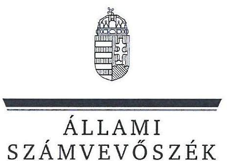
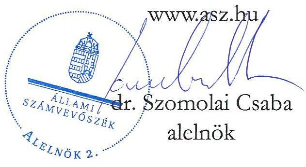
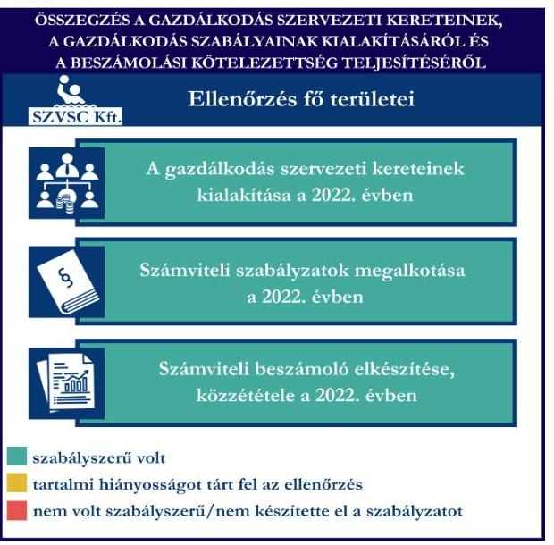
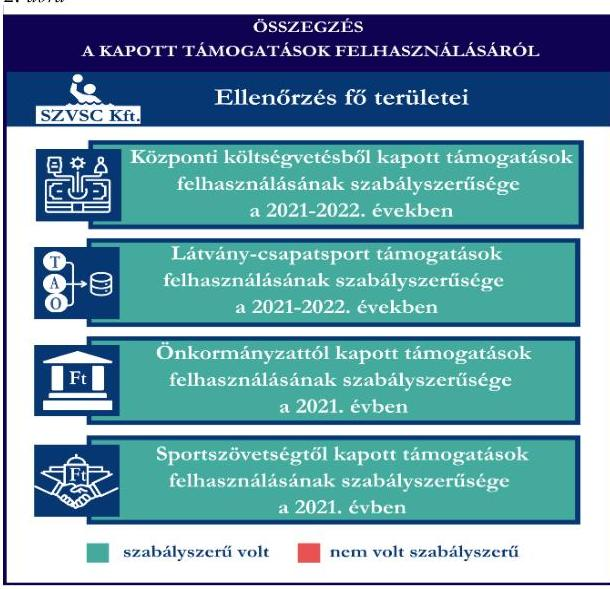
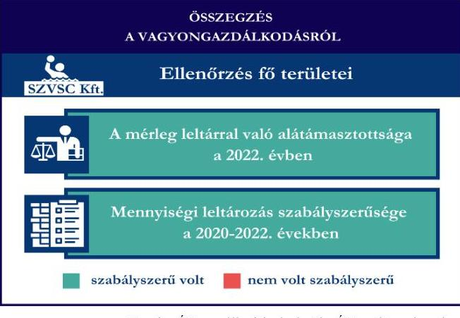

# JELENTÉS 

## Támogatásban részesülő sportszövetségek, sportegyesületek és sportvállalkozások gazdálkodásának ellenőrzése

Szolnoki Vízilabda Sport Club Korlátolt Felelősségű Társaság

2024.

---

ÁLLAMI
SZÁMVEVŐSZÉK

# JELENTÉS 

## Támogatásban részesülő sportszövetségek, sportegyesületek és sportvállalkozások gazdálkodásának ellenőrzése

## Szolnoki Vízilabda Sport Club Korlátolt Felelősségű Társaság

2024. 

24191

---

# ELLENŐRZÉSI IGAZGATÓSÁG: 

ÁLLAMHÁZTARTÁSON KÍVÜLI SZERVEZETEKET ELLENŐRZŐ IGAZGATÓSÁG

ELLENŐRZÉSI IGAZGATÓ:
KLINGA LÁSZLÓ igazgató

ELLENŐRZÉSVEZETŐ:
Jelentéseink az interneten a www.asz.hu címen olvashatók.

KAKAS SÁNDOR ellenőrzésvezető

IKTATÓSZÁM: EL-4031-014/2024
TÉMASORSZÁM: 30
ELLENŐRZÉS-AZONOSÍTÓ SZÁM: V1078

---

# TARTALOMJEGYZÉK 

- AZ ELLENŐRZÉS ALAPADATAI ..... 5
- AZ ELLENŐRZÖTT SZERVEZET ..... 7
- ÖSSZEFOGLALÁS ..... 8
- AZ ELLENŐRZÉS FÓKUSZTERÜLETEI ..... 10
- MEGÁLLAPÍTÁSOK ..... 11
- JAVASLATOK ..... 16
- MELLÉKLETEK ..... 17
I. sz. melléklet: Értelmező szótár ..... 17
II. sz. melléklet: Az ellenőrzött szervezetek jegyzéke ..... 19
III. sz. melléklet: Fő ellenőrzési kritériumok fő ellenőrzési fókuszterületek szerint. ..... 20
- FÜGGELÉK: ÉSZREVÉTELEK ..... 21
- RÖVIDÍTÉSEK JEGYZÉKE ..... 22

---

.

---

# AZ ELLENŐRZÉS ALAPADATAI 

## AZ ELLENŐRZÉS CÉLJA

Az ellenőrzés célja az államháztartásból nyújtott támogatással, vagy az államháztartásból meghatározott célra ingyenesen juttatott vagyon felhasználásával érintett sportszövetségek, sportegyesületek és sportvállalkozások gazdálkodása szabályozottságának, gazdálkodási tevékenységének, ezen belül a beszámolási kötelezettség teljesítésének, a támogatások elkülönített nyilvántartásának, valamint a támogatások felhasználásának ellenőrzése.

## AZ ELLENŐRZÉS TÍPUSA

Kombinált ellenőrzés.

## AZ ELLENŐRZŐTT IDŐSZAK

Az 1. fókuszterület vonatkozásában a 2022. év.
A 2. fókuszterület vonatkozásában a 2021-2022. évek.
A 3. fókuszterület vonatkozásában a 2022. év, a mennyiségi felvétellel történő leltározás dokumentumai tekintetében a 2020-2022. évek.

## AZ ELLENŐRZÉS TÁRGYA

Az ellenőrzés tárgyát képezte a támogatásban részesülő sportegyesület gazdálkodása szabályozottságának, gazdálkodási tevékenységén belül a beszámolási kötelezettség teljesítésének, a vagyonnyilvántartásának, a támogatások elkülönített nyilvántartásának, valamint az államháztartási forrásból származó közvetlen vagy közvetett támogatások és a meghatározott célra ingyenesen juttatott vagyon felhasználásának vizsgálata. Az ellenőrzés a támogatások vonatkozásában kiterjedt továbbá a támogató felé történő beszámolási és elszámolási kötelezettségek teljesítésére, a jogszabályi és belső előírások betartására.

Az ellenőrzés kiterjedt minden olyan körülményre és adatra, amely az ÁSZ ${ }^{1}$ jogszabályban meghatározott feladatainak teljesítéséhez, valamint az ellenőrzési program végrehajtása során felmerülő újabb összefüggések feltárásához szükséges volt.

## AZ ELLENŐRZÉS JOGALAPJA

Az ellenőrzés jogszabályi alapját az ÁSZ tv. ${ }^{2} 1 . \int(3)$ bekezdése, az 5. $\int(3)$ bekezdése előírásai képezték.

---

# AZ ELLENŐRZÉS MÓDSZERE 

Az ellenőrzést a nemzetközi standardokat irányadónak tekintve az ellenőrzési program szempontjai, az ellenőrzött időszakban hatályos jogszabályok, az ellenőrzés általános szakmai szabályai, az ellenőrzésre irányadó ÁSZ módszertanok figyelembevételével végezte az ÁSZ.

Az ellenőrzési kérdések megválaszolásához szükséges bizonyítékok megszerzése az ellenőrzött szervezet által rendelkezésre bocsátott dokumentumokra, adatokra alapozva kérdésfeltevés (információkérés), interjú, mintavételezés útján történt.

Az ellenőrzési bizonyítékként felhasználható adatforrások közé tartoztak egyrészt az ellenőrzés során az ellenőrzött szervezettől bekért dokumentumok, másrészt adatforrás volt minden további, az ellenőrzés folyamán feltárt, az ellenőrzés szempontjából információt tartalmazó egyéb adatforrás.

A támogatásokkal, azok felhasználásával, kapcsolatos kötelezettségek vizsgálatára mintavételi eljárások kerültek alkalmazásra. Támogatás-típusok szerint nagyságrend alapján egy darab támogatás képezte a vizsgálat tárgyát. Ezen támogatások felhasználásának szabályszerűsége támogatásonként kockázatértékelés alapján kiválasztott tételekkel került ellenőrzésre. A kiválasztott támogatási szerződésekhez kapcsolódó elszámolásokból 30 db tétel került ellenőrzésre, ahol az elszámolás nem érte el a 30 db -ot, ott tételes ellenőrzésre került sor. Ezen felül a vagyongazdálkodás szabályszerűségének ellenőrzéséhez is kockázatalapú mintavétel kapcsolódott. A támogatások felhasználása és a vagyongazdálkodás területén a tételek ellenőrzése kiterjedt a könyvvezetési kötelezettség vizsgálatára is. A tárgyi eszközök tekintetében 30 db került kiválasztásra a 2022. évben állományban lévő eszközök közül azok nyilvántartásának, elszámolásának szabályszerűsége ellenőrzése céljából. A kiválasztott tételek ellenőrzésének eredménye nem került kivetítésre a teljes sokaságra, a megállapítások az adott ellenőrzött tételek vonatkozásában kerültek megjelenítésre.

---

# AZ ELLENŐRZÖTT SZERVEZET

A Szolnoki Vízilabda Sport Club Korlátolt Felelősségű Társaság 1999. február 1-jén jött létre. Az SZVSC Kft. ${ }^{3}$ egyszemélyes korlátolt felelősségű társaságként működik, egyetlen tagja - 2013. november 28 -tól - a Szolnoki Vízilabdázás Jövőjéért Alapítvány.

Az SZVSC Kft. fő tevékenysége az Alapító okirat ${ }^{4}$ szerint „Sport, szabadidős képzés", „Egyéb sporttevékenység", célja a szolnoki vízilabdasport fejlődésének elősegítése, a sportág utánpótlásának gondozása, tehetséges gyermekek felkutatása.

Az SZVSC Kft. legfőbb döntéshozó szerve a taggyűlés, törvényes képviseletét - az önálló képviseleti joggal rendelkező - egy fő ügyvezető és egy fő cégvezető látta el.

Az ellenőrzött időszakban az SZVSC Kft. a jogszabályi előírások alapján nem volt könyvvizsgálatra kötelezett, azonban saját döntése szerint a beszámoló könyvvizsgálóval történő felülvizsgálatát írta elő. Az SZVSC Kft. felügyelőbizottság létrehozására jogszabályi előírások alapján nem volt kötelezett, azonban az Alapító okiratban előírta a felügyelőbizottság működtetését.

Az SZVSC Kft. az ellenőrzött időszakban vállalkozási tevékenységet folytatott.

|  AZ SZVSC KFT. ÁLTAL IGÉNYBE VETT TÁMOGATÁSOK (ADATOK M FT-BAN) |  |   |
| --- | --- | --- |
|   | 2021. FV | 2022. FV  |
|  Központi költségvetési támogatás | 53,3 | 250,0  |
|  Látvány-csapatsport támogatás | 133,7 | 191,9  |
|  Helyi önkormányzati támogatás | 40,4 | 123,0  |
|  Magyar Vízilabda Szövetségtől kapott támogatás | - | 18,4  |
|  Magyar Úszó Szövetségtől kapott támogatás | 1,4 | -  |

---

# ÖSSZEFOGLALÁS 

Magyarország Alaptörvényének XX. cikke kimondja, hogy mindenkinek joga van a testi és lelki egészséghez, melynek érvényesülését Magyarország többek között a sportolás és a rendszeres testedzés támogatásával segíti elő. Az Országgyűlés a Sport tv. ${ }^{5}$-ben kinyilvánította, hogy a nemzet közössége a test művelését, a sportot, a nemzet alapértékének, kívánatos célnak tekinti. A sport a közjó része. Erősíti a közösség tagjainak egymáshoz tartozását, miként az egyén testi és lelki egészségét.

A sportegyesületek, sportszövetségek, sportvállalkozások müködésükre és szakmai tevékenységük ellátására költségvetési támogatásban, önkormányzati támogatásban, ingyenes vagyonjuttatásban, valamint látvány-csapatsport támogatásban részesülhetnek, amelyekre fokozott figyelem irányul.

A társadalom részéről jogosan felmerülő elvárás, hogy a közpénzeket kezelő, azzal gazdálkodó szervezetek müködéséről, tevékenységéről átfogó képet kapjon, a közpénzek rendeltetésszerủ és átlátható módon történő felhasználásának értékelésére időről-időre sor kerüljön az ellenőrzések keretében.

Az SZVSC Kft. a könyvviteli szolgáltatás személyi feltételeinek megteremtéséről gondoskodott, saját döntése alapján felügyelőbizottság létrehozásáról továbbá beszámolója könyvvizsgálattal való felülvizsgálatáról gondoskodott. A jogszabályi előírások szerint az SZVSC Kft. kialakította a számviteli politikáját, valamint elkészítette számviteli szabályzatait, továbbá rendelkezett számlarenddel.

Az SZVSC Kft. könyvvezetési formája a 2022. évben megfelelt a jogszabályi előírásoknak. A számviteli beszámoló készítési- és közzétételi kötelezettségét a jogszabályban előírtak szerint teljesítette.

A gazdálkodás szervezeti keretei kialakításának, a számviteli szabályzatok megalkotásának, valamint a számviteli beszámoló elkészítésének és közzétételének

értékelését az 1. ábra mutatja be.
2. ábra

Forrás: ÁSZ megállapítások alapján ÁSZ saját szerkesztés

Az SZVSC Kft. a 2021. és 2022. évben a központi költségvetésből kapott támogatást, a látvány-csapatsport támogatást és kiegészítő támogatást, valamint a 2021. évben az önkormányzati támogatást és a MÚSZ ${ }^{6}$-tól kapott támogatást az ellenőrzött tételek esetében a támogatási célnak megfelelően, szabályszerűen használta fel.

A központi költségvetési támogatás, a látványcsapatsport és kiegészítő támogatás továbbá az önkormányzati támogatás felhasználását a jogszabályi előírás ellenére nem teljeskörűen tartotta elkülönítetten nyilván. A MÚSZ-tól kapott támogatás felhasználását könyvvezetésében elkülönítette.

A kapott támogatások felhasználásának értékelését a 2. ábra mutatja be.

---

Az SZVSC Kft. vagyongazdálkodása a 2022. évben az ellenőrzött tételek vonatkozásában szabályszerű volt. A 2022. évi egyszerűsített éves beszámolójának mérlegtételeit szabályszerű leltárral alátámasztotta, továbbá a 2022. évre vonatkozóan a tárgyi eszközök esetében a mennyiségi felvétellel történő leltározást szabályszerűen elvégezte.

Az ellenőrzött tételek esetében a tárgyi eszközök üzembe helyezése, a bekerülési érték, az értékcsökkenés meghatározása szabályszerű volt.

A vagyongazdálkodás értékelését a 3. ábra mutatja be.

Forrás: ÁSZ megállapítások alapján ÁSZ saját szerkesztés

---

# AZ ELLENŐRZÉS FÓKUSZTERÜLETEI 

1.     - A gazdálkodási szabályok kialakítása, a könyvvezetési- és beszámolási kötelezettség teljesítése
2.     - A kapott támogatások felhasználása
3.     - Az ellenőrzött szervezet vagyongazdálkodása

---

# 1. A gazdálkodási szabályok kialakítása, a könyvvezetési- és beszámolási kötelezettség teljesítése 

Összegző megállapítás Az SZVSC Kft. 2022. évre vonatkozóan a jogszabályokban előírt szervezeti keretek kialakításával, a gazdálkodást biztosító belső szabályozó eszközök és számviteli keretek megalkotásával megteremtette a szabályszerű gazdálkodásának feltételeit. A könyvvezetési kötelezettség teljesítése, a beszámolási- és közzétételi kötelezettség szabályszerű volt.

Az SZVSC Kft. a Számv. tv. ${ }^{7}$ előírásainak betartásával gondoskodott a könyvviteli szolgáltatás személyi feltételeinek megteremtéséről, mert a könyvviteli szolgáltatás körébe tartozó feladatok ellátásával olyan számviteli szolgáltatást nyújtó társaságot bízott meg, amelynek a feladat irányításával, vezetésével, a beszámoló elkészítésével megbízott tagja megfelelt a jogszabályi követelményeknek.
Az SZVSC Kft. saját döntése alapján az Alapító okiratban foglaltakkal összhangban három tagú felügyelőbizottságot hozott létre, továbbá saját döntése alapján beszámolója felülvizsgálatával könyvvizsgálót bízott meg.
Az SZVSC Kft. a 2022. évre rendelkezett a Számv. tv.-ben előírt számviteli politikával ${ }^{8}$, és annak keretében elkészítette az eszközök és források értékelési szabályzatát ${ }^{9}$, az eszközök és források leltárkészítési és leltározási szabályzatát ${ }^{10}$ és a pénzkezelési szabályzatot ${ }_{1-3}{ }^{11}$. A szabályzatok az ellenőrzött tartalmi kritériumoknak megfeleltek. Az SZVSC Kft. rendelkezett a Számv. tv. szerinti számlarenddel ${ }^{12}$ és bizonylati renddel ${ }^{13}$.
Az SZVSC Kft. a Számv. tv. előírásainak megfelelően a 2022. évben kettős könyvvitelt vezetett. Az SZVSC Kft. könyvvezetési rendszerét a Számv. tv.-ben foglaltaknak megfelelően úgy részletezte tovább, hogy az alapján a 107/2011. (VI.30.) Korm. rendelet ${ }^{14}$ által előírt adatok ellenőrizhető módon rendelkezésre álljanak.
Az SZVSC Kft. a Számv. tv. előírásainak megfelelően elkészítette a 2022. évre vonatkozó egyszerűsített éves beszámolóját. A 2022. évre vonatkozó egyszerűsített éves beszámolót az Alapító okirat rendelkezései alapján a felügyelőbizottság véleményezte, a Számv. tv. előírásainak megfelelően a könyvvizsgáló felülvizsgálta, a taggyűlés a Ptk.-ban foglaltaknak megfelelően határozattal jóváhagyta.
Az SZVSC Kft. a 2022. évi egyszerűsített éves beszámolóját a Számv. tv.-nek megfelelően letétbe helyezte és közzétette.

---

# 2. A kapott támogatások felhasználása 

| Összegző megállapítás | Az SZVSC Kft. a 2021. és 2022. évben a költségvetési támogatást, a látvány-csapatsport és kiegészítő támogatásokat továbbá 2021. évben az önkormányzati támogatást és a MÚSZ-tól kapott támogatást az ellenőrzött tételek esetében szabályszerűen használta fel. A központi költségvetési támogatás, a látvány-csapatsport és kiegészítő támogatások továbbá az önkormányzati támogatás felhasználásának elkülönített nyilvántartása terén az ellenőrzés hiányosságot tárt fel. |
| :--: | :--: |

Az SZVSC Kft. a IX.1203-7/2022. számú támogatói okirattal ${ }^{15}$ (létesítmény-üzemeltetés és sportszakmai feladatok ellátásának céljára) 2021. és 2022. évben nyújtott központi költségvetési támogatás bevételeit könyvvezetésében a Számv. tv. előírásai szerint az egyéb bevételek között elkülönítette. Az SZVSC Kft. a támogatás felhasználásáról Szolnok Megyei Jogú Város Önkormányzata - az EMMI ${ }^{16}$ által nyújtott támogatás lebonyolítója - felé benyújtott beszámolót és annak részeként az összesített elszámolási táblázatot a 27/2013. (III.29.) EMMI rendeletben ${ }^{17}$ és a támogatói okiratban előírt formában és tartalommal az előírt határidőt betartva elkészítette, melyet a támogató elfogadott.
Az SZVSC Kft. esetében a központi költségvetésből kapott támogatás ellenőrzött tételeinek ( 30 db ) vonatkozásában az alábbiak kerültek megállapításra:

- a tételek számviteli elszámolását a Számv. tv.-ben előírtak szerint bizonylatokkal alátámasztották;
- a támogatási szerződésben ${ }^{18}$ foglaltaknak megfelelően a tételek gazdasági eseményének teljesítési időpontja a támogatói okiratban meghatározott támogatott tevékenység időtartamán belül történt;
- a támogatói okiratban meghatározott felhasználási határidőig megtörtént a tételek pénzügyi rendezése;
- a mintatételhez kapcsolódó számviteli bizonylatokat ellátták záradékkal, amelyben jelezték, hogy a számviteli bizonylaton szereplő összegből mennyit számolt el a hivatkozott támogatási szerződés terhére;
- a hivatkozott támogatói okirat terhére a számviteli bizonylaton záradékolt összeg megegyezett a számlaösszesítőben feltüntetett értékkel;
- a számviteli bizonylaton elszámolt/záradékolt - három tétel kivételével - megegyezett a támogatás felhasználásának elkülönített számviteli nyilvántartásában szereplő összeggel. A kivétel három tétel esetében a számviteli bizonylaton elszámolt/záradékolt összeg a támogatási szerződés 13. pontjában foglaltak ellenére nem szerepelt az elkülönített nyilvántartásban, mert a kiadások nem a támogatás elszámolására megnyitott, hanem az általános költségkódon szerepeltek;
- a tételek számviteli bizonylatának a hivatkozott támogatási szerződés terhére elszámolt összege a Számv. tv.-ben előírtak szerint tartalmának megfelelő főkönyvi számra került elszámolásra.
Az SZVSC Kft. a látvány-csapatsport támogatások esetében a 2021-2022. években eleget tett a 107/2011. (VI. 30.) Korm. rendeletben ${ }^{19}$ foglaltaknak, a támogatás felhasználásáról negyedévente az előrehaladási jelentéseket benyújtotta az MVLSZ ${ }^{20}$ felé.

---

Az SZVSC Kft. a be/SFP-0647/2020/MVLSZ számú sportfejlesztési program alapján kapott látványcsapatsport támogatás és kiegészítő támogatás felhasználásáról a 107/2011. (VI. 30.) Korm. rendeletnek megfelelően záradékolt számviteli bizonylatokkal alátámasztott módon, összesített elszámolási táblázattal és szöveges szakmai beszámolóval, könyvvizsgálói hitelesítéssel az előírt határidőben benyújtotta az elszámolást a támogató felé. A könyvvizsgáló a jogszabályban előírt felelősségbiztosítással rendelkezett.
Az SZVSC Kft. a 2021-2022. években a számára nyújtott látvány-csapatsport támogatást és kiegészítő támogatást a Számv. tv. előírásai szerint az egyéb bevételek között mutatta ki.
Az SZVSC Kft. az ellenőrzött időszakban rendelkezett a sportfejlesztési támogatás felhasználásának elkülönített nyilvántartásával, azonban az nem felelt meg teljeskörűen a 107/2011. (VI. 30.) Korm. rend. 9. § (9) bekezdés rendelkezéseinek, mivel nem minden elszámolt sportfejlesztési támogatás tételt tartalmazott.
Az SZVSC esetében a látvány-csapatsport támogatás és kiegészítő támogatás ellenőrzött tételeinek (30-17 darab) vonatkozásában az alábbiak kerültek megállapításra:

- a tételek számviteli elszámolását a Számv. tv.-ben és a 107/2011. (VI. 30.) Korm. rendeletben előírtak szerint bizonylatokkal alátámasztották;
- a 107/2011. (VI. 30.) Korm. rendeletben foglaltaknak megfelelően a tételek tartalma (gazdasági esemény) és összege alapján a támogatási igazolásban meghatározottak szerinti jogcímre, az abban meghatározott mértékben használták fel;
- a tételek számviteli bizonylatai alapján a gazdasági események a támogatási időszak végéig szerződés szerint teljesültek;
- a tételek számviteli bizonylatai alapján a gazdasági események pénzügyi rendezése az elszámolás benyújtására nyitva álló határidőig teljesült;
- a tételek számviteli bizonylatait 17 db látvány-csapatsport támogatás tétel és a 17 db kiegészítő támogatás tétel esetében a 107/2011. (VI. 30.) Korm. rendeletben foglaltaknak megfelelően ellátták záradékkal. A kivételt képező 13 db látványcsapat-sport kiadási tétel (,szállás" 1003738 Ft, „Abádszalók" 987613 Ft, „szállás, étkezés" 748542 Ft, „személyszállitás" 212597 Ft, „személyszállitás" 184649 Ft, „sporteszköz" 202773 Ft, „BVSC edzôtábor" 161501 Ft, „Eger edzôtábor" 149829 Ft, „Abádszalók edzôtábor" 97080 Ft, „sportszolgáltatás" 86134 Ft, „sportszolgáltatás" 80077 Ft, ,„öti csomag" 48046 Ft, „fôétkezés" 47938 Ft) esetében a 107/2011. (VI. 30.) Korm. rendelet 11. § (5) bekezdésében előírtak ellenére nem látták el záradékkal, ezzel nem jelezték, hogy az adott sportfejlesztési programhoz kapott támogatás részeként számolták el;
- a számviteli bizonylatokon záradékolt összegek - egy látványcsapat-sport támogatás és három kiegészítő támogatás tétel kivételével - megegyeztek a számlaösszesítőben feltüntetett értékekkel. A kivételt képező egy látvány-csapatsport támogatás (,bérköltség" 114795 Ft ) és három kiegészítő támogatás tétel (,bérköltség" 590863 Ft, „bérköltség" 590863 Ft, „bérköltség" 228242 Ft) esetében a 107/2011. (VI.30.) Korm. rendelet 11. § (5) bekezdésében előírtak ellenére a hivatkozott támogatási szerződés terhére a számviteli bizonylaton záradékolt összeg nem egyezik meg a számlaösszesítőben feltüntetett értékkel;
- nyolc látvány-csapatsport támogatás tétel (,sportrubázat" 8477702 Ft, „utánpótlás nevelés" 999141 Ft, „bérköltség" 628058 Ft, „bérköltség" 114795 Ft, „bérköltség" 295431 Ft, „sporteszéköz" 202773 Ft, „tárgyi eszköz" 36863 Ft, „személyi jellegü" 94384 Ft) és egy kiegészítő támogatás tétel (,személyi jellegü" 4333 Ft ) nem a hivatkozott sportfejlesztési támogatás felhasználásához kapcsolódó

---

munkaszámon került elkülönítésre a számviteli nyilvántartásban, ezzel a 107/2011. (VI. 30.) Korm. rend. 9. § (9) bekezdés rendelkezéseinek nem felelt meg;

- a tételek számviteli bizonylatának az adott sportfejlesztési program terhére záradékolt összegei a Számv. tv. előírtak szerint a tartalmuknak megfelelő főkönyvi számra kerültek elszámolásra.
Az SZVSC Kft. a 2021. évben a XI.55465-2/2020. számú sportlétesítmény üzemeltetés célú támogatási szerződés szerint a számára juttatott önkormányzati támogatás bevételeit a Számv. tv. előírásai szerint egyéb bevételei között elkülönítve tartotta nyilván.
Az SZVSC Kft. a támogatás felhasználásáról az Áht. ${ }^{21}$-ban és a XI.55465-2/2020. számú támogatási szerződésben előírtak szerint beszámoló és számviteli bizonylatokról készített összesítő benyújtásával az előírt határidőben elszámolt, melyet a támogató elfogadott.
Az SZVSC Kft. esetében az önkormányzati támogatás ellenőrzött tételeinek vonatkozásában ( 30 db ) az alábbiak kerültek megállapításra:
- a tételek számviteli elszámolását a Számv. tv.-ben előírtak szerint bizonylatokkal alátámasztották;
- az Ávr. ${ }^{22}$-ben foglaltaknak megfelelően a tétel gazdasági eseményének teljesítése a támogatási szerződésben meghatározott támogatott tevékenység időtartamán belül történt;
- az Ávr.-ben előírtak szerint a támogatási szerződésben meghatározott felhasználási határidőig megtörtént a tétel pénzügyi rendezése;
- a tételek számviteli bizonylatát az Ávr. és a támogatás szerződés előírása szerint záradékkal látták el, a bizonylaton záradékolt összegek megegyeztek az elszámolási összesítőben szereplő értékkel;
- a támogatási szerződés 2. pontjában előírtak ellenére a tételek elkülönített nyilvántartása nem valósult meg, mert 23 db tétel (,épületgépészeti szolgáltatás" 8120000 Ft, ,energiadij" 1392728 Ft, „energiadij" 1339829 Ft, „energiadij" 1331993 Ft, „világitás javitás" 725000 Ft, „LED karbantartás" 660000 Ft , „munkaruba" 577250 Ft , „PCR teszt" 546000 Ft , „COVID teszt" 507000 Ft , „COVID teszt" 390000 Ft , „vegyszer" 468000 Ft , „Burkolóanyag" 404017 Ft , „Grafikai megjelenés" 331500 Ft, „informatikai karbantartás" 342250 Ft, „könyvvezetési dij" 300000 Ft, „könyvvezetési dij" 100000 Ft, „öltözösszekrény" 280000 Ft, „diagnosztikai teszt" 2258000 Ft, „burkolás" 247000 Ft, „vegyszer" 222200 Ft , „vegyszer" 222200 Ft , „jogi tanácsadás" 210000 Ft , „tintapatron" 179000 Ft) a támogatáshoz rendelt „ONK2020" munkaszám helyett egyéb munkaszámhoz lettek rendelve, kettő tétel (,kiszállás" 257420 Ft , „munkapad" 99712 Ft ) egyáltalán nem szerepelt a támogatás felhasználásának elkülönített számviteli nyilvántartásában, négy tétel (,munkavállaló munkabér" 500000 Ft, 127648 Ft, 300752 Ft, 565846 Ft összegek) esetében a munkabérek egy-egy hónapra vonatkozóan összesítve és nem személyenként kerültek elszámolásra az elkülönített nyilvántartásban, míg egy mintatétel 2020. évi, így az elkülönítés megfelelősége nem kontrollálható, hogy megegyezik-e a támogatás felhasználásának elkülönített számviteli nyilvántartásában szereplő összeggel;
- a tételek számviteli bizonylatának a támogatás terhére záradékolt összege a Számv. tv.-ben előírtak szerinti, tartalmának megfelelő főkönyvi számra került elszámolásra.
Az SZVSC Kft. a MÚSZ-tól a „Covid1 okozta károk konszolidálására" jogcímen kapott támogatás bevételeit 2021. évben a Számv. tv. előírásai szerint egyéb bevételei között elkülönítve tartotta nyilván, a támogatás felhasználásáról elkülönített nyilvántartást vezetett.

---

Az SZVSC Kft. a támogatási szerződés rendelkezéseinek megfelelően elszámolási összesítő benyújtásával teljesítette a támogatás rendeltetésszerú felhasználására vonatkozó beszámolási kötelezettségét.
Az SZVSC Kft. esetében a MÚSZ-tól kapott támogatás ellenőrzött tételeinek (9 darab) vonatkozásában az alábbiak kerültek megállapításra:

- a tételek számviteli elszámolását a Számv. tv.-ben előírtak szerint bizonylatokkal alátámasztották;
- a tétel gazdasági eseményének teljesítése a támogatási szerződésben meghatározott támogatott tevékenység időtartamán belül történt;
- a támogatási szerződésben meghatározott felhasználási határidőig megtörtént a tétel pénzügyi rendezése;
- a tételek számviteli bizonylatát a támogatási szerződés előirása szerint záradékkal látták el;
- a tételek számviteli bizonylatának a támogatás terhére záradékolt összege a Számv. tv.-ben előírtak szerinti, tartalmának megfelelő főkönyvi számra került elszámolásra.

# 3. Az ellenőrzött szervezet vagyongazdálkodása 

## Összegző megállapítás Az SZVSC Kft. vagyongazdálkodása az ellenőrzött tételek vonatkozásában a 2022. évben szabályszerű volt.

Az SZVSC Kft. a Számv. tv.-nek megfelelően a 2022. évi egyszerűsített éves beszámolójának mérlegtételeit szabályszerű leltárral alátámasztotta.
A Számv. tv. előírásaival összhangban a 2022. évre vonatkozóan a mennyiségi felvétellel történő leltározást elvégezte.
Az SZVSC Kft. esetében a tárgyi eszköz ellenőrzött tételek ( 30 db ) vonatkozásában az alábbiak kerültek megállapításra:

- a tételek bekerülési értékét a Számv. tv.-nek megfelelően bizonylattal alátámasztották;
- a tárgyi eszközök számviteli besorolása megfelelt a Számv. tv. előírásainak;
- a tárgyi eszközök üzembe helyezésének tényét és időpontját a Számv. tv.-nek megfelelően hitelt érdemlően dokumentálták;
- az értékcsökkenés elszámolása a Számv. tv.-nek megfelelően történt;
- a támogatásból megvalósult 26 db tétel esetén a tárgyi eszköz bekerülési értékét meghatározó számviteli bizonylatokat ellátták záradékkal, amelyből kiderül, hogy a számviteli bizonylaton szereplő összegből mennyit számoltak el a hivatkozott támogatás terhére.

---

# JAVASLATOK 

Az ÁSZ tv. 33. § (1) bekezdésében foglaltak értelmében az ellenőrzött szervezet vezetője köteles a jelentésben foglalt megállapításokhoz kapcsolódó intézkedési tervet összeállítani és azt a jelentés kézhezvételétől számított 30 napon belül az ÁSZ részére megküldeni. Amennyiben az ellenőrzött szervezet vezetője nem küldi meg határidőben az intézkedési tervet, vagy továbbra sem elfogadható intézkedési tervet küld, az Állami Számvevőszék elnöke az ÁSZ tv. 33. § (3) bekezdése a) és b) pontjaiban foglaltakat érvényesítheti.

## SzOLNOKI Vízilabda Sport Club KorLÁtolt FelelőssÉGŰ TÁRSASÁG ÜGYVEZETŐJÉNEK

1. Gondoskodjon arról, hogy a központi költségvetési támogatások és önkormányzati támogatások felhasználását a támogatói okiratban, illetve támogatási szerződésben foglalt előirásoknak megfelelően elkülönítetten tartsa nyilván.
2. Gondoskodjon arról, hogy a látvány-csapatsport támogatás felhasználását alátámasztó bizonylat a 107/2011. (VI.30.) Korm. rendelet 11. §. (5) bekezdésében előírtak szerint kerüljön záradékolásra.
3. Gondoskodjon arról, hogy a látvány-csapatsport támogatás és kiegészítő támogatások felhasználását a 107/2011. (VI. 30.) Korm. rendelet 9. § (9) bekezdésében foglalt előirásoknak megfelelően elkülönítetten tartsa nyilván.

---

# MELLÉKLETEK 

## I. SZ. MELLÉKLET: ÉRTELMEZŐ SZÓTÁR

Civil szervezet

Egyesület

Kiegészítő sportfejlesztési támogatás

Költségvetési támogatás

Közhasznú szervezet

Közhasznú tevékenység

Látvány-csapatsport támogatás

Látvány-csapatsportban múködő amatőr sportszervezet

Látvány-csapatsportban múködő hivatásos sportszervezet

A civil társaság; a Magyarországon nyilvántartásba vett egyesület - a párt, a szakszervezet és a kölcsönös biztosító egyesület kivételével és - a közalapítvány és a pártalapítvány kivételével - az alapítvány. (Forrás: Civil tv. 2. §6. pont a)-c) alpontjai)
Az egyesület a tagok közös, tartós, alapszabályban meghatározott céljának folyamatos megvalósítására létesített, nyilvántartott tagsággal rendelkező jogi személy. (Forrás: Ptk. 3:63. § (1) bekezdés)
A Számv. tv. szempontjából egyéb szervezet. (Számv. tv. 3. § (1) bekezdés 4. pont a) alpontja)

A látvány-csapatsportok támogatása esetében rendelkező nyilatkozatban felajánlott összeg 12,5 százaléka kiegészítő sportfejlesztési támogatásnak minősül. (Forrás: Tao tv. ${ }^{23}$ 24/A. § (9) bekezdés)
A társadalombiztosítás pénzügyi alapjai kivételével az államháztartás központi alrendszeréből ellenérték nélkül, pénzben nyújtott támogatások. (Forrás: Áht. 1. § 14. pont)
Közhasznú szervezetté minősíthető a Magyarországon nyilvántartásba vett közhasznú tevékenységet végző szervezet, amely a társadalom és az egyén közös szükségleteinek kielégítéséhez megfelelő erőforrásokkal rendelkezik, továbbá amelynek megfelelő társadalmi támogatottsága kimutatható, és amely:
a) civil szervezet (ide nem értve a civil társaságot), vagy
b) olyan egyéb szervezet, amelyre vonatkozóan a közhasznú jogállás megszerzését törvény lehetővé teszi. (Forrás: Civil tv. 32. § (1) bekezdés)
Minden olyan tevékenység, amely a létesítő okiratban megjelölt közfeladat teljesítését közvetlenül vagy közvetve szolgálja, ezzel hozzájárulva a társadalom és az egyén közös szükségleteinek kielégítéséhez.
(Forrás: Civil tv. 2. § 20. pont)
Az adóévben visszafizetési kötelezettség nélkül nyújtott támogatás, juttatás, véglegesen átadott pénzeszköz és térítés nélkül átadott eszköz könyv szerinti értéke, az adóévben térítés nélkül nyújtott szolgáltatás bekerülési értéke a Tao tv.-ben meghatározott jogcímeken. (Forrás: Tao tv. 4. § 44. pont)
Minden olyan, a sportról szóló törvényben meghatározott szabályok szerint a látvány-csapatsportban múködő sportegyesület vagy sportvállalkozás, amelyik nem minősül a látvány-csapatsportban múködő hivatásos sportszervezetnek. (Forrás: Tao tv. 4. § 42. pont)
A látvány-csapatsportágak országos sportági szakszövetsége által kiírt versenyrendszer legmagasabb felnőtt bajnoki osztályában - a veterán korosztályokra kiírt versenyrendszer kivételével - részt vevő (indulási jogot elnyert) sportszervezet, vagy alsóbb bajnoki osztályaiban részt vevő (indulási jogot elnyert) sportszervezet abban az esetben, ha az ilyen sportszervezet hivatásos sportolót alkalmaz. Több látvány-csapatsportban több jogi személy szervezeti egységgel (szakosztállyal) múködő sportszervezet esetén csak az a jogi személy szervezeti egység (szakosztály), amely a fent részletezett versenyrendszerek bajnoki osztályaiban részt vesz. (Forrás: Tao tv. 4. § 43. pont)

---

Országos sportági szakszövetség

Sportági szövetség

Sportegyesület

Sportegyesületeknek, sportszövetségeknek nyújtott költségvetési támogatás

Sportszövetsé

Sporttevékenység

Sportvállalkozás

Olyan sportszövetség, amely sportágában kizárólagos jelleggel az e törvényben, valamint más jogszabályokban meghatározott feladatokat lát el és e törvényben megállapított különleges jogosítványokat gyakorol. Olyan sportágban hozható létre, amelyet vagy a Nemzetközi Olimpiai Bizottság elismert, vagy amely sportág nemzetközi szövetségét felvették a Nemzetközi Sportszövetségek Szövetségébe (GAISF). (Forrás: Sport tv. 20. § (1), (4) bekezdés)

A Civil tv. és a Ptk. előírásai alapján - a Sport tv.-ben meghatározott eltérésekkel - müködő szövetség, amelynek tagjai kizárólag sportszervezetek lehetnek. Sportági szövetség országos jelleggel is müködhet. Egy sportágban csak egy országos sportági szövetség müködhet. Törvényi feltételek teljesülése esetén szakszövetségi feladatokat is elláthat.
(Forrás: Sport tv. 28. §)
A Civil tv. és a Ptk. szabályai szerint müködő olyan egyesület, amelynek alaptevékenysége a sporttevékenység szervezése, valamint a sporttevékenység feltételeinek megteremtése. A sportegyesületek a Sport tv. 15. § (1) bekezdésében meghatározott sportszervezetek körébe tartoznak. A sportegyesületeken kívül sportszervezet még a sportvállalkozás, a sportiskola, valamint az utánpótlás-nevelés fejlesztését végző alapítvány. (Forrás: Sport tv. 16. § (1) bekezdés)
Az állami sport célú támogatások felhasználásáról és elosztásáról szóló 474/2016. (XII. 27.) Korm. rendelet és a 27/2013. (III. 29.) EMMI rendelet 1. §-ában meghatározott fejezeti kezelésű előirányzatokból nyújtott támogatás.
Meghatározott sporttevékenységek körében a sportversenyek szervezésére, a tagok érdekvédelmére és a részükre való szolgáltatásokra, valamint a nemzetközi kapcsolatok lebonyolítására létrehozott, jogi személyiséggel és önkormányzattal rendelkező, a Civil tv. és a Ptk. alapján - az e törvényben foglalt eltérésekkel - különös formában müködő egyesületek. A Sport tv. 19. § (3) bekezdése szerint a sportszövetségeknek az alábbi típusai léteznek: országos sportági szakszövetségek, sportági szövetségek, szabadidősport szövetségek, fogyatékosok sportszövetségei, diák- és egyetemi-főiskolai sport sportszövetségei, nemzetközi sportszövetségek. (Forrás: Sport tv. 19. $\S(1),(3)$ bekezdés)

Meghatározott szabályok szerint, a szabadidő eltöltéseként kötetlenül vagy szervezett formában, illetve versenyszerűen végzett testedzés vagy szellemi sportágban kifejtett tevékenység, amely a fizikai erőnlét és a szellemi teljesítőképesség megtartását, fejlesztését szolgálja. (Forrás: Sport tv. 1. § (2) bekezdés)

Az a gazdasági társaság, amelynek a cégnyilvántartásról, a cégnyilvánosságról és a bírósági cégeljárásról szóló törvény alapján a cégjegyzékbe bejegyzett tevékenysége sporttevékenység, továbbá a gazdasági társaság célja sporttevékenység szervezése, valamint a sporttevékenység feltételeinek megteremtése egy vagy több sportágban. Korlátolt felelősségű társasági, illetve részvénytársasági formában alapítható, a fogyatékosok sportja, illetve a szabadidősport területén közhasznú társaságként is müködhet.
(Forrás: Sport tv. 18. §)

---

II. SZ. MELLÉKLET: AZ ELLENŐRZÖTT SZERVEZETEK JEGYZÉKE

| ELLENŐRZÖTT SZERVEZET NEVE | ELLENŐRZÖTT SZERVEZET SZÉKHELYE |
| :-- | :-- |
| Szolnoki Vízilabda Sport Club Korlátolt Felelősségű Társaság | 5000 Szolnok, Tiszaligeti sétány 9691/2 hrsz. |

---

# III. SZ. MELLÉKLET: FŐ ELLENŐRZÉSI KRITÉRIUMOK FŐ ELLENŐRZÉSI FÓKUSZTERŰLETEK SZERINT 

## FŐ ELLENŐRZÉSI FÓKUSZTERŰLETEK

1. A gazdálkodási szabályok kialakítása, a könyvvezetési és beszámolási kötelezettség teljesítése
2. Az kapott támogatások felhasználása
3. Az ellenőrzött szervezet vagyongazdálkodása

## FŐ ELLENŐRZÉSI KRITÉRIUMOK

Ptk. 3:26. § (1) bekezdés, 3:27. § (1) bekezdés, 3:82. § (1)(2) bekezdés

Számv. tv. 4. §, 6. § (2) bekezdés, 12. §, 14. § (3), (5) bekezdés a), b), d) pont, (8) bekezdés, (11)-(12) bekezdés, 69. § (1), (3) bekezdés, 90. § (3) bekezdés c) pont, 96. § (4) bekezdés, 150. § (2) bekezdés, 153. § (1) bekezdés, 154. § (1) bekezdés, 161. § (1) bekezdés, (2) bekezdés a)-d) pont, (3)-(4) bekezdés, 161/A. § (1)-(2) bekezdés, 165. § (2) bekezdés

Tao tv. 22/C. §
107/2011. (VI.30.) Korm. rendelet 9. § (9) bekezdés
Áht. 52. § (1) bekezdés, 53. §
Ávr. 76. § (1) bekezdés c) pont, 93. § (1)-(3), (5) bekezdés
Kbt. 5. § (2) bekezdés, 15. §
Számv. tv. 16. § (3) bekezdés, 25-26. §, 44. § (2) bekezdés, 45. § (1)-(2) bekezdés, 77. § (3) bekezdés b) pont, 78-81. §, 159. §, 161/A. § (2) bekezdés, 162. § (1) bekezdés, 165. § (1)-(2) bekezdés, 166. § (1) bekezdés, 167. § (1) bekezdés a), d), e), h) pont

Tao. tv. 22/C. §, 24/A. § (9) bekezdés
107/2011. (VI.30.) Korm. rendelet 2. § (3b) bekezdés, 4. § (11) bekezdés, 5. § (1) bekezdés, 6. § (1) bekezdés e) pont, 9. § (8)-(10) bekezdés, 10. § (2), (2a), (2b), (4) bekezdés, 10. § (5a) bekezdés, 11. § (1), (1a), (1d), (1e), (2), (4), (4a), (5), (6) bekezdés, 13. § (1), (2a) bekezdés, 14. § (1), (4), (4b), (4c), (6c) bekezdés
275/2022. (VII.29.) Korm. rendelet 1. § (3)
444/2022. (XI.7) Korm. rendelet 2. §
474/2016. (XII. 27.) Korm. rendelet 26. § (3) bekezdés, 27/2013. (III.29.) EMMI rendelet ${ }^{24}$
Ptk. 3:63. § (4) bekezdés
Számv. tv. 15. § (3) bekezdés, 26. §, 46. § (3) bekezdés, 4753. §, 57. §, 69. § (1)-(6) bekezdés, 165-166. §, 169. § (2) bekezdés

Tao tv. 22/C (6) bekezdés a), d), e) pont, (11) bekezdés
Ávr. 93. § (5) bekezdés
107/2011. (VI.30.) Korm. rendelet 11. § (5) bekezdés
474/2016. (XII. 27.) Korm. rendelet 17. § (1) bekezdés 11a. a) pont, 11b. pont, 17. § (2a) bekezdés, 24. § (2) bekezdés

---

# FÜGGELÉK: ÉSZREVÉTELEK 

A jelentéstervezetet a Számvevőszék 15 napos észrevételezésre megküldte az ellenőrzött szervezet vezetőjének az ÁSZ tv. 29. §* (1) bekezdése előírásának megfelelően.
A Szolnoki Vízilabda Sport Club Korlátolt Felelősségű Társaság ügyvezetője a jelentéstervezetre nem tett észrevételt.

[^0]
[^0]:    * 29. § (1) Az Állami Számvevőszék az ellenőrzési megállapításait megküldi az ellenőrzött szervezet vezetőjének vagy az általa megbízott személynek, és annak, akinek személyes felelősségét állapította meg.
    (2) Az ellenőrzött szervezet vezetője és a felelősként megjelölt személy az ellenőrzés megállapításaira tizenöt napon belül írásban észrevételt tehet.
    (3) Az Állami Számvevőszék az észrevételre a beérkezésétől számított harminc napon belül írásban válaszol. A figyelembe nem vett észrevételeket köteles a jelentésben feltüntetni, és megindokolni, hogy azokat miért nem fogadta el.

---

# RÖVIDÍTÉSEK JEGYZÉKE 

${ }^{1}$ ÁSZ
${ }^{2}$ ÁSZ tv.
${ }^{3}$ SZVSC Kft.
${ }^{4}$ Alapító okirat
${ }^{5}$ Sport tv.
${ }^{6}$ MÚSZ
${ }^{7}$ Számv. tv.
${ }^{8}$ számviteli politika
${ }^{9}$ eszközök és források értékelési szabályzata
${ }^{10}$ eszközök és források leltárkészítési és leltározási szabályzata
${ }^{11}$ pénzkezelési szabályzat ${ }_{1-3}$
${ }^{12}$ számlarend
${ }^{13}$ bizonylati rend
${ }^{14}$ 107/2011. (VI.30.) Korm. rendelet
${ }^{15}$ IX.1203-7/2022. számú támogatói okirat
${ }^{16}$ EMMI
${ }^{17}$ 27/2013. (III.29.) EMMI rendelet
${ }^{18}$ támogatási szerződés
${ }^{19}$ 107/2011. (VI.30.) Korm. rendelet
${ }^{20}$ MVLSZ
${ }^{21}$ Áht.
${ }^{22}$ Ávr.
${ }^{23}$ Tao tv.
${ }^{24}$ 27/2013. (III. 29.) EMMI rendelet

Állami Számvevőszék
2011. évi LXVI. törvény az Állami Számvevőszékről

Szolnoki Vízilabda Sport Club Kft.
A Szolnoki Vízilabda Sport Club Kft. 2019. augusztus 22-én kelt alapító okirata
2004. évi I. törvény a sportról

Magyar Úszó Szövetség
2000. évi C. törvény a számvitelről

Szolnoki Vízilabda Sport Club Kft. Számviteli politikája (hatályos: 2021. január 1-től)
Szolnoki Vízilabda Sport Club Kft. Eszközök és források értékelési szabályzata (hatályos: 2021. január 1-től)
Szolnoki Vízilabda Sport Club Kft. Eszközök és források leltárkészítési és leltározási szabályzata (hatályos: 2021. január 1-től)
Szolnoki Vízilabda Sport Club Kft. Pénzkezelési szabályzat ${ }_{1}$ (hatályos: 2018. január 1től 2021. augusztus 9-ig), Szolnoki Vízilabda Sport Club Pénzkezelési szabályzat ${ }_{2}$ (hatályos: 2021. augusztus 10-től 2022. október 16-ig), Szolnoki Vízilabda Sport Club Pénzkezelési szabályzat ${ }_{3}$ (hatályos: 2022. október 17-től)
Szolnoki Vízilabda Sport Club Kft. Számlarendje (hatályos: 2021. január 1-től)
Szolnoki Vízilabda Sport Club Kft. Bizonylati rend (hatályos: 2021. január 1-től)
107/2011. (VI. 30.) Korm. rendelet a látvány-csapatsport támogatását biztosító támogatási igazolás kiállításáról, felhasználásáról, a támogatás elszámolásának és ellenőrzésének, valamint visszafizetésének szabályairól
Az Emberi Erőforrások Minisztériuma és Szolnok Megyei Jogú Város Önkormányzatával kötött támogatói okirat, kelt 2022. március 11-én

Emberi Erőforrások Minisztériuma
27/2013. (III.29.) EMMI rendelet az állami sport célú támogatások felhasználásáról és elosztásáról
az EMMI IX/1203-7/2022. számú támogatói okirata alapján biztosított támogatási keret terhére Szolnok Megyei Jogi Város Önkormányzatával kötött támogatási szerződés, kelt 2022. március 16-án
107/2011. (VI. 30.) Korm. rendelet a látvány-csapatsport támogatását biztosító támogatási igazolás kiállításáról, felhasználásáról, a támogatás elszámolásának és ellenőrzésének, valamint visszafizetésének szabályairól
Magyar Vízilabda Szövetség
2011. évi CXCV. törvény az államháztartásról

368/2011. (XII. 31.) Korm. rendelet az államháztartásról szóló törvény végrehajtásáról
1996. évi LXXXI. törvény a társasági adóról és az osztalékadóról

27/2013. (III. 29.) EMMI rendelet az állami sport célú támogatások felhasználásáról és elosztásáról

---

1052 Budapest, Apáczai Csere János u. 10. | 1364 Budapest 4., Pf. 54
www.asz.hu | szamvevoszek@asz.hu
telefon: +36 14849100