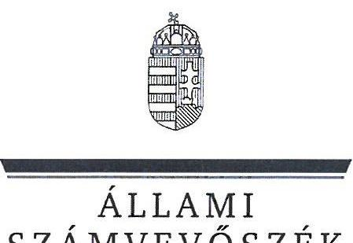
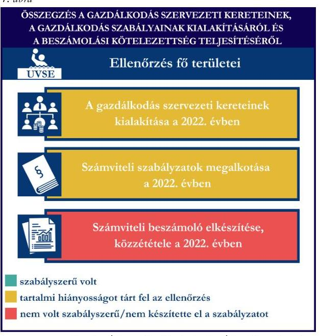
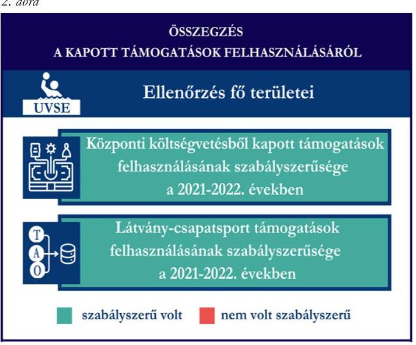
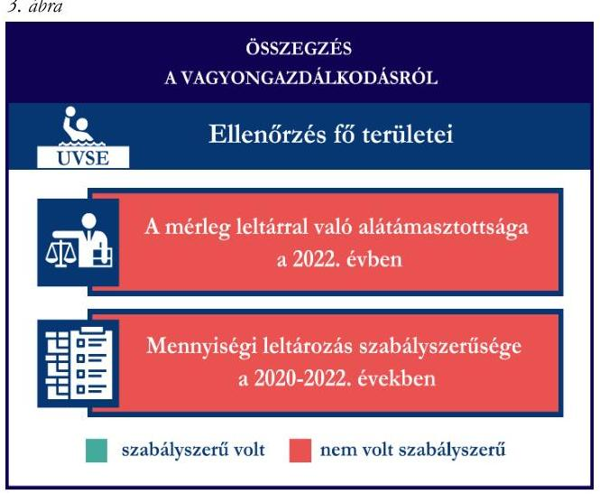

# JELENTÉS 

Támogatásban részesülő sportszövetségek, sportegyesületek és sportvállalkozások gazdálkodásának ellenőrzése

UVSE Vízilabda Sportegyesület

2024.

---

ÁLLAMI
SZÁMVEVŐSZÉK

# JELENTÉS 

## Támogatásban részesülő sportszövetségek, sportegyesületek és sportvállalkozások gazdálkodásának ellenőrzése

UVSE Vízilabda Sportegyesület

2024.

---

# ELLENŐRZÉSI IGAZGATÓSÁG: 

ÁLLAMHÁZTARTÁSON KÍVÜLI SZERVEZETEKET ELLENŐRZŐ IGAZGATÓSÁG

ELLENŐRZÉSI IGAZGATÓ:
KLINGA LÁSZLÓ igazgató

ELLENŐRZÉSVEZETŐ:
Jelentéseink az interneten a www.asz.hu címen olvashatók.

KAKAS SÁNDOR ellenőrzésvezető

IKTATÓSZÁM: EL-4031-013/2024
TÉMASORSZÁM: 30
ELLENŐRZÉS-AZONOSÍTÓ SZÁM: V1078

---

# TARTALOMJEGYZÉK 

AZ ELLENŐRZÉS ALAPADATAI ..... 5
AZ ELLENŐRZÖTT SZERVEZET ..... 7
ÖSSZEFOGLALÁS ..... 8
AZ ELLENŐRZÉS FÓKUSZTERÜLETEI ..... 10
MEGÁLLAPÍTÁSOK ..... 11
JAVASLATOK ..... 15
MELLÉKLETEK ..... 17
I. sz. melléklet: Értelmező szótár ..... 17
II. sz. melléklet: Az ellenőrzött szervezetek jegyzéke ..... 19
III. sz. melléklet: Fő ellenőrzési kritériumok fő ellenőrzési fókuszterületek szerint. ..... 20
FÜGGELÉK: ÉSZREVÉTELEK ..... 22
RÖVIDÍTÉSEK JEGYZÉKE ..... 23

---

.

---

# AZ ELLENŐRZÉS ALAPADATAI 

## AZ ELLENŐRZÉS CÉLJA

Az ellenőrzés célja az államháztartásból nyújtott támogatással, vagy az államháztartásból meghatározott célra ingyenesen juttatott vagyon felhasználásával érintett sportszövetségek, sportegyesületek és sportvállalkozások gazdálkodása szabályozottságának, gazdálkodási tevékenységének, ezen belül a beszámolási kötelezettség teljesítésének, a támogatások elkülönített nyilvántartásának, valamint a támogatások felhasználásának ellenőrzése.

## AZ ELLENŐRZÉS TÍPUSA

Kombinált ellenőrzés.

## AZ ELLENŐRZŐTT IDŐSZAK

Az 1. fókuszterület vonatkozásában a 2022. év.
A 2. fókuszterület vonatkozásában a 2021-2022. évek.
A 3. fókuszterület vonatkozásában a 2022. év, a mennyiségi felvétellel történő leltározás dokumentumai tekintetében a 2020-2022. évek.

## AZ ELLENŐRZÉS TÁRGYA

Az ellenőrzés tárgyát képezte a támogatásban részesülő sportegyesület gazdálkodása szabályozottságának, gazdálkodási tevékenységén belül a beszámolási kötelezettség teljesítésének, a vagyonnyilvántartásának, a támogatások elkülönített nyilvántartásának, valamint az államháztartási forrásból származó közvetlen vagy közvetett támogatások és a meghatározott célra ingyenesen juttatott vagyon felhasználásának vizsgálata. Az ellenőrzés a támogatások vonatkozásában kiterjedt továbbá a támogató felé történő beszámolási és elszámolási kötelezettségek teljesítésére, a jogszabályi és belső előírások betartására.

Az ellenőrzés kiterjedt minden olyan körülményre és adatra, amely az ÁSZ ${ }^{1}$ jogszabályban meghatározott feladatainak teljesítéséhez, valamint az ellenőrzési program végrehajtása során felmerülő újabb összefüggések feltárásához szükséges volt.

## AZ ELLENŐRZÉS JOGALAPJA

Az ellenőrzés jogszabályi alapját az ÁSZ tv. ${ }^{2} 1 . \int(3)$ bekezdése, az 5. $\int(3)$ bekezdése képezték.

---

# AZ ELLENŐRZÉS MÓDSZERE 

Az ellenőrzést a nemzetközi standardokat irányadónak tekintve az ellenőrzési program szempontjai, az ellenőrzött időszakban hatályos jogszabályok, az ellenőrzés általános szakmai szabályai, az ellenőrzésre irányadó ÁSZ módszertanok figyelembevételével végezte az ÁSZ.

Az ellenőrzési kérdések megválaszolásához szükséges bizonyítékok megszerzése az ellenőrzött szervezet által rendelkezésre bocsátott dokumentumokra, adatokra alapozva kérdésfeltevés (információkérés), interjú, mintavételezés útján történt.

Az ellenőrzési bizonyítékként felhasználható adatforrások közé tartoztak egyrészt az ellenőrzés során az ellenőrzött szervezettől bekért dokumentumok, másrészt adatforrás volt minden további, az ellenőrzés folyamán feltárt, az ellenőrzés szempontjából információt tartalmazó egyéb adatforrás.

A támogatásokkal, azok felhasználásával, kapcsolatos kötelezettségek vizsgálatára mintavételi eljárások kerültek alkalmazásra. Támogatás-típusok szerint nagyságrend alapján egy darab támogatás képezte a vizsgálat tárgyát. Ezen támogatások felhasználásának szabályszerűsége támogatásonként kockázatértékelés alapján kiválasztott tételekkel került ellenőrzésre. A kiválasztott támogatási szerződésekhez kapcsolódó elszámolásokból 30 db tétel került ellenőrzésre, ahol az elszámolás nem érte el a 30 db -ot, ott tételes ellenőrzésre került sor. Ezen felül a vagyongazdálkodás szabályszerűségének ellenőrzéséhez is kockázatalapú mintavétel kapcsolódott. A támogatások felhasználása és a vagyongazdálkodás területén a tételek ellenőrzése kiterjedt a könyvvezetési kötelezettség vizsgálatára is. A tárgyi eszközök tekintetében 30 db került kiválasztásra a 2022. évben állományban lévő eszközök közül azok nyilvántartásának, elszámolásának szabályszerűsége ellenőrzése céljából. A kiválasztott tételek ellenőrzésének eredménye nem került kivetítésre a teljes sokaságra, a megállapítások az adott ellenőrzött tételek vonatkozásában kerültek megjelenítésre.

---

# AZ ELLENŐRZÖTT SZERVEZET

Az UVSE Vízilabda Sportegyesületet 2009-ben alapították. Alapszabálya ${ }^{3}$ szerinti célja sport és szabadidős sporttevékenység, mint közhasznú tevékenység népszerűsítése, valamint a magyar vízilabdasport utánpótlás nevelési rendszerében meghatározó szerepet betöltése.

Az UVSE ${ }^{4}$ legfőbb döntéshozó szerve a Közgyűlés ${ }^{5}$, ügyvezető szerve a Közgyűlés által választott tizenegy fős elnökség volt. Az UVSE képviseletét az elnök látta el, képviseleti joga gyakorlásának terjedelme általános, módja önálló.

Az ellenőrzött időszakban az UVSE a jogszabályi előírások alapján könyvvizsgálatra, felügyelőbizottság létrehozására kötelezett volt. Az UVSE-nél az ellenőrzött időszakban három fős Felügyelőbizottság működött. Az UVSE az ellenőrzött időszakban vállalkozási tevékenységet nem végzett. Az UVSE-nek az ellenőrzött időszakban az UVSE Vízilabda Kft.-ben volt 100\%-os részesedése.

|  AZ UVSE ÁLTAL IGÉNYBE VETT TÁMOGATÁSOK (ADATOK M FT-BAN) |  |   |
| --- | --- | --- |
|   | 2021. FV | 2022. FV  |
|  Központi költségvetési támogatás | 18,8 | 14,0  |
|  Látvány-csapatsport támogatás | 293,9 | 386,1  |
|  Helyi önkormányzati támogatás | - | -  |
|  Magyar Vízilabda Szövetségtől kapott támogatás | - | -  |

---

# ÖSSZEFOGLALÁS 

Magyarország Alaptörvényének XX. cikke kimondja, hogy mindenkinek joga van a testi és lelki egészséghez, melynek érvényesülését Magyarország többek között a sportolás és a rendszeres testedzés támogatásával segíti elő. Az Országgyűlés a Sport tv. ${ }^{6}$-ben kinyilvánította, hogy a nemzet közössége a test művelését, a sportot, a nemzet alapértékének, kívánatos célnak tekinti. A sport a közjó része. Erősíti a közösség tagjainak egymáshoz tartozását, miként az egyén testi és lelki egészségét.

A sportegyesületek, sportszövetségek, sportvállalkozások müködésükre és szakmai tevékenységük ellátására költségvetési támogatásban, önkormányzati támogatásban, ingyenes vagyonjuttatásban, valamint látvány-csapatsport támogatásban részesülhetnek, amelyekre fokozott figyelem irányul.

A társadalom részéről jogosan felmerülő elvárás, hogy a közpénzeket kezelő, azzal gazdálkodó szervezetek müködéséről, tevékenységéről átfogó képet kapjon, a közpénzek rendeltetésszerü és átlátható módon történő felhasználásának értékelésére időről-időre sor kerüljön az ellenőrzések keretében.

Az UVSE a könyvviteli szolgáltatás személyi feltételeinek megteremtéséről, felügyelőbizottság létrehozásáról és müködéséről gondoskodott, azonban a jogszabályi előírások ellenére a beszámoló felülvizsgálatára könyvvizsgálót nem bízott meg.

A jogszabályi előírások szerint az UVSE kialakította a számviteli politikáját, valamint elkészítette számviteli szabályzatait, továbbá rendelkezett számlarenddel. A leltározási szabályzat és a pénzkezelési szabályzat tekintetében tartalmi hiányosságot tárt fel az ellenőrzés.

A könyvvezetés formája a 2022. évben megfelelt a jogszabályi előírásoknak. A számviteli beszámoló készítésiés közzétételi kötelezettséget nem szabályszerűen teljesítette, mert a beszámoló részeként kiegészítő melléklet nem készült, valamint a 2022. évi beszámolót a jogszabályban előírt

Forrás: ASZ megállapítások alapján ASZ saját szerkesztés
határidőn túl tette közzé.

A gazdálkodás szervezeti keretei kialakításának, a számviteli szabályzatok megalkotásának, valamint a számviteli beszámoló elkészítésének és közzétételének értékelését az 1. ábra mutatja be.

---

A 2022. évben az UVSE vagyongazdálkodása nem volt szabályszerű, mert a 2022. évi egyszerűsített éves beszámolójának mérlegtételeit nem támasztotta alá leltárral, továbbá a 2020-2022. évre vonatkozóan a tárgyi eszközök esetében a mennyiségi felvétellel történő leltározást egyik évben sem végezte el.

Az ellenőrzött tételek esetében a tárgyi eszközök üzembe helyezése és az értékcsökkenés elszámolása a 2022. évben szabályszerű volt.

A vagyongazdálkodás értékelését a 3. ábra mutatja be.

Az UVSE a központi költségvetésből kapott támogatást, valamint a látvány-csapatsport támogatást és kiegészítő támogatást a 2021-2022. években az ellenőrzött tételek esetében a támogatási célnak megfelelően, szabályszerűen használta fel. Számviteli nyilvántartásában a kapott támogatások felhasználását a jogszabályi előírás ellenére elkülönítetten nem tartotta nyilván.

A kapott támogatások felhasználásának értékelését a 2. ábra mutatja be.
3. ábra

Forrás: ÁSZ megállapítások alapján ÁSZ saját szerkesztés

---

# AZ ELLENŐRZÉS FÓKUSZTERÜLETEI 

1.     - A gazdálkodási szabályok kialakítása, a könyvvezetési- és beszámolási kötelezettség teljesítése
2.     - A kapott támogatások felhasználása
3.     - Az ellenőrzött szervezet vagyongazdálkodása

---

# 1. A gazdálkodási szabályok kialakítása, a könyvvezetési- és beszámolási kötelezettség teljesítése 

Összegző megállapítás

Az UVSE a 2022. évre vonatkozóan a jogszabályokban előírt szervezeti keretek kialakításával, a gazdálkodást biztosító belső szabályozó eszközök megalkotásával megteremtette a szabályszerű gazdálkodásának feltételeit, azonban a beszámoló felülvizsgálatára könyvvizsgálót nem bízott meg, továbbá a leltározási szabályzat és a pénzkezelési szabályzat tekintetében az ellenőrzés hiányosságot tárt fel. Az UVSE a jogszabályoknak megfelelően teljesítette könyvvezetési kötelezettségét, azonban számviteli beszámoló készítési és közzétételi kötelezettségét nem szabályszerűen teljesítette.

Az UVSE a 2022. évben a Számv. tv. ${ }^{\circ}$ és a Civilszr. ${ }^{8}$ előírásainak betartásával gondoskodott a könyvviteli szolgáltatás személyi feltételeinek megteremtéséről, mert olyan társaságot bízott meg, amelynek a feladat irányításával, vezetésével, a beszámoló elkészítésével megbízott tagja megfelelt a jogszabályi követelményeknek.
Az UVSE 2022. évről készült egyszerűsített éves beszámolóját a Civilszr. 16. § (1) bekezdésének előírásai ellenére könyvvizsgáló - megbízás hiányában - nem ellenőrizte. Az UVSE-nél az ellenőrzött időszakban a Ptk. előírásainak megfelelően három fős felügyelőbizottság működött.
Az UVSE a Számv. tv. előírásainak megfelelően a 2022. évben rendelkezett számviteli politikával ${ }^{9}$ és annak keretében elkészített értékelési szabályzattal ${ }^{10}$, leltárkészítési és leltározási szabályzattal ${ }^{11}$, pénzkezelési szabályzattal ${ }^{12}$. A szabályzatok - a leltárkészítési és leltározási szabályzat és a pénzkezelési szabályzat kivételével - az ellenőrzött kritériumoknak megfeleltek. A leltárkészítési és leltározási szabályzatban a tárgyi eszközök mennyiségi felvétellel történő leltározását négyévente írták elő, amely szabályozás enyhébb követelményt fogalmaz meg a Számv. tv. 69. § (3) bekezdéséhez képest, amely enyhébb követelmény megfogalmazására a Számv. tv. nem biztosít lehetőséget. A pénzkezelési szabályzat a Számv. tv. 14. § (8) bekezdésében előírtak ellenére nem tartalmazott rendelkezést a készpénzállomány ellenőrzésekor követendő eljárásról, az ellenőrzés gyakoriságáról. Az UVSE a 2022. évre rendelkezett a Számv. tv. szerinti számlarenddel ${ }^{13}$ és bizonylati renddel ${ }^{14}$.
Az UVSE a Civilszr. előírásainak megfelelően a 2022. évben kettős könyvvitelt vezetett. A könyvviteli nyilvántartásait a Számv. tv. 161/A. § (2) bekezdése, továbbá a Civilszr. 24. § (2) bekezdésében foglaltak ellenére nem úgy alakította ki, hogy a 2022. évben az egyszerűsített éves beszámolóban a bevételeit az értékesítés nettó árbevétele, egyéb bevétel és pénzügyi műveletek bevétele bontásban ki tudta mutatni. Az UVSE a Civilszr. szerint a tagdíjbevételeket elkülönítetten tartotta nyilván. Az UVSE 2022. évi egyszerűsített éves beszámolóját a felügyelőbizottság írásbeli jelentése birtokában a Közgyűlés elfogadta, azonban a Civilszr. 16. § (1) bekezdése ellenére a beszámoló könyvvizsgálói jelentést nem tartalmazott. A

---

2022. évi egyszerűsített éves beszámoló Civil tv. ${ }^{15}$ 29. § (2) bekezdés c) pontja ellenére kiegészítő mellékletet nem tartalmazott. A 2022. évi egyszerűsített éves beszámolóval együtt a közhasznúsági mellékletet az előírások szerint elkészítették.
A 2022. évi egyszerűsített éves beszámoló közzétételénél a Civil tv. 30. § (1) bekezdésében előírtakat nem tartották be, mert a beszámolót a jogszabályban előírt határidőn túl, csak 2024. március 12-én helyezték letétbe és tették közzé. Az egyszerűsített éves beszámoló saját honlapon való közzététele a kiegészítő melléklet közzétételének hiányában nem felelt meg a Civil. tv. 30. § (4) bekezdésében előírtaknak.

# 2. A kapott támogatások felhasználása 

Összegző megállapítás

Az UVSE a 2021. és 2022. évben a központi költségvetésből kapott támogatásokat, a látvány-csapatsport és kiegészítő támogatásokat az ellenőrzött tételek esetében szabályszerűen használta fel. A támogatások felhasználásáról a jogszabályi előírás ellenére elkülönített nyilvántartást nem vezetett.

Az UVSE-nél a IX/2833-4/2021. számú szerződés keretében (utánpótlás nevelésre) kapott központi költségvetési támogatás egyéb bevételként történő elszámolása során nem tartották be a Civil. tv. 20. § (3) bekezdés a) pontjában foglaltakat, mert az erre alkalmazott 967. elszámolt támogatások főkönyvi számlán nem csak a központi költségvetéstől kapott támogatásokat könyvelték. Az UVSE az előlegként folyósított támogatás év során fel nem használt összegét főkönyvi nyilvántartásában 2021. év végén a Számv. tv. előírásainak megfelelve kötelezettségként mutatta ki.
Az UVSE a Civil tv. 20. § (4) bekezdésében foglaltakkal ellentétben a központi költségvetésből részére juttatott támogatás felhasználásáról nem vezetett olyan elkülönített számviteli nyilvántartást, amelynek alapján megállapítható és ellenőrizhető a kapott támogatás felhasználása.
Az UVSE a támogatás felhasználásáról a támogatási szerződésben előírt formában és határidőben az EMMI $^{16}$ felé az összesített elszámolási táblázat, valamint a szöveges szakmai beszámoló benyújtásával elszámolt. A támogató a beszámoló elfogadásáról döntést hozott, az UVSE-nek visszafizetési kötelezettsége a támogatásra vonatkozóan nem keletkezett.
Az UVSE a központi költségvetési támogatás vonatkozásában a 765/2021. (XII.23.) Korm. rendelet ${ }^{17} 10$. $\int$-a szerinti adatszolgáltatási kötelezettségét a nemzeti sportinformációs rendszerbe nem teljesítette.
Az UVSE esetében a központi költségvetésből kapott támogatás ellenőrzött tételeinek ( 30 db ) vonatkozásában az alábbiak kerültek megállapításra:

- a tételek számviteli elszámolását a Számv. tv.-ben előírtak szerint bizonylatokkal alátámasztották;
- a tételek tartalma (gazdasági esemény) megfelelt a támogatói okiratban előírt támogatott tevékenység megvalósításához kapcsolódó költségtervben meghatározott költségnek;
- a támogatói okiratban foglaltaknak megfelelően a tételek gazdasági eseményének teljesítési időpontja a támogatói okiratban meghatározott támogatott tevékenység időtartamán belül történt;
- a támogatói okiratban meghatározott felhasználási határidőig megtörtént a tételek pénzügyi rendezése;

---

- a számviteli bizonylatokat a 474/2016. (XII. 27.) Korm. rendelet ${ }^{18}$ előírásainak megfelelően záradékkal ellátták;
- a támogatói okirat terhére a számviteli bizonylaton záradékolt összeg - egy kivételével - a 474/2016. (XII. 27.) Korm. rendeletben foglaltaknak megfelelően megegyezett a számlaösszesítőben feltüntetett értékkel. A kivétel egy db tétel („egészségügyi vizsgálatok, kezelések" kiadási tétel) esetében a számla teljes összege (617.500.-Ft) záradékolásra került, mely az elszámolásban szereplő összegnél (535.150.-Ft) magasabb volt, ez a gyakorlat nem felelt meg a 474/2016. (XII. 27.) Korm. rend. 24. § (2) bekezdésében előírtaknak;
- a tételek számviteli bizonylatának a hivatkozott támogatói okirat terhére záradékolt összege a Számv. tv.-ben előírtak szerinti, tartalmának megfelelő főkönyvi számlákra kerültek elszámolásra.
Az UVSE az SFP-08026/2021/MVLSZ. számú sportfejlesztési programon belül a számára nyújtott látvány-csapatsport támogatást és kiegészítő támogatást a Civil. tv.-nek megfelelve egyéb bevételei között tartotta nyilván.
Az UVSE az ellenőrzött időszak könyvvezetése során az alapcél szerinti tevékenysége költségei, ráfordításai ellentételezésére kapott támogatásokról nem vezetett a Civil tv. 20. § (4) bekezdésében előírt elkülönített számviteli nyilvántartást, amelynek alapján támogatásonként megállapítható és ellenőrizhető lett volna a kapott támogatás felhasználása, ezáltal nem tett eleget a 107/2011. (VI. 30.) Korm. rendelet 9. § (9) bekezdésében előírtaknak, mivel a látvány-csapatsport támogatás, illetve a kiegészítő sportfejlesztési támogatás felhasználását nem tartotta elkülönítetten nyilván.
AZ UVSE a látvány-csapatsport támogatások esetében a 2021-2022. években a 107/2011. (VI. 30.) Korm. rendeletben foglaltak szerint a támogatás felhasználásáról negyedévente az előrehaladási jelentéseket benyújtotta az MVLSZ ${ }^{19}$ felé.
Az UVSE a látvány-csapatsport támogatásról és kiegészítő támogatás felhasználásáról a 107/2011. (VI. 30.) Korm. rendeletnek megfelelően záradékolt számviteli bizonylatokkal alátámasztott módon, összesített elszámolási táblázattal és szöveges szakmai beszámolóval, könyvvizsgálói hitelesítéssel az előírt határidőben benyújtotta az elszámolást a támogató felé. A könyvvizsgáló a jogszabályban előírt felelősségbiztosítással rendelkezett.
Az UVSE esetében a látvány-csapatsport támogatás és kiegészítő támogatás ellenőrzött tételeinek (30-30 darab) vonatkozásában az alábbiak kerültek megállapításra:
- a tételek számviteli elszámolását a Számv. tv.-ben és a 107/2011. (VI. 30.) Korm. rendeletben előírtak szerint bizonylatokkal alátámasztották;
- a 107/2011. (VI. 30.) Korm. rendeletben foglaltaknak megfelelően a tételek tartalma (gazdasági esemény) és összege alapján a támogatási igazolásban meghatározottak szerinti jogcímre, az abban meghatározott mértékben használták fel;
- a tételek számviteli bizonylatai alapján a gazdasági események a támogatási időszak végéig szerződés szerint teljesültek;
- a tételek számviteli bizonylatai alapján a gazdasági események pénzügyi rendezése az elszámolás benyújtására nyitva álló határidőig teljesült;
- a tételek számviteli bizonylatait ellátták záradékkal,
- a számviteli bizonylatokon elszámolt/záradékolt összegek megegyeztek a számlaösszesítőben feltüntetett értékekkel;

---

- a tételek számviteli bizonylatának az adott sportfejlesztési program terhére záradékolt összegei a Számv. tv. előírtak szerint a tartalmuknak megfelelő főkönyvi számra kerültek elszámolásra.

# 3. Az ellenőrzött szervezet vagyongazdálkodása 

## Összegző megállapítás Az UVSE vagyongazdálkodása a 2022. évben nem volt szabályszerű.

Az UVSE a 2022. évi egyszerűsített éves beszámoló mérlegét a Számv. tv. 69. § (1) bekezdésében előírtak ellenére leltárral nem támasztotta alá.
A Számv. tv. 69. § (3) bekezdésében foglaltak ellenére a tárgyi eszközök esetében a 2020-2022. évekre vonatkozóan a mennyiségi felvétellel történő leltározást egyik évben sem végezte el.
Az UVSE esetében a tárgyi eszköz tételek ( 29 db ) ellenőrzése során az alábbiak kerültek megállapításra:

- a tételek bekerülési értékét alátámasztó számviteli bizonylatok a Számv. tv.-nek megfelelően rendelkezésre álltak;
- a tárgyi eszközök számviteli besorolása megfelelt a Számv. tv. előírásainak;
- a tárgyi eszközök üzembe helyezésének tényét és időpontját a Számv. tv.-nek megfelelően hitelt érdemlően dokumentálták;
- az értékesökkenés elszámolása a Számv. tv.-nek megfelelően történt;
- a támogatásból megvalósult 26 tétel esetén a tárgyi eszköz bekerülési értékét meghatározó számviteli bizonylatokat ellátták záradékkal, amelyből kiderül, hogy a számviteli bizonylaton szereplő összegből mennyit számoltak el a hivatkozott támogatás terhére.

---

# JAVASLATOK 

Az ÁSZ tv. 33. § (1) bekezdésében foglaltak értelmében az ellenőrzött szervezet vezetője köteles a jelentésben foglalt megállapításokhoz kapcsolódó intézkedési tervet összeállítani és azt a jelentés kézhezvételétől számított 30 napon belül az ÁSZ részére megküldeni. Amennyiben az ellenőrzött szervezet vezetője nem küldi meg határidőben az intézkedési tervet, vagy továbbra sem elfogadható intézkedési tervet küld, az Állami Számvevőszék elnöke az ÁSZ tv. 33. § (3) bekezdése a) és b) pontjaiban foglaltakat érvényesítheti.

## AZ UVSE VÍZILABDA SPORTEGYESÜLET ELNÖKÉNEK

1. Gondoskodjon a beszámoló könyvvizsgálattal való alátámasztásáról a Civilszr. 16. § (1) bekezdésének elöirására tekintettel.
2. Gondoskodjon a leltározási szabályzat módosításáról a tárgyi eszközök mennyiségi leltározásának gyakorisága vonatkozásában a Számv. tv. 69. § (3) bekezdésében foglaltak figyelembevételével.
3. Gondoskodjon a pénzkezelési szabályzat módosításáról a Számv. tv 14. § (8) bekezdésében foglaltak figyelembevételével.
4. Gondoskodjon a könyvvezetése kialakításáról a Számv. tv. 161/A. § (2) bekezdése, továbbá a Civilszr. 24. § (2) bekezdésében foglaltakra figyelemmel annak érdekében, hogy a beszámolóban a bevételeit az értékesítés nettó árbevétele, egyéb bevétel és pénzügyi müveletek bevétele bontásban ki tudja mutatni.
5. Gondoskodjon a beszámoló kiegészítő mellékletének a Civil tv. 29. § (2) bekezdés c) pontjában elöirtaknak megfelelően történő elkészítéséről.
6. Gondoskodjon az egyszerüsített éves beszámoló közzétételéről a Civil tv. 30. § (1) és (4) bekezdéseiben elöirtak figyelembevételével.
7. Gondoskodjon a könyvvezetése során a kapott központi költségvetési támogatás egyéb bevételként történő elszámolásáról a Civil. tv. 20. § (3) bekezdés a) pontjában foglaltaknak megfelelően.
8. Gondoskodjon arról, hogy kapott költségvetési támogatások felhasználását a Civil tv. 20. § (4) bekezdésében foglalt elöírásoknak megfelelően elkülönítetten tartsa nyilván.

---

9. Gondoskodjon a központi költségvetési támogatások elszámolása során az elszámolt bizonylatok 474/2016. (XII. 27.) Korm. rend. 24. § (2) bekezdésében elöirtak szerinti záradékolásáról.
10. Gondoskodjon arról, hogy kapott látvány-csapatsport támogatások felhasználását a Civil tv. 20. § (4) bekezdésében és a 107/2011. (VI. 30.) Korm. rendelet 9. § (9) bekezdésében foglalt elöírásoknak megfelelően elkülönítetten tartsa nyilván.
11. Gondoskodjon a beszámoló mérlegtételeinek leltárral történő alátámasztásáról a Számv. tv. 69. § (1) bekezdése előírásainak megfelelően.
12. Gondoskodjon a Számv. tv. 69. § (3) bekezdésében foglaltaknak megfelelően a mennyiségi felvétellel történő leltározás elvégzéséről.

---

# MELLÉKLETEK 

## I. SZ. MELLÉKLET: ÉRTELMEZŐ SZÓTÁR

Civil szervezet

Egyesület

Kiegészítő sportfejlesztési támogatás

Költségvetési támogatás

Közhasznú szervezet

Közhasznú tevékenység

Látvány-csapatsport támogatás

Látvány-csapatsportban múködő amatőr sportszervezet

Látvány-csapatsportban múködő hivatásos sportszervezet

A civil társaság; a Magyarországon nyilvántartásba vett egyesület - a párt, a szakszervezet és a kölcsönös biztosító egyesület kivételével és - a közalapítvány és a pártalapítvány kivételével - az alapítvány. (Forrás: Civil tv. 2. § 6. pont a)-c) alpontjai)

Az egyesület a tagok közös, tartós, alapszabályban meghatározott céljának folyamatos megvalósítására létesített, nyilvántartott tagsággal rendelkező jogi személy. (Forrás: Ptk. 3:63. § (1) bekezdés)
A Számv. tv. szempontjából egyéb szervezet. (Számv. tv. 3. §(1) bekezdés 4. pont a) alpontja)

A látvány-csapatsportok támogatása esetében rendelkező nyilatkozatban felajánlott összeg 12,5 százaléka kiegészítő sportfejlesztési támogatásnak minősül. (Forrás: Tao tv. ${ }^{20}$ 24/A. § (9) bekezdés

A társadalombiztosítás pénzügyi alapjai kivételével az államháztartás központi alrendszeréből ellenérték nélkül, pénzben nyújtott támogatások.
(Forrás: Áht. ${ }^{21}$ 1. § 14. pont)
Közhasznú szervezetté minősíthető a Magyarországon nyilvántartásba vett közhasznú tevékenységet végző szervezet, amely a társadalom és az egyén közös szükségleteinek kielégítéséhez megfelelő erőforrásokkal rendelkezik, továbbá amelynek megfelelő társadalmi támogatottsága kimutatható, és amely:
a) civil szervezet (ide nem értve a civil társaságot), vagy
b) olyan egyéb szervezet, amelyre vonatkozóan a közhasznú jogállás megszerzését törvény lehetővé teszi. (Forrás: Civil tv. 32. § (1) bekezdés)

Minden olyan tevékenység, amely a létesítő okiratban megjelölt közfeladat teljesítését közvetlenül vagy közvetve szolgálja, ezzel hozzájárulva a társadalom és az egyén közös szükségleteinek kielégítéséhez. (Forrás: Civil tv. 2. § 20. pont)

Az adóévben visszafizetési kötelezettség nélkül nyújtott támogatás, juttatás, véglegesen átadott pénzeszköz és térítés nélkül átadott eszköz könyv szerinti értéke, az adóévben térítés nélkül nyújtott szolgáltatás bekerülési értéke a Tao tv.-ben meghatározott jogcímeken. (Forrás: Tao tv. 4. § 44. pont)

Minden olyan, a sportról szóló törvényben meghatározott szabályok szerint a látvány-csapatsportban múködő sportegyesület vagy sportvállalkozás, amelyik nem minősül a látvány-csapatsportban múködő hivatásos sportszervezetnek. (Forrás: Tao tv. 4. § 42. pont)

A látvány-csapatsportágak országos sportági szakszövetsége által kiírt versenyrendszer legmagasabb felnőtt bajnoki osztályában - a veterán korosztályokra kiírt versenyrendszer kivételével - részt vevő (indulási jogot elnyert) sportszervezet, vagy alsóbb bajnoki osztályaiban részt vevő (indulási jogot elnyert) sportszervezet abban az esetben, ha az ilyen sportszervezet hivatásos sportolót alkalmaz. Több látvány-csapatsportban több jogi személy szervezeti egységgel (szakosztállyal) múködő sportszervezet esetén csak az a jogi személy szervezeti egység (szakosztály), amely a fent részletezett versenyrendszerek bajnoki osztályaiban részt vesz. (Forrás: Tao tv. 4. § 43. pont)

---

Országos sportági szakszövetség

Sportági szövetség

Sportegyesület

Sportegyesületeknek, sportszövetségeknek nyújtott költségvetési támogatás
Sportszövetség

Sporttevékenység

Sportvállalkozás

Olyan sportszövetség, amely sportágában kizárólagos jelleggel az e törvényben, valamint más jogszabályokban meghatározott feladatokat lát el és e törvényben megállapított különleges jogosítványokat gyakorol. Olyan sportágban hozható létre, amelyet vagy a Nemzetközi Olimpiai Bizottság elismert, vagy amely sportág nemzetközi szövetségét felvették a Nemzetközi Sportszövetségek Szövetségébe (GAISF). (Forrás: Sport tv. 20. § (1), (4) bekezdés)
A Civil tv. és a Ptk. előírásai alapján - a Sport tv.-ben meghatározott eltérésekkel - müködő szövetség, amelynek tagjai kizárólag sportszervezetek lehetnek. Sportági szövetség országos jelleggel is müködhet. Egy sportágban csak egy országos sportági szövetség müködhet. Törvényi feltételek teljesülése esetén szakszövetségi feladatokat is elláthat. (Forrás: Sport tv. 28. §)
A Civil tv. és a Ptk. szabályai szerint müködő olyan egyesület, amelynek alaptevékenysége a sporttevékenység szervezése, valamint a sporttevékenység feltételeinek megteremtése. A sportegyesületek a Sport tv. 15. § (1) bekezdésében meghatározott sportszervezetek körébe tartoznak. A sportegyesületeken kívül sportszervezet még a sportvállalkozás, a sportiskola, valamint az utánpótlás-nevelés fejlesztését végző alapítvány. (Forrás: Sport tv. 16. $\S$ (1) bekezdés)

Az állami sport célú támogatások felhasználásáról és elosztásáról szóló 474/2016. (XII. 27.) Korm. rendelet és a 27/2013. (III. 29.) EMMI rendelet 1. $\S$-ában meghatározott fejezeti kezelésű előirányzatokból nyújtott támogatás.
Meghatározott sporttevékenységek körében a sportversenyek szervezésére, a tagok érdekvédelmére és a részükre való szolgáltatásokra, valamint a nemzetközi kapcsolatok lebonyolítására létrehozott, jogi személyiséggel és önkormányzattal rendelkező, a Civil tv. és a Ptk. alapján - az e törvényben foglalt eltérésekkel különös formában müködő egyesületek. A Sport tv. 19. § (3) bekezdése szerint a sportszövetségeknek az alábbi típusai léteznek: országos sportági szakszövetségek, sportági szövetségek, szabadidősport szövetségek, fogyatékosok sportszövetségei, diák- és egyetemi-főiskolai sport sportszövetségei, nemzetközi sportszövetségek. (Forrás: Sport tv. 19. § (1), (3) bekezdés)

Meghatározott szabályok szerint, a szabadidő eltöltéseként kötetlenül vagy szervezett formában, illetve versenyszerủen végzett testedzés vagy szellemi sportágban kifejtett tevékenység, amely a fizikai erőnlét és a szellemi teljesítőképesség megtartását, fejlesztését szolgálja. (Forrás: Sport tv. 1. § (2) bekezdés)

Az a gazdasági társaság, amelynek a cégnyilvántartásról, a cégnyilvánosságról és a bírósági cégeljárásról szóló törvény alapján a cégjegyzékbe bejegyzett tevékenysége sporttevékenység, továbbá a gazdasági társaság célja sporttevékenység szervezése, valamint a sporttevékenység feltételeinek megteremtése egy vagy több sportágban. Korlátolt felelősségű társasági, illetve részvénytársasági formában alapítható, a fogyatékosok sportja, illetve a szabadidősport területén közhasznú társaságként is müködhet.
(Forrás: Sport tv. 18. §)

---

II. SZ. MELLÉKLET: AZ ELLENŐRZÖTT SZERVEZETEK JEGYZÉKE

| ELLENŐRZÖTT SZERVEZET NEVE | ELLENŐRZÖTT SZERVEZET SZÉKHELYE |
| :-- | :-- |
| UVSE Vízilabda Sportegyesület | 1007 Budapest Margitsziget, Hajós Alfréd sétány 1. |

---

# III. SZ. MELLÉKLET: FŐ ELLENŐRZÉSI KRITÉRIUMOK FŐ ELLENŐRZÉSI FÓKUSZTERŰLETEK SZERINT 

## FÓ ELLENŐRZÉSI FÓKUSZTERŰLETEK

1. A gazdálkodási szabályok kialakítása, a könyvvezetési és beszámolási kötelezettség teljesítése

## FŐ ELLENŐRZÉSI KRITÉRIUMOK

Civil tv. 2. § 7., 11. pont, 20. § (3) bekezdés c) pont, (4) bekezdés, 28. § (1)-(3) bekezdés, 29. § (1) bekezdés, (2) bekezdés c) pont, (3), (6), (7) bekezdés, 30. § (1)-(4) bekezdés, 40. § (1), (2) bekezdés, 41. § (1) bekezdés
Civilszr. 7. § (1) bekezdés, (4) bekezdés b), c) pont, (6) bekezdés, 8. § (2), (3) bekezdés, 9. § (4), (5), (8) bekezdés, 12. § (4), (5) bekezdés, 15. § (1) bekezdés a), b) pont, (2) bekezdés, 16. § (1), (3) bekezdés, 22. § (1) bekezdés, 24. § (2) bekezdés, 3.-4. sz. melléklet
Civil vhr. 12. § és melléklet
Cnytv. ${ }^{22}$ 39. § (1), (4) bekezdés, 40. § (2) bekezdés
Ptk. 3:26. § (1) bekezdés, 3:27. § (1) bekezdés, 3:82. § (1)-(2) bekezdés
Számv. tv. 4. §, 6. § (2) bekezdés, 12. §, 14. § (3), (5) bekezdés a), b), d) pont, (8) bekezdés, (11)-(12) bekezdés, 69. § (1), (3) bekezdés, 90. § (3) bekezdés c) pont, 96. § (4) bekezdés, 150. § (2) bekezdés, 153. § (1) bekezdés, 154. § (1) bekezdés, 161. § (1) bekezdés, (2) bekezdés a)-d) pont, (3)-(4) bekezdés, 161/A. § (1)-(2) bekezdés, 165. § (2) bekezdés
Tao tv. 22/C. §
107/2011. (VI.30.) Korm. rendelet 9. § (9) bekezdés
2. A kapott támogatások felhasználása

Áht. 52. § (1) bekezdés, 53. §
Ávr. ${ }^{23}$ 93. § (3)-(4), (5) bekezdés
Civil tv. 20. § (1) bekezdés c) pont, (2) bekezdés a) pont, (3) bekezdés a), c) pont, (4) bekezdés, 29. § (4), (5) bekezdés
Civilszr. 13. § (3) bekezdés, 24. § (1)-(2) bekezdés
Kbt. 5. § (2) bekezdés, 15. §
Számv. tv. 16. § (3) bekezdés, 25-26. §, 44. § (2) bekezdés, 45. § (1)-(2) bekezdés, 77. § (3) bekezdés b) pont, 78-81. §, 159. §, 161/A. § (2) bekezdés, 162. § (1) bekezdés, 165. § (1)-(2) bekezdés, 166. § (1) bekezdés, 167. § (1) bekezdés a), d), e), h) pont
Tao. tv. 22/C. §, 24/A. § (9) bekezdés
107/2011. (VI.30.) Korm. rendelet 2. § (3b) bekezdés, 4. § (11) bekezdés, 5. § (1) bekezdés, 6. § (1) bekezdés e) pont, 9. § (8)(10) bekezdés, 10. § (2), (2a), (2b), (4) bekezdés, 10. § (5a) bekezdés, 11. § (1), (1a), (1d), (1e), (2), (4), (4a), (5), (6) bekezdés, 13. § (1), (2a) bekezdés, 14. § (1), (4), (4b), (4c), (6c) bekezdés

275/2022. (VII.29.) Korm. rendelet 1. § (3)
444/2022. (XI.7) Korm. rendelet 2. §
474/2016. (XII. 27.) Korm. rendelet 26. § (3) bekezdés

---

3. Az ellenőrzött szervezet vagyongazdálkodása

Ptk. 3:63. § (4) bekezdés
Számv. tv. 15. § (3) bekezdés, 26. §, 46. § (3) bekezdés, 47-53. §, 57. §, 69. § (1)-(6) bekezdés, 165-166. §, 169. § (2) bekezdés

Tao tv. 22/C (6) bekezdés a), d), e) pont, (11) bekezdés
107/2011. (VI.30.) Korm. rendelet 11. § (5) bekezdés
474/2016. (XII. 27.) Korm. rendelet 17. § (1) bekezdés 11a. a) pont, 11b. pont, 17. § (2a) bekezdés, 24. § (2) bekezdés

---

# FÜGGELÉK: ÉSZREVÉTELEK 

A jelentéstervezetet a Számvevőszék 15 napos észrevételezésre megküldte az ellenőrzött szervezet vezetőjének az ÁSZ tv. 29. §* (1) bekezdése előírásának megfelelően.

Az UVSE Vizilabda Sportegyesület elnöke a jelentéstervezetre nem tett észrevételt.

* 29. § (1) Az Állami Számvevőszék az ellenőrzési megállapításait megküldi az ellenőrzött szervezet vezetőjének vagy az általa megbízott személynek, és annak, akinek személyes felelősségét állapította meg.
(2) Az ellenőrzött szervezet vezetője és a felelősként megjelölt személy az ellenőrzés megállapításaira tizenöt napon belül írásban észrevételt tehet.
(3) Az Állami Számvevőszék az észrevételre a beérkezésétől számított harminc napon belül írásban válaszol. A figyelembe nem vett észrevételeket köteles a jelentésben feltüntetni, és megindokolni, hogy azokat miért nem fogadta el.

---

# RÖVIDÍTÉSEK JEGYZÉKE 

${ }^{1}$ ÁSZ
${ }^{2}$ ÁSZ tv.
${ }^{3}$ Alapszabály
${ }^{4}$ UVSE
${ }^{5}$ Közgyűlés
${ }^{6}$ Sport tv.
${ }^{7}$ Számv. tv.
${ }^{8}$ Civilszr.
${ }^{9}$ számviteli politika
${ }^{10}$ értékelési szabályzat
${ }^{11}$ leltárkészítési és leltározási szabályzat
${ }^{12}$ pénzkezelési szabályzat
${ }^{13}$ számlarend
${ }^{14}$ bizonylati rend
${ }^{15}$ Civil tv.
${ }^{16}$ EMMI
${ }^{17}$ 765/2021. (XII.23.) Korm. rendelet
${ }^{18}$ 474/2016. (XII.27.) Korm. rendelet
${ }^{19}$ MVLSZ
${ }^{20}$ Tao tv.
${ }^{21}$ Áht.
${ }^{22}$ Cnytv.
${ }^{23}$ Ávr.

Állami Számvevőszék
2011. évi LXVI. törvény az Állami Számvevőszékről

UVSE Vízilabda Sportegyesület Alapszabálya (hatályos: 2016. október 12-től)
UVSE Vízilabda Sportegyesület
UVSE Vízilabda Sportegyesület közgyűlése
2004. évi I. törvény a sportról
2000. évi C. törvény a számvitelről
479/2016. (XII.28.) Korm. rendelet a számviteli törvény szerinti egyes egyéb szervezetek beszámoló készítési és könyvvezetési kötelezettségének sajátosságairól
UVSE Vízilabda Egyesület Számviteli politikája (hatályos: 2020. január 1-től)
UVSE Vízilabda Egyesület Értékelési szabályzat (hatályos: 2020. január 1-től)
UVSE Vízilabda Egyesület Leltárkészítési és leltározási szabályzat (hatályos: 2020. január 1-től)
UVSE Vízilabda Egyesület Pénzkezelési szabályzata (hatályos: 2020. január 2-től)
UVSE Vízilabda Egyesület Számlarendje (hatályos: 2020. január 1-től)
UVSE Vízilabda Egyesület Bizonylati rendje (hatályos: 2020. január 1-től)
2011. évi CLXXV. törvény az egyesülési jogról, a közhasznú jogállásról, valamint a civil szervezetek müködéséről és támogatásáról
Emberi Erőforrások Minisztériuma
765/2021. (XII.23.) Korm. rendelet a nemzeti sportinformációs rendszerről
474/2016. (XII. 27.) Korm. rendelet az állami sport célú támogatások felhasználásáról és elosztásáról
Magyar Vízilabda Szövetség
1996. évi LXXXI. törvény a társasági adóról és az osztalékadóról
2011. évi CXCV. törvény az államháztartásról
2011. évi CLXXXI. törvény a civil szervezetek bírósági nyilvántartásáról és az ezzel összefüggő eljárási szabályokról
368/2011. (XII. 31.) Korm. rendelet az államháztartásról szóló törvény végrehajtásáról

---

1052 Budapest, Apáczai Csere János u. 10. | 1364 Budapest 4., Pf. 54
www.asz.hu | szamvevoszek@asz.hu
telefon: +36 14849100