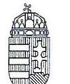
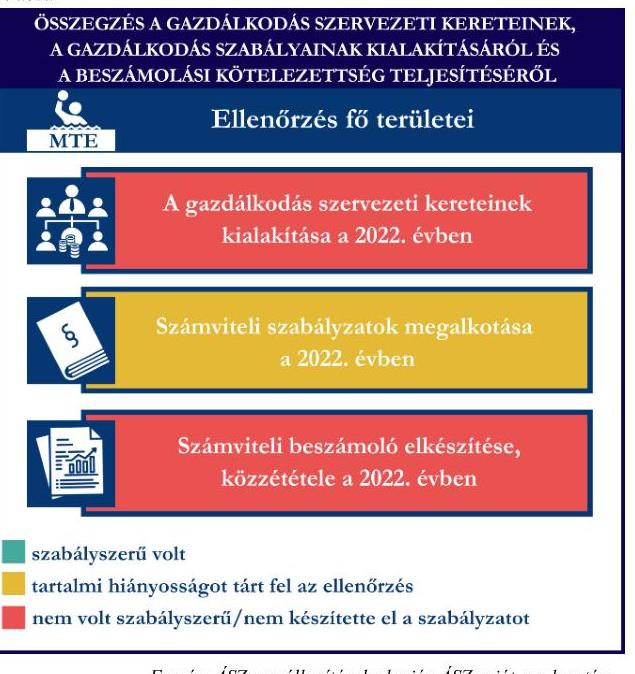
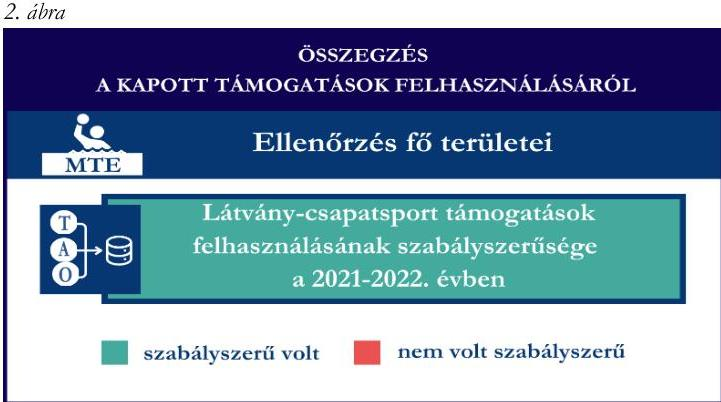
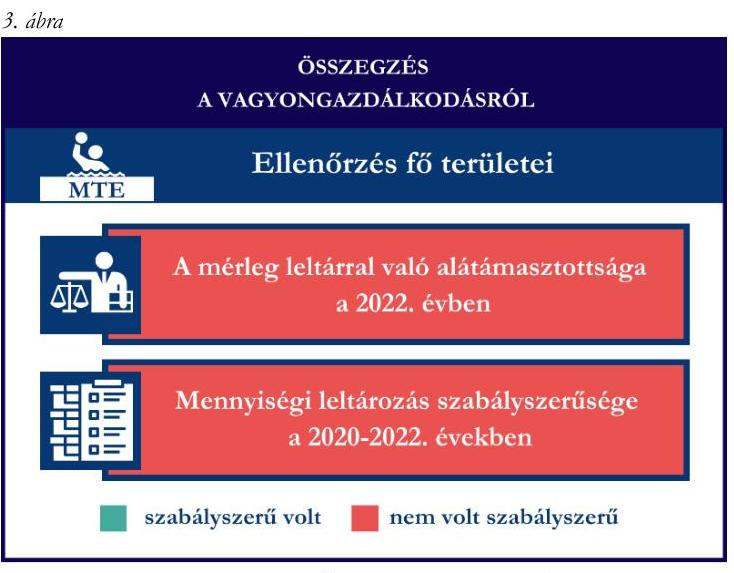

# JELENTÉS 

Támogatásban részesülő sportszövetségek, sportegyesületek és sportvállalkozások gazdálkodásának ellenőrzése

Mohácsi Torna Egylet 1888

2024.

---

ÁLLAMI
SZÁMVEVŐSZÉK

# JELENTÉS 

## Támogatásban részesülő sportszövetségek, sportegyesületek és sportvállalkozások gazdálkodásának ellenőrzése

Mohácsi Torna Egylet 1888

2024.

---

# ELLENŐRZÉSI IGAZGATÓSÁG: 

ÁLLAMHÁZTARTÁSON KÍYÜLI SZERVEZETEKET ELLENŐRZŐ IGAZGATÓSÁG

ELLENŐRZÉSI IGAZGATÓ:
KLINGA LÁSZLÓ igazgató

ELLENŐRZÉSVEZETŐ:
Jelentéseink az interneten a www.asz.hu címen olvashatók.

KAKAS SÁNDOR ellenőrzésvezető

IKTATÓSZÁM: EL-4031-015/2024
TÉMASORSZÁM: 30
ELLENŐRZÉS-AZONOSÍTÓ SZÁM: V1078

---

# TARTALOMJEGYZÉK 

- AZ ELLENŐRZÉS ALAPADATAI ..... 5
- AZ ELLENŐRZÖTT SZERVEZET ..... 7
- ÖSSZEFOGLALÁS ..... 8
- AZ ELLENŐRZÉS FÓKUSZTERÜLETEI ..... 10
- MEGÁLLAPÍTÁSOK ..... 11
- JAVASLATOK ..... 15
- MELLÉKLETEK ..... 17
I. sz. melléklet: Értelmező szótár ..... 17
II. sz. melléklet: Az ellenőrzött szervezetek jegyzéke ..... 19
III. sz. melléklet: Fő ellenőrzési kritériumok fő ellenőrzési fókuszterületek szerint. ..... 20
- FÜGGELÉK: ÉSZREVÉTELEK ..... 22
- RÖVIDÍTÉSEK JEGYZÉKE ..... 23

---

.

---

# AZ ELLENŐRZÉS ALAPADATAI 

## AZ ELLENŐRZÉS CÉLJA

Az ellenőrzés célja az államháztartásból nyújtott támogatással, vagy az államháztartásból meghatározott célra ingyenesen juttatott vagyon felhasználásával érintett sportszövetségek, sportegyesületek és sportvállalkozások gazdálkodása szabályozottságának, gazdálkodási tevékenységének, ezen belül a beszámolási kötelezettség teljesítésének, a támogatások elkülönített nyilvántartásának, valamint a támogatások felhasználásának ellenőrzése.

## AZ ELLENŐRZÉS TÍPUSA

Kombinált ellenőrzés.

## AZ ELLENŐRZŐTT IDŐSZAK

Az 1. fókuszterület vonatkozásában a 2022. év.
A 2. fókuszterület vonatkozásában a 2021-2022. évek.
A 3. fókuszterület vonatkozásában a 2022. év, a mennyiségi felvétellel történő leltározás dokumentumai tekintetében a 2020-2022. évek.

## AZ ELLENŐRZÉS TÁRGYA

Az ellenőrzés tárgyát képezte a támogatásban részesülő sportegyesület gazdálkodása szabályozottságának, gazdálkodási tevékenységén belül a beszámolási kötelezettség teljesítésének, a vagyonnyilvántartásának, a támogatások elkülönített nyilvántartásának, valamint az államháztartási forrásból származó közvetlen vagy közvetett támogatások és a meghatározott célra ingyenesen juttatott vagyon felhasználásának vizsgálata. Az ellenőrzés a támogatások vonatkozásában kiterjedt továbbá a támogató felé történő beszámolási és elszámolási kötelezettségek teljesítésére, a jogszabályi és belső előírások betartására.

Az ellenőrzés kiterjedt minden olyan körülményre és adatra, amely az ÁSZ ${ }^{1}$ jogszabályban meghatározott feladatainak teljesítéséhez, valamint az ellenőrzési program végrehajtása során felmerülő újabb összefüggések feltárásához szükséges volt. Az ellenőrzés az 1. és 3. fókuszterületek esetében az ellenőrzött szervezet egészére, a 2. fókuszterület esetén kizárólag a vízilabda szakágra vonatkozóan került végrehajtásra.

## AZ ELLENŐRZÉS JOGALAPJA

Az ellenőrzés jogszabályi alapját az ÁSZ tv. ${ }^{2} 1 . \int$ (3) bekezdése, az 5. $\int$ (3) bekezdése, valamint a Civil tv. ${ }^{3}$ 47. § előírásai képezték.

---

# AZ ELLENŐRZÉS MÓDSZERE 

Az ellenőrzést a nemzetközi standardokat irányadónak tekintve az ellenőrzési program szempontjai, az ellenőrzött időszakban hatályos jogszabályok, az ellenőrzés általános szakmai szabályai, az ellenőrzésre irányadó ÁSZ módszertanok figyelembevételével végezte az ÁSZ.

Az ellenőrzési kérdések megválaszolásához szükséges bizonyítékok megszerzése az ellenőrzött szervezet által rendelkezésre bocsátott dokumentumokra, adatokra alapozva kérdésfeltevés (információkérés), interjú, mintavételezés útján történt.

Az ellenőrzési bizonyítékként felhasználható adatforrások közé tartoztak egyrészt az ellenőrzés során az ellenőrzött szervezettől bekért dokumentumok, másrészt adatforrás volt minden további, az ellenőrzés folyamán feltárt, az ellenőrzés szempontjából információt tartalmazó egyéb adatforrás.

A támogatásokkal, azok felhasználásával, kapcsolatos kötelezettségek vizsgálatára mintavételi eljárások kerültek alkalmazásra. Támogatás-típusok szerint nagyságrend alapján egy darab támogatás képezte a vizsgálat tárgyát. Ezen támogatások felhasználásának szabályszerűsége támogatásonként kockázatértékelés alapján kiválasztott tételekkel került ellenőrzésre. A kiválasztott támogatási szerződésekhez kapcsolódó elszámolásokból 30 db tétel került ellenőrzésre, ahol az elszámolás nem érte el a 30 db -ot, ott tételes ellenőrzésre került sor. Ezen felül a vagyongazdálkodás szabályszerűségének ellenőrzéséhez is kockázatalapú mintavétel kapcsolódott. A támogatások felhasználása és a vagyongazdálkodás területén a tételek ellenőrzése kiterjedt a könyvvezetési kötelezettség vizsgálatára is. A tárgyi eszközök tekintetében 30 db került kiválasztásra a 2022. évben állományban lévő eszközök közül azok nyilvántartásának, elszámolásának szabályszerűsége ellenőrzése céljából. A kiválasztott tételek ellenőrzésének eredménye nem került kivetítésre a teljes sokaságra, a megállapítások az adott ellenőrzött tételek vonatkozásában kerültek megjelenítésre.

---

# AZ ELLENŐRZÖTT SZERVEZET 

A Mohácsi Torna Egylet 1888 az Alapszabálya ${ }_{1,2}{ }^{4}$ szerint 1888-ban alakult. Az MTE ${ }^{5}$ Alapszabály szerinti célja, hogy „,saját tagjai és mások részére a rendszeres testedzést és a sportolási lehetőséget biztositva,", továbbá „a sportegyesülettel kapcsolatban lévő oktatási és nevelési intézmények tanulóinak (ballgatóinak) részére a sportolási, testedzési lehetőséget megteremtse, a lakosság szabadidősportját segitse, sportkapcsolatokat létesítsen és fejlesztéseket bajtson létre." Az MTE-nél az ellenőrzött időszakban 12 szakosztály működött, az egylet taglétszáma 2022. december 31-én 965 fő volt.

Az MTE legfőbb döntéshozó szerve a Közgyűlés ${ }^{6}$, ügyvezető szerve a hét fős Elnökség, amely Alapszabály ${ }_{1,2}$ szerint a két közgyűlés közötti időszakban irányítja az MTE tevékenységét. Az MTE képviseletét az Elnök látta el, képviseleti joga gyakorlásának terjedelme általános, módja önálló. Az ellenőrzött időszakban az MTE a jogszabályi előírások alapján könyvvizsgálatra, felügyelőbizottság létrehozására kötelezett volt. Az MTE az ellenőrzött időszakban három főből álló felügyelőbizottsággal rendelkezett.

Az MTE a 2022. évben vállalkozási tevékenységet végzett. Az MTE az ellenőrzött időszakban közhasznú jogállású volt.
1. táblázat

## AZ MTE VÍZILABDA SZAKOSZTÁLYA ÁLTAL IGÉNYBE VETT TÁMOGATÁSOK (ADATOK M FT-BAN)

|  | 2021. Ev | 2022. Ev |
| :--: | :--: | :--: |
| Központi költségvetési támogatás | - | - |
| Látvány-csapatsport támogatás | 4,2 | 62,1 |
| Helyi önkormányzati támogatás | - | - |
| Magyar Vízilabda Szövetségtől kapott támogatás | - | - |

---

# ÖSSZEFOGLALÁS 

Magyarország Alaptörvényének XX. cikke kimondja, hogy mindenkinek joga van a testi és lelki egészséghez, melynek érvényesülését Magyarország többek között a sportolás és a rendszeres testedzés támogatásával segíti elő. Az Országgyűlés a Sport tv. ${ }^{\top}$-ben kinyilvánította, hogy a nemzet közössége a test művelését, a sportot, a nemzet alapértékének, kívánatos célnak tekinti. A sport a közjó része. Erősíti a közösség tagjainak egymáshoz tartozását, miként az egyén testi és lelki egészségét.

A sportegyesületek, sportszövetségek, sportvállalkozások müködésükre és szakmai tevékenységük ellátására költségvetési támogatásban, önkormányzati támogatásban, ingyenes vagyonjuttatásban, valamint látvány-csapatsport támogatásban részesülhetnek, amelyekre fokozott figyelem irányul.

A társadalom részéről jogosan felmerülő elvárás, hogy a közpénzeket kezelő, azzal gazdálkodó szervezetek müködéséről, tevékenységéről átfogó képet kapjon, a közpénzek rendeltetésszerủ és átlátható módon történő felhasználásának értékelésére időről-időre sor kerüljön az ellenőrzések keretében.

Az MTE a könyvviteli szolgáltatás személyi feltételeinek megteremtéséről, felügyelőbizottság létrehozásáról gondoskodott, azonban a felügyelőbizottság ügyrenddel nem rendelkezett. A jogszabályi előírások ellenére az egyszerűsített éves beszámoló felülvizsgálatára könyvvizsgálót nem bízott meg. A jogszabályi előírások szerint az MTE kialakította a számviteli politikáját, valamint elkészítette számviteli szabályzatait, továbbá rendelkezett számlarenddel. A számlarend tekintetében tartalmi hiányosságot tárt fel az ellenőrzés.

Az MTE könyvvezetés formája a 2022. évben megfelelt a jogszabályi előírásoknak. A számviteli beszámoló- és közhasznúsági melléklet készítési- és közzétételi kötelezettségét hiányossággal teljesítette, mert a kiegészítő mellékletben a támogatások felhasználását nem a jogszabályban előírt részletezettséggel mutatta be, illetve a

Fornás: ÁSZ megállapítások alapján ÁSZ saját szerkesztés
közzétett beszámoló könyvvizsgálói jelentést nem tartalmazott.

A gazdálkodás szervezeti keretei kialakításának, a számviteli szabályzatok megalkotásának, valamint a számviteli beszámoló elkészítésének és közzétételének értékelését az 1. ábra mutatja be.

Az MTE a látvány-csapatsport támogatást és kiegészítő támogatást a 2021-2022. években az ellenőrzött tételek esetében a támogatási célnak megfelelően, szabályszerűen használta fel. Számviteli nyilvántartásában a kapott támogatások felhasználását a jogszabályi előírás ellenére elkülönítetten nem tartotta nyilván.

A kapott támogatások felhasználásának értékelését a 2. ábra mutatja be.

---

Az MTE vagyongazdálkodása a 2022. évben nem volt szabályszerű, mert a 2022. évi egyszerűsített éves beszámolójának mérlegtételeit teljeskörűen nem támasztotta alá leltárral, továbbá a 2020-2022. évekre vonatkozóan a tárgyi eszközök esetében a mennyiségi felvétellel történő leltározást egyik évben sem végezte el.

Az ellenőrzött tételek esetében a tárgyi eszközök üzembe helyezése szabályszerű volt, a bekerülési érték meghatározása és az értékcsökkenés elszámolása terén az ellenőrzés hiányosságot tárt fel.

A vagyongazdálkodás értékelését a 3. ábra mutatja be.

Forrás: ÁSZ megállapítások alapján ÁSZ saját szerkesztés

---

# AZ ELLENŐRZÉS FÓKUSZTERÜLETEI 

1.     - A gazdálkodási szabályok kialakítása, a könyvvezetési- és beszámolási kötelezettség teljesítése
2.     - A kapott támogatások felhasználása
3.     - Az ellenőrzött szervezet vagyongazdálkodása

---

# 1. A gazdálkodási szabályok kialakítása, a könyvvezetési- és beszámolási kötelezettség teljesítése 

Összegző megállapítás A 2022. évben az MTE-nél a gazdálkodás szervezeti kereteinek kialakítása nem volt szabályszerű. A gazdálkodás szabályainak kialakítása megfelelt a jogszabályi előírásoknak, azonban a számlarend tekintetében az ellenőrzés hiányosságot tárt fel. A könyvvezetési kötelezettség teljesítése megfelelt a jogszabályi előírásoknak, azonban a beszámolási- és közzétételi kötelezettség teljesítése - az egyszerűsített éves beszámoló könyvvizsgálattal való alátámasztása hiányában - nem volt szabályszerű.

Az MTE a 2022. évben a Számv. tv. ${ }^{8}$ és a Civilszr. ${ }^{9}$ előírásainak betartásával gondoskodott a könyvviteli szolgáltatás személyi feltételeinek megteremtéséről, mert a könyvviteli szolgáltatás körébe tartozó feladatok ellátásával olyan számviteli szolgáltatást nyújtó társaságot bízott meg, amelynek a feladat irányításával, vezetésével, a beszámoló elkészítésével megbízott alkalmazottja megfelelt a jogszabályi követelményeknek.
Az MTE a Ptk. ${ }^{10}$ előírásai szerint három tagú felügyelőbizottságot hozott létre. A felügyelőbizottság a Civil tv. 40. § (2) bekezdés előírása ellenére az ügyrendjét nem állapította meg.
Az MTE a 2022. évre rendelkezett a Számv. tv.-ben előírt számviteli politikával ${ }^{11}$, és annak keretében elkészítette az értékelési szabályzatot ${ }^{12}$, a leltározási szabályzatot ${ }^{13}$ és a pénzkezelési szabályzatot ${ }_{1: 3}{ }^{14}$. A szabályzatok az ellenőrzött tartalmi kritériumoknak megfeleltek. Az MTE a Számv. tv. alapján a számlarendet ${ }_{1,2}{ }^{15}$ elkészítette, azonban a számlarend ${ }_{1}$ a Számv. tv. 161. $\$ (2) bekezdés a) pontjában előírtak ellenére nem tartalmazta minden alkalmazásra kijelölt főkönyvi számla számát, megnevezését. A számlarend ${ }_{1,2}$ a Számv. tv. 161. § (2) bekezdés b) pontjában előírtak ellenére nem tartalmazta a számla tartalmát, ha az a számla megnevezéséből egyértelműen nem következett, a számla értéke növekedésének, csökkenésének jogcímeit, a számlát érintő gazdasági eseményeket, a számlák más számlákkal való kapcsolatát, a Számv. tv. 161. § (2) bekezdés c) pontjában előírtak ellenére a főkönyvi számla és az analitikus nyilvántartások kapcsolatát, továbbá a Számv. tv. 161. § (2) bekezdés d) pontjában előírtak ellenére a számlarendben foglaltakat alátámasztó bizonylati rendet.
Az MTE a Civilszr. előírásainak megfelelően a 2022. évben kettős könyvvitelt vezetett. Az MTE a 2022. évben végzett vállalkozási tevékenységet, amelynek bevételeit a könyvvezetése során a Civil tv.-nek megfelelően az alaptevékenységtől elkülönítetten tartotta nyilván és mutatta ki egyszerúsített éves beszámolójában. Az MTE a 2022. évben a tagdíjbevételeket a Civilszr. 24. § (2) bekezdése ellenére nem az egyéb bevételek között, hanem a belföldi értékesítés árbevételei között tartotta nyilván.

---

A könyvviteli nyilvántartásait a Számv. tv. és a Civilszr. rendelkezéseinek megfelelően úgy alakította ki, hogy a 2022. évben az egyszerűsített éves beszámolóban a bevételeit az értékesítés nettó árbevétele, egyéb bevétel és pénzügyi műveletek bevétele bontásban mutatta ki, továbbá az egyéb bevételeken belül a tagdíakat és a kapott támogatások összegét részletezni tudta.
Az MTE a Számv. tv., a Civil tv., valamint a Civilszr. előírásainak megfelelően 2022. évre elkészítette az egyszerűsített éves beszámolóját, azonban a Civil tv. 29. § (4) bekezdés előírása ellenére a 2022. évi kiegészítő mellékletben nem mutatta be a támogatási program keretében végleges jelleggel felhasznált összegeket támogatásonként. Az MTE a 2022. évre az egyszerűsített éves beszámolóval egyidejűleg a Civil. vhr. melléklete szerinti közhasznúsági mellékletet elkészítette.
Az MTE 2022. évi egyszerűsített éves beszámolóját a felügyelőbizottság a Ptk. és a Civil tv. előírásai alapján véleményezte, a Közgyűlés határozattal jóváhagyta. Az MTE 2022. évre vonatkozó egyszerűsített éves beszámolóját a Civilszr. 16. § (3) bekezdése előírása ellenére - megbízás hiányában - könyvvizsgáló nem vizsgálta felül.
Az MTE a 2022. évi egyszerűsített éves beszámolóját, valamint közhasznúsági mellékletét a Civil tv. alapján letétbe helyezte és közzétette, azonban könyvvizsgálói megbízás hiányában a Civil tv. 30. § (1) bekezdés előírása szerinti független könyvvizsgálói jelentés sem került közzétételre.

# 2. A kapott támogatások felhasználása 

Összegző megállapítás

Az MTE a 2021. és 2022. évben a látvány-csapatsport és kiegészítő támogatásokat az ellenőrzött tételek esetében szabályszerűen használta fel. A támogatások felhasználásáról a jogszabályi előírás ellenére elkülönített nyilvántartást nem vezetett.

Az MTE a látvány-csapatsport támogatások esetében a 2021-2022. években eleget tett a 107/2011. (VI. 30.) Korm. rendeletben ${ }^{16}$ foglaltaknak, a támogatás felhasználásáról negyedévente az előrehaladási jelentéseket benyújtotta az MVLSZ ${ }^{17}$ felé.
Az MTE a be/SFP-08115/2021/MVLSZ számú sportfejlesztési program alapján kapott látványcsapatsport és a be/SFP-10115/2022/MVLSZ számú sportfejlesztési program alapján kapott kiegészítő támogatások felhasználásáról a 107/2011. (VI. 30.) Korm. rendeletnek megfelelően záradékolt számviteli bizonylatokkal alátámasztott módon, összesített elszámolási táblázattal és szöveges szakmai beszámolóval, könyvvizsgálói hitelesítéssel az előírt határidőben benyújtotta az elszámolást a támogató felé. A könyvvizsgáló a jogszabályban előírt felelősségbiztosítással rendelkezett.
Az MTE a 2021-2022. években a számára nyújtott látvány-csapatsport támogatást és kiegészítő támogatást a Civilszr. 24. § (2) bekezdésében foglaltak ellenére nem az egyéb bevételek között, hanem a belföldi értékesítés árbevételei között (9196 Társasági adós támogatás, 91993 TAO kiegészittő támogatás főkönyvi számlákon) mutatta ki.
Az MTE ellenőrzött időszak könyvvezetése során az alapcél szerinti tevékenysége költségei, ráfordításai ellentételezésére kapott támogatásokról nem vezetett a Civil tv. 20. § (4) bekezdésében előírt elkülönített számviteli nyilvántartást, amelynek alapján támogatásonként megállapítható és ellenőrizhető lett volna a kapott támogatás felhasználása, ezáltal nem tett eleget a 107/2011. (VI. 30.) Korm. rendelet 9. § (9)

---

bekezdésében előírtaknak, mivel a látvány-csapatsport támogatás, illetve a kiegészítő sportfejlesztési támogatás felhasználását elkülönítetten nem tartotta nyilván.
Az MTE esetében a látvány-csapatsport támogatás és kiegészítő támogatás ellenőrzött tételeinek (30-18 darab) vonatkozásában az alábbiak kerültek megállapításra:

- a tételek számviteli elszámolását a Számv. tv.-ben és a 107/2011. (VI. 30.) Korm. rendeletben előírtak szerint bizonylatokkal alátámasztották;
- a 107/2011. (VI. 30.) Korm. rendeletben foglaltaknak megfelelően a tételek tartalma (gazdasági esemény) és összege alapján a támogatási igazolásban meghatározottak szerinti jogcímre, az abban meghatározott mértékben használták fel;
- a tételek számviteli bizonylatai alapján a gazdasági események a támogatási időszak végéig szerződés szerint teljesültek;
- a tételek számviteli bizonylatai alapján a gazdasági események pénzügyi rendezése az elszámolás benyújtására nyitva álló határidőig teljesült;
- a tételek számviteli bizonylatait a 107/2011. (VI. 30.) Korm. rendeletben foglaltaknak megfelelően ellátták záradékkal,
- a számviteli bizonylatokon elszámolt/záradékolt összegek megegyeztek a számlaösszesítőben feltüntetett értékekkel;
- a tételek számviteli bizonylatának az adott sportfejlesztési program terhére záradékolt összegei a Számv. tv. előírtak szerint a tartalmuknak megfelelő főkönyvi számra kerültek elszámolásra.

# 3. Az ellenőrzött szervezet vagyongazdálkodása 

## Összegző megállapítás Az MTE vagyongazdálkodása 2022. évben nem volt szabályszerű.

Az MTE a Számv. tv. 69. § (1)-(2) bekezdésében foglaltak ellenére a 2022. évi egyszerűsített éves beszámolójának tárgyi eszközök, a készletek, a követelések, a saját tőke és a kötelezettségek mérlegtételeit nem támasztotta alá leltárral.
Az MTE a Számv. tv. 69. § (3) bekezdésében foglaltak ellenére a 2020-2022. évekre vonatkozóan a tárgyi eszközök esetében a mennyiségi felvétellel történő leltározást egyik évben sem végezte el. A készletek vonatkozásában a 2022. évben a mennyiségi leltárt elkészítették, azonban annak értéke az egyszerűsített éves beszámoló mérlegében szereplő értékkel nem egyezett meg, a pénzeszközök közül a forint és deviza készpénzállomány mennyiségi leltározását szabályszerűen elvégezték.
Az MTE esetében a tárgyi eszköz ellenőrzött tételek ( 30 db ) vonatkozásában az alábbiak kerültek megállapításra:

- a tételek bekerülési értékét - egy kivételével - a Számv. tv.-nek megfelelően bizonylattal alátámasztották. Egy tétel (Csónakház felújítás) esetében a Számv. tv. 47. § (1) bekezdésében előírtak ellenére a tárgyi eszköz bekerülési értékét az üzembehelyezési jegyzőkönyvben, valamint a tárgyi eszköz kartonon 181512 Ft-tal kisebb összeggel aktiválták ( 4891290 Ft ), mint a bekerülési értéket alátámasztó számlákon szereplő összegek együttes értéke ( 5072802 Ft );
- a tárgyi eszközök számviteli besorolása megfelelt a Számv. tv. előírásainak;

---

- a tárgyi eszközök üzembe helyezésének tényét és időpontját a Számv. tv.-nek megfelelően hitelt érdemlően dokumentálták;
- az értékcsökkenés elszámolása - egy tétel kivételével - a Számv. tv.-nek megfelelően történt. A kivétel tétel (Csónakház felújítás) esetében tárgyi eszköz esetében a Számv. tv. 52. § (2) bekezdésében előírtak ellenére az eszközöket nem a bekerülési érték összegével egyező összeggel aktiválták, ennek okán az eszköz tárgyévi értékcsökkenésének elszámolása a Számv. tv. 52. § (1) bekezdésében foglaltakkal nem volt összhangban. Továbbá a (Csónakház felújítás) tétel esetében a 2022. évi értékcsökkenés elszámolása során a tárgyi eszköz kartonon meghatározott évi $2 \%$-os értékcsökkenés helyett 2,11\%-ot számoltak el, ezzel a Számv. tv. 52. § (2) bekezdésének előírásait nem tartották be;
- a támogatásból megvalósult tíz tétel esetén a tárgyi eszköz bekerülési értékét meghatározó számviteli bizonylatokat ellátták záradékkal, amelyből kiderül, hogy a számviteli bizonylaton szereplő összegből mennyit számoltak el a hivatkozott támogatás terhére;
- a 2022. évben selejtezésre került eszközök tételeinek (3 db kapuháló) állományból történő kivezetése szabályszerű volt.

---

# JAVASLATOK 

Az ÁSZ tv. 33. § (1) bekezdésében foglaltak értelmében az ellenőrzött szervezet vezetője köteles a jelentésben foglalt megállapításokhoz kapcsolódó intézkedési tervet összeállítani és azt a jelentés kézhezvételétől számított 30 napon belül az ÁSZ részére megküldeni. Amennyiben az ellenőrzött szervezet vezetője nem küldi meg határidőben az intézkedési tervet, vagy továbbra sem elfogadható intézkedési tervet küld, az Állami Számvevőszék elnöke az ÁSZ tv. 33. § (3) bekezdése a) és b) pontjaiban foglaltakat érvényesítheti.

## A MOHÁCSI TORNA EGYLET 1888 ELNÖKÉNEK

1. Intézkedjen arról, hogy a felügyelőbizottság állapítsa meg az ügyrendjét a Civil tv. 40. § (2) bekezdés előirása szerint.
2. Gondoskodjon a számlarend módosításáról a Számv. tv. 161. § (2) bekezdés b)-d) pontjában elöirtak szerint.
3. Gondoskodjon a tagdíjbevételek egyéb bevételek között történő kimutatásáról a Civilszr. 24. § (2) bekezdésében elöirtak szerint.
4. Gondoskodjon a kiegészítő melléklet elkészítéséről a Civil tv. 29. § (4) bekezdésének figyelembevételével.
5. Gondoskodjon a beszámoló könyvvizsgálattal való alátámasztásáról a Civilszr. 16. § (3) bekezdése előirása szerint.
6. Gondoskodjon a beszámoló részeként a független könnyvizsgálói jelentés közzétételéről a Civil tv. 30. § (1) bekezdésében foglaltakkal összhangban.
7. Gondoskodjon a látvány-csapatsport támogatás és kiegészítő támogatás egyéb bevételek között történő kimutatásáról a Civilszr. 24. § (2) bekezdésében foglaltak szerint.
8. Gondoskodjon arról, hogy a látvány-csapatsport támogatás és kiegészítő támogatások felhasználását a Civil tv. 20. § (4) bekezdésében és a 107/2011. (VI. 30.) Korm. rendelet 9. § (9) bekezdésében foglalt előírásoknak megfelelően elkülönítetten tartsa nyilván.

---

9. Gondoskodjon a beszámoló mérlegtételeinek leltárral történő alátámasztásáról a Számv. tv. 69. § (1)(2) bekezdés előírásainak megfelelően.
10. Gondoskodjon a tárgyi eszközök és a készletek vonatkozásában Számv. tv. 69. § (3) bekezdésében foglaltaknak megfelelően a mennyiségi felvétellel történő leltározás elvégzéséről.
11. Gondoskodjon a tárgyi eszközök bekerülési értékének bizonylattal történő alátámasztásáról, a Számv.tv. 47. § (1) bekezdésében foglaltaknak megfelelően.
12. Gondoskodjon a tárgyi eszközök esetében a Számv. tv. 52. § (1)-(2) bekezdéseiben foglaltaknak megfelelő értékcsökkenés elszámolásáról.

---

# MELLÉKLETEK 

## I. SZ. MELLÉKLET: ÉRTELMEZŐ SZÓTÁR

Civil szervezet

Egyesület

Kiegészítő sportfejlesztési támogatás

Költségvetési támogatás

Közhasznú szervezet

Közhasznú tevékenység

Látvány-csapatsport támogatás

Látvány-csapatsportban múködő amatőr sportszervezet

Látvány-csapatsportban múködő hivatásos sportszervezet

A civil társaság; a Magyarországon nyilvántartásba vett egyesület - a párt, a szakszervezet és a kölcsönös biztosító egyesület kivételével és - a közalapítvány és a pártalapítvány kivételével - az alapítvány. (Forrás: Civil tv. 2. §6. pont a)-c) alpontjai)
Az egyesület a tagok közös, tartós, alapszabályban meghatározott céljának folyamatos megvalósítására létesített, nyilvántartott tagsággal rendelkező jogi személy. (Forrás: Ptk. 3:63. § (1) bekezdés)
A Számv. tv. szempontjából egyéb szervezet. (Számv. tv. 3. § (1) bekezdés 4. pont a) alpontja)

A látvány-csapatsportok támogatása esetében rendelkező nyilatkozatban felajánlott összeg 12,5 százaléka kiegészítő sportfejlesztési támogatásnak minősül. (Forrás: Tao tv. ${ }^{18}$ 24/A. § (9) bekezdés)
A társadalombiztosítás pénzügyi alapjai kivételével az államháztartás központi alrendszeréből ellenérték nélkül, pénzben nyújtott támogatások. (Forrás: Áht. ${ }^{19} 1 . \S 14$. pont)
Közhasznú szervezetté minősíthető a Magyarországon nyilvántartásba vett közhasznú tevékenységet végző szervezet, amely a társadalom és az egyén közös szükségleteinek kielégítéséhez megfelelő erőforrásokkal rendelkezik, továbbá amelynek megfelelő társadalmi támogatottsága kimutatható, és amely:
a) civil szervezet (ide nem értve a civil társaságot), vagy
b) olyan egyéb szervezet, amelyre vonatkozóan a közhasznú jogállás megszerzését törvény lehetővé teszi. (Forrás: Civil tv. 32. § (1) bekezdés)
Minden olyan tevékenység, amely a létesítő okiratban megjelölt közfeladat teljesítését közvetlenül vagy közvetve szolgálja, ezzel hozzájárulva a társadalom és az egyén közös szükségleteinek kielégítéséhez.
(Forrás: Civil tv. 2. § 20. pont)
Az adóévben visszafizetési kötelezettség nélkül nyújtott támogatás, juttatás, véglegesen átadott pénzeszköz és térítés nélkül átadott eszköz könyv szerinti értéke, az adóévben térítés nélkül nyújtott szolgáltatás bekerülési értéke a Tao tv.-ben meghatározott jogcímeken. (Forrás: Tao tv. 4. § 44. pont)
Minden olyan, a sportról szóló törvényben meghatározott szabályok szerint a látvány-csapatsportban múködő sportegyesület vagy sportvállalkozás, amelyik nem minősül a látvány-csapatsportban múködő hivatásos sportszervezetnek. (Forrás: Tao tv. 4. § 42. pont)
A látvány-csapatsportágak országos sportági szakszövetsége által kiírt versenyrendszer legmagasabb felnőtt bajnoki osztályában - a veterán korosztályokra kiírt versenyrendszer kivételével - részt vevő (indulási jogot elnyert) sportszervezet, vagy alsóbb bajnoki osztályaiban részt vevő (indulási jogot elnyert) sportszervezet abban az esetben, ha az ilyen sportszervezet hivatásos sportolót alkalmaz. Több látvány-csapatsportban több jogi személy szervezeti egységgel (szakosztállyal) múködő sportszervezet esetén csak az a jogi személy szervezeti egység (szakosztály), amely a fent részletezett versenyrendszerek bajnoki osztályaiban részt vesz. (Forrás: Tao tv. 4. § 43. pont)

---

Országos sportági szakszövetség

Sportági szövetség

Sportegyesület

Sportegyesületeknek, sportszövetségeknek nyújtott költségvetési támogatás

Sportszövetség

Sporttevékenység

Sportvállalkozás

Olyan sportszövetség, amely sportágában kizárólagos jelleggel az e törvényben, valamint más jogszabályokban meghatározott feladatokat lát el és e törvényben megállapított különleges jogosítványokat gyakorol. Olyan sportágban hozható létre, amelyet vagy a Nemzetközi Olimpiai Bizottság elismert, vagy amely sportág nemzetközi szövetségét felvették a Nemzetközi Sportszövetségek Szövetségébe (GAISF). (Forrás: Sport tv. 20. § (1), (4) bekezdés)

A Civil tv. és a Ptk. előírásai alapján - a Sport tv.-ben meghatározott eltérésekkel - müködő szövetség, amelynek tagjai kizárólag sportszervezetek lehetnek. Sportági szövetség országos jelleggel is müködhet. Egy sportágban csak egy országos sportági szövetség müködhet. Törvényi feltételek teljesülése esetén szakszövetségi feladatokat is elláthat.
(Forrás: Sport tv. 28. §)
A Civil tv. és a Ptk. szabályai szerint müködő olyan egyesület, amelynek alaptevékenysége a sporttevékenység szervezése, valamint a sporttevékenység feltételeinek megteremtése. A sportegyesületek a Sport tv. 15. § (1) bekezdésében meghatározott sportszervezetek körébe tartoznak. A sportegyesületeken kívül sportszervezet még a sportvállalkozás, a sportiskola, valamint az utánpótlás-nevelés fejlesztését végző alapítvány. (Forrás: Sport tv. 16. § (1) bekezdés)
Az állami sport célú támogatások felhasználásáról és elosztásáról szóló 474/2016. (XII. 27.) Korm. rendelet és a 27/2013. (III. 29.) EMMI rendelet 1. §-ában meghatározott fejezeti kezelésű előirányzatokból nyújtott támogatás.
Meghatározott sporttevékenységek körében a sportversenyek szervezésére, a tagok érdekvédelmére és a részükre való szolgáltatásokra, valamint a nemzetközi kapcsolatok lebonyolítására létrehozott, jogi személyiséggel és önkormányzattal rendelkező, a Civil tv. és a Ptk. alapján - az e törvényben foglalt eltérésekkel - különös formában müködő egyesületek. A Sport tv. 19. § (3) bekezdése szerint a sportszövetségeknek az alábbi típusai léteznek: országos sportági szakszövetségek, sportági szövetségek, szabadidősport szövetségek, fogyatékosok sportszövetségei, diák- és egyetemi-főiskolai sport sportszövetségei, nemzetközi sportszövetségek. (Forrás: Sport tv. 19. $\S(1),(3)$ bekezdés)

Meghatározott szabályok szerint, a szabadidő eltöltéseként kötetlenül vagy szervezett formában, illetve versenyszerűen végzett testedzés vagy szellemi sportágban kifejtett tevékenység, amely a fizikai erőnlét és a szellemi teljesítőképesség megtartását, fejlesztését szolgálja. (Forrás: Sport tv. 1. § (2) bekezdés)

Az a gazdasági társaság, amelynek a cégnyilvántartásról, a cégnyilvánosságról és a bírósági cégeljárásról szóló törvény alapján a cégjegyzékbe bejegyzett tevékenysége sporttevékenység, továbbá a gazdasági társaság célja sporttevékenység szervezése, valamint a sporttevékenység feltételeinek megteremtése egy vagy több sportágban. Korlátolt felelősségű társasági, illetve részvénytársasági formában alapítható, a fogyatékosok sportja, illetve a szabadidősport területén közhasznú társaságként is müködhet. (Forrás: Sport tv. 18. §)

---

II. SZ. MELLÉKLET: AZ ELLENŐRZÖTT SZERVEZETEK JEGYZÉKE

| ELLENŐRZÖTT SZERVEZET NEVE | ELLENŐRZÖTT SZERVEZET SZÉKHELYE |
| :-- | :-- |
| Mohácsi Torna Egylet 1888 | 7700 Mohács, Kórház utca 11. |

---

# III. SZ. MELLÉKLET: FŐ ELLENŐRZÉSI KRITÉRIUMOK FŐ ELLENŐRZÉSI FÓKUSZTERŰLETEK SZERINT 

## FŐ ELLENŐRZÉSI FÓKUSZTERŰLETEK

1. A gazdálkodási könyvvezetési és teljesítése

## FŐ ELLENŐRZÉSI KRITÉRIUMOK

Civil tv. 2. § 7., 11. pont, 20. § (3) bekezdés c) pont, (4) bekezdés, 28. § (1)-(3) bekezdés, 29. § (1) bekezdés, (2) bekezdés c) pont, (3), (4), (6), (7) bekezdés, 30. § (1)-(4) bekezdés, 40. § (1), (2) bekezdés, 41. § (1) bekezdés
Civilszr. 7. § (1) bekezdés, (4) bekezdés b), c) pont, (6) bekezdés, 8. § (2), (3) bekezdés, 9. § (4), (5), (8) bekezdés, 12. $\S$ (4), (5) bekezdés, 15. § (1) bekezdés a), b) pont, (2) bekezdés, 16. § (1), (3) bekezdés, 22. § (1) bekezdés, 24. § (2) bekezdés, 3.-4. sz. melléklet

Civil vhr. 12. § és melléklet
Cnytv. 20 39. § (1), (4) bekezdés, 40. § (2) bekezdés
Ptk. 3:26. § (1) bekezdés, 3:27. § (1) bekezdés, 3:82. § (1)-(2) bekezdés
Számv. tv. 4. §, 6. § (2) bekezdés, 12. §, 14. § (3), (5) bekezdés a), b), d) pont, (8) bekezdés, (11)-(12) bekezdés, 69. § (1), (3) bekezdés, 90. § (3) bekezdés c) pont, 96. § (4) bekezdés, 150. § (2) bekezdés, 153. § (1) bekezdés, 154. § (1) bekezdés, 161. § (1) bekezdés, (2) bekezdés a)-d) pont, (3)-(4) bekezdés, 161/A. § (1)-(2) bekezdés, 165. § (2) bekezdés
Tao tv. 22/C. §
107/2011. (VI.30.) Korm. rendelet 9. § (9) bekezdés
2. A kapott támogatások felhasználása

Áht. 52. § (1) bekezdés, 53. §
Ávr. 21 76. § (1) bekezdés c) pont, 93. § (1)-(3), (5) bekezdés
Civil tv. 20. § (1) bekezdés c) pont, (2) bekezdés a) pont, (3) bekezdés a), c) pont, (4) bekezdés, 29. § (4), (5) bekezdés
Civilszr. 13. § (3) bekezdés, 24. § (1)-(2) bekezdés
Kbt. 5. § (2) bekezdés, 15. §
Számv. tv. 16. § (3) bekezdés, 25-26. §, 44. § (2) bekezdés, 45. § (1)-(2) bekezdés, 77. § (3) bekezdés b) pont, 78-81. §, 159. §, 161/A. § (2) bekezdés, 162. § (1) bekezdés, 165. § (1)-(2) bekezdés, 166. § (1) bekezdés, 167. § (1) bekezdés a), d), e), h) pont
Tao. tv. 22/C. §, 24/A. § (9) bekezdés
107/2011. (VI.30.) Korm. rendelet 2. § (3b) bekezdés, 4. § (11) bekezdés, 5. § (1) bekezdés, 6. § (1) bekezdés e) pont, 9. § (8)(10) bekezdés, 10. § (2), (2a), (2b), (4) bekezdés, 10. § (5a) bekezdés, 11. § (1), (1a), (1d), (1e), (2), (4), (4a), (5), (6) bekezdés, 13. § (1), (2a) bekezdés, 14. § (1), (4), (4b), (4c), (6c) bekezdés
275/2022. (VII.29.) Korm. rendelet 1. § (3)
444/2022. (XI.7) Korm. rendelet 2. §
474/2016. (XII. 27.) Korm. rendelet 26. § (3) bekezdés

---

3. Az ellenőrzött szervezet vagyongazdálkodása

Ptk. 3:63. § (4) bekezdés
Számv. tv. 15. § (3) bekezdés, 26. §, 46. § (3) bekezdés, 47-53. $\mathbb{S}, 57 . \mathbb{S}, 69 . \mathbb{S}(1)-(6)$ bekezdés, 165-166. $\mathbb{S}, 169 . \mathbb{S}(2)$ bekezdés Tao tv. 22/C (6) bekezdés a), d), e) pont, (11) bekezdés Ávr. 93. § (5) bekezdés 107/2011. (VI.30.) Korm. rendelet 11. § (5) bekezdés 474/2016. (XII. 27.) Korm. rendelet 17. § (1) bekezdés 11a. a) pont, 11b. pont, 17. § (2a) bekezdés, 24. § (2) bekezdés

---

# FÜGGELÉK: ÉSZREVÉTELEK 

A jelentéstervezetet a Számvevőszék 15 napos észrevételezésre megküldte az ellenőrzött szervezet vezetőjének az ÁSZ tv. 29. §* (1) bekezdése előírásának megfelelően.

A Mohácsi Torna Egylet 1888 elnöke a jelentéstervezetre nem tett észrevételt.

[^0]
[^0]:    * 29. § (1) Az Állami Számvevőszék az ellenőrzési megállapításait megküldi az ellenőrzött szervezet vezetőjének vagy az általa megbízott személynek, és annak, akinek személyes felelősségét állapította meg.
    (2) Az ellenőrzött szervezet vezetője és a felelősként megjelölt személy az ellenőrzés megállapításaira tizenöt napon belül írásban észrevételt tehet.
    (3) Az Állami Számvevőszék az észrevételre a beérkezésétől számított harminc napon belül írásban válaszol. A figyelembe nem vett észrevételeket köteles a jelentésben feltüntetni, és megindokolni, hogy azokat miért nem fogadta el.

---

# RÖVIDÍTÉSEK JEGYZÉKE 

${ }^{1}$ ÁSZ ${ }^{2}$ ÁSZ tv. ${ }^{3}$ Civil tv. ${ }^{4}$ Alapszabály ${ }_{1,2}$ ${ }^{5}$ MTE ${ }^{6}$ Közgyűlés ${ }^{7}$ Sport tv. ${ }^{8}$ Számv. tv. ${ }^{9}$ Civilszr. ${ }^{10}$ Ptk. ${ }^{11}$ számviteli politika ${ }^{12}$ értékelési szabályzat ${ }^{13}$ leltározási szabályzat ${ }^{14}$ pénzkezelési szabályzat ${ }_{1-3}$

[^0]Állami Számvevőszék
2011. évi LXVI. törvény az Állami Számvevőszékről
2011. évi CLXXV. törvény az egyesülési jogról, a közhasznú jogállásról, valamint a civil szervezetek müködéséről és támogatásáról
Mohácsi Torna Egylet 1888 Alapszabály1 (határos: 2019. november 27-től 2022. május 24 -ig), Mohácsi Torna Egylet 1888 Alapszabály ${ }_{2}$ (hatályos: 2022. május 25 -től)
Mohácsi Torna Egylet
Mohácsi Torna Egylet 1888 közgyűlése
2004. évi I. törvény a sportról
2000. évi C. törvény a számvitelről
479/2016. (XII.28.) Korm. rendelet a számviteli törvény szerinti egyes egyéb szervezetek beszámoló készítési és könyvvezetési kötelezettségének sajátosságairól
2013. évi V. törvény a Polgári Törvénykönyvről
Mohácsi Torna Egylet 1888 Számviteli politikája (hatályos: 2019. január 1-től)
Mohácsi Torna Egylet 1888 Értékelési szabályzata (hatályos: 2019. január 1-től)
Mohácsi Torna Egylet 1888 Leltározási szabályzata (hatályos: 2019. január 1-től)
Mohácsi Torna Egylet 1888 Pénzkezelési szabályzata ${ }_{1}$ (hatályos: 2019. január 1-től) 2021. december 31-ig), Mohácsi Torna Egylet 1888 Pénzkezelési szabályzata ${ }_{2}$ (hatályos: 2022. január 1-től 2022. május 31-ig), Mohácsi Torna Egylet 1888 Pénzkezelési szabályzata ${ }_{3}$ (hatályos: 2022. június 1-től)
Mohácsi Torna Egylet 1888 Számlarend ${ }_{1}$ (hatályos: 2019. január 1-től 2021. december 31-ig), Mohácsi Torna Egylet 1888 Számlarend ${ }_{2}$ (hatályos: 2022. január 1-től)
107/2011. (VI. 30.) Korm. rendelet a látvány-csapatsport támogatását biztosító támogatási igazolás kiállításáról, felhasználásáról, a támogatás elszámolásának és ellenőrzésének, valamint visszafizetésének szabályairól
Magyar Vízilabda Szövetség
1996. évi LXXXI. törvény a társasági adóról és az osztalékadóról
2011. évi CXCV. törvény az államháztartásról
2011. évi CLXXXI. törvény a civil szervezetek bírósági nyilvántartásáról és az ezzel összefüggő eljárási szabályokról
368/2011. (XII. 31.) Korm. rendelet az államháztartásról szóló törvény végrehajtásáról

[^0]:    ${ }^{1}$ ÁSZ
    ${ }^{2}$ ÁSZ tv.
    ${ }^{3}$ Civil tv.
    ${ }^{4}$ Alapszabály ${ }_{1,2}$
    ${ }^{5}$ MTE
    ${ }^{6}$ Közgyűlés
    ${ }^{7}$ Sport tv.
    ${ }^{8}$ Számv. tv.
    ${ }^{9}$ Civilszr.

---

1052 Budapest, Apáczai Csere János u. 10. | 1364 Budapest 4., Pf. 54
www.asz.hu | szamvevoszek@asz.hu
telefon: +36 14849100