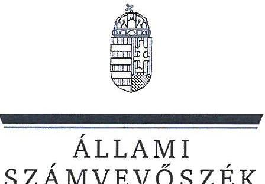
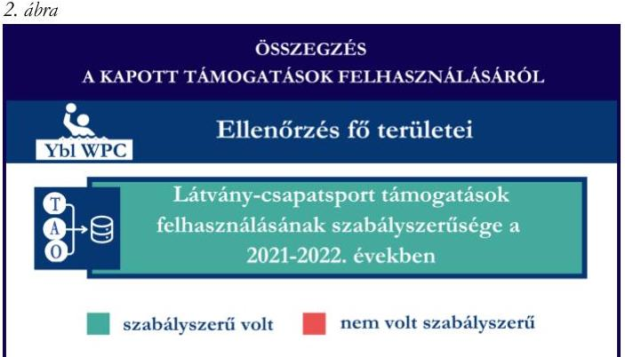
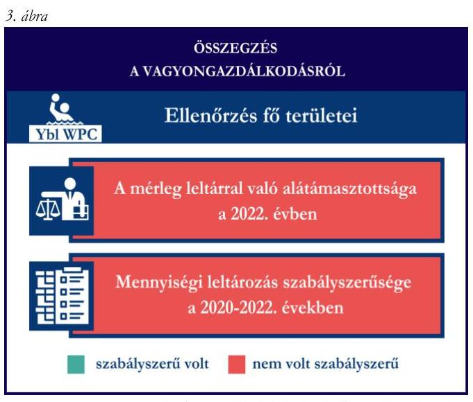
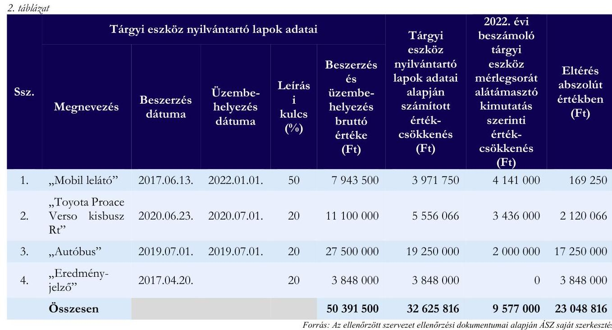

# JELENTÉS 

Támogatásban részesülő sportszövetségek, sportegyesületek és sportvállalkozások gazdálkodásának ellenőrzése

YBL Water Polo Club Egyesület

2024.

---

ÁLLAMI
SZÁMVEVŐSZÉK

# JELENTÉS 

## Támogatásban részesülő sportszövetségek, sportegyesületek és sportvállalkozások gazdálkodásának ellenőrzése

YBL Water Polo Club Egyesület

2024.

---

# ELLENŐRZÉSI IGAZGATÓSÁG: 

ÁLLAMHÁZTARTÁSON KÍVÜLI SZERVEZETEKET ELLENŐRZŐ IGAZGATÓSÁG

ELLENŐRZÉSI IGAZGATÓ:
KLINGA LÁSZLÓ igazgató

ELLENŐRZÉSVEZETŐ:
$\begin{array}{ll}\text { Jelentéseink az interneten a } & \text { KAKAS SÁNDOR ellenőrzésvezető } \\ \text { www.asz.hu címen olvashatók. } & \end{array}$

IKTATÓSZÁM: EL-4031-012/2024
TÉMASORSZÁM: 30
ELLENŐRZÉS-AZONOSÍTÓ SZÁM: V1078

---

# TARTALOMJEGYZÉK 

AZ ELLENŐRZÉS ALAPADATAI ..... 5
AZ ELLENŐRZÖTT SZERVEZET ..... 7
ÖSSZEFOGLALÁS ..... 8
AZ ELLENŐRZÉS FÓKUSZTERÜLETEI ..... 10
MEGÁLLAPÍTÁSOK ..... 11
JAVASLATOK ..... 17
MELLÉKLETEK ..... 19
I. sz. melléklet: Értelmező szótár ..... 19
II. sz. melléklet: Az ellenőrzött szervezetek jegyzéke ..... 21
III. sz. melléklet: Fő ellenőrzési kritériumok fő ellenőrzési fókuszterületek szerint. ..... 22
FÜGGELÉK: ÉSZREVÉTELEK ..... 24
RÖVIDÍTÉSEK JEGYZÉKE ..... 25

---

.

---

# AZ ELLENŐRZÉS ALAPADATAI 

## AZ ELLENŐRZÉS CÉLJA

Az ellenőrzés célja az államháztartásból nyújtott támogatással, vagy az államháztartásból meghatározott célra ingyenesen juttatott vagyon felhasználásával érintett sportszövetségek, sportegyesületek és sportvállalkozások gazdálkodása szabályozottságának, gazdálkodási tevékenységének, ezen belül a beszámolási kötelezettség teljesítésének, a támogatások elkülönített nyilvántartásának, valamint a támogatások felhasználásának ellenőrzése.

## AZ ELLENŐRZÉS TÍPUSA

Kombinált ellenőrzés.

## AZ ELLENŐRZÖTT IDŐSZAK

Az 1. fókuszterület vonatkozásában a 2022. év.
A 2. fókuszterület vonatkozásában a 2021-2022. évek.
A 3. fókuszterület vonatkozásában a 2022. év, a mennyiségi felvétellel történő leltározás dokumentumai tekintetében a 2020-2022. évek.

## AZ ELLENŐRZÉS TÁRGYA

Az ellenőrzés tárgyát képezte a támogatásban részesülő sportegyesület gazdálkodása szabályozottságának, gazdálkodási tevékenységén belül a beszámolási kötelezettség teljesítésének, a vagyonnyilvántartásának, a támogatások elkülönített nyilvántartásának, valamint az államháztartási forrásból származó közvetlen vagy közvetett támogatások és a meghatározott célra ingyenesen juttatott vagyon felhasználásának vizsgálata. Az ellenőrzés a támogatások vonatkozásában kiterjedt továbbá a támogató felé történő beszámolási és elszámolási kötelezettségek teljesítésére, a jogszabályi és belső előírások betartására.

Az ellenőrzés kiterjedt minden olyan körülményre és adatra, amely az ÁSZ¹ jogszabályban meghatározott feladatainak teljesítéséhez, valamint az ellenőrzési program végrehajtása során felmerülő újabb összefüggések feltárásához szükséges volt. Az ellenőrzés az 1. és 3. fókuszterületek esetében az ellenőrzött szervezet egészére, a 2. fókuszterület esetén kizárólag a vízilabda szakágra vonatkozóan került végrehajtásra.

## AZ ELLENŐRZÉS JOGALAPJA

Az ellenőrzés jogszabályi alapját az ÁSZ tv.² 1. § (3) bekezdése és az 5. § (3) bekezdése előírásai képezték.

---

# AZ ELLENŐRZÉS MÓDSZERE 

Az ellenőrzést a nemzetközi standardokat irányadónak tekintve az ellenőrzési program szempontjai, az ellenőrzött időszakban hatályos jogszabályok, az ellenőrzés általános szakmai szabályai, az ellenőrzésre irányadó ÁSZ módszertanok figyelembevételével végezte az ÁSZ.

Az ellenőrzési kérdések megválaszolásához szükséges bizonyítékok megszerzése az ellenőrzött szervezet által rendelkezésre bocsátott dokumentumokra, adatokra alapozva kérdésfeltevés (információkérés), interjú, mintavételezés útján történt.

Az ellenőrzési bizonyítékként felhasználható adatforrások közé tartoztak egyrészt az ellenőrzés során az ellenőrzött szervezettől bekért dokumentumok, másrészt adatforrás volt minden további, az ellenőrzés folyamán feltárt, az ellenőrzés szempontjából információt tartalmazó egyéb adatforrás.

A támogatásokkal, azok felhasználásával, kapcsolatos kötelezettségek vizsgálatára mintavételi eljárások kerültek alkalmazásra. Támogatás-típusok szerint nagyságrend alapján egy darab támogatás képezte a vizsgálat tárgyát. Ezen támogatások felhasználásának szabályszerűsége támogatásonként kockázatértékelés alapján kiválasztott tételekkel került ellenőrzésre. A kiválasztott támogatási szerződésekhez kapcsolódó elszámolásokból 30 db tétel került ellenőrzésre, ahol az elszámolás nem érte el a 30 db -ot, ott tételes ellenőrzésre került sor. Ezen felül a vagyongazdálkodás szabályszerűségének ellenőrzéséhez is kockázatalapú mintavétel kapcsolódott. A támogatások felhasználása és a vagyongazdálkodás területén a tételek ellenőrzése kiterjedt a könyvvezetési kötelezettség vizsgálatára is. A tárgyi eszközök tekintetében 30 db került kiválasztásra a 2022. évben állományban lévő eszközök közül azok nyilvántartásának, elszámolásának szabályszerűsége ellenőrzése céljából. A kiválasztott tételek ellenőrzésének eredménye nem került kivetítésre a teljes sokaságra, a megállapítások az adott ellenőrzött tételek vonatkozásában kerültek megjelenítésre.

---

# AZ ELLENŐRZÖTT SZERVEZET 

Az YBL Water Polo Club Egyesületet Alapszabálya³ szerint 2001-ben alapították, a civil szervezetek közhiteles bírósági nyilvántartásába Szent István Egyetem Sportegyesület néven 2001. december 11-én került bejegyzésre, YBL Water Polo Club Egyesület elnevezéssel 2016. július 13. napjától működik. Alapszabálya szerinti célja többek között az úszás és a vízilabda, mint szabadidő- és mint versenysport népszerűsítése; utánpótlás nevelés; felnőtt sportolók képzése és versenyeztetése; bajnokságokon, sporteseményeken, szabadidősport rendezvényeken való részvétel; edzőtáborok, sporttáborok szervezése.

Az egyesületnél az ellenőrzött időszakban két szakosztály (úszás és vízilabda) működött.
Az Ybl WPC¹ legfőbb döntéshozó szerve a Közgyűlés, ügyvezető szerve az öt tagból álló (egy fő elnök, két fő alelnök és két fő elnökségi tag) Elnökség, legfőbb tisztségviselője az elnök, aki ellátja a törvényes képviseletet, képviseleti joga gyakorlásának terjedelme általános, módja önálló. Az alelnökök az elnök általános helyettesei, teljes jogkörben járnak el az Ybl WPC törvényes képviselőjeként.

Az Ybl WPC az ellenőrzött időszakban jogszabályi előírás alapján könyvvizsgálatra nem volt kötelezett, felügyelőbizottság létrehozására kötelezett volt. Az Ybl WPC az ellenőrzött időszakban három tagú felügyelőbizottsággal rendelkezett. A 2022. évben az Ybl WPC vállalkozási tevékenységet nem végzett.

A Ybl WPC vízilabda szakosztály által az ellenőrzött időszakban igénybe vett támogatásokat az 1. táblázat mutatja be.

## 1. táblázat

## A YBL WPC VÍZILABDA SZAKOSZTÁLY ÁLTAL IGÉNYBE VETT TÁMOGATÁSOK (ADATOK M FT-BAN)

|  | 2021.TV | 2022.TV |
| :-- | :--: | :--: |
| Központi költségvetési támogatás | - | - |
| Látvány-csapatsport támogatás | 97,5 | 74,6 |
| Helyi önkormányzati támogatás | - | - |
| Magyar Vízilabda Szövetségtől kapott támogatás | - | - |

---

# ÖSSZEFOGLALÁS 

Magyarország Alaptörvényének XX. cikke kimondja, hogy mindenkinek joga van a testi és lelki egészséghez, melynek érvényesülését Magyarország többek között a sportolás és a rendszeres testedzés támogatásával segíti elő. Az Országgyűlés a Sport tv.⁵-ben kinyilvánította, hogy a nemzet közössége a test művelését, a sportot, a nemzet alapértékének, kívánatos célnak tekinti. A sport a közjó része. Erősíti a közösség tagjainak egymáshoz tartozását, miként az egyén testi és lelki egészségét.

A sportegyesületek, sportszövetségek, sportvállalkozások működésükre és szakmai tevékenységük ellátására költségvetési támogatásban, önkormányzati támogatásban, ingyenes vagyonjuttatásban, valamint látvány-csapatsport támogatásban részesülhetnek, amelyekre fokozott figyelem irányul.

A társadalom részéről jogosan felmerülő elvárás, hogy a közpénzeket kezelő, azzal gazdálkodó szervezetek működéséről, tevékenységéről átfogó képet kapjon, a közpénzek rendeltetésszerű és átlátható módon történő felhasználásának értékelésére időről-időre sor kerüljön az ellenőrzések keretében.

Az Ybl WPC a könyvviteli szolgáltatás személyi feltételeinek megteremtéséről, felügyelőbizottság létrehozásáról és működéséről gondoskodott. A jogszabályi előírások alapján az Ybl WPC kialakította a számviteli politikáját, valamint elkészítette számviteli szabályzatait, továbbá rendelkezett számlarenddel. A pénzkezelési szabályzat és a számlarend tekintetében tartalmi hiányosságot tárt fel az ellenőrzés.

A 2022. évben a könyvvezetési kötelezettség teljesítése nem felelt meg a jogszabályi előírásoknak. Az Ybl WPC a számviteli beszámoló- és közhasznúsági melléklet készítési- és közzétételi kötelezettségét nem szabályszerűen teljesítette.

A gazdálkodás szervezeti keretei kialakításának, a számviteli szabályzatok megalkotásának, valamint a számviteli beszámoló elkészítésének és közzétételének értékelését az 1. ábra mutatja be.
2. ábra

Forrás: ÁSZ megállapítások alapján ÁSZ saját szerkesztés

1. ábra

ÖSSZEGZÉS A GAZDÁLKODÁSI SZERVEZETI KERETEINEK, A GAZDÁLKODÁS SZABÁLYAINAK KIALAKÍTÁSÁRÓL, ÉS A BESZÁMOLÁSI KÖTELEZETTSÉG TELJESÍTÉSÉRŐL

Ellenőrzés fő területei
A gazdálkodás szervezeti kereteinek kialakítása a 2022. évben

Számviteli szabályzatok megalkotása a 2022. évben

Számviteli beszámoló elkészítése, közzététele a 2023. évben
szabályszerű volt
tartalmi hiányosságot tárt fel az ellenőrzés
nem volt szabályszerű/nem készítette el a szabályzatot

Az Ybl WPC a látvány-csapatsport támogatást a 2021-2022. években az ellenőrzött tételek esetében a támogatási célnak megfelelően, szabályszerűen használta fel. Számviteli nyilvántartásában a kapott támogatásokat és azok felhasználását a jogszabályi előírás ellenére elkülönítetten nem tartotta nyilván.

A kapott támogatások felhasználásának értékelését a 2. ábra mutatja be.

---

Az Ybl WPC vagyongazdálkodása a 2022. évben nem volt szabályszerű, mert a 2022. évi éves beszámolójának mérlegtételeit nem támasztotta alá leltárral, továbbá a 2022. évre vonatkozóan a mennyiségi felvétellel történő leltározást nem teljeskörűen végezte el.

Az ellenőrzött tételek esetében a tárgyi eszközök értékcsökkenésének elszámolása nem a jogszabályi előírásoknak megfelelően történt, aminek okán az ellenőrzés az Ybl WPC beszámolójában jelentős összegű hibát tárt fel. Az Ybl WPC 2022. évi könyvvitelében a Számv. tv.-ben rögzített valódiság elve sérült.

A vagyongazdálkodás értékelését a 3. ábra mutatja be.

Forrás: ÁSZ megállapítások alapján ÁSZ saját szerkesztés

---

# AZ ELLENŐRZÉS FÓKUSZTERÜLETEI 

1.     - A gazdálkodási szabályok kialakítása, a könyvvezetési- és beszámolási kötelezettség teljesítése
2.     - A kapott támogatások felhasználása
3.     - Az ellenőrzött szervezet vagyongazdálkodása

---

# 1. A gazdálkodási szabályok kialakítása, a könyvvezetési- és beszámolási kötelezettség teljesítése 

Összegző megállapítás A 2022. évben a Ybl WPC-nél a gazdálkodás szervezeti kereteinek kialakítása megfelelt a jogszabályi előírásoknak, a gazdálkodás szabályainak kialakítását illetően - a pénzkezelési szabályzat és a számlarend tekintetében - az ellenőrzés tartalmi hiányosságot tárt fel. A könyvvezetési-, a beszámolási-, és a közzétételi kötelezettség teljesítése nem felelt meg a jogszabályi előírásoknak.

A 2022. évben az Ybl WPC a Számv. tv.⁶ és a Civilszr.⁷-ben foglalt jogszabályi előírások betartásával gondoskodott a könyvviteli szolgáltatás személyi feltételeinek megteremtéséről, a könyvviteli szolgáltatás körébe tartozó feladatok ellátásával olyan természetes személyt bízott meg, aki a jogszabályi előírásoknak megfelelő képesítéssel rendelkezett.
Az Ybl WPC a Ptk.⁸ előírása szerint létrehozta a felügyelőbizottságot, a felügyelőbizottság tagjainak száma megfelelt a Ptk. előírásainak.
Az Ybl WPC a 2022. évben rendelkezett a Számv. tv.-ben előírt számviteli politikával⁹, illetve annak keretében elkészítette az értékelési szabályzatot¹⁰, a leltározási szabályzatot¹¹ és a pénzkezelési szabályzatot¹², amelyek - a pénzkezelési szabályzat kivételével - az ellenőrzött tartalmi kritériumoknak megfeleltek. Az Ybl WPC a pénzkezelési szabályzatában a Számv. tv. 14. § (8) bekezdésében foglaltak ellenére nem rendelkezett a készpénzállomány ellenőrzésekor követendő eljárásról és az ellenőrzés gyakoriságáról. Az Ybl WPC a Számv. tv. szerint a számlarendet¹³ elkészítette, amely azonban

- a Számv. tv. 161. § (2) bekezdés a) pontjában foglaltak ellenére nem minden esetben tartalmazta minden alkalmazásra kijelölt számla számjelét, megnevezését, mert a számlarend részeként rendelkezésre bocsátott számlatükör (főkönyvi törzs) nincs összhangban a számlarenddel (a számlarendben "961 TAO bevételek", a számlatükörben (főkönyvi törzsben) "961 Értékesített immateriális javak és tárgyi eszközök bevétele"), továbbá a számlarend nem tartalmazta a számlatükörben (főkönyvi törzs) megadott 91 és 93 főkönyvi számlákat;
- a számlarend mellékletét képező számlatükör - a 2015. évi CL törvény Számv. tv. módosításaira vonatkozó rendelkezései ellenére, amely 2015. július 4-től hatályon kívül helyezte a Számv. tv. rendkívüli bevételekre és ráfordításokra vonatkozó előírásait - tartalmazta a 88 Rendkívüli ráfordítások és 98 Rendkívüli bevételek főkönyvi számlacsoportokat és azok alábontásait.
- a Számv. tv. 161. § (2) bekezdés b) pontjában foglaltak ellenére nem tartalmazta a számla értéke növekedésének, csökkenésének jogcímeit; a számlát érintő gazdasági eseményeket; a számlák más számlákkal való kapcsolatát;

---

- a Számv. tv.
 161. § (2) bekezdés c) pontjában előírtak ellenére nem tartalmazta a főkönyvi számla és az analitikus nyilvántartások kapcsolatát.
Az Ybl WPC a Civilszr. előírásainak megfelelően a 2022. évben kettős könyvvitelt vezetett. Az Ybl WPC a Civilszr. rendelkezései alapján a 2022. évi egyszerűsített éves beszámolójában a bevételeit az értékesítés nettó árbevétele, egyéb bevétel bontásban mutatta ki, továbbá az egyéb bevételeken belül a tagdíjakat és a kapott támogatások összegét részletezte, azonban a Számv. tv. 4. § (1) bekezdésében foglaltak ellenére a 2022. évi egyszerűsített éves beszámolóját könyvvezetéssel teljeskörűen nem támasztotta alá, mivel a Számv. tv. 164. § (2) bekezdésében előírtak ellenére nem készített olyan főkönyvi kivonatot - annak ellenére, hogy az ellenőrzés során több főkönyvi kivonatot, kartont, számlát rendelkezésre bocsátott - amely a 2022. évi egyszerűsített éves beszámolóját teljeskörűen alátámasztotta volna. Az Ybl WPC a Számv. tv. 16. § (3) bekezdésében foglaltak ellenére a beszámolóban és az azt alátámasztó könyvvezetés során egyes gazdasági eseményeket, ügyleteket nem a tényleges gazdasági tartalmuknak megfelelően mutatta be, mivel könyvviteli nyilvántartásában a tagdíjakat árbevételként (911 Alaptevékenység árbevétele, továbbá egy előfordulással a 961 Értékesített immateriális javak és tárgyi eszközök bevétele), a támogatásokat az egyéb bevételeken belül a 961 Értékesített immateriális javak és tárgyi eszközök bevétele számlán tartotta nyilván.
Az Ybl WPC 2022. évi egyszerűsített éves beszámolója a Civil tv. ${ }^{14}$ 29. § (2) bekezdés c) pontjában, a Civilszr. 7. § (6) bekezdésében és 22. § (1) bekezdésében foglaltak ellenére nem tartalmazta a kiegészítő mellékletet. Az Ybl WPC a Civil tv.-nek megfelelően a beszámolóval egyidejűleg elkészítette a közhasznúsági mellékletet, amely azonban a Civil tv. 29. § (7) bekezdésében előírtak ellenére a Civil vhr. ${ }^{15}$ mellékletében szereplő 1-3. és 5-6. (A szervezet azonosító adatai; Tárgyévben végzett alapcél szerinti és közhasznú tevékenységek bemutatása; Közhasznú tevékenységek bemutatása (tevékenységenként); Célszerinti juttatások; Vezető tisztségviselőnek nyújtott juttatások) pontokat nem tartalmazta.
A 2022. évre vonatkozó egyszerűsített éves beszámolót a Ptk.-ban foglaltak alapján a felügyelőbizottság megvizsgálta és a Közgyűlésnek elfogadásra javasolta, a Civil tv. alapján a Közgyűlés jóváhagyta. Az Ybl WPC a 2022. évi egyszerűsített éves beszámolóját, valamint közhasznúsági mellékletét a Civil tv. 30. § (1)(3) bekezdéseiben előírtak ellenére nem helyezte letétbe, nem tette közzé. Az Ybl WPC a Civil tv. 30. § (1) és (4) bekezdéseiben előírtak ellenére saját honlapján a 2022. évi egyszerűsített éves beszámolóját, valamint közhasznúsági mellékletét az adott üzleti év mérlegfordulónapját követő ötödik hónap utolsó napjáig nem tette közzé.

# 2. A kapott támogatások felhasználása 

| Összegző megállapítás | Az Ybl WPC a 2021. és a 2022. években a kapott   támogatásokat az ellenőrzött tételek vonatkozásában   szabályszerűen használta fel. A látvány-csapatsport   támogatás, illetve a kiegészítő sportfejlesztési támogatás   esetén sem a kapott támogatást, sem annak felhasználását   nem tartotta elkülönítetten nyilván. |
| :--: | :--: |

Az Ybl WPC a látvány-csapatsport támogatások esetében a 2021-2022. években eleget tett a 107/2011. (VI. 30.) Korm. rendeletben ${ }^{16}$ foglaltaknak, a támogatás felhasználásáról negyedévente az előrehaladási jelentéseket benyújtotta az MVLSZ ${ }^{17}$ felé.

---

Az Ybl WPC a számára nyújtott látvány-csapatsport támogatásról a 107/2011. (VI. 30.) Korm. rendeletnek megfelelően határidőben benyújtotta az elszámolást a támogató felé. A támogatási időszak lezárultát követően a támogatás felhasználását a jogszabályban foglaltak szerint záradékolt számviteli bizonylatokkal alátámasztott módon, összesített elszámolási táblázattal és szöveges szakmai beszámolóval igazolta. Az Ybl WPC a 107/2011. (VI. 30.) Korm. rendeletnek megfelelően könyvvizsgáló által ellenőrzött számviteli bizonylatokkal számolt el a támogató felé. A könyvvizsgáló a 107/2011. (VI. 30.) Korm. rendeletben előírt felelősségbiztosítással rendelkezett.
Az Ybl WPC az ellenőrzött időszak könyvvezetése során az alapcél szerinti tevékenysége költségei, ráfordításai ellentételezésére kapott támogatásokról nem vezetett a Civil tv. 20. § (4) bekezdésében előírt elkülönített számviteli nyilvántartást, amelynek alapján támogatásonként megállapítható és ellenőrizhető a kapott támogatás felhasználása, ezáltal nem tett eleget a 107/2011. (VI. 30.) Korm. rendelet 9. § (9) bekezdésében előírtaknak, mivel a látvány-csapatsport támogatás, illetve a kiegészítő sportfejlesztési támogatás felhasználását nem tartotta elkülönítetten nyilván.
Az Ybl WPC esetében a látvány-csapatsport támogatás és kiegészítő sportfejlesztési támogatás ellenőrzött tételeinek ( $30 \mathrm{db}-20 \mathrm{db}$ ) vonatkozásában az alábbiak kerültek megállapításra:

- a tételek számviteli elszámolását a Számv. tv.-ben és a 107/2011. (VI. 30.) Korm. rendeletben előírtak szerint bizonylatokkal alátámasztották;
- a 107/2011. (VI. 30.) Korm. rendeletben foglaltaknak megfelelően a tételek tartalma (gazdasági esemény) és összege alapján a támogatási igazolásban meghatározottak szerinti jogcímre, az abban meghatározott mértékben használták fel;
- a 107/2011. (VI. 30.) Korm. rendeletben foglaltaknak megfelelően a tételek számviteli bizonylatai alapján a gazdasági események a támogatási időszak (meghosszabbított támogatási időszak) végéig szerződés szerint teljesültek;
- a 107/2011. (VI. 30.) Korm. rendeletben foglaltaknak megfelelően a tételek számviteli bizonylatai alapján a gazdasági események pénzügyi rendezése - négy látvány-csapatsport támogatás tétel kivételével - az elszámolás benyújtására nyitva álló határidőig a támogatási jogcímnek megfelelő pénzforgalmi számláról teljesült. A kivételt képező tételek esetén (Bp. Rusorán Péter Gyermek II. Fiú Bajnokság 2021/2022 - 760000 Ft; Egyéb üzletviteli tanácsadás - 635000 Ft; Fiú Serdülő Magyar Kupa 2021/22 nevezési díj - 100000 Ft) a pénzügyi rendezés a 107/2011. (VI. 30.) Korm. rend. 9. § (8) bekezdésben foglaltak ellenére nem az adott támogatási jogcím önálló pénzforgalmi számlájáról történt. Három esetben az adott látvány-csapatsport támogatás másik támogatási jogcímének önálló pénzforgalmi számlájáról; egy esetben a kiegészítő sportfejlesztési támogatás folyósítására megjelölt számláról.
- a tételek számviteli bizonylatait a 107/2011. (VI. 30.) Korm. rendeletben foglaltaknak megfelelően ellátták záradékkal;
- a számviteli bizonylatokon záradékolt összegek a 107/2011. (VI. 30.) Korm. rendeletben foglaltaknak megfelelően megegyeztek a számlaösszesítőben feltüntetett értékekkel;
- a tételek számviteli bizonylatának az adott sportfejlesztési program terhére záradékolt összegei a Számv. tv.-ben előírtak szerint a tartalmuknak megfelelő főkönyvi számra kerültek elszámolásra.

---

# 3. Az ellenőrzött szervezet vagyongazdálkodása 

Összegző megállapítás

A 2022. évben az Ybl WPC vagyongazdálkodása nem volt szabályszerű. Az Ybl WPC 2022. évi egyszerűsített éves beszámolójában az ellenőrzés jelentős összegű hibát tárt fel, a 2022. évi könyvvitelében a Számv. tv.-ben rögzített valódiság elve sérült.

Az Ybl WPC a Számv. tv. 69. § (1) bekezdésében előírtak ellenére a 2022. évi egyszerűsített éves beszámolójának mérlegtételeit nem támasztotta alá leltárral. Ez alapján a mérlegben kimutatott eszközök és források mennyisége és értéke nem volt alátámasztott, valódisága nem volt bizonyított. Az Ybl WPC a Számv. tv. 69. § (2) bekezdésében előírtak ellenére a főkönyvi könyvelés és az analitikus nyilvántartások adatai közötti egyeztetést a 2022. év mérlegfordulónapjára vonatkozóan a mérlegtételek esetében dokumentáltan nem végezte el.
Az Ybl WPC a Számv. tv. 69. § (3) bekezdésében foglaltak alapján a 2022. évre vonatkozóan a mennyiségi felvétellel történő leltározást a tárgyi eszközök esetén elvégezte, azonban a leltárban egy tárgyi eszközt (2017/1 azonosítójú eredményjelző) nem tüntetett fel, továbbá a pénzeszközök mennyiségi felvétellel lefolytatott leltározását dokumentáltan nem végezte el.
Az Ybl WPC esetében a tárgyi eszköz tételek ( 4 db ) ellenőrzése során az alábbiak kerültek megállapításra:

- a tételek bekerülési értékét alátámasztó számviteli bizonylatok - egy tétel kivételével - a Számv. tv.-nek megfelelően rendelkezésre álltak. A kivételt képező tétel (eredményjelző) esetén a Számv. tv. 47. § (1) bekezdése szerinti bekerülési értéket a Számv. tv. 165. § (2) bekezdésében foglaltak ellenére a rendelkezésre bocsátott számviteli bizonylat nem támasztotta alá, mert a tárgyi eszköz nyilvántartó lapján rögzített beszerzési érték alacsonyabb volt, mint a számlán szereplő összeg;
- a tárgyi eszközök számviteli besorolása megfelelt a Számv. tv. előírásainak;
- az üzembe helyezés tényét és időpontját - egy tétel kivételével - a Számv. tv.-nek megfelelően hitelt érdemlően dokumentálták. A kivételt képező tétel (eredményjelző) esetén a Számv. tv. 52. § (2) bekezdésében foglaltak ellenére az üzembe helyezést hitelt érdemlő módon nem dokumentálták, mivel az üzembe helyezés dátuma (aktiválás időpontja) sem a tárgyi eszköz nyilvántartó lapján, sem az üzembehelyezési jegyzőkönyvön nem került feltüntetésre. A könyviteli nyilvántartásban a „141 Üzemi gépek, berendezések, felszerelések" főkönyvi számlára a beszerzés dátumával (2017. április 20.) került rögzítésre.
- az értékcsökkenés elszámolása a négy ellenőrzött tételnél nem felelt meg a Számv. tv. 52. § (1)-(2) bekezdéseiben és a Számviteli politikában (8. Amortizációs politika) foglalt előírásoknak, az alábbiakban részletezettek szerint:
- Egy tétel (mobil lelátó) esetén a tárgyi eszköz nyilvántartó lapja szerint a beszerzés 2017. június 13-án, az üzembehelyezés 2022. január 1-én történt, a nyilvántartó lap szerint az üzembehelyezést követően a Számv. tv. 52. § (1)-(2) bekezdéseiben és a Számviteli politikában foglaltak ellenére értékcsökkenést nem számoltak el. A tárgyi eszközökről rendelkezésre bocsátott analitikus nyilvántartás szerint értékcsökkenés - 2017. évről 2022. évre 4141000 Ft értékben - elszámolásra került, azonban az abban szerepeltetett bekerülési érték ( 7994000 Ft ) nem egyezett meg a

---

számviteli bizonylat szerinti bekerülési értékkel, ebből kifolyólag az analitikában kimutatott értékcsökkenés sem felelt meg a Számv. tv. 52. § (1)-(2) bekezdéseiben foglaltaknak.

- Egy tétel (Toyota Proace Verso kisbusz) esetén a tárgyi eszköz nyilvántartó lapja szerint a beszerzés 2020. június 23-án, az üzembehelyezés 2020. július 1-én megtörtént, azt követően a 2020-2022. évekre a tárgyi eszköz nyilvántartó lapja szerint elszámolt értékcsökkenés összege (5 556066 Ft ) megfelelő volt, azonban a 2022. évi egyszerűsített éves beszámolóban szereplő tárgyi eszköz mérlegsort alátámasztó kimutatásban szereplő értékcsökkenés összege (3 436000 Ft ) nem felelt meg a Számv. tv. 52. § (1)-(2) bekezdéseiben és a Számviteli politikában foglaltak szerint időarányosan elszámolandó értékcsökkenés összegének.
- Egy tétel (autóbusz) esetén a tárgyi eszköz nyilvántartó lapja szerint a beszerzés és az üzembehelyezés 2019. július 1-én megtörtént, azt követően a 2020-2022. évekre értékcsökkenést nem számoltak el, ezzel megsértették a Számv. tv. 52. § (1)-(2) bekezdéseiben és a Számviteli politikában foglaltakat, ezen túl megállapításra került, hogy a 2019. július 1. és december 31. közötti időszakra elszámolt 2000000 Ft értékcsökkenés összege sem felelt meg az időarányosan elszámolandó értékcsökkenés összegének.
- Egy tétel (eredményjelző) esetén a tárgyi eszköz nyilvántartó lapja szerint a beszerzés 2017. április 20-án megtörtént, az üzembe helyezést jelen felsorolás 3. pontjában rögzítettek szerint nem dokumentálták, a Számv. tv. 52. § (1)-(2) bekezdéseiben és a Számviteli politikában foglaltak ellenére értékcsökkenést a 2017-2022. évekre nem számoltak el.
A 2022. évi egyszerűsített éves beszámoló tárgyi eszközök mérlegsoron belül - az értékcsökkenés tekintetében feltárt eltérés okán - a Számv. tv. 57. § (1) bekezdés előírása ellenére - a fentiek közül - egy tételt sem a Számv. tv. előírásainak megfelelő értéken mutattak ki.
A fentiek alapján az Ybl WPC
 tárgyi eszközei esetén a bemutatott dokumentumok alapján elszámolt és elszámolandó értékcsökkenés összegének alakulását az alábbi táblázat tartalmazza.

---

Az Ybl WPC a 2022. évben a tárgyi eszközök vonatkozásában a Számv. tv. 52. § (7) bekezdésében előírtak ellenére $\sim 23 \mathrm{M}$ Ft értékben nem számolt el terv szerinti értékcsökkenést, ezért ezen összeget a Számv. tv. 46. § (4) bekezdésében előírtak ellenére a 2022. évi mérlegben kimutatott eredmény meghatározásakor nem vette figyelembe. Az Ybl WPC 2022. évi mérlegfőösszege 235,7 M Ft volt, a 23 M Ft összegű el nem számolt értékcsökkenés meghaladta az ellenőrzött üzleti év mérlegfőösszegének $2 \%$-át, vagyis a 2022. évi beszámolóban a Számv. tv. 3. § (3) bekezdés 3. pontjában meghatározott jelentős összegű hiba keletkezett.

Az Ybl WPC 2022. évi könyvvitelében a Számv. tv. 15. § (3) bekezdésében rögzített valódiság elve sérült.

- a négy támogatásból beszerzett tárgyi eszköz esetén, a tételek bekerülési értékét alátámasztó számviteli bizonylatokat ellátták záradékkal, amelyből kiderül, hogy a számviteli bizonylaton szereplő összegből milyen összeget számoltak el a hivatkozott támogatás terhére.

---

# JAVASLATOK 

Az ÁSZ tv. 33. § (1) bekezdésében foglaltak értelmében az ellenőrzött szervezet vezetője köteles a jelentésben foglalt megállapításokhoz kapcsolódó intézkedési tervet összeállítani és azt a jelentés kézhezvételétől számított 30 napon belül az ÁSZ részére megküldeni. Amennyiben az ellenőrzött szervezet vezetője nem küldi meg határidőben az intézkedési tervet, vagy továbbra sem elfogadható intézkedési tervet küld, az Állami Számvevőszék elnöke az ÁSZ tv. 33. § (3) bekezdés a) és b) pontjaiban foglaltakat érvényesítheti.

## AZ YBL WATER POLO CLUB EGYESÜLET ELNÖKÉNEK

1. Gondoskodjon a pénzkezelési szabályzat Számv. tv. 14. § (8) bekezdésben előírtaknak megfelelő tartalommal való elkészítéséről.
2. Gondoskodjon a számlarend Számv. tv. 161. § (2) bekezdés a)-c) pontjaiban előírtaknak megfelelő tartalommal való elkészítéséről.
3. Gondoskodjon a Számv. tv. 4. § (1) bekezdésében foglaltaknak megfelelően könyvvezetéssel alátámasztott beszámoló elkészítéséről.
4. Gondoskodjon a Civil tv. 29. § (2) bekezdés c) pontjában, a Civilszr. 7. § (6) bekezdésében és 22. § (1) bekezdésében foglaltaknak megfelelően az egyszerűsített éves beszámolója részeként a kiegészítő melléklet elkészítéséről.
5. Gondoskodjon a beszámolóval egyidejűleg a Civil tv. 29. § (7) bekezdésében előírtaknak megfelelően, a Civil vhr. melléklete szerinti tartalmú közhasznúsági melléklet elkészítéséről.
6. Gondoskodjon a beszámoló és a közhasznúsági melléklet Civil tv. 30. § (1)-(4) bekezdésében előírtaknak megfelelő közzétételéről.
7. Gondoskodjon a 107/2011. (VI. 30.) Korm. rendelet 9. § (8) bekezdésében előírtaknak megfelelően, valamennyi gazdasági esemény pénzügyi rendezése az adott támogatási jogcím önálló pénzforgalmi számlájáról történjen.
8. Gondoskodjon arról, hogy a látvány-csapatsport támogatások és a kiegészítő sportfejlesztési támogatás felhasználását a Civil tv. 20. § (4) bekezdésében és a 107/2011. (VI. 30.) Korm. rendelet 9. § (9) bekezdésében foglalt előírásoknak megfelelően elkülönítetten tartsa nyilván.

---

9. Gondoskodjon a beszámoló mérlegtételeinek leltárral történő alátámasztásáról a Számv. tv. 69. § (1)(2) bekezdés előírásainak megfelelően.
10. Gondoskodjon a Számv. tv. 69. § (3) bekezdésében foglaltaknak megfelelően mennyiségi felvétellel történő leltározás teljeskörű elvégzéséről.
11. Gondoskodjon valamennyi tárgyi eszköz esetében a bekerülési érték bizonylattal történő alátámasztásáról a Számv. tv. 165. § (2) bekezdésében előírtak szerint.
12. Gondoskodjon a Számv. tv. 52. § (2) bekezdésében foglaltaknak megfelelően valamennyi tárgyi eszköz üzembe helyezésének hitelt érdemlő módon történő dokumentálásáról.
13. Gondoskodjon valamennyi tárgyi eszköz esetében a Számv. tv. 52. § (1)-(2) bekezdéseiben és a Számviteli politikában foglaltaknak megfelelő értékcsökkenés elszámolásáról.

---

# MELLÉKLETEK 

## I. SZ. MELLÉKLET: ÉRTELMEZŐ SZÓTÁR

Civil szervezet

Egyesület

Kiegészítő sportfejlesztési támogatás

Költségvetési támogatás

Közhasznú szervezet

Közhasznú tevékenység

Látvány-csapatsport támogatás

Látvány-csapatsportban működő amatőr sportszervezet

Látvány-csapatsportban működő hivatásos sportszervezet

A civil társaság; a Magyarországon nyilvántartásba vett egyesület - a párt, a szakszervezet és a kölcsönös biztosító egyesület kivételével és - a közalapítvány és a pártalapítvány kivételével - az alapítvány. (Forrás: Civil tv. 2. § 6. pont a)-c) alpontjai)

Az egyesület a tagok közös, tartós, alapszabályban meghatározott céljának folyamatos megvalósítására létesített, nyilvántartott tagsággal rendelkező jogi személy. (Forrás: Ptk. 3:63. § (1) bekezdés)
A Számv. tv. szempontjából egyéb szervezet. (Számv. tv. 3. § (1) bekezdés 4. pont a) alpontja)

A látvány-csapatsportok támogatása esetében rendelkező nyilatkozatban felajánlott összeg 12,5 százaléka kiegészítő sportfejlesztési támogatásnak minősül. (Forrás: Tao tv. ${ }^{18}$ 24/A. § (9) bekezdés)
A társadalombiztosítás pénzügyi alapjai kivételével az államháztartás központi alrendszeréből ellenérték nélkül, pénzben nyújtott támogatások. (Forrás: Áht. ${ }^{19}$ 1. § 14. pont)

Közhasznú szervezetté minősíthető a Magyarországon nyilvántartásba vett közhasznú tevékenységet végző szervezet, amely a társadalom és az egyén közös szükségleteinek kielégítéséhez megfelelő erőforrásokkal rendelkezik, továbbá amelynek megfelelő társadalmi támogatottsága kimutatható, és amely:
a) civil szervezet (ide nem értve a civil társaságot), vagy
b) olyan egyéb szervezet, amelyre vonatkozóan a közhasznú jogállás megszerzését törvény lehetővé teszi. (Forrás: Civil tv. 32. § (1) bekezdés)
Minden olyan tevékenység, amely a létesítő okiratban megjelölt közfeladat teljesítését közvetlenül vagy közvetve szolgálja, ezzel hozzájárulva a társadalom és az egyén közös szükségleteinek kielégítéséhez. (Forrás: Civil tv. 2. § 20. pont)
Az adóévben visszafizetési kötelezettség nélkül nyújtott támogatás, juttatás, véglegesen átadott pénzeszköz és térítés nélkül átadott eszköz könyv szerinti értéke, az adóévben térítés nélkül nyújtott szolgáltatás bekerülési értéke a Tao tv.-ben meghatározott jogcímeken. (Forrás: Tao tv. 4. § 44. pont)
Minden olyan, a sportról szóló törvényben meghatározott szabályok szerint a látvány-csapatsportban működő sportegyesület vagy sportvállalkozás, amelyik nem minősül a látvány-csapatsportban működő hivatásos sportszervezetnek. (Forrás: Tao tv. 4. § 42. pont)
A látvány-csapatsportágak országos sportági szakszövetsége által kiírt versenyrendszer legmagasabb felnőtt bajnoki osztályában - a veterán korosztályokra kiírt versenyrendszer kivételével - részt vevő (indulási jogot elnyert) sportszervezet, vagy alsóbb bajnoki osztályaiban részt vevő (indulási jogot elnyert) sportszervezet abban az esetben, ha az ilyen sportszervezet hivatásos sportolót alkalmaz. Több látvány-csapatsportban több jogi személy szervezeti egységgel (szakosztállyal) működő sportszervezet esetén csak az a jogi személy szervezeti egység (szakosztály), amely a fent részletezett versenyrendszerek bajnoki osztályaiban részt vesz. (Forrás: Tao tv. 4. § 43. pont)

---

Országos sportági szakszövetség

Sportági szövetség

Sportegyesület

Sportegyesületeknek, sportszövetségeknek nyújtott költségvetési támogatás
Sportszövetség

Sporttevékenység

Sportvállalkozás

Olyan sportszövetség, amely sportágában kizárólagos jelleggel az e törvényben, valamint más jogszabályokban meghatározott feladatokat lát el és e törvényben megállapított különleges jogosítványokat gyakorol. Olyan sportágban hozható létre, amelyet vagy a Nemzetközi Olimpiai Bizottság elismert, vagy amely sportág nemzetközi szövetségét felvették a Nemzetközi Sportszövetségek Szövetségébe (GAISF). (Forrás: Sport tv. 20. § (1), (4) bekezdés)
A Civil tv. és a Ptk. előírásai alapján - a Sport tv.-ben meghatározott eltérésekkel működő szövetség, amelynek tagjai kizárólag sportszervezetek lehetnek. Sportági szövetség országos jelleggel is működhet. Egy sportágban csak egy országos sportági szövetség működhet. Törvényi feltételek teljesülése esetén szakszövetségi feladatokat is elláthat. (Forrás: Sport tv. 28. §)
A Civil tv. és a Ptk. szabályai szerint működő olyan egyesület, amelynek alaptevékenysége a sporttevékenység szervezése, valamint a sporttevékenység feltételeinek megteremtése. A sportegyesületek a Sport tv. 15. § (1) bekezdésében meghatározott sportszervezetek körébe tartoznak. A sportegyesületeken kívül sportszervezet még a sportvállalkozás, a sportiskola, valamint az utánpótlásnevelés fejlesztését végző alapítvány. (Forrás: Sport tv. 16. § (1) bekezdés)
Az állami sport célú támogatások felhasználásáról és elosztásáról szóló 474/2016. (XII. 27.) Korm. rendelet ${ }^{20}$ és a 27/2013. (III. 29.) EMMI rendelet ${ }^{21}$ 1. §-ában meghatározott fejezeti kezelésű előirányzatokból nyújtott támogatás.
Meghatározott sporttevékenységek körében a sportversenyek szervezésére, a tagok érdekvédelmére és a részükre való szolgáltatásokra, valamint a nemzetközi kapcsolatok lebonyolítására létrehozott, jogi személyiséggel és önkormányzattal rendelkező, a Civil tv. és a Ptk. alapján - az e törvényben foglalt eltérésekkel különös formában működő egyesületek. A Sport tv. 19. § (3) bekezdése szerint a sportszövetségeknek az alábbi típusai léteznek: országos sportági szakszövetségek, sportági szövetségek, szabadidősport szövetségek, fogyatékosok sportszövetségei, diák- és egyetemi-főiskolai sport sportszövetségei, nemzetközi sportszövetségek. (Forrás: Sport tv. 19. § (1), (3) bekezdés)
Meghatározott szabályok szerint, a szabadidő eltöltéseként kötetlenül vagy szervezett formában, illetve versenyszerűen végzett testedzés vagy szellemi sportágban kifejtett tevékenység, amely a fizikai erőnét és a szellemi teljesítőképesség megtartását, fejlesztését szolgálja. (Forrás: Sport tv. 1. § (2) bekezdés)

Az a gazdasági társaság, amelynek a cégnyilvántartásról, a cégnyilvánosságról és a bírósági cégeljárásról szóló törvény alapján a cégjegyzékbe bejegyzett tevékenysége sporttevékenység, továbbá a gazdasági társaság célja sporttevékenység szervezése, valamint a sporttevékenység feltételeinek megteremtése egy vagy több sportágban. Korlátolt felelősségű társasági, illetve részvénytársasági formában alapítható, a fogyatékosok sportja, illetve a szabadidősport területén közhasznú társaságként is működhet. (Forrás: Sport tv. 18. §)

---

II. SZ. MELLÉKLET: AZ ELLENŐRZÖTT SZERVEZETEK JEGYZÉKE

|  ELLENŐRZÖTT SZERVEZET NEVE | ELLENŐRZÖTT SZERVEZET SZÉKHELYE  |
| --- | --- |
|  YBL Water Polo Club Egyesület | 1124 Budapest, Sasfiók utca 10.  |

---

# III. SZ. MELLÉKLET: FŐ ELLENŐRZÉSI KRITÉRIUMOK FŐ ELLENŐRZÉSI FÓKUSZTERŰLETEK SZERINT 

## FŐ ELLENŐRZÉSI FÓKUSZTERŰLETEK

1. A gazdálkodási szabályok kialakítása, a könyvvezetési és beszámolási kötelezettség teljesítése

## FŐ ELLENŐRZÉSI KRITÉRIUMOK

Civil tv. 2. § 7., 11. pont, 20. § (3) bekezdés c) pont, (4) bekezdés, 28. § (1)-(3) bekezdés, 29. § (1) bekezdés, (2) bekezdés c) pont, (3), (6), (7) bekezdés, 30. § (1)-(4) bekezdés, 40. § (1), (2) bekezdés, 41. § (1) bekezdés
Civilszr. 7. § (1) bekezdés, (4) bekezdés b), c) pont, (6) bekezdés, 8. § (2), (3) bekezdés, 9. § (4), (5), (8) bekezdés, 12. § (4), (5) bekezdés, 15. § (1) bekezdés a), b) pont, (2) bekezdés, 16. § (1), (3) bekezdés, 22. § (1) bekezdés, 24. § (2) bekezdés, 3.-4. sz. melléklet
Civil vhr. 12. § és melléklet
Cnytv. ${ }^{22}$ 39. § (1), (4) bekezdés, 40. § (2) bekezdés
Ptk. 3:26. § (1) bekezdés, 3:27. § (1) bekezdés, 3:82. § (1)-(2) bekezdés
Számv. tv. 4. §, 6. § (2) bekezdés, 12. §, 14. § (3), (5) bekezdés a), b), d) pont, (8) bekezdés, (11)-(12) bekezdés, 16. § (3) bekezdés, 69. § (1), (3) bekezdés, 90. § (3) bekezdés c) pont, 96. § (4) bekezdés, 150. § (2) bekezdés, 153. § (1) bekezdés, 154. § (1) bekezdés, 161. § (1) bekezdés, (2) bekezdés a)-d) pont, (3)-(4) bekezdés, 161/A. § (1)-(2) bekezdés, 164. § (2) bekezdés, 165. § (2) bekezdés

Tao tv. 22/C. §
107/2011. (VI.30.) Korm. rendelet 9. § (9) bekezdés
Áht. 52. § (1) bekezdés, 53. §
Ávr. ${ }^{23} 76 . \S$ (1) bekezdés c) pont, 93. § (1)-(3), (5) bekezdés
Civil tv. 20. § (1) bekezdés c) pont, (2) bekezdés a) pont, (3) bekezdés a), c) pont, (4) bekezdés, 29. § (4), (5) bekezdés
Civilszr. 13. § (3) bekezdés, 24. § (1)-(2) bekezdés
Kbt. ${ }^{24}$ 5. § (2) bekezdés, 15. §
Számv. tv. 16. § (3) bekezdés, 25-26. §, 44. § (2) bekezdés, 45. § (1)-(2) bekezdés, 77. § (3) bekezdés b) pont, 78-81.
 §, 159. §, 161/A. § (2) bekezdés, 162. § (1) bekezdés, 165. § (1)-(2) bekezdés, 166. § (1) bekezdés, 167. § (1) bekezdés a), d), e), h) pont
Tao. tv. 22/C. §, 24/A. § (9) bekezdés
107/2011. (VI.30.) Korm. rendelet 2. § (3b) bekezdés, 4. § (11) bekezdés, 5. § (1) bekezdés, 6. § (1) bekezdés e) pont, 9. § (8)(10) bekezdés, 10. § (2), (2a), (2b), (4) bekezdés, 10. § (5a) bekezdés, 11. § (1), (1a), (1d), (1e), (2), (4), (4a), (5), (6) bekezdés, 13. § (1), (2a) bekezdés, 14. § (1), (4), (4b), (4c), (6c) bekezdés
275/2022. (VII.29.) Korm. rendelet ${ }^{25} 1 . \S$ (3)
444/2022. (XI.7) Korm. rendelet ${ }^{26} 2 . \S$
474/2016. (XII. 27.) Korm. rendelet 26. § (3) bekezdés

---

3. Az ellenőrzött szervezet vagyongazdálkodása

Ptk. 3:63. § (4) bekezdés
Számv. tv. 3. § (3) bekezdés, 15. § (3) bekezdés, 26. §, 46. § (3) bekezdés, 46. § (4) bekezdés, 47-53. §, 57. §, 69. § (1)-(6) bekezdés, 165-166. §, 169. § (2) bekezdés
Tao tv. 22/C (6) bekezdés a), d), e) pont, (11) bekezdés
Ávr. 93. § (5) bekezdés
107/2011. (VI.30.) Korm. rendelet 11. § (5) bekezdés
474/2016. (XII. 27.) Korm. rendelet 17. § (1) bekezdés 11a. a) pont, 11b. pont, 17. § (2a) bekezdés, 24. § (2) bekezdés

---

# FÜGGELÉK: ÉSZREVÉTELEK 

A jelentéstervezetet a Számvevőszék 15 napos észrevételezésre megküldte az ellenőrzött szervezet vezetőjének az ÁSZ tv. 29. § (1) bekezdése előírásának megfelelően.

Az YBL Water Polo Club Egyesület elnöke a jelentéstervezetre nem tett észrevételt.

[^0]
[^0]:    * 29. § (1) Az Állami Számvevőszék az ellenőrzési megállapításait megküldi az ellenőrzött szervezet vezetőjének vagy az általa megbízott személynek, és annak, akinek személyes felelősségét állapította meg.
    (2) Az ellenőrzött szervezet vezetője és a felelősként megjelölt személy az ellenőrzés megállapításaira tizenöt napon belül írásban észrevételt tehet.
    (3) Az Állami Számvevőszék az észrevételre a beérkezésétől számított harminc napon belül írásban válaszol. A figyelembe nem vett észrevételeket köteles a jelentésben feltüntetni, és megindokolni, hogy azokat miért nem fogadta el.

---

# RÖVIDÍTÉSEK JEGYZÉKE 

${ }^{1}$ ÁSZ ${ }^{2}$ ÁSZ tv. ${ }^{3}$ Alapszabály ${ }^{4}$ Ybl WPC ${ }^{5}$ Sport tv. ${ }^{6}$ Számv. tv. ${ }^{7}$ Civilszr. ${ }^{8}$ Ptk. ${ }^{9}$ számviteli politika ${ }^{10}$ értékelési szabályzat ${ }^{11}$ leltározási szabályzat ${ }^{12}$ pénzkezelési szabályzat ${ }^{13}$ számlarend ${ }^{14}$ Civil tv. ${ }^{15}$ Civil vhr. ${ }^{16}$ 107/2011. (VI.30.) Korm. rendelet ${ }^{17}$ MVLSZ ${ }^{18}$ Tao tv. ${ }^{19}$ Áht. ${ }^{20}$ 474/2016. (XII. 27.) Korm. rendelet ${ }^{21}$ 27/2013. EMMI rendelet ${ }^{22}$ Cnytv. ${ }^{23}$ Ávr. ${ }^{24}$ Kbt. ${ }^{25}$ 275/2022. (VII.29.) Korm. rendelet

[^0]Állami Számvevőszék
2011. évi LXVI. törvény az Állami Számvevőszékről
YBL Water Polo Club Egyesület alapszabálya (hatályos: 2020. szeptember 25-től)
YBL Water Polo Club Egyesület
2004. évi I. törvény a sportról
2000. évi C. törvény a számvitelről
479/2016. (XII.28.) Korm. rendelet a számviteli törvény szerinti egyes egyéb szervezetek beszámoló készítési és könyvvezetési kötelezettségének sajátosságairól 2013. évi V. törvény a Polgári Törvénykönyvről

YBL Water Polo Club Egyesület Számviteli Politika (tartalmazza a Számlarendet)
YBL Water Polo Club Egyesület Értékelési Szabályzat (hatályos: 2019. május 30-tól)
YBL Water Polo Club Egyesület Leltározási Szabályzat (hatályos: 2019. május 30-tól)
YBL Water Polo Club Egyesület Pénzkezelési Szabályzat
(hatályos: 2020. szeptember 25-től)
YBL Water Polo Club Egyesület Számlarendje (Számviteli politika tartalmazza)
2011. évi CLXXV. törvény az egyesülési jogról, a közhasznú jogállásról, valamint a civil szervezetek müködéséről és támogatásáról
350/2011. (XII. 30.) Korm. rendelet a civil szervezetek gazdálkodása, az adománygyűjtés és a közhasznúság egyes kérdéseiről
107/2011. (VI. 30.) Korm. rendelet a látvány-csapatsport támogatását biztosító támogatási igazolás kiállításáról, felhasználásáról, a támogatás elszámolásának és ellenőrzésének, valamint visszafizetésének szabályairól
Magyar Vízilabda Szövetség
1996. évi LXXXI. törvény a társasági adóról és az osztalékadóról
2011. évi CXCV. törvény az államháztartásról
474/2016. (XII. 27.) Korm. rendelet az állami sport célú támogatások felhasználásáról és elosztásáról
27/2013. (III. 29.) EMMI rendelet az állami sport célú támogatások felhasználásáról és elosztásáról
2011. évi CLXXXI. törvény a civil szervezetek bírósági nyilvántartásáról és az ezzel összefüggő eljárási szabályokról
368/2011. (XII. 31.) Korm. rendelet az államháztartásról szóló törvény végrehajtásáról
2015. évi CXLIII. törvény a közbeszerzésekről
275/2022. (VII.29.) Korm. rendelet a látvány-csapatsport támogatását biztosító támogatási igazoláskiállításáról, felhasználásáról, a támogatás elszámolásának és ellenőrzésének, valamint visszafizetésének szabályairól szóló 107/2011. (VI. 30.) Korm. rendelet veszélyhelyzet ideje alatt történő eltérő alkalmazásáról
444/2022. (XI.7.) Korm. rendelet a veszélyhelyzet idején a látvány-csapatsport támogatását biztosító támogatási igazolás kiállításáról, felhasználásáról, a támogatás elszámolásának és ellenőrzésének, valamint visszafizetésének szabályairól szóló 107/2011. (VI. 30.) Korm. rendelet szabályainak eltérő alkalmazásáról

[^0]:    ${ }^{26} 444 / 2022$. (XI.7.) Korm. rendelet

---

1052 Budapest, Apáczai Csere János u. 10. | 1364 Budapest 4., Pf. 54
www.asz.hu | szamvevoszek@asz.hu
telefon: +36 14849100
