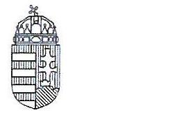
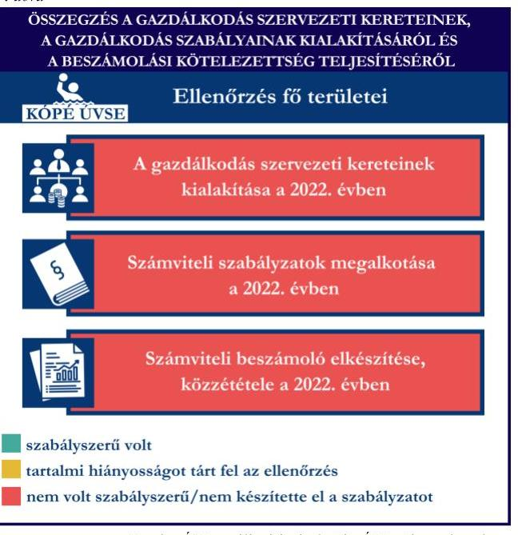
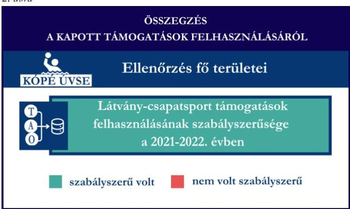
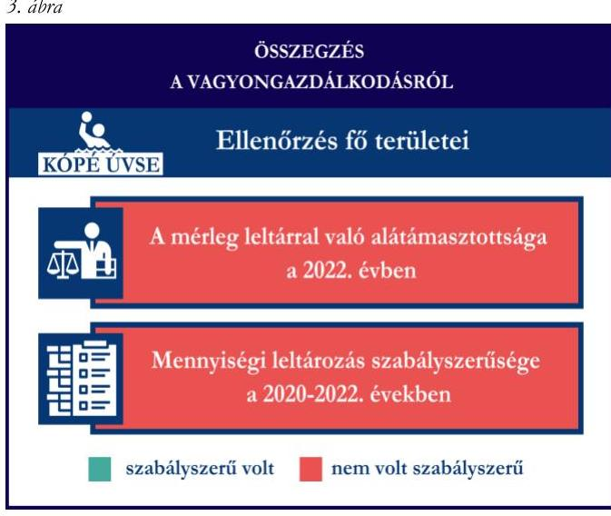

# JELENTÉS 

Támogatásban részesülő sportszövetségek, sportegyesületek és sportvállalkozások gazdálkodásának ellenőrzése

Kópé Úszó-, Vízilabda Sportegyesület

2024.

---

ÁLLAMI
SZÁMVEVŐSZÉK

# JELENTÉS 

## Támogatásban részesülő sportszövetségek, sportegyesületek és sportvállalkozások gazdálkodásának ellenőrzése

Kópé Úszó-, Vízilabda Sportegyesület

2024.

---

# ELLENŐRZÉSI IGAZGATÓSÁG: 

ÁLLAMHÁZTARTÁSON KÍVÜLI SZERVEZETEKET ELLENŐRZŐ IGAZGATÓSÁG

## ELLENŐRZÉSI IGAZGATÓ:

## KLINGA LÁSZLÓ igazgató

## ELLENŐRZÉSVEZETŐ:

Jelentéseink az interneten a www.asz.hu címen olvashatók:

KAKAS SÁNDOR ellenőrzésvezető

IKTATÓSZÁM: EL-4031-016/2024
TÉMASORSZÁM: 30
ELLENŐRZÉS-AZONOSÍTÓ SZÁM: V1078

---

# TARTALOMJEGYZÉK 

- AZ ELLENŐRZÉS ALAPADATAI ..... 5
- AZ ELLENŐRZÖTT SZERVEZET ..... 7
- ÖSSZEFOGLALÁS ..... 8
- AZ ELLENŐRZÉS FÓKUSZTERÜLETEI ..... 10
- MEGÁLLAPÍTÁSOK ..... 11
- JAVASLATOK ..... 16
- MELLÉKLETEK ..... 18
I. sz. melléklet: Értelmező szótár ..... 18
II. sz. melléklet: Az ellenőrzött szervezetek jegyzéke ..... 20
III. sz. melléklet: Fő ellenőrzési kritériumok fő ellenőrzési fókuszterületek szerint. ..... 21
- FÜGGELÉK: ÉSZREVÉTELEK ..... 23
- RÖVIDÍTÉSEK JEGYZÉKE ..... 24

---

.

---

# AZ ELLENŐRZÉS ALAPADATAI 

## AZ ELLENŐRZÉS CÉLJA

Az ellenőrzés célja az államháztartásból nyújtott támogatással, vagy az államháztartásból meghatározott célra ingyenesen juttatott vagyon felhasználásával érintett sportszövetségek, sportegyesületek és sportvállalkozások gazdálkodása szabályozottságának, gazdálkodási tevékenységének, ezen belül a beszámolási kötelezettség teljesítésének, a támogatások elkülönített nyilvántartásának, valamint a támogatások felhasználásának ellenőrzése.

## AZ ELLENŐRZÉS TÍPUSA

Kombinált ellenőrzés.

## AZ ELLENŐRZÖTT IDŐSZAK

Az 1. fókuszterület vonatkozásában a 2022. év.
A 2. fókuszterület vonatkozásában a 2021-2022. évek.
A 3. fókuszterület vonatkozásában a 2022. év, a mennyiségi felvétellel történő leltározás dokumentumai tekintetében a 2020-2022. évek.

## AZ ELLENŐRZÉS TÁRGYA

Az ellenőrzés tárgyát képezte a támogatásban részesülő sportegyesület gazdálkodása szabályozottságának, gazdálkodási tevékenységén belül a beszámolási kötelezettség teljesítésének, a vagyonnyilvántartásának, a támogatások elkülönített nyilvántartásának, valamint az államháztartási forrásból származó közvetlen vagy közvetett támogatások és a meghatározott célra ingyenesen juttatott vagyon felhasználásának vizsgálata. Az ellenőrzés a támogatások vonatkozásában kiterjedt továbbá a támogató felé történő beszámolási és elszámolási kötelezettségek teljesítésére, a jogszabályi és belső előírások betartására.

Az ellenőrzés kiterjedt minden olyan körülményre és adatra, amely az ÁSZ ¹ jogszabályban meghatározott feladatainak teljesítéséhez, valamint az ellenőrzési program végrehajtása során felmerülő újabb összefüggések feltárásához szükséges volt. Az ellenőrzés az 1. és 3. fókuszterületek esetében az ellenőrzött szervezet egészére, a 2. fókuszterület esetén kizárólag a vízilabda szakágra vonatkozóan került végrehajtásra.

## AZ ELLENŐRZÉS JOGALAPJA

Az ellenőrzés jogszabályi alapját az ÁSZ tv. ² 1. § (3) bekezdése és az 5. § (3) bekezdése előírásai képezték.

---

# AZ ELLENŐRZÉS MÓDSZERE 

Az ellenőrzést a nemzetközi standardokat irányadónak tekintve az ellenőrzési program szempontjai, az ellenőrzött időszakban hatályos jogszabályok, az ellenőrzés általános szakmai szabályai, az ellenőrzésre irányadó ÁSZ módszertanok figyelembevételével végezte az ÁSZ.

Az ellenőrzési kérdések megválaszolásához szükséges bizonyítékok megszerzése az ellenőrzött szervezet által rendelkezésre bocsátott dokumentumokra, adatokra alapozva kérdésfeltevés (információkérés), interjú, mintavételezés útján történt.

Az ellenőrzési bizonyítékként felhasználható adatforrások közé tartoztak egyrészt az ellenőrzés során az ellenőrzött szervezettől bekért dokumentumok, másrészt adatforrás volt minden további, az ellenőrzés folyamán feltárt, az ellenőrzés szempontjából információt tartalmazó egyéb adatforrás.

A támogatásokkal, azok felhasználásával kapcsolatos kötelezettségek vizsgálatára mintavételi eljárások kerültek alkalmazásra. Támogatás-típusok szerint nagyságrend alapján egy darab támogatás képezte a vizsgálat tárgyát. Ezen támogatások felhasználásának szabályszerűsége támogatásonként kockázatértékelés alapján kiválasztott tételekkel került ellenőrzésre. A kiválasztott támogatási szerződésekhez kapcsolódó elszámolásokból 30 db tétel került ellenőrzésre, ahol az elszámolás nem érte el a 30 db -ot, ott tételes ellenőrzésre került sor. Ezen felül a vagyongazdálkodás szabályszerűségének ellenőrzéséhez is kockázatalapú mintavétel kapcsolódott. A támogatások felhasználása és a vagyongazdálkodás területén a tételek ellenőrzése kiterjedt a könyvvezetési kötelezettség vizsgálatára is. A tárgyi eszközök tekintetében 30 db került kiválasztásra a 2022. évben állományban lévő eszközök közül azok nyilvántartásának, elszámolásának szabályszerűsége ellenőrzése céljából. A kiválasztott tételek ellenőrzésének eredménye nem került kivetítésre a teljes sokaságra, a megállapítások az adott ellenőrzött tételek vonatkozásában kerültek megjelenítésre.

---

# AZ ELLENŐRZÖTT SZERVEZET 

A Kópé Úszó-, Vízilabda Sportegyesületet 2006. október 12-én alapították. Alapszabálya ³ szerinti céljai „A vízilabda- és úszósport, továbbá a szinkronúszás és triatlon népszerűsítése, szabadidősportként történő, széles körben való elterjesztése. Amatőr, hivatásos és vegyes versenyrendszerekben való részvétel. Utánpótlás-nevelés, tehetséggondozás. Humán egészségügyi ellátás nyújtása a gyógyúszás (hidroterápia) területén." Az KÓPÉ ÚVSE-nél az ellenőrzött időszakban két szakosztály (vízilabda, versenyúszó) működött.

A KÓPÉ ÚVSE legfőbb szerve a Küldöttgyűlés, ügyvezető szerve a három tagból álló (1 fő elnök, 1 fő elnökhelyettes, 1 fő elnökségi tag) Elnökség, legfőbb tisztségviselője az elnök, aki ellátta a törvényes képviseletet, képviseleti joga gyakorlásának terjedelme általános, módja önálló.

A KÓPÉ ÚVSE az ellenőrzött időszakban jogszabályi előírás alapján könyvvizsgálatra nem, felügyelőbizottság létrehozására kötelezett volt. A KÓPÉ ÚVSE az ellenőrzött időszakban három tagú felügyelőbizottsággal rendelkezett. A 2022. évben a KÓPÉ ÚVSE vállalkozási tevékenységet nem végzett.

A KÓPÉ ÚVSE az ellenőrzött időszakban két gazdasági társaság (rész)tulajdonosa volt, a KÓPÉ-SZIGET Vízilabda Akadémia Nonprofit Korlátolt Felelősségű Társaságban 1/1 tulajdoni hányaddal, a Kópé Vízilabda Kft.-ben 1/3 tulajdoni hányaddal rendelkezett.

A KÓPÉ ÚVSE vízilabda szakosztály által az ellenőrzött időszakban igénybe vett támogatásokat az 1. táblázat mutatja be.

1. táblázat

## A KÓPÉ ÚVSE VÍZILABDA SZAKOSZTÁLY ÁLTAL IGÉNYBE VETT TÁMOGATÁSOK (ADATOK M FT-BAN)

|  | 2021. EV | 2022. EV |
| :-- | :--: | :--: |
| Központi költségvetési támogatás | - | - |
| Látvány-csapatsport támogatás | 148,8 | 111,3 |
| Helyi önkormányzati támogatás | - | - |
| Magyar Vízilabda Szövetségtől kapott támogatás | - | - |

---

# ÖSSZEFOGLALÁS 

Magyarország Alaptörvényének XX. cikke kimondja, hogy mindenkinek joga van a testi és lelki egészséghez, melynek érvényesülését Magyarország többek között a sportolás és a rendszeres testedzés támogatásával segíti elő. Az Országgyűlés a Sport tv. ⁵-ben kinyilvánította, hogy a nemzet közössége a test művelését, a sportot, a nemzet alapértékének, kívánatos célnak tekinti. A sport a közjó része. Erősíti a közösség tagjainak egymáshoz tartozását, miként az egyén testi és lelki egészségét.

A sportegyesületek, sportszövetségek, sportvállalkozások működésükre és szakmai tevékenységük ellátására költségvetési támogatásban, önkormányzati támogatásban, ingyenes vagyonjuttatásban, valamint látvány-csapatsport támogatásban részesülhetnek, amelyekre fokozott figyelem irányul.

A társadalom részéről jogosan felmerülő elvárás, hogy a közpénzeket kezelő, azzal gazdálkodó szervezetek működéséről, tevékenységéről átfogó képet kapjon, a közpénzek rendeltetésszerű és átlátható módon történő felhasználásának értékelésére időről-időre sor kerüljön az ellenőrzések keretében.

A KÓPÉ ÚVSE a könyvviteli szolgáltatás személyi feltételeinek megteremtéséről gondoskodott, a felügyelőbizottság összetétele az ellenőrzött időszakban nem felelt meg az Alapszabály előírásainak. A jogszabályi előírásokkal ellentétben a KÓPÉ ÚVSE nem alakította ki a számviteli politikáját, a pénzkezelési szabályzat kivételével nem készítette el számviteli szabályzatait. Rendelkezett számlarenddel, azonban annak tekintetében tartalmi hiányosságot tárt fel az ellenőrzés.

A 2022. évben a könyvvezetési kötelezettség teljesítése nem felelt meg a jogszabályi előírásoknak. A KÓPÉ ÚVSE a számviteli beszámoló- és közhasznúsági melléklet készítési- és közzétételi kötelezettségét nem szabályszerűen teljesítette.

A gazdálkodás szervezeti keretei kialakításának, a számviteli szabályzatok megalkotásának, valamint a

számviteli beszámoló elkészítése, közzététele a 2022. évben
szabályszerű volt
tartalmi hiányosságot tárt fel az ellenőrzés
nem volt szabályszerű/nem készítette el a szabályzatot
2. ábra

A KÓPÉ ÚVSE a látvány-csapatsport támogatást és a kiegészítő sportfejlesztési támogatást a 2021-2022. években az ellenőrzött tételek esetében a támogatási célnak megfelelően, szabályszerűen használta fel. Számviteli nyilvántartásában a kapott támogatásokat és azok felhasználását a jogszabályi előírás ellenére elkülönítetten nem tartotta nyilván.

A kapott támogatások felhasználásának értékelését a 2. ábra mutatja be.

---

A KÓPÉ ÚVSE vagyongazdálkodása a 2022. évben nem volt szabályszerű, mert a 2022. évi egyszerűsített éves beszámolójának mérleg tételeit leltárral nem támasztotta alá, továbbá a 2020-2022. évre vonatkozóan a mennyiségi felvétellel történő leltározást nem végezte el.

Az ellenőrzött tételek esetében a tárgyi eszközök bekerülési értéke, üzembe helyezése tekintetében az ellenőrzés hiányosságot tárt fel.
A vagyongazdálkodás értékelését a 3. ábra mutatja be.

---

# AZ ELLENŐRZÉS FÓKUSZTERÜLETEI 

1.     - A gazdálkodási szabályok kialakítása, a könyvvezetési- és beszámolási kötelezettség teljesítése
2.     - A kapott támogatások felhasználása
3.     - Az ellenőrzött szervezet vagyongazdálkodása

---

# 1. A gazdálkodási szabályok kialakítása, a könyvvezetési- és beszámolási kötelezettség teljesítése 

Összegző megállapítás

A 2022. évben a KÓPÉ ÚVSE-nél a gazdálkodás szervezeti kereteinek, a gazdálkodás szabályainak kialakítása nem felelt meg a jogszabályi előírásoknak. A könyvvezetési-, beszámolási-, és közzétételi kötelezettség teljesítése nem volt szabályszerű.

A 2022. évben a KÓPÉ ÚVSE a Számv. tv. ⁶ és a Civilszr. ⁷-ben foglalt jogszabályi előírások betartásával gondoskodott a könyvviteli szolgáltatás személyi feltételeinek megteremtéséről, a könyvviteli szolgáltatás körébe tartozó feladatok ellátásával olyan számviteli szolgáltatást nyújtó társaságot bízott meg, amelynek a feladat irányításával, vezetésével, a beszámoló elkészítésével megbízott tagja megfelelt a jogszabályi követelményeknek.
A KÓPÉ ÚVSE a Ptk. ⁸ előírása alapján létrehozta a felügyelőbizottságot, a felügyelőbizottság tagjainak száma megfelelt a Ptk. előírásainak, azonban az Alapszabály 9.3 Felügyelő Bizottság/3.2. pontjában foglaltaknak - amely szerint a felügyelőbizottság tagjai „az Egyesülettel e megbízáson kívül más tevékenység kifejtésére irányuló munkaviszonyban vagy munkavégzésre irányuló egyéb jogviszonyban nem állhatnak" - megfelelő összetételű felügyelőbizottságról nem gondoskodott, mivel a felügyelőbizottság elnöke, továbbá a felügyelőbizottság egy tagja a KÓPÉ ÚVSE-vel megbízási jogviszonyban állt, további egy tag pedig annak a vállalkozásnak az ügyvezetője volt, akivel a KÓPÉ ÚVSE megbízási szerződést kötött a 2021/2022-es támogatási időszak alatt a látvány-csapatsport támogatás igénybevételéhez, felhasználásához szükséges valamennyi adminisztrációs tevékenység elvégzésére.
A KÓPÉ ÚVSE a 2022. évben a Számv. tv. 14. § (3) bekezdésében előírtak ellenére nem rendelkezett számviteli politikával, továbbá a Számv. tv. 14. § (5) bekezdés a) és b) pontjaiban foglaltak ellenére nem készítette el az eszközök és a források leltárkészítési és leltározási szabályzatát, valamint az eszközök és a források értékelési szabályzatát. A KÓPÉ ÚVSE a 2022. évben a Számv. tv.-ben előírt pénzkezelési szabályzatot elkészítette ⁹, amely az ellenőrzött tartalmi kritériumoknak megfelelt. A KÓPÉ ÚVSE a Számv. tv. szerint a számlarendet ¹⁰ elkészítette, amely azonban

- a Számv. tv. 161. § (2) bekezdés a) pontjában foglaltak ellenére nem minden esetben tartalmazta minden alkalmazásra kijelölt számla számjelét, megnevezését, mert a számlarend részeként rendelkezésre bocsátott számlatükör (főkönyvi törzs) nem volt összhangban a számlarenddel (pl.: a számlarendben a 382 TAO pénztár, 383 Csekkek; az 516 Termékbemutató anyag, a 478 EMMI 2015/2016 hosszabbítás elsz. szla, a 482 Költségek, ráfordítások passzív időbeli elhatárolása, az 5238 TAO bíró, orvos, rendezési díjak; a számlatükörben a 382 Valutapénztár, a 383 TAO elszámolás pénztár; a 478 APEH Inkasszó, a 482 TAO 2014-2015, az 516 Sporteszközök, az 5238 TAO Edzőtábor), továbbá a számlarend nem tartalmazta a számlatükörben (főkönyvi törzs) megadott 9691 Látványcsapatsport támogatás és a 9692 NAV 1% főkönyvi számlákat.

---

- az előzőekben részletezettek okán a Számv. tv. 161. § (2) bekezdés b) pontjában foglaltak ellenére nem minden esetben tartalmazta a számla tartalmát, ha az a számla megnevezéséből egyértelműen nem következett, továbbá a számla értéke növekedésének, csökkenésének jogcímeit,

 a számlát érintő gazdasági eseményeket, azok más számlákkal való kapcsolatát;
- nem tartalmazta a Számv. tv. 161. § (2) bekezdés d) pontjában előírtak ellenére a számlarendben foglaltakat alátámasztó bizonylati rendet.
- a számlarend mellékletét képező számlatükör - a 2015. évi CI. törvény Számv. tv. módosításaira vonatkozó rendelkezései ellenére, amely 2015. július 4-től hatályon kívül helyezte a Számv. tv. rendkívüli bevételekre és ráfordításokra vonatkozó előírásait - tartalmazta a 88 Rendkívüli ráfordítások főkönyvi számlacsoportot és a 989 Egyéb rendkívüli bevételek főkönyvi számlát.
A KÓPÉ ÚVSE a Civilszr. előírásainak megfelelően a 2022. évben kettős könyvvitelt vezetett. A KÓPÉ ÚVSE a Civilszr. rendelkezései alapján a 2022. évi egyszerűsített éves beszámolójában valamennyi bevételét az egyéb bevételek között mutatta ki, továbbá az egyéb bevételeken belül a tagdíjakat és a kapott támogatások összegét részletezte, azonban a Számv. tv. 4. § (1) bekezdésében foglaltak ellenére a 2022. évi egyszerűsített éves beszámolóját könyvvezetéssel teljeskörűen nem támasztotta alá. A KÓPÉ ÚVSE a Számv. tv. 16. § (3) bekezdésében foglaltak ellenére a beszámolóban és az azt alátámasztó könyvvezetés során egyes gazdasági eseményeket, ügyleteket nem a tényleges gazdasági tartalmuknak megfelelően mutatta be, mivel könyvviteli nyilvántartásában a tagdíjbevételek között úszás oktatás, vízilabda oktatás, táboroztatások térítési díjai, illetve más szolgáltatás értéke is szerepelt, amelyek tényleges gazdasági tartalma nem tagdíjbevétel volt. A 2022. évben a készpénzben megfizetett tagdíjbevételek könyvelését egy esetben sem szabályszerű bizonylatokkal támasztották alá - mivel olyan nyugták alapján rögzítettek tagdíj bevételeket, amelyek a Számv. tv. 167. § (1) bekezdés b) és e) pontban előírt, a könyvviteli elszámolást közvetlenül alátámasztó bizonylat tartalmi kellékeit nem tartalmazta, mert azokon sem a gazdasági esemény leírása, sem a befizető neve, sem a nyugta kiállítójának neve és adatai nem szerepeltek - ezzel megsértették a Számv. tv 165. § (2) bekezdés előírását.
A KÓPÉ ÚVSE-nél a Számv. tv. 164. § (1) bekezdés előírásai ellenére a 2022. évi könyvviteli zárlat során, az üzleti év végén a folyamatos könyvelés teljessé tétele érdekében elvégzendő kiegészítő, helyesbítő, egyeztető, összesítő könyvelési munkákat nem hajtották végre, mivel a 2022. év végi főkönyvi kivonat 3843 BB 10103874-59138600-02003001 főkönyvi számán kimutatott egyenleg (3 734 786 Ft) nem egyezett meg az adott év december 31-ei egyenleget igazoló bankbizonylat szerinti 2022. év végi egyenleggel (1 627 787 Ft), továbbá egy Közreműködői díjról kiállított számla összegét (944 352 Ft) a 2022. évben a KÓPÉ ÚVSE kiegyenlítette, de a számla összegéből 834 403 Ft kiadás könyvelése nem történt meg a 2022. évben, amely hiba a 2022. évi számviteli beszámoló eredménylevezetésének helyességét is érinti.
A fentieken túl a KÓPÉ ÚVSE a 2022. évben a Számv. tv 165. § (2) bekezdésben előírtak ellenére a számviteli nyilvántartásaiba bizonylat nélkül jegyzett be adatokat, ezzel megsértette a Számv. tv. 159. § előírását,
- mivel nem olyan könyvviteli nyilvántartást vezetett, amely a valóságnak megfelelően mutatja a gazdasági műveleteket, többek között a „3692 Technikai átvezetési számla" főkönyvi számla 2022. év végi egyenleg (41 964 790 Ft) levezetését, összetételének bemutatását nem tudta alátámasztani;
- bank-pénztár közötti forgalom, pénzeszköz pénztárba történő befizetését bizonylattal nem tudta alátámasztani;

---

- a 2022. december 31-én elszámolt értékvesztések (összesen 3 206 528 Ft) elszámolását dokumentummal (pl. vezetői döntés) szintén nem tudta alátámasztani;
- adott, illetve kapott kölcsönök vonatkozásában szerződés, bizonylat nem állt rendelkezésre.

A KÓPÉ ÚVSE a Civil tv. ${ }^{11}$ 30. § (1) bekezdésében foglaltak ellenére a Küldöttgyűlés által elfogadott, a Számv. tv. 20. § (6) bekezdésben előírtak ellenére a hely és a kelet feltüntetésével a képviseletre jogosult személy által aláírt 2022. évre vonatkozó egyszerűsített éves beszámolóval nem rendelkezett. A felügyelőbizottság
a Ptk. 3:27. § (1) bekezdésében foglaltak ellenére a 2022. évre vonatkozó egyszerűsített éves beszámolót nem vizsgálta meg, jelentést kizárólag a KÓPÉ ÚVSE 2022. évi gazdálkodásáról készített.
A KÓPÉ ÚVSE a 2022. évre vonatkozóan az OBH honlapján „egyszerűsített éves beszámoló" elnevezéssel közzétett adatokat, azonban a Civil tv. 30. § (1) bekezdésben előírtak ellenére csak határidőn túl, 2024. március 12-én. A közzétett „egyszerűsített éves beszámoló" dokumentum a Civil tv. 29. § (2) bekezdés a) pontjában foglaltak ellenére nem tartalmazott tárgyévi mérlegadatokat, továbbá a Civil tv. 29. § (2) bekezdés c) pontjában, a Civilszr. 7. § (6) bekezdésében és 22. § (1) bekezdésében foglaltak ellenére nem tartalmazott kiegészítő mellékletet. A KÓPÉ ÚVSE határidőn túl közzétett közhasznúsági melléklete a Civil tv. 29. § (7) bekezdésében előírtak ellenére a Civil vhr. ${ }^{12}$ mellékletében szereplő 5-6. pontokat (Célszerinti juttatások; Vezető tisztségviselőnek nyújtott juttatások) nem tartalmazta.

# 2. A kapott támogatások felhasználása 

Összegző megállapítás

A KÓPÉ ÚVSE a 2021. és a 2022. években a kapott látványcsapatsport támogatás, illetve a kiegészítő sportfejlesztési támogatást az ellenőrzött tételek vonatkozásában szabályszerűen használta fel. A KÓPÉ ÚVSE a jogszabályi előírások ellenére sem a kapott támogatást, sem annak felhasználását nem tartotta elkülönítetten nyilván.

A KÓPÉ ÚVSE a látvány-csapatsport támogatások esetében a 2021-2022. években teljeskörűen nem tett eleget a jogszabályi előírásoknak, mivel a 107/2011. (VI. 30.) Korm. rendelet ${ }^{13}$ 11. § (2) bekezdésében foglaltak ellenére az SFP-08049/2021/MVLSZ támogatás felhasználásáról negyedévente az előrehaladási jelentéseket határidőn túl nyújtotta be az MVLSZ ${ }^{14}$ felé.
A KÓPÉ ÚVSE a számára nyújtott látvány-csapatsport támogatásról a 107/2011. (VI. 30.) Korm. rendeletnek megfelelően határidőben benyújtotta az elszámolást a támogató felé. A támogatási időszak lezárultát követően a támogatás felhasználását a jogszabályban foglaltak szerint záradékolt számviteli bizonylatokkal alátámasztott módon, összesített elszámolási táblázattal és szöveges szakmai beszámolóval igazolta. A KÓPÉ ÚVSE a 107/2011. (VI. 30.) Korm. rendeletnek megfelelően könyvvizsgáló által ellenőrzött számviteli bizonylatokkal számolt el a támogató felé. A könyvvizsgáló a 107/2011. (VI. 30.) Korm. rendeletben előírt felelősségbiztosítással rendelkezett.
A KÓPÉ ÚVSE az ellenőrzött időszak könyvvezetése során az alapcél szerinti tevékenysége költségei, ráfordításai ellentételezésére kapott támogatásokról nem vezetett a Civil tv. 20. § (4) bekezdésében előírt elkülönített számviteli nyilvántartást, amelynek alapján támogatásonként megállapítható és ellenőrizhető a kapott támogatás felhasználása, ezáltal nem tett eleget a 107/2011. (VI. 30.) Korm. rendelet 9. § (9)

---

bekezdésében előírtaknak, mivel a látvány-csapatsport támogatás, illetve a kiegészítő sportfejlesztési támogatás felhasználását nem tartotta elkülönítetten nyilván.
A KÓPÉ ÚVSE esetében a látvány-csapatsport támogatás és kiegészítő sportfejlesztési támogatás ellenőrzött tételeinek (30 db - 6 db) vonatkozásában az alábbiak kerültek megállapításra:

- a tételek számviteli elszámolását a Számv. tv.-ben és a 107/2011. (VI. 30.) Korm. rendeletben előírtak szerint bizonylatokkal alátámasztották;
- a 107/2011. (VI. 30.) Korm. rendeletben foglaltaknak megfelelően a tételek tartalma (gazdasági esemény) és összege alapján a támogatási igazolásban meghatározottak szerinti jogcímre, az abban meghatározott mértékben használták fel;
- a 107/2011. (VI. 30.) Korm. rendeletben foglaltaknak megfelelően a tételek számviteli bizonylatai alapján a gazdasági események a támogatási időszak (meghosszabbított támogatási időszak) végéig szerződés szerint teljesültek;
- a 107/2011. (VI. 30.) Korm. rendeletben foglaltaknak megfelelően a tételek számviteli bizonylatai alapján a gazdasági események pénzügyi rendezése - három látvány-csapatsport támogatás és hat kiegészítő sportfejlesztési támogatás tétel kivételével - az elszámolás benyújtására nyitva álló határidőig - figyelemmel az elszámolási határidő hosszabbítására - a támogatási jogcímnek megfelelő pénzforgalmi számláról teljesült. A kivételt képező tételek esetén (Nev.díj ÉK UP IfiSerd. - 380 000 Ft; Sávbérlés - 99 000 Ft; Tagdíj - 12 000 Ft; Bérköltség P.G - 2021. október: 219 000 Ft, 94 770 Ft, 2021. november: 219 000 Ft, 381 000 Ft, 2021. december: 219 000 Ft, 212 551 Ft) a pénzügyi rendezés a 107/2011. (VI. 30.) Korm. rend. 9. § (8) bekezdésben foglaltak ellenére nem az adott támogatási jogcím önálló pénzforgalmi számlájáról történt. A látványcsapatsport támogatás tételei közül egy esetben az adott látvány-csapatsport támogatás másik támogatási jogcímének önálló pénzforgalmi számlájáról; két esetben a főszámláról; hat kiegészítő sportfejlesztési támogatás tétel esetében az adott látvány-csapatsport támogatás utánpótlás jogcímének önálló pénzforgalmi számlájáról.
- a tételek számviteli bizonylatait a 107/2011. (VI. 30.) Korm. rendeletben foglaltaknak megfelelően ellátták záradékkal;
- a számviteli bizonylatokon záradékolt összegek a 107/2011. (VI. 30.) Korm. rendeletben foglaltaknak megfelelően megegyeztek a számlaösszesítőben feltüntetett értékekkel;
- a tételek számviteli bizonylatának az adott sportfejlesztési program terhére záradékolt összegei a Számv. tv.-ben előírtak szerint a tartalmuknak megfelelő főkönyvi számra kerültek elszámolásra.

# 3. Az ellenőrzött szervezet vagyongazdálkodása 

## Összegző megállapítás A 2022. évben a KÓPÉ ÚVSE vagyongazdálkodása nem volt szabályszerű.

A KÓPÉ ÚVSE a közzétett 2022. évi egyszerűsített éves beszámolója mérlegtételeinek alátámasztásához a Számv. tv. 69. § (1) bekezdésében előírtak ellenére nem állított össze leltárat, amely tételesen és ellenőrizhető módon tartalmazta a KÓPÉ ÚVSE mérleg fordulónapján meglévő eszközeit és forrásait mennyiségben és értékben. A KÓPÉ ÚVSE a Számv. tv. 69. § (2) bekezdésében előírtak ellenére a

---

főkönyvi könyvelés és az analitikus nyilvántartások adatai közötti egyeztetést a 2022. év mérlegfordulónapjára vonatkozóan a mérlegtételek esetében dokumentáltan nem végezte el.
A KÓPÉ ÚVSE a tárgyi eszközökről a számviteli alapelveknek megfelelő folyamatos mennyiségi nyilvántartást vezetett, a Számv. tv. 69. § (3) bekezdésében foglaltak ellenére a 2020-2022. évi időszakra vonatkozóan mennyiségi felvétellel történő leltározást egyik évben sem végzett.
A KÓPÉ ÚVSE esetében a tárgyi eszköz tételek (30 db) ellenőrzése során az alábbiak kerültek megállapításra:

- a tételek bekerülési értékét alátámasztó számviteli bizonylatok - tíz tétel kivételével - a Számv. tv.-nek megfelelően rendelkezésre álltak. A kivételt képező tíz tárgyi eszköz esetében a Számv. tv. 47. § (1) bekezdése szerinti bekerülési értékét a Számv. tv. 165. § (2) bekezdésében foglaltak ellenére bizonylattal nem támasztotta alá;
- a tárgyi eszközök számviteli besorolása megfelelt a Számv. tv. előírásainak;
- az üzembe helyezés tényét és időpontját - hat tétel kivételével - a Számv. tv.-nek megfelelően hitelt érdemlően dokumentálták. A kivételt képező tételek (Hőcserélő berendezés TAO 14,5% 6 032 500 Ft; Medencetisztító TAO - 5 951 156 Ft; Földgázégő 14,5% - 2 169 160 Ft; Tanmedence 6% - 400 000 Ft; Xerox Phaser nyomtató TAO - 295 100 Ft; Lenovo Ideapad 229 990 Ft) esetén - amelyeknél a bekerülési értékét alátámasztó számviteli bizonylatok sem álltak rendelkezésre - a Számv. tv. 52. § (2) bekezdésében foglaltak ellenére az üzembe helyezést hitelt érdemlő módon nem dokumentálták;
- az értékcsökkenés elszámolása - azon tételek esetén, ahol a bekerülési értékét alátámasztó számviteli bizonylat rendelkezésre állt - a Számv. tv.-nek megfelelően történt. Azon tételek esetén, ahol az eszközök bekerülési értékét alátámasztó bizonylatok nem álltak rendelkezésre, az eszköz tárgyévi értékcsökkenésének elszámolása nem volt ellenőrizhető.
- huszonkét tétel közül - ahol a tárgyi eszköz beszerzés támogatásból valósult meg - tíz tétel esetén, a tétel

 bekerülési értékét meghatározó számviteli bizonylatokat ellátták záradékkal, amelyből kiderül, hogy a számviteli bizonylaton szereplő összegből mennyit számoltak el a hivatkozott támogatás terhére. A kivételt képező tizenkét tétel közül nyolc eszköz esetén - a bekerülési értékét alátámasztó bizonylat hiánya okán - a záradékolás nem volt ellenőrizhető. További négy támogatásból finanszírozott tétel (úszó sátor - 59182000 Ft; Iveco busz TAO - 17989142 Ft; Mercedes kisbusz - 9000000 Ft; Aggregátor 14,5% TAO - 3418364 Ft) esetén a záradékolás a 107/2011. (VI. 30.) Korm. rend. 11. § (5) bekezdésében foglaltak ellenére nem történt meg.
A KÓPÉ ÚVSE-nál az ellenőrzés során a tárgyi eszközök vonatkozásában sor került hét tétel helyszíni szemrevételezésére, amely alapján az eszközök fizikailag fellelhetőek voltak.

---

# JAVASLATOK 

Az ÁSZ tv. 33. § (1) bekezdésében foglaltak értelmében az ellenőrzött szervezet vezetője köteles a jelentésben foglalt megállapításokhoz kapcsolódó intézkedési tervet összeállítani és azt a jelentés kézhezvételétől számított 30 napon belül az ÁSZ részére megküldeni. Amennyiben az ellenőrzött szervezet vezetője nem küldi meg határidőben az intézkedési tervet, vagy továbbra sem elfogadható intézkedési tervet küld, az Állami Számvevőszék elnöke az ÁSZ tv. 33. § (3) bekezdése a) és b) pontjaiban foglaltakat érvényesítheti.

## A KÓPÉ ÚSZÓ-, VÍZILABDA SPORTEGYESÜLET ELNÖKÉNEK

1. Gondoskodjon a Számv. tv. 14. § (3) bekezdésében foglaltaknak megfelelően a számviteli politika elkészítéséről.
2. Gondoskodjon a Számv. tv. 14. § (5) bekezdés a) pontjában foglaltaknak megfelelően az eszközök és a források leltárkészítési és leltározási szabályzatának elkészítéséről.
3. Gondoskodjon a Számv. tv. 14. § (5) bekezdés b) pontjában foglaltaknak megfelelően az eszközök és a források értékelési szabályzatának elkészítéséről.
4. Gondoskodjon a számlarend Számv. tv. 161. § (2) bekezdésében előírtaknak megfelelő tartalommal való elkészítéséről.
5. Gondoskodjon a Számv. tv. 16. § (3) bekezdésében foglaltaknak megfelelően, a beszámolóban és az azt alátámasztó könyvvezetés során az egyes gazdasági események, ügyletek tényleges gazdasági tartalmuknak megfelelő bemutatásáról.
6. Gondoskodjon a Számv. tv. 164. § (1) bekezdés előírásainak megfelelően a könyvviteli zárlat során, az üzleti év végén a folyamatos könyvelés teljessé tétele érdekében elvégzendő kiegészítő, helyesbítő, egyeztető, összesítő könyvelési munkák végrehajtásáról.
7. Gondoskodjon a Számv. tv. 165. § (2) bekezdés előírásainak megfelelően, hogy a számviteli (könyvviteli) nyilvántartásokba csak szabályszerűen kiállított bizonylat alapján kerüljenek adatok bejegyzésre.

---

8. Gondoskodjon a Számv. tv. 4. § (1) bekezdésében foglaltaknak megfelelően könyvvezetéssel alátámasztott, a Civil tv. 29. § (2) bekezdés a) és c) pontjaiban, 30. § (1) bekezdésében és a Számv. tv. 20. § (6) bekezdésben előírt tartalmú beszámoló elkészítéséről.
9. Gondoskodjon a Civil tv. 29. § (7) bekezdésében, 30. § (1) bekezdésében foglaltaknak megfelelő közhasznúsági melléklet elkészítéséről.
10. Gondoskodjon a beszámoló és a közhasznúsági melléklet Civil tv. 30. § (1)-(4) bekezdésében előírtaknak megfelelő közzétételéről.
11. Gondoskodjon arról, hogy a látvány-csapatsport támogatások és a kiegészítő sportfejlesztési támogatás felhasználását a Civil tv. 20. § (4) bekezdésében és a 107/2011. (VI. 30.) Korm. rendelet 9. § (9) bekezdésében foglalt előírásoknak megfelelően elkülönítetten tartsa nyilván.
12. Gondoskodjon a 107/2011. (VI. 30.) Korm. rendelet 9. § (8) bekezdésében előírtaknak megfelelően, valamennyi gazdasági esemény pénzügyi rendezése az adott támogatási jogcím önálló pénzforgalmi számlájáról történjen.
13. Gondoskodjon a beszámoló mérlegtételeinek leltárral történő alátámasztásáról a Számv. tv. 69. § (1)(2) bekezdés előírásainak megfelelően.
14. Gondoskodjon a Számv. tv. 69. § (3) bekezdésében foglaltaknak megfelelően mennyiségi felvétellel történő leltározás teljeskörű elvégzéséről.
15. Gondoskodjon valamennyi tárgyi eszköz esetében a bekerülési érték bizonylattal történő alátámasztásáról a Számv. tv. 165. § (2) bekezdésében előírtak szerint.
16. Gondoskodjon a Számv. tv. 52. § (2) bekezdésében foglaltaknak megfelelően valamennyi tárgyi eszköz üzembe helyezésének hitelt érdemlő módon történő dokumentálásáról.
17. Gondoskodjon a 107/2011. (VI. 30.) Korm. rend. 11. § (5) bekezdésében foglaltaknak megfelelően valamennyi számviteli bizonylat záradékolásra kerüljön.

---

# MELLÉKLETEK 

## I. SZ. MELLÉKLET: ÉRTELMEZŐ SZÓTÁR

Civil szervezet

Egyesület

Kiegészítő sportfejlesztési támogatás

Költségvetési támogatás

Közhasznú szervezet

Közhasznú tevékenység

Látvány-csapatsport támogatás

Látvány-csapatsportban működő amatőr sportszervezet

Látvány-csapatsportban működő hivatásos sportszervezet

A civil társaság; a Magyarországon nyilvántartásba vett egyesület - a párt, a szakszervezet és a kölcsönös biztosító egyesület kivételével és - a közalapítvány és a pártalapítvány kivételével - az alapítvány. (Forrás: Civil tv. 2. § 6. pont a)-c) alpontjai)

Az egyesület a tagok közös, tartós, alapszabályban meghatározott céljának folyamatos megvalósítására létesített, nyilvántartott tagsággal rendelkező jogi személy. (Forrás: Ptk. 3:63. § (1) bekezdés)
A Számv. tv. szempontjából egyéb szervezet. (Számv. tv. 3. § (1) bekezdés 4. pont a) alpontja)

A látvány-csapatsportok támogatása esetében rendelkező nyilatkozatban felajánlott összeg 12,5 százaléka kiegészítő sportfejlesztési támogatásnak minősül. (Forrás: Tao tv. ${ }^{15}$ 24/A. § (9) bekezdés)
A társadalombiztosítás pénzügyi alapjai kivételével az államháztartás központi alrendszeréből ellenérték nélkül, pénzben nyújtott támogatások.
(Forrás: Áht. ${ }^{16}$ 1. § 14. pont)
Közhasznú szervezetté minősíthető a Magyarországon nyilvántartásba vett közhasznú tevékenységet végző szervezet, amely a társadalom és az egyén közös szükségleteinek kielégítéséhez megfelelő erőforrásokkal rendelkezik, továbbá amelynek megfelelő társadalmi támogatottsága kimutatható, és amely:
a) civil szervezet (ide nem értve a civil társaságot), vagy
b) olyan egyéb szervezet, amelyre vonatkozóan a közhasznú jogállás megszerzését törvény lehetővé teszi. (Forrás: Civil tv. 32. § (1) bekezdés)
Minden olyan tevékenység, amely a létesítő okiratban megjelölt közfeladat teljesítését közvetlenül vagy közvetve szolgálja, ezzel hozzájárulva a társadalom és az egyén közös szükségleteinek kielégítéséhez. (Forrás: Civil tv. 2. § 20. pont)
Az adóévben visszafizetési kötelezettség nélkül nyújtott támogatás, juttatás, véglegesen átadott pénzeszköz és térítés nélkül átadott eszköz könyv szerinti értéke, az adóévben térítés nélkül nyújtott szolgáltatás bekerülési értéke a Tao tv.-ben meghatározott jogcímeken. (Forrás: Tao tv. 4. § 44. pont)
Minden olyan, a sportról szóló törvényben meghatározott szabályok szerint a látvány-csapatsportban működő sportegyesület vagy sportvállalkozás, amelyik nem minősül a látvány-csapatsportban működő hivatásos sportszervezetnek. (Forrás: Tao tv. 4. § 42. pont)
A látvány-csapatsportágak országos sportági szakszövetsége által kiírt versenyrendszer legmagasabb felnőtt bajnoki osztályában - a veterán korosztályokra kiírt versenyrendszer kivételével - részt vevő (indulási jogot elnyert) sportszervezet, vagy alsóbb bajnoki osztályaiban részt vevő (indulási jogot elnyert) sportszervezet abban az esetben, ha az ilyen sportszervezet hivatásos sportolót alkalmaz. Több látvány-csapatsportban több jogi személy szervezeti egységgel (szakosztállyal) működő sportszervezet esetén csak az a jogi személy szervezeti egység (szakosztály), amely a fent részletezett versenyrendszerek bajnoki osztályaiban részt vesz. (Forrás: Tao tv. 4. §43. pont)

---

Országos sportági szakszövetség

Sportági szövetség

Sportegyesület

Sportegyesületeknek, sportszövetségeknek nyújtott költségvetési támogatás

Sportszövetség

Sporttevékenység

Sportvállalkozás

Olyan sportszövetség, amely sportágában kizárólagos jelleggel az e törvényben, valamint más jogszabályokban meghatározott feladatokat lát el és e törvényben megállapított különleges jogosítványokat gyakorol. Olyan sportágban hozható létre, amelyet vagy a Nemzetközi Olimpiai Bizottság elismert, vagy amely sportág nemzetközi szövetségét felvették a Nemzetközi Sportszövetségek Szövetségébe (GAISF). (Forrás: Sport tv. 20. § (1), (4) bekezdés)
A Civil tv. és a Ptk. előírásai alapján - a Sport tv.-ben meghatározott eltérésekkel - működő szövetség, amelynek tagjai kizárólag sportszervezetek lehetnek. Sportági szövetség országos jelleggel is működhet. Egy sportágban csak egy országos sportági szövetség működhet. Törvényi feltételek teljesülése esetén szakszövetségi feladatokat is elláthat. (Forrás: Sport tv. 28. §)
A Civil tv. és a Ptk. szabályai szerint működő olyan egyesület, amelynek alaptevékenysége a sporttevékenység szervezése, valamint a sporttevékenység feltételeinek megteremtése. A sportegyesületek a Sport tv. 15. § (1) bekezdésében meghatározott sportszervezetek körébe tartoznak. A sportegyesületeken kívül sportszervezet még a sportvállalkozás, a sportiskola, valamint az utánpótlásnevelés fejlesztését végző alapítvány. (Forrás: Sport tv. 16. § (1) bekezdés)
Az állami sport célú támogatások felhasználásáról és elosztásáról szóló 474/2016. (XII. 27.) Korm. rendelet ${ }^{17}$ és a 27/2013. (III. 29.) EMMI rendelet ${ }^{18}$ 1. §-ában meghatározott fejezeti kezelésű előirányzatokból nyújtott támogatás.
Meghatározott sporttevékenységek körében a sportversenyek szervezésére, a tagok érdekvédelmére és a részükre való szolgáltatásokra, valamint a nemzetközi kapcsolatok lebonyolítására létrehozott, jogi személyiséggel és önkormányzattal rendelkező, a Civil tv. és a Ptk. alapján - az e törvényben foglalt eltérésekkel különös formában működő egyesületek. A Sport tv. 19. § (3) bekezdése szerint a sportszövetségeknek az alábbi típusai léteznek: országos sportági szakszövetségek, sportági szövetségek, szabadidősport szövetségek, fogyatékosok sportszövetségei, diák- és egyetemi-főiskolai sport sportszövetségei, nemzetközi sportszövetségek. (Forrás: Sport tv. 19. § (1), (3) bekezdés)

Meghatározott szabályok szerint, a szabadidő eltöltéseként kötetlenül vagy szervezett formában, illetve versenyszerűen végzett testedzés vagy szellemi sportágban kifejtett tevékenység, amely a fizikai erőnlet és a szellemi teljesítőképesség megtartását, fejlesztését szolgálja. (Forrás: Sport tv. 1. § (2) bekezdés)

Az a gazdasági társaság, amelynek a cégnyilvántartásról, a cégnyilvánosságról és a bírósági cégeljárásról szóló törvény alapján a cégjegyzékbe bejegyzett tevékenysége sporttevékenység, továbbá a gazdasági társaság célja sporttevékenység szervezése, valamint a sporttevékenység feltételeinek megteremtése egy vagy több sportágban. Korlátolt felelősségű társasági, illetve részvénytársasági formában alapítható, a fogyatékosok sportja, illetve a szabadidősport területén közhasznú társaságként is működhet. (Forrás: Sport tv. 18. §)

---

II. SZ. MELLÉKLET: AZ ELLENŐRZÖTT SZERVEZETEK JEGYZÉKE

| ELLENŐRZÖTT SZERVEZET NEVE | ELLENŐRZÖTT SZERVEZET SZÉKHELYE |
| :-- | :-- |
| Köpé Úszó-, Vízilabda Sportegyesület | 2016 Leányfalu, Szeder utca 3. |

---

# III. SZ. MELLÉKLET: FŐ ELLENŐRZÉSI KRITÉRIUMOK FŐ ELLENŐRZÉSI FÓKUSZTERÜLETEK 

SZERINT

## FŐ ELLENŐRZÉSI FÓKUSZTERÜLETEK

1. A gazdálkodási szabályok kialakítása, a könyvvezetési és beszámolási kötelezettség teljesítése

## FŐ ELLENŐRZÉSI KRITÉRIUMOK

Civil tv. 2. § 7., 11. pont, 20. § (3) bekezdés c) pont, (4) bekezdés, 28. § (1)-(3) bekezdés, 29. § (1) bekezdés, (2) bekezdés a) és c) pont, (3), (6), (7) bekezdés, 30. § (1)-(4) bekezdés, 40. § (1), (2) bekezdés, 41. § (1) bekezdés
Civilszr. 7. § (1) bekezdés, (4) bekezdés b), c) pont, (6) bekezdés, 8. § (2), (3) bekezdés, 9. § (4), (5), (8) bekezdés, 12. § (4), (5) bekezdés, 15. § (1) bekezdés a), b) pont, (2) bekezdés, 16. § (1), (3) bekezdés, 22. § (1) bekezdés, 24. § (2) bekezdés, 3.-4. sz. melléklet
Civil vhr. 12. § és melléklet
Cnytv. ${ }^{19}$ 39. § (1), (4) bekezdés, 40. § (2) bekezdés
Ptk. 3:26. § (1) bekezdés, 3:27. § (1) bekezdés, 3:82. § (1)-(2) bekezdés
Számv. tv. 4. §, 6. § (2) bekezdés, 12. §, 14. § (3), (5) bekezdés a), b), d) pont, (8) bekezdés, (11)-(12) bekezdés, 16. § (3) bekezdés, 20. § (6) bekezdés, 69. § (1), (3) bekezdés, 90. § (3) bekezdés c) pont, 96. § (4) bekezdés, 150. § (2) bekezdés, 153. § (1) bekezdés, 154. § (1) bekezdés, 159. §, 161. § (1) bekezdés, (2) bekezdés a)-d) pont, (3)-(4) bekezdés, 161/A. § (1)-(2) bekezdés, 164. § (1) bekezdés, 165. § (2) bekezdés, 167. § (1) bekezdés b) és e) pont Tao tv. 22/C. §
107/2011. (VI.30.) Korm. rendelet 9. § (9) bekezdés
2. A kapott támogatások felhasználása

Áht. 52. § (1) bekezdés, 53. §
Ávr. ${ }^{20}$

 76. § (1) bekezdés c) pont, 93. § (1)-(3), (5) bekezdés
Civil tv. 20. § (1) bekezdés c) pont, (2) bekezdés a) pont, (3) bekezdés a), c) pont, (4) bekezdés, 29. § (4), (5) bekezdés
Civilszr. 13. § (3) bekezdés, 24. § (1)-(2) bekezdés
Kbt. ${ }^{21}$ 5. § (2) bekezdés, 15. §
Számv. tv. 16. § (3) bekezdés, 25-26. §, 44. § (2) bekezdés, 45. § (1)-(2) bekezdés, 77. § (3) bekezdés b) pont, 78-81. §, 159. §, 161/A. § (2) bekezdés, 162. § (1) bekezdés, 165. § (1)-(2) bekezdés, 166. § (1) bekezdés, 167. § (1) bekezdés a), d), e), h) pont

Tao. tv. 22/C. §, 24/A. § (9) bekezdés
107/2011. (VI.30.) Korm. rendelet 2. § (3b) bekezdés, 4. § (11) bekezdés, 5. § (1) bekezdés, 6. § (1) bekezdés e) pont, 9. § (8)(10) bekezdés, 10. § (2), (2a), (2b), (4) bekezdés, 10. § (5a) bekezdés, 11. § (1), (1a), (1d), (1e), (2), (4), (4a), (5), (6) bekezdés, 13. § (1), (2a) bekezdés, 14. § (1), (4), (4b), (4c), (6c) bekezdés

275/2022. (VII.29.) Korm. rendelet ${ }^{22}$ 1. § (3)
444/2022. (XI.7) Korm. rendelet ${ }^{23} 2. §$
474/2016. (XII. 27.) Korm. rendelet 26. § (3) bekezdés

---

3. Az ellenőrzött szervezet vagyongazdálkodása

Ptk. 3:63. § (4) bekezdés
Számv. tv. 15. § (3) bekezdés, 26. §, 46. § (3) bekezdés, 47-53. §, 57. §, 69. § (1)-(6) bekezdés, 165-166. §, 169. § (2) bekezdés

Tao tv. 22/C (6) bekezdés a), d), e) pont, (11) bekezdés
Ávr. 93. § (5) bekezdés
107/2011. (VI.30.) Korm. rendelet 11. § (5) bekezdés
474/2016. (XII. 27.) Korm. rendelet 17. § (1) bekezdés 11a. a) pont, 11b. pont, 17. § (2a) bekezdés, 24. § (2) bekezdés

---

# FÜGGELÉK: ÉSZREVÉTELEK 

A jelentéstervezetet a Számvevőszék 15 napos észrevételezésre megküldte az ellenőrzött szervezet vezetőjének az ÁSZ tv. 29. § (1) bekezdése előírásának megfelelően.

A Kópé Úszó-, Vízilabda Sportegyesület elnöke a jelentéstervezetre nem tett észrevételt.

[^0]
[^0]:    * 29. § (1) Az Állami Számvevőszék az ellenőrzési megállapításait megküldi az ellenőrzött szervezet vezetőjének vagy az általa megbízott személynek, és annak, akinek személyes felelősségét állapította meg.
    (2) Az ellenőrzött szervezet vezetője és a felelősként megjelölt személy az ellenőrzés megállapításaira tizenöt napon belül írásban észrevételt tehet.
    (3) Az Állami Számvevőszék az észrevételre a beérkezésétől számított harminc napon belül írásban válaszol. A figyelembe nem vett észrevételeket köteles a jelentésben feltüntetni, és megindokolni, hogy azokat miért nem fogadta el.

---

# RÖVIDÍTÉSEK JEGYZÉKE 

${ }^{1}$ ÁSZ
${ }^{2}$ ÁSZ tv.
${ }^{3}$ Alapszabály
${ }^{4}$ KÖPÉ ÚVSE
${ }^{5}$ Sport tv.
${ }^{6}$ Számv. tv.
${ }^{7}$ Civilszr.
${ }^{8}$ Ptk.
${ }^{9}$ pénzkezelési szabályzat
${ }^{10}$ számlarend
${ }^{11}$ Civil tv.
${ }^{12}$ Civil vhr.
${ }^{13}$ 107/2011. (VI.30.) Korm. rendelet
${ }^{14}$ MVLSZ
${ }^{15}$ Tao tv.
${ }^{16}$ Áht.
${ }^{17}$ 474/2016. (XII. 27.) Korm. rendelet
${ }^{18}$ 27/2013. EMMI rendelet
${ }^{19}$ Cnytv.
${ }^{20}$ Ávr.
${ }^{21}$ Kbt.
${ }^{22}$ 275/2022. (VII.29.) Korm. rendelet
${ }^{23}$ 444/2022. (XI.7.) Korm. rendelet

Állami Számvevőszék
2011. évi LXVI. törvény az Állami Számvevőszékről

Kópé Úszó-, Vízilabda Sportegyesület Alapszabály (hatályos: 2018. április 6-tól)
Kópé Úszó-, Vízilabda Sportegyesület
2004. évi I. törvény a sportról
2000. évi C. törvény a számvitelről
479/2016. (XII.28.) Korm. rendelet a számviteli törvény szerinti egyes egyéb szervezetek beszámoló készítési és könyvvezetési kötelezettségének sajátosságairól
2013. évi V. törvény a Polgári Törvénykönyvről

Kópé Úszó-, Vízilabda Sportegyesület Pénzkezelési Szabályzata
(hatályos: 2014. december 16-tól)
Kópé Úszó-, Vízilabda Sportegyesület Számlarendje (hatályos: 2020. január 1-től)
2011. évi CLXXV. törvény az egyesülési jogról, a közhasznú jogállásról, valamint a civil szervezetek működéséről és támogatásáról
350/2011. (XII. 30.) Korm. rendelet a civil szervezetek gazdálkodása, az adománygyűjtés és a közhasznúság egyes kérdéseiről
107/2011. (VI. 30.) Korm. rendelet a látvány-csapatsport támogatását biztosító támogatási igazolás kiállításáról, felhasználásáról, a támogatás elszámolásának és ellenőrzésének, valamint visszafizetésének szabályairól
Magyar Vízilabda Szövetség
1996. évi LXXXI. törvény a társasági adóról és az osztalékadóról
2011. évi CXCV. törvény az állambáztartásról
474/2016. (XII. 27.) Korm. rendelet a az állami sport célú támogatások felhasználásáról és elosztásáról
27/2013. (III. 29.) EMMI rendelet az állami sport célú támogatások felhasználásáról és elosztásáról
2011. évi CLXXXI. törvény a civil szervezetek bírósági nyilvántartásáról és az ezzel összefüggő eljárási szabályokról
368/2011. (XII. 31.) Korm. rendelet az állambáztartásról szóló törvény végrehajtásáról
2015. évi CXLIII. törvény a közbeszerzésekről
275/2022. (VII.29.) Korm. rendelet a látvány-csapatsport támogatását biztosító támogatási igazoláskiállításáról, felhasználásáról, a támogatás elszámolásának és ellenőrzésének, valamint visszafizetésének szabályairól szóló 107/2011. (VI. 30.) Korm. rendelet veszélyhelyzet ideje alatt történő eltérő alkalmazásáról
444/2022. (XI.7.) Korm. rendelet a veszélyhelyzet idején a látvány-csapatsport támogatását biztosító támogatási igazolás kiállításáról, felhasználásáról, a támogatás elszámolásának és ellenőrzésének, valamint visszafizetésének szabályairól szóló 107/2011. (VI. 30.) Korm. rendelet szabályainak eltérő alkalmazásáról

---

1052 Budapest, Apáczai Csere János u. 10. | 1364 Budapest 4., Pf. 54
www.asz.hu | szamvevoszek@asz.hu
telefon: +36 14849100

