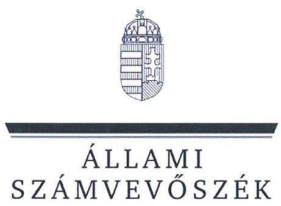
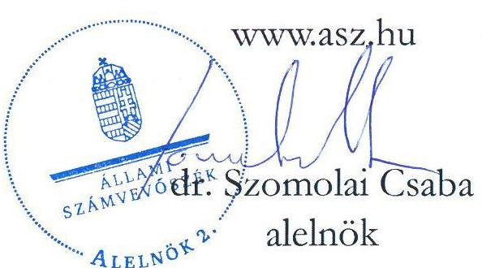
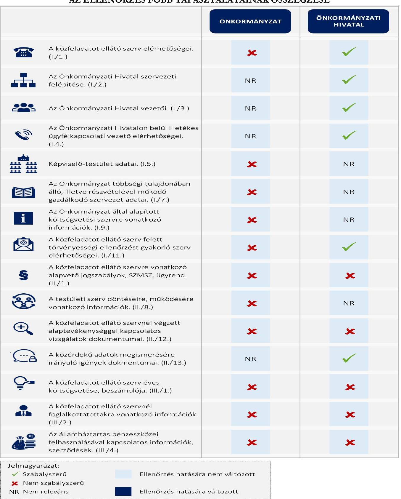

# JELENTÉS 

## Az önkormányzatok közzétételi kötelezettsége teljesítésének célzott ellenőrzése

Báta Község Önkormányzata
Decsi Közös Önkormányzati Hivatal

2024.

---

ÁLLAMI
SZÁMVEVŐSZÉK

# JELENTÉS 

## Az önkormányzatok közzétételi kötelezettsége teljesítésének célzott ellenőrzése

Báta Község Önkormányzata
Decsi Közös Önkormányzati Hivatal

2024.

24197

---

# ELLENŐRZÉSI IGAZGATÓSÁG: 

## ÁLLAMHÁZTARTÁS HELYI SZINTJÉT ELLENŐRZŐ IGAZGATÓSÁG

## ELLENŐRZÉSI IGAZGATÓ:

DR. BAFFIA GERGELY GÁBOR igazgató

## ELLENŐRZÉSVEZETŐ:

Jelentéseink az interneten a www.asz.hu címen olvashatók.

BEKE ANDREA ellenőrzésvezető

IKTATÓSZÁM: EL-3986-007/2024.
TÉMASORSZÁM: 55
ELLENŐRZÉS-AZONOSÍTÓ SZÁM: V1062

---

# TARTALOMJEGYZÉK 

AZ ELLENŐRZÉS ALAPADATAI ..... 5
MEGÁLLAPÍTÁSOK ÉS KÖVETKEZTETÉSEK ..... 7
JAVASLATOK ..... 9
MELLÉKLETEK ..... 10
I. sz. melléklet: Értelmező szótár ..... 10
II. sz. melléklet: Ellenőrzési kritériumok ..... 11
III. sz. melléklet: Kimutatás az Info. tv. 1. melléklete szerinti közzétételi egységek ÁSZ ellenőrzési körébe vont adatairól ..... 12
FÜGGELÉK: ÉSZREVÉTELEK ..... 13
RÖVIDÍTÉSEK JEGYZÉKE ..... 14

---

.

---

# AZ ELLENŐRZÉS ALAPADATAI 

## AZ ELLENŐRZÉS CÉLJA

Az ellenőrzés célja annak megállapítása volt, hogy Báta Község Önkormányzata és a gazdálkodási feladatait ellátó Decsi Közös Önkormányzati Hivatal az elektronikus közzétételi kötelezettségüknek eleget tettek-e, biztosították-e az átláthatóság érvényesülését, a nem minősített adatokhoz és információkhoz való hozzáférést, az Önkormányzat munkájának nyomonkövethetőségét.

## AZ ELLENŐRZÖTT IDŐSZAK

Az ellenőrzött szervezetek ellenőrzés megindításáról történő kiértesítését megelőző munkanap (2024. február 29.).

## AZ ELLENŐRZÉS TÁRGYA

Az Önkormányzat ${ }^{1}$ és a gazdálkodási feladatait ellátó Önkormányzati Hivatal ${ }^{2}$ Info. tv. ${ }^{3}$ szerinti elektronikus közzétételi kötelezettségének teljesítése.

A jogszabály által előírt adatok közzététele biztosításának az ellenőrzése az ÁSZ ${ }^{4}$ által az átláthatóság és az önkormányzati feladatellátás nyomonkövethetősége tekintetében az ellenőrzés szempontjából lényegesként meghatározott, az Info. tv. 1. mellékletében szereplő 15 közzétételi egység adatköréhez kapcsolódott (a jelentés III. sz. mellékletében részletezve).

Az ellenőrzés kiterjedt minden olyan körülményre és adatra, amely az ÁSZ jogszabályban meghatározott feladatainak teljesítéséhez, valamint a program végrehajtása folyamán felmerült újabb összefüggések feltárásához szükséges volt.

## AZ ELLENŐRZÉS JOGALAPJA

Az ellenőrzés jogszabályi alapját az ÁSZ tv. ${ }^{5} 1 . \int(3)$ bekezdésében, valamint az Áht. ${ }^{6} 61 . \int(2)$ bekezdésében foglalt előírások képezték.

## AZ ELLENŐRZÉS MÓDSZERE

Az ellenőrzést a nemzetközi standardokat irányadónak tekintve az ellenőrzési program szempontjai, az ellenőrzött időszakban hatályos jogszabályok, valamint az ellenőrzés szakmai szabályok és módszertanok figyelembevételével végezte az ÁSZ.

Az ellenőrzési kérdések megválaszolásához szükséges bizonyítékok megszerzése megfigyelés, szemrevételezés útján történt.

---

Az ellenőrzési bizonyítékként felhasználható adatforrások közé tartoztak az ellenőrzött szervezetek által elektronikusan közzétett dokumentumok, adatok, valamint a MÁK ${ }^{7}$ törzsadatnyilvántartása.

Az ÁSZ az elektronikus közzétételi kötelezettség teljesítését a közzétételre szolgáló honlap közzétételi felületén ellenőrizte. A közzététel akkor volt megfelelő, azaz akkor tett eleget közzétételi kötelezettségének az ellenőrzött, ha a jelentés III. sz. melléklete szerinti közzétételi egységekhez tartozó adatokat, vagy az elérésüket biztosító hivatkozásokat a közzétételre szolgáló honlap megfelelő közzétételi egységében jelenítették meg. Amennyiben a közérdekű adatok, vagy az azokra történő közvetlen hivatkozások a közzétételre szolgáló honlap „Közérdekű adatok" menürendszerén kívül, vagy ilyen menürendszer hiányában a közzétételre szolgáló honlap egyéb, az adat tartalmával összefüggő felületein kerültek elhelyezésre, akkor azt az ellenőrzés az adatok nem jogszabály szerinti közzétételeként értékelte.

Az ÁSZ akkor értékelte a jelentés II. sz. melléklet 1.1. pontja alapján megfelelőnek a jogszabály által előírt adatok közzétételét, ha a jelentés III. sz. melléklete szerinti közzétételi egységekbe tartozó adatkörben teljeskörű volt a közzététel. Az ÁSZ az ellenőrzött adat - ellenőrzött szempontjából történő - irrelevanciájára utalást az értékelés szempontjából közzétételnek minősítette.

Az ellenőrzés nem terjedt ki az adatok tartalmi megfelelőségére, a kapcsolódó belső szabályozásra, valamint arra, hogy a jelentés III. sz. melléklete szerinti közzétételi egyégekbe tartozó adatkörben a közzétett adatokon kívül volt-e olyan adat, amelyet közzé kellett volna tennie az ellenőrzöttnek. A közzétett adatok aktualitásának megfelelőségét az ÁSZ csak a jelentés III. sz. melléklete 13. és 14. sora szerinti közzétételi egységek közzétett adatai esetében értékelte, ahol az aktualizálás megfelelősége a MÁK törzsadatnyilvántartás, valamint a közzétett adat alapján egyértelműen megállapítható volt.

A közzétett adatok jogszabályokban meghatározott módon történő elérhetőségét akkor tekintette megfelelőnek az ÁSZ, ha a jelentés II. sz. melléklet 1.2. fókusz alkérdéshez tartozó kritériumok mindegyike teljesült.

# AZ ELLENŐRZÖTT SZERVEZET 

Báta község Tolna vármegyében, Tolna és Baranya vármegye határán, a Szekszárdi járásban található. A lakónépessége 1382 fő, a lakások száma 736 db volt a $\mathrm{KSH}^{8}$ 2023. január 1-jei adatai alapján.

Az Önkormányzat Képviselő-testülete ${ }^{9}$ hét főből áll, élén a főállású Polgármesterrel ${ }^{10}$, aki 2019. október 13-a óta tölti be tisztségét. A településen roma nemzetiségi önkormányzat működik. Az Önkormányzati Hivatalt a Jegyző ${ }^{11}$ 2020. január 1-jétől vezeti.

Az Önkormányzat további két költségvetési szervet tart fenn, a Bátai Ízek Konyháját és a Bátai Pitypang Óvoda és Bölcsödét.

Az Önkormányzatnak a nyilvánosan elérhető adatok alapján nincs a többségi tulajdonában gazdasági társaság. A település tagja a Bátaszék és Környéke Önkormányzatainak Egészségügyi, Szociális és Gyermekjóléti Intézmény-fenntartó Társulásnak.

---

# MEGÁLLAPÍTÁSOK ÉS KÖVETKEZTETÉSEK 

## 1. Az Önkormányzat és a gazdálkodási feladatait ellátó Önkormányzati Hivatal teljesítette-e a jogszabályban előírt elektronikus közzétételi kötelezettségét?

## Összegző megállapítás Az Önkormányzat nem teljesítette, az Önkormányzati Hivatal részben teljesítette az Info. tv. szerinti elektronikus közzétételi kötelezettségét.

Az Önkormányzat és az Önkormányzati Hivatal az adataikat külön-külön honlapon ${ }^{12}$ tették közzé.
Az Önkormányzat az IHM Rendelet ${ }^{13}$ 2. § (1) bekezdésében foglaltak ellenére a közzétételi listák előírt adatait tartalmazó jegyzékre vagy felületre mutató hivatkozást - „Közérdekű adatok" elnevezéssel - nem helyezte el a közzétételre szolgáló honlap megnyitásakor megjelenő oldalon. Az IHM Rendelet 2. § (2) bekezdését figyelmen kívül hagyva nem gondoskodott az általános közzétételi lista közzétételi egységeit tartalmazó, vagy azokra hivatkozó jegyzék az IHM Rendelet 1. melléklete szerinti tagolásának kialakításáról. Az Önkormányzat az Info. tv. 1. melléklete szerinti általános közzétételi listában meghatározott adatok Info. tv. 37. § (1) bekezdése szerinti közzétételi kötelezettségét nem teljesítette.
A közérdekű adatok egy része megtalálható volt az Önkormányzat közzétételre szolgáló honlapjának egyéb felületein - így az Önkormányzat és a Képviselő-testület, valamint az Önkormányzat egyik költségvetési szervének ${ }^{14}$ elérhetőségi adatai -, azonban ezek közzététele nem volt megfelelő, mert elérhetőségüket az Önkormányzat nem az IHM Rendelet 2. § (2) bekezdése által előírt közzétételi egységek szerinti tagolásban biztosította.
Az Önkormányzati Hivatal közzétételre szolgáló honlapon a közzétételi felületet az IHM Rendeletnek megfelelően, a nyitó lapról közvetlenül elérhető módon helyezte el, azonban annak elnevezése - „Általános közzétételi listák" - nem felelt meg az IHM Rendelet 2. § (1) bekezdésében előírtnak. A kialakított közzétételi felületen a szervezeti, személyzeti adatok ellenőrzött adatköreit az Info. tv. és az IHM rendelet előírásának megfelelően közzétette, azonban a tevékenységére, működésére vonatkozó ellenőrzött adatköröket, valamint gazdálkodására vonatkozó ellenőrzött adatköröket az Info. tv. 37. § (1) bekezdése, 1. melléklete II./1., II./12., továbbá III./1., III./2., III./4. pontjainak előírásai ellenére nem tette közzé.

Az ellenőrzött szervezetek közzétételére szolgáló honlapjukon az IHM Rendelet 2. § (1) bekezdésének előírását figyelmen kívül hagyva nem tüntették fel az egységes közadatkereső rendszerre, a központi elektronikus jegyzékre mutató hivatkozást.
Az Önkormányzat a közadatkereső rendszerben található adatait az Info. tv. 37/B. § (1) bekezdésének előírása ellenére nem frissítette. A közadatkereső felületen található - 2009. és 2010. évi - hivatkozások elérhetetlen felületekre mutatnak. Az Önkormányzati Hivatal figyelmen kívül hagyva az Info. tv. 37/B. § (1) bekezdésének előírását nem továbbított adatot a közadatkereső rendszerbe.
A feltárt hiányosságok miatt az ellenőrzés időpontjában az Önkormányzat közzétételre szolgáló honlapja nem, az Önkormányzati Hivatal közzétételre szolgáló honlapja részben biztosította az Info. tv.-ben megfogalmazott követelmények - az elektronikusan közzétett adatok egyszerű és

---

gyors elérhetőségének, a közérdekű és a közérdekből nyilvános adatok átláthatóságának, megismerhetőségének - maradéktalan érvényesülését.
Az ellenőrzés a fennálló hiányosságok megszüntetésére összesen öt javaslatot tett a Polgármester és a Jegyző számára.

# AZ ELLENŐRZÉS FŐBB TAPASZTALATAINAK ÖSSZEGZÉSE 

---

# JAVASLATOK 

Az ÁSZ tv. 33. § (1) bekezdésében foglaltak értelmében az ellenőrzött szervezet vezetője köteles a jelentésben foglalt megállapításokhoz kapcsolódó intézkedési tervet összeállítani és azt a jelentés kézhezvételétől számított 30 napon belül az ÁSZ részére megküldeni. Amennyiben az ellenőrzött szervezet vezetője nem küldi meg határidőben az intézkedési tervet, vagy továbbra sem elfogadható intézkedési tervet küld, az Állami Számvevőszék elnöke az ÁSZ tv. 33. § (3) bekezdése a) és b) pontjaiban foglaltakat érvényesítheti.

## BÁTA KÖZSÉG ÖNKORMÁNYZATA POLGÁRMESTERÉNEK

1. Intézkedjen a nyilvános jelentés kézhezvételét követő 30 napon belül az Állami Számvevőszék jelentésének a Képviselő-testület elé terjesztéséről. A napirend tárgyalásáról szóló jegyzőkönyvvel együtt a jelentést tájékoztatásul küldje meg a Kormányhivatal számára is.
2. Intézkedjen a közérdekű adatok Info. tv. 37. § (1) bekezdése előírása szerinti közzétételéről. Ennek keretében gondoskodjon arról, hogy a közzétételre szolgáló honlap nyitó oldalán a közzétételi listák által előírt adatokat tartalmazó jegyzékre vagy felületre mutató hivatkozás az IHM Rendelet 2. § (1) bekezdésének megfelelően kerüljön elhelyezésre. Továbbá gondoskodjon arról, hogy a kialakított jegyzék az IHM Rendelet 2. § (2) bekezdésének előírása alapján az IHM Rendelet 1. melléklete szerinti tagolásban tartalmazza az általános közzétételi lista szerinti adatokat tartalmazó közzétételi egységeket, vagy hivatkozzon azokra.
3. Intézkedjen, hogy az IHM Rendelet 2. § (1) bekezdésében foglalt előírásnak megfelelően a közzétételre szolgáló honlapon az egységes közadatkereső rendszerre, valamint a központi elektronikus jegyzékre mutató hivatkozást tüntessék fel. Gondoskodjon továbbá az Info. tv. 37/B. § (1) bekezdésében foglaltak szerint a közérdekű adatok közadatkereső rendszerbe történő rendszeres továbbításáról.

## DECSI KÖZÖS ÖNKORMÁNYZATI HIVATAL JEGYZŐJÉNEK

1. Intézkedjen a közérdekű adatok Info. tv. 37. § (1) bekezdése előírása szerinti közzétételéről. Ennek keretében gondoskodjon arról, hogy a közzétételre szolgáló honlap nyitó oldalán a közzétételi listák által előírt adatokat tartalmazó jegyzékre vagy felületre mutató hivatkozás az IHM Rendelet 2. § (1) bekezdésének megfelelően kerüljön elhelyezésre. Továbbá gondoskodjon arról, hogy a kialakított jegyzék az IHM Rendelet 2. § (2) bekezdésének előírása alapján az IHM Rendelet 1. melléklete szerinti tagolásban tartalmazza az általános közzétételi lista szerinti adatokat tartalmazó közzétételi egységeket, vagy hivatkozzon azokra.
2. Intézkedjen, hogy az IHM Rendelet 2. § (1) bekezdésében foglalt előírásnak megfelelően a közzétételre szolgáló honlapon az egységes közadatkereső rendszerre, valamint a központi elektronikus jegyzékre mutató hivatkozást tüntessék fel. Gondoskodjon továbbá az Info. tv. 37/B. § (1) bekezdésében foglaltak szerint a közérdekű adatok közadatkereső rendszerbe történő továbbításáról.

---

# MELLÉKLETEK 

## I. SZ. MELLÉKLET: ÉRTELMEZŐ SZÓTÁR

általános közzétételi lista
elektronikus közzététel
jegyzék
közadatkereső rendszer
közérdekű adat
központi elektronikus jegyzék
közzétételi egység
közzétételre szolgáló honlap

Közérdekű adatokat tartalmazó, Info. tv. 1. melléklet szerinti lista. (Info. tv. 37. § (1) bekezdés alapján)

Az Info.tv. alapján kötelezően közzéteendő közérdekű adatokat internetes honlapon, digitális formában, bárki számára, személyazonosítás nélkül, korlátozástól mentesen, kinyomtatható és részleteiben is adatvesztés és torzulás nélkül kimásolható módon, a betekintés, a letöltés, a nyomtatás, a kimásolás és a hálózati adatátvitel szempontjából is díjmentesen kell hozzáférhetővé tenni. A közzétett adatok megismerése
 személyes adatok közléséhez nem köthető (Info. tv. 33. § (1) bekezdés)
A közzétételi listák által előírt adatokat tartalmazó jegyzék vagy felület. (IHM Rendelet 2. § (1) bekezdés alapján)
A közérdekű adatokhoz való egységes szempontok szerinti elektronikus hozzáférést és a közérdekű adatok közötti keresés lehetőségét a közigazgatási informatika infrastrukturális megvalósíthatóságának biztosításáért felelős miniszter által működtetett egységes közadatkereső rendszer biztosítja. (Info. tv. 37/A. § (2) bekezdés)
Az állami vagy helyi önkormányzati feladatot, valamint jogszabályban meghatározott egyéb közfeladatot ellátó szerv vagy személy kezelésében lévő és tevékenységére vonatkozó vagy közfeladatának ellátásával összefüggésben keletkezett, a személyes adat fogalma alá nem eső, bármilyen módon vagy formában rögzített információ vagy ismeret, függetlenül kezelésének módjától, önálló vagy gyűjteményes jellegétől, így különösen a hatáskörre, illetékességre, szervezeti felépítésre, szakmai tevékenységre, annak eredményességére is kiterjedő értékelésére, a birtokolt adatfajtákra és a működést szabályozó jogszabályokra, valamint a gazdálkodásra, a megkötött szerződésekre vonatkozó adat. (Info. tv. 3. § 5. pont)
Az elektronikusan közzétett adatok egyszerű és gyors elérhetősége érdekében az e törvény alapján közérdekű adat elektronikus közzétételére kötelezett szervek közérdekű adatot tartalmazó honlapjára, valamint az általuk fenntartott adatbázisra és nyilvántartásra vonatkozó leíró adatokat a közigazgatási informatika infrastrukturális megvalósíthatóságának biztosításáért felelős miniszter által működtetett, az erre a célra létrehozott honlapon közzétett központi elektronikus jegyzék összesítve tartalmazza. (Info. tv. 37/A. § (1) bekezdés)
A közzétételi listák szerinti adatok közzétételének szerkezetét és az összefüggő tárgyú közzétett adatokat egybefoglaló tartalmi egységek. (IHM Rendelet 1. § (2) bekezdés)
Az adatközlő a közzétételre szolgáló honlapot úgy alakítja ki, hogy az adatok közzétételére alkalmas legyen, gondoskodik a folyamatos üzemeltetésről, az esetleges üzemzavar elhárításáról és az adatok frissítéséről. A közzétételre szolgáló honlapon közérthető formában tájékoztatást kell adni a közérdekű adatok egyedi igénylésének szabályairól. A tájékoztatásnak tartalmaznia kell az igénybe vehető jogorvoslati lehetőségek ismertetését is. (Info. tv. 34. § (2)-(3) bekezdések)

---

# II. SZ. MELLÉKLET: ELLENŐRZÉSI KRITÉRIUMOK 

## FŐKÉRDÉS

1. Az Önkormányzat és a gazdálkodási feladatait ellátó Önkormányzati Hivatal teljesítette-e a jogszabályban előírt elektronikus közzétételi kötelezettségét?
1.1. Az Önkormányzat és a gazdálkodási feladatait ellátó Önkormányzati Hivatal az elektronikus közzétételi kötelezettségének teljesítése során biztosította-e a jogszabály által előírt adatok közzétételét?
1.2. Az Önkormányzat és a gazdálkodási feladatait ellátó Önkormányzati Hivatal az elektronikus közzétételi kötelezettségének teljesítése során biztosította-e a közzétett adatok jogszabályokban meghatározott módon történő elérhetőségét?

## ELLENŐRZÉSI KRITÉRIUMOK

Info. tv. 33. § (3), 37. § (1) és (4a.) bekezdés, 1. melléklet I/1., 2., 3., 4., 5., 7., 9., 11. pont, II/1., 8., 12., 13. pont, III/1., 2., 4. pont; Áht. 87. § b) pont; Áhsz. ${ }^{15}$ 6. § (1) bek. a) és f) pontjai;

IHM Rendelet 2. § (2) bekezdés.
Info. tv. 33. § (1) bekezdés, 37/B. § (1) bekezdés; IHM Rendelet 2. § (1) bekezdés.

---

# III. SZ. MELLÉKLET: KIMUTATÁS AZ INFO. TV. 1. MELLÉKLETE SZERINTI KÖZZÉTÉTELI EGYSÉGEK ÁSZ ELLENŐRZÉSI KÖRÉBE VONT ADATAIRÓL 

## Ssz.

## ADATKÖR AZ INFO. TV. 1. MELLÉKLET SZERINTI SORSZÁM

## I. Szervezeti, személyi adatok

1. A közfeladatot ellátó szerv hivatalos neve, székhelye, postai címe, telefonszáma, elektronikus levélcíme, honlapja. (I./1.)
2. Az Önkormányzati Hivatal szervezeti felépítése szervezeti egységek megjelölésével, az egyes szervezeti egységek feladatai. (I./2.)
3. Az Önkormányzati Hivatal vezetőinek és az egyes szervezeti egységek vezetőinek neve, beosztása, elérhetősége (telefonszáma, elektronikus levélcíme). (I./3.)
4. Az Önkormányzati Hivatalon belül illetékes ügyfélkapcsolati vezető neve, elérhetősége (telefonszáma, elektronikus levélcíme) és az ügyfélfogadási rend. (I./4.)
5. A képviselő-testület létszáma, tagjainak neve, beosztása, elérhetősége. (I./5.)
6. Az Önkormányzat többségi tulajdonában álló, illetve részvételével működő gazdálkodó szervezet neve, székhelye, elérhetősége (postai címe, telefonszáma, elektronikus levélcíme), tevékenységi köre, képviselőjének neve, a közfeladatot ellátó szerv részesedésének mértéke. (I./7.)
7. Az Önkormányzat által alapított költségvetési szerv neve, székhelye, a költségvetési szerv alapító okirata, vezetője, működési engedélye. (I./9.)
8. A közfeladatot ellátó szerv felett törvényességi ellenőrzést gyakorló szervnek a hivatalos neve, székhelye, postai címe, telefonszáma, elektronikus levélcíme, honlapja, ügyfélszolgálatának elérhetőségei. (I./11.)

## II. Tevékenységre, működésre vonatkozó adatok

9. A közfeladatot ellátó szerv feladatát, hatáskörét és alaptevékenységét meghatározó, a szervre vonatkozó alapvető jogszabályok, valamint a szervezeti és működési szabályzat vagy ügyrend, az adatvédelmi és adatbiztonsági szabályzat hatályos és teljes szövege. (II./1.)
10. A testületi szerv döntései előkészítésének rendje, az állampolgári közreműködés (véleményezés) módja, eljárási szabályai, a testületi szerv üléseinek helye, ideje, továbbá nyilvánossága, döntései, ülésének jegyzőkönyvei, illetve összefoglalói; a testületi szerv szavazásának adatai, ha ezt jogszabály nem korlátozza. (II./8.)
11. A közfeladatot ellátó szervnél végzett alaptevékenységgel kapcsolatos vizsgálatok, ellenőrzések nyilvános megállapításai. (II./12.)
12. A közérdekű adatok megismerésére irányuló igények intézésének rendje, az illetékes szervezeti egység neve, elérhetősége, az információs jogokkal foglalkozó személy neve. (II./13.)

## III. Gazdálkodási adatok

13. A közfeladatot ellátó szerv éves költségvetése, éves költségvetés beszámolója. (III./1.)
14. A közfeladatot ellátó szervnél foglalkoztatottak létszámára és személyi juttatásaira vonatkozó összesített adatok, illetve összesítve a vezetők és vezető tisztségviselők illetménye, munkabére és rendszeres juttatásai, valamint költségtérítése. (III./2.)
15. Az államháztartás pénzeszközei felhasználásával, az államháztartáshoz tartozó vagyonnal történő gazdálkodással összefüggő, ötmillió forintot elérő szerződések megnevezése (típusa), tárgya, szerződést kötő felek neve, a szerződés értéke, határozott időre kötött szerződés esetében annak időtartama. (III./4.)

---

# FÜGGELÉK: ÉSZREVÉTELEK 

A jelentéstervezetet a Számvevőszék 15 napos észrevételezésre megküldte az ellenőrzött szervezetek vezetőinek az ÁSZ tv. 29. § (1) bekezdése előírásának megfelelően.

Az ellenőrzött szervezetek a jelentéstervezet megállapításaira érdemi észrevételt nem tettek.

* 29. §(1) Az Állami Számvevőszék az ellenőrzési megállapításait megküldi az ellenőrzött szervezet vezetőjének vagy az általa megbízott személynek, és annak, akinek személyes felelősségét állapította meg.
(2) Az ellenőrzött szervezet vezetője és a felelősként megjelölt személy az ellenőrzés megállapításaira tizenöt napon belül írásban észrevételt tehet.
(3) Az Állami Számvevőszék az észrevételre a beérkezésétől számított harminc napon belül írásban válaszol. A figyelembe nem vett észrevételeket köteles a jelentésben feltüntetni, és megindokolni, hogy azokat miért nem fogadta el.

---

# RÖVIDÍTÉSEK JEGYZÉKE 

${ }^{1}$ Önkormányzat
${ }^{2}$ Önkormányzati Hivatal
${ }^{3}$ Info. tv.
${ }^{4}$ ÁSZ
${ }^{5}$ ÁSZ tv.
${ }^{6}$ Áht.
${ }^{7}$ MÁK
${ }^{8}$ KSH
${ }^{9}$ Képviselő-testület
${ }^{10}$ Polgármester
${ }^{11}$ Jegyző
${ }^{12}$ honlap
${ }^{13}$ IHM Rendelet
${ }^{14}$ költségvetési szerv
${ }^{15}$ Áhsz.

Báta Község Önkormányzata
Decsi Közös Önkormányzati Hivatal
2011. évi CXII. törvény az információs önrendelkezési jogról és az információszabadságról
Állami Számvevőszék
2011. évi LXVI. törvény az Állami Számvevőszékről
2011. évi CXCV. törvény az államháztartásról

Magyar Államkincstár
Központi Statisztikai Hivatal
Báta Község Önkormányzatának Képviselő-testülete
Báta Község Önkormányzatának Polgármestere
A Decsi Közös Önkormányzati Hivatal Jegyzője
http://www.bata.hu/ és https://decs.hu/
18/2005. (XII. 27.) IHM rendelet a közzétételi listákon szereplő adatok
közzétételéhez szükséges közzétételi mintákról
Bátai Pitypang Óvoda és Bölcsőde
4/2013. (I. 11.) Korm. rendelet az államháztartás számviteléről

---

1052 Budapest, Apáczai Csere János u. 10. | 1364 Budapest 4., Pf. 54
www.asz.hu | szamvevoszek@asz.hu
telefon: +36 14849100
