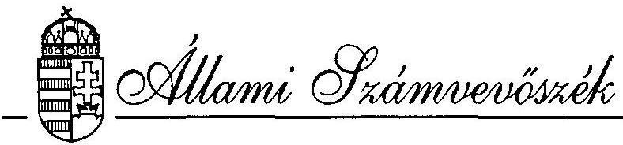
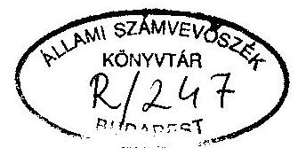
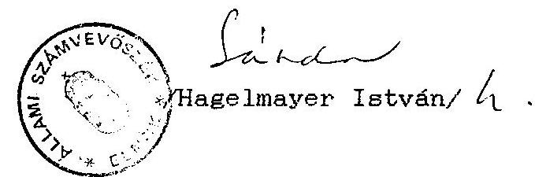

#  

## JELENTÉS

a Magyarországi Szlovének Szövetsége részére az állami költségvetésböl juttatott 1994. évi támogatás ellenörzése

---

A vizsgálatot vezette:
dr. Elek János
osztályvezető főtanácsos
A vizsgálatot végezték:
dr. Szávai Tamás
számvevő tanácsos
Écsy Lajosné
számvevő
Hoffmann István
számvevő

---

# ALLAMI SZAMVEVOSZEK 

V-1024-9/1994-95.
Témaszám: 258 .

## J E L E N T E S

a Magyarországi Szlovének Szövetsége
1994. évi állami költségvetési támogatás
felhasználásának ellenôrzésérôl

## I.

A vizsgálat körülményei, célja, módszere

Az Allami Számvevõszékrõl szóló törvény értelmében az Allami Számvevõszék (továbbiakban: ASz) ellenôrzi az állami költségvetésbôl juttatott támogatás felhasználását a társadalmi szervezeteknél. Az Országgyûlés a 20/1994. (III. 31.) határozatában döntött a nemzetiségi és etnikai kisebbségi szervezetek 1994. évi állami költségvetési támogatásáról, amely egyben megismételte az ASz ellenôrzési jogosultságát. E jogszabályok figyelembevételével az ASz 1995. I. félévi ellenôrzési terve alapján került sor az ellenôrzés lefolytatására.

---

Fentiek figyelembevételével az ASz a Magyarországi Szlovének Szövetsége részére (továbbiakban: Szövetség) 1994. évben jóváhagyott állami költségvetési támogatás felhasználását ellenőrizte. Az ellenőrzés célja annak értékelése volt, hogy a Szövetség az állami költségvetési támogatást - az Országgyülés határozatában foglaltakra is figyelemmel - az alapszabályában megfogalmazott tevékenységi céloknak megfelelően használta-e fel, és ezt a célt a lehető legkisebb eszköz-, illetve pénzfelhasználásával valósította-e meg.

Az ellenőrzés folyamán figyelemmel kellett lenni arra, hogy a nemzetiségi és etnikai szervezetek tevékenysége jelentös mértékben politikai döntések által behatárolt, amiböl adódóan a pénzügyi kihatású intézkedések tervezése, végrehajtása is túlnyomórészt determinált.

A Szövetség szervezetére és müködésére vonatkozó fontosabb információkat az 1. sz. melléklet tartalmazza.

A vizsgálat a lezárt 1994. évi gazdálkodási évre terjedt ki. Az ASz a pénzfelhasználást a Szövetség központjában található dokumentumok alapján vizsgálta. A helyszíni ellenőrzés 1995. január 24-töl február 10-ig tartott.

---

# II. 

## Az 1994. évi tényleges pénzfelhasználás ellenôrzésének tapasztalatai

## 1. A Szövetség 1994. évi pénzfelhasználásának értékelése

a. A Szövetség 1994. januárjában 4 nagyobb feladatcsoport megjelölésével 9.600 E Ft költségvetési támogatási igényt nyújtott be az Országgyülés Emberi jogi, kisebbségi és vallásügyi Bizottságához. Az igényléshez a müködésükhöz szükséges felhasználható egyéb forrásokról mindössze 1.241 E Ft összegben adtak jelzést.

Az Országgyülés 20/1994 (V. 26.) OGY határozatában a Szövetségnek 8.000 E Ft állami költségvetési támogatást szavazott meg.

A Szövetség elnöksége az állami költségvetési támogatás ismeretében 1994. évre vonatkozóan végleges és reális költségvetési elöirányzatot nem készített.
b. A Szövetség elnöksége tehát 1994. évre összesen 10.840 E Ft tervezett forrás ismeretében 10.840 E Ft kiadást irányzott elö. Egyéb bevétel címén 600 E Ft bankkamatot és 640 E Ft 1993. évi maradványt tervezett meg.

Ezzel szemben - a naplófôkönyv tanúsága szerint - az 1993. évi tény leges maradványa, azaz zárókészlete - 8.183 E Ft-ot jelentett.

---

Emellett nem állította be költségtervezetébe a Porabje c. újság várható támogatását, az előző évben is megkapott 6.600 E Ft összegũ állami támogatást sem. Mindezek híján az ellenőrzés a Szövetség gazdálkodásának vizsgálatakor a költségvetési tervvel szembeni egybevetéstől eltekintett. Az ellenőrzés az 1994. évi tényszámok vizsgálatára szorítkozott.

A Szövetségnek 1994. évben ténylegesen 25.065 E Ft forrás állı a rendelkezésére, amelyből az előző évről áthozott maradvány (megtakcsítás) 8.183 E Ft-ot, az állami költségvetési juttatás 8.000 Ft-ot, az egyéb bevétel pedig 8.882 E Ft-ot jelentett.

Az egyéb bevétel részletezése az alábbi:

- 6.600 E Ft támogatás juttatása a Miniszterelnökségi Fejezeti Költségvetési számláról, a Porabje c. szlovén nyelvú újságra, annak szerkesztésére, nyomdai előállítására és terjesztésére, havonta 550 E Ft tételben;
- 1.438 E Ft támogatás juttatása a Müvelődési Minisztériumtól, "Nemzeti könyvkiadás" céljára, illetve érdekében, amiből 10 E Ft-ot versmondó verseny elõsegítésére adtak;
- 717 E Ft kamatbevétel a bankban lekötött pénzeszközök után;
- 127 E Ft bevétel terembérlés, költségtérítés címén.
c. Ezzel szemben a tényleges kiadások összesen 16.388 E Ft, föbb költségnemekben az alábbiak szerint alakultak:

Anyag és anyagjellegũ költségek címén 305 E Ft kiadás merült fel. Ezek a költségek gyakorlatilag teljes egészében a központi szervezet alapvető müködési kiadásait tartalmazzák.

---

Bérköltségek címén 3.926 E Ft-ot számoltak el, amelyet lényegében a titkárságon foglalkoztatottak bérköltsége tesz ki. Ez elsősorban a teljes munkaidőben foglalkoztattak bérének és jutalmának, és kisebbrészt a nemzetiségi kultúra ápolásával összefüggő megbízási díjaknak összegét jelenti.

Társadalombiztosítási járulék címén befizettek 1.621 E Ft-ot, amely azonban a munkaadói járulék összegét nem tartalmazza (a munkaadói járulék éves összegét az egyéb kiadások között számolták el).

Altalános forgalmi adó címén 740 E Ft összequ kiadás merült fel.

Egyéb költségek címén 9.796 E Ft-ot mutattak ki, illetve számoltak el, amelyet az ellenőrzés főbb tételeiben a következökben részletez:

Terembérleti dijként az év során összesen 615 E Ft-ot fizetett ki a Szövetség, összejöveteleik alkalmával.

Uzemanyag költségtérítés címén elszámoltak 256 E Ft összeget, személygépkocsit igénybevéve a szövetségi teendők intézéséhez.

Utiköltségként felmerült összesen 459 E Ft nagyságrendu kiadás, amely döntö mértékben a szlovén múvészeti csoportok (tánckar, énekkar stb.) utaztatása, kisebbrészt pedig buszbérletek, egyéb utazási költségtérítése kapcsán merült fel.

---

Ætkeztetés, kisebbrészt reprezentáció címén 536 E Ft kiadás merült fel, a művészeti csoportok vendéglátásával összefüggésben.

Ænekkar, tánccsoport részére kifizetett, személyenként nem jelentő́s nagyságrendü tiszteletdíjak összege (egyéb kiadások között elszámolva személyi jellegü kifizetés) 1.180 E Ft-ot tett ki.

Porabje c. szlovén nyelvü újság kiadásával és terjesztésével összefüggésben különbözö munkabért összesen 906 E Ft tiszteletdijat folyósitottak.

Gépkocsi vásárlásra - AFA nélkül számolva az egyéb kiadások között - 1.036 E Ft-ot fordítottak.

Különböző szervezetek, nagyrészt iskolák, iskolai rendezvények, alapítványok támogatására összesen 1.665 E Ft-ot számoltak el.

Alapvetően a Szövetség központi müködésével szoros összefüggésben felmerült további kiadások (telefonköltség, irodaszerek, egyéb dologi kiadások) együttesen 3.143 E Ft-ot tesznek ki.
d. Az éves összkiadás belsö összetételét vizsgálva megállapítható, hogy a kiadásokat lényegében véve a szervezet müködésére, az alapszabályban meghatározott célok és feladatok megvalósítására, kisebb részben pedig különbözö szervezetek támogatására fordították.

---

A szervezet müködésével összefüggő mindösszesen kiadások 7.643 E Ft (anyag, bér, rezsi költségek, TB járulék stb.) az összes költségek $46,6 \%$-át teszik ki.

Az alapszabályban megfogalmazott feladatok és célok megvalósításával összefüggésben az összes költségekbõl 7.090 E Ft-ot (szlovén nemzetiségi kultúra és nyelv ápolása, Szlovéniával való kapcsolattartás), azaz $43,4 \%$-ot jelentett.

Különböző szervezetek támogatására a Szövetség - nemzetiségi kultúra, oktatás és hagyományőrzõ tevékenység segítése céljából - 1,665 E Ft összegũ kiadást eszközölt, az összes kiadás 10\%-át. A támogatások odaítélésérõl minden esetben a Szövetség elnökségi ülése döntött és hozott határozatot. A döntések meghozatalánál - a jegyzökönyvek tanúsága szerint - a célszerüség és az eredményesség volt a meghatározó szempont.

Az éves gazdálkodás és a pénzfelhasználás során a Szövetséget a körültek.ıtés és a takarékosság vezette. Ennek a takarékosságnak köszönhetõ, hogy a Szövetség a rendelkezésre álló pénzforrásaiból 1994. évben 8.677 E Ft-ot megtakarított. A takarékos gazdálkodás, valamint egyes céltámogatással támogatott feladat nem teljeskörũ megvalósulásának következményeként mutatkozó évvégi záróegyenleg, illetve pénzmar:dvány tette lehetővé, hogy a Szövetség 1995. év elején is müködhessen. (Tekintettel az Országgyûlés költségvetési támogatás odaítélési gyakorlatára, hogy a folyó évi támogatásról általában május hónapban döntenek, - a pénzmaradvány elõrelátó gazdálkodásra utal.)

---

2. A pénzfelhasználás törvényességével kapcsolatos megállapítások
a. A Szövetség gazdálkodásának alapvető rendjét az alapszabály és szervezeti müködési szabályzat tartalmazza. Ezek a szabályzatok rendelkeznek a költségvetés elfogadására jogosult szervezetről, az utalványozásra jogosult munkakörökről, a könyvvitel módjáról, a támogatások odaitélésének rendjéről.

A házipénztári pénzkezelésről és a szigorú számadási nyomtatványok kijelöléséről és kezelésük módjáról külön pénztárkezelési szabályzat rendelkezik.
b. A Szövetség gazdasági eseményeinek rögzitésére az egyszeres könyvvitelt választotta. Pénzeszközeiről, azok forrásairól, valamint a bekövetkezett gazdasági változásokról naplófôkönyv vezetésével ad számot. Itt jegyzi meg az ellenôrzés, hogy naplófôkönyv alapján nem állapítható meg a 10\%-os nyugdij- és egésze gbiztosítási, továbbá a munkaadói járulék, valamint a személyi jövedelemadó tartozások és azok kiegyenlítésének összege, mivel azok nincsenek tételezen elkülönítve. Ennek következtében az SzJA és TB bevallással nem vethetők egybe, illetve a költségvetéssel szembeni befizetési kötelezettségek teljesítése jogcímenként nem ellenőrizhetó. Ehhez szükséges és elöírt - kiegészítő és analitikus nyilvántartásokat vezetik. Evvégi záróleltárt felvették.

Analitikus nyilvántartásként az

- SzJA köteles kifizetések;
- hivatali gépjármú használat;

---

- TB befizetési kötelezettségek;
- szigorú számadási bizonylatok;
- tárgyi eszközök egyedi
nyilvántartását vezetik.
c. A pénztári be- és kifizetéseket, valamint a banki átutalásokat minden esetben az annak alapjául szolgáló alapbizonylat alapján eszközlik.

A bizonylatok kiállításánál betartják az alaki-tartalmi követelményeket. A könyvviteli hivatkozási számok révén az alapbizonylatok könnyen, gyorsan visszakereshetők.
d. A Szövetség külföldi kiküldetéssel összefüggő költségeinek fedezésére összesen 640 E Ft értékben vásárolhatott volna valutát, azonban ennél lényegesen kevesebbet használt fel. A valuta felhasználása (döntő mértékben napidíjra) és a vele való elszámolás során a 30/1992. (II. 13.) Korm. rendelet elöírásait betartották.
e. A hivatali gépjármú és magántulajdonú gépjármú használatát, üzemanyag felhasználását és költségtérítését a 17/1990. (V. 14.) KÖHEm, illetve a 9/1991. (VI. 6.) KHVM rendelet elöírásai szerint végezték.
f. A személyi jövedelemadóköteles kifizetések bevallásával és befizetésével kapcsolatos kötelezettségeinek a Szövetség az elöírásoknak megfelelően eleget tett.

---

A társadalombiztosítással kapcsolatos bevallási és befizetési kötelezettségét a Szövetség - a tiszteletdijak nagyrésze után járó $44 \%$-os TB bevallás és befizetés kivételével - szintén teljesítette. Az ellenőrzés megállapította, hogy különbözö jogcímen kifizetett mintegy $1,500 \mathrm{E}$ Ft összeget kitevő tiszteletdij vonatkozásában a Szövetség bevallást nem nyújtott be, társadalombiztosítási járulékot, közel 700 E Ft-ot nem fizetett be, holott e kifizetések 1994. január 1-től hatályosan járulék kötelezettség alá vont jövedelmek.

Ezzel megsértette a társadalombiztosításról szóló 1975. évi II. törvény VIII. fejezet 103/A 8. 11. bekezdésében, illetve a végrehajtására kiadott 89/1990. (V. 1.) MT rendeletben foglaltakat.

# III. 

## Összefoglalás, javaslatok

A Szövetség 1994. évben 25.065 E Ft felhasználható pénzforrással rendelkezett. Ebből az összegből 31,9\%-ot tett ki az Országgyülés által 1994. évben odaitélt állami költségvetési támogatás. Tekintettel azonban arra, hogy a rendelkezésre álló valamennyi pénzforrása, végsősoron a költségvetésből származik, így az ellenőrzés a teljes pénzfelhasználást áttekintette. A Szövetség 1994. évi tényleges kiadásaiból (összesen 16.388 E Ft) 46,6\%-ot saját müködésére, $53,4 \%$-ot pedig tevékenységi feladatainak és céljainak megvalósítására, valamint ezekkel összefüggő támogatások nyújtására fordított.

---

A Szövetség saját felhasználása, egyes külsõ szervezetek támogatása odaítélése során az eredményorientáltság és a takarékos felhasználás maradéktalanul érvényesült.

A gazdálkodás, valamint az azzal kapcsolatos könyvvitel szabályait a pénzfelhasználás során alapvetően betartotta.

A jelentésben megfogalmazott megállapítások alapján javaslom, hogy:

- A Szövetség naplófõkönyvében tételesen különítse el a nyugdijés egészségbiztosítási, továbbá a munkaadói járulékot és a levont személyi jövedelemadó elôleget, hogy azok teljesítése jogcímenként ellenôrizhetõ legyen.
- A jelentés III./2./f. pontjában megállapítottak alapján, a kifizetett tiszteletdijakat terhelõ társadalombiztosítási járulék fizetési kötelezettségének utólag tegyen eleget.

Budapest, 1995. április

Melléklet: 1 db

---

1. sz. melléklet a V-1024-9/1994-95. sz. jelentéshez

# A MAGYARORSZAGI SZLOVENEK SZOVETSEGENEK SZERVEZETE 

A Szövetség szervezeti felépítését és müködési rendjét jóváhagyott Alapszabályzata, illetve Szervezeti és Müködési Szabályzata tartalmazza.

A Szövetség alapvető célja és feladata:

1. Képviseli mint társadalmi szervezete a magyarországi szlovének érdekeit és az Alkotmányban biztosított jogait.
2. Sajátos eszközeivel erősíti és fejleszti a magyarországi szlovének identitását és nemzetiségi öntudatát.
3. Együttmüködik céljai megvalósítása és feladatai ellátása érdekében Szlovéniával, mint anyanemzettel, valamint más nemzetiségi kisebbségek szervezeteivel határon belül és kívül.
4. Feladatának tekinti a magyarországi szlovének anyanyelvü tájékoztatásának kiszélesítését.
5. A magyarországi szlovének aktivizálása, bevonása a Szövetség munkájába.

---

6. Osztönzi a magyarországi szlovéneket a nemzetiségi jogok gyakorlására, serkenti anyanyelvük tanulását és megőrzését, fejlesztését.

A Szövetség ügyintéző és képviselõ szervei a következök:

- Közgyülés: amely évente egyszer, illetve szükség szerint ülésezik, irányítja a Szövetség müködését, értékeli munkáját, titkos szavazással megválasztja a Szövetség vezetöit.
- Elnökség: a Szövetség legfőbb vezetõ szerve, élén az elnökkel. A közgyülés közötti időszakban összeállítja a költségvetést, elkészíti az éves beszámolót, megszervezi a Szövetség gazdálkodását.
- Területi titkár: az elnök helyettese, saját feladatkörébe tartozó kérdésekben közvetlenül intézkedik, kiterjedt hatáskörben.
- Ellenőrzõ Bizottság: ellenőrzi a Szövetség gazdálkodását, annak rendjét és pénzfelhasználását.

A Szövetség gazdálkodását, pénzügyeinek vitelét a titkárság látja el. A Szövetség pénzforgalma itt bonyolódik le.

A Szövetség önálló bírósági bejegyzéssel rendelkezo önálló jogi személy.