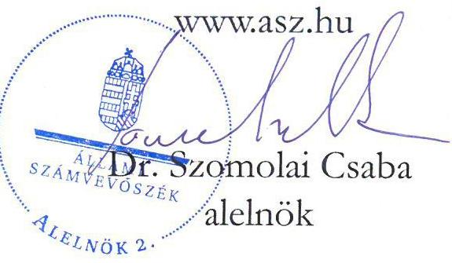
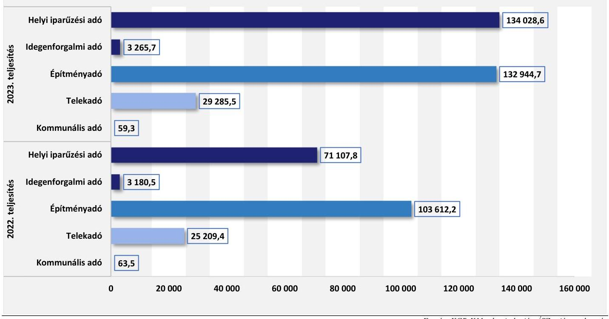
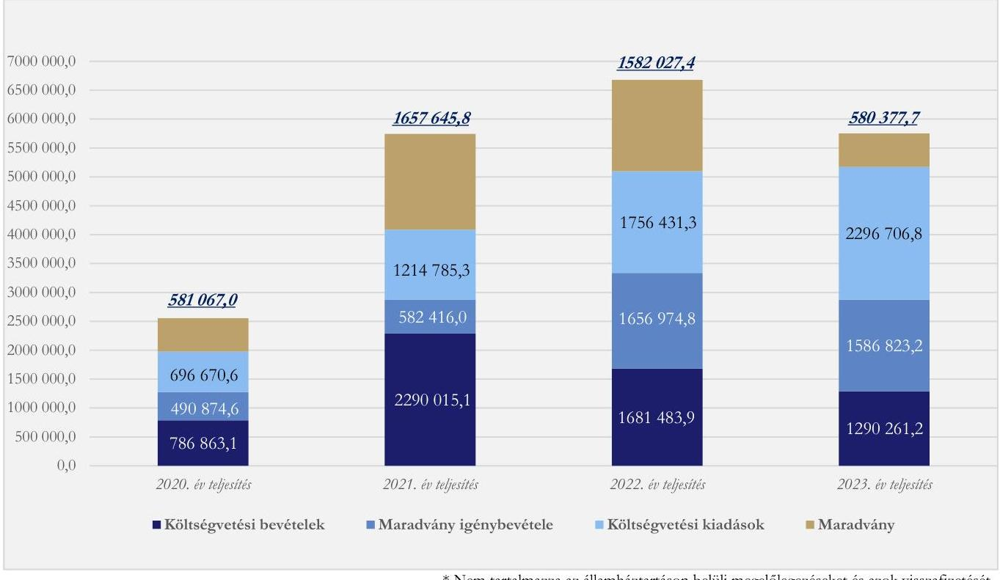
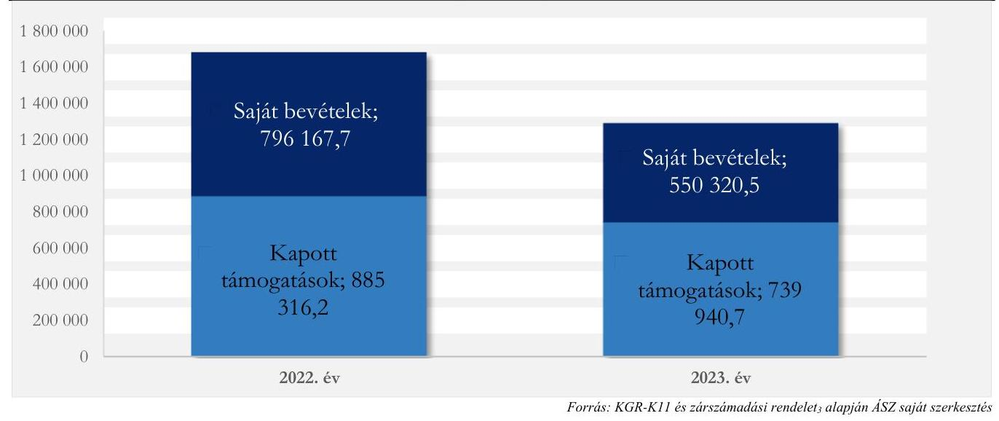

# JELENTÉS 

## Az önkormányzatok helyi adóztatási tevékenységének ellenőrzése - Ingatlanadóztatás

Leányfalu Nagyközség Önkormányzata

2025.

---

ÁLLAMI
SZÁMVEVŐSZÉK

# JELENTÉS 

## Az önkormányzatok helyi adóztatási tevékenységének ellenőrzése - Ingatlanadóztatás

Leányfalu Nagyközség Önkormányzata

2025

24201

---

# ELLENŐRZÉSI IGAZGATÓSÁG: 

## ÁLLAMHÁZTARTÁS HELYI SZINTJÉT ELLENŐRZŐ IGAZGATÓSÁG

## ELLENŐRZÉSI IGAZGATÓ:

DR. BAFFIA GERGELY GÁBOR ellenőrzési igazgató

## ELLENŐRZÉSVEZETŐ:

Jelentéseink az interneten a www.asz.hu címen olvashatók.

KANYÓ LŐRÁNT ISTVÁN ellenőrzésvezető

IKTATÓSZÁM: EL-4040-014/2024.
TÉMASORSZÁM: 54.
ELLENŐRZÉS-AZONOSÍTÓ SZÁM: V1084

---

# TARTALOMJEGYZÉK 

AZ ELLENŐRZÉS ALAPADATAI ..... 5
AZ ELLENŐRZÉS TERÜLETE ÉS AZ ELLENŐRZÖTT SZERVEZET ..... 7
ÖSSZEFOGLALÁS ..... 9
AZ ELLENŐRZÉS FÓKUSZKÉRDÉSEI ..... 11
MEGÁLLAPÍTÁSOK ..... 12
JAVASLATOK ..... 25
MELLÉKLETEK ..... 27
I. sz. melléklet: Értelmező szótár ..... 27
II. sz. melléklet: Az ellenőrzött szervezetek jegyzéke ..... 28
III. sz. melléklet: Ellenőrzési kritériumok ..... 29
IV. sz. melléklet: Az adótárgyak és az adóalanyok száma ..... 32
FÜGGELÉK: ÉSZREVÉTELEK ..... 33
RÖVIDÍTÉSEK JEGYZÉKE ..... 39

---

.

---

# AZ ELLENŐRZÉS ALAPADATAI 

## AZ ELLENŐRZÉS CÉLJA

Az ellenőrzés célja az volt, hogy értékelje Leányfalu nagyközség helyi ingatlanadóztatásának és adóhatósága feladatellátásának szabályszerűségét, célszerűségét és eredményességét. További cél volt, hogy az ellenőrzés megállapításai és következtetései segítsék az önkormányzati képviselő-testületeket a jogszabályokkal és a helyi sajátosságokkal összhangban álló helyi adópolitika kialakításában és az azt végrehajtó adóigazgatási szervezet megszervezésében. Az ellenőrzés célja volt annak megállapítása is, hogy az Önkormányzat által bevezetett, ingatlanokat terhelő helyi adókra vonatkozó rendeleti szabályok összhangban vannak-e a helyi adópolitikai célokkal, tartalmuk tükrözi-e a település helyi sajátosságait és az adóhatósági feladatellátás biztosítja-e az önkormányzati bevételek feltárását és beszedését.

Ennek keretében az ÁSZ értékelte, hogy az Önkormányzat által bevezetett, ingatlanokat terhelő helyi adókról szóló adórendelet, valamint az önkormányzati adóhatóság döntései, adóztatási gyakorlata a vonatkozó jogszabályokkal összhangban álltak-e.

## AZ ELLENŐRZÉS TÍPUSA

Kombinált ellenőrzés.

## AZ ELLENŐRZÖTT IDŐSZAK

Az 1. fókuszkérdésnél a 2023. év, valamint a 2024. évnek az ellenőrzés megkezdését megelőző napjáig (2024. április 2.) tartó időszaka.

A 2. és 3. fókuszkérdésnél a 2023. év, valamint a 2024. évnek az ellenőrzés megkezdését megelőző napjáig (2024. április 2.) tartó időszaka, a 2020-2022. évek adatainak bázisadatként való felhasználásával.

## AZ ELLENŐRZÉS TÁRGYA

Az Önkormányzat képviselő-testületének ingatlanokat terhelő helyi adókkal, azaz az építményadóval, a telekadóval és a magánszemély kommunális adójával kapcsolatos rendeletalkotási tevékenységének és az önkormányzati adóhatóság tevékenységének az ellátása.

Az ellenőrzés kiterjedt minden olyan körülményre és adatra, amely az ÁSZ jogszabályban meghatározott feladatainak teljesítéséhez, valamint a program végrehajtása folyamán felmerült újabb összefüggések feltárásához szükséges.

---

# AZ ELLENŐRZÉS JOGALAPJA 

Az ellenőrzés jogszabályi alapját az ÁSZ tv. 5. § (8) bekezdésének előírásai képezik.

## AZ ELLENŐRZÉS MÓDSZERE

Az ellenőrzést az ellenőrzési program szempontjai, az ellenőrzött időszakban hatályos jogszabályok, az ellenőrzés általános szakmai szabályai és az ellenőrzésre irányadó ÁSZ módszertanok alapján végezte az ÁSZ.

Az ellenőrzési kérdések megválaszolásához szükséges bizonyítékok megszerzése az ellenőrzött szervezetek által rendelkezésre bocsátott dokumentumokra, adatokra és az ASP Adó és az Iratkezelő szakrendszerek, illetve a KGR-K11 számviteli adatgyűjtő rendszer adataira alapozva megfigyelés, kérdésfeltevés (információkérés), mintavételezés, valamint elemző eljárás útján történt. Emellett az ellenőrzési bizonyítékként felhasználható adatforrások közé tartozott minden egyéb - az ellenőrzés folyamán feltárt, az ellenőrzés szempontjából információt tartalmazó - releváns dokumentum (ideértve különösen a helyszínen felvett jegyzőkönyvet) is.

Az ellenőrzés lefolytatásához az ellenőrzött szervezetek a tanúsítványok kitöltésével, valamint az ÁSZ által kért dokumentumok, adatok, információk megküldésével és az ellenőrzés során szolgáltattak adatokat.

Az ÁSZ az adómegállapítás, a fizetési kedvezmények engedélyezése, a hátralékok beszedése szabályszerűségét mintavételi eljárással ellenőrizte. Ennek keretében 14 mintatételben, 15 adóhatósági határozat szabályszerűségét ellenőrizte. A mintatételek kiválasztása véletlenszerűen történt meg az adóhatóság nyilvántartásában lévő adótárgyak és ügyek közül öt - adómegállapításra vonatkozó - mintatétel kivételével, melynek során a kiválasztás címadatok alapján történt meg annak érdekében, hogy feltárható legyen, volt-e olyan adótárgy, amelyet nem adóztatott az adóhatóság. Az ellenőrzött mintatételekre vonatkozó megállapítások nem vetíthetők ki a teljes sokaságra, a megállapításokat az ÁSZ az adott ellenőrzött mintatételek vonatkozásában tette.

Az ÁSZ a helyi adópolitikai elképzelések és a települési sajátosságok feltárásával értékelte, hogy az adórendelet e szempontoknak mennyiben felelt meg. Az ÁSZ a helyi adópolitikai célokkal akkor tekintette összhangban állónak az adórendeletet, ha az hatását tekintve támogatta az adópolitikai célok teljesülését.

Az ÁSZ az adóhatósági feladatellátás szabályszerűségéből, a meglévő kapacitásokból, valamint az ezer forint adóbevételre jutó adóhatósági költségek alakulásából következtetett arra, hogy az önkormányzati adóhatóság rendelkezett-e azzal a potenciállal, amellyel eredményesen tudta a helyi adópolitikát végrehajtani.

Az ÁSZ - az adórendelet szabályainak érvényre juttatása körében - az eredményesség megítélésekor a III. számú melléklet 2. pontjában foglalt szempontokat tekintette mérvadónak.

---

# AZ ELLENŐRZÉS TERÜLETE ÉS AZ ELLENŐRZÖTT SZERVEZET 

Leányfalui Polgármesteri Hivatal, forrás: Önkormányzat

Leányfalu nagyközség a Szentendrei járásban, a Visegrádi-hegység lábánál, Budapesttől 27 km-re fekszik. Lakosainak száma a BM nyilvántartása alapján 2020. január 1-jén 3951 fő, 2024. január 1-jén 4063 fő volt. Az Önkormányzat feladatellátását három költségvetési szerv (Faluház és Ravasz László Könyvtár Leányfalu, Iciri-Piciri Bölcsőde, Leányfalu Tündérkert Óvoda és Konyha) segítette. Az Önkormányzatnak egy gazdasági társaságban és egy nonprofit gazdasági társaságban volt részesedése.

A településen regisztrált gazdasági szervezetek száma a 2022. évben 1085 volt, melyek közül 828 db (76,3%) a szolgáltató szektorba tartozott. A 2023. évben a településen székhellyel öt nagyobb (750 000 ezer Ft-ot meghaladó) nettó árbevételű vállalkozás rendelkezett. Leányfalun az egy lakosra jutó személyi jövedelemadóalap a 2022. évben elérte a 2 837 266 Ft-ot, meghaladva a vármegyei (2 617 660 Ft) és az országos átlagot (2 268 789 Ft).

Az Alaptörvény értelmében a helyi önkormányzat a helyi közügyek intézése körében törvény keretei között döntött a helyi adók fajtájáról és mértékéről. Az Mötv. rögzíti, hogy a helyi adóval kapcsolatos feladatok ellátása a helyi önkormányzatok feladata.

Az Önkormányzat a Htv. alapján illetékességi területén adórendelettel az építményadót, a telekadót és a magánszemély kommunális adóját vezette be. 2023. január 1-jétől az Önkormányzat 25%-kal emelte az ingatlant terhelő adók mértékeit, a hatályos szabályozást eredményező utolsó jogszabálymódosítás (a helyben lakókra vonatkozó kedvezmény mértékének csökkentése) 2024. január 1-jén lépett hatályba.

Az építményadó szabályrendszerét az Önkormányzat egy - az adótárgyak hasznos alapterületének nagysága szerint - differenciált, 760-1090 Ft/m² közötti mértékrendszerrel alkotta meg, speciális adómérték vonatkozott azonban a kereskedelmi, szolgáltató tevékenység céljára szolgáló épületekre, épületrészekre és az úszómedencékre. Az adórendelet több adókönnyítési tényállást is megfogalmazott az építményadóban (például: a legalább két éve életvitelszerűen helyben lakók a lakás nagyságától függően 25-55%-os adókönnyítésben, a helyben lakó nyugdíjasok jövedelmi helyzetük függvényében adómentességben részesültek).

A telekadóban egy egységes, 100 Ft/m² összegű adómértéket alkalmazott, azzal, hogy a telek sajátosságaira tekintettel (pl. nagyság, beépíthetőség) az Önkormányzat több mentességet is biztosított.

A magánszemély kommunális adójában az Önkormányzat kizárólag az önkormányzati lakás bérleti jogát adóztatta, a lakásbérlő éves adója 8480 Ft/év összeg volt.

Az adó megállapításával, nyilvántartásával, beszedésével összefüggő adóhatósági feladatokat - a Hatásköri tv. és az Air. rendelkezései alapján - elsőfokú hatósági jogkörben Leányfalu nagyközség jegyzője látta el, három fő adótisztviselő közreműködésével.

Az adóhatóság által beszedett, ingatlanokat terhelő adókból származó helyi adóbevétel fontos szerepet játszott a települési feladatok finanszírozásában. 2023-ban 162 289,6 ezer Ft bevétel származott a három ingatlanadóból, ami a konszolidált költségvetési bevételek 12,6%-át, a települési helyi adóbevételek 54,2%-át tette ki. Az ingatlant terhelő helyi adók közül az építményadóból származott a legtöbb bevétel, amely 132 944,7 ezer Ft volt 2023-ban és 3302 adóalanytól, 3217 adótárgy után keletkezett. Az Önkormányzat helyi adóbevételei 2022. és 2023. évi összetételére vonatkozó adatokat az 1. ábra, a helyi ingatlanadók 2023. és 2024. évre vonatkozó jellemző naturális adatait pedig a IV. számú melléklet mutatja be.

# 1. ábra 

AZ ÖNKORMÁNYZAT HELYI ADÓBEVÉTELEI MEGOSZLÁSA A 2022-2023. ÉVEKBEN (EZER FT)

Forrás: KGR-K11 adatait alapján ÁSZ saját szerkesztés

---

# ÖSSZEFOGLALÁS 

Az ÁSZ tv. értelmében az ÁSZ feladatkörébe tartozik az önkormányzatok adóztatási tevékenységének ellenőrzése. A helyi adók az önkormányzatok saját, el nem vonható bevételét képezik, így az önkormányzatok gazdasági önállósága szempontjából különös fontossággal bír, hogy a helyi adórendeleti szabályok összhangban álljanak a magasabb szintű jogszabályokkal, továbbá az önkormányzati adóhatósági tevékenység jogszerű, eredményes és hatékony legyen. Erre figyelemmel volt tárgya az ÁSZ ellenőrzésének az Önkormányzat adórendelet-alkotási tevékenysége és az adóhatósági feladatellátás is.

Az adórendelet több ponton nem volt összhangban a magasabb szintű jogszabályokkal, s részben volt csak alkalmas az Önkormányzat adópolitikai céljai elérésére. Az adóigazgatási feladatellátás a jogszabályi követelményeknek több elemét tekintve nem felelt meg, az adóbehajtási tevékenység eredményes volt. Az adóztatási kiadások nem voltak aránytalanul magasak az adóbevételhez képest, az adóhatóság ingatlanadóztatással összefüggő feladatmutatói az ÁSZ által ellenőrzött nyolc (nagy)község feladatmutatói átlagos értékeitől kissé elmaradtak.

## Adórendelet, adórendelet-alkotás

Az adórendelet nem volt összhangban a Htv.-vel, mert kibővítette az építményadó tárgyát az úszómedencével, amellett, hogy leszűkítette a magánszemély kommunális adója tárgyi hatályát. Emellett az adórendelet több nem egyértelmű rendelkezést tartalmazott.

Az ingatlanokat terhelő helyi adókra vonatkozó rendeleti szabályozás megalkotása során az Önkormányzat összességében figyelembe vette azt, hogy a rendeleti szabályoknak tükrözniük kell a helyi sajátosságokat, az önkormányzat gazdálkodási követelményét, továbbá az adóalanyok széles körét érintően az adóalanyok teherviselő képességét.

Az adóhatóság adóigazgatási feladatellátásának jogszerűsége, eredményessége
Az adótárgy- és adóalanyfeltárási tevékenység nem volt eredményes, az adóigazgatási eljárásban hozott határozatok többsége nem volt szabályszerű.

Egyik adóhatározat sem felelt meg az adóigazgatási rendtartásról szóló törvényben foglaltaknak, mert a határozatok indokolása nem tartalmazta egyértelműen az adó kiszámítását, nem volt világos a tényállás és a határozatban megjelölt jogszabályi hivatkozások közti kapcsolat, ami nehezítette a döntések értelmezését.

A határozatok kiadmányozása, kézbesítése jogszerű volt.
Az adórendelet adópolitikai célokkal való összhangja, az adórendelet hatása
Az Önkormányzat országos összehasonlításban kiemelten támaszkodott az ingatlanadó-bevételekre. Míg a községek, nagyközségek esetén országosan ezen bevételek (intézmények nélküli) költségvetési bevételeken belüli átlagos aránya 2,2%, addig az Önkormányzat esetében ez 13,1% volt 2023-ban (konszolidált adatokkal számolva 12,6%). A felhalmozási célú támogatások nélküli költségvetési bevételeken belül a saját bevételek aránya a 2020-2023. időszakban 50-70% közötti érték volt. Az Önkormányzat gazdálkodási

[^0]
[^0]:  Az ÁSZ által jelen ellenőrzés alapjául szolgáló ellenőrzési program alapján ellenőrzött (nagy)községek: Árpádhalom, Balatonberény, Balatonvilágos, Kompolt, Leányfalu, Szentistván, Szigetmonostor és Tiszainoka.

---

mozgásterét növelte a 2023. évtől bekövetkező adóváltoztatás, összességében 25,9%-os ingatlanadóbevétel emelkedéssel járt együtt.

Ezzel együtt az adómérték-emelkedéssel járó, 2023. január 1-jétől és 2024. január 1-jétől hatályos változtatások az adóalanyok többségének adóteherviselő-képességével összhangban voltak.

Az Önkormányzat adórendeleti szabályai csak részben voltak összhangban az adópolitikai célokkal, mert nem feleltek meg az Önkormányzat azon szándékának, hogy a helyben lakók adóterhe kellő
 mértékben közelítsen az üdülőtulajdonosok adóterhéhez.

# Az adóhatósági kiadások 

Az adóhatóság nyilatkozata szerint a 2023. évben 307 434,1 ezer Ft helyi adóbevételt szedett be. 1000 Ft beszedett helyi adóbevételre - az ÁSZ számítása szerint - 41,6 Ft adóztatási kiadás esett. Az ellenőrzött (nagy)községek átlaga 33,4 Ft, az adóztatási kiadás tapasztalati referencia-érték maximuma kivetéses adóztatás esetén 50 Ft volt. Az adóztatási kiadások nem voltak magasak a bevételekhez mérten.

Az Önkormányzat egy adótisztviselőjére a 2023. évben 102 478,0 ezer Ft helyi adóbevétel, 1072 adótárgy és 1101 adóalany jutott. Ezek az értékek alacsonyabbak, mint az ÁSZ által ellenőrzött nyolc (nagy)község átlagos adata (218 852,8 ezer Ft/adótisztviselő, illetve 1396 adótárgy, 1257 adóalany/adótisztviselő). Az adóhatóság adóbehajtási tevékenysége eredményes volt.

---

# AZ ELLENŐRZÉS FÓKUSZKÉRDÉSEI 

1.- Az önkormányzat ingatlanokat terhelő helyi adókra vonatkozó rendeleti szabályozása megfelel-e a magasabb szintű jogszabályoknak?
2.- Az önkormányzati adóhatóság megfelelően és eredményesen látta-e el az ingatlanok adóztatásával kapcsolatos adóhatósági tevékenységeit?
3.- A településen megvalósuló helyi adóztatás támogatta-e a helyi adópolitikai célok teljesülését?

---

# MEGÁLLAPÍTÁSOK 

## 1. Az önkormányzat ingatlanokat terhelő helyi adókra vonatkozó rendeleti szabályozása megfelelte a magasabb szintű jogszabályoknak?

## Összegző megállapítás

1.1 számú megállapítás

Az adórendelet több ponton nem felelt meg a magasabb szintű jogszabályoknak.
Az adórendelet sértette a Htv.-ben szabályozott adók tárgyi hatályát és az egyértelmű értelmezhetőség Jat. ¹⁵-ban megfogalmazott követelményét.

A Htv. adómegállapításra vonatkozó 2. §-ával ² és a Htv. építményadó tárgyait rögzítő 11. § (1) bekezdésével, valamint 52. § 5., 6. pontjaival ellentétesen az adórendelet 3. § 3. bekezdése indirekt módon - kibővítette az építményadóban az adótárgyak körét azáltal, hogy külön adómértéket fogalmazott meg a nem mobil úszómedencére.
Az adórendelet 5. § (1) bekezdése nem állt összhangban a Htv. 2. §-ával és a magánszemély kommunális adója alanyait és tárgyait rögzítő Htv. 24. §-ával, mert kizárólag az Önkormányzat tulajdonában álló lakás bérlője terhére állapított meg a magánszemély kommunális adójában adóalanyiságot, adókötelezettséget ³.
Az adórendelet 8. § (2) bekezdés a) pontja azért nem volt összhangban a Htv. 17. §-ával és a Htv. 52. § 16. pontjával, mert mentességet fogalmazott meg az erdő művelési ágban nyilvántartott belterületi földrészletre, miközben az a Htv. értelmében nem tartozik a telekadó Htv. szerinti tárgyi hatálya alá.
A Htv. 52. § 9. pontja definiálta a „hasznos alapterület” fogalmát. Az adórendelet 11. §(5) bekezdése a Htv.-ben szereplő definíciótól részben eltérő, önálló meghatározást tartalmazott ugyanezen elnevezésű fogalomra, mivel az adórendeletbeli meghatározás nem tartalmazza azt a kitételt, hogy a hasznos alapterület vonatkozásában mit kell a releváns belmagasság számításánál figyelembe venni. Tekintve, hogy a Htv.-beli definíció átalakítására az Önkormányzatnak - a Htv. 2. §-a alapján - nincs felhatalmazása, ezért e jogszabályhely sértette a Htv. hivatkozott rendelkezését.
Az adórendelet az alábbi okokból fakadóan sértette - a Jat. 2. § (1) bekezdéséből következő - egyértelmű értelmezhetőség követelményét:
a) az adórendelet 3. § (2) bekezdésében szabályozott, az adóalap nagyságától függő, sávosan differenciált adómérték rendszerben nem volt egyértelmű, hogy adott adótárgyra melyik adómérték vonatkozott, mert az egyes adómértéksáv alsó sávhatára összegét a rendelkezés nem rögzítette;
b) az adórendelet 8. § (1) bekezdése egyfelől nem nevezte meg azt az adónemet, amelyre az ott szabályozott kedvezmény vonatkozott, másfelől a jogszabályi megfogalmazásból nem derült ki, hogy

[^0]
[^0]:    ² Az Alaptörvény 32. cikk (1) bekezdés h) pontja szerint: a törvény keretei között szabályozhat a helyi rendelet, így nem írhatja felül az adó tárgyát.
    ³ A Htv. 24. §-a értelmében a magánszemély kommunális adójának tárgyi, alanyi hatálya - a nem magánszemély tulajdonában álló lakás bérleti jogán kívül - az építményadó, a telekadó tárgyi, személyi hatályával egyezik.

---

a kedvezményre jogosultak ⁴ mely esetben, milyen feltételek teljesítése esetén, ki által megállapítható módon részesülhettek adómentességben. A rendeleti szabályozásból az következett, hogy a helyi iparűzési adóra is vonatkozott a kedvezmény, így az nem állt összhangban a Htv. 7. § e) pontjával ⁵ sem;
c) nem volt megállapítható, hogy az adórendelet 8. §-ának (5) bekezdésében megfogalmazott 60%-os, illetve 100%-os adókedvezmény melyik adónemben illette meg az adóalanyisága esetén az ingatlan tulajdonosát.
Nem igazodtak az Önkormányzat nyilatkozata szerinti jogalkotói szándékhoz és esetükben az adóhatóság gyakorlata is eltért a normatartalomtól, ezáltal nem töltötték be a Jat. 2. § (1) bekezdés szerinti egyértelműség elvét az alábbi jogszabályhelyek ⁶:
a) az adórendelet 8. § (4) bekezdése, mert azt a magánszemély adóalanyt, aki nem magánszemély tulajdonában álló ingatlanon vagyoni értékű joggal rendelkezett, akkor sem illetheti meg az adókönnyítés, ha az ingatlan esetében az adókedvezmény feltételei teljesültek;
b) az adórendelet 8. § (5)-(6) és (8) bekezdései, mert az ezekben rögzített kedvezmények nem illették meg az ott említett ingatlanok utáni magánszemély adóalanyt akkor, ha ő nem tulajdonjoga, hanem vagyoni értékű joga alapján minősült a helyi adó alanyának.
1.2 számú megállapítás Az adórendelet tükrözte a települési sajátosságokat és az adóalanyok széles körét tekintve igazodott az adóalanyok teherviselő képességéhez, az önkormányzat gazdálkodási követelményeihez.
a) A Htv. 7. § g) pontjában rögzített adómegállapítási korlátokból az következik, hogy a rendelet hatályossága idején is érvényre kell jutnia az e pontban szabályozott rendeletalkotási elveknek, azaz annak, hogy települési önkormányzat az adóalap fajtáját, az adó mértékét, a rendeleti adómentességet és adókedvezményt úgy állapíthatja meg, hogy azok összességükben egyaránt megfeleljenek a helyi sajátosságoknak,
b) az önkormányzat gazdálkodási követelményeinek és
c) az adóalanyok széles körét érintően az adóalanyok teherviselő képességének.

# A belpi sajátosságok figyelembevétele 

Leányfalu nagyközségben a TEIR ¹⁶ adatai szerint a lakások száma a 2020. évi 1440-ről a 2023. évre 1754-re emelkedett, az ASP Adattárházban elérhető adatok szerint 2023-ban a lakásokon kívül 989 üdülőépület (2020-ban ezek száma 1032 volt), továbbá 197 egyéb épület volt adótárgy. Az Önkormányzat nyilatkozata szerint a korábbi üdülőtulajdonosok egy jelentős része az utóbbi években életvitelszerűen is Leányfalura költözött, ezzel együtt a nem életvitelszerűen a településen lakó ingatlantulajdonosok száma még mindig jelentős volt. Ez a körülmény az Önkormányzat szerint nagyobb költséggel járó közfeladatellátást követel meg az Önkormányzattól.

[^0]
[^0]:    ⁴ A Leányfalun életvitelszerűen, legalább két összefüggő évben megszakítás nélkül lakók jogosultak az adórendelet 8. § (1) bekezdése szerinti kedvezményre.
    ⁵ A Htv. ezen rendelkezése szerint az önkormányzat - kifejezett törvényi rendelkezés hiánya esetén - nem alkothat olyan kedvezményt, mentességet, amelynek kedvezményezettje a Htv. 52. § 26. pontja szerinti vállalkozó.
    ⁶ A szóban forgó kedvezmények esetén az Önkormányzat és az adóhatóság nyilatkozata szerint a kedvezmény jár, illetve meg is adják azon adóalanyoknak is, akik nem tulajdonosokként, hanem vagyoni értékű jog jogosítottjaként számítanak adóalanynak.

---

Az ingatlan-állomány összetételét és a településen ideiglenesen lakók számát, mint az ingatlanadóztatás szempontjából releváns sajátos körülményeket - a Htv.-ben foglaltaknak megfelelően - az Önkormányzat a háromféle ingatlanadó bevezetésével, az építményadó kedvezményi és mértékrendszerével figyelembe vette és mérlegelte.

# Az önkormányzat gazdálkodási követelményeinek szempontja 

A 2023. november 30-i önkormányzati képviselő-testületi ülés jegyzőkönyve szerint „mind a polgármester és az alpolgármester, mind egyes képviselők szükségesnek tartanak, hogy egyes közfeladatok ellátása (hulladéktakartítás, sikkasztásmentesítés, tornacsarnok fenntartás, kulturális intézmények fenntartása, útjavítás, csapadékvíz-elvezetés) érdekében költségvetési többlet-bevétel álljon rendelkezésre, amely a helyben lakók adóterhének a nyaralótulajdonosok adóterhéhez való közelítésével lenne elérhető”. Az adórendelet - a 2023. évi adómérték-emelést követően - erre is figyelemmel 2024. január 1-jétől változott ⁷.

Az Önkormányzat főbb gazdálkodási adataiból (2. ábra) az figyelhető meg, hogy az Önkormányzat kötelezettségvállalással nem terhelt maradványa a 2020-2023. évek mindegyikében meghaladta az 500 000 ezer forintot, 2023-ban 580 377,7 ezer Ft volt. A 2023. évtől és a 2024. évtől bekövetkező adóváltozás tovább erősítette a település gazdasági önállóságát.
2. ábra

AZ ÖNKORMÁNYZAT KONSZOLIDÁLT BEVÉTELEI, KIADÁSAI ÉS MARADVÁNYA* A 2020-2023. ÉVEKBEN (EZER FT)

* Nem tartalmazza az államháztartáson belüli megelőlegezéseket és azok visszafizetését.

Forrás: KGB-K11 és zárszámadási rendelet: ⁷ alapján ÁSZ saját szerkesztés

[^0]
[^0]:    ⁷ Az életvitelszerűen Leányfalun élőket 2023-ban megillető, 35-65 %-ig terjedő építményadó-kedvezmény 10 százalékpontnyi mértékben csökkent 2024. január 1-jétől.

---

# Az adóalanyok, teherviselő képességének, figyelembevétele 

Az adórendeletbeli szabályozás a helyben lakókhoz képest magasabb adóteherrel sújtotta a helyben lakóhelyet nem létesítő adóalanyokat, azaz az üdülőingatlan tulajdont (például egy 100 m² alapterületű ingatlan után az életvitelszerűen helyben lakó tulajdonosnak 34,2 ezer Ft-ot, míg egy ugyanekkora alapterületű üdülőingatlan után az adóalanynak 76 ezer Ft építményadót kellett fizetni ⁸). E megfontolás mögött - az Önkormányzat indokolása alapján - az állt, hogy az üdülőtulajdonosok esetében valószínűsíthető volt, hogy üdülőjük második vagy többedik ingatlanuk, így vélelmezhető volt az is, hogy ők nagyobb szerepet tudnak vállalni a helyi közterhekből.
Mindezekre tekintettel - a Htv.-ben foglaltaknak megfelelően - az Önkormányzat figyelembe vette az adóalanyok teherviselő képességét a rendeletalkotás során.

## 2. Az önkormányzati adóhatóság megfelelően és eredményesen látta-e el az ingatlanok adóztatásával kapcsolatos adóhatósági tevékenységeit?

## Összegző megállapítás

Az adóhatóság az adóigazgatási eljárása során nem járt el megfelelően és nem volt eredményes. Az adótartozások beszedésére vonatkozó feladatellátása eredményes volt, de nem volt szabályszerű.
2.1. számú megállapítás

Az adóhatóság adótárgy- és adóalanyfeltárási feladatellátása nem volt eredményes, az adómegállapító határozatok többsége nem volt összhangban a jogszabályokkal. Az Air. előírásai ellenére az adómegállapításról szóló határozatok indokolása nem tartalmazta az adó kiszámításának folyamatát, és nem kizárólag az adókötelezettség szempontjából releváns jogszabályokra utalt, ami nehezítette a döntés értelmezését.

## Adótárgy- és adóalanyfeltárás

Az adóhatóság a Google maps és a Takarnet elektronikus földhivatali ingatlan-nyilvántartási információs rendszer, valamint az Építésügyi Monitoring Rendszer használatával tárta fel az adótárgyakat, illetve az adóalanyokat. Az önkormányzati adóhatóság használta továbbá az adózók adatbejelentési kötelezettsége elmulasztásának felderítése érdekében az építésügyi hatóság által az Art. ¹⁸ 86. §-a szerint szolgáltatott adatokat. Az adóhatóság a 2023. és a 2024. évben nem élt ugyanakkor az Art. 83. § (2) bekezdésében foglaltak alapján az ingatlanügyi hatóság megkeresésének lehetőségével.
Az ÁSZ nem tárt fel jogszerűtlenül nem adóztatott ingatlant.
Az adótárgy- és adóalanyfeltárási adóhatósági feladatellátás - figyelemmel arra, hogy bár az Önkormányzat illetékességi területén sok üdülőépület van, de az adóhatóság nem használta saját adóadat-

[^0]
[^0]:    ⁸ A legalább két összefüggő éven át életvitelszerűen helyben lakók az adórendelet 8. § (4) bekezdése alapján 150 m² hasznos alapterület-nagyságig 55 %, 151-300 m² hasznos alapterület nagyság között 50 %, 301 m²-t meghaladó alapterület esetén 25 % adókedvezményben részesülnek.

---

nyilvántartásában szereplő adatok pontosítása érdekében az ingatlanügyi hatóság adatait - nem volt eredményes ⁹.

#

 Adómegállapítás (kivetés) 

Az ÁSZ az adóhatósági adómegállapítási feladatellátás ellenőrzése keretében 9 mintatétel ellenőrzését végezte el.
A mintatételekben ellenőrzött adómegállapítási és fizetési könnyítés elbírálására vonatkozó eljárások során hozott 12 határozat közül 10 határozat, a határozatok 83,3%-a nem volt szabályszerű. Az ÁSZ nem tárt fel jogszerűtlenül nem adóztatott ingatlant.
Egy vizsgált mintatétel (2481-1/2023.) esetén az adóhatóság a nem mobil úszómedence területe után állapított meg adót, melyet az ÁSZ - annak ellenére, hogy megítélése szerint az úszómedence nem tárgya az építményadónak - szabályszerűnek csak azért ismerte el, mert az megfelelt a hatályos adórendeletnek ${ }^{10}$.
Az adórendelet 8. § (8) bekezdésével szemben egy telekadóra vonatkozó mintatétel (51-3/2023.) és - az adórendelet 8. § (1) és 11. § (2)-(3) bekezdésében foglaltak ellenére - két építményadómintatétel (2481-1/2023., 2497-1/2023.) esetében az adóhatóság az adóelőnyt erre vonatkozó adózói kérelem előterjesztése nélkül állapította meg.
Egy mintatétel (536-3/2023.) esetén az adóhatóság az adózó késedelmes adatbejelentése alapján az adót öt évre visszamenőleg is megállapította, azonban e határozatot - az Art. 144. § (1) bekezdésével, 146. § (1) bekezdése a)-b) pontjaival, az Art 141. § (6) bekezdés b) pontjával, valamint az Art. 141. § (9) bekezdésében előírtak ellenére - nem ellenőrzés és utólagos adómegállapítás keretében hozta meg, jogkövetkezményt nem állapított meg. ${ }^{11}$
Egy építményadóra vonatkozó mintatétel (7066. azonosítójú adóalany) esetében, annak ellenére, hogy az adózó az adatbejelentési kötelezettségének kétszeri - 2024.02.20-án és 2024.03.25-én emailen történt felszólítást követően sem tett eleget, az adóhatóság - az Art. 221. § (2) és (3) bekezdéseiben foglaltak ellenére - az adatbejelentés elmulasztása miatt mulasztási bírságot nem szabott ki, az építményadót az ÁSZ ellenőrzés időszakában, 2024.07.04-én vetette ki.

[^0]
[^0]:    ${ }^{9}$ Kisebb méretű település és kevés (legfeljebb 500) adótárgy esetén nem feltétlenül szükséges minden adóévben összevetni az ingatlan-nyilvántartási adatokkal az adónyilvántartásban szereplő adatokat, mert az adótisztviselő helyismerete ezt kiválthatja. Üdülőtelepülés esetén azonban sok olyan ingatlan van, amelyet időszakosan laknak, az adótisztviselők nem feltétlenül bírnak tudomással valamennyi adótárgyról és adóalanyról. Ezért az ÁSZ megítélése szerint az Önkormányzathoz hasonló helyzetben lévő településeken indokolt az ingatlanügyi hatóság adatszolgáltatását igénybe venni és használni a kapott adatokat.
    ${ }^{10}$ Saját eljárásában sem az adóhatóság, sem az ÁSZ nem hagyhatja figyelmen kívül a közjogi értelemben érvényes adórendeletet, még akkor sem, ha az meggyőződése szerint nem áll összhangban a magasabb szintű jogszabállyal. Az ellentmondó szabályozást csak az Önkormányzat, vagy csak a Kúria Önkormányzati Tanácsa döntése oldhatja fel.
    ${ }^{11}$ Az Art. hivatkozott rendelkezései szerint az adóhatóság az elévülési időn belül visszamenőlegesen úgy állapíthat meg adót, ha ellenőrzést folytat le és utólagos adómegállapítás során rendelkezik a múltra vonatkozó adó, valamint az adó meg nem fizetése esetén a jogkövetkezmények megállapításáról, továbbá az adómegállapítás évére és az azt követő évekre vonatkozó adó megállapításáról.

---

Egy telekadó mintatétel (536-3/2023.) esetében az adóhatóság -a Htv. 12. § (1) bekezdésében foglaltak ellenére - úgy kötelezett egy tulajdonost a telek utáni teljes adó megfizetésére, hogy az ezt megalapozó, a Htv. 12. § (2) bekezdés szerinti megállapodást a Htv. ezen rendelkezésével ellentétben a négy tulajdonos közül csak kettő írta alá.
Egy telekadóra (536-3/2023.) és három építményadóra vonatkozó mintatétel (25-2/2023., 2481-1/2023. és 2662-3/2024.) esetében az adóhatóság által hozott határozat

Ha az adótárgynak több tulajdonosa van, akkor ők tulajdoni illetőségük arányában adóalanyok. Ekkor, mindegyikük egyetértése esetén, köthetnek arról megállapodást, hogy az adóalanyisággal kapcsolatos jogokat és kötelezettséget az adóhatóság előtt közülük egy adóalany kapcsolattartóként gyakorolja. Az ÁSZ jó gyakorlatnak azt tekinti, ha a határozat nemcsak a fizetési kötelezettséget és a fizetésre kötelezettet (a kapcsolattartót), hanem az egyes adóalanyokat terhelő adót és annak jogalapját, kiszámítását is tartalmazza, annak érdekében, hogy az egyes adóalanyok számára egyértelmű legyen az őket terhelő adó összege.
rendelkező része kizárólag az adó fizetésére kötelezett által fizetendő adó összegét tartalmazta.
Egy fizetési kedvezményre vonatkozó (1132-4/2023.) mintatétel esetében az adóhatóság a kérelmet az Art. 46. § (1) bekezdés előírása ellenére nem annak tartalma szerint bírálta el. Az adózó a kérelmében ugyanis a fizetési kötelezettség mérséklésére vonatkozó - jövedelmi helyzetével indokolt - méltányossági kérelmet is előterjesztett, az adóhatóság azonban a kérelmet kizárólag az adórendelet 8. § (4) bekezdésének való megfelelés tekintetében bírálta el, azaz azt vizsgálta, hogy az adózó életvitelszerű helyben lakása okán jogosult-e az adókedvezményre. Az adózó ezt követően benyújtott részletfizetésre irányuló kérelmét az adóhatóság határidőben elbírálta, de az Art. 200. § (1) bekezdésében foglaltak ellenére nem rendelkezett a késedelmi pótlékfizetési kötelezettségről.
Az Art. 73. § (1) bekezdés c) pontjával szemben a telekadóra, építményadóra vonatkozó egyik adómegállapító határozat indokolása sem tartalmazta tényállási elemként az adótárgy utáni adó és az adóalany(ok)ra jutó adó összegének számszaki levezetését.
Az adómegállapító határozatok indokolásában - szintén az Art. 73. § (1) bekezdés c) pontjában előírtak ellenére - olyan jogszabályhelyek is szerepeltek, amelyek a fizetési kötelezettség kapcsán nem relevánsak. Az adóigazgatási eljárás keretében hozott határozatok kiadmányozása és adózókkal való közlése valamennyi határozat esetében megfelelt az Art. és az Eüsztv. ${ }^{19}$ előírásainak.

A megállapított adó csökkentése: fizetési kedvezmények, adókötelezettség változás, elévülés miatti törlés
A fennálló adókövetelést csökkentő intézkedések jogszerűek voltak, azok számszaki összefoglalását az 1. táblázat mutatja be.
1 táblázat
ADÓKÖVETELÉS TÖRLÉSEK FŐBB ADATAI (DARAB ÉS EZER FT)

| MEGNEVEZÉS | 2023. |  | 2024. |  |
| :-- | :--: | :--: | :--: | :--: |
|  | ESETSZÁM | ÖSSZEG | ESETSZÁM | ÖSSZEG |
| Méltányosságból törölt adókövetelés | 0 | 0 | 0 | 0 |
| Adókötelezettség változás okán törölt   adókövetelés | 173 | 4658,0 | 8 | 328,4 |
| Elévülés miatt törölt adókövetelés | 0 | 0 | 84 | 265,3 |

---

# Adatszolgáltatási, közzétételi kötelezettség 

Az adóhatóság a Kincstár ${ }^{21}$ számára a helyi adórendeletről és az adózási információkról szóló adatszolgáltatási kötelezettségének a Htv. 42/B. § (1) bekezdésében foglalt határidőn ${ }^{12}$ túl, a 2023. január 1-jétől hatályos adórendeleti változásokról 2023. február 7-én (63 nap késedelemmel), a 2024. január 1-jétől hatályos adórendelet szerinti adómértékekről, kedvezményekről és mentességekről 2024. január 4-én (29 nap késedelemmel) tett eleget. Az adóhatóság a Htv. 42/B. § (3) bekezdésében foglalt közzétételi kötelezettségét nem a jogszabályi előírásoknak megfelelően teljesítette, mert a település honlapján nem a hatályos adórendelet szövegét tette közzé, továbbá a módosításokkal egységes szerkezetbe foglalt rendelet szövegének közzététele nem történt meg.
2.2. számú megállapítás

Az adóbehajtási (adóbeszedési) tevékenység eredményes volt. Két adóvégrehajtási ügyben az adóhatóság törvényesen végzett behajtási cselekményt, azonban a végrehajtási eljárásokat nem zárta le végzéssel.

Az ingatlant terhelő adótartozások beszedése érdekében az adóhatóság a 2023. évben 251 esetben, a 2024. évben az ÁSZ ellenőrzés megkezdéséről való értesítés átvételének napjáig (2024. április 2.) három esetben indított az Avt. ${ }^{22}$-ben foglaltak alapján végrehajtási eljárást. Az adóhatóság a végrehajtási eljárások eredményeképpen a 2023. évben 19 465,9 ezer Ft, a 2024. évben 51,5 ezer Ft adót szedett be.
Az adóbehajtási feladatellátás eredményes volt, mert:

- az adóhatóság az adófizetés első esedékessége előtt felhívta az adózók figyelmét az adókötelezettség teljesítésére,
- az adóhatóság által nyilvántartott 2023. évi hátraléknak a 2023. évi ingatlanadókivetéshez viszonyított aránya (6,2%) alacsonyabb volt, mint az azonos településtípusba tartozó önkormányzatok kivetés-arányos hátraléka (34,7%),
- a 2023. december 31-i hátralékok összege 28,8%-kal alacsonyabb volt, mint a 2022. december 31-én fennálló hátralékok összege,
- az ingatlanokat terhelő adóból származó 2023. évi tényleges adóbevétel - mindhárom adónem esetében - meghaladta a 2023. évi költségvetésben tervezett eredeti előirányzat 90%-át.
A 2. táblázat szerint a hátralékok összege és a hátralékosok száma is csökkent 2023. év végére, ami visszavezethető az adóhatóság 2023. évi eredményes adóbehajtási tevékenységére. 2024. július 9-ére a hátralékok szintje a 2022. év végi állományhoz képest is magasabb lett, ami összefüggésben lehet a 2024. április 2-áig végzett kevés végrehajtási cselekménnyel. Az ÁSZ két, végrehajtási eljárásra vonatkozó mintatételt ellenőrzött, s mindkét eljárás annyiban nem volt szabályszerű, hogy az adóhatóság a végrehajtási eljárást - az Avt. 18. § (1) bekezdés b) pontjában foglaltak ellenére - végzéssel nem szüntette meg.

[^0]
[^0]:    ${ }^{12}$ Az adórendelet, valamint annak módosítása hatálybalépését megelőző hónap ötödik napjáig kell adatot szolgáltatni a Kincstár számára.

---

| 2. táblázat |  |  |  |  |  |
| :--: | :--: | :--: | :--: | :--: | :--: |
| AZ ADÓHÁTRALÉKOK FŐBB ADATAI (DARAB ÉS EZER FT) |  |  |  |  |  |
| MEGNEVEZÉS | NAPTÁRI NAP | EPÍTMÉNYADÓ | TELEKADÓ | MAGANSZEMÉLY KOMMUNÁLIS ADÓIA | ÖSSZESSÉGES |
|  | 2022.12.31. | 157 | 22 | 2 | 181 |
| Hátralékos adózók száma | 2023.12.31. | 125 | 19 | 1 | 145 |
|  | 2024.07.09. | 279 | 48 | 1 | 328 |
|  | 2022.12.31. | 8470,7 | 5326,2 | 0,1 | 13797,0 |
| Adóhátralék összege | 2023.12.31. | 7238,7 | 2590,3 | 0,1 | 9829,1 |
|  | 2024.07.09. | 11661,7 | 3115,8 | 0,1 | 14777,6 |

# 3. A településen megvalósuló helyi adóztatás támogatta-e a helyi adópolitikai célok teljesülését? 

| Összegző megállapítás | Az Önkormányzat ingatlanokat terhelő helyi adókra vonatkozó adórendeleti szabályozása egy adópolitikai cél kivételével támogatta a helyi adópolitikai célok megvalósulását. Az adóhatósági feladatellátás kiadása a bevételhez mérten nem volt magas, a feladatellátási mutatók értékei összességében az ÁSZ által ellenőrzött (nagy)községek mutatói átlagos értékétől elmaradtak. |
| :--: | :--: |

Az Önkormányzat írásba foglalt adópolitikai koncepcióval nem rendelkezett. Az ÁSZ az Önkormányzat nyilatkozata alapján megismerte az Önkormányzat célkitűzéseit és az alkalmazott eszközrendszert, amit a 3. táblázat foglal össze. Az Önkormányzat nyilatkozata szerint az adórendelet hatályos formájában nem tükrözi megfelelően az általuk elérni kívánt adópolitikai célt, mert mind az önkormányzati feladatellátás színvonalának növelése érdekében való adóbevétel-emelés, mind az adórendszer igazságosabbá tétele csak a helyi lakosok adókedvezményi rendszerének átalakításával (az általuk igénybe vehető adókedvezmény mértékének további csökkentésével) valósulhatott volna meg.

---

# 3. táblázat 

AZ ÖNKORMÁNYZAT ADÓPOLITIKAI CÉLJAI ÉS ALKALMAZOTT ESZKÖZRENDSZERE

| ADÓPOLITIKAI CÉL | ADÓPOLITIKAI ESZKÖZ |
| :-- | :-- |
| Biztos, bevételi forrás legyen | Valamennyi, ingatlant terhelő helyi adó bevezetése |
| Igazságos legyen | Az adóalap nagyságára figyelemmel differenciált építményadó-mérték   bevezetése, a kereskedelmi, szolgáltató tevékenységet végző ingatlanok   magasabb építményadó-mértékkel való terhelése |
| Elviselhető (méltányos) teher   legyen |

 Az életvitelszerűen helyben lakók számára adókedvezmény, a helyben lakó   nyugdíjasok számára adómentesség az építményadóban |
| A közfeladat-ellátást érdemben   segítse | A korábbi, a helyi lakosoknak jelentős kedvezményt biztosító adórendszer   fokozatos átalakítása: a kedvezmények csökkentése |

Forrás: az adórendelet és az Önkormányzat nyilatkozata alapján ÁSZ saját szerkesztés
Az ÁSZ álláspontja szerint az adórendeleti eszköztár az elérni kívánt adópolitikai célokkal részben összhangban volt. Az Önkormányzat Alaptörvényben és Htv.-ben biztosított joga dönteni az adóteher nagyságáról és arról, hogy adót az egyes jogalanyokra mekkora mértékben terheli, azonban az ÁSZ véleménye szerint a teher-elosztás módjának több formája lehet ${ }^{13}$.
3.2 számú megállapítás

Az Önkormányzat országos összevetésben is kiemelkedően támaszkodott az ingatlanadó bevételekre. Az Önkormányzat saját bevételei a 2020-2022. években nőttek, a támogatásoktól való függősége csökkent, az adóteher az adóalanyok többségének adóteherviselő-képességével összhangban volt.

## Az adórendelet (módosítás) hatása az önkormányzat gazdálkodására

Az ingatlanadókból származó bevételek trendje a 2020-2023. években növekvő volt (a bevételekben csak 2022-ben volt megtorpanás). A 2022. évi ingatlanadó-bevétel (128 885,1 ezer Ft) a 2023. évre 162 289,5 ezer Ft-ra, 33 404,4 ezer Ft-tal, 25,9%-kal való jelentősebb mértékű növekedésének oka a 2023. január 1-jétől hatályba lépett - az adószint növekedését eredményező - adórendelet, továbbá az adótárgyak számának 2022. óta tartó folyamatos, éves átlagban 2,0%-os növekedése volt. Ennek következményeként az építményadó-bevétel 29 332,5 ezer Ft-tal, 28,3%-kal emelkedett 2023-ra az előző évhez képest, a telekadó-bevétel pedig 25 209,4 ezer Ft-ról 29 285,5 ezer Ft-ra, 16,2%-kal emelkedett. A magánszemély kommunális adójának bevétele 2022-ről 63,5 ezer Ft-ról, 2023-ra 59,3 ezer Ft-ra, 6,6%-kal csökkent.

Emellett a helyi iparűzési adóból származó bevétel jelentős, 62 920,8 ezer Ft-os (88,5%-os) növekedése is megfigyelhető 2022-ről a 2023. évre.
Az eseti, de egyébként jelentős összegű felhalmozási célú támogatások nélkül a költségvetési bevételekhez képest a saját bevételek aránya a 2020-2023. évek mindegyikében 55,0% feletti érték, 2023-ban 62,8% volt, ami több mint kétszerese volt a (nagy)községek országos jellemző értékének (24,4%).

[^0]
[^0]:    ${ }^{13}$ Az Önkormányzat bevezette a magánszemély kommunális adóját, így egy lehetséges megoldás, ha a helyben lakók ebben az adónemben fizetik a lakásuk utáni, adott esetben a lakás nagyságától függő tételes adót, amely egyben lehetőséget ad az összetett kedvezményi rendszer megszüntetésére (például: $60 \mathrm{~m}^{2}$ alapterületig $15000 \mathrm{Ft} / \mathrm{év}, 60$ $150 \mathrm{~m}^{2}$ között $20000 \mathrm{Ft} / \mathrm{év}, 150 \mathrm{~m}^{2}$ felett $25000 \mathrm{Ft} / \mathrm{év}$ ).

---

A 2020-2023. év(ek)re vonatkozó bevételek jogcímenkénti nagyságát és változását éves bontásban a 4. táblázat, az Önkormányzat bevételeinek és a kapott támogatásoknak 2022-2023. évi alakulását pedig a 3. ábra mutatja be.
4. táblázat

AZ ÖNKORMÁNYZAT KONSZOLIDÁLT BEVÉTELEINEK ALAKULÁSA 2020-2023. ÉVEKBEN (EFT)

| Ssz. | Jogcím | 2020. | 2021. | 2022. | 2023. |
| :--: | :--: | :--: | :--: | :--: | :--: |
| 1. | Működési célú támogatások állambáztartáson belülről | 249893,9 | 306150,6 | 357205,4 | 326570,8 |
| 2. | Felhalmozási célú támogatások állambáztartáson belülről | 202465,5 | 1607404,3 | 528110,8 | 413369,9 |
| 3. | Közhatalmi bevételek | 223233,4 | 245989,1 | 212508,7 | 309444,0 |
| 3.1. | ebből: ingatlanadók bevétele | 119691,8 | 134051,3 | 128885,1 | 162289,5 |
| 3.2. | ebből: helyi iparűzési adó bevétele | 95960,0 | 97885,9 | 71107,8 | 134028,6 |
| 3.3. | ebből: idegenforgalmi adó bevétele | 807,2 | 1405,5 | 3180,5 | 3265,7 |
| 3.4. | ebből egyéb közhatalmi bevételek | 6774,4 | 12646,4 | 9335,3 | 9860,2 |
| 4. | Egyéb saját bevétel | 111270,3 | 130471,1 | 583659,0 | 240876,5 |
| 5. | Saját bevételek (3+4) | 334503,7 | 376460,2 | 796167,7 | 550320,5 |
| 6. | Költségvetési bevételek $(1+2+5)$ | 786863,1 | 2290015,1 | 1681483,9 | 1290261,2 |
|  | Saját bevételek aránya felhalmozási célú támogatások nélküli költségvetési bevételeken belül $(5 / 1+5, \%)$ | $57,2 \%$ | $55,2 \%$ | $69,0 \%$ | $62,8 \%$ |

Forrás: KGR-K11, ÁSZ saját szerkesztés
3. ábra

AZ ÖNKORMÁNYZAT KAPOTT TÁMOGATÁSA ÉS SAJÁT BEVÉTELEI A 2022-2023. ÉVEKBEN (EZER FT)

Míg 2023-ban az ingatlanadó-bevételek aránya az intézményi bevételek nélküli költségvetési bevételeken belül a településtípusra (község, nagyközség) vonatkozó országos átlag szerint 2,2% volt, addig az Önkormányzat esetében ez az arány a jelentős összegű felhalmozási célú támogatásoktól megtisztított költségvetési bevételre vetítve $\mathbf{19,6\%}$, konszolidált adatokkal számolva $\mathbf{18,5\%}$ volt.

---

Az Önkormányzat önként vállalt feladatokat (pl: kerékpáros közösségi közlekedés feltételrendszerének fejlesztése, működtetése, önkormányzat kizárólagos tulajdonában álló közfürdő működtetése, Bursa Hungarica Felsőoktatási ösztöndíj pályázatban résztvevő hallgatók támogatása) is ellátott. A 2021-2022. évi költségvetés végrehajtásáról szóló zárszámadási rendeletek adatai alapján ugyanakkor az önként vállalt feladatok bevételei minden évben meghaladták az önként vállalt feladatokhoz kapcsolódó kiadások összegét, így az önkormányzat az ellenőrzött időszakban a helyi bevételei teljes összegét a kötelező feladatai ellátására fordíthatta.
Az Önkormányzat gazdálkodására jelentős hatást gyakorolt az adórendelet előírásaiból fakadó adóbevétel, ami alapvetően befolyásolta a település költségvetési mozgásterét.

# Az adóalanyok teherviselő képességével való összevetés 

Az adózók a 2022-2024. években építmény- és telekadóra vonatkozóan összesen 18 fizetési kedvezmény iránti kérelmet nyújtottak be, ami az adózók éves átlagos számának (3006 fő) 0,6%-a volt. A 2022. év végéről a 2023. év végére 181 adózóról 145 adózóra, 19,9%-kal csökkent a hátralékos adózók száma.
Az ingatlanadókban fennálló hátralék összege - a 2. táblázat adatai szerint - 2023. utolsó napjára, egy év alatt 28,8%-kal 9829,1 ezer Ft-ra csökkent. Az adóhátralék KGR-K11 szerint teljesített ingatlanadóbevételekhez viszonyított aránya a 2021. évi 20,3%-hoz képest a 2023. év végére 14,2 százalékponttal, 6,1%-ra mérséklődött.
Az ÁSZ a fenti adatok alapján arra a következtetésre jutott, hogy a 2023. évben és a 2024. évben bekövetkező adómérték-növekedés nem rontotta az adóalanyok nagy hányadának teherviselő képességét. Szintén az adóalanyok jó teherviselő képességre utal, hogy a fizetési könnyítésre vonatkozó kérelmek száma és annak az adóalanyok számához mért aránya elenyésző volt.
3.3. számú megállapítás

Az ÁSZ az adóhatóság feladatellátását akadályozó körülményt nem tárt fel. Az adóztatási kiadások nem voltak túlzottak, az adóhatósági feladatellátás az ÁSZ által ellenőrzött (nagy)községekkel összevetve megfelelő volt. Az adómegállapítási, az adóbehajtási feladatellátás elősegítette az adórendelet szabályainak végrehajtását.

## Személyi és tárgyi feltételek

Az Önkormányzat adóigazgatási feladatainak ellátása önálló szervezeti egység keretében történt, s három fő adótisztviselő látta el az adóigazgatáshoz kapcsolódó feladatokat, akik mindegyike középfokú végzettséggel rendelkezett. Két fő adóigazgatásban szerzett szakmai tapasztalata meghaladta a 25, illetve 12 évet, a harmadik tisztviselő közel egy év adóigazgatási tapasztalattal rendelkezett ${ }^{14}$.
A Hivatalnál az adóügyi feladatok ellátásához szükséges tárgyi feltételek biztosítottak voltak.

## Az adóztatás kiadásai

A Hivatal az Áht. ${ }^{23}$ 6. § (1) bekezdése és a 15/2019. (XII. 7.) PM rendelet ${ }^{24}$ 3. § (1) bekezdése előírása ellenére az adóigazgatási tevékenységgel összefüggő kiadásokat, valamint a 15/2019. (XII. 7.) PM rendelet 6. § (2) bekezdésében előírtak ellenére a kapcsolódó átlagos statisztikai létszámadatokat a

[^0]
[^0]:    ${ }^{14}$ Az adóhatósági kiadási adatok és feladatmutatók értékeléséhez hozzátartozik, hogy az adóhatóságnál a szóban forgó időszakban azért volt három fő adótisztviselő, mert az egyikük nyugdíjazása miatt a feladatellátás zavartalanságának biztosítása érdekében egy fő az adóigazgatási feladat-ellátást sajátította el.

---

kormányzati funkció (011220 Adó-, vám- és jövedéki igazgatás) szerint elkülönítetten nem számolta el, illetve nem mutatta ki, így azok az Önkormányzat 2023. és 2024. éves költségvetési beszámolóiban a kormányzati funkción nem szerepeltek. Az adóztatás 2023. évi költségeivel kapcsolatos adatokat az 5. táblázat tartalmazza.

Az adóztatás kiadásai (költségei) egyfelől az adóhatóság költségeiben, másfelől az adózó költségeiben öltenek testet. Önadózás esetén az adóztatási költségek nagyobb része az adózónál merül fel, mert az adót az adóalany számítja ki, vallja be, fizeti meg. Kivetéses adóztatás esetén ellenben az adózó költsége az adó megfizetésének költségét jelenti (például a gépjárműadó vagy a hatósági nyilvántartás alapján megállapított helyi adók esetén) vagy - az adófizetési költség mellett - legfeljebb csak az adómegállapításhoz szükséges adatszolgáltatás költsége merül fel. Ha az összes bevétel több, mint 10%-át teszi ki a kivetéses adózás, hatósági adómegállapítás, azaz az ingatlanadóztatás alapján befolyó bevétel, akkor az adóztatási kiadás referencia-érték maximuma 50 Ft 1000 Ft adóbevételre vetítve (a szinte kizárólag önadózásos adókat beszedő adóhatóságoknál ez az érték 10 és 20 Ft közötti).
5. táblázat

AZ ADÓZTATÁS 2023. ÉVI KÖLTSÉGEINEK KIMUTATÁSA (EZER FT, FŐ, DB)

| MEGNEVEZÉS | ÖNKORMÁNYZAT ÉS   HIVATAL ADATAI | NYOLC ELLENŐRZÖTT   ÖNKORMÁNYZAT ÉS   HIVATAL ADATAI   (ÖSSZESEN, ÁTLAG) |
| :-- | :--: | :--: |
| Összes tényleges kiadás adatszolgáltatás   alapján | 16519,7 | 243376,6 |
| Ebből: személyi juttatások és munkaadói közteher | 12774,9 | 237480,8 |
| Tényleges létszám adatszolgáltatás   alapján (fő) | 3 | 32,5 |
| Beszedett helyi adóbevétel   adatszolgáltatás alapján | 307434,1 | 7112717,6 |
| 1 adóigazgatási dolgozóra jutó tényleges   személyi és közteher adatszolgáltatás   alapján | 4258,3 | 7307,1 |
| 1000 Ft helyi adóbevételre jutó személyi   juttatás és közteher (Ft) | 41,6 | 33,4 |
| Egy adótisztviselőre jutó adó | 102478,0 | 218852,8 |
| Egy adótisztviselőre jutó ingatlanadó-   tárgyak száma (db) | 1072 | 1396 |
| Egy adótisztviselőre jutó ingatlanadó-   alanyok száma (fő, db) | 1101 | 1257 |

Az adóhatóság adatszolgáltatása alapján a 2023. évben egy adótisztviselőre 4258,3 ezer Ft tényleges személyi juttatás és munkaadókat terhelő közteher jutott. Amennyiben ezt az adatot az ÁSZ által ellenőrzött nyolc (nagy)község azonos adatával vetjük össze, akkor az Önkormányzaté jóval a 7307,1 ezer Ft-os átlagos érték alatt volt. Ugyanez az érték az állami adóhatóság esetén 2022-ben 9700 ezer Ft volt.

A 2023. évben 1000 Ft beszedett helyi adóbevételt 41,6 Ft adóztatási kiadással (személyi juttatások és annak közterhei) értek el. Ez az érték az ÁSZ által ellenőrzött nyolc (nagy)község önkormányzatának (költségvetési szervek nélküli) az átlagos adóztatási költségéhez (33,4 Ft) képest magasabb volt, de

---

nem tekinthető túlzottnak, mert az adóztatási kiadások referencia értékének maximumát (50 Ft kiadás 1000 Ft adóbevételre) csak kismértékben haladta meg.
Az Önkormányzat egy adótisztviselőjére a 2023. évben 102 478,0 ezer Ft helyi adóbevétel jutott. Az ÁSZ által ellenőrzött nyolc (nagy)község átlaga 218 852,8 ezer Ft, azaz az adóhatóság egy adótisztviselőjére kevesebb, mint feleannyi bevétel jutott (összehasonlításként az önadózásos központi adónemeket beszedő állami adóhatóság esetén egy tisztviselőre 901300 ezer Ft adó jutott).
Ha azt vizsgáljuk, hogy mekkora volt az adótisztviselő leterheltsége, akkor azt láthatjuk, hogy egy adótisztviselőre
 1072 adótárgy és 1101 adóalany jutott (a többi helyi adó mellett), ami a nyolc ellenőrzött település átlagadatától elmaradt (rendre: 23,2 %-kal, illetve 12,4 %-kal).
3.4. számú megállapítás Az önkormányzat többféle (nem hatósági) eszközzel is támogatta a településen az adózók önkéntes jogkövetését.

Az Önkormányzat nyilatkozata szerint az adótisztviselők nagy hangsúlyt fektettek az adózókkal történő személyes kapcsolattartásra. Más, nem jogszabályi rendelkezésen alapuló helyi gyakorlat volt az adózási teendőkről szóló, a közösségi médián és a település honlapján is elérhető önkormányzati magazinon keresztül történő tájékoztatás. A polgármester továbbá minden év elején tájékoztató levelet adott ki a lakosok, ingatlantulajdonosok számára a következő években várható adóváltozásokról, melyet az év eleji határozattal vagy egyenlegértesítővel együtt juttattak el az adózók részére.

---

# JAVASLATOK 

Az ÁSZ tv. 33. § (1) bekezdésében foglaltak értelmében az ellenőrzött szervezet vezetője köteles a jelentésben foglalt megállapításokhoz kapcsolódó intézkedési tervet összeállítani és azt a jelentés kézhezvételétől számított 30 napon belül az ÁSZ részére megküldeni. Amennyiben az ellenőrzött szervezet vezetője nem küldi meg határidőben az intézkedési tervet, vagy továbbra sem elfogadható intézkedési tervet küld, az Állami Számvevőszék elnöke az ÁSZ tv. 33. § (3) bekezdése a) és b) pontjaiban foglaltakat érvényesítheti.

## A POLGÁRMESTERNEK

1. Intézkedjen a jelentés nyilvánosságra hozatalát követő 15 napon belül annak az Önkormányzat képviselő-testülete elé terjesztéséről. A jelentést a napirend tárgyalásáról szóló jegyzőkönyvvel együtt tájékoztatásul küldje meg a Pest Vármegyei Kormányhivatal részére is.

## A JEGYZÖNEK

1. Vizsgálja felül az adórendelet 5. § (1) bekezdését a tekintetben, hogy az összhangban áll-e Htv. 2. §-ával és 24. §-ával.
2. Vizsgálja felül az adórendelet 3. § (3) bekezdését a tekintetben, hogy az összhangban áll-e Htv. 2. §-ával és 11. §-ával, 52. § 5. és 6. pontjával.
3. Vizsgálja felül az adórendelet 3. § (2) bekezdését, 8. § (1) bekezdését, 8. § (4)-(6) bekezdéseit, 8. § (8) bekezdését a tekintetben, hogy azok a Jat. 2. § (1) bekezdésében foglaltaknak megfelelnek-e.
4. Vizsgálja felül az adórendelet 8. § (2) bekezdését a tekintetben, hogy az összhangban áll-e Htv. 17. §-ával és 52. § 16. pontjával.
5. Vizsgálja felül az adórendelet 11. § (5) bekezdését a tekintetben, hogy az összhangban áll-e a Htv. 2. §-ával és 52. § 9. pontjával.

---

6. |Alakítsa ki úgy az ingatlanadó-megállapítási gyakorlatát, és alkosson arra belső szabályokat, hogy
a) a jövőben az ingatlanokat terhelő helyi adókötelezettség tárgyában kiadott adómegállapító határozatok indokolási része - az Air. 73. § (1) bekezdés c) pontjának hatályosulása érdekében - tartalmazza a tényálláson belül az adótárgy utáni adó és az adóalany(ok)ra jutó adó kiszámításának a folyamatát, valamint kizárólag az adómegállapító határozat tárgyát képező adókötelezettség szempontjából releváns jogszabályhelyekre utaljon;
b) az építményadó, a telekadó megállapításakor az adórendelet 8. § (1) bekezdés és 8. § (8) bekezdés szerinti kedvezményt az ezen jogszabályhelyekben foglalt feltételek teljesülése esetén vegye számításba;
c) az adatbejelentés adóhatósági felhívásra való elmulasztásakor alkalmazza az Art. 221. § (2) és (3) bekezdését;
d) adó visszamenőleges megállapítása esetén alkalmazza az Art. 144. § (1) bekezdését, 146. § (1) bekezdése a)-b) pontját, az Art 141. § (6) bekezdés b) pontját, valamint az Art. 141. § (9) bekezdését;
e) az ingatlant terhelő adó megállapítása során, ha az adótárgy után több személy is adóalany, egy személy számára a fizetési kötelezettséget csak akkor állapítsa meg, ha a Htv. 12. § (2) bekezdésében foglalt feltételek teljesülnek;
f) fizetési kedvezmény (az Art. 198. §-a szerinti fizetési könnyítés) megállapítása során rendelkezzen az Art. 200. § (1) bekezdés szerint a késedelmi pótlékról.
7. Alakítson ki kontrollokat és úgy alakítsa ki az ingatlanadó-megállapítási gyakorlatát, hogy az adóhatóság határidőben tegyen eleget a Htv. 42/B. § (1) bekezdésében foglalt adatszolgáltatási és a Htv. 42/B. § (3) bekezdésében előírt közzétételi kötelezettségnek.
8. Alakítsa ki úgy az adóvégrehajtási gyakorlatát, és alkosson arra belső szabályokat, hogy az Avt. 18. § (1) bekezdés szerinti esetekben a végrehajtási eljárást végzéssel szüntesse meg.

---

# MELLÉKLETEK 

## I. SZ. MELLÉKLET: ÉRTELMEZŐ SZÓTÁR

adóhatóság
adóhatósági ellenőrzés
adótartozás
adóbehajtási tevékenység
adózó, adóalany
adótárgy
adóelőny
fizetési kedvezmény
ASP rendszer
ingatlanokat terhelő helyi adók
a vállalkozó üzleti célt szolgáló ingatlana
az adóztatás költségei
adóztatási kiadás
adóztatási kiadás referenciaérték maximuma

Az önkormányzat jegyzője. (Forrás: Air. 22. § b) pont)
Az adóhatóság az adótörvényekben és más jogszabályokban előírt kötelezettségek teljesítésének vagy megsértésének megállapítása, a kötelezettségek teljesítésének előmozdítása érdekében ellenőrzést folytat. (Forrás: Air. 86. §)
Az esedékességkor meg nem fizetett adó. (Forrás: Art. 7. § 6. pont)
Az adótartozás beszedésére irányuló adóhatósági tevékenység, így különösen a fizetési felhívás kibocsátása és a végrehajtási cselekmények.
Az a személy, akinek vagy amelynek adókötelezettségét a Htv. és önkormányzati rendelet előírja. (Forrás: Air. 11. § (1) bekezdés, Htv. 12. §, 18. §, 24. §)
Az az ingatlan vagy lakásbérleti jog, amelynek adókötelezettségét a Htv. és önkormányzati adórendelet előírja (Forrás: Htv. 11. §, 17. §, 24. §)
Az adómentesség (az adóalap csökkentése) és/vagy az adókedvezmény (az adó csökkentése).
A fizetési halasztás, részletfizetés, valamint az adómérséklés. (Forrás: Art. 198.-201. §)
Az önkormányzati feladatellátást támogató, számítástechnikai hálózaton keresztül távoli alkalmazásszolgáltatást (Application Service Provider) nyújtó elektronikus információs rendszer. (Forrás: az önkormányzati ASP rendszerről szóló 257/2016. (VIII. 31.) Korm. rendelet 1. § 6. pont)
Építményadó, telekadó, magánszemély kommunális adója (Forrás: Htv. II. fejezet, III. fejezet 1.1. pont)

Üzleti célra szolgál a vállalkozó vagy vállalkozás minden olyan ingatlana, amely kapcsán akár a tulajdonjoga, akár az ingatlan-nyilvántartásba bejegyzett vagyoni értékű joga alapján adóalanynak tekintendő, figyelemmel arra, hogy egy vállalkozás esetében bármilyen, ingatlanhoz kapcsolódó jog megszerzésének és fenntartásának oka és célja nem lehet más, mint üzleti jellegű. (Forrás: dr. Heizer-Kiss Zsófia-Kanyó Lóránd: a helyi adók jogmagyarázata 2014 Saldo)
Az ellenőrzés az adóztatás költségei kapcsán egyfelől figyelembe vette azt, hogy az önkormányzati hivatalok költségeinek kormányzati funkciók szerint gyűjtése hiányos és ellentmondásos adatokat hordoz. Másfelől abból a szakmai tapasztalatból indult ki, hogy az adóztatás költségei főképp az adótisztviselők személyi juttatásában, a juttatások közterheiben öltenek testet. Ezért az adóztatás költségei alatt ez utóbbi, adótisztviselők által kapott juttatásokat és a juttatás közterheit értette, azzal, hogy ha az adótisztviselő munkaköre más feladat ellátását is magában foglalta, akkor az ellenőrzés az adott tisztviselő személyi juttatásának csak az adózási feladatellátás idejével arányos részét vette számításba.
Az adóigazgatási feladatellátással kapcsolatos kiadások közül a személyi juttatások és közterheik (az egyéb, dologi kiadások elhatárolása módszertanilag megfelelő módon nem volt lehetséges, ezért csak a kiadások mintegy 80 %-át kitevő személyi juttatásokat vette az ÁSZ figyelembe adóztatási kiadásként).
Szakértői tapasztalaton alapuló becsült maximum adóztatási kiadás. Megmutatja, hogy 1000 Ft közteher beszedésével mekkora kiadása merült fel a beszedő szervnek. A nemzetközi (OECD) tapasztalatok szerint ez az érték 10-20 Ft (1-2\%) között mozgott 2011-ben, a NAV esetén 10,8 Ft, a dologi kiadásokkal együtt 13,5 Ft 2022-ben. Ezek a számadatok olyan adóhatóságokra vonatkoznak, amelyek önadózásos adónemeket szednek be (a NAV által beszedett adók 97\%-a önadózással teljesítendő), amelyek esetén a hatósági kiadások kisebbek. Szakértői összevetés alapján községek esetén az 50 Ft (5\%) alatti érték fogadható el (Forrás: https://www.oecd-ilibrary.org/governance/government-at-a-glance-2011/efficiency-of-tax-administrations_gov_glance-2011-64-en és KGR-K11 és szakértői becslés).

---

II. SZ. MELLÉKLET: AZ ELLENŐRZÖTT SZERVEZETEK JEGYZÉKE

# AZ ELLENŐRZÖTT SZERVEZET MEGNEVEZÉSE 

Leányfalu Nagyközség Önkormányzata
Leányfalui Polgármesteri Hivatal

---

## FOKUSZTERÜLET/FOKUSZKÉRDÉS

1. Az önkormányzat ingatlanokat terhelő helyi adókra vonatkozó rendeleti szabályozása megfelel-e a magasabb szintű jogszabályoknak?

## ELLENŐRZÉSI KRITÉRIUMOK

Magyarország Alaptörvénye 32. cikk (1) bekezdés a), h) pontjai, 32. cikk (3)
Hatásköri tv. 138. § (3) bekezdés a)-f) pontok
Stabilitási tv. 25 31-32. §
Mötv. 47. § (1)-(2) bekezdés, 50. §, 51. § (1)-(2) bekezdés, 52. §(1) bekezdés

Htv. 1. § (1) bekezdés, 2. §-7. §, 9. § (1) bekezdés, 11. § 26/A. §, 42/B. §, 42/I. §, 43. §, 52. § 3-20. pontjai, 4350. pontjai, 60. pont,

Pénzügyminisztérium tájékoztató az egyes tételes helyi adómérték valorizációjáról

Art., Air., Avt.
Itv. 26 102. § (1) bekezdés e) pont
61/2009. (XII. 14.) IRM rendelet a jogszabályszerkesztésről.
Jat. 2. § (1) bekezdés
2. Az önkormányzati adóhatóság megfelelően és eredményesen látta-e el az ingatlanok adóztatásával kapcsolatos adóhatósági tevékenységeit?

Htv. 1. § (1) bekezdés, 2. § - 7. §, 9. § (1) bekezdés, 11. § 26/A. §, 42/B. §, 42/I. §, 43. §, 52. § 3-20. pontjai, 4350. pontjai, 60. pont,

Art. 49. §, 58. § (1) bekezdés, 59. §, 83. § (2) bekezdés, 86. §, 125. §, 141. § (1)-(2), (6)-(7), (9) bekezdések, 146. § (1) bekezdés, 200. §, 215. §, 220. § (1) bekezdés, 221. § (1) bekezdés b) és c) pontja, (2)-(3) bekezdések

Art. 2. számú melléklet II.A/4. pont, 3.sz. mell. II.A.4. pont
Air. 22. § b), 46. § (1) bekezdés, 72. § (1) bekezdés, 73. § 74. §, 76. §-78. §, 79. § (2) bekezdés, 81. § (6) bekezdés, 82. § (4) bekezdés, (6) bekezdés, 96. § (1) bekezdés, 124. § (1)-(2) bekezdések, 125. §, 134. § (1) bekezdés, 135. § (3) bekezdés,

Avt. 18. § (1) bekezdés,
465/2017. (XII. 28.) Korm. rendelet 27 84. §
Eüsztv. 14. §, 15. § (1)-(2) bekezdés, Ltv. 9. § (1) bekezdés
451/2016. (XII.19.) Korm. rendelet 28 54. §
335/2005. (XII.29.) Korm. rendelet 29 52. §(1)(2) bekezdések, 53. § (1) bekezdés, (3) bekezdés a) pont

Az önkormányzati hivatal Szervezeti és Működési Szabályzata

A kiadmányozás rendjéről szóló szabályzat
ingatlanokat terhelő helyi adókról szóló települési szabályokat tartalmazó önkormányzati rendelet(ek)
Az adómegállapítási feladatellátás esetén az ÁSZ megítélése szerint akkor eredményes a feladatellátás, ha:

---

- az adóhatóság megkérte az Art. 83. § (2) bekezdése alapján az ingatlanügyi hatóságtól a településen található ingatlanokról és azok tulajdonosairól szóló adatszolgáltatást és ezen adatokat összevetette az adónyilvántartásban szereplő adótárgyakkal és adóalanyokkal;
- az ÁSZ ellenőrzés nem tár fel olyan adótárgyat, amely után az adóhatóság nem állapított meg adót, noha kellett volna.
Az adóbeszedési feladatellátás esetén akkor eredményes a feladatellátás, ha:
- 2023-ban és 2024-ben az adófizetés első esedékessége előtt az adóhatóság az adózókat felhívta a fizetési kötelezettségük teljesítésére;
- a 2023. évi adóbevételhez viszonyított, 2023. december 31-én fennálló hátralék (határidőben meg nem fizetett adó) aránya nem haladta meg a településtípusra jellemző arányszámot 30 %-nál nagyobb mértékben,
- ha a 2022. december 31-ei hátralék összegéhez képest a 2023. december 31-ei hátralék összege legfeljebb 10 %-kal emelkedett, és az adóhatóság legalább a hátralék-növekedéssel érintett adózóknál emelte a beszedési cselekmények (fizetési felhívás, végrehajtási cselekmény) számát;
- az ingatlanokat terhelő adónemekből származó 2023. évi tényleges, adónemenkénti adóbevétel a 2023. évi bevétel eredeti előirányzatának legalább 90 %-ában teljesült.

3. A településen megvalósuló helyi adóztatás támogatta-e a helyi adópolitikai célok teljesülését?
Htv. 1. § (1) bekezdés, 2. §-7 §, 9. § (1) bekezdés
Áht. 6. § (1) bekezdés
15/2019. (XII.7.) PM rendelet 3. § (1) bekezdés, 6. § (2)

 bekezdés,

Ávr. 5. § (1) bekezdés f) pont, 13. § (1) bekezdés c) pont
Htv., Art., Air., Avt. helyi adóhatóság feladatellátására vonatkozó rendelkezései
A rendeleti szabályoknak az önkormányzat gazdálkodására gyakorolt hatása kapcsán az ÁSZ az alábbiakat veszi figyelembe:

- a helyi ingatlanadókból eredő bevételek saját bevételeken belüli arányának alakulása,

---

összehasonlítása az azonos településtípusba tartozó települések ugyanezen arányszámával;

- pozitív/negatív a gyakorolt hatás, ha az arányszám növekszik/csökken a korábbi időszakhoz képest
- pozitív/negatív a gyakorolt hatás, ha a települési arányszám magasabb/alacsonyabb, mint a településtípusra jellemző arányszám.
A rendeleti szabályoknak az adóalanyok adófizetésére gyakorolt hatását az alábbiak alapján ítéli meg az ÁSZ:
Az adóalanyok adófizetési képességét a rendelet hátrányosan érintette, ha a korábbi rendeleti szabályok hatálya alatti időszakhoz képest (azonos hosszúságú időszakokat figyelembe véve)
- az ingatlanokat terhelő helyi adóhátralék összege 5%-nál magasabb mértékben emelkedett vagy;
- az ingatlanokat terhelő helyi adókra vonatkozó fizetési könnyítésekre benyújtott kérelmek száma 5%-nál nagyobb mértékben emelkedett vagy;
- az ingatlanokat terhelő helyi adókra vonatkozó fizetési könnyítések alapjául szolgáló adó összege 5%-nál nagyobb mértékben emelkedett vagy;
- a fizetési felhívások száma 5%-nál nagyobb mértékben emelkedett.
Az arányszámokat annak figyelembevételével is értékeli az ÁSZ, hogy a települési ingatlanállományon belül mekkora arányt képvisel az:
- adótárgyak száma;
- adófizetési kötelezettség alá eső adótárgyak száma,
és ezen arányszámok változása hogyan alakult a korábbi rendeleti szabályok hatálya alatti időszakhoz képest.

---

IV. SZ. MELLÉKLET: AZ ADÓTÁRGYAK ÉS AZ ADÓALANYOK SZÁMA

| MEGNEVEZÉS | Év | ÉPÍTMÉNYADÓ | TELEKADÓ | MAGANSZEMÉLY   KOMMUNÁLIS   ADÓJA | ÖSSZESEN |
| :-- | :--: | :--: | :--: | :--: | :--: |
| Adótárgyak száma | 2023. | 2823 | 387 | 7 | 3217 |
| január 1-jén (db) | 2024. | 2863 | 410 | 8 | 3281 |
| Adóalanyok száma | 2023. | 2860 | 435 | 7 | 3302 |
| január 1-jén (db) | 2024. | 2550 | 398 | 8 | 2956 |

---

# FÜGGELÉK: ÉSZREVÉTELEK 

A jelentéstervezetet a Számvevőszék 15 napos észrevételezésre megküldte az ellenőrzött szervezet vezetőjének az ÁSZ tv. 29. § (1) bekezdése előírásának megfelelően.

A függelék tartalmazza az ellenőrzött észrevételeit, illetve az el nem fogadott észrevételek elutasításának indoklását.

## Leányfalu Nagyközség Önkormányzata jegyzőjének és polgármesterének 1. számú észrevétele a Megállapítások fejezet 1.1. pontja első bekezdésére (nem mobil úszómedence építményadókötelezettségének kérdésköre):

„1.1. számú megállapítás: Az adórendelet sértette a Htv.-ben szabályozott adók tárgyi hatályát és az egyértelmű értelmezhetőség Jt.-ban megfogalmazott követelményeit - 1.1.a. Külön adómérték a nem mobil úszómedencére - Válasz: A nem mobil úszómedence - építményként való - értelmezése teljes mértékben megfelel a Htv. 52. § 5. pontjában foglaltaknak (5. * épület: a magyar építészetről szóló törvény szerinti olyan építmény vagy annak azon része, amely a környező külső tértől szerkezeti elemekkel részben vagy egészben mesterségesen kialakított, elválasztott teret alkot és ezzel az állandó vagy időszakos tartózkodás, illetve használat feltételeit biztosítja, ideértve az olyan önálló létesítményt is, amely részben vagy teljes belmagasságával a környező csatlakozó terepszint alatt van;), ekként értelmezi a Kúria is a Kfv.V.35.807/2015/5. számú ítéletében az ilyen jellegű építményt, mint adótárgyat. A Htv. 7.§-a ekként rendelkezik: 7. § Az önkormányzat adómegállapítási jogát korlátozza az, hogy: a) * az adóalanyt egy meghatározott adótárgy (épület, épületrész, telek) esetében csak egyféle - az önkormányzat döntése szerinti - adó fizetésére kötelezheti, b) * a vagyoni típusú adók körében az épület, épületrész és telek utáni adót egységesen - tételes összegben vagy a korrigált forgalmi érték alapulvételével - határozhatja meg, [...] Az adótárgyon belüli eltérő adómérték - lásd a sávos adóztatás esetén is - megengedett az idézett jogszabály szerint, ezért nem látjuk be, hogy miért lenne ellentétes ez a Htv.-vel. Ezt a megállapítást a Kúria idézett ítéletére (is) tekintettel kérjük felülvizsgálni."

## ÁSZ álláspont az 1. számú észrevételre:

A helyi adókról szóló 1990. évi C. törvény (Htv.) 11. §-ának (1) bekezdése alapján építményadó-kötelezettség terheli az építmények közül a lakás és a nem lakás céljára szolgáló épületet, épületrészt. Az épület, az épületrész fogalmát - a Htv. alkalmazásában - a Htv. értelmező rendelkezéseket tartalmazó 52. §-ának 5., 6. pontjai definiálják. Az itt leírtak szerint épületnek az épített környezet alakításáról és védelméről szóló törvény szerinti olyan építmény vagy annak azon része tekinthető, amely a környező külső tértől szerkezeti elemekkel részben vagy egészben mesterségesen kialakított, elválasztott teret alkot és ezzel az állandó vagy időszakos tartózkodás, illetve használat feltételeit biztosítja, ideértve az olyan önálló létesítményt is, amely részben vagy

[^0]
[^0]:    * 29. § (1) Az Állami Számvevőszék az ellenőrzési megállapításait megküldi az ellenőrzött szervezet vezetőjének vagy az általa megbízott személynek, és annak, akinek személyes felelősségét állapította meg.
    (2) Az ellenőrzött szervezet vezetője és a felelősként megjelölt személy az ellenőrzés megállapításaira tizenöt napon belül írásban észrevételt tehet.
    (3) Az Állami Számvevőszék az észrevételre a beérkezésétől számított harminc napon belül írásban válaszol. A figyelembe nem vett észrevételeket köteles a jelentésben feltüntetni, és megindokolni, hogy azokat miért nem fogadta el.

---

teljes belmagasságával a környező csatlakozó terepszint alatt van. A fenti fogalmi definíció szerint a Htv. alapján építményadóval terhelhető épületnek csak az az építmény tekinthető, amely a környező külső tértől szerkezeti elemekkel elválasztott teret alkot, azaz van oldala és teteje is. Tekintettel arra, hogy nem mobil úszómedence esetében ez a fogalmi kritérium nem teljesül, így építményadóval az önkormányzat által nem adóztatható.

Hangsúlyozom, hogy a Htv. saját szabályozási koncepcióján belül értelmezi az adó tárgyát (épület, épületrész), ennélfogva a különféle építésügyi szabályokat legfeljebb csak annyiban lehet figyelembe venni az adómegállapítás során, amennyiben arra a Htv. kifejezetten hivatkozik.

Erre tekintettel a jelentéstervezet módosítása nem indokolt.

# Leányfalu Nagyközség Önkormányzata jegyzőjének és polgármesterének 2. számú észrevétele Megállapítások fejezet 1.1. számú pontja második bekezdésére (magánszemély kommunális adójában az adóalanyiság kérdésköre): 

„1.1.b. Magánszemélyek kommunális adója - Válasz: Az ÁSZ által is hivatkozottan a Htv. 24. §-a értelmében a magánszemély kommunális adójának tárgyi, alanyi hatálya - a nem magánszemély tulajdonában álló lakás bérleti jogán kívül - az építményadó, a telekadó tárgyi, személyi hatályával egyezik. Leányfalu vonatkozásában ez az adónem csak az önkormányzati tulajdonú lakások bérlői esetében értelmezhető, s évtizedek óta része a helyi adórendeletnek. Bevezetésének oka valószínűleg az volt, hogy ezen - szociálisan rászoruló, minimális, pár ezer forintos havi lakbért fizető - helyi lakosok is részesüljenek a közös teherviselésből. Álláspontunk szerint a bevezetése azért sem jogszerűtlen, mert részükre csak olyan adó állapítható meg, amit törvény nem tilt, másrészt figyelemmel kell lenni a kettős adóztatás törvényi tilalmára is. A további lehetséges adóalanyok már érintettek pl. az építményadó vonatkozásában."

## ÁSZ álláspont a 2. számú észrevételre:

A Htv. 2. §-a értelmében az önkormányzat adómegállapítási joga a Htv.-ben meghatározott adóalanyokra és adótárgyakra terjed ki. Ez azt jelenti, hogy az önkormányzatnak nincs törvényi felhatalmazása sem arra, hogy a Htv. szerinti adóalanyok és adótárgyak körét bővítse, sem arra, hogy szűkítse. Más szóval, ha az önkormányzat valamely helyi adó bevezetéséről dönt, akkor az adóalanyok körét a Htv.-vel csak azonos módon rögzítheti. Amennyiben az önkormányzat nem kívánja minden potenciális (Htv. szerinti) adóalany adófizetési kötelezettségét előírni, akkor - kizárólag a magánszemély adóalanyok esetében - jogosult arra, hogy számukra rendeleti úton - a Htv. 6. § d) pontja alapján - a Htv.-ben foglaltakon felül adómentességet vagy adókedvezményt írjon elő.

A fentiekre tekintettel a jelentéstervezet módosítása nem indokolt.

---

# Leányfalu Nagyközség Önkormányzata jegyzőjének és polgármesterének 3. számú észrevétele Megállapítások fejezet 1.1. számú pontja harmadik bekezdésére (erdő telekadókötelezettsége): 

„1.1.c. Erdő művelési ág - mentesség - Válasz: Az erdő művelési ág említése még régebbről maradt benne az adórendeletünkben, a következő módosításkor ezt törölni fogjuk, bár relevanciával a mentesség miatt sem bír."

## ÁSZ álláspont a 3. számú észrevételre:

Kétségkívül igaz, hogy az erdő telekadó alóli mentesítése ugyanazt eredményezi az adó alanya számára, mint az, ha az erdőre nem terjed ki a telekadó tárgyi hatálya. Ugyanakkor a rendeleti adómentességi rendelkezés csak a Htv. fogalmi keretei között értelmezhető, azaz csak olyan telek esetében van az önkormányzatnak rendeleti adómentességre vonatkozó törvényi felhatalmazása, amely tárgya a telekadónak. Tekintettel arra, hogy az erdő nem tartozik az adótárgyi körbe, így azon önkormányzati rendeleti szabály, ami az erdőt telekadómentességben részesíti, a Htv. rendelkezéseibe ütközik.

A fentiekre tekintettel a jelentéstervezet módosítása nem indokolt.

## Leányfalu Nagyközség Önkormányzata jegyzőjének és polgármesterének 4. számú észrevétele Megállapítások fejezet 1.1. számú pontja egyértelmű értelmezhetőség tárgyában született megállapításokra:

„1.1.d. Egyértelmű értelmezhetőségnek való megfelelés: Álláspontunk szerint - és az adófizetők által sem vitatottan - a hivatkozott rendeleti szabályozások egyértelműen értelmezhetőek. Sávos adóztatás esetén - a magyar nyelv és a logika szabályai szerint is - ha egy sávnak nincs alsó határa, akkor az első sáv esetében ez a 0-nak, a következők esetében az alsó határ az előző felső határának +1-nek felel meg. A Kormányhivatal a helyi adórendeletet a felterjesztése során - többek között ezt az évtizedek óta változatlan megfogalmazást is - látta, vizsgálta, s ezen megfogalmazásokkal szemben eddig egyszer sem fogalmazott meg kritikát."

## ÁSZ álláspont a 4. számú észrevételre:

A jogalkotói szándékkal ellentétben a rendelet szövegének értelmezhetősége tárgyában tett megállapítások esetében:

- a „sávosan differenciált adóztatás" akkor értelmezhető, ha a jogszabályhely szövegéből egyértelműen kitűnik, mi tekintendő a sáv alsó és felső határának. Az adórendelet 3. § (2) bekezdésében azonban csak a felső határ szerepel, ennélfogva egy 30 m² hasznos alapterületű adótárgy adómértékének megállapítása történhet az adórendelet 3. § (2) bekezdés a)-f) pontjai közül bármelyik alapján, hiszen az épület egyaránt nem nagyobb 50 m²-nél (a) pont) és nem nagyobb 550 m²-nél (f) pont);
- az adórendeletnek sem a 8. § (1) bekezdéséből, sem a 8. § (5) bekezdéséből nem derül ki, hogy az ott rögzített adókedvezmény mely - az Önkormányzat által bevezetett - helyi adónemben áll fenn. A jogszabályhelyek szövegezéséből - tekintve, hogy alanyi adókönnyítésről szólnak - ad absurdum az is következhet, hogy az ezen jogszabályhelyekben rögzített adókedvezmények valamennyi, az Önkormányzat illetékességi területén működő helyi adóban fennállnak;
- az adórendelet 8. § (4) bekezdésének szövege kizárólag a magánszemélyek tulajdonában álló, életvitelszerűen lakott ingatlanok esetében biztosít - az adótárgy nagyságától függő - differenciált mértékű

---

adókedvezményt. Az Önkormányzat helyszíni ellenőrzésen adott, jegyzőkönyvbe foglalt tájékoztatása szerint ugyanakkor az adókönnyítést az adóhatóság - a jogalkotói szándék szerint - minden olyan esetben biztosítja, amikor az adó alanya magánszemély, függetlenül attól,
 hogy az adótárgy magánszemély vagy nem magánszemély tulajdonában áll.;
— az adórendelet 8. § (5), (6) és (8) bekezdései - szövegezésük alapján - kizárólag az adótárgy ingatlan magánszemély tulajdonosának biztosítanak adókonnyítést (adómentességet vagy adókedvezményt), az adótárgy ingatlanon fennálló vagyoni értékű jog jogosítottjának nem. Az Önkormányzat helyszíni ellenőrzésen adott, jegyzőkönyvbe foglalt tájékoztatása szerint ugyanakkor az adókonnyítést az adóhatóság - a jogalkotói szándék szerint - minden olyan esetben biztosítja, amikor az adó alanya magánszemély, függetlenül attól, hogy az adóalanyisága tulajdonosként vagy az ingatlanon fennálló vagyoni értékű jog jogosítottjaként áll fenn. Ez a joggyakorlat nincs összhangban az adórendelet szövegével, figyelemmel arra, hogy a helyi adók esetében tulajdonosnak csak a Htv. 52. § 7. pontja szerinti tulajdonos tekinthető, azaz a vagyoni értékű jog jogosítottját - az adórendelet erre vonatkozó direkt utalása nélkül - a kizárólag a tulajdonos által élvezhető adókonnyítések kedvezményezettjének nem lehet tekinteni.

A fentiekre tekintettel a jelentéstervezet módosítása nem indokolt.

# Leányfalu Nagyközség Önkormányzata jegyzőjének és polgármesterének 5. számú észrevétele Megállapítások fejezet 2.1. számú pontja „adóalany, adótárgy feltárás" cím alatti részre: 

„Az adóhatóság a 2023. és 2024. évben nem élt ugyanakkor az Art. 83.§ (2) bekezdésében foglaltak alapján az ingatlanügyi hatóság megkeresésének lehetőségével."

Válasz: A hivatkozott jogszabály így fogalmaz: (2) „Az ingatlanügyi hatóság az önkormányzati adóhatóság megkeresésére évente egy alkalommal - kizárólag az építményadó, a telekadó, a természetes személy kommunális adója, a települési adó bevezetése, továbbá megállapítása (kivetése), ellenőrzése céljából -, térítésmentesen, elektronikusan feldolgozható formában, a megkeresés beérkezését követő harminc munkanapon belül adatot szolgáltat az önkormányzati adóhatóság illetékességi területén található, a nyilvántartásában szereplő valamennyi ingatlannak a megkeresés szerinti év január 1-jén hatályos adatairól. [...]" A 2010-es években évről-évre éltünk ezzel a lehetőséggel és kértünk adatot, ún. „földkönyvet", azonban a földhivatali adatbázis ingyenes elérhetősége és változás esetén (pl. egyszerű bejelentéssel vagy építési engedéllyel történő építkezés/bővítés tényéről és releváns adatairól - lásd épület/bővítmény nagysága, építtető stb. szóló) automatikus földhivatali értesítés ezt az - egy időállapotra vonatkozó - adatbázist már elavulttá, érdemi használatra alkalmatlanná tette. Az ingatlanokkal kapcsolatos építési jellegű adatváltozásokról azonnal értesül az adóhatóság, kérdés esetén pedig az ingatlan-nyilvántartási adatok költségmentesen elérhetőek. A jelentés tervezete ugyanakkor megállapítja, hogy „Az ÁSZ nem tárt fel jogszerűtlenül nem adóztatott ingatlant", melyet ellentmondásosnak érzünk az ezt megelőző, a „földkönyv" megkérésének a hiányára vonatkozó kritikával.
„Az adótárgy- és adóalany-feltárási adóhatósági feladatellátás - figyelemmel arra, hogy bár az Önkormányzat illetékességi területén sok üdülőépület van, de az adóhatóság nem használta saját adóadatnyilvántartásában szereplő adatok pontosítása érdekében az ingatlanügyi hatóság adatait - nem volt eredményes."

Válasz: A fenti válaszunkat is ideértve fontos hangsúlyoznunk, hogy az üdülőépület / lakóépület stb. ingatlan-nyilvántartási megkülönböztetése a helyi adóztatás tekintetében - legalább 2017 óta egységes kúriai álláspont szerint - nem bír relevanciával. Az adóhatóság az adókivetés során ezen adatot nem veheti figyelembe, csupán - többek között - azt vizsgálhatja, hogy az ingatlant életvitelszerűen lakják-e. Az időszakos használat az életvitelszerű ingatlanhasználattal járó adókedvezményre nem jogosító körülmény, azonban az építmény minősítése - lásd üdülő - nem befolyásolja az életvitelszerű használattal járó adókedvezmény lehetőségét."

# ÁSZ álláspont az 5. számú észrevételre: 

A jelentés-tervezet csupán tényként rögzíti, nem megállapításként fogalmazza meg, hogy az adóhatóság a 2023. és 2024. évben nem élt az Art. 83. § (2) bekezdésében foglaltak alapján az ingatlanügyi hatóság megkeresésének lehetőségével, mert a társhatóság megkeresése valóban nem jogszabályi követelmény. Ennélfogva a leírtak megváltoztatását nem tartom indokoltnak.

Az ÁSZ az ellenőrzési kritériumok (jelentéstervezet III. melléklet) között az adómegállapítási feladatellátás eredményességi kritériumaként határozta meg azt, hogy az adóhatóság összevetette-e adónyilvántartása adatait az ingatlan-nyilvántartás adataival. Ez ugyanis nagyban segíti az adótárgyak és adóalanyok felderítését, adataik azonosítását, különösen olyan településen, ahol több üdülőépület található és így az adóalanyokat az adóhatósági tisztviselők még kisebb településen sem ismerhetik. Ennek az objektív kritériumnak a figyelembevételétől nem tud eltekinteni az ÁSZ, különös tekintettel arra, hogy a helyi ingatlanadóztatás az ingatlan-nyilvántartás január 1-jei állapota alapján kell, hogy történjen. A jelentéstervezetnek az észrevételben kifogásolt megállapítása az Önkormányzat kapcsán kizárólag arra mutat rá, hogy adatösszevetés elmaradt, aminek következtében az adóhatóság adómegállapítási feladatellátása nem volt eredményes.

A fentiekre tekintettel a jelentéstervezet módosítása nem indokolt.

## Leányfalu Nagyközség Önkormányzata jegyzőjének és polgármesterének 6. számú észrevétele Megállapítások fejezet 2.1. számú pontja mintatételek kapcsán:

„Az 1., 2., 5. számú mintatételek kapcsán tett megállapításokra válasz: Az Art. 237.§-a ekként rendelkezik: 237. § [Mérlegelési szempontok bírságkiszabásnál] (1) A mulasztási bírság kiszabásánál az adóhatóság az adózó javára vagy terhére értékeli a) az adózó adózási gyakorlatát, általános jogkövetési hajlandóságát, b) az adózó jogellenes magatartásának (tevékenységének vagy mulasztásának) súlyát, gyakoriságát, időtartamát, továbbá c) azt, hogy az adózó, illetve intézkedő képviselője, foglalkoztatottja, tagja vagy megbízottja az adott helyzetben a tőle elvárható körültekintéssel járt-e el. (2) A körülmények okszerű mérlegelése alapján az adóhatóság a mulasztás súlyához igazodó, az adózási érdeksérelemmel arányos bírságot szab ki, vagy a bírság kiszabását mellőzi.
A Leányfalui Polgármesteri Hivatal adóhatósági ügyintézőivel szembeni jegyzői elvárás az, hogy minden - bírság kiszabására jogi lehetőséggel bíró esetben - egyedileg vizsgáljuk és vitassuk meg az eset minden releváns körülményét, s amennyiben méltányosság gyakorlására okot adó körülmény merül fel, tekintsünk el a bírság és a késedelmi pótlék kiszabásától. Leányfalu egy kicsi település, sok adózót a Kollégák személyesen is ismernek, s a legtöbb esetben az tapasztalható, hogy az adófizetői késlekedés mögött nem gondatlanság, hanem anyagi természetű okok állnak. Ha a mulasztás nem hanyagságra vezethető vissza, a Kollégák minden esetben törekednek a méltányosság gyakorlására. Jegyzői utasításra - részletfizetési kérelem esetében késedelmi pótlékot nem állapítunk meg, hiszen a részletfizetési kérelmek mögött anyagi nehézségek állnak, ezért nem az adózók terheinek növelése a cél, hanem az elmaradt adó beszedése. A megállapításban foglaltakat megfontolva, a jövőben törekedni fogunk arra, hogy a 0.- Ft-os bírságról és késedelmi pótlékfizetésről is rendelkezzünk, feltüntetve, hogy mekkora összegű lehetett volna az ezen jogcímeken beszedhető összeg, s hogy mindezen döntésre milyen mérlegelésre okot adó körülmény(ek) figyelembevételével jutottunk."

# ÁSZ álláspont a 6. számú észrevételre: 

Az Art. 221. § (2)-(3) bekezdése az adókötelezettség határidőn belüli nem vagy nem jogszerű teljesítésének az esetére fogalmaz meg mulasztási bírságot, az Art. 200. § (1) bekezdés a) és b) pontja pedig a pótlék felszámításáról rendelkezik az ott meghatározott esetben. Az Art. 200. § (2) bekezdése alapján a pótlékok kiszabása kivételes méltánylást érdemlő esetben mellőzhető.

Amennyiben az adóhatóság jogkövetkezményektől - a kivételes méltánylást érdemlő tényállás fennállása esetén - el kíván tekinteni, akkor ennek tényét, illetve indokait minden esetben köteles határozatban rögzíteni, annak érdekében, hogy az adóalany számára egyértelmű legyen a fizetési kötelezettség tartalma és az, hogy az adóhatóság a jogszabályoknak megfelelően döntött a jogkövetkezmény megállapításának elmaradásáról.

A fentiekre tekintettel a jelentéstervezet módosítása nem indokolt.

## Leányfalu Nagyközség Önkormányzata jegyzőjének és polgármesterének 7. számú észrevétele Megállapítások fejezet 2.1. számú pontja „adatszolgáltatási, közzétételi kötelezettség" cím alatti részre:

„Az adatszolgáltatással kapcsolatos késedelmével kapcsolatos megállapítást kérjük módosítani, ugyanis a jelen észrevételünkhöz csatolt e-mailes levelezés is bizonyítja, hogy az ÖNEGM rendszerbe való feltöltéshez a Kincstár - a korábbi évekkel eltérően - először nem küldött linket, majd - feltöltés után - adatmódosítást kért, melynek még aznap (2024. január 4-én) eleget tettünk, ezért jelent meg a publikus felületen késve az adatszolgáltatásunk."

## ÁSZ álláspont a 7. számú észrevételre:

A Htv. 42/B. § (1) bekezdése alapján az önkormányzati adóhatóság adórendelet hatálybalépéséről vagy módosításáról szóló Kincstár felé történő adatszolgáltatásának a határideje az adórendelet vagy annak módosítása hatálybalépését megelőző hónap ötödik napja. Ez a határidő tehát valamely adórendeleti szabály január 1-jei hatályba lépése esetén az előző év decemberének 5. napja. Figyelemmel arra, hogy az Önkormányzat a 2023. december 5-éhez képest 29 napos késedelmét a jelentéstervezetre tett észrevételében (és annak mellékleteiben) - a felelősségét kizáró bizonyítékok csatolásával - nem mentette ki, így a jelentéstervezet módosítása e megállapítás alapján nem indokolt.

---

# RÖVIDÍTÉSEK JEGYZÉKE 

${ }^{1}$ Önkormányzat ${ }^{2}$ ÁSZ ${ }^{3}$ adórendelet ${ }^{4}$ adóhatóság ${ }^{5}$ ÁSZ tv. ${ }^{6}$ ASP ${ }^{7}$ KGR-K11 ${ }^{8}$ BM ${ }^{9}$ Alaptörvény ${ }^{10}$ Mötv. ${ }^{11}$ Htv. ${ }^{12}$ Hatásköri tv. ${ }^{13}$ Air. ${ }^{14}$ jegyző ${ }^{15}$ Jat. ${ }^{16}$ TEIR ${ }^{17}$ zárszámadási rendelet ${ }_{1-4}$

Leányfalu Nagyközség Önkormányzata
Állami Számvevőszék
Leányfalu Nagyközség Önkormányzata Képviselő-testületének 15/2016. (XI.25.) önkormányzati rendelete az önkormányzat illetékességi területén alkalmazott helyi adókról
Leányfalui Polgármesteri Hivatal jegyzője mint önkormányzati adóhatóság
2011. évi LXVI. törvény az Állami Számvevőszékről

Az önkormányzati feladatellátást támogató, számítástechnikai hálózaton keresztül távoli alkalmazásszolgáltatást nyújtó elektronikus információs rendszer (Application Service Provider)
A Magyar Államkincstár egyik alapfeladataként működtetett államháztartás információs rendszer eleme, számviteli adatgyűjtő rendszer, amely az államháztartás egészének aktuális vagyoni és pénzügyi helyzetéről gyűjt adatokat a pénzügyi kormányzat számára.
Belügyminisztérium
Magyarország Alaptörvénye (2011. április 25.)
2011. évi CLXXXIX. törvény Magyarország helyi önkormányzatairól
1990. évi C. törvény a helyi adókról
1991. évi XX. törvény a helyi önkormányzatok és szerveik, a köztársasági megbízottak, valamint egyes centrális alárendeltségű szervek feladat- és hatásköreiről
2017. évi CLI. törvény az adóigazgatási rendtartásról

Leányfalu Nagyközség Polgármesteri Hivatal jegyzője
2010. évi CXXX. törvény a jogalkotásról

Országos Területfejlesztési és Területrendezési Információs Rendszer
1.: Leányfalu Nagyközség Önkormányzata Képviselő-testületének 11/2021. (V. 25.) önkormányzati rendelete Leányfalu Nagyközség Önkormányzata és intézményei 2020. évi költségvetésének végrehajtásáról
2.: Leányfalu Nagyközség Önkormányzata Képviselő-testületének 8/2022. (V. 24.) önkormányzati rendelete Leányfalu Nagyközség Önkormányzata és intézményei 2021. évi költségvetésének végrehajtásáról
3.: Leányfalu Nagyközség Önkormányzata Képviselő-testületének 4/2023. (V. 25.) önkormányzati rendelete Leányfalu Nagyközség Önkormányzata és intézményei 2022. évi költségvetésének végrehajtásáról
4.: Leányfalu Nagyközség Önkormányzata Képviselő-testületének 4/2024. (V. 30.) önkormányzati rendelete Leányfalu Nagyközség Önkormányzata és intézményei 2023. évi költségvetésének végrehajtásáról
2017. évi CL. törvény az adózás rendjéről
2015. évi CCXXII. törvény az elektronikus ügyintézés és a bizalmi szolgáltatások általános szabályairól
Leányfalui Polgármesteri Hivatal
Magyar Államkincstár
2017. évi CLIII. törvény az adóhatóság által foganatosítandó végrehajtási eljárásokról
2011. évi CXCV. törvény az államháztartásról
15/2019. (XII. 7.) PM rendelet a kormányzati funkciók és államháztartási szakágazatok osztályozási rendjéről

---

${ }^{25}$ Stabilitási tv.
${ }^{26}$ Itv.
${ }^{27}$ 465/ 2017. (XII. 28.) Korm. rendelet
${ }^{28}$ 451/2016 (XII. 19.) Korm. rendelet
${ }^{29}$ 335/2005. (XII. 29.) Korm. rendelet
2011. évi CXCIV. törvény Magyarország gazdasági stabilitásáról
1990. évi XCIII. törvény az illetékekről
465/2017. (XII. 28.) Korm. rendelet az adóigazgatási eljárás részletszabályairól
451/2016. (XII. 19.) Korm. rendelet az elektronikus ügyintézés részletszabályairól
335/2005. (XII. 29.) Korm. rendelet a közfeladatot ellátó szervek iratkezelésének általános követelményeiről

---

1052 Budapest, Apáczai Csere János u. 10. | 1364 Budapest 4., Pf. 54
www.asz.hu | szamvevoszek@asz.hu
telefon: +36 14849100
