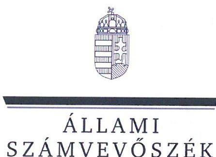
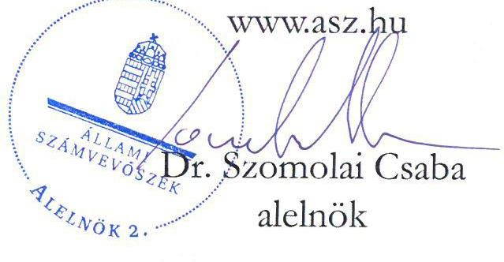
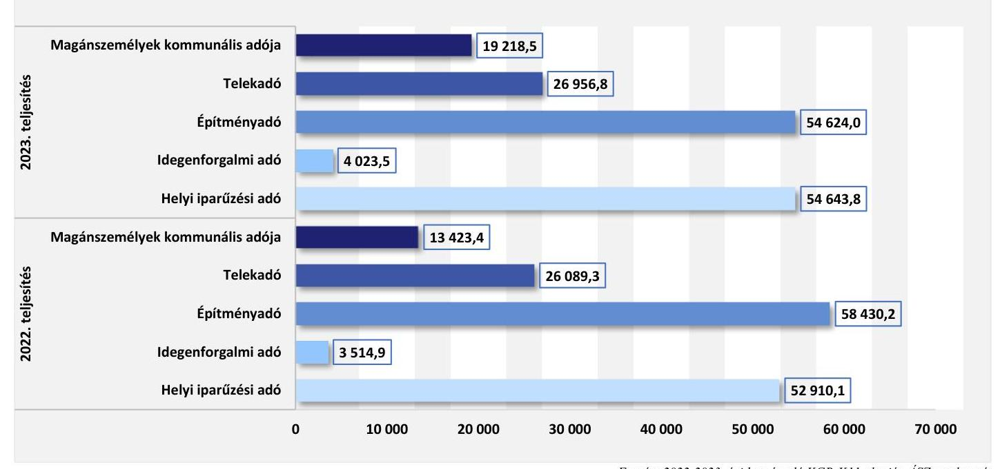
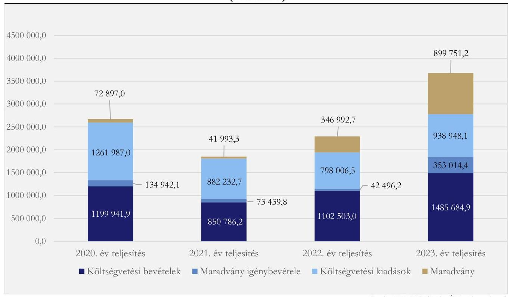
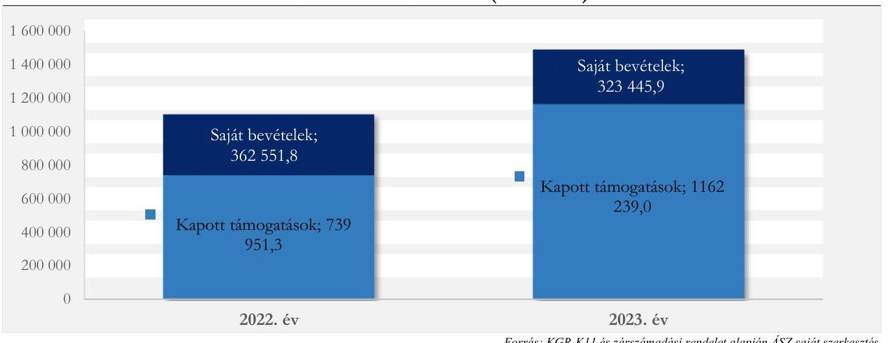

# JELENTÉS 

## Az önkormányzatok helyi adóztatási tevékenységének ellenőrzése - Ingatlanadóztatás

## Szigetmonostor Község Önkormányzata

2025.

---

ÁLLAMI
SZÁMVEVŐSZÉK

# JELENTÉS 

## Az önkormányzatok helyi adóztatási tevékenységének ellenőrzése - Ingatlanadóztatás

Szigetmonostor Község Önkormányzata

2025

24202

---

# ELLENŐRZÉSI IGAZGATÓSÁG: 

## ÁLLAMHÁZTARTÁS HELYI SZINTJÉT ELLENŐRZŐ IGAZGATÓSÁG

## ELLENŐRZÉSI IGAZGATÓ:

DR. BAFFIA GERGELY GÁBOR ellenőrzési igazgató

## ELLENŐRZÉSVEZETŐ:

Jelentéseink az interneten a www.asz.hu címen olvashatók.

KANYÓ LŐRÁNT ISTVÁN ellenőrzésvezető

IKTATÓSZÁM: EL-4040-015/2024.
TÉMASORSZÁM: 54.
ELLENŐRZÉS-AZONOSÍTÓ SZÁM: V1084

---

# TARTALOMJEGYZÉK 

AZ ELLENŐRZÉS ALAPADATAI ..... 5
AZ ELLENŐRZÉS TERÜLETE ÉS AZ ELLENŐRZÖTT SZERVEZET ..... 7
ÖSSZEFOGLALÁS ..... 9
AZ ELLENŐRZÉS FÓKUSZKÉRDÉSEI ..... 11
MEGÁLLAPÍTÁSOK ..... 12
JAVASLATOK ..... 25
MELLÉKLETEK ..... 27
I. sz. melléklet: Értelmező szótár ..... 27
II. sz. melléklet: Az ellenőrzött szervezetek jegyzéke ..... 28
III. sz. melléklet: Ellenőrzési kritériumok ..... 29
IV. sz. melléklet Az adótárgyak és az adóalanyok számáról ..... 32
FÜGGELÉK: ÉSZREVÉTELEK ..... 33
RÖVIDÍTÉSEK JEGYZÉKE ..... 36

---

.

---

# AZ ELLENŐRZÉS ALAPADATAI 

## AZ ELLENŐRZÉS CÉLJA

Az ellenőrzés célja az volt, hogy értékelje Szigetmonostor község helyi ingatlanadóztatásának és adóhatósága feladatellátásának szabályszerűségét, célszerűségét és eredményességét. További cél volt, hogy az ellenőrzés megállapításai és következtetései segítsék az önkormányzati képviselő-testületeket a jogszabályokkal és a helyi sajátosságokkal összhangban álló helyi adópolitika kialakításában és az azt végrehajtó adóigazgatási szervezet megszervezésében. Az ellenőrzés célja volt annak megállapítása is, hogy az Önkormányzat által bevezetett, ingatlanokat terhelő helyi adókra vonatkozó rendeleti szabályok összhangban vannak-e a helyi adópolitikai célokkal, tartalmuk tükrözi-e a település helyi sajátosságait és az adóhatósági feladatellátás biztosítja-e az önkormányzati bevételek feltárását és beszedését.

Ennek keretében az ÁSZ értékelte, hogy az Önkormányzat által bevezetett, ingatlanokat terhelő helyi adókról szóló adórendelet, valamint az önkormányzati adóhatóság döntései, adóztatási gyakorlata a vonatkozó jogszabályokkal összhangban álltak-e.

## AZ ELLENŐRZÉS TÍPUSA

Kombinált ellenőrzés.

## AZ ELLENŐRZÖTT IDŐSZAK

Az 1. fókuszkérdésnél a 2023. év, valamint a 2024. évnek az ellenőrzés megkezdését megelőző napjáig (2024. április 2.) tartó időszaka.

A 2. és 3. fókuszkérdésnél a 2023. év, valamint a 2024. évnek az ellenőrzés megkezdését megelőző napjáig (2024. április 2.) tartó időszaka, a 2020-2022. évek adatainak bázisadatként való felhasználásával.

Az ellenőrzés során feltárt kockázatok, tények, körülmények alapján az ÁSZ az ellenőrzött időszakot az 1. és 2. fókuszkérdés esetében a 2022. évre is kiterjesztette.

## AZ ELLENŐRZÉS TÁRGYA

Az Önkormányzat képviselő-testületének ingatlanokat terhelő helyi adókkal, azaz az építményadóval, a telekadóval és a magánszemély kommunális adójával kapcsolatos rendeletalkotási tevékenységének és az önkormányzati adóhatóság tevékenységének az ellátása.

Az ellenőrzés kiterjedt minden olyan körülményre és adatra, amely az ÁSZ jogszabályban meghatározott feladatainak teljesítéséhez, valamint a program végrehajtása folyamán felmerült újabb összefüggések feltárásához szükséges.

---

# AZ ELLENŐRZÉS JOGALAPJA 

Az ellenőrzés jogszabályi alapját az ÁSZ tv. 5. § (8) bekezdésének előírásai képezik.

## AZ ELLENŐRZÉS MÓDSZERE

Az ellenőrzést az ellenőrzési program szempontjai, az ellenőrzött időszakban hatályos jogszabályok, az ellenőrzés általános szakmai szabályai és az ellenőrzésre irányadó ÁSZ módszertanok alapján végeztük.

Az ellenőrzési kérdések megválaszolásához szükséges bizonyítékok megszerzése az ellenőrzött szervezetek által rendelkezésre bocsátott dokumentumokra, adatokra és az ÁSZ Adó és az Iratkezelő szakrendszerek, illetve a KGR-K11 számviteli adatgyűjtő rendszer adataira alapozva megfigyelés, kérdésfeltevés (információkérés), mintavételezés, valamint elemző eljárás útján történt. Emellett az ellenőrzési bizonyítékként felhasználható adatforrások közé tartozott minden egyéb - az ellenőrzés folyamán feltárt, az ellenőrzés szempontjából információt tartalmazó - releváns dokumentum (ideértve különösen a helyszínen felvett jegyzőkönyvet) is.

Az ellenőrzés lefolytatásához az ellenőrzött szervezetek a tanúsítványok kitöltésével, valamint az ÁSZ által kért dokumentumok, adatok, információk megküldésével és az ellenőrzés során szolgáltattak adatokat.

Az ÁSZ az adómegállapítás, a fizetési kedvezmények engedélyezése, a hátralékok beszedése szabályszerűségét mintavételi eljárással ellenőrizte. Ennek keretében 19 mintatételben, 53 adóhatósági határozat és 3 végzés szabályszerűségét ellenőrizte. A mintatételek kiválasztása véletlenszerűen történt meg az adóhatóság nyilvántartásában lévő adótárgyak és ügyek közül öt - adómegállapításra vonatkozó - mintatétel kivételével, melyek esetében a kiválasztás címadatok alapján történt meg annak érdekében, hogy feltárható legyen, volt-e olyan adótárgy, amelyet nem adóztatott az adóhatóság. Az ellenőrzött mintatételekre vonatkozó megállapítások nem vetíthetők ki a teljes sokaságra, a megállapításokat az ÁSZ az adott, ellenőrzött mintatételek vonatkozásában tette.

Az ÁSZ a helyi adópolitikai elképzelések és a települési sajátosságok feltárásával értékelte, hogy az adórendelet e szempontoknak mennyiben felelt meg. Az ÁSZ a helyi adópolitikai célokkal akkor tekintette összhangban állónak az adórendeletet, ha az hatását tekintve támogatta az adópolitikai célok teljesülését.

Az ÁSZ az adóhatósági feladatellátás szabályszerűségéből, a meglévő kapacitásokból, valamint az ezer forint adóbevételre jutó adóhatósági költségek alakulásából következtetett arra, hogy az önkormányzati adóhatóság rendelkezett-e azzal a potenciállal, amellyel eredményesen tudja a helyi adópolitikát végrehajtani.

Az ÁSZ - az adórendelet szabályainak érvényre juttatása körében - az eredményesség megítélésekor a III. számú melléklet 2. pontjában foglalt szempontokat tekintette mérvadónak.

---

# AZ ELLENŐRZÉS TERÜLETE ÉS AZ ELLENŐRZÖTT SZERVEZET 

Szigetmonostor, fotó: Kovács Attila

Szigetmonostor község Pest vármegyében, a Szentendrei járásban fekszik, a Duna főága és a Szentendrei-Dunaág által közrefogott Szentendreisziget legdélibb települése. Szigetmonostorhoz tartozik Horány üdülőfalu. Szigetmonostor lakosainak száma a Belügyminisztérium nyilvántartása alapján 2020. január 1-jén 2856 fő, 2024. január 1-jén 3074 fő volt. A Polgármesteri Hivatal látja el az Önkormányzaton kívül három költségvetési szerv (Szigetmonostori Nyitnikék Óvoda és Konyha, Szigetmonostori Bölcsőde és a Szigetmonostor Faluház) gazdálkodási feladatait.

Szigetmonostoron az egy lakosra jutó személyi jövedelemadóalap 2022-ben 2181335 Ft volt, ami nem érte el az országos átlagot (2268789 Ft), és a vármegyei átlagot (2617660 Ft) sem. A településen a 2022. évben 623 vállalkozás volt, többségük (60,8%) a szolgáltató szektorba tartozott. A lakások száma a 2020. évi 987-ről 2023-ra 1486-ra, 50,6%-kal emelkedett. A 2023. évben 1182 üdülő, 15 kereskedelmi egység, 4 szálláshely és 59 egyéb nem lakás céljára szolgáló épület volt adótárgy.
Az Alaptörvény értelmében a helyi önkormányzat a helyi közügyek intézése körében törvény keretei között döntött a helyi adók fajtájáról és mértékéről. Az Mötv. rögzíti, hogy a helyi adóval kapcsolatos feladatok ellátása a helyi önkormányzatok feladata.
Az Önkormányzat a Htv. alapján illetékességi területén adórendelettel mindhárom ingatlant terhelő helyi adót, azaz a magánszemély kommunális adóját, az építményadót, és a telekadót is működtette.
Magánszemély kommunális adója terhelte a magánszemély tulajdonában álló, életvitelszerűen lakott lakást. Az adórendelet szabályozása alapján a településen fellelhető másfajta épületek, épületrészek az építményadó-fizetési kötelezettség hatálya alá tartoztak. A magánszemély kommunális adója mértéke 2022. június 30-ig 14500 Ft/év/adótárgy, 2022. július 1-től 17500 Ft/év/adótárgy, 2023. január 1-jétől 20000 Ft/év/adótárgy összeg volt. Az építményadó éves mértéke - az adótárgy épület funkciója szerint differenciált - 945 Ft/m² és 970 Ft/m² közötti összeg volt. A telekadó éves mértéke egységesen 150 Ft/m² volt, de az adórendelet egy, a telek nagyságától függő sávos adóösszeg-maximum rendszert is tartalmazott, amely 2023. január 1-jétől a korábbi, minden telekre érvényes évi 65 ezer forintról 90 ezer - 500 ezer Ft összegre nőtt.
Az adó megállapításával, nyilvántartásával, beszedésével összefüggő adóhatósági feladatokat - a Hatásköri tv. és az Air. rendelkezései alapján - elsőfokú hatósági jogkörben Szigetmonostor Község jegyzője, az ellenőrzött időszak azon részében, amikor kinevezett jegyző nem volt, a jegyzői feladatkörben eljárva Szigetmonostor Község aljegyzője látta el, két fő adótisztviselő közreműködésével.
Az adóhatóság által beszedett, ingatlanokat terhelő adókból származó helyi adóbevétel fontos szerepet játszott a települési feladatok finanszírozásában. 2023-ban 100799,3 ezer Ft bevétel származott a három ingatlanadóból, ami a konszolidált költségvetési bevételek 6,8%-át, a települési helyi adóbevételek 63,2%-át tette ki. Az ingatlant terhelő helyi adók közül az építményadóból származott a legtöbb bevétel, amely 54624 ezer Ft volt 2023-ban és 1489 adóalanytól, 1393 adótárgy után keletkezett. Az Önkormányzat helyi adóbevételei 2022. és 2023. évi összetételére vonatkozó adatokat az 1. ábra, a helyi ingatlanadók 2023. és 2024. évre vonatkozó jellemző naturális adatait pedig a IV. melléklet mutatja be.
1. ábra

# AZ ÖNKORMÁNYZAT HELYI ADÓBEVÉTELEINEK MEGOSZLÁSA A 2022-2023. ÉVEKBEN (EZER FT) 

Forrás: 2022-2023. évi beszámoló KGB-K11 alapján ÁSZ szerkesztés

---

# ÖSSZEFOGLALÁS 

Az ÁSZ tv. értelmében az ÁSZ feladatkörébe tartozik az önkormányzatok adóztatási tevékenységének ellenőrzése. A helyi adók az önkormányzatok saját, el nem vonható bevételét képezik, így az önkormányzatok gazdasági önállósága szempontjából különös fontossággal bír, hogy a helyi adórendeleti szabályok összhangban álljanak a magasabb szintű jogszabályokkal, továbbá az önkormányzati adóhatósági tevékenység jogszerű, eredményes és hatékony legyen. Erre figyelemmel volt tárgya az ÁSZ ellenőrzésének az Önkormányzat adórendelet-alkotási tevékenysége és az adóhatósági feladatellátás is.

Az adórendelet több ponton nem volt összhangban magasabb szintű jogszabályokkal és részben volt csak alkalmas az Önkormányzat adópolitikai céljai elérésére. Az adómegállapítási feladatellátás eredményes volt, azonban több esetben nem volt szabályszerű. Az adóbehajtási tevékenység eredményes és szabályszerű volt. Bár az adóztatási kiadások magasak voltak az adóbevételhez képest, az adóhatóság ingatlanadóztatással összefüggő feladatmutatóinak értékei összességében az ÁSZ által ellenőrzött nyolc (nagy)község feladatellátási mutatóhoz képest jobbak.

## Adórendelet, adórendelet-alkotás

Az adórendelet nem volt összhangban a Htv.-vel, mert nem zárta ki azt, hogy az adómentesség a vállalkozó üzleti célú ingatlana utáni adóra is járjon, valamint törvényi felhatalmazás nélkül leszűkítette a magánszemély kommunális adója tárgyi hatályát, továbbá egy adótárgy-típus esetében nem zárta ki a kétszeres adófizetést, a telekadóban pedig adómaximumot vezetett be. A Htv.-be ütközött továbbá az adórendelet azért is, mert a 2022. július 1-jével hatályba léptetett rendeleti szabályozás súlyosbítást eredményezett az adóteherben. Az adórendelet egy rendelkezése nem egyértelmű, vitatható rendelkezést tartalmazott.

Az ingatlanokat terhelő helyi adókra vonatkozó rendeleti szabályozás megalkotása során az Önkormányzat figyelembe vette azt, hogy a rendeleti szabályoknak tükröznie kell a helyi sajátosságokat, az önkormányzat gazdálkodási követelményét, továbbá az adóalanyok széles körét érintően az adóalanyok teherviselő képességét.

Az adóhatóság adóigazgatási feladatellátásának jogszerűsége, eredményessége
Az adómegállapítási eljárásban hozott, ÁSZ által ellenőrzött hatósági döntések többsége (52,8%-a) nem felelt meg a jogszabályoknak és 21 határozat esetében a döntés kiadmányozása nem volt szabályszerű, de az adómegállapítás eredményes és célszerű volt.

A határozatok adózókkal való közlése - két határozat kivételével - az Eüsztv.ben foglaltaknak megfelelően történt. Az adóhatóság adóbehajtási tevékenysége szabályszerű és eredményes volt, az ÁSZ által ellenőrzött nyolc (nagy)község adataival összevetve a hátralékok befolyt adóbevételhez mért aránya a harmadik legalacsonyabb, 18,8% volt.

Az adórendelet adópolitikai célokkal való összhangja, az adórendelet hatása
Az Önkormányzat országos összehasonlításban erőteljesebben támaszkodott az ingatlanadó-bevételekre. Míg a községek, nagyközségek esetén országosan ezen bevételek (intézmények nélküli) költségvetési

[^0]
[^0]:    ${ }^{1}$ Az ÁSZ által jelen ellenőrzés alapjául szolgáló ellenőrzési program alapján ellenőrzött (nagy)községek: Árpádhalom, Balatonberény, Balatonvilágos, Kompolt, Leányfalu, Szentistván, Szigetmonostor és Tiszainoka.

---

bevételeken belüli átlagos aránya 2,2%, addig az Önkormányzat esetében ez 7,1%
 volt 2023-ban (konszolidált adatokkal számítva 12,1%). A felhalmozási célú támogatások nélküli költségvetési bevételeken belül a saját bevételek aránya a 2020-2023. időszakban 38,8-63,8% közötti érték volt.

Ezzel együtt az adószint-emelkedéssel járó, 2023. január 1-jétől és 2024. január 1-jétől hatályos változtatások az adóalanyok többségének adóteherviselő-képességével összhangban voltak.

Az Önkormányzat adórendeleti szabályai részben segítették az adópolitikai célok megvalósulását (az adó biztos bevételi forrást jelentsen).

# Az adóhatósági kiadások 

Az adóhatóság a 2023. évben 159 466,6 ezer Ft helyi adóbevételt szedett be. 1000 Ft beszedett helyi adóbevételre - az ÁSZ számítása szerint - 89,1 Ft adóztatási kiadás esett. Az ellenőrzött községek átlaga 33,4 Ft, az adóztatási kiadás tapasztalati referencia-érték maximuma kivetéses adóztatás esetén 50 Ft volt, tehát a fajlagos adóztatási kiadások aránya magas volt, azonban ez nem a túlzott munkaerő-felhasználásra, hanem inkább az ÁSZ által vizsgált községek átlagos, egy tisztviselőre jutó relatíve alacsonyabb fajlagos adóbevételére volt visszavezethető.

Az Önkormányzat egy adótisztviselőjére a 2023. évben 79 733,3 ezer Ft helyi adóbevétel, 1921,5 adótárgy és 2007 adóalany jutott. Ezek az értékek összességében jobbak, mint az ÁSZ által ellenőrzött nyolc (nagy)község átlagos adatai (218 852,0 ezer Ft/adótisztviselő, illetve 1396 adótárgy, 1257 adóalany/adótisztviselő).

---

# AZ ELLENŐRZÉS FÓKUSZKÉRDÉSEI 

1.- Az önkormányzat ingatlanokat terhelő helyi adókra vonatkozó rendeleti szabályozása megfelel-e a magasabb szintű jogszabályoknak?
2.- Az önkormányzati adóhatóság megfelelően és eredményesen látta-e el az ingatlanok adóztatásával kapcsolatos adóhatósági tevékenységeit?
3.- A településen megvalósuló helyi adóztatás támogatta-e a helyi adópolitikai célok teljesülését?

---

# MEGÁLLAPÍTÁSOK 

## 1. Az önkormányzat ingatlanokat terhelő helyi adókra vonatkozó rendeleti szabályozása megfelelte a magasabb szintű jogszabályoknak?

## Összegző megállapítás Az adórendelet több ponton nem felelt meg a magasabb szintű jogszabályoknak.

1.1 számú megállapítás

Az adórendelet több rendelkezése nem felelt meg a Htv. rendelkezéseinek és egy ponton sértette az egyértelmű értelmezhetőség Jt. ¹⁵-ban megfogalmazott követelményét.
A Htv. adómegállapításra vonatkozó 2. §-ával és a magánszemély kommunális adója adótárgyait meghatározó 24. §-ával ellentétesen az adórendelet 14/A. §-a törvényi felhatalmazás nélkül leszúkítette a magánszemély kommunális adójában az adótárgyak ² körét a magánszemély tulajdonában lévő, lakás céljára szolgáló olyan ingatlanra, amelyben állandó lakosként életvitelszerűen tartózkodnak.
A Htv. 7. § e) pontjában előírtak ellenére - mely az uniós jogból fakadó állami támogatási elvekre és normákra figyelemmel rögzíti, hogy az önkormányzat az építményadóban, telekadóban a vállalkozó számára az üzleti célú ingatlana utáni adóra adómentességet, adókedvezményt nem biztosíthat - az adórendelet:
a) 5. §-ának a)-g) pontjai nem zárták ki a mentességre jogosultak köréből a vállalkozó adóalanyokat,
b. 5. §-ának i) pontja nem zárta ki a mentességre jogosultak köréből azokat a vállalkozó adóalanyokat, akik/amelyek valamely magánszemély tulajdonában álló lakás céljára szolgáló ingatlanon rendelkeznek ingatlan-nyilvántartásba bejegyzett vagyoni értékű joggal,

Az uniós állami támogatási szabályok értelmében a vállalkozóknak nyújtott helyi adómentesség, helyi adókedvezmény állami támogatásnak minősül. A jogszerűtlenül nyújtott támogatást a kedvezményezettnek vissza kell fizetnie, vagy a támogatást nyújtónak biztosítania kell az uniós joggal való összhangot.
c) 8. §-ának (2) bekezdése a vállalkozó adóalanyoknak is adómentességet biztosított az adótárgy telek egészére vagy egy részére.

A Htv. 21. §-a és 22. § a) pontjában előírtak ellenére nem minden telek esetében vetül a telekadó a hatálya alá tartozó adóalapra (alapterületre), mert az adórendelet 7. §-a a telek nagyságától függő, differenciált maximális adóösszeget határozott meg ³.

[^0]
[^0]:    ² A Htv. 24. §-a értelmében a magánszemély kommunális adójának tárgyi, alanyi hatálya - a nem magánszemély tulajdonában álló lakás bérleti jogán kívül - az építményadó, a telekadó tárgyi, személyi hatályával egyezik.
    ³ Az adórendelet 7. § b) pontja szerint pl. 2001-3000 m² teleknagyság esetén az adómaximum 200000 Ft , miközben a Htv. értelmében az adóösszeg az adórendelet szerinti 150 Ft/m² adómértékkel 2001 m² alapterület esetén 300150 Ft .

---

A Htv. 19. § b) pontjába ütközik az adórendelet 8. § (1) bekezdése, mert olyan telek után állapít meg adókedvezményt, amely a Htv. alapján adómentességet élvez.
A Htv. 7. §-ának a) pontjával nem volt összhangban az adórendelet telekadóra, illetve magánszemély kommunális adójára vonatkozó szabályrendszere, mert az adórendelet alapján mindkét adónemben egyidejű fizetési kötelezettség terhelte azt a magánszemély tulajdonában lévő telket, amelyen olyan lakás céljára szolgáló ingatlan volt, amelyben állandó lakosként, életvitelszerűen tartózkodtak ⁴.
A 2022. július 1-jétől 2022. december 31-ig terjedő időszakban egyaránt sértette a Htv. évközi súlyosbítást kizáró - 6. § a) pontját és a Htv. - adóteher-növelést 2021. évben és 2022. évben tilalmazó - 51/P. §-ának (1) bekezdését az adórendelet 2022. július 1-jével hatályba léptetett 4. §-ának a), b), c) pontja, 7. §-a, 10. §-a, 15. §-a⁵.

Amennyiben a bíróság vagy a vármegyei kormányhivatal beadványa alapján a Kúria Önkormányzati Tanácsa megállapítja a Htv. 6. § a) pontjának egy adórendeleti rendelkezés általi sérelmét, akkor az adórendeleti szabályt visszamenőlegesen megsemmisítheti. Ekkor az adóhatóságnak az adóalanyok által esetlegesen megfizetett többlet-adót vissza kell térítenie.
A Jt. 2. § (1) bekezdéséből következő egyértelműség követelményét sérti az adórendelet 16. § (1) bekezdése, mert - az Önkormányzat nyilatkozatával szemben - állandó lakosként nem csak az egyedül élő nyugdíjas vagy egy nyugdíjból élő házaspár adóalanyt illeti meg egyéb feltételek ⁶ teljesülése esetén a 40%-os magánszemély kommunális adókedvezmény, hanem a jogszabályhelyben alkalmazott „valamint” kötőszó alkalmazása miatt valamennyi olyan adóalanyt, aki az ingatlanon haszonélvezeti joggal, vagy tulajdonjoggal rendelkezik.
1.2 számú megállapítás Az adórendelet tükrözte a települési sajátosságokat és az adóalanyok széles körét tekintve igazodott az adóalanyok teherviselő képességéhez, az önkormányzat gazdálkodási követelményeihez.
A Htv. 7. § g) pontjában rögzített adómegállapítási korlátokból az következik, hogy a rendelet hatályossága idején is érvényre kell jutnia az e pontban szabályozott rendeletalkotási elveknek, azaz annak, hogy települési önkormányzat az adóalap fajtáját, az adó mértékét, a rendeleti adómentességet és adókedvezményt úgy állapíthatja meg, hogy
a) azok összességükben egyaránt megfeleljenek a helyi sajátosságoknak,
b) az önkormányzat gazdálkodási követelményeinek és
c) az adóalanyok széles körét érintően az adóalanyok teherviselő képességének.

[^0]
[^0]:    ⁴ A Htv. 7. § a) pontjának érvényre juttatása érdekében települési önkormányzatnak a helyi ingatlanadó(k)ról szóló rendeletében adómentességi szabállyal vagy kifejezett rendelkezéssel kell kimondania, hogy egy adott adótárgy után, mely adóban álljon fenn fizetési kötelezettség.
    ⁵ A Htv. 51/P. §-a szerint - átmeneti jelleggel - 2021-ben és 2022-ben az év január 1-jétől sem volt lehetőség olyan adórendeleti szabály beiktatására, amely összességében az adóteher növelésével jár együtt (a Htv. 6. § a) pontja ezen tilalmat az év közbeni adómegállapításra fogalmazta meg).
    ⁶ További feltétel, hogy az ingatlanban a nyugdíjas egyedülállón vagy az egy nyugdíjból élő házaspáron kívül más személy sem lakóhellyel, sem tartózkodási hellyel nem rendelkezik az ingatlanban és az ingatlant más személy ne is lakja.

---

# A helyi sajátosságok figyelembevétele 

Az Önkormányzat legfőbb sajátosságát az adta, hogy számos nyaraló-, üdülőingatlannal rendelkező turisztikai célpont. Az ingatlanokat terhelő adók potenciális adótárgyainak jelentős részét képezték az üdülők, üdülőépületek, ugyanakkor az Önkormányzat tájékoztatása szerint a korábbi üdülőtulajdonosok egy jelentős része az utóbbi években életvitelszerűen is Szigetmonostorra költözött ⁷.
Az ingatlan-állomány összetételét és a település sajátos körülményeit - a Htv.-ben foglaltaknak megfelelően - az Önkormányzat figyelembe vette és mérlegelte azáltal, hogy egyidejűleg mindhárom ingatlant terhelő helyi adót működtette, a magánszemély kommunális adója működtetése révén a településen állandó lakos adóalanyok terhére közterhviselési kötelezettséget irányzott elő.

## Az adózók teherviselő képességének figyelembevétele

Az adórendelet a helyben lakókhoz képest magasabb adóteherrel sújtotta a helyben lakóhelyet nem létesítő adóalanyokat, azaz a nyaralóingatlan-tulajdont. E megfontolás mögött - az Önkormányzat indokolása alapján - az állt, hogy az üdülőtulajdonosok esetében valószínűsíthető volt, hogy üdülőjük második vagy többedik ingatlanuk, így vélelmezhető volt az is, hogy ők nagyobb szerepet tudnak vállalni a helyi közterhekből.
Mindezekre tekintettel - a Htv.-ben foglaltaknak megfelelően - az Önkormányzat figyelembe vette az adózók teherviselő képességét a rendeletalkotás során.

Az adóemelés, mint közpolitikai döntés társadalmi fogadtatása szinte mindig vitát szül. A helyi adók esetében az ÁSZ álláspontja szerint az adószint növelése elfogadottabbá tehető, ha az adófizetők számára „láthatóvá” válik az adóbevétel-növelés társadalmi hasznossága. Az adóforintok hasznos, a közösség érdekeit szolgáló felhasználása kevésbé teszi ellenérdekeltté az adózót a még elviselhető mértékű adóemelésben. Erre tekintettel célszerű a helyben lakó adóalanyok által fizetendő helyi adó mértékének rendszeres (évenkénti) felülvizsgálata, valamint az adóalanyok felé történő évenkénti részletes, több kommunikációs csatornán keresztül való tájékoztatás az adóbevétel felhasználásáról.

Az önkormányzat gazdálkodási követelményeinek szempontja
Az Önkormányzat nyilatkozata szerint a közfeladatellátás, a közszolgáltatások finanszírozási hátterének megteremtése nehéz feladatot jelent, különös tekintettel arra, hogy míg korábban ösztönözni kívánták a községbe való betelepülést, addig jelenleg elmondható, hogy a település „megtelt”, s így a közszolgáltatási és közintézményi ellátási feladatok is megsokasodtak. Ezért a 2022. november 29-i képviselő-testületi ülésen döntöttek a helyi lakosok által fizetendő magánszemély kommunális adótétel 14,3%-os, 20 ezer Ftra emeléséről 2023-tól, továbbá a sávos telekadó-maximum értékei növeléséről is.
Az Önkormányzat főbb gazdálkodási adataiból (2. ábra) az figyelhető meg, hogy az Önkormányzat kötelezettséggel nem terhelt maradványa a 2020-2023. évek mindegyikében meghaladta a 41000 ezer forintot, 2023-ban 899 751,2 ezer Ft volt.

[^0]
[^0]:    ⁷ Az ÁSZ rámutat arra, hogy míg a lakosság száma 2020-ról 2024-re csak 7,6%-kal emelkedett 3074 főre, addig a lakások száma 50,6%-kal 1486 darabra. A nagy eltérést az magyarázza, hogy sok üdülőben lakóhelyet létesítő szigetmonostori - adózási megfontolásból vagy a lakástámogatás igénybevétele érdekében - átminősíttette korábbi üdülőjét lakássá.

---

Az Önkormányzat tehát egyfelől mérlegelte, másfelől a kommunális adó és a telekadó kisebb hatású növelésével figyelembe vette az Önkormányzat gazdálkodási követelményeit (és körülményeit) a helyi adórendelet 2023. évtől hatályos módosítása során.
2. ábra

AZ ÖNKORMÁNYZAT BEVÉTELEI, KIADÁSAI ÉS MARADVÁNYA 2020-2023. ÉVEKBEN (EZER FT)

Forrás: KGR-K11 alapján ÁSZ saját szerkesztés

# 2. Az önkormányzati adóhatóság megfelelően és eredményesen látta-e el az ingatlanok adóztatásával kapcsolatos adóhatósági tevékenységeit? 

Összegző megállapítás

Az adóhatóság adómegállapítási feladatellátása eredményes volt, de a hatósági döntések többségében nem voltak szabályszerűek. Az Önkormányzat nem szabályozta a kiadmányozás rendjét. Ezért 21 adóhatósági határozat kiadmányozása nem volt szabályszerű. Az adóhatóság adó beszedésére vonatkozó feladatellátása a vizsgált esetben eredményes és szabályszerű volt.
2.1. számú megállapítás

Az adóhatóság adótárgy-feltárási feladatellátása eredményes és célszerű volt. Az adóhatóság az adófizetési kötelezettségről ugyanakkor nem rendelkezett szabályszerűen az ellenőrzött hatósági döntések többségében. A jegyző az Mötv. előírása ellenére nem szabályozta a kiadmányozás rendjét, 21 adóhatározat esetén a kiadmányozás nem felelt meg az Air.-ban foglalt előírásoknak.

---

Adótárgy-, és adóalanyfeltárás
Az adóhatóság a 2023. és
 a 2024. évben is élt az Art. ${ }^{16}$ 83. § (2) bekezdése szerinti lehetőséggel, megkereste az ingatlanügyi hatóságot és adatot kért az illetékességi területén található, az ingatlanügyi hatóság nyilvántartásában szereplő valamennyi ingatlannak a megkeresés szerinti év január 1-jén hatályos adatairól. Ezen információkat az adóhatóság felhasználta az adózók adatbejelentésre való felhívása során. Az adóhatóság az adózók adatbejelentési kötelezettsége elmulasztásának felderítése érdekében használta továbbá az építésügyi hatóság által az Art. 86. § (2) bekezdése szerint szolgáltatott adatokat is.
Az ÁSZ nem tárt fel olyan adótárgyat, amelyet az adóhatóságnak adóztatni kellett volna, de azt elmulasztotta.
Mindezek alapján az adóhatóság adótárgy-, és adóalanyfeltárási adóhatósági feladatellátása eredményes és - figyelemmel arra, hogy a más hatóságtól kapott hiteles információkat azok megszerzése céljának megfelelően használta fel - célszerű is volt egyben.

## Adómegállapítás (kivetetés)

Az ÁSZ által ellenőrzött 53 adóhatósági határozat 52,8%-a, összesen 28 döntés nem volt szabályszerű.
Az adóhatóság 2 mintatétel (8. és 12. mintatételek) esetében küldött írásbeli felhívást az adózó számára az adatbejelentési kötelezettség teljesítésére. A 12. mintatétel esetében a felhívásra történő adatbejelentés elmulasztása miatt az adóhatóság az Art. 221. § (2) bekezdésének előírása ellenére mulasztási bírságot nem szabott ki, továbbá a 221. § (3) bekezdésével szemben ismételten (mulasztási bírság ismételt kiszabásával) nem hívta fel az adózót a kötelezettség teljesítésére. Az adó összegét az Art. 141. § (7) bekezdés figyelembevételével a rendelkezésére álló adatok alapján állapította meg.
Öt mintatétel esetében (4. minta II/288-9/2023. számú határozat, 5. minta II/239-6/2023, 7. minta II/204-8/2023. határozat, 8. minta II/631-1/2023. határozat és II/1117-1/2024. határozat, valamint a 2022. évet érintően bekért 5. számú pótminta II/3877-4/2022. számú határozat) az adóhatóság a telekadó megállapítása során nem vette figyelembe adóalap-csökkentő tényezőként a Htv. 19. § a) pontjában foglalt mentesség szerinti területrészt ${ }^{8}$. Két mintatétel esetén továbbá (5. minta II/2396/2023. határozat, 7. minta II/204-8/2023. határozat) az adózó telekadóra vonatkozó adatbejelentésében

[^0]
[^0]:    ${ }^{8}$ Ha egy telken épület található, akkor a telek teljes alapterületéből az épülettel fedett telekrész nem tartozik a telekadó hatálya alá, nem adóztatható. Ezen túlmenően, a Htv. 19. § a) pontja szerint adómentesség vonatkozik az épület, épületrész hasznos alapterületével egyező nagyságú telekrészre (azaz arra területragyságra, amely után építményadót kell fizetni) is, ezzel a területrésszel is csökkenteni kell a telek teljes alapterületét az adófizetési kötelezettség megállapítása során.

---

nem jelölte meg az épület hasznos alapterületét, ezáltal az adatbejelentés hiányos volt, az önkormányzati adóhatóság az Art. 141. § (6) bekezdés a) pontjában előírt hiánypótlásra mégsem hívta fel az adózót.
Öt mintatétel (5. minta II/239-6/2023. és II/2397/2023. határozatok, 7. minta II/204-8/2023. és II/204-9/2023. határozatok, 9. minta II/14171/2023 határozat, 12. minta II/2895-3/2023. határozat, valamint a 2022. évet érintően bekért 6. pótminta II/2835-4/2022. határozat) esetében az adótárgynak több tulajdonosa volt, ugyanakkor az adóhatóság által - az adóalanyok megállapodása alapján - hozott adómegállapító határozat rendelkező része kizárólag az adó fizetésére kötelezett által fizetendő adó összegét tartalmazta.
A 2022. év július 1. és 2022. december 31. között kiadmányozott kivetési határozatok indokolása hat vizsgált pótmintatétel esetében (II/5864/2022., II/586-5/2022., II/3145-4/2022., II/3877-
$3/2022.$, II/2835-4/2022., II/4024-6/2022. számú határozatok) nem volt összhangban az Air. 73. § (1) bekezdés c) pontjában foglaltakkal, mert az indokolás az adókötelezettség szempontjából releváns jogszabályként hivatkozott - a hatályos jogszabály helyett - a 2022. július 1-jével hatályon kívül helyezett 12/2011. (XI.28.) önkormányzati rendeletre.
Valamennyi adómegállapító határozat indokolásában - az Air. 73. § (1) bekezdés c) pontjában előírtak ellenére - olyan jogszabályhelyek is szerepeltek, amelyek a fizetési kötelezettség kapcsán nem relevánsak, továbbá a telekadóra, építményadóra vonatkozó adómegállapító határozatok indokolása tényállási elemként nem tartalmazta az adótárgy utáni adó és az adóalany(ok)ra jutó adó összegének számszaki levezetését.
Az adóhatóság az adómegállapító határozatok mindegyike indokolási részében az ügyintézési határidőt az adatbejelentés adóhatósághoz való érkezése napjától számította. Az adómegállapító eljárás ugyanakkor nem kérelemre, hanem hivatalból indított eljárás. Ezért az adóhatóság gyakorlata ellentétes volt az Air. 50. § (1) bekezdésével, amely hivatalból való eljárás ${ }^{9}$ esetén az első eljárási cselekmény megkezdése napjától - azaz a konkrét esetekben (mivel egyéb eljárási cselekmény nem történt) a határozat kiadmányozása napjától - rendeli számítani az ügyintézési határidőt.
Mindazonáltal a határozatokban foglalt fizetési kötelezettség jogszerűségét az indokolás kapcsán megállapított hibák, hiányosságok nem érintették, a világos, követhető magyarázat ugyanakkor érthetővé teszi az adózó számára, hogy milyen jogalapon és miért a határozat szerinti összeget kell fizetnie. Ezen túlmenően az adóhatóságnak és az Önkormányzatnak is előnyös, ha az adózó fizetési hajlandósága esetleg javul azáltal, hogy számára is világos és érthető a határozat.
A jegyző az Mötv. 81. § (3) bekezdés j) pontjának előírása ellenére nem szabályozta a hatáskörébe tartozó ügyekben a kiadmányozás rendjét (kiadmányozási szabályzattal az adóhatóság nem

[^0]
[^0]:    ${ }^{9}$ Az adómegállapító eljárás hivatalból induló eljárás.

---

rendelkezett, sem a Polgármesteri Hivatal Szervezeti és Működési Szabályzata, sem az Iratkezelési szabályzat nem tartalmazta a kiadmányozás szabályait). Az adóhatóság 21 döntésén - az Air. 22. § b) pontban és az Air. 73. § (1) bekezdés d) pontjában rögzítettek ellenére - az aljegyző szerepelt kiadmányozóként, anélkül, hogy a hatósági döntések tartalmazták volna, miszerint az aljegyző a jegyző megbízásából, vagy helyettesítésében eljárva kiadmányozott.
Az adóhatósági döntések adózókkal való közlése szabályszerű volt. Két vizsgált határozat (II/24171/2023. és II/2835-4/2022. sz. határozatok) esetén azonban az adóhatóság az adózó elektronikus kapcsolattartásra való igénye ellenére a határozatot papíralapon küldte meg az adózó részére, nem alkalmazta az Eüsztv. 15. § (2) bekezdésében ${ }^{10}$ foglaltakat.
Az adóhatóság az ingatlanadóztatáshoz kapcsolódó adóellenőrzést az ellenőrzött időszakban nem folytatott.

A megállapított adó csökkentése: fizetési kedvezmények, adókötelezettség változás, elévülés miatti törlés
A fennálló adókövetelést csökkentő intézkedések jogszerűek voltak, azok számszaki összefoglalását a következő táblázat mutatja be.

1. táblázat

# A 2023-2024. ÉVEKBEN TÖRTÉNT ADÓKÖVETELÉS TÖRLÉSEK FŐBB ADATAI (DARAB ÉS EZER FT) 

| MEGNEVEZÉS | 2023. |  | 2024. |  |
| :--: | :--: | :--: | :--: | :--: |
|  | ESETSZÁM | ÖSSZEG | ESETSZÁM | ÖSSZEG |
| Méltányosságból törölt adókövetelés | 3 | 399,1 | 0 | 0 |
| Adókötelezettség változás okán törölt adókövetelés | 112 | 2276,3 | 110 | 1522,1 |
| Elévülés miatt törölt adókövetelés | 46 | 569,1 | 24 | 293,1 |

Forrás: Az Önkormányzat és a Hivatal tanúsítványokon megadott adatai alapján ÁSZ szerkesztés

## Adatszolgáltatási, közzétételi kötelezettség

Az adóhatóság a Kincstár ${ }^{17}$ számára a 2023. január 1-jétől hatályos adórendeleti változásokról szóló adatszolgáltatási kötelezettségének a Htv. 42/B. § (1) bekezdésben foglalt határidőt ${ }^{18} 67$ nappal elmulasztva, 2023. február 10-én tett eleget.
Az adóhatóság a Htv.-ben foglalt közzétételi kötelezettségét teljesítette.
2.2. számú megállapítás Az adóbehajtási (adóbeszedési) tevékenység a vizsgált esetben szabályszerű és eredményes volt.

Az ingatlant terhelő adótartozások beszedése érdekében az önkormányzati adóhatóság a 2023. évben 64 esetben, az ÁSZ ellenőrzés megkezdéséről való értesítés átvételének napjáig a 2024. évben 33 esetben indított az Avt. ${ }^{18}$-ben foglaltak alapján végrehajtási eljárást. A végrehajtási eljárások eredményeképpen

[^0]
[^0]:    ${ }^{10}$ Az Eüsztv. 2024. szeptember 1-je óta hatálytalan, a jogterület szabályozását a digitális államról és a digitális szolgáltatások nyújtásának egyes szabályairól szóló 2023. évi CIII. törvény tartalmazza.
    ${ }^{11}$ Az adórendelet, valamint annak módosítása hatálybalépését megelőző hónap ötödik napjáig kell adatot szolgáltatni a Kincstár számára.

---

a 2023. évben 5 385,6 ezer Ft adótartozást, a 2022. december 31-én fennálló adótartozás 37,9%-át, a 2024. évben a 2024.06.28-i adatszolgáltatásig 1 451,0 ezer Ft adótartozást, a 2023. december 31-én fennálló adótartozás 7,7%-át szedte be.
Az önkormányzati adóhatóság esetében az adóbehajtási (adóbeszedési) tevékenység eredményes volt, mert:

- az önkormányzati adóhatóság az adófizetés első esedékessége előtt felhívta az adózók figyelmét az adókötelezettség teljesítésére;
- a Kincstár által szolgáltatott adatok alapján az adóhatóságnál nyilvántartott 2023. december 31-i hátralék adóbevételhez viszonyított aránya (17,8%) alacsonyabb volt, mint az azonos településtípusba tartozó önkormányzatok ugyanezen mutatója (34,7%);
- a 2023. december 31-i hátralékok összege 6,3%-kal alacsonyabb volt, mint a 2022. december 31-én fennálló hátralékok összege;
- az ingatlanokat terhelő adóból származó 2023. évi tényleges adóbevétel - az építményadó kivételével - meghaladta a 2023. évi költségvetésben tervezett eredeti előirányzat 90%-át.
A végrehajtási eljárás szabályszerűségének ellenőrzésére az ÁSZ egy mintatételt ellenőrzött. A végrehajtási cselekmény eredményeképpen az adóösszeg befolyt, a cselekmény az Avt.-ben foglaltaknak megfelelő, szabályszerű volt.
A 2. táblázat szerint a hátralékok összege és a hátralékosok száma is csökkent 2023. végére, majd tovább csökkent 2024. június 30-ig, ami visszavezethető az adóhatóság eredményes adóbehajtási tevékenységére.
2. táblázat

| AZ ADÓHÁTRALÉKOK FŐBB ADATAI (DARAB ÉS EZER FT) |  |  |  |  |  |
| :--: | :--: | :--: | :--: | :--: | :--: |
| MEGNEVEZÉS | NAPTÁRI   NAP | ÉPÍTMÉNYADÓ | TELEKADÓ | MAGÁNSZUMÉLY   KOMMUNÁLIS   ADÓIA | ÖSSZESÉN |
| Hátralékos adózók száma | 2022.12.31. | 291 | 241 | 221 | 753 |
|  | 2023.12.31. | 269 | 224 | 213 | 706 |
|  | 2024.06.30. | 204 | 165 | 172 | 541 |
| Adóhátralék összege | 2022.12.31. | 9477,4 | 7698,7 | 3020,5 | 20196,6 |
|  | 2023.12.31. | 8754,0 | 6450,5 | 3726,1 | 18 930,6 |
|  | 2024.06.30. | 7104,0 | 5336,9 | 2696,9 | 15 137,8 |

---

# 3. A településen megvalósuló helyi adóztatás támogatta-e a helyi adópolitikai célok teljesülését? 

| Összegző megállapítás | Az Önkormányzat ingatlanokat terhelő helyi adókra vonatkozó adórendeleti szabályozása részben támogatta a helyi adópolitikai célok megvalósulását. Az ingatlanokat terhelő adók érdemben támogatták az önkormányzat gazdálkodását, az adóteher összhangban volt az adózók teherviselő képességével. Az adóhatósági feladatellátás kiadása az elért adóbevételhez mérten magas volt, de a feladatellátás mutatói összességében az ÁSZ által ellenőrzött községek mutatói átlagos értékeinél kedvezőbbek voltak. |
| :--: | :--: |
| 3.1 számú megállapítás | A helyi adópolitikai célok elérésének részben feleltek meg az Önkormányzat ingatlanokat terhelő helyi adókra vonatkozó adórendeleti szabályai. |

Az Önkormányzat írásba foglalt adópolitikai koncepcióval nem rendelkezett. Az ÁSZ az Önkormányzat nyilatkozata alapján megismerte az Önkormányzat célkitűzéseit és az alkalmazott eszközrendszert, amit a 3. táblázat foglal össze. Az Önkormányzat nyilatkozata szerint a közfeladatellátás érdekében az Önkormányzat szükségesnek tartotta az ingatlanokat terhelő helyi adók emelését is, ilyen tartalmú módosítást azonban az intézkedés lakosság általi, vélhetően kedvezőtlen fogadtatására tekintettel csak kis mértékű teheremelkedést megvalósítva fogadott el a Képviselő-testület ${ }^{19}$.
3. táblázat

AZ ÖNKORMÁNYZAT ADÓPOLITIKAI CÉLJAI ÉS ALKALMAZOTT
 ESZKÖZRENDSZERE

| ADÓPOLITIKAI CÉL | ADÓPOLITIKAI ESZKÖZ |
| :-- | :-- |
| Biztos bevételi forrás legyen | Valamennyi, ingatlant terhelő helyi adó bevezetése |
| Elviselhető (méltányos) teher legyen | Az életvitelszerűen helyben lakók az építményadóhoz   képest alacsonyabb adóterhet jelentő kommunális adót   fizetnek, a helyben lakó nyugdíjasok számára   adómentesség, illetve adókedvezmény jár |
| A közfeladat-ellátást érdemben segítse | Kismértékű telekadómérték-emelés |

Forrás: az Önkormányzat nyilatkozata alapján ÁSZ saját szerkesztés
Az ÁSZ álláspontja szerint az adórendeleti eszköztár az Önkormányzat nyilatkozata szerint elérni kívánt adópolitikai célokkal részben volt összhangban, a többletbevétel több adóeszközzel is elérhető lehet.

---

3.2 számú megállapítás

Az Önkormányzat országos összevetésben is kiemelkedően támaszkodott az ingatlanadó bevételekre, azok támogatták az Önkormányzat feladatellátását. Az Önkormányzat saját bevételei ugyan nőttek, de a költségvetési bevételeken belül 2023-ban arányuk csökkent, az Önkormányzat támogatásoktól való függősége nőtt. Az adóteher az adóalanyok többségének adóteherviselő-képességével összhangban volt.

# Az adórendelet(módosítás) hatása az önkormányzat gazdálkodására 

A 2020-2023. években az ingatlanadókból származó bevételek alig változtak (93-100 millió Ft közötti érték, éves átlagban 97 914,4 ezer Ft volt).
A költségvetési bevételeken belül a saját bevételek aránya - az eseti, de egyébként jelentős összegű felhalmozási célú támogatásoknak a költségvetési bevételekből való kiszűrésével - a 2020-2022. évek mindegyikében $\mathbf{50 \%}$ feletti érték volt, a 2023. évben azonban az arányszám $\mathbf{38,8\%}$-ra csökkent. Utóbbi arra vezethető vissza, hogy a működési célú támogatások a 2022. évhez képest 43,7\%-kal nőttek, a közhatalmi bevételek és egyéb saját bevételek ugyanakkor - a kismértékű, 3,3\%-os helyi adónövekedés mellett - csökkentek.
Bár az Önkormányzat 2022. július 1-jével növelte a helyi adók mértékét és 2023. január 1-jei hatállyal tovább emelte a helyi iparűzési adó és a magánszemély kommunális adója mértékét, valamint az adótárgy telkek utáni rendeleti adómaximumot, a helyi adóbevételek a 2023. évben nem emelkedtek jelentősen, a 2022. évi ingatlanadó-bevétel csupán 2856,4 ezer Ft-tal (2,9\%-kal) lett több a 2023. évre. (Ez egyfelől rámutat arra, hogy a kommunális adó és a telekadó 2023-tól való emelése nem volt jelentős, másfelől arra, hogy az iparűzési adómérték emelése, pénzforgalmi hatását tekintve, vélhetően 2024-ben mutatkozik meg.)
Ezzel együtt azonban a saját bevételek költségvetési bevételeken belüli részaránya így is magasabb, mint a községek országos jellemző értéke ( $24,4 \%$ ).
Az ingatlanadó-bevételek Önkormányzat költségvetésében való jelentős szerepét mutatja az is, hogy míg az ingatlanadó-bevételek aránya az intézményi bevételek nélküli költségvetési bevételeken belül a településtípusra (község, nagyközség) vonatkozó országos átlag szerint 2,2\% volt, addig az Önkormányzat esetében ez az arány - a jelentős összegű felhalmozási célú támogatásoktól megtisztított konszolidált költségvetési bevételre vetítve - $\mathbf{12,1 \%}$ volt.
A 2020-2023. év(ek)re vonatkozó bevételek jogcímenkénti nagyságát és változását éves bontásban a 4. táblázat, az Önkormányzat bevételeinek és a kapott támogatásoknak 2022-2023. évi megoszlását pedig a 3. ábra mutatja be.

---

4. táblázat

# AZ ÖNKORMÁNYZAT KONSZOLIDÁLT BEVÉTELEINEK ALAKULÁSA 2020-2023. ÉVEKBEN (EFT) 

| Ssz. | Jegcím | 2020. | 2021. | 2022. | 2023. |
| :--: | :--: | :--: | :--: | :--: | :--: |
| 1. | Működési célú támogatások államháztartáson belülről | 282684,1 | 318 986,3 | 354 827,7 | 510 015,8 |
| 2. | Felhalmozási célú támogatások államháztartáson belülről | 419 924,0 | 135 088,3 | 385 123,6 | 652 223,2 |
| 3. | Közhatalmi bevételek | 150 438,0 | 170 283,1 | 176 833,3 | 174 324,6 |
| 3.1. | ebből: ingatlanadók bevétele | 93 461,2 | 99 454,1 | 97 942,9 | 100 799,3 |
| 3.2. | ebből: helyi iparűzési adó bevétele | 46810,3 | 53913,8 | 52910,1 | 54643,8 |
| 3.3. | ebből: idegenforgalmi adó bevétele | 648,0 | 2079,6 | 3514,9 | 4023,5 |
| 3.4. | ebből egyéb közhatalmi bevételek | 9518,5 | 14835,7 | 22465,4 | 14858,0 |
| 4. | Egyéb saját bevétel | 346 895,8 | 226 428,5 | 185 718,5 | 149 121,3 |
| 5. | Saját bevételek (3+4) | 497 333,8 | 396 711,6 | 362 551,8 | 323 445,9 |
| 6. | Költségvetési bevételek $(1+2+5)$ | 1199 941,9 | 850 786,2 | 1102 503,1 | 1485684,9 |
|  | Saját bevételek aránya felhalmozási célú támogatások nélküli költségvetési bevételeken belül (5/1+5, \%) | $\mathbf{63,8 \%}$ | $\mathbf{55,4 \%}$ | $\mathbf{50,5 \%}$ | $\mathbf{38,8 \%}$ |

3. ábra

## AZ ÖNKORMÁNYZAT KAPOTT TÁMOGATÁSA ÉS SAJÁT BEVÉTELEI 2022-2023. ÉVEKBEN (EZER FT)

Az Önkormányzat önként vállalt feladatokat (pl: Bursa Hungarica Felsőoktatási ösztöndíj pályázatban résztvevő hallgatók támogatása, civil szervezetek támogatása, Újságoló című helyi újság kiadása, komp- és révközlekedés, gyermekek bölcsődei ellátása, strand üzemeltetése, főépítészi feladatok) is ellátott. Az Önkormányzat hitelállománnyal nem rendelkezett, az iparűzési adóerőképesség-felmérés alapján kiegészítő támogatásra nem volt jogosult, de nem volt szükség szolidaritási hozzájárulás teljesítésére sem. Az Önkormányzat gazdálkodásában a helyi adók nagyobb költségvetési mozgásteret biztosítottak a községek átlagos támogatás-kitettségéhez képest, lehetővé tették az önként vállalt feladatok ellátását, a kommunális adó és a telekadó mértékének 2023-tól (illetve 2022. július 1-jétől megvalósult) való emelése, azonban nem eredményezett érdemi bevétel-növekedést.

---

# Az adóalanyok, teherviselő képességével való összevetés 

Az adózók 2022-től a 2024. év ellenőrzés kezdetéig tartó időpontjáig az építmény- és telekadóra vonatkozóan összesen 61 fizetési kedvezmény iránti kérelmet nyújtottak be, ami az adózók éves átlagos számának (4023 fő) 1,5\%-a. A 2022-év végéről a 2023. év végére 753 adózóról 706 adózóra, $\mathbf{6,2\%}$-kal csökkent a hátralékos adózók száma.
Az ingatlanadókban fennálló hátralék összege - a 2. táblázat adatai szerint - 2023. utolsó napjára, egy év alatt 6,3\%-kal 18 930,6 ezer Ft-ra csökkent. Az ingatlanadókban fennálló hátralék ingatlanadóbevételhez mért aránya a 2021-2023. évek között csökkent, míg a 2021. évben 20034,3 ezer Ft volt, mely a KGR-K11 szerint teljesített ingatlanadó-bevételeknek 20,1\%-a volt, addig ez 2023 év végére $\mathbf{18,8\%}$-ra mérséklődött.
Az ÁSZ a fenti adatok alapján arra a következtetésre jutott, hogy a 2023. évben bekövetkező adórendelet változás nem befolyásolta kedvezőtlenül az adóalanyok nagy hányadának teherviselő képességét.
3.3. számú megállapítás

Az ÁSZ az adóhatóság feladatellátását akadályozó körülményt nem tárt fel. Az adóbevételre vetített adóztatási kiadások túlzottak voltak, ugyanakkor ez nem az adóztatási feladathoz mért túlzott erőforrás-felhasználásnak, hanem a relatíve alacsonyabb adóbevételnek volt betudható.

## Személyi és tárgyi, informatikai feltételek.

Az Önkormányzat adóigazgatási feladatait két fő adótisztviselő látta el, felsőfokú végzettséggel, hat, illetve négy év szakmai tapasztalat birtokában ${ }^{12}$.
A Hivatalnál az adóügyi feladatok ellátásához szükséges tárgyi, informatikai feltételek biztosítottak voltak (például az Önkormányzat TAKARNET jogosultsága alapján az ingatlan-nyilvántartási adatok elérhetősége biztosított volt).

## Az adóztatás kiadásai

A Hivatal az Áht. ${ }^{20}$ 6. $\int(1)$ bekezdése és a 15/2019. (XII. 7.) PM rendelet ${ }^{21}$ 3. $\int(1)$ bekezdése előírása ellenére az adóigazgatási tevékenységgel összefüggő kiadásokat, valamint a 15/2019. (XII. 7.) PM rendelet 6. $\int(2)$ bekezdésében előírtak ellenére a kapcsolódó átlagos statisztikai létszámadatokat a 011220 Adó-, vám- és jövedéki igazgatás kormányzati funkció szerint nem mutatta ki. Az adóztatás 2023. évi költségeivel kapcsolatos adatokat az 5. táblázat tartalmazza.

Az adóztatás kiadásai (költségei) egyfelől az adóhatóság költségeiben, másfelől az adózó költségeiben öltenek testet. Önadózás esetén az adóztatási költségek nagyobb része az adózónál merül fel, mert az adót az adóalany számítja ki, vallja be, fizeti meg. Kivetéses adóztatás esetén ellenben az adózó költsége az adó megfizetésének költségét jelenti (például a gépjárműadó vagy a hatósági nyilvántartás alapján megállapított helyi adók esetén) vagy - az adófizetési költség mellett - legfeljebb csak az adómegállapításhoz szükséges adatszolgáltatás költsége merül fel. Ha az összes bevétel több, mint $\mathbf{10\%}$-át teszi ki a kivetéses adózás, hatósági adómegállapítás, azaz az ingatlanadóztatás alapján befolyó bevétel, akkor az adóztatási kiadás referencia-érték maximuma 50 Ft 1000 Ft adóbevételre vetítve (a szinte kizárólag önadózásos adókat beszedő adóhatóságoknál ez az érték 10 és 20 Ft közötti).

[^0]
[^0]:    12 A jegyző jogviszonya 2024. március 17-ével szűnt meg, az adóhatósági jogosítványokat 2024. június 30-ig az aljegyző látta el.

---

| 5. táblázat |  |  |
| :--: | :--: | :--: |
| AZ ADÓZTATÁS 2023. ÉVI KÖLTSÉGEINEK KIMUTATÁSA (EZER FT, \%) |  |  |
| MEGNEVEZÉS | ÖNKORMÁNYZAT ÉS HIVATAL ADATAI | NYÜLL ELLENŐRZÖTT ÖNKORMÁNYZAT ÉS HIVATAL ADATAI (ÖSSTÖKEN, 121.16) |
| Összes tényleges kiadás adatszolgáltatás alapján | 14206,7 | 243376,6 |
| Ebből: személyi juttatások és munkaadói közteher | 14206,7 | 237 480,8 |
| Tényleges létszám adatszolgáltatás alapján (fő) | 2 | 32,5 |
| Beszedett helyi adóbevétel adatszolgáltatás alapján | 159 466,6 | 7112717,6 |
| 1 adóigazgatási dolgozóra jutó tényleges személyi és közteher | 7103,4 | 7307,1 |
| 1000 Ft helyi adóbevételre jutó személyi juttatás és közteher (Ft) | 89,1 | 33,4 |
| Egy adótisztviselőre jutó adó | 79733,3 | 218852,8 |
| Egy adótisztviselőre jutó ingatlanadó-tárgyak száma (db) | 1921,5 | 1396 |
| Egy adótisztviselőre jutó ingatlanadó-alanyok száma (fő, db) | 2007 | 1257 |

Az adóhatóság adatszolgáltatása alapján a 2023. évben egy adótisztviselőre 7103,4 ezer Ft tényleges személyi juttatás és munkaadókat terhelő közteher jutott. Amennyiben ezt az adatot az ÁSZ által ellenőrzött (nagy)községek azonos adatával vetjük össze, akkor az a 7307,1 ezer Ft-os átlagos érték közelében alakult. (Ugyanez az érték az állami adóhatóság esetén 2022-ben 9700 ezer Ft volt.)
A 2023. évben 1000 Ft beszedett helyi adóbevételt 89,1 Ft adóztatási kiadással (személyi juttatások és annak közterhei) értek el. Ez az érték az ÁSZ által ellenőrzött (nagy)községek önkormányzatának (költségvetési szervek nélküli) átlagos adóztatási kiadáshoz ( $\mathbf{33,4 Ft}$ ) képest túlzottnak tekinthető, továbbá jelentősen meghaladja az adóztatási kiadás referencia-maximum értékét ( 50 Ft ) is.
Az Önkormányzat egy adótisztviselőjére a 2023. évben 79 733,3 ezer Ft helyi adóbevétel, az ellenőrzött (nagy)községek fajlagos átlagos értékének 36,4\%-a esett (összehasonlításként az önadózásos nagy adónemeket beszedő állami adóhatóság esetén egy tisztviselőre 901300 ezer Ft adó jut).
Ha azt vizsgáljuk, hogy mekkora az adótisztviselők munkafeladata (leterheltsége), akkor azt láthatjuk, hogy az Önkormányzat egy adótisztviselője 1921,5 adótárgy és 2007 adóalany jelentette adóztatási feladatot látott el (a többi helyi adó mellett), ami az ÁSZ által ellenőrzött (nagy)községek átlag-adatához képest jóval kedvezőbb (rendre: $\mathbf{37,6\%}$-kal, illetve $\mathbf{59,7\%}$-kal) érték.
Összességében az adatok és a mutatók arra utalnak, hogy az adótisztviselők személyi juttatása és a munkafeladat arányban áll egymással, az adóztatási kiadások adóbevételhez viszonyított magas aránya a relatíve alacsonyabb adóbevételnek és nem a túlzott munkaerőforrás-felhasználásnak volt betudható.
3.4. számú megállapítás

Az önkormányzat többféle, nem hatósági
 eszközzel is támogatta a településen az adózók önkéntes jogkövetését.

Az Önkormányzat nyilatkozata szerint a helyi újságban (Újságoló), valamint a település honlapján hívták fel az adózók figyelmét az adófizetési határidőkre. Több esetben a foganatosított végrehajtási cselekményekről adtak tájékoztatást, jelezve azt, hogy az esetleges adótartozás behajtására az adóhatóság intézkedik.

---

# JAVASLATOK 

Az ÁSZ tv. 33. § (1) bekezdésében foglaltak értelmében az ellenőrzött szervezet vezetője köteles a jelentésben foglalt megállapításokhoz kapcsolódó intézkedési tervet összeállítani és azt a jelentés kézhezvételétől számított 30 napon belül az ÁSZ részére megküldeni. Amennyiben az ellenőrzött szervezet vezetője nem küldi meg határidőben az intézkedési tervet, vagy továbbra sem elfogadható intézkedési tervet küld, az Állami Számvevőszék elnöke az ÁSZ tv. 33. § (3) bekezdése a) és b) pontjaiban foglaltakat érvényesítheti.

## A POLGÁRMESTERNEK

1. Intézkedjen a jelentés nyilvánosságra hozatalát követő 15 napon belül annak az Önkormányzat képviselő-testülete elé terjesztéséről. A jelentést a napirend tárgyalásáról szóló jegyzőkönyvvel együtt tájékoztatásul küldje meg a Pest Vármegyei Kormányhivatal részére is.

## A JEGYZÖNEK

1. Vizsgálja felül az adórendelet 14/A. §-át a tekintetben, hogy az összhangban áll-e Htv. 2. §-ával és 24. §-ával.
2. Vizsgálja felül az adórendelet 5. § i) pontját és 8. § (2) bekezdését a tekintetben, hogy azok összhangban állnak-e Htv. 7. § e) pontjával.
3. Vizsgálja felül az adórendelet 7. §-át a tekintetben, hogy az összhangban áll-e a Htv. 21. §-ával és a Htv. 22. § a) pontjával.
4. Vizsgálja felül az adórendelet telekadóra, illetve magánszemély kommunális adójára vonatkozó szabályrendszerét a tekintetben, hogy az összhangban áll-e 7. § a) pontjával.
5. Vizsgálja felül az adórendelet 16. § (1) bekezdését a tekintetben, hogy az a Jat. 2. § (1) bekezdésében foglaltaknak megfelel-e.
6. Vizsgálja felül az adórendelet 2022. július 1-jétől 2022. december 31-ig hatályos időállapotú 4. § a), b) c) pontját, 7. §-át, 10. §-át és 15. §-át a tekintetben, hogy azok összhangban álltak-e a Htv. 6. § a) pontjával és 51/P. § (1) bekezdésével.

---

7. |Alakítsa ki úgy az ingatlanadó-megállapítási gyakorlatát, és alkosson arra belső szabályokat, hogy
a) a jövőben az ingatlanokat terhelő helyi adókötelezettség tárgyában kiadott adómegállapító határozatok indokolási része - az Air. 73. § (1) bekezdés c) pontjának hatályosulása érdekében - tartalmazza a tényálláson belül az adótárgy utáni adó és az adóalany(ok)ra jutó adó kiszámításának a folyamatát, valamint kizárólag az adómegállapító határozat tárgyát képező adókötelezettség szempontjából releváns jogszabályhelyekre utaljon, továbbá, hogy az Air. 50. § (1) bekezdésének megfelelően, helyesen tartalmazza az ügyintézési határidő számítását;
b) az adatbejelentés adóhatósági felhívásra való elmulasztásakor alkalmazza az Art. 221. § (2) és (3) bekezdését;
c) a telekadó azon telkek utáni megállapítása során, amelyeken épület, épületrész található, alkalmazza a Htv. 19. § a) pontja szerinti mentességet.
8. |Alakítson ki kontrollokat és alakítsa úgy az adóztatási gyakorlatát, hogy az adóhatóság határidőben tegyen eleget a Htv. 42/B. § (1) bekezdésében foglalt adatszolgáltatási kötelezettségnek.
9. |Intézkedjen az Áht. 6. § (1) bekezdésében és a 15/2019. (XII. 7.) PM rendelet 3. § (1) bekezdésében előírtak alapján az adóigazgatási tevékenységgel összefüggő kiadásoknak, valamint a 15/2019. (XII. 7.) PM rendelet 6. § (2) bekezdésében előírtak alapján az átlagos statisztikai létszámadatoknak az arra kijelölt kormányzati funkcióra történő nyilvántartása, kimutatása érdekében.
10. Készítse el a kiadmányozás rendjének Mötv. 81. § (3) bekezdés j) pontja szerinti szabályozását.

---

# MELLÉKLETEK 

## I. SZ. MELLÉKLET: ÉRTELMEZŐ SZÓTÁR

adóhatóság
adóhatósági ellenőrzés
adótartozás
adóbehajtási tevékenység
adózó, adóalany
adótárgy
fizetési kedvezmény
ASP rendszer
ingatlanokat terhelő helyi adók
a vállalkozó üzleti célt szolgáló ingatlana
adóztatási kiadás
adóztatási kiadás referencia-érték maximuma

Az önkormányzat jegyzője (Forrás: Air. 22. § b) pont)
Az adóhatóság az adótörvényekben és más jogszabályokban előírt kötelezettségek teljesítésének vagy megsértésének megállapítása, a kötelezettségek teljesítésének előmozdítása érdekében ellenőrzést folytat. (Forrás: Air. 86. §)
Az esedékességkor meg nem fizetett adó (Forrás: Art. 7. § 6. pont)
Az adótartozás beszedésére irányuló adóhatósági tevékenység, így különösen a fizetési felhívás kibocsátása és a végrehajtási cselekmények.
Az a személy, akinek vagy amelynek adókötelezettségét a Htv. és önkormányzati rendelet előírja. (Forrás: Air. 11. § (1) bekezdés, Htv. 12. §, 18. §, 24. §)
Az az ingatlan vagy lakásbérleti jog, amelynek adókötelezettségét a Htv. és önkormányzati adórendelet előírja (Forrás: Htv. 11. §, 17. §, 24. §)
A fizetési halasztás, részletfizetés, valamint az adómérséklés. (Forrás: Art. 198.-201. §)

Az önkormányzati feladatellátást támogató, számítástechnikai hálózaton keresztül távoli alkalmazásszolgáltatást (Application Service Provider) nyújtó elektronikus információs rendszer. (Forrás: az önkormányzati ASP rendszerről szóló 257/2016. (VIII. 31.) Korm. rendelet 1. § 6. pont)

Építményadó, telekadó, magánszemély kommunális adója (Forrás: Htv. II. fejezet, III. fejezet 1.1. pont)

Üzleti célra szolgál a vállalkozó vagy vállalkozás minden olyan ingatlana, amely kapcsán akár a tulajdonjoga, akár az ingatlan-nyilvántartásba bejegyzett vagyoni értékű joga alapján adóalanynak tekintendő, figyelemmel arra, hogy egy vállalkozás esetében bármilyen, ingatlanhoz kapcsolódó jog megszerzésének és fenntartásának oka és célja nem lehet más, mint üzleti jellegű (Forrás: dr. Heizer-Kiss Zsófia, Kanyó Lóránd: a helyi adók jogmagyarázata 2014 Saldo).
Az adóigazgatási feladatellátással kapcsolatos kiadások közül a személyi juttatások és közterheik (az egyéb, dologi kiadások elhatárolása módszertanilag megfelelő módon nem volt lehetséges, ezért csak a kiadások mintegy 80%-át kitevő személyi juttatásokat vette az ÁSZ figyelembe adóztatási kiadásként).
Szakértői tapasztalaton alapuló becsült érték, amely megmutatja, hogy 1000 Ft közteher beszedésével mekkora kiadása merült fel a beszedő szervnek. A nemzetközi (OECD) tapasztalatok szerint ez az érték 10-20 Ft (1-2%) között mozgott 2011-ben, a NAV esetén 10,8 Ft, a dologi kiadásokkal együtt 13,5 Ft 2022-ben. Ezek a számadatok olyan adóhatóságokra vonatkoznak, amelyek önadózásos adónemeket szednek be (a NAV által beszedett adók 97%-a önadózással teljesítendő), amelyek esetén a hatósági kiadások kisebbek. Szakértői összevetés alapján községek esetén az 50 Ft (5%) alatti érték fogadható el (Forrás: https://www.oecd-ilibrary.org/governance/government-at-a-glance-2011/efficiency-of-tax-administrations_gov_glance-2011-64-en és KGR-K11 és szakértői becslés).

---

II. SZ. MELLÉKLET: AZ ELLENŐRZÖTT SZERVEZETEK JEGYZÉKE

# ÁSZ ELLENŐRZÖTT SZERVEZET MEGNEVEZÉSE 

Szigetmonostor Község Önkormányzata
Szigetmonostori Polgármesteri Hivatal

---

## FOKUSZTERÜLET/FOKUSZKÉRDÉS

1. Az önkormányzat ingatlanokat terhelő helyi adókra vonatkozó rendeleti szabályozása megfelel-e a magasabb szintű jogszabályoknak?

## ELLENŐRZÉSI KRITÉRIUMOK

Magyarország Alaptörvénye 32. cikk (1) bekezdés a), h) pontjai, 32. cikk (3)
Hatásköri tv. 138. § (3) bekezdés a)-f) pontok
Stabilitási tv. $^{22}$ 31-32. §
Mötv. 47. § (1)-(2), 50. §, 51. § (1)-(2) bekezdés, 52. § (1) bekezdés

Htv. 1. § (1), 2. §-7. §, 9. § (1), 11. §-26/A. §, 42/B. §, 42/I. §, 43. §, 52. § 3-20. pontjai, 43-50. pontjai, 60. pont,
Pénzügyminisztérium tájékoztató az egyes tételes helyi adómérték valorizációjáról
Art., Air., Avt.
Itv. $^{23}$ 102. § (1) bekezdés e) pont
61/2009. (XII. 14.) IRM rendelet a jogszabályszerkesztésről.
2. Az önkormányzati adóhatóság megfelelően és eredményesen látta-e el az ingatlanok adóztatásával kapcsolatos adóhatósági tevékenységeit?

Htv. 1. § (1), 2. §-7. §, 9. § (1), 11. §-26/A. §, 42/B. §, 42/I. §, 43. §, 52. § 3-20. pontjai, 43-50. pontjai, 60. pont,
Art. 49. §), 58. § (1) bekezdés, 59. §, 141. § (2), (6)-(7) bekezdések, 221. § (1) bekezdés b) és c) pontja
Art. 2. számú melléklet II.A/4. pont, 3.sz.mell.II.A.4. pont
Air. 22. § b), 72. § (1), 73. § -74. §, 76.-78. §, 79. § (2), 81. § (6), 82. § (4), (6), 124. § (1)-(2), 125. §, 134. § (1), 135. § (3), Avt.
Mötv. 81. § (3) bekezdés j) pont
465/2017. (XII. 28.) Korm. rendelet $^{24}$ 84. §
Eüsztv. 14. §, 15. § (1)-(2)
451/2016. (XII.19.) Korm. rendelet 54. §
335/2005. (XII.29.) Korm. rendelet $^{25}$ 52. § (1)-(2) bekezdések, 53. § (1) bekezdés, (3) bekezdés a) pont
Az önkormányzati hivatal Szervezeti és Működési Szabályzata
A kiadmányozás rendjéről szóló szabályzat
ingatlanokat terhelő helyi adókról szóló települési szabályokat tartalmazó önkormányzati rendelet(ek)
Az adómegállapítási feladatellátás esetén az ÁSZ megítélése szerint akkor eredményes a feladatellátás, ha:

- az adóhatóság megkérte az Art. 83. §-a (2) bekezdése alapján az ingatlanügyi hatóságtól a településen található ingatlanokról és azok tulajdonosairól szóló adatszolgáltatást és ezen adatokat összevetette az

---

adónyilvántartásban szereplő adótárgyakkal és adóalanyokkal;

- az ÁSZ ellenőrzés nem tár fel olyan adótárgyat, amely után az adóhatóság nem állapított meg adót, noha kellett volna;
Az adóbeszedési feladatellátás esetén akkor eredményes a feladatellátás, ha:
- 2023-ban és 2024-ben az adófizetés első esedékessége előtt az adóhatóság az adózókat felhívta a fizetési kötelezettségük teljesítésére;
- a 2023. évi adóbevételhez viszonyított, 2023. december 31-én fennálló hátralék (határidőben meg nem fizetett adó) aránya nem haladta meg a településtípusra jellemző arányszámot 30%-nál nagyobb mértékben,
- ha a 2022. december 31-ei hátralék összegéhez képest a 2023. december 31-ei hátralék összege legfeljebb 10%-kal emelkedett, és az adóhatóság legalább a hátralék-növekedéssel érintett adózóknál emelte a beszedési cselekmények (fizetési felhívás, végrehajtási cselekmény) számát;
- az ingatlanokat terhelő adónemekből származó 2023. évi tényleges, adónemenkénti adóbevétel a 2023. évi bevétel eredeti előirányzatának legalább 90%-ában teljesült.
3. A településen megvalósuló helyi adóztatás támogatta-e a helyi adópolitikai célok teljesülését?

Htv. 1. § (1) bekezdés, 2. §- 7. §, 9. § (1) bekezdés
Áht. 6. § (1) bekezdés
15/2019. (XII.7.) PM rendelet 3. § (1) bekezdés, 6. § (2) bekezdés,

Ávr. $^{26}$ 5. § (1) bekezdés f) pont, 13. § (1) bekezdés c) pont
Htv., Art., Air., Avt. helyi adóhatóság feladatellátására vonatkozó rendelkezései
A rendeleti szabályoknak az önkormányzat gazdálkodására gyakorolt hatása kapcsán az ÁSZ az alábbiakat veszi figyelembe:

- a helyi ingatlanadókból eredő bevételek saját bevételeken belüli arányának alakulása, összehasonlítása az azonos településtípusba tartozó települések ugyanezen arányszámával;
- pozitív/negatív a gyakorolt hatás, ha az arányszám növekszik/csökken a korábbi időszakhoz képest

---

- pozitív/negatív a gyakorolt hatás, ha a települési arányszám magasabb/alacsonyabb, mint a településtípusra jellemző arányszám;
A rendeleti szabályoknak az adóalanyok adófizetésére gyakorolt hatását az alábbiak alapján ítéli meg az ÁSZ:
Az adóalanyok adófizetési képességét a rendelet hátrányosan érintette, ha a korábbi rendeleti szabályok hatálya alatti időszakhoz képest (azonos hosszúságú időszakokat figyelembe véve)
- az ingatlanokat terhelő helyi adóhátralék összege 5%-nál magasabb mértékben emelkedett vagy;
- az ingatlanokat terhelő helyi adókra vonatkozó fizetési könnyítésekre benyújtott kérelmek száma 5%-nál nagyobb mértékben emelkedett vagy;
- az ingatlanokat terhelő helyi adókra vonatkozó fizetési könnyítések alapjául szolgáló adó összege 5%-nál nagyobb mértékben emelkedett vagy;
- a fizetési felhívások száma 5%-nál nagyobb mértékben emelkedett.
Az arányszámokat annak figyelembevételével is értékeli az ÁSZ, hogy a települési ingatlanállományon belül mekkora arányt képvisel az:
- adótárgyak száma;
- adófizetési kötelezettség alá eső adótárgyak száma, és ezen arányszámok változása hogyan alakult a korábbi rendeleti szabályok hatálya alatti időszakhoz képest.

---

# IV. SZ. MELLÉKLET AZ ADÓTÁRGYAK ÉS AZ ADÓALANYOK SZÁMÁRÓL 

| MEGNEVEZÉS | ÉV | ÉPÍTMÉNYADÓ | TELEKADÓ | MAGÁNSZEMÉLY   KOMMUNÁLIS   ADÓJA | ÖSSZESEN |
| :--: | :--: | :--: | :--: | :--: | :--: |
| Adótárgyak száma  

 január 1-jén (db) | 2023. | 1393 | 1334 | 1116 | 3843 |
| Adóalanyok száma   január 1-jén (db) | 2023. | 1489 | 1327 | 1198 | 4014 |
|  | 2024. | 1478 | 1325 | 1233 | 4036 |

Forrás: Az Önkormányzat és a Hivatal tanúsítványokon megadott adatai alapján ÁSZ saját szerkesztés

---

# FÜGGELÉK: ÉSZREVÉTELEK 

A jelentéstervezetet a Számvevőszék 15 napos észrevételezésre megküldte az ellenőrzött szervezet vezetőjének az ÁSZ tv. 29. § (1) bekezdése előírásának megfelelően.

A függelék tartalmazza az ellenőrzött észrevételeit, illetve az el nem fogadott észrevételek elutasításának indoklását.

## Szigetmonostor jegyzőjének Megállapítások fejezet 2.1. számú pontja „adómegállapítás" cím tartalmaz tett észrevétele:

„2. pont 15 oldal „Öt mintavétel esetében nem vette figyelembe az adóalap-csökkentő tényezőket"

## 4. minta II/288-9/2023 számú határozat

A telekadó adatbejelentésben

- VIII.1. pontja alapján A telek teljes területe: 469 m 2
- VIII.2. pontban az telekből építménnyel fedett terület: 90 m 2 .

A határozatban a számítás $469 \mathrm{~m} 2-90 \mathrm{~m} 2-360 \mathrm{~m} 2$ (rendelet szerint Horány településrészen mentes terület) $=19 \mathrm{~m} 2$

2023-ban építési tilalom volt, így a 19 m 2 -ből 50% mentes az adó alól, tehát az adóköteles rész: 9,5 m 2 .
$9,5 \mathrm{~m} 2 * 150=1425 \mathrm{Ft}$

## 5. minta II/239-6/2023

A telekadó adatbejelentésben

- VIII.1. pontja alapján A telek teljes területe: 444 m 2
- VIII.2. pontban az telekből építménnyel fedett terület: 56 m 2

A határozatban a számítás $444 \mathrm{~m} 2-56 \mathrm{~m} 2-360 \mathrm{~m} 2$ (rendelet szerint Horány településrészen mentes terület)
$=28 \mathrm{~m} 2$ (2022-ben adóköteles rész)
2023-ban építési tilalom volt, így a 28 m 2 -ből 50% mentes az adó alól, tehát az adóköteles rész: 14 m 2 .
$14 \mathrm{~m} 2 * 150=2100 \mathrm{Ft}$
8. minta II/631-1/2023

A telekadó adatbejelentésben

- VIII.1. pontja alapján A telek teljes területe: 478 m 2
- VIII.2. pontban az telekből építménnyel fedett terület: 32 m 2 .

[^0]
[^0]:    ${ }^{* * * *}$ 29. § (1) Az Állami Számvevőszék az ellenőrzési megállapításait megküldi az ellenőrzött szervezet vezetőjének vagy az általa megbízott személynek, és annak, akinek személyes felelősségét állapította meg.
    (2) Az ellenőrzött szervezet vezetője és a felelősként megjelölt személy az ellenőrzés megállapításaira tizenöt napon belül írásban észrevételt tehet.
    (3) Az Állami Számvevőszék az észrevételre a beérkezésétől számított harminc napon belül írásban válaszol. A figyelembe nem vett észrevételeket köteles a jelentésben feltüntetni, és megindokolni, hogy azokat miért nem fogadta el.

---

A határozatban a számítás $478 \mathrm{~m} 2-32 \mathrm{~m} 2-360 \mathrm{~m} 2$ (rendelet szerint Horány településrészen mentes terület) = $86 \mathrm{~m} 2$, 2023-ban építési tilalom volt, így a 86 m 2 -ből 50% mentes az adó alól, tehát az adóköteles rész: 43 m 2 . $43 \mathrm{~m} 2 * 150 \mathrm{Ft}=6450 \mathrm{Ft}$

# II/1117-1/2024 számú határozat a II/631-1/2023-hoz kapcsolódóan 

2024-ben már nem volt építési tilalom, így az adóköteles rész 86 m 2 $86 \mathrm{~m} 2 * 150 \mathrm{Ft}=12900 \mathrm{Ft}$

## 5. számú pótminta II/3877-4/2022 számú határozat

A telekadó adatbejelentésben

- VIII.1. pontja alapján A telek teljes területe: 440 m 2
- VIII.2. pontban az telekből építménnyel fedett terület: 35 m 2

A határozatban a számítás $440 \mathrm{~m} 2-35 \mathrm{~m} 2-360 \mathrm{~m} 2$ (rendelet szerint Horány településrészen mentes terület) $=45 \mathrm{~m} 2$
Megjegyzés: Tehát ezeknél az eseteknél az az állítás, hogy nem vettük figyelembe az adóalapcsökkentő tényezőket, az nem helytálló. A határozat valóban nem tartalmazza a részletes számítást, de az adókivetés számszakilag helyes."

## ÁSZ álláspont az észrevételre:

A helyi adókról szóló 1990. évi C. törvény (a továbbiakban: Htv.) 17. §-a alapján adóköteles az önkormányzat illetékességi területén lévő telek. A telek fogalmát - a Htv. és így a telekadó vonatkozásában - az értelmező rendelkezéseket tartalmazó 52. § 16. pontja definiálja. Az itt leírtak értelmében - a definícióban nevesített kivételektől eltekintve - teleknek az épülettel, épületrésszel be nem épített földterületet kell tekinteni. Más szóval, a telekadó-kötelezettség hatálya alá a teljes teleknek az a része tartozik, amelyet a Htv. szerinti épület, épületrész nem fed le. (Egy példával illusztrálva a leírtakat: amennyiben egy 1000 m 2 alapterületű telken egy 100 m 2 telekrészt lefedő ház áll, akkor a telekadó hatálya csak a telek 900 m 2 nagyságú részére terjed ki.)
A telekadó-fizetési kötelezettség meghatározásánál a telekadó-köteles telekrész nagyságából szükséges levonni azokat a területrészeket, amelyek a törvény alapján (Htv. 19. § a)-d) pontok) vagy az önkormányzati adórendelet alapján adómentességet élveznek. A Htv. szerinti adómentes telekrész többek között a telken fellelhető épület Htv. szerinti hasznos alapterületével azonos nagyságú telekrész is. (Az előző bekezdés szerinti példánál maradva, amennyiben az 1000 m 2 alapterületű telken 200 m 2 hasznos alapterületű, a telekből 100 m 2 -t lefedő épület áll, akkor a hasznos alapterülettel azonos nagyságú, 200 m 2 -nyi terület a Htv. 19. § a) pontja alapján mentességet élvez. Így a telekadófizetési kötelezettség - amennyiben egyéb adókönyvítés a telek esetében nem értelmezhető - a 900 m 2 -nyi telekadó hatálya alá tartozó telekből 700 m 2 után áll fenn.)
Az ÁSZ megállapítása arra vonatkozik, hogy az adóhatóság ez utóbbi - a Htv. 19. § a) pontja szerinti adómentességet a telekadó-megállapításnál nem vette figyelembe.

A jelentéstervezet módosítása nem indokolt.

## Szigetmonostor jegyzőjének Megállapítások fejezet 2.1. számú pontja „adómegállapítás" cím tartalmához tett észrevétele

„Két mintatétel esetén 5. minta II/239-6/2023. és 7. minta II/204-8/2023 a telekadóra vonatkozó adatbejelentésében nem jelölte meg az épület hasznos alapterületét, ezáltal az adatlap hiányos volt"

---

Mindkét esetben a telekadó adatbejelentésen a VIII.2. pontban kitöltésre került a telek építménnyel fedett területe, azonban a X.1. pontjában ez nem került rögzítésre. Mivel a Htv. rendelkezik a mentességről, így az minden esetben figyelembe van véve, tehát a számítás is ez alapján történt.

II/239-6/2023.
A telekadó adatbejelentésben

- VIII.1. pont a telek teljes területe: 444 m 2
- VIII.2. pontban az telekből építménnyel fedett terület: 56 m 2

A határozatban a számítás $444 \mathrm{~m} 2-56 \mathrm{~m} 2-360 \mathrm{~m} 2$ (rendelet szerint Horány településrészen mentes terület) $=28 \mathrm{~m} 2$ (2021., 2022-ben adóköteles rész)
2023-ban építési tilalom volt, így a 28 m 2 -ből 50% mentes az adó alól, tehát az adóköteles rész: 14 m 2 .
$14 \mathrm{~m} 2 * 150=2100 \mathrm{Ft}$
II/201-8/2023
A telekadó adatbejelentésben

- VIII.1. pontja alapján A telek teljes területe: 2863 m 2
- VIII.2. pontban az telekből építménnyel fedett terület: 200 m 2

A határozatban a számítás $2863 \mathrm{~m} 2-200 \mathrm{~m} 2-1000 \mathrm{~m} 2$ (rendelet szerint Ófalu településrészen mentes terület) $=1663 \mathrm{~m} 2$

2023-ban építési tilalom volt, így a 1663 m 2 -ből 50% mentes az adó, adóköteles 831,5 m 2
Telekadó mértéke: $150 \mathrm{Ft} / \mathrm{m} 2$ a) $0-2000 \mathrm{~m} 2$ területű telek esetén legfeljebb 90000 Ft"

# ÁSZ álláspont az észrevételre: 

Az észrevételben kifogásolt megállapítás alapja azonos az 1. pontban kifejtetteknél. Az adóhatóságnak tehát a telekadó-fizetési kötelezettséggel terhelt telekrész meghatározásánál figyelembe kellett volna vennie a telken lévő épület, épületrész hasznos alapterületét is adómentes telekrészként. Ezt az adatot az adóhatóságnak az adózó adatbejelentéséből kellett volna megismernie, így azokat az adózókat, akik ezt az adatot nem jelentették be, hiánypótlásra kellett volna felhívnia.

A jelentéstervezet módosítása nem indokolt.

---

# RÖVIDÍTÉSEK JEGYZÉKE 

${ }^{1}$ Önkormányzat ${ }^{2}$ ÁSZ ${ }^{3}$ adórendelet ${ }^{4}$ adóhatóság ${ }^{5}$ ÁSZ tv. ${ }^{6}$ ASP ${ }^{7}$ KGR-K11 ${ }^{8}$ Polgármesteri Hivatal ${ }^{9}$ Alaptörvény ${ }^{10}$ Mötv. ${ }^{11}$ Htv. ${ }^{12}$ Hatásköri tv. ${ }^{13}$ Air. ${ }^{14}$ Eüsztv. ${ }^{15}$ Jat. ${ }^{16}$ Art. ${ }^{17}$ Kincstár ${ }^{18}$ Avt. ${ }^{19}$ Képviselő-testület ${ }^{20}$ Áht. ${ }^{21}$ 15/2019. (XII. 7.) PM rendelet ${ }^{22}$ Stabilitási tv. ${ }^{23}$ Itv. ${ }^{24}$ 465/ 2017. (XII. 28.) Korm. rendelet ${ }^{25}$ 335/2005. (XII. 29.) Korm. rendelet ${ }^{26}$ Ávr.

Szigetmonostor Község Önkormányzata
Állami Számvevőszék
Szigetmonostor Község Önkormányzata Képviselő-testületének 9/2022. (VI. 30.) önkormányzati rendelete a helyi adókról.
Szigetmonostor Község jegyzője, mint önkormányzati adóhatóság
2011. évi LXVI. törvény az Állami Számvevőszékről

Az önkormányzati feladatellátást támogató, számítástechnikai hálózaton keresztül távoli alkalmazásszolgáltatást nyújtó elektronikus információs rendszer (Application Service Provider)
A Magyar Államkincstár egyik alapfeladataként működtetett államháztartás információs rendszer eleme, számviteli adatgyűjtő rendszer, amely az államháztartás egészének aktuális vagyoni és pénzügyi helyzetéről gyűjt adatokat a pénzügyi kormányzat számára.
Szigetmonostori Polgármesteri Hivatal
Magyarország Alaptörvénye (2011. április 25.)
2011. évi CLXXXIX. törvény Magyarország helyi önkormányzatairól
1990. évi C. törvény a helyi adókról
1991. évi XX. törvény a helyi önkormányzatok és szerveik, a köztársasági megbízottak, valamint egyes centrális alárendeltségű szervek feladat- és hatásköreiről 2017. évi CLI. törvény az adóigazgatási rendtartásról
2015. évi CCXXII. törvény az elektronikus ügyintézés és a bizalmi szolgáltatások általános szabályairól
2010. évi CXXX. törvény a jogalkotásról
2017. évi CL. törvény az adózás rendjéről

Magyar Államkincstár
2017. évi CLIII. törvény az adóhatóság által foganatosítandó végrehajtási eljárásokról

Szigetmonostor Község Önkormányzatának Képviselő-testülete
2011. évi CXCV. törvény az államháztartásról

15/2019. (XII. 7.) PM rendelet a kormányzati funkciók és államháztartási szakágazatok osztályozási rendjéről
2011. évi CXCIV. törvény Magyarország gazdasági stabilitásáról
1990. évi XCIII. törvény az illetékekről

465/2017. (XII. 28.) Korm. rendelet az adóigazgatási eljárás részletszabályairól
335/2005. (XII. 29.) Korm. rendelet a közfeladatot ellátó szervek iratkezelésének általános követelményeiről
368/2011. (XII.31.) Korm. rendelet az államháztartásról szóló törvény végrehajtásáról

---

1052 Budapest, Apáczai Csere János u. 10. | 1364 Budapest 4., Pf. 54
www.asz.hu | szamvevoszek@asz.hu
telefon: +36 14849100

