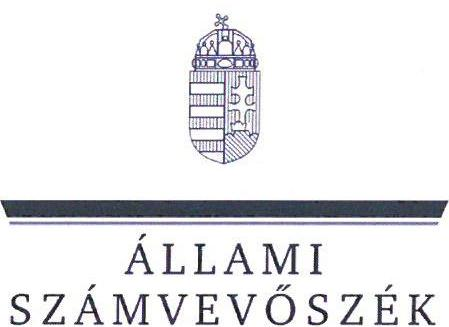
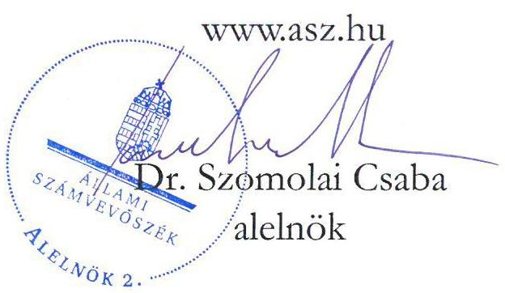
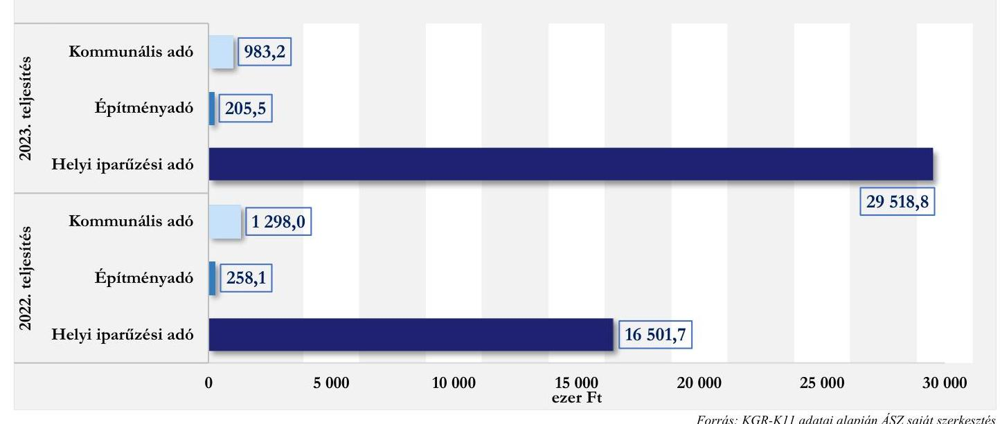
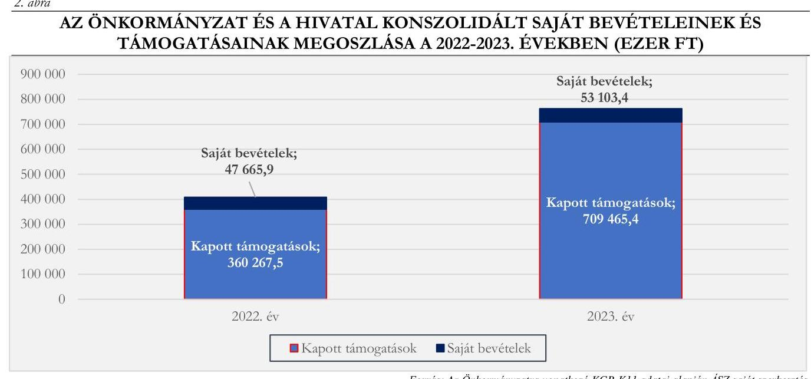

# JELENTÉS 

## Az önkormányzatok helyi adóztatási tevékenységének ellenőrzése - Ingatlanadóztatás

Kompolt Községi Önkormányzat

2025.

---

ÁLLAMI
SZÁMVEVŐSZÉK

# JELENTÉS 

## Az önkormányzatok helyi adóztatási tevékenységének ellenőrzése - Ingatlanadóztatás

Kompolt Községi Önkormányzat
2025.

24203

---

# ELLENŐRZÉSI IGAZGATÓSÁG: 

## ÁLLAMHÁZTARTÁS HELYI SZINTJÉT ELLENŐRZŐ IGAZGATÓSÁG

## ELLENŐRZÉSI IGAZGATÓ:

DR. BAFFIA GERGELY GÁBOR ellenőrzési igazgató

## ELLENŐRZÉSVEZETŐ:

Jelentéseink az interneten a www.asz.hu címen olvashatók.

KANYÓ LŐRÁNT ISTVÁN ellenőrzésvezető

IKTATÓSZÁM: EL-4040-016/2024
TÉMASORSZÁM: 54
ELLENŐRZÉS-AZONOSÍTÓ SZÁM: V1084

---

# TARTALOMJEGYZÉK 

AZ ELLENŐRZÉS ALAPADATAI ..... 5
AZ ELLENŐRZÉS TERÜLETE ÉS AZ ELLENŐRZÖTT SZERVEZET ..... 7
ÖSSZEFOGLALÁS ..... 9
AZ ELLENŐRZÉS FÓKUSZKÉRDÉSEI ..... 11
MEGÁLLAPÍTÁSOK ..... 12
JAVASLATOK ..... 23
MELLÉKLETEK ..... 25
I. sz. melléklet: Értelmező szótár ..... 25
II. sz. melléklet: Az ellenőrzött szervezetek jegyzéke ..... 27
III. sz. melléklet: Ellenőrzési kritériumok ..... 28
IV. sz. melléklet: A helyi ingatlanadó tárgyai és adóalanyai száma 2023. és 2024. években ..... 31
V. sz. melléklet: A 2023-2024. években történt adókövetelés törlések főbb adatai ..... 32
FÜGGELÉK: ÉSZREVÉTELEK ..... 33
RÖVIDÍTÉSEK JEGYZÉKE ..... 34

---

.

---

# AZ ELLENŐRZÉS ALAPADATAI 

## AZ ELLENŐRZÉS CÉLJA

Az ellenőrzés célja az volt, hogy értékelje Kompolt község helyi ingatlanadóztatásának és adóhatósága feladatellátásának szabályszerűségét, célszerűségét és eredményességét. További cél volt, hogy az ellenőrzés megállapításai és következtetései segítsék az önkormányzati képviselő-testületeket a jogszabályokkal és a helyi sajátosságokkal összhangban álló helyi adópolitika kialakításában és az azt végrehajtó adóigazgatási szervezet megszervezésében. Az ellenőrzés célja volt annak megállapítása is, hogy az Önkormányzat ${ }^{1}$ által bevezetett, ingatlanokat terhelő helyi adókra vonatkozó rendeleti szabályok összhangban vannak-e a helyi adópolitikai célokkal, tartalmuk tükrözi-e a település helyi sajátosságait és az adóhatósági feladatellátás biztosítja-e az önkormányzati bevételek feltárását és beszedését.

Ennek keretében az ÁSZ ${ }^{2}$ értékelte, hogy az Önkormányzat által bevezetett, ingatlanokat terhelő helyi adókról szóló adórendeletei (építményadó-rendelet ${ }^{3}$, kommunálisadó-rendelet ${ }^{4}$ ), valamint az adóhatóság ${ }^{5}$ döntései, adóztatási gyakorlata a vonatkozó jogszabályokkal összhangban álltak-e.

## AZ ELLENŐRZÉS TÍPUSA

Kombinált ellenőrzés.

## AZ ELLENŐRZŐTT IDŐSZAK

Az 1. fókuszkérdésnél a 2023. év, valamint a 2024. évnek az ellenőrzés megkezdését megelőző napjáig (2024. április 2.) tartó időszaka.

A 2. és 3. fókuszkérdésnél a 2023. év, valamint a 2024. évnek az ellenőrzés megkezdését megelőző napjáig (2024. április 2.) tartó időszaka, a 2020-2022. évek adatainak bázisadatként való felhasználásával.

## AZ ELLENŐRZÉS TÁRGYA

Az Önkormányzat Képviselő-testületének ${ }^{6}$ ingatlanokat terhelő helyi adókkal, azaz az építményadóval és a magánszemély kommunális adójával kapcsolatos rendeletalkotási tevékenységének és az adóhatóság tevékenységének az ellátása.

Az ellenőrzés kiterjedt minden olyan körülményre és adatra, amely az ÁSZ jogszabályban meghatározott feladatainak teljesítéséhez, valamint a program végrehajtása folyamán felmerült újabb összefüggések feltárásához szükséges.

## AZ ELLENŐRZÉS JOGALAPJA

Az ellenőrzés jogszabályi alapját az ÁSZ tv. ${ }^{7}$ 5. § (8) bekezdésének előírásai képezték.

---

# AZ ELLENŐRZÉS MÓDSZERE 

Az ellenőrzést az ellenőrzési program szempontjai, az ellenőrzött időszakban hatályos jogszabályok, az ellenőrzés általános szakmai szabályai és az ellenőrzésre irányadó ÁSZ módszertanok alapján végezte az ÁSZ.

Az ellenőrzési kérdések megválaszolásához szükséges bizonyítékok megszerzése az ellenőrzött szervezetek által rendelkezésre bocsátott dokumentumokra, adatokra és az ASP ${ }^{8}$ Adó és az Iratkezelő szakrendszerek, illetve a KGR-K11 ${ }^{9}$ számviteli adatgyűjtő rendszer adataira alapozva megfigyelés, szemle (szemrevételezés), kérdésfeltevés (információkérés), mintavételezés, valamint elemző eljárás útján történt. Emellett az ellenőrzési bizonyítékként felhasználható adatforrások közé tartozott minden egyéb - az ellenőrzés folyamán feltárt, az ellenőrzés szempontjából információt tartalmazó - releváns dokumentum (ideértve különösen a helyszínen felvett jegyzőkönyvet) is.

Az ellenőrzés lefolytatásához az ellenőrzött szervezetek a tanúsítványok kitöltésével, valamint az ÁSZ által kért dokumentumok, adatok, információk megküldésével és az ellenőrzés során szolgáltattak adatokat. Az ÁSZ az adómegállapítás szabályszerűségét mintavételi eljárással ellenőrizte, azonban fizetési kedvezmények engedélyezésére, valamint hátralékok beszedésére vonatkozó intézkedés nem történt. Az ÁSZ 15 mintatételben, 12 adóhatósági határozat szabályszerűségét ellenőrizte. A mintatételek kiválasztása véletlenszerűen történt, az adóhatóság nyilvántartásában lévő adótárgyak és ügyek közül, öt - adómegállapításra vonatkozó mintatétel kivételével, melyek esetén a kiválasztás címadatok alapján történt, annak érdekében, hogy feltárható legyen, volt-e olyan adótárgy, amelyet nem adóztatott az adóhatóság. Az ellenőrzött mintatételekre vonatkozó megállapítások nem vetíthetők ki a teljes sokaságra, a megállapításokat az ÁSZ az adott ellenőrzött mintatételek vonatkozásában tette.

Az ÁSZ a helyi adópolitikai elképzelések és a települési sajátosságok feltárásával értékelte, hogy az adórendelet e szempontoknak mennyiben felelt meg. Az ÁSZ a helyi adópolitikai célokkal akkor tekintette összhangban állónak az adórendeletet, ha az hatását tekintve támogatta az adópolitikai célok teljesülését.

Az ÁSZ az adóhatósági feladatellátás szabályszerűségéből, a meglévő kapacitásokból, valamint az ezer forint adóbevételre jutó adóhatósági költségek alakulásából következtetett arra, hogy az adóhatóság rendelkezett-e azzal a potenciállal, amellyel eredményesen tudta a helyi adópolitikát végrehajtani.

Az ÁSZ - az adórendelet szabályainak érvényre juttatása körében - az eredményesség megítélésekor a III. számú melléklet 2. pontjában foglalt szempontokat tekintette mérvadónak.

---

# AZ ELLENŐRZÉS TERÜLETE ÉS AZ ELLENŐRZÖTT SZERVEZET 

Kompolt község Heves vármegye délkeleti részén, a Füzesabonyi járásban található. A község állandó lakosainak a száma a $\mathrm{BM}^{10}$ adatai szerint 2020. január 1-jén 2012 fő, 2024. január 1-jén pedig 2004 fő volt.

A Hivatalnak helyet adó Faluház Kompolton; Forrás: ÁSZ saját fotó

A település gyakorlatilag egybeépült a szomszédos Kál és Kápolna községekkel. Kál, Kompolt és Kápolna 1989 előtt közös tanácshoz tartozott, a rendszerváltással alakult ki mindhárom község önálló önkormányzata. Ekkor a településhatárok is változtak, a lakosságszám és a településhez tartozó vállalkozások száma is csökkent Kompolton. Az ellenőrzött időszakban az Önkormányzat a Hivatal ${ }^{11}$-t Nagyút Községi Önkormányzattal együtt müködtette, az önkormányzati feladataik jelentős részét a gyermekétkeztetést, az óvodai, bölcsődei, szociális, művelődési és könyvtári feladatokat, valamint a belső ellenőrzést - társuláshoz való csatlakozással látták el (pl.: Kompolt-Nagyút Gyermekkertész Óvoda és Bölcsőde, Kompolt-Nagyút-Kápolna Gyermek és Szociális Étkezde intézményi társulások).

A TEIR ${ }^{12}$ adatai alapján Kompolton 2022. december 31-én 235 regisztrált gazdasági szervezet működött, míg az 1000 lakosra jutó regisztrált vállalkozások száma 116,1 db volt. Ez utóbbiak zömében a mezőgazdasági ágazatban múködtek (arányuk 50,2\% volt), az iparban és az építőiparban regisztrált vállalkozások aránya pedig $18,9 \%$ volt. A településen az egy főre jutó személyi jövedelemadó alap (adóköteles jövedelem) összege 2022-ben 1754,3 ezer Ft volt, mely elmaradt a vármegyei 2095,4 ezer Ft átlagértéktől és az országos szintű 2268,8 ezer Ft átlagértéktől.

Az Alaptörvény ${ }^{13}$ értelmében a helyi önkormányzat a helyi közügyek intézése körében törvény keretei között dönt a helyi adók fajtájáról és mértékéről. Az Mötv. ${ }^{14}$ rögzíti, hogy a helyi adóval kapcsolatos feladatok ellátása a helyi önkormányzatok feladata.

Az Önkormányzat a Htv. ${ }^{15}$ 1. $\$ (1) bekezdésében foglalt felhatalmazással élve illetékességi területén - adórendeletekkel - a magánszemély kommunális adóját és az építményadót vezette be 2016-tól.

A magánszemély kommunális adójának mértéke 2016. óta változatlan volt, adótárgyanként, illetőleg lakásbérleti jogonként 3,0 ezer Ft/év. Adómentesség illette meg az adóévben a 70. életévét betöltő vagy ennél idősebb magánszemélyt.

Az építményadó évi mértéke - szintén 2016. január 1-jétől - $60 \mathrm{Ft} / \mathrm{m}^{2}$ volt azzal, hogy mentesség vonatkozott a rendeltetésszerűen lakás céljára használt építményre, továbbá a nem lakás céljára szolgáló épület, épületrész közül azon építményre, amely nem vállalkozási, üzleti tevékenység végzésére szolgált.

Az adó megállapításával, nyilvántartásával, beszedésével összefüggő adóhatósági feladatokat - a Hatásköri tv. ${ }^{16}$ és az Air. ${ }^{17}$ rendelkezései alapján - elsőfokú hatósági jogkörben a jegyző ${ }^{18}$ látta el a Hivatal vezetőjeként. A kompotti és a nagyúti adóztatási feladatokat egy ügyintéző végezte, teljes munkakörben.

Az ingatlanok adóztatásából származó bevétel minimális szerepet játszott a települési feladatok finanszírozásában. A 2023. évben 1188,7 ezer Ft bevétel származott a két ingatlanadóból, ami a költségvetési bevételek $\mathbf{0 , 2 \% - a t t}$, a települési helyi adóbevételek $\mathbf{3 , 9 \% - a t t}$ tette ki. Az építményadót 16 adóalany 22 adótárgy

---

után, a kommunális adót 416 adóalany 430 adótárgy után fizette. Az Önkormányzat helyi adóbevételeinek a 2022. és 2023. évi teljesítésére vonatkozó adatait az 1. ábra mutatja be.

# 1. ábra 

AZ ÖNKORMÁNYZAT HELYI ADÓBEVÉTELEI MEGOSZLÁSA A 2022-2023. ÉVEKBEN (EZER FT)

Forrás: KGR-K11 adatai alapján ÁSZ saját szerkestés
Az Önkormányzat által működtetett ingatlanadók 2023. és 2024. évre vonatkozó jellemző naturális adatait a $I V$. számú melléklet tartalmazza.

---

# ÖSSZEFOGLALÁS 

Az ÁSZ tv. értelmében az ÁSZ feladatkörébe tartozik az önkormányzatok adóztatási tevékenységének ellenőrzése. A helyi adók az önkormányzatok saját, el nem vonható bevételét képezik, így az önkormányzatok gazdasági önállósága szempontjából különös fontossággal bír, hogy a helyi adórendeleti szabályok összhangban álljanak a magasabb szintű jogszabályokkal, továbbá az adóhatósági tevékenység jogszerú, eredményes és hatékony legyen. Erre figyelemmel volt tárgya az ÁSZ ellenőrzésének az Önkormányzat adórendelet-alkotási tevékenysége és az adóhatósági feladatellátás is.

Az adórendeletek több ponton nem voltak összhangban a magasabb szintű jogszabályokkal. Az Önkormányzat nem mérlegelte gazdálkodási körülményeit és a helyi sajátosságokat az ingatlanokat terhelő helyi adók megállapítása során, de figyelembe vette az adóalanyok teherviselő képességét. Az adómegállapítási feladatellátás a jogszabályi követelményeknek nem felelt meg. Adóbehajtási tevékenységet a jegyző́ nem végzett, a hátralékállomány összege az ingatlanadóbevételhez képest jelentős volt. Az adóztatási kiadások magasak voltak a helyi adóbevételekhez mérten, az adóhatóság feladatellátásának mutatói elmaradtak az ÁSZ által ellenőrzött (nagy)községek ${ }^{1}$ feladatellátásának átlagos mutatóitól.

## Adórendelet, adórendelet-alkotás

Az Önkormányzat ingatlant terhelő helyi adórendeleteinek két rendelkezése is jogszabálysértő volt, mert a szabályozás nem biztosította valamennyi esetben annak lehetőségét, hogy egy adótárgy után csak egyféle adónemben álljon fenn fizetési kötelezettség, továbbá vállalkozónak minősülő adóalany számára is állapított meg építményadó-mentességet. Emellett az adórendeletek öt rendelkezése nem felelt meg annak a jogszabályi követelménynek, miszerint egyértelmúen értelmezhetőnek kell lennie a kötelezettség tartalmának.

Az Önkormányzat az adórendeletek 2015. évi megalkotásakor nem mérlegelte, hogy az adórendeleti szabályozás összességében - a törvényi előírások szerint - megfelelte-e az önkormányzat gazdálkodási követelményének és a helyi sajátosságoknak. Az Önkormányzat 2015 óta nem mérlegelte, hogy a törvényi rendelkezés alapján az adórendeleti szabályoknak egyaránt tükröznie kell az önkormányzat gazdálkodási követelményét és a helyi sajátosságokat és az adóalanyok széles körét érintően az adóalanyok teherviselő képességét.

Az ingatlanadókból származó bevételek érdemben nem befolyásolták az Önkormányzat költségvetési helyzetét.

## Adóhatóság adóigazgatási feladatellátásának jogszerüsége, eredményessége

Az adóhatóság hatósági jogkörében a mintatételek többségében nem járt el szabályszerűen, az adótárgy- és adóalanyfeltárási tevékenység nem volt eredményes. Nyolc határozat esetén a megállapított kommunális adóösszeg nem egyezett meg az adótárgyak számának és az adómértéknek a szorzatával. Az adóhatározatok indokolása nem felelt meg a jogszabályban foglaltaknak, mert olyan jogszabályi hivatkozásokat is tartalmaztak, amelyek az adózó adókötelezettségét nem érintették, és nehezítették a döntések értelmezését.

A határozatok kiadmányozása és kézbesítése jogszerú volt.

[^0]
[^0]:    ${ }^{1}$ Az ÁSZ által jelen ellenőrzés alapjául szolgáló ellenőrzési program alapján ellenőrzött (nagy)községek: Árpádhalom, Balatonberény, Balatonvilágos, Kompolt, Leányfalu, Szentistván, Szigetmonostor, Tiszainoka.

---

Az adóhatóság a 2023. évben és a 2024. évben a jogszabályi előírások ellenére adóbehajtási tevékenységet nem végzett, miközben az adóhátralék összege 2023. december 31-én 3240,2 ezer Ft, aránya a tárgyévi ingatlanadóbevételhez viszonyítva több mint kétszerese (272,6\%) volt.

# Az adórendelet adópolitikai célokkal való összhangia, az adórendelet hatása 

A helyi adópolitikai célok elérésének megfelelő eszközéül szolgáltak az Önkormányzat adórendeleti szabályai.

Az Önkormányzat országos összevetésben vizsgálva kevésbé élt az ingatlanadóztatás lehetőségével. Míg a községek, nagyközségek esetén országosan ezen bevételek költségvetési bevételeken belüli átlagos aránya a 2023. évben - a KGR-K11 beszámoló (költségvetési szervek nélküli) adatai alapján - 2,2\%, addig az Önkormányzat esetében ez $0,2 \%$ volt.

A kommunális adó és az építményadó szintje az adóalanyok többségének adóteherviselő képességét nem haladta meg.

## Az adóhatósági kiadások, a feladatellátás

A Hivatalhoz tartozó két település (Kompolt, Nagyút) esetén a 2023. évben 1000 Ft helyi adóbevételre 113,1 Ft adóztatási kiadás jutott. Az ÁSZ által ellenőrzött (nagy)községek átlaga 33,4 Ft, az adóztatási kiadás tapasztalati referencia-érték maximuma kivetéses adóztatás esetén 50 Ft volt. Az adóztatási kiadás az adóbevételekhez mérten jelentős volt, ami arra utal, hogy az adóztatás az ÁSZ által ellenőrzött (nagy)községek átlagához képest nem volt költséghatékony.

Egy adótisztviselőre a Hivatalban 37 617,2 ezer Ft helyi adóbevétel jutott a 2023. évben (az ÁSZ által ellenőrzött nyolc (nagy)község átlaga 218 852,8 ezer Ft). Egy adótisztviselőre 1029 adótárgy és 1046 adóalany esett (a nyolc ÁSZ által ellenőrzött település esetén ez 1396 adótárgy, illetve 1257 adóalany).

Az adóhatóság feladatellátási mutatóinak értékei elmaradtak az ÁSZ által ellenőrzött (nagy)községek feladatellátási mutatóinak értékeitől.

---

# AZ ELLENŐRZÉS FÓKUSZKÉRDÉSEI 

1.- Az önkormányzat ingatlanokat terhelő helyi adókra vonatkozó rendeleti szabályozása megfelel-e a magasabb szintü jogszabályoknak?
2.- Az önkormányzati adóhatóság megfelelően és eredményesen látta-e el az ingatlanok adóztatásával kapcsolatos adóhatósági tevékenységeit?
3.- A településen megvalósuló helyi adóztatás támogatta-e a helyi adópolitikai célok teljesülését?

---

# MEGÁLLAPÍTÁSOK 

## 1. Az önkormányzat ingatlanokat terhelő helyi adókra vonatkozó rendeleti szabályozása megfelelte-a magasabb szintű jogszabályoknak?

Összegző megállapítás

1.1 számú megállapítás

Az adórendeletek több ponton nem feleltek meg a magasabb szintű jogszabályoknak. Az Önkormányzat az adórendeletek vonatkozásában 2015. óta nem mérlegelte a helyi sajátosságokat, az Önkormányzat gazdálkodási követelményeit, az adóalanyok teherviselő képességét, illetve az ezekben bekövetkezett változásokat.

Az adórendeletek több ponton nem voltak összhangban a Htv. előírásaival, szövegezésük öt ponton sértette az egyértelműség Jat. ${ }^{19}$-ban megfogalmazott követelményét.

A Htv. 7. §-a a) pontjában foglaltak ${ }^{2}$ ellenére az építményadó-rendelet és a kommunálisadó-rendelet együttes tartalma nem zárta ki, hogy a magánszemély nem rendeltetésszerűen lakás céljára használt építménye után, illetőleg a magánszemély tulajdonában álló, üzleti célt szolgáló nem lakás céljára szolgáló épület, épületrész után mindkét adónemben fizetési kötelezettség álljon fenn ${ }^{3}$.
A Htv. 7. § e) pontjában előírtak ellenére - mely az uniós jogból fakadó állami támogatási elvekre és normákra figyelemmel rögzíti, hogy az önkormányzat az építményadóban, telekadóban a vállalkozó számára adómentességet, adókedvezményt nem biztosíthat az építményadó-rendelet:
a) 1. $\S$ a) pontja adómentessé tette azt az építményt is, amelyet ugyan rendeltetésszerűen lakás céljára használtak, de az egyben vállalkozó üzleti célt szolgáló épülete ${ }^{4}$ is volt;
b) 1. § b) pontja adómentessé tette a nem lakáscélú építményt ha az ugyan nem vállalkozási, üzleti tevékenység végzésére szolgált, de a vállalkozó üzleti célú épületének számít.

Az uniós állami támogatási szabályok értelmében a vállalkozóknak nyújtott helyi adómentesség, helyi adókedvezmény állami támogatásnak minősül. A jogszerütlenül nyújtott támogatást a kedvezményezettnek vissza kell fizetnie, vagy a támogatást nyújtónak kell biztosítania az uniós joggal való összhangot.

[^0]
[^0]:    ${ }^{2}$ A Htv. ezen rendelkezése értelmében az önkormányzatnak úgy kell rendeleti szabályt alkotnia, hogy egyféle adótárgy (épület, épületrész, telek) esetében csak egyféle, az önkormányzat döntése szerinti adóban álljon fenn fizetési kötelezettség.
    ${ }^{3}$ Az építményadó-rendelet 1. §-a a rendeltetésszerűen lakás céljára használt építményt és a nem lakás céljára szolgáló épület, épületrész közül csak azokat mentesítette, amelyek nem vállalkozási, üzleti tevékenység végzésére szolgálnak.
    ${ }^{4}$ A Htv. 7. § e) pontja, a vállalkozó „özleti célt szodgálo"épület, épületrész esetén korlátozza az önkormányzat adómegállapító jogosultságát. E csoportba tartoznak azok az ingatlanok is, amelyek ugyan üresen állnak, de a vállalkozó könyveiben szerepelnek (például: befektetési céllal).

---

Az építményadó-rendelet három ponton, a kommunálisadó-rendelet két ponton sértette - a Jat. 2. § (1) bekezdéséből következő - egyértelműség követelményét:
a) az építményadó-rendelet nem definiálta, hogy mit tekint az 1. $\$ (2) bekezdésben említett rendeltetésszerűen lakás céljára használt építménynek, illetve egy építmény rendeltetésszerủ használatának, noha ezen fogalmakhoz joghatást füzött ${ }^{5}$, miközben a Htv. a lakás, nem lakás céljára szolgáló épület fogalmát használja [Htv. 52. §8. pont és 11. pont], azaz a rendeleti szabály anélkül tért el a Htv. fogalomkészletétől, hogy a bevezetett fogalmat definiálná;
b) az építményadó-rendelet bevezető része a Htv. már nem hatályos 5. $\int^{6}$ a) pontjában foglalt felhatalmazásra utalt;
c) a kommunálisadó-rendelet a Htv. már nem hatályos 5. § b) pontjára utalt;
d) a kommunálisadó-rendelet 3. §-a és az építményadó-rendelet 4. §-a a már nem hatályos adózás rendjéről szolói 2003. évi XCII. törvényre ${ }^{7}$ hivatkozott.
1.2 számú megállapítás

Az Önkormányzat - a Htv. előírásával szemben - az adórendeletek 2015. évi elfogadása óta nem mérlegelte, hogy az adórendeleteknek tükrözniük kell a helyi sajátosságokat, az önkormányzat gazdálkodási követelményét, továbbá az adóalanyok széles körét érintően az adóalanyok teherviselő képességét.

A Htv. 7. § g) pontjában rögzített adómegállapítási korlátokból az következik, hogy a rendelet hatályossága idején is érvényre kell jutnia az e pontban szabályozott rendeletalkotási elveknek, azaz annak, hogy a települési önkormányzat az adóalap fajtáját, az adó mértékét, a rendeleti adómentességet és adókedvezményt úgy állapíthatja meg, hogy azok összességükben egyaránt megfeleljenek
a) a helyi sajátosságoknak,
b) az önkormányzat gazdálkodási követelményeinek és
c) az adóalanyok széles körét érintően az adóalanyok teherviselő képességének.
Az adórendeletek megalkotása során készült Előterjesztés ${ }^{20}$ és az adórendeletek tárgyalásáról készített Jegyzőkönyv ${ }^{21}$ alapján kizárólagos rendeletalkotási szempont volt, hogy az adómértékek és a fizetési kötelezettség összege ne változzon a korábban hatályos rendeleti adómértékhez képest. Az Önkormányzat az adórendeletek elfogadását követő időszakra vonatkozó, az adómegállapítást megalapozó, illetve a várható költségvetési hatásokat bemutató hatástanulmányt, elemzést, kockázatértékelést nem mutatott be, az adórendeletek felülvizsgálata nem

[^0]
[^0]:    ${ }^{5}$ A szavak általános jelentése alapján ide tartozik valamennyi ingatlan, amelyben valaki lakik. Ez a jelentéstartalom azonban eltér mind a Htv. 52. §8. pontja szerinti lakás definíciójának normatartalmától, mind az Önkormányzat által alkalmazott értelmezéstől (az ingatlannyilvántartásban lakás rendeltetésüként bejegyzett ingatlan), s így a fogalmi eltérések miatt indokolt az építményadó-rendeletben önálló fogalom alkotása vagy - ha az eltérés az Önkormányzat megítélése szerint nem indokolt - a Htv. fogalmi készletének alkalmazása.
    ${ }^{6}$ A Htv. 5. §-a 2017. január 1-je óta hatálytalan.
    ${ }^{7}$ Az adózás rendjéről szóló 2003. évi XCII. törvény 2018. január 1-je óta hatálytalan.

---

történt meg. Az Önkormányzat a Htv. 7. § g) pontjában előírtak ellenére az adómegállapítási szempontokat az ellenőrzött időszakban nem mérlegelte.

# 2. Az önkormányzati adóhatóság megfelelően és eredményesen látta-e el az ingatlanok adóztatásával kapcsolatos adóhatósági tevékenységeit? 

Összegző megállapítás

Az adóhatóság adórendeletekkel összefüggő adóigazgatási feladatellátása a vizsgált mintatételek többségében nem volt szabályszerű, továbbá nem volt eredményes. Az adóhatóság adóbehajtási tevékenységet nem végzett.
2.1. számú megállapítás

Az adóhatóság adómegállapítási feladatellátása a Htv.-be és több esetben az Art. ${ }^{22}$-ba, egy esetben az Ltv. ${ }^{23}$ iratmegőrzésre vonatkozó szabályaiba ütközött, továbbá nem volt eredményes.

Adótárgy-, és adóalanyfeltárás
Az ellenőrzött időszakban az adóhatóság az adóalanyok és az adótárgyak feltárása érdekében élt az Art. 83. § (2) bekezdésében foglaltak szerint az ingatlanügyi hatóság megkeresésének lehetőségével, de a kapott adatokat nem vetette össze az adónyilvántartásában szereplő adatokkal. Az adóhatóság nyilatkozata szerint az Art. 86. § (2) bekezdés szerinti építésügyi hatósági adatszolgáltatás keretében nem kaptak adatokat. Ezen túlmenően az adóhatóság tele-pülés-bejárást nem tartott és egyéb eszközöket, eljárást (pl.: térinformatika) sem vett igénybe az adótárgyak feltárása érdekében.
Az ÁSZ négy esetben feltárta (8-9. számú, valamint a Jkv/14 ${ }^{24} / 1$. és Jkv/14/4. számú mintatételek), hogy az adóhatóság az ingatlanokat terhelő helyi adórendeletei, valamint a Htv. 11. § (1) bekezdése és 24. §-a előírásai ellenére nem tekintett adótárgynak valamennyi, a Htv. és az adórendeletek hatálya alá tartozó adótárgyat, és ezek esetében az adóztatást elmulasztotta.
Az adóhatóság az adótárgy-, és adóalanyfeltárási tevékenységét nem látta el eredményesen.

---

# Adómegállapítás (kivetés) 

A mintatételek értékelésének eredményeként az ÁSZ feltárta, hogy az ellenőrzött ingatlanadókra vonatkozó mintatételek 33,3\%-ában volt szabályszerű a fizetendő adó összegének megállapítása (15 mintatételből öt esetben állapították meg az ingatlanadót szabályszerűen).
Egy mintatételnél (12. számú mintatétel) a Htv. 12. § (2) bekezdésében foglaltak ellenére az adóalanyok közötti megállapodás hiányában állapították meg az egész ingatlan utáni adófizetési kötelezettséget az egyik tulajdonostárs terhére.
Két mintatétel (1. és 6. számú mintatétel) esetén az adómegállapító határozatot az adóhatóság az adóalany adókötelezettsége első éve első napja előtt adta ki, így az a Htv. 14. § (2) bekezdésében és 12. § (1) bekezdésében előírtak ellenére nem lehetett figyelemmel az év első napján fennálló állapotra.
Hat mintatétel esetén (2., 5., 7., 11. és 12. számú, valamint Jkv/14/3. számú mintatétel) az adózók adatbejelentési kötelezettségüket az Art. 2. számú

Az adóévi adókötelezettség az adóév január 1. napján fennálló körülményekhez, tulajdoni viszonyokhoz, adórendeleti szabályokhoz kapcsolódik, ezért az adóév január 1. napját megelőzően megalapozott határozat értelemszerủen nem adható ki. Az ÁSZ rossz gyakorlatnak tartja az adó határozatban való közlését az adóalany adókötelezettsége keletkezését megelőző időszakban.
melléklete II/A. 4. pontjában rögzített határnaphoz (az adókötelezettség keletkezése évének 15. napja) képest később teljesítették. Az adóhatóság ezen ügyekben a kötelezettség-teljesítés mulasztását nem észlelte, az Art. 221. § (1) bekezdés a) pontjától eltérően az adóhatóság nem hívta fel az adózót 15 napos határidő tűzésével és a jogkövetkezményekre való figyelmeztetéssel az adatbejelentési kötelezettség jogszerú teljesítésére. Ezért a mintatételekhez tartozó határozatok kiadmányozása késedelmet szenvedett, e késedelem három (2., 5., 7. számú) mintatételhez tartozó határozat esetén az adókötelezettség keletkezését követő 15. naptól számítva meghaladta a három évet, ami arra vezetett, hogy az Önkormányzat bevételéhez később jutott hozzá. Egy mintatétel esetén (Jkv/14/2. számú mintatétel) az adóhatóság az Art. 141. §-ának (2) bekezdésében előírtak ellenére az adó kivetéséről szóló, adót megállapító határozattal nem rendelkezett (noha az adótárgy utáni adókötelezettség az adóhatóság nyilvántartásai szerint is folyamatosan fennállt), illetve arról sem tudott az ÁSZ ellenőrzéshez tájékoztatást adni az adóhatóság, hogy mi a határozat hiányának oka. A Hivatal az Ltv. 9. § (1) bekezdés e) pontjában előírtak ellenére e mintatételben szereplő adótárgyra vonatkozóan benyújtott adatbejelentő nyomtatvány megőrzéséről sem gondoskodott.

---

Négy ellenőrzött mintatétel (1., 2., 3., és 12. számú mintatételek) esetében, amelyben az adótárgynak több tulajdonosa volt, és megállapodtak abban, hogy közülük ki tartja a kapcsolatot az adóhatósággal, a határozat rendelkező része kizárólag az adó fizetésére kötelezett által fizetendő adó összegét tartalmazta.
Nyolc mintatételnél (1.-7., és 12. számú mintatételek) az adómegállapító határozat ingatlanonként (helyrajzi számonként) $3000 \mathrm{Ft} /$ év adóösszeget állapított meg, amely nem volt összhangban a kommuná-lisadó-rendeletnek az éves adómértéket adótárgyanként megállapító 2. $\int$-ában, valamint a Htv. 24. $\int$-ában foglaltakkal, mert figyelmen kívül hagyta azt, hogy egy helyrajzi szám alatti ingatlanon több adótárgy is volt ${ }^{8}$.
Az adófizetési kötelezettségről szóló valamennyi ellenőrzött határozat indokolásában - az Air. 73. § (1) bekezdés c) pontjával szemben - olyan jogszabályhelyek is szerepeltek, amelyek az adóhatóság döntésnek megalapozása, illetve hatáskörének és illetékességének megállapítása szempontjából nem voltak relevánsak. E határozatokba foglalt fizetési kötelezettség jogszerűségét e hiba nem érintette, de a határozatok értelmezhetőségét, követhetőségét nehezítette.
A 12 adókivetési határozat ( 10 db mintatételnél) kiadmányozása és a közlése megfelel az Air. előírásainak. Ebből egy esetben (3. számú mintatétel) az adózó adatbejelentését e-papíron keresztül tette meg, az elektronikus kapcsolattartáshoz szükséges elérhetőséget megadta, az adóhatóság azonban nem élt az Eüsztv. ${ }^{28} 15 . \int$ (2) bekezdésben ${ }^{9}$ foglalt lehetőséggel, azaz nem elektronikusan, hanem kézbesítő útján történt meg az adómegállapításról szóló határozat kézbesítése, tehát ebben az esetben az ÁSZ álláspontja szerint az adóhatóság eljárása nem volt célszerű és gazdaságos.

[^0]
[^0]:    ${ }^{8}$ A Htv. 24. §-a alapján a kommunális adó tárgya: az építményadó tárgyát és telekadó tárgyát képező adótárgyak (épület, épületrész, beépítetlen földrészlet), valamint a nem magánszemély tulajdonában álló lakáson fennálló bérleti jog (például egy családi házas ingatlan esetén adótárgy a lakóház és a telek lakóházzal le nem fedett területe). Az önkormányzat természetesen rendeletben kimondhatja, hogy az egy helyrajzi számon lévő több adótárgy esetén is csak egy adótárgy után kell megfizetni a kommunális adót.
    ${ }^{9}$ Az Eüsztv. 2024. szeptember 1-je óta hatálytalan, a jogterület szabályozását a digitális államról és a digitális szolgáltatások nyújtásának egyes szabályairól szóló 2023. évi CIII. törvény tartalmazza.

---

A megállapított adó csökkentése: fizetési kedvrzmények, adókötelezettség változás, elévülés miatti törlés
A fennálló adókövetelés nagyságát csökkentő intézkedések megfeleltek az Art.-nak, azok számszaki összefoglalását az $V$. számú melléklet mutatja be.

# Adatszolgáltatási, közzétételi kötelezettség 

Az adóhatóságnak az ellenőrzött időszakban nem keletkezett a Htv. 42/B. § (1) bekezdésének előírásai szerint adatszolgáltatási kötelezettsége. Az adóhatóság a Htv. 42/B. § (3) bekezdésében előírtak ellenére, az adózáshoz rendszeresített bevallási, adatbejelentési, bejelentkezési nyomtatványok Önkormányzat honlapján való közzétételi kötelezettségének nem tett eleget. Az adórendeleteket - a Nemzeti Jogszabálytárra való hivatkozással - az Önkormányzat honlapján keresztül elérhetővé tette.
2.2. számú megállapítás

Az adótartozások beszedése érdekében az adóhatóság - a jogszabályi előírás ellenére - nem tett intézkedéseket, a hátralékok kezelése nem volt eredményes.

Az 1. táblázat szerint a 2023. év végén az adóhátralékok összege 3240,2 ezer Ft volt, amely az éves ingatlanadókból származó bevételek közel háromszorosa volt. 2023. december 31-én az adózók 62,0\%-a, 439 adóalany közül 272 fő nem tett eleget adófizetési kötelezettségének.
Az Avt. ${ }^{26}$ 30. § (1) bekezdésének előírásai ellenére az adóhatóság a jelentős arányú adótartozás beszedése érdekében fizetési felszólítást nem bocsátott ki, végrehajtási eljárást nem indított. Az adóhatóság nyilatkozata szerint ennek oka az volt, hogy a Hi vatal humánerőforrás problémákkal küzdött.

Az ÁSZ álláspontja szerint az adóbeszedési, adóvégrehajtási cselekmények célja nem pusztán az önkormányzatot megillető bevétel behajtása. Legalább annyira tekinthető a fizetési kötelezettségüket rendben teljesítők melletti kiállásnak is. Összességében az adómorál és a fizetési hajlandóság növelését szolgálja valamennyi adózó esetén. Ezért a behajtás hosszú időn át való elmulasztása rossz gyakorlat, még akkor is, ha a behajtandó összeg az adóbehajtás költségéhez képest alacsony (az adóvégrehajtás költségét az adós viseli). Alacsony adómérték és jelentős, bevételhez mért hátralék mellett - az ellenőrzés szerint - érdemes megfontolni az adó átalakítását, működtetését.

1. táblázat

AZ ADÓHÁTRALÉKOK FŐBB ADATAI (DARAB ÉS EZER FT)

| MEGNEVEZÉS | NAPTÁRI   NAP | ÉPTIMENVÁdÓ | MAGÁNSZEMÉLY   KOMMÉNÁLÉS ADÓJA | ÖsszESEN |
| :--: | :--: | :--: | :--: | :--: |
| Hátralékos adózók száma | 2022.12 .31 | 5 | 256 | 261 |
|  | 2023.12 .31 | 9 | 263 | 272 |
|  | 2024.03.31. | 9 | 301 | 310 |
| Adóhátralék összege | 2022.12 .31 | 287,4 | 2762,3 | 3049,7 |
|  | 2023.12 .31 | 376,5 | 2863,7 | 3240,2 |
|  | 2024.03.31 | 401,6 | 3158,8 | 3560,4 |

Forrás: Az Önkormányzat és a Hivatal tanúsitványokon és nyilatkozatában megadott adatai alapján ÁSZ saját szerkesztés

---

# 3. A településen megvalósuló helyi adóztatás támogatta-e a helyi adópolitikai célok teljesülését? 

| Összegző megállapítás | Az adórendeletek megfeleltek a helyi adópolitikai céloknak. Az adóhatósági kiadások az adóbevételhez mérten magasak voltak. Az adóhatósági feladatellátás mutatói elmaradtak az ÁSZ által ellenőrzött (nagy)községek feladatellátási mutatóinak átlagos értékétől. |
| :--: | :--: |
| 3.1 számú megállapítás | Az adórendeletek összhangban voltak az Önkormányzat által meghatározott helyi adópolitikai célokkal, azonban az építményadórendelet, az adómértékre tekintettel alacsony összegű bevételt eredményezett, azzal adózási cél nem volt elérhető. |

Az Önkormányzat adópolitikai célkitűzéseit is rögzítő Gazdasági Program ${ }^{27}$ tartalmazta azt, hogy a gazdasági helyzet romlása esetén nem kizárt a helyi adók emelése. Az Önkormányzat nyilatkozata szerint önkormányzati célnak számít a település fejlesztése, azzal, hogy a lakosság terhei növelését igyekezett elkerülni, az adóbevételek növelését pedig a vállalkozók letelepedésének ösztönzésével kívánta elérni.
Az adórendeletek e céloknak annyiban eleget tettek, hogy az ingatlanok adóterhelése a jogalanyok teherviselő képességéhez mérten alacsony volt. A kommunális adó egy főre vetítve mindössze a 2022. évi kompolti, egy főre jutó nettó személyi jövedelemadóalap (1 166,6 ezer Ft) $0,3 \%-a^{10}$ volt.

Az építményadó-rendelet szerint az építményadó a vállalkozók épületeire (2023. évben 16 adózó, 22 adótárgy) vonatkozott, az egy adótárgyra jutó adó átlagosan 2023. évben 9,3 ezer Ft volt. Az átlagos adóöszszeg, nagyságára tekintettel, közvetetten segítette a vállalkozások letelepedését. Mindazonáltal az építményadó-bevétel (205,5 ezer Ft 2023. évben) egyfelől nem tette lehetővé, hogy az Önkormányzat ezen forrás segítségével a vállalkozások letelepedését segítő programokat indítson, másfelől az alacsony adómérték a letelepedő vállalkozásoktól csak alacsony összegű (többlet)építményadóbevételt eredményezhetett ${ }^{11}$, ami az Önkormányzat feladatellátását érdemben nem segítette.
3.2 számú megállapítás Az Önkormányzat gazdálkodását az ingatlanadókból származó adóbevétel nem befolyásolta.

## Az adórendelet(módositás) hatása az önkormányzat gazdálkodására

Az Önkormányzatnak a 2022. évben nem volt önként vállalt feladata, a 2023. évben a sportegyesület támogatása 1500,0 ezer Ft volt, a 2024. évre pedig 1000,0 ezer Ft-ot tervezett. Az Önkormányzat bevételei (előző évi pénzmaradvány felhasználással együtt) meghaladták a kiadásokat, így a helyi adóbevételeket vagyoni típusú adóbevételeket is - elsősorban a kötelező feladatellátásra

[^0]
[^0]:    ${ }^{10}$ Családi házas ingatlanonként két adótárggyal és átlagosan 2,5 fő lakóval számítva az éves kommunális adó 2,4 ezer Ft.
    ${ }^{11}$ Egy könnyűszerkezetes ipari csarnok átlagos fajlagos nettó ára $100000 \mathrm{Ft} / \mathrm{m}^{2}$ volt 2024-ben (Forrás:https://konnyuszerkezetes-csarnok.hu/csarnokepites/acelcsarnok-korkep-2024). Telekár nélkül egy $600-1000 \mathrm{~m}^{2}$ alapterületű ingatlan bruttó értéke tehát 60 000-100 000 ezer Ft, amellyel szemben áll az éves szinten 36-60 ezer Ft építményadó, ami sem a vállalkozó, sem az Önkormányzat számára nem jelent érdemi terhet, bevételt.

---

fordították. Az Önkormányzat a 2020-2023. időszakban minden évben kimutatott kötelezettségvállalással nem terhelt maradványt. Az Önkormányzatnak 2020-2023 között hitelállománya nem volt.
Az ingatlanadókból származó bevétel ugyanakkor az Önkormányzat gazdálkodása biztonságához nem járult hozzá érdemben. Az Önkormányzat ingatlanadókból származó adóbevételének költségvetési bevételeken belüli aránya a 2022. évben $\mathbf{0 , 4 \%}$, a 2023. évben $\mathbf{0 , 2 \%}$ volt, a saját bevételekhez mért arány is alig haladta meg a $\mathbf{2 , 2 \% - o t} \mathbf{2 0 2 3 - b a n}$. Míg országos összevetésben az ingatlanadó-bevételek aránya a költségvetési bevételeken belül (költségvetési szervek nélkül) a településtípusra (község, nagyközség) vonatkozóan $\mathbf{2 , 2 \%}$ volt, addig az Önkormányzat esetében ez az érték 0,3\%. Az országosan (községek, nagyközségek esetén) egy állandó lakosra jutó 7,2 ezer Ft-os ingatlanadó-bevételhez képest az Önkormányzat esetében egy állandó lakosra $\mathbf{0 , 6}$ ezer Ft esett.
A saját bevételek felhalmozási célú bevételekkel csökkentett költségvetési bevételhez viszonyított aránya a 2020-2023. években viszonylag állandó volt, $\mathbf{8 , 6 \%}$ és $\mathbf{1 1 , 9 \%}$ közötti arányt képviselt.

A helyi iparűzési adóbevétel az egyes években a saját bevételek döntő hányadát, átlagban $45,1 \%$-át tette ki és jelentős volt az egyéb saját bevételek részaránya $(51,3 \%)$ is.

Az építményadóból, telekadóból származó bevételek - rendeleti változás híján - jellemzően alig változnak év/év viszonylatban. Ezért az ÁSZ megítélése szerint ezen adók képesek valamelyest nagyobb gazdálkodási biztonságot adni az önkormányzatoknak, szemben - különösen kisebb települések esetén - az iparűzési adóval. A magánszemélyek gyengébb teherviselő képességét célzott adóelőnyökkel vagy a magánszemély kommunális adója működtetésével lehet figyelembe venni.

A 2020-2023. évekre vonatkozó konszolidált bevételek jogcímenkénti nagyságát és változását éves bontásban a 2. táblázat, az Önkormányzat konszolidált saját bevételeinek és támogatásának 2022-2023. évi megoszlását pedig a 2. ábra mutatja be.

| 2. táblázat |  |  |  |  |  |
| :--: | :--: | :--: | :--: | :--: | :--: |
| AZ ÖNKORMÁNYZAT ÉS A HIVATAL 2020-2023. ÉVI KONSZOLIDÁLT BEVÉTELEI (EZER FT, \%) |  |  |  |  |  |
| SOR-   SZAM | JOGCIM | 2020. | 2021. | 2022. | 2023. |
| 1. | Működési célú támogatások államháztartáson belülről | 370 429,6 | 321 754,7 | 352 571,2 | 453 939,5 |
| 2. | Felhalmozási célú támogatások államháztartáson belülről | 988 852,9 | 212 650,9 | 7 696,3 | 255 525,9 |
| 3. | Közhatalmi bevételek | 12 440,1 | 22 665,9 | 18 183,5 | 30 944,4 |
| 3.1., | ebből: ingatlanadókból származó bevétel | 1329,4 | 1470,8 | 1556,1 | 1188,7 |
| 3.2., | ebböl: helyi iparüzési adó bevétele | 11 049,0 | 21 129,0 | 16 501,7 | 29 518,8 |
| 3.3., | ebböl: egyéb közhatalmi bevételek | 61,7 | 66,1 | 125,7 | 236,9 |
| 4. | Egyéb bevételek | 22 234,5 | 13 561,3 | 29 482,4 | 22 159,0 |
| 5. | Saját bevételek (3.+4.) | 34 674,6 | 36 227,2 | 47 665,9 | 53 103,4 |
| 6. | Költségvetési bevételek (1.+2.+5.) | 1393 957,1 | 570 632,8 | 407 933,4 | 762 568,8 |
| 7. | Saját bevételek aránya a felhalmozási bevételek nélküli költségvetési bevételeken belül (5./6.-2.) | $\mathbf{8 , 6 \%}$ | 10,1\% | 11,9\% | 10,5\% |

Forrás: KGB-K11-ből az Önkormányzat konszolidált beszámolói alapján ÁSZ saját szerkezés

---

# Az adóalanyok teherviselő képességével való összevetés 

Az adórendelet szerinti éves kommunális adó az egy főre jutó éves átlagos nettó személyi jövedelemadóalap (jövedelem) 2022. évi 1166,6 ezer Ft-os összegéhez mérten $0,3 \%$-ot tett ki. Az adózók fizetési kedvezmény iránti kérelmet 2022. január 1.-2024. április 2. között nem nyújtottak be.
Az ingatlanadókban fennálló adóhátralék összege - a 1. táblázat adatai szerint - a 2022. december 31-ei 3 049,7 ezer Ft-ról, 2023. december 31-ére 3240,2 ezer Ft-ra, 6,2\%-kal emelkedett, 2024. március 31-ére 3560,4 ezer Ft-ra, további 9,9\%-kal nőtt. A 2022. évben a 429 fő adóalanyból 261 fő $(60,8 \%)$, a 2023. évben a 439 fő adóalanyból 272 fő ( $62,0 \%$ ), míg a 2024. évben (2024. március 31. napjáig) a 432 fő adóalanyból 310 fő ( $71,8 \%$ ), azaz az adóalanyok több, mint fele rendelkezett hátralékkal. Egy adósra a 2023. évben 11,9 ezer Ft, 2024. március 31-én 11,5 ezer Ft adótartozás jutott, ami az évi 3000 Ft adótételhez viszonyítva magas, annak több, mint háromszorosa.
Az a tény, hogy az adóbehajtási feladatellátás elmaradt, az adózók fizetési könnyítésre vonatkozó kérelmet nem nyújtottak be, az éves kommunális adó éves átlagos nettó jövedelemhez mért aránya ( $0,3 \%$ ) alacsony, továbbá az, hogy a kommunális adóban alkalmazott évi 3000 Ft adótárgyankénti adótétel 2016 óta változatlan, az adóalanyok fizetési készségének alacsony szintjére mutat rá. Ennélfogva az ÁSZ álláspontja szerint az adóalanyok többségének teherviselő képességét az ingatlanadó nem érintette hátrányosan.
3.3. számú megállapítás

Az adóhatóság feladatellátásának tárgyi feltételei biztosítottak voltak, a személyi feltételei nem voltak biztosítottak. Az adóztatási kiadások magasak voltak az adóbevételhez képest. Az adóhatóság feladatellátási mutatói összességében nem érték el az ÁSZ által ellenőrzött nyolc (nagy)község átlagos mutatóinak értékét.

## Személyi és tárgyi feltételek

Az adóigazgatási feladatellátás tárgyi feltételei az ellenőrzött időszakban biztosítottak voltak, a személyi feltételek nem voltak biztosítottak, mert a Hivatal adóztatási feladatait egy - nem szakirányú felsőfokú végzettségű, kevesebb, mint egy év adóigazgatási tapasztalattal bíró - ügyintéző végezte. A jegyző tájékoztatása szerint a 2023. évben és a 2024. évben nehéz humán-erőforrás helyzetben volt a

---

Hivatal, a nyugdíjazás miatt kieső munkaerő pótlása nem valósult meg könnyen. Az adóhatóság nyilatkozata szerint az adózók adóval kapcsolatos kötelezettségei teljesítésére való felszólítás ezért nem valósult meg teljeskörűen.

# Az adóztatás kiadásai 

A Hivatal az Áht. ${ }^{28}$ 6. $\int(1)$ bekezdése és a 15/2019. (XII. 7.) PM rendelet ${ }^{29}$ 3. $\int(1)$ bekezdésének előírása ellenére az éves költségvetési beszámolóiban az adóigazgatási tevékenységgel összefüggő kiadásokat, valamint a 15/2019. (XII. 7.) PM rendelet 6. $\int(2)$ bekezdésében előírtak ellenére a kapcsolódó átlagos statisztikai létszámadatokat a kormányzati funkción (011220 Adó-, vám- és jövedéki igazgatás) nem mutatta ki. Az adóztatás kiadásaival kapcsolatos adatokat az 3. táblázat tartalmazza.

Az adóztatás kiadásai (költségei) egyfelől az adóhatóság költségeiben, másfelől az adózó költségeiben öltenek testet. Önadózás esetén az adóztatási költségek nagyobb része az adózónál merül fel, mert az adót az adóalany számítja ki, vallja be, fizeti meg. Kivetéses adóztatás esetén ellenben az adózó költsége az adó megfizetésének költségét jelenti (például a gépjárműadó vagy a hatósági nyilvántartás alapján megállapított helyi adók esetén) vagy - az adófizetési költség mellett - legfeljebb csak az adómegállapításhoz szükséges adatszolgáltatás költsége merül fel. Ha az összes bevétel több, mint $10 \%$-át teszi ki a kivetéses adózás, hatósági adómegállapítás, azaz ingatlanadóztatás alapján befolyó bevétel, akkor adóztatási kiadás referencia-érték maximuma 50 Ft 1000 Ft adóbevételre vetítve (a szinte kizárólag önadózásos adókat beszedő adóhatóságoknál ez az érték 10 és 20 Ft közötti).
3. táblázat

AZ ADÓZTATÁS 2023. ÉVI KÖLTSÉGEINEK KIMUTATÁSA (EZER FT)

| MEGNEVEZÉS | ÖNKORMÁNYZAT ÉS HIVATAL ADATAL | NYOLG ELLENÖRZÖTT ÖNKORMÁNYZAT ÉS HIVATAL ADATAL (ÖSSZÉSEN, ÁTLÁG) |
| :--: | :--: | :--: |
| Összes tényleges kiadás adatszolgáltatás alapján | 4253,6 | 243376,6 |
| Ebbölc: személyi juttatások és munkaadókat terhelö kö́terbeek | 4253,6 | 237 480,8 |
| Tényleges létszám adatszolgáltatás alapján (fő) | 1 | 32,5 |
| Beszedett helyi adóbevétel adatszolgáltatás alapján | 37617,2 | 7112717,6 |
| Egy adóigazgatási dolgozóra jutó tényleges személyi juttatás és járulék adatszolgáltatás alapján | 4253,6 | 7307,1 |
| 1000 Ft helyi adóbevételre jutó személyi juttatás+közteher (Ft) | 113,1 | 33,4 |
| Egy adótisztviselőre jutó beszedett adó | 37617,2 | 218 852,8 |
| Egy adótisztviselőre jutó ingatlanadó-tárgyak száma (db) | 1029 | 1396 |
| Egy adótisztviselőre jutó ingatlanadó-alanyok száma (fő, db) | 1046 | 1257 |

A KGR-K11-ben elérhető adatok alapján a 2023. évben az Önkormányzat esetében az 1000 Ft beszedett helyi adóbevételre 113,1 Ft adóztatási kiadás jutott, miközben az ÁSZ által ellenőrzött (nagy)községek (költségvetési szervek nélküli) adatszolgáltatása alapján az átlagos érték 33,4 Ft volt.

---

A Hivatal szempontjából az egy főre jutó tényleges személyi juttatás és munkaadókat terhelő közteher a 2023. évben kedvező, 4253,6 ezer Ft volt, 58,2\%-a az ÁSZ által ellenőrzött (nagy)községek 7307,1 ezer Ft-os átlagos adatának. Ugyanez az érték az állami adóhatóság esetén 2022-ben 9700 ezer Ft volt. Az egy adótisztviselőre a Hivatalban 37 617,2 ezer Ft - KGRK11 szerinti - helyi adóbevétel jutott a 2023. évben. Az ÁSZ által ellenőrzött nyolc (nagy)község - közös hivatalokkal együtt - átlaga 218 852,8 ezer Ft volt, azaz az Önkormányzat teljesít-mény-mutatója e tekintetben elmaradt az átlagos értéktől.
A relatíve magas adóztatási kiadás hátterében tehát - mint arra az egy adótisztviselőre jutó adóztatási kiadás összege (4253,6 ezer Ft) is utal - nem elsősorban a jelentős kiadás, hanem inkább az alacsony összegű ingatlan-adóbevétel állt (rendkívül alacsony az egy adótisztviselőre jutó adóbevétel összege).
Az Önkormányzat esetében a 2023. év végi adatok alapján egy adótisztviselőre 1029 adótárgy és 1046 adóalany jutott (az iparűzési adó mellett), ami az ÁSZ által ellenőrzött (nagy)községek átlag-adatához képest valamelyest kevesebb.
Az adóhatóság kiadásai magasak voltak a bevételhez mérten, az adóhatósági feladatellátás mutatói pedig összességében elmaradtak az ÁSZ által ellenőrzött (nagy)községek feladatellátási mutatói átlagos értékétől.
3.4. számú megállapítás

Az adózók önkéntes jogkövetését a személyes kapcsolatok, ismeretségek alapján való információközlés, valamint a hatósági iratok hivatali kézbesítő úján történt kézbesítése által támogatták.

Az Önkormányzat közlése szerint a polgármester, az adótisztviselő és a jegyző kihasználta a kistelepülés nyújtotta azon lehetőséget, hogy sokszor személyesen (utcai találkozások, rendezvények során) szólíthatták meg az adózókat, s ekkor adtak tájékoztatást az adófizetési információkról, felhívták őket az adótartozás megfizetésére. Ezen túl közvetetten segítette a jogkövetést, hogy az adózási iratokat saját kézbesítőn (közfoglalkoztatotton) keresztül adták át a címzettnek (a saját kézbesítő a postai kézbesítéshez képest akár kettőnél több alkalommal is megkísérelte az iratok átadását).

Az ÁSZ álláspontja szerint a kisebb településeknél jó gyakorlatnak számít a személyes kapcsolaton alapuló információközlés, a saját kézbesítőn keresztül való - alacsonyabb költséggel járó - kézbesítés. Ezzel együtt, az ÁSZ véleménye szerint az adótartozások végrehajtására vonatkozó hatósági cselekmények sem maradhatnak el.

---

# JAVASLATOK 

Az ÁSZ tv. 33. § (1) bekezdésében foglaltak értelmében az ellenőrzött szervezet vezetője köteles a jelentésben foglalt megállapításokhoz kapcsolódó intézkedési tervet összeállítani és azt a jelentés kézhezvételétől számított 30 napon belül az ÁSZ részére megküldeni. Amennyiben az ellenőrzött szervezet vezetője nem küldi meg határidőben az intézkedési tervet, vagy továbbra sem elfogadható intézkedési tervet küld, az Állami Számvevőszék elnöke az ÁSZ tv. 33. § (3) bekezdése a) és b) pontjaiban foglaltakat érvényesítheti.

## A POLGÁRMESTERNEK

1. Intézkedjen a jelentés nyilvánosságra hozatalát követő 15 napon belül annak az Önkormányzat képvi-selő-testülete elé terjesztéséről. A jelentést a napirend tárgyalásáról szóló jegyzőkönyvvel együtt tájékoztatásul küldje meg a Heves Vármegyei Kormányhivatal részére is.

## A JEGYZŐNEK

1. Vizsgálja felül az adórendeleteket a tekintetben, hogy együttes alkalmazásuk esetén teljesül-e a Htv. 7. § a) pontjában foglalt kritérium.
2. Vizsgálja felül az építményadó-rendelet 1. § a) pontját a tekintetben, hogy az összhangban áll-e a Htv. 52. § 8. pontjában foglalt fogalommal, illetve eleget tesz-e a Jat 2. § (1) bekezdése szerinti egyértelmüség követelményének.
3. Vizsgálja felül az az építményadó-rendelet 1. § a) és b) pontját a tekintetben, hogy az összhangban áll$e$ a Htv. 7. § e) pontjával.
4. Alakítsa ki úgy az ingatlanadó-megállapítási gyakorlatát, és alakítson ki kontrollokat arra nézve, hogy
a) az adatbejelentési kötelezettségüket nem teljesitő adóalanyokat az Art. 221. § (1) bekezdése, szükség esetén az Art. 221. § (2) bekezdése és a 221. § (3) bekezdése alkalmazásával szólítsa fel az adatbejelentés benyújtására, vagy - adatbejelentés hiányában - állapítsa meg terhükre az adót az Art. 141. § (7) bekezdése alapján, feltéve, ha a tényállás a közhiteles nyilvántartás adatai alapján lehetséges. Amennyiben a tényállás tisztázása szükséges, az Art. 141. § (6) bekezdés b) pontja szerint adóellenőrzés keretében állapítsa meg az adót;
b) a jövőben az ingatlanokat terhelő helyi adókötelezettség tárgyában kiadott adómegállapító határozatok rendelkező része a Htv. és a rendeleti szabályok figyelembevételével számított adóösszeget tartalmazza, indokolási része - az Air. 73. § (1) bekezdés c) pontjának érvényre juttatása érdekében - kizárólag az adómegállapítst megalapozó és az adóhatóság hatáskörét, illetékességét megállapító jogszabályhelyekre utaljon;
c) adómegállapító határozatot ne adjon ki az adóalany adókötelezettsége keletkezését megelőzően a Htv. 14. § (2) bekezdése érvényre juttatása érdekében;
d) az ingatlant terhelő adó megállapítása során, ha az adótárgy után több személy is adóalany, egy személy számára a fizetési kötelezettséget csak akkor állapítsa meg, ha a Htv. 12. § (2) bekezdésében foglalt feltételek teljesülnek;
e) a magánszemély kommunális adóját a Htv. 24. §-a és a kommunális adórendelet 2. §-ának megfelelően adótárgyanként állapítsa meg.

---

5. Intézkedjen az Áht. 6. § (1) bekezdésében és a 15/2019. (XII. 7.) PM rendelet 3. § (1) bekezdésében, előírtak alapján az adóigazgatási tevékenységgel összefüggő kiadásoknak, valamint a 15/2019. (XII. 7.) PM rendelet 6. § (2) bekezdésében előírtak alapján az átlagos statisztikai létszámadatoknak az arra kijelölt kormányzati funkcióra történő nyilvántartása, kimutatása érdekében.
6. Alakítson ki kontrollt arra nézve, hogy az Ltv. 9. § (1) bekezdés e) pontjában foglaltaknak megfelelően az adóhatósági adómegállapítás iratai, különösen az adatbejelentő nyomtatványok és a adómegállapító határozatok legalább ezen határozatok joghatálya időszakában rendelkezésre álljanak.
7. Rendelkezzen az Avt. 30. § (1) bekezdése szerint az adóbehajtási, adóvégrehajtási adóhatósági feladatellátásról.
8. Készítsen előterjesztést a Képviselő-testület számára a helyi ingatlanadóknak a Htv. 7. § g) pontjának való megfelelőségéről, az adórendelet szabályainak érvényesüléséről, az adóztatási kiadásokról és azok adóbevételhez viszonyított arányáról.

---

# MELLÉKLETEK 

## I. SZ. MELLÉKLET: ÉRTELMEZŐ SZÓTÁR

adóhatóság
adóhatósági ellenőrzés
adótartozás
adókövetelés
adóbehajtási tevékenység
adózó, adóalany
adótárgy
fizetési kedvezmény
ASP rendszer
ingatlanokat terhelő helyi adók
a vállalkozó üzleti célt szolgáló ingatlana
az adóztatás költségei
adóztatási kiadás

Az önkormányzat jegyzője (Forrás: Air. 22. § b) pont)
Az adóhatóság az adótörvényekben és más jogszabályokban előírt kötelezettségek teljesítésének vagy megsértésének megállapítása, a kötelezettségek teljesítésének előmozdítása érdekében ellenőrzést folytat. (Forrás: Air. 86. §)
Az esedékességkor meg nem fizetett adó (Forrás: Art. 7. §6. pont)
Az adózóval szemben fennálló pénzkövetelés.
Az adótartozás beszedésére irányuló adóhatósági tevékenység, így különösen a fizetési felhívás kibocsátása és a végrehajtási cselekmények.
Az a személy, akinek vagy amelynek adókötelezettségét a Htv. és önkormányzati rendelet előírja. (Forrás: Air. 11. § (1) bekezdés, Htv. 12. §, 18. §, 24. §)
Az az ingatlan vagy lakásbérleti jog, amelynek adókötelezettségét a Htv. és önkormányzati adórendelet előírja. (Forrás: Htv. 11.§, 17. §, 24. §)
A fizetési halasztás, részletfizetés, valamint az adómérséklés. (Forrás: Art. 198-201. §)
Az önkormányzati feladatellátást támogató, számítástechnikai hálózaton keresztül távoli alkalmazásszolgáltatást (Application Service Provider) nyújtó elektronikus információs rendszer. (Forrás: az önkormányzati ASP rendszerről szóló 257/2016. (VIII. 31.) Korm. rendelet $1 . \S 6$. pont)
Építményadó, telekadó, magánszemély kommunális adója (Forrás: Htv. II. fejezet, III. fejezet 1.1. pont)
Üzleti célra szolgál a vállalkozó vagy vállalkozás minden olyan ingatlana, amely kapcsán akár a tulajdonjoga, akár az ingatlan-nyilvántartásba bejegyzett vagyoni értékủ joga alapján adóalanynak tekintendő, figyelemmel arra, hogy egy vállalkozás esetében bármilyen, ingatlanhoz kapcsolódó jog megszerzésének és fenntartásának oka és célja nem lehet más, mint üzleti jellegű. (Forrás: dr. Heizer-Kiss Zsófia-Kanyó Lóránd: A helyi adók jogmagyarázata 2014 Saldo).
Az ellenőrzés az adóztatás költségei kapcsán egyfelől figyelembe vette azt, hogy az önkormányzati hivatalok költségeinek kormányzati funkciók szerint gyűjtése hiányos és ellentmondásos adatokat hordoz. Másfelől abból a szakmai tapasztalatból indult ki, hogy az adóztatás költségei főképp az adótisztviselők személyi juttatásaiban, a juttatások közterheiben öltenek testet. Ezért az adóztatás költségei alatt ez utóbbi, adótisztviselők által kapott juttatásokat és a juttatás közterheit értette, azzal, hogy ha az adótisztviselő munkaköre más feladat ellátását is magában foglalta, akkor az ellenőrzés az adott tisztviselő személyi juttatásának csak az adózási feladatellátás idejével arányos részét vette számításba.
Az adóigazgatási feladatellátással kapcsolatos kiadások közül a személyi juttatások és közterheik (az egyéb, dologi kiadások elhatárolása módszertanilag megfelelő módon nem volt lehetséges, ezért csak a kiadások mintegy $80 \%$-át kitevő személyi juttatásokat és közterheiket vette az ellenőrzés figyelembe adóztatási kiadásként).

---

adóztatási kiadás referenciaérték maximuma

Szakértői tapasztalaton alapuló becsült maximum adóztatási kiadás. Megmutatja, hogy 1000 Ft közteher beszedésével mekkora az a maximum kiadási összeg, amely hatékony múködés esetén racionálisan felmerül a beszedő szervnél. A nemzetközi (OECD30) tapasztalatok szerint ez az érték 10-20 Ft (1-2\%) között mozgott 2011-ben, a NAV31 esetén 2022-ben 10,8 Ft, a dologi kiadásokkal együtt 13,5 Ft volt. Ezek a számadatok olyan adóhatóságokra vonatkoznak, amelyek döntő többségében önadózásos adónemeket szednek be (a NAV által beszedett adók 97\%-a önadózással teljesítendő), amelyek esetén a hatósági kiadások kisebbek. Szakértői összevetés alapján községek esetén az 50 Ft (5\%) alatti érték fogadható el (Forrás: https://www.oecd-ilibrary.org/gover-nance/government-at-a-glance-2011/efficiency-of-tax-administrations_gov_glance-2011-64-en és KGR-K11 és szakértői becslés).

---

# II. SZ. MELLÉKLET: AZ ELLENŐRZÖTT SZERVEZETEK JEGYZÉKE 

## AZ ELLENŐRZÖTT SZERVEZET MEGNEVEZÉSE

Kompolt Községi Önkormányzat
Kompolti Közös Önkormányzati Hivatal

---

## FOKUSZKÉRDÉS

1. Az önkormányzat ingatlanokat terhelő helyi adókra vonatkozó rendeleti szabályozása megfelelte a magasabb szintű jogszabályoknak?

## ÉLLENŐRZÉSI KRITÉRIUMOK

Magyarország Alaptörvénye 32. cikk (1) bekezdés a), h) pontjai, 32. cikk (3) bekezdés
Hatásköri tv. 138. § (3) bekezdés a)-f) pontok
Stabilitási tv. ${ }^{32}$ 31-32. §
Mötv. 47. § (1)-(2), 50. §, 51. § (1)-(2) bekezdés, 52. § (1) bekezdés
Htv. 1. § (1) bekezdés, 2. §- 7. §, 9. § (1) bekezdés, 11. §-26/A. §, 42/B. §, 42/I. §, 43. §, 52. § 3-20 pontjai, 43-50. pontjai, 60. pont, Pénzügyminisztérium tájékoztató az egyes tételes helyi adómérték valorizációjáról
Art., Air., Avt.
Itv. ${ }^{33} 102 . \S$ (1) bekezdés e) pont
61/2009. (XII. 14.) IRM rendelet a jogszabályszerkesztésről.
Jat. 2. § (1) bekezdés
2. Az önkormányzati adóhatóság megfelelően és eredményesen látta-e el az ingatlanok adóztatásával kapcsolatos adóhatósági tevékenységeit?

Htv. 1. § (1) bekezdés, 2. §- 7. §, 9. § (1) bekezdés, 11. §-26/A. §, 42/B. §, 42/I. §, 43. §, 52. § 3-20. pontjai, 43-50. pontjai, 60. pont, Art. 49. §, 58. § (1) bekezdés, 59. §, 83. § (2) bekezdés, 141. § (2), (6)-(7) bekezdések, 221. § (1) bekezdés a), b) és c) pontja
Art. 2. számú melléklet II.A/4. pont, 3. számú melléklet II.A.4. pont Air. 22. § b) pont, 72. § (1) bekezdés, 73. § -74. §, 76.-78. §, 79. § (2) bekezdés, 81. § (6) bekezdés, 82. § (4) és (6) bekezdés, 124. § (1)(2) bekezdés, 125. §, 134. § (1) bekezdés, 135. § (3) bekezdés,
Avt. 30. § (1) bekezdés
465/2017. (XII. 28.) Korm. rendelet ${ }^{34} 84 . \S$
Eüsztv. 14. §, 15. § (1)-(2) bekezdés
Ltv. 9. § (1) bekezdés
451/2016. (XII.19.) Korm. rendelet ${ }^{35} 54 . \S$
335/2005. (XII.29.) Korm. rendelet ${ }^{36}$ 52. § (1)-(2) bekezdések, 53. § (1) bekezdés, (3) bekezdés a) pont

Az önkormányzati hivatal Szervezeti és Müködési Szabályzat
A kiadmányozás rendjéről szóló szabályzat
ingatlanokat terhelő helyi adókról szóló települési szabályokat tartalmazó önkormányzati rendelet(ek)
Az adómegállapítási feladatellátás esetén az ÁSZ megítélése szerint akkor eredményes a feladatellátás, ha:

- az adóhatóság megkérte az Art. 83.§-a (2) bekezdése alapján az ingatlanügyi hatóságtól a településen található ingatlanokról és azok tulajdonosairól szóló adatszolgáltatást és ezen adatokat összevetette az adónyilvántartásban szereplő adótárgyakkal és adóalanyokkal;

---

- az ÁSZ ellenőrzés nem tár fel olyan adótárgyat, amely után az adóhatóság nem állapított meg adót, noha kellett volna; Az adóbeszedési feladatellátás esetén akkor eredményes a feladatellátás, ha:
- 2023-ban és 2024-ben az adófizetés első esedékessége előtt az adóhatóság az adózókat felhívta a fizetési kötelezettségük teljesítésére;
- a 2023. évi adóbevételhez viszonyított, 2023. december 31-én fennálló hátralék (határidőben meg nem fizetett adó) aránya nem haladta meg a településtípusra jellemző arányszámot $30 \%$-nál nagyobb mértékben;
- ha a 2022. december 31-ei hátralék összegéhez képest a 2023. december 31-ei hátralék összege legfeljebb 10\%-kal emelkedett, és az adóhatóság legalább a hátralék-növekedéssel érintett adózóknál emelte a beszedési cselekmények (fizetési felhívás, végrehajtási cselekmény) számát;
- az ingatlanokat terhelő adónemekből származó 2023. évi tényleges, adónemenkénti adóbevétel a 2023. évi bevétel eredeti előirányzatának legalább 90\%-ában teljesült.
3. A településen megvalósuló helyi adóztatás támogatta-e a helyi adópolitikai célok teljesülését?

Htv. 1. § (1) bekezdés, 2. §- 7. §, 9. § (1) bekezdés,
Áht. 6. $\mathbb{S}(1)$ bekezdés
15/2019. (XII.7.) PM rendelet 3. $\mathbb{S}$ (1) bekezdés, 6. $\mathbb{S}$ (2) bekezdés
Htv., Art., Air., Avt. helyi adóhatóság feladatellátására vonatkozó rendelkezései

A rendeleti szabályoknak az önkormányzat gazdálkodására gyakorolt hatása kapcsán az ÁSZ az alábbiakat veszi figyelembe:

- a helyi ingatlanadókból eredő bevételek saját bevételeken belüli arányának alakulása, összehasonlítása az azonos településtípusba tartozó települések ugyanezen arányszámával;
- pozitív/negatív a gyakorolt hatás, ha az arányszám növekszik/csökken a korábbi időszakhoz képest;
- pozitív/negatív a gyakorolt hatás, ha a települési arányszám magasabb/alacsonyabb, mint a településtípusra jellemző arányszám.
A rendeleti szabályoknak az adóalanyok adófizetésére gyakorolt hatását az alábbiak alapján ítéli meg az ÁSZ:
Az adóalanyok adófizetési képességét a rendelet hátrányosan érintette, ha a korábbi rendeleti szabályok hatálya alatti időszakhoz képest (azonos hosszúságú időszakokat figyelembe véve)
- az ingatlanokat terhelő helyi adóhátralék összege 5\%-nál magasabb mértékben emelkedett vagy;

---

- az ingatlanokat terhelő helyi adókra vonatkozó fizetési könnyítésekre benyújtott kérelmek száma 5\%-nál nagyobb mértékben emelkedett vagy;
- az ingatlanokat terhelő helyi adókra vonatkozó fizetési könnyítések alapjául szolgáló adó összege 5\%-nál nagyobb mértékben emelkedett vagy;
- a fizetési felhívások száma 5\%-nál nagyobb mértékben emelkedett.
Az arányszámokat annak figyelembevétel is értékeli az ÁSZ, hogy a települési ingatlanállományon belül mekkora arányt képvisel az:
- adótárgyak száma;
- adófizetési kötelezettség alá eső adótárgyak száma, és ezen arányszámok változása hogyan alakult a korábbi rendeleti szabályok hatálya alatti időszakhoz képest.

---

IV. SZ. MELLÉKLET: A HELYI INGATLANADÓ TÁRGYAI ÉS ADÓALANYAI SZÁMA 2023. ÉS 2024. ÉVEKBEN

|  MEGNEVEZÉS | ÉV | ÉPITMENYADÓ | MAGANSZEMÉLY
KOMMUNALIS
ADÓJA | ÖSSZÉSEN  |
| --- | --- | --- | --- | --- |
|  Adótárgyak száma január 1-jén (db) | 2023 | 22 | 437 | 459  |
|   | 2024 | 22 | 430 | 452  |
|  Adóalanyok száma január 1-jén (fő) | 2023 | 16 | 423 | 439  |
|   | 2024 | 16 | 416 | 432  |

Forrás: Az Önkormányzat és a Hivatal tanúsítványokon megadott adatai alapján ÁSZ saját szerkesztés

---

# V. SZ. MELLÉKLET: A 2023-2024. ÉVEKBEN TÖRTÉNT ADÓKÖVETELÉS TÖRLÉSEK FŐBB ADATAI 

| MÉGNEVEZÉS | 2023. Ft |  | 2024. AfRÍLIS 2-1G |  |
| :--: | :--: | :--: | :--: | :--: |
|  | Esetszám (db) | Összeg (ezer Ft) | Esetszám (db) | Összeg (ezer Ft) |
| Méltányosságból törőlt adókövetelés | 0 | 0 | 0 | 0 |
| Adókötelezettség változás okán törőlt adókövetelés | 19 | 76,5 | 34 | 100,5 |
| Elévülés miatt törőlt adókövetelés | 0 | 0 | 0 | 0 |

Forrás: Az Önkormányzat és a Hivatal tanúsítványokon megadott adatai alapján ÁSZ saját szerkesztés

---

# FÜGGELÉK: ÉSZREVÉTELEK 

A jelentéstervezetet a Számvevőszék 15 napos észrevételezésre megküldte az ellenőrzött szervezet vezetőjének az ÁSZ tv. 29. §* (1) bekezdése előírásának megfelelően.

Az ellenőrzött szervezetek a jelentéstervezet megállapításaira észrevételt nem tettek.

[^0]
[^0]:    * 29. § (1) Az Állami Számvevőszék az ellenőrzési megállapításait megküldi az ellenőrzött szervezet vezetőjének vagy az általa megbízott személynek, és annak, akinek személyes felelősségét állapította meg.
    (2) Az ellenőrzött szervezet vezetője és a felelősként megjelölt személy az ellenőrzés megállapításaira tizenöt napon belül írásban észrevételt tehet.
    (3) Az Állami Számvevőszék az észrevételre a beérkezésétől számított harminc napon belül írásban válaszol. A figyelembe nem vett észrevételeket köteles a jelentésben feltüntetni, és megindokolni, hogy azokat miért nem fogadta el.

---

# RÖVIDÍTÉSEK JEGYZÉKE 

${ }^{1}$ Önkormányzat ${ }^{2}$ ÁSZ ${ }^{3}$ építményadó-rendelet ${ }^{4}$ kommunálisadó-rendelet ${ }^{5}$ adóhatóság ${ }^{6}$ Képviselő-testület ${ }^{7}$ ÁSZ tv. ${ }^{8}$ ASP ${ }^{9}$ KGR-K11 ${ }^{10} \mathrm{BM}$ ${ }^{11}$ Hivatal ${ }^{12}$ TEIR ${ }^{13}$ Alaptörvény ${ }^{14}$ Mötv. ${ }^{15}$ Htv. ${ }^{16}$ Hatásköri tv. ${ }^{17}$ Air. ${ }^{18}$ jegyző ${ }^{19}$ Jat. ${ }^{20}$ Előterjesztés ${ }^{21}$ Jegyzőkönyv ${ }^{22}$ Art. ${ }^{23}$ Ltv. ${ }^{24}$ Jkv/14 ${ }^{25}$ Eüsztv. ${ }^{26}$ Avt. ${ }^{27}$ Gazdasági Program ${ }^{28}$ Áht. ${ }^{29}$ 15/2019. (XII. 7.) PM rendelet ${ }^{30}$ OECD ${ }^{31}$ NAV

Kompolt Községi Önkormányzat
Állami Számvevőszék
Kompolt Községi Önkormányzat Képviselő-testületének 14/2015. (XI. 27.) önkormányzati rendelete az építményadóról
Kompolt Községi Önkormányzat Képviselő-testületének 13/2015. (XI. 27.) önkormányzati rendelete a magánszemélyek kommunális adójáról
Kompolti Közös Önkormányzati Hivatal jegyzője, mint önkormányzati adóhatóság Kompolt Községi Önkormányzat Képviselő-testülete
2011. évi LXVI. törvény az Állami Számvevőszékről

Az önkormányzati feladatellátást támogató, számítástechnikai hálózaton keresztül távoli alkalmazásszolgáltatást nyújtó elektronikus információs rendszer (Application Service Provider)
A Magyar Államkincstár egyik alapfeladataként működtetett államháztartás információs rendszer eleme, számviteli adatgyűjtő rendszer, amely az államháztartás egészének aktuális vagyoni és pénzügyi helyzetéről gyűjt adatokat a pénzügyi kormányzat számára.
Belügyminisztérium
Kompolti Közös Önkormányzati Hivatal
Országos Területfejlesztési és Területrendezési Információs Rendszer
Magyarország Alaptörvénye (2011. április 25.)
2011. évi CLXXXIX. törvény Magyarország helyi önkormányzatairól
1990. évi C. törvény a helyi adókról
1991. évi XX. törvény a helyi önkormányzatok és szerveik, a köztársasági megbízottak, valamint egyes centrális alárendeltségủ szervek feladat- és hatásköreiről
2017. évi CLL törvény az adóigazgatási rendtartásról

Kompolti Közös Önkormányzati Hivatal jegyzője
2010. évi CXXX. törvény a jogalkotásról
„Előterjesztés Kompolt Községi Önkormányzat Képviselö-testülete 2015. november 25-én tartandó ülésére a „Helyi adó rendeletek felülvizsgálata" címü napirendi ponthoz" című, 2015. november 20-án kelt dokumentum
Jegyzőkönyv Kompolt Községi Önkormányzat Képviselő-testülete 2015. november 25. napján 14.00 órai kezdettel tartott üléséről
2017. évi CL. törvény az adózás rendjétől
1995. évi LXVI. törvény a köziratokról, a közlevéltárakról és a magánlevéltári anyag védelméről
2024. április 17-i helyszíni ellenőrzés jegyzőkönyvének 14. pontjában kért póttétel
2015. évi CCXXII. törvény az elektronikus ügyintézés és a bizalmi szolgáltatások általános szabályairól
2017. évi CLIII. törvény az adóhatóság által foganatosítandó végrehajtási eljárásokról Kompolt Község Önkormányzat Gazdasági Programja a 2020-2024. évekre vonatkozóan elnevezésű dokumentum, 2020. június 10.
2011. évi CXCV. törvény az államháztartásról

15/2019. (XII 7.) PM rendelet a kormányzati funkciók és államháztartási szakágazatok osztályozási rendjéről
Organisation for Economic Cooperation and Development (Gazdasági Együttmüködési és Fejlesztési Szervezet)
Nemzeti Adó- és Vámhivatal

---

${ }^{32}$ Stabilitási tv.
${ }^{33}$ Irv.
${ }^{34} 465 / 2017$. (XII. 28.) Korm. rendelet
${ }^{35} 451 / 2016$ (XII. 19.) Korm. rendelet
${ }^{36} 335 / 2005$. (XII. 29.) Korm. rendelet
2011. évi CXCIV. törvény Magyarország gazdasági stabilitásáról 1990. évi XCIII. törvény az illetékekről
465/2017. (XII. 28.) Korm. rendelet az adóigazgatási eljárás részletszabályairól 451/2016. (XII. 19.) Korm. rendelet az elektronikus ügyintézés részletszabályairól 335/2005. (XII. 29.) Korm. rendelet a közfeladatot ellátó szervek iratkezelésének általános követelményeiről

---

1052 Budapest, Apáczai Csere János u. 10. | 1364 Budapest 4., Pf. 54
www.asz.hu | szamvevoszek@asz.hu
telefon: +36 14849100