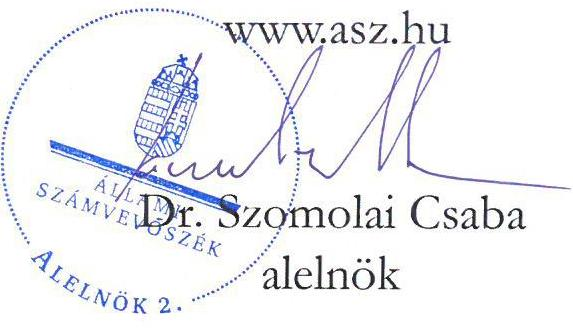
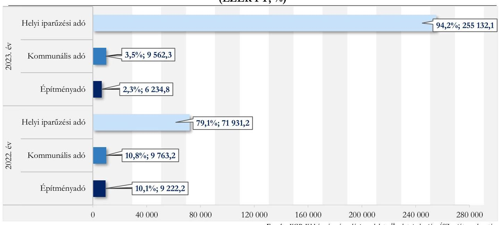
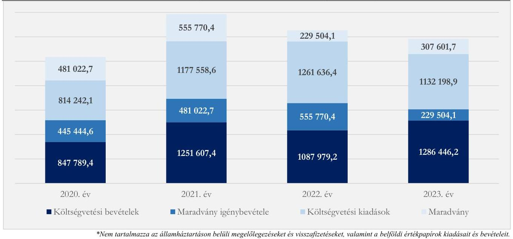
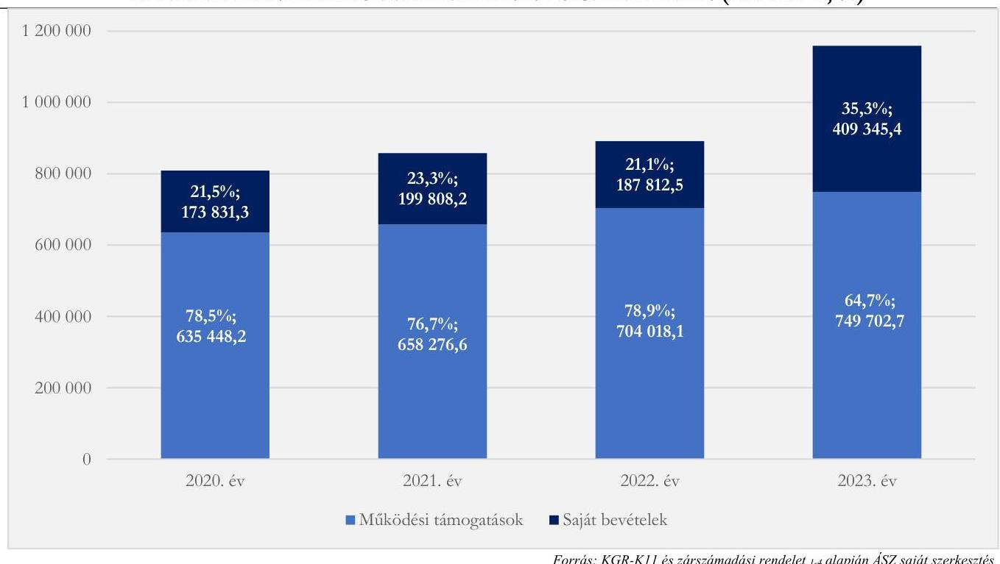

# JELENTÉS 

## Az önkormányzatok helyi adóztatási tevékenységének ellenőrzése - Ingatlanadóztatás

Emőd Város Önkormányzata

2025.

---

# JELENTÉS 

## Az önkormányzatok helyi adóztatási tevékenységének ellenőrzése - Ingatlanadóztatás

Emőd Város Önkormányzata

2025.

24204

---

# ELLENŐRZÉSI IGAZGATÓSÁG: 

## ÁLLAMHÁZTARTÁS HELYI SZINTJÉT ELLENŐRZŐ IGAZGATÓSÁG

## ELLENŐRZÉSI IGAZGATÓ:

DR. BAFFIA GERGELY GÁBOR ellenőrzési igazgató

## ELLENŐRZÉSVEZETŐ:

Jelentéseink az interneten a www.asz.hu címen olvashatók.

KANYÓ LŐRÁNT ISTVÁN ellenőrzésvezető

IKTATÓSZÁM: EL-4040-017/2024
TÉMASORSZÁM: 54
ELLENŐRZÉS-AZONOSÍTÓ SZÁM: V1084

---

# TARTALOMJEGYZÉK 

AZ ELLENŐRZÉS ALAPADATAI ..... 5
AZ ELLENŐRZÉS TERÜLETE ÉS AZ ELLENŐRZÖTT SZERVEZET ..... 7
ÖSSZEFOGLALÁS ..... 9
AZ ELLENŐRZÉS FÓKUSZKÉRDÉSEI ..... 11
MEGÁLLAPÍTÁSOK ..... 12
JAVASLATOK ..... 27
MELLÉKLETEK ..... 29
I. sz. melléklet: Értelmező szótár ..... 29
II. sz. melléklet: Az ellenőrzött szervezetek jegyzéke ..... 30
III. sz. melléklet: Ellenőrzési kritériumok ..... 31
IV. sz. melléklet: A helyi ingatlanadótárgyak és adóalanyok száma a 2023. és a 2024. évben ..... 34
FÜGGELÉK: ÉSZREVÉTELEK ..... 35
RÖVIDÍTÉSEK JEGYZÉKE ..... 36

---

.

---

# AZ ELLENŐRZÉS ALAPADATAI 

## AZ ELLENŐRZÉS CÉLJA

Az ellenőrzés célja az volt, hogy értékelje Emőd város helyi ingatlanadóztatásának és adóhatósága feladatellátásának szabályszerűségét, célszerűségét és eredményességét. További cél volt, hogy az ellenőrzés megállapításai és következtetései segítsék az önkormányzati képviselő-testületeket a jogszabályokkal és a helyi sajátosságokkal összhangban álló helyi adópolitika kialakításában és az azt végrehajtó adóigazgatási szervezet megszervezésében. Az ellenőrzés célja volt továbbá annak megállapítása is, hogy az Önkormányzat által bevezetett, ingatlanokat terhelő helyi adókra vonatkozó rendeleti szabályok összhangban vannak-e a helyi adópolitikai célokkal, tartalmuk tükrözi-e a település helyi sajátosságait és az adóhatósági feladatellátás biztosítja-e az önkormányzati bevételek feltárását és beszedését.

Ennek keretében az ÁSZ értékelte, hogy az Önkormányzat által bevezetett, ingatlanokat terhelő helyi adókról szóló adórendeletek, valamint az adóhatóság döntései, adóztatási gyakorlata a vonatkozó jogszabályokkal összhangban állnak-e.

## AZ ELLENŐRZÉS TÍPUSA

Kombinált ellenőrzés.

## AZ ELLENŐRZÖTT IDŐSZAK

Az 1. fókuszkérdésnél a 2023. év, valamint a 2024. évnek az ellenőrzés megkezdését megelőző napjáig (2024. április 11.) tartó időszaka.

A 2. és 3. fókuszkérdésnél a 2023. év, valamint a 2024. évnek az ellenőrzés megkezdését megelőző napjáig (2024. április 11.) tartó időszaka, a 2020-2022. évek adatainak bázisadatként való felhasználásával.

## AZ ELLENŐRZÉS TÁRGYA

Az Önkormányzat képviselő-testületének ingatlanokat terhelő helyi adóval, az építményadóval és a magánszemély kommunális adójával kapcsolatos rendeletalkotási tevékenységének és az adóhatóság tevékenységének az ellátása.

Az ellenőrzés kiterjedt minden olyan körülményre és adatra, amely az ÁSZ jogszabályban meghatározott feladatainak teljesítéséhez, valamint az ellenőrzési program végrehajtása folyamán felmerült újabb összefüggések feltárásához szükséges.

---

# AZ ELLENŐRZÉS JOGALAPJA 

Az ellenőrzés jogszabályi alapját az ÁSZ tv. 5. § (8) bekezdésének előírásai képezik.

## AZ ELLENŐRZÉS MÓDSZERE

Az ÁSZ az ellenőrzést az ellenőrzési program szempontjai, az ellenőrzött időszakban hatályos jogszabályok, az ellenőrzés általános szakmai szabályai és az ellenőrzésre irányadó ÁSZ módszertanok alapján végezte.

Az ellenőrzési kérdések megválaszolásához szükséges bizonyítékok megszerzése az ellenőrzött szervezetek által rendelkezésre bocsátott dokumentumokra, adatokra és az ASP Adó és az Iratkezelő szakrendszerek, illetve a KGR-K11 számviteli adatgyűjtő rendszer adataira alapozva megfigyelés, szemle (szemrevételezés), kérdésfeltevés (információkérés), mintavételezés, valamint elemző eljárás útján történt. Emellett az ellenőrzési bizonyítékként felhasználható adatforrások közé tartozott minden egyéb - az ellenőrzés folyamán feltárt, az ellenőrzés szempontjából információt tartalmazó - releváns dokumentum (ideértve különösen a helyszíni ellenőrzésről készült jegyzőkönyvet) is.

Az ellenőrzés lefolytatásához az ellenőrzött szervezet a tanúsítványok kitöltésével, valamint az ÁSZ által kért dokumentumok, adatok, információ megküldésével és az ellenőrzés során szolgáltatott adatokat.

Az ÁSZ az adómegállapítás, az adótörlés, a fizetési kedvezmények engedélyezése és a hátralékok beszedésének szabályszerűségét mintavételi eljárással ellenőrizte. Ennek során az adóhatósági adómegállapítási feladatellátás ellenőrzése keretében 19 mintatétel (közte 21 határozat), valamint négy adótörlésre vonatkozó mintatétel, a fizetési kedvezmények engedélyezése tárgykörben egy mintatétel (egy határozat) értékelése történt meg. Öt mintatételben (öt határozat) pedig az ÁSZ a hátralékkezelés teljes dokumentációját is ellenőrizte. A mintatételek kiválasztása véletlenszerűen történt az adóhatóság nyilvántartásában lévő adótárgyak és ügyek közül tíz - adómegállapításra vonatkozó - mintatétel kivételével, amelyek esetében a kiválasztás címadatok alapján történt annak érdekében, hogy feltárható legyen, volt-e olyan adótárgy, amelyet nem adóztatott az adóhatóság. Az ellenőrzött mintatételekre vonatkozó megállapítások nem vetíthetők ki a teljes sokaságra, a megállapításokat az ÁSZ az adott ellenőrzött mintatételek vonatkozásában tette meg.

Az ÁSZ a helyi adópolitikai elképzelések és a települési sajátosságok feltárásával értékelte, hogy az adórendelet e szempontoknak mennyiben felelt meg. Az ÁSZ a helyi adópolitikai célokkal akkor tekintette összhangban állónak az adórendeletet, ha az hatását tekintve támogatta az adópolitikai célok teljesülését.

Az ÁSZ az adóhatósági feladatellátás szabályszerűségéből, a meglévő kapacitásokból, valamint az ezer forint adóbevételre jutó adóhatósági költségek alakulásából következtetett arra, hogy az adóhatóság rendelkezett-e azzal a potenciállal, amellyel eredményesen tudta a helyi adópolitikát végrehajtani.

Az ÁSZ - az adórendelet szabályainak érvényre juttatása körében - az eredményesség véleményezésekor a III. számú melléklet 2. pontjában foglalt szempontokat tekintette mérvadónak.

---

# AZ ELLENŐRZÉS TERÜLETE ÉS AZ ELLENŐRZÖTT SZERVEZET 

Emőd város Borsod-Abaúj-Zemplén vármegye délnyugatirészén található, amelyhez Istvánmajor egyéb belterület és Adorján tanya külterület is tartozik. Nagyobb ipari létesítmény nem található a városban, a mezőgazdasági tevékenység jellemző a településen. A TeIR adatai alapján 2023. december 31-én a településen 461 regisztrált gazdasági szervezet volt, amely túlnyomórészt a mezőgazdaság (104 regisztrált gazdasági szervezet és ezen felül 100 regisztrált őstermelő) nemzetgazdasági ágba tartozott. Emőd állandó lakossága - a BM adatai alapján - 2020. év elején 4993 fő, 2024. év elején 5028 fő volt.

Az Önkormányzat a Hivatalon kívül négy költségvetési szervvel rendelkezett, és tagja volt egy társulásnak; gazdasági társasággal nem rendelkezett.

Az Alaptörvény értelmében a helyi önkormányzat a helyi közügyek intézése körében törvény keretei között döntött a helyi adók fajtájáról és mértékéről. Az Mötv. rögzíti, hogy a helyi adóval kapcsolatos feladatok ellátása a helyi önkormányzatok feladata.

Az Önkormányzat a Htv. alapján illetékességi területén külön-külön adórendelettel az építményadót és a magánszemély kommunális adóját vezette be. Az

Emódi Polgármesteri Hivatal
Fonrás:
https://www.emod.hu//module=images\&action=img_gallery\&fname=telepkep\&inframe=1\&first=1
építményadó-rendelet alapján 2018. január 1-jével alkalmazott építményadó éves mértéke, a bevezetése óta változatlanul 0,5 ezer Ft/m²/év. A magánszemély kommunális adójának mértékét közel 20 évig nem módosították. A 2020. január 1-jétől hatályos kommunális adórendelet alapján tulajdononként, a lakás céljára szolgáló épület, épületrész, továbbá lakásbérleti jog esetében 5,0 ezer Ft, míg a nem lakás céljára szolgáló épület, épületrész és belterületi telek esetében 2,5 ezer Ft volt az adó mértéke.

Az adó megállapításával, nyilvántartásával, beszedésével összefüggő adóhatósági feladatokat - a Hatásköri tv. és az Air. rendelkezései alapján - elsőfokú hatósági jogkörben Emőd jegyzője látta el a Hivatal vezetőjeként. A hivatali SzMSz alapján az Adó Iroda engedélyezett létszáma két fő, vezetője a Pénzügyi Osztály vezetője volt.

Az adóhatóság által beszedett, ingatlanokat terhelő adókból származó helyi adóbevétel érdemben alig járult hozzá a települési feladatok finanszírozásához. A 2023. évben 6234,8 ezer Ft bevétel származott építményadóból (az adóalanyok és adótárgyak száma 2023. január 1-jén: 67; 2024. január 1-jén: 65), míg

[^0]
[^0]:    ${ }^{1}$ Költségvetési szervei: Emődi Gyermekálom Óvoda és Bölcsőde, Emőd Város Városgondnoksága, Emődi Szociális Szolgáltató Központ, Emődi Művelődési Ház és Könyvtár.

---

9562,3 ezer Ft magánszemély kommunális adójából (az adóalanyok és adótárgyak száma 2023. január 1-jén 1946; 2024. január 1-jén: 1906). Az ingatlanadó-bevételek az Önkormányzat konszolidált (az államháztartáson belülről érkező felhalmozási célú támogatások nélküli) költségvetési bevételeinek 1,4%-át, helyi adóbevételének pedig az 5,8%-át tette ki. Az Önkormányzat helyi adóbevételei 2022. és 2023. évi összetételére vonatkozó adatokat az 1. ábra, a helyi ingatlanadók 2023. és 2024. évre vonatkozó jellemző naturális adatait pedig a IV. számú melléklet mutatja be.

1. ábra

# AZ ÖNKORMÁNYZAT HELYI ADÓBEVÉTELEINEK MEGOSZLÁSA A 2022-2023. ÉVEKBEN (EZER FT, %) 

---

# ÖSSZEFOGLALÁS 

Az ÁSZ tv. értelmében az ÁSZ feladatkörébe tartozik az önkormányzatok adóztatási tevékenységének ellenőrzése. A helyi adók az önkormányzatok saját, el nem vonható bevételét képezik, így az önkormányzatok gazdasági önállósága szempontjából különös fontossággal bír, hogy a helyi adórendeleti szabályok összhangban álljanak a magasabb szintű jogszabályokkal, továbbá az adóhatósági tevékenység jogszerű, eredményes és hatékony legyen. Erre figyelemmel volt tárgya az ÁSZ ellenőrzésének az Önkormányzat adórendelet-alkotási tevékenysége és az adóhatósági feladatellátás is.

Az adórendeletek több ponton nem voltak összhangban a magasabb szintű jogszabályokkal és csak részben feleltek meg az Önkormányzat jogalkotói szándékának. A rendeleti szabályozás ezzel együtt támogatta az Önkormányzat adópolitikai céljainak elérését. Az adómegállapítási feladatellátás eredményes volt, de az adóhatósági döntések nem minden esetben voltak szabályszerűek. Adóellenőrzést az adóhatóság nem folytatott. Az adóbehajtási tevékenység nem volt eredményes, illetve egy esetben nem volt célszerű. Az adóhatóságnak az ellenőrzött időszakban adatszolgáltatási kötelezettsége nem merült fel, a közzétételi kötelezettségének azonban csak részben tett eleget. Az adóztatási kiadások magasak voltak az adóbevételhez képest, az adóhatóság ingatlanadóztatással összefüggő feladatellátási mutatói összességében elmaradtak az ÁSZ által ellenőrzött nyolc város feladatellátási mutatóinak átlagos értékeitől.

## Adórendelet, adórendelet-alkotás

Az építményadó- és kommunális adórendeletek nem voltak összhangban a jogszabályi előírásokkal, mert a szabályok nem zárták ki valamennyi adótárgy esetén azt, hogy mindkét adónemben fizetési kötelezettség álljon fenn. Emellett az adórendeletek több, nem egyértelmű, ezáltal vitatható rendelkezést tartalmaztak.

Az ingatlanokat terhelő helyi adókra vonatkozó rendeleti szabályozás megalkotása során az Önkormányzat nem mérlegelte a helyi sajátosságokat, valamint az adóalanyok teherviselő képességét.

Az adóhatóság adóigazgatási feladatellátásának jogszerűsége, eredményessége
Az adóhatóság adótárgy-, és adóalany feltárási feladatellátása (ezáltal az adómegállapítási feladatellátása) eredményes volt, de az adómegállapítási eljárásban hozott hatósági döntések közül nem mindegyik volt szabályszerű. Az adómegállapító határozatok kiadmányozása, kézbesítése jogszerű volt. Az adóhatóságnak adatszolgáltatási kötelezettsége az ellenőrzött időszakban nem merült fel, a közzétételi kötelezettségének azonban csak részben tett eleget. Az adótartozások beszedése érdekében megtett intézkedések nem voltak sem elégségesek, sem eredményesek, illetve egy esetben nem volt célszerű.

Adóellenőrzést az adóhatóság az ellenőrzött időszakban nem folytatott.
Az adórendelet adópolitikai célokkal való összhangja, az adórendelet hatása
Míg a városok esetén országosan az ingatlanadókból származó bevételek a konszolidált, az államháztartáson belülről származó felhalmozási célú támogatások nélküli - és csökkentve a befizetett

[^0]
[^0]:    ${ }^{2}$ Az ÁSZ által jelen ellenőrzés alapjául szolgáló ellenőrzési program alapján ellenőrzött városok: Ajka, Balatonföldvár, Budakalász, Emőd, Paks, Ráckeve, Szigethalom és Tata. ${ }^{3}$ Az ÁSZ a városok alatt a 322 nem megyei jogú várost érti.

---

szolidaritási hozzájárulással - költségvetési bevételeken belüli átlagos aránya 5,8%, addig az Önkormányzat esetében ez csak 1,4% volt a 2023. évben. A konszolidált - államháztartáson belülről származó felhalmozási célú támogatások nélküli - költségvetési bevételeken belül a konszolidált saját bevételek aránya a 2020-2023. időszakban 50,0% alatt, 21,1-35,3% közötti

 érték volt.

Az ellenőrzött időszakban az adóalanyok adóteherviselő-képességét nem érintette hátrányosan az ingatlanadó.

Az Önkormányzat adórendeleti szabályai összhangban voltak az adópolitikai célokkal (az adónem kiegészítő, de biztos bevételi forrást jelentsen; ne okozzon jelentős adminisztratív terhet sem az adóalanyok, sem az adóhatóság oldalán, és a helyi lakosságot kevésbé terhelje).

# Az adóhatósági kiadások 

Az adóhatóság a 2023. évben 270 929,2 ezer Ft helyi adóbevételt számolt el költségvetési beszámolójában. Minden 1000 Ft beszedett helyi adóbevételre - az ÁSZ számítása szerint - 43,2 Ft adóztatási kiadás esett. Az ellenőrzött nyolc város átlaga 15,3 Ft, az adóztatási kiadás tapasztalati referenciaérték maximuma kivetéses adóztatás esetén: 50 Ft volt.

Az Önkormányzat egy adótisztviselőjére a 2023. évben 118 516,7 ezer Ft helyi adóbevétel, 862,2 adótárgy és ugyanennyi adóalany jutott. Ezek az értékek összességében kedvezőtlenebbek (kevesebb adóalany, adótárgy jutott egy adótisztviselőre), mint az ÁSZ által ellenőrzött nyolc város átlaga (544 502,3 ezer Ft/adótisztviselő, illetve 1751,1 adótárgy, 1461,7 adóalany/adótisztviselő).

[^0]
[^0]:    ${ }^{4}$ Emőd esetén nem volt szolidaritási hozzájárulási kötelezettség.

---

# AZ ELLENŐRZÉS FÓKUSZKÉRDÉSEI 

1.- Az önkormányzat ingatlanokat terhelő helyi adókra vonatkozó rendeleti szabályozása megfelel-e a magasabb szintű jogszabályoknak?
2.- Az önkormányzati adóhatóság megfelelően és eredményesen látta-e el az ingatlanok adóztatásával kapcsolatos adóhatósági tevékenységeit?
3.- A településen megvalósuló helyi adóztatás támogatta-e a helyi adópolitikai célok teljesülését?

---

# MEGÁLLAPÍTÁSOK 

## 1. Az önkormányzat ingatlanokat terhelő helyi adókra vonatkozó rendeleti szabályozása megfelelte a magasabb szintű jogszabályoknak?

## Összegző megállapítás

1.1. számú megállapítás

Az adórendeletek ${ }^{20}$ több ponton ellentétesek voltak a magasabb szintű jogszabályokkal.

Az építményadó-rendelet és a kommunális adórendelet több ponton nem volt összhangban a Htv. előírásaival, valamint csak részben feleltek meg az Önkormányzat jogalkotói szándékának, szövegezésük több ponton sértette az egyértelmű értelmezhetőség Jár. ${ }^{21}$-ban megfogalmazott követelményét.

Az építményadó-rendelet 4. § (1) bekezdése és a kommunális adórendelet 1. §-a összevetése alapján - a Htv. 7. § a) pontjában ${ }^{5}$ foglalt előírás ellenére - mindkét adónemben adófizetési kötelezettség keletkezik az üdülőnek és lakásnak nem minősülő ingatlan esetén, ha:

- a vagyoni értékű jog jogosultja az adó alanya,
- az ingatlant vállalkozás céljára alakították ki vagy használják, de az adó alanya magánszemély.

A Htv. 7. § e) pontjában előírtak ellenére - amely az uniós jogból fakadó állami támogatási elvekre és normákra figyelemmel rögzíti, hogy az önkormányzat az építményadóban és a telekadóban a vállalkozó számára adómentességet, adókedvezményt nem biztosíthat - az építményadó-rendelet 4. §-a mentességet biztosított az olyan magánszemély tulajdonában lévő lakás és nem lakás céljára szolgáló építményre, amelyet ugyan nem vállalkozás céljára alakítottak ki vagy használtak, de azon a vállalkozónak vagyoni értékű joga volt ${ }^{6}$. Az építményadó-rendelet 5. §(1) bekezdése ${ }^{7}$ egyrészt szükségtelen, hiszen a rendelkezések a rendeleti utalás

Az uniós állami támogatási szabályok értelmében a vállalkozóknak nyújtott helyi adómentesség, helyi adókedvezmény állami támogatásnak minősül. A jogszerűtlenül nyújtott támogatást a kedvezményezettnek vissza kell fizetnie, vagy a támogatást nyújtónak kell biztosítania az uniós joggal való összhangot.

[^0]
[^0]:    ${ }^{5}$ A Htv. hivatkozott rendelkezése szerint egy adott adótárgy (épület, épületrész, telek) után csak egyféle ingatlant terhelő adóban keletkezhet fizetési kötelezettség (adótöbbszörözés tilalma). Ha az önkormányzat működteti az építményadót és a magánszemély kommunális adóját, akkor vagy mentességi szabályal, vagy direkt rendelkezéssel kell biztosítania, hogy ne álljon elő többszörös adófizetés.
    ${ }^{6}$ A Htv. 7. § e) pontja szerinti korlátozás arra az esetre is vonatkozik, ha egy vállalkozás az ingatlant vagy az ingatlanon fennálló vagyoni értékű jogot, például befektetési céllal tartja, de az ingatlant nem használja.
    ${ }^{7}$ Az építményadó-rendelet 5. § (1) bekezdés szerint a rendeletben nem szabályozott kérdésekben a Htv. és az Air. rendelkezései az irányadóak.

---

hiányában is alkalmazandóak lennének, ezáltal a szabályozás ellentétes a Jat. 3. §$^{8}$-ával, másrészt pontatlan is, mert nem sorolja fel teljeskörűen az adózás szempontjából releváns törvényeket.
Az adórendelet az alábbi okokból fakadóan sértette - a Jat. 2. § (1) bekezdéséből következő - egyértelmű értelmezhetőség követelményét:
a) a kommunális adórendelet 2. §-a, mert alanyi oldalról rögzítette valamennyi mentességi tényállást (a mentesített adóalany valamennyi adótárgya mentes az adófizetési kötelezettség alól), azonban a jogalkotói szándék kizárólag a tárgyi mentesség biztosítása volt;
b) a kommunális adórendelet 3. §-a, mert az adómértékeket adótárgyanként, azon belül tulajdononként állapította meg, s ekként vitatható, hogy amennyiben a vagyoni értékű jog jogosultja az adó alanya, esetében milyen mértéket kell alkalmazni.
1.2. számú megállapítás

Az adórendeletek esetében a szabályok kialakítása során nem mérlegelték, hogy az adószabályozás tükrözi-e a települési sajátosságokat, továbbá az adóalanyok széles körét érintően az adóalanyok teherviselő képességét. Az Önkormányzat gazdálkodási körülményei nem indokolták az adórendeletek módosítását.

A Htv. 7. § g) pontjában rögzített adómegállapítási korlátokból az következik, hogy a rendelet hatályossága idején is érvényre kell jutnia az e pontban szabályozott rendeletalkotási elveknek, azaz annak, hogy települési önkormányzat az adóalap fajtáját, az adó mértékét, a rendeleti adómentességet és adókedvezményt úgy állapíthatja meg, hogy azok összességükben egyaránt megfeleljenek
a) a helyi sajátosságoknak,
b) az önkormányzat gazdálkodási követelményeinek és
c) az adóalanyok széles körét érintően az adóalanyok teherviselő képességének.

A helyi sajátosságok figyelembevétele

Az ÁSZ véleménye szerint legalább az adózást érintő magasabb szintű jogszabályi változások esetén indokolt felülvizsgálni a rendeletet. Ettől függetlenül a település mérete, adottsága a helyi adókra vonatkozó rendelet összetettsége, az önkormányzat gazdálkodási körülményeinek változása, az adóalanyok teherviselő képességének változása befolyásolja a felülvizsgálat gyakoriságát.

Az Önkormányzat a helyi sajátosságokat - a Htv. 7. § g) pontjával szemben - az adórendeletek módosításának előkészítésekor nem mérlegelte.

# Az önkormányzat gazdálkodási követelményeinek szempontja 

Az Önkormányzat álláspontja szerint az adórendeletek teljesítették azt az adópolitikai célkitűzést, hogy a helyi adóbevételek az Önkormányzat költségvetését kiegészítsék.
A 2022. évben a helyi adókból összesen 90 916,6 ezer Ft bevétele származott az Önkormányzatnak, amely a konszolidált költségvetési bevétel (1 087 979,2 ezer Ft) 8,4%-át tette ki. A 2023. évben a helyi adókból származó éves 270 929,2 ezer Ft az Önkormányzat konszolidált költségvetési bevételének (1 286 446,2 ezer Ft) már a 21,1%-át tette ki.

[^0]
[^0]:    ${ }^{8}$ A Jat. hivatkozott rendelkezése szerint - többek között - a jogszabályban nem ismételhető meg a magasabb szintű jogszabály rendelkezése.

---

Ugyanakkor az adórendeletekből fakadó bevétel és a kommunális adó legutóbbi, 2020. január 1-jétől hatályos emeléséből befolyó bevétel nem volt érdemi hatással a helyi adóbevételekre, tekintettel arra, hogy a 2022. évről a 2023. évre mind az építményadó-, mind a magánszemély kommunális adóbevétel csökkent (az építményadó 32,4%-kal, míg a magánszemély kommunális adója 2,1%-kal). Mindez részint visszavezethető a hátralékok növekedésére, a végrehajtások, ellenőrzések elmaradására, továbbá - az Önkormányzat nyilatkozata szerint - egyes adóköteles adótárgyak adómentessé válására. A helyi adóbevételek éves növekedésében a helyi iparűzési adó (egy, jelentős adózó bejelentkezése és adófizetése miatt) játszott jelentős szerepet (a 2023. évben több, mint háromszoros, azaz 255 132,1 ezer Ft volt a helyi iparűzési adóbevétel a 2022. évihez képest).
Az Önkormányzat és intézményeinek főbb gazdálkodási adataiból (2. ábra) az figyelhető meg, hogy a maradvány az Önkormányzat költségvetési beszámolói alapján a 2020-2023. évek mindegyikében kötelezettségvállalással terhelt volt, a 2022. évben 229 504,1 ezer Ft, a 2023. évben 307 601,7 ezer Ft volt; az Önkormányzatnak hitel-állománya nem volt. Az Önkormányzat gazdálkodási helyzete, továbbá az a körülmény, hogy a 2023. évben bejelentkező, jelentős iparűzési adót fizető adózótól 2024. évben is várható adóbevétel, nem tette szükségszerűvé az adórendeletek módosítását.
2. ábra

# AZ ÖNKORMÁNYZAT ÉS INTÉZMÉNYEI 2020-2023. ÉVI KONSZOLIDÁLT BESZÁMOLÓJÁNAK FŐBB ADATAI (EZER FT)* 

*Nem tartalmazza az állambáztartáson belüli megelőlegezéseket és visszafizetéseket, valamint a belföldi értékpapírok kiadásait és bevételeit. Forrás: KGR-K11 és zárszámadási rendelet-s alapján ASZ saját szerkesztés

## Az adóalanyok teherviselő képességének figyelembevétele

Az adórendeletek megalkotása, valamint módosítása kapcsán az adóalanyok körében történő felmérés nem készült, mert az Önkormányzat álláspontja szerint "az építményadó-rendelet hatálya csak azon magánszemély tulajdonában álló lakás és nem lakás céljára szolgáló építményre vonatkozik, amelyet vállalkozás céljára alakítottak ki vagy használnak, ezért az építményadó a magánszemélyeket kevéssé érinti". A kommunális adórendelet legutóbbi, 2020. évi módosítása során a Képviselő-testület az adómértéket az adómaximum és az inflációnak az adómértékre gyakorolt hatása figyelembevételével alakította ki, az adóalanyok teherviselő képessége külön nem volt mérlegelési szempont.
Mindezekre tekintettel - a Htv. 7. § g) pontjában foglaltak ellenére - az Önkormányzat nem mérlegelte az adóalanyok teherbíró képességét a rendeletalkotás során, illetve az ellenőrzött időszakban.

---

# 2. Az önkormányzati adóhatóság megfelelően és eredményesen látta-e el az ingatlanok adóztatásával kapcsolatos adóhatósági tevékenységeit? 

Összegző megállapítás

Az adóhatóság adómegállapítási feladatellátása eredményes volt, de az adóhatósági döntések nem minden esetben voltak szabályszerűek. Az adóhatóság közzétételi kötelezettségének csak részben tett eleget. Az adótartozások beszedése érdekében megtett intézkedések nem voltak eredményesek, illetve nem minden esetben voltak célszerűek.
2.1. számú megállapítás

Az adóhatóság adótárgy-, és adóalany feltárási feladatellátása eredményes és célszerű volt. Az adófizetési kötelezettségről ugyanakkor nem mindegyik adóhatósági döntés esetében rendelkezett szabályszerűen. Az adóhatóság közzétételi kötelezettségének csak részben tett eleget.

Adótárgy-, és adóalanyfeltárás
Az adóhatóság a 2023. és a 2024. évben is élt az Art. ${ }^{22}$ 83. § (2) bekezdésében
foglaltak alapján az ingatlanügyi hatóság megkeresésének lehetőségével. Ezen, a települési ingatlanokról és tulajdonosaikról, valamint az ingatlanokon fennálló vagyoni értékű jog jogosítottaiól szóló adatokat manuálisan vetette össze saját nyilvántartásával. Az adóhatóság az adóalanyok és az adótárgyak feltárása érdekében nem használt térinformatikai eszközt, illetve az adózók adatbejelentési kötelezettsége elmulasztásának felderítése érdekében nem használta az építésügyi hatóság által az Art. 86. § (2) bekezdése szerint szolgáltatandó adatokat. Az ÁSZ nem tárt fel olyan ingatlant, amelyet az adóhatóságnak adóztatnia kellett volna.
Mindezek alapján összességében az adótárgy-, és adóalanyfeltárási adóhatósági feladatellátás eredményes és - figyelemmel arra, hogy az ingatlanügyi hatóságtól kapott hiteles információt azok megszerzése céljának megfelelően használta fel - célszerű volt.

---

## Adómegállapítás (kivetés)

Az ÁSZ az adóhatósági adómegállapítási feladatellátás ellenőrzése keretében 19 mintatétel ellenőrzését végezte el.
Az adóhatóság valamennyi mintatétel (ellenőrzött adómegállapító határozat) esetén a fizetendő adó összegét a Htv.-nek és az adórendeletnek megfelelően számította ki.
Három mintatétel
(3., 9. és
24. mintatételek) esetében az adótárgynak több tulajdonosa volt, ugyanakkor az adóhatóság által - az adóalanyok megállapodása alapján - hozott adómegállapító határozat rendelkező része kizárólag az adó fizetésére kötelezett által fizetendő adó összegét tartalmazta.
A 2. mintatétel esetében az adóhatóság 2023. október 4. napján kelt határozatában megállapította a 2024. évre vonatkozó adókötelezettséget, amely okán megsértette a Htv. 12. § (1) ${ }^{9}$ bekezdésének és 14. § (2) bekezdésének rendelkezését.

Ha az adótárgynak több tulajdonosa van, akkor ők tulajdoni illetőségük arányában adóalanyok.
 Ekkor mindegyikük egyetértése esetén köthetnek arról megállapodást, hogy az adóalanyisággal kapcsolatos jogokat és kötelezettségeket az adóhatóság előtt közülük egy adóalany kapcsolattartóként gyakorolja. Az ÁSZ jó gyakorlatnak azt tekinti, ha az adómegállapító határozat nemcsak a fizetési kötelezettséget és a fizetésre kötelezettet (a kapcsolattartót), hanem az egyes adóalanyokat terhelő adót és annak jogalapját, kiszámítását is tartalmazza, annak érdekében, hogy az egyes adóalanyok számára egyértelmű legyen az őket terhelő adó összege.

Az adóévi adókötelezettség az adóév január 1. napján fennálló körülményekhez, tulajdoni viszonyokhoz, adórendeleti szabályokhoz kapcsolódik, ezért az adóév január 1. napját megelőzően megalapozott határozat értelemszerűen nem adható ki. Az ÁSZ azt tartja megfelelő és szabályszerű gyakorlatnak, ha az adóhatározat közlése az adóalany adókötelezettsége keletkezését követően történik.

A 22. és 25. mintatétel esetében a Hivatal az Ltv. ${ }^{23}$ 9. § (1) bekezdés e) pontjában előírtak ellenére a határozatok és az azok közlését igazoló dokumentumok megőrzéséről nem gondoskodott, ezért az ÁSZ-nak nem volt módja ellenőrizni az adómegállapító eljárást, valamint a határozatoknak az Art. 48. § (1) és 141. § (2) bekezdése ${ }^{10}$, továbbá az Art. 73. § (1) bekezdése és 76. § (1) bekezdése szerinti megfelelőségét.
Az adóhatóság az adómegállapító határozatok mindegyikének indokolási részében az ügyintézési határidőt az adatbejelentés adóhatósághoz való érkezése napjától számította. Az

A magánszemélyek kommunális adója esetén az adófizetési kötelezettség az adóhatóság által kiadott adómegállapító határozaton nyugszik. Ha az adómegállapító határozat nem csak a kiadásának évére, hanem későbbi adóévekre is rögzít fizetési kötelezettséget, akkor e dokumentumot (és az azt megalapozó bevallást) az adófizetési kötelezettség fennállásáig meg kell őrizni, csak a fizetési kötelezettség megszűnését követően selejtezhető.

[^0]
[^0]:    ${ }^{9}$ A Htv. 12. § (1) bekezdése értelmében az adó alanya, aki a naptári év első napján az építmény tulajdonosa, így a 2023. évben történő szerzés esetén 2024. január 1. előtt az új tulajdonos nem minősül adóalanynak.
    ${ }^{10}$ Az építményadót, valamint a magánszemély kommunális adóját az adóhatóságnak az Art. szerint kivetéssel, azaz határozattal kell megállapítania.

---

adómegállapító eljárás ugyanakkor nem kérelemre, hanem hivatalból indított eljárás, ezért az adóhatóság gyakorlata ellentétes az Art. 50. § (1) bekezdésével ${ }^{11}$. Az adómegállapító határozatok indokolása - az Art. 73. § (1) bekezdés c) pontjában foglaltak ellenére - tényállási elemként egyik esetben sem tartalmazta az adótárgy utáni adó és az adóalany(ok)ra jutó adó összegének egyértelmű számszaki levezetését, jogalapját.
Mindazonáltal a határozatokban foglalt fizetési kötelezettség jogszerűségét az indokolás kapcsán megállapított hibák, hiányosságok nem érintették, a világos, követhető magyarázat ugyanakkor érthetővé teszi az adózó számára, hogy milyen jogalapon és miért az adómegállapító határozat szerinti összeget kell fizetnie. Ezen túlmenően az adóhatóságnak és az Önkormányzatnak is előnyös, ha az adózó fizetési hajlandósága javul azáltal, hogy számára is világos és érthető az adómegállapító határozat.
Az adómegállapító határozatok kiadmányozása és adózókkal való közlése valamennyi adómegállapító határozat esetében megfelelt az Art. és az Eüsztv. ${ }^{24}$ előírásainak ${ }^{12}$.

Az ÁSZ megítélése szerint - a kötelező elektronikus kapcsolattartás esetein túl - a jogszabály által lehetővé tett elektronikus kézbesítés gyakorlati alkalmazása kiadáscsökkentő, valamint ügyintézési hatékonyságot növelő tényező lehet, tekintettel arra, hogy az alkalmazható esetekben gyorsabb kapcsolattartásra nyílik lehetőség és egyben elkerülhető a nagyobb költséggel járó papíralapú, postai kézbesítés. Ez az adózó számára is időmegtakarítással jár, nincs szükség a papíralapú irat, adott esetben sorbanállással járó átvételére.

Adóellenőrzést az adóhatóság az ellenőrzött időszakban nem végzett.

A megállapított adó csökkentése: fizetési kedvezmények, adókötelezettség változás, elévülés miatti törlés
A fennálló adókövetelést csökkentő intézkedések ellenőrzése öt mintatétel (egy fizetési kedvezmény és négy adótörlés) alapján történt, amelyek jogszerűek voltak. Az ellenőrzött időszakban megtett intézkedések számszaki összefoglalását az 1. táblázat mutatja be.

[^0]
[^0]:    ${ }^{11}$ Az Art. 50. § (1) bekezdés értelmében hivatalból való eljárás esetén az első eljárási cselekmény megkezdése napjától - azaz a konkrét esetekben (mivel egyéb eljárási cselekmény nem történt) a határozat kiadmányozása napjától - kell számítani az ügyintézési határidőt.
    ${ }^{12}$ Az Eüsztv. 2024. szeptember 1-je óta hatálytalan, a jogterület szabályozását a digitális államról és a digitális szolgáltatások nyújtásának egyes szabályairól szóló 2023. évi CIII. törvény tartalmazza.

---

1. táblázat

# A 2023-2024. ÉVEKBEN TÖRTÉNT ADÓKÖVETELÉS TÖRLÉSEK FŐBB ADATAI (DARAB ÉS EZER FT) 

| MEGNEVEZÉS | 2023. |  | 2024.* |  |
| :--: | :--: | :--: | :--: | :--: |
|  | ESETSZÁM | ÖSZEG | ESETSZÁM | ÖSZEG |
| Méltányosságból törölt adókövetelés | 0 | 0 | 0 | 0 |
| Adókötelezettség változás okán törölt adókövetelés | 104 | 522,5 | 40 | 182,5 |
| Elévülés miatt törölt adókövetelés | 55 | 174,8 | 64 | 1674,9 |

*2024. július 31 -ei állapot szerint.
Forrás: Az Önkormányzat és a Hivatal tanúsítványokon megadott adatai alapján ÁSZ saját szerkesztés
Az adóhatóság az ellenőrzött időszakban fizetési kedvezményre irányuló eljárást kizárólag egy alkalommal folytatott (a 2024. évet érintette).

## Adatszolgáltatási, közzétételi kötelezettség

Az adóhatóságnak nem volt a Kincstár ${ }^{25}$ számára a helyi adórendeletről és adózási információkról szóló adatszolgáltatási kötelezettsége az ellenőrzött időszakban. Az Önkormányzat honlapján az adórendeletek már nem hatályos változata volt elérhető, ezzel az adóhatóság nem tett maradéktalanul eleget a Htv. 42/B. § (3) bekezdése előírásainak.
2.2. számú megállapítás Az adóbehajtási (adóbeszedési) tevékenység nem volt eredményes és egy esetben nem volt célszerű.

Az adóhatóság az ingatlant terhelő adóban fennálló tartozás behajtásához kapcsolódóan a 2023. évben 19 esetben indított, a 2024. évben az ellenőrzés megkezdéséről való értesítés átvételének napjáig (2024. április 11.) pedig még nem indított az Avt. ${ }^{26}$-ben foglaltak alapján végrehajtási eljárást. Az adóhatóság a végrehajtások eredményeképpen a 2023. évben 108,5 ezer Ft adótartozást, a 2022. december 31-én fennálló adótartozás 1,6%-át szedte be.

Az adóhatóság az adófizetés első esedékessége előtt felhívta az adózók figyelmét az adókötelezettség teljesítésére és a 2023. évi kommunálisadó-előirányzat teljesült. Az adóbehajtási feladatellátás azonban mégsem volt eredményes, mert:

- az adóhatóság által nyilvántartott 2023. évi hátraléknak (8405,7 ezer Ft) a 2023. évi ingatlanadóbevételhez viszonyított aránya (53,2%) magasabb volt, mint a városi önkormányzatok ingatlanadó-bevétel-arányos hátraléka (16,8%),
- a 2023. december 31-i hátralékok összege 24,5%-kal magasabb volt, mint a 2022. december 31-én fennálló hátralékok összege,
- a 2023. évi eredeti előirányzathoz képest az építményadó-bevétel 77,9%-on teljesült.

A 11. mintatétel esetében az adóhatóság által hozott határozat - mint végrehajtható okirat - rendelkező része kizárólag az adó fizetésére kötelezett által fizetendő adó összegét tartalmazta, így az adóhatóság az

---

adóbehajtási (adóbeszedési) eljárást - a teljes fennálló tartozást illetően - csak az egyik tulajdonos adóalany ellen tudta megindítani, illetve lefolytatni.

Abban az esetben, ha az adóalanyok megállapodásban rögzítik, hogy közülük ki a kapcsolattartó, azaz az adófizetési kötelezettséget a többiek nevében is teljesítő adóalany, de a határozat (a végrehajtható okirat) nem rögzíti a rendelkező részben valamennyi adóalanyra jutó adót, akkor az adóvégrehajtás az adóalanyok közül csak a kapcsolattartó adóalany terhére indítható meg (a határozat csak rá fogalmaz meg fizetési kötelezettséget). Ez jogvitához vezethet a végrehajtó és a végrehajtás alá vont személy között, a végrehajtás késedelmet szenvedhet (részint a jogvita lezárásáig, részint amiatt, mert a végrehajtás többi tulajdonosra való kiterjesztése érdekében új adómegállapító határozatot kell kiadni, amelyben az adóhatóság rendelkezik a többi tulajdonostárs adófizetési kötelezettségéről, az őket terhelő adó erejéig). Az ÁSZ álláspontja szerint, ha a határozat rendelkező része az adótárgy utáni adót a kapcsolattartóról szóló megállapodást megkötő adóalanyonként tartalmazza, nemcsak azt szolgálja, hogy a fizetési kötelezettséget ne lehessen kijátszani, és nemcsak abból a célból fontos, hogy az anyagi jogi norma szerinti adót viselő adóalanyok a rájuk jutó adót megismerhessék, hanem azon okból is célszerű, hogy a végrehajtás hatékony legyen (egyidejűleg lehessen a végrehajtást megindítani valamennyi adóalany ellen), továbbá kizárható legyen az, hogy a kapcsolattartó adóalanytól olyan adótartozást hajtson végre az adóhatóság, amelynek terhét a kapcsolattartó tulajdonostársai viselik.

Ahhoz, hogy az adóbeszedési (adóbehajtási) feladatellátás nem volt eredményes, hozzájárult a behajtás elmaradása, illetve késedelmes megkezdése és elhúzódása. A 14. mintatétel esetében az adóhatóság az első, az adótartozás behajtására irányuló (végrehajtási) cselekményt (jelzálogjog bejegyzés) 1114 nappal (2023. április 4. napján) az esedékességet követően foganatosította, emellett az ÁSZ által ellenőrzött mind az öt mintatétel esetében a végrehajtás az ÁSZ ellenőrzés idején még folyamatban volt. Az adóbehajtási tevékenység elhúzódása eredményeképp az Önkormányzat később jut az adóbevételhez, ami kamat-elmaradással vagy kamatkiadással jár, ezért az adóbehajtás a 14. mintatétel esetében nem volt célszerű.
A 2. táblázat tartalmazza az adóhátralékokra vonatkozó főbb adatokat a 2022-2024. április 16-ig terjedő időszakban.
2. táblázat

| AZ ADÓHÁTRALÉKOK FŐBB ADATAI (DARAB ÉS EZER FT) |  |  |  |  |
| :--: | :--: | :--: | :--: | :--: |
| MEGNEVEZÉS | NAPTÁRI   NAP | ÉPÍTMÉNYADÓ | MAGÁNSZEMÉLY   KOMMUNÁLIS ADÓIA | ÖSSZESEN |
| Hátralékos adózók száma | 2022.12.31 | 13 | 159 | 172 |
|  | 2023.12.31 | 8 | 157 | 165 |
|  | 2024.04.16 | 18 | 490 | 508 |
| Adóhátralék összege | 2022.12.31 | 3974,1 | 2779,1 | 6753,2 |
|  | 2023.12.31 | 4983,0 | 3422,7 | 8405,7 |
|  | 2024.04.16 | 7710,4 | 9424,2 | 17134,6 |

Forrás: Az Önkormányzat és a Hivatal tanúsítványokon és nyilatkozatban megadott adatai alapján ÁSZ saját szerkesztés
A 2022. január 1-jei 6298,9 ezer Ft-os adóhátralék összege (84 hátralékos adózó) a 2023. év végére 33,4%-kal - 2106,8 ezer Ft-tal - emelkedett (mind a két adónemben évről évre folyamatosan emelkedett). A kintlévőség a 2023. évben a költségvetési bevételként elszámolt ingatlanadó-bevétel 53,2%-át tette ki.

---

# 3. A településen megvalósuló helyi adóztatás támogatta-e a helyi adópolitikai célok teljesülését? 

| Összegző megállapítás | Az Önkormányzat ingatlanokat terhelő helyi adókra vonatkozó adórendeleti szabályozása támogatta a helyi adópolitikai célok megvalósulását. Az Önkormányzat gazdálkodásában az ingatlanadó-bevétel nem bírt számottevő jelentőséggel. A Hivatal nem mutatta ki elkülönítetten az adóigazgatási tevékenységgel összefüggő kiadásokat és a kapcsolódó átlagos statisztikai létszámadatokat. Az adóhatósági feladatellátás kiadásai az elért adóbevételhez mérten magasak voltak, a feladatellátás mutatói összességében az ÁSZ által ellenőrzött városok mutatói átlagos értékeinél kedvezőtlenebbek voltak. |
| :--: | :--: |
| 3.1. számú megállapítás | Az ingatlanokat terhelő helyi adókra vonatkozó önkormányzati rendeleti szabályozás támogatta a helyi adópolitikai célok megvalósulását. |

Az Önkormányzat írásba foglalt adópolitikai koncepcióval nem rendelkezett. Az Önkormányzat által az ÁSZ helyszíni ellenőrzés során megfogalmazott
 adópolitikai célokat és az alkalmazott eszközrendszert a 3. táblázat tartalmazza.
3. táblázat

AZ ÖNKORMÁNYZAT ADÓPOLITIKAI CÉLJAI ÉS ALKALMAZOTT ESZKÖZRENDSZERE

| Adópolitikai CÉL | Adópolitikai ESZKÖZ |
| :-- | :-- |
| Kiegészítő forrást biztosítson az önkormányzati | Építményadó bevezetése (2018) |
| feladatellátáshoz, a lakosságot ne terhelje | Magánszemély kommunális adójának emelése (2020) |
| jelentősen | A magánszemély kommunális adója esetében |
| Egyszerű, mind az adóhatóság, mind a lakosság | adótárgyanként könnyű kiszámítani a fizetendő adó |
| számára könnyen kezelhető szabályrendszer, | összegét |
| alacsony legyen az adóztatási költség |  |

Az ÁSZ véleménye szerint az adórendeleti eszköztár az elérni kívánt adópolitikai célokkal összhangban volt.

Az ÁSZ megítélése szerint jó gyakorlat, ha az önkormányzat az adószabályozás megalkotása során nem csak a bevezetett adókból várható bevételt méri fel, hanem a szabályozás végrehajtásához szükséges adóhatósági kapacitásokat is.

---

3.2. számú megállapítás

Az Önkormányzat gazdálkodásában az ingatlanadó-bevétel nem bírt számottevő jelentőséggel. Az Önkormányzat saját bevétele a 2023. évre nagymértékben nőtt, a működési támogatásoktól való függőség csökkent. Az adóalanyok adóteherviselő képességét az adórendeletek nem érintették hátrányosan.

# Az adórendelet (módosítás) hatása az önkormányzat gazdálkodására 

Az építményadóból származó bevételek a 2020-2022. években közel azonos összegben folytak be (9034,1 ezer Ft, 8603,3 ezer Ft és 9222,2 ezer Ft). A 2023. évre a költségvetési bevételként elszámolt építményadó-bevétel közel a harmadával, 32,4%-kal, 6234,8 ezer Ft-ra esett vissza, amelynek oka a követelésállomány (adóhátralékok) 1008,8 ezer Ft-tal való növekedése és az építmények meghatározott körének adómentessé válása volt. A magánszemély kommunális adója esetében az egyes években közel azonos összegben teljesült a bevételi előirányzat, függetlenül attól, hogy ebben az adónemben 2020. január 1-jével adómérték emelést hajtottak végre.

A 2020-2022. években az ingatlanadókból származó bevételek aránya a konszolidált saját bevételeken (10% körüli érték), illetve a konszolidált költségvetési bevételeken belül (2% körüli érték) közel azonos volt. A 2023. évi helyi iparűzési adóbevétel ugrásszerű növekedése miatt az ingatlandóbevétel aránya jelentősen visszaesett.
Az Önkormányzat és intézményei saját bevételeinek összege a 2020. évi 173 831,3 ezer Ft-ról több, mint a kétszeresére, 409 345,4 ezer Ft-ra emelkedett a 2023. évre, ami a saját bevételek 21,5%-ról 35,3%-ra növekedését eredményezte a - államháztartáson belülről kapott felhalmozási célú támogatási források nélküli - költségvetési bevételeken belül, miáltal a központi költségvetésből kapott támogatásoktól való függőség összességében csökkent.
A 2020-2023. évre vonatkozó konszolidált bevételek jogcímenkénti nagyságát éves bontásban a 4. táblázat, az Önkormányzat és intézményei működési támogatásainak és saját bevételeinek a 2020-2023. évi megoszlását pedig a 3. ábra mutatja be.

---

# 4. táblázat 

AZ ÖNKORMÁNYZAT ÉS INTÉZMÉNYEI 2020-2023. ÉVEKRE VONATKOZÓ KONSZOLIDÁLT KÖLTSÉGVETÉSI BEVÉTELEI (EZER FT, %)

| Ssz. | JOGCÍM | 2020. | 2021. | 2022. | 2023. |
| :--: | :--: | :--: | :--: | :--: | :--: |
| 1. | Működési célú támogatások államháztartáson belülről | 635448,2 | 658276,6 | 704018,1 | 749702,7 |
| 2. | Felhalmozási célú   államháztartáson belülről | 38509,9 | 393522,6 | 196 148,6 | 127398,1 |
| 2.1. | ebből: EU-s programokra és hazai társfinanszírozása | 895,2 | 240000,0 | 196 148,6 | 127398,1 |
| 3. | Közhatalmi bevételek | 91056,3 | 99435,2 | 97507,4 | 280555,7 |
| 3.1. | ebből: ingatlanadókból származó bevételek | 18155,1 | 17950,7 | 18985,4 | 15797,1 |
| 3.2. | ebből: helyi iparűzési adó bevétele | 66786,3 | 75166,1 | 71931,2 | 255132,1 |
| 3.3. | ebből: egyéb közhatalmi bevételek | 6114,9 | 6318,4 | 6590,8 | 9626,5 |
| 4. | Egyéb saját bevételek* | 82775,0 | 100373,0 | 90305,1 | 128789,7 |
| 5. | Saját bevételek ${ }^{28}(3+4)$ | 173 831,3 | 199 808,2 | 187 812,5 | 409345,4 |
| 6. | Költségvetési bevételek (1+2+5) | 847789,4 | 1251607,4 | 1087 979,2 | 1286446,2 |
| 7. | Saját bevételek aránya a költségvetési bevételeken belül az államháztartáson belülről kapott felhalmozási célú támogatások nélkül (5/(6-2)) (\%) | 21,5 | 23,3 | 21,1 | 35,3 |

*Működési bevételek, felhalmozási bevételek, működési célú átvett pénzeszközök, felhalmozási célú átvett pénzeszközök
Forrás: KGR-K11 és zárszámadási rendelet, a alapján ÁSZ saját szerkesztés
3. ábra

AZ ÖNKORMÁNYZAT ÉS INTÉZMÉNYEI MŰKÖDÉSI TÁMOGATÁSAINAK ÉS SAJÁT BEVÉTELEINEK MEGOSZLÁSA A 2020-2023. ÉVEKBEN (EZER FT, %)

Forrás: KGR-K11 és zárszámadási rendelet, a alapján ÁSZ saját szerkesztés
Az ingatlanadó-bevételek aránya a konszolidált, az államháztartáson belülről származó felhalmozási célú támogatások nélküli - befizetett szolidaritási hozzájárulással csökkentett - költségvetési

---

bevételeken belül a városokra vonatkozó országos, 2023. évi átlag szerint 5,8% volt, az Önkormányzat esetében ez az arány 1,4% volt.
Míg a 2023. évben országosan a - befizetett szolidaritási hozzájárulással csökkentett - konszolidált saját bevételek államháztartáson belülről származó, felhalmozási célú támogatások nélküli konszolidált befizetett szolidaritási hozzájárulással csökkentett - költségvetési bevételek 52,4%-át tették ki, az Önkormányzat esetében 17,1%-ponttal alacsonyabb, 35,3% volt a részesedés, azaz a központi költségvetéstől való függőség a városokhoz képest erősebb volt.

Az adóalanyok teherviselő képességével való összevetés
A 2022-2024. években összesen egy alkalommal nyújtottak be fizetési kedvezmény iránti kérelmet. Az ingatlanadókban fennálló hátralék összege - a 2. táblázat adatai szerint - a 2023. év utolsó napjára, egy év alatt 24,5%-kal, azaz 1652,5 ezer Ft-tal 8405,7 ezer Ft-ra növekedett (mind a két adónemben évről évre folyamatosan emelkedett).
A hátralékos adózók száma (2022. december 31.: 172 fő, 2023. december 31.: 165 fő) 4,1%-kal csökkent a 2023. év végére. 2024. május 31-ére azonban növekedett 508 főre.
Az egy lakosra jutó személyi jövedelemadó-alapot képező belföldi jövedelem a 2022. évben 1906,8 ezer Ft volt, amelynek nettó összege 1296,6 ezer Ft, ennek 0,3%-át - 3,8 ezer Ft-ot - tette ki a magánszemélyek által megfizetett kommunális adó.
Az ÁSZ a fenti adatok alapján és abból kiindulva, miszerint a hátralékok és a hátralékosok száma növekedése a nem megfelelő behajtási tevékenységre és nem a fizetőképesség hiányára vezethető vissza, arra a következtetésre jutott, hogy az adóalanyok teherviselő képességét az adórendeletek nem érintették hátrányosan.

---

3.3. számú megállapítás

Az adóztatás személyi és tárgyi feltételei biztosítottak voltak. A Hivatal az Áht. ${ }^{29}$ és a 15/2019. (XII. 7.) PM rendelet ${ }^{30}$ előírásai ellenére nem mutatta ki elkülönítetten az adóigazgatási tevékenységgel összefüggő kiadásokat és a kapcsolódó átlagos statisztikai létszámadatokat. Az adóhatóság kiadása a bevételhez mérten magasabb volt, mint az ÁSZ által ellenőrzött nyolc város átlagos értéke, de nem haladta meg a referencia-érték maximumát. Az adóhatósági feladatellátás mutatói az ÁSZ által ellenőrzött nyolc város mutatói átlagos értékeinél kedvezőtlenebbek voltak.

# Személyi és tárgyi feltételek 

Az Önkormányzat adóigazgatási feladatait vezetőként a Pénzügyi Osztály vezetője (munkájának 28,6%-át tette ki az adózással kapcsolatos feladatok ellátása) és három fő adóügyi ügyintéző látta el.
A Hivatalnál az adóügyi feladatok ellátásához szükséges tárgyi, informatikai feltételek biztosítottak voltak.
Az Önkormányzat nem rendelkezett az adóigazgatási feladatokat ellátó dolgozók részére kidolgozott ösztönzőrendszerrel.

Az ÁSZ jó gyakorlatnak tartja olyan önkormányzati rendelet alkotását, amely növeli az adóigazgatási feladatokat ellátó tisztviselők beszedési, végrehajtási, adóellenőrzési tevékenység végzésben való érdekeltségét. Egy ilyen rendelet a különféle hatósági intézkedések nyomán befolyó bevétel egy részére fogalmazhat meg - külön döntés esetén - forrást a többletmunkát végző adótisztviselők premizálására. A befolyó bevételi többlet javítja az önkormányzat pénzügyi helyzetét, továbbá elősegíti az adófizetési hajlandóságot.
tartalmazó belső szabályzattal, valamint adóérdekeltségi alap létrehozását és felhasználását tartalmazó kihirdetett önkormányzati rendelettel, ezáltal a helyi adóztatási célok elérésével kapcsolatosan a dolgozók részére nem történtek kifizetések.

## Az adóztatás kiadásai

Az Áht. 6. § (1) bekezdése és a 15/2019. (XII. 7.) PM rendelet 3. § (1) bekezdése előírása ellenére az adóigazgatási tevékenységgel összefüggő kiadásokat, valamint a 15/2019. (XII. 7.) PM rendelet 6. § (2) bekezdésében előírtak ellenére a kapcsolódó átlagos statisztikai létszámadatokat a kormányzati funkció (011220 Adó-, vám- és jövedéki igazgatás) szerint a Hivatal elkülönítetten nem számolta el, illetve nem mutatta ki, így azok az Önkormányzat 2023. éves költségvetési beszámolójában a kormányzati funkción nem szerepeltek. Az adóztatás 2023. évi költségeivel kapcsolatos adatokat az 5. táblázat tartalmazza.

Az adóztatás kiadásai (költségei) egyfelől az adóhatóság költségeiben, másfelől az adózó költségeiben öltenek testet. Önadózás esetén az adóztatási költségek nagyobb része az adózónál merül fel, mert az adót az adóalany számítja ki, vallja be és fizeti meg. Kivetéses adóztatás esetén ellenben az adózó költsége az adó megfizetésének költségét jelenti (például a gépjárműadó vagy a hatósági nyilvántartás alapján megállapított helyi adók esetén) vagy - az adófizetési költség mellett - legfeljebb csak az adómegállapításhoz szükséges adatszolgáltatás költsége merül fel. Ha az összes bevétel több, mint 10%-át teszi ki a kivetéses adózás, hatósági adómegállapítás, azaz az ingatlanadóztatás alapján befolyó bevétel, akkor az adóztatási kiadás referencia-érték maximuma 50 Ft 1000 Ft adóbevételre vetítve (a szinte kizárólag önadózásos adókat beszedő adóhatóságoknál ez az érték 10 és 20 Ft közötti).

---

5. táblázat

AZ ADÓZTATÁS 2023. ÉVI KÖLTSÉGEINEK KIMUTATÁSA (EZER FT, FŐ, DB, %)

| MEGNEVEZÉS | ÖNKORMÁNYZAT   ÉS HIVATAL   ADATAI | NYOLC ELLENŐRZÖTT   VÁROS ÉS HIVATAL ADATAI   (ÖSSZESEN, ÁTLAG) |
| :--: | :--: | :--: |
| Összes tényleges személyi juttatás és munkaadói   közterhek adatszolgáltatás alapján | 11698,9 | 318466,8 |
| Tényleges létszám adatszolgáltatás alapján (fő) | 2,3 | 38,1 |
| Helyi adóbevétel KGR-K11, zárójelben az   ellenőrzött által közölt adat* alapján | $\begin{array}{r} 270929,2 \\ (280555,7) \end{array}$ | $\begin{array}{r} 20765138,1 \\ (20965835,0) \end{array}$ |
| Egy adóigazgatásban dolgozóra jutó tényleges   személyi juttatás és munkaadói közteher | 5117,6 | 8350,8 |
| 1000 Ft helyi adóbevételre jutó tényleges személyi   juttatás és munkaadói közteher (Ft) | $\begin{array}{r} 43,2 \\ (41,7) \end{array}$ | $\begin{array}{r} 15,3 \\ (15,2) \end{array}$ |
| Egy adóigazgatásban dolgozóra jutó helyi   adóbevétel | $\begin{array}{r} 118516,7 \\ (122727,8) \end{array}$ | $\begin{array}{r} 544502,3 \\ (549764,9) \end{array}$ |
| Egy adóigazgatásban dolgozóra jutó ingatlanadó-   tárgyak száma | 862,2 | 1751,1 |
| Egy adóigazgatásban dolgozóra jutó ingatlanadó-   alanyok száma | 862,2 | 1461,7 |

* Az ellenőrzött(ek) adatszolgáltatás(uk) során a beszedett helyi adóbevételbe számításba vett(ek) a KGR-K11 helyi adóbevételein túl az adóigazgatási feladatellátás keretében kezelt bevételeket (talajterhelési díj, bírság, pótlék, egyéb bevételek, téves befizetések, azonosítatlan tételek) is. Ezért zárójelben szerepelnek az ellenőrzött(ek) által megadott, illetve az azokból számított értékek. Forrás: KGR-K11 és a Hivatal adatszolgáltatása alapján ÁSZ saját szerkesztés

Az adóhatóság adatszolgáltatása alapján a 2023. évben egy adótisztviselőre 5117,6 ezer Ft tényleges személyi juttatás és munkaadókat terhelő közteher jutott. Amennyiben ezt az adatot az ÁSZ által ellenőrzött nyolc város azonos adatával vetjük össze,
 akkor az kedvezőbb volt a 8350,8 ezer Ft-os átlagos értékhez képest. (Ugyanez az érték az állami adóhatóság esetén a 2022. évben 9700,0 ezer Ft volt.)
A 2023. évben 1000 Ft helyi adóbevételt 43,2 Ft adóztatási kiadással (személyi juttatások és annak közterhei) értek el. Ez az érték az ÁSZ által ellenőrzött nyolc város önkormányzatának az átlagos adóztatási kiadásához ( $15,3 \mathrm{Ft}$ ) képest magasabb volt.
Az Önkormányzatnál egy adóigazgatásban dolgozóra a 2023. évben 118 516,7 ezer Ft helyi adóbevétel jutott. Az ÁSZ által ellenőrzött nyolc város átlaga $544502,3^{13}$ ezer Ft, azaz az adóhatóság fajlagos átlagértéke jóval kevesebb, az ellenőrzött városok átlagos értékének 21,8%-a volt (összehasonlításként az önadózásos nagy adónemeket beszedő állami adóhatóság esetén egy tisztviselőre 901 300,0 ezer Ft adó jutott).

[^0]
[^0]:    ${ }^{13}$ A teljesség érdekében meg kell jegyezni, hogy az egyik, ÁSZ által ellenőrzött városban, Pakson, egy adóigazgatási dolgozóra 1813 927,6 ezer Ft KGR-K11 szerinti helyi adóbevétel (az ellenőrzött adatszolgáltatása alapján: 1832 492,1 ezer Ft beszedett helyi adóbevétel) jutott.

---

Az adótisztviselők munkafeladatának (leterheltségének) ellenőrzése során megállapítható, hogy az Önkormányzat egy adótisztviselője 862,2 ingatlanadó-tárgy és ingatlanadó-alany jelentette adóztatási feladatot látott el, amely az ÁSZ által ellenőrzött nyolc város közül a legalacsonyabb érték volt.
Összességében az állapítható meg, hogy több összevetésben is vizsgálva, az adóhatóság 1000 Ft adóbevételre jutó kiadásai jóval magasabbak voltak, mint az ÁSZ által ellenőrzött nyolc város átlagos adata, de nem haladta meg az adóztatási kiadások referencia-érték maximumát. Az adóhatósági feladatellátás mutatói pedig összességében elmaradtak az ÁSZ által ellenőrzött nyolc város feladatellátási mutatóinak átlagos értékeitől.
3.4. számú megállapítás Az ÁSZ nem tárt fel az adózók önkéntes jogkövetését elősegítő, nem jogszabályi alapokon nyugvó gyakorlatot, módszert, eszközt.

Az ÁSZ nem tárt fel olyan gyakorlatot, miszerint az adóhatóság jogszabályban nem előírt eszközökkel és módokon támogatta volna a településen az adózók önkéntes jogkövetését.

---

# JAVASLATOK 

Az ÁSZ tv. 33. § (1) bekezdésében foglaltak értelmében az ellenőrzött szervezet vezetője köteles a jelentésben foglalt megállapításokhoz kapcsolódó intézkedési tervet összeállítani és azt a jelentés kézhezvételétől számított 30 napon belül az ÁSZ részére megküldeni. Amennyiben az ellenőrzött szervezet vezetője nem küldi meg határidőben az intézkedési tervet, vagy továbbra sem elfogadható intézkedési tervet küld, az Állami Számvevőszék elnöke az ÁSZ tv. 33. § (3) bekezdése a) és b) pontjaiban foglaltakat érvényesítheti.

## A POLGÁRMESTERNEK

1. Intézkedjen a jelentés nyilvánosságra hozatalát követő 15 napon belül annak az Önkormányzat képviselő-testülete elé terjesztéséről. A jelentést a napirend tárgyalásáról szóló jegyzőkönyvvel együtt tájékoztatásul küldje meg a Borsod-Abaúj-Zemplén Vármegyei Kormányhivatal részére is.

## A JEGYZŐNEK

1. Vizsgálja felül az építményadó-rendelet 4. § (1) bekezdését, valamint a kommunális adórendelet 1. §-nak rendelkezéseit a tekintetében, hogy azok összhangban állnak-e a Htv. 7. § a) pontjával.
2. Vizsgálja felül az építményadó-rendelet 4. §-t a tekintetében, hogy az összhangban áll-e a Htv. 7. § e) pontjával.
3. Vizsgálja felül az építményadó-rendelet 5. § (1) bekezdését a tekintetében, hogy az megfelel-e a Jat. 3. §-ban foglaltaknak.
4. Vizsgálja felül a kommunális adórendelet 2. §-át és 3. §-át a tekintetében, hogy az megfelel-e a Jat. 2. § (1) bekezdésében foglaltaknak.
5. Intézkedjen, hogy az adórendeletek módosításának előkészítésekor az Önkormányzat a helyi sajátosságokat és az adóalanyok széles körét érintően az adóalanyok teherviselő képességét - a Htv. 7. § g) pontjával összhangban - mérlegelje.

---

6. Alakítsa ki úgy az ingatlanadó-megállapítási gyakorlatát, és alkosson arra belső szabályokat, hogy
a) a jövőben az ingatlanokat terhelő helyi adókötelezettség tárgyában kiadott adómegállapító határozatok indokolási része - az Air. 73. § (1) bekezdés c) pontjának hatályosulása érdekében - tartalmazza a tényálláson belül az adótárgy utáni adó és az adóalany(ok)ra jutó adó kiszámításának a folyamatát, továbbá, az az Air. 50. § (1) bekezdésének megfelelően, helyesen tartalmazza az ügyintézési határidő számítását;
b) az adómegállapító határozatok időbeli hatályát figyelembe véve, azon nem túlterjeszkedve, a Htv. 12. § (1) bekezdésében és a Htv. 14. § (2) bekezdésében foglaltak figyelembevételével állapítson meg adót;
c) az adókötelezettséget - az Art. 48. § (1) bekezdése és az Art. 141. § (2) bekezdése szerint valamennyi adóalany számára határozat rögzítsen, melyet legalább a határozatban rögzített adófizetési kötelezettség végrehajthatóságának véghatáridejéig, az Ltv. 9. § (1) bekezdés e) pontjában foglalt rendelkezésre is figyelemmel örizzen meg az adóhatóság;
d) az Önkormányzat honlapján, megfelelve a Htv. 42/B. § (3) bekezdésének, a hatályos adórendelet elérhetősége biztosított legyen.
7. Intézkedjen az Áht. 6. § (1) bekezdésében és a 15/2019. (XII. 7.) PM rendelet 3. § (1) bekezdésében előírtak alapján az adóigazgatási tevékenységgel összefüggő kiadásoknak, valamint a 15/2019. (XII. 7.) PM rendelet 6. § (2) bekezdésében előírtak alapján az átlagos statisztikai létszámadatoknak az arra kijelölt kormányzati funkcióra történő nyilvántartása, kimutatása érdekében.

---

# MELLÉKLETEK 

## I. SZ. MELLÉKLET: ÉRTELMEZŐ SZÓTÁR

adóhatóság
adóhatósági ellenőrzés
adótartozás
adóbehajtási tevékenység
adózó, adóalany
adótárgy
fizetési kedvezmény
ASP rendszer
ingatlanokat terhelő helyi adók
a vállalkozó üzleti célt szolgáló ingatlana
adóztatási kiadás
adóztatási kiadás referenciaérték maximuma

Az önkormányzat jegyzője (Forrás: Air. 22. § b) pont)
Az adóhatóság az adótörvényekben és más jogszabályokban előírt kötelezettségek teljesítésének vagy megsértésének megállapítása, a kötelezettségek teljesítésének előmozdítása érdekében ellenőrzést folytat. (Forrás: Air. 86. §)
Az esedékességkor meg nem fizetett adó (Forrás: Art. 7. § 6. pont)
Az adótartozás beszedésére irányuló adóhatósági tevékenység, így különösen a fizetési felhívás kibocsátása és a végrehajtási cselekmények.
Az a személy, akinek vagy amelynek adókötelezettségét a Htv. és önkormányzati rendelet előírja. (Forrás: Air. 11. § (1) bekezdés, Htv. 12. §, 18. §, 24. §)
Az az ingatlan vagy lakásbérleti jog, amelynek adókötelezettségét a Htv. és önkormányzati adórendelet előírja (Forrás: Htv. 11. §, 17. §, 24. §)
A fizetési halasztás, részletfizetés, valamint az adómérséklés. (Forrás: Art. 198.-201. §)
Az önkormányzati feladatellátást támogató, számítástechnikai hálózaton keresztül távoli alkalmazásszolgáltatást (Application Service Provider) nyújtó elektronikus információs rendszer. (Forrás: az önkormányzati ASP rendszerről szóló 257/2016. (VIII. 31.) Korm. rendelet 1. § 6. pont)
Építményadó, magánszemély kommunális adója (Forrás: Htv. II. fejezet, III. fejezet 1.1. pont)
Üzleti célra szolgál a vállalkozó vagy vállalkozás minden olyan ingatlana, amely kapcsán akár a tulajdonjoga, akár az ingatlan-nyilvántartásba bejegyzett vagyoni értékű joga alapján adóalanynak tekintendő, figyelemmel arra, hogy egy vállalkozás esetében bármilyen, ingatlanhoz kapcsolódó jog megszerzésének és fenntartásának oka és célja nem lehet más, mint üzleti jellegű (Forrás: dr. Heizer-Kiss Zsófia-Kanyó Lóránd: a helyi adók jogmagyarázata 2014 Saldo).
Az adóigazgatási feladatellátással kapcsolatos kiadások közül a személyi juttatások és közterheik (az egyéb, dologi kiadások elhatárolása módszertanilag megfelelő módon nem volt lehetséges, ezért csak a kiadások mintegy 80%-át kitevő személyi juttatásokat vette az ÁSZ figyelembe adóztatási kiadásként).
Szakértői tapasztalaton alapuló becsült érték, amely megmutatja, hogy 1000 Ft közteher beszedésével mekkora kiadása merült fel a beszedő szervnek. A nemzetközi (OECD) tapasztalatok szerint ez az érték 10-20 Ft (1-2%) között mozgott 2011-ben, a NAV esetén 10,8 Ft, a dologi kiadásokkal együtt 13,5 Ft 2022-ben. Ezek a számadatok olyan adóhatóságokra vonatkoznak, amelyek önadózásos adónemeket szednek be (a NAV által beszedett adók 97%-a önadózással teljesítendő), amelyek esetén a hatósági kiadások kisebbek. Szakértői összevetés alapján 50 Ft (5%) alatti érték fogadható el (Forrás: https://www.oecd-ilibrary.org/governance/government-at-a-glance-2011/efficiency-of-tax-administrations_gov_glance-2011-64-en és KGR-K11 és szakértői becslés).

---

II. SZ. MELLÉKLET: AZ ELLENŐRZÖTT SZERVEZETEK JEGYZÉKE

# AZ ELLENŐRZÖTT SZERVEZET MEGNEVEZÉSE 

Emőd Város Önkormányzata
Emődi Polgármesteri Hivatal

---

# FOKUSZKÉRDÉS 

1. Az önkormányzat ingatlanokat terhelő helyi adókra vonatkozó rendeleti szabályozása megfelelt-e a magasabb szintű jogszabályoknak?

## ELLENŐRZÉSI KRITÉRIUMOK

Alaptörvény 32. cikk (1) bekezdés a), h) pontjai, 32. cikk (3) bekezdés,

Hatásköri tv. 138. § (3) bekezdés a)-f) pontok, Stabilitási tv. ${ }^{31}$ 31-32. §,
Jat. 2. § (1) bekezdés, 3. §,
Mötv. 47. § (1)-(2) bekezdések, 50. §, 51. § (1)-(2) bekezdések, 52. § (1) bekezdés,

Htv. 1. § (1) bekezdés, 2. §- 7. §, 9. § (1) bekezdés, 11. § 26/A. §, 42/B. §, 42/I. §, 43. §, 51/P. §, 52. § 3-20. pontjai, 43-50. pontjai, 60. pont,

Pénzügyminisztérium tájékoztató az egyes tételes helyi adómérték valorizációjáról,

Art., Air., Avt.,
Itv. ${ }^{32}$ 102. § (1) bekezdés e) pont,
61/2009. (XII. 14.) IRM rendelet a jogszabályszerkesztésről.
2. Az önkormányzati adóhatóság megfelelően és eredményesen látta-e el az ingatlanok adóztatásával kapcsolatos adóhatósági tevékenységeit?

Htv. 1. § (1) bekezdés, 2. §- 7. §, 9. § (1) bekezdés, 11. § 26/A. §, 42/B. §, 42/I. §, 43. §, 52. § 3-20. pontjai, 43-50. pontjai, 60. pont,

Art. 48. § (1) bekezdés, 49. §, 58. § (1) bekezdés, 59. §, 83. § (2) bekezdés, 86. §, 141. § (2), (6)-(7) bekezdések, 201. § (1) bekezdés, 207. §, 215. §, 219. §, 221. § (1) bekezdés b) és c) pontja, 2. számú melléklet II. A/4. pont, 3.sz. mell. II. A. 4. pont,

Air. 22. § b) pontja, 50. § (1) bekezdés, 64-65. §, 72. § 74. §, 76.-78. §, 79. § (2) bekezdés, 81. § (6) bekezdés, 82. § (4) és (6) bekezdések, 94. §, 124. § (1)-(2) bekezdés, 125. §, 134. § (1) bekezdés, 135. § (3) bekezdés,
Avt. 18. §, 19. § (1) bekezdés, 29. §, 30. §,
465/2017. (XII. 28.) Korm. rendelet ${ }^{33}$ 73. §, 84. §,
Eüsztv. 14. §, 15. § (1)-(2) bekezdések,
Ltv. 9. § (1) bekezdés e) pont,
451/2016. (XII.19.) Korm. rendelet ${ }^{34}$ 54. §,
335/2005. (XII.29.) Korm. rendelet ${ }^{35}$ 13. § (1) bekezdés, 52. § (1)-(2) bekezdések, 53. § (1) bekezdés, (3) bekezdés a) pont,

---

# A hivatali SzMSz, 

A kiadmányozás rendjéről szóló szabályzat,
Az ingatlanokat terhelő helyi adókról szóló települési szabályokat tartalmazó önkormányzati rendelet(ek).
Az adómegállapítási feladatellátás esetén az ÁSZ álláspontja szerint akkor eredményes a feladatellátás, ha:

- az adóhatóság megkérte az Art. 83. § (2) bekezdése alapján az ingatlanügyi hatóságtól a településen található ingatlanokról és azok tulajdonosairól szóló adatszolgáltatást és ezen adatokat összevetette az adónyilvántartásban szereplő adótárgyakkal és adóalanyokkal;
- az ÁSZ ellenőrzés nem tár fel olyan adótárgyat, amely után az adóhatóság nem állapított meg adót, noha kellett volna;

Az adóbeszedési feladatellátás esetén akkor eredményes a feladatellátás, ha:

- 2023-ban és 2024-ben az adófizetés első esedékessége előtt az adóhatóság az adózókat felhívta a fizetési kötelezettségük teljesítésére;
- a 2023. évi adóbevételhez viszonyított, 2023. december 31-én fennálló hátralék (határidőben meg nem fizetett adó) aránya nem haladta meg a településtípusra jellemző arányszámot 30%-nál nagyobb mértékben,
- ha a 2022. december 31-ei hátralék összegéhez képest a 2023. december 31-ei hátralék összege legfeljebb 10%-kal emelkedett, és az adóhatóság legalább a hátralék-növekedéssel érintett adózóknál emelte a beszedési cselekmények (fizetési felhívás, végrehajtási cselekmény) számát;
- az ingatlanokat terhelő adónemekből származó 2023. évi tényleges, adónemenkénti adóbevétel a 2023. évi bevétel eredeti előirányzatának legalább 90%-ában teljesült.

3. A településen megvalósuló helyi
 adóztatás támogatta-e a helyi adópolitikai célok teljesülését?

Htv. 1. § (1) bekezdés, 2. §–7. §, 9. § (1) bekezdés,
Htv., Art., Air., Avt. helyi adóhatóság feladatellátására vonatkozó rendelkezései,
Áht. 6. § (1) bekezdés,
15/2019. (XII.7.) PM rendelet 3. § (1) bekezdés,

---

6. § (2) bekezdés,

A hivatali SzMSz.
A rendeleti szabályoknak az önkormányzat gazdálkodására gyakorolt hatása kapcsán az ÁSZ az alábbiakat veszi figyelembe:

- a helyi ingatlanadókból eredő bevételek saját bevételeken belüli arányának alakulása, összehasonlítása az azonos településtípusba tartozó települések ugyanezen arányszámával;
- pozitív/negatív a gyakorolt hatás, ha az arányszám növekszik/csökken a korábbi időszakhoz képest
- pozitív/negatív a gyakorolt hatás, ha a települési arányszám magasabb/alacsonyabb, mint a településtípusra jellemző arányszám;
A rendeleti szabályoknak az adóalanyok adófizetésére gyakorolt hatását az alábbiak alapján ítéli meg az ÁSZ:
Az adóalanyok adófizetési képességét a rendelet hátrányosan érintette, ha a korábbi rendeleti szabályok hatálya alatti időszakhoz képest (azonos hosszúságú időszakokat figyelembe véve)
- az ingatlanokat terhelő helyi adóhátralék összege 5%-nál magasabb mértékben emelkedett vagy;
- az ingatlanokat terhelő helyi adókra vonatkozó fizetési könnyítésekre benyújtott kérelmek száma 5%-nál nagyobb mértékben emelkedett vagy;
- az ingatlanokat terhelő helyi adókra vonatkozó fizetési könnyítések alapjául szolgáló adó összege 5%-nál nagyobb mértékben emelkedett vagy;
- a fizetési felhívások száma 5%-nál nagyobb mértékben emelkedett.
Az arányszámokat annak figyelembevételével is értékeli az ÁSZ, hogy a települési ingatlanállományon belül mekkora arányt képvisel az:
- adótárgyak száma;
- adófizetési kötelezettség alá eső adótárgyak száma, és ezen arányszámok változása hogyan alakult a korábbi rendeleti szabályok hatálya alatti időszakhoz képest.

---

# IV. SZ. MELLÉKLET: A HELYI INGATLANADÓTÁRGYAK ÉS ADÓALANYOK SZÁMA A 2023. ÉS A 2024. ÉVBEN 

| MEGNEVEZÉS | Év | ÉPÍTMÉNYADÓ | MAGÁNSZEMÉLY   KOMMUNÁLIS ADÓJA | ÖSSZESEN |
| :-- | :--: | :--: | :--: | :--: |
| Adótárgyak száma január 1-jén (db) | 2023. | 67 | 1946 | 2013 |
|  | 2024. | 65 | 1906 | 1971 |
| Adóalanyok száma január 1-jén (db) | 2023. | 67 | 1946 | 2013 |
|  | 2024. | 65 | 1906 | 1971 |

---

# FÜGGELÉK: ÉSZREVÉTELEK 

A jelentéstervezetet a Számvevőszék 15 napos észrevételezésre megküldte az ellenőrzött szervezet vezetőjének az ÁSZ tv. 29. § (1) bekezdése előírásának megfelelően.

Az ellenőrzött szervezetek vezetői a jelentéstervezet megállapításaira nem tettek észrevételt.

[^0]
[^0]:    * 29. § (1) Az Állami Számvevőszék az ellenőrzési megállapításait megküldi az ellenőrzött szervezet vezetőjének vagy az általa megbízott személynek, és annak, akinek személyes felelősségét állapította meg.
    (2) Az ellenőrzött szervezet vezetője és a felelősként megjelölt személy az ellenőrzés megállapításaira tizenöt napon belül írásban észrevételt tehet.
    (3) Az Állami Számvevőszék az észrevételre a beérkezésétől számított harminc napon belül írásban válaszol. A figyelembe nem vett észrevételeket köteles a jelentésben feltüntetni, és megindokolni, hogy azokat miért nem fogadta el.

---

# RÖVIDÍTÉSEK JEGYZÉKE 

${ }^{1}$ Önkormányzat
${ }^{2}$ ÁSZ
${ }^{3}$ adóhatóság
${ }^{4}$ ÁSZ tv.
${ }^{5}$ ASP
${ }^{6}$ KGR-K11
${ }^{7}$ TeIR
${ }^{8}$ BM
${ }^{9}$ Hivatal
${ }^{10}$ Alaptörvény
${ }^{11}$ Mötv.
${ }^{12}$ Htv.
${ }^{13}$ építményadó-rendelet
${ }^{14}$ kommunális adórendelet
${ }^{15}$ Hatásköri tv.
${ }^{16}$ Air.
${ }^{17}$ jegyző
${ }^{18}$ hivatali SzMSz
${ }^{19}$ zárszámadási rendelet ${ }_{1-4}$
${ }^{20}$ adórendelet
${ }^{21}$ Jat.
${ }^{22}$ Art.
${ }^{23}$ Ltv.
${ }^{24}$ Eüsztv.
${ }^{25}$ Kincstár
${ }^{26}$ Avt.

Emőd Város Önkormányzata
Állami Számvevőszék
Emődi Polgármesteri Hivatal címzetes főjegyzője mint önkormányzati adóhatóság 2011. évi LXVI. törvény az Állami Számvevőszékről
Az önkormányzati feladatellátást támogató, számítástechnikai hálózaton keresztül távoli alkalmazásszolgáltatást nyújtó elektronikus információs rendszer (Application Service Provider)
A Kincstár egyik alapfeladataként működtetett államháztartás információs rendszer eleme, számviteli adatgyűjtő rendszer, amely az államháztartás egészének aktuális vagyoni és pénzügyi helyzetéről gyűjt adatokat a pénzügyi kormányzat számára.
Országos Területfejlesztési és Területrendezési Információs Rendszer
Belügyminisztérium
Emődi Polgármesteri Hivatal
Magyarország Alaptörvénye (2011. április 25.)
2011. évi CLXXXIX. törvény Magyarország helyi önkormányzatairól
1990. évi C. törvény a helyi adókról

Emőd Város Önkormányzat Képviselő-testületének 9/2020. (X.30.) önkormányzati rendeletével módosított 18/2017. (X.26.) önkormányzati rendelete az építményadóról (hatályos: 2018. január 1-jétől)
Emőd Város Önkormányzat Képviselő-testületének 8/2020. (X.30.) önkormányzati rendeletével módosított 10/2015. (XI.11.) önkormányzati rendelete a magánszemélyek kommunális adójáról (hatályos: 2016. január 1-jétől)
1991. évi XX. törvény a helyi önkormányzatok és szerveik, a köztársasági megbízottak, valamint egyes centrális alárendeltségű szervek feladat- és hatásköreiről
2017. évi CLL törvény az adóigazgatási rendtartásról

Emődi Polgármesteri Hivatal címzetes főjegyzője
Emőd Város Önkormányzat Képviselő-testületének az 54/2022. (IV.28.) számú határozata figyelembevételével elkészített Polgármesteri Hivatal Szervezeti és Működési Szabályzata (hatályos: 2022. december 15-étől)
1.: Emőd Város Önkormányzat Képviselő-testületének 13/2021. (V.20.) önkormányzati rendelete az Önkormányzat 2020. évi zárszámadásáról
2.: Emőd Város Önkormányzata Képviselő-testületének 6/2022. (IV.29.) önkormányzati rendelete az Önkormányzat 2021. évi zárszámadásáról
3.: Emőd Város Önkormányzata Képviselő-testületének 10/2023. (IV.28.) önkormányzati rendelete az önkormányzat 2022. évi zárszámadásáról
4.: Emőd Város Önkormányzata Képviselő-testületének 6/2024. (IV.26.) önkormányzati rendelete az Önkormányzat 2023. évi zárszámadásáról
az építményadó-rendelet és a kommunális adórendelet együtt
2010. évi CXXX. törvény a jogalkotásról
2017. évi CL. törvény az adózás rendjéről
1995. évi LXVI. törvény a köziratokról, a közlevéltárakról és a magánlevéltári anyag védelméről
2015. évi CCXXII. törvény az elektronikus ügyintézés és a bizalmi szolgáltatások általános szabályairól
Magyar Államkincstár
2017. évi CLIII. törvény az adóhatóság által foganatosítandó végrehajtási eljárásokról

---

${ }^{27}$ ingatlanadókból származó bevétel
${ }^{28}$ saját bevétel
${ }^{29}$ Áht.
${ }^{30}$ 15/2019. (XII. 7.) PM rendelet
${ }^{31}$ Stabilitási tv.
${ }^{32}$ Itv.
${ }^{33}$ 465/ 2017. (XII. 28.) Korm. rendelet
${ }^{34}$ 451/2016 (XII. 19.) Korm. rendelet
${ }^{35}$ 335/2005. (XII. 29.) Korm. rendelet

A 4/2013. (I.11.) Korm. rendelet az államháztartás számviteléről szerinti fogalom: vagyoni típusú adók bevétele, mely magába foglalja a telekadó-, az építményadó- és a magánszemély kommunális adójának bevételét.
az Mötv. 106. § (1) bekezdése szerint
2011. évi CXCV. törvény az államháztartásról

15/2019. (XII. 7.) PM rendelet a kormányzati funkciók és államháztartási szakágazatok osztályozási rendjéről
2011. évi CXCIV. törvény Magyarország gazdasági stabilitásáról
1990. évi XCIII. törvény az illetékekről
465/2017. (XII. 28.) Korm. rendelet az adóigazgatási eljárás részletszabályairól
451/2016. (XII. 19.) Korm. rendelet az elektronikus ügyintézés részletszabályairól
335/2005. (XII. 29.) Korm. rendelet a közfeladatot ellátó szervek iratkezelésének általános követelményeiről

---

1052 Budapest, Apáczai Csere János u. 10. | 1364 Budapest 4., Pf. 54
www.asz.hu | szamvevoszek@asz.hu
telefon: +36 14849100
