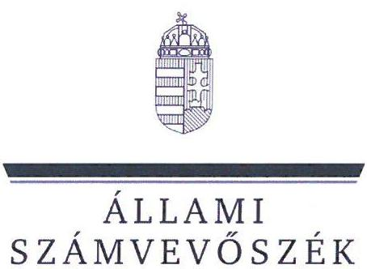
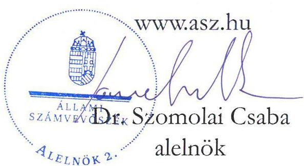
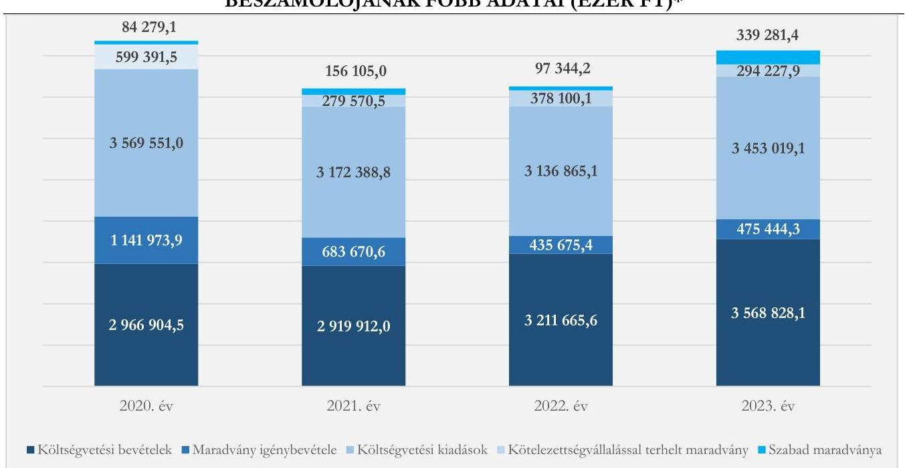
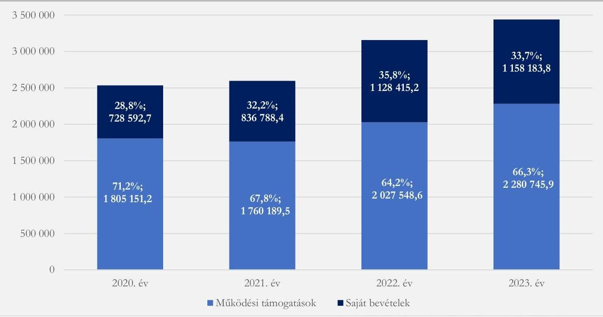

# JELENTÉS 

## Az önkormányzatok helyi adóztatási tevékenységének ellenőrzése - Ingatlanadóztatás

Ráckeve Város Önkormányzata

2025.

---

ÁLLAMI
SZÁMVEVŐSZÉK

# JELENTÉS 

## Az önkormányzatok helyi adóztatási tevékenységének ellenőrzése - Ingatlanadóztatás

Ráckeve Város Önkormányzata

2025.

24205

---

# ELLENŐRZÉSI IGAZGATÓSÁG: 

## ÁLLAMHÁZTARTÁS HELYI SZINTJÉT ELLENŐRZŐ IGAZGATÓSÁG

## ELLENŐRZÉSI IGAZGATÓ:

DR. BAFFIA GERGELY GÁBOR ellenőrzési igazgató

## ELLENŐRZÉSVEZETŐ:

Jelentéseink az interneten a www.asz.hu címen olvashatók.

KANYÓ LŐRÁNT ISTVÁN ellenőrzésvezető

IKTATÓSZÁM: EL-4040-018/2024
TÉMASORSZÁM: 54
ELLENŐRZÉS-AZONOSÍTÓ SZÁM: V1084

---

# TARTALOMJEGYZÉK 

AZ ELLENŐRZÉS ALAPADATAI ..... 5
AZ ELLENŐRZÉS TERÜLETE ÉS AZ ELLENŐRZÖTT SZERVEZET ..... 7
ÖSSZEFOGLALÁS ..... 9
AZ ELLENŐRZÉS FÓKUSZKÉRDÉSEI ..... 11
MEGÁLLAPÍTÁSOK ..... 12
JAVASLATOK ..... 27
MELLÉKLETEK ..... 29
I. sz. melléklet: Értelmező szótár ..... 29
II. sz. melléklet: Az ellenőrzött szervezetek jegyzéke ..... 30
III. sz. melléklet: Ellenőrzési kritériumok ..... 31
IV. sz. melléklet: Az építményadó mértékei a 2022. és a 2023. évben ..... 34
V. sz. melléklet: Az építményadó adótárgyak és adóalanyok szerinti megbontása a 2023. és a 2024. évben ..... 35
FÜGGELÉK: ÉSZREVÉTELEK ..... 36
RÖVIDÍTÉSEK JEGYZÉKE ..... 37

---

.

---

# AZ ELLENŐRZÉS ALAPADATAI 

## AZ ELLENŐRZÉS CÉLJA

Az ellenőrzés célja az volt, hogy értékelje Ráckeve város helyi ingatlanadóztatásának és adóhatósága feladatellátásának szabályszerűségét, célszerűségét és eredményességét. További cél volt, hogy az ellenőrzés megállapításai és következtetései segítsék az önkormányzati képviselő-testületeket a jogszabályokkal és a helyi sajátosságokkal összhangban álló helyi adópolitika kialakításában és az azt végrehajtó adóigazgatási szervezet megszervezésében. Az ellenőrzés célja volt továbbá annak megállapítása is, hogy az Önkormányzat ${ }^{1}$ által bevezetett, ingatlanokat terhelő helyi adókra vonatkozó rendeleti szabályok összhangban vannak-e a helyi adópolitikai célokkal, tartalmuk tükrözi-e a település helyi sajátosságait és az adóhatósági feladatellátás biztosítja-e az önkormányzati bevételek feltárását és beszedését.

Ennek keretében az ÁSZ ${ }^{2}$ értékelte, hogy az Önkormányzat által bevezetett, ingatlanokat terhelő helyi adókról szóló adórendelet ${ }^{3}$, valamint az adóhatóság ${ }^{4}$ döntései, adóztatási gyakorlata a vonatkozó jogszabályokkal összhangban állnak-e.

## AZ ELLENŐRZÉS TÍPUSA

Kombinált ellenőrzés.

## AZ ELLENŐRZŐTT IDŐSZAK

Az 1. fókuszkérdésnél a 2023. év, valamint a 2024. évnek az ellenőrzés megkezdését megelőző napjáig (2024. április 11.) tartó időszaka.

A 2. és 3. fókuszkérdésnél a 2023. év, valamint a 2024. évnek az ellenőrzés megkezdését megelőző napjáig (2024. április 11.) tartó időszaka, a 2020-2022. évek adatainak bázisadatként való felhasználásával.

## AZ ELLENŐRZÉS TÁRGYA

Az Önkormányzat képviselő-testületének ingatlanokat terhelő helyi adóval, azaz az építményadóval kapcsolatos rendeletalkotási tevékenységének és az adóhatóság tevékenységének az ellátása.

Az ellenőrzés kiterjedt minden olyan körülményre és adatra, amely az ÁSZ jogszabályban meghatározott feladatainak teljesítéséhez, valamint az ellenőrzési program végrehajtása folyamán felmerült újabb összefüggések feltárásához szükséges.

## AZ ELLENŐRZÉS JOGALAPJA

Az ellenőrzés jogszabályi alapját az ÁSZ tv. ${ }^{5}$ 5. § (8) bekezdésének előírásai képezik.

---

# AZ ELLENŐRZÉS MÓDSZERE 

Az ÁSZ az ellenőrzést az ellenőrzési program szempontjai, az ellenőrzött időszakban hatályos jogszabályok, az ellenőrzés általános szakmai szabályai és az ellenőrzésre irányadó ÁSZ módszertanok alapján végezte.

Az ellenőrzési kérdések megválaszolásához szükséges bizonyítékok megszerzése az ellenőrzött szervezetek által rendelkezésre bocsátott dokumentumokra, adatokra és az ASP ${ }^{6}$ Adó és az Iratkezelő szakrendszerek, illetve a KGR-K11 ${ }^{7}$ számviteli adatgyűjtő rendszer adataira alapozva megfigyelés, szemle (szemrevételezés), kérdésfeltevés (információkérés), mintavételezés, valamint elemző eljárás útján történt. Emellett az ellenőrzési bizonyítékként felhasználható adatforrások közé tartozott minden egyéb - az ellenőrzés folyamán feltárt, az ellenőrzés szempontjából információt tartalmazó - releváns dokumentum (ideértve különösen a helyszíni ellenőrzésről készült jegyzőkönyvet) is.

Az ellenőrzés lefolytatásához az ellenőrzött szervezet a tanúsítványok kitöltésével, valamint az ÁSZ által kért dokumentumok, adatok, információk megküldésével és az ellenőrzés során szolgáltatott adatokat.

Az ÁSZ az adómegállapítás, az adótörlés, a fizetési kedvezmények engedélyezése, az adóellenőrzések lefolytatása és a hátralékok beszedése szabályszerűségét mintavételi eljárással ellenőrizte. Ennek során az adóhatósági adómegállapítási feladatellátás ellenőrzése keretében 18 mintatétel (közte 30 határozat), négy adótörlésre (közte két határozat) vonatkozó mintatétel, a fizetési kedvezmények engedélyezése tárgykörben két mintatétel (közte két határozat), míg az adóellenőrzés értékelése körében három mintatétel (három határozat) ellenőrzése történt meg. Öt mintatételben (közte hat határozat) az ÁSZ a hátralékkezelés teljes dokumentációját is ellenőrizte. A mintatételek kiválasztása véletlenszerűen történt az adóhatóság nyilvántartásában lévő adótárgyak és ügyek közül tíz - adómegállapításra vonatkozó - mintatétel kivételével, amelyek esetében a kiválasztás címadatok alapján történt annak érdekében, hogy feltárható legyen, volt-e olyan adótárgy, amelyet nem adóztatott az adóhatóság. Az ellenőrzött mintatételekre vonatkozó megállapítások nem vetíthetők ki a teljes sokaságra, a megállapításokat az ÁSZ az adott ellenőrzött mintatételek vonatkozásában tette meg.

Az ÁSZ a helyi adópolitikai elképzelések és a települési sajátosságok feltárásával értékelte, hogy az adórendelet e szempontoknak mennyiben felelt meg. Az ÁSZ a helyi adópolitikai célokkal akkor tekintette összhangban állónak az adórendeletet, ha az hatását tekintve támogatta az adópolitikai célok teljesülését.

Az ÁSZ az adóhatósági feladatellátás szabályszerűségéből, a meglévő kapacitásokból, valamint az ezer forint adóbevételre jutó adóhatósági költségek alakulásából következtetett arra, hogy az adóhatóság rendelkezett-e azzal a potenciállal, amellyel eredményesen tudta a helyi adópolitikát végrehajtani.

Az ÁSZ - az adórendelet szabályainak érvényre juttatása körében - az eredményesség véleményezésekor a III. számú melléklet 2. pontjában foglalt szempontokat tekintette mérvadónak.

---

# AZ ELLENŐRZÉS TERÜLETE ÉS AZ ELLENŐRZÖTT SZERVEZET 

Ráckeve város a Csepel-sziget déli részén, a Ráckevei-Duna partján, Pest vármegye ráckevei járásában található. Elhelyezkedését tekintve a település kedvelt turistacélpont, üdülőtelepülés. A $\mathrm{TeIR}^{8}$ adatai alapján 2023. december 31én a településen regisztrált 1974 gazdasági szervezetből 1036 a szolgáltató területhez (három jelentősebb nemzetgazdasági ágban: kereskedelem, gépjármújavítás; ingatlanügyletek és szakmai, tudományos, műszaki tevékenység), 323 pedig a mezőgazdaság, erdőgazdálkodás és

Ráckevei Polgármesteri Hivatal
Forrás: https://magyarvelemeny.com/orvos/rackeve/polgarmesteri-hivatal-rackeve/\#images
halászat nemzetgazdasági ághoz tartozott. Ráckeve állandó lakossága - a $\mathrm{BM}^{9}$ adatai alapján - 2020. év elején 10682 fő, 2024. év elején 10959 fő volt.

Az Önkormányzat - a Hivatal ${ }^{10}$ mellett - nyolc költségvetési szervvel ${ }^{1}$ rendelkezett és tagja volt egy társulásnak. Az Önkormányzat 100\%-os tulajdonában volt a RÁVÚSZ ${ }^{11}$, illetve résztulajdonnal rendelkezett a DAKÖV ${ }^{12}$-ben.

Az Alaptörvény ${ }^{13}$ értelmében a helyi önkormányzat a helyi közügyek intézése körében törvény keretei között döntött a helyi adók fajtájáról és mértékéről. Az Mötv. ${ }^{14}$ rögzíti, hogy a helyi adóval kapcsolatos feladatok ellátása a helyi önkormányzatok feladata.

Az Önkormányzat a Htv. ${ }^{15}$ alapján illetékességi területén adórendelettel az építményadót vezette be. A hatályos szabályozást eredményező utolsó jogszabálymódosítás 2023. január 1-jén lépett hatályba, amely során az Önkormányzat a gépjármú-, és a csónaktároló kivételével a nem lakáscélú épületek adómértékeit emelte. A mértékrendszert és a mértékváltozást részletesen a $I V^{\prime}$. számú melléklet mutatja be.

Az adó megállapításával, nyilvántartásával, beszedésével összefüggő adóhatósági feladatokat - a Hatásköri tv. ${ }^{16}$ és az Air. ${ }^{17}$ rendelkezései alapján - elsőfokú hatósági jogkörben Ráckeve jegyzője ${ }^{18}$ látta el a Hivatal vezetőjeként. A hivatali $\mathrm{SzMSz}^{19}$ alapján az Adóügyi iroda állományába egy fő irodavezető és három adóügyi ügyintéző tartozott.

Az adóhatóság által beszedett, építményadóból származó bevétel érdemi szerepet játszott a települési feladatok finanszírozásában. A 2023. évben 215 196,6 ezer Ft bevétel származott az építményadóból, amely 8573 adóalanytól és 7165 adótárgy után keletkezett. Ez az ingatlanadó-bevétel a konszolidált költségvetési bevételek (felhalmozási célú támogatások államháztartáson belülről nélkül) 6,3\%-át, a települési helyi adóbevételek közel harmadát tette ki. Az Önkormányzat helyi adóbevételei

[^0]
[^0]:    ${ }^{1}$ Költségvetési szervei: Ráckeve Város Intézményi Gazdasági Iroda; Gólyafészek Bölcsőde; Ráckevei Szivárvány Óvoda; Ács Károly Művelődési Központ; Skarica Máté Városi Könyvtár; Árpád Múzeum; Ráckeve Város Szakorvosi Rendelőintézete; Rendelőintézeti Gazdasági Ellátó Szervezet.

---

2022. és 2023. évi összetételére vonatkozó adatokat az 1. ábra, az építményadó 2023. és 2024. évre vonatkozó jellemző naturális adatait pedig az *V. számú melléklet* mutatja be.

1. ábra

AZ ÖNKORMÁNYZAT HELYI ADÓBEVÉTELEINEK MEGOSZLÁSA A 2022-2023. ÉVEKBEN (EZER FT, %)

|   | 2022 | 2023  |
| --- | --- | --- |
|  Idegenforgalmi adó | 2,8%; 17 982,3 | 64,1%; 416 302,2  |
|  Helyi iparűzési adó |  | 64,1%; 416 302,2  |
|  Építményadó | 33,1%; 215 196,6 |   |
|  Idegenforgalmi adó | 4,4%; 18 302,7 |   |
|  Helyi iparűzési adó | 55,5%; 231 883,2 |   |
|  Építményadó | 40,1%; 167 601,4 |   |
|  |   |   |
|  0 | 50 000 | 100 000  |

*Forrás: KGR-K11 és sárszámadási rendelet3. adatai alapján ÁSZ saját szerkeoztás*

8

---

# ÖSSZEFOGLALÁS 

Az ÁSZ tv. értelmében az ÁSZ feladatkörébe tartozik az önkormányzatok adóztatási tevékenységének ellenőrzése. A helyi adók az önkormányzatok saját, el nem vonható bevételét képezik, így az önkormányzatok gazdasági önállósága szempontjából különös fontossággal bír, hogy a helyi adórendeleti szabályok összhangban álljanak a magasabb szintű jogszabályokkal, továbbá az adóhatósági tevékenység jogszerú, eredményes és hatékony legyen. Erre figyelemmel volt tárgya az ÁSZ ellenőrzésének az Önkormányzat adórendelet-alkotási tevékenysége és az adóhatósági feladatellátás is.

Az adórendelet több ponton nem volt összhangban a magasabb szintű jogszabályokkal, de alkalmas volt az Önkormányzat adópolitikai céljainak elérésére. Az adómegállapítási feladatellátás eredményes volt, de az adóhatósági döntések nem mindegyike volt szabályszerű. Az adóellenőrzések növelték az Önkormányzat bevételeit, azonban azok nem voltak szabályszerűek. Az adóbehajtási tevékenység szabályszerű és eredményes volt, de nem minden esetben volt célszerű. Az adóhatóság adatszolgáltatási kötelezettségét határidőben teljesítette, míg a közzétételi kötelezettségének csak részben tett eleget. Az adóztatási kiadások magasak voltak az adóbevételhez képest, de nem haladták meg az adóztatási kiadások referencia-érték maximumát. Az adóhatóság ingatlanadóztatással összefüggő feladatellátási mutatói - az átlagos adóztatási költség kivételével - összességében kedvezőbbek voltak, mint az ÁSZ által ellenőrzött nyolc város ${ }^{2}$ feladatellátási mutatóinak átlagos értéke.

## Adórendelet, adórendelet-alkotás

Az adórendelet nem volt összhangban a jogszabályi előírásokkal, tekintettel arra, hogy mentességet biztosított az önkormányzati tulajdonban lévő intézményi épületeknek, ezáltal potenciális építményadómentesség illetett meg minden olyan vállalkozó adóalanyt is, akinek a Htv. szerinti vagyoni értékủ jog alapján állt fenn építményadó-alanyisága valamely önkormányzati tulajdonban lévő intézményi épületen. Emellett az adórendelet több, nem egyértelmú, ezáltal vitatható rendelkezést tartalmazott.

Az ingatlanokat terhelő helyi adókra vonatkozó rendeleti szabályozás megalkotása során az Önkormányzat összességében figyelembe vette azt, hogy a rendeleti szabályoknak tükrözniük kell a helyi sajátosságokat, az önkormányzat gazdálkodási követelményét, továbbá az adóalanyok széles körét érintően az adóalanyok teherviselő képességét.

Az adóhatóság adóigazgatási feladatellátásának jogszerüsége, eredményessége
Az adóhatóság adótárgy-, és adóalany feltárási feladatellátása (ezáltal az adómegállapítási feladatellátása) eredményes és egyben célszerú volt, de az adómegállapítási eljárásban hozott hatósági döntések nem minden esetben voltak szabályszerűek. Az adómegállapító határozatok kiadmányozása, kézbesítése jogszerủ volt. Az adóhatóság adatszolgáltatási kötelezettségét határidőben teljesítette, míg közzétételi kötelezettségének csak részben tett eleget. Az adótartozások beszedése érdekében tett intézkedések eredményesek és szabályszerűek voltak, azonban nem minden esetben voltak célszerűek.

Az adóellenőrzések bár növelték az Önkormányzat bevételeit, nem voltak szabályszerűek.

[^0]
[^0]:    ${ }^{2}$ Az ÁSZ által jelen ellenőrzés alapjául szolgáló ellenőrzési program alapján ellenőrzött városok: Ajka, Balatonföldvár, Budakalász, Emőd, Paks, Ráckeve, Szigethalom és Tata.

---

Az adórendelet adópolitikai célokkal való összhangia, az adórendelet hatása
Az Önkormányzat - a magyarországi városok ${ }^{3}$ 2023. évi konszolidált költségvetési beszámolóinak összegző adataival történő összehasonlítása alapján - jobban támaszkodott az ingatlanadó-bevételekre. Míg ugyanis a városok esetén országosan ezen bevételek konszolidált - államháztartáson belüli felhalmozási célú támogatások nélküli és a befizetett szolidaritási hozzájárulással ${ }^{4}$ csökkentett - költségvetési bevételeken belüli átlagos aránya $5,8 \%$, addig az Önkormányzat esetében ez 6,3\% volt a 2023. évben. A konszolidált költségvetési bevételeken belül a konszolidált saját bevételek aránya a 2020-2023. időszakban 28,8-35,8\% közötti érték volt (ha nem vesszük figyelembe a befolyt államháztartáson belüli felhalmozási célú támogatási forrásokat). Az Önkormányzat gazdálkodási mozgásterét növelte a 2023. évtől bekövetkező, összességében 28,4\%-os ingatlanadóbevétel-emelkedéssel járó adóváltoztatás.

Ezzel együtt az adószint-emelkedéssel járó, 2023. január 1-jétől hatályos változtatások az adóalanyok többségének adóteherbíró-képességével összhangban voltak.

Az Önkormányzat adórendeleti szabályai részben voltak összhangban az adópolitikai célokkal (az adó biztos bevételi forrást jelentsen; méltányos legyen; és a helyi lakosságot kevésbé terhelje; segítse a közfeladat-ellátást).

# Az adóbatósági kiadások 

A 2023. évben 649 481,1 ezer Ft végleges helyi adóbevételt számolt el az Önkormányzat. Minden 1000 Ft beszedett - végleges - helyi adóbevételre - az ÁSZ számítása szerint - 38,6 Ft adóztatási kiadás esett. Az ellenőrzött városok átlaga $15,3 \mathrm{Ft}$, az adóztatási kiadás tapasztalati referencia-érték maximuma kivetéses adóztatás esetén 50 Ft volt.

Az Önkormányzat egy adótisztviselőjére a 2023. évben 2169,3 adótárgy és 1801,3 adóalany jutott. Ezek az értékek összességében jóval magasabbak voltak, mint az ÁSZ által ellenőrzött nyolc város átlaga (1751,1 adótárgy, 1461,7 adóalany/adótisztviselő). A fajlagos adóztatási kiadások aránya a városok ezen adatához mérten ugyan magas volt, azonban ez nem a túlzott munkaerőfelhasználásra, hanem inkább a relatíve alacsonyabb adóbevételre vezethető vissza, mert az egy adótisztviselőre jutó 2023. évi adóbevétel az Önkormányzat esetén 162 370,3 ezer Ft, az ellenőrzött nyolc város esetén átlagosan 544 502,3 ezer Ft volt.

[^0]
[^0]:    ${ }^{3}$ Az ÁSZ a városok alatt a 322 nem megyei jogú várost érti.
    ${ }^{4}$ Ráckeve esetén nem volt szolidaritási hozzájárulási kötelezettség.

---

# AZ ELLENŐRZÉS FÓKUSZKÉRDÉSEI 

1.- Az önkormányzat ingatlanokat terhelő helyi adókra vonatkozó rendeleti szabályozása megfelel-e a magasabb szintü jogszabályoknak?
2.- Az önkormányzati adóhatóság megfelelően és eredményesen látta-e el az ingatlanok adóztatásával kapcsolatos adóhatósági tevékenységeit?
3.- A településen megvalósuló helyi adóztatás támogatta-e a helyi adópolitikai célok teljesülését?

---

# MEGÁLLAPÍTÁSOK 

## 1. Az önkormányzat ingatlanokat terhelő helyi adókra vonatkozó rendeleti szabályozása megfelelte a magasabb szintü jogszabályoknak?

Összegző megállapítás Az adórendelet több ponton nem felelt meg a magasabb szintű jogszabályoknak.
1.1. számú megállapítás

Az adórendelet egy ponton nem volt összhangban a Htv. előírásaival, szövegezése több ponton sértette az egyértelmú értelmezhetőség Jat. ${ }^{51}$ ban megfogalmazott követelményét.

A Htv. 7. § e) pontjában előírtak ellenére - amely az uniós jogból fakadó állami támogatási elvekre és normákra figyelemmel rögzíti, hogy az önkormányzat az építményadóban a vállalkozó számára adómentességet, adókedvezményt nem biztosíthat - az adórendelet 5. § a) pontja mentességet biztosított az önkormányzati tulajdonban lévő intézményi épületeknek akkor is, ha a vállalkozó volt az adó alanya (vagyoni értékű joga alapján). Az adórendelet az alábbi okokból fakadóan sértette - a Jat. 2. § (1) bekezdéséből következő egyértelmű értelmezhetőség követelményét:

Az uniós állami támogatási szabályok értelmében a vállalkozóknak nyújtott helyi adómentesség, helyi adókedvezmény állami támogatásnak minősül. A jogszerütlenül nyújtott támogatást a kedvezményezettnek vissza kell fizetnie, vagy a támogatást nyújtónak kell biztosítania az uniós joggal való összhangot.
a) az adórendelet 3. §-ának (2) és (3) bekezdése azzal, hogy az építményadó mértékének a meghatározásánál az „alapadó" kifejezést használta. Ez az adóalanyok számára megtévesztő volt, mert e kifejezés nem volt összhangban a Htv. fogalmi rendjével és az adórendelet sem definiálta;
b) az adórendelet 3. $\$ \mathbf{( 2 )}$ bekezdésének a szerkesztése, mert a felvezető mondatrész nem az a) és b) pont tartalmát vezette fel. Emellett a két alpont utolsó mondata ${ }^{5}$ is megtévesztő volt, mert abból nem derült ki egyértelmúen, hogy a jogalkotó nyilatkozata szerinti szándéka arra irányult, hogy egy adótárgy ingatlan esetében az üdülési célt nem az ingatlan tényleges használata, hanem annak ingatlan-nyilvántartási elnevezése alapján kell megállapítani;
c) az adórendelet 4. $\$ \mathbf{( 1 )}$ bekezdése, mert $50 \%$-os személyi adómentességet biztosított az életvitelszerűen ott tartózkodó bérlőnek is, miközben a Htv. 12. §-a értelmében a bérlő nem alanya az építményadónak, így a rendelkezésnek nincs normatartalma;
d) az adórendelet 4. $\$ \mathbf{( 2 )}$ bekezdése, mert abból nem tűnt ki, hogy az $50 \%$-os adómentesség feltételéül szabott fajlagos (egy főre jutó) jövedelem-határ összegének számításánál mely személyek jövedelmét kellett figyelembe venni;

[^0]
[^0]:    ${ }^{5}$ A hivatkozott alpontok utolsó mondata szerint az üdülés céljára szolgáló építmények adójogi megítélését nem befolyásolja az építmény használata.

---

e) az adórendelet 3. $\$ 5$ (5) bekezdése, mert úgy biztosított a többi nem lakás célú építményhez képest kedvezőbb ( $250 \mathrm{Ft} / \mathrm{m} 2$ ) adómértéket a gépjárműtárolás vagy csónaktárolás céljára szolgáló építménynek, hogy nem definiálta azt, hogy a szabályozás alkalmazásában mit kell ilyen építménynek tekinteni.
1.2. számú megállapítás

Az adórendelet tükrözte a települési sajátosságokat és az adóalanyok széles körét tekintve igazodott az adóalanyok teherviselő képességéhez, az Önkormányzat gazdálkodási követelményeihez.

A Htv. 7. § g) pontjában rögzített adómegállapítási korlátokból az következik, hogy a rendelet hatályossága idején is érvényre kell jutnia az e pontban szabályozott rendeletalkotási elveknek, azaz annak, hogy települési önkormányzat az adóalap fajtáját, az adó mértékét, a rendeleti adómentességet és adókedvezményt úgy állapíthatja meg, hogy azok összességükben egyaránt megfeleljenek
a) a helyi sajátosságoknak,
b) az önkormányzat gazdálkodási követelményeinek és
c) az adóalanyok széles körét érintően az adóalanyok teherviselő képességének.

# A belpij sajátosságok figpelembevétele 

Ráckeve üdülőtelepülés jellegére figyelemmel az ingatlanokat terhelő adók potenciális adótárgyai és így az Önkormányzat bevételi forrásai nem elsősorban az ipari-kereskedelmi ingatlanok, hanem a lakások mellett az üdülők és üdülőépületek voltak.
Az adórendelet 3. §-a differenciált adómérték-rendszert tartalmazott, magasabb építményadó-mérték vonatkozott az üdülőtulajdonra, mint a lakásokra, továbbá az adórendelet legutóbbi módosítása során a lakásokra vonatkozó adómértéket az Önkormányzat nem emelte. Ennélfogva a település ingatlanadóztatás szempontjából meghatározó sajátos körülményeit a hatályos adórendelet legutóbbi, 2023. január 1-jétől hatályos módosítása előkészítésekor - a Htv.-ben foglaltaknak megfelelően - az Önkormányzat figyelembe vette és mérlegelte.

## Az önkormányzat gazdálkodási követelményeinek szempontja

Az Önkormányzat álláspontja szerint az adórendelet teljesítette azt az adópolitikai célkitűzést, hogy a helyi adóbevételek, az önkormányzati finanszírozási rendszer átalakítása miatt játszanak egyre jelentősebb szerepet az Önkormányzat költségvetésében. Ráckevének, mint járási székhelynek, nemcsak az Önkormányzat által kötelezően ellátandó közfeladatellátás anyagi hátterét kellett biztosítania, hanem számos önként vállalt feladatot is el kellett látnia (pl.: önkormányzati tűzoltóság működtetése; szakrendelő fenntartása).

A 2022. évben a helyi adókból összesen 417 787,3 ezer Ft bevétele származott az Önkormányzatnak, amely a konszolidált költségvetési bevételnek (amely a felhalmozási célú támogatások államháztartáson belülről nélkül 3155 963,8 ezer Ft) 13,2\%-át tette ki. A 2023. évben a helyi adókból származó éves 649 481,1 ezer Ft bevétel az Önkormányzat államháztartáson belüli felhalmozási célú támogatások nélküli 3438 929,7 ezer Ft konszolidált költségvetési bevételének már a 18,9\%-át tette ki.

Az Önkormányzat és intézményei főbb gazdálkodási adataiból (2. ábra) az figyelhető meg, hogy az Önkormányzat kötelezettséggel nem terhelt maradványa a 2020-2023. évek mindegyikében meghaladta a 84000 ezer Ft-ot, a 2023. évben 339 281,4 ezer Ft volt.

---

Az Önkormányzat tehát egyfelől mérlegelte, másfelől az építményadó kisebb hatású, differenciált, egyes nem lakáscélú ingatlanokra vonatkozó növelésével figyelembe vette az Önkormányzat gazdálkodási követelményeit (és körülményeit) a helyi adórendelet 2023. évtől hatályos módosítása során.
2. ábra

AZ ÖNKORMÁNYZAT ÉS INTÉZMÉNYEI 2020-2023. ÉVI KONSZOLIDÁLT BESZÁMOLÓJÁNAK FŐBB ADATAI (EZER FT)*

# Az adóalanyok teherbíró képességének figyelembevétele 

Az adórendelet a helyben lakókhoz képest magasabb adóteherrel sújtotta a helyben lakóhelyet nem létesítő adóalanyokat, azaz az üdülőtulajdont. E megfontolás mögött - az Önkormányzat indokolása alapján - az állt, hogy az üdülőtulajdonosok esetében valószínűsíthető volt, hogy üdülőjük a második vagy többedik ingatlanuk, így vélelmezhető volt az is, hogy ők nagyobb szerepet tudnak vállalni a helyi közterhekből. Az adórendelet azonban nemesak a lakó-, illetve üdülő-ingatlanok esetében differenciálta az adómértéket, hanem a kereskedelmi egységek és egyéb nem lakás célra használt ingatlanok tekintetében is. Az adórendeletet (különösen annak az adómértékeket tartalmazó részét) az Önkormányzat - nyilatkozata szerint - az ellenőrzött időszak minden évében felülvizsgálta.

Mindezekre tekintettel - a Htv.-ben foglaltaknak megfelelően - az Önkormányzat figyelembe vette az adóalanyok teherbíró képességét a rendeletalkotás során.

---

# 2. Az önkormányzati adóhatóság megfelelően és eredményesen látta-e el az ingatlanok adóztatásával kapcsolatos adóhatósági tevékenységeit? 

Összegző megállapítás

Az adóhatóság adómegállapítási feladatellátása eredményes volt, de az adóhatósági döntések közül nem mindegyik volt szabályszerű. Az adóhatóság adatszolgáltatási kötelezettségét határidőben teljesítette, azonban a közzétételi kötelezettségének csak részben tett eleget. Az adóellenőrzések az Önkormányzat bevételeit ugyan növelték, de nem voltak szabályszerűek. Az adótartozások beszedése érdekében megtett intézkedések szabályszerűek és eredményesek voltak, de nem minden esetben voltak célszerűek.
2.1. számú megállapítás

Az adóhatóság adómegállapítási feladatellátása eredményes és célszerű volt. Az adóhatósági döntések azonban adómegállapítás esetében nem minden esetben, míg adóellenőrzés tekintetében egyik mintatétel esetében sem voltak szabályszerűek. Az adóhatóság a közzétételi kötelezettségének csak részben tett eleget.

## Adótárgy-, és adóalanyfeltárás

Az adóhatóság a 2023. és a 2024. évben is élt az Art. ${ }^{22}$ 83. $\S$ (2) bekezdésében
foglaltak alapján az ingatlanügyi hatóság megkeresésének lehetőségével. Ezen, a települési ingatlanokról és tulajdonosaikról, valamint az ingatlanokon fennálló vagyoni értékủ jog jogosítottaióról szóló adatokat betöltötte saját rendszerébe a nyilvántartásával történő összevetés érdekében. Az adóhatóság az adóalanyok és az adótárgyak feltárása érdekében nem használt térinformatikai eszközt,

Az ÁSZ jó gyakorlatként azonosította, hogy az adóhatóság intenzíven használta a társhatóságnál rendelkezésre álló adatokat az adóztatás során. Az ÁSZ véleménye szerint az ingatlanadókban - szemben az önadózásos adókkal - az utólagos adóellenőrzéshez képest célravezetőbb az adóhatóság adónyilvántartási adatainak társhatósági hiteles adatokkal való összevetése és ezek alapján szükség szerint adatbejelentésre, hiánypótlásra felhívás, adómegállapítás. Részint azért, mert az adótárgy jellege miatt erre lehetőség van (tipikusan évente nem változnak a kivetési adatok), részint azért, mert így az adóhatóság időben korábban jut az adóbevételhez, részint pedig azért, mert négy-öt év távlatában sokszor utólagosan nehezen lehet bizonyítani, hogy az adóév első napján mi volt az adómegállapítás kapcsán releváns tényállás.
azonban tételes adótárgy-feltárást, bejárást több alkalommal is végzett. Az adóhatóság az adózók adatbejelentési kötelezettsége elmulasztásának felderítése érdekében használta továbbá az építésügyi hatóság által az Art. 86. §-a szerint szolgáltatott adatokat is. Az ÁSZ nem tárt fel jogszerútlenül nem adóztatott ingatlant. Ezért az ÁSZ megítélése szerint az adótárgy-, és adóalanyfeltárási adóhatósági feladatellátás eredményes és - figyelemmel arra, hogy az adóhatóság a más hatóságtól kapott hiteles információt azok megszerzése céljának megfelelően használta fel - célszerű is volt egyben.

---

# Adómegállapitás (kivetés) 

Az ÁSZ az adóhatóság adómegállapítási feladatellátása ellenőrzése keretében 18 mintatétel ellenőrzését végezte el.
Az adóhatóság valamennyi mintatétel (ellenőrzött adómegállapító határozat) esetén a fizetendő adó összegét helyesen, a Htv. és az adórendelet alapján számította ki.
Hét mintatétel (8., 12, 17. és 2124. mintatételek) esetében az adótárgynak több tulajdonosa volt, ugyanakkor az adóhatóság által hozott adómegállapító határozat rendelkező része kizárólag az adó fizetésére kötelezett által fizetendő adó összegét tartalmazta.
A 14. mintatétel esetében az adóhatóság az építésügyi hatóságtól kapott adatok alapján szerzett tudomást arról, hogy az adóalany elmulasztotta az adatbejelentés megtételét. Az adóhatóság feladatellátása nem felelt meg az Air. 73. $\$ 1$ bekezdés c) pontjában foglaltaknak, mert a 2024. évre és a 2025. évre vonatkozó adómegállapító határozatok indokolási része nem utalt sem az építésügyi hatóságtól kapott adatokra, sem arra, hogy az adókötelezettség 2024. január 1jétől történő megállapítása során figyelembe vette az ingatlan-nyilvántartási adatokat, ugyanakkor olyan adatot jelölt meg tulajdonlás kezdetének, amely az adatbejelentésben nem szerepelt. Htv. 12. $\$ 1$ bekezdésében és 14. $\$ 2$ bekezdésében foglalt rendelkezések ${ }^{6}$ ellenére az adóhatóság 2024. január 25. napján kelt adómegállapító határozatában 2025. év január 1-jétől fennálló adókötelezettséget állapított meg.
A 25. mintatétel esetében két adózó két adótárgyára összesen négy különböző tartalmú adómegállapító határozatot adott ki az adóhatóság, melyeket azonban az adóhatóság két iktatószám alatt kezelt. Azzal, hogy az adóhatóság egy iktatószám alatt két különböző tartalmú dokumentumot is nyilvántartott, nem felelt meg a 335/2005. (XII.29.) Korm. rendelet ${ }^{23}$ 13. $\mathbb{S}$ (1) bekezdésének.
Az adóhatóság az adómegállapító határozatok mindegyike indokolási részében az ügyintézési határidőt az adatbejelentés adóhatósághoz való érkezése napjától számította. Az adómegállapító eljárás ugyanakkor nem kérelemre, hanem hivatalból indított eljárás, ezért az adóhatóság gyakorlata ellentétes az Air. 50. $\$ 1$ bekezdésével ${ }^{7}$. Az adómegállapító határozatok indokolása - az

[^0]
[^0]:    ${ }^{6}$ A Htv. hivatkozott rendelkezései értelmében, ha év közben az adó alanyának személye változik, vagy az adótárgy állapotában az adókötelezettséget befolyásoló változás következik be, akkor e változásokat a következő év első napjától kezdődően kell figyelembe venni. Ezért az adóév első napját megelőzően kiadott, adóévre vonatkozó fizetési kötelezettséget tartalmazó határozat eleve nem szabályszerű.
    ${ }^{7}$ Az Air. 50. $\$ 1$ bekezdés értelmében hivatalból való eljárás esetén az első eljárási cselekmény megkezdése napjától - azaz a konkrét esetekben (mivel egyéb eljárási cselekmény nem történt) a határozat kiadmányozása napjától - kell számítani az ügyintézési határidőt.

---

Air. 73. $\$ 1$ ) bekezdés c) pontjában foglaltak ellenére - tényállási elemként egyik esetben sem tartalmazta az adótárgy utáni adó és az adóalany(ok)ra jutó adó összegének egyértelmú számszaki levezetését, megfelelő jogszabályi alapját.
Mindazonáltal az adómegállapító határozatokban foglalt fizetési kötelezettség jogszerüségét az indokolással összefüggő hiányosságok nem érintették, a világos, követhető magyarázat ugyanakkor érthetővé teszi az adózó számára, hogy milyen jogalapon és miért az adómegállapító határozat szerinti összeget kell fizetnie. Ezen túlmenően az adóhatóságnak és az Önkormányzatnak is előnyös, ha az adózó fizetési hajlandósága javulhat azáltal, hogy számára is világos és érthető az adómegállapító határozat.
Az adómegállapító határozatok kiadmányozása és adózókkal való közlése valamennyi adómegállapító határozat esetében megfelelt az Air. és az Eüsztv. ${ }^{24}$ elöírásainak ${ }^{8}$.

# Adóellenörzés 

Az ellenőrzött időszakban végzett adóellenőrzések összefoglaló adatait az 1. táblázat mutatja be.
1. táblázat

AZ ADÓELLENŐRZÉSEK FŐBB ADATAI A 2023. ÉS A 2024. ÉVBEN
(DARAB ÉS EZER FT)

| ÉV | HUZOTT ADÓHATÓSÁGI   HATÁROZÁTOK   DARÁBSZÁMA | ADÓHIÁNY   ÖSSZEGE | ADÓHIRSÁG   ÖSSZEGE |
| :--: | :--: | :--: | :--: |
| 2023 | 79 | 1783,2 | 114,0 |
| $2024 *$ | 7 | 120,6 | 0 |

*Az ellenörzés megkezdéséről való értesités átvételének napjátig (2024. április 11.).
Fonrás: Az Önkormányzat és a Hivatal tanúsitványokon megadott adatai alapján ÁSZ saját szerkesztés
Az ÁSZ az adóhatósági adómegállapítási feladatellátás ellenőrzése keretében három mintatétel ellenőrzését végezte el. Az adómegállapítás ellenőrzés során még három mintatétel kapcsolódott az adóellenőrzés tárgyköréhez, így azok esetében is megvizsgálta az ÁSZ az adóellenőrzésre vonatkozó szabályok érvényesülését.
A 9., a 18. és a 25. (adómegállapításra vonatkozó) mintatételek, valamint a 3032. (adóellenőrzés) mintatételek esetében az Art. alapján az adóhatóság küldött írásbeli felhívást az adóalany számára az adatbejelentési kötelezettség teljesítése érdekében, azonban a kötelezettség ismételt elmulasztása miatt az adóhatóság az Art. 221. $\$ 2$ ) bekezdésének előirása ellenére mulasztási bírságot nem szabott ki, továbbá az Art. 221. $\$ 3$ ) bekezdése alapján ismételten (mulasztási bírság ismételt kiszabásával) nem hívta fel az adózót a kötelezettség teljesítésére. Ezekben az esetekben az adóhatóság az adó alapját és egyben az adó összegét az Art. 144. §-a alapján állapította meg, azonban ennek tényét - a 25. mintatétel kivételével - az adómegállapító határozat indoklásában nem rögzítette. Ezzel az adómegállapító határozatok nem feleltek meg az Air. 73. §(1) bekezdés c) pontjának.

A 18. és a 25. mintatétel esetében az adóhatóság eljárása nem felelt meg az Art. 215. § (1) bekezdése és 219. §-a rendelkezéseinek, tekintettel arra, hogy az egyszerűsített ellenőrzés következtében hozott

[^0]
[^0]:    ${ }^{8}$ Az Eüsztv. 2024. szeptember 1-je óta hatálytalan, a jogterület szabályozását a digitális államról és a digitális szolgáltatások nyújtásának egyes szabályairól szóló 2023. évi CIII. törvény tartalmazza.

---

utólagos adómegállapító határozatában az adóbírságról nem rendelkezett. Nem hozott döntést továbbá az adóhatóság az Art. 207. § (1) bekezdése alapján felszámítandó és adószámlán előírandó késedelmi pótlékról.

A megállapított adó csökkentése: fizetési kedvezmények, adókötelezettség változás, elévülés miatti törlés
A fennálló adókövetelést csökkentő intézkedések ellenőrzése hat mintatétel (két fizetési kedvezmény és négy adótőrlés) alapján történt, amelyek jogszerúek voltak. Az ellenőrzött időszakban megtett intézkedések számszaki összefoglalását a 2. táblázat mutatja be.
2. táblázat

A 2023-2024. ÉVEKBEN TÖRTÉNT ADÓKÖVETELÉS TÖRLÉSEK FŐBB ADATAI (DARAB ÉS EZER FT)

| MEGNEVEZÉS | 2023. |  | 2024.* |  |
| :--: | :--: | :--: | :--: | :--: |
|  | ESETSZÁM | ÖSSZEG | ESETSZÁM | ÖSSZEG |
| Méltányosságból törőlt adókövetelés | 27 | 433,5 | 21 | 437,4 |
| Adókötelezettség változás okán törőlt adókövetelés | 730 | 7322,9 | 182 | 4350,1 |
| Elévülés miatt törőlt adókövetelés | 293 | 5728,6 | 156 | 1527,0 |

*2024. május 31-én nyilvántartott adatok.
Fonrás: Az Önkormányzat és a Hivatal tanúsítványokon megadott adatai alapján ASZ saját szerkesztés

# Adatszolgáltatási, közzétételi kötelezettség 

Az adóhatóság a Kincstár ${ }^{25}$ számára a helyi adórendeletről és adózási információkról szóló adatszolgáltatási kötelezettségének a Htv.-nek megfelelően határidőben ${ }^{9}$, 2022. december 5-én eleget tett. Az Önkormányzat honlapján csak a nem hatályos adórendelet volt elérhető (a honlapon 2024. augusztus 27-én a publikálás dátuma: 2020. december 10.), ezzel az adóhatóság - a Htv. 42/B. $\S$ (3) bekezdésében rögzített - közzétételi kötelezettségének csak részben tett eleget.
2.2. számú megállapítás Az adóbehajtási (adóbeszedési) tevékenység szabályszerű és eredményes volt, azonban két esetben nem volt célszerű.

Az ingatlant terhelő adóban fennálló tartozás behajtásához kapcsolódóan a 2023. évben 145 esetben, a 2024. évben az ellenőrzés megkezdéséről való értesítés átvételének napjáig (2024. április 11.) pedig négy esetben indított az adóhatóság az Avt ${ }^{26}$-ben foglaltak alapján végrehajtási eljárást. Az adóhatóság a végrehajtások eredményeképpen a 2023. évben 4232,9 ezer Ft adótartozást, a 2022. december 31-én fennálló adótartozás $22,4 \%$-át, a 2024. évben 75,0 ezer Ft adótartozást, a 2023. december 31-én fennálló adótartozás $0,4 \%$-át szedte be.
Az adóbehajtási feladatellátás eredményes volt, mert:

- az adóhatóság az adófizetés első esedékessége előtt felhívta az adózók figyelmét az adókötelezettség teljesítésére, és

[^0]
[^0]:    ${ }^{9}$ Az adórendelet, valamint annak módosítása hatálybalépését megelőző hónap ötödik napjáig kell adatot szolgáltatni a Kincstár számára.

---

- az adóhatóság által nyilvántartott 2023. évi hátraléknak (17 145,2 ezer Ft) a 2023. évi építményadó bevételhez viszonyított aránya ( $8,0 \%$ ) alacsonyabb volt, mint az azonos településtípusba tartozó önkormányzatok adóbevétel-arányos hátraléka ( $14,3 \%$ ), és
- az ingatlanokat terhelő adóból származó 2023. évi tényleges adóbevétel a 2023. évi költségvetésben tervezett eredeti előirányzat $97,8 \%$-át érte el, továbbá
- a 2023. december 31-i hátralékok összege alacsonyabb volt, mint a 2022. december 31-én fennálló hátralékok összege ${ }^{10}$.
Az adóhatóság a legkorábbi tartozás esedékességének napjától számítva a 2. mintatétel esetében 1555 nappal, míg az 5. mintatétel esetében 1748 nappal később foganatosította (rendre 2023. június 20. és 2023. október 16. napján) az első, az adótartozás behajtására irányuló (végrehajtási) cselekményt (jövedelemletiltás), emellett a 2. mintatétel esetében a végrehajtás az ÁSZ ellenőrzés idején még folyamatban volt. Az adóbehajtási tevékenység elhúzódása eredményeképp az Önkormányzat később jut az adóbevételhez, ami kamat-elmaradással vagy kamatkiadással jár, ezért az adóbehajtás a két mintatétel esetén nem volt célszerú.
A 3. táblázat szerint a hátralékok összege csökkent, míg a hátralékos adózók száma emelkedett 2023 végére, majd 2024. május 31-ig emelkedés volt megfigyelhető mind a hátralékösszeg, mind pedig a hátralékosok száma tekintetében.
5. táblázat

# AZ ÉPÍTMÉNYADÓ HÁTRALÉKOK FŐBB ADATAI ADOTT NAPON (DARAB ÉS EZER FT) 

| NAPTARI NAP | HÁTRALÉKOS ADÓZOK SZÁMA | ADÓHÁTRALÉK ÖSSZEGE |
| :--: | :--: | :--: |
| 2022.12 .31 | 538 | 18868,6 |
| 2023.12 .31 | 583 | 17145,2 |
| 2024.05 .31 | 879 | 21247,8 |

Forrás: Az Önkormányzat és a Hivatal tanúsitványokon megadott adatai alapján ÁSZ saját szerkesztés
A 2022. január 1-jei 19 596,8 ezer Ft-os adóhátralék összege (593 hátralékos adózó) a 2023. év végére 12,5\%-kal - 2 451,6 ezer Ft-tal - csökkent. A 2023. évi ingatlanadó-bevételhez (167 601,4 ezer Ft) viszonyított, az év utolsó napján fennálló hátralék aránya $\mathbf{1 0 , 2 \%}$ volt, amelyből $11252,9 \mathrm{ezer} \mathrm{Ft}$ felszámolás vagy kényszertörlés alatt lévő gazdasági társasághoz kapcsolódott.

[^0]
[^0]:    ${ }^{10}$ Az ÁSZ által az adóbehajtási (adóbeszedési) tevékenység eredményessége kapcsán figyelembe vett kritériumrendszert a III. melléklet 2. pontja tartalmazza.

---

# 3. A településen megvalósuló helyi adóztatás támogatta-e a helyi adópolitikai célok teljesülését? 

Összegző megállapítás Az Önkormányzat ingatlanokat terhelő helyi adókra vonatkozó adórendeleti szabályozása támogatta a helyi adópolitikai célok megvalósulását. Az építményadó támogatta az önkormányzat gazdálkodását, az adóteher összhangban volt az adóalanyok többségének teherbíró képességével. A Hivatal nem mutatta ki elkülönítetten az adóigazgatási tevékenységgel összefüggő kiadásokat és a kapcsolódó átlagos statisztikai létszámadatokat. Az adóhatósági feladatellátási kiadások az elért adóbevételhez mérten magasak voltak, azonban a feladatellátás mutatói összességében az ÁSZ által ellenőrzött városok mutatói átlagos értékeinél kedvezőbbek voltak.
3.1. számú megállapítás

Az adórendeleti szabályozás támogatta a helyi adópolitikai célok megvalósulását.

Az Önkormányzat írásba foglalt adópolitikai koncepcióval nem rendelkezett, a település honlapján elérhető 2019-2024. évekre szóló gazdasági program pedig nem rögzített adópolitikai célokat. Az Önkormányzat által az ÁSZ helyszíni ellenőrzése során megfogalmazott adópolitikai célokat és az alkalmazott eszközrendszert a 4. táblázat tartalmazza.
4. táblázat

AZ ÖNKORMÁNYZAT ADÓPOLITIKAI CÉLJAI ÉS ALKALMAZOTT ESZKÖZRENDSZERE

| ADÓPOLITIKAI CÉL | ADÓPOLITIKAI ESZKÖZ |
| :-- | :-- |
| Forrást biztosítson az önkormányzati   feladatellátáshoz | Építményadó bevezetése. |
| Elviselhető (méltányos) teher legyen | Az adóalanyok a lakások után a többi adótárgy után fizetendő   építményadó-teherhez képest alacsonyabb adóterhet viseltek.   Emellett az alacsonyabb jövedelemmel rendelkezők 50\%-os   adókedvezményben részesültek lakásuk után. |
| A helyben lakókat kevésbé terhelje az adó | Az életvitelszerủen helyben lakók - amennyiben jövedelmi   helyzetük indokolja, vagy több/súlyosan fogyatékos gyermeket   nevelnek a lakásuk után adókedvezményben részesülnek. |
| A közfeladat-ellátást érdemben segítse | Kismértékủ építményadómérték-emelés 2023-tól |

Forrás: az Önkormányzat helyszini ellenőrzés során tett nyilatkozata alapján ÁSZ saját szerkesztés
Az ÁSZ véleménye szerint az adórendeleti eszköztár az elérni kívánt adópolitikai célokkal összhangban volt.

---

3.2. számú megállapítás

Az Önkormányzat országos és regionális összevetésben is támaszkodott az építményadóból származó bevételre, azok támogatták az Önkormányzat feladatellátását. Az Önkormányzat saját bevételei nőttek, azonban a támogatásoktól való függősége változatlan maradt. Az adószint-emelkedéssel járó, 2023. január 1-jétől hatályos adórendeletmódosítások az adóalanyok többségének adóteherbíróképességével összhangban voltak.

Az adórendelet(módositás) hatása az önkormányzat gazdálkodására
Az építményadóból származó bevételek a 2020-2023. években jelentősebb növekedést mutattak. A 2022. évi bevétel (167 601,4 ezer Ft) a 2023. évre 215 196,6 ezer Ft-ra, 47 595,2 ezer Ft-tal, 28,4\%-kal emelkedett. A növekedés oka a 2023. január 1-jétől hatályba lépett - az adómérték emelést végrehajtó, és egyben adószint növekedését eredményező - adórendelet volt. Emellett kiugró növekedés volt megfigyelhető a helyi iparúzési adóból származó bevétel esetében, amely 184419,0 ezer Ft-tal növekedett 416302,2 ezer Ft-ra.

A konszolidált költségvetési bevételeken belül a konszolidált saját bevételek aránya - az államháztartáson belülről kapott felhalmozási célú támogatásoknak a költségvetési bevételekből történő kiszűrésével - a 2020-2023. években 28,8-35,8\% közötti, tendenciáját tekintve enyhén növekvő értéket mutatott. A központi költségvetésből kapott múködési támogatások összege a 2022. és a 2023. évben az előző évhez képest nőtt, éves átlagban 260278,2 ezer Ft-tal, továbbá a 2023. évre a konszolidált egyéb saját bevételek összege csökkent ${ }^{11}$. Bár a helyi adóbevétel a 2023. évre az előző évihez képest jelentősen, 231693,8 ezer Ft-tal, 55,5\%-kal emelkedett, de ezzel együtt is az Önkormányzat központi költségvetéstől való függősége az ellenőrzött időszakban nem csökkent.

A 2020-2023. év(ek)re vonatkozó konszolidált bevételek jogcímenkénti nagyságát éves bontásban az 5. táblázat, az Önkormányzat és intézményei saját bevételeinek és államháztartáson belülről kapott működési támogatásainak a 2020-2023. évi megoszlását pedig a 3. ábra mutatja be.

[^0]
[^0]:    ${ }^{11}$ A 2022. évben 278 386,4 ezer Ft civil szervezettől való pénzeszközátvétel jogcímen jutott egyéb saját bevételhez, mely a 2023. évben elmaradt.

---

### 5. táblázat

### AZ ÖNKORMÁNYZAT ÉS INTÉZMÉNYEI 2020-2023. ÉVEKRE VONATKOZÓ KONSZOLIDÁLT KÖLTSÉGVETÉSI BEVÉTELEI (EZER FT, %)

|  Ssz. | JOGCÍM | 2020. | 2021. | 2022. | 2023.  |
| --- | --- | --- | --- | --- | --- |
|  1. | Működési célú támogatások államháztartáson belülről | 1 805 151,2 | 1 760 189,5 | 2 027 548,6 | 2 280 745,9  |
|  2. | Felhalmozási célú támogatások államháztartáson belülről | 433 160,6 | 322 934,1 | 55 701,8 | 129 898,4  |
|  2.1. | ebből: EU-s programokra és bazai társfinanszírozása | 350 700,8 | 205 839,1 | 55 628,6 | 124 574,1  |
|  3. | Közhatalmi bevételek | 414 237,9 | 426 822,3 | 432 256,0 | 663 016,8  |
|  3.1. | ebből: építményadóból származó bevétel | 154 281,2 | 164 265,2 | 167 601,4 | 215 196,6  |
|  3.2. | ebből: helyi iparűzési adó bevétel | 251 837,2 | 240 845,8 | 231 883,2 | 416 302,2  |
|  3.3. | ebből: idegenforgalmi adóbovétel | 3987,8 | 7216,8 | 18 302,7 | 17 982,3  |
|  3.4. | ebből: egyéb közhatalmi bevételek | 4131,7 | 14 494,5 | 14 468,7 | 13 535,7  |
|  4. | Egyéb saját bevételek* | 314 354,8 | 409 966,1 | 696 159,2 | 495 167,0  |
|  5. | Saját bevételek27 (3+4) | 728 592,7 | 836 788,4 | 1 128 415,2 | 1 158 183,8  |
|  6. | Költségvetési bevételek (1+2+5) | 2 966 904,5 | 2 919 912,0 | 3 211 665,6 | 3 568 828,1  |
|  7. | Saját bevételek aránya a költségvetési bevételeken belül az államháztartáson belülről kapott felhalmozási célú támogatások nélkül (5/(6-2)) (%) | 28,8 | 32,2 | 35,8 | 33,7  |

*Működési bevételek, felhalmozási bevételek, működési célú átvett pénzeszközök, felhalmozási célú átvett pénzeszközök Forrás: KGR-K11 és zárszámadási rendelet; a alapján ÁSZ saját szerkesztés

### 3. ábra

### AZ ÖNKORMÁNYZAT ÉS INTÉZMÉNYEI MŰKÖDÉSI TÁMOGATÁSAINAK ÉS SAJÁT BEVÉTELEINEK MEGOSZLÁSA A 2020-2023. ÉVEKBEN (EZER FT, %)

Forrás: KGR-K11 és zárszámadási rendelet; a alapján ÁSZ saját szerkesztés

---

Országos összevetésben vizsgálva, míg az ingatlanadó-bevételek aránya a - befizetett szolidaritási hozzájárulással csökkentett és felhalmozási célú államháztartáson belüli támogatások nélküli költségvetési bevételeken belül a városokra vonatkozó országos, 2023. évi átlag szerint $5,8 \%$ volt, addig az Önkormányzat esetében ez az arány $6,3 \%$ volt.
A 2023. január 1-jén hatálybalépett adóemelés következtében bekövetkező 28,4 \%-os ingatlanadóból származó bevételnövekedés elmaradt a számított $36,1 \%$-os növekedéstől, azonban még így is a negyedik legkedvezőbb volt a nyolc város között.
Az Önkormányzat gazdálkodásában a helyi adók nagyobb költségvetési mozgásteret biztosítottak a városok átlagos támogatás-kitettségéhez képest, lehetővé tették az önként vállalt feladatok ellátását, az építményadó mértékének 2023. évtől történtő emelése azonban nem eredményezett érdemi bevétel-növekedést.

# Az adóalanyok teherbíró képességével való összevetés 

A 2022-2024. években összesen 78 alkalommal nyújtottak be fizetési kedvezmény iránti kérelmet, ami az adózók éves átlagos számának ( 7168 fő) $1,1 \%$-a volt.
Az építményadóban fennálló hátralék összege a 2022. év végi 18 868,6 ezer Ft-ról a 2023. év utolsó napjára 9,1 \%-kal, azaz 1723,4 ezer Ft-tal 17 145,2 ezer Ft-ra csökkent, a 2024. május 31-ei napra 21 247,8 ezer Ft-ra emelkedett. Az adóhátralék költségvetési bevételként elszámolt építményadóbevételekhez viszonyított aránya a 2022-2023. években szintén csökkent; a 2022. évben 11,3\%, a 2023. évben már csak 8,0\% volt. A 2024. május 31-ei állapot szerinti 21 247,8 ezer Ft-os hátralék a KGRK11 szerinti ingatlanadó-bevétel eredeti előirányzatának a 9,8 \%-a volt. Amíg 2022. december 31-éről (adóemelés előtti) 2024. május 31-re az építményadó-hátralék csupán 12,6\%-kal emelkedett, addig 29,5\%-os többletbevétellel számolt az Önkormányzat. A 2023. évben a hátralékokból 11 252,9 ezer Ft, a hátralékok 65,6 \%-a felszámolás vagy kényszertörlés alatt lévő gazdasági társasághoz kapcsolódott, amely a költségvetési bevételként elszámolt építményadó-bevétel 5,2 \%-át tette ki.
A hátralékos adózók száma (2022. december 31.: 538 fő, 2023. december 31.: 583 fő) 8,4 \%-kal emelkedett 2023. évre; 2024. május 31-ére számuk tovább növekedett 879 főre (növekedés az előző évről: 50,8\%), akik így átlagosan 24,2 ezer Ft adóval tartoztak; ez átlagosan a 2022. évben 35,1 ezer Ft, a 2023. évben 29,4 ezer Ft volt.
Az ÁSZ a fenti adatok alapján összességében - figyelemmel egyrészt az alacsony arányú fizetési könnyítési kérelemre, másrészt arra, hogy a hátralékok jelentős aránya felszámolás, kényszertörlés alatt lévő gazdasági társaságokhoz kötődött, végezetül pedig, hogy a 2024. évi tervezett bevételek a korábbi évek teljesítéséhez mérten jóval nagyobb ütemben növekedtek, mint az adóhátralék összege - arra a következtetésre jutott, hogy a 2023. évben bekövetkező adómérték-növekedés nem rontotta az adóalanyok nagy hányadának teherbíró képességét.

---

3.3. számú megállapítás

A Hivatal az Áht. ${ }^{28}$ és a 15/2019. (XII. 7.) PM rendelet ${ }^{29}$ elöírásai ellenére nem mutatta ki elkülönítetten az adóigazgatási tevékenységgel összefüggő kiadásokat és a kapcsolódó átlagos statisztikai létszámadatokat. Az adóztatási kiadás az ÁSZ által ellenőrzött nyolc városhoz képest magasabb volt, de nem haladta meg a referencia-érték maximumát. Az adóhatósági feladatellátás mutatói az ÁSZ által ellenőrzött nyolc város mutatói átlagos értékeinél kedvezőbbek voltak.

# Személyi és tárgyi feltételek 

Az Önkormányzat adóigazgatási feladatait egy fő irodavezető (felsőfokú végzettséggel) és három fő adóügyi ügyintéző látta el, utóbbiak középfokú végzettséggel, 38, illetve nyolcnyolc év szakmai tapasztalat birtokában.
A Hivatalnál az adóügyi feladatok ellátásához szükséges tárgyi, informatikai feltételek biztosítottak voltak (például az Önkormányzat TAKARNET, e-Földkönyv jogosultsága alapján az ingatlan-nyilvántartási adatok elérhetősége biztosított volt).

Az ÁSZ jó gyakorlatnak tartja olyan önkormányzati rendelet alkotását, amely növeli az adóigazgatási feladatokat ellátó tisztviselők beszedési, végrehajtási, adóellenőrzési tevékenység-végzésben való érdekeltségét. Egy ilyen rendelet a különféle hatósági intézkedések nyomán befolyó bevétel egy részére fogalmazhat meg - külön döntés esetén - forrást a többlet-munkát végző adótisztviselők premizálására. A befolyó bevételi többlet javítja az önkormányzat pénzügyi helyzetét, továbbá elősegíti az adófizetési hajlandóságot.

## Az adóztatás kiadásai

Az Áht. 6. § (1) bekezdése és a 15/2019. (XII. 7.) PM rendelet 3. § (1) bekezdése előírása ellenére az adóigazgatási tevékenységgel összefüggő kiadásokat, valamint a 15/2019. (XII. 7.) PM rendelet 6. $\S$ (2) bekezdésében előírtak ellenére a kapcsolódó átlagos statisztikai létszámadatokat a kormányzati funkció ( 011220 Adó-, vám- és jövedéki igazgatás) szerint a Hivatal elkülönítetten nem számolta el, illetve nem mutatta ki, így azok az Önkormányzat 2023. éves költségvetési beszámolójában a kormányzati funkción nem szerepeltek.
Az adóztatás 2023. évi költségeivel kapcsolatos adatokat a 6. táblázat tartalmazza.
Az adóztatás kiadásai (költségei) egyfelől az adóhatóság költségeiben, másfelől az adózó költségeiben öltenek testet. Önadózás esetén az adóztatási költségek nagyobb része az adózónál merül fel, mert az adót az adóalany számítja ki, vallja be és fizeti meg. Kivetéses adóztatás esetén ellenben az adózó költsége az adó megfizetésének költségét jelenti (például a gépjárműadó vagy a hatósági nyilvántartás alapján megállapított helyi adók esetén) vagy - az adófizetési költség mellett - legfeljebb csak az adómegállapításhoz szükséges adatszolgáltatás költsége merül fel. Ha az összes bevétel több, mint $10 \%$-át teszi ki a kivetéses adózás, hatósági adómegállapítás, azaz az ingatlanadóztatás alapján befolyó bevétel, akkor az adóztatási kiadás referencia-érték maximuma 50 Ft 1000 Ft adóbevételre vetítve (a szinte kizárólag önadózásos adókat beszedő adóhatóságoknál ez az érték 10 és 20 Ft közötti).

---

6. táblázat

# AZ ADÓZTATÁS 2023. ÉVI KÖLTSÉGEINEK KIMUTATÁSA (EZER FT, FŐ, DB, \%) 

| MEGNEVEZÉS | ÖNKORMÁNYZAT   ÉS HIVATAL   ADATAI | NYOLC ELLÉNŐRZÖTT   VÁROS ÉS HIVATAL   ADATAI (ÖSSZÉSEN,   ATTAC) |
| :--: | :--: | :--: |
| Összes tényleges személyi juttatás és munkaadói   közterhek adatszolgáltatás alapján | 25093,0 | 318466,8 |
| Tényleges létszám adatszolgáltatás alapján (fő) | 4,0 | 38,1 |
| Helyi adóbevétel KGR-K11, zárójelben az ellenőrzött   által közölt adat* alapján | $\begin{gathered} 649481,1 \\ (663016,8) \end{gathered}$ | $\begin{gathered} 20765138,1 \\ (20965835,0) \end{gathered}$ |
| Egy adóigazgatásban dolgozóra jutó tényleges személyi juttatás és munkaadói közteher | 6273,3 | 8350,8 |
| 1000 Ft helyi adóbevételre jutó tényleges személyi juttatás és munkaadói közteher (Ft) | $\begin{gathered} 38,6 \\ (37,8) \end{gathered}$ | $\begin{gathered} 15,3 \\ (15,2) \end{gathered}$ |
| Egy adóigazgatásban dolgozóra jutó helyi adóbevétel | $\begin{gathered} 162370,3 \\ (165754,2) \end{gathered}$ | $\begin{gathered} 544502,3 \\ (549764,9) \end{gathered}$ |
| Egy adóigazgatásban dolgozóra jutó ingatlanadó-   tárgyak száma (db) | 2169,3 | 1751,1 |
| Egy adóigazgatásban dolgozóra jutó ingatlanadó-   alanyok száma (fő, db) | 1801,3 | 1461,7 |

*Az ellenőrzötttek) adatszolgáltatás(uk) során a beszedett helyi adóbevételbe számításba vett(ek) a KGR-K11 helyi adóbevételein túl az adóigazgatási feladatellátás keretében kezelt bevételeket (talajterhelési díj, bírság, pótlék, egyéb bevételek, téves befizetések, azonosítatlan tételek) is. Ezért zárójelben szerepelteek az ellenőrzött(ek) által megadott, illetve az azokból számított értékek.

Forrás: KGR-K11 és a Hivatal adatszolgáltatása alapján ÁSZ saját szerkesztés
Az adóhatóság adatszolgáltatása alapján a 2023. évben egy adótisztviselőre 6273,3 ezer Ft tényleges személyi juttatás és munkaadókat terhelő közteher jutott, mely elmaradt a nyolc ellenőrzött város számított 8350,8 ezer Ft-os átlagától. Ugyanez az érték az állami adóhatóság esetén a 2022. évben 9700,0 ezer Ft volt.
A 2023. évben 1000 Ft helyi adóbevételt 38,6 Ft adóztatási kiadással (személyi juttatások és annak közterhei) értek el. Ez az érték az ÁSZ által ellenőrzött nyolc város önkormányzatának az átlagos adóztatási kiadásához ( $15,3 \mathrm{Ft}$ ) képest magasabb, az adóztatási kiadás referencia-érték maximumához ( 50 Ft 1000 Ft adóbevételre) képest alacsonyabb volt.
A 2023. évben az egy adóigazgatási dolgozóra eső 162370,3 ezer Ft helyi adóbevétel a nyolc ellenőrzött város 544502,3 ezer Ft-os ${ }^{12}$ átlagának közel a $30 \%$-a volt (összehasonlításként az önadózásos nagy adónemeket beszedő állami adóhatóság esetén egy tisztviselőre 901 300,0 ezer Ft adó jutott).
Az adótisztviselők munkafeladatának (leterheltségének) ellenőrzése során megállapítható volt, hogy az Önkormányzat egy adótisztviselőjére 2169,3 ingatlanadó-tárgy és 1801,3 ingatlanadó-alany jutott, amely a nyolc ellenőrzött település átlag-adatához képest jóval magasabb érték volt.

[^0]
[^0]:    ${ }^{12}$ A teljesség érdekében meg kell jegyezni, hogy az egyik, ÁSZ által ellenőrzött városban, Pakson, egy adóigazgatási dolgozóra 1813 927,6 ezer Ft KGR-K11 szerinti helyi adóbevétel (az ellenőrzött adatszolgáltatása alapján: 1832 492,1 ezer Ft beszedett helyi adóbevétel) jutott.

---

Összességében az állapítható meg, hogy több összevetésben is vizsgálva, az adóhatóság kiadásai a többi, ÁSZ által ellenőrzött nyolc város kiadásaihoz képest azért voltak magasabbak, mert a bevétel volt fajlagosan kisebb, s nem a kiadás volt túlzott.
3.4. számú megállapítás Az Önkormányzat többféle, nem hatósági eszközzel is támogatta a településen az adózók önkéntes jogkövetését.

Az Önkormányzat nyilatkozata szerint a havonta megjelenő városi lapban (Ráckeve Újság), valamint a település honlapján hívták fel az adózók figyelmét az adófizetési határidőkre, illetve adtak tájékoztatást a helyi adókat érintő változásokról. Évente két alkalommal, a helyi adófizetési határidők előtt értesítést is küldtek az adózóknak.

---

# JAVASLATOK 

Az ÁSZ tv. 33. § (1) bekezdésében foglaltak értelmében az ellenőrzött szervezet vezetője köteles a jelentésben foglalt megállapításokhoz kapcsolódó intézkedési tervet összeállítani és azt a jelentés kézhezvételétől számított 30 napon belül az ÁSZ részére megküldeni. Amennyiben az ellenőrzött szervezet vezetője nem küldi meg határidőben az intézkedési tervet, vagy továbbra sem elfogadható intézkedési tervet küld, az Állami Számvevőszék elnöke az ÁSZ tv. 33. § (3) bekezdése a) és b) pontjaiban foglaltakat érvényesítheti.

## A POLGÁRMESTERNEK

1. Intézkedjen a jelentés nyilvánosságra hozatalát követő 15 napon belül annak az Önkormányzat képviselő-testülete elé terjesztéséről. A jelentést a napirend tárgyalásáról szóló jegyzőkönyvvel együtt tájékoztatásul küldje meg a Pest Vármegyei Kormányhivatal részére is.

## A JEGYZÖNEK

1. Vizsgálja felül az adórendelet 5. § a) pontja tekintetében, hogy az összhangban áll-e a Htv. 7. § e) pontjával.
2. Vizsgálja felül az adórendelet 3. § (2) és (3), valamint a 4. § (1) bekezdését a tekintetben, hogy az összhangban áll-e a Htv. fogalmi rendjével, valamint megfelel-e a Jat. 2. § (1) bekezdésében foglaltaknak.
3. Vizsgálja felül az adórendelet 3. § (2) bekezdés a) és b) pontját, hogy egyrészt azok között fennáll-e a logikai és tartalmi összefüggés, valamint megfelel-e a Jat. 2. § (1) bekezdésében foglaltaknak.
4. Vizsgálja felül az adórendelet 3. § (5) bekezdését és 4. § (2) bekezdését, hogy azok megfelelnek-e a Jat. 2. § (1) bekezdésében foglaltaknak.
5. Alakítsa ki úgy az ingatlanadó-megállapítási gyakorlatát, és alkosson arra belső szabályokat, hogy
a) a jövőben az ingatlanokat terhelő helyi adókötelezettség tárgyában kiadott adómegállapító határozatok indokolási része - az Air. 73. § (1) bekezdés c) pontjának hatályosulása érdekében - tartalmazza a tényállás tisztázására vonatkozó bizonyítékokat, valamint a tényálláson belül az adótárgy utáni adó és az adóalany(ok)ra jutó adó kiszámításának a folyamatát, továbbá, az az Air. 50. § (1) bekezdésének megfelelően, helyesen tartalmazza az ügyintézési határidő számítását;
b) az adómegállapító határozatokat - figyelembevéve a Htv. 12. § (1) bekezdését és a Htv. 14. § (2) bekezdését - ne kiadmányozza az adókötelezettség keletkezését, változását megelőzően;
c) az adatbejelentés adóhatósági felhívásra való elmulasztásakor alkalmazza az Art. 221. § (2) és (3) bekezdését;
d) a 335/2005. (XII.29.) Korm. rendelet 13. § (1) bekezdésében foglaltaknak való megfelelés érdekében gondoskodjon arról, hogy az adómegállapítás során keletkezett dokumentumok, különösen az adómegállapító határozatok iktatószáma eltérő legyen.

---

6. 

Alakítsa ki úgy az adóellenőrzési gyakorlatát, és alkosson arra belső szabályokat, hogy a jövőben az ingatlanokat terhelő helyi adókötelezettség tárgyában végzett adóellenőrzések következményeként kiadott adómegállapító határozatok megfeleljenek az Art. 215. § (1) bekezdése, valamint 219. §-a rendelkezéseinek, továbbá, az az Art. 207. § (1) bekezdésének megfelelően, tartalmazza az adóhatóság döntését a felszámítandó és adószámlán előirandó késedelmi pótlékról.
7. Alakítsa ki úgy az adóigazgatási gyakorlatát, és alkosson arra belső szabályokat, hogy az Önkormányzat honlapján, megfelelve a Htv. 42/B. § (3) bekezdésének, a hatályos adórendelet elérhetősége biztosított legyen.
8. Intézkedjen az Áht. 6. § (1) bekezdésében és a 15/2019. (XII. 7.) PM rendelet 3. § (1) bekezdésében előirtak alapján az adóigazgatási tevékenységgel összefüggő kiadásoknak, valamint a 15/2019. (XII. 7.) PM rendelet 6. § (2) bekezdésében előirtak alapján az átlagos statisztikai létszámadatoknak az arra kijelölt kormányzati funkcióra történő nyilvántartása, kimutatása érdekében.

---

# MELLÉKLETEK 

## I. SZ. MELLÉKLET: ÉRTELMEZŐ SZÓTÁR

adóhatóság
adóhatósági ellenőrzés
adótartozás
adóbehajtási tevékenység
adózó, adóalany
adótárgy
fizetési kedvezmény

ASP rendszer
ingatlanokat terhelő helyi adó
a vállalkozó üzleti célt
szolgáló ingatlana
adóztatási kiadás
adóztatási kiadás referenciaérték maximuma

Az önkormányzat jegyzője (Forrás: Air. 22. § b) pont)
Az adóhatóság az adótörvényekben és más jogszabályokban előírt kötelezettségek teljesítésének vagy megsértésének megállapítása, a kötelezettségek teljesítésének előmozdítása érdekében ellenőrzést folytat. (Forrás: Air. 86. §)
Az esedékességkor meg nem fizetett adó (Forrás: Art. 7. § 6. pont)
Az adótartozás beszedésére irányuló adóhatósági tevékenység, így különösen a fizetési felhívás kibocsátása és a végrehajtási cselekmények.
Az a személy, akinek vagy amelynek adókötelezettségét a Htv. és önkormányzati rendelet előírja. (Forrás: Air. 11. § (1) bekezdés, Htv. 12. §, 18. §, 24. §)
Az az ingatlan vagy lakásbérleti jog, amelynek adókötelezettségét a Htv. és önkormányzati adórendelet előírja (Forrás: Htv. 11. §, 17. §, 24. §)
A fizetési halasztás, részletfizetés, valamint az adómérséklés. (Forrás: Art. 198.-201. §)
Az önkormányzati feladatellátást támogató, számítástechnikai hálózaton keresztül távoli alkalmazásszolgáltatást (Application Service Provider) nyújtó elektronikus információs rendszer. (Forrás: az önkormányzati ASP rendszerről szóló 257/2016. (VIII. 31.) Korm. rendelet $1 . \S 6$. pont)
Építményadó (Forrás: Htv. II. fejezet, III. fejezet 1.1. pont)
Üzleti célra szolgál a vállalkozó vagy vállalkozás minden olyan ingatlana, amely kapcsán akár a tulajdonjoga, akár az ingatlan-nyilvántartásba bejegyzett vagyoni értékủ joga alapján adóalanynak tekintendő, figyelemmel arra, hogy egy vállalkozás esetében bármilyen, ingatlanhoz kapcsolódó jog megszerzésének és fenntartásának oka és célja nem lehet más, mint üzleti jellegű (Forrás: dr. Heizer-Kiss Zsófia-Kanyó Lóránd: a helyi adók jogmagyarázata 2014 Saldo).
Az adóigazgatási feladatellátással kapcsolatos kiadások közül a személyi juttatások és közterheik (az egyéb, dologi kiadások elhatárolása módszertanilag megfelelő módon nem volt lehetséges, ezért csak a kiadások mintegy $80 \%$-át kitevő személyi juttatásokat vette az ÁSZ figyelembe adóztatási kiadásként).
Szakértői tapasztalaton alapuló becsült érték, amely megmutatja, hogy 1000 Ft közteher beszedésével mekkora kiadása merült fel a beszedő szervnek. A nemzetközi (OECD) tapasztalatok szerint ez az érték 10-20 Ft (1-2\%) között mozgott 2011-ben, a NAV esetén $10,8 \mathrm{Ft}$, a dologi kiadásokkal együtt $13,5 \mathrm{Ft}$ 2022-ben. Ezek a számadatok olyan adóhatóságokra vonatkoznak, amelyek önadózásos adónemeket szednek be (a NAV által beszedett adók $97 \%$-a önadózással teljesítendő), amelyek esetén a hatósági kiadások kisebbek. Szakértői összevetés alapján $50 \mathrm{Ft}(5 \%)$ alatti érték fogadható el (Forrás: https://www.oecd-ilibrary.org/governance/government-at-a-glance-2011/efficiency-of-tax-administrations_gov_glance-2011-64-en és KGR-K11 és szakértői becslés.)

---

II. SZ. MELLÉKLET: AZ ELLENŐRZÖTT SZERVEZETEK JEGYZÉKE

# AZ ELLENŐRZÖTT SZERVEZET MEGNEVEZÉSE 

Ráckeve Város Önkormányzata
Ráckevei Polgármesteri Hivatal

---

# FOKUSZKÉRDÉS 

1. Az önkormányzat ingatlanokat terhelő helyi adókra vonatkozó rendeleti szabályozása megfelel-e a magasabb szintü jogszabályoknak?

## ÉLLENŐRZÉSI KRITÉRIUMOK

Alaptörvény 32. cikk (1) bekezdés a), h) pontjai, 32. cikk (3) bekezdés,

Hatásköri tv. 138. § (3) bekezdés a)-f) pontok, Stabilitási tv. ${ }^{30}$ 31-32. §,

Jat. 2. § (1) bekezdés,
Mötv. 47. § (1)-(2) bekezdések, 50. §, 51. § (1)(2) bekezdések, 52. § (1) bekezdés,

Htv. 1. § (1) bekezdés, 2. §- 7. §, 9. § (1) bekezdés, 11. §26/A. §, 42/B. §, 42/I. §, 43. §, 51/P. §, 52. § 3-20. pontjai, 43-50. pontjai, 60. pont,

Pénzügyminisztérium tájékoztató az egyes tételes helyi adómérték valorizációjáról,

Art., Air., Avt.,
Itv. ${ }^{31}$ 102. § (1) bekezdés e) pont,
61/2009. (XII. 14.) IRM rendelet a
jogszabályszerkesztésről.
2. Az önkormányzati adóhatóság megfelelően és eredményesen látta-e el az ingatlanok adóztatásával kapcsolatos adóhatósági tevékenységeit?

Htv. 1. § (1) bekezdés, 2. §- 7. §, 9. § (1) bekezdés, 11. §26/A. §, 42/B. §, 42/I. §, 43. §, 52. § 3-20. pontjai, 4350. pontjai, 60. pont,

Art. 49. §), 58. § (1) bekezdés, 59. §, 83. § (2) bekezdés, 86. §, 141. § (2), (6)-(7) bekezdések, 201. § (1) bekezdés, 207. §, 215. §, 219. §, 221. § (1) bekezdés b)-e) pontja és (2)-(3) bekezdések, 2. számú melléklet II. A/4. pont, 3.sz.mell.II.A.4. pont,

Air. 22. § b) pontja, 50. § (1) bekezdés, 64-65. §, 72. §74. §, 76.-78. §, 79. § (2) bekezdés, 81. § (6) bekezdés, 82. § (4) bekezdés, (6) bekezdés, 94. §, 124. § (1)(2) bekezdések, 125. §, 134. § (1) bekezdés, 135. § (3) bekezdés,

Avt. 18. §, 19. § (1) bekezdés, 29. §, 30. §,
465/2017. (XII. 28.) Korm. rendelet 73. §, 84. §,
Eüsztv. 14. §, 15. § (1)-(2) bekezdések,
451/2016. (XII.19.) Korm. rendelet ${ }^{32}$ 54. §,
335/2005. (XII.29.) Korm. rendelet 13. § (1) bekezdés, 52. § (1)-(2) bekezdések, 53. § (1) bekezdés, (3) bekezdés a) pont,

---

# A hivatali SzMSz, 

A kiadmányozás rendjéről szóló szabályzat,
Az ingatlanokat terhelő helyi adókról szóló települési szabályokat tartalmazó önkormányzati rendelet(ek).
Az adómegállapítási feladatellátás esetén az ÁSZ álláspontja szerint akkor eredményes a feladatellátás, ha:

- az adóhatóság megkérte az Art. 83. § (2) bekezdése alapján az ingatlanügyi hatóságtól a településen található ingatlanokról és azok tulajdonosairól szóló adatszolgáltatást és ezen adatokat összevetette az adónyilvántartásban szereplő adótárgyakkal és adóalanyokkal;
- az ÁSZ ellenőrzés nem tár fel olyan adótárgyat, amely után az adóhatóság nem állapított meg adót, noha kellett volna;

Az adóbeszedési feladatellátás esetén akkor eredményes a feladatellátás, ha:

- 2023-ban és 2024-ben az adófizetés első esedékessége előtt az adóhatóság az adózókat felhívta a fizetési kötelezettségük teljesítésére;
- a 2023. évi adóbevételhez viszonyított, 2023. december 31-én fennálló hátralék (határidőben meg nem fizetett adó) aránya nem haladta meg a településtípusra jellemző arányszámot $30 \%$-nál nagyobb mértékben,
- ha a 2022. december 31-ei hátralék összegéhez képest a 2023. december 31-ei hátralék összege legfeljebb $10 \%$-kal emelkedett, és az adóhatóság legalább a hátralék-növekedéssel érintett adózóknál emelte a beszedési cselekmények (fizetési felhívás, végrehajtási cselekmény) számát;
- az ingatlanokat terhelő adónemekből származó 2023. évi tényleges, adónemenkénti adóbevétel a 2023. évi bevétel eredeti előirányzatának legalább $90 \%$-ában teljesült.

3. A településen megvalósuló helyi adóztatás támogatta-e a helyi adópolitikai célok teljesülését?

Ráckeve Város Önkormányzatának 2019-2024. évre szóló gazdasági programja,
Htv. 1. § (1) bekezdés, 2. §- 7. §, 9. § (1) bekezdés,
Htv., Art., Air., Avt. helyi adóhatóság feladatellátására vonatkozó rendelkezései,
Áht. 6. § (1) bekezdés,

---

15/2019. (XII.7.) PM rendelet 3. $\$ (1) bekezdés, 6. $\mathbb{\$}$ (2) bekezdés,

A hivatali SzMSz.
A rendeleti szabályoknak az önkormányzat gazdálkodására gyakorolt hatása kapcsán az ÁSZ az alábbiakat veszi figyelembe:

- a helyi ingatlanadókból eredő bevételek saját bevételeken belüli arányának alakulása, összehasonlítása az azonos településtípusba tartozó települések ugyanezen arányszámával;
- pozitív/negatív a gyakorolt hatás, ha az arányszám növekszik/csökken a korábbi időszakhoz képest
- pozitív/negatív a gyakorolt hatás, ha a települési arányszám magasabb/alacsonyabb, mint a településtípusra jellemző arányszám;
A rendeleti szabályoknak az adóalanyok adófizetésére gyakorolt hatását az alábbiak alapján ítéli meg az ÁSZ:
Az adóalanyok adófizetési képességét a rendelet hátrányosan érintette, ha a korábbi rendeleti szabályok hatálya alatti időszakhoz képest (azonos hosszúságú időszakokat figyelembe véve)
- az ingatlanokat terhelő helyi adóhátralék összege 5\%nál magasabb mértékben emelkedett vagy;
- az ingatlanokat terhelő helyi adókra vonatkozó fizetési könnyítésekre benyújtott kérelmek száma 5\%-nál nagyobb mértékben emelkedett vagy;
- az ingatlanokat terhelő helyi adókra vonatkozó fizetési könnyítések alapjául szolgáló adó összege 5\%-nál nagyobb mértékben emelkedett vagy;
- a fizetési felhívások száma 5\%-nál nagyobb mértékben emelkedett.
Az arányszámokat annak figyelembevétel is értékeli az ÁSZ, hogy a települési ingatlanállományon belül mekkora arányt képvisel az:
- adótárgyak száma;
- adófizetési kötelezettség alá eső adótárgyak száma, és ezen arányszámok változása hogyan alakult a korábbi rendeleti szabályok hatálya alatti időszakhoz képest.

---

| MEGNEVEZÉS | ADÓMÉRTÉK   2022. ÉVBEN | ADÓMÉRTÉK   2023. ÉVTÓL |
| :--: | :--: | :--: |
| Építményadó adómértékek ( $\mathbf{F t} / \mathbf{m}^{2} / \mathbf{e ́ v}$ ) |  |  |
| - általános adómérték (alapadó - lakás céljára szolgáló építmény esetében) | 250 | 250 |
| - üdülés vagy szálláshely céljára szolgáló és a hasznos alapterület tekintetében a $80 \mathrm{~m}^{2}$-nél kisebb hasznos alapterületű építmény esetében | 500 | 750 |
| - üdülés vagy szálláshely céljára szolgáló és a hasznos alapterület tekintetében a $80 \mathrm{~m}^{2}$ vagy azt meghaladó hasznos alapterületű építmény esetében | 660 | 910 |
| - kereskedelmi egység vagy egyéb nem lakás céljáró szolgáló építmény esetében | 250 | 500 |
| - gépjárműtárolás vagy csónaktárolás céljára szolgáló építmény (2023. január 1-jétől hatályos adórendelet alapján külön adótárgyként kezelt) | 250 | 250 |

Forrás: Az Önkormányzat korábbi és jelenleg hatályos helyi adórendeletei alapján ÁSZ saját szerkesztés

---

# V. SZ. MELLÉKLET: AZ ÉPÍTMÉNYADÓ ADÓTÁRGYAK ÉS ADÓALANYOK SZERINTI MEGBONTÁSA A 2023. ÉS A 2024. ÉVBEN

|  Év | ÉPÍTMÉNYADÓ |   |
| --- | --- | --- |
|   | ADÓTÁRGYAK SZÁMA JANUÁR ÉJÉN (DB) | ADÓALANYOK SZÁMA JANUÁR ÉJÉN (DB)  |
|  2023. | 8573 | 7165  |
|  2024. | 8677 | 7205  |

Forrás: Az Önkormányzat és a Hivatal tanúsítványokon megadott adatai alapján ÁSZ saját szerkesztés

---

# FÜGGELÉK: ÉSZREVÉTELEK 

A jelentéstervezetet a Számvevőszék 15 napos észrevételezésre megküldte az ellenőrzött szervezet vezetőjének az ÁSZ tv. 29. §* (1) bekezdése előirásának megfelelően.

Az ellenőrzött szervezetek vezetői a jelentéstervezet megállapításaira nem tettek észrevételt.

[^0]
[^0]:    * 29. § (1) Az Állami Számvevőszék az ellenőrzési megállapításait megküldi az ellenőrzött szervezet vezetőjének vagy az általa megbízott személynek, és annak, akinek személyes felelősségét állapította meg.
    (2) Az ellenőrzött szervezet vezetője és a felelősként megjelölt személy az ellenőrzés megállapításaira tizenöt napon belül írásban észrevételt tehet.
    (3) Az Állami Számvevőszék az észrevételre a beérkezésétől számított harminc napon belül írásban válaszol. A figyelembe nem vett észrevételeket köteles a jelentésben feltüntetni, és megindokolni, hogy azokat miért nem fogadta el.

---

# RÖVIDÍTÉSEK JEGYZÉKE 

${ }^{1}$ Önkormányzat ${ }^{2}$ ÁSZ ${ }^{3}$ adórendelet ${ }^{4}$ adóhatóság ${ }^{5}$ ÁSZ tv. ${ }^{6}$ ASP ${ }^{7}$ KGR-K11 ${ }^{8}$ TeIR ${ }^{9} \mathrm{BM}$ ${ }^{10}$ Hivatal ${ }^{11}$ RÁVÚSZ ${ }^{12}$ DAKÖV ${ }^{13}$ Alaptörvény ${ }^{14}$ Mötv. ${ }^{15}$ Htv. ${ }^{16}$ Hatásköri tv. ${ }^{17}$ Air. ${ }^{18}$ jegyző ${ }^{19}$ hivatali SzMSz ${ }^{20}$ zárszámadási rendelet ${ }_{1-4}$

[^0]
## Ráckeve Város Önkormányzata

Állami Számvevőszék
Ráckeve Város Önkormányzata Képviselő-testületének 20/2018. (XI. 28.) önkormányzati rendelete az építményadóról (hatályos: 2019. január 1-jétől)
Ráckevei Polgármesteri Hivatal jegyzője, mint önkormányzati adóhatóság
2011. évi LXVI. törvény az Állami Számvevőszékről

Az önkormányzati feladatellátást támogató, számítástechnikai hálózaton keresztül távoli alkalmazásszolgáltatást nyújtó elektronikus információs rendszer (Application Service Provider)
A Kincstár egyik alapfeladataként működtetett államháztartás információs rendszer eleme, számviteli adatgyűjtő rendszer, amely az államháztartás egészének aktuális vagyoni és pénzügyi helyzetéről gyűjt adatokat a pénzügyi kormányzat számára.
Országos Területfejlesztési és Területrendezési Információs Rendszer
Belügyminisztérium
Ráckevei Polgármesteri Hivatal
Ráckevei Városüzemeltetési és Szolgáltató Nonprofit Kft.
DAKÖV Dabas és Környéke Vízügyi Kft.
Magyarország Alaptörvénye (2011. április 25.)
2011. évi CLXXXIX. törvény Magyarország helyi önkormányzatairól
1990. évi C. törvény a helyi adókról
1991. évi XX. törvény a helyi önkormányzatok és szerveik, a köztársasági megbízottak, valamint egyes centrális alárendeltségủ szervek feladat- és hatásköreiről
2017. évi CLI. törvény az adóigazgatási rendtartásról

Ráckevei Polgármesteri Hivatal jegyzője
Ráckeve Város Önkormányzat Képviselő-testületének a 90/2022. (III. 24.) számú határozatával elfogadott Ráckevei Polgármesteri Hivatal Szervezeti és Működési Szabályzata (hatályos: 2020. december 1-jétől)
1.: Ráckeve Város Önkormányzat Képviselő-testülete jogkörében eljáró Polgármester 8/2021. (V. 28.) polgármesteri rendelete Ráckeve város 2020. évi zárszámadásáról
2.: Ráckeve Város Önkormányzata Képviselő-testületének 5/2022. (V. 23.) önkormányzati rendelete. Az önkormányzat 2021. évi költségvetésének zárszámadásáról
3.: Ráckeve Város Önkormányzata Képviselő-testületének 12/2023. (V. 25.) önkormányzati rendelete Az önkormányzat 2022. évi költségvetésének zárszámadásáról
4.: Ráckeve Város Önkormányzata Képviselő-testületének 6/2024. (V. 22.) önkormányzati rendelete Az önkormányzat 2023. évi költségvetésének zárszámadásáról
2010. évi CXXX. törvény a jogalkotásról
2017. évi CL. törvény az adózás rendjéről
335/2005. (XII. 29.) Korm. rendelet a közfeladatot ellátó szervek iratkezelésének általános követelményeiről
2015. évi CCXXII. törvény az elektronikus ügyintézés és a bizalmi szolgáltatások általános szabályairól
Magyar Államkincstár
2017. évi CLIII. törvény az adóhatóság által foganatosítandó végrehajtási eljárásokról az Mötv. 106. § (1) bekezdése szerint

[^0]:    ${ }^{21}$ Jat.
    ${ }^{22}$ Art.
    ${ }^{23}$ 335/2005. (XII. 29.) Korm. rendelet
    ${ }^{24}$ Eüsztv.
    ${ }^{25}$ Kincstár
    ${ }^{26}$ Avt.
    ${ }^{27}$ saját bevétel

---

${ }^{28}$ Áht.
29 15/2019. (XII. 7.) PM rendelet
${ }^{30}$ Stabilitási tv.
${ }^{31}$ Itv.
32 451/2016 (XII. 19.) Korm. rendelet
2011. évi CXCV. törvény az államháztartásról

15/2019. (XII. 7.) PM rendelet a kormányzati funkciók és államháztartási szakágazatok osztályozási rendjéről
2011. évi CXCIV. törvény Magyarország gazdasági stabilitásáról
1990. évi XCIII. törvény az illetékekről
451/2016. (XII. 19.) Korm. rendelet az elektronikus ügyintézés részletszabályairól

---

1052 Budapest, Apáczai Csere János u. 10. | 1364 Budapest 4., Pf. 54
www.asz.hu | szamvevoszek@asz.hu
telefon: +36 14849100