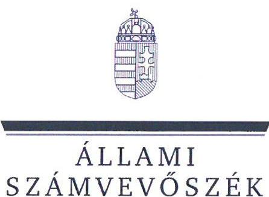
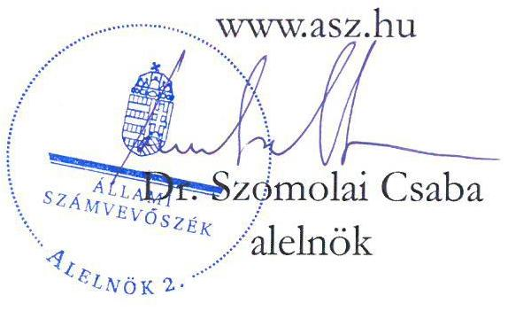
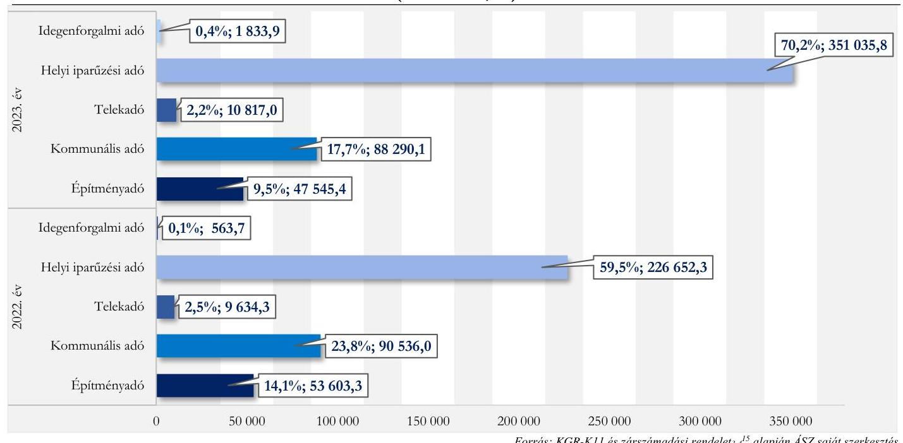
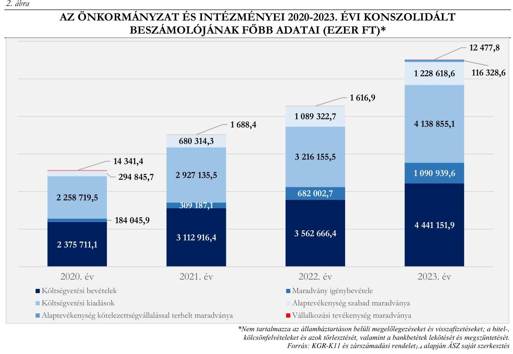
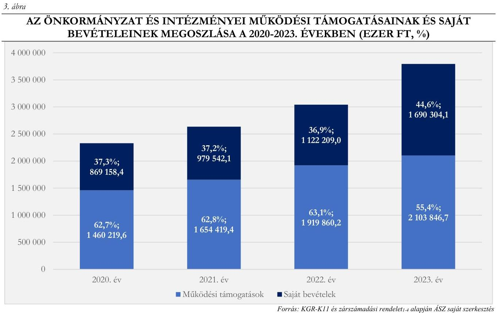

# JELENTÉS 

## Az önkormányzatok helyi adóztatási tevékenységének ellenőrzése - Ingatlanadóztatás

Szigethalom Város Önkormányzata

2025.

---

ÁLLAMI
SZÁMVEVŐSZÉK

# JELENTÉS 

## Az önkormányzatok helyi adóztatási tevékenységének ellenőrzése - Ingatlanadóztatás

## Szigethalom Város Önkormányzata

2025. 

24206

---

# ELLENŐRZÉSI IGAZGATÓSÁG: 

## ÁLLAMHÁZTARTÁS HELYI SZINTJÉT ELLENŐRZŐ IGAZGATÓSÁG

## ELLENŐRZÉSI IGAZGATÓ:

DR. BAFFIA GERGELY GÁBOR ellenőrzési igazgató

## ELLENŐRZÉSVEZETŐ:

Jelentéseink az interneten a www.asz.hu címen olvashatók.

KANYÓ LŐRÁNT ISTVÁN ellenőrzésvezető

IKTATÓSZÁM: EL-4040-019/2024
TÉMASORSZÁM: 54
ELLENŐRZÉS-AZONOSÍTÓ SZÁM: V1084

---

# TARTALOMJEGYZÉK 

AZ ELLENŐRZÉS ALAPADATAI ..... 5
AZ ELLENŐRZÉS TERÜLETE ÉS AZ ELLENŐRZÖTT SZERVEZET ..... 7
ÖSSZEFOGLALÁS ..... 9
AZ ELLENŐRZÉS FÓKUSZKÉRDÉSEI ..... 11
MEGÁLLAPÍTÁSOK ..... 12
JAVASLATOK ..... 30
MELLÉKLETEK ..... 32
I. sz. melléklet: Értelmező szótár ..... 32
II. sz. melléklet: Az ellenőrzött szervezetek jegyzéke ..... 33
III. sz. melléklet: Ellenőrzési kritériumok ..... 34
IV. sz. melléklet: Szigethalom ingatlanadó mértékei a 2023. évben ..... 37
V. sz. melléklet: A helyi ingatlanadótárgyak és adóalanyok a 2023. és a 2024. évben ..... 38
FÜGGELÉK: ÉSZREVÉTELEK ..... 39
RÖVIDÍTÉSEK JEGYZÉKE ..... 40

---

.

---

# AZ ELLENŐRZÉS ALAPADATAI 

## AZ ELLENŐRZÉS CÉLJA

Az ellenőrzés célja az volt, hogy értékelje Szigethalom város helyi ingatlanadóztatásának és adóhatósága feladatellátásának szabályszerűségét, célszerűségét és eredményességét. További cél volt, hogy az ellenőrzés megállapításai és következtetései segítsék az önkormányzati képviselő-testületeket a jogszabályokkal és a helyi sajátosságokkal összhangban álló helyi adópolitika kialakításában és az azt végrehajtó adóigazgatási szervezet megszervezésében. Az ellenőrzés célja volt továbbá annak megállapítása is, hogy az Önkormányzat ${ }^{1}$ által bevezetett, ingatlanokat terhelő helyi adókra vonatkozó rendeleti szabályok összhangban vannak-e a helyi adópolitikai célokkal, tartalmuk tükrözi-e a település helyi sajátosságait és az adóhatósági feladatellátás biztosítja-e az önkormányzati bevételek feltárását és beszedését.

Ennek keretében az ÁSZ ${ }^{2}$ értékelte, hogy az Önkormányzat által bevezetett, ingatlanokat terhelő helyi adókról szóló adórendelet ${ }^{3}$, valamint az adóhatóság ${ }^{4}$ döntései, adóztatási gyakorlata a vonatkozó jogszabályokkal összhangban állnak-e.

## AZ ELLENŐRZÉS TÍPUSA

Kombinált ellenőrzés.

## AZ ELLENŐRZŐTT IDŐSZAK

Az 1. fókuszkérdésnél a 2023. év, valamint a 2024. évnek az ellenőrzés megkezdését megelőző napjáig (2024. április 2.) tartó időszaka.

A 2. és 3. fókuszkérdésnél a 2023. év, valamint a 2024. évnek az ellenőrzés megkezdését megelőző napjáig (2024. április 2.) tartó időszaka, a 2020-2022. évek adatainak bázisadatként való felhasználásával.

## AZ ELLENŐRZÉS TÁRGYA

Az Önkormányzat képviselő-testületének ingatlanokat terhelő helyi adókkal, azaz az építményadóval, a telekadóval és a magánszemély kommunális adójával kapcsolatos rendeletalkotási tevékenységének és az adóhatóság tevékenységének az ellátása.

Az ellenőrzés kiterjedt minden olyan körülményre és adatra, amely az ÁSZ jogszabályban meghatározott feladatainak teljesítéséhez, valamint az ellenőrzési program végrehajtása folyamán felmerült újabb összefüggések feltárásához szükséges.

---

# AZ ELLENŐRZÉS JOGALAPJA 

Az ellenőrzés jogszabályi alapját az ÁSZ tv. ${ }^{5} 5 . \int(8)$ bekezdésének előírásai képezik.

## AZ ELLENŐRZÉS MÓDSZERE

Az ellenőrzést az ellenőrzési program szempontjai, az ellenőrzött időszakban hatályos jogszabályok, az ellenőrzés általános szakmai szabályai és az ellenőrzésre irányadó ÁSZ módszertanok alapján végezte az ÁSZ.

Az ellenőrzési kérdések megválaszolásához szükséges bizonyítékok megszerzése az ellenőrzött szervezetek által rendelkezésre bocsátott dokumentumokra, adatokra és az ASP ${ }^{6}$ Adó és az Iratkezelő szakrendszerek, illetve a KGR-K11 ${ }^{7}$ számviteli adatgyűjtő rendszer adataira alapozva megfigyelés, szemle (szemrevételezés), kérdésfeltevés (információkérés), mintavételezés, valamint elemző eljárás útján történt. Emellett az ellenőrzési bizonyítékként felhasználható adatforrások közé tartozott minden egyéb - az ellenőrzés folyamán feltárt, az ellenőrzés szempontjából információt tartalmazó - releváns dokumentum (ideértve különösen a helyszíni ellenőrzésről készült jegyzőkönyvet) is.

Az ellenőrzés lefolytatásához az ellenőrzött szervezet a tanúsítványok kitöltésével, valamint az ÁSZ által kért dokumentumok, adatok, információk megküldésével és az ellenőrzés során szolgáltatott adatokat.

Az ÁSZ az adómegállapítás, az adótörlés, a fizetési kedvezmények engedélyezése és a hátralékok beszedésének szabályszerűségét mintavételi eljárással ellenőrizte. Ennek során az adóhatósági adómegállapítási feladatellátás ellenőrzése keretében 18 mintatétel (közte 25 határozat), két adótörlésre vonatkozó mintatétel, a fizetési kedvezmények engedélyezése tárgykörben két mintatétel (két határozat) értékelése történt meg. Öt mintatételben (öt határozat) az ÁSZ a hátralékkezelés teljes dokumentációját is ellenőrizte. A mintatételek kiválasztása véletlenszerűen történt az adóhatóság nyilvántartásában lévő adótárgyak és ügyek közül tíz - adómegállapításra vonatkozó - mintatétel kivételével, amelyek esetében a kiválasztás címadatok alapján történt annak érdekében, hogy feltárható legyen, volt-e olyan adótárgy, amelyet nem adóztatott az adóhatóság. Az ellenőrzött mintatételekre vonatkozó megállapítások nem vetíthetők ki a teljes sokaságra, a megállapításokat az ÁSZ az adott ellenőrzött mintatételek vonatkozásában tette meg.

Az ÁSZ a helyi adópolitikai elképzelések és a települési sajátosságok feltárásával értékelte, hogy az adórendelet e szempontoknak mennyiben felelt meg. Az ÁSZ a helyi adópolitikai célokkal akkor tekintette összhangban állónak az adórendeletet, ha az hatását tekintve támogatta az adópolitikai célok teljesülését.

Az ÁSZ az adóhatósági feladatellátás szabályszerűségéből, a meglévő kapacitásokból, valamint az ezer forint adóbevételre jutó adóhatósági költségek alakulásából következtetett arra, hogy az adóhatóság rendelkezett-e azzal a potenciállal, amellyel eredményesen tudta a helyi adópolitikát végrehajtani.

Az ÁSZ - az adórendelet szabályainak érvényre juttatása körében - az eredményesség véleményezésekor a III. számú melléklet 2. pontjában foglalt szempontokat tekintette mérvadónak.

---

# AZ ELLENŐRZÉS TERÜLETE ÉS AZ ELLENŐRZÖTT SZERVEZET 

A városi címet 2004. szeptember 4-én elnyert Szigethalom a Szigetszentmiklósi járásban, Pest vármegyében található. Dunaparti lokációjára és a part mentével párhuzamosan futó erdőrészre figyelemmel jelenleg közkedvelt és számos vendéglátóhellyel tarkított üdülő-, és kirándulóhely, varázsát a Kis-Duna és a Tököli Parkerdő adja.

A település a Csepel-szigeten helyezkedik el, Szigetszentmiklós és Tököl között, állandó lakosainak a száma - a $\mathrm{BM}^{8}$ adatai alapján - 2023. január 1jén 19101 fő, 2024. január 1-jén 19108 fő volt.

A TeIR ${ }^{9}$-ben elérhető adatok alapján az állandó népességen belül a 65 évesél idősebbek aránya a 2011. évi 11,5\%-ról a 2022. évre 16,1\%-ra emelkedett; amely fontos szempont volt a helyi adópolitika kialakításában. A $\mathrm{KSH}^{10}$ adatai alapján a lakások száma a 2021. január 1-jei 6368 -ról 3,8\%-kal a 2023. január 1-jei 6611-ra emelkedett.

Az Önkormányzat - a Hivatal mellett - hat intézményt tartott fenn az ellenőrzött időszakban (Hegedűs Géza Városi Könyvtár; Nebuló Közétkeztetési Intézmény; Szigethalom Négyszínvirág Óvoda; Nobilis Humán Szolgáltató, amelyet két tagintézmény, a Nobilis Humán Szolgáltató Tipegő Bölcsőde és a Nobilis Humán Szolgáltató Család- és Gyermekjóléti Szolgálat alkot; Szigethalom Egyesített Népjóléti Intézmény; Városi Szabadidőközpont).

Az Önkormányzat 2009. július 1-je óta - alapítóként - tagja a Tököl és Térsége Szennyvíztisztító Önkormányzat Társulásnak. Az Önkormányzat a DPMV Zrt. ${ }^{11}$-ben és a Fővárosi Vízmúvek Zrt.-ben rendelkezett nem befolyásoló részesedéssel.

A TeIR adatai alapján 2023. december 31-én 2607 regisztrált gazdasági szervezet volt Szigethalmon, melynek kétharmada, 1739 szervezet szolgáltató szervezet volt, melyek közül a legtöbb, 345 szervezet a kereskedelem, gépjármújavítás nemzetgazdasági ágba tartozott. Az építőipar nemzetgazdasági ágba 381, a mezőgazdaság, erdőgazdálkodás és halászat nemzetgazdasági ágba 145 gazdasági szervezet, a fennmaradó 342 szervezet a fentieken kívüli egyéb területhez tartozott.

Az Alaptörvény ${ }^{12}$ értelmében a helyi önkormányzat a helyi közügyek intézése körében törvény keretei között dönt a helyi adók fajtájáról és mértékéről. Az Mötv. ${ }^{13}$ rögzíti, hogy a helyi adóval kapcsolatos feladatok ellátása a helyi önkormányzatok feladata.

Az Önkormányzat képviselő-testülete a Htv. ${ }^{14}$-ben foglalt felhatalmazással élve az Önkormányzat illetékességi területén az adórendelettel mindhárom, ingatlanokat terhelő helyi adót (az építményadót, a telekadót és a magánszemély kommunális adóját is) bevezette.

---

Az adórendelet szerint az a magánszemély adóalany, aki életvitelszerűen az Önkormányzat illetékességi területén él, az erre a célra szolgáló saját vagy bérelt lakása után évi 15,0 ezer Ft magánszemély kommunális adóját fizet, míg a többi adóköteles felépítmény (épület, épületrész) az ingatlan hasznos alapterületének a nagysága alapján megállapított építményadó-fizetési kötelezettség hatálya alá esik. Az építményadó mértéke kétféle, $200 \mathrm{~m}^{2}$ hasznos alapterületet meg nem haladó adótárgy esetén $600 \mathrm{Ft} / \mathrm{m}^{2}$, a $200 \mathrm{~m}^{2}$ feletti hasznos alapterületű adótárgy esetében $800 \mathrm{Ft} / \mathrm{m}^{2}$.

A telekadóban egy általános, $40 \mathrm{Ft} / \mathrm{m}^{2}$ összegű adómérték van hatályban, ugyanakkor az adórendelet több, jellemzően a telek beépítését ösztönző adómentességi tényállást rögzít.

A 2023. évben 146 652,5 ezer Ft bevétel származott a három ingatlanadóból, ami a konszolidált - az államháztartáson belülről származó felhalmozási célú támogatások nélküli - költségvetési bevételek 3,9\%át, a települési helyi adóbevételek 29,4\%-át tette ki. Az ingatlant terhelő helyi adók közül a magánszemély kommunális adójából származott a legtöbb bevétel, amely 88 290,1 ezer Ft volt. Az Önkormányzat helyi adóbevételei 2022. és 2023. évi összetételére vonatkozó adatokat az 1. ábra, a helyi ingatlanadók 2023. és 2024. évre vonatkozó jellemző naturális adatait pedig az $V$. számú melléklet mutatja be.
1. ábra

AZ ÖNKORMÁNYZAT HELYI ADÓBEVÉTELEINEK MEGOSZLÁSA A 2022-2023. ÉVEKBEN (EZER FT, \%)

---

# ÖSSZEFOGLALÁS 

Az ÁSZ tv. értelmében az ÁSZ feladatkörébe tartozik az önkormányzatok adóztatási tevékenységének ellenőrzése. A helyi adók az önkormányzatok saját, el nem vonható bevételét képezik, így az önkormányzatok gazdasági önállósága szempontjából különös fontossággal bír, hogy a helyi adórendeleti szabályok összhangban álljanak a magasabb szintű jogszabályokkal, továbbá az önkormányzati adóhatósági tevékenység jogszerú, eredményes és hatékony legyen. Erre figyelemmel volt tárgya az ÁSZ ellenőrzésének az Önkormányzat adórendelet-alkotási tevékenysége és az adóhatósági feladatellátás is.

Az adórendelet több ponton nem volt összhangban a magasabb szintű jogszabályokkal, ugyanakkor alkalmas volt az Önkormányzat adópolitikai céljainak elérésére. Az adóhatóság adóalany- és adótárgyfeltárásra irányuló feladatellátása nem volt eredményes, az adómegállapító határozatok nem minden esetben feleltek meg a jogszabályi előírásoknak, indokolásuk pedig nem volt megfelelő. A fizetési kedvezményekre irányuló eljárásban hozott határozatok nem voltak szabályszerűek. Az adóhatóság adóbehajtási tevékenysége eredményes volt, de nem volt célszerú.
Az adóztatási kiadások az adóbevételhez képest magasak voltak, az adóhatóság ingatlanadóztatással összefüggő feladatellátási mutatói összességében elmaradtak az ÁSZ által ellenőrzött nyolc város ${ }^{1}$ feladatellátási mutatóinak átlagos értékeitől.

## Adórendelet, adórendelet-alkotás

Az adórendelet nem volt összhangban a jogszabályi előírásokkal, mert leszűkítette a magánszemély kommunális adója tárgyi hatályát, továbbá egyes építményadó-, telekadó-kedvezmények esetén nem zárta ki azt, hogy azokat vállalkozók is igénybe vehessék. Emellett az adórendelet az építményadóban és a magánszemély kommunális adójában előírt párhuzamos adómentességi rendelkezéssel mindkét adónemben kizárta az adófizetési kötelezettség hatálya alól a magánszemély adóalany életvitelszerűen lakott lakását. Ezen túlmenően az adórendelet több, nem egyértelmű, ezáltal vitatható rendelkezést tartalmazott.

Az ingatlanokat terhelő helyi adókra vonatkozó rendeleti szabályozás megalkotása során az Önkormányzat összességében figyelembe vette azt, hogy a rendeleti szabályoknak tükrözniük kell a helyi sajátosságokat, az önkormányzat gazdálkodási követelményét, továbbá az adóalanyok széles körét érintően az adóalanyok teherviselő képességét.

## Az adóhatóság adóigazgatási feladatellátásának jogszerüsége, eredményessége

Az adóhatóság adótárgy-, és adóalany feltárási feladatellátása (ezáltal az adómegállapítási feladatellátása) nem volt eredményes, az adómegállapítási eljárásban hozott hatósági döntések esetében nem mindegyik határozat volt szabályszerű.

Az építményadó- és telekadómegállapító határozatok indokolása sem tartalmazta egyértelműen az adó kiszámítását, továbbá nem volt világos a tényállás és a jogalapot jelentő jogszabályi rendelkezések egymáshoz rendelése, amely ezáltal nehezítette az adóhatósági döntések értelmezését, e körülmények azonban a határozatokba foglalt fizetési kötelezettség jogszerűségét nem érintették.

[^0]
[^0]:    ${ }^{1}$ Az ÁSZ által jelen ellenőrzés alapjául szolgáló ellenőrzési program alapján ellenőrzött városok: Ajka, Balatonföldvár, Budakalász, Emőd, Paks, Ráckeve, Szigethalom és Tata.

---

Az adómegállapító határozatok kiadmányozása, kézbesítése megfelelt a jogszabályoknak.
Az adóhatóság adatszolgáltatási kötelezettségét késedelmesen teljesítette, közzétételi kötelezettségének eleget tett.

A fizetési kedvezményekre irányuló eljárásban hozott határozatok nem voltak szabályszerüek, mert nem tartalmaztak rendelkezést a pótlékfizetésről.

Az adóhatóság adóbehajtási (adóbeszedési) tevékenysége eredményes volt, de nem volt célszerú, továbbá az ellenőrzött mintatételek többsége nem volt szabályszerü.

Adóellenőrzést az adóhatóság az ellenőrzött időszakban nem folytatott.
Az adórendelet adópolitikai célokkal való összhangja, az adórendelet hatása
Az Önkormányzat - a magyarországi városok² 2023. évi konszolidált költségvetési beszámolók összegző adataival történő összehasonlítása alapján - nem támaszkodott kiemelten az ingatlanadó-bevételekre. Az ingatlanadó-bevétel részesedése a konszolidált - befizetett szolidaritási hozzájárulással csökkentett - saját bevételeken belül a városokra jellemző $\mathbf{1 1 , 0 \%}$-os értéknél kisebb, csak $\mathbf{8 , 7 \%}$; a konszolidált - az államháztartáson belülről származó felhalmozási célú támogatások nélküli és befizetett szolidaritási hozzájárulással csökkentett - költségvetési bevételeken belüli részesedése pedig a városokra vonatkozó $\mathbf{5 , 8 \%}$ nál 1,9\%-ponttal kevesebb, $\mathbf{3 , 9 \%}$ volt ${ }^{3}$. A 322 város esetén az egy állandó lakosra jutó átlagos 18,0 ezer Ft-os ingatlanadó-bevételhez képest az Önkormányzat egy állandó lakosára jóval kevesebb, 7,7 ezer Ft esett.

Az Önkormányzat adórendeleti szabályai összhangban voltak az adópolitikai célokkal (az adó biztos bevételi forrást jelentsen; méltányos legyen; és a helyi lakosságot kevésbé terhelje).

# Az adóhatósági kiadások 

Az adóhatóság a 2023. évben 499 522,1 ezer Ft helyi adóbevételt számolt el költségvetési bevételként. Minden 1000 Ft helyi adóbevételre - az ÁSZ számítása szerint - 73,1 Ft adóztatási kiadás jutott. Az ellenőrzött városok átlaga $15,3 \mathrm{Ft}$, az adóztatási kiadás tapasztalati referencia-érték maximuma kivetéses adóztatás esetén: 50 Ft volt. Az adóztatási kiadások az Önkormányzatnál voltak a legmagasabbak az ÁSZ által jelen ellenőrzésben ellenőrzött városok között.

Az Önkormányzat egy adótisztviselőjére a 2023. évben 99 904,4 ezer Ft költségvetési bevételként elszámolt helyi adóbevétel jutott, mely a nyolc ellenőrzött város 544 502,3 ezer Ft-os átlagának az ötödét sem érte el, az ellenőrzött városok esetében a legalacsonyabb volt.

Az egy adóigazgatásban dolgozóra jutó 1455,4 ingatlanadó-tárggyal az adóhatóság elmaradt a nyolc ellenőrzött város 1751,1-es értékétől, ugyanakkor az egy adóigazgatásban dolgozóra jutó 1544,2 ingatlanadóalannyal meghaladta az ellenőrzött városok esetén számított 1461,7-es átlagot.

Az adóhatóság kiadásai magasabbak voltak, mint az adóztatási kiadások referencia-érték maximuma, az adóhatósági feladatellátás mutatói pedig összességében elmaradtak az ÁSZ által ellenőrzött városok feladatmutatóinak az átlagos értékeitől.

[^0]
[^0]:    ${ }^{2}$ Az ÁSZ a városok alatt a 322 nem megyei jogú várost érti.
    ${ }^{3}$ Szigethalom esetén nem volt szolidaritási hozzájárulási kötelezettség.

---

# AZ ELLENŐRZÉS FÓKUSZKÉRDÉSEI 

1.- Az Önkormányzat ingatlanokat terhelő helyi adókra vonatkozó rendeleti szabályozása megfelel-e a magasabb szintü jogszabályoknak?
2.- Az önkormányzati adóhatóság megfelelően és eredményesen látta-e el az ingatlanok adóztatásával kapcsolatos adóhatósági tevékenységeit?
3.- A településen megvalósuló helyi adóztatás támogatta-e a helyi adópolitikai célok teljesülését?

---

# MEGÁLLAPÍTÁSOK 

## 1. Az Önkormányzat ingatlanokat terhelő helyi adókra vonatkozó rendeleti szabályozása megfelelte a magasabb szintü jogszabályoknak?

## Összegző megállapítás

Az adórendelet több ponton nem felelt meg a magasabb szintü jogszabályoknak.
1.1. számú megállapítás

Az adórendelet több ponton ellentétes volt a Htv. rendelkezéseivel, szövegezése több ponton sértette a normavilágosság, valamint az egyértelmű értelmezhetőség Jat. ${ }^{16}$-ban megfogalmazott követelményét.

A Htv. 2. §-ának az adómegállapításra vonatkozó rendelkezésével ${ }^{4}$ és $24 . \S$-ának a magánszemély kommunális adójának adótárgyait rögzítő rendelkezésével szemben az adórendelet 12. $\mathbb{S}$-a leszűkítette a magánszemély kommunális adójában az adótárgyak körét, mivel nem mindegyik, Htv. szerinti adótárgyra rögzített adómértéket (így sem a telekre, sem az életvitelszerűen használt lakástulajdonon kívül más épületre, épületrészre nem vonatkozott adótétel). Az adórendelet 12. S-a ellentétes volt a Htv. 24. S-ával azért is, mert a rendelkezés nem csak a nem magánszemély tulajdonában álló lakás bérleti joga esetében állapította meg az adókötelezettséget, hanem ab ovo a lakásbérleti jog esetében. Ezzel pedig törvényi felhatalmazás nélkül kibővítette a magánszemély kommunális adójának a tárgyi hatályát.
Az adórendelet 9. S-a ${ }^{5}$ - a Htv. 21. S-ához képest, így azt megsértve - leszűkítette a telekadó alapjának hatályát.
A Htv. 52. § 8. pontja definiálja a „lakás" fogalmát. Az adórendelet 4. $\S$ g) pontja a Htv.-ben szereplő definíciótól eltérő, önálló meghatározást tartalmazott ugyanezen elnevezésű fogalomra, ezért sértette a Htv. 2. §-át.
A Htv. 7. § e) pontjában előírtak ellenére - amely az uniós jogból fakadó állami támogatási elvekre és normákra figyelemmel rögzíti, hogy az önkormányzat az építményadóban és a telekadóban a vállalkozó számára adómentességet, adókedvezményt nem biztosíthat - az adórendelet:
a) 4. S e) pontja nem tekintette üzleti célú adótárgynak, ha az építményen a vállalkozónak vagyoni értékủ joga áll fenn;

[^0]
[^0]:    ${ }^{4}$ Az Alaptörvény 32. cikk (1) bekezdés h) pontja szerint: a törvény keretei között szabályozhat a helyi rendelet, így nem írhatja felül az adó tárgyát. A Htv. 2. §-a erre reagálva rögzíti, hogy az önkormányzat adómegállapítási joga csak a törvényben rögzített adóalanyokra és adótárgyakra terjed ki.
    ${ }^{5}$ Az adórendelet 9. §-a szerint a telekadó alapja az Önkormányzat bel-, illetve külterületén a Szigethalom Város Helyi Építési Szabályzatában (továbbiakban: HÉSZ) megjelölt építési övezeti besorolástól eltérően hasznosított telek $\mathrm{m}^{2}$-ben számított területe. A Htv. 21. §-a szerint a telek $\mathrm{m}^{2}$-ben számított területe vagy a telek korrigált forgalmi értéke az adó alapja.

---

b) 7. $\int$ b) pontja mentesített az építményadó alól minden olyan építményt (épület, épületrész), amely a kommunális adó hatálya alá tartozik, így ha a vállalkozó adóalanynak egy olyan adótárgy ingatlanon áll fenn résztulajdona (részbeni vagyoni értékű joga), amely esetében résztulajdona (részbeni vagyoni értékű joga), vagy lakásbérleti joga alapján valamely magánszemély a magánszemély kommunális adója fizetésére volt köteles, akkor a vállalkozó saját (tulajdonjoga, vagy vagyoni értékű joga alapján) egyidejűleg fennálló építményadó-kötelezettsége kapcsán mentességet élvezett;
c) 9. -a - az adórendeleti telekadóalap híján - a telekadó fizetési kötelezettség alól kivonta azon vállalkozó adóalanyokat, akik telküket Szigethalom Város Helyi Építési Szabályzatában ${ }^{17}$ megjelölt építési övezeti besorolásával azonos módon hasznosítják;
d) az adórendelet 11. -ának (1), illetve (3)-(4) bekezdései olyan adókönnyítési (mentességi, illetve adókedvezményi) tényállást rögzítenek, amelyeknek kedvezményezettje vállalkozó adóalany is lehet ${ }^{8}$.
Az adórendelet 4. 『 a) pontja - leszűkítve Art. ${ }^{18}$ 9. 『-ában foglaltakhoz képest az adókötelezettség fogalmát a „fizetési kötelezettség"-re - nincs összhangban a Htv. 43. 『 (3) bekezdésével, mert az Art.-ban szabályozott jogintézményről fogalmaz meg rendeleti szabályt.
Az adórendelet 4. -ának b) pontja - az adókedvezmény fogalmát átértelmezve - az adórendelet 11. 『 (4) bekezdése szerinti adókedvezményt egyedi elbírálás alapján, méltányosságból adhatóvá tette, ami ellentétes az adókedvezmény Htv. 6. 『d) pontja szerinti normatív tartalmával.
Az adórendelet sértette - a Jat. 2. 『 (1) bekezdéséből következő - egyértelmű értelmezhetőség követelményét, mert az adórendelet 14. 『 (1) bekezdés b) pontja szerinti, a család egy főre jutó havi jövedelemhatárához kötött kommunális adómentesség kapcsán nem definiálta, hogy mely személyeket tart egy családba tartozónak.

[^0]
[^0]:    ${ }^{8}$ Nem zárja ki az adórendelet 11. 『 (3) bekezdése szerinti mentességre jogosultak köréből a vállalkozó adóalanyok körét e jogszabályhely azon szövegezési fordulata sem, mely szerint az adómentesség csak a magánszemély tulajdonában álló telkeket illeti meg, figyelemmel arra, hogy ha ezen telkeken vállalkozónak áll fenn vagyoni értékủ joga, akkor ezen vállalkozó minősül adóalanynak.

---

1.2. számú megállapítás

Az Önkormányzat figyelembe vette a települési sajátosságokat, az Önkormányzat gazdálkodási követelményeit és az adóalanyok széles körét tekintve az adóalanyok teherviselő képességét.

A Htv. 7. § g) pontjában rögzített adómegállapítási korlátokból az következik, hogy a rendelet hatályossága idején is érvényre kell jutnia az e pontban szabályozott rendeletalkotási elveknek, azaz annak, hogy települési önkormányzat az adóalap fajtáját, az adó mértékét, a rendeleti adómentességet és adókedvezményt úgy állapíthatja meg, hogy azok összességükben egyaránt megfeleljenek
a) a helyi sajátosságoknak,
b) az önkormányzat gazdálkodási követelményeinek és
c) az adóalanyok széles körét érintően az adóalanyok teherviselő képességének.

Az ÁSZ véleménye szerint legalább az adózást érintő magasabb szintű jogszabályi változások esetén indokolt felülvizsgálni a rendeletet. Ettől függetlenül a település mérete, adottsága a helyi adókra vonatkozó rendelet összetettsége, az önkormányzat gazdálkodási körülményeinek változása, az adózók teherbíró képességének változása befolyásolja a felülvizsgálat gyakoriságát.

# A belvi sajátosságok figyelembevétele 

Az Önkormányzat legfőbb sajátosságát az adja, hogy kedvelt turistacélpont. Közvetlenül a Duna partján fekszik, így a településen a lakóingatlanok mellett üdülők, üdülőépületek is fellelhetők. A településen nincs jelentős ipari tevékenység, külterületi részein számos termőföld besorolású ingatlan található. Utóbbiak a Htv. előírásai értelmében - nem minősülnek teleknek, s így telekadóval nem terhelhetők, az Önkormányzat ezen területeket 2023. január 1-jéig (amíg erre törvényi lehetősége volt) települési adóval adóztatta.
A településen az ellenőrzött időszakban telekadó is múködött, amelynek a célja az volt, hogy a beépíthető telkeken felépítmények jöjjenek létre, illetve a meglévő felépítmények bővüljenek.
Tekintettel arra, hogy a helyi adórendelet szabályrendszere célja szerint igazodott az Önkormányzat jellegzetességeihez, így az ÁSZ megállapította, hogy a település ingatlanadóztatás szempontjából meghatározó sajátos körülményeit a hatályos adórendelet legutóbbi, 2023. január 1-jétől hatályos módosítása előkészítésekor az Önkormányzat figyelembe vette és mérlegelte.

## Az önkormányzat gazdálkodási követelményeinek szempontja

Az Önkormányzat részéről történt szóbeli tájékoztatás alapján a helyi ingatlanadók települési működtetésének az elsődleges célja a bevételszerzés volt. Az Önkormányzat gazdasági programmal nem rendelkezett, azonban un. Ciklusprogramja ${ }^{19}$ volt, amelyben szerepeltek gazdasági célok is. Az ebben foglaltak szerint az Önkormányzat finanszírozása nagyban függött a településen működő vállalkozások adófizetésétől. A vállalkozások települési letelepedését kívánták ennek érdekében azzal is ösztönözni, hogy az adóköteles építményt létrehozó vállalkozót az adott ingatlan után két évre építmény- és telekadómentességben részesítették.
A Ciklusprogramban kifejtett egyik gazdaságfejlesztési cél az Ipari és Gazdasági Övezet létrehozása volt, melyben az ingatlantulajdonosokat is érdekeltté kívánta tenni az Önkormányzat, mégpedig adóeszközök alkalmazásával, melyek tartalmát azonban a Ciklusprogram nem részletezte.
A 2022. évben a helyi adókból összesen 380 989,6 ezer Ft bevétele származott az Önkormányzatnak, amely a konszolidált költségvetési bevételnek (amely 3562 666,4 ezer Ft) 10,7\%-át tette ki.

---

A 2023. évben a helyi adókból származó éves 499 522,1 ezer Ft az Önkormányzat konszolidált költségvetési bevételének a 11,2\%-a volt. Az ingatlanadó-bevétel 2022. évi 153 773,6 ezer Ft-ról a következő évre 4,6\%-kal 146 652,5 ezer Ft-ra csökkent (1. ábra); a 2021-2022. évihez képest volt minimálisan magasabb. A bevételcsökkenés az építményadó-tárgyak számának csökkenésére vezethető vissza (az ingatlanadó-mértékek 2020. január 1-je óta változatlanok).
Az Önkormányzat és intézményeinek főbb gazdálkodási adataiból (2. ábra) az figyelhető meg, hogy 20202023. között az egyes években jelentős maradvány képződött. A konszolidált alaptevékenység maradványa a 2020. évben 294 845,7 ezer Ft, a 2021. évben 680 314,3 ezer Ft, a 2022. évben 1089 322,7 ezer Ft, a 2023. évben 1344 947,4 ezer Ft (ebből 116 328,6 ezer Ft kötelezettségvállalással terhelt) volt, az Önkormányzatnak a következő években esedékes kötelezettségállománya 2023. év végén 519 234,9 ezer Ft volt. Az önkormányzat gazdálkodási helyzete összességében nem tette szükségessé az adórendelet módosítását.

Az Önkormányzat az adórendelet 2023. évtől hatályos normatartalma előkészítése során mérlegelte és figyelembe vette az Önkormányzat gazdálkodási követelményeit (és körülményeit).

# Az adóalanyok teherbíró képességének figyelembevétele 

Az adórendelet szerint az egyéb adóalanyokhoz képest a helyben (az Önkormányzat illetékességi területén) lakóhellyel rendelkező adóalanyokat a lakóhelyükként szolgáló ingatlanok után alacsonyabb adófizetési kötelezettség terhelte. E megfontolás mögött - az Önkormányzat indokolása alapján - az állt, hogy az üdülőtulajdonosok esetében valószínűsíthető volt, hogy üdülőjük második vagy

---

többedik ingatlanuk, így vélelmezhető volt az is, hogy ők nagyobb szerepet tudnak vállalni a helyi közterhekből ${ }^{7}$.
Az Önkormányzat nyilatkozata szerint a jogalkotásnál vélelmezték azt is, hogy a vállalkozó ingatlantulajdonosok nagyobb részt képesek vállalni a települési közterhekből, mint a magánszemély adóalanyok ${ }^{8}$.
Az ÁSZ a Ciklusprogram, az adórendelet, valamint az Önkormányzat nyilatkozata alapján megállapította, hogy az Önkormányzat a Htv. előírásainak megfelelően figyelembe vette a helyi ingatlanadó-szabályozás kialakításánál az adóalanyok teherviselőképességét.

[^0]
[^0]:    ${ }^{7}$ Ezt az Önkormányzat azzal akarta elérni, hogy az életvitelszerűen helyben lakó adóalanyi kört egy tételes, a hatályos szabályok szerint évi 15.000 Ft összegű kommunális adóval terheli, míg az egyéb ingatlanadó-alanyok adófizetési kötelezettsége az építményadóban áll elő, - az adótárgy ingatlan nagyságától függő - 600 vagy 800 $\mathrm{Ft} / \mathrm{m}^{2} /$ év adómértékkel, ami egy átlagos $\left(71,5 \mathrm{~m}^{3}\right)$ nagyságú szigethalmi lakás esetében évi 42870 Ft évi építményadó-fizetési kötelezettséget eredményez.
    ${ }^{8}$ Az Önkormányzat tájékoztatása szerint a Htv. szerinti adómaximumhoz $\left(456,1 \mathrm{Ft} / \mathrm{m}^{2}\right)$ képest csekély $\left(40 \mathrm{Ft} / \mathrm{m}^{2}\right)$ telekadómérték a vállalkozókat célozza, mert esetükben ennek a fizetési kötelezettségnek a teljesítése vélhetően nem okoz megterhelést.

---

# 2. Az önkormányzati adóhatóság megfelelően és eredményesen látta-e el az ingatlanok adóztatásával kapcsolatos adóhatósági tevékenységeit? 

Összegző megállapítás

Az adóhatóság adómegállapítási tevékenysége nem volt eredményes, továbbá az adóhatósági döntések sem voltak minden esetben szabályszerűek. Az adóhatóság adatszolgáltatási kötelezettségének határidőn túl, közzétételi kötelezettségének azonban maradéktalanul eleget tett. Az adóhatóság adóbehajtási tevékenysége eredményes volt, azonban nem volt célszerű, valamint nem minden esetben volt szabályszerű.
2.1. számú megállapítás

Az adóhatóság adóalany-, és adótárgyfeltárási feladatellátása nem volt eredményes. Az adófizetési kötelezettség megállapítása nem minden esetben volt szabályszerű. Az adómegállapító határozatok kiadmányozása szabályszerű volt. A fizetési kedvezményekre irányuló eljárásban hozott határozatok nem voltak szabályszerűek, mert nem tartalmaztak rendelkezést a pótlékfizetésről. Az ellenőrzött időszakban az adóhatóság az adótartozások törlését szabályszerűen végezte. Az adóhatóság adatszolgáltatási kötelezettségét késedelmesen teljesítette, közzétételi kötelezettségének eleget tett.

## Adótárgy-, és adóalanyfeltárás

Az adóhatóság az adóalanyok és az adótárgyak feltárása érdekében a Google Maps, valamint a TAKARNET felületeket használta, azonban az építésügyi hatóságtól az Art. 86. § (2) bekezdése alapján kapott adatokat nem hasznosította. Az adóhatóság az ellenőrzött időszakban élt ugyan az Art. 83. § (2) bekezdésben meghatározott ingatlanügyi hatóság megkeresésének lehetőségével, azonban a kapott adatokat nem használta fel (az Önkormányzat nyilatkozata szerint a kapott adatok formátuma miatt) az adóztatás során. Az ÁSZ nem tárt fel olyan ingatlant, amelyet az adóhatóságnak adóztatnia kellett volna.

Mindezek alapján - tekintettel arra, hogy az adóhatóság nem használta az ingatlanügyi hatóság adatait összességében az adóhatóság adótárgy- és adóalanyfeltárási feladatellátása nem volt eredményes.

## Adómegállapítás (késetés)

Az ÁSZ az adóhatósági adómegállapítási feladatellátás ellenőrzése keretében 18 mintatétel ellenőrzését végezte el.

---

Három mintatétel (13., 15. és 17. mintatétel) esetében az adótárgynak több tulajdonosa volt, ugyanakkor az adóhatóság által - a tulajdonosok közti megállapodás alapján - hozott adómegállapító határozat rendelkező része kizárólag az adó fizetésére kötelezett által fizetendő adó összegét tartalmazta.
Egy mintatétel (19. mintatétel) esetében a tulajdoni lap szerint két adótárgy szerepelt egyazon

Ha az adótárgynak több tulajdonosa van, akkor ők tulajdoni illetőségük arányában adóalanyok. Ekkor, mindegyikük egyetértése esetén köthetnek arról megállapodást, hogy az adóalanyisággal kapcsolatos jogokat és kötelezettséget az adóhatóság előtt közülük egy adóalany kapcsolattartóként gyakorolja. Az ÁSZ jó gyakorlatnak azt tekinti, ha az adómegállapító határozat nemcsak a fizetési kötelezettséget és a fizetésre kötelezettet (a kapcsolattartót), hanem az egyes adóalanyokat terhelő adót és annak jogalapját, kiszámítását is tartalmazza, annak érdekében, hogy az egyes adóalanyok számára egyértelmű legyen az őket terhelő adó összege.
helyrajzi számon, amelynek osztatlan közös tulajdonként három résztulajdonosa volt, továbbá $2 / 4$ rész tulajdoni illetőségen egy haszonélvezőnek állt fenn haszonélvezeti joga. Az adóhatóság - szemben a Htv. 12. §-ának (1) és (2) bekezdésével ${ }^{9}$ - az egyik adótárgy esetében kizárólag a $2 / 4$ rész tulajdonos magánszemély adóalanyiságát állapította meg, miközben e tulajdoni illetőséget vagyoni értékű jog (haszonélvezeti jog) terhelte. A másik adótárgy esetében pedig az egyik $1 / 4$ tulajdoni hányaddal rendelkező adóalany adófizetési kötelezettségét írta elő arra hivatkozással, hogy ő a másik $1 / 4$ tulajdoni hányaddal rendelkező házastársával megállapodást kötött. Mindemellett a két adómegállapító határozat azonos helyrajzi számra állapította meg az adót, az adómegállapító határozatoknak sem a rendelkező, sem pedig az indokolási része nem tartalmazott utalást arra, hogy az adókötelezettséget az adóhatóság mely adótárgy után állapította meg. Ezáltal az adómegállapító határozatok indokolása sem felelt meg az Air. 73. $\$ 1$ bekezdésének.
Öt mintatétel (20-23. mintatételek és 25. mintatétel) esetében a vonatkozó határozat rendelkező részében az ingatlan besorolása „egyéb nem lakás céljára építmény" annak ellenére, hogy az adatbejelentésben - valamint az ingatlan-nyilvántartásban - lakáscélú ingatlan szerepelt. Az adómegállapító határozatok indokolása egyik esetben sem tért ki arra, hogy az adóhatóság milyen indokból tért el az ingatlan besorolása tekintetében az adatbejelentésben, valamint az ingatlan-nyilvántartásban szereplő adatokhoz képest, ezzel az adómegállapító határozatok nem feleltek meg az Air. 73. §(1) bekezdés c) pontjában előírt követelménynek.

[^0]
[^0]:    ${ }^{9}$ A Htv. hivatkozott rendelkezései szerint, ha az ingatlanon vagyoni értékű jog áll fenn, akkor a vagyoni értékủ jog jogosultja az adó alanya, egyébként pedig az adótárgy tulajdonosa tulajdoni illetősége arányában az adó alanya. A Htv. 12. § (2) bekezdése azt is lehetővé teszi, hogy a tulajdonostársak megállapodást kössenek arra nézvést, hogy közülük egy személy álljon kapcsolatban az adóhatósággal, feltéve, ha ezt a megállapodást valamennyi adóalany aláirta.

---

Tíz mintatétel (8., 12., 17-23. és 25. mintatételek) esetében az adóhatóság annak ellenére állapított meg kommunális adót a magánszemély életvitelszerúen használt lakása után, hogy az adórendelet 7. § b) pontja és 14. $\S$ (1) bekezdése alapján ezen adótárgy után sem építményadót, sem kommunális adót nem kell fizetni. ${ }^{10}$

Három mintatétel (10., 11. és 14. mintatételek) esetében az adóhatóság az adóalany részére kiadott adómegállapító határozatok alapján - szemben az Art. 141. § (2) bekezdésével és 48. §-a (1) bekezdésével, a 3. számú melléklet II/A cím, 4. pontjával ${ }^{11}$ - olyan évre is írt elő és szedett be adót, amelyre a határozatban foglalt fizetési kötelezettség nem vonatkozott.

## A 13. mintatétel

esetében
2024. március 6. napján
kelt adómegállapító határozatban adóhatóság az adót kizárólag a 2024. évre vetette ki.
Az adóhatóság az ügyintézési határidőt az adómegállapító határozatok mindegyikének

Helyi ingatlanadóztatás esetén az adófizetési kötelezettség az adóhatóság által kiadott adómegállapító határozaton nyugszik. Az ÁSZ nem tartja megfelelő gyakorlatnak, ha az adóhatóság az adót kizárólag egy adóév vonatkozásában állapítja meg határozatában, tekintettel arra, hogy ezzel egyrészt a későbbi adóévekre vonatkozó adófizetési kötelezettséget nem írja elő, másrészt többletköltséget jelent az adóhatóság számára, hogy évenként adómegállapító határozat kiadását teszi ezzel szükségessé.
Az ÁSZ azt tartja megfelelő és szabályszerű gyakorlatnak, ha az adómegállapító határozatban az adóhatóság tájékoztatja az adóalanyt, hogy adófizetési kötelezettsége mindaddig fennáll, amíg annak tárgyában az adóhatóság újbóli döntést nem hoz.
indokolási részében az adatbejelentés adóhatósághoz való érkezése napjától számította. Az adómegállapító eljárás ugyanakkor nem kérelemre, hanem hivatalból indított eljárás. Ezért az adóhatóság gyakorlata ellentétes volt az Air. 50. § (1) bekezdésével ${ }^{12}$.
Az adómegállapító határozatok indokolása - az Air. 73. § (1) bekezdés c) pontjában foglaltak ellenére tényállási elemként egyik esetben sem tartalmazta az adótárgy utáni adó és az adóalany(ok)ra jutó adó összegének egyértelmú számszaki levezetését, jogalapját, továbbá olyan jogszabályhelyek is szerepeltek az adómegállapító határozat indokolásában, amelyek a fizetési kötelezettség kapcsán nem relevánsak. Ezen észlelt hiányosságok a határozatokban foglalt fizetési kötelezettség jogszerüségét

[^0]
[^0]:    ${ }^{10}$ Az adórendelet 7. §-ának b) pontja alapján mentes az építményadó hatálya alól az az építmény (épület, épületrész), amely a kommunális adó hatálya alá tartozik (tárgya a magánszemély kommunális adójának). Ezzel egyidejűleg az adórendelet 14. $\S$ (1) bekezdése azt rögzíti, hogy mentes a magánszemély kommunális adója alól az az ingatlan, amely az építményadó hatálya alá tartozik (tárgya az építményadónak). Tekintve, hogy az adórendelet alapján a magánszemély kommunális adójának hatálya alatt álló adótárgyak közül az építményadó hatálya csak a magánszemély adóalany életvitelszerúen használt lakástulajdonára terjed ki, így az építményadó alól ez az adótárgy az adórendelet 7. § b) pontja alapján mentességet élvez. Ugyanakkor az adórendelet 14. § (1) bekezdése ugyancsak ezt az adótárgyi kört mentesíti.
    ${ }^{11}$ A hivatkozott Art. rendelkezések értelmében az ingatlanokat terhelő helyi adókat kivetéssel állapítja meg az adóhatóság, azaz határozatot hoz a fizetendő adó összegéről, továbbá a végrehajtható okirat (érvényes és hatályos) határozat alapján kell a fizetési kötelezettséget teljesíteni.
    ${ }^{12}$ Az Air. e rendelkezése szerint hivatalból való eljárás esetén az első eljárási cselekmény megkezdése napjától - azaz a konkrét esetekben (mivel egyéb eljárási cselekmény nem történt) a határozat kiadmányozása napjától - kell számítani az ügyintézési határidőt.

---

azonban nem érintették. A világos, követhető magyarázat ugyanakkor érthetővé teheti az adózó számára, hogy milyen jogalapon és miért az adómegállapító határozat szerinti összeget kell fizetnie. Ezen túlmenően az adóhatóságnak és az Önkormányzatnak is előnyös lehet, ha az adózó fizetési hajlandósága javulhat azáltal, hogy számára is világos és érthető az adómegállapító határozat.
Adóellenőrzést az adóhatóság az ellenőrzött időszakban nem végzett.
Az adómegállapító határozatok kiadmányozása és adózókkal való közlése, valamennyi adómegállapító határozat esetében megfelelt az Air. és az Eüsztv. ${ }^{20}$ előírásainak ${ }^{13}$.

A megállapított adó csökkentése: fizetési kedvezmények, adókötelezettség változás, elévülés miatti törlés
Az ÁSZ az adóhatóság fizetési kedvezményre vonatkozó kérelem elbírálására vonatkozó eljárását két (6. és 7.) mintatétel ellenőrzésével végezte el.
Az Art. 200. §-ában foglalt előírás ellenére egyik határozat sem tartalmazott rendelkezést a pótlékfizetési kötelezettségről vagy arról, hogy azt az adóhatóság méltányosságból elengedte.
Egyik mintatétel esetében sem felelt meg a határozat az Air. 73. § (1) bekezdés c) pontjának, tekintettel arra, hogy a határozatok indokolása nem tartalmazta a megállapított tényállás alapjául elfogadott bizonyítékokat, az adózó által felajánlott és mellőzött bizonyítékokat, a döntés indokait, az adóhatóság mérlegelési szempontjait. Emellett a 6. mintatétel esetében a döntést alátámasztó dokumentumokat az Önkormányzat nem bocsátotta az ÁSZ rendelkezésére.
Az adózó késedelmes adatbejelentése miatt mindkét mintatétel (6. és 7. mintatétel) esetében visszamenőlegesen vetette ki az adót az adóhatóság. Az adózói késedelmet az adóhatóság hivatalból nem észlelte, arra vonatkozóan az Art. 221. § alapján hiánypótlásra felhívást nem kezdeményezett.
A fennálló adókövetelést csökkentő intézkedések közül vizsgált két mintatétel jogszerú volt. Az ellenőrzött időszakban megtett intézkedések számszaki összefoglalását az 1. táblázat mutatja be.

1. táblázat

# A 2023-2024. ÉVEKBEN TÖRTÉNT ADÓKÖVETELÉS TÖRLÉSEK FŐBB ADATAI (DARAB ÉS EZER FT) 

| MEGNEVEZÉS | 2023. |  | 2024.9 |  |
| :--: | :--: | :--: | :--: | :--: |
|  | ESETSZÁM | ÖSSZEG | ESETSZÁM | ÖSSZEG |
| Méltányosságból töröl adókövetelés | 6 | 81,7 | 1 | 6 |
| Adókötelezettség változás okán töröl adókövetelés | 351 | 16 115,6 | 89 | 3702,0 |
| Elévülés miatt töröl adókövetelés | 254 | 2088,5 | 0 | 0 |

${ }^{* 2024 .}$ április 9.-ei állapot szerint.
Forrás: Az Önkormányzat és a Hivatal tanúsitványokon megadott adatai alapján ÁSZ saját szerkesztés

[^0]
[^0]:    ${ }^{13}$ Az Eüsztv. 2024. szeptember 1-je óta hatálytalan, a jogterület szabályozását a digitális államról és a digitális szolgáltatások nyújtásának egyes szabályairól szóló 2023. évi CIII. törvény tartalmazza.

---

# Adatszolgáltatási, közzétételi kötelezettség 

Az adóhatóság a Kincstár ${ }^{21}$ számára a helyi adórendeletről és adózási információkról szóló adatszolgáltatási kötelezettségének a Htv. 42/B. § (1) bekezdésben foglalt határidőn túl ${ }^{14}, 281$ nappal később, 2023. szeptember 13-án tett eleget. Az adórendelet az Önkormányzat honlapján elérhető volt, az adóhatóság a Htv.-ben foglaltak szerinti közzétételi kötelezettségét rendben teljesítette.
2.2. számú megállapítás

Az adóbehajtási (adóbeszedési) tevékenység a mintatételek többségében nem volt szabályszerű. Az adóbehajtási (adóbeszedési) tevékenység emellett eredményes volt, azonban nem volt célszerű.

Az adóhatóság ingatlant terhelő adóban fennálló tartozás behajtásához kapcsolódóan a 2023. évben tíz, a 2024. évben az ellenőrzés megkezdéséről való értesítés átvételének napjáig pedig 19 esetben indított végrehajtási eljárást.
A 2023. évben folyamatban lévő 1701 (végrehajtási) eljárás eredményeként összesen 14 405,84 ezer Ft (a 2023. év végén fennálló adótartozás $99,5 \%$-a) beszedése történt meg a 2023. évben, a 2024. évben folyamatban lévő 253 végrehajtási eljárásból 4316,4 ezer Ft összeget szedett be az adóhatóság a 2024. évben az ellenőrzés megkezdéséről való értesítés átvételének napjáig.

Az adóbehajtási feladatellátás eredményes volt, mert,

- az adóhatóság által nyilvántartott 2023. évi hátraléknak (14 474,9 ezer Ft) a 2023. évi ingatlanadó-bevételhez viszonyított aránya ( $9,9 \%$ ) alacsonyabb volt, mint a városi önkormányzatok ingatlanadó-bevétel-arányos hátraléka ( $16,8 \%$ ), és
- a 2023. december 31-i hátralékok összege 9,9\%-kal alacsonyabb volt, mint a 2022. december 31-én fennálló hátralékok összege, valamint
- az ingatlanokat terhelő adóból származó 2023. évi tényleges adóbevétel a 2023. évi költségvetésben tervezett eredeti előirányzat $90 \%$-át meghaladva, $104,8 \%$-a volt, és
- az adóhatóság az adófizetés első esedékessége előtt felhívta az adózók figyelmét az adókötelezettség teljesítésére.

Az ÁSZ az adóhatóság adóvégrehajtási feladatellátása ellenőrzése keretében öt mintatétel ellenőrzését végezte el.

[^0]
[^0]:    ${ }^{14}$ Az adórendelet, valamint annak módosítása hatálybalépését megelőző hónap ötödik napjáig kell adatot szolgáltatni a Kincstár számára.

---

Két mintatétel (2. és 3. mintatétel) esetében az adóhatóság által hozott határozat mint végrehajtható okirat rendelkező része kizárólag az adó fizetésére kötelezett által fizetendő adó összegét tartalmazta, így az adóhatóság a végrehajtást csak az adóalanyok közötti megállapodás alapján az adóhatósággal kapcsolatot tartó adóalany ellen folytatta le a többi adóalanyt terhelő adótartozás vonatkozásában is.
Négy mintatétel esetében (13. mintatételek és 5. mintatétel) a végrehajtás az Avt. ${ }^{22}$ 29. $\int(1)$ bekezdésébe ütközött, mert az adóhatóság nem rendelkezett jogszerűen végrehajtható okirattal, tekintve, hogy a rendelkezésre álló határozat az adórendelet 7. $\S$ b) pontja és az adórendelet 14. $\int$-a ellenében kommunális adót állapított meg a magánszemély életvitelszerúen lakott lakása után.

Abban az esetben, ha az adóalanyok megállapodásban rögzítik, hogy közülük ki a kapcsolattartó, azaz az adófizetési kötelezettséget a többiek nevében is teljesítő adóalany, de a határozat (a végrehajtható okirat) nem rögzíti a rendelkező részben külön-külön a valamennyi adóalanyra jutó adót, akkor ez jogvitához vezethet a végrehajtó és a végrehajtás alá vont személy között, a végrehajtás késedelmet szenvedhet (részint a jogvita lezárásáig, részint amiatt, mert a végrehajtás többi tulajdonosra való kiterjesztése érdekében új adómegállapító határozatot kell kiadni, amelyben az adóhatóság rendelkezik a többi tulajdonostárs adófizetési kötelezettségéről, az őket terhelő adó erejéig). Az ÁSZ álláspontja szerint az, ha a határozat rendelkező része az adótárgy utáni adót a kapcsolattartóról szóló megállapodást megkötő adóalanyonként tartalmazza, nemcsak azt szolgálja, hogy a fizetési kötelezettséget ne lehessen kijátszani, és nemcsak abból a célból fontos, hogy az anyagi jogi norma szerinti adót viselő adóalanyok mindegyikére jutó adót megismerhessék az adóalanyok, hanem azon okból is célszerű, hogy a végrehajtás hatékony legyen (egyidejúleg lehessen a végrehajtást megindítani valamennyi adóalany ellen), továbbá kizárható legyen az, hogy a kapcsolattartó adóalanytól olyan adótartozást hajtson végre az adóhatóság, amelynek terhét a kapcsolattartó adóalany tulajdonostársai viselik.

Az adóhatóság az ellenőrzött időszakban nem élt az Avt. 30. § (1) bekezdése nyújtotta lehetőséggel, tehát a tartozás megfizetésére fizetési felhívást nem küldött, azonban az évente kétszer kiküldött egyenlegértesítők mellékletében az adóalanyt tájékoztatta a fizetési kötelezettségről.
Mind az öt mintatétel esetében megállapítható, hogy az adóhatóság a legrégebbi tartozás esedékességének időpontjától számítva az első, az adótartozás behajtására irányuló végrehajtási cselekményt (jövedelemletiltás, illetve jelzálogjog bejegyzés kérelmezése) legalább 500 nappal később foganatosította. Ezen esetekben az adóhatóság jelentős késedelemmel kezdeményezte az adótartozás behajtását, így az önkormányzat később juthatott az adóbevételhez, ami kamatelmaradással vagy kamatkiadással jár, ezért nem volt célszerú az adóbehajtás.
A 2. táblázat szerint a 2023. év végére a hátralékos adózók és ezzel a hátralékok összege is csökkent mind a három adónemben.

---

1. táblázat

| AZ ADÓHÁTRALÉKOK FŐBB ADATAI ADOTT NAPON (DARAB ÉS EZER FT) |  |  |  |  |  |
| :--: | :--: | :--: | :--: | :--: | :--: |
| MEGNEVEZÉS | NAPTÁRI   NAP | ÉPÍTMÉNYADÓ | TELEKADÓ | MAGÁNSZEMÉLY   KOMMUNÁLIS   ADÓJA | ÖsszeSEN |
| Hátralékos   adózók száma | 2022.12.31 | 90 | 22 | 584 | 696 |
|  | 2023.12.31 | 70 | 15 | 445 | 530 |
|  | 2024.05.22 | 73 | 16 | 797 | 886 |
| Adóhátralék   összege | 2022.12.31 | 5320,4 | 880,8 | 9871,0 | 16072,2 |
|  | 2023.12.31 | 4604,3 | 544,0 | 9326,6 | 14474,9 |
|  | 2024.05.22 | 4971,3 | 555,7 | 10442,8 | 15969,8 |

Forrás: Az Önkormányzat és a Hivatal tanúsítványokon és nyilatkozatában megadott adatai alapján ÁSZ saját szerkesztés

# 3. A településen megvalósuló helyi adóztatás támogatta-e a helyi adópolitikai célok teljesülését? 

| Összegző megállapítás | Az Önkormányzat ingatlanokat terhelő helyi adókra vonatkozó adórendeleti szabályozása támogatta a helyi adópolitikai célok megvalósulását. |
| :--: | :--: |
| 3.1. számú megállapítás | A helyi adópolitikai célok elérésének megfelelő eszközéül szolgáltak az Önkormányzat ingatlanokat terhelő helyi adókra vonatkozó adórendeleti szabályai. |

Szigethalom Város írásba foglalt adópolitikai koncepcióval nem rendelkezett, ugyanakkor 2019-2024. évekre szóló Ciklusprogramja van, amelyben gazdasági célok is szerepeltek. Az Önkormányzat által adott szóbeli tájékoztatás szerint az adópolitika ezen gazdasági célok teljesülését kellett, hogy kiszolgálja.
Az Önkormányzat által az ÁSZ helyszíni ellenőrzés során megfogalmazott adópolitikai célokat és az alkalmazott eszközrendszert a 3. táblázat tartalmazza:

---

# 3. táblázat 

AZ ÖNKORMÁNYZAT ADÓPOLITIKAI CÉLJAI ÉS ALKALMAZOTT ESZKÖZRENDSZERE

| ADOPOLITIKAI CÉL | ADOPOLITIKAI ESZKÖZ |
| :-- | :-- |
| Biztos bevételi forrás legyen | Mindhárom ingatlant terhelő helyi adó bevezetése |
| Célhoz kötött adóbevétel-felhasználási szándék | A magánszemély kommunális adója bevezetésének   elsődleges célja a földutak aszfaltozása fedezetének a   megteremtése volt |
| Üres telkek beépítésének ösztönzése | 4 évre szóló telekadómentesség a telek lakóházzal   való beépítése esetén |
| Elviselhető, méltányos teher a lakosság számára | Az életvitelszerűen a településen lakók magánszemély   kommunális adóját fizettek építményadó helyett, a   magánszemély kommunális adójában   jövedelemhatárhoz kötött adómentesség volt   hatályban |
| Ne hasson az adószabály a vállalkozások fejlesztési   elképzelései ellen | Az adóköteles építményt létrehozó vagy bővítő   vállalkozó 5 évig (jogsértő) adókönnyítésben részesül |

Forrás: az adórendelet és az Önkormányzat nyilatkozata alapján ÁSZ saját szerkesztés

Az ÁSZ véleménye szerint az adórendeleti eszköztár az elérni kívánt adópolitikai célokkal összhangban volt.

Az ÁSZ szerint jó gyakorlat lehet, ha az adószabályok felülvizsgálata során az önkormányzat forrást igénylő terveit is figyelembe veszik. Az Önkormányzat esetén például azt, hogy a hatályos telekadó-szabályok valóban alkalmasak-e az adónemből elérni szándékolt, a közszolgáltatások és az infrastruktúra-fejlesztés, -működtetés költségeinek fedezetéül szolgáló adóbevétel eléréséhez.
3.2. számú megállapítás

Az Önkormányzat a városok összegző adataival összehasonlítva kisebb mértékben támaszkodott az ingatlanadókból származó bevételekre. Az Önkormányzat gazdálkodásában az ingatlanadó-bevétel jelentősége csökkent a 2020. óta változatlan szabályozás miatt. Az adószint az adóalanyok adóteherbíró-képességével összhangban volt.

## Az adórendelet(módosítás) hatása az önkormányzat gazdálkodására

Az ingatlanadó-bevétel a 2022. évi 153 773,6 ezer Ft-ról a következő évre 4,6\%-kal, 146 652,5 ezer Ft-ra csökkent. A csökkenés az építményadó 6057,9 ezer Ft-os és a magánszemély kommunális adó 2245,9 ezer Ft-os bevételcsökkenése miatt következett be, amelyet részben kompenzált a telekadóból származó 1182,7 ezer Ft-os többletbevétel. Tekintettel arra, hogy az ingatlanadó-mértékek 2020. január 1-je óta változatlanok, a bevétel-csökkenés az építményadó-tárgyak csökkenésére vezethető vissza.
Az iparűzési adóbevétel - mértéke 1,8\% - a 2023. évre az előző évről több mint a másfélszeresére 124383,5 ezer Ft-tal - 351 035,8 ezer Ft-ra emelkedett.
Ebből adódóan folyamatosan csökkent mind az ingatlanadó-bevétel konszolidált - az államháztartáson belülről származó felhalmozási célú támogatások nélküli - költségvetési bevételeken

---

belüli aránya a 2020. évi 5,9\%-ról a 2023. évi 3,9\%-ra; mind a konszolidált saját bevételeken belüli aránya $15,8 \%$-ról $8,7 \%$-ra.
A 2020-2023. év(ek)re vonatkozó konszolidált bevételek jogcímenkénti nagyságát és változását éves bontásban a 4. táblázat, az Önkormányzat és intézményei működési támogatásainak és saját bevételeinek 2020-2023. évi megoszlását pedig a 3. ábra mutatja be.
4. táblázat

# AZ ÖNKORMÁNYZAT ÉS INTÉZMÉNYEI 2020-2023. ÉVEKRE VONATKOZÓ KONSZOLIDÁLT KÖLTSÉGVETÉSI BEVÉTELEI (EZER FT, \%) 

| Ssz. | Jogcím | 2020. | 2021. | 2022. | 2023. |
| :--: | :--: | :--: | :--: | :--: | :--: |
| 1. | Müködési célú támogatások államháztartáson belülről | 1460 219,6 | 1654 419,4 | 1919 860,2 | 2103 846,7 |
| 2. | Felhalmozási célú támogatások államháztartáson belülről | 46333,1 | 478954,9 | 520597,2 | 647001,1 |
| 2.1. | ebböl: EU-s programokra és hazai társfinanszirozása | 0 | 363090,7 | 519618,8 | 646 206,0 |
| 3. | Közhatalmi bevételek | 373360,9 | 354478,2 | 400814,9 | 518 815,7 |
| 3.1. | ebböl: ingatlanadókból származó bevétele ${ }^{23}$ | 137523,4 | 142512,9 | 153773,6 | 146652,5 |
| 3.2. | ebböl: belsi iparäzési adóbevétel | 228 196,3 | 197676,7 | 226652,3 | 351035,8 |
| 3.3. | ebböl: idegenforgalmi adóbevétel | 133,8 | 314,4 | 563,7 | 1833,9 |
| 3.4. | ebböl: egyéb közhatalmi bevételek | 7507,4 | 13974,2 | 19825,3 | 19293,5 |
| 4. | Egyéb saját bevételek* | 495797,5 | 625063,9 | 721394,1 | 1171 488,4 |
| 5. | Saját bevételek ${ }^{24}(3+4)$ | 869 158,4 | 979542,1 | 1122 209,0 | 1690 304,1 |
| 6. | Költségvetési bevételek (1+2+5) | 2375 711,1 | 3112 916,4 | 3562 666,4 | 4441 151,9 |
| 7. | Saját bevételek aránya a költségvetési bevételeken belül az államháztartáson belülről kapott felhalmozási célú támogatások nélkül (5/(6-2)) (\%) | 37,3 | 37,2 | 36,9 | 44,6 |

* Müködési bevételek, felhalmozási bevételek, müködési célú átvett pénzeszközök, felhalmozási célú átvett pénzeszközök Forrás: KGR-K11 és zárorámadási rendelet: a alapján ASZ saját szerkesztés

---

Országos összevetésben vizsgálva az ingatlanadó-bevételek aránya a konszolidált - az államháztartáson belülről származó felhalmozási célú támogatások nélküli és befizetett szolidaritási hozzájárulással csökkentett - költségvetési bevételeken belül a településtípusra vonatkozó országos, 2023. évi átlag szerint 5,8\% volt, addig az Önkormányzat esetében ez az arány 3,9\%. A városokra vonatkozó, egy állandó lakosra jutó 18,0 ezer Ft-os ingatlanadó-bevételhez képest az Önkormányzat egy állandó lakosára csak 7,7 ezer Ft ingatlanadó-bevétel jutott, amely az ÁSZ által ellenőrzött nyolc város ugyanezen adatai tekintetében a második legalacsonyabb (az ellenőrzött nyolc város átlaga: 54,0 ezer Ft volt), helyi adóbevétel esetében pedig az országos 107,6 ezer Ft-nak a negyede, 26,1 ezer Ft. Utóbbi szintén jelentősen elmaradt az ÁSZ által ellenőrzött nyolc város ugyanezen adatától (az ÁSZ által ellenőrzött nyolc város átlaga: 151,4 ezer Ft volt). Az ingatlanadóztatás területén a kedvezőtlenebb adatok, mutatók visszavezethetőek arra, hogy az elmúlt években a helyi adók, ezen belül is az ingatlanadók esetében a szabályozás alapvetően változatlan volt.
Tekintettel arra, hogy az Önkormányzat jelentős összegű államháztartáson belüli felhalmozási célú támogatásokat kapott (többek között: idősek nappali ellátásának fejlesztése, Szigethalom Egyesített Népjóléti Intézmény energetikai korszerűsítése), így az Önkormányzat gazdálkodására az ellenőrzött időszakban a helyi ingatlanadóbevétel kisebb hatást gyakorolt.

# Az adóalanyok teherviselő képességével való összevetés 

Az adóalanyok a 2022-2024. években összesen 42 alkalommal nyújtottak be fizetési kedvezmény iránti kérelmet, ami az ellenőrzött által közölt adózók éves átlagos számának (7935) 0,5\%-a volt. A méltányosságból törölt adó összege a 2022-2023. években 420,7 ezer Ft volt.

---

Az ingatlanadókban fennálló hátralék összege a 2022. január 1-jei 24 865,7 ezer Ft-ról a 2023. év végére jelentősen, $41,8 \%$-kal - 10390,8 ezer Ft-tal - 14474,9 ezer Ft-ra csökkent, s ezzel párhuzamosan csökkent a hátralékos adózók száma is (1106 föről 530 főre).
Ezekre és arra figyelemmel, hogy az adó mértéke nem változott 2020. óta, megállapítható, hogy az adórendelet nem érintette hátrányosan az adófizetők széles körében az adóteherviselő képességet.
3.3. számú megállapítás

Az adóztatási kiadások a bevételhez képest magasak voltak, az adóhatósági feladatellátás mutatói az ÁSZ által ellenőrzött nyolc város feladatmutatóinak átlagos értékeihez képest kedvezőtlenebbek voltak.

# Személyi és tárgyi, feltételek. 

Az Önkormányzat adóigazgatási feladatait egy fő megbízott irodavezető és négy fő adóügyi ügyintéző látta el. Mindannyian középfokú végzettséggel rendelkeztek.
A Hivatalnál az adóügyi feladatok ellátásához szükséges tárgyi, informatikai feltételek biztosítottak voltak (például az Önkormányzat számára a TAKARNET alapján az ingatlan-nyilvántartási adatok elérhetősége biztosított volt).

## Az adóztatás kiadásai

A Hivatal az Áht. ${ }^{25}$ és a 15/2019. (XII. 7.) PM rendelet ${ }^{26}$ előírása alapján az éves költségvetési beszámolóiban az adóigazgatási tevékenységgel összefüggő kiadásokat és a kapcsolódó átlagos statisztikai létszámadatokat kimutatta.
Az adóztatás 2023. évi költségeivel kapcsolatos adatokat az 5. táblázat tartalmazza.
Az adóztatás kiadásai (költségei) egyfelől az adóhatóság költségeiben, másfelől az adózó költségeiben öltenek testet. Önadózás esetén az adóztatási költségek nagyobb része az adózónál merül fel, mert az adót az adóalany számítja ki, vallja be és fizeti meg. Kivetéses adóztatás esetén ellenben az adózó költsége az adó megfizetésének költségét jelenti (például a gépjárműadó vagy a hatósági nyilvántartás alapján megállapított helyi adók esetén) vagy - az adófizetési költség mellett - legfeljebb csak az adómegállapításhoz szükséges adatszolgáltatás költsége merül fel. Ha az összes bevétel több, mint $10 \%$-át teszi ki a kivetéses adózás, hatósági adómegállapítás, azaz az ingatlanadóztatás alapján befolyó bevétel, akkor az adóztatási kiadás referencia-érték maximuma 50 Ft 1000 Ft adóbevételre vetítve (a szinte kizárólag önadózásos adókat beszedő adóhatóságoknál ez az érték 10 és 20 Ft közötti).

---

| AZ ADÓZTATÁS 2023. ÉVI KÖLTSÉGEINEK KIMUTATÁSA (EZER FT) |  |  |
| :--: | :--: | :--: |
| MEGNEVEZÉS | ÖNKORMÁNYZAT ÉS HIVATAL ADATAI | NYOLC ELLENŐRZÓTT VÁROS ES HIVATAL ADATAI (ÖSSZESEN, ÁTLAG) |
| Összes tényleges személyi juttatás és munkaadói közterhek adatszolgáltatás és KGR-K11 alapján | 36495,2 | 318466,8 |
| Tényleges létszám adatszolgáltatás és KGR-K11 alapján (fő) | 5 | 38,1 |
| Helyi adóbevétel KGR-K11, zárójelben az ellenőrzött által közölt adat* alapján | $\begin{gathered} 499522,1 \\ (505365,7) \end{gathered}$ | $\begin{gathered} 20765138,1 \\ (20965835,0) \end{gathered}$ |
| Egy adóigazgatásban dolgozóra jutó tényleges személyi juttatás és munkaadói közteher | 7299,0 | 8350,8 |
| 1000 Ft helyi adóbevételre jutó tényleges személyi juttatás és munkaadói közteher (Ft) | $\begin{gathered} 73,1 \\ (72,2) \end{gathered}$ | $\begin{gathered} 15,3 \\ (15,2) \end{gathered}$ |
| Egy adóigazgatásban dolgozóra jutó helyi adóbevétel | $\begin{gathered} 99904,4 \\ (101073,1) \end{gathered}$ | $\begin{gathered} 544502,3 \\ (549764,9) \end{gathered}$ |
| Egy adóigazgatásban dolgozóra jutó ingatlanadótárgyak száma (db) | 1455,4 | 1751,1 |
| Egy adóigazgatásban dolgozóra jutó ingatlanadóalanyok száma (fő, db) | 1544,2 | 1461,7 |

* Az ellenőrzött(ek) adatszolgáltatás(ok) során a beszedett helyi adóbevételbe számításba vett(ek) a KGR-K11 helyi adóbevételein túl az adóigazgatási feladatellátás keretében kezelt bevételeket (talajterhelési díj, bírság, pótlék, egyéb bevételek, téves befizetések, azonosítatlan tételek) is. Ezért zárójelben szerepeltek az ellenőrzött(ek) által megadott, illetve az azokból számított értékek. Forrás: KGR-K11 és a Hivatal adatszolgáltatása alapján ÁSZ saját szerkesztés

Az adóhatóság adatszolgáltatása (és költségvetési beszámolója) alapján a 2023. évben egy adótisztviselőre 7299,0 ezer Ft tényleges személyi juttatás és munkaadókat terhelő közteher jutott, mely elmaradt a nyole ellenőrzött város számított 8350,8 ezer Ft-os átlagától. Ugyanez az érték az állami adóhatóság esetén a 2022. évben 9700,0 ezer Ft volt.
A 2023. évben 1000 Ft költségvetési bevételként elszámolt helyi adóbevételt 73,1 Ft adóztatási kiadással (személyi juttatások és annak közterhei) értek el. Ez az érték mind az ÁSZ által ellenőrzött nyolc város önkormányzatának az átlagos adóztatási kiadásához ( $15,3 \mathrm{Ft}$ ) képest, mind az adóztatási kiadás referencia-érték maximumához ( 50 Ft 1000 Ft adóbevételre) képest jóval magasabb volt.
A 2023. évben az egy adóigazgatási dolgozóra eső 99 904,4 ezer Ft helyi adóbevétel a nyolc ellenőrzött város 544502,3 ezer Ft-os ${ }^{15}$ átlagának az ötödét sem érte el, az ellenőrzött városok esetében a legalacsonyabb volt (összehasonlításként az önadózásos nagy adónemeket beszedő állami adóhatóság esetén egy tisztviselőre 901 300,0 ezer Ft adó jut).
Az adótisztviselők munkafeladatának (leterheltségének) ellenőrzése során megállapítható volt, hogy az Önkormányzat egy adótisztviselőjére 1455,4 ingatlanadó-tárgy és 1544,2 ingatlanadó-alany jutott, s

[^0]
[^0]:    ${ }^{15}$ A teljesség érdekében meg kell jegyezni, hogy az egyik, ÁSZ által ellenőrzött városban, Pakson, egy adóigazgatási dolgozóra 1813 927,6 ezer Ft KGR-K11 szerinti helyi adóbevétel (az ellenőrzött adatszolgáltatása alapján: 1832 492,1 ezer Ft beszedett helyi adóbevétel) jut.

---

míg előbbi elmaradt a nyolc ellenőrzött város 1751,1-os értékétől, addig az utóbbi némiképp meghaladta a nyolc városra számított 1461,7 -es átlagot.
Az adóhatóság adóztatási kiadásai magasabbak voltak, mint az adóztatási kiadások referenciaérték maximuma, az adóhatósági feladatellátás mutatói pedig összességében elmaradtak az ÁSZ által ellenőrzött nyolc város feladatmutatóinak az átlagos értékeitől.
3.4. számú megállapítás Az Önkormányzat többféle, jogszabályban előírt adóhatósági eszközökön kívüli eszközökkel is támogatta a településen az adózók önkéntes jogkövetését.

A település honlapján adónaptár volt elérhető, illetve minden év elején a helyi újságban felhívást tettek közzé az adózással kapcsolatos a fontosabb tudnivalókról.

---

# JAVASLATOK 

Az ÁSZ tv. 33. § (1) bekezdésében foglaltak értelmében az ellenőrzött szervezet vezetője köteles a jelentésben foglalt megállapításokhoz kapcsolódó intézkedési tervet összeállítani és azt a jelentés kézhezvételétől számított 30 napon belül az ÁSZ részére megküldeni. Amennyiben az ellenőrzött szervezet vezetője nem küldi meg határidőben az intézkedési tervet, vagy továbbra sem elfogadható intézkedési tervet küld, az Állami Számvevőszék elnöke az ÁSZ tv. 33. § (3) bekezdése a) és b) pontjaiban foglaltakat érvényesítheti.

## A POLGÁRMESTERNEK

1. Intézkedjen a jelentés nyilvánosságra hozatalát követő 15 napon belül annak az Önkormányzat képviselő-testülete elé terjesztéséről. A jelentést a napirend tárgyalásáról szóló jegyzőkönyvvel együtt tájékoztatásul küldje meg a Pest Vármegyei Kormányhivatal részére is.

## A JEGYZÖNEK

1. Vizsgálja felül az adórendelet 4. § e) pontját, 7. § b) pontját, 9. §-át, 11. § (1) és (3)-(4) bekezdéseit - a Htv. 6. § a) pontjának előírásaira is figyelemmel - a tekintetben, hogy azok összhangban állnak-e a Htv. 7. § e) pontjában rögzítettekkel.
2. Vizsgálja felül az adórendelet 12. §-át a tekintetben, hogy az összhangban áll-e Htv. 2. §-ával és 24. §-ával.
3. Vizsgálja felül az adórendelet 4. § g) pontját a tekintetben, hogy az összhangban áll-e a Htv. 2. §-ában és 52. § 8. pontjában rögzítettekkel.
4. Vizsgálja felül az adórendelet 14. §(1) bekezdés b) pontját, a tekintetben, hogy az a Jat. 2. § (1) bekezdésében foglaltaknak megfelel-e.
5. Vizsgálja felül az adórendelet 9. §-át a tekintetben, hogy az összhangban áll-e a Htv. 21. §-ával.
6. Vizsgálja felül az adórendelet 4. § a) pontját a tekintetben, hogy az összhangban áll-e a Htv. 43 §-ának (3) bekezdésében és az Art. 9. §-ában rögzítettekkel.
7. Vizsgálja felül az adórendelet 4. § b) pontját a tekintetben, hogy az összhangban áll-e a Htv. 6. § d) pontjában rögzítettekkel.

---

8. Alakítsa ki úgy az ingatlanadó-megállapítási gyakorlatát, és alkosson arra belső szabályokat, hogy a jövőben
a) az ingatlanokat terhelő helyi adókötelezettség tárgyában kiadott adómegállapító határozatok indokolási része - az Air. 73. § (1) bekezdés c) pontjának érvényre juttatása érdekében tartalmazza a tényálláson belül az adótárgy utáni adó és az adóalany(ok)ra jutó adó kiszámításának a folyamatát, valamint kizárólag az adómegállapító határozat tárgyát képező adókötelezettség szempontjából releváns jogszabályhelyekre utaljon, továbbá az Air. 50 § (1) bekezdésének megfelelően, helyesen tartalmazza az ügyintézési határidő számítását,
b) az adómegállapító határozatok időbeli hatályát figyelembe véve (a Htv. 12. § (1) és 14. § (2) bekezdés érvényre juttatása érdekében) azon nem túlterjeszkedve állapítson meg adót,
c) az adómegállapító határozatok az adórendelet normatartalmán alapuljanak.
9. Alakítson ki kontrollt annak érdekében, hogy az adóhatóság a Htv. 42/B. § (1) bekezdése szerint, határidőben tegyen eleget adatszolgáltatási kötelezettségének.

---

# MELLÉKLETEK 

## I. SZ. MELLÉKLET: ÉRTELMEZŐ SZÓTÁR

adóhatóság
adóhatósági ellenőrzés
adótartozás
adóbehajtási tevékenység
adózó, adóalany
adótárgy
fizetési kedvezmény
ASP rendszer
ingatlanokat terhelő helyi adók
települési adó
a vállalkozó üzleti célt szolgáló ingatlana
adóztatási kiadás
adóztatási
kiadás
referencia-érték
maximuma

Az önkormányzat jegyzője (Forrás: Air. 22. § b) pont)
Az adóhatóság az adótörvényekben és más jogszabályokban előírt kötelezettségek teljesítésének vagy megsértésének megállapítása, a kötelezettségek teljesítésének előmozdítása érdekében ellenőrzést folytat. (Forrás: Air. 86. §)
Az esedékességkor meg nem fizetett adó (Forrás: Art. 7. §6. pont)
Az adótartozás beszedésére irányuló adóhatósági tevékenység, így különösen a fizetési felhívás kibocsátása és a végrehajtási cselekmények.
Az a személy, akinek vagy amelynek adókötelezettségét a Htv. és önkormányzati rendelet előírja. (Forrás: Air. 11. § (1) bekezdés, Htv. 12. §, 18. §, 24. §)
Az az ingatlan vagy lakásbérleti jog, amelynek adókötelezettségét a Htv. és önkormányzati adórendelet előírja (Forrás: Htv. 11. §, 17. §, 24. §)
A fizetési halasztás, részletfizetés, valamint az adómérséklés. (Forrás: Art. 198.-201. §)
Az önkormányzati feladatellátást támogató, számítástechnikai hálózaton keresztül távoli alkalmazásszolgáltatást (Application Service Provider) nyújtó elektronikus információs rendszer. (Forrás: az önkormányzati ASP rendszerről szóló 257/2016. (VIII. 31.) Korm. rendelet $1 . \S 6$. pont)
Építményadó, telekadó, magánszemély kommunális adója (Forrás: Htv. II. fejezet, III. fejezet 1.1. pont)
A Htv. 1/A. $\S$-a alapján a települési önkormányzat által bevezetett olyan adó, amely nem számít helyi adónak és amelynek bevezetését törvény nem tiltja. Nem lehet alanya a Htv. szerinti vállalkozó, de a termőföld kivételével bármely adótárgyra kiterjedhet, ha az adott adótárgyra nem vonatkozik törvényben szabályozott közteher (Forrás: Htv. 1/A. §)
Üzleti célra szolgál a vállalkozó vagy vállalkozás minden olyan ingatlana, amely kapcsán akár a tulajdonjoga, akár az ingatlan-nyilvántartásba bejegyzett vagyoni értékủ joga alapján adóalanynak tekintendő, figyelemmel arra, hogy egy vállalkozás esetében bármilyen, ingatlanhoz kapcsolódó jog megszerzésének és fenntartásának oka és célja nem lehet más, mint üzleti jellegű (Forrás: dr. Heizer-Kiss Zsófia-Kanyó Lóránd: a helyi adók jogmagyarázata 2014 Saldo).
Az adóigazgatási feladatellátással kapcsolatos kiadások közül a személyi juttatások és közterheik (az egyéb, dologi kiadások elhatárolása módszertanilag megfelelő módon nem volt lehetséges, ezért csak a kiadások mintegy $80 \%$-át kitevő személyi juttatásokat vette az ÁSZ figyelembe adóztatási kiadásként).
Szakértői tapasztalaton alapuló becsült érték, amely megmutatja, hogy 1000 Ft közteher beszedésével mekkora kiadása merült fel a beszedő szervnek. A nemzetközi (OECD) tapasztalatok szerint ez az érték 10-20 Ft (1-2\%) között mozgott 2011-ben, a NAV esetén 10,8 Ft, a dologi kiadásokkal együtt 13,5 Ft 2022-ben. Ezek a számadatok olyan adóhatóságokra vonatkoznak, amelyek önadózásos adónemeket szednek be (a NAV által beszedett adók $97 \%$-a önadózással teljesítendő), amelyek esetén a hatósági kiadások kisebbek. Szakértői összevetés alapján 50 Ft (5\%) alatti érték fogadható el (Forrás: https://www.oecd-ilibrary.org/governance/government-at-a-glance-2011/efficiency-of-tax-administrations_gov_glance-2011-64-en és KGR-K11 és szakértői becslés).

---

II. SZ. MELLÉKLET: AZ ELLENŐRZÖTT SZERVEZETEK JEGYZÉKE

# AZ ELLENŐRZÖTT SZERVEZET MEGNEVEZÉSE 

Szigethalom Város Önkormányzat
Szigethalom Város Polgármesteri Hivatal

---

# FOKUSZKÉRDÉS 

1. Az önkormányzat ingatlanokat terhelő helyi adókra vonatkozó rendeleti szabályozása megfelelte a magasabb szintü jogszabályoknak?

## ELLENÖRZÉSI KRITÉRIUMOK

Alaptörvény 32. cikk (1) bekezdés a), h) pontjai, 32. cikk (3) bekezdés,

Hatásköri tv. ${ }^{27}$ 138. $\$ (3) bekezdés a)-f) pontok,
Stabilitási tv. ${ }^{28}$ 31-32. §,
Jat. 2. $\$ (1) bekezdés,
Mötv. 47. § (1)-(2) bekezdések, 50. §, 51. § (1)(2) bekezdés, 52. § (1) bekezdés,

Htv. 1. § (1) bekezdés, 2. §- 7. §, 9. § (1) bekezdés, 11. §26/A. §, 42/B. §, 42/I. §, 43. §, 52. § 3-20. pontjai, 4350. pontjai, 60. pont,

Pénzügyminisztérium tájékoztató az egyes tételes helyi adómérték valorizációjáról,

Art., Air., Avt.,
Itv. ${ }^{29}$ 102. § (1) bekezdés e) pont,
61/2009. (XII. 14.) IRM rendelet a
jogszabályszerkesztésről.
2. Az önkormányzati adóhatóság megfelelően és eredményesen látta-e el az ingatlanok adóztatásával kapcsolatos adóhatósági tevékenységeit?

Htv. 1. § (1) bekezdés, 2. §- 7. §, 9. § (1) bekezdés, 11. §26/A. §, 42/B. §, 42/I. §, 43. §, 52. § 3-20. pontjai, 43-50. pontjai, 60. pont,
Art. 49. §), 58. § (1) bekezdés, 59. §, 83. § (2) bekezdés, 86. §, 141. § (2), (6)-(7) bekezdések, 200. §, 221. § (1) bekezdés b) és c) pontja, 2. számú melléklet II. A/4. pont, 3.sz.mell.II.A.4. pont,
Air. 22. § b), Air. 50. § (1) bekezdés, 64. §-65. §, 72. § (1) bekezdés, 73. § -74. §, 76.-78. §, 79. § (2) bekezdés, 81. § (6) bekezdés, 82. § (4) bekezdés, (6) bekezdés, 124. § (1)-(2) bekezdések, 125. §, 134. § (1) bekezdés, 135. § (3) bekezdés,

Avt. 18. §, 29. §, 30. §,
465/2017. (XII. 28.) Korm. rendelet ${ }^{30}$ 84. §,
Eúsztv. 14. §, 15. § (1)-(2) bekezdések,
451/2016. (XII.19.) Korm. rendelet ${ }^{31}$ 54. §,
335/2005. (XII.29.) Korm. rendelet ${ }^{32}$ 52. § (1)(2) bekezdések, 53. § (1) bekezdés, (3) bekezdés a) pont, A hivatali SzMSz,

---

A kiadmányozás rendjéről szóló szabályzat,
Az ingatlanokat terhelő helyi adókról szóló települési szabályokat tartalmazó önkormányzati rendelet(ek).
Az adómegállapítási feladatellátás esetén az ÁSZ álláspontja szerint akkor eredményes a feladatellátás, ha:

- az adóhatóság megkérte az Art. 83. § (2) bekezdése alapján az ingatlanügyi hatóságtól a településen található ingatlanokról és azok tulajdonosairól szóló adatszolgáltatást és ezen adatokat összevetette az adónyilvántartásban szereplő adótárgyakkal és adóalanyokkal;
- az ÁSZ ellenőrzés nem tár fel olyan adótárgyat, amely után az adóhatóság nem állapított meg adót, noha kellett volna;
Az adóbeszedési feladatellátás esetén akkor eredményes a feladatellátás, ha:
- 2023-ban és 2024-ben az adófizetés első esedékessége előtt az adóhatóság az adózókat felhívta a fizetési kötelezettségük teljesítésére;
- a 2023. évi adóbevételhez viszonyított, 2023. december 31-én fennálló hátralék (határidőben meg nem fizetett adó) aránya nem haladta meg a településtípusra jellemző arányszámot $30 \%$-nál nagyobb mértékben,
- ha a 2022. december 31-ei hátralék összegéhez képest a 2023. december 31-ei hátralék összege legfeljebb $10 \%$-kal emelkedett, és az adóhatóság legalább a hátralék-növekedéssel érintett adózóknál emelte a beszedési cselekmények (fizetési felhívás, végrehajtási cselekmény) számát;
- az ingatlanokat terhelő adónemekből származó 2023. évi tényleges, adónemenkénti adóbevétel a 2023. évi bevétel eredeti előirányzatának legalább $90 \%$-ában teljesült.

# 3. A településen megvalósuló helyi adóztatás támogatta-e a helyi adópolitikai célok teljesülését? 

Ciklusprogram,
Htv. 1. § (1) bekezdés, 2. §- 7. §, 9. § (1) bekezdés,
Htv., Art., Air., Avt. helyi adóhatóság feladatellátására vonatkozó rendelkezései,
Áht.,
15/2019. (XII.7.) PM rendelet,

---

# A Hivatali SzMSz. 

A rendeleti szabályoknak az önkormányzat gazdálkodására gyakorolt hatása kapcsán az ÁSZ az alábbiakat veszi figyelembe:

- a helyi ingatlanadókból eredő bevételek saját bevételeken belüli arányának alakulása, összehasonlítása az azonos településtípusba tartozó települések ugyanezen arányszámával;
- pozitív/negatív a gyakorolt hatás, ha az arányszám növekszik/csökken a korábbi időszakhoz képest
- pozitív/negatív a gyakorolt hatás, ha a települési arányszám magasabb/alacsonyabb, mint a településtípusra jellemző arányszám;
A rendeleti szabályoknak az adóalanyok adófizetésére gyakorolt hatását az alábbiak alapján ítéli meg az ÁSZ:
Az adóalanyok adófizetési képességét a rendelet hátrányosan érintette, ha a korábbi rendeleti szabályok hatálya alatti időszakhoz képest (azonos hosszúságú időszakokat figyelembe véve)
- az ingatlanokat terhelő helyi adóhátralék összege 5\%nál magasabb mértékben emelkedett vagy;
- az ingatlanokat terhelő helyi adókra vonatkozó fizetési könnyítésekre benyújtott kérelmek száma $5 \%$-nál nagyobb mértékben emelkedett vagy;
- az ingatlanokat terhelő helyi adókra vonatkozó fizetési könnyítések alapjául szolgáló adó összege $5 \%$-nál nagyobb mértékben emelkedett vagy;
- a fizetési felhívások száma 5\%-nál nagyobb mértékben emelkedett.
Az arányszámokat annak figyelembevétel is értékeli az ÁSZ, hogy a települési ingatlanállományon belül mekkora arányt képvisel az:
- adótárgyak száma;
- adófizetési kötelezettség alá eső adótárgyak száma, és ezen arányszámok változása hogyan alakult a korábbi rendeleti szabályok hatálya alatti időszakhoz képest.

---

# MÉGNEVEZÉS 

## Építményadó adómértékek ( $\mathrm{Ft} / \mathrm{m}^{2} / \mathrm{év}$ )

- üzleti célt szolgáló építmény esetében $200 \mathrm{~m}^{2} \mathrm{ig}$ ..... 600
- $200 \mathrm{~m}^{2}$ hasznos alapterületet meghaladó üzleti célt szolgáló építmény esetében ..... 800
- lakás és nem lakás céljára szolgáló építmény esetében $200 \mathrm{~m}^{2}$ ig ..... 600
- $200 \mathrm{~m}^{2}$ hasznos alapterületet meghaladó lakás és nem lakás céljára szolgáló építmény esetében ..... 800
Telekadó adómérték ( $\mathrm{Ft} / \mathrm{m}^{2} / \mathrm{év}$ )
- általános adómérték ..... 40
Magánszemély kommunális adója adómérték (Ft/adótárgy/év)
- általános adómérték ..... 15000

---

V. SZ. MELLÉKLET: A HELYI INGATLANADÓTÁRGYAK ÉS ADÓALANYOK A 2023. ÉS A 2024. ÉVBEN

| MÉGNEVEZÉS | ÉV | ÉPITMÉNYADÓ | TELEKADÓ | MAGÁNSZEMELY   KOMMUNALIŚ   ADÓJA | ÖSSZESEN |
| :-- | :--: | :--: | :--: | :--: | :--: |
| Adótárgyak száma   január 1-jén (db) | 2023 | 1103 | 255 | 6198 | $\mathbf{7 5 5 6}$ |
|  | 2024 | 1006 | 251 | 6193 | $\mathbf{7 4 5 0}$ |
| Adóalanyok száma   január 1-jén (db) | 2023 | 1103 | 255 | 6198 | $\mathbf{7 5 5 6}$ |
|  | 2024 | 1006 | 251 | 6193 | $\mathbf{7 4 5 0}$ |

---

# FÜGGELÉK: ÉSZREVÉTELEK 

A jelentéstervezetet a Számvevőszék 15 napos észrevételezésre megküldte az ellenőrzött szervezet vezetőjének az ÁSZ tv. 29. §* (1) bekezdése előírásának megfelelően.

Az ellenőrzött szervezetek vezetői a jelentéstervezet megállapításaira nem tettek észrevételt.

[^0]
[^0]:    * 29. § (1) Az Állami Számvevőszék az ellenőrzési megállapításait megküldi az ellenőrzött szervezet vezetőjének vagy az általa megbízott személynek, és annak, akinek személyes felelősségét állapította meg.
    (2) Az ellenőrzött szervezet vezetője és a felelősként megjelölt személy az ellenőrzés megállapításaira tizenöt napon belül írásban észrevételt tehet.
    (3) Az Állami Számvevőszék az észrevételre a beérkezésétől számított harminc napon belül írásban válaszol. A figyelembe nem vett észrevételeket köteles a jelentésben feltüntetni, és megindokolni, hogy azokat miért nem fogadta el.

---

# RÖVIDÍTÉSEK JEGYZÉKE 

${ }^{1}$ Önkormányzat
${ }^{2}$ ÁSZ
${ }^{3}$ adórendelet
${ }^{4}$ adóhatóság
${ }^{5}$ ÁSZ tv.
${ }^{6}$ ASP
${ }^{7}$ KGR-K11
${ }^{8}$ BM
${ }^{9}$ TeIR
${ }^{10} \mathrm{KSH}$
${ }^{11}$ DPMV Zrt.
${ }^{12}$ Alaptörvény
${ }^{13}$ Mötv.
${ }^{14}$ Htv.
${ }^{15}$ zárszámadási rendelet ${ }_{1-4}$

## ${ }^{16}$ Jat.

${ }^{17}$ Szigethalom Város Helyi Építési Szabályzata
${ }^{18}$ Art.
${ }^{19}$ Ciklusprogram
${ }^{20}$ Eüsztv.
${ }^{21}$ Kincstár
${ }^{22}$ Avt.
${ }^{23}$ ingatlanadókból származó bevétel
${ }^{24}$ saját bevétel
${ }^{25}$ Áht.
${ }^{26}$ 15/2019. (XII. 7.) PM rendelet
${ }^{27}$ Hatásköri tv.
${ }^{28}$ Stabilitási tv.

Szigethalom Város Önkormányzat
Állami Számvevőszék
Szigethalom város Képviselő-testületének 18/2018. (X.24.) önkormányzati rendelete a helyi adókról
Szigethalom Önkormányzati Hivatal jegyzője mint önkormányzati adóhatóság
2011. évi LXVI. törvény az Állami Számvevőszékről

Az önkormányzati feladatellátást támogató, számítástechnikai hálózaton keresztül távoli alkalmazásszolgáltatást nyújtó elektronikus információs rendszer (Application Service Provider)
A Kincstár egyik alapfeladataként működtetett államháztartás információs rendszer eleme, számviteli adatgyűjtő rendszer, amely az államháztartás egészének aktuális vagyoni és pénzügyi helyzetéről gyűjt adatokat a pénzügyi kormányzat számára.
Belügyminisztérium
Országos Területfejlesztési és Területrendezési Információs Rendszer
Központi Statisztikai Hivatal
Dél-Pest Megyei Víziközmű Szolgáltató Zrt.
Magyarország Alaptörvénye (2011. április 25.)
2011. évi CLXXXIX. törvény Magyarország helyi önkormányzatairól
1990. évi C. törvény a helyi adókról
1.: Szigethalom Város Önkormányzat Képviselő-testületének 12/2021. (V. 30.) önkormányzati rendelete a 2020. évi költségvetés végrehajtásáról
2.: Szigethalom Város Önkormányzata Képviselő-testületének 6/2022. (IV. 26.) önkormányzati rendelete a 2021. évi költségvetés végrehajtásáról
3.: Szigethalom Város Önkormányzata Képviselő-testületének 10/2023. (IV. 28.) önkormányzati rendelete a 2022. évi költségvetés végrehajtásáról
4.: Szigethalom Város Önkormányzata Képviselő-testületének 10/2024. (IV. 29.) önkormányzati rendelete a 2023. évi költségvetés végrehajtásáról
2010. évi CXXX. törvény a jogalkotásról

Szigethalom Város Képviselő́testületének a 19/2018. (XII. 12.) önkormányzati rendelete Szigethalom Város Helyi Építési Szabályzatáról
2017. évi CL. törvény az adózás rendjéről

Szigethalom Város Képviselő-testületének a 3/2020. (I. 28.) számú határozatával elfogadott Ciklusprogram 2019-2024.
2015. évi CCXXII. törvény az elektronikus ügyintézés és a bizalmi szolgáltatások általános szabályairól
Magyar Államkincstár
2017. évi CLIII. törvény az adóhatóság által foganatosítandó végrehajtási eljárásokról az Áhsz. szerinti fogalom: vagyoni típusú adók bevétele, mely magába foglalja a telekadó-, az építményadó- és a magánszemély kommunális adójának bevételét.
az Mótv. 106. § (1) bekezdése szerint
2011. évi CXCV. törvény az államháztartásról

15/2019. (XII. 7.) PM rendelet a kormányzati funkciók és államháztartási szakágazatok osztályozási rendjéről
1991. évi XX. törvény a helyi önkormányzatok és szerveik, a köztársasági megbízottak, valamint egyes centrális alárendeltségủ szervek feladat- és hatásköreiről 2011. évi CXCIV. törvény Magyarország gazdasági stabilitásáról

---

${ }^{29}$ Itv.
${ }^{30}$ 465/ 2017. (XII. 28.) Korm. rendelet
${ }^{31}$ 451/2016 (XII. 19.) Korm. rendelet
${ }^{32}$ 335/2005. (XII. 29.) Korm. rendelet
1990. évi XCIII. törvény az illetékekről
465/2017. (XII. 28.) Korm. rendelet az adóigazgatási eljárás részletszabályairól
451/2016. (XII. 19.) Korm. rendelet az elektronikus ügyintézés részletszabályairól
335/2005. (XII. 29.) Korm. rendelet a közfeladatot ellátó szervek iratkezelésének általános követelményeiről

---

1052 Budapest, Apáczai Csere János u. 10. | 1364 Budapest 4., Pf. 54
www.asz.hu | szamvevoszek@asz.hu
telefon: +36 14849100