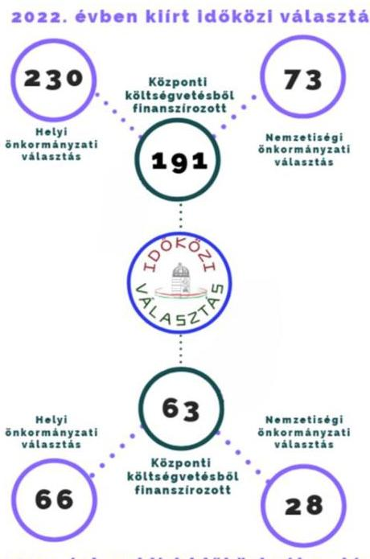

# JELENTÉS 

## Az időközi választásokra fordított pénzeszközök felhasználásának ellenőrzése

2025.

---

# JELENTÉS 

## Az időközi választásokra fordított pénzeszközök felhasználásának ellenőrzése

2025.

---

# ELLENŐRZÉSI IGAZGATÓSÁG: 

ÁLLAMHÁZTARTÁSON KÍVÜLI SZERVEZETEKET ELLENŐRZŐ IGAZGATÓSÁG

ELLENŐRZÉSI IGAZGATÓ:
KLINGA LÁSZLÓ IGAZGATÓ

## ELLENŐRZÉSVEZETŐ:

Jelentéseink az interneten a www.asz.hu címen olvashatók.

## BÉCSI ANDREA ELLENŐRZÉSVEZETŐ

IKTATÓSZÁM: EL-3996-002/2024
TÉMASORSZÁM: 8
ELLENŐRZÉS-AZONOSÍTÓ SZÁM: V1070

---

# TARTALOMJEGYZÉK 

AZ ELLENŐRZÉS ALAPADATAI ..... 5
AZ ELLENŐRZÉS HATÓKÖRE ÉS TERÜLETE ..... 7
ÖSSZEFOGLALÁS ..... 9
AZ ELLENŐRZÉS FÓKUSZTERÜLETEI ..... 11
MEGÁLLAPÍTÁSOK ..... 12
JAVASLATOK ..... 17
MELLÉKLETEK ..... 19
I. sz. melléklet: Értelmező szótár ..... 19
II. sz. melléklet: Az ellenőrzött szervezetek jegyzéke ..... 20
III. sz. melléklet: Ellenőrzési kritériumok ..... 21
FÜGGELÉK: ÉSZREVÉTELEK ..... 22
RÖVIDÍTÉSEK JEGYZÉKE ..... 23

---

.

---

# AZ ELLENŐRZÉS ALAPADATAI 

## AZ ELLENŐRZÉS CÉLJA

Az ellenőrzés célja annak megállapítása volt, hogy a helyi önkormányzati képviselők és polgármesterek, valamint a nemzetiségi önkormányzati képviselők időközi választására fordított pénzeszközök felhasználása szabályszerű volt-e. Az ellenőrzés célja továbbá annak vizsgálata volt, hogy a központi költségvetésből finanszírozott időközi választások előkészítése, pénzügyi fedezetének biztosítása, felhasználása, elszámolása és ellenőrzése a jogszabályban előírtaknak megfelelően történt-e.

## AZ ELLENŐRZÉS TÍPUSA

Szabályszerüségi ellenőrzés

## AZ ELLENŐRZŐTT IDŐSZAK

A 2022-2023. évek.

## AZ ELLENŐRZÉS TÁRGYA

Az ellenőrzés tárgyát képezte a helyi önkormányzati képviselők és polgármesterek, valamint a nemzetiségi önkormányzati képviselők központi költségvetésből finanszírozott időközi választásának pénzügyi előkészítése, pénzügyi fedezetének biztosítása, a pénzeszközök felhasználása, elszámolása és azok ellenőrzése.

## AZ ELLENŐRZÉS JOGALAPJA

Az ellenőrzés jogszabályi alapját az ÁSZ tv¹. 5. § (2)-(3) bekezdései, valamint a Ve. ${ }^{2} 12 . \S$ előírásai képezték.

## AZ ELLENŐRZÉS MÓDSZERE

Az ellenőrzést a nemzetközi standardokat irányadónak tekintve az ellenőrzési program szempontjai, az ellenőrzött időszakban hatályos jogszabályok, az ellenőrzésszakmai szabályok és módszertanok figyelembevételével végezte az ÁSZ ${ }^{3}$.

Az ellenőrzési fókuszterületek megválaszolásához szükséges bizonyítékok megszerzése az ellenőrzött szervezet által rendelkezésre bocsátott dokumentumokra és adatokra alapozva, továbbá kérdésfeltevés (információkérés) és mintavételezés útján történt.

---

Az ellenőrzési bizonyítékként felhasználható adatforrások közé tartoztak egyrészt az ellenőrzési programban felsorolt adatforrások, másrészt adatforrás volt még minden - az ellenőrzés folyamán - feltárt, az ellenőrzés szempontjából információkat tartalmazó dokumentum.

Az ellenőrzés lefolytatásához az ellenőrzött szervezet a tanúsítványok kitöltésével, valamint az ÁSZ által kért dokumentumok, információk megküldésével szolgáltatott adatot.

A gazdálkodási jogkörök gyakorlásának, illetve a kiadások könyvviteli elszámolásának szabályszerűségét az ellenőrzött szervezeteknél mintavételi eljárással kiválasztott tételek alapján ellenőrizte az ÁSZ. Az NVI ${ }^{4}$ által történt kifizetések esetében véletlenszerű mintavételezés történt, ezért az ellenőrzés eredménye a teljes sokaságra kivetítésre került, míg a $\mathrm{HVI}^{5}$-k tekintetében a megállapítások az ellenőrzött tételekre vonatkoznak.

---

# AZ ELLENŐRZÉS HATÓKÖRE ÉS TERÜLETE 

A helyi önkormányzati képviselők és polgármesterek, valamint a nemzetiségi önkormányzati képviselők általános választására 2019. október 13. napján került sor. Ezt követően a polgármester és a képviselők megbízatásának megszűnése, vagy az önkormányzati képviselő-testület feloszlása vagy feloszlatása esetén, valamint, ha a települési nemzetiségi önkormányzati képviselők száma a képviselő-testület működéséhez szükséges létszám alá csökkent, amennyiben a képviselő-testületet feloszlatták vagy kimondta feloszlását, időközi választást kellett tartani.

A Ve. alapján a választások előkészítésével és lebonyolításával kapcsolatos állami feladatok végrehajtásának költségeit, valamint a választási szervek tevékenységével összefüggő egyéb költségeket - az Országgyűlés által megállapított mértékben - a központi költségvetésből kell biztosítani. A Ve. alapján ez alól kivételt képez, ha az időközi választást a képviselő-testület, közgyűlés feloszlásának kimondása vagy feloszlatása miatt tartják, ugyanis ebben az esetben az időközi választás előkészítésének és lebonyolításának költségeit a helyi önkormányzati vagy nemzetiségi önkormányzati költségvetésből kell finanszírozni.

A központi költségvetésből a választások előkészítésére és lebonyolítására fordított pénzeszközök felhasználásáról az ÁSZ tájékoztatja az Országgyűlést.

A választások előkészítéséhez és lebonyolításához kapcsolódó központi feladatokat a Ve. által kapott felhatalmazás alapján az NVI látja el. A helyi önkormányzati és nemzetiségi önkormányzati időközi választások lebonyolítását az NVI-n kívül a területi választási irodák és a HVI-k végzik. A Ve. alapján a választási irodák feladatai többek között a választási bizottságok működési feltételeinek biztosítása, a választás előkészítése, szervezése, lebonyolítása, az adatkezelés, a választással kapcsolatos tájékoztatás, valamint a szavazás lebonyolítása tárgyi és technikai feltételeinek biztosítása. A Pvr. továbbá rögzíti, hogy az időközi választások lebonyolításában érintett szervezetek vezetői felelősek a választások pénzügyi tervezéséért, lebonyolításáért, elszámolásáért, a pénzeszközök szabályszerű felhasználásáért és ellenőrzéséért, továbbá gyakorolják a választás pénzeszközei feletti kötelezettségvállalási jogot és gondoskodnak a választás céljára szolgáló pénzeszközök elkülönített számviteli kezeléséről.

Az NVI költségvetése az Országgyűlés költségvetési fejezetén belül önálló címet képez. Az Országgyűlés a központi költségvetésben az időközi választások lebonyolításához pénzügyi fedezetként a 2021. évi XC. tv. ${ }^{6}$ alapján a 2022. évre vonatkozóan 458,0 M Ft, a 2022. évi XXV. tv. ${ }^{7}$ alapján a 2023. évre vonatkozóan 707,6 M Ft fejezeti kezelésű működési kiadási előirányzatot határozott meg.

A koronavírus világjárvánnyal összefüggésben a 478/2020. (XI. 3.) Korm. rendeletben ${ }^{8}$ kihirdetett veszélyhelyzetre tekintettel a Kormány a 483/2020. (XI. 5) Korm. rendeletben ${ }^{9}$ az időközi választásokra vonatkozóan átmeneti rendelkezéseket határozott meg. A járványügyi helyzetben 2020. november 6-tól időközi választás nem volt kitűzhető és megtartható. Ezt követően időközi választást a 103/2022. (III. 10) Korm. rendelet ${ }^{10}$ értelmében 2022. április 10-től lehetett ismét kiírni. E rendelet alapján tehát azokat a korábban kitűzött időközi választásokat is meg kellett tartani, amelyek a koronavírus-járvány következtében a 2020. november 6-án hatályba lépett veszélyhelyzet miatt elmaradtak.

A Ve. 2023. május 26-án hatályba lépett módosítása értelmében a következő általános önkormányzati választásokig helyi önkormányzati és nemzetiségi önkormányzati időközi választás nem volt tartható. A 2023. május 26 -át követő időpontokra előzetesen kiírt időközi választások a jogszabályváltozás miatt elmaradtak, kivéve azokban az esetekben, ahol a választási kampányidőszak ezt megelőzően megkezdődött.

---

A részletezett jogszabályváltozások okán a 2022. és a 2023. évben előkészített, lebonyolított időközi választások száma eltérően alakult.

A 2022. évben 230 helyi önkormányzati és 73 nemzetiségi önkormányzati időközi választás került kiírásra, melyből egy helyi önkormányzati és 50 nemzetiségi önkormányzati időközi választás a szükséges számú jelöltek hiányában nem került lebonyolításra. A kiírt 303 időközi választásból 191 választást (128 helyi önkormányzati és 63 nemzetiségi önkormányzati) kellett a központi költségvetésből finanszírozni. A 2023. évben ennél jóval kevesebb, összesen 66 helyi önkormányzati és 28 nemzetiségi önkormányzati időközi választás lett kiírva, melyből 11 helyi önkormányzati és 17 nemzetiségi önkormányzati időközi választás maradt el a szükséges számú jelölt hiánya, illetve a Ve. 2023. május 26-án hatályba lépett módosítása miatt. A kiírt 94 időközi választásból 63 időközi választás ( 35 helyi önkormányzati és 28 nemzetiségi önkormányzati) költségei terhelték a központi költségvetést (1. ábra). A kitűzött, de elmaradt időközi választások közül a 2022. évben 43, a 2023. évben 22 olyan választás volt, melyek előkészítése megkezdődött, a feladatelmaradás ismertté válása előtt indokolt kifizetések vagy kötelezettségvállalások történtek és ezen felmerült költségek a központi költségvetésből kerültek finanszírozásra.
A központi költségvetésből finanszírozott időközi választások esetében a választások lebonyolításának fedezetét - az általános választásokkal ellentétben - nem támogatási előleg formájában, hanem az elfogadott feladattípusú pénzügyi elszámolások alapján az NVI utólag folyósítja a választási irodák részére.

A 2022. és a 2023. években megtartott időközi választásokra fordított pénzeszközök felhasználásának ellenőrzése vonatkozásában ellenőrzött szervnek minősült az NVI, valamint az ellenőrzésre kiválasztott 15 központi forrásból finanszírozott időközi választás tekintetében a választást lebonyolító 15 HVI. A HVI-k feladatait a polgármesteri hivatalok, közös önkormányzati hivatalhoz tartozó településeken a HVI-k feladatait a közös HVI látja el. A HVI-k vezetője a polgármesteri, illetve közös önkormányzati hivatal jegyzője. Az ellenőrzött szervezetek jegyzékét a II. számú melléklet tartalmazza.

---

# ÖSSZEFOGLALÁS 

Az ÁSZ törvényi kötelezettsége alapján ellenőrizte az időközi választások előkészítésével és lebonyolításával kapcsolatos feladatok végrehajtására fordított pénzeszközök felhasználását az NVI-nél és az ellenőrzésre kiválasztott HVI-knél.

Az időközi választások pénzügyi előkészitése során az ellenőrzött szervezeteknél a szabályszerű pénzfelhasználás kereteinek kialakítása megtörtént.

Az NVI és az ellenőrzött HVI-k az időközi választások pénzügyi előkészítése keretében gondoskodtak az időközi választások lebonyolítására fordítandó pénzeszközökkel való szabályszerű gazdálkodás feltételeinek megteremtéséről és ezen pénzeszközök elkülönített számviteli kezelésének kialakításáról.

Az időközi választások lebonyolításának pénzügyi fedezetét az éves központi költségvetésben fejezeti kezelésű előirányzatban az Országgyűlés biztosította az NVI részére a 2022. évben 458,0 M Ft, a 2023. évben 707,6 M Ft összegben. Az NVI mindkét ellenőrzött évben az időközi választások lebonyolításához használt fel előző évi előirányzat-maradványt. Az időközi választások lebonyolításának fedezete a 2022. évben összesen 932,1 M Ft, míg a 2023. évben összesen 433,6 M Ft módosított előirányzatban lett megállapítva. Az NVI elnöke az időközi választások előkészítésére és lebonyolítására tervezett költségek pénzügyi fedezetéről szabályszerűen, támogatói okiratban értesítette a választási irodákat.

Az időközi választások lebonyolítására rendelkezésre bocsátott pénzeszközöket az NVI szabályszerűen használta fel. Az ellenőrzött HVI-k három kivételével a választások lebonyolítása érdekében teljesített, ellenőrzött kifizetéseik esetében a gazdálkodási jogkörgyakorlással kapcsolatos feladataikat, valamint a kiadások könyvviteli elszámolását szabályszerűen végezték. Kettő HVI az ellenőrzött tételek egy részénél a kötelezettségvállalással és a teljesítésigazolással kapcsolatos jogokat nem gyakorolta szabályszerűen, egy HVI-nél egy fő tekintetében a személyi juttatás kifizetése nem volt szabályszerű, az az NVI elnökének jóváhagyása nélkül, a HVI elszámolásának elfogadását megelőzően megtörtént.

A választási irodák a választások lebonyolítása érdekében teljesített kifizetéseikről az előírt, feladattípusú elszámolásukat az NVI felé szabályszerűen elkészítették. Az NVI elnöke az elszámolások elfogadásáról határidőben döntött, az elszámolást elfogadó okiratokban rögzített elszámolható kiadások összegét az NVI szabályszerűen utólag, határidőben a választási irodák rendelkezésére bocsátotta. Az NVI mindkét ellenőrzött évre vonatkozóan elkészítette az időközi választásokra felhasznált pénzeszközökről szóló összesített elszámolást. A 2022. évben az időközi választások előkészítésével, lebonyolításával összefüggésben összesen 423,6 M Ft került elszámolásra, melyből az NVI a választási irodáknak 222,7 M Ft-ot utalt át. A központi költségek között az intézményi előirányzat terhére lettek elszámolva az NVB ${ }^{11}$ működésével kapcsolatban felmerült és a 2022. évi időközi választásokra jutó költségek, melyek 52,2 M Ft-ot tettek ki. A 2023. évben az időközi választásokra 247,9 M Ft lett felhasználva, melyből a választási irodák 103,8 M Ft-ban részesültek. Tekintettel arra, hogy a 2023. évben általános választásra nem került sor, az NVB működésével

---

összefüggő éves kiadások teljes
Az időközi választásokra felhasznált pénzeszközök ellenörzése - három helyi választási irodát kivéve szabályszerü volt.
összege az időközi választások költségeit terhelte, összesen 105,6 M Ft összegben.

Az ellenőrzött választási irodák - három HVI kivételével - a jogszabály által előírt ellenőrzési kötelezettségüknek eleget tettek, melynek során a HVI-k - a három HVI kivételével - elvégezték a részükre biztosított támogatás felhasználásának ellenőrzésével összefüggő feladataikat.

---

# AZ ELLENŐRZÉS FÓKUSZTERÜLETEI 

1. Az időközi választások pénzügyi előkészítésének szabályszerűsége
2. Az időközi választások pénzügyi fedezete biztosításának, az előirányzatok kezelésének szabályszerűsége
3. Az időközi választásokra fordított pénzeszközök felhasználásának szabályszerűsége
4. Az időközi választásokra felhasznált pénzeszközök elszámolásának szabályszerűsége
5. A választási irodáknál az időközi választásokra felhasznált pénzeszközök ellenőrzésének szabályszerűsége

---

# 1. Az időközi választások pénzügyi előkészítésének szabályszerűsége 

Összegző megállapítás Az időközi választások pénzügyi előkészítése során az NVInél és az ellenőrzött 15 HVI-nél a szabályszerű pénzfelhasználás kereteinek kialakítása megtörtént.

Az időközi választások előkészítésével összefüggésben az NVI elnöke az Áht. ${ }^{12}$ előírásai szerint - az állambáztartásért felelős miniszter egyetértésével - a 8/2015. (XII. 9.) NVI utasításban ${ }^{13}$ meghatározta az időközi választásokra vonatkozó fejezeti kezelésű előirányzatok felhasználásának szabályait. Az NVI elnöke az időközi választások szabályszerű előkészítése és lebonyolítása érdekében a Pvr. ${ }^{14}$ alapján kiadta a 2/2021. (IX. 28.) számú elnöki utasítást ${ }^{15}$. A 2/2021. (IX. 28.) számú elnöki utasítás tartalmazta a választások költségvetésének tervezésére, a normatív támogatásokra, a kötelezettségvállalás rendjére, a feladattípusú pénzügyi elszámolásra, a VÁKIR/VPIR ${ }^{16}$ informatikai rendszer használatára, valamint a feloszlatás miatt megtartandó időközi nemzetiségi képviselőválasztás elszámolási rendjére vonatkozó szabályokat.
Az NVI és az ellenőrzött 15 HVI a Pvr.-ben és a 15/2019. (XII. 7.) PM rendeletben ${ }^{17}$ előírtak szerint gondoskodott az időközi választások céljára szolgáló pénzeszközök elkülönített számviteli kezelésének kialakításáról.

## 2. Az időközi választások pénzügyi fedezete biztosításának, az előirányzatok kezelésének szabályszerűsége

## Összegző megállapítás Az ellenőrzött időközi választások pénzügyi fedezetének biztosítása, az előirányzatok kezelése szabályszerű volt.

Az Országgyűlés az időközi választások lebonyolítására a központi költségvetésben fejezeti kezelésű előirányzatban a 2022. évben 458,0 M Ft, a 2023. évben 707,6 M Ft fedezetet biztosított az NVI részére.
A 2022. évi időközi választások lebonyolítására az eredeti 458,0 M Ft-os fejezeti kezelésű előirányzat összegét az NVI az intézményi előirányzaton a központi költségekre tervezte. Ezen felül az időközi választások lebonyolításához az NVI-nél keletkező költségek fedezeteként az NVI az intézményi előirányzaton további 109,6 M Ft-ot biztosított. Az NVI a 2022. évi fejezeti kezelésű előirányzatot a 2020. évi XC. tv. ${ }^{18}$ alapján biztosított 2021. évi előirányzat maradványából származó 364,5 M Ft-ra módosította. A 2022. évi időközi választásokra így összesen 932,1 M Ft előirányzat állt rendelkezésre, melyből 423,6 M Ft pénzügyi teljesítés történt.
A 2023. évi 707,6 M Ft összegű fejezeti kezelésű előirányzatból az intézményi költségvetés részére 681,6 M Ft került átadásra, melyből 585,7 M Ft az NVI intézményi feladataira, míg 95,9 M Ft az időközi

---

választásokra lett tervezve. Az időközi választások központi költségeinek fedezetére az NVI igénybe vett 216,8 M Ft előző évi intézményi előirányzat-maradványt is. A fejezeti kezelésű előirányzatot az NVI 117,6 M Ft-ra módosította, melyből 91,7 M Ft a 2022. évi előirányzatból származó maradvány volt. A 2023. évi időközi választások lebonyolításának fedezete összesen 433,6 M Ft módosított előirányzatban lett megállapítva, melyből összesen 247,9 M Ft pénzügyileg teljesült (1. táblázat).
Az NVI által saját hatáskörben végrehajtott előirányzat-módosítások, előirányzat-átcsoportosítások és átadások az Ávr. ${ }^{19}$-nek és a 8/2015. (XII. 9.) NVI utasításnak megfelelően történtek.
Az NVI elnöke az időközi választások előkészítése és lebonyolítása során felmerülő költségek pénzügyi fedezetéről a Pvr.-nek megfelelően támogatói okiratban értesítette a választási irodákat. Az NVI a választási szervek pénzügyi fedezete összegének meghatározásakor a Prv.-ben felsorolt tételeket, normatívákat vette alapul.

| AZ NVI RENDELKEZÉSÉRE ÁLLÓ ELŐIRÁNYZAT ALAKULÁSÁRÓL (M FT) |  |  |  |  |  |  |
| :--: | :--: | :--: | :--: | :--: | :--: | :--: |
| MEGNEVEZÉS | 2022. ÉV |  |  | 2023. ÉV |  |  |
|  | FEJEZETI KEZELÉSÜ ELÖIRÁNYZAT | INTÉZMÉNYI ELÖIRÁNYZAT | ÖSSZESEN | FEJEZETI KEZELÉSÜ ELÖIRÁNYZAT | INTÉZMÉNYI ELÖIRÁNYZAT | ÖSSZESEN |
| Eredeti előirányzat | 458,0 | - | 458,0 | 707,6 | - | 707,6 |
| Módosított előirányzat | 364,5 | 567,6 | 932,1 | 117,6 | 316,0 | 433,6 |
| - Ebből   kötelezettségvállalással terhelt | 278,1 | 154,4 | 432,5 | 117,6 | 130,5 | 248,1 |
| - Ebből pénzügyileg teljesített | 272,8 | 150,8 | 423,6 | 117,6 | 130,3 | 247,9 |
| Előirányzat maradvány | 91,7 | 416,8 | 508,5 | 0,0 | 185,7 | 185,7 |

# 3. Az időközi választásokra fordított pénzeszközök felhasználásának szabályszerűsége 

Összegző megállapítás Az NVI-nél az időközi választásokra rendelkezésre álló pénzeszközök felhasználása és kezelése szabályszerű volt. Az ellenőrzött HVI-knél három kivételével az időközi választások lebonyolítása érdekében teljesített, ellenőrzött kifizetések szabályszerűek voltak. A támogatás elkülönített számviteli nyilvántartása az ellenőrzött szervezeteknél - kettő HVI-t kivéve - a jogszabályi előírásoknak megfelelt.

Az NVI elnöke az Ávr.-ben foglaltaknak eleget téve a 7/2020. (VII. 24.) NVI utasításban ${ }^{20}$ szabályozta a tervezéssel, gazdálkodással - így különösen a kötelezettségvállalás, pénzügyi ellenjegyzés, teljesítésigazolás, érvényesítés, utalványozás gyakorlásának módjával, eljárási és dokumentációs részletszabályaival, valamint az ezeket végző személyek kijelölésének rendjével -, az ellenőrzési, adatszolgáltatási és beszámolási feladatok teljesítésével kapcsolatos belső előírásokat, feltételeket. Az NVI az Ávr. előírása szerint naprakész nyilvántartást vezetett a kötelezettségvállalásra és a teljesítésigazolásra jogosult személyekről és

---

aláírás-mintájukról, valamint a 7/2020. (VII. 24.) NVI utasításban szabályozta a gazdálkodási jogkörökre vonatkozóan az összeférhetetlenséget is.
Az NVI a 2/2021. (IX. 28.) számú elnöki utasítás 5. számú mellékletében előírta az egyes kiadások/költségek támogatás terhére történő elszámolásához szükséges bizonylatok körét.
Az ellenőrzött választási irodák az Ávr. és a Pvr. előírásainak megfelelően belső szabályzataikban meghatározták az időközi választásokkal összefüggésben a kötelezettségvállalás, a pénzügyi ellenjegyzés, a teljesítésigazolás, az érvényesítés és az utalványozás rendjét. Az Ávr. rendelkezéseinek megfelelően vezettek a kötelezettségvállalásra és a teljesítésigazolására jogosult személyekről és aláírásmintájukról nyilvántartást, valamint belső szabályzataikban rögzítették a gazdálkodási jogkörök gyakorlására vonatkozó összeférhetetlenségi szabályokat.
Az NVI-nél a kötelezettségvállalás, a teljesítésigazolás és a kiadások könyvviteli elszámolása mindkét évben szabályszerű volt. A kötelezettségvállalás és a teljesítésigazolás az Áht.-nek, az Ávr.-nek és a hatályos 7/2020. (VII. 24.) NVI utasításban ${ }^{21}$ foglaltaknak megfelelően, a kiadások könyvviteli elszámolása az Áhsz. ${ }^{22}$ és a Számv. tv. ${ }^{23}$ előírásai szerint történt.
Az ellenőrzött választási irodáknál - az Ongai és a Gyömrői HVI-t kivéve - az időközi választások előkészítésére és lebonyolítására felhasznált pénzeszközök vonatkozásában a feladattípusú pénzügyi elszámolásban szereplő tételek közül ellenőrzött kifizetések esetében a kötelezettségvállalás és a teljesítésigazolás az Áht.-nek, az Ávr.-nek és a belső előírásoknak megfelelően történt. A kiadások könyvviteli elszámolása minden ellenőrzött választási irodánál az Áhsz. és a Számv. tv. előírásai szerint, szabályszerűen történt.
Az Ongai HVI-nél az ellenőrzött 30 kifizetés közül 27 személyi és egy dologi kifizetés esetében - összesen 1,2 M Ft összegben - az Ávr. 57. § (3)-(4) bekezdéseiben foglaltak ellenére a teljesítésigazolás nem az Onga Polgármesteri Hivatal jegyzője által kiadott belső szabályzatban ${ }^{24}$ foglaltak szerint, az arra jogosult jegyző által történt. További egy tétel esetében - 0,3 M Ft összegben - az Áht. 37. § (1) és az Ávr. 53. § (1) bekezdésében foglaltak ellenére nem készült írásbeli kötelezettségvállalás.

A Gyömrői HVI-nél az ellenőrzött 30 kifizetés közül 6 személyi kifizetés esetében - összesen 0,5 M Ft összegben - az Áht. 38. § (1), az Ávr. 57. § (1) és (3) bekezdésében foglaltak ellenére a teljesítés igazolására dokumentáltan nem került sor.
A Szegedi HVI-nél egy fő HVI tag személyi juttatásának kifizetése nem volt szabályszerű, arra a Pvr. 4. § (1) bekezdésében foglaltak ellenére a feladattípusú pénzügyi elszámolás NVI elnöke általi elfogadását megelőzően került sor.
Az ellenőrzött választási irodák - a Mezőtúri és a Gödi HVI-t kivéve - a Pvr.-ben foglaltaknak megfelelően az időközi választások céljára szolgáló pénzeszközökről, azok felhasználásáról szabályszerűen elkülönített számviteli nyilvántartást vezettek.
A Mezőtúri és a Gödi HVI a Pvr. 1. § (2) bekezdés d) pontjában foglaltak ellenére nem gondoskodott megfelelően az időközi választások céljára szolgáló pénzeszközök elkülönített számviteli kezeléséről. A Mezőtúri HVI esetében az időközi választáshoz kapcsolódóan négy tétel - összesen 1,5 M Ft összegben - a 15/2019. (XII. 7.) PM rendelet 1. számú mellékletében előírtak ellenére, nem a 016010 COFOG kódon került elszámolásra, a Gödi HVI-nél az időközi választáshoz kapcsolódó nyilvántartás a 2024. március 12-ig hatályos Pvr. 6. § (1) bekezdésében foglaltak ellenére - összesen 1,4 M Ft összegben - olyan tételeket is tartalmazott, amelyek nem az ellenőrzött időközi választáshoz kapcsolódtak.

---

# 4. Az időközi választásokra felhasznált pénzeszközök elszámolásának szabályszerűsége 

## Összegző megállapítás Az időközi választásokra felhasznált pénzeszközök elszámolása szabályszerűen történt.

Az ellenőrzött választási irodák az időközi választások lebonyolítására felhasznált pénzeszközökről szóló feladattípusú pénzügyi elszámolásaikat az előírtaknak megfelelően a VÁKIR/VPIR informatikai rendszerben a Pvr. szerinti határidőben - a választást követő tizenöt napon belül - elkészítették. Az elszámolások elfogadásáról az NVI elnöke szintén a Pvr. szerinti határidőt betartva, az elszámolások beérkezésétől számított húsz napon belül döntött. Az NVI a lebonyolított választások kiadásainak fedezetére az elszámolást elfogadó okiratokban meghatározott összegeket minden ellenőrzött választási iroda részére utólag, a Pvr. szerinti határidőben az elszámolás elfogadását követő nyole napon belül átutalta.
Az NVI a választási szervek elszámolásai alapján mindkét ellenőrzött évre vonatkozóan a Pvr. szerinti határidőben elkészítette az időközi választások lebonyolítására felhasznált pénzeszközökre vonatkozó összesített elszámolást. Az NVI az összesített elszámolásokat a 2/2021. (IX. 28.) számú elnöki utasításban foglaltaknak megfelelően fő jogcímcsoportonként és választási szerv szintenként készítette el.
Ezek alapján az időközi választásokra a fejezeti kezelésű előirányzatról a 2022. évben 272,8 M Ft, a 2023. évben 117,6 M Ft került teljesítésre, mely összegeket az NVI támogatás formájában a választási irodák részére az időközi választások lebonyolítása során felmerült költségek fedezetére átutalta.
Az időközi választások központi költségei az intézményi előirányzat terhére kerültek elszámolásra, mely a 2022. évben 150,8 M Ft, a 2023. évben 130,3 M Ft volt. Az időközi választások központi költségei között kerültek elszámolásra a választások lebonyolításához szükséges nyomtatványok, szavazólapok, plakátok, postaköltségek, egyéb választástechnikai anyagok, nyomdai szolgáltatások és egyéb szolgáltatások költségei, melyek a 2022. évben 87,9 M Ft-ot, a 2023. évben 24,6 M Ft-ot tettek ki. Ugyancsak a központi költségek terhére számolta el az NVI az NVB müködésével összefüggésben felmerült, időközi választásokra jutó személyi jellegű kifizetéseket is, mely a 2022. évben 52,2 M Ft, a 2023. évben 105,6 M Ft volt. A 2022. évben négy, a 2023. évben egy alkalommal kellett helyi népszavazást lebonyolítani, melyek költségét az NVI szintén az intézményi előirányzatból finanszírozta (2. táblázat).
Az ellenőrzésre kiválasztott 15 időközi választás lebonyolítására az illetékes HVI-k összesen 57,1 M Ft támogatásban részesültek.

---

| 2. táblázat |  |  |  |  |
| :--: | :--: | :--: | :--: | :--: |
| AZ IDŐKÖZI VÁLASZTÁSOK KÖLTSÉGEI (M FT) |  |  |  |  |
| MEGNEVEZÉS | 2022. EV |  | 2023. EV |  |
|  | FÉJEZETI KEZELÉSÜ ELÓIRÁNYZAT | INTÉZMÉNYI ELÓIRÁNYZAT | FÉJEZETI KEZELÉSÜ ELÓIRÁNYZAT | INTÉZMÉNYI ELÓIRÁNYZAT |
| Időközi helyi önkormányzati választások | 234,4 | 142,6 | 91,2 | 128,5 |
| Időközi nemzetiségi választások | 38,4 | 1,0 | 26,4 | 0,8 |
| Helyi népszavazások |  | 7,2 |  | 1,0 |
| Összesen | 272,8 | 150,8 | 117,6 | 130,3 |

# 5. A választási irodáknál az időközi választásokra felhasznált pénzeszközök ellenőrzésének szabályszerűsége 

## Összegző megállapítás

A választási irodáknál - három kivételével - az időközi választásokra felhasznált pénzeszközök ellenőrzése szabályszerűen történt.

Az ellenőrzött választási irodáknál - a Veresegyházi, a Gödi és a Gyömrői HVI-t kivéve - a Pvr.-ben előírtaknak megfelelően sor került a pénzeszközök szabályszerű felhasználásának ellenőrzésére.
A Tatabányai HVI vezetője a Pvr. 8. $\$ (1) bekezdésében foglaltak ellenére nem adott megbízást a választási iroda tagjának az iroda részére megállapított támogatás felhasználásának ellenőrzésére, azonban a pénzeszközök szabályszerű felhasználásának ellenőrzését a HVI dokumentáltan elvégezte.
A Veresegyházi, a Gödi és a Gyömrői HVI esetében a HVI vezetője a Pvr. 8. $\$ (1) bekezdésében foglaltak ellenére nem adott megbízást a választási iroda tagjainak az iroda részére megállapított támogatás felhasználásának ellenőrzésére. Az ellenőrzést a három választási iroda nem végezte el, így a Pvr. 1. $\$ (2) bekezdése b) pontjában foglaltak ellenére a három HVI vezetője nem gondoskodott a pénzeszközök szabályszerű felhasználásának ellenőrzéséről.

---

# JAVASLATOK 

Az ÁSZ tv. 33. § (1) bekezdésében foglaltak értelmében az ellenőrzött szervezet vezetője köteles a jelentésben foglalt megállapításokhoz kapcsolódó intézkedési tervet összeállítani és azt a jelentés kézhezvételétől számított 30 napon belül az ÁSZ részére megküldeni. Amennyiben az ellenőrzött szervezet vezetője nem küldi meg határidőben az intézkedési tervet, vagy továbbra sem elfogadható intézkedési tervet küld, az Állami Számvevőszék elnöke az ÁSZ tv. 33. § (3) bekezdése a) és b) pontjaiban foglaltakat érvényesítheti.

## GÖDI HELYI VÁLASZTÁSI IRODA VEZETŐJE RÉSZÉRE

1. Gondoskodjon arról, hogy a választási iroda részére megállapított támogatások szabályszerű felhasználásának ellenőrzésével összefüggő feladatokat a vonatkozó jogszabály előírásainak megfelelően a választási iroda elvégezze.

## GYÖMRŐI HELYI VÁLASZTÁSI IRODA VEZETŐJE RÉSZÉRE

1. Gondoskodjon arról, hogy a kiadási előirányzat terhére történő kifizetések esetében az Áht. 38. § (1) bekezdésében foglaltak szerint minden esetben kerüljön sor teljesítésigazolásra.
2. Gondoskodjon arról, hogy a választási iroda részére megállapított támogatások szabályszerű felhasználásának ellenőrzésével összefüggő feladatokat a vonatkozó jogszabály előírásainak megfelelően a választási iroda elvégezze.

## MEZŐTÚRI HELYI VÁLASZTÁSI IRODA VEZETŐJE RÉSZÉRE

1. Gondoskodjon arról, hogy a választási iroda a választások céljára szolgáló pénzeszközök felhasználását a vonatkozó jogszabályban foglalt előírásoknak megfelelően elkülönítetten kezelje.

---

# ONGAI HELYI VÁLASZTÁSI IRODA VEZETŐJE RÉSZÉRE 

1. Gondoskodjon arról, hogy a teljesítésigazolási jogkör gyakorlását az Ávr. 57. § (3)-(4) bekezdéseiben előírtaknak, valamint a vonatkozó belső szabályzatban foglaltaknak megfelelően az arra jogosult végezze.
2. Gondoskodjon arról, hogy előzetes írásbeli kötelezettségvállalásra a kiadási előirányzat terhére az Áht. 37. § (1) és az Ávr. 53. § (1) bekezdésében előírtak szerint minden esetben kerüljön sor.

## SZEGEDI HELYI VÁLASZTÁSI IRODA VEZETŐJE RÉSZÉRE

1. Gondoskodjon arról, hogy a HVI tagok személyi juttatásainak kifizetésére minden esetben a vonatkozó jogszabály előírásainak megfelelően, a választásokhoz kapcsolódó feladattípusú pénzügyi elszámolások NVI elnöke általi elfogadását követően kerüljön sor.

## VERESEGYHÁZI HELYI VÁLASZTÁSI IRODA VEZETŐJE RÉSZÉRE

1. Gondoskodjon arról, hogy a választási iroda részére megállapított támogatások szabályszerű felhasználásának ellenőrzésével összefüggő feladatokat a vonatkozó jogszabály előírásainak megfelelően a választási iroda elvégezze.

---

# MELLÉKLETEK 

## I. SZ. MELLÉKLET: ÉRTELMEZŐ SZÓTÁR

Időközi választás

COFOG kód
választási szerv
választási iroda

Időközi önkormányzati vagy nemzetiségi önkormányzati választást kell kitűzni

- ha a képviselő-testületet feloszlatták vagy feloszlott;
- a polgármesteri mandátum betöltésére, ha a választást nem lehetett megtartani, mert nem volt jelölt, vagy a legtöbb szavazatot elért két vagy több jelölt egyenlő számú szavazatot kapott, vagy a polgármester megbízatása megszűnt;
- képviselői mandátum betöltésére, ha a képviselő-választáson kevesebb jelölt indult, vagy kevesebb jelöltet választottak meg, vagy a képviselők száma a képviselő-testület müködéséhez szükséges létszám alá csökkent. (forrás: NVI honlapja).
A választást úgy kell kitűzni, hogy a szavazás napja a kitűzés napját követő 70. és 90. nap közé essen.

Az időközi választást az illetékes választási bizottság a mandátum megüresedésétől, a szavazás kitüzött napjától számított 120 napon belülre, vasárnapra tűzi ki.
Nem lehet kitűzni a helyi önkormányzati képviselők és polgármesterek időközi választását a helyi önkormányzati képviselők és polgármesterek általános választása évét megelőző április 1. napja és a helyi önkormányzati képviselők és polgármesterek általános választásának napja, illetve a nemzetiségi önkormányzati képviselők időközi választását a nemzetiségi önkormányzati képviselők általános választása évét megelőző év április 1. napja és a nemzetiségi önkormányzati képviselők általános választásának napja közötti napra. (forrás: Ve. 6. § (1) bekezdése, 8. § (1) bekezdés a) pontja és (2) bekezdés b) és c) pontjai)
A kormányzati kiadások funkciók szerinti osztályozása a Classification of the Functions of Government (COFOG). A kormányzati kiadások funkciók szerinti osztályozása 10 fő kategóriába besorolva tartalmazza a kormányzat szektor (államháztartás és a kormányzatba sorolt vállalatok és nonprofit intézmények) kiadásait. (KSH) A COFOG a kormányzati kiadások elemzésének fontos eszköze, és különösen hasznos nemzetközi összehasonlításokban. (az Európai Unió-beli nemzeti és regionális számlák európai rendszeréről szóló az Európai Parlament és a Tanács 549/2013/EU Rendeletének (2013. május 21.) 22.16. pontja)
A Ve. 3. $\$ (1) bekezdés 15. pontjában meghatározottak szerint a választási bizottság és a választási iroda.
A Ve. 52. § (1) bekezdésében foglaltak alapján a Nemzeti Választási Iroda, a területi választási iroda, az országgyűlési egyéni választókerületi választási iroda, a helyi választási iroda és a külképviseleti választási iroda.

---

# II. SZ. MELLÉKLET: AZ ELLENŐRZÖTT SZERVEZETEK JEGYZÉKE 

| SORSZÁM | ELLENÖRZÖTT VÁLASZTÁSÍ SZERV | İLLETÉKES SZERVEZET |
| :--: | :--: | :--: |
|  | Központi szerv |  |
| 1. | Nemzeti Választási Iroda |  |
|  | Helyi választási irodák |  |
| 2. | Veresegyházi Helyi Választási Iroda | Veresegyházi Polgármesteri Hivatal |
| 3. | Gödi Helyi Választási Iroda | Gödi Polgármesteri Hivatal |
| 4. | Keszthelyi Helyi Választási Iroda | Keszthelyi Polgármesteri Hivatal |
| 5. | Mezőtúri Helyi Választási Iroda | Mezőtúri Közös Önkormányzati Hivatal |
| 6. | Nyíregyháza Megyei Jogú Város Helyi Választási Iroda | Nyíregyháza Megyei Jogú Város Polgármesteri Hivatala |
| 7. | Budapest Főváros XI. kerületi Helyi Választási Iroda | Budapest Főváros XI. Kerület Újbudai Polgármesteri Hivatal |
| 8. | Tatabánya Megyei Jogú Város Helyi Választási Iroda | Tatabánya Megyei Jogú Város Polgármesteri Hivatala |
| 9. | Balatonalmádi Helyi Választási Iroda | Balatonalmádi Közös Önkormányzati Hivatal |
| 10. | Gyömrői Helyi Választási Iroda | Gyömrői Polgármesteri Hivatal |
| 11. | Budapest Főváros III. kerületi Helyi Választási Iroda | Budapest Főváros III. Kerület, Óbuda-Békásmegyeri Polgármesteri Hivatal |
| 12. | Miskole Megyei Jogú Város Helyi Választási Iroda | Miskole Megyei Jogú Város Polgármesteri Hivatala |
| 13. | Szegedi Helyi Választási Iroda | Szeged Megyei Jogú Város Polgármesteri Hivatala |
| 14. | Budapest Főváros II. kerület Helyi Választási Iroda | Budapest II. kerületi Polgármesteri Hivatal |
| 15. | Szekszárd Megyei Jogú Város Helyi Választási Iroda | Szekszárd Megyei Jogú Város Polgármesteri Hivatala |
| 16. | Ongai Helyi Választási Iroda | Ongai Polgármesteri Hivatal |

---

# III. SZ. MELLÉKLET: ELLENŐRZÉSI KRITÉRIUMOK 

## FOKUSZTERÜLET

1. Az időközi választások pénzügyi előkészítésének szabályszerűsége
2. Az időközi választások pénzügyi fedezete biztosításának, az előirányzatok kezelésének szabályszerűsége
3. Az időközi választásokra fordított pénzeszközök felhasználásának szabályszerűsége
4. Az időközi választásokra felhasznált pénzeszközök elszámolásának szabályszerűsége
5. A választási irodáknál az időközi választásokra felhasznált pénzeszközök ellenőrzésének szabályszerűsége

## ELLENŐRZÉSI KRITÉRIUMOK

Áht., Ávr., 370/2011. (XII. 31.) Korm. rendelet a költségvetési szervek belső kontrollrendszeréről és belső ellenőrzéséről, Pvr., Számv. tv., Áhsz., 15/2019. (XII. 7.) PM rendelet
2020. évi XC. tv., 2021. évi XC. tv., 2022. évi XXV. tv., Ve., Ávr., Áht., Áhsz., Pvr.

Ávr., Pvr., Áht., Áhsz., Számv. tv., Gazdálkodási szabályzat/Belső szabályozás, Gazdálkodási jogkör gyakorlására vonatkozó belső szabályzat/Belső szabályozás, Számlarend

Pvr.

Pvr.

---

# FÜGGELÉK: ÉSZREVÉTELEK 

A jelentéstervezetet a Számvevőszék 15 napos észrevételezésre megküldte az ellenőrzött szervezet vezetőjének az ÁSZ tv. 29. §* (1) bekezdése előírásának megfelelően.

Az ellenőrzött szervezetek vezetői a jelentéstervezet megállapításaira nem tettek észrevételt.

[^0]
[^0]:    * 29. § (1) Az Állami Számvevőszék az ellenőrzési megállapításait megküldi az ellenőrzött szervezet vezetőjének vagy az általa megbízott személynek, és annak, akinek személyes felelősségét állapította meg.
    (2) Az ellenőrzött szervezet vezetője és a felelősként megjelölt személy az ellenőrzés megállapításaira tizenöt napon belül írásban észrevételt tehet.
    (3) Az Állami Számvevőszék az észrevételre a beérkezésétől számított harminc napon belül írásban válaszol. A figyelembe nem vett észrevételeket köteles a jelentésben feltüntetni, és megindokolni, hogy azokat miért nem fogadta el.

---

# RÖVIDÍTÉSEK JEGYZÉKE 

${ }^{1}$ ÁSZ tv.
${ }^{2}$ Vc.
${ }^{3}$ ÁSZ
${ }^{4}$ NVI
${ }^{5}$ HVI
${ }^{6}$ 2021. évi XC. tv.
${ }^{7}$ 2022. évi XXV. tv.
${ }^{8}$ 478/2020. (XI. 3.) Korm. rendelet
${ }^{9}$ 483/2020. (XI. 5) Korm. rendelet
${ }^{10}$ 103/2022. (III. 10) Korm. rendelet
${ }^{11}$ NVB
${ }^{12}$ Áht.
${ }^{13}$ 8/2015. (XII. 9.) NVI utasítás
${ }^{14}$ Pvr.
${ }^{15}$ 2/2021. (IX.28.) számú elnöki utasítás
${ }^{16}$ VÁKIR/VPIR
${ }^{17}$ 15/2019. (XII. 7.) PM rendelet
${ }^{18}$ 2020. évi XC. tv.
${ }^{19}$ Ávr.
${ }^{20}$ 7/2020. (VII. 24.) NVI utasítás
${ }^{21}$ 7/2020. (VII. 24.) NVI utasítás
${ }^{22}$ Áhsz.
${ }^{23}$ Számv. tv.
${ }^{24}$ Onga Polgármesteri Hivatal jegyzője által kiadott belső szabályzat

2011. évi LXVI. törvény az Állami Számvevőszékről
2013. évi XXXVI. törvény a választási eljárásról

Állami Számvevőszék
Nemzeti Választási Iroda
Helyi választási iroda
2021. évi XC. törvény Magyarország 2022. évi központi költségvetéséről
2022. évi XXV. törvény Magyarország 2023. évi központi költségvetéséről
478/2020. (XI. 3.) Korm. rendelet a veszélyhelyzet kihirdetéséről (2021. február 8-tól hatálytalan)
483/2020. (XI. 5) Korm. rendelet a veszélyhelyzet idejére eső időközi választásokra vonatkozó átmeneti rendelkezésekről (2020. november 11-től hatálytalan)
103/2022. (III. 10) Korm. rendelet időközi választások és helyi népszavazások megrendezhetőségéről (2022. június 1-től hatálytalan)
Nemzeti Választási Bizottság
2011. évi CXCV. törvény az államháztartásról

8/2015. (XII. 9.) NVI utasítás a Nemzeti Választási Iroda fejezeti kezelésű előirányzatai felhasználásának szabályzatáról
6/2021. (VIII. 31.) IM rendelet a helyi önkormányzati képviselők és polgármesterek időközi választása, a nemzetiségi önkormányzati képviselők időközi választása, valamint a helyi népszavazások költségeinek normatíváiról, tételeiről, elszámolási és belső ellenőrzési rendjéről
2/2021. (IX. 28.) számú elnök utasítás a választások és népszavazások költségeinek normatíváiról, tételeiről, elszámolási és belső ellenőrzési rendjéről szóló IM rendeletekben foglaltalt feladatok végrehajtásával kapcsolatos teendőkről
A Választási Kommunikációs és Információs Rendszernek a Választási Pénzügyi Információs Rendszer modulja
15/2019. (XII. 7.) PM rendelet a kormányzati funkciók és államháztartási szakágazatok osztályozási rendjéről
2020. évi XC. törvény Magyarország 2021. évi központi költségvetéséről

368/2011. (XII. 31.) Korm. rendelet az államháztartásról szóló törvény végrehajtásáról
7/2020. (VII. 24.) NVI utasítás a Nemzeti Választási Iroda gazdálkodási szabályzatáról
7/2020. (VII. 24.) NVI utasítás a Nemzeti Választási Iroda gazdálkodási szabályzatáról
4/2013. (I. 11.) Korm. rendelet az államháztartás számviteléről
2000. évi C. törvény a számvitelről

A 2022. évi időközi önkormányzati Polgármester választás pénzügyi lebonyolításának és belső ellenőrzési rendjének szabályzata (Hatályos: 2022. április 11-től)

---

1052 Budapest, Apáczai Csere János u. 10. | 1364 Budapest 4., Pf. 54
www.asz.hu | szamvevoszek@asz.hu
telefon: +36 14849100