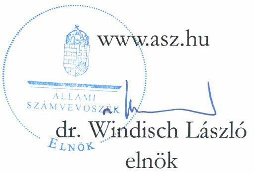
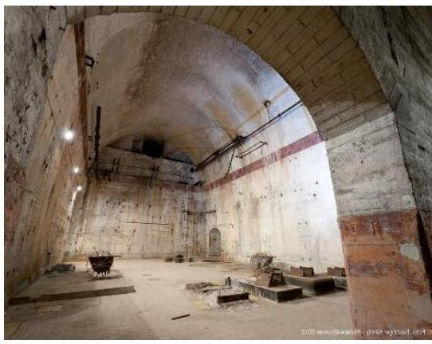
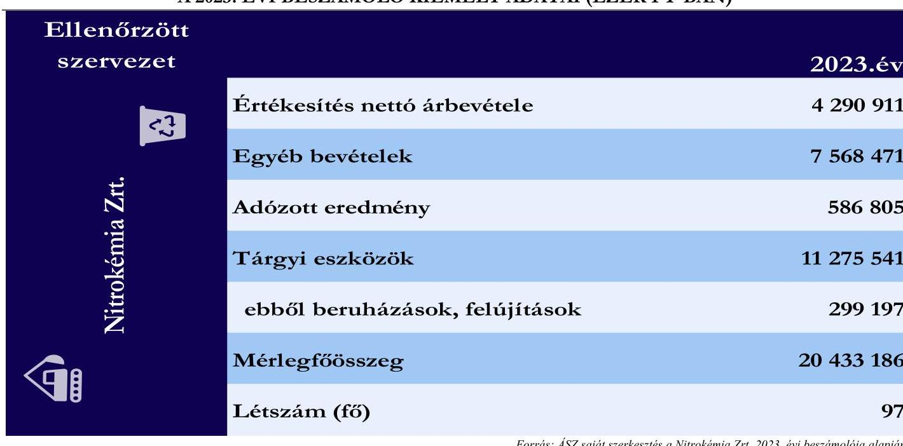

# JELENTÉS 

## Az állami tulajdonú gazdasági társaságoknál közbeszerzési eljárás keretében lebonyolított beszerzések célzott ellenőrzése

Nitrokémia Környezetvédelmi Tanácsadó és Szolgáltató Zártkörűen Müködő Részvénytársaság

2025.

---

# JELENTÉS 

## Az állami tulajdonú gazdasági társaságoknál közbeszerzési eljárás keretében lebonyolított beszerzések célzott ellenőrzése

Nitrokémia Környezetvédelmi Tanácsadó és Szolgáltató
Zártkörűen Múködő Részvénytársaság
2025.

24208

---

# ELLENŐRZÉSI IGAZGATÓSÁG: 

ÁLLAMI VAGYONGAZDÁLKODÁST ELLENŐRZŐ IGAZGATÓSÁG

ELLENŐRZÉSI IGAZGATÓ:
HERCZEGH ZSOLT igazgató

ELLENŐRZÉSVEZETŐ:
Jelentéseink az interneten a www.asz.hu címen olvashatók.

PENCZ MÁRIA ellenőrzésvezető

IKTATÓSZÁM: EL-4025-003/2025.
TÉMASORSZÁM: 37
ELLENŐRZÉS-AZONOSÍTÓ SZÁM: V1075

---

# TARTALOMJEGYZÉK 

AZ ELLENŐRZÉS ALAPADATAI ..... 5
ELLENŐRZÖTT SZERVEZET ..... 7
ÖSSZEFOGLALÁS ..... 8
AZ ELLENŐRZÉS FÓKUSZTERÜLETE ..... 10
MEGÁLLAPÍTÁSOK ..... 11
JAVASLATOK ..... 15
MELLÉKLETEK ..... 16
I. sz. melléklet: Értelmező szótár ..... 16
II. sz. melléklet: Az ellenőrzött szervezetek jegyzéke ..... 18
III. sz. melléklet: Ellenőrzési kritériumok ..... 19
FÜGGELÉK: ÉSZREVÉTELEK ..... 20
RÖVIDÍTÉSEK JEGYZÉKE ..... 21

---

.

---

# AZ ELLENŐRZÉS ALAPADATAI 

## AZ ELLENŐRZÉS CÉLJA

Az ellenőrzés célja annak értékelése volt, hogy az ellenőrzött gazdasági társaság közbeszerzési eljárás keretében lebonyolított, kiválasztott beszerzésével kapcsolatos eljárása megfelelő volt-e, a közbeszerzés tárgyára irányuló döntéshozatal során érvényesültek-e célszerűségi és eredményességi szempontok, a beszerzett eszköz, illetve szolgáltatás támogatta-e a társaság (köz)feladat ellátását.

## AZ ELLENŐRZÉS TÍPUSA

Kombinált ellenőrzés

## AZ ELLENŐRZÖTT IDŐSZAK

Az ellenőrzött időszak a közbeszerzési eljárás előkészítésének megkezdésétől a helyszíni ellenőrzés lezárásának időpontjáig tartó időszak, azaz 2021. február 03-tól 2024. október 1-ig tartó időszak.

## AZ ELLENŐRZÉS TÁRGYA

Az ÁSZ ${ }^{1}$ ellenőrzése a kizárólagos állami tulajdonban lévő Nitrokémia Zrt. ${ }^{2}$ által lebonyolított, „Abasár beavatkozás megvalósitása" elnevezésű beruházással kapcsolatos közbeszerzési eljárásra és a közbeszerzéssel összefüggésben hozott döntések megfelelőségének és megalapozottságának értékelésére terjedt ki, valamint arra, hogy a döntéshozatal során érvényesültek-e célszerűségi és eredményességi szempontok. Az ellenőrzés kiterjedt továbbá a közbeszerzéssel kapcsolatos szabályozási rendszer kialakításának megfelelőségére, a közbeszerzési eljárás előkészítésének és lebonyolításának értékelésére, a kiválasztott közbeszerzési eljárás eredményeképpen létrejött szerződés megkötésének, módosításának és teljesítésének értékelésére, a kiválasztott közbeszerzés közbeszerzési tervben, illetve módosításában foglaltaknak megfelelő teljesülésének ellenőrzésére. Az ÁSZ értékelte a kiválasztott közbeszerzéssel érintett beszerzés cél szerinti megvalósulását, a felelős gazdálkodás követelményének érvényesülését és az Infotv. ${ }^{3}$ szerinti közzétételi kötelezettség teljesítését.

Emellett az ellenőrzés kiterjedt a közbeszerzési eljárás keretében lebonyolított, kiválasztott beszerzéshez kapcsolódóan a részekre bontás tilalmára vonatkozó előírások érvényesülésének ellenőrzésére.

Az ellenőrzés kiterjedt minden olyan körülményre és adatra, amely az ÁSZ jogszabályban meghatározott feladatainak teljesítéséhez, valamint a program végrehajtása folyamán felmerült újabb összefüggések feltárásához volt szükséges.

---

# Az ellenőrzés jogsalapja 

Az ellenőrzés jogszabályi alapját az ÁSZ tv. ${ }^{4} 1 . \int(3)$ bekezdésének, valamint az 5. $\$ (3) - (5) bekezdéseinek előírásai képezték.

## AZ ELLENŐRZÉS MÓDSZERE

Az ellenőrzés végrehajtása a nemzetközi standardokat irányadónak tekintve az ellenőrzési program szempontjai, az ellenőrzött időszakban hatályos jogszabályok, az ellenőrzés szakmai szabályok és a jelen ellenőrzésre irányadó ÁSZ módszertanok figyelembevételével történt.

Az ellenőrzési kérdések megválaszolásához szükséges bizonyítékok megszerzése az ellenőrzött szervezet által rendelkezésre bocsátott dokumentumokra és adatokra alapozva, továbbá megfigyelés, szemle (szemrevételezés), kérdésfeltevés (információkérés), valamint elemző eljárás útján történt. Az ÁSZ tanúsítványi adatszolgáltatás alapján mintavételi eljárással választotta ki az ellenőrzés során értékelt közbeszerzési eljárást. A megállapítások a mintatételekre vonatkoztak, kivetítésre nem került sor.

Az ellenőrzés lefolytatásához az ellenőrzött szervezet az ÁSZ által kért dokumentumok, adatok, információk megküldésével, és az ellenőrzés során szolgáltatott adatokat.

Az ellenőrzési bizonyítékként felhasználható adatforrások közé tartoztak egyrészt az ellenőrzéshez kért dokumentumok, adatforrások, másrészt adatforrás lehetett még minden - az ellenőrzés folyamán - feltárt, az ellenőrzés szempontjából információkat tartalmazó dokumentum.

---

# ELLENŐRZÖTT SZERVEZET 

A NITROKÉMIA ZRT. 1921-ben, Magyar Lőporgyárüzemi Rt. néven jött létre. Többszöri átalakulás után, a 2006. évtől múködik jelenlegi formájában. A Nitrokémia Zrt. közfeladata a 386/2013. Korm. rendeletben ${ }^{5}$ foglaltak szerint az állami felelősségvállalási körbe tartozó kármentesítési feladatok lebonyolítása és a környezeti károk felszámolása. A Nitrokémia Zrt. kizárólagos tulajdonosa a Magyar Állam, a tulajdonosi jogokat az ellenőrzött időszakban az MNV Zrt. ${ }^{6}$ gyakorolta. A társaság beszámolóinak adatai alapján a Taktv. ${ }^{7}$ 7/J. § (1) bekezdése szerint 2022.01.01-től a Gbkr. ${ }^{8}$ hatálya alá tartozott, ezt megelőzően a PM közlemények ${ }^{9}$ alapján kormányzati szektorba sorolt egyéb szervezetként a Bkr. ${ }^{10}$ hatálya alá tartozott.
A Nitrokémia Zrt. 2023. évi beszámolójának főbb adatait az 1. számú táblázat tartalmazza.
1. táblázat

A 2023. ÉVI BESZÁMOLÓ KIEMELT ADATAI (EZER FT-BAN)

Az „Abasár beavatkozás megvalósitása" beruházásról Magyarország Kormánya az Abasár település ivóvízellátását biztosító kutak szennyezettségének felszámolásával összefüggő egyes kormányzati intézkedésekről szóló 1524/2017. (IX.22.) Korm. határozatban döntött. A beruházás végrehajtására forrást a Gazdaságvédelmi programok előirányzatból, a Járvány Elleni Védekezés Központi Tartalékból, a Rendkívüli kormányzati intézkedésekre szolgáló tartalékból, valamint fejezetek közötti és fejezeten belüli előirányzatátcsoportosításokból, továbbá egyes kormányhatározatok módosításáról szóló 1912/2020. (XII.16.) Korm. határozatban rendeltek. Ezt követően, 2020. december 22-én a beruházás finanszírozására az MNV Zrt. a Nitrokémia Zrt.-vel támogatási szerződést kötött, a beruházás megvalósítására a Nitrokémia Zrt. 1300 M Ft összegű forrást kapott. A beruházás során az Abasári Község Vízmú víztermelő kútjaiban kimutatott szennyezés kármentesítési vízilétesítményeinek kivitelezésére került sor. A beruházás 2021-ben kezdődött és a 2023. évben került átadásra.

---

# ÖSSZEFOGLALÁS 

Az állami tulajdonban álló gazdasági társaságok tevékenysége jellemzően közfeladat ellátására irányul, a rendelkezésükre álló vagyont és közpénzt e célra használják fel, ezért fontos követelmény velük szemben, hogy a nemzeti vagyonnal felelős módon, rendeltetésszerűen gazdálkodjanak. Az állami tulajdonú gazdasági társaságok által a feladatellátásukhoz szükséges nagy értékű eszközök és szolgáltatások beszerzése jellemzően közbeszerzési eljárás keretében történik. A közpénzekkel való felelős, hatékony és eredményes gazdálkodás előmozdítása, továbbá a közbeszerzési eljárásokkal megvalósult beszerzések transzparenciájának biztosítása érdekében kiemelten fontos a közbeszerzések ellenőrzése. A közbeszerzési eljárások megfelelőségének ellenőrzése során lényeges szempont a közbeszerzési eljárások dokumentáltságának, a kapcsolódó szerződések, és azok esetleges módosításai átláthatóságának, a beruházás megvalósítása nyomon követhetőségének vizsgálata, továbbá az, hogy az ajánlatok értékelése során az ellenőrzött szervezet a jó gazda gondosságával járte el. Amennyiben az állami tulajdonban álló gazdasági társaságok tevékenysége és gazdálkodása során ezen elvek nem érvényesülnek, sérülhet az állami vagyonnal és a közpénzekkel való felelős gazdálkodás elve, amely kockázatokat hordoz a közfeladatellátás tekintetében.

A NITROKÉMIA ZRT. biztosította a közbeszerzési eljárás keretében megvalósított „Abasár beavatkozás megvalósitása" nevü beruházás során a jogszabályi előírások szerinti átláthatóságot és nyilvánosságot. Magyarország Kormánya határozatban döntött az Alaptörvényben ${ }^{11}$ foglaltakkal összhangban az abasári ivóvízbázis szennyezettségének felszámolásáról és ennek érdekében az „Abasár beavatkozás megvalósitása" beruházásról. A beruházás megalapozott és célszerű volt. A beszerzés előkészítése, lefolytatása és megvalósítása során a Nitrokémia Zrt. összességében megfelelően járt el, a meghozott döntések megalapozottak és célszerűek voltak, a megvalósított beruházás végrehajtásával a Nitrokémia Zrt. közfeladatát ellátta.

A Nitrokémia Zrt.-nél az értékelt közbeszerzési eljárás előkészítését, lefolytatását meghatározó belső szabályozási környezet megfelelően kialakításra került. A kialakított, közbeszerzéssel összefüggő szabályozási környezet biztosította a közbeszerzés szabályszerű lefolytatását, azonban hiányosságként értékelte az ellenőrzés, hogy a közbeszerzési dokumentáció és az ajánlattételi felhívás módosítása során nem minden esetben történtek meg a belső szabályzat szerinti jóváhagyások, és a Nitrokémia Zrt. nem minden esetben tett eleget belső szabályzat szerinti dokumentálási kötelezettségeinek.

A Nitrokémia Zrt. a megvalósult beruházás transzparenciáját biztosította azzal, hogy az „Abasár beavatkozás megvalósitása" című beruházással kapcsolatos közbeszerzési eljárást összességében megfelelően dokumentálta, és a kapcsolódó dokumentumokat a jogszabályi előírásoknak megfelelően az EKR ${ }^{12}$ rendszerben közzétette.

A Nitrokémia Zrt. a jogszabályi előírásoknak megfelelően elkészítette közbeszerzési tervét, amely tartalmazta az ellenőrzött beruházást. A közbeszerzés eredményéről szóló döntés szabályszerű, megalapozott és célszerű volt, az megfelelt az ajánlati felhívásban meghatározott feltételeknek, a döntés során érvényesült a felelős gazdálkodás elve. A közbeszerzési eljárás eredményeképpen létrejött szerződést és szerződésmódosításokat a Nitrokémia Zrt. szabályszerűen kötötte meg.

A Nitrokémia Zrt.-nek a közbeszerzési eljárással összefüggésben hozott döntései - így többek között a kötbér érvényesítésére vonatkozó döntések - a felelős gazdálkodás követelményeinek megfeleltek. A közbeszerzés előkészítése és lefolytatása, valamint a beruházás megvalósítása során nem merült fel a részekre bontás tilalmának megsértése.

---

A Nitrokémia Zrt. a beruházás befejezését követően a jogszabályi előírásoknak megfelelően nyomon követte a megvalósított létesítmények működését. Az ellenőrzött időszakban a beruházáshoz eredményességi szempontként jóváhagyott szennyezettségi célértékeket a Nitrokémia Zrt. rendszeresen mérte, értékelte, azokról jelentést készített. A jelentések szerint a létesítmények működésükkel hozzájárultak a célértékek teljesítéséhez, a célértékeket tíz éves távlatban szükséges elérni. A beruházás megvalósítása és üzemeltetése a Nitrokémia Zrt. állami felelősségvállalási körébe tartozó környezeti károk felszámolásával kapcsolatos közfeladatai ellátásához kapcsolódott.

A Nitrokémia Zrt. a jogszabályi előírások szerinti közzétételi kötelezettségeinek nem megfelelően tett eleget, mivel honlapján nem tette közzé többek között az 5 M Ft feletti szerződések adatait, a 2023. évi módosított közbeszerzési tervét, illetve a 2024. évi közbeszerzési tervét.

---

# AZ ELLENŐRZÉS FÓKUSZTERÜLETE 

Az állami tulajdonú gazdasági társaság közbeszerzési eljárás keretében lebonyolított, kiválasztott beszerzésének megfelelősége.

---

# MEGÁLLAPÍTÁSOK 

## 1. Az állami tulajdonú gazdasági társaság közbeszerzési eljárás keretében lebonyolított, kiválasztott beszerzésének megfelelősége.

Összegző megállapítás: A Nitrokémia Zrt. az ellenőrzésre kiválasztott közbeszerzés ${ }^{13}$ előkészítése, lefolytatása és megvalósítása során - a feltárt hiányosságok kivételével - összességében a Kbt. ${ }^{14}$ előírásainak megfelelően járt el.

A SZABÁLYOZÁSI KERETEKET a Nitrokémia Zrt. a közbeszerzések előkészítése, lefolytatása és megvalósítása tekintetében a Ptk. ${ }^{15}$, a Kbt., valamint 2021-ig a Bkr., 2022-től a Gbkr. előírásainak megfelelően kialakította. A kialakított, közbeszerzésekkel összefüggő szabályozási környezet biztosította a közbeszerzések szabályszerű lefolytatását.
A Nitrokémia Zrt. az ellenőrzött időszakban rendelkezett Alapszabállyal ${ }^{16}$, amely szerint a Ptk. előírásaival összhangban az MNV Zrt. kizárólagos hatáskörébe tartozott többek között:

- az éves üzleti tervek jóváhagyása,
- a 250 millió forint feletti ügyekről éves közbeszerzési terv jóváhagyása, valamint
- a döntés a legfőbb szerv által jóváhagyott közbeszerzési tervben foglaltak jelentős - az eljárás típusának változása, valamint a becsült érték 10\%-át, de legalább 250 millió forintot meghaladó növekedése - módosítása tárgyában.
Az Alapszabályban foglaltak szerint vezérigazgatói hatáskörbe tartozott mindazon ügyekről szóló döntés, amelyek nem az MNV Zrt. kizárólagos hatáskörébe tartoztak.
A Nitrokémia Zrt. a 2021. évre vonatkozóan a Bkr., 2022. évtől a Gbkr. előírásainak megfelelően rendelkezett SZMSZ ${ }^{17}$-szel, amely szerint a vezérigazgató irányította a társaság beszerzési és közbeszerzési feladatait, a vállalkozási igazgató feladata volt a projektek előkészítése, a megvalósulás ellenőrzése, és nyomon követése, valamint az alvállalkozói szerződések előkészítése, továbbá a közbeszerzési eljárások koordinálása.
A Nitrokémia Zrt. a Kbt. előírásainak megfelelően rendelkezett Közbeszerzési szabályzattal ${ }^{18}$, amely tartalmazta a közbeszerzési eljárásokkal, közbeszerzési tervvel kapcsolatos folyamatokat, az eljárásba bevont személyek feladatait, a dokumentálási kötelezettséget, valamint a szerződéskötéssel kapcsolatos feladatokat, folyamatokat, az eljárásba bevont személyek, valamint szervezetek felelősségi körét, belső ellenőrzésének felelősségi rendjét, és az EKR alkalmazására vonatkozó jogosultságok gyakorlásának rendjét.
KÖZBESZERZÉSI TERVÉT a Nitrokémia Zrt. a 2021-2023. években a Kbt. előírásainak megfelelően elkészítette, és az EKR rendszerben közzétette. A 2021. évi közbeszerzési terv elkészítésénél a Nitrokémia Zrt. vezérigazgatója nem a Ptk. 3:112. § (2) bekezdésében foglaltak szerint, a társaság legfőbb szerve határozatainak alávetve járt el, mivel a 2021. évi közbeszerzési tervben az „Abasár beavatkozás megvalósitása"

---

nevű beruházás közbeszerzés fajtájaként - ellentétben az MNV Zrt. által a 86/2021. számú alapítói határozatban jóváhagyott, hirdetmény közzétételével induló nyílt eljárással - a Kbt. 115. §-a szerinti nyílt eljárást jelölte meg. A beruházás az EKR rendszerben közzétett 2021. évi közbeszerzési tervben foglaltaktól eltérően, azonban a Kbt. előírásaival és a 86/2021. alapítói határozatban foglaltakkal összhangban, a Kbt. 112. § (1) bekezdés b) pontja szerinti eljárás került lefolytatásra. A Nitrokémia Zrt. eljárásával megsértette a Kbt. 42. § (3) bekezdésében foglaltakat, mivel az ellenőrzött időszakban közbeszerzési tervét - a közbeszerzés fajtájára tekintettel - nem módosította.
A KÖZBESZERZÉS ELŐKÉSZÍTÉSE ÉS LEFOLYTATÁSA során a Nitrokémia Zrt. a Kbt. előírásait betartotta, a meghozott döntései célszerűek voltak, azonban a Közbeszerzési szabályzatában előírt jóváhagyási és dokumentálási kötelezettségeknek nem minden esetben tett eleget.
Magyarország Kormánya határozatban döntött az Alaptörvényben foglaltakkal összhangban az Abasár település ivóvízellátását biztosító ivóvízbázis szervesoldószer-szennyezettségének felszámolásáról és ennek érdekében az „Abasár beavatkozás megvalósitása" beruházás végrehajtásáról. A beruházás összhangban volt a Nitrokémia Zrt. 2021-2023. évi üzleti terveiben foglaltakkal, és a társaság stratégiai céljaként meghatározott, állami felelősségi körbe tartozó kármentesítési közfeladattal. A beruházás előkészítésének megkezdését a Közbeszerzési szabályzat előírásainak megfelelően a vezérigazgató 2021. január 7-én rendelte el. A beruházás becsült értékének megállapítása a Kbt., valamint a 322/2015. Korm. rendelet előírásainak megfelelt, mivel a becsült értéket tartalmazó költségvetés tartalmazta az építési beruházással kapcsolatban felmerülő valamennyi szükséges munkatételt, valamint a teljes piaci ellenszolgáltatás összegét, és a tartalékkeretet.
A Nitrokémia Zrt. a Kbt. előírásaival összhangban a közbeszerzés előkészítésébe és lebonyolításába akkreditált közbeszerzési szaktanácsadót vont be. A három fős Bírálóbizottság tagjait a Kbt.-ben és a Közbeszerzési szabályzatban foglaltaknak megfelelően a vezérigazgató jelölte ki, a tagok rendelkeztek a Kbt.-ben előírt szakmai, közbeszerzési, jogi és pénzügyi szakértelemmel, és nyilatkozatuk szerint esetükben a Kbt. szerinti összeférhetetlenség nem állt fenn.
A Nitrokémia Zrt. az ajánlattételi felhívás és a közbeszerzési dokumentáció módosításai során a Kbt.-ben előírtak szerint járt el, azonban a Közbeszerzési szabályzat ${ }_{1,2}$ 3.11.2.3. pontjában előírtak ellenére a közbeszerzési dokumentáció módosítását a vezérigazgató nem hagyta jóvá, és az ajánlattételi felhívás módosításánál a vezérigazgatói jóváhagyást nem dokumentálták.
A beérkezett ajánlatok elbírálása során a Nitrokémia Zrt. a Kbt. előírásait betartotta, azonban a Közbeszerzési szabályzat ${ }_{1,2}$ 3.5.1. pontjában előírtak ellenére a bíráló bizottság tagjai nem készítettek egyedi, névvel ellátott bírálati lapot.
A Nitrokémia Zrt. vezérigazgatójának a közbeszerzés eredményéről szóló döntése megalapozott volt, mivel az a beérkezett ajánlatok bírálóbizottsági értékelésén alapult, amely szerint a nyertes ajánlattevő megfelelt az ajánlattételi felhívásban meghatározott jogi, gazdasági, valamint műszaki, alkalmassági feltételeknek. A közbeszerzés eredményének közzététele a Kbt.-ben előírtakkal összhangban a 2021/165. Közbeszerzési értesítőben jelent meg.
A SZERZŐDÉST a Nitrokémia Zrt. a nyertes ajánlattevővel 2021. augusztus 23-án kötötte meg. A megkötött szerződés megegyezett a nyertes ajánlattal, és tartalmazta a 191/2009. Korm. rendelet ${ }^{19}$-ben előírt tartalmi elemeket. A szerződés a Ptk. előírásainak megfelelően tartalmazta többek között a szerződés végrehajtásához kapcsolódó teljesítési határidőket, a szerződés ellenértékét, a számlázások ütemezését, a teljesítés igazolás menetét, a kötbérrel kapcsolatos szabályokat, a szerződés későbbi változtatásának és a

---

pótmunkának a pontos feltételeit, valamint a szerződést biztosító mellékkötelezettségeket, beleértve a kötbért, teljesítési biztosítékot, jóteljesítési biztosíték feltételeit, amelyek révén biztosították az Nvtv. szerinti felelős gazdálkodás követelményeit.
A két szerződésmódosítás során a Nitrokémia Zrt. betartotta a Kbt. előírásait. A szerződésmódosítások nem indokoltták új közbeszerzési eljárás kiírását, mivel a módosítások nem haladták meg - a Kbt.-ben építési beruházások esetén előírt - az eredeti szerződéses érték 15\%-át, továbbá a módosítások nem változtatták meg a szerződés általános jellegét, és illeszkedtek az eredeti szerződés jellegéhez. A szerződések módosításáról a hirdetményeket a Kbt. előírásai szerint mindkét esetben közzétették a 2022/171. számú, illetve a 2022/227. számú Közbeszerzési értesítőben.
A szerződés 1. számú módosításában 9 M Ft értékben pótmunka elrendelésére került sor. A pótmunkáról szóló döntés megalapozott és célszerű volt, szükségességét jegyzőkönyvben rögzített értékelés alapozta meg. A 2. számú módosítás a próbaüzem szerződés szerinti kezdő időpontját érintette, és a próbaüzem elindításához szükséges áramellátás külső körülmények miatti elhúzódása indokolta.
A nyertes ajánlattevő részére a szerződésben mellékkötelezettségként előírt teljesítési és jóteljesítési biztosítékra vonatkozó kötelezettségeit óvadék nyújtásával teljesítette, amely összhangban volt az ajánlattételi felhívásban előírtakkal.
A SZERZŐDÉS TELJESÍTÉSE során a Nitrokémia Zrt. a beruházás kivitelezése során a 191/2009. Korm. rendeletben előírtaknak megfelelően gondoskodott az elektronikus építési napló vezetéséről.
A közbeszerzés eredményeként megvalósult beruházás műszaki átadás-átvétele 2023. április 19-én történt, a 2. számú szerződésmódosításban meghatározott teljesítési véghatáridőhöz képest több, mint 2 hónapos késedelemmel. A teljesítésekről a 2/2022. Vezérigazgatói utasításban, valamint a vállalkozási szerződésben előírtaknak megfelelően teljesítési jegyzőkönyvek készültek, a számlázás a vállalkozási szerződésben előírt ütemezésben történt.
A beruházás késedelmes teljesítése miatt a Nitrokémia Zrt. a szerződésben előírtak alapján késedelmi kötbért érvényesített a nyertes ajánlattevő felé, amelyet a Kbt. előírásaival összhangban minden esetben dokumentált. A számlák pénzügyi rendezése során a Nitrokémia Zrt. a Kötelezettségvállalási szabályzat ${ }^{20}$ ban foglaltak szerint járt el, a kiegyenlítés minden esetben a számlák kötbérrel csökkentett összegében történt.
A Nitrokémia Zrt. a beruházással kapcsolatos kiadásokat a Támogatási szerződésben ${ }^{21}$ előírtaknak megfelelően elkülönített számlán vezette. A beruházás eredményeként létrejött eszközöket a Nitrokémia Zrt. a Támogatási szerződésben előírtaknak megfelelően átadta az MNV Zrt. részére, az elkülönített számlára könyvelt tételeket ezzel egyidejűleg a Számv. tv. ${ }^{22}$ előírásaival összhangban könyveiből kivezette.
A közbeszerzés előkészítése és lefolytatása, valamint a beruházás megvalósítása során nem merült fel a Kbt. szerinti részekre bontás tilalmának megsértése.

# A NITROKÉMIA ZRT. A GBKR. ELŐÍRÁSAINAK MEGFELELŐEN NYOMON KÖVETTE 

a beruházás eredményeként létrehozott létesítmények múködését. A berendezéseket az MNV Zrt. részére történő átadást követően is a Nitrokémia Zrt. üzemeltetette. A beruházáshoz eredményességi szempontként a szennyezettségi célértékek kormányhivatali határozatban kerültek jóváhagyásra, amelyeket a határozat alapján 10 éves időtávban kell elérni. A Nitrokémia Zrt. a víztisztító berendezések működését és a szennyezettség mértékét az üzembehelyezést követően, az ellenőrzött időszakban rendszeresen mérte, értékelte, azokról jelentést készített. A jelentések szerint a létesítmények az elvárásoknak megfelelően múködtek, így hozzájárultak az eredményességi szempontként meghatározott

---

célértékek 10 éves időtávban történő eléréséhez. A beruházás megvalósításával és üzemeltetésével a Nitrokémia Zrt. a 386/2013. Korm. rendelet szerinti, állami felelősségvállalási körbe tartozó környezeti károk felszámolásával kapcsolatos közfeladatait ellátta.
A Nitrokémia Zrt. nem megfelelően tett eleget az Infotv. 37. § (1) bekezdésében foglalt közzétételi kötelezettségének, mivel honlapján ${ }^{23}$ nem tette közzé

- az Infotv. 1. melléklete III.4. pontjában előírt 5 M Ft feletti szerződések adatait,
- az Infotv. 1. mellékletének III.8. pontjában előírt, közbeszerzési információkkal kapcsolatos közzétételi kötelezettségek közül a megkötött szerződések adatait, a 2023. évi módosított, valamint a 2024. évi közbeszerzési tervét, és az ajánlatok elbírálásáról szóló összegzésről a 2023. év II-IV. negyedévekre és 2024. első félévére vonatkozó adatokat.
A Nitrokémia Zrt. a beruházással kapcsolatosan a Kbt.-ben előírt közzétételi kötelezettségeit teljesítette.

---

# JAVASLATOK 

Az ÁSZ tv. 33. § (1) bekezdésében foglaltak értelmében az ellenőrzött szervezet vezetője köteles a jelentésben foglalt megállapításokhoz kapcsolódó intézkedési tervet összeállítani és azt a jelentés kézhezvételétől számított 30 napon belül az ÁSZ részére megküldeni. Amennyiben az ellenőrzött szervezet vezetője nem küldi meg határidőben az intézkedési tervet, vagy továbbra sem elfogadható intézkedési tervet küld, az Állami Számvevőszék elnöke az ÁSZ tv. 33. § (3) bekezdése a) és b) pontjaiban foglaltakat érvényesítheti.

## A NITROKÉMIA ZRT. VEZÉRIGAZGATÓJA RÉSZÉRE

1. $\quad$ Tegyen intézkedéseket azon kontrollok kialakítására és müködtetésére, amelyek biztositják a Ptk. 3:112. § (2) bekezdése előirásainak megfelelően az alapítói határozatok végrehajtását; a Közbeszerzési szabályzatban elöirt kontrollok és jóváhagyások müködtetését és dokumentálását; a Kbt. 42. § (3) bekezdése előirásainak megfelelően a közbeszerzési terv módosítását.
2. Intézkedjen az Infotv. 37. § (1) bekezdésében és az Infotv. 1. melléklet III.4. és III.8. pontjában elöirt adatok honlapon történő közzétételéről.

---

# MELLÉKLETEK 

## I. SZ. MELLÉKLET: ÉRTELMEZŐ SZÓTÁR

ajánlati kötöttség
beszerzés
gazdasági társaság
hirdetmény közzétételével induló nyílt eljárás
jólteljesítési biztosíték
kapacitást nyújtó szervezet

Kbt. 115. § szerinti nyílt eljárás

Aki szerződés megkötésére irányuló szándékát egyértelműen kifejező és a lényeges kérdésekre kiterjedő jognyilatkozatot tesz, nyilatkozatához kötve marad.
(Forrás: Ptk. 6:64. §)
Az eszközök/szolgáltatások/szellemi termékek visszterhes megszerzésére (vásárlására) irányuló döntés meghozatalát, továbbá (keret)szerződés létrehozását célzó és azt eredményező eljárás.
(ÁSZ értelmezés)
A gazdasági társaságok üzletszerű közös gazdasági tevékenység folytatására, a tagok vagyoni hozzájárulásával létrehozott, jogi személyiséggel rendelkező vállalkozások, amelyekben a tagok a nyereségből közösen részesednek, és a veszteséget közösen viselik. (Forrás: Ptk. 3:88. § (1) bekezdése)
A nyílt eljárás olyan, egy szakaszból álló, ajánlati felhívással induló közbeszerzési eljárás, amelyben minden érdekelt gazdasági szereplő ajánlatot tehet.
(Forrás: Kbt. 81. § (1)-(2) bekezdés)
A jólteljesítési biztosíték azt a célt szolgálja, hogy az építtető biztosítékot kapjon arra az esetre, ha a kivitelező a jótállási, szavatossági kötelezettségeit nem teljesíti. A jóteljesítési biztosíték egy olyan megállapodás, amely szerint a kivitelezőnek járó teljes díj egy részét az építtető visszatartja biztosítékként. A visszatartott összeg akkor illeti meg a kivitelezőt, ha a visszatartás időszaka alatt nem merül fel szavatossági vagy jótállási igény az építtető részéről, vagy ha felmerül, akkor a hibát a kivitelező saját költségén kijavíttatta.
Abban az esetben, ha a szavatossági kötelezettségét a kivitelező nem teljesíti, akkor az építtető a visszatartott összeget a hiba kijavítására fordíthatja. Az ily módon felhasznált jóteljesítési biztosíték összegére a kivitelező már nem tarthat igényt.
(ÁSZ értelmezés)
Az ajánlattevőtől elkülönült másik szervezet, amely a kapacitásait, szakértelmét az ajánlattételi felhívásban előírt alkalmassági követelményeknek való megfelelés céljából az ajánlattevő rendelkezésére bocsátja. Az előírt alkalmassági követelményeknek az ajánlattevők vagy részvételre jelentkezők bármely más szervezet, vagy személy kapacitására támaszkodva is megfelelhetnek, a közöttük fennálló kapcsolat jogi jellegétől függetlenül. Ebben az esetben meg kell jelölni az ajánlatban, több szakaszból álló eljárásban a részvételi jelentkezésben ezt a szervezetet és az eljárást megindító felhívás vonatkozó pontjának megjelölésével azon alkalmassági követelményt vagy követelményeket, amelynek igazolása érdekében az ajánlattevő vagy részvételre jelentkező ezen szervezet erőforrására vagy arra is támaszkodik.
(Forrás: Kbt. 65. § (7) bekezdése alapján)
Építési beruházás esetén lefolytatható eljárás, amennyiben a beruházás becsült értéke nem éri el a háromszázmillió forintot. Alkalmazásának akkor van helye, ha az ajánlatkérőnek a tisztességes verseny biztosításához a Kbt. által megkövetelt, megfelelő számú, teljesítésre képes gazdasági szereplőről van tudomása. Az ajánlatkérő a Kbt. 115. § szerinti eljárás során köteles biztosítani a versenyt, és az eljárást megindító felhívás közzététele helyett legalább öt gazdasági szereplőnek egyidejűleg, közvetlenül írásban ajánlattételi felhívást küldeni. Az ajánlatkérő a Kbt. 115. § szerinti eljárásban nem írhat elő alkalmassági követelményt. Az ajánlatkérő a Kbt. 115. § szerinti eljárás során csak a teljesítésre képes, szakmailag megbízható gazdasági szereplőknek küldhet ajánlattételi felhívást. Az ajánlattételre felhívandó gazdasági szereplők kiválasztásakor diszkriminációmentesen, az egyenlő bánásmód elvének megfelelően és lehetőség szerint a mikro-, kis- vagy középvállalkozások részvételét biztosítva kell eljárni.
Forrás: Kbt. 115. § alapján

---

közbeszerzés
közbeszerzési dokumentum
közbeszerzési eljárás
közbeszerzés előkészítése
közbeszerzés megkezdése
közbeszerzési szerződés
óvadék
szerződést biztosító mellékkötelezettségek
teljesítési biztosíték

Közbeszerzési szerződés keretében lebonyolított beszerzés, ahol a közbeszerzési szerződés tárgya árubeszerzés, építési beruházás vagy szolgáltatás megrendelése.
(Forrás: Kbt. 8.§ (1) bekezdése)
Minden olyan dokumentum, amelyet az ajánlatkérő a közbeszerzés vagy a koncesszió tárgya, illetve a közbeszerzési vagy koncessziós beszerzési eljárás leírása vagy meghatározása érdekében hoz létre, illetve amelyre ennek érdekében hivatkozik, így különösen az eljárást meghirdető hirdetmény, az eljárást meghirdető felhívásként alkalmazott előzetes tájékoztató, műszaki leírás, ismertető, kiegészítő tájékoztatás, javasolt szerződéses feltételek, a gazdasági szereplők által benyújtandó dokumentumok mintái, részletes ártáblázat vagy árazatlan költségvetés.
(Forrás: Kbt. 3. § 21. pont)
A Kbt. 15. § (1) bekezdése szerinti értékhatárokat elérő értékủ közbeszerzési szerződés, építési vagy szolgáltatási koncesszió (ideértve a védelmi és biztonsági tárgyú koncessziót is) megkötése érdekében a Kbt. 5-7. §-ban ajánlatkérőként meghatározott szervezetek által a Kbt. szerinti közbeszerzési vagy koncessziós beszerzési eljárás.
(Forrás: Kbt. 4. § (1) bekezdés)
Az adott közbeszerzési vagy koncessziós beszerzési eljárás megkezdéséhez szükséges cselekmények elvégzése, így különösen az adott közbeszerzéssel kapcsolatos helyzet- és piacfelmérés, előzetes piaci konzultáció, a közbeszerzés becsült értékének felmérése, a közbeszerzési dokumentumok előkészítése.
(Forrás: Kbt. 3. § 22. pont)
Közbeszerzési vagy koncessziós beszerzési eljárást megindító vagy meghirdető hirdetmény feladásának időpontja, a hirdetmény nélkül induló eljárás esetében pedig az eljárást megindító felhívás vagy a tárgyalási meghívó megküldésének, ennek hiányában a tárgyalás megkezdésének időpontja.
(Forrás: Kbt. 3. § 23. pont)
A Kbt. szerinti ajánlatkérő által, írásban megkötött, árubeszerzésre, szolgáltatás megrendelésre vagy építési beruházásra irányuló visszterhes szerződés.
(Forrás: Kbt. 3. § 24. pont)
Óvadék pénzen és értékpapíron, fizetésiszámla-követelésen, illetve betétszerződésből eredő követelésen vagy egyébként jogszabály rendelkezése szerint számlavezetőként erre feljogosított intézmény által vezetett számlán nyilvántartott követelésen, továbbá jogszabályban óvadék tárgyaként meghatározott más vagyontárgyon alapítható. Fizetésiszámla-követelésen óvadék a számlatulajdonos, a számlavezető és az óvadék jogosultja közötti írásbeli megállapodással alapítható, amely szerint a számlavezető a számlatulajdonos rendelkezéseit az óvadék jogosultjának jóváhagyásával, az óvadék jogosultjának rendelkezéseit a számlatulajdonos jóváhagyása nélkül is teljesíti.
(Forrás: Ptk. 5:95. § alapján)
A szerződő felek által szerződésben alkalmazható jogi eszköz, mely a teljesítést elősegíti, ösztönöz a megfelelő teljesítésre vagy hibás/hiányos teljesítés esetén a jogosult javára biztosítékot, fedezetet jelent (pl. foglaló/előleg, kötbér, jogvesztés kikötése, óvadék vagy bankgarancia nyújtása stb.)
(ÁSZ értelmezés Ptk. alapján)
A teljesítési biztosíték azt a célt szolgálja, hogy az építtető biztosítékot kapjon arra az esetre, ha a kivitelező hibásan teljesít. A teljesítési biztosíték egy olyan megállapodás, amely szerint a kivitelezőnek járó teljes díj egy részét az építtető visszatartja biztosítékként a hiánymentes átadás-átvételig. A visszatartott összeg akkor illeti meg a kivitelezőt, ha a szerződésben foglalt feladatait teljesítette.
Abban az esetben, ha a kivitelező nem vagy hibásan teljesíti a kötelezettségeit, akkor az építtető a visszatartott összeget a hibák kijavítására, a feladatok elvégzésre fordíthatja. Az ily módon felhasznált teljesítési biztosíték összegére a kivitelező már nem tarthat igényt. (ÁSZ értelmezés)

---

II. SZ. MELLÉKLET: AZ ELLENŐRZÖTT SZERVEZETEK JEGYZÉKE

# ELLENŐRZÖTT SZERVEZET NEVE 

Nitrokémia Környezetvédelmi Tanácsadó és Szolgáltató Zártkörűen Müködő Részvénytársaság

---

# III. SZ. MELLÉKLET: ELLENŐRZÉSI KRITÉRIUMOK 

## FOKUSZTERÜLET

Az állami tulajdonú gazdasági társaság közbeszerzés eljárás keretében lebonyolított, kiválasztott beszerzésének megfelelősége.

## ELLENÖRZÉSI KRITÉRIUMOK

Ptk., Kbt., Taktv., Számv. tv., Infotv.,
Bkr., Gbkr., Gbkr. irányelv24 , Gbkr. Kézikönyv25, 424/2017. Korm. rendelet26, 322/2015. Korm. rendelet, 191/2009 Korm. rendelet,
létesítő okirat, belső szabályozások, a Közbeszerzési Hatóság keretében múködő Tanács útmutatója a becsült érték meghatározásának egyes módszereiről, illetve a módszer megválasztásának szempontjairól, a Közbeszerzési Hatóság keretében múködő Tanács útmutatója a közbeszerzési eljárások előkészítésével kapcsolatban, a Közbeszerzési Hatóság keretében múködő Tanács útmutatója az ajánlattételre felhívott gazdasági szereplők Kbt. 115. § (2) bekezdése szerinti kiválasztásáról és változtatásáról.

---

# FÜGGELÉK: ÉSZREVÉTELEK 

A jelentéstervezetet a Számvevőszék 15 napos észrevételezésre megküldte az ellenőrzött szervezet vezetőjének az ÁSZ tv. 29. §* (1) bekezdése előírásának megfelelően.

Az ellenőrzött szervezet vezetője a jelentéstervezet megállapításaira észrevételt nem tett.

[^0]
[^0]:    * 29. § (1) Az Állami Számvevőszék az ellenőrzési megállapításait megküldi az ellenőrzött szervezet vezetőjének vagy az általa megbízott személynek, és annak, akinek személyes felelősségét állapította meg.
    (2) Az ellenőrzött szervezet vezetője és a felelősként megjelölt személy az ellenőrzés megállapításaira tizenöt napon belül írásban észrevételt tehet.
    (3) Az Állami Számvevőszék az észrevételre a beérkezésétől számított harminc napon belül írásban válaszol. A figyelembe nem vett észrevételeket köteles a jelentésben feltüntetni, és megindokolni, hogy azokat miért nem fogadta el.

---

# RÖVIDÍTÉSEK JEGYZÉKE 

${ }^{1}$ ÁSZ
${ }^{2}$ Nitrokémia Zrt.
${ }^{3}$ Infotv.
${ }^{4}$ ÁSZ tv.
${ }^{5}$ 386/2013. Korm. rendelet
${ }^{6}$ MNV Zrt.
${ }^{7}$ Taktv.
${ }^{8}$ Gbkr.
${ }^{9}$ PM közlemények
${ }^{10}$ Bkr.
${ }^{11}$ Alaptörvény
${ }^{12}$ EKR
${ }^{13}$ ellenőrzésre kiválasztott közbeszerzés
${ }^{14}$ Kbt.
${ }^{15}$ Ptk.
${ }^{16}$ Alapszabály
${ }^{17}$ SZMSZ
${ }^{18}$ Közbeszerzési szabályzat
${ }^{19}$ 191/2009. Korm. rendelet

Állami Számvevőszék
Nitrokémia Környezetvédelmi Tanácsadó és Szolgáltató Zártkörűen Működő Részvénytársaság
2011. évi CXII. törvény az információs önrendelkezési jogról és az információszabadságról
2011. évi LXVI. törvény az Állami Számvevőszékről

386/2013. (XI. 7.) Korm. rendelet a Magyar Nemzeti Vagyonkezelő Zártkörűen Müködő Részvénytársaság feladatkörébe tartozó kármentesítési alprogramok keretében az állami felelősségi körbe tartozó kármentesítési feladatok lebonyolításáért felelő szervezet kijelöléséről
Magyar Nemzeti Vagyonkezelő Zártkörűen Müködő Részvénytársaság
2009. évi CXXII. törvény a köztulajdonban álló gazdasági társaságok takarékosabb müködéséről
339/2019. (XII. 23.) Korm. rendelet a köztulajdonban álló gazdasági társaságok belső kontrollrendszeréről
PM közlemény a kormányzati szektorba sorolt egyéb szervezetekről (hatályos: 2019.12.19-től, megjelent a Hivatalos Értesítők 2019/67. számában)

PM közlemény a kormányzati szektorba sorolt egyéb szervezetekről (hatályos: 2021.06.18-től, megjelent a Hivatalos Értesítők 2021/31. számában)

PM közlemény a kormányzati szektorba sorolt egyéb szervezetekről (hatályos: 2022.01.31-től, megjelent a Hivatalos Értesítők 2022/05. számában)

PM közlemény a kormányzati szektorba sorolt egyéb szervezetekről (hatályos: 2022.11.30-től, megjelent a Hivatalos Értesítők 2022/68. számában)

PM közlemény a kormányzati szektorba sorolt egyéb szervezetekről (hatályos: 2023.06.23-től, megjelent a Hivatalos Értesítők 2023/31. számában)

PM közlemény a kormányzati szektorba sorolt egyéb szervezetekről (hatályos: 2024.06.20-től, megjelent a Hivatalos Értesítők 2024/28. számában)
370/2011. (XII. 31.) Korm. rendelet a költségvetési szervek belső kontrollrendszeréről és belső ellenőrzéséről
Magyarország Alaptörvénye
Elektronikus Közbeszerzési Rendszer (https://ekr.gov.hu)
EKR000402022021 azonosítójú közbeszerzés
2015. évi CXLIII. törvény a közbeszerzésekről
2013. évi V. törvény a Polgári Törvénykönyvről
A Nitrokémia Zrt. változásokkal egységes szerkezetbe foglalt alapszabálya (hatályos 2020.10.27-től)

Nitrokémia Zrt. - Szervezeti és müködési szabályzat (hatályos: 2018.01.01-től 2022.10.31-ig)

Nitrokémia Zrt. - Szervezeti és müködési szabályzat (hatályos: 2022.11.01-től 2023.01.31-ig)

Nitrokémia Zrt. - Szervezeti és müködési szabályzat (hatályos: 2023.02.01-től)
Közbeszerzési szabályzat ${ }_{1}$ - Közbeszerzési és beszerzési szabályzat (hatályos: 2020.09.30-tól 2021.05.30-ig)

Közbeszerzési szabályzat ${ }_{2}$ - Közbeszerzési és beszerzési szabályzat (hatályos: 2021.05.31-től 2024.01.31-ig)

Közbeszerzési szabályzat ${ }_{3}$ - Közbeszerzési és beszerzési szabályzat (hatályos: 2024.02.01-től)

191/2009. (IX. 15.) Korm. rendelet az építőipari kivitelezési tevékenységről

---

${ }^{20}$ Kötelezettségvállalási szabályzat
${ }^{21}$ Támogatási szerződés
${ }^{22}$ Számv. tv.
${ }^{23}$ honlap
${ }^{24}$ Gbkr. irányelv
${ }^{25}$ Gbkr. Kézikönyv
${ }^{26} 424 / 2017$. Korm. rendelet

Kötelezettségvállalási és utalványozási szabályzat (hatályos: 2019.09.20-tól 2024.03.03-ig)

Kötelezettségvállalási szabályzat (hatályos: 2024.03.04-től)
SZT133433 számú támogatási szerződés
2000. évi C. törvény a számvitelről

A Nitrokémia Zrt. honlapja: www.nitrokemia.hu
IRÁNYELV a köztulajdonban álló társaságok részére a belső kontrollrendszer kialakításához és múködtetéséhez
KÉZIKÖNYV a köztulajdonban álló társaságok részére a belső kontrollrendszer kialakításához és múködtetéséhez
424/2017. (XII. 19.) Korm. rendelet az elektronikus közbeszerzés részletes szabályairól

---

1052 Budapest, Apáczai Csere János u. 10. | 1364 Budapest 4., Pf. 54
www.asz.hu | szamvevoszek@asz.hu
telefon: +36 14849100