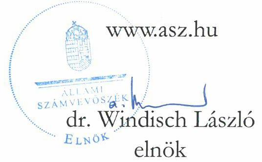
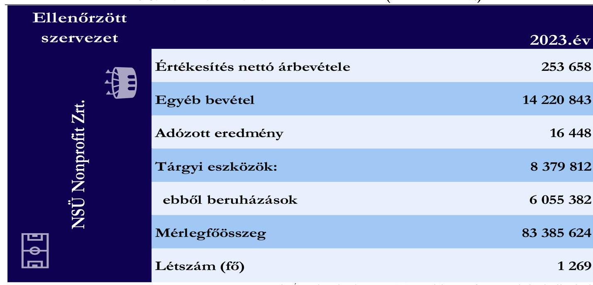

# JELENTÉS 

## Az állami tulajdonú gazdasági társaságoknál közbeszerzési eljárás keretében lebonyolított beszerzések célzott ellenőrzése

Nemzeti Sportügynökség Nonprofit Zártkörűen Működő
Részvénytársaság

2025.

---

# JELENTÉS 

## Az állami tulajdonú gazdasági társaságoknál közbeszerzési eljárás keretében lebonyolított beszerzések célzott ellenőrzése

Nemzeti Sportügynökség Nonprofit Zártkörűen Működő
Részvénytársaság
2025.

24209

---

# ELLENŐRZÉSI IGAZGATÓSÁG: 

ÁLLAMI VAGYONGAZDÁLKODÁST ELLENŐRZŐ IGAZGATÓSÁG

ELLENŐRZÉSI IGAZGATÓ:
HERCZEGH ZSOLT igazgató

ELLENŐRZÉSVEZETŐ:
Jelentéseink az interneten a www.asz.hu címen olvashatók.

PENCZ MÁRIA ellenőrzésvezető

IKTATÓSZÁM: EL-4025-004/2025.
TÉMASORSZÁM: 37
ELLENŐRZÉS-AZONOSÍTÓ SZÁM: V1075

---

# TARTALOMJEGYZÉK 

AZ ELLENŐRZÉS ALAPADATAI ..... 5
ELLENŐRZÖTT SZERVEZET ..... 7
ÖSSZEFOGLALÁS ..... 8
AZ ELLENŐRZÉS FÓKUSZTERÜLETE ..... 10
MEGÁLLAPÍTÁSOK ..... 11
JAVASLATOK ..... 16
MELLÉKLETEK ..... 17
I. sz. melléklet: Értelmező szótár ..... 17
II. sz. melléklet: Az ellenőrzött szervezetek jegyzéke ..... 19
III. sz. melléklet: Ellenőrzési kritériumok ..... 20
FÜGGELÉK: ÉSZREVÉTELEK ..... 21
RÖVIDÍTÉSEK JEGYZÉKE ..... 22

---

.

---

# AZ ELLENŐRZÉS ALAPADATAI 

## AZ ELLENŐRZÉS CÉLJA

Az ellenőrzés célja annak értékelése volt, hogy az ellenőrzött gazdasági társaság közbeszerzési eljárás keretében lebonyolított, kiválasztott beszerzéseivel kapcsolatos eljárása megfelelő volt-e, a közbeszerzés tárgyára irányuló döntéshozatal során érvényesültek-e célszerűségi és eredményességi szempontok, a beszerzett eszköz, illetve szolgáltatás támogatta-e a társaság (köz)feladat ellátását.

## AZ ELLENŐRZÉS TÍPUSA

Kombinált ellenőrzés.

## AZ ELLENŐRZÖTT IDŐSZAK

Az ellenőrzött időszak a korábban lefolytatott közbeszerzési eljárás előkészítésének megkezdésétől a helyszíni ellenőrzés lezárásának időpontjáig tartó időszak, azaz 2023. március 08-tól 2024. szeptember 25-ig tartó időszak.

## AZ ELLENŐRZÉS TÁRGYA

Az ÁSZ ${ }^{1}$ ellenőrzése a kizárólagos állami tulajdonban lévő Nemzeti Sportügynökség Nonprofit Zrt. ${ }^{2}$ által lebonyolított, „Budapest Honvéd Sportegyesület vagyonkezelésében lévő fedett atlétikai edzőpálya és a hozzá tartozó öltözők, súlyemelő, valamint kondicionáló terem felújításával összefüggő kivitelezői feladatok ellátása" és „Pályarekonstrukció - a Budapest Honvéd Sportegyesület vagyonkezelésében lévő füves atlétikai edzőpálya felújítása" elnevezésű beruházásokkal kapcsolatos közbeszerzési eljárásokra és a közbeszerzésekkel összefüggésben hozott döntések megfelelőségének és megalapozottságának értékelésére terjedt ki, valamint arra, hogy a döntéshozatal során érvényesültek-e célszerűségi és eredményességi szempontok. Az ellenőrzés kiterjedt továbbá a közbeszerzéssel kapcsolatos szabályozási rendszer kialakításának megfelelőségére, a közbeszerzési eljárás előkészítésének és lebonyolításának értékelésére, a kiválasztott közbeszerzési eljárás eredményeképpen létrejött szerződés megkötésének, módosításának és teljesítésének értékelésére, a kiválasztott közbeszerzés közbeszerzési tervben, illetve módosításában foglaltaknak megfelelő teljesülésének ellenőrzésére. Az ÁSZ értékelte a kiválasztott közbeszerzésekkel érintett beszerzések cél szerinti megvalósulását, a felelős gazdálkodás követelményének érvényesülését és az Infotv. ${ }^{3}$ szerinti közzétételi kötelezettség teljesítését.

Emellett az ellenőrzés kiterjedt a közbeszerzési eljárások keretében lebonyolított, kiválasztott beszerzésekhez kapcsolódóan a részekre bontás tilalmára vonatkozó előírások érvényesülésének ellenőrzésére.

Az ellenőrzés kiterjedt minden olyan körülményre és adatra, amely az ÁSZ jogszabályban meghatározott feladatainak teljesítéséhez, valamint a program végrehajtása folyamán felmerült újabb összefüggések feltárásához szükséges volt.

---

# Az ellenőrzés jogalapja 

Az ellenőrzés jogszabályi alapját az ÁSZ tv. ${ }^{4} 1. § (3)$ bekezdésének, valamint az 5. § (3)-(5) bekezdéseinek előírásai képezték.

## AZ ELLENŐRZÉS MÓDSZERE

Az ellenőrzés végrehajtása a nemzetközi standardokat irányadónak tekintve az ellenőrzési program szempontjai, az ellenőrzött időszakban hatályos jogszabályok, az ellenőrzés szakmai szabályok és a jelen ellenőrzésre irányadó ÁSZ módszertanok figyelembevételével történt.

Az ellenőrzési kérdések megválaszolásához szükséges bizonyítékok megszerzése az ellenőrzött szervezet által rendelkezésre bocsátott dokumentumokra, információkra és adatokra alapozva, továbbá megfigyelés, szemle (szemrevételezés), kérdésfeltevés (információkérés), valamint elemző eljárás útján történt. Az ÁSZ tanúsítványi adatszolgáltatás alapján mintavételi eljárással választotta ki az ellenőrzés során értékelt két közbeszerzési eljárást. A megállapítások a mintatételekre vonatkoztak, kivetítésre nem került sor.

Az ellenőrzés lefolytatásához az ellenőrzött szervezet az ÁSZ által kért dokumentumok, adatok, információk megküldésével és az ellenőrzés során szolgáltatott adatokat.

Az ellenőrzési bizonyítékként felhasználható adatforrások közé tartoztak egyrészt az ellenőrzéshez kért dokumentumok, adatforrások, másrészt adatforrás lehetett még minden - az ellenőrzés folyamán - feltárt, az ellenőrzés szempontjából információkat tartalmazó dokumentum.

---

# ELLENŐRZÖTT SZERVEZET 

A NEMZETI SPORTÜGYNÖKSÉG NONPROFIT ZRT. 2022. február 1-jén alakult a Nemzeti Sportügynökség Nonprofit Korlátolt Felelősségű Társaság jogutódjaként. A Nemzeti Sportügynökség Nonprofit Zrt. a Magyar Állam kizárólagos tulajdonában álló egyszemélyes, zártkörűen működő részvénytársaság. Részesedése felett az ellenőrzött időszakban a Magyar Államot megillető tulajdonosi jogokat és kötelezettségeket az 1/2022.(V.26.) GFM rendelet ${ }^{5} 1$. mellékletében foglaltak szerint a Honvédelmi Minisztérium gyakorolta.
A Nemzeti Sportügynökség Nonprofit Zrt. fő tevékenysége sportlétesítmények működtetése, sporteseménytervezési és szervezési, sportinfrastruktúra-fenntartási, valamint sporttal kapcsolatos elméleti-tudományos feladatok ellátása. A Nemzeti Sportügynökség Nonprofit Zrt. kormányzati szektorba sorolt egyéb szervezetként - élve a Taktv. 7/J. § (2) bekezdésében rögzített lehetőséggel - a Felügyelőbizottság javaslata alapján alkalmazta és működtette a Taktv. 7/J. § szerinti belső kontrollrendszert, ezért az ellenőrzött időszakban a Gbkr. ${ }^{6}$ hatálya alá tartozott.

Az ellenőrzött beruházások a 2023. évben Budapesten megrendezett IAAF Atlétikai Világbajnoksághoz kapcsolódtak. Az IAAF Atlétikai Világbajnokság megrendezésének egyik bemelegítési, felkészülési helyszínéül a Honvédelmi Minisztérium Sportért Felelős Államtitkársága a Budapest Honvéd Sportegyesület atlétikai pályáját jelölte ki, a pályafelújítás megvalósításához a Magyarország 2023. évi központi költségvetéséről szóló 2022. évi XXV. törvény 1. melléklet XIII. Honvédelmi Minisztérium fejezetből biztosítottak forrást. A megvalósított beruházásokra az IAAF Atlétikai Világbajnokság infrastrukturális feltételeinek megteremtése érdekében került sor.
A Nemzeti Sportügynökség Nonprofit Zrt. 2023. évi beszámolójának főbb adatait az 1. sz táblázat tartalmazza. 1. táblázat

A 2023. ÉVI BESZÁMOLÓ KIEMELT ADATAI (EZER FT-BAN)

---

# ÖSSZEFOGLALÁS 

Az állami tulajdonban álló gazdasági társaságok tevékenysége jellemzően közfeladat ellátására irányul, a rendelkezésükre álló vagyont és közpénzt e célra használják fel, ezért fontos követelmény velük szemben, hogy a nemzeti vagyonnal felelős módon, rendeltetésszerűen gazdálkodjanak. Az állami tulajdonú gazdasági társaságok által a feladatellátásukhoz szükséges nagy értékű eszközök és szolgáltatások beszerzése jellemzően közbeszerzési eljárás keretében történik. A közpénzekkel való felelős, hatékony és eredményes gazdálkodás előmozdítása, továbbá a közbeszerzési eljárásokkal megvalósult beszerzések transzparenciájának biztosítása érdekében kiemelten fontos a közbeszerzések ellenőrzése. A közbeszerzési eljárások megfelelőségének ellenőrzése során lényeges szempont a közbeszerzési eljárások dokumentáltságának, a kapcsolódó szerződések, és azok esetleges módosításai átláthatóságának, a beruházás megvalósítása nyomon követhetőségének vizsgálata, továbbá az, hogy az ajánlatok értékelése során az ellenőrzött szervezet a jó gazda gondosságával járt el. Amennyiben az állami tulajdonban álló gazdasági társaságok tevékenysége és gazdálkodása során ezen elvek nem érvényesülnek, sérülhet az állami vagyonnal és a közpénzekkel való felelős gazdálkodás elve, amely kockázatokat hordoz a közfeladatellátás tekintetében.

A NEMZETI SPORTÜGYNÖKSÉG NONPROFIT ZRT. összességében biztosította a közbeszerzési eljárás keretében megvalósított „Budapest Honvéd Sportegyesület vagyonkezelésében lévő fedett atlétikai edzőpálya és a hozzá tartozó öltözők, súlyemelő, valamint kondicionáló terem felújításával összefüggő kivitelezői feladatok ellátása" és „Pályarekonstrukció - a Budapest Honvéd Sportegyesület vagyonkezelésében lévő füves atlétikai edzőpálya felújítása" nevű beruházások során a jogszabályi előírások szerinti átláthatóságot és nyilvánosságot.

A Nemzeti Sportügynökség Nonprofit Zrt. a közbeszerzésekkel kapcsolatos szabályozási kereteket, a döntéshozatal rendjét és a közbeszerzési eljárásba bevont személyek felelősségi és hatáskörét megfelelően kialakította, a szabályozási környezet biztosította a közbeszerzések szabályszerű lefolytatását.

A Nemzeti Sportügynökség Nonprofit Zrt. elkészítette a 2023. évi közbeszerzési tervét, azonban azt a jogszabályi előírások ellenére az elfogadást megelőzően tette közzé az EKR rendszerben. A közbeszerzési terv „Pályarekonstrukció - a Budapest Honvéd Sportegyesület vagyonkezelésében lévő füves atlétikai edzőpálya felújítása" beruházással kapcsolatos módosításának kezdeményezésére a jogszabályi előírásokkal ellentétben több hónappal a beruházás megvalósítására vonatkozó döntést követően került sor. A Nemzeti Sportügynökség Nonprofit Zrt. a megvalósult beruházások transzparenciáját alapvetően biztosította, azonban hiányosságként értékelte az ellenőrzés, hogy a közvetlenül ajánlattételre felhívott gazdasági szereplők kiválasztásával kapcsolatos dokumentálási kötelezettségét, továbbá a becsült érték meghatározásával kapcsolatos előírásokat nem minden esetben teljesítette, valamint a módosított közbeszerzési tervet a jogszabályi előírások ellenére az EKR rendszerben nem tette közzé.

A kiválasztott két beruházás a 2023. évben Budapesten megrendezett IAAF Atlétikai Világbajnoksághoz kapcsolódott, a kapcsolódó döntések megalapozottak és célszerűek voltak. A beruházások előkészítése, lefolytatása és megvalósítása során a Nemzeti Sportügynökség Nonprofit Zrt. megfelelően járt el, a közbeszerzéseket a közbeszerzési tervben és annak módosításában foglaltaknak megfelelően folytatta le. A közbeszerzési eljárások eredményeképpen létrejött szerződéseket és szerződésmódosításokat a Nemzeti Sportügynökség Nonprofit Zrt. szabályszerűen kötötte meg, a meghozott döntések megalapozottak és célszerűek voltak, a megvalósított beruházások a Nemzeti Sportügynökség Nonprofit Zrt. közfeladatellátását

---

támogatták. A beruházások határidőben, a 2023-as budapesti Atlétikai Világbajnokság kezdetéig elkészültek, ezzel hozzájárultak a sportesemény eredményes megrendezéséhez.

Az ellenőrzött közbeszerzési eljárások előkészítése, lefolytatása és megvalósítása során - a beruházásokkal kapcsolatos egységes tervezés és döntés hiányára tekintettel - nem sérült a részekre bontás tilalmának követelménye.

A Nemzeti Sportügynökség Nonprofit Zrt. a jogszabályi előírások szerinti közzétételi kötelezettségeit részben teljesítette, mivel a „Pályarekonstrukció - a Budapest Honvéd Sportegyesület vagyonkezelésében lévő füves atlétikai edzőpálya felújítása" nevű beruházáshoz kapcsolódó szerződés adatait nem szerepeltette az 5 M Ft feletti szerződések adatai közt.

---

# AZ ELLENŐRZÉS FÓKUSZTERÜLETE 

Az állami tulajdonú gazdasági társaság közbeszerzési eljárás keretében lebonyolított, kiválasztott beszerzéseinek megfelelősége.

---

# MEGÁLLAPÍTÁSOK 

## 1. Az állami tulajdonú gazdasági társaság közbeszerzési eljárás keretében lebonyolított, kiválasztott beszerzéseinek megfelelősége.

Összegző megállapítás

1.1. számú megállapítás

A Nemzeti Sportügynökség Nonprofit Zrt. az ellenőrzésre kiválasztott közbeszerzések ${ }^{8}$ előkészítése, lefolytatása és megvalósítása során - a feltárt hiányosságok kivételével - összességében a Kbt. ${ }^{9}$ előírásai szerint, megfelelően járt el.

A Nemzeti Sportügynökség Nonprofit Zrt. a közbeszerzésekkel kapcsolatos szervezeti kereteit a jogszabályi előírásoknak megfelelően kialakította. Közbeszerzési tervét elkészítette, azonban azt az elfogadást megelőzően tette közzé. A „Pályarekonstrukció - a Budapest Honvéd Sportegyesület vagyonkezelésében lévő füves atlétikai edzőpálya felújítása" beruházás tekintetében a közbeszerzési terv módosításának kezdeményezésére az eljárás megindítását követően került sor, a módosított terv a Kbt. előírása ellenére nem került közzétételre az EKR rendszerben.

A szabályozási kereteket, a döntéshozatal rendjét, valamint a közbeszerzési eljárásba bevont személyek felelősségi körét a Nemzeti Sportügynökség Nonprofit Zrt. a Ptk. ${ }^{10}$, a Kbt. és a Gbkr. előírásainak megfelelően kialakította. A kialakított, közbeszerzésekkel összefüggő szabályozási környezet biztosította a közbeszerzések szabályszerű lefolytatását.

A Nemzeti Sportügynökség Nonprofit Zrt. az ellenőrzött időszakban rendelkezett Alapszabállyal ${ }^{11}$, amely a közbeszerzésekkel kapcsolatos döntésekre vonatkozóan az alábbi rendelkezéseket tartalmazta:

- az Alapító ${ }^{12}$ kizárólagos hatáskörébe tartozott a nettó 500 millió Ft, 2023. április 13-tól a nettó 1 milliárd Ft becsült értéket elérő vagy azt meghaladó közbeszerzések megindításának jóváhagyásáról szóló döntés,
- az Igazgatóság kizárólagos hatáskörébe tartozott a nettó 100 millió Ft-ot elérő, de a nettó 500 millió Ft becsült értéket el nem érő, 2023. április 13-tól a nettó 500 millió Ft-ot elérő, de a nettó 1 milliárd Ft becsült értéket el nem érő közbeszerzések megindításának jóváhagyásáról szóló döntés,
- a vezérigazgató kizárólagos hatáskörébe tartozott a nettó 100 millió Ft, 2023. április 13-tól a nettó 500 millió Ft becsült értéket el nem érő közbeszerzések megindításáról szóló döntés.
Az ellenőrzött közbeszerzések megindításáról szóló döntések során a Nemzeti Sportügynökség Nonprofit Zrt. betartotta az Alapszabály előírásait.
A Nemzeti Sportügynökség Nonprofit Zrt. az ellenőrzött

 időszakban rendelkezett SZMSZ ${ }^{13}$-szel és SZMR ${ }^{14}$-rel, amelyek tartalmazták a közbeszerzésekkel kapcsolatos hatásköri, döntési és felelősségi viszonyokat. A

---

Nemzeti Sportügynökség Nonprofit Zrt. a Kbt.-ben foglaltakkal összhangban elkészítette Közbeszerzési Szabályzatát ${ }^{15}$, amelyben meghatározta a közbeszerzési eljárások előkészítésének, lefolytatásának rendjét, a nevében eljáró, illetve az eljárásba bevont személyek feladatait. A közbeszerzésekkel kapcsolatos belső ellenőrzés felelősségi rendjét a Nemzeti Sportügynökség Nonprofit Zrt. belső ellenőrzéssel kapcsolatos szabályzatai tartalmazták.
A közbeszerzési tervét a Nemzeti Sportügynökség Nonprofit Zrt. 2023. évben a Kbt. és a 424/2017. (XII. 19.) Korm. rendelet ${ }^{16}$ előírásainak megfelelően elkészítette, és 2023. március 31-én azt az EKR rendszerben közzétette. A közbeszerzési terv alapítói jóváhagyására azonban az EKR rendszerben történő közzétételt követően, 2023. április 14-én került sor. A Nemzeti Sportügynökség Nonprofit Zrt. ezzel megsértette a Kbt. 43. § (2) bekezdés a) pontját, mivel közbeszerzési tervét az elfogadást megelőzően tette közzé az EKR rendszerben.
A „Budapest Honvéd Sportegyesület vagyonkezelésében lévő fedett atlétikai edzőpálya és a hozzá tartozó öltözők, súlyemelő, valamint kondicionáló terem felújításával összefüggő kivitelezői feladatok ellátása" nevű beruházás a Kbt. előírásainak megfelelően szerepelt a Nemzeti Sportügynökség Nonprofit Zrt. 2023. évi közbeszerzési tervében, azonban a „Pályarekonstrukció - a Budapest Honvéd Sportegyesület vagyonkezelésében lévő füves atlétikai edzőpálya felújítása" nevű beruházást a Nemzeti Sportügynökség Nonprofit Zrt. 2023. évi közbeszerzési terve nem tartalmazta.
A „Pályarekonstrukció - a Budapest Honvéd Sportegyesület vagyonkezelésében lévő füves atlétikai edzőpálya felújítása" nevű beruházással kapcsolatosan a közbeszerzési eljárás lefolytatására vonatkozó előterjesztést a Nemzeti Sportügynökség Nonprofit Zrt. fejlesztési igazgatója 2023. július 31-én tette meg, a Nemzeti Sportügynökség Nonprofit Zrt. elnök-vezérigazgatója ugyanezen napon rendelte el a közbeszerzési eljárás lefolytatását. A Nemzeti Sportügynökség Nonprofit Zrt. elnök-vezérigazgatója azonban a közbeszerzési terv módosítását csak 2023. december 1-jén kezdeményezte, ezzel megsértette a Kbt. 42. § (3) bekezdésében foglaltakat, amely szerint a közbeszerzési tervben nem szereplő közbeszerzésre vonatkozóan a közbeszerzési tervet az igény felmerülésekor szükséges módosítani. A tulajdonosi joggyakorló Honvédelmi Minisztérium a 19/2023. számú határozatával, 2023. december 28-án hagyta jóvá a közbeszerzési terv „Pályarekonstrukció - a Budapest Honvéd Sportegyesület vagyonkezelésében lévő füves atlétikai edzőpálya felújítása" nevű beruházással kapcsolatos módosítását. A módosított közbeszerzési terv a Kbt. 43. § (2) bekezdés a) pontja előírása ellenére az EKR rendszerben nem került közzétételre.
1.2. számú megállapítás A „Budapest Honvéd Sportegyesület vagyonkezelésében lévő fedett atlétikai edzőpálya és a hozzá tartozó öltözők, súlyemelő, valamint kondicionáló terem felújításával összefüggő kivitelezői feladatok ellátása" nevű beruházással kapcsolatos közbeszerzési eljárás előkészítése és lefolytatása összességében megfelelt a Kbt. előírásainak.
A közbeszerzés előkészítése és lebonyolítása összességében megfelelt a Kbt. előírásainak. A Nemzeti Sportügynökség Nonprofit Zrt. elnök-vezérigazgatója 2023. március 8-án a 15/2023. számú igazgatósági határozattal elrendelte a beruházást a Kbt. 115. § szerinti eljárás keretében. A választott eljárástípus megfelelt a Kbt. előírásainak. Az ajánlattételi felhívás tartalma, tárgya, az ajánlattételi határidő, az értékelési szempontok megfeleltek a Kbt.-ben előírtaknak. Az öt fős Bírálóbizottság tagjait a Kbt.-ben foglaltaknak megfelelően az elnök-vezérigazgató jelölte ki, a tagok rendelkeztek a Kbt.-ben előírt szakmai, közbeszerzési, jogi és pénzügyi szakértelemmel, és nyilatkozatuk szerint esetükben a Kbt. szerinti összeférhetetlenség nem állt fenn.

---

A becsült érték 299,998 M Ft + ÁFA összegben került meghatározásra. A beruházás becsült értéke a Kbt.-ben, valamint a 322/2015. (X.30.) Korm. rendeletben ${ }^{17}$ foglaltaknak megfelelően műszaki tartalom alapján bekért, tervezői költségvetés alapján került megállapításra.
Az ajánlattételre felhívott gazdasági szereplők kiválasztását a Nemzeti Sportügynökség Nonprofit Zrt. nyilatkozatában a korábbi kivitelezési munkálatok tapasztalataival, internetes kutatással, valamint más, állami megrendelők által kiírt közbeszerzési eljárás nyerteseivel indokolta, azonban a kiválasztás folyamatát a Kbt. 46. § (1) bekezdésében foglaltak ellenére írásban nem dokumentálta. Az EKR rendszerben közzétett ajánlattételi felhívás megfelelt a Kbt. és a 322/2015. (X.30.) Korm. rendelet rendelkezéseinek.
A Nemzeti Sportügynökség Nonprofit Zrt. az ajánlattételi felhívás tartalmát egy alkalommal módosította, és két alkalommal kiegészítő tájékoztatásra került sor. Az ajánlattételi felhívásban megadott határidőig az ajánlattételre felhívott öt gazdasági szereplő közül négy tett ajánlatot.
A beérkezett ajánlatok elbírálása során a Nemzeti Sportügynökség Nonprofit Zrt. a Kbt. előírásait és a társaság Közbeszerzési Szabályzatában foglaltakat betartotta, a nyertes ajánlattevő megfelelt az ajánlattételi felhívásban meghatározott feltételeknek.
A szerződést a Nemzeti Sportügynökség Nonprofit Zrt. 2023. április 18-án kötötte meg a nyertes ajánlattevővel. A megkötött szerződés megegyezett az ajánlattételi felhívásban szereplő szerződéstervezettel, valamint a nyertes ajánlattal, és tartalmazta a 191/2009. Korm. rendelet ${ }^{18}$-ben előírt tartalmi elemeket. A szerződés a Ptk. előírásainak megfelelően tartalmazta többek között a szerződés végrehajtásához kapcsolódó teljesítési határidőket, a szerződés ellenértékét, a számlázások ütemezését, a teljesítés igazolás menetét, és a szerződést biztosító mellékkötelezettségeket, beleértve a kötbért és a teljesítési biztosítékot, amelyek révén biztosították az Nvtv. ${ }^{19}$ szerinti felelős gazdálkodás követelményének érvényesülését. Szerződésmódosításra, továbbá a szerződésben foglalt szerződéses biztosítékok érvényesítésére nem került sor, mivel a teljesítés a szerződésben foglaltak szerint történt meg.
A Nemzeti Sportügynökség Nonprofit Zrt. részéről a teljesítés során pótmunka iránti igény merült fel, amelyet a nyertes ajánlattevő a szerződéses tartalékkeret terhére teljesített. A pótmunka igénylése során a Nemzeti Sportügynökség Nonprofit Zrt. a Kbt.-ben és a kivitelezési szerződésben foglaltak szerint járt el.
A szerződés teljesítése során a Nemzeti Sportügynökség Nonprofit Zrt. a 191/2009. Korm. rendeletben előírtaknak megfelelően gondoskodott az elektronikus építési napló vezetéséről. A beruházás műszaki átadás-átvételére az ajánlattételi felhívásban és a kivitelezési szerződésben meghatározott határidőben, 2023. július 18-án került sor. A teljesítésről a szerződésben előírtaknak megfelelően teljesítési igazolás készült, a számlázás a szerződésben foglaltaknak megfelelt. A beruházásról a Nemzeti Sportügynökség Nonprofit Zrt. elkülönített, egyedi nyilvántartást vezetett, a beruházás aktiválása a Számv. tv. ${ }^{20}$ előírásainak megfelelően történt.
A Nemzeti Sportügynökség Nonprofit Zrt. a beruházással kapcsolatosan a Kbt.-ben és az Infotv.-ben előírt közzétételi kötelezettségeit teljesítette.
1.3. számú megállapítás A „Pályarekonstrukció - a Budapest Honvéd Sportegyesület vagyonkezelésében lévő füves atlétikai edzőpálya felújítása" nevű beruházással kapcsolatos közbeszerzési eljárás előkészítése és lefolytatása - a feltárt hiányosságok kivételével - összességében megfelelt a Kbt. előírásainak.
A közbeszerzés előkészítése és lebonyolítása összességében megfelelt a Kbt. előírásainak. A Nemzeti Sportügynökség Nonprofit Zrt. elnök-vezérigazgatója a beruházást a Kbt. 115. § szerinti eljárás keretében 2023. július 31-én rendelte el, és egyidejűleg felkért öt vállalkozást ajánlattételre.

---

A választott eljárástípus megfelelt a Kbt. előírásainak. Az ajánlattételi felhívás tartalma, tárgya, az ajánlattételi határidő, az értékelési szempontok megfeleltek a Kbt.-ben előírtaknak. Az öt fős Bírálóbizottság tagjait a Kbt.-ben foglaltaknak megfelelően az elnök-vezérigazgató jelölte ki, a tagok rendelkeztek a Kbt.-ben előírt szakmai, közbeszerzési, jogi és pénzügyi szakértelemmel, és nyilatkozatuk szerint esetükben a Kbt. szerinti összeférhetetlenség nem állt fenn.
A becsült érték 98,04 MFt + ÁFA összegben került meghatározásra. A Nemzeti Sportügynökség Nonprofit Zrt. a beruházás becsült értékét - választása szerint - indikatív árajánlat bekérésével határozta meg, azonban a Kbt. 28. § (2) bekezdés a) pontja ellenére indikatív árajánlatot csak egy gazdasági szereplőtől, a lefolytatott közbeszerzési eljárás későbbi nyertesétől kért be.
Az ajánlattételre felhívott gazdasági szereplők kiválasztását a Nemzeti Sportügynökség Nonprofit Zrt. nyilatkozatában a korábbi kivitelezési munkálatok tapasztalataival, internetes kutatással, valamint más, állami megrendelők által kiírt közbeszerzési eljárás nyerteseivel indokolta, azonban a kiválasztás folyamatát a Kbt. 46. § (1) bekezdésében foglaltak ellenére írásban nem dokumentálta. Az EKR rendszerben közzétett ajánlattételi felhívás megfelelt a Kbt. és a 322/2015. (X.30.) Korm. rendelet rendelkezéseinek.
A beérkezett ajánlatok elbírálása során a Nemzeti Sportügynökség Nonprofit Zrt. a Kbt. előírásait és a társaság Közbeszerzési Szabályzatában foglaltakat betartotta, a közbeszerzés eredményéről szóló döntés megalapozott volt, mivel az a beérkezett ajánlatok bírálóbizottsági értékelésén alapult és a nyertes ajánlattevő megfelelt az ajánlattételi felhívásban meghatározott feltételeknek.
A szerződést a Nemzeti Sportügynökség Nonprofit Zrt. 2023. augusztus 15-én kötötte meg a nyertes ajánlattevővel. A megkötött szerződés megegyezett az ajánlattételi felhívásban szereplő szerződéstervezettel, valamint a nyertes ajánlattal, és tartalmazta a 191/2009. Korm. rendeletben előírt tartalmi elemeket. A szerződés a Ptk. előírásainak megfelelően tartalmazta többek között a szerződés végrehajtásához kapcsolódó teljesítési határidőket, a szerződés ellenértékét, a számlázások ütemezését, a teljesítés igazolás menetét, és a szerződést biztosító mellékkötelezettségeket, beleértve a kötbért és a teljesítési biztosítékot, amelyek révén biztosították az Nvtv. szerinti felelős gazdálkodás követelményének érvényesülését. Szerződésmódosításra, továbbá a szerződésben foglalt szerződéses biztosítékok érvényesítésére nem került sor, mivel a teljesítés a szerződésben foglaltak szerint történt meg.
A szerződés teljesítése során a Nemzeti Sportügynökség Nonprofit Zrt. a szerződésben előírtaknak megfelelően papír alapú építési napló vezetéséről gondoskodott.
A közbeszerzés eredményeként megvalósult beruházás műszaki átadás-átvételére a kivitelezési szerződésben meghatározott határidőn belül, 2023. augusztus 18-án került sor. A teljesítésről a szerződésben előírtaknak megfelelően teljesítési igazolás készült, a számlázás a szerződésben foglaltaknak megfelelt. A beruházásról a Nemzeti Sportügynökség Nonprofit Zrt. elkülönített, egyedi nyilvántartást vezetett, a beruházás aktiválása a Számv. tv. előírásainak megfelelően történt.
A Nemzeti Sportügynökség Nonprofit Zrt. honlapján ${ }^{21}$ az Infotv. 37. § (1) bekezdésében foglaltak ellenére az Infotv. 1. melléklet III.4. pontjában előírt 5 M Ft feletti szerződések adatai közt a „Pályarekonstrukció - a Budapest Honvéd Sportegyesület vagyonkezelésében lévő füves atlétikai edzőpálya felújítása" nevű beruházáshoz kapcsolódó szerződés adatait nem tette közzé.
A Nemzeti Sportügynökség Nonprofit Zrt. a beruházással kapcsolatosan a Kbt.-ben előírt közzétételi kötelezettségeit teljesítette.
A két, ellenőrzött beruházás során - a beruházásokkal kapcsolatos egységes tervezés és döntés hiányára tekintettel - nem sérült a részekre bontás tilalmának Kbt. szerinti követelménye.

---

1.4. számú megállapítás A közbeszerzéssel érintett két beruházás betöltötte a tervezett célját és teljesült a beruházások határidőben, elvárt minőségben történő megvalósítására vonatkozó legfontosabb eredményességi szempont.

Az ellenőrzött két beruházás a budapesti, 2023-ban megrendezett IAAF Atlétikai Világbajnoksághoz kapcsolódott, a beruházásokról szóló döntések megalapozottak és célszerűek voltak. A közbeszerzési eljárások során a Nemzeti Sportügynökség Nonprofit Zrt. elnök-vezérigazgatója által hozott döntések dokumentumokkal alátámasztott, megalapozott döntések voltak, amelyek alkalmasak voltak a közbeszerzési eljárással megvalósított cél elérésére. A beruházásokkal kapcsolatosan megfogalmazott legfontosabb eredményességi szempont azok határidőben, az elvárt minőségben a budapesti Atlétikai Világbajnokság kezdetéig történő megvalósulása volt annak érdekében, hogy a beruházások révén az Atlétikai Világbajnokság sikeresen megrendezésre kerüljön. A beruházások határidőben elkészültek és hozzájárultak az Atlétikai Világbajnokság lebonyolításához.
A sporteseményt követően a Budapest Honvéd Sportegyesület vagyonkezelésében lévő pályákat érintő beruházások a sportegyesület sporttevékenysége révén hasznosultak.

---

# JAVASLATOK 

Az ÁSZ tv. 33. § (1) bekezdésében foglaltak értelmében az ellenőrzött szervezet vezetője köteles a jelentésben foglalt megállapításokhoz kapcsolódó intézkedési tervet összeállítani és azt a jelentés kézhezvételétől számított 30 napon belül az ÁSZ részére megküldeni. Amennyiben az ellenőrzött szervezet vezetője nem küldi meg határidőben az intézkedési tervet, vagy továbbra sem elfogadható intézkedési tervet küld, az Állami Számvevőszék elnöke az
 ÁSZ tv. 33. § (3) bekezdése a) és b) pontjaiban foglaltakat érvényesítheti.

## A NEMZETI SPORTÜGYNÖKSÉG NONPROFIT ZRT. ELNÖKVEZÉRIGAZGATÓJA RÉSZÉRE

1. Tegyen intézkedéseket azon kontrollok kialakítására és működtetésére, amelyek biztosítják a közbeszerzési terv Kbt. 42. § (3) bekezdése szerinti módosítását; a közbeszerzési terv és annak módosításai Kbt. 43. § (2) bekezdés a) pontjában foglaltaknak megfelelő közzétételét az EKR rendszerben; a becsült érték Kbt. 28. § (2) bekezdés szerinti meghatározását; továbbá a Kbt. 46. § (1) bekezdése előírásainak megfelelően az ajánlattételre felhívott gazdasági szereplők kiválasztásának dokumentálását.
2. Intézkedjen a „Pályarekonstrukció - a Budapest Honvéd Sportegyesület vagyonkezelésében lévő füves atlétikai edzőpálya felújítása" nevű beruházáshoz kapcsolódó szerződés vonatkozásában az Infotv. 37. § (1) bekezdésében és az Infotv. 1. melléklet III.4. pontjában előírt adatok honlapon történő közzétételéről.

---

# MELLÉKLETEK 

- I. SZ. MELLÉKLET: ÉRTELMEZŐ SZÓTÁR
beszerzés
gazdasági társaság
közbeszerzés
közbeszerzési dokumentum
közbeszerzési eljárás
közbeszerzés előkészítése
közbeszerzés megkezdése
közbeszerzési szerződés
közbeszerzési terv

Az eszközök/szolgáltatások/szellemi termékek visszterhes megszerzésére (vásárlására) irányuló döntés meghozatalát, továbbá (keret)szerződés létrehozását célzó és azt eredményező eljárás.
(ÁSZ értelmezés)
Üzletszerű, közös gazdasági tevékenység folytatására, a tagok vagyoni hozzájárulásával létrehozott, jogi személyiséggel rendelkező vállalkozás, amelyben a tagok a nyereségből közösen részesednek, és a veszteséget közösen viselik. (Forrás: Ptk. 3:88. § (1) bekezdése)
Közbeszerzési szerződés keretében lebonyolított beszerzés, ahol a közbeszerzési szerződés tárgya árubeszerzés, építési beruházás vagy szolgáltatás megrendelése. (Forrás: Kbt. 8.§ (1) bekezdése)
Minden olyan dokumentum, amelyet az ajánlatkérő a közbeszerzés vagy a koncesszió tárgya, illetve a közbeszerzési vagy koncessziós beszerzési eljárás leírása vagy meghatározása érdekében hoz létre, illetve amelyre ennek érdekében hivatkozik, így különösen az eljárást meghirdető hirdetmény, az eljárást meghirdető felhívásként alkalmazott előzetes tájékoztató, műszaki leírás, ismertető, kiegészítő tájékoztatás, javasolt szerződéses feltételek, a gazdasági szereplők által benyújtandó dokumentumok mintái, részletes ártáblázat vagy árazatlan költségvetés.
(Forrás: Kbt. 3. § 21. pont)
A Kbt. 15. § (1) bekezdése szerinti értékhatárokat elérő értékű közbeszerzési szerződés, építési vagy szolgáltatási koncesszió (ideértve a védelmi és biztonsági tárgyú koncessziót is) megkötése érdekében a Kbt. 5-7. §-ban ajánlatkérőként meghatározott szervezetek által a Kbt. szerinti közbeszerzési vagy koncessziós beszerzési eljárás.
(Forrás: Kbt. 4. § (1) bekezdés)
Az adott közbeszerzési vagy koncessziós beszerzési eljárás megkezdéséhez szükséges cselekmények elvégzése, így különösen az adott közbeszerzéssel kapcsolatos helyzet- és piacfelmérés, előzetes piaci konzultáció, a közbeszerzés becsült értékének felmérése, a közbeszerzési dokumentumok előkészítése.
(Forrás: Kbt. 3. § 22. pont)
Közbeszerzési vagy koncessziós beszerzési eljárást megindító vagy meghirdető hirdetmény feladásának időpontja, a hirdetmény nélkül induló eljárás esetében pedig az eljárást megindító felhívás vagy a tárgyalási meghívó megküldésének, ennek hiányában a tárgyalás megkezdésének időpontja.
(Forrás: Kbt. 3. § 23. pont)
A Kbt. szerinti ajánlatkérő által, írásban megkötött, árubeszerzésre, szolgáltatás megrendelésre vagy építési beruházásra irányuló visszterhes szerződés.
(Forrás: Kbt. 3. § 24. pont)
A Kbt. szerinti ajánlatkérő által a költségvetési év elején, legkésőbb március 31. napjáig az adott évre tervezett közbeszerzésekről készített, összesített terv.
(Forrás: Kbt. 42. § (1) bekezdés)

---

Kbt. 115. § szerinti eljárás
szerződéses biztosíték

Építési beruházás esetén lefolytatható eljárás, amennyiben a beruházás becsült értéke nem éri el a háromszázmillió forintot. Alkalmazásának akkor van helye, ha az ajánlatkérőnek a tisztességes verseny biztosításához a Kbt. által megkövetelt, megfelelő számú, teljesítésre képes gazdasági szereplőről van tudomása. Az ajánlatkérő a Kbt. 115. § szerinti eljárás során köteles biztosítani a versenyt, és az eljárást megindító felhívás közzététele helyett legalább öt gazdasági szereplőnek egyidejűleg, közvetlenül írásban ajánlattételi felhívást küldeni. Az ajánlatkérő a Kbt. 115. § szerinti eljárásban nem írhat elő alkalmassági követelményt. Az ajánlatkérő a Kbt. 115. § szerinti eljárás során csak a teljesítésre képes, szakmailag megbízható gazdasági szereplőknek küldhet ajánlattételi felhívást. Az ajánlattételre felhívandó gazdasági szereplők kiválasztásakor diszkriminációmentesen, az egyenlő bánásmód elvének megfelelően és lehetőség szerint a mikro-, kis- vagy középvállalkozások részvételét biztosítva kell eljárni.
(Forrás: Kbt. 115. § (1) - (2) bekezdés)
A szerződő felek által szerződésben alkalmazható jogi eszköz, mely a teljesítést elősegíti, ösztönöz a megfelelő teljesítésre vagy hibás/hiányos teljesítés esetén a jogosult javára biztosítékot, fedezetet jelent (pl. foglaló/előleg, kötbér, jogvesztés kikötése, óvadék vagy bankgarancia nyújtása stb.).
(ÁSZ értelmezés Ptk. alapján)

---

# II. SZ. MELLÉKLET: AZ ELLENŐRZÖTT SZERVEZETEK JEGYZÉKE 

## ELLENŐRZÖTT SZERVEZET NEVE

Nemzeti Sportügynökség Nonprofit Zártkörűen Működő Részvénytársaság

---

# III. SZ. MELLÉKLET: ELLENŐRZÉSI KRITÉRIUMOK 

## FOKUSZTERÜLET

1. Az állami tulajdonú gazdasági társaság közbeszerzési eljárás keretében lebonyolított, kiválasztott beszerzéseinek megfelelősége.

## ELLENŐRZÉSI KRITÉRIUMOK

Ptk., Kbt., Taktv., Infotv., Gbkr., Gbkr. irányelv ${ }^{22}$, Gbkr. Kézikönyv ${ }^{23}$, 424/2017. Korm. rendelet, 322/2015. Korm. rendelet, 191/2009 Korm. rendelet,
létesítő okirat, belső szabályozások, a Közbeszerzési Hatóság keretében működő Tanács útmutatója a becsült érték meghatározásának egyes módszereiről, illetve a módszer megválasztásának szempontjairól, a Közbeszerzési Hatóság keretében működő Tanács útmutatója a közbeszerzési eljárások előkészítésével kapcsolatban, a Közbeszerzési Hatóság keretében működő Tanács útmutatója az ajánlattételre felhívott gazdasági szereplők Kbt. 115. § (2) bekezdése szerinti kiválasztásáról és változtatásáról.

---

# FÜGGELÉK: ÉSZREVÉTELEK 

A jelentéstervezetet a Számvevőszék 15 napos észrevételezésre megküldte az ellenőrzött szervezet vezetőjének az ÁSZ tv. 29. § (1) bekezdése előírásának megfelelően.

Az ellenőrzött szervezet vezetője a jelentéstervezet megállapításaira észrevételt nem tett.

[^0]
[^0]:    * 29. § (1) Az Állami Számvevőszék az ellenőrzési megállapításait megküldi az ellenőrzött szervezet vezetőjének vagy az általa megbízott személynek, és annak, akinek személyes felelősségét állapította meg.
    (2) Az ellenőrzött szervezet vezetője és a felelősként megjelölt személy az ellenőrzés megállapításaira tizenöt napon belül írásban észrevételt tehet.
    (3) Az Állami Számvevőszék az észrevételre a beérkezésétől számított harminc napon belül írásban válaszol. A figyelembe nem vett észrevételeket köteles a jelentésben feltüntetni, és megindokolni, hogy azokat miért nem fogadta el.

---

# RÖVIDÍTÉSEK JEGYZÉKE 

${ }^{1}$ ÁSZ
${ }^{2}$ Nemzeti Sportügynökség Nonprofit Zrt.
${ }^{3}$ Infotv.
${ }^{4}$ ÁSZ tv.
${ }^{5}$ 1/2022. (V.26.) GFM rendelet
${ }^{6}$ Gbkr.
${ }^{7}$ EKR
${ }^{8}$ ellenőrzésre kiválasztott közbeszerzések
${ }^{9}$ Kbt.
${ }^{10}$ Ptk.
${ }^{11}$ Alapszabály
Alapszabály ${ }_{2}$
Alapszabály ${ }_{3}$
Alapszabály ${ }_{4}$
${ }^{12}$ Alapító
${ }^{13}$ SZMSZ
${ }^{14}$ SZMR
${ }^{15}$ Közbeszerzési Szabályzat ${ }_{1}$

Közbeszerzési Szabályzat ${ }_{2}$
${ }^{16}$ 424/2017. (XII.19.) Korm. rendelet
${ }^{17}$ 322/2015. (X. 30.) Korm. rendelet
${ }^{18}$ 191/2009. Korm. rendelet
${ }^{19}$ Nvtv.
${ }^{20}$ Számv. tv.
${ }^{21}$ honlap
${ }^{22}$ Gbkr. irányelv
${ }^{23}$ Gbkr. Kézikönyv

Állami Számvevőszék
Nemzeti Sportügynökség Nonprofit Zártkörűen Működő Részvénytársaság
2011. évi CXII. törvény az információs önrendelkezési jogról és az információszabadságról
2011. évi LXVI. törvény az Állami Számvevőszékről
1/2022. (V.26.) GFM rendelet az egyes állami tulajdonban álló gazdasági társaságok felett az államot megillető tulajdonosi jogok és kötelezettségek összességét gyakorló személyek kijelöléséről
339/2019. (XII. 23.) Korm. rendelet a köztulajdonban álló gazdasági társaságok belső kontrollrendszeréről
Elektronikus Közbeszerzési Rendszer (https://ekr.gov.hu)
EKR000427612023 azonosítójú közbeszerzés
EKR001380022023 azonosítójú közbeszerzés
2015. évi CXI. törvény a közbeszerzésekről
2013. évi V. törvény a Polgári Törvénykönyvről
A Nemzeti Sportügynökség Nonprofit Zártkörűen Működő Részvénytársaság Alapszabálya (hatályos: 2023. január 1-től 2023. április 12-ig)
A Nemzeti Sportügynökség Nonprofit Zártkörűen Működő Részvénytársaság (hatályos: 2023. április 13-tól 2023. július 2-ig)
A Nemzeti Sportügynökség Nonprofit Zártkörűen Működő Részvénytársaság (hatályos: 2023. július 3-tól 2023. augusztus 31-ig)
A Nemzeti Sportügynökség Nonprofit Zártkörűen Működő Részvénytársaság (hatályos: 2023. szeptember 1-től)
Honvédelmi Minisztérium
A Nemzeti Sportügynökség Nonprofit Zrt. 2/2024. számú Szervezeti és Működési Szabályzata (hatályos: 2024. március 5-től)
A Nemzeti Sportügynökség Nonprofit Zrt. 3/2022. számú vezérigazgatói utasítás A Nemzeti Sportügynökség Nonprofit Zrt. Szervezeti és Működési Rendjéről (hatályos: 2023. január 1-től 2024. március 4-ig)

A Nemzeti Sportügynökség Nonprofit Zrt. 1/2023. számú Közbeszerzési szabályzata a 9/2023. számú szabályzattal egységes szerkezetben (hatályos: 2023. február 7-től 2023. július 6-ig)

A Nemzeti Sportügynökség Nonprofit Zrt. 9/2023. számú szabályzata A Nemzeti Sportügynökség Nonprofit Zrt. 1/2023. számú Közbeszerzési szabályzat 1. sz. módosítása (hatályos: 2023. július 7-től)
424/2017. (XII.19.) Korm. rendelet az elektronikus közbeszerzés részletes szabályairól
322/2015. (X. 30.) Korm. rendelet az építési beruházások, valamint az építési beruházásokhoz kapcsolódó tervezői és mérnöki szolgáltatások közbeszerzésének részletes szabályairól
191/2009. (IX. 15.) Korm. rendelet az építőipari kivitelezési tevékenységről
2011. évi CXCVI. törvény a nemzeti vagyonról
2000. évi C. törvény a számvitelről
A Nemzeti Sportügynökség Nonprofit Zrt. honlapja: www.nsu.hu
IRÁNYELV a köztulajdonban álló társaságok részére a belső kontrollrendszer kialakításához és működtetéséhez
KÉZIKÖNYV a köztulajdonban álló társaságok részére a belső kontrollrendszer kialakításához és működtetéséhez

---

1052 Budapest, Apáczai Csere János u. 10. | 1364 Budapest 4., Pf. 54
www.asz.hu | szamvevoszek@asz.hu
telefon: +36 1 4849100

