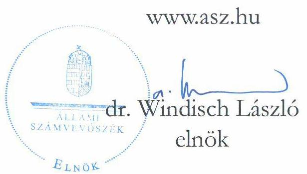
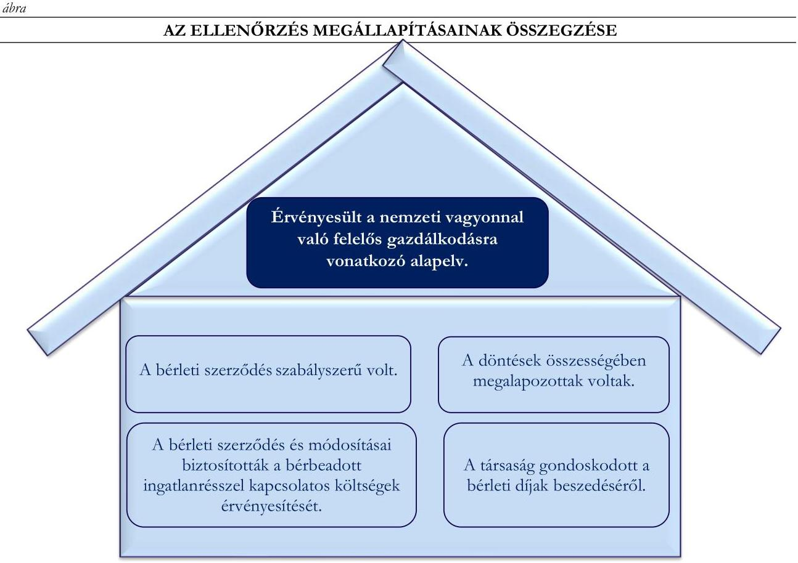

# JELENTÉS 

## A többségi állami tulajdonú gazdasági társaságok ingatlan bérbeadásának célzott ellenőrzése

Nemzeti Színház Közhasznú Nonprofit Zártkörűen Müködő Részvénytársaság

2025.

---

# JELENTÉS 

## A többségi állami tulajdonú gazdasági társaságok ingatlan bérbeadásának célzott ellenőrzése

Nemzeti Színház Közhasznú Nonprofit Zártkörűen Múködő Részvénytársaság

2025.

24210

---

# ELLENŐRZÉSI IGAZGATÓSÁG: 

## ÁLLAMI VAGYONGAZDÁLKODÁST ELLENŐRZŐ IGAZGATÓSÁG

## ELLENŐRZÉSI IGAZGATÓ:

HERCZEGH ZSOLT ellenőrzési igazgató

## ELLENŐRZÉSVEZETŐ:

Jelentéseink az interneten a www.asz.hu címen olvashatók.

IMRE ZSUZSANNA ellenőrzésvezető

IKTATÓSZÁM: EL-4095-007/2025
TÉMASORSZÁM: 38
ELLENŐRZÉS-AZONOSÍTÓ SZÁM: V1107

---

# TARTALOMJEGYZÉK 

AZ ELLENŐRZÉS ALAPADATAI ..... 5
MEGÁLLAPÍTÁSOK ÉS KÖVETKEZTETÉSEK. ..... 7
MELLÉKLETEK ..... 11
I. sz. melléklet: Értelmező szótár ..... 11
II. sz. melléklet: Ellenőrzési kritériumok ..... 12
FÜGGELÉK: ÉSZREVÉTELEK ..... 13
RÖVIDÍTÉSEK JEGYZÉKE ..... 14

---

.

---

# AZ ELLENŐRZÉS ALAPADATAI 

## AZ ELLENŐRZÉS CÉLJA

Az ellenőrzés célja a gazdasági társaságnál az ingatlanbérbeadási szerződések szabályszerűségének és a kapcsolódó döntések megalapozottságának, az ingatlannal kapcsolatos költségek, valamint a bérleti jogviszonyból eredő követelések érvényesítésének értékelése volt.

## AZ ELLENŐRZÖTT IDŐSZAK

A 2022-2023. évek, a követelések tekintetében a 2022. január 1-től az ellenőrzés megkezdéséről szóló tájékoztató levél kézhezvételének napjáig, 2024. június 26-ig terjedő időszak.

## AZ ELLENŐRZÉS TÁRGYA

A Nemzeti Színház Közhasznú Nonprofit Zrt. ${ }^{1}$ ingatlanbérbeadásra szóló szerződésének és módosításainak szabályszerűsége, a kapcsolódó döntések megalapozottsága, valamint az ingatlannal kapcsolatos költségek érvényesítésének biztosítása, a bérleti jogviszonyból eredő követelések érvényesítése volt.

Az ellenőrzés kiterjedt minden olyan körülményre és adatra, amely az ÁSZ² jogszabályban meghatározott feladatainak teljesítéséhez, valamint a program végrehajtása folyamán felmerült újabb összefüggések feltárásához szükséges volt.

## AZ ELLENŐRZÉS JOGALAPJA

Az ellenőrzés jogszabályi alapját az ÁSZ tv. ${ }^{3} 1 . \int(3)$ bekezdése és az 5. $\int(4)$ bekezdése képezik.

## AZ ELLENŐRZÉS MÓDSZERE

Az ellenőrzést az ÁSZ a nemzetközi standardokat irányadónak tekintve az ellenőrzési program szempontjai, az ellenőrzött időszakban hatályos jogszabályok, az ellenőrzés szakmai szabályok és módszertanok figyelembevételével folytatta le.

Az ellenőrzési kérdések megválaszolásához szükséges bizonyítékok megszerzése az ellenőrzött szervezet által rendelkezésre bocsátott dokumentumokra és adatokra alapozva, a következő ellenőrzési eljárások alkalmazásával történt: kérdésfeltevés (interjú), szemrevételezés, megfigyelés, összehasonlítás, mintavételezés, elemző eljárás. Az ellenőrzési bizonyítékként felhasználható adatforrások közé tartoztak egyrészt az ellenőrzéshez kért dokumentumok, adatforrások, másrészt adatforrás volt még minden - az ellenőrzés folyamán feltárt, az ellenőrzés szempontjából releváns információt tartalmazó - dokumentum.

---

Az ellenőrzés lefolytatásához az ellenőrzött szervezet a tanúsítvány kitöltésével, valamint az ÁSZ által kért dokumentumok, adatok, információk megküldésével szolgáltatott adatokat.

A tanúsítvány adatai alapján a Nemzeti Színház Közhasznú Nonprofit Zrt. az ellenőrzött időszakban 21 darab ingatlan bérbeadási szerződéssel rendelkezett. A mintavételezés keretében egy darab ingatlan bérbeadási szerződés került kiválasztásra.

Az ÁSZ ellenőrzése a mintatétel vonatkozásában tesz megállapítást, ad értékelést.

# AZ ELLENŐRZÖTT SZERVEZET 

## NEMZETI SZÍNHÁZ KÖZHASZNÚ NONPROFIT ZÁRTKÖRÜEN MÜKÖDŐ RÉSZVÉNYTÁRSASÁG

A Nemzeti Színház Közhasznú Nonprofit Zrt.-t a Magyar Állam alapította 2000. augusztus 1-jén, tulajdonosi joggyakorlója 2019. január 24-től az Emberi Erőforrások Minisztériuma volt, 2022. augusztus 30-tól a Kulturális és Innovációs Minisztérium.

A Nemzeti Színház Közhasznú Nonprofit Zrt. jegyzett tőkéje 2023. december 31-én 13 200,0 M Ft volt.

A Nemzeti Színház Közhasznú Nonprofit Zrt. főtevékenysége az előadó-művészet.

A Nemzeti Színház Közhasznú Nonprofit Zrt. honlapján közzétett információk alapján - célja az országos és nemzetközi színházművészet egészét, és annak minden ágát felölelő színházi tevékenység folytatása, az ország művészeti értékeinek kezdeményező képviselete, propagálása és menedzselése bel- és külföldön egyaránt.

Forrás: A Nemzeti Színház Közhasznú Nonprofit Zrt. honlapja

A Nemzeti Színház Közhasznú Nonprofit Zrt. székhelye, valamint két telephelye Budapesten található.
A Nemzeti Színház Közhasznú Nonprofit Zrt. 2023. évi beszámolója alapján a mérlegfőösszege 19 167,0 M Ft, a saját tőke összege 9847,4 M Ft, az értékesítés nettó árbevétele 1536,7 M Ft, a foglalkoztatottak átlagos statisztikai állományi létszáma 181 fő volt.

A Nemzeti Színház Közhasznú Nonprofit Zrt. az ellenőrzött időszakban a Taktv. ${ }^{4}$ 7/J. § (1) bekezdése és így a Gbkr. ${ }^{5}$ hatálya alá tartozott.

Az ellenőrzésre kiválasztott szerződés a Budapest IX. kerület, Bajor Gizi park 1. szám alatti ingatlanban található Nagyszínpadi nézőtéri büfé, a Gobbi Hilda színpadi nézőtéri büfé, valamint a dolgozói büfé (Színészklub) helyiségekre vonatkozó, 2020. december 14-én kelt, 2021. február 01-én hatályba lépett, két alkalommal - 2021. október 1-i és 2022. január 1-i hatályba lépéssel - módosított és határozatlan időtartamra létrejött bérleti szerződés ${ }^{6}$ volt.

---

# MEGÁLLAPÍTÁSOK ÉS KÖVETKEZTETÉSEK 

Forrás: Az ellenörzés során rendelkezésre bocsátott dokumentumok alapján ÁsZ saját szerkesztés
A Nemzeti Színház Közhasznú Nonprofit Zrt. által kötött - az ellenőrzött időszakban hatályos bérleti szerződés szabályszerű volt, megfelelt a Ptk. ${ }^{7}$-ban és a belső szabályzatban foglalt előírásoknak.
A Nemzeti Színház Közhasznú Nonprofit Zrt. a szerződéskötések rendjét a 2020. szeptember 01. napjától hatályos Kötelezettségvállalási szabályzat ${ }^{8}$-ban kialakította. A Kötelezettségvállalási szabályzatban meghatározták a szerződéskötés módját, a szerződés értékétől függően a kötelezettségvállalásra jogosultakat, megfelelve a Gbkr.-ben foglalt követelményeknek.
Az ellenőrzött időszakban hatályos, a vezérigazgató által aláírt bérleti szerződés tartalmazta a szerződő felek adatait, a bérleti szerződés tárgyát, a bérleti díj összegét, a fizetési módot, a bérbeadó és a bérlő jogait és kötelezettségeit, a késedelmes fizetés esetén alkalmazandó eljárásokat, a felmondás módját és idejét, valamint a biztosítékokat, amelyekre tekintettel a bérleti szerződés szabályszerű volt, ezáltal megfelelt a Kötelezettségvállalási szabályzatban, valamint a Ptk.-ban foglaltaknak.
A bérleti szerződés tartalmazott rendelkezést a bérleti díjban foglalt üzemeltetési, valamint az azon felül, a bérlő által - a havonta történő leolvasást követően a közüzemi szolgáltató által kiállított számla alapján - megtérítendő költségekről. A bérleti szerződést és annak módosításait írásba foglalták, azok szabályszerűek voltak, így összességében érvényesültek az Nvtv. ${ }^{9}$-ben előírt, a nemzeti vagyonnal való felelős gazdálkodásra vonatkozó alapelvek, valamint a Taktv.-ben foglalt követelmények.

---

# A Nemzeti Színház Közhasznú Nonprofit Zrt. ingatlanbérbeadáshoz kapcsolódó döntései összességében megalapozottak és célszerűek voltak. 

A bérleti szerződés megkötésére az ellenőrzött időszakot megelőzően - a korábbi bérlő színházi évad közbeni felmondását követően -, 2020. december 14-én került sor az új bérlővel.
A bérleti szerződésben a bérleti díjak megállapítására a büfék üzemeltetésének sajátosságaira tekintettel eltérő módon került sor. A nézőtéri büfék bérleti díja az időszaki nézőszámhoz kötötten, nettó 50 Ft /fő volt, míg a dolgozói büfé (Színészklub) esetében a bérleti díj nettó $200000 \mathrm{Ft} /$ hó összegben került meghatározásra.
A bérleti szerződés - az ellenőrzött időszakot megelőző 2021. október 1-i hatályú - első módosítása alapján a bérlő nem fizetett a nézőszám után járó bérleti díjat, ha az előadásban nincsen szünet. A bérleti szerződés módosítására, a bérleti díj csökkentésére a bérlővel folytatott egyeztetéseket, indokolásokat - a szünet nélküli előadások esetében a nézőtéri büfék forgalma és csekély bevétele - feljegyzés: ${ }^{10}$-ben, írásban dokumentálták.
A bérleti szerződés második módosítására 2022. január 1-i hatállyal került sor, mely alapján a dolgozói büfé (Színészklub) tekintetében meghatározott bérleti díjat a korábbi havi nettó 200000 Ft-ról 100000 Ft-ra csökkentették. A dolgozói büfében biztosított árak változatlanul hagyása érdekében a megemelkedett alapanyagár növekedések hatására veszteségessé vált üzemeltetés miatti bérleti díj csökkentéshez kapcsolódó bérlővel folytatott egyeztetéseket, indokolásokat a feljegyzés: ${ }^{11}$-ben, írásban dokumentálták.
A Nemzeti Színház Közhasznú Nonprofit Zrt. vezérigazgatója nyilatkozat: ${ }^{12}$-ban rögzítette, hogy a bérleti díjak felülvizsgálata és szóbeli egyeztetése a bérlővel 2023. évben is megtörtént, azonban írásbeli dokumentálására nem került sor.
A Nemzeti Színház Közhasznú Nonprofit Zrt. 2023. évre nem kezdeményezte a bérleti díjak módosítását (emelését), ennek ellenére a bérlő 2024. évben - az üzemeltetési költségek nagyságára és a nézőtéri büfék csökkenő bevételére tekintettel - felmondta a bérleti szerződést. A Nemzeti Színház Közhasznú Nonprofit Zrt. ingatlanbérbeadással kapcsolatosan hozott döntései a 2022. évre vonatkozóan indokolásokkal alátámasztottak, dokumentáltak voltak, az ellenőrzött időszakban biztosították a színház nézőtéri büféinek és a Színészklubnak a folyamatos müködését, így az ingatlan jellegére és a korlátozott hasznosítási lehetőségekre, a speciális helyzetre tekintettel megalapozottak és célszerűek voltak, összességében érvényesültek az Nvtv.-ben rögzített, a nemzeti vagyonnal való felelős gazdálkodásra vonatkozó alapelvek, valamint a Taktv.-ben foglalt követelmények.
A Nemzeti Színház Közhasznú Nonprofit Zrt. az ellenőrzött időszakban rendelkezett a bérlővel szembeni követelések nyilvántartásával (Vevő folyószámla), amely tételesen (számlánkénti bontásban) tartalmazta a követelések összegét, a számla keltét, a fizetési határidőt és a kiegyenlítés dátumát, ezzel az ingatlanbérbeadásból származó bevételek tekintetében a nyomon követési rendszert kialakították és működtették, így a Nemzeti Színház Közhasznú Nonprofit Zrt. megfelelt a Gbkr.-ben foglaltaknak.
A Nemzeti Színház Közhasznú Nonprofit Zrt. - az ellenőrzött időszakban, az ellenőrzéssel érintett bérleti szerződésében - biztosította a bérbeadott ingatlanrésszel kapcsolatos költségek érvényesítését.
A bérleti szerződés 2.4. pontjában rögzítettek alapján a bérleti díj magában foglalta az üzemeltetési költségeket, kivéve a villamosenergia fogyasztását. A villamosenergia fogyasztását külön almérő alapján, a szolgáltató felé fizetendő díj mértékével megegyező - a bérleti szerződésben foglaltaknak megfelelően,

---

minden hónapban a közüzemi szolgáltatók által kiállított számlák alapján a tárgyhót követő - számlázás után fizette meg a bérlő.
A bérleti szerződésben nem rögzítették, hogy a víz-és csatornadíjat az üzemeltetési költségek nem tartalmazzák, ugyanakkor rendelkeztek a közüzemi díjak - szolgáltató általi számlázása és havi leolvasás alapján történő - továbbszámlázásáról a bérlő részére. A bérlő elfogadta a továbbszámlázás gyakorlatát és minden számlát maradéktalanul kiegyenlített.
A 2022. évben az összes továbbszámlázott ráfordítás 6576,8 E Ft, 2023. évben 10 548,1 E Ft volt.

1. táblázat

A BÉRLETI SZERZŐDÉSHEZ KAPCSOLÓDÓ BEVÉTELEK ÉS RÁFORDÍTÁSOK AZ ELLENŐRZÖTT IDŐSZAKBAN (ADATOK EZER FORINTBAN)

|  | 2022. Ft | 2023. Ft |
| :--: | :--: | :--: |
| Bérleti díj bevétel | 3585,5 | 3645,7 |
| Továbbszámlázott ráfordításokból   származó bevétel | 6576,8 | 10548,1 |
| Összes bevétel | 10 162,3 | 14 193,8 |
| Villamosenergia díj | 6239,2 | 10 194,0 |
| Víz-és csatornadíj | 337,6 | 354,1 |
| Összes ráfordítás | 6576,8 | 10548,1 |
| Eredmény | 3585,5 | 3645,7 |
| Fedezeti hányad | 35,3\% | 25,7\% |

A Nemzeti Színház Közhasznú Nonprofit Zrt. által rendelkezésre bocsátott nyilvántartások tételesen (számlánkénti bontásban) tartalmazták a 2022. és 2023. évekre vonatkozóan az ingatlanbérbeadásból származó bevételeket és a kapcsolódó ráfordításokat, ezzel az ingatlanbérbeadás tekintetében a bevételek és ráfordítások nyomon követése megvalósult, megfelelve a Gbkr.-ben foglaltaknak.
A Nemzeti Színház Közhasznú Nonprofit Zrt. a fent rögzített tényekre tekintettel az ellenőrzött időszakban a bérleti szerződés tekintetében érvényesítette a Taktv.-ben foglalt, a gazdaságos és eredményes gazdálkodásra, valamint a megfelelő, pontos és naprakész információ rendelkezésre állására vonatkozó követelményeket, továbbá az Nvtv.-ben rögzített, a nemzeti vagyonnal való felelős gazdálkodásra vonatkozó alapelvet.

# A Nemzeti Színház Közhasznú Nonprofit Zrt. gondoskodott a bérleti díjak beszedéséről. 

A Nemzeti Színház Közhasznú Nonprofit Zrt. nem rendelkezett a bérlővel szembeni lejárt (határidőn túli) követeléssel 2023. december 31. napjára vonatkozóan, amely adatot a rendelkezésre bocsátott vevő folyószámla is alátámasztott.
A Nemzeti Színház Közhasznú Nonprofit Zrt. rendelkezett a bérlővel szembeni követelések nyilvántartásával (Vevő folyószámla és főkönyvi karton) az ellenőrzött időszakban, amely tételesen (számlánkénti bontásban) tartalmazta a követelések összegét, a számla keltét, a fizetési határidőt és a kiegyenlítés dátumát, megfelelve a Számv. tv. ${ }^{13}$-ben foglaltaknak.
Az ellenőrzött időszakban a Nemzeti Színház Közhasznú Nonprofit Zrt. által kiszámlázott tételekből a bérlő öt darab számla esetében a fizetési határidőt követő több, mint 10 napos késedelemmel (11-47 nap) fizette meg a számlák ellenértékét. A Nemzeti Színház Közhasznú Nonprofit Zrt. egy esetben küldött fizetési emlékeztetőt a bérlő részére összesen 1236,1 E Ft összegben, a 2022. május12-31. időszakban esedékessé vált, kiegyenlítetlen követelésekről. A lejárt esedékességủ számlák kiegyenlítése az analitikus nyilvántartások alapján 2022. június 9 -én megtörtént.

---

A Nemzeti Színház Közhasznú Nonprofit Zrt. kontrollokat épített ki a bérleti díjak beszedése érdekében, nyomon követte a követelések pénzügyi teljesülését, megfelelve a Gbkr.-ben foglaltaknak, gondoskodott a bérleti díjak beszedéséről, így az ellenőrzött időszakban érvényesültek az Nvtv.-ben rögzített, a nemzeti vagyonnal való felelős gazdálkodásra vonatkozó alapelvek.

---

# MELLÉKLETEK 

## I. SZ. MELLÉKLET: ÉRTELMEZŐ SZÓTÁR

fedezeti hányad mutató
gazdasági társaság
többségi állami tulajdon

A fedezeti hányad százalékos formában mutatja meg a gazdasági társaság bruttó eredményét és azt, hogy az árbevételből milyen mértékben tudja fedezni az állandó költségeket. Kiszámítása: (árbevétel- változó költségek)/ árbevétel *100.
(ÁSZ definíció a Bán Erika - Kresalek Péter - dr. Pucsek József: A vállalati gazdálkodás elemzése (Perfekt Kiadó, 2017) és Dr. Bíró Tibor - Kresalek Péter - Dr. Pucsek József - Dr. Sztanó Imre: A vállalkozások tevékenységének komplex elemzése (Perfekt Kiadó, 2016) kiadványok alapján)
A gazdasági társaságok üzletszerű közös gazdasági tevékenység folytatására, a tagok vagyoni hozzájárulásával létrehozott, jogi személyiséggel rendelkező vállalkozások, amelyekben a tagok a nyereségből közösen részesednek, és a veszteséget közösen viselik. (Forrás: Ptk. 3:88. § (1) bekezdése)
Az állam tulajdonában lévő tagsági jogviszonyt megtestesítő értékpapír, illetve az állam tulajdonában lévő egyéb társasági részesedés, amennyiben a társaságban a Magyar Állam közvetlenül vagy közvetetten a szavazatok több mint felével rendelkezik.
(ÁSZ definíció a Vtv. ${ }^{14}$ 1. § (2) bekezdés c) pontja és a Ptk. 8:2. § (1), (3)-(4) bekezdései alapján)

---

# II. SZ. MELLÉKLET: ELLENŐRZÉSI KRITÉRIUMOK 

## ELLENŐRZÉSI KRITÉRIUMOK

Nvtv. 7. § (1), (2) bekezdés
Taktv. 7/J. § (3) bekezdés a), d) és e) pontok
Ptk. 6:331-6:341. §
Számv. tv. 12. § (1), 14. § (5) bekezdés c.) pont, 16 § (1) bekezdés, 29. §, 164 § (1), (2) bekezdés, 165. § (1) bekezdés
Gbkr. 3. § (1) bekezdés e) pont, 4. § (1) bekezdés c) pont, (3) bekezdés, 6. § (1), (2) bekezdés, 8. §
Gbkr. Kézikönyv A/I/1.1.6. fejezet 5. pont
A Nemzeti Színház Közhasznú Nonprofit Zrt. Kötelezettségvállalási szabályzata

---

# FÜGGELÉK: ÉSZREVÉTELEK 

A jelentéstervezetet a Számvevőszék 15 napos észrevételezésre megküldte az ellenőrzött szervezet vezetőjének az ÁSZ tv. 29. §* (1) bekezdése előírásának megfelelően.

A Nemzeti Színház Közhasznú Nonprofit Zrt. vezetője nem élt észrevételezési jogával.

[^0]
[^0]:    * 29. § (1) Az Állami Számvevőszék az ellenőrzési megállapításait megküldi az ellenőrzött szervezet vezetőjének vagy az általa megbízott személynek, és annak, akinek személyes felelősségét állapította meg.
    (2) Az ellenőrzött szervezet vezetője és a felelősként megjelölt személy az ellenőrzés megállapításaira tizenöt napon belül írásban észrevételt tehet.
    (3) Az Állami Számvevőszék az észrevételre a beérkezésétől számított harminc napon belül írásban válaszol. A figyelembe nem vett észrevételeket köteles a jelentésben feltüntetni, és megindokolni, hogy azokat miért nem fogadta el.

---

# RÖVIDÍTÉSEK JEGYZÉKE 

${ }^{1}$ Nemzeti Színház Közhasznú Nonprofit Zrt. Nemzeti Színház Közhasznú Nonprofit Zártkörűen Működő Részvénytársaság
${ }^{2}$ ÁSZ
${ }^{3}$ ÁSZ tv.
${ }^{4}$ Taktv.
${ }^{5}$ Gbkr.
${ }^{6}$ bérleti szerződés
${ }^{7}$ Ptk.
${ }^{8}$ Kötelezettségvállalási szabályzat
${ }^{9}$ Nvtv.
${ }^{10}$ feljegyzés ${ }_{1}$
${ }^{11}$ feljegyzés $_{2}$
${ }^{12}$ nyilatkozat ${ }_{1}$
${ }^{13}$ Számv. tv.
${ }^{14}$ Vtv.

Állami Számvevőszék
2011. évi LXVI. törvény az Állami Számvevőszékről
2009. évi CXXII. törvény a köztulajdonban álló gazdasági társaságok takarékosabb müködéséről
339/2019. (XII. 23.) Korm. rendelet a köztulajdonban álló gazdasági társaságok belső kontrollrendszeréről
Nemzeti Színház Közhasznú Nonprofit Zrt. mint bérbeadó és a bérlő között 2020. december 14-én a létrejött bérleti szerződés, hatályos: 2020. február 1. napjától határozatlan időre;
bérleti szerződés 1.számú módosítása hatályos:2021. október 1. napjától;
bérleti szerződés 2.számú módosítása hatályos: 2022. január 1. napjától
2013. évi V. törvény a Polgári Törvénykönyvről

Kötelezettségvállalási, utalványozási és teljesítésigazolási rend (2020. szeptember 1. napjától hatályos, majd 2022. március 1., 2022. április 1., 2022. május 15. napokon módosított)
2011. évi CXCVI. törvény a nemzeti vagyonról

A Nemzeti Színház Közhasznú Nonprofit Zrt. vezérigazgatójának a bérlővel történő szóbeli egyeztetésekről 2021. október 18. napján készített feljegyzése
A Nemzeti Színház Közhasznú Nonprofit Zrt. vezérigazgatójának a bérlővel történő szóbeli egyeztetésekről 2021. december 15. napján készített feljegyzése
A Nemzeti Színház Közhasznú Nonprofit Zrt. vezérigazgatójának 2024. szeptember 25-én tett nyilatkozata
2000. évi C. törvény a számvitelről
2007. évi CVI. törvény az állami vagyonról

---

1052 Budapest, Apáczai Csere János u. 10. | 1364 Budapest 4., Pf. 54
www.asz.hu | szamvevoszek@asz.hu
telefon: +36 14849100