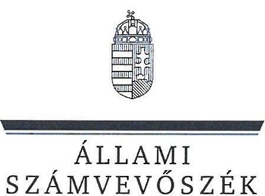
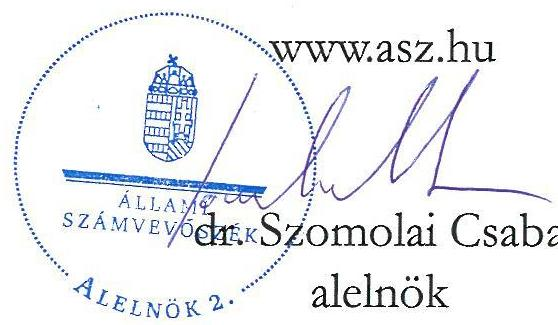
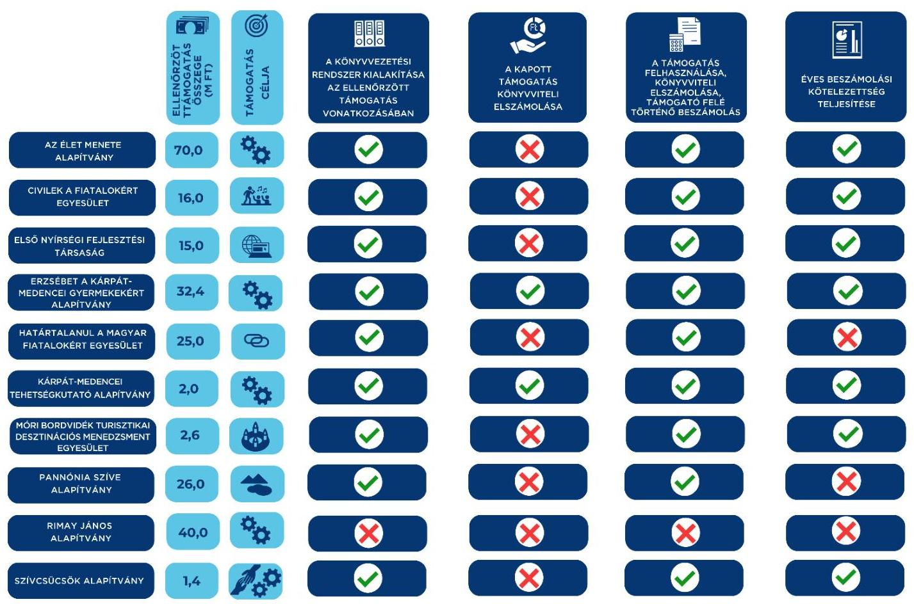

# JELENTÉS 

## Egyesületek és alapítványok államháztartásból kapott támogatásai felhasználásának és elszámolásának ellenőrzése

2024.

---

ÁLLAMI SZÁMVEVŐSZÉK

# JELENTÉS 

## Egyesületek és alapítványok államháztartásból kapott támogatásai felhasználásának és elszámolásának ellenőrzése

2024. 

24211

---

# ELLENŐRZÉSI IGAZGATÓSÁG: 

ÁLLAMHÁZTARTÁSON KÍVÜLI SZERVEZETEKET ELLENŐRZŐ IGAZGATÓSÁG

## ELLENŐRZÉSI IGAZGATÓ:

KLINGA LÁSZLÓ igazgató

## ELLENŐRZÉSVEZETŐ:

Jelentéseink az interneten a www.asz.hu címen olvashstók.

SOLYMÁR ÁGNES ellenőrzésvezető

IKTATÓSZÁM EL-4071-002/2024.
TÉMASORSZÁM: 26.
ELLENŐRZÉS-AZONOSÍTÓ SZÁM: V1099

---

# TARTALOMJEGYZÉK 

AZ ELLENŐRZÉS ALAPADATAI ..... 5
AZ ELLENŐRZÖTT SZERVEZETEK ..... 7
ÖSSZEFOGLALÁS ..... 13
AZ ELLENŐRZÉS FÓKUSZKÉRDÉSE ..... 16
MEGÁLLAPÍTÁSOK ..... 17
JAVASLATOK ..... 29
MELLÉKLETEK ..... 31
I. sz. melléklet: Értelmező szótár ..... 31
II. sz. melléklet: Az ellenőrzött szervezetek jegyzéke ..... 33
III. sz. melléklet: Ellenőrzési kritériumok ..... 34
FÜGGELÉK: ÉSZREVÉTELEK ..... 35
RÖVIDÍTÉSEK JEGYZÉKE ..... 36

---

.

---

# AZ ELLENŐRZÉS ALAPADATAI 

## AZ ELLENŐRZÉS CÉLJA

Az ellenőrzés célja annak megállapítása volt, hogy az ellenőrzött egyesületeknél, alapítványoknál a kiválasztott, államháztartási forrásból származó támogatások felhasználása a jogszabályi és a támogatói okiratban előírtaknak megfelelően történt-e, a támogatásokkal való elszámolás szabályszerű volt-e, a civil szervezetek a gazdálkodásukról szabályszerűen beszámoltak-e. Az államháztartási forrásból származó támogatást a támogatói okiratban meghatározott célra használták-e fel.

## AZ ELLENŐRZÉS TÍPUSA

Szabályszerüségi ellenőrzés.

## AZ ELLENŐRZŐTT IDŐSZAK

A kiválasztott államháztartási forrásból származó támogatásra vonatkozó támogatói okirat aláírásától amennyiben a támogatott tevékenység időtartamának kezdő időpontja korábbi, mint a támogatói okirat aláírásának időpontja, akkor a támogatott tevékenység időtartamának kezdő időpontjától - az ellenőrzésről szóló értesítés keltéig tartó időszak. Amennyiben a 2023. évi beszámoló közzététele ezen időszakban nem történt meg, akkor az ellenőrzött időszak záró időpontja a 2023. évi beszámoló közzétételének napja.

## AZ ELLENŐRZÉS TÁRGYA

Az államháztartásból nyújtott támogatást felhasználó ellenőrzött egyesületeknél és alapítványoknál a kiválasztott támogatás felhasználására vonatkozó jogszabályi és szerződéses előírások betartásának ellenőrzése. Ennek keretében a könyvvezetésre vonatkozó jogszabályi előírások betartása, a támogatás felhasználás támogatói okiratnak való megfelelősége, valamint a beszámolási és közzétételi kötelezettség teljesítésének szabályszerűsége. Az ellenőrzés tárgya továbbá annak ellenőrzése, hogy a számviteli szabályozási környezet kialakítása támogatta-e az államháztartásból származó támogatások vonatkozásában a szabályos könyvvezetést, a kapcsolódó beszámolási kötelezettség teljesítését, valamint a támogatások célnak megfelelő felhasználását.

## AZ ELLENŐRZÉS JOGALAPJA

Az ellenőrzés jogalapját az ÁSZ tv. ${ }^{1} 1 . \S$ (3), valamint az 5. § (3) bekezdés előírásai képezték.

---

# AZ ELLENŐRZÉS MÓDSZERE 

Az ellenőrzést a nemzetközi standardokat irányadónak tekintve az ellenőrzési program szempontjai, az ellenőrzött időszakban hatályos jogszabályok, az ellenőrzés szakmai szabályok és módszertanok figyelembevételével történt.

Az ellenőrzési kérdések megválaszolásához szükséges bizonyítékok megszerzése az ellenőrzött civil szervezet által rendelkezésre bocsátott dokumentumokra és adatokra alapozva, továbbá kérdésfeltevés (információkérés), interjú útján történt.

A civil szervezeteknél az államháztartási forrásból származó működésükhöz, programjaikhoz vagy fejlesztéseikhez (beruházásaikhoz) kapcsolódó, kiválasztott támogatás felhasználása támogatói okiratnak való megfelelőségét, a támogatások nyilvántartásának és a támogató felé történő elszámolásnak egymással és a támogatói okirattal történő összevetésével ellenőrizte az ÁSZ².

A támogatások könyvviteli nyilvántartása jogszabályi előírásoknak, támogatói okiratnak való megfelelőségét támogatásonként, kockázati értékeléssel kiválasztott mintatételeken keresztül ellenőrizte az ÁSZ. A mintatételek kiértékelésének eredménye nem került az alapsokaságra kivetítésre.

---

# AZ ELLENŐRZÖTT SZERVEZETEK 

Az ellenőrzésre 10 civil szervezet esetében került sor, melyek közül négy egyesületi, hat pedig alapítványi formában működött. Működéséről, vagyoni, pénzügyi és jövedelmi helyzetéről kilenc ellenőrzött szervezet az ellenőrzött években egyszerűsített éves beszámolót, egy szervezet a Számv. tv. ${ }^{3}$ szerinti éves beszámolót készített, melyet kettős könyvvezetéssel támasztottak alá. A 10 ellenőrzött szervezetből hat rendelkezett közhasznú jogállással. A Közbef. tv. ${ }^{4}$ előírása szerint tevékenysége és a 2023. évi számviteli beszámoló mérlegfőösszege alapján - mivel mérlegfőösszegük elérte a 20 M Ft összeget - hét ellenőrzött a közélet befolyásolására alkalmas tevékenységet végző civil szervezetnek minősült.

Az ellenőrzött szervezetek 2021-2023. évekre vonatkozó számviteli beszámolóik szerint a 2023. évben összesen 109711 M Ft vagyonnal gazdálkodtak, a 2021-2023. években az összes bevételük 35698 M Ft volt. Az ellenőrzött 10 civil szervezet a $\mathrm{BGA}^{5}$-tól, mint a Miniszterelnökségnél rendelkezésre álló támogatási célú fejezeti kezelésű előirányzat kezelő szervétől, 100\%-os előlegként kapott, 230,4 M Ft összegű, vissza nem térítendő támogatás számviteli elkülönített nyilvántartásának, valamint a támogatási előleg cél szerinti felhasználásának ellenőrzésére került sor.

## AZ ÉLET MENETE ALAPÍTVÁNY (BUDAPEST)

Az Élet Menete Alapítványt a 2004. évben, magánszemélyek hozták létre. Az alapító okiratban meghatározott célja többek között „az Emlékezés Napján minden évben megrendezésre keriülö nemzetközi megemlékezéséken való részvétel biztositása minél több fiatal számára, valamint a zsidó Öszi ünnepek után minden évben egy magyarországi „Az Élet Menete" emlékest megrendezése." Az Élet Menete Alapítvány az ellenőrzött időszakban közhasznú jogállással rendelkezett, a 2023. évi számviteli beszámolójának mérlegfőösszege alapján a közélet befolyásolására alkalmas tevékenységet végző civil szervezetnek minősült. A vagyonkezelő, ügyvezető és egyben legfőbb döntéshozó szerve a kuratórium. A vagyon felhasználásával és kezelésével kapcsolatos döntéseket a kuratórium hozta meg. Az Élet Menete Alapítvány vezető tisztségviselői a kuratóriumi tagok voltak, önálló képviseletét a kuratórium elnöke látta el. Az Élet Menete Alapítvány a beszámolók adatai alapján vállalkozási tevékenységet nem folytatott, könyvvizsgálatra nem volt kötelezett. A könyvvezetése a kettős könyvvitel rendszerében történt, a beszámoló formája egyszerűsített éves beszámoló volt. A BGA által nyújtott, ellenőrzött támogatási előleg főbb adatait az 1. táblázat tartalmazza.

## 1. táblázat

## AZ ÉLET MENETE ALAPÍTVÁNY RÉSZÉRE A BGA ÁLTAL NYÚJTOTT, ELLENŐRZÖTT TÁMOGATÁSI ELŐLEG FÖRB ADATAI

A támogatási program célja
A támogatott tevékenység időtartama
A támogatási előleg felhasználásának végső időpontja
A támogatási előleg folyósításának napja / összege
A támogatási előleg felhasználásáról a beszámoló benyújtásának határideje
A támogatási előleg felhasználásáról benyújtott beszámoló elfogadásának dátuma

Az Élet Menete Alapítvány 2021. évi müködésének a támogatása 2021.01.01 - 2022.12.31.

2022.12.31.
2021.03.29. / 70 M Ft
2023.01.30.
2023.10.03.

Forrás: Az ellenőrzött szervezet dokumentumai alapján ÁSZ saját szerkestés

---

# CIVILEK A FIATALOKÉRT EGYESÜLET (DEBRECEN) 

A Civilek a Fiatalokért Egyesületet 1997. évben alapították, jogelődje a Debreceni Szülők Egyesülete a Gyermekekért. Az Alapszabályában meghatározott célja: „az ifjúságvédelem, a fiatalok érdekképviseletének elösegitése. Ifjúsági nevelés, oktatás, képességfejlesztés és ismeretterjesztés. Kulturális tevékenység, belyi szabadidős és kulturális lebetöségek fejlesztése. Kapcsolatépités a bazai és határon túli - elsösorban - ifjúsági szervezetekkel." Az ellenőrzött időszakban közhasznú jogállással rendelkezett, a 2023. évi számviteli beszámolójának mérlegfőösszege alapján a közélet befolyásolására alkalmas tevékenységet végző civil szervezetnek minősült. A legfőbb döntéshozó szerve a közgyűlés, ügyvezető szerve az elnökség volt. A Civilek a Fiatalokért Egyesületet teljes jogkörrel rendelkező képviselője az elnök, alelnök és a titkár volt. A könyvvezetése a kettős könyvvitel rendszerében történt, a beszámoló formája egyszerűsített éves beszámoló volt. A beszámolók adatai alapján vállalkozási tevékenységet nem folytatott, könyvvizsgálatra nem volt kötelezett. A BGA által nyújtott, ellenőrzött támogatási előleg főbb adatait az 2. táblázat tartalmazza.

## A CIVILEK A FIATALOKÉRT EGYESÜLET RÉSZÉRE A BGA ÁLTAL NYÚJTOTT, ELLENÖRZÖTT TÁMogatÁSI ELŐLEG FÖBB ADATAI

A támogatási program célja
„Trianon 100+1 koncertsorozat"
A támogatott tevékenység időtartama
2021.01.01 - 2022.06.30

A támogatási előleg felhasználásának végső időpontja
2022.06.30.

A támogatási előleg folyósításának napja / összege
2021.06.24. / 16 M Ft

A támogatási előleg felhasználásáról a beszámoló
benyújtásának határideje
2022.04.29.

A támogatási előleg felhasználásáról benyújtott
beszámoló elfogadásának dátuma
2022.07.21.

Forrás: Az ellenőrzött szervezet dokumentumai alapján ÁSZ saját szerkesztés

## Első Nyírségi Fejlesztési Társaság (Nyíregyháza)

Az Első Nyírségi Fejlesztési Társaságot, mint egyesületet 1994. évben alapították. Az Alapszabályában meghatározott célja: „a települések összefogásával, koordinálásával azon feladatok ellátása, melyeket önállóan, szökös anyagi belyzetükből kifolyólag nem képesek megvalósítani, a tagtelepülések és a régióban müködő civil szervezetek esélyegyenlöségének, közös érdekképviseletének megteremtése, elösegiteni a partnerség kialakulását a három szektor (állam, civil, piac) között, bozzájárulni a közösségi célokat szolggáló szervezetek sikeres müködéséhez" volt. Az ellenőrzött időszakban közhasznú jogállással rendelkezett, a 2023. évi számviteli beszámolójának mérlegfőösszege alapján a közélet befolyásolására alkalmas tevékenységet végző civil szervezetnek minősült. A legfőbb döntéshozó szerve a közgyűlés, ügyvezető szerve az elnökség volt, melynek vezető tisztségviselői az Első Nyírségi Fejlesztési Társaság törvényes képviseletét önállóan látták el. A könyvvezetése a kettős könyvvitel rendszerében történt, a beszámoló formája egyszerűsített éves beszámoló volt. Az Első Nyírségi Fejlesztési Társaság könyvvizsgálatra volt kötelezett, a beszámolók adatai alapján vállalkozási tevékenységet nem folytatott. A BGA által nyújtott, ellenőrzött támogatás főbb adatait az 3. táblázat tartalmazza.

---

# Az Első Nyírségi Fejlesztési Társaság Részére a BGA által Nyújtott, Ellenőrzött TÁMOGATÁSI ELŐLEG FÖBB ADATAI 

A támogatási program célja
„Civil Fórum tagok részére bonlap létrehozása"
A támogatott tevékenység időtartama
2021.01.01 - 2022.12.31.

A támogatási előleg felhasználásának végső időpontja
2023.03.31.

A támogatási előleg folyósításának napja / összege
2021.08.18. / 15 M Ft

A támogatási előleg felhasználásáról a beszámoló benyújtásának határideje
2023.09.28.

A támogatási előleg felhasználásáról benyújtott beszámoló elfogadásának dátuma
2023.10.12.

Forrás: Az ellenőrzött szervezet dokumentumai alapján ÁsZ saját szerkesztés

## ERZSÉBET A KÁRPÁT-MEDENCEI GYERMEKEKÉRT ALAPÍTVÁNY (BUDAPEST)

Az Erzsébet a Kárpát-medencei Gyermekekért Alapítványt 2013. évben alapította a Hunguest Vagyonkezelő Zártkörű Részvénytársaság. Az alapító okiratában meghatározott célja, hogy a Kárpátmedencében élő gyermekek üdültetésével, táboroztatásával, művelődésével, nyári programjainak biztosításával, határon túl élő magyar gyermekek anyaországgal való kapcsolattartásának elősegítésével, illetve rászoruló gyermekek nyári étkeztetésének megszervezésével kapcsolatos feladatokat lásson el. Az Erzsébet a Kárpátmedencei Gyermekekért Alapítvány az Ettv. ${ }^{6}$-ben meghatározott közfeladatot látott el. Az ellenőrzött időszakban közhasznú jogállással rendelkezett, a 2023. évi számviteli beszámolójának mérlegfőösszege alapján a közélet befolyásolására alkalmas tevékenységet végző civil szervezetnek minősült. Legfőbb döntéshozó és egyben ügyvezető szerve a kuratórium volt, képviseletét teljes jogkörrel a kuratórium elnöke és alelnöke látták el. A könyvvezetése a kettős könyvvitel rendszerében történt, a beszámoló formája éves beszámoló volt. A beszámolók adatai alapján vállalkozási tevékenységet folytatott, valamint könyvvizsgálatra volt kötelezett. A BGA által nyújtott, ellenőrzött támogatási előleg főbb adatait az 4. táblázat tartalmazza.
4. táblázat

## AZ ERZSÉBET A KÁRPÁT-MEDENCEI GYERMEKEKÉRT ALAPÍTVÁNY RÉSZÉRE A BGA ÁLTAL NYÚJTOTT, ELLENŐRZÖTT TÁMOGATÁSI ELŐLEG FÖBB ADATAI

A támogatási program célja
„Az alapítvány tulajdonában lévő gazdasági társaság múködésének támogatása"
2021.01.01 - 2022.12.31.

A támogatási előleg felhasználásának végső időpontja
2022.12.31.

A támogatási előleg folyósításának napja / összege
2021.12.31. / 32,4 M Ft

A támogatási előleg felhasználásáról a beszámoló benyújtásának határideje
2023.01.30.

A támogatási előleg felhasználásáról benyújtott beszámoló elfogadásának dátuma

A beszámolóról a BGA az ellenőrzésről szóló értesítés keltéig (2024.06.20.) még nem döntött.

Forrás: Az ellenőrzött szervezet dokumentumai alapján ÁsZ saját szerkesztés

## Határtalanul a Magyar Fiatalokért EgyesÜlet (Budapest)

A Határtalanul a Magyar Fiatalokért Egyesületet magánszemélyek alapították a 2019. évben. Alapszabályában meghatározott célja: „A kárpát-medencei magyar fiatalság demokratikus értékeinek fejlesztése, állampolgári és pénzügyi ismeretek, állampolgári jogok és kötelezettségek fiatalok körében történő tudatosítása, népszerüslítése" volt. Az ellenőrzött időszakban közhasznú jogállással nem rendelkezett, a 2023. évi számviteli beszámolójának mérlegfőösszege alapján a közélet befolyásolására alkalmas tevékenységet végző civil szervezetnek minősült. A legfőbb döntéshozó szerve a közgyűlés, ügyvezető szerve az elnökség volt, önállóan az elnök rendelkezett képviseleti joggal. A könyvvezetése a kettős könyvvitel rendszerében történt, a beszámoló formája

---

egyszerűsített éves beszámoló volt. A beszámolók adatai alapján vállalkozási tevékenységet nem folytatott, nem volt könyvvizsgálatra kötelezett. A BGA által nyújtott, ellenőrzött támogatási előleg főbb adatait az 5. táblázat tartalmazza.

# E táblázat 

## A HATÁRTALANULA MAGYÁR FIATALOKERT EGYESÜLET RÉSZÉRE A BGA ÁLTAL NYÚJTOTT, ELLENŐRZÖTT TÁMOGATÁSI ELŐLEG FÖBB ADATAI

A támogatási program célja
A támogatott tevékenység időtartama
A támogatási előleg felhasználásának végső időpontja
A támogatási előleg folyósításának napja / összege
A támogatási előleg felhasználásáról a beszámoló benyújtásának határideje
A támogatási előleg felhasználásáról benyújtott beszámoló elfogadásának dátuma
„A határon átnyúló civil kapcsolatok erősitése"
2021.10.01 - 2022. 03.31.

2022.12.31.
2021.10.25. / 25 M Ft
2023.01.30.
2024.06.04.

## KÁRPÁT-MEDENCEI TEHETSÉGKUTATÓ ALAPÍTVÁNY (BUDAPEST)

A Kárpát-medencei Tehetségkutató Alapítványt 2015. évben hozta létre egy magánszemély alapító, 2024. évben sor került az alapítói jogok végleges átruházására egy másik magánszemély részére. Az alapító okiratban meghatározott célja: „A Kárpát-medencében élő tehetséges fiatalok, felkutatása, támogatása, fejlődési lehetőségük biztosítása. Együttmüködés kialakítása a hazai és nemzetközi tudományos élet szervezeteivel, a határon túli szervezetek és személyek közötti információáramlás elősegítése. A tehetséges fiatalok közös szellemi és történelmi örökségének közzetítése és támogatása." Az ellenőrzött időszakban közhasznú jogállással rendelkezett, a 2023. évi számviteli beszámolójának mérlegfőösszege alapján a közélet befolyásolására alkalmas tevékenységet végző civil szervezetnek minősült. A legfőbb döntéshozó szerve a kuratórium volt. Teljes jogkörrel rendelkező képviselője a kuratórium elnöke és titkára volt. A könyvvezetése a kettős könyvvitel rendszerében történt, a beszámoló formája egyszerűsített éves beszámoló volt. A beszámolók adatai alapján vállalkozási tevékenységet nem folytatott. Könyvvizsgálatra saját döntése alapján volt kötelezett. A BGA által nyújtott, ellenőrzött támogatási előleg főbb adatait az 6. táblázat tartalmazza.

## E táblázat

## A KÁRPÁT-MEDENCEI TEHETSÉGKUTATÓ ALAPÍTVÁNY RÉSZÉRE A BGA ÁLTAL NYÚJTOTT, ELLENŐRZÖTT TÁMOGATÁSI ELŐLEG FÖBB ADATAI

A támogatási program célja
A támogatott tevékenység időtartama
A támogatási előleg felhasználásának végső időpontja
A támogatási előleg folyósításának napja / összege
A támogatási előleg felhasználásáról a beszámoló benyújtásának határideje
A támogatási előleg felhasználásáról benyújtott beszámoló elfogadásának dátuma
„A Kárpát-medencei Tehetségkutató Alapítvány müködésének támogatása"
2021.04.01 - 2022.03.31

2022.03.31.
2021.05.19. / 2 M Ft
2022.04.30.
2022.11.10.

Forrás: Az ellenőrzött szervezet dokumentumai alapján ÁSZ saját szerkesztés

## MÓRI BORVIDÉK TURISZTIKAI DESZTINÁCIÓS MENEdZSMENT EGYESÜLET (MÓR)

A Móri Borvidék Turisztikai Desztinációs Menedzsment Egyesületet 2009. évben alapították. Alapszabályában meghatározott célja: „a magán és közszéféra partnerségén, közös érdekeltségén alapuló turizmustéégesztés, szervezése és müködtetése" volt. Az ellenőrzött időszakban közhasznú jogállással rendelkezett, a 2023. évi számviteli beszámolójának mérlegfőösszege alapján a közélet befolyásolására alkalmas tevékenységet végző civil

---

szervezetnek minősült. A legfőbb döntéshozó szerve a közgyűlés, ügyvezető szerve az elnökség, teljes jogkörrel rendelkező képviselője az elnök volt. A könyvvezetése a kettős könyvvitel rendszerében történt, a beszámoló formája egyszerűsített éves beszámoló volt. A beszámolók adatai alapján vállalkozási tevékenységet nem folytatott, könyvvizsgálatra nem volt kötelezett. A BGA által nyújtott, ellenőrzött támogatási előleg főbb adatait az 7. táblázat tartalmazza.

# 7. táblázat 

## A MÓRI BORVIDÉK-TURISZTIKAI DESZTINÁCIÓS MENEDZSMENT EGYESÜLET RÉSZÉRE A BGA ÁLTAL NYÚJTOTT, ELLENÖRZÖTT TÁMOGATÁSI ELŐLEG FÖBB ADATAI

A támogatási program célja
„Móri Advent 2021"
A támogatott tevékenység időtartama
2021.04.01 - 2022.12.31.

A támogatási előleg felhasználásának végső időpontja
2022.12.31.
A támogatási előleg folyósításának napja / összege
2021.04.23. / 2,6 M Ft

A támogatási előleg felhasználásáról a beszámoló
benyújtásának határideje
2023.01.31.

A támogatási előleg felhasználásáról benyújtott
beszámoló elfogadásának dátuma
A beszámolóról a BGA az ellenőrzésről szóló értesítés keltéig (2024.06.20.) még nem döntött.

Fornás: Az ellenőrzött szervezet dokumentumai alapján ÂSZ saját szerkesztés

## PANNÓNIA SZíVE ALAPíTVÁNY (BICSKE)

A Pannónia Szíve Alapítványt a 2020. évben alapította a Martonvásári Kulturális Egyesület. Az alapító okiratában meghatározott célja „a fiatalok közösségeinek támogatása, a belyi közéletben való aktív részvételük erősitése, valamint a közösségépités szintereinek megteremtése" volt. Az ellenőrzött időszakban közhasznú jogállással nem rendelkezett, a 2023. évi számviteli beszámolójának mérlegfőösszege alapján nem minősült a közélet befolyásolására alkalmas tevékenységet végző civil szervezetnek. Döntéshozó és ügyvezető szerve a kuratórium volt, a képviseletét a kuratórium elnöke látta el. A könyvvezetése a kettős könyvvitel rendszerében történt, a beszámoló formája egyszerűsített éves beszámoló volt. A beszámolók adatai alapján vállalkozási tevékenységet nem folytatott, könyvvizsgálatra nem volt kötelezett. A BGA által nyújtott, ellenőrzött támogatási előleg főbb adatait az 8. táblázat tartalmazza.
8. táblázat

## A PANNÓNIA SZíVE ALAPíTVÁNY RÉSZÉRE A BGA ÁLTAL NYÚJTOTT, ELLENŐRZÖTT TÁMOGATÁSI ELŐLEG FÖBB ADATAI

A támogatási program célja
„Pannónia szíve és a V elencsitó felemelkedése 2010-2021, valamint a szervezet müködésének támogatása"
A támogatott tevékenység időtartama
2021.09.01 - 2022.04.30.

A támogatási előleg felhasználásának végső időpontja
2022.12.31.

A támogatási előleg folyósításának napja / összege
2021.09.23. / 26 M Ft

A támogatási előleg felhasználásáról a beszámoló
benyújtásának határideje
2023.01.30.

A támogatási előleg felhasználásáról benyújtott beszámoló
elfogadásának dátuma
2023.09.23.

Fornás: Az ellenőrzött szervezet dokumentumai alapján ÂSZ saját szerkesztés

## RIMAY JÁNOS ALAPíTVÁNY (MÁLYI)

A Rimay János Alapítványt a 2020. évben alapította egy magánszemély. Alapító okiratában meghatározott célja „Magyarország, ezen belül is kiemelten Észak -kelet Magyarország és a szomszédos régiók (Bodrogkö̉z, Kárpátalja, Szatmárnémeti régió) kulturális életének támogatása, nagyszabású rendezvények szervezése, koordinálása, könyokéadás, a térség oktatási, gazdasági és múvészeti kapcsolatainak erősitése" volt. Az ellenőrzött időszakban közhasznú jogállással nem rendelkezett, a 2023. évi számviteli beszámolójának mérlegfőösszege alapján nem minősült a közélet

---

befolyásolására alkalmas tevékenységet végző civil szervezetnek. A döntéshozó és ügyvezető szerve a kuratórium volt, képviseletét a teljes jogkörrel rendelkező kuratóriumi elnök látta el. A könyvvezetése a kettős könyvvitel rendszerében történt, a beszámoló formája egyszerűsített éves beszámoló volt. A beszámolók adatai alapján vállalkozási tevékenységet nem folytatott, könyvvizsgálatra nem volt kötelezett. A BGA által nyújtott, ellenőrzött támogatási előleg főbb adatait az 9. táblázat tartalmazza.
9. táblázat

# A RIMAY JÁNOS ÁLAPÍTVÁNY RÉSZÉRE A BGA ÁLTAL NYÚJTOTT, ELLENŐRZÖTT TÁMOGATÁSI ELŐLEG FÖBB ADATAI 

A támogatási program célja
A támogatott tevékenység időtartama
A támogatási előleg felhasználásának végső időpontja
A támogatási előleg folyósításának napja / összege
A támogatási előleg felhasználásáról a beszámoló benyújtásának határideje
A támogatási előleg felhasználásáról benyújtott beszámoló elfogadásának dátuma

## „A szervezet szakmai programjainak és müködésének támogatása"

2021.12.01 - 2022.12.31.

2022.12.31.
2021.12.29. / 40 M Ft
2023.01.30.

2024.05.28.

Forrás: Az ellenőrzött szervezet dokumentumai alapján ÁSZ saját szerkestés

## SZívCSÜCSÖK ALAPÍTVÁNY (BALATONALMÁDI)

A Szívcsücsök Alapítványt a 2018. évben egy magánszemély alapította. Az alapító okirat szerinti célja többek között „egységes életmód, természetes önmegsalósitó törekvések támogatása, oktatás, képességfejlesztés, ismeretterjesztés, lelki-, családi-, kapcsolati-, munkabelyi-, anyagi-, erkölcsi-, stb. krizizst átilt emberek önismereti, önfejlesztési, rehabilitációs törekvéseinek támogatása." A Szívcsücsök Alapítvány az ellenőrzött időszakban nem volt közhasznú jogállású, a 2023. évi számviteli beszámolójának mérlegfőösszege alapján nem minősült a közélet befolyásolására alkalmas tevékenységet végző civil szervezetnek. Az ügyvezető szerve és egyben a képviselője a kurátor volt. A könyvvezetése a kettős könyvvitel rendszerében történt, a beszámoló formája egyszerűsített éves beszámoló volt. A beszámoló adatai alapján vállalkozási tevékenységet nem folytatott, könyvvizsgálatra nem volt kötelezett. A BGA által nyújtott, ellenőrzött támogatási előleg főbb adatait az 10. táblázat tartalmazza.
10. táblázat

## A SZívCSÜCSÖK ALAPÍTVÁNY RÉSZÉRE A BGA ÁLTAL NYÚJTOTT, ELLENŐRZÖTT TÁMOGATÁSI ELŐLEG FÖBB ADATAI

A támogatási program célja
A támogatott tevékenység időtartama
A támogatási előleg felhasználásának végső időpontja
A támogatási előleg folyósításának napja / összege
A támogatási előleg felhasználásáról a beszámoló benyújtásának határideje
A támogatási előleg felhasználásáról benyújtott beszámoló elfogadásának dátuma

[^0]
[^0]:    „Helyi identitás eröitités segitése és az alapitvány 2021-es müködésének támogatása"
    2021.04.01 - 2022.12.31.
    2022.12.31.
    2021.04.01. / 1,4 M Ft
    2023.01.30.

    A beszámolóról a BGA az ellenőrzésről szóló értesítés keltéig (2024.06.20.) még nem döntött.

    Forrás: Az ellenőrzött szervezet dokumentumai alapján ÁSZ saját szerkestés

---

# ÖSSZEFOGLALÁS 

A civil szervezetek tevékenységük ellátására költségvetési támogatásban, önkormányzati támogatásban, ingyenes vagyonjuttatásban részesülhetnek, amelyekre fokozott figyelem irányul. A civil szervezetek tevékenységükön keresztül a társadalom széles rétegét érintik, ezért jogosan felmerülő elvárás, hogy a közpénzeket kezelő, azzal gazdálkodó szervezetek működéséről, tevékenységéről információt kapjunk, így az ÁSZ ellenőrzések keretében időről-időre sor kerül a közpénzek rendeltetésszerủ és átlátható módon történő felhasználásának értékelésére. Az ellenőrzés hozzájárul ahhoz, hogy a társadalom képet kaphasson az államháztartásból a civil szervezeteknek nyújtott támogatások felhasználásáról.

A hiányosságok feltárása elősegíti azon szükséges intézkedések meghozatalát, melyek megvalósításával biztosítható a civil szervezetek által elnyert támogatásokkal való szabályszerű gazdálkodás. Az ÁSZ ellenőrzése választ ad arra, hogy az ellenőrzött egyesületeknél és alapítványoknál a számviteli szabályozási környezet kialakítása biztosította-e a támogatások felhasználása jogszabályi előírásoknak megfelelő nyilvántartását, a beszámolási kötelezettség teljesítését. Az ellenőrzés továbbá segít feltárni az ellenőrzött támogatás felhasználásának, nyilvántartásának, elszámolásának kockázatait.

Az ellenőrzött tíz civil szervezetből kilenc szervezet könyvvezetési rendszerének kialakítása megfelelően támogatta az államháztartásból származó ellenőrzött támogatási előlegek szabályszerű könyvviteli nyilvántartását, biztosította a közpénzek felhasználásának ellenőrizhetőségét. Az ellenőrzés egy szervezetnél tárta fel azt a hiányosságot, hogy könyvvezetési rendszerét nem a vonatkozó jogszabályi előírások szerint alakította ki, ezáltal a közpénz felhasználás ellenőrizhetőségét nehezítette.

A kapott támogatási előleg könyvviteli elszámolása mind a tíz szervezet tekintetében a jogszabályban előírt részletezésben történt, azonban a számviteli nyilvántartásban, illetve a számviteli beszámolóban nyolc ellenőrzött szervezet nem a jogszabályban előírtaknak megfelelően mutatta ki az előlegként kapott támogatási összegeket az ellenőrzött időszakban. Az előlegként kapott támogatást a könyvviteli nyilvántartásában a nyolc ellenőrzött szervezet közül hét szervezet a jogszabályi előírások ellenére nem mutatta ki egyéb rövid lejáratú kötelezettségként, egy szervezet a támogatás felhasználásáról készített beszámolójának BGA általi elfogadása előtt vezette ki az előleget az egyéb rövid lejáratú kötelezettségek közül. Ez alapján nyolc szervezet számviteli beszámolójának mérlegében nem került kimutatásra az a kötelezettség, amivel az ellenőrzött szervezet még nem számolt el a BGA felé. Ezzel sérült a Számv. tv. szerinti teljesség elve, miszerint a szervezetnek könyvelnie kell mindazon gazdasági eseményeket, amelyeknek az eszközökre és a forrásokra gyakorolt hatását a beszámolóban ki kell mutatni. Továbbá sérült a Számv. tv. szerinti lényegesség elve, mivel a számviteli beszámoló mérlege nem tartalmazott egy olyan információt (kötelezettséget), ami befolyásolja a beszámoló adatait felhasználók döntését. A hiányosság kockázatot jelent az érintett szervezetek mérlegfőösszeg értéke alapján előírt minősítésekre, valamint a számviteli beszámoló adatait felhasználók döntéseit lényegesen befolyásolhatja.

A támogatási előleg felhasználása és annak könyvviteli elszámolása kilenc szervezet esetében szabályszerű volt, a támogatási előleg felhasználását a számviteli rendszerükben elkülönítetten kezelték, melyet a támogatási előleg felhasználását alátámasztó ellenőrzött tételek is alátámasztottak. Egy szervezet nem alakította ki a támogatási előleg felhasználásának elkülönített rendszerét a könyvviteli nyilvántartásában, így ennél a szervezetnél a támogatási előleg felhasználásának nyilvántartása nem volt szabályszerű. Az ellenőrzött szervezetek a támogatási előleg felhasználásáról készített beszámolójukat a támogató részére benyújtották, azonban a benyújtott beszámolókról a támogató a döntését három ellenőrzött szervezet tekintetében még nem hozta meg.

---

A számviteli beszámolókat hét ellenőrzött szervezet a jogszabályi előírásoknak megfelelően elkészítette, közzétette. A hét ellenőrzött szervezetből kettő szervezet a saját honlapján nem, illetve hiányosan helyezte el a számviteli beszámolóját. Három ellenőrzött szervezet számviteli beszámolója nem volt szabályszerű a számviteli beszámoló jogszabályban előírt határidőn túli elkészítése és közzététele, illetve a legfőbb döntéshozó szerv jóváhagyása nélküli közzététele, valamint hiányos közzététele miatt. Ez alapján három szervezet nem megfelelően tájékoztatta a közvéleményt a BGA által nyújtott támogatási előleg felhasználásáról, mert nem biztosította a közpénzek felhasználására vonatkozó gazdálkodása nyilvánosságát. Az ellenőrzés összegző értékelését ellenőrzött szervezetenként az 1. ábra szemlélteti.

# 1. ábra 

FŐBB ELLENŐRZÉSI TAPASZTALATOK

Az Erzsébet a Kárpát-medencei Gyermekekért Alapítvány az ÁSZ tv. 29. § (2) bekezdés szerinti, a jelentéstervezet megállapításaira tett észrevételében arról tájékoztatta az ÁSZ-t, hogy intézkedett a 2023. évre vonatkozó számviteli beszámolójának a saját honlapján való közzétételéről, ezzel az ÁSZ megállapítása az ellenőrzés során hasznosult.
Az Élet Menete Alapítvány Elnöke az ÁSZ tv. 29. § (2) bekezdés szerinti, a jelentéstervezet megállapításaira tett észrevételében arról tájékoztatta az ÁSZ-t, hogy intézkedéseket tett és a kapott támogatásra vonatkozó elszámolásokat a hatályos jogszabály szerint a korábbi évekre vonatkozóan is rendezték, ezzel az ÁSZ megállapítása az ellenőrzés során hasznosult.
A Móri Borvidék TDM Egyesület az ÁSZ tv. 29. § (2) bekezdés szerinti, a jelentéstervezet megállapításaira tett észrevételében arról tájékoztatta az ÁSZ-t, hogy intézkedéseket tesz és közzéteszik a 2021-2023. évi

---

beszámolókhoz a kiegészítő mellékletet, továbbá a könyvelésben a pályázat elszámolásáig a kapott összeg rövidlejáratú kötelezettségként szerepeltetik, ezzel az ÁSZ megállapítása az ellenőrzés során hasznosult.
A Rimay János Alapítvány vezetője az ÁSZ tv. 29. § (2) bekezdés szerinti, a jelentéstervezet megállapításaira tett észrevételében arról tájékoztatta az ÁSZ-t, hogy intézkedéseket tett a támogatások elkülönített nyilvántartásának vezetése, a támogatási előlegek rövid lejáratú kötelezettségként való nyilvántartása és a beszámolók elfogadása érdekében, ezzel az ÁSZ megállapítása az ellenőrzés során hasznosult.

---

# AZ ELLENŐRZÉS FÓKUSZKÉRDÉSE 

1- A civil szervezet államháztartási forrásból származó támogatása(i) felhasználása és elszámolása szabályszerű volt-e?

---

# 1. Az Élet Menete Alapítvány 

## Összegző megállapítás

Az Élet Menete Alapítvány az ellenőrzött támogatási előleget a támogatói okiratban megjelölt célnak megfelelően használta fel. A támogatási előleget és annak felhasználását a számviteli rendszerében a jogszabályi előírásoknak megfelelően elkülönítette. A támogatási előleget nem a jogszabályi előírásnak megfelelően számolta el, a számviteli beszámolási kötelezettségének a jogszabályban előírtaknak megfelelően eleget tett.

## A könyvvezetési rendszer kialakítása az ellenőrzött támogatási előleg vonatkozásában

Az Élet Menete Alapítvány az ellenőrzött időszakban a könyvviteli nyilvántartását úgy alakította ki, hogy az biztosította a kapott támogatások Civil tv. ${ }^{\circ}$-ben előírt részletezését. Az Élet Menete Alapítvány az ellenőrzött időszakban a Számv. tv.-ben és a Civil tv.-ben előírtaknak megfelelően az alapcél szerinti tevékenysége költségei, ráfordításai ellentételezésére kapott támogatásokról olyan elkülönített számviteli nyilvántartást vezetett, amelynek alapján támogatásonként megállapítható és ellenőrizhető volt az ellenőrzött támogatás felhasználása.

## A kapott támogatási előleg könyvviteli elszámolása

Az Élet Menete Alapítvány könyvvezetési rendszerében a BGA-tól kapott ellenőrzött támogatási előleget a Civil tv.-ben előírtak szerint elkülönítette. A 2021. évben kapott támogatási előleget a Számv. tv. 43. § (1) bekezdésében foglaltak ellenére az egyéb rövid lejáratú kötelezettségek között nem mutatta ki a 2021-2022. év könyvvezetésében, illetve számviteli beszámolójában annak ellenére, hogy a támogatás felhasználásáról a beszámolót a BGA 2023. október 3-án fogadta el.

## A támogatási előleg felhasználása, könyvviteli elszámolása, támogató felé történő beszámolása

Az ellenőrzött támogatási előleg vonatkozásában, az ellenőrzött bizonylatok alapján a támogatás felhasználása összhangban volt a támogatói okiratban meghatározott céllal, valamint költségtervvel, az elszámolt költségek a támogatói okiratban meghatározott „Az Élet Menete Alapítvány 2021. évi múködésének támogatása" című projekthez kapcsolódtak.

Az ellenőrzött támogatói okirat tekintetében a támogatás felhasználása a Civil tv. előírásának megfelelően a számviteli nyilvántartásban elkülönítetten szerepelt. Az ellenőrzött támogatási előleg terhére elszámolt ráfordítások a Számv. tv. szerint kerültek elszámolásra, számviteli bizonylattal alátámasztottak voltak.

Az Élet Menete Alapítvány az ellenőrzött támogatási előleg felhasználásáról a beszámolót a támogató által előírt formában elkészítette és a támogatói okiratban foglaltak alapján határidőben benyújtotta a támogató részére. A támogatói okiratban foglalt támogatás lezárásáról (a beszámoló elfogadásáról) a támogató 2023. október 3-án döntött.

---

# Az éves beszámolási kötelezettség teljesítése 

Az Élet Menete Alapítvány a Civil tv.-ben, valamint a Számv. tv.-ben előírt határidőben elkészítette a 20212023. évekre vonatkozó számviteli beszámolóit, továbbá a Civil. tv.-ben előírt közhasznúsági mellékleteit. A legfőbb döntéshozó szerv által jóváhagyott 2021-2023. évekre vonatkozó számviteli beszámolókat a Civil. tv. alapján közzétette, letétbe helyezte.

## 2. Civilek a Fiatalokért Egyesület

| Összegző megállapítás | A Civilek a Fiatalokért Egyesület az ellenőrzött támogatási   előleget a támogatói okiratban megjelölt célnak megfelelően   használta fel. A támogatási előleget és annak felhasználását   a számviteli rendszerében a jogszabályi elöírásoknak   megfelelően elkülönítetten kezelte. A támogatási előleget   nem a jogszabályi előírásnak megfelelően számolta el. A   számviteli beszámolási kötelezettségének a jogszabályban   előírtaknak megfelelően eleget tett. |
| :--: | :--: |

## A könyvvezetési rendszer kialakítása az ellenőrzött támogatási előleg vonatkozásában

A Civilek a Fiatalokért Egyesület az ellenőrzött időszakban a könyvviteli nyilvántartását úgy alakította ki, hogy az biztosította a kapott támogatás Civil tv. -ben előírt részletezését. A Civilek a Fiatalokért Egyesület az ellenőrzött időszakban a Számv. tv. és a Civil tv. előírásainak megfelelően az alapcél szerinti tevékenysége költségei, ráfordításai ellentételezésére kapott támogatásokról olyan elkülönített számviteli nyilvántartást vezetett, amelynek alapján támogatásonként megállapítható és ellenőrizhető volt az ellenőrzött támogatás felhasználása.

## A kapott támogatási előleg könyvviteli elszámolása

A Civilek a Fiatalokért Egyesület könyvvezetési rendszerében a BGA-tól kapott ellenőrzött támogatási előleget a Civil tv.-ben előírtak szerint elkülönítette. A 2021. évben kapott támogatási előleget a Számv. tv. 43. § (1) bekezdésében foglaltak ellenére az egyéb rövid lejáratú kötelezettségek között nem mutatta ki a 2021. év könyvviteli nyilvántartásában, illetve a számviteli beszámolójában, annak ellenére, hogy a támogatási előleg felhasználásáról a beszámolót a BGA 2022. július 21-én fogadta el.

## A támogatási előleg felhasználása, könyvviteli elszámolása, támogató felé történő beszámolása

Az ellenőrzött tételek vonatkozásában, az alátámasztó bizonylatok alapján a támogatási előleg felhasználása összhangban volt a támogatói okiratban meghatározott céllal, valamint költségtervvel, az elszámolt költségek a támogatói okiratban meghatározott "Trianon 100+1 koncertsorozat" című rendezvényhez kapcsolódtak.
Az ellenőrzött támogatói okirat tekintetében a támogatási előleg felhasználása a számviteli nyilvántartásban a Civil tv. előírásának megfelelően elkülönítetten szerepelt. Az ellenőrzött támogatási előleg terhére elszámolt ráfordítások a Számv. tv. szerint kerültek elszámolásra, számviteli bizonylattal alátámasztottak voltak.

A Civilek a Fiatalokért Egyesület az ellenőrzött támogatási előleg felhasználásáról a beszámolót a támogató által előírt formában elkészítette és a támogatói okiratban foglaltak alapján határidőben benyújtotta a

---

támogató részére. A támogatói okiratban foglalt támogatás lezárásáról (a beszámoló elfogadásáról) a támogató 2022. július 21 -én döntött.

# Az éves beszámolási kötelezettség teljesítése 

A Civilek a Fiatalokért Egyesület a Civil tv.-ben, valamint a Számv. tv.-ben előírt határidőben elkészítette a 2021-2023. évekre vonatkozó számviteli beszámolóit, továbbá a Civil. tv.-ben előírt közhasznúsági mellékleteit. A legfőbb döntéshozó szerv által jóváhagyott 2021-2023. évekre vonatkozó számviteli beszámolókat a Civilek a Fiatalokért Egyesület a Civil. tv. alapján közzétette, letétbe helyezte.

## 3. Első Nyírségi Fejlesztési Társaság

| Összegző megállapítás | Az Első Nyírségi Fejlesztési Társaság az ellenőrzött   támogatási előleget a támogatói okiratban megjelölt célnak   megfelelően használta fel. A támogatási előleget és annak   felhasználását a számviteli rendszerében a jogszabályi   előírásoknak megfelelően elkülönítetten kezelte. A   támogatási előleget nem a jogszabályi előírásnak   megfelelően számolta el, a számviteli beszámolási   kötelezettségének a jogszabályban előírtaknak megfelelően   eleget tett. |
| :--: | :--: |

## A könyvvezetési rendszer kialakítása az ellenőrzött támogatási előleg vonatkozásában

Az Első Nyírségi Fejlesztési Társaság az ellenőrzött időszakban a könyvviteli nyilvántartását úgy alakította ki, hogy az biztosította a kapott támogatások Civil tv. -ben előírt részletezését. Az Első Nyírségi Fejlesztési Társaság az ellenőrzött időszakban a Számv. tv. és a Civil tv. előírásainak megfelelően az alapcél szerinti tevékenysége költségei, ráfordításai ellentételezésére kapott támogatásokról olyan elkülönített számviteli nyilvántartást vezetett, amelynek alapján támogatásonként megállapítható és ellenőrizhető volt az ellenőrzött BGA támogatás felhasználása.

## A kapott támogatási előleg könyvviteli nyilvántartása

Az Első Nyírségi Fejlesztési Társaság könyvvezetési rendszerében a BGA-tól kapott ellenőrzött támogatási előleget a Civil tv.-ben előírtak szerint elkülönítette. A 2021. évben kapott támogatási előleget a Számv. tv. 43. § (1) bekezdésében foglaltak ellenére az egyéb rövid lejáratú kötelezettségek között nem mutatta ki a 2021-2022. évek könyvviteli nyilvántartásaiban, illetve a számviteli beszámolóiban, annak ellenére, hogy a támogatás felhasználásáról a beszámolót a BGA 2023. október 12-én fogadta el.

## A támogatási előleg felhasználása, könyvviteli elszámolása, támogató felé történő beszámolása

A támogatási előleg felhasználása az alátámasztó bizonylatok alapján összhangban volt a támogatói okiratban meghatározott céllal, valamint költségtervvel, az elszámolt költségek a támogatói okiratban meghatározottak szerint a „Civil Fórum tagok részére történő honlap létrehozása" című projekthez kapcsolódtak.

Az ellenőrzött támogatási előleg tekintetében a Civil tv-ben előírtaknak megfelelően a támogatási előleg felhasználása a számviteli nyilvántartásban elkülönítetten szerepelt. Az ellenőrzött támogatási előleg terhére

---

elszámolt ráfordítások a Számv. tv. szerint kerültek elszámolásra, számviteli bizonylattal alátámasztottak voltak.

Az Első Nyírségi Fejlesztési Társaság az ellenőrzött támogatási előleg felhasználásáról a beszámolót a támogató által előírt formában elkészítette és a támogatói okiratban meghatározott határidőben benyújtotta a támogató részére, amit támogató elfogadott.

# Az éves beszámolási kötelezettség teljesítése 

Az Első Nyírségi Fejlesztési Társaság a Civil tv.-ben, valamint a Számv. tv.-ben előírt határidőben elkészítette a 2021-2023. évekre vonatkozó számviteli beszámolóit, továbbá a Civil. tv.-ben előírt közhasznúsági mellékleteit. A legfőbb döntéshozó szerv által jóváhagyott 2021-2023. évekre vonatkozó számviteli beszámolókat a Civil. tv.-nek megfelelően közzétette, letétbe helyezte.

## 4. Erzsébet a Kárpát-medencei Gyermekekért Alapítvány

| Összegző megállapítás | Az Erzsébet a Kárpát-medencei Gyermekekért Alapítvány az ellenőrzött támogatási előleget a támogatói okiratban megjelölt célnak megfelelően használta fel. A kapott támogatási előleget és annak felhasználását a számviteli rendszerében a jogszabályi előírásoknak megfelelően elkülönítetten kezelte, a számviteli beszámolási kötelezettségének a jogszabályban előírtaknak megfelelően eleget tett, azonban a 2023. évi számviteli beszámolóját a saját honlapján nem helyezte el. |
| :--: | :--: |

A könyvvezetési rendszer kialakítása az ellenőrzött támogatási előleg vonatkozásában
Az Erzsébet a Kárpát-medencei Gyermekekért Alapítvány az ellenőrzött időszakban a könyvviteli nyilvántartását úgy alakította ki, hogy az biztosította a kapott támogatás Civil tv. -ben előírt részletezését. Az ellenőrzött időszakban a Számv. tv. és a Civil tv. előírásainak megfelelően az alapcél szerinti tevékenysége költségei, ráfordításai ellentételezésére kapott támogatásokról olyan elkülönített számviteli nyilvántartást vezetett, amelynek alapján támogatásonként megállapítható és ellenőrizhető volt az ellenőrzött támogatás felhasználása.

## A kapott támogatási előleg könyvviteli nyilvántartása

Az Erzsébet a Kárpát-medencei Gyermekekért Alapítvány a könyvvezetési rendszerében a BGA-tól kapott ellenőrzött támogatási előleget a Civil tv.-ben előírtak szerint elkülönítette. A kapott támogatási előleget a Számv. tv. előírásának megfelelően az egyéb rövid lejáratú kötelezettségek között mutatta ki a könyvviteli nyilvántartásában és a 2021-2023. évi számviteli beszámolójában.

## A támogatási előleg felhasználása, könyvviteli elszámolása, támogató felé történő beszámolása

A támogatási előleg felhasználása az alátámasztó bizonylatok alapján összhangban volt a támogatói okiratban meghatározott céllal, valamint költségtervvel, az elszámolt kiadás a támogatói okiratban meghatározottak szerint az Erzsébet a Kárpát-medencei Gyermekekért Alapítvány tulajdonában lévő gazdasági társaság ázsiós tőkeemelésére lett felhasználva a 2022. évben.

---

Az ellenőrzött támogatói okirat tekintetében a támogatási előleg felhasználása a számviteli nyilvántartásban elkülönítetten szerepelt. Az ellenőrzött támogatás terhére elszámolt kiadás a Számv. tv. szerint kerültek elszámolásra, számviteli bizonylattal alátámasztottak voltak.

Az Erzsébet a Kárpát-medencei Gyermekekért Alapítvány az ellenőrzött támogatási előleg felhasználásáról a támogató által előírt formában elkészítette a beszámolót és a támogatói okiratban foglaltak alapján határidőben benyújtotta a támogató részére. A támogatói okiratban foglalt támogatás lezárásáról (a beszámoló elfogadásáról) a támogató az ellenőrzésről szóló értesítés keltéig (2024. június 20 -áig) még nem döntött.

# Az éves beszámolási kötelezettség teljesítése 

Az Erzsébet a Kárpát-medencei Gyermekekért Alapítvány a Civil tv.-ben, valamint a Számv. tv.-ben előírt határidőben elkészítette a 2021-2023. évekre vonatkozó számviteli beszámolóit, továbbá a Civil. tv.-ben előírt közhasznúsági mellékleteit. A legfőbb döntéshozó szerv által jóváhagyott 2021-2023. évekre vonatkozó számviteli beszámolókat a Civil. tv. előírásainak megfelelően közzétette, letétbe helyezte, azonban a 2023. évi beszámolóját a Civil tv. 30. § (4) bekezdésének előírása ellenére a saját honlapján nem helyezte el.

## 5. Határtalanul a Magyar Fiatalokért Egyesület

| Összegző megállapítás | A Határtalanul a Magyar Fiatalokért Egyesület az ellenőrzött   támogatási előleget a támogatói okiratban megjelölt célnak   megfelelően használta fel. Az ellenőrzött támogatási előlegről   és annak felhasználásáról a számviteli rendszerében a   jogszabályi előírásoknak megfelelő nyilvántartást vezetett. A   támogatási előleget nem a jogszabályi előírásnak   megfelelően számolta el, a számviteli beszámolási   kötelezettségét nem a jogszabályban elöírtaknak   megfelelően teljesítette. |
| :--: | :--: |

A könyvvezetési rendszer kialakítása az ellenőrzött támogatási előleg vonatkozásában
A Határtalanul a Magyar Fiatalokért Egyesület az ellenőrzött időszakban a könyvviteli nyilvántartását úgy alakította ki, hogy az biztosította a kapott támogatások Civil tv. -ben előírt részletezését. Az ellenőrzött időszakban a Számv. tv.-ben és a Civil tv.-ben előírt alapcél szerinti tevékenysége költségei, ráfordításai ellentételezésére kapott központi költségvetési támogatásokról olyan elkülönített számviteli nyilvántartást vezetett, amelynek alapján támogatásonként megállapítható és ellenőrizhető volt az ellenőrzött támogatás felhasználása.

## A kapott támogatási előleg könyvviteli nyilvántartása

A Határtalanul a Magyar Fiatalokért Egyesület könyvvezetési rendszerében a BGA-tól kapott ellenőrzött támogatási előleget a Civil tv.-ben előírtak szerint elkülönítette. A 2021. évben kapott támogatási előleget a Számv. tv. 43. § (1) bekezdésében foglaltak ellenére az egyéb rövid lejáratú kötelezettségek között nem mutatta ki a 2021-2023. évek könyvviteli nyilvántartásaiban, illetve a számviteli beszámolóiban, annak ellenére, hogy a támogatások felhasználásáról a beszámolót a BGA 2024. június 4-én fogadta el.

---

# A támogatási előleg felhasználásának könyvviteli elszámolásának, támogató felé történő elszámolása 

Az ellenőrzött tételek vonatkozásában, az alátámasztó bizonylatok alapján a támogatási előleg felhasználása összhangban volt a támogatói okiratban meghatározott céllal, valamint költségtervvel, az elszámolt költségek a támogatói okiratban meghatározott „Határon átnyúló civil kapcsolatok erősítése" című projekthez kapcsolódtak.
Az ellenőrzött támogatói okirat tekintetében a támogatási előleg felhasználása a Civil tv.-ben előírtaknak megfelelően a számviteli nyilvántartásban elkülönített szerepelt. Az ellenőrzött támogatási előleg terhére elszámolt ráfordítások a Számv. tv. szerint kerültek elszámolásra, számviteli bizonylattal alátámasztottak voltak.
A Határtalanul a Magyar Fiatalokért Egyesület az ellenőrzött támogatási előleg felhasználásáról a támogató által előírt formában elkészítette a beszámolót és a támogatói okiratban foglaltak alapján határidőben benyújtotta a támogató részére. A támogatói okiratban foglalt támogatást a támogató elfogadta, illetve döntött annak lezárásáról.

## Az éves beszámolási kötelezettség teljesítése

A Határtalanul a Magyar Fiatalokért Egyesület a Civil tv.-ben, valamint a Számv. tv.-ben előírt határidőben elkészítette a 2021-2023. évekre vonatkozó számviteli beszámolóit, továbbá a Civil. tv.-ben előírt közhasznúsági mellékleteit. A Határtalanul a Magyar Fiatalokért Egyesület a 2021-2022. évre vonatkozó számviteli beszámolóit a Civil tv. 30. § (1) bekezdésében foglaltak ellenére a beszámolók részét képező kiegészítő mellékletek nélkül tette közzé, illetve helyezte letétebe. A legfőbb döntéshozó szerv (közgyűlés) által jóváhagyott 2023. évre vonatkozó számviteli beszámolót a Civil. tv. alapján közzétette, letétbe helyezte.

## 6. Kárpát-medencei Tehetségkutató Alapítvány

Összegző megállapítás

A Kárpát-medencei Tehetségkutató Alapítvány az ellenőrzött támogatási előleget a támogatói okiratban megjelölt célnak megfelelően használta fel. Az ellenőrzött támogatási előleget és annak felhasználását a számviteli nyilvántartásban elkülönítetten kezelte. A jogszabályban előírtaknak megfelelően a számviteli beszámolási kötelezettségét teljesítette.

## A könyvvezetési rendszer kialakítása az ellenőrzött támogatási előleg vonatkozásában

A Kárpát-medencei Tehetségkutató Alapítvány az ellenőrzött időszakban a könyvviteli nyilvántartását úgy alakította ki, hogy az biztosította a kapott támogatás Civil tv. -ben előírt részletezését. Az ellenőrzött időszakban a Számv. tv., valamint a Civil tv. előírásainak megfelelően az alapcél szerinti tevékenysége költségei, ráfordításai ellentételezésére kapott támogatásokról olyan elkülönített számviteli nyilvántartást vezetett, amelynek alapján támogatásonként megállapítható és ellenőrizhető volt az ellenőrzött támogatás felhasználása.

---

# A kapott támogatási előleg könyvviteli elszámolása 

A Kárpát-medencei Tehetségkutató Alapítvány könyvvezetési rendszerében az ellenőrzött támogatási előleget a Civil tv.-ben előírtaknak megfelelően elkülönítetten mutatta ki, a könyvvezetésében és a beszámolójában a Számv. tv. előírásai szerint a rövid lejáratú kötelezettségek között szerepeltette.

## A támogatási előleg felhasználása, könyvviteli elszámolása, támogató felé történő beszámolása

Az ellenőrzött tételek vonatkozásában, az alátámasztó bizonylatok alapján a támogatási előleg felhasználása összhangban volt a támogatói okiratban meghatározott céllal, valamint költségtervvel, az elszámolt költségek a támogatói okiratban meghatározott „A Kárpát-medencei Tehetségkutató Alapítvány működésének támogatása" című projekthez kapcsolódtak.
Az ellenőrzött támogatói okirat tekintetében a támogatási előleg felhasználása a Civil tv.-ben előírtaknak megfelelően a számviteli nyilvántartásban elkülönítetten szerepelt. Az ellenőrzött támogatás terhére elszámolt ráfordítások a Számv. tv. szerint kerültek elszámolásra, számviteli bizonylattal alátámasztottak voltak.
A Kárpát-medencei Tehetségkutató Alapítvány az ellenőrzött támogatás felhasználásáról a támogató által előírt formában elkészítette a beszámolót és a támogatói okiratban foglaltak alapján határidőben benyújtotta a támogató részére, melyet a támogató elfogadott.

## A beszámolási kötelezettség teljesítése

A Kárpát-medencei Tehetségkutató Alapítvány a Civil tv.-ben, valamint a Számv. tv.-ben előírt határidőben elkészítette 2021-2023. évekre vonatkozó számviteli beszámolóit, továbbá a Civil. tv.-ben előírt közhasznúsági mellékleteit. A legfőbb döntéshozó szerv által jóváhagyott 2021-2023. évre vonatkozó számviteli beszámolókat a Civil. tv. alapján közzétette, letétbe helyezte.

## 7. Móri Borvidék Turisztikai Desztinációs Menedzsment Egyesület

Összegző megállapítás

A Móri Borvidék TDM Egyesület a kapott támogatási előleget az ellenőrzött tételek tekintetében a támogatási célnak megfelelően használta fel. A kapott támogatási előleget és annak felhasználását a számviteli rendszerében a jogszabályi előírásoknak megfelelően elkülönítette. A támogatási előleget nem a jogszabályi előírásnak megfelelően számolta el. A számviteli beszámolóját a jogszabályban előírtaknak megfelelően elkészítette és közzétette, azonban a saját honlapján hiányosan helyezte el.

## A könyvvezetési rendszer kialakítása az ellenőrzött támogatási előleg vonatkozásában

A Móri Borvidék TDM Egyesület ${ }^{8}$ az ellenőrzött időszakban a könyvviteli nyilvántartását úgy alakította ki, hogy az biztosította a kapott támogatás Civil tv. -ben előírt részletezését. A Móri Borvidék TDM Egyesület az ellenőrzött időszakban a Számv. tv és a Civil tv. előírásainak megfelelően az alapcél szerinti tevékenysége költségei, ráfordításai ellentételezésére kapott központi költségvetési támogatásokról olyan elkülönített számviteli nyilvántartást vezetett, amelynek alapján támogatásonként megállapítható és ellenőrizhető volt az ellenőrzött támogatás felhasználása.

---

# A kapott támogatási előleg könyvviteli elszámolása 

A Móri Borvidék TDM Egyesület könyvvezetési rendszerében a BGA-tól kapott ellenőrzött támogatási előleget a Civil tv.-ben előírtak szerint elkülönítette. A 2021. évben kapott támogatási előleget a Számv. tv. 43. § (1) bekezdésében foglaltak ellenére az egyéb rövid lejáratú kötelezettségek között nem mutatta ki a 2021-2023. évek könyvviteli nyilvántartásaiban, illetve a számviteli beszámolóiban annak ellenére, hogy a támogató a támogatás elszámolását még nem fogadta el.

## A támogatási előleg felhasználása, könyvviteli elszámolása, támogató felé történő beszámolása

Az ellenőrzött támogatási előleg vonatkozásában, az ellenőrzött bizonylatok alapján a támogatási előleg felhasználása összhangban volt a támogatói okiratban meghatározott céllal, valamint költségtervvel, az elszámolt költségek a támogatói okiratban meghatározott „Móri Advent 2021" projekthez kapcsolódtak. Az ellenőrzött támogatói okirat tekintetében a támogatási előleg felhasználása a Civil tv. előírásainak megfelelően a számviteli nyilvántartásban elkülönítetten szerepelt. Az ellenőrzött támogatási előleg terhére elszámolt ráfordítások a Számv. tv. szerint kerültek elszámolásra, számviteli bizonylattal alátámasztottak voltak.
A Móri Borvidék TDM Egyesület az ellenőrzött támogatási előleg felhasználásáról a támogató által előírt formában elkészítette a beszámolót és a támogatói okiratban foglaltak alapján határidőben (2022. december 23-án) benyújtotta a támogató részére. A támogatói okiratban foglalt támogatás lezárásáról (a beszámoló elfogadásáról) a támogató az ellenőrzésről szóló értesítés keltéig (2024. június 20-áig) még nem döntött.

## Az éves beszámolási kötelezettség teljesítése

A Móri Borvidék TDM Egyesület a Civil tv.-ben, valamint a Számv. tv.-ben előírt határidőben elkészítette a 2021-2023. évekre vonatkozó számviteli beszámolóit, továbbá a Civil. tv.-ben előírt közhasznúsági mellékleteit. A legfőbb döntéshozó szerv által jóváhagyott 2021-2023. évekre vonatkozó számviteli beszámolókat a Móri Borvidék TDM Egyesület a Civil. tv. alapján közzétette, letétbe helyezte, azonban a Civil tv. 30. § (4) bekezdésében foglaltak ellenére a honlapján a beszámolókat a kiegészítő melléklet nélkül helyezte el.

## 8. Pannónia Szíve Alapítvány

Összegző megállapítás

A Pannónia Szíve Alapítvány a kapott támogatási előleget az ellenőrzött tételek tekintetében a támogatási célnak megfelelően használta fel. A kapott támogatási előleget és annak felhasználását a számviteli rendszerében a jogszabályi előírásoknak megfelelően elkülönítette. A támogatási előleget nem a jogszabályi előírásnak megfelelően számolta el. A számviteli beszámolóját a jogszabályban előírt határidőn túl készítette el, illetve tette közzé.

## A könyvvezetési rendszer kialakítása az ellenőrzött támogatási előleg vonatkozásában

A Pannónia Szíve Alapítvány az ellenőrzött időszakban a könyvviteli nyilvántartását úgy alakította ki, hogy az biztosította a kapott támogatás Civil tv. -ben előírt részletezését. A Pannónia Szíve Alapítvány az ellenőrzött időszakban a Számv. tv.-be és a Civil tv.-ben előírt alapcél szerinti tevékenysége költségei, ráfordításai ellentételezésére kapott központi költségvetési támogatásokról olyan elkülönített számviteli

---

nyilvántartást vezetett, amelynek alapján támogatásonként megállapítható és ellenőrizhető volt a kapott támogatás felhasználása.

# A kapott támogatási előleg könyvviteli elszámolása 

A Pannónia Szíve Alapítvány a könyvvezetési rendszerében a BGA-tól kapott ellenőrzött támogatási előleget a Civil tv.-ben előírtak szerint elkülönítette. A Pannónia Szíve Alapítvány az ellenőrzött támogatói okiratban foglaltak alapján a BGA-tól kapott ellenőrzött támogatási előleget a 2021. évben a Számv. tv. előírásainak megfelelően a rövid lejáratú kötelezettségek között a beszámolójában szerepeltette, azonban a 2022. év könyvviteli nyilvántartásában, illetve a számviteli beszámolójában a Számv. tv. 43. § (1) bekezdésében foglaltak ellenére nem mutatta ki a kötelezettségek között annak ellenére, hogy a támogató a támogatási előleg felhasználásáról a beszámolót 2023 szeptember 23-ával fogadta csak el.

## A támogatási előleg felhasználása, könyvviteli elszámolása, támogató felé történő beszámolása

Az ellenőrzött támogatási előleg vonatkozásában, az ellenőrzött bizonylatok alapján a támogatási előleg felhasználása összhangban volt a támogatói okiratban meghatározott céllal, valamint költségtervvel, az elszámolt költségek a támogatói okiratban meghatározott „Pannónia szíve és a Velencei-tó felemelkedése 2010-2021 című kiadvány, valamint a szervezet működésének támogatás" című projekthez kapcsolódtak.
Az ellenőrzött támogatói okirat tekintetében a támogatási előleg felhasználása a Civil tv. előírásainak megfelelően a számviteli nyilvántartásban elkülönített szerepelt. A támogatási előleg terhére elszámolt ellenőrzött ráfordítások a Számv. tv. szerint kerültek elszámolásra, számviteli bizonylattal alátámasztottak voltak.

A Pannónia Szíve Alapítvány a 2021-2023. években a BGA-tól kapott ellenőrzött támogatási előleg felhasználásáról a támogató által előírt formában elkészítette a beszámolót és a támogatói okiratokban foglaltak alapján határidőben benyújtotta a támogatónak. A támogatási előleg felhasználásáról benyújtott beszámolót a támogató elfogadta.

## Az éves beszámolási kötelezettség teljesítése

A Pannónia Szíve Alapítvány a Civil tv. 30. § (1) bekezdésében foglaltak ellenére a 2021-2023. évekre vonatkozó számviteli beszámolóit határidőn túl helyezte leltétbe és tette közzé (2021. évi: 2023. február 24. / 2022. évi: 2023. augusztus 14. / 2023. évi: 2024. július 8.), mivel a Civil tv. 29. (2)-(3) bekezdéseiben előírt beszámolók és közhasznúsági mellékletek elkészítése és legfőbb döntéshozó szerv általi elfogadása is az előírt határidőn túl teljesült az ellenőrzött években (2021 évi: 2022. szeptember 23. / 2022. évi: 2023. július 27. / 2023. évi: 2024. június 28.).

---

# 9. Rimay János Alapítvány 

Összegző megállapítás

A Rimay János Alapítvány az ellenőrzött támogatási előleget a támogatói okiratban megjelölt célnak megfelelően használta fel. A kapott támogatási előleg felhasználását a számviteli rendszerében a jogszabályi előírásoktól eltérően nem különítette el. A támogatási előleget nem a jogszabályi előírásnak megfelelően számolta el. A közzétett számviteli beszámolóját a jogszabályban előírtak ellenére a legfőbb döntéshozó szerv nem hagyta jóvá.

## A könyvvezetési rendszer kialakítása az ellenőrzött támogatási előleg vonatkozásában

A Rimay János Alapítvány az ellenőrzött időszakban a könyvviteli nyilvántartását úgy alakította ki, hogy az biztosította a kapott támogatási előleg Civil tv. -ben előírt részletezését. Az ellenőrzött időszakban a Számv. tv. 161/A. $\$ (2) bekezdésében foglaltak ellenére a Civil tv. 20. $\$ (4) bekezdésében előírt alapcél szerinti tevékenysége költségei, ráfordításai ellentételezésére a kapott támogatásokról nem vezetett olyan elkülönített számviteli nyilvántartást, amelynek alapján támogatásonként megállapítható lett volna a kapott támogatás felhasználása.

## A kapott támogatási előleg könyvviteli elszámolása

A Rimay János Alapítvány könyvvezetési rendszerében a BGA-tól kapott ellenőrzött támogatási előleget a Civil tv.-ben előírtak szerint elkülönítette. A Rimay János Alapítvány az ellenőrzött támogatói okiratban foglaltak alapján a BGA-tól kapott ellenőrzött támogatási előleget a 2021-2022. évek könyvviteli nyilvántartásában, illetve a számviteli beszámolójában a Számv. tv. 43. § (1) bekezdésében foglaltak ellenére nem mutatta ki a rövid lejáratú kötelezettségek között, annak ellenére, hogy a támogatás felhasználásáról a beszámolót a BGA 2024. május 28 -án fogadta el.

## A támogatási előleg felhasználása, könyvviteli elszámolása, támogató felé történő beszámolása

Az ellenőrzött támogatási előleg vonatkozásában, az ellenőrzött bizonylatok alapján a támogatási előleg felhasználása összhangban volt a támogatói okiratban meghatározott céllal, valamint költségtervvel, az elszámolt költségek a támogatói okiratban meghatározott „A szervezet szakmai programjainak és múködésének támogatása" című támogatási programhoz kapcsolódtak.
A Rimay János Alapítvány a Civil tv. 20. § (4) bekezdése előírása ellenére az ellenőrzött támogatási előleg felhasználásáról nem vezetett olyan számviteli nyilvántartást, amelynek alapján megállapítható a kapott támogatás felhasználása. Elkülönített nyilvántartás hiányában az egyes támogatások felhasználásáról készített elszámolások könyvviteli nyilvántartással, az abban szereplő támogatásonkénti elkülönített adatokkal nem voltak alátámasztottak. A támogatási előleg terhére elszámolt ellenőrzött ráfordítások a Számv. tv. szerint kerültek elszámolásra, számviteli bizonylattal alátámasztottak voltak.
A Rimay János Alapítvány a 2021-2023. években a BGA-tól kapott ellenőrzött támogatási előleg felhasználásáról a támogató által előírt formában elkészítette a beszámolót és a támogatói okiratokban foglaltak alapján határidőben benyújtotta a támogatónak. A támogatás felhasználásáról benyújtott beszámolót a támogató elfogadta.

---

# Az éves beszámolási kötelezettség teljesítése 

A Rimay János Alapítvány a Civil tv.-ben, valamint a Számv. tv.-ben előírt határidőben készítette el a 20212023. évekre vonatkozó számviteli beszámolóit, továbbá a Civil. tv.-ben előírt a közhasznúsági mellékleteit, azonban azokat a legfőbb döntéshozó szerv nem hagyta jóvá, így a Civil tv. 30. § (1) bekezdésében foglaltak ellenére a legfőbb döntéshozó szerv jóváhagyása nélkül került sor a beszámolók, közhasznúsági mellékletek közzétételére, letétbe helyezésére, ezért a közzétett, letétbe helyezett beszámoló adatai nem hitelesek.

## 10. Szívcsücsök Alapítvány

| Összegző megállapítás | A Szívcsücsök Alapítvány a kapott támogatási előleget az ellenőrzött tételek tekintetében a támogatási célnak megfelelően, szabályszerűen használta fel. A kapott támogatási előleget és annak felhasználását a számviteli rendszerében a jogszabályi előírásoknak megfelelően elkülönítette. A támogatási előleget nem a jogszabályi előírásnak megfelelően számolta el. A számviteli beszámolóját a jogszabályban előírtaknak megfelelően elkészítette és közzétette. |
| :--: | :--: |

## A könyvvezetési rendszer kialakítása az ellenőrzött támogatási előleg vonatkozásában

A Szívcsücsök Alapítvány az ellenőrzött időszakban a könyvviteli nyilvántartását úgy alakította ki, hogy az biztosította a kapott támogatási előleg Civil tv. -ben előírt részletezését. A Szívcsücsök Alapítvány az ellenőrzött időszakban a Számv. tv. és a Civil tv. előírásainak megfelelően az alapcél szerinti tevékenysége költségei, ráfordításai ellentételezésére kapott központi költségvetési támogatásokról olyan elkülönített számviteli nyilvántartást vezetett, amelynek alapján támogatásonként megállapítható és ellenőrizhető volt az ellenőrzött támogatás felhasználása.

## A kapott támogatási előleg könyvviteli elszámolása

A Szívcsücsök Alapítvány könyvvezetési rendszerében a BGA-tól kapott ellenőrzött támogatási előleget a Civil tv.-ben előírtak szerint elkülönítette. A 2021. évben kapott támogatási előleget a Számv. tv. 43. § (1) bekezdésében foglaltak ellenére az egyéb rövid lejáratú kötelezettségek között nem mutatta ki a 2021-2023. év könyvviteli nyilvántartásában, illetve a számviteli beszámolójában annak ellenére, hogy a támogató a támogatás elszámolását még nem fogadta el.

## A támogatási előleg felhasználása, könyvviteli elszámolása, támogató felé történő beszámolása

Az ellenőrzött támogatási előleg vonatkozásában, az ellenőrzött bizonylatok alapján a támogatás felhasználása összhangban volt a támogatói okiratban meghatározott céllal, valamint költségtervvel, az elszámolt költségek a támogatói okiratban meghatározott „Helyi identitás erősítés segítése és az alapítvány 2021-es múködésének támogatása" című projekthez kapcsolódtak.
Az ellenőrzött támogatói okirat tekintetében a támogatási előleg felhasználása a Civil tv. előírásainak megfelelően a számviteli nyilvántartásban elkülönítetten szerepelt. Az ellenőrzött támogatási előleg terhére elszámolt ráfordítások a Számv. tv. szerint kerültek elszámolásra, számviteli bizonylattal alátámasztottak voltak.

---

A Szívcsücsök Alapítvány az ellenőrzött támogatási előleg felhasználásáról a támogató által előírt formában elkészítette a beszámolót és a támogatói okiratban foglaltak alapján határidőben benyújtotta a támogató részére. A támogatói okiratban foglalt támogatás lezárásáról (a beszámoló elfogadásáról) a támogató az ellenőrzésről szóló értesítés keltéig (2024. június 20 -áig) még nem döntött.

# Az éves beszámolási kötelezettség teljesítése 

A Szívcsücsök Alapítvány a Civil tv.-ben, valamint a Számv. tv.-ben előírt határidőben készítette el a 20212023. évekre vonatkozó számviteli beszámolóit, továbbá a Civil. tv.-ben előírt közhasznúsági mellékleteit. A legfőbb döntéshozó szerv által jóváhagyott 2021-2023. évekre vonatkozó számviteli beszámolókat a Szívcsücsök Alapítvány a Civil. tv.-ben foglaltaknak megfelelően közzétette, letétbe helyezte.

---

# JAVASLATOK 

Az ÁSZ tv. 33. § (1) bekezdésében foglaltak értelmében az ellenőrzött szervezet vezetője köteles a jelentésben foglalt megállapításokhoz kapcsolódó intézkedési tervet összeállítani és azt a jelentés kézhezvételétől számított 30 napon belül az ÁSZ részére megküldeni. Amennyiben az ellenőrzött szervezet vezetője nem küldi meg határidőben az intézkedési tervet, vagy továbbra sem elfogadható intézkedési tervet küld, az Állami Számvevőszék elnöke az ÁSZ tv. 33. § (3) bekezdése a) és b) pontjaiban foglaltakat érvényesítheti.

## AZ ÉLET MENETE ALAPÍTVÁNY ELNÖKÉNEK

1. Gondoskodjon arról, hogy az előlegként kapott támogatást az elszámolás elfogadásáig az egyéb rövid lejáratú kötelezettségek között szerepeltessék a könyvviteli nyilvántartásban, illetve a számviteli beszámolóban, a Számv. tv. 43. § (1) bekezdés előirásainak megfelelően.

## A CIVILEK A FIATALOKÉRT EGYESÜLET ELNÖKÉNEK

1. Gondoskodjon arról, hogy az előlegként kapott támogatást az elszámolás elfogadásáig az egyéb rövid lejáratú kötelezettségek között szerepeltessék a könyvviteli nyilvántartásban, illetve a számviteli beszámolóban, a Számv. tv. 43. § (1) bekezdés előirásainak megfelelően.

## AZ ELSŐ NYÍRSÉGI FEJLESZTÉSI TÁRSASÁG ELNÖKÉNEK

1. Gondoskodjon arról, hogy az előlegként kapott támogatást az elszámolás elfogadásáig az egyéb rövid lejáratú kötelezettségek között szerepeltessék a könyvviteli nyilvántartásban, illetve a számviteli beszámolóban, a Számv. tv. 43. § (1) bekezdés előirásainak megfelelően.

## A HATÁRTALANUL A MAGYAR FIATALOKÉRT EGYESÜLET ELNÖKÉNEK

1. Gondoskodjon arról, hogy az előlegként kapott támogatást az elszámolás elfogadásáig az egyéb rövid lejáratú kötelezettségek között szerepeltessék a könyvviteli nyilvántartásban, illetve a számviteli beszámolóban, a Számv. tv. 43. § (1) bekezdés előirásainak megfelelően.
2. Gondoskodjon arról, hogy a közzétett számviteli beszámoló a kiegészítő mellékletet is tartalmazza a Civil tv. 30. § (1) bekezdésben foglaltaknak megfelelően.

---

# A MÓRI BORVIDÉK TURISZTIKAI DESZTINÁCIÓS MENEDZSMENT EGYESÜLET ELNÖKÉNEK 

1. Gondoskodjon arról, hogy az előlegként kapott támogatást az elszámolás elfogadásáig az egyéb rövid lejáratú kötelezettségek között szerepeltessék a könyvviteli nyilvántartásban, illetve a számviteli beszámolóban, a Számv. tv. 43. § (1) bekezdés előírásainak megfelelően.
2. Gondoskodjon arról, hogy a számviteli beszámoló részét képező kiegészítő melléklet a saját honlapon elhelyezésre kerüljön a Civil tv. 30. § (4) bekezdésében foglaltaknak megfelelően

## A PANNÓNIA SZÍVE ALAPÍTVÁNY ELNÖKÉNEK

1. Gondoskodjon arról, hogy az előlegként kapott támogatást az elszámolás elfogadásáig az egyéb rövid lejáratú kötelezettségek között szerepeltessék a könyvviteli nyilvántartásban, illetve a számviteli beszámolóban, a Számv. tv. 43. § (1) bekezdés előírásainak megfelelően.
2. Gondoskodjon arról, hogy a számviteli beszámolókat az előírt határidőn belül elkészüljenek és a közzétételük határidőben teljesüljön a Civil tv. 30. § (1) bekezdésében előírtaknak megfelelően.

## A RIMAY JÁNOS ALAPÍTVÁNY ELNÖKÉNEK

1. Gondoskodjon az alapcél szerinti tevékenysége költségei, ráfordításai ellentételezésére kapott támogatások elkülönített számviteli nyilvántartásának vezetéséről, amely alapján támogatásonként megállapítható és ellenőrizhető a kapott támogatás és annak felhasználása, a Civil tv. 20. § (4) bekezdés és a Számv. tv. 161/A. § (2) bekezdés előírásai alapján.
2. Gondoskodjon arról, hogy az előlegként kapott támogatást az elszámolás elfogadásáig az egyéb rövid lejáratú kötelezettségek között szerepeltessék a könyvviteli nyilvántartásban, illetve a számviteli beszámolóban, a Számv. tv. 43. § (1) bekezdés előírásainak megfelelően.
3. Gondoskodjon arról, hogy a legfőbb döntéshozó szerv által jóváhagyott számviteli beszámolók, valamint közhasznúsági mellékletek kerüljenek közzétételre, letétbe helyezésre a Civil tv. 30. § (1) bekezdésében foglaltaknak megfelelően.

## A SZÍVCSÜCSÖK ALAPÍTVÁNY ELNÖKÉNEK

1. Gondoskodjon arról, hogy az előlegként kapott támogatást az elszámolás elfogadásáig az egyéb rövid lejáratú kötelezettségek között szerepeltessék a könyvviteli nyilvántartásban, illetve a számviteli beszámolóban, a Számv. tv. 43. § (1) bekezdés előírásainak megfelelően.

---

# MELLÉKLETEK 

## I. SZ. MELLÉKLET: ÉRTELMEZŐ SZÓTÁR

adomány
alapítvány
civil szervezet
civil szervezetek egyszerűsített támogatása
egyesület
feladatfinanszírozást szolgáló költségvetési támogatás
közcélú tevékenység
közfeladat
közhasznú szervezet
közhasznú tevékenység

A civil szervezetnek - létesítő okiratban rögzített céljaira - ellenszolgáltatás nélkül juttatott eszköz, illetve nyújtott szolgáltatás. (Civil tv. 2. § 1. pont)
Az alapítvány az alapító által az alapító okiratban meghatározott tartós cél folyamatos megvalósítására létrehozott jogi személy. Az alapító az alapító okiratban meghatározza az alapítványnak juttatott vagyont és az alapítvány szervezetét. (Ptk. 3:378. §)
A Számv. tv. alkalmazásában egyéb szervezet (Számv. tv. 3. § 4.a) pont)
Civil szervezet: a) a civil társaság,
b) a Magyarországon nyilvántartásba vett egyesület - a párt, a szakszervezet és a kölcsönös biztosító egyesület kivételével -,
c) - a közalapítvány és a pártalapítvány kivételével - az alapítvány. (Civil tv. 2. §6. pont)
A helyi vagy területi hatókörű civil szervezetek számára egyszerűsített formában, jogosultsági alapon nyújtott támogatás a helyi közösség érdekében végzett tevékenységük támogatására. (Civil tv. 2. § 8b. pont alapján)
Az egyesület a tagok közös, tartós, alapszabályban meghatározott céljának folyamatos megvalósítására létesített, nyilvántartott tagsággal rendelkező jogi személy. (Ptk. 3:63. § (1) bekezdés)
A Számv. tv. alkalmazásában egyéb szervezet (Számv. tv. 3. § 4.a) pont)
valamely közfeladat államháztartáson kívüli szervezet által történő ellátását, valamint e feladat ellátásához közvetlenül kapcsolódó, arányos múködési költségeket finanszírozó költségvetési támogatás; (Civil tv. 2. § 8. pont)
személyek csoportja által, valamely a csoportnál tágabb közösség érdekében - más, e közösségbe nem tartozó személyek érdekeinek sérelme nélkül végzett tevékenység. (Civil tv. 2. § 16. pont)
A jogszabályban meghatározott állami vagy önkormányzati feladat. A közfeladat ellátásban államháztartáson kívüli szervezet jogszabályban meghatározott rendben közreműködhet. (Áht. ${ }^{10}$ 3/A. § (1)-(2) bekezdése alapján)
Közhasznú szervezetté minősíthető a Magyarországon nyilvántartásba vett közhasznú tevékenységet végző szervezet, amely a társadalom és az egyén közös szükségleteinek kielégítéséhez megfelelő erőforrásokkal rendelkezik, továbbá amelynek megfelelő társadalmi támogatottsága kimutatható, és amely:
a) civil szervezet (ide nem értve a civil társaságot), vagy
b) olyan egyéb szervezet, amelyre vonatkozóan a közhasznú jogállás megszerzését törvény lehetővé teszi. (Civil tv. 32. § (1) bekezdés)
minden olyan tevékenység, amely a létesítő okiratban megjelölt közfeladat teljesítését közvetlenül vagy közvetve szolgálja, ezzel hozzájárulva a társadalom és az egyén közös szükségleteinek kielégítéséhez; (Civil tv. 2. § 20. pont)

---

létesítő okirat

támogatás

támogatási döntés

támogatói okirat

Ptk. 3:4. § (1) bekezdés alapján a jogi személy létrehozásáról a személyek szerződésben, alapító okiratban vagy alapszabályban szabadon rendelkezhetnek, mely dokumentumokra együttesen a létesítő okirat megnevezést használjuk.
céljellegű juttatás, mely kizárólag arra a célra használható fel, amelyre a támogató azt rendelkezésre bocsátotta, amely cél megvalósítását a támogatási szerződés, okirat vagy éppen jogszabály kikötötte. Támogatásként értelmezzük valamennyi, a civil szervezetnek államháztartási forrásból nyújtott támogatást - ideértve a központi költségvetésből kapott támogatást, az elkülönített állami pénzalapokból kapott támogatást, a helyi önkormányzatoktól, nemzetiségi önkormányzatoktól, önkormányzati társulástól kapott támogatást -, továbbá az Európai Unió költségvetéséből, külföldi állam államháztartásából, nemzetközi szervezettől, vagy nemzetközi szerződés rendelkezése alapján kapott támogatást, valamint más civil szervezettől kapott támogatást. A gyűjtő fogalom alatt egyaránt értjük a civil szervezetnek nyújtott feladatfinanszírozást szolgáló költségvetési támogatást, a civil szervezetek normatív támogatását, valamint a civil szervezetek egyszerűsített támogatását is (ÁSZ saját fogalma)
az államháztartás alrendszereiből, az európai uniós forrásokból, a nemzetközi megállapodás alapján finanszírozott egyéb programokból, a 100\%-os állami tulajdonban álló szervezet által létrehozott alapítványtól származó, egyedi döntés alapján nyújtott, pályázati úton vagy pályázati rendszeren kívül az államháztartáson kívüli természetes személyek, jogi személyek és jogi személyiséggel nem rendelkező egyéb szervezetek számára odaítélt, természetben vagy pénzben juttatandó konkrét támogatási összeg meghatározása; (2007. évi CLXXXI. törvény ${ }^{11} 1 . \S$ (1) bekezdése és 2. $\S$ (1) bekezdése alapján)

Az államháztartás alrendszeri terhére támogatás közigazgatási hatósági határozattal vagy hatósági szerződéssel, támogatói okirattal vagy támogatási szerződéssel jogszabály vagy egyedi döntés alapján, pályázati úton vagy pályázati rendszeren kívül nyújtható. Ha jogszabály - a központi költségvetés Áht. 14. § (3) bekezdése szerinti fejezetéből biztosított költségvetési támogatások esetén jogszabály vagy a Kormány határozata - a támogatás biztosításának módjáról nem rendelkezik, arról a központi költségvetés Áht. 14. § (3) bekezdése szerinti fejezetéből biztosított költségvetési támogatások esetén támogatói okiratot kell kibocsátani, ettől eltérő más esetben az ötmilliárd forintot el nem érő összegű költségvetési támogatás esetén szintén támogatói okiratot kell kibocsátani (Áht. 48. § (1) bekezdése, Ávr. ${ }^{12}$ 65/A. § (1) bekezdés alapján)

---

II. SZ. MELLÉKLET: AZ ELLENŐRZÖTT SZERVEZETEK JEGYZÉKE

| SORSZÁM | SZERVEZETEK MEGNEVEZÉSE | SZÉKHELY |
| :--: | :--: | :--: |
| 1. | Az Élet Menete Alapítvány | 1132 Budapest, Váci út 4. |
| 2. | Civilek a Fiatalokért Egyesület | 4025 Debrecen, Simonffy utca 21. |
| 3. | Első Nyírségi Fejlesztési Társaság | 4400 Nyíregyháza, Damjanich út 4-6. |
| 4. | Erzsébet a Kárpát-medencei Gyermekekért Alapítvány | 1134 Budapest, Váci út 35. |
| 5. | Határtalanul a Magyar Fiatalokért Egyesület | 1054 Budapest, Honvéd utca 8. 1/2. |
| 6. | Kárpát-medencei Tehetségkutató Alapítvány | 1054 Budapest, Honvéd utca 8. 1/2. |
| 7. | Móri Borvidék Turisztikai Desztinációs Menedzsment   Egyesület | 8060 Mór, Szent István tér 7. |
| 8. | Pannónia Szíve Alapítvány | 2060 Bicske, Bartók Béla utca 6. |
| 9. | Rimay János Alapítvány | 3434 Mályi, Ady Endre utca 26 |
| 10. | Szívcsücsök Alapítvány | 8220 Balatonalmádi, Mogyoró utca 13. |

---

# POKUSZTERÜLET/FOKUSZKÉROÉS 

1. A civil szervezet állambáztartási forrásból származó támogatása(i) felhasználása és elszámolása szabályszerű volt-e?

## ELLENÖRZÉSI KRITÉRIUMOK

Civil tv. 2. § 3. pont, 20. § (1)-(4) bekezdés, 27. § (2) bekezdés, 29. $\S$ (1)-(2) és (4)-(7) bekezdés, 30. § (1)-(4) bekezdés, 37. § (2) bekezdés b) pont, 39. § (1)-(3) bekezdés, 46. § (1) bekezdés, 40. § (2) bekezdés,
Eszkr. ${ }^{13}$ 7. § (1)-(2) bekezdés, (4) bekezdés a)-c) pont, (5)(7) bekezdés, 8. § (1)-(3) bekezdés, 9. § (1)-(2), (4)-(5) bekezdés, 13. § (3)-(5) bekezdés, 14. § (1) bekezdés, 16. § (1)-(4) bekezdés, 17. § (1) és (3) bekezdés,
Civil vhr. ${ }^{14}$ 12. § (1) bekezdés és Melléklet
Számv. tv. 22 - 28. §, 29. § (1) bekezdés, 43. § (1) bekezdés, 44. § (2) bekezdés, 33. § (7) bekezdés, 45. § (1) bekezdés a) pont, 47. § (1) bekezdés, 52. § (1) - (7) bekezdés, 53. § (6) bekezdés, 69. §, 78 - 81. §, 83. § (2) bekezdés. 84. §, 93. § (3) bekezdés, 101. §, 110 - 114. §, 160. § (2) bekezdés a) és b) pont, 160. § (3a) és (3b) bekezdés, 161/A § (2) bekezdés, 162. § (1)-(2) bekezdés, 166. § (1) bekezdés, 167. § (1), (7) bekezdés,
Ptk. 3:19. § (2) bekezdés a)-b), f) pont, 3:29-3:30. §, 3:773:79. §, 3:397. §

Ettv. 3. fejezet

---

# FÜGGELÉK: ÉSZREVÉTELEK 

A jelentéstervezetet a Számvevőszék 15 napos észrevételezésre megküldte az ellenőrzött szervezet vezetőjének az ÁSZ tv. 29. §* (1) bekezdése előírásának megfelelően.
Az ellenőrzött tíz szervezetből kilenc nemleges észrevételt tett, egy szervezet nem tett észrevételt.

[^0]
[^0]:    * 29. § (1) Az Állami Számvevőszék az ellenőrzési megállapításait megküldi az ellenőrzött szervezet vezetőjének vagy az általa megbízott személynek, és annak, akinek személyes felelősségét állapította meg.
    (2) Az ellenőrzött szervezet vezetője és a felelősként megjelölt személy az ellenőrzés megállapításaira tizenöt napon belül írásban észrevételt tehet.
    (3) Az Állami Számvevőszék az észrevételre a beérkezésétől számított harminc napon belül írásban válaszol. A figyelembe nem vett észrevételeket köteles a jelentésben feltüntetni, és megindokolni, hogy azokat miért nem fogadta el.

---

# RÖVIDÍTÉSEK JEGYZÉKE 

${ }^{1}$ ÁSZ tv.
${ }^{2}$ ÁSZ
${ }^{3}$ Számv. tv.
${ }^{4}$ Közbef. tv.
${ }^{5}$ BGA
${ }^{6}$ Ettv.
${ }^{7}$ Civil tv.
${ }^{8}$ Móri Borvidék TDM Egyesület
${ }^{9}$ Ptk.
${ }^{10}$ Áht.
${ }^{11}$ 2007. évi CLXXXI. törvény
${ }^{12}$ Ávr.
${ }^{13}$ Eszkr.
${ }^{14}$ Civil vhr.
2011. évi LXVI. törvény az Állami Számvevőszékről

Állami Számvevőszék
2000. évi C. törvény a számvitelről
2021. évi XLIX. törvény a közélet befolyásolására alkalmas tevékenységet végző civil szervezetek átláthatóságáról
Bethlen Gábor Alapkezelő Közhasznú Nonprofit Zártkörűen Müködő Részvénytársaság
2020. évi LXIV. törvény az Erzsébet-táborokról
2011. évi CLXXV. törvény az egyesülési jogról, a közhasznú jogállásról, valamint a civil szervezetek müködéséről és támogatásáról
Móri Borvidék Turisztikai Desztinációs Menedzsment Egyesület
2013. évi V. törvény a Polgári Törvénykönyvről
2011. évi CXCV. törvény az államháztartásról
2007. évi CLXXXI. törvény a közpénzekből nyújtott támogatások átláthatóságáról) 368/2011. (XII. 31.) Korm. rendelet az államháztartásról szóló törvény végrehajtásáról
479/2016. (XII.28.) Korm.rendelet a számviteli törvény szerinti egyes egyéb szervezetek beszámoló készítési és könyvvezetési kötelezettségének sajátosságairól 350/2011. (XII.30.) Korm. rendelet a civil szervezetek gazdálkodása, az adománygyűjtés és a közhasznúság egyes kérdéseiről

---

1052 Budapest, Apáczai Csere János u. 10. | 1364 Budapest 4., Pf. 54
www.asz.hu | szamvevoszek@asz.hu
telefon: +36 14849100