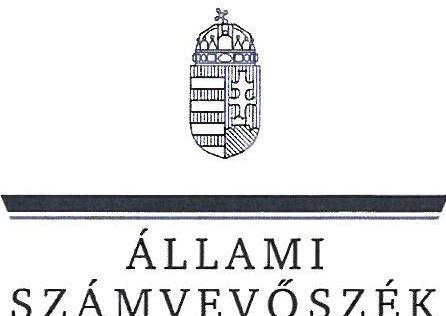
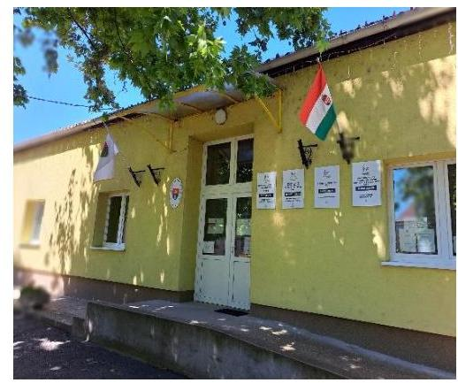
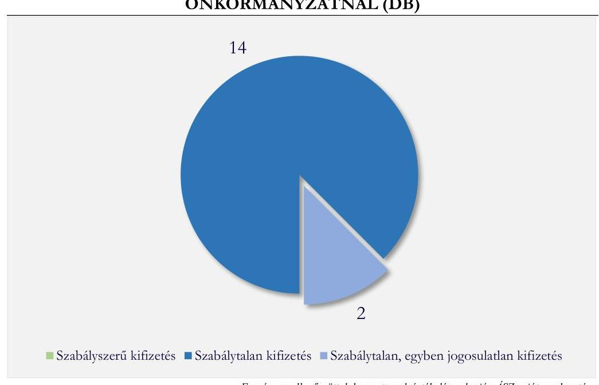
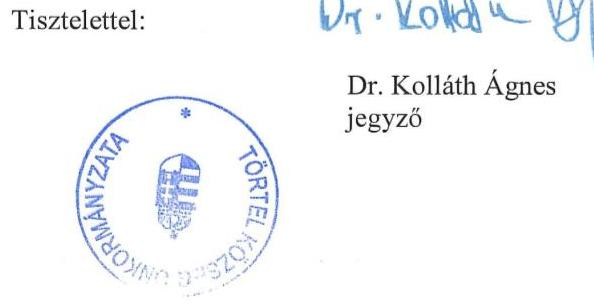

# JELENTÉS 

## Az önkormányzatok gazdálkodásának célvizsgálata

Az önkormányzatok ellenőrzése - a pénzforgalomban megjelenő kiadások teljesítésének és elszámolásának megfelelősége

Törtel Község Önkormányzata

2024.

---

ÁLLAMI
SZÁMVEVŐSZÉK

# JELENTÉS 

## Az önkormányzatok gazdálkodásának célvizsgálata

Az önkormányzatok ellenőrzése - a pénzforgalomban megjelenő kiadások teljesítésének és elszámolásának megfelelősége

Törtel Község Önkormányzata

2024.

---

# ELLENŐRZÉSI IGAZGATÓSÁG: 

## ÁLLAMHÁZTARTÁS HELYI SZINTJÉT ELLENŐRZŐ IGAZGATÓSÁG

## ELLENŐRZÉSI IGAZGATÓ:

DR. BAFFIA GERGELY GÁBOR igazgató

## ELLENŐRZÉSVEZETŐ:

Jelentéseink az interneten a www.asz.hu címen olvashatók.

HUDÁK MAGDOLNA ellenőrzésvezető

IKTATÓSZÁM: EL-4138-008/2024
TÉMASORSZÁM: 52
ELLENŐRZÉS-AZONOSÍTÓ SZÁM: V100211

---

# TARTALOMJEGYZÉK 

AZ ELLENŐRZÉS ALAPADATAI ..... 5
AZ ELLENŐRZÖTT SZERVEZET ..... 7
ÖSSZEFOGLALÁS ..... 9
AZ ELLENŐRZÉS FÓKUSZTERÜLETE ..... 11
MEGÁLLAPÍTÁSOK ..... 12
JAVASLATOK ..... 21
MELLÉKLETEK ..... 23
I. sz. melléklet: Értelmező szótár ..... 23
II. sz. melléklet: Az ellenőrzött szervezetek jegyzéke ..... 24
III. sz. melléklet: Ellenőrzési kritériumok ..... 25
IV. sz. melléklet: Összefoglaló táblázat az önkormányzat gazdálkodási jogköreinek gyakorlásáról ellenőrzött gazdasági eseményenként ..... 26
V. sz. melléklet: Törtel Község Önkormányzata esetében ellenőrzött, késedelmesen könyvelt gazdasági események ..... 28
VI. sz. melléklet: Az Opel Vivaro kisbusz futásteljesítménye és üzemanyag fogyasztásának kimutatása (2023-2024. évek) ..... 29
VII. sz. melléklet: Fel nem használt vásárlási előlegek kimutatása (2023-2024. évek) ..... 30
FÜGGELÉK: ÉSZREVÉTELEK ..... 31
RÖVIDÍTÉSEK JEGYZÉKE ..... 37

---

.

---

# AZ ELLENŐRZÉS ALAPADATAI 

## AZ ELLENŐRZÉS CÉLJA

Az ellenőrzés célja annak értékelése volt, hogy az Önkormányzatnál ${ }^{1}$ a pénzforgalomban megjelenő kiadások teljesítése és elszámolása megfelelő volt-e, továbbá a kiadások teljesítése az Önkormányzat közfeladat-ellátásához kapcsolódott-e.

## AZ ELLENŐRZÉS TÍPUSA

Megfelelőségi ellenőrzés.

## AZ ELLENŐRZÖTT IDŐSZAK

Az ellenőrzött időszak a 2023. év, valamint a 2024. évben az ellenőrzés megállapításainak az ÁSZ tv. ${ }^{2} 29. \S$ (1) bekezdése szerinti megküldése napjáig.

## AZ ELLENŐRZÉS TÁRGYA

Az Önkormányzat pénzforgalmában megjelenő kiadások teljesítésének, elszámolásának, közfeladatellátással kapcsolatos felhasználásának ellenőrzése. Az ellenőrzés kiterjedt minden olyan körülményre és adatra, amely az ÁSZ ${ }^{3}$ jogszabályban meghatározott feladatainak teljesítéséhez, valamint a program végrehajtása folyamán felmerült újabb összefüggések feltárásához szükséges volt.

## AZ ELLENŐRZÉS JOGALAPJA

Az ellenőrzés jogszabályi alapját az ÁSZ tv. 1. § (3) bekezdésének, valamint az 5. $\S(2)-(3)$ és (6) bekezdéseinek előírásai képezték.

## AZ ELLENŐRZÉS MÓDSZERE

Az ellenőrzést a nemzetközi standardokat irányadónak tekintve az ellenőrzési program szempontjai, az ellenőrzési időszakban hatályos jogszabályok, az ellenőrzés szakmai szabályok és módszertanok figyelembevételével végezte az ÁSZ.

Az ellenőrzési kérdések megválaszolásához szükséges bizonyítékok megszerzése az ellenőrzött szervezetek által rendelkezésre bocsátott dokumentumok és adatok, valamint az ellenőrzést támogató szervezetek ${ }^{4}$ által adott adatok, információk értékelésével, továbbá megfigyelés, szemle (szemrevételezés) és információkérés (kérdésfeltevés), valamint elemző eljárás útján történt.

---

Az ellenőrzési bizonyítékként felhasználható adatforrások közé tartoztak egyrészt az ellenőrzéshez kért dokumentumok, adatforrások, másrészt adatforrás volt még a közhiteles nyilvántartásból (Magyar Államkincstár nyilvántartásai, Önkormányzati rendelettár) származó, az ellenőrzés szempontjából információkat tartalmazó dokumentum.

Az ellenőrzés lefolytatásához az ellenőrzött szervezetek a tanúsítványok kitöltésével, valamint az ÁSZ által kért dokumentumok, adatok, információk megküldésével az ellenőrzés során szolgáltattak adatokat. A rendelkezésre bocsátott adatok, információk kontrolljára helyszíni ellenőrzés keretében is sor került.

A pénzforgalomban megjelenő kiadások teljesítésének megfelelőségét mintavételi eljárással kiválasztott 16 tétel alapján ellenőrizte az ÁSZ. Az ellenőrzés során a működés, gazdálkodás kockázatos területeinek meghatározását követően az ellenőrzött szervezetre vonatkozó főkönyvi adatbázisokból kockázat alapú eljárás alapján történt a mintatételek kiválasztása. A tények feltárása és azok összegzése során a megállapítások az ellenőrzött mintatételekre vonatkozóan kerültek megfogalmazásra.

Az ellenőrzés kiemelten kezelte a kifizetések közfeladat ellátáshoz való közvetlen kapcsolódásának, kötelezettségvállalás szerinti teljesülésének, a kifizetések jogszerűségének, szabályszerűségének értékelését, figyelemmel a kiadások teljesítésével összefüggő kontrollok gyakorlati működésére.

Az ellenőrzés kiterjedt minden olyan körülményre és kérdésre is, amely a program végrehajtása kapcsán felmerült újabb összefüggéseknek az ellenőrzés céljaival összhangban lévő feltárásához szükséges.

---

# AZ ELLENŐRZÖTT SZERVEZET 

Törtel község a Közép-Magyarországi régióban, Pest vármegyében, a Ceglédi járásban található. A $\mathrm{KSH}^{5}$ adata szerint a lakónépesség 2024. január 1-jén 4188 fő, a lakások száma 1817 volt. Az Önkormányzat nem szerepelt a társadalmi-gazdasági és infrastrukturális szempontból elmaradott, jelentős munkanélküliséggel sújtott települések ${ }^{6}$ között. A munkanélküliségi ráta az $\mathrm{NFSZ}^{7}$ 2024. június 20-án közzétett tájékoztatója szerint $4,4 \%$ volt.

A település polgármestere 2014. év óta látta el tisztségét. A Képviselő-testületnek ${ }^{8}$ a polgármesteren kívül hat fő képviselő tagja volt. Az Önkormányzat működésével kapcsolatos feladatokat 2022. február 1-től a Törteli Polgármesteri Hivatal látta el, amelynek létszáma a 2023. évben 17 fő volt. A jegyző ${ }^{9}$ 2016. november 28-tól látta el feladatait.

Az Önkormányzat fenntartásában az ellenőrzött időszakban kettő intézmény működött, az 1996. június 1-jén alapított könyvtári és muzeális ellátást biztosító közművelődési intézmény ${ }^{10}$, valamint az 1997. szeptember 19-én alapított Óvoda ${ }^{11}$, amely ellátta az óvodai nevelési, valamint a mini bölcsődei feladatokat is. Az intézmények gazdálkodási feladatait a Hivatal ${ }^{12}$-ban működő gazdasági szervezet ${ }^{13}$ látta el. Az Önkormányzat gyermekjóléti szolgáltatási, szociális ellátási feladatait a Ceglédi Többcélú Kistérségi Társulás, víziközműszolgáltatási feladatait a BÁCSVÍZ Víz- és Csatornaszolgáltató Zártkörűen Működő Részvénytársaság, egészségügyi alapellátási feladatait a Torontál Kiadó Korlátolt Felelősségű Társaság útján látta el. Az Önkormányzat belső ellenőrzési feladatainak ellátását a Hivatal külső szolgáltató bevonásával, megbízási szerződés alapján biztosította.

Az Önkormányzat 2023. évi konszolidált beszámolójának főbb adatait az 1. táblázat mutatja be:
1. táblázat adatok M Ft-ban

AZ ÖNKORMÁNYZAT 2023. ÉVI BESZÁMOLÓJÁNAK FŐBB ADATAI

| MEGNEVEZÉS | 2023. ÉVI   KONSZOLIDÁLT   BESZÁMOLÓ |
| :--: | :--: |
| Költségvetési bevétel | 846,4 |
| Ebből: önkormányzati feladatok működési támogatása | 454,1 |
| ebből: szociális célú tüzelőanyag vásárlásához kapcsolódó támogatás | 1,2 |
| hosszabb időtartamú közfoglalkoztatás támogatása | 36,6 |
| Költségvetési kiadás | 737,2 |
| Finanszírozási bevétel | 78,7 |
| Finanszírozási kiadás | 17,1 |

Forrás: Az Önkormányzat 2023 évi konszolidált beszámolójának alapján ÁSZ saját szerkesztés
Az Önkormányzat a TOP Plusz ${ }^{14}$ pályázat keretében 2023-ban Temető út felújításához ${ }^{15} 132,2 \mathrm{MFt}$ vissza nem térítendő támogatásban részesült, a felújítás tervezett fizikai megvalósítási időpontja 2024. december 31. Az ellenőrzött időszakban az Önkormányzat Magyar Falu Program ${ }^{16}$ keretében benyújtott kettő

---

pályázata nem került támogatásra. Az ellenőrzött időszakot megelőzően az Önkormányzatnak a Vidékfejlesztési Program ${ }^{17}$ keretében a külterületi helyi közutak pályázathoz kapcsolódóan 9,9 M Ft visszafizetési kötelezettsége keletkezett, amelynek az ellenőrzött időszakban, 2023. március 8-án tett eleget.

Az Önkormányzat főbb pénzügyi mutatóinak alakulását a 2. táblázat mutatja be:
2. táblázat

# A PÉNZÜGYI EGYENSÚLY ALAKULÁSA - MUTATÓSZÁMOK 

| MEGNEVEZÉS | KEDVEZŐ REFERENCIA ÉRTÉK | 2022.12.31 | 2023.12.31 |
| :--: | :--: | :--: | :--: |
| 1. Likviditási gyorsráta: a likvid eszközök és a rövid időn belül esedékes kötelezettségek hányadosa | $>1,00$ | 4,27 | 8,57 |
| 2. Likviditási gyorsráta változása az előző évhez képest | $>0$ |  | 4,30 |
| 3. Eladósodottsági mutató: a kötelezettségek és az összes forrás hányadosa (\%) | $\max .50-60 \%$ | $1,43 \%$ | $1,48 \%$ |
| 4. Lejárt szállítói állomány aránya az összes szállítói állományon belül (\%) | aránya nem növekvő | $32,44 \%$ | $57,34 \%$ |
| 5. Pénzhányad mutató: a pénzeszközök és a rövid időn belül esedékes kötelezettségek hányadosa | $>=0,4$ és az előző időszakhoz képest nem csökken | 3,13 | 7,75 |

Forrás: ÁSZ saját szerkesztés az ellenőrzött adatszolgáltatás alapján
Az Önkormányzat likviditását az ellenőrzött időszakban megőrizte, mind a likviditási gyorsráta, mind a pénzhányad mutató a kedvező referencia tartományban maradt.

- Mind a likviditási gyorsráta, mind a pénzhányad mutató alakulása a pénzeszközök állományának alakulására vezethető vissza. A 2022. évben a pénzeszközök állománya csökkent az év elejihez képest az Óvoda felújításra fordított 58,2 M Ft felhasználása miatt. A 2023. évben viszont az Önkormányzat a TOP Plusz pályázat keretében támogatásban részesült, amelyből év végén még $121,7 \mathrm{M}$ Ft állt rendelkezésre, és ez a pénzeszközök állományát növelte. Összességében tehát az ellenőrzött időszakban a fel nem használt pályázati források javították az Önkormányzat likviditását, de az Önkormányzat likviditási gyorsrátája és pénzhányad mutatójának értéke a még fel nem használt pályázati források nélkül is a kedvező referencia tartományban maradt. A pályázati forrásokkal korrigált likviditási gyorsráta értéke a 2022. évben 4,08, míg a 2023. évben 3,17 volt. Az Önkormányzat pályázati forrásokkal korrigált pénzhányad mutatójának értéke a 2022. évben 2,94, míg a 2023. évben 2,35 volt.

Az Önkormányzat eladósodottsági szintje az ellenőrzött időszakban kedvező volt, a 2022-2023. évek átlagában $1,46 \%$ volt, a referencia tartományban maradt, azonban az időszakban kismértékben emelkedett az év elején megelőlegezett normatív állami támogatásokból eredő kötelezettségek következtében.

---

# ÖSSZEFOGLALÁS 

A településeken az önkormányzati gazdálkodás sokrétű feladatot jelent. A tevékenység összetettsége, a megfelelő képzettségű, létszámú humán-erőforrás hiánya a gazdálkodás területén magas szintű kockázatokat eredményezhet. Az ellenőrzés hozzájárul az Önkormányzat szabályszerű és felelős gazdálkodásához, a közpénzek szabályos, cél szerinti felhasználásához, a közvagyon védelméhez.

Az Önkormányzat a jogszabályokban, illetve a szervezeti és működési szabályzatában meghatározott közfeladatait ellátta. Az ellenőrzött időszakban adósságrendezési eljárás alatt nem állt, pénzintézettől hitelt nem vett fel, rendkívüli támogatást nem igényelt, pénzügyi helyzete stabil volt, a kifizetésekkel, az analitikus nyilvántartások vezetésével, valamint a leltározással kapcsolatban azonban az ÁSZ ellenőrzés több szabálytalanságot állapított meg.

Az Önkormányzat pénzforgalmában megjelenő 33,6 M Ft összértékű 16 ellenőrzött kiadás teljesítése, illetve elszámolása teljeskörűen egyetlen esetben sem felelt meg a jogszabályi előírásoknak. Ebből két szociális melegétkeztetésre irányuló 5,7 M Ft összegű kifizetés a jogszabályi előírások ellenére igazolható módon nem kapcsolódott az Önkormányzat közfeladat-ellátásához, mert az élelmiszer érintetteknek való átadását nem igazolták, emiatt ezek a kifizetések szabálytalanok, egyben jogosulatlanok is voltak. Az ÁSZ ellenőrzés hiányosságokat tárt fel többek között a szociális ellátások juttatásával, a falubusz használatával és elszámolásával, valamint az elszámolásra kiadott előlegek cél szerinti felhasználásával kapcsolatban.

A pénzforgalomban megjelenő kiadások teljesítésének és elszámolásának szabályszerűségét az 1. ábra mutatja be.

1. ábra

## A PÉNZFORGALOMBAN MEGJELENŐ KIADÁSOK TELJESÍTÉSÉNEK ÉS ELSZÁMOLÁSÁNAK SZABÁLYSZERŰSÉGE AZ ÖNKORMÁNYZATNÁL (DB)

Az Önkormányzat fizetési számlájáról és pénztárából a kiadási előirányzatok terhére teljesített kifizetések nem voltak szabályszerűek, mivel kettő esetben - 376,6 E Ft kifizetést érintően - a jogszabályi előírás ellenére nem, vagy nem megfelelően vállaltak írásban kötelezettséget. A kötelezettségvállalások pénzügyi

---

ellenjegyzése 16 esetből 11 esetben - 31 025,6 E Ft kifizetést érintően - nem, vagy nem megfelelően történt meg. Az ellenőrzött 16 gazdasági esemény 25,0 %-ánál, összesen 6026,7 E Ft összegű kifizetésnél elmaradt, vagy nem megfelelően végezték el a teljesítésigazolást. Az érvényesítés az ellenőrzött 16 gazdasági esemény egyikénél sem felelt meg a jogszabályi előírásoknak, négy esetben az utalványozás is szabálytalanul, a kifizetést követően történt.

Az Önkormányzat kötelezettségvállalás nyilvántartása nem felelt meg a jogszabályi előírásoknak, a feltárt hiányosságok miatt nem volt alkalmas a kötelezettségvállalás időpontjában a szabad előirányzat megállapítására. Továbbá az Önkormányzat tárgyi eszköz nyilvántartása sem felelt meg teljeskörűen
 a jogszabályi előírásoknak.

A belső ellenőrzés az ellenőrzött időszakban az Önkormányzat gazdálkodását nem vizsgálta, ezért nem járult hozzá a gazdálkodásban rejlő kockázatok feltárásához és csökkentéséhez.

Az ÁSZ az ellenőrzés során feltárt hiányosságok felszámolása, a szabályszerű működés feltételeinek megteremtése érdekében a polgármesternek négy, a jegyzőnek 11 javaslatot tett.

---

# AZ ELLENŐRZÉS FÓKUSZTERÜLETE 

1.- Az Önkormányzat pénzforgalmában megjelenő kiadások teljesítésének és elszámolásának megfelelősége, az önkormányzati feladatellátásához való kapcsolódásának értékelése

---

# MEGÁLLAPÍTÁSOK 

## 1. Az Önkormányzat pénzforgalmában megjelenő kiadások teljesítésének és elszámolásának megfelelősége, az önkormányzati feladatellátásához való kapcsolódásának értékelése

Összegző megállapítás

1.1. számú megállapítás

A pénzforgalomban megjelenő ellenőrzött kiadások teljesítése és elszámolása nem volt megfelelő. Két kifizetés önkormányzati feladatellátáshoz való kapcsolódása nem volt igazolt. A kötelezettségvállalások nyilvántartása nem felelt meg az Ávr. ${ }^{18}$ és az Áhsz. ${ }^{19}$ előírásainak.
Az ellenőrzött kiadások 12,5 %-a nem kapcsolódott az Önkormányzat feladatellátásához.

Az Önkormányzatnál az ellenőrzött 16 gazdasági eseményből két esetben, 33 579,5 E Ft összértékű kifizetésből 5664,0 E Ft összegű kiadás az Mötv. ${ }^{20}$ 111. § (2) bekezdésében foglaltak ellenére igazolható módon nem kapcsolódott az Önkormányzat feladatellátásához.

- Az Önkormányzat szociális rendeletének ${ }^{21}$ 30/A. §-a rendelkezett a meleg étkeztetési támogatás nyújtásának szabályairól, amely szerint a melegétkeztetési támogatást hat hónapra, legfeljebb havi 17800 Ft összegben a jogosultak részére a polgármester állapíthatta meg, képviselő-testületi felhatalmazás alapján. Az Önkormányzat a melegétkeztetési támogatást természetbeni juttatásként, a Hivatal keretében működő Törteli Napköziotthonos Konyhán keresztül biztosította. A POT_KIAD_01 számú, 2691,4 E Ft összegű és az ONK_KIAD_14 számú, 2972,6 E Ft összegű gazdasági események vonatkozásában az Önkormányzat nem tudta igazolni, hogy az étel a jogosultak részére ténylegesen átadásra került. A polgármester nyilatkozata szerint erről nem készült dokumentum. Mindkét gazdasági eseménynél az étel konyháról történő kiadását a jogosultakról készített havi listán az adott étkezési napnál dokumentálták, és a jegyzéket az élelmezésvezető és a szakács hitelesítették az előző hónapra vonatkozóan a következő hónap elején.
1.2. számú megállapítás

Az Önkormányzat pénzforgalmában megjelenő ellenőrzött kiadások teljesítése, illetve elszámolása egyetlen esetben sem felelt meg teljeskörűen a jogszabályi előírásoknak. Tizennégy esetben a gazdasági események könyvekben történő rögzítése is késedelmesen történt.

Az ellenőrzött 16 gazdasági esemény (35 579,5 E Ft) mindegyikéhez szükség volt írásbeli kötelezettségvállalásra, melyből 14 gazdasági esemény (33 202,9 E Ft) vonatkozásában a kötelezettségvállalás dokumentuma megfelelt az Áht. ${ }^{22}$ és az Ávr. előírásainak. Egy gazdasági eseménynél (ONK_KIAD_02) a kötelezettségvállalás dokumentuma nem felelt meg az Ávr. 51. § (2) bekezdés előírásának. További egy gazdasági eseménynél (POT_KIAD_02) az Ávr. 52. § (1) bekezdés c) pont előírása ellenére a kötelezettségvállalásról nem készült dokumentum.

---

- Az ONK_KIAD_02 számú, hivatali dolgozóknak az önkormányzati honlap adatainak frissítéséért és a sajtóreferensi feladatok elvégzéséért fizetett megbízási díjak kifizetéséről (343,3 E Ft) szóló gazdasági esemény vonatkozásában a megbízási szerződésekben az Ávr. 51. § (2) bekezdés előírása ellenére nem kötötték ki, hogy a díj kizárólag abban az esetben illeti meg a költségvetési szerv állományába tartozó személyt, ha a szerződésben rögzített feladat mellett a munkakörébe tartozó feladatainak is maradéktalanul eleget tett.
- A POT_KIAD_02 számú, a tanyagondnok részére munkaruha vásárlásról szóló (33,0 E Ft) gazdasági eseményhez a Kjt. ${ }^{23}$ 79. § (2) bekezdésében foglaltak ellenére - kollektív szerződés hiányában - nem állt rendelkezésre olyan írásbeli munkáltatói intézkedés, amelyből megállapíthatók lettek volna a munkaruha juttatásra jogosító munkakörök, a juttatás mértéke és annak feltételei. Az Önkormányzat nyilatkozata szerint a munkaruha juttatás kifizetésére az 1/2000. (I. 7.) SzCsM rendelet ${ }^{24}$ alapján került sor, azonban e rendelet 6. § (11) bekezdésben foglaltak ellenére a munkaruha juttatás feltételeit a munkáltató dokumentáltan nem állapította meg.
Az Önkormányzatnál az Ávr. pénzügyi ellenjegyzésre vonatkozó előírásait nem tartották be. Egy-egy gazdasági esemény vonatkozásában többféle ellenjegyzéshez kapcsolódó hiányosság is előfordult. Így az Ávr. 55. § (1) bekezdésében előírtak ellenére az előzetes, írásbeli kötelezettségvállalást igénylő 16 esetből 11 esetben nem végezték el a pénzügyi ellenjegyzéshez kapcsolódó ellenőrzési feladatokat, ezáltal az Áht. 37. § (1) bekezdésének előírását megsértve nem győződtek meg arról, hogy a kötelezettségvállalás nem sérti a gazdálkodásra vonatkozó szabályokat. Emellett nyolc esetben (27 951,2 E Ft összegben) Áht. 37. § (1) bekezdés és az Ávr. 53/A. § (1) bekezdés előírása ellenére az előzetes írásbeli kötelezettségvállalás nem tartalmazott pénzügyi ellenjegyzést. További hiányosság volt, hogy egy esetben (343,6 E Ft összegben) az Áht. 37. § (1) bekezdés előírása ellenére a pénzügyi ellenjegyző nem győződött meg arról, hogy a kötelezettségvállalás nem sérti az Ávr. 51. § (2) bekezdés előírását, valamint egy esetben (33,0 E Ft összegben) az Ávr. 52. § (1) bekezdés c) pont előírása ellenére a kötelezettségvállalásról nem készült dokumentum, ennek hiányában a pénzügyi ellenjegyző nem látta el Áht. 37. § (1) bekezdésében előírt feladatát. Egy esetben (2697,8 E Ft összegben) az Ávr. 55. § (1) bekezdés előírása ellenére a pénzügyi ellenjegyzés nem tartalmazta a pénzügyi ellenjegyzés dátumát. A kötelezettségvállalások pénzügyi ellenjegyzése öt esetben (2553,9 E Ft összegben) az Áht. és az Ávr. előírásainak megfelelően szabályszerűen történt.
- Az ONK_KIAD_03, ONK_KIAD_04, ONK_KIAD_05, ONK_KIAD_07, ONK_KIAD_09, POT_KIAD_01, ONK_KIAD_12, ONK_KIAD_14 (27 951,2 E Ft összegű) gazdasági esemény vonatkozásában a kötelezettségvállalás pénzügyi ellenjegyzése nem történt meg.
- Az ONK_KIAD_02 számú, (343,3 E Ft összegű) gazdasági esemény vonatkozásában a pénzügyi ellenjegyző nem győződött meg arról, hogy a kötelezettségvállalás nem sérti az Ávr. azon előírását, miszerint a megbízási szerződésben ki kell kötni, hogy a díj kizárólag abban az esetben illeti meg a költségvetési szerv állományába tartozó személyt, ha a szerződésben rögzített feladat mellett a munkakörébe tartozó feladatainak is maradéktalanul eleget tett.
- A POT_KIAD_02 (33,0 E Ft összegű) gazdasági esemény vonatkozásában a kötelezettségvállalásról szóló dokumentum nem készült, így annak pénzügyi ellenjegyzése nem történhetett meg.
- Az ONK_KIAD_06 (2697,8 E Ft összegű) gazdasági esemény vonatkozásában a kötelezettségvállalásokról szóló dokumentumon a pénzügyi ellenjegyzés nem tartalmazta a pénzügyi ellenjegyzés dátumát.

---

Az ellenőrzött 16 gazdasági eseményből három esetben, 5714,0 E Ft összegű kifizetést megelőzően az Áht. 38. § (1) bekezdésének és az Ávr. 57. § (1) bekezdésének előírását megsértve nem történt meg a teljesítés igazolása. További egy esetben 312,7 E Ft összegű kifizetést megelőzően a teljesítés igazolása formális volt, mert annak időpontjában az Ávr. 57. § (1) bekezdésének előírása ellenére nem állt rendelkezésre olyan dokumentum, amely alapján ellenőrizni és igazolni lehetett az összegszerűséget, a jogosultságot, ellenszolgáltatás esetében annak teljesítését. Összességében az értékelt gazdasági események 25,0 %-ában, 6026,7 E Ft a költségvetési kiadási előirányzat felhasználását megelőzően nem ellenőrizték, hogy a kifizetések az arra jogosult részére a megfelelő összegben történtek-e, illetve, hogy a kifizetés alapjául szolgáló ellenszolgáltatást az Önkormányzat részére ténylegesen elvégezték-e. Tizenkét esetben, 27 552,9 E Ft összegű gazdasági esemény teljesítés igazolása az Ávr. előírásainak megfelelően történt.

- Az ONK_KIAD_01, POT_KIAD_01 és ONK_KIAD_14 (5714,0 E Ft összegű) gazdasági események vonatkozásában nem volt teljesítésigazolás.
- Az ONK_KIAD_13 (312,7 E Ft összegű) fenyő fűrészáru beszerzésre irányuló kifizetés esetében a teljesítésigazolás formális volt, mert az áru átvételéről készült dokumentum kelte 2024. május 2., ezért a teljesítésigazolás 2023. május 10-i időpontjában a teljesítésigazolás alapját képező dokumentum nem állhatott a teljesítés igazoló rendelkezésére.
Az érvényesítés az ellenőrzött 16 gazdasági esemény egyikénél sem felelt meg az Ávr. előírásainak, egyes gazdasági eseményeknél több hiányosság is előfordult.
Az ellenőrzött gazdasági események közül 11 esetben (ONK_KIAD_01, ONK_KIAD_06, ONK_KIAD_07, ONK_KIAD_08, ONK_KIAD_09, ONK_KIAD_11, ONK_KIAD_12, ONK_KIAD_13, ONK_KIAD_14, ONK_KIAD_15 és POT_KIAD_02), 9966,9 E Ft összegben a gazdasági eseményt érvényesítő személy a feladatot jogosultság hiányában végezte, mivel az Ávr. 58. § (4) bekezdés és az 55. § (2) bekezdés a) pont előírása ellenére megbízását nem a kijelölésre jogosult gazdasági vezetőtől ${ }^{25}$, hanem a jegyzőtől kapta.
Az érvényesítés három esetben formális volt, az Ávr. 58. § (1) bekezdés előírása ellenére az érvényesítő 5976,7 E Ft kifizetését megelőzően nem ellenőrizte a kifizetések összegszerűségét, illetve a teljesítés megtörténtét.
- A POT_KIAD_01 gazdasági eseménynél a számlában 144 fő 21 napi melegétkeztetése szerepelt, szemben az étel konyháról való kiviteléről szóló dokumentumban szereplő 137 fővel, továbbá az ONK_KIAD_14 gazdasági eseménynél a számlában 167 fő 20 napi melegétkeztetése, míg az étel kiviteléről szóló dokumentumban 160 fő szerepelt. Az Önkormányzat nyilatkozata szerint a számlában szereplő adagszám és az étel konyháról való kiviteléről készült lista szerinti adagszám eltérését a kivitelről készült lista aktualizálásának elmaradása okozta.
- A fenyő fűrészáru vásárlásról szóló, ONK_KIAD_13 számú gazdasági eseménynél (312,7 E Ft) az érvényesítő a kifizetést megelőzően nem ellenőrizte az áru leszállítását és átvételét az azt alátámasztó dokumentumok hiánya miatt, mert a fenyő fűrészáru átvételéről készült dokumentum kelte 2024. május 2., ezért az érvényesítés 2023. május 12-i időpontjában az nem állhatott az érvényesítő rendelkezésére.
Az ellenőrzött gazdasági események közül 12 esetben (ONK_KIAD_02, ONK_KIAD_03, ONK_KIAD_04, ONK_KIAD_05, ONK_KIAD_06, ONK_KIAD_07, ONK_KIAD_09, POT_KIAD_01, ONK_KIAD_11 ONK_KIAD_12, ONK_KIAD_14 és POT_KIAD_02) és 32 387,4 E Ft összegben az érvényesítő az Ávr. 58. § (1) bekezdés előírása ellenére nem ellenőrizte, hogy a megelőző ügymenetben betartották-e az Áht., az Ávr., továbbá a belső szabályzatokban foglaltakat, mert:

---

- 10 esetben (ONK_KIAD_03, ONK_KIAD_04, ONK_KIAD_05, ONK_KIAD_06, ONK_KIAD_07, ONK_KIAD_09, POT_KIAD_01, ONK_KIAD_12, ONK_KIAD_14 és POT_KIAD_02) és 30682,0 E Ft összegben, nem jelezte az utalványozónak, hogy a kötelezettségvállalás pénzügyi ellenjegyzése az Áht. 37. § (1) bekezdés és az Ávr. 53/A. § (1) bekezdés előírása ellenére nem történt meg;
- egy esetben (ONK_KIAD_02) és 343,6 E Ft összegben, nem jelezte az utalványozónak, hogy a megbízási szerződések tartalma nem felelt meg az Ávr. 51. § (2) bekezdés előírásának;
- két esetben (ONK_KIAD_05 és ONK_KIAD_11) és 1478,8 E Ft összegben, nem jelezte az utalványozónak, hogy a kötelezettségvállalást megelőzően nem folytatták le a beszerzési szabályzat ${ }^{26}$ III.1.c) pont előírásának megfelelően a beszerzési szabályzat III. 3-9. pontjai szerinti beszerzési eljárást, mivel az 1000,0 E Ft-ot meghaladó, de a közbeszerzési értékhatárt el nem érő egyedi beszerzési értékű ONK_KIAD_05 és ONK_KIAD_11 gazdasági események vonatkozásában nem állt rendelkezésre három árajánlat.
Az ellenőrzött gazdasági események közül egy esetben (ONK_KIAD_07, 41,4 E Ft összegű gazdasági esemény) 30,4 E Ft összegű kiküldetés érvényesítése nem történt meg, mert az érvényesítő az Ávr. 58. § (3) bekezdés előírása ellenére az utalványrendeleten aláírásával nem igazolta az ellenőrzési feladat ellátását.
Az ellenőrzött gazdasági események közül négy esetben (ONK_KIAD_02, ONK_KIAD_09, ONK_KIAD_12 és ONK_KIAD_14) és 5021,4 E Ft összegben az érvényesítésre ténylegesen az Áht. 38. § (1) bekezdés, valamint az Ávr. 58. § (3) bekezdés előírásai ellenére - mely szerint kifizetés csak érvényesítést és utalványozást
 követően teljesíthető – a kifizetést követően került sor.
A 16 ellenőrzött gazdasági eseményből 12 felelt meg az Ávr. utalványozásra vonatkozó előírásainak. Négy gazdasági esemény (ONK_KIAD_02, ONK_KIAD_09, ONK_KIAD_12 és ONK_KIAD_14) esetében, 5021,4 E Ft összegben az Áht. 38. § (1)–(2) bekezdésében foglalt előírások ellenére az utalványozás formális volt.
- Az ONK_KIAD_02, ONK_KIAD_09, ONK_KIAD_12 és ONK_KIAD_14 gazdasági események vonatkozásában az utalványozásra a kifizetést követően került sor, mivel az utalványrendeletek kelte későbbi, mint a kifizetések kelte.
(Az ellenőrzött önkormányzati kiadások gazdasági eseményeit a IV. számú melléklet tartalmazza.)
1.3. számú megállapítás

Az Önkormányzatnál a gazdálkodás szabályozottsága, valamint a kötelező nyilvántartások vezetése nem felelt meg a Számv. tv. ${ }^{27}$, az Áhsz., az Ávr., és az Áht. előírásainak. Az Ávr.-ben foglaltak ellenére a kötelezettségvállalások előzetes nyilvántartásba vétele az ellenőrzött gazdasági események 87,5%-ában nem történt meg.

Az Önkormányzat rendelkezett a Számv. tv.-ben meghatározott számviteli politikával ${ }^{28}$, számlarenddel ${ }^{29}$, pénzkezelési szabályzattal ${ }^{30,31}$, leltározási és leltárkészítési szabályzattal ${ }^{32}$, valamint az Ávr.-ben meghatározott gazdálkodási szabályzattal ${ }^{33}$, beszerzési szabályzattal és gépjármű szabályzattal ${ }^{34}$.

- A gazdálkodási szabályzat az Ávr. előírásaival összhangban szabályozta az előzetes írásbeli kötelezettségvállalást nem igénylő kifizetések rendjét, tartalmazta az összeférhetetlenség szabályait. Az Önkormányzat a szabályzatában nem élt a bruttó 200 E Ft alatti beszerzések esetén a teljesítésigazolás elvégzésével kapcsolatos szabályozás lehetőségével.

---

Az Önkormányzat gazdálkodási szabályzatában a polgármester és a jegyző az Ávr. 55. (2) bekezdés a) pontjának, valamint az Ávr. 58. § (4) bekezdésének előírásával ellentétesen szabályozták a kötelezettségvállalás pénzügyi ellenjegyzésére, érvényesítésére történő kijelölés rendjét, mert a kijelölésre jogosultként a jegyzőt jelölték meg a Hivatal gazdasági vezetője helyett annak ellenére, hogy volt gazdasági vezető.
Az Önkormányzat gazdálkodási jogkörök gyakorlására jogosult személyekről és aláírás mintájukról vezetett nyilvántartása nem felelt meg a gazdálkodási szabályzat II.1.1.6. c.) pontjában foglalt előírásoknak, mert a nyilvántartás nem tartalmazta a felhatalmazásra/kijelölésre jogosító ügyirat számát, keltét, a jogosultság megszüntetését elrendelő ügyirat számát és időpontját, továbbá a személyi változások átvezetése a nyilvántartásban egyik gazdálkodási jogkör esetében sem történt meg.
Az Ávr. 55. § (2) bekezdésében, illetve az Ávr. 58. § (4) bekezdésében foglaltak alapján a gazdasági szervezettel rendelkező költségvetési szervnél a pénzügyi ellenjegyzési és az érvényesítői feladatok ellátására jogosult személyeket a gazdasági vezető jelöli ki. A Hivatal rendelkezett gazdasági szervezettel. Az Önkormányzatnál az Ávr. hivatkozott rendelkezéseit megsértve a pénzügyi ellenjegyzési feladatokra két személyt a polgármester, az érvényesítői feladatokra három személyt a jegyző jelölt ki.
A pénzügyi-számviteli ügyintéző ${ }^{35}$ kijelölése a pénzügyi ellenjegyzési és érvényesítési feladatok ellátására az Ávr. 55. § (3) bekezdése előírásait megsértve annak ellenére történt, hogy nem rendelkezett a felsőoktatásban szerzett gazdasági szakképzettséggel, vagy legalább középfokú iskolai végzettség mellett pénzügyi-számviteli képesítéssel.
Az ellenőrzött időszakban a polgármester és a jegyző a Számv. tv. 14. § (8) bekezdésében foglaltak ellenére a pénzkezelési szabályzatban nem rendelkeztek egyértelműen a pénzkezelés személyi és tárgyi feltételeiről, felelősségi szabályairól.

- A pénzkezelési szabályzatban ugyanazon személyt nevezték meg a pénztáros helyetteseként és pénztárellenőrként is, amely munkakörök egy időben történő ellátása sérti a pénzkezelési szabályzat II.2.1. pontjának összeférhetetlenségre vonatkozó előírásait, tekintve, hogy pénztárellenőr helyettest nem jelöltek ki.
- A pénzkezelési szabályzatot nem aktualizálták, mert a 2024. évi helyszíni ellenőrzés időpontjában a pénzkezelési szabályzat II.2.1. pontja pénztárosként még nevesítette a pénzügyi-számviteli ügyintézőt ${ }^{36}$ annak ellenére, hogy közszolgálati jogviszonya 2023. december 31-én megszűnt, illetve a pénzkezelési szabályzat II.2.1. pontja pénztárosként nem nevesítette a 2024. évben a pénztárosi feladatok ellátására felhatalmazott pénzügyi-számviteli ügyintézőt.
Az Önkormányzat rendelkezett a Kbt. ${ }^{37}$ 27. § (1) bekezdésben előírt közbeszerzési szabályzattal ${ }^{38,39}$, amelyet a Képviselő-testület jóváhagyott.
Az ellenőrzött gazdasági események közül 14 esetben 33 488,2 E Ft összegben az Ávr. 56. § (1) bekezdés előírása ellenére a kötelezettségvállalás nyilvántartásba vétele nem, vagy késedelmesen történt.
- Az ONK_KIAD_02, ONK_KIAD_09, POT_KIAD_01, ONK_KIAD_12, ONK_KIAD_14 gazdasági események (7712,8 E Ft) esetében nem került sor a kötelezettségvállalás nyilvántartásba vételére, az utalványrendeleteken feltüntetett kötelezettségvállalás azonosítók nem szerepeltek a kötelezettségvállalás nyilvántartásban.
- Az ONK_KIAD_03, ONK_KIAD_04, ONK_KIAD_05, ONK_KIAD_06, ONK_KIAD_08, ONK_KIAD_11, ONK_KIAD_13, ONK_KIAD_15 és POT_KIAD_02 25 775,4 E Ft összértékű, előzetes kötelezettségvállalást igénylő esetekben a nyilvántartásban való rögzítés csak utólagosan, a

---

kapcsolódó számlák kézhezvételekor, illetve azt követően történt meg. A rendelkezésre bocsátott kötelezettségvállalás nyilvántartás a kötelezettségvállalás bizonylatának azonosítójaként a gazdasági eseményekhez kapcsolódó számlák számlaszámai szerepeltek.
1.4. számú megállapítás

A tárgyi eszközök nyilvántartása nem felelt meg teljeskörűen az Áhsz.-ben foglaltaknak.

A tárgyi eszköz beszerzésre, javításra, illetve ingatlan felújításra irányuló négy ellenőrzött gazdasági eseményhez (ONK_KIAD_03, ONK_KIAD_04, ONK_KIAD_06, ONK_KIAD_08) kapcsolódó tárgyi eszközök a helyszíni ellenőrzés során fellelhetőek voltak, azonban az Áhsz. 14. melléklet VII. fejezet 1.b) pontjában foglaltak ellenére az azonosításhoz szükséges egyéb adattal (leltári szám) nem rendelkeztek. A helyszíni ellenőrzés során az eszközök azonosítására az eszközök típusa, illetve forgalmi rendszáma alapján került sor. Az ONK_KIAD_04, ONK_KIAD_06, ONK_KIAD_08 gazdasági eseményekhez kapcsolódó tárgyi eszközöket (gázkazán, irányítástechnikai rendszer és tanyagondnoki busz) a tárgyi eszköz nyilvántartásban rögzítették, a 2023. évi leltárban kimutatták.
Az ONK_KIAD_03 gazdasági esemény az Önkormányzat tulajdonában lévő Temető út felújítására irányult. Az Áhsz. 11. § (3) bekezdés d) pontjának, 22. § (1) bekezdésének, valamint a Számv. tv. 69. § (1) bekezdésének előírásai ellenére a Temető út 11 019,3 E Ft összegű felújítása sem a 2023. évi leltárban, sem az Önkormányzat 2023. évi költségvetési beszámolója mérlegének A/II/4 Beruházások, felújítások során nem szerepelt. Az eltérés a mérlegfőösszeghez képest 0,4% volt, nem érte el a számviteli politika 4.3. pontjában meghatározott jelentős összegű hiba mértékét, a 2%-ot, vagy 100 M Ft-ot, így nem sérült a Számv. tv-ben meghatározott valódiság elve.

- Az ONK_KIAD_03, 19 970,3 E Ft összegű, 2024. február 23-án kelt gazdasági eseményt (Temető út felújítás 1. részszámlája – 25%) a felújításról vezetett kézi analitikus nyilvántartásban rögzítették. A Temető út felújításáról vezetett analitikus nyilvántartás szerint a felújításra elszámolt első kifizetés 2022. július 5-én történt, a 2023. december 31-i fordulónappal a Temető út felújításra teljesített kiadások együttes összege 11 019,3 E Ft volt. A 2023. december 31-i fordulónappal a beruházások, felújítások mérlegsor alátámasztására egyeztetéssel készített leltár dokumentuma kizárólag az Óvoda felújításának állományát tartalmazta az Önkormányzat 2023. évi költségvetési beszámolója mérlegének „A/II/4 Beruházások, felújítások” sorával egyezően 130 603,8 E Ft összegben, míg a Temető út felújításának a kézi analitikus nyilvántartás szerinti, 2023. december 31-i fordulónapi 11 019,3 E Ft összegét nem. Az Önkormányzat a Temető út felújítását 2023. évben csak kötelezettségvállalási, előirányzat és előirányzat teljesítési számlákon könyvelte, állományi számlákon nem. Az Áhsz. 53. § (5) bekezdés a) pontjában foglaltak ellenére az Önkormányzatnál nem végezték el a főkönyv és az analitikus nyilvántartások egyeztetését a Temető út felújítása tekintetében. A Temető út felújítás kiadásai a 2024. évben a főkönyvi nyilvántartásban, a felújítások állományi főkönyvi számlán rögzítésre kerültek. A felújítás műszaki átadás-átvételére és a felújítás ingatlanra történő aktiválására 2024. július 24-én sor került.
Az ellenőrzött időszakban a tárgyi eszközök részletező nyilvántartása tartalmában nem felelt meg az Áhsz. 14. melléklete VII. A tárgyi eszközök nyilvántartása 1. pontja b), f) és h) alpontjában meghatározottaknak, mert nem tartalmazta a szállító megnevezését, az azonosításhoz szükséges egyéb adatokat, a használatbavételt igazoló bizonylatok azonosításához szükséges adatokat, valamint a várható használati időt.
Az ellenőrzött gazdasági események közül kettő esetben (ONK_KIAD_09 és ONK_KIAD_12) 1705,3 E Ft összegben a számviteli elszámolás nem felelt meg az Áhsz. 39. §, 45. §, és a

---

15/2019. (XII. 7.) PM rendelet ${ }^{40}$ 3. § (1) bekezdés előírásainak, mert a helyi önkormányzati időközi választással kapcsolatban felmerült megbízási díjakat nem a 016010 számú Országgyűlési, önkormányzati és európai parlamenti képviselőválasztásokhoz kapcsolódó tevékenységek kormányzati funkcióra számolták el, hanem a 066020 számú Város-, községgazdálkodási egyéb szolgáltatások kormányzati funkcióra. 14 esetben a gazdasági események számviteli elszámolása megfelelt a 38/2013. (IX. 19.) NGM rendelet ${ }^{41}$-ben foglalt előírásoknak.
A 16 ellenőrzött kiadási gazdasági esemény közül 14 esetben és 32 167,7 E Ft összegben a Számv. tv. 165. § (3) bekezdés a) pontjában előírtak ellenére nem biztosították a pénzeszközöket érintő gazdasági műveletek, események bizonylati adatainak a könyvekben történő késedelem nélküli rögzítését. A gazdasági események rögzítése 4–68 napi késedelemmel, illetve az ONK_KIAD_13 gazdasági eseménynél 307 napos késedelemmel történt. A késedelem befolyásolta az államháztartás információs rendszerébe teljesített havi adatszolgáltatások adattartamát, mert így az adatszolgáltatások nem valós adatokon alapultak.
(A késedelmesen rögzített gazdasági eseményeket részletesen az V. számú melléklet mutatja be.)
1.5. számú megállapítás

Az Önkormányzatnál a szociális ellátásokkal kapcsolatos juttatások kifizetése során nem tartották be a jogszabályi előírásokat.

A kötelezettségvállalás dokumentumainak, a polgármesteri határozatoknak a pénzügyi ellenjegyzése az Áht. 37. § (1) bekezdés és az Ávr. 53/A. § (1) bekezdés előírása ellenére nem történtek meg, illetve a melegétkeztetési támogatások megállapítása nem a szociális rendeletben foglaltaknak megfelelően történt.

- A Képviselő-testület szociális rendeletének 30/A. §-a szerint melegétkeztetési támogatást hat hónapra, legfeljebb havi 17 800 Ft összegben a jogosultak részére a polgármester állapíthatta meg a Képviselőtestület felhatalmazása alapján. A melegétkeztetési támogatást természetbeni juttatásként, a Hivatal keretében működő Törteli Napköziotthonos Konyhán keresztül biztosították. A melegétkeztetési támogatás biztosításához a POT_KIAD_01 (2024. február havi melegétkeztetési támogatás) és az ONK_KIAD_14 (2023. február havi melegétkeztetési támogatás) ellenőrzött gazdasági események kapcsolódtak 5664,0 E Ft összegben. Az ellenőrzött gazdasági eseményekhez kapcsolódó polgármesteri határozatokban a támogatások a szociális rendeletben foglaltaknak megfelelően hat hónapra kerültek megállapításra, azonban a támogatások hathavi lejártát követően azok az igénylő szociális helyzete függvényében ismételten igénylésre és megállapításra kerültek a következő hat hónapra is. Ezáltal a szociális rendelet 30/A. §-ában foglaltak ellenére a támogatásokat nem hat hónapra, hanem egész évben folyósították.
- Az Önkormányzat térítési díjakról szóló rendelete ${ }^{42}$ 1. § (4) bekezdés d) pontja szerint az étkezési térítési díj bruttó 890 Ft/adag volt. Az Önkormányzat szociális rendeletében megállapított havi 17 800 Ft melegétkeztetési támogatás a térítési díjakról szóló rendeletben meghatározott vendég ebéd térítési díjjal (890 Ft) számolva egy fő részére havonta 20 alkalommal nyújtott fedezetet a meleg ebédre. A szociális rendelet 30/A. § (5) bekezdés előírása ellenére a 2024. február havi melegétkeztetési támogatás esetében (POT_KIAD_01) 137 fő vonatkozásában a legfeljebb havi 17 800 Ft/fő összegű természetbeni támogatás helyett 18 690 Ft/fő támogatást nyújtottak, mert 2024. február hónapban a Törteli Napköziotthonos Konyha nem 20, hanem 21 alkalommal biztosított ebédet az ellátottak részére. Az Önkormányzat e két rendelete nem volt
 összhangban, mert egy évben több olyan hónap is lehet, ahol több munkanap van 20-nál.

---

1.6. számú megállapítás

A tanyagondnoki kisbusz használata, valamint az üzemanyag beszerzés elszámolása nem felelt meg az MÖtv. és a gépjármű szabályzat előírásainak.

Az Önkormányzat az ellenőrzött időszakban egy Dacia Duster, egy Ford Fusion és egy Opel Vivaro személygépkocsival rendelkezett. Az ONK_KIAD_05 ellenőrzött gazdasági esemény a tanyagondnoki feladatok ellátásához használt Opel Vivaro kisbuszhoz kapcsolódott. A jármű gázolaj üzemű volt, használatára vonatkozó szabályozást a gépjármű szabályzat tartalmazta. Az Önkormányzat által rendelkezésre bocsátott adatok alapján, az ellenőrzött időszakban összesen 522,39 liter túlfogyasztás ${ }^{43}$ történt, amely az üzemanyag fogyasztás 19,0 %-át tette ki.
Az Opel Vivaro kisbusz üzemanyag elszámolása nem felelt meg a gépjármű szabályzat előírásának, mert az üzemanyag fogyasztási normát 7,0 liter/100 km-ben határozták meg az üzemanyag elszámolás során a 60/1992. (IV. 1.) Korm. rendelet ${ }^{44}$ 2. melléklete alapján meghatározott, korrekciós tényezőkkel módosított alapnorma helyett.

- Az Opel Vivaro kisbusz használatához kapcsolódó menetlevelek nem tartalmazták a 60/1992. (IV.1.) Korm. rendelet 2. melléklete szerinti korrekciós tényezőket (városi forgalom, földút, téli, illetve légkondicionáló üzemeltetés), emiatt az üzemanyag elszámolások során ezek alkalmazására a gépjármű szabályzat III.2. pontjában foglaltak ellenére nem került sor. Az elszámolásoknál alkalmazott üzemanyag norma az ellenőrzött időszakban minden esetben 7,0 liter/100km volt.
A gépjármű szabályzat I.15. pontjának előírása ellenére a tanyagondnoki kisbusz magáncélú igénybevételére sor került 2023. évben.
- A tanyagondnoki kisbusz, a gépjármű szabályzat szerint a többi önkormányzati tulajdonú gépjárművel együtt kizárólag a költségvetési szerv feladatainak ellátása céljából volt igénybe vehető, magán célra nem volt használható. A Képviselő-testület 2023. november 27-i üléséről készült jegyzőkönyv 4. napirendi pont 7. kérdésére adott válasz szerint a tanyagondnok 2023. évben munkába járásra is használta a tanyagondnoki kisbuszt a polgármester hozzájárulásával, térítés nélkül.
A jegyző az Önkormányzat gépjármű üzemeltetésével kapcsolatban az MÖtv. 119. § (3) bekezdésében foglaltak ellenére nem működtetett olyan belső kontrollrendszert, amely biztosította volna az önkormányzati források gazdaságos és hatékony felhasználását, mivel a gépjármű szabályzat nem tartalmazott rendelkezést a túlfogyasztás méréséről, okainak vizsgálatáról, megtérítéséről, és a túlfogyasztás körülményeit a gyakorlatban sem vizsgálták.
(A 2023. január és 2024. április között a kisbusz futásteljesítményét és az arra elszámolt üzemanyag fogyasztás kimutatását a VI. számú melléklet mutatja be.)
1.7. számú megállapítás

A közmunka programok keretében elnyert támogatások felhasználása megfelelt a támogatói okiratokban foglaltaknak. A közmunkaprogramok végrehajtása során a munkaidő nyilvántartások vezetésében hiányosságok voltak.

Az Önkormányzat az ellenőrzött időszakban a hosszabb időtartamú közfoglalkoztatás és a járási startmunka mintaprogramok vonatkozásában rendelkezett érvényes hatósági szerződésekkel ${ }^{45}$. A közfoglalkoztatottak által elvégzendő feladatokról, munkavégzésük helyszínéről, időpontjáról és jelenlétükről nyilvántartást - jelenléti ívet és munkanaplót - vezettek, azonban a hosszabb időtartamú közfoglalkoztatásnál az Óvodában munkát végző kettő közfoglalkoztatott esetében a jelenléti íveket nem vezették naprakészen az Mt. 134. § (1) bekezdés a) pontja és a (2) bekezdés előírása, és a hatósági

---

szerződés jelenléti ívek vezetésére vonatkozó 5. számú melléklet tájékoztató részének a 2-4 bekezdéseiben foglaltak ellenére. Az egyik közfoglalkoztatott esetében 2024. június 7-én, a másik esetében 2024. június 11-én volt bejegyzés, továbbá a jelenléti ívek igazolása 2024. június hónapban nem történt meg.
Az ellenőrzött gazdasági események közül az ONK_KIAD_11 (1361,8 E Ft) összegű beszerzés kapcsolódott közmunkaprogramhoz, amelynek felhasználása és elszámolása megfelelt a hatósági szerződésben foglaltaknak.
1.8. számú megállapítás

Az ellenőrzött időszakban az Önkormányzatnál az elszámolásra kiadott előlegek felhasználására egy esetben sem került sor, nem volt ellenőrizhető, hogy az előleg felvétele indokolt volt-e.

A felvett, és felhasználás nélkül visszafizetett előlegek összege az ellenőrzött időszakban 252,0 E Ft volt. Az előlegek felhasználásának rendszeres elmaradása felveti az önkormányzati források átmeneti jogosulatlan - saját célra történő - felhasználásának kockázatát.

- Az Önkormányzatnál 2023. január 1. és 2024. április 30. közötti időszakban az elszámolásra, vásárlásra a karbantartó és a mezőőr összesen öt alkalommal vettek fel előleget 252,0 E Ft összegben, melyek felhasználására egyetlen alkalommal sem került sor. Az Önkormányzatnál a 2023. évben négy esetben átlagosan 22 napon át, 2024. évben egy esetben 27 napon át került sor olyan vásárlási előleg használatára, amelynek indokoltsága, szükségessége nem volt ellenőrizhető, mivel az összegek felhasználás nélkül visszafizetésre kerültek az Önkormányzat pénztárába. A felvett előlegek minden esetben az Szja törvényben ${ }^{46}$ foglalt határidőben, 30 napon belül elszámolásra kerültek. Az Önkormányzat nyilatkozata szerint a vásárlási előlegek kiadására biztonsági tartalékként került sor arra az esetre, amikor a vásárlás ellenértékének kiegyenlítésére nincs más mód, mint a készpénzes fizetés.
(A 2023-2024. években fel nem használt vásárlási előlegek kimutatását a VII. számú melléklet mutatja be.)
1.9. számú megállapítás

Az Önkormányzatnál az MÖtv. szerinti belső ellenőrzést működtették, azonban az az alacsony ellenőrzés szám miatt nem tudta teljeskörűen ellátni a Bkr. ${ }^{47}$ szerinti feladatát.

Az Önkormányzatnál az ellenőrzött időszakban a jegyző gondoskodott a belső ellenőrzés működtetéséről. Az ellenőrzött időszakban évente csupán egy belső ellenőrzést végeztek, amely nem az Önkormányzat gazdálkodására, hanem a feladatellátás vizsgálatára irányult. Ezáltal a belső ellenőrzés nem látta el teljeskörűen a Bkr. 21. §-ban meghatározott feladatát, mivel nem tárta fel a gazdálkodás során jelentkező kockázatokat, hiányosságokat.

- A belső ellenőrzés az Önkormányzatnál 2023. évben a védőnői szolgálat fenntartásával kapcsolatos önkormányzati feladatok ellátásának szabályszerűsége, a 2024. I-II. negyedévében a tanyagondnoki szolgálat működése, a tevékenység ellátása, jogszabályi megfelelősége ellenőrzésére terjedt ki, amelyekről a belső ellenőri jelentések elkészültek.
- A belső ellenőrzési vezető 2024. június 24. napján kelt nyilatkozata szerint az Önkormányzatnál a költségvetési források szűkössége miatt évente egy-két témában került sor csak belső ellenőrzésre.

---

# JAVASLATOK 

Az ÁSZ tv. 33. § (1) bekezdésében foglaltak értelmében az ellenőrzött szervezet vezetője köteles a jelentésben foglalt megállapításokhoz kapcsolódó intézkedési tervet összeállítani és azt a jelentés kézhezvételétől számított 30 napon belül az ÁSZ részére megküldeni. Amennyiben az ellenőrzött szervezet vezetője nem küldi meg határidőben az intézkedési tervet, vagy továbbra sem elfogadható intézkedési tervet küld, az Állami Számvevőszék elnöke az ÁSZ tv. 33. § (3) bekezdése a) és b) pontjaiban foglaltakat érvényesítheti.

## TÖRTEL KÖZSÉG ÖNKORMÁNYZATÁNAK POLGÁRMESTERE RÉSZÉRE

1. Intézkedjen az Állami Számvevőszék nyilvánosságra hozott jelentésének a kézhezvételét követő 30 napon belül a Képviselő-testület elé terjesztéséről. A jelentést a napirend tárgyalásáról szóló jegyzőkönyvvel együtt tájékoztatásul küldje meg a Kormányhivatal részére is.
2. Tegyen intézkedéseket az Áht. 37. § (1) és 38. § (1) bekezdésében foglalt kontrolltevékenységek kiépítésére és megfelelő működtetésére, amelyek megelőzik a jelentésben leírt, az Ávr. 52. §-ában, 57. §-ában, valamint 59. §-ában foglalt kötelezettségvállalási, teljesítésigazolási és utalványozási jogkörök gyakorlásával összefüggő szabálytalanságok ismételt előfordulását.
3. Intézkedjen az Önkormányzat szociális rendelete és térítési díjakról szóló rendelete közötti támogatástartalom tekintetében az összhang megteremtéséről.
4. A Kjt. 79. § (2) bekezdésében, valamint az 1/2000. (I. 7.) SzCsM rendelet 6. § (11) bekezdésében foglaltak figyelembevételével - a jegyző közreműködésével - határozza meg az Önkormányzatnál a munkaruha juttatásban érintett munkaköröket és a munkaruha juttatás feltételeit.

## TÖRTELI POLGÁRMESTERI HIVATAL JEGYZŐJE RÉSZÉRE

1. Tegyen intézkedéseket az Önkormányzat vonatkozásában az Áht. 37. § (1) és 38. § (1) bekezdésében foglalt kontrolltevékenységek kiépítésére és megfelelő működtetésére, amelyek megelőzik a jelentésben leírt, az Ávr. 51. §-ában, az 55. §-ában, valamint az 58. §-ában foglalt pénzügyi ellenjegyzési és érvényesítési jogkörök gyakorlásával összefüggő szabálytalanságok ismételt előfordulását.
2. Intézkedjen a Bkr. 8. § (2) bekezdésében foglaltakra tekintettel olyan kontrolltevékenységek kialakításáról, amelyek biztosítják, hogy a Számv. tv. 165. § (3) bekezdés a) pontjában foglaltak szerint a pénzeszközöket érintő gazdasági műveletek, események bizonylatai adatainak a könyvekben történő rögzítése késedelem nélkül megtörténjen az Önkormányzat esetében.

---

3. 

Tegyen intézkedést annak érdekében, hogy a pénzügyi ellenjegyzésre és érvényesítésre jogosultakat az Ávr. 58. § (4) bekezdés és 55. § (2) bekezdés a) pont előírása szerint a Hivatal gazdasági vezetője jelölje ki.
4. Intézkedjen az Áhsz. 39. §, 45. §-a és a 15/2019. (XII. 7.) PM rendelet előírásai alapján a gazdasági események tartalmának megfelelő számviteli elszámolásról.
5. Az Ávr. 55. § (3) bekezdésében foglaltak érvényesülése érdekében intézkedjen, hogy a gazdasági vezető az Önkormányzatnál a pénzügyi ellenjegyzői és érvényesítési feladatok ellátására megfelelő képzettséggel rendelkező személyeket bízzon meg.
6. Tegyen intézkedéseket, hogy az Ávr. 60. § (3) bekezdésének előírása szerint az Önkormányzat vonatkozásában a kötelezettségvállalásra, pénzügyi ellenjegyzésre, teljesítés igazolására, érvényesítésre, utalványozásra jogosult személyekről és aláírás-mintájukról naprakész nyilvántartást vezessenek.
7. Intézkedjen az Önkormányzat pénzkezelési szabályzatának aktualizálásáról, abban a Számv. tv. 14. § (8) bekezdése szerint rendelkezzen a pénzkezelés személyi és tárgyi feltételeiről, felelősségi szabályairól.
8. Intézkedjen az Önkormányzatnál a kötelezettségvállalásoknak az Ávr. 56. § (1) bekezdése szerinti nyilvántartásba vételéről, valamint az Áhsz. 45. § (3) bekezdésében meghatározott, az Áhsz. 14. számú mellékletének VII. pontjában részletezett tartalmú tárgyi eszköz nyilvántartás vezetéséről.
9. Intézkedjen a Bkr. 8. § (1) bekezdésében foglaltaknak megfelelően a kockázatok csökkentése érdekében olyan kontrolltevékenységek kialakításáról, amelyek biztosítják a beszerzési szabályzat III.1.c) pontjában meghatározott esetekben a beszerzési szabályzat III.3-9. pontjaiban előírt beszerzési eljárások lefolytatását és teljeskörű dokumentálását.
10. Intézkedjen a Bkr. 8. § (1) bekezdésében foglaltaknak megfelelően a kockázatok csökkentése érdekében olyan kontrolltevékenységek kialakításáról, amelyek az önkormányzati üzemanyagelszámolás során biztosítják a gépjármű szabályzat III.2. pontjának alkalmazását. Gondoskodjon továbbá a gépjármű szabályzat kiegészítéséről a túlfogyasztás mérésével, a túlfogyasztás okainak feltárásával, és a túlfogyasztás miatti többletköltség megtérítési módjával, valamint a magáncélú használat feltételeivel, az MÖtv. 119. § (3) bekezdésében előírtak biztosítása érdekében.
11. Intézkedjen az önkormányzati közmunka programok vonatkozásában az Mt. 134. § (2) bekezdés előírása és a hatósági szerződések jelenléti ívek vezetésére vonatkozó mellékletében foglaltak alapján a jelenléti ívek naprakész vezetéséről és igazolásáról.

---

# MELLÉKLETEK 

## I. SZ. MELLÉKLET: ÉRTELMEZŐ SZÓTÁR

eladósodottsági mutató

Az eladósodottsági mutató alapképlete az idegen forrásoknak az összes eszközhöz viszonyított aránya megállapítására szolgál. A mutató az eladósodottság mértékét fejezi ki százalékos formában. Jelen ellenőrzés keretében a mutató az önkormányzat kötelezettségeinek arányát mutatja az összes forráson belül. Kedvező, ha az eladósodottságot jelző mutatószám 50-60 % körül van, magas, ha 60 % és 100 % között van, kedvezőtlen a helyzet, ha 100 % vagy e felett helyezkedik el.
(Forrás Zéman Zoltán, Bébm Imre A pénzügyi menedzsment controll elemzési eszköztára, https://mersz.hu/dokumentum/dj242apmcee_152/alapján ÁSZ meghatározás)
likviditási gyorsráta
pénzhányad mutató

A likviditási gyorsráta a likvid eszközök és a likvid források közötti arányt oly módon határozza meg, hogy a készletállományt a likvid eszközök közül figyelmen kívül hagyja. Jelen ellenőrzés keretében a mutató mutatja, hogy a likvid eszközök hányszorosát teszik ki a likvid forrásoknak, vagyis a forgóeszközök mekkora mértékben fedezik a rövid lejáratú kötelezettségeket. Kedvező, ha a mutató értéke 1-nél nagyobb értéket ér el. Ha kisebb, mint 1 akkor
 fizetőképtelenség fenyeget, vagy bekövetkezett (Forrás: Zéman Zoltán, Béhm Imre A pénzügyi menedzsment controll elemzési eszköztára, https://mersz.hu/dokumentum/dj242apmcee_152/alapján ÁSZ meghatározás.)
A Pénzhányad a készletek és a követelések nélküli likvid eszközök likviditását fejezi ki. Jelen ellenőrzés keretében a mutató a mobilizálható pénzeszközöket veti össze a rövid lejáratú kötelezettségekkel. Megfelelő az értéke, ha értéke 0,4 vagy magasabb. (Forrás: Zéman Zoltán, Béhm Imre A pénzügyi menedzsment controll elemzési eszköztára https://mersz.hu/dokumentum/dj242apmcee_152/alapján ÁSZ meghatározás)

---

II. SZ. MELLÉKLET: AZ ELLENŐRZÖTT SZERVEZETEK JEGYZÉKE

# MEGNEVEZÉS 

Törtel Község Önkormányzata
Törteli Polgármesteri Hivatal

---

# III. SZ. MELLÉKLET: ELLENŐRZÉSI KRITÉRIUMOK 

## FOKUSZTERÜLET

1. Az Önkormányzat pénzforgalmában megjelenő kiadások teljesítésének és elszámolásának megfelelősége, az Önkormányzat feladatellátásához kapcsolódó megvalósulásának értékelése

## ELLENŐRZÉSI KRITÉRIUMOK

Áht. 37. § (1) bekezdés;
Áht. 38. § (1) bekezdés;
Áht. 70. § (1) bekezdés;
Ávr. 50. § (1) bekezdés a) pontja;
Ávr. 51. § (2) bekezdés
Ávr. 52. § (1) bekezdés c) pontja;
Áhsz. 53. § (5) bekezdés a) pontja;
Ávr. 53/A. § (1) bekezdés;
Ávr. 55. § (1) és (2) bekezdései;
Ávr. 56. § (1) bekezdése;
Ávr. 57. § (1) és (3) bekezdései;
Ávr. 58. § (1), (3) és (4) bekezdései;
Ávr. 59. § (3) bekezdés g) pontja;
Ávr. 60. § (2) és (3) bekezdései;
Áhsz. 22. § (1) bekezdés;
Áhsz. 39. § és 45. §;
Áhsz. 14. melléklet VII. A tárgyi eszközök nyilvántartása 1. pontja;

Áhsz. 15. és 16. mellékletei;
Kjt. 79. § (2) bekezdés
Számv. tv. 3. § (4) bekezdés 7. és 8. pontjai;
Számv. tv. 14. § (8) bekezdés;
Számv. tv. 18. §;
Számv. tv. 69. § (1) bekezdés;
Számv. tv. 165. § (3) bekezdés a) pontja;
Mt. 134. § (1) bekezdés a) pontja és a (2) bekezdés
Mötv. 49. § (1) bekezdés;
Mötv. 111. § (2) bekezdés;
Mötv. 119. § (3) és (4) bekezdések;
38/2013. (IX.19.) NGM rendelet;
15/2019. (XII. 7.) PM rendelet;
Ptk. 8:1. § (1) bekezdés 1. pontja;
Bkr. 8. § (1) és (2) bekezdés;
Bkr. 21. §.
60/1992. (IV.1.) Korm. rendelet 2. melléklet

---

# IV. SZ. MELLÉKLET: ÖSSZEFOGLALÓ TÁBLÁZAT AZ ÖNKORMÁNYZAT GAZDÁLKODÁSI JOGKÖREINEK GYAKORLÁSÁRÓL ELLENŐRZÖTT GAZDASÁGI ESEMÉNYENKÉNT

## TÖRTEL KÖZSÉG ÖNKORMÁNYZATA - KIADÁSI TÉTELEK

|  SZ. | MINTATÉTEL AZONOSÍTÓ SZÁMA | GAZDASÁGI ESEMÉNY |  |  |  | GAZDÁLKODÁSI JOGKÖRÖK GYAKORLÁSA |  |  |  |  |   |
| --- | --- | --- | --- | --- | --- | --- | --- | --- | --- | --- | --- |
|   |  | TÁRGYA | DÁTUMA | KIFIZETÉS MÓDIA | ÖSSZEGE (Ft) | KÖTELEZETTSÉG-VÁLLALÁS | PÉNZEGYI ELLENJEGYZÉS | TELJESÍTÉSIGAZOLÁS | ÉRVÉNYESÍTÉS | UTALVÁNYOZÁS | KÖZ-FELADAT ELLÁTÁS  |
|  1. | ONK_KIAD_01 | Üzemeltetési anyag vásárlására kiadott előleg | 2024.04.26 | pénztár | 50000 | Megfelelő dokumentum | Megfelelő dokumentum | Nincs dokumentum | Nem megfelelő dokumentum | Megfelelő dokumentum | I  |
|  2. | ONK_KIAD_02 | Megbízási díj az Önkormányzati honlap adatainak frissítéséért és a sajtóreferensi feladatok elvégzéséért | 2024.03.31 | bank | 343600 | Nem megfelelő dokumentum | Nem megfelelő dokumentum | Megfelelő dokumentum | Nem megfelelő dokumentum | Nem megfelelő dokumentum | I  |
|  3. | ONK_KIAD_03 | Temető út (Törtel 1512 hrsz.) felújítása - 1. részszámla (25\%) | 2024.02.23 | bank | 19970325 | Megfelelő dokumentum | Nem megfelelő dokumentum | Megfelelő dokumentum | Nem megfelelő dokumentum | Megfelelő dokumentum | I  |
|  4. | ONK_KIAD_04 | Gázkazán csere, új gázkazán | 2024.03.07 | bank | 453346 | Megfelelő dokumentum | Nem megfelelő dokumentum | Megfelelő dokumentum | Nem megfelelő dokumentum | Megfelelő dokumentum | I  |
|  5. | ONK_KIAD_05 | Üzemanyag vásárlás | 2023.12.29 | bank | 116951 | Megfelelő dokumentum | Nem megfelelő dokumentum | Megfelelő dokumentum | Nem megfelelő dokumentum | Megfelelő dokumentum | I  |
|  6. | ONK_KIAD_06 | Irányítástechnikai rendszer rekonstrukció a törteli vízmű telepen, ÁH-n kívülre vagyonkezelésre átadott építményben | 2023.12.14 | bank | 2697800 | Megfelelő dokumentum | Nem megfelelő dokumentum | Megfelelő dokumentum | Nem megfelelő dokumentum | Megfelelő dokumentum | I  |
|  7. | ONK_KIAD_07 | Belföldi kiküldetések (2023.06-07.havi) | 2023.08.31 | bank | 41370 | Megfelelő dokumentum | Nem megfelelő dokumentum | Megfelelő dokumentum | Nem megfelelő dokumentum | Megfelelő dokumentum | I  |
|  8. | ONK_KIAD_08 | Tanyagondnoki busz (SKA-647 frsz., Opel Vivaro) javítása | 2023.10.11 | pénztár | 733268 | Megfelelő dokumentum | Megfelelő dokumentum | Megfelelő dokumentum | Nem megfelelő dokumentum | Megfelelő dokumentum | I  |
|  9. | ONK_KIAD_09 | Megbízási díjak a 2023.05.07-i időközi önkormányzati választáson a HVI tagjainak és jegyzőkönyvvezetőknek | 2023.06.30 | bank | 913250 | Megfelelő dokumentum | Nem megfelelő dokumentum | Megfelelő dokumentum | Nem megfelelő dokumentum | Nem megfelelő dokumentum | I  |
|  10. | POT_KIAD_01 | Szociális melegétkeztetési támogatás 2024.02.hó | 2024.03.14 | bank | 2691360 | Megfelelő dokumentum | Nem megfelelő dokumentum | Nincs dokumentum | Nem megfelelő dokumentum | Megfelelő dokumentum | N  |
|  11. | ONK_KIAD_11 | Közfoglalkoztatási programhoz homok, sóder, cement vásárlás | 2023.07.17 | bank | 1361803 | Megfelelő dokumentum | Megfelelő dokumentum | Megfelelő dokumentum | Nem megfelelő dokumentum | Megfelelő dokumentum | I  |

---

|  Ssz. | Mintatétel azonosító száma | Gazdasági esemény |  |  |  | Gazdálkodási jogkörök gyakorlása |  |  |  |  |   |
| --- | --- | --- | --- | --- | --- | --- | --- | --- | --- | --- | --- |
|   |  | Tárgya | Dátum | Kifizetés módja | Összége (Ft) | Kötelezettség-vállalás | Pénzügyi ellenjegyzés | Teljesítés igazolás | Érvényesítés | Utalványozás | Köz feladat  |
|  12. | ONK_KIAD_12 | Megbízási díjak a 2023.05.07-i időközi önkormányzati választáson a HVB és SZSZB tagjainak | 2023.06.30 | bank | 792000 | Megfelelő dokumentum | Nem megfelelő dokumentum | Megfelelő dokumentum | Nem megfelelő dokumentum | Nem megfelelő dokumentum | 1  |
|  13. | ONK_KIAD_13 | Fenyő fűrészáru vásárlás | 2023.05.12 | bank | 312724 | Megfelelő dokumentum | Megfelelő dokumentum | Nem megfelelő dokumentum | Nem megfelelő dokumentum | Megfelelő dokumentum | 1  |
|  14. | ONK_KIAD_14 | Szociális melegétkeztetési támogatás 2023.02.hó | 2023.03.07 | bank | 2972600 | Megfelelő dokumentum | Nem megfelelő dokumentum | Nincs dokumentum | Nem megfelelő dokumentum | Nem megfelelő dokumentum | 1  |
|  15. | ONK_KIAD_15 | Ingatlan bérleti díj és bérelt ingatlan villamos energia díja | 2023.01.27 | bank | 96106 | Megfelelő dokumentum | Megfelelő dokumentum | Megfelelő dokumentum | Nem megfelelő dokumentum | Megfelelő dokumentum | 1  |
|  16. | POT_KIAD_02 | Munkaruha vásárlás | 2023.10.17 | pénztár | 33039 | Nincs dokumentum | Nincs dokumentum | Megfelelő dokumentum | Nem megfelelő dokumentum | Megfelelő dokumentum | 1  |
|   |  |  |  | Összesen: | 33579542 |  |  |  |  |  |   |
|   |  |  |  | Megfelelő dokumentum: |  | 14 | 5 | 12 | 0 | 12 | 14  |
|   |  |  |  | Nem megfelelő dokumentum: |  | 1 | 10 | 1 | 16 | 4 | 2  |
|   |  |  |  | Nincs dokumentum: |  | 1 | 1 | 3 | 0 | 0 | 0  |
|   |  |  |  | Nem releváns: |  | 0 | 0 | 0 | 0 | 0 | 0  |
|   |  |  |  | Kiadási tételek összesen: |  | 16 | 16 | 16 | 16 | 16 | 16  |

*Forrás: Az ellenőrzött által szolgáltatott dokumentumok alapján ÁSZ saját szerkesztés*

# A DOKUMENTUMOK ÉRTÉKELÉSE

**Nem megfelelő dokumentum:** *ha rendelkezésre áll dokumentum, de azt a gazdálkodási jogkör gyakorlók aláírással, dátummal nem látták el/ vagy ha aláírással ellátták, azonban a gazdálkodási jogkörrel kapcsolatos ellenőrzési feladatok elvégzéséhez szükséges háttérdokumentumok nem állnak rendelkezésre, és ezért nem megállapítható, hogy azt elvégezték-e/ vagy a háttér dokumentumokból az állapítható meg, hogy az ellenőrzési feladatot ténylegesen nem végezték el, mert a kifizetés nem a jogosultnak, nem megfelelő összegben történt, vagy az ellenszolgáltatás nem történt meg. Nem megfelelő a dokumentum akkor sem, ha aláírással ellátták, de azt nem az arra jogosult írta alá.*

**Nem releváns:** *az adott gazdasági eseménynél jogszabályi előírás, vagy belső szabályzat szerint nem kell az adott gazdálkodási jogkört gyakorolni (pl. 200 E Ft alatti tételek esetében nem kell írásbeli kötelezettségvállalás, ha egyébként azt belső szabályzat sem írja elő.)*

---

# V. SZ. MELLÉKLET: TÖRTEL KÖZSÉG ÖNKORMÁNYZATA ESETÉBEN ELLENŐRZÖTT, KÉSEDELMESEN KÖNYVELT GAZDASÁGI ESEMÉNYEK

|  SORSZÁM | GAZDASÁGI ESEMÉNY AZONOSÍTÓJA | GAZDASÁGI ESEMÉNY TÁRGYA | PÉNZÜGYI TELJESÍTÉS IDŐPONTJA | ÖSSZEGE (Ft) | RÖGZÍTÉS JOGSZABÁLYI HATÁRIDŐJE | TÉNYLEGES RÖGZÍTÉS (KÖNYVELÉS) IDŐPONTJA  |
| --- | --- | --- | --- | --- | --- | --- |
|  1. | ONK_KIAD_02 | Megbízási díj az Önkormányzati honlap adatainak frissítéséért és a sajtóreferensi feladatok elvégzéséért | 2024.03.31 | 343600 | 2024.04.15 | 2024.04.29  |
|  2. | ONK_KIAD_03 | Temető út (Törtel 1512 hrsz.) felújítása | 2024.02.23 | 19970325 | 2024.03.15 | 2024.04.25  |
|  3. | ONK_KIAD_04 | Gázkazán csere, új gázkazán | 2024.03.07 | 453346 | 2024.04.15 | 2024.04.22  |
|  4. | ONK_KIAD_05 | Üzemanyag vásárlás | 2023.12.29 | 116951 | 2024.01.15 | 2024.01.28  |
|  5. | ONK_KIAD_06 | Irányítástechnikai rendszer rekonstrukció a törteli vízmű telepen, ÁH-n kívülre vagyonkezelésre átadott építményben | 2023.12.14 | 2697800 | 2024.01.15 | 2024.01.30  |
|  6. | ONK_KIAD_07 | Munkába járás és belföldi kiküldetések | 2023.08.31 | 41370 | 2023.09.15 | 2023.09.19  |
|  7. | ONK_KIAD_08 | Tanyagondnoki busz (SKA647 frsz., Opel Vivaro) javítása | 2023.10.11 | 733268 | 2023.10.11 | 2023.10.17  |
|  8. | ONK_KIAD_09 | Megbízási díjak a 2023.05.07-i időközi önkormányzati választáson a HVI tagjainak és jegyzőkönyvvezetőknek | 2023.06.30 | 913250 | 2023.07.15 | 2023.07.20  |
|  9. | POT_KIAD_01 | Szociális melegétkeztetési támogatás 2024.02.hó | 2024.03.14 | 2691360 | 2024.04.15 | 2024.04.26  |
|  10. | ONK_KIAD_12 | Megbízási díjak a 2023.05.07-i időközi

 önkormányzati választáson a HVB és SZSZB tagjainak | 2023.06.30 | 792000 | 2023.07.15 | 2023.07.20  |
|  11. | ONK_KIAD_13 | Fenyő fűrészáru vásárlás | 2023.05.12 | 312724 | 2023.06.15 | 2024.04.18  |
|  12. | ONK_KIAD_14 | Szociális melegétkeztetési támogatás 2023.02. hó | 2023.03.07 | 2972600 | 2023.04.15 | 2023.04.27  |
|  13. | ONK_KIAD_15 | Ingatlan bérleti díj és bérelt ingatlan villamos energia díja | 2023.01.27 | 96106 | 2023.02.15 | 2023.04.24  |
|  14. | POT_KIAD_02 | Üzemeltetési anyagok beszerzése teljesítése Munkaruba vásárlás | 2023.10.17 | 33039 | 2023.10.17 | 2023.10.30  |
|   |  | Összesen: | 32167739 |  |  |   |

Forrás: Az ellenőrzött által szolgáltatott dokumentumok alapján ÁSZ saját szerkesztésű

---

VI. SZ. MELLÉKLET: AZ OPEL VIVARO KISBUSZ FUTÁSTELJESÍTMÉNYE ÉS ÜZEMANYAG FOGYASZTÁSÁNAK KIMUTATÁSA (2023-2024. ÉVEK)

| HÓNAP | FUTÁS   TELJESÍTMÉNY   KM | TÁROLT   ÜZEMANYAG   LITER | ÜZEMANYAG FELHASZNÁLÁS   7 LITER/100 KM NORMÁVAL   LITER | TÚLFOGYASZTÁS   MÉRTÉKE   LITER |
| :--: | :--: | :--: | :--: | :--: |
| 2023. január | 2110 | 183,28 | 147,70 | 35,58 |
| 2023. február | 2182 | 171,85 | 152,74 | 19,11 |
| 2023. március | 2745 | 213,87 | 192,15 | 21,72 |
| 2023. április | 2729 | 246,38 | 191,03 | 55,35 |
| 2023. május | 2572 | 175,06 | 180,04 | -4,98 |
| 2023. június | 2092 | 198,18 | 146,44 | 51,74 |
| 2023. július | 1339 | 120,15 | 93,73 | 26,42 |
| 2023. augusztus | 1624 | 145,59 | 113,68 | 31,91 |
| 2023. szeptember | 1794 | 166,67 | 125,58 | 41,09 |
| 2023. október | 2581 | 211,97 | 180,67 | 31,30 |
| 2023. november | 1751 | 118,95 | 122,57 | -3,62 |
| 2023. december | 1692 | 176,96 | 118,44 | 58,52 |
| 2024. január | 1260 | 113,63 | 88,20 | 25,43 |
| 2024. február | 1853 | 158,80 | 129,71 | 29,09 |
| 2024. március | 1865 | 164,32 | 130,55 | 33,77 |
| 2024. április | 1581 | 180,63 | 110,67 | 69,96 |
| Összesen | 31770 | 2746,29 | 2223,90 | 522,39 |

---

| Ssz. | KIFIZETÉSÉNEK   IDŐPONTJA | ELŐLEG   ÖSSZEGE   (FT) | ÚTALVÁNY-   RENDELET   SZÁMA | ELŐLEGGEI-   VALÓ   ELIZÁMOLÁS   HATÁRIDŐJE | Vissza-   FIZETETT   ÖSSZEG   (FT) | Vissza-   FIZETÉS   IDŐPONTJA | ELŐLEG KIADÁSÁ   ÉS VISSZAFIZETÉSÉ   KÖZÖTTI IDŐ (NAP) |
| :--: | :--: | :--: | :--: | :--: | :--: | :--: | :--: |
| 1. | 2023.01.31 | 50000 | UT-730336-   2023/137 | 2023.02.28 | 50000 | 2023.02.28 | 28 |
| 2. | 2023.04.28 | 12000 | UT-730336-   2023/632 | 2023.05.26 | 12000 | 2023.05.04 | 6 |
| 3. | 2023.08.04 | 70000 | UT-730336-   2023/1583 | 2023.09.04 | 70000 | 2023.09.04 | 31 |
| 4. | 2023.09.04 | 70000 | UT-730336-   2023/1682 | 2023.10.04 | 70000 | 2023.09.27 | 23 |
| 5. | 2024.04.26 | 50000 | UT-730336-   2024/552 | 2024.05.24 | 50000 | 2024.05.23 | 27 |
|  | Összesen: | 252000 |  | 252000 |  |  | 115 |

Forrás: Az ellenőrzött által szolgáltatott adatok alapján ÁSZ saját szerkesztésű

---

# FÜGGELÉK: ÉSZREVÉTELEK 

A jelentéstervezetet a Számvevőszék 15 napos észrevételezésre megküldte az ellenőrzött szervezetek vezetőinek az ÁSZ tv. 29. § (1) bekezdése előírásának megfelelően.
A jelentéstervezet megállapításaira a Törteli Polgármesteri Hivatal jegyzője észrevételt tett. Az Állami Számvevőszék a megállapításokra tett észrevételeket nem fogadta el, egy javaslat törlésre került. A függelék tartalmazza az ellenőrzött észrevételeit, illetve az ÁSZ tv. 29. § (3) bekezdése előírásával összhangban az el nem fogadott észrevételek elutasításának indoklását.

[^0]
[^0]:    * 29. § (1) Az Állami Számvevőszék az ellenőrzési megállapításait megküldi az ellenőrzött szervezet vezetőjének vagy az általa megbízott személynek, és annak, akinek személyes felelősségét állapította meg.
    (2) Az ellenőrzött szervezet vezetője és a felelősként megjelölt személy az ellenőrzés megállapításaira tizenöt napon belül írásban észrevételt tehet.
    (3) Az Állami Számvevőszék az észrevételre a beérkezésétől számított harminc napon belül írásban válaszol. A figyelembe nem vett észrevételeket köteles a jelentésben feltüntetni, és megindokolni, hogy azokat miért nem fogadta el.

---

# Törtel Község Önkormányzat JEGYZŐJÉTŐL 

2747 Törtel, Szent István tér 1.
53/576-010 Fax: 53/576-019
$\square$ Thivatal@tortel.hu

Iktatószám: TOR/....../2024
Hiv.szám: EL-4138-005/2024
Ügyintézőjük: Hudák Magdolna
Tárgy: Ellenőrzési jelentés-
tervezetre észrevétel megküldése

## Állami Számvevőszék

## BUDAPEST

Apáczai Csere János u. 10.
1052

Küldés: kizárólag elektronikus úton hivatali kapun keresztül KRID: 103305376

## Tisztelt Állami Számvevőszék !

Köszönettel megkaptuk jelentés-tervezetüket, mely alapján az ellenőrzésük során megfogalmazott javaslataikat az önkormányzat gazdálkodása során igyekszünk hasznosítani, a jelenlegi gyakorlati alkalmazásokat kijavítani.

Hivatkozással a fenti számú ellenőrzés-tervezetükre, az abban foglalt egyes megállapításokra az alábbi észrevételt tesszük:
1.1. megállapítással kapcsolatban: „Önkormányzat nem tudta igazolni, hogy az étel a jogosultak részére ténylegesen átadásra került" A melegétel kiosztása egyrészt a konyhán valósul meg, itt a konyha a megkapott határozati összesítő lista alapján napi „rovátka" behúzásával jelzik a napi igénybevételt, illetve a kiszállításra kerülő ételeket. Valóban a kedvezményezett ezt a listát nem írja alá, mely véleményünk szerint aránytalanul növelné az ebéd kiosztását, kedvezményezettek részére történő átadását. A kiszállított ételek esetén a kerítésre kiakasztva ott van a csere ételes, nem is találkozik több esetben az érintett féllel az ebédet kihordó személy. Az aláírások begyűjtése az átadásról napi szinten nem tartjuk kivitelezhetőnek.

### 1.3. számú megállapítással kapcsolatban:

„A pénzkezelési szabályzatban ugyanazon személyt nevezték meg pénztáros helyettesként és pénztár ellenőrként is." A gyakorlatban a gazdasági csoportnál lévő kevés létszám miatt nem történt sosem a pénztáros helyettesítése, amikor a pénztáros nincs, akkor nincs pénztári nyitva tartás sem.
1.4. sz. megállapítással kapcsolatban: „A gazdasági események bizonylatainak könyvekben történő rögzítése 4-6 napi késedelemmel .....történt". Az ellenőrzött időszak 1-4 hó volt, mely

---

egyrészt az éves zárás és nyitás időszaka volt, mely során az adatszolgáltatásokért felelős személy ugyanaz a személy volt, a létszámunk nagysága a naprakész adatrögzítést ebben az időszakban különösen nem tudjuk tartani a naprakészséget.

Törtel, 2024. október 25.

---

# Dr. Kolláth Ágnes 

jegyző
Törteli Polgármesteri Hivatal

## Törtel

Tárgy: Válaszlevél ellenőrzéssel kapcsolatos észrevételek kezeléséről

## Tisztelt Jegyző Asszony!

„Az önkormányzatok gazdálkodásának célszerűségi vizsgálata - Az önkormányzatok ellenőrzése - a pénzforgalomban megjelenő kiadások teljesítésének és elszámolásának megfelelősége - Törtel Község Önkormányzata" című jelentéstervezetre tett, 2024. október 25-i keltezésű észrevételét köszönettel megkaptam.
Megértve a feladatok ellátásában a rendelkezésére álló humánerőforrások szűkössége miatti nehézségeit, az Állami Számvevőszék észrevételeire vonatkozó álláspontjáról az alábbi tájékoztatást adom:

## A jelentéstervezet észrevétellel érintett 12. oldal 1.1. számú megállapítás 1. francia bekezdése

## Megállapítás:

„Az Önkormányzat szociális rendeletének ${ }^{21}$ 30/A. §-a rendelkezett a meleg étkeztetési támogatás nyújtásának szabályairól, amely szerint a melegétkeztetési támogatást hat hónapra, legfeljebb havi 17800 Ft összegben a jogosultak részére a polgármester állapíthatta meg, képviselő-testületi felhatalmazás alapján. Az Önkormányzat a melegétkeztetési támogatást természetbeni juttatásként, a Hivatal keretében működő Törteli Napköziotthonos Konyhán keresztül biztosította. A POT_KIAD_01 számú, 2691,4 E Ft összegű és az ONK_KIAD_14 számú, 2972,6 E Ft összegű gazdasági események vonatkozásában az Önkormányzat nem tudta igazolni, hogy az étel a jogosultak részére ténylegesen átadásra került. A polgármester nyilatkozata szerint erről nem készült dokumentum. Mindkét gazdasági eseménynél az étel konyháról történő kiadását a jogosultakról készített havi listán az adott étkezési napnál dokumentálták, és a jegyzéket az ételmezésvezető és a szakács hitelesítették az előző hónapra vonatkozóan a következő hónap elején."

## Az észrevétel:

„1.1. megállapítással kapcsolatban: „Önkormányzat nem tudta igazolni, hogy az étel a jogosultak részére ténylegesen átadásra került" A melegétel kiosztása egyrészt a konyhán valósul meg, itt a konyha a megkapott határozati összesítő lista alapján napi „rovátka" behúzásával jelzik a napi igénybevételt, illetve a kiszállításra kerülő ételeket. Valóban a kedvezményezett ezt a listát nem írja alá, mely véleményünk szerint aránytalanul növelné az ebéd kiosztását, kedvezményezettek részére történő átadását. A kiszállított ételek esetén a kerítésre kiakasztva ott van a csere ételes, nem is találkozik több esetben az érintett féllel az ebédet kihordó személy. Az aláírások begyűjtése az átadásról napi szinten nem tartjuk kivitelezhetőnek."

---

# Függelék: Észrevételek

Jegyző asszony észrevétele alapján a megállapítás módosítása az önkormányzatok gazdálkodására vonatkozó jogszabályi előírások figyelembevételével nem indokolt, az észrevételt nem fogadjuk el az alábbiak miatt:

A támogatási határozatban szereplő jogosultnak történő átadás hitelt érdemlő dokumentálásának hiányában nem igazolt a meleg étkeztetési támogatás cél szerinti felhasználása. Az Állami Számvevőszék rendelkezésére bocsátott irat még az étel konyháról történő kivitelét sem igazolta, mivel azon nem szerepelt átvevő aláírása, valamint a listán szereplő adagszám nem egyezett a leszámlázottal. Emiatt a teljesítés igazolásra jogosult személy az Áht. 38. § (1) bekezdés szerinti feladatát ténylegesen nem tudta elvégezni, ellenőrizhető okmányok hiányában nem tudta ellenőrizni és igazolni az Ávr. 57. § (1) bekezdés előírásai ellenére a melegétkeztetési támogatás teljesítésének jogszerűségét, összegszerűségét és teljesítését. Az ÁSZ megállapításában nem szerepel, hogy az ebéd átvételét a jogosultaknak naponta kellene igazolni. Rugalmasabb, és gördülékenyebb megoldás is elfogadható. Pl. a konyháról az étel jogosulti listán való napi szintű átvétele a kiosztást végző személy által, majd havonta a jogosult által aláírt elismervény, hogy az adott hónapban mely napokon vett át ételt. Az államháztartásról szóló törvény végrehajtásáról szóló 368/2011. (XII. 31.) Korm. rendelet (továbbiakban Ávr.) 57. § (3) bekezdésében foglaltak alapján lehetőség van az önkormányzat belső szabályzatában a 200 E Ft-ot el nem érő kifizetések, illetve a más fizetési kötelezettségek (pl. hatósági határozaton alapuló kifizetések) esetében rendelkezni arról, hogy a kifizetéseket megelőzően nem szükséges teljesítésigazolás. Az étel előállításáról szóló számla esetében ekkor is szükség van annak igazolására, hogy az ételt előállították, és a konyháról kiadták, azt az önkormányzat átvette, azonban nem szükséges az étel kiosztását tételesen igazolni.

Felhívom Jegyző asszony figyelmét azonban arra, hogy amennyiben az önkormányzat azt a megoldást választja, hogy belső szabályzatában a teljesítés igazolására a 200 E Ft-ot el nem érő kifizetések és hatósági határozaton alapuló kifizetések esetében a többi kifizetéstől eltérő eljárásrendet választ, az érvényesítőnek az Ávr. 58. § (1) bekezdésében foglaltak szerint teljesítésigazolás hiányában is ellenőriznie kell többek között az összegszerűséget, a fedezet meglétét, és hogy a belső szabályzatban foglaltakat betartották-e.

A fentiek figyelembevételével a jelentéstervezetből a
 megállapításhoz kapcsolódó javaslat törlésre került.

## A jelentéstervezet észrevétellel érintett 1.3. számú megállapítás 16. oldal 1. francia bekezdése

### Megállapítás:

"A pénzkezelési szabályzat1,2-ban ugyanazon személyt nevezték meg a pénztáros helyetteseként és pénztárellenőrként is, amely munkakörök egy időben történő ellátása sérti a pénzkezelési szabályzat1,2 II.2.1. pontjának összeférhetetlenségre vonatkozó előírásait, tekintve, hogy pénztárellenőr helyettest nem jelöltek ki."

### Az észrevétel:

"1.3. számú megállapítással kapcsolatban: 'A pénzkezelési szabályzatban ugyanazon személyt nevezték meg pénztáros helyettesként és pénztár ellenőrként is.' A gyakorlatban a gazdasági csoportnál lévő kevés létszám miatt nem történt sosem a pénztáros helyettesítése, amikor a pénztáros nincs, akkor nincs pénztári nyitva tartás sem."

Jegyző asszony észrevétele alapján a jelentéstervezet módosítása az önkormányzatok gazdálkodására vonatkozó jogszabályi előírások figyelembevételével nem indokolt, az észrevételt nem fogadjuk el az alábbi indokok miatt:

A jelentéstervezet megállapítása a Számv.tv. 14. § (8) bekezdés előírására hivatkozva a pénzkezelés

---

személyi és tárgyi feltételeinek, felelősségi rendszerének szabályozási ellentmondásaira vonatkozik, nem pedig a pénzkezelés gyakorlatára.
A pénzkezelési szabályzat ${ }_{1,2}$-ban nem került szabályozásra az észrevételben szereplő azon gyakorlat, amely szerint a pénztáros távollétében a pénztár zárva tart. A szabályzatnak alkalmasnak kell lennie az összeférhetetlenség kizárására, ezért a helyettesítés rendjét, vagy a nyitvatartás rendjét úgy szükséges szabályozni, hogy az ne is adjon lehetőséget az összeférhetetlenség bekövetkeztére.

# A jelentéstervezet észrevétellel érintett 1.4. számú megállapítás 18. oldal 2. bekezdése 

## Megállapítás:

„A 16 ellenőrzött kiadási gazdasági esemény közül 14 esetben és 32 167,7 E Ft összegben a Számv. tv. 165. § (3) bekezdés a) pontjában előírtak ellenére nem biztosították a pénzeszközöket érintő gazdasági műveletek, események bizonylati adatainak a könyvekben történő késedelem nélküli rögzítését. A gazdasági események rögzítése 4-68 napi késedelemmel, illetve az ONK_KJAD_13 gazdasági eseménynél 307 napos késedelemmel történt. A késedelem befolyásolta az államháztartás információs rendszerébe teljesített havi adatszolgáltatások adattartamát, mert így az adatszolgáltatások nem valós adatokon alapultak."

## Az észrevétel:

„1.4. sz. megállapítással kapcsolatban: „A gazdasági események bizonylatainak könyvekben történő rögzítése 4-68 napi késedelemmel ...... történt". Az ellenőrzött időszak 1-4 hó volt, mely egyrészt az éves zárás és nyitás időszaka volt, mely során az adatszolgáltatásokért felelős személy ugyanaz a személy volt, a létszámunk nagysága a naprakész adatrögzítést ebben az időszakban különösen nem tudjuk tartani a naprakészséget."
Jegyző asszony észrevétele alapján a jelentéstervezet módosítása a számviteli elszámolásokra vonatkozó jogszabályi előírások figyelembevételével nem indokolt, az észrevételt nem fogadjuk el az alábbi indokok miatt:
Az ellenőrzésre kockázati alapon kiválasztott gazdasági események (pénzforgalmi teljesítésének) időpontja a teljes ellenőrzött időszakhoz igazodott, kiválasztásra kerültek a 2023. és 2024. évek első négy hónapján kívüli pénzügyi teljesítéssel bíró kockázatosnak minősített gazdasági események is. Az ellenőrzött gazdasági események késedelmes rögzítése egyaránt megfigyelhető volt mind az első négy havi, mind pedig az azt követő pénzügyi teljesítéssel bíró gazdasági események körében is.
A pénzeszközöket érintő gazdasági műveletek könyvekben történő rögzítésének határidejét a Számv. tv. 165. § (3) bekezdés a) pontja írja elő, amit a bizonylatok feldolgozási rendjének kialakításakor figyelembe kell venni. A bizonylatok feldolgozásának ideje befolyásolja az éves és évközi beszámolók adatainak megbízhatóságát, amelyek az államháztartás információs rendszerének részét képezik, ezért fontos, hogy a bizonylatok határidőben rögzítésre kerüljenek a könyvekben.
Tájékoztatom Jegyző asszonyt, hogy a számvevőszéki jelentésben a figyelembe nem vett észrevételeket szerepeltetjük az elutasítás indokának feltüntetésével, továbbá az Ön által megjelölt felvetéseket - elismerve azok gyakorlatias jellegét - az ÁSZ elemző tevékenysége során is hasznosítjuk.
Budapest, időbélyegző szerint

Tisztelettel:
Dr. Baffia Gergely Gábor ellenőrzési igazgató

---

# RÖVIDÍTÉSEK JEGYZÉKE 

${ }^{1}$ Önkormányzat ${ }^{2}$ ÁSZ tv. ${ }^{3}$ ÁSZ ${ }^{4}$ ellenőrzést támogató szervezetek ${ }^{5} \mathrm{KSH}$ ${ }^{6}$ társadalmi-gazdasági és infrastrukturális szempontból elmaradott, jelentős munkanélküliséggel sújtott települések ${ }^{7}$ NFSZ ${ }^{8}$ Képviselő-testület ${ }^{9}$ jegyző ${ }^{10}$ közművelődési intézmény ${ }^{11}$ Óvoda ${ }^{12}$ Hivatal ${ }^{13}$ gazdasági szervezet ${ }^{14}$ TOP Plusz ${ }^{15}$ Temető út felújítás pályázat ${ }^{16}$ Magyar Falu Program ${ }^{17}$ Vidékfejlesztési Program ${ }^{18}$ Ávr. ${ }^{19}$ Áhsz. ${ }^{20}$ Mötv. ${ }^{21}$ szociális rendelet ${ }^{22}$ Áht. ${ }^{23}$ Kjt. ${ }^{24}$ 1/2000. (I. 7.) SzCsM rendelet ${ }^{25}$ gazdasági vezető ${ }^{26}$ beszerzési szabályzat ${ }^{27}$ Számv. tv. ${ }^{28}$ számviteli politika ${ }^{29}$ számlarend ${ }^{30}$ pénzkezelési szabályzat ${ }^{1}$ ${ }^{31}$ pénzkezelési szabályzat ${ }^{2}$ ${ }^{32}$ leltározási és leltárkészítési szabályzat ${ }^{33}$ gazdálkodási szabályzat

Törtel Község Önkormányzata
az Állami Számvevőszékről szóló 2011. évi LXVI. törvény
Állami Számvevőszék
Pest Vármegyei Kormányhivatal, NAV Pest Vármegyei Adó- és Vámigazgatóság, Pest Vármegyei Rendőr-Főkapitányság
Központi Statisztikai Hivatal
a kedvezményezett települések besorolásáról és a besorolás feltételrendszeréről szóló 105/2015. (IV. 23.) Korm. rendelet

Nemzeti Foglalkoztatási Szolgálat
Törtel Község Önkormányzatának Képviselő-testülete
Törteli Polgármesteri Hivatalt 2016. november 28-tól vezető jegyző
Déryné Művelődési Központ és Könyvtár
Törteli Tulipán Óvoda és Mini Bölcsőde
Törteli Polgármesteri Hivatal
Törteli Polgármesteri Hivatal Pénzügyi-gazdálkodási csoport
Terület- és Településfejlesztési Operatív Program Plusz
TOP-PLUSZ-1.2.3-21.-PT1-2022-00032 „Belterületi utak fejlesztése" pályázat
MFP-UHJ/2023 Út, híd, járda építése/felújítása-2023., MFP-ÖTIFB/2024 Önkormányzati tulajdonú ingatlanok fejlesztése, önkormányzati feladatellátáshoz kapcsolódó beszerzések-2024
VP6-7.2.1-7.4.1.2-16 kódszámú Külterületi helyi közutak fejlesztése, önkormányzati utak kezeléséhez, állapotjavításához, karbantartásához szükséges erő és munkagépek beszerzése
az államháztartásról szóló törvény végrehajtásáról szóló 368/2011. (XII. 31.) Korm. rendelet
az államháztartás számviteléről szóló 4/2013. (I. 11.) Korm. rendelet
Magyarország helyi önkormányzatairól szóló 2011. évi CLXXXIX. törvény
Törtel Község Önkormányzata Képviselő-testületének 14/2021. (XII. 14.) önkormányzati rendelete a települési támogatásról és az egyéb szociális ellátásokról, hatályos: 2021.december 14-től
az államháztartásról szóló 2011. évi CXCV. törvény
a közalkalmazottak jogállásáról szóló 1992. évi XXXIII. törvény
a személyes gondoskodást nyújtó szociális intézmények szakmai feladatairól és működésük feltételeiről szóló 1/2000. (I. 7.) SzCsM rendelet
A Törteli Polgármesteri Hivatal pénzügyi-gazdálkodási csoportvezetője
Törtel Község Önkormányzata, Beszerzési szabályzat, hatályos 2023.január 1-jétől
a számvitelről szóló 2000. évi C. törvény
Törtel Község Önkormányzat Számviteli politika, hatályos 2023. január 1-jétől
Törtel Község Önkormányzat Számlarend, hatályos 2023. január 1-jétől
Törtel Község Önkormányzat Pénzkezelési Szabályzat, hatályos 2020. január 1-jétől 2023. február 28-ig
Törtel Község Önkormányzat Pénzkezelési Szabályzat, hatályos 2023. február 29-től
Törtel Község Önkormányzat Eszközök és források leltárkészítési és leltározási szabályzata, hatályos 2021. január 1-től
Törtel Község Önkormányzat Gazdálkodási szabályzat, hatályos 2023. január 1-jétől

---

${ }^{34}$ gépjármű szabályzat
${ }^{35}$ pénzügyi-számviteli ügyintéző ${ }_{2}$
${ }^{36}$ pénzügyi-számviteli ügyintéző ${ }_{1}$
${ }^{37} \mathrm{Kbt}$.
${ }^{38}$ közbeszerzési szabályzat ${ }_{1}$
${ }^{39}$ közbeszerzési szabályzat ${ }_{2}$
${ }^{40} 15 / 2019$. (XII. 7.) PM
${ }^{41}$ 38/2013. (IX. 19.) NGM rendelet
${ }^{42}$ térítési díjakról szóló rendelet
${ }^{43}$ túlfogyasztás
${ }^{44}$ 60/1992. (IV. 1.) Korm. rendelet
${ }^{45}$ hatósági szerződések
${ }^{46}$ Szja törvény
${ }^{47} \mathrm{Bkr}$.

Törtel Község Önkormányzata és a Törteli Polgármesteri Hivatal Gépjárművek igénybevételének és használatának rendjéről szóló szabályzata, hatályos: 2023. január 1-jétől
Törtel Község Önkormányzat polgármestere által Törtel Község Önkormányzatánál és intézményeinél 2024. január 18-án pénzügyi ellenjegyzési jogkör gyakorlására felhatalmazott személy, továbbá a Törteli Polgármesteri Hivatal jegyzője által Törtel Község Önkormányzatánál és intézményeinél 2024. január 18-án érvényesítési jogkör gyakorlására felhatalmazott személy
Törteli Polgármesteri Hivatal jegyzője által Törtel Község Önkormányzatánál 2019. június 1-jén érvényesítési jogkör gyakorlására felhatalmazott személy
a közbeszerzésekről szóló 2015. évi CXLIII. törvény
Törtel Község Önkormányzata Közbeszerzési szabályzat, hatályos 2018. április 15-től 2023. szeptember 10-ig, azt a Képviselő-testület a 153/2018. (X. 17.) határozatával jóváhagyta
Törtel Község Önkormányzata Közbeszerzési szabályzata, hatályos 2023. szeptember 11-től, azt a Képviselő-testület a 127/2023. (IX. 11.) határozatával jóváhagyta
a kormányzati funkciók és államháztartási szakágazatok osztályozási rendjéről szóló 15/2019. (XII. 7.) PM rendelet
az államháztartásban felmerülő egyes gyakoribb gazdasági események kötelező elszámolási módjáról szóló 38/2013. (IX. 19.) NGM rendelet
Törtel Község Önkormányzata Képviselő-testületének 20/2019. (XI. 27.) önkormányzati rendelete Törtel Község Önkormányzata Képviselő-testületének az Önkormányzat által működtetett Napközi Otthonos Konyha szolgáltatásaiért fizetendő térítési díjakról egységes szerkezetben, hatályos: 2022. november 30-tól
a tényleges üzemanyag fogyasztás és a 60/1992. (IV. 1.) Korm. rendelet 4. § (3) bekezdése szerinti gázolajüzemú személygépkocsi beépített motor hengerűrtartalma szerinti alapnorma-átalányával számított üzemanyag fogyasztás (pozitív) különbözete
a közúti gépjárművek, az egyes mezőgazdasági, erdészeti és halászati erőgépek üzemanyag- és kenőanyag-fogyasztásának igazolás nélkül elszámolható mértékéről szóló 60/1992. (IV. 1.) Korm. rendelet
Törtel Község Önkormányzata és a Pest Vármegyei Kormányhivatal Ceglédi Járási Hivatala között 2023. február 21-én Járási startmunka mintaprogram támogatására, valamint 2024. február 28-án hosszabb időtartamú közfoglalkoztatásra létrejött hatósági szerződések
a személyi jövedelemadóról szóló 1995. évi CXVII. törvény
a költségvetési szervek belső kontrollrendszeréről és belső ellenőrzéséről szóló 370/2011. (XII. 31.) Korm. rendelet

---

1052 Budapest, Apáczai Csere János u. 10. | 1364 Budapest 4., Pf. 54
www.asz.hu | szamvevoszek@asz.hu
telefon: +36 14849100

