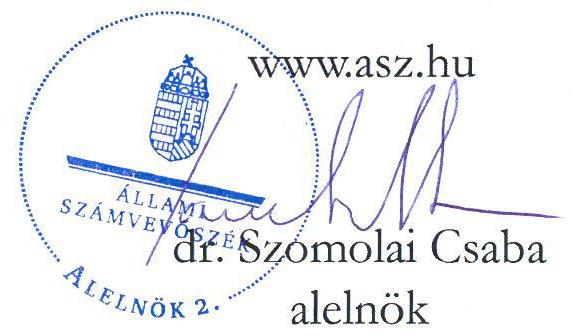
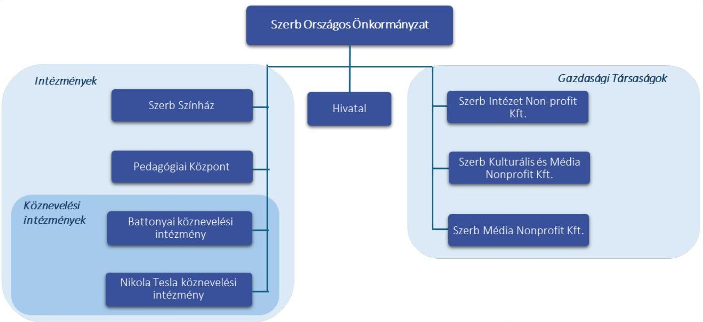
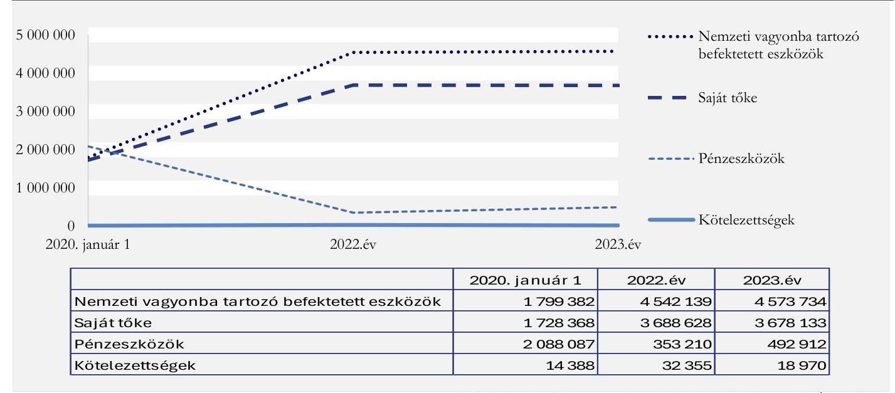
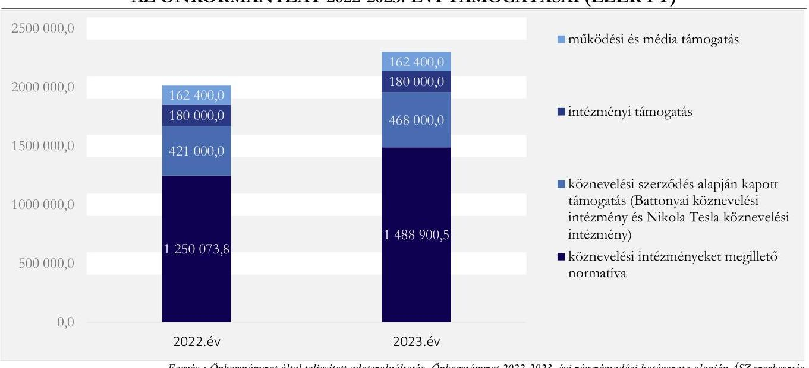
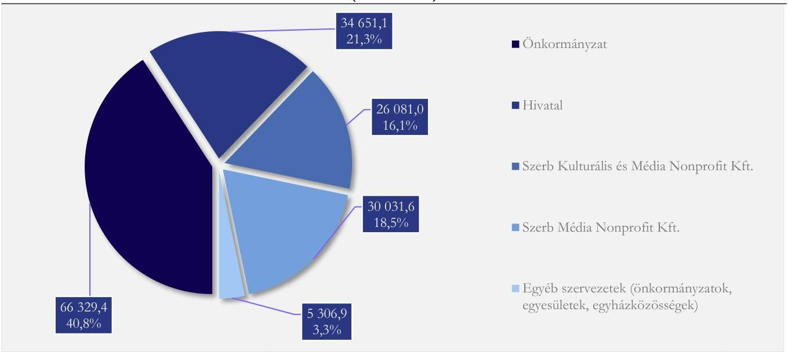
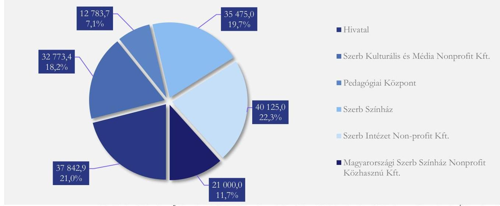
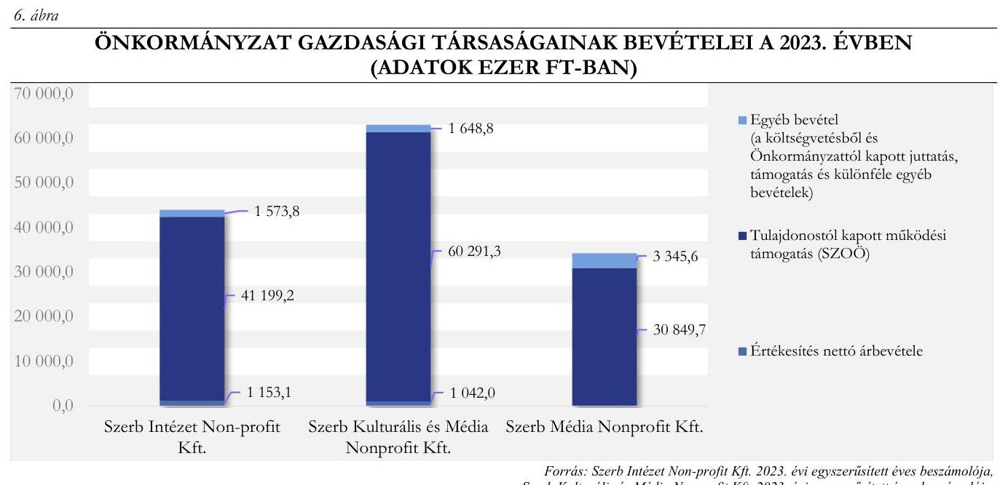

# JELENTÉS 

## Az országos nemzetiségi önkormányzatok ellenőrzése

Szerb Országos Önkormányzat

2024.

---

# JELENTÉS 

## Az országos nemzetiségi önkormányzatok ellenőrzése

Szerb Országos Önkormányzat

2024.

24213

---

# ELLENŐRZÉSI IGAZGATÓSÁG: 

## ÁLLAMHÁZTARTÁS HELYI SZINTJÉT ELLENŐRZŐ IGAZGATÓSÁG

## ELLENŐRZÉSI IGAZGATÓ:

DR. BAFFIA GERGELY GÁBOR igazgató

## ELLENŐRZÉSVEZETŐ:

Jelentéseink az interneten a www.asz.hu címen olvashatók.

DR. LÁNG ÁGNES KRISZTINA ellenőrzésvezető

IKTATÓSZÁM: EL-3886-030/2024
TÉMASORSZÁM: 50
ELLENŐRZÉS-AZONOSÍTÓ SZÁM: V103203

---

# TARTALOMJEGYZÉK 

AZ ELLENŐRZÉS ALAPADATAI ..... 5
AZ ELLENŐRZÖTT SZERVEZETEK ..... 8
ÖSSZEFOGLALÁS ..... 11
AZ ELLENŐRZÉS FÓKUSZTERÜLETEI. ..... 13
MEGÁLLAPÍTÁSOK ..... 14
JAVASLATOK. ..... 32
MELLÉKLETEK ..... 35
I. sz. melléklet: Értelmező szótár ..... 35
II. sz. melléklet: Az ellenőrzött szervezetek jegyzéke ..... 38
III. sz. melléklet: Ellenőrzési kritériumok ..... 39
IV. sz. melléklet: Az Önkormányzat konszolidált mérlegadatai a 2020-2023. években (ezer Ft) ..... 41
V. sz. melléklet: Az Önkormányzat kiadási és bevételi adatai a 2020-2023.években (ezer Ft) ..... 42
VI. sz. melléklet: Az Önkormányzat és az intézmények - 2022-2023. évben a gazdálkodási jogkörök gyakorlása a mintatételeinek értékelése szerint (ezer Ft) ..... 43
VII. sz. melléklet: az Önkormányzat 2022-2023. években a központi költségvetésből kapott támogatásai felhasználásának kimutatása szervezetenként (ezer Ft) ..... 45
VIII. sz. melléklet: az Önkormányzat 2022-2023. években a központi költségvetésből kapott támogatásai felhasználásának kimutatása kiadásnemenként (ezer Ft) ..... 46
IX. sz. melléklet: Az Önkormányzat ellenőrzött időszakban elnyert/kifizetéssel vagy elszámolással érintett pályázati forrásai (ezer Ft) ..... 47
X. sz. melléklet: A Szegedi szerb oktatási központ kivitelezésének szerződései - (Energomonting Kft.) ..... 52
FÜGGELÉK: ÉSZREVÉTELEK ..... 53
RÖVIDÍTÉSEK JEGYZÉKE ..... 54

---

.

---

# AZ ELLENŐRZÉS ALAPADATAI 

## AZ ELLENŐRZÉS CÉLJA

Az ellenőrzés célja annak értékelése volt, hogy az Önkormányzat ${ }^{1}$ gazdálkodása, a gazdálkodással kapcsolatos szabályozása, az államháztartásból nyújtott költségvetési támogatások, illetve az államháztartásból meghatározott célra ingyenesen juttatott vagyon felhasználása a jogszabályi előírásoknak megfelelően történt-e, az Önkormányzat a nemzetiségek jogairól szóló törvényben előírt feladat- és hatásköröket ellátta-e.

Az ellenőrzés célja továbbá annak értékelése volt, hogy az Önkormányzat az intézmények fenntartójaként, gazdasági társaságok alapítójaként biztosította-e a szabályszerű, átlátható és elszámoltatható közpénzfelhasználás alapvető feltételeit; az irányítási- és alapítói jogok gyakorlása hozzájárult-e az intézmények, gazdasági társaságok szabályszerű gazdálkodásához és feladatellátásához.

## AZ ELLENŐRZÉS TÍPUSA

Megfelelőségi ellenőrzés.

## AZ ELLENŐRZŐTT IDŐSZAK

Az ÁSZ ${ }^{2}$ az Önkormányzat működési és gazdálkodási feltételeinek kialakítását a 2020. és a 2022. évek vonatkozásában, a közfeladatai ellátását a 2020-2023. évek tekintetében ellenőrizte.

A pénzügyi- és vagyongazdálkodást a 2022. évre vonatkozóan, a költségvetés tervezését, végrehajtását, a vagyonhasznosítás értékelését a 2022-2023. évek, a vagyonelemek leltárral való alátámasztását a 2020-2022. évek tekintetében ellenőrizte az ÁSZ.

Az Önkormányzatnál rendelkezésre álló források megoszlása, a teljesített bevételek és kiadások értékelése a 2023. évre, az államháztartás alrendszereiből kapott támogatások felhasználása, elszámolása a 20222023. évek vonatkozásában került ellenőrzésre.

A külső forrással (EU, hazai) támogatott feladatok/programok/beruházások megvalósítása szabályszerűségének ellenőrzött időszaka a 2022-2023. évek voltak.

Az ÁSZ a belső ellenőrzés kialakítását és működtetését a 2023. évre, a belső ellenőrzés tervezését a belső és külső ellenőrzések gazdálkodásra vonatkozó megállapításaira tett intézkedések nyomon követését a 20202022. évekre vonatkozóan ellenőrizte.

Az ellenőrzés a korrupciós kockázatok kezelését, az összeférhetetlenségi és a képesítési követelmények érvényesülését, a feladat- és hatáskör, valamint a kapcsolódó felelősségi kör szabályozását a 2023. évre, a vagyonnyilatkozattételre vonatkozó előírások betartását a 2020-2023. évekre vonatkozóan vizsgálta. A közzétételi kötelezettség teljesítését az ellenőrzés megkezdésének napján (2024. január 4.) fennálló állapot szerint értékelte az ÁSZ.

---

# AZ ELLENŐRZÉS TÁRGYA 

Az országos nemzetiségi önkormányzat közfeladat ellátása, pénzügyi- és vagyoni helyzete, pénzügyi- és vagyongazdálkodása, a belső kontrollrendszer kialakítása és múködtetése.

Az ellenőrzés kiterjedt minden olyan körülményre és adatra, amely az ÁSZ jogszabályban meghatározott feladatainak teljesítéséhez, valamint a program végrehajtása folyamán felmerült újabb összefüggések feltárásához szükséges volt.

## AZ ELLENŐRZÉS JOGALAPJA

Az ellenőrzés jogszabályi alapját az ÁSZ tv. ${ }^{3} 1 . \int(3)$ bekezdésének, az 5. § (2)-(3) és (6) bekezdéseinek előírásai képezték.

## AZ ELLENŐRZÉS MÓDSZERE

Az ÁSZ az ellenőrzést az Alaptörvény 43. cikk (1) bekezdésében meghatározott törvényességi szempontok, valamint a nemzetközi standardokat irányadónak tekintve az ellenőrzési program szempontjai, az ellenőrzött időszakban hatályos jogszabályok, az ellenőrzés szakmai szabályok és módszertanok figyelembevételével végezte.

Az ellenőrzési bizonyítékként felhasználható adatforrások közé tartoztak egyrészt az ellenőrzési program részletes szempontjainál felsorolt adatforrások, másrészt minden - az ellenőrzés folyamán feltárt, az ellenőrzés szempontjából releváns információt tartalmazó - dokumentum. Az ellenőrzés lefolytatásához az Önkormányzat tanúsítványok kitöltésével, az ÁSZ által kért és rendelkezésre bocsátott dokumentumok, valamint a helyszíni ellenőrzés során interjú keretében szolgáltatott adatokat. Az ÁSZ a helyszíni ellenőrzést az Önkormányzat határozatainak előkészítésével, végrehajtásával, gazdálkodásával, valamint intézményei és gazdasági társaságai gazdálkodásával kapcsolatos feladatokat ellátó Hivatalban ${ }^{4}$, továbbá a Nikola Tesla köznevelési intézményében ${ }^{5}$ végezte.

A pénzügyi- és vagyongazdálkodás szabályozottságát az ellenőrzés az Önkormányzat határozatai, továbbá az Önkormányzat, a Hivatal és a 2023. október 17-éig önálló gazdasági szervezettel rendelkező Nikola Tesla köznevelési intézmény szabályzatai alapján értékelte. A pénzügyi és vagyoni helyzet értékelése az Önkormányzat konszolidált éves beszámolóinak adatai, a vagyonnyilvántartás alapján, továbbá a mérleg alátámasztottságának vizsgálatával történt.

Az Önkormányzat vagyonváltozást eredményező döntéseinek és azok végrehajtásának ellenőrzésére tételes ellenőrzéssel került sor. Az éves költségvetés végrehajtásának ellenőrzése során a 2022-2023. években a működési és felhalmozási kiadások szabályszerűségének értékelése mintavételi eljárás segítségével történt. Az Önkormányzatnál és költségvetési szerveinél a mintatételek kockázati alapon, a főkönyvi adatállományából kerültek kiválasztásra.

A tények feltárása és azok összegzése során a megállapítások az ellenőrzött mintatételekre vonatkozóan kerültek megfogalmazásra. Az ellenőrzésre kiválasztott költségvetési kiadási mintatételek száma az ellenőrzött időszakra vonatkozóan az országos nemzetiségi önkormányzatnál évi 20-20, a költségvetési szerveknél évi 1010 , azaz összesen 140 volt.

---

Az ÁSZ kockázat alapú mintavétellel ellenőrizte az Önkormányzat és intézményei feladataihoz, programjaihoz, beruházásaihoz biztosított pályázati támogatások elszámolását. Az ellenőrzés a közbeszerzési eljárás szabályszerűségére nem terjedt ki.

Az ellenőrzés értékelte az Önkormányzat kötelező közfeladatai ellátását, a feladatellátás érdekében rendelkezésre bocsátott költségvetési támogatások cél szerinti felhasználását. Továbbá ellenőrizte az Önkormányzat pénzügyi gazdálkodási feladatainak ellátását, a vagyongazdálkodásának és a vagyonváltozást eredményező döntéseinek szabályszerűségét, valamint az Önkormányzat honlapján a kötelezően közzéteendő közérdekű adatok digitális formában történő hozzáférését, közzétételét. Az ÁSZ az egyes területek szabályszerűségének, megfelelőségének értékelését a III. számú mellékletben megjelölt kritériumok alapján végezte el.

---

# AZ ELLENŐRZÖTT SZERVEZETEK 

Az 1995. évben alakult Önkormányzat kötelezően ellátandó feladata az általa képviselt nemzetiség érdekeinek országos, illetve szükség szerint a területi, települési képviseletének és érdekvédelmének ellátása, valamint a nemzetiségi kulturális autonómia fejlesztése érdekében országos szintű nemzetiségi intézményhálózat fenntartása. A 2022. évi népszámlálás során 8035 fő vallotta magát az Önkormányzat által képviselt szerb nemzetiséghez tartozónak, amely a Magyarországon élő elismert nemzetiséghez tartozók 2\%át teszi ki.

Az Önkormányzat feladat- és hatásköreit a nemzetiségi önkormányzat testülete, a 15 tagú Közgyűlés ${ }^{6}$ gyakorolta, amelyet, mint jogi személyt, az Elnök ${ }^{7}$ képviselt. Az Elnök a 2014. évi önkormányzati választások óta töltötte be a Közgyűlés elnöki tisztségét. Az Elnök munkáját az ellenőrzött időszakban a Közgyűlés által megválasztott általános elnökhelyettes, valamint a vagyongazdálkodásért és szerb nemzetiségi önkormányzati kapcsolatokért felelős elnökhelyettes segítette. A Közgyűlés a kötelezően létrehozandó Pénzügyi Bizottsága mellett további két bizottságot - Oktatási Bizottságot és Kulturális Bizottságot - hozott létre. A bizottságok ${ }^{8}$ egyaránt öt-öt tagból álltak. A Közgyűlés a tagjai közül egy ifjúsági és civil kapcsolatokért felelős tanácsnokot ${ }^{9}$ választott.

Az Önkormányzat szerveként működő Hivatal előkészítette és végrehajtotta a Közgyűlés határozatait, továbbá ellátta az Önkormányzat, annak gazdasági szervezettel nem rendelkező intézményei, valamint az Önkormányzat által alapított gazdasági társaságok gazdálkodásával kapcsolatos feladatokat. 2023. október 17től a Hivatal látta el a korábban önálló gazdasági szervezettel rendelkező Nikola Tesla köznevelési intézmény gazdálkodási feladatait is. A Hivatalvezető ${ }^{10}$ 2013. október 1-je óta vezeti a Hivatalt.

Az Önkormányzat az ellenőrzött időszakban négy intézményt tartott fenn, melyből kettő köznevelési feladatokat látott el.
1. ábra

## A SZERB ORSZÁGOS ÖNKORMÁNYZAT SZERVEZETI ÁBRÁJA

A Pedagógiai Központot ${ }^{11}$ 2005. október 15-én a magyarországi szerb nemzetiségi óvodai nevelés, a szerb nemzetiségi köznevelés és a felsőoktatás keretein belül működő szerb nemzetiségi képzések támogatása és a

---

szerb nemzetiségi óvodapedagógusok, tanítók, tanárok és nevelőtanárok szakmai továbbképzésének intézményes biztosítása céljából hozták létre.

Az Önkormányzat által 2015. július 1-jén alapított Szerb Színház ${ }^{12}$ a magyarországi szerbség kulturális törekvéseinek összehangolása érdekében kulturális rendezvényeket, színházi bemutatókat, irodalmi esteket, közösségi esteket szervezett, szerb és magyar nyelvű színdarabokat, irodalmi és zenei műveket mutatott be.

A 2004. július 1-jén alapított Battonyai köznevelési intézmény ${ }^{13} 45$ fő nemzetiséghez tartozó óvodai nevelését, 120 fő nemzetiséghez tartozó általános iskolai nevelését-oktatását biztosította Battonyán.

A 2013. évben alapított Nikola Tesla köznevelési intézmény hat tagintézménnyel összesen négy településen működött: Budapesten a nemzetiséghez tartozók óvodai nevelését, általános iskolai és gimnáziumi nevelését-oktatását és kollégiumi ellátását- nevelését biztosította. Szegeden, Lóréven és Deszken szerb általános iskolai és óvodai nevelést biztosított. A Nikola Tesla köznevelési intézmény felvehető maximális gyermek-, tanulólétszáma az ellenőrzött időszakban 1002 főről 1194 főre emelkedett.

Az Önkormányzat feladatellátását az ellenőrzött időszakban gazdasági társaságai - a Szerb Intézet Nonprofit Kft. ${ }^{14}$, a Szerb Kulturális és Média Nonprofit Kft. ${ }^{15}$ és a Szerb Média Nonprofit Kft. ${ }^{16}$ - is segítették.

A Szerb Intézet Non-profit Kft. nemzetiségi feladatot ellátó tudományos intézményként a szerb nemzetiségi közösség szellemi, épített és tárgyi emlékeire, hagyományaira, kultúrájára, történelmére, nyelvére, intézményeire, társadalmi viszonyaira vonatkozó adatok gyűjtésével, tudományos értékű feldolgozásával és közzétételével foglalkozott.

A 2019. december 6-án megalapított Szerb Kulturális és Média Nonprofit Kft. a 2020. január 31-én megszüntetett Kulturális és Dokumentációs Központ ${ }^{17}$ közfeladatait - így a szerb nemzetiséghez tartozók szellemi, kulturális örökségének, kulturális hagyományainak megőrzését, fenntartását, fejlesztését -, valamint a Szerb Hetilap ${ }^{18}$ kiadását vette át 2020. január 15. napjával a Hivataltól.

Az Önkormányzat a médiafeladatok ellátásának különválasztása érdekében 2023. március 3-án megalapította a Szerb Média Nonprofit Kft.-t, amely 2023. április 1-jétől a Szerb Hetilap kiadásával kapcsolatos feladatokat is ellátta.

Az Önkormányzat az ellenőrzött időszakban önként vállalt feladatként kitüntetéseket (Thököly Száva Díjat, Szent Száva Díjat, Elnöki Elismerést), valamint Szerb Tanulmányi Ösztöndíjat alapított, továbbá kulturális-, oktatási-, és tudományos pályázati alapot hozott létre.

Az Önkormányzat összes bevétele a 2020. évben 5005 130,7 ezer Ft-ot tett ki, amely - a pályázati támogatások csökkenése miatt - 2022. évre 4006702,6 ezer Ft-ra (19,9\%-kal), a 2023. évre 3253 695,9 ezer Ft-ra ( $35 \%$-kal) csökkent a 2020. évhez képest. Az Önkormányzat kiadásainak összege a 2020. évben 2553713,9 ezer Ft-ról a 2022. évre 42,3\%-kal, 3634722,2 ezer Ft-ra emelkedett, majd a 2023. évre $24,3 \%$-kal 2752216 ezer Ft-ra csökkent az előző évhez viszonyítva.

Az Önkormányzat vagyonának 2022. évre történt 26,7\%-os növekedése - és ezzel egyidejűleg pénzeszközeinek csökkenése - a külső forrásból biztosított felhalmozási célú támogatások felhasználásához kapcsolódott. Az Önkormányzat 2020-2022- években a Szegedi Szerb Oktatási Központ megalakításához kapcsolódóan 15468437 ezer Ft támogatást használt fel. További beruházások valósultak meg a Nikola Tesla köznevelési intézménynél, a budapesti székhely intézmény homlokzat felújításához, Szegeden az óvoda beruházáshoz kapcsolódóan, a lórévi és a deszki telephely új tantermekkel bővült. A vagyonnövekedéshez hozzájárult a Battonyai köznevelési intézménynél a tornaterem és tornaszoba beruházáshoz felhasznált támogatás.

---

Az Önkormányzat vagyonában és forrásaiban az ellenőrzött időszakban bekövetkezett változást a 2. ábra szemlélteti.
2. ábra

# AZ ÖNKORMÁNYZATI VAGYON ÉS FORRÁSÁNAK ALAKULÁSA 2020., 2022. ÉS 2023. ÉVEKBEN (EZER FT) 

|  | 2020. január 1 | 2022.év | 2023.év |
| :--: | :--: | :--: | :--: |
| Nemzeti vagyonba tartozó befektetett eszközök | 1799382 | 4542139 | 4573734 |
| Saját tőke | 1728368 | 3688628 | 3678133 |
| Pénzeszközök | 2088087 | 353210 | 492912 |
| Kötelezettségek | 14388 | 32355 | 18970 |

Forrás: Szerb Országos Önkormányzat konszolidált beszámoló adatai alapján ÁSZ szerkesztés

---

# ÖSSZEFOGLALÁS 

A nemzetiségi kulturális autonómia legfőbb letéteményesei az országos nemzetiségi önkormányzatok, melyek a kötelező és önként vállalt feladataiknak ellátására intézményt, gazdasági társaságot, más szervezetet alapíthatnak. Az állam az országos nemzetiségi önkormányzatok múködéséhez, az intézményeik fenntartásához költségvetési támogatást nyújt. A nemzetiségi önkormányzatok a feladatellátásukhoz hazai és uniós pályázati forrásokat is szerezhetnek. A társadalom jogos elvárása, hogy a közpénzekkel, közvagyonnal gazdálkodó szervezetek múködéséről, tevékenységéről időről-időre átfogó képet kapjon. Az ellenőrzés hozzájárult az Önkormányzat szabályszerű és felelős gazdálkodásához, a közpénzek szabályos, cél szerinti felhasználásához, a közvagyon védelméhez.

Az Önkormányzat az országos szintű érdekképviseleti, érdekvédelmi feladatait ellátta, a nemzetiségi kulturális autonómia fejlesztése érdekében országos szintű nemzetiségi intézményhálózatot működtetett. Az Önkormányzat a müködéséhez és feladatellátásához szükséges szervezeti kereteket, a gazdálkodásának belső kontrolljait kialakította, azonban a jogszabályok és belső szabályzatok előírásai ellenére a nem megfelelően múködtetett kontrollok nem akadályozták meg a múködési és gazdálkodási szabálytalanságokat.

A Közgyűlés által átruházott hatáskörben hozott döntésekről az Elnök, valamint a bizottságok a szervezeti és múködési szabályzatban foglaltak ellenére nem számoltak be. A Közgyűlés az Ábt.-ban meghatározott irányító szervi hatásköreit nem teljeskörűen gyakorolta. Kinevezési jogkörében nem döntött a költségvetési szerve vezetőjének járandóságáról, az intézményvezetőket nem számoltatta be. A Nikola Tesla köznevelési intézménynél elnöki döntés alapján lefolytatott külső ellenőrzés által feltárt gazdálkodási szabálytalanságok megszüntetése érdekében nem határozott meg intézkedési és beszámolási kötelezettséget az intézményvezető részére, csupán a szervezeti keretek felülvizsgálatáról, majd az intézmény gazdálkodási feladatainak a Hivatalba integrálásáról döntött.

A Hivatal az Önkormányzat és a saját gazdálkodási feladatain felül, három költségvetési intézmény, köztük a Battonyai köznevelési intézmény és az Önkormányzat három gazdasági társasága gazdálkodási feladatait is ellátta. A Közgyűlés döntésének megfelelően 2023. októberétől a Hivatal látta el a hat tagintézménnyel négy településen múködő Nikola Tesla köznevelési intézmény gazdálkodási feladatait is. Ehhez az Önkormányzat 14,5 fő álláshelyet biztosított, amelyből a gazdasági vezető helyettes álláshelye mindvégig betöltetlen volt.

Az Önkormányzat pénzügyi- és vagyongazdálkodása nem felelt meg maradéktalanul a jogszabályok és a belső szabályozások előírásainak.

Az ÁSZ ellenőrzés során vizsgált 102 535,3 ezer Ft összértékủ kiadás teljesítése a mintatételek 35,7\%-a esetében nem felelt meg a jogszabályi előírásoknak. A szabálytalanságokat a gazdálkodási jogkörök (pénzügyi ellenjegyzés, teljesítésigazolás és érvényesítés) nem, vagy nem megfelelő gyakorlása, továbbá az összeférhetetlenségi követelmények figyelmen kívül hagyása okozta. A kontrolltevékenység hibás gyakorlata a jövőbeni kifizetésekhez kapcsolódóan megteremti a visszaélések kockázatát.

Az Önkormányzat vagyonnyilvántartása nem felelt meg a jogszabályi előírásoknak, mivel nem, illetve nem a törzsvagyonába besorolva tartalmazott egyes, az Önkormányzat tulajdonába került, közfeladatellátást szolgáló vagyonelemeket. A Közgyűlés a jogszabályi előírások ellenére nem határozta meg a használatába adott, vagyonkezelésbe vett állami és önkormányzati vagyon kezelésére, használatára,

---

működtetésére vonatkozó szabályokat. Az Önkormányzat az ellenőrzött időszakban a beszámolási és zárszámadási kötelezettségét teljesítette, azonban a mennyiségi leltárfelvétel során a tárgyi eszközök év végi könyv szerinti értékének a tételes és ellenőrizhető módon történő számbavétele a jogszabályi előírások ellenére nem volt biztosított. A vagyongazdálkodásra, vagyonhasználatra vonatkozó hiányos szabályozás, továbbá a mennyiségi leltárfelvétel nem megfelelő gyakorlata kockázatot jelentenek a felelős vagyongazdálkodás követelményének érvényesülésére az Önkormányzatnál.

Az Önkormányzat teljesített bevételei biztosították a közfeladatok ellátását, azonban az ehhez kapott támogatások felhasználásáról a jogszabályban előírt határidőn túl számolt el. Az Önkormányzat a gazdasági társaságai részére átadott közpénzek felhasználásáról nem a jogszabályi előirásoknak megfelelően számolt el, mivel a beszámolójában az átadott támogatás egyösszegben, további részletezések nélkül történő feltüntetése nem igazolta a költségvetési támogatás rendeltetésszerü felhasználását

Az Oktatási Központ ${ }^{15}$ beruházás Támogató Okiratának; ${ }^{20}$ többszöri módosítása és a megvalósításhoz kapott támogatás kiegészítései ellenére sem fejeződött be. A beruházás menet közben felmerült kivitelezési problémái miatt pótmunkák váltak szükségessé, amelynek következtében a beruházás müszaki készültségi foka nem volt arányban a központi költségvetés által biztosított összes támogatásból felhasznált összeggel. Az Önkormányzat nevében az Elnök, a Közgyűlés előzetes tájékoztatása és felhatalmazása nélkül, a kivitelezési szerződést összesen hat alkalommal módosította a Vállalkozó kezdeményezésére. A kivitelezési problémák a szerződésmódosítások ellenére sem oldódtak meg, majd végül az Önkormányzat a vállalkozóval a szerződést felbontotta, a beruházás kivitelezése félbemaradt. Az Önkormányzat 1546600 ezer Ft, a beruházáshoz kapott költségvetési támogatással a támogatói okiratokban meghatározott határidőre, illetve 2024. június 20 -ig sem számolt el. Az Önkormányzatnak a támogatás visszafizetésére vonatkozó kötelezettsége 2024. június 20 -ig, azaz a helyszíni ellenőrzés lezárásáig nem keletkezett, ugyanakkor a kivitelezési munkálatok félbemaradásának elhúzódása felveti ennek kockázatát. Az Önkormányzatnak az Oktatási Központ beruházás félbemaradása miatt az épület megóvása érdekében további kiadásai merültek fel.

A belső ellenőrzést az Önkormányzatnál kialakították, azonban annak múködtetése nem felelt meg a jogszabályi előírásoknak, mivel az Önkormányzat gazdasági szervezettel nem rendelkező költségvetési szervei kockázatelemzéssel alátámasztott stratégiai és éves belső ellenőrzési tervvel nem rendelkeztek. Az elvégzett belső ellenőrzések megállapításai, az éves belső ellenőrzési jelentésekben a belső ellenőr kontrolltevékenységekre vonatkozó értékelései és a számvevőszéki ellenőrzés megállapításai közötti ellentmondások miatt a számvevőszéki ellenőrzés véleménye szerint a belső ellenőrzés nem járult hozzá az Önkormányzat és a költségvetési szervei szabályszerű feladatellátáshoz.

Az Önkormányzatnál, a Hivatalánál és a fenntartott intézményeinél az integritás szemlélet nem érvényesült, mert nem tartották be az összeférhetetlenségre vonatkozó jogszabályi előírásokat, valamint nem tettek eleget maradéktalanul a közzétételi kötelezettségüknek. A vagyonnyilatkozat-tételre vonatkozó szabályozási hiányosságok hozzájárultak ahhoz, hogy a vagyonnyilatkozat-tételre kötelezettek a Közgyűlés tagjai és a hivatali dolgozók kivételével nem teljesítették a nyilatkozattételi kötelezettségüket.

A feltárt hiányosságok megszüntetése érdekében az ÁSZ a Közgyűlés részére hat, az Elnök részére nyolc, a Hivatalvezetőnek hat, valamint az Önkormányzat többségi tulajdonában álló gazdasági társaságai vezetőinek egy javaslatot tett.

---

# AZ ELLENŐRZÉS FÓKUSZTERÜLETEI 

1. Az országos nemzetiségi önkormányzat törvényes müködési feltételeinek kialakítása
2. Az országos nemzetiségi önkormányzat kötelező és önként vállalt feladatai
3. Az országos nemzetiségi önkormányzat pénzügyi- és vagyongazdálkodása
4. A közfeladat ellátása érdekében az országos nemzetiségi önkormányzat rendelkezésére bocsátott költségvetési támogatások felhasználása
5. A külső forrással (EU, hazai) támogatott programok és beruházások megvalósításának szabályszerűsége
6. A belső ellenőrzés kialakítása és müködtetése, külső ellenőrzések megállapításai, intézkedések
7. Korrupciós kockázatok kezelése (vagyonnyilatkozatok, összeférhetetlenség, képesítési követelmény, felelősségi szabályok, közzétételi kötelezettség)

---

# 1. Az országos nemzetiségi önkormányzat törvényes müködési feltételeinek kialakítása 

Összegző megállapítás

Az Önkormányzat SZMSZ ${ }_{1-5}{ }^{21}$-e kisebb hiányosságok mellett
megfelelt az Njtv. ${ }^{22}$ elöírásainak. Az Önkormányzat az Njtv.ben foglaltak ellenére nem minden közvetlenül a nemzetiségi közügyek ellátását szolgáló ingatlanát vonta törzsvagyona körébe, továbbá nem határozta meg a használatába adott, vagyonkezelésbe vett állami és önkormányzati vagyon kezelésére, használatára, müködtetésére vonatkozó szabályokat.
1.1. számú megállapítás

Az Önkormányzatnál és az intézményeinél a Vnytv. ${ }^{23}$ előírásai ellenére nem teljeskörűen határozták meg a szervezeti és müködési szabályzatban a vagyonnyilatkozat-tételre kötelezettek körét.

A Közgyűlés az Njtv. rendelkezéseinek megfelelően az alakuló ülésén ${ }^{a}$ tagjai közül megválasztotta a főállású elnökét, valamint kettő elnökhelyettesét, három bizottságának ${ }^{\mathrm{b}}$ tagjait, döntött a tiszteletdíjakról, illetményekről, megalkotta $\mathrm{SZMSZ}_{1}$-ét, amit az ellenőrzött időszakban négy ${ }^{\mathrm{c}}$ alkalommal módosított.
A Közgyűlés valamennyi bizottsága rendelkezett átruházott hatáskörrel, azonban a Vnytv. 4. § a) pontjában foglaltak ellenére az SZMSZ ${ }_{1-5}$-ben nem tüntették fel a nem képviselő bizottsági tagok vagyonnyilatkozat-tételi kötelezettségét. Továbbá a Hivatal, valamint a költségvetési szervként működő intézmények ${ }^{\mathrm{d}}$ a Vnytv. 4. § a) pontjában, illetve az Önkormányzat tulajdonában álló gazdasági társaságok a Vnytv. 4. § d) pontjában foglaltak ellenére nem tüntették fel szervezeti és működési szabályzataikban a vagyonnyilatkozat-tételre kötelezettek körét.
A Hivatalvezető 2021. január 1-jét megelőzően a Hivatal foglalkoztatottjaival (ide nem értve a munkavégzésre irányuló egyéb jogviszonyban foglalkoztatottakat) az Njtv. 119. § (4) bekezdésében, valamint a Kttv. ${ }^{24}$ 8. § (1)-(2) bekezdéseiben foglaltak ellenére nem közszolgálati jogviszonyt létesített, hanem munkaszerződést kötött.
Az ellenőrzött időszakban a szószóló tanácskozási joggal részt vett a Közgyűlés ülésein, azonban az Njtv. 21/B. § (5) bekezdésében és az SZMSZ ${ }_{1-5}$ 21. pontjában foglaltak ellenére, az Elnök nem kezdeményezte a szószóló saját és az Országgyűlés nemzetiségekkel kapcsolatos tevékenységéről, döntéseiről szóló tájékoztatójának napirendre vételét.

[^0]
[^0]:    ${ }^{a}$ Az alakuló ülés 2019. október 29-én volt.
    ${ }^{\mathrm{b}}$ Pénzügyi Bizottság, az Oktatási Bizottság, a Kulturális Bizottság
    ${ }^{\text {c }}$ 2020. február 28., 2020. szeptember 18., 2021. november 5., 2022. január 12.
    ${ }^{\text {d }}$ Pedagógiai Központ, Szerb Színház, Battonyai köznevelési intézmény és a Nikola Tesla köznevelési intézmény

---

Az Önkormányzat az ellenőrzött időszakban társulást nem hozott létre, ahhoz nem csatlakozott, más önkormányzatoktól feladat- és hatáskört nem vett át és nem látott el. A 2022. évben megszűnt Budapest Főváros XVI. kerületi Szerb Önkormányzat vagyona az Önkormányzat részére átadásra került, feladat átadás-átvételre nem került sor.
1.2. számú megállapítás

Az Önkormányzat bizottságai támogatták a közfeladatellátást. A Tanácsnok az általa felügyelt ügykörben tapasztaltakról a Közgyűlést az SZMSZ ${ }_{1-5}$-ben foglaltak ellenére - nem tájékoztatta.

A Közgyűlés az Njtv.-ben foglaltakkal összhangban három, öt-öt tagból álló bizottságot hozott létre, amelyekbe nem képviselő bizottsági tagok is megválasztásra kerültek. A 2020. és 2022. években mind három bizottság ellátta az SZMSZ ${ }_{1-5}$-ben meghatározott közgyűlési döntések előkészítéséhez, véleményezéséhez, javaslattételezéshez kapcsolódó feladatait. Átruházott hatáskörben döntést a Pénzügyi Bizottság és a Kulturális Bizottság hozott ${ }^{6}$.
A magyarországi szerb közösség ifjúságával és a civil szervezetekkel kapcsolatos ügyek, illetve a hagyományőrzéssel és a kulturális tevékenységet folytató civil szervezettekkel kapcsolatos ügyek felügyeletére megválasztott Tanácsnok az SZMSZ ${ }_{1-5}$ III. 15. pontjában foglaltak ellenére az általa felügyelt ügykörben tapasztaltakról a Közgyűlést az ellenőrzött időszakban nem tájékoztatta.
1.3. számú megállapítás

Az Önkormányzat az Njtv.-ben foglaltak ellenére nem határozta meg a használatába, vagyonkezelésbe vett állami és önkormányzati vagyon kezelésére, használatára, működtetésére vonatkozó szabályokat. Az Önkormányzat vagyonnyilvántartása nem felelt meg az Njtv., Nvtv. ${ }^{25}$ és a belső szabályzat előírásainak.

A Közgyűlés meghatározta vagyonleltárát ${ }^{f}$, a törzsvagyona körét és a tulajdonát képező vagyon használatának szabályait. A Vagyongazdálkodási szabályzat ${ }^{26}$ tartalmazta az Önkormányzat ingó és ingatlan vagyonának törzsvagyon és üzleti vagyon besorolását, minősítését.
A Közgyűlés az Njtv. 117. § (1) bekezdésében és 113. § d) pontjában foglaltak ellenére nem határozta meg a használatába adott, vagyonkezelésbe vett állami és önkormányzati vagyon kezelésére, használatára, működtetésére vonatkozó szabályokat.
Az Önkormányzat vagyonnyilvántartása nem felelt meg az Nvtv. 10. § (1) bekezdésében, az Njtv. 125. § (1) bekezdésében és a Vagyongazdálkodási szabályzat II. fejezet 20. pontjában foglaltaknak, mivel a Vagyongazdálkodási szabályzat 1. számú melléklete nem tartalmazta az Önkormányzat tulajdonába került, a Nikola Tesla köznevelési intézmény feladatellátását és a Pedagógiai Központ telephelyéül is szolgáló ingatlan vagyonelemeket. Az Önkormányzat vagyonnyilvántartásában az Nvtv. 10. § (1) bekezdésében foglaltak ellenére nem vezette át a battonyai ingatlanok összevonásából adódó változásokat, továbbá az Njtv. 125. § (3) bekezdésében foglaltak ellenére a Közgyűlés nem hozott határozatot az egyesített ingatlan besorolásáról.

[^0]
[^0]:    ${ }^{6}$ A Pénzügyi Bizottság 2022. február 11-én az ingatlanhasznosítás versenyeztetéséről, a Kulturális Bizottság 2020. és 2022. években önkormányzati támogatások odaítéléséről döntött.
    ${ }^{f}$ A Szerb Országos Önkormányzat 114/2020. (2020. VII. 01.) számú határozata a Szerb Országos Önkormányzat és intézményei 2019. évi költségvetésének teljesítéséről szóló beszámoló (zárszámadás) elfogadásáról

---

Az Önkormányzat Vagyongazdálkodási szabályzata szerint a forgalomképtelen törzsvagyon részét képezte a Battonya, Hunyadi utca 48. szám alatti ingatlan, amely 2020. december 8. napjával összevonásra került a Battonya, Hunyadi utca 50. szám alatti korlátozottan forgalomképes ingatlannal. Az összevonás következtében a törzsvagyon köréből a forgalomképtelen ingatlan a Közgyűlés döntése nélkül a korlátozottan forgalomképes törzsvagyon körébe került.

Az Önkormányzat a kötelező önkormányzati feladatkör ellátását szolgáló Szerb Színház székhelyét - a Budapest, Nagymező utca 49. fszt. 4. szám alatti ingatlant - az Njtv. 125. § (1)-(2) bekezdésekben foglaltak ellenére nem a törzsvagyona, hanem az üzleti vagyona körébe sorolta.
1.4. számú megállapítás

Az Önkormányzat az Njtv.-ben foglaltak ellenére az ellenőrzött időszakban nem rendelkezett a Hivatala és intézményei részére használatba adott, vagyonát érintő megállapodásokkal.

Az Önkormányzat a Fővárosi Önkormányzattól ${ }^{27}$ 2021. július 7. napján ingyenes vagyonjuttatásként átvette a Budapest, Rózsák tere 6-7. és a Rózsa utca 5. szám alatti ingatlanokat és a kapcsolódó ingóságokat, valamint a 2023. október 12. napján kelt megállapodás alapján a Magyar Nemzeti Vagyonkezelő Zrt.-től ingyenesen megszerezte a Budapest, Rottenbiller utca 14. szám alatti ingatlan tulajdonjogát.
Az Önkormányzat székhelyén kapott helyet a Hivatal, a Pedagógiai Központ, valamint a Szerb Fővárosi Önkormányzat. Az Önkormányzat által használatba adott ingatlanok esetén a használat módját és a költségek megosztását az Njtv. 113. § d) pontjában rögzítettek ellenére megállapodásban nem rendezték.

# 2. Az országos nemzetiségi önkormányzat kötelező és önként vállalt feladatai 

## Összegző megállapítás

2.1. számú megállapítás

Az Önkormányzat az Njtv.-ben meghatározott közfeladatait ellátta, az intézményhálózatának müködtetéséről gondoskodott, azonban az Áht. ${ }^{28}$-ban foglalt irányítói feladatait nem teljeskörűen gyakorolta.

Az Önkormányzat az ellenőrzött időszakban az országos szintű érdekképviseleti, érdekvédelmi feladatait ellátta, véleményezési és egyetértési jogát gyakorolta. Az átruházott hatáskört gyakorlók a belső szabályzatban foglaltak ellenére a Közgyűlésnek nem számoltak be.

Az Önkormányzat a szerb nemzetiségi közösséggel kapcsolatosan ellátta az Njtv.-ben foglalt országos szintű érdekképviseleti, érdekvédelmi feladatait, átruházott hatáskör útján élt a jogszabálytervezetekkel, megállapodásokkal kapcsolatos véleményezési jogával, valamint gyakorolta az Nktv. ${ }^{29}$-ben és az Njtv.-ben biztosított egyetértési jogát.
Az átruházott hatáskört gyakorló Elnök, Pénzügyi Bizottság, Oktatási Bizottság és a Kulturális Bizottság az SZMSZ ${ }_{1-5}$ II. 12. pontjában foglaltak ellenére a Közgyűlésnek nem számolt be az átruházott hatáskörök két közgyűlés közötti gyakorlásáról.

---

Az Elnök az Njtv. 119. § (1) bekezdésében foglaltak ellenére hatáskör hiányában gyakorolta a nemzetiségi köznevelési intézmény felvételi körzetének meghatározásához kapcsolódó, a Köznev. tv. ${ }^{30} 50 . \S(10)$ bekezdésében biztosított egyetértési jogot.
2.2. számú megállapítás

Az Önkormányzat közfeladatellátását intézményei mellett gazdasági társaságai segítették. A Közgyűlés az önkormányzati költségvetési szervek feletti, az Áht.-ban meghatározott irányítási hatásköröket nem teljeskörűen gyakorolta.

Az Önkormányzat az ellenőrzött időszakban a négy intézménye - a Pedagógiai Központ, a Szerb Színház, a Battonyai köznevelési intézmény és a Nikola Tesla köznevelési intézmény - működési feltételeit biztosította.
Az Önkormányzat a 2020. évben megszüntette a Kulturális és Dokumentációs Központot, valamint megalapította a Szegedi Szerb Óvodát, amely 2021. július 31 -én a Nikola Tesla köznevelési intézmény tagintézménye lett.
A 2020-2022. évek között a Munkamegosztási megállapodást ${ }^{31}$, illetve a Feladatellátási szerződést ${ }^{32}, 2^{33}, 3^{34}$ alapján a Hivatal látta el a gazdálkodási feladatokat a Nikola Tesla köznevelési intézmény kivételével az Önkormányzat valamennyi intézményénél és az Önkormányzat által alapított gazdasági társaságoknál is. A Közgyűlés 2023. május 30 -án döntött a Nikola Tesla köznevelési intézmény gazdálkodási feladatainak Hivatal általi ellátásáról, és 2023. október 13-i ülésén fogadta el az erről szóló Munkamegosztási megállapodást ${ }_{2}{ }^{35}$.
Ezt követően a Közgyűlés a Hivatal engedélyezett létszámkeretét 10,25 fővel, összesen 20,25 főre emelte. A Közgyűlés a 2023. évben a 3256849 ezer Ft költségvetési főösszeggel és 5097768,8 ezer Ft konszolidált mérlegfőösszeggel rendelkező Önkormányzat gazdasági feladatainak ellátására 14,5 fő álláshelyet biztosított, amelyből egy álláshely - a gazdasági vezetőhelyettesi - az ellenőrzött időszakban betöltetlen volt. A Hivatalvezető a Kttv. 8. § (1)-(2) bekezdésében foglaltak ellenére a könyvelési-, beszámoló készítési- és leltározási feladatok ellátására egy korábbi dolgozójukkal megbízási szerződést kötött.
Az Önkormányzat, mint fenntartó nem teljeskörűen látta el irányítói feladatait, mivel

1. az Áht. 9. § e) h) és i) pontjaiban foglaltak ellenére a Nikola Tesla köznevelési intézménynél a gazdálkodással összefüggően az Elnök megbízásából ellenőrzést végző tanácsadó cég által feltárt szabálytalanságok megszüntetése érdekében nem írt elő intézkedési és beszámolási kötelezettséget a költségvetési szerv vezetője részére, valamint
2. az Áht. 9. § c) pontjában meghatározott kinevezési jogkör gyakorlása körében nem állapította meg a költségvetési szerv vezetője havi juttatásának összegét, továbbá
3. az Áht. 9. § b) pontjában foglaltak ellenére nem hagyta jóvá a Battonya köznevelési intézmény 2020. évben készített SZMSZ-ét.

Az ellenőrzött időszak alatt az Önkormányzat valamennyi költségvetési intézménye elkészítette az éves (részletes) szakmai és pénzügyi beszámolóját, melyet a Közgyűlés külön tárgyalás nélkül a zárszámadással együtt fogadott el. A Közgyűlés az intézményvezetők részére az Áht. 9. § i) pontjában foglaltak ellenére további jelentéstételt, beszámolást nem írt elő.

---

Az Önkormányzat önként vállalt feladata keretében az ellenőrzött időszakban belső szabályzatai alapján Thököly Száva Díjat, Szent Száva Díjat, Elnöki Elismerést ${ }^{36}$ adományozott, valamint Szerb Tanulmányi Ösztöndíjat ${ }^{37}$ alapított, kulturális-, oktatási- és tudományos pályázati alapot hozott létre.
Az Önkormányzat a nemzetiségi tudományos, illetve kulturális intézményi feladatokat az ellenőrzött időszakban gazdasági társaságok útján látta el.
2.3. számú megállapítás

Az Önkormányzat az Njtv.-ben foglaltak ellenére a rendelkezésére álló közszolgálati rádió és televízió műsoridő felhasználásának elveiről nem döntött. A Közgyűlés által a nemzetiségi médiumoknak nyújtott támogatás biztosította a feladatellátáshoz szükséges forrásokat.

Az Önkormányzat az Njtv. 117. § (1) bekezdés c-d) pontjaiban foglaltak ellenére a rendelkezésére álló rádió- és televízió csatorna felhasználásának elveit és módját, továbbá a rendelkezésére álló közszolgálati rádió és televízió műsoridő felhasználásának elveit nem határozta meg.
Az Önkormányzat a Szerb Hetilap kiadásáról feladatellátási szerződés alapján 2020. január 15-től a Szerb Kulturális és Média Nonprofit Kft. útján, majd 2023. április 1-től az abból kiváló Szerb Média Nonprofit Kft. által gondoskodott. A Feladatellátási szerződés ${ }_{1,3}$ rendelkezett a támogatás nyújtásáról, valamint a gazdasági társaság éves pénzügyi- és vagyongazdálkodásának beszámolási kötelezettségéről.

# 3. Az országos nemzetiségi önkormányzat pénzügyi- és vagyongazdálkodása 

## Összegző megállapítás

Az Önkormányzat pénzügyi- és vagyongazdálkodása nem felelt meg maradéktalanul az Áht.-ban, az Ávr. ${ }^{38}$-ben és a belső szabályozásokban foglalt előírásoknak.
3.1. számú megállapítás

Az Önkormányzat, a Hivatal és valamennyi intézménye kialakította a gazdálkodásának belső kontrolljait. Az Önkormányzat a kötelező- és önként vállalt feladatait a költségvetésében az Áht. előírásai ellenére nem különítette el.

Az Önkormányzat rendelkezett a Számv. tv. ${ }^{39}$-ben meghatározott számviteli politikával ${ }^{40}$, számlarenddel ${ }^{41}$, pénzkezelési szabályzat ${ }^{42}$-tal, leltározási és leltárkészítési szabályzat ${ }_{1}^{43}$-tal, eszközök és a források értékelési szabályzat ${ }^{44}$-tal, valamint az Ávr.-ben meghatározott beszerzési szabályzat ${ }^{45}$-tal.
Az Önkormányzat, a Hivatal és valamennyi intézménye meghatározta gazdálkodásának részletes rendjét. A kötelezettségvállalási szabályzat ${ }^{46}$ tartalmazta a gazdálkodási jogkörök gyakorlásának, a jogkörgyakorlók kijelölésének eljárási és dokumentációs részletszabályait, valamint a kijelölt személyekről és aláírásmintájukról vezetett nyilvántartást.
Az Önkormányzat 2022. és a 2023. évi költségvetési határozata: ${ }^{47} 2^{48}$-ban az Áht. 23. § (2) bekezdés ab) pontjában és 26 . $\$ (1) bekezdésében előírtak ellenére az önként vállalt és kötelező feladatait nem különítette el.

---

3.2. számú megállapítás

Az Önkormányzat pénzügyi gazdálkodása nem felelt meg maradéktalanul az Áht.-ban és az Ávr.-ben, valamint a belső szabályzatokban rögzített előírásoknak.

Az Önkormányzatnál és intézményeinél a 2022-2023. években teljesített gazdasági események ellenőrzése során kiválasztott mintatételek értékelésének részletezését a VI. számú melléklet tartalmazza.
Az ellenőrzés keretében vizsgált kiadások teljesítése a 2022. évben a mintatételek 31,4\%-ánál (összesen 60 755,2 ezer Ft), a 2023. évben a 40\%-ánál (összesen 41 780,1 ezer Ft) nem szabályszerűen történt. Az Önkormányzat az ellenőrzött gazdasági eseményeknél az Ávr. szerinti kötelezettségvállalások nyilvántartásba vételéről gondoskodott.
Az előzetes írásbeli kötelezettségvállalást igénylő gazdasági események közül

- a 2022. évben egy esetben 3725,1 ezer Ft összegű kifizetésnél a kötelezettségvállalás dokumentuma nem felelt meg a jogszabályi előírásoknak, mivel az Ávr. 50. § (1) bekezdés b) és c) pontjában foglaltak ellenére a pénzügyi teljesítés módját és feltételeit, továbbá a kifizetés határidejét nem tartalmazta.
- a 2022. évben kilenc esetben, 25 948,2 ezer Ft összegű, a 2023. évben tíz esetben 8455 ezer Ft összegű kifizetésnél az Áht. 37. § (1) bekezdésében foglaltak ellenére pénzügyi ellenjegyzésre nem került sor, illetve nem végezték el a pénzügyi ellenjegyzéshez kapcsolódó ellenőrzési feladatokat, mivel a pénzügyi ellenjegyző a kötelezettségvállaláshoz kapcsolódó dokumentumokat a kötelezettségvállalást követően, csak a pénzügyi teljesítést megelőzően látta el kézjegyével.
A mintatételek közül a 2022. évben 15 esetben (összesen 33 556,9 ezer Ft), a 2023. évben 11 esetben (összesen 23 599,2 ezer Ft) kiadás teljesítését megelőzően a teljesítésigazolást nem, vagy nem megfelelően végezték el. Az Áht. 38. § (1) bekezdésében és az Ávr. 57. § (1) bekezdésében foglaltak ellenére 11 gazdasági eseménynél (összesen 49 949,3 ezer Ft) nem volt teljesítésigazolás, tíz gazdasági esemény (összesen 6 116,9 ezer Ft) vonatkozásában nem rögzítették a teljesítésigazolás dátumát, továbbá öt (összesen 1090 ezer Ft) gazdasági eseménynél a teljesítésigazolás formális volt, mivel a teljesítésigazolás során a rendelkezésre álló kötelezettségvállalási dokumentumok nem voltak alkalmasak a kiadások teljesítésének jogossága, összegszerűsége, az ellenszolgáltatás teljesítése ellenőrzésére. Ez utóbbi a Szerb Színháznál ellenőrzött gazdasági eseményeknél a megbízási szerződés tárgya üzletviteli tanácsadás, adminisztratív feladatok ellátása volt, míg a megbízási szerződésekben rögzített teljesítési feltételek előadóművészeti tevékenységre vonatkoztak.
Az ellenőrzött mintatételekkel összefüggésben jogosulatlan kifizetés gyanúja nem merült fel, azonban a hibás gyakorlat magában hordozza annak kockázatát, hogy az Önkormányzatnál és intézményeinél jogosulatlan kifizetést teljesítenek.
Az Ávr. 55. § (2) bekezdésében foglaltak ellenére kettő gazdasági eseménynél (2022. évben 50 ezer Ft, 2023. évben 444 ezer Ft) az érvényesítést nem a Hivatal alkalmazásában álló személy végezte, mivel a gazdasági vezető által érvényesítő jogkörgyakorlásra kijelölt személyt megbízási szerződéssel foglalkoztatták.
Az ellenőrzött gazdasági események közül tíz esetben (összesen 6 756,9 ezer Ft kifizetésénél), az Ávr. 60. § (2) bekezdés előírása ellenére az összeférhetetlenségi követelményeket nem tartották be, mivel hét esetben az utalványozó, egy esetben az érvényesítő a feladatot a maga javára látta el. Továbbá kettő gazdasági eseménynél az Ávr. 60. § (1)-(2) bekezdésekben foglaltak ellenére az intézmény vezetője

---

közeli hozzátartozójával kötött megbízási szerződést, amely során kötelezettségvállalóként, továbbá a megbízási díj kifizetésénél teljesítésigazolóként és utalványozóként is eljárt.
3.3. számú megállapítás

Az Önkormányzat az ellenőrzött időszakban a beszámolási és zárszámadási kötelezettségét teljesíttette. Az Önkormányzat és a Nikola Tesla köznevelési intézmény a mennyiségi leltárfelvétel során a Számv. tv. és az Áhsz. előírásai ellenére nem biztosította a tárgyi eszközök ellenőrizhető módon történő számbavételét.

A Hivatal elkészítette az Önkormányzat vagyonáról és a költségvetés végrehajtásáról az Áht. előírásának megfelelően a számviteli jogszabályok szerinti éves költségvetési beszámolót és az elfogadott költségvetéssel összehasonlítható módon az év utolsó napján érvényes szervezeti, besorolási rendnek megfelelő zárszámadást. Az Áht. előírása szerint a Közgyűlés a 2022. évi beszámolót az 55/2023. (V. 30.) számú határozattal, a 2023. évi beszámolót a 99/2024. (V. 29.) számú határozattal jóváhagyta.
A 2022. és 2023. évi költségvetési előirányzatok teljesítése és az Önkormányzat zárszámadási határozata ${ }^{49}{ }_{2}{ }^{50}$, valamint az Önkormányzat és az intézmények költségvetési beszámolóinak adatai között az egyezőség biztosított volt.
Az Önkormányzatnál a 2020-2022. évek vonatkozásában a Számv. tv. és az Áhsz. rendelkezéseinek megfelelően a vagyonelemek év végi könyv szerinti értékének leltárral történő alátámasztása megtörtént. Mennyiségi leltárfelvételre az Önkormányzatnál a 2021. évben, a Nikola Tesla köznevelési intézménynél a 2022. évben került sor. A mennyiségi leltárfelvételek során a tárgyi eszközök év végi könyv szerinti értékének a tételes és ellenőrizhető módon történő számbavétele a Számv. tv. 69. § (1) bekezdésében és az Áhsz. 22. § (1) bekezdésében foglaltak ellenére nem volt biztosított, mivel a leltározási és leltárkészítési szabályzat ${ }_{1}$ 5.2. pontjában, valamint a leltározási és leltárkészítési szabályzat ${ }_{2}^{51}$ 4.2.1. pontjában foglaltak ellenére a leltári számot a tárgyi eszközökön nem tüntették fel. Az Önkormányzatnál a leltározási utasításban kijelölt körzetek, valamint a leltárfelvételi ívek szerinti leltári körzetek eltértek. Emellett nem volt életszerű, hogy a leltárfelvételt az ország különböző pontjain Budapesten, Deszken, Battonyán, Lóréven, Szegeden és Szigetcsépen - egy napon (2022. január 10-én), ugyanazon személyek hajtották végre. A leltárfelvételt követően a Nikola Tesla köznevelési intézménynél a leltározás befejezéséről jegyzőkönyv készült azonban a leltározási és leltárkészítési szabályzat ${ }_{2} 2.1$. pontjában és az az alapján kiadott leltározási ütemtervben foglaltak ellenére leltár kiértékelést nem végeztek.
3.4. számú megállapítás

Az Önkormányzat vagyongazdálkodása nem felelt meg maradéktalanul az Njtv., az Nvtv. és a Vagyongazdálkodási szabályzat előírásainak.

Az ellenőrzés 1.3. és 1.4. számú megállapításainál részletezettek szerint a vagyonhasználatra, vagyongazdálkodásra vonatkozó szabályozások hiánya, továbbá a nem megfelelő vagyonnyilvántartás az Önkormányzat közfeladatellátást szolgáló vagyona szabálytalan hasznosításának, elidegenítésének kockázatát hordozza.
Az ellenőrzött időszakban az Önkormányzat - az általa fenntartott köznevelési intézmények közfeladatainak ellátása érdekében - a Klebelsberg Központtól ingyenes vagyonjuttatásban részesült. A Nikola Tesla köznevelési intézmény ingyenes használatába összesen 467 laptop került az Önkormányzaton, mint fenntartón keresztül. A volt intézményvezető nevén 35, oktatás támogatása céljából használatba adott laptopot tartottak nyilván, melyből a nyilvántartás szerint öt az intézmény

---

szegedi, egy a deszki és 29 a budapesti telephelyein volt található. A helyszíni ellenőrzés során a 29 laptopból 14 laptop nem volt fellelhető, ezáltal a Klebelsberg Központtal kötött Együttműködési megállapodás és használatba adási keretszerződés 3.3.3. pontjában foglaltak ellenére nem volt megállapítható, hogy a vagyonkezelő által ingyenesen használatba adott valamennyi laptop ténylegesen a közfeladat ellátását szolgálta-e.
3.5. számú megállapítás A pénz- és vagyongazdálkodást támogató informatikai rendszer kialakítása és használata az ellenőrzött időszakban szabályszerű volt.

Az Önkormányzat és Hivatala, valamint az önkormányzati intézmények pénzügyi, ügyviteli, ügyintézési és egyéb alapvető feladatainak egységes, átlátható elvégzése érdekében az EPER $^{52}$ szoftver szolgáltatást vették igénybe.
Az ellenőrzött időszakban az Önkormányzat által használt informatikai rendszer a Kincstár által működtetett állami informatikai rendszerrel összekapcsolható volt.
A pénzügyi számviteli feladatok ellátásánál alkalmazott informatikai rendszer működtetésénél a $\mathrm{Bkr}^{53}$. előírásai szerint a belső kontrollok kialakítása megtörtént. Az Áhsz és a Támogatói okiratok által előírt elkülönített nyilvántartások vezetését (egységkódok, pénzügyi kódok) a pénzügyi számviteli feladatok ellátásánál alkalmazott informatikai rendszer múködtetése megbízhatóan biztosította.

# 4. A közfeladat ellátása érdekében az országos nemzetiségi önkormányzat rendelkezésére bocsátott költségvetési támogatások felhasználása 

## Összegző megállapítás A támogatások elszámolása során nem tartották be a Kvtv.e előírásait és a támogatói okiratban foglaltakat.

4.1. számú megállapítás

Az Önkormányzat bevételei biztosították a közfeladat ellátás érdekében felmerült kiadások forrását.

Az Önkormányzat teljesített bevételei biztosították a közfeladatok ellátását, a 2023. évben az Önkormányzat és intézményei 501 479,9 ezer Ft költségvetési maradványából 63 067,1 ezer Ft kötelezettségvállalással nem terhelt maradvány volt.
A 2023. évben az Önkormányzat működési célú, valamint felhalmozási célú költségvetési bevételei fedezték mind a múködési, mind a felhalmozási célú költségvetési kiadásait. Az Önkormányzat múködési költségvetési többlete 76 105,6 ezer Ft volt, a felhalmozási költségvetési egyenlege 54 939,6 ezer Ft többletet mutatott.
Az Önkormányzat 2023. évben múködésre és média támogatásra ${ }^{54} 162400$ ezer Ft, az intézményi fenntartás támogatására ${ }^{55} 180000$ ezer Ft támogatást kapott. Az Önkormányzat a Battonyai köznevelési intézmény és a Nikola Tesla köznevelési intézmény támogatására kötött Köznevelési szerződés ${ }^{56}$ alapján 2023. évben 468000 ezer Ft, valamint a köznevelési intézmények működtetésére

[^0]
[^0]:    e a támogatás évére vonatkozó Magyarország központi költségvetési törvénye

---

biztosított 1488 900,5 ezer Ft támogatásban részesült, amely összesen 285 826,7 ezer Ft-tal volt több a 2022. évinél.
3. ábra

AZ ÖNKORMÁNYZAT 2022-2023. ÉVI TÁMOGATÁSAI (EZER FT)

Forrás : Önkormányzat által teljesitett adatszolgáltatás, Önkormányzat 2022-2023. évi zárszámadási határozata alapján ÁSZ szerkesztés
Az Önkormányzat a köznevelési intézmények működtetésére kapott támogatást átadta a köznevelési intézményeinek. A múködési és média támogatás a Közgyűlés múködését, a Hivatal testületi munkához kapcsolódó feladatellátását, továbbá az önkormányzati gazdasági társaságok által biztosított, szerb nyelvű tömegkommunikációs csatornák (televízió és rádió csatorna, időszaki lap és annak online változata) müködését támogatta, az alábbi megoszlásban:
4. ábra

A 2023. ÉVI MŰKÖDÉSI ÉS MÉDIA TÁMOGATÁS FELHASZNÁLÁSÁNAK MEGOSZLÁSA (EZER FT)

Forrás: Szerb Országos Önkormányzat által nyújtott adatszolgáltatás és a 2023. évi zárszámadási határozat adatai alapján ÁSZ szerkesztés
Az intézmények fenntartására kapott támogatás az Önkormányzat intézményei, valamint az azok gazdálkodási feladatait ellátó Hivatal múködését, továbbá támogatási szerződéssel 21000 ezer Ft

---

átadását biztosította a nem az Önkormányzat tulajdonában lévő Magyarországi Szerb Színház Nonprofit Közhasznú Kft. részére, az alábbiak szerint:
5. ábra

A 2023. ÉVI INTÉZMÉNYI TÁMOGATÁS FELHASZNÁLÁSÁNAK MEGOSZLÁSA (EZER FT)

Forrás: Szerb Országos Önkormányzat által nyújtott adatszolgáltatás és a 2023. évi záxszámadási határozat adatai alapján ÁSZ szerkesztés

A Szerb Intézet Non-profit Kft. a Szerb Intézet feladatait, míg a Szerb Kulturális és Média Nonprofit Kft. a Kulturális és Dokumentációs Központ közfeladatait, valamint a Szerb Hetilap kiadását vette át. Az Önkormányzat a Szerb Média Nonprofit Kft.-t abból a célból alapította, hogy elválassza a nemzetiségi kulturális és nemzetiségi közszolgálati média feladatait, így 2023. április 1-jétől a Szerb Hetilap kiadását is az újonnan megalapított gazdasági társaság látta el.
Az intézmények megszüntető okiratai szerint a közfeladatok nonprofit gazdasági társasági formában történő ellátása a hatékonyság növelését szolgálta. Az Önkormányzat azért is döntött az intézmények gazdasági társasággá történő átalakítása mellett, mert így a Közgyűlés dönthetett az ügyvezető igazgatóval szemben támasztott képesítési és egyéb követelményekről.
Mind a három gazdasági társaság múködése - hasonlóan a megszűnt intézményekhez - elsődlegesen az Önkormányzat által nyújtott, a központi költségvetés terhére jutatott támogatásból volt biztosított, saját bevételeik az ellenőrzött időszakban nem növekedtek, a humán erőforrás összetétele, száma, végzettsége és az intézményi feladatok érdemben nem változtak. A Közgyűlés a gazdasági társaságok, illetve azok vezetői részére teljesítménykövetelményeket nem határozott meg, a feladatellátás hatékonyságát nem követték nyomon.

---

4.2. számú megállapítás

Az Önkormányzat a központi költségvetésből folyósított 2022. és 2023. évi támogatások felhasználása és elszámolása során a Kvtv. és az Ávr. előírásait nem tartotta be. Az Önkormányzat gazdasági társaságai a kapott támogatás felhasználásáról elkülönített számviteli nyilvántartást nem vezetettek.

Az Önkormányzat a 2022-2023. évi zárszámadásról szóló közgyűlési előterjesztéseket és határozatokat tartalmazó részletes szakmai és pénzügyi beszámolóját a 2022. évi Kvtv. ${ }^{57} 44 . \S$ (1) bekezdése, illetve a 2023. évi Kvtv. ${ }^{58} 46 . \S$ (1) bekezdése és azok 10. melléklet II/3.4.3 és 4.4.3 pontjaiban foglaltak ellenére a zárszámadása elfogadását követő 15 napon belül a Miniszterelnökséget vezető miniszter részére nem nyújtotta be. Az Önkormányzat a 2022. évi szakmai beszámolóját 2024. február 19-én, a pénzügyi beszámoló számlaösszesítőjét 2024. február 26-án, míg a 2023. évi szakmai beszámolóját határidőn belül, azonban a pénzügyi beszámolóját 2024. június 24-én küldte meg a Miniszterelnökséget vezető miniszter részére.

Az Önkormányzat - az Njtv. alapján intézményének tekintendő - gazdasági társaságai részére nyújtott támogatás felhasználásáról a 2022. évi Kvtv., illetve a 2023. évi Kvtv. 10. mellékletei 4.4.3. pontjaiban foglaltak ellenére nem az Ávr. 93. §-a szerint számolt el, mivel beszámolójában a gazdasági társaságainak átadott támogatás egyösszegben történő feltüntetése - további részletező mellékletek hiányában - nem igazolta a költségvetési támogatás rendeltetésszerú felhasználását.
Az Önkormányzat gazdasági társaságai a közfeladatok ellátásához és egyéb célra kapott támogatás felhasználásáról elkülönített számviteli nyilvántartást a 2022. évi Kvtv. 44. § (1) bekezdése, illetve a 2023. évi Kvtv. 46. § (1) bekezdése és azok 10. melléklete 4.4.5. pontjában, valamint a támogatási szerződés III. 2. pontjában foglaltak ellenére nem vezettek.

Mindezek következtében az Önkormányzat a gazdasági társaságai részére átadott közpénzek tekintetében nem biztosította az Alaptörvény 39. cikk (2) bekezdésében előírt elszámoltathatóságot és az átláthatóságot.

---

# 5. A külső forrással (EU, hazai) támogatott programok és beruházások megvalósításának szabályszerűsége 

Összegző megállapítás

Az Önkormányzat az Oktatási Központ beruházását - a Támogatói Okirat 1 többszöri módosítása és az alaptámogatás kiegészítései ellenére - nem fejezte be. A beruházás ellenőrzött időszak végére elért műszaki készültségi foka nem volt arányban a felhasznált központi költségvetési támogatás összegével. Az Önkormányzat 1546600 ezer Ft támogatással nem számolt el.
5.1. számú megállapítás

Az Önkormányzat az Oktatási Központ beruházásához kapcsolódó kifizetések során nem tartotta be az Áht., az Ávr., valamint a támogatási szerződés előírásait.

Az Önkormányzat az ellenőrzött időszakot érintően összesen 91 pályázattal, 3898 339,3 ezer Ft támogatást nyert el. A pályázati támogatások főbb adatait a IX. számú melléklet mutatja be. A külső forrásokból megvalósítandó beruházások közül az Önkormányzat az Oktatási Központ megvalósítására négy ${ }^{\mathrm{h}}$ támogatási szerződés keretében, összesen 1814600 ezer Ft kapott.
Az Oktatási Központ létrehozása céljából az 1398/2018. (VIII. 30.) Kormány határozattal ${ }^{59}$ az Önkormányzat vagyonkezelésébe kerültek a Szeged, Kálvin tér 6. szám alatti ingatlanok ${ }^{i}$. Ezzel egyidejűleg az Önkormányzat részére a felújításra 1396600 ezer Ft forrást biztosított, amelynek teljes összege 2019. évben folyósításra is került. A Támogatói Okirat: rögzítette, hogy az Önkormányzat 2019. március 31-ig részbeszámolót, 2020. május 31-ig szakmai záró beszámolót és pénzügyi záró elszámolást köteles készíteni és azt a Támogatói6 részére átadni. Az ellenőrzött időszakban az Önkormányzat kérésére a Támogatói Okirat: háromszor - 2020. május 4-én, majd 2020. november 5-én és végül 2022. május 17-én - módosult. A Támogatói Okirat: 3. számú módosítása szerint az épület átadásának határideje 2022. augusztus 30., a támogatás felhasználásának határideje 2023. november 30. volt. ${ }^{i}$
Az Elnök a Kbt. ${ }^{61}$ alapján lefolytatott közbeszerzési eljárás eredményeként 2021. február 11-én az Energomonting Kft.-vel kötött vállalkozási szerződést, amelyben a vállalkozói díj összege 880 916,6 ezer Ft + (Opció: 10 526,9 ezer Ft) +ÁFA, azaz bruttó 1132 133,3 ezer Ft, a vállalkozó által igénybe vehető előleg ${ }^{\mathrm{k}}$ a teljes ellenszolgáltatás összegének a $15 \%$-a volt. A Vállalkozónak ${ }^{62}$ a szerződésben meghatározott készültségi fokok elérése esetén hat részszámla benyújtására volt lehetősége.
Az ellenőrzés rendelkezésére álló dokumentumok alapján az építési naplóban már 2021. március 5-én tartószerkezeti problémák kerültek rögzítésre, majd az „építési kockázatok" csökkentése érdekében 2021. április 8-án a tervezési szerződés módosítása is szükségessé vált. Az Önkormányzat a Vállalkozó 1.

[^0]
[^0]:    ${ }^{\text {h }} 47903-1 / 2018 /$ KOZNEIG (1 396600 ezer Ft); NEMZ-E-19-0001 (68 000 ezer Ft); NEMZ-E-22-0076 (150 000 ezer Ft); NEMZ-E-23-0001 (200 000 ezer Ft)
    ${ }^{\text {i }}$ Szeged, I. kerület 2975/1 és a 2975/2 helyrajzi számú ingatlanok
    ${ }^{\text {j }}$ Az ellenőrzött időszakban a Támogatói Okirat IV. számú módosítása nem került aláírásra.
    ${ }^{\mathrm{k}}$ előlegként 2021.02.16-án 159 337,4 ezer Ft került kifizetésre

---

részszámlája alapján a vállalkozási szerződésben foglalt vállalkozói díj 20\%-ának megfelelő összeget, azaz 159 337,4 ezer Ft-ot utalt át 2021. április 20-án a Vállalkozó részére.
A kivitelezés során felmerült problémák miatt az Önkormányzat nevében az Elnök a vállalkozási szerződést, a Vállalkozó kezdeményezésére összesen hat alkalommal módosította, a kifizetések 2022. október 4-ig tovább folytatódtak. A szerződésmódosítások főbb adatait a X. számú melléklet mutatja be. Az Elnök a kivitelező által benyújtott részszámlákat a műszaki ellenőrök szakmai teljesítésigazolása alapján, az Áht. és az Ávr. előírásai szerint teljesítés igazolta. A vállalkozási szerződés 2022. szeptember 30-ai módosítását az épület mielőbbi lezárása, az épület és a fel nem használt anyagok állagmegóvása indokolta, mely munkálatokra az Önkormányzat 99950 ezer Ft-ot fizetett ki 2022. október 4-én. A Vállalkozó részére ezen utolsó kifizetéssel együtt, a vállalkozási szerződésben és azok módosításaiban megjelölt 1434730,7 ezer Ft-ból a szerződés 2023. december 21-ei felmondását megelőzően, összesen 1334730,7 ezer Ft került átutalásra.
A vállalkozási szerződésben megjelölt munkák mennyisége és minősége miatt az Önkormányzat és a kivitelező között elszámolási vita alakult ki. Az Önkormányzat által felkért TSZSZ ${ }^{63}$ a 2022. október 26ai helyszíni szemléről készült jegyzőkönyvében megállapította, hogy a főépület $\mathbf{4 5 - 5 0 \% - o s ,}$ míg az új óvoda épület kb. 70\%-os készültségi fokú. Kiemelték a helytelen, szakszerűtlen kivitelezést és az abból adódó javítási munkálatokat, a beázás miatti károkat. A Vállalkozó igazságügyi szakértője ezzel szemben az elvégzett kivitelezői munkák készültségi fokát $71,68 \%$-ban, összértékét 2983772,3 ezer Ft-ban állapította meg.
Az elvégzett munkákról és azok értékéről az Önkormányzat és a kivitelező cég eltérő álláspontot képviselt, melynek eredményeként az Önkormányzat 99500 ezer Ft-ot, a kivitelező cég 1649 041,6 ezer Ft-ot követel a másik féltől. Peres eljárás 2024. június 20-ig nem indult a felek között.

Az Önkormányzat részéről az Oktatási Központ beruházását három műszaki ellenőr - építész, villamos és gépész - és egy projektvezető felügyelte. A műszaki ellenőrök feladata volt többek között a tervezési és kivitelezési munkák teljes körű, szakági műszaki, mennyiségi és pénzügyi ellenőrzése. A megbízási szerződés ${ }_{1}^{64} z^{65} z^{66}$ rögzítette, hogy a „Megbizott köteles a Megbizot baladéktalanul elektronikus úton írásban és az épitési naplóban is igazoltan értesiteni bármilyen bibu, hiányosság, a tere és a kivitelezési szerzödés szerinti teljesitését befolyásoló minden köriulményriü", illetve a 3.7 alapján „Megbizott köteles a Megbizót minden olyan köriulményriü baladéktalanul értesiteni, amely a szerzödésben meghatározott munkak eredményességét vagy elöirt határidöre való elvégzését veszélyezteti vagy gátolja. Az értesités elmulasztásából eredő kárért a Megbizott felelős"
A 2021. február 11-én projektvezetői feladatra kötött megbízási szerződés ${ }^{1}$ részben felölelte a 191/2009. (IX. 15.) Korm. rendeletben meghatározott felelős műszaki vezető feladatait, így az építőipari kivitelezési tevékenység munkafolyamatainak szakszerű megszervezését, a minőségi követelmények biztosítását, a technológiai előírások betartatását.
Az Elnök - a veszélyhelyzet kihirdetéséről szóló 478/2020. (XI. 3.) Korm. rendelet, valamint a 27/2021. (I. 29.) Korm. rendelet szerinti időszak kivételével - az Njtv. 119. § (1) bekezdésében foglaltak ellenére az Oktatási Központ létrehozásával kapcsolatban kötött szerződések módosításai során a Közgyűlés feladat- és hatáskörét felhatalmazás hiányában, nem jogszerủen gyakorolta, ezáltal az Njtv. 132. § (1) bekezdésében foglaltak ellenére a gazdálkodás szabályszerűségét nem biztosította.

[^0]
[^0]:    ${ }^{1}$ 2021.02.11-én kötött megbízási szerződés projektvezetői feladatok elvégzésére. A megbízási szerződés 1. sz. módosítása 2022.04.30., a 2. sz. módosítása 2022.09.30. napban határozta meg a szerződés hatályát.

---

Az Elnök az SZMSZ2 II. fejezet 12. pontjában foglaltak ellenére a veszélyhelyzet idejére szóló átruházott döntési hatáskör két testületi ülés közötti gyakorlásáról a Közgyűlésnek nem számolt be. Ennek következtében a Közgyűlés az Oktatási Központ megvalósításával kapcsolatos közbeszerzési eljárás során hozott döntések, a megkötött szerződések utólagos jóváhagyásáról az SZMSZ2 II. fejezet 12. pontjában, és a Közbeszerzési Szabályzat ${ }^{67}$ III. fejezet 4.2 pontjában foglaltak ellenére nem döntött.
Az Oktatási Központ beruházás megvalósításával kapcsolatosan a képviselők a 2022. szeptember 30-ai közgyűlési ülést megelőzően az Njtv. 101. § (1) bekezdés a) pontjában biztosított jogaikat nem gyakorolták, továbbá a Pénzügyi Bizottság az Njtv. 135. §-ban foglaltak ellenére a pénzügyi folyamatokat nem értékelte, nem kísérte folyamatosan figyelemmel, valamint a pénzügyi döntések megalapozottságát nem vizsgálta, ezáltal a Közgyűlés és a Pénzügyi Bizottság az Njtv. 132. § (1) bekezdésében foglalt felelős gazdálkodáshoz, az önkormányzati gazdálkodás biztonságához nem járult hozzá.
Az Oktatási Központ beruházás Támogató Okiratának ${ }_{1}$ többszöri módosítása és az alaptámogatás kiegészítései ellenére sem fejeződött be. A beruházás műszaki készültségi foka - a teljesítésigazolások ellenére - nem érte el a négy támogatói okirat alapján kapott támogatás közel $90 \%$-os felhasználási százalékát.
A Közgyűlés a vállalkozási szerződés 4.11., 4.5. és a 7.3 pontjaiban, illetve a három műszaki ellenőr megbízási szerződései 3.7 és 8.1 pontjaiban és a projektvezetővel kötött megbízási szerződés III. 1. pontjában foglaltak ellenére a szerződésekben biztosított jogai érvényesítése érdekében nem hozott döntést.
Az Önkormányzat a Támogatói Okirat ${ }_{1}$-ben meghatározott 2023. december 31-ei határidőre az 1396600 ezer Ft igénybe vett támogatással, illetve a Támogatói Okirat ${ }_{2}{ }^{68}$ ben meghatározott 2024. január 30-ai határidőre a 150000 ezer Ft támogatással nem számolt el, az Áht. 53. §-ban és az Ávr. 92. $\mathbb{S}$ (1) bekezdésében foglaltak ellenére az előírt beszámolásra, elszámolásra vonatkozó kötelezettségét a 2024. június 20-ig nem teljesítette.
Az Önkormányzat a négy támogatási szerződés keretében kapott 1814600 ezer Ft támogatásból összesen 68000 ezer Ft támogatássalm az Áht. 53. §-ban és az Ávr. 92. §(1) bekezdésében foglaltak ellenére határidőn túl számolt el. A 2023. évben kapott 200000 ezer Ft támogatással ${ }^{8}$ 2025. január 30-ig köteles elszámolni.

Az Önkormányzatnak a támogatás visszafizetésére vonatkozó kötelezettsége 2024. június 20-ig nem keletkezett, ugyanakkor a kivitelezési munkálatok félbemaradásának elhúzódása felveti ennek kockázatát.

[^0]
[^0]:    ${ }^{68}$ NEMZ-E-19-0001 Támogatói Okirat
    ${ }^{69}$ NEMZ-E-23-0001 Támogatói Okirat

---

# 6. A belső ellenőrzés kialakítása és múködtetése, külső ellenőrzések megállapításai, intézkedések 

## Összegző megállapítás

Az ellenőrzött időszakban a belső ellenőrzést kialakították, azonban a belső ellenőrzés tervezése nem felelt meg a Bkr. előírásainak
6.1. számú megállapítás

Az Önkormányzat gazdasági szervezettel nem rendelkező költségvetési szervei a Bkr. előírása ellenére nem rendelkeztek az ellenőrzött időszakra vonatkozó stratégiai és éves belső ellenőrzési tervvel. A Nikola Tesla köznevelési intézmény vezetője a 2023. évben a Bkr.-ben foglaltak ellenére nem biztosította a belső ellenőrzés múködési feltételeit.

A Hivatal vezetője a Bkr. előírásának megfelelően külső szolgáltató; ${ }^{69}$ megbízásával gondoskodott a belső ellenőrzési tevékenység ellátásáról. A gazdasági szervezettel nem rendelkező költségvetési szervek belső ellenőrzését a Munkamegosztási megállapodásban; rögzítettek alapján a Hivatalnál megbízott külső szolgáltatóval; biztosították.
A belső ellenőrzési vezető a 2020-2022. évi belső ellenőrzések tervezése (kockázatelemzés, stratégiai-, valamint éves belső ellenőrzési terv készítése) során a Bkr. 29. § (4) bekezdésében foglaltak ellenére a gazdasági szervezettel nem rendelkező költségvetési szervek belső ellenőrzését nem különítette el a Hivatalnál, mint belső ellenőrzést ellátó szervnél végzett ellenőrzésektől. Ebből következően a belső ellenőrzési vezető a Bkr. 22. § (1) bekezdés b) pontjában foglaltak ellenére az Önkormányzat gazdasági szervezettel nem rendelkező költségvetési szervei részére nem készített kockázatelemzéssel alátámasztott stratégiai és éves ellenőrzési tervet.
A külső szolgáltató; 2020-2022. évi belső ellenőrzési tervek alapján összesen évi négy-négy ellenőrzést végzett. Ezekből egy-egy ellenőrzés minden évben az Önkormányzat, a Hivatal és a hozzárendelt költségvetési szervek éves költségvetési beszámolója elkészítéséhez szükséges leltárak, analitikák, zárási feladatok értékelésére irányult. A költségvetési beszámoló ellenőrzésének eredményeként a belső ellenőrzés nem fogalmazott meg megállapítást és/vagy javaslatot, így a számvevőszéki ellenőrzés által feltárt, a 3.3. pontban részletezett mennyiségi leltárfelvétellel kapcsolatosan sem.
A megelőző kontrollok működésének gyakorlatát a belső ellenőrzés a 2020-2022. években nem vizsgálta, ugyanakkor a belső ellenőr az éves belső ellenőrzési jelentésekben a Bkr. 48. § b) pontjában előírtak szerint értékelte a Hivatal és a hozzárendelt költségvetési szerveknél a belső kontrollrendszer múködését. Az értékelés szerint „a Hivatal és a bozzárendelt intézmények gazdálkodása során folyamatosan fejlesztve müködtették a megelözö kontrollokat". A Hivatalvezető a Bkr. 11. § (1) bek. és az 1. melléklet szerinti nyilatkozatában ugyanezen tartalommal értékelte az általa vezetett költségvetési szerv belső kontrollrendszerének minőségét. A belső ellenőr és a Hivatalvezető által végzett értékelés helytállóságát a számvevőszéki ellenőrzés, a gazdálkodási jogkörgyakorlással összefüggően a jelentés 3.2. pontjában bemutatott szabálytalanságok miatt, nem igazolta vissza.
A belső ellenőrzés tervezésével (kockázatelemzés, ellenőrzési tervek) összefüggően feltárt hiányosságok, valamint a belső ellenőrzés megállapításai, értékelései, továbbá a Hivatalvezető Bkr. szerinti nyilatkozata és a számvevőszéki ellenőrzés megállapításai közötti ellentmondások miatt a számvevőszéki ellenőrzés véleménye szerint a belső ellenőrzés nem járult hozzá az Önkormányzat és a költségvetési szervei szabályszerű feladatellátáshoz.

---

A Nikola Tesla köznevelési intézmény belső ellenőrzését 2020-2022. években külső szolgáltató ${ }_{2}{ }^{70}$ látta el, a 2023. évben a Bkr. 15. § (1) bekezdésében és az Áht. 70. § (1) bekezdésében foglaltak ellenére a költségvetési szerv vezetője nem biztosította a belső ellenőrzés működési feltételeit. A belső ellenőrzési vezető a Bkr.-ben előírt, kockázatelemzésen alapuló éves ellenőrzési terveket 2020-2023. évekre vonatkozóan elkészítette, azonban azokat a Bkr. 55. § (1) bekezdésében foglaltak ellenére - a 2021. évi ellenőrzési terv kivételével - a Hivatalvezető részére nem küldte meg.
6.2. számú megállapítás

A Nikola Tesla köznevelési intézmény vezetője az irányító szerv megbízásából 2022. évben elrendelt külső ellenőrzés megállapításaira a Bkr.-ben foglaltak ellenére nem intézkedett. A belső ellenőrzés megállapításaira, javaslataira az ellenőrzött költségvetési szervek intézkedéseket tettek.

A 2022. évben az Önkormányzat, mint irányító szerv megbízott egy külső szervezetet a Nikola Tesla köznevelési intézmény működése és gazdálkodása szabályszerűségének, szabályozottságának vizsgálatára. A külső ellenőrzést végző tanácsadó szervezet 2022. november 15-én elkészült jelentése több, a belső ellenőrzés által fel nem tárt megállapítást és javaslatot tartalmazott, amelyre a Nikola Tesla köznevelési intézmény vezetője a Bkr. 13. § (2) bekezdésében foglaltak ellenére intézkedési tervet nem készített és a Bkr. 14. § (1) bekezdésében előírtak ellenére a lefolytatott külső ellenőrzés javaslatainak nyilvántartásáról sem gondoskodott. A tanácsadó szervezet javaslatot fogalmazott meg többek között a pénzkezelési és a kötelezettségvállalási szabályzat tartalmára, a belső szabályozások megismerési módjára, az intézményi kockázatok újbóli felmérésére, a munkaköri besorolások és a munkaköri leírások felülvizsgálatára, továbbá az intézményi gazdálkodás valamennyi területét felölelő takarékossági terv készítésére és a fenntartó általi jóváhagyásra. A Közgyűlés a Bkr. 13. § (4) bekezdésében foglaltak ellenére az ellenőrzött szervezet vezetője részére nem határozott meg beszámolási kötelezettséget a feltárt szabálytalanságok megszüntetésére tett intézkedésekről.
A lefolytatott külső ellenőrzés eredményeként a Közgyűlés arról döntött ${ }^{9}$, hogy 2023. augusztus 1-jétől a Hivatal látja el valamennyi köznevelési intézménye - köztük a Nikola Tesla köznevelési intézmény gazdálkodási feladatait.
A 2022. évben a belső ellenőrzés által tett intézkedést igénylő megállapításokra az ellenőrzött intézkedési tervet készített, amelyet a belső ellenőrzési vezető véleményének kikérését követően az Elnök jóváhagyott. A belső ellenőrzés megállapításai alapján tett intézkedések nyomon követése a Bkr. előírásainak megfelelő volt.

[^0]
[^0]:    ${ }^{9}$ 73/2023. (2023. V. 30.) számú KGY határozat

---

# 7. Korrupciós kockázatok kezelése (vagyonnyilatkozatok, összeférhetetlenség, képesítési követelmény, felelősségi szabályok, közzétételi kötelezettség) 

Összegző megállapítás

Az Önkormányzatnál és intézményeinél a gazdálkodási jogkörök gyakorlása nem felelt meg maradéktalanul az Ált. és Ávr. előírásainak. Az Njtv.-ben és a Vnytv.-ben foglaltak ellenére nem minden vagyonnyilatkozat-tételre kötelezett személy tett eleget a vagyonnyilatkozati kötelezettségének. Az Önkormányzat az Njtv. képviselői vagyonnyilatkozatok nyilvánosságára vonatkozó rendelkezéseit nem érvényesítette maradéktalanul.
7.1. számú megállapítás

Az Önkormányzatnál az Njtv.-ben és a Vnytv.-ben foglalt kötelezettek - a képviselők és a Hivatal dolgozói kivételével - nem tettek eleget vagyonnyilatkozat- tételi kötelezettségüknek. Az Önkormányzat a képviselők vagyonnyilatkozatainak nyilvánosságát az Njtv.-ben foglaltak ellenére korlátozottan biztosította.

A vagyonnyilatkozat őrzéséért felelős ${ }^{p}$ a Vnytv. 11. $\int$ (6) bekezdésében foglaltak ellenére szabályzatban nem állapította meg a vagyonnyilatkozat átadására, nyilvántartására, a vagyonnyilatkozatban foglalt személyes adatok védelmére vonatkozó további szabályokat, valamint a Vnytv. 11. § (3) bekezdésében foglaltak ellenére nem látta el a vagyonnyilatkozatokat nyilvántartási azonosítóval, a vezetett nyilvántartás nem biztosította a vagyonnyilatkozat-tételi kötelezettség teljesítésének ellenőrizhetőségét.
Az 1. fókuszterületnél részletezettek miatt a nem képviselő bizottsági tagok a Vnytv. 3. § (3) bekezdés e) pontjában, valamint a Pedagógiai Központnál, a Szerb Színháznál, a Battonyai köznevelési intézménynél, a Szerb Intézet Non-profit Kft.-nél, a Szerb Kulturális és Média Nonprofit Kft.-nél, és a Szerb Média Nonprofit Kft.-nél a vagyonnyilatkozat-tételi kötelezettséget megalapozó munkakört, beosztást, vagy feladatkört betöltők a Vnytv. 6. $\int$ (2) bekezdésében foglaltak ellenére az ellenőrzött időszakban vagyonnyilatkozat-tételi kötelezettségüket nem teljesítették.
A szabályozás hiányában, a munkáltatói jogkört gyakorló, mint a vagyonnyilatkozat őrzéséért felelős a Vnytv. 10. $\int$ (1) bekezdésében rögzítettek ellenére a vagyonnyilatkozat-tételi kötelezettség elmulasztása miatt szükséges intézkedéseket nem tette meg.
Az Önkormányzat - az Njtv. 103. § (3) bekezdésében foglaltak ellenére - a képviselők vagyonnyilatkozatainak nyilvánosságát korlátozta, mivel azok megtekintését kizárólag a Szerb Országos Önkormányzat székhelyén, az igénybejelentést követően a Pénzügyi Bizottság elnöke által meghatározott hivatali időben biztosította.
Az Önkormányzatnál, a Hivatalánál és a fenntartott intézményeinél a gazdálkodási jogkörök gyakorlása során, a 3. fókuszterületnél részletezettek szerint, az Ávr. 60. § (2) bekezdésben foglalt

[^0]
[^0]:    p Vagyonnyilatkozat őrzéséért felelős a képviselők és a nem képviselő bizottsági tagok esetében a Pénzügyi Bizottság, más kötelezettek esetében a munkáltatói jogok gyakorlója.

---

összeférhetetlenségre vonatkozó előírásokat nem tartották be. Továbbá a Hivatalnál, a Pedagógiai Központnál, a Szerb Színháznál a pénzügyi ellenjegyzésre, érvényesítésre felhatalmazott gazdasági ügyintéző, valamint a Nikola Tesla köznevelési intézménynél pénzügyi ellenjegyzésre felhatalmazott igazgatóhelyettes az Ávr. 55. § (3) bekezdésben, illetve az Ávr. 58. § (4) bekezdésben foglaltak ellenére nem rendelkezett az előírt képesítéssel.
7.2. számú megállapítás Az Önkormányzat nem alkotta meg a közzétételi kötelezettséghez kapcsolódó szabályozásokat, valamint a 2023. évben maradéktalanul nem tett eleget az Info tv. ${ }^{71}$ szerinti közzétételi kötelezettségének.

A Hivatalnál az Ávr. 13. § (2) bekezdés h) pontjában, valamint az Info tv. 30. § (6) bekezdésében foglaltak ellenére nem alkották meg a közérdekủ adatok megismerésére irányuló kérelmek intézésének, továbbá a kötelezően közzéteendő adatok nyilvánosságra hozatalának rendjét.
Az Önkormányzat a 2023. évben az Info tv. 1. melléklet I.7., a II.3. és a III.1. pontjaiban foglaltak ellenére nem tette közzé az Önkormányzat többségi tulajdonában álló gazdálkodó szervezetek adatait, az önként vállalt feladatait, valamint az Önkormányzat által nyújtott, az Áht. szerinti költségvetési támogatások kedvezményezettjeire vonatkozó adatokat.
A Szerb Média Nonprofit Kft. a Taktv. ${ }^{72}$ 2. § (1) bekezdésben előírt közzétételi kötelezettségének nem tett eleget. A Szerb Kulturális és Média Nonprofit Kft. esetében a Taktv. 2. § (1) bekezdés ca) pontjában foglaltak ellenére a cégjegyzésre jogosult munkavállaló részére a munkaviszonya alapján közvetlenül vagy közvetve nyújtott pénzbeli juttatásokat nem tették közzé. A Szerb Intézet Non-profit Kft. nem tette közzé a Taktv. 2. § (1) bek. a) és d) pontjaiban foglaltak ellenére a társaság felügyelő bizottsági tagjainak nevét, megbízási díját és egyéb juttatásait, továbbá nem teljesítette a Taktv. 2. § (1) bekezdés ca) pontjában foglalt kötelezettségét sem.
Az Önkormányzat az Info tv. 37/C. § (2) bekezdésében foglaltak ellenére nem tette közzé a Központi Információs Közadat-nyilvántartás felületén az árubeszerzésre, építési beruházásra, szolgáltatás megrendelésre, vagyonértékesítésre, vagyonhasznosításra, vagyon átadására vonatkozó szerződéseket, továbbá a nem alapfeladatai ellátására fordított kifizetések adatait.

---

# JAVASLATOK 

Az ÁSZ tv. 33. § (1) bekezdésében foglaltak értelmében az ellenőrzött szervezet vezetője köteles a jelentésben foglalt megállapításokhoz kapcsolódó intézkedési tervet összeállítani és azt a jelentés kézhezvételétől számított 30 napon belül az ÁSZ részére megküldeni. Amennyiben az ellenőrzött szervezet vezetője nem küldi meg határidőben az intézkedési tervet, vagy továbbra sem elfogadható intézkedési tervet küld, az Állami Számvevőszék elnöke az ÁSZ tv. 33. § (3) bekezdése a) és b) pontjaiban foglaltakat érvényesítheti.

## A KÖZGYÜLÉS RÉSZÉRE

1. Határozza meg az Njtv. 117. § (1) bekezdés c-d) pontja szerint, a rendelkezésére álló rádió- és televizió csatorna felhasználásának elveit és módját, továbbá a közszolgálati rádió és televizió müsoridő felhasználásának alapelveit.
2. Határozza meg az Njtv. 117. § (1) bekezdésében és a 113. § d) pontja szerint a használatába adott, vagyonkezelésbe vett vagy egyéb módon rendelkezésére bocsátott állami vagy önkormányzati vagyon kezelésére, használatára, müködtetésére vonatkozó szabályokat.
3. Intézkedjen az Njtv. 113. § d) pontja alapján az önkormányzati ingatlanok használatára és a költségek megosztására vonatkozó megállapodások megkötéséről.
4. Intézkedjen a Nikola Tesla köznevelési intézmény ingyenes használatába adott 467 db laptop fellelhetőségének kivizsgálására, valamint a vizsgálat eredményétől függően, a szükséges további intézkedések megtételére. A kivizsgálás eredményéről és a megtett további intézkedésekről az Állami Számvevőszéket soron kívül tájékoztassa.
5. Intézkedjen, hogy irányitói feladatai körében a költségvetési szerveinél az Áht. 9. § b)-c), e) és i) pontjaiban foglaltaknak megfelelőn hagyja jóvá szervezeti és müködési szabályzataikat, nevezze ki vezetőit, valamint biztosítsa tevékenységük törvényességi, szakszerűségi és hatékonysági ellenőrzését, beszámolóra kötelezését.
6. Hozzon döntést a Szegedi Szerb Oktatási Központ beruházása során a kivitelezővel kötött vállalkozási szerződésben, illetve a müszaki és a projektvezetői megbizási szerződésekben biztosított Önkormányzatot megillető jogok érvényesítése érdekében.

---

# AZ ELNÖK RÉSZÉRE 

1. Intézkedjen a nyilvános jelentés kézhezvételét követő 30 napon belül az Állami Számvevőszék jelentésének a Közgyülés elé terjesztéséről. A jelentést a napirend tárgyalásáról szóló jegyzőkönyvvel együtt tájékoztatásul küldje meg a Kormányhivatal számára is.
2. Gondoskodjon az Önkormányzat SZMSZ-ének módosításáról, és a Közgyülés elé terjesztéséről annak érdekében, hogy

- az Nttv. 104. § (8) bekezdésének, valamint a Vnytv. 4. § a) pontjának megfelelően kerüljön feltüntetésre a nem képviselő bizottsági tagok, illetve a vagyonnyilatkozat-tételi kötelezettséget megalapozó munkakört, beosztást, vagy feladatkört betöltő kötelezettek köre;
- az Nttv. 103. § (3) bekezdésének megfelelően biztosítsa a képviselők vagyonnyilatkozatainak nyilvánosságát.

3. Biztosítsa, hogy a nemzetiségi szószóló az Nttv. 21/B. § (5) bekezdésében foglaltaknak megfelelően a jövőben legalább évente egyszer saját és az Országgyülés nemzetiségekkel kapcsolatban végzett tevékenységéről, döntéseiről tájékoztathassa a Közgyűlést.
4. Gondoskodjon a vagyongazdálkodási szabályzat módosításáról és a Közgyülés elé terjesztéséről annak érdekében, hogy az Nttv. 125. § (1) bekezdésének és a (2) bekezdés a)-b) pontjainak megfelelően tartalmazza az Önkormányzat törzsvagyona körébe tartozó valamennyi vagyonelemet és azok minősitését, valamint az Nttv. 125. § (3) bekezdésének megfelelően közgyűlési döntésre terjessze elő a két battonyai ingatlan összevonásával keletkezett ingatlan besorolását.
5. Gondoskodjon, hogy az átruházott hatáskört gyakorlók az SZMSZ II. 12. pontjában foglaltaknak megfelelően az átruházott hatáskör gyakorlásáról, a hozott döntéseikről a Közgyűlésnek számoljanak be, valamint a megválasztott tanácsnok az SZMSZ III. 15. pontjában foglaltaknak megfelelően az általa felügyelt ügykörben a tapasztalatairól tájékoztassa Közgyűlést.
6. Gondoskodjon, hogy a vagyonnyilatkozat őrzéséért felelős a Vnytv. 11. § (6) bekezdésében foglaltaknak eleget téve, szabályzatban állapítsa meg a vagyonnyilatkozat átadására, nyilvántartására, a vagyonnyilatkozatban foglalt személyes adatok védelmére vonatkozó további szabályokat.
7. Gondoskodjon az Önkormányzat költségvetési és zárszámadási határozatainak Közgyülés elé terjesztése során, az Áht. 23. § (2) bekezdés ab) pontjának megfelelően az önként vállalt feladatok elkülönítéséről.
8. Gondoskodjon a központi költségvetésből biztosított, az Önkormányzat közfeladatai ellátása érdekében létrehozott intézmények fenntartásához kapcsolódó támogatás felhasználásának a mindenkori költségvetési törvényben foglaltak szerinti elszámolásáról.

---

# A HIVATALVEZETŐ RÉSZÉRE 

1. Intézkedjen a Hivatal szabályszerű müködése érdekében a Kttv. 8. § (2) bekezdés előírásainak megfelelően, hogy az olyan feladatok elvégzése, melyek ellátására kizárólag köztisztviselői kinevezés adható, megbizási szerződést ne kössenek, a hatályban lévő jogszabálysértő szerződést szüntessék meg.
2. Tegyen intézkedéseket a kiépített kontrolltevékenységek müködtetésére, annak érdekében, hogy a Hivatalnál és a hozzá rendelt költségvetési szerveknél

- a kiadások teljesítéséhez az Ávr. 52. § (1) bekezdése szerinti kötelezettségvállalás rendelkezésre álljon,
- a gazdálkodási jogkörök gyakorlása az Ávr. 55. § (1)-(2) bekezdésében és az 57. § (1)-(4) bekezdéseiben foglaltak szerint történjen, valamint
- az Ávr. 60. § (1)-(2) bekezdésében foglalt összeférhetetlenségi követelményeket tartsák be.

3. Gondoskodjon arról, hogy a Bkr. 29. § (4) bekezdésének megfelelően a belső ellenőrzés tervezése során a Hivatal belső ellenőrzésétől kerüljön elkülönítésre az ellátott költségvetési szervnél végzett belső ellenőrzés, továbbá a Bkr. 22. § (1) bekezdésében foglaltaknak megfelelően valamennyi, a Hivatalhoz rendelt költségvetési szerv rendelkezzen kockázatelemzéssel alátámasztott stratégiai és éves belső ellenőrzési tervvel.
4. Gondoskodjon arról, hogy a jövőben a Bkr. 11. § (1) bekezdése szerinti nyilatkozatában, a költségvetési szerv belső kontrollrendszerének minőségét a valóságnak megfelelően értékelje. Gondoskodjon továbbá arról, hogy a belső ellenőr a belső kontrollrendszer müködését a Bkr. 48. §-a szerinti éves jelentésében az ellenőrzési tapasztalatok alapján, a valóságnak megfelelően értékelje.
5. Biztosítsa a Számv.tv. 69. §(1) bekezdésében és az Áhsz. 22. §(1) bekezdésében foglaltaknak megfelelően a mennyiségi leltárfelvétel során a tárgyi eszközök év végi könyv szerinti értékének tételes és ellenőrizhető módon történő számbavételét.
6. Gondoskodjon, az Info tv. 37. § (1) bekezdése és a 33. § (3) bekezdése szerint az Önkormányzat közzétételi kötelezettségének maradéktalan teljesítéséről.

## AZ ÖNKORMÁNYZAT TÖBBSÉGI TULAJDONÁBAN ÁLLÓ GAZDASÁGI TÁRSASÁGOK VEZETŐI RÉSZÉRE

1. Gondoskodjon a köztulajdonban álló gazdasági társaságok részére a Taktv. 2. § (1) bekezdésében elöirt közzétételi kötelezettség maradéktalan teljesitéséről.

---

# MELLÉKLETEK 

## I. SZ. MELLÉKLET: ÉRTELMEZŐ SZÓTÁR

belső ellenőrzés
beruházás
felújítás
gazdasági társaság
irányító szerv
kockázat
költségvetési támogatás

Független, tárgyilagos bizonyosságot adó és tanácsadó tevékenység, amelynek célja, hogy az ellenőrzött szervezet müködését fejlessze és eredményességét növelje, az ellenőrzött szervezet céljai elérése érdekében rendszerszemléletű megközelítéssel és módszeresen értékeli, illetve fejleszti az ellenőrzött szervezet irányítási és belső kontrollrendszerének hatékonyságát. (Forrás: Bkr. 2. $\$ 3$. pont)
A tárgyi eszköz beszerzése, létesítése, saját vállalkozásban történő előállítása, a beszerzett tárgyi eszköz üzembe helyezése, rendeltetésszerü használatbavétele érdekében az üzembe helyezésig, a rendeltetésszerủ használatbavételig végzett tevékenység (szállítás, vámkezelés, közvetítés, alapozás, üzembe helyezés, továbbá mindaz a tevékenység, amely a tárgyi eszköz beszerzéséhez hozzákapcsolható, ideértve a tervezést, az előkészítést, a lebonyolítást, a hiteligénybevételt, a biztosítást is); beruházás a meglévő tárgyi eszköz bővítését, rendeltetésének megváltoztatását, átalakítását, élettartamának, teljesítőképességének közvetlen növelését eredményező tevékenység is, az előbbiekben felsorolt, e tevékenységhez hozzákapcsolható egyéb tevékenységekkel együtt. (Forrás: Számv.tv. 3. § (4) bek. 7. pontja)
Az elhasználódott tárgyi eszköz eredeti állaga (kapacitása, pontossága) helyreállítását szolgáló, időszakonként visszatérő olyan tevékenység, amely mindenképpen azzal jár, hogy az adott eszköz élettartama megnövekszik, eredeti múszaki állapota, teljesítőképessége megközelítően vagy teljesen visszaáll, az előállított termékek minősége vagy az adott eszköz használata jelentősen javul és így a felújítás pótlólagos ráfordításából a jövőben gazdasági előnyök származnak; felújítás a korszerűsítés is, ha az a korszerü technika alkalmazásával a tárgyi eszköz egyes részeinek az eredetitől eltérő megoldásával vagy kicserélésével a tárgyi eszköz üzembiztonságát, teljesítőképességét, használhatóságát vagy gazdaságosságát növeli; a tárgyi eszközt akkor kell felújítani, amikor a folyamatosan, rendszeresen elvégzett karbantartás mellett a tárgyi eszköz oly mértékben elhasználódott (szerkezeti elemei elöregedtek), amely elhasználódottság már a rendeltetésszerủ használatot veszélyezteti; nem felújítás az elmaradt és felhalmozódó karbantartás egyidőben való elvégzése, függetlenül a költségek nagyságától. (Forrás: Számv. tv. 3. § (4) bekezdés 8. pontja)

A gazdasági társaságok üzletszerű közös gazdasági tevékenység folytatására, a tagok vagyoni hozzájárulásával létrehozott, jogi személyiséggel rendelkező vállalkozások, amelyekben a tagok a nyereségből közösen részesednek, és a veszteséget közösen viselik. (Forrás: Ptk. ${ }^{73}$ 3:88. § (1) bekezdése)
A költségvetési szerv tekintetében az Áht.-ban meghatározott irányítási hatáskört gyakorló szerv. (Forrás: Áht. 1. § 9. pontja alapján)
A kockázat annak a valószínűségét jelenti, hogy egy vagy több esemény, vagy intézkedés nem kívánt módon befolyásolja a rendszer müködését, céljainak megvalósulását. (Forrás: Javaslatok a korrupciós kockázatok kezelésére Kockázatkezelési és ellenőrzési módszertan 35. oldal, ÁSZ)
A társadalombiztosítás pénzügyi alapjai kivételével az államháztartás központi alrendszeréből ellenérték nélkül, pénzben nyújtott támogatások, ide nem értve az Áht. 1. § 14. a)-o) alpontjaiba sorolt kivételeket. (Forrás: Áht. 1. § 14. pontja)

---

kótelező közfeladat
nemzetiség
nemzetiségi önkormányzat
nemzetiségi köznevelési intézmény
nemzetiségi többcélú intézmény
nemzetiségi kulturális intézmény
nemzetiségi feladatot ellátó tudományos intézmény
nemzetiségi színház

Az országos nemzetiségi önkormányzat kötelező közfeladata:
a) amennyiben a településen nemzetiségi önkormányzat nem működik, ellátja az adott nemzetiségi közösséggel kapcsolatosan a településen jelentkező érdekképviseleti, érdekvédelmi feladatokat,
b) a vármegyei önkormányzat által ellátott önkormányzati feladatok kapcsán törvényben meghatározott - érdekképviseleti, érdekvédelmi tevékenységet fejt ki,
c) ellátja az általa képviselt nemzetiség érdekeinek országos szintű képviseletét és védelmét,
d) a nemzetiségi kulturális autonómia fejlesztése érdekében országos szintű nemzetiségi intézményhálózatot tart fenn. (Forrás: Njtv. 117. § (2))
Nemzetiség minden olyan - Magyarország területén legalább egy évszázada honos - népcsoport, amely az állam lakossága körében számszerú kisebbségben van, a lakosság többi részétől saját nyelve, kultúrája és hagyományai különböztetik meg, egyben olyan összetartozás-tudatról tesz bizonyságot, amely mindezek megőrzésére, történelmileg kialakult közösségeik érdekeinek kifejezésére és védelmére irányul. (Forrás: Njtv. 1. § (1) bekezdése)
A nemzetiségi önkormányzat a törvényben meghatározott nemzetiségi közszolgáltatási feladatokat ellátó, testületi formában múködő, jogi személyiséggel rendelkező, demokratikus választások útján az Njtv. alapján létrehozott szervezet, amely a nemzetiségi közösséget megillető jogosultságok érvényesítésére, a nemzetiségek érdekeinek védelmére és képviseletére, a feladat- és hatáskörébe tartozó nemzetiségi közügyek települési, területi vagy országos szinten történő önálló intézésére jön létre. (Forrás: Njtv. 2. § 2. pontja)
Az a köznevelési intézmény, amelynek alapító okirata az Nktv-ben foglaltak szerint tartalmazza a nemzetiségi feladatok ellátását, feltéve, hogy e feladatokat a köznevelési intézmény ténylegesen ellátja, továbbá óvoda, iskola és kollégium esetén a tanulók legalább huszonöt százaléka részt vesz a nemzetiségi óvodai nevelésben, illetve a nemzetiségi iskolai nevelésben-oktatásban. (Forrás: Njtv. 2. §. 4. pontjának a) alpontja alapján)
nemzetiségi többcélú intézményen, nemzetiségi tagintézményen és nemzetiségi köznevelési intézmény intézményegységén az Nktv. szerinti többcélú intézmény, tagintézmény és intézményegység értendő (Forrás: Njtv. 2. §. 4. pontjának b) alpontja alapján)

Olyan kulturális intézmény, amelynek jogszabályban, alapító okiratban előírt feladata a nemzetiségi identitáshoz kötődő tárgyi és szellemi kultúra, kulturális értékek, javak megőrzése, hozzáférhetővé tétele, hagyományok és a közösségi nyelvhasznnálat megőrzése, gyakorlása, terjesztése és tovább örökítése; (Forrás: Njtv. 2. §. 5. pontja)
alapító okirata, illetve tevékenysége szerint részben vagy egészben egy vagy több nemzetiség anyanyelvén, illetve más nyelveken az adott közösség szellemi, épített és tárgyi emlékeire, hagyományaira, kultúrájára, történelmére, nyelvére, intézményeire, társadalmi viszonyaira vonatkozó adatok gyűjtésével, tudományos értékủ feldolgozásával és közzétételével foglakozó intézete, vagy műhelye, tekintet nélkül annak szervezet-típusára; (Forrás: Njtv. 2. §. 6. pontja)
Az országos nemzetiségi önkormányzat nyilatkozatával elismert, nemzetiségi nyelven játszó színház vagy magyar nyelven játszó színház, amelynek az adott nemzetiséghez kötődő alkotóközösségei által létrehozott előadásai alapvetően e nemzetiségi közösség anyanyelvű művelődési igényeinek kielégítését szolgálják és kötődnek a nemzetiségi közösség szociokulturális hátteréhez, hagyományaihoz. (Forrás: Njtv. 2. §. 5. d) pont)

---

országos nemzetiségi önkormányzati hivatal
országos nemzetiségi önkormányzat elnöke
tulajdonosi joggyakorló

Az országos nemzetiségi önkormányzat által alapított, annak gazdálkodásával kapcsolatos feladatait ellátó költségvetési szerve. (Forrás: Njtv. 121. §)
Az alakuló ülésen a nemzetiségi önkormányzat képviselő-testülete, közgyűlése a tagjai közül társadalmi megbízatású elnököt választ. (Forrás: Njtv. 105. § (1) bek. alapján)

Aki a nemzeti vagyon felett az államot vagy a helyi önkormányzatot megillető tulajdonosi jogok és kötelezettségek összességének gyakorlására jogosult. (Forrás: Nvtv. 3. § (1) bekezdés 17. pontja)

---

II. SZ. MELLÉKLET: AZ ELLENŐRZŐTT SZERVEZETEK JEGYZÉKE

| ADOSZÁM | ELLENŐRZŐTT SZERVEZETEK MEGNEVEZÉSE | ELLENŐRZŐTT GÍME |
| :--: | :--: | :--: |
| 18077878-1-41 | Szerb Országos Önkormányzat | 1055 Budapest,   Falk Miksa utca 3. |
| 15771951-1-41 | Szerb Országos Önkormányzat Hivatala | 1055 Budapest, Falk Miksa utca 3. |
| 15598763-1-41 | Szerb Pedagógiai és Módszertani Központ | 1055 Budapest, Falk Miksa utca 3. |
| 15832616-1-42 | Magyarországi Szerb Színház | 1065 Budapest,   Nagymező utca 49. |
| 16655692-1-04 | Battonyai Két Tanítási Nyelvű Szerb Általános Iskola és Óvoda | 5830 Battonya, Hunyadi János utca 54. |
| 15822253-2-42 | Nikola Tesla Szerb Tanítási Nyelvű Óvoda, Általános Iskola, Gimnázium, Kollégium és Könyvtár | 1074 Budapest, Rózsák tere 6-7. |
| 15597748-1-42 | Magyarországi Szerb Kulturális és Dokumentációs Központ | 1065 Budapest,   Nagymező utca 49. |
| 15845058-2-06 | Szegedi Szerb Óvoda | 6720 Szeged, Stefánia 7. |
| 26759508-1-41 | Szerb Intézet Non-profit Korlátolt Felelősségű Társaság | 1055 Budapest, Falk Miksa utca 3. 2. em. 2. |
| 27295577-1-42 | Szerb Kulturális és Média Nonprofit Korlátolt Felelősségű Társaság | 1065 Budapest,   Nagymező utca 49. fszt. |
| 32270288-1-41 | Szerb Média Nonprofit Korlátolt Felelősségű Társaság | 1055 Budapest, Falk Miksa utca 3. II. em. 2. ajtó |

---

# III. SZ. MELLÉKLET: ELLENŐRZÉSI KRITÉRIUMOK 

## FOKUSZTERÜLET/FOKUSZKÉRDÉS

1. Az országos nemzetiségi önkormányzat törvényes működési feltételeinek kialakítása.
2. Az országos nemzetiségi önkormányzat által ellátott kötelező és önként vállalt közfeladatok.
3. Az országos nemzetiségi önkormányzat pénzügyi- és vagyongazdálkodása.
4. Az országos nemzetiségi önkormányzat pénzügyi- és vagyongazdálkodása.
5. Az országos nemzetiségi önkormányzat, /beruházások megvalósításának szabályzerúsége.

## ELLENŐRZÉSI KRITÉRIUMOK

Njtv. 25. § (5) és (8) bek., 37. § (2) bek., 77. § (1)-(3) bek, 88. $\S$ (1) bek., 88/A. §, 92. §, 95. §, 113. § a), c)-d)-e) pontjai, 116. § (4) bek., 117. §.

Áht. 23. § (2) bek. ab) és bb) pont, 26. § (1) bek., 91. § (3) bek.,

Ptk. 3:5. § a)-e) pontjai,
Kttv. 129. § (3) bek.
Njtv. 2. § 3. pont, 10. § (8) bek., 47. §, 56. § (1)-(3) bek., 79. $\S$ (1) bek., 105. § (3) bek., 117. § (2) bek. a)-c)-d)-e) pontjai, (3) bek., 118. § (1) bek. a)-b)-c)-d) pontjai és (2) bek.,

Nktv. 5. § (9) bek., 50. § (10) bek., 84. § (9) bek. a)-d) pontjai
Áht. 9. §, 11. §, 48. § (1) bek. b) pont, 53. §, Ávr. 93. §,
2010. évi CLXXXV. tv. 97. § (2)-(3) bek. 1. sz. melléklet
támogatások folyósítása évében hatályos Magyarország központi költségvetésről szóló törvény
Önkormányzat SZMSZ, Hivatal Ügyrend, Intézmények Alapító okiratai
Ávr. 13. § (2) bek. a) pont), 24. §., 29. § (1) bek., 42. § 43/A. §, 45. §., 52. §, 53. §, 55. § (2) bek. g) pontja

Áhsz. 6. § (1) bek. f) pont, (2) bek., 9. §, 14. §, 22. §, 30. §., 31. §., 32. § (1) bek., 37. § (1) bek.,

Bkr. 6. § (2) bek., 8. § (1)-(4) bek.,
Áht. 4.§-6.§, 6/C (2) bek. b) pont, 23. § (2) bek., 30. § (1)(3) bek., 34. § (1)-(5) bek., 36. §, 37. § (1)-(4) bek., 38. §, 45. §., 61. § (1) bek., 69. §., 86. § (5) bek., 87. §, 91. § (3) bek.,

Számv. tv. 14. § (4)-(5) bek., 69. § (1)-(2) bek.,
Njtv. 113. § c), 119. § (4) bek., 122. § (1)-(3) bek., 123. § (5) bek, 124. §., 125.§., 126. §., 128. § (1)-(2) bek., 130. §., 131. §, 132. §., 135. §.,
számviteli politika, pénzkezelési szabályzat, leltározási szabályzat, gazdálkodási szabályzat, belső kontroll szabályzat, vagyongazdálkodási szabályzat, számlarend
Njtv. 22. § (2) bek., 26. §., 78. § (1) bek., 114. § (1) bek. f) pontja, 117. § (1) bek. g) pontja, 127. §, 126. § (1)-(3) bek. a) pont, 128. §., 129. §, 132. §., 134. §, 135. §

Áht. 3/A. §., 50. §, 51. §. 53. §, 54. §, 57. §., 83. § (1)-(6) bek., Áhsz. 6. § (2) bek.
Ávr. 83. §., 1/A.§
Njtv. 114. § (1) bek. f) pontja, 128. §., 129. §. Áht. 51. § (1)(5) bek., 52. § (1)-(3) bek., 53. §, 53/A. § (1)-(6) bek., 54. § 57. $\S$ (1) bek..

---

6. A belső ellenőrzés kialakítása és múködtetése, külső ellenőrzések megállapításai, intézkedések.
7. Korrupciós kockázatok kezelése (vagyonnyilatkozatok, összeférhetetlenség, képesítési követelmény, felelősségi szabályok, közzétételi kötelezettség).

Áht. 70. § (1), (4) bek.,
Bkr. 13. $\$ \quad(1)$ bek., 14. $\$ (1) bek., 15. $\$ (1)-(3),(9)-(12)$ bekezdés, 17.§. (1), (4) bek., 18-19 §, 20. § (1), (3) bek., 21. § (1)-(2) bek., 22. $\$ \quad(1)$ bek. a)-b) és g) pont, (2) bek. b) pont, 28. § c) pont, 31. §, 39. § (1)-(2) bek., 45. § (1)-(4) bekezdés, 46. §., 47. §., 48. §, 50. § (1) bek., 55. §.,

Bkr. 2. § 12. pont, 6. § (1) bek. c) pont, 6. § (4) bek., 7. § (4) bek.

Vnytv. 3. § (1) bek., (2) bek. d) pont, 9. § (1) bek., 10. § (1)(3) bek.

Njtv. 103. § (1)-(7) bek., 104. § (6) bek., 106., 107. § (1)-(4) bek.,
Ávr. 12. § (1) bek., 13. § (1) - (2) bek. a)-h) pont, 52. § (7), (7a) bek. b) pont, 55. § (3) bek., 58. § (4) bek., 60. § (1)-(2) bek.
Áht. 10. § (4) bek., 37. § (2) bek., 38. § (2) bek., 70. § (4)- (4a) bek.,
Infotv. 32. §, 33. § (3) bek. 35.§ (3) bek., 37/C. § (1)-(3) bek., 5. § (6) bek., 1. sz. mell.

305/2005. (XII.25.) Korm.rend. 3. §, 4. §

---

| MEGNEVEZÉS | 2020. EV | 2021. EV | 2022. EV | 2023. EV | 2023/2020   (\%) | 2023/2021   (\%) | 2023/2022   (\%) |
| :--: | :--: | :--: | :--: | :--: | :--: | :--: | :--: |
| A/I Immateriális javak | 2249 | 1029 | 1196 | 510 | 22,68\% | 49,56\% | 42,64\% |
| A/II Tárgyi eszközök | 2518714 | 3552997 | 4534943 | 4564223 | 181,21\% | 128,46\% | 100,65\% |
| A/III Befektetett pénzügyi eszközök | 6000 | 6000 | 6000 | 9000 | 150,00\% | 150,00\% | 150,00\% |
| A) NEMZETI VAGYONBA TARTOZÓ BEFEKTETETT ESZKÖZÖK | 2526963 | 3560026 | 4542139 | 4573733 | 181,00\% | 128,47\% | 100,70\% |
| B/I Készletek | 594 | 489 | 602 | 676 | 113,80\% | 138,24\% | 112,29\% |
| B/II Értékpapírok | - | - | - | - | - | - | - |
| B) NEMZETI VAGYONBA TARTOZÓ FORGÓESZKÖZÖK | 594 | 489 | 602 | 676 | 113,80\% | 138,24\% | 112,29\% |
| C/I Lekötött bankbetétek | - | - | - | - | - | - | - |
| C/II Pénztárak, csekkek, betétkönyvek | 2047 | 2673 | 3637 | 3417 | 166,93\% | 127,83\% | 93,95\% |
| C/III-IV. Forintszámlák, devizaszámlák | 2439780 | 1304762 | 349573 | 489495 | 20,06\% | 37,52\% | 140,03\% |
| C) PÉNZESZKÖZÖK | 2441827 | 1307435 | 353210 | 492912 | 20,19\% | 37,70\% | 139,55\% |
| D/I Költségvetési évben esedékes követelések | 618 | 774 | 2419 | 3153 | 510,19\% | 407,36\% | 130,34\% |
| D/II Költségvetési évet követően esedékes követelések | - | - | 13200 | 13200 | - | - | 100,00\% |
| D/III Követelés jellegű sajátos elszámolások | 15512 | 7810 | 2566 | 2334 | 15,05\% | 29,88\% | 90,96\% |
| D) KÖVETELÉSEK | 16130 | 8584 | 18185 | 18687 | 115,85\% | 217,70\% | 102,76\% |
| E) EGYÉB SAJÁTOS   ELSZÁMOLÁSOK | 10395 | 20716 | 20114 | 9923 | 95,46\% | 47,90\% | 49,33\% |
| F) AKTÍV IDŐBELI ELHATÁROLÁSOK | 1103 | 1193 | 1564 | 1856 | 168,27\% | 155,57\% | 118,67\% |
| ESZKÖZÖK ÖSSZESEN | 4997012 | 4898443 | 4935814 | 5097787 | 102,02\% | 104,07\% | 103,28\% |
| G/I-III Nemzeti vagyon és egyéb eszközök induláskori értéke és változásai | 1473838 | 1462600 | 1449271 | 1450452 | 98,41\% | 99,17\% | 100,08\% |
| G/IV Felhalmozott eredmény | 332755 | 313219 | 1113798 | 2239357 | 672,97\% | 714,95\% | 201,06\% |
| G/VI Mérleg szerinti eredmény | $-20362$ | 800579 | 1125559 | $-11676$ | 57,34\% | 1,46\% | 1,04\% |
| G/ SAJÁT TÖKE | 1786231 | 2576398 | 3688628 | 3678133 | 205,92\% | 142,76\% | 99,72\% |
| H/I Költségvetési évben esedékes kötelezettségek | 3826 | 11653 | 28853 | 2895 | 75,67\% | 24,84\% | 10,03\% |
| H/II Költségvetési évet követően esedékes kötelezettségek | 1906 | 1418 | 1308 | 14351 | 752,94\% | 1012,06\% | 1097,17\% |
| H/III Kötelezettség jellegű sajátos elszámolások | 15718 | 5275 | 2194 | 1724 | 10,97\% | 32,68\% | 78,58\% |
| H) KÖTELEZETTSÉGEK | 21450 | 18346 | 32355 | 18970 | 88,44\% | 103,40\% | 58,63\% |
| J) PASSZÍV IDŐBELI ELHATÁROLÁSOK | 3189331 | 2303699 | 1214831 | 1400684 | 43,92\% | 60,80\% | 115,30\% |
| FORRÁSOK ÖSSZESEN | 4997012 | 4898443 | 4935814 | 5097787 | 102,02\% | 104,07\% | 103,28\% |

Forrás: 2020-2023. évi zározzámadási határozatok, valamint a 2022-2023. évi konszolidált beszámolók adatai alapján ÁSZ szerkesztés

---

| MEGNEVEZÉS | 2020. f́v | 2021. f́v | 2022. f́v | 2023. f́v | 2023/2020   TELE (\%) | 2023/2021   TELE (\%) | 2023/2022   TELE (\%) |
| :--: | :--: | :--: | :--: | :--: | :--: | :--: | :--: |
| Személyi juttatások | 972502 | 1140783 | 1315553 | 1576823 | $162,14 \%$ | $138,22 \%$ | $119,86 \%$ |
| Munkaadókat terhelő járulékok és szocho | 163018 | 189030 | 173166 | 217394 | $133,36 \%$ | $115,01 \%$ | $125,54 \%$ |
| Dologi kiadások | 381540 | 387791 | 542849 | 632828 | $165,86 \%$ | $163,19 \%$ | $116,58 \%$ |
| Egyéb múködési célú kiadások | 129952 | 126855 | 187493 | 166565 | $128,17 \%$ | $131,30 \%$ | $88,84 \%$ |
| Beruházások | 741024 | 1254766 | 896588 | 106909 | $14,43 \%$ | $8,52 \%$ | $11,92 \%$ |
| Felújítások | 154538 | 186978 | 463834 | 50151 | $32,45 \%$ | $26,82 \%$ | $10,81 \%$ |
| Egyéb felhalmozási célú kiadások | 10000 | 30200 | 54121 | - | - | - | - |
| KÖLTSÉGVETÉSI KIADÁSOK | 2552574 | 3316403 | 3633604 | 2750670 | $107,76 \%$ | $82,94 \%$ | $75,70 \%$ |
| FINANSZÍROZÁSI KIADÁSOK | 1140 | 1675 | 1118 | 1546 | $135,61 \%$ | $92,30 \%$ | $138,28 \%$ |
| ÖSSZES KIADÁS | 2553714 | 3318078 | 3634722 | 2752216 | $107,77 \%$ | $82,95 \%$ | $75,72 \%$ |
| Múködési célú támogatások ÁHT-n belülről | 1626904 | 1787450 | 2114276 | 2463961 | $151,45 \%$ | $137,85 \%$ | $116,54 \%$ |
| Felhalmozási célú támogatások ÁHT-n belülről | 1222380 | 317883 | 405244 | 212000 | $17,34 \%$ | $66,69 \%$ | $52,31 \%$ |
| Közhatalmi bevételek | - | - | - | - | - | - | - |
| Múködési bevételek | 62379 | 75722 | 152764 | 192807 | $309,09 \%$ | $254,62 \%$ | $126,21 \%$ |
| Felhalmozási bevételek | 3000 | 420 | 150 | - | - | - | - |
| Múködési célú átvett pénzeszközök | 615 | 5596 | 4037 | 12947 | $2105,20 \%$ | $231,36 \%$ | $320,71 \%$ |
| Felhalmozási célú átvett pénzeszközök | - | 9129 | - | - | - | - | - |
| KÖLTSÉGVETÉSI BEVÉTELEK | 2915278 | 2196200 | 2676471 | 2881715 | $98,85 \%$ | $131,21 \%$ | $107,67 \%$ |
| FINANSZÍROZÁSI BEVÉTELEK | 2089853 | 2452110 | 1330232 | 371980 | $17,80 \%$ | $15,17 \%$ | $27,96 \%$ |
| ÖSSZES BEVÉTEL | 5005131 | 4648310 | 4006703 | 3253696 | $65,01 \%$ | $70,00 \%$ | $81,21 \%$ |

Forrás: 2020-2023. évi zárszámađási határozatok, valamint a 2022-2023. évi koncszédált beszámolók adatai alapján ÁSZ szerkeoztés

---

# VI. SZ. MELLÉKLET: AZ ÖNKORMÁNYZAT ÉS AZ INTÉZMÉNYEK - 2022-2023. ÉVBEN A GAZDÁLKODÁSI JOGKÖRÖK GYAKORLÁSA A MINTATÉTELEINEK ÉRTÉKELÉSE SZERINT (EZER FT)

|  MINTATÉTELEK ÉRTÉKELÉSE | ÖNKORMÁNYZAT | HIVATAL | PEDAGÓGIAI ÉS MÓDSZERTANI KÖZPONT | MAGYARORSZÁGÍ SZERB SZINHÁZ | BATTONYAI KÉT
TANITÁSI NYELVÚ SZERB
Általános Iskola ÉS
ÖvODA | NIKOLA TESLA SZERB
TANITÁSI NYELVÚ ÖvODA, Általános Iskola, Gimnázium, Kollégium ÉS KÖNYVÍÁR  |
| --- | --- | --- | --- | --- | --- | --- |
|  1 esetben a
kötelezettségvállalás
dokumentuma nem állt
rendelkezésre
összesen: 3 725,1 ezer Ft
összegben | 1 esetben: a 2022. évi 8.
számú mintatétel.
(3 725 069 Ft összegben) |  |  |  |  |   |
|  10 esetben az
összeférhetetlenségi
követelményeket az ellenőrzött
mintatéteknél nem tartották be
összesen: 6 756,9 ezer Ft
összegben | 2 esetben: a 2022. évi 11.
számú és a 2023. évi 20.
számú mintatételnél
személyi jellegű kifizetést
az Elnök saját javára
utalványozott
(1 600110 Ft összegben) | 1 esetben: a 2023. évi
1. számú mintatételnél
személyi jellegű
kifizetést a
Hivatalvezető saját
javára utalványozott:
(623 500 Ft összegben)
1 esetben: a 2023. évi
1. számú mintatételnél
személyi jellegű
kifizetést a gazdasági
vezető saját javára
érvényesített
(690 000 Ft összegben) | 1 esetben: a 2023. évi 2.
számú mintatételnél
személyi jellegű kifizetést
az intézményvezető a Ptk.
szerinti közeli
hozzátartozója javára
utalványozott
(60 000 Ft összegben) és
kötelezettségvállalóként,
illetve teljesítésigazolóként
is eljárt:
1 esetben: a 2023. évi 3.
számú mintatételnél saját
javára utalványozott:
(290 000 Ft összegben) | 1 esetben: a 2022. évi 10.
számú mintatételnél
személyi jellegű kifizetést
az intézményvezető a Ptk.
szerinti közeli
hozzátartozója javára
utalványozott (400 000 Ft
összegben és
teljesítésigazolóként, illetve
kötelezettségvállalóként is
eljárt
(400 000 Ft összegben)
2 esetben: a 2023. évi 5.
és 9. számú mintatételnél
saját javára utalványozott
(2 317 656 Ft összegben) | 1 esetben: a személyi
jellegű kifizetést az
intézményvezető a Ptk.
szerinti közeli
hozzátartozója javára
utalványozott és
kötelezettségvállalóként,
illetve teljesítésigazolóként
is eljárt: a 2023. évi 4.
számú mintatétel)
(775 598 Ft összegben)  |
|  19 esetben a
kötelezettségvállalás előtt a
pénzügyi ellenjegyzés nem
történt meg
összesen: 34 403,2 ezer Ft
összegben | 1 esetben: a 2022. évi
számú 13. számú
mintatétel.
(20 000 000 Ft összegben) | 2 esetben: a 2023. évi.
4. és 10. számú
mintatétel.
(149 000 Ft összegben) | 4 esetben: a 2023. évi 1-2.,
4. és 9. számú mintatétel.
(2 680 000 Ft összegben) | 1 esetben: a 2022. évi 7.
számú mintatétel.
(240 000 Ft összegben) | 9 esetben: a 2022. évi 2-
3., 6. és 8-9. számú
mintatétel, valamint a
2023. évi 2-3. és 7-8.
számú mintatétel.
(10 280951 Ft összegben) | 2 esetben: A 2022. évi 3. és
7. számú mintatétel
(1 053218 Ft összegben)  |
|  11 esetben nem végezték el a
teljesítésigazolást
összesen: 49 949,3 ezer Ft
összegben | 11 esetben: a 2022. évi 1.,
13.,15-17, valamint a 2023.
évi 3-4., 13-15 és 18.
számú mintatétel |  |  |  |  |   |

---

|  MINTATÉTELEK ÉRTÉKELÉSE | ÖNKORMÁNYZAT | HIVATAL | PEDAGÓGIAI ÉS MÓDSZERTANI KÖZPONT | MAGYARORSZÁGI SZERB SZÍNHÁZ | BATTONYAI KÉT
TANÍTÁSI NYELVÚ SZERB Általános Iskola és ÖVODA | NIKOLA TESLA SZERB
TANÍTÁSI NYELVÚ ÖVODA, Általános Iskola, GIMNÁZIUM, KOLLÉGIUM ÉS KONVUTÁK  |
| --- | --- | --- | --- | --- | --- | --- |
|  10 esetben a teljesítésigazolás dátuma hiányzott összesen 6 116,9 ezer Ft összegben |  |  |  |  | 10 esetben: 2022. évi 2., 4-7. és 9., valamint a 2023. évi 5., 7. és 9-10. számú mintatétel |   |
|  5 esetben a teljesítésigazolás formális volt, összesen: 1090 ezer Ft összegben |  |  |  | 5 esetben: 2022. évi 2., 4., 7-8. és 2023. évi 3. sorszámú mintatétel. (1 090000 Ft összegben) |  |   |
|  2 esetben az érvényesítés nem történt meg összesen: 493,1 ezer Ft összegben | 1 esetben: a 2023. évi 17. számú mintatétel (443 970 Ft összegben) | 1 esetben: a 2022. évi 10. sorszámú mintatétel (50 000 Ft összegben) |  |  |  |   |

---

# - VII. SZ. MELLÉKLET: AZ ÖNKORMÁNYZAT 2022-2023. ÉVEKBEN A KÖZPONTI KÖLTSÉGVETÉSBŐL KAPOTT TÁMOGATÁSAI FELHASZNÁLÁSÁNAK KIMUTATÁSA SZERVEZETENKÉNT (EZER FT)

|  SZERVEZET NEVE | 2022. EV |  |  |  | 2023. EV |  |  |   |
| --- | --- | --- | --- | --- | --- | --- | --- | --- |
|   | MÜKÖDÉSSEL ÖSSZEFÜGGÖ KIADÁSOK ÉS A NEMZETISÉGI MÉDIA FELADATAI ELLÁTÁSA | KÖZFELADATI ELLÁTÁSA ÉRDEKÉBEN LÉTREHÖZOTT NEMZETISÉGI ÖNKORMÁNYZATI INTÉZMÉNYEK TÁMOGATÁS | 2022. EV ÖSSZESEN | MEG-
OSZLÁS
(\%) | MÜKÖDÉSSEL ÖSSZEFÜGGÖ KIADÁSOK ÉS A NEMZETISÉGI MÉDIA FELADATAI ELLÁTÁSA | KÖZFELADATI ELLÁTÁSA ÉRDEKÉBEN LÉTREHÖZOTT NEMZETISÉGI ÖNKORMÁNYZATI INTÉZMÉNYEK TÁMOGATÁS | 2023. EV ÖSSZESEN | MEG-
OSZLÁS
(\%)  |
|  Önkormányzat | 67236,4 | 0,0 | 67236,4 | 19,7\% | 66329,4 | 0,0 | 66329,4 | 19,4\%  |
|  Hivatal | 23446,2 | 42080,8 | 65527,0 | 19,1\% | 34651,1 | 37842,9 | 72494,0 | 21,2\%  |
|  Pedagógiai Központ | 0,0 | 15725,7 | 15725,7 | 4,6\% | 0,0 | 12783,7 | 12783,7 | 3,7\%  |
|  Szerb Színház | 0,0 | 34488,7 | 34488,7 | 10,1\% | 0,0 | 35475,0 | 35475,0 | 10,4\%  |
|  Szerb Intézet Non-profit Kft. | 400,0 | 37312,1 | 37712,1 | 11,0\% | 0,0 | 40125,0 | 40125,0 | 11,7\%  |
|  Szerb Kulturális és Média Nonprofit Kft. | 66696,5 | 29392,7 | 96089,2 | 28,1\% | 26081,0 | 32773,4 | 58854,4 | 17,2\%  |
|  Szerb Média Nonprofit Kft. | - | - | - | - | 30031,6 | 0,0 | 30031,6 | 8,8\%  |
|  Magyarország
Szerb Színház
Nonprofit
Közhasznú Kft. | 0,0 | 21000,0 | 21000,0 | 6,1\% | 0,0 | 21000,0 | 21000,0 | 6,1\%  |
|  Egyéb szervezetek (önkormányzatok, egyesületek, egyházközösségek) | 4620,9 | 0,0 | 4620,9 | 1,3\% | 5306,9 | 0,0 | 5306,9 | 1,5\%  |
|  Összesen | 162400,0 | 180000,0 | 342400,0 | 100,0\% | 162400,0 | 180000,0 | 342400,0 | 100,0\%  |

Fonrás: Önkormányzat által megküldött elszámolási adatok alapján ÁSZ szerkesztés

---

# VIII. SZ. MELLÉKLET: AZ ÖNKORMÁNYZAT 2022-2023. ÉVEKBEN A KÖZPONTI KÖLTSÉGVETÉSBŐL KAPOTT TÁMOGATÁSAI FELHASZNÁLÁSÁNAK KIMUTATÁSA KIADÁSNEMENKÉNT (EZER FT)

|  Kiadásnem | 2022. |  | 2023. |   |
| --- | --- | --- | --- | --- |
|   | MÓKÍTÉS ÉS MÉDIÁ TÁMOGATÁSA | ÉSTEZMESTEK EENNTARTÁSA | MÓKÍTÉSÉSÉS MÉDIÁ TÁMOGATÁSA | ÉSTEZMESTEK EENNTARTÁSA  |
|  1. Személyi juttatás | 54511,4 | 61279,9 | 69800,4 | 52624,3  |
|  - Önkormányzat | 33 936,7 | 0,0 | 39 431,9 | 0,0  |
|  - Hivatal | 20 574,7 | 32 405,0 | 30 368,5 | 25 898,4  |
|  - Színház | 0,0 | 20 509,9 | 0,0 | 19 111,9  |
|  - Pedagógiai Központ | 0,0 | 8365,0 | 0,0 | 7614,0  |
|  2. Munkaadókat terhelő járulékok | 6888,2 | 7296,3 | 9024,5 | 6489,7  |
|  - Önkormányzat | 4016,7 | 0,0 | 4741,9 | 0,0  |
|  - Hivatal | 2871,5 | 3769,3 | 4282,6 | 3503,9  |
|  - Színház | 0,0 | 2459,8 | 0,0 | 1989,0  |
|  - Pedagógiai Központ | 0,0 | 1067,2 | 0,0 | 996,8  |
|  3. Dologi kiadások | 27892,1 | 23680,3 | 21611,2 | 26 987,6  |
|  - Önkormányzat | 27892,1 | 0,0 | 21611,2 | 0,0  |
|  - Hivatal | 0,0 | 5906,5 | 0,0 | 8440,5  |
|  - Színház | 0,0 | 11519,1 | 0,0 | 14374,2  |
|  - Pedagógiai Központ | 0,0 | 6254,7 | 0,0 | 4172,9  |
|  4. Költségvetési törvény szerint nyújtott müködési célú támogatás | 70576,1 | 87502,3 | 60613,4 | 93380,5  |
|  - Szerb Kulturális és Média Nonprofit Kft. | 65555,2 | 29 190,2 | 25486,6 | 32643,8  |
|  - Szerb Intézet Nonprofit Kft. | 400,0 | 37312,1 | 0,0 | 39736,7  |
|  - Magyarország Szerb Színház Nonprofit Közhasznú Kft. | 0,0 | 21000,0 | 0,0 | 21000,0  |
|  - Szerb Média Nonprofit Kft. | 0,0 | 0,0 | 29819,9 | 0,0  |
|  - Egyéb szervezetek (önkormányzatok, egyesületek, egyházközösségek) | 4620,9 | 0,0 | 5306,9 | 0,0  |
|  5. Felhalmozási kiadások | 1390,9 | 38,8 | 544,4 | 0,0  |
|  5.1. Felújítás | 0,0 | 0,0 | 0,0 | 0,0  |
|  5.2. Beruházás | 1390,9 | 38,8 | 544,4 | 0,0  |
|  - Önkormányzat | 1390,9 | 0,0 | 544,4 | 0,0  |
|  - Pedagógiai Központ | 0,0 | 38,8 | 0,0 | 0,0  |
|  6. Költségvetési törvény szerint nyújtott felhalmozási célú támogatás | 1141,3 | 202,5 | 806,2 | 517,9  |
|  - Szerb Kulturális és Média Nonprofit Kft. | 1141,3 | 202,5 | 594,4 | 129,6  |
|  - Szerb Média Nonprofit Kft. | 0,0 | 0,0 | 211,8 | 0,0  |
|  - Szerb Intézet Nonprofit Kft. | 0,0 | 0,0 | 0,0 | 388,3  |
|  ÖSSZESEN | 162400,0 | 180000,0 | 162400,0 | 180000,0  |

Forrás: Önkormányzat által teljesített adatszolgáltatás alapján ÁSZ szerkeztés

---

|  SZÁM | OKIRATSZÁM | TÁRGY | TÁMOGATÁS
ÖSSZEGE
(EZER FT) | TÁMOGATÁS
ELNYÉRESENÉK
ÉVE  |
| --- | --- | --- | --- | --- |
|  1. | TLA.NEPI2022/906379 | Szerb tájház és helytörténeti intézmény létrehozása -
Battonyán helyi védett épület felújítása (kivitelezés) | 8000,0 | 2023  |
|  2. | NKUL-KP-1-2023/3000271 | www.szerb.hu karbantartása | 1500,0 | 2023  |
|  3. | NKUL-KP-1-2023/3000268 | Szent Száva napi bál | 1500,0 | 2023  |
|  4. | NKUL-KP-1-2023/3000267 | Szerb Falinaptár 2024 | 1500,0 | 2023  |
|  5. | NKUL-KP-1-2023/3000264 | Szerb Kalendárium 2024 | 1500,0 | 2023  |
|  6. | NKUL-KP-1-2023/3000272 | Színház látogatás Belgrádban | 1500,0 | 2023  |
|  7. | 47903-1/2018
/KOZNEVIG | Az Oktatási Központ létrehozása keretében bejegyzett Nikola Tesla köznevelési intézmény támogatása | 1396600,0 | 2018  |
|  8. | NEMZ-E-19-0001 | Az Oktatási Központ létrehozása keretében bejegyzett Nikola Tesla köznevelési intézmény támogatása | 68000,0 | 2019  |
|  9. | NEMZ-E-22-0076 | Az Oktatási Központ létrehozása keretében bejegyzett Nikola Tesla köznevelési intézmény támogatása | 150000,0 | 2022  |
|  10. | NEMZ-E-23-0001 | Az Oktatási Központ létrehozása keretében bejegyzett Nikola Tesla köznevelési intézmény támogatása | 200000,0 | 2023  |
|  11. | NEMZ-N-23-0166 | Ráckeve, belterület 458 helyrajzi számon nyilvántartott, természetben a 2300 Ráckeve, Viola utca 1. szám alatt található ráckevei Nagyboldogasszony szerb ortodox templom felújítása előkészítésének támogatása | 50000,0 | 2023  |
|  12. | NEMZ-N-23-0189 | A nemzetiségi önkormányzatok által fenntartott köznevelési és szakképző intézményeket érintő 2023. évi egyszeri kiegészítő költségvetési támogatása - rezsi | 23546,8 | 2023  |
|  13. | NEMZ-N-23-0219 | A nemzetiségi önkormányzatok által fenntartott köznevelési és szakképző intézményeket érintő 2023. évi további egyszeri kiegészítő költségvetési támogatása - rezsi | 50560,4 | 2023  |
|  14. | GF/JSZF/349/4/2023 | Az országos és helyi nemzetiségi önkormányzatok által fenntartott intézményeknél foglalkoztatottak 2023. évi kompenzációja | 20,3 | 2023  |
|  15. | GF/JSZF/438/4/2022 | 2022. évi bérkompenzáció | 118,0 | 2022  |
|  16. | NKUL-KP-1-2022/2001184 | Szerb Kalendárium 2023 | 1500,0 | 2022  |
|  17. | NKUL-KP-1-2022/2001188
NKUL-KP-1-2022/2001252 | Szerb Falinaptár 2022 | 800,0 | 2022  |
|  18. | NKUL-KP-1-2022/2001231 | Szent Száva napi Akadémia | 700,0 | 2022  |
|  19. | NKUL-KP-1-2022/2001246 | Szent Száva napi Bál - visszafizetve | 1500,0 | 2022  |
|  20. | NKUL-KP-1-2022/2001248 | www.szerb.hu weboldal müködése és karbantartása | 1080,0 | 2022  |
|  21. | NKUL-KP-1-2022/2001252 | Belgrádi színházlátogatás tavasszal 2022., a módosítással belgrádi színházlátogatás | 1000,0 | 2022  |
|  22. | NKUL-KP-1-2022/2001253 | Szerb Hetilap köttetése | 1000,0 | 2022  |

---

|  SsZAM | ÖRTRATSZAM | TARCY | TÁMOGATAS | TÁMOGATAS  |
| --- | --- | --- | --- | --- |
|   |  |  | ÖSSZEIGE | ELSYERÉSÉNEK  |
|   |  |  | (EZER Ír) | ÉVE  |
|  23. | NKUL-KP-1-2022/2001255 | Szerbiai kirándulás, Tara Nemzeti Park, a módosítással szerbiai kirándulás, Fruska Nora Nemzeti Park | $1500,0$ | 2022  |
|  24. | NEMZ-E-22-0038 | A Nikola Tesla köznevelési intézmény lórévi tagintézménye számára egy iskolabusz vásárlása | $35000,0$ | 2022  |
|  25. | NEMZ-E-22-0039 | A Battonyai köznevelési intézmény bővítési munkálatainak támogatása | $50000,0$ | 2022  |
|  26. | NEMZ-E-22-0040 | A Battonyai köznevelési intézmény beszerzéseinek finanszírozása | $10000,0$ | 2022  |
|  27. | NEMZ-E-22-0041 | A Nikola Tesla köznevelési intézmény lórévi tagintézménye beszerzéseinek finanszírozása | $10000,0$ | 2022  |
|  28. | NEMZ-E-22-0042 | A Nikola Tesla köznevelési intézmény szegedi tagintézménye beszerzéseinek finanszírozása | $10000,0$ | 2022  |
|  29. | NEMZ-E-22-0043 | A Nikola Tesla köznevelési intézmény deszki tagintézménye beszerzéseinek finanszírozása mely módosításra került deszki tagintézménye bővítésének kiegészítő támogatása | $10000,0$ | 2022  |
|  30. | NEMZ-E-22-0044 | A Nikola Tesla köznevelési intézmény deszki tagintézményének bővítése | $30000,0$ | 2022  |
|  31. | NEMZ-E-22-0053 | A pomázi volt felekezeti szerb iskolaépület felújítás II. ütemének és folytatásának további támogatása | $6000,0$ | 2021  |
|  32. | NEMZ-E-22-0045 | A pomázi volt felekezeti szerb iskolaépület felújítás II. ütemének és folytatásának további támogatása | $3000,0$ | 2022  |
|  33. | NEMZ-N-21-0055 | Szigetcségi Szerb Nemzetiségi Önkormányzat bútorzat beszerzésének, valamint a volt szigetcségi szerb egyházi iskola felújításának és folytatásának támogatása | $3000,0$ | 2021  |
|  34. | NEMZ-E-22-0046 | Szigetcségi Szerb Nemzetiségi Önkormányzat bútorzat beszerzésének, valamint a volt szigetcségi szerb egyházi iskola felújításának és folytatásának támogatás | $7500,0$ | 2022  |
|  35. | NEMZ-N-21-0054 | Magyarbólyi Szerb Nemzetiségi Önkormányzat székhelyének szánt épületének felújítása és folytatásának támogatása | $11000,0$ | 2021  |
|  36. | NEMZ-E-22-0047 | Magyarbólyi Szerb Nemzetiségi Önkormányzat székhelyének szánt épületének felújítása és folytatásának támogatása | $5000,0$ | 2022  |
|  37. | NEMZ-E-22-0048 | A Szeged, Somogyi utca 3. szám alatti épület pincéjének közösségi térré történő alakítása | $28000,0$ | 2022  |
|  38. | NEMZ-E-21-0010 | 2440 Százhalombatta, Szent László utca 86. szám alatt található ingatlan felújítása és folytatásának további támogatása | $20000,0$ | 2021  |
|  39. | NEMZ-E-22-0049 | 2440 Százhalombatta, Szent László utca 86. szám alatt található ingatlan felújítása és folytatásának további támogatása | $10000,0$ | 2022  |
|  40. | NEMZ-E-22-077 | Szerb tájház vásárlásának és létrehozásának támogatása (Deszk) | $20000,0$ | 2022  |
|  41. | NEMZ-N-22-0174 | A nemzetiségi köznevelési intézményeket érintő többletköltségek biztosítása - rezsi | $22000,8$ | 2022  |
|  42. | NEMZ-N-22-0058 | Ráckeve Szerb Ortodox Kolostor - Kincstár értékeinek restaurálása | $10000,0$ | 2022  |
|  43. | NEMZ-N-22-0059 | A siklósi Szent Demeter-templom, 7800 Siklós, Táncsics utca 2. szám alatti templomkertjében melléképület kialakítása, további utómunkái befejezésének támogatása | $1450,0$ | 2022  |

---

|  SZÁM | OZIRATSZÁM | TÁRGY | TÁMOGATÁS ÖSSZÉGE (EZER F V) | TÁMOGATÁS ELNYÉRÉSÉNEK ÉVE  |
| --- | --- | --- | --- | --- |
|  44. | NEMZ-N-20-0013 | A siklósi Szent Demeter-templom, 7800 Siklós, Tánesies utca 2. szám alatti templomkertjében melléképület kialakítása, további utómunkái befejezésének támogatása | 3000,0 | 2020  |
|  45. | NEMZ-N-22-0132 | Velencei-tavi gyerektábor támogatása 2022. | 2500,0 | 2022  |
|  46. | NEMZ-N-22-0126 (és NEMZ-N-20-0013) | Az anyaországok/nyelvnemzetek közreműködésével megvalósuló nemzetiségi pedagógus továbbképzés 2022. évi projektjeinek támogatása | 2500,0 | 2022  |
|  47. | TLA.NEPI2022/805730 | Battonyán helyi védett épület felújítása szakmai kivitelezés | 1500,0 | 2022  |
|  48. | "KK/04/RRF-DG-SZ/00249-3/2022 KK/04/RRF-DG-SZ/00249-4/2022" | Digitális oktatáshoz való egyenlő hozzáférés feltételeinek biztosítása a tanulók és a pedagógusok számára | Eszközátadás | 2022  |
|  49. | TOP-Plusz-3.3.1-21-bs1-2022-00022 | Gyermeknevelést támogató humán infrastruktúra fejlesztése - Battonyai köznevelési intézmény óvoda játszóudvarának fejlesztése | 50000,0 | 2022  |
|  50. | Okirat: VIII/2254-1/2022/KOZNEVIT | Hangszervásárlás támogatása (50.000 Battonya + 50.000 Tesla) | 100,0 | 2022  |
|  51. | NEMZ-E-21-0009 | A magyarországi szerb nemzetiség köznevelési fejlesztés céljának támogatásáról szóló 1285/2019. (V.15.) Korm. határozat 1. mellékletében foglaltaknak megfelelően a Battonyai köznevelési intézmény új tornaterem építésével történő bővítésének támogatása és további támogatások | 40000,0 | 2021  |
|  52. | NEMZ-E-20-0042 | A magyarországi szerb nemzetiség köznevelési fejlesztés céljának támogatásáról szóló 1285/2019. (V.15.) Korm. határozat 1. mellékletében foglaltaknak megfelelően a Battonyai köznevelési intézmény új tornaterem építésével történő bővítésének támogatása és további támogatások | 300000,0 | 2020  |
|  53. | NEMZ-E-19-0003 | A magyarországi szerb nemzetiség köznevelési fejlesztés céljának támogatásáról szóló 1285/2019. (V.15.) Korm. határozat 1. mellékletében foglaltaknak megfelelően a Battonyai köznevelési intézmény új tornaterem építésével történő bővítésének támogatása és további támogatások | 30000,0 | 2019  |
|  54. | NKUL-KP-1-2021/1000437 | Szent Száva napi Akadémia | 500,0 | 2021  |
|  55. | NKUL-KP-1-2021/1000456 | www.szerb.hu karbantartása | 400,0 | 2021  |
|  56. | NKUL-KP-1-2021/1000459 | www.szerb.hu fejlesztése | 700,0 | 2021  |
|  57. | NKUL-KP-1-2021/1000633 | Szer Hetilap köttetése | 500,0 | 2021  |
|  58. | NKUL-KP-1-2021/1000634 | Vidovdan 2021. | 200,0 | 2021  |
|  59. | NKUL-KP-1-2021/1000715 | Szerb Kalendár 2022. | 1500,0 | 2021  |
|  60. | NKUL-KP-1-2021/1000717 | Szerb Falinaptár 2021. | 1100,0 | 2021  |
|  61. | NEMZ-E-21-0005 | Nikola Tesla köznevelési intézmény szegedi tagintézményének és a Szegedi Szerb Óvodának helyet biztosító 6720 Szeged, Stefánia sétány 7. szám alatti beruházás | 67000,0 | 2021  |
|  62. | NEMZ-E-21-0006 | Nikola Tesla köznevelési intézmény Rózsa utcai telephelyén lévő kollégium liftjének felújítása | 9200,0 | 2021  |
|  63. | NEMZ-E-21-0007 | Nikola Tesla köznevelési intézmény lórévi tagintézménye számára új tantermek kialakítása, udvari játékok, óvodai és iskolai bútorok, valamint eszközök beszerzése | 100000,0 | 2021  |

---

|  SsZAM | ÖRTRATSZAM | TARCY | TÁMOGATAS | TÁMOGATAS  |
| --- | --- | --- | --- | --- |
|   |  |  | ÖSSZEGE | ELSYERÉSÉNEK  |
|   |  |  | (EZER Ír) | ÉVE  |
|  64. | NEMZ-E-21-0008 | Nikola Tesla köznevelési intézmény deszki általános iskolája számára új tantermek létrehozása | $30000,0$ | 2021  |
|  65. | NEMZ-E-21-0011 | Battonyai köznevelési intézmény energetikai fejlesztése | $4500,0$ | 2021  |
|  66. | NEMZ-E-21-0012 | Nikola Tesla köznevelési intézmény tagintézményei (Budapest, Deszk, Szeged, Lórév) számára történő interaktív táblák (okostáblák, projektor) beszerzése | $20000,0$ | 2021  |
|  67. | NEMZ-E-21-0013 | Battonyai köznevelési intézmény sportudvarának fejlesztése | $4500,0$ | 2021  |
|  68. | NEMZ-E-21-0014 | Szerb Intézet Non-profit Kft. energetikai hatékonyság javulást célzó nyílászáró felújítása és szkenner beszerzése | $4800,0$ | 2021  |
|  69. | NEMZ-N-21-0136 | A szerb nemzetiségi pedagógusok továbbképzés 2021. évi támogatása | $2500,0$ | 2021  |
|  70. | NEMZ-N-21-0200 | Velencei-tavi gyerektábor támogatása 2021. | $2500,0$ | 2021  |
|  71. | NEFO/594/4 (2021) | Bérkompenzáció / Nikola Tesla köznevelési intézmény | $312,0$ | 2021  |
|  72. | NBER-KP-1-2021/1000179 kiegészítése | Szigetcségi szerb egyházi iskola tetőfelújításának támogatása | $200,0$ | 2021  |
|  73. | NEMZ-E-20-0024 | A Budapest Nagymező utca 49. szám alatti ingatlan fennmaradó részének megvásárlása, biztonság technikai rendszer kiépítésére és az ingatlan berendezéséhez szükséges tárgyi eszközök | $38000,0$ | 2020  |
|  74. | NEMZ-E-20-0025 | A Nikola Tesla köznevelési intézmény budapesti székházának tetőszerkezetének javítása | $45000,0$ | 2020  |
|  75. | NEMZ-E-20-0026 | A Nikola Tesla köznevelési intézmény budapesti székházában található főzőkonyha fejlesztéséhez szükséges eszközberendezések | $34000,0$ | 2020  |
|  76. | NEMZ-E-20-0027 | A Nikola Tesla köznevelési intézmény szegedi tagintézményében két óvodai csoportszóba kialakítása | $50000,0$ | 2020  |
|  77. | NEMZ-E-20-0029 | A Nikola Tesla köznevelési intézmény Rottenbiller utcai óvodájának beszerzése | $15000,0$ | 2020  |
|  78. | NEMZ-E-20-0030 | A Battonya, Hunyadi utca 48. és 50. szám alatti ingatlan lebontása, az építési tőrmelék elszállítása és a telek körbekerítése | $3000,0$ | 2020  |
|  79. | NEMZ-E-20-0031 | Az Önkormányzat székhelyéül szolgáló ingatlan állagmegóvási munkálatai, eszközberendezései | $10000,0$ | 2020  |
|  80. | NEMZ-E-20-0033 | A Nikola Tesla köznevelési intézmény Rottenbiller utcai 14. szám alatti kialakított közöségi tér berendezése | $10000,0$ | 2020  |
|  81. | NEMZ-E-20-0034 | A Nikola Tesla köznevelési intézmény budapesti, lórévi és deszki telephelyeinek fűtéskorszerűsítése | $48000,0$ | 2020  |
|  82. | NEMZ-E-20-0035 | A Nikola Tesla köznevelési intézmény budapesti, lórévi és deszki telephelyeinek fűtéskorszerűsítése | $12000,0$ | 2020  |
|  83. | NEMZ-E-20-0043 | A magyarországi szerb nemzetiség köznevelési fejlesztés céljának támogatásáról szóló 1285/2019. (V.15.) Korm. határozat 1. mellékletében foglaltaknak megfelelően a Nikola Tesla köznevelési intézmény lórévi általános iskola és óvoda épületének átalakítása és bővítése | $122000,0$ | 2020  |
|  84. | NEMZ-E-20-0045 | A Nikola Tesla köznevelési intézmény szegedi tagintézményében két óvodai csoportszoba kialakítása II. ütem | $20000,0$ | 2020  |
|  85. | NEMZ-E-20-0046 | A Nikola Tesla köznevelési intézmény lórévi telephelyén a tornaterem pótmunkáinak támogatása | $12000,0$ | 2020  |

---

| SSZÁM | OZIRÁTSZÁM | TÁRGY | TÁMOGATÁS   ÖSSZEGE   (EZER ÉV) | TÁMOGATÁS   ÉLNYÉRESÉNEK   ÉVE |
| :--: | :--: | :--: | :--: | :--: |
| 86. | NEMZ-E-20-0047 | A Nikola Tesla köznevelési intézmény lórévi telephelyén a tornaterem pórmunkáinak támogatása | $10000,0$ | 2020 |
| 87. | NEMZ-E-20-0052 | 1998/2020 (XII.23.) Korm. határozatának megfelelően Nikola Tesla köznevelési intézmény felújítása | $475000,0$ | 2020 |
| 88. | NEMZ-E-20-0188 | A 2020. évben megrendezésre kerülő szerb nemzetiségi táborok és közösségi célú programok támogatása | $30451,0$ | 2020 |
| 89. | NEMZ-N-20-0197 | A Velencei-tónál megszervezésre kerülő szerb gyermektábor támogatása 2020. | $1500,0$ | 2020 |
| 90. | NEMZ-N-20-0200 | A Nikola Tesla köznevelési intézmény lórévi tagiskola infra fütési rendszer telepítésének támogatása | $7000,0$ | 2020 |
| 91. | NEMZ-N-19- 0025 | Majsi templom freskó feltárás megóvás | $10000,0$ | 2019 |
|  |  | MINDÖSSZESEN | 3898339,3 |  |

---

# - X. SZ. MELLÉKLET: A SZEGEDI SZERB OKTATÁSI KÖZPONT KIVITELEZÉSÉNEK SZERZŐDÉSEI (ENERGOMONTING KFT.) 

| SZERZŐDÉS   IDŐRONTJA | SZERZŐDÉS ILL. A MÓDOSÍTÁS TÁRGYA | SZERZŐDÉS ÖSSZEGE | HATÁRIDŐ |
| :--: | :--: | :--: | :--: |
| 2021.02.11. | Kivitelezési szerződés megkötése Szegedi Szerb Oktatási Központ építési beruházás kivitelezése, teljesítése | $\begin{gathered} 1132133281 \mathrm{Ft} \\ (880916628 \mathrm{Ft}+10526900 \mathrm{Ft} \text { opció } \\ +\mathrm{ÁFA}) \end{gathered}$ | 2021.12.11.   (Szerződéskötés napjától 10 hónap) |
| 2021.06.30. | Kivitelezési szerződés 1. sz módosítása - áttervezés szükségessége, alapozási pótmunka felmerülése, tartalékkeret igénybevétele | nem változott | nem változott |
| 2021.11.16. | Kivitelezési szerződés 2. sz módosítása - műszaki és technikai hiba miatt pótmunka elrendelése (159 564898 Ft + ÁFA) és határidő módosítása   (A költségvetés inflációval számolt 2020-as árakkal került elkészítésre) | $\begin{gathered} 1334780701 \mathrm{Ft} \\ (159564898 \mathrm{Ft}+\mathrm{ÁFA} \text { pótmunka } \\ \text { összegével növelten) } \end{gathered}$ | 2022.04.30. |
| 2022.04.27. | Kivitelezési szerződés 3. sz módosítása - vis maior (COVID -19 valamint az ukrajnai háború miatti anyagellátás hiány) miatt határidő módosítása | nem változott | 2022.08.30. |
| 2022.07.06. | Kivitelezési szerződés 4. sz módosítása - statikai problémák miatt födénszerkezet visszabontás és az így felmerülő többletköltségek miatt pénzügyi átütemezés (szerződés aláírás napján a vállalkozó jogosult 25196850 Ft + ÁFA összegủ számlát kiállítani végszámla előlege címen) | nem változott | nem változott |
| 2022.08.29. | Kivitelezési szerződés 5. sz módosítása - a kivitelező által eltakart szerkezetek előre nem látható problémái miatt a szerződés felfüggesztése és teljesítési véghatáridő módosítása | nem változott | 2023.05.31. |
| 2022.09.30. | Kivitelezési szerződés 6. sz módosítása - bejárást megelőző esőzések miatt az épület mielőbbi lezárása, a beépített gépek, szerkezetek állagmegóvása vált szükségessé (állagmegóvás költsége bruttó 99950000 Ft ) | $\begin{gathered} 1434730701 \mathrm{Ft} \\ (78700787+\mathrm{ÁFA} \text { állagmegóvás } \\ \text { költségével növelten) } \end{gathered}$ | nem változott |
| 2023.05.31. | Kivitelezési szerződés 7. sz módosítása - felek között felmerült jogvita (műszaki teljesítés és pénzügyi elszámolás) miatt külső szakértő bevonása és szakvélemény beszerzése, a fentiek miatt határidő módosítása | nem változott | 2023.10.30. |
| 2023.12.21. | Kivitelezési szerződés felmondása (Önkormányzat részéről) |  |  |

---

# FÜGGELÉK: ÉSZREVÉTELEK 

A jelentéstervezetet a Számvevőszék 15 napos észrevételezésre megküldte az ellenőrzött szervezet vezetőjének az ÁSZ tv. 29. §* (1) bekezdése előírásának megfelelően.

Az ellenőrzött szervezetek vezetői a jelentéstervezet megállapításaira nem tettek észrevételt.

[^0]
[^0]:    * 29. § (1) Az Állami Számvevőszék az ellenőrzési megállapításait megküldi az ellenőrzött szervezet vezetőjének vagy az általa megbízott személynek, és annak, akinek személyes felelősségét állapította meg.
    (2) Az ellenőrzött szervezet vezetője és a felelősként megjelölt személy az ellenőrzés megállapításaira tizenöt napon belül írásban észrevételt tehet.
    (3) Az Állami Számvevőszék az észrevételre a beérkezésétől számított harminc napon belül írásban válaszol. A figyelembe nem vett észrevételeket köteles a jelentésben feltüntetni, és megindokolni, hogy azokat miért nem fogadta el.

---

# RÖVIDÍTÉSEK JEGYZÉKE 

${ }^{1}$ Önkormányzat ${ }^{2}$ ÁSZ ${ }^{3}$ ÁSZ tv. ${ }^{4}$ Hivatal ${ }^{5}$ Nikola Tesla köznevelési intézmény ${ }^{6}$ Közgyűlés ${ }^{7}$ Elnök ${ }^{8}$ bizottságok ${ }^{9}$ Tanácsnok ${ }^{10}$ Hivatalvezető ${ }^{11}$ Pedagógiai Központ ${ }^{12}$ Szerb Színház ${ }^{13}$ Battonyai köznevelési intézmény ${ }^{14}$ Szerb Intézet Non-profit Kft. ${ }^{15}$ Szerb Kulturális és Média Nonprofit Kft. ${ }^{16}$ Szerb Média Nonprofit Kft. ${ }^{17}$ Kulturális és Dokumentációs Központ ${ }^{18}$ Szerb Hetilap ${ }^{19}$ Oktatási Központ ${ }^{20}$ Támogatói Okirat ${ }^{21}$ SZMSZ $_{1}$

SZMSZ $_{2}$

SZMSZ $_{3}$

SZMSZ $_{4}$

Szerb Országos Önkormányzat
Állami Számvevőszék
2011. évi LXVI. törvény az Állami Számvevőszékről

Szerb Országos Önkormányzat Hivatala
Nikola Tesla Szerb Tanítási Nyelvű Óvoda, Általános Iskola, Gimnázium, Kollégium és Könyvtár (törzskönyvi azonosító száma: 822251)
A 2019. évi országos önkormányzati és nemzetiségi önkormányzati választáson megválasztott Szerb Országos Önkormányzat Közgyűlése
Szerb Országos Önkormányzat Közgyűlésének Elnöke
Szerb Országos Önkormányzat Közgyűlésének bizottságai
a Közgyűlés a tagjai közül választott ifjúsági és civil kapcsolatokért felelős tanácsnok
Szerb Országos Önkormányzat Hivatala Hivatalvezetője
Szerb Pedagógiai és Módszertani Központ
Magyarországi Szerb Színház
Battonyai Két Tanítási nyelvű Szerb Általános Iskola és Óvoda
Szerb Intézet Non-profit Korlátolt Felelősségű Társaság
Szerb Kulturális és Média Nonprofit Korlátolt Felelősségű Társaság
Szerb Média Nonprofit Korlátolt Felelősségű Társaság
Magyarországi Szerb Kulturális és Dokumentációs Központ
Srpske Nedeljne Novine elnevezésű időszaki lap, és annak on-line változata
Szegedi Szerb Oktatási Központ
47903-1/2018/KOZNEVIG Támogatói Okirat (keltezett 2018. december 20.) I. számú okirat-módosítás VIII/2506-2/2020/KOZNEVIG iktatószámú módosítása (keltezett 2020. április 27.) II. számú okirat-módosítás VIII/5883-4/2020/KOZNEVIG iktatószámú módosítása (keltezett 2020. november 5.) III. számú okirat-módosítás VIII/4461-2/2022/KOZNEVIG iktatószámú módosítása (keltezett 2022. május 17.)
Szerb Országos Önkormányzat 2019. október 29. napjától hatályos, a Szerb Országos Önkormányzat Közgyűlése 170/2019. (2019. X. 29.) számú határozatával elfogadott, módosításokkal egységes szerkezetbe foglalt szervezeti és müködési szabályzata
Szerb Országos Önkormányzat 2020. március 1. napjától hatályos, a Szerb Országos Önkormányzat Közgyűlése 69/2020. (2020. II. 28.) számú határozatával módosított, módosításokkal egységes szerkezetbe foglalt szervezeti és müködési szabályzata
Szerb Országos Önkormányzat 2020. szeptember 18. napjától hatályos, a Szerb Országos Önkormányzat Közgyűlése 145/2020. (2020. IX. 18.) számú határozatával módosított, módosításokkal egységes szerkezetbe foglalt szervezeti és müködési szabályzata
Szerb Országos Önkormányzat 2021. november 5. napjától hatályos, a Szerb Országos Önkormányzat Közgyűlése 102/2021. (2021. XI. 05.) számú határozatával módosított, módosításokkal egységes szerkezetbe foglalt szervezeti és müködési szabályzata

---

| SZMSZ $_{5}$ | Szerb Országos Önkormányzat 2022. január 12. napjától hatályos, a Szerb Országos Önkormányzat Közgyűlése 20/2022. (2022. I. 12.) számú határozatával módosított, módosításokkal egységes szerkezetbe foglalt szervezeti és múködési szabályzata |
| :--: | :--: |
| ${ }^{22}$ Njtv. | 2011. évi CLXXIX. törvény a nemzetiségek jogairól |
| ${ }^{23}$ Vnyrv. | 2007. évi CLII. törvény egyes vagyonnyilatkozat-tételi kötelezettségekről |
| ${ }^{24}$ Kttv. | 2011. évi CXCIX. törvény a közszolgálati tisztviselőkről |
| ${ }^{25}$ Nvtv. | 2011. évi CXCVI. törvény a nemzeti vagyonról |
| ${ }^{26}$ Vagyongazdálkodási szabályzat | A Szerb Országos Önkormányzat Közgyűlése 155/2015. (2015. XI. 28.) számú határozatával elfogadott és a 141/2018. (2018. IX. 07.) számú, az 57/2020. (2020. II. 28.) számú és a 154/2022. (2022. XII. 15.) számú határozataival módosított Vagyongazdálkodási és Befektetési Szabályzata |
| ${ }^{27}$ Főváros Önkormányzat | Budapest Főváros Önkormányzata |
| ${ }^{28}$ Áht. | 2011. évi CXCV. törvény az államháztartásról |
| ${ }^{29}$ Nktv. | 2011. évi CXC. törvény a nemzeti köznevelésről |
| ${ }^{30}$ Köznev. tv. | 2011. évi CXC. törvény a nemzeti köznevelésről |
| ${ }^{31}$ Munkamegosztási megállapodás ${ }_{1}$ | A Szerb Országos Önkormányzat és a Battonyai Két Tanítási Nyelvű Szerb Általános Iskola és Óvoda a Magyarországı Szerb Kulturális és Dokumentációs Központ, a Magyarországı Szerb Színház, valamint a Szerb Pedagógiai és Módszertani Központ között 2019. szeptember 13. napján létrejött a munkamegosztási megállapodás a gazdasági szervezettel rendelkező, valamint a gazdasági szervezettel nem rendelkező költségvetési szervek között gazdálkodási és munkaügyi feladatok munkamegosztásának rendjéről |
| ${ }^{32}$ Feladatellátási szerződés ${ }_{1}$ | A Szerb Országos Önkormányzat és a Szerb Kulturális és Média Nonprofit Kft. között a Szerb Országos Önkormányzat Közgyűlése 276/2019. (XII. 23.) számú határozata alapján létrejött feladat-ellátási szerződés |
| ${ }^{33}$ Feladatellátási szerződés ${ }_{2}$ | A Szerb Országos Önkormányzat és a Szerb Intézet Non-profit Kft. között a Szerb Országos Önkormányzat Közgyűlése 80/2019. (V. 24.) számú határozata alapján létrejött feladat-ellátási szerződés |
| ${ }^{34}$ Feladatellátási szerződés ${ }_{3}$ | A Szerb Országos Önkormányzat és a Szerb Média Nonprofit Kft. között a Szerb Országos Önkormányzat Közgyűlése 14/2023. (III. 03.) számú határozata alapján létrejött feladat-ellátási szerződés |
| ${ }^{35}$ Munkamegosztási megállapodás ${ }_{2}$ | A Szerb Országos Önkormányzat Hivatala és a Nikola Tesla köznevelési intézmény gazdasági szervezettel nem rendelkező költségvetési szerv között gazdálkodási és munkaügyi feladatok munkamegosztásának rendjéről (Hatályos: 2023. október 13.) |
| ${ }^{36}$ Elnöki Elismerés | A Szerb Országos Önkormányzat Elnöke 21/2021. (III. 11.) számú határozatával alapított „ELNÖKI ELISMERŐ OKLEVÉL" elismerés |
| ${ }^{37}$ Szent Száva Díj és Thököly Száva Díj szabályzata | A Szerb Országos Önkormányzat „Szent Száva Díj" és „Thököly Száva Díj" alapításáról és adományozásának rendjéről szóló 123/2015. (2015. IX. 12.) számú Közgyűlési határozat (Hatályát vesztette: 2021. március 11.) |
| ${ }^{38}$ Ávr. | A Szerb Országos Önkormányzat Szabályzata a Szerb Országos Önkormányzat által alapított díjakról és adományozásukról szóló 21/2021. (III. 11.) számú Elnöki határozat (Hatályos:2021. március 11.) |
| ${ }^{39}$ Számv. tv. | 368/2011. (XII. 31.) Korm. rendelet az államháztartásról szóló törvény végrehajtásáról |
| ${ }^{40}$ számviteli politika | 2000. C. törvény a számvitelről   A Szerb Országos Önkormányzat, a Szerb Országos Önkormányzat Hivatala, valamint a gazdasági szervezettel nem rendelkező intézmények összevont szabályzata, Számviteli Politika (többször módosított 59/2016. (IV. 22.) számú Határozat, hatályos 2018. december 13.) |

---

${ }^{41}$ Önkormányzat számlarend
${ }^{42}$ pénzkezelési szabályzat
${ }^{43}$ leltározási és leltárkészítési szabályzat:

44 eszközök és források értékelési szabályzata
${ }^{45}$ beszerzési szabályzat
${ }^{46}$ kötelezettségvállalási szabályzat
${ }^{47}$ költségvetési határozat ${ }_{1}$
${ }^{48}$ költségvetési határozat ${ }_{2}$
${ }^{49}$ 2022. évi zárszámadási határozat ${ }_{1}$
${ }^{50}$ 2023. évi zárszámadási határozat ${ }_{2}$
${ }^{51}$ leltározási és leltárkészítési szabályzat ${ }_{2}$
${ }^{52}$ EPER szoftver
${ }^{53} \mathrm{Bkr}$.
${ }^{54}$ müködésre és média támogatás
${ }^{52}$ intézményi fenntartás támogatás
${ }^{56}$ Köznevelési szerződés
${ }^{57}$ 2022. évi Kvtv.
${ }^{58}$ 2023. évi Kvtv.
${ }^{59}$ 1398/2018. (VIII. 30.) Korm. határozat
${ }^{60}$ Támogató

A Szerb Országos Önkormányzat, a Szerb Országos Önkormányzat Hivatala, valamint a gazdasági szervezettel nem rendelkező intézmények összevont szabályzata - számlarend (hatályos: 2018, szeptember 13-ától)
A Szerb Országos Önkormányzat, a Szerb Országos Önkormányzat Hivatala, valamint a Szerb Országos Önkormányzat gazdasági szervezettel nem rendelkező intézményeinek Összevont Pénzkezelési Szabályzata (többször módosított 88/2012. számú Határozat)
A Szerb Országos Önkormányzat, a Battonyai Két Tanítási Nyelvű Szerb Általános Iskola és Óvoda, a Szerb Pedagógiai és Módszertani Központ, a Szerb Intézet, Magyarországi Szerb Kulturális és Dokumentációs Központ, Szerb Országos Önkormányzat Hivatala, Magyarországi Szerb Színház leltárkészítési és leltározási szabályzata (hatályos: 2016. április 25.)
A Szerb Országos Önkormányzat, valamint a Szerb Országos Önkormányzat intézményeinek eszközök és források értékelési szabályzata (hatályos: 2010. június 26-ától)
A Szerb Országos Önkormányzat Beszerzési Szabályzata (59/2020. (2020.II.28.) számú határozat hatályos: 2020. február 28-tól, melyet a 43/2023. (III. 03.) számú Határozattal módosítottak, hatályos: 2023. március 3.)
172/2017. (2017.XI.24.) SZOÖ Közgyűlési határozat A Szerb Országos Önkormányzat, a Szerb Országos Önkormányzat Hivatala, és a Szerb Országos Önkormányzat gazdasági szervezettel nem rendelkező intézményeinek kötelezettségvállalás, pénzügyi ellenjegyzés, teljesítés-igazolás, érvényesítés, és utalványozás rendjéről szóló szabályzata (hatályos: 2017. szeptember 24-étől módosítva: 2018. december 12., 2020. február 1., 2021. szeptember 1 és 2022. október 21.)
A Szerb Országos Önkormányzat Közgyűlése 37/2022. (II. 11.) számú Határozata a Szerb Országos Önkormányzat és intézményei 2022. évi költségvetésének megállapításáról
A Szerb Országos Önkormányzat Közgyűlése 28/2023. (III. 03.) számú határozata a Szerb Országos Önkormányzat és intézményei 2023. évi költségvetésének megállapításáról
55/2023. (2023.V.30.) számú Közgyűlési határozat a Szerb Országos Önkormányzat és intézmények 2022. évi zárszámadásáról
99/2024. (V. 29.) számú Közgyűlési határozat a Szerb Országos Önkormányzat és intézmények 2023. évi zárszámadásáról
Nikola Tesla Szerb Tanítási Nyelvű Óvoda, Általános Iskola és Gimnázium, Kollégium és Könyvtár leltározási és leltárkészítési szabályzat (hatályos: 2019.03.01-től)
Szakértői Integrált Pénzügyi Számviteli Rendszer
370/2011. (XII. 31.) Korm. rendelet - a költségvetési szervek belső kontrollrendszeréről és belső ellenőrzéséről
GF/JSZF/40/4/2023. számú támogatói okirat a Szerb Országos Önkormányzat működésével összefüggő kiadásokhoz és a nemzetiségi média feladatainak ellátásához kapcsolódóan
GF/JSZF/41/4/2023. számú támogatói okirat a Szerb Országos Önkormányzat közfeladatai ellátása érdekében létrehozott nemzetiségi önkormányzati intézmények fenntartásához kapcsolódóan
Az REMMI és a SZOÖ között 2022. március 4-én, illetve 2022május 3-án aláírt VIII/2722-3/2022/KOZNENINT iktatószámú szerződés
2021. évi XC. törvény - Magyarország 2022. évi központi költségvetéséről
2022. évi XXV. törvény - Magyarország 2023. évi központi költségvetéséről

1398/2018. (VIII. 30.) Korm. határozat - a magyarországi szerb nemzetiség oktatási céljainak megvalósításával kapcsolatos egyes intézkedésekről
Emberi Erőforrások Minisztériuma

---

${ }^{61}$ Kbt.
${ }^{62}$ Vállalkozó
${ }^{63}$ TSZSZ
${ }^{64}$ megbízási szerződés
${ }^{65}$ megbízási szerződés
${ }^{66}$ megbízási szerződés
${ }^{67}$ Közbeszerzési Szabályzat
${ }^{68}$ Támogatói Okirat ${ }_{2}$
${ }^{69}$ külső szolgáltató
${ }^{70}$ külső szolgáltató ${ }_{2}$
${ }^{71}$ Info tv.
${ }^{72}$ Taktv.
${ }^{73}$ Ptk.
2015. évi CXLIII. törvény a közbeszerzésekről

Energomonting Kft.
Teljesítésigazolási Szakértői Szerv
A Szerb Országos Önkormányzat és a PalpAl Kft.. között 2021.02.17-én létrejött megbízási szerződés (építész)
A Szerb Országos Önkormányzat és a COOL SERVICE Kft. között 2021.02.17én létrejött megbízási szerződés (villamos)
A Szerb Országos Önkormányzat és a TÖZSU-PLAN Kft.. között 2021.02.17én létrejött megbízási szerződés (gépész)
Szerb Országos Önkormányzat, a Szerb Országos Önkormányzat Hivatala, valamint a gazdasági szervezettel nem rendelkező intézmények Összevont Közbeszerzési Szabályzata (Elfogadva 153/2016. (X. 04.) számú Határozattal, módosítva 116/2018. (VI. 08.) számú Határozattal) Hatályos: 2018. június 9.
A NEMZ-E-22-0076 Támogatói Okirat (keltezett 2022. március 16.)
A Szerb Országos Önkormányzat Hivatala belső ellenőrzési tevékenységét határozott időre (naptári évre) kötött megbízási szerződés útján ellátó külső szolgáltató
A Nikola Tesla köznevelési intézmény belső ellenőrzési tevékenységét határozott időre (naptári évre) kötött megbízási szerződés útján ellátó egyéni vállalkozó
2011. évi CXII. törvény az információs önrendelkezési jogról és az információszabadságról
2009. évi CXXII. törvény a köztulajdonban álló gazdasági társaságok takarékosabb müködéséről
2013. évi V. törvény a Polgári Törvénykönyvről

---

1052 Budapest, Apáczai Csere János u. 10. | 1364 Budapest 4., Pf. 54
www.asz.hu | szamvevoszek@asz.hu
telefon: +36 14849100