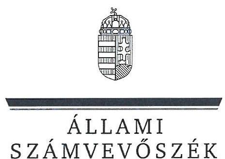
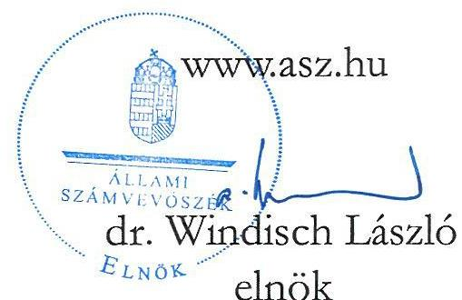
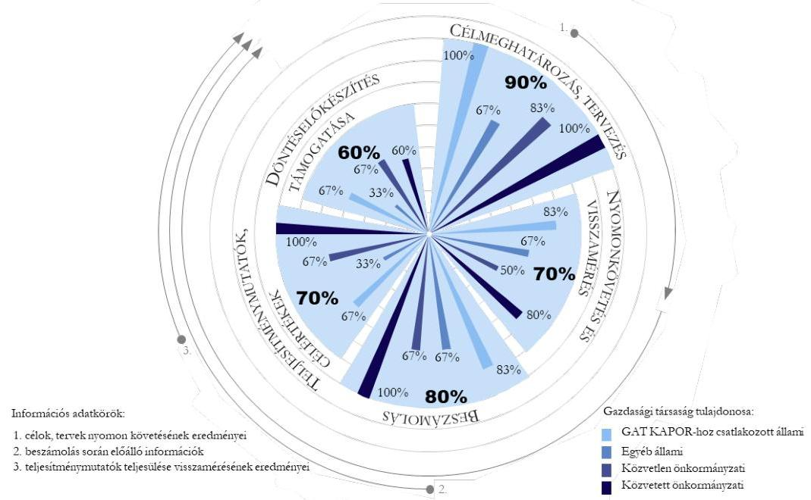
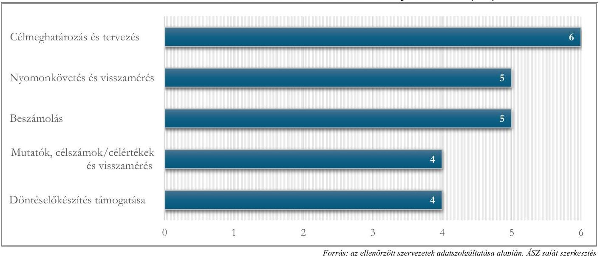
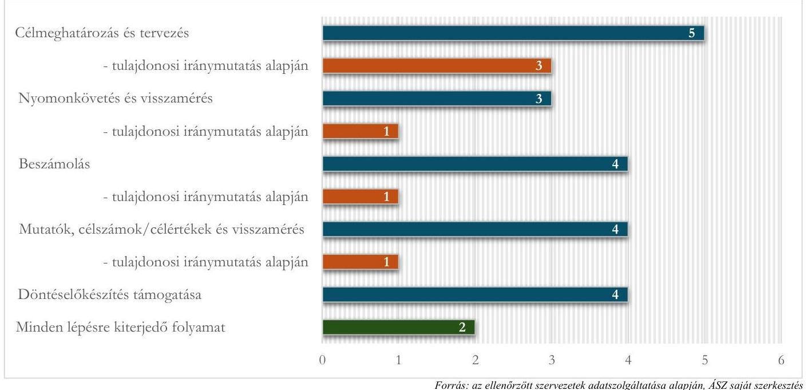
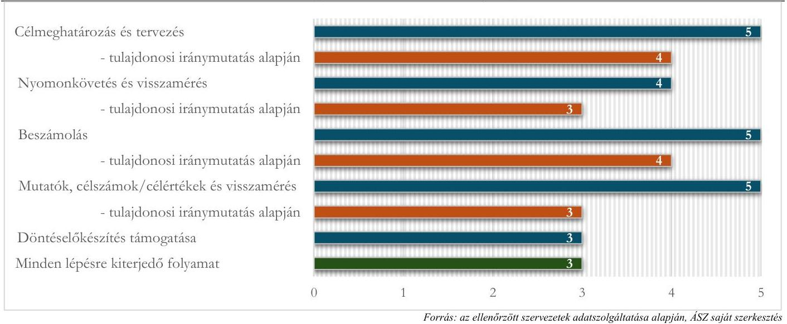
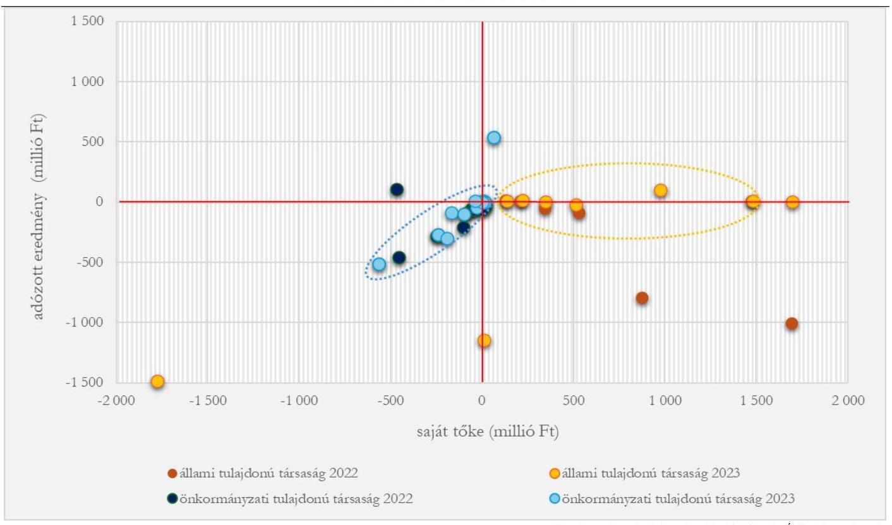
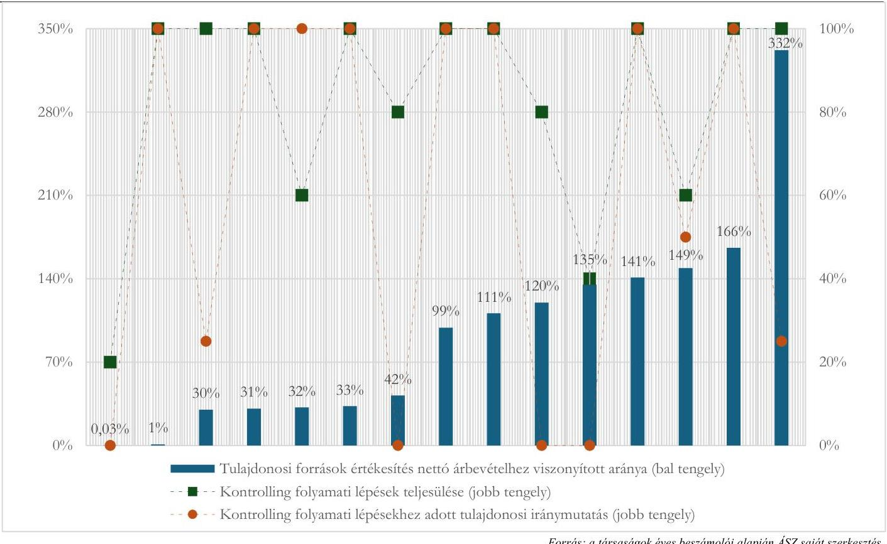
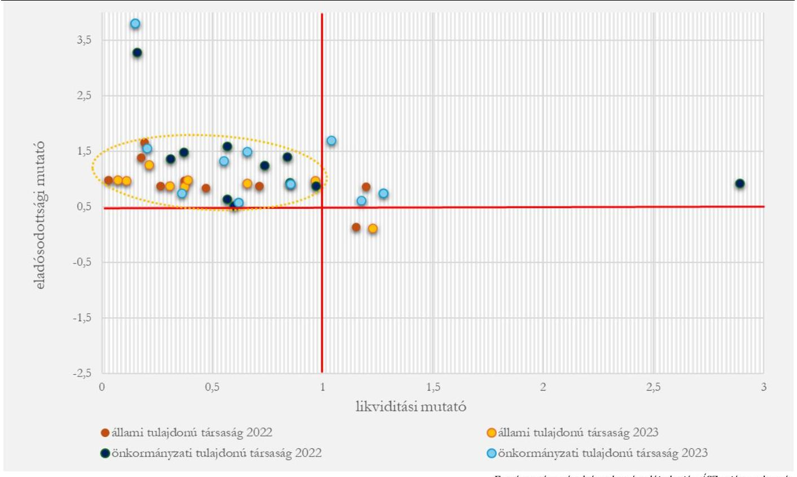

# JELENTÉS 

## Teljesítménymenedzsment és kontrolling szemlélet érvényesülése a köztulajdonban álló gazdasági társaságoknál célzott ellenőrzés

2025.

---

ÁLLAMI
SZÁMVEVŐSZÉK

# JELENTÉS 

## Teljesítménymenedzsment és kontrolling szemlélet érvényesülése a köztulajdonban álló gazdasági társaságoknál célzott ellenőrzés

2025. 

24214

---

# ELLENŐRZÉSI IGAZGATÓSÁG: 

## TELJESÍTMÉNYELLENŐRZÉSI IGAZGATÓSÁG

## ELLENŐRZÉSI IGAZGATÓ:

DR. JAKAB KORNÉL igazgató

## ELLENŐRZÉSVEZETŐ:

HORVÁTH KRISZTIÁN ellenőrzésvezető

Jelentéseink az interneten a www.asz.hu címen olvashatók.

IKTATÓSZÁM: EL-3954-005/2024
TÉMASORSZÁM: 40
ELLENŐRZÉS-AZONOSÍTÓ SZÁM: V-1055

---

# TARTALOMJEGYZÉK 

- AZ ELLENŐRZÉS ALAPADATAI ..... 5
- AZ ELLENŐRZÖTT SZERVEZETEK ..... 7
- AZ ELLENŐRZÉS TERÜLETE ÉS EREDMÉNYEI ..... 8
MELLÉKLETEK ..... 21
I. sz. melléklet: Értelmező szótár ..... 21
II. sz. melléklet: Ellenőrzési kritériumok ..... 23
III. sz. melléklet: GAT KAPOR ..... 24
FÜGGELÉK: ÉSZREVÉTELEK ..... 25
RÖVIDÍTÉSEK JEGYZÉKE ..... 26

---

.

---

# AZ ELLENŐRZÉS ALAPADATAI 

## AZ ELLENŐRZÉS CÉLJA

Az ellenőrzés célja annak értékelése volt, hogy a köztulajdonban álló gazdasági társaságok pénzügyi és vagyongazdálkodási döntéshozatali folyamataiban eredményesek voltak-e a kontrolling és vezetői információs folyamatok. Ennek keretében az ellenőrzés feltárta, hogy kialakították-e és működtették-e a célmeghatározás, tervezés, nyomon követés és visszamérés folyamatait, valamint a kapcsolódó vezetői, illetve tulajdonosi / tulajdonosi joggyakorlói tájékoztatás és beszámolás rendszerét, továbbá ezek támogatták-e a teljesítménymenedzsment érvényesülését.

## AZ ELLENŐRZÖTT IDŐSZAK

2022. január 1-től 2024. május 6-ig tartó időszak.

## AZ ELLENŐRZÉS TÁRGYA

Az ellenőrzés tárgyát képezte az ellenőrzésre kiválasztott köztulajdonban álló gazdasági társaságok kontrolling és vezetői információs folyamatainak keretei, működése, valamint a pénzügyi és vagyongazdálkodási folyamatokban betöltött szerepe a teljesítménymenedzsment érvényesülése szempontjából.

Az ellenőrzés kiterjedt minden olyan körülményre és adatra, amely az ÁSZ ${ }^{1}$ jogszabályban meghatározott feladatainak teljesítéséhez, valamint a program végrehajtása folyamán felmerült újabb összefüggések feltárásához szükséges volt.

## AZ ELLENŐRZÉS JOGALAPJA

Az ellenőrzés jogszabályi alapját az ÁSZ tv. ${ }^{2}$ 1. § (3) és 5. § (3)-(4) bekezdéseinek előírásai képezték.

## AZ ELLENŐRZÉS MÓDSZERE

Az ellenőrzés végrehajtása a nemzetközi standardokat irányadónak tekintve az Alaptörvény 43. cikk (1) bekezdésében és az ellenőrzési programban meghatározott szempontok, az ellenőrzött időszakban hatályos jogszabályok, az ellenőrzés szakmai szabályai, az ÁSZ módszertani dokumentumai alapján történt.

Az ellenőrzési bizonyítékként felhasználható adatforrások közé tartoztak egyrészt az ellenőrzéshez kért dokumentumok, adatforrások, másrészt adatforrás volt minden - az ellenőrzés folyamán - feltárt, az ellenőrzés szempontjából információkat tartalmazó dokumentum.

Az ellenőrzés lefolytatásához az ellenőrzött szervezetek tanúsítványok kitöltésével, valamint az ÁSZ által kért dokumentumok, adatok, információk megküldésével szolgáltattak adatokat.

---

Az ellenőrzési kérdések megválaszolásához szükséges bizonyítékok megszerzése az ellenőrzött szervezetek által rendelkezésre bocsátott dokumentumokra, adatokra alapozva kérdésfeltevés (információkérés), valamint elemző eljárás útján történt.

Eredményes volt a köztulajdonban álló gazdasági társaság pénzügyi és vagyongazdálkodási döntéshozatali folyamataiban a kontrolling és vezetői információs folyamatok kialakítása és működtetése, amennyiben a célmeghatározás, tervezés, nyomon követés, visszamérés és beszámolás rendszere a pénzügyi és vagyongazdálkodási folyamatokhoz kapcsolódó főbb teljesítménymutatók, illetve célértékek meghatározásán, azok alakulásának elemzésén, értékelésén, valamint az értékelés eredménye hasznosításán keresztül támogatta a teljesítménymenedzsment érvényesülését.

A célzott ellenőrzés keretében a kontrollingrendszerek és kontrolling folyamat kiépítettségének tényszerű bemutatása történt. A kontrolling folyamatok egyes lépéseit az ellenőrzés kiépítettnek értékelte, amennyiben a folyamatok belső szabályozottsága, vagy gyakorlati működtetésének kialakítása az adott gazdasági társaságnál megtörtént, vagy az ellenőrzési bizonyítékok alapján megállapítható volt, hogy a kontrolling folyamatok működtetésével a társaság döntés megalapozására alkalmas dokumentum(oka)t állított elő.

Ellenőrzött szervezetként olyan közvetlen és közvetett többségi állami, illetve önkormányzati tulajdonban álló gazdasági társaságok kerültek kiválasztásra, amelyek gazdálkodási adatai alapján (saját tőke, adózott eredmény, árbevétel, mérlegfőösszeg, foglalkoztatottak létszáma) indokolt volt a kontrolling folyamat mélyebb, szofisztikáltabb kialakítása.

A jelentés nem az egyes társaságokra, hanem az ellenőrzött szervezetek sajátosságai alapján kialakított szervezetcsoportokra tartalmaz megállapításokat, illetve von le következtetéseket. A jelentés a kontrolling folyamatok lépéseinek sorrendjében haladva abban az esetben tartalmaz az adott szervezetcsoportra megállapítást, ha az ellenőrzési bizonyítékok alapján csoport-jellemző volt azonosítható.

---

# AZ ELLENŐRZÖTT SZERVEZETEK

|  ELLENŐRZÖTT SZERVEZET | RÖVID ELNEVEZÉS | RESOROLÁS
(AZ ELLENŐRZÉSI EREDMÉNYEK
BEMUTATÁSÁHOZ)  |
| --- | --- | --- |
|  Agrármarketing Centrum Nonprofit Korlátolt Felelősségű Társaság | Agrármarketing Centrum | GAT ${ }^{8}$ KAPOR ${ }^{6}$-hoz csatlakozott állami tulajdonú társaság  |
|  DEBRECEN INTERNATIONAL AIRPORT Korlátolt Felelősségű Társaság | - | GAT KAPOR-hoz csatlakozott állami tulajdonú társaság  |
|  ÉTH Érd és Térsége Hulladékkezelési Nonprofit Korlátolt Felelősségű Társaság | - | közvetlen önkormányzati tulajdonú társaság  |
|  FEJÉRVÍZ Fejér Megyei Önkormányzatok Víz- és Csatornamű Zártkörűen Működő Részvénytársaság | FEJÉRVÍZ | GAT KAPOR-hoz csatlakozott állami tulajdonú társaság  |
|  Grape Solutions Hungary Zártkörűen Működő Részvénytársaság( beolvadással megszűnt, 2024.04.30-tól jogutód az MVM Informatika Zártkörűen Működő Részvénytársaság) | Grape Solutions | egyéb állami tulajdonú társaság  |
|  HAJDÚ7 Turisztikai és Rendezvényszervező Korlátolt Felelősségű Társaság | - | közvetett önkormányzati tulajdonú társaság  |
|  Hód-Fürdő Szolgáltató és Üzemeltető Korlátolt Felelősségű Társaság | - | közvetett önkormányzati tulajdonú társaság  |
|  Hódmezővásárhelyi Működtető és Szolgáltató Nonprofit Zártkörűen Működő Részvénytársaság | - | közvetlen önkormányzati tulajdonú társaság  |
|  Médiacentrum Debrecen Korlátolt Felelősségű Társaság | Médiacentrum | közvetett önkormányzati tulajdonú társaság  |
|  MIKOM Miskolci Kommunikációs Nonprofit Korlátolt Felelősségű Társaság | MIKOM | közvetett önkormányzati tulajdonú társaság  |
|  Monostori Erőd Hadkultúra Központ Műemlékhelyreállító, Ingatlanfenntartó és -hasznosító Nonprofit Közhasznú Korlátolt Felelősségű Társaság | Monostori Erőd | GAT KAPOR-hoz csatlakozott állami tulajdonú társaság  |
|  Nemzeti Innovációs Ügynökség Nonprofit Zártkörűen Működő Részvénytársaság | NIÚ | GAT KAPOR-hoz csatlakozott állami tulajdonú társaság  |
|  Pécsi Állatkert és Akvárium-Terrárium Közhasznú Nonprofit Korlátolt Felelősségű Társaság | Pécsi Állatkert | közvetlen önkormányzati tulajdonú társaság  |
|  Püspökladányi Városüzemeltető és Gyógyfürdő Korlátolt Felelősségű Társaság | - | közvetlen önkormányzati tulajdonú társaság  |
|  REMEK Salgótarjáni Rendezvény- és Médiaközpont Nonprofit Korlátolt Felelősségű Társaság | - | közvetlen önkormányzati tulajdonú társaság  |
|  Szekszárdi Közművelődési Szolgáltató Nonprofit Korlátolt Felelősségű Társaság | - | közvetlen önkormányzati tulajdonú társaság  |
|  SZIKSZÓ-VÍZ Koncessziós Vízgazdálkodási Korlátolt Felelősségű Társaság | SZIKSZÓ-VÍZ | egyéb állami tulajdonú társaság  |
|  Várkapitányság Integrált Területfejlesztési Központ Nonprofit Zártkörűen Működő Részvénytársaság | - | GAT KAPOR-hoz csatlakozott állami tulajdonú társaság  |
|  „VHK" Veszprémi Hulladékgazdálkodási Közszolgáltató Nonprofit Korlátolt Felelősségű Társaság | - | közvetett önkormányzati tulajdonú társaság  |
|  Visit Hungary Nemzeti Turisztikai Szervezet Nonprofit Zártkörűen Működő Részvénytársaság | - | egyéb állami tulajdonú társaság  |

---

# AZ ELLENŐRZÉS TERÜLETE ÉS EREDMÉNYEI 

## I. AZ ELLENŐRZÉS TERÜLETE

A köztulajdonban álló gazdasági társaságok méretüktől és feladatellátási területüktől függetlenül kiemelt szerepet töltenek be a nemzetgazdaságban. Stratégiai fontosságú ágazatokban működnek, kritikus infrastruktúrákat üzemeltetnek, közszolgáltatásokat vagy egyéb olyan szolgáltatásokat nyújtanak, amelyeket a piaci szereplők - a hosszú távú megtérülés, a magas kockázat vagy a tevékenység tőkeigényessége miatt - nem, vagy korlátozott mértékben látnának el.

A társaságok tevékenységük során közpénzt használnak fel, illetve nemzeti vagyonnal gazdálkodnak. Nem mindig működnek, illetve működhetnek versenypiaci logika szerint, azonban tevékenységük eredményessége és tervszerűsége, működésük hatékonysága, az erőforrások és közpénzek hatékony, célirányos és átlátható felhasználása alapvető nemzetgazdasági stratégiai érdek, mivel a társaságok ezen teljesítményt jellemző tényezők által hozzájárulnak az általuk nyújtott szolgáltatások elérhetőségéhez, megfelelő minőségéhez, megfizethetőségéhez, a szolgáltatások fenntarthatóságához.

A kontrollingrendszerek kiépítése lehetővé teszi a célok elérése szempontjából kulcsfontosságú folyamatok kontrollálását, a fejlesztendő területek, az eredményesség korlátai, a célok és tervek teljesítési kockázatai azonosítását; valamint - az időben, strukturáltan és kellő részletezettségben rendelkezésre álló és kiértékelt információ által - hozzájárul a döntéshozatal megalapozásához.

Jelen ellenőrzéssel az ÁSZ fel kívánja hívni a figyelmet a köztulajdonban álló gazdasági társaságok kontrollingrendszereinek fontosságára, valamint rá kíván mutatni az ellenőrzés során jó gyakorlatként azonosított kontrolling gyakorlatokra, kontrolling elemekre.

Az ellenőrzés keretében az ÁSZ az ellenőrzött szervezeteknél értékelte a kontrollingrendszerek kiépítettségét a célmeghatározás, tervezés, a célok és tervek teljesülésének nyomon követése és visszamérése, a teljesítménymenedzsment, illetve a döntéshozatalt támogató információs folyamatok közül a beszámolás rendszerének kiépítettsége és a teljesítménymutatók alkalmazása, továbbá az ezekből származó információk döntéselőkészítésben való felhasználása területeken.

A kiválasztott 20 közvetlen vagy közvetett állami, illetve önkormányzati tulajdonú gazdasági társaság - méret, tevékenység, pénzügyi paraméterek tekintetében - eltérő jellemzőkkel rendelkezett. A diverzifikált kiválasztás célja egyfelől az eltérő kontrollingrendszerek, -folyamatok és -gyakorlatok értékelése, másfelől - az ellenőrzési tapasztalatok szélesebb körben való alkalmazhatósága érdekében - szektorfüggetlen jellemzők azonosítása és jó gyakorlatok több területről való gyűjtése volt.

A jelentés az ellenőrzött gazdasági társaságokat tulajdonosi struktúra, illetve tulajdonos által megszabott kontrollingkeretek szerint csoportosítja az eltérő tulajdonlásból eredeztethető jellemzők, sajátosságok hangsúlyosabb bemutatása érdekében. Az elsődleges csoportképző ismérv az állami, illetve az önkormányzati tulajdonlás ténye, a másodlagos csoportképző ismérv önkormányzati tulajdonú társaságoknál a közvetlen, illetve a közvetett tulajdonlás, az állami tulajdonú társaságoknál a GAT KAPOR beszámolási rendszerhez való csatlakozás ténye volt.

---

# II. AZ ELLENŐRZÉS EREDMÉNYEI 

Az ellenőrzés eredményei kirajzolták, hogy az ellenőrzött húsz - egymással kapcsolt vállalkozási viszonyban nem álló - társaság esetében a GAT KAPOR-hoz csatlakozott állami tulajdonú és a közvetett önkormányzati tulajdonú gazdasági társaságoknál a tulajdonosok és a tulajdonosi joggyakorlók előírásokkal, iránymutatásokkal, kiadott szempontrendszerrel támogatták a társaságok kontrollingrendszereinek kialakítását. A kontrollingrendszerek kialakításához nyújtott támogatás lényegesen nagyobb mértékű volt esetükben, mint az egyéb állami tulajdonú és a közvetlen önkormányzati tulajdonú gazdasági társaságoknál. A tulajdonosi iránymutatás a kontrollingrendszerek kiépítésekor azért volt fontos, mert azoknak a vállalatok pénzügyi és operatív céljain túl a tulajdonosok stratégiájával, céljaival és kontrolling folyamataival is összhangban kellett működnie. A tulajdonosi iránymutatás mértéke egyenes arányban volt a társaságok kontrollingrendszereinek kiépítettségével.

Azoknak a társaságoknak a kontrollingrendszerei, amelyek a célmeghatározás, tervezés, nyomon követés és visszamérés, valamint a beszámolás folyamataira szorítkoztak, nem töltöttek be teljesítménymenedzsmentet támogató funkciót; kontrollingrendszereik mélysége a bevételek és költségek tervezésének keretei között maradt; az egyes résztevékenységek tervezése, a teljesítményt meghatározó kulcsfolyamatok és folyamati elemek azonosítása, azokhoz kapcsolódóan kulcs teljesítménymutatók (KPI) képzése, célértékek meghatározása esetükben nem volt azonosítható.

Az értékelt kontrolling folyamatok többségének elsődleges célja az előírt feladatok és azok finanszírozásának megtervezése, a teljesülés időszakos visszamérése és mindezekről, valamint a társaság pénzügyi helyzetéről jelentések összeállítása és beszámolás volt a gazdálkodás finanszírozását elsődlegesen biztosító tulajdonos, tulajdonosi joggyakorló felé.
1. ábra

## A GAZDASÁGI TÁRSASÁGOK KONTROLLING FOLYAMATI LÉPÉSEINEK TELJESÜLÉSE CSOPORTONKÉNT ÉS A DÖNTÉSEK MEGALAPOZÁSÁT TÁMOGATÓ VIZSGÁLT INFORMÁCIÓS ADATKÖRÖK

Forrás: az ellenőrzött szervezetek adatszolgáltatása alapján, ÁSZ saját szerkesztés

---

# 1. A GAT KAPOR-hoz csatlakozott állami tulajdonú gazdasági társaságok 

A közvetlen többségi állami tulajdonban lévő gazdasági társaságok 2021. szeptember 30-i végső határidővel kötelezettek voltak csatlakozni a GAT KAPOR rendszerhez.

Az érintett társaságoknál a GAT KAPOR követelményeihez igazított tervezés és beszámolás szükségessé tette az adatgyűjtési, adatelemzési és nyilvántartási feladatok megszervezését és végrehajtását, továbbá információs rendszerek működtetését annak érdekében, hogy jelentéseikhez a megfelelő
 adatokat a megfelelő időben és tartalommal előállítsák. A társaságoknak méretüktől függően három eltérő részletezettségű adatkör szerint volt havi rendszerességű adatszolgáltatási kötelezettsége (III. sz. melléklet).

A GAT KAPOR rendszer elősegítette a társasági kontrolling folyamatok kiépítését, működtetését, előre mutató példa és jó gyakorlat, amely mind beszámoltatási rendjében, mind adattartalmában mintaként szolgálhat a köztulajdonban álló gazdasági társaságok tulajdonosai és tulajdonosi joggyakorlói számára.

A hat GAT KAPOR-hoz csatlakozott állami tulajdonú gazdasági társaságnál a tulajdonos által központilag meghatározott egységes előírások támogatták a társasági kontrolling folyamatok kialakítását, közülük négy társaság működtetett olyan - minden lépésre kiterjedő - kontrolling folyamatot, amelyben az információáramlás rendszere a döntéselőkészítés támogatásán keresztül hozzájárult a teljesítményszemlélet érvényesítéséhez (2. ábra).
2. ábra

A HAT GAT KAPOR-HOZ CSATLAKOZOTT ÁLLAMI TULAJDONÚ GAZDASÁGI TÁRSASÁG KONTROLLING FOLYAMATI LÉPÉSEINEK TELJESÜLÉSE (DB)

## Mind a hat társaság működtetett célmeghatározási- és tervezési rendszert.

A társaságok mindegyike határozott meg, vagy számukra a tulajdonos, a tulajdonosi joggyakorló, vagy jogszabály jelölt ki a feladatellátás sajátosságaival összefüggő stratégiai szintű célt, célokat, illetve fogalmazott meg olyan küldetést, amelyekből a szervezeti célok levezethetők voltak.

---

Belső szabályozó dokumentumokban a társasági tevékenységtől függően, illetve ahhoz igazodóan öt társaság részleteiben rögzítette a célmeghatározáshoz, tervezéshez kapcsolódó elvégzendő feladatokat és a kapcsolódó felelősségi és hatásköröket, közülük négy társaság meghatározta az elvégzendő feladatokhoz rendelt határidőket.

Mind a hat társaság készített üzleti terveket és azokat megalapozó - feladatellátáshoz, működési környezet sajátosságaihoz igazodó - részterveket (pl. bevételek, költségek és kiadások, cash-flow, finanszírozás, beruházások, mérleg, eredménykimutatás tervezése), négy társaság háttérelemzésekkel is alátámasztotta tervezését (pl. bérrendezés hatásának, bér- és létszámadatok alakulásának, energiaköltségek hatásának modellezése).

## Jó gyakorlat: tervezés támogatása

Az Agriarmarketing Centrum SWOT analízist készített a mezőgazdaság és az élelmiszeripar helyzetének, valamint a társaság működési, gazdasági környezetének feltérképezésére.
A FEJÉRVÍZ érzékenységi elemzést készített, melyben a kiszámlázott rézmennyiség változásának árbevételre gyakorolt hatását vizsgálta.

# Öt társaság működtetett nyomon követési és visszamérési rendszert. 

Belső szabályzatok, eljárásrendek, illetve tulajdonosi előírás, iránymutatás alapján öt társaság kialakította a stratégiai tervdokumentumok, az üzleti tervek, illetve résztervek teljesülése nyomon követésének és visszamérésének folyamatait, a társaságok mérték és értékelték a tervek és célok teljesülését, a tevékenység eredményességét, ezáltal lehetőségük nyílt azonosítani a működés eredményességének korlátait, elemezni a célok teljesülésének kockázatait, meghatározni a szükséges beavatkozási lehetőségeket.

## Öt társaság működtetett beszámolási rendszert.

A vezetők rendszeres tájékoztatása érdekében minden társaságnál meghatározták az informatikai megoldással támogatott beszámolási folyamatot, a folyamatban

Jó gyakorlat: működési sajátosságok figyelembevétele
A támogatásokat közvetítő társaságok (Agrármarketing Centrum, NIÚ) nettó árbevételének közvetített támogatásokhoz viszonyított aránya 2-14% között alakult az ellenőrzött időszakban. Kontrolling folyamataik kialakításának fókuszában emiatt nem gazdálkodásuk, hanem a közvetített támogatások státuszának nyomon követése állt.
résztervők feladatait, valamint a kapcsolódó felelősségi- és hatásköröket.

A döntéshozók számára öt társaság a meghatározott struktúrában, részletezettségben és gyakorisággal biztosította az előírt adatkört és információkat, továbbá rendszeres időszaki (leggyakrabban havi gyakoriságú) beszámolók, illetve eseti jelentések, tájékoztatók, elemzések készültek.
Mindegyik társaság határozott meg teljesítmény mérésére alkalmas célértékeket/célszámokat, illetve teljesítménymutatókat és elérni kívánt célértékeket, azok alakulását négy társaság követte nyomon és mérte vissza.

Az elérni tervezett árbevétel- és eredménykategóriák (jellemzően az adózott eredmény), valamint költség és ráfordítás keretei között négy társaság határozott meg mérhető célszámokat, teljesítménymutatókat, azok teljesülését két társaság rendszeresen visszamérte, nyomon követte. Két további társaság mérhető célszámok, teljesítménymutatók meghatározásán felül a gazdálkodás meghatározó folyamatainak elemzését, értékelését támogató kulcs teljesítménymutatókat (KPI) és kapcsolódó célértékeket is kialakított. A kitűzött célszámok és a kulcs teljesítménymutatók (KPI) célértékeinek teljesülését a két társaság rendszeresen nyomon követte, visszamérte.

---

# Jó gyakorlat: kulcs teljesítménymutatók (KPI) kialakítása 

FEJÉRVÍZ célkijelölésében szereplő kulcs teljesítménymutatók többek között:

- a kiszámlázott- és a tisztított szennyvíz mennyisége ( $m^{3}$ ), a megtermelt-, a vásárolt- és a kiszámlázott víz mennyisége ( $m^{3}$ ),
- $1 \mathrm{~m}^{3}$ termelt vízmennyiségre, illetve $1 \mathrm{~m}^{3}$ tisztított szennyvízmennyiségre jutó közvetlen költség,
- eszközhasználat dó, a közmű vagyon, illetve a működtető vagyon visszapótlásának aránya.

## Monostori Erőd alkalmazott mutatói:

- egy látogatóra, illetve egy fizető látogatóra eső jegybevétel,
- villamosenergia költségre, jegybevételre, illetve összes látogatói létszámra jutó működési támogatás összege.

A mérhető célszámok, illetve teljesítménymutató célértékek teljesülését nyomon követő összesen négy társaságnál a rendszeres visszamérés lehetőséget biztosított a gazdálkodási folyamatokban bekövetkező változások nyomon követésére, illetve a folyamatok kontrollálására.

A tervek, kitűzött célok, mérhető célszámok, illetve a teljesítménymutatók célértékeinek teljesülését visszamérő négy társaságnál az értékelések eredményeit hasznosították, a visszamérések, értékelések alapján elemzéseket, riportokat készítettek a vezetői és a tulajdonosi/tulajdonosi joggyakorlói döntéshozatal támogatása, megalapozása érdekében.

## 2. Egyéb állami tulajdonú gazdasági társaságok

A három egyéb állami tulajdonú gazdasági társaság közül a SZIKSZÓ-VÍZ nem rendelkezett a kontrolling folyamat egyes elemeinek bemutatására, ezáltal ellenőrzés általi értékelésére alkalmas dokumentumokkal.

A fennmaradó két társaság közül egy működtetett olyan kontrolling folyamatot, amelyben az információáramlás rendszere a döntéselőkészítés támogatásán keresztül hozzájárult a teljesítményszemlélet érvényesítéséhez.

## Mindkét társaság működtetett célmeghatározási- és tervezési rendszert.

Mindkét társaság számára a tulajdonos, tulajdonosi joggyakorló előírta a feladatellátás sajátosságaival összefüggő stratégiai szintű célt, célokat, illetve fogalmazott meg olyan küldetést, amelyből a szervezeti célok levezethetők voltak.

Belső szabályozó dokumentumokban a társasági tevékenységtől függően, illetve ahhoz igazodóan mindkét társaság részleteiben rögzítette a célmeghatározáshoz, tervezéshez kapcsolódó elvégzendő feladatokat, a feladatokhoz kapcsolódó felelősségi és hatásköröket és az elvégzendő feladatokhoz rendelt határidőket.

---

Mindkét társaság készített üzleti terveket és azokat megalapozó - feladatellátáshoz, működési környezet sajátosságaihoz igazodó - részterveket (pl. bevételek, költségek és kiadások, cash-flow, finanszírozás, beruházások, mérleg, eredménykimutatás tervezése), az egyik társaság háttérelemzésekkel is alátámasztotta tervezését (árbevétel, kiemelt projektek alakulásának modellezése).

# Jó gyakorlat: tervezés, nyomon követés és visszamérés, döntéshozatal támogatása 

A Grape Solutions az üzleti tervek részeként, működési sajátosságainak megfelelő részterveket készített (mérlegforok tervezése, bevételterv, értékesítési terv, költségterv, cash-flow terv, beruházási és értékcsökkenési terv, humánerőforrás terv), a célok teljesülését a heti vezetői beszámolókban bemutatták, továbbá havi, negyedéves és éves gyakorisággal azok teljesülését visszamérték és értékelték.
A heti vezérigazgatói tájékoztatás információs bázisát a fő eredménymutatók összefoglalói táblázata mellett a bevétel- és költségadatok, a cash-flow kimutatás, a kiállított számlák és a nyitott projektek volumene, a bankszámlaegyenleg, a lejárt vevőkövetelések állománya, és a termelői önköltségi árak adatai képezték.

## Mindkét társaság működtetett nyomon követési és visszamérési rendszert.

Belső szabályzatokban, eljárásrendekben mindkét társaság kialakította a stratégiai tervdokumentumok, az üzleti tervek, illetve résztervek teljesülése nyomon követésének és visszamérésének folyamatait.

Mindkét társaság mérte és értékelte a tervek és célok teljesülését, a tevékenység eredményességét, ezáltal lehetősége nyílt azonosítani a működés eredményességének korlátait, elemezni a célok teljesülésének kockázatait, meghatározni a szükséges beavatkozási lehetőségeket.

## Mindkét társaság működtetett beszámolási rendszert.

A vezetők rendszeres tájékoztatása érdekében mindkét társaság meghatározta az informatikai megoldással támogatott beszámolási folyamatot, rögzítették a folyamatban résztvevők feladatait, valamint a kapcsolódó felelősségi- és hatásköröket.

A döntéshozók számára mindkét társaság a megadott szerkezetben, részletezettségben és gyakorisággal biztosította a meghatározott adatkört és információkat, továbbá rendszeres időszaki (havi, illetve negyedéves gyakoriságú) beszámolók, elemzések készültek.
Mindkét társaság határozott meg teljesítmény mérésére alkalmas célértékeket/célszámokat, illetve teljesítménymutatókat és elérni kívánt célértékeket, azok alakulását egy társaság követte nyomon és mérte vissza.

Az egyik társaság az elérni tervezett árbevétel- és eredménykategóriákra, valamint a költség és ráfordítás keretszámokra határozott meg mérhető célszámokat, teljesítménymutatókat, azonban azok teljesülésének nyomon követése, visszamérése nem történt meg.

A másik társaság mérhető célszámok, teljesítménymutatók meghatározásán felül a gazdálkodás meghatározó folyamatainak elemzését, értékelését támogató kulcs teljesítménymutatókat (KPI) és kapcsolódó

Jó gyakorlat: kulcs teljesítménymutatók (KPI) kialakítása
Grape Solutions: célszámokként határozták meg többek között a záróállományokat, a nettó adósságot, az üzleti terv egyes eredmény és mérlegforait, ez utóbbiakból mutatókat képeztek és célértékeket rendeltek hozzájuk.
célértékeket is kialakított, a kitűzött célszámok és kulcs teljesítménymutatók (KPI) célértékeinek teljesülését rendszeresen nyomon követte.

A mérhető célszámok és teljesítménymutató célértékek teljesülését nyomon követő egy társaságnál a rendszeres visszamérés lehetőséget biztosított a gazdálkodási folyamatokban bekövetkező változások nyomon követésére, a kulcsfolyamatok kontrollálására.

---

A tervek, kitűzött célok, mérhető célszámok és kulcs teljesítménymutatók (KPI) célértékeinek teljesülését visszamérő egy társaságnál az értékelések eredményeit hasznosították, a visszamérések, értékelések alapján elemzéseket, jelentéseket, riportokat készítettek a vezetői és tulajdonosi, tulajdonosi joggyakorlói döntéshozatal támogatása érdekében.

# Eltérő tulajdonosi elvárások 

Mindkét társaság tulajdonosa előírta tervezési dokumentumok készítését, fogalmazott meg szempontokat a nyomon követés, visszamérés és beszámolási folyamatok kiépítéséhez, azonban csak az egyik társaság tulajdonosa adott iránymutatást mutatók kialakításához és célértékek meghatározásához. A tulajdonosi elvárások különbözőségei tükröződtek a kontrollingrendszerek kiépítettségében, szofisztikáltságában.

## 3. Közvetlen önkormányzati tulajdonú gazdasági társaságok

A hat közvetlen önkormányzati tulajdonú gazdasági társaság közül kettő működtetett minden lépésre kiterjedő kontrolling folyamatot. Náluk, valamint további két társaságnál (folyamati lépések hiányosságai ellenére) az információáramlás kialakított rendszere a döntéselőkészítés támogatásán keresztül hozzájárult a teljesítményszemlélet érvényesítéséhez.

Három társaság tulajdonosa írta elő tervezési dokumentumok készítését, egy társaság tulajdonosa adott iránymutatást a nyomon követés és visszamérés, a beszámolás folyamatok kiépítéséhez, valamint mutatók kialakításához és célértékek meghatározásához (3. ábra).
3. ábra

A HAT KÖZVETLEN ÖNKORMÁNYZATI TULAJDONÚ GAZDASÁGI TÁRSASÁG KONTROLLING FOLYAMATI LÉPÉSEINEK TELJESÜLÉSE ÉS AZ ADOTT FOLYAMATI LÉPÉST ELŐÍRÓ TULAJDONOSOK SZÁMA (DB)

---

# Hatból öt társaság működtetett célmeghatározási- és tervezési rendszert. 

Mind a hat társaság határozott meg, vagy számukra a tulajdonos, a tulajdonosi joggyakorló jelölt ki a feladatellátás sajátosságaival összefüggő stratégiai szintű célt, célokat, illetve fogalmazott meg olyan küldetést, amelyekből a szervezeti célok levezethetők voltak.

Belső szabályozó dokumentumokban a társasági tevékenységtől függően, illetve ahhoz igazodóan öt társaság részleteiben rögzítette a célmeghatározáshoz, tervezéshez kapcsolódó elvégzendő feladatokat és a feladatokhoz kapcsolódó felelősségi és hatásköröket, közülük két társaság meghatározta az elvégzendő feladatokhoz rendelt határidőket. Az öt társaság készített üzleti terveket és üzleti terveket megalapozó feladatellátáshoz, működési környezet sajátosságaihoz igazodó részterveket (pl. bevételek, költségek és kiadások, cash-flow, finanszírozás, beruházások, mérleg, eredménykimutatás tervezése), közülük két társaság háttérelemzésekkel is alátámasztotta tervezését.

## Hatból három társaság működtetett nyomon követési és visszamérési rendszert.

Három társaság mérte és értékelte a tervek és célok teljesülését, a tevékenység eredményességét, ezáltal lehetősége nyílt azonosítani a működés eredményességének korlátait, elemezni a célok teljesülésének kockázatait, meghatározni a szükséges beavatkozási lehetőségeket.

## Hatból négy társaság működtetett beszámolási rendszert.

A vezetők rendszeres tájékoztatása érdekében négy társaságnál meghatározták a beszámolási folyamatot, rögzítették a folyamatban résztvevők feladatait, közülük három társaságnál a kapcsolódó felelősségi- és hatásköröket.

A döntéshozók számára a négy társaság a meghatározott szerkezetben, részletezettségben és gyakorisággal biztosította a meghatározott adatköŕt és információkat, továbbá rendszeres időszaki (leggyakrabban havi gyakoriságú) beszámolók, illetve eseti jelentések, elemzések készültek.

## Jó gyakorlat: visszamérés, beszámolás, beszámoltatás

Pécs Megyei Jogú Város Önkormányzata Közgyűlése az adott évi költségvetési rendelet végrehajtását szolgáló intézkedésekről hozott határozataiban előírta, hogy a Pécsi Állatkert tevékenységéről készítsen beszámolót, valamint félévenként számoljon be a társaság kötelezettségeinek és pénzügyi helyzetének alakulásáról és azok likviditási, pénzügyi kihatásairól.
A Pécs Megyei Jogú Város Polgármesteri Hivatala Költségvetési és Közgazdasági Főosztály havi kontrollingtevékenységéhez a Pécsi Állatkert
 az előírt formában havi jelentéseket készített az üzleti terv teljesítéséről, a megyedéves mérleg- és eredményadatokról, a likviditási terv teljesítéséről, a szállító és vevőállományról, a bitel- és lízingállományról, a létszámadatokról.

Mindegyik társaság határozott meg teljesítmény mérésére alkalmas célértékeket/célszámokat, illetve teljesítménymutatókat és elérni kívánt célértékeket, azok alakulását négy társaság követte nyomon és mérte vissza.

Négy társaság az elérni tervezett árbevétel- és eredménykategóriákra (üzemi/üzleti-, adózás előtti-, adózott eredmény), a tervezett önkormányzati hozzájárulás összegére, valamint költség és ráfordítás keretszámokra határozott meg mérhető célszámokat, teljesítménymutatókat, azok teljesülését közülük három társaság követte nyomon.

További két társaság mérhető célszámok, teljesítménymutatók meghatározásán felül a gazdálkodás meghatározó folyamatainak elemzését, értékelését támogató kulcs teljesítménymutatókat (KPI) és kapcsolódó célértékeket is kialakított, határozott meg,

Jó gyakorlat: kulcs teljesítménymutatók (KPI) kialakítása
A Pécsi Állatkert által alkalmazott kulcs teljesítménymutatók (KPI):

- Egy fizető látogatóra jutó önkormányzati támogatás összege;
- Fizető vendégszám befogadóképességhez viszonyított aránya.

---

azok teljesülését közülük egy társaság követte nyomon.
A mérhető célszámok, illetve teljesítménymutató célértékek teljesülését nyomon követő összesen négy társaságnál a rendszeres visszamérés lehetőséget biztosított a gazdálkodási folyamatokban bekövetkező változások nyomon követésére, illetve a folyamatok kontrollálására.

A tervek, kitűzött célok, mérhető célszámok, illetve teljesítménymutatók célértékeinek teljesülését visszamérő négy társaságnál az értékelések eredményeit hasznosították, a visszamérések, értékelések alapján elemzéseket, jelentéseket, riportokat készítettek a vezetői és tulajdonosi/tulajdonosi joggyakorlói döntéshozatal támogatása érdekében.

# 4. Közvetett önkormányzati tulajdonú gazdasági társaságok 

Az öt közvetett önkormányzati tulajdonú gazdasági társaság közül három működtetett olyan minden lépésre kiterjedő kontrolling folyamatot, amelyben az információáramlás rendszere a döntéselőkészítés támogatásán keresztül hozzájárult a teljesítményszemlélet érvényesítéséhez.

Négy társaság tulajdonosa írta elő tervezési dokumentumok és beszámolók készítését, három társaság tulajdonosa fogalmazott meg elvárásokat a nyomon követés és visszamérés feladatokra és adott iránymutatást mutatók kialakításához és célértékek meghatározásához (4. ábra).

Jó gyakorlat: tulajdonosi iránymutatás
A Médiacentrum anyavállalata a „Controlling kézikönyv"-ben részletesen meghatározta a tervezéssel kapcsolatos előkészítési, véleményezési, egyeztetési, és megvalósítási részfeladatokat, a felelősöket, a kapcsolódó hatásköröket és az érintett szervezeti egységeket. Az évente elkészített tervezési naptárak tartalmazták az elvégzendő tervezési lépéseket, a feladatok végrehajtásáért, koordinálásáért, illetve jóváhagyásáért felelős személyek kijelölését és a kapcsolódó határidőket.
4. ábra

AZ ÖT KÖZVETETT ÖNKORMÁNYZATI TULAJDONÚ GAZDASÁGI TÁRSASÁG KONTROLLING FOLYAMATI LÉPÉSEINEK TELJESÜLÉSE ÉS AZ ADOTT FOLYAMATI LÉPÉST ELŐÍRÓ TULAJDONOSOK SZÁMA (DB)

## Mind az öt társaság működtetett célmeghatározási- és tervezési rendszert.

Az öt társaság mindegyike határozott meg, vagy számára a tulajdonos, a tulajdonosi joggyakorló kijelölt a feladatellátás sajátosságaival összefüggő stratégiai szintű célt, célokat, illetve fogalmazott meg olyan küldetést, amelyekből a szervezeti célok levezethetők voltak.

---

Belső szabályozó dokumentumokban a társasági tevékenységtől függően, illetve ahhoz igazodóan mind az öt társaság rögzítette a célmeghatározáshoz, tervezéshez kapcsolódó elvégzendő feladatokat és a feladatokhoz kapcsolódó felelősségi és hatásköröket, közülük három társaság meghatározta az elvégzendő feladatokhoz rendelt határidőket.

Mind az öt társaság készített üzleti terveket és azokat megalapozó - feladatellátáshoz, működési környezet sajátosságaihoz igazodó - részterveket (pl. bevételek, költségek és kiadások, cash-flow és finanszírozás, beruházások, mérleg, eredménykimutatás tervezése), a társaságok háttérelemzésekkel is alátámasztották tervezésüket (pl. bevételi struktúra, vevő- és termékportfólió megoszlása, üzemanyagárváltozás hatása, kapacitáskihasználtság).

# Négy társaság működtetett nyomon követési és visszamérési rendszert. 

Belső szabályzatokban, eljárásrendekben négy társaság kialakította a stratégiai tervdokumentumok, az üzleti tervek, illetve résztervek teljesülése nyomon követésére és visszamérésére alkalmas folyamatokat vagy meghatározta a végrehajtás felelősit.

A négy társaság mérte és értékelte a tervek és célok teljesülését, a tevékenység eredményességét, ezáltal lehetősége nyílt azonosítani a működés eredményességének korlátait, elemezni a célok teljesülésének kockázatait, meghatározni a szükséges beavatkozási lehetőségeket.

## Mind az öt társaság működtetett beszámolási rendszert.

A vezetők rendszeres tájékoztatása érdekében mind az öt társaságnál meghatározták a beszámolási folyamatot, rögzítették a folyamatban résztvevők feladatait, valamint a kapcsolódó felelősségi- és hatásköröket.

A döntéshozók számára mind az öt társaság a meghatározott szerkezetben, részletezettségben és gyakorisággal biztosította a meghatározott adatkört és információkat, továbbá rendszeres időszaki (havi, negyedéves vagy féléves gyakoriságú) beszámolók, eseti jelentések, elemzések készültek.

## Jó gyakorlat: beszámolás

A MIKOM, a tulajdonos által kialakított szoftveres és adattartalmi havi kontrolljelentést kiegészítette beruházási, eredmény, likviditás, lízingállomány, és működőtőke adatokkal, valamint negyedévente mérleg jelentéssel.
A gazdasági terület vezetője a likviditási jelentésben a pénzügyi folyamatokról beszámolt a gazdasági vezetőnek és a tulajdonosnak.

## Mindegyik társaság határozott meg célértékeket/célszámokat, teljesítménymutatókat és azok alakulását nyomon követte és visszamérte.

A társaságok a nettó árbevételre, eredménykategóriákra (leggyakrabban az adózott eredményre), illetve a likviditási helyzethez, beruházási tervhez kapcsolódóan határoztak meg mérhető célszámokat, teljesítménymutatókat és azok teljesülését a társaságok havi, illetve negyedéves gyakorisággal visszamérték és értékelték. A gazdálkodás meghatározó folyamatainak elemzését, értékelését támogató kulcs teljesítménymutatókat (KPI) és kapcsolódó célértékeket egyik társaság sem alakított ki.

A tervek, kitűzött célok, mérhető célszámok, teljesítménymutatók értékelési eredményeit két társaságnál minden vizsgált évben, egy társaságnál az ellenőrzött időszak egy évében hasznosították; a visszamérések, értékelések alapján elemzéseket, riportokat készítettek a vezetői és a tulajdonosi/tulajdonosi joggyakorlói döntéshozatal támogatása érdekében.

---

# 5. Tulajdonosi finanszírozás és kontroll 

Az ellenőrzésre kiválasztott társaságok tevékenységei eltérőek voltak, azok köre a különböző közfeladatok ellátása mellett (pl. kulturális örökség védelme, közműszolgáltatás, nem veszélyes hulladék gyűjtése, településüzemeltetés, kulturális, sport és rekreációs szolgáltatások, helyi közművelődés) versenypiaci vagy ahhoz közeli tevékenységekre is kiterjedt (pl. repülőtér üzemeltetés, szoftverfejlesztés, médiaszolgáltatások).

A tulajdonosok által kijelölt feladatok jellege, a feladatellátás során beszedhető díjak, realizálható bevételek korlátozottsága - amennyiben az adott társaság esetében értelmezhető volt -, a feladatfinanszírozás módja és mértéke alapjaiban meghatározta a társaságok számviteli eredményességét, tőkehelyzetét, likviditását, ezáltal a tulajdonosi támogatás szükségességét.

Pozitív adózott eredménnyel és pozitív saját tőkével a 20 ellenőrzött társaságból 2022-ben három állami tulajdonú társaság, 2023-ban hat állami tulajdonú és négy önkormányzati tulajdonú társaság rendelkezett. Az ellenőrzött társaságok eredményessége és tőkésítettsége indokolta a

Az ellenőrzésre kiválasztott társaságok között az állami és önkormányzati tulajdonú társaságok alapvetően gyenge, de mégis eltérő pénzügyi jellemzőkkel rendelkeztek. A túlnyomórészt gyenge számviteli eredményesség az állami tulajdonú társaságok esetében pozitív, az önkormányzati társaságok esetében döntően negatív saját tőkével társult. tulajdonosi támogatás szükségességét (5. ábra).
5. ábra

AZ ELLENŐRZÖTT TÁRSASÁGOK ADÓZOTT EREDMÉNYE ÉS A SAJÁT TŐKE ÖSSZEGE 2022.12.31-ÉN ÉS 2023.12.31-ÉN

Forrás: a társaságok éves beszámolói alapján ÁSZ saját szerkesztés

---

A 2022. és 2023. évben a tulajdonosi források elszámolt összege (támogatások és tőkepótlások) 15 társaságnál összesen 6,0, illetve 14,7 Mrd Ft volt*. A 15 társaságnál a tulajdonosok átlagosan minden egy forint árbevétel mellé további 47 fillér tulajdonosi forrást biztosítottak, hét társaság esetében a tulajdonosi források összege meghaladta az árbevétel összegét, az árbevételhez viszonyított legmagasabb támogatási arány 332% volt. A magasabb támogatásintenzitáshoz nem társult részleteiben jobban kiépített kontrollingrendszer, illetve annak kiépítéséhez nem kaptak részletesebb tulajdonosi, tulajdonosi joggyakorlói iránymutatást a társaságok (6. ábra).
6. ábra

A TULAJDONOSI FORRÁSOK ÉRTÉKESÍTÉS NETTŐ ÁRBEVÉTELÉHEZ VISZONYÍTOTT ARÁNYA (2022-2023. ÉVEK ÖSSZESEN), A KONTROLLING FOLYAMATI LÉPÉSEK TELJESÜLÉSE ÉS A FOLYAMATI LÉPÉSEK KIÉPÍTÉSÉHEZ ADOTT TULAJDONOSI IRÁNYMUTATÁSOK ARÁNYA A 15 TÁMOGATÁSBAN RÉSZESÜLT TÁRSASÁG ESETÉBEN

Néhány kivételtől eltekintve a tulajdonosi támogatások mellett is magas volt az ellenőrzött társaságok külső eladósodottsága és feszült volt azok likviditása. 2022-ben három, 2023-ban öt társaság forgóeszközei nyújtottak fedezetet a rövidlejáratú kötelezettségekre, 2022-ben és 2023-ban egy-egy társaságnál volt 50%-nál kedvezőbb (alacsonyabb) az idegen források aránya.

[^0]
[^0]:    * A tulajdonosi források összegét azoknál a társaságoknál vizsgálta az ellenőrzés, ahol a számviteli beszámoló kiegészítő mellékletében elegendő információ állt rendelkezésre a társasági működés támogatásának jogcíméről és összegéről vagy a saját tőke elemei között elszámolt tulajdonosi befizetésekről.

---

A likviditási és eladósodottsági mutatók felvett értékei alapján ezen társaságok esetében a tulajdonosi finanszírozás beépült a működésbe, az a fizetőképesség fenntartásának egyik meghatározó feltétele volt (7. ábra).
7. ábra

AZ ELADÓSODOTTSÁGI ÉS LIKVIDITÁSI MUTATÓ FELVETT ÉRTÉKEI 2022.12.31-ÉN ÉS 2023.12.31-ÉN

Forrás: a társaságok éves beszámolói alapján ÁSZ saját szerkesztés
Az ellenőrzés tapasztalatai alapján a 20 kontrollingrendszer közül 11 töltött be - az előre meghatározott adatkör biztosítása, valamint kiépített információáramoltatás által - döntéselőkészítést támogató funkciót, ugyanakkor a társaságok többségénél a tervezés, visszamérés és értékelés, valamint a beszámolás szempontjai és gyakorlata a bevételek és költségek tervezésének keretei között maradt.

Négy társaság alakított ki a gazdálkodás meghatározó (kulcs)folyamatainak elemzését, értékelését támogató kulcs teljesítménymutatókat (KPI) és határozott meg kapcsolódó célértékeket, valamint hasznosította azok nyomon követésének, kiértékelésének eredményeit a tulajdonosi/tulajdonosi joggyakorlói döntéshozatal támogatása, megalapozása érdekében. Esetükben a kiépített kontrollingrendszer lehetőséget biztosított a teljesítmény folyamatszintű nyomon követésére, értékelésére, elemzésére; az eredményesség szempontjából meghatározó folyamatok kontrollálására; az eredményesség korlátai, a célok elérésének kockázatai, illetve a fejlesztendő és fejleszthető területek feltárására; valamint az ezek érdekében szükséges beavatkozások meghatározására.

A kiépített kontrolling folyamatok elsődleges célja az előírt feladatoknak és azok finanszírozásának megtervezése, a teljesülés időszakos visszamérése és mindezekről, valamint a társaság pénzügyi helyzetéről jelentések összeállítása és beszámolás volt a — gazdálkodás finanszírozását elsődlegesen biztosító — tulajdonos, tulajdonosi joggyakorló felé.

---

# MELLÉKLETEK 

## I. SZ. MELLÉKLET: ÉRTELMEZŐ SZÓTÁR

eladósodottsági mutató

GAT KAPOR
likviditási mutató
kontrolling / kontrollingrendszer
köztulajdonban álló gazdasági társaság
közvetlen többségi állami tulajdonú gazdasági társaság
közvetett többségi állami tulajdonú gazdasági társaság
közvetlen többségi önkormányzati tulajdonú gazdasági társaság
közvetett többségi önkormányzati tulajdonú gazdasági társaság
kulcs teljesítménymutató (KPI)

A gazdasági társaságok pénzügyi helyzetének és adósságoktól való függésének kifejezésére szolgáló pénzügyi mutató, amely a gazdasági társaság kötelezettségeit állítja szembe a társaság saját forrásaival. (ÁSZ saját fogalommeghatározás)
A közvetlen többségi állami tulajdonú gazdasági társaságok számára előírt adatszolgáltatási és adattárolási rendszer, amely egyben keretet is biztosított a tervezési, nyomon követési és beszámolási folyamataikhoz.
A gazdasági társaságok rövid távú fizetőképességének kifejezésére szolgáló pénzügyi mutató, amely a gazdasági társaság forgóeszközeit, azaz likvid, illetve rövidtávon likviddé tehető eszközeit állítja szembe a társaság rövid lejáratú kötelezettségeivel. (Forrás: T/613 ÁSZ elemzés: Az önkormányzati gazdasági társaságok eladósodásából és vagyonvesztéséből eredő kockázatok; 24.o.)
Olyan célmeghatározási, tervezési, nyomon követési, visszamérési (beleértve az elemzést, illetve értékelést) és beszámolási rendszer, amelyben az adatok a szükséges időben, megbízható módon, a kívánt tartalommal és formátumban rendelkezésre állnak, ezáltal támogatva a vezetői döntések megalapozását, valamint a gazdaságos, hatékony, eredményes pénzügyi és vagyongazdálkodási folyamatok alapjainak a kialakítását. (ÁSZ saját fogalommeghatározás)
Az a gazdasági társaság, amelyben a Magyar Állam, helyi önkormányzat, a helyi önkormányzat jogi személyiséggel rendelkező társulása, többcélú kistérségi társulás, fejlesztési tanács, nemzetiségi önkormányzat, nemzetiségi önkormányzat jogi személyiségű társulása, költségvetési szerv vagy közalapítvány külön-külön vagy együttesen számítva többségi befolyással rendelkezik. (Forrás: Taktv. 5 1. § a) pontja)
Az ÁSZ e fogalomkörben jelen ellenőrzés keretében olyan tulajdonosi kapcsolatot ért, amelyben a Magyar Állam egy gazdasági társaságban 50%-ot meghaladó részesedéssel rendelkezik. (ÁSZ saját fogalommeghatározás)
Az ÁSZ e fogalomkörben jelen ellenőrzés keretében olyan tulajdonosi kapcsolatot ért, amelyben a Magyar Állam egy vagy több közvetlen vagy közvetett többségi tulajdonában lévő gazdasági társasága összességében 50%-ot meghaladó részesedéssel rendelkezik egy gazdasági társaságban. (ÁSZ saját fogalommeghatározás)
Az ÁSZ e fogalomkörben jelen ellenőrzés keretében
 olyan tulajdonosi kapcsolatot ért, amelyben egy vagy több települési és/vagy területi önkormányzat egy gazdasági társaságban 50%-ot meghaladó részesedéssel rendelkezik. (ÁSZ saját fogalommeghatározás)
Az ÁSZ e fogalomkörben jelen ellenőrzés keretében olyan tulajdonosi kapcsolatot ért, amelyben egy vagy több települési és/vagy területi önkormányzat egy vagy több közvetlen vagy közvetett többségi tulajdonában lévő gazdasági társasága összességében 50%-ot meghaladó részesedéssel rendelkezik egy gazdasági társaságban. (ÁSZ saját fogalommeghatározás)
Az ÁSZ e fogalomkörben jelen ellenőrzés keretében olyan mérőszámot ért, amely a pénzügyi és vagyongazdálkodás területén a teljesítményt egy adott cél elérését meghatározó kulcsfolyamat szempontjából méri és alkalmas az előrehaladás nyomon követésére, értékelésére. (ÁSZ saját fogalommeghatározás)

---

pénzügyi folyamatok
teljesítménymenedzsment
teljesítményszemlélet
tulajdonosi joggyakorló
vagyongazdálkodási folyamat

Az ÁSZ e fogalomkörben jelen ellenőrzés keretében a társaság horizontális gazdálkodását (pl. befektetett eszközökkel, készletekkel, munkaerővel való gazdálkodást) lekövető, pénzáramlást eredményező folyamatok összességét érti. (ÁSZ saját fogalommeghatározás)
Az ÁSZ e fogalomkörben jelen ellenőrzés keretében azt a vezetői elkötelezettséget és irányítási keretrendszert érti, amelynek mentén a szervezet tevékenységében, illetve annak pénzügyi és vagyongazdálkodási folyamataiban (célmeghatározásban, illetve a tervezésben, a nyomon követésben, a visszamérésben - beleértve az elemzést és értékelést - valamint a beszámolásban és döntéselőkészítésben) érvényesül a gazdaságosság, hatékonyság, eredményesség szempontrendszere. (ÁSZ saját fogalommeghatározás)
Az ÁSZ e fogalomkörben jelen ellenőrzés keretében olyan vezetői megközelítést ért, amelyben megjelennek a teljesítménymenedzsment szempontjai. (ÁSZ saját fogalommeghatározás)
Tulajdonosi joggyakorló az, aki a nemzeti vagyon felett az államot vagy a helyi önkormányzatot megillető tulajdonosi jogok és kötelezettségek összességének gyakorlására jogosult. (Forrás: Nvtv. 6. § (1) bekezdés 17. pontja)
Az ÁSZ e fogalomkörben jelen ellenőrzés keretében a társaság által kezelt vagy a tulajdonát képező vagyon megőrzését, értékének és állagának védelmét, rendeltetésének megfelelő, feladatellátásához szükséges, egységes elveken alapuló, átlátható, hatékony és költségtakarékos működtetését, értéknövelő használatát, hasznosítását, gyarapítását, továbbá a feladatok ellátása szempontjából feleslegessé váló vagyontárgyak elidegenítését érti. (ÁSZ saját fogalommeghatározás)

---

# II. SZ. MELLÉKLET: ELLENŐRZÉSI KRITÉRIUMOK 

## ELLENŐRZÉSI KRITÉRIUMOK

A köztulajdonban álló gazdasági társaság eredményesen kialakította és működtette a pénzügyi és vagyongazdálkodási folyamatokkal összefüggésben a kontrolling és vezetői információs mechanizmusokat, kiemelten a célmeghatározás, tervezés, nyomon követés, visszamérés (beleértve az elemzést és értékelést), beszámolás, illetve vezető, valamint tulajdonos / tulajdonosi joggyakorló tájékoztatásának keretrendszerét, ami támogatta a pénzügyi és vagyongazdálkodási folyamatokban a döntéselőkészítést / döntéshozatalt.
A pénzügyi és vagyongazdálkodási folyamatok elemzésének, illetve értékelésének támogatásához a társaságnál teljesítménymutatókat, illetve célértékeket határoztak meg.
A társaság feladatellátásának sajátosságaihoz igazodóan elvárt gyakorisággal, de évente legalább egy alkalommal a teljesítménymutatók alakulását, illetve a célértékek teljesülését visszamérték és értékelték a gazdaságosság, hatékonyság, eredményesség szempontjából.
A pénzügyi és vagyongazdálkodási folyamatokban az alkalmazott teljesítménymutatók alakulásán, illetve a célértékek teljesülésén keresztül a kockázatokat, és ezzel párhuzamosan a beavatkozási pontokat beazonosították. A vezetői döntések előkészítéséhez, támogatásához, illetve megalapozott meghozatalához elemzéseket készítettek, indokolt esetben beavatkozási javaslatokat fogalmaztak meg a gazdaságosság, hatékonyság, eredményesség javítása érdekében.

---

# III. SZ. MELLÉKLET: GAT KAPOR 

Az állami tulajdonú gazdasági társaságok gazdasági adatait nyilvántartó GAT rendszer két, informatikai szempontból elkülönült alrendszerből áll:

- adatszolgáltatás - KAPOR: online elérhető adatszolgáltató rendszer, melyben az adatszolgáltató társaságok havi gyakoriság mellett a meghatározott tartalmú és formájú jelentéseiket teljesítik,
- adattárház: a KAPOR-ba feltöltött adatokat tárolja, lekérdezési lehetőségüket biztosítja.

A társaságok méretüktől függően három eltérő részletezettségű adatkör ${ }^{\dagger}$ szerint kötelezettek havi rendszerességgel adatokat szolgáltatni (8. ábra). A rendszer a társasági sajátosságokhoz igazítható, a tulajdonosi joggyakorlók indokolás mellett eltérhetnek az általános szabályoktól.
8. ábra

## A GAT KAPOR KERETÉBEN SZOLGÁLTATANDÓ ADATKÖRÖK

## 3. adatkör

a 2. adatkör adatain túl

- éves beszámoló eredménykimutatásában szereplő sorok részletes alábontása
- az értékesítés nettó árbevételének részletes alábontása (pl. termékszinten)
- pénzforgalmi jelentés (direkt cash-flow)
- vevő, szállító korosítás és egyéb pénzügyi tételek részletezése

## 2. adatkör

az 1. adatkör adatain túl

- éves beszámoló eredménykimutatásában és mérlegében szereplő sorok
- beruházások, beszerzések értéke, részletezése, valamint a vevők és szállítók értéke
- KPI jelentés
- TOP5 beruházás és közbeszerzés megnevezése és a megvalósítás státusza

## 1. adatkör

- átlagos statisztikai létszám (fizikai/szellemi/vezető)
- állami finanszírozás (tőkeemelés, vissza nem térítendő támogatás, egyéb)
- likviditási hitelkeretek és az azokból lehívott összegek
- beruházások értéke
- egyszerűsített éves beszámoló eredménykimutatásában és mérlegében szereplő sorok

Forrás: mnv.hu alapján ÁSZ saját szerkesztés

---

# FÜGGELÉK: ÉSZREVÉTELEK 

A jelentéstervezetet a Számvevőszék 15 napos észrevételezésre megküldte az ellenőrzött szervezetek vezetőinek az ÁSZ tv. 29. § (1) bekezdése előírásának megfelelően.

Az ellenőrzött szervezetek a jelentéstervezet megállapításaira észrevételt nem tettek.

[^0]
[^0]:    * 29. § (1) Az Állami Számvevőszék az ellenőrzési megállapításait megküldi az ellenőrzött szervezet vezetőjének vagy az általa megbízott személynek, és annak, akinek személyes felelősségét állapította meg.
    (2) Az ellenőrzött szervezet vezetője és a felelősként megjelölt személy az ellenőrzés megállapításaira tizenöt napon belül írásban észrevételt tehet.
    (3) Az Állami Számvevőszék az észrevételre a beérkezésétől számított harminc napon belül írásban válaszol. A figyelembe nem vett észrevételeket köteles a jelentésben feltüntetni, és megindokolni, hogy azokat miért nem fogadta el.

---

# RÖVIDÍTÉSEK JEGYZÉKE 

${ }^{1}$ ÁSZ
${ }^{2}$ ÁSZ tv.
${ }^{3}$ GAT
${ }^{4}$ KAPOR
${ }^{5}$ Taktv.
${ }^{6}$ Nvtv.

Állami Számvevőszék
2011. évi LXVI. törvény az Állami Számvevőszékről

Gazdasági Adattárház
Kontrolling Adatgyűjtő Portál
2009. évi CXXII. törvény a köztulajdonban álló gazdasági társaságok takarékosabb működéséről
2011. évi CXCVI. törvény a nemzeti vagyonról

---

1052 Budapest, Apáczai Csere János u. 10. | 1364 Budapest 4., Pf. 54
www.asz.hu | szamvevoszek@asz.hu
telefon: +36 14849100
