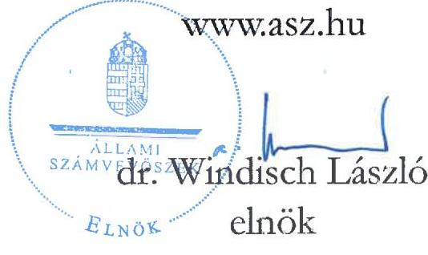
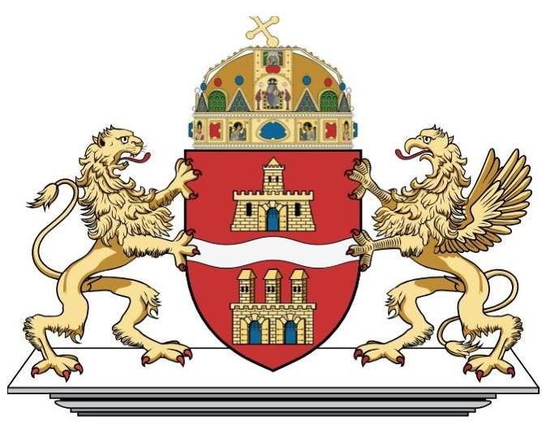
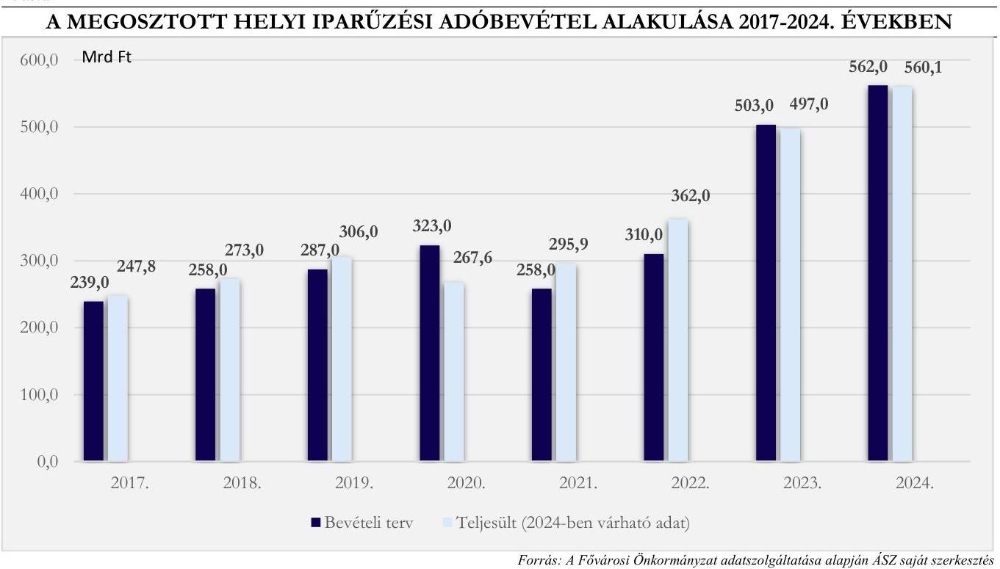

# JELENTÉS 

A Fővárosi Önkormányzatot és a kerületi önkormányzatokat osztottan megillető bevételek
2024. évi megosztásáról szóló önkormányzati rendelet felülvizsgálata

2024.

---

# JELENTÉS 

## A Fővárosi Önkormányzatot és a kerületi önkormányzatokat osztottan megillető bevételek 2024. évi megosztásáról szóló önkormányzati rendelet felülvizsgálata

2024. 

24215

---

# ELLENŐRZÉSI IGAZGATÓSÁG: 

## ÁLLAMHÁZTARTÁS HELYI SZINTJÉT ELLENŐRZŐ IGAZGATÓSÁG

## ELLENŐRZÉSI IGAZGATÓ:

DR. BAFFIA GERGELY GÁBOR igazgató

## ELLENŐRZÉSVEZETŐ:

Jelentéseink az interneten a www.asz.hu címen olvashatók.

KERSMÁJER ÁGOTA ellenőrzésvezető

IKTATÓSZÁM: EL-4130-002/2024
TÉMASORSZÁM: 9
ELLENŐRZÉS-AZONOSÍTÓ SZÁM: V1120

---

# TARTALOMJEGYZÉK 

AZ ELLENŐRZÉS ALAPADATAI ..... 5
AZ ELLENŐRZÉS HATÓKÖRE ÉS TERÜLETE ..... 7
ÖSSZEFOGLALÁS ..... 9
AZ ELLENŐRZÉS FÓKUSZTERÜLETEI ..... 11
MEGÁLLAPÍTÁSOK ..... 12
JAVASLATOK ..... 22
MELLÉKLETEK ..... 23
I. sz. melléklet: Értelmező szótár ..... 23
II. sz. melléklet: Az ellenőrzött szervezetek jegyzéke ..... 25
III. sz. melléklet: Ellenőrzési kritériumok ..... 26
FÜGGELÉK: ÉSZREVÉTELEK ..... 27
RÖVIDÍTÉSEK JEGYZÉKE ..... 28

---

.

---

# AZ ELLENŐRZÉS ALAPADATAI 

## AZ ELLENŐRZÉS CÉLJA

A Fővárosi Önkormányzatot ${ }^{1}$ és a kerületi önkormányzatokat ${ }^{2}$ osztottan megillető bevételek 2024. évi megosztásáról szóló önkormányzati rendelet felülvizsgálata, a megosztandó helyi adóbevételek és a helyi adóztatással kapcsolatos kiadások megállapítása, elszámolása szabályszerűségének ellenőrzése.

## AZ ELLENŐRZÉS TÍPUSA

Törvényességi ellenőrzés.

## AZ ELLENŐRZÖTT IDŐSZAK

2023. október 1-jétől 2024. szeptember 30-ig tartó időszak.

## AZ ELLENŐRZÉS TÁRGYA

A Forrásmegosztási rendelet ${ }^{3}$, a megosztandó helyi adóbevételek, a helyi adóztatással kapcsolatos kiadások megállapítása, elszámolása.

Az ellenőrzés kiterjedt minden olyan körülményre és adatra, amely az ÁSZ ${ }^{4}$ jogszabályban meghatározott feladatainak teljesítéséhez, valamint a program végrehajtása folyamán felmerült újabb összefüggések feltárásához szükséges volt.

## AZ ELLENŐRZÉS JOGALAPJA

Az ellenőrzés jogszabályi alapját az ÁSZ tv. ${ }^{5}$ 1. § (3) bekezdése, a 3. § (1) bekezdése és a 33. § (7) bekezdése, valamint a Forrásmegosztási tv. ${ }^{6}$ 6. § (1) bekezdés előírásai képezték.

## AZ ELLENŐRZÉS MÓDSZERE

Az ellenőrzést a nemzetközi standardokat irányadónak tekintve az ellenőrzési program szempontjai, az ellenőrzött időszakban hatályos jogszabályok, az ellenőrzés szakmai szabályok és módszertanok figyelembevételével végezte az ÁSZ.

Az ellenőrzési kérdések megválaszolásához szükséges bizonyítékok megszerzése az ellenőrzött szervezet által rendelkezésre bocsátott dokumentumokra és adatokra alapozva, továbbá megfigyelés, szemle (szemrevételezés), kérdésfeltevés (információkérés), valamint elemző eljárás útján történt. Az ellenőrzési bizonyítékként felhasználható adatforrások közé tartoztak az ellenőrzéshez kért dokumentumok, adatforrások, az ellenőrzés tárgya kapcsán releváns, nyilvánosan hozzáférhető adatok, dokumentumok, a

---

Kincstár adatbázisai, továbbá adatforrás volt minden - az ellenőrzés folyamán - feltárt, az ellenőrzés szempontjából információkat tartalmazó dokumentum.

Az ellenőrzés lefolytatásához az ellenőrzött szervezet a tanúsítványok kitöltésével, valamint az ÁSZ által kért dokumentumok, adatok, információk megküldésével és az ellenőrzés során szolgáltatott adatokat.

---

# AZ ELLENŐRZÉS HATÓKÖRE ÉS TERÜLETE 

A Fővárosi ÖNKORMÁNYZAT 2024. ÉVRE VONATKOZÓ FORRÁSMEGOSZTÁSI RENDELETE ÉS ANNAK VÉGREHAJTÁSA

A Helyi adó tv. ${ }^{7}$ szerint a Fővárosi Önkormányzat Budapest teljes területére a helyi iparűzési adó, valamint az általa közvetlenül igazgatott Margit-szigeten a többi helyi adó bevezetésére jogosult. A kerületi önkormányzatok az építményadót, a telekadót, a magánszemély kommunális adóját és az idegenforgalmi adót vezethetik be. A kerületi önkormányzatok képviselő-testületei a helyi adó bevezetését - az adott adóévre vonatkozó előzetes beleegyezés alapján - átengedhetik a Fővárosi Önkormányzat részére. Ezzel a lehetőséggel a 2024. évre az idegenforgalmi adóra vonatkozóan a XVII., a XVIII., a XXI. és a XXII. kerületek önkormányzati képviselő-testületei éltek.

A Fővárosi Önkormányzatot és a kerületi önkormányzatokat osztottan megillető bevételek körét és a részesedési arányokat a Forrásmegosztási tv. határozza meg. A Fővárosi Közgyűlés ${ }^{8}$ által kivetett helyi iparűzési adóból, valamint a Margit-szigeten kívül eső fővárosi területekre - a kerületi önkormányzat képviselő-testülete előzetes beleegyezése alapján - kivetett idegenforgalmi adóból, továbbá a kivetett adókhoz kapcsolódó pótlékból és bírságból származó bevételekből a Fővárosi Önkormányzat részesedése 54\%, a kerületi önkormányzatok együttes részesedése 46%.

A Fővárosi Önkormányzat által kivetett iparűzési adó mértéke a Helyi adó tv. és a Helyi iparűzési adó rendelet ${ }^{9}$ alapján az adóalap 2\%-a. Az idegenforgalmi adó mértéke az Idegenforgalmi adó rendelet ${ }^{10}$ szerint az adóalap (megkezdett vendégéjszakára eső szállásdíj) 4\%-a.

A kerületi önkormányzatok a Fővárosi Közgyűlés rendelete alapján kivetett helyi adóhoz kapcsolódó bevételből való részesedésük arányában kötelesek hozzájárulni - a pótlékból és bírságból ${ }^{11}$ származó bevételek legfeljebb 50\%-áig terjedő mértékben - a Fővárosi Önkormányzat helyi adóztatással kapcsolatos kiadásaihoz.

A Forrásmegosztási rendeletben meghatározott bevételi és kiadási tervszámokat, valamint a 2024. szeptember 30-ig befolyt tényleges bevételeket és kiadásokat az 1. táblázat mutatja.

---

1. táblázat

# A FORRÁSMEGOSZTÁSI RENDELETBEN MEGOSZTANDÓ BEVÉTELEK ÉS KIADÁSOK 2024. ÉVI TERVEZETT ÖSSZEGEI ÉS A 2024. I-IX. HAVI TELJESÜLÉSÜK 

| MEGOSZTANDÓ BEVÉTEL/KIADÁS | MEGOSZTANDÓ   FORRÁS   TERVEZETT   ÖSSZEGE   (100\%)   (EZER FT) | FŐVÁROS   TERVEZETT   RÉSZÉSEDÉSE   (54\%)   (EZER FT) | KERÜLETEK TERVEZETT RÉSZÉSEDÉSE (46\%) (EZER FT) | 2024. I-IX.   HAVI   TELJESÜLÉS   (EZER FT) | 2024. I-IX.   HAVI   TELJESÜLÉS   (\%) |
| :--: | :--: | :--: | :--: | :--: | :--: |
| Helyi iparűzési adó | 562000 000,0 | 303480 000,0 | 258520 000,0 | 528604 503,6 | 94,1 |
| A négy kerület által bevezetésre átengedett idegenforgalmi adó | 12410,0 | 6701,4 | 5708,6 | 6681,7 | 53,8 |
| Kivetett adókhoz kapcsolódó pótlék, bírság | 2000 000,0 | 1080 000,0 | 920 000,0 | 1603 861,1 | 80,2 |
| Megosztandó bevételek összesen | 564012 410,0 | 304566 701,4 | 259445 708,6 | 530215 046,4 | 94,0 |
| Helyi adók beszedésével összefüggésben figyelembe vehető kiadások* | 1241 605,2 | 670 466,8 | 571 138,4 | 956 150,4 | 77,0 |

*A tervezett adatok a Forrásmegosztási tv.-ben előírt felső korlát figyelembevételével. Forrás: Forrásmegosztási rendelet és a Fővárosi Önkormányzat adatközlése alapján. A12 saját szerkesztésű.

---

# ÖSSZEFOGLALÁS 

A Forrásmegosztási tv. szerint az ÁSZ feladata a Fővárosi Önkormányzat tárgyévre vonatkozó forrásmegosztási rendeletének felülvizsgálata, a forrásmegosztási rendeletben szereplő adatok megalapozottságának és az ennek alapjául szolgáló számítások helyességének vizsgálata. A Fővárosi Önkormányzatot és a kerületi önkormányzatokat osztottan illetik meg a Fővárosi Közgyűlés által megállapított iparűzési adóból, továbbá - a Margit-szigeten kívül eső fővárosi területekre - a helyi idegenforgalmi adóból, valamint a helyi adóhoz kapcsolódóan kiszabott késedelmi pótlékból és bírságból származó bevételek. A Forrásmegosztási tv. meghatározza a megosztandó bevételből a Fővárosi Önkormányzatot és a kerületi önkormányzatokat megillető részt, továbbá a kiadások viselésének elveit.

A 2024. évben tervezett 564012,4 millió Ft megosztandó bevételből a Fővárosi Önkormányzat részesedése 54% (304 566,7 millió Ft) a kerületi önkormányzatok együttes részesedése 46% (259 445,7 millió Ft). Az adóztatással összefüggő kiadásokat - legfeljebb a pótlék és bírságbevételek 50\%-ának mértékéig - a Fővárosi önkormányzat és a kerületi önkormányzatok a részesedésük arányában viselik. Ennek 2024. évi tervezett összege 1241,6 millió Ft volt.

A 2024. évi forrásmegosztási rendeletalkotási folyamat szabályszerű volt. A Fővárosi Önkormányzat a forrásmegosztási rendeletalkotással kapcsolatos feladatokról belső szabályozásaiban - a Hivatali SZMSZ ${ }^{12}$-ben, valamint az érintett szervezeti egységek ügyrendjeiben és a munkaköri leírásokban - rendelkezett. A Bkr. ${ }^{13}$-ben előírtak ellenére, a Hivatal ${ }^{14}$ belső szabályzatainak összhangja, valamint a forrásmegosztás kapcsán feladatkörrel rendelkező szervezeti egységek feladatainak és felelősségi szabályainak rögzítése nem volt teljes körű. A Fővárosi Önkormányzat a Forrásmegosztási rendelet előkészítése során betartotta a jogszabályi és a belső előírásokat.

A Forrásmegosztási rendelet előírásai összhangban voltak a Forrásmegosztási tv. előírásaival. A Forrásmegosztási rendelet előírásai között azonban nem volt teljeskörűen biztosított a tartalmi összhang.

A forrásmegosztás bevételi tervszámai megalapozottak voltak. A Fővárosi Önkormányzatot és a kerületi önkormányzatokat együttesen megillető és a megosztott bevételek kerületenkénti megállapítása megfelelt a Forrásmegosztási törvény előírásainak. A Fővárosi Önkormányzat által kivetett helyi adóval kapcsolatosan befolyt bevételek 2024. évi megosztása során a pénzügyi elszámolás szabályszerű volt.

A 2024. január 1. és szeptember 30. közötti időszakban három önkormányzat élt az előleg igénylésének lehetőségével. Közülük a Fővárosi Önkormányzat ebben az időszakban 141 alkalommal vett igénybe előleget. Az előlegek folyósítása és az adószámlák terhére történt további átutalások során a Fővárosi Önkormányzat nem tartotta be teljeskörűen a Forrásmegosztási rendeletnek a folyósítható előleg felső határára vonatkozó előírásait. Az előlegekről vezetett analitikus nyilvántartás hiányos volt, a Bkr.-ben előírtak ellenére nem támogatta az előlegek szabályszerű folyósítását. A folyósított előlegek elszámolása a tárgyhavi adórész utalása során megtörtént.

A Forrásmegosztási rendelet előkészítése során a helyi adóztatással kapcsolatos 2024. évi kiadási előleg összegét a figyelembe vehető kiadások felső határának összegében, azaz a Fővárosi Önkormányzat késedelmi pótlék és bírság számláira 2023. évben teljesített bevétel 50\%-ában határozták meg. Ennek oka az előterjesztés szerint, hogy a rendelettervezet előkészítésekor a késedelmi pótlék és bírság bevételek összege már ismert volt és a helyi adóztatással kapcsolatban felmerült kiadások várható 2023. évi összegét a felső határ feletti értékre becsülték. A 2023. évi zárszámadási rendelet adatai igazolták, hogy a teljesített kiadások összege meghaladta a kiadási előlegként érvényesíthető összeg felső határát. A 2023. évben érvényesített kiadási előlegek és a

---

ténylegesen elszámolható kiadások összevetése megtörtént, a megállapított különbözetet egyszeri jelleggel szabályszerűen levonták a kerületi önkormányzatoktól.

A 2023. évi forrásmegosztás ellenőrzése során tett ÁSZ javaslatok hasznosultak, azokat a 2024. évi rendelet előkészítése során figyelembe vették, illetve egy javaslat a módosítások következtében okafogyottá vált.

Az ellenőrzés megállapításai alapján a Főjegyzőnek négy javaslatot fogalmazott meg az ÁSZ.

---

# AZ ELLENŐRZÉS FÓKUSZTERÜLETEI 

1. A Fővárosi Önkormányzat 2024. évi forrásmegosztási rendeletalkotási folyamata szabályozott és szabályszerű volt-e?
2. A forrásmegosztás bevételi tervszámai megalapozottak voltak-e, a forrásmegosztás szabályszerű volt-e?
3. A forrásmegosztásnál figyelembe vett, a Fővárosi Önkormányzat Adóhatósága működtetésével összefüggő, a helyi adózással kapcsolatos kiadások megállapítása és elszámolása megfelelő volt-e?
4. Szükséges-e korrekciót érvényesíteni a 2025. évi forrásmegosztás során?
5. Az ÁSZ előző évi forrásmegosztás ellenőrzése során tett javaslatai hasznosultak-e?

---

# 1. A Fővárosi Önkormányzat 2024. évi forrásmegosztási rendeletalkotási folyamata szabályozott és szabályszerű volt-e? 

Összegző megállapítás: A Fővárosi Önkormányzat a forrásmegosztási rendeletalkotással kapcsolatos feladatokról belső szabályozásaiban - kisebb hiányosságokkal - rendelkezett. A rendelet előkészítése során betartotta a jogszabályi és a belső előírásokat. A Forrásmegosztási rendelet és a Forrásmegosztási tv. előírásai összhangban voltak. A Forrásmegosztási rendeleten belül azonban nem volt teljeskörűen biztosított a tartalmi összhang.

Az ellenőrzött időszakban - Áht. ${ }^{15}$ előírásaival összhangban - a forrásmegosztási rendeletalkotással kapcsolatos feladatokról a Hivatal belső szabályzataiban és a munkaköri leírásokban rendelkeztek.
A Hivatali SZMSZ szerint a Főjegyzői Iroda az önkormányzati rendelet normaszövegének kialakítása kapcsán általános hatáskörrel rendelkező szervezeti egység, a Költségvetési Tervezési és Felügyeleti Főosztály, valamint az Adó Főosztály, illetve 2024. június 1-jétől kizárólag az Adó Főosztály volt a Fővárosi Önkormányzatot és a kerületi önkormányzatokat osztottan megillető bevételek éves megosztása önkormányzati rendelet vonatkozásában a „tárgy szerint feladatkörrel rendelkező önálló szervezeti egység".
A 2024. évi Forrásmegosztási rendelet előkészítésével kapcsolatos feladatokat a feladatkörrel rendelkező
 szervezeti egységek ügyrendjei, valamint az érintett munkatársak munkaköri leírásai tartalmazták.
A Bkr. 6. § (1) bekezdés b) pontjában foglaltak ellenére

- a Költségvetési Tervezési és Felügyeleti Főosztály ügyrendje ${ }^{16}$ 2024. június 1-október 15. között annak ellenére tartalmazta a forrásmegosztással kapcsolatos feladatokat, hogy a Hivatali SZMSZ 2024. június 1-jei módosítása során a Költségvetési Tervezési és Felügyeleti Főosztály ezen feladatokra történő kijelölése megszűnt;
- 2024. júniusától a forrásmegosztással kapcsolatos feladatokban történő részvétellel az Adó Főosztály mindössze egy munkatársának a munkaköri leírása került kiegészítésre, a rendelettervezet előkészítésében és az előterjesztés lebonyolításában résztvevő további munkatársak nem kerültek kijelölésre, továbbá a rendelettervezet előkészítéséért való felelősség az Adó Főosztály egyetlen munkatársának a munkaköri leírásában sem szerepelt.
A Forrásmegosztási rendelet előkészítését az érintett szervezeti egységek az ügyrendjeikben foglaltaknak megfelelően végezték.
A Fővárosi Önkormányzat a Forrásmegosztási tv. előírása szerinti határidőt betartva (2024. január 3-án) megküldte a Forrásmegosztási rendelet tervezetét a kerületi önkormányzatok és azok hivatalai részére, a kerületi önkormányzatok képviselő-testületei véleményének kikérése céljából. A véleményezésre a Forrásmegosztási tv.-ben előírt legalább 15 nap a kerületi önkormányzatoknak a rendelkezésükre állt. A

---

23 közül 16 kerületi önkormányzat a Forrásmegosztási rendelet tervezetére nem tett észrevételt. Hat kerületi önkormányzat ekkor még nem alakította ki véleményét, mivel annak tárgyalása későbbre volt ütemezett. Észrevételt a XIII. kerületi Önkormányzat tett, amely szerint a Forrásmegosztási rendelettervezet számítási módszerében megfelel a Forrásmegosztási tv. előírásainak, azonban a kerületi önkormányzatok közötti - Forrásmegosztási tv.-ben rögzített - megosztás elavult, így a kerület számára elfogadhatatlan.
A Fővárosi Önkormányzat - a Helyi adó tv. előírásával összhangban - rendelkezett azon négy kerületi önkormányzat* képviselő-testületének beleegyező határozatával, amelyek az idegenforgalmi adó beszedését a 2024. évre átengedték a Fővárosi Önkormányzatnak.
A Fővárosi Közgyűlés 2024. január 31-i ülésén tárgyalta és elfogadta a Forrásmegosztási rendeletet, és az a Forrásmegosztási tv. szerinti határidőben (2024. január 31-én) hatályba is lépett.
A Forrásmegosztási rendelet a Forrásmegosztási tv. előírásaival összhangban tartalmazta a tárgyévre vonatkozóan a Fővárosi Önkormányzatot és a kerületi önkormányzatokat osztottan megillető bevételek összegét, és ezen belül a Fővárosi Önkormányzatot és a kerületi önkormányzatokat megillető részesedési arányokat összesen és kerületenkénti bontásban. Tartalmazta továbbá a megosztott bevételek beszedésével összefüggésben a helyi adóztatáshoz kapcsolódó kiadásokhoz való hozzájárulásként a kerületi önkormányzatoktól előlegként levonandó összeget, valamint a megosztott bevételek önkormányzati költségvetési számlákra történő utalásának határidejét.
A Forrásmegosztási rendeletben figyelemmel voltak arra is, hogy a 2024. januárjában befolyó - a 2023. december 1-31. közötti időszakra vonatkozó - idegenforgalmi adóbevétel tekintetében még öt kerület előzőek mellett még a XX. kerület - engedte át az idegenforgalmi adó beszedését. Figyelemmel voltak továbbá a 2023. évi ÁSZ jelentésben ${ }^{17}$ megállapított korrekció 2024. évi elszámolására.

# A Forrásmegosztási rendelet egyes előírásai között a tartalmi összhang nem volt teljeskörűen biztosított. 

- Nem volt egyértelmű - mivel az érintett rendelkezésekben nem szerepelt, csak a rendelet szövegezése és a 2. melléklet számításainak összevetése alapján állapítható meg -, hogy a Forrásmegosztási rendelet 4. § (1) bekezdésében meghatározott, 2024. évben a forrásmegosztással érintett idegenforgalmi adóból származó bevétel tervezett 12 410,0 ezer Ft összege tartalmazta a 4. § (5) bekezdésében szereplő, 2023. december 1. és december 31. közötti időszakra vonatkozó, de 2024. januárjában esedékes 550,0 ezer Ft összeget.
- A Forrásmegosztási rendelet 4. § (4) bekezdése a 4. § (5) bekezdésében foglaltakat - vagyis a 2023. december 1. és december 31. közötti időszakra vonatkozó idegenforgalmi adóból származó bevételeket - rendelte el kivételként azon szabály alól, hogy a 2024-től idegenforgalmi adót bevezető kerületi önkormányzatok nem részesülnek a Fővárosi Önkormányzat által beszedett idegenforgalmiadó-bevételből. Ez alól a rendelkezés alól ugyanakkor nemcsak a 4. § (5) bekezdés, hanem a 4. § (6) bekezdés is kivételt képezett, amely szintén a korábbi adómegállapítási időszakra bevallott és megfizetett idegenforgalmi adóbevétel eltérő megosztását tartalmazta.
- A Forrásmegosztási rendelet 4. § (5) bekezdése a 2023. december 1. és december 31. közötti időszakra vonatkozó, 2024. januárjában esedékes, bevallott és megfizetett - tervszinten várható 550,0 ezer Ft - idegenforgalmiadó-bevétel megosztását a rendelet 2. mellékletében található

[^0]
[^0]:    * a XVII., a XVIII., a XXI. és a XXII. kerületi önkormányzat

---

táblázat E oszlopában meghatározottak szerint rendelte el. A rendelet 2. melléklet E oszlopában ugyanakkor nem a tervezett 550,0 ezer Ft megosztása, hanem a C oszlopban négy önkormányzatra megosztott 5708,6 ezer Ft éves szintű bevétel öt önkormányzatra (az idegenforgalmi adót a 2024. évtől bevezető XX. kerületre is) vonatkozó korrekciója szerepelt.

# 2. A forrásmegosztás bevételi tervszámai megalapozottak voltak-e, a forrásmegosztás szabályszerű volt-e? 

| Összegző megállapítás | A forrásmegosztás bevételi tervszámai megalapozottak   voltak. A Fővárosi Önkormányzatot és a kerületi   önkormányzatokat együttesen megillető és a megosztott   bevételek kerületenkénti megállapítása, valamint a befolyt   bevételek pénzügyi elszámolása szabályszerű volt. Az   előlegek folyósítása és az adószámlákról történt további   átutalások során azonban nem tartották be teljeskörűen a   Forrásmegosztási rendelet előírásait. |
| :-- | :-- |

A Forrásmegosztási rendeletben a 2024. évre tervezett, a Fővárosi Önkormányzat és a kerületi önkormányzatok között megosztandó helyi adóból, valamint a kapcsolódó pótlék és bírság kiszabásából származó bevételi tervszámokat számításokkal alátámasztották. A számítások során figyelembe vették a bevételre hatást gyakorló lényeges körülményeket (makrogazdasági mutatók alakulása, kockázati tényezők). Az 1. ábrán látható, hogy a megosztott bevételeket meghatározó iparűzési adó 2024-ben - a 2024. szeptember 30-i adatok, valamint az Önkormányzat nyilatkozata alapján - közel teljes mértékben (99,7%-ban) teljesül.

---

A Forrásmegosztási rendeletben a bevételek tervezett összegét szabályszerűen, a Forrásmegosztás tv.-ben foglaltak szerint osztották meg a Fővárosi Önkormányzat és a kerületi önkormányzatok között, 54%-46% arányban. A kerületi önkormányzatokat együttesen megillető 46% megosztott bevétel tervszámának kerületi önkormányzatok közötti megosztását a Forrásmegosztási tv.-nek megfelelően végezték el. A tervezett helyi iparűzési adóból származó bevétel és a helyi adóhoz kapcsolódó pótlék- és bírságbevételek tervezett összegének 46%-át a Forrásmegosztási tv. 1. mellékletében meghatározott részesedési arányszámoknak megfelelően osztották fel a kerületi önkormányzatok között.
Az érintett kerületi önkormányzatokat egyenként megillető idegenforgalmi adóból származó bevétel tervezett összegének megosztása szabályszerűen történt. A XVII., a XVIII., a XXI. és a XXII. kerületi önkormányzatok határozatban döntöttek, hogy az idegenforgalmi adót a kerületeik illetékességi területén a 2024. évben a Fővárosi Önkormányzat vezesse be. Az idegenforgalmi adó tervezett összegének kerületi önkormányzatok közötti megosztása a Forrásmegosztási tv. 1. mellékletében meghatározott részesedési arányok alapulvételével történt. A 2024. januárjában befolyó - a 2023. december 1-31. közötti időszakra vonatkozó - idegenforgalmi adóbevétel megosztása és utalása során figyelemmel voltak az idegenforgalmi adó beszedését 2023. évben még átengedő XX. kerületi Önkormányzatra is. A 2024. februári utalás során elszámolták továbbá a 2023. évi ÁSZ jelentésben megállapított korrekciót.
A Fővárosi Önkormányzat által megállapított helyi adó, valamint a kapcsolódó pótlék és bírság kapcsán 2024. január 1. és 2024. szeptember 30. között befolyt bevételek pénzügyi elszámolása megfelelt a Forrásmegosztási rendeletnek.
A 2024. január-szeptember hónapokban befolyt megosztandó bevételek előírt részarányának az átutalása a Forrásmegosztási tv.-ben, illetve a Forrásmegosztási rendeletben rögzített határidőben megtörtént. A havi elszámolások alapján az önkormányzatokat megillető megosztott bevételeket a tárgyhót követő hónap 10-ig utalták át a kerületi önkormányzatok és a Fővárosi Önkormányzat számlájára.
A Fővárosi Önkormányzatot, illetve a kerületi önkormányzatokat megillető megosztandó helyi adóbevételek, valamint a kapcsolódó pótlék- és bírságbevételek 2024. január 1.-szeptember 30. közötti összegeit és megoszlásukat a 2. táblázat mutatja be.
2. táblázat

# A 2024. I-IX. HAVI MEGOSZTANDÓ BEVÉTELEK ÖSSZEGE ÉS MEGOSZLÁSA, VALAMINT A KIADÁSI ELŐLEGEK ÖSSZEGEI (EZER FT) 

| MEGOSZTANDÓ BEVÉTEL   2024. I-IX. HÓNAP | MEGOSZTANDÓ   FORRÁS ÖSSZEGE   (100\%) | FÖVÁROS   RÉSZÉSEDESE   (54\%) | KERÜLETEK   RÉSZÉSEDESE   (46\%) |
| :--: | :--: | :--: | :--: |
| Helyi iparűzési adó | 528 604 503,6 | 285 446 432,0 | 243 158 071,6 |
| A kerületi önkormányzatok által átengedett idegenforgalmi adó | 6681,7 | 3608,1 | 3073,6 |
| Kivetett adókhoz kapcsolódó pótlék, bírság | 1 603 861,1 | 866 085,0 | 737 776,1 |
| Megosztandó bevételek összesen | 530 215 046,4 | 286 316 125,1 | 243 898 921,3 |
| 2024. évi kiadási előleg összege |  | 571 138,4 | -571 138,4 |
| 2023. évi kiadási előleg korrekció összege |  | 249 758,8 | -249 758,8 |
| Kerületi önkormányzatoktól levonandó, Fővárosi Önkormányzat részére jóváírandó összeg |  | 820 897,2 | -820 897,2 |
| Fővárosi Önkormányzatot, illetve a kerületi önkormányzatokat megillető rész |  | 287 137 022,3 | 243 078 024,1 |

---

A Forrásmegosztási rendelet 6. §-a alapján 2024. január 1. és szeptember 30. közötti időszakban három önkormányzat élt az előleg igénylésének lehetőségével.
A II. kerületi önkormányzat polgármestere egy alkalommal, 2024. szeptember 10-én kelt levelében az önkormányzatot a Forrásmegosztási tv. alapján megillető összeg mértékéig kért előleget, amely 2024. szeptember 18-án 2 166 851,8 ezer Ft összegben került folyósításra.
A XIX. kerületi önkormányzat összesen két alkalommal, 2024. március 19-én 1 200 000,0 ezer Ft, 2024. szeptember 23-án 1 500 000,0 ezer Ft összegben igényelt előleget, amelyek utalása 2024. március 21-én, illetve szeptember 26-án megtörtént.
A Fővárosi Önkormányzat a 2024. január 1. és szeptember 30. közötti időszakban 141 alkalommal (a 190 banki nap 74,2%-ában), összesen 28 041 500,0 ezer Ft összegben (a részére járó megosztandó bevételek 97,9%-a tekintetében) élt az előleg igénylés lehetőségével. A Fővárosi Önkormányzat által igénybe vett előlegek összegei 35 000,0 ezer Ft és 60 000 000,0 ezer Ft között alakultak.
A Forrásmegosztási tv. nem rendelkezett az előleg jogintézményéről, a Forrásmegosztási rendelet pedig nem korlátozta az előleg-igénylések számát, az összeg felső határát határozta meg. A Forrásmegosztási rendelet az önkormányzati kérés beérkezésének napját megelőző napon az iparűzésiadó-beszedési számlán rendelkezésre álló megosztandó összegből a Forrásmegosztási tv. szerint az adott önkormányzatra jutó megosztási részaránynak megfelelő összeg mértékéig írta elő az igénybe vehető előleg felső határát.
A Fővárosi Önkormányzatnál analitikus nyilvántartást vezettek a Fővárosi Önkormányzat és a kerületi önkormányzatok részére folyósított előlegek összegéről. A Bkr. 3. § c) és 8. § (2) bekezdés d) pontjában foglaltak ellenére azonban nem alakítottak ki és nem működtettek olyan kontrollokat, amelyek biztosították volna, hogy minden esetben a Forrásmegosztási rendeletben előírt mértékű előleg kerüljön folyósításra, mivel a vezetett analitikus nyilvántartás nem tartalmazta az előleg kérés beérkezésének és az előleg folyósításának a napját, az iparűzési adószámlán naponta rendelkezésre álló bevételekből a megosztandó bevétel összegét, továbbá abból nem különítették el a Fővárosi Önkormányzatot és az egyes kerületi önkormányzatokat megillető részt.
Mindezek következtében előfordult, hogy a Fővárosi Önkormányzatnak történt előleg folyósítás nem felelt meg a Forrásmegosztási rendelet 6. §-ában
 foglaltaknak, mivel meghaladta az önkormányzati kérés beérkezésének napját megelőző napon az iparűzésiadó-beszedési számlán rendelkezésre álló megosztandó összegből a Forrásmegosztási tv. szerint a Fővárosi Önkormányzatra jutó megosztási részaránynak megfelelő összeget. A Fővárosi Önkormányzatnak 2024. március 18-án folyósított 41 600 000,0 ezer Ft előleg 17 418 753,6 ezer Ft-tal, az augusztus 12-én folyósított 300 000,0 ezer Ft előleg 4 425,3 ezer Ft-tal, az augusztus 28-án folyósított 150 000,0 ezer Ft előleg - az augusztus hónapban már folyósított előlegek, valamint az előző napi iparűzési adó visszautalások következtében - 741 952,8 ezer Ft-tal haladta meg a Forrásmegosztási rendelet 6. §-a szerint folyósítható előleg összegét.
A folyósított előlegek elszámolása a tárgyhavi adórész utalása során megtörtént. Az előleget nem igénylő kerületi önkormányzatok a Forrásmegosztási rendelet előírásainak megfelelően, havonta egyszer, a tárgyhót követő hó 10-ig jutottak a megosztott helyi adóbevételhez.
Az előlegek folyósításán túl, 2024. június 28-án - a Forrásmegosztási rendelet 5. § (2)-(3) bekezdéseiben foglaltak ellenére - valamennyi megosztandó bevétel beszedésére alkalmazott számlát (iparűzési adó beszedési számla, idegenforgalmi adó beszedési számla, bírság számla, késedelmi pótlék számla) nullára

---

ürítettek olyan módon, hogy a záró egyenlegük átutalásra került a Fővárosi Önkormányzat költségvetési elszámolási számlájára. Az állományürítés az iparűzési adónál 7 304 639,2 ezer Ft, a késedelmi pótléknál 122 454,3 ezer Ft, a bírságnál 46 724,8 ezer Ft-ot, az idegenforgalmi adónál 18 432,6 ezer Ft-ot jelentett, amely összegeket a Fővárosi Önkormányzat július 5-én visszautalta a megfelelő számlákra.
Az állományürítés alapja a számlavezető bank részére 2003. június 24-én adott megbízás volt, amely szerint az iparűzési adóbeszedési, a késedelmi pótlék és a bírság számlák félév végi egyenlegét a Fővárosi Önkormányzat költségvetési elszámolási számlájára utalja át. A megbízásban hivatkozott, annak az alapjául szolgáló jogszabályi hivatkozás ${ }^{\dagger}$ 2005. január 1-jétől hatálytalan, azonban annak visszavonásáról nem intézkedtek. A 2024. évben a félév utolsó munkanapján - az előző évektől eltérően - a számlák jelentős összeget tartalmaztak, mivel a Forrásmegosztási rendeletből kikerült az a rendelkezés, hogy a június hónapban befolyt adóbevételeket, valamint az azokhoz kapcsolódó késedelmi pótlék és bírság bevételeket úgy kell átutalni, hogy az június 30-áig megérkezzen a Fővárosi Önkormányzat és a kerületi önkormányzatok költségvetési elszámolási számláira. A 2024. évben a június hónapban befolyt adókat a többi hónaphoz hasonlóan - a tárgyhót követő hó 10-ig kellett átutalni.
A Fővárosi Önkormányzat költségvetési elszámolási számlájára történt átutalás következtében a Fővárosi Önkormányzat 2024. június 28 és július 4. között az őt megillető iparűzési adónál több, a napi számlaforgalom függvényében 6 763 454,7 ezer Ft és 6 897 534,0 ezer Ft közötti összegben átmeneti pénzeszközhöz jutott. Az idegenforgalmi adó, valamint a késedelmi pótlék és bírság esetében ugyanezen időszakban a Fővárosi Önkormányzat 77 985,3 ezer Ft összegben jutott átmeneti pénzeszközhöz.

# 3. A forrásmegosztásnál figyelembe vett, a Fővárosi Önkormányzat Adóhatósága működtetésével összefüggő, a helyi adózással kapcsolatos kiadások megállapítása és elszámolása megfelelő volt-e? 

Összegző megállapítás A Fővárosi Önkormányzat Adóhatóságának ${ }^{18}$ működtetésével összefüggő, a helyi adóztatással kapcsolatos kiadások előlegének 2024. évi megállapítása megalapozott volt. A 2023. évi kiadási előlegek és a ténylegesen elszámolható kiadások összevetése és a különbözet kerületi önkormányzatok felé történő elszámolása szabályszerűen megtörtént.

A Forrásmegosztási rendeletben a működési kiadások 2024. évre meghatározott előlegének összege - tekintettel annak felső korlátjára - megalapozott volt.
A Forrásmegosztási tv. szerint a Fővárosi Önkormányzatnál a helyi adóztatással kapcsolatban felmerült kiadásokat a megosztott bevételből részesülők viselik részesedésük arányában. A Forrásmegosztási tv. rögzítette, hogy a figyelembe vehető kiadásokat a kivetett helyi adóhoz kapcsolódóan kiszabott pótlék és bírság bevételek legfeljebb 50%-áig terjedő mértékben lehet érvényesíteni.

[^0]
[^0]:    † az államháztartás működési rendjéről szóló 217/1998. (XII. 30.) Korm. rendelet 125. §

---

A Forrásmegosztási rendelet szerint a kerületi önkormányzatoktól levonandó, a helyi adóztatással kapcsolatos 2024. évi kiadások előlegének összegét a rendelet 1. mellékletének D oszlopa rögzítette 571 138,4 ezer Ft összegben. A Forrásmegosztási rendelet közgyűlési előterjesztése szerint a 2024. évi kiadási előleg megállapítása során a Fővárosi Önkormányzat késedelmi pótlék és bírság számláira a már ismert - 2023. évben teljesített bevétel (2 483 210,4 ezer Ft) 50%-át vették figyelembe (1 241 605,2 ezer Ft) tekintettel arra, hogy a helyi adóztatással kapcsolatban felmerült kiadások összege a 2023. évben is várhatóan meghaladja e bevételek 50%-át.

A 2023. évi zárszámadási rendelet ${ }^{19}$ adatai igazolták, hogy a teljesített kiadások összege - 1 510 861,0 ezer Ft - meghaladta a kiadási előlegként érvényesíthető összeg felső határát. A 2023. évi zárszámadási rendeletben jóváhagyott adóbeszedéssel kapcsolatos kiadások összegét kiemelt előirányzatonként a 3. táblázat tartalmazza.
3. táblázat

# A FŐVÁROSI ÖNKORMÁNYZAT ADÓBESZEDÉSSEL KAPCSOLATOS 2023. ÉVI KIADÁSAI (EZER FT) 

| KIRMELI   ELŐIRÁNYZAT/   KÖLTÉGÉSVETÉSI   CÍM MEGNÉVEZÉSE;   SZÁMA | ADÓIGAZGATÁSI   FELADATOKAT   VÉGZŐK   ÉRDEKELTSÉGI   ALAPJA (711402) | ADÓFŐOSZTÁLY   KIADÁSAI   (712403) | ADÓIGAZGATÁSI   FELADATOK   (712503) | ÜZEMELTETÉSI   KIADÁSOK   (713901) | ÖSSZESEN |
| :-- | :--: | :--: | :--: | :--: | :--: |
| Személyi juttatások | 133 989,0 | 874 124,0 | 0,0 | 0,0 | 1 008 113,0 |
| Munkaadókat terhelő   járulékok és szociális   hozzájárulási adó | 17 419,0 | 125 375,0 | 0,0 | 0,0 | 142 794,0 |
| Dologi kiadások | 0,0 | 451,0 | 44 637,0 | 314 866,0 | 359 954,0 |
| Mindösszesen   működési kiadások | 151 408,0 | 999 950,0 | 44 637,0 | 314 866,0 | 1 510 861,0 |

Forrás: Fővárosi Önkormányzat adatszolgáltatása és a 2023. évi zárszámadási rendelet alapján ÁSZ saját szerkesztés
A Forrásmegosztási rendeletben megállapított, a kerületi önkormányzatok által fizetendő kiadási előleg összegét, a 2024. évi költségvetési rendeletben ${ }^{20}$ tervezett 1 264 736,4 ezer Ft adóbeszedéssel kapcsolatos kiadások összege is alátámasztotta. A felső korlát figyelembevétele nélkül a 2024. évre tervezett kiadások alapján a kerületi önkormányzatokra jutó rész 581 778,7 ezer Ft.
A 2024. évi költségvetési rendeletben tervezett és a 2024. szeptember 30-áig teljesített adóbeszedéssel kapcsolatos kiadásokat kiemelt előirányzatonként a 4. táblázat tartalmazza.

---

4. táblázat

A FŐVÁROSI ÖNKORMÁNYZAT ADÓBESZEDÉSSEL KAPCSOLATOS 2024. ÉVRE TERVEZETT ÉS 2024. SZEPTEMBER 30-IG TELJESÍTETT KIADÁSAI (EZER FT)

|  ÉLEMELT ELŐIRÁNYZAT/ KÖLTÉGÉSVETÉSI CÍM MEGNÉVEZÉSE, SZÁMA | ADÓIGAZGATÁSI   FELADATOKAT VÉGZŐK   ÉRDEKELTSÉGI ALAPJA (7150G) | ADÓ   FŐOSZTÁLY   KIADÁSAI   (71200) | ADÓIGAZGATÁSI   FELADATOK   (712503) | ÜZEMELTETÉSI   KIADÁSOK   (71300) | ÖSSZESEN |
| :--: | :--: | :--: | :--: | :--: | :--: |
| Személyi juttatások | terv | 176 991,1 | 875 043,6 | 0,0 | 1 052 034,7 |
|  | tény IX.30. | 83 605,0 | 739 827,9 | 0,0 | 823 432,9 |
| Munkaadókat terhelő járulékok és szociális hozzájárulási adó | terv | 23 008,9 | 122 565,8 | 0,0 | 145 574,7 |
|  | tény IX.30. | 10 868,7 | 101 266,1 | 0,0 | 112 134,8 |
| Dologi kiadások | terv | 0,0 | 254,0 | 61 873,0 | 62 127,0 |
|  | tény IX.30. | 0,0 | 0,2 | 19 642,7 | 19 642,9 |
| Mindösszesen működési kiadások | terv | 200 000,0 | 997 863,4 | 61 873,0 | 1 264 736,4 |
|  | tény IX.30. | 94 473,7 | 841 094,2 | 19 642,7 | 955 150,4 |

Forrás: Fővárosi Önkormányzat adatszolgáltatása és a 2024. évi költségvetési rendelet alapján ÁSZ saját szerkesztés

A 2024. évre megállapított kiadási előleg megosztása, érvényesítése szabályszerű volt. A Forrásmegosztási rendelet 1. mellékletének D oszlopában rögzített kiadási előlegek Fővárosi Önkormányzat és kerületi önkormányzatok közötti megosztásánál a Forrásmegosztási tv.-ben előírt arányszámokat betartották. A kerületi önkormányzatokat együttesen terhelő kiadási előleget a kerületi önkormányzatok között a Forrásmegosztási tv. mellékletében szereplő részesedési arányok szerint osztották meg.
A 2023. évben a helyi adóztatással kapcsolatos 1 510 861,0 ezer Ft teljesített kiadás összegét a Fővárosi Önkormányzat az Áhsz. ${ }^{21}$ szerint a könyviteli zárlat során készített főkönyvi kivonattal és az azzal egyező részletező nyilvántartásokkal alátámasztotta. A kerületi önkormányzatoktól a 2023. évben - a Forrásmegosztási tv. előírásával összhangban - levonásba helyezett 321 379,5 ezer Ft kiadási előleg összegét a Fővárosi Önkormányzat a 2023. évi beszámolót alátámasztó főkönyvi kivonattal és az Adó Főosztály által vezetett részletező nyilvántartással igazolta.
A 2023. év során elszámolt kiadási előlegek és a ténylegesen elszámolható kiadások összevetését a 2023. évi zárszámadási rendelet jóváhagyását követően, 2024. május 7-én az Adó Főosztály elvégezte. A 2023. évben a kerületi önkormányzatoktól kiadási előlegként levont 321 379,5 ezer Ft és a ténylegesen elszámolható kiadások kerületi önkormányzatokra jutó 571 138,4 ezer Ft-os összege közötti 249 758,8 ezer Ft-os különbözetet a Forrásmegosztási rendeletnek megfelelően, a Fővárosi Önkormányzat a 2024. május 9-én teljesített utalásaiból, egyszeri jelleggel levonásba helyezte. A Forrásmegosztási rendelet 1. melléklete szerint a 2024. évre megállapított kiadási előleg 571 138,4 ezer Ft-os összegével együtt, a kerületi önkormányzatokat megillető iparűzési adó utalandó összegét 2024. május hónapban 820 897,2 ezer Ft-tal csökkentették.
A Forrásmegosztási tv.-ben előírtak szerinti megosztási arány 54-46%-os volt, így a kerületi önkormányzatok felé érvényesíthető 2023. évi tényleges kiadások meghatározása és a különbözet elszámolása szabályszerűen történt. A kerületi önkormányzatoktól levont kiadási előlegek és a ténylegesen elszámolható kiadások összegét az 5. táblázat mutatja be.

---

5. táblázat

# KIMUTATÁS A KERÜLETI ÖNKORMÁNYZATOKTÓL LEVONT KIADÁSI ELŐLEGEK ÉS A TÉNYLEGESEN ELSZÁMOLHATÓ KIADÁSOK ÖSSZEGÉRŐL (EZER FT) 

| MEGNEVEZÉS | ÖSSZEG |
| :-- | :-- |
| 2023. évben a kerületi önkormányzatoktól levont kiadási előleg összege | 321 379,5 |
| 2023. évi ténylegesen elszámolható kiadás kerületi önkormányzatokra jutó összege | 571 138,4 |
| 2023. évi kiadási előleg és a ténylegesen elszámolható kiadás különbözete* | 249 758,8 |
| 2024. évi kiadási előleg | 571 138,4 |
| 2024. évi iparűzési adó korrekció összesen | 820 897,2 |

Megjegyzés: *A különbözet összegében az eltérés keretből adódik.
Forrás: Fővárosi Önkormányzat adatszolgáltatása alapján ÁSZ saját szerkesztés

## 4. Szükséges-e korrekciót érvényesíteni a 2025. évi forrásmegosztás során?

## Összegző megállapítás A 2025. évi forrásmegosztás során korrekciót nem kell végrehajtani.

A forrásmegosztásnál a 2024. január-szeptember hónapokban befolyt helyi adó bevételek megosztása és átutalása, valamint a figyelembe vett kiadások elszámolása során az ÁSZ ellenőrzés jogosulatlan, vagy a Fővárosi Önkormányzatot és a kerületi önkormányzatokat jogszerűen megillető forrásnál alacsonyabb összegű elszámolást nem tárt fel, így a 2025. évi forrásmegosztásnál korrekció érvényesítése nem szükséges.

## 5. Az ÁSZ előző évi forrásmegosztás ellenőrzése során tett javaslatai hasznosultak-e?

## Összegző megállapítás A 2023. évi forrásmegosztás ellenőrzése során tett ÁSZ javaslatok hasznosultak.

Az ÁSZ a 2023. évben „A Fővárosi Önkormányzatot és a kerületi önkormányzatokat osztottan megillető bevételek 2023. évi megosztásáról szóló önkormányzati rendelet felülvizsgálata" című 23071. számú
 jelentésében a Főpolgármester ${ }^{22}$ részére egy, a Főjegyző ${ }^{23}$ részére hat javaslatot fogalmazott meg, amelyek megvalósítására az érintettek intézkedési tervet készítettek. Az intézkedési terv végrehajtása a 2024. évi forrásmegosztási rendelet előkészítése és megalkotása során megtörtént.

- A Forrásmegosztási rendelet 8. §-a tartalmazta a 23071. számú jelentés 4. pontja szerinti, a 2022. évre vonatkozó, 2023-ban bevallott és megfizetett idegenforgalmi adó korrekciójára vonatkozó rendelkezést. Tartalmazta továbbá azt is, hogy a korrekciót a 2024. februári utalásnál kell figyelembe venni.
- A Forrásmegosztási rendelet a Fővárosi Önkormányzathoz 2024. évben befolyó, 2023. december 1. és december 31. közötti időszakra vonatkozó idegenforgalmiadó-bevételre a 2023. évi Forrásmegosztási rendelet ${ }^{24}$ arányszámai alapján rendelte el a részesedést. Emellett szabályozta - az adómegállapításhoz való jog elévülési idején belül - a korábbi adómegállapítási

---

időszakra bevallott és megfizetett idegenforgalmi adóbevétel eltérő megosztását is, amelyet az érintett adómegállapítási időszak utolsó napján hatályos forrásmegosztási rendeletnek az idegenforgalmiadó-bevételek megosztására meghatározott szabályai szerint rendelt el.

- A Forrásmegosztási tv. 2. § (5) bekezdésével való összhang megteremtése érdekében a Forrásmegosztási rendelet 3. $\S$ (3) bekezdéséből - az előző év ennek megfelelő normaszövegéhez képest - egyrészt törlésre került az érvényesíthető kiadásokra vonatkozó szövegrész (,,A helyi adóztatással kapcsolatos kiadásokat a helyi iparűzési adó bevételéből részesülők viselik az 1. §-ban meghatározott részesedésük arányában. Ezen kiadásokat a helyi adókhoz kapcsolódóan kiszabott késedelmi pótlékból és bírságból származó bevételek legfeljebb 50%-áig terjedő mértékben lehet érvényesíteni."), másrészt a bekezdés utolsó mondatában a „kiadási előleg" helyett „kiadások előlege" szerepel. A rendelet előterjesztésében szerepel, hogy a tényleges éves kiadás várhatóan meghaladja a pótlékból és bírságból származó bevétel 50%-ában meghatározott felső korlátot. Így a kiadásként visszatartott összeg tervezése során a felső korlát összegét szerepeltették a 2023. évi tényleges bevétel alapján. Így a javaslat végrehajtása okafogyottá vált.
- A késedelmi pótlék és bírság bevételére vonatkozó, a 2023. évi Forrásmegosztási rendelet 5. §-a (2) bekezdésének megfelelő normaszöveg a Forrásmegosztási rendeletből törlésre került.
- A Forrásmegosztási rendelet 5. §-ában a végrehajtható gyakorlatnak megfelelően módosították a Fővárosi Önkormányzat és a kerületi önkormányzatok számára történő, tárgyév júniusi 30-i és december 31-i utalásra vonatkozó előírásokat.
- a Forrásmegosztási rendelet 6. §-át kiegészítették, így a szabályozás tartalmazza azt is, hogy az önkormányzat által igényelt előleg összegét melyik utalás összegébe kell beszámítani.
A főpolgármester-helyettes ${ }^{25}$ a 2024. évre vonatkozó, a Fővárosi Önkormányzatot és a kerületi önkormányzatokat osztottan megillető bevételek megosztásáról szóló rendelet tervezetét az előzőekben részletezett, végrehajtott, illetve okafogyottá vált javaslatokra figyelemmel terjesztette a Fővárosi Közgyűlés elé.

---

# JAVASLATOK 

Az ÁSZ tv. 33. § (1) bekezdésében foglaltak értelmében az ellenőrzött szervezet vezetője köteles a jelentésben foglalt megállapításokhoz kapcsolódó intézkedési tervet összeállítani és azt a jelentés kézhezvételétől számított 30 napon belül az ÁSZ részére megküldeni. Amennyiben az ellenőrzött szervezet vezetője nem küldi meg határidőben az intézkedési tervet, vagy továbbra sem elfogadható intézkedési tervet küld, az Állami Számvevőszék elnöke az ÁSZ tv. 33. § (3) bekezdése a) és b) pontjaiban foglaltakat érvényesítheti.

## BUDAPEST FŐVÁROS FŐJEGYZŐJE RÉSZÉRE

1. Biztosítsa a 2025. évre vonatkozó, a Fővárosi Önkormányzatot és a kerületi önkormányzatokat osztottan megillető bevételek megosztásáról szóló rendelet előkészítése során, hogy a Forrásmegosztási rendelet 4. § (1), (4)-(6) bekezdései és a 2. melléklet szerinti normatartalom előírásai egymással összhangban legyenek.
2. Biztosítsa a Bkr. 6. § (1) bekezdés b) pontja szerinti, a kontrollkörnyezet kialakításáért való felelőssége körében, hogy a munkaköri leírások tartalmazzák teljeskörűen a felelősségi szabályokat.
3. Intézkedjen a Bkr. 3. § c) és 8. § (2) bekezdés d) pontja szerinti felelősségi körében olyan kontrolltevékenységek kiépítésére és működtetésére, amelyek biztosítják, hogy az adószámlákról történő előleg átutalásoknál teljeskörűen betartsák a Forrásmegosztási rendelet 6. § előírásait. Ennek keretében intézkedjen - az utólagos ellenőrzés lehetőségét is biztosító - naprakész analitikus nyilvántartás vezetésére a Fővárosi Önkormányzat és a kerületi önkormányzatok részére folyósított előlegekről.
4. Intézkedjen a Forrásmegosztási rendelet 5. § (2)-(3) bekezdéseivel ellentétes, a számlavezető bank részére adott - a megosztandó adók és a hozzájuk kapcsolódó pótlék, bírság beszedési számlái félév végi egyenlegeinek a Fővárosi Önkormányzat költségvetési elszámolási számlájára történő átvezetésre vonatkozó - megbízás visszavonására.

---

# MELLÉKLETEK 

## I. SZ. MELLÉKLET: ÉRTELMEZŐ SZÓTÁR

Fővárosi Önkormányzat által kivetett helyi adóhoz kapcsolódóan kiszabott pótlék és bírság
helyi adóztatással kapcsolatos kiadás
idegenforgalmi adó
helyi iparűzési adó
kiadások előlege

A Fővárosi Önkormányzatot és a kerületi önkormányzatokat osztottan illetik meg a Fővárosi Közgyűlés rendelete alapján kivetett helyi iparűzési adóhoz és az idegenforgalmi adómegállapítást átengedő keretek helyett megállapított idegenforgalmi adóhoz kapcsolódóan kiszabott pótlékból és bírságból származó bevételek.
(Forrás: A Forrásmegosztási tv. 2. $\S$ (2) bekezdése alapján meghatározott fogalom.)
A Fővárosi Önkormányzati helyi adóztatással kapcsolatos - a tárgyévre vonatkozóan a Fővárosi Önkormányzatot és a kerületi önkormányzatokat osztottan megillető bevételek (az iparűzési adóból, az idegenforgalmi adómegállapítást átengedő kerületek helyett megállapított idegenforgalmi adóból befolyt adóbevétel, illetve ezen helyi adókhoz kapcsolódóan kiszabott pótlék- és bírságbevétel) beszedésével összefüggően felmerült kiadás. E kiadásokat a Forrásmegosztási tv. 2. $\S$ (1) bekezdés a) pontja szerinti bevételből részesülők viselik részesedésük arányában. Kiadásként a Fővárosi Önkormányzatnál a beszedéssel - a Fővárosi Önkormányzat Adóhatósága működtetésével - összefüggően felmerült működtetési kiadásokat kell figyelembe venni. A Forrásmegosztási tv. 2. § (1) bekezdés a) pontja és a (4) bekezdés szerint figyelembe vehető kiadásokat a (2) bekezdésben felsorolt bevételek legfeljebb 50%-áig terjedő mértékben lehet érvényesíteni.
(Forrás: A Forrásmegosztási tv. 2. § (4), (6) bekezdése alapján meghatározott fogalom.)
A Helyi adó tv. szerint bevezetett helyi adó. Az idegenforgalmi adót a kerületi önkormányzat helyett a Fővárosi Önkormányzat rendeletével akkor jogosult bevezetni, ha ahhoz az adott adóév tekintetében az érintett kerület önkormányzatának képviselőtestülete előzetes beleegyezését adja. A Fővárosi Önkormányzat által közvetlenül igazgatott terület tekintetében a kerületi önkormányzat által bevezethető adó bevezetésére (idegenforgalmi adó) a Fővárosi Önkormányzat jogosult, ezért az ebből származó bevétel nem tárgya a forrásmegosztásnak.
(Forrás: Helyi adó tv. 1. §-a és a III. fejezet Kommunális jellegű adók 2. pontja alapján meghatározott fogalom.)
A Helyi adó tv. felhatalmazása alapján a Fővárosi Közgyűlés rendeletével kivetett helyi adónem. A Fővárosi Önkormányzat illetékességi területén vállalkozói tevékenységet (iparűzési tevékenységet) végző vállalkozó helyi iparűzési adót köteles fizetni. Adóköteles iparűzési tevékenységnek tekintendő e törvény alapján a vállalkozó e minőségben végzett nyereség-, illetőleg jövedelemszerzésre irányuló tevékenysége.
(Forrás: Helyi adó tv. 1. § (2) bekezdése, valamint a 35. § és 36. § alapján meghatározott fogalom.)
A tárgyévet megelőző év költségvetési rendeletének végrehajtásáról szóló Fővárosi Önkormányzati rendeletben elfogadott adóbeszedéssel kapcsolatos kiadásokat kell előlegként figyelembe venni a tárgyévben, melynek levonását a rendelet hatályba lépését követő havi utalásban kell a kerületi önkormányzatok felé érvényesíteni. Az előleg és a tárgyévi tényleges kiadások különbözetét a tárgyévi költségvetési rendelet végrehajtásáról szóló rendelet hatályba lépését követő havi utalásban kell elszámolni.
(Forrás: A Forrásmegosztási tv. 2. § (5) bekezdése alapján meghatározott fogalom.)

---

részesedés

részesedési arányok

tárgyév
vetítési alap

A forrásmegosztásba bevont bevételekből a Fővárosi Önkormányzatot és a kerületi önkormányzatokat megillető részesedés arányszáma. A Fővárosi Önkormányzatot és a kerületi önkormányzatokat a Forrásmegosztási tv. 3. § alapján osztottan megillető bevételekből a Fővárosi Önkormányzatot 54,0%, a kerületi önkormányzatokat együttesen 46,0% részesedés illeti meg.
(Forrás: A 2024. évi Forrásmegosztási rendelet 3. § (1)-(4) bekezdései alapján meghatározott fogalom.)
A kerületi önkormányzatokat megillető források egyes kerületek közötti megosztásának aránya, amelyet a Forrásmegosztási tv. 1. melléklete tartalmaz.
(Forrás: A Forrásmegosztási tv. 4. $\S$ (1) bekezdése alapján meghatározott fogalom.)
Azon gazdasági év, amelyhez tartozó megosztandó bevételeknek a Fővárosi Önkormányzat és a kerületi önkormányzatok közötti megosztását a Forrásmegosztási rendelet határozza meg.
(Forrás: A Forrásmegosztási tv. 1. §-a alapján meghatározott fogalom.)
Az a viszonyítási alap, amely megmutatja, hogy a helyi adóztatás kiadásait a tárgyévi forrásmegosztási rendeletben tervezett, illetve az előző évben befolyt, késedelmi pótlékból és bírságból származó bevételekhez arányosítva kell érvényesíteni.
(Forrás: ÁSZ által meghatározott fogalom)

---

# II. SZ. MELLÉKLET: AZ ELLENŐRZÖTT SZERVEZETEK JEGYZÉKE 

## AZ ELLENŐRZÖTT SZERVEZETEK NEVE, CÍME

Budapest Főváros Önkormányzata (1052 Budapest, Városház utca 9-11.)
Budapest Főváros Főpolgármesteri Hivatal (1052 Budapest, Városház utca 9-11.)

---

## FOKUSZTERÜLET

1. A Fővárosi Önkormányzat 2024. évi forrásmegosztási rendeletalkotási folyamata szabályozott és szabályszerű volt-e?
2. A forrásmegosztás bevételi tervszámai megalapozottak voltak-e, a forrásmegosztás szabályszerű volt-e?
3. A forrásmegosztásnál figyelembe vett, a Fővárosi Önkormányzat Adóhatósága működtetésével összefüggő, a helyi adózással kapcsolatos kiadások megállapítása és elszámolása megfelelő volt-e?
4. Szükséges-e korrekciót érvényesíteni a 2025. évi forrásmegosztás során?
5. Az ÁSZ előző évi forrásmegosztás ellenőrzése során tett javaslatai hasznosultak-e?

## ELLENŐRZÉSI KRITÉRIUMOK

Alaptörvény ${ }^{26}$ 32. cikk (1) f) pont;
Áht. 69. §;
Helyi adó tv. 1. § (3) bekezdés;
Kttv. ${ }^{27}$ 75. § (1) bek. d) és f) pontok;
Munka tv. ${ }^{28}$ 46. § (1) bek. d) pont;
Mötv. ${ }^{29}$ 106. § (1) a) pont;
Forrásmegosztási tv. 1. §, 2. §(1), (2), (4) bekezdései, 5. § (1) bekezdés, 7. §., 1. számú melléklet;

Bkr. 3. § a) és c) pont, 6. § (1)-(2) bekezdései, 8. § (1)-(3) bekezdései;
Forrásmegosztási rendelet 1-8. §
Áht. 4. § (1) bekezdés;
Helyi adó tv. 1. § (3) bekezdés;
Forrásmegosztási tv. 1. §, 2. § (1)-(2) bekezdések, 3.-4. §, 5. § (2)-(3) bekezdései, 7. §., 1. számú melléklet.

## Forrásmegosztási rendelet 1-8. §

Áht. 4. § (1) bekezdés;
Forrásmegosztási tv. 1. §, 2. § (1)-(2), (4)-(6) bekezdései, 7. §., 1. számú melléklet

Hivatali SZMSZ 94. §, 7. melléklet;
Forrásmegosztási tv. 6. § (1)-(2) bekezdései.
ÁSZ. tv. 33. § (7) bekezdés;
Intézkedési terv az ÁSZ 23071 sorszámon 2023. december 19-én megjelent jelentésében tett javaslatok alapján.

---

# FÜGGELÉK: ÉSZREVÉTELEK 

A jelentéstervezetet a Számvevőszék 15 napos észrevételezésre megküldte az ellenőrzött szervezetek vezetőinek az ÁSZ tv. 29. § (1) bekezdése előírásának megfelelően.

Budapest Főváros Önkormányzatának Főpolgármestere, valamint Budapest Főváros Főpolgármesteri Hivatalának Főjegyzője a jelentéstervezet megállapításaira nem tettek észrevételt.

[^0]
[^0]:    § 29. § (1) Az Állami Számvevőszék az ellenőrzési megállapításait megküldi az ellenőrzött szervezet vezetőjének vagy az általa megbízott személynek, és annak, akinek személyes felelősségét állapította meg.
    (2) Az ellenőrzött szervezet vezetője és a felelősként megjelölt személy az ellenőrzés megállapításaira tizenöt napon belül írásban észrevételt tehet.
    (3) Az Állami Számvevőszék az észrevételre a beérkezésétől számított harminc napon belül írásban válaszol. A figyelembe nem vett észrevételeket köteles a jelentésben feltüntetni, és megindokolni, hogy azokat miért nem fogadta el.

---

# RÖVIDÍTÉSEK JEGYZÉKE 

${ }^{1}$ Fővárosi Önkormányzat
${ }^{2}$ kerületi önkormányzatok
${ }^{3}$ Forrásmegosztási rendelet
${ }^{4}$ ÁSZ
${ }^{5}$ ÁSZ tv.
${ }^{6}$ Forrásmegosztási tv.
${ }^{7}$ Helyi adó tv.
${ }^{8}$ Fővárosi Közgyűlés
${ }^{9}$ Helyi iparűzési adó rendelet
${ }^{10}$ Idegenforgalmi adó rendelet
${ }^{11}$ pótlék, bírság
${ }^{12}$ Hivatali SZMSZ
${ }^{13}$ Bkr.
${ }^{14}$ Hivatal
${ }^{15}$ Áht.
${ }^{16}$ Költségvetési Tervezési és Felügyeleti Főosztály ügyrendje
${
 }^{17}$ 2023. évi ÁSZ jelentés
${ }^{18}$ Fővárosi Önkormányzat Adóhatósága
${ }^{19}$ 2023. évi zárszámadási rendelet
${ }^{20}$ 2024. évi költségvetési rendelet
${ }^{21}$ ÁSZ.
${ }^{22}$ Főpolgármester
${ }^{23}$ Főjegyző
${ }^{24}$ 2023. évi Forrásmegosztási rendelet
${ }^{25}$ Főpolgármester-helyettes
${ }^{26}$ Alaptörvény
${ }^{27}$ Kttv.
${ }^{28}$ Munka tv.
${ }^{29}$ Mötv.

Budapest Főváros Önkormányzata
Budapest Főváros I-XXIII. kerületi önkormányzatok
Budapest Főváros Önkormányzata Közgyűlésének 1/2024. (I. 31.) önkormányzati rendelete a Fővárosi Önkormányzatot és a kerületi önkormányzatokat osztottan megillető bevételek 2024. évi megosztásáról
Állami Számvevőszék
2011. évi LXVI. törvény az Állami Számvevőszékről
2006. évi CXXXIII. törvény a fővárosi önkormányzat és a kerületi önkormányzatok közötti forrásmegosztásról
1990. évi C. törvény a helyi adókról

Budapest Főváros Önkormányzata Közgyűlése
Budapest Főváros Önkormányzata Közgyűlésének 87/2012. (XI. 30.) önkormányzati rendelete a helyi iparűzési adóról
Budapest Főváros Önkormányzata Közgyűlésének 31/1994. (VI. 10.) önkormányzati rendelete az idegenforgalmi adóról
A fővárosi önkormányzat közgyűlésének rendelete alapján kivetett helyi adóhoz kapcsolódóan kiszabott pótlékból és bírságból származó bevétel
Budapest Főváros Önkormányzata Főpolgármesterének 25/2020. (X. 26.) utasítása a Budapest Főváros Főpolgármesteri Hivatal szervezeti és működési szabályzatáról 370/2011. (XII. 31.) Korm. rendelet a költségvetési szervek belső kontrollrendszeréről és belső ellenőrzéséről
Budapest Főváros Főpolgármesteri Hivatal
2011. évi CXCV. törvény az államháztartásról

A Költségvetési Tervezési és Felügyeleti Főosztály Főjegyző által jóváhagyott ügyrendje FPH142/100-3/2023. számon, hatályos 2023. május 9-től; FPH142/282/2024. számon, hatályos 2024. január 31-től; FPH142/286/2024 számon, hatályos 2024. október 15-től
Fővárosi Önkormányzatot és a kerületi önkormányzatokat osztottan megillető bevételek 2023. évi megosztásáról szóló önkormányzati rendelet felülvizsgálata (23071)

Budapest Főváros Főpolgármesteri Hivatal Adó Főosztálya
Budapest Főváros Önkormányzata Közgyűlésének 15/2024. (V. 2.) önkormányzati rendelete a Budapest Főváros Önkormányzata 2023. évi összevont költségvetéséről szóló 46/2022. (XII. 22.) önkormányzati rendelet végrehajtásáról
Budapest Főváros Önkormányzat Közgyűlésének 32/2023. (XII. 21.) önkormányzati rendelete Budapest Főváros Önkormányzata 2024. évi összevont költségvetéséről
4/2013. (I. 11.) Korm. rendelet az államháztartás számviteléről
Budapest Főváros Önkormányzata Főpolgármestere
Budapest Főváros Főpolgármesteri Hivatal Főjegyzője
Budapest Főváros Önkormányzata Közgyűlésének 2/2023. (I. 30.) önkormányzati rendelete a Fővárosi Önkormányzatot és a kerületi önkormányzatokat osztottan megillető bevételek 2023. évi megosztásáról
Budapest Főváros Önkormányzata Főpolgármester-helyettese
Magyarország Alaptörvénye (2011. április 25.)
2011. évi CXCIX. törvény a közszolgálati tisztviselőkről
2012. évi I. törvény a munka törvénykönyvéről
2011. évi CLXXXIX. törvény Magyarország helyi önkormányzatairól

---

1052 Budapest, Apáczai Csere János u. 10. | 1364 Budapest 4., Pf. 54
www.asz.hu | szamvevoszek@asz.hu
telefon: +36 14849100
