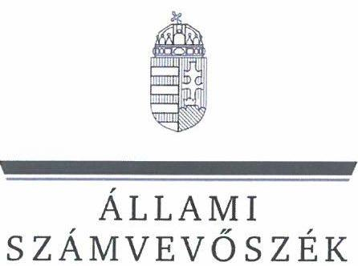
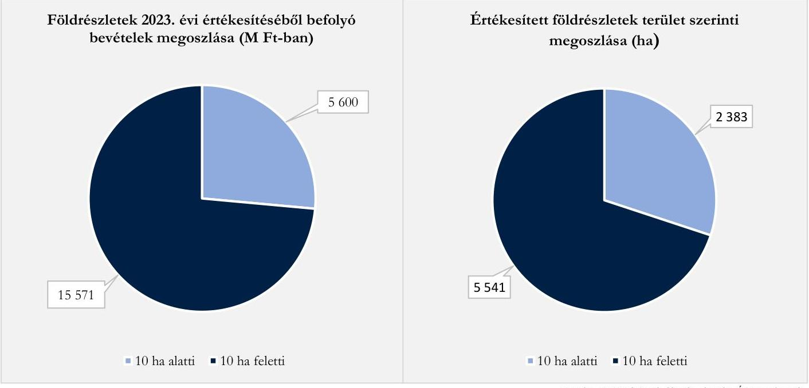

# JELENTÉS 

A Nemzeti Földalapba tartozó földrészlet értékesítése során ellátandó tulajdonosi joggyakorlási feladatok végrehajtásának ellenőrzése

2025.

---

ÁLLAMI
SZÁMVEVÔSZÉK

# JELENTÉS 

## A Nemzeti Földalapba tartozó földrészlet értékesítése során ellátandó tulajdonosi joggyakorlási feladatok végrehajtásának ellenőrzése

2025.

---

# ELLENŐRZÉSI IGAZGATÓSÁG: 

ÁLLAMI VAGYONGAZDÁLKODÁST ELLENŐRZŐ IGAZGATÓSÁG

ELLENŐRZÉSI IGAZGATÓ:
HERCZEGH ZSOLT igazgató

ELLENŐRZÉSVEZETŐ:
Jelentéseink az interneten a www.asz.hu címen olvashatók.

PENCZ MÁRIA ellenőrzésvezető

IKTATÓSZÁM: EL-4108-003/2025
TÉMASORSZÁM: 5
ELLENŐRZÉS-AZONOSÍTÓ SZÁM: V1112

---

# TARTALOMJEGYZÉK 

AZ ELLENŐRZÉS ALAPADATAI ..... 5
AZ ELLENŐRZÉS HATÓKÖRE ÉS TERÜLETE ..... 7
ÖSSZEFOGLALÁS ..... 9
AZ ELLENŐRZÉS FÓKUSZTERÜLETE ..... 10
MEGÁLLAPÍTÁSOK ..... 11
JAVASLATOK ..... 13
MELLÉKLETEK ..... 14
I. sz. melléklet: Értelmező szótár ..... 14
II. sz. melléklet: Az ellenőrzött szervezetek jegyzéke ..... 16
III. sz. melléklet: Ellenőrzési kritériumok ..... 17
FÜGGELÉK: ÉSZREVÉTELEK ..... 18
RÖVIDÍTÉSEK JEGYZÉKE ..... 19

---

.

---

# AZ ELLENŐRZÉS ALAPADATAI 

## AZ ELLENŐRZÉS CÉLJA

Az ellenőrzés célja annak értékelése volt, hogy az állam tulajdonosi jogait gyakorló szervezet az NFA ${ }^{1}$-ba tartozó, 10 hektárt meghaladó földrészletek értékesítése során a tulajdonosi joggyakorlói tevékenységét megfelelően látta-e el, érvényesült-e a felelős gazdálkodás elve.

## AZ ELLENŐRZÉS TÍPUSA

Kombinált ellenőrzés

## AZ ELLENŐRZÖTT IDŐSZAK

A 2023. év.

## AZ ELLENŐRZÉS TÁRGYA

Az ellenőrzés az NFA felett a Magyar Állam nevében tulajdonosi jogokat gyakorló szervezetnek a 10 hektárt meghaladó földrészletek értékesítéséhez kapcsolódó tevékenysége megfelelőségének értékelésére terjedt ki. Ennek keretében az ÁSZ ${ }^{2}$ ellenőrizte, hogy a tulajdonosi joggyakorló szervezet az értékesítéshez kapcsolódó szabályozás kereteit a jogszabályoknak megfelelően alakította-e ki, a földrészletek kijelölése, az értékesítés folyamatában hozott döntések megfeleltek-e a jogszabályoknak és a belső szabályzatoknak, azok megalapozottak voltak-e. Értékelésre kerültek továbbá a földrészletek értékesítésére irányuló folyamatok, a megkötött szerződések, a földrészletek értékének meghatározása, valamint az, hogy az értékesítés során érvényesültek-e a földbirtok-politikai irányelvek, a vagyonnyilvántartás megfelelő volt-e, érvényesült-e a felelős gazdálkodás elve.

Ellenőrzésre került továbbá az NFA felett tulajdonosi jogokat gyakorló szervezet rábízott vagyonra vonatkozó, Infotv. ${ }^{3}$ szerinti közzétételi kötelezettségének teljesítése is.

Az ellenőrzés kiterjedt minden olyan körülményre és adatra, amely az ÁSZ jogszabályban meghatározott feladatainak teljesítéséhez, valamint a program végrehajtása folyamán felmerült újabb összefüggések feltárásához volt szükséges.

## AZ ELLENŐRZÉS JOGALAPJA

Az ellenőrzés jogszabályi alapját az ÁSZ tv. ${ }^{4} 1 . \int$ (3) bekezdése és 5. § (4) bekezdés a) pontja, valamint az Nfatv. ${ }^{5} 14 . \int$ (1) bekezdésének előírásai képezték.

---

# AZ ELLENŐRZÉS MÓDSZERE 

Az ellenőrzés a nemzetközi standardokat irányadónak tekintve az ellenőrzési program szempontjai, az ellenőrzött időszakban hatályos jogszabályok, az ellenőrzés szakmai szabályok és a jelen ellenőrzésre irányadó ÁSZ módszertanok figyelembevételével került lefolytatásra

Az ellenőrzési kérdések megválaszolásához szükséges bizonyítékok megszerzése az ellenőrzött szervezet által rendelkezésre bocsátott dokumentumokra, információkra és adatokra alapozva, továbbá megfigyelés, szemle (szemrevételezés), kérdésfeltevés (információkérés) útján történt.

Az ellenőrzés lefolytatásához az ellenőrzött szervezet az ÁSZ által kért dokumentumok, adatok, információk megküldésével, és az ellenőrzés során szolgáltatott adatokat.

A Nemzeti Földalapba tartozó, 10 hektárt meghaladó földrészletek értékesítésre történő kijelölését, az értékesítési folyamat megfelelőségét, a kapcsolódó döntések megalapozottságát, a földbirtok-politikai irányelvek érvényesülését, valamint a földrészletek értékesítéséhez kapcsolódó vagyonnyilvántartás megfelelőségét mintavételi eljárással kiválasztott 10 db mintatétel alapján ellenőrizte az ÁSZ. A mintatételek értékelésének eredményei nem kerültek kivetítésre, a megállapítások kizárólag a kiválasztott mintatételekre vonatkoznak.

Az ellenőrzési bizonyítékként felhasználható adatforrások közé tartoztak egyrészt az ellenőrzéshez kért dokumentumok, adatforrások, másrészt adatforrás lehetett még minden - az ellenőrzés folyamán - feltárt, az ellenőrzés szempontjából információkat tartalmazó dokumentum.

---

# AZ ELLENŐRZÉS HATÓKÖRE ÉS TERÜLETE 

Az Nfatv. az ÁSZ részére évenként kötelezően lefolytatandó ellenőrzést ír elő az NFA feletti tulajdonosi joggyakorlással kapcsolatos tevékenység tekintetében. Az Nfatv. szerint az NFA felett a Magyar Állam nevében a tulajdonosi jogokat és kötelezettségeket a 2023. évben az agrárpolitikáért felelős miniszter az NFK ${ }^{6}$ útján gyakorolta. 2024. május 31. napjával az NFK beolvadásos különválással megszűnt, általános jogutódja az Agrárminisztérium lett.

Magyarország nemzeti vagyonának meghatározó részét képezik az NFA-ba tartozó földrészletek, amelyek többek között az állam tulajdonában lévő termőföldeket, mező-, erdőgazdasági művelés alatt álló belterületi földeket tartalmazzák.

Az NFK az agrárpolitikáért felelős miniszter irányítása alatt álló központi költségvetési szervként működött, feladata volt többek az NFA-ba tartozó földrészletek földbirtok-politikai irányelveknek megfelelő hasznosítása, amelyek közül egy hasznosítási mód a földrészletek értékesítése.

A Magyarország Kormánya által a 2015. évben meghirdetett „Földet a gazdáknak!" Program folytatásaként a 2023. évben mintegy 22 ezer hektár állami földrészlet került értékesítésre, több ütemben.
2023. december 31-én az NFA-ba összesen 1627453 hektár területủ földrészlet tartozott, amelynek $88 \%$-a 10 hektár feletti földrészlet volt. 2023. évben összesen 7924 hektár földrészlet került értékesítésre, ebből összesen 21171 M Ft forint bevétel folyt be. Az értékesített földrészletek 70\%-a és a befolyt bevétel 74\%-a 10 hektár feletti földrészletek értékesítéséből származott.

Az NFA-ból származó értékesítési bevételek alakulását és területmérték szerinti megoszlását az 1. számú ábra tartalmazza.
1. ábra

A 2023. ÉVBEN ÉRTÉKESÍTETT FÖLDRÉSZLETEK ÉS AZ ABBÓIL SZÁRMAZÓ BEVÉTELEK

A ÁSZ ellenőrzése annak értékelésére terjedt ki, hogy az NFK a 10 hektárt meghaladó állami földrészletek értékesítéséhez kapcsolódóan a tulajdonosi joggyakorlói tevékenységét megfelelően végezte-e el. Ennek keretében értékeltük:

---

- a tulajdonosi joggyakorlás szabályozási kereteinek a kialakítását,
- a 10 hektárt meghaladó állami földrészletek értékesítési folyamatának, a változások vagyonnyilvántartáson való átvezetésének megfelelőségét,
- az értékesítéssel kapcsolatos döntések megalapozottságát és célszerűségét, továbbá azt, hogy
- érvényesült-e a felelős gazdálkodás elve.

---

# ÖSSZEFOGLALÁS 

A nemzeti vagyonon belül jelentős értéket képviselnek a földrészletek, amelyekkel a fenntartható gazdálkodás, a mezőgazdaság és a vidék fejlesztése kiemelt nemzeti érdek. Az állami tulajdonban lévő termőföldvagyonnal való észszerű, és a földbirtok-politikai céloknak megfelelő gazdálkodás, továbbá a termőföldnek a mezőgazdasági termelés ökológiai feltételeire, valamint a gazdaságosság és a jövedelmezőség szempontjaira figyelemmel történő hasznosításának elősegítése az állam egyik kiemelt célját képezi.

Az Nvtv. ${ }^{7}$-ben előírt, a nemzeti vagyonnal való felelős gazdálkodás elvének érvényesülését az NFA-ba tartozó vagyon hasznosítása során is biztosítani szükséges.

Az NFA-ba tartozó földrészletek tulajdonjog változását eredményező hasznosítása során - különös tekintettel az értékesítésre került területek nagyságára - az értékesítési folyamat átláthatóságára és nyomon követhetőségére vonatkozó követelmények érvényesítése kiemelt jelentőségű, hiányukban sérülhet a felelős gazdálkodás elve.

AZ NFK az NFA-ba tartozó, 10 hektárt meghaladó földrészletek értékesítése során tulajdonosi joggyakorlói tevékenységét összességében megfelelően látta el, a földrészletek értékesítése során érvényesült a felelős gazdálkodás elve.

Az NFK az állami tulajdonban lévő földrészletek értékesítésére vonatkozóan a tulajdonosi joggyakorlás szabályozási kereteit a jogszabályi előírásoknak megfelelően kialakította, szabályzataiban meghatározta a földrészletek értékesítéséhez kapcsolódó folyamatokat, feladat- és hatásköröket, döntési jogköröket és felelősségi szabályokat. A szabályozási környezet biztosította az értékesítések szabályszerű lefolytatását.

A FÖLDRÉSZLETEK HASZNOSÍTÁSÁVAL KAPCSOLATOS ÉVES TERVVEL a 2023. évre vonatkozóan az NFK a jogszabályi előírás ellenére nem rendelkezett. Ezáltal a földrészletek tervszerű hasznosítása nem volt biztosított.

A tíz ellenőrzött mintatétel esetében a földrészletek értékesítése és az értékesített földrészletek vagyonnyilvántartásból történő törlése során az NFK összességében a jogszabályoknak megfelelően járt el. Az előterjesztések biztosították a megalapozott döntéshozatalhoz szükséges információkat, tartalmazták azon földbirtok-politikai irányelveket, amelyeket az értékesítések során érvényesítettek, az értékesítésekről szóló döntések megalapozottak és célszerűek voltak.

A földrészletek értékének megállapítása, a pályázatok kiírása, illetve az árverések meghirdetése és lefolytatása során az NFK biztosította az értékesítési folyamat átláthatóságát. Az adásvételi szerződések megkötése során az NFK a jogszabályi és belső előírásoknak megfelelően járt el, a szerződéseket a nyertes pályázóval, illetve a legmagasabb árat kínáló vevővel kötötte meg. Hét esetben az adásvételi szerződés megkötésére - a nyilvános árverésen értékesített földrészletek tekintetében - a belső szabályzatban meghatározott határidőn túl került sor, egy esetben a jogszabályi és belső előírások ellenére az értékesített földrészletet a tulajdonjogváltozást követően nem törölték haladéktalanul a vagyonnyilvántartásból.

Az NFK, illetve általános jogutódjaként az Agrárminisztérium a jogszabályi előírások ellenére a rábízott vagyonra vonatkozó, 2023. évi költségvetési beszámolóját honlapján nem tette közzé.

---

# AZ ELLENŐRZÉS FÓKUSZTERÜLETE 

A 10 hektárt meghaladó állami földrészletek értékesítéséhez kapcsolódó tulajdonosi joggyakorlói tevékenységek megfelelősége.

---

# 1. A 10 hektárt meghaladó állami földrészletek értékesítéséhez kapcsolódó tulajdonosi joggyakorlói tevékenységek megfelelősége. 

Összegző megállapítás Az NFK a 10 hektárt meghaladó földrészletek értékesítése során a tulajdonosi joggyakorlói tevékenységét összességében megfelelően látta el, a tulajdonosi joggyakorlás során érvényesült a felelős gazdálkodás elve.

A TULAJDONOSI JOGGYAKORLÁS SZABÁLYOZÁSI KERETEIT a 10 hektár térmértéket meghaladó állami földrészletek értékesítésére vonatkozóan az NFK az Áht. ${ }^{8}$, a Bkr. ${ }^{9}$ és az Nfatv. előírásainak megfelelően kialakította.
Az NFK az Áht. előírásaival összhangban rendelkezett SZMSZ ${ }^{10}$-szel és Ügyrenddel ${ }^{11}$, amelyek tartalmazták a földrészletek értékesítéséhez kapcsolódó feladat- és hatásköröket, döntési jogköröket, a hatáskörök gyakorlásának módjait, valamint a felelősségi szabályokat.
Az NFK az Áht. és a Bkr. előírásainak megfelelően szabályozta a nyilvános pályázatok eljárásrendjét ${ }^{12}$, valamint a nyilvános árverések eljárásrendjét ${ }^{13}$, amelyek rendelkeztek az NFA-ba tartozó földrészletek nyilvános pályázat és nyilvános árverés útján történő értékesítésével kapcsolatos főbb munkafolyamatokról, beleértve az ellenőrzési feladatokat, döntésekre vonatkozó előírásokat, döntési pontokat és felelősségi szinteket. A szabályzatok összhangban voltak az SZMSZ-ben és az Ügyrendben foglaltakkal, és megfeleltek az Nfatv. és az Nfatv.vhr. ${ }^{14}$ előírásainak. A szabályzatok a Bkr. előírásainak megfelelően tartalmazták a folyamatokhoz kapcsolódó ellenőrzési nyomvonalakat.
Az NFK az Nfatv. és Nfatv.vhr. előírásainak megfelelően szabályozta az értékmegállapítás rendjét és módszereit ${ }^{15}$ és a 11/2011. (II.22.) Korm. rendelet ${ }^{16}$ előírásainak megfelelően rendelkezett Vagyonnyilvántartási Szabályzattal ${ }^{17}$. Az értékmegállapítással kapcsolatos belső szabályzatok és az azok részeit képező ellenőrzési nyomvonalak tartalmazták a felelősségi és információs szinteket, a kapcsolati rendszert, valamint az irányítási és ellenőrzési folyamatokat, amelyek lehetővé tették a tevékenységek nyomon követését és utólagos ellenőrzését.
AZ NFA-BA TARTOZÓ FÖLDRÉSZLETEK HASZNOSÍTÁSÁVAL KAPCSOLATOS ÉVES
TERVVEL a 2023. évre vonatkozóan az NFK nem rendelkezett, amelynek eredményeképpen a BPT ${ }^{18}$ nem tudott eleget tenni az Nfatv. 8. § (1) bekezdés c) pontja szerinti véleményezési kötelezettségének. Az NFA-ba tartozó földrészletek hasznosításával kapcsolatos éves terv hiányában a földrészletek tervszerű hasznosítása nem volt biztosított. Az NFK azonban a nyilvános árverések eljárásrendjének megfelelően elkészítette az értékesítésre szánt ingatlanok jegyzékét, amelyek értékesítéséről a BPT 2023. évben két ütemben döntött. Az ellenőrzésre kiválasztott mintatételek az ingatlanjegyzékben szerepeltek, így az ingatlanok értékesítésének átláthatósága biztosított volt.

---

A FÖLDRÉSZLETEK ÉRTÉKESÍTÉSE és az értékesített földrészletek vagyonnyilvántartásból történő törlése során az NFK összességében az Nfatv., az Nfatv.vhr. és a 11/2011. (II.22.) Korm. rendelet előírásai szerint járt el, az értékesítések során érvényesült a felelős gazdálkodás elve.
A földrészletek értékesítése az Nfatv. előírásainak megfelelően az ellenőrzött tíz mintatételből nyolc esetben nyilvános árveréssel, egy esetben nyilvános pályáztatással, és egy esetben kisajátítást pótló adásvétel útján történt. A kisajátítást pótló adásvételre egy nemzetgazdasági szempontból kiemelt jelentőségűvé ${ }^{19}$ nyilvánított beruházás érdekében került sor, amely során az érintett ingatlanok önkormányzati tulajdonba kerültek.
A földrészletek értékesítésre történő kiválasztása során az NFK az ingatlanok jegyzékét a nyilvános pályázatok eljárásrendjében, valamint a nyilvános árverések eljárásrendjében előírtaknak megfelelően elkészítette, a kiválasztás indokait a döntések előterjesztéseiben rögzítette, az előterjesztések alapján az értékesítések jóváhagyása megfelelt az Nfatv.-ben foglaltaknak. Az értékesítésekről szóló döntések megalapozottak és célszerűek voltak, mivel az előterjesztések részletesen tartalmazták a döntésekhez szükséges információkat és azon földbirtok-politikai irányelvet, amely érvényesülése érdekében történt az értékesítés.
A földrészletek értékének megállapítása az Nfatv.vhr., valamint az értékmegállapítás rendjére és módszerére vonatkozó belső szabályozásnak megfelelően értékbecsléssel történt. Az értékbecslések felhasználására az Nfatv.vhr. előírásainak megfelelően az értékbecslésekben rögzített érvényességi időn belül került sor.
A pályázati kiírás, illetve az árverési hirdetmények közzétételére az Nfatv.vhr. előírásaival összhangban legalább a pályázati határidőt, illetve az árverések határidejét megelőző harminc nappal korábban sor került. Az árverési hirdetmények és a pályázati kiírás az Nfatv.vhr. előírásainak megfelelően tartalmazták az előírt információkat. Az NFK az árveréssel és a nyilvános pályáztatással történt értékesítések végrehajtása során az Nfatv.-ben és az Nfatv.vhr.-ben előírtaknak megfelelően járt el.
Az adásvételi szerződést az Nfatv.vhr. előírásainak, valamint a pályázati, illetve árverési hirdetményben foglaltaknak megfelelően a legjobb ajánlatot tevő pályázóval, illetve - egy esetet kivéve, amikor az arra jogosult élt elővásárlási jogával - a legmagasabb árat kínáló árverési vevővel kötötték meg. A nyilvános árverésen értékesített földrészletek adásvételi szerződéseit - egy mintatétel kivételével - hét esetben a nyilvános árverések eljárásrendjének 11.1. pontjában előírtak ellenére 30 napon túl, 5 - 31 nap késedelemmel kötötték meg.
A nyolc ellenőrzésre kiválasztott, nyilvános árverésen értékesített földrészlet közül egy esetben a 11/2011. (II. 22.) Korm. rendelet 6. §-ában, valamint a Vagyonnyilvántartási Szabályzat 5.5.4. a) pontjában foglaltak ellenére az NFK a földrészletet a vagyonnyilvántartásából nem haladéktalanul, hanem 104 nappal a tulajdonjogváltozás ingatlan-nyilvántartásba történt bejegyzését követően törölte.
KÖZZÉTÉTELI KÖTELEZETTSÉGÉT az NFK, illetve általános jogutódjaként az Agrárminisztérium az Infotv. 37. § (1) bekezdése és az 1. melléklet III. Gazdálkodási adatok 1. pontjában előírtak ellenére nem teljesítette, mivel a 2023. évi rábízott vagyonra vonatkozó költségvetési beszámolóját honlapján nem tette közzé. Az NFK 2023. évben teljesítette a 2022. évi rábízott vagyonra vonatkozó közzétételi kötelezettségét.

---

# JAVASLATOK 

Az ÁSZ tv. 33. § (1) bekezdésében foglaltak értelmében az ellenőrzött szervezet vezetője köteles a jelentésben foglalt megállapításokhoz kapcsolódó intézkedési tervet összeállítani és azt a jelentés kézhezvételétől számított 30 napon belül az ÁSZ részére megküldeni. Amennyiben az ellenőrzött szervezet vezetője nem küldi meg határidőben az intézkedési tervet, vagy továbbra sem elfogadható intézkedési tervet küld, az Állami Számvevőszék elnöke az ÁSZ tv. 33. § (3) bekezdése a) és b) pontjaiban foglaltakat érvényesítheti.

## AZ AGRÁRMINISZTER RÉSZÉRE

1. 

Tegyen intézkedéseket azon kontrollok kialakítására és müködtetésére, amelyek biztositják a nyilvános árverésen értékesített földrészletek adásvételi szerződéseinek a nyilvános árverések eljárásrendjének 11.1. pontjában elöirt határidőben történő megkötését, és a 11/2011. (II. 22.) Korm. rendelet 6. §-ában, és a Vagyonnyilvántartási Szabályzat 5.5.4. a) pontjában elöirtaknak megfelelően a tulajdonjogváltozást követően a földrészletek vagyonnyilvántartásból való haladéktalan törlését.
2. Intézkedjen az Infotv. 37. § (1) bekezdésében és az Infotv. 1. melléklet III. Gazdálkodási adatok 1. pontjában elöirtak alapján az NFK rábizott vagyonra vonatkozó, 2023. évi költségvetési beszámolójának Agrárminisztérium honlapján történő közzétételéről.

---

# MELLÉKLETEK 

## I. SZ. MELLÉKLET: ÉRTELMEZŐ SZÓTÁR

értékesítés
felelős gazdálkodás
földbirtok-politikai irányelvek
földrészlet
hasznosítás
nemzeti vagyon

Az Nfatv. 1. § (2b) bekezdésében meghatározott hasznosítás tulajdonjog változást eredményező formája.
(Forrás: ÁSZ definíció)
Az állami tulajdonban lévő termőföldvagyonnal való észszerű, az Nfatv. 15. § (3) bekezdésében meghatározott földbirtok-politikai irányelveknek megfelelő gazdálkodás.
(Forrás: ÁSZ definíció)
A Nemzeti Földalapba tartozó földrészletek hasznosítása során alkalmazandó elvek, melyeket az Nfatv. 15. § (2)-(3) bekezdései írnak elő.
A Nemzeti Földalapba tartozó terület. A Nemzeti Földalapba tartozik az állam tulajdonában lévő, az ingatlan-nyilvántartásban:
a) szántó, szőlő, gyümölcsös, kert, rét, legelő (gyep), nádas, erdő, fásított terület vagy halastó művelési ágban nyilvántartott terület;
b) művelés alól kivett területként nyilvántartott olyan terület (ide nem értve az Állami terület 1; Állami terület II; és Állami terület III. megnevezésű művelés alóli kivett területet), amelyre az Országos Erdőállomány Adattárban erdőként nyilvántartott terület jogi jelleg ténye van feljegyezve, és az Országos Erdőállomány Adattárban foglaltak szerint elsődleges gazdasági rendeltetésű erdőnek minősül;
c) művelés alól kivett területként nyilvántartott olyan terület, amely a Nemzeti Földalapba tartozó földrészlet mező-, erdőgazdasági tevékenységét szolgálja, vagy ahhoz szükséges;
d) művelés alól kivett, honvédelmi célra feleslegessé nyilvánított területként nyilvántartott földrészlet;
e) a termőföld védelméről szóló törvényben állandó jellegű növényházként meghatározott és az ingatlan-nyilvántartásban ekként nyilvántartott művelés alól kivett földrészlet;
f) 2022.01.01.-től a művelés alól kivett területként nyilvántartott belvízelvezető csatorna, állandó jellegű öntözőcsatorna (rizstelep elárasztó és lecsapoló főcsatornái), valamint egyéb árok; 2023.07.01-től a művelés alól kivett területként nyilvántartott, az öntözéses gazdálkodásról szóló 2019. évi CXIII. törvényben meghatározott azon harmadlagos műnek minősülő csatorna vagy árok, amely elsődlegesen öntözési, öntözésfejlesztési célt szolgál.
(Forrás: Nfatv. 1. § (1) bekezdés, 1. § (2a) bekezdés)
A hasznosítás fogalmán a Nemzeti Földalapba tartozó földrészletnek - a közös tulajdonban álló földrészlet esetében az állam tulajdoni hányadának, illetve az ennek megfelelő területnek - az Nfatv.-ben meghatározott tulajdonosi jogok gyakorlója által a törvényben meghatározott módon, jogcímen történő átadását, átengedését kell érteni.
(Forrás: Nfatv. 1. § (2b) bekezdés)
Nemzeti vagyonba tartozik:
a) az állam vagy a helyi önkormányzat kizárólagos tulajdonában álló dolgok,

---

b) az a) pont hatálya alá nem tartozó, az állam vagy a helyi önkormányzat tulajdonában lévő dolog,
c) az állam vagy a helyi önkormányzat tulajdonában lévő pénzügyi eszközök, továbbá az államot vagy a helyi önkormányzatot megillető társasági részesedések,
d) az államot vagy a helyi önkormányzatot megillető bármely vagyoni értékkel rendelkező jogosultság, amelyet jogszabály vagyoni értékủ jogként nevesít,
e) Magyarország határa által körbezárt terület feletti légtér,
f) az üvegházhatású gázok kibocsátási egységeinek kereskedelméről szóló törvény szerinti kibocsátási egység és légiközlekedési kibocsátási egység, valamint az ENSZ Éghajlatváltozási Keretegyezménye és annak Kiotói Jegyzőkönyve végrehajtási keretrendszeréről szóló törvény szerinti kiotói egység,
g) állami vagy helyi önkormányzati fenntartású közgyűjtemény (muzeális intézmény, levéltár, közgyűjteményként múködő kép- és hangarchívum, valamint könyvtár) saját gyűjteményében nyilvántartott kulturális javak körébe tartozó dolog, kivéve, ha a dolog más tulajdonában áll,
h) a régészeti lelet,
i) a nemzeti adatvagyon körébe tartozó állami nyilvántartások fokozottabb védelméről szóló törvény szerinti nemzeti adatvagyon.
(Forrás: Nvtv. 1. § (2) bekezdés)
kisajátítást pótló adásvétel

Aki a nemzeti vagyon felett az államot vagy a helyi önkormányzatot megillető tulajdonosi jogok és kötelezettségek összességének gyakorlására jogosult. (Forrás: Nvtv. 3. § (1) bekezdés 17. pontja)
A kisajátítási eljárás megindítását megelőzően, a kisajátítással érintett ingatlan vonatkozásában az állami szerv vagy a helyi önkormányzat vételi ajánlatának elfogadása esetén megkötött adásvételi szerződés.
(Forrás: ÁSZ értelmezés a kisajátításról szóló 2007. évi CXXIII. törvény alapján)

---

# II. SZ. MELLÉKLET: AZ ELLENŐRZÖTT SZERVEZETEK JEGYZÉKE 

## ELLENŐRZÖTT SZERVEZET NEVE

Nemzeti Földügyi Központ (2024.06.01-től az Nfatv. 34/B. § (1) bekezdése alapján általános jogutódja az Agrárminisztérium)

---

# IV. 10. KÉtÁrt meghaladó állami földrészletek 

## Értékesítéséhez kapcsolódó tulajdonosi joggyakorlói tevékenységek megfelelősége.

## ÉLLENŐRZÉSI KRITÉRIUMOK

Nvtv. 7. § (1) - (2) bekezdései, Áht. 10. § (5) bekezdés, Ávr. ${ }^{20}$ 13. $\S$ (1) és (5) bekezdés, Nfatv. 3. § (1) bekezdés, 6. § a) és c) pontjai, 7. § (1) bekezdés, 8. § (1) bekezdés, 15. § (2) - (3) bekezdései, 16/A. §, 18. § (1) - (2) bekezdései, 19. §, 21. §, 26. §, 28/A. §, Nfatv.vhr. 2. § (3) bekezdés, 4. § (2) - (2a) - (2f) bekezdései, 4/B. § (2) bekezdés, 6. §, 7/A. §, 7/B. §, 8. §, 9. §, 11. § (1) - (6) bekezdései, 16. §, 17. §, 18. §, 22. § (1) - (2) bekezdései, 23. § (1) bekezdés, 23/B. §, 23/C. §, 29. §, 30. § (1) - (3) bekezdései, 31. § (1) - (3) bekezdései, 32. § (1) - (2) és (4) - (8) bekezdései, 32/A. §, 32/C. §, 33. § (2) bekezdés, 34 - 35. §, Infotv. 37. § (1) bekezdés, 1. melléklet, 11/2011. (II. 22.) Korm. rendelet 2 - 7. §, Bkr. 6. § (1) bekezdés a) és b) pontjai, 6. § (2) - (3) bekezdései, belső szabályzatok, tulajdonosi döntések

---

# FÜGGELÉK: ÉSZREVÉTELEK 

A jelentéstervezetet a Számvevőszék 15 napos észrevételezésre megküldte az ellenőrzött szervezet vezetőjének az ÁSZ tv. 29. §* (1) bekezdése előírásának megfelelően.

Az ellenőrzött szervezet vezetője a jelentéstervezet megállapításaira észrevételt nem tett.

[^0]
[^0]:    * 29. § (1) Az Állami Számvevőszék az ellenőrzési megállapításait megküldi az ellenőrzött szervezet vezetőjének vagy az általa megbízott személynek, és annak, akinek személyes felelősségét állapította meg.
    (2) Az ellenőrzött szervezet vezetője és a felelősként megjelölt személy az ellenőrzés megállapításaira tizenöt napon belül írásban észrevételt tehet.
    (3) Az Állami Számvevőszék az észrevételre a beérkezésétől számított harminc napon belül írásban válaszol. A figyelembe nem vett észrevételeket köteles a jelentésben feltüntetni, és megindokolni, hogy azokat miért nem fogadta el.

---

# RÖVIDÍTÉSEK JEGYZÉKE 

${ }^{1}$ NFA
${ }^{2}$ ÁSZ
${ }^{3}$ Infotv.
${ }^{4}$ ÁSZ tv.
${ }^{5}$ Nfatv.
${ }^{6}$ NFK
${ }^{7}$ Nvtv.
${ }^{8}$ Ábt.
${ }^{9}$ Bkr.
${ }^{10}$ SZMSZ
${ }^{11}$ Ügyrend
${ }^{12}$ nyilvános pályázatok eljárásrendje
${ }^{13}$ nyilvános árverések eljárásrendje
${ }^{14}$ Nfatv.vhr.
${ }^{15}$ értékmegállapítás rendje és módszerei
${ }^{16}$ 11/2011. (II.22.) Korm. rendelet
${ }^{17}$ vagyonnyilvántartási szabályzat

Nemzeti Földalap
Állami Számvevőszék
2011. évi CXII. törvény az információs önrendelkezési jogról és az információszabadságról
2011. évi LXVI. törvény az Állami Számvevőszékről
2010. évi LXXXVII. törvény a Nemzeti Földalapról

Nemzeti Földügyi Központ
2011. évi CXCVI. törvény a nemzeti vagyonról
2011. évi CXCV. törvény az államháztartásról
370/2011. (XII. 31.) Korm. rendelet a költségvetési szervek belső kontrollrendszeréről és belső ellenőrzéséről
A Nemzeti Földügyi Központ elnökének 1/2022. (III. 30.) NFK utasítása a Nemzeti Földügyi Központ Szervezeti és Müködési Szabályzatáról (hatályos 2022. április 1-től 2023. január 14-ig)
A Nemzeti Földügyi Központ elnökének 1/2023. (I. 12.) NFK utasítása a Nemzeti Földügyi Központ Szervezeti és Müködési Szabályzatáról (hatályos 2023. január 15-től)
A Nemzeti Földügyi Központ Elnökének a Nemzeti Földügyi Központ egyes szervezeti egységeinek ügyrendjéről szóló 11/2022. (V.02.) utasítása (hatályos 2022. május 2-től 2023. február 7-ig)
A Nemzeti Földügyi Központ Elnökének a Nemzeti Földügyi Központ egyes szervezeti egységeinek ügyrendjéről szóló 3/2023. (II.08.) utasítása (hatályos: 2023. február 8 -tól)
A Nemzeti Földalapkezelő Szervezet elnökének a Magyar Állam tulajdonába és a Nemzeti Földalapkezelő Szervezet tulajdonosi joggyakorlásába tartozó földrészletek nyilvános pályázat útján történő értékesítésének eljárási rendjéről szóló 59/2015. (XII. 10.) NFA utasítása (hatályos 2015. december 10-től)

A Nemzeti Földalapkezelő Szervezet elnökének a Nemzeti Földalapba tartozó földrészletek nyilvános árverés útján történő értékesítésének szabályairól szóló 54/2015. (XI. 13.) NFA utasítása (hatályos 2015. november 13-tól 2023. szeptember 14-ig)
A Nemzeti Földügyi Központ elnökének a Nemzeti Földalapba tartozó földrészletek nyilvános árverés útján történő értékesítésének szabályairól szóló 30/2023. (IX. 15.) NFK utasítása (hatályos 2023. szeptember 15-től)
262/2010. (XI. 17.) Korm. rendelet a Nemzeti Földalapba tartozó földrészletek hasznosításának részletes szabályairól
A Nemzeti Földügyi Központ elnökének a Nemzeti Földügyi Központ értékbecslési tevékenységének eljárási rendjéről szóló 9/2019. (X. 01.) NFK utasítása (hatályos 2019. október 2-től)

A Nemzeti Földügyi Központ elnökének nyilvános árverés útján eladásra szánt, a Magyar Állam tulajdonába és a Nemzeti Földügyi Központ tulajdonosi joggyakorlása alá tartozó rét, legelő, szántó, illetve nádas, valamint az Nfatv. 21. § (3a) bekezdés b) pontjában meghatározott területnagyságot meghaladó szőlő, gyümölcsös vagy halastó művelési ágban nyilvántartott alrészletet nem tartalmazó földrészletek értékmegállapítási módszeréről szóló 27/2022. (XII.20.) NFK utasítása (hatályos: 2022. december 20-től)
11/2011. (II. 22.) Korm. rendelet a Nemzeti Földalap vagyonnyilvántartásának szabályairól
A Nemzeti Földalapkezelő Szervezet elnökének a Nemzeti Földalapkezelő Szervezet Vagyon-nyilvántartási Szabályzatáról szóló 33/2017. (XII.13.) NFA utasítása (hatályos 2017. december 19-től)

---

${ }^{18}$ BPT
${ }^{19}$ nemzetgazdasági szempontból kiemelt jelentőségűvé nyilvánított beruházás
${ }^{20}$ Ávr.

Birtokpolitikai Tanács
A Debrecenben megvalósuló ipari telephely kialakításával összefüggő közigazgatási hatósági ügyek nemzetgazdasági szempontból kiemelt jelentőségű üggyé nyilvánításáról és az eljáró hatóságok kijelöléséről szóló, 75/2015. (III. 30.) Korm. rendelet szerinti beruházás
368/2011. (XII.31.) Korm. rendelet az államháztartásról szóló törvény végrehajtásáról

---

1052 Budapest, Apáczai Csere János u. 10. | 1364 Budapest 4., Pf. 54
www.asz.hu | szamvevoszek@asz.hu
telefon: +36 14849100