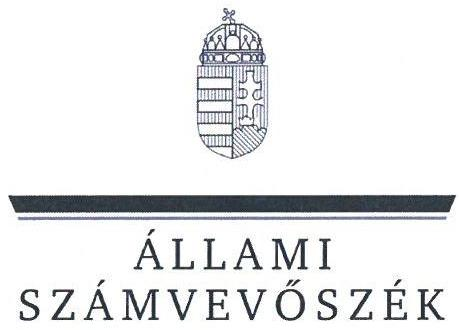
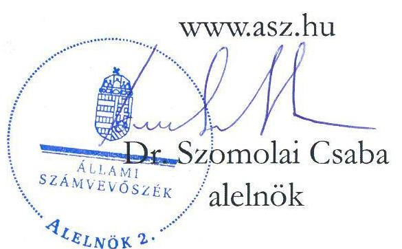
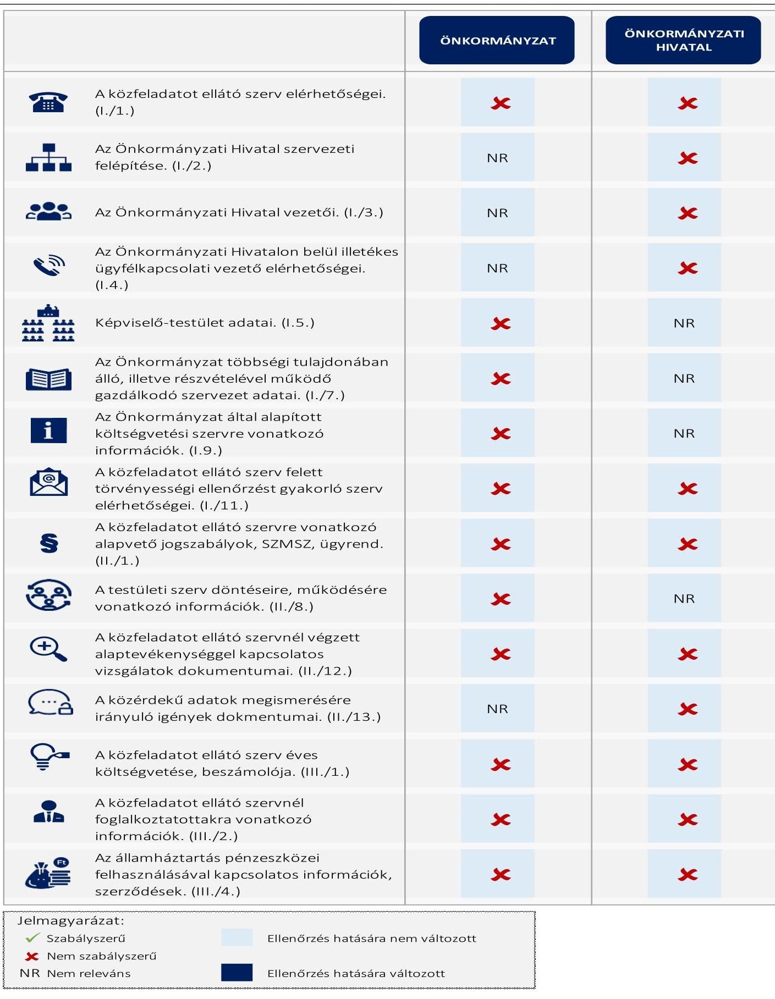
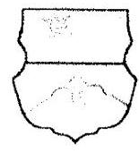
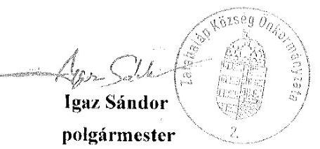

# JELENTÉS 

## Az önkormányzatok közzétételi kötelezettsége teljesítésének célzott ellenőrzése

Zalahaláp Község Önkormányzata
Lesenceistvándi Közös Önkormányzati Hivatal
2025.

24219
www.asz.hu

---

ÁLLAMI
SZÁMVEVŐSZÉK

# JELENTÉS 

## Az önkormányzatok közzétételi kötelezettsége teljesítésének célzott ellenőrzése

Zalahaláp Község Önkormányzata
Lesenceistvándi Közös Önkormányzati Hivatal
2025.

24219

---

# ELLENŐRZÉSI IGAZGATÓSÁG: 

## ÁLLAMHÁZTARTÁS HELYI SZINTJÉT ELLENŐRZŐ IGAZGATÓSÁG

## ELLENŐRZÉSI IGAZGATÓ:

DR. BAFFIA GERGELY GÁBOR igazgató

## ELLENŐRZÉSVEZETŐ:

Jelentéseink az interneten a www.asz.hu címen olvashatók.

BEKE ANDREA ellenőrzésvezető

IKTATÓSZÁM: EL-3986-015/2024
TÉMASORSZÁM: 55.
ELLENŐRZÉS-AZONOSÍTÓ SZÁM: V1062

---

# TARTALOMJEGYZÉK 

AZ ELLENŐRZÉS ALAPADATAI ..... 5
MEGÁLLAPÍTÁSOK ÉS KÖVETKEZTETÉSEK ..... 7
JAVASLATOK ..... 10
MELLÉKLETEK ..... 11
I. sz. melléklet: Értelmező szótár ..... 11
II. sz. melléklet: Ellenőrzési kritériumok ..... 12
III. sz. melléklet: Kimutatás az Info. tv. 1. melléklete szerinti közzétételi egységek ÁSZ ellenőrzési körébe vont adatairól ..... 13
FÜGGELÉK: ÉSZREVÉTELEK ..... 14
RÖVIDÍTÉSEK JEGYZÉKE ..... 19

---

.

---

# AZ ELLENŐRZÉS ALAPADATAI 

## AZ ELLENŐRZÉS CÉLJA

Az ellenőrzés célja annak megállapítása volt, hogy Zalahaláp Község Önkormányzata és a gazdálkodási feladatait ellátó Lesenceistvándi Közös Önkormányzati Hivatal az elektronikus közzétételi kötelezettségüknek eleget tettek-e, biztosították-e az átláthatóság érvényesülését, a nem minősített adatokhoz és információkhoz való hozzáférést, az Önkormányzat munkájának nyomonkövethetőségét.

## AZ ELLENŐRZÖTT IDŐSZAK

Az ellenőrzött szervezetek ellenőrzés megindításáról történő kiértesítését megelőző munkanap (2024. március 05.).

## AZ ELLENŐRZÉS TÁRGYA

Az Önkormányzat ${ }^{1}$ és a gazdálkodási feladatait ellátó Önkormányzati Hivatal ${ }^{2}$ Info. tv. ${ }^{3}$ szerinti elektronikus közzétételi kötelezettségének teljesítése.

A jogszabály által előírt adatok közzététele biztosításának az ellenőrzése az ÁSZ ${ }^{4}$ által az átláthatóság és az önkormányzati feladatellátás nyomonkövethetősége tekintetében az ellenőrzés szempontjából lényegesként meghatározott, az Info. tv. 1. mellékletében szereplő 15 közzétételi egység adatköréhez kapcsolódott (a jelentés III. sz. mellékletében részletezve).

Az ellenőrzés kiterjedt minden olyan körülményre és adatra, amely az ÁSZ jogszabályban meghatározott feladatainak teljesítéséhez, valamint a program végrehajtása folyamán felmerült újabb összefüggések feltárásához szükséges volt.

## AZ ELLENŐRZÉS JOGALAPJA

Az ellenőrzés jogszabályi alapját az ÁSZ tv. ${ }^{5} 1 . \int(3)$ bekezdésében, valamint az Áht. ${ }^{6} 61 . \int(2)$ bekezdésében foglalt előírások képezték.

## AZ ELLENŐRZÉS MÓDSZERE

Az ellenőrzést a nemzetközi standardokat irányadónak tekintve az ellenőrzési program szempontjai, az ellenőrzött időszakban hatályos jogszabályok, valamint az ellenőrzés szakmai szabályok és módszertanok figyelembevételével végezte az ÁSZ.

Az ellenőrzési kérdések megválaszolásához szükséges bizonyítékok megszerzése megfigyelés, szemrevételezés útján történt.

---

Az ellenőrzési bizonyítékként felhasználható adatforrások közé tartoztak az ellenőrzött szervezetek által elektronikusan közzétett dokumentumok, adatok, valamint a MÁK ${ }^{7}$ törzsadatnyilvántartása.

Az ÁSZ az elektronikus közzétételi kötelezettség teljesítését a közzétételre szolgáló honlap közzétételi felületén ellenőrizte. A közzététel akkor volt megfelelő, azaz akkor tett eleget közzétételi kötelezettségének az ellenőrzött, ha a jelentés III. sz. melléklete szerinti közzétételi egységekhez tartozó adatokat, vagy az elérésüket biztosító hivatkozásokat a közzétételre szolgáló honlap megfelelő közzétételi egységében jelenítették meg. Amennyiben a közérdekű adatok, vagy az azokra történő közvetlen hivatkozások a közzétételre szolgáló honlap „Közérdekű adatok" menürendszerén kívül, vagy ilyen menürendszer hiányában a közzétételre szolgáló honlap egyéb, az adat tartalmával összefüggő felületein kerültek elhelyezésre, akkor azt az ellenőrzés az adatok nem jogszabály szerinti közzétételeként értékelte.

Az ÁSZ akkor értékelte a jelentés II. sz. melléklet 1.1. pontja alapján megfelelőnek a jogszabály által előírt adatok közzétételét, ha a jelentés III. sz. melléklete szerinti közzétételi egységekbe tartozó adatkörben teljeskörű volt a közzététel. Az ÁSZ az ellenőrzött adat - ellenőrzött szempontjából történő - irrelevanciájára utalást az értékelés szempontjából közzétételnek minősítette.

Az ellenőrzés nem terjedt ki az adatok tartalmi megfelelőségére, a kapcsolódó belső szabályozásra, valamint arra, hogy a jelentés III. sz. melléklete szerinti közzétételi egyégekbe tartozó adatkörben közzétett adatokon kívül volt-e olyan adat, amelyet közzé kellett volna tennie az ellenőrzöttnek. A közzétett adatok aktualitásának megfelelőségét az ÁSZ csak a jelentés III. sz. melléklete 13. és 14. sora szerinti közzétételi egységek közzétett adatai esetében értékelte, ahol az aktualizálás megfelelősége a MÁK törzsadatnyilvántartás, valamint a közzétett adat alapján egyértelműen megállapítható volt.

A közzétett adatok jogszabályokban meghatározott módon történő elérhetőségét akkor tekintette megfelelőnek az ÁSZ, ha a jelentés II. sz. melléklet 1.2. fókusz alkérdéshez tartozó kritériumok mindegyike teljesült.

# AZ ELLENŐRZÖTT SZERVEZET 

Zalahaláp község Veszprém vármegyében a Tapolcai járásban található. A település a Tapolcai-medencét körülvevő tanúhegyek északi részén, a Haláp-hegy déli lábánál helyezkedik el. A lakosság száma 1169 fő, a lakások száma 490 db volt a $\mathrm{KSH}^{8} 2023$. január 1-jei adatai alapján.
Az Önkormányzata Képviselő-testülete ${ }^{9}$ hét főből áll, élén főállású Polgármesterrel ${ }^{10}$.
Az Önkormányzati Hivatalt a Jegyző ${ }^{11}$ 2022. december 1-jétől vezeti. Az önkormányzat nem tart fenn költségvetési szervet. A településen nemzetiségi önkormányzat nem működik.
Az Önkormányzat a nyilvánosan elérhető adatok alapján nem rendelkezik többségi tulajdonú gazdasági társasággal. Tagja a Zalahaláp, Sáska Községek Önkormányzatainak Óvoda-, és Főzőkonyha Fenntartó Társulásának és a Tapolca Környéki Önkormányzati Társulásnak.

---

# MEGÁLLAPÍTÁSOK ÉS KÖVETKEZTETÉSEK 

## 1. Az Önkormányzat és a gazdálkodási feladatait ellátó Önkormányzati Hivatal teljesítette-e a jogszabályban előírt elektronikus közzétételi kötelezettségét?

## Összegző megállapítás

Az Önkormányzat és a gazdálkodási feladatait ellátó Önkormányzati Hivatal az Info. tv. előírásai ellenére nem teljesítette elektronikus közzétételi kötelezettségét.

Az Önkormányzat és az Önkormányzati Hivatal az adataikat külön-külön honlapon ${ }^{12}$ tették közzé.
Az Önkormányzat az IHM Rendelet ${ }^{13}$ 2. § (1) bekezdésében foglaltak ellenére a közzétételi listák előírt adatait tartalmazó jegyzékre vagy felületre mutató hivatkozást - „Közérdekű adatok" elnevezéssel - nem helyezte el a közzétételre szolgáló honlap megnyitásakor megjelenő oldalon. Az IHM Rendelet 2. § (2) bekezdését figyelmen kívül hagyva nem gondoskodott az általános közzétételi lista közzétételi egységeit tartalmazó, vagy azokra hivatkozó jegyzék IHM Rendelet 1. melléklete szerinti tagolásának kialakításáról. Az Info.tv. 1. melléklete szerinti általános közzétételi listában meghatározott adatok Info. tv. 37. § (1) bekezdése szerinti közzétételi kötelezettségét nem teljesítette.
Az Önkormányzat honlapjának nyitó oldaláról elérhető „Közérdekű információk" hivatkozás alatt a nyilvántartások, kéményseprés, helyi építési szabályzat, esélyegyenlőségi program, település arculati kézikönyv, valamint a közérdekű adatok megismerésének szabályzata voltak feltüntetve.
A közérdekű adatok egy része megtalálható volt az Önkormányzat közzétételre szolgáló honlapjának egyéb felületein - így az Önkormányzat elérhetőségi adatai, a Képviselő-testületre vonatkozó adatok, a képviselő-testületi jegyzőkönyvek, rendeletek, a testületi szerv döntései -, azonban ezek közzététele nem volt megfelelő, mert elérhetőségüket az Önkormányzat nem az IHM Rendelet 2. § (2) bekezdése által előírt közzétételi egységek szerinti tagolásban biztosította.
Az Önkormányzati Hivatal adatainak közzétételére szolgáló honlap megnyitásakor megjelenő oldalon az IHM Rendelet 2. § (1) bekezdésében foglaltak ellenére a közzétételi listák előírt adatait tartalmazó jegyzékre vagy felületre mutató hivatkozást - „Közérdekű adatok" elnevezéssel - nem helyezték el. Az IHM Rendelet 2. § (2) bekezdését figyelmen kívül hagyva nem gondoskodtak az általános közzétételi lista közzétételi egységeit tartalmazó, vagy azokra hivatkozó jegyzék IHM Rendelet 1. melléklete szerinti tagolásának kialakításáról. Az Info. tv. 1. melléklete szerinti általános közzétételi listában meghatározott adatok Info. tv. 37. § (1) bekezdése szerinti közzétételi kötelezettségét nem teljesítették.
Az Önkormányzati Hivatal adatainak közzétételére szolgáló honlap nyitó oldaláról elérhető „Közérdekű információk" hivatkozás alatt a helyi építési szabályzatot, település arculati kézikönyvet, helyi és esélyegyenlőségi programot, belterületi és külterületi szabályozási tervet, a Magyar Államkincstár, a Nemzeti Adó- és Vámhivatal, a Kormányablak elérhetőségi adatait helyezték el.
Az Önkormányzati Hivatal közérdekű adatainak egy része megtalálható volt a közzétételre szolgáló honlap egyéb felületein - az elérhetőségi és az ügyfélfogadásra vonatkozó adatok, egyes személyzeti adatok -, azonban ezek közzététele nem volt megfelelő, mivel elérhetőségüket nem az IHM Rendelet 2. § (2) bekezdése által előírt közzétételi egységek szerinti tagolásban biztosították.

---

Az ellenőrzött szervezetek a közzétételre szolgáló honlapokon az IHM Rendelet 2. § (1) bekezdésének előírását figyelmen kívül hagyva nem tüntették fel az egységes közadatkereső rendszerre, a központi elektronikus jegyzékre mutató hivatkozást.
Az Önkormányzat és az Önkormányzati Hivatal az Info. tv. előírásának megfelelően továbbított adatot a közadatkereső rendszerbe. A közadatkereső rendszer és az elektronikus jegyzék az ellenőrzött szervezetekre vonatkozóan tartalmazott adatokat.
A feltárt hiányosságok miatt az ellenőrzés időpontjában az ellenőrzött szervezetek közzétételre szolgáló honlapja nem biztosította az Info. tv.-ben megfogalmazott követelmények - az elektronikusan közzétett adatok egyszerű és gyors elérhetőségének, a közérdekű és közérdekből nyilvános adatok átláthatóságának, megismerhetőségének - maradéktalan érvényesülését.
A Polgármester az ÁSZ tv. 29. § (2) bekezdés szerinti - a jelentéstervezet megállapításaira tett 2024. november 20-ai - észrevételében tájékoztatta az ÁSZ-t a közzétételi kötelezettség megfelelőségének helyreállításával kapcsolatos önkormányzati intézkedésekről. Az ÁSZ ezek közül - az Önkormányzat vonatkozásában - az egységes közadatkereső rendszerre, a központi elektronikus jegyzékre mutató hivatkozás IHM Rendeletnek megfelelő közzétételét fogadta el, ezáltal az ÁSZ megállapítása az ellenőrzés során hasznosult.

---

# AZ ELLENŐRZÉS FŐBB TAPASZTALATAINAK ÖSSZEGZÉSE 

[^0]
[^0]:    Forrás: Az ellenőrzési megállapítások alapján ÁSZ saját szerkesztés

---

# JAVASLATOK 

Az ÁSZ tv. 33. § (1) bekezdésében foglaltak értelmében az ellenőrzött szervezet vezetője köteles a jelentésben foglalt megállapításokhoz kapcsolódó intézkedési tervet összeállítani és azt a jelentés kézhezvételétől számított 30 napon belül az ÁSZ részére megküldeni. Amennyiben az ellenőrzött szervezet vezetője nem küldi meg határidőben az intézkedési tervet, vagy továbbra sem elfogadható intézkedési tervet küld, az Állami Számvevőszék elnöke az ÁSZ tv. 33. § (3) bekezdése a) és b) pontjaiban foglaltakat érvényesítheti.

## ZALAHALÁP KÖZSÉG ÖNKORMÁNYZATA POLGÁRMESTERÉNEK

1. Intézkedjen a nyilvános jelentés kézhezvételét követő 30 napon belül az Állami Számvevőszék jelentésének a Képviselő-testület elé terjesztéséről. A napirend tárgyalásáról szóló jegyzőkönyvvel együtt a jelentést tájékoztatásul küldje meg a Kormányhivatal számára is.
2. Intézkedjen a közérdekű adatok Info. tv. 37. § (1) bekezdés előírása szerinti közzétételéről. Ennek keretében gondoskodjon arról, hogy a közzétételre szolgáló honlap nyitó oldalán a közzétételi listák által előírt adatokat tartalmazó jegyzékre vagy felületre mutató hivatkozás az IHM Rendelet 2. § (1) bekezdésének megfelelően kerüljön elhelyezésre. Továbbá gondoskodjon arról, hogy a kialakított jegyzék az IHM Rendelet 2. § (2) bekezdésének előírása alapján az IHM Rendelet 1. melléklete szerinti tagolásban tartalmazza az általános közzétételi lista szerinti adatokat tartalmazó közzétételi egységeket, vagy hivatkozzon azokra.

## LESENCEISTVÁNDI KÖZÖS ÖNKORMÁNYZATI HIVATAL JEGYZŐJÉNEK

1. Intézkedjen a közérdekű adatok Info. tv. 37. § (1) bekezdés előírása szerinti közzétételéről. Ennek keretében gondoskodjon arról, hogy a közzétételre szolgáló honlap nyitó oldalán a közzétételi listák által előírt adatokat tartalmazó jegyzékre vagy felületre mutató hivatkozás az IHM Rendelet 2. § (1) bekezdésének megfelelően kerüljön elhelyezésre. Továbbá gondoskodjon arról, hogy a kialakított jegyzék az IHM Rendelet 2. § (2) bekezdésének előírása alapján az IHM Rendelet 1. melléklete szerinti tagolásban tartalmazza az általános közzétételi lista szerinti adatokat tartalmazó közzétételi egységeket, vagy hivatkozzon azokra.

2. Intézkedjen, hogy az IHM Rendelet 2. § (1) bekezdésében foglalt előírásnak megfelelően a közzétételre szolgáló honlapon az egységes közadatkereső rendszerre, a központi elektronikus jegyzékre mutató hivatkozást tüntessék fel.

---

# MELLÉKLETEK 

## I. SZ. MELLÉKLET: ÉRTELMEZŐ SZÓTÁR

általános közzétételi lista
elektronikus
 közzététel
jegyzék
közadatkereső rendszer
közérdekű adat
központi elektronikus jegyzék
közzétételi egység
közzétételre szolgáló honlap

Közérdekű adatokat tartalmazó, Info. tv. 1. melléklet szerinti lista. (Info. tv. 37. § (1) bekezdés alapján)

Az Info.tv. alapján kötelezően közzéteendő közérdekű adatokat internetes honlapon, digitális formában, bárki számára, személyazonosítás nélkül, korlátozástól mentesen, kinyomtatható és részleteiben is adatvesztés és torzulás nélkül kimásolható módon, a betekintés, a letöltés, a nyomtatás, a kimásolás és a hálózati adatátvitel szempontjából is díjmentesen kell hozzáférhetővé tenni. A közzétett adatok megismerése személyes adatok közléséhez nem köthető (Info.tv. 33. § (1) bekezdés)
A közzétételi listák által előírt adatokat tartalmazó jegyzék vagy felület. (IHM Rendelet 2. § (1) bekezdés alapján)
A közérdekű adatokhoz való egységes szempontok szerinti elektronikus hozzáférést és a közérdekű adatok közötti keresés lehetőségét a közigazgatási informatika infrastrukturális megvalósíthatóságának biztosításáért felelős miniszter által működtetett egységes közadatkereső rendszer biztosítja. (Info. tv. 37/A. § (2) bekezdés)
Az állami vagy helyi önkormányzati feladatot, valamint jogszabályban meghatározott egyéb közfeladatot ellátó szerv vagy személy kezelésében lévő és tevékenységére vonatkozó vagy közfeladatának ellátásával összefüggésben keletkezett, a személyes adat fogalma alá nem eső, bármilyen módon vagy formában rögzített információ vagy ismeret, függetlenül kezelésének módjától, önálló vagy gyűjteményes jellegétől, így különösen a hatáskörre, illetékességre, szervezeti felépítésre, szakmai tevékenységre, annak eredményességére is kiterjedő értékelésére, a birtokolt adatfajtákra és a működést szabályozó jogszabályokra, valamint a gazdálkodásra, a megkötött szerződésekre vonatkozó adat. (Info. tv. 3. § 5. pont)
Az elektronikusan közzétett adatok egyszerű és gyors elérhetősége érdekében az e törvény alapján közérdekű adat elektronikus közzétételére kötelezett szervek közérdekű adatot tartalmazó honlapjára, valamint az általuk fenntartott adatbázisra és nyilvántartásra vonatkozó leíró adatokat a közigazgatási informatika infrastrukturális megvalósíthatóságának biztosításáért felelős miniszter által működtetett, az erre a célra létrehozott honlapon közzétett központi elektronikus jegyzék összesítve tartalmazza. (Info. tv. 37/A. § (1) bekezdés)
A közzétételi listák szerinti adatok közzétételének szerkezetét és az összefüggő tárgyú közzétett adatokat egybefoglaló tartalmi egységek. (IHM Rendelet 1. § (2) bekezdés)
Az adatközlő a közzétételre szolgáló honlapot úgy alakítja ki, hogy az adatok közzétételére alkalmas legyen, gondoskodik a folyamatos üzemeltetésről, az esetleges üzemzavar elhárításáról és az adatok frissítéséről. A közzétételre szolgáló honlapon közérthető formában tájékoztatást kell adni a közérdekű adatok egyedi igénylésének szabályairól. A tájékoztatásnak tartalmaznia kell az igénybe vehető jogorvoslati lehetőségek ismertetését is. (Info. tv. 34. § (2)-(3) bekezdések)

---

# II. SZ. MELLÉKLET: ELLENŐRZÉSI KRITÉRIUMOK 

## FOKUSZKÉRDÉS

1. Az Önkormányzat és a gazdálkodási feladatait ellátó Önkormányzati Hivatal teljesítette-e a jogszabályban előírt elektronikus közzétételi kötelezettségét?
1.1. Az Önkormányzat és a gazdálkodási feladatait ellátó Önkormányzati Hivatal az elektronikus közzétételi kötelezettségének teljesítése során biztosította-e a jogszabály által előírt adatok közzétételét?

### 1.2. Az Önkormányzat és a gazdálkodási feladatait

ellátó Önkormányzati Hivatal az elektronikus közzétételi kötelezettségének teljesítése során biztosította-e a közzétett adatok jogszabályokban meghatározott módon történő elérhetőségét?

## ELLENŐRZÉSI KRITÉRIUMOK

Info. tv. 33. § (3), 37. § (1) és (4a) bekezdés, 1. melléklet I/1., 2., 3., 4., 5., 7., 9., 11. pont, II/1., 8., 12., 13. pont, III/1., 2., 4. pont; Áht. 87. § b) pont; Áhsz. ¹⁴ 6. § (1) bek. a) és f) pontjai;

IHM Rendelet 2. § (2) bekezdés.
Info. tv. 33. § (1) bekezdés, 37/B. § (1) bekezdés; IHM Rendelet 2. § (1) bekezdés.

---

# III. SZ. MELLÉKLET: KIMUTATÁS AZ INFO. TV. 1. MELLÉKLETE SZERINTI KÖZZÉTÉTELI EGYSÉGEK ÁSZ ELLENŐRZÉSI KÖRÉBE VONT ADATAIRÓL 

## Ssz.

## ADATKÖR AZ INFO. TV. 1. MELLÉKLET SZERINTI SORSZÁM

## I. Szervezeti, személyi adatok

1. A közfeladatot ellátó szerv hivatalos neve, székhelye, postai címe, telefonszáma, elektronikus levélcíme, honlapja. (I./1.)
2. Az Önkormányzati Hivatal szervezeti felépítése szervezeti egységek megjelölésével, az egyes szervezeti egységek feladatai. (I./2.)
3. Az Önkormányzati Hivatal vezetőinek és az egyes szervezeti egységek vezetőinek neve, beosztása, elérhetősége (telefonszáma, elektronikus levélcíme). (I./3.)
4. Az Önkormányzati Hivatalon belül illetékes ügyfélkapcsolati vezető neve, elérhetősége (telefonszáma, elektronikus levélcíme) és az ügyfélfogadási rend. (I./4.)
5. A képviselő-testület létszáma, tagjainak neve, beosztása, elérhetősége. (I./5.)
6. Az Önkormányzat többségi tulajdonában álló, illetve részvételével működő gazdálkodó szervezet neve, székhelye, elérhetősége (postai címe, telefonszáma, elektronikus levélcíme), tevékenységi köre, képviselőjének neve, a közfeladatot ellátó szerv részesedésének mértéke. (I./7.)
7. Az Önkormányzat által alapított költségvetési szerv neve, székhelye, a költségvetési szerv alapító okirata, vezetője, működési engedélye. (I./9.)
8. A közfeladatot ellátó szerv felett törvényességi ellenőrzést gyakorló szervnek a hivatalos neve, székhelye, postai címe, telefonszáma, elektronikus levélcíme, honlapja, ügyfélszolgálatának elérhetőségei. (I./11.)

## II. Tevékenységre, működésre vonatkozó adatok

9. A közfeladatot ellátó szerv feladatát, hatáskörét és alaptevékenységét meghatározó, a szervre vonatkozó alapvető jogszabályok, valamint a szervezeti és működési szabályzat vagy ügyrend, az adatvédelmi és adatbiztonsági szabályzat hatályos és teljes szövege. (II./1.)
10. A testületi szerv döntései előkészítésének rendje, az állampolgári közreműködés (véleményezés) módja, eljárási szabályai, a testületi szerv üléseinek helye, ideje, továbbá nyilvánossága, döntései, ülésének jegyzőkönyvei, illetve összefoglalói; a testületi szerv szavazásának adatai, ha ezt jogszabály nem korlátozza. (II./8.)
11. A közfeladatot ellátó szervnél végzett alaptevékenységgel kapcsolatos vizsgálatok, ellenőrzések nyilvános megállapításai. (II./12.)
12. A közérdekű adatok megismerésére irányuló igények intézésének rendje, az illetékes szervezeti egység neve, elérhetősége, az információs jogokkal foglalkozó személy neve. (II./13.)

## III. Gazdálkodási adatok

13. A közfeladatot ellátó szerv éves költségvetése, éves költségvetés beszámolója. (III./1.)
14. A közfeladatot ellátó szervnél foglalkoztatottak létszámára és személyi juttatásaira vonatkozó összesített adatok, illetve összesítve a vezetők és vezető tisztségviselők illetménye, munkabére és rendszeres juttatásai, valamint költségtérítése. (III./2.)
15. Az állambáztartás pénzeszközei felhasználásával, az állambáztartáshoz tartozó vagyonnal történő gazdálkodással összefüggő, ötmillió forintot elérő szerződések megnevezése (típusa), tárgya, szerződést kötő felek neve, a szerződés értéke, határozott időre kötött szerződés esetében annak időtartama. (III./4.)

---

# FÜGGELÉK: ÉSZREVÉTELEK 

A jelentéstervezetet a Számvevőszék 15 napos észrevételezésre megküldte az ellenőrzött szervezet vezetőjének az ÁSZ tv. 29. § (1) bekezdése előírásának megfelelően.

A jelentéstervezet megállapításaira az Önkormányzat polgármestere észrevételt tett.
Az elfogadott észrevételek alapján a Számvevőszék módosította a jelentést.
A függelék tartalmazza az ellenőrzött észrevételeit, illetve az el nem fogadott észrevételek elutasításának indoklását.

[^0]
[^0]:    * 29. §(1) Az Állami Számvevőszék az ellenőrzési megállapításait megküldi az ellenőrzött szervezet vezetőjének vagy az általa megbízott személynek, és annak, akinek személyes felelősségét állapította meg.
    (2) Az ellenőrzött szervezet vezetője és a felelősként megjelölt személy az ellenőrzés megállapításaira tizenöt napon belül írásban észrevételt tehet.
    (3) Az Állami Számvevőszék az észrevételre a beérkezésétől számított harminc napon belül írásban válaszol. A figyelembe nem vett észrevételeket köteles a jelentésben feltüntetni, és megindokolni, hogy azokat miért nem fogadta el.

---

# Zalahaláp Község Önkormányzat Polgármesterétől 

8300 Zalahaláp, Petőfi tér 4.
Veszprém Vármegye
Tel/fax: 87/413-233
E-mail: utkarszgs@zalahalap.hu
KRID azonosító: 600088992
iktatószám: ZHI./981-4/2024.
Úgyintézőnk: dr. Benkő Réka
Tárgy: Észrevétel

Állami Számvevőszék
Államháztartás Helyi Szintjét Ellenőrző Igazgatóság
Bajmóci Tivadar ellenőrzési igazgatóhelyettes részére
Budapest
Apáczai Csere János u. 10.
1052
Hiv.szám: EL-4017-133/2024
Tisztelt Igazgatóhelyettes Úr!
Fenti számú jelentéstervezet megküldésére az alábbi észrevételeket teszem.
Az információs önrendelkezési jogról és az információszabadságról szóló 2011. évi CXII. törvény (a továbbiakban: Infotv.) szerinti közérdekű adatok (általános közzétételi lista) az alábbi linken érhető el:
https://www.zalahalap.hu/onkormanyzat/kozerdeku-adatok/
Az Infotv. 1. melléklete szerinti szervezeti, személyi adatok az alábbi linken érhetőek el:
https://www.zalahalap.hu/onkormanyzat/kozerdeku-adatok/1-szervezeti-szemelyzeti-adatok/
Az Infotv. 1. melléklete szerinti tevékenységre, működésre vonatkozó adatok az alábbi linken érhetőek el:
https://www.zalahalap.hu/onkormanyzat/kozerdeku-adatok/2-tevekenysegre-mukodesrevonatkozo-adatok/

Az Infotv. 1. melléklete szerinti gazdálkodási adatok az alábbi linken érhetőek el:
https://www.zalahalap.hu/onkormanyzat/kozerdeku-adatok/3-gazdalkodasi-adatok/
A közadatkereső az önkormányzat kezdő oldalán elérhető, mely az alábbi oldalon nyílik meg:
https://kozzetetel.dokumentumtar.hu/zalahalaponk/

---

A közérdekű adatok szabályzat elérhetősége:
https://www.zalahalap.hu/kozerdeku-informaciok/kozerdeku-adatok-megismeresenekszabalyzata/

Kérem tájékoztatásom szíves tudomásul vételét. Együttműködését ezúton is köszönöm.

Zalahaláp, 2024. november 19.

---

# I. 

## Igaz Sándor

polgármester
Zalahaláp Község Önkormányzata

## Zalahaláp

Tárgy: Válaszlevél ellenőrzéssel kapcsolatos észrevételek kezeléséről

## Tisztelt Polgármester Úr!

„Az önkormányzatok közzétételi kötelezettsége teljesítésének célzott ellenőrzése - Zalahaláp Község Önkormányzata, Lesenceistrándi Közös Önkormányzati Hivatal" című jelentéstervezettel kapcsolatos, 2024. november 20-i keltezésű, észrevételként megküldött levelét köszönettel megkaptam.

Az Állami Számvevőszék (továbbiakban ÁSZ) észrevételekre vonatkozó álláspontjáról az alábbi tájékoztatást adom:

1. Az információs önrendelkezési jogról és az információszabadságról szóló 2011. évi CXIL. törvény (a továbbiakban: Infotv.) szerinti közérdekű adatok (általános közzétételi lista) az alábbi linken érhető el: https://www.zalahalap.hu/ önkormányzat/kozerdeku-adatok/.

Zalahaláp Község Önkormányzata (továbbiakban Önkormányzat) a közzétételi listákon szereplő adatok közzétételéhez szükséges közzétételi mintákról szóló 18/2005. (XII. 27.) IHM rendelet (továbbiakban IHM rendelet) 2. § (1) bekezdésében foglaltak ellenére a közzétételre szolgáló honlap megnyitásakor megjelenő oldalon - a 2024. március 5-ei ÁSZ ellenőrzést követően - sem jól látható módon helyezte el "Közérdekű adatok" elnevezéssel a közzétételi listák által előírt adatokat tartalmazó jegyzékre vagy felületre mutató hivatkozást.
2. A levél 2., 3., 4., és 6. bekezdésében az Infotv. 1. melléklete szerinti szervezeti, személyi, a tevékenységre, működésre vonatkozó (köztük a közérdekű adatok megismerhetőségére vonatkozó szabályzat is) és a gazdálkodási adatok elérésére mutató linkeik.

A közzétételre szolgáló honlapon - a 2024. március 5-ei ÁSZ ellenőrzést követően - közzétett szervezeti, személyi adatok, a tevékenységre, működésre vonatkozó adatok, a gazdálkodási adatok tagolása és tartalma (pl. az I. Szervezeti, személyi adatok közül hiányzik a felügyelt

---

költségvetési szerv alapító okirata, az Önkormányzat által alapított lapokra vonatkozó adatok, a III. Gazdálkodási adatok közül a közbeszerzésre vonatkozó adatok stb.) nem teljes körűen felel meg az információs önrendelkezési jogról és az információszabadságról szóló 2011. évi CXII. törvény 1. mellékletében, illetve az IHM rendelet 2. § (2) bekezdésében előírtaknak. Továbbá azokat az IHM rendelet 2. § (1) bekezdésében foglaltak ellenére továbbra sem lehet a közzétételre szolgáló honlap megnyitásakor megjelenő oldalon, jól látható módon elhelyezett, a közzétételi listák által előírt adatokat tartalmazó jegyzékre vagy felületre mutató, "Közérdekű adatok" elnevezésű hivatkozással elérni. Így közzétételük továbbra sem megfelelő, nem tudjuk hasznosulásként figyelembe venni.
3. A levél 6. bekezdésében az egységes közadatkereső rendszer elérhetőségére mutató link.

Az egységes közadatkereső rendszerre, a központi elektronikus jegyzékre mutató hivatkozás az IHM rendelet előírásának megfelelően a közzétételre szolgáló honlapon jól látható módon elhelyezésre került. Mivel azonban erre a 2024. március 5-ei ÁSZ ellenőrzést követően került sor a számvevőszéki jelentésben hasznosulásként szerepeltetjük, azonban ez a jelentésben megfogalmazott korábbi megállapítást nem befolyásolja.

Tájékoztatom Polgármester urat, hogy a számvevőszéki jelentésben a figyelembe nem vett észrevételeket szerepeltetjük az elutasítás indokának feltüntetésével.

Budapest, időbélyegző szerint

Üdvözlettel:

Baffia Gergely Gábor
ellenőrzési igazgató, kiadmányozó
Állami Számvevőszék
Államháztartás helyi szintjét ellenőrző igazgatóság

---

# RÖVIDÍTÉSEK JEGYZÉKE 

¹ Önkormányzat
² Önkormányzati Hivatal
³ Info. tv.
⁴ ÁSZ
⁵ ÁSZ tv.
⁶ Áht.
⁷ MÁK
⁸ KSH
⁹ Képviselő-testület
¹⁰ Polgármester
¹¹ Jegyző
¹² honlap
¹³ IHM Rendelet
¹⁴ Áhsz.

Zalahaláp Község Önkormányzata
Lesenceistvándi Közös Önkormányzati Hivatal
2011. évi CXII. törvény az információs önrendelkezési jogról és az információszabadságról
Állami Számvevőszék
2011. évi LXVI. törvény az Állami Számvevőszékről
2011. évi CXCV. törvény az államháztartásról

Magyar Államkincstár
Központi Statisztikai Hivatal
Zalahaláp Község Önkormányzatának Képviselő-testülete
Zalahaláp Község Önkormányzatának Polgármestere
Lesenceistvándi Közös Önkormányzati Hivatal Jegyzője
https://www.zalahalap.hu/ http://www.lesenceistvand.hu/
18/2005. (XII. 27.) IHM Rendelet a közzétételi listákon szereplő adatok közzétételéhez szükséges közzétételi mintákról
4/2013. (I. 11.)

 Korm. rendelet az államháztartás számviteléről

---

1052 Budapest, Apáczai Csere János u. 10. | 1364 Budapest IV., Pf. 54
www.asz.hu | szamvevoszek@asz.hu
telefon: +36 1 4849100
