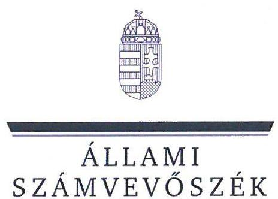
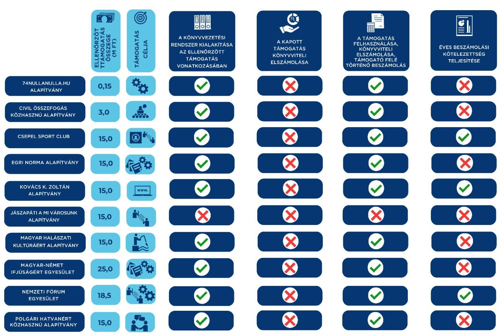

# JELENTÉS 

## Egyesületek és alapítványok államháztartásból kapott támogatásai felhasználásának és elszámolásának ellenőrzése

2025.

---

ÁLLAMI
SZÁMVEVÔSZÉK

# JELENTÉS 

## Egyesületek és alapítványok államháztartásból kapott támogatásai felhasználásának és elszámolásának ellenőrzése

2025.

---

# ELLENŐRZÉSI IGAZGATÓSÁG:

## ÁLLAMHÁZTARTÁSON KÍVÜLI SZERVEZETEKET ELLENŐRZŐ IGAZGATÓSÁG

### ELLENŐRZÉSI IGAZGATÓ:

#### KLINGA LÁSZLÓ igazgató

### ELLENŐRZÉSVEZETŐ:

Jelentéseink az interneten a www.asz.hu címen olvashatók.

#### SOLYMÁR ÁGNES ellenőrzésvezető

#### IKTATÓSZÁM EL-4071-003/2024

#### TÉMASORSZÁM: 26.

#### ELLENŐRZÉS-AZONOSÍTÓ SZÁM: V1099

---

# TARTALOMJEGYZÉK 

AZ ELLENŐRZÉS ALAPADATAI ..... 5
AZ ELLENŐRZÖTT SZERVEZETEK ..... 7
ÖSSZEFOGLALÁS ..... 13
AZ ELLENŐRZÉS FÓKUSZKÉRDÉSE ..... 15
MEGÁLLAPÍTÁSOK ..... 16
JAVASLATOK ..... 30
MELLÉKLETEK ..... 33
I. sz. melléklet: Értelmező szótár ..... 33
II. sz. melléklet: Az ellenőrzött szervezetek jegyzéke ..... 35
III. sz. melléklet: Ellenőrzési kritériumok ..... 36
FÜGGELÉK: ÉSZREVÉTELEK ..... 37
RÖVIDÍTÉSEK JEGYZÉKE ..... 38

---

.

---

# AZ ELLENŐRZÉS ALAPADATAI 

## AZ ELLENŐRZÉS CÉLJA

Az ellenőrzés célja annak megállapítása volt, hogy az ellenőrzött egyesületeknél, alapítványoknál a kiválasztott, államháztartási forrásból származó támogatások felhasználása a jogszabályi és a támogatói okiratban előírtaknak megfelelően történt-e, a támogatásokkal való elszámolás szabályszerű volt-e, a civil szervezetek a gazdálkodásukról szabályszerűen beszámoltak-e. Az államháztartási forrásból származó támogatást a támogatói okiratban meghatározott célra használták-e fel.

## AZ ELLENŐRZÉS TÍPUSA

Szabályszerüségi ellenőrzés.

## AZ ELLENŐRZŐTT IDŐSZAK

A kiválasztott államháztartási forrásból származó támogatásra vonatkozó támogatói okirat aláírásától amennyiben a támogatott tevékenység időtartamának kezdő időpontja korábbi, mint a támogatói okirat aláírásának időpontja, akkor a támogatott tevékenység időtartamának kezdő időpontjától az ellenőrzésről szóló értesítés keltéig (2024. június 20-ig) tartó időszak. Amennyiben a 2023. évi beszámoló közzététele ezen időszakban nem történt meg, akkor az ellenőrzött időszak záró időpontja a 2023. évi beszámoló közzétételének napja.

## AZ ELLENŐRZÉS TÁRGYA

Az államháztartásból nyújtott támogatást felhasználó ellenőrzött egyesületeknél és alapítványoknál a kiválasztott támogatás felhasználására vonatkozó jogszabályi és szerződéses előírások betartásának ellenőrzése. Ennek keretében a könyvvezetésre vonatkozó jogszabályi előírások betartása, a támogatás felhasználás a támogatói okiratnak való megfelelősége, valamint a beszámolási és közzétételi kötelezettség teljesítésének szabályszerűsége. Az ellenőrzés tárgya továbbá annak ellenőrzése, hogy a számviteli szabályozási környezet kialakítása támogatta-e az államháztartásból származó támogatások vonatkozásában a szabályos könyvvezetést, a kapcsolódó beszámolási kötelezettség teljesítését, valamint a támogatások célnak megfelelő felhasználását.

## AZ ELLENŐRZÉS JOGALAPJA

Az ellenőrzés jogalapját az ÁSZ tv. ${ }^{1} 1 . \int(3)$, valamint az 5. $\int(3)$ bekezdés előírásai képezték.

---

# AZ ELLENŐRZÉS MÓDSZERE 

Az ellenőrzést a nemzetközi standardokat irányadónak tekintve az ellenőrzési program szempontjai, az ellenőrzött időszakban hatályos jogszabályok, az ellenőrzés szakmai szabályai és ellenőrzési módszertanok figyelembevételével történt.

Az ellenőrzési kérdések megválaszolásához szükséges bizonyítékok megszerzése az ellenőrzött civil szervezet által rendelkezésre bocsátott dokumentumokra és adatokra alapozva, továbbá kérdésfeltevés (információkérés), interjú útján történt.

A civil szervezeteknél az államháztartási forrásból származó működésükhöz, programjaikhoz vagy fejlesztéseikhez (beruházásaikhoz) kapcsolódó, kiválasztott támogatás felhasználása támogatói okiratnak való megfelelőségét, a támogatások nyilvántartásának és a támogató felé történő elszámolásnak egymással és a támogatói okirattal történő összevetésével ellenőrizte az ÁSZ ${ }^{2}$.

A támogatások könyvviteli nyilvántartása jogszabályi előírásoknak, támogatói okiratnak való megfelelőségét támogatásonként, kockázati értékeléssel kiválasztott mintatételeken keresztül ellenőrizte az ÁSZ. A mintatételek kiértékelésének eredménye nem került az alapsokaságra kivetítésre, az ellenőrzött mintatételekre vonatkozóan fogalmazta meg az ÁSZ a megállapításokat.

---

# AZ ELLENŐRZÖTT SZERVEZETEK 

Az ellenőrzésre 10 civil szervezet esetében került sor, melyek közül kettő egyesületi, nyolc pedig alapítványi formában működött. Működéséről, vagyoni, pénzügyi és jövedelmi helyzetéről a 10 szervezet az ellenőrzött években, egyszerűsített éves beszámolót készített, melyet kettős könyvvezetéssel támasztottak alá. A 10 ellenőrzött szervezetből öt rendelkezett közhasznú jogállással. A Közbef. tv. ${ }^{3}$ előírása szerint tevékenysége és a 2023. évi számviteli beszámoló mérlegfőösszege alapján - mivel mérlegfőösszegük elérte a 20 M Ft összeget -, nyolc ellenőrzött szervezet a közélet befolyásolására alkalmas tevékenységet végző civil szervezetnek minősült.

Az ellenőrzött szervezetek 2023. évi számviteli beszámolói szerint összesen 5955 M Ft vagyonnal gazdálkodtak, az összes bevételük közel 1851 M Ft volt. Az ellenőrzött 10 civil szervezet a $\mathrm{BGA}^{4}$-tól, mint a Miniszterelnökségnél rendelkezésre álló támogatási célú fejezeti kezelésű előirányzat kezelő szervétől, 136,7 M Ft összegű, vissza nem térítendő, $100 \%$-os előlegként megkapott támogatás számviteli elkülönített nyilvántartásának, valamint a támogatás cél szerinti felhasználásának ellenőrzésére került sor.

## 74NULLANULLA.HU ALAPÍTVÁNY (KAPOSVÁR)

A 74nullanulla.hu Alapítványt 2019. évben, egy magánszemély hozta létre. Az Alapító okiratban meghatározott célja többek között „Somogy megye lakosságának tájékoztatása, belyi információkkal való ellátása az elektronikus média eszköztárával... Somogyi kultúra népszerüsitése és megismertetése, kulturális örökség megóvása... A rászorulók támogatása szociális, családsegitő és érdeksédelmi tevékenység támogatása, mindezen feladatok ellátásának finanszérozzása." A 74nullanulla.hu Alapítvány közhasznú jogállással nem rendelkezett, a 2023. évi számviteli beszámolójának mérlegfőösszege alapján nem minősült a közélet befolyásolására alkalmas tevékenységet végző civil szervezetnek. A vagyonkezelő, ügyvezető, döntéshozó szerve a kuratórium volt. A 74nullanulla.hu Alapítvány a számviteli beszámoló adatai alapján vállalkozási tevékenységet nem folytatott, könyvvizsgálatra nem volt kötelezett. A BGA által nyújtott, ellenőrzött támogatás főbb adatait az 1. táblázat tartalmazza.

## 1. táblázat

## A 74NULLANULLA.HU ALAPÍTVÁNY RÉSZERE A BGA ÁLTAL NYÚJTOTT, ELLENŐRZÖTT TÁMOGATÁS FÖBB ADATAI

Támogatási program célja
Támogatott tevékenység időtartama
A támogatási előleg felhasználásának végső időpontja
A támogatási előleg folyósításának napja / összege
A támogatási előleg felhasználásáról a beszámoló benyújtásának határideje
A támogatási előleg felhasználásáról benyújtott beszámoló elfogadásának dátuma
„74nullanulla.hu Alapítvány 2023. évi NE.A müködési projektyu"
2023.04.01 - 2024.03.31.
2024.03.31.
2023.06.09. / 0,15 M Ft
2024.04.30.

A beszámolóról a BGA az ellenőrzésről szóló értesítés keltéig (2024.06.20.) még nem döntött.

Fonrás: Az ellenőrzött szervezet dokumentumai alapján A5Z saját szerkecités

---

# CIVIL ÖSSZEFOGÁS KÖZHASZNÚ ALAPÍTVÁNY (BUDAPEST)

A Civil Összefogás Közhasznú Alapítványt 2009. évben egy magánszemély hozta létre. Az Alapító okiratában meghatározott célja többek között, hogy „, *hatásos eszköz legyen az ország gazdaságának formálásában úgy, hogy pártpolitikától függetlenül közvetíti az állampolgárok álláspontját a helyi gazdaságpolitikai és kormányzati tevékenység előmozdítása érdekében, a közjöért.*” A Civil Összefogás Közhasznú Alapítvány közhasznú jogállással rendelkezett, a 2023. évi számviteli beszámolójának mérlegfőösszege alapján a közélet befolyásolására alkalmas tevékenységet végző civil szervezetnek minősült. A Civil Összefogás Közhasznú Alapítvány kezelője és legfőbb döntéshozó szerve a kuratórium, képviseletét a kuratórium elnöke önállóan látta el. A Civil Összefogás Közhasznú Alapítvány a számviteli beszámolók adatai alapján vállalkozási tevékenységet folytatott, a 2022. évtől könyvvizsgálatra volt kötelezett. A BGA által nyújtott, ellenőrzött támogatás főbb adatait az 2. táblázat tartalmazza.

*2. táblázat*

# A CIVIL ÖSSZEFOGÁS KÖZHASZNÚ ALAPÍTVÁNY RÉSZÉRE A BGA ÁLTAL NYÚJTOTT, ELLENŐRZÖTT TÁMOGATÁS FÖBB ADATAI

|  Támogatási program célja | „Európai jövőjéről szóló konferenciasorozathoz kapcsolódó rendezvények támogatása”  |
| --- | --- |
|  Támogatott tevékenység időtartama | 2022.01.01 – 2022.12.31.  |
|  A támogatási előleg felhasználásának végső időpontja | 2022.12.31.  |
|  A támogatási előleg folyósításának napja / összege | 2021.12.31. / 3 M Ft  |
|  A támogatási előleg felhasználásáról a beszámoló benyújtásának határideje | 2023.01.30.  |
|  A támogatási előleg felhasználásáról benyújtott beszámoló elfogadásának dátuma | 2024.04.03.  |

*Forrás: Az ellenőrzött szervezet dokumentumai alapján ÁSZ saját szerkesztés*

# CSEPEL SPORT CLUB ALAPÍTVÁNY (BUDAPEST)

A Csepel Sport Club Alapítványt 1991. évben alapították a Csepel Művek területén található egykori vállalatok. Az Alapító okiratában meghatározott céljai többek között „, *a Budapest XXI. kerület, valamint a Főváros és agglomerációja dolgozói és azok gyermekei egészséges életmódjának elősegítése, sportolásának biztosítása, az élsport és diáksport biztosítása.*” A Csepel Sport Club Alapítvány közhasznú jogállással rendelkezett, a 2023. évi számviteli beszámolójának mérlegfőösszege alapján a közélet befolyásolására alkalmas tevékenységet végző civil szervezetnek minősült. Ügyvezető szerve a kuratórium volt, önálló képviseleti joggal rendelkezett a kuratóriumi elnök. A számviteli beszámolók adatai alapján vállalkozási tevékenységet nem folytatott, jogszabályi előírások alapján nem volt könyvvizsgálatra kötelezett, ugyanakkor saját döntés alapján rendelkezett a számviteli beszámoló könyvvizsgálóval történő felülvizsgálatáról. A BGA által nyújtott, ellenőrzött támogatás főbb adatait az 3. táblázat tartalmazza.

*3. táblázat*

# A CSEPEL SPORT CLUB ALAPÍTVÁNY RÉSZÉRE A BGA ÁLTAL NYÚJTOTT, ELLENŐRZÖTT TÁMOGATÁS FÖBB ADATAI

|  Támogatási program célja | „A Csepel Sport Club arculatának megtervezése, kommunikációs felületeinek létrehozása és kommunikációs tartalmak előállítása”  |
| --- | --- |
|  Támogatott tevékenység időtartama | 2021.01.01 – 2023.06.30.  |
|  A támogatási előleg felhasználásának végső időpontja | 2023.06.30.  |
|  A támogatási előleg folyósításának napja / összege | 2021.08.13. / 15 M Ft  |
|  A támogatási előleg felhasználásáról a beszámoló benyújtásának határideje | 2023.08.30.  |
|  A támogatási előleg felhasználásáról benyújtott beszámoló elfogadásának dátuma | 2024.02.26.  |

*Forrás: Az ellenőrzött szervezet dokumentumai alapján ÁSZ saját szerkesztés*

---

# EGRI NORMA ALAPÍTVÁNY (EGER) 

Az Egri Norma Alapítvány az 1998. évben alakult. Az Egri Norma Alapítvány az Alapító okiratában leírtak szerint célul tűzte ki többek között „Magyarország és a Kárpát-medence kulturális és történelmi örökségének, gazdasági kapcsolatainak ápolását, valamint a határon túli magyarság érdekeit elősegitő kezdeményezéseket." Az Egri Norma Alapítvány közhasznú jogállással rendelkezett, a 2023. évi számviteli beszámolójának mérlegfőösszege alapján nem minősült a közélet befolyásolására alkalmas tevékenységet végző civil szervezetnek. Ügyvezető szerve a kuratórium volt, önálló képviseleti joga a kuratórium elnökének volt. A számviteli beszámolók adatai alapján vállalkozási tevékenységet nem folytatott, könyvvizsgálatra nem volt kötelezett. A BGA által nyújtott, ellenőrzött támogatás főbb adatait az 4. táblázat tartalmazza.

## 4. táblázat

## AZ EGRI NORMA ALAPÍTVÁNY RÉSZÉRE A BGA ÁLTAL NYÚJTOTT, ELLENÖRZÖTT TÁMOGATÁS FÖBB ADATAI

Támogatási program célja
Támogatott tevékenység időtartama
A támogatási előleg felhasználásának végső időpontja
A támogatási előleg folyósításának napja / összege
A támogatási előleg felhasználásáról a beszámoló benyújtásának határideje
A támogatási előleg felhasználásáról benyújtott beszámoló elfogadásának dátuma
„A szervezet szakmai programjainak és müködésének támogatása"
2021.08.15 - 2022.12.31.

2022.12.31.
2021.10.01. / 15 M Ft
2023.01.30.
2022.09.16.

Forrás: Az ellenőrzött szervezet dokumentumai alapján ÂSZ saját szerkesztés

## KOVÁCS K. ZOLTÁN ALAPÍTVÁNY (BUDAPEST)

A Kovács K. Zoltán Alapítványt 2018. évben egy természetes személy alapította. Az Alapító Okiratban megfogalmazott célja „Kovács K. Zoltán emlékének megőrzése, a fiatalok megszolitása, közösségszervezés, kereszztény médiafelület megteremtése, kereszztény könnyüzzene támogatása, oktatás, oktatásszervezés, képzések és előadások megtartása." A Kovács K. Zoltán Alapítvány közhasznú jogállással rendelkezett, a 2023. évi számviteli beszámolójának mérlegfőösszege alapján a közélet befolyásolására alkalmas tevékenységet végző civil szervezetnek minősült. A Kovács K. Zoltán Alapítvány egyszemélyes ügyvezetője a kurátor volt. A Kovács K. Zoltán számviteli beszámolóinak adatai alapján vállalkozási tevékenységet folytatott, jogszabályi előírások alapján nem volt könyvvizsgálatra kötelezett. A BGA által nyújtott, ellenőrzött támogatás főbb adatait az 5. táblázat tartalmazza.
5. táblázat

## A KOVÁCS K. ZOLTÁN ALAPÍTVÁNY RÉSZÉRE A BGA ÁLTAL NYÚJTOTT, ELLENÖRZÖTT TÁMOGATÁS FÖBB ADATAI

Támogatási program célja
Támogatott tevékenység időtartama
A támogatási előleg felhasználásának végső időpontja
A támogatási előleg folyósításának napja / összege
A támogatási előleg felhasználásáról a beszámoló benyújtásának határideje
A támogatási előleg felhasználásáról benyújtott beszámoló elfogadásának dátuma
"rasarnap.hu a vidékért"
2021.01.01 - 2022.12.31.

2023.03.01.
2021.08.26. / 15 M Ft
2023.03.01.
2024.01.24.

Forrás: Az ellenőrzött szervezet dokumentumai alapján ÂSZ saját szerkesztés

---

# JÁSZAPÁTI A MI VÁROSUNK ALAPÍTVÁNY (JÁSZAPÁTI)

Jászapáti a Mi Városunk Alapítványt 2012. évben természetes személyek alapították. Az Alapító okiratában meghatározott célja többek között: *"Jászapáti város, mint község, mint sajátos életforma újrafogalmazása, és így megerősített és újonnan kialakított emberi kapcsolatokban rejlő lehetőségek, feltárása, kiaknázása. Ezáltal Jászapáti, mint lakóbely vonzóvá tétele, a város megtartó erejének, növelése és új, életformákat preferáló betelepülteknek, a városba csábítása."* A Jászapáti a Mi Városunk Alapítvány közhasznú jogállással nem rendelkezett, a 2023. évi számviteli beszámolójának mérlegfőösszege alapján a közélet befolyásolására alkalmas tevékenységet végző civil szervezetnek minősült. Jászapáti a Mi Városunk Alapítvány szervei az alapítók gyűlése és a Kuratórium volt, önálló képviseletét a kuratórium elnöke látta el. A számviteli beszámolók adatai alapján vállalkozási tevékenységet 2023. évben végzett, jogszabályi előírások alapján nem volt könyvvizsgálatra kötelezett. A BGA által nyújtott, ellenőrzött támogatás főbb adatait az 6. táblázat tartalmazza.

|  A JÁSZAPÁTI A MI VÁROSUNK ALAPÍTVÁNY RÉSZÉRE A BGA ÁLTAL NYÚJTOTT, ELLENŐRZÖTT TÁMOGATÁS FÖBB ADATAI |  |  |  |   |
| --- | --- | --- | --- | --- |
|  Támogatási program célja | *"Jászapátin és a Jászapáti járásban élők, számára a közösséghez tartozás erősítése kommunikációs tevékenységek által"* |  |  |   |
|  Támogatott tevékenység időtartama | 2021.01.01 – 2022.12.31. |  |  |   |
|  A támogatási előleg felhasználásának végső időpontja | 2022.12.31. |  |  |   |
|  A támogatási előleg folyósításának napja / összege | 2021.08.26. / 15 M Ft |  |  |   |
|  A támogatási előleg felhasználásáról a beszámoló benyújtásának határideje | 2023.03.01. |  |  |   |
|  A támogatási előleg felhasználásáról benyújtott beszámoló elfogadásának dátuma | 2023.07.18. |  |  |   |

*Forrás: Az ellenőrzőtt szervezet dokumentumai alapján ÁSZ saját szerkesztés*

# MAGYAR HALÁSZATI KULTÚRÁÉRT ALAPÍTVÁNY (RÁCKEVE)

A Magyar Halászati Kultúráért Alapítványt 2017. évben egy magánszemély alapította. Célja az Alapító Okiratában meghatározottak szerint az, hogy *"a magyar halászati kultúra érétkeit feltárja, dokumentálja, bemutassa, az utókornak megőrizze."* A Magyar Halászati Kultúráért Alapítvány közhasznú jogállással nem rendelkezett, a 2023. évi számviteli beszámolójának mérlegfőösszege alapján a közélet befolyásolására alkalmas tevékenységet végző civil szervezetnek minősült. Döntéshozó és ügyvezető szerve a kuratórium volt, önálló képviseletét a kuratórium elnöke látta el az ellenőrzött időszakban. A számviteli beszámolók adatai alapján vállalkozási tevékenységet nem folytatott, könyvvizsgálatra nem volt kötelezett. A BGA által nyújtott, ellenőrzött támogatás főbb adatait az 7. táblázat tartalmazza.

|  A MAGYAR HALÁSZATI KULTÚRÁÉRT ALAPÍTVÁNY RÉSZÉRE A BGA ÁLTAL NYÚJTOTT, ELLENŐRZÖTT TÁMOGATÁS FÖBB ADATAI |  |  |  |   |
| --- | --- | --- | --- | --- |
|  Támogatási program célja | *"Ráckerei Halmúzeum, halászati és borgászati bemutatóhely és kiállítótér, mint új kulturális intézmény és belföldi turisztikai desztináció, kommunikációs tevékenység fejlesztése"* |  |  |   |
|  Támogatott tevékenység időtartama | 2021.01.01 – 2022.12.31. |  |  |   |
|  A támogatási előleg felhasználásának végső időpontja | 2022.12.31. |  |  |   |
|  A támogatási előleg folyósításának napja / összege | 2021.08.18. / 15 M Ft |  |  |   |
|  A támogatási előleg felhasználásáról a beszámoló benyújtásának határideje | 2023.03.01. |  |  |   |
|  A támogatási előleg felhasználásáról benyújtott beszámoló elfogadásának dátuma | 2024.05.08. |  |  |   |

*Forrás: Az ellenőrzőtt szervezet dokumentumai alapján ÁSZ saját szerkesztés*

---

# MAGYAR-NÉMET IFJÚSÁGÉRT EGYESÜLET (BUDAPEST) 

A Magyar-Német Ifjúságért Egyesületet 2016. évben az Alapszabályában leírtak szerint abból a célból hozták létre, hogy „a magyar és a német nép egymás általi kölcsönös megismerését és megértését támogassa, amely a két országban éló gyermekek, fiatalok, fiatal felnöttek kö̃̃ötti kapcsolatok és csereprogramok, valamint az ifjúsági munkáért felelós személyek támogatása által valósul meg." A Magyar-Német Ifjúságért Egyesület nem volt közhasznú jogállású szervezet, a 2023. évi számviteli beszámolójának mérlegfőösszege alapján a közélet befolyásolására alkalmas tevékenységet végző civil szervezetnek minősült. Döntéshozó szerve a közgyűlés, ügyvezető szerve az elnökség volt, az elnökség munkáját a tanácsadó testület támogatta. A számviteli beszámolók adatai alapján vállalkozási tevékenységet nem folytatott, könyvvizsgálatra nem volt kötelezett. A BGA által nyújtott, ellenőrzött támogatás főbb adatait az 8 . táblázat tartalmazza.
8. táblázat

## A MAGYAR-NÉMET IfJÚSÁGÉRT EGYESÜLET RÉSZÉRE A BGA ÁLTAL NYÚJTOTT, ELLENŐRZÖTT TÁMOGATÁS FÖBB ADATAI

Támogatási program célja
Támogatott tevékenység időtartama
A támogatási előleg felhasználásának végső időpontja
A támogatási előleg folyósításának napja / összege
A támogatási előleg felhasználásáról a beszámoló benyújtásának határideje
A támogatási előleg felhasználásáról benyújtott beszámoló elfogadásának dátuma
„Az Egyesïlet 2021. évi szakmai programjainak és müködösének támogatása"
2021.01.01 - 2022.03.31.

2022.03.31.
2021.06.08. / 25 M Ft
2022.04.30.
2024.03.06.

Forrás: Az ellenörzött szervezet dokumentumai alapján ÁSZ saját szerkesztés

## NEMZETI FÓRUM EGYESÜLET (LAKITELEK)

A Nemzeti Fórum Egyesületet 2004. évben magánszemélyek alapították. Az Alapszabályában meghatározott célja „a magyar nemzet és a magyar baza szolgálata, nemzeti, történelmi és népi hagyományok ápolása, közvetítése, erőteljes közeleleti szereppvállalás, magyar nemzeti jövőjének alakitás, célkitözéseinek kidolgozása és megvalósitásának elősegítése." A Nemzeti Fórum Egyesület közhasznú minősítéssel nem rendelkezett, a 2023. évi számviteli beszámolójának mérlegfőösszege alapján a közélet befolyásolására alkalmas tevékenységet végző civil szervezetnek minősült. A Nemzeti Fórum Egyesület döntéshozó szerve a küldöttgyűlés volt, az ügyvezetést az országos elnökség, képviseletét az országos elnök látta el. A számviteli beszámolók adatai alapján vállalkozási tevékenységet nem folytatott, könyvvizsgálatra nem volt kötelezett. A BGA által nyújtott, ellenőrzött támogatás főbb adatait az 9. táblázat tartalmazza.
9. táblázat

## A NEMZETI FÓRUM EGYESÜLET RÉSZÉRE A BGA ÁLTAL NYÚJTOTT, ELLENŐRZÖTT TÁMOGATÁS FÖBB ADATAI

Támogatási program célja
Támogatott tevékenység időtartama
A támogatási előleg felhasználásának végső időpontja
A támogatási előleg folyósításának napja / összege
A támogatási előleg felhasználásáról a beszámoló benyújtásának határideje
A támogatási előleg felhasználásáról benyújtott beszámoló elfogadásának dátuma
„A szervezet kommunikációs kulturalis programjainak és müködösének
támogatása"
2021.10.01 - 2022.12.31.
2022.12.31.
2021.11.25. / 18,5 M Ft
2023.01.30.
2024.03.06.

Forrás: Az ellenörzött szervezet dokumentumai alapján ÁSZ saját szerkesztés

---

# POLGÁRI HATVANÉRT KÖZHASZNÚ ALAPÍTVÁNY (HATVAN) 

A Polgári Hatvanért Közhasznú Alapítványt 2008. évben alapították. Az Alapító okiratában meghatározottak szerint célja többek között Hatvan város és környéke hagyományainak és a civil közösségeinek bemutatása volt. A Polgári Hatvanért Közhasznú Alapítvány közhasznú jogállással rendelkezett, a 2023. évi számviteli beszámolójának mérlegfőösszege alapján a közélet befolyásolására alkalmas tevékenységet végző civil szervezetnek minősült. Ügyvezető szerve a kuratórium volt, önálló képviseletét a kuratóriumi elnöke látta el az ellenőrzött időszakban. A számviteli beszámolók adatai alapján az ellenőrzött időszakban vállalkozási tevékenységet nem folytatott, könyvvizsgálatra nem volt kötelezett. A BGA által nyújtott, ellenőrzött támogatás főbb adatait az 10. táblázat tartalmazza.
10. táblázat

## A POLGÁRI HATVANÉRT KÖZHASZNÚ ALAPÍTVÁNY RÉSZÉRE A BGA ÁLTAL NYÚJTOTT, ELLENÖRZÖTT TÁMOGATÁS FÖBB ADATAI

Támogatási program célja
„Ismerjük meg egymást, tudjunk egymástól"
Támogatott tevékenység időtartama
2021.01.01 - 2021.12.31.

A támogatási előleg felhasználásának végső időpontja
2021.12.31.

A támogatási előleg folyósításának napja / összege
2021.08.12. / 15 M Ft

A támogatási előleg felhasználásáról a beszámoló
benyújtásának határideje
2022.03.01.

A támogatási előleg felhasználásáról benyújtott
beszámoló elfogadásának dátuma
2024.01.22.

Forrás: Az ellenőrzött szervezet dokumentumai alapján ÁSZ saját szerkestés

---

# ÖSSZEFOGLALÁS 

A civil szervezetek tevékenységük ellátására költségvetési támogatásban, önkormányzati támogatásban, ingyenes vagyonjuttatásban részesülhetnek, amelyekre fokozott figyelem irányul. A civil szervezetek tevékenységükön keresztül a társadalom széles rétegét érintik, ezért jogosan felmerülő elvárás, hogy a közpénzeket kezelő, azzal gazdálkodó szervezetek működéséről, tevékenységéről információt kapjunk, így az ÁSZ ellenőrzések keretében időről-időre sor kerül a közpénzek rendeltetésszerű és átlátható módon történő felhasználásának értékelésére. Az ellenőrzés hozzájárul ahhoz, hogy a társadalom képet kaphasson az államháztartásból a civil szervezeteknek nyújtott támogatások felhasználásáról.

A hiányosságok feltárása elősegíti azon szükséges intézkedések meghozatalát, melyek megvalósításával biztosítható a civil szervezetek által elnyert támogatásokkal való szabályszerű és felelős gazdálkodás. Az ÁSZ ellenőrzése választ ad arra, hogy az ellenőrzött egyesületeknél és alapítványoknál a számviteli szabályozási környezet kialakítása biztosította-e a támogatások felhasználása jogszabályi előírásoknak megfelelő nyilvántartását, a beszámolási kötelezettség teljesítését. Az ellenőrzés továbbá segít feltárni az ellenőrzött támogatás felhasználásának, nyilvántartásának, elszámolásának kockázatait.

Az ellenőrzött tíz civil szervezetből kilenc szervezet könyvvezetési rendszerének kialakítása megfelelően támogatta az államháztartásból származó ellenőrzött támogatási előlegek szabályszerű könyvviteli nyilvántartását, biztosította a közpénzek felhasználásának ellenőrizhetőségét. Az ellenőrzés egy szervezetnél tárta fel azt a hiányosságot, hogy könyvvezetési rendszerét nem a vonatkozó jogszabályi előírások szerint alakította ki. Kettő ellenőrzött szervezet nem rendelkezett az ellenőrzött időszakra vonatkozó számlarenddel, egy szervezet az ellenőrzött évekre vonatkozóan nem alakította ki a jogszabályi előírásoknak megfelelő, működésére és gazdálkodására, illetve annak számviteli nyilvántartására vonatkozó szabályait.

A kapott támogatási előleg könyvviteli elszámolása mind a tíz szervezet tekintetében a jogszabályban előírt részletezésben történt, azonban a számviteli nyilvántartásban, illetve a számviteli beszámolóban mind a tíz ellenőrzött szervezet nem a jogszabályban előírtaknak megfelelően mutatta ki az előlegként kapott támogatási összegeket. Az előlegként kapott támogatást a könyvviteli nyilvántartásában a tíz ellenőrzött szervezet közül nyolc szervezet a jogszabályi előírások ellenére nem mutatta ki egyéb rövid lejáratú kötelezettségként, két szervezet a támogatás felhasználásáról készített beszámolójának BGA általi elfogadása előtt vezette ki az előleget az egyéb rövid lejáratú kötelezettségek közül. Ez alapján mind a tíz szervezet számviteli beszámolójának mérlegében nem került kimutatásra az a kötelezettség, amivel az ellenőrzött szervezet még nem számolt el a BGA felé. Ezzel sérült a Számv. tv. szerinti teljesség elve, miszerint a szervezetnek könyvelnie kell mindazon gazdasági eseményeket, amelyeknek az eszközökre és a forrásokra gyakorolt hatását a beszámolóban ki kell mutatni. Továbbá sérült a Számv. tv. szerinti lényegesség elve, mivel a számviteli beszámoló mérlege nem tartalmazott egy olyan információt (kötelezettséget), ami befolyásolja a beszámoló adatait felhasználók döntését. A hiányosság kockázatot jelent az érintett szervezetek mérlegfőösszeg értéke alapján előírt minősítésekre, valamint a számviteli beszámoló adatait felhasználók döntéseit lényegesen befolyásolhatja.

A támogatási előleg felhasználása és annak könyvviteli elszámolása kilenc szervezet esetében szabályszerű volt, a támogatás felhasználását a számviteli rendszerükben elkülönítetten kezelték, melyet a támogatási előleg felhasználását alátámasztó ellenőrzött tételek is alátámasztottak. Egy szervezet nem alakította ki a támogatási előleg felhasználásának elkülönített rendszerét a könyvviteli nyilvántartásában, így ennél a szervezetnél a támogatási előleg felhasználásának nyilvántartása nem volt szabályszerű. Az ellenőrzött szervezetek a

---

támogatási előleg felhasználásáról készített beszámolójukat a BGA részére benyújtották, azonban a benyújtott beszámolókról a BGA a döntését egy ellenőrzött szervezet tekintetében még nem hozta meg az ellenőrzésről szóló értesítés keltéig.
A számviteli beszámolókat a tíz ellenőrzött szervezetből három a jogszabályi előírásoknak megfelelően elkészítette, közzétette. Hét ellenőrzött szervezet számviteli beszámolója az ellenőrzött időszakban nem volt szabályszerű, a számviteli beszámoló jogszabályban előírt határidőn túli, illetve hiányos elkészítése és közzététele, illetve a legfőbb döntéshozó szerv jóváhagyása nélküli közzététele miatt. Ez alapján hét ellenőrzött szervezet nem megfelelően tájékoztatta a közvéleményt a BGA által nyújtott támogatás felhasználásáról, mert nem biztosította a közpénzek felhasználására vonatkozó gazdálkodása nyilvánosságát. Az ellenőrzés összegző értékelését ellenőrzött szervezetenként az 1. ábra szemlélteti.

# 1. ábra 

FŐBB ELLENŐRZÉSI TAPASZTALATOK

Forrás: ÁSZ saját szerkesztés
A Csepel Sport Club Alapítvány az ÁSZ tv. 29. § (2) bekezdés szerinti, a jelentéstervezet megállapításaira tett észrevételében arról tájékoztatta az ÁSZ-t, hogy intézkednek a támogatási előlegek jogszabályi előírásoknak megfelelő elszámolására, ezzel az ÁSZ megállapítása az ellenőrzés során hasznosult.
A Civil Összefogás Közhasznú Alapítvány az ÁSZ tv. 29. § (2) bekezdés szerinti, a jelentéstervezet megállapításaira tett észrevételében arról tájékoztatta az ÁSZ-t, hogy intézkednek a támogatási előlegek jogszabályi előírásoknak megfelelő elszámolására, ezzel az ÁSZ megállapítása az ellenőrzés során hasznosult.

---

# AZ ELLENŐRZÉS FÓKUSZKÉRDÉSE 

1. A civil szervezet államháztartási forrásból származó támogatása(i) felhasználása és elszámolása szabályszerű volt-e?

---

# 1. 74nullanulla.hu Alapítvány 

## Összegző megállapítás

A 74nullanulla.hu Alapítvány az ellenőrzött támogatási előleget a támogatói okiratban megjelölt célnak megfelelően használta fel. A támogatási előleget és annak felhasználását a számviteli rendszerében a jogszabályi előírásoknak megfelelően elkülönítette. A támogatási előleget nem a jogszabályi előírásnak megfelelően számolta el, a számviteli beszámolási kötelezettségét nem a jogszabályban előírtaknak megfelelően teljesítette.

## A könyvvezetési rendszer kialakítása az ellenőrzött támogatási előleg vonatkozásában

A 74nullanulla.hu Alapítvány a könyvviteli nyilvántartását úgy alakította ki, hogy az biztosította a kapott támogatás Civil tv. ${ }^{5}$-ben előírt részletezését. A 74nullanulla.hu Alapítvány a Számv. tv. ${ }^{6}$-ben és a Civil tv.ben előírtaknak megfelelően az alapcél szerinti tevékenysége költségei, ráfordításai ellentételezésére kapott támogatásról olyan elkülönített számviteli nyilvántartást vezetett, amelynek alapján támogatásonként megállapítható és ellenőrizhető volt az ellenőrzött támogatási előleg felhasználása.

## A kapott támogatás könyvviteli elszámolása

A 74nullanulla.hu Alapítvány könyvvezetési rendszerében a BGA-tól kapott ellenőrzött támogatási előleget a Civil tv.-ben előírtak szerint elkülönítette. A 2023. évben előlegként megkapott támogatást a Számv. tv. 43. § (1) bekezdésében foglaltak ellenére az egyéb rövid lejáratú kötelezettségek között nem mutatta ki a 2023. év könyvvezetésében, illetve számviteli beszámolójában annak ellenére, hogy a támogatási előleg felhasználásáról a beszámolót a BGA az ellenőrzésről szóló értesítés keltéig még nem fogadta el.

## A támogatási előleg felhasználása, könyvviteli elszámolása, támogató felé történő beszámolása

Az ellenőrzött támogatási előleg vonatkozásában, az ellenőrzött bizonylatok alapján a támogatási előleg felhasználása összhangban volt a támogatói okiratban meghatározott céllal, valamint költségtervvel, az elszámolt költségek a támogatói okiratban meghatározott „74nullanulla.hu Alapitvány 2023. évi NE.A müködési projektyé" című projekthez kapcsolódtak.
Az ellenőrzött támogatói okirat tekintetében a támogatási előleg felhasználása a Civil tv.-ben előírtaknak megfelelően a számviteli nyilvántartásban elkülönítetten szerepelt. Az ellenőrzött támogatási előleg terhére elszámolt ráfordítások számviteli bizonylattal alátámasztottak voltak.
A 74nullanulla.hu Alapítvány a támogatási előleg felhasználásáról a beszámolóját határidőn túl, 2024. április 30-át követően 2024. július 10-én nyújtotta be a BGA felé. A támogatói okiratban foglalt támogatás lezárásáról (a beszámoló elfogadásáról) a támogató az ellenőrzésről szóló értesítés keltéig még nem döntött.

---

# Az éves beszámolási kötelezettség teljesítése 

A 74nullanulla.hu Alapítvány a 2023. évre vonatkozó számviteli beszámolót a Civil tv. 29. § (2) bekezdés c) pontjában előírtak ellenére kiegészítő melléklet nélkül készítette el. A Civil tv. előírása alapján közhasznúsági mellékletet elkészítette. A legfőbb döntéshozó szerv által jóváhagyott 2023. évi számviteli beszámolót (kiegészítő melléklet nélkül) és közhasznúsági mellékletet a Civil. tv. alapján közzétette, letétbe helyezte.

## 2. Civil Összefogás Közhasznú Alapítvány

## Összegző megállapítás

A Civil Összefogás Közhasznú Alapítvány az ellenőrzött támogatási előleget a támogatói okiratban megjelölt célnak megfelelően használta fel. A támogatási előleget és annak felhasználását a számviteli rendszerében a jogszabályi előírásoknak megfelelően elkülönítette. A támogatási előleget nem a jogszabályi előírásnak megfelelően számolta el, a beszámolási kötelezettségének a jogszabályban előírtaknak megfelelően, de kisebb hiányosságok mellett eleget tett.

## A könyvvezetési rendszer kialakítása az ellenőrzött támogatási előleg vonatkozásában

A CÖF-CÖKA ${ }^{7}$ a könyvviteli nyilvántartását úgy alakította ki, hogy az biztosította a kapott támogatások Civil tv.-ben előírt részletezését. A CÖF-CÖKA a Számv. tv.-ben és a Civil tv.-ben előírtaknak megfelelően az alapcél szerinti tevékenysége költségei, ráfordításai ellentételezésére kapott támogatásokról olyan elkülönített számviteli nyilvántartást vezetett, amelynek alapján támogatásonként megállapítható és ellenőrizhető volt az ellenőrzött támogatás felhasználása.

## A kapott támogatás könyvviteli elszámolása

A CÖF-CÖKA könyvvezetési rendszerében a BGA-tól kapott ellenőrzött támogatási előleget a Civil tv.ben előírtak szerint elkülönítette. A 2021. évben az előlegként megkapott támogatást a Számv. tv. 43. § (1) bekezdésében foglaltak ellenére az egyéb rövid lejáratú kötelezettségek között nem mutatta ki a 2021-2022. évi könyvvezetésében, illetve számviteli beszámolójában, annak ellenére, hogy a támogatási előleg felhasználásáról a beszámolót a BGA 2024. április 3-án fogadta el.

## A támogatási előleg felhasználása, könyvviteli elszámolása, támogató felé történő beszámolása

Az ellenőrzött támogatási előleg vonatkozásában, az alátámasztó bizonylatok alapján a támogatási előleg felhasználása összhangban volt a támogatói okiratban meghatározott céllal, valamint költségtervvel, az elszámolt költségek a támogatói okiratban meghatározott „Európa jövőjéről szóló konferenciasorozatboz kapcsolódó rendezvények támogatása" című projekthez kapcsolódtak.
Az ellenőrzött támogatói okirat tekintetében a támogatási előleg felhasználása a Civil tv. előírásának megfelelően a számviteli nyilvántartásban elkülönítetten szerepelt. Az ellenőrzött támogatási előleg terhére elszámolt ráfordítások a Számv. tv. szerint kerültek elszámolásra, számviteli bizonylattal alátámasztottak voltak.

---

A CŐF-CŐKA az ellenőrzött támogatási előleg felhasználásáról a támogató által előírt formában elkészítette a beszámolót és a támogatói okiratban foglaltak alapján határidőben benyújtotta a támogató részére. A támogatói okiratban foglalt támogatás lezárásáról (a beszámoló elfogadásáról) a támogató 2024. április 3-án döntött.

# Az éves beszámolási kötelezettség teljesítése 

A CŐF-CŐKA a Civil tv., valamint a Számv. tv. előírásai alapján a 2021-2023. évi számviteli beszámolóit, továbbá a Civil tv.-ben előírtak alapján a közhasznúsági mellékleteit elkészítette. A Civil tv. 29. § (4) bekezdésében foglaltak ellenére a 2022. évi számviteli beszámolók részét képező kiegészítő mellékletek nem tartalmazták a támogatási program keretében végleges jelleggel felhasznált összegeket támogatásonként. A legfőbb döntéshozó szerv által jóváhagyott 2021. és 2023. évre vonatkozó számviteli beszámolókat a Civil tv. alapján határidőben közzétette, letétbe helyezte, azonban a Civil tv. 30. $\int(1)$ bekezdésében előírtak ellenére a 2022. évi beszámoló részét képező kiegészítő mellékletet, valamint könyvvizsgálói jelentést nem helyezte letétbe, nem tette közzé. A Civil tv. 30. § (4) bekezdésében foglaltak ellenére a saját honlapján a 2021-2023. évre vonatkozó számviteli beszámolók részét képező kiegészítő mellékleteket nem helyezték el.

## 3. Csepel Sport Club Alapítvány

Összegző megállapítás

A Csepel Sport Club Alapítvány a kapott támogatási előleget az ellenőrzött tételek tekintetében a támogatási célnak megfelelően, szabályszerűen használta fel. A kapott támogatási előleget és annak felhasználását a számviteli rendszerében a jogszabályi előírásoknak megfelelően elkülönítette. A támogatási előleget nem a jogszabályi előírásnak megfelelően számolta el. A számviteli beszámolási kötelezettségét a jogszabályban előírtaknak megfelelően teljesítette.

## A könyvvezetési rendszer kialakítása az ellenőrzött támogatási előleg vonatkozásában

A Csepel Sport Club Alapítvány a könyvviteli nyilvántartását úgy alakította ki, hogy az biztosította a kapott támogatások Civil tv.-ben előírt részletezését. A Csepel Sport Club Alapítvány a Számv. tv.-ben és a Civil tv.-ben előírt alapcél szerinti tevékenysége költségei, ráfordításai ellentételezésére kapott központi költségvetési támogatásokról olyan elkülönített számviteli nyilvántartást vezetett, amelynek alapján támogatásonként megállapítható és ellenőrizhető volt az ellenőrzött támogatás felhasználása.

## A kapott támogatás könyvviteli elszámolása

A Csepel Sport Club Alapítvány könyvvezetési rendszerében a BGA-tól kapott ellenőrzött támogatási előleget a Civil tv.-ben előírtak szerint elkülönítette. A 2021. évben előlegként megkapott támogatást a Számv. tv. 43. § (1) bekezdésében foglaltak ellenére az egyéb rövid lejáratú kötelezettségek között nem mutatta ki a 2021-2022. évi könyvvezetésében, illetve számviteli beszámolójában, annak ellenére, hogy a támogatási előleg felhasználásáról a beszámolót a BGA 2024. február 26-án fogadta el.

---

# A támogatási előleg felhasználása, könyvviteli elszámolása, támogató felé történő beszámolása 

Az ellenőrzött támogatási előleg vonatkozásában, az ellenőrzött bizonylatok alapján a támogatási előleg felhasználása összhangban volt a támogatói okiratban meghatározott céllal, valamint a költségtervvel, az elszámolt költségek a támogatói okiratban meghatározott „a Csepel Sport Club arculatának megtervezése, kommunikációs felületeinek létrehozása és kommunikációs tartalmak elöállítása" projekthez kapcsolódtak.
Az ellenőrzött támogatói okirat tekintetében a támogatási előleg felhasználása a Civil tv. előírásainak megfelelően a számviteli nyilvántartásban elkülönítetten szerepelt. Az ellenőrzött támogatási előleg terhére elszámolt ráfordítások a Számv. tv. szerint kerültek elszámolásra, számviteli bizonylattal alátámasztottak voltak.
A Csepel Sport Club Alapítvány az ellenőrzött támogatási előleg felhasználásáról a támogató által előírt formában elkészítette a beszámolót és a támogatói okiratban foglalt határidőn (2023. június 30.) túl, 2023. október 29-én nyújtotta be a BGA részére. A támogatói okiratban foglalt támogatás lezárásáról (a beszámoló elfogadásáról) a BGA 2024. február 26-án döntött.

## Az éves beszámolási kötelezettség teljesítése

A Csepel Sport Club Alapítvány a Civil tv.-ben, valamint a Számv. tv.-ben előírt határidőben elkészítette 2021-2023. évekre vonatkozó számviteli beszámolóit, továbbá a Civil tv.-ben előírt közhasznúsági mellékleteit. A legfőbb döntéshozó szerv által jóváhagyott 2021-2023. évi számviteli beszámolókat és közhasznúsági mellékleteket a Civil. tv. alapján közzétette, letétbe helyezte.

## 4. Egri Norma Alapítvány

Összegző megállapítás

Az Egri Norma Alapítvány az ellenőrzött támogatási előleget a támogatói okiratban megjelölt célnak megfelelően használta fel. A támogatási előleget és annak felhasználását a számviteli rendszerében a jogszabályi előírásoknak megfelelően elkülönítette. A támogatási előleget nem a jogszabályi előírásnak megfelelően számolta el. A számviteli beszámolóit a jogszabályban előírtaknak megfelelően elkészítette és közzétette, azonban azokat a 2021. és 2023. év vonatkozásában saját honlapján hiányosan helyezte el.

## A könyvvezetési rendszer kialakítása az ellenőrzött támogatási előleg vonatkozásában

Az Egri Norma Alapítvány a könyvviteli nyilvántartását úgy alakította ki, hogy az biztosította a kapott támogatás Civil tv.-ben előírt részletezését. Az Egri Norma Alapítvány a Számv. tv. és a Civil tv. előírásainak megfelelően az alapcél szerinti tevékenysége költségei, ráfordításai ellentételezésére kapott támogatásokról olyan elkülönített számviteli nyilvántartást vezetett, amelynek alapján támogatásonként megállapítható és ellenőrizhető volt az ellenőrzött támogatás felhasználása.

## A kapott támogatás könyvviteli elszámolása

Az Egri Norma Alapítvány könyvvezetési rendszerében a BGA-tól kapott ellenőrzött támogatási előleget a Civil tv.-ben előírtak szerint elkülönítette. A 2021. évben előlegként megkapott támogatást a Számv. tv. 43. § (1) bekezdésében foglaltak ellenére az egyéb rövid lejáratú kötelezettségek között nem

---

mutatta ki a 2021. évi könyvviteli nyilvántartásában, illetve a számviteli beszámolójában annak ellenére, hogy a támogatási előleg felhasználásáról a beszámolót a BGA 2022. szeptember 16-án fogadta el.

# A támogatási előleg felhasználása, könyvviteli elszámolása, támogató felé történő beszámolása 

Az ellenőrzött támogatási előleg vonatkozásában, az ellenőrzött bizonylatok alapján a támogatási előleg felhasználása összhangban volt a támogatási kiírásban, a pályázatban és a támogatói okiratban meghatározott céllal, valamint költségtervvel, az elszámolt költségek a támogatói okiratban meghatározott „A szervezet szakmai programjainak és müködésének támogatása" támogatási célhoz kapcsolódtak.
Az ellenőrzött támogatói okirat tekintetében a támogatási előleg felhasználása a Civil tv. előírásainak megfelelően a számviteli nyilvántartásban elkülönített szerepelt. A támogatási előleg terhére elszámolt ellenőrzött ráfordítások a Számv. tv. szerint kerültek elszámolásra, számviteli bizonylattal alátámasztottak voltak.
Az Egri Norma Alapítvány az ellenőrzött támogatási előleg 2021-2022. évi felhasználásáról a támogató által előírt formában elkészítette a beszámolót és a támogatói okiratban foglaltak szerint határidőben benyújtotta a BGA részére. A támogatási előleg felhasználásáról benyújtott beszámolót a BGA 2022 szeptember 16-án fogadta el.

## Az éves beszámolási kötelezettség teljesítése

Az Egri Norma Alapítvány a Civil tv.-ben, valamint a Számv. tv.-ben előírt határidőben elkészítette a 2021-2023. évekre vonatkozó számviteli beszámolóit, továbbá a Civil tv.-ben előírt közhasznúsági mellékleteit. A Civil tv. 29. § (4) bekezdésében foglaltak ellenére a 2021-2022. évi számviteli beszámolók részét képező kiegészítő mellékletek nem tartalmazták a támogatási program keretében végleges jelleggel felhasznált összegeket támogatásonként. A legfőbb döntéshozó szerv által jóváhagyott 2021-2023. évekre vonatkozó számviteli beszámolókat és közhasznúsági mellékleteket az Egri Norma Alapítvány a Civil tv. alapján közzétette, letétbe helyezte. A Civil tv. 30. § (4) bekezdésében foglaltak ellenére a 2021. és 2023. évre vonatkozó számviteli beszámolókat a beszámoló részét képező kiegészítő melléklet nélkül helyezték el a saját honlapjukon.

## 5. Kovács K. Zoltán Alapítvány

Összegző megállapítás

A Kovács K. Zoltán Alapítvány az ellenőrzött támogatási előleget a támogatói okiratban megjelölt célnak megfelelően használta fel. A támogatási előleget és annak felhasználását a számviteli rendszerében a jogszabályi előírásoknak megfelelően elkülönítette, azonban a támogatási előleget nem a jogszabályi előírásnak megfelelően számolta el. A számviteli beszámolási kötelezettségének a jogszabályban előírtaknak megfelelően eleget tett.

## A könyvvezetési rendszer kialakítása az ellenőrzött támogatási előleg vonatkozásában

A Kovács K. Zoltán Alapítvány a könyvviteli nyilvántartását úgy alakította ki, hogy az biztosította a kapott támogatások Civil tv.-ben előírt részletezését. A Kovács K. Zoltán Alapítvány a Számv. tv.-ben és a Civil tv.-ben előírtaknak megfelelően az alapcél szerinti tevékenysége költségei, ráfordításai

---

ellentételezésére kapott támogatásokról olyan elkülönített számviteli nyilvántartást vezetett, amelynek alapján támogatásonként megállapítható és ellenőrizhető volt az ellenőrzött támogatás felhasználása.

# A kapott támogatás könyvviteli elszámolása 

A Kovács K. Zoltán Alapítvány könyvvezetési rendszerében a BGA-tól kapott ellenőrzött támogatási előleget a Civil tv.-ben előírtak szerint elkülönítette. A Kovács K. Zoltán Alapítvány a 2021. évben előlegként megkapott támogatást a Számv. tv. 43. §. (1) bekezdésében foglaltak ellenére 2021. és a 2022. évre vonatkozó könyvviteli nyilvántartásban és a számviteli beszámoló mérlegében nem a megfelelő összeggel mutatta ki egyéb rövid lejáratú kötelezettségek között, mivel év végén a kötelezettség összegét az adott évi felhasználással csökkentették, annak ellenére, hogy a BGA a támogatás felhasználásáról a beszámolót 2024. január 24-én fogadta el.

## A támogatási előleg felhasználása, könyvviteli elszámolása, támogató felé történő beszámolása

Az ellenőrzött támogatási előleg vonatkozásában, az ellenőrzött bizonylatok alapján a támogatási előleg felhasználása összhangban volt a támogatói okiratban meghatározott céllal, valamint költségtervvel, az elszámolt költségek a támogatói okiratban meghatározott „Vasarnap.hu a vidékértr" című, a vidéki jelenlét erősítését célzó projekthez kapcsolódtak.
Az ellenőrzött támogatói okirat tekintetében a támogatási előleg felhasználása a Civil tv. előírásának megfelelően a számviteli nyilvántartásban elkülönítetten szerepelt. Az ellenőrzött támogatási előleg terhére elszámolt ráfordítások a Számv. tv. szerint kerültek elszámolásra, számviteli bizonylattal alátámasztottak voltak. A Kovács K. Zoltán Alapítvány az ellenőrzött támogatási előleg felhasználásáról a támogató által előírt formában elkészítette a beszámolót és a támogatói okiratban foglaltak alapján határidőben benyújtotta a támogató részére. A támogatói okiratban foglalt támogatás lezárásáról (a beszámoló elfogadásáról) a támogató 2024. január 24-én döntött.

## Az éves beszámolási kötelezettség teljesítése

A Kovács K. Zoltán Alapítvány a Civil tv., valamint a Számv. tv. előírásai alapján a 2021-2023. évekre vonatkozó számviteli beszámolóit, továbbá a Civil tv.-ben előírtak alapján a közhasznúsági mellékleteit határidőben elkészítette. A Kovács K. Zoltán Alapítvány a legfőbb döntéshozó testület által elfogadott, 2021-2023. évekre vonatkozó számviteli beszámolókat a Civil tv. előírási alapján közzétette, letétbe helyezte.

---

# 6. Jászapáti a Mi Városunk Alapítvány 

Összegző megállapítás

A Jászapáti a Mi Városunk Alapítvány az ellenőrzött támogatási előleget a támogatói okiratban megjelölt célnak megfelelően használta fel. A kapott támogatási előleg felhasználását a számviteli rendszerében a jogszabályi előírásoktól eltérően nem különítette el. A támogatási előleget nem a jogszabályi előírásnak megfelelően számolta el. A számviteli beszámolási kötelezettségét a 20212022. évekre vonatkozóan hiányosan, a 2023. évre vonatkozóan a jogszabályi előírásoknak megfelelően teljesítette. Saját honlapján a számviteli beszámolókat nem helyezte el.

## A könyvvezetési rendszer kialakítása az ellenőrzött támogatási előleg vonatkozásában

A Jászapáti a Mi Városunk Alapítvány a 2021-2023. évekre vonatkozóan nem rendelkezett a Számv. tv. 14. § (3)-(4) bekezdésekben előírt számviteli politikával, annak keretében a Számv. tv. 14. § (5) bekezdés a), b), d), pontjaiban előírt eszközök és a források leltárkészítési és leltározási, az eszközök és a források értékelési szabályzatával, valamint pénzkezelési szabályzattal. A Jászapáti a Mi Városunk Alapítvány nem rendelkezett a Számv. tv. 161. § (1) bekezdésében előírt számlarenddel. A Jászapáti a Mi Városunk Alapítvány a Számv. tv. 161/A. § (2) bekezdésében foglaltak ellenére a Civil tv. 20. § (4) bekezdésében előírt alapcél szerinti tevékenysége költségei, ráfordításai ellentételezésére a kapott támogatásokról nem vezetett olyan elkülönített számviteli nyilvántartást, amelynek alapján támogatásonként megállapítható és ellenőrizhető lett volna a kapott támogatás felhasználása. Ez alapján az ellenőrzött évekre vonatkozóan nem alakította ki a jogszabályi előírásoknak megfelelő működésére és gazdálkodására, illetve annak számviteli nyilvántartására vonatkozó szabályait.

## A kapott támogatás könyvviteli elszámolása

A Jászapáti a Mi Városunk Alapítvány könyvvezetési rendszerében a BGA-tól kapott ellenőrzött támogatási előleget a Civil tv.-ben előírtak szerint elkülönítette. A Jászapáti a Mi Városunk Alapítvány az ellenőrzött támogatói okiratban foglaltak alapján a BGA-tól előlegként megkapott támogatást a 20212022. évek könyvviteli nyilvántartásaiban, illetve a számviteli beszámolóiban a Számv. tv. 43. § (1) bekezdésében foglaltak ellenére nem mutatta ki a rövid lejáratú kötelezettségek között annak ellenére, hogy a támogatás felhasználásáról a beszámolót a BGA 2023. július 18-án fogadta el.

## A támogatási előleg felhasználása, könyvviteli elszámolása, támogató felé történő beszámolása

Az ellenőrzött támogatási előleg vonatkozásában, az ellenőrzött bizonylatok alapján a támogatási előleg felhasználása összhangban volt a támogatói okiratban meghatározott céllal, valamint költségtervvel, az elszámolt költségek a támogatói okiratban meghatározott „Jászapátin és a Jászapáti járásban élők, számára a közösséghez tartozás erösitése kommunikációs tevékenységek által" című támogatási programhoz kapcsolódtak.
A Jászapáti a Mi Városunk Alapítvány a Civil tv. 20. § (4) bekezdése előírása ellenére az ellenőrzött támogatási előleg felhasználásáról nem vezetett olyan számviteli nyilvántartást. Elkülönített nyilvántartás hiányában az egyes támogatások felhasználásáról készített elszámolások könyvviteli nyilvántartással, az

---

abban szereplő támogatásonkénti elkülönített adatokkal nem voltak alátámasztottak. A támogatás terhére elszámolt ellenőrzött ráfordítások a Számv. tv. szerint kerültek elszámolásra, számviteli bizonylattal alátámasztottak voltak.
A Jászapáti a Mi Városunk Alapítvány az ellenőrzött támogatási előleg 2021-2022. évi felhasználásáról a támogató által előírt formában elkészítette a beszámolót és a támogatói okiratban foglaltak alapján határidőben benyújtotta a támogatónak. A támogatás felhasználásáról benyújtott beszámolót a támogató 2023. július 18 -án elfogadta.

# Az éves beszámolási kötelezettség teljesítése 

A Jászapáti a Mi Városunk Alapítvány a 2021-2022. évekre vonatkozó számviteli beszámolót a Civil tv. 29. § (1) bekezdés c) pontjában előírtak ellenére nem szabályszerűen készített el, mivel hiányzott a beszámoló részét képező kiegészítő melléklet. A Civil tv.-ben előírtaknak megfelelően a 2023. évre vonatkozó számviteli beszámolóját, valamint a 2021-2023. évekre vonatkozó közhasznúsági mellékletét határidőben elkészítette. A legfőbb döntéshozó szerv által jóváhagyott 2021-2023. évekre vonatkozó számviteli beszámolókat (2021-2022. évre vonatkozóan kiegészítő melléklet nélkül) és közhasznúsági mellékleteket a Civil tv. előírása szerinti letétbe helyezte, közzétette. A 2021-2023. évre vonatkozó számviteli beszámolót a Civil. tv. 30. § (4) bekezdésében foglaltak ellenére saját honlapján nem helyezte el.

## 7. Magyar Halászati Kultúráért Alapítvány

## Összegző megállapítás

A Magyar Halászati Kultúráért Alapítvány az ellenőrzött támogatási előleget a támogatói okiratban megjelölt célnak megfelelően használta fel. A támogatási előleget és annak felhasználását a számviteli rendszerében a jogszabályi előírásoknak megfelelően elkülönítette. Az előlegként folyósított támogatást nem a jogszabályi előírásnak megfelelően számolta el, a számviteli beszámolási kötelezettségét nem a jogszabályban előírtaknak megfelelően teljesítette.

## A könyvvezetési rendszer kialakítása az ellenőrzött támogatási előleg vonatkozásában

A Magyar Halászati Kultúráért Alapítvány nem rendelkezett a Számv. tv. 161. § (2) bekezdés bc) pontjaiban előírt tartalmi követelményeknek is megfelelő számlarenddel., csak számlakerete és bizonylati rendje volt. A Magyar Halászati Kultúráért Alapítvány a könyvviteli nyilvántartását úgy alakította ki, hogy az biztosította a kapott támogatás Civil tv.-ben előírt részletezését. A Magyar Halászati Kultúráért Alapítvány az ellenőrzött időszakban a Számv. tv. és a Civil tv. előírásainak megfelelően az alapcél szerinti tevékenysége költségei, ráfordításai ellentételezésére kapott központi költségvetési támogatásokról olyan elkülönített számviteli nyilvántartást vezetett, amelynek alapján támogatásonként megállapítható és ellenőrizhető volt az ellenőrzött támogatás felhasználása.

---

# A kapott támogatás könyvviteli elszámolása 

A Magyar Halászati Kultúráért Alapítvány könyvvezetési rendszerében a BGA-tól kapott ellenőrzött támogatási előleget a Civil tv.-ben előírtak szerint elkülönítette. A 2021. évben előlegként megkapott támogatást a Számv. tv. 43. § (1) bekezdésében foglaltak ellenére az egyéb rövid lejáratú kötelezettségek között nem mutatta ki a 2021-2023. évek könyvviteli nyilvántartásaiban, illetve a számviteli beszámolóiban annak ellenére, hogy a BGA a támogatás felhasználásáról a beszámolót 2024. május 8 -ával fogadta el.

## A támogatási előleg felhasználása, könyvviteli elszámolása, támogató felé történő beszámolása

Az ellenőrzött támogatási előleg vonatkozásában, az ellenőrzött bizonylatok alapján a támogatási előleg felhasználása összhangban volt a támogatói okiratban meghatározott céllal, valamint költségtervvel, az elszámolt költségek a támogatói okiratban meghatározott „a Ráckevei Halmúzeum, balászati és borgászati bemutatóbely és kiállitótér, mint új kulturalis intézmény és belföldi turisztikai desztináció, kommunikációs tevékenység fejlesztési" támogatási célhoz kapcsolódtak.
Az ellenőrzött támogatói okirat tekintetében a támogatási előleg felhasználása a Civil tv. előírásainak megfelelően a számviteli nyilvántartásban elkülönítetten szerepelt. Az ellenőrzött támogatási előleg terhére elszámolt ráfordítások a Számv. tv. szerint kerültek elszámolásra, számviteli bizonylattal alátámasztottak voltak.
A Magyar Halászati Kultúráért Alapítvány a 2021-2023. években a BGA-tól kapott ellenőrzött támogatási előleg felhasználásáról a támogató által előírt formában elkészítette az előírt beszámolót és a támogatói okiratban foglaltak ellenére határidőn túl nyújtotta be a támogatónak. A támogatás felhasználásáról benyújtott beszámolót a támogató 2024. május 8 -án elfogadta.

## Az éves beszámolási kötelezettség teljesítése

A Magyar Halászati Kultúráért Alapítvány a 2021-2023. évekre vonatkozó számviteli beszámolóit a Civil tv. 29. § (1) bekezdés c) pontjában előírtak ellenére nem szabályszerűen készített el, mivel hiányzott a beszámoló részét képező kiegészítő melléklet. A legfőbb döntéshozó szerv által jóváhagyott 20212023. évekre vonatkozó (kiegészítő melléklet nélkül) számviteli beszámolókat a Civil. tv. alapján határidőben közzétették, letétbe helyezte.

---

# 8. Magyar-Német Ifjúságért Egyesület 

Összegző megállapítás

A Magyar-Német Ifjúságért Egyesület az ellenőrzött támogatási előleget a támogatói okiratban megjelölt célnak megfelelően használta fel. A kapott támogatási előleget és annak felhasználását a számviteli rendszerében a jogszabályi előírásoknak megfelelően elkülönítette. Az előlegként kapott támogatást 2021-2022. években nem a jogszabályi előírásnak megfelelően számolta el. A számviteli beszámolási kötelezettségét nem a jogszabály által előírt határidőben teljesítette.

## A könyvvezetési rendszer kialakítása az ellenőrzött támogatási előleg vonatkozásában

A Magyar-Német Ifjúságért Egyesület a könyvviteli nyilvántartását úgy alakította ki, hogy az biztosította a kapott támogatások Civil tv.-ben előírt részletezését. A Magyar-Német Ifjúságért Egyesület a Számv. tv. és a Civil tv. előírásainak megfelelően az alapcél szerinti tevékenysége költségei, ráfordításai ellentételezésére kapott központi költségvetési támogatásokról vezetett olyan elkülönített számviteli nyilvántartást, amelynek alapján támogatásonként megállapítható és ellenőrizhető volt az ellenőrzött támogatás felhasználása.

## A kapott támogatás könyvviteli elszámolása

A Magyar-Német Ifjúságért Egyesület könyvvezetési rendszerében a BGA-tól kapott ellenőrzött támogatási előleget a Civil tv.-ben előírtak szerint elkülönítette. A Magyar-Német Ifjúságért Egyesület a 2021-2022. években a Számv. tv. 43. § (1) bekezdés előírása ellenére a könyvviteli nyilvántartásában és a számviteli beszámolóiban nem mutatta ki egyéb rövidlejáratú kötelezettségként a támogatási előleget, mivel a támogatás elszámolás benyújtásának időpontjával kivezette a támogatási összeget, annak ellenére, hogy a BGA a támogatás felhasználásáról a beszámolót 2024. március 6-án fogadta el.

## A támogatási előleg felhasználása, könyvviteli elszámolása, támogató felé történő beszámolása

A támogatási előleg felhasználása az alátámasztó bizonylatok alapján összhangban volt a támogatói okiratban meghatározott céllal, valamint költségtervvel, az elszámolt költségek a támogatói okiratban meghatározottak szerint a „Az Egyesïlet 2021. évi szakmai programjainak és müködésének támogatása" címú projekthez kapcsolódtak.
Az ellenőrzött támogatási előleg tekintetében a Civil tv.-ben előírtaknak megfelelően a támogatási előleg felhasználása a számviteli nyilvántartásban elkülönítetten szerepelt. Az ellenőrzött támogatás terhére elszámolt ráfordítások a Számv. tv. szerint kerültek elszámolásra, számviteli bizonylattal alátámasztottak voltak.
A Magyar-Német Ifjúságért Egyesület az ellenőrzött támogatás felhasználásáról a támogató által előírt formában elkészítette a beszámolót és azt a támogatási okiratban előírt határidőben benyújtotta a támogató részére. A BGA a beszámolót 2024. március 6-án elfogadta.

## Az éves beszámolási kötelezettség teljesítése

A Magyar-Német Ifjúságért Egyesület a Civil tv., valamint a Számv. tv. előírásai alapján a 2021-2023. évekre vonatkozó számviteli beszámolóit és közhasznúsági mellékleteit az előírt határidőben elkészítette.

---

A Magyar-Német Ifjúságért Egyesület a 2021-2023. évre vonatkozó, legfőbb döntéshozó szerv által elfogadott számviteli beszámolóit, valamint közhasznúsági mellékleteit a Civil tv. 30. § (1) bekezdésében előírt határidőn (május 31-e) túl, késve tette közzé, helyezte letétbe (2021. évi: 2022. október 19., 2022. évi: 2023. november 7., 2023. évi: 2024. június 12.).

---

# 9. Nemzeti Fórum Egyesület 

Összegző megállapítás

A Nemzeti Fórum Egyesület az ellenőrzött támogatási előleget a támogatói okiratban megjelölt célnak megfelelően használta fel. Az ellenőrzött támogatási előleget és annak felhasználását a számviteli nyilvántartásban elkülönítetten kezelte. Az előlegként kapott támogatást 2022-2023. években nem a jogszabályi előírásnak megfelelően számolta el. A számviteli beszámolási kötelezettségét jogszabályban előírtaknak megfelelően teljesítette.

## A könyvvezetési rendszer kialakítása az ellenőrzött támogatási előleg vonatkozásában

A Nemzeti Fórum Egyesület a könyvviteli nyilvántartását úgy alakította ki, hogy az biztosította a kapott támogatás Civil tv.-ben előírt részletezését. A Nemzeti Fórum Egyesület a Számv. tv., valamint a Civil tv. előírásainak megfelelően az alapcél szerinti tevékenysége költségei, ráfordításai ellentételezésére kapott támogatásokról olyan elkülönített számviteli nyilvántartást vezetett, amelynek alapján támogatásonként megállapítható és ellenőrizhető volt az ellenőrzött támogatás felhasználása.

## A kapott támogatás könyvviteli elszámolása

A Nemzeti Fórum Egyesület könyvvezetési rendszerében az ellenőrzött támogatási előleget a Civil tv.ben előírtaknak megfelelően elkülönítetten mutatta ki, a 2021. évi könyvvezetésében és a beszámolójában a Számv. tv. előírásai szerint a rövid lejáratú kötelezettségek között szerepeltette. A Nemzeti Fórum Egyesület a 2022-2023. években a Számv. tv. 43. § (1) bekezdés előírása ellenére évvégén a könyvviteli nyilvántartásában és a számviteli beszámolóiban nem mutatta ki egyéb rövidlejáratú kötelezettségként az előlegként megkapott támogatást előleget, annak ellenére, hogy a BGA a támogatás felhasználásáról a beszámolót 2024. március 6-án fogadta el.

## A támogatási előleg felhasználása, könyvviteli elszámolása, támogató felé történő beszámolása

Az ellenőrzött tételek vonatkozásában, az alátámasztó bizonylatok alapján a támogatási előleg felhasználása összhangban volt a támogatói okiratban meghatározott céllal, valamint költségtervvel, az elszámolt költségek a támogatói okiratban meghatározott „A szervezet kommunikációs kulturális programjainak és müködésének támogatása" című projekthez kapcsolódtak.
Az ellenőrzött támogatói okirat tekintetében a támogatási előleg felhasználása a Civil tv.-ben előírtaknak megfelelően a számviteli nyilvántartásban elkülönítetten szerepelt. Az ellenőrzött támogatási előleg terhére elszámolt ráfordítások a Számv. tv. szerint kerültek elszámolásra, számviteli bizonylattal alátámasztottak voltak.
A Nemzeti Fórum Egyesület az ellenőrzött támogatási előleg felhasználásáról a támogató által előírt formában elkészítette a beszámolót és a támogatói okiratban foglaltak alapján határidőben benyújtotta a támogató részére. A támogató a beszámolót 2024. március 6-ával elfogadta, lezárta.

## A beszámolási kötelezettség teljesítése

A Nemzeti Fórum Egyesület a Civil tv.-ben, valamint a Számv. tv.-ben előírt határidőben elkészítette 2021-2023. évekre vonatkozó számviteli beszámolóit, továbbá a Civil tv.-ben előírt közhasznúsági mellékleteit. A legfőbb döntéshozó szerv által jóváhagyott 2021-2023. évre vonatkozó számviteli beszámolókat a Civil. tv. alapján közzétette, letétbe helyezte.

---

# 10. Polgári Hatvanért Közhasznú Alapítvány 

Összegző megállapítás

A Polgári Hatvanért Közhasznú Alapítvány az ellenőrzött támogatási előleget a támogatói okiratban megjelölt célnak megfelelően használta fel. A támogatási előleget és annak felhasználását a számviteli rendszerében a jogszabályi előírásoknak megfelelően elkülönítette. A támogatási előleget nem a jogszabályi előírásnak megfelelően számolta el, a számviteli beszámolási kötelezettségének nem a jogszabályban előírtaknak megfelelően tett eleget.

## A könyvvezetési rendszer kialakítása az ellenőrzött támogatási előleg vonatkozásában

A Polgári Hatvanért Közhasznú Alapítvány a könyvviteli nyilvántartását úgy alakította ki, hogy az biztosította a kapott támogatások Civil tv. -ben előírt részletezését. A Polgári Hatvanért Közhasznú Alapítvány a Számv. tv.-ben és a Civil tv.-ben előírtaknak megfelelően az alapcél szerinti tevékenysége költségei, ráfordításai ellentételezésére kapott támogatásokról olyan elkülönített számviteli nyilvántartást vezetett, amelynek alapján támogatásonként megállapítható és ellenőrizhető volt az ellenőrzött támogatás felhasználása.

## A kapott támogatás könyvviteli elszámolása

A Polgári Hatvanért Közhasznú Alapítvány könyvvezetési rendszerében a BGA-tól kapott ellenőrzött támogatási előleget a Civil tv.-ben előírtak szerint elkülönítette. A 2021. évben előlegként megkapott támogatást a Számv. tv. 43. § (1) bekezdésében foglaltak ellenére az egyéb rövid lejáratú kötelezettségek között nem mutatta ki a 2021-2022. évek könyvvezetésében, illetve számviteli beszámolójában annak ellenére, hogy a támogatás felhasználásáról a beszámolót a BGA 2024. január 22-én fogadta el.

## A támogatási előleg felhasználása, könyvviteli elszámolása, támogató felé történő beszámolása

Az ellenőrzött támogatási előleg vonatkozásában, az ellenőrzött bizonylatok alapján a támogatási előleg felhasználása összhangban volt a támogatói okiratban meghatározott céllal, valamint költségtervvel, az elszámolt költségek a támogatói okiratban meghatározott „Ismerjük meg egymást, tudjunk egymásról" című projekthez kapcsolódtak.
Az ellenőrzött támogatói okirat tekintetében a támogatási előleg felhasználása a Civil tv. előírásának megfelelően a számviteli nyilvántartásban elkülönítetten szerepelt. Az ellenőrzött támogatási előleg terhére elszámolt ráfordítások a Számv. tv. szerint kerültek elszámolásra, számviteli bizonylattal alátámasztottak voltak.
A Polgári Hatvanért Közhasznú Alapítvány az ellenőrzött támogatási előleg felhasználásáról a támogató által előírt formában elkészítette a beszámolót és a támogatói okiratban foglaltak alapján határidőben benyújtotta a támogató részére. A támogatói okiratban foglalt támogatás lezárásáról (a beszámoló elfogadásáról) a támogató 2024. január 22-én döntött.

## Az éves beszámolási kötelezettség teljesítése

A Polgári Hatvanért Közhasznú Alapítvány a 2021-2023. évekre vonatkozó számviteli beszámolóit a Civil tv. 29. § (1) bekezdés c) pontjában előírtak ellenére nem szabályszerűen készített el, mivel hiányzott a beszámoló részét képező kiegészítő melléklet. A Civil tv. 30. § (1) bekezdésében előírtak ellenére a 2021-

---

2023. évekre vonatkozó számviteli beszámolóját (kiegészítő melléklet nélkül), valamint közhasznúsági mellékleteit a Polgári Hatvanért Közhasznú Alapítvány a legfőbb döntéshozó szerv jóváhagyása nélkül tette közzé, helyezte letétbe.

---

# JAVASLATOK 

Az ÁSZ tv. 33. § (1) bekezdésében foglaltak értelmében az ellenőrzött szervezet vezetője köteles a jelentésben foglalt megállapításokhoz kapcsolódó intézkedési tervet összeállítani és azt a jelentés kézhezvételétől számított 30 napon belül az ÁSZ részére megküldeni. Amennyiben az ellenőrzött szervezet vezetője nem küldi meg határidőben az intézkedési tervet, vagy továbbra sem elfogadható intézkedési tervet küld, az Állami Számvevőszék elnöke az ÁSZ tv. 33. § (3) bekezdése a) és b) pontjaiban foglaltakat érvényesítheti.

## 74NULLANULLA.HU ALAPÍTVÁNY ELNÖKÉNEK

1. Gondoskodjon arról, hogy az előlegként kapott támogatást az elszámolás elfogadásáig az egyéb rövid lejáratú kötelezettségek között szerepeltessék a könyvviteli nyilvántartásban, illetve a számviteli beszámolóban, a Számv. tv. 43. § (1) bekezdés elöirásainak megfelelően.
2. Gondoskodjon arról, hogy a civil szervezet beszámolója tartalmazza a Civil tv. 29. § (2) bekezdés c) pontjában elöirt kiegészitő mellékletet.

## CIVIL ÖSSZEFOGÁS KÖZHASZNÚ ALAPÍTVÁNY ELNÖKÉNEK

1. Gondoskodjon arról, hogy az előlegként kapott támogatást az elszámolás elfogadásáig az egyéb rövid lejáratú kötelezettségek között szerepeltessék a könyvviteli nyilvántartásban, illetve a számviteli beszámolóban, a Számv. tv. 43. § (1) bekezdés elöirásainak megfelelően.
2. Gondoskodjon arról, hogy a számviteli beszámoló részét képező kiegészitő mellékletben bemutatásra kerüljenek a támogatási program keretében végleges jelleggel felhasznált összegek támogatásonként, a Civil tv 29. § (4) bekezdésében foglaltaknak megfelelően.
3. Gondoskodjon arról, hogy a közzétett számviteli beszámoló a kiegészitő mellékletet, valamint a könyvvizsgálói jelentést is tartalmazza a Civil tv. 30. § (1) bekezdésben foglaltaknak megfelelően, valamint a számviteli beszámoló részét képező kiegészitő melléklet a saját honlapon elhelyezésre kerüljön a Civil tv. 30. § (4) bekezdésében foglaltaknak megfelelően.

## CSEPEL SPORT CLUB ALAPÍTVÁNY ELNÖKÉNEK

1. Gondoskodjon arról, hogy az előlegként kapott támogatást az elszámolás elfogadásáig az egyéb rövid lejáratú kötelezettségek között szerepeltessék a könyvviteli nyilvántartásban, illetve a számviteli beszámolóban, a Számv. tv. 43. § (1) bekezdés elöirásainak megfelelően.

---

# EGRI NORMA ALAPÍTVÁNY ELNÖKÉNEK 

1. Gondoskodjon arról, hogy az előlegként kapott támogatást az elszámolás elfogadásáig az egyéb rövid lejáratú kötelezettségek között szerepeltessék a könyvviteli nyilvántartásban, illetve a számviteli beszámolóban, a Számv. tv. 43. § (1) bekezdés előírásainak megfelelően.
2. Gondoskodjon arról, hogy a számviteli beszámoló részét képező kiegészítő melléklet a saját honlapon elhelyezésre kerüljön a Civil tv. 30. § (4) bekezdésében foglaltaknak megfelelően.

## KOVÁCS K. ZOLTÁN ALAPÍTVÁNY ELNÖKÉNEK

1. Gondoskodjon arról, hogy az előlegként kapott támogatást az elszámolás elfogadásáig az egyéb rövid lejáratú kötelezettségek között szerepeltessék a könyvviteli nyilvántartásban, illetve a számviteli beszámolóban, a Számv. tv. 43. § (1) bekezdés előírásainak megfelelően.

## JÁSZAPÁTI A MI VÁROSUNK ALAPÍTVÁNY ELNÖKÉNEK

1. Gondoskodjon arról, hogy elkészítésre kerüljön az Alapítvány számviteli politikája, annak keretében az eszközök és a források leltárkészítési és leltározási, az eszközök és a források értékelési szabályzata, valamint pénzkezelési szabályzata, továbbá a számlarend a Számv. tv. 14. § (3)-(4) bekezdéseiben, a Számv. tv. 14. § (5) a), b), d), pontjaiban, valamint a Számv. tv. 161. § (1)-(2) bekezdéseiben előírtaknak megfelelően.
2. Gondoskodjon arról, hogy az előlegként kapott támogatást az elszámolás elfogadásáig az egyéb rövidlejáratú kötelezettségek között szerepeltessék a könyvviteli nyilvántartásban, illetve a számviteli beszámolóban, a Számv. tv. 43. § (1) bekezdés előírásainak megfelelően.
3. Gondoskodjon az alapcél szerinti tevékenysége költségei, ráfordításai ellentételezésére kapott támogatások elkülönített számviteli nyilvántartásának vezetéséről, amely alapján támogatásonként megállapítható és ellenőrizhető a kapott támogatás és annak felhasználása, a Civil tv. 20. § (4) bekezdés és a Számv. tv. 161/A. § (2) bekezdés előírásai alapján.
4. Gondoskodjon a számviteli beszámoló és közhasznúsági melléklet Civil tv. 30. § (4) bekezdése szerinti saját honlapon történő elhelyezéséről.

---

# MAGYAR HALÁSZATI KULTÚRÁÉRT ALAPÍTVÁNY ELNÖKÉNEK 

1. Gondoskodjon a Számv. tv. 161. § (1) és (2) bekezdés b)-c) pontjainak megfelelő számlarend elkészitéséről.
2. Gondoskodjon arról, hogy az előlegként kapott támogatást az elszámolás elfogadásáig az egyéb rövidlejáratú kötelezettségek között szerepeltessék a könyvviteli nyilvántartásban, illetve a számviteli beszámolóban, a Számv. tv. 43. § (1) bekezdés előírásainak megfelelően.
3. Gondoskodjon arról, hogy a civil szervezet beszámolója tartalmazza a Civil tv. 29. § (2) bekezdés c) pontjában előírt kiegészítő mellékletet.

## MAGYAR-NÉMET IFJÚSÁGÉRT EGYESÜLET ELNÖKÉNEK

1. Gondoskodjon arról, hogy az előlegként kapott támogatást az elszámolás elfogadásáig az egyéb rövid lejáratú kötelezettségek között szerepeltessék a könyvviteli nyilvántartásban, illetve a számviteli beszámolóban, a Számv. tv. 43. § (1) bekezdés előírásainak megfelelően.
2. Gondoskodjon a számviteli beszámoló határidőben való letétbe helyezéséről és közzétételéről a Civil tv. 30. § (1) bekezdésében előírtaknak megfelelően.

## NEMZETI FÓRUM EGYESÜLET ELNÖKÉNEK

1. Gondoskodjon arról, hogy az előlegként kapott támogatást az elszámolás elfogadásáig az egyéb rövid lejáratú kötelezettségek között szerepeltessék a könyvviteli nyilvántartásban, illetve a számviteli beszámolóban, a Számv. tv. 43. § (1) bekezdés előírásainak megfelelően.

## A POLGÁRI HATVANÉRT KÖZHASZNÚ ALAPÍTVÁNY ELNÖKÉNEK

1. Gondoskodjon arról, hogy az előlegként kapott támogatást az elszámolás elfogadásáig az egyéb rövid lejáratú kötelezettségek között szerepeltessék a könyvviteli nyilvántartásban, illetve a számviteli beszámolóban, a Számv. tv. 43. § (1) bekezdés előírásainak megfelelően.
2. Gondoskodjon a beszámoló részét képező kiegészítő melléklet elkészítéséről a Civil tv. 29. § (2) bekezdés c) pontjában előírtaknak megfelelően.
3. Gondoskodjon arról, hogy a legfőbb döntéshozó szerv által jóváhagyott számviteli beszámolók kerüljenek közzétételre, letétbe helyezésre a Civil tv. 30. § (1) bekezdésében foglaltaknak megfelelően.

---

# MELLÉKLETEK 

## I. SZ. MELLÉKLET: ÉRTELMEZŐ SZÓTÁR

Adomány

Alapítvány

Civil szervezet

Civil szervezetek egyszerúsített támogatása

Civil szervezetek normatív támogatása

Egyesület

Feladatfinanszírozást szolgáló költségvetési támogatás

Közcélú tevékenység

Közfeladat

Közhasznú szervezet

A civil szervezetnek - létesítő okiratban rögzített céljaira - ellenszolgáltatás nélkül juttatott eszköz, illetve nyújtott szolgáltatás; (Civil tv. 2. § 1. pont)
Az alapítvány az alapító által az alapító okiratban meghatározott tartós cél folyamatos megvalósítására létrehozott jogi személy. Az alapító az alapító okiratban meghatározza az alapítványnak juttatott vagyont és az alapítvány szervezetét. (Ptk. 3:378. §)
A Számv. tv. alkalmazásában egyéb szervezet (Számv. tv. 3. § 4.a) pont)
A civil társaság; a Magyarországon nyilvántartásba vett egyesület - a párt, a szakszervezet és a kölcsönös biztosító egyesület kivételével -, az alapítvány, - a közalapítvány és a pártalapítvány kivételével -. (Civil tv. 2. § 6. pont)
A Nemzeti Együttmúködési Alap terhére történő kifizetés a helyi vagy területi hatókörű civil szervezetek számára, mely egyszerűsített formában, jogosultsági alapon nyújtott támogatás, amelyet a civil szervezet alapcél szerinti közösségteremtő, a hatókörébe tartozó közösség érdekében végzett tevékenységéhez kapcsolódó költségeinek fedezésére fordít; (Civil tv. 2. § 8b. pont alapján)
A Nemzeti Együttmüködési Alap terhére történő kifizetés, mely a civil szervezetek által gyűjtött és a számviteli beszámolóban feltüntetett adományok értéke után járó tíz százalékos normatív kiegészítés, amelyet a civil szervezet a müködési költségeinek fedezésére fordít; (Civil tv. 2. § 8a. pont alapján)
Az egyesület a tagok közös, tartós, alapszabályban meghatározott céljának folyamatos megvalósítására létesített, nyilvántartott tagsággal rendelkező jogi személy. (Ptk. 3:63. § (1) bekezdés)
A Számv. tv. alkalmazásában egyéb szervezet (Számv. tv. 3. § 4.a) pont)
Valamely közfeladat államháztartáson kívüli szervezet által történő ellátását, valamint e feladat ellátásához közvetlenül kapcsolódó, arányos múködési költségeket finanszírozó költségvetési támogatás; (Civil tv. 2. § 8. pont)
Személyek csoportja által, valamely a csoportnál tágabb közösség érdekében - más, e közösségbe nem tartozó személyek érdekeinek sérelme nélkül végzett tevékenység. (Civil tv. 2. § 16. pont)
A jogszabályban meghatározott állami vagy önkormányzati feladat. A közfeladat ellátásban államháztartáson kívüli szervezet jogszabályban meghatározott rendben közremúködhet. (Áht. ${ }^{9}$ 3/A. § (1)-(2) bekezdése alapján)
Közhasznú szervezetté minősíthető a Magyarországon nyilvántartásba vett közhasznú tevékenységet végző szervezet, amely a társadalom és az egyén közös szükségleteinek kielégítéséhez megfelelő erőforrásokkal rendelkezik, továbbá amelynek megfelelő társadalmi támogatottsága kimutatható, és amely:
a) civil szervezet (ide nem értve a civil társaságot), vagy
b) olyan egyéb szervezet, amelyre vonatkozóan a közhasznú jogállás megszerzését törvény lehetővé teszi. (Civil tv. 32. § (1) bekezdés)

---

Közhasznú tevékenység

Létesítő okirat

Támogatás

Támogatási döntés

Támogatói okirat

Minden olyan tevékenység, amely a létesítő okiratban megjelölt közfeladat teljesítését közvetlenül vagy közvetve szolgálja, ezzel hozzájárulva a társadalom és az egyén közös szükségleteinek kielégítéséhez; (Civil tv. 2. $\$ 20$. pont)
A Ptk. 3:4. $\$ 1$ bekezdés alapján a jogi személy létrehozásáról a személyek szerződésben, alapító okiratban vagy alapszabályban szabadon rendelkezhetnek, mely dokumentumokra együttesen a létesítő okirat megnevezést használjuk.
Céljellegú juttatás, mely kizárólag arra a célra használható fel, amelyre a támogató azt rendelkezésre bocsátotta, amely cél megvalósítását a támogatási szerződés, okirat vagy éppen jogszabály kikötötte. Támogatásként értelmezzük valamennyi, a civil szervezetnek államháztartási forrásból nyújtott támogatást - ideértve a központi költségvetésből kapott támogatást, az elkülönített állami pénzalapokból kapott támogatást, a helyi önkormányzatoktól, nemzetiségi önkormányzatoktól, önkormányzati társulástól kapott támogatást -, továbbá az Európai Unió költségvetéséből, külföldi állam államháztartásából, nemzetközi szervezettől, vagy nemzetközi szerződés rendelkezése alapján kapott támogatást, valamint más civil szervezettől kapott támogatást. A gyűjtő fogalom alatt egyaránt értjük a civil szervezetnek nyújtott feladatfinanszírozást szolgáló költségvetési támogatást, a civil szervezetek normatív támogatását, valamint a civil szervezetek egyszerűsített támogatását is (ÁSZ saját fogalma)
az államháztartás alrendszereiből, az európai uniós forrásokból, a nemzetközi megállapodás alapján finanszírozott egyéb programokból, a 100\%-os állami tulajdonban álló szervezet által létrehozott alapítványtól származó, egyedi döntés alapján nyújtott, pályázati úton vagy pályázati rendszeren kívül az államháztartáson kívüli természetes személyek, jogi személyek és jogi személyiséggel nem rendelkező egyéb szervezetek számára odaítélt, természetben vagy pénzben juttatott támogatásokban részesülő személy, valamint az e személy részére juttatandó konkrét támogatási összeg meghatározása; (2007. évi CLXXXI. törvény ${ }^{10}$ 1. § (1) bekezdése és 2. $\$ (1) bekezdése alapján)

Az államháztartás alrendszeri terhére támogatás közigazgatási hatósági határozattal vagy hatósági szerződéssel, támogatói okirattal vagy támogatási szerződéssel jogszabály vagy egyedi döntés alapján, pályázati úton vagy pályázati rendszeren kívül nyújtható. Ha jogszabály - a központi költségvetés Áht. 14. § (3) bekezdése szerinti fejezetéből biztosított költségvetési támogatások esetén jogszabály vagy a Kormány határozata - a támogatás biztosításának módjáról nem rendelkezik, arról a központi költségvetés Áht. 14. § (3) bekezdése szerinti fejezetéből biztosított költségvetési támogatások esetén támogatói okiratot kell kibocsátani, ettől eltérő más esetben az ötmilliárd forintot el nem érő összegű költségvetési támogatás esetén szintén támogatói okiratot kell kibocsátani (Áht. 48. § (1) bekezdése, Ávr. ${ }^{11} 65 /$ A. $\$ (1)$ bekezdés alapján)

---

II. SZ. MELLÉKLET: AZ ELLENŐRZŐTT SZERVEZETEK JEGYZÉKE

| SORSZÁM | SZERVEZETEK MEGNEVEZÉSE | SZÉKHELY |
| :--: | :--: | :--: |
| 1. | 74nullanulla.hu Alapítvány | 7400 Kaposvár, Dombóvári út 3. |
| 2. | Civil Összefogás Közhasznú Alapítvány | 1027 Budapest, Vitéz utca 5-7. I/1. |
| 3. | Csepel Sport Club Alapítvány | 1212 Budapest, Béke tér 1. |
| 4. | Egri Norma Alapítvány | 3300 Eger, Törvényház út 1. |
| 5. | Kovács K. Zoltán Alapítvány | 1061 Budapest, Liszt Ferenc tér 10. - 1. emelet/3. ajtó |
| 6. | Jászapáti a Mi városunk Alapítvány | 5130 Jászapáti, Petőfi út 90. |
| 7. | Magyar Halászati Kultúráért Alapítvány | 2300 Ráckeve, Sas köz 374. |
| 8. | Magyar-Német Ifjúságért Egyesület | 1143 Budapest, Stefánia út 101-103. |
| 9. | Nemzeti Fórum Egyesület | 6065 Lakitelek, Szentkirályi út 5. |
| 10. | Polgári Hatvanért Közhasznú Alapítvány | 3000 Hatvan, Tabán u. 15-17. |

---

# III. SZ. MELLÉKLET: ELLENŐRZÉSI KRITÉRIUMOK 

## FOKUSZTERÜLET/FOKUSZKÉRDÉS

1. A civil szervezet állambáztartási forrásból származó támogatása(i) felhasználása és elszámolása szabályszerű volt-e?

## ELLENŐRZÉSI KRITÉRIUMOK

Civil tv. 2. § 3. pont, 20. § (1)-(4) bekezdés, 27. § (2) bekezdés, 29. $\S$ (1)-(2) és (4)-(7) bekezdés, 30. § (1)-(4) bekezdés, 37. § (2) bekezdés b) pont, 39. § (1)-(3) bekezdés, 40. § (2) bekezdés, 46. § (1) bekezdés,
Eszkr. ${ }^{12}$ 7. § (1)-(2) bekezdés, (4) bekezdés a)-c) pont, (5)(7) bekezdés, 8. § (1)-(3) bekezdés, 9. § (1)-(2), (4)-(5) bekezdés, 13. § (3)-(5) bekezdés, 14. § (1) bekezdés, 16. § (1)-(4) bekezdés, 17. § (1) és (3) bekezdés,
Civil vhr. ${ }^{13} 12 . \S$ (1) bekezdés és Melléklet
Számv. tv. 22 - 28. §, 29. § (1) bekezdés, 33. § (7) bekezdés, 43. § (1) bekezdés, 44. § (2) bekezdés, 45. § (1) bekezdés a) pont, 47. § (1) bekezdés, 52. § (1) - (7) bekezdés, 53. § (6) bekezdés, 69. §, 78 - 81. §, 83. § (2) bekezdés. 84. §, 93. § (3) bekezdés, 101. §, 110 - 114. §, 160. § (2) bekezdés a) és b) pont, 160. § (3a) és (3b) bekezdés, 161/A § (2) bekezdés, 162. § (1)-(2) bekezdés, 166. § (1) bekezdés, 167. § (1), (7) bekezdés,
Ptk. 3:19. § (2) bekezdés a)-b), f) pont, 3:29-3:30. §, 3:773:79. §, 3:397. §

---

# FÜGGELÉK: ÉSZREVÉTELEK 

A jelentéstervezetet a Számvevőszék 15 napos észrevételezésre megküldte az ellenőrzött szervezet vezetőjének az ÁSZ tv. 29. §* (1) bekezdése előírásának megfelelően.

Az ellenőrzött tíz szervezetből négy nemleges észrevételt tett, hat szervezet nem tett észrevételt.

[^0]
[^0]:    * 29. § (1) Az Állami Számvevőszék az ellenőrzési megállapításait megküldi az ellenőrzött szervezet vezetőjének vagy az általa megbízott személynek, és annak, akinek személyes felelősségét állapította meg.
    (2) Az ellenőrzött szervezet vezetője és a felelősként megjelölt személy az ellenőrzés megállapításaira tizenöt napon belül írásban észrevételt tehet.
    (3) Az Állami Számvevőszék az észrevételre a beérkezésétől számított harminc napon belül írásban válaszol. A figyelembe nem vett észrevételeket köteles a jelentésben feltüntetni, és megindokolni, hogy azokat miért nem fogadta el.

---

# RÖVIDÍTÉSEK JEGYZÉKE 

${ }^{1}$ ÁSZ tv.
${ }^{2}$ ÁSZ
${ }^{3}$ Közbef. tv.
${ }^{4}$ BGA
${ }^{5}$ Civil tv.
${ }^{6}$ Számv. tv.
${ }^{7}$ CÖF-CÖKA
${ }^{8}$ Ptk.
${ }^{9}$ Áht.
${ }^{10}$ 2007. évi CLXXXI. törvény
${ }^{11}$ Ávr.
${ }^{12}$ Eszkr.
${ }^{13}$ Civil vhr.
2011. évi LXVI. törvény az Állami Számvevőszékről

Állami Számvevőszék
2021. évi XLIX. törvény a közélet befolyásolására alkalmas tevékenységet végző civil szervezetek átláthatóságáról
Bethlen Gábor Alapkezelő Közhasznú Nonprofit Zártkörűen Működő Részvénytársaság
2011. évi CLXXV. törvény az egyesülési jogról, a közhasznú jogállásról, valamint a civil szervezetek múködéséről és támogatásáról
2000. évi C. törvény a számvitelről

Civil Összefogás Közhasznú Alapítvány
2013. évi V. törvény a Polgári Törvénykönyvről
2011. évi CXCV. törvény az államháztartásról
2007. évi CLXXXI. törvény a közpénzekből nyújtott támogatások átláthatóságáról 368/2011. (XII. 31.) Korm. rendelet az államháztartásról szóló törvény végrehajtásáról
479/2016. (XII.28.) Korm.rendelet a számviteli törvény szerinti egyes egyéb szervezetek beszámoló készítési és könyvvezetési kötelezettségének sajátosságairól 350/2011. (XII. 30.) Korm. rendelet - a civil szervezetek gazdálkodása, az adománygyűjtés és a közhasznúság egyes kérdéseiről

---

1052 Budapest, Apáczai Csere János u. 10. | 1364 Budapest 4., Pf. 54
www.asz.hu | szamvevoszek@asz.hu
telefon: +36 14849100