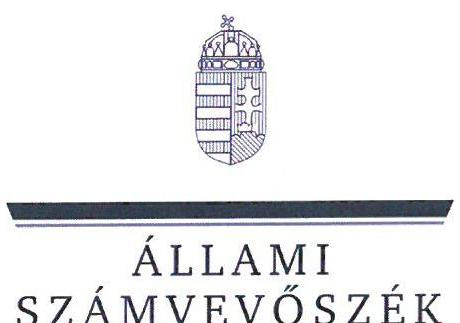
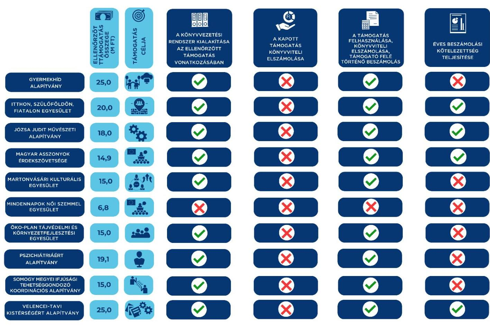

ÁLLAMI
SZÁMVEVŐSZÉK

# JELENTÉS 

Egyesületek és alapítványok államháztartásból kapott támogatásai felhasználásának és elszámolásának ellenőrzése
2025.

---

ÁLLAMI
SZÁMVEVÔSZÉK

# JELENTÉS 

## Egyesületek és alapítványok államháztartásból kapott támogatásai felhasználásának és elszámolásának ellenőrzése

2025.

---

# ELLENŐRZÉSI IGAZGATÓSÁG: 

## ÁLLAMHÁZTARTÁSON KÍVÜLI SZERVEZETEKET ELLENŐRZŐ IGAZGATÓSÁG

## ELLENŐRZÉSI IGAZGATÓ:

## KLINGA LÁSZLÓ igazgató

## ELLENŐRZÉSVEZETŐ:

Jelentéseink az interneten a www.asz.hu címen olvashatók.

NEMESVÁRI-HORTHY ESZTER ellenőrzésvezető

IKTATÓSZÁM: EL-4071-004/2024.
TÉMASORSZÁM: 26.
ELLENŐRZÉS-AZONOSÍTÓ SZÁM: V1099

---

# TARTALOMJEGYZÉK 

AZ ELLENŐRZÉS ALAPADATAI ..... 5
AZ ELLENŐRZÖTT SZERVEZETEK ..... 7
ÖSSZEFOGLALÁS ..... 14
AZ ELLENŐRZÉS FÓKUSZKÉRDÉSE ..... 16
MEGÁLLAPÍTÁSOK ..... 17
JAVASLATOK ..... 31
MELLÉKLETEK ..... 34
I. sz. melléklet: Értelmező szótár ..... 34
II. sz. melléklet: Az ellenőrzött szervezetek jegyzéke ..... 36
III. sz. melléklet: Ellenőrzési kritériumok ..... 37
FÜGGELÉK: ÉSZREVÉTELEK ..... 38
RÖVIDÍTÉSEK JEGYZÉKE ..... 39

---

.

---

# AZ ELLENŐRZÉS ALAPADATAI 

## AZ ELLENŐRZÉS CÉLJA

Az ellenőrzés célja annak megállapítása volt, hogy az ellenőrzött egyesületeknél, alapítványoknál a kiválasztott, államháztartási forrásból származó támogatások felhasználása a jogszabályi és a támogatói okiratban előírtaknak megfelelően történt-e, a támogatásokkal való elszámolás szabályszerű volt-e, a civil szervezetek a gazdálkodásukról szabályszerűen beszámoltak-e. Az államháztartási forrásból származó támogatást a támogatói okiratban meghatározott célra használták-e fel.

## AZ ELLENŐRZÉS TÍPUSA

Szabályszerüségi ellenőrzés.

## AZ ELLENŐRZŐTT IDŐSZAK

A kiválasztott államháztartási forrásból származó támogatásra vonatkozó támogatói okirat aláírásától amennyiben a támogatott tevékenység időtartamának kezdő időpontja korábbi, mint a támogatói okirat aláírásának időpontja, akkor a támogatott tevékenység időtartamának kezdő időpontjától - az ellenőrzésről szóló értesítés keltéig (2024. június 20-ig) tartó időszak. Amennyiben a 2023. évi beszámoló közzététele ezen időszakban nem történt meg, akkor az ellenőrzött időszak záró időpontja a 2023. évi beszámoló közzétételének napja.

## AZ ELLENŐRZÉS TÁRGYA

Az államháztartásból nyújtott támogatást felhasználó ellenőrzött egyesületeknél és alapítványoknál a kiválasztott támogatás felhasználására vonatkozó jogszabályi és szerződéses előírások betartásának ellenőrzése. Ennek keretében a könyvvezetésre vonatkozó jogszabályi előírások betartása, a támogatás felhasználás támogatói okiratnak való megfelelősége, valamint a beszámolási és közzétételi kötelezettség teljesítésének szabályszerűsége. Az ellenőrzés tárgya továbbá annak ellenőrzése, hogy a számviteli szabályozási környezet kialakítása támogatta-e az államháztartásból származó támogatások vonatkozásában a szabályos könyvvezetést, a kapcsolódó beszámolási kötelezettség teljesítését, valamint a támogatások célnak megfelelő felhasználását.

## AZ ELLENŐRZÉS JOGALAPJA

Az ellenőrzés jogalapját az ÁSZ tv. ${ }^{1} 1 . \int(3)$, valamint az 5. $\int(3)$ bekezdés előírásai képezték.

---

# AZ ELLENŐRZÉS MÓDSZERE 

Az ellenőrzés a nemzetközi standardokat irányadónak tekintve az ellenőrzési program szempontjai, az ellenőrzött időszakban hatályos jogszabályok, az ellenőrzés szakmai szabályai és az ellenőrzési módszertanok figyelembevételével történt.

Az ellenőrzési kérdések megválaszolásához szükséges bizonyítékok megszerzése az ellenőrzött civil szervezet által rendelkezésre bocsátott dokumentumokra és adatokra alapozva, továbbá kérdésfeltevés (információkérés), interjú útján történt.

A civil szervezeteknél az államháztartási forrásból származó működésükhöz, programjaikhoz vagy fejlesztéseikhez (beruházásaikhoz) kapcsolódó, kiválasztott támogatás felhasználása támogatói okiratnak való megfelelőségét, a támogatások nyilvántartásának és a támogató felé történő elszámolásnak egymással és a támogatói okirattal történő összevetésével ellenőrizte az ÁSZ².

A támogatások könyvviteli nyilvántartása jogszabályi előírásoknak, támogatói okiratnak való megfelelőségét támogatásonként, kockázati értékeléssel kiválasztott mintatételeken keresztül ellenőrizte az ÁSZ. A mintatételek kiértékelésének eredménye nem került az alapsokaságra kivetítésre.

---

# AZ ELLENŐRZÖTT SZERVEZETEK 

Az ellenőrzésre tíz civil szervezet esetében került sor, melyek közül öt egyesületi, öt pedig alapítványi formában működött. Működéséről, vagyoni, pénzügyi és jövedelmi helyzetéről mind a tíz ellenőrzött szervezet az ellenőrzött években egyszerűsített éves beszámolót készített, melyet kettős könyvvezetéssel támasztottak alá. A tíz ellenőrzött szervezetből öt rendelkezett közhasznú jogállással. A Közbef. tv. ${ }^{3}$ előírása szerint tevékenysége és a 2023. évi számviteli beszámoló mérlegfőösszege alapján - mivel mérlegfőösszegük elérte a 20 M Ft összeget - hét ellenőrzött a közélet befolyásolására alkalmas tevékenységet végző civil szervezetnek minősült.

Az ellenőrzött szervezetek 2021-2023. évre vonatkozó számviteli beszámolóik szerint a 2023. évben mindösszesen 1 431,0 M Ft vagyonnal gazdálkodtak, a 2021-2023. években az összes bevételük 217,0 M Ft volt. A tíz civil szervezetnél a $\mathrm{BGA}^{4}$, mint a Miniszterelnökségnél rendelkezésre álló támogatási célú fejezeti kezelésű előirányzat kezelő szerve részéről nyújtott 173,7 M Ft összegű, vissza nem térítendő, 100\%-os előlegként megkapott támogatás számviteli elkülönített nyilvántartásának, valamint a támogatás cél szerinti felhasználásának ellenőrzésére került sor.

## GyermeKHíd AlAPítvány (Budapest)

A Gyermekhíd Alapítványt 2017. évben egy magánszemély alapította, jogelődje a Vásáry Tamás Alapítvány. Alapító okiratában meghatározott célja többek között „a gyermekottbonban nevelkedő, valamint a bátrányos családi körülnényekkel rendelkező gyermekek egészséges testi és szellemi fejlödésének elösesitése, továbbá részükere oktatási és egyéb személyiségfejlesztő programok kidolgozása; a gyermek és ifjúságrédelem, valamint az e célokkal összefüggő szociális tevékenység". A Gyermekhíd Alapítvány közhasznú jogállással az ellenőrzött időszakban nem rendelkezett, közhasznú jogállást 2024. január 16-tól szerzett, a 2023. évre vonatkozó számviteli beszámolójának mérlegfőösszege alapján a közélet befolyásolására alkalmas tevékenységet végző civil szervezetnek minősült. A vagyonkezelő, ügyvezető és egyben legfőbb döntéshozó szerve a Kuratórium. A Gyermekhíd Alapítvány vezető tisztségviselői a Kuratórium tagjai voltak. A Gyermekhíd Alapítvány önálló képviseletére a Kuratórium Elnöke volt jogosult, akit az Alapító jelölt ki. A számviteli beszámolók adatai alapján vállalkozási tevékenységet nem folytatott, könyvvizsgálatra nem volt kötelezett. A BGA által nyújtott, ellenőrzött támogatás főbb adatait az 1. táblázat tartalmazza.

## 1. táblázat

A GYERMEKHÍD ALAPÍTVÁNY RÉSZÉRE A BGA ÁLTAL NYÚJTOTT, ELLENŐRZÖTT TÁMOGATÁS FÖBB ADATAI

A támogatási program célja
A támogatást tevékenység időtartama
A támogatási előleg felhasználásának végső időpontja
A támogatási előleg folyósításának napja / összege
A támogatási előleg felhasználásáról a beszámoló benyújtásának határideje
A támogatási előleg felhasználásáról benyújtott beszámoló elfogadásának dátuma
„A gyermeksédelem látbatúságának támogatása, illetve a gyermekek digitális fejlesztése kommunikáció eszközökkel"
2021.06.01-2022.12.31.
2022.12.31.
2021.10.18. / 25 M Ft
2023.01.30.

A beszámolóról a BGA az ellenőrzésről szóló értesítés keltéig (2024.06.20.) még nem döntött.

Foerás: Az ellenőrzött szervezet dokumentumai alapján ÂSZ saját szerkesztés

---

# ITTHON, SZÜLŐFÖLDÖN, FIATALON EGYESÜLET (NYÍRTASS) 

Az Itthon, Szülőföldön, Fiatalon Egyesületet 2016. évben alapították. Az Alapító okiratban meghatározott célja, hogy „elősegítse a magyar közösség szülöföldön való megmaradását és hozzájáruljon az ebbé szükséges közösségi élet megélésébez". Közhasznú jogállással nem rendelkezett, a 2023. évre vonatkozó számviteli beszámolójának mérlegfőösszege alapján a közélet befolyásolására alkalmas tevékenységet végző civil szervezetnek minősült. Legfőbb döntéshozó szerve a Közgyűlés, ügyvezető szerve az Elnökség volt, képviseletére az Elnök és a Főtitkár külön-külön önállóan jogosult volt. A számviteli beszámolók adatai alapján vállalkozási tevékenységet nem folytatott, könyvvizsgálatra nem volt kötelezett. A BGA által nyújtott, ellenőrzött támogatás főbb adatait a 2. táblázat tartalmazza.
2. táblázat

## AZ ITTHON, SZÜLÖFÖLDÖN, FIATALON EGYESÜLET RÉSZÉRE A BGA ÁLTAL NYÚJTOTT, ELLENÖRZÖTT TÁMOGATÁS FÖBB ADATAI

A támogatási program célja
„Közösségi és képzöközpont kialakítása Nyírtass közzéghen"
A támogatást tevékenység időtartama
2021.01.01-2022.12.31.

A támogatási előleg felhasználásának végső időpontja
2022.12.31.

A támogatási előleg folyósításának napja / összege
2021.04.09. / 20 M Ft

A támogatási előleg felhasználásáról a beszámoló benyújtásának határideje
2023.01.30.

A támogatási előleg felhasználásáról benyújtott
A beszámolóról a BGA az ellenőrzésről szóló értesítés keltéig beszámoló elfogadásának dátuma
(2024.06.20.) még nem döntött.

## JÓzSA JUDIT MÚVÉSZETI ALAPÍTVÁNY (BUDAPEST)

A Józsa Judit Művészeti Alapítványt 2013. évben egy magánszemély alapította. Az Alapító okiratban meghatározott célja „Kulturális tevékenység a társadalmi tudatosság és szerepuállalás, a magyar örökség, a nemzeti érték- és identitástudat, valamint a bazasszeretet és összetartás erősitése érdekében. Célia kiemelten a Kárpát-medence magyar kerámiamüvészeti hagyományainak, ápolása mellett a kortárs magyar kerámiamüvészet megismertetése, a müvészek összefogása, közös fórum teremtése és bemutatkozzási lehetöségek büvitésére, összmüvészeti kulturális tevékenység a más müvészeti területek összefogása, beleértve a népmüvészetet is, szakmai kapcsolatok, kialakítása és ápolása a bazai és a határon túl élő magyarság szervezetein túl a különféle müvészeti ágak terïletén, valamint a kapcsolatteremtés és együttmüködés fejlesztése a müvészek, a magyar társadalom és a világ magyarságának tagjai közt." A Józsa Judit Művészeti Alapítvány közhasznú jogállással rendelkezett, a 2023. évi számviteli beszámolójának mérlegfőösszege alapján a közélet befolyásolására alkalmas tevékenységet végző civil szervezetnek minősült. Legfőbb döntéshozó és ügyvezető szerve a Kuratórium volt, a Kuratórium tagjai az Alapítvány vezető tisztségviselői voltak. A számviteli beszámolók adatai alapján vállalkozási tevékenységet nem folytatott, könyvvizsgálatra nem volt kötelezett. A BGA által nyújtott, ellenőrzött támogatás főbb adatait a 3. táblázat tartalmazza.
3. táblázat

## A JÓzSA JUDIT MÚVÉSZETI ALAPÍTVÁNY RÉSZÉRE A BGA ÁLTAL NYÚJTOTT, ELLENÖRZÖTT TÁMOGATÁS FÖBB ADATAI

A támogatási program célja
„A szervezet 2021. évi szakmai programjainak és müködésének támogatása"
A támogatást tevékenység időtartama
2021.01.01-2022.12.31.

A támogatási előleg felhasználásának végső időpontja
2022.12.31.

A támogatási előleg folyósításának napja / összege
2021.05.04. / 18 M Ft

A támogatási előleg felhasználásáról a beszámoló benyújtásának határideje
2023.01.30.

A támogatási előleg felhasználásáról benyújtott beszámoló elfogadásának dátuma
2023.10.25.

Forrás: Az ellenőrzött szervezet dokumentumai alapján ÁSZ saját szerkesztés

---

# MAGYAR ASSZONYOK ÉRDEKSZÖVETSÉGE (BUDAPEST) 

A Magyar Asszonyok Érdekszövetsége 2001. évben létrejött, egyesületi formában múködő civil szervezet. Az Alapszabályában meghatározott célja: „a leány-, nő-, anya- és családvédelem, a nemek közötti esélyegyenlöség megvalósulásának elösegítése annak érdekében, hogy a nőknek és férfiaknak azonos lehetőségeik, jogaik, felelősségük legyen az élet minden területén; a nők segítése a munka világába történő be- ill., visszailleszkedésben; a polgári kereszṭény értékrend alapján létrejött és müködő civil nőszervezetek, valamint a nőkst segitő társadalmi szervezetek összefogása, a közös polgári és kereszṭény értékek képviselete, tagjai együttmüködésének és kapcsolataik fejlesztésének, valamint érdekvédelmének elösegítése; a polgári és kereszṭény értékeket valló kárpát-medencei, ill. külföldi szervezetekkel való kapcsolatainak fejlesztése; a szövetség tagjainak emberi jogokból következö esélyegyenlöségéért folytatott törekvéseinek segítése". A Magyar Asszonyok Érdekszövetsége közhasznú jogállással rendelkezett, a 2023. évi számviteli beszámolójának mérlegfőösszege alapján nem minősült a közélet befolyásolására alkalmas tevékenységet végző civil szervezetnek. Legfőbb döntéshozó szerve a Közgyűlés, ügyvezető szerve az Elnökség, teljes jogkörrel rendelkező képviselője az Elnök volt. A számviteli beszámolók adatai alapján vállalkozási tevékenységet nem folytatott, könyvvizsgálatra nem volt kötelezett. A BGA által nyújtott, ellenőrzött támogatás főbb adatait a 4. táblázat tartalmazza.
4. táblázat

## A MAGYAR ASSZONYOK ÉRDEKSZÖVETSÉGE RÉSZÉRE A BGA ÁLTAL NYÚJTOTT, ELLENŐRZÖTT TÁMOGATÁS FÖBB ADATAI

A támogatási program célja
„Euriópa jövőjéről szóló konferenciasorozatboz kapcsolódó rendezvények támogatása"
A támogatott tevékenység időtartama
2021.05.01-2022.12.31.

A támogatási előleg felhasználásának végső időpontja
2022.12.31.
A támogatási előleg folyósításának napja / összege
2021.12.31. / 14,9 M Ft

A támogatási előleg felhasználásáról a beszámoló benyújtásának határideje
2023.01.30.

A támogatási előleg felhasználásáról benyújtott beszámoló elfogadásának dátuma

A beszámolóról a BGA az ellenőrzésről szóló értesítés keltéig (2024.06.20.) még nem döntött.

Foerús: Az ellenőrzött szervezet dokumentumai alapján Asz saját szerkeszés

## MARTONVÁSÁRI KULTURÁLIS EGYESÜLET (MARTONVÁSÁR)

A Martonvásári Kulturális Egyesületet 1997. évben alapították. Alapszabályban meghatározott célja többek között: „az 1991. óta megrendezett Martonvásári Napok programsorozattal eddig elért szellemiség továbbfejlesztése, szorosan együttmüködve Martonvásár Képviselötestületével, bivatalával és intézményeivel, Martonvásár, a kistérség települései, a megye, az ország, a külföld lakosa, turistái számára szinvonalas, kulturális és hagyományörzö programok szervezetése, a térség turizmusának fejlesztése, Martonvásár birnevének gyarapitása, Martonvásár város nemzetközi kapcsolatainak bővítése és mindazon bagyományok ápolása, mely Martonvásár szellemiségét és az itt élők összctartozását erösíti". A Martonvásári Kulturális Egyesület közhasznú jogállással rendelkezett, a 2023. évre vonatkozó számviteli beszámolójának mérlegfőösszege alapján nem minősült a közélet befolyásolására alkalmas tevékenységet végző civil szervezetnek. legfőbb döntéshozó szerve a Közgyűlés, ügyvezető szerve az Elnökség, teljes jogkörrel rendelkező képviselője az Elnök volt. A számviteli beszámolók adatai alapján vállalkozási tevékenységet nem folytatott, könyvvizsgálatra nem volt kötelezett. A BGA által nyújtott, ellenőrzött támogatás főbb adatait az 5. táblázat tartalmazza.

---

# A MartonVÁsÁri KULTURÁLIS EGYESÜLET RÉSZÉRE A BGA ÁLTAL NYÚJTOTT, ELLENÖRZÖTT TÁMOGATÁS FÖBB ADATAI 

A támogatási program célja
A támogatott tevékenység időtartama
A támogatási előleg felhasználásának végső időpontja
A támogatási előleg folyósításának napja / összege
A támogatási előleg felhasználásáról a beszámoló benyújtásának határideje
A támogatási előleg felhasználásáról benyújtott beszámoló elfogadásának dátuma
„A martonvásári civil szervezetek, kommunikációjának, összefogása és fejlesztése"
2021.01.01-2022.12.31.
2022.12.31.
2021.08.11. / 15 M Ft
2023.01.31.
2024.05.15.

Forrás: Az ellenőrzött szervezet dokumentumai alapján ÁSZ saját szerkestés

## Mindennapok Női Szemmel EgYESÜLET (SzékesfeHÉrvÁr)

A Mindennapok Női Szemmel Egyesületet 2015. évben alapították. Az Alapszabályban meghatározott célja volt többek között „a nők esélyegyenlőségének megteremtése, női érdekvédelem, női közösségek megteremtése, kulturális, közéleti és sportprogramok, akciók szervezése, az egyedül élő, vagy gyermeküket egyedül nevelő, krízishelyzetbe került nők információkkal történő segítése, egymást segitő, önszerveződő női közösségeinek, kialakítása, számukra összefövetelek, helyszinének, biztosítása, a nők, családon belüli és kivüli szerepének, bemutatása sokféleségének, hangsúlyozása, feladataik, társadalmi elismertetése, ezen belül a nők, esélyteremtésének, támogatása, a bázasság, párkapcsolatok védelme, a köznevelés reformjának elősegítése a nők és családok, jogainak, védelme érdekében, a kisgyermekes nők segítése a munka világába való visszatérésben, ezzel kapcsolatos érdekképviselet, nőket érintő információk nyújtása nőknek, generációkra tekintet nélkül". A Mindennapok Női Szemmel Egyesület közhasznú jogállással nem rendelkezett, a 2023. évre vonatkozó számviteli beszámolójának mérlegfőösszege alapján a közélet befolyásolására alkalmas tevékenységet végző civil szervezetnek minősült. Legfőbb döntéshozó szerve a Közgyűlés, ügyvezető szerve az Elnökség volt, képviseletére az Elnök volt jogosult. A számviteli beszámolók adatai alapján vállalkozási tevékenységet nem folytatott, könyvvizsgálatra nem volt kötelezett. A BGA által nyújtott, ellenőrzött támogatás főbb adatait a 6. táblázat tartalmazza.
6. táblázat

## A Mindennapok Női Szemmel EgYESÜlet RÉSZÉRE A BGA ÁLTAL NYÚJTOTT, ELLENÖRZÖTT TÁMOGATÁS FÖBB ADATAI

A támogatási program célja
„Európa jövőjéről szóló konferenciasorszatboz kapcsolódó rendezvények, támogatása"
A támogatott tevékenység időtartama
2022.01.01-2022.03.31.
A támogatási előleg felhasználásának végső időpontja
2022.03.31.
A támogatási előleg folyósításának napja / összege
2021.12.31. / 6,8 M Ft

A támogatási előleg felhasználásáról a beszámoló benyújtásának határideje
2022.04.30.
A támogatási előleg felhasználásáról benyújtott beszámoló elfogadásának dátuma
2023.02.21.

Forrás: Az ellenőrzött szervezet dokumentumai alapján ÁSZ saját szerkestés

---

# ÖKO-PLAN TÁJVÉDELMI ÉS KÖRNYEZETFEJLESZTÉSI EGYESÜLET (HATVAN) 

Az ÖKO-PLAN Tájvédelmi és Környezetfejlesztési Egyesületet 2014. évben alapították. Alapszabályban meghatározott célja „a természeti környezet megóvása, védelme és fejlesztése, ökofolyosó építése és fenntartása, meglevö vizes élőhelyek kezelése és védelme, a természeti környezet fontosságának és környezet védelmének megismertetése minél szélesebb társadalmi körben, az épitett és természeti környezeti bagyományainak megőrzése és fejlesztése, az épitett környezetének megóvása, a müködési terület flórájának és faunájának feltérképezése és védelme". Az ÖKO-PLAN Tájvédelmi és Környezetfejlesztési Egyesület közhasznú jogállással nem rendelkezett, a 2023. évre vonatkozó számviteli beszámolójának mérlegfőösszege alapján a közélet befolyásolására alkalmas tevékenységet végző civil szervezetnek minősült. Legfőbb döntéshozó szerve a Közgyűlés, ügyvezető szerve az Elnökség, teljes jogkörrel rendelkező képviselője az Elnök volt. A számviteli beszámolók adatai alapján vállalkozási tevékenységet nem folytatott, könyvvizsgálatra nem volt kötelezett. A BGA által nyújtott, ellenőrzött támogatás főbb adatait a 7. táblázat tartalmazza.
7. táblázat

## AZ OKO-PLAN TÁJVÉDELMI ÉS KÖRNYEZETFEJLESZTÉSI EGYESÜLET RÉSZÉRE A BGA ÁLTAL NYÚJTOTT, ELLENŐRZÖTT TÁMOGATÁS FÖRB ADATAI

A támogatási program célja
„Viz-föld-levegö-állatok - a jövőnk záloga - a fiatalok és a közösség szerepe"
A támogatott tevékenység időtartama
2021.01.01-2022.12.31.

A támogatási előleg felhasználásának végső időpontja
2023.03.01.

A támogatási előleg folyósításának napja / összege
2021.08.23. / 15 M Ft

A támogatási előleg felhasználásáról a beszámoló benyújtásának határideje
2023.03.01.

A támogatási előleg felhasználásáról benyújtott beszámoló elfogadásának dátuma
2023.11.14.

Forrás: Az ellenőrzött szervezet dokumentumai alapján A5Z saját szerkesztés

## PSZICHIÁTRIÁÉRT ALAPÍTVÁNY (SZEGED)

A PSZICHIÁTRIÁÉRT Alapítványt 2012. évben egy magánszemély alapította. Alapító okiratában meghatározott célja „a lelki betegségekben szenvedő személyek kiszürése, vizsgálata és gyógykezelése, a lelki betegségben szenvedők szociális belyzetének felmérése, javítása, a lelki betegségek okainak kutatása, a kutatással kapcsolatos munka és pályázatok támogatása, ösztöndijak adományozása, lelki betegségekkeel kapcsolatos ismeretek széleskörü oktatása, terjesztése. a lelki betegségek kezelésével és kutatásával foglalkozó személyek oktatása, továbbképzése, lelki betegségekkeel foglalkozó egészségügyi és szociális és kutatási intézmények munkájának anyagi eszközökkel történő támogatása, a lelki betegségek kezelésével és kutatásával foglalkozó intézetekkel, társaságokkal kapcsolat létesítésének és fenntartásának támogatása, a lelki betegségekkeel kapcsolatos tudományos kutatás eredményeinek közzététele, publikációs munka támogatása, a lelki betegségek megelőzésével és korai felismerésével kapcsolatos módszerek kidolgozása, a lelki betegségekkeel kapcsolatos kiemelkedő szakmai eredmények díjazása, a lelki betegségekkeel kapcsolatos kutatásokban részt vevő betegek támogatása". A PSZICHIÁTRIÁÉRT Alapítvány közhasznú jogállással nem rendelkezett, a 2023. évre vonatkozó számviteli beszámolójának mérlegfőösszege alapján a közélet befolyásolására alkalmas tevékenységet végző civil szervezetnek minősült. Legfőbb döntéshozó és ügyvezető szerve a Kuratórium volt. A számviteli beszámolók adatai alapján vállalkozási tevékenységet nem folytatott, könyvvizsgálatra nem volt kötelezett. A BGA által nyújtott, ellenőrzött támogatás főbb adatait a 8. táblázat tartalmazza.

---

# A PSZICHIATRIAERT ALAPITVÁNY RÉSZERE A BGA ÁLTAL NYÚJTOTT, ELLENŐRZÓTT TÁMOGATÁS FÖBB ADATAI 

A támogatási program célja
„Prof. dr. Lechner Károly mellszobra felállitásának támogatása"
A támogatott tevékenység időtartama
2021.03.01-2022.12.31

A támogatási előleg felhasználásának végső időpontja
2022.12.31.

A támogatási előleg folyósításának napja / összege
2021.08.19. / 19,05 M Ft

A támogatási előleg felhasználásáról a beszámoló benyújtásának határideje
2023.01.30.

A támogatási előleg felhasználásáról benyújtott beszámoló elfogadásának dátuma
2022.08.05.

Forrás: Az ellenőrzött szervezet dokumentumai alapján ÁSZ saját szerkesztés

## SOMOGY MEGYEI IFJÚSÁGI TEHETSÉGGONDOZÓ KOORDINÁCIÓS ALAPÍTVÁNY (KAPOSÚJLAK)

A Somogy Megyei Ifjúsági Tehetséggondozó Koordinációs Alapítványt 2002. évben egy magánszemély alapította. Alapító okiratában meghatározott célja:„, Somogy Megye területén, különösen a gyermekek és fiatalok körében a sport, tudomány, és bármely müvészeti ág területén a tehetséges fiatalok, felkutatása, a tehetségesnek, mutatkozó fiatalok részére mind egyéni, mind csoportos képzés biztositása, képzettségük fejlesztése, segítése, mind az irott, mind az elektronikus sajtóban, de a tömegtáaékoztatás minden egyéb területén a kö̉szereplés biztositása, az alapitvány céljával összefüggö, más szervezetek által szervezett rendezényeken való megjelenés, illetve annak biztositása, bogy azokiról az alapitvány által preferált réteg tudomást szerezzen, azon részt vegyen - az alapítvány célja szerinti valamennyi hasonló rendezvény koordinációja." A Somogy Megyei Ifjúsági Tehetséggondozó Koordinációs Alapítvány közhasznú jogállással rendelkezett, a 2023. évre vonatkozó számviteli beszámolójának mérlegfőösszege alapján nem minősült a közélet befolyásolására alkalmas tevékenységet végző civil szervezetnek. A legfőbb döntéshozó és ügyvezető szerve a Kuratórium volt, képviseletére a Kuratórium Elnöke volt jogosult. A számviteli beszámolók adatai alapján vállalkozási tevékenységet nem folytatott, könyvvizsgálatra nem volt kötelezett. A BGA által nyújtott, ellenőrzött támogatás főbb adatait a 9. táblázat tartalmazza.
9. táblázat

## A SOMOGY MEGYEI IFJÚSÁGI TEHETSÉGGONDOZÓ KOORDINÁCIÓS ALAPÍTVÁNY RÉSZÉRE A BGA ÁLTAL NYÚJTOTT, ELLENŐRZÓTT TÁMOGATÁS FÖBB ADATAI

A támogatási program célja
„SMITKA Kommunikációs tevékenység 2021"
A támogatott tevékenység időtartama
2021.01.01-2022.12.31.

A támogatási előleg felhasználásának végső időpontja
2022.12.31.

A támogatási előleg folyósításának napja / összege
2021.08.17. / 14,993 M Ft

A támogatási előleg felhasználásáról a beszámoló benyújtásának határideje
2023.03.01.

A támogatási előleg felhasználásáról benyújtott beszámoló elfogadásának dátuma
2023.05.08.

Forrás: Az ellenőrzött szervezet dokumentumai alapján ÁSZ saját szerkesztés

---

# VELENCEI-TAVI KISTÉRSÉGÉRT ALAPÍTVÁNY (KÁPOLNÁSNYÉK) 

A Velencei-tavi Kistérségért Alapítványt 2006. évben egy magánszemély alapította. Az Alapító okiratban meghatározott célja: „, a Velencei-tó környékén élők, kulturális életének gazdagitása, a Velencei-tó kö̉nyékének, a Velenceitavi kistérség idegenforgalmának, minőségi turizmussának, kulturális örökségének, ápolása, gazdaságának, fejlesztése, a Velenceitó kö̉nyékének gazdasági és idegenforgalmi fellenditése érdekében vállalkozói fórumok, továbbképzések, tanfolyamok, szervezése és támogatása, tájékoztató kiadványok, összeállítása és megjelentetése, a belyi, épitett, kulturális örökség védelme, a tó kö̉nyékén lakó gyermekeinek, oktatási támogatása, ennek érdekében a tehetséges fiatalok, támogatása". A Velencei-tavi Kistérségért Alapítvány közhasznú jogállással rendelkezett, a 2023. évre vonatkozó számviteli beszámolójának mérlegfőösszege alapján a közélet befolyásolására alkalmas tevékenységet végző civil szervezetnek minősült. Legfőbb döntéshozó és ügyvezető szerve a Kuratórium volt, képviseletére a Kuratórium Elnöke volt jogosult. A számviteli beszámolók adatai alapján vállalkozási tevékenységet folytatott, könyvvizsgálatra nem volt kötelezett. A BGA által nyújtott, ellenőrzött támogatás főbb adatait a 10. táblázat tartalmazza.
10. sébízet

## A VELENCEI-TAVI KISTÉRSÉGÉRT ALAPÍTVÁNY RÉSZÉRE A BGA ÁLTAL NYÚJTOTT, ELLENŐRZÖTT TÁMOGATÁS FÖBB ADATAI

A támogatási program célja
„A szervezet 2021. évi szakmai programjainak és müködésének támogatása"
A támogatott tevékenység időtartama
2021.01.01-2022.12.31.

A támogatási előleg felhasználásának végső időpontja
2022.12.31.

A támogatási előleg folyósitásának napja / összege
2021.04.08./ 25 M Ft

A támogatási előleg felhasználásáról a beszámoló benyújtásának határideje
2023.01.30.

A támogatási előleg felhasználásáról benyújtott beszámoló elfogadásának dátuma
2023.02.27.

Forrás: Az ellenőrzött szervezet dokumentumai alapján ÂSZ saját szerkesztés

---

# ÖSSZEFOGLALÁS 

A civil szervezetek tevékenységük ellátására költségvetési támogatásban, önkormányzati támogatásban, ingyenes vagyonjuttatásban részesülhetnek, amelyekre fokozott figyelem irányul. A civil szervezetek tevékenységükön keresztül a társadalom széles rétegét érintik, ezért jogosan felmerülő elvárás, hogy a közpénzeket kezelő, azzal gazdálkodó szervezetek működéséről, tevékenységéről információt kapjunk, így az ÁSZ ellenőrzések keretében időről-időre sor kerül a közpénzek rendeltetésszerủ és átlátható módon történő felhasználásának értékelésére. Az ellenőrzés hozzájárul ahhoz, hogy a társadalom képet kaphasson az államháztartásból a civil szervezeteknek nyújtott támogatások felhasználásáról.

A hiányosságok feltárása elősegíti azon szükséges intézkedések meghozatalát, melyek megvalósításával biztosítható a civil szervezetek által elnyert támogatásokkal való szabályszerű gazdálkodás. Az ÁSZ ellenőrzése választ ad arra, hogy az ellenőrzött egyesületeknél és alapítványoknál a számviteli szabályozási környezet kialakítása biztosította-e a támogatások felhasználása jogszabályi előírásoknak megfelelő nyilvántartását, a beszámolási kötelezettség teljesítését. Az ellenőrzés továbbá feltárhatja az ellenőrzött támogatás felhasználása, nyilvántartása, továbbá a támogató felé történő elszámolása támogatói okiratnak és a támogatás céljának való megfelelőségét befolyásoló kockázatokat.

Az ellenőrzött tíz civil szervezetből kilenc szervezet könyvvezetési rendszerének kialakítása megfelelően támogatta az államháztartásból származó ellenőrzött támogatások szabályszerű könyvviteli nyilvántartását, biztosította a közpénzek felhasználásának ellenőrizhetőségét. Az ellenőrzés egy szervezetnél tárta fel azt a hiányosságot, hogy a 2021. évben a könyvvezetési rendszerét nem a vonatkozó jogszabályi előírások szerint alakította ki, azonban a 2022. évtől könyvvezetése már a jogszabályi előírásoknak megfelelt.

A kapott támogatási előleg könyvviteli elszámolása az ellenőrzött tíz civil szervezetnél a jogszabályban előírt részletezésben történt, a számviteli nyilvántartásban, illetve a számviteli beszámolóban. A tíz ellenőrzött szervezetből egyik sem a jogszabályban előírtaknak megfelelően mutatta ki az előlegként kapott támogatási összegeket. Az előlegként kapott támogatást a könyvviteli nyilvántartásában a tíz ellenőrzött szervezet a jogszabályi előírások ellenére nem mutatta ki egyéb rövid lejáratú kötelezettségként. Ez alapján tíz szervezet számviteli beszámolójának mérlegében nem került kimutatásra az a kötelezettség, amivel az ellenőrzött szervezet még nem számolt el a BGA felé. Ezzel sérült a Számv. tv. szerinti teljesség elve, miszerint a szervezetnek könyvelnie kell mindazon gazdasági eseményeket, amelyeknek az eszközökre és a forrásokra gyakorolt hatását a beszámolóban ki kell mutatni. Továbbá sérült a Számv. tv. szerinti lényegesség elve, mivel a számviteli beszámoló mérlege nem tartalmazott egy olyan információt (kötelezettséget), ami befolyásolja a beszámoló adatait felhasználók döntését. Ez a hiányosság kockázatot jelent az érintett szervezetek mérlegfőösszeg értéke alapján előírt minősítésekre, valamint a számviteli beszámoló adatait felhasználók döntéseit lényegesen befolyásolhatja.

A támogatási előleg felhasználása és annak könyvviteli elszámolása kilenc szervezet esetében szabályszerű volt, a támogatási előleg felhasználását a számviteli rendszerükben elkülönítetten kezelték, melyet a támogatási előleg felhasználását alátámasztó ellenőrzött tételek is alátámasztottak. Egy szervezet nem alakította ki 2021. évben a támogatási előleg felhasználásának elkülönített rendszerét a könyvviteli nyilvántartásában, azonban 2022. évtől ennek a kötelezettségének már eleget tett. Az ellenőrzött szervezetek a támogatási előleg felhasználásáról készített beszámolójukat a támogató részére benyújtották, azonban a benyújtott beszámolókról a támogató a döntését három ellenőrzött szervezet tekintetében az ellenőrzésről szóló értesítés keltéig (2024.06.20.) még nem hozta meg.

---

A számviteli beszámolókat a tíz ellenőrzött szervezetből négy a jogszabályi előírásoknak megfelelően elkészítette és közzétette, azonban két szervezet a saját honlapján a kiegészítő melléklet nélkül helyezte el a számviteli beszámolóját.

Hat ellenőrzött civil szervezet esetében a számviteli beszámolási kötelezettség teljesítése nem volt szabályszerű. Két ellenőrzött szervezet a jogszabályi előírások ellenére nem készítette el a számviteli beszámoló részét képező kiegészítő mellékletet. Egy ellenőrzött szervezet esetében a számviteli beszámoló közzétételére a legfőbb döntéshozó szerv jóváhagyása nélkül került sor. Öt szervezet pedig kiegészítő melléklet nélkül tette közzé, helyezte letétbe számviteli beszámolóját, közülük négy szervezet a számviteli beszámolóját határidőn túl tette közzé, helyezte letétbe. Ez alapján hat szervezet nem megfelelően tájékoztatta a közvéleményt a BGA által nyújtott támogatás felhasználásáról, mert nem biztosította a közpénzek felhasználására vonatkozó gazdálkodása nyilvánosságát. Az ellenőrzés összegző értékelését ellenőrzött szervezetenként az 1. ábra szemlélteti. Az ellenőrzés összegző értékelését ellenőrzött szervezetenként az 1. ábra szemlélteti.
1. ábra

FŐBB ELLENŐRZÉSI TAPASZTALATOK

A Pszichiátriáért Alapítvány Elnöke az ÁSZ tv. 29. § (2) bekezdés szerinti, a jelentéstervezet megállapításaira tett észrevételében arról tájékoztatta az ÁSZ-t, hogy intézkedéseket tesz a kapott támogatások hatályos jogszabályoknak megfelelő elszámolása, a számviteli beszámoló határidőben történő elkészítése érdekében, ezzel az ÁSZ megállapítása az ellenőrzés során hasznosult.

---

# AZ ELLENŐRZÉS FÓKUSZKÉRDÉSE 

1- A civil szervezet államháztartási forrásból származó támogatása(i) felhasználása és elszámolása szabályszerű volt-e?

---

# 1. Gyermekhíd Alapítvány 

Összegző megállapítás

A Gyermekhíd Alapítvány az ellenőrzött támogatási előleget a támogatói okiratban megjelölt célnak megfelelően használta fel. A támogatási előleget és annak felhasználását a számviteli rendszerében a jogszabályi előírásoknak megfelelően elkülönítette. A támogatási előleget nem a jogszabályi előírásnak megfelelően számolta el. A számviteli beszámolási kötelezettségének a 2021. és 2023. évek tekintetében a jogszabályban előírtaknak megfelelően tett eleget. A 2022. évre vonatkozó számviteli beszámolási kötelezettségét nem a jogszabályban foglaltaknak megfelelően teljesítette, mivel számviteli beszámolóját a legfőbb döntéshozó szerv jóváhagyása nélkül tette közzé.

## A könyvvezetési rendszer kialakítása az ellenőrzött támogatás vonatkozásában

A Gyermekhíd Alapítvány nem rendelkezett a Számv. tv. 161. § (1) bekezdésében előírt számlarenddel. A Gyermekhíd Alapítvány a könyvviteli nyilvántartását úgy alakította ki, hogy az biztosította a kapott támogatások Civil tv. ${ }^{5}$-ben előírt részletezését. A Gyermekhíd Alapítvány a Számv. tv. ${ }^{6}$ ben és a Civil tv.ben előírtaknak megfelelően az alapcél szerinti tevékenysége költségei, ráfordításai ellentételezésére kapott támogatásokról olyan elkülönített számviteli nyilvántartást vezetett, amelynek alapján támogatásonként megállapítható és ellenőrizhető volt az ellenőrzött támogatás felhasználása.

## A kapott támogatás könyvviteli elszámolása

A Gyermekhíd Alapítvány vezetési rendszerében a BGA-tól kapott ellenőrzött támogatási előleget a Civil tv.-ben előírtak szerint elkülönítette. A 2021. évben megkapott támogatási előleget a Számv. tv. 43. § (1) bekezdésében foglaltak ellenére az egyéb rövid lejáratú kötelezettségek között nem mutatta ki a 20212023. év könyvvezetésében, illetve számviteli beszámolójában annak ellenére, hogy az előleg felhasználásáról a beszámolót a BGA az ellenőrzésről szóló értesítés keltéig (2024.06.20.) még nem fogadta el.

## A támogatási előleg felhasználása, könyvviteli elszámolása, támogató felé történő beszámolás

Az ellenőrzött támogatási előleg vonatkozásában, az ellenőrzött bizonylatok alapján a támogatási előleg felhasználása összhangban volt a támogatói okiratban meghatározott céllal, valamint költségtervvel, az elszámolt költségek a támogatói okiratban meghatározott „A gyermekeédelem láthatóságának támogatása, illetve a gyermekek, digitális fejlesztése kommunikáció eszközökkel" című projekthez kapcsolódtak.
Az ellenőrzött támogatói okirat tekintetében a támogatási előleg felhasználása a Civil tv.-ben előírtaknak megfelelően a számviteli nyilvántartásban elkülönítetten szerepelt. Az ellenőrzött támogatási előleg terhére elszámolt ráfordítások a Számv. tv. szerint kerültek elszámolásra, számviteli bizonylattal alátámasztottak voltak.

---

A Gyermekhíd Alapítvány a BGA-tól kapott ellenőrzött támogatási előleg felhasználásáról a támogató által előírt formában elkészítette a beszámolót és a támogatói okiratban foglaltak alapján benyújtotta a támogatónak. A támogatói okiratban foglalt támogatás lezárásáról, az elszámolás elfogadásáról az ellenőrzésről szóló értesítés keltéig (2024.06.20.) a támogató még nem döntött.

# Az éves beszámolási kötelezettség teljesítése 

A Gyermekhíd Alapítvány a Civil tv.-ben, valamint a Számv. tv.-ben előírt határidőben készítette el a 2021-2023. évekre vonatkozó számviteli beszámolóit, továbbá a Civil tv.-ben előírt közhasznúsági mellékleteit, azonban a 2022. évre vonatkozó számviteli beszámoló közzétételére 2023. március 23-án a Civil tv. 30. § (1) bekezdésben foglaltak ellenére a legfőbb döntéshozó szerv jóváhagyása nélkül került sor. A 2022. évre vonatkozó számviteli beszámoló jóváhagyásáról a Kuratórium a beszámoló 2023. március 23-ai közzétételét követően 2023. május 18-án döntött. A Gyermekhíd Alapítvány a 2021-2023. évekre vonatkozó számviteli beszámolóit saját honlapján a Civil tv. előírásainak megfelelően közzétette.

## 2. Itthon, Szülőföldön, Fiatalon Egyesület

Összegző megállapítás

Az Itthon, Szülőföldön, Fiatalon Egyesület az ellenőrzött támogatási előleget a támogatói okiratban megjelölt célnak megfelelően használta fel. A támogatási előleget és annak felhasználását a számviteli rendszerében a jogszabályi előírásoknak megfelelően elkülönítette. A támogatási előlegként folyósított támogatást nem a jogszabályi előírásnak megfelelően számolta el. A számviteli beszámolási kötelezettségét a jogszabályban előírtaknak megfelelően teljesítette.

## A könyvvezetési rendszer kialakítása az ellenőrzött támogatás vonatkozásában

Az Itthon, Szülőföldön, Fiatalon Egyesület a könyvviteli nyilvántartását úgy alakította ki, hogy az biztosította a kapott támogatások Civil tv. -ben előírt részletezését. Az Itthon, Szülőföldön, Fiatalon Egyesület a Számv. tv.-ben és a Civil tv.-ben előírtaknak megfelelően az alapcél szerinti tevékenysége költségei, ráfordításai ellentételezésére kapott támogatásokról olyan elkülönített számviteli nyilvántartást vezetett, amelynek alapján támogatásonként megállapítható és ellenőrizhető volt az ellenőrzött támogatási előleg felhasználása.

## A kapott támogatás könyvviteli elszámolása

Az Itthon, Szülőföldön, Fiatalon Egyesület könyvvezetési rendszerében a BGA-tól kapott ellenőrzött támogatási előleget a Civil tv.-ben előírtak szerint elkülönítette. A 2021. évben megkapott támogatási előleget a Számv. tv. 43. § (1) bekezdésében foglaltak ellenére az egyéb rövid lejáratú kötelezettségek között nem mutatta ki a 2021-2023. év könyvvezetésében, illetve számviteli beszámolójában annak ellenére, hogy az előleg felhasználásáról a beszámolót a BGA az ellenőrzésről szóló értesítés keltéig (2024.06.20.) még nem fogadta el.

A támogatási előleg felhasználása, könyvviteli elszámolása, támogató felé történő beszámolás

---

Az ellenőrzött támogatási előleg vonatkozásában, az ellenőrzött bizonylatok alapján a támogatási előleg felhasználása összhangban volt a támogatói okiratban meghatározott céllal, valamint költségtervvel, az elszámolt költségek a támogatói okiratban meghatározott „Kö̧össégé és képzöközpont kialakítása Nyirtass kö̈zzégben " című projekthez kapcsolódtak.
Az ellenőrzött támogatói okirat tekintetében a támogatási előleg felhasználása a Civil tv.-ben előírtaknak megfelelően a számviteli nyilvántartásban elkülönítetten szerepelt. Az ellenőrzött támogatási előleg terhére elszámolt ráfordítások a Számv. tv. szerint kerültek elszámolásra, számviteli bizonylattal alátámasztottak voltak.

Az Itthon, Szülőföldön, Fiatalon Egyesület az ellenőrzött támogatási előleg felhasználásáról a támogató által előírt formában elkészítette a beszámolót és a támogatói okiratban foglaltak alapján benyújtotta a támogató részére. A támogatói okiratban foglalt támogatás lezárásáról, az elszámolás elfogadásáról az ellenőrzésről szóló értesítés keltéig (2024.06.20.) a támogató még nem döntött.

# A beszámolási kötelezettség teljesítése 

Az Itthon, Szülőföldön, Fiatalon Egyesület a Civil tv.-ben, valamint a Számv. tv.-ben előírt határidőben elkészítette a 2021-2023. évekre vonatkozó számviteli beszámolóit, továbbá a Civil. tv.-ben előírt közhasznúsági mellékleteit. A legfőbb döntéshozó szerv által jóváhagyott 2021-2023. évekre vonatkozó számviteli beszámolókat a Civil. tv. alapján közzétette, letétbe helyezte. Az Itthon, Szülőföldön, Fiatalon Egyesület a 2021-2023. évekre vonatkozó számviteli beszámolóit saját honlapján a Civil tv. előírásainak megfelelően közzétette.

## 3. Józsa Judit Művészeti Alapítvány

Összegző megállapítás

A Józsa Judit Művészeti Alapítvány az ellenőrzött támogatási előleget a támogatói okiratban megjelölt célnak megfelelően használta fel. A kapott támogatási előleget és annak felhasználását a számviteli rendszerében a jogszabályi előírásoknak megfelelően elkülönítette. A támogatási előleget nem a jogszabályi előírásnak megfelelően számolta el. A számviteli beszámolási kötelezettségének a jogszabályban előírtaknak megfelelően eleget tett.

## A könyvvezetési rendszer kialakítása az ellenőrzött támogatás vonatkozásában

A Józsa Judit Művészeti Alapítvány a könyvviteli nyilvántartását úgy alakította ki, hogy az biztosította a kapott támogatások Civil tv. -ben előírt részletezését. A Józsa Judit Művészeti Alapítvány a Számv. tv.ben és a Civil tv.-ben előírtaknak megfelelően az alapcél szerinti tevékenysége költségei, ráfordításai ellentételezésére kapott támogatásokról olyan elkülönített számviteli nyilvántartást vezetett, amelynek alapján támogatásonként megállapítható és ellenőrizhető volt az ellenőrzött támogatás felhasználása.

## A kapott támogatás könyvviteli nyilvántartása

A Józsa Judit Művészeti Alapítvány könyvvezetési rendszerében a BGA-tól kapott ellenőrzött támogatási előleget a Civil tv.-ben előírtak szerint elkülönítette. A 2021. évben kapott támogatási előleget a Számv. tv. 43. § (1) bekezdésében foglaltak ellenére az egyéb rövid lejáratú kötelezettségek között nem mutatta ki

---

a 2021-2022. évek könyvviteli nyilvántartásaiban, illetve számviteli beszámolóiban, annak ellenére, hogy a támogatási előleg felhasználásáról a beszámolót a BGA 2023. október 25 -én fogadta el.

# A támogatási előleg felhasználása, könyvviteli elszámolása, támogató felé történő beszámolás 

Az ellenőrzött tételek vonatkozásában, az ellenőrzött bizonylatok alapján a támogatási előleg felhasználása összhangban volt a támogatói okiratban meghatározott céllal, valamint költségtervvel, az elszámolt költségek a támogatói okiratban meghatározott „A szervezet 2021. éví szakmai programjainak és müködésének támogatása" címú projekthez kapcsolódtak.
Az ellenőrzött támogatói okirat tekintetében a támogatási előleg felhasználása a Civil tv.-ben előírtaknak megfelelően a számviteli nyilvántartásban elkülönítetten szerepelt. A támogatási előleg terhére elszámolt ellenőrzött ráfordítások a Számv. tv. szerint kerültek elszámolásra, számviteli bizonylattal alátámasztottak voltak.
A Józsa Judit Művészeti Alapítvány az ellenőrzött támogatási előleg felhasználásáról a támogató által előírt formában elkészítette a beszámolót és a támogatói okiratban foglaltak alapján benyújtotta a támogató részére. A támogatói okiratban foglalt támogatás lezárásáról, a beszámoló elfogadásáról a támogató 2023. október 25 -én döntött és azt elfogadta.

## Az éves beszámolási kötelezettség teljesítése

A Józsa Judit Múvészeti Alapítvány a Civil tv.-ben, valamint a Számv. tv.-ben előírt határidőben elkészítette 2021-2023. évekre vonatkozó számviteli beszámolóit, továbbá a Civil. tv.-ben előírt közhasznúsági mellékleteit. A legfőbb döntéshozó szerv által jóváhagyott 2021-2023. évekre vonatkozó számviteli beszámolókat a Civil. tv. alapján közzétette, letétbe helyezte. A Józsa Judit Művészeti Alapítvány a 2021-2023. évekre vonatkozó számviteli beszámolóit saját honlapján a Civil tv. előírásainak megfelelően közzétette.

## 4. Magyar Asszonyok Érdekszövetsége

Összegző megállapítás

A Magyar Asszonyok Érdekszövetsége az ellenőrzött támogatási előleget a támogatói okiratban megjelölt célnak megfelelően használta fel. A támogatási előleget és annak felhasználását a számviteli rendszerében a jogszabályi előírásoknak megfelelően elkülönítette. A támogatási előlegként folyósított támogatást nem a jogszabályi előírásnak megfelelően számolta el. A 2021-2023. évekre a számviteli beszámolóit a jogszabályban előírtaknak megfelelően elkészítette és közzétette, azonban azokat saját honlapján hiányosan, a kiegészítő melléklet nélkül helyezte el.

## A könyvvezetési rendszer kialakítása az ellenőrzött támogatás vonatkozásában

A Magyar Asszonyok Érdekszövetsége nem rendelkezett a Számv. tv. 161. § (1) bekezdésében előírt számlarenddel. A Magyar Asszonyok Érdekszövetsége a könyvviteli nyilvántartását úgy alakította ki, hogy az biztosította a kapott támogatások Civil tv. -ben előírt részletezését. A Magyar Asszonyok Érdekszövetsége a Számv. tv.-ben és a Civil tv.-ben előírtaknak megfelelően az alapcél szerinti

---

tevékenysége költségei, ráfordításai ellentételezésére kapott támogatásokról olyan elkülönített számviteli nyilvántartást vezetett, amelynek alapján támogatásonként megállapítható és ellenőrizhető volt az ellenőrzött támogatás felhasználása.

# A kapott támogatás könyvviteli elszámolása 

A Magyar Asszonyok Érdekszövetsége könyvvezetési rendszerében a BGA-tól kapott ellenőrzött támogatási előleget a Civil tv.-ben előírtak szerint elkülönítette. A 2021. évben megkapott támogatási előleget a Számv. tv. 43. § (1) bekezdésében foglaltak ellenére az egyéb rövid lejáratú kötelezettségek között nem mutatta ki a 2021-2023. év könyvvezetésében, illetve számviteli beszámolójában annak ellenére, hogy az előleg felhasználásáról a beszámolót a BGA az ellenőrzésről szóló értesítés keltéig (2024.06.20.) még nem fogadta el.

## A támogatási felhasználása, könyvviteli elszámolása, támogató felé történő beszámolás

Az ellenőrzött támogatási előleg vonatkozásában, az ellenőrzött bizonylatok alapján a támogatási előleg felhasználása összhangban volt a támogatói okiratban meghatározott céllal, valamint költségtervvel, az elszámolt költségek a támogatói okiratban meghatározott „Európa jövőjéről szóló konferenciasorozathoz kapcsolódó rendezvények támogatása" támogatási célhoz kapcsolódtak.
Az ellenőrzött támogatói okirat tekintetében a támogatási előleg felhasználása a Civil tv. előírásainak megfelelően a számviteli nyilvántartásban elkülönítetten szerepelt. A támogatási előleg terhére elszámolt ellenőrzött ráfordítások a Számv. tv. szerint kerültek elszámolásra, számviteli bizonylattal alátámasztottak voltak.

A Magyar Asszonyok Érdekszövetsége a BGA-tól kapott támogatási előleg felhasználásáról elkészítette az előírt beszámolót és a támogatói okiratban foglaltak alapján benyújtotta a támogató részére. A támogatói okiratban foglalt támogatás lezárásáról, az elszámolás elfogadásáról az ellenőrzésről szóló értesítés keltéig (2024.06.20.) a támogató még nem döntött.

## Az éves beszámolási kötelezettség teljesítése

A Magyar Asszonyok Érdekszövetsége a Civil tv.-ben, valamint a Számv. tv.-ben előírt határidőben elkészítette a 2021-2023. évekre vonatkozó számviteli beszámolóit, továbbá a Civil. tv.-ben előírt közhasznúsági mellékleteit. A legfőbb döntéshozó szerv által jóváhagyott 2021-2023. évekre vonatkozó számviteli beszámolókat a Magyar Asszonyok Érdekszövetsége a Civil. tv. alapján közzétette, letétbe helyezte, azonban a Civil tv. 30. § (4) bekezdésében foglaltak ellenére a honlapján a számviteli beszámolókat a kiegészítő melléklet nélkül tette közzé.

---

# 5. Martonvásári Kulturális Egyesület 

Összegző megállapítás A Martonvásári Kulturális Egyesület az ellenőrzött támogatási előleget a támogatói okiratban megjelölt célnak megfelelően használta fel. A kapott támogatási előleget és annak felhasználását a számviteli rendszerében a jogszabályi előírásoknak megfelelően elkülönítette. A támogatási előleget nem a jogszabályi előírásnak megfelelően számolta el. A 2021. és 2022. évekre a számviteli beszámolási kötelezettségét nem a jogszabályban előírtaknak megfelelően teljesítette, a 2023. évre a számviteli beszámolási kötelezettségének a jogszabályi előírásoknak megfelelően eleget tett.

## A könyvvezetési rendszer kialakítása az ellenőrzött támogatás vonatkozásában

A Martonvásári Kulturális Egyesület a könyvviteli nyilvántartását úgy alakította ki, hogy az biztosította a kapott támogatások Civil tv. -ben előírt részletezését. A Martonvásári Kulturális Egyesület a Számv. tv.ben és a Civil tv.-ben előírt alapcél szerinti tevékenysége költségei, ráfordításai ellentételezésére kapott központi költségvetési támogatásokról kialakított elkülönített számviteli nyilvántartást, amelynek alapján támogatásonként megállapítható és ellenőrizhető volt az ellenőrzött támogatás felhasználása.

## A kapott támogatás könyvviteli nyilvántartása

A Martonvásári Kulturális Egyesület könyvvezetési rendszerében a BGA-tól kapott ellenőrzött támogatási előleget a Civil tv.-ben előírtak szerint elkülönítette. A 2021. évben kapott támogatási előleget a Számv. tv. 43. $\int$ (1) bekezdésében foglaltak ellenére az egyéb rövid lejáratú kötelezettségek között nem mutatta ki a 2021-2023. évek könyvviteli nyilvántartásaiban, illetve a számviteli beszámolójában, annak ellenére, hogy a támogatási előleg felhasználásáról a beszámolót a BGA 2024. május 15 -én fogadta el.

## A támogatási előleg felhasználása, könyvviteli elszámolása, támogató felé történő beszámolás

Az ellenőrzött támogatási előleg vonatkozásában, az ellenőrzött bizonylatok alapján a támogatási előleg felhasználása összhangban volt a támogatói okiratban meghatározott céllal, valamint költségtervvel, az elszámolt költségek a támogatói okiratban meghatározott „A martonvásári civil xzervezetek, kommunikációjának, öszzefogása és fejlesztése" című projekthez kapcsolódtak.
Az ellenőrzött támogatói okirat tekintetében a támogatási előleg felhasználása a Civil tv. előírásainak megfelelően a számviteli nyilvántartásban elkülönítetten szerepelt. A támogatási előleg terhére elszámolt ellenőrzött ráfordítások a Számv. tv. szerint kerültek elszámolásra, számviteli bizonylattal alátámasztottak voltak.
A Martonvásári Kulturális Egyesület az ellenőrzött támogatási előleg felhasználásáról a támogató által előírt formában elkészítette a beszámolót és a támogatói okiratban foglaltak alapján határidőben benyújtotta a támogató részére, melyet a támogató elfogadott. A támogatói okiratban foglalt támogatás lezárásáról, a beszámoló elfogadásáról a támogató 2024. május 15 -én döntött és azt elfogadta.

---

# Az éves beszámolási kötelezettség teljesítése 

A Martonvásári Kulturális Egyesület a 2021. évre vonatkozó számviteli beszámolóját a Civil tv. 29. § (2) bekezdés c) pontjában foglaltak ellenére a beszámoló részét képező kiegészítő melléklet nélkül készítette el. A 2022. évre vonatkozó számviteli beszámoló kiegészítő melléklete a Civil tv. 29. § (4)(5) bekezdéseiben foglaltak ellenére nem tartalmazta az ellenőrzött támogatási előleget, a 2022. évben támogatási programonként végleges jelleggel felhasznált összegeket támogatásonként.
A Martonvásári Kulturális Egyesület a 2021-2023. évekre vonatkozó közhasznúsági mellékleteket a Civil tv. előírásainak megfelelően elkészítette.

A legfőbb döntéshozó szerv által jóváhagyott 2021. évre vonatkozó számviteli beszámolóját (kiegészítő melléklet nélkül) a Civil tv. 30. § (1) bekezdésében előírtak ellenére határidőn túl (2022. december 2-án) tette közzé, illetve helyezte letétbe. A 2022. és 2023. évekre vonatkozó számviteli beszámolókat a Civil tv.ben előírt határidőben közzétette, letétbe helyezte. A Martonvásári Kulturális Egyesület saját honlappal nem rendelkezett.

## 6. Mindennapok Női Szemmel Egyesület

Összegző megállapítás

A Mindennapok Női Szemmel Egyesület az ellenőrzött támogatási előleget a támogatói okiratban megjelölt célnak megfelelően használta fel. A kapott támogatási előleget a számviteli rendszerében a jogszabályi előírásoknak megfelelően elkülönítette, azonban a felhasználását 2022-ig a számviteli rendszerében a jogszabályi előírásokkal ellentétben nem különítette el. A támogatási előleget nem a jogszabályi előírásnak megfelelően számolta el. A számviteli beszámolási kötelezettségét 2021-2022. évekre szabályszerűen, 2023. évben nem a jogszabályban előírtaknak megfelelően teljesítette, mivel a 2023. évre vonatkozó számviteli beszámolóját a kiegészítő melléklet nélkül tette közzé, helyezte letétbe.

## A könyvvezetési rendszer kialakítása az ellenőrzött támogatás vonatkozásában

A Mindennapok Női Szemmel Egyesület 2021. évben a Számv. tv. 161/A. § (2) bekezdésében foglaltak ellenére a Civil tv. 20. § (4) bekezdésében előírt alapcél szerinti tevékenysége költségei, ráfordításai ellentételezésére a kapott támogatásokról nem vezetett olyan elkülönített számviteli nyilvántartást, amelynek alapján támogatásonként megállapítható és ellenőrizhető lett volna a kapott támogatás felhasználása. A 2022. évtől a Mindennapok Női Szemmel Egyesület a könyvviteli nyilvántartását úgy alakította ki, hogy az biztosította a kapott támogatások Civil tv. -ben előírt részletezését. A Mindennapok Női Szemmel Egyesület 2022. évtől a Számv. tv.-ben és a Civil tv.-ben előírt alapcél szerinti tevékenysége költségei, ráfordításai ellentételezésére kapott központi költségvetési támogatásokról kialakított elkülönített számviteli nyilvántartást, amelynek alapján támogatásonként megállapítható és ellenőrizhető volt az ellenőrzött támogatás felhasználása.

---

# A kapott támogatás könyvviteli elszámolása 

A Mindennapok Női Szemmel Egyesület az ellenőrzött támogatói okiratban foglaltak alapján, a BGA-tól kapott támogatási előleget a Civil tv. 20. § (4) bekezdés előírásai ellenére nem megfelelően részletezte a számviteli rendszerében. A 2021. évben előlegként kapott támogatást a Számv. tv. 43. § (1) bekezdésében foglaltak ellenére az egyéb rövid lejáratú kötelezettségek között nem mutatta ki a 2021. évben könyvvezetésében, illetve számviteli beszámolójában, annak ellenére, hogy a támogatás felhasználásáról a beszámolót a BGA 2023. február 21-én fogadta el.

## A támogatási előleg felhasználása, könyvviteli elszámolása, támogató felé történő beszámolás

Az ellenőrzött támogatási előleg vonatkozásában, az ellenőrzött bizonylatok alapján a támogatási előleg felhasználása összhangban volt a támogatói okiratban meghatározott céllal, valamint költségtervvel, az elszámolt költségek a támogatói okiratban meghatározott „Európa jövőjéről szóló konferenciasorozatboz kapcsolódó rendezvények támogatása" című projekthez kapcsolódtak.
Az ellenőrzött támogatói okirat tekintetében a támogatási előleg felhasználása a Civil tv. előírásainak megfelelően a számviteli nyilvántartásban elkülönítetten szerepelt. A támogatási előleg terhére elszámolt ellenőrzött ráfordítások a Számv. tv. szerint kerültek elszámolásra, számviteli bizonylattal alátámasztottak voltak.
A Mindennapok Női Szemmel Egyesület a BGA-tól kapott ellenőrzött támogatás felhasználásáról a támogató által előírt formában elkészítette a beszámolót és a támogatói okiratban foglaltak alapján benyújtotta a támogatónak. A támogatói okiratban foglalt támogatás lezárásáról, a beszámoló elfogadásáról a támogató 2023. február 21-én döntött és azt elfogadta.

## Az éves beszámolási kötelezettség teljesítése

A Mindennapok Női Szemmel Egyesület a Civil tv.-ben, valamint a Számv. tv.-ben előírt határidőben elkészítette a 2021-2023. évekre vonatkozó számviteli beszámolóit, továbbá a Civil. tv.-ben előírt közhasznúsági mellékleteit. A legfőbb döntéshozó szerv által jóváhagyott 2021-2022. évekre vonatkozó számviteli beszámolókat a Civil. tv. alapján közzétette, letétbe helyezte. A 2023. évre vonatkozó számviteli beszámolót a Civil tv. 30. § (1) bekezdésében foglalt előírás ellenére a számviteli beszámoló részét képező kiegészítő melléklet nélkül tette közzé, illetve helyezte letétbe. A Mindennapok Női Szemmel Egyesület a Civil tv.-ben a 2021-2022. évekre vonatkozó számviteli beszámolóit a Civil tv. előírásaival összhangban saját honlapján közzétette, a 2023. évre vonatkozó számviteli beszámolóját a saját honlapján a Civil tv. 30. § (1) bekezdésében foglalt előírás ellenére a kiegészítő melléklet nélkül helyezte el.

---

# 7. ÖKO-PLAN Tájvédelmi és Környezetfejlesztési Egyesület 

Összegző megállapítás Az ÖKO-PLAN Tájvédelmi és Környezetfejlesztési Egyesület az ellenőrzött támogatási előleget a támogatói okiratban megjelölt célnak megfelelően használta fel. A támogatási előleget és annak felhasználását a számviteli rendszerében a jogszabályi előírásoknak megfelelően elkülönítette. A támogatási előleget nem a jogszabályi előírásnak megfelelően számolta el. A számviteli beszámolási kötelezettségét nem a jogszabályban előírtaknak megfelelően teljesítette, mivel nem készített kiegészítő melléklet.

## A könyvvezetési rendszer kialakítása az ellenőrzött támogatás vonatkozásában

Az ÖKO-PLAN Tájvédelmi és Környezetfejlesztési Egyesület a könyvviteli nyilvántartását úgy alakította ki, hogy az biztosította a kapott támogatások Civil tv.-ben előírt részletezését. Az ÖKO-PLAN Tájvédelmi és Környezetfejlesztési Egyesület a Számv. tv.-ben és a Civil tv.-ben előírt alapcél szerinti tevékenysége költségei, ráfordításai ellentételezésére kapott központi költségvetési támogatásokról kialakított elkülönített számviteli nyilvántartást, amelynek alapján támogatásonként megállapítható és ellenőrizhető volt az ellenőrzött támogatás felhasználása.

## A kapott támogatás könyvviteli nyilvántartása

Az ÖKO-PLAN Tájvédelmi és Környezetfejlesztési Egyesület könyvvezetési rendszerében a BGA-tól kapott ellenőrzött támogatási előleget a Civil tv.-ben előírtak szerint elkülönítette. A 2021. évben az előlegként megkapott támogatást a Számv. tv. 43. § (1) bekezdésében foglaltak ellenére az egyéb rövid lejáratú kötelezettségek között nem mutatta ki a 2021-2022. évi könyvvezetésében, illetve számviteli beszámolójában, annak ellenére, hogy a támogatás felhasználásáról a beszámolót a BGA 2023. november 14-én fogadta el.

## A támogatási előleg felhasználása, könyvviteli elszámolása, támogató felé történő beszámolás

Az ellenőrzött támogatási előleg vonatkozásában, az ellenőrzött bizonylatok alapján a támogatás felhasználása összhangban volt a támogatói okiratban meghatározott céllal, valamint a költségtervvel, az elszámolt költségek a támogatói okiratban meghatározott „Viz-föld-levegö-állatok - a jöirönk záloga - a fiatalok és a küzösség szerepe" projekthez kapcsolódtak.
Az ellenőrzött támogatói okirat tekintetében a támogatás felhasználása a Civil tv. előírásainak megfelelően a számviteli nyilvántartásban elkülönítetten szerepelt. Az ellenőrzött támogatás terhére elszámolt ráfordítások a Számv. tv. szerint kerültek elszámolásra, számviteli bizonylattal alátámasztottak voltak.
Az ÖKO-PLAN Tájvédelmi és Környezetfejlesztési Egyesület az ellenőrzött támogatás felhasználásáról a támogató által előírt formában elkészítette és benyújtotta a beszámolót. A támogatói okiratban foglalt támogatás lezárásáról, a beszámoló elfogadásáról a támogató 2023. november 14-én döntött és azt elfogadta.

---

# Az éves beszámolási kötelezettség teljesítése 

Az ÖKO-PLAN Tájvédelmi és Környezetfejlesztési Egyesület a Civil tv. 29. § (2) bekezdés c) pontja előírása ellenére a 2021-2023. évekre vonatkozó számviteli beszámolójának részeként nem készített kiegészítő mellékletet. Az ÖKO-PLAN Tájvédelmi és Környezetfejlesztési Egyesület a Civil tv.-ben előírt közhasznúsági mellékleteit 2021-2023. évek vonatkozásában elkészítette.
A 2021-2022. évekre vonatkozó számviteli beszámolóját, valamint közhasznúsági mellékletét az ÖKOPLAN Tájvédelmi és Környezetfejlesztési Egyesület határidőn túl (2021. évre vonatkozó számviteli beszámolóját 2022. június 8 -án, 2022. évre vonatkozó számviteli beszámolóját 2023. június 17-én), kiegészítő melléklet nélkül tette közzé, helyezte letétbe. A Civil tv. 30. § (1) bekezdésében előírtak ellenére a 2023. évi számviteli beszámolóját határidőben, de Civil tv. 30. § (1) bekezdésében előírtak ellenére a kiegészítő melléklet nélkül tette közzé, helyezte letétbe. Az ÖKO-PLAN Tájvédelmi és Környezetfejlesztési Egyesület saját honlappal nem rendelkezett.

## 8. PSZICHIÁTRIÁÉRT Alapítvány

Összegző megállapítás

A PSZICHIÁTRIÁÉRT Alapítvány az ellenőrzött támogatási előleget a támogatói okiratban megjelölt célnak megfelelően használta fel. A támogatási előleget és annak felhasználását a számviteli rendszerében a jogszabályi előírásoknak megfelelően elkülönítette. A támogatási előleget nem a jogszabályi előírásnak megfelelően számolta el, a számviteli beszámolási kötelezettségét nem a jogszabályban előírtaknak megfelelően teljesítette, mivel a számviteli beszámolóit a kiegészítő melléklet nélkül és határidőn túl tette közzé, helyezte letétbe.

## A könyvvezetési rendszer kialakítása az ellenőrzött támogatás vonatkozásában

A PSZICHIÁTRIÁÉRT Alapítvány a könyvviteli nyilvántartását úgy alakította ki, hogy az biztosította a kapott támogatások Civil tv. -ben előírt részletezését. A PSZICHIÁTRIÁÉRT Alapítvány a Számv. tv. és a Civil tv. előírásainak megfelelően az alapcél szerinti tevékenysége költségei, ráfordításai ellentételezésére kapott központi költségvetési támogatásokról olyan elkülönített számviteli nyilvántartást vezetett, amelynek alapján támogatásonként megállapítható és ellenőrizhető volt az ellenőrzött támogatás felhasználása.

## A kapott támogatás könyvviteli elszámolása

A PSZICHIÁTRIÁÉRT Alapítvány az ellenőrzött támogatói okiratban foglaltak alapján, BGA-tól kapott támogatási előleget a Civil tv.-ben előírtak szerint, elkülönítetten mutatta ki. A 2021. évben előlegként kapott támogatást a Számv. tv. 43. § (1) bekezdésében foglaltak ellenére az egyéb rövid lejáratú kötelezettségek között nem mutatta ki a 2021 év könyvviteli nyilvántartásában, illetve a számviteli beszámolójában annak ellenére, hogy a támogató a támogatás elszámolását 2022. augusztus 5-én elfogadta.

---

# A támogatási előleg felhasználása, könyvviteli elszámolása, támogató felé történő beszámolás 

Az ellenőrzött támogatási előleg vonatkozásában, az ellenőrzött bizonylatok alapján a támogatás felhasználása összhangban volt a támogatói okiratban meghatározott céllal, valamint költségtervvel, az elszámolt költségek a támogatói okiratban meghatározott „Prof. dr. Lechner Károly mellizobra felállításának támogatása" című projekthez kapcsolódtak.
Az ellenőrzött támogatói okirat tekintetében a támogatás felhasználása a Civil tv. előírásainak megfelelően a számviteli nyilvántartásban elkülönítetten szerepelt. Az ellenőrzött támogatás terhére elszámolt ráfordítás a Számv. tv. szerint került elszámolásra, számviteli bizonylattal alátámasztott volt.
A PSZICHIÁTRIÁÉRT Alapítvány az ellenőrzött támogatás felhasználásáról a támogató által előírt formában elkészítette a beszámolót és a támogatói okiratokban foglaltak alapján benyújtotta a támogatónak. A támogatói okiratban foglalt támogatás lezárásáról, a beszámoló elfogadásáról a támogató 2022. augusztus 5 -én döntött és azt elfogadta.

## Az éves beszámolási kötelezettség teljesítése

A PSZICHIÁTRIÁÉRT Alapítvány a 2021-2023. évekre vonatkozó számviteli beszámolót a Civil tv. 30. § (1) bekezdése ellenére határidőn túl (2021. évre vonatkozó számviteli beszámolóját 2022. október 28 -án, 2022. évre vonatkozó számviteli beszámolóját 2024. június 2 -án, 2023. évre vonatkozó számviteli beszámolóját 2024. június 6 -án), a kiegészítő melléklet nélkül tette közzé, helyezte letétbe. A PSZICHIÁTRIÁÉRT Alapítvány saját honlappal nem rendelkezett.

## 9. Somogy Megyei Ifjúsági Tehetséggondozó Koordinációs Alapítvány

## Összegző megállapítás

A Somogy Megyei Ifjúsági Tehetséggondozó Koordinációs Alapítvány az ellenőrzött támogatási előleget a támogatói okiratban megjelölt célnak megfelelően használta fel. A támogatást és annak felhasználását a számviteli rendszerében a jogszabályi előírásoknak megfelelően elkülönítette. A támogatási előleget nem a jogszabályi előírásnak megfelelően számolta el. A számviteli beszámolási kötelezettségét nem a jogszabályban előírtaknak megfelelően teljesítette, mivel nem készített kiegészítő mellékletet és számviteli beszámolóit határidőn túl tette közzé, helyezte letétbe.

## A könyvvezetési rendszer kialakítása az ellenőrzött támogatás vonatkozásában

A Somogy Megyei Ifjúsági Tehetséggondozó Koordinációs Alapítvány a könyvviteli nyilvántartását úgy alakította ki, hogy az biztosította a kapott támogatások Civil tv. -ben előírt részletezését. A Somogy Megyei Ifjúsági Tehetséggondozó Koordinációs Alapítvány a Számv. tv.-ben és a Civil tv.-ben előírtaknak megfelelően az alapcél szerinti tevékenysége költségei, ráfordításai ellentételezésére kapott központi költségvetési támogatásokról olyan elkülönített számviteli nyilvántartást vezetett, amelynek alapján támogatásonként megállapítható és ellenőrizhető volt az ellenőrzött támogatás felhasználása.

---

# A kapott támogatás könyvviteli elszámolása 

A Somogy Megyei Ifjúsági Tehetséggondozó Koordinációs Alapítvány könyvvezetési rendszerében a BGA-tól kapott ellenőrzött támogatási előleget a Civil tv.-ben előírtak szerint elkülönítette. A 2021. évben kapott támogatási előleget a Számv. tv. 43. § (1) bekezdésében foglaltak ellenére az egyéb rövid lejáratú kötelezettségek között nem mutatta ki a 2021. év könyvvezetésében, illetve számviteli beszámolójában annak ellenére, hogy a támogatás felhasználásáról a beszámolót a BGA 2023. május 8 -án fogadta el.

## A támogatási előleg felhasználása, könyvviteli elszámolása, támogató felé történő beszámolás

Az ellenőrzött támogatási előleg vonatkozásában, az ellenőrzött bizonylatok alapján a támogatás felhasználása összhangban volt a támogatói okiratban meghatározott céllal, valamint költségtervvel, az elszámolt költségek a támogatói okiratban meghatározott „SMITKA Kommunikációs tevékenység 2021" című projekthez kapcsolódtak.
Az ellenőrzött támogatói okirat tekintetében a támogatás felhasználása a Civil tv. előírásának megfelelően a számviteli nyilvántartásban elkülönítetten szerepelt. Az ellenőrzött támogatás terhére elszámolt ráfordítások a Számv. tv. szerint kerültek elszámolásra, számviteli bizonylattal alátámasztottak voltak.
A Somogy Megyei Ifjúsági Tehetséggondozó Koordinációs Alapítvány az ellenőrzött támogatás felhasználásáról a támogató által előírt formában elkészítette a beszámolót és a támogatói okiratban foglaltak alapján benyújtotta a támogató részére. A támogatói okiratban foglalt támogatás lezárásáról, a beszámoló elfogadásáról a támogató 2023. május 8 -án döntött és azt elfogadta.

## Az éves beszámolási kötelezettség teljesítése

A Somogy Megyei Ifjúsági Tehetséggondozó Koordinációs Alapítvány a Civil tv. 29. § (2) bekezdés c) pontja előírása ellenére a 2021-2023. évekre vonatkozó számviteli beszámolójának részeként nem készített kiegészítő mellékletet. A Somogy Megyei Ifjúsági Tehetséggondozó Koordinációs Alapítvány a Civil tv.-ben előírt közhasznúsági mellékleteit 2021-2023. évek vonatkozásában elkészítette.
A Somogy Megyei Ifjúsági Tehetséggondozó Koordinációs Alapítvány a 2021-2023. évre vonatkozó, legfőbb döntéshozó szerv által elfogadott számviteli beszámolóit, valamint közhasznúsági mellékleteit a Civil tv. 30. § (1) bekezdésében előírt határidőn túl (2021. évre vonatkozó számviteli beszámolóját 2022. június 15 -én, 2022. évre vonatkozó számviteli beszámolóját 2023. június 29-én, 2023. évre vonatkozó számviteli beszámolóját 2024. június 11-én) a kiegészítő melléklet nélkül tette közzé, helyezte letétbe. A 2021-2023. évekre vonatkozó, a legfőbb döntéshozó szerv által elfogadott számviteli beszámolóit a Civil tv. 30. § (4) bekezdésében előírtak ellenére a kiegészítő melléklet nélkül helyezte el saját honlapján.

---

# 10. Velencei-tavi Kistérségért Alapítvány 

Összegző megállapítás

A Velencei-tavi Kistérségért Alapítvány a kapott támogatást az ellenőrzött tételek tekintetében a támogatási célnak megfelelően használta fel. A támogatást és annak felhasználását a számviteli rendszerében a jogszabályi előírásoknak megfelelően elkülönítette. A támogatási előleget nem a jogszabályi előírásnak megfelelően számolta el. A számviteli beszámolási kötelezettségét nem a jogszabályban előírtaknak megfelelően teljesítette, mivel a számviteli beszámolóit a kiegészítő melléklet nélkül helyezte el saját honlapján.

## A könyvvezetési rendszer kialakítása az ellenőrzött támogatás vonatkozásában

A Velencei-tavi Kistérségért Alapítvány a könyvviteli nyilvántartását úgy alakította ki, hogy az biztosította a kapott támogatások Civil tv.-ben előírt részletezését. A Velencei-tavi Kistérségért Alapítvány a Számv. tv.-ben és a Civil tv.-ben előírtaknak megfelelően az alapcél szerinti tevékenysége költségei, ráfordításai ellentételezésére kapott támogatásokról olyan elkülönített számviteli nyilvántartást vezetett, amelynek alapján támogatásonként megállapítható és ellenőrizhető volt az ellenőrzött támogatás felhasználása.

## A kapott támogatás könyvviteli elszámolása

A Velencei-tavi Kistérségért Alapítvány könyvvezetési rendszerében a BGA-tól kapott ellenőrzött támogatási előleget a Civil tv.-ben előírtak szerint elkülönítette. A 2021. évben kapott támogatási előleget a Számv. tv. 43. § (1) bekezdésében foglaltak ellenére az egyéb rövid lejáratú kötelezettségek között nem mutatta ki a 2021. év könyvvezetésében, illetve számviteli beszámolójában annak ellenére, hogy a támogatás felhasználásáról a beszámolót a BGA 2023. február 27-én fogadta el.

## A támogatási előleg felhasználása, könyvviteli elszámolása, támogató felé történő beszámolás

Az ellenőrzött támogatási előleg vonatkozásában, az ellenőrzött bizonylatok alapján a támogatás felhasználása összhangban volt a támogatói okiratban meghatározott céllal, valamint költségtervvel, az elszámolt költségek a támogatói okiratban meghatározott „A xzervezet 2021. évi xzakmai programjainak és müködésének támogatása" című projekthez kapcsolódtak.
Az ellenőrzött támogatói okirat tekintetében a támogatás felhasználása a Civil tv. előírásának megfelelően a számviteli nyilvántartásban elkülönítetten szerepelt. Az ellenőrzött támogatás terhére elszámolt ráfordítások a Számv. tv. szerint kerültek elszámolásra, számviteli bizonylattal alátámasztottak voltak.
A Velencei-tavi Kistérségért Alapítvány az ellenőrzött támogatás felhasználásáról a támogató által előírt formában elkészítette a beszámolót és a támogatói okiratban foglaltak alapján határidőben benyújtotta a támogató részére. A támogatói okiratban foglalt támogatás lezárásáról, a beszámoló elfogadásáról, a támogató 2023. február 27-én döntött és elfogadta azt.

---

# Az éves beszámolási kötelezettség teljesítése 

A Velencei-tavi Kistérségért Alapítvány a Civil tv.-ben, valamint a Számv. tv.-ben előírt határidőben elkészítette 2021-2023. évekre vonatkozó számviteli beszámolóit, továbbá a Civil. tv.-ben előírt közhasznúsági mellékleteit. A legfőbb döntéshozó szerv által jóváhagyott 2021-2023. évre vonatkozó számviteli beszámolókat a Civil. tv. alapján közzétette, letétbe helyezte, azonban a Civil tv. 30. § (4) bekezdésében foglaltak ellenére a 2021. és 2022. évre vonatkozó számviteli beszámolókat a beszámoló részét képező kiegészítő melléklet nélkül helyezte el a saját honlapján.

---

# JAVASLATOK 

Az ÁSZ tv. 33. § (1) bekezdésében foglaltak értelmében az ellenőrzött szervezet vezetője köteles a jelentésben foglalt megállapításokhoz kapcsolódó intézkedési tervet összeállítani és azt a jelentés kézhezvételétől számított 30 napon belül az ÁSZ részére megküldeni. Amennyiben az ellenőrzött szervezet vezetője nem küldi meg határidőben az intézkedési tervet, vagy továbbra sem elfogadható intézkedési tervet küld, az Állami Számvevőszék elnöke az ÁSZ tv. 33. § (3) bekezdése a) és b) pontjaiban foglaltakat érvényesítheti.

## GYERMEKHÍD ALAPÍTVÁNY ELNÖKÉNEK

1. Gondoskodjon a Számv. tv. 161. § (1) bekezdése alapján a Számv. tv. 161. § (2) bekezdésnek megfelelő számlarend elkészitéséről.
2. Gondoskodjon arról, hogy az előlegként kapott támogatást az elszámolás elfogadásáig az egyéb rövidlejáratú kötelezettségek között szerepeltessék a könyvviteli nyilvántartásban, illetve a számviteli beszámolóban, a Számv. tv. 43. § (1) bekezdés elöirásainak megfelelően.

## ITTHON, SZÜLÖFÖLDÖN, FIATALON EGYESÜLET ELNÖKÉNEK

1. Gondoskodjon arról, hogy az előlegként kapott támogatást az elszámolás elfogadásáig az egyéb rövid lejáratú kötelezettségek között szerepeltessék a könyvviteli nyilvántartásban, illetve a számviteli beszámolóban, a Számv. tv. 43. § (1) bekezdés elöirásainak megfelelően.

## JÓzSA JUDIT MÜVÉSZETI ALAPÍTVÁNY ELNÖKÉNEK

1. Gondoskodjon arról, hogy az előlegként kapott támogatást az elszámolás elfogadásáig az egyéb rövid lejáratú kötelezettségek között szerepeltessék a könyvviteli nyilvántartásban, illetve a számviteli beszámolóban, a Számv. tv. 43. § (1) bekezdés elöirásainak megfelelően.

## MAGYAR ASSZONYOK ÉRDEKSZÖVETSÉGE ELNÖKÉNEK

1. Gondoskodjon a Számv. tv. 161. § (1) bekezdése alapján a Számv. tv. 161. § (2) bekezdésnek megfelelő számlarend elkészitéséről.
2. Gondoskodjon arról, hogy az előlegként kapott támogatást az elszámolás elfogadásáig az egyéb rövid lejáratú kötelezettségek között szerepeltessék a könyvviteli nyilvántartásban, illetve a számviteli beszámolóban, a Számv. tv. 43. § (1) bekezdés elöirásainak megfelelően.
3. Gondoskodjon arról, hogy a számviteli beszámoló az annak részét képező kiegészítő melléklettel együtt a saját honlapon elhelyezésre kerüljön a Civil tv. 30. § (4) bekezdésében foglaltaknak megfelelően.

---

# MARTONVÁSÁRI KULTURÁLIS EGYESÜLET ELNÖKÉNEK 

1. Gondoskodjon arról, hogy az előlegként kapott támogatást az elszámolás elfogadásáig az egyéb rövid lejáratú kötelezettségek között szerepeltessék a könyvviteli nyilvántartásban, illetve a számviteli beszámolóban, a Számv. tv. 43. § (1) bekezdés előírásainak megfelelően.

## MINDENNAPOK NÓI SZEMMEL EGYESÜLET ELNÖKÉNEK

1. Gondoskodjon arról, hogy az előlegként kapott támogatást az elszámolás elfogadásáig az egyéb rövid lejáratú kötelezettségek között szerepeltessék a könyvviteli nyilvántartásban, illetve a számviteli beszámolóban, a Számv. tv. 43. § (1) bekezdés előírásainak megfelelően.
2. Gondoskodjon arról, hogy a közzétett számviteli beszámoló a kiegészítő mellékletet is tartalmazza a Civil tv. 30. § (1) bekezdésben foglaltaknak megfelelően.

## ÖKO-PLAN TÁJVÉDELMI ÉS KÖRNYEZETFEJLESZTÉSI EGYESÜLET ELNÖKÉNEK

1. Gondoskodjon arról, hogy az előlegként kapott támogatást az elszámolás elfogadásáig az egyéb rövid lejáratú kötelezettségek között szerepeltessék a könyvviteli nyilvántartásban, illetve a számviteli beszámolóban, a Számv. tv. 43. § (1) bekezdés előírásainak megfelelően.
2. Gondoskodjon arról, hogy a civil szervezet beszámolója tartalmazza a Civil tv. 29. § (2) bekezdés c) pontjában előírt kiegészítő mellékletet.
3. Gondoskodjon arról, hogy a számviteli beszámolók közzététele határidőben teljesüljön, valamint a kiegészítő mellékletet is tartalmazza a Civil tv. 30. § (1) bekezdésében előírtaknak megfelelően

## PSZICHIÁTRIÁÉRT ALAPÍTVÁNY ELNÖKÉNEK

1. Gondoskodjon arról, hogy az előlegként kapott támogatást az elszámolás elfogadásáig az egyéb rövid lejáratú kötelezettségek között szerepeltessék a könyvviteli nyilvántartásban, illetve a számviteli beszámolóban, a Számv. tv. 43. § (1) bekezdés előírásainak megfelelően.
2. Gondoskodjon arról, hogy a számviteli beszámolók közzététele határidőben teljesüljön, valamint a kiegészítő mellékletet is tartalmazza a Civil tv. 30. § (1) bekezdésében előírtaknak megfelelően.

---

# SOMOGY MEGYEI IFJÚSÁGI TEHETSÉGGONDOZÓ KOORDINÁCIÓS ALAPÍTVÁNY ELNÖKÉNEK 

1. Gondoskodjon arról, hogy az előlegként kapott támogatást az elszámolás elfogadásáig az egyéb rövid lejáratú kötelezettségek között szerepeltessék a könyvviteli nyilvántartásban, illetve a számviteli beszámolóban, a Számv. tv. 43. § (1) bekezdés előírásainak megfelelően.
2. Gondoskodjon arról, hogy a civil szervezet beszámolója tartalmazza a Civil tv. 29. § (2) bekezdés c) pontjában előírt kiegészítő mellékletet, amelynek tartalma feleljen meg a Civil tv. 29. § (4) bekezdésében foglaltaknak.
3. Gondoskodjon arról, hogy a számviteli beszámolók közzététele határidőben teljesüljön, valamint a kiegészítő mellékletet is tartalmazza a Civil tv. 30. § (1) bekezdésében előírtaknak megfelelően

## VELENCEI-TAVI KISTÉRSÉGÉRT ALAPÍTVÁNY ELNÖKÉNEK

1. Gondoskodjon arról, hogy az előlegként kapott támogatást az elszámolás elfogadásáig az egyéb rövid lejáratú kötelezettségek között szerepeltessék a könyvviteli nyilvántartásban, illetve a számviteli beszámolóban, a Számv. tv. 43. § (1) bekezdés előírásainak megfelelően.

---

# MELLÉKLETEK 

## I. SZ. MELLÉKLET: ÉRTELMEZŐ SZÓTÁR

adomány
alapítvány
civil szervezet
civil szervezetek támogatása
egyesület
feladatfinanszírozást
költségvetési támogatás
közcélú tevékenység
közfeladat
közhasznú szervezet

A civil szervezetnek - létesítő okiratban rögzített céljaira - ellenszolgáltatás nélkül juttatott eszköz, illetve nyújtott szolgáltatás.
(Forrás: Civil tv. 2. § 1. pont)
Az alapítvány az alapító által az alapító okiratban meghatározott tartós cél folyamatos megvalósítására létrehozott jogi személy. Az alapító az alapító okiratban meghatározza az alapítványnak juttatott vagyont és az alapítvány szervezetét. (Forrás: Ptk. ${ }^{7}$ 3:378. §)
A Számv. tv. alkalmazásában egyéb szervezet. (Forrás: Számv. tv. 3. § (1) bekezdés 4. pont a) alpontja)
Civil szervezet:
a) a civil társaság,
b) a Magyarországon nyilvántartásba vett egyesület - a párt, a szakszervezet és a kölesönös biztosító egyesület kivételével -,
c) - a közalapítvány és a pártalapítvány kivételével - az alapítvány. (Forrás: Civil tv. 2. §6. pont)
A helyi vagy területi hatókörű civil szervezetek számára egyszerűsített formában, jogosultsági alapon nyújtott támogatás a helyi közösség érdekében végzett tevékenységük támogatására. (Forrás: Civil tv. 2. § 8b. pont)
Az egyesület a tagok közös, tartós, alapszabályban meghatározott céljának folyamatos megvalósítására létesített, nyilvántartott tagsággal rendelkező jogi személy. (Forrás: Ptk. 3:63. § (1) bekezdés)
A Számv. tv. alkalmazásában egyéb szervezet. (Forrás: Számv. tv. 3. § (1) bekezdés 4. pont a) alpontja)
V valamely közfeladat államháztartáson kívüli szervezet által történő ellátását, valamint e feladat ellátásához közvetlenül kapcsolódó, arányos múködési költségeket finanszírozó költségvetési támogatás. (Forrás: Civil tv. 2. § 8. pont)
Személyek csoportja által, valamely a csoportnál tágabb közösség érdekében - más, e közösségbe nem tartozó személyek érdekeinek sérelme nélkül végzett tevékenység. (Forrás: Civil tv. 2. § 16. pont)
A jogszabályban meghatározott állami vagy önkormányzati feladat. A közfeladat ellátásban államháztartáson kívüli szervezet jogszabályban meghatározott rendben közremúködhet. (Forrás: Áht. ${ }^{8}$ 3/A. § (1)(2) bekezdése alapján)
Közhasznú szervezetté minősíthető a Magyarországon nyilvántartásba vett közhasznú tevékenységet végző szervezet, amely a társadalom és az egyén közös szükségleteinek kielégítéséhez megfelelő erőforrásokkal rendelkezik, továbbá amelynek megfelelő társadalmi támogatottsága kimutatható, és amely:
a) civil szervezet (ide nem értve a civil társaságot), vagy
b) olyan egyéb szervezet, amelyre vonatkozóan a közhasznú jogállás megszerzését törvény lehetővé teszi. (Forrás: Civil tv. 32. § (1) bekezdés)

---

közhasznú tevékenység
létesítő okirat
támogatás
támogatási döntés
támogatói okirat

Minden olyan tevékenység, amely a létesítő okiratban megjelölt közfeladat teljesítését közvetlenül vagy közvetve szolgálja, ezzel hozzájárulva a társadalom és az egyén közös szükségleteinek kielégítéséhez. (Forrás: Civil tv. 2. § 20. pont)
A jogi személy létrehozásáról a személyek szerződésben, alapító okiratban vagy alapszabályban szabadon rendelkezhetnek, mely dokumentumokra együttesen a Ptk. a létesítő okirat megnevezést használja. (Forrás: Ptk. 3:4. § (1) bekezdés alapján)
Céljellegủ juttatás, mely kizárólag arra a célra használható fel, amelyre a támogató azt rendelkezésre bocsátotta, amely cél megvalósítását a támogatási szerződés, okirat vagy éppen jogszabály kikötötte. Támogatásként értelmezzük valamennyi, a civil szervezetnek államháztartási forrásból nyújtott támogatást - ideértve a központi költségvetésből kapott támogatást, az elkülönített állami pénzalapokból kapott támogatást, a helyi önkormányzatoktól, nemzetiségi önkormányzatoktól, önkormányzati társulástól kapott támogatást -, továbbá az Európai Unió költségvetéséből, külföldi állam államháztartásából, nemzetközi szervezettől, vagy nemzetközi szerződés rendelkezése alapján kapott támogatást, valamint más civil szervezettől kapott támogatást. A gyűjtő fogalom alatt egyaránt értjük a civil szervezetnek nyújtott feladatfinanszírozást szolgáló költségvetési támogatást, a civil szervezetek normatív támogatását, valamint a civil szervezetek egyszerűsített támogatását is. (ÁSZ saját fogalma)
Az államháztartás alrendszereiből, az európai uniós forrásokból, a nemzetközi megállapodás alapján finanszírozott egyéb programokból, a 100\%-os állami tulajdonban álló szervezet által létrehozott alapítványtól származó, egyedi döntés alapján nyújtott, pályázati úton vagy pályázati rendszeren kívül az államháztartáson kívüli természetes személyek, jogi személyek és jogi személyiséggel nem rendelkező egyéb szervezetek számára odaítélt, természetben vagy pénzben juttatott támogatásokban részesülő személy, valamint az e személy részére juttatandó konkrét támogatási összeg meghatározása. (Forrás: 2007. évi CLXXXI. törvény ${ }^{9}$ 1. § (1) bekezdése és 2. $\S$ (1) bekezdése alapján)

Az államháztartás alrendszerei terhére támogatás közigazgatási hatósági határozattal vagy hatósági szerződéssel, támogatói okirattal vagy támogatási szerződéssel jogszabály vagy egyedi döntés alapján, pályázati úton vagy pályázati rendszeren kívül nyújtható. Ha jogszabály - a központi költségvetés Áht. 14. § (3) bekezdése szerinti fejezetéből biztosított költségvetési támogatások esetén jogszabály vagy a Kormány határozata - a támogatás biztosításának módjáról nem rendelkezik, arról a központi költségvetés Áht. 14. § (3) bekezdése szerinti fejezetéből biztosított költségvetési támogatások esetén támogatói okiratot kell kibocsátani, ettől eltérő más esetben az ötmilliárd forintot el nem érő összegủ költségvetési támogatás esetén szintén támogatói okiratot kell kibocsátani. (Forrás: Áht. 48. § (1) bekezdése, Ávr. ${ }^{10}$ 65/A. § (1) bekezdés alapján)

---

II. SZ. MELLÉKLET: AZ ELLENŐRZÖTT SZERVEZETEK JEGYZÉKE

| SORSZÁM | SZERVEZETEK MEGNEVEZÉSE | SZÉKHELY |
| :--: | :--: | :--: |
| 1. | Gyermekhíd Alapítvány | 1064 Budapest, Rózsa utca 78. |
| 2. | Itthon, Szülőföldön, Fiatalon Egyesület | 4522 Nyírtass, Kossuth út 10. |
| 3. | Józsa Judit Művészeti Alapítvány | 1053 Budapest, Kossuth Lajos utca 4. |
| 4. | Magyar Asszonyok Érdekszövetsége | 1101 Budapest, Hunyadi János út 9. |
| 5. | Martonvásári Kulturális Egyesület | 2462 Martonvásár, Budai utca 13. |
| 6. | Mindennapok Női Szemmel Egyesület | 8000 Székesfehérvár, Építőmunkás utca 2. |
| 7. | ÖKO-PLAN Tájvédelmi és Környezetfejlesztési Egyesület | 3000 Hatvan, Radnóti tér 2. |
| 8. | PSZICHIÁTRIÁÉRT Alapítvány | 6723 Szeged, Kis-Tisza utca 9. |
| 9. | Somogy Megyei Ifjúsági Tehetséggondozó Koordinációs Alapítvány | 7522 Kaposúljak, Kossuth Lajos utca 59. |
| 10. | Velencei-tavi Kistérségért Alapítvány | 2475 Kápolnásnyék, Deák Ferenc utca 10. |

---

# III. SZ. MELLÉKLET: ELLENŐRZÉSI KRITÉRIUMOK 

## FOKUSZTERÜLET/FOKUSZKÉRDÉS

1. A civil szervezet állambáztartási forrásból származó támogatása(i) felhasználása és elszámolása szabályszerű volt-e?

## ELLENŐRZÉSI KRITÉRIUMOK

Civil tv. 2. § 3. pont, 20. § (1)-(4) bekezdés, 27. § (2) bekezdés, 29. § (1)-(2) és (4)-(7) bekezdés, 30. § (1)-(4) bekezdés, 37. $\S$ (2) bekezdés b) pont, 39. $\$ (1)-(3) bekezdés, 46. $\$ \mid(1)$ bekezdés, 40. $\$ \mid(2)$ bekezdés,
Eszkr. ${ }^{11}$ 7. § (1)-(2) bekezdés, (4) bekezdés a)-c) pont, (5)(7) bekezdés, 8. § (1)-(3) bekezdés, 9. § (1)-(2), (4)-(5) bekezdés, 13. § (3)-(5) bekezdés, 14. § (1) bekezdés, 16. § (1)-(4) bekezdés, 17. § (1) és (3) bekezdés,
Civil vhr. ${ }^{12}$ 12. § (1) bekezdés és Melléklet
Számv. tv. 22 - 28. §, 29. § (1) bekezdés, 43. § (1) bekezdés, 44. § (2) bekezdés, 33. § (7) bekezdés, 45. § (1) bekezdés a) pont, 47. § (1) bekezdés, 52. § (1) - (7) bekezdés, 53. § (6) bekezdés, 69. §, 78 - 81. §, 83. § (2) bekezdés. 84. §, 93. § (3) bekezdés, 101. §, 110 - 114. §, 160. § (2) bekezdés a) és b) pont, 160. § (3a) és (3b) bekezdés, 161/A § (2) bekezdés, 162. § (1)-(2) bekezdés, 166. § (1) bekezdés, 167. § (1), (7) bekezdés,
Ptk. 3:19. § (2) bekezdés a)-b), f) pont, 3:29-3:30. §, 3:773:79. §, 3:397. §

---

# FÜGGELÉK: ÉSZREVÉTELEK 

A jelentéstervezetet a Számvevőszék 15 napos észrevételezésre megküldte az ellenőrzött szervezet vezetőjének az ÁSZ tv. 29. §* (1) bekezdése előírásának megfelelően.

Az ellenőrzött tíz szervezetből öt nemleges észrevételt tett, öt szervezet nem tett észrevétel.

[^0]
[^0]:    * 29. § (1) Az Állami Számvevőszék az ellenőrzési megállapításait megküldi az ellenőrzött szervezet vezetőjének vagy az általa megbízott személynek, és annak, akinek személyes felelősségét állapította meg.
    (2) Az ellenőrzött szervezet vezetője és a felelősként megjelölt személy az ellenőrzés megállapításaira tizenöt napon belül írásban észrevételt tehet.
    (3) Az Állami Számvevőszék az észrevételre a beérkezésétől számított harminc napon belül írásban válaszol. A figyelembe nem vett észrevételeket köteles a jelentésben feltüntetni, és megindokolni, hogy azokat miért nem fogadta el.

---

# RÖVIDÍTÉSEK JEGYZÉKE 

${ }^{1}$ ÁSZ tv.
${ }^{2}$ ÁSZ
${ }^{3}$ Közbef. tv.
${ }^{4}$ BGA
${ }^{5}$ Civil tv.
${ }^{6}$ Számv. tv.
${ }^{7}$ Ptk.
${ }^{8}$ Áht.
${ }^{9}$ 2007. évi CLXXXI. törvény
${ }^{10}$ Ávr.
${ }^{11}$ Eszkr.
${ }^{12}$ Civil vhr.
2011. évi LXVI. törvény az Állami Számvevőszékről

Állami Számvevőszék
2021. évi XLIX. törvény a közélet befolyásolására alkalmas tevékenységet végző civil szervezetek átláthatóságáról
Bethlen Gábor Alapkezelő Zrt
2011. évi CLXXV. törvény az egyesülési jogról, a közhasznú jogállásról, valamint a civil szervezetek müködéséről és támogatásáról
2000. évi C. törvény a számvitelről
2013. évi V. törvény a Polgári Törvénykönyvről
2011. évi CXCV. törvény az államháztartásról
2007. évi CLXXXI. törvény a közpénzekből nyújtott támogatások átláthatóságáról 368/2011. (XII. 31.) Korm. rendelet az államháztartásról szóló törvény végrehajtásáról
479/2016. (XII.28.) Korm.rendelet a számviteli törvény szerinti egyes egyéb szervezetek beszámoló készítési és könyvvezetési kötelezettségének sajátosságairól 350/2011. (XII.30.) Korm. rendelet - a civil szervezetek gazdálkodása, az adománygyűjtés és a közhasznúság egyes kérdéseiről

---

1052 Budapest, Apáczai Csere János u. 10. | 1364 Budapest 4., Pf. 54
www.asz.hu | szamvevoszek@asz.hu
telefon: +36 14849100