# ÁLLAMI   SZÁMVEVŐSZÉK 

## ÖSSZEFOGLALÓ JELENTÉS

A közélet befolyásolására alkalmas tevékenységet végző civil szervezetek értékelése

2024.

---

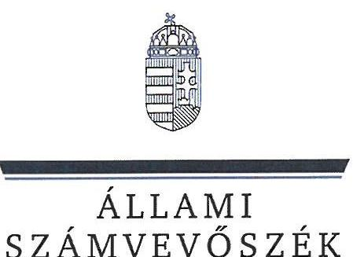

ÁLLAMI
SZÁMVEVŐSZÉK

# ÖSSZEFOGLALÓ JELENTÉS 

A közélet befolyásolására alkalmas tevékenységet végző civil szervezetek értékelése
2024.

---

# ELLENŐRZÉSI IGAZGATÓSÁG: 

ÁLLAMHÁZTARTÁSON KÍVÜLI SZERVEZETEKET ELLENŐRZŐ IGAZGATÓSÁG

## ELLENŐRZÉSI IGAZGATÓ:

## KLINGA LÁSZLÓ igazgató

## ELLENŐRZÉSVEZETŐ:

Jelentéseink az interneten a www.asz.hu címen olvashatók.

SOLYMÁR ÁGNES ellenőrzésvezető

IKTATÓSZÁM EL-4071-005/2024
TÉMASORSZÁM: 26
ELLENŐRZÉS-AZONOSÍTÓ SZÁM: V1099

---

# TARTALOMJEGYZÉK 

BEVEZETÉS ..... 5
AZ ÉRTÉKELÉS HATÓKÖRE, TERÜLETE ÉS MÓDSZERTANA ..... 6
AZ ELLENŐRZÖTT SZERVEZETEK ..... 14
ÉRTÉKELÉS ..... 16
KÖVETKEZTETÉS ..... 22
MELLÉKLET ..... 24
I. sz. melléklet: Értelmező szótár. ..... 24
RÖVIDÍTÉSEK JEGYZÉKE ..... 27

---

.

---

# BEVEZETÉS 

Az Állami Számvevőszék a közélet befolyásolására alkalmas tevékenységet végző szervezetek átláthatóságáról szóló 2021. évi XLIX. törvény szerint évente összefoglaló jelentést tesz közzé a hivatkozott jogszabály hatálya alá tartozó egyesületekről és alapítványokról.

Az összefoglaló jelentés az Egyesületek és alapítványok állambáztartásból kapott támogatásai felhasználásának és elszámolásának ellenőrzése című, valamint *Az* állambáztartásból nyújtott támogatást felhasználó egyesületek és alapítványok ellenőrzése című ellenőrzési programok szerint a civil szervezetek körében lefolytatott ellenőrzések megállapításai közül a 2023. évi adatok alapján, a Közbef. tv. ${ }^{1}$ hatálya alá tartozó szervezetekre vonatkozó megállapításokat vette alapul. Mindkét ellenőrzés során értékelésre került, hogy a kiválasztott államháztartási forrásból származó támogatás könyvviteli nyilvántartása során miként érvényesültek a törvényességi szempontok/jogszabályi előírások, illetve, hogy a támogatásokat a támogatott célnak megfelelően használták-e fel.

A 2023. év vonatkozásában a jogszabályi előírások szerint közélet befolyásolására alkalmas tevékenységet végző szervezetek sokaságának meghatározásához az OBH${ }^{2}$ és a KSH${ }^{3}$ szolgáltatott adatot. Az összefoglaló jelentés bemutatja az OBH és a KSH – közhiteles, illetve jogszabály által előírt adatszolgáltatáson alapuló – nyilvántartásai közötti adatkülönbségeket, azok hátterét. Továbbá, felvázolja azokat a körülményeket, melyek a Közbef. tv. szerinti sokaságba tartozó szervezetek teljes körének meghatározását, a sokaság elemeinek nevesítését nehezítették. Kitér az összefoglaló jelentés azon Közbef. tv. szerinti egyesületek és alapítványok kiemelt adatainak összesített bemutatására is, melyek 2023. évi gazdálkodási tevékenységét ellenőrizte az ÁSZ${ }^{4}$.

Az ellenőrzési megállapítások, és az azokból következő kockázatok bemutatásánál az alapul vett ellenőrzések jogalapját az ÁSZ tv.${ }^{5}$ 1. § (3) és 5. § (3) bekezdések, valamint a Civil tv.${ }^{6}$ 47. § előírásai képezték. Az ellenőrzött időszak a 2021-2023. évek voltak, ideértve a 2023. évi számviteli beszámoló vonatkozásában a közzétételig terjedő időszakot is, attól függően, hogy az adott támogatás felhasználása, illetve a támogatással történő elszámolás milyen időszakot érintett. Az ellenőrzött szervezetek és az általuk kapott támogatások kiválasztása kockázati szempontok figyelembevételével, mintegy 6500 szervezet közül történt. A kockázati szempontok között szerepelt többek között a jóváhagyott támogatás összege, illetve az, hogy több támogatási projekt keretében is úgy kapott támogatást az adott szervezet, hogy ezek felhasználási ideje egybeesett, illetve az a körülmény, hogy az elszámolás benyújtása az esedékesség ellenére nem történt meg 2024 első negyedévéig. Az ellenőrzések keretében a könyvvezetésre vonatkozó jogszabályi előírások betartását, a támogatás felhasználás támogatói okiratnak való megfelelőségét, valamint a beszámolási és közzétételi kötelezettség teljesítésének szabályszerűségét ellenőrizte az ÁSZ. Az ellenőrzések tárgya volt továbbá annak ellenőrzése, hogy a számviteli szabályozási környezet kialakítása támogatta-e az államháztartásból származó támogatások vonatkozásában a szabályos könyvvezetést, a kapcsolódó beszámolási kötelezettség teljesítését, valamint a támogatások célnak megfelelő felhasználását.

---

# AZ ÉRTÉKELÉS HATÓKÖRE, TERÜLETE ÉS MÓDSZERTANA 

Az értékelés kiterjedt a közélet befolyásolására alkalmas tevékenységet végző civil szervezetekre, melyek körét a Közbef. tv. határozza meg. Ezen szervezetek a Civil tv. szerint Magyarországon nyilvántartásba vett, civil szervezetnek minősülő egyesületek, valamint alapítványok, amelyek tárgyévi mérlegfőösszege eléri a 20 M Ft-ot. A mérlegfőösszeg nagyságától függetlenül nem terjed ki a Közbef. tv. hatálya, így nem tartoznak a közélet befolyásolására alkalmas tevékenységet végző civil szervezetek közé a vallási közösségek${ }^{7}$, a sportegyesületek${ }^{8}$, valamint a nemzetiségi egyesületek${ }^{9}$ és alapítványok${ }^{10}$.

## AZ ÉRTÉKELÉS HATÓKÖRE

A közélet befolyásolására alkalmas tevékenységet végző civil szervezetek törvényes gazdálkodása szabályozási környezetének alapvetéseit részben a Ptk.${ }^{11}$ jogi személyre vonatkozó általános szabályai, valamint az egyesületekre és alapítványokra vonatkozó rendelkezései adják. A gazdálkodás szervezetre egyedileg jellemző előírásait az alapító(k) által megalkotott létesítő okiratok rögzítik. A szervezet számviteli szabályozása, továbbá a számviteli nyilvántartásokra és a beszámolási kötelezettség teljesítésére vonatkozó előírásai a Számv. tv.${ }^{12}$-en alapulnak. A közélet befolyásolására alkalmas tevékenységet végző civil szervezetek a Számv. tv. szempontjából egyéb szervezeteknek minősülnek, így az Eszkr.${ }^{13}$ hatálya alá tartoznak, beszámolási kötelezettségüknek az Eszkr. előírásai szerint kell eleget tenniük. Ugyanakkor a gazdálkodás és a beszámolási kötelezettség vonatkozásában a Civil tv. is határoz meg előírásokat, melyek érvényre juttatásához figyelemmel kell lenniük a Civil vhr.${ }^{14}$ előírásaira is.

A támogatásokkal kapcsolatban fontos megjegyezni, hogy a jogszabályokon túl a támogatói okiratok valamint az azok elválaszthatatlan részét képező általános szerződési feltételek is tartalmaznak a támogatottakra vonatkozó kötelmeket, mint a számviteli nyilvántartásra, támogatás felhasználásának nyilvántartására vonatkozó előírások, továbbá a támogatás felhasználását alátámasztó, annak elszámolásakor figyelembe vett számlák záradékolására vonatkozó klauzulák, illetve annak szerepeltetése, hogy a támogatás összegét a záró beszámoló elfogadásáig előlegként folyósítják.

## AZ ÉRTÉKELÉS TERÜLETE

A közélet befolyásolására alkalmas tevékenységet végző szervezetek beazonosításához a 2023-ban működő civil szervezetek főbb adatait tartalmazó, az OBH által az ÁSZ részére megküldött adatbázis szolgáltatta az alapot. Az OBH a Cnytv.${ }^{15}$ és a Civil tv. előírásai alapján – a szervezet székhelye szerint illetékes törvényszéki nyilvántartásba vétel okán – a civil és a bejegyzésre kötelezett szervezetekről elektronikus nyilvántartást vezet. Azoknál a civil szervezeteknél, melyek beszámolóik jogszabályban előírt közzétételének a beszámolók elektronikus úton történő megküldésével tettek eleget, az OBH adatszolgáltatása kiterjedt a 2023. évre vonatkozó számviteli beszámoló adataira is. Az OBH a honlapján (www.birosag.hu) a civil szervezetekre vonatkozóan, közhiteles adatokat tartalmazó, nyilvános, mindenki által elérhető felületet is működtet.

Az OBH mellett a KSH gyűjt még adatokat a civil szervezetekről, melyek hozzájárulhatnak a Közbef. tv. szerinti közélet befolyásolására alkalmas tevékenységet végző alapítványok és egyesületek körének meghatározásához. Egyrészt, a statisztikai számjel képzéséhez külön erre a célra létrehozott elektronikus rendszer útján információt kap az OBH-tól, a NAV${ }^{16}$-tól és a Kincstár${ }^{17}$-tól a civil szervezetek alapadatairól.

---

Másrészt, hivatalos statisztikai tevékenység céljából, az Stt.${ }^{18}$-ben rögzítetteknek megfelelően nyilvános statisztikai információkat gyűjt és hoz nyilvánosságra. A civil szervezetek 2023. évre vonatkozó, KSH részére teljesítendő adatszolgáltatási kötelezettségét a 388/2017. (XII. 13.) Korm. rendelet${ }^{19}$ 2023. évre hatályos előírásai határozták meg. A teljesítendő statisztikai jelentés az alapadatok részeként a ténylegesen végzett tevékenység meghatározásán túl a főbb mérlegtételeket is tartalmazza, köztük a mérlegfőösszeget is. Ezen adatok is támogatták a Közbef. tv. hatálya alá tartozó civil szervezetek körének minél pontosabb meghatározását. Ugyanakkor a KSH részére jogszabály közhiteles nyilvántartás vezetését nem írja elő.

A KSH felé nem minden civil szervezet teljesítette a 388/2017. (XII. 13.) Korm. rendelet által előírt adatszolgáltatási kötelezettségét, így a KSH által megküldött adatbázis nem tartalmazta minden civil szervezetre vonatkozóan, az érintett szervezetek körének meghatározásához szükséges, az általuk aktuálisan végzett tevékenység meghatározást, továbbá a mérlegfőösszeget. Ugyanakkor olyan szervezetek vonatkozásában is tartalmazott a számviteli beszámolóra vonatkozó adatokat, melyek az OBH felé nem nyújtották be számviteli beszámolójukat. Továbbá egyes civil szervezetek aktuálisan végzett tevékenységről is csak a KSH adatbázis tartalmazott adatot.

A közélet befolyásolására alkalmas tevékenységet végző szervezeteket, valamint a 2024. évi ÁSZ ellenőrzéseket bemutató összefoglaló jelentés elkészítésekor az alábbi, 1. számú ábrában bemutatott vizsgálatokat végeztük el az érintett szervezetek kiválasztása és értékelése során.
1. ábra

# A 2023. ÉVBEN KÖZÉLET BEFOLYÁSOLÁSÁRA ALKALMAS TEVÉKENYSÉGET VÉGZŐ CIVIL SZERVEZETEK MEGHATÁROZÁSÁNAK FOLYAMATA 

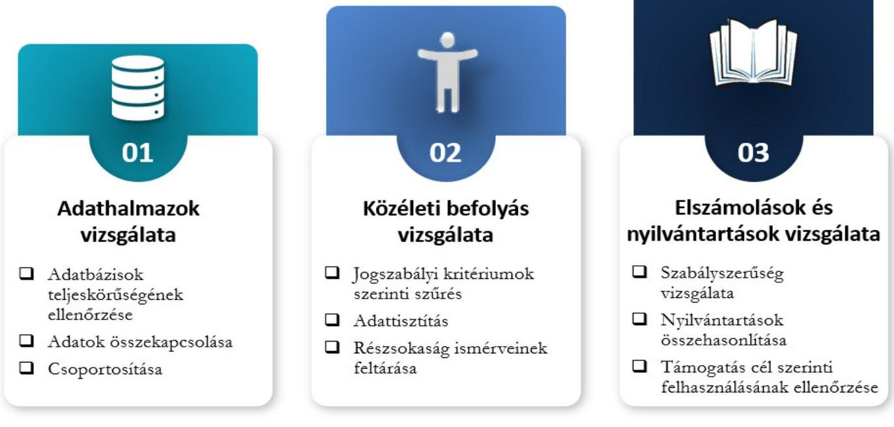

Forrás: ÁSZ saját szerkesztés

---

Az OBH által az ÁSZ-nak megküldött adatbázis alapján kiszűrésre kerültek azok, a Civil tv. előírása szerint civil szervezetek közé tartozó egyesületek és alapítványok, melyek az általuk végzett tevékenység folytán nem tartoznak a közélet befolyásolására alkalmas tevékenységet végző szervezetek közé.

Az OBH adatszolgáltatása szerint 2023. év december 31-én civil 67456 szervezet, 22434 alapítvány és 45022 egyesület működött. 2023. során 2162 szervezet szűnt meg. A beszámoló közzétételi kötelezettségének 47669 szervezet tett eleget.

A civil szervezetek tevékenységének meghatározásához az OBH nyilvántartásából figyelembe vettük a civil szervezetek cél szerinti tevékenységét. Ugyanakkor 2151 szervezet cél szerinti tevékenysége az OBH nyilvántartásban nem került rögzítésre. Ez a körülmény a beszámolót közzétett szervezetek közül 811 egyesületet és 149 alapítványt érintett. A 960 szervezet közül 584 szervezet teljesítette a KSH felé az adatszolgáltatási kötelezettségét, így 2023. év során végzett meghatározó tevékenységükre a KSH adatszolgáltatás alapján kaptunk információt.

Az OBH nyilvántartása szerint 19787 szervezet a jogszabályi előírás ellenére nem tett eleget a beszámoló letétbe helyezési és közzétételi kötelezettségének. Az adatbázis további 7466 szervezetre nem tartalmazta a jogszabályban meghatározott szervezeti kör meghatározásához szükséges mérlegfőösszeget. Ezek a szervezetek nem elektronikus úton nyújtották be az OBH-hoz a beszámolójukat. Jogszabály erre az 5 M Ft-ot el nem érő mérlegfőösszeg esetén ad lehetőséget.

A figyelembe nem vehető tevékenységek kiszűrését követően, a közélet befolyásolására alkalmas tevékenységet végző szervezetek meghatározásához a tevékenysége folytán figyelembe vehető részsokaság az OBH adatbázisban összesen 52030 civil szervezetből, 21479 alapítványból és 30551 egyesületből állt. A közélet befolyásolására alkalmas tevékenységet végző civil szervezetek meghatározásának folyamatát a 2. ábrában foglaltuk össze.
2. ábra

A 2023. ÉVBEN KÖZÉLET BEFOLYÁSOLÁSÁRA ALKALMAS TEVÉKENYSÉGET VÉGZŐ CIVIL SZERVEZETEK
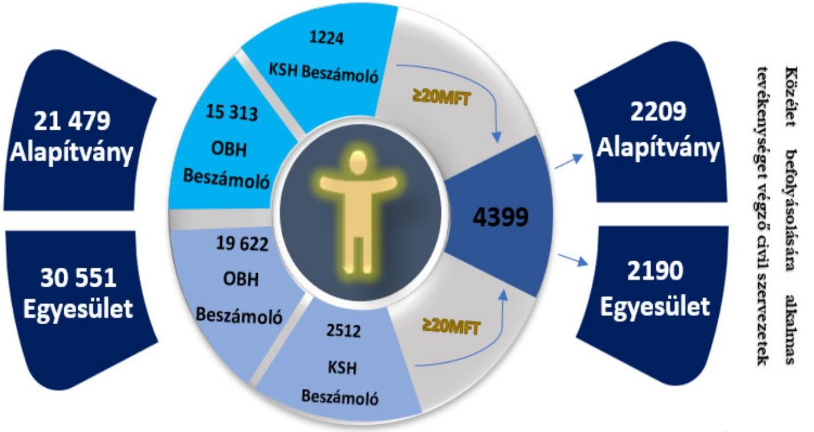

Forrás: ÁSZ saját szerkesztés

---

Az OBH adatszolgáltatása alapján 34935 potenciálisan közélet befolyásolására alkalmas tevékenységet végző szervezet, 15313 alapítvány és 19622 egyesület esetében állt rendelkezésre a beszámoló adata. A KSH által rendelkezésre bocsátott adatbázis összesen 30653 civil szervezet statisztikai adatszolgáltatásként megküldött beszámoló adatait, és az általuk 2023-ban végzett fő tevékenység adatát tartalmazta. Ezt az OBH nyilvántartásával összevetve megállapítottuk, hogy a 2023. évben folytatott tevékenysége folytán a közélet befolyásolására alkalmas tevékenységet végző civil szervezetek meghatározásához figyelembe vehető részsokaság 3736 szervezettel, 1224 alapítvánnyal és 2512 egyesülettel kiegészült. Összesen tehát 38671 szervezet beszámolója adatainak figyelembevételével került meghatározásra a jogszabály alapján a 2023. év vonatkozásában a közélet befolyásolására alkalmas tevékenységet végző szervezetek körének meghatározása. A 2023. évi beszámolóban a mérlegfőösszeg 4399 szervezet esetében érte el vagy haladta meg a 20 M Ft-ot.

A 2023. évre vonatkozó OBH és a KSH adatszolgáltatásából kapott adatok alapján a 2023. év vonatkozásában a közélet befolyásolására alkalmas tevékenységet végző civil szervezetnek minősülő egyesületek és alapítványok jellemző adatait a 3. ábra foglalja össze.
5. ábra

POTENCIÁLISAN KÖZÉLET BEFOLYÁSOLÁSÁRA ALKALMAS SZERVEZET MÉRLEGFŐÖSSZEGÉNEK MEGOSZLÁSA
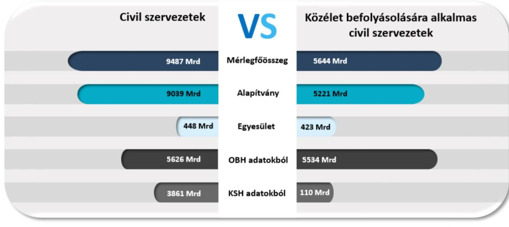

Forrás: ÁSZ saját szerkesztés
Az OBH nyilvántartásából szűrt, KSH adatszolgáltatással kiegészített adatbázis alapján a 2023. évben közélet befolyásolására alkalmas tevékenységet végző 4399 civil szervezetből 2209 alapítvány és 2190 egyesület volt. Ezek mérlegfőösszege összesen meghaladta az 5643666 M Ft-ot.

 Ft-ot, mely a potenciálisan közéletet befolyásolására alkalmas, ismert beszámoló adatokkal rendelkező civil szervezet közé tartozó alapítvány és egyesület mérlegfőösszegének 97,8%-a volt. A nyilvántartások alapján a tevékenységük folytán közéletet befolyásolására alkalmas tevékenységet végző civil szervezetek vagyona jelentős mértékben a jogszabályban meghatározott kritériumok szerint a közéletet befolyásolására alkalmas tevékenységet végző civil szervezeteknek minősülő alapítványoknál és egyesületeknél volt található, így ezen szervezetek vagyonuk alapján is meghatározók az adatszolgáltatók teljes sokaságán belül. A közéletet befolyásolására alkalmas tevékenységet végző szervezeteknél a 2023. évben az átlagos mérlegfőösszeg (vagyon) az alapítványok esetében 2363 M Ft, az egyesületek esetében 193 M Ft volt. Kizárólag vagyonukat tekintve a közéletet befolyásolására az alapítványok nagyobb befolyásolási lehetőséggel rendelkeztek a 2023. évben az egyesületeknél. A kizárólag vagyon szerinti

---

befolyásolási lehetőség esetén figyelembe kell venni a vagyonösszetételt is. Az alapítványoknál a befektetett eszközök átlagos értéke 2159 M Ft, a pénzeszközök átlagos értéke 146 M Ft volt. Ez a megoszlás az egyesületeknél 79 M Ft, illetve 70 M Ft volt. A jelentősen nagyobb alapítványi összvagyonon belül nagyobb arányú volt (91,4%-os) a befektetett eszközök és kisebb arányú volt (6,2%-os) a pénzeszközök aránya, míg az egyesületek kisebb összvagyonának 36,3%-a állt rendelkezésre pénzeszközként, a befektetett eszközök aránya pedig 41,0%-os volt a 2023. évben. A fentieket a 4. ábra mutatja be.
4. ábra

# A KÖZÉLET BEFOLYÁSOLÁSÁRA ALKALMAS TEVÉKENYSÉGET VÉGZŐ CIVIL SZERVEZETEK SZÁMÁNAK ÉS VAGYONÁNAK MEGOSZLÁSA A 2023. ÉVBEN 

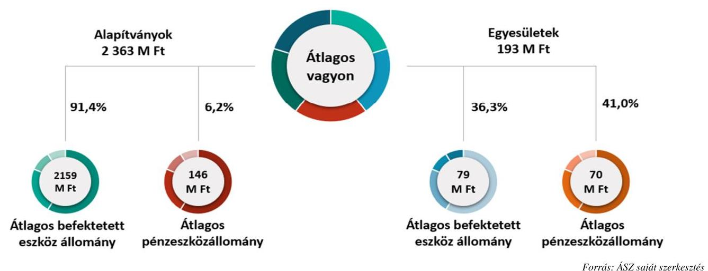

Az OBH által nyilvántartott, a tevékenységük folytán potenciálisan a közéletet befolyásolására alkalmas tevékenységet végző civil szervezetek közé tartozó 21479 alapítványból és 30551 egyesületből 4942 alapítvány (23,0%) és 9161 egyesület (29,9%) nem helyezte letétbe a 2023. évi beszámolóját. Ez az arány a közéletet befolyásolására alkalmas tevékenységet végző alapítványok esetében 3,3%, míg az egyesületek esetében 7,0%.

A közéletet befolyásolására alkalmas tevékenységet végző civil szervezeteket a tevékenységükön keresztül vizsgálva azt tapasztaltuk, hogy a 2209 alapítvány fő tevékenysége a kultúra, az oktatás, képzés, ismeretterjesztés, valamint a szociális ellátás és az egészségügyi ellátás volt. A 2190 egyesületnél is megtalálható a meghatározó tevékenységek között a kultúra és a szociális ellátás, de a megoszlás tekintetében ezeket megelőzi, ahogy az az 5. ábrában látható, a szabadidős-hobbi és közösségi tevékenységek, illetve a vállalkozói, szakmai és munkavállalói érdekképviselet.

A közélet a társadalmi élet azon területeire utal, amelyek közvetlenül kapcsolódnak a közösség, a társadalom, ezáltal az egyének vagy az állam működéséhez. A Közbef. tv. indokolása alapján ide tartoznak a politikai, gazdasági, kulturális és szociális ügyek, amelyek befolyásolják a közösség tagjainak mindennapi életét.

---

# A KÖZÉLET BEFOLYÁSOLÁSÁRA ALKALMAS TEVÉKENYSÉGET VÉGZŐ CIVIL SZERVEZETEK FŐ TEVÉKENYSÉGEI A 2023. ÉVBEN 

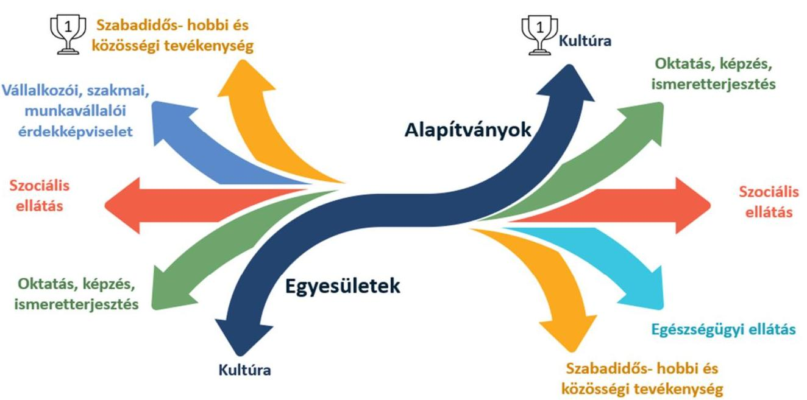

Forrás: ÁSZ saját szerkesztés
A civil szervezetek társadalmilag hasznos és közösségteremtő tevékenységéhez kapcsolódhat a politikai tevékenység fogalma. Azonban fontos kiemelni, hogy a civil szervezetek meghatározott körére kiterjed a politikai tevékenység tilalma. A közhasznú jogállás feltételei, illetve az SZJA $^{20}$ 1% fogadásának kritériumai között szerepel, hogy a szervezet a Civil tv.-ben meghatározott közvetlen politikai tevékenységet nem folytathat. A közéletet befolyásolására alkalmas tevékenységet végző szervezetek 45,2%-a, 1939 szervezet rendelkezett közhasznú jogállással.

A társadalomra hatást gyakorló tevékenységek az oktatás és tudatformálás keretében az oktatási programok, előadások, melyek révén az emberek mélyebb megértést szerezhetnek a társadalmat foglalkoztató kérdésekről, ezáltal tudatosabb állampolgárokká válhatnak. A művészet és kultúra területei gyakran reflektálnak a társadalmi kérdésekre és inspirálhatják az embereket arra, hogy másképpen gondolkodjanak társadalmat érintő témákról. Filmek, színházi előadások, irodalmi művek, zene és képzőművészeti alkotások mind hozzájárulhatnak a közélet befolyásolásához. Ezek a tevékenységek együttesen vagy külön-külön is jelentős hatást gyakorolhatnak a közéletre, formálva a társadalmi diskurzust, ezáltal befolyásolhatják a döntéshozókat, hozzájárulva a közösség, a társadalom fejlődéséhez. A társadalomra gyakorolt hatás lehetséges „mérőszáma" az adózónak az adó meghatározott része feletti rendelkezése eredményeként a civil szervezeteknek kiutalt SZJA 1%, mivel a rendelkezéssel az adózó határozza meg, hogy melyik civil szervezet céljainak a megvalósítását támogatja. Az adófizetők így járulhatnak hozzá a számukra fontosnak vélt ügyekhez pl. egészségügy, oktatás, környezet- és állatvédelem, vagy szociális támogatások stb. A civil szervezetek számára juttatott SZJA 1%-os támogatások összege, és az adományozók száma a társadalom számára egyfajta visszajelzés.

Az SZJA 1% fogadásához a civil szervezetnek eleget kell tennie az Szftv. $^{21}$ 4. § (1) bekezdésében foglaltaknak. Ennek megfelelően olyan, a Civil tv. szerinti alapítvány, közalapítvány, egyesület (kivéve a pártot, biztosító egyesületet, munkaadói és munkavállalói érdek-képviseleti szervezetet) lehet fogadó szervezet, amely a magánszemély rendelkező nyilatkozata évének első napja előtt legalább két évvel korábban bíróság által nyilvántartásba vett, belföldi székhelyű és nyilatkozata szerint közhasznú tevékenységet végző, továbbá alapító

---

okirata, alapszabálya szerint közvetlen politikai tevékenységet nem folytat, szervezete pártoktól független és azoknak anyagi támogatást nem nyújt. A Civil tv. szerint a közhasznú tevékenység minden olyan tevékenység, amely a létesítő okiratban megjelölt közfeladat teljesítését közvetlenül vagy közvetve szolgálja, ezzel hozzájárulva a társadalom és az egyén közös szükségleteinek kielégítéséhez. A közfeladat fogalmát az Áht. $^{22}$ határozza meg, mely szerint a közfeladat a jogszabályban meghatározott állami vagy önkormányzati feladat.

A 2023. évi tevékenysége alapján közéletet befolyásolására alkalmas tevékenységet végző szervezetek 57,1%-a, 2511 szervezet volt kedvezményezettje az SZJA 1% felajánlásoknak, így átlagosan 3116284 Ft, összesen 7825 M Ft felajánlásban részesültek. Ebből 1601 M Ft-ot kapott 1012 egyesület, ami átlagosan 1,6 M Ft volt. Az 1499 támogatott alapítvány átlag 4,2 M Ft-ot kapott, ami összesen 6224 M Ft felajánlás volt. Mindezeket összefoglalva a 6. ábra mutatja be.
6. ábra

# A KÖZÉLET BEFOLYÁSOLÁSÁRA ALKALMAS TEVÉKENYSÉGET VÉGZŐ CIVIL SZERVEZETEK FÖBB JELLEMZŐI 

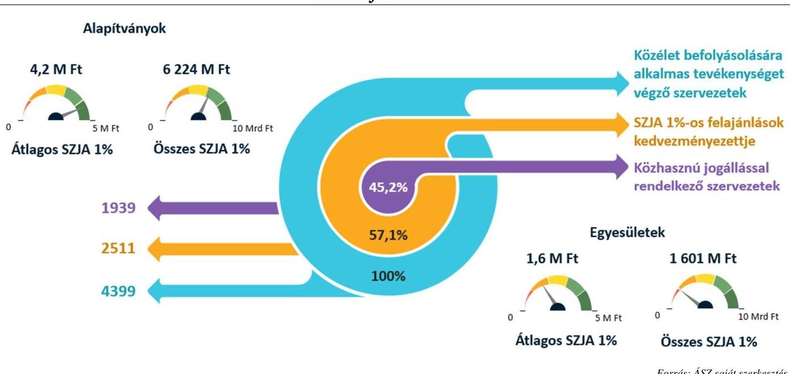

A közéletet befolyásolására alkalmas tevékenységek gazdasági hatása sokrétű lehet, többek között a fogyasztói magatartásra, helyi gazdaságokra is kiterjedhetnek. A társadalmi mozgalmak által képviselt értékek, üzenetek hatással bírhatnak a fogyasztói magatartásra. Amikor egy civil szervezet a tudatos fogyasztást népszerűsíti, hogy a vásárlók részesítsék előnyben a fenntartható gazdálkodásból származó helyben előállított termékek vásárlását, akkor az piaci lehetőséget teremt az ott működő vállalkozások számára. A közéleti aktivitások sikeresen erősíthetik egy közösség értékeit, ami közvetlen hatással lehet az adott terület gazdaságára, növelve az ott működő vállalkozások bevételeit, elősegítve azok fejlődését.

A Ptk. és a Civil tv. előírásai szerint alapítvány és egyesület elsődlegesen vállalkozási tevékenység végzésére nem alapítható. Azonban ez nem zárja ki, hogy a szervezet létesítő okiratban foglalt céljai elérésére gazdasági vállalkozási tevékenységet végezzen. Ekkor azonban figyelemmel kell lennie arra, hogy az ebből származó bevétele ne érje el az adott évi összes bevételének a 60%-át. A civil szervezet vállalkozási tevékenysége megvalósulhat úgy is, hogy tulajdoni részesedéssel rendelkezik gazdasági társaságban. A Ptk. alapítványokra vonatkozó előírásai szerint ez a részesedés nem járhat korlátlan anyagi felelősséggel, tehát alapítvány csak korlátolt felelősségű társaságban vagy részvénytársaságban szerezhet részesedést, illetve betéti társaság kültagja lehet.

---

Arra vonatkozóan nem rendelkezünk statisztikai, illetve bírósági nyilvántartásból származó összesített információval, hogy mely civil szervezet rendelkezik gazdasági társaságban tulajdoni részesedéssel. A közéletet befolyásolására alkalmas tevékenységet végző szervezetek vagyona az alapítványoknál koncentrálódott. A hatályos jogszabály által meghatározott, a közéletet befolyásolására alkalmas tevékenységet végző szervezetek közé tartoznak a vagyonkezelő alapítványok is. Az adatszolgáltatások alapján 88 vagyonkezelő alapítványt azonosítottunk ebben a körben. A 7. ábra bemutatja, hogy ezek rendelkeznek a közéletet befolyásolására alkalmas tevékenységet végző 2209 alapítvány vagyonának 80,7%-ával, átlagosan 47239 M Ft vagyonnal.
7. ábra

# A KÖZÉLET BEFOLYÁSOLÁSÁRA ALKALMAS TEVÉKENYSÉGET VÉGZŐ ALAPÍTVÁNYOK VAGYONÁNAK KONCENTRÁCIÓJA 

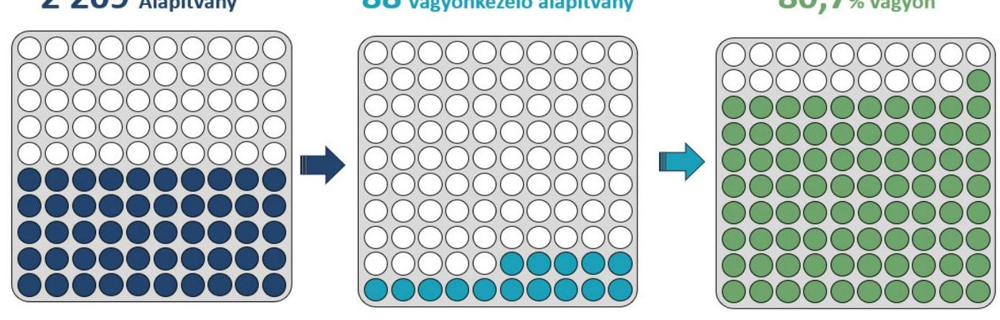

## AZ ÉRTÉKELÉS MÓDSZERTANA

Az értékelés az Egyesületek és alapítványok állambáztartásból kapott támogatásai felhasználásának és elszámolásának ellenőrzése címú, valamint Az állambáztartásból nyújtott támogatást felhasználó egyesületek és alapítványok ellenőrzése címú ellenőrzési programok szerint ellenőrzött, a közéletet befolyásolására alkalmas tevékenységet végző szervezetekhez kapcsolódott és az ellenőrzési megállapításokon alapult.

Ezen ellenőrzéseket a nemzetközi standardokat irányadónak tekintve az ellenőrzési programok szempontjai, az ellenőrzött időszakban hatályos jogszabályok, az ellenőrzés szakmai szabályok és módszertanok figyelembevételével kellett elvégezni. Az ellenőrzési kérdések megválaszolásához szükséges bizonyítékok megszerzése az ellenőrzött civil szervezet által rendelkezésre bocsátott dokumentumokra és adatokra alapozva, továbbá kérdésfeltevés (információkérés), interjú útján történt. A civil szervezeteknél az államháztartási forrásból származó, működésükhöz, programjaikhoz vagy fejlesztéseikhez (beruházásaikhoz) kapcsolódó támogatás(ok), a támogatás(ok) felhasználása és könyvviteli nyilvántartása jogszabályi előírásoknak való megfelelőségét az ellenőrzésre kiválasztott támogatásoknál, mintavételi eljárással kiválasztott mintatételeken keresztül ellenőrizte az ÁSZ. Az ellenőrzési bizonyítékként felhasználható adatforrások közé tartoztak egyrészt az ellenőrzési programban felsorolt adatforrások, másrészt adatforrás lehetett minden további, az ellenőrzés folyamán feltárt, az ellenőrzés szempontjából információkat tartalmazó dokumentum. Az ellenőrzés lefolytatásához az ellenőrzött civil szervezetek az ÁSZ által kért dokumentumok, adatok, információk megküldésével, a tanúsítványok kitöltésével, valamint az ellenőrzés során interjú keretében szolgáltattak adatokat. Az ellenőrzés során minden olyan körülményt és adatot is vizsgálni kellett, amely a program végrehajtása kapcsán felmerült újabb összefüggéseknek az ellenőrzés céljával összhangban lévő feltárásához szükséges volt.

---

# AZ ELLENŐRZÖTT SZERVEZETEK 

Az összefoglaló jelentés az ÁSZ által az „Egyesületek és alapítványok állambáztartásból kapott támogatásai felhasználásának és elszámolásának ellenőrzéséről" című ellenőrzési program szerint lefolytatott ellenőrzés alapján 30 szervezetre (szervezetenként egy támogatásra vonatkozóan), „Az állambáztartásból nyújtott támogatást felhasználó egyesületek és alapítványok ellenőrzése" című ellenőrzési program szerint lefolytatott ellenőrzés alapján pedig további egy szervezetre (négy támogatásra vonatkozóan), összesen 31, a Közbef. tv. szerinti civil szervezetre tett ellenőrzési megállapításokat foglalja össze és értékeli.

Az „Egyesületek és alapítványok állambáztartásból kapott támogatásai felhasználásának és elszámolásának ellenőrzéséről" című ellenőrzés keretében vizsgált 31 szervezetből 17 alapítványi és 14 egyesületi formában működött, közülük összesen 17 rendelkezett közhasznú jogállással. Az ellenőrzött 31 civil szervezet a 2023. évi beszámolók mérlegfőösszege alapján összesen 119 195,7 M Ft vagyonnal gazdálkodott, és az eredménykimutatás/eredménylevezetés adatai alapján az ellenőrzött időszakban összesen 40 033,5 M Ft bevételt mutatott ki.

A 31 ellenőrzött szervezet 2021-2023. évi számviteli beszámolójában kimutatott támogatások 35 597,4 M Ft közel 7%-ának, összesen 2468,6 M Ft összegű vissza nem térítendő támogatási előlegként folyósított államháztartási forrásból kapott támogatás számviteli nyilvántartásának ellenőrzésére került sor. Az ellenőrzött támogatásból, ahogy az a 8. ábrán is látható, 934,1 M Ft támogatás kizárólag beruházási, fejlesztési célt szolgált. Az ellenőrzött támogatásokat a szervezetek teljes egészében felhasználták, fel nem használt támogatás visszautalására nem került sor. A támogatás felhasználását ellenőrző szervezet az „Egyesületek és alapítványok állambáztartásból kapott támogatásai felhasználásának és elszámolásának ellenőrzéséről" című ellenőrzési programmal érintett 30 szervezet esetében a BGA$^{23}$ volt, amely - a pénzügyi elszámolások ellenőrzése alapján - visszafizetési kötelezettséget nem állapított meg, ugyanakkor az ÁSZ ellenőrzés időszakában 11 civil
 szervezet esetében a beszámoló elfogadásáról még nem döntött. A BGA, mint támogató által befogadott támogatási kérelmek a Városi Civil Alap, a Nemzeti Együttműködési Alap, valamint a Nonprofit, társadalmi, civil szervezetek és köztestületek támogatása fejezeti kezelésű előirányzat 2021. és a Nemzeti együttműködési Alap 2023. évi forrásának terhére kerültek benyújtásra.
„Az állambáztartásból nyújtott támogatást felhasználó egyesületek és alapítványok ellenőrzése" című ellenőrzési program keretében ellenőrzött egy civil szervezet által kapott támogatás tekintetében a felhasználást ellenőrző szervezetek - a BGA mellett - az EMMI ${ }^{24}$, illetőleg a feladat tekintetében 2022.05.25-től jogutód $\mathrm{BM}^{25}$ voltak. Az ellenőrzött pénzügyi elszámolások alapján egy támogatás esetében került sor $0,8 \mathrm{MFt}$ fel nem használt támogatási összeg visszafizetésére.

---

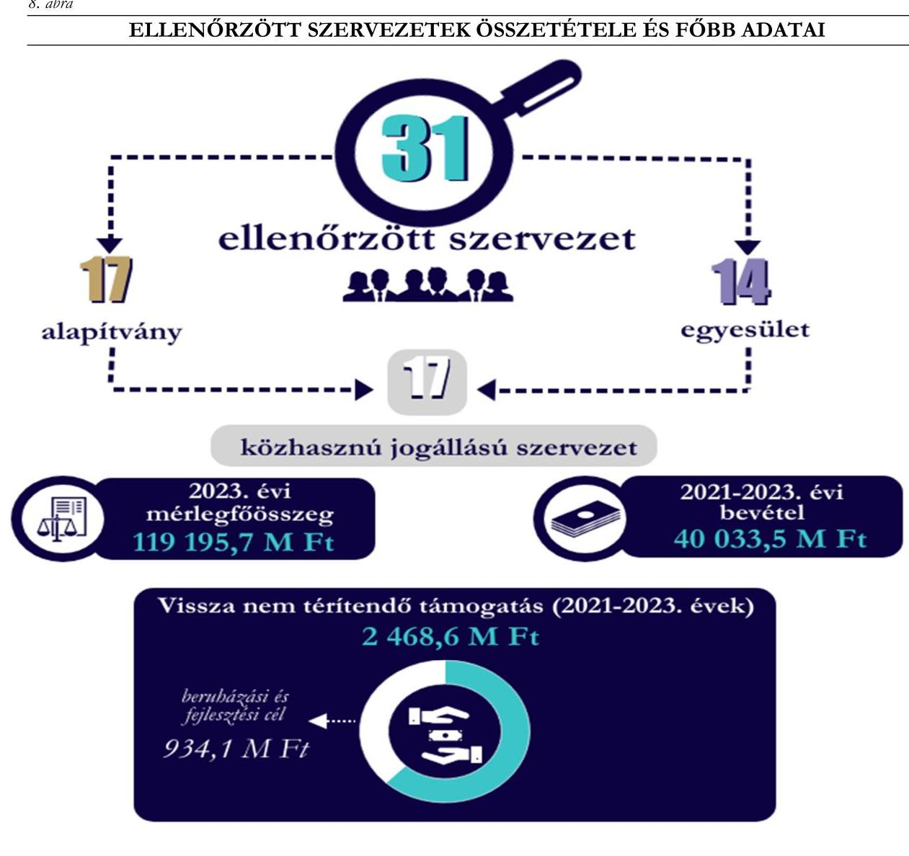

Fonrás: ÁSZ saját szerkesztés

---

# ÉRTÉKELÉS 

Az ellenőrzés során a 31 ellenőrzött szervezetnél az államháztartási forrásból kapott támogatás cél szerinti és szabályszerű felhasználásának, a támogatás elszámolása szabályszerűségének, beszámolási kötelezettség teljesítésének ellenőrzésére került sor. Ezen túlmenően a gazdálkodási keretek és könyvvezetési rendszer kialakítása, továbbá $100 \%$-os előlegként megkapott támogatás számviteli elkülönített nyilvántartásának ellenőrzésére is sor került. Ezeket a támogatásokat a szervezetek a 2019-2023. évben kapták és legkésőbb 2024. január 1-éig használták fel.

## A könyvvezetési rendszer kialakítása az ellenőrzött támogatás vonatkozásában

A szabályszerű gazdálkodás feltételeinek kialakítása a jogszabályoknak megfelelő szabályzatok elkészítésével valósulhat meg.

A Számv. tv. 14.§ (4) bekezdése értelmében a számviteli politika tartalmazza azokat a gazdálkodóra jellemző szabályokat, előírásokat, módszereket, amelyekkel a szervezet meghatározza, hogy mit tekint a számviteli elszámolás, az értékelés szempontjából lényegesnek, jelentősnek, nem lényegesnek, nem jelentősnek, kivételes nagyságú vagy előfordulású bevételnek, költségnek, ráfordításnak. Emellett az alkalmazott választási, minősítési lehetőségeket, továbbá az alkalmazott gyakorlat megváltoztatásának okait / eseteit is rögzíteni szükséges a szabályzatban.

A számviteli politika keretében elkészítendő eszközök és források értékelési szabályzata tartalmazza a szervezet által alkalmazott értékelési módszereket az eszközök és a források értékének meghatározására a könyvviteli nyilvántartásba vétel, illetőleg mérlegkészítés során.

A Számv. tv. 161. § (1) bekezdésében foglalt rendelkezés alapján számlarendet a kettős könyvvitelt vezető gazdálkodó szervezetek kötelesek készíteni, és könyvvezetésüket a szabályzatban foglaltaknak megfelelően vezetni. A Számv. tv. 161. § (2) bekezdése pedig tételesen rögzíti az elkészítendő szabályzat tartalmi elemeit.

A számlarendhez tartozóan kell elkészíteni a kettős könyvvitelt vezető civil szervezetnek a számlarendben foglaltakat alátámasztó, a Számv. tv. 161. §. (2) bekezdés d) pontjában előírt bizonylati rendet. A bizonylati rend a gyakorlatban általában külön szabályzatként készül és a számlarend mellékleteként kerül kiadásra.

Működéséről, vagyoni, pénzügyi és jövedelmi helyzetéről a 31 ellenőrzött szervezet közül egy ellenőrzött a Számv. tv. szerinti éves beszámolót, 29 ellenőrzött egyszerűsített éves beszámolót készített, melyeket kettős könyvvezetéssel támasztottak alá. Egy szervezet egyszeres könyvvezetéssel alátámasztott, egyszerűsített beszámolót készített.

Az államháztartásból származó támogatások szabályszerű könyvviteli nyilvántartását a megfelelően kialakított könyvvezetési rendszer támogatja, amely - a Számv. tv. 12. § (1) bekezdése értelmében - a vagyoni, pénzügyi, jövedelmi helyzetre kiható gazdasági eseményekről történő folyamatos nyilvántartás vezetését, illetőleg ezen nyilvántartások üzleti év végén történő lezárást foglalja magában. A törvényben meghatározott könyvvezetési rendszer kialakítása négy szervezetnél nem volt megfelelő.

A Számv. tv. 14. § (3) bekezdésében előírt, a törvényi rendelkezések végrehajtásának módszereit, az alkalmazandó eszközöket meghatározó számviteli politikával 28 szervezet rendelkezett. A Számv. tv. 14. § (5) bekezdés b) pontjában meghatározott eszközök és források értékelési szabályzatát öt szervezet nem készítette el. A 30 kettős könyvvitelt vezető ellenőrzött szervezet közül hét nem rendelkezett a Számv. tv. 161. § (1) bekezdésében előírt számlarenddel, és ebből a hét szervezetből öt, valamint egy további szervezet pedig a Számv. tv. 161. § (2) bekezdés d) pontja szerinti bizonylati renddel. A számviteli politikával nem rendelkező

---

három ellenőrzött szervezetnél értékelési szabályzat, számlarend, bizonylati rend elkészítésére sem került sor, ezek a szervezetek nem alakították ki a törvényben rögzített alapelveknek, értékelési előírásoknak megfelelő szabályozási keretrendszerüket. A 31 ellenőrzött szervezet beszámolási kötelezettségének teljesítését és a számviteli szabályzatok rendelkezésre állását a 9. ábra foglalja össze.
9. ábra

# ELLENŐRZÖTT SZERVEZETEK KÖNYVVEZETÉSE 

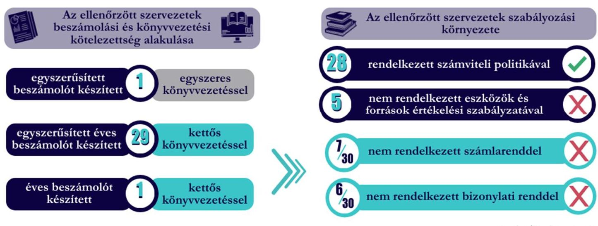

## A kapott támogatás könyvviteli nyilvántartása

A kapott támogatási előleg könyvviteli elszámolása 29 szervezet tekintetében a jogszabályban előírt részletezésben történt. A Számv. tv. 161/A. § (1)-(2) bekezdés és az Eszkr. 9. § (9)-(10) bekezdés előírásainak megfelelően 29 ellenőrzött szervezet a számviteli nyilvántartási rendszerét olyan módon alakította ki, hogy abból a vonatkozó külön jogszabályban - Civil tv. - meghatározott adatok rendelkezésre álljanak. Két civil szervezet a Civil tv. 20. $\int(1)$-(3) bekezdésben foglalt rendelkezések ellenére az alapcél szerinti (közhasznú) tevékenysége költségei, ráfordításai ellentételezésére visszafizetési kötelezettség nélkül kapott támogatást a többi támogatástól nem különítette el a könyvviteli rendszerében. Elkülönítés hiányában a könyvviteli nyilvántartásból nem egyértelműen megállapítható, hogy az államháztartási forrásból kapott támogatás a központi költségvetésből-, elkülönített állami pénzalapokból-, vagy helyi önkormányzatoktól, kisebbségi önkormányzatoktól, önkormányzati társulástól kapott támogatás volt-e. Amennyiben a civil szervezet az államháztartási forrásból kapott támogatás felhasználását nem megfelelően tartja nyilván, akkor a támogatás cél szerinti felhasználásának megállapíthatóságát sem biztosítja maradéktalanul, ezáltal pedig sérülhet az átláthatóság és a közpénzekkel való elszámoltathatóság elve.

A 31 ellenőrzött civil szervezet közül, ahogy azt a 10. ábra is szemlélteti, 29 szervezet a támogatói okirat szerint előlegként kapott 32 támogatást a könyvviteli nyilvántartásában a Számv. tv. 43. § (1) bekezdésében foglaltak ellenére nem mutatta ki egyéb rövid lejáratú kötelezettségként a záró pénzügyi elszámolás támogató általi elfogadásáig. A 29 ellenőrzött szervezet számviteli beszámolójának mérlegében nem került kimutatásra a fenti kötelezettség, ezzel sérült a Számv. tv. 15. § (2) bekezdés szerinti teljesség elve, miszerint a szervezetnek könyvelnie kell mindazon gazdasági eseményeket, amelyeknek az eszközökre és a forrásokra gyakorolt hatását a beszámolóban ki kell mutatni. Továbbá sérült a Számv. tv. 16. § (4) bekezdés szerinti lényegesség elve, mivel a számviteli beszámoló mérlege nem tartalmazott egy olyan információt (kötelezettséget), ami befolyásolja a beszámoló adatait felhasználók döntését.

---

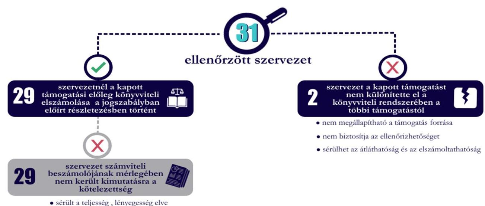

Forrás: ÁSZ saját szerkesztés

# A kapott támogatás felhasználása, könyvviteli elszámolása 

A civil szervezetek a jogszabályi előírásnak megfelelő elkülönített nyilvántartás vezetését biztosíthatják a költségek, ráfordítások elszámolására szolgáló főkönyvi számlák alábontásával, támogatásonként nyitott alszámlák használatával, vagy támogatásonként kialakított egyedi azonosítók (munkaszám, költséghely kód, támogatás azonosító stb.) alkalmazásával.

Az államháztartásból nyújtott támogatást felhasználó 30 ellenőrzött szervezetnél szervezetenként egy, valamint a további egy szervezetnél négy kiválasztott támogatás felhasználására vonatkozó jogszabályi és szerződéses előírások betartásának ellenőrzése történt. Ennek keretében a könyvvezetésre vonatkozó jogszabályi előírások betartását, a támogatás felhasználás támogatói okiratnak való megfelelőségét, a támogatási célnak megfelelő felhasználást vizsgáltuk.

A Civil tv. 20. § (4) bekezdése szerint a civil szervezet az alapcél szerinti (közhasznú) tevékenysége költségei, ráfordításai ellentételezésére kapott támogatásokról olyan elkülönített számviteli nyilvántartást köteles vezetni, amelynek alapján támogatásonként megállapítható és ellenőrizhető a kapott támogatás felhasználása. Az előírások betartása a könyvvezetés módjától függetlenül minden civil szervezet számára kötelező. Az ellenőrzések ide vonatkozó megállapításait a 11. ábra összegzi.

A támogatási előleg felhasználása és annak könyvviteli elszámolása 27 szervezet esetében szabályszerű volt, a támogatási előleg felhasználását a számviteli rendszerében elkülönítetten kezelte, melyet a támogatási előleg felhasználását alátámasztó ellenőrzött tételek is alátámasztottak. Négy ellenőrzött szervezet nem alakította ki a Civil tv. 20. § (4) bekezdésében előírt, támogatási előleg felhasználásának elkülönített rendszerét a könyvviteli nyilvántartásában, így ezeknél a szervezeteknél a támogatási előleg felhasználásának nyilvántartása nem volt szabályszerű. Elkülönített nyilvántartás hiányában az egyes támogatások felhasználásáról készített elszámolások könyvviteli nyilvántartással, az abban szereplő támogatásonkénti elkülönített adatokkal nem voltak alátámasztottak.

Az ellenőrzött 2 468,6 M Ft támogatási előleg vonatkozásában, az ellenőrzött bizonylatok alapján a támogatási előleg felhasználása - egy támogatás kivételével - összhangban volt a támogatói okiratban meghatározott céllal, valamint költségtervvel, az elszámolt költségek a támogatói okiratban meghatározott

---

támogatási programokhoz, projektekhez kapcsolódtak. A számvevőszéki ellenőrzés céltól eltérő felhasználást nem állapított meg a 30 ellenőrzött szervezetnél. Egy szervezet 500 M Ft támogatás felhasználása nem felelt meg a támogatói okiratokban foglaltaknak, a támogatásból megvalósult tárgyi eszköz beszerzés nem minősült a támogatási cél megvalósítása érdekében figyelembe vehető közreműködésnek.
11. ábra

# A TÁMOGATÁS FELHASZNÁLÁSÁNAK KÖNYVVITELI NYILVÁNTARTÁSA 

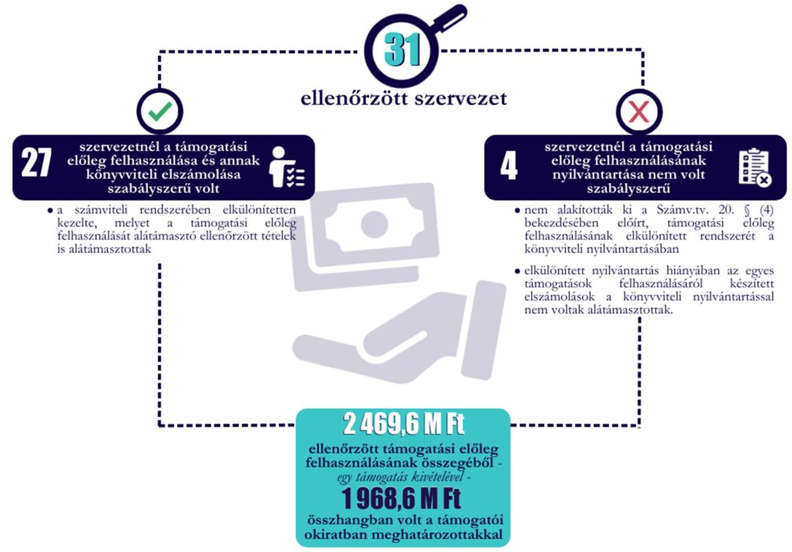

A támogató felé történő elszámolás
A 31 ellenőrzött szervezetből 9 civil szervezet a támogató felé nem nyújtotta be a támogatási szerződésben rögzített határidőben 12 támogatással való elszámolást, ezt azonban a támogató nem kifogásolta, illetőleg szankcióval nem élt. A 21 ellenőrzött szervezet a támogatási előleg felhasználásáról készített beszámolójukat a támogató részére határidőben benyújtotta. A benyújtott beszámolókról a támogató 11 ellenőrzött szervezet tekintetében az ellenőrzés időszakában még nem döntött. A támogató 2022. július 21. 2024. június 4. között az ellenőrzött 21 támogatás tekintetében a benyújtott elszámolást elfogadta, azokat lezárta.

---

# Az éves beszámolási kötelezettség teljesítése 

A szervezetek számára a jogszabályokban előírt beszámolási kötelezettség szabályszerű teljesítése erősítheti a társadalom irányukban tanúsított bizalmát. A civil szervezeteknek ezért pontos, minden előírt információt és kötelező tartalmi elemet - az egyszerűsített beszámoló kivételével a beszámolási kötelezettség részeként a kiegészítő mellékletet is - magában foglaló számviteli beszámolót és közhasznúsági mellékletet szükséges készíteniük.

A Számv. tv. 4. § (1) bekezdésben foglalt rendelkezések értelmében a szervezetek az üzleti év könyveinek zárását követően - a törvényben meghatározott könyvvezetéssel alátámasztott - beszámolót kötelesek készíteni. A számviteli beszámoló nyelve a magyar. A Civil tv. 29. § (2) bekezdésben foglalt rendelkezésnek megfelelően a civil szervezetek beszámolója mérlegből / egyszerűsített mérlegből, eredménykimutatásból / eredménylevezetésből áll. Kettős könyvvitel esetében pedig kiegészítő mellékletet is tartalmaznia kell.

A civil szervezetek beszámolási kötelezettségére vonatkozóan a Számv. tv. a Civil tv., továbbá az Eszkr. tartalmaz rendelkezéseket. A beszámolók elkészítése és letétbe helyezése, közzététele révén ismerheti meg a társadalom a szervezetek működését, vagyoni, pénzügyi és jövedelmi helyzetét. A közpénzek felhasználásáról, az alapcél szerinti (közhasznú) tevékenységről nyújtott tájékoztatás akkor tekinthető megfelelőnek és teljeskörűnek, ha az elkészített és a közvélemény számára elérhetővé tett beszámolók megbízhatóak, határidőben, a jogszabályi előírások szerint készültek el, az ellenőrizhetőséget biztosító adatokkal alátámasztottak, és valós összképet adnak a szervezetek vagyonáról, eszközeikről és forrásaikról, tevékenységük eredményéről.

A 31 ellenőrzött szervezet esetében a 2021-2023. évi számviteli beszámolási és közzétételi kötelezettség teljesítésének ellenőrzésére került sor. Az ellenőrzési megállapítások összefoglalóját a 12. ábra szemlélteti. A Civil tv. 30. § (1) bekezdésében foglalt rendelkezéseknek ellentételesen öt szervezetnél az elkészített beszámolót a legfőbb döntéshozó szerv által nem fogadta el.

A beszámoló készítése kapcsán - az elfogadás szabályszerűségére vonatkozó előírás mellett - a Civil tv. említett 30. § (1) bekezdése a letétbe helyezés, közzététel határidejét is meghatározza, amelyet a civil szervezeteknek szem előtt kell tartaniuk. Az adott üzleti év mérlegfordulónapját követő ötödik hónap utolsó napjáig (május 31.) 20 szervezet tett eleget a beszámolója letétbe helyezési és közzétételi kötelezettségének. Ebből
 a 20 szervezetből 14 szervezetnél a közzétett beszámolók megfeleltek a jogszabályi előírásoknak, a kötelező tartalmi elemek szerepeltek bennük. Az ellenőrzött 31 szervezetből a fennmaradó 11 szervezet a számviteli beszámolóit a Civil tv. 30. § (1) bekezdésében előírt határidőn túl tette közzé, helyezte letétbe. A Civil tv. 30. § (4) bekezdése értelmében amennyiben honlappal rendelkezik a civil szervezet, úgy közzétételi kötelezettsége kiterjed a beszámoló, valamint közhasznúsági melléklet saját honlapon történő elhelyezésére. A saját honlapon való közzétételi kötelezettségének részben vagy egyáltalán nem tett eleget öt szervezet. Az ÁSZ tv. 29. § (2) bekezdés szerinti jelentéstervezet észrevételezése során egy szervezet intézkedett a 2023. évre vonatkozó számviteli beszámolójának a saját honlapján való közzétételéről, ezáltal az ÁSZ ellenőrzése hasznosult.

A kettős könyvvitelt vezető, közhasznú jogállású szervezet kiegészítő mellékletében be kell mutatni a támogatási program keretében végleges jelleggel felhasznált összegeket támogatásonként (Civil tv. 29. § (4) bekezdés) valamint az üzleti évben végzett főbb tevékenységeket és programokat (Civil tv. 29. § (5) bekezdés). Támogatási program alatt a központi, az önkormányzati, illetve nemzetközi forrásból, illetve más gazdálkodótól kapott, a tevékenység fenntartását, fejlesztését célzó támogatást, adományt kell érteni. Külön kell megadni a kiegészítő mellékletben a támogatási program keretében kapott visszatérítendő (kötelezettségként kimutatott) támogatásra vonatkozó, előbbiekben részletezett adatokat. A nem közhasznú jogállású, de a

---

Számv.tv. szerinti éves beszámolót készítő szervezetre vonatkozóan a Számv.tv. 93. § (3) bekezdése ír elő a kiegészítő melléklet tartalmára vonatkozó rendelkezést. A kiegészítő melléklet formáját és tartalmát a Civil vhr. melléklete tartalmazza.

A kettős könyvvitellel alátámasztott egyszerűsített éves beszámolót, vagy a Számv. tv. szerinti éves beszámolót készítő 30 ellenőrzött szervezet 2021-2023. évi számviteli beszámolójuk részeként kötelesek voltak kiegészítő mellékletet készíteni. A hat ellenőrzött szervezet a Civil tv. 29. § (2) bekezdés e) pontja előírása ellenére beszámolója részeként a kiegészítő mellékletet nem készítette el.

Négy közhasznú ellenőrzött szervezet kiegészítő melléklete a Civil tv. 29. § (4)-(5) bekezdéseiben foglaltak ellenére nem tartalmazta a 2021-2023. évben támogatási programonként végleges jelleggel felhasznált összegeket támogatásonként, valamint az üzleti évben végzett főbb tevékenységeket és programokat. A 31 ellenőrzött szervezetből négy ellenőrzött szervezet 2021-2023. évre vonatkozó számviteli beszámolóit a Civil tv. 30. § (1) bekezdésében foglaltak ellenére kiegészítő melléklet nélkül tette közzé, helyezte letétbe. A hiányos kiegészítő melléklet, illetve annak hiányában ezek a szervezetek beszámolójukban nem jelenítették meg azokat a Civil tv.-ben, Eszkr.-ben és a Számv. tv.-ben előírt további információkat, amelyek - a mérlegben és az eredménykimutatásban szerepeltetetteken túl - szükségesek a megbízható és valós összkép bemutatásához. 12. ábra

# A BESZÁMOLÁSI FELADATOK TELJESÍTÉSE 

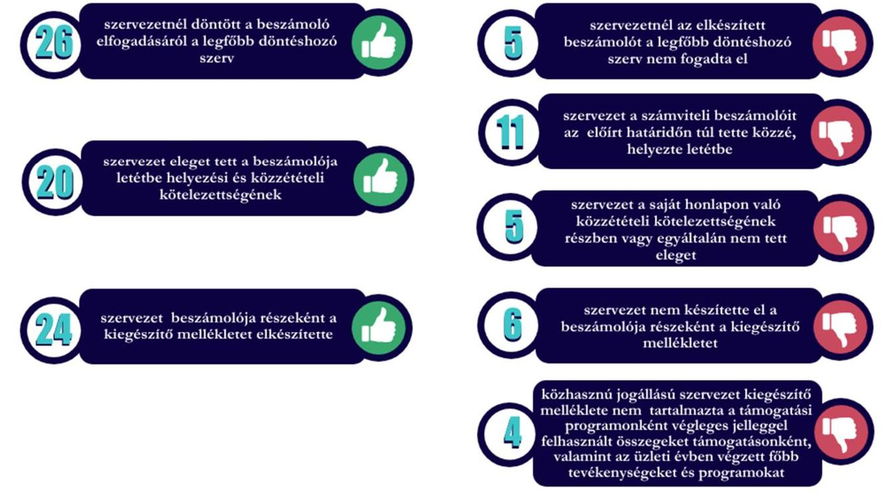

---

# KÖVETKEZTETÉS 

Az ÁSZ a törvényben meghatározott feladatai keretében törvényességi szempontok mentén ellenőrizte a jogszabályi előírások szerint meghatározott civil szervezetek közé tartozó egyesületeket, alapítványokat. Az ellenőrzött szervezetek kiválasztásához nem csak a jogszabályban előírt, a közélet befolyásolására alkalmas tevékenységet végző szervezetek meghatározását leíró kritériumok, hanem a szervezetekre jellemző, további információk is támogatták az ellenőrzött szervezetek körének meghatározását. Ezáltal a társadalom szerint fontosnak tartott tevékenységet folytató, ezért az SZJA 1\%-on keresztül sokak által támogatott, vagy a közhasznú jogállás révén a civil szférán belül is kedvezményezett, illetve a civil szervezetek meghatározó vagyonát kezelő, azon keresztül akár a gazdaságra is hatással bíró szervezeteket állítva az ellenőrzései fókuszába. A civil szervezetek közel 30%-a nem tett eleget a beszámoló jogszabályban előírt közzétételi kötelezettségének. Ezáltal nem teljeskörű a jogszabályban meghatározott kritérium - a tárgyévi mérlegfőösszeg eléri a 20 M Ft -ot - figyelembevétele a közélet befolyásolására alkalmas tevékenységet végző civil szervezetek meghatározásakor.

Az ÁSZ 2024. évi ellenőrzései hozzájárultak ahhoz, hogy a társadalom képet kaphasson a közélet befolyásolására alkalmas tevékenységet végző ellenőrzés alá vont egyesületek és alapítványok részére költségvetési forrásból nyújtott támogatások szabályszerű felhasználásáról. Továbbá a hiányosságok feltárása elősegíti az ellenőrzött szervezetek támogatásokkal való szabályszerű gazdálkodását.

Az ÁSZ megállapításai jelentős része az államháztartásból kapott támogatás könyvviteli elszámolása során a jogszabályban előírt részletezés megvalósulását, illetőleg a támogatás felhasználás könyvviteli elszámolását érintette. Nyolc szervezet könyvvezetési rendszerének kialakítása nem volt szabályszerű, továbbá nyolc szervezet esetében a belső szabályzatok hiányára vonatkozó megállapítást tartalmaztak a számvevőszéki jelentések. A beszámolási kötelezettség teljesítését érintően is tárt fel hiányosságokat az ÁSZ.

A megfelelő könyvvezetési rendszer, valamint az ahhoz kapcsolódó belső szabályozás kialakítása és működtetése elengedhetetlen ahhoz, hogy a szervezetek pénzügyi folyamatai átláthatóak, naprakészek, szabályosak, és ezáltal ellenőrizhetők legyenek. Ezek elmaradása magában hordozza azt a kockázatot, hogy a szervezetek, továbbá a beszámoló adatait felhasználók esetlegesen nem kapnak valós képet pénzügyi, vagyoni helyzetükről, mert nem vezetnek naprakész nyilvántartásokat, a megtörtént gazdasági események rögzítésére vonatkozóan nem rendelkeznek egységes, következetesen alkalmazandó szabályozással. Ennek eredményeképpen pedig a számviteli beszámolóik sem a ténylegesen fennálló állapotot fogják tükrözni.

Az ellenőrzött szervezeteknél feltárt hiba volt, hogy a támogatási előleget nem mutatták ki fennálló kötelezettségként a számviteli beszámolójukban az elszámolás támogató általi elfogadásáig, amely több év számviteli beszámolóját is érintheti. Az említett hiányosság kockázatot jelent az érintett szervezetek mérlegfőösszeg értéke alapján előírt minősítésekre (pl. közélet befolyásolására alkalmas tevékenységet végző szervezet-e), valamint a számviteli beszámoló adatait felhasználók döntéseit lényegesen befolyásolhatja.

A BGA a benyújtott beszámolók elfogadásáról a támogatott szervezetek egyharmadánál az ellenőrzés időszakában még nem döntött. Tekintettel a Számv. tv. 43. § (1) bekezdésében foglalt előírásokra, a civil szervezeteknek az előlegként kapott támogatási összeget a kötelezettségek között kell kimutatniuk mindaddig, amíg a támogató a felhasználás elszámolásáról nem dönt. Ez az ellenőrzés tapasztalatai alapján esetenként több éven is áthúzódhat, ennek értelmében pedig a szervezeteknek több üzleti éven keresztül a kötelezettségek között szükséges megjeleníteniük a beszámolóik mérlegében a kapott támogatást annak ellenére, hogy az összeg felhasználásra már korábban sor került. A közpénzekkel való felelős gazdálkodás követelményének érvényre

---

juttatása érdekében jogos elvárásként jelentkezik a társadalom részéről, hogy az államháztartási forrásból kapott támogatások felhasználásáról benyújtott elszámolások ellenőrzése a lehető leghamarabb megtörténjen.

Az ellenőrzött támogatás tekintetében a Civil tv. 20. § (4) bekezdésében foglalt rendelkezéseknek megfelelő elkülönített nyilvántartás vezetésének hiányosságát az ÁSZ három szervezetnél állapította meg. Amennyiben a civil szervezet az államháztartási forrásból kapott támogatás felhasználását nem megfelelően tartja nyilván, úgy nem valósul meg a beszámoló nyilvántartással történő alátámasztottsága.

Az ÁSZ öt szervezet esetében állapította meg, hogy a Civil tv. 30. § (1) bekezdésében foglaltak ellenére a szervezet legfőbb döntéshozó szerve nem hagyta jóvá a számviteli beszámolót. További hat szervezetnél a számviteli beszámoló részeként a kiegészítő mellékletet nem készítették el. Négy szervezet a számviteli beszámoló elkészítésével egyidejűleg a kiegészítő melléklet elkészítéséről is gondoskodott, azonban az nem tartalmazta a támogatási program keretében végleges jelleggel felhasznált összegeket támogatásonként / a szervezet által végzett tevékenységeket. A jogszabályi előírásoknak megfelelő beszámoló letétbe helyezésére, közzétételére megadott határidőt nem tartotta be három szervezet. A Civil tv. 30. § (4) bekezdésében foglalt rendelkezése szerinti, a szervezet saját honlapján történő elhelyezési kötelezettség teljesítésére vonatkozó hiányosságot négy szervezetnél állapított meg az ÁSZ.

Mindezek alapján 18 szervezet nem megfelelően tájékoztatta a közvéleményt a BGA által nyújtott támogatás felhasználásáról, ezáltal nem biztosította a közpénzek felhasználására vonatkozó gazdálkodása nyilvánosságát.

---

# MELLÉKLET 

## I. SZ. MELLÉKLET: ÉRTELMEZŐ SZÓTÁR

adomány
alapítvány
civil szervezet
civil szervezetek egyszerűsített támogatása
civil szervezetek normatív támogatása
egyesület
feladatfinanszírozást szolgáló költségvetési támogatás
gazdálkodó tevékenység
gazdasági-vállalkozási tevékenység

A civil szervezetnek - létesítő okiratban rögzített céljaira - ellenszolgáltatás nélkül juttatott eszköz, illetve nyújtott szolgáltatás. (Forrás: Civil tv. 2. § 1. pont)
Az alapítvány az alapító által az alapító okiratban meghatározott tartós cél folyamatos megvalósítására létrehozott jogi személy. Az alapító az alapító okiratban meghatározza az alapítványnak juttatott vagyont és az alapítvány szervezetét. (Forrás: Ptk. 3:378. §)
A Számv. tv. alkalmazásában egyéb szervezet. (Forrás: Számv. tv. 3. § (1) bekezdés 4. pont a) alpontja)
Civil szervezet:
a) a civil társaság,
b) a Magyarországon nyilvántartásba vett egyesület - a párt, a szakszervezet és a kölcsönös biztosító egyesület kivételével -,
c) - a közalapítvány és a pártalapítvány kivételével - az alapítvány. (Forrás: Civil tv. 2. §6. pont)
A helyi vagy területi hatókörű civil szervezetek számára egyszerűsített formában, jogosultsági alapon nyújtott támogatás a helyi közösség érdekében végzett tevékenységük támogatására. (Forrás: Civil tv. 2. § 8b. pont)
a Nemzeti Együttműködési Alap terhére történő kifizetés, mely a civil szervezetek által gyűjtött és a számviteli beszámolóban feltüntetett adományok értéke után járó tíz százalékos normatív kiegészítés, amelyet a civil szervezet a működési költségeinek fedezésére fordít; (Civil tv. 2. § 8a. pont alapján)
Az egyesület a tagok közös, tartós, alapszabályban meghatározott céljának folyamatos megvalósítására létesített, nyilvántartott tagsággal rendelkező jogi személy. (Forrás: Ptk. 3:63. § (1) bekezdés)
A Számv. tv. alkalmazásában egyéb szervezet. (Forrás: Számv. tv. 3. § (1) bekezdés 4. pont a) alpontja)
Valamely közfeladat államháztartáson kívüli szervezet által történő ellátását, valamint e feladat ellátásához közvetlenül kapcsolódó, arányos működési költségeket finanszírozó költségvetési támogatás. (Forrás: Civil tv. 2. §8. pont)
azon tevékenységek összessége, amelyek a civil szervezet vagyoni, pénzügyi, jövedelmi helyzetére kiható gazdasági eseményt eredményeznek; (Civil tv. 2. § 10. pont)
a jövedelem- és vagyonszerzésre irányuló vagy azt eredményező, üzletszerűen végzett gazdasági tevékenység, kivéve
a) az adomány (ajándék) elfogadását,
b) a létesítő okiratban meghatározott cél szerinti tevékenységet (ideértve a közhasznú tevékenységet is),
c) a pénzeszközök betétbe, értékpapírba, társasági részesedésbe történő elhelyezését,
d) az ingatlan megszerzését, használatának átengedését és átruházását; (Civil tv. 2. § 11. pont)

---

közélet befolyásolására alkalmas tevékenységet végző civil szervezetek
közcélú tevékenység
közfeladat
közhasznú szervezet
közhasznú tevékenység
létesítő okirat
támogatás
támogatási döntés

A közélet befolyásolására alkalmas tevékenységet végző civil szervezetek átláthatóságáról szóló 2021. évi XLIX. törvény 1. § (2) bekezdésében meghatározott kivételekkel - azon egyesületek és alapítványok, amelyek tárgyévi mérlegfőösszege eléri a 20 millió forintot. (Forrás: 2021. évi XLIX. törvény 1. § (1) bekezdés)

Személyek csoportja által, valamely a csoportnál tágabb közösség érdekében - más, e közösségbe nem tartozó személyek érdekeinek sérelme nélkül végzett tevékenység. (Forrás: Civil tv. 2. § 16. pont)
A jogszabályban meghatározott állami vagy önkormányzati feladat. A közfeladat ellátásban államháztartáson kívüli szervezet jogszabályban meghatározott rendben közreműködhet. (Forrás: Áht. 3/A. § (1)(2) bekezdése alapján)

Közhasznú szervezetté minősíthető a Magyarországon nyilvántartásba vett közhasznú tevékenységet végző szervezet, amely a társadalom és az egyén közös szükségleteinek kielégítéséhez megfelelő erőforrásokkal rendelkezik, továbbá amelynek megfelelő társadalmi támogatottsága kimutatható, és amely:
a) civil szervezet (ide nem értve a civil társaságot), vagy
b) olyan egyéb szervezet, amelyre vonatkozóan a közhasznú jogállás megszerzését törvény lehetővé teszi. (Forrás: Civil tv. 32. § (1) bekezdés)
Minden olyan tevékenység, amely a létesítő okiratban megjelölt közfeladat teljesítését közvetlenül vagy közvetve szolgálja, ezzel hozzájárulva a társadalom és az egyén közös szükségleteinek kielégítéséhez. (Forrás: Civil tv. 2. § 20. pont)
A jogi személy létrehozásáról a személyek szerződésben, alapító okiratban vagy
 alapszabályban szabadon rendelkezhetnek, mely dokumentumokra együttesen a Ptk. a létesítő okirat megnevezést használja. (Forrás: Ptk. 3:4. § (1) bekezdés alapján)
Céljellegű juttatás, mely kizárólag arra a célra használható fel, amelyre a támogató azt rendelkezésre bocsátotta, amely cél megvalósítását a támogatási szerződés, okirat vagy éppen jogszabály kikötötte. Támogatásként értelmezzük valamennyi, a civil szervezetnek államháztartási forrásból nyújtott támogatást - ideértve a központi költségvetésből kapott támogatást, az elkülönített állami pénzalapokból kapott támogatást, a helyi önkormányzatoktól, nemzetiségi önkormányzatoktól, önkormányzati társulástól kapott támogatást -, továbbá az Európai Unió költségvetéséből, külföldi állam államháztartásából, nemzetközi szervezettől, vagy nemzetközi szerződés rendelkezése alapján kapott támogatást, valamint más civil szervezettől kapott támogatást. A gyűjtő fogalom alatt egyaránt értjük a civil szervezetnek nyújtott feladatfinanszírozást szolgáló költségvetési támogatást, a civil szervezetek normatív támogatását, valamint a civil szervezetek egyszerűsített támogatását is. (ÁSZ saját fogalma)
Az államháztartás alrendszereiből, az európai uniós forrásokból, a nemzetközi megállapodás alapján finanszírozott egyéb programokból, a 100%-os állami tulajdonban álló szervezet által létrehozott alapítványtól származó, egyedi döntés alapján nyújtott, pályázati úton vagy pályázati rendszeren kívül az államháztartáson kívüli természetes személyek, jogi személyek és jogi személyiséggel nem rendelkező egyéb szervezetek számára odaítélt, természetben vagy pénzben juttatott támogatásokban részesülő személy, valamint az e személy részére juttatandó konkrét támogatási összeg meghatározása. (Forrás: 2007. évi CLXXXI. törvény² 1. § (1) bekezdése és 2. § (1) bekezdése alapján)

---

támogatói okirat

Az államháztartás alrendszerei terhére támogatás közigazgatási hatósági határozattal vagy hatósági szerződéssel, támogatói okirattal vagy támogatási szerződéssel jogszabály vagy egyedi döntés alapján, pályázati úton vagy pályázati rendszeren kívül nyújtható. Ha jogszabály - a központi költségvetés Áht. 14. § 3. bekezdése szerinti fejezetéből biztosított költségvetési támogatások esetén jogszabály vagy a Kormány határozata - a támogatás biztosításának módjáról nem rendelkezik, arról a központi költségvetés Áht. 14. § 3. bekezdése szerinti fejezetéből biztosított költségvetési támogatások esetén támogatói okiratot kell kibocsátani, ettől eltérő más esetben az ötmilliárd forintot el nem érő összegű költségvetési támogatás esetén szintén támogatói okiratot kell kibocsátani. (Forrás: Áht. 48. § (1) bekezdése, Ávr. ${ }^{27} 65/$A. § (1) bekezdés alapján)

---

# RÖVIDÍTÉSEK JEGYZÉKE 

${ }^{1}$ Közbef. tv.
${ }^{2}$ OBH
${ }^{3}$ KSH
${ }^{4}$ ÁSZ
${ }^{5}$ ÁSZ tv.
${ }^{6}$ Civil tv.
${ }^{7}$ vallási közösség
${ }^{8}$ sportegyesület
${ }^{9}$ nemzetiségi egyesület
${ }^{10}$ nemzetiségi alapítvány
${ }^{11}$ Ptk.
${ }^{12}$ Számv. tv.
${ }^{13}$ Eszkr.
${ }^{14}$ Civil vhr.
${ }^{15}$ Cnytv.
${ }^{16}$ NAV
${ }^{17}$ Kincstár
${ }^{18}$ Stt.
${ }^{19}$ 388/2017. (XII. 13.) Korm. rendelet
${ }^{20}$ SZJA
${ }^{21}$ Szftv.
${ }^{22}$ Áht.
${ }^{23}$ BGA
${ }^{24}$ EMMI
${ }^{25}$ BM
${ }^{26}$ 2007. évi CLXXXI. törvény
${ }^{27}$ Ávr.
2021. évi XLIX. törvény a közélet befolyásolására alkalmas tevékenységet végző szervezetek átláthatóságáról
Országos Bírósági Hivatal
Központi Statisztikai Hivatal
Állami Számvevőszék
2011. évi LXVI. törvény az Állami Számvevőszékről
2011. évi CLXXV. törvény az egyesülési jogról, a közhasznú jogállásról, valamint a civil szervezetek működéséről és támogatásáról
a lelkiismereti és vallásszabadság jogáról, valamint az egyházak, vallásfelekezetek és vallási közösségek jogállásáról szóló 2011. évi CCVI. törvény szerinti vallási közösség
a sportról szóló 2004. évi I. törvény hatálya alá tartozó egyesület
a nemzetiségek jogairól szóló 2011. évi CLXXIX. törvény szerinti nemzetiségi egyesület
a nemzetiségek jogairól szóló 2011. évi CLXXIX. törvény szerinti, az alapító okirata szerint adott nemzetiség érdekvédelmét, érdekképviseletét, vagy a nemzetiségi kulturális autonómiával közvetlenül összefüggő tevékenységet ellátó alapítvány.
2013. évi V. törvény a Polgári Törvénykönyvről
2000. évi C. törvény a számvitelről
479/2016. (XII. 28.) Korm. rendelet a számviteli törvény szerinti egyes egyéb szervezetek beszámoló készítési és könyvvezetési kötelezettségének sajátosságairól
350/2011. (XII. 30.) Korm. rendelet a civil szervezetek gazdálkodása, az adománygyűjtés és a közhasznúság egyes kérdéseiről
2011. évi CLXXXI. törvény a civil szervezetek bírósági nyilvántartásáról és az ezzel összefüggő eljárási szabályokról
Nemzeti Adó- és Vámhivatal
Magyar Államkincstár
2016. évi CLV. törvény a hivatalos statisztikáról
388/2017. (X. 13.) Korm. rendelet - az Országos Statisztikai Adatfelvételi Program kötelező adatszolgáltatásairól
személyi jövedelemadó
1996. évi CXXVI. törvény a személyi jövedelemadó meghatározott részének az adózó rendelkezése szerinti felhasználásáról
2011. évi CXCV. törvény az államháztartásról

Bethlen Gábor Alapkezelő Zrt
Emberi Erőforrások Minisztériuma
Belügyminisztérium
2007. évi CLXXXI. törvény a közpénzekből nyújtott támogatások átláthatóságáról
368/2011. (XII. 31.) Korm. rendelet az államháztartásról szóló törvény végrehajtásáról

---

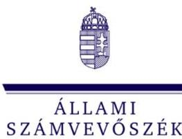

1052 Budapest, Apáczai Csere János u. 10. | 1364 Budapest 4., Pf. 54
www.asz.hu | szamvevoszek@asz.hu
telefon: +36 14849100
