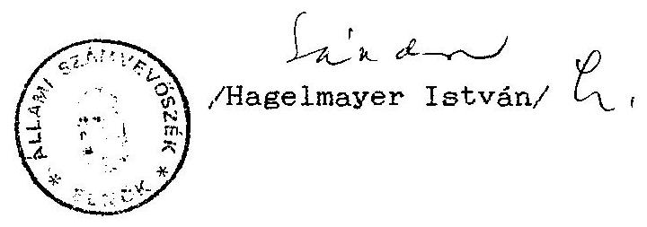

# Sallami Sramverösxék 

## JELENTÉS

a Magyar Zsidók Kulturális Egyesülete részére az állami költségvetésből juttatott 1994. évi támogatás ellenőrzése

---

A vizsgálatot vezette:
dr. Elek János
osztályvezető főtanácsos
A vizsgálatot végezték:
Berzétey Attiláné
számvevő tanácsos
dr. Dotterveich Antal
számvevő tanácsos

---

# ALLAMI SZAMVKVOSZEK 

V-1025-7/1994-95.
Témaszám: 259 .

## J E L K N T E S

a Magyar Zsidók Kulturális Kgyesülete 1994. évi állami költségvetési támogatás felhasználásának ellenôrzésérôl

I.

A vizsgálat körülményei, célja, módszere

1. Az Állami Számvevõszékrõl szóló, többször módosított 1989. évi XXXVIII. törvény 2. § (5) bekezdése értelmében a társadalmi szervezeteknek juttatott állami költségvetési támogatás felhasználását az Állami Számvevõszék (továbbiakban: ASz) ellenôrzi.

A Magyar Köztársaság 1994. évi költségvetéséről szóló 1993. évi CXI. törvény a nemzeti és etnikai társadalmi szervezetek müködési költségei fedezetére 220.000 .000 Ft -ot hagyott jóvá. Az öszzeg felosztásáról az Országgyülés 20/1994. (III. 31.) OGY határozatában döntött, amely szerint - az Országgyúlés

---

Emberi jogi, kisebbségi és vallásügyi bizottságának javaslata alapján - a Magyar Zsidó Kulturális Egyesület (továbbiakban: MAZSIKE, vagy Egyesület) 1994. évi müködési költségeihez 2.500. E Ft-tal járul hozzá. Ezen felül a fenti törvény jóváhagyott 400.000 E Ft-ot a társadalmi szervezetek támogatására, amely összegből az Egyesület 1.000 E Ft müködési célú költségvetési támogatásban részesült. E rendelkezések figyelembevételével került sor - az ASZ 1995. évre jóváhagyott ellenőrzési terve alapján - az ellenőrzés lefolytatására.

Az ellenőrzés a MAZSIKE részére 1994. évre jóváhagyott állami költségvetési támogatás felhasználását az Egyesület központjában (Budapest, 1076. VII. Garay u. 48.) ellenőrizte, mivel a szervezetnek nincsenek nyilvántartott - önálló jogi személyiséggel rendelkezo - területi szervezetei.

Az ellenőrzés célja annak értékelése volt, hogy a MAZSIKE az állami költségvetési támogatást - az Országgyưlés határozatában foglaltakra is figyelemmel - az alapszabályában megf.galmazott tevékenységi célok megvalósítása érdekében használta-e fel; a kitüzött célokat a költségek lehető legkisebb szintre való szorításával, minimális ráfordítással érte-e el. Az ellenőrzés vizsgálta továbbá azt is,hogy a pénzfelhasználás a társadalmi szervezetekre vonatkozó hatályos törvények elöirásainak betartásával történt-e.
2. Az ellenőrzés az 1994. gazdálkodási évre terjedt ki. A helyszíni szúrópróbaszerũ ellenőrzés 1995. január 23-tól január 27-ig tartott. A fenti idöpontban a vizsgált szervezet 1994.

---

évre vonatkozó gazdálkodási információi, az éves költségvetés teljesítéséról szóló beszámoló nem állt teljeskörüen az ellenőrzés rendelkezésére (a beszámoló elkészítésének határideje legkésőbb május 31-e).

# II. 

1. A MAZSIKE 1994. évi tényleges pénzfelhasználásának értékelése
1.1. Az Egyesület 1994. évi költségvetési támogatás elnyerése céljából pályázatot nyújtott be a Társadalmi Szervezetek Költségvetési Támogatását Koordináló Bizottsághoz az 1993. évi CXI. törvényben a társadalmi szervezetek támogatására elơirányzott 400.000 E Ft összegű keret, valamint az Országgyülés Emberi jogi, kisebbségi és vallásúgyi bizottságához, a nemzeti és etnikai kisebbségek szervezetei szervezeti és müködési költségeinek támogatására előirányzott 220.000 E Ft keret terhére elnyerhető támogatásra.

A benyújtott pályázatokban az Egyesület 6.000 E Ft tárgyévi kiadást és 6.500 E Ft bevételt tervezett. Támogatási igényt a várható kiadások 46\%-ára ( 3.000 E Ft) jelzett, 3.500 E Ft kiadás finanszírozását saját bevételből, ill *tőleg más forrásból meglévő támogatásból tervezte.

A bizottságokhoz benyújtott költségvetéstervezet az igényelt támogatást jogcím szerinti bontásban tartalmazza, így bérjellegú kiadásokra és járulékaira 1.400 E Ft-ot számítógép beszerzésre és adatbank felállítására 1.100 E Ft-ot,

---

tagszervezetek támogatására 500 E Ft-ot igényeltek. A fenti müködési célú költségeken kívül az Egyesület pályázatában a tárgyévre tervezett programjai megvalósításához kért kivételes támogatást 3.000 E Ft összegben, amely a tervezett költségek $50 \%$-át tette volna ki.

A pályázatok az összes kiadáson belül tartalmazzák az egyes programokra tervezett kiadási tételeket is, továbbá a pályázathoz mellékelt szöveges programtervezet részletesen felsorolja az egyes kiadási tételekhez kapcsolódó rendszeres közmúvelődési, érdekképviseleti, szociális jellegü programokat.

Igy pl. = a modern héber nyelv oktatását, az óhéber, a Tóra és a Talmund bemutatását,
= a zsidó hagyományok ismertetését és a zsidó val-lási-filozófiai ismeretek tanulását célzó Bib-lia-kört,
= a holocaustot átélt emberek lelki segélyezésére alakult KUT-csoportot,
= a zsidó népzenei hagyományok örzését, az izraeli népi táncok tanítását célzó Obadja zenei klubot és Hóra-táncházat,
= a nyugdíjasok és hallássérültek, az ifjúság részére rendszeresen biztosított közösségi foglalkozások, sportolási, kirándulási lehetőségek stb. biztosítását.

---

Az Egyesület lapkiadási tevékenységet is végez - rendszeresen kiadja a "Szombat" címü kulturális folyóiratot vállalkozói tevékenység keretében.

Az ellenőrzés észrevételezi, hogy az Egyesület a költségvetési támogatás elnyerésére benyújtott pályázatokban a gazdálkodásról szóló tájékoztató adatokat a lapkiadással összefüggő elkülönítetten kezelt adatok nélkül közli, annak ellenére, hogy a lapkiadásra - külön pályázat keretében 1994. évben 600 E Ft céljellegü költségvetési támogatást kapott a Miniszterelnöki Hivataltól.

A MAZSIKE a társadalmi szervezetek támogatására az 1993. évi CXI. törvényben elöirányzott keretekből kapott 1.000 E Ft, illetőleg 2.500 E Ft müködési kiadásokra felhasználható költségvetési támogatást összevontan használta fel, és a felhasználást is összevontan dokumentálta.

Az Egyesület 1994. évben a fentiek szerint összesen 3.500 E Ft müködési célú állami költségvetési támogatást, 600 E Ft céljellegü lapkiadási támogatást kapott, ezen felül, különbözö szervezetektől, alapítványoktól 1.845 Ft céljellegü támogatással egészítette ki bevételi forrásait.
1.2. Az Egyesület az elnyert költségvetési támogatás felhasználására végleges költségvetést nem készített. Az Egyesület tényleges pénzfelhasználását az ASz a naplófőkönyv és az ahhoz kapcsolódó analitikus nyilvántartások alapján vizsgálta. Az Egyesület a 3.500 E Ft állami támogatás felhaszn-

---

nálásáról elkülönített analitikus nyilvántartást vezetett, amelyben a kapcsolódó kifizetések tételesen fellelhetők, és egyeztethetők a naplófőkönyv könyvelési tételeivel. A költségvetési támogatás felhasználásáról készített analitikus nyilvántartás alapján elemezhető a kiadások költségnemenkénti szerkezete:

Eszközbeszerzés címén az Egyesület 1994. évben 444.392 Ft-ot fizetett ki, ebből 20 E Ft fölötti egyedi értékü beszerzés 314.525 Ft .

A tárgyi eszközök beszerzésére fordít: tt összeg a juttatott költségvetési támogatás $12,7 \%$-át teszi ki.

Bérköltségként 991.981 Ft-ot társadalombiztosítási és munkaadói járulék címén 261.900 Ft-ot, együtt a költségvetési támogatás $35,8 \%$-át számolták el, munkabérre, valamint munkavégzésre irányuló egyéb jogviszony keretében foglalkoztatottak díjazására.

Az Egyesület - elnökségi döntés alapján - egy fö részére fizetett költségtérítést, hivatali célú magángépjármú használat és saját telefon igénybevétele címén. A kifizetett összeg 178.440 Ft , a költségvetési támogatás $5 \%$-a.

Az Egyesület müködésével kapcsolatos szolgáltatásokra - így pl. nyomda-, telefon-, posta-, közüzemi dij költségeire 1994. évben összesen 823.112 Ft-ot, a költségvetési támogatás $23,5 \%$-át költötték.

---

Anyag- és eszközbeszerzésre 403.126 Ft-ot, az állami támogatás $11,5 \%$-át használták fel.

A fenti kiadási jogcímeken elkönyvelt kiadások a költségvetési támogatás összesen 84,6\%-át teszik ki, a fennmaradó részt vendéglátás, fordítás, taxiköltség, biztosítás stb. címén fizették ki.

Osszegezve megállapítható, hogy a MAZSIKE a részére 1994. évben juttatott 3.500 E Ft költségvetési támogatást alapszabályában lefektetett céljainak megfelelően, sokirányú és színvonalas, rendszeres, a magyar zsidóság örökségének, hagyományainak megőrzését, a közösségi élet megújítását célzó programjai megvalósítására használta fel. A programokhoz rendelt költségstruktúra alapján az ellenőrzés megállapítása szerint az Egyesület pénzfelhasználását a célszerüség és takarékosság jellemezte.
2. A pénzfelhasználás törvényességével kapcsolatos megállapítások
2.1. A MAZSIKE gazdálkodásának rendjét kizárólag az Alapszabály 5. 8. (1) bekezdése rögzíti a következôképpen: "Az Egyesület gazdálkodását a költségvetési szervekre vonatkozó előírások alapján végzi. A gazdálkodásról szóló beszámolót a Közgyülés hagyja jóvá." Egyéb, gazdálkodással kapcsolatos belsó szabályozást nem készítettek, szükség esetén az Elnökség hozza a gazdálkodással, pénzfelhasználással kapcsolatos döntéseket.

---

Rögzíteni szükséges, hogy az alapszabály a gazdálkodást illetően idejét múlt rendelkezést tartalmaz, a MAZSIKE alakulásának idején hatályban volt jogszabályi előírásoknak felel meg. Időközben hatályba lépett az egyesülési jogról szóló 1989. évi II. törvény, amelynek 24. 8-ában kapott felhatalmazás alapján jelenleg a 114/1992. (VII. 23.) Korm. rendelet szól a társadalmi szervezetek gazdálkodó tevékenységéről. Az éves beszámoló készítés és a könyvvezetési kötelezettség társadalmi szervezetek esetében érvényesülő sajátosságairól pedig a 157/1992. (VII. 23.) Korm. rendelet intézkedik. Következésképp az alapszabálynak azt kellene rögzítenie, hogy az egyesület gazdálkodását a társadalmi szervezetekre vonatkozó előírások alapján végzi. Ez annál is inkább indokolt, mert a gyakorlatban az ellenőrzés megállapítása szerint a MıZSIKE a társadalmi szervezetekre vonatkozó szabályok szerint gazdálkodik.
2.2. A MAZSIKE a könyvvezetési kötelezettség teljesítésének a 157/1992. (XII. 4.) Korm. rendelet 8. 8-a (3) bekezáós alapján egyszeres könyvvitel vezetésével tesz eleget. A számvitelről szóló 1991. évi XVIII. törvény (a továbbiakban: számviteli törvény) 80. 8. (2) bekezdésében felsorolt nyilvántartási lehetőségek közül a naplófőkönyvet alkalmazzák a gazdasági események rögzítésére. A naplófőkönyv rovatait egyes esetekben igényeiknek megfelelően módosították.

Az ellenőrzés megállapítása szerint a naplófőkönyv vezetésénél nem érvényesül a számviteli törvény 83. 8. (2) bekezdés a./ pontja második gondolatjele bekezdésében megfogal-

---

mazott követelmény, mely szerint "az egyszerüsített mérleg készitésére kötelezett vállalkozó a készpénzforgalmat érintő bizonylatainak adatait késedelem nélkül, a pénzmozgással egyidejüleg, illetve a pénzintézeti értesités megérkeztekor, az egyéb pénzeszközöket értintő tételeket a tárgyhetet követő hó 15 -ig köteles könyveiben rögzíteni". Ennek alapvető oka, hogy az egyesület és az általa kiadott "Szombat" c. lap bevételeit és kiadásait külön-külön gyüjtik és egymást követöen rögzítik a naplófôkönyvben.

A készpénz és a bankforgalom is elkülönül. Ennek következtében 1994. január hónapban a naplófôkönyvben elõször az egyesület bankforgalmát, ezt követöen a lap bankforgalmát, majd a két pénztárforgalmat külön-külön rögzítették. Február hónapot illetően a naplófôkönyv először az egyesületi pénztárforgalmat, ezután a lap pénztárforgalmát, majd az egyesület bankforgalmát, és végül a lap bankforgalmi eseményeit rögzíti. Ez a gyakorlat annál is inkább helytelen, mert a valóságban egy pénztár müködik, analitikus nyilvántartás révén biztosított a két tevékenység készpér.forgalmának elkülönítése. A banki forgalom analitikus nyilvántartás révén ugyancsak elkülönül, mivel a lapnak OTP alszámlája van.

Néhány esetben nem megfelelő rovaton rögzítették a gazdasági eseményt, a naplófôkönyv vezetése egyebekben általában megfelelő.

---

2.3. A könyvvezetés minden esetben megfelelő alapbizonylatok alapján történik. A pénztárbizonylatok általában megfelelnek a jogszabályban elöírt alaki és tartalmi követelményeknek, néhány esetben azonban hiányzik az összeg átvevôjének aláírása.
2.4. A könyvviteli zárlat megtörténik, a tárgyi eszközökröl nyilvántartó kartonokkal rendelkeznek. A korábbi évek gyakorlata szerint a beszámolót leltár támasztja alá, az 1994. évi beszámolót a vizsgálat lezárása idópontjáig nem kellett még elkészíteni.
2.5. A személyi jövedelemadó, a munkáltatói és munkavállalói járulék, a társadalombiztosítási járulék, az egészségbiztosítási és nyugdíjjárulék fizetési kötelezettségről analitikus nyilvántartásokat vezetnek, az adóhivatalt és a társadalombj:tosítást megillető befizetési kötelezettségeknek eleget tesznek. Az általános forgalmi adóval kapcsolatos analitikus nyilvántartásokat is felfektették, vezetik, a havi bevallásokat elkészítették.
2.6. A költségtérítéseket illetően az állapítható meg, hogy egy személy részesül magángépkocsi hivatali célú használatáért költségtérítésven, elnökségi határozat alapján. A kifizetes alapjául útnyilvántartás szolgál.

---

# III. 

## Javaslatok

A jelentésben megfogalmazott megállapítások alapján javaslom, hogy az Egyesület:

- Korszerüsítse Alapszabályának a gazdálkodási tevékenységgel összefüggő rendelkezéseit.
- Ervényesitse a naplófôkonyv vezetése során a számviteli törvény vonatkozó elôírásait.

Budapest, 1995. április
