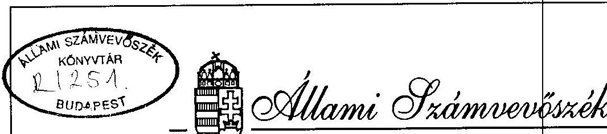

# JELENTÉS 

az Országos Egészségbiztosítási Pénztár székház
beruházásának ellenőrzéséről
1995. április

---

A vizsgálatot vezette: Krucsai Balázs
osztályvezető főtanácsos

A vizsgálatot végezte: Bank Lajos
számvevő tanácsos
Istvánffy Lóránt
számvevő tanácsos
Karsainé Dömsödi Éva
számvevő
Kiss Istvánné
számvevő tanácsos
Pallós Gáborné
számvevő tanácsos

---

T A R T A L O M J E G Y Z É K
1. Bevezetés ..... 1
II. A vizsgálat főbb megállapításai ..... 4
III. Következtetések és javaslatok ..... 12
IV. A vizsgálat részletes megállapításai ..... 16

1. A beruházási döntés előkészítésének törvényessége és megalapozottsága ..... 16
2. A beruházás megvalósításának szabályossága és gazdaságossága ..... 35
3. A beruházás finanszírozása ..... 57
4. A beruházás ráfordításainak nyilvántartása és elszámolása (aktiválása) ..... 61
5. A kitűzött beruházási célok megvalósulásának célszerűsége és eredményessége ..... 70

---

Állami Számvevőszék
V-17-25/1994-95.
Témaszám 244.

J E L E N T É S az Országos Egészségbiztosítási Pénztár székház beruházásának ellenőrzéséről

I.

# B E V E Z E T É S 

A társadalombiztosítás intézményei 1994. február 1-én új irodaházat avattak. Átadták az Országos Egészségbiztosítási Pénztár új, külső és belső megjelenésben egyaránt reprezentatív székházát. A székház teljes bekerülési költsége meghaladta a 3,3 milliárd forintot.

Az esemény illetve annak előzményei nemcsak a társadalombiztosítás érintett munkatársait, hanem az Állami Számvevőszéket is foglalkoztatták. A társadalombiztosítási alapok 1993. évi zárszámadásának ellenőrzéséről készült jelentésben (T 400/1/1994.) az ÁSZ jelezte az Országgyűlésnek és az Egészségbiztosítási Önkormányzatnak, hogy tapasztalatai szerint a székház beruházás előkészítése és megvalósítása során az érintettek nem jártak el a szükséges körültekintéssel. Költségigényesek az építészeti megoldások, kedvezőtlen a terület kihasználása.

---

A figyelmeztetésnek azonban már az épület belső berendezésére sem igen lehetett érdemi hatása. Az új székház időközben felépült. Birtokba vették. Költségeit a közpénzekből kifizették. Bár e vizsgálat önmagában nem tudja meg nem történtté tenni a dolgokat, csökkenteni a ráfordításokat, az ÁSZ elnöki döntés mégis az ellenőrzés lefolytatása mellett foglalt állást. Abból indult ki, hogy ilyen tetemes összegű - több mint 3 milliárd forintos - közpénz felhasználásának folyamatát részletesen fel kell tárni, a további teendőket érintő következtetéseket le kell vonni és a szükséges intézkedéseket kezdeményezni.

Az előzményekhez tartozik, hogy a társadalombiztosítás központi és budapesti intézményeinél már a 80-as évek közepén létszám-elhelyezési gondok voltak. A kiépíteni tervezett számítástechnikai központ és kiszolgáló személyzetével együtt - az akkori számítások szerint - összesen 530 fő részére kellett volna megfelelő elhelyezési feltételeket teremteni.

Az új irodaház felépítését az akkor még a központi költségvetés részeként működő Országos Társadalombiztosítási Föigazgatóság (OTF) a meglévő Váci úti toronyépület mellé tervezte. Az előkészítő munkálatok 1987. év elején indultak. Az OTF-nek azonban nem sikerült megszereznie az irodaház építési tilalom alól a felmentést és az Állami Tervbizottság beruházást jóváhagyó döntését. Az ok az irodaház-építés indokoltságának nem megfelelő kimunkálása és a beruházási források nagyfokú bizonytalansága volt. Az építés átmenetileg lekerült a napirendről. Az akkori időszak döntési mechanizmusában működő ellenőrző pontok - legalább is ebben az esetben - megakadályozták, hogy a kellően át nem gondolt, a szükségletek és a megvalósítás feltételei szempontjából nem eléggé megalapozott beruházás kivitelezése elkezdődjék.

---

A vizsgálat célja annak megállapítása volt, hogy a beruházás előkészítési és megvalósítási folyamatában hozott döntések műszaki, gazdasági és törvényességi szempontból mennyire voltak indokoltak és megalapozottak, s az átadott létesítmény - funkcióinak megfelelően - milyen eredményességgel szolgálja a szervezet feladatainak ellátását.

A vizsgálat az 1991. január 1-től 1994. december 31-ig terjedő időszak eseményeit dolgozta fel, a székház felépítésére vonatkozó elvi döntés előkészítésétől a beruházás átadásáig, illetve pénzügyi lezárásáig.

A helyszíni vizsgálat az Országos Egészségbiztosítási Pénztárnál 1994. október 24-től 1995. február 17-ig tartott.

Tájékozódás és adatgyűjtés céljából felkerestük az alábbi szerveket:

- Budapest, XIII. kerületi Polgármesteri Hivatal, Műszaki Osztály
- Központi Statisztikai Hivatal,
- Budapesti Városépítési Tervező Iroda,
- Városépítési Tudományos és Tervező Intézet.

A vizsgálat megállapításai a beruházás döntés előkészítő dokumentumainak tételes, a kivitelezés, a műszaki átadás és a pénzügyi elszámolás dokumentumainak mintavételes ellenőrzésére, az érintett személyekkel folytatott interjúkra és a helyszíni szemle tapasztalataira támaszkodnak.

A vizsgálat szembe került azzal, hogy mind feladatkörében, mind szervezeti rendszerében és személyi összetételében eltér egymástól az az intézmény, amely a beruházási döntést előkészítette és meghozta, Országos Társadalombiztosítási

---

Föigazgatóság (OTF), attól az intézménytől, Országos Egészségbiztosítási Pénztár (OEP), amely a beruházást befejezte és üzemelésre átvette. Részben ennek következtében a beruházás előkészítésével kapcsolatos dokumentumok sora "veszett el nyomtalanul", ami megnehezítette a valós folyamatok és összefüggések feltárását, a felelősség tisztázását. E dokumentumok hiányát az érintett személyek esetenkénti nyilatkozatai sem pótolhatják teljesértékűen.

A vizsgálati megállapításokat több szakaszban egyeztettük az OEP illetékeseivel, a megvalósításban résztvevő és az OEP-vel még munkaviszonyban lévő korábbi munkatársakkal, sőt véleményét, észrevételeit kérve - bár erre az ÁSZ-nak nincs kötelezettsége - megküldtük a tervezetet az OTF korábbi vezetőjének is.

# II. 

## A VIZSGÁLAT FŐBB MEGÁLLAPÍTÁSAI

Az Országos Társadalombiztosítási Föigazgatóság új vezetői az irodaház felépítésének gondolatát 1990 második felében ismételten napirendre vették. Időközben megtörténtek a társadalombiztosítási rendszer reformjának első lépései: 1989. január 1-től a társadalombiztosítás levált az állami költségvetésről (melynek egyik fejezetét képezte) és önálló pénzalapként kezdett működni. 1990-ben jelentősen módosították a költségvetés és az Alap kapcsolatrendszerét. Mindezek nyomán a korábbi döntési kötöttségek jelentősen csökkentek. A kialakult helyzetben egyedül az erre fordítható pénzügyi forrásokon múlt mire vállalkozhatott az intézmény vezetése.

---

Az OTF 1991. év elején már rendelkezett az 1990. évi zárszámadási törvényben rögzített 1 Md Ft-ot meghaladó működési tartalékkal. Nagyobb kockázat nélkül számolhatott azzal is, hogy szükség esetén ezt az összeget a társadalombiztosítási alapból kiegészítik. Erre építve 1991 elejétől erőteljes ütemben újra kezdődtek a székházépítés előkészítő munkálatai.

A rendkívül hiányosan rendelkezésre álló dokumentumok azt bizonyítják, hogy a döntések előkészítése és meghozatala túlzott nagyvonalúsággal, pazarló módon történt. Ebben számos nagyobbrészt átmeneti jellegű körülmény is közrejátszott.

Mindenekelőtt a döntési mechanizmus változása, illetve a döntési jogkörök és felelősségi viszonyok letisztultságának hiánya. A társadalombiztosítás önállósodási folyamatának ebben a szakaszában a kormányzati felügyelet is átalakulóban volt. Lazult. A Pénzügyminisztérium és a Népjóléti Minisztérium irányító és felügyeleti tevékenységét már nem gyakorolta a korábbiakhoz hasonló módon, az önkormányzatok viszont még nem alakultak meg. Az 1992. év elején létrehozott felügyelő bizottságok - bár a beruházásról készített beszámolót napirendre tűzték - elhárították maguktól az érdemi ellenőrzés, illetve az esetleges döntés felelősségét.

Az OTF vezetése érzékelte, hogy gyakorlatilag "önmagára utalt". Külső kontroll és számonkérés nélkül hozhatta meg döntéseit. Ehhez azonban nem rendelkezett olyan szervezeti egységgel, amely létszáma, szakmai összetétele és felkészültsége alapján alkalmas lett volna a döntéselőkészítés feladatainak hatékony összefogására és irányítására. Ennek hiányát belső és külső szakemberekből álló team kialakításával sem pótolták.

---

Az előkészítés lényegében véve személyes vezetői döntések alapján, beruházói gyakorlattal nem rendelkező munkatársak alkalmi bevonásával, ötletszerűen és kapkodó módon történt.

A beruházás döntés-előkészítésének befejező szakaszában (kivitelezői versenykiírás) a társadalombiztosítási önkormányzatok megalakulása, a feladatok változása és az igazgatási szervezet várható szétválása már ismert volt. Ennek ellenére e változásoknak az elhelyezendő központi apparátus létszámára gyakorolt valószínűsíthető hatásait meg sem kísérelték feltárni és az épület fő paramétereire vonatkozó döntéseknél érvényesíteni. Szervezet-elhelyezési variánsok, műszaki-gazdasági elemzések a döntéselőkészítés egyetlen szakaszában sem készültek. Következésképpen nem a szakszerűségi, célszerűségi és gazdaságossági szempontok határozták meg, hogy milyen székház épüljön, hanem alkalmi tényezők, illetve többnyire informálisan érvényesülő személyes és csoportérdekek gyakoroltak befolyást a döntésekre.

A beruházási terv zárt (meghívásos) pályázaton kiválasztott készítőjének és egyben a beruházás lebonyolítóinak elgondolásai és törekvései szinte korlátlanul kaptak teret (fedett udvarok, sétáló utca, stb) az épület formálásában.

A bekerülési költségek nagysága a döntéseknél gyakorlatilag nem játszott szerepet. Nem tisztázták, hogy a meglévő "toronyépület"-ben helyet kapó közösségi terek milyen mértékig vehetők figyelembe konferenciák, közgyűlések céljaira; nem végeztek számításokat például arra, hogy szükség van-e a kétszintes, összesen 280 férőhelyes gépkocsitárolóra, a 300 férőhelyes konferenciateremre, a közel $300 \mathrm{~m}^{2}$-es ügyfélforgalmi terület kiépítésére, az ú.n. fedett utca kialakítására, az épület egészének klimatizálására, a homlokzati kiképzés és a

---

padlóburkolatok osztályon felüli minőségére, stb. A nem kellően optimalizált minőségi követelmények helyenként felesleges túlköltekezést eredményeztek. Ez a nagyvonalúság a vizsgálatot végzők számításai szerint közel 1 milliárd forinttal terhelte a biztosítottak kasszáját.

Megszületett a nagyvonalú és a közpénzekből gazdálkodók anyagi lehetőségeihez mérten pazarló döntés anélkül, hogy a legcsekélyebb ellenőrzés korlátaiba ütközött volna. A kormányzati szervek, illetve a témában érintett vezető testületek (OGY bizottságai, TB felügyelő bizottságai, OTF vezetői értekezlet) egyike sem foglalkozott érdemben az irodaház beruházás kérdéseivel.

Az új helyzetben a Pénzügyminisztériumnak az éves költségvetési tárgyalásokon megszokott, az előirányzatok indoklását számonkérő magatartása is elmaradt. Az Országgyűlés és annak ellenőrzési munkáját segítő ÁSZ tevékenységét pedig az korlátozta, hogy az éves működési költségvetéseket is tartalmazó törvényekben a székházberuházás csak számszerű előirányzat és rövid szöveges indoklás formájában szerepelt. A beruházás részletezett, előzetes bemutatásának elmulasztása fontos, érdemi információktól fosztotta meg a képviselőket, illetve amikor az ÁSZ a kifizetéseket a zárszámadások ellenőrzése során észrevételezte, jelzései kevés figyelmet kaptak.

A döntéselőkészítés során elkövetett jogszabálysértések - így például a pályázati kiírás és zárójelentés felügyeleti minisztériumba történő megküldésének elmulasztása; a bíráló bizottság tagjainak előírásokkal ellentétes kijelölése; a pályázati kiírás és értékelés szempontjainak összeállításában a bíráló bizottság részvételének hiánya; a tervpályázati rend határidőre vonatkozó szabályainak mellőzése; a költségelemzé-

---

sek elmulasztása; stb. - kapcsán merült fel a személyes felelősség és érvényesítésének lehetősége. Az érintett felelős vezetők a vizsgálat idején már nem álltak az OEP alkalmazásában.

A dokumentumok hiánya az érintett személyek eljárásának jogi minősítését nagymértékben megnehezítette. Mint ahogy ma már az sem rögzíthető pontosan, személyekre bontva, hogy ki és miért döntött az adott módon. Mindezek miatt a munkáltatói felelősségre vonás kezdeményezésére nincs lehetőség.

A beruházás lebonyolítása (kivitelezői versenytárgyalás, szerződés megkötése és végrehajtása) a jogszabályi előírásoknak megfelelően történt. Ugyanakkor a beruházó ebben a szakaszban sem törekedett költségkímélő megoldások alkalmazására. A nevében eljáró lebonyolító szervezetet nem tette érdekelté a megvalósítás költségeinek mérséklésében, nem számított fel kötbért az épület késedelmes átadása miatt.

Az épület informatikai és telekommunikációs rendszerének kialakítása és megvalósítása az előírásoknak megfelelően, de nem minden tekintetben körültekintően történt. A rendelkezésükre álló technikai lehetőség ellenére nem gondoskodtak például a régi és az új épület közötti közvetlen telefonkapcsolat kiépítéséről. A rendszer megvalósítására 88,6 millió forintot költöttek.

Az épületberuházás ügyét is érinti, hogy a társadalombiztosítás számítástechnikai rendszerének fejlesztésének koncepciója ma is sok tekintetben kidolgozatlan. Mivel az igények pontos meghatározása időben nem történt meg, a növekvő feladatokra hivatkozva szereztek be nagyteljesítményű új számítógépet és hajtották végre a régi gép minőségi cseréjét is.

---

Erre a célra 1994. év végéig mintegy 150 millió forintot fordítottak. A rendszer teljes kiépítésének költsége előreláthatólag megközelíti a 220 millió forintot.

A beruházás finanszírozása - a költségvetési szerveknél alkalmazott megoldástól eltérően -
 a társadalombiztosítási alapokból elkülönített működési költségvetéséből történt. A teljesítmények számlázása és pénzügyi rendezése, néhány számviteli és nyilvántartási hiba, valamint helyesbítés mellett megfelelt a pénzügyi és számviteli szabályoknak.

A kifizetéseket közvetlenül az OTF, majd 1993. év közepétől az OEP illetékes részlege végezte az intézmény számlavezető bankján keresztül. Az új székház összes pénzügyi ráfordításai (ÁFÁ-val együtt) 3.315,7 millió forintot tesznek ki. Szabálytalan vagy a műszaki tervekben nem szereplő "indokolatlan" kifizetés a vizsgált számlák esetében nem volt tapasztalható. Ugyanakkor a beruházási ráfordítások belső elszámolása és nyilvántartása terén hiányosságok sorát (előírt egyeztetések elmaradása, téves könyvelés, hiányosan nyilvántartott adatok stb) rögzítette a vizsgálat.

A hibák túlnyomó része annak tulajdonítható, hogy az OEP központi igazgatási szervezet számviteli szabályozási rendszere nem teljeskörű és nem megfelelően következetes. Így például nem tartalmazza a szakmai egységeknél vezetett beruházási keretnyilvántartások tartalmi és formai követelményeit. Ezért adattartalmuk nem felel meg a tulajdon védelme, valamint az egyértelműség előírt követelményeinek. A beruházással kapcsolatos főkönyvi könyvelési adatok és az analitikus nyilvántartások egyeztetése nem történt meg az előírt gyakorisággal. Több könyvelési tételt a számlák helyszíni ellenőrzését követően helyesbítettek.

---

Az új székház épülete a szerződésben rögzített bekerülési költséggel (2,4 Md Ft), de mintegy 1,5 hónapos határidőcsúszással 1994. februárjára elkészült. A jegyzőkönyvben rögzített hiánypótlási igény minimális volt, a közel egy éves működés alatt garanciális meghibásodás elvétve fordult elő. Az épület kivitelezése nagyobbrészt magas minőségi színvonalon, valósult meg. Az építészeti megjelenés, a kivitelezési színvonal a szakmai körökben elismerést kapott, tucatnyi "építőipari mesterdíjban" részesült, a díjakon szerkezeti elemenként, oszlopcsoportonként osztozkodtak a résztvevők.

A létesítményt az érvényben lévő szabályoknak megfelelően helyezték üzembe. A beruházásokra előírt statisztikai adatszolgáltatási kötelezettségnek eleget tettek.

A használatba vett irodaházban a tervezethez képest 12%-kal kevesebb irodai munkahelyi terület létesült (4.910 m² helyett 4.305 m²), az épületben elhelyezett létszám pedig mindössze 70%-a a tervezettnek (538 fő helyett 373 fő). A kialakult helyzet - mint erről az ÁSZ más jelentései beszámoltak - azért is kedvezőtlen, mert a társadalombiztosítás két elkülönült rendszerre való szétválása az igazgatási funkciók "megkettőződéséhez", jelentős létszámigényhez vezetett.

A szakmai körökben ismert módszertani nehézségek ellenére megkíséreltük az OEP új székháza és néhány közelmúltban épült budapesti irodaház funkcionális paramétereinek összehasonlítását. Ez az összevetés jelzi, hogy a területkihasználás hatékonysága szempontjából az OEP székház belső arányai kedvezőtlenek. Az ú.n. "bérbeadható" (hasznosítható) terület aránya a fővárosban tapasztalt, átlagosan 67%-os és a szakma által még elfogadhatónak tartott 60%-os értékhez képest az OEP székháznál mindössze 42%-os.

---

Ezzel szemben a közlekedő, a mellék- és egyéb területek funkcióikhoz képest túlméretezettek, kihasználtságuk alacsony fokú, s ennek következtében tetemes összegű felesleges beruházási ráfordítást és üzemeltetési (pl. fűtés) költséget okoztak, illetve okoznak. A felesleges és funkcióidegen terek hasznosítására eddig csak kezdeti lépéseket tettek.

E helyiségcsoportok (ügyfélforgalmi tér, fedett utca - és udvar, mélygarázs, 300 fős terem) szerényebb méretre csökkentésével, illetve a meglévő "társépület" egyes közösségi tereinek figyelembevételével a teljes építési költség mintegy 25%-kal (kb. 600 millió Ft-tal) kevesebb lehetett volna. Az üzemeltetési költségek is mintegy 15%-kal (évi 15 millió forinttal) lennének alacsonyabbak. E mellett a nem osztályon felüli, de a célnak megfelelő minőségű anyagok, műszaki berendezések, bútorok alkalmazása további mintegy 250-300 millió forint költségmegtakarítást eredményezhetett volna. A pénzügyi ráfordítások nagyvonalúsága ellenére a kitűzött célok csak részben valósultak meg.

Előnyös, hogy korszerű és az igényeket minden tekintetben kielégítő elhelyezéshez jutott az OEP számítástechnikai központja. Lényegesen javultak az irodai munkavégzés műszaki-technikai feltételei, az irattározás körülményei. Ugyanakkor nem valósulhatott meg az az eredeti elképzelés, hogy az egészségbiztosítás és a nyugdíjbiztosítás központi szerveit együtt helyezzék el az új székházban. Sőt, az OEP apparátusának egy része (113 fő) sem fért el az épületben. Néhány tekintetben a munkavégzés feltételei is kedvezőtlenek. Az irodák több mint felében nincs közvetlen természetes megvilágítás (ablakok a fedett udvarban elhelyezett büfé és könyvtár helyiségeire néznek), a klimatizációs rendszer által teremtett hőmérsékleti és egyéb feltételek sem felelnek meg mindig a munkatársak jó közérzetéhez szükséges követelményeknek.

---

A társadalombiztosítási szervezetek elhelyezését szolgáló, vizsgált beruházási döntéseket közvetlenül nem befolyásolták, de a folyamat ismertetett alakulásában nem hagyható figyelmen kívül az, hogy a társadalombiztosítás önkormányzati igazgatásáról szóló 1991. évi törvény, valamint az igazgatási szervek létrehozását szabályozó 1993. évi Kormányhatározat hatályba lépése között másfél év telt el, és erre az időszakra esett a beruházás előkészítése, megvalósítása.

# III. 

## KÖVETKEZTETÉSEK ÉS JAVASLATOK

A vizsgálati tapasztalatok alapján számos, esetenként az adott beruházás kérdésein is túlmutató következtetés vonható le.

A társadalombiztosítás irányítási és igazgatási rendszerének átalakításában mutatkozó koncepcionális bizonytalanságok sora szinte törvényszerűen hozta magával a nagyvonalú, céljaiban és következményeiben nem kellően átgondolt, gyakran egyéni törekvéseket hordozó döntések sorozatát. Ennek többnyire tipikus okai voltak. A "tenni akarás" rendszerint felfokozott, keretei viszont még kialakulatlanok. A régi követelményrendszer már nem, az új pedig még nem érvényesült megfelelő hatékonysággal, s ráadásul a beruházások ellenőrzési rendszere is átalakulóban volt.

A kedvezőtlen jelenség megszüntetésének szinte egyetlen eszköze az átmeneti időszak lerövidítése, az ideiglenesség mielőbbi felszámolása. Mindez tetten érhető a székház beruházásra vonatkozó döntésekben is, amelyek a sokoldalú mérlegelést,

---

a korábban megtett lépések elemzését mellőzték. Így állt elő az a helyzet, hogy építészeti formájában elismert, jó minőségben megvalósított középület csak részben és igen tetemes többletköltséggel képes betölteni azt a funkciót, mint amire szánták.

A tapasztalatok megerősítették azt az évek óta érlelődő szakmai vélekedést is, hogy a jelentősebb pénzügyi kihatású és közpénzekből megvalósuló beruházások teljes körére ki kellene alakítani és rendszeressé kellene tenni a folyamatba épített ellenőrzést. A beruházásoknak ebben a körében a döntés után, de még a beruházás megvalósításának megkezdése előtt végzendő vizsgálatnak kellene jelezni a kormány, illetve az Országgyűlés számára a döntés célszerűségével, anyagi-műszaki megalapozottságával kapcsolatos esetleges problémákat. Az utólagos ellenőrzés - mint azt a jelen vizsgálat is tanúsítja - többnyire csak az elkövetett hibák és hiányosságok regisztrálására alkalmas, azok kijavításának vagy érdemi szankcionálásának reális lehetősége nélkül.

A külső ellenőrzés azonban önmagában véve nem nyújthat garanciát arra, hogy tevékeny részvételével minden esetben a szakmai és a gazdaságossági követelményeket kielégítő döntések szülessenek. Elengedhetetlenül szükség van az adott terület helyzetét és szükségleteit jól ismerő és azért felelősséget viselő szakmai és társadalmi vezető-testületek ellenőrző közreműködésére is.

S végül, az intézmény működésének, az egyes részlegek feladat-és hatáskörének megfelelő szabályozása nélkül nemcsak a jogkörök, hanem a felelősségi viszonyok is elmosódnak. Nem kérhető számon a személyes felelősség. Teret nyer a döntésekre történő informális ráhatás, az egyéni és csoportérdekek egyoldalú érvényesülése.

---

A vizsgálat tapasztalatai és az azokból levonható következtetések alapján ajánljuk, hogy

# a Kormány 

- kezdeményezze az államháztartási törvény 85. paragrafusával összhangban a társadalombiztosítás irányítását, működését, hatásköri és eljárási szabályait, bevételeinek és kiadásainak körét, gazdálkodását, vagyonát, a központi költségvetéssel és az államháztartás többi alrendszerével való kapcsolatát szabályozó külön törvény megalkotását;
- gondoskodjék a társadalombiztosításra vonatkozó külön törvényben vagy az államháztartási törvény módosításának kezdeményezésével arról, hogy az állami beruházásokhoz hasonlóan a társadalombiztosítási önkormányzatok éves működési költségvetésük bevételi előirányzatának 2%-át meghaladó költségű beruházások olyan kiemelt intézményi beruházásoknak minősüljenek, melyről az éves működési költségvetésben és a zárszámadásban részletesen, az ÁSZ számára ellenőrizhető formában be kell számolni az Országgyűlésnek.

## az Egészségbiztosítási és a Nyugdíjbiztosítási Önkormányzatok Elnökségei

- rendszeresen és kritikus szemlélettel gyakorolják az intézményi gazdálkodás ellenőrzésére vonatkozó jogkörüket. Kísérjék figyelemmel az intézményi beruházások előkészítését és megvalósítását.
az Egészségbiztosítási Önkormányzat elnöksége az OEP főigazgatója útján tegyen intézkedéseket
- a két- és többszemélyes irodahelyiségek jelenleginél teljesebb kihasználására, s ezáltal a külső irodabérleti díjak csökkentésére;

---

- az intézmény szükségleteit meghaladó kapacitások (mélygarázs, kihasználatlan ügyfélforgalmi tér, konferencia terem) hasznosítására s ennek révén az üzemeltési költségek részbeni finanszírozására.
- a Szervezeti és Működési Szabályzat véglegesítésére és az egyéb belső szabályzatok korszerűsítésére. Ennek keretében
= a párhuzamosan végzett tevékenységek megszüntetésére, a szervezeten belüli feladatmegosztás ésszerűsítésére;
= a tulajdonvédelem hatékonyabb érvényesítése érdekében a beruházási keretfelhasználások nyilvántartásának részletes adattartalmára, formai követelményeinek és vezetési módjának az OEP központi igazgatási szervezet számlarendjében történő szabályozásra;
= az egységes bizonylatkezelést szolgáló Bizonylat Szabályzat és Album összeállítására és kiadására;
= az analitikus és a beruházási keretnyilvántartások, valamint a főkönyvi nyilvántartások előírt gyakoriságú egyeztetésének elvégeztetésére, dokumentálására és az eltérések számviteli szabályoknak megfelelő rendezésére;
= a beruházási és eszközfenntartási tevékenység előkészítésére és lebonyolítására vonatkozó, az SZMSZ-re és az ügyrendre épülő belső utasítás és eljárási rend kidolgozására, a területi igazgatási szervekre is kötelező érvényű kiadására.

---

IV.

# A VIZSGÁLAT RÉSZLETES MEGÁLLAPÍTÁSAI 

1. A beruházási döntés előkészítésének törvényessége és megalapozottsága
1.1. A beruházási feladatok ellátásának intézményi szabályozása

Az irodaház-beruházás döntéselőkészítési szakaszában az OTF belső szervezeti és működési szabályozási rendszere nem volt teljeskörű. Nem rendelkeztek az építési-szerelési beruházások, állóeszköz-fenntartási munkák lebonyolítását szabályozó utasítással. A szervezeti működési szabályzatot (SZMSZ) az 1987-1991 közötti időszakban háromszor módosították, ami érintette a beruházási feladatokat ellátó szervezet feladatkörét, szervezeti elhelyezkedését is.

A beruházás előkészítési szakaszában és a döntés meghozatalakor az OTF-nek nem volt olyan szervezeti egysége, amely szakmai összetétele, létszáma és feladatköri meghatározása alapján alkalmas lett volna a székház beruházás saját hatáskörben történő lebonyolítására, koordinálására.
1.1.1. A vizsgált időszakban az SZMSZ három változata volt érvényben: az első 1985-1992 között, a második 1992-1994 közötti időszakban, (mindkettőt az OTF főigazgatója hagyta jóvá). A harmadik, jelenleg is érvényben lévő SZMSZ-t 1994. március 21-i ülésén az

---

Egészségbiztosítási Önkormányzat Elnöksége 32. sz. határozatában hagyta jóvá ideiglenesen, azzal a kikötéssel, hogy: "az Elnökség döntése alapján az OEP szervezetének 1994. szeptemberében történő véglegesítése során - az alapszabályi kötelezettségének megfelelően - módosítani kell a Szervezeti és Működési Szabályzatot". A véglegesítés a vizsgálat befejezéséig, 1995. február végéig még nem történt meg.
1.1.2. Az 1985-1994 között érvényes SZMSZ-ek szerint a beruházói feladatokat a Pénzügyi Főosztály keretén belül a Gazdasági Osztály látta el. A szabályozási időszakra jellemző, hogy a beruházási feladatok gyakorlatilag a beruházási keretösszegre való gazdálkodásra, az üzemeltetési feladatok ellátására, valamint gondnoksági, raktározási, ellátási tevékenységi körre terjedtek ki. Az irodaház építésével együttjáró jelentős beruházások koordinálásával, megvalósításával kapcsolatos tevékenységek nem szabályozottak. Feladatköri átfedések, ebből adódóan 1985-92 között felesleges tevékenységek mutathatók ki a Pénzügyi Főosztály és az Ügyvitelszervezési és Számítástechnikai osztály, valamint a Szervezési és Általános Igazgatási Főosztály, a Titkárság, az Elvi Tervezési Főosztály, a Jogi és Szakigazgatási Főosztály feladatkörében. Az SZMSZ 1992. évi átdolgozása e tekintetben érdemi változást nem hozott.

A párhuzamos és így felesleges tevékenységek megosztják a feladat elvégzéséhez tartozó felelősséget, annak áthárítását teszik lehetővé és megnehezítik a felelősségre vonást.

A tárgyalt SZMSZ-hez tartozó ügyrendek, feladatköri működési leírások sem tartalmazzák a hatáskörök és a
 felelelősségi körök szabályozását.

---

1.1.3. Az 1994. március 21-től érvényben levő SZMSZ előrelépést jelent a korábbiakhoz képest. A tevékenységi elemekhez hatásköri elemeket is hozzárendelt, azonban ezek végleges szabályozásakor szükség lenne a hatáskörök és felelősségi körök pontosabb, az egyértelmű követhetőség és ellenőrzés követelményének megfelelő elhatárolására.

Az SZMSZ-hez kapcsolódó főosztályi ügyrendeket nem dolgozták ki teljeskörűen, de a szervezeti működési rendszer végleges kialakítását az Önkormányzat Elnöksége folyamatosan figyelemmel kíséri. Legutóbbi 1995. február 20-i ülésén a 17-95. sz. határozatában az SZMSZ véglegesítésének határidejét 1995. június 30-ra jelölte meg. Az SZMSZ véglegesítésével egyidejűleg a felsorolt hiányosságokat kiküszöbölő ügyrendeket is ki kellene adni.
1.1.4. A szervezeti és működési szabályozás felsorolt hiányosságait és átfedéseit érzékelte az 1992. október 28-án kelt vezetői értekezleti előterjesztés is, amely igényelte, hogy az OTF irodaház átvételével ki kell alakítani az ellátással, üzemeltetéssel foglalkozó szervezet helyét, feladatát, működési rendjét.

Az előterjesztésben megfogalmazták az Üzemeltetési Főosztály és három osztálya feladatkörét, melyet jóváhagyva 1992. november 1-től megalakult az önálló szervezet. Ezen belül a Műszaki osztály tevékenységi köre már tartalmazza az irodaház beruházáshoz hasonló nagyságrendű beruházások előkészítésével kapcsolatos feladatokat, nevezetesen: a versenytárgyalások, pályázatok előkészítése, meghirdetése, rendezése, szerződések előkészítése, megkötése, műszaki ellenőrzési feladatok ellátása, illetve biztosítása, stb.

---

1.1.5. A vizsgált időszakban három iratkezelési szabályzat volt érvényben, melyek a 3/1981. (Tb. K. 10.) OTF; 12/1992./ Tb.K.12/OTF; és a 2/1994. (Tb.K.1.) OEP számúak. A szabályzatmódosítások a társadalombiztosítás államigazgatási függő viszonyainak változásával kapcsolatosak, az iratkezelés jogszabályi alapjai ezen időszak alatt változatlanok.

A beruházás döntéselőkészítési dokumentumainak kezelése nem felel meg a levéltári anyag védelméről és a levéltárakról szóló 1969. évi 27. tvr, valamint a végrehajtásáról rendelkező 30/1969. (IX.2.) Korm. rendelet és módosításai, továbbá az állami szervek iratainak védelméről és selejtezéséről szóló 45/1958. (VII.30.) Korm. rendelet előírásainak - így nem elégíti ki a fenti jogszabályokon alapuló intézményi iratkezelési szabályzat előírásait sem.

Az 1991. március 14-én meghirdetett tervpályázatra beérkezett 4 pályaműből csak egy, hiányos példány található meg az OEP irattárában, ugyancsak hiányoznak a tervpályázati kiírás előkészítésének, összeállításának dokumentumai. Az 1991. június 17-én megtartott OTF belső tervzsűriről jegyzőkönyv nem készült.

A döntéselőkészítésben jelentős feladatokat ellátó bírálóbizottsági titkár megbízásáról, tevékenységéről, levelezéséről, továbbá későbbi munkakör átadásáról jegyzőkönyvek nem készültek, a levelezéseket nem irattározták.

A tervezés hatósági egyeztetési folyamatáról készült tárgyalási jegyzőkönyveket a helyszíni vizsgálat során a hatóságilag illetékes XIII. ker. Polgármesteri Hivatal Műszaki Osztályán végzett tájékozódáskor szereztük be, mivel ezek az OEP irattárában nem találhatók meg, noha a szabályzatok szerint őrzési idejük 10 év, illetve nem selejtezhetők!

---

A döntéselőkészítés dokumentumainak kezelése nélkülözi a szükséges szakmai hozzáértést, felelőtlennek, hanyagnak minősíthető. Még a díjnyertes pályamű dokumentációit is a tervező adta át az ellenőrök részére, mivel az OEP irattárában ezt sem őrizték meg.

# 1.2. Az irodaház-beruházás előkészítésének megalapozottsága 

A döntéselőkészítés folyamata két jól elkülöníthető időszakra bontható. Mindkét fázisra jellemző, hogy az előkészítés nem kellő körültekintéssel történt, a dokumentáltság eltérő színvonalú, különösen a második fázisban rendezetlen, hiányos.

Az irodaház építés szükségességének indokolására szervezet-elhelyezési variánsok, műszaki-gazdasági elemzések nem készültek. Az előkészítés fázisai között egymásra épülő, következetes logikai kapcsolat nincs, az első fázisban ismertté vált műszaki-gazdasági információk hasznosítása a második fázisban elmaradt.

Az építés újbóli előkészítése a "fellazult" törvényi szabályozás kihasználásával, felelős megbízói szervezeti egység kijelölése nélkül, egyszemélyes vezetői döntés alapján folyt. A tervezői-lebonyolítói szervezet kiválasztását célzó tervpályázat a vonatkozó törvényi előírásoknak nem felelt meg. A beruházás várható összköltségét mindkét fázisban alábecsülték, a pénzügyi források bizonytalanok voltak.

---

# 1.2.1. Az előkészítés első fázisa 

Az előkészítés első fázisa a társadalombiztosítás számítástechnikai központjának kialakítását megvitató főosztályvezetői értekezleten, 1986. decemberében kezdődött és 1987. november 20-án, a fővállalkozói pályázat eredménytelenné nyilvánításával, ért véget.

A folyamat dokumentáltsága az ellenőrizhetőség követelményét kielégítette, így megállapíthattuk, hogy a szűk egy évnyi előkészítést mindvégig a kapkodás jellemezte, az építés szükségessége nem volt kellően indokolva, a pénzügyi források hiányoztak.

Az OTF Számítástechnikai és Nyugdíjfolyósító Igazgatóságainak új elhelyezését tárgyaló 1986. december 15-i főosztályvezetői értekezleten a FÉMMUNKÁS Vállalat XIII. Petneházi utcai irodaépületének részletfizetéssel történő megvásárlásáról (49,6 millió Ft vételár) döntött az OTF megbízott vezetője. A Váci úti - a SZOT kezelésében lévő - szabad telekingatlan ekkor még csak távlati fejlesztési lehetőséget jelentett.

A Váci úti ingatlan beépítésére az OTF négy főosztályvezetőjéből alakult team tett szubjektív - gazdaságossági alapozó számítások nélküli - javaslatot az OTF vezetőjének.

A javaslat realizálásához egyetlen nap alatt (1987. február 11.):

- megkapták a XIII. ker. Tanács VB. Műszaki osztályának elvi építési előzetes hozzájárulását a számítógép központ létrehozására,

---

- elkészítették írásos javaslatukat, mely szerint az időközben megdrágult (86 millió Ft) FÉMMUNKÁS irodaház vásárlással szemben az építés célszerűbb, mert "megítélésük szerint több millió Ft-os nagyságrenddel olcsóbb és nem egyszerre egy összegben kell kiegyenlíteni",
- utasítást kaptak az OTF vezetőjétől "az építkezés gyors előkészítésére".

Az előkészítés a továbbiakban felügyeleti engedélyezési és műszaki síkon folyt. Egyrészt felmentést kellett elérni a költségvetési szervek irodaház-építését korlátozó rendelkezés (4000/1986. Mt. h.) hatálya alól, másrészt a kérelmet konkrét tervekkel, árajánlatokkal, pénzügyi forrástervezettel kellett alátámasztani.

Az irodaház-építési tilalom alóli felmentés megszerzése érdekében a beruházásnak "Társadalombiztosítási számítástechnikai központ és kapcsolódó létesítmények" elnevezést adták, abból kiindulva, hogy a számítóközpont létesítésére nem vonatkozott a beruházási tilalom.

Az OTF vezetésének azonban erre alapozva nem sikerült az Országos Tervhivataltól mentesítést kapni az építési tilalom alól.

Az OT utasítása szerint a fejlesztési elképzelést előzetes tárcaegyeztetés után részletesen indokolt előterjesztésben, a pénzügyi források megjelölésével kell az Állami Tervbizottság elé terjeszteni engedélyeztetésre. Az Előterjesztés-tervezet 1987. augusztusi dátummal készült el. A beruházás összköltsége a BUVÁTI kalkulációja alapján 308 millió Ft, pénzügyi fedezetként az OTF, "saját anyagi erőforrást" (ingatlanértékesítés és pénzmaradvány-átcsoportosítás) jelölt meg.

---

Az ÁFI augusztus 27-i véleménye szerint a beruházási költség alultervezett és a mobiliák költségét nem tartalmazza. A beruházás anyagi-, műszaki összetétele, a kiviteli költségek ütemterve hiányzik, a pénzügyi források nincsenek pontosítva.

Az OT az előterjesztés tervezetét ÁTB döntéshozatalra alkalmatlannak találta. Észrevétele szerint a beruházás indokoltsága nincs kellően bemutatva, a közölt adatok alapján nem lehet megítélni az épület nagyságát, továbbá valóságos kivitelezési költség és konkrét forrás-ismertetés szükséges ahhoz, hogy az ÁTB a kivitelezés megkezdéséről döntsön. Hasonló tartalmú volt a PM államtitkárának véleménye is kiegészítve azzal, hogy "az előterjesztés nem mutatja be az üzemeltetés költségigényét, forrását". Egyúttal közli, hogy az állami költségvetés sem a tervezett beruházáshoz, sem az új épület üzemeltetéséhez nem tud többlettámogatást nyújtani.
1987. november elejére - a kivitelezői pályáztatás során - nyilvánvalóvá vált, hogy "az épület elkészítéséhez mintegy 650 millió Ft szükséges" és ennek alig több, mint fele (340-360 millió Ft) biztosítható OTF-forrásokból. Dokumentum hiányában csak feltételezzük, hogy a beruházást végül is elutasította az ÁTB, illetve az OTF elállt tőle, mivel november 20-án a kivitelezésre meghirdetett versenytárgyalást a pénzügyi fedezet hiánya miatt minősítette eredménytelennek.

A műszaki előkészítésről megállapítottuk, hogy a lényegi kérdésekben - szervezet elhelyezés, létszám, valós területigény, szükséges és elégséges épületnagyság, mobiliák és technikai felszereltség igénye, költségkihatások - kidolgozatlan, hiányos, illetve elnagyolt volt. A szükséges döntésekben többnyire a választott

---

tervezőre hagyatkozott, formálisan azonban - egyeztetések, versenyfelhívás, bírálat lefolytatása - a vonatkozó jogszabályi előírásoknak megfelelő.

A műszaki előkészítés az SZOT kezelésében lévő Váci úti telek kezelői jogának megvásárlásával kezdődött. A vételár 10,5 millió Ft volt, melyet 3 évi részletben egyenlítettek ki.

Az elhelyezendő létszámot és irodaterületet a Nyugdíjfolyósító Igazgatóság által néhány nap alatt (február 19-re) összeállított felmérésre alapozták. Az igények indokoltságát nem vizsgálták, a tervezési megbízást már másnap (február 20) kiadták.

Nem segítette a megalapozott döntést az sem, hogy tervezési ajánlattételre egyetlen tervezővállalatot (BUVÁTI) kértek fel és az ajánlati terv kidolgozására irreálisan rövid időt (március 2-ára) irányoztak elő.

Március 13-án a megbízói feladatokat ellátó OTF Gazdasági Osztály munkatársai az ajánlati terv alapján 1,5 millió Ft-os tervezői díjért megrendelték a beépítési tanulmánytervet és a kivitelezői verseny meghirdetéséhez szükséges tender-dokumentációt. Az elképzelt épület ekkor bruttó 10.000 m² szintterületű, pince- alagsorföldszint+2 emelet felépítésű volt. A tervezők a kivitelezési költséget kb. 220-230 millió Ft-ra becsülték. Július 31-én a BUVÁTI leszállította a beépítési és a tender-terveket, melyek alapján augusztus 22-én az OTF versenyfelhívást tett közzé az épület kivitelezésének fővállalkozásba adásáról október 26-i beadási, november 20-i eredményhirdetési határidővel.

Az épület szintterülete ekkorra 13.400 m²-re nőtt, becsült megvalósítási költsége 308 millió Ft-ra emelkedett.

---

A kivitelezői pályázatok értékelésére szeptember 30-án kérték fel 100.000 Ft díjért a BME Építészmérnöki Kar Épületszerkezeti Tanszékét, s részükre írásban meghatározták az elvégzendő feladatokat.

Az ajánlatok szerint a kivitelezési költség szélső értékei (1989. évi árszinten) 438-902 millió Ft voltak.

Az előkészítés a beruházás november 20-ai leállításával ért véget. Az első fázis tényleges kiadásai megközelítően 2 millió Ft-ot tettek ki.
1.2.2. Az előkészítés második fázisa

Az előkészítés második fázisa 1990. második felében kezdődött (a Nyugdíjfolyósító Igazgatóság területi széttagoltságának megszüntetése, működési feltételeinek javítása indokán) és az OTF új székházára kiadott építési engedély jogerőre emelkedésével (1992. május 2.) ért véget.

A társadalombiztosítás 1989-től kezdődő korszerűsítése a feladatok bővülésével, létszámnövekedéssel járt, s az évek óta elmulasztott épületfelújítások miatt megromlott munkakörülmények, a Nyugdíjfolyósító Igazgatóság területi koncentrálásának jogos igénye felújította a székházépítés tervét. Az új helyzetben a székházépítés kérdésében a "javaslattevő" és az "engedélyező" egyazon szervezet, az OTF lett. A döntést csak a szervezet józan önmérséklete korlátozhatta volna.

Az irodaház beruházás kezdeményezői ugyanazok az OTF munkatársak voltak, mint korábban, de nem okultak az előző döntéselőkészítés hiányosságaiból.

---

Továbbra sem fordítottak elegendő időt és kellő gondosságot az előkészítés egyes lépéseire. Az igények sokoldalú elemzése nélkül - az üres telek beépítésére 1987-ben jóváhagyott BUVÁTI terv birtokában - tervpályázatot írtak ki. Zártkörű meghívásos formát választottak, de nem vizsgálták a meghívandók ilyen nagyságrendű beruházásra vonatkozó referenciáját.

A feladat meghatározása hiányos, következetlen felépítésű. A kidolgozásra irreálisan rövid időt szántak, a bírálat felületes volt. Ilyen feltételek mellett az első díjként felajánlott tervezési és lebonyolítási jogosultság felelőtlen beruházói magatartást mutat. Az első díjas épület a továbbtervezés során teljesen megváltozott. Az önálló épület formálisan összeépült a szomszédos toronyépülettel, a közlekedő- és fogadó-területek nagysága nőtt, az irodahelyiségek száma és területe csökkent. Az adatokat az 1. sz. melléklet mutatja be.

A hatósági engedélyezési eljárás ideje kétszeresére nőtt, részben a hiánypótlások, részben a területre vonatkozó részletes rendezési terv hiánya miatt.

Az OTF vezetése 1992. májusában terjesztette a felügyelő bizottságok elé az irodaház felépítéséről készített tájékoztatóját, a Bizottságok azonban érdemben nem foglalkoztak a beruházással, visszautalták az OTF döntési körébe.

# 1.2.2.1. Beruházási cél, fejlesztési igények 

Annak ellenére, hogy 1990-ben a társadalombiztosítás intézményi rendszerének korszerűsítése kiforratlan volt, az OTF vezetése, belső kezdeményezésre, az OTF-székház megépítését részesítette
 előnyben.

---

Bár az építés időszerűsége és szükségessége továbbra sem volt bizonyított, az OTF vezetője a jelentős, közpénzekből megvalósuló beruházásról alig egy hónap alatt döntött. A vezetői értekezleteken a költségkihatás és annak forrása nem volt súlyponti kérdés.

Ebben az időszakban is csak felületesen informálódtak más, már meglévő, esetleg felújítással alkalmassá tehető épületek igénybevételéről. Nem elemezték részletesen, hogy az érintett intézmények a jelenlegi épületeikben milyen feladatokat, milyen létszámmal, mekkora területen látnak el. Ennek ellenére nem találták megfelelőnek a SZÁMALK II. Csalogány u. 30-32. sz. alatti 8 szintes irodaépületét, mert az nem elégítette ki azt az elvárást, hogy minden elhelyezési probléma egyetlen lépésben legyen megoldható.
1991. január-február folyamán 3 vezetői értekezlet (I. 22, II.5, II. 12.) foglalkozott az OTF székház tervezési kérdéseivel.

Az első értekezlet megállapította, hogy a rendelkezésre álló BUVÁTI-tervet módosítani kell a szervezet elhelyezkedési igényeinek megfelelően. A második értekezletre meghívott tervezők hiányolták, hogy nem tisztázott az épület funkciója, a szervezet igényei. Vélhetően még ekkor sem rendelkeztek semmilyen konkrét igényfelméréssel, mert a felmérést (február 27-én) a tervező által kidolgozott kérdések (szervezeti struktúra, kapcsolódások, meglévő várható létszám nemek szerint, tárgyalóhelyiségek, számítástechnika, irattározási igény, könyvtár,- büfé-, étterem-, ügyfélforgalom-, telefon, klimatizálás, stb.) alapján kezdték meg.

---

Az OTF szervezeti egységei a BUVÁTI által összeállított kérdéslista alapján adták meg igényeiket. A Humánpolitikai Osztály szerint a jövőbeni létszám kb. 280 fő.

Az egységek a konkrét, szakmai kérdésekre csak elvétve tudtak válaszolni, létszámfejlesztési igényeik rendkívül szerények, helyiségigényeik mértéktartóak voltak. Jellemzően 1-2 személyes irodákat, kisebb (20-50 fős) tárgyalóhelyiségeket, irattároló és technikai helyiségeket igényeltek. Nagyobb területeket és klimatizálást csak az Ügyvitel-szervezési és Számítástechnikai Osztály jelzett.

A 200-400 fő befogadására alkalmas különterem kialakítását a Közgazdasági Főosztály javasolta. Véleményük szerint ez a célszerű megoldás az évi 2-4 közgyűlés megtartása érdekében, egyébként a terem kiadható.

A harmadik értekezleten (II.12.) az OTF vezetője eldöntötte, hogy a tervezést a BUVÁTI folytatja, lebonyolítja a kivitelezői fővállalkozói pályázatot és vállalja a beruházás teljes lebonyolítását, figyelemmel az 1993. XII. 31-i kulcsátadási határidőre. Mindezeket megismételte a másnapi tervezői megbízólevél.

# 1.2.2.2. Új beruházási tervpályázat kiírása 

Az Információs Főosztály akkori vezetője, február 8-án feljegyzésben közölte az OTF vezetőjével, hogy véleménye szerint a BUVÁTI tanulmányterv általánossága, a homlokzatok jellegtelensége miatt nem alkalmas továbbtervezésre, "egyébként is ilyen volumenű épület tervezésére mindig tervpályázatot írnak ki".

A tervpályázatok elbírálásához építész szakmai zsűri felkérését javasolta, s bírálatuk alapján értékelne az OTF. Nyilatkozata szerint (2.sz. melléklet) kb. 1 hónap alatt elérte, hogy a területi és szervezeti ismeretekkel rendelkező, a megbízás szerint a székház tervezését folytató és a városközpont részletes rendezési tervét is kidolgozó BUVÁTI megbízását március 13-án az OTF visszavonta, egyben meghívta a kiírandó zártkörű meghívásos tervpályázatra.

A tervpályázat lebonyolítása nem felelt meg a területrendezési és építési tervpályázatokról szóló 8/1980. (II.1.) ÉVM rendelet és melléklete szabályainak. A rendelet 2. paragrafus (2) bekezdése szerint a tervpályázatot a KTM-mel együtt, vagy egyetértésével kell kiírni. Az 5. paragrafus szerint a kiíró szerv köteles a tervpályázati kiírást a tervpályázat meghirdetése előtt a KTM-nek megküldeni. Ezek figyelmen kívül hagyása miatt az előzetes szakmai kontroll lehetősége meghiúsult.

Nincs dokumentálva, hogy a meghívandó cégeket milyen referencia alapján, kik határozták meg, feltűnő azonban, hogy hiányoznak a középülettervezéssel foglalkozó jelentős tervező vállalatok (pl. LAKÖTERV, IPARTERV, VÁTI stb.), helyettük 5 1989-90-ben alakult Kft. szerepel.

---

A pályázati kiírás a levél szerint március 31-ére készült el, valójában április 5-én postázták. A beadási határidő május 31., ami ellentmond a 8/1980 (II.1.) ÉVM r. melléklet 4.7. pontjának, mely kimondja, hogy a pályaművek megfelelő elkészítésére elegendő idő - legalább 3 hónap - álljon rendelkezésre. Esetünkben ez az idő alig több, mint a 3 hónap fele.

A rendelet szerint a tervpályázati kiírás szövegét a kiírást megelőzően létrehozott bírálóbizottság valamely tagja(i) készíti el, s a végleges szöveget a bizottságnak kell elfogadnia. A kiírás időpontjában azonban még nem állt fel a bírálóbizottság, s tagjainak nyilatkozatai szerint (3.sz. melléklet) a kiírás összeállításában nem vettek részt.

A pályázat helyiség-programja szerint összesen 319 db irodahelyiség szükséges 4.910 m² területtel. Az egyéb helyiségek (könyvtár, garázs-műhely, nyomda, irattár stb.) összesen 1.240 m². Tárgyalóigények: 1 db 300 fős szeparálható, 1 db 100 fős, 4 db 50 vagy 1 db 200 fős helyiség.

Az összes hasznos (valamilyen funkciójú) területigény 6.500-7000 m²-re becsülhető (gépjármű parkolói helyek nélkül).

Az április 11-i pályázati konzultáción állapodtak meg abban, hogy a földalatti parkolószintek száma növelhető, a nagyterem 350 fő befogadására legyen alkalmas, nem előírás a magastető. Elhelyezendő az épületben 15-17 főosztály, főosztályonként 3-4 osztály, osztályonként 4-5 fő (vagyis összesen 180-340 fő között).

---

1.2.2.3. A bírálóbizottság tevékenysége, a pályázatok sorolása

A bírálóbizottság összetétele nem felelt meg teljes mértékben annak az előírásnak, mely szerint úgy kell megválasztani a bizottságot, hogy a tagok a tervpályázat tárgyában magas szintű elméleti és gyakorlati ismeretekkel rendelkezzenek. A tagok közül a feltételnek csak a 3 építész felelt meg. Ezek személyére az OTF vezetője június 4-i levelében kért javaslatot az Építési Kamara vezetőjétől.

A meghívás június 19-én 10 órára szólt, vagyis 8 naptári nappal előzte meg az eredményt közlő ülést.

Ezt megelőzően június 17-én tartott az OTF belső bírálatot, erről azonban semmilyen dokumentum nem készült, s a bizottság titkárának nyilatkozata is megerősíti, hogy ez "emlékezete szerint" formális lehetett.

A beadási határidőre 4 pályázat -BUVÁTI, KÖZTI-STUAG Kft., BME Középület-tervezési Tanszék, MATERV Kft.- érkezett.

A pályaművek elbírálása a jogszabályi előírások sorozatos megsértésével történt. A 4 tervpályázat bírálatát egy nap alatt elvégezték. Ebben - nyilatkozata szerint - részt vett a XIII. kerület főépítésze is (4. sz. melléklet). A bizottság munkájáról nem készült jegyzőkönyv, az értékelésnek nem voltak kidolgozott szempontjai. Nem készült zárójelentés, ezt egy 4 oldalas - az építész zsűritagok véleményét

---

tartalmazó, a díjazással és valamennyi tag aláírásával kiegészített - leírás helyettesítette. E szerint "a négy terv beépítés és megközelítés szempontjából szinte azonos módon foglal állást".

Ismereteink szerint a tervezők rendelkezésére állt (hozzáférhető volt) a XIII. kerületi városközpont 1990. márciusi - testületi jóváhagyás nélküli - részletes rendezési terve, amely erre a telekre a BUVÁTI-épület terveit (alaprajzok, homlokzatok, méretek) tartalmazza.

Az építész-bírálat, valószínűleg a különböző mélységben kidolgozott pályaművek miatt, következetlen. Egy gépelt oldalon tárgyalja az igen részletesen kimunkált BUVÁTI-terv negatív vonásait, de mindössze két mondatot szán a meglehetősen vázlatosan kidolgozott elsődíjas KÖZTI-STUAG tervének.

A kereken 26.000 m² alapterületű első díjas épületben 300 db irodahelyiséget terveztek 6.100 m² összterülettel. Az épületben 2 parkolószint található s egyéb helyiségigényei (étterem-konyha, nyomda, ügyfélforgalmi tér, nagyterem, stb.) megfelelnek a helyiség program kívánalmainak. Becsült beruházási költsége 1993-ra prognosztizált áron 1,686 milliárd Ft volt. (Egy parkolószint építése esetén 1,52 milliárd Ft)

Hangsúlyozzuk, hogy ilyen körülmények között az első díj kimagaslóan nagy értékű volt, mert nem csak egy előzetesen 1,0-1,2 milliárd Ft-ra becsült épület tervezői megbízását foglalta magában, hanem a beruházási költség alakulásától függő lebonyolító-, műszaki ellenőri díjakat is. Ez a KÖZTI-STUAG Kft. pályázatában 54,3 millió Ft-ban volt megjelölve.

---

# 1.3. A beruházás hatósági engedélyezési eljárása 

A hatósági engedélyezési eljárás alakulása, idejének megkétszereződése is az elsietett, rossz előkészítésre utal. A hatósági egyeztetéseket lényeges pontokon a tervlapokra írt "széljegyzetek" jelentették, az elhúzódásokat pedig az érvényes RRT hiánya is növelte. A tervszállítási késedelmeket mintegy legalizálta az Önkormányzat nehézkes ügyintézése.

A tervezési és engedélyezési folyamat - a bírálóbizottság ajánlása szerint - új beépítési tanulmányterv készítésével kezdődött, előírt 150.000 Ft + ÁFA tervezési díjért, mely a "továbbtervezés alapjául" szolgált!

Az engedélyező hatósággal történő konzultációra a XIII. kerület főépítészének a tanulmányi tervre kézzel írt megjegyzése utal: "Az építészeti megoldással egyetértek. Ilyen szellemben javaslom elvi építési engedélyezésre beadni. 1991. szeptember 9." A felvázolt épület ekkor még nem is hasonlított a mai épülethez, homlokzati-bejárati megoldásai mások, belső udvarai nyitottak voltak stb. (5.sz. melléklet).
1.3.1. Elvi építési engedélyezésre 1991. október 10-én nyújtotta be a tervdokumentációt a tervező, 6 nappal a szeptember 25-ei szerződésben vállalt határidő (október 4) után. A tervezési szerződésben az építési engedélyezési tervek elkészítését november 6-ára vállalták. November 4-én tervismertetőt tartott a tervező az OTF-vezetői előtt, ahol bemutatták az épület szerkezeti és funkcionális elrendezését. Ezen a megbeszélésen olyan alapkérdésekben döntöttek, melyek 2 nappal a szállítási határidő előtt már fel sem merülhetnének.

---

Ekkor döntöttek úgy az OTF vezetői, hogy az 1 fős irodák helyett feleannyi 2 fős (20 m²-es) irodát kérnek, lemondtak az épületben elhelyezendő gépkocsi-műhelyről (bizonyítva a felelőtlen gazdálkodást a gépkocsi-műhely terveit 1994-ben pótlólag megcsináltatták a KÖZTI-STUAG-gal 596.000 Ft + ÁFA tervezési díjért, de megépítését utóbb az Önkormányzat nem engedélyezte), nem tartottak igényt konyha-étteremre. Ezek a döntések is alátámasztják azt a következtetésünket, hogy a szervezet esetleges átalakulása, a létszám változása nem volt döntő szempont a megrendelőknél.

Az elvi engedélyt december 13-án - több mint 2 hónap múlva - kikötésekkel adta meg az illetékes Műszaki Osztály. A kikötések elsősorban az önkormányzatnak a városközpont kialakítására vonatkozó igényei bizonytalansága miatt az ingatlan-kialakításra, a meglévő épületek megközelíthetőségére, közterületek kialakítására vonatkoztak. Mindezeket a részletes rendezési tervnek kell tartalmaznia, ennek készítését a főépítész az önkormányzati koncepció kialakításáig leállította.

A kerületi önkormányzat testülete által jóváhagyott RRT hiánya miatt kellett a két helyrajzi számú területet összevonni, az új irodaépületet szervesen csatlakoztatni a meglévő épülethez, egy ingatlanként kialakítva, épületbővítésnek nyilvánítva.

Az elvi engedély késése feltételezésünk szerint csak kedvezett a tervezőnek, mert így "kvázi indokoltan" csúszott több mint egy hónapot az engedélyezési terv elkészítésével.

---

1.3.2. Az építési engedélyezési tervet december 17-én nyújtotta be az Önkormányzathoz a tervező. Nyilvánvaló, hogy a telekalakítással kapcsolatos kikötéseknek nem tudtak eleget tenni 4 nap alatt, az ilyen irányú munkát december 16-án rendelte meg külön tervezési díjért az OTF a KÖZTI-STUAG-tól.

A Műszaki Osztály tájékoztatása szerint a tervdokumentáció hiányos volt mind előírt engedélyek, igazolások (megbízói szerződés, illetékmentesség, tulajdoni lapok, tűzoltó-parancsnokság, KÖJÁL hozzájárulások, stb.) mind műszaki (metszetek, lehajtó rámpa, talajmechanikai szakvélemény, statikai kérdések, stb.) részeiben. Erről a tervezőt 22 pontban tájékoztatták. A hiánypótlások teljesítését 1992. március 12-i levelével igazolta a tervező.

A telekalakításhoz szükséges tervdokumentáció február 12-ére készült el, s ennek alapján az OTF március 27-én tájékoztatta a Műszaki osztályt, hogy az építési engedély kiadása érdekében meghatározott területekről (közlekedési területek) feltételekkel lemond.

Az építési engedély - számos feltétel, kikötés előírásával - április 3-án került kiadásra V-1267/92. számon és 1992. május 2-án emelkedett jogerőre.

Az engedélyezési procedúra kizárólag a tervező felelősségét terhelően húzódott el több mint 2 hónapig.
2. A megvalósítás szabályossága és gazdaságossága

A beruházás lebonyolítása, ezen belül a székházépítésre kiírt versenytárgyalás, a szerződések megkötése és végrehajtása alapvetően megfelel a Polgári
 Törvénykönyv, a versenytárgyalásról, a szerződéskötésről és az állami szervek beruházásáról szóló jogszabályok előírásainak.

---

Az építkezéshez az előírt szakhatósági egyeztetéseket elvégezték, a szükséges engedélyeket beszerezték, a tervezésnél azok előírásait figyelembevették. Egy-két esetben a nem kellően gondos egyeztetés következtében utólagos, többletköltséget okozó pótmunkákat kellett elvégezni. A székház az előírt minőségben készült el, hiánypótlás minimális volt. A közel egyéves működés alatt garanciális meghibásodás kevés volt, néhány konstrukcióból eredő gond azonban jelentkezett (pl. a tetők csapadékvíz elvezetési hibáiból keletkezett beázás).

A beruházás lebonyolítóját a beruházó nem tette érdekelté a létesítmény költségkímélő, takarékos megvalósításában. Ennek következtében a kivitelezői versenytárgyalás kiértékelése során nem vették figyelembe a célnak még megfelelő, de költségkímélő megoldásokat. A szubjektív, a költségtakarékosságot figyelmen kívül hagyó értékelést a vonatkozó jogszabályok hiányos előírásai is lehetővé tették, így az értékelés egyes módozatai legfeljebb etikailag kifogásolhatók. A kivitelezés alatt számtalan tervmódosítás történt és állandósult a tervezési határidő késedelem. Jelentős pótmunkát kellett ennek következtében elvégezni és közel két hónapos határidőcsúszás is bekövetkezett. A pótmunkaigényhez hozzájárult a társadalombiztosítás intézményrendszerének időközben bekövetkezett átalakulása is.

Az OEP a közel két hónapos határidőcsúszás miatt előálló irodabérleti többletkiadásának megtérítésére nem élt kötbérezési jogával, noha erre a szerződés lehetőséget adott.

A számítástechnikai rendszer fejlesztését szolgáló beruházásokat nem előzte meg részletes döntéselőkészítő tanulmány. Nem tisztázták megfelelően az igényeket, a gépek szállítóját versenytárgyalás nélkül választották ki, nem folytattak áralkut.

---

Az épület informatikai és telekommunikációs rendszerének kialakítása tartalmi és szabályszerűségi szempontból egyaránt körültekintőbb módon történt.

# 2.1. A beruházást lebonyolító szervezet kiválasztása 

A beruházás döntéselőkészítési szakaszában lebonyolított tervpályázaton a nyertes pályázó díja volt a beruházandó létesítmény tervezésére és lebonyolítására szóló megbízás. A kiválasztás tehát nem közvetlen versenytárgyalás, hanem egy megelőző pályázati eljárás keretében történt.

A kiválasztás módja, továbbá az a megoldás, hogy a beruházás lebonyolítója, illetve műszaki ellenőre azonos a tervek készítőjével, nem ütközik a beruházások rendjéről szóló 3/1984 (XI.6.) OT-PM rendelet, valamint a versenytárgyalásokat szabályozó 1987. évi 19. törvény és a 36/1988. (VIII.16.) PM jogszabályok előírásaival. A "Független Mérnöktanácsadó Szervezetek Nemzetközi Szövetsége" (FIDIC) ajánlásai értelmében ez a megoldás általános gyakorlat az Európai Unió területén.

A jogi lehetőség és a nemzetközi gyakorlat ellenére - a tervpályázat lebonyolítási körülményeinek az ismeretében - nem volt szerencsés megoldás a tervezőre bízni a lebonyolítást is. Ez ugyanis feltételezte volna a megbízónál olyan szakértő és irányító személy, vagy részleg meglétét (projekt menedzser), amely képes a vezetés által eldöntött tervcél leggazdaságosabb, legkisebb költségű alternatíváját kimunkálni és megvalósítását folyamatosan ellenőrizni. Ilyen szervezet az Országos Társadalombiztosítási Főigazgatóságnál nem állt rendelkezésre, vagy legalább is nem működött.

---

A tervező-lebonyolító szervezet nem volt érdekelt a beruházás optimális, legkisebb költségigényű változatának megkeresésében és megvalósításában, sőt a beruházási költségektől függő javadalmazása ellenkező érdekeltséget teremtett.

A székház informatikai hálózatának (beleértve a telefont is) kiépítése és a nagygépes számítástechnikai rendszer telepítése nem tartozott a lebonyolító feladatai közé. E beruházás lebonyolítását az OTF Fejlesztési Irodája végezte, elkülönülten az építési beruházás felelősétől, az Üzemeltetési Főosztálytól. Ez a kettős irányítás az építkezés kivitelezése alatt, a kooperációs értekezletek dokumentumai szerint néhány esetben koordinálatlanságot és tervmódosítási kényszert okozott.

# 2.2. A beruházás lebonyolítására kötött szerződés szabályossága és alkalmassága 

A lebonyolítási szerződést az OTF 1991. december 9-én kötötte meg a KÖZTI-STUAG Kft.-vel. A szerződés megfelel a Polgári Törvénykönyv megbízásra vonatkozó 474. paragrafustól 483. paragrafusig terjedő előírásainak.

A megbízás egyrészt a beruházás előkészítésében való közreműködésre terjedt ki, az építési engedélyezési terv készítésétől kezdve a kiviteli szerződés megkötéséig, másrészt a kivitelezés irányítására és műszaki ellenőrzésére a szerződéskötéstől a garanciális, szavatossági igények érvényesítéséig bezárólag.

A megbízás teljesítéséért a megbízottat a felek által megbecsült 1,680 MFt teljes költség-előirányzat 1,435 %-a, azaz 24.120 ezer Ft illette meg.

---

A szerződést 1992. június 8-án módosították, hivatkozással a beruházás költség-előirányzatának 10%-ot meghaladó növekedésére. A megbízott díjazását 4463 ezer Ft-tal 28583 ezer Ft-ra növelték.

A megbízott tevékenysége ügyintéző jellegű volt. Az OTF, mint megbízó a beruházás olyan lényeges kérdéseiben, mint az ajánlatok elfogadása, a szerződések jóváhagyása, a létesítmény műszaki átvétele stb. fenntartotta magának a döntés jogát és a személyes részvételt minden megbeszélésen, konzultáción. Mindezen jogok ellenére a megbízásos szerződés nem volt alkalmas arra, hogy a beruházás megvalósítása költségkímélő módon történjék. Ez a követelmény a szerződésben sem fogalmazódott meg, akár úgy, hogy a költségmegtakarítást a megbízó premizálja. A megbízott tevékenységét kötbérszankció nem terhelte, de a bizonyított károkozásért felelt. Teljesítési garanciák a határidők, költségek betartására a szerződésben nem voltak.

A teljesítési paraméterek és garanciák hiánya miatt a szerződés teljesítésének kockázatát egyedül az OTF viselte, amíg ezek a garanciák a kivitelezői szerződésbe nem épültek be. A Ptk. 478. paragrafus (2) bekezdése értelmében "ugyanis a megbízott a díját akkor is követelheti, ha eljárása nem vezetett eredményre", tehát ha pl. a kiviteli pályázat eredménytelen.

A megbízott ellenérdekeltségét bizonyítja, hogy a díjat megemelték a beruházási költségnövekedés miatt. A költségnövekedés döntően a megbízott KÖZTI-STUAG-nak, mint a létesítmény tervezőjének és a kiviteli pályázatok szakmai kiértékelőjének a tevékenységére vezethető vissza és

---

nem egyéb tényezőre pl. a megbízó OTF igénynövekedésére, vagy az inflációra. A KÖZTI-STUAG-nak, mint lebonyolítónak a díjnövelésére irányuló igénye és annak az OTF részéről történő elfogadása a fentiek értelmében nem volt indokolt, még ha nem is szabálytalan.

A lebonyolító díj összegének nagysága, függetlenül a megemelés indokoltságától, nem magas, a kialakult gyakorlat 1,5-2 %-ához viszonyítva (a megemelt összeg a régi költség 1,7 %-a az új beruházási költség 1,17 %-a).

# 2.3. A beruházás lebonyolítása 

2.3.1. A kivitelezési versenytárgyalás előkészítése.

A kivitelezési versenytárgyalás kiírásához szükséges ajánlati tervdokumentáció elkészítésére a KÖZTI-STUAG az 1991. szeptember 25-én kötött szerződésben vállalkozott 1991. december 20-i teljesítési határidővel. A dokumentáció tartalmában alapvetően megfelel a versenytárgyalásról szóló 1987. évi 19. számú tvr.-nek, illetve a végrehajtásra kiadott PM és ÉVM jogszabályoknak. Tartalmazza mindazon építészeti terveket, helyiségekre bontott minőségi és szakági műleírásokat és anyagmeghatározásokat, amelyek a pályázat elkészítésére és elbírálására alkalmassá teszik a dokumentációt.

A dokumentációnak azonban volt egy-két olyan hiányossága, amely a későbbiekben kedvezőtlen befolyást gyakorolt a versenytárgyalásra és a beruházás megvalósítására. A pályázatok kiértékelésének szempontjait elmulasztották közölni a dokumentációban. Ez ellentétes

---

az 1987. évi 19. számú tvr. 8. paragrafus (1). d. pontjának előírásával. A műszaki terveket nem teljeskörűen egyeztették a szakhatóságokkal, ami miatt utólagos pótmunka vált szükségessé.

Az egyeztetés elmaradása következtében az Állami Energia Felügyelet utólag alkalmatlannak minősítette a fütési kazántelepet felügyelet nélküli üzemeltetésre. A légtechnika gőznevesítőjébe utólag építettek be vízkezelőt, a vízhálózatból nyert tápvíz nem kielégítő minősége miatt. A hiányosságok megszüntetése többletköltséget okozott (3,2 MFt).

Mindemellett a dokumentáció több mint két hónapos határidőcsúszással készült el 1992. február 15-re. Ennek következménye, hogy a pályázóknak alig két hónap állt rendelkezésre a pályázatok benyújtásához, a nyertes pályázónak pedig egy hónap sem az építkezés megkezdéséhez. A szűkre szabott határidő, bár nem bizonyítható, de valószínűsíthető, hogy a pályázók árajánlatában árnövelő tényező volt. Az OTF a késés miatt nem élt kötbérszankcióval, annak ellenére, hogy a tervezési szerződés 12. pontja erre feljogosította.

# 2.3.2. A kivitelező kiválasztása 

A székházépület kivitelezésére legalkalmasabb vállalkozó kiválasztása versenytárgyalás útján történt. A versenyfelhívást a Magyar Hírlapban tették közzé 1992. február 3-7. között, a pályázat benyújtásának határideje április 15. volt.

A versenytárgyalás lebonyolításának folyamata, a kiirástól kezdve a kiértékelésig és szerződéskötésig bezárólag, lényegében megfelel a versenytárgyalásról

---

szóló jogszabályoknak, a nyertessel kötött kiviteli szerződés a Ptk. vállalkozásról szóló XXXV. fejezete előírásainak, a gazdálkodó szervezetek szállítási és vállalkozási szerződéseiről szóló 23/1982. (IV.22.) MT. sz. rendelettel módosított 7/1978 (II.1.) MT rendeletben foglaltaknak. A szerződésbe a megfelelő teljesítési garanciákat és szankciókat beépítették.

A verseny lebonyolításának néhány eleme módot adott szubjektív értékelésre. Ennek alapján nem bizonyítható egyértelműen, hogy a megrendelő számára még elfogadható minőségű legolcsóbb pályamű nyerte el a megbízást. Felmerül ez a kérdés akkor is, ha a nyertes pályázat volt a benyújtottak közül a legrészletesebben kidolgozott, legkiérleltebb. Elsősorban a következők adnak okot a kétkedésre:

- A benyújtott pályázatok minősítésére 6 értékelési szempontot állapítottak meg. (referencia, a feltételek teljesítése, kivitelezés minősége, üzemeltetés, a megajánlott költség, a felvonulási területigény). Ezeket összesen 87 részelemre bontották.

Minden részelem, ha megfelelőnek minősült 70-90 pontot kapott, ha nem megfelelőnek 15-35 pontot. A 6 szempontot és ezen belül minden elemét súlyozták úgy, hogy az értékelés egésze 100% (pl. a minőség és az ár egyaránt 36-36% volt).

A kiértékelés módjában az OTF és a KÖZTI képviselői a tenderbontás után egy héttel (április 21-én) állapodtak csak meg, amikor már a pályázatok ismertek

---

voltak. Ennek következtében az értékeléssel kialakítható sorrendet a súlyozás tetszőleges változtatásával befolyásolni lehetett.

- A felhívásra 10 vállalkozó összesen 19 pályaművet nyújtott be, néhányan több alternatívát is. A kiértékelést az OTF megbízottjából, a KÖZTI szaktervezőjéből és a beruházás lebonyolítójából álló bizottság végezte. Ténylegesen azonban a 87 részelemből legalább 75-öt egyedül a szaktervező értékelt, ami ellentétes a gyakorlattal (a FIDIC legalább 2-3 főt ír elő) és teljesen szubjektívvé teszi a pályázók által megajánlott megoldások szakmai, minőségi megítélését. Erre az ajánlatok tételeire adott értékelési pontszámok összehasonlítása számtalan példával szolgál (6.sz. melléklet).

A kifogásolt értékelési módszerekre kapott magyarázatok érdemi elbírálására, a székház műszaki dokumentációinak részletes szakértői elemzése hiányában a vizsgálat nem vállalkozhatott.

A pályázatok kiértékelése után a legmagasabb pontszámot kapott 21. sz. ÁÉV (később a nevét Magyar Építő Rt-re, MÉRT-re változtatta) által vezetett négy tagú alkalmi társulás "A" változatú pályázatára kötötték meg a kiviteli szerződést 1992. május 14-i kellettel.

A kivitelezést elnyerő 4 tagú alkalmi társulás cégbírósági dokumentumait átvizsgálva megállapítható, hogy a cégtulajdonosok, illetve részvényesek között mind állami, mind magánvállalkozók megtalálhatók. A tulajdonosi kör a vizsgált 1991-1994. közötti időszakban arányaiban és mértékében is változott.

---

A részvényesek közé bekerült az ÁVÚ, de megtalálható az érdekeltek között a Postabank, a Takarékpénztár Rt., és a Szerencsejáték Rt. is. A társaságokban vezető tisztséget betöltő személyek a Kormányhoz és magasabb rangú államigazgatási vezetők köréhez közel álló személyekből és családtagjaikból kerültek ki, részint mint igazgatósági tagok, részint pedig felügyelőbizottsági tagok, illetve könyvvizsgálók.

A vállalási átalányár 2.430.900 ezer Ft volt. A szerződésbe foglalt teljesítési határidő, minőségi követelmény, beruházói és műszaki ellenőri jogosultság, teljesítési garancia az OTF érdekeinek, az elvárható szakmai gondosságnak megfelelt.

# 2.3.3. A számítógép beszerzésének előkészítése 

A számítógép beruházásra, illetve a meglévő számítógép bővítésére nem az elvárható megalapozottságú előkészítés volt jellemző. A számítógép konfiguráció és a hozzá tartozó szoftverek kiválasztása a 36/1988. (VIII.16.) PM rendelet 1. paragrafusát megsértve, jogszabályellenesen, versenytárgyalás-tartás nélkül történt.

Az igények részletes, és pontos
 meghatározásáról nem készült írásos döntés, helyette ösztönző tanulmány. Az előterjesztések, melyek a már meglévő számítógép kapacitás növelésének szükségességével foglalkoztak, a megoldandó feladatok számának növekedésére, a kiépülő adatbázisok méreteire hivatkoztak. A nagyobb kapacitású számítógép beszerzésének indokaiként mindössze a meglévő gép bővíthetőségének határait, és az egészségügyi szakterület nagyságából és elvárásaiból adódó igényeket jelölték meg.

---

A nagyvonalú előterjesztést mind az OEP főigazgatója, mind az Informatikai Szakbizottság elfogadta, az Egészségbiztosítási Önkormányzat Elnöksége költségkeretet is biztosított hozzá.

A beszerzés előkészítése során 1993. májusában közel 30 számítógép-gyártó, illetve forgalmazó céget keresett meg a Fejlesztési Iroda és tájékoztatást kért arra vonatkozóan, hogy milyen ajánlatot tudnak adni egy olyan gépre, mely megfelel egy központi szerver igényeinek ellátására, a betegbiztosítási igazolványok országos központi nyilvántartásainak feldolgozására és az egészségbiztosítás területén megjelenő központi számítástechnikai feldolgozási igények kielégítésére.

A beérkezett ajánlatok elbírálása és a kiválasztás nem értékelhető, mivel az ajánlatok összehasonlítására, értékelésére nem volt kidolgozott szempontrendszer, legalábbis ennek dokumentumai nem álltak az ellenőrzés rendelkezésére. A Fejlesztési Iroda végül is 1993. szeptemberében egy DEC 10000 modell 610 AXP számítógép konfiguráció megvásárlására tett javaslatot a főigazgatónak. Az előterjesztés tartalmazta azt is, hogy a gép költségfedezete (124 MFt.) egyrészt az egészségügyi informatikai fejlesztésére jóváhagyott költségkeretből, másrészt a Fejlesztési Iroda 1993. évi költségvetéséből "Nagyértékű gépek és berendezések vásárlására" rovaton tervezett összegből biztosítható. November elején a javaslatot az Informatikai Szakbizottság elé terjesztették, amit az elfogadott.

Az előzőeknek megfelelően az Egészségbiztosítási Önkormányzat Elnöksége 101. sz. határozata szerint az Elnökség az 1993. december 20-i ülésén az 1993. évi

---

működési költségvetésben az "Egyszeri kiadások" között szereplő informatikai fejlesztési projekt kiadásaira 275 millió Ft-ot 1993. december 31-i történő felhasználással, jóváhagyott.

A számítástechnikai fejlesztésekkel kapcsolatban 5 szerződés megkötésére került sor. Az új gép beszerzésre, a régi gép minőségi cseréjére és egy irodaautomatizálási szoftver rendszer megvásárlására december 15-én, további két szoftverrel összefüggő szerződést december 27-én írtak alá.

A szerződések formailag és tartalmilag megfelelnek a jogszabályi előírásoknak. Pontos határidőket, fizetési feltételeket és kötbérkikötést tartalmaznak.

# 2.3.4. Az épület informatikai és telekommunikációs rendszerének kialakítása 

A Fejlesztési Iroda elkészítette az új épületre vonatkozó Integrált Intelligens Informatikai Hálózat feltételrendszert, amely magába foglalta az OTF régebbi épület telefonrendszerének korszerűsítését is.

A projekt megfogalmazása, a célok kitűzése, a tendereztetés, a verseny kiértékelése alapos és szabályszerű volt, mind tartalmilag, mind formailag megfelelt az előírásoknak, megvalósításánál takarékossági szempontokat is figyelembe vettek.

A Fejlesztési Iroda 88,6 millió forint bekerülési költségű projekt javaslatát, a Fejlesztési Bizottság 1993. február 19-én jóváhagyta. Ezt követően független

---

külső szakértők közreműködésével elkészítette a műszaki igényeket megfogalmazó ajánlást. Ezt az ajánlást figyelembe vevő zárt, meghívásos versenyfelhívás kidolgozására kérték fel a KÖZTI-STUAG Kft.-t, az épület generáltervezőjét.

A versenyfelhívást 1993. február 28-án a KÖZTI-STUAG Kft. az OTF által meghatározott cégek részére kiküldte. 1993. március 10-én konzultációt szerveztek az esetleges problémák tisztázására a cégek képviselői részére. A kitűzött határidőre (1993. április 7.) kilenc pályázatot adtak be.

A pályázatok kiértékelésére egy 4 fős bizottságot hoztak létre, a bizottságba 2 főt a Fejlesztési Iroda, 1 főt az Üzemeltetési Főosztály és 1 főt a KÖZ-TI-STUAG delegált. A műszaki paraméterek kidolgozásában részt vevő külső szakértőkkel együttműködve pontrendszert alakítottak ki a pályázatok egységes elvek szerinti véleményezésére. A beadott anyagokat ennek segítségével rangsorolták, majd a legjobb négy ajánlatot egy külön erre a célra létrehozott szakmai bizottság alapos vizsgálatnak vetette alá.

A vizsgálat után 2 ajánlat maradt, ezek közül a referenciahelyek megtekintése után sem tudtak dönteni, ezért egy független szakértő bizottságot kértek fel, akik egyértelműen nem álltak ki egyik változat mellett sem, azokat közel azonosnak ítélték. Ekkor a Fejlesztési Iroda árengedményt kért, amit mindkét cég felajánlott. Június 9-én hirdettek eredményt; az AHT-AL-CATEL-ROLITRON-COMEX csoport nyerte el a munkát.

---

# 2.4. A beruházás kivitelezése 

### 2.4.1. A kivitelezési tervek elkészítése és szolgáltatása

A kivitelezéshez szükséges tervek elkészítésére az OTF a KÖZTI-STUAG-gal, az építési engedély 1992. április 3-i kiadása és a lefolytatott szerkezetegyeztetési tárgyalások után 1992. június 4-i dátummal szerződött. Fokozatos tervszolgáltatásban állapodtak meg, amelyek határidőit a kivitelező tudomásul vette.

A tervek az építési engedély előírásaira figyelemmel készültek. A tervezési díj 23480 ezer Ft volt, az építési költség 1,04%-a, ami elfogadható mértékű. A díjfizetés ütemezése igazodott a tervszállítás ütemezéséhez. A tervező a saját hibájából bekövetkező kivitelezési határidőcsúszás esetére igen szigorú, napi 1 millió Ft kötbérkötelezettséget vállalt.

A tervek szállításának az ütemezése - a beruházás előkészítésének elhúzódása miatt - rendkívül feszített volt, de még így is alig előzte meg az építkezés adott fázisának előrehaladását. (Pl. az építkezés kezdete, felvonulással június 1. volt és ehhez a földmunka és kitűzési terv május 25., illetve május 30-ra volt határidőzve).

Az építkezést végig kísérte a kivitelező sürgetése a soron következő tervek átadására. Még 1993. október végén is (utolsó szerződéses tervszállítás június 30. volt) hiányzott a meglévő épület összekötési terve, a főbejárati részlettervek, a tetőventillátor elhelyezés, a kazánházi végfal burkolat stb. tervei.

---

A sorozatos késedelmek miatt a kivitelező az 1993. június 9-én kelt szerződésmódosítási jegyzőkönyvben a kötbérmentes teljesítés időpontját - a befejezési határidő változatlan 1993. december 31-i meghagyása mellett - 1994. február 20-ra rögzítette.

# 2.4.2. A kivitelezési szerződés teljesítése 

A generálkivitelező a szerződésben vállalt kötelezettségének maradéktalanul eleget tett. A költségben, határidőben és egyéb tényezőkben menetközben bekövetkezett változásokat a beruházó és lebonyolító egyetértésével, szerződésmódosítással rendezték.

A versenykiírási dokumentációhoz és a szerződéses ajánlathoz képest a műszaki tartalom változásából eredően jelentős mennyiségű többlettétel és ezzel együtt elmaradó tétel keletkezett, amelyeket pótmunka jegyzőkönyvekkel rendeztek. A pótmunkák nagyobb része a tervező közlése szerint az eredeti tervekhez képest jobb minőséget, alkalmasabb kivitelt eredményezett, illetve a részlettervek készítésénél végzett számítások tették szükségessé a változtatásokat.

Így például téglafal helyett gipszkarton válaszfal alkalmazása, központi szabályozás helyett helyi szabályozású légtechnika, csőtartó szerkezetek módosítása, síkrács helyett térrács alkalmazása, az alapoknál 92 kg/m³ helyett 105 kg/m³ betonacél felhasználása stb.

Pótmunkát okoztak az OEP-nek szerződéskötés újabb igényei is, amelyek alapja elsősorban a társadalombiztosítás szétválása volt. Ezek közé tartozott a számítógépterem és vezetékhálózat növelése, a légtechnika teljesítmény növelése, telefonhálózat bővülése stb.

---

A kapott magyarázatok alapján a pótmunkák indokoltsága és költsége nem kifogásolható. A pótmunkák figyelembevételével végrehajtott 1993. június 9-i szerződésmódosítás a végleges vállalási árat az alábbiakban határozta meg:

Az 1992. május 14-én kötött
eredeti szerződéses ár
2.430.900.000 Ft
A június 15-én folyósított 300 M Ft
előlegre adott árengedmény - 66.000.000 Ft
A jegyzőkönyvek szerinti többlet
és elmaradó munkák egyenlege + 62.663.400 Ft
Módosított szerződés ár
2.427.563.400 Ft

Az építkezés teljes időszaka alatt heti rendszerességgel tartottak a lebonyolító, OEP, tervező, kivitelező részvételével kooperációs megbeszéléseket. Az értekezleteken a tervezési késedelem, beruházói, kivitelezői adatszolgáltatási hiányosságokon túlmenően nem merült fel olyan probléma, amely a szerződésben rögzítetten felüli költségnövekedést, illetve határidő módosítást indokolt volna. Mind a határidő, mind a ténylegesen kifizetett díjak végül is megegyeztek a szerződésekben megállapodottakkal.

A generálkivitelező a 14/1970. (VI. 6) ÉVM rendelettel szabályozott helyszíni építési naplót vezette. A naplóban - főleg az első időszakban - az előírt adatok, bejegyzések zömmel megtalálhatók.

A naplóvezetés, a műszaki bejegyzésekre történő reagálás azonban olyan hiányosságokat is tartalmaz, amelyek eddig ugyan nem, de a későbbiekben gondot okozhatnak.

---

Ilyenek:

- A generálkivitelező megbízottja jól megállapíthatóan nem napi rendszerességgel, hanem sok esetben utólag, visszadátumozva írta bele a jogszabály által is megkövetelt adatokat a naplóba (időjárás, létszám, végzett munkamenet, alkalmazott gépi berendezések).

Az időszak második felében ezek a bejegyzések is rendre elmaradtak. A lebonyolító műszaki ellenőre a helytelen gyakorlatot nem észrevételezte. Egy később jelentkező rejtett meghibásodás esetén, az elkészítés körülményeinek napló rögzítése nélkül a kivitelező felelőssége nehezebben állapítható meg (pl. esetleges alacsony hőmérsékleten, vagy esőben, védelem nélkül végzett betonozás, tervezői előírás ellenére kézzel végzett tömörítés gép meghibásodás miatt stb.).

- A műszaki ellenőri, tervezői bejegyzésekre, az előírt tervmódosításokra, az észrevételezett technológiai hiányosságokra késve, vagy egyáltalán nem reagáltak.

Például 1992. augusztus 4-i bejegyzés szerint a kivitelező nem tartotta be a tervmódosítást, ezért a résfal esetleges sarokrepedéséért és elmozdulásáért a tervező nem vállal felelősséget. 1992. szeptember 20. a vasalások sok helyen összeérnek, a beton nem tud közé folyni, néhol eltér a vasalás a tervtől. Ugyancsak sok vashiányt és más hiányosságot talált a műszaki ellenőr a betonozás előtt 1992. szeptember 28-i bejegyzése szerint. Mindezekre kivitelezői reagálás nem található, ami bár a tudomásulvételt is jelentheti, de a kérdés hordereje a reagálást megkövetelte volna.

---

- A kiviteli szerződés előírta, hogy az eltakarásra kerülő munkákról a vállalkozó 5 nappal előbb értesíti a megrendelő megbízottját. Ezt több esetben nem tartották be.

Előfordult (pl. augusztus 6-i bejegyzés), hogy egyáltalán nem mutatták be az ellenőrnek a vasalást és úgy betonoztak. Az ellenőr szerint ez a D/16. számú pillér alulvasalt. A naplók alapján nem állapítható meg, hogy mely betonozásokat vette tudomásul az ellenőr és melyeket, előzetes megtekintés hiányában, nem. A kivitelező helyszíni megbízottja a technológiai előírások be nem tartását az idő hiányával indokolta. (1992. szeptember 24-i bejegyzés).

- A beruházó megbízottjaként tevékenykedő lebonyolító bejegyzései, ellentétben a rendszeres tervezői bejegyzésekkel, rendkívül ritkák. Különösen szembetűnő a reagálás, illetve a kivitelezőnek kiadott határozott utasítás hiánya a felvetett problémák megoldására, a hibák kijavítására. Ennek alapján a lebonyolító tevékenysége nem ítélhető meg.

A kivitelező a székházat műszaki átadás-átvételi jegyzőkönyvvel 1994. február 20-án adta át a megrendelő OEP-nek, minimális hiánypótlási kötelezettséggel. Az eljárást megelőző hatósági bejárás 1994. január 10-én volt. Ezen valamennyi érdekelt hatóság, illetve közmű képviselője az épület átadásához hozzájárult, melynek alapján a használatbavételi engedély megkérhető. A használatbavételi engedélyt a XIII. kerületi önkormányzat 1994. június 23-án adta ki, néhány tűzrendészeti, egészségvédelmi feltétel, továbbá környezetvédelmi mérési kötelezettség teljesítésének előírásával. Ezeket az OEP menetközben teljesítette.

---

A székház kivitelezésében, társ fővállalkozásban érintett állami és magánvállalkozók 1995. februárjában az OEP székház kivitelezési munkáiért 17 Építőipari Mesterdíjat nyertek el.

A jelentős mennyiségű díj hátterében vélhetőleg az áll, hogy a pályázók a székház kivitelezési szakipari munkáit "szétszabdalták" egymás között, szinte pillérenként díjazták a vasbeton szerkezet megépítését, külön az üvegtetőt, a közlekedő utca térrács szerkezetét, és külön annak korlátait, stb.

A díjat az Építésztudományi Egyesület és az Építési Vállalkozók Országos Szakszövetsége alapította és a Magyar Cégbíróságnál bejegyzett kivitelező vállalkozó, vagy önálló kisiparos pályázattal nyerheti el, használatbavételi engedélyt kapott épülettel.

Az Országos Egészségbiztosítási Pénztár (OEP) a késedelmes átadás miatt a székházba mintegy 1,5 hónapos késéssel költözött. (1994. január eleje helyett február vége). A késedelem kb. 7,5 MFt többletkiadást okozott. Az OEP a bérleti díjnövekményt nem hárította át - kötbér formájában - a
 tervezőre, holott a szerződés ennek jogi hátterét megteremtette.

A késedelemhez az OEP-nek az a helytelen és a vizsgálat által kifogásolt gyakorlata is hozzájárult, hogy a tervezési dijakat többnyire az eredeti szerződéses ütemezés szerint fizette ki. Az utolsó részletet is - a kivitelező által adott teljesítési nyilatkozat birtokában - 1992. júliusában kifizette, holott még év végéig sem vált a tervdokumentáció teljessé.

---

2.4.3. A befejezést követő pótmunkák elvégzésére kötött szerződések

A kivitelezés tárgyalt alapszerződésein túlmenően az OEP a beruházáshoz kapcsolódó további szerződéseket is kötött. Ezek közül kiemeljük a következő évre főleg pótmunkák elvégzésére kötött szerződéseket. Az ellenőrzés kb. 22-23 millió forint értékű munka elvégzését tartja indokoltnak. Ilyen volt pl. videó külső figyelő rendszer kiépítése, a konferenciaterem berendezése, növénytelepítés, biztonsági pénztárterem kialakítása, áramforrás, telefon bővítés stb.

Ezzel szemben mintegy 14-15 millió forint értékű pótmunka szükségessége nem bizonyítható, illetve költsége túlzottnak tűnik. Ezek közé tartoznak azok a munkák, amelyek a nem kellően gondos beruházási előkészítés következtében merültek fel, mint a kazánház utólagos átalakítása felügyelet nélkülire, a tápvíz sótalanítása, I-II. emeleti irodák átalakítása, számítógépterem válaszfal átépítése, büfépultok átépítése, gépjárműjavító műhely tervezése. Túlzottnak tűnik a költsége a titkársági szobákba beépített hűtőszekrényeknek (1,8 millió forint), a külső locsolóhálózatnak (2 millió forint), épületen kívüli diszkóvilágításnak (2,5 millió forint) és a pótmunkák miatt felmerült többlet lebonyolítási, tervezési díjnak (1,4 millió forint).
2.4.4. A számítástechnika fejlesztésével kapcsolatos szerződések

A számítástechnikai fejlesztések körében kötött szerződések közül a legnagyobb értékű az 1993. december 15-én kötött szállítási szerződés volt. Ez a DEC 10000

---

Model 610 AXP szuper számítógép konfiguráció szállítására, installálására és üzembehelyezésére vonatkozott. A szerződéses összeg (ÁFA nélkül) 79.154.320 forint volt. A Kft. a szállítást 1994. február 28-ig, az üzembehelyezést március 21-ig vállalta. A vételárat, a szerződéssel ellentétben, a gép leszállítása előtt, 1993. decemberében átutalták.

A számítógép szerver állománybavételi bizonylata 1994. augusztusi keltezésű, bruttó értéke 125.155.941 forint, melyből:

Konfiguráció
79.154.320.-

Irodaautomatizálási rendszer (szoftver) 20.001.591.-
Szoftver import költsége
14.268.000.-

Hálózatra kötés költsége
1.920.000.-

Kazetta
165.030.-

Szoftver
9.647.000.-

125.155.941.-
(ÁFA nélkül)

Az összegek a szerződésben rögzített árral megegyeznek.

A másik számítógép, (a meglévő gép minőségi cseréje) ugyancsak december 28-án került kifizetésre. Állománybavételi bizonylata 1994. augusztusi dátummal készült. Bruttó értéke 32.183.930.- forint, melyből:

Gépkonfiguráció:
20.650.930.-

Szoftver
4.532.000.-

Szoftver import költsége
7.001.000.-

32.183.930.-
(ÁFA nélkül)

---

A minőségi cserére kötött vállalkozási szerződés részét képezte a régi gép egyes részeinek visszavásárlására kötött megállapodás. A visszavásárlási díj teljes összege: 10.248.590.- forint volt, ez 1994. első félévében realizálódott.

A számítógépek üzembehelyezése a tervezetthez képest elhúzódott. A fogadóhelyek ugyanis nem voltak azon a készültségi fokon, hogy a szerelést meg tudták volna kezdeni. Ezeket jegyzőkönyvek tanúsítják.

# 2.4.5. Az informatika kiépítésére kötött szerződés

Az épület informatikai és telekommunikációs infrastruktúrájának kialakítására a nyertes csoport a megrendelést 1993. június 11-én kapta meg. A szerződést június 15-én kötötték meg, a műszaki átadást 1993. november 15-re vállalták, a vállalkozási összeg 79.500.000.- forint volt, amely ÁFÁ-t is tartalmaz. A fizetést 3 részletben határozták meg és mind a határidőket, mind az összegeket pontosan be is tartották. A műszaki átadás 1993. december 10-én történt. Az átadás-átvételi jegyzőkönyv szerint a berendezéseket kipróbált, hibátlan és üzemképes állapotban próbaüzemre átvették.

Az Integrált Intelligens Informatikai Hálózat kiépítésének költségei a következők:

A hálózat kiépítése az elfogadott
ajánlat műszaki tartalmával (ÁFA nélkül) 63.600.000.- Hálózat építési munka
16.000.000.- Új rendelés (telefonközpont)
8.169.974.-

---

Megbízás a KÖZTI-STUAG-nak
(versenyfelhívás készítése,
elküldetése, kiértékelésben való részvétel) 490.000.-
Megbízás a NUT Informatikai Kft.-nek
(műszaki igények megfogalmazása,
értékelési szempontok kidolgozása) 350.825.-
Közjegyzői díj
9.400.-
88.620.199.-
(ÁFA nélkül)

A berendezés állománybavételi bizonylata szerinti bruttó értéke 107.051.725.- forint (ÁFÁ-t is tartalmaz).
3. A beruházás finanszírozása

# 3.1. A finanszírozás forrásai

A beruházás finanszírozása nem a közpénzekből végzett kiemelt állami beruházások esetében követett gyakorlat szerint történt (kijelölt banknál elhelyezett elkülönített számláról), hanem az intézmény működési költségvetéséből. Ez összhangban van a társadalombiztosítás szervezetével és irányításával kapcsolatos 1984. évi 5. tvr., valamint az 1991. évi LXXXIV. törvényben foglaltakkal, illetve a TB költségvetéséről évenként hozott törvények előírásaival.

A működésre fordított tényleges kiadások összege 1989-90-ben nem érte el a törvényben megengedett mértéket (az Alap meghatározott bevételeinek 1%-át), így a különbözetből "tartalékot" képeztek.

---

| 1989. évben: | 400 millió forint |
| :-- | --: |
| 1990. évben: | 686 millió forint |
| összesen: | 1.086 millió forint |

állt rendelkezésre az 1990. évi LXXXI. tv. szerint a szervezetelhelyezés gondjait enyhítő, nagyobb beruházásokat is finanszírozó (épület, informatika) működési kiadások fedezeti tartalékaként. Ezt egészítették ki a TB. Alapból évente jóváhagyott átcsoportosítások a működési költségvetés "egyszeri kiadásaira", 1994-ig összesen 2.144 millió forinttal.

Az új székházépülettel kapcsolatos finanszírozás alakulását a 7.sz. mellékletben szemléltetjük, éves bontásban a törvényi szabályozás módosításainak részletes bemutatásával.

A Tb. költségvetés törvényi előterjesztéseiben az épületberuházás csak a sorok között jelenik meg más beruházásokkal összevontan, és az indoklás szövegében. Az államháztartásról szóló 1992. évi XXXVIII. törvény 23. paragrafus (3). előírása szerint a központi költségvetési szervek kiemelt jelentőségű beruházásait az adott költségvetési szerv címén belül elkülönítetten kell előirányozni, kiemelten és részletezetten kell bemutatni a költségvetésben.

Az ÁHT szabályozása azonban a társadalombiztosításra mint az államháztartás egyik alrendszerére - csak összehasonlítás alapján alkalmazható. Az ÁHT 84-85. paragrafus szerinti Tb-re vonatkozó külön törvényi szabályozás ugyanis részleges, a saját hatáskörben végzett beruházások előirányzataira és elszámolására vonatkozóan még nem készült el.

---

Mindezek alapján - az ÁHT 23. paragrafus (3) bek. mintájára - az országgyűlési ellenőrzés egyértelműen követhető érvényesülése érdekében, a székház beruházását és más jelentős saját beruházás finanszírozását és teljesülését elkülönítetten, részletezetten kellett volna bemutatni a Tb. éves költségvetéseiben és zárszámadásaiban, annál is inkább, mivel az éves működési költség kereten felül a beruházáshoz az Alapoktól (járulékbefizetésekből) átvett többletforrásokat is felhasználtak.

# 3.2. A finanszírozás lebonyolítása

A működési költségből történő finanszírozás következtében a beruházásra külön bankszerződést nem kötöttek, a kifizetéseket közvetlenül az OTF (OEP) Költségvetési és Pénzforgalmi Főosztálya végezte az intézmény számlavezető bankján keresztül.

Az építkezés kivitelezőjének számlázása megegyezett az érvényes szerződésekben, illetve megállapodásokban rögzített ütemezéssel. Az OEP számlafizetései a törvényes határidőn belül megtörténtek, késedelem miatt kötbért nem fizetett. Költségtúllépés, illetve többlet kifizetés nem volt.

A kivitelezőnek nyújtott 300 millió forint előleget és az ennek fejében kapott 66 millió forint árengedményt úgy számolták el, hogy az eredeti pénzügyi ütemezést meghagyva az előleget az 1993. évi XI. és XII. számlából vonták le, míg az árengedményt egyenletesen elosztva az utolsó három hónapban benyújtott (1993. X., XI., XII.) számláknál vették figyelembe. A beruházó a szerződésben 5% jóteljesítési garanciát kötött ki, amelyre a kivitelezők bankjai nyújtottak fedezetet.

---

A bankgaranciák megérkezéséig a beruházó minden számlából levonta az 5%-ot, összesen 121.738 ezer forintot, melyet fokozatosan visszatérített a garancialevelek birtokában.

Az utolsó garancialevelet 1994. április 26-án kapta meg, így akkor fizette vissza a levonásokból még visszamaradt 19.016 ezer forintot. A banknál a garanciavállalás feloldása a garanciális időszak lejárta után (1994. december 31.) történt meg.

A lebonyolító szerződése 2,5%-os visszatartást tartalmazott. Tekintettel a műszaki átadás 1994-re történő áthúzódására az 1993. XI. havi járandóságát és a XII. havi 50%-át, összesen 3.818 ezer forintot csak 1994. januárjában utalták át a lebonyolítónak, a többi kifizetés megegyezett az ütemezéssel. A garanciára visszatartott 784. ezer forintot 1995. márciusában fizették ki.

A beruházói kifizetések a tervezői díj utolsó részletétől eltekintve általában az elvégzett munkával arányban álltak. A kivitelezői számlákat minden hónapban a beruházóval és lebonyolítóval előzetesen egyeztették és erről jegyzőkönyvet vettek fel. A számlázás és pénzügyi teljesítés megfelel a vonatkozó pénzügyi és számviteli szabályoknak. Az elvégzett munka jegyzőkönyvi, becslésen alapuló megállapítása nem mond ellent a szabályoknak, tekintve, hogy átalányáras szerződést kötöttek, amely esetben felmérési naplót nem kell vezetni (14/1970(VI.6.) ÉVM r.).

A kifizetések fentiek értelmében az OEP érdekeinek megfelelően történtek. Ez nem mondható el a kiviteli tervezési díjazásra, ahol az utolsó számlát anélkül fizették ki, hogy a tervszállítás befejeződött volna.

---

A beruházási pénzeszközökkel való gazdálkodást, a beruházás végső költségeinek az áttekintését megnehezíti, hogy az OEP-nál nem egy szervezet végezte és végzi ma is az intézmény beruházásait. Az építkezést az Üzemeltetési Főosztály, az informatikai, számítástechnikai beruházást a Fejlesztési Iroda irányítja. Az elszámolást illetően viták is voltak (pl. aktiválásnál) az egyes részlegek között.
4. A beruházás ráfordításának nyilvántartása és elszámolása (aktiválása).
4.1. A tárgyi eszközök nyilvántartásának és elszámolásának számviteli szabályozása

Az intézmény számviteli szabályozásai az 1989-94. közötti időszakban tartalmukban, részletezettségükben javultak. Ennek ellenére a jelenleg érvényben lévő számlarend sem felel meg teljeskörűen a számvitelről szóló 1991. évi XVIII. tv. (77-79.) §., a költségvetésalapján gazdálkodó szervezetek eltérő számviteli rendjét szabályozó 179/1991. (XII. 30.) Korm.r. 36. §. és módosítása a 67/1993. (V.5.) Korm. r. 17. §. előírásainak.

A pénzforgalmi szemléletű kettős könyvvitel bevezetésével egyidejűleg jelentősen felértékelődött az analitikus nyilvántartások szerepe. Ez nagyon hiányosan tükröződik 1992-től a számlarendekben. A tárgyi eszközök analitikus nyilvántartására vonatkozó szabályozások részletezettsége lényegében változatlan. Úgy véljük, hogy a beruházási számlák ellenőrzése során a tapasztalt nyilvántartási hibák részletes szabályozással kiküszöbölhetők.

---

Az analitikus nyilvántartások főkönyvi könyveléssel történő egyeztetésének rendjét először az 1993. évi számlarendben szabályozták, ám betartásáról nem gondoskodtak. Az 1991-ben indult székház beruházás nyilvántartásainak első érdemi egyeztetése, a könyvelési eltérések tisztázása 1994. október 31-én kelt jegyzőkönyv szerint történt meg.

A kötelezettségvállalási, utalványozási, ellenjegyzési jogköröket, valamint a házipénztári pénzkezelést az OEP 1994. július 15-én kiadott 7/1994. sz. utasítása szabályozza. Ezt megelőzően az OTF 13-1991. sz. hasonló tartalmú szabályozása volt érvényben. Az utasításhoz tartozó jogosultak névjegyzékének a változásokat követő aktualizálása követhető, azonban betartását rendszeresen ellenőrizni kell a jogkörök gyakori változásai miatt.

Az OEP számviteli szabályozási rendszere nem ad irányelveket, a beruházás pénzügyi ráfordításainak számviteli tv. szerint előírt: építési költség, műszaki berendezések, gépek, az egyéb berendezések és felszerelések, fogyóeszközök szerinti megbontására és ennek megfelelő aktiválására. A szerződéskötésekre és a számlázás módjára vonatkozó számviteli irányelvek megadásával ezek a problémák elkerülhetők.

A beruházás kezdeti szakaszában 1991-1992-ben előfordultak analitikus nyilvántartási és könyvelési hibák. Nevezetesen: az új székházra könyveltek olyan beruházási számlákat, amelyek nem ahhoz tartoztak, vagy a beruházási költséget ÁFA-val együtt könyvelték, stb. Ezek a szabályozás és az érintett szervezeti egységek közötti megfelelő kapcsolat hiányára is visszavezethetők.

---

A főkönyvi számla és az analitikus nyilvántartás kapcsolatát, formáját és tartalmát, valamint a könyvviteli egyeztetések rendjét már tartalmazza mind az 1993-as, mind az 1994-es számlarend.

1993-ban a tárgyi eszközök analitikus nyilvántartása manuálisan történt, 1994-ben pedig a Számviteli Főosztály által felügyelt országosan egységes számítógépes programrendszerekkel. Ezek mellett az Üzemeltetési Főosztályon a beérkező beruházási számlákról manuális nyilvántartásokat is vezetnek.

A szabályozások a beruházási
 számlák és az analitikus nyilvántartások egyeztetésére havi gyakoriságot írnak elő. Ezeket az egyeztetéseket nem végezték el, illetve nem dokumentálták, az esetlegesen felmerült eltéréseket nem rendezték, a könyvelési eltérések tisztázására és átvezetésére először 1994. október 31-én került sor.

Az OEP központi hivatali szervezeténél nem teljeskörűen és nem egységes irányelvek szerint szabályozták a beruházási keretgazdálkodási jogkörrel rendelkező szakmai egységek által alkalmazandó beruházási nyilvántartások formáját.

A számlarend nem tartalmazza a beruházás számviteli nyilvántartásainak vezetésének módját olyan részletezettséggel, amely alapján a keretnyilvántartás vezetésére kötelezett szervezeti egységek, magasabb számviteli felkészültség nélkül is kellő pontossággal, a számviteli szabályoknak megfelelően elvégezhetnék feladataikat. Mindazon adatokat, információkat, amelyek a beszámolók összeállításához, a statisztikai adatszolgáltatáshoz és a helyi vezetés informáltságához szükségesek az analitikus nyilvántartásoknak kell biztosítani.

---

# 4. 2. A székház-beruházás analitikus nyilvántartásai 

A főkönyvi könyvelési adatok és az analitikus nyilvántartások OEP szakmai egységei közötti kötelező egyeztetésére vonatkozó Főigazgatói Utasítás kiadására - feltehetően éppen az új székház beruházás elszámolása kapcsán tapasztalt anomáliák következtében - 1994. november 30-án került sor. Ez részletesen tartalmazza a beruházások, felújítások elszámolásának egyeztetési eljárását. Betartását rendszeresen ellenőrizni kell, célszerűen a belső ellenőrzési szervezeten keresztül is. A szakmai egységek közötti kapcsolattartás rendszeresebbé tétele is indokolt, különös tekintettel a személyi változások miatti gyakorlatlanságra.
1994. december 30-i hatállyal eljárási szabályzatot adtak ki a főkönyvi könyvelési adatok és az analitikus nyilvántartások rendszeres és kötelező vezetése tárgyában. Azonban ez sem tartalmazza az előírt nyilvántartások, bizonylatok "MINTA"-szerű bemutatását és az adatok elkülönítésének, vezetésének részletes megismertetését az analitika vezetésére kötelezett OEP szakmai egységek számára. Mindezen szabályozások korábbi hiánya rányomta bélyegét az új székház beruházás elszámolás gyakorlatára.

## 4. 3. A beruházás számviteli elszámolása, aktiválása

Az új székház beruházás építése kapcsán felmerült számlák teljes tételes ellenőrzése alapján a pénzügyi teljesítések évenkénti alakulása a következő (helyesbítésekkel javítva):

---

| Év | Számlák alapján | ÁFA | Összesen |
| :--: | :--: | :--: | :--: |
| 1991. | 9.547.200 .- | 2.386.800 .- | 11.934.000 .- |
| 1992. | 766.089.685 .- | 114.311.897 .- | 880.401.582 .- |
| 1993. | 1.684.188.721 .- | 501.560.957 .- | 2.185.749.678 .- |
| 1994. | 111.375.268 .- | 16.117.528 .- | 127.492.796 .- |
| Helyes- |  |  |  |
| bitések | - 450.250 .- | - 162.025 .- | - 612.275 .- |

A beruházás teljes építési ráfordítása
2.570.750.624 .- - 634.215.157 .- = 3.204.965.781 .-

A beruházás teljes építési ráfordításából aktiválandó 2.537.418.624.- forint. A beruházás teljes építési ráfordítása és az aktiválandó összeg eltérése - az ÁFÁ-n kívül - a villamos és a gázellátó hálózat kiépítése miatt a Budapesti Elektromos Művek és a Fővárosi Gázművek részére átadott beruházási források összegéből adódik, mely forrásátadás része ugyan a pénzügyi teljesítésnek, de nem aktiválható.

Ezek összege:
1992. 11. 17-én 30.000.000 .- forint az ELMŰ részére
1993. 09. 16-án 3.332.000.- forint a Gázművek részére

Összesen: 33.332.000.- forint beruházási forrásátadás hálózatfejlesztési hozzájárulás címén.

A számlák tételes helyszíni ellenőrzése során történt meg több könyvelési tétel helyesbítése.

Az Üzemeltetési Főosztályon vezetett analitikus nyilvántartások adattartalma több esetben nem elégíti ki a számviteli törvény előírásait.

---

- a 4047/91. számla nem az új székház beruházás része, hanem a toronyépület tűzjelző rendszer kiépítésére vonatkozó tervezői díj, továbbá a beruházási költséget az ÁFA-val együtt számolták el. Az ÁFA helyesbítése megtörtént 1994. novemberében, azonban a számla alapösszege az új beruházás aktivált összegének jelenleg is része.
- 1992-ben a B 01249. számla bizonylata alapján saját beruházási költségként szerepelt az ELMŰ forrásátadás összege, noha ez az összeg nem aktiválható;
- 1992-ben a MÉRT részszámlák összegét ÁFA-val együtt könyvelték;
- 1992-ben a 92/2/2618. számla hirdetési díj is része a beruházási költségnek - mivel a kivitelezői versenytárgyalási felhívásról szólt!
- 1993-ban az informatikai hálózat kiépítésével kapcsolatos számlák kiadásait is nyilvántartották, noha a keretgazdálkodás következtében az ezzel kapcsolatos kiadások vezetése az OEP számítóközpont kötelezettsége (040805/93.02.11.; 040826/93.05.04.; 2898/93.08.02.; 7575/93.10.01. számlák);
- könyvelési problémákat okozott a visszatartott bankgaranciák és az azokra jutó ÁFA helytelen nyilvántartása;
- a Fővárosi Gázművek részére átadott hálózatfejlesztési hozzájárulás az analitikában 1993-ban saját beruházási költségként szerepelt, noha nem aktiválható;
- 1994-ben a PA 054/94 számla nem az új beruházás része;
- 1994-ben az A-19996/94.03.03. gázdíjszámla üzemeltetési költség, nem az új beruházás része.

---

Hasonló nyilvántartási hiányosságokat tapasztaltunk az állománybavételi bizonylatok kitöltése során is. A feltárt hiányosságokat a helyszíni vizsgálat ideje alatt rendezték.

Sem a részszámlák, sem a végszámla, sem a nyilvántartások alapján nem különíthető el az építési költség, az épület értékét nem képező tárgyi eszközök és a nem aktiválható kifizetések, így nem állíthatók ki az első beszerzésű 20.000.- Ft feletti értékű eszközökről az egyedi állománybavételi bizonylatok, valamint a 20.000. forint alatti értékű eszközökről a bevételezési bizonylat. Ez ellentétes a számviteli törvény és az OEP belső szabályozásaival is.

Az OEP új székház Integrált Intelligens Informatikai Hálózat kiépítése az OEP számítóközpont keretösszegéből valósult meg, elszámolása a számítóközpont analitikai nyilvántartása alapján történt. Ez az elkülönített elszámolás torzítja a valós képet, a beruházás tényleges ráfordításai több részletben jelennek meg.

Az alábbiakban bemutatjuk az új székház teljes pénzügyi ráfordításait:

Ft.

| alapösszeg | ÁFA | Összesen |
| :--: | :--: | :--: |
| -építési-   3.204.965.781.   pénzügyi   ráfordítás | 2.570.750.624.- | 634.215.157 .- |
| az új székház informatikai hálózat kiépítési költsége | 88.620.199 .- | 22.152.700 .- | 110.772.899 .- |
| új székház teljes   pénzügyi ráfordításai | 2.659.370.823.- | 656.367.857 .- | 3.315.738.680 .- |

---

# 4. 4. Az új beruházás következtében feleslegessé vált fogyóeszközök hasznosulása 

Az alaptevékenységhez tartozó tárgyi eszközök megosztása a társadalombiztosítás két ágazata között még nem történt meg teljeskörűen. Az 1993. december 31-ig megtörtént megosztás után az egészségbiztosítási ágazat központi igazgatási szervénél maradó tárgyi eszközök állomány összesítése, a számviteli és az üzemeltetési egységeknél vezetett analitikus nyilvántartások áttekintése alapján a korábban használatban lévő, 13-as főkönyvi állományi számlán nyilvántartott, 20 ezer forint egyedi értékhatár feletti eszközállományból 239.310.793,74 forint bruttó értékű eszköz elhelyezkedése nem teljeskörűen követhető. Ezen eszközökhöz a híradástechnikai- és nyomdai gép, berendezés, felszerelés állománya; a számítástechnikai és ügyviteli gép, berendezés, felszerelés állománya és az egyéb gép, berendezés, felszerelés állománya (bútorok, írógépek, konyhai gépek stb.) tartoznak.

Nagy részük az új épület központi raktárába került, ahonnan az új székházba való beköltözést követően pótlólag igényelhették ezeket az OEP szakmai egységei. Teljeskörű érdemi leltárok felvételére valamennyi szakmai egységre kiterjedően az ellenőrzés lezárásáig nem került sor. Az áttekintett analitikus nyilvántartásokból ezen eszközök sorsa nem követhető, annak ellenére, hogy az analitika vezetésére vonatkozó számviteli előírások ezt megkövetelik.

A 20 ezer forint egyedi beszerzési érték alatti tárgyi eszközök - készletszámla csoportonként 1993. december 31-én nyilvántartott eszközök - záróértéke 46.720.945,28 forint, amelynek nagy részét használatba adták és költségként elszámolták.

---

A még használatba nem vett új eszközök értéke az 1993. december 31-i mérlegadat (15 számlacsoportban) alapján:

| Berendezés felszerelés: | 30.382,90 forint |
| :-- | --: |
| gép, kézi szerszám: | 253.269,71 forint |
| kisértékű számítástechnikai |  |
| eszközök: | 79.051,40 forint |
| Egyéb: | 49.430,88 forint |
| Összesen: | 412.134,90 forint |

Az eszközöket az új székház központi raktárában helyezték el, használatba vételük, kiadásuk onnan történt.

A megosztást követően az egészségbiztosítási ágazathoz került tárgyi eszközök - amelyek az új székházba történt beköltözést megelőzően is az OEP szakmai egységeinél voltak fellelhetők - sorsa az ellenőrzés során áttekintett analitikus nyilvántartásokból nem követhető, teljeskörű egyenkénti érdemi leltár felvételére a beköltözést követő egy év alatt még nem került sor.

# 4.5. A statisztikai adatszolgáltatás 

A székház beruházásról az előírt statisztikai adatszolgáltatási kötelezettségének eleget tett az OEP Üzemeltetési Főosztálya. Ezt az adatszolgáltatást a KSH elnökének 271431/91.sz. utasítása és a 152/1992. (XI. 20.) valamint a 182/1993. (XI. 26) Korm. rendelet alapján, az ezekben foglalt előírásoknak megfelelően teljesítették.

A székház új induló beruházás első statisztikai jelentését 1993. január 15-vel készítették el, ezt követően 1994. február 20-án és 1995. január 20-án készültek statisztikai jelentőlapok.

---

A beruházási költségek anyagi műszaki összetétel szerinti bontása és összesítése nem egyezik számszakilag a számlák alapján tételesen összesített ráfordításokkal, de az eltérések nem nagyságrendiek. Az adateltérések véleményünk szerint a beruházási nyilvántartások már elemzett hiányosságaira vezethetők vissza.

Az Üzemeltetési Főosztály minden évben tételes beszámolót készített beruházásokról és felújításokról. A beszámolók részletesen tartalmazzák a bevételi előirányzatokat és azok felhasználását mind a központi-, mind pedig a területi igazgatási szervekre vonatkozóan.

A számszaki adatok egyeztetése során az új székház pénzügyi teljesítési adatai eltérnek - bár nem nagyságrendileg - a számviteli nyilvántartások részletes kimutatásaiban szereplő értékektől. Ezek az eltérések valószínűleg szintén a nyilvántartások eltérő szemléletű vezetése miatt keletkeztek.
5. A kitűzött beruházási célok megvalósulásának célszerűsége és eredményessége
5.1. A beruházási célok teljesülésének funkció szemléletű értékelése

A beruházás rendeltetésbeli alapfunkcióit a helyiségprogram fogalmazta meg, különböző vezetési szintenkénti bontásban, mely szerint 4910 m² irodaterületet kell létesíteni. Az üzembehelyezett épületben a beruházó képviselőjével 1995. februárjában történt helyszíni szemle szerint irodai célokra az OEP és az Önkormányzat együttesen 4305 m² irodaterületet használ. (A tételes kimutatás a 8. számú mellékletben található).

---

A jóváhagyott építési engedélyezési tervben foglalt eredeti helyiség-programhoz képest 12%-kal kevesebb az irodai munkahelyi terület, miközben 31%-kal kevesebb személy elhelyezése valósul meg az épületben.

Az alapfunkcióra megvalósított irodai munkaterületek az eredetileg betervezett létszám elhelyezése szerint általában megfelelnek a hazai és a nemzetközi normatíváknak.

Az irodai alaptípusok (kisterű, nagyterű és csoportos irodák) mennyiségi arányszámainak meghatározása a technológiai adatszolgáltatás, illetve az építészeti pályáztatást megelőzően az előkészítés feladata lett volna. A beruházó nem döntött ebben a kérdésben, az 1991. november 4-i emlékeztető is bizonytalanságot tükröz. A döntés halogatásának hátrányos következményei lehetnek az épület jövőbeni hasznosítási lehetőségeire, esetleges átstrukturálás költségesebb megoldásait igényelhetik.

A közvetlen kiszolgálás személyi és technológiai helyiségei igényes megoldásúak, a tervezettnél 31%-kal kisebb létszám elhelyezése miatt azonban a kihasználtsághoz képest túlméretezettek. Amennyiben tartósan állandósul a tervezettnél alacsonyabb létszám a túlméretezés indokolatlan üzemeltetési költségráfordítással is jár.

A technológiai jellegű funkciók közül különösen a könyvtárhelyiség kialakítási és üzemeltetési költségei terhelik az indokoltnál jobban az Alapot. Az eredetileg megfogalmazott igénynél (160 m²) ugyanis jóval nagyobb, 287 m² területen valósult meg, 3 szintes légtérrel.

---

A közhasználatú és forgalmi funkcióknál túlméretezés tapasztalható a tényleges jelenlegi igénybevételhez képest. A beruházó részéről nem megfelelően felmért terhelések, és a XIII. kerületi városrendezési
 igények, a lebonyolító költségszakértői és irányítási tevékenységének hiánya a szükségesnél nagyobb terjedelmű terek megépítéséhez vezetett. Ezekhez külön gépészeti egységek beszerzése kapcsolódott, (teljesítményük meghaladja az alapfunkció biztosítását), a teljes energiaszükséglet ezáltal megduplázódott és járulékosan további gépészeti területek megépítése vált szükségessé.

A 300 fős konferencia terem megépítésének szükségességét a külső bérletezési lehetőségek mérlegelésével kellett volna meghatározni, gazdaságossági számítások alapján. Jelenleg a terem nagyobbrészt kihasználatlan.

Az épületben a belső irodatechnológiai forgalom a mértékadó és a reggeli, esti lökésszerű forgalom, mely indokolatlanná tette a többszintes légterű ügyfélforgalmi tér megépítését.
5.2. A beruházás hatékonysága és az épület kihasználtsága

Az irodaépületek hatékonyságát rendszerint a bérbeadható területnek a bruttó területhez mért arányával jellemzik. A vizsgálat során - a rendelkezésre álló összehasonlító adatokra tekintettel - egységesen a nettó alapterületek alapul vételével végeztük el a számításokat.

---

A 9. sz. mellékletben szereplő összehasonlító adatok elemzése azt mutatja, hogy az új székház irodaépületi hatékonysági mutatója 42%, mely a 60% körüli gyakorlatban elfogadott és 67%-os fővárosi tapasztalt értékhez viszonyítva nem hatékony teljesítést jellemez.

Az eredeti pályázat és a megvalósult épület funkcionális paramétereinek összehasonlítása azt mutatja, hogy az üzemeltetés az eredeti tervhez képest gazdaságtalanabb megoldású lett és a fedett belső udvarokra néző irodák használati értéke is romlott a közvetett természetes bevilágítás és a közvetlen szellőzés lehetőségének hiánya miatt.

A többcélú speciális terem igénybevételét bemutató 10.sz. melléklet adatai nem támasztják alá a 300 fős teremre vonatkozó fejlesztési cél megalapozottságát.

A 150 főnél nagyobb teremre az eseteknek csak 7%-ában merült fel igény, amely a vizsgált 3/4 éves időszak terem kapacitásának mindössze 2%-át jelentette. Ugyanezen időszak alatt az átlagos teremkihasználás 10%.

Az ügyfélforgalom jelentős részét lebonyolító panasziroda a Váci út 37 szám alatt végzi szolgáltatási tevékenységét. Ebből eredően az ügyfélforgalmi tér kialakítása az új székházban túlméretezettnek bizonyult, ahol eredetileg még úgynevezett szóvivői tájékoztatók megtartására is gondoltak. A többszintű légtérrel rendelkező tér 326 m² színtterületet foglal el. Jelenleg az OEP keresi a hasznosítás lehetőségeit, tárgyalásban vannak egy bankkal bankfiók nyitására az adott területen.

---

A fedett utca napközben csekély forgalmi igénybevétel mellett elsősorban közlekedési területként funkcionál. Ehhez a funkcióhoz a megépült fedett utca méretei gazdaságtalanok. A többszintű légtérrel rendelkező galériás folyósokkal beépített fedett utca területe 1040 m².

A fővárosi irodaházakkal történő reprezentatív összehasonlító adatok azt fejezik ki, hogy a székház közlekedési területei (fedett utca és ügyfélforgalmi téren kívül) 5%-kal lépik túl a fővárosi gyakorlatot, illetve 10%-kal a nemzetközileg alkalmazott hasznos terület számításánál ajánlott értéket. A közlekedő területek egyötödét érinti ez a százalékos túllépés, melyet befolyásol a galériák, a nem középfolyosós cellásrendszer és a kis és nagyterű irodák aránya. Ez becsülhetően 884 m²-re tehető.

A mélygarázsok egyik szintje elegendő volna a rendeltetésbeli alapfunkció teljesítéséhez. A tényleges igénybevétel összetétele a következő:

| OEP-ÖNK. hivatali gk. | 40 db |
| :-- | --: |
| OEP dolgozók | 102 db |
| ONYF-ÖNK. -NYUFIG | 52 db |
| napi belépők | 12 db |

A parkolóhelyek bérbeadása nem biztosítja az üzleti vállalkozás nyereségét.

Az OEP új székházának üzemeltetésekor a fedett udvar, fedett utca és speciális terem, ügyfélforgalmi tér energia költségei meghaladják az irodai munkahelyekét.

---

Az OEP székházban a forgatott összes légmennyiség (lépcsőházak kivételével) 300 e³ /óra, ezen értékből a fedett utca, fedett udvarok és a speciális terem együttesen 115 e³ /óra forgatott légmennyiséggel részesül. A szükséges gépi berendezéseket az egyes terekhez rendelten külön-külön biztosították.

Az 1000 m²-es fedett utca 50 e³ légmennyisége önmagában meghaladja az 11 ezer m² területen elhelyezkedő összes iroda és közlekedő 43 e³-es forgatási szükségletét.

A fedett utca és udvarok nyáron hűtése, télen fűtése az Alap költségvetésében hosszútávon növekvő kiadásokat eredményeznek. A nagymagasságban lévő üvegfelületek tisztítása tovább növeli ezt a tendenciát.

Az 1994. évi üzemeltetés tapasztalatából levezetve az egyéves üzemeltetési költségek közel 100 millió forintra előirányzottak. A helyiségek túlméretezése elsősorban az energia- és takarítási költségeknél (1994-ben kb. 48 MFt) okoz jelentős többleteket. E költségkeretre vetített többletkiadás mintegy 15%-ot tesz ki, mely a befektetési döntések szempontjából jelenértéken kb. 50 millió Ft kiadásként vehető számításba. Ez az energiaárak jelentősebb emelése esetén megtöbbszöröződhet.

# 5.3. A beruházás megvalósulásának eredményessége 

Az alapvető célok teljesítéséhez szükséges fő és mellék funkciók szempontjából a kihasználatlan helyiségek, helyiségcsoportok és azok becsült építési költségei a következők:

---

| Helyiség | Terület   m² | Építési   költség   eFt/m² | Építési   költség   eFt |
| :--: | :--: | :--: | :--: |
| 1. 300 fős terem 50%-a | 206 | 202 | 41,612 |
| 2. Ügyfélforgalmi tér 80%-a | 261 | 202 | 52,722 |
| 3. Fedett utca | 1040 | 202 | 210,080 |
| 4. Közlekedő terület 20%-a | 884 | 101 | 89,284 |
| 5. Könyvtár/büfé 50%-a | 287 | 101 | 28,987 |
| 6. Mélygarázs 50%-a | 3900 | 50 | 195,000 |
| Összesen | 6578 |  | 617,685 |

Ezen helyiségcsoportok megvalósítása nélkül a teljes építési költség mintegy 25%-kal lett volna kevesebb.

Az OEP központ számítástechnikai apparátusának elhelyezési körülményei számottevően javultak. Az épületben helyet kaptak az országos (központi) számítástechnikai feldolgozásokat ellátó és a megyei számítástechnikai rendszereket kiszolgáló, számítástechnikai berendezések és az azokat működtető munkatársak, továbbá a számítástechnikai eszközök, anyagok és segédanyagok tárolására, tesztelésére szolgáló helyiségek, illetve a 40 fős központi számítástechnikai oktató kabinet.

A központi irattárakban 510 folyóméter dexion-salgó polcrendszert szereltek be. A helyiség nedvesség- és páratartalmát központi klimaberendezés szabályozza, így a tárolt iratanyagok állagának megóvása biztosított. Jelenleg a tárolási kapacitás kihasználtsága 60%-osra tehető, a Váci út 37-ben elhelyezett főosztályok iratanyagával együtt. Ily módon a korszerű irattárolás feltételei hosszabb távon megoldottak.

---

A könyvtár szabadpolcos, biztosítva ezzel a lehetőséget az egyszerű kényelmes hozzáféréshez. Külön könyvraktár nincs, minden ebben a helyiségben van elhelyezve.

A székház beruházás tenderkiírása magas műszaki és minőségi követelményeket írt elő az építők számára. Olasz gránitot, kőburkolat, holland szőnyegpadlót (2000 Ft/m²), angol kompakt lámpatesteket határozott meg. Olyan minőségi mércét állítottak, amelyet a magyar háttéripar nem tudott produkálni a versenyeztetés során.

A bútorok a FANTONI olasz cég egyedi termékei, az irodák berendezése egyedi, magyar tervezés és kivitelezés szerint történt. Az energia-takarékosság figyelembevételével belső árnyékoló szerkezetet szereltek fel cca. 2500 m²-en (1500 Ft/m²). Az egész épületben svájci automatikus klimaberendezés biztosítja a munkavégzéshez szükséges optimális levegő és hőmérsékleti viszonyokat. A klima mutatók betartását az egész épület klimatizálását felügyelő HONEYWELL épületgépészeti szoftvere működteti. Az üvegablakok fény és hőszürésére alkalmas norvég termékek. A kompakt lámpatestek a General Electric tulajdonában lévő angol THORM cég termékei - a teljesség igénye nélkül.

Kis minőségi eltérés mellett a győztes pályázó "B" változatának elfogadása esetén az építési költség 260 millió forinttal (11,5%-kal) lehetett volna kevesebb. A kitűzött és jóváhagyott építési célok nagyobbrészt magas minőségi színvonalon, tartós és esztétikus anyagokból, energiatakarékos és igényes berendezési tárgyak beépítésével valósultak meg. Ilyen nagyságrendű beruházás esetében az időnek ellenálló, tartós anyagok beépítését helyeselni lehet és az építészeti alkotásnak is ki kell elégítenie a mai kor hivatalának igényeit. Itt azonban hiányzott az a mértéktartás, amely az ésszerű költekezés, a tartósság, a minőség és a luxusigények között határt szabhatott volna.

---

A 11. sz. mellékletben kigyűjtöttünk néhány, szerintünk túlzott nagyvonalúságra utaló költségelemet, melyek összege (ÁFA nélkül) 346 millió forint.

Az alapfunkciót szolgáló irodaterület a programhoz képest 600 m²-vel kevesebb és az érvényes építési szabályzat által tiltott közvetett természetes megvilágítású irodák száma 50%-nál nagyobb. Az 1 főre jutó átlagos iroda és tárgyaló terület 10.6 m². az épületben elhelyezett létszám viszont a tervezettnek csak 69%-a.

Az egészségbiztosítási ágazat teljes szervezetének elhelyezése az új székház birtokba vételével sem oldódott meg. Az 519 fős állományi létszám 22%-át (113 főt) a XIII. Váci út 37. alatt található bérleményben helyezték el, havi 10 millió forint bérleti költséggel.

Budapest, 1995. április hó
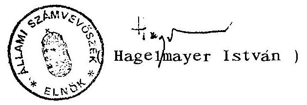

---

1. sz. melléklet a V-17-25/1994-95. számú jelentéshez

---

OEP székház funkcionális területeinek alakulása

|   |  |  | Lépeső, | Folyosó |  |  |  |  |  |  |  | Tárgyodó  |
| --- | --- | --- | --- | --- | --- | --- | --- | --- | --- | --- | --- | --- |
|   |  |  |  |  |  |  |  |  |  |  |  |   |
|   |  |  |  |  |  |  |  |  |  |  |  |   |
|   |  |  |  |  |  |  |  |  |  |  |  |   |
|   |  |  |  | Felföld |  |  |  |  |  |  |  |   |
|   |  |  |  |  |  |  |  |  |  |  |  |   |
|   |  |  |  |  |  |  |  |  |  |  |  |   |
|   |  |  |  |  |  |  |  |  |  |  |  |   |
|   |  |  |  |  |  |  |  |  |  |  |  |   |
|   |  |  |  |  |  |  |  |  |  |  |  |   |
|   |  |  |  |  |  |  |  |  |  |  |  |   |
|   |  |  |  |  |  |  |  |  |  |  |  |   |
|   |  |  |  |  |  |  |  |  |  |  |  |   |
|   |  |  |  |  |  |  |  |  |  |  |  |   |

  |  |  |  |  |  |   |
|   |  |  |  |  |  |  |  |  |  |  |  |   |
|   |  |  |  |  |  |  |  |  |  |  |  |   |
|   |  |  |  |  |  |  |  |  |  |  |  |   |
|   |  |  |  |  |  |  |  |  |  |  |  |   |
|   |  |  |  |  |  |  |  |  |  |  |  |   |
|   |  |  |  |  |  |  |  |  |  |  |  |   |
|   |  |  |  |  |  |  |  |  |  |  |  |   |
|   |  |  |  |  |  |  |  |  |  |  |  |   |
|   |  |  |  |  |  |  |  |  |  |  |  |   |
|   |  |  |  |  |  |  |  |  |  |  |  |   |
|   |  |  |  |  |  |  |  |  |  |  |  |   |
|   |  |  |  |  |  |  |  |  |  |  |  |   |
|   |  |  |  |  |  |  |  |  |  |  |  |   |
|   |  |  |  |  |  |  |  |  |  |  |  |   |
|   |  |  |  |  |  |  |  |  |  |  |  |   |
|   |  |  |  |  |  |  |  |  |  |  |  |   |
|   |  |  |  |  |  |  |  |  |  |  |  |   |
|   |  |  |  |  |  |  |  |  |  |  |  |   |
|   |  |  |  |  |  |  |  |  |  |  |  |   |
|   |  |  |  |  |  |  |  |  |  |  |  |   |
|   |  |  |  |  |  |  |  |  |  |  |  |   |
|   |  |  |  |  |  |  |  |  |  |  |  |   |
|   |  |  |  |  |  |  |  |  |  |  |  |   |
|   |

---

2. sz. melléklet a V-17-25/1994-95. számú jelentéshez

---

# JEGYZŐKÖNYV 

készült 1995. február 9-én az OEP Üzemeltetési Főosztály hivatalos helyiségében

Jelen vannak: Állami Számvevőszék részéről:
Krucsai Balázs osztályvezető főtanácsos
Pallós Gáborné tanácsos
Karsainé Dömsödi Éva számvevő
OEP részéről
Gricser Péter főosztályvezető

Bató András volt OTF főosztályvezető

Tárgy: az OEP székház építésének döntéselőkészítési folyamata

A Számvevőszék jelenlévő képviselőinek kérdéseire Bató András, mint a székház terveztetésének előkészítő folyamatában szereppel rendelkező személy - a tervpályázat bírálóbizottságának titkára - az alábbi válaszokat adta:

1. 1991. febr. 8-án Bató András feljegyzésben tájékoztatta Botos urat, az OTF akkori vezetőjét, az új OTF székház tervezése tárgyában arról, hogy véleménye szerint a BUVÁTI által elkészített tanulmányterv általánossága, a homlokzati tervvázlatok jellegtelensége miatt nem alkalmas a további tervezési munkákhoz kiinduló pontként. Javaslatot tett tervpályázat kiírására. Emlékei szerint több kötetlen vezetői megbeszélésen /melyen vélhetőleg jelen volt

---

Békefi Péter, Baranyai Géza, Botos József, Bató András/ alakult ki az az OTF álláspont, hogy tervpályázatot írnak ki. Ezeken a megbeszéléseken két alapvető feltétel fogalmazódott meg, az egyik a 1993. december 31-i befejezési határidő, a másik a rendelkezésre álló idő rövidsége miatt a zártkörű meghívásos pályáztatási forma.
2. A tervpályázatra meghívottak körére Bató András is tett javaslatot - informális szakmai ismeretei alapján - arra nem emlékszik, hogy rajta kívül ki tett még javaslatot és hogyan alakult ki a meghívott tervezők köre.
3. A Bíráló Bizottság tagjai közé Bató úr javaslatára vontak be független építészeket. A Bíráló Bizottság összetételére vonatkozóan más javaslatot emlékei szerint nem tett.
4. A pályázati kiírás tartalmi összeállítására vonatkozó vázlatot Pintér Béla készítette. A kiírás számítástechnikai fejezetét Bató András készítette. A Bíráló Bizottság titkári feladatait Botos úr szóbeli felkérése alapján Bató András látta el -, véleménye szerint ez a feladat arra vonatkozott, hogy amikor a Bíráló Bizottság megalakul, ennek munkáját titkárként támogassa.
5. Az 1991. május 31-i határidőre beérkezett 4 pályaművet az OTF hivatalos helyiségében elzárták. A pályázatok számbavételéről, iktatásáról jegyzőkönyv nem készült.
6. Az 1991. június 17-i OTF belső bírálat során bemutatták az OTF belső zsűritagok részére a pályázatokat, ezeket a zsűritagok megtekintették, érdemi pályázat-ismertetésre, értékelésre, pályázati értékelési szempontok meghatározására nem került sor, jegyzőkönyv az ülésről nem készült, ezt nem tekintették érdemi bírálatnak.

---

Az 1991. június 19-re meghívott építész zsűritagok végezték a pályázat érdemi bírálatát. Ezen a napon ismerkedtek meg a pályaművekkel és tették meg szakmai észrevételeiket, /épület magassága, tömege, megjelenése, városképi illeszkedése/ melyeket az értékelésről felvett jegyzőkönyvben rögzítettek.

A pályázatok értékelése kapcsán a beruházás költségei valószínűleg szerepeltek értékelési szempontként /mivel a pályázati kiírás szerint a költségbecslést a tervezőknek 1993. évi árszinten kellett megadniuk/, de a nyertes pályamű kiválasztásában nem ez volt a meghatározó. Az üzemeltetési költségek várható alakulását nem vizsgálták. A pályázati megoldások költség-összevetésére, értékelési feladatot házon belül senki nem kapott. Az egésznapos Bíráló Bizottsági munkáról emlékei szerint táblázatos feldolgozás készült, erre alapult a szöveges bírálat, de erre vonatkozó dokumentumot Bató úr nem őrzött meg.
7. A három építész zsűritag felkérő levelét 1991. június 11-én postázták, melyben meghívták őket a már említett június 19-i Bíráló Bizottsági ülésre. Június 19-e előtt az építész zsűritagok a bírálandó pályaműveket nem ismerték.
8. A pályázatok elbírálása után a zsűri döntési jegyzőkönyve, az ott meghatározott tanulmányterv elkészíttetésére és a beruházás soron következő feladatainak elvégzésére Bató úr emlékei szerint Gricser Péter osztályvezetőhöz került.

---

9. A Bíráló Bizottság munkájának befejezése után - Bató úr emlékei szerint - a pályázattal kapcsolatos valamennyi dokumentum, terv Pintér Bélához került.
k.m.f.
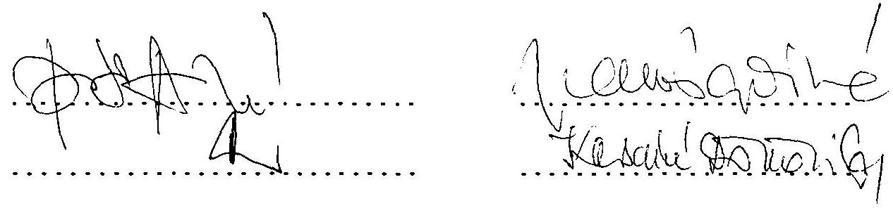

---

3. sz. melléklet a V-17-25/1994-95. számú jelentéshez

---

# Feljegyzés   az ÁSZ munkatársaival folytatott megbeszélésről 

1991. júniusában rövid felkérést kaptam Dr. Botos József akkori főigazgató úrtól, hogy zsűritagként vegyek részt az OTF Székházzal kapcsolatban benyújtott pályázatok értékelésében.

Személyes megbeszélésünk során főigazgató urat tájékoztattam arról, hogy sem ilyen irányú képzettségem, sem kellő információm nincs e kérdésről. Botos úr elmondta, hogy a zsüriben több szakember vesz részt, megbízásom a társadalombiztosítási igazgatásban szerzett 26 évi tapasztalatom alapján bizonyos feladatokhoz kapcsolódó szükségletek megfogalmazására értendő.

A kiindulópont az volt, hogy az OTF egységes szervezete, az egészségügyi ellátás biztosítási elvére történő áttéréssel megnövekedett sajátos feladatellátást is beleértve, megfelelő módon tudjon jobb szolgáltatást nyújtani: Az elképzelés szerint a cél: - többek között - központi adatbázis kialakítására, központi igazgatási és ügyfélszolgálati funkcióra és emberibb munkavégzésre alkalmas épület létrehozása, mely lehetőséget ad a Budapesti és Pest megyei Társadalombiztosítási Igazgatóság gondjainak áthidalására is.

Emlékezetem szerint az önálló egységvezetők egységesen fogalmazták meg azt az igényt, hogy a munkaszobák mérete kisebb legyen, azonban emeletenként megfelelő számú 25-28 személyes tárgyalók és egy nagyobb 150-200 személyes tanácsterem a munka végzéséhez szükséges.

Az OTF, illetve jogutódai igazgatási munkája igen nagylétszámú körre terjed ki. Állandó nehézséget okozott az országos értekezletek (gyógyszerészek, orvosok, gyógyszergyártók, megyei igazgatóságok, stb.) rendszeres konzultációjának megtartása.

---

A pályázat elbírálásához eredeti tervdokumentációval nem rendelkeztem, ez bizonyára a munkában résztvevő beruházási és pénzügyi szakemberek rendelkezésére állt. A funkció ellátásához legmeggyőzőbbnek tűnt az elfogadott pályázat, ezt erősítette meg a XIII. kerületi Önkormányzat képviselője is. A székház tervezésekor egy szervezetben gondolkodtunk, melynek több feladata volt, így a nyugdíj, a betegségi és anyasági ellátás (készpénz- és természetbeni ellátásai) stb.

Tekintve, hogy a társadalombiztosítás Önkormányzati igazgatásáról szóló törvény csak 1991. XII. 28-án jelent meg, az F.B-ok 1992-ben jöttek létre, és az ágazatok szétválása az Önkormányzatok megválasztásával szinte egyidejűleg, 1993-ban történt meg, e szempontok akkor nem voltak ismertek.

Továbbiakban nincs információm a kivitelezésről. Emlékezetem szerint a zsüriben Bató András, Bognár Miklós, dr. Selényi Károly, Békefi Péter és mások vettek részt.

Budapest, 1995. január 30.
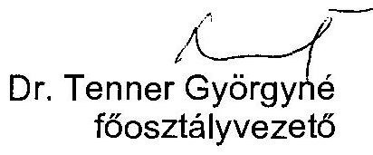

---

# NYILATKOZAT 

## Állami Számvevőszék részére

Tárgy: Az új irodaház tervezésének indítása

Az 1991. év elején több vezetői értekezleti tárgyalás után döntés született arról, hogy szükséges az OTF részére egy új irodaház megépítése, az OTF akkori székháza melletti üres telken.

A jelzett területre 1987. évben már készült egy beépítési terv, mely alapján akkor a Nyugdíjfolyósító Igazgatóság részére épült volna egy Számítástechnikai Központ és irodaház. Ezen létesítmény terveit a BUVÁTI készítette.

Célszerűnek látszott, hogy az új irodaház tervezésére is a BUVÁTI kapja a megbízást tekintettel arra, hogy már bizonyos ismeretekkel rendelkezett a
 társadalombiztosítás intézményeinek működésével, a területre vonatkozó hatósági elvárásokkal, valamint a terület geodéziai vonatkozásaival kapcsolatban. Ezt támasztotta alá még az is, hogy az épület befejezési határideje /1993. XII. 31./ gyakorlatilag adott volt a NYUFIG Hajógyári szigeti elhelyezésének időkorlátja miatt.

Ennek alapján 1991. február 13-án - az előző napi főosztályvezetői értekezlet döntésének megfelelően - megrendeltük a BUVÁTI-nál a beépítési tanulmánytervek elkészítését. Ezzel gyakorlatilag egy időben - a BUVÁTI által összeállított kérdéslista alapján - megkezdtük az igények felmérését és

---

összegzését egyes önálló egységektől kapott információk, ill. adatok alapján. Ezek figyelembevételével készült el a helyiséglista.
1991. március 13-án szóbeli utasítást kaptunk dr. Botos József úr főigazgatótól, hogy a tervezési megbízást a BUVÁTI-tól vissza kell vonni, mert zártkörű versenytárgyalás lesz az épület tervezésére.

Ebben az időszakban az egyik nap délutánján Pintér Béla értesítést kapott, hogy vegye fel a kapcsolatot Bató András főosztályvezető úrral. Mivel Pintér Béla Bató András urat nem ismerte, így bemutatás után Bató úr közölte, hogy üljön le és állítsa össze az új székház tervezési programját, mivel a tervezőnek át kell adni. A tervezőt nem nevezte meg. Pintér Béla közölte, hogy amit Bató úr kér azt nem lehet ilyen rövid idő alatt - gyakorlatilag azonnal - elkészíteni, mert ahhoz sok információra van szükség, mellyel ő nem rendelkezik. Bató úr közölte, hogy elég, ha általánosságban írja le a tervezési programot minden konkrét adat nélkül, ha szükséges ő majd kiegészíti és elkészíti vagy elkészítteti a számítógépteremmel és annak környezetével kapcsolatos összeállítást is. Ha így sem lehet azonnal összeállítani, akkor megfelelő lesz másnap délre. Pintér úr ekkor újra közölte, hogy az elkészítendő anyag nem lesz megfelelő az új irodaház tervezési programjához, konkrét adatok hiánya miatt. Ezzel együtt - korábbi hasonló ismeretei alapján -összeállított egy programot, melyet másnap leadott Bató úrnak. Arról nem tud, hogy mi lett az anyag további sorsa.

A tervezési megbízás visszavonása után, már csak közvetett információkkal rendelkeztünk a továbbiakról.

---

1991. április közepén - meghívásra - részt vettünk egy konzultáción, melyet a tervezői versenytárgyalásra meghívott tervezők részére tartott az OTF.
1992. június végén - július elején megkaptuk az építész zsűri döntéséről készült jegyzőkönyvet azzal, hogy az abban meghatározott tanulmánytervet rendeljük meg és a nyertes pályázóval a továbbiakban az OTF részéről mi tartsuk a kapcsolatot.

A tervezői versenytárgyalással kapcsolatos további anyagokat /levelezés - tervpályázatok - leírások, stb./ nem kaptunk, ill. Bató úr az OTF-tól történt kilépésekor kaptuk meg azon levelezési anyagokat, melyeket az Állami Számvevőszéknek is átadtunk.

Budapest, 1995. február 13.

Pintér Béla

---

4. sz. melléklet a V-17-25/1994-95. számú jelentéshez

---

## BUDAPEST FŐVÁROS XIII. KERÜLET Főépítésze

Állami Számvevőszék
Karsainé Dömsödi Éva
Budapest
1052 Apáczai Cs. János u. 10.
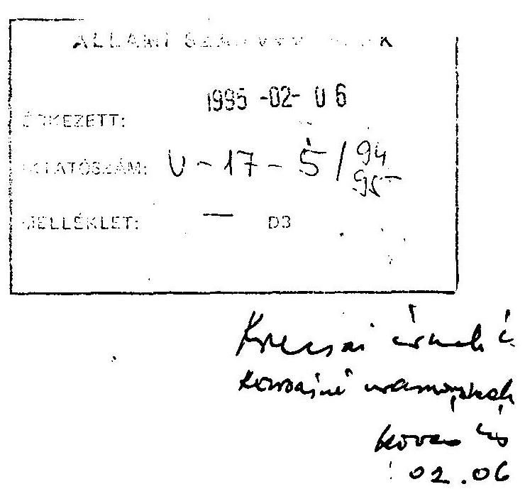

Tisztelt Karsainé Dömsödi Éva!
1995. január 30-án kollégáival megkerestek hivatalunkban a Budapest XIII. ker. Nyugdíjfolyósító Intézet bővítésével kapcsolatban. Miután szóban kihallgattak; arra való hivatkozással, hogy az ügyről minimális írott dokumentummal rendelkeznek, kérték, hogy az elmondottakat írásban rögzítsem.
Mivel írott anyag nekem sem áll rendelkezésemre, a történteket a következők szerint tudom felidézni;
A bővítésre már korábban cca 1987-88-ban is készült terv (Benyó László építész BVTV) amely azonban nem jutott el a megvalósítás stádiumába. Ennek oka az építtető részéről számomra ismeretlen. Hivatalunk részéről úgy emlékszem vissza, hogy a tervtanács is és én is elutasítottuk építészeti kérdések miatt.
Legközelebb ezután akkor találkoztam az építési szándékkal, amikor évekkel később felkért a Nyugdíjfolyósító Intézet, hogy vegyek részt egy bíráló bizottságban, amely a bővítésre kiírt pályázatot hivatott elbírálni.
Amikor Szabó Miklós polgármesterrel a zsűribe bekerültünk, már az elkészített terveket láttuk. Az előkészítő munkában, a pályázat feltételeinek meghatározásában nem vettünk részt.
Emlékeim szerint a döntésnél a bizottság ajánlásokat tett, amely szerint a végleges épület kialakításánál össze kellene növeszteni a régi és új épületek tömegrészeit az egyöntetű architektúra megteremtése érdekében.
Ezek után pontosan nem emlékszem, hogy hány alkalommal a tervező konzultált velem. Bemutatott egy vázlattervet, amelyre ráírtam, hogy "ennek szellemében" folytassa a munkát. Olyan kritériumot, hogy milyen alapterületű építménnyel csatlakozzon a régi épülethez én soha sem határoztam meg. A csatlakozás elérhető lett volna egy-egy keskeny szárny megépítésével is. Azt hogy a megépült alapterületek hogyan

---

alakultak ki nem tudom megállapítani. Valószínűleg építtetői indítékra történt. Szóba került az is, hogy mi lehet az oka a hosszadalmas építési engedély eljárásnak. Ennek megválaszolására a Műszaki Osztályt ajánlottam.

Kérem a leírtak szíves elfogadását.

Budapest, 1995. 02. 01.

Tisztelettel:
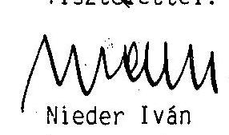

---

5. sz. melléklet a V-17-25/1994-95. számú jelentéshez

---

TERVPÁLYÁZAT - 1. díjas terv
1991. június
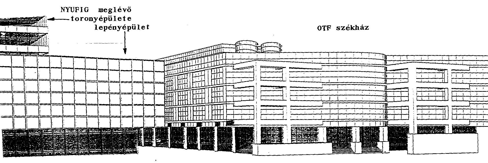

---

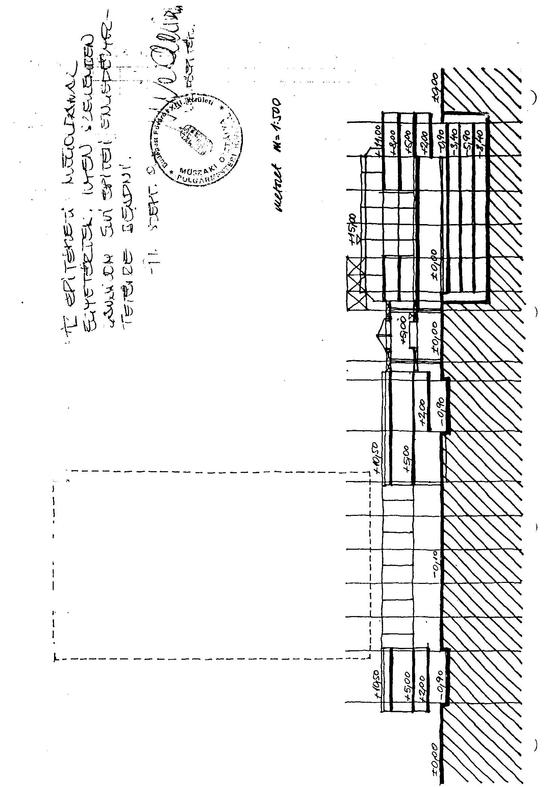

# 

---

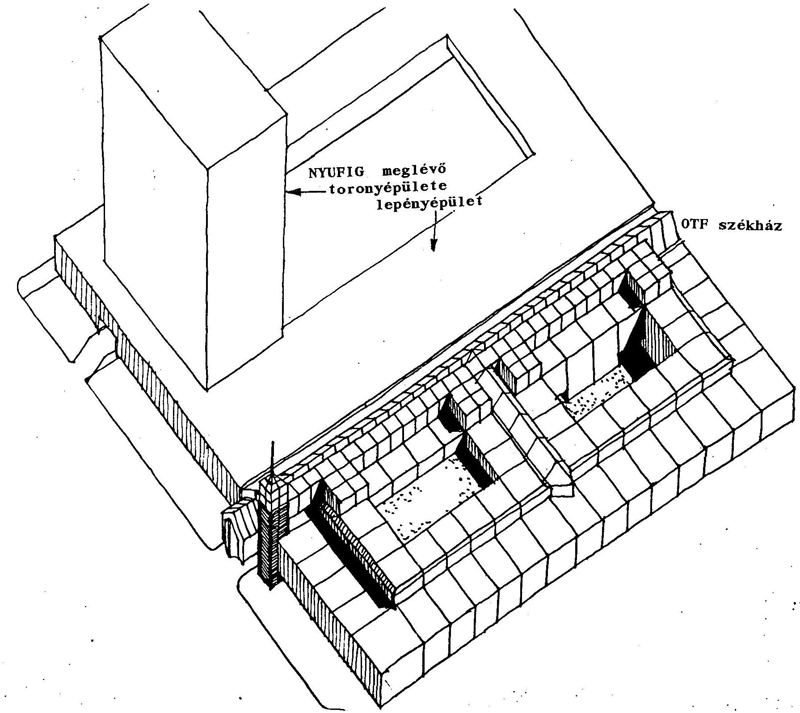
$\square$

---

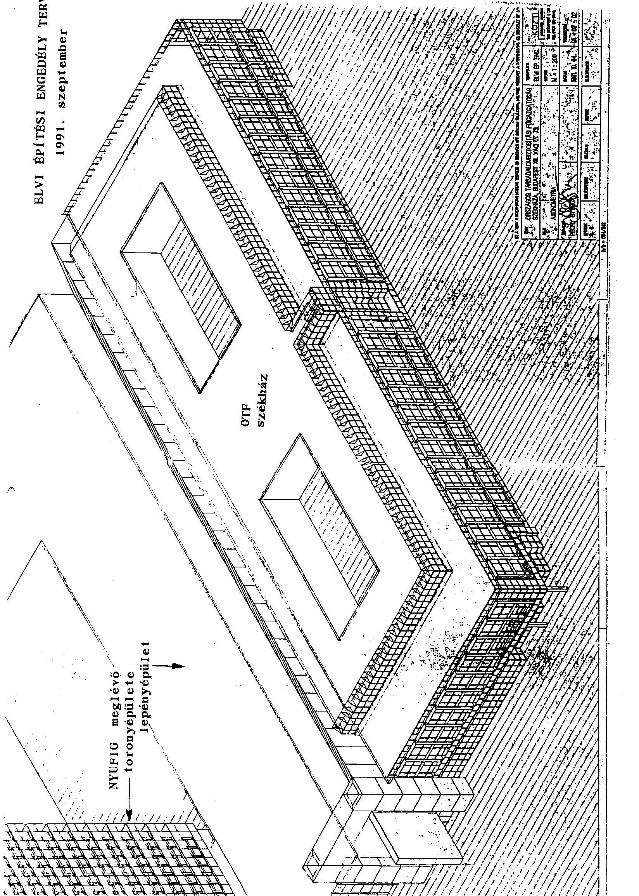

ELVI ÉPÍTÉSI ENGEDÉLY TERV

---

6. sz. melléklet a V-17-25/1994-95. számú jelentéshez

---

# Példák a vállalkozók által benyújtott kivitelezői pályázatok kiértékelésének ellentmondásaira 

1.) A pályázók által megajánlott alternatív, olcsóbb kivitelű szerkezeti megoldásokat, villamos és gépészeti berendezéseket legtöbb esetben lepontozták.

- A 21. sz. ÁÉV (MÉRT) által megajánlott alternatív homlokzatkiképzések (osztrák cég alumínium-faszerkezet, vagy norvég RAUFOSS hőhídmentes alumínium szerkezet) és az egyszerűbb kivitelű, hazai piacon beszerezhető mobiliák egyaránt a nem megfelelő 30-35 pontot kapták.
- A 22. sz. ÁÉV 40-80 MFt-tal olcsóbb alépítményi, szerkezeti alternatív megoldást ajánlott meg és javasolta az íves gépkocsi parkolólehajtás egyszerűbb, olcsóbb kivitelét. A minőségre ezek az ajánlatok 70 pontot kaptak, holott a "pályázó garantálta pályázatában a "kiírás szerinti" kivitelt és minőséget.
- Az automatikára a 22. sz. ÁÉV lényegében hasonló (HONEYWELL), de olcsóbb megoldást ajánlott mint a MÉRT. A minőségét 35 pontra értékelték szemben a MÉRT 70, illetve 80 pontjával.

2.) A megajánlott költségek pontozását gyakran összekapcsolták a minőségi értékekkel. Ha a minőséget gyengébbnek értékelték, esetenként az olcsóbb árat is lepontozták, holott magasabbat kellett volna kapnia. A tervező ezt azzal indokolta, hogy értékelési metódusok szerint a pályázatok közül a legalacsonyabb és legmagasabb ár automatikusan 15 pontot kap. Ez a metódus

---

azonban a beruházó és a KÖZTI képviselői között 1991. április 21-én a kiértékelés módjára kötött megállapodásban nem szerepel. A költségértékelésre azt rögzíti: "...a beérkezett ajánlatok közötti árdifferenciát négyzetes szórás alapján pontozzuk"!

- Az Érdi Építő Generál Kft. legkedvezőbbnek mutatkozott összköltségére a tervező 15 pontot adott (az OTF 85-öt).
- A MÉRT által, változatként megajánlott egyszerűbb, de olcsóbb mobiliái árát a tervező 15 pontra értékelte. Ez azonban nem következetes, mert a Zalai ÁÉV közel azonos árban megajánlott mobiliáira, bár minőségét még a MÉRT ajánlatnál is alacsonyabbra 20 pontra tartotta a tervező, a költségére 90 pontot adott.
- A MÉRT olcsóbb alternatívákat tartalmazó "B" változatának költség megajánlását 26,87 összesített pontszámra értékelték a 0,36 szorzó figyelembevételével. Ez alacsonyabb mint a győztesnek kihozott "A" változat 27,85 pontszáma, holott a "B" változat 2.198 millió Ft volt, szemben az "A" 2.460 millió Ft-os árával. A Zalai ÁÉV 2.129 millió Ft-os költség megajánlást 28 pont-ra értékelték, valójában azonban a cég 530 MFt előleget kért, ami mintegy 110 MFt-al megemeli a vállalási árat, tehát mindenképpen drágább mint a MÉRT "B" változata.

3.) A pontozásos értékelésben számtalan következetlenség tapasztalható:

- A Zalai ÁÉV ajánlati összege 2.129 millió Ft, a 22. sz. ÁÉV változatai előleg nyújtása esetén 2.100-2.110 millió Ft körüliek, tehát kevés a különbség a két cég árai között. Az előbbi mégis 28 pontot kap az összesített költség megajánlásra, míg az utóbbi 30 pont fölöttit. Az árban az eltérés 1,5 %, a pontszámban 7,3 %.

---

- A PAHOG mobiliáinak költsége 266 millió Ft, a Vegyiműveket Építő és Szerelő Rt-é 303 millió Ft. Az eltérés közel 14 %. Mégis mindkét költségelem egyaránt 80 pontot kap.
- A MÉRT "A" és "B" alternatívája kiértékelésének a körülményei arra utalnak, hogy következetes és körültekintő értékelés mellett a több mint 260 millió Ft költségcsökkenést eredményező "B" variáns lehetett volna a győztes.
a.) A referencia és kiírási feltételeknél indokolatlan volt a két alternatíva között különbséget tenni. A számítás azért is kifogásolható, mivel a "B"-t kevés kivitellel egyedül a tervező pontozta. Az "A"-nál ezekre a tételekre az OTF és lebonyolító magasabb pontot adott a tervezőnél, így a "B" hátrányba került. A két szempontnál együttesen valójában 1,24 ponttal több a pontszám a kapottnál.
b.) A homlokzatkiképzés és mobiliánál a minőség nem megfelelő értékelése ugyancsak indokolatlan. Indokolt lett volna a legalacsonyabb megfelelő pontszám (70), ami az "A" variációval szemben kifejezi a vélt alacsonyabb minőségi szintet (90, illetve 85 pontra lett értékelve az "A"-nál). Ez a korrekció kb. 2 plusz pontot jelent az összesítésben.
c.) A költségmegajánlás lepontozása helytelen volt. A hasonló minőségű mobília árát a Zalai ÁÉV-nél 90 pontra értékelték. Nem adtak többletpontot az "A" 79 pontjához képest a belső épületgépészet 40 millió Ft-os árcsökkentésére a "B" variánsnál, holott ezzel a gépészeti ár megközelítette a 22. sz. ÁÉV 90 pontra értékelt épületgépészeti árát. Végül elfogadhatatlan, hogy 5 ponttal kevesebbet kapott a "B" variáns az előlegigénysorban az "A"-hoz képest, mivel mindkét ár egyformán előleg nélkül lett kalkulálva. Ennek a három kifogá-

---

solt tételnek a korrigálása révén a "B" költség megajánlása minimum 2,5 ponttal nő az összesítésben. (Megjegyzendő, hogy még így sem éri el a 22. sz. ÁÉV azonos árára kapott költségpontszámot).

Ha az a.,- c., alatt tárgyalt három +pontszámot (5,74) hozzáadjuk a végső összesítésben a "B" variánsnak juttatott 76,68 pontszámhoz 82,42 pontot kapunk, ami magasabb, mint a győztes, "A" variáció 81,89-es pontszáma.

A kivitelezési szerződést tehát a MÉRT "B" variációjára kellett volna megkötni, ami 260 MFt. költségcsökkenést eredményezett volna.

---

7. sz. melléklet a V-17-25/1994-95. számú jelentéshez

---

Budapest, XIII. kerület Váci út 73/a. új székházépülettel kapcsolatos finanszírozás levezetése 1989-től 1994-ig

|   | 1989. | 1990. | 1991. | 1992. | 1993. | 1994. | Összesen  |
| --- | --- | --- | --- | --- | --- | --- | --- |
|  BEVÉTELEK |  |  |  |  |  |  |   |
|  - tartalékból | (1) | (2) | (3) |  | (2) |  |   |
|  - tartalékból | +400 | +686 | 1.086-385=701 | 701 | 286-80=206 | - | 2.086  |
|  - Tb. Alapokból egyszerű | - | - | - | +385 | (8) |  |   |
|  - Tfb. Alapokból egyszerű |  |  |  | (4) | 1.893+120=2.013 | 141-10=131 | 2.144  |
|  - Tfb. Alapokból folyamatos |  |  |  | (4) |  |  |   |
|  - Tfb. Alapokból folyamatos |  |  | 12 |  | (13) |  | 3.230 |

  |
|  - Tfb. Alapokból folyamatos |  |  |  | 12 | 101 | - | 113  |
|  Összesen |  |  |  | 1.086 | 2.320 | 131 | 3.343  |
|  KIADASOK |  |  |  |  | (9) | (12) |   |
|  - eredeti aláirányzat | - | - | - | - | 2.280=101+2.179 | 141 | 2.421  |
|  - + évközi módosítások | - | - | - | (+ 800) | (10) | (10) | (+830)  |
|  - módosított aláirányzat | - | - | - | (5) | 2.320 | 131 | 3.251  |
|  - tényleges felhasználás | - | - | 12 | (6) | (11) |  |   |
|   |  |  |  | 880 | 2.297 (2.186) | 127 | 3.316  |
|   |  |  |  | (14) |  |  |   |

---

A 7. sz. melléklet számadatainak törvényi háttere
(1) Az 1990. évi LXXXI. tv. A Tb. Alap 1989. évi költségvetésének végrehajtásáról III. "Az 1989. évi bevétel alapján működési költségként felhasználható ( 1 \%) 2.964 millió forintos összeghez képest elért 400 millió forint megtakarítása későbbi évek - nagyobb beruházásokat is finanszírozó - működési kiadásainak fedezetére szolgáló tartalék".
(2) Az 1991. évi XXXVI. tv. 18. paragrafus (1) bek. A Tb. Alap 1990. évi költségvetésének végrehajtásáról - szerint az 1990. évi bevétel alapján működési költségként felhasználható ( 1 \%) 3.594 millió forintos összeg és a tényleges felhasználás 2.908 millió forint különbözetét: 686 millió forintot a működési költségvetés tartalékába kell helyezni.
(3) Az 1991. évi LXXIV. tv. a Tb. Alap 1991. évi költségvetéséről 7. paragrafus (1) bekezdése alapján a $(400+686)=1.086$ millió forint összegű tartalék felhasználható: a Tb. Alap kezelőjének működési költségvetési kiadásaira, az évi működési költségkereten felül! Ennek alapján 1991-ben a működésre a tartalékból 385 millió forintot használtak fel.
(4) Az 1992. évi LX. tv. a Tb. Alap 1991. évi költségvetésének végrehajtása 9. paragrafusa szerint a működési költségvetés 1991. évi bevétele 5.836 millió forint, kiadása 5.135 millió forint, így a bevételi többlet 701 millió forint. Ez az így keletkezett "megtakarítás" az 1992. évi működési bevételek kiegészítésére felhasználható.

---

Az 1991. évi LXXIV. tv. 7. paragrafus a tartalékból a működésre felhasznált 385 millió forintra visszapótlási kötelezettséget írt, így az 1992-ben újra előállt az 1.086 millió forint összegű tartalék a bevételi oldalon.
(5) Az 1992. évi LXVII. tv. Tb. Alap 1992. évi helyzetéről a 8. paragrafus (3) rendelkezik. A kiadásból a folyamatos működés előirányzata 5.249 millió forint. Ebből a fejlesztési célú előirányzat 2.924 millió forint, melyből a beruházási célú kiadások előirányzata 1.942 millió forint.

A beruházási forrás megjelölése az 1992. évi X. tv. a Tb. Alap 1992. évi költségvetéséről 20. paragrafus (4) bek. szerint az 1.086 millió forint tartalékból 800 millió forint összeg az építési beruházás 1992. évi ráfordításaira használható fel. A visszapótlás fennmaradó összege 286 millió forint a működési költségvetés 1992. évi egyenlegében jelenik meg.
(6) Az 1992. évi tényleges felhasználás 80 millió forinttal lépte túl a kiadási előirányzatot (1993. évi CV.tv. 16. paragrafus (5) bek.)
(7) A (6) túllépés miatt az 1993. évi tartalék bevételi előirányzata (286-80)=206 millió forint lett.
A Felügyelő Bizottságok Együttes határozatban tudomásul vették, hogy az OTF épület beruházásra 80 millió forinttal többet használt fel az előirányzatnál. Döntésünk értelmében ez az összeg csökkenti az 1993. évi e célra a törvényben meghatározott előirányzatot. Tehát 1993-ban 206 millió forint tartalék visszapótlás realizálódott.

---

(8) Az 1993. évi bevételi előirányzathoz a Tb. Alaptól átvett összeg 1.893 millió forint, amelyhez - az Egészségbiztosítási Önkormányzat Elnöksége 11. sz. határozata az 1993. évi pótköltségvetés tárgyalásakor hozott döntése alapján -  első átcsoportosítással hozzárendelték az informatikai fejlesztési projektek 1.279 millió forint összegű előirányzatának csökkentésből származó 120 millió forintot.

Így a beruházásra fordítható bevételi előirányzat a 93. évi módosított költségvetés alapján $(1.893+120)=2.013$ millió forint a Tb. Alapokból.
(9) Az 1992. évi LXXXIV. tv. 34. paragrafusa az épületberuházás eredeti 1993. évi előirányzatát 2.179 millió forintban határozta meg.
(10) Tekintettel arra, hogy az 1992. évi épületberuházás tényleges teljesítése 80 millió forinttal haladta meg az eredeti előirányzatot ((7) pont) - átmenetileg központi beruházási forrásból fedezték a pótelőirányzat +80 millió forint összegét, melyet az 1993. évi keretből kompenzáltak. 1993. évben az Önkormányzati Közgyűlés ((8) pont) által jóváhagyott 120 millió forintos informatikai keretösszeg átcsoportosítására került sor, az informatika fejlesztési projekt egyidejű csökkentésével. Ezáltal az 1993. évi épületberuházás módosított előirányzata $(2.179-80+120)=2.219$ millió forint lett.
(11) 1993. évben az épületberuházás tényleges felhasználása 2.186 millió forint volt. T/400. tv. javaslat a Tb. Alapok 1993. évi költségvetésének végrehajtásáról (1994. XII. hó). A Parlament módosította a (13.) pont szerinti törvénnyel. A számviteli adatok helyesbítésével a tényleges felhasználás javított összege 2.297 millió forint.

---

(12) Az 1994. évi L.tv. Tb. Alapok 1994. évi költségvetéséről 2.sz. melléklete 9. Cím; 1. alcím, 3. előirányzat csoportszámon a beruházások összege 913 millió forint, melyből az új épületre fordítható eredeti előirányzat összege 141 millió forint.

Ez a 141 millió forint az Egészségbiztosítási Alapból átvett pénzeszközökből finanszírozták.

Az 1994. évi teljesítés az Épületberuházásra 127 millió forint.
(13) Az /1993. évi XLIV. törvénnyel módosított/ 1992. évi LXXXIV. tv. 6. sz. mellékletében szereplő 2. pont 6. francia bekezdése szerinti összeg.
(14) A 80 millió Ft-os többletfelhasználás esetében a kiadási előirányzat emelése elmaradt.

Az Összeállítás a Költségvetési és Pénzforgalmi Főosztály adatai és információi alapján készült a vizsgálati részjelentés megállapítások következtében javított, illetve helyesbített adatokkal.

---

7. sz. melléklet a V-17-25/1994-95. számú jelentéshez

---

# OEP székház 

Megvalósult épület használatba vétele és a
bérbeadható területek kimutatása
(1995. II. 6.)
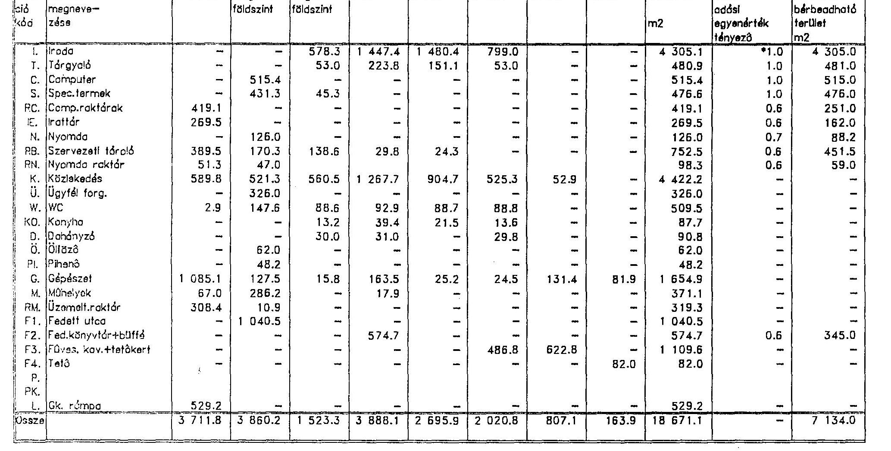

---

9. sz. melléklet a V-17-25/1994-95. számú jelentéshez

---

# Budapesti irodaépületek főbb műszaki - gazdasági adatai 

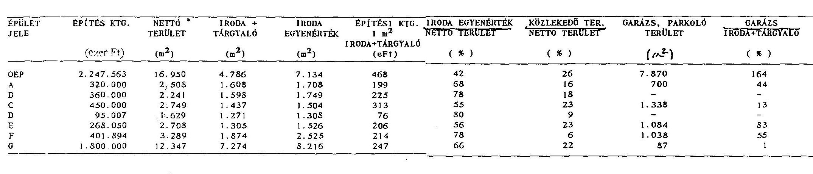

Megjegyzés: * garázs és tetőkert nélkül számítva
** egyenérték szorzók: 1,0 iroda + tárgyaló, különterem, számítógépterem
0,7 nyomda, fitnesz
0,6 irattár, raktár
0,8 üzlet

---

Irodaépületek főbb műszaki adatainak összehasonlítása

Épület Terület
jele m2

| OEP méa.atau.li | 16950 |
| :--: | :--: |
| A | 2509 |
| B | 2241 |
| C | 2749 |
| D | 1629 |
| E | 2708 |
| F | 3289 |
| 8 | 12347 |

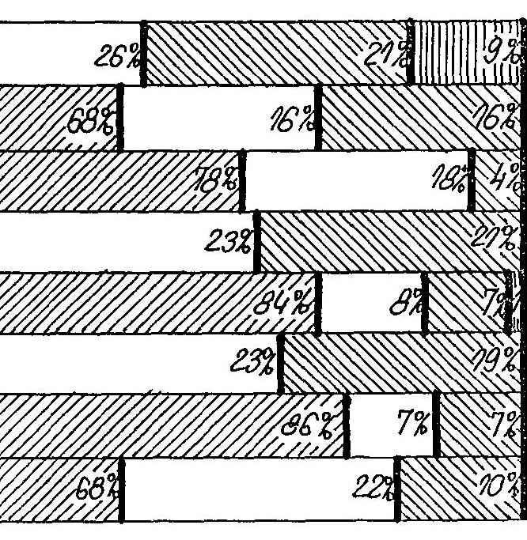

Jelmagyarázat: bérbeadható terület
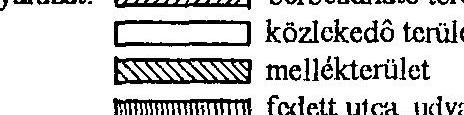

---

10. sz. melléklet a V-17-25/1994-95. számú jelentéshez

---

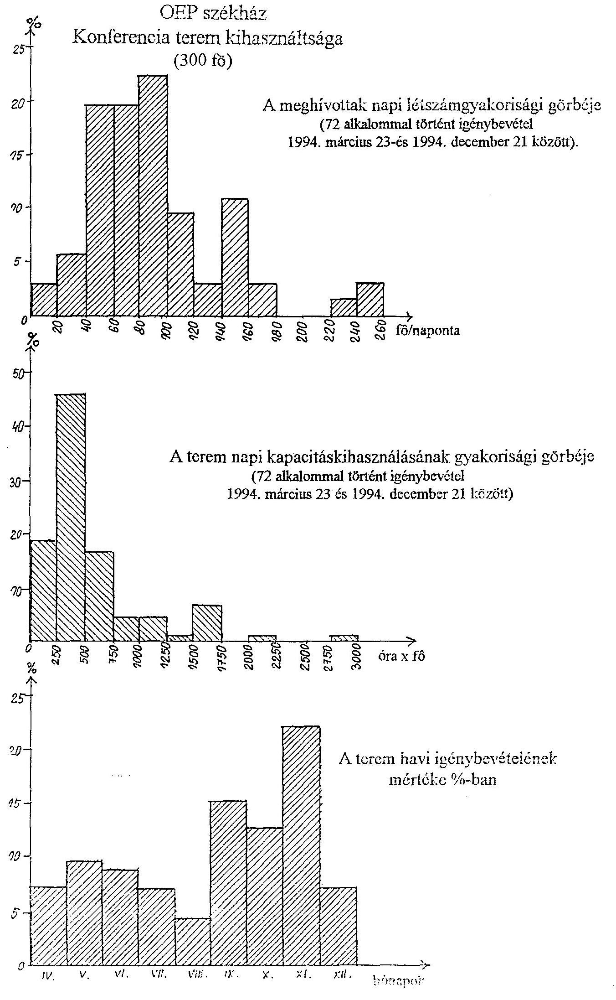

A terem havi igénybevételének mértéke %-ban

---

A4.sz. melléklet a V-17-25/1994-95. számú jelentéshez

---

# Az Országos Egészségbiztosítási Pénztár székház beruházásának néhány, túlzott nagyvonalúságra utaló költségeleme 

1. A székház makett - amelyet az
2. emeleti reprezentációs térben helyeztek el, az elkészült épü-
let dekoratív bemutatására
3. $600.000 .-\mathrm{Ft}+$ ÁFA
4. Belső építészet, sziklakert, tetőkert kialakítása
5. Külön vásárolt egzotikus
növények, belső növényzet
6. A reprezentációs térben
elhelyezett 3 db díszítő
pillangó-művészeti alkotás
7. A fedett utcatér árnyékoló
szerkezete, (függönyök automata
fényérzékelővel és lehúzó
szerkezettel)
8. Bútorok, irodai berendezés
9. Klimaberendezések
Klima érzékelőrendszer
HONEYWELL épületgépészeti software
Klima összesen
10. Az irodahelyiségek szalagfüggönyözése
11. A porta és ügyfélszolgálat (nem működik) részére pótlólag telepített telefon (88.138/94. számla)
$400.000 .-\mathrm{Ft}+$ ÁFA
12.600 .000 .- Ft+ ÁFA
166.000 .000 .- Ft+ ÁFA
$60.000 .000 .-\mathrm{Ft}+$ ÁFA
$20.000 .000 .-\mathrm{Ft}+$ ÁFA
10.000 .000 .- Ft+ ÁFA
$90.000 .000 .-\mathrm{Ft}+$ ÁFA
$8.500 .000 .-\mathrm{Ft}+$ ÁFA
274.120 .- Ft+ ÁFA

---

10. A büfé pótlólagos átalakításának költsége a büfépult áthelyezése az arra néző irodahelyiségek látvány-komfort javítása érdekében
A büfé bérletben üzemel a befolyó bérleti díj $15.000 .-\mathrm{Ft} /$ hó + ÁFA
11. Az épület takarítására Bt. szerveződött, az OEP takarítószemélyzetéből az épülettakarítás költsége
2.154.254,96 Ft/hó

+ ÁFA
A takarítóhelyiségek bérbeadásából
befolyt bérleti díj 10.000 .- Ft/hó + ÁFA
12. A Nyugdíjbiztosítás épületébe átvezető átjáró mágneskártyás biztonsági beléptető rendszer kiépítésének költsége
$840.000 .-\mathrm{Ft}+$ ÁFA

13. Az új székházba beépített 4 db látványlift értéke
$56.000 .000 .-\mathrm{Ft}+$ ÁFA

Mindösszesen:
345.749 . 175. - Ft+ ÁFA

---

12.sz. melléklet a V-17-25/1994-95. számú jelentéshez

---

# Állami Számvevőszék 

## dr. Kovács Árpád   Számvevő-igazgató részére

Budapest

Tárgy: Észrevételek az Állami Számvevőszék által az OEP székház beruházásának törvényességi és eredményességi ellenőrzéséről készített jelentés tervezetéhez.

Tisztelt Igazgató Úr!

Köszönöm, hogy a tárgyban szereplő jelentést megküldte számomra és megtisztelő, hogy számot tart véleményemre, észrevételeimre.

Röviden összefoglalva benyomásaimat a jelentésről:
Úgy érzékelem, hogy a jelentés készítői messzemenően igazolták a székház épülettel kapcsolatos döntések meghozatalának helyességét, indokoltságát, hiszen megállapították, hogy az építési célok magas minőségi színvonalú, tartós és esztétikus anyagokból, energiatakarékos és igényes berendezési tárgyak beépítésével valósultak meg. (Vizsgálati anyag 65. oldal.)

Ugyanakkor ugyanennek a jelentésnek a készítői megkérdőjelezik a döntések indokoltságát, megalapozott voltát, a kivitelezés módját, illetve olyan megállapításokat tesznek, hogy a székház építés minden kontroll nélkül, egyszemélyi döntés, vagy döntések eredményeként történt.

---

A magam részéről a vizsgálati anyag összegző megállapítását elfogadva boldogan vállalnám az egyszemélyi döntést. Tény, hogy a végső döntés az OTF vezetőjéé volt, annál is inkább mert az OTF vezetője volt az akkori jogszabályi rendelkezések szerint nem csak a működési, hanem a nyugdíj és egészségbiztosítási alapok kezelője is és ebben a minőségemben több esetben kellett egyszemélyi döntést hoznom - ténylegesen egyszemélyi döntést! - a székház építés egészénél, vagy részkérdéseinél sokkal nagyobb horderejű kérdésekben, pl. hogy az 1992-ben a TB költségvetés néhány héttel később történő parlamenti elfogadása miatt az egészségügy finanszírozása, vagy a nyugdíjak kifizetése mégis és időben megtörténjék, hogy éppen az államháztartási mérleg védelme érdekében a TB költségvetése az állami költségvetés elfogadásától ne szakadjon el túlságosan (időben akár fél évvel is), és még lehetne sorolni a példákat, melyek azt bizonyítanák, hogy az akkori alap kezelője, a TB főigazgatója látta el mindazokat a feladatokat, melyeket ma a két önkormányzat kell, hogy ellásson. A törvényességet úgy vélem az OTF vezérkarának döntései akkor éppúgy nem sértették, mint a mostani önkormányzati döntések. Csak megemlítem, hogy a Számvevőszék tisztelt vezetőjével dr. Hagelmayer Istvánnal a Számvevőszék épületében magam állapodtam meg arról, hogy a Társadalombiztosítás jelentősége miatt az akkori OTF-n nemcsak ad hoc jelleggel, hanem egész évben dolgozzon, egy a TB ügyekre szakosodott, ezt ismerő vizsgálati csoport, számukra a működés feltételeit szintén egyszemélyi döntéssel, mint akkori főigazgató magam biztosítottam. Ezzel a munkacsoporttal főigazgatói funkcióm megszűnéséig folyamatosan együttműködtem, szükségesnek tartottam, hogy vizsgálataik, segítő tevékenységük elől minden objektív, vagy szubjektív akadályt lehetőségeimhez képest elhárítsak.

Ezt nem azért említem meg, hogy a Számvevőszék vezetőit a magam irányába indokolatlanul jobb véleményre hangoljam, csupán azt kívántam illusztrálni ezzel, hogy a vizsgálati jelentés azon megállapítása, miszerint minden kontroll nélkül döntöttünk és cselekedtünk, nem állja meg a helyét.

A jelentés és a vizsgálati anyag átolvasása után én megnyugodtam, hiszen az derül ki, hogy törvénysértés nem történt. Az olyan megállapítások,
 hogy az előkészítés ötletszerűen, kapkodó módon történt, megengedhetetlen nagyvonalúsággal, sőt pazarló

---

módon, úgy vélem az összefoglaló jelentés készítőinek jó értelemben vett szakmai elfogultságát tükrözik, ugyanis a vizsgálati anyagban leírtak ezt a megállapítást nem támasztják alá. A jelzők tértől és időtől függetlenül minősítenek, holott valójában arról volt szó, hogy 600 ember a Hajógyári szigeten nem éppen ideális körülmények között dolgozott, mely bérleményt 1994. december 31-ével a leghatározottabban fel kívánták mondani. Ugyanebben az időszakban folytak a viták a Társadalombiztosítás jövőjéről és hosszú ideig tartotta magát egy olyan elképzelés, mely szerint a TB önkormányzata mintegy 300 főből állna (a jelenlegi 120 fős változat hosszú elvi viták után jó szerűen csak az önkormányzati választások előtti utolsó pillanatokban nyert elfogadást). Egyebekben itt jegyzem meg, hogy a jelentés megállapításával szemben, mely szerint a TB gyakorlatilag minden kontroll nélkül, a főigazgató egyszemélyes döntései alapján működött, a Társadalombiztosítás soha nem volt olyan folyamatos ellenőrzés alatt, mint a rendszerváltozás után, hiszen az egyik legnagyobb létszámú állandó bizottság (a szociális és az egészségügyi) folyamatosan foglalkozott a TB működésével, folyó döntésekkel. Ezt alátámaszthatják a tisztelt parlamenti bizottság üléséről felvett jegyzőkönyvek is.

Az ötletszerű jelző mögött az áll, hogy a mindenkori államigazgatási gyakorlattól eltérően a döntés előkészítése és döntéshozás nem húzódott el hosszú hónapokig, a kapkodó jelző mögé pedig azt a hozzáállást hozom fel, amely a körülmények változásához rugalmasan igazodott, a nagyvonalúság és a pazarlás fogalma mögött pedig az áll, hogy egy országos szerepkörű és számos, sőt a legtöbb minisztériumnál nagyobb jelentőségű intézmény nem építhet, nem szabad, hogy építsen olyan középületet, amely egy-két évtized leforgása alatt korszerűtlenné válik, amelyben méltatlan feltételek között kell dolgozzanak a munkatársak. A pazarlás az lett volna, ha nem a harmadik évezred várható közlekedési, ügyintézés-igénybeli követelményeinek megfelelő épületet építtet a Társadalombiztosítás. Az olyan megállapításokat, hogy "kétséges tisztaságú", sértőnek találom, azonkívül, hogy nem is igaz. A jelentés készítőjének objektívnek kell lenni, és vagy bizonyítani kell tudni valamely megállapítást, vagy pedig ha megállapítás nem igazolható, akkor nem célozgatni.

A jelentés készítői figyelmét felhívnám arra, hogy az apparátus létszámát a Felügyelő Bizottságokkal együtt próbáltuk felbecsülni, azt az illogikus és valóban pazarló megoldást

---

azonban, hogy a Társadalombiztosítási ellátásokat nyújtó apparátust ketté kell választani nem a Társadalombiztosítás szorgalmazta, és sajnos ez a döntés a Felügyelő Bizottságok véleményének a figyelmen kívül hagyásával, a személyi és anyagi következmények teljes figyelmen kívül hagyásával történt, gyakorlatilag az önkormányzati választások előtt közvetlenül. (Talán egyszer az apparátus kettéválasztását eredményező döntés személyi és anyagi következményeivel is szembenézünk.)

Végezetül néhány technikai jellegű megjegyzés:

- a kétszintes garázs, mely már a vizsgálat időpontjában is közel 80%-ban volt kihasználva, nem tekinthető luxusnak már ma sem, még kevésbé lesz az az ezredfordulón, vagy az azt követő évtizedekben,
- a légkondicionálás, a fővárosnak már ma is a legnagyobb forgalmú közlekedési csomópontján a levegőszennyezés, a zajszint miatt egyáltalán nem tekinthető luxusnak, - utódaimnak az éppen csak szerkezetkész épület végső befejezését, kiépítését illetően szabad keze volt, tehát a konferenciatermek nagyságát, az irodahelyiségek számát és nagyságát, bútorozását én már nem tudtam befolyásolni, mint ahogy annak a felelőssége sem engem terhel, hogy a másfél hónapos késésért nagyvonalúan nem számítottak fel kötbért (az építési szerződésben a magam részéről - és ez valóban egyszemélyi döntés volt - nagyon kemény késedelmi kamatfeltételeket fogadtattam el a kivitelezővel).

Ami a jelentés következtetéseit és javaslatait illeti: úgy vélem, hogy egy demokratikus társadalmi berendezkedésű országban a Társadalombiztosítás működési költségeivel, amely jelenleg a járulékbevételek 2%-át teszi ki, igazából csak akkor kellene olyan megkülönböztetett figyelemmel foglalkozni, ha nem lenne egy az ország lakossága által jelentős költséggel megválasztott és működő TB Önkormányzati rendszer. El nem tudom képzelni, hogy a TB 2%-os működési költségeinek minden 2%-át meghaladó beruházást kiemelt intézményi beruházásnak minősítsünk, mellyel az Országgyűlésnek a költségvetésnél és a zárszámadásnál egyaránt külön kellene foglalkozni.

Mégegyszer köszönöm Igazgató úrnak, hogy eljuttatta hozzám a vizsgálati anyagot és jelentés tervezetet. Szívesen rendelkezésre álltam volna már a készítés időpontjában is akár. Kívánok eredményes jó munkát Önnek és munkatársainak és ha észrevételeim közül valamelyik nem lenne világos, állok rendelkezésükre, és remélem nem találják

---

sértőnek észrevételeim egyikét sem. (Más dolog ugyanis az ügyek forgatagát megélni, benne lenni egy folyamatban és más utólag kívülről, természettől fogva is szűkebb információ mennyiség birtokában ítélni.)

Budapest, 1995. április 24.

Tisztelettel
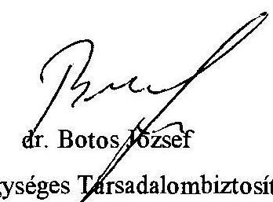
at. Botos, 60 zsel
az Egységes Társadalombiztosítás
utolsó volt főigazgatója
