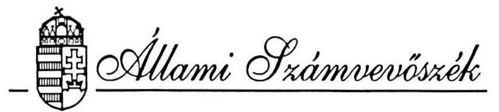
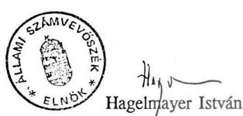

T.901/1.sz.

# VÉLEMÉNY 

a Magyar Köztársaság 1995. évi pótköltségvetéséről

---

| ÁFA | - Általános Forgalmi Adó |
| :-- | :-- |
| APEH | - Adó- és Pénzügyi Ellenőrzési Hivatal |
| ÁHT | - Állambáztartási Törvény |
| ÁSZ | - Állami Számvevőszék |
| ÁVÜ | - Állami Vagyonügynökség |
| ÁV Rt. | - Állami Vagyonkezelő Részvénytársaság |
| PM | - Pénzügyminisztérium |
| MNB | - Magyar Nemzeti Bank |
| VPOP | - Vám- és Pénzügyőrség Országos Parancsnoksága |
| HTO | - Állambáztartási tüzelőolaj |
| NM | - Népjóléti Minisztérium |
| KüM | - Külügyminisztérium |
| TB | - Társadalombiztosítás |
| IKM | - Ipari és Kereskedelmi Minisztérium |
| US AID | - Egyesült Államok Segélyprogramja |

---

# TARTALOMJEGYZÉK 

1. A pótköltségvetés törvényessége ..... 2.
II. A pótköltségvetési javaslat egyes szakaszaival kapcsolatos észrevételek ..... 5.
2. Az MNB által a központi költségvetésnek nyújtott kamatmentes hitel átalakítása piaci kamatozású állami értékpapírrá ..... 5.
3. A központi költségvetési szerveknél végrehajtandó létszámcsökkentéssel kapcsolatos kiadások ..... 5.
4. A privatizációból származó bevételek ..... 6.
5. Központi költségvetési szerveknél a bevételi előirányzatot meghaladó teljesítések elvonása ..... 7.
6. Az állami felsőoktatási intézmények hallgatói által fizetett tandíjak ..... 8.
7. A helyi önkormányzatok cél- és címzett támogatásainak maradványa ..... 8.
8. A helyi önkormányzatok hitelfelvételi lehetőségeinek korlátozása ..... 8.
9. A társadalombiztosítási alapok tartozás-állományának rendezésének határideje ..... 9.
10. A kezességvállalás összege korlátozásának módosítása ..... 10.
11. Az állami forgóalap finanszírozásának módosítása ..... 10.
12. A koncessziós bevétel előírása ..... 11.
13. Az ÁHT 102. §-a változtatásának hatásáról ..... 12.
III. A Kormány szabálytalan intézkedései ..... 13.
14. A központi költségvetési szerveknél a gazdasági stabilizációt szolgáló 1995. évi kiigazító intézkedések végrehajtásáról ..... 13.
15. Szerződés nélküli hitelfelvétel ..... 13.
16. A koncessziós bevételek felhatalmazás nélküli átutalása a forgóalapra ..... 14.
IV. A bevételi előirányzatok megalapozottsága ..... 15.
17. Adóbevételi többlet ..... 16.
18. Vám- és importbefizetési többlet ..... 17.
19. Különleges helyzetek miatti befizetési többlet ..... 17.
20. Gazdálkodó szervek egyéb befizetéseinek többlete ..... 18.
21. Nemzetközi elszámolások befizetési többlete ..... 18.
22. Pénzintézetek társasági adó és osztalék többlete ..... 18.
23. Adósságszolgálattal kapcsolatos bevételi többlet ..... 19.
24. Privatizációs bevételek ..... 19.
V. A gazdasági stabilizációt szolgáló intézkedések hatása ..... 22.
VI. Az államadósság alakulása ..... 24.

---

Az Állami Számvevőszék alkotmányos kötelezettségének és a számvevőszéki, valamint az államháztartási törvénynek megfelelően véleményezi a Kormány pótköltségvetési javaslatának megalapozottságát, a bevételi előirányzatok teljesíthetőségét. Az államháztartási törvény előírja, hogy az Országgyűlés az Állami Számvevőszék véleményével együtt tárgyalja a (pót)költségvetési törvényjavaslatot. A vélemény elkészítésére az ÁHT nem tartalmaz határidőt. Az ÁSZ ezúttal is néhány nap alatt alakította ki a pótköltségvetéssel kapcsolatos véleményét, hogy ezzel segítse az Országgyűlés és a Kormány munkáját.

A törvényjavaslatot elsősorban törvényességi és számszaki szempontból ellenőriztük. A számítások értékeléséhez megkértük a Pénzügyminisztérium, az ÁV Rt. és az ÁVÜ számítási anyagait. Az ellenőrzéshez a pénzügyminisztertől teljességi nyilatkozatot is kértünk. Ez utóbbit - ami a megküldött számítások teljeskörűségét és valódiságát hivatott igazolni - nem kaptuk meg.

A rendelkezésünkre álló számítási anyagok alapján értékeltük az egyes előirányzatok teljesíthetőségét, megalapozottságát is. Hangsúlyozzuk, hogy a pótköltségvetésben módosított előirányzatok teljesítése attól is függ, hogy megvalósításukra a Kormány milyen további konkrét intézkedéseket tesz.

Az Állami Számvevőszék véleményében szereplő, a pótköltségvetési törvény normaszövegének pontosítását célzó javaslatainkat rövidesen átadjuk az Országgyűlés Számvevőszéki bizottságának, hogy azokat megvitatva döntsenek a módosító indítványok benyújtásáról.

---

# I. A pótköltségvetés törvényessége 

1. Az államháztartási törvény (ÁHT) 41. §. (1-2) bekezdése akkor kötelezi a Kormányt pótköltségvetésre, ha "...év közben a körülmények oly módon változnak meg, hogy ezek a központi költségvetés teljesítését jelentősen veszélyeztetik ...", valamint ha "...az általános tartalékot felhasználták és a költségvetési törvényben megállapított források nem elégségesek a kiadási előirányzatok fedezetére."

A pótköltségvetési javaslat indokolása és az első negyedévi tényadatok - a korábbi évek azonos időszakához hasonlítva - önmagában még nem támasztják alá a pótköltségvetés-készítési kötelezettséget. A tartalék felhasználása a törvényes kereten belül van, a hiány időarányosnál nagyobb összege pedig elsősorban a privatizációs bevételek késedelméből fakad. Ugyanakkor a költségvetés struktúrájának átalakítása feltétlenül intézkedéseket indokol.
2. A Kormány által benyújtott pótköltségvetési javaslat szerkezetében megfelel az Államháztartási törvény 41. § (4) bekezdésében foglaltaknak, mert a pótelőirányzatokkal összhangban módosítja a költségvetési törvényt. Ugyanakkor a törvényjavaslat nem teljesíti az ÁHT 41. § (3,5,6) bekezdéseiben foglalt előírásokat, amelyek szerint külön kell szerepeltetni a pót- és az új előirányzatokat. Az előírás teljesítése esetén az Országgyűlés könnyebben tekinthetné át az új feladatokhoz kapcsolódó előirányzatokat, ezek indokolását.

Pótelőirányzat az Országgyűlés által elfogadott költségvetési törvényben szereplő előirányzat megváltoztatását szolgáló előirányzat.
Az új előirányzat olyan jogcímen keletkező előirányzat, amely nem szerepelt a költségvetési törvény előirányzatai között.

Az új előirányzatok kigyűjthetők a javaslat 119-182 oldalain található kimutatásból. Eszerint a pótköltségvetés az alábbi, a költségvetésben nem szereplő új előirányzatokat tartalmazza:

---

| Fejezet | Megnevezés | Összeg (millió Ft) |
| :--: | :--: | :--: |
| Kiadások |  |  |
| VII. | Miniszterelnöki Hivatal igazgatása   Felhalmozási kiadások | 6,3 |
| VII. | Központi költségvetési szerveknél végrehajtandó létszámleépítés többletkiadásai | 2.000,0 |
| VIII. | Gazdasági stabilizációs intézkedésekhez kapcsolódó szociális célú hozzájárulás | 6.000,0 |
| XVII. | Eximbank kamattámogatása | 200,0 |
| XXXI. | 1995-ben felvett hitelek kamata | 2.216,1 |
| Összesen |  | 10.422,4 |
| Bevételek |  |  |
| XXXI. | Forrásadó | 7.500 |
| Összesen |  | 7.500 |

A felsorolt tételek közül a Miniszterelnöki Hivatal igazgatásánál tervezett 6,3 millió forintos felhalmozási kiadást a javaslat nem indokolja, az nem is áll összhangban a többi fejezetnél végrehajtott takarékossági intézkedésekkel.
3. A pótköltségvetés 1., 2., 5. számú mellékleteit és a törvényjavaslat szövegének hivatkozásait ellenőriztük. Megállapítottuk, hogy azok számszakilag egyeznek. Valamennyi törvénymódosítási javaslat beilleszthető a jelenleg hatályos költségvetési törvénybe.
(Ahol a módosítás lényege, következménye a törvényjavaslat alapján nem vagy nehezen ítélhető meg, ott a törvényesség minősítésén túl - a II. fejezetben ismertető magyarázatot is adunk.)
4. A pótköltségvetés növeli az elkülönített állami pénzalapok költségvetési támogatását, megváltoztatja több alap bevételi és kiadási előirányzatait. A számszaki változásokat azonban nem vezették át az elkülönített állami pénzalapok összefoglaló tábláin, amiket az Országgyűlés az 1995. évi költségvetés 7. sz. mellékleteként jóváhagyott. (A törvényjavaslat számszaki mellékletei nem tartalmazzák az alapok bevételeit és kiadásait tartalmazó teljes mellékletet, csak annak egy részletét.) Ez a megoldás az elszámoltatásnál zavarokat okozhat, és nem felel meg az ÁHT. 116. § (1) bekezdésében foglaltaknak, miszerint "Az Országgyűlés hagyja jóvá a tervezéskor és a zárszámadáskor ... az alapok költségvetési mérlegét ...".

---

5. A Kormány a költségvetés 19.100 millió forint általános tartalékából az eltelt három hónap alatt 7.368 millió forint felhasználásáról rendelkezett. Ezzel a törvényesen elkölthető 40%-on belül maradt, viszont az I. félévből még hátralévő három hónapra mindössze 272 millió forint áll rendelkezésére az előre nem tervezett kiadások teljesítésére, illetve az elmaradt bevételek pótlására.

Megjegyezzük, hogy a törvényjavaslat 183-185 oldalain a II. félévi várható hatás oszlopai nem számolnak a 2044/1995. (III.1.) Kormányhatározatnak megfelelően a központi költségvetés általános tartalékát terhelő "a Közbeszerzések Tanácsa 1995. évi megalakulásával az Országgyűlés által elfogadott törvényben foglalt feltételeknek megfelelően felmerülő" költségek várható összegével.

---

# II. A pótköltségvetési javaslat egyes szakaszaival kapcsolatos észrevételek 

1. Az MNB által a központi költségvetésnek nyújtott kamatmentes hitel átalakítása piaci kamatozású állami értékpapírrá

A törvényjavaslat 3. §-a előírja, hogy az MNB a kamatmentes államadósságból bizonyos részt alakítson át piaci kamatozású állami értékpapírrá. Az előírás tartalma összhangban van a jegybanki törvénnyel.

Az 1995. évi költségvetési törvényben elfogadott szabályozás csak akkor engedi meg az átalakítást, ha az MNB bruttó devizaköveteléseivel csökkentett év végi bruttó devizatartozásainak állománya csökken. E feltétel szerint a gyakorlatban az átalakítás 1995. évben nem válhatott esedékessé.

A jegybanki törvény 22. § (2) bekezdése szerint az MNB mérlegében az év végi kamatmentes hitelállomány 5%-a váltandó át kamatozó hitellé. A rendelkezésre álló adatok szerint 1995. évre vonatkozóan 72.003 millió Ft átváltása esedékes.

A költségvetés arról is rendelkezik, hogy az értékpapírrá alakított hiteltartozás kamatbevételét az MNB soron kívül, nyereségadó előlegként fizesse be a központi költségvetésbe. Az ily módon keletkező 11.800 millió forint megjelenik a költségvetés bevételi oldalán a pénzintézetek befizetései, valamint a kiadási oldalon az adósságszolgálat tételei között. A központi költségvetés pozícióját tehát az intézkedés összességében nem befolyásolja. A soron kívüli befizetési kötelezettség a központi költségvetés finanszírozása szempontjából kedvező, a forgóalap állományát átmenetileg növeli.

Megjegyezzük, hogy a jegybanki törvény értelmében az MNB nyereségének képződésével arányosan negyedévente köteles adóelőleget fizetni.
2. A központi költségvetési szerveknél végrehajtandó létszámcsökkentéssel kapcsolatos kiadások

A javaslat 4. §-a szerint a létszámleépítéssel kapcsolatos többletkiadásokra 2 milliárd forint célelöirányzatot különítenek el, aminek átcsoportosítására a pénzügyminiszter kap felhatalmazást. A létszámleépítéssel kapcsolatos többletkiadások fedezetére a Kormány már eddig is tett intézkedéseket.

---

A létszámleépítés címén rendelkezésre álló összegek:

- az általános tartalékból a Kormány

2027/1995. sz. (II.2.) határozatával az I. félévben

- a határozat II. félévi kihatása
- pótköltségvetésben céltartalékként szereplő összeg összesen
1,1 Mrd Ft,
0,9 Mrd Ft,
2,0 Mrd Ft,
4,0 Mrd Ft

A pótköltségvetés 21. §-a a létszámleépítésre szolgáló céltartalékot az automatikusan teljesülő előirányzatok közé javasolja sorolni. Ez azt jelentené, hogy az e címen keletkező esetleges többletkiadások az előirányzat módosítása nélkül, automatikusan teljesíthetők.

Az ÁHT 40. §-a szerint "A költségvetési törvényben meghatározott egyes előirányzatoknál külön szabályozott módosítás nélkül is eltérhet a teljesülés a jóváhagyottól. Ezen előirányzatok között olyan bevételi, illetve kiadási előirányzat jelölhető meg, amelynek teljesülése jogszabályon alapul, illetve olyan tényezők következménye, amelyek alakulására a Kormánynak közvetlen befolyása nincs."

Az ÁHT szövegének szó szerinti értelmezésével az előirányzat valóban besorolható az automatikusan teljesülő előirányzatok közé, hiszen a létszámleépítésből eredő többletköltségekről a köztisztviselők és a közalkalmazottak jogállásáról szóló törvények rendelkeznek. Ezek a törvények azonban nem hasonlíthatók például az adótörvényekhez, amelyek alapján az előirányzatok teljesítésére a Kormánynak valóban nincs közvetlen befolyása. A létszámleépítésekre a Kormánynak stratégiát célszerű kialakítania, ami viszont behatárolja, tervezhetővé teszi az ezekkel kapcsolatos többletkiadások összegét.

Összegezve: a céltartalék automatikus tétellé minősítésével nem értünk egyet. Indokoltnak tartjuk, hogy az esetleges további többletkiadásokat is az általános tartalékból fedezzék, illetve a 4 milliárd forintot meghaladó kiadások fedezetére a Kormány az Országgyűlés hozzájárulását kérje.

# 3. A privatizációból származó bevételek 

A törvényjavaslat 5. §-a a privatizációból származó befizetési kötelezettség teljesítésére kötelezett szervezet jogállására utaló módosítást tartalmaz.

---

A költségvetési törvény szerint az állami vagyon felett tulajdonosi jogosítvánnyal rendelkező szervezetnek kell a befizetést teljesítenie, amit a pótköltségvetési törvény a tulajdonosi jogokat gyakorló szervezetre változtatott.

Megjegyezzük, hogy a pótköltségvetés nem mutatja be az ÁVÜ és az ÁV Rt. összevonásából adódó, a befizetési kötelezettség
 teljesítési módját is befolyásoló pénzügytechnikai megoldásokat. (A pótköltségvetésben változatlanul szereplő 150 milliárd forint teljesíthetőségét a IV. fejezet ismerteti.)
4. A központi költségvetési szerveknél a bevételi előirányzatot meghaladó teljesítések elvonása

A pótköltségvetési törvény 6., 7., 8. és 9. §-ának előírásai az államháztartás területén végrehajtandó, szigorító intézkedések közé sorolhatók. Az új előírások a gazdasági stabilizációt szolgáló törvénycsomagban az ÁHT módosítását érintő 118. § (2) bekezdésével együtt a költségvetési szerveknél keletkező többletbevételek szabad felhasználási lehetőségét korlátozzák. A változtatások a költségvetési szervek bevételi előirányzatainak reális megtervezésére ösztönöznek, mert szűkítik az érdekeltséget az alultervezésre.

A megszorító intézkedéseket némileg hatástalanítja, hogy a törvénytervezet 9. §-ának szövegezése szerint a többletbevétel 50%-ának befizetési kötelezettsége csak "a kiadásokkal csökkentett" részre vonatkozna. A költségvetési szervek számvitelében az alaptevékenységen kívüli bevételek közül csak a vállalkozási tevékenység bevételi és kiadási tételei állíthatók egyértelműen szembe egymással. Gyakorlatilag nincs mód arra, hogy a többi érintett bevételnél a felmerülő kiadások egyértelműen és valósan elkülöníthetők legyenek. Ez az előírás a befizetési kötelezettség csökkentése érdekében elszámolási manipulációkra ösztönözné az intézményeket.

A törvényjavaslat 7. §-a az alaptevékenység körében végzett földhivatali szolgáltatásokért fizetett díjak miatt keletkező többletbevétel miatti befizetési kötelezettség alól mentesíti a földhivatalokat. A földhivatali szolgáltatásokért korábban illetéket kellett fizetni. A gazdasági stabilizációt szolgáló törvénycsomag szerint a földhivatali szolgáltatás ellenértékét díjként kell megfizetni, ami a földhivatalok bevételét képezi. A díjfizetés átalakítása miatt többletbevétel keletkezik a földhivataloknál. A mentesítés a földhivatali feladatokat figyelem-

---

be véve indokolt, ugyanakkor szükségesnek tartjuk, hogy a többletbevétel felhasználását a földművelésügyi miniszter hozzájárulásához kössék.

# 5. Az állami felsőoktatási intézmények hallgatói által fizetett tandíjak 

A törvényjavaslat 10. §-a szerint a felsőoktatási intézmények által fizetett tandíj a központi költségvetést illeti meg. A felsőoktatásról szóló törvény azonban a tandíjat a felsőoktatási intézmények állam által biztosított finanszírozási forrásaként kezeli. A törvény 9. § (1) bekezdése szerint az intézmények "... tandíj és más hallgatói térítések ... használatával látják el" feladataikat. A pótköltségvetés elfogadásával a két törvény ellentmondásba kerül.

A bevételi forrás központi bevétellé minősítése technikai problémát is okoz. Nincs jogszabály arra, hogy a felsőoktatási intézmények által előírt és beszedett tandíjat miként kell a központi költségvetésbe befizetni. A pótköltségvetés nem tartalmaz előírást arra, hogy a központi költségvetés számára elvont tandíj mikortól és milyen elosztási technikával kerül vissza a felsőoktatási intézményekhez.
6. A helyi önkormányzatok cél- és címzett támogatásainak maradványa

A törvényjavaslat 11.§-a szerint a cél- és címzett támogatásokról történő lemondásból származó összeg nem növeli az önkormányzatok egyéb központilag kezelt forrásait, hanem a központi költségvetési hiányt csökkenti.

A javaslattal egyetértünk. Megjegyezzük, hogy pénzügyi mechanizmusokkal kellene ösztönözni, hogy a helyi önkormányzatok céltámogatásból kistérségi közös beruházásban létesített fejlesztéseket valósítsanak meg. Ez ugyan a költségvetés 1995. évi pozícióján nem változtatna, de a következő években javítaná a költségvetési eszközök felhasználásának hatékonyságát.
7. A helyi önkormányzatok hitelfelvételi lehetőségeinek korlátozása

A pótköltségvetési törvényjavaslat 14.§-a adminisztratív módon kívánja korlátozni a helyi önkormányzatok hitelvételi lehetőségét. A gyakorlatban a szigorító intézkedés indokolt, mert a hitelek elbírálásánál a közgazdasági szempontok nem érvényesülnek kellően.

---

A saját bevételek indokolatlan túltervezésének megelőzése érdekében a 14.§ (2) bekezdésében célszerűbb lenne az éves előirányzat helyett az előző évi tényleges teljesítés százalékában meghatározni a kötelezettségvállalások felső határát. Felhívjuk a figyelmet arra, hogy a szövegjavaslat nem tartalmaz előírást a hitelfelvételi korlátozás figyelmen kívül hagyásának szankcionálására.

A (7) bekezdés az "ide nem értve" szövegrész miatt többféle képpen értelmezhető, pontosítása szükséges.

Megjegyezzük, hogy az ÁSZ az elmúlt évek vizsgálatai során - látva e negatív folyamatot - 1994. januárjában javasolta a Kormánynak, hogy szabályozza az eladósodottság (hitelfelvétel) bevételekhez viszonyított arányát, mivel az önkormányzati törvény semmilyen eszközrendszert, szankciót nem tartalmazott az önkormányzatok fizetésképtelensége esetére. Akkor a Kormány az ÁSZ javaslatára intézkedést nem tett.
8. A társadalombiztosítási alapok tartozás-állománya rendezésének határideje

A társadalombiztosítási alapok tartozás-állománya rendezésének határidejét decemberre halasztja a törvényjavaslat 15. §-a a költségvetési törvény június végi határidejéhez képest.

A határidő megváltoztatását az alapok pénzügyi helyzete indokolja. 1994. december 30-án az alapok megelőlegezési számláin együttesen 62.112 millió forint tartozás volt, ami 1995. március 31-re 67.669 millió forintra nőtt. A tendenciából ítélve a decemberi határidő teljesítése is kérdéses. (Megjegyezzük, hogy a TB alapok 1994. évi hiánya több mint 42 milliárd, aminek rendezéséről szintén gondoskodni kell.)

A költségvetési törvény a társadalombiztosítási önkormányzatok korábban keletkezett hiányainak fedezetére kincstárjegy kibocsátását engedélyezte. A pótköltségvetés értékpapírra változtatja a hiány fedezetének módját. Ez azt jelenti, hogy a társadalombiztosítási önkormányzatok által kibocsátott értékpapírok állami garanciája megszűnhet, ami értékesítési nehézséget idézhet elő.

A pótköltségvetési javaslat hatályon kívül helyezi a költségvetési törvénynek azt az előírását, ami szerint az alapok kezelését kereskedelmi bankokra kell bízni. A költségvetés forgóalapját kímélő konstrukció jövőbeni kidolgozásáról az indokolás nem szól.

---

# 9. A kezességvállalás összege korlátozásának módosítása 

A pótköltségvetési törvényjavaslat 17.§-a a kiadási főösszeg 1,5%-ában maximálja az 1995. évben újonnan vállalható kezességek összegét a korábbi 2,5 % helyett.

A csökkentéssel egyetértünk, de megjegyezzük, hogy a mérték meghatározása továbbra sem felel meg az ÁHT-nak.

Az 1995. évi költségvetésről készített véleményünkben jeleztük, hogy a költségvetési törvény előírása nem felel meg az ÁHT 42. § (1) bekezdésében foglaltaknak, mivel a korlátozás csak az újonnan vállalható egyedi kezességekre vonatkozik és nem együttesen veszi számításba a korábbi és az új kezességvállalások nyomán esedékes fizetési kötelezettségeket.

A pótköltségvetési törvényjavaslat 18.§-a értelmében meghatározott körben és időponttól a kezességvállalási szerződést a Kormány nevében a Magyar Export-Import Bank Rt. adja ki. Felhívjuk a figyelmet arra, hogy az ÁHT 42. § (1) bekezdésének előírása szerint a Magyar Export-Import Banknak is meg kell küldenie a kezességvállalásról szóló megállapodást az Állami Számvevőszéknek.

## 10. Az állami forgóalap finanszirozásának módosítása

A törvényjavaslat 23. §-a oly módon egészíti ki a költségvetési törvényt, hogy az elkülönített állami pénzalapok bankszámláit is a forgóalaphoz csatolja, és elrendeli, hogy az alapok bankszámláit az MNB-nél kell vezetni. Ez a megoldás előrelépést jelent, mert a forgóalap helyzetét javítja, az elkülönített állami alapok elszámolásait pedig áttekinthetőbbé teszi.

A pótköltségvetési törvényjavaslat 23. § (2) bekezdése szerint az elkülönített állami pénzalapok pénzforgalmi számlájukat és lekötött betéteiket csak az MNB-nél vezethetik, illetőleg helyezhetik el. Ez az előírás szűkíti az államháztartási törvény 61. § (1) bekezdésében foglaltakat, miszerint "Az alap pénzeszközeit kizárólag jogszabályban meghatározott belföldi banknál nyitott bankszámlán kell kezelni". Akkor lenne egyértelmű az elkülönített állami alapok bankszámlavezetése, ha a pótköltségvetési törvény 23. §-ából a hivatkozott szövegrészt az ÁHT 61. § (1) bekezdése módosításaként emelnék törvényerőre.

---

A 23. § (2) bekezdés utolsó mondatában szereplő, a Kormány által engedélyezhető halasztás törlését javasoljuk azzal, hogy 30 napon belül ne a bankszámlák "áttelepítése", hanem az "áthelyezés kezdeményezése" történjen meg.

Az MNB, mint számlavezető bank kijelölésével több alap törvényét is módosítani kell, mert eddig az alapkezelő választhatta meg a bankszámlavezető pénzintézetet. A pótköltségvetés Vegyes és zárórendelkezései hat alappal kapcsolatban hatályon kívül helyezte a korábbi rendelkezést. (Megjegyezzük, hogy a 29. §. l.) pontjában szereplő hivatkozás pontatlan.) További tizenhárom alapnál egyébként is az MNB a bankszámlavezető. A fennmaradó tíz alapnál pontosan nem állapítható meg a jogszabályok alapján a jelenlegi bankszámlavezető pénzintézet. Ezért a pótköltségvetés 23. §-nak kiegészítését javasoljuk az alábbi tartalommal:

Az elkülönített állami pénzalap kezelője gondoskodjon arról, hogy az alap jogi szabályozását az MNB-nél történő pénzkezelésnek megfelelően módosítsa, illetve a módosítást az Országgyűlésnél kezdeményezze.

# 11. A koncessziós bevétel előírása 

A törvényjavaslat 25. §-a a Távközlési Alapot kötelezi 16 milliárd Ft koncessziós díj befizetésére.

A törvényjavaslat szövege Távközlési Alapra hivatkozik, míg az indoklás és az 4. sz. melléklet Hírközlési Alapnak nevezi a koncessziós befizetésre kötelezett elkülönített állami alapot.

Megjegyezzük, hogy a koncessziós bevétel nem szerepel az Országgyűlés által jóváhagyott 1995. évi költségvetés 7. számú mellékletében a Hírközlési Alap bevételei között, tehát az eredeti költségvetésben nem számoltak vele. A pótköltségvetésben "új forrásként" megjelenő 16 milliárd Ft is megerősíti korábbi javaslatunkat, miszerint indokolt áttekinteni és az Országgyűlésnek bemutatni hogy a koncessziós szerződésekből mikorra és mekkora bevételre lehet számítani. Ezekről olyan nyilvántartást kell vezetni, hogy az éves költségvetésben a szerződés szerinti összegek előirányozhatók legyenek. (A pénzalapok között több olyan alap működik, amely tevékenysége kapcsán koncessziós bevételhez juthat.)

---

12. Az ÁHT 102. §-a változtatásának hatásáról

A gazdasági stabilizációt szolgáló törvénymódosításokat tartalmazó T/817. számú törvényjavaslat a 120. §-ában módosítja az ÁHT 102. § (4) bekezdését.

Korábban - az ÁHT értelmében - az időarányostól eltérő finanszírozásról a Kormánynak kellett döntenie. Az ÁHT javasolt módosítása a pénzügyminisztert hatalmazza fel arra, hogy döntsön az időarányostól eltérő finanszírozásról. A törvényjavaslat elfogadása esetén a pénzügyminiszter saját hatáskörben 20%-kal csökkentheti a központi költségvetési szerveket megillető éves támogatás időarányos részét.

A javaslat nem szól arról, hogy milyen határidőn belül kell az elmaradt támogatást a központi költségvetési szerv számára átutalni, illetve a pénzügyminiszter hány egymást követő hónapban élhet a csökkentés lehetőségével. A felhatalmazás nagymértékű - a költségvetési szerv havi támogatásának egyötödét kitevő - csökkentést tesz lehetővé. A központi költségvetés likviditási problémái ezáltal a költségvetési szervek gazdálkodásában, feladatellátásában komoly nehézségeket okozhat.

---

# III. A Kormány szabálytalan intézkedései 

1. A központi költségvetési szerveknél a gazdasági stabilizációt szolgáló 1995. évi kiigazító intézkedések végrehajtásáról

A Kormány 1023/1995. (III.22.) határozata rendelkezik a központi költségvetési szerveknél végrehajtandó intézkedésekről. Határozatában előirányzat- és támogatáscsökkentést rendelt el azonnali hatállyal, a pénzellátás csökkentésével egyidejűleg.

Kormányhatározat szövege:
"3.1.1. A központi költségvetési szerveknél a támogatásból finanszírozott személyi juttatások eredeti előirányzata 3%-ának és az ehhez kapcsolódó társadalombiztosítási járulék összegének megfelelő előirányzat- és támogatáscsökkentést kell megvalósítani és a pénzellátásnál realizálni...
Határidő: a támogatáscsökkentésre azonnal"
Az ÁHT 102. § (4) bekezdése csak arra hatalmazza fel a Kormányt, hogy "- a központi költségvetés likviditási szempontjaira tekintettel - indokolt esetben" az időarányosnál kevesebb támogatást utaljon le a központi költségvetési szervekhez.

A Kormánynak tehát nem volt felhatalmazása arra, hogy a központi költségvetési szervek támogatását is csökkentse, mert azokat csak az Országgyűlés változtathatja meg a kiadási és bevételi előirányzatok - ezen keresztül a támogatás megváltoztatásával. A támogatás csökkentést az Országgyűlés utólag a pótköltségvetési törvényben hagyja jóvá.
2. Szerződés nélküli hitelfelvétel

A Pénzügyminisztérium 1995. márciusában írásos szerződés nélkül - az MNB megbízása útján - a forgóalap finanszírozását szolgáló devizahitelt vett fel a kereskedelmi bankoktól. A hitel felvételéhez nem kérték az Állami Számvevőszék elnökének ellenjegyzését.

A felvett hitel 1995. évi kamatterhére új előirányzatként 2.216,1 millió forintot állítottak be. A szerződés feltételeinek ismerete nélkül a kamatteher megalapozottsága nem minősíthető.

---

3. A koncessziós bevételek felhatalmazás nélküli átutalása a forgóalapra

A Hírközlési/Távközlési Alap által beszedett koncessziós bevételekből 16 milliárd forintot a pótköltségvetés alapján a központi költségvetésbe kell befizetni. Az eljárás megfelel a koncessziós
 és az államháztartási törvénynek. Kifogásoljuk azonban, hogy a pótköltségvetés hatályba lépését megelőzve az I. negyedévben az elkülönített számláról felhatalmazás nélkül utaltak át 5 millió forintot a forgóalapra.

---

# IV. A bevételi előirányzatok megalapozottsága 

A központi költségvetés bevételeinek háromnegyed részét az adó- és vámbevételek, valamint - az 1995. évi költségvetési törvény előirányzatában - a privatizációs bevételek adják az alábbi táblázat szerint:

## A központi költségvetés bevételei az 1994. évi CIV. törvény szerint

| Megnevezés | Mrd Ft | $\%$ |
| :-- | --: | --: |
| Bevételi főösszeg | $\mathbf{1 . 631 , 5}$ | $\mathbf{100 , 0}$ |
| Ebből - általános forgalmi adó | 429,0 | 26,3 |
| - fogyasztási adó | 190,0 | 11,6 |
| - személyi jövedelemadó | 283,5 | 17,4 |
| - társasági adó (pénzintézetek nélkül) | 55,0 | 3,4 |
| - vám- és importbefizetések | 132,7 | 8,1 |
| - privatizációs bevételek |  |  |
| (központi költségvetést illető) | 150,0 | 9,2 |
| - egyéb bevételek | 391,3 | 24,0 |

Az 1995. évi költségvetési törvény a központi költségvetés hiányát 282,6 milliárd forintban állapította meg. Ezt a pótköltségvetési törvényjavaslat 156,0 milliárd forintra, 126,6 milliárd forinttal kívánja csökkenteni oly módon, hogy a bevételi főösszeget 157,2 milliárd forinttal, a kiadási főösszeget pedig 30,6 milliárd forinttal növeli.

## A bevételi többlet forrásai

|  | Megnevezés | Mrd Ft |
| :--: | :--: | :--: |
| 1. | adók | 24,3 |
| 2. | vám- és importbefizetések | 88,6 |
| 3. | különleges helyzetek miatti befizetések | 16,0 |
| 4. | gazdálkodó szervek egyéb befizetéseinek többlete | 4,0 |
| 5. | nemzetközi kapcsolatok befizetése | 6,5 |
| 6. | pénzintézetek társasági adója és osztaléka | 11,8 |
| 7. | adósságszolgálattal kapcsolatos bevételek | 5,0 |
| 8. | egyéb bevételek | 1,0 |
| 9. | privatizációs bevételek | - |
| Többletbevételek összesen: |  | 157,2 |

---

Az ez évi pótköltségvetési törvényjavaslatot első ízben ellenőriztük bekért dokumentumok alapján, helyszíni vizsgálatok és konzultációk módszerével. A bevételi előirányzatok megalapozottságáról véleményünket az alábbiak szerint foglaljuk össze.

# 1. Adóbevételi többlet 

Az általános forgalmi adó 9 milliárdos többlet-előirányzata a globális adatok indexálásával készült. A lakossági fogyasztást és az intézményi beszerzéseket érintő áremelkedés (fogyasztáscsökkenés) hatásaival számolva a növekmény egyharmadát, 3 milliárd forintot irányoztak elő, további 6 milliárd forintot pedig az ellenőrzés szigorításától vár a pénzügyi kormányzat. Ez a várakozás figyelembe véve a feketegazdaságban keletkező jövedelmek arányát - nem túlzott. A tervezett bevétel - figyelembe véve az 1995. évi I. negyedévi teljesítést is - megvalósíthatónak látszik.

A fogyasztási adó előirányzatának 10 milliárd forintos növelése indokolt. Jogszabályi hátterét a stabilizációs törvénycsomag elfogadása (a HTO-utalványok megszüntetése, személygépkocsik fogyasztási adójának emelése) biztosíthatja. A növekményből 4 milliárd forintot az adóellenőrzés szigorításától vár a Kormány. Ezt az APEH-nek kell realizálnia, míg a többi érintett szervezet (vámőrség, rendőrség, határőrség) e téren kifejtendő tevékenysége nincs számszerűsítve.

A személyi jövedelemadó bevételi előirányzatának 3,5 milliárd forintos megemelése számításokkal kielégítően alátámasztott. Növekmény valójában csak a cégautók magáncélú használatának adóztatásából származik. A feketegazdasággal kapcsolatos intézkedésekből remélt 2 milliárd forintos bevétel-növekmény óvatos becslésre utal.

A társasági adó 0,5 milliárd forintos növekményét csak makroszintű számítások támasztják alá. Mindezek mellett a teljesítés valószínűsíthető.

A játékadó 4,5 milliárd forintos eredeti előirányzatának 300 millió forintos növelése a szabályozás javasolt módosítása és az I. negyedévi 1,2 milliárd forintos bevételt tekintve akár több is lehetne.

---

Megjegyezzük ugyanakkor, hogy az ellenőrzés szigorításától várt többletbevételek realizálásának módszereit, időbeli és területi ütemezését intézkedési tervek, részletes prognózisok nem mutatják be. Az APEH május 1-jétől 350 fős létszámnövelést hajthat végre. A dolgozók felvétele, szakmai felkészítése, elhelyezésének biztosítása csak később hozhat eredményt. A kapacitás-növeléstől ezért csak korlátozott eredmény várható ebben az évben.

A lakossági vámbefizetések 1 milliárd forintos növelését a jogszabályváltozások megalapozták.

# 2. Vám- és importbefizetési többlet 

Csaknem kétharmadával nő a vám- és importbefizetések előirányzata. Realitásának megítélését nehezíti, hogy már az eredeti előirányzat is 20 milliárd forint vámbiztosítékból származó bevételt tartalmazott, ami sem közgazdasági, sem jogi nézőpontból nem illeti meg a központi költségvetést. A vámbiztosítékot ugyanis a vám és egyéb közterhek fedezetére, letétként kell elhelyeznie az importőröknek. A vámhatározat kiadását követően ebből fizeti be az importőr a vámot, az ÁFA-t, a fogyasztási adót stb. Mindezek miatt a vámbiztosítéknak a törvényjavaslatban 25 milliárd forintra növelt összege nem vehető figyelembe bevételként.

A feketegazdaság elleni fellépéstől várt vám- és importbevételek prognózisa viszont véleményünk szerint rendkívül óvatos (csupán 2 milliárd forint többlettel számol). A VPOP számításai mintegy 15 milliárd forint többletbevételt is reálisnak tartanak arra való tekintettel, hogy 215 fős létszámbővítést tesz lehetővé az intézmény költségvetésének 840 millió forintos kiadási pótelőirányzata.

A forint-leértékelésnek és a vámpótlék bevezetésének a bevételekre gyakorolt hatását az eredeti 1995. évi előirányzatok tervezési alapadatainak indexálásával számították. Módszertani szempontból ezért a megalapozottság kétséges, mert sem a várható struktúrális változásokat, sem az 1995. évi I. negyedévi tényszámokat nem vették figyelembe.

## 3. Különleges helyzetek miatti befizetési többlet

A jelenleg érvényes előirányzat 16 milliárd forintos növelését a távközlési koncessziós díjak központi költségvetésbe történő bevonása reálissá teszi.

---

# 4. Gazdálkodó szervek egyéb befizetéseinek többlete 

Egyéb befizetések címen az előirányzat 4 milliárd forintos többletet tartalmaz, amit teljes egészében a feketegazdaság elleni harc sikerétől vár a Kormány. A többletbevétel összetevői: bírság, önellenőrzési és késedelmi pótlék stb., amit az APEH ró ki, illetve szed be, míg a partner szervezetek (vámőrség, rendőrség) hozzájárulását nem számszerűsítették.

## 5. Nemzetközi elszámolások befizetési többlete

A nemzetközi elszámolások fejezet összesen 6,5 milliárd forint többlet bevételt tartalmaz. A javaslat a központi költségvetés pozícióját 2,1 milliárd forinttal javítaná. A kedvezőnek tetsző hatás azonban bizonytalan, a módosított előirányzatok számítási hibákat is tartalmaznak.

A pozíció javulása döntően annak következménye, hogy a kiadások közül törölték - az eredeti költségvetésben is már indokolatlanul szerepeltetett - 2,7 milliárd forint összegű, Indiának nyújtandó kormányhitel összegét. A bevételek között viszont változatlanul megjelenik az US AID - kellően meg nem alapozott - 2,8 milliárd forintos lakásprogram hozzájárulása, ami a bizonytalanság fő oka.

A költségvetési törvény alapján nem lenne szükséges az árfolyam változások átvezetése az előirányzatokon, de az adatok realitása szempontjából helyeselhető. A forint 20%-os leértékelési mértékével végzett korrekció azonban az eredeti előirányzatokra vetítve történt, számításon kívül hagyva a bevételek I. negyedévi 15%-os és a kiadások 18%-os teljesítését. A kormányhitelek árfolyam korrekciója elmaradt.

## 6. Pénzintézetek társasági adó és osztalék többlete

A pénzintézetek társasági adója az eredeti 28 milliárd forintos bevételhez képest 11,8 milliárd forinttal növekszik. A PM előzetes számítási adatai ennél lényegesen magasabb, 47 milliárd forintos bevételt valószínűsítettek. Nem tudtuk megállapítani, hogy a számítási anyagban szereplő magasabb összeget miért nem irányozták elő.

---

7. Adósságszolgálattal kapcsolatos bevételi többlet

Az 1995. évi költségvetés forrásadóból nem irányzott elő bevételt. Ezt az Állami Számvevőszék 1994. novemberében az ez évi költségvetési törvényjavaslatról kialakított véleményében kifogásolta, mert indokoltnak tartottunk volna ezen a címen - a korábbi gyakorlatnak megfelelően - az év végi tőkésítés alapján bevételt előirányozni. A pótköltségvetési törvényjavaslat 7,5 milliárd forintos előirányzatát reálisnak tartjuk, amit az I. negyedévben befolyt 6,1 milliárd forint bevétel is alátámaszt.

Kétséges viszont a jamburgi gázszállítás 2,5 milliárd forintos bevétel-növekményére vonatkozó előirányzat. Mindeddig nem gondoskodtak ugyanis az elszámolás alapjául szolgáló gázár-szerződés rögzítéséről. (A befizetések ez év elejétől az alacsonyabb gerincvezetéki áron történnek.)

# 8. Privatizációs bevételek 

A pótköltségvetési törvényjavaslat megismétli az 1995. évi költségvetésben szereplő, a központi költségvetést illető privatizációs bevételi előirányzatot. Ezt már 1994. novemberében sem tartotta az Állami Számvevőszék reálisnak, mert az előirányzat a Kormány gazdaságpolitikájával összhangban állt ugyan, de megalapozottságát akkor sem tudták alátámasztani. A pótköltségvetési törvényjavaslat bevételi előirányzatainak legkritikusabb tételét a privatizációs bevételek jelentik. Helyszíni vizsgálataink során áttekintettük az ÁV Rt. és az ÁVÜ előzetes üzleti terveit. Eszerint az ÁV Rt. 1995-ben

- 152 milliárd forint privatizációs készpénzbevételt,
- 5 milliárd forint osztalékbevételt,
- 3 milliárd forint egyéb bevételt
irányzott elő, ami azt jelenti, hogy - figyelembe véve a társaság nyitó készpénzállományát is - tervének megvalósulása esetén 167,6 milliárd forint forrással rendelkezhetne.

---

A bevételekkel szembe kell állítani egyrészt a törvényi előírásokat, másrészt a társaság kötelezettségeit, amelyek az alábbiak:

|  Megnevezés | Mrd Ft  |
| --- | --- |
|  - 1994-ben felvett (átvállalt) hitelek törlesztése | 21,4  |
|  - kamatfizetési kötelezettség | 1,7  |
|  - privatizációs költségek | 3,3  |
|  - működési költségek | 2,0  |
|  - vagyonkezelési költségek | 22,0  |
|  - egyéb kifizetések | 2,4  |
|  - 1994-ről elmaradt befizetések | 17,9  |
|  Kötelezettségek összesen: | 70,7  |

Az ÁV Rt. - figyelembe véve a fenti kötelezettségeit és a nyitó készpénz-állományát - előzetes üzleti tervében 85 milliárd forint privatizációs bevétel és 5 milliárd forint osztalék-bevétel befizetését irányozta elő a központi költségvetésnek a 150+17,9 milliárdos törvényi kötelezettséggel szemben.

Az eredetileg 10 milliárd forintos osztalék-előirányzat számításokkal korábban nem volt alátámasztva; arról a PM az ÁV Rt-től nem kért megalapozó információkat. A módosított 5 milliárd forintos előirányzat az ÁV Rt. üzleti számításai szerint megalapozottnak tekinthető.

A számvevőszéki vélemény kialakításakor rendelkezésre álló összes információ ismeretében azt mondhatjuk: - Ideális esetben - 152 milliárd forintos privatizációs bevétel realizálásával -90-100 milliárd forintra teljesülhet a költségvetés bevétele. Számítani kell tehát arra, hogy a reméltnél 60-80 milliárd forinttal kisebb privatizációs bevétel folyik be ez évben, mégpedig nem egyenletesen, hanem várhatóan az év végén. Mivel a költségvetés kiadásai a jelenlegi finanszírozási gyakorlatban egyenletesen jelentkeznek, számolni kell a likviditási zavarokkal. - A pesszimista prognózis szerint az ÁV Rt. privatizációs bevétele saját "önfogyasztásához" sem lesz elegendő. Ebben az esetben a társaság veszteséges lesz, aminek a fedezetét csak a Kormány által nyújtott költségvetési garancia teremtheti meg.

---

Döntő kérdés tehát a 152 milliárd forint privatizációs bevétel realizálása. Ez 21 társaság részbeni vagy teljes értékesítését tételezi fel. A bevételek zömét az alábbi társaságok privatizációja adhatná:

| Megnevezés | Mrd Ft |
| :-- | --: |
| - áramszolgáltatók (MVM Rt.) | 75,0 |
| - gázszolgáltatók | 15,0 |
| - MOL Rt. | 39,0 |
| - Antenna Hungária | 2,0 |
| - gyógyszeripari kereskedelmi társaságok | 10,5 |
| - OTP | 8,0 |
| - egyéb | 2,5 |
| Összesen: | $\mathbf{152 , 0}$ |

Az ÁVÜ bevételi terve 66 milliárd forinttal számol, amiből 26 milliárd forint
 a készpénz. Figyelembe véve kiadási tervének teljesítését, az osztalékkal együtt 4,7 milliárd forint költségvetési befizetést irányoz elő az ÁVÜ, ami megítélésünk szerint reális.

---

# V. A gazdasági stabilizációt szolgáló intézkedések hatása 

A központi költségvetési szerveknél elrendelt 3%-os személyi juttatás és az ezzel összefüggő társadalombiztosítási járulék, továbbá 10%-os felhalmozási, valamint 15%-os fejezeti kezelésű előirányzat zárolását a fejezetek döntő többségénél következetesen végrehajtották. Az 1023/1995. (III. 22.) Korm. határozatban megjelölt mentesítéseken felül a csökkentés nem érintette a Magyar Televízió és a Magyar Rádió fejezeteket és 25,9 millió forintos részleges mentesítést kapott a Népjóléti Minisztérium.

A PM-NM közötti alkuban törölték az Állami szociális intézetek (8,4 millió forint) és a Gyermek és Ifjúságvédelem intézetei (17,5 millió forint) címek személyi juttatások és társadalombiztosítási járulék előirányzatot terhelő csökkentést.

A fejezeteket váratlanul érték a 2-3 nap alatt végrehajtandó intézkedések. Azokat feladat- és intézményfelülvizsgálat nem előzhette meg, ezért a zárolások fejezeten belüli megalapozott differenciálására általában nem is volt lehetőség. Általános tapasztalatok szerint a kormányhatározatban megfogalmazott azon cél, hogy "A költségvetési kiadásokat mérséklő intézkedések jellegüket és tartalmukat tekintve ne egyszerű megszorítások legyenek, hanem elsősorban a társadalmilag indokolatlan, illetve gazdaságilag ésszerűtlen kiadásokat szorítsák vissza, ezáltal járuljanak hozzá az állam által finanszírozott rendszerek, az egész államháztartás működésének, hatékonyságának javulásához" ezzel a lépéssel nem fog teljesülni.

A csökkentéseket az intézmények között egyenletesen felosztó fejezetek közül a Külügyminisztériumnál és a Magyar Tudományos Akadémiánál a már eddig is jelentkező működési feszültségek felerősödése várható. A KüM pl. már 1994-ben sem tett eleget 732 millió forint összegű nemzetközi tagdíj fizetési kötelezettségnek.

A differenciálást alkalmazó fejezetek között több tárcánál a minisztériumi apparátus az intézkedés következményei alól kivonta magát azzal, hogy a saját igazgatási címére jutó összeget részben vagy egészben más címekre hárította át.

A Kormány intézkedései a kormányzati beruházások előirányzatát nem érintették, felülvizsgálati igény sem fogalmazódott meg.

Eseti példaként említjük, hogy az Országos Atomenergia Hivatal székház-vásárlására előirányzott 75 millió forint rendeltetés nélkülivé vált, miután a szervezetet beköltöztették az IKM irodaházába.

---

A társadalombiztosítás közreműködésével folyósított ellátások mérséklésére irányuló intézkedések hatásának számszaki megalapozottsága hiányos és elnagyoltnak tekinthető. A teljesítés ezért - a törvényjavaslat változtatás nélküli elfogadása esetén is - jelentősebben eltérhet az előirányzattól.

A megalapozó számítások a családok számára, nagyságára, jövedelmére vonatkozóan döntően az 1993. évi adatokra, illetve becslésekre támaszkodtak. Az információs bázis hiányossága különösen a családi pótlékra vonatkozó számításoknál szembetűnő, mivel a családok vagyoni helyzetét tükröző adatokkal a becslések készítésekor nem rendelkeztek, ezt a korlátozó feltételt nem is vették figyelembe.

A számításokat az első változat szerinti 15 ezer forint/fő nettó jövedelemkorlát szempontjából végezték el, a törvényjavaslatba bekerült 25 ezer forint/fő bruttó jövedelmet - külön kalkuláció nélkül - ezzel azonos mértékűnek és összetételűnek tekintették.

---

# VI. Az államadósság alakulása 

A belföldi államadósság bevételi és kiadási előirányzatainak tervezett módosítása a XXXI. fejezet eredeti pozícióját 41,3 milliárd forinttal rontja. A módosítások jelentős része az eredeti előirányzatok kialakításakor elmaradt vagy hibás számítások utólagos pótlását, illetve korrekcióját szolgálja, ami a költségvetés reálisabbá tétele szempontjából kívánatos.

A fejezet 1. címében megjelenő hitelkamatok pozitív irányú változtatása a jegybanki alapkamatok 1995. február 1-jei növekedését követi, a csökkentő tételek a költségvetési törvényben rögzített 8,2%-os kamatmérték miatti utólagos korrekcióval függenek össze. Ezzel megszűnik a törvény szövege és 1. számú melléklete közötti eddigi diszharmónia.

A változó kamatozással kibocsátott és kibocsátandó értékpapírok (kötvények, kincstárjegyek) kamatelőirányzata a PM becslésén alapul, ahhoz az MNB-től kamatprognózist nem kértek be. Az 1995-ös kibocsátásokhoz (szerkezet, kibocsátási feltétel) a PM jóváhagyott költségvetés-finanszírozási tervvel nem rendelkezik. Így a fejezet 2. és 3. kiadási előirányzatának módosítása - az államkötvények kamattörlesztése miatt 25,1 milliárd forint, a kincstárjegyek kamattörlesztése miatt 21,8 milliárd forint - a megalapozottságot tekintve nem minősíthető.

A kedvezményes kamatozású lakáshitelek 2,6 milliárd forintos kamatkiegészítés csökkentése, valamint a reklám és a nyomdaköltségek 800 millió forintos növelése számításokkal nincs alátámasztva.

Budapest, 1995. április 20.

