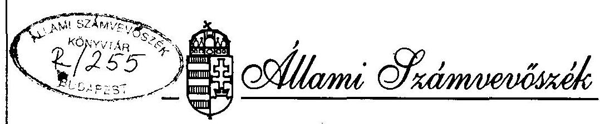
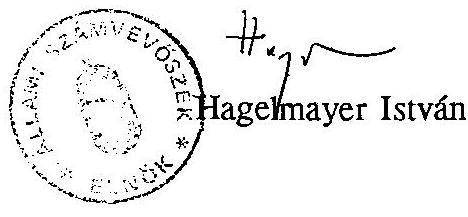
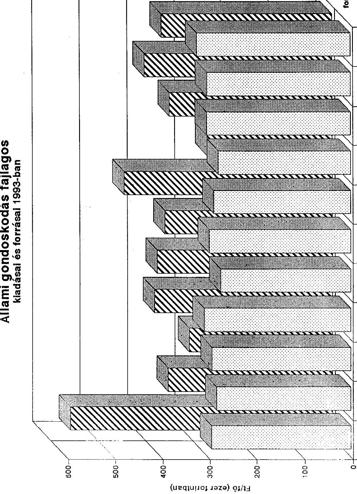
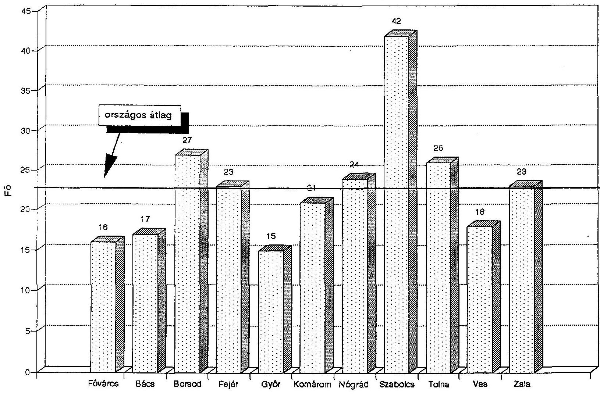
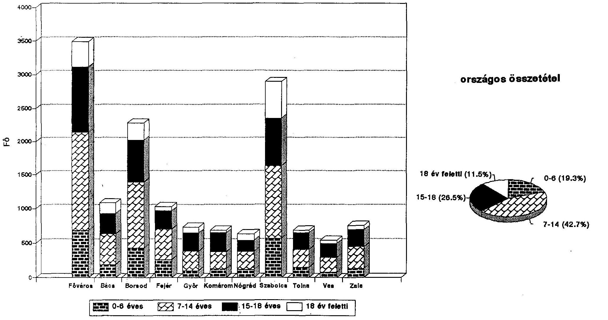
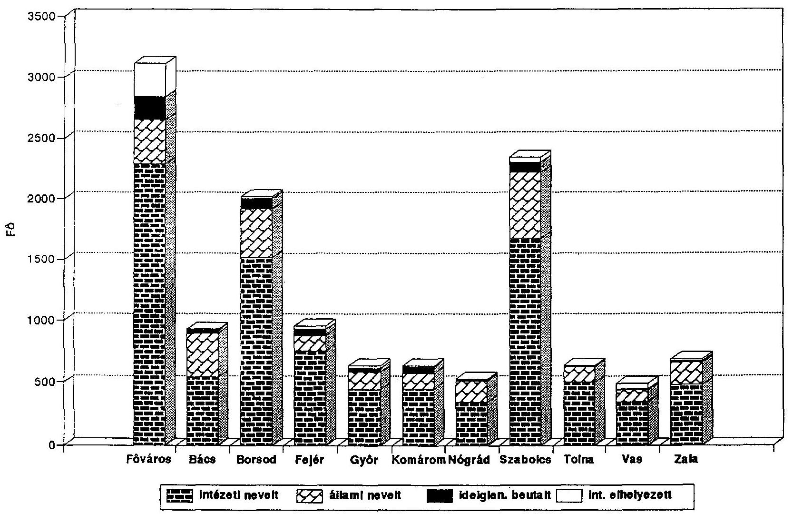
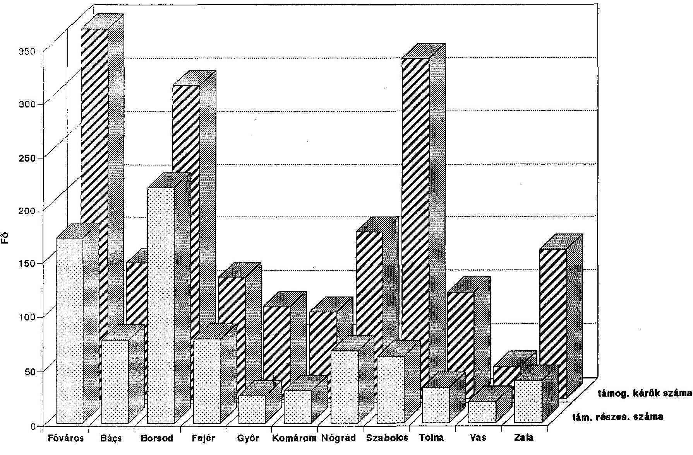

# JELENTÉS 

az állami gondoskodásra szoruló fiatalok intézményes ellátásáról

---

# JELENTÉS 

## az állami gondoskodásra szoruló fiatalok intézményes ellátásáról

A jövő alakulásában, a gazdaság működőképességének megőrzésében a felnövekvő ifjúság meghatározó szerepet tölt be. Ezért a fiatalok ellátása, testi és értelmi fejlődésének, pszichikai egyensúlyának biztosítása minden társadalom alapvető érdeke. A társadalom gondoskodása különösen fontos abban a körben, ahol a megfelelő családi háttér hiánya, illetve az egyéni élethelyzetek alakulása miatt az elemi gondoskodás és védelem sem biztosított. A családi környezetüktől megfosztott, vagy a saját érdekükben e környezetben nem hagyható gyermekek testi, szellemi és erkölcsi fejlődésének feltételeit az állami gondoskodásnak kell biztosítania.

A helyi önkormányzatokról szóló 1990. évi LXV. törvény 8. §/4/ bekezdése szerint az önkormányzatok kötelező feladata a lakosság szociális alapellátásának biztosítása. A helyi önkormányzatok és szerveik, a köztársasági megbízottak, valamint egyes centrális alárendeltségű szervek feladat- és hatásköréről szóló 1991. évi XX. törvény pontosította az önkormányzati feladatokat és hatásköröket. A jelenlegi rendszerben a feladatellátás két területre, az alapellátásra és a szakellátásra tagozódik.

A hatásköri törvény 129. §-ában foglaltak alapján a települési önkormányzat köteles biztosítani a kiskorú veszélyeztetettségének megelőzését, illetve a kialakult veszélyeztetettség megszüntetését, a kiskorú családban történő fejlődésének elősegítését. A hatásköri törvény 130. §-a szerint a megyei, fővárosi önkormányzat feladata az intézeti elhelyezett, intézeti és állami nevelt, valamint a gyermek- és ifjúságvédelmi szakellátást más okból igénylő kiskorúak oktatásának, gondozásának biztosítása.

---

Az Állami Számvevőszék 1994. évi ellenőrzési terve alapján megvizsgálta az állami gondoskodásra szoruló fiatalok intézményes ellátásának helyzetét. Állami gondoskodásban 1993. évben 22944 fiatalkorú részesült, ezen felül 2989 állami gondoskodásból kikerült 18 év feletti fiatal kapott ezekben az intézményekben valamilyen szintű ellátást, támogatást.
A gondozottak oktatása, nevelése, ellátása éves szinten mintegy 10 milliárd forintba került.

Az ellenőrzés, amely az 1992-1993. éveket érintette, a fővárosi- és 10 megyei önkormányzatra, azok gyermek- és ifjúságvédő intézeteire (továbbiakban GYIVI), valamint 25 nevelőotthonra terjedt ki. A nevelőszülői ellátás helyzetének megítélése érdekében 57 családnál került sor tájékozódásra. A reprezentáció az állami gondoskodás keretében ellátott létszám tekintetében 57%-os mértékű. A jelentés összeállítása során figyelembe vettük a családban nevelkedő fiatalkorúak szociális ellátásának tárgyában lefolytatott 1993. évi ÁSZ vizsgálat tapasztalatait is.

A vizsgálat célja annak megállapítása volt, hogy

- az állami gondoskodásra szoruló fiatalok intézményes ellátásának milyen feltételrendszere alakult ki az elmúlt időszakban;
- az önkormányzatok által működtetett intézményhálózat mennyiben képes megfelelni azoknak a követelményeknek, amelyek az intézeti elhelyezett, az intézeti és az állami nevelt, valamint a gyermek- és ifjúságvédelmi szakellátást más okból igénylő fiatalkorúak gondozását és szakszerű nevelését hivatottak biztosítani;
- hogyan hasznosultak azok a központi és önkormányzati erőforrások, amelyek a fiatal korosztály intézményes ellátására rendelkezésre álltak.

A magyar gazdaság teljesítménye 1990. és 1993. között 20%-kal csökkent. A gazdaság jövedelemtermelő képességének visszaesése minden szektorban éreztette hatását, ami a lakosság jövedelmét is kedvezőtlenül befolyásolta.

A reáljövedelem csökkenés mellett az egyes társadalmi rétegek jövedelmi helyzete tovább differenciálódott. A reáljövedelem átlagának csökkenése és a jövedelmi egyenlőtlenségek növekedése következtében a létminimum alatt élők száma egymillióról mintegy 2-2,5 millióra nőtt. A szegénységet életkor szerint vizsgálva megállapítható, hogy az a gyermekek körében a legmagasabb. Ezen belül a 0-6 éves korosztály a leghátrányosabb helyzetű. A kisgyermekek 42%-a létminimum alatti jövedelemből él.

---

A munkanélküliség a társadalom egyik legsúlyosabb, megoldásra váró problémája. A regisztrált munkanélküliek száma az 1993. évben 694 ezer fő volt, lényeges csökkenésével a gazdasági recesszió elhúzódása miatt továbbra sem lehet számolni. A munkanélküliség az anyagi gondok mellett társadalmi veszteségeket is jelent. Az egzisztenciális alapok gyengülése együtt jár a morális tartalékok megfogyatkozásával. A létbizonytalanság és az ezzel együttjáró kilátástalanság a családi életre is hatással van, végső soron a családok széteséséhez vezethet. A válások miatt megszűnt házasságok száma évek óta magas, 1993. évben 22350 házasságot bontottak fel a bíróságok. Ennek következtében minden hetedik család úgynevezett csonka család, ahol valamelyik szülő (rendszerint az anya) egyedül neveli gyermekét.

Az elszegényedés fokozódása, a munkanélküliséggel együttjáró létbizonytalanság a család összetartó erejének gyengüléséhez, a deviancia növekedéséhez vezet. Ez a fiatal korban elkövetett bűncselekmények számának növekedésében is megmutatkozik. Az 1990. évi 12264 fővel szemben 1993. évben már 15001 fiatalkorú követett el bűncselekményt.

# MEGÁLLAPÍTÁSOK 

## I.

A gyermekvédelmi ellátás jogi és pénzügyi feltételei

A gyermek- és ifjúságvédelem jelenlegi intézményrendszerének átalakítását, az ezzel kapcsolatos jogi szabályozás megújítását a társadalmi-gazdasági folyamatokból adódó elszegényedés és a különféle devianciák növekedése miatti nyomás, valamint a nemzetközi jogrendszerhez való igazodás követelménye is szükségessé teszi.

A Magyar Köztársaság a gyermek jogairól szóló - New Yorkban 1989. november 20-án kelt és az 1991. évi LXIV. törvénnyel kihirdetett - Egyezményben kötelezettséget vállalt arra, hogy a gyermekek biztonságosabb felnevelése és jogainak érvényesítése érdekében megteremti a szükséges törvényi, gazdasági, kulturális és társadalmi feltételeket. Az Egyezményben rögzítetteknek megfelelő jogszabályok megalkotására, javaslattételre a 47/1991. (IX. 15.) OGy. sz. határozat kötelezte a Kormányt.
Ugyanebben az évben csatlakozott Magyarország a gyermekek védelméről és fejlődéséről

---

szóló ENSZ Világnyilatkozathoz és annak Akciótervéhez. Ezekben az egyezményekben taxatíve sorolják fel azokat az alapvető politikai, emberi, jogi, kulturális, gazdasági, egészségügyi elvárásokat és ellenőrzési rendszereket, amelyek megvalósítására az aláíró országok a 90-es évtizedben kötelezettséget vállaltak. Ennek keretébe tartozik a gyermekek felnevelését biztosító szociális ellátások nemzetközi normákhoz történő igazítása. (2. sz. melléklet 1.)

A gyermekvédelmi rendszer megújításának igénye már a nyolcvanas években megfogalmazódott és az 1990. évben hivatalba lépett Kormány programjában központi helyet kapott. A kormányzati célkitűzésekben a megváltozott társadalmi-gazdasági viszonyokhoz és az elfogadott nemzetközi normákhoz igazodó gyermekvédelmi törvény megalkotásának szándéka is megfogalmazódott. A törvény előkészítéséért felelős tárcák a koncepciót elkészítették és a sokrétű szakmai szempontok és érdekek, valamint a gazdasági szükségszerűség figyelembevételével több alkalommal átdolgozták. Tárgyalását azonban a Kormány az ellenőrzés befejezéséig nem tűzte napirendjére.

A szakmai tervezet új korszakot kíván nyitni a gyermekjóléti ellátásban. Míg a korábbi jogszabályok a veszélyeztetett gyermekek ellátását, az állami gondoskodás különböző formáit szabályozták, addig az új koncepció gyermekjóléti ellátás rendszerének kiépítését jelöli meg fő célkitűzésként. Elsődleges feladatának tekinti a család alkalmassá tételét a gyermek felnevelésére.

A koncepció szerinti alapelv a hatósági és segítő funkciók szétválasztása. Az önkormányzat gyermekvédelmi, hatósági döntést alig hozhat, az az újonnan megszervezendő szociális és gyámhivatalok hatáskörébe tartozna. A tervezett új szabályozás hangsúlyozza, hogy a települési önkormányzatok ellátással biztosítsák a családi nevelés feltételeinek megtartását, megőrzését, a gyermekek veszélyeztetettségének megelőzését és megszüntetését. A szakmai alapokra helyezett szociális segítő tevékenységet, a társadalmi önszerveződések, és egyéb állampolgári kezdeményezések részvételével kívánják növelni, különösen a helyi alapellátás, a megelőző gyermekvédelem tekintetében.

A törvény előkészítésének elhúzódása mind a szaktárca, mind az önkormányzatok jogalkotási tevékenységét hátráltatta. Alapvetően ezzel hozható összefüggésbe, hogy nem történt meg a gyermekvédelmi feladatok ellátásában érdekelt helyi önkormányzatok és intézményeik munkáját segítő középszintű szakmai szervezet kialakítása. Ennek megteremtését a közigazgatási rendszerben bekövetkezett módosulás, a megye szerepkörének, jogállásának megváltozása önmagában is indokolta volna. A szakmai segítség elmaradása elsősorban a kistelepülések szakemberekkel rosszul ellátott gyámhatóságainál jelent hátrányt. Az itt folyó tevékenység pedig a gyermek-

---

védelem egészére hatással van. Bár a Kormány a gyermek- és ifjúságvédelmi intézmények működésének ellenőrzését a 71/1992. (IV. 21.) sz. rendeletével módosított 22/1992. sz. (I. 18.) rendelet alapján a köztársasági megbízottakra bízta, e hivatalok - elsősorban a szakmai jogszabályok megjelenésének elmaradása miatt - nem voltak képesek az intézmények számára valódi szakmai segítséget nyújtani.

A Népjóléti Minisztérium szakfőosztályának figyelmét és energiáját a gyermekvédelmi törvénytervezet előkészítése, a koncepció többszöri újragondolása és átdolgozása kötötte le, ezért még azok a felsőszintű intézkedések is elmaradtak, amelyeket az új törvényi szabályozás életbelépésétől függetlenül meg lehetett volna tenni, sőt meg kellett volna hozni. Mindezek következtében a népjóléti miniszter feladat- és hatáskörét meghatározó 49/1990. (IX. 15.) Korm. rendelet gyermekvédelmi szakterületet érintő előírásai alapvetően nem teljesültek. (2. sz. melléklet 2.)

A gyermek- és ifjúságvédő intézetek számára a 115/1978. (MÜVK.11.) OM. sz. utasítással hatályba lépő, mára már jórészt elavult és a jelenleg érvényes jogszabályokkal összhangban nem álló, "Rendtartás" képezi a szakmai munkavégzés alapját. A nevelőotthonokra vonatkozó 146/1966. (MK.18.) MM. sz. utasítással kiadott "Rendtartás"-t pedig - anélkül, hogy helyette korszerűbb iránymutatás készült volna - a dereguláció során hatályon kívül helyezték. A népjóléti tárca a meglévő szabályozások aktualizálása, a szakmai normatívák megalkotása helyett a helyi önkormányzatokra hárította az ellátás feltételeinek és módjának meghatározását.

A Népjóléti Minisztérium 8005/1991. évi szakmai tájékoztatója szerint a gyermekvédelmi ellátási formák részletes körülhatárolásának jogszabályi alapja nincs. Az önkormányzati törvény a kötelezően ellátandó feladatok megvalósításának módját az önkormányzatokra bízza.

A megyei képviselőtestületek, valamint az illetékes szakbizottságok a vizsgált önkormányzatok mindegyikénél foglalkoztak a fiatalok intézményes ellátásának helyzetével, de az állami gondoskodással kapcsolatos megyei sajátosságok érvényesítésére, az ellátási kötelezettség helyi követelményeire átfogó önkormányzati szabályozást általában nem készítettek.

Néhány testület rendeletében elképzeléseket fogalmazott meg családias nevelési program továbbfejlesztésére, a nevelőszülői hálózat felfrissítésére, felkészültségének javítására, a nagykorúvá váló fiatalok életkezdésének támogatására. A kitűzött célok megvalósításának anyagi feltételeit azonban nem, vagy csak részben teremtették meg. (2. sz. melléklet 3.)

---

Az önkormányzatok állami gondoskodási feladatainak ellátásához a központi költségvetés az éves költségvetési törvényekben meghatározott mértékű támogatást biztosít. Ez képezi az e célra rendelkezésre álló önkormányzati források 94-95%-át. A feladat finanszírozásába az intézmények (GYIVI, nevelőotthonok, stb.) saját bevételei és az állami gondozási díjból származó bevételeik csekély hányadot képviselnek. A gyermekeik nevelését, eltartását nem biztosító szülők hozzájárulása az állami gondoskodás kiadásaihoz elenyésző mértékű, az összes forrás 0,2-0,4%-át teszi ki.

Az önkormányzatoknál az állami gondoskodásra rendelkezésre álló források a vizsgált években egyre nagyobb mértékben a tényleges ráfordítások alatt maradtak. Míg 1992. évben a kiadások 83%-ára, addig 1993. évben már csak 76%-ára nyújtottak fedezetet.

A bevételekkel fedezett kiadási hányad jelentős szóródást mutat az egyes önkormányzatoknál. Míg az egyik önkormányzatnál az állami gondoskodással kapcsolatos bevétel a kiadásokat meghaladta, addig másutt a kiadások 60%-ára sem nyújtott fedezetet. (2. sz. melléklet 4.)

A korszerűbb ellátás anyagi erőforrásait az önkormányzatok a gondozott gyermekek létszámának csökkenése miatt alacsony kihasználtsággal és ezért kedvezőtlen fajlagos ráfordítással üzemeltethető gyermekintézmények értékesítésével kívánták megteremteni. Törekvéseiket szakmai érvek is alátámasztják, ugyanis a tevékenységnek helyet adó épületek többnyire nem a funkciónak megfelelőek. A gyermek- és ifjúságvédelmi ellátást biztosító intézmények egy része régi kastélyépületben, illetve ma már korszerűtlennek számító létesítményekben üzemel, ahol a kiscsoportos, családias nevelés körülményeit jelentős ráfordítással járó átalakítások révén is csak korlátozottan lehet megteremteni. Sajnálatos, hogy ezeknek az ingatlanoknak a hasznosítása - alapvetően a gazdasági körülmények kedvezőtlen alakulása miatt - nem az előzetes elképzelések szerinti ütemben halad. (2. sz. melléklet 5.)

A megyei önkormányzatok pénzügyi pozíciója a vizsgált időszakban
 romlott. Ez az évvégi szabad pénzmaradványok csökkenésében és a hitelfelvételek növekedésében egyaránt megmutatkozik. A kedvezőtlen gazdálkodási körülmények ellenére elmaradtak vagy nem voltak realizálhatók azok az önkormányzati intézkedések, illetve elképzelések, amelyek a felesleges kiadások feltárását és csökkentését, vagy az adott kiadási szinten belül egy korszerűbb, hatékonyabban működtethető intézményrendszer feltételeit megteremthették volna. Nem került sor a gazdálkodási tartalékok feltárását elősegítő intézmény-átvilágításokra, és az egyes intézményi ellátások

---

(nevelőotthon, nevelőszülő stb.) reális költségigényének meghatározására sem. Ezen információk nélkül az intézmények költségvetése változatlanul a korábbi években "megszokott" bázisszemléleten alapul. (2.sz. melléklet 6.)

A gazdasági korlátok sok esetben a korszerű és hosszabb távon nemcsak szakmailag, de pénzügyileg is megtérülő elgondolások megvalósítását is visszafogták (pl. nevelőszülői hálózat gyorsabb ütemű bővítése). Ennek következtében a jelenlegi struktúrájában korszerűtlen és ehhez képest magas fajlagos ráfordítással működő intézményrendszerrel kell a feladatokat ellátni.

A vizsgált körben 1993. évben (az ellátásban részesülők 57%-ára vonatkozóan) az állami gondoskodás és a gondozottak oktatási kiadásai 5,7 milliárd forintot tettek ki. Ez egy ellátottra átlagosan 383 ezer forint kiadást jelent. Országos szinten 10 milliárd forintra becsülhető az önkormányzatoknak az intézményes ellátásban lévő gyermekek gondozásával, nevelésével, oktatásával kapcsolatos kiadásai.

Sajnálatos, hogy az önkormányzatok és intézmények beszámolói az állami gondoskodásról megbízható adatokat nem szolgáltatnak. Ennek oka, hogy az intézmények többsége nem tiszta profilú, (nemcsak állami gondozottakat látnak el), ugyanakkor a kiadások a számviteli nyilvántartásokban együtt jelennek meg. A szakfeladatok alapján történő hiteles adatgyűjtésre pedig a szakfeladatrend hibái, illetve a számviteli alkalmazása során tapasztalt helytelen önkormányzati és intézményi gyakorlat miatt nem volt lehetőség. (2. sz. melléklet 7.)

Az önkormányzatok számviteli és beszámolási rendszerének az ágazati elképzelések figyelembe vételével történő átalakítása nem halasztható, hiteles információk, adatok nélkül ugyanis megalapozott szakmai és gazdasági döntések nem hozhatók.

# II. 

Az intézményes ellátást megelőző gyermekvédelem helyzete

Magyarországon az összlakosságból a 18 éven aluliak száma mintegy 2,7 millió fő. A gyámhatóságok által veszélyeztetettként nyilvántartottak aránya jelentős, 10%-ot meghaladó mértékű.

A veszélyeztetett gyermekek felderítésére elsősorban a települési önkormányzatok által fenntartott védőnői-, gyermekorvosi-, nevelési-, oktatási intézmények lennének

---

hivatottak. Az információáramlás szervezett formája viszont nem alakult ki, a jelzőrendszer nem működik kellően. A rászorulók körülményeiről a hivatalok általában spontán módon, gyakran jelentős késedelemmel értesülnek. Ezáltal a valóban elhanyagolt, a negatív hatásokkal érintett, és segítségre szoruló gyermekek veszélyeztetettsége nem mindig jut az intézkedésre hivatott szervek tudomására.

A probléma feltárásának, jelzésének és elemi szintű kezelésének leghatékonyabb színterei az oktatási intézmények lehetnének. Ám ott a gyermekvédelem helye, szerepe tisztázatlan és meghatározatlan a gyermekvédelmi felelősségi munka konkrét tartalma is.

A tapasztalatok szerint az iskolai gyermekvédelem nem tudta kellő hatékonysággal kezelni a személyiség-fejlődési zavarokat, valamint az azokat kiváltó okokat. A megelőzés - jórészt a szükséges információk hiányában - a gyámhatóságok tevékenységében is alig kapott helyet. Emellett a veszélyeztetettség megszüntetését célzó intézkedéseik többnyire csak azokra a gyermekekre irányultak, akiknél a beavatkozás a deviáns megnyilvánulások miatt már elkerülhetetlen volt.

Az elmúlt években az önkormányzatokra és intézményeikre a társadalmi változásokkal felszínre került beilleszkedési zavarokból eredően olyan feladattömeg zúdult, amelyre kellően nem voltak felkészülve. A tapasztalatok azt mutatják, hogy a gyámhatóságok védő- és óvóintézkedései mind mennyiségüket, mind hatékonyságukat tekintve elégtelenek. Különösen községekben, ahol gyermek- és családvédelmi szolgáltató hálózat nem épült ki, a hivatal a szükséges képesítésű szakemberekkel nem rendelkezik. A városokban a szakember ellátottság kedvezőbb, de az információs csatornák hiánya, vagy nem megfelelő működése miatt késve értesülnek a kialakult helyzetről.

A gyámhatóságok 1992. évben a nyilvántartott 305113 fő veszélyeztetett kiskorúval kapcsolatban mindössze 82517 védő- és óvóintézkedést tettek. 1993-ban a 303814 fő veszélyeztetett gyermek érdekében csupán 76831 intézkedés történt.

A hatóságok intézkedései többnyire csak a szülő és/vagy a gyermek jegyzőkönyvi figyelmeztetésére korlátozódnak. A kiskorúak veszélyeztetése esetén szülői felügyelet megszüntetésére irányuló perek megindítását általában nem vállalják fel. Mindezek hátterében - különösen községekben - nem ritkán az ügyintézők fenyegetettségének érzése, a család intrikáitól, a bántalmazásoktól való félelem is fellelhető. Ennek következményeként érzékelhető a szükséges hatósági intézkedések elmulasztása,

---

illetve késleltetése. Állami gondoskodásba vételre ezért döntően az azonnali megoldást igénylő veszélyhelyzetek esetében kerül sor.

A gyermekek családi környezetben történő nevelésének előmozdítását segítő eszközrendszer is egyre szűkebbé vált. A valós segítséget jelentő munkába állításnak, a munkáltató és egyéb szervek támogatásának, stb. alig maradt lehetősége.

Mindezek mellett a jelenlegi finanszírozási rendszer sem teszi érdekeltté a települési önkormányzatokat a helyi megoldások keresésében, a gyermekvédelmi alapellátás fejlesztésében, a családgondozás kiszélesítésében. A "problémás gyermekek" családból történő kiemelésével mentesülnek a természetbeni és pénzbeni támogatással járó anyagi terhektől, de a mentálhigiénés ellátás feladataitól, valamint a további gondozás felelőssége alól is.

A települési önkormányzatok a fiatal korosztály szociális ellátásához jórészt a korábbi időszakból örökölt feltételekkel rendelkeznek. Az intézményhálózat csak részben kiépített, a meglévőket pedig nem tették alkalmassá a megelőzést segítő gondozási feladatok ellátására. A védő- és óvóintézkedések hatékonyságát - különösen a nagyobb településeken - olyan átmeneti megoldást jelentő intézmények működtetésével lehetne javítani, amelyek lehetővé teszik a gyermek átmeneti elhelyezését úgy, hogy a teljes elszakadást jelentő intézkedésre ne kerüljön sor. A problémák kezeléséhez sokszor elegendő lenne csupán a heti ellátást, illetve a gyermekek napközbeni ellátását biztosító intézményi szolgáltatás létesítése, vagy bővítése.

A községek a szociális gondozó szolgálatot a fiatalok problémáinak megoldásába általában nem vonták be. Bár ez irányba mutató kezdeti lépések, intézkedések - főként a szociális törvény hatálybalépése után - már tapasztalhatók. Ennek az intézménytípusnak a fiatal és felnőtt korosztály szociális ügyeinek együttes intézésében meghatározó szerepe lehetne.

A városokban a már működő családsegítő szolgálatok az új típusú ellátó rendszer kialakításának bázisát képezhetnék. A felnőttek ellátására irányuló tevékenységükhöz a veszélyeztetett kiskorúak felkutatása, a megelőzés, a fiatalokkal kapcsolatos gyámügyi döntések előkészítése, illetve azok végrehajtásának segítése is integrálható lenne.

---

A tapasztalatok azt mutatják, hogy a családok problémáit egységesen kezelő szociális ellátás létrehozása nem kizárólag a szükséges pénzügyi feltételek hiánya miatt késik. Számos motivációja közül figyelemre méltó, hogy a mai jogi szabályozás (szociális törvény) ezt az önkormányzatok kötelező feladataként egzakt módon nem írja elő. Ugyanakkor a normatív állami hozzájárulás, jellegéből fakadóan nem ösztönzi az ilyen, új típusú ellátórendszer kialakítását.

Az állami gondoskodásba vételre leggyakrabban ideiglenes beutalás útján került sor, amely a súlyos veszélyeztetettség esetén az azonnali intézkedés formája (1992-ben a gondozottak 41,7%-a, 1993-ban 41,3%-a így került gyermekvédelmi intézményekbe). Az ideiglenes beutalások nagy száma a hatósági munka fogyatékosságaira hívja fel a figyelmet. A "gyors" gondozásba vétel ugyanis a megelőzés hiányára, vagy a megtett védő- és óvóintézkedések alacsony hatásfokára utal. A gyermek- és ifjúságvédő intézetekbe bekerült gyermekek túlnyomó többségét a gyámhatóságok intézeti nevelésbe vették, előrevetítve ezzel a családba történő visszahelyezés esélyét. A szülői felügyeleti jog megszűnésével együttjáró állami nevelésbe vételt kisebb esetszámban alkalmazták, feltehetően a bírói út igénybevételének kötelezettsége miatt. (2. sz. melléklet 8.)

A kiskorúak családból történő kiemelésére többször csak későn, a már bekövetkezett károsodás után került sor. Jelentős a "megvert gyerek" szindrómával retardáltan, életkorától elmaradott állapotban, túlkoros általános iskolásként történt beutalás. A GYIVI-k átmeneti otthonaiba bekerült gyermekek túlnyomó részben már pszichés problémákkal, személyiségzavarokkal küzdenek. A vizsgált körben az állami gondoskodásba kerülő fiatalok között 20-25% a fogyatékosok aránya.

Alapvetően társadalmi gyökerű probléma a serdülőkorúak helyzetének romlása. Ebben a körben a hagyományos szülői,- és más hatalmi eszközök már kevésbé hatékonyak. Ezt a korosztályt negatívan érinti a továbbtanulási lehetőségek beszűkülése is. Gyakori jelenség a fiatalkorúak csavargása, iskolakerülése, agresszivitása, és így kezelhetetlenné válása. Nem egy esetben a szülő akar "szabadulni" gyermekétől és maga kéri a gondozásba vételt.

---

# III. 

## A szakellátást biztosító intézményrendszer működése

A korábbi évtizedekben a gyermekvédelem a veszélyeztetett gyermekek helyes irányú nevelésének biztosítását az intézeti elhelyezésben látta. E felfogás érvényesítésére nagylétszámú gyermek elhelyezésére alkalmas intézményeket hoztak létre, a nevelőszülői hálózatot pedig visszafejlesztették. Míg a második világháború előtti utolsó békeévben (1938) az állami gondoskodás alatt állók többsége (mintegy 87%) nevelőszülőknél volt elhelyezve, az 1960-as években az állami gondoskodásba részesülő kiskorúak mindössze 26%-a élt nevelőszülői környezetben.

Az utóbbi évtizedben, különösen a nemzetközi egyezményekhez történő csatlakozást követően, szakmai körökben a prevenció erősítése, az intézményes ellátás tekintetében pedig családi vagy a családias jellegű ellátás kapott prioritást. A korszerűbb, a gyermekek érdekeit jobban szolgáló szakmai elgondolások érvényesülését viszont a korábbi időszakból örökölt intézményi struktúra gátolja. Bár a családias gondozás megteremtése érdekében a nevelőotthonok jelentős részében történtek átalakítások, korszerűsítések, az épületek korlátozott adottságai, valamint az önkormányzatok szűkös anyagi lehetőségei miatt azok csak részleges eredményekkel jártak.
A meglévő intézmények gazdaságos kihasználására irányuló törekvés pedig visszatartó erő a nevelőszülői hálózat bővítésében, a családi környezetben történő nevelés szélesítésében.

## 1. Az elhelyezés módja és lehetőségei

Az állami gondoskodásba került gyermekeket szinte teljeskörűen a megyei önkormányzatok által fenntartott intézményhálózat látja el. Az intézeti elhelyezett, intézeti és állami nevelt fiatalok több mint 40%-át gyermekvédelmi feladatok ellátására létesített intézményekben gondozzák (GYTVI-k, csecsemő-, és nevelőotthonok). A fogyatékos fiatalok gondozásában, nevelésében olyan - jórészt ugyancsak megyei fenntartású - intézmények is részt vesznek, amelyek fő profilja valamely oktatási, egészségügyi, stb. szolgáltatás nyújtása (egészségügyi gyermekotthonok, enyhe- és középsúlyos értelmi fogyatékosokat ellátó általános iskolák és diákotthonok, gyógypedagógiai intézetek, szociális otthonok, stb.)

---

A megyékben (fővárosban) működő gyermek- és ifjúságvédő intézeteknek az intézményes gondozásra szoruló gyermekek ellátásában kiemelt szerepük van. Ennek alapvető oka, hogy a jelenleg érvényes jogszabályok szerint az intézeti, állami nevelt gyermekek gyámja a GYIVI igazgatója. E jogkörében a gyermekek gondozója, nevelője, valamint törvényes képviselője és vagyonának kezelője. Az intézeti gyám, munkatársai - szakértői csoport, nevelőszülői felügyelők, családgondozók - segítségével kíséri figyelemmel a gyámság alá tartozó kiskorúak ellátását, fejlődését. Az önállóan gazdálkodó intézmények életébe, szakmai, gazdálkodási döntéseik meghozatalába azonban közvetlen beleszólási lehetősége nincs.

A gyermekek intézeti, állami nevelésbe vételét a településeken működő gyámhatóságok határozzák meg. A családban nem tartható gyermekeket - a végleges gondozási hely kijelöléséig - a GYIVI átmeneti otthonába helyezik el. A gyermekek elemi érdeke, hogy a családból történő kiemelés és a "végleges" elhelyezés között a lehető legrövidebb idő teljen el. Bár a jogszabályokban előírt 60 napos ügyintézési határidőt a gyámhatóságok többsége betartja, nem elhanyagolható azoknak a száma, akik különböző okokból 180 napig, vagy azt meghaladó ideig várakoznak az elhelyezésre. A hatósági döntések elhúzódása döntően a gyámhatóságokon dolgozók szakmai felkészültségének hiányosságaival magyarázhatók. (2. sz. melléklet 9.)

A GYIVI-k többsége kezdeményező a gyámhatóságokkal való szoros együttműködés megteremtésében. Az elhelyezésre váró gyermekek körülményeinek, családi kapcsolatainak felderítésével törekszik arra, hogy az intézményben ideiglenesen tartózkodó gyermekek sorsa minél előbb rendeződjön. Ehhez szakértői csoportok nyújtanak segítségét. (2. sz. melléklet 10.)

Bár az elmúlt 10-15 évben az
 állami gondoskodás körébe kerülő fiatalkorúak száma fokozatosan csökkent, a gyermekek neveltségének, életkorának, értelmi és fizikai állapotának legjobban megfelelő elhelyezést a rendelkezésre álló lehetőségek erősen behatárolják. Elsősorban a nevelőotthonok adottságai, a speciális ellátási igényekhez szükséges kapacitás hiánya, a nevelőszülői foglalkoztatás anyagi korlátai akadályozzák a kiskorúak érdekeinek maximális érvényesülését.

1980-ban 34960 fő, 1990-ben 26861 fő, 1993. évben pedig már csak 22944 gyermek részesült intézményes gondozásban. A gondozotti létszám nemcsak abszolút mértékben, hanem a 18 éven aluli lakósságszámhoz viszonyított arányát tekintve is csökkenő mértékű. (Az 1980. évi 1,22%-ról, 1993. évben 0,88-ra csökkent).

---

Az intézményes ellátásban részesülők jelentős hányada serdülő korú fiatal. 1990. évben az állami gondozásban részesülők 44,6%-a 13 év feletti korosztályhoz tartozott, 1993. évben ez az arányszám már 47%-ot tett ki.

# 2. Intézményi ellátás körülményei 

Az intézmények többsége - lehetőségein belül - számos intézkedést tett a korszerűbb, családias jellegű nevelés feltételeinek kialakítására. A ma már jórészt széles korhatárú (általában 3-24 év közötti fiatalok ellátására jogosult) intézmények többségében lehetőséget teremtenek a testvérek ugyanazon csoportban való elhelyezésére és a "családi élet" egyes funkcióinak gyakorlására. Ez általában közvetlen környezetük rendben tartásában, takarításában, a számukra biztosított konyha, étkezőhelység használatában (közös étkezés, esetenként főzés) nyilvánul meg. Ma még kevés azoknak az intézményeknek a száma, amelyekben a gyermekek és nevelőik számára az önálló gazdálkodás feltételeit (élelmiszer-beszerzés, főzés, ruházat megvásárlása stb.) biztosították volna. Mindezen élmények és tapasztalatok pedig a szocializációs folyamathoz, a gyermekek felnőtté válásához, felelősségérzetük kialakulásához feltétlenül szükségesek.

Amint azt a jelentés az előzőekben is rögzítette, a családiasabb jellegű ellátás kialakításának gyakran az épületek adottságai szabnak határt. Az intézmények nagy része nem gyermekvédelem céljára, vagy nem a mai igényeknek megfelelően létesült, a funkciónak több tekintetben nem felel meg. A működéshez elengedhetetlenül szükséges helyiségek - tanulószoba, orvosi rendelő, társalgó, könyvtár - hiányoznak vagy elégtelen méretűek, a lakószobák zsúfoltak.

Az épületek adottságaiból eredően többnyire minden hálószoba egyben lakószoba is. A hálókban nem ritkán még a régi típusú emeletes ágyak is megtalálhatók. Önálló tanulószoba hiányában helyenként a nappali, csoportos foglalkozások céljaira is ezek a helyiségek szolgálnak. Így az egyébként is szűk élettér zsúfoltságát a többfunkciós használat tovább növeli. Az épületállomány esetenként műszakilag is leromlott, felújításra, átalakításra szorul. A régi épületekben helyenként az általános festésre, mázolásra, parkettcsiszolásra stb. évek óta nem került sor. (2. sz. melléklet 11.)

A működéshez szükséges berendezések, felszerelések nem minden intézményben biztosítottak. A rendeltetésnek többnyire megfelelőek, de állapotuk több helyen nem kielégítő és a működéshez csak a legelemibb feltételeket adja. Az elhelyezési körülményeket gyakran rontja, hogy a szobákat és egyéb helyiségeket szegényesen,

---

elavult, kopott, esetleg máshol már lecserélt bútorokkal rendezték be. (2.sz. melléklet 12.)

Sok esetben a családias elhelyezésre az intézmény jellege miatt ugyan nincs lehetőség, de a belső hangulat, a kapcsolatteremtés, a gondoskodás, stb., legapróbb részleteivel, elemeivel igyekeznek azt otthonosabbá tenni. A lakószobák és a közösségi helyiségek virággal, textíliával való díszítése, barátságosabb környezet kialakítása a gyermekek nevelése szempontjából sem elhanyagolható tényező.

Az otthonokban ellátott gyermekek oktatás, nevelését, gondozását az egyes intézmények jellegétől függően eltérő összetételű személyi állomány biztosítja. A pedagógusok foglalkoztatása mellett igény van speciális szaktudással rendelkező szakemberek (pszichológus, gyógypedagógus, logopédus stb.) alkalmazására is. A szakirányú végzettséggel rendelkezők számára azonban többnyire nem vonzó ez a terület.

A felsőfokú végzettségűek alkalmazását kedvezőtlenül érinti, hogy a törvényi szabályozás nem ismeri el a munkavégzés speciális, különleges jellegét, annak az ellátottak sajátos összetételéből eredő nehézségi fokát. Jelentős korlát az intézmények szűkülő anyagi lehetősége is, amely esetenként a belső arányokat - a szakmai szempontok háttérbe szorításával - a középfokú végzettségűek irányába mozdítja el. (2. sz. melléklet 13.)

A nevelőotthonokban a gyermekekkel közvetlen kapcsolatban levő alkalmazottak jelentős része (országosan 51%) pedagógiai képesítéssel nem rendelkezik és többnyire középfokú, vagy annál alacsonyabb iskolai végzettségű. A gyermekekről való gondoskodás, az épületek üzemeltetése, karbantartása nagylétszámú kiszolgáló személyzet alkalmazását igényli. Intézményi létszámon belüli arányuk jelentős (1993. évben 48%). Bár a nevelőotthonokban ellátott gyermekek száma az évek során fokozatosan csökkent, munkaköri feladatok összevonására és a foglalkoztatott létszám csökkentésére azonban csak korlátozott mértékben került sor. Erre pedig a fiatalkorúaknak az intézeten belüli munkákba (karbantartás, növénytermesztés stb.) való fokozottabb bevonása lehetőséget teremtett volna.

A különböző munkakörben foglalkoztatható (foglalkoztatandó) dolgozói létszám nagyságára, központi vagy helyi szabályozás nem határoz meg normatívát. Tényként rögzíthető viszont, hogy a nevelőotthonokban az ellátás "élőmunka ráfordítása" kedvezőtlenebb a nevelőszülői hálózatban számítottaknál.

---

Az ország nevelőotthonában 1993. évben foglalkoztatott 5900 fő dolgozó összesen 7187 fő gyermek ellátását végezte. Ugyanebben az évben 5031 fő nevelőszülő 8194 kiskorúról gondoskodott. Az egy felnőttre jutó gyermekek száma a nevelőotthonokban 1,2 fő, a nevelőszülőknél pedig 1,6 fő volt. A hivatásos munkaviszonynak minősülő nevelőszülők esetében ez a mutatószám 4,4 fő. (A nevelőszülői mutatószámot némileg torzítja, hogy abban a GYIVI állományában levő nevelőszülői felügyelők létszáma nincs figyelembe véve).

Az előbbi adatok azt mutatják, hogy a kevésbé családias ellátást nyújtó nevelőotthonokban egy-egy gyermek gondozásában több felnőtt működik közre, mint a nevelőszülői hálózatban. Ez az intézeti ellátás magasabb fajlagos kiadásainak egyik oka. A bérjellegű kiadások az intézeti költségvetés jelentős részét (40-60%) lekötik és a gyermekek közvetlen ellátását szolgáló kiadásokra alig jut fedezet.

A gyermekek életkori sajátosságaihoz igazodó étkeztetés megvalósítása a széles korhatárú (többnyire 3-24 éves) ellátotti összetétel miatt szinte valamennyi intézménynél nehéz feladatot jelent. A változatos, vitaminokban gazdag táplálkozás feltételeinek biztosítása, az előírt kalória mennyiség betartása a jóváhagyott norma és az infláció figyelembe vételével szinte lehetetlen. A feladat ellátásához a fenntartó önkormányzatok által meghatározott nyersanyagnorma (100-120 Ft/nap) általában szűk kereteket biztosít. Azokban az otthonokban, ahol a feltételek lehetővé teszik, saját konyhakert, gyümölcsös, fólia alatti termesztés, sertéshizlalás útján teremtik meg a változatos, vitamindús étkeztetés feltételeit. Ilyen lehetőség hiányában pedig gyakran a megállapított norma túllépésével tudják csak a gyermekek táplálkozását a kívánt szinten biztosítani. (2. sz. melléklet 14.)

A gyermekek ruházatáról részben a GYIVI, másrészt a közvetlen ellátást biztosító intézmények gondoskodnak. Nincs egységes előírás arra vonatkozóan, hogy az állami gondoskodás keretében a gyermekek milyen értékű és összetételű ruházatra jogosultak. Gyakran a vonatkozó intézményi szabályozások sem kellően egyértelműek e tekintetben. Mindezek következtében az ugyanazon korosztályhoz tartozó fiatalok azonos feltételek esetén is különböző színvonalú ellátásban részesülnek megyénként, sőt még a megye egyes intézményeiben is. Az intézményekben ma még általános gyakorlat a raktárról történő öltöztetés. Ebben az esetben az intézmény raktárkészletének összetétele a választékot determinálja és a kiskorúak igényeinek érvényesítését korlátozza. Különösen jellemző ez ott, ahol a beszerzési gyakorlat a tömeges vásárlásokra, az árengedményes akciók kihasználására épül.
Az egyéni ízlést is figyelembe vevő vásárlás kisebb esetszámban fordul elő, bár annak részleges vagy teljes bevezetésére egyre több kezdeményezéssel találkozott az

---

ellenőrzés. A nevelőszülőknél elhelyezett gyermekek ruházkodásához szükséges fedezetet általában pénzben biztosítja a GYIVI. (2. sz. melléklet 15.)

Az ellátás mértékét, színvonalát az önkormányzatok anyagi lehetőségei erősen behatárolják. A ruházatra fordítható előirányzatokat általában a "maradványelv" alapján határozzák meg. A fenntartó szervek pénzügyi mozgásterének szűkülése és az infláció növekedése miatt a juttatás értéktelenedésére lehet számítani. (1993. évben a vizsgált körben 6-13 ezer Ft jutott egy-egy gyermek ruházati kiadására). A gyermekek részére biztosított ruházat valós értéke ennél magasabb, ugyanis ez az összeg nem tartalmazza a korábbi évek beszerzéseiből való felhasználást, valamint a különböző társadalmi szervezetek, alapítványok által adományként juttatott ruházati cikkek értékét.

Az intézetekben az ellátottak belső foglalkoztatására, a szabadidő hasznos eltöltésére megfelelő súlyt helyeznek.

Számos lehetőség adódik az intézmény üzemeltetését segítő feladatok ellátásában (festés, fűnyírás, kertészkedés stb.), több intézményben pedig, a gyermekek kreativitását növelő, szakköri foglalkozásokat vezetnek. (kézimunka, barkácsolás, fotó stb.) A költségesebb programok kiadásaihoz gyakran a gyermekek számára biztosított zsebpénz nyújt fedezetet. Néhány intézményben anyagi okokra hivatkozva a szakköri tevékenység visszafejlesztésére, illetve teljes megszüntetésére is sor került. (2. sz. melléklet 16.)

A gyermekek nyári szünidei táborozásának, üdülésének biztosítására a GYIVI-k és nevelőotthonok egyaránt számos intézkedést tettek. Saját üdülőkben, nevelőotthonok közötti csereüdülés révén lényegében minden intézményben - bár nem azonos mértékben - biztosítják a gondozottak nyári pihenését, kikapcsolódását. Egy-egy esetben - nemzetközi kapcsolatok révén - néhány gyermek külföldi utaztatására is sor került. Egyes társadalmi szervezetek, egyházak az üdülési lehetőségeket tovább bővítették.

A nevelőotthonok többsége belső óvodát működtet, egyes intézményekben általános iskolai oktatás is folyik. Számos praktikus megfontolás mellett kétségtelen az is, hogy ez a megoldás az életre való "kitekintés" szempontjából eleve hátrányos az érintett gyermekek számára. Az "otthon" és az óvoda, iskola itt a közösség összetételét, szellemét, hangulatát, stb. illetően teljesen homogénné válik. Emellett

---

nincs mód a társadalmi élet realitásainak megismerésére, az abban való eligazodásra, példaértékű élményekre, stb.

Mind a fenntartó önkormányzat, mind a nevelőotthonok számára összetettebb feladatot jelent, széleskörűbb kapcsolattartást igényel, de a gyermekek számára sokkal előnyösebb a települési intézményekben való oktatás, nevelés biztosítása. A differenciáltabb, magasabb követelményszint mellett az emberi, baráti kapcsolatok alakításában is nagyobb lehetőségeket jelent. A tapasztalatok szerint az otthonok a gondozottak oktatását biztosító intézményekkel megfelelő kapcsolatot alakítottak ki. Az iskolák jelzik az otthonok nevelőinek, ha probléma jelentkezik a gyermekek tanulása, magatartása körül. Az otthonok munkatársai rendszeresen részt vesznek a szülői értekezleteken, biztosítják a gondozottaknak az oktatási intézmények szorgalmi időn túli rendezvényein való részvétel lehetőségét.

# 3. Nevelőszülői elhelyezés 

Az intézeti, állami gondozott gyermekek egyharmada nevelőszülői környezetben él. Bár számos szakmai érv és gazdasági szempont szól a családi környezetben történő nevelés mellett, ezen ellátás fejlesztését több tényező hátráltatja.
1990. évben a gondozott gyermekek 32,4%-a, 8705 fő élt nevelőszülőknél. 1993. évben az ellátottak száma 8194 főre csökkent, arányuk az összes gondozotthoz viszonyítva már némi javulást mutat (35,7%).

A megyei önkormányzatokat gazdasági érdekeltségük abba az irányba szorítja, hogy feladataikat, a már működő, gyermekvédelmi ellátásra kiépített intézmények (GYIVI, nevelőotthon) mind jobb kihasználásával lássák el. A nevelőszülői hálózat működtetése külön pénzügyi források biztosítását igényli, ugyanis ezen rendszer fejlesztése az intézeti ellátás kiadási szintjében érzékelhető megtakarítást - az otthonok állandó költségeinek jelentős részaránya miatt - rövid távon nem jelent. A nevelőotthonokban dolgozók egzisztenciális érdekeltsége is a nevelőszülői ellátás kiszélesítése ellen hat. Mindezek következtében ma még indokolatlanul jelentős különbség van a nevelőszülői és intézményi ellátás kiadásai között. A nevelőszülői ellátás - a gondozási díjat, a munkabért, ellátmány összegét, valamint a nevelőszülői hálózat működtetésével összefüggő kiadásokat számítva - hozzávetőleg egyharmada az intézményi ellátás kiadásainak. (2. sz. melléklet 17.)

---

A nevelőszülői gondoskodás két alapvető formája a hagyományos és a hivatásos nevelőszülői tevékenység. A két forma közötti lényegi különbség nem
 a gondozás, hanem a jogviszony tartalmában van.

A hagyományos nevelőszülői jogviszony a gyermek- és ifjúságvédő intézet igazgatója és a nevelőszülő megállapodása alapján jön létre. Az ellátandó gyermekek számát jogszabály nem határozza meg.
Hivatásos nevelőszülői jogviszony közalkalmazotti munkaviszony, amelyet az intézet igazgatója létesít. A hivatásos nevelőszülő legkevesebb 5, legfeljebb 10 gyermek nevelésére kötelezhető. Különösen indokolt esetben - a gyermek fogyatékossága, súlyos személyiségzavara, vagy egyéb különleges nevelési körülmény miatt - 3 gyermek gondozásának, nevelésének vállalása is elegendő.

A nevelőszülő családjában élő ellátottak életkora a kisgyermekkortól a felnőttkorig terjed. Az ellenőrzés tapasztalatai szerint a hagyományos nevelőszülők 1-2, a hivatásosok általában 4-5 gyermek gondozását vállalják. A nevelőszülők többsége a fiatal korban állami gondozásba került gyermekek befogadására vállalkozik. Az ellátó rendszerbe serdülő korban bekerülő gyermekek számára az ilyen jellegű családi környezetben való nevelésre kisebb esély kínálkozik. A nevelőszülők kiválasztásánál szinte valamennyi ellenőrzött megyében körültekintően járnak el. A gyermekek érdekében általában rendszeressé tették a jelentkezők szűrővizsgálatát, amely az alkalmasság szakmai szempontok alapján történő megítélésére irányul (személyiségjegyek, körülmények, indítékok, stb.)

A nevelőszülők e feladatra történő felkészítésének, továbbképzésének - szakmai követelményrendszer hiányában - megyénként változó gyakorlata alakult ki. Helyenként előzetes kiképzés nélkül, jórészt a saját gyermekek nevelésében szerzett tapasztalatokkal lépnek munkába. Máshol szakmai tanfolyam elvégzése, és sikeres alkalmassági vizsga a nevelőszülői foglalkoztatás feltétele. Jellemző, hogy a hagyományos nevelőszülőket többnyire nem vonják be ezekbe a továbbképzésekbe. (2. sz. melléklet 18.)

A nevelőszülők anyagi megbecsülése alacsony színvonalú. A számukra biztosított juttatások mértékében nem jutnak kifejezésre az általánostól eltérő munkakörülmények (saját lakását használja, az év minden napján 24 órás szolgálatot teljesít, stb.), a tevékenység sajátos jellege és az ellátottak speciális összetétele.

A vizsgált körben kiválasztott mintában 27 hivatásos nevelőszülő 136 gyermeket nevel, ezért 439 ezer forint bért kap. Egy-egy család átlagosan havi 16 ezer forintos bérkifizetésben részesül.

---

Az 57 család meglátogatása során szerzett tapasztalatok azt mutatják, hogy a nevelőszülői feladatra vállalkozókat alapvetően nem anyagi okok, sokkal inkább a gyermekek utáni vágy, a segíteni akarás motiválja. A nevelőszülők többsége maga is nagycsaládban nőtt fel, de saját maga több gyermek felnevelésére anyagi vagy egyéb okból nem vállalkozhatott. Számos példa van arra is, hogy saját gyermekeik felnőtté válása és önállósodása után a gyermeki szeretet és ragaszkodás iránti nosztalgia készteti a családokat állami gondozott gyermekek befogadására.

A gyermekek nevelésére, gondozására vállalkozók lakáskörülményei megfelelőek. A gyermekek szeparált elhelyezése (külön szoba vagy a saját, azonos nemű gyermekkel közös lakrész) többségében biztosított. A nevelőszülők iskolai végzettsége alacsony, (közel 50%-a 8 általánost végzett), ennek hiányát azonban részben ellensúlyozza a saját gyermekek nevelése során szerzett tapasztalat, rutin, valamint az átlagon felüli empatikus készség és tolerancia. (3. sz. melléklet).

A nevelőszülői ellátáshoz közelálló gondoskodási forma az intézményrendszeren belül kialakulóban levő, u.n. családias otthonház. Működésük eredményességéről reális értékelés, tapasztalatok hiányában, ma még nem adható. A Zala megyében bevezetett modell alig több mint két éves "múlt"-tal rendelkezik. Ebben a rendszerben a megye különböző településein összesen hat "családi otthon" ház üzemel. Ezekben a gondozás, nevelés feladatait a GYIVI alkalmazásában álló nevelőszülőpár látja el, akik az otthonokban kialakított szolgálati férőhelyen laknak. Saját háztartást vezetnek, családi közösségben élnek a gondjaikra bízott - maximum 12 - gyermekekkel. Tevékenységüket egy-egy főfoglalkozású gyermekfelügyelő segíti. (2. sz. melléklet 19.)

Az új intézménytípus a koncepció kidolgozásától az épületek tervezésén-kivitelezésén át, a rendszerbe illesztésig többnyire helyileg kialakított, önálló szellemi terméket képvisel. A megvalósítás során a szomszédos országok (Ausztria, Szlovénia) hasonló intézményeire és a nálunk kísérleti jelleggel működő ilyen típusú megoldások tapasztalataira támaszkodtak.

A modell első, talán leglátványosabb hatása a gyermekekre, hogy megszűnt a tárgyak rombolásában megnyilvánuló agresszió. A családok munkáját dicséri, hogy a sokkal színvonalasabb külső iskolákba, illetve középiskolába került gyermekeknél alig volt lemorzsolódás.

---

# 4. A gondozottak vagyoni helyzete, életkezdési esélyei 

Az állami gondoskodásba vett fiatalkorúak átlagosan 3-5 évet töltenek az ellátó rendszerben. Tekintve, hogy mindinkább jellemző a serdülőkori magatartászavar, deviancia és a társadalmi szubkultúrák közös hatása, a gondoskodás jelentős számban a nagykorúságig, sőt egyre inkább az azt követő évekre is kiterjed.

Az állami gondoskodásból évente kikerülő több mint hétezer fiatal távozását döntően a nagykorúság elérése, illetve a saját szülőkhöz, hozzátartozóhoz történt hazaadások teszik lehetővé (60-63%). Mindkét évben a nagykorúságot elértek, illetve házasságot kötöttek aránya volt magasabb (34-32%).

A jelenlegi rendszer - alapvetően a települési önkormányzatoknál folyó családgondozás nagyon alacsony hatásfoka miatt - kellően nem segíti elő, hogy a gyermekek vér szerinti családjukba minél előbb visszakerülhessenek.

Jogerős örökbeadásokra évente - a korábbi évtizedekhez hasonlóan - csökkenő számban és csekély arányban kerülhet sor. Ennek fő oka a demográfiai apály, az életkörülmények nehezedése, az állami gondoskodásba bekerültek összetételének a magasabb életkor irányába való fokozatos eltolódása. A 10-14 évesen beutalt, magatartási zavarokkal küzdő, sérült személyiségű gyermekek örökbefogadására már szinte nincs esély. Ugyanakkor az önkormányzatok és intézményeik sem kellően érdekeltek az ellátásban részesülők számának csökkentésében. (2. sz. melléklet 20.)

A jogerősen örökbeadott gyermekek száma országosan 1992. évben 555 fő, 1993. évben 477 fő volt. Az örökbefogadottak számának 14,1%-os csökkenése mellett 1992-ről 1993. évre 13,9%-kal több gyermek került külföldre örökbeadásra.

A nyilvántartott kérelmek alapján a vizsgált körben az állami gondoskodásban részesülő fiatalok mintegy 11-12%-ának megfelelő mértékű az örökbefogadási igények száma. Figyelemre méltó, hogy a várakozó családok száma mindkét évben meghaladta a csecsemőotthonban elhelyezett gyermekek létszámát.

A nevelőszülőknél nagykorúvá váltak társadalomba való beilleszkedése a tapasztalatok szerint csak minimális mértékben igényel intézményes kereteket, ún. utógondozást. A nagykorúságot ugyanis a nevelőcsaládban természetes folyamatként élik meg. Ezért az önálló élet megkezdéséhez számukra többnyire "csak" anyagi segítség szükséges.

---

Az intézetben, intézményben nevelkedett fiatalok szinte kizárólag rendszeres és határozott utógondozással, életvezetési tanácsadással képesek "önállóan" szervezni saját életüket. A reális életcélok kialakításán, a munkába állás, a lakáshoz jutás lebonyolításán túl gyakran komoly segítségre van szükségük a napi életvitel egyes elemeinek elsajátításában. Mindazt, amire a családi környezet hiánya miatt addig nem volt módjuk, felnőttként kell megismerniük.

Az utógondozás a saját szülőkhöz, hozzátartozókhoz hazaadottak esetén további családgondozást, a nagykorúságot elérteknél pedig az önálló életkezdés segítését foglalja magában. Ezeket a feladatokat az intézmények család- és utógondozói végzik. A tevékenység mindkét esetben főként az "új környezetbe" való beilleszkedés megkönnyítésére irányul. Segítséget elsősorban a reális életcélok kitűzésében, a lakásszerzés lebonyolításában, az önálló életvitel kialakításában tudtak adni.

A nagykorúvá váló fiatalok önálló életkezdési esélyeit a gondozott vagyoni helyzete mellett a részükre biztosított anyagi segítség mértéke és formái alapvetően meghatározzák. Az intézeti, illetve állami nevelésbe vett kiskorúak árvaellátását a folyósító szerv közvetlenül gyámhatósági fenntartású betétbe utalja. A családi pótlékot a felvételére jogosult GYIVI-k ugyancsak ebben a formában kezelik. A gyermek érdekében történő felhasználására, korlátozott keretek között, az intézeti gyámnak lehetősége van. Ezzel az intézmények többsége csak kivételes esetekben él. A fiatal járandóságait többnyire megtakarítják és azt a nagykorúság elérésekor részére kifizetik. Ez az összeg jelentősen megkönnyítheti az önálló életkezdést. (2. sz. melléklet 21.)

Az intézeti statisztikai jelentések országos adatai szerint 1992. évben 17.191 fő kiskorúnak összesen 1.793.396 ezer forint, 1993. évben 15.599 kiskorúnak 1.933.392 ezer forint volt a betétkönyvben gyűjtött családi pótlék összege. Ez egy-egy gyermekre átlagosan 104 ezer, illetve 124 ezer forint megtakarítást jelent.

A nevelőszülőknél lévő gyermekek esetében a családi pótlékot a nevelőszülők megkapják és azt az ellátásukra általában fel is használják.

A jelenlegi gyakorlat méltánytalan, mert nem azonos "elbírálás" alá vonja az intézeti gyámság alatt álló, de nevelőszülőnél, illetve intézményben elhelyezett gyermekeket. Az önálló élet megkezdéséhez a két elhelyezési formában részesülők számára esélyegyenlőséget nem biztosít.

---

Az életkezdési támogatáshoz rendelkezésre álló anyagi fedezet a jogos igények egy részének kielégítéséhez is csak szerény lehetőséget biztosít. A GYIVI-k egy része még az előirányzott támogatást sem költötte teljes egészében az eredeti célra, az részben működési kiadások fedezetére szolgált. Megyénként és összességében is emelkedő tendenciájú a jogosnak ítélt, de ki nem elégített támogatási igény. Ugyanakkor a kifizetett életkezdési támogatás nominális értéke fokozatosan csökken, egy főre jutó összege amellett, hogy jelentős szóródást mutat, többnyire nem éri el a 100 ezer forintot sem. (2. sz. melléklet 22.)

Országosan 1992. évben 3307 kérelmezőből 1711 fő, 1993. évben 3280 kérelmezőből 1483 fő részesült támogatásban. Egy-egy igénylő átlagosan 85.427 forint, illetve 87.591 forint juttatásban részesült.

A vizsgált körben az egy fiatalra jutó támogatás összege Nógrád megyében 24.875 forint, a Tolna megyében 155.625 forint volt.

Az életkezdési támogatást a fiatalok többsége lakáshelyzetének megoldására kéri. A fenti összeg ehhez - figyelemmel a munkalehetőségek beszűkülésére, a lakásépítés jelenlegi költségeire - még az esetleges saját forrással, előtakarékossággal együtt is kevés. A kérelmezők nagyobb hányadának nincs munkaviszonyból származó, rendszeres jövedelme, egyéb áldozatokat nem képesek, vagy nem akarnak vállalni. A különböző segélyek még az önálló életvitelre sem elegendőek. Mindezek következtében előfordul, hogy azoknak az elesetteknek a számát növelik, akikről a hajléktalanok segítő szolgálatának, illetve az utcai gondozószolgálatnak kell gondoskodnia. (2. sz. melléklet 23.)

Az önállósodás folyamatát jelentősen nehezíti az állami gondoskodásban lévő fiatalok alacsony iskolázottsága, képzettsége, amely az általánosnál is nagyobb korlátokat jelent a munkavállalásban.

A 14. év feletti állami gondoskodásban lévő fiataloknak 1993. évben mindössze 42,3%-a tanult középiskolában, szakmunkásképzőben és szakiskolában. Felsőfokú képzésben a 2989 fő 18 év felettiből csupán 38 fő (1,3%) részesült!

Az önálló életkezdés anyagi feltételei az intézményben nevelkedettek esetében sokkal jobbak, mint a nevelőszülőknél élő fiatalok körében. Az évek során összegyűjtött családi pótlék és árvajáradék ehhez, ha nem is elégséges, de megfelelő alapot nyújt. Emellett súlyos gond, hogy az összeg célirányos felhasználására, vagy a további takarékosságra nem sok az esély. Ennek oka, hogy ezeknek a fiataloknak nem állt módjában elsajátítani a pénzzel való "gazdálkodás", az önmagukról való

---

gondoskodás minimális követelményeit. A nagykorúság elérésekor a fiatalt a környezete (sokszor maga a család) behálózza. Az életbe történő elindulás lehetőségeinek megalapozását szolgáló családi pótlékot és árvajáradékot rövidesen "felélik". Ennek megakadályozására - nagykorúvá vált fiatal teljes önjogúságából eredően - a GYIVI-k csupán a meggyőzés eszközével rendelkeznek.

A 18. évet betöltött volt állami, intézeti nevelt fiatalok között évről évre emelkedik azoknak a száma, akiknek ellátásáról az intézményes gyermekvédelem továbbra is gondoskodni kényszerül. Számukra, a jelenlegi feltételek mellett, az önálló élet megteremtése - befogadó család, lakás, munkahely hiányában - szinte elérhetetlen cél. Elhelyezésüket jórészt a GYIVI-k ifjúsági otthonaiban, illetve a nevelőotthonokban biztosítják. Helyenként a meglévő intézmények bővítésével, átalakításával, vagy otthonházak létesítésével teremtenek átmeneti megoldást. (2. sz. melléklet 24.)

Az intézetben tartózkodás feltételeit többnyire házirendben, megállapodásban rögzítik. A bennmaradó vagy visszatérő fiatalnak az
 intézmények szállást, étkezést, tisztálkodási lehetőséget biztosítanak. Segítséget nyújtanak a munkaviszony létesítéséhez, albérletben történő elhelyezéshez, esetenként jogi felvilágosítást, életviteli tanácsot adnak. A fiatalok ezzel szemben kötelesek az intézmény működési rendjét betartani, munkaviszonyt létesíteni, keresetük meghatározott százalékát takarékban elhelyezni.

Az intézményen belül biztosított lehetőségek a fiatalok társadalomba való beilleszkedésére, az önálló életvitel kialakítására kedvezően hatnak, azonban nem jelentenek végleges megoldást és nem pótolják a család és a közvetlen lakókörnyezet által nyújtható támogatást, segítséget.

---

# ÖSSZEFOGLALÁS, KÖVETKEZTETÉSEK 

Az elmúlt években a társadalmi-gazdasági változások családi életre gyakorolt káros hatása miatt a veszélyeztetett helyzetben levő gyermekek száma növekedett. Ennek kezelésére egy hatékonyabb, a megelőzésre épülő család- és ifjúságvédelmi rendszer kiépítésének igénye fogalmazódott meg. Ez a nemzetközi egyezményekhez történő csatlakozásban is kifejezésre jutott és a rendszerváltozás után hivatalba lépett Kormány programja is megfogalmazta.

A népjóléti tárca a megelőzés és a szakellátás egységes elvek szerinti szabályozására vonatkozó elgondolásait számos változatban kidolgozta, egyetlen elképzelés sem került azonban a vizsgált időszakban a Kormány elé.

Az önkormányzatok megalakulásával a helyi közigazgatási rendszer változásával, számos jogszabály korszerűsítésre szorult. A gyermekvédelmi törvény előkészítésének elhúzódásával együtt elmaradt ezeknek a korszerűtlen vagy a dereguláció során hatályon kívül helyezett jogszabályoknak, jogi iránymutatásoknak a korszerűsítése, illetve az új viszonyokhoz illeszkedő megalkotása is. Így nem került sor az intézményes ellátás területét érintő azon szakmai normatívák kiadására sem, amelyek bizonyos garanciát jelentenének az ellátás - nevelés körülményeit és színvonalát érintő egységes követelmények érvényesítésére.

A feladatkört tekintve egységes gyermekvédelem részfeladatainak összehangolása esetleges és az egy-egy terület ellátására kötelezett, jogilag egyenrangú, megyei és települési önkormányzatok együttműködési szándékán múlik. A hatékony együttműködés megteremtését a jelenleg érvényes normatív állami hozzájárulás pénzügyi rendszere sem segíti. Nem ösztönzi ugyanis sem a települési, sem a megyei önkormányzatokat a gyermek családi vagy családias környezetben történő gondozásában, illetve az intézményből történő mielőbbi hazaadásban.

Az önkormányzatok a számukra biztosított nagyfokú önállósággal részben a jogi szabályozás, a kellő irányítószervi támogatás elmaradása miatt nem tudtak megfelelően élni. A hatékony megelőzéshez szükséges személyi és tárgyi feltételek a települési önkormányzatok többségénél nem biztosítottak. A kistelepülések felkészült gyámügyi szakemberek nélkül, hiányos intézményi háttérrel, hatékony gondozást nem tudnak végezni. A városokban és a nagyobb településeken, ahol a gondozás személyi feltételei kedvezőbbek és az intézményi háttér is jobban kiépített, nem

---

kellően szervezett a gyermekek nevelését, oktatását, egészségügyi ellátását, gondozását végző intézmények ezirányú tevékenysége. A családok gondozására létesített családsegítő szolgálatok a gyermekvédelmi feladatok ellátásába elvétve kapcsolódtak be.

A megyei önkormányzatok - e szakterületet érintő - szabályozási tevékenységére az évek óta folyó törvényelőkészítési munka hátrányosan hatott. A testületek abban a hiszemben, hogy a megjelenő új törvény a jelenlegitől eltérő ellátási feltételeket fogalmaz meg, átfogó helyi szabályozást nem készítettek. Többségében nem került sor azoknak a szakmai és gazdasági intézkedéseknek a meghozatalára sem, amelyek a jelenleg magas fajlagos ráfordítással és korszerűtlen körülmények között működő intézményeknél kedvező változásokat eredményeztek volna. Az intézményen belüli családias körülmények megteremtésében, a korszerű családi-házas modell működtetésében, a nevelőszülői hálózat fejlesztésében kétségtelenül érzékelhető eredmények ellenére továbbra sem megfelelőek a feltételek és anyagi lehetőségek a gyermekek önálló életre való felkészítéséhez, a társadalomba történő beilleszkedés segítéséhez.

A helyszíni ellenőrzések írásos dokumentumai a megyei közgyűlések számára számos - helyi szinten megvalósítható - javaslatot fogalmaztak meg. A javaslatok felhívták a testületek figyelmét arra, hogy tekintsék át az intézményes gyermekvédelem helyzetét, határozzák meg a korszerűbb ellátási struktúra kialakítását segítő feladatokat, tegyenek intézkedéseket a nevelőszülői ellátás feltételeinek javítására, az ellátás bővítésére. Az önkormányzatok a források elosztásánál törekedjenek a szakmai igények és a pénzügyi lehetőségek eredményesebb összehangolására. Fentieken kívül a pénzügyi-gazdálkodási fegyelem javítására, a gyermekek vagyonának kezelésére vonatkozó jogi előírások következetesebb betartására, az életkezdést segítő támogatás rendszerének helyi szabályozására hívtuk fel a figyelmet. (2.sz. melléklet 25.)

Az ellenőrzés tapasztalataira is figyelemmel a gyermek- és ifjúságvédelem tartalmi megújítása érdekében e szakterület törvényi szabályozása tovább nem halasztható. Ennek kidolgozása során az államháztartási- és közigazgatási reform munkálataihoz illeszkedve a népjóléti miniszter vegye figyelembe az alábbi ajánlásokat:

- A rendszerszemléletű gyermekvédelem kialakítása és eredményes működése érdekében célszerű mind az irányításban, mind a számonkérésben, mind a finanszírozásban meghatározni az állami és önkormányzati feladatokat és kötelezettségeket.

---

- Az intézményes ellátásban részesülő gyermekekről történő gondoskodás alapvetően állami feladat. A családi nevelést, gondoskodást nélkülöző gyermekek sorsa nem függhet helyi érdekektől, lehetőségektől. Az egységesebb ellátás érdekében, a jelenleg felhasználási kötöttség nélkül juttatott támogatás felhasználása tekintetében indokolt előírni az ellátás minimális szintjét. Ehhez ki kell dolgozni az intézményes ellátás szakmai normatíváit.
- Szükséges meghatározni a gyermekvédelmi ellátásban érintett önkormányzatok és intézmények számára, munkájuk folyamatos végzéséhez szükséges adatok körét és az információáramlás rendjét. Ki kell alakítani a helyi és kormányzati döntések megalapozását segítő gazdasági információk körét és ehhez a számviteli, beszámolási rendszert hozzá kell igazítani.
- Az intézeti, állami nevelésbe vétel elkerülése érdekében a települési önkormányzatok megelőző jellegű tevékenységét javítani szükséges. Anyagi ösztönzőknek a támogatási rendszerbe történő beépítésével érdekeltté kell tenni a településeket az átmeneti gondozást nyújtó intézmények létesítésében, a családsegítő szolgálatok tevékenységének kiszélesítésében.
- Javítani kell az állami gondoskodásból kikerülő fiatalok önálló életkezdési esélyeit. Ennek keretében a családi pótlék felhasználás jelenlegi szabályainak, gyakorlatának és az életkezdési támogatás rendszerének újragondolása szükséges.

Budapest, 1995. május

---

A vizsgálatot vezette és az összefoglaló jelentést összeállította:
dr. Felleg Zsoltné főtanácsos
A jelentés összeállításában közreműködött:
Berényi Magdolna számvevő tanácsos
Köcse Istvánné számvevő
A Népjóléti Minisztériumban a vizsgálatot végezte:
dr. Molnár Klára számvevő tanácsos
A megyei önkormányzatoknál a vizsgálatot végezték:
Bács-Kiskun megye:
Domján Jenő számvevő tanácsos
Borsod-Abaúj-Zemplén megye:
Fekete Tibor számvevő tanácsos
Fejér megye:
Huberné Kuncsik Zsuzsanna számvevő
Győr-Moson-Sopron megye:
Berényi Magdolna számvevő tanácsos
dr. Szeli Tibor számvevő tanácsos
Komárom-Esztergom megye:
Böröcz Imre számvevő
Koltayné Szepesi Zsuzsanna számvevő tanácsos
Nógrád megye:
Huszár Sándorné számvevő
Szabolcs-Szatmár-Bereg megye:
Bacskai János számvevő tanácsos
Tolna megye:
Kispálné Wiedemann Györgyi számvevő
Péntek László számvevő tanácsos
Vas megye:
dr. Gyuk József számvevő tanácsos
Horváth János számvevő tanácsos
Zala megye:
Köcse Istvánné számvevő
Budapest:
Fancsali Mária számvevő
dr. Molnár Klára számvevő tanácsos
Nagy Józsefné számvevő tanácsos

---

# ADATOK ÉS TÉNYEK 

## az állami gondoskodásra szoruló fiatalok intézményes ellátásáról

1. A GYERMEK jogairól szóló Egyezmény kinyilvánította a gyermek jogát arra, hogy szülei neveljék, s az Egyezményben részes államok kötelezettséget vállaltak arra, hogy
-a gyermeket szüleitől ezek akarata ellenére csak a gyermek érdekében választják el, az Egyezményben említett jogok biztosítása és előmozdítása érdekében megfelelő segítséget nyújtanak a szülőknek a gyermek nevelésével kapcsolatban rájuk háruló felelősség gyakorlásához és gondoskodnak a gyermekjóléti intézmények, létesítmények és szolgálatok létrehozásáról,
-a törvényhozási, közigazgatási, szociális és nevelési intézkedésekkel védik a szülő felügyelete alatt álló gyermeket, illetőleg - családnál való elhelyezés, örökbefogadás vagy szükség esetén megfelelő gyermekintézményekben való elhelyezés formájában - különleges helyettesítő védelmet biztosítanak minden olyan gyermeknek, aki meg van fosztva a családi környezetétől, vagy saját érdekében nem hagyható meg e környezetben.
2. A 49/1990. (IX.15.) Korm. számú rendelet szerint:
2.§: A miniszter általános feladatai körében
a) irányítja, összehangolja és szervezi:

- a család- és ifjúságpolitikai, gyermek és ifjúságvédelmi, valamint gyámügyi feladatokat,
- a szociális, a család-, gyermek és ifjúságvédelmi szakemberképzést és szakosító továbbképzést,
- a szociális, egészségügyi, gyermek-, és ifjúságvédelmi tevékenység irányításához és egységes működéséhez szükséges nyilvántartási és információs rendszert.
c) meghatározza
- az ágazat szakmai felügyeleti rendszerét

---

3. §(1): A miniszter ágazati irányító jogköre kiterjed a család-, gyermek- és ifjúságvédelemre az ilyen tevékenységet folytató szerv jogállásától és alárendeltségétől függetlenül.
4. §: A miniszter szociális család- és ifjúságpolitikai feladatai körében
a) meghatározza:

- a szociális ellátás, a család-, gyermek- és ifjúságvédelem állami ellátásának feladatait és rendszerét,
- a szociális ellátás, a család-, gyermek és ifjúságvédelmi ellátás intézményeinek feladatait,
- a feladatok ellátásához szükséges intézményrendszer működésének személyi és tárgyi feltételeit,
- a társadalmi beilleszkedési zavarok megelőzéséhez szükséges feladatokat,
c) részt vesz:
- a gyámügyi igazgatás rendszerének kialakításában, működési feltételeinek megtervezésében,
d) irányítja:
- a szociális-, a gyermek- és ifjúságvédelem országos intézeteit;
g) együttműködik az egyházi és más nem állami szférába tartozó szociális, család-, gyermek- és ifjúságvédelmi- intézményekkel;
i) kialakítja a szakmai felügyelet rendszerét.

6. §: A miniszter hatósági jogkörében
a) dönt azokban az esetekben, amelyekben valamely jogszabály szociális, gyermek- és ifjúságvédelmi szerv létesítését, átszervezését, megszüntetését, szakmai ellátási szintjének meghatározását, a hálózat fejlesztését, vagy rekonstrukcióját a miniszter előzetes hozzájárulásától vagy egyetértő véleményétől teszi függővé.

# 3. Képviselőtestületi döntések 

- Fejér megyében 1992. év elején készült el a "Megyei gyermek és ifjúságvédelem ellátórendszerének helyzete és fejlesztési programja" című tanulmány, melyet a közgyűlés is jóváhagyott, 1/1992. (I.23.) Kh. sz. határozatával. Ebben az 1994-ig tartó programban többek között a gyermekvédelmi intézmények széles korhatárú otthonukká fejlesztését - 3-18 éves korú gyermekek számára -,

---

az állami gondoskodásból kikerült nagykorú fiatalok önálló életkezdésének segítését stb. határozták el.

- A BAZ megyei Önkormányzat az 1991. december 19-i ülésén megtárgyalta és elfogadta a megyei gyermek- és ifjúságvédelmi szakellátás koncepcióját és intézkedési tervét. Az intézkedési terv többek között rögzíti, hogy a gyermekek intézményi elhelyezésére a családias nevelés lehetőségeinek kizárása után kerüljön sor, a nevelőszülői hálózatot fiatalítani szükséges, nagyobb hangsúlyt helyezve a felkészültség javítására, a gyermekotthonok férőhelyeinek számát újra meg kell állapítani.
- A BAZ megyei közgyűlés napirendjén 1991. óta 10 alkalommal szerepelt az állami gondoskodásban részesülő fiatalok ellátását biztosító intézményrendszer helyzete. Többek között a megyei közgyűlés 1993. VIII. 13. ülésén a megye demográfiai helyzetére és a megyei önkormányzat pénzügyi gondjaira hivatkozással határozati javaslatot terjesztettek elő intézmények racionalizálása, megszüntetése tárgyában. A javaslat visszavonásra került és döntés született szakértői csoport létrehozására, a kérdés újbóli áttekintésére. A közgyűlés 398-2/TK. 42/1994. (VI.30.) sz. határozatában megállapította, hogy az épületek jórészt elavultak, nem felelnek meg a korszerű feltételeknek. Átalakítása szükségessé vált, de ennek költségkihatásait az önkormányzat nem tudta költségvetésébe betervezni.
- A Komárom-Esztergom megyei Közgyűlés 1992. évben meghatározta a vonatkozó jogszabályokban előírt ellátási kötelezettségek helyi módját, irányát. A részletes ellátási feltételek az intézmények jóváhagyott SZMSZ-ében jelennek meg.
- A Vas megyei Önkormányzat Közgyűlése a 17/1992. (IV.3.) sz. határozatával fogadta el Társadalmi és Gazdasági Programját, mely szerint a közgyűlés fontosnak tartja
—a gyermek- és ifjúságvédelmi hálózat felülvizsgálatát,
- egy optimálisan működtethető megyei gyermekvédelmi intézményrendszer mielőbbi kialakítását,
—a családias nevelési program továbbfejlesztését stb.
- Nógrád megyében az Önkormányzati Hivatal Egészségügyi és Szociális Osztálya 1992. áprilisában tárgyalta a gyermek és ifjúságvédelmi célokat szolgáló

---

intézmények feladatrendszerének, struktúrájának helyzetét. A megyei helyzet tanulmányozására a téma neves szakembereit kérték fel, akik tapasztalataikról tanulmányt készítettek, melynek alapján a 43/1993. (V.27.) Kgy. sz. határozatban rögzítették a változtatások fő irányát.

- Tolna megyében az intézményi gyereklétszám csökkenése, a férőhelyek kihasználtsága késztette a képviselőtestületet arra, hogy a működési feltételekkel, lehetséges átszervezésekkel foglalkozzon. Ezeket a témákat valamennyi érintett intézményre vonatkozóan áttekintették az illetékes szakbizottságok és a megyei közgyűlés.
Az állami gondoskodás feladatainak komplex ellátásával, mint egységes
 rendszerrel, a bizottságok és a közgyűlés nem foglalkozott.
- Zala megyében az ellenőrzött időszakban a képviselőtestület, illetve annak bizottsága átfogó jelleggel nem vizsgálta az állami gondoskodásban részesülő fiatalok intézményes ellátásának helyzetét. Az ellátás egy-egy részterületét érintette a közgyűlés és a bizottság.
A tervezés megalapozását célzó képviselői indítványra került sor a teljes intézményi kör átvilágítására, majd ennek alapján az állami gondoskodást nyújtó intézményhálózat strukturális átalakításának folyamatára.
- Bács-Kiskun megyei Közgyűlés valamint az egészségügyi, szociális, gyermek- és ifjúságvédelmi szakbizottság a vizsgált időszakban többször is foglalkozott az állami gondoskodásban részesülő fiatalok intézményes ellátásának helyzetevel. A gyermekvédelmi intézmények átvilágítását követően 1993. májusában elkészült a GYIVI rendszer átszervezésére, korszerűsítésére vonatkozó koncepció. Az akkori elképzelések - helyesen - tartalmazták az átszervezés személyi és tárgyi feltételeinek előzetes megteremtésére vonatkozó elképzeléseket. Az önkormányzat költségvetési helyzetének romlása miatt azonban az átszervezéshez szükséges feltételeket nem tudták a tervek szerint biztosítani.

# 4. Kiadások alakulása 

- A Fejér megyei Önkormányzat működési kiadásai 22,4%, az állami gondoskodás kiadásai 28,1%-kal növekedtek 1992. évről 1993. évre. Itt a legnagyobb mértékű a növekedés. Legkevésbé a Fővárosi Önkormányzat működési kiadásai emelkedtek (9,7%), az állami gondoskodás kiadásai ennél jobban (15,4%)-kal nőttek. A legalacsonyabb mértékben Vas megyében emelkedtek az állami gondoskodás kiadásai, mindössze 3,3%-kal haladták meg az 1992. évi szintet.

- Szabolcs-Szatmár-Bereg megyében - ahol a megye lakónépességére vetítve a legmagasabb az állami gondoskodásban részesülők aránya - az állami gondoskodással összefüggő önkormányzati források mindkét évben meghaladják a kiadásokat (1992. évben 7%, 1993. évben 6%-kal).
- A fővárosban a 10000 lakosra vetített állami gondoskodásban részesülők aránya a Szabolcs-Szatmár-Bereg megyéinek a felét sem éri el, ezzel szemben a bevételi források önkormányzati szinten az állami gondoskodás kiadásainak 60-53%-át fedezték 1992. és 1993. évben.

Más önkormányzatoknál a bevételek által fedezett kiadási szint aránya a két szélső érték között változóan alakul. Bács-Kiskun megyében 88-81%, Nógrád megyében 79-65%, Tolna megyében 98-88%, Zala megyében 107-89%.

Az állami gondoskodás fajlagos kiadásai Szabolcs-Szatmár-Bereg megyében a legalacsonyabbak 244.347 Ft; 261.736 Ft, míg a legmagasabbak a fővárosban 478.326 Ft, 552.361 Ft. A vizsgálattal érintett további önkormányzatoknál 270-400 ezer forint közötti az egy ellátottra jutó kiadások nagysága.

- Borsod-Abaúj-Zemplén megyében és Tolna megyében az állami gondoskodásban részesülők aránya a lakosságszámhoz viszonyítva hasonló. Az önkormányzati szintű működési kiadások egy megyei lakosra jutó átlaga Tolna megyében 11.012 Ft, 42%-kal magasabb, mint BAZ megyében. Az egy ellátottra jutó fajlagos költség Tolna megyében 341.649 Ft, ami 41 ezer Ft-tal haladja meg a BAZ megyei szintet.

# 5. Épületek adottságai, állapota 

- Fejér megyében a dégi "Hunyadi János" Nevelőotthon a Festetich kastélyban működik, melyhez 25 ha angolkert, kastélypark tartozik. A 83/1992. (V.14.) sz. Korm.rendelet alapján állami tulajdonból ki nem adható, a jelenlegi gyermekelhelyezési célokra térítésmentesen használható.
- Győr-Moson-Sopron megyében a soproni József Attila Általános Iskola és Nevelőotthon 3 különálló épületből áll, összefüggő területen, nagy udvarral. Az általános iskolai nevelőotthon a legrégebbi, 1926-ban készült el, a főépület 1930-ban épült. A két nevelőotthoni épület adottságait illetve a berendezkedést jellemzi, hogy az összes hasznos alapterületből a lakószobák helyiségeinek alapterülete mindössze 30%-ot tesz ki.

- A BAZ megyei alsózsolcai Általános Iskola, Speciális Szakiskola és Gyermekotthon a helyet adó kastélyépület felújítására évek óta nem tudott pénzt fordítani. Indokolt lenne pedig a kastély és kiszolgáló épületek homlokzatának színezése, az ajtók, ablakok cseréje és a vizesblokk teljes felújítása.
- Zala megyében 1992-ben a források meghaladták a működtetési kiadásokat, 1993-ban és 1994. évben viszont teljeskörűen nem nyújtottak fedezetet arra. Az egyes években keletkezett deficitet jelentős mértékben növelte az intézményrendszer átalakítását és az ellátási színvonal növelését eredményező felújítások, beruházások összege. Visszapótlása az intézményi struktúra módosításával feleslegessé vált tulajdon hasznosításából lenne biztosítható. Az önkormányzat határozott intézkedései ellenére azonban a többletráfordításoknak ezideig csupán elenyésző hányada (1,4 millió Ft) térült meg. A balatonberényi épületegyüttes esetében a fizetőképes kereslet hiánya, a zalacsányinál pedig a helyi önkormányzattal kialakult tulajdonvita akadályozza ezt.
A megtérülés számításba vehető volumene az elmúlt két év alatt zuhanásszerűen visszaesett. A jelentősebb nagyságrendű balatonberényi ingatlan esetében a forgalmi értékbecslés szerint 249 millió Ft-ról 167 millió Ft-ra. Ugyanakkor a piaci felélénkülés esetleges hiánya és az idő múlása további csökkenést eredményezhet. A sikertelen értékesítési kísérletek a bevételek elmaradása, apadása mellett további pénzügyi hátrányt jelentenek azáltal, hogy az üresen álló épületek működőképességének fenntartása kiadásokkal jár.

# 6. Intézmények finanszírozása 

- Fejér megyében a normatív hozzájárulási körbe tartozó intézmények ellátotti létszámukhoz kötötten részesültek költségvetési támogatásban, a juttatott normatíva differenciált elosztása szerint. Ez a finanszírozási mód az intézmények működésének sajátosan eltérő körülményeire nem lehetett tekintettel, többen gazdálkodási nehézségekkel küzdöttek. Az önkormányzat 1993. évtől változtatott a támogatás rendszerén, előtérbe került a differenciáltabb támogatás, az intézmények saját bevételeit is figyelembe vették. Az önkormányzat romló anyagi lehetőségei miatt, a gazdálkodás lényegében a működőképesség megőrzésére szűkült.

- Zala megyében a költségvetési javaslat kialakítása a bázis szemlélet alapján történt. A feladatok által megszabott kiadási szintet esetenként alulról építkezve is kidolgozták. 1992. évben a költségvetés az 1991. évi szintre épült, figyelembe véve az évközi változások szerkezeti és szintre hozott hatását, valamint a belépő fejlesztések működtetését. Ezen túl a béreknél 10%, a dologi kiadásoknál pedig 5% automatizmussal.

Az 1994. évi tervszámokat tisztán bázis módszerrel alakították ki. Az előző év szintre hozott adataira a bérek esetében a közalkalmazotti törvény által előírt minimál mértékre való átállás fedezetét, a dologi kiadásoknál pedig egységesen 20%-os automatizmust építettek rá. A jóváhagyott költségvetés a GYIVI-nél 8,3%, a nevelőotthonnál 10,8%-kal kevesebb, mint az intézmények által igényelt.

- Komárom-Esztergom megyében az intézmények által kidolgozott tervjavaslat jelentős csökkentésre került. Az elfogadott kiadási főösszegen belül meghatározó nagyságrendet jelentő bér és TB járulék mellett az intézmények működéséhez, a szakmai követelmények biztosításához szükséges fedezet a maradékelv alapján áll rendelkezésre.
A Megyei Közgyűlés által 1994. január 27-én elfogadott költségvetési rendelet szerint az intézmények bérekre és TB járulékra költségvetésük nagy részét használják fel. A csecsemőotthonnál 90%, GYIVI-nél 59,8%, a Gyermekvárosnál 67,7%-át fordítják.
- A fővárosban a gyermekvédelmi intézmények éves előirányzatait nem az ellátandó feladatokhoz igazodóan alakítják ki. Az adott éves költségvetési előirányzatokat bontják le, így az intézmények igényeit nem tudják figyelembe venni. Az intézmények súlyos gondjait jelzi, hogy 1994. május 9-én a Fővárosi Önkormányzat Gazdasági és Költségvetési Bizottságához ún. petíciót nyújtottak be, amelyben szűkös anyagi erőforrásaik miatt működésük ellehetetlenülésére hívták fel a figyelmet.

# 7. Beszámolási rendszer hibái 

- Nevelőszülői ellátás szakfeladat 1993-1994. évi szakfeladatrendben nem szerepel.
- Megyei önkormányzatok 1993. évi országos beszámolója összesítésében a feladatmutatók állománya a 853147 szakfeladat Nevelőotthoni és nevelőintézeti ellátás címen:

|  | Záró | állomány | Átlag |
| :-- | --: | --: | --: |
| Férőhelyek száma | 6802 |  | 6829 |
| Ellátottak száma | 73 |  | 59891 |

- Győr-Moson-Sopron megyében a Gyermek- és Ifjúságvédő Intézeten kívül az 1992. évi beszámolóban 15 községi önkormányzat számolt el kiadásokat a 853136 gyermek- és ifjúságvédelem feladatai szakfeladatra, és 3 községi önkormányzat 853147 Nevelőotthon és nevelőintézeti ellátásra.
- Komárom-Esztergom megyében a GYIVI keretén belül működő fiú nevelőotthon kiadásait az 551348 Gyógypedagógiai intézeti ellátás - a leány nevelőotthon kiadásait a 853147 Nevelőotthoni és nevelőintézeti ellátás szakfeladaton számolták el.

8. A kiskorú családból történő kiemelésére a gyámhatóság az alábbi intézkedéseket teheti: (51/1986. MT. rendelet)

- Kiskorú intézeti elhelyezése: szülő kérelmére történő intézeti elhelyezés.
- Kiskorú intézeti nevelésbe vétele: ha a kiskorú nevelése családi környezetben nem biztosítható, gondozási-nevelési feladatokat a gondozó intézmény látja el. Ha a körülmények indokolják a gyámhatóság pert indíthat a szülői felügyeleti jog megszüntetése iránt.
- Kiskorú ideiglenes hatályú intézeti beutalása, elhelyezése:

Gyámhatóság a kiskorút a legközelebbi gyermek- és ifjúságvédő intézetbe beutalja, ha a kiskorú súlyos veszélyeztetettsége miatt elhelyezése azonnali intézkedést igényel.

- Kiskorú állami nevelésbe vétele:

A szülő felügyeleti jogának megszüntetése miatt vagy más okból nincs a kiskorúnak felügyeletet gyakorló szülője.

# 9. Gyámhatósági intézkedések 

- A Borsod-Abaúj-Zemplén megyében a beutaló határozatokból nagyon kevés információt kap a GYIVI arra vonatkozóan, hogy az állami gondoskodásba vételt megelőzően az elsőfokú gyámhatóság milyen preventív intézkedéseket alkalmazott. Hiányossága továbbá az elsőfokú gyámhatósági határozatoknak, hogy azok a kiskorú vagyoni helyzetét nem mutatják be.
A beutaló határozatok nem minden esetben megalapozottak. Az elsőfokú gyámhatóság határozatát a GYIVI 1993-ban 4, 1994-ben 13 esetben fellebbezte meg.
- A Fejér megyei GYIVI átmeneti otthonában a nyilvántartott gondozási napok szerint a gyermekek 1992. évben 23, 1993. évben 21, 1994. I. félévben 31 napot töltöttek el.
A nevelőszülőkhöz kihelyezett gyermekek 1992. és 1993. évben is átlagosan 3 hónapot várakoztak az intézetben.
A megyében 1993. évben a gyámhatóság az ideiglenesen beutaltak közül az előírt 60 napon belül 27 főnél nem hozott döntést annak ellenére, hogy az ahhoz szükséges információkat a GYIVI rendelkezésre bocsátotta.
- A Nógrád megyei GYIVI adatai szerint az átmeneti otthonba bekerült kiskorúak 1992. évben átlagosan 5,3 hónap, 1993-ban 2,4 hónap elteltével kerültek elhelyezésre. Az állami gondoskodás megszűnéséig ottmaradt, illetve jelenleg is az intézményben tartózkodók száma 1992-ben 1 fő (átlagos tartózkodási idő 19 hónap), 1993-ban 2 fő (átlagos tartózkodási idő 17 hónap).
- Komárom-Esztergom megyében a gyámhatóságok a végleges gondozási formára vonatkozó döntéseiket az ideiglenes beutalásoknak alig több mint 60%-ánál hozták meg a törvényes határidőn belül. (3-6 hónap alatt 20%-nál, 7-10 hónap alatt a 15%-nál).

## 10. Szakértői csoport működése

- A Fejér megyei GYIVI-ben 6 fős szakértői csoport működik, amely valamennyi átmeneti otthonba bekerült gyermek komplex személyiségvizsgálatát elvégzi. A vizsgálat alapján elhelyezési javaslatot készít az intézeti gyám részére, szükség esetén pedagógiai, pszichológiai gondozást végez. Emellett a csecsemőotthonban nevelkedő gondozottak körében is rendszeres a fejlettségi szint mérése, az elhelyezési vizsgálat, a nevelő-, ill. örökbefogadó szülőkkel való kapcsolatfelvétel megfigyelése, stb.

- A Fővárosban egy éve működik az a szakértői team, amely a gyermekek elhelyezéséről, áthelyezéséről, visszahelyezéséről dönt. Tagjai a gyermek, a vér szerinti szülő, az intézeti gyám, a gondozó intézmény vezetője vagy pszichológusa, a gyámhatóság képviselője, szakértő vagy családgondozó, illetve nevelői tanácsadó.
- A Zala megyei GYIVI-nél a gyám döntését előkészítő team-et (vizsgáló, vagy szakértői csoportot) nem hoztak létre. Emiatt az elhelyezési intézkedéseknél a kiskorúak érdekei kellően nem érvényesülhettek.

# 11. Az elhelyezési feltételek az intézményrendszerben 

- Borsod-Abaúj-Zemplén megyében a nevelőotthonokban - a végrehajtott férőhelycsökkentés ellenére is - megmaradt a zsúfoltság, tömeg jelleg és mindezekből következően személytelenség. A jelenlegi körülmények között a megtett erőfeszítések ellenére sem alakulhatott ki igazán az egyéni bánásmód, a családi jelleg.
 A szükségszerű optimális feltételek kialakítását tovább nehezítette, hogy a nevelőotthonok nagy része részben átalakított, felújított kastélyokban van, amely nem mindig kedvez a családias jellegű kiscsoportos életterek kialakításának. Az intézményekben kialakított hálószobák általában 4-8 személyesek, 3-4 m² alapterület jut egy gyerekre.
- A Dégi (Fejér megyei) Nevelőotthon nem tudott megfelelni a széles korhatárú intézményfejlesztés követelményeinek. Az otthon épületaladottsága és vezetése megfelelően nem biztosította az ifjúsági korosztály foglalkoztatását, nevelését. A deviáns viselkedési formák elterjedtek. Hiányoznak a belső életterek, az emberhez méltó elhelyezési körülmények, általában a tárgyi feltételek nagyon rosszak.
A Fejér megyében lévő Rácalmási Nevelőotthonban a gyermekek élettere rendkívül szűk. Jellemző a zsúfoltság, a berendezés, felszerelés elavult, az épület tatarozásra szorul.
- A Kecskeméti GYIVI-ben (Bács-Kiskun megyei) a családias, kiscsoportos jellegű elhelyezést az épületaladottságok miatt nem sikerült biztosítani (eredetileg munkásszálló).

---

Az új követelményeknek megfelelően viszont folyamatban van egy lakásotthon kialakítása.

# 12. Az intézetek, intézmények eszközellátottsága 

- A Kunfehértói (Bács-Kiskun megye) Gyermekotthonban az elhasználódott berendezési, felszerelési tárgyakat a vizsgált években nem tudták pótolni.
A berendezések elhasználódásának mértéke egyre jobban akadályozza az esztétikus külső megtartását. Lassan minden lelakottá válik, növekszik a baleset- és életveszély (mosdók, terasz, 20 éves ágyak, stb.)
- A Bátorterenyei (Nógrád megye) Nevelőotthonban lévő berendezések kopottak, megrongáltak, sivár hangulatot árasztanak. Az épület állaga, a berendezések állapota nem teszi lehetővé az otthonosság kialakítását.
A nevelőotthonhoz tartozó 3 családi ház berendezése, felszerelése kellemes, a lakótereket az otthonosság jellemzi, példás rend és tisztaság van.
- A Tolna megyében ellenőrzött Faddi és Hőgyészi Nevelőotthonban az alapvető berendezési, felszerelési tárgyak rendelkezésre állnak, de az elhasználódás miatt felújításuk, cseréjük indokolt lenne.

13. Az intézetek, intézmények szakember ellátottsága

- A Borsod-Abaúj-Zemplén megyei GYIVI-ben és a hozzá tartozó lakásotthonban 1992-ben 234 fő, 1993-ban 237 fő dolgozót foglalkoztattak.
A pedagógusok aránya a létszámon belül 1992-ben 36% (84 fő), míg 1993-ban 34% (81 fő) volt. Az állami gondoskodás ellátó rendszerében jól hasznosítható felsőfokú végzettséggel 17 fő rendelkezik az intézményben.

Közülük:  -7 fő pszichopedagógus,
-2 fő pedagógiai szakos,
- 3 fő pszichológus,
- 4 fő gyógypedagógus, logopédus,
- 1 fő mentálhigiénikus.

Az ilyen irányú szakképzettség megszerzésére minden esetben az intézménynél létesített munkaviszony keretében, az intézmény támogatásával került sor.
A felsőfokú végzettséggel rendelkezők arányának további javítása érdekében

---

nagy hangsúlyt helyeznek a továbbtanulásra. Ennek keretében 1993-ban 4 fő, 1994-ben 5 fő vett részt különböző iskolarendszerű felsőfokú képzésben.

- A Fejér megyei GYIVI-nél az intézeti speciális feladatokat magasan kvalifikált szakemberek végzik. Alkalmaznak gyógypedagógust, jogászt, szociológust, pszichológust és részfoglalkozásban gyermekorvost.
- Komárom-Esztergom megyei Önkormányzat Gyermekvárosában 1990-94-ben jelentősen csökkent a pedagógus munkaerő (41 főről 25 főre). A belső arányok a gyermekfelügyelői foglalkoztatás felé tolódtak el (21,4%-ról 32,4%-ra). Ez részben az ellátottak számának csökkenésével, részben a gyermekfelügyelői foglalkoztatás ésszerűsítésével is összefügg. A gyermekfelügyelő foglalkoztatása kisebb bérigényt jelent, ugyanakkor a pedagógus heti 26 órás foglalkoztatási lehetőségével szemben heti 40 órás gyermekfelügyeletet biztosít.
- A Kehidakustányi Széleskorhatárú Nevelőotthonban (Zala megye) pedagógus képesítéssel a szakalkalmazottaknak csak kisebb hányada (39%-a) rendelkezett. A gyermekfelügyelői munkakört betöltő dolgozók többnyire csupán alapfokú iskolai végzettséggel látták el a feladatokat (82%).

# 14. Az ellátottak élelmezése 

- A Soproni Gyermekotthonban az élelmezési norma 1992-ben 112 Ft, 1993. évben 157 Ft, 1994. évben 188 Ft. Az állami gondoskodásban részesülő gyermekek élelmezését a József Attila Általános Iskola és Nevelőotthon konyhájáról biztosítják.

A norma által lehetővé tett napi ötszöri étkeztetés a széles korhatár miatt mennyiségben, illetve minőségben nem minden növendéknek felel meg. Nincs mód arra, hogy a betegeskedő, bölcsődéskorú ellátottnak külön étkezést biztosítsanak.

- A Komárom-Esztergom megyei GYIVI-ben a saját üzemeltetésű konyha adottságai nem teszik lehetővé az ellátottak összetételének, életkori sajátosságainak megfelelő főzés biztosítását.
A különböző korcsoportok (3-24 éves) igényeit a kiszolgált ételek mennyiségének különbözőségével próbálják kielégíteni. Emellett a megadott normából egyre

---

kevésbé van mód megfelelően változatos, kellő vitamin- és energiatartalmú étkeztetésre.

- A Felsőpetényi (Nógrád megye) Nevelőotthonban az 1993. októberi adatok alapján az ételféleségek változatossága összességében 66%-os volt. Ezen belül a tészták és a főzelékek jó, az egyéb féleségek csupán elfogadható, vagy - a köretek esetében - az alatti értéket mutatnak.
- A Tiszadobi Gyermekvárosban (Szabolcs-Szatmár-Bereg megye) az ételek változatossági mutatója 50-55%-os, a gyümölcsök előfordulása elmarad a kívánatostól. A főzelékek aránya alacsony.
A megye Cégénydányádi Nevelőotthonában a saját gyümölcsös, konyhakert, a fólia alatti primőr termelés biztosítja az életkori szükségleteknek megfelelő, változatos, vitamindús étkezést. Az ételek átlagos változatossági mutatója a vizsgált időszakban 65, illetve 70%-os volt. A saját sertéshizlalás relatív költségkímélő eredményessége 270, illetve 401, a mezőgazdasági termelvények értéke 143, illetve 84 ezer Ft volt 1992. és 1993. évben.
- A Zala megye vizsgált intézményeinél az élelmezési anyagfelhasználások az igénybevevők életkori követelményeihez, az előírt összetételhez teljeskörűen nem igazodtak. Egyes élelmiszerféleségekből (zöldség, gyümölcs) jelentősen a jogszabályban előírt mérték alatti, más esetekben azt meghaladó felhasználásra került sor. Ezért a kiszolgált ételek vitamin-, illetve tápanyagtartalma belső aránytalanságokat mutat.

15. Az ellátottak ruházattal való ellátása

- A Bács-Kiskun megyei GYIVI átmeneti otthonába felvett gyermekeket az intézet raktári állományából öltöztetik. Az ellátottak saját használatra kiadott és átvett ruházattal nem rendelkeznek, azt csupán szükségszerű váltással használhatják.
- A Fővárosi GYIVI-ben elhelyezéskor a gyermekeket az intézet központi raktárából öltöztetik, a ruházat nem került az ellátottak tulajdonába. Áthelyezéskor a gyermeket ruha nélkül adják át (a kísérő felnőtt a ruházatot visszahozza a GYIVI-be). Kivételt képeznek azok a személyes holmik, amelyeket a gyermek az intézetbe magával hozott.

---

- A Soponyai (Fejér megyei) Gyermekvárosban az öltöztetés a központi raktárból, havi igénylés alapján, csoportonként történik. A kiválasztásba a csoportvezető a raktárban, az érintett gyermek általában csak a csoport készletének lehetőségein belül vehet részt. Az ellátottaknak saját szekrényrészük van, a holmijaikat ott tárolják és személyes tulajdonként kezelik.
- Győr-Moson-Sopron megyében nevelőszülőhöz, más intézménybe történő áthelyezéskor a kiskorú egy - az évszaknak megfelelő - öltözet ruhában kerül át. A későbbiekben a nevelőszülő illetve az adott intézmény gondoskodik a ruházatáról.
- Komárom-Esztergom megyei GYIVI-ben az utóbbi években a beutaltaknak nem megfelelő ruházattal történő ellátására, hanem a ruházat kiegészítésére került sor (nagyobb részben a raktárban lévő, még elfogadható használt ruhákból).

Megyén belüli intézményhez az évszaknak megfelelő, szerény ruházattal, nevelőszülőkhöz már elfogadhatóbb szinten, alapfelszereléssel helyezték át a gyermekeket.
A megyén kívüli áthelyezéskor az öltöztetés alku tárgya (a fogadó GYIVI feltételeket szab), és teljesítése a legtöbb esetben komoly pénzügyi terhet jelent az intézménynek.

- A Tolna megyei Hőgyészen 1993. évben az ellátottak öltöztetése raktárról történt. A korábbi években jellemző volt az árengedményes akciók keretében történő tömeges vásárlás. A felhalmozott több azonos típusú ruha, cipő készlet egy része még ma is megvan. Az idei évben már törekedtek arra, hogy egy-egy gyermek ruházatát egyedileg, az érintett kiskorúak bevonásával vásárolják meg. Faddon a családias nevelési csoportok által összeállított igények és a pénzügyi lehetőségek figyelembevételével meghatározott keret erejéig a vásárlásokat egy-egy csoport önállóan bonyolította le. Emellett a korábbi években beszerzett raktárkészletet is felhasználták a gyermekek öltöztetéséhez.

16. Az intézeten, intézményen belüli foglalkoztatás

- A Bács-Kiskun megyei Közgyűlés határozata alapján a Hajósi Gyermekotthonban az ellátottak mezőgazdasági foglalkoztatásban részesülnek. A használatba kapott földterületen növénytermesztést végeznek és beindították a nyúltenyésztést is.

---

- Győr-Moson-Sopron megyében a gyermekek intézményen belüli foglalkoztatására, munkára nevelésére, a szabadidő hasznos eltöltésére az intézmények megfelelő súlyt helyeznek. A GYIVI-nél a gyermekek kezdeményezéseit támogatják, így járnak traktor vezetői tanfolyamra, testépítő klubba, ökölvívásra stb. Munkavégzésre több lehetőség adódik (segítenek az ételek elkészítésében, udvaron fűnyírásban, locsolnak, festés utáni nagytakarításban vesznek részt stb.).
- Komárom-Esztergom megyében a fiatalok intézményen belüli foglalkoztatásának a feltételei a Fiúnevelőben nem adottak. A leánynevelő otthonban korábban a rendelkezésre álló 2 varrodai műhelyteremben bérmunkát végeztek. A megváltozott gazdasági környezetben ez megszűnt, hiszen a gondozottak többsége igényesebb varrodai termék előállítására nem képes csak kiegészítő munkára. A saját maguknak varrt ruhaneműnél is segítségre van szükségük. Jelenleg a varroda egy részét vállalkozónak bérbe adták, aki 4 lányt kisegítő erőként foglalkoztat.
A GYIVI-ben működő szakkörök jelentős részét anyagi okokból megszüntették. Fotó-, lövész-, barkács-, kézimunkaszakkörök működtek. Jelenleg semmiféle szakköri tevékenységet nem végeznek.
- Tolna megyében a fiatalok intézeten belüli foglalkoztatása nem megoldott, annak sem a tárgyi, sem a személyi feltételei nem biztosítottak. A fiatalok munkába állítását igyekeznek elősegíteni, de munkavégzési lehetőséget csak kevés esetben tudnak biztosítani.

# 17. Nevelőszülői ellátás 

- Győr-Moson-Sopron megyében a vizsgált időszak egyes éveiben átlagosan 30-40 főt tudtak nevelőszülőkhöz kihelyezni. Ez a rendszerbe bekerültek mintegy 25-30%-ának felel meg. A GYIVI a nevelőszülői jogviszony fennállása alatt a gyermekek részére ruházat, tankönyv, tanszer és a tanulmányok végzéséhez szükséges egyéb eszközök beszerzésére külön ellátmányt ad. Mind a gondozási díj, mind az ellátmány nagysága a GYIVI ilyen célra fordítható pénzeszközeinek függvénye. A megyében a nevelőszülői hálózat bővítését részben anyagi okok gátolják. A részükre megállapított gondozási, öltöztetési díjak emelésére 1992. év óta nem került sor, holott jelentős az évenkénti infláció mértéke.

---

- Zala megyében a nevelőszülői költségek megtérülését célzó ellátmány szinte valamennyi elemének (lakáshasználat, ruházat, tankönyv, tanszer) jellemzője, hogy megállapításukra nem az egyes korosztályok tényleges igényszintje alapján került sor, továbbá mértékük az inflációt nem követi. Így az ellátmányok relatív elértéktelenedésére lehet számítani, amely a gyermekek ellátásában minőségromlást idézhet elő.

A gyermekek elfogadható szintű ellátásának alapkritériuma lenne, hogy az ellátmányok körét és mértékét évente felülvizsgálják és megállapodásban rögzítsék.

# 18. A nevelőszülők kiválasztása, továbbképzése 

- A Fővárosi önkormányzat bevezette a nevelőszülői, örökbefogadói képzést, amely évente 12 millió forintjába kerül. A szakmai előrelépés érdekében szabályozta a hivatásos nevelőszülők, valamint a nevelőszülőket segítő szakemberek alkalmazásának feltételeit. Így 1993. január 1-től csak az foglalkoztatható, aki a jóváhagyott tananyag alapján képzésben részesült, sikeresen levizsgázott és megfelel a kidolgozott szempontrendszernek.
- Szabolcs-Szatmár-Bereg megyében a nevelőszülők kiválasztása írásbeli szabályozás alapján, körültekintően történik. A szociálpedagógus környezettanulmányt készít, véleményt, javaslatot ad a szakértői csoport részére. A szakértői csoport egyik tagja a jelentkező családoknál mélyinterjút, személyiségvizsgálatot végez. Az intézeti gyám a nevelőszülő alkalmasságáról a fentiek során kialakított javaslatok alapján hozza meg a döntést.
A nevelőszülővé válás feltétele a szervezett felkészítő tanfolyamokon való részvétel - és a hivatásos szülők esetében - sikeres vizsga letétele.
- Nógrád megyében a nevelőszülők pszichológiai, orvosi, intelligencia vizsgálatok elvégzése után kerülnek kijelölésre. Képzésükről, továbbképzésükről a vizsgált időszakban viszont nem gondoskodtak annak ellenére, hogy 1993-ban erre 100 ezer Ft pályázati támogatásban részesültek. A GYIVI ezt az összeget céltól eltérően használta fel.

---

# 19. Új típusú ellátási formák 

- A Fejér megyei gyermekvédelmi rendszer fejlesztése keretében kísérleti programként lakásotthonok kialakítására
 került sor. A Fejér megyei gyermekfalu elnevezéssel működő intézmény 6 családias otthonház, valamint a meglévő kastélyépületen belül 2 lakócsoport létrehozásával valósult meg. A Népjóléti Minisztérium és a Dán Adaption Center által kiírt pályázat elnyerése a megvalósítást nagyban elősegítette.

Az 1992. júliusától működő családias modell önálló csoportgazdálkodásra épül. Egy-egy csoport létszáma 6-15 fő. A lakóházakban különböző nemű és korú gyermekek élnek együtt a házvezető és a gyermekfelügyelő irányításával. A gondozott gyermekek foglalkoztatása a családi munkamegosztás keretében (háztáji gazdaság, kisállattartás, kertgondozás, stb.) történik.

- Komárom-Esztergom megyében hiánypótló szervezetként "kismamás" részleget hoztak létre, amely újszerű ellátási formát biztosít.
Olyan fiatalkorú, állami gondoskodás alatt álló leányanyák nevelkedhetnek itt gyermekükkel, illetve készülhetnek a szülésre, gyermeknevelésre, akiknek nincs családjuk, vagy ha van, az nem fogadja be őket. Korábban a fiatalkorú anya a szülés után visszakerült a nevelőotthonba, gyermeke pedig a csecsemőotthonba. Így az anya-gyermek kapcsolat még jószerével ki sem alakulhatott, máris megszakadt. Ezt kívánta elkerülni ez a kezdeményezésük.
A megye gyermekvárosában négy családiház, mint önálló egység az intézmény főépületétől két-háromszáz méterre, minisztériumi és megyei támogatásból épült. Házanként $360 \mathrm{~m}^{2}$ korszerűen berendezett és felszerelt lakóterület áll a növendékek rendelkezésére.

Kívülről az épületeket kis előkert és konyhakert övezi. A családiházas nevelési modell a Művelődési Minisztérium 30 millió forintos támogatásával valósult meg. A támogatás eredetileg 5 családiház felépítését tartalmazta, amelyből végül is 4 családiház megépítésére került sor. Két családiház már 1988-ban megkezdte működését, míg a másik két házat 1989. tavaszán helyezték üzembe.

- Nógrád megyében a nevelőotthoni hálózat felváltását célzó korszerűbb elhelyezési formákra való átállás első lépéseként a megyében egy nevelőotthont megszüntettek és 2 db családi házat alakítottak ki.

---

# 20. Kiskorúak örökbeadása 

- A gyermekek kedvező elhelyezését, örökbefogadását Fejér megyében a gyámhatóságok lassú, nehézkes ügyintézése akadályozza. Két gyermek örökbeadási javaslata már 1993. évben elkészült, de végleges döntés az 1994. őszén folytatott helyszíni ellenőrzés idejéig nem történt (Csór).

Az állami nevelésbe vételre irányuló eljárások a megyében általában nagyon elhúzódnak, s legkevesebb 2 év telik el mire a gyermek az örökbefogadóhoz kerülhet.

- A Fővárosban 1993. évben a jogerősen örökbeadottak az állami gondoskodásból kikerülő 906 főnek 7\%-át (63 gyermek) tették ki.
- Komárom-Esztergom megyében 1990-től 1993-ig drasztikusan - több mint felére - csökkent a jogerősen örökbeadottak száma. E változásokra hatással volt az, hogy közel $20 \%$-kal csökkent az elméletileg örökbeadhatók száma, és növekedett a fogyatékosok és az idősebb korosztályba tartozók száma.
- Zala megyében jogerős örökbefogadásokra növekvő mértékben, de csekély arányban kerülhetett sor. Lehetőségeit jelentősen nehezítette a gyámhatóságok nem megfelelő hozzáállása a perindításokhoz. Ugyanakkor a szülői felügyeleti jog megszüntetésére irányuló pereket - intézeti jogász hiányában - a gyám sem kezdeményezett.

21. Családi pótlék és egyéb vagyoni ügyek kezelése

- A Bács-Kiskun megyei GYIVI-nél elmaradt a gyámi folyószámlára történt be- és kifizetések forgalmának tulajdonosok szerinti nyilvántartása. Az intézetnél évek óta nem ismert a kiskorúak készpénzvagyonáért jóváírt kamatkulcs és annak gyermekenkénti összege (a pénzintézettel kötött betétszámla szerződéseket nem tudták bemutatni). Az intézet és az OTP RT közötti vagyonegyeztetések elmaradtak.
- Komárom-Esztergom megyei GYIVI-ben az ellátottak teljes körének zsebpénzére a fedezetet 1992. év végéig az intézmény költségvetésében biztosították. A fenntartó utasítására 1993. évtől a családi pótlékkal rendelkező gondozottaknak a családi pótlékból, a pótlékkal nem rendelkezőknek pedig az intézményi

---

költségvetésből biztosítják a zsebpénzt.
Megyei szinten a családi pótlékból fedezett zsebpénzek összege 1993. évben 662 ezer Ft, 1994. I. félévében 710 ezer Ft volt.

- A Tolna megyei GYIVI a családi pótlékból a szakmunkástanulók részére fizetett ki havonta $850 \mathrm{Ft} /$ fő zsebpénzt. Előfordult, hogy gépjárművezetői tanfolyam költségét finanszírozták a családi pótlék terhére. A felhasználásokhoz a gyámhatóság engedélyét kikérték.
- Vas megyében a GYIVI költségvetési elszámolási számlájára érkező családi pótlékból egy 1993-as igazgatói utasítás alapján a zsebpénz kiegészítésére korosztályonként különböző összeget visszatartanak, amelyet a gyermekeket ellátó intézmények részére elszámolási kötelezettséggel kiutalnak. A további részét (1993-ban $86 \%, 1994$. októberéig $84 \%$-ot) a név szerint vezetett gyámhatósági betétbe utalják.
- Zala megyében a Kehidakustányi Nevelőotthonban a zsebpénzek bizonylatolásának alapvető hiányossága, hogy átvételüket a csoportvezető tanárokkal és a 14 év feletti ellátottakkal rendszeresen nem íratták alá (csupán az igénylést). A helyi szabályozásban foglaltakat teljeskörűen a felhasználások dokumentálása, valamint a távozó gyermekeknek járó összeg továbbítása során sem tartották be.

# 22. Az önálló életkezdés pénzügyi támogatása 

- Borsod-Abaúj-Zemplén megyében az életkezdési támogatás 1994-ben megállapított legkisebb összege 30000 Ft , a legnagyobb összege pedig 120000 Ft volt. A támogatás iránti kérelmekben a 21/1989.(VII.25.) SZEM rendeletben meghatározott bizottság döntött. A támogatás részletes, helyi sajátosságokra épülő feltételrendszerét, az egy személynek adható összeg maximális mértékét sem a megyei önkormányzat, sem a GYIVI vezetője nem szabályozta. Az önkormányzat éves költségvetési rendelete sem rögzíti - kiemelt célfeladatként az önálló életkezdési támogatásra felhasználandó összeget. Az intézmény szabadon dönt az ilyen célra fordítandó összeg éves nagyságáról.
- A Fővárosban a potenciális támogatást kérők száma 1994. évben 1600 volt, amelyből a reális igénylő 450-500 fő. Ez hozzávetőleg 78,5 millió Ft kiadást jelentene, ám a GYIVI költségvetésében csupán 24,8 millió Ft állt rendelkezésre.

---

- Komárom-Esztergom megyében a nagykorúságot elértek között évról-évre emelkedik az önálló életkezdésben nem részesülők száma. Arányuk az 1990. évi $26,2 \%$-ról 1992. évben $44,5 \%$-ra, 1993-ban már $59,7 \%$-ra növekedett. Az egy fiatalra jutó támogatás az 1990. évi 57,5 ezer Ft -ról 1992. évben ugyan 86,2 ezer Ft-ra nőtt, de az 1994. évben kifizetett összegek már nem érték el az 1990. évi szintet sem, 40 ezer Ft/főre csökkentek.

Az egy fiatalra jutó támogatási összegek 1993-94. évi csökkenése abból adódik, hogy az intézet a kifizetést 1993. évben csak részben teljesítette. Költségvetésében ugyan céljelleggel szerepelt az előirányzat, de pénzügyi nehézségek miatt nagyrészt egyéb működési célra került felhasználásra.

- A Tolna megyei GYIVI a nagykorúvá vált fiatalok önálló életkezdési támogatásával a lakásvásárlásokat részesítette előnyben. 1992. évben 10 fiatal részére kisebb településen vásároltak lakóingatlant.
- Zala megyében a GYIVI pénzügyi helyzete nem engedte meg 1993-ban, hogy az odaítélt támogatásokat teljes összegben kifizessék. Abból mintegy 1,3 millió Ft-ot a következő évre kellett halasztania.

# 23. Nagykorúvá vált fiatalok helyzete 

- A Fővárosban arról, hogy mennyien élnek az utcán 18-30 év közötti volt állami gondozottak, az utcai gondozószolgálat számol be. A gondozottaik egynegyede egy-két hónapja kényszerült utcára, miközben az egy-két éve utcán élők $60 \%$-ot tesznek ki. Az utcai gondozóhálózat által gondozottak $80 \%$-a volt állami gondozott.
- Győr-Moson-Sopron megyében nem megoldott az állami gondoskodás alatt állt fiatalok helyzete, életkezdése. Ezt bizonyítja, hogy a győri Hajléktalanokat Segítő Szolgálat Segítőházában - 1994. november 10-ig - 44 nagykorú, korábban állami gondoskodásban részesült fiatal lakik (lakott).

A nagykorúvá váló állami gondoskodásban részesülő fiatalok további sorsáról a GYIVI-nek abban az esetben van információja, ha a fiatal cselekvően igényt tart az utógondozásra. Arról, hogy hányan nem térhettek vissza a családi környezetbe a nagykorúak közül, a GYIVI-ben összesített adat nincs.

---

# 24. A 18 év feletti fiatalok intézményes ellátása 

- A Hajósi (Bács-Kiskun megye) Gyermekotthonban a 18-24 év közötti fiatalok intézményes ellátásának feltételeit és körét nem határozták meg. Továbbmaradásukról, ellátásukról külön nyilvántartást nem vezetnek.
- Borsod-Abaúj-Zemplén megyei GYIVI a vérszerinti családi környezetbe vissza nem térő, 18. életévét betöltött fiatalok támogatása utógondozása érdekében 1991-ben lakásotthont hozott létre. A lakásotthon 60, nevelőotthonból, nevelőszülőktől bekerült, fiatal részére nyújt lakhatási lehetőséget az utógondozás keretében.

Az igénybe vehető szobák térítési (bérleti) díja azok minőségétől, komfortosságától függően változik: 1000, 1200 és $1500 \mathrm{Ft} /$ fő. Az önálló életvezetésre képtelen fiatalok nem fizetnek szobabérleti és étkezési díjat.

- Fejér megyében 1991. decemberétől a nagykorúvá vált, családi környezetbe vissza nem fogadott fiatalokat - külföldi állampolgár által adományozott épületben - lakásotthon fogadja. A beköltözésre szabályszerű bérleti szerződés alapján, meghatározott életvitelt, előtakarékosságot vállalva van lehetőség. A szerződés megszegése a lakásotthon elhagyását vonja maga után.
- A Fővárosi önkormányzat a nagykorú fiatalok részére több intézményen belül, a megüresedett férőhelyből utógondozó részlegeket alakított ki és további 3 utógondozó otthont létesített. Ebben a formában összességében 230 fő részére biztosított elhelyezést.
- Komárom-Esztergom megyében a munkalehetőségek beszűkülése, a munkásszállások megszűnése miatt egyre növekszik azoknak a fiataloknak a száma, akik önmagukról gondoskodni nem tudnak.

A nagykorúvá vált fiatalok átmeneti szállásának biztosítására - pályázat útján elnyert pénzből, fenntartói támogatással és saját erőből - kétszintes, 12 lakrészes garzonházat építettek. A 24 férőhelyes, 1991. évtől üzemelő Lakásotthont alapítványként működtetik.
- Szabolcs-Szatmár-Bereg megyei GYIVI a családi környezetbe vissza nem térő, nagykorúvá vált fiatalok közül a hajléktalanok részére az átmeneti otthonban biztosít bentlakási lehetőséget. Közhasznú munkásként 18 fő munkanélküli

---

fiatalt foglalkoztatnak. Térítésmentesen ruhát és élelmet biztosítanak a hajléktalanok és közhasznú munkások részére.

# 25. Helyi szinten megfogalmazott javaslatok 

- Az állami gondoskodásban részesülő gyermekek vagyonnyilvántartása a jogszabályi előírások szerint történjék.
Meg kell teremteni annak feltételeit, hogy a GYIVI nyilvántartása valós adatokon alapuljon. (Bács-Kiskun megye)
- Az önkormányzati testület költségvetési rendeletében az államháztartási törvény előírásainak megfelelően intézményenként határozza meg a célfeladatokat (egyéni beszerzés, életkezdési támogatás). Az életkezdési támogatás feltételeit önkormányzati rendeletben szabályozza. Indokolt volna a ruházattal és a zsebpénz kezelésével kapcsolatos eljárási kérdések szabályozása is. (Borsod-Abaúj-Zemplén megye)
- A nevelőszülők részére 1992. évben megállapított 7000,- Ft összegű gondozási díj nem hat ösztönzőleg a nevelőszülői gondoskodás mértékének további javítására. Indokolt annak növeléséhez a szükséges pénzügyi feltételek megteremtése. (Szabolcs-Szatmár-Bereg megye)
- A GYIVI a fiatalok önálló életkezdési támogatását saját költségvetéséből - pénzügyi lehetőségei függvényében - finanszírozta. Indokolt az intézet költségvetésében e célra fedezetet biztosítani. (Tolna megye)
- Vizsgálja felül az egyes nevelőotthonok működtetését, tárja fel a foglalkoztatott létszám és az egy gondozottra jutó fajlagos kiadások tekintetében meglévő intézményi eltérések okait. Vizsgálja felül a GYIVI-ben dolgozó családgondozók feladatkörét és teremtse meg a gondozottakkal való jobb kapcsolattartás lehetőségeit. (Főváros)

---

# ESETTANULMÁNY   a nevelőszülői látogatásokról 

A nevelőszülőiség meghatározásának kidolgozott kritérium-rendszere nincs, nehéz egzakt módon megfogalmazni, milyen tulajdonságok tesznek valakit alkalmassá a feladat ellátására. Alapvető követelmény, hogy igaz szívvel, szeretettel akarjon segíteni a rászoruló gyermeken. Ehhez fontos az átlagon felüli konfliktustűrő képesség, melegszívűség, hangulat- és otthonteremtő képesség, valamint rugalmasság a mások véleményének elfogadására.

Mindezeket nem elsősorban iskolai végzettséggel lehet megszerezni. A feladat attól speciális, hogy egy bizonyos gyereket kell vállalni - azt múltjával, meglévő adottságaival, képességeivel, vérszerinti hátterével együtt. Attól speciális továbbá, hogy miközben a szülőtől teljes elfogadást, szeretet, önzetlenséget igényel, a gyerek nem örökbefogadható, a vérszerinti szülője nem mondott róla le, láthatási igényét biztosítani kell; a vérszerinti szülő életében bekövetkezett pozitív változás esetén a gyermeket vissza kell
 adni annak, sőt elvárás, hogy ezt a nevelőszülő köteles elősegíteni is.
A nevelőszülőiséghez bizonyos emelkedettség, önzetlenség, lelki nagyság szükséges, hiszen a vállalás maga ellentmondásos: a nevelésről távlatban kell gondoskodni, miközben a gyermek elhelyezése bizonytalan időre szól.

A nevelőszülőnél tehát a gyermekvállalási szándék szilárdsága mellett legfontosabb szempont, hogy mindezeken túl még azt is el kell fogadnia, hogy előítéletmentesen tudjon viszonyulni a mássághoz, ahhoz, hogy az intézeti nevelt gyermeknek más a szokás- és értékrendje, normarendszere, és hogy nehezen, vagy egyáltalán nem növi ki másságát.

A gyerekek zöme kínlódva tanul, nem tud a kívülről ráerőltetett elképzeléseknek eleget tenni, - csak az önmaga képességeihez mérten. A problémák a kamaszkorban tetőznek - ekkor derül ki, milyen teherbírása van a nevelőszülői szeretetnek - akkor, amikor leginkább előtérbe kerül, hogy a gyerek belülről épülő értékrendjében zavart szenvedett, - ezért a nevelt gyerek labilisabb.

---

Vizsgált mintából néhány példa annak érzékelésére, hogy a vizsgálatban elsősorban olyan eseteket találtunk, ahol a vállalási szándék nem elsődlegesen anyagi indíttatású volt:

- A nevelőszülő maga is nagycsaládból származik és ő maga társa, lakás, vagy egyéb anyagi, egzisztenciális ok miatt korábban nem engedhette meg magának a több gyereket, kettőt nevelt fel. A saját gyerekei távol élnek, unokáit is ritkán látja, ezért két kisebb gyereket (4-5 évesek) nevel, mert unokázni akar.
- A nevelőszülő felnőtt, saját gyerekei is velük élnek, de már élik önálló életüket, őket már nem lehet kicsiként szeretgetni, ezért hoztak egy picit a családba. A saját felnőtté váló gyerekek kedvence lett a befogadott, aki még két év után is magán viseli korábbi élete nyomait. A nagyfiúk komoly felelősséggel dédelgetik és igyekeznek minden nyomot eltüntetni, amely a régi brutális szülői háttérre emlékezteti (a kicsi két éve van náluk, most érték el, hogy néha már nem pisil be éjjel).
- A nevelőszülő három saját gyereke mellé nyolc gyereket fogadott be. Nyáron a balatoni nyaraláskor a népes családhoz csapódott egy 17 éves fiú, aki az üdülőtelepülésen lakott, kérte, hogy fogadják őt is be. Státusza jogilag azóta sem rendezett, a nevelő anya semmi anyagi juttatást utána mindez ideig nem kapott. A fiú jelenleg katona, ő a felnőtt férfi példakép a gyerekek előtt. A befogadást biztos nem anyagiak motiválták, a fiú a katonaság előtt valamilyen szakmai tanfolyamot végzett el, érdemben nem hozott pénzt a házhoz két évig.
- A nevelőanya férjének első házasságából származó két gyerekét a bíróság az anyának ítélte. Az anya, az apa ellen neveli őket, így a férfinak saját gyerekeivel kapcsolata nincs. A nevelőapa maga is állami gondozott volt. Feleségének a nevelőanyaságot ő kapacitálta. Három gyereket nevelnek, a nevelőapa kitűnő apa. Bizonyítani akar, hogy fel tud nevelni gyereket. Ő a példakép, a tekintély a családban. A nevelőmama a gyöngédség, a szeretet, feltétel nélküli elfogadás. A nevelőpapa hozza be a családba a társadalom értékelt, a munkában való helytállást, becsületet, kitartást, teherbírást.
- A nevelőszülők két saját gyermekük mellé szerettek volna egy kislányt. A fiúk már felnőttek, ezért kihoztak a nevelőotthonból egy kislányt.
- A család értelmiségi, saját gyermekük 10 éves volt, amikor kiderült, hogy az anya egészségügyi okból nem szülhet több gyereket, ezért elhatározták, hogy hivatásszerűen gyerekeket fognak nevelni. Mindkét szülő sokgyerekes családból származik, ezért négy gyerek nevelésére vállalkoztak, az ötödik kihelyezése most van folyamatban. A saját gyerek azóta a fővárosban él, továbbtanul, ő a gyerekek példaképe.

---

A befogadott gyerekeket is értelmiségi létre nevelik, igen nagy húzóerő a gyerekek számára a nagytestvér, aki megállja egyedül is a helyét és komoly eredményeket ér el az iskolában.

- A nevelőanya saját gyerekei mellé "picit" akart, ehelyett megszerettek egy 17 éves kamaszt, őt hozták ki a nevelőotthonból. A fiú sokáig beilleszkedési zavarral küzdött, kamaszkorában dobták el maguktól a szülei. A nagycsaládban két kamaszodó gyerek mellett szeretetet és nyugalmat talál.
- Ugyancsak pici gyereket keresett a házaspár saját kamasz gyerekei mellé, 3,5 éves kislányt hoztak az intézetből, aki 60%-os halláskárosult, és még ma is bepisil. A pici a család kedvence, eszükbe nem jutott őt egészségesre "kicserélni".
- Nevelőanyának saját gyereke nem lehetett. Egy kislányt vettek magukhoz az első házasságában. A házasság már akkor sem volt problémamentes. Az anya azt hitte, hogy a kicsi befogadásával megoldódik kettejük problémája is. Nem így lett. A nevelőszülők elváltak. Az anya azóta újra férjhez ment. Házasságkötésénél döntő szempont volt, hogy elfogadja-e a gyereket az új papa. A gyerek státusza a családban erősebb, mint volt.
- A nevelőanya egy gyereket szült, utána nem esett újra teherbe, kistestvért akartak saját gyereküknek. Ezért vállalták a gyereknevelést.
- 13 évig várt a házaspár arra, hogy gyerekük lehessen. Nem sikerült. Nevelésbe hoztak az intézetből egy nagyon sérült gyereket. Úgy adták ki a csecsemőotthonból, hogy nem beszélt, nem volt szobatiszta, nem evett egyedül, nem kommunikált, korához mérten több, mint egy éves lemaradása volt.
- Értelmiségi falusi családból a két saját fiú más városban kollégista lett. A szülők nem tudtak belenyugodni abba, hogy üres a ház, ezért egy kislányt vettek magukhoz.
A kislányt a nevelőapja adta állami nevelésbe, mert a gyerek anyja hetekre eltűnt, a gyerekekkel nem törődött, alkoholos életmódot élt, agresszív volt.
A befogadó család muzikális, minden családtag játszik valamilyen hangszeren. A befogadott kislány új színfolt a család életében. A nevelőszülők úgy látják, hogy a kislány zenei tehetség. Hogy ez így van-e, nem tudni. Az azonban biztos, hogy a zenei neveléssel a kislány érzelmi világa lesz gazdagabb.
A két fiú presztizst csinál abból, hogy a pici a zene vonalán sikert érjen el, a kicsit pedig teljesítményre indikálja ez az elvárás, amelyet teljesít is. A nevelt kislány a család büszkesége lett.
- A nevelőanya sok évvel fiatalabb férfihoz ment feleségül, a házasságkötés után derült ki, hogy nem lehet gyereke. A fiatal férj gyereket akart, így 4 gyereket vettek magukhoz.

---

- A férj itt is sokkal fiatalabb, a nevelőanya szült egy gyereket. A szülésnél derült ki, hogy nem szülhet többet. A fiatal férj viszont nagycsaládban nőtt fel, és saját magának is nagy családot akart. Így ők is négy gyereket vettek magukhoz a saját gyerekük mellé.
- A nevelőanyának meghalt a saját gyereke, elvált, nem ment többé férjhez, de a magányt nem bírta és nem tudta elviselni, hogy ne legyen gyereke - így egy kislányt nevel több, mint 10 éve.

A hivatásos nevelőszülők erejükhöz mérten gondoskodni próbálnak a gyerekek nagykorúvá válására valamilyen anyagi segítségnyújtásról. (100 Ft/hó értékben a gyermekek korához igazodó lejárattal életbiztosítás, 200-300 Ft/hó összeggel ifjúsági takarékbetét). Találtunk olyan családot, ahol a gyerek árvajáradékának egy részét a gyámhatóság felszabadította, a nevelőszülők a közelükben vettek a gyereknek egy telket, amelyben a nevelőszülők a gyerek további árvajáradékából házat akarnak építeni. Az építkezést egyenlőre a nevelőszülők anyagi és fizikai erejéből már megkezdték.
Több olyan családban, ahol a nevelőanyának nem lehetett gyereke és ezért vettek magukhoz gyereket - foglalkoznak az örökbefogadás gondolatával, van, ahol ez még jogilag meg sem történt, a nevelőanya ingatlant ajándékozott a gyereknek.

A hivatásos nevelőszülők a fővárosi, illetve megyei GYIVI alkalmazásában állnak. A kiválasztott mintában 27 nevelőszülő a saját gyerekei mellett /4/ 136 gyereket összesen havi 439350 forint bruttó bérért nevel, ennek 16272 Ft/hó az átlaga. A bérek 10500 forinttól 31400 forintig szóródnak.

A hivatásos nevelőanyák mellett segítőként a nevelőapa, vagy nagymama részmunkaidőben foglalkoztatható. A vizsgált mintában 10 segítő összesen havi 70980 forintot kap, ennek az átlaga 7098 Ft/hó, a bérek 1480,- forinttól 12000 forint között szóródnak. (A bérekre vonatkozóan csak 1 példa: nevelőanya 8 gyereket nevel, ebből 7 testvér, mind fogyatékos, utcai, egyedüli közlekedésre, egyéb önálló cselekvésre képtelenek. A nevelőanya bére bruttó 17600,- forint. A nevelőanyát imádják a gyerekek).

A hagyományos nevelőszülők bért nem kapnak.
Mindkét nevelőszülő megkapja a gyerekek után, korosztályának megfelelően a gondozási díjat, zsebpénzt, ruhapénzt és tanszerköltségeket - ezek az összegek

---

azonban nem azonosak a fővárosban, illetve megyei GYIVI-nként. A gondozási díjakban 4-600 forint, a zsebpénz összegében 2-300 forint eltérés is lehet.

# A fővárosi GYIVI szabályzata szerint: 

Gondozási dí /havi/:

- I. korcsoport 0-3 éves /csecsemő/ után
3000,- Ft
- II. korcsoport 3-6 éves /óvodás/után
4000,- Ft
- III. korcsoport 6-14 éves /iskolás/ után
5000,- Ft
- IV. korcsoport: 14-18 évesek
a. középiskolás után
7000,- Ft
b. szakmunkástanulók után
6000,- Ft
c. nem tanulók után
5000,- Ft
- V. korcsoport 18-24 évesek
a. középiskolás után
8000,- Ft
b. felsőoktatási intézmény hallgatója után:
10000,- Ft
c. szakmunkástanuló után
7000,- Ft
- Zsebpénz /havi/
- I. Óvodás gyermeknek
60,- Ft
- II. Általános iskola alsótagozatos gyermek
100,- Ft
- III. Általános iskola felsőtagozatos gyermek
200,- Ft
- IV. Középfokú tanulmányokat folytató fiataloknak
500,- Ft
- V. Felsőfokú tanulmányokat folytató fiataloknak
1000,- Ft

## Ruháztatás:

- évente gyermekenként (két részletben fizetve)
25000,- Ft
- bérlet (iskolás korosztály) /havi/
285,- Ft
- tanszer, torna /havi/
- óvodás gyermeknek
50,- Ft
- ált. iskolás gyermeknek
100,- Ft
- középiskolás gyermeknek
200,- Ft
Diákjóléti kedvezmények /havi/
- óvodás gyermeknek
150,- Ft
- ált. iskolás gyermeknek
185,- Ft
- középiskolás gyermeknek 335,-Ft

Egyéb: (különóra, sport, kultúra) /havi/

- óvodás gyermeknek
250,- Ft
- ált. iskolás gyermeknek
400,- Ft
- középiskolás gyermeknek
500,- Ft

A hivatásos nevelőszülő által nevelt gyerekeknek a vérszerinti szülővel alig van kapcsolata. 80,9%-nak egyáltalán nincs, 16,9%-nak csak a nagymamával van kapcso-

---

lata, vagy egyéb rokonnal, /felnőtt testvér, keresztmama/. A meglévő kapcsolatok többségében a gyerekekre rossz hatással voltak előfordult, hogy az a gyerekek súlyos pszichés megbetegedéséhez vezetett /pl. 12 éves kislány újra bepisil/. A hivatásos nevelőszülők által nevelt gyerekek 23,5%-a fogyatékos, vagy súlyos pszichés sérült, a koránál fejlődésben lényegesen, 1-2 évvel lemaradott.
A hivatásos nevelőszülők 81,5%-a volt előzetesen hagyományos nevelőszülő. A jelenlegi szabályozások, kiírt pályázati feltételek szerint hivatásos nevelőszülő csak érettségizett lehet. A vizsgált mintában találtunk olyan nevelőszülőt, aki 10 éve nevelő, jelenleg is 3 gyereket nevel, a saját két nagykorú gyereke is a háztartásában él, nem volt lehetősége arra, hogy hivatásos nevelőszülő legyen, tehát hogy bért kaphasson, mert csak 8 általános iskolai végzettsége van. A nevelőanya 5 szobás kertes házban él, még 2 gyereket szeretett volna a 3 gyerek mellé vállalni hivatásos anyaként. Kérelmét elutasították.

A hivatásos nevelőszülők 59,2%-uk 40 éven felüli, iskolai végzettségüket értékelve: 51,8%-uk 8 általánost végzett, 33,3%-uk középiskolai végzettséggel rendelkezik. A nevelőszülők jó anyák, tevékenységük, szakmai szempontok szerint is példamutató, és ezt 59,3%-uk 8 általános, illetve az alatti iskolai végzettségével látják el. A középfokú végzettséggel nem rendelkezők a 80-as évek közepén kerültek alkalmazásba.

A vizsgált mintában egyetlen eset kivételével mindenhol jó a szülővel a kapcsolata a gyereknek, sok szeretetet kapnak a gyerekek és ez a helyszínen látható, érezhető volt.
Egy szülővel nem problémamentes a kapcsolat, azonban itt a papa miatt maradnak a gyerekek, mert őt
 nagyon szeretik. A nevelőszülői felügyelő nagyon sokat segít a papának, aki ragaszkodik a gyerekekhez.

A lakáskörülményeket vizsgálva elmondható, hogy általában külön szobában vannak a gyerekek, sőt nemek szerinti elkülönítésre is alkalmasak a lakások. A minta 37%-ában volt 4 szobás, 22,3%-ában 5, 7%-ában 6 szobás a lakás. Mindössze 3,7% a komfort nélküli lakások száma. A lakások 74,1%-a kertes házban van.

A gyerekek résztvesznek a kert gondozásában, a növénytermesztésben, illetve állattenyésztésben, megtanulnak gazdálkodni. Ez különösen azért fontos, mert lehetséges, hogy felnőtt életükben ez lehet a megélhetésük (pl. fogyatékosság esetén) alapja. A gyerekeket több család bevonja a család pénzügyi ügyeinek ismeretébe.

---

A kertes ház, vagy a komfort hiánya sem jelenti feltétlenül azt, hogy a nevelőszülő ne látná el jól a feladatát. Egyetlen családot találtunk a mintában, ahol szoba-konyhában nevelt az anya egyedül két gyereket. A szoba olyan kicsi, hogy az azonos nemű gyerek az anyával egy ágyon alszik. A gyerek fogyatékos, sokkal nagyobb a szeretetigénye, mint testvérének. Úgy tűnt, hogy a szülővel egy ágyon alva is kiegyensúlyozottabb, mint a gyermekotthonban.

A hagyományos nevelőszülőknél 30 szülő a saját 47 gyereke mellett 55 gyereket nevel. A nevelőszülők 26,6%-ának nincs saját gyereke. A nevelt gyerekek 26,6%-a fogyatékos, vagy pszichésen sérült, vagy koránál a fejlődésben lényegesen elmaradottabb. A vérszerinti szülővel a gyerekek 90%-ának nincs kapcsolata.

A hagyományos nevelőszülők iskolai végzettsége alacsony, (60% legfeljebb a 8 általánost végezte el) többségüket nem készítették fel tanfolyamokon e feladatra, mégis közülük egyetlen nevelőanyának van a gyerekek nevelésével problémája.
A nevelőszülők nagy része a saját gyerekeik nevelésén szerzett tapasztalatok alapján tanulta meg a gyereknevelést. Van azonban közülük több olyan, aki már több mint 30 gyereket nevelt.

A szülők a gyerekeket rendezett lakáskörülmények között nevelik: 6,6% 1 szobás lakásban, 23,4%-uk 2 szobásban, 16,6%-uk 3 szobásban, 23,4%-uk 5 szobásban. Komfort nélküli a lakások 3,4%-a. Kertes házban lakik a családok 36,6%-a, állattartás 10%-uknál folyik.

Valamennyi nevelőszülő /hivatásos és hagyományos egyaránt/ reménytelennek tartja a vérszerinti szülőhöz való visszahelyezést.

A nevelőszülői feladatokra a GYIVI-k készítik fel a nevelőszülőket. Ez tematikussá a hivatásos nevelőszülők vonatkozásában kb. a 80-as évek óta vált.
A szülők személyiségvizsgálata elsősorban arra irányul, hogy van-e a szülőnek felkészültsége az érzelmi kötődések helyes kialakítására, van-e önkontrollja saját személyiségének feltérképezésére, el tudja-e viselni a gyerek másságát.

A személyes beszélgetések a nevelőszülőkkel és a felkészítések azt célozzák, hogy a szülő megértse, mit jelent egy nehezen kezelhető, de ép gyermek nevelése, mit jelent a szétszórt figyelem, annak korrigálási lehetősége, hogyan lehet kialakítani és fenntartani a bizalmat, hogyan lehet túljutni a fejlődési kríziseken, hogy lehet a befogadó család normáit és a befogadott gyerek toleráló képességét fejleszteni,

---

hogyan lehet tolerálni a befogadott gyerek alkalmazkodási képességét, stb.
A felkészítés egyik neuralgikus pontja az, hogy a nevelőszülők tudomásul vegyék - a gyerekhez joga van a vérszerinti szülőnek, látogathatja, sőt a vérszerinti szülő életében beállt progresszív változás esetén a már megszeretett gyereket vissza is kell adni. Az, hogy mennyi bonyodalmat okozhat ez, és milyen fájdalmakat - nem is lehet minden esetben a felkészítés folyamán megérteni. A GYIVI-k nevelőszülői tanácsadói a nevelés folyamatában adnak segítséget az éppen felmerülő problémák megoldásában.

A láthatások kezelése egészen speciális problémát és pedagógiai feladatot jelent a szülőnek és a nevelőszülői tanácsadónak. Azokban az esetekben, amikor a látogatás rendszeres és a vérszerinti szülő életkörülményei javulást mutatnak a cél egyértelmű: a gyereket vissza kell segíteni a vérszerinti családjába.
Előfordul, hogy a vérszerinti szülő pozitív személy, csupán azért nem viheti el gyermekét, mert nincs reménye arra, hogy lakása legyen. Rendszeres látogatásai így is felkavarják a gyermeket - a kicsi tudni akarja hová tartozik. Visszatérő kérdései arra vonatkoznak: meddig lesz még a nevelőszülőknél, mikor viszi végre haza a vérszerinti szülő. Bizonyosságot követel.
A legnehezebben kezelhetők azok az esetek, amelyekben rendszertelenül jelentkezik a vérszerinti szülő, esetleg évekig nem látható. Sokszor az a vád éri a nevelőszülőt, hogy kisajátítja a gyereket - pedig legtöbbször a gyerek dönt a hovatartozásáról. Biztonságot, nyugalmat, szeretetet talál a nevelőszülőknél, a rendszertelen láthatás ebben megingatja. A gyerekekkel igen nehéz bánni ilyenkor, nehezen tudja mindennapi életét élni, az őt ért feszültségek hatására. Sokszor előfordul, hogy kamaszkorú gyerekek kíváncsiak a vérszerinti szüleikre, mégis sokkoló hatással van rájuk a találkozás. Nagyon nehéz kezelni nevelőszülőknek és gyereknek egyaránt azt a sokrétű problémát, amely a vérszerinti szülővel való találkozások során adódik. Ilyenkor a nevelőszülői tanácsadó nyújt segítséget, mert rendet kell teremteni az érzések zűrzavarában.

A hivatásos nevelőszülők számára több GYIVI évenként tart továbbképző tanfolyamot. Erről megoszlanak a nevelőszülői vélemények. Többen az évenkénti felkészítést nem bírják, mert 4,5-6-8 gyereknél nem tudják megoldani helyettesítésüket a tanfolyamok idejére. A vizsgált mintában éppen a fogyatékos gyerekeket nevelő szülőket nem készítette fel tanfolyam keretében senki.

---

A gyerekek nyaraltatását általában a GYIVI-k oldják meg. Ez azonban elsősorban a hivatásos nevelőszülők által nevelt gyerekekre vonatkozik. A GYIVI-k szerveznek közös nyaralást a szülők és a gyerekek számára, vagy külön csak a gyerekeknek is.

A hagyományos nevelőszülők többsége maga oldja meg saját gyermekeivel együtt a gyerekek nyaraltatását. Előfordul, hogy nem mennek nyaralni, mert a kertes házat egyben nyaralónak is felfogva, saját otthonukban töltik el a nyarat.

Nyaralásnak ugyan nem minősítette az egyik nevelőszülő a család nyári kikapcsolódását, amikor arról adott tájékoztatást, hogy minden nyáron a jelenleg nevelt gyerekeivel felkerekedik, és meglátogatja az összes felnőttkorú volt nevelt gyerekét és családjukat, az "unokáit", - mert "csak" az a célja, hogy tudjanak egymásról a "testvérek".

---

# Az állami gondoskodással összefüggő önkormányzati források a vizsgált körben

|  |   |   |   |   |   |   |   |   |   |   |   |   |
| --- | --- | --- | --- | --- | --- | --- | --- | --- | --- | --- | --- | --- |
|  Megnevezés | 1992. év |  |  |  | 1993. év |  |  |  | 1994.év |  |  | 94/93  |
|   | Eredeti | Mód. | Telj. | $\%$ | Eredeti | Mód. | Telj. | $\%$ | Eredeti | $\%$ | 93/92 | $\%$  |
|   | Előirányzat |  |  |  | Előirányzat |  |  |  | Előirányzat |  | $\%$ |   |
|  1.) Állami gondoskodási feladat norm. támogatása | 3603112 | 3574686 | 3494301 | 84.4 | 3653930 | 3641435 | 3632860 | 84.7 | 3564505 | 85.1 | 104 | 98.1  |
|  2.) Állami gondoskodás alatt állók alapfokú oktatásának normatív támogatása (általános iskola és fogyatékos oktatás) | 314684 | 312863 | 317786 | 7.7 | 337433 | 335966 | 328429 | 7.7 | 328179 | 7.8 | 103.3 | 99.9  |
|  3.) Állami gondoskodás alatt állók középfokú oktatási normatív támogatása (gimn.szakközépisk szakisk.szakmunkásképzés) | 96580 | 86843 | 95975 | 2.3 | 119210 | 117219 | 118409 | 2.8 | 149048 | 3.6 | 123.4 | 125.9  |
|  4.) Állami gondozási díj bevétel | 900 | 2648 | 8087 | 0.2 | 0 | 10591 | 17272 | 0.4 | 900 | 0 | 213.6 | 5.2  |
|  5.) GYIVI saját bevétele | 15774 | 36365 | 45596 | 1.1 | 21925 | 30633 | 33560 | 0.8 | 20490 | 0.5 | 73.6 | 61.1  |
|  6.) Csecsemőotthonok saját bevétele | 16333 | 29069 | 37835 | 0.9 | 19321 | 24395 | 29697 | 0.7 | 21732 | 0.5 | 78.5 | 73.2  |
|  7.) Nevelőotthonok saját bevétele | 80563 | 121120 | 140326 | 3.4 | 94357 | 130352 | 131266 | 3.1 | 103019 | 2.5 | 93.5 | 78.5  |
|  8.) Bevételek együtti (1-7) | 4127946 | 4163594 | 4139906 | 100 | 4246176 | 4290591 | 4291493 | 100 | 4187873 | 100 | 103.7 | 97.6  |
|  9.) Normatív állami hozzájárulás mutatószáma (fő) | - | - | 15011 | - | - | - | 14834 | - | 14549 | - | 98.8 | 98.1  |
|  10.) Egy gondozottra jutó bevétel (Ft/fő) | - | - | 275791 | - | - | - | 289301 | - | 287846 | - | 104.9 | 99.5  |

---

# Az állami gondoskodással összefüggő önkormányzati kiadások a vizsgált körben

|  Megnevezés | 1992. év |  |  | 1993. év |  |  | 1994. év
Eredeti
Előirányzat | 93/92
$\%$ | 94/93
$\%$  |
| --- | --- | --- | --- | --- | --- | --- | --- | --- | --- |
|   | Eredeti
Előirányzat |  | Telj. | Eredeti
Előirányzat |  | Telj. |  |  |   |
|  1.) Az önkormányzat összes működési kiadása | 89295325 | 85246645 | 83455271 | 81044789 | 96395865 | 93679441 | 79744428 | 112.3 | 85.1  |
|  Ebből: a.) Gyermek- és Ifjúságvédő Intézetek | 1097767 | 1151246 | 1151283 | 1192584 | 1341737 | 1320971 | 1380851 | 114.7 | 104.5  |
|  b.) Nevelőotthonok | 1971515 | 2116598 | 2033012 | 2111180 | 2421114 | 2368309 | 2389257 | 116.5 | 100.9  |
|  c.) Csecsemőotthonok | 515461 | 552926 | 558985 | 530093 | 591382 | 598934 | 567217 | 107.1 | 94.7  |
|  d.) Általános Iskola és diákotthonok *) | 778079 | 809988 | 793117 | 851163 | 894836 | 882606 | 976137 | 111.3 | 110.6  |
|  e.) Egészségügyi gyermekotthonok *) | 132352 | 148245 | 150999 | 152641 | 165848 | 168060 | 165381 | 111.3 | 98.4  |
|  f.) Egyéb megyei intézmények *) | 22501 | 22913 | 26982 | 18539 | 19999 | 21916 | 22339 | 81.2 | 101.9  |
| 

 g.) Fenntartó önkormányzatoknak átadott norm. tám. | 291396 | 298746 | 251359 | 349643 | 362242 | 316794 | 363121 | 126 | 114.6  |
|  h.) Normatíván felüli átadás a fenntartó önkorm.-nak | 5661 | 6248 | 4071 | 1914 | 3045 | 3507 | 1787 | 86.1 | 51  |
|  2.) Állami gondoskodás kiadásai összesen (a-h) | 4814732 | 5106910 | 4969808 | 5207757 | 5800203 | 5681097 | 5866090 | 114.3 | 103.3  |
|  3.) Normatív állami hozzájárulás (fő) | - | - | 15011 | - | - | 14834 | 14549 | 98.8 | 98.1  |
|  4.) Állami gondoskodás fajlagos kiadása (Ft/fő) | - | - | 331078 | - | - | 382978 | 403195 | 115.7 | 105.3  |
|  5.) Állami gondosk. részaránya a működési kiadásokból (\%) | - | - | 6 | - | - | 6.1 | 7.4 | 101.7 | 121.3  |

*) Létszámarányosan számított adat

---

# 6. sz. melléklet 

a V-1013/94-95. sz. jelentéshez

## Állami gondoskodásban részesülők adatai

(vizsgált)

|  | 1992 | $\%$ | 1993 | $\%$ | 93/92 |
| :--: | :--: | :--: | :--: | :--: | :--: |
| 1.) Állami gondoskodásban részesülők száma (fő) | 13658 | 100 | 13120 | 100 | 96.1 |
| Ebből:- ideiglenesen beutaltak (fő) | 641 | 4.7 | 598 | 4.6 | 93.3 |
| - intézeti elhelyezettek (fő) | 532 | 3.9 | 510 | 3.9 | 95.9 |
| - intézeti neveltek (fő) | 9582 | 70.2 | 9350 | 71.3 | 97.6 |
| - állami neveltek (fő) | 2903 | 21.3 | 2662 | 20.3 | 91.7 |
| 2.) Tárgyévi - létszámnövekedés (fő) | 3284 |  | 3895 |  | 118.6 |
| - létszámcsökkenés (fő) | 3990 | 100 | 4312 | 100 | 108.1 |
| 3.) A létszámcsökkenésből: |  |  |  |  |  |
| - saját szülőhöz, hozzátartozóhoz hazaadtak (fő) | 1208 | 30.3 | 1243 | 28.8 | 102.9 |
| - 18. évüket betöltötték ill. házasságot kötöttek (fő) | 1398 | 35 | 1383 | 32.1 | 98.9 |
| - jogerősen örökbeadottak (fő) | 254 | 6.4 | 218 | 5.1 | 85.8 |
| 4.) Az állami gondoskodásban részesülők |  |  |  |  |  |
| életkor szerinti megoszlása: 0-6 éves (fő) | 2790 | 20.4 | 2798 | 21.3 | 100.3 |
| 7-14 éves (fő) | 6370 | 46.6 | 5989 | 45.6 | 94 |
| 15-18 éves (fő) | 4498 | 32.9 | 4333 | 33 | 96.3 |
| 4.a.) Ellátásban részesülő 18 év feletti (fő) | 1216 | 8.2 | 1812 | 12.1 | 149 |
| 5.) Az állami gondosk.-ban részesülő kiskorúak elhelyezése: |  |  |  |  |  |
| - hagyományos nevelőszülőknél (fő) | 3762 | 27.5 | 3582 | 27.3 | 95.2 |
| - hivatásos nevelőszülőknél (fő) | 916 | 6.7 | 1007 | 7.7 | 109.9 |
| - gyermekvédelmi intézményekben (fő) | 5730 | 42 | 5479 | 41.8 | 95.6 |
| ebből: - GYIVI-ben (fő) | 468 | 3.4 | 563 | 4.3 | 120.3 |
| - nevelőotthonban (fő) | 4157 | 30.4 | 3784 | 28.8 | 91 |
| - csecsemőotthonban (fő) | 1105 | 8.1 | 1132 | 8.6 | 102.4 |
| - általános iskola és diákotthonban (fő) | 2001 | 14.7 | 1923 | 14.7 | 96.1 |
| - kollégium-, szakmunkás tanulóotthonban (fő) | 160 | 1.2 | 147 | 1.1 | 91.9 |
| - egészségügyi gyermekotthonban (fő) | 474 | 3.5 | 440 | 3.4 | 92.8 |
| - egyéb helyen (fő) | 615 | 4.5 | 542 | 4.1 | 88.1 |
| 6.) Az állami gond. alatt állók továbbtanulása: |  |  |  |  |  |
| a.) Általános iskola 8. osztályát sikeresen befejezett tanulók száma (fő) | 1462 |  | 1251 |  | 85.6 |
| Ebből továbbtanulók: |  | 63.1 |  | 66 |  |
| - középiskolában (fő) | 107 | 11.3 | 108 | 12.5 | 100.9 |
| - szakmunkásképzésben (fő) | 418 | 44 | 395 | 45.8 | 94.5 |
| - szakiskolában, szaktanfolyamokon (fő) | 397 | 41.7 | 323 | 37.5 | 81.4 |
| b.) Középiskola IV. osztályát elvégezte (fő) | 29 | 3 | 36 | 4.2 | 124.1 |
| Ebből:- felsőoktatási intézmény I. évfolyamán |  | 31 |  | 44.4 |  |
| továbbtanulók (fő) | 9 |  | 16 |  | 177.8 |
| 7.) Nevelőszülők száma (fő) | 2946 |  | 2907 |  | 98.7 |
| Ebből:- hivatásos nevelőszülők (fő) | 207 |  | 238 |  | 115 |
| 8.) Nyilvántartott örökbefogadási kérelmek |  |  |  |  |  |
| (örökbefogadásra váró családok) száma (fő) | 1458 |  | 1521 |  | 104.3 |
| 9.) Örökbefogadott gyerekek száma (fő) | 254 |  | 218 |  | 85.8 |
| Ebből:- külföldre került gyermekek száma (fő) | 37 |  | 53 |  | 143.2 |
| 10.) Önálló életkezdési támogatást kérők száma (fő) | 1823 |  | 1780 |  | 97.6 |
| Tárgyévben nagykorúságot elértek száma (fő) | 1401 |  | 1299 |  | 92.7 |
| Önálló életkezdési tám.-ban részesülők száma (fő) | 975 | 53.5 | 813 | 45.7 | 83.4 |
| Kifizetett életkezdési támogatás összege (eft) | 74837 |  | 72858 |  | 97.4 |
| Egy főre jutó átlagos támogatás (Ft) | 76756 |  | 89616 |  | 116.8 |
| 11.) A vizsgálattal érintett népesség év végén (fő) | 6074352 |  | 6045332 |  | 99.5 |
| Állami gondosk. részesülési aránya (10000 főre vetítve) | 22 |  | 22 |  | 100 |
| 12.) Egy hivatásos nevelőszülőnél elhelyezett gyermekek száma | 4.4 |  | 4.2 |  | 95.5 |
| Egy hagyományos nevelőszülőnél elhelyezett gyermekek száma | 1.4 |  | 1.3 |  | 92.9 |

---

# Állami gondoskodásban részesülők adatai (országos) 

|  | 1992 | $\%$ | 1993 | $\%$ | 93/92 |
| :--: | :--: | :--: | :--: | :--: | :--: |
| 3.) Állami gondoskodásban részesülők száma (fő) | 23907 | 100 | 22944 | 100 | 96 |
| Ebből:- ideiglenesen beutaltak (fő) | 993 | 4.2 | 1038 | 4.5 | 104.5 |
| - intézeti elhelyezettek (fő) | 737 | 3.1 | 715 | 3.1 | 97 |
| - intézeti neveltek (fő) | 17022 | 71.2 | 16145 | 70.4 | 94.8 |
| - állami neveltek (fő) | 5155 | 21.6 | 4749 | 20.7 | 92.1 |
| 2.) Tárgyévi - létszámnövekedés (fő) | 5648 |  | 6288 |  | 111.3 |
| - létszámcsökkenés (fő) | 7067 | 100 | 7251 | 100 | 102.6 |
| 3.) A létszámcsökkenésből: |  |  |  |  |  |
| - saját szülőhöz, hozzátartozóhoz hazaadtak (fő) | 2015 | 28.5 | 1966 | 27.1 | 97.6 |
| - 18. évüket betöltötték, ill. házasságot kötöttek (fő) | 2405 | 34 | 2344 | 32.3 | 97.5 |
| - jogerősen örökbeadottak (fő) | 555 | 7.9 | 477 | 6.6 | 85.9 |
| 4.) Az állami gondoskodásban részesülők |  |  |  |  |  |
| életkor szerinti megoszlása: 0-6 éves (fő) | 5123 | 21.4 | 4998 | 21.8 | 97.6 |
| 7-14 éves (fő) | 11628 | 48.6 | 11064 | 48.2 | 95.1 |
| 15-18 éves (fő) | 7156 | 29.9 | 6882 | 30 | 96.2 |
| 4.a.) Ellátásban részesülő 18 év feletti (fő) | 2208 | 8.5 | 2989 | 11.5 | 135.4 |
| 5.) Az állami gondosk.-ban részesülő kiskorúak elhelyezése: |  |  |  |  |  |
| - hagyományos nevelőszülőknél (fő) | 6662 | 27.9 | 6211 | 27.1 | 93.2 |
| - hivatásos nevelőszülőknél (fő) | 1825 | 7.6 | 1983 | 8.6 | 108.7 |
| - gyermekvédelmi intézményekben (fő) | 10352 | 43.3 | 9964 | 43.4 | 96.3 |
| ebből: - GYIVI-ben (fő) | 727 | 3 | 844 | 3.7 | 116.1 |
| - nevelőotthonban (fő) | 7708 | 32.2 | 7187 | 31.3 | 93.2 |
| - csecsemőotthonban (fő) | 1917 | 8 | 1933 | 8.4 | 100.8 |
| - általános iskola és diákotthonban (fő) | 3099 | 13 | 2979 | 13 | 96.1 |
| - kollégium-, szakmunkás tanulóotthonban (fő) | 285 | 1.2 | 277 | 1.2 | 97.2 |
| - egészségügyi gyermekotthonban (fő) | 695 | 2.9 | 666 | 2.9 | 95.8 |
| - egyéb helyen (fő) | 989 | 4.1 | 864 | 3.8 | 87.4 |
| 6.) Az állami gond. alatt állók továbbtanulása: |  |  |  |  |  |
| a.) Általános iskola 8. osztályát sikeresen befejezett tanulók száma (fő) | 1827 |  | 1600 |  | 87.6 |
| Ebből továbbtanulók: |  | 85.1 |  | 91.5 |  |
| - középiskolában (fő) | 181 | 11.2 | 178 | 11.5 | 98.3 |
| - szakmunkásképzésben (fő) | 730 | 45.1 | 744 | 48.2 | 101.9 |
| - szakiskolában, szaktanfolyamokon (fő) | 643 | 39.7 | 542 | 35.1 | 84.3 |
| b.) Középiskola IV. osztályát elvégezte (fő) | 66 | 4.1 | 79 | 5.1 | 119.7 |
| Ebből:- felsőoktatási intézmény I. évfolyamán |  | 16.7 |  | 31.6 |  |
| továbbtanulók (fő) | 11 |  | 25 |  | 227.3 |
| 7.) Nevelőszülők száma (fő)

 (fő) | 5231 |  | 5031 |  | 96.2 |
| Ebből:- hivatásos nevelőszülők (fő) | 428 |  | 451 |  | 105.4 |
| 8.) Nyilvántartott örökbefogadási kérelmek |  |  |  |  |  |
| (örökbefogadásra váró családok) száma (fő) | 3080 |  | 0 |  | 0 |
| 9.) Örökbefogadott gyerekek száma (fő) | 555 |  | 477 |  | 85.9 |
| Ebből:- külföldre került gyermekek száma (fő) | 101 |  | 115 |  | 113.9 |
| 10.) Önálló életkezdési támogatást kérők száma (fő) | 3307 |  | 3280 |  | 99.2 |
| Tárgyévben nagykorúságot elértek száma (fő) | 2405 |  | 2344 |  | 97.5 |
| önálló életkezd. tám.-ban részes. száma (fő) | 1711 | 51.7 | 1483 | 45.2 | 86.7 |
| Kifizetett életkezdési tám. összége (Ft) | 146166 |  | 129897 |  | 88.9 |
| Egy fiatalra jutó átlagos támogatás (Ft) | 85427 |  | 87591 |  | 102.5 |
| 11.) Az ország népessége év végén (fő) | 10310179 |  | 10276968 |  | 99.7 |
| Áll.gondosk.rész. aránya (10000 főre vetítve) | 23 |  | 22 |  | 95.7 |
| 12.) Egy hiv.nev.szülönél elhely. gyermekek száma | 4.3 |  | 4.4 |  | 102.3 |
| Egy hagy.nev.szülönél elhely. gyermekek száma | 1.4 |  | 1.4 |  | 100 |

---

B. sz. melléklet

V-1013-20/1994-95. sz. jelentéshez

# Állami gondoskodás fajlagos 

kiadásai és forrásai 1993-ban

---

# Állami gondoskodásban részesülők száma 1993-ban (10000 lakosra jutó) 

---

# Állami gondoskodásban részesülők korösszetétele 1993-ban 

---

# Állami gondoskodásban részesülők összetétele 1993-ban 

---

# Önálló életkezdési támogatás 1993-ban 

