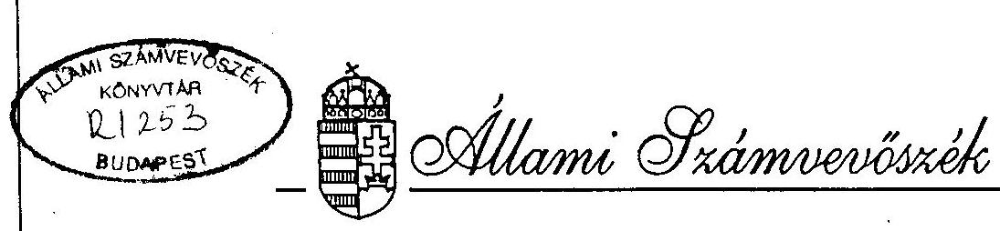
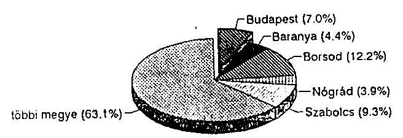
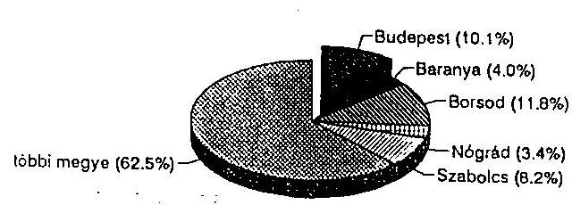
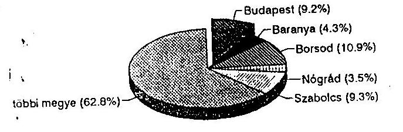
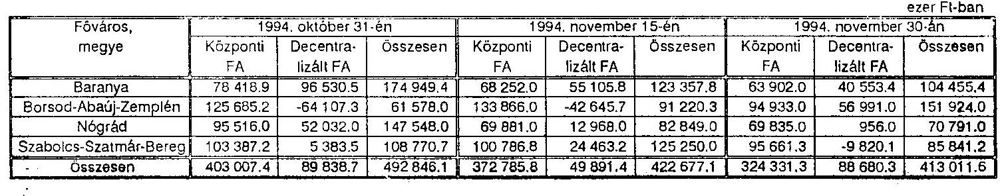
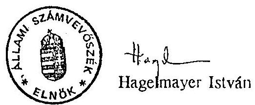

# JELENTÉS 

a Foglalkoztatási Alap felhasználása utóellenőrzésének tapasztalatairól

---

A vizsgálatot vezette és az összefoglaló jelentést összeállította:
Rácz Lajosné osztályvezető főtanácsos

# Közreműködött: 

Malatinszkyné
dr. Lovas Irén számvevő-főtanácsos

A helyszíni vizsgálatot végezték:

* a Munkaügyi Minisztériumnál és
* az Országos Foglalkoztatási Alapítványnál
Rácz Lajosné osztályvezető főtanácsos
Malatinszkyné
dr. Lovas Irén számvevő-főtanácsos
* a Baranya Megyei Munkaügyi Központnál
dr. Ernst László számvevő-főtanácsos
* a Borsod-Abaúj-Zemplén Megyei Munkaügyi Központnál
dr. Takács András számvevő-főtanácsos
* a Nógrád Megyei Munkaügyi Központnál
Fercsik Gyula számvevő-főtanácsos
* a Szabolcs-Szatmár-Bereg Megyei Munkaügyi Központnál
László András számvevő-főtanácsos
* az Országos Munkaügyi Központnál és
* a Fővárosi Munkaügyi Központnál
külső szakértőként
dr. Printz és Társa Nemzetközi Könyvvizsgáló Kft.
dr. Printz János ügyvezető igazgató,
okleveles könyvvizsgáló,
Szabó Judit vezető tanácsadó,
okleveles közgazdász,
Farkas Tamás szakértő,
okleveles közgazdász,
Rádfai Tibor szakértő,
okleveles könyvvizsgáló

---

# TARTALOM 

Oldal
BEVEZETŐ ..... 1

1. FŐBB MEGÁLLAPÍTÁSOK
A tervezési, pénzgazdálkodási és könyvvezetési rend kialakításának és a rendszer működésének értékelése ..... 7
A működés koordináltsága a munkaerőpiaci szervezetben ..... 9
A központi programokra fordított támogatások felhasználásának értékelése ..... 13
A foglalkoztatást elősegítő támogatások felhasználásának hatékonyságában és eredményességében bekövetkezett változások ..... 15
Az Országos Foglalkoztatási Alapítvány létrehozásának és működésének értékelése ..... 18
II. ÁLTALÁNOS KÖVETKEZTETÉSEK ÉS AJÁNLÁSOK ..... 20
1-3. számú mellékletek

---

# BEVEZETŐ 

Az Állami Számvevőszék 1992-ben ellenőrizte a Foglalkoztatási Alap (FA) pénzeszközeinek felhasználását, a működtetéséhez szükséges feltételrendszer kialakítását. A helyszíni vizsgálatok a Munkaügyi Minisztériumon (MüM) kívül az Országos Munkaügyi Központnál(OMK), továbbá öt megyében és a fővárosban folytak.

1992-ben megállapítottuk, hogy a MüM nem alakította ki az FA szabályszerű és hatékony működtetéséhez szükséges szervezeti, információszolgáltatási, nyilvántartási és beszámolási kötelezettség kereteit. A MüM-nek és az OMK-nak felróható hiányosságok miatt nem kezdődött meg kellő időben a munkanélküliséget aktív módon kezelő foglalkoztatáspolitikai eszközök hatékony és eredményes működtetéséhez szükséges feltételek kialakítása. A feltárt mulasztások alapján felvetettük a munkaügyi miniszternek, a MüM pénzügyi főosztályvezetőjének és az OMK főigazgatójának a felelősségét. A vizsgálat megállapításai, következtetései és javaslatai figyelembevételével a munkaügyi miniszter átfogó és részletes intézkedési tervet készített, amelyet az Állami Számvevőszék alkalmasnak tartott a feltárt hiányosságok megszüntetésére.

Az Országgyűlés Számvevőszéki bizottsága 1993. februárjában tárgyalta a Foglalkoztatási Alap ellenőrzéséről készült (119.sz.) jelentésünket. Az Állami Számvevőszéket utóellenőrzésre, a munkaügyi minisztert pedig az általa elkészített intézkedési terv végrehajtásáról 1993. december 31-ig történő beszámolásra kérte fel. Az utóvizsgálat elvégzését az is indokolta, hogy az államháztartásról szóló törvény értelmében az elkülönített állami pénzalapok működését az Országgyűlés négyévenként felülvizsgálja, és dönt az alap további működéséről.

---

A Foglalkoztatási Alap 1991 óta működik azzal a céllal, hogy elősegítse a foglalkoztatást, hozzájáruljon a munkanélküliség mérsékléséhez. A munkanélküliség az egyik legsúlyosabb társadalmi-gazdasági probléma. Az országban és a vizsgált területen a regisztrált munkanélküliek száma a következőképpen alakult:

# Regisztrált munkanélküliek száma 

1991 decemberében összesen 406124 fő


Regisztrált munkanélküliek száma 1993 decemberében összesen 632050 fő


Regisztrált munkanélküliek száma 1994 júniusában összesen 549882 fő


1994 decemberében az országosan regisztrált munkanélküliek száma 520 ezer fő volt. Az Országos Munkaügyi Központ előrejelzése szerint 1995. június végén 490 ezer fő várható. A ténylegesen munkanélkül lévők száma ennél jóval nagyobb. Az előrejelzés szerint a nyilvántartásból kikerülők közül 100-120 ezer fő továbbra is munka nélkül marad. Ily módon 1995. június végére a munkanélküliek száma 590-610 ezer fő lehet.

---

Az 1991. évi IV. törvény meghatározta a foglalkoztatást elősegítő támogatások, az un. aktív foglalkoztatáspolitikai eszközök körét. A Foglalkoztatási Alap pénzeszközeiből támogatás nyújtható a képzések, a munkanélküliek vállalkozóvá válásának elősegítésére, a foglalkoztatás bővítéjéhez, a közhasznú munkavégzéshez, a munkahelyteremtő beruházásokhoz, részmunkaidős foglalkoztatáshoz, valamint a munkáltatót terhelő korengedményes nyugdíjhoz. Az Alapból pénzügyi keretet kell elkülöníteni foglalkoztatási válsághelyzetek kezelésére, támogatást lehet nyújtani foglalkoztatási célú alapítványoknak és a foglalkoztatáspolitikai programokhoz. A megyékben történő felhasználásra is pénzügyi keretet kell elkülöníteni, ami a foglalkoztatást elősegítő támogatások, aktív eszközök fedezetéül szolgál.

Az FA bevételei alapvetően a központi költségvetésből és a privatizációs bevételekből származnak. 1991-ben 14.096 millió forint bevétele és 4.644 millió forint pénzmaradványa volt az Alapnak. A vizsgált időszakban a bevételek, a kiadások és a pénzmaradványok alakulását a következő táblázat mutatja:

A Foglalkoztatási Alap pénzeszközeinek alakulása 1992-ben és 1993-ban

| 1992-ben |  |  |  |  |  |   |
| --- | --- | --- | --- | --- | --- | --- |
|  Főváros, megye | Bevétel |  | Kiadás |  | Pénzmaradvány |   |
|   | M Ft-ban | az országos adat százalékában | M Ft-ban | az országos adat százalékában | M Ft-ban | az országos adat százalékában  |
|  Budapest | 1492.1 | 7.84\% | 991.4 | 7.58\% | 500.7 | 8.43\%  |
|  Baranya | 646.9 | 3.40\% | 490.4 | 3.75\% | 156.5 | 2.64\%  |
|  Borsod-Abaúj-Zemplén | 1472.0 | 7.74\% | 1344.0 | 10.27\% | 128.0 | 2.16\%  |
|  Nógrád | 579.0 | 3.04\% | 430.0 | 3.29\% | 149.0 | 2.51\%  |
|  Szabolcs-Szatmár-Bereg | 1084.0 | 5.70\% | 631.0 | 4.82\% | 453.0 | 7.63\%  |
|  Vizsgált megyék összesen | 5274.0 | 27.72\% | 3886.8 | 29.70\% | 1387.2 | 23.37\%  |
|  Országos összesen | 19023.0 | 100.00\% | 13086.0 | 100.00\% | 5937.0 | 100.00\%  |

1993-ban

| Főváros, megye | Bevétel |  | Kiadás |  | Pénzmaradvány |  |
| --- | --- | --- | --- | --- | --- | --- |
|   | M Ft-ban | az országos adat százalékában | M Ft-ban | az országos adat százalékában | M Ft-ban | az országos adat százalékában  |
|  Budapest | 1789.3 | 8.28\% | 1480.9 | 8.23\% | 308.4 | 8.38\%  |
|  Baranya | 621.3 | 2.87\% | 532.3 | 2.96\% | 89.0 | 2.42\%  |
|  Borsod-Abaúj-Zemplén | 1688.0 | 7.79\% | 1500.0 | 8.34\% | 188.0 | 5.11\%  |
|  Nógrád | 657.0 | 3.03\% | 538.0 | 2.99\% | 119.0 | 3.23\%  |
|  Szabolcs-Szatmár-Bereg | 1153.0 | 5.32\% | 993.0 | 5.52\% | 160.0 | 4.35\%  |
|  Vizsgált megyék összesen | 5908.6 | 27.26\% | 5044.2 | 28.03\% | 864.4 | 23.50\%  |
|  Országos összesen | 21672.0 | 100.00\% | 17993.0 | 100.00\% | 3679.0 | 100.00\%  |

---

A Foglalkoztatási Alap 1994. és 1995. évi tervezett bevétele 21.400 millió forint, illetőleg 12.729 millió forint.

Az Alapot a Munkaügyi Minisztérium kezeli. A működtetésével kapcsolatos feladatokat a MüM és a felügyelete alá tartozó Országos Munkaügyi Központ, valamint a megyei munkaügyi központok látják el.

A foglalkoztatási törvény szabályozza a foglalkoztatási érdekegyeztetés szervezeteinek, a Munkaerőpiaci Bizottságnak és a megyékben működő Munkaügyi Tanácsoknak az Alappal kapcsolatos hatáskörét és feladatait is. A tripartit Munkaerőpiaci Bizottság a foglalkoztatáspolitikai érdekegyeztető tevékenység keretében többek között meghatározza az FA felhasználásának elveit és fő arányait, a megyékben történő felhasználásra elkülönített, decentralizált keret felosztásának és felülvizsgálatának módszerét. A megyékben (fővárosban) a foglalkoztatási érdekegyeztetés szervezete a Munkaügyi Tanács, amely a megyei (fővárosi) munkaadói és munkavállalói érdekképviseleti szervezetek és az önkormányzat képviselőiből áll. A Munkaügyi Tanács dönt a megyében (fővárosban) rendelkezésre álló decentralizált FA felhasználásának elveiről és arányairól.

Az utóellenőrzés elsősorban az alapvizsgálatba bevont területeken és helyszíneken folyt. A helyszín kiválasztásánál alapvető szempont volt, hogy a munkanélküliséggel leginkább sújtott területek lehetőség szerint bekerüljenek a vizsgálatba. E területen 1992-94. években a regisztrált munkanélküliek száma 246-206 ezer fő körül alakult, ami az országosan regisztrált munkanélkülieknek mindkét évben valamivel több, mint 37%-át tette ki. A Foglalkoztatási Alap összes kiadásának 29%-át a vizsgált megyékben és a fővárosban használták fel.

Az utóellenőrzés fő célja

* a munkaügyi miniszter intézkedési terve (3.sz. melléklet) végrehajtásának ellenőrzése,
* a Foglalkoztatási Alapból a képzés-átképzésekre, a munkahelyteremtő beruházásokra és a közhasznú munkavégzésre fordított támogatások felhasználása hatékonyságának és eredményességének vizsgálata és
* az 1992-93. évi pénzmaradvány okainak feltárása volt.

---

Célunk volt továbbá megállapítani, hogy

* az 1992. évi alapvizsgálathoz képest milyen változások következtek be az Alap tervezési, pénzgazdálkodási, könyvvezetési rendjében és a rendszer működtetésében, különös tekintettel az 1993. évi folyamatokra,
* az intézkedési terv végrehajtása javította-e az Alap működését, irányítását és az elvégzett ellenőrzéseket,
* az Alapból - képzés-átképzésekre, munkahelyteremtő beruházásokra, közhasznú munkavégzésekre - folyósított támogatások felhasználása a megtett intézkedések hatására hatékonyabb és eredményesebb-e,
* milyen okokra vezethetők vissza az 1992-93. évben keletkezett pénzmaradvány.

A vizsgált időszak: 1992. január 1.-től 1994. június 30.-ig
A helyszíni ellenőrzés kezdete: 1994. szeptember 2.
A helyszíni ellenőrzés befejezése:

* a megyei(fővárosi) munkaügyi központoknál 1994. november 30.
* a központi szerveknél 1994. december 20.

Írásba foglalás, egyeztetés: 1995. január 25.-ig

# A vizsgálat helyszínei: 

Munkaügyi Minisztérium (MüM), Országos Munkaügyi Központ (OMK), Baranya Megyei Munkaügyi Központ, Borsod-Abaúj-Zemplén Megyei Munkaügyi Központ, Fővárosi Munkaügyi Központ, Nógrád Megyei Munkaügyi Központ, Szabolcs-Szatmár-Bereg Megyei Munkaügyi Központ. A megyei (fővárosi) munkaügyi központoknál lefolytatott helyszíni vizsgálatok tapasztalatai alapján vizsgálatunkat kiterjesztettük az Országos Foglalkoztatási Alapítvány (OFA) törvényességi szempontú ellenőrzésére is.

A vizsgálat típusa: utóellenőrzés

## Az ellenőrzés módszerei:

* a szabályszerűség ellenőrzése dokumentális ellenőrzéssel (az 1993. évi könyvvezetés és a költségvetési beszámoló ellenőrzése a vonatkozó számviteli előírások betartásának vizsgálata alapján),

---

* az intézkedési tervben szereplő dokumentumok határidőre történő elkészítésének ellenőrzése, továbbá az azokban foglaltak betartásának vizsgálata az egyes feladatok, folyamatok tesztelésével,
* a képzés-átképzésekre, a munkahelyteremtő beruházásokra és a közhasznú munkavégzésre fordított támogatások gazdaságos és eredményes felhasználása biztosítására tett intézkedések vizsgálata a kapcsolódó államigazgatási eljárások, folyamatok ellenőrzésével.

Az ellenőrzés során az ellenőrzött szervezetekkel korrekt kapcsolat alakult ki. A munkaerőpiaci szervezet minden szintjén konstruktív együttműködést tapasztaltunk, ami jelentősen segítette munkánkat.

---

# I. FŐBB MEGÁLLAPÍTÁSOK 

A Munkaügyi Minisztérium a Foglalkoztatási Alapra vonatkozó alapvizsgálat óta eltelt időszakban az intézkedési tervében foglaltaknak megfelelően számos intézkedést tett az FA rendeltetésszerű működése érdekében. Javult a minisztérium irányító és ellenőrző tevékenysége. Az Országos Munkaügyi Központ és a megyei (fővárosi) munkaügyi központok a korábban tapasztaltaknál szervezettebben és célirányosabban látták el az Alappal kapcsolatos feladataikat. Ugyanakkor az intézkedési tervben is szereplő több - az Alap rendeltetésszerű felhasználását alapvetően befolyásoló - feladatot nem teljesítettek. A FA működésének javítására tett jelentős erőfeszítések és részleges eredmények ellenére az Alap pénzeszközeinek célszerű felhasználásában, a foglalkoztatási törvényben meghatározott szerepének érvényesülésében számottevő javulást nem tapasztaltunk. Az elért eredményeket és a működés problémáit az alábbiakban összegezzük.

## A TERVEZÉSI, PÉNZGAZDÁLKODÁSI ÉS KÖNYVVEZETÉSI REND KIALAKÍTÁSÁNAK ÉS A RENDSZER MŰKÖDÉSÉNEK ÉRTÉKELÉSE

Az elkülönített állami pénzalapokra a költségvetés alapján gazdálkodó szervezetekre vonatkozó tervezési, könyvvezetési, beszámolási stb. előírásokat kell érvényesíteni.

A munkaügyi miniszter intézkedési tervében elrendelte a kettős könyvvezetési kötelezettséget, a számviteli
 szabályozás kialakítását, számviteli szabályzat elkészítését.

1. Az intézkedési tervben foglaltaknak megfelelően az 1992. évi gazdasági műveletek "átkönyvelését" mind a MüM, mind a megyei munkaügyi központok 1993. januárjában elvégezték. Az 1992. évi beszámoló már a vonatkozó előírások szerint készült. A MüM késve adta ki az 1993. évre vonatkozó számlarendet.

---

A számviteli szabályzat nem készült el. (Elkészítése folyamatban van.) $[1.1]^{*}$
2. A Foglalkoztatási Alap 1993. és 1994. évi terve a jogszabályi előírásoknak nem felelt meg, mert a foglalkoztatási törvényben szereplő jogcímeket nem tartalmazta teljeskörűen és részletesen. Az Alapra vonatkozóan valójában két, egymástól tartalmában eltérő terv készült. Az egyik a Munkaerőpiaci Bizottság által, a másik a költségvetési törvényben jóváhagyott terv. A gyakorlatban ez azt jelentette, hogy az egyezőség csak külön egyeztetésekkel, kiegészítésekkel volt biztosítható. $[1.2.1.1]$
3. A tervezés során az Alap forrásigényének meghatározásánál mindkét vizsgált évben egy szimplifikált (egyszerűsített) ellátási szint biztosításából indultak ki, nem pedig az Alap foglalkoztatási törvényben meghatározott funkciójából, feladatából. Az Alap forrásigényének az ellátottak létszámából történő egyoldalú levezetésével az FA működése a Szolidaritási Alaphoz hasonló, a passzív ellátási rendszer jegyeit hordozza magán.
$[1.2.1.2]$
4. A MüM Pénzügyi Főosztálya a Foglalkoztatási Alap eredeti és módosított előirányzatairól nem vezetett nyilvántartást, ezzel 1992-94-ben is megsértette a költségvetési előirányzatok nyilvántartására vonatkozó pénzügyi, számviteli előírásokat.
$[1.2.2.1-1.2.2.2]$
5. A megyék kifogásolt magas pénzmaradványai már 1992-ben jelentősen csökkentek. 1993-ban a vizsgált három kiemelt eszköznél (képzés-átképzés, munkahelyteremtő beruházás, közhasznú munkavégzés) a munkaügyi központok az előirányzatuknál több kötelezettséget vállaltak, ami ellentétes a szabályozással. (1993-ban a többlet a vizsgált megyékben 1,035 milliárd forint volt.) Ehhez az is hozzájárult, hogy a MüM a Munkaerőpiaci Bizottság elvi döntése alapján a pénzmaradványoknak a decentralizált keretek 1/12 feletti részét elvonta. A Pénzügyi Főosztály nem vette figyelembe a megyei pénzmaradványok kötelezettséggel terhelt hányadát. A pénzmaradvány elvonásával az egyszer már lekötött pénzeket újra felosztották (terhelve ezzel a következő évi decentralizált keretet). Ez a gyakorlat

[^0]
[^0]:    * A szögletes zárójelben lévő számok hivatkozások a jelentés 1.sz. mellékletét képező részletes megállapítások megfelelő pontjaira.

---

sérti a költségvetési előírásokat, a munkaügyi központokat pedig a rendelkezésre álló pénzek ésszerűtlen elköltésére ösztönözte. A tényleges felhasználások a módosított előirányzatok átlagosan 93,6%-át tették ki. A Foglalkoztatási Alap pénzmaradványai elsősorban a központi keretek előirányzataiból keletkeztek, jelentős mértékben abból, hogy a központi programok nem működtek.
[1.2.3.1-1.2.3.7]
6. 1994-ben a Foglalkoztatási Alap megyei számláinak kimerülése valójában a decentralizált keretek kimerülését jelentette, a lebonyolításra leadott központi kereteknek jelentős pozitív egyenlege volt.
[1.2.3.9]
7. A Foglalkoztatási Alap 1993. évi költségvetési beszámolóját felülvizsgálva megállapítottuk, hogy az nem volt valódi, mert:

* nem felelt meg a vállalkozás folytatása alapelvének (nem tartalmazta a kiadások jogcímenkénti módosított előirányzatait);
* a teljesség és valódiság számviteli alapelve sem a könyvvezetés, sem a beszámolókészítés során nem érvényesült maradéktalanul;
* a valódiság számviteli alapelvét a beszámoló pénzforgalmi kimutatásában is megsértették. (Az éves költségvetési beszámolóban megjelenő adatok jórészt csak "sarokszámokban", fő összegekben egyeznek);
* a bevételi előírások önkéntes minősítésével és törlésével az egyedi értékelés számviteli alapelvét sértették meg.
[1.3]


# A MŰKÖDÉS KOORDINÁLTSÁGA A MUNKAERŐPIACI SZERVEZETBEN 

8. A Munkaügyi Minisztérium felülvizsgálta és módosította a Szervezeti és Működési Szabályzatát. A főosztályok elkészítették dolgozóik munkaköri leírását.
Elkészült az Alap kezelésével kapcsolatos feladatokat, a munkaerőpiaci szervezetek közötti feladatmegosztást, a hatásköröket egységes szerkezetbe foglaló dokumentum is. Emellett eljárási rendek kidolgozására vonatkozó feladatokat is meghatároztak. Az Alap intervenciós keretének felhasználására vonatkozó eljárási rendet kivéve viszont nem dolgozták ki a dokumentumban szereplő eljárási rendeket. Ennek

---

következtében a korábbi hiányosságok, működési zavarok egy jelentős részét nem sikerült felszámolni.
[2.1.1-2.1.6]
9. A Munkaügyi Minisztérium Ellenőrzési Főosztálya az intézkedési tervben megjelölt feladatokat maradéktalanul végrehajtotta:

* 1991-1993-ban országos komplex ellenőrzés keretében valamennyi eszközre kiterjedően vizsgálatot végzett;
* évenként ellenőrzési irányelveket dolgozott és adott ki;
* a Foglalkoztatási Alapra irányuló ellenőrzések lefolytatásához Módszertani Útmutatót készített;
* 1993-ban módszertani és tematikai ajánlásokat dolgozott ki a MüM kezelésében lévő elkülönített állami pénzalapok ellenőrzéséhez;
* az Állami Számvevőszék 1992. évi alapvizsgálata alapján tájékoztatót készített, amelyet valamennyi munkaügyi központ részére megküldött;
* az intézkedési tervben foglaltaknak megfelelően az ellenőrök továbbképzésére részletes programot készített;
* a Főosztály évente beszámol az ellenőrzési tevékenységről.

A Minisztérium Ellenőrzési Főosztálya által végzett ellenőrzések, s az ezekről készült jelentések igényes szakmai munkát tükröznek. Az ellenőrzés eredményei közvetlenül hozzájárultak a működés rendszerbeli problémáinak feltárásához és a jogszabályi módosítások előkészítéséhez is.
[2.1.7.1-2.1.7.8]
10. Az Országos Munkaügyi Központ alapító okiratát kiadták, az átdolgozott SZMSZ-t 1993. április 1-én hatályba léptették. A munkaügyi központok SZMSZ-eit felülvizsgálták, a dolgozók munkaköri leírásait a vizsgált esetekben megfelelő időben kiadták. Az intézkedési tervben szereplő eszközgazda rendszert határidőre kialakították, létrehozták az Aktív Eszközök Osztályát. Az egységes módszertani, eljárási rendeket határidőre elkészítették.
[2.2.1-2.2.5]
11. Az aktív foglalkoztatáspolitikai eszközök számítógépes nyilvántartási és adatkezelési rendszerének kialakítására vonatkozó 1993. december 31-ei határidőt az OMK nem tudta tartani. Az eszközállomány telepítése megkezdődött,

---

ez azonban csak részben felel meg a távlati fejlesztési koncepciónak. A vizsgálat időpontjában az tapasztaltuk, hogy a rendszer fejlesztése lassú, az országos on-line kapcsolat igénye miatt csak folyamatosan fejleszthető. A nagytömegű adatfeldolgozások egy részét helyi megoldásokkal, manuális eszközökkel, vagy ügyviteli jellegű programok segítségével próbálják kezelni.
[2.2.6-2.2.7] [2.2.7.1]
12. Az egyes aktív eszközökre fordított támogatások felhasználása eredményességének megállapításához az ún. követéses jellegű kérdőíves felméréseket (a monitoring rendszert) 1993. I. negyedévében kísérletként három megyében indították be. A kísérlet tapasztalatait a három megye, az OMK és a világbanki szakértők együttesen értékelték. Megállapították, hogy a monitoring rendszer az eszközműködtető programokra épül, azok hiányában vagy hiányos működtetése mellett nem működhet a tervezett módon. Vizsgálati tapasztalataink alátámasztották a szakértők ezen megállapítását.
$[2.2.8]$
13. Az OMK ellenőrzési szabályzatát az intézkedési tervben megjelölt határidőn belül jóváhagyták. A Foglalkoztatási Alappal kapcsolatos felügyeleti ellenőrzésre 1994-től fordítottak nagyobb figyelmet.
[2.2.9.1, 2.2.9.3]
14. Az Országos Foglalkoztatási Alapítvány (OFA) és az OMK 1993. augusztusában megállapodott az OFA által kötött támogatási szerződések szúrópróbaszerű ellenőrzéséről. A megállapodás megkötésével az OMK megsértette a költségvetési szervek feladatvállalására vonatkozó szabályokat. A munkaügyi központok is csak az alapító okiratban foglalt alaptevékenységet láthatják el, ilyen feladatot viszont az okirat nem tartalmaz.
$[2.2.9.2]$
15. A megyei (fővárosi) munkaügyi központok általában az előírt határidőre felülvizsgálták SZMSZ-eiket, szükség szerint átdolgozták, kiegészítették azokat. A meglévő munkaköri leírásokat felülvizsgálták, kiegészítették, a hiányzó munkaköri leírásokat pedig elkészítették. A gazdálkodás viteléhez szükséges különböző belső szabályzatokat általában határidőre elkészítették. A munkaügyi központok az OMK segédletek alapján az egyes aktív eszközökre kidolgozták a saját eljárási rendjüket. A számítógépes rendszer OMK általi kifejlesztésének késedelme miatt

---

azonban általában saját fejlesztésű programokkal dolgoztak, így országos szinten az egységes adatkezelés és feldolgozás nem, vagy nehezen biztosítható.
[2.3.1-2.3.3] [2.3.2.4]
16. A munkaügyi központoknál jelentősen javult a belső ellenőrzés szervezettsége, színvonala. A vizsgált időszakban a leglátványosabban a munkaerőpiaci támogatások felhasználásának ellenőrzése fejlődött. Az ellenőrök az 1992. évi 23,0 millió forinttal szemben 1993-ban 150,3 millió, 1994. június 30-ig pedig 142,8 millió forint visszafizetésére tettek javaslatot. A tényleges befizetések összege azonban rendkívül alacsony, néhány millió forint. Ennek oka főként az eljárási rendben rejlik. A munkaügyi központok a támogatásról az államigazgatási eljárás szabályai szerint határozatot hoznak. A támogatás visszavonásáról is határozatot hoznak, ami megfellebbezhető és bírósági úton megtámadható. Ez jelentősen meghosszabbítja az eljárást. A támogatási szerződést a Ptk. szabályai szerint kötik meg. Megítélésünk szerint a visszaköveteléseknél már nem lehetne visszatérni az államigazgatási eljárás útjára, hanem a polgári eljárás szabályai szerint kellene pert indítani. (Információink szerint ezt az eljárást a Borsod-Abaúj-Zemplén megyei ügyészség is kifogásolta. Állásfoglalást kért a legfőbb ügyészségtől, amelyet azonban vizsgálatunk lezárásáig még nem kapott meg.)

Mindemellett esetenként halogató magatartást, a szerződésekben rögzített határidők indokolatlan módosítását tapasztaltuk a munkahelyteremtő beruházások támogatási szerződéseit megszegőkkel szemben.
[2.3.5]
17. Alapvizsgálatunkat követően mind az irányító szervek, mind a munkaügyi központok számos intézkedést tettek az aktív munkaerőpiaci eszközök működtetése és ellenőrzése személyi feltételeinek javítására. A munkaügyi központok különböző, de általában növekvő időt fordítottak a dolgozók továbbképzésére. $[2.3.6]$

---

# A KÖZPONTI PROGRAMOKRA FORDÍTOTT TÁMOGATÁSOK FELHASZNÁLÁSÁNAK ÉRTÉKELÉSE 

Az 1991. évi IV. törvény szerint a FA-ból foglalkoztatási válsághelyzetek kezelésére pénzügyi kereteket kell elkülöníteni, illetve rövid és hosszú távú foglalkoztatáspolitikai programok indíthatók.

A központi keretek jelentős maradványait már alapvizsgálatunk során kifogásoltuk. A keretek összege a vizsgált időszakban csökkent, azonban felhasználásukban nem tapasztaltunk lényeges változást. Az eddigi központi programok azért nem vezettek eredményre, mert olyan gondok megoldására vállalkoztak, amelyekre a megyei decentralizált alapok állnak rendelkezésre. Mivel a keretek leosztása "additív" jelleggel történt (akkor voltak felhasználhatók, ha a megyék ki tudták azokat egészíteni), ez a gyakorlat késleltette a decentralizált keretek felhasználását.
18. 1993-ban a központi támogatással megvalósuló programokra 1300 millió forintot hagytak jóvá.

A központi kistérségi foglalkoztatási programra 400 millió forintot irányoztak elő. A sikertelennek minősített pályázatok miatt a 400 millió forintból semmit sem használtak fel, mert a pályázat meghirdetése időpontjában még nem voltak kidolgozott komplex kistérségi fejlesztési programok, amelyekhez támogatást lehetett volna nyújtani.
[3.1.1]

A rétegprogramokra elkülönített 500 millió forintos keretösszegből 106,6 millió forintot használtak fel a megyék. A munkaügyi miniszter a Kormány részére készített tájékoztatójában értékelte a rétegprogramokat. Az alacsony felhasználást elsősorban a programok elkészítésének késői időpontjával magyarázta, továbbá hangsúlyozta, hogy a programokban meghatározott feladatok többségükben előkészítő jellegűek voltak. (Az egyes programok alapos kidolgozása fontos. Ezt azonban a programok beindítása előtt, a pénzügyi tervezést megelőzően kell elvégezni.) A Munkaügyi Minisztérium 1994. júliusára cselekvési programot dolgozott ki a munkanélküliek helyzetének kezelésére, enyhítésére. Ez a program azonban

---

1994-ben az e célra elkülönített 900 millió forint felhasználására már nem gyakorolhatott lényeges befolyást.
[3.1.2]

Az Ózdi munkahelyteremtési programra 200 millió forintot határoztak meg, aminek a felhasználására csak 1994-től került sor.
[3.1.3]

A központi közhasznú munkavégzési programra 1993-ban elkülönített 48 millió forintból 10,3 millió forintot használtak fel. A program 1993-ban lezárult. [3.1.4]

A tartósan munkanélküliek foglalkoztatását elősegítő szociális földprogramra 1993-ban 50 millió forintot különítettek el, de szerződést a program keretében nem kötöttek. 1994. első felében is mindössze 16 volt a megkötött szerződések száma. 1994-ben a Munkaerőpiaci Bizottság a programra 500 millió forintot különített el.
[3.1.5]
19. A foglalkoztatási válsághelyzetek kezelésére 1993-ban 935 millió forintot
különítettek el. Az intervenciós keretre beérkezett kérelmek száma és az igényelt támogatás összege is évről évre növekedett. 1993-ban és 1994 első félévében a támogatási kérelmekben szereplő összegek sokszorosan meghaladták a pénzügyi keret lehetőségeit. A támogatást igénylők várható tömeges létszámleépítése nem átmeneti gazdálkodási problémákból, hanem tartósan veszteséges gazdálkodásból, csődhelyzetekből adódik. A gazdasági válsághelyzetek megoldásában nélkülözhetetlen gazdaságpolitikai döntéseket és koordinált intézkedéseket a foglalkoztatás elősegítésére rendelkezésre álló szűk pénzügyi keretekkel helyettesítik.

Az intervenciós keret felhasználására vonatkozó eljárási rend
 kidolgozása elősegítette a támogatások célzottabb kihelyezését. Az intervenciós keret felhasználásának szabályozása azonban nem képes megoldani a gazdasági válsághelyzetből, a regionális gazdaságpolitikai koncepciók hiányából adódó gondokat. Ez utóbbiak hiányában indokolatlannak látjuk az elkülönített keretet.
[3.2]

---

# A FOGLALKOZTATÁST ELŐSEGÍTŐ TÁMOGATÁSOK FELHASZNÁLÁSÁNAK HATÉKONYSÁGÁBAN ÉS EREDMÉNYESSÉGÉBEN BEKÖVETKEZETT VÁLTOZÁSOK 

Az 1992. évi alapvizsgálat óta pozitív változást tapasztaltunk a megyei decentralizált keretek felosztása, az egyes előirányzatok megalapozása, a felhasználást meghatározó elvek, súlypontok és eljárási rendek kialakítása terén. Az egyes aktív eszközökre fordított támogatások gazdaságosságának, eredményességének értékeléséhez az OMK a munkaügyi központok közreműködésével meghatározta és kiadta az egységesen alkalmazandó teljesítménymutatókat. Ezt önmagában is fontos lépésnek értékeljük egy olyan államháztartási gazdálkodási rendszerben, ahol a teljesítménymérés elvi lehetőségét is gyakran kétségbevonják.

Az egyes aktív eszközökre fordított támogatások felhasználása gazdaságosságában és eredményességében bekövetkezett változások értékelését a monitoring rendszer (követéses jellegű kérdőíves felmérés) működése eredményeként nyert alapinformációk alapján lehetett volna biztonsággal elvégezni. Ennek bevezetése azonban - a korábban ismertetett okok miatt - az intézkedési tervben megjelölt határidőre nem történt meg. Az előbbiekből eredően a munkaügyi központok csak szűkkörű információval rendelkeztek az egyes aktív eszközök, programok keretében nyújtott támogatások tényleges eredményeiről, arról, hogy hány ember foglalkoztatását, munkához való jutását sikerült biztosítani.
20. Az 1991. évi gyakorlathoz képest javult a pályáztatási rendszer. Célirányosabbá váltak a pályázati kiírások, szigorodtak a támogatási feltételek. A munkahelyteremtő beruházásoknál az 1992-ben még leggyakoribb vissza nem térítendő támogatásokat a kamatmentes visszatérítendő tőkejuttatás váltotta föl. Emellett általában kikötötték, hogy folyamatban lévő beruházás nem támogatható, a támogatás igénybevételéhez előírták, hogy a pályázónak milyen mértékű saját forrással kell rendelkeznie. Esetenként maximálták a beruházásokhoz adható támogatás, illetve egy főre adható támogatás összegét.
[3.3.1.1]
21. A munkahelyteremtő beruházásokhoz nyújtott támogatások felhasználásának eredményessége (a megvalósult munkahelyek száma és az ezeken foglalkoztatott, a regisztrált munkanélküliek köréből kikerülők aránya) 1992 és 1993 években

---

némileg javult. A vizsgált megyékben az 1993. december 31-ig tervezett munkahelyek száma 8.413 volt, amiből 6.284 munkahely jött létre. Ez 74,6%-os átlagos megvalósulási arányt jelent az alapvizsgálat 62,5%-os arányával szemben. Különösen jelentős volt a javulás a munkanélküliek megvalósított munkahelyeken történő foglalkoztatását tekintve. Amíg az alapvizsgálat idején a vizsgált megyékben a támogatások révén létrehozott munkahelyeken foglalkoztatottak közül átlagosan csak 44,1% került ki a regisztrált munkanélküliek köréből, addig 1992-93-ban ez átlagosan 83,4%-ra emelkedett.
[3.3.1.2]
22. A munkahelyteremtő beruházások támogatásánál a fenti kedvező irányú változások mellett az eszköz működésének alapvető problémáira mutatnak rá a következő adatok. A vizsgált megyékben és a fővárosban az 1992. január 1 és 1993. december 31 között megkötött 872 szerződésből mindössze 458 valósult meg, 87 meghiúsult, 62 meghiúsulni látszik, 118 pedig késni fog. Az aktív foglalkoztatáspolitikai eszközök közül a munkahelyteremtő beruházások támogatása jár a legtöbb feladattal, s egyben a legnagyobb kockázattal is.
[3.3.1.3]
23. Az alapvizsgálat óta eltelt időszakban a képző intézményekkel kötött szerződések feltételei is szigorodtak. Így például előírták a tanfolyamokról való lemorzsolódás pénzügyi szankcióját. Ez nagymértékben hozzájárult ahhoz, hogy az alapvizsgálat óta eltelt időszakban a tanfolyamokról való lemorzsolódás aránya 17%-ról átlagosan 8%-ra csökkent. A munkaügyi központok előírták az alvállalkozói szerződések becsatolását, s megnövekedett azon szerződések száma, amelyekben a képző intézmény elhelyezési kötelezettséget, vagy az elhelyezésben való közreműködést vállalt.

Gyorsabbá és némileg megalapozottabbá váltak a támogatásokról hozott döntések. Gyakorivá és kiterjedtté vált a támogatások felhasználásának ellenőrzése, az ellenőrzések által feltárt szerződésszegések és más működésbeli problémák, hiányosságok megszüntetésére tett intézkedések. A MüM a képzések-átképzésekre 1993-ban szakmai ajánlásokat adott ki és előkészítés alatt van az "Irányelvek a Foglalkoztatási Alap 1995. évi felhasználásához" című kiadvány.
[3.3.2.1-3.3.2.3]
24. A képzésre-átképzésekre fordított támogatások ellenőrzése során az alapvizsgálathoz hasonlóan az azonos szakmára képző-átképző programok óraszámában és az egységköltségekben (egy főre jutó költség, egy órára jutó költség)

---

jelentős, esetenként 2-3 szoros különbségeket is tapasztaltunk. Ezekre a különbségekre csak részben találtunk magyarázatot, elfogadható indokokat. A képzés-átképzésekre fordított támogatások mértékének kialakulásában a képző intézmények program- és árajánlatainak van meghatározó szerepe. A munkaügyi központok a pályázatok elbírálásához, a megbízási szerződések megkötéséhez bekérik ugyan a tanfolyam tematikáját, költségvetését, ezek szakszerű, érdemi felülvizsgálatára azonban jórészt nem kerül sor. Ehhez a munkaügyi központok megfelelő személyi feltételekkel sem rendelkeznek.
[3.3.2.7]
25. Az 1992-93. évi képzés-átképzések eredményessége, a képzésben résztvevők új szakmában történő elhelyezkedése az alapvizsgálat óta eltelt időszakban nem javult, a képzés szakirányának megfelelő elhelyezkedések aránya 30% alatt maradt.
[3.2.4]
26. A képzés-átképzések támogatási rendszere, jellemzően kialakult két formája a pályázati rendszer keretében működő támogatások, illetve az egyéni képzési támogatások önmagukban is gátolják a képzésre fordított pénzeszközök eredményesebb felhasználását. Az egyéni képzések esetében a tanulni szándékozó munkanélküliek jogosultak a maguk választotta képzési programok finanszírozásához támogatást kérni. A pályakezdők jórészénél érzékelhető volt, hogy újabb képzésre, egyetemi, főiskolai felvételre várnak.

A pályázati rendszer keretében működtetett támogatások felhasználása lényegében a munkaügyi központok, illetve munkaügyi tanácsok által kialakított képzési elvek alapján meghirdetett pályázatokon alapszik. A képzési kapacitások megszerzésére koncentrál. A pályázati kiírásokban többnyire nem meghatározott (óraszámú, tematikájú) képzési-átképzési program megvalósításához keresnek képző intézményt. A képzési programok a képző intézmények programajánlatai szerint alakulnak ki. Az egyes programok elindítására sokszor a megfelelő hallgatói létszám hiányában nem került sor.

Háttérbe szorul az a szempont, hogy a munkanélküliek köréből az adott munkaerőpiaci feltételek mellett kiket és mire célszerű képezni-átképezni, hogy a képzés valóban a munkába állást, illetve a munkaerőpiaci pozíciók javítását biztosítsa.
[3.3.2.1-3.3.2.3; 3.2.5-3.2.6]

---

27. A közhasznú foglalkoztatás támogatására fordított pénzeszközök 1992-93-ban dinamikusan növekedtek. A közhasznú munkavégzés legjellemzőbb területe a kommunális jellegű tevékenység, ahol a munkát végzők mintegy kétharmadát foglalkoztatták. Az e célra biztosított támogatások felhasználásának tapasztalatai szerint a vizsgált három aktív eszköz közül ez a legnagyobb biztonsággal kezelhető támogatási forma. Viszonylag könnyen elérhető a támogatást igénybevevők lehetséges köre. A pénzeszközök függvényében a felhasználás jól ütemezhető és közvetlen eredménye a foglalkoztatás rövidebb, hosszabb ideig történő megvalósulása.
[3.3.3.1]

Ugyanakkor e támogatási forma alkalmazása kapcsán is több, az eredményességet kedvezőtlenül befolyásoló tényezővel találkoztunk, amelyet már alapvizsgálatunk során is kifogásoltunk. A törvény a közfeladat tartalmát nem definiálja, így az elég tágan értelmezhető. A törvényi szabályozás lehetőséget ad arra is, hogy a közmunkák többségét szervező munkáltatók, a helyi önkormányzatok az alapfeladataik ellátásához szükséges létszámot a közhasznú foglalkoztatás terhére bővítsék. Az eszköz működésének eredményességéről a tekintetben, hogy a közhasznú munkavégzés révén milyen mértékű a tartósan állásban maradók aránya, csak eseti információk vannak.
[3.3.3.2]

# AZ ORSZÁGOS FOGLALKOZTATÁSI ALAPÍTVÁNY LÉTREHOZÁSÁNAK ÉS MŰKÖDÉSÉNEK ÉRTÉKELÉSE 

Az Országos Foglalkoztatási Alapítvány ellenőrzése eredeti vizsgálati céljaink között nem szerepelt. A munkaügyi központok tevékenységének ellenőrzése kapcsán találkoztunk az OFA pályázatok véleményezési, illetve a szerződések ellenőrzési kötelezettségével. A helyszíni ellenőrzések kedvezőtlen tapasztalatai, valamint az Alapítvány Foglalkoztatási Alapból származó pénzeszközeinek jelentős mértékű növekedése indokolták az Alapítvány vizsgálatba történő bevonását.
28. Az OFA létrehozása a Foglalkoztatási Alapból 1992-ben törvényes keretek között történt. A Munkaerőpiaci Bizottság az Alapítvány létrehozására 300 millió forint támogatást biztosított, illetve további 700 millió forintra vállalt kötele-

---

zettséget. Az Alapítvány céljaként határozta meg, hogy a foglalkoztatási válsághelyzetek kezelésére - területi és ágazati megkötés nélkül - foglalkoztatási társaságokat hozzon létre és felügyelje azokat. Az Alapítvány célját képezi ezen kívül a foglalkoztatási célú alapítványok pályáztatása és támogatása is.

Az előbbiekben meghatározott céloktól azonban már az alapításkor eltértek, később az eltérés még nyilvánvalóbb volt. Olyan támogatási céloknak biztosítottak elsőbbséget, amelyek az alapító okiratban is csak másodlagos szerepet kaptak. Az Alapítvány kuratóriuma elsőbbséget biztosított az új, aktív kísérleti foglalkoztatási eszközök támogatásának. Az elsődleges alapítványi célokra 1993-ban az előző évről áthúzódó kötelezettséggel együtt tervezett 468 millió forinttal szemben 408 millió forintot, ugyanakkor a másodlagos célokra a tervezett 652 millió forinttal szemben 785 millió forintot fordítottak.
[4.1;4.2.2- 4.2.3]
29. Az új eszközök - a munkahelymegőrző és munkahelymegtartó programok - kísérleti jellegét alátámasztó dokumentumokat nem találtunk. Ezek jórészt csak nevükben voltak új támogatási formák, mert az FA-ban, illetve hasonló elnevezéssel más alapoknál is megtalálhatók. A valóságban tehát az OFA-ból 1993-ban nem kísérletet folytattak, hanem 642 millió forinttal "élesben" kísérleteztek. A támogatások folyósítása az FA-ból támogatott eszközökkel szemben lényegesen liberalizáltabb feltételek, a támogatási igények formális felülvizsgálata és a felhasználások ellenőrizetlensége mellett történt. Az alapító MüM sem akadályozta meg az FA-ból származó pénzeszközök ilyen módon történő felhasználását. A törvényi előírásokkal nem ellentétes ugyan, de összeférhetetlennek tartjuk, hogy az OFA kuratóriumának tagjai annak a Munkaerőpiaci Bizottságnak a tagjaiból tevődnek össze, amely dönt a Foglalkoztatási Alap pénzeszközei elosztásának fő elveiről és arányairól.
[4.2.4-4.2.7]
30. A MüM Ellenőrzési Főosztálya 1993-ban az OFA működésére vonatkozóan ún. szakmai ellenőrzést végzett. Az alapító Munkaügyi Minisztérium határozottan megfogalmazta azt az igényt, hogy az Alapítvány kuratóriuma a feltárt hiányosságokat szüntesse meg. Az alapító azonban nem tett intézkedéseket arra vonatkozóan, hogy az Alapítvány működése az alapító okiratban megfogalmazott céloknak megfeleljen, vagy sor kerüljön az alapító okirat módosítására.
[4.2.7]

---

# II. ÁLTALÁNOS KÖVETKEZTETÉSEK ÉS AJÁNLÁSOK 

Az utóvizsgálat elsősorban arra terjedt ki, hogy ellenőrizze a munkaügyi miniszter intézkedési tervében szereplő "ígérvények" teljesítését, a kijelölt feladatok megvalósítását. A hagyományos értelemben vett utóvizsgálattól a módszert tekintve annyiban tértünk el, hogy az egyes dokumentumok meglétén kívül az államigazgatási eljárási folyamatot is ellenőriztük. Ez egyrészt mutatja a feladat végrehajtásában közreműködő szervezetek teljesítményét, másrészt befolyásolja a Foglalkoztatási Alap működtetésének eredményességét, az alapfunkció teljesítését: azt, hogy milyen mértékben sikerült az Alap pénzeszközei felhasználása révén a foglalkoztatást elősegíteni, a munkanélküliséget és hátrányos következményeit mérsékelni.

El kell ismerni mindazokat a jelentős erőfeszítéseket, amelyeket a Munkaügyi Minisztérium, az Országos Munkaügyi Központ és a megyei (fővárosi) munkaügyi központok tettek az FA rendeltetésszerű működése érdekében. A "bürokrácia" szabályozása, az államigazgatási eljárási folyamatok lényeges javulása ellenére azonban az elért eredmények csak részlegesek. Az FA működésében, a pénzeszközök célirányos és eredményes felhasználásában az alapvizsgálat óta nem következett be minőségi változás.

Mind az 1992. évi, mind a jelenlegi számvevőszéki vizsgálat több vonatkozásban is rámutat az Alap jelenlegi finanszírozásának problémáira. Ezek egy része az Alap éves költségvetési rendszerben történő finanszírozására vezethető vissza. Az aktív foglalkoztatáspolitikai eszközök jellegüknél fogva általában nem köthetők egyetlen naptári évhez és különösen nem a december 31-ei fordulóponthoz. Az Alap tehát feladataiból adódóan indukálja az áthúzódó kötelezettségeket, amelyeknek következménye vagy a pénzmaradvány, vagy a szabályozással ellentétes többlet kötelezettség vállalása.

Az Alap folyó bevételei mind 1993-ban, mind 1994-ben bizonytalanok voltak. 1993-ban az eredeti előirányzat 89%-a (12 Mrd Ft) származott volna privatizációs bevételből. Ebből azonban mindössze 1,9 milliárd forint folyt be, a tervezett 1,5 milliárdos költségvetési támogatás pedig 11,6 milliárd forint lett. 1994-ben a folyó bevételek 63%-át (
 13,5 Mrd Ft) tervezték privatizációs bevételből, 7,9 milliárdot

---

pedig más alaptól véglegesen átvett pénzeszközből. A féléves beszámoló 7,9 milliárd forintos bevétele a Munkanélküliek Szolidaritási Alapjából származott, 2,5 milliárd forintot pedig a központi költségvetés nyújtott. Helyszíni vizsgálatunk idején folytak egyeztetések további 5 milliárd forint központi támogatásról. A források bizonytalansága kedvezőtlenül befolyásolja az aktív eszközök működését is. Az ezek keretében nyújtott támogatások hatékony és eredményes felhasználásának biztosításához megfelelő feltételek kialakítására lenne szükség. A támogatások kihelyezését megelőző előkészítő munka a munkaerőpiaci szervezetekben jelentős erőforrásokat köt le. Megfelelő előkészítő munka viszont akkor várható el, s egyben akkor racionális, ha az aktív eszközökre, támogatásokra biztonságos pénzügyi keretekkel lehet számolni.

A finanszirozási rendszer koncepcionális átgondolását az is indokolja, hogy az Alap az elmúlt időszakban a Munkanélküliek Szolidaritási Alapjához hasonló működési jegyeket hordozott. Az Alap forrástervezése során az előző évi ellátási szint megtartására törekedtek. Át kellene gondolni az MSZA és az FA újbóli összevonását (1991-ben bontották ketté a Foglalkoztatási Alapot) és a két alap egységes munkanélküli biztosítási rendszer keretében történő működtetését. Ehhez azonban törvényben kellene meghatározni nemcsak a munkaadók és munkavállalók hozzájárulásának mértékét, hanem az állam feladatvállalását, annak mértékét is. Ez garantálhatná az állam munkanélküli ellátásokhoz való hozzájárulását, s ugyanakkor a feltételekhez jobban igazodhatna a passzív és aktív eszközök alkalmazása. Az állami garancia a támogatás mértékére azért is szükséges, mert a rendszerből nem zárhatók ki a járadékban ugyan nem részesülő, de az aktív eszközökbe bevont munkanélküliek. Megszűnne az az érdekeltség is, hogy a pénzt a költségvetési év végére minden áron el kell költeni.

A foglalkoztatás elősegítésére szolgáló pénzeszközök eredményes felhasználását általában is, de egyes keretekét különösen meghatározza, hogy a támogatást milyen gazdasági feltételek között használták fel. Az intervenciós keretből nyújtott támogatások például önmagukban, megfelelő regionális gazdaságpolitikai háttér nélkül a foglalkoztatási válsághelyzetek időleges kezelésére, a politikai feszültségek mérséklésére képesek csupán, s mint a tapasztalatok mutatják a foglalkoztatási problémákat tartósan nem oldják meg. Ezért például az intervenciós keret felhasználásával szemben nem támaszthatók olyan követelmények, mint

---

amelyeket a foglalkoztatási törvény az Alappal szemben általában megfogalmaz. Ebből az is következik, hogy vagy meg kell szüntetni az intervenciós keretet, vagy a törvényben kell szabályozni, hogy ebből a keretből a regionális fejlesztési koncepciókhoz igazodóan adható támogatás.

Hasonló nehézségekkel jár a központi programok működtetése is. A központi programok keretében azokat a rétegeket kívánták segíteni, amelyek a munkaerőpiacon különösen hátrányos helyzetűek. E rétegek segítéséhez azonban központi szinten nem teremthetők meg azok az információk és eszközök, amelyek a támogatást célirányosan képesek az érintettekhez eljuttatni. Az irányelvek szintjén a központi akarat kialakítható, de az eszközök, beleértve a pénzeszközöket is, csak decentralizáltan működtethetők. Ezért nem célszerű a Foglalkoztatási Alapból e célokra központi kezelésben tartani a pénzeszközöket.

A Foglalkoztatási Alapból létrehozott Országos Foglalkoztatási Alapítványból nemcsak liberalizáltabb feltételek mellett nyújtottak támogatást, hanem ellenőrizetlenül is. Ez - amellett, hogy károsan befolyásolta az FA hasonló eszközeinek igénybevételét - a pénzeszközökkel való pazarláshoz is vezetett. Főként a megyei vizsgálataink adtak számos kedvezőtlen visszajelzést. Az államháztartási törvény 1992. júliusa óta nem teszi lehetővé az alapokból alapítványok létrehozását. Az OFA-t ezt megelőzően, törvényes keretek között hozták létre, azonban esetében is elkerülhetetlen a működés felülvizsgálata és a közalapítvány keretében történő működtetése.

A Foglalkoztatási Alap felülvizsgálata során, a racionális törvényi szabályozás elősegítése érdekében az államháztartási reform keretében kell áttekinteni azokat az elkülönített állami pénzalapokat, amelyek működési céljai a Foglalkoztatási Alapéhoz hasonlóak, illetve fedik azt (Területfejlesztési Alap, Rehabilitációs Alap stb.). Ennek eredményeként kellene arról is dönteni, hogy az egyes eszközök (pl. munkahelyteremtő beruházás támogatása) melyik alap keretében működtethetők biztonságosabban, eredményesebben, illetve a különböző alapoknál lévő azonos célú eszközök működtetésében milyen koordinációt kell biztosítani.

A Foglalkoztatási Alapból a képzés-átképzésre fordított támogatások folyamatosan növekedtek az elmúlt négy évben. A támogatások felhasználására vonatkozó ellenőrzési tapasztalataink azt mutatják, hogy a képzések-átképzések rendkívül

---

széles körben és tartalommal folynak. Olyan képzésekre is sor került, amelyek a közoktatás alapfunkcióit teljesítették, s közvetlenül nem a foglalkoztatás elősegítését szolgálták. Nem tartjuk célszerűnek, hogy a Foglalkoztatási Alap finanszírozza más rendszerek funkció-elégtelenségéből származó hiányokat. Erre azonban a foglalkoztatási törvényben a képzés-átképzések tág kerete is lehetőséget ad. Ezért célszerű lenne a foglalkoztatási törvényben a képzés-átképzésekre nyújtható támogatások feltételeinek szigorúbb szabályozása.

A FA szabályszerű és hatékony működtetését 1992-94-ben is gátolta, hogy nem történt meg az érdekegyeztető szervezetek (Munkaerőpiaci Bizottság, Országos Képzési Tanács és a Munkaügyi Tanácsok) feladat- és hatáskörének pontos szabályozása. Erre a foglalkoztatási törvény felülvizsgálata során külön felhívjuk a figyelmet, mert az Alap működése során felvetődő hatásköri problémák rendezésére, pontosítására törvényen kívül nincs mód.

# A JAVASLATOK

Az Országgyűlés Számvevőszéki bizottságának javasoljuk, hogy - a Foglalkoztatási és munkaügyi bizottsággal együtt -

* kérje fel a miniszterelnököt az elkülönített állami pénzalapok könyvvezetési és beszámolási kötelezettségének felülvizsgáltatására, a Foglalkoztatási Alaphoz hasonló funkciót betöltő alapok működésének az államháztartási reform keretében történő áttekintésére;
* hallgassa meg a munkaügyi minisztert az utóvizsgálat kapcsán megtett intézkedésekről, a foglalkoztatási törvény felülvizsgálata előkészítésének helyzetéről.

A pénzügyminiszter figyelmébe ajánljuk, hogy

* vizsgáltassa felül a költségvetési gazdálkodásra, a könyvvezetési kötelezettségre és a beszámoló készítésére vonatkozó módosított 179/1991.(XII.30.); 137/1993. (X.15.) és 139/1993.(X.15.) kormányrendeleteket és gondoskodjon azoknak az elkülönített állami pénzalapokra vonatkozó előírásai kiegészítéséről, pontosításáról;

---

* adjon ki irányelveket az elkülönített állami pénzalapok - ezen belül a Foglalkoztatási Alap - tervezésére, könyvvezetésére, könyvvezetési megoldásaira és beszámolására vonatkozóan, amelyek az alapokra vonatkozó sajátosságokat is figyelembe veszik.


# A munkaügyi miniszter figyelmébe ajánljuk

* a költségvetés alapján gazdálkodó szervek könyvvezetési és beszámolási kötelezettségére vonatkozó, módosított 179/1991. (XII.30.) kormányrendelet, továbbá az államháztartásról szóló 1992. évi XXXVIII. törvény és az ennek végrehajtására kiadott kormányrendeletek [137/1993. (X.15.); 139/1993. (X.15.)] elkülönített állami pénzalapokra vonatkozó előírásainak betartatását;
* az FA 1993. évi költségvetési beszámolójának - a MüM belső vizsgálatának megállapításait is figyelembe vevő - önrevízióját, a szükséges helyesbítések átvezetését;
* készíttesse el a hiányzó belső eljárási szabályzatokat, vizsgáltassa felül a működtetésre vonatkozó feladat- és hatásköröket, gondoskodjon azok egyértelmű megosztásáról, összehangolva a szakmai főosztályok és a Pénzügyi Főosztály tevékenységét;
* dolgoztassa ki a tervezésre vonatkozó eljárási rendet, ennek keretében gondoskodjon a Munkaerőpiaci Bizottság és a Munkaügyi Minisztérium, valamint a megyei (fővárosi) munkaügyi központok és a munkaügyi tanácsok közös feladatainak megfelelő koordinálásáról;
* alapítói hatáskörében eljárva vizsgáltassa felül az Országos Foglalkoztatási Alapítvány működését;
* tekintse át a támogatások aktív eszközeinél alkalmazott államigazgatási eljárási rendszert (különös tekintettel a szerződésszegések eseteire) és törekedjen arra, hogy a támogatások visszakövetelésénél a polgári peres eljárás szabályait alkalmazzák; vizsgáltassa felül a Fővárosi Munkaügyi Központ 1992. évi munkahelyteremtő beruházási támogatási szerződéseit és tegyen intézkedéseket a jogtalanul igénybe vett támogatások visszakövetelésére;

---

* vizsgáltassa felül mind a pályáztatás, mind pedig az egyéni igénylés keretében működtetett képzési-átképzési támogatások rendszerét és tegyen intézkedéseket a képző szervezetek kiválasztása, pályáztatása, a támogatásban részesülők kiválasztása terén tapasztalt hiányosságok megszüntetésére;
* a Foglalkoztatási Alap működésének áttekintése nyomán készítse elő az Országgyűlés számára a foglalkoztatási törvény módosítását.

Budapest, 1995. április 24.

Melléklet:
$3 \mathrm{db}, 78$ oldal terjedelemben

---

# MELLÉKLETEK

a Foglalkoztatási Alap utóvizsgálatainak tapasztalatairól szóló V-15: $\lambda / / 1994-95 ., 238$. témaszámú jelentéshez
1.sz. melléklet 1-55 oldal terjedelemben

Részletes megállapítások a Foglalkoztatási Alap utóvizsgálatához
2.sz. melléklet 1-8 oldal terjedelemben

Az Állami Számvevőszék 1992. évi alapvizsgálata során tett javaslatok a FA szabályszerű és hatékony működtetésének kialakításához
3.sz. melléklet 1-15 oldal terjedelemben

A munkaügyi miniszter 8203/1992./I./21. számú levelében kiadott intézkedési terve

---

# RÉSZLETES MEGÁLLAPÍTÁSOK <br> a Foglalkoztatási Alap utóvizsgálatához

1. A FOGLALKOZTATÁSI ALAP TERVEZÉSI, PÉNZGAZDÁLKODÁSI ÉS KÖNYVVEZETÉSI RENDJE KIALAKÍTÁSÁNAK ÉS A RENDSZER MŰKÖDÉSÉNEK ÉRTÉKELÉSE AZ 1993. ÉVI KÖLTSÉGVETÉSI BESZÁMOLÁS, A VONATKOZÓ SZÁMVITELI ELŐÍRÁSOK BETARTÁSÁNAK ELLENŐRZÉSE ALAPJÁN

### 1.1. Az intézkedési tervben foglaltak végrehajtása

1.1.1. Az intézkedési tervben a munkaügyi miniszter elrendelte az 1992. év gazdasági eseményeinek a kettős könyvvitel előírásai szerinti lekönyvelését, a számviteli szabályozás kialakítását, számviteli szabályzat elkészítését.

Az intézkedési tervben megjelölt feladatokat a MüM csak részben hajtotta végre.
Az 1992. év gazdasági műveleteinek "átkönyvelését" mind a MüM, mind a megyei munkaügyi központok 1993 januárjában elvégezték, az 1992. évi beszámoló már a vonatkozó előírások szerint készült. Az utólagosan végrehajtott könyvelés a jelentős többletmunka mellett azzal járt, hogy az egy összegben lekönyvelt tételek utólag követhetetlenek, ellenőrizhetetlenek. Az 1992. évi könyvviteli adatok ellenőrzése csak az egyszeres nyilvántartásokkal való összevetés alapján lehetséges. A MüM késve, 1993. május 21-én adta ki az 1993. évre vonatkozó számlarendet. A számlarend alapvetően megfelel a vonatkozó - keretjellegű - előírásoknak. Késedelmes kiadása a munkaügyi központok számára ismételt többletmunkát jelentett a szükséges korrekciók miatt.

---

Az intézkedési tervben nevesített számviteli szabályzat azonban nem készült el. A számlarend kiadása csak részleges intézkedésnek tekinthető.

# 1.1.2. Az FA 1991. évi pénzmaradványa elszámolásának dokumentumait a MüM

1993. februárjában megküldte az ÁSZ elnökének. Vizsgálatunk megállapította, hogy a pénzmaradvány elszámolása és jóváhagyása formálisan, felülvizsgálat nélkül történt meg.
Vizsgálatunk során a Fővárosi Munkaügyi Központnál megkíséreltük rekonstruálni a tényleges, 1991. évi pénzmaradványt. Ez azonban csak részleges sikerrel járt. A különböző bankszámlákon kimutatott egyenlegeket hiteles, lezárt naplókkal, illetve a naplóban kimutatott egyenleget bankszámla kivonattal nem lehetett igazolni. Első ízben az FA 1991. június végén megnyitott bankszámlájának egyenlege igazolható bankszámla kivonattal. Az ellenőrzés a megyei munkaügyi központokban ugyancsak a formális eljárást igazolta. Tekintettel arra, hogy a megyei(fővárosi) pénzmaradványokat a következő években elvonták, s ezért érdemben nem befolyásolják a gazdálkodási folyamatokat, az elszámolást lezártnak tekintjük.

### 1.1.3. A Világbanki Programiroda szerződéseit és kifizetéseit a MüM az intézkedési tervében foglaltaknak megfelelően felülvizsgálta, illetve felülvizsgáltatta.

A MüM Ellenőrzési Főosztálya szervezésében 1993. május 20-án zárómegbeszélés keretében értékelték az elvégzett ellenőrzések tapasztalatait és meghatározták a szükséges intézkedéseket, kijelölték a határidőket, felelősöket.
A MüM Ellenőrzési Főosztálya kérésünkre a vizsgálati jelentést betekintésre átadta. Az ellenőrzés nemcsak az ÁSZ által vizsgált területre, hanem további szerződésekre és kifizetésekre is kiterjedt. Az ellenőrzés megerősítette az ÁSZ megállapításait, s az általunk felvetett rendezetlenséget, típushibákat további területeken is feltárta. A kifogásolt kifizetésekre a megbízottaktól és megbízóktól nyilatkozatokat, tanúsítványokat kértek be. Ezeket jelen vizsgálatunk során áttekintettük, megfelelőnek találtuk, s ezért az ÁSZ alapvizsgálata kapcsán tett intézkedéseket lezártnak tekintjük.
A MüM Ellenőrzési Főosztálya 1993. novemberében ellenőrizte az Országos Munkaügyi Központnál a Világbanki Programhoz kapcsolódó kifizetések szabályszerűségét. Az ellenőrzés szabályozási hiányosságokat és a számviteli fegyelem gyakori megsértését tárta fel. Az OMK vezetése a vizsgálat megállapításai alapján elvégeztette a belső vizsgálatot. A feltárt mulasztások - esetszámukat és jellegüket

---

tekintve - határozottabb intézkedéseket indokoltak volna a terület felelőseivel szemben.

# 1.2. A Foglalkoztatási Alap tervezése, az előirányzatok felhasználása és a pénzmaradványok
 alakulása

1.2.1. A Munkaügyi Minisztériumban lefolytatott helyszíni ellenőrzések során kiemelten vizsgáltuk a Foglalkoztatási Alap 1993. és 1994. évi tervezésével összefüggő tevékenységet, a tervek megalapozását szolgáló munkálatokat és dokumentumokat, valamint az Alapra vonatkozó, költségvetési törvényben jóváhagyott tervek tartalmát.

Az elkülönített állami pénzalapok tervezésére vonatkozó jogszabályi rendelkezések szerint az Alap költségvetési tervezeteihez és az elfogadott költségvetéshez szöveges indoklást kell mellékelni, amelyben az egyes előirányzatok megalapozottságát kell indokolni.[1992. évi XXXVIII. tv. 58.§; 139/1993.(X.12.) Korm.rendelet 2.§ p]
1.2.1.1 A Foglalkoztatási Alap 1993. és 1994. évi terve a jogszabályi előírásoknak több ponton sem felelt meg, mert a Foglalkoztatási törvényben szereplő jogcímeket nem tartalmazza teljeskörűen és részletesen.
A Foglalkoztatási Alapra vonatkozóan valójában két, egymástól tartalmában eltérő terv készült. Az egyik a Munkaerőpiaci Bizottság által jóváhagyott terv, a másik az éves költségvetési törvényekben jóváhagyott terv.

A Munkaerőpiaci Bizottság törvényben biztosított hatásköre, hogy az érdekegyeztetés keretében meghatározza a Foglalkoztatási Alap felhasználásának fő arányait és elveit. Ennek megfelelően a Munkaerőpiaci Bizottság a foglalkoztatási törvényben meghatározott jogcímek szerint előzetesen dönt az Alap felhasználásának fő arányairól, az egyes felhasználási jogcímekhez tervezett pénzügyi keretek, előirányzatok nagyságáról. A Munkaerőpiaci Bizottság által jóváhagyott előzetes tervben meghatározzák - a törvényben szereplő jogcímeknek megfelelően és a decentralizált rész elosztására kialakított módszerek alapján - a megyei munkaügyi központok decentralizált foglalkoztatási alapjának keretösszegét, valamint a központi kezelésben maradó előirányzatok összegét.
A Munkaerőpiaci Bizottság által kialakított és jóváhagyott terv szerkezetében lényegében megfelel az elkülönített állami pénzalapok tervezésére vonatkozó korábban idézett jogszabályi előírásoknak.

---

A költségvetési törvényben szereplő és jóváhagyott alapra vonatkozó terv tartalma, szerkezete azonban eltér a Munkaerőpiaci Bizottság által jóváhagyott tervtől, mert nem követi pontosan a foglalkoztatási törvényben meghatározott felhasználási jogcímeket. Ezen kívül az egyes felhasználási jogcímekhez rendelt előirányzatok nagysága is eltér a Munkaerőpiaci Bizottság által kialakított előirányzatoktól.

Az Alap kezelője által készített terv tartalmában, szerkezetében nem felel meg a tervezésre vonatkozó jogszabályi előírásoknak. Az Alap terveinek kialakítása előtt nem értelmezték a foglalkoztatási törvényben szereplő felhasználási jogcímeket, illetve az egyes jogcímeken belül nem határozták meg részletesen a különböző tevékenységeket, programokat. Ebből következően a tervben az egyes jogcímekhez tartozó előirányzatok között átfedés van és az alap pénzeszközei felhasználása során az egyes előirányzatok felhasználása pontosan nem követhető.

A kialakult helyzethez nagyrészt hozzájárult az, hogy nem került sor a Foglalkoztatási Alap tervezésére vonatkozó eljárási rend kidolgozására, ennek keretében az Alap tervezésére vonatkozó jogszabályok értelmezésére, az ebből adódó feladatok konkrét meghatározására.
1.2.1.2 A vonatkozó jogszabályi rendelkezések szerint a tervezésnek biztosítania kell az Alap tervének, az egyes előirányzatoknak a megalapozottságát is. A Foglalkoztatási Alap 1993 és 1994. évi tervezése során követett eljárás e tekintetben a következő volt.
Mindkét évben az Alap forrásigényének meghatározásánál lényegében egy szimplifikált ellátási szint biztosításából indultak ki.

Az 1993. évi költségvetési terv elkészítésénél egy munkanélküliségi prognózisból indultak ki, amelynél a következő tényezőket vették figyelembe. A GDP stagnálásával, de legfeljebb egy-két százalékos növekedésével számoltak. A munkanélküliek számát 1993. végére 900-950 ezer főben prognosztizálták, amely évi átlagban 850 ezer fő munkanélkülit jelent. Ez közel másfélszerese az 1992. év várható átlagos munkanélküliségének. Ezen feltételek között figyelembevéve a Foglalkoztatási Alap előző évről áthúzódó kötelezettségvállalásait, valamint a világbanki programok forint fedezet igényét, az 1992. évi Foglalkoztatási Alap számára biztosított 13,5 milliárd forintos támogatást a várható infláció (17%) mértékével növelték meg. Így a Foglalkoztatási Alap 1993. évi forrásigényét 21,9 milliárd forintban határozták meg. Az indoklás szerint "ennél kevesebb forrás esetén nem hogy az 50%-al bővülő

---

munkanélküli létszám, de még a jelenlegi ellátott kör szintje sem biztosított, amely kedvezőtlenül hatna a Szolidaritási Alap kiadási oldalára is."

Az 1994. évi terv elkészítésénél hasonlóképpen jártak el. Az Alap 1994. évi működésének biztonságos finanszírozásához 21,41 milliárd forint forrásigényt állapítottak meg. Ez, amint az a dokumentumokban szerepel, havi átlagban 60-70 ezer fő munkanélküli foglalkoztatási programba történő bevonására ad lehetőséget.

Az Alap forrásigényének megalapozásához mindkét esetben a foglalkoztatási programokba bevonni szándékozott, ellátotti kör globális létszámát használták. Lényegében abból az igényből kiindulva, hogy mennyiségileg legalább az előző év szintjén kell tartani az ellátottak létszámát.

A Foglalkoztatási Alap forrásigényének tervezése tehát nem az Alap foglalkoztatási törvényben meghatározott funkcióján, feladatán alapszik. Nem abból indulnak ki, hogy az egyes aktív foglalkoztatáspolitikai eszközökhöz tartozó programok várható eredményei révén milyen mértékben és módon lehetséges a foglalkoztatást elősegíteni, s az egyes eszközöknél milyen nagyságú ráfordításokkal kell számolni. Az Alap forrásigényének az ellátottak létszámából történő egyoldalú levezetésével az FA lényegében a Szolidaritási Alaphoz hasonló, a passzív ellátási rendszer jegyeit hordozza magán.

A tervezéshez a MüM a megyei munkaügyi központoktól 1994. végéig nem gyűjtött be adatokat. A megyei munkaügyi központok költségvetési tervet nem készítenek. Az aktív foglalkoztatáspolitikai eszközök eredményességének értékeléséhez nincsenek megfelelő információk.

Ahhoz, hogy az Alap pénzeszközei a törvényben meghatározott szándék szerint kerüljenek felhasználásra, az egyes jogcímek előirányzatainak megtervezésénél abból kellene kiindulni, hogy az egyes aktív eszközök milyen eredménnyel működtethetők, járulhatnak hozzá a foglalkoztatás elősegítéséhez. Ehhez szükség lenne az egyes eszközök és ezen belül is az egyes programok működésének értékelésére, s a programok eredményességére vonatkozó információkra. Csak ezek birtokában lehetne a feltételekhez, illetve a célokhoz közvetlenül kapcsolódó, megalapozottabb tervezést folytatni. Ehhez elengedhetetlen az alulról jövő, regionális szintű tervezés.

---

1.2.2. A MüM 1992-1994. években is megsértette a költségvetési előirányzatok nyilvántartására vonatkozó pénzügyi, számviteli előírásokat.
Ez egyaránt vonatkozik a központi és decentralizált keretekre, annak ellenére, hogy áttértek a kettős könyvvezetésre.
1.2.2.1 A Pénzügyi Főosztály az előirányzatok nyilvántartását a kettős könyvvitel zárt rendszerében nem tudta megoldani. Az előirányzatokról még manuális nyilvántartást sem vezettek. Ráadásul az 1993. évi főkönyvi kivonat az 1992. évi összevont eredeti előirányzatok adatait tartalmazza.
A Munkaerőpiaci Bizottság által kialakított kereteket és módosításokat a szakmai főosztályok illetékes (egyes eszközökért, decentralizált alapokért felelős) munkatársai nyilvántartották ugyan, de ez nem felel meg az előírásoknak. (1992. évi XXXVIII. tv. 103.§)
1.2.2.2 A Pénzügyi Főosztály 1993-ban is működtetett egy, a számviteli előírásoktól eltérő pénzügyi információs rendszert, amelynek a könyvviteli adatokkal való egyezőségét csak külön magyarázatok hozzáfűzésével lehetett biztosítani. 1994-ben a nyilvántartást úgy módosították, hogy az egyes jogcímeket próbálták hozzárendelni a főkönyvi számlákhoz. Erre azonban a főkönyvi számlák megfelelő alábontása esetében nincs szükség, mert az adatok jogcímenként előállíthatók. A két információs rendszer az állandó egyeztetések következtében felesleges munkához és számos tévedési lehetőséghez, tévedésekhez vezetett.
1.2.2.3 Az alapvizsgálatunkban kifogásoltak ellenére a MüM szakmai főosztálya a pénzügyi következményekkel is járó döntéseket a Pénzügyi Főosztály ellenjegyzése nélkül terjesztette a Munkaerőpiaci Bizottság elé. Ez ellentétes az államháztartásról szóló 1992. évi XXXVIII. tv. 98.§-ában foglalt, a kötelezettségvállalásra vonatkozó előírásokkal.
1.2.3. Alapvizsgálatunk során a vizsgált megyékben kifogásoltuk a magas pénzmaradványokat, amelyek a decentralizált alapok 25%-át tették ki. Ezt jórészt a késedelmes döntések, a szerződéskötések elhúzódása okozta.
1.2.3.1 Jelenlegi vizsgálatunk azonban teljesen ellentétes tendenciát jelzett. A megyei előirányzatmaradványok már 1992-ben jelentősen csökkentek, mivel egyrészt a szervezetek tevékenysége javult, másrészt már a vizsgálatunk ideje alatt számos intézkedést tettek a döntések időbeni előkészítésére és az átfutási idők csökkentésére.

---

A vizsgálatunkkal érintett három kiemelt eszköznél 1993-ban "túlkötéseket" tapasztaltunk, amelyek ellentétesek az előbbiekben hivatkozott kötelezettségvállalás szabályaival.
A vizsgált munkaügyi központok 1993-ban összeségében 1,035 milliárd forinttal vállaltak több kötelezettséget, mint azt előirányzatuk lehetővé tette volna. Ebből a Fővárosi Munkaügyi Központ 961 milliót (92,8%) kötött le, de Szabolcs-Szatmár-Bereg megyében is 70,6 millió forint többlet kötelezettséget vállaltak.
A pénzügyi teljesítés a fővárosban a módosított előirányzat 98,9%-ában teljesült, Szabolcs-Szatmár-Bereg megyében pedig ennek is alatta maradt (94,7%). A vizsgált megyékben a decentralizált alapok maradványa 1993-ban átlagosan 140 millió forint körül alakult. A munkaügyi központok tehát a többlet kötelezettséget nem egyéb előirányzataik terhére vállalták. A kötelezettségvállalás azonban a következő évi előirányzatok felosztását nagyrészt determinálta.

# 1.2.3.2 A megyei módosított előirányzatok átlagosan 93,6%-os felhasználása

összességében kedvező változást jelez a megyékben. E mellett a vizsgálat kedvezőtlen folyamatra is rámutatott. A Foglalkoztatási Alapnak jelentős, 1992-ben 5.937 millió forint, 1993-ban 3.679 millió forint pénzmaradványa volt.
1.2.3.3 A központi programok nem működtek, a maradványok elsősorban a központi keretek előirányzataiból keletkeztek. A központi támogatással tervezett programok megvalósulását, a keletkező pénzmaradványok konkrét okait a 3.1 pontokban mutatjuk be.
1.2.3.4 A MüM a Munkaerőpiaci Bizottság elvi döntése alapján olyan pénzmaradvány elszámolási (elvonási) rendszert alkalmazott, amely egyrészt sérti a költségvetési előírásokat, másrészt a munkaügyi központokat a rendelkezésre álló pénzek ésszerűtlen elköltésére ösztönzi.
A Munkaerőpiaci Bizottság az 1992-1993. évi pénzmaradványokkal kapcsolatban elvi döntést hozott, mely szerint a megyei munkaügyi központoktól a decentralizált keret 1/12 része feletti pénzmaradványt el kell vonni. Az elvonásra annak vizsgálata nélkül került sor, hogy a maradvány kötelezettséggel terhelt-e vagy sem. Az 1993. évi pénzmaradvány elszámolás során elvonták az 1992. évi fel nem használt költségvetési tartalékként kezelt - maradványokat is.
1.2.3.5 A Pénzügyi Főosztály nem ismerte a megyei pénzmaradványok kötelezettséggel terhelt hányadát. Az egyszer már "elköltött" pénzeket újra felosztották, terhelve ezzel a következő évi keretet. Mindemellett súlyosan megsér-

---

tették a pénzmaradvány képzésére, igénybevételére és elszámolására vonatkozó költségvetési szabályokat. (137/1993. (X.12.) kormányrendelet, 33-35.§, 36.§ (1).)
1.2.3.6 Nógrád megyében az 1993-ban lekötött, 1994-re áthúzódó fizetési kötelezettség 81 millió forint volt. Az FA megyei számlát 109,8 millió forinttal zárták, azonban a jóváhagyott pénzmaradványuk csak 45,4 millió forint volt. Az MpB tehát 35,6 millió forintot vont be az "újraelosztásba", amit a megye már elköltött. Baranya megyében 1992-ben 31, 1993-ban 10 millió forint volt az elvont, kötelezettséggel terhelt pénzmaradvány.

Borsod-Abaúj-Zemplén megyében 101,9 millió forintból 77,9 millió forintot terhelt kötelezettség, de az elvonás 89 millió forint volt.
1.2.3.7 A Munkaerőpiaci Bizottság az érdekegyeztetés szervezete, a Foglalkoztatási Alap felosztása fő elveinek és arányainak meghatározására jogosult. A foglalkoztatási törvényben nincs felhatalmazása a pénzmaradvány jóváhagyására, elvonására, vagy olyan tartalmú állásfoglalás kialakítására, amely nem felel meg a költségvetési gazdálkodás szabályainak. A megyei munkaügyi központok tekintetében a pénzmaradvány jóváhagyása a munkaügyi miniszter feladata, az Alap pénzmaradványát pedig az Országgyűlés a zárszámadás keretében hagyja jóvá. (Áht. 116.§ (1) bekezdés.)
1.2.3.8 Az a tény, hogy pénzmaradványok - különösen az eljárási folyamatok javulása, az átfutási idők csökkenése következtében - nem elsősorban a megyékben keletkeztek, 1994-ben is nyilvánvaló volt.

A Foglalkoztatási Alap 1994. évi bevételeinek jó részét, 13,5 millió forintot terveztek privatizációs bevételből. Mivel a privatizációs bevételek egyáltalán nem folytak be, az Alap I. félévi beszámolójában 2,5 milliárd forint költségvetési támogatásból, 7,9 milliárd forint pedig a Szolidaritási Alapból átcsoportosított bevételekből származott. Vizsgálatunk ideje alatt komoly aggodalmak voltak a megkötött szerződések (támogatások) teljesíthetőségét illetően. Ezért megnéztük a megyei decentralizált számlák
 záróegyenlegeit 1994. október 31-én, november 15-én és november 30-án.
1.2.3.9 A decentralizált számlák egyenlege valóban jelentősen lecsökkent, Borsod-Abaúj-Zemplén megyében október végén (-)64 millió forint, november 15-én (-)42,6 millió forint volt. Baranya és Nógrád megyékben jelentős pozitív

---

egyenleg mutatkozott, bár Nógrádban november végére szinte nullára futott ki a számla. Szabolcs megyében október 31-én mindössze 5,3 millió forint volt a számlaegyenleg, ami november 30-ra (-)9,8 millió forintra csökkent. Ugyanakkor a megyéknél lebonyolításban kezelt, központi FA egyenlegek minden időpontban 63-133 millió forint között mozogtak. Ez ismételten arra hívja fel a figyelmet, hogy a központi keretek arányát mérsékelni kell, illetve csak arra a célra szabad keretet elkülöníteni, amelyre már rendelkeznek programmal.

1. sz. táblázat

FA megyei költségvetési elszámolási számláinak záróegyenlegei


# 1.3. Az 1993. évi költségvetési beszámoló ellenőrzése 

A könyvvezetésben és a beszámoló készítésénél a számviteli alapelvek érvényesülését a számviteli törvény és a módosított 179/1991.(XII.30.) Kormányrendelet alapján ellenőriztük. Vizsgáltuk a vállalkozás folytatása, a teljesség, a bruttó elszámolás, a valódiság, a világosság, a folytonosság és az egyedi értékelés számviteli alapelvek érvényesülését.
1.3.1. A vállalkozás folytatása elvének érvényesülésénél azt vizsgáltuk, hogy az

Alap beszámolójában figyelembe vették-e a feladatváltozásokat, a feladatok végrehajtása alapot nyújt-e a jövőbeni pénzügyi tervezéshez.

A Foglalkoztatási Alap 1993. évi költségvetési beszámolója nem felel meg az alapelvnek, mert nem tartalmazza a kiadások jogcímenkénti módosított előirányzatait.
A megyei beszámolók tartalmazzák a módosított előirányzatokat. A MüM Pénzügyi Főosztálya nem vezetett előirányzat-nyilvántartást. A beszámolóban nem mutatta be

---

a módosított előirányzatokat. A tényleges teljesítések az eredeti előirányzatoktól minden jogcímen lényegesen eltértek. A módosított előirányzatok változásának elemzése nyújthatna módot arra, hogy melyik jogcímen és miért indokolt a következő évi tervezés pontosítása, mi indokolja a jelentős eltéréseket. Ezekre az információkra lehetne alapozni a következő évi pénzügyi tervezést.

# 1.3.2. A megyei munkaügyi központok és MüM az éves beszámolókat, és az éves 

költségvetést a Pénzügyminisztérium által meghatározott formában készítették el. Ezzel formailag eleget tettek a következetesség és a világosság számviteli alapelveknek. A MüM könyvvezetése nehezen áttekinthető, s ezért a világosság alapelve sem érvényesül maradéktalanul.
1.3.3. A teljesség elve érvényesüléséhez mindazokat a gazdasági műveleteket rögzíteni kell és ki kell mutatni a beszámolóban, amelyek a gazdasági évet érintik. Figyelembe véve azt, hogy a nyilvántartás a költségvetési szerveknél pénzforgalmi szemléletű és a költségvetés naptári évre készül. A valódiság elve alapján a könyvvitelben rögzített és a beszámolóban szereplő tételeknek a valóságban is megtalálhatóknak, bizonyíthatóknak és kívülállók által is megállapíthatóknak kell lenniük. Értékelésüknek meg kell felelniük a számviteli törvényben előírt értékelési elveknek és az azokhoz kapcsolódó értékelési eljárásoknak.

A teljesség és valódiság számviteli alapelve sem a könyvvezetés, sem a beszámolókészítés során nem érvényesült maradéktalanul. A vizsgált szervezetek az 1993. évi főkönyvi számlákat a számlarend szerinti bontásban megnyitották. Az 1-4. számlaosztályokba tartozó főkönyvi számlák egyeztek a főkönyvi kivonattal. Az 5, 7, 9 számlaosztályban szúrópróbaszerűen ellenőrzött főkönyvi számlák ugyancsak egyeztek a főkönyvi kivonattal. A könyvelési tételeket bizonylatokkal alátámasztották. A bizonylatok formailag és tartalmilag - néhány esettől eltekintve - megfeleltek a számviteli törvény 84.§-ában előírt követelményeknek.

A követelések és kötelezettségek, adott kölcsönök leltárral való alátámasztottságát a vizsgálat általában nem igazolta. A helyenként megfelelően részletezett és folyamatosan vezetett analitikus nyilvántartások léte önmagában nem bizonyítja a leltározás tényét. Esetenként az analitikus nyilvántartásokat sem, vagy nem megfelelően vezették, ezért mind a megyei, mind pedig az országos mérlegben kimutatott eszköz és forrásállomány valódisága nem bizonyított.

---

1.3.3.1 A Fővárosi Munkaügyi Központ mérlegében a követelések állománya 1047,9 ezer forint, amelyről részletes leltárt nem állítottak össze, az analitikus nyilvántartás pedig nem hiteles. Az 1992. évi mérlegben a követelések nem szerepeltek, ezért az 1993. év végén figyelembe vett állomány az előző évhez viszonyítható változást is helytelenül mutatja. A mérlegben a mérlegkészítés időpontjáig (február) ténylegesen befolyt tételeket szerepeltették. Ez két okból is helytelen. Egyrészt a költségvetési szerveknél a mérleg fordulónapja december 31, másrészt nem a befolyt összeget, hanem a kintlévőséget kell követelésként megjeleníteni. A kintlévőségük (hátralék) tényleges állománya 14.009,3 ezer forint, amelynek egy része valóban behajthatatlannak minősíthető, de erről határozattal nem rendelkeznek. A bevételi előírások önkéntes minősítésének törlésével az egyedi értékelés számviteli alapelvét is sértették, mivel ezeket a követeléseket államigazgatási határozat hiányában be kellett volna állítani a mérlegbe.
1.3.3.2 A Szabolcs-Szatmár-Bereg Megyei Munkaügyi Központ 1993-ban 83,8 millió forint visszafizetési kötelezettséget tartott nyilván, amelyből 14 millió forint folyt be. A mérlegben 29,6 millió forint jelenik meg adott kölcsön címén, amelyet munkahelyteremtő támogatásokra visszatérítési kötelezettséggel fizettek ki. Ezen kívül egyéb követelésként 6,7 millió forintot (bírság, újrakezdési kölcsön) szerepeltetnek, tehát 33,5 millió forint követelést nem állítottak be a mérlegbe.
1.3.3.3 A Foglalkoztatási Alap éves költségvetési beszámolója mérlegében a 26. soron 224.655 ezer forint egyéb követelés szerepel. Ennek valódisága - mint láttuk - leltárral nem bizonyított. Összegszerűsége az előbbieken túl már csak azért is megkérdőjelezhető, mivel a vizsgált 4 megyében (főváros nélkül) 149,9 millió forint volt a visszafizetési kötelezettség a megyei tanúsítványok alapján, amiből mindössze 16,7 millió forint folyt be.

---

# 2. sz. táblázat 

## Visszafizetési kötelezettségek és azok teljesítése a kiemelt eszközökre összesen 1992-ben és 1993-ban

| 1 |  |  |  |  |
| :--: | :--: | :--: | :--: | :--: |
| Főváros, megye | Visszafizetési kötelezettség teljesítése 1992-ben | Visszafizetési kötelezettség <br> kötelezettség <br> teljesítése | Visszafizetési kötelezettség <br> kötelezettség <br> teljesítése | Visszafizetési kötelezettség <br> teljesítése |
| Budapest | 694.2 | 198.6 | 810.2 | 446.7 |
| Baranya | 2727.3 | 249.0 | 19026.5 | 110.5 |
| Borsod-Abaúj-Zemplén | 3821.4 | 878.7 | 5553.6 | 1246.7 |
| Nógrád | 34.3 | 21.3 | 50152.9 | 2718.9 |
| Szabolcs-Szatmár-Bereg | 240.4 | 240.4 | 75166.7 | 12650.2 |
| Összesen | 7517.6 | 1588.0 | 150709.9 | 17173.0 |

1.3.3.4 Az 1993. évi FA beszámolójában nem bizonyított a szerződésekkel lekötött pénzeszközök 91,7 millió forint összegben hosszú lejáratú és 595 millió forint összegben rövid lejáratú kötelezettségként való kimutatása. Csak a főváros 1994. évet érintő (döntéssel lekötött) kötelezettsége 961 millió forint, Nógrád és Szabolcs megyék további 73 millió forint kötelezettséget vállaltak. Nem is számítva ehhez az újrakezdési kölcsönökből eredő kamatfizetési kötelezettséget, amely 1993-ban is meghaladta az egymilliárd forintot.
Megjegyezzük, hogy a kötelezettségek pontos, megbízható nyilvántartása valóban az FA következő és további évekre áthúzódó kötelezettségeit mutatná, amely a tervezéshez is alapul szolgálna. Megjegyezzük továbbá, hogy a követeléseket, kötelezettségeket a számviteli törvény vonatkozó előírásai értelmében nyilván kell tartani és évenként egyeztetéssel kell leltározni.

### 1.3.3.5 A megyei munkaügyi központok mérlegében, így az országos mérlegben kimutatott költségvetési tartalékok (az előző évi és tárgyévi tartalék) valamint a költségvetési pénzmaradvány valódisága sem bizonyítható a pénzmaradványok már bemutatott 1/12-es felosztása, a kialakított elvonási rendszer és a lekötött maradványok újraelosztása miatt. Ezen túlmenően az 1992. évi pénzmaradvány elszámolásban figyelmen kívül hagyták több, mint 600 millió forint összegben a megyék Kereskedelmi és Hitel Bankhoz kihelyezett pénzeszközeit. Ezek az összegek a megyei FA számlaegyenlegben nem jelentek meg. A MüM az összeget elvonta, majd újra felosztatta az MpB-vel, mivel ezek a munkahelyteremtő beruhá-

---

zások szerződéseinek fedezetéül szolgáltak. Az újraelosztás során azonban olyan megyék is kaptak kiegészítést, amelyektől nem vontak el ilyen címen pénzeszközt.

# 1.3.3.6 A valódiság számviteli alapelvét nemcsak a mérlegben sértették meg, 

hanem a beszámoló pénzforgalmi kimutatásában is. Az elvont pénzmaradványt például a megyék folyó évi kiadásként számolták el, 1.667 millió forint összegben. Ez az FA tényleges kiadását ennyivel nagyobbnak tünteti fel, tehát a kimutatott 17.993 millió forint kiadás nem valós. Intervenciós keret címén 300 millió forint eredeti előirányzatot mutattak ki, a módosított előirányzat nem szerepel. A tényleges felhasználás a beszámolóban 329 millió forint. Az MpB az 1993. évi előirányzatok terhére 467,6 millió forint előirányzatot hagyott jóvá. A módosított előirányzat a szakmai főosztály egyik kimutatása alapján 900, másik kimutatása alapján 935 millió forint, ténylegesen pedig e címen 630,1 millió forintot használtak fel.
1.3.3.7 A MüM a megyei beszámolókat nem hagyta jóvá. A megyei (fővárosi) munkaügyi központok illetékes vezetői által aláírt, hitelesített dokumentumokat megkíséreltük összehasonlítani az országos beszámolóval. A beszámolók egyes tételei, sorai ceruzás átjavításokat tartalmaztak, tehát nem tekinthetők hiteles, az országos beszámolót alátámasztó dokumentumoknak.

Megjegyezzük, hogy a Foglalkoztatási Alap 1993. évi költségvetési beszámolóján a Pénzügyi Főosztály vezetőjének és az FA osztályvezetőjének aláírása szerepel. A vonatkozó módosított 179/1991.(XII.30.) Korm. rendelet 9.§ (2) bekezdése értelmében "az alapok éves (féléves) beszámolóját az alap felett rendelkező és a beszámoló elkészítéséért felelős kijelölt személy köteles aláírni".
Az államháztartásról szóló 1992. évi XXXVIII. törvény 49.§ d./ pontja értelmében a miniszter "gazdálkodik a hatáskörébe utalt alapokkal;", illetve az 54.§ az alappal való rendelkezésre jogosult minisztert " kitételt tartalmazza.
Ebből következően a beszámoló ily módon való aláírására a Pénzügyi Főosztály nem volt illetékes.
1.3.4. A bruttó elszámolás elve a könyvvezetés során érvényesült, mivel a munkaügyi központok a határozattal megállapított és teljesített visszafizetési kötelezettséget nem térítményként, hanem a 9. számlaosztályban bevételként számolták el.

---

1.3.5. A folytonosság elvét betartották. Az 1993. évi nyitómérleg adatai megegyeztek az 1992. év zárómérleg adataival.
1.3.6. A MüM Ellenőrzési Főosztálya 1994-ben vizsgálta az FA 1993. évi tervezési, könyvvezetési, évközi adatszolgáltatási és beszámolási rendszerét. A vizsgálatot május végén zárták, a zárómegbeszélést július 18-án tartották a közigazgatási államtitkár részvételével. A vizsgálati jelentést a Főosztály kérésünkre betekintésre átadta. A jelentésben foglaltak csak megerősítik főbb megállapításainkat és további adalékkal szolgálnak a mérleg tételeinek eltérésére, az alátámasztottság hiányosságaira, a pénzmaradvány elszámolás anomáliáira, a könyvvezetési, nyilvántartási rendszer rendezetlenségére vonatkozóan. Az Ellenőrzési Főosztály jelentése konstruktív javaslatokat tartalmaz a hibák kijavítására, a rendszer kezelhetőségére vonatkozóan és felveti a felelősség megállapításának szükségességét.

# 2. A FOGLALKOZTATÁSI ALAP MŰKÖDÉSE ÉS IRÁNYÍTÁSA, KÜLÖNÖS TEKINTETTEL AZ 1993. ÉVI FOLYAMATOKRA 

Az intézkedési tervben foglaltak végrehajtásának értékeléséhez ellenőriztük az abban megjelölt szabályzatok, dokumentumok határidőre történő elkészítését. A különféle dokumentumokban (SZMSZ, ügyrend, munkaköri leírás stb.) előírt feladatok ellátását, valamint az eljárási rendek betartását a munkafolyamatok tesztelésével ellenőriztük. Az ellenőrzés tapasztalatait munkaerőpiaci szervezeti szintenként egységes szerkezetbe foglalva összegezzük.

### 2.1. A Munkaügyi Minisztériumban végzett ellenőrzés tapasztalatai

2.1.1. Az intézkedési tervben foglaltaknak megfelelően a Munkaügyi Minisztérium felülvizsgálta és módosította Szervezeti és Működési Szabályzatát. A munkaügyi miniszter 2/1993./Mü.K.3./ MüM utasítása a Munkaügyi Minisztérium Szervezeti és Működési Szabályzatáról 1993. február 26-án lépett hatályba. A módosított szabályzat teljeskörűen és részletesen tartalmazza a minisztérium foglalkoztatási törvényből adódó Foglalkoztatási Alappal kapcsolatos feladatait, szabályozza a feladatok végrehajtásában érintett szervezeti egységek hatáskörét és felelősségét.

---

2.1.2.
 Az intézkedési tervben megjelölt határidőre az érintett főosztályok elkészítették dolgozóik munkaköri leírását. A munkaköri leírások egyértelműen megjelölik a dolgozók Foglalkoztatási Alappal kapcsolatban ellátandó feladatait.
2.1.3. A Foglalkoztatási Alap kezelésével kapcsolatos feladatok teljeskörűen és részletesen megjelennek a munkaerőpiaci szervezet egyes intézményeinek szervezeti és működési szabályzatában, valamint a feladatokat ellátó szervezeti egységek ügyrendjében, a dolgozók munkaköri leírásában. E mellett elkészült az a dokumentum is, amely az Alap kezelésével kapcsolatos feladatokat összefoglalóan, a munkaerőpiaci szervezetek közötti feladatmegosztást, a hatásköröket egységes szerkezetbe foglalva tartalmazza.

A dokumentum elkészítésére a MüM 1993. szeptember 13-i vezetői értekezlete döntése alapján került sor. A Foglalkoztatási Programok Főosztálya "A Foglalkoztatási Alap működtetésének feladatai, a hatáskörök meghatározása a munkaerőpiaci szervezet kapcsolatrendszerében" címmel terjesztette a dokumentumot a vezetői értekezlet elé. Az előterjesztés "Határozati Javaslat" része szerint a FA-val kapcsolatos feladatokat és hatásköröket részletesen meghatározó dokumentumot a MüM, az OMK, valamint a megyei (fővárosi) munkaügyi központok szervezeti és működési szabályzatához kell csatolni, azok mellékleteként.
2.1.4. A dokumentumban és annak határozati javaslatában további, főként eljárási rendek kidolgozására vonatkozó feladatokat is meghatároztak. Ezek között szerepel a Foglalkoztatási Alap intervenciós kerete felhasználási rendjének kidolgozása és a Munkaerőpiaci Bizottsággal történt megvitatás után a vezetői-szakmai értekezlet tájékoztatása. Továbbá ajánlásokat kell készíteni a Munkaerőpiaci Bizottság, valamint az Országos Képzési Tanács ügyrendje kibővítésére, a Foglalkoztatási Alappal kapcsolatos testületi döntések határidejére, illetve a döntések elhúzódása esetén követendő eljárásokra, valamint a két érdekegyeztetési fórum együttműködésének formáira. S végül a határozati javaslatban foglaltak szerint a munkaerőpiaci szervezet, valamint a munkaerőfejlesztő és átképző központok képzéssel, átképzéssel kapcsolatos feladatai és kapcsolatrendszere, a munkaerőpiaci képzések döntési, finanszírozási rendszeréről, illetve a munkaügyi központok és a regionális átképző központok átképzési feladatainak ellátására vonatkozó javaslatokról szóló szakanyagok végleges jóváhagyása szerint épüljenek be e dokumentumba. A határozati javaslatban szereplő egyes feladatok ellátása eljárási rendjének kidolgozása mellett magában a dokumentumban is több hasonló jellegű feladat szerepel.

---

2.1.5. A dokumentum elkészítésével a Minisztérium két szempontból is jelentős előrelépést tett a Foglalkoztatási Alap szabályszerű kezelése, a pénzeszközök célszerűbb és hatékonyabb felhasználása feltételeinek megteremtésében. Egyrészt a dokumentum a SZMSZ-ban, ügyrendekben és munkaköri leírásokban megjelölt feladatokat tovább részletezte, konkretizálta, ezzel behatárolta azok tartalmát, másrészt - felismerve az egyes feladatok végrehajtásában az eljárások szabályozásának jelentőségét - eljárási rendek kidolgozását írta elő.

A dokumentumban meghatározott feladatok egy jelentős részének eredményes végrehajtására azonban nem került sor. A Foglalkoztatási Alap intervenciós keretének felhasználására vonatkozó eljárási rendet kivéve nem dolgozták ki a dokumentumban szereplő eljárási rendeket, amelynek következtében az alapvizsgálat során tapasztalt hiányosságok, működési zavarok egy jelentős részét nem sikerült felszámolni.
2.1.6. A Foglalkoztatási Főosztály az intézkedési tervben foglalt határidőre elkészítette a Munkaerőpiaci Bizottság ügyrendjére vonatkozó javaslatot, amelyet az ügyvivők 1992. decemberében megkaptak. A Munkaerőpiaci Bizottság 1993. május 27.-én fogadta el ügyrendjét az 1993/6/5. számú határozatában foglaltak szerint. A Bizottság ügyrendjében keretjelleggel szabályozta a foglalkoztatási törvényben meghatározott feladatainak ellátását, a Bizottság szerveződését és működését, valamint a Bizottság munkáját összehangoló, segítő titkárság feladatait.
2.1.7. Az intézkedési tervben számos feladatot jelöltek meg az ellenőrzéssel kapcsolatban feltárt problémák, hiányosságok megszüntetésére, az ellenőrzési munka javítására.
A Munkaügyi Minisztérium Ellenőrzési Főosztálya az intézkedési tervben megjelölt feladatokat maradéktalanul végrehajtotta. A Főosztály ellenőrzési tevékenysége 1993. évben nagymértékben javult, az elvégzett ellenőrzések számát, valamint az ellenőrzési munka színvonalát, mélységét tekintve is. A főosztály jelentős lépéseket tett az ellenőrzési munka szakmai segítése és koordinálása terén is, melynek eredményeként a Foglalkoztatási Alap ellenőrzése tervszerűbbé és az ellenőrzési eredmények felhasználása céltudatosabbá vált.
2.1.7.1 1991-1993-ban országos komplex ellenőrzés keretében valamennyi eszközre kiterjedően vizsgálatot végeztek. Az 1992. második félévi ellenőrzési tervnek megfelelően ellenőrizték a munkaerőpiaci képzéseket. A vizsgálat kiterjedt

---

valamennyi megyei munkaügyi központ munkaerőpiaci képzésekkel összefüggő tevékenységére, az ehhez kapcsolódó eljárások, valamint az 1992. szeptember 30-ig befejezett tanfolyamok egy része hatékonyságának értékelésére. Emellett az 1992. évben támogatott és 1992. október hónapban folyamatosan lévő tanfolyamok egy részének szakmai, tartalmi színvonalát is vizsgálták. Ugyancsak 1993-ban került sor egyes megyékben a korengedményes nyugdíj átvállalásának, a Foglalkoztatási Alap decentralizált részéből finanszírozott vállalkozóvá válást elősegítő támogatások, a foglalkoztatás bővítését szolgáló bértámogatások, a részmunkaidő foglalkoztatást szolgáló támogatások és a Foglalkoztatási Alapból támogatást elnyerő alapítványok és külön az Országos Foglalkoztatási Alapítvány ellenőrzésére.
2.1.7.2 Évenként ellenőrzési irányelveket dolgoztak és adtak ki, amelyek egyrészt segítették az ellenőrzések eredményesebb lefolytatását, másrészt az ellenőrzések számára súlyponti feladatokat, prioritásokat határoztak meg.

# 2.1.7.3 Az Ellenőrzési Főosztály a Foglalkoztatási Alapra irányuló ellenőrzések 

lefolytatásához Módszertani Útmutatót készített. A Módszertani Útmutatóban meghatározták a legfontosabb vizsgálati szempontokat, valamint az ellenőrzések lefolytatásának legfontosabb kritériumait. Minden aktív eszközre meghatározták a támogatás és az ellenőrzés célját, részletesen kifejtve a kérelem, a határozat, megállapodás, a helyszíni vizsgálat, valamint a pénzügyi folyósítás ellenőrzésének módszereit és a célszerűség vizsgálatának szempontjait.
2.1.7.4 1993-ban módszertani és tematikai ajánlásokat dolgoztak ki a MüM kezelésében lévő elkülönített állami pénzalapok ellenőrzéséhez. Ebben külön megfogalmazták a felügyeleti és belső ellenőrzés keretében végzendő vizsgálatok tartalmát. Ez alapul szolgált az 1994. évi FA ellenőrzés programjának kidolgozásához, valamint az alapokkal kapcsolatos későbbi vizsgálatokhoz is.

### 2.1.7.5 Az Állami Számvevőszék 1991. évi Foglalkoztatási Alap ellenőrzéséről

készült jelentésében foglalt megállapításokról, valamint az ezek alapján megfogalmazott intézkedésekről és feladatokról tájékoztatót készítettek. A tájékoztatót valamennyi munkaügyi központ részére megküldték annak érdekében, hogy feltárják és megelőzzék a hasonló hiányosságokat a vizsgálattal nem érintett munkaügyi központokban is. A munkaügyi központok önrevíziójához a számvevőszéki jelentésben foglaltakat jelölték meg kiinduló alapként. E mellett külön kiemelték azokat a súlyponti területeket, amelyeken az önvizsgálatot feltétlenül el kell végezni.

---

2.1.7.6 Az intézkedési tervben foglaltaknak megfelelően az ellenőrök továbbképzésére részletes programot készítettek, s e program alapján folyamatosan került sor az ellenőrzést végzők szakmai képzésére, továbbképzésére.
2.1.7.7 Az Ellenőrzési Főosztály ellenőrzéseiről készült jelentéseket a MüM vezetői értekezlete is megtárgyalja, s véglegesíti az intézkedési tervet. E mellett a Főosztály évente beszámol az ellenőrzési tevékenységről, amelyben összefoglalóan értékelik az adott évben a Munkaügyi Minisztérium és intézményei ellenőrzési tevékenységét, az ellenőrzések főbb tapasztalatait, valamint az ellenőrzéseket követő intézkedéseket, beleértve a felelősségre vonásokat és a minisztérium ellenőrzései alapján készített intézkedési tervekben foglalt feladatok végrehajtását is.
2.1.7.8 A Minisztérium Ellenőrzési Főosztálya által végzett ellenőrzések, s az ezekről készült jelentések igényes szakmai munkát tükröznek, ezért az ellenőrzés eredményei nem egyszer közvetlenül hozzájárultak a működés rendszerbeli problémáinak feltárásához és közvetlenül segítették a jogszabályok módosítását is. A FA-ra vonatkozó ellenőrzéseik során a pénzeszközök felhasználása hatékonyságának vizsgálata egyre nagyobb szerepet kapott, s ezzel együtt finomították a hatékonyság megítélésénél alkalmazott kritériumokat, módszereket, eljárásokat.

# 2.2. Az Országos Munkaügyi Központban végzett ellenőrzés tapasztalatai 

2.2.1. Az intézkedési tervben az alapító okirat kiadásának felelőseként a MüM Munkajogi Főosztályának vezetőjét és az OMK főigazgatóját nevezték meg 1993. január 31-ei határidővel. Az okirat aláírására 1993. február 18-án került sor. A határidőtől való némi eltérés oka a MüM, OMK, MMK-k feladatköreinek tisztázatlansága, az egyeztetés elhúzódása volt.
2.2.2. Az OMK SZMSZ-ének átdolgozásáért megjelölt felelős az OMK főigazgatója volt, határidő 1993. január 31. Az intézkedési tervnek megfelelő módosítási munkálatok 1993. január végén zárultak. Ennek során a belső szervezeti rendszer értékelése és az ennek megfelelő átdolgozás megtörtént, s a MüM-el egyeztetett SZMSZ 1993. április 1-én lépett hatályba. A munkaügyi központok SZMSZ-einek felülvizsgálata 1993 első negyedévében megtörtént. A Szervezeti és Működési Szabályzat, valamint a munkaköri leírások karbantartása a vizsgálat tapasztalatai szerint folyamatosnak minősíthető.

---

2.2.3. A dolgozók munkaköri leírásait a vizsgált esetekben az SZMSZ-hez igazodóan időben kiadták. Összeállításuknál előtérbe került az ellátandó feladatok pontos és világos meghatározása, a hatáskör és felelősség megállapíthatósága, a köztisztviselők jogállásáról szóló 1992. évi XXIII. törvény 37-38. §-ának betartása.
2.2.4. Az intézkedési tervben előírt FA eszközgazda rendszerének kialakítása a Módszertani Osztályon belül határidőre - 1992. novemberében megtörtént. A terület továbbfejlesztése, illetve a bekövetkezett személyi változások szervezeti módosulásokkal is párosultak. 1994. április 1-én létrejött az Aktív Eszközök Osztálya. Az osztályszervezet kialakításával egyidejűleg az SZMSZ és a munkaköri leírások korrekciójára is sor került.
2.2.5. Az OMK az intézkedési tervben foglaltaknak megfelelően elkészítette az aktív foglalkoztatáspolitikai eszközökre vonatkozó eljárási rendeket. Az egységes módszertani, eljárási rendek határidőre (1992. december 31., illetve 1993. március 31.) elkészültek, kiadásukra azonban különböző egyeztetési problémák miatt 1993. május elején került sor.

Az első félévben kiadott útmutatókat - belső és általános eljárási renddel kiegészítve - a munkaügyi központok közreműködésével átdolgozták. Elkészült az aktív eszközök működtetésének részletes leírása. Az egységes útmutatót 1993. decemberében adták ki. A következő eljárási rendek kerültek kiadmányozásra:
közhasznú foglalkoztatás támogatása, korengedményes nyugdíj támogatása, vállalkozóvá válás támogatása, részmunkaidő foglalkoztatás támogatása, foglalkoztatást bővítő (bér) támogatás, munkahelyteremtő beruházások támogatása.
Az Útmutató melléklete volt egy ún. technikai levél, amely a bevezetésre szánt információs és nyilvántartási rendszerekről szólt. Az eljárási rendek informatikai rendszerei (számítástechnikai programok) késői, vagy elmaradt kiadása nagy mértékben nehezítette, illetve nehezíti az egyes programok használatát.
2.2.6. Az aktív foglalkoztatáspolitikai eszközök számítógépes nyilvántartási és adatkezelési rendszerének kialakítására vonatkozó 1993. december 31-ei határidőt az OMK minden eszközre nem tudta tartani. 1993. decemberéig mindössze három, 1994 első negyedévében további egy program készült el. A részmunkaidős foglalkoztatásra, a képzések támogatására, valamint a vállalkozóvá válásra vonatkozó programok 1993 decemberéig kiadásra kerültek. A munkahelyteremtő beruházásokkal kapcsolatban erre 1994 első negyedévében került sor. Meg

---

kell azonban jegyezni, hogy a vállalkozóvá válás támogatásának programja nem teljes, mert az ügyfélszolgálati adatokat nem veszi át és statisztikát sem állít össze. (A programot jelenleg pl. fővárosban csak határozat nyomtatásra használják.)
A programok elkészítésében mutatkozó lemaradások elsősorban a közhasznú foglalkoztatás támogatása, a korengedményes nyugdíj támogatása és a foglalkoztatást bővítő (bér) támogatás terén okozott gondokat. Ezen eszközök nyilvántartása a vizsgálat idején manuálisan történt.
Megjegyezzük, hogy a jelentés lezárásának időpontjáig a korengedményes nyugdíjazás kivételével minden program elkészült. Meg kell említeni továbbá, hogy az el nem készült programok pótlására az OMK 1994. júniusában átmeneti használatra megyei fejlesztésű programokat telepített.
Az aktív foglalkoztatáspolitikai eszközök számítógépes alapadat nyilvántartásának kiadására előírt határidő betartásának egyik fő akadálya volt a módszertani segédletek algoritmusainak késői kialakítása. Az ezekre telepített teljeskörű gép támogatást nyújtó program kifejlesztésének elhúzódása az előbbinek egyenes következménye. A programok párhuzamos fejlesztése, a feldolgozási szintek meghatározása és moduláris kezelése hozzájárulhatott volna az egyes programelemek korábbi bevezetéséhez. Miközben a programok bonyolultsága és a tervezettől eltérő (többlet) időigénye is hozzájárult a fejlesztések elhúzódásához.

# 2.2.7. Az 1993 első negyedévi FA szerződésekkel lekötött pénzügyi elkötelezettségeinek és a létszámadatoknak a feldolgozása a Módszertani Osztályon 

Quattro táblázatkezelő program segítségével, tehát lényegében egyszerű ügyviteli eszközökkel történt. A második negyedévtől a feldolgozást Információs és Gazdaságelemző Iroda végzi, ahol e célra
 kidolgoztak egy adatrögzítő és feldolgozó programot. A program rugalmasan kezeli az aktív eszközök működtetésének változásait.
A megyei munkaügyi központok adatszolgáltatása – a program feldolgozási igényeit kielégítő – az Információs és Gazdaságelemző Iroda által kialakított egységes adatlapon történik.
2.2.7.1 Az információs rendszer távlati fejlesztésének tanulmánya 1992. év végével elkészült. Koncepcionálisan országos on-line hálózat működtetése, naprakész elemi adatnyilvántartás és hozzáférés minden szinten, országos felsőszintű adatelemzés szerepel az elképzelések között. Az eszközállomány telepítése megkezdődött, ez azonban csak részben felel meg a koncepciónak. A központi számítógépes programok felülvizsgálata az OMK által 1993-ban megtörtént. Az OMK központi

---

rendszereinek (1993. december 23-án kelt jelentés szerinti) vizsgálata kilenc rendszerre terjedt ki, amely szerint a két nagy központi rendszer (Országos Közvetítési Adatgyűjtés, Országos Munkanélküli Segély Statisztika) megbízhatóan működik, folyamatos fejlesztése biztosított. A vizsgálatról készített jelentés egyúttal meghatározta azokat a hiányosságokat is, amelyek kijavítása szükséges. A számítógépes információs rendszerrel kapcsolatban összességében a következők állapíthatók meg. A számítógépes információs rendszer koncepciója egy központilag kezelt és kezelhető munkanélküliség, központosított, országos intézményrendszerrel ellátott megoldására, az elkészítésekor belátható infrastruktúrális feltételekre került kialakításra.

A vizsgálat időpontjában az látható, hogy a rendszer fejlesztése lassú, az országos on-line kapcsolat igénye miatt csak folyamatosan fejleszthető. A folyamatos fejlesztés a rendszer egyes szintjein sem zárul és a szintek moduláris kezelése sem megoldott. Minden szinten „vége nincsen” fejlesztési munka folyik. A nagytömegű adatfeldolgozások egy részét helyi megoldásokkal, manuális eszközökkel, vagy ügyviteli jellegű programok (pl. Quattro, Excel stb.) segítségével próbálják kezelni. A megyék eltérő infrastruktúrális feltételei miatt az adott eszközök felhasználási lehetősége, felhasználása sem egységes.
A minden szintről on-line elérhető országosan egységesített alapadat állomány igénye sok esetben még adott megyei struktúrában sem valósítható meg. A munkanélküliség kezelésére kialakított koncepció változásának meghatározásával lehet csak feloldani azt az ellentmondást, amely a tervezett és ma is fejlesztett informatikai rendszer, a munkaerőpiaci szervezet intézményrendszere és a munkaerőpiac szereplőinek tényleges igénye között feszül.
2.2.8. Az egyes aktív eszközökre fordított támogatások felhasználása eredményességéhez a követéses jellegű kérdőíves felméréseket 1993. I. negyedévben három megyében indították be. (Borsod-Abaúj-Zemplén, Hajdú-Bihar és Somogy megyékben). A kísérlet tapasztalatait a három megye, az OMK és a világbanki szakértők együttesen értékelték. Megállapították, hogy a monitoring rendszer az eszközműködtető programokra épül, azok hiányában vagy hiányos működtetése mellett a monitoring rendszer sem működhet a tervezett módon.
Az országos monitoring rendszer bevezetéséhez meghatározták és kiadták az egységesen alkalmazható 40 teljesítménymutatót, a „követő” vizsgálatok rendjét. A folyamatos működtetést 1994. júliusától írták elő.

---

A követő vizsgálatokhoz kiadott teljesítménymutatók kitöltése a megyei adatokból lehetséges. Egy részét gépről, de nem kis hányadát manuálisan kell elvégezni. A következő adatlapok kerültek kiadásra:

* visszajelző adatlap a képzésben részt vettek elhelyezkedéséről (3 hónap után);
* visszajelentő adatlap a munkaviszonyban állók képzéséről;
* követő vizsgálati adatlap a támogatásban részesített vállalkozások helyzetéről;
* követő vizsgálati adatlap a csökkentett munkaidejű foglalkoztatásról;
* követő vizsgálati adatlap a bértámogatással érintett tartósan munkanélküliek foglalkoztatásáról;
* kimutatás a bértámogatással érintett tartósan munkanélküli munkavállalók adatairól;
Az adatlapok begyűjtése után adatrögzítéssel kezdődik a feldolgozás.
A követő vizsgálatok adatbeérkezése vizsgálatunk kezdetekor zajlott, s az OMK-ban megkezdték értékelésüket.
A kérdőíves felvétel 1994. év folyamán megtörtént. Az első negyedéves adatok feldolgozása és elemzése elkészült, a második negyedéves adatok feldolgozása a vizsgálat lezárásakor folyamatban volt. Az 1994. évre vonatkozó összefoglaló értékelés elkészítésére várhatóan 1995 első félévében kerül sor.

A jelentésünk lezárásakor már rendelkezésre állt az aktív foglalkoztatáspolitikai eszközök értékelésére szolgáló monitoring rendszer bevezetésének tapasztalatairól készült összegzés is. Eszerint az első alkalommal végzett adatgyűjtés és feldolgozás során problémát jelentett az

* egyes fogalmak eltérő értelmezése,
* az alacsony válaszadási arányok,
* a számítógépes támogatás hiánya.

Az összegzés – a felmerült nehézségektől eltekintve – már a bevezetés kezdeti tapasztalatait is pozitívan értékelte, különös tekintettel arra, hogy a rendszer teljeskörű kiépülésével új lehetőség nyílik az aktív foglalkoztatáspolitikai eszközök eredményességének mélyebb, több összefüggést feltáró elemzésére.
2.2.9. Az OMK ellenőrzési szabályzatát, amelyet egyben iránymutatásnak szántak a megyei munkaügyi központok szabályzatainak elkészítéséhez is, az intézkedési tervben megjelölt határidőn belül, 1993. március 11-én hagyták jóvá. Az OMK Munkaerőpiaci Ellenőrzési Osztályának 1994. évi munkaterve és képzési

---

terve tartalmazza a MüM megfelelő irányelvét és a megyei (fővárosi) munkaügyi központok jelentési kötelezettségét is. A központok és az OMK ellenőrzési tapasztalatainak összefoglalására negyedéves, féléves és éves jelentés készül. A szélesebb körű publikálást szolgálta eddig a MüM és az OMK 1993 novemberében rendezett sajtótájékoztatója, amelyen ismertették az ellenőrzési eredményeket.
2.2.9.1 Az OMK belső ellenőrzési tevékenysége fokozatosan, de az indokoltnál lassabban bontakozott ki. A függetlenített belső ellenőrzés 1992. májusától egy fővel, majd 1993. elejétől két fővel, osztály szervezetben működött. A belső ellenőrzést nagyfokú létszámhiány jellemezte és tevékenységét csaknem kizárólag a működési költségvetés végrehajtásával kapcsolatos célvizsgálatok töltötték ki. Célzott témaellenőrzések – valamint gazdasági elemzések – jellemzik az 1994. évi munkát is.

Pozitívan értékelhető az OMK megyei munkaügyi központok belső ellenőrző tevékenységének elvi irányításában, összehangolásában vállalt szerepe, továbbá a továbbképzések rendszeressége (a MüM Ellenőrzési Főosztályával együttműködve).

A felügyeleti ellenőrzési feladatok ellátásában az ÁSZ 1992. évi ellenőrzését követően alapvető változás történt. Ekkor fogalmazódott meg ugyanis egyértelműen, hogy ez a feladat az OMK-hoz tartozik. 1993. II. félévétől 3 fő és egy külső szakértő részvételével kezdték meg az ilyen típusú vizsgálatokat. Az első négy elvégzett vizsgálat közül hármat azonban még a MüM bonyolított le. A felügyeleti ellenőrzés 1994. évtől vált tervszerűbbé és szervezettebbé. 1993. júliusa óta minden megyei központ (és a főváros) felügyeleti ellenőrzése megtörtént. 1994. második felében már utóellenőrzésekre is sor került.
2.2.9.2 Az Országos Foglalkoztatási Alapítvány (OFA) és az OMK 1993. augusztusában megállapodást kötött az OFA által kötött támogatási szerződések szúrópróbaszerű ellenőrzéséről. A megállapodás értelmében a hatósági ellenőrzés arra irányult, hogy az OFA által nyilvános pályázatokon meghirdetett és azt követően támogatott pályázók a szerződésben foglalt kötelezettségeiket teljesítették-e.
Az OMK és az OFA között létrejött megállapodás megkötésével az OMK megsértette a költségvetési szervekre vonatkozó szabályokat. Az OMK ugyanis a megállapodás szerint ellenszolgáltatás nélkül vállalt olyan ellenőrzési feladatokat, amelyek nem tartoznak kompetenciájába. A megállapodásból gyakorlatilag a fővárosi, illetve a megyei munkaügyi központokra hárultak feladatok. Az 1992. évi

---

XXXVIII. tv. 87.§ (1) bekezdése alapján az intézmény a részére jogszabályban meghatározott állami feladatokat, alaptevékenységeket az alapító okiratban meghatározott körben és kötelezettséggel végezhet. Az 1991. évi IV. törvény a munkaügyi központok részére nem ad felhatalmazást alapítványi feladatok megoldására.

# 2.2.9.3 Az OMK által végzett felügyeleti ellenőrzésekben a Foglalkoztatási 

Alappal kapcsolatos ellenőrzéseket 1993-ig jórészt esetenként és részkérdések tekintetében végezték. Az ellenőrzési programok tartalmaztak ugyan FA-ra vonatkozó ellenőrzési feladatokat, de a helyszíni vizsgálatok során nem ezeket, hanem inkább a működést kezelték súlyponti témaként. Az Alappal kapcsolatos a felügyeleti ellenőrzés keretében (az előirányzatok teljesítésének, a maradványok nyilvántartásának, kezelésének ellenőrzése, a tervezési rendszer értékelése, a felhasználás szabályszerűségének ellenőrzése stb.) vizsgálatára 1994-től fordítottak nagyobb figyelmet. Lényeges előrelépésre az ellenőrzési tervek ismeretében 1995-től lehet számítani. Megjegyezzük, hogy az Alappal kapcsolatos felügyeleti ellenőrzés kiterjesztésének a korábbi években az elégtelen ellenőrzési kapacitás is gátat szabott.

### 2.3. A megyei (fővárosi) munkaügyi központoknál végzett ellenőrzés tapasztalatai

2.3.1. A munkaügyi központok általában az előírt határidőre felülvizsgálták SzMSz-iket, szükség szerint átdolgozták, kiegészítették azokat. Karbantartásuk a szervezeti felépítés és feladatok változása függvényében folyamatos volt.
2.3.2. A meglévő munkaköri leírásokat a munkaügyi központok felülvizsgálták, szükség szerint kiegészítették, a hiányzó munkaköri leírásokat pedig elkészítették. E téren csak 1-2 esetben tapasztaltunk hiányosságot. (Kései kiadás, aláírás hiánya). A munkaköri leírásokban rögzített feladatok általában kellő részletezettséggel lefedték az SzMSz-ben, ügyrendben, illetve más belső szabályzatokban a munkaterületre előírt feladatokat.
2.3.3. Az OMK főigazgatója a munkaügyi központok részére a gazdálkodás viteléhez 9 különböző belső szabályzat elkészítését rendelte el. A szabályzatok (leltározási, pénzkezelési, selejtezési, ügyviteli stb.) általában határidőre elkészültek. A számlarendek a MüM csúszásából eredően többnyire 1993. július–augusztus hónapban léptek hatályba. Ellenőrzési szabályzattal, belső ellenőrzési szabályzattal a munkaügyi központok egy része már korábban is rendelkezett. Ezeket felülvizsgálták, illetve a hiányzókat elkészítették.

---

2.3.4. Az OMK a Foglalkoztatási Alap aktív eszközeinek működtetésére vonatkozó egységes módszertani, eljárási rendeket, valamint az egyes eszközökhöz kifejlesztett számítógépes alapadat nyilvántartási és adatkezelési rendszereket – a 2.2.5; 2.2.6 pontokban foglaltak szerint – a munkaügyi központok részére kiadta. A munkaügyi központok a saját eljárási rendjüket az OMK segédletek alapján kidolgozták. Az egyes aktív eszközökre vonatkozó számítógépes rendszer kifejlesztésének késedelme miatt általában saját fejlesztésű programokkal dolgoztak. (Pl: tartós foglalkoztatást biztosítók bértámogatása, közhasznú munkavégzés támogatása, munkahelyteremtő beruházások stb.)
Az OMK által kiadott számítógépes programokat a sajátosságok miatt a munkaügyi központok általában csak módosítással tudták alkalmazni, így a vizsgálat időpontjában a nyilvántartásokat jórészt manuálisan vezették.
2.3.5. A megyei (fővárosi) munkaügyi központoknál jelentősen javult a belső ellenőrzés szervezettsége, színvonala. A belső ellenőrzés keretében több megyében végeztek az FA pénzeszközeinek kezelésére (könyvvezetés, nyilvántartások, kifizetések, beszámoló) irányuló szabályszerűségi vizsgálatokat. A vizsgált időszakban a leglátványosabban a munkaerőpiaci támogatások felhasználásának ellenőrzése fejlődött. A szervezeti feltételek javításával – figyelembe véve a MüM és az OMK hathatós intézkedéseit is – az ellenőrzés szabályozottá, szervezetté és rendszeresebbé vált.
1993-ban az 1992. évi 1356 ellenőrzéssel szemben 3548 ellenőrzést terveztek, az elvégzett ellenőrzések száma pedig 3410, illetve 5090 volt. Míg 1992-ben az ellenőrzés 11.356 fő támogatásban részesülőt érintett, 1993-ban ez 78.952 fő volt. (Meg kell jegyezni, hogy az újrakezdési kölcsönt igénybevevők ellenőrzése jelentős arányt képvisel.) Az ellenőrök mindkét évben megközelítőleg 700 javaslatot tettek belső intézkedésre.
Az 1992. évi 23,0 millió forinttal szemben az ellenőrök 1993-ban 150,3 millió, 1994. június 30-ig pedig 142,8 millió forint visszafizetésére tettek javaslatot. A befizetések összege azonban rendkívül alacsony, évenkénti sorrendben mindössze 7,2; 10,0 és 3,3 millió forint, amely 31,2; 6,6 és 2,3 %-nak felel meg. Annak ellenére tehát, hogy az ellenőrzési tevékenység elismerésre méltó, a munkaügyi központok kevésbé tudnak érvényt szerezni a követeléseiknek. Felülvizsgálatra szorul, hogy szerződésszegés esetén ne az államigazgatási eljárás, hanem a Polgári Törvénykönyv vonatkozó szabályai szerint járjanak el, mivel a szerződéskötés a Ptk. szabályai szerint történik. Ez annál is inkább kívánatos, mert az államháztartási törvény előírásai értelmében (108.§ (2) bekezdés) „…az államháztartás alrendszereinek követeléseiről lemondani csak törvényben … meghatározott módon és esetekben lehet.”

Az aktív eszközök ellenőrzésének alakulását a következő táblázatok mutatják:
3. sz. táblázat

# Az aktív foglalkoztatáspolitikai eszközök ellenőrzése 1992-ben 

| Ssz. | Megnevezés |  | Budapest | Baranya | Borsod | Nógrád | Szabolcs | Összesen |
| :--: | :--: | :--: | :--: | :--: | :--: | :--: | :--: | :--: |
| 1 | Tervezett ellenőrzések száma | db | 441 | 0 | 300
 | 375 | 240 | 1356 |
| 2 | Elvégzett ellenőrzések száma | db | 53 | 595 | 2114 | 485 | 163 | 3410 |
| 3 | Támogatásban részesülők száma | fő | 861 | 701 | 5644 | 1353 | 2977 | 11536 |
| 4 | Belső intézkedésre vonatkozó javaslatok száma | db | 11 | 291 | 262 | 105 | 25 | 694 |
| 5 | Javaslatok alapján tett intézkedések száma | db | 0 | 291 | 181 | 87 | 49 | 608 |
| 6 | Visszafizetési kötelezettségre tett javaslatok száma | db | 0 | 291 | 81 | 111 | 25 | 508 |
| 7 | Visszafizetésre javasolt összeg | M Ft | 0.2 | 10.0 | 5.0 | 0.8 | 7.0 | 23.0 |
| 8 | Befolyt összeg | M Ft | 0.0 | 4.3 | 1.0 | 0.8 | 1.1 | 7.2 |
| 9 | Befolyt összeg a visszafizetésre javasolt összeg arányában \% |  | 0.0 % | 43.0 % | 20.0 % | 95.4 % | 15.7 % | 31.2 % |

Az aktív foglalkoztatáspolitikai eszközök ellenőrzése 1993-ban

| Ssz. | Megnevezés |  | Budapest | Baranya | Borsod | Nógrád | Szabolcs | Összesen |
| :--: | :--: | :--: | :--: | :--: | :--: | :--: | :--: | :--: |
| 1 | Tervezett ellenőrzések száma | db | 361 | 2117 | 330 | 420 | 320 | 3548 |
| 2 | Elvégzett ellenőrzések száma | db | 428 | 1197 | 1872 | 1297 | 296 | 5090 |
| 3 | Támogatásban részesülők száma | fő | 34336 | 10050 | 16085 | 4496 | 13965 | 78952 |
| 4 | Belső intézkedésre vonatkozó javaslatok száma | db | 78 | 215 | 235 | 151 | 36 | 715 |
| 5 | Javaslatok alapján tett intézkedések száma | db | 0 | 215 | 71 | 83 | 93 | 462 |
| 6 | Visszafizetési kötelezettségre tett javaslatok száma | db | 30 | 215 | 164 | 173 | 36 | 618 |
| 7 | Visszafizetésre javasolt összeg | M Ft | 33.0 | 16.0 | 13.0 | 52.8 | 35.5 | 150.3 |
| 8 | Befolyt összeg | M Ft | 0.0 | 0.9 | 2.0 | 5.1 | 2.0 | 10.0 |
| 9 | Befolyt összeg a visszafizetésre javasolt összeg arányában \% |  | 0.0 % | 5.6 % | 15.4 % | 9.6 % | 5.7 % | 8.8 % |

Az aktív foglalkoztatáspolitikai eszközök ellenőrzése 1994. VI. 30-ig

| Ssz. | Megnevezés |  | Budapest | Baranya | Borsod | Nógrád | Szabolcs | Összesen |
| :--: | :--: | :--: | :--: | :--: | :--: | :--: | :--: | :--: |
| 1 | Tervezett ellenőrzések száma | db | 267 | 1060 | 175 | 272 | 365 | 2139 |
| 2 | Elvégzett ellenőrzések száma | db | 304 | 724 | 1079 | 323 | 145 | 2575 |
| 3 | Támogatásban részesülők száma | fő | 3661 | 1335 | 5335 | 1874 | 5596 | 18001 |
| 4 | Belső intézkedésre vonatkozó javaslatok száma | db | 70 | 152 | 90 | 66 | 27 | 405 |
| 5 | Javaslatok alapján tett intézkedések száma | db | 0 | 152 | 46 | 24 | 32 | 254 |
| 6 | Visszafizetési kötelezettségre tett javaslatok száma | db | 39 | 152 | 44 | 55 | 27 | 317 |
| 7 | Visszafizetésre javasolt összeg | M Ft | 70.0 | 13.5 | 7.0 | 6.3 | 46.0 | 142.8 |
| 8 | Befolyt összeg | M Ft | 0.0 | 0.7 | 1.0 | 0.4 | 1.2 | 3.3 |
| 9 | Befolyt összeg a visszafizetésre javasolt összeg arányában \% |  | 0.0 % | 5.2 % | 14.3 % | 6.2 % | 2.6 % | 2.3 % |

---

2.3.6. Alapvizsgálatunkat követően mind az irányító szervek, mind a munkaügyi központok számos intézkedést tettek az aktív munkaerőpiaci eszközök működtetése és ellenőrzése személyi feltételeinek javítására. A feladatok növekedésével megközelítőleg arányosan, 2-3-szorosára növekedett az állományi létszám. Az aktív eszközök működtetésével az 1994. szeptember 30-ai állapotnak megfelelően a vizsgált területen 175 fő foglalkozott, szemben az 1991. évi 82 fővel. (Megjegyezzük, hogy a dolgozók egy részének az FA-n kívül más feladatai is voltak.) A dolgozók 50,3 %-a felsőfokú iskolai végzettséggel rendelkezett. Szakképzettség tekintetében közel egyharmaduknak közgazdasági, pénzügyi, jelentős hányaduknak pedig (17-17%) műszaki, pedagógiai szakképesítése van. A munkaügyi központok különböző, de általában növekvő időtartamot fordítottak a dolgozók továbbképzésére. (Nógrád megyében pl. 1992-ben 5,1 óra, 1993-ban 46,9 óra volt az egy fő képzésére fordított átlagos időtartam, ugyanez Baranyában 57, illetve 79 óra.)
Az aktív munkaerőpiaci eszközök ellenőrzésével a vizsgált területen 1991. decemberében 35 fő, az 1994. szeptember 30-ai állapot szerint 78 fő foglalkozott, 55,1 %-uk rendelkezett felsőfokú iskolai végzettséggel. Szakképesítésüket tekintve jelentős (30-30% körüli) a közgazdasági, pénzügyi és a műszaki szakképesítéssel rendelkezők aránya. Viszonylag alacsony (7,2%) a jogi képzettségűek aránya. Az ellenőrzéseket végzők továbbképzésére ugyancsak különböző, de folyamatosan növekvő időtartamot fordítottak. (Nógrádban pl. egy főre átlagosan 1992-ben 8,6, 1993-ban 96,2 órát, ugyanakkor Szabolcs megyében ez mindössze 6, illetve 10 óra volt.)

# 3. A KÖZPONTI PROGRAMOKRA ÉS AZ AKTÍV FOGLALKOZTATÁSPOLITIKAI ESZKÖZÖKRE - KIEMELTEN A KÉPZÉS-ÁTKÉPZÉSEKRE, A MUNKAHELYTEREMTŐ BERUHÁZÁSOKRA, A KÖZHASZNÚ MUNKAVÉGZÉSEKRE - FORDÍTOTT TÁMOGATÁSOK FELHASZNÁLÁSÁNAK HATÉKONYSÁGÁBAN ÉS EREDMÉNYESSÉGÉBEN BEKÖVETKEZETT VÁLTOZÁSOK ÉRTÉKELÉSE. 

### 3.1. Az 1993., 94. évi központi támogatással megvalósuló programok ellenőrzésének tapasztalatai.

Az 1993. évi Foglalkoztatási Alap tervének előkészítése során a MüM központi programok indítására tett javaslatot. A javaslat szerint "A Munkaerőpiaci Bizottság jól meghatározott feltételekkel indítson célorientált központi programokat, amelyek-

---

ben indokolt a megyei decentralizált keretek bevonása is. Az újonnan indítandó központi programok javasolt keretösszege 1500 millió forint." A három javasolt központi program a következő volt: tartósan munkanélküli lévők, a megváltozott munkaképességűek, a pályakezdők és a fiatalok foglalkoztatását elősegítő programok.

A Munkaerőpiaci Bizottság 1993. február 12-én a Foglalkoztatási Alap 1993. évi felosztásának keretében jóváhagyta a központi támogatással megvalósuló programokra előzetesen javasolt 1500 millió forintos keretet, melyet az év során 200 millió forinttal csökkentett. Az 1993. évi központi támogatással megvalósuló programok indítására meglehetősen későn (1993. augusztus-szeptemberében) került sor, különösen a rétegprogramok és a tartósan munkanélküliek foglalkoztatását elősegítő szociális földprogram esetében.
Az egyes programok működését és az előirányzatok felhasználását ellenőrizve a következőket tapasztaltuk.

# 3.1.1. A központi kistérségi foglalkoztatási program a 400 millió forintos 

keretének jóváhagyásával egyidejűleg a Munkaerőpiaci Bizottság meghatározta a keretösszeg felhasználására vonatkozó célokat.

### 3.1.1.1 A támogatás elsődleges célja az volt, hogy a kedvezőtlen helyzetű

kistérségek foglalkoztatási helyzete rövid távon belül drasztikusan ne romoljon, illetve lehetőleg javuljon. A program működtetésére ennek megfelelően additív jelleggel került sor.

A munkaügyi központoknak a központi támogatásra vonatkozó kérelmeket 1993. szeptember 15-ig kellett benyújtaniuk a Munkaerőpiaci Bizottság részére.

A Munkaerőpiaci Bizottság 1993. október 27-i ülésén a kistérségi programokra beérkezett pályázatok elbírálásával kapcsolatos munkák koordinálására szakértői bizottságot hozott létre.
A központi kistérségi foglalkoztatási programra 44 pályázat érkezett. A bizottság értékelése szerint a pályázatok nem feleltek meg a pályázati kiírásban szereplő feltételeknek, amely elsősorban a kistérségi komplex fejlesztési programok hiányára vezethető vissza. A bizottság véleménye szerint a megyei munkaügyi központok nem fordítottak elégséges figyelmet a pályázat sikeres lebonyolításának elősegítésére sem.

---

3.1.1.2 A Munkaerőpiaci Bizottság a pályázatokat nem fogadta el és úgy döntött, hogy a programot 1994-ben újra meg kell hirdetni. A pályázat ismételt meghirdetésére 1994. májusában került sor. A pályázatok beadásának határideje pedig 1994. július 31-e volt.

A központi kistérségi foglalkoztatási programra 1993-ban előirányzott 400 millió forintból a sikertelennek minősített pályázatok miatt egyetlen forint sem került felhasználásra. A sikertelenség oka, amint az a szakértői bizottság jelentésében is szerepel, elsősorban az volt, hogy a pályázat meghirdetésének időpontjában nem voltak kidolgozott komplex kistérségi fejlesztési programok. Ezek létéről a pályázati kiírást megelőzően a MüM sem tájékozódott, így valójában a program 1993. évi Foglalkoztatási Alap tervébe történő felvétele is teljesen megalapozatlan volt.
3.1.2. A központi finanszírozású rétegprogramokra előirányzott 500 millió forintból a pályakezdő munkanélküliek támogatására 200 millió forintot, az egyes hátrányos helyzetű munkaerőpiaci rétegek felzárkóztatására 300 millió forintot határoztak meg.
A pályakezdő munkanélküliek támogatására szolgáló keret a pályakezdő munkanélküliek képzését és elhelyezkedését szolgálja. A keretet a megyei munkaügyi központok között a pályakezdő munkanélküliek 1993. I-VI. havi átlaga megoszlása arányában osztották föl. A hátrányos helyzetű rétegek központi támogatására szolgáló 300 millió forintos keret a munkaügyi központok között a tartósan munkanélküliek 1993. I-IV. havi átlaga alapján került szétosztásra.
3.1.2.1 A rétegprogramokra 1993-ban elkülönített 500 millió forintos keretösszegnek csak töredékét használták fel a megyék 1993-ban. A pályakezdők támogatására biztosított 200 millió forintból 58.392 ezer forint került felhasználásra, a hátrányos helyzetűek támogatására biztosított 300 millió forintból pedig 48.174 ezer forint volt a felhasználás 1993-ban.
A pénzügyi kimutatások szerint 1994 I. félév végéig a felhasználás a pályakezdők esetében 144524 ezer forint volt (72,2%), a hátrányos helyzetűek esetében pedig 161926 ezer forint volt (53,9%).
A Munkaügyi Minisztérium 1994. május 16-án írt levelében értesítette a munkaügyi központokat, hogy az 1993. évi keretösszegek 1994. december 31-ig használhatók fel.

---

3.1.2.2 A központi finanszírozású rétegprogramok megvalósulását értékelve idézzük a munkaügyi miniszter Kormány részére készített tájékoztatóját, a pályakezdők, a tartósan munkanélküliek, a cigányok és a megváltozott munkaképességűek foglalkoztatását elősegítő rétegprogramok 1993. évi tapasztalatairól, illetőleg az 1994. évben indítandó új programokról. "A Foglalkoztatási Alap központi részéből a cselekvési programok végrehajtására elkülönített 500 millió forint összegből 1993. december 31-ig mindössze 188,8 millió forint került felhasználásra (megjegyezzük, hogy a pénzügyi kimutatások szerint a felhasznált összeg 106,6 millió forint volt), amelynek alapvető okai elsősorban a programok beindításának késői időpontjában és így a beindított programok pénzügyi teljesítésének (elsősorban a képzések, átképzések területén) 1994. évi realizálódásában található. Hangsúlyozzuk, hogy a programpontokban meghatározott feladatok többségében előkészítő jellegűek voltak. A programok révén az egyes rétegek helyzetének megismerése érdekében számos kutatás, illetve vizsgálat indult, ezek - lezárásukat követően - megalapozhatják a további

 intézkedéseket. Elkészültek a cigány, illetve a megváltozott munkaképességűek munkanélküliekén belüli nyilvántartási rendszere kialakítását megalapozó szakértői anyagok."
Fontosnak tartjuk természetesen az egyes programok alapos kidolgozását, hiszen csak ennek révén biztosítható a program célkitűzések eredményes és hatékony megvalósulása. Erre azonban a pénzügyi tervezést megelőzően kell sort keríteni, hiszen csak ez alapján biztosítható a tervben szereplő előirányzatok megalapozottsága is.
3.1.2.3 1994-ben a Munkaerőpiaci Bizottság a rétegprogramokra 900 millió forintot különített el, amelyből a pályakezdők támogatása 300 millió forintot, a tartósan munkanélküliek programja pedig 600 millió forintot kötött le.
A Munkaügyi Minisztérium 1994. május 16-i levelében értesíti a munkaügyi központokat a keretösszegek felosztásáról, valamint a keretösszegek felhasználásának egyes feltételeiről, a rendelkezésre bocsátott pénzügyi keretek elszámolásáról. A Munkaerőpiaci Bizottság 1994. augusztusában döntött arról, hogy az 1994. évi keretösszeg legfeljebb 40%-a vihető át 1995-re. Az 1994. évi tartósan munkanélküliek rétegprogram keretében három munkaerőpiaci réteget emeltek ki: az alacsony iskolázottságú munkanélküliek, a cigány munkanélküliek, valamint a megváltozott munkaképességűek csoportját.

---

A Munkaügyi Minisztérium 1994. júliusára cselekvési programot dolgozott ki a fenti csoportokba tartozó munkanélküliek helyzetének kezelésére, enyhítésére.

Az egyes cselekvési programok lényegében az adott munkaerőpiaci réteg megismerésével kapcsolatos feladatokat, e rétegek esetében korábban alkalmazott foglalkoztatás-politikai eszközök célzottabb felhasználása lehetőségeinek feltárását, számbavételét, a döntéshozatali rendszer átalakítására vonatkozó elképzeléseket, valamint az új eszközök és eljárások kialakításával kapcsolatos teendőket tartalmazzák.

A cselekvési programban foglalt feladatok végrehajtása esetén a munkaerőpiaci szervezetek olyan információhoz juthatnak, amelyek segítségével az egyes rétegek kezelésére, a munkanélküliség mérséklésére alkalmazható eszközök és eljárások biztonságosabban és célraorientáltabban meghatározhatók és eredményesebben alkalmazhatók. Ezért a cselekvési program kidolgozása fontos előrelépést jelent az e célra elkülönített pénzeszközök, támogatások hatékonyabb és eredményesebb felhasználásának biztosításához. Ez azonban az 1994-ben az e rétegek kezelésére központilag elkülönített pénzeszközök felhasználására lényeges befolyást nem gyakorolhatott.

# 3.1.3. Az Özdi munkahelyteremtési programra 200 millió forintot határoztak 

meg. A program koordinálását, lebonyolítását a Munkaügyi Minisztérium megbízása alapján a Borsod-Abaúj-Zemplén Megyei Munkaügyi Központ végzi. A központ felhatalmazást kapott arra, hogy - a rendelkezésre álló központi kereten belül - országos pályázat révén az ózdi kistérségben munkahelyteremtéseket támogasson. A támogatásokra a Munkaerőpiaci Bizottság által elfogadott, munkahelyteremtésekre vonatkozó elvek érvényesek, azzal a kiegészítéssel, hogy lehetőség van az egyes munkahelyteremtési támogatási formák kombinált alkalmazására (pl. tőkejuttatás és kamatátvállalás együtt stb.), továbbá az egyes támogatási formákhoz kapcsolódóan a bér+járulékaiknak legfeljebb 50%-ig terjedő átvállalására, valamint az egyes támogatási formákhoz kapcsolódóan képzések, átképzések támogatására is. A keretből nyújtandó támogatásoknál előnyben kell részesíteni azokat, akik más tárcák kezelésében lévő pénzeszközök (pl. Területfejlesztési Alap) valamint önkormányzatok pénzeszközeinek felhasználását is biztosítják.

A pályázatot a megyei Munkaügyi Központ és a Munkaügyi Minisztérium is meghirdette. A pályázatokat 1993. szeptember 15-ig a Borsod-Abaúj-Zemplén megyei Munkaügyi Központhoz kellett benyújtani, amelyről a megyei központ (a

---

Munkaügyi Tanács, és az Ózdi Regionális Fejlesztési Tanács véleményének meghallgatásával) 1993. október 15-ig döntött.

Az 1993. évben szükséges pénzeszközök átutalása a megyei Munkaügyi Központ kérelme alapján történt és az adott évben fel nem használt keret a program 1994. évi folytatására átvihető. A megyei Munkaügyi Központnak a megvalósulásról 1995. március 31-ig kell beszámolót készíteni. A programhoz csatolták a részletes pályázati felhívást és útmutatót is.
3.1.4. Az 1993. évi központi FA terhére meghirdetett központi közhasznú munkavégzési program a földtulajdon-rendezési és földméréssel kapcsolatos munkálatok felgyorsítását szolgálta. Az elkülönített 48 millió forint 400 fő maximum hat hónapig tartó foglalkoztatását biztosíthatta volna.

A program előkészítési szakaszában a Munkaügyi Minisztérium előzetesen begyűjtötte a megyei földhivataloktól a foglalkoztatható munkanélküliekre vonatkozó igényüket 1993. áprilisában. Az előzetes felmérés szerint a megyei földhivatalok összesen 345 fős igényt jeleztek a következő összetételben: földmérő 126 fő; nyilvántartó 126 fő; számítógépoperátor 64 fő; mezőgazdász 20 fő.

A támogatás mértékét maximum hat hónapig, az érintett létszámra vonatkozóan átlagosan 20 ezer forintban határozták meg.

A programra elkülönített 48 millió forintos keretből 10,3 millió forint került felhasználásra. A megyei munkaügyi központok a megyei földhivatalok által 1993. áprilisában bejelentett 345 üres álláshelyre mindössze 242 fő foglalkoztatására kötöttek megállapodást a megyei földhivatalokkal. A ténylegesen foglalkoztatott létszám pedig 117 fő volt. A megyei földhivatalok részben a létszámot, részben a maximálisan hat hónapot biztosított foglalkoztatást nem tudták maradéktalanul igénybe venni. A 48 millió forintos keret felhasználását ezen túlmenően az is kedvezőtlenül befolyásolta, hogy a földtulajdon-rendezéssel, illetve a földméréssel kapcsolatos munkákhoz speciális képzettségű szakemberekre lett volna szükség, ezt azonban a munkaügyi központok nem tudták teljesíteni. A program 1993-ban lezárult.
3.1.5. 1993-ban a központi foglalkoztatási programok keretében hirdették meg a tartósan munkanélküliek foglalkoztatását elősegítő szociális földprogramot, amelyre 50 millió forintot különítettek el. A program meghirdetésére a Kormány

---

152/1993./X.28./ számú rendelete alapján került sor. A rendelet lehetővé tette, hogy a megyei munkaügyi központ támogassa a termőfölddel rendelkező munkanélküliek főfoglalkozású mezőgazdasági egyéni, vagy társasvállalkozóvá válását. A megyei munkaügyi központ egyszeri 200 ezer forint összegű kamatmentes hitelt nyújthatott a támogatottaknak.

1993-ban szerződéskötésre a program keretében nem került sor és 1994. első felében is mindössze 16 támogatási szerződést kötöttek. A keret pénzeszközeinek kismértékű igénybevételét elsősorban az magyarázza, hogy a támogatáshoz való hozzájutás feltételei szigorúak és viszonylag hosszadalmas banki ügyintézéssel párosulnak.

A program sikertelensége ellenére 1994-ben a Munkaerőpiaci Bizottság 1/3/1994. sz. határozatában a programra 500 millió forintot különített el.

# 3.2. A Foglalkoztatási Alap intervenciós kerete ellenőrzésének tapasztalatai 1992-1994 első félévéig. 

A foglalkoztatás elősegítéséről és a munkanélküliek ellátásáról szóló - többszörösen módosított - 1991. évi IV. törvény 44/A §-a alapján a Foglalkoztatási Alapból a foglalkoztatási válság kezelésére pénzügyi keretet kell elkülöníteni. A pénzügyi keret mértékét a Munkaerőpiaci Bizottság határozza meg és a keret felhasználásáról - a Munkaerőpiaci Bizottság véleményének meghallgatásával - a Munkaügyi Minisztérium dönt.

1992-ben a Foglalkoztatási Alapból a Munkaerőpiaci Bizottság határozata alapján az intervenciós keretre 700 millió forintot különítettek el, amelyből az év végéig 467,6 millió forint került felhasználásra. A 232,4 millió forint keretmaradvány az 1993. évi intervenciós keretet növelte, amelyhez a Munkaerőpiaci Bizottság 467,6 millió forintot hagyott jóvá az 1993. évi FA terhére. Így az intervenciós keret 1993. évi eredeti előirányzata 700 millió forint volt, amelyet az év során a Munkaerőpiaci Bizottság határozatai alapján 35 és 200 millió forinttal növeltek meg. 1993-ban a keret terhére 630,1 millió forint pénzügyi teljesítés történt, a fennmaradó 304,5 millió forint pedig kötelezettségvállalással terhelt rész volt. 1994-re a Munkaerőpiaci Bizottság az 1994. évi FA terhére 1000 millió forintot különített el az intervenciós keretre.

---

3.2.1. Az intervenciós keretre beérkezett kérelmek száma, és az igényelt támogatás összege is évről évre növekedett, 1993 és 1994 első félévében a támogatási kérelmekben szereplő összegek sokszorosan meghaladták a keret pénzügyi lehetőségeit.
1992-ben és 1993-ban is az egyes támogatási kérelmek elbírálása során újra és újra problémaként vetődött föl, hogy a kérelemben megfogalmazott célra nyújtható-e támogatás, vagy sem. A támogatási kérelmekben gyakran nem közvetlenül a foglalkoztatási gondok megoldásához kértek támogatást. A törvény rendelkezése szerint e pénzügyi keret a foglalkoztatási válsághelyzetek kezelésére szolgál. Ez önmagában azonban még nem nyújt elegendő kritériumot az egyes támogatási kérelmek elbírálásához, a keret felhasználásához. Az intervenciós keretnél különösen élesen vetődik föl az a probléma, hogy a támogatást igénylők várható tömeges létszámleépítése nem átmeneti gazdálkodási problémákból, hanem tartósan veszteséges gazdálkodásból, csődhelyzetekből adódik. Ezért rendkívül nagy nyomás helyeződik a döntéshozókra, hogy a rendelkezésre álló pénzügyi keretből gazdasági válsághelyzetek megoldásához nyújtsanak támogatást, amelyek persze foglalkoztatási válsághelyzettel is együttjárnak. A pénzügyi kerettel szemben fellépő igények - deklarált támogatási cél(ok) hiányában - korlátozás nélküli elismerése a keret célszerű felhasználását is kétségessé teheti, s azzal a veszéllyel jár, hogy a gazdasági válsághelyzetek megoldásában nélkülözhetetlen gazdaságpolitikai döntéseket és koordinált intézkedéseket a foglalkoztatás elősegítésére rendelkezésre álló szűk pénzügyi keretekkel kívánják helyettesíteni. (1993-ban például a Magyar Viscosa Gyár reorganizációjához 300 millió forintos alaptőke-emelést az intervenciós keret terhére kívántak biztosítani.) Ezért az intervenciós keret felhasználására vonatkozó eljárási rend kidolgozása különösen fontos lépést jelentett a támogatások célraorientáltabb kihelyezéséhez, a kérelmek elbírálási menetének szervezettebbé tételéhez. Természetesen az intervenciós keret felhasználásának szabályozása nem képes megoldani az elkülönített keret létjogosultságával kapcsolatban előzőekben vázolt dilemmákat.
3.2.2. Az intervenciós keret felhasználására vonatkozó irányelvekben részletesen meghatározták a támogatások odaítélésének, illetve folyósításának legfontosabb kritériumait és eljárási szabályait, a támogatási kérelmekhez csatolandó információk illetve dokumentációk körét. Az irányelvekben pontosan meghatározták a foglalkoztatási válsághelyzet kritériumát, a támogatás közvetlen célját és módját, valamint a támogatás odaítélésénél elsőbbséget élvező kérelmezők körét.

---

A támogatási kérelmek összeállításához az irányelvek mellékleteként útmutató és táblázatok nyújtanak segítséget, amelyek egyben a támogatásokról való döntésekhez szükséges információkat hivatottak biztosítani. A támogatásról szóló megállapodásokhoz (szerződésekhez) készített szerződésminta a foglalkoztatási törvény 21.§ (2) bekezdésében foglalt előírásoknak megfelel.
Az irányelvekhez kapcsolódva elkészült az intervenciós keretre érkező kérelmekkel kapcsolatos feladatokat, hatásköröket és eljárásokat részleteiben koordináló szabályzat tervezete is. A támogatási kérelmek elbírálásához értékelési szempontokat is kidolgoztak.
A Munkaerőpiaci Bizottság az intervenciós keret felhasználására vonatkozó irányelveket megtárgyalta és ügyrendjét a Bizottság intervenciós keret felhasználásával kapcsolatos feladataira, az eljárás rendjére vonatkozó szabályzattal kiegészítette.

# 3.2.3. 1992-höz képest 1993-ban az intervenciós keretből nyújtott támogatások 

céljelleg szerinti megoszlása jelentős mértékben változott. Amíg 1992-ben a folyósított támogatások között a közvetlen foglalkoztatásra vonatkozó támogatások (bér+járulék) elenyésző hányadot képviseltek (4,4%-ot), addig 1993-ban az ilyen céllal nyújtott támogatások tették ki a felhasználások döntő részét (89,3%-át). 1994. első félévében pedig az eljárási szabályzatban foglalt céloknak megfelelően a támogatás kizárólag bér+járulék 50%-os átvállalását jelentették. E mellett javult a támogatási kérelmek ügyintézésének, és elbírálásának menete is.

### 3.3. A foglalkoztatást elősegítő támogatások - a képzésre, munkahelyteremtő beruházásokra és közhasznú foglalkoztatásra fordított pénzeszközök felhasználásának hatékonysága és eredményessége

A számvevőszéki alapvizsgálat óta pozitív változást tapasztaltunk a megyei decentralizált foglalkoztatási alapok felosztása, az egyes előirányzatok megalapozása, a felhasználást meghatározó elvek, prioritások és eljárási keretek kialakítása terén.

Az 1991. évi gyakorlathoz képest javult a vizsgálattal érintett eszközök pályáztatási rendszere. Célirányosabbá váltak a pályázati kiírások, szigorodtak a támogatási feltételek. Gyorsabbá és némileg megalapozottabbá váltak a támogatásokról hozott döntések. Gyakorivá és kiterjedtté vált a támogatások felhasználásának ellenőrzése s az ellenőrzések által feltárt szerződésszegések és más működésbeli problémák, hiányosságok megszüntetésére tett intézkedések.

---

A kiemelt aktív eszközök előirányzatai és felhasználása az alábbiak szerint alakult:
4. sz. táblázat

Kiemelt aktív eszközök 1992-93-ban

| 1992 |  |  |  |  |  | ezer Ft-ban |
| :--: | :--: | :--: | :--: | :--: | :--: | :--: |
| Főváros, megye | Decentralizált FA |  |  |  | Döntéssel lekötöttből |

  |
|  | Eredeti előirányzat | Módosított | Döntéssel lekötött | Maradvány (2)-(3) | Pénzügyi teljesítés | Maradvány (3)-(5) |
|  | (1) | (2) | (3) | (4) | (5) | (6) |
| Budapest | 583500 | 549762 | 682181 | $-132419$ | 480862 | 201319 |
| Baranya | 222140 | 294688 | 260305 | 34383 | 214158 | 46147 |
| Borsod-Abaúj-Zemplén | 426900 | 426595 | 426595 | 0 | 416843 | 9752 |
| Nógrád | 236449 | 246449 | 239689 | 6760 | 201905 | 37784 |
| Szabolcs-Szatmár-Bereg | 486355 | 559255 | 595972 | $-36717$ | 439819 | 156153 |


|  |  |  |  |  |  | százalékban |
| :--: | :--: | :--: | :--: | :--: | :--: | :--: |
| Főváros, megye | Döntéssel lekötött/ mód.előir. (3)/(2) | Maradvány mód.előir. (4)/(2) | Pü.telj./ döntéssel lekötött (5)/(3) | Maradvány döntéssel lekötött (6)/(3) | Pü.telj./ mód.előir. (5)/(2) | Maradvány mód.előir. (6)/(2) |
| Budapest | 124.1 | $-24.1$ | 70.5 | 29.5 | 87.5 | 36.6 |
| Baranya | 88.3 | 11.7 | 82.3 | 17.7 | 72.7 | 15.7 |
| Borsod-Abaúj-Zemplén | 100.0 | 0.0 | 97.7 | 2.3 | 97.7 | 2.3 |
| Nógrád | 97.3 | 2.7 | 84.2 | 15.8 | 81.9 | 15.3 |
| Szabolcs-Szatmár-Bereg | 106.6 | $-6.6$ | 73.8 | 26.2 | 78.6 | 27.9 |


| 1993 |  |  |  |  |  | ezer Ft-ban |
| :--: | :--: | :--: | :--: | :--: | :--: | :--: |
| Főváros, megye | Decentralizált FA |  |  |  | Döntéssel lekötöttből |  |
|  | Eredeti előirányzat | Módosított lekötött | Döntéssel lekötött | Maradvány (2)-(3) | Pénzügyi teljesítés | Maradvány (3)-(5) |
|  | (1) | (2) | (3) | (4) | (5) | (6) |
| Budapest | 502500 | 1033244 | 1994395 | $-961151$ | 1022712 | 971683 |
| Baranya | 272969 | 293705 | 292325 | 1380 | 276463 | 15862 |
| Borsod-Abaúj-Zemplén | 648500 | 737388 | 737388 | 0 | 685828 | 51560 |
| Nógrád | 246277 | 290487 | 294269 | $-3782$ | 211729 | 82540 |
| Szabolcs-Szatmár-Bereg | 599209 | 743075 | 813705 | $-70630$ | 703748 | 109957 |


|  |  |  |  |  |  | százalékban |
| :--: | :--: | :--: | :--: | :--: | :--: | :--: |
| Főváros, megye | Döntéssel lekötött/ mód.előir. (3)/(2) | Maradvány mód.előir. (4)/(2) | Pü.telj./ döntéssel lekötött (5)/(3) | Maradvány döntéssel lekötött (6)/(3) | Pü.telj./ mód.előir. (5)/(2) | Maradvány mód.előir. (6)/(2) |
| Budapest | 193.0 | $-93.0$ | 51.3 | 48.7 | 99.0 | 94.0 |
| Baranya | 99.5 | 0.5 | 94.6 | 5.4 | 94.1 | 5.4 |
| Borsod-Abaúj-Zemplén | 100.0 | 0.0 | 93.0 | 7.0 | 93.0 | 7.0 |
| Nógrád | 101.3 | $-1.3$ | 72.0 | 28.0 | 72.9 | 28.4 |
| Szabolcs-Szatmár-Bereg | 109.5 | $-9.5$ | 86.5 | 13.5 | 94.7 | 14.8 |

# 3.3.1. A munkahelyteremtő beruházások támogatásának értékelése 

### 3.3.1.1 A munkahelyteremtő beruházásokra nyújtott támogatások odaítélésének

rendjében jelentős pozitív irányú változások következtek be. Ezek között

---

legjelentősebb, hogy az 1992-ben még leggyakoribb vissza nem térítendő támogatásokat a kamatmentes visszatérítendő tőkejuttatás váltotta föl.

Lényegesen javult a pályázati rendszer is. A pályázatok elbírálására szakértői bizottságokat hoztak létre (a munkaügyi központok munkatársai, a pénzügyi bonyolítást végző pénzintézet és a megyei munkaügyi tanácsok oldalai által delegált állandó szakértők részvételével). Ez a bizottság tett javaslatot a megyei munkaügyi központ igazgatójának, aki ennek mérlegelésével dönt a támogatás odaítéléséről. Javult a pályázatok elbírálásának ütemessége. Az alapvizsgálatnál tapasztalt hosszú átfutási időt jelentős mértékben sikerült csökkenteni. A megvizsgált pályázatok esetében a pályázat benyújtási határidejétől számítva a döntések meghozatalához szükséges átlagos idő a vizsgálat megyékben 30-60 nap között volt (Borsod-Abaúj-Zemplén megyében 30 nap, Nógrád megyében 55 nap, Baranya megyében 35 nap), kivéve Szabolcs-Szatmár-Bereg megyét, ahol a vizsgált 18 elfogadott munkahelyteremtő beruházás esetében a támogatási döntések meghozatalához átlagosan 4,8 hónapra volt szükség. Az átlagon belül is nagymértékű szóródást tapasztaltunk, 1 hónaptól kezdve 10 és 15 hónapig. A munkaügyi központok a támogatásokról szóló döntéseket általában rövid időn belül megküldték a pályázóknak.

A munkahelyteremtő beruházásokra kiírt pályázatokban egyéb vonatkozásokban is szigorították a támogatási feltételeket. Így például jellemzően kikötötték, hogy folyamatban lévő beruházás nem támogatható. A támogatás igénybevételéhez előírták, hogy a pályázónak milyen mértékű saját forrással kell rendelkeznie. Esetenként maximálták a beruházásokhoz adható támogatás, illetve egy főre adható támogatás összegét stb. A pályázatok elbírálásánál alapvetően a pályázati feltételekben is szereplő kritériumokat alkalmazták.

A munkahelyteremtő beruházások támogatására megkötött, a vizsgálatba bevont szerződések megfeleltek a foglalkoztatási törvény 21. § (2) bekezdésében foglalt előírásoknak. A szerződések tartalmazták a támogatás mértékét, időtartamát, feltételeit, valamint a megállapodás megszegésének következményeit.
3.3.1.2 A munkahelyteremtő beruházásokhoz nyújtott támogatások felhasználásának eredményessége 1992 és 1993 években némileg javult. A vizsgált megyékben az 1993. december 31-i tervezett munkahelyek száma 8.413 volt, amelyből 6.284 munkahely valósult meg. Az alapvizsgálat 62,5%-os megvalósulási arányával szemben a javulás jelentős mértékű, 74,6%-ot tesz ki. Ezen belül is jelentős különbségeket tapasztaltunk: Baranya megyében 90,2%; Borsod-Abaúj-Zemplén

---

megyében 69,5%; Nógrád megyében 77,1% és Szabolcs-Szatmár-Bereg megyében 70,3% volt a tervezett és a megvalósított munkahelyek aránya. A fővárosban a megvalósított munkahelyekre vonatkozóan nem létszám, hanem emberhónap adatokat szolgáltattak, ezért a megyei adatokkal nem összevethetőek. A megvizsgált 5 legjelentősebb beruházásból azonban egyetlen munkahely sem jött létre a helyszíni vizsgálat befejezéséig.

Különösen jelentős volt a javulás a megvalósított munkahelyeken foglalkoztatott munkanélküliek arányát tekintve. Amíg az alapvizsgálat során a vizsgált megyékben a megvalósított munkahelyeken foglalkoztatott létszámból átlagosan csak 44,1%-os volt a regisztrált munkanélküliek köréből kikerülők aránya, addig az 1992-93-ban megvalósított munkahelyeken ez átlagosan 83,4%-ra emelkedett.
5. sz. táblázat

# Munkahelyteremtő beruházások 1992. január 1. és 1993. december 31. között 

| Ssz. | Megnevezés |  | Budapest | Baranya | Borsod | Nógrád | Szabolcs | Összesen |
| :--: | :--: | :--: | :--: | :--: | :--: | :--: | :--: | :--: |
| 1 | Benyújtott pályázatok száma | db | 149 | 525 | 521 | 212 | 339 | 1748 |
| 2 | Elfogadott pályázatok száma | db | 83 | 272 | 258 | 115 | 246 | 974 |
| 3 | Elfogadott pályázatok aránya (2:1) | % | 55.7 | 51.8 | 49.5 | 54.2 | 72.6 | 55.6 |
| 4 | FA-ra megkötött szerződések száma | db | 82 | 248 | 209 | 111 | 222 | 872 |
|  | aránya (4:2) | % | 98.8 | 91.2 | 81.0 | 96.5 | 90.2 | 89.5 |
| 5 | Meghiúsult szerződéskötések száma | db | 1 | 32 | 27 | 4 | 23 | 87 |
|  | aránya (5:2) | % | 1.2 | 11.8 | 10.5 | 3.5 | 9.3 | 8.9 |
| 6 | Határidőre megvalósult pályázatok | db | 60 | 179 | 192 | 25 | 2 | 458 |
| 7 | Késni látszó pályázatok száma | db | 17 | 37 | 19 | 38 | 9 | 118 |
| 8 | Meghiúsulni látszó pályázatok | db | 5 | 12 | 20 | 19 | 8 | 62 |
| 9 | Elf. pály. alapján tervezett mhely | fő | 1458 | 2284 | 3180 | 1340 | 3270 | 11530 |
|  | ebből - nyilvántartott munkanélküli | fő | 1456 | 1971 | 3180 | 893 | 3270 | 10770 |
|  | - pályakezdő munkanélküli | fő |  | 77 |  | 286 |  | 363 |
|  | - egyéb munkavállaló | fő |  | 236 |  | 161 |  | 397 |
| 10 | 1993. dec. 31-ig tervezett munkahely | fő | 1313 | 1621 | 2882 | 1038 | 2872 | 9726 |
|  | ebből - nyilvántartott munkanélküli | fő | 1313 | 1278 | 2882 | 663 | 2872 | 9006 |
|  | - pályakezdő munkanélküli | fő |  | 121 |  | 251 |  | 372 |
|  | - egyéb munkavállaló | fő |  | 224 |  | 124 |  | 348 |
| 11 | Megvalósított munkahely | fő | * | 1462 | 2002 | 800 | 2020 | 6284 |
|  | ebből - nyilvántartott munkanélküli | fő |  | 1142 | 2002 | 684 | 1414 | 5242 |
|  | - pályakezdő munkanélküli | fő |  | 96 |  | 33 | 101 | 230 |
|  | - egyéb munkavállaló | fő |  | 224 |  | 83 | 505 | 812 |
| 12 | Megv. és terv. mhely aránya (11:10) | % |  | 90.2 | 69.5 | 77.1 | 70.3 |  |

[^0]
[^0]:    * A Fővárosi Munkaügyi Központ nyilvántartásában nem létszám, hanem emberhónap adat szerepel az 1994. július 30-ig terjedő időszakra.

---

3.3.1.3 A munkahelyteremtő beruházásokhoz nyújtott támogatások értékelésénél a fenti kedvező változások mellett egy sor kedvezőtlen tényezőt is figyelembe kell venni. A vizsgált megyékben és a fővárosban az 1992. január 1. és 1993. december 31. között megkötött 872 szerződésből 87 meghiúsult és a határidőre megvalósult szerződések száma mindössze 458 volt. A késni látszó pályázatok száma 118 és a meghiúsulni látszóké pedig 62. Mintegy 147 esetben került sor szerződésmódosításra.
A támogatás visszatérítendő formája, valamint a szerződési feltételekben szereplő szerződésszegés szigorúbb anyagi konzekvenciái mellett is azzal kell számolni, hogy a meghiúsult szerződésekből származó támogatások visszakövetelésének és visszafizetésének lehetőségei igen korlátozottak. A vizsgálati tapasztalatok azt mutatják, hogy egyrészt a munkaügyi központok több olyan esetben sem léptek föl határozottan, amikor már többé-kevésbé nyilvánvaló volt, hogy a szerződésben vállalt kötelezettségek teljesítésére reálisan nem kerülhet

 sor. Az ellenőrzések egyértelmű megállapításai ellenére sem került sor a szerződések felbontására, a szerződésszegésből következő visszafizetési kötelezettségek megállapítására. Több esetben is (különösen a Fővárosi Munkaügyi Központ 1992. évi szerződései esetében) egyfajta halogató magatartást tapasztaltunk, a szerződések újabb és újabb módosítására került sor. A szerződésszegésből származó támogatások államigazgatási eljárásban történő visszakövetelésének eredményességét nagymértékben bekorlátozza az, hogy a határozatok bírósági úton megtámadhatóak. A bírósági peres eljárások lefolytatásához a megyei munkaügyi központok személyi feltételeket tekintve is csak korlátozottan vannak felkészülve. Ezzel együtt az eljárás is hosszadalmas. A támogatások szerződésszegésből következő visszakövetelésének, illetve visszafizetésének objektív korlátját jelentik azok az esetek, amikor a támogatásban részesült vállalkozás csődeljárás alatt áll, illetve megszűnt.

# 3.3.2. A képzések-átképzések támogatásának értékelése 

### 3.3.2.1 A vizsgált megyékben 1993-ban a Munkaügyi Tanácsok meghatározták

- illetve kidolgozás alatt állt - a képzések-átképzések támogatásának főbb elveit. Behatárolták a támogatás szempontjából kiemelt munkaerőpiaci rétegek, csoportok körét, amelyben a pályakezdő munkanélküli fiatalok mindenhol megkülönböztetett figyelmet kaptak.
A képzési programok lebonyolításának többféle gyakorlata alakult ki: a nyílt pályázati rendszer, zártkörű pályázatok, közvetlen felkérés. A csoportos képzések mellett az egyéni képzések is nagy szerepet kaptak.

---

3.3.2.2 A pályázati rendszer keretében működtetett képzési irányok, illetve programok kiírásánál a megyékben igyekeztek felhasználni azokat az információkat, amelyek a helyi munkaerőpiacról rendelkezésükre álltak. A munkaügyi központok egy része rendszeres, célzott információgyűjtést is folytatott egyes munkaerőrétegek helyzetének megismerésére.

A pályázati rendszerben működtetett képzési programokról a megyei munkaügyi központok a kialakult képzési irányelvek figyelembevételével döntöttek. Csökkent a pályázatok elbírálásához szükséges idő, a pályázatok elbírálásánál már részben a pályázati kiírásban is szereplő értékelési kritériumokat alkalmazták. A képző intézményekkel kötött szerződésekben meghatározott feltételek szigorodtak. Többek között megnövekedett azon szerződések száma, amelyekben a képző intézmény részére elhelyezési kötelezettséget, vagy az elhelyezésben való közreműködést írtak elő. Többnyire szabályozták azt is, hogy a megengedettnél nagyobb lemorzsolódás a költségvetés létszámarányos módosítását vonja maga után.
Ugyanakkor a képzési tanfolyamok beindítására sokszor azért nem került sor, mert a tervezett hallgatói létszámot többszöri próbálkozás ellenére is csak részben lehetett biztosítani, egyes tanfolyamok esetében pedig egyáltalán nem.

Szabolcs-Szatmár-Bereg megyében például 1993-ban 15 tanfolyamot a megfelelő számú jelentkezők hiányában nem tudtak beindítani.

A képzési programok alakulását a következő táblázat mutatja:
6. sz. táblázat

Képzési programok 1992. július 1. és 1994. június 30. között

| Főváros, megye | Tanfolyam (db) | Induló | Záró | Képzési költség* (E Ft) | Tanfolyamokról kimaradók** |  |  |
| :--: | :--: | :--: | :--: | :--: | :--: | :--: | :--: |
|  |  | létszám |  |  | száma <br> (tő) <br> (2)-(3) | aránya <br> (5) | költsége <br> (E Ft) <br> (4)×(6) |
|  | (1) | (2) | (3) | (4) | (5) | (6) | (7) |
| Budapest | 303 | 9360 | 8550 | 701353 | 830 | 8.8 | 62060 |
| Baranya | 98 | 1754 | 1710 | 79819 | 44 | 2.5 | 2002 |
| Borsod-Abaúj-Zemplén | 232 | 3701 | 3423 | 229843 | 278 | 7.5 | 17265 |
| Nógrád | 53 | 1078 | 964 | 65748 | 114 | 10.6 | 6953 |
| Szabolcs-Szatmár-Bereg | 130 | 2825 | 2600 | 161064 | 225 | 8.0 | 12828 |
| Összesen | 816 | 18738 | 17247 | 1237827 | 1491 | 8.0 | 98495 |

[^0]
[^0]:    * Tényleges költség, amely nem tartalmazza a képzés során kapott keresetkiegészítést vagy keresetpótló juttatást.

---

3.3.2.3 A megyei munkaügyi központok a számvevőszéki alapvizsgálat megállapításai alapján külön előírták a képző szervek részére az alvállalkozói szerződések becsatolását. A megvizsgált tanfolyamok anyagai alapján megállapítható, hogy ezt nem minden esetben követelték meg. A képző szervek gyakran nem, vagy csak hiányosan tesznek eleget a vállalt jelentési kötelezettségeiknek. Ez részben arra vezethető vissza, hogy esetenként nem is szabályozott a tanfolyamon végzettek számáról való visszajelzés.
3.3.2.4 A képzés-átképzések eredményessége az alapvizsgálatunk óta eltelt időszakban nem javult. Az Állami Számvevőszék előző vizsgálata során önálló kérdőíves felmérést végzett, amely a képzés szakirányának megfelelő elhelyezkedések arányát 23,3%-osnak mutatta. A munkaügyi központoknál készült egyes felmérések is hasonló eredményekhez vezettek. Az egyes képzési programok eredményességének megítéléséhez a megyei munkaügyi központok különböző mértékben ugyan, de meghatározott körben rendelkeznek információkkal.

A Baranya Megyei Munkaügyi Központ 1991 óta minden évben elvégezte az adott évben végzett, csoportos munkaerő-fejlesztő képzésben résztvevő munkanélküliek teljes körére kiterjedő nyomonkövető vizsgálatát. A vizsgálatok elvégzésére általában a végzés után 6 hónappal került sor. A megkérdezettek közül 1991-ben 61,3%, 1992-ben 44,1%, 1993-ban pedig 45,8% küldte vissza válaszát. Ez alapján a képzésben részt vettek közül munkanélküli maradt évenkénti sorrendben 39,5%, 30% és 29%. Elhelyezkedett ugyan, de újra munkanélküli lett 11,3%, 10% és 8,8%. Fontos információ még, hogy az álláshoz jutóknak 1991-ben 20,7%-a, 1992-ben 31,7%-a, 1993-ban pedig 36,8%-a nem az új szakképzettséggel helyezkedett el.

Borsod-Abaúj-Zemplén megyében nem rendelkeztek teljeskörű megbízható információval az elhelyezkedési arányokról, de különböző információkra és felmérésekre támaszkodva 30%-ra becsülték a képzésben résztvevők elhelyezkedési arányát. A helyzet pontosabb felmérésére és értékelésére az 1994. január 1-től alkalmazott monitoring rendszer adott lehetőséget, amelynek kísérleti bevezetésében és kidolgozásában a megye jelentős szerepet játszott. Az 1994. I. félévi elemzés szerint a képzésben résztvevők 39,7%-a tudott elhelyezkedni.

Nógrád megyében 1993-ban és 1994. I. félévében is felmérést készítettek egyes tanfolyamokon végzettek elhelyezkedéséről. Az első évben az 1992-93-ban befejezett átképző tanfolyamok közül 16 tanfolyam hallgatóinak 439 db kérdőívet küldtek ki. A kérdőívre 164-en válaszoltak (37,4%). Az adott válaszok alapján a

---

164 személy közül 84 fő helyezkedett el, ebből azonban mindössze 37 hallgató (22,6%) esetében játszott szerepet a munkahelyi felvételnél a tanfolyamon elsajátított ismeret.
A munkaügyi központ 1994 márciusában 24 befejeződött tanfolyam 603 volt hallgatójának küldött ki kérdőívet, amelyből 268 db (44,4%) érkezett vissza. A válaszok szerint a tanfolyamot 245 fő fejezte be és ezek közül 133 fő helyezkedett el (54,3%). A kérdőíves felmérésről készült, mindössze 3/4 oldalban foglalt értékelés alapvető hiányossága, hogy nem tér ki a kérdőívben feltett több fontos kérdés elemzésére. Így például arra, hogy a tanfolyamon szerzett szaktudás feltétel volt-e a munkakör betöltéséhez, illetve, hogy használják-e a tanfolyamon szerzett szakmai ismereteket.
Az 1994. júniusában készült felmérés az egyéni átképzési támogatásban résztvevőkre terjedt ki. A 155 db kiküldött kérdőívet 72 fő (46,5%) küldte vissza. Ebből 51 fő (70,8%) helyezkedett el, s valamennyiüknél feltétel volt az új munkakör elnyerésénél a tanfolyamon szerzett szaktudás.

Szabolcs-Szatmár-Bereg megyében a képzés-átképzés eredményességére vonatkozó felmérések nem készültek. Az értékelést jórészt becslésekre alapozzák. Ezek alapján a képzést követő elhelyezkedések aránya viszonylag ott volt kedvezőbb, ahol a pályázatban és a szerződésben is a képző szerv a foglalkoztatást garantálta. Ezek zömmel a hagyományos ipari képzést nyújtó tanfolyamok voltak. Viszonylag kedvezően alakult még a pedagógus-asszisztens képzésben résztvevő hallgatók elhelyezkedésének aránya, amely az 50%-ot is meghaladta.
3.3.2.5 A fővárosban 1993-ban a képzés-átképzések támogatását a megyei munkaügyi központoktól eltérő módon, nem pályázati rendszerben, hanem egyéni képzési támogatásokkal oldották meg. Az új rendszer bevezetéséről az 1992. évi pályázati rendszer negatív tapasztalatai alapján döntöttek. Ugyanis az 1992-ben kiírt képzési pályázatra beérkezett nagyszámú pályázat elbírálása irreális feladat elé állította volna a szervezetet.
A Fővárosi Munkaügyi Központ széles körű propagandára alapozva kialakította a képző intézmények nyilvántartási rendszerét. Ennek eredményeként ma már kb. 400 képző intézmény mintegy 1500 tanfolyama szerepel a kínálatukban.

A képzést csoportos vagy egyéni formában oldották meg. Az egyéni képzések aránya növekedett nagy mértékben.

---

1993-ban összesen 4184 szerződést kötöttek, melynek 88%-át, 3700-at az egyéni szerződéskötések tették ki. Az egyéni képzések esetében a tanulni szándékozó munkanélküliek jogosultak a maguk választotta képzési programok finanszírozásához támogatást kérni. A munkanélküliek egyéni kérelemmel igazgatói elbírálás alapján is bekerülhettek a képzésbe olyan esetekben, amikor a költségek egy részét vállalta az ügyfél. Az elbírálásnál az is szerepet játszott, hogy a kérelmező rendelkezett-e konkrét munkahelyi ajánlattal, vagy nyilatkozattal.
Mind a csoportos, mind az egyéni beiskolázásnál szerepet játszott a kirendeltség képzési tanácsadójának véleménye, de a beiskolázást a Képzési Osztály végezte. Az FMK az ügyfelekkel minden esetben megállapodást kötött és azt államigazgatási elfogadási határozattal ellátták.
Egyes munkanélküli rétegek beiskolázására megkülönböztetett figyelmet fordítottak. Ezek között voltak a tanköteles korú pályakezdők, akik szakképesítés hiánya vagy nem megfelelő képesítés miatt nem tudtak elhelyezkedni és nehéz családi körülmények között éltek. A pályakezdők általában 1-3 hónapi várakozást követően kerültek beiskolázásra szakképesítést nyújtó tanfolyamokra. A pályakezdők jórészénél érzékelhető volt, hogy újabb képzésre, egyetemi, főiskolai felvételre várnak. Egyes jelek szerint a fiúk közül sokan a sorkatonai szolgálatot is szeretnék a tanfolyami beiskolázással elkerülni.
A képzésbe kerülés feltételeit szigorították. A képzési költségekből nagyobb önrész vállalására késztették a hallgatókat, a várakozási időt aktív álláskereséssel próbálták kitölteni.
Amilyen mértékben nőtt a lakosság tájékozottsága a munkanélküliek képzési lehetőségeiről, úgy növekedett a képzésre jelentkezők száma, s egyre nehezebbé vált az arra jogosultak kiszűrése. A Képzési Osztály a feladatokhoz képest kis létszámmal, rossz feltételekkel működik, amelynek javítására még a vizsgálat ideje alatt történtek intézkedések.
Az FMK a képzés-átképzések eredményességének értékeléséhez 1991-93-ig rendszeres, megbízható információkkal nem rendelkezett. Egyes oktatási intézmények, mint pl. a Perfekt majdnem 100%-os elhelyezkedést biztosított a végzők részére. Az oktatás befejezésével a végzősök részére állásajánlatot tettek, erről tájékoztatták az FMK Képzési Osztályát. A tényleges elhelyezkedésekről s a munkahelyek tartósságáról a Képzési Osztály további információkkal nem rendelkezett. Az MT munkavállalói oldalának javaslatára, 1993. július 1-től képzésre-átképzésre vonatkozó megállapodás csak akkor köthető, ha a képző intézmény vállalja a képzésben résztvevő munkanélküliek 60%-ának a végzést követő 3 hónapon belüli elhelyezkedését. Az erre vonatkozó igazgatói utasítás betartásának követését

---

már az megnehezíti, hogy az oktató intézmények sokszor nem jelentették be a lemorzsolódást sem. Egyéb technikai okok miatt (pl. lakcímváltozás) is komoly adminisztratív leterheltséggel jár a résztvevők pályájának követése.

A képzés-átképzésben résztvevők elhelyezkedéséről egy alkalommal készült felmérés. Az FMK a vizsgálat elvégzésével külső szakértőt (a Szokratesz Kft-t) bízott meg.
A vizsgálatot 1000 fős mintán végezték el. A vizsgálati tapasztalat szerint az átképzett munkanélküliek többsége majd minden foglalkoztatási csoportban munkanélküli maradt. Természetesen eltérés volt az egyes csoportok elhelyezkedési arányában. Legnagyobb volt az elhelyezkedők aránya a szakmunkások körében, utánuk a szellemi, adminisztratív munkát végzők következtek.
A felmérés még arra is felhívta a figyelmet, hogy az átképzés során a résztvevők
 62%-ának (a nyitó eligazításon és az új regisztráláson kívül) semmilyen kapcsolata nem volt a munkaügyi központtal.
3.3.2.6 A képzés-átképzések támogatási rendszerének két formáját, a pályázati rendszert és az egyéni támogatási rendszert értékelve a következőket szűrhetjük le. A pályázati rendszer keretében működtetett támogatások felhasználása lényegében a munkaügyi központok, illetve Munkaügyi Tanácsok által kialakított képzési elvek, prioritások alapján meghirdetett pályázatokon alapszik és a képzési kapacitások megszerzésére koncentrál.
Amint azt az ellenőrzési tapasztalatok mutatják, a pályázati kiírásokban megjelenő általános képzési irányok keretében a képző intézmények programajánlatai döntik el, hogy konkrétan milyen tartalmú képzési-átképzési programok valósulhatnak meg. Nem egyszer egy-egy tanfolyam beindítására azért nem került sor, mert nem volt biztosítható a megfelelő létszám. Más esetekben pedig a tanfolyamok megvalósítására a pályázat elnyerésétől kezdve hosszú idő telik, szintén a megfelelő tanfolyami létszám hiányában. Ebben a rendszerben tehát csak másodlagos szerepet játszik az, hogy a munkanélküliek köréből az adott munkaerőpiaci feltételek mellett kiket és mire célszerű képezni-átképezni.
A Fővárosi Munkaügyi Központnál alkalmazott (egyéni) képzési-átképzési támogatási rendszerben pedig lényegében az egyéni érdekekre, elképzelésekre alapozódik a beiskolázás. Az egyéni kezdeményezések szűrése csak korlátozottan valósul meg. Ebben a rendszerben is az előzőhöz hasonlóan, csak más oldalról determináltan háttérbe szorul az, hogy a munkanélküliek köréből az adott munkaerőpiaci

---

feltételek mellett kiket és mire célszerű képezni-átképezni, hogy az valóban munkába állást, illetve a munkaerőpiaci pozíciók javítását biztosítsa.

Az egyes képzési programok eredményességének megítéléséhez mindenekelőtt olyan információkra lenne szükség, amelyek alapján arra a kérdésre válaszolhatnánk, hogy az egyes képzési programok céljai milyen mértékben valósultak meg. Ehhez azonban minden egyes képzési program célját az elvárt output szempontjából pontosan meg kellene határozni. Ebben az esetben nem maga a képzés jelentené a támogatás célját, hanem a képzés révén elérendő eredmény, output. A különböző képzési programokhoz tehát hozzá kellene rendelni az azoktól elvárt konkrét eredményeket. Így például azoknál a képzési irányoknál, amelyeknél a képzés révén közvetlenül az elhelyezkedést kívánjuk elősegíteni (pl. szűk szakmai képzések esetében), ott az eredményesség mérése a kiképzettek elhelyezkedési arányával történhet. Azoknál a képzési irányoknál viszont, amelyek a munkaerő munkaerőpiaci pozíciójának javítását, s nem közvetlenül az elhelyezkedést, munkába állást szolgálják, a program célkitűzések magához a képzés eredményéhez köthetők. Ebben az esetben például egy nyelvtanfolyam elvárt outputja megfelelő szintű nyelvvizsga lehet. Természetesen az ilyen típusú képzési irányokba tartozó programok elvárt outputjainak meghatározása mindenkor az egyes programokhoz igazodóan történhet.
3.3.2.7 Annak ellenére, hogy a vizsgált időszakban a képzésre és átképzésre fordított támogatások mennyisége és aránya is nagymértékben növekedett a pénzeszközök gazdaságos (takarékos) felhasználása érdekében tett intézkedések nem kielégítőek. Az egyes képzési programokra vonatkozóan a támogatás összegén, a képzésben résztvevők számán, és a tanfolyam óraszámán kívül más információkkal lényegében a munkaügyi központok nem rendelkeznek. Ezek az információk mindössze arra elegendőek, hogy az azonos típusú képzési programokra vonatkozó egységköltségek (egy főre jutó támogatás összege, egy tanfolyami órára jutó támogatás összege, egy főre egy órára jutó támogatás összege) különbségeire felhívják a figyelmet. Ezek az információk azonban önmagukban még nem elegendőek ahhoz, hogy megítélhessük a pénzeszközök felhasználásának gazdaságosságát, hatékonyságát, feltárjuk a reális megtakarítási lehetőségeket. A hatékonyság megítéléséhez további alapvető információkra lenne szükség, hiszen az azonos névvel szereplő képzési programok összehasonlítására is csak akkor nyújtanak az egységköltségek megbízható alapot, ha az azonos névvel ellátott programok, tanfolyamok mögött ugyanaz a képzési tartalom húzódik meg. Erről azonban legfeljebb csak elnagyolt információk állnak rendelkezésre.

---

Néhány képzési program költségeinek szakmánkénti alakulását a következő táblázatok mutatják:

# 7. sz. táblázat

## Képzési programok szakmák szerint

Szakma: Vállalkozól úgylntéző

|  Sor-
szám | Főváros, megye | Képző szerv | Kezdés | Befejezés | Képzési költség (E Ft) | Tanfolyam hossza (óra) | Induló
létsz.
(fő) | 1 főre jutó ktg (Ft) (4)/(5) | 1 órára jutó ktg (Ft) (4)/(5) | 1 főre
1 órára ktg (Ft) (8)/(8)  |
| --- | --- | --- | --- | --- | --- | --- | --- | --- | --- | --- |
|   |  |  | időpontja |  |  |  |  |  |  |   |
|   |  | (1) | (2) | (3) | (4) | (5) | (6) | (7) | (8) | (9)  |
|  1 | Budapest | S/S St. | 92-09-27 | 93-02-28 | 1965 | 500 | 34 | 57824 | 3932 | 116  |
|  2 | Budapest | Sentry Kft. | 92-12-30 | 93-08-30 | 2690 | 815 | 30 | 89667 | 3301 | 110  |
|  3 | Budapest | Alapítvány a Képzett P. | 93-03-16 | 93-07-31 | 1550 | 300 | 25 | 62000 | 5167 | 207  |
|  4 | Budapest | Csúcs '91 | 93-03-01 | 93-12-31 | 2200 | 1040 | 27 | 81481 | 2115 | 78  |
|  5 | Budapest | SZOMA | 93-05-24 | 94-04-20 | 2638 | 900 | 27 | 97704 | 2931 | 109  |
|  6 | Baranya | SZOMA Kft. Bp. | 93-09-06 | 94-03-24 | 1389 | 620 | 24 | 57875 | 2240 | 93  |
|  7 | Nógrád | SZTÁV NOVENT Bt. | 92-09-01 | 93-07-30 | 2825 | 1160 | 32 | 88281 | 2435 | 76  |
|  Átlag |  |  |  |  | 2180 | 762 | 28 | 76673 | 2860 | 101  |

Szakma: Számítógépkezelő

|  Sor-
szám | Főváros, megye | Képző szerv | Kezdés | Befejezés | Képzési költség (E Ft) | Tanfolyam hossza (óra) | Induló
létsz.
(fő) | 1 főre jutó ktg (Ft) (4)/(5) | 1 órára jutó ktg (Ft) (4)/(5) | 1 főre
1 órára ktg (Ft) (8)/(8)  |
| --- | --- | --- | --- | --- | --- | --- | --- | --- | --- | --- |
|   |  |  | időpontja |  |  |  |  |  |  |   |
|   |  | (1) | (2) | (3) | (4) | (5) | (6) | (7) | (8) | (9)  |
|  1 | Budapest | ADU-Csepel | 92-11-16 | 93-03-01 | 689 | 120 | 26 | 26500 | 5742 | 221  |
|  2 | Budapest | DUNA-Stúdió | 92-12-07 | 93-06-30 | 2522 | 725 | 47 | 53660 | 3479 | 74  |
|  3 | Budapest | MITHRAS | 93-02-15 | 93-04-19 | 1160 | 160 | 20 | 58000 | 7250 | 363  |
|  4 | Budapest | BFI | 93-05-03 | 93-07-15 | 1221 | 330 | 23 | 53087 | 3700 | 161  |
|  5 | Budapest | EUROTEAM | 93-07-02 | 93-07-30 | 718 | 100 | 40 | 17950 | 7180 | 180  |
|  6 | Budapest | Nebuló 2000 | 93-11-01 | 94-01-31 | 1844 | 190 | 51 | 32235 | 8653 | 170  |
|  7 | Budapest | GTB | 93-01-25 | 93-06-30 | 1013 | 428 | 18 | 55278 | 2367 | 131  |
|  8 | Baranya | KSH SZÜV Pécsi Számítóközpont | 92-09-23 | 93-02-11 | 760 | 350 | 20 | 38000 | 2171 | 109  |
|  9 | Baranya | KSH SZÜV Pécsi Számítóközpont | 92-09-24 | 93-02-11 | 760 | 350 | 20 | 38000 | 2171 | 109  |
|  10 | Baranya | KSH SZÜV Pécsi Számítóközpont | 92-12-21 | 93-02-11 | 320 | 150 | 20 | 16000 | 2133 | 107  |
|  11 | Baranya | Zipernovszky Károly Ipari Szakk.isk. | 92-09-28 | 93-03-05 | 640 | 250 | 20 | 32000 | 2560 | 128  |
|  12 | Baranya | Oktáv Ipari Továbbképző Kp. Pécs | 92-09-28 | 93-05-21 | 1347 | 688 | 20 | 67350 | 1958 | 98  |
|  13 | Baranya | INSTALL informatikai Stúdió Pécs | 92-10-02 | 93-02-04 | 1000 | 402 | 20 | 50000 | 2488 | 124  |
|  14 | Nógrád | KSH SZÜV St. | 92-09-01 | 93-03-03 | 1150 | 550 | 17 | 67647 | 2091 | 123  |
|  15 | Szabolcs | IPRA Mo. Kft. szg.ül+nyelv. | 93-12-11 | 94-06-30 | 1200 | 613 | 19 | 63158 | 1958 | 103  |
|  Átlag |  |  |  |  | 1076 | 360 | 25 | 42373 | 2986 | 118  |

Szakma: Vámkezelő

|  Sor-
szám | Főváros, megye | Képző szerv | Kezdés | Befejezés | Képzési költség (E Ft) | Tanfolyam hossza (óra) | Induló
létsz.
(fő) | 1 főre jutó ktg (Ft) (4)/(5) | 1 órára jutó ktg (Ft) (4)/(5) | 1 főre
1 órára ktg (Ft) (8)/(8)  |
| --- | --- | --- | --- | --- | --- | --- | --- | --- | --- | --- |
|   |  |  | időpontja |  |  |  |  |  |  |   |
|   |  | (1) | (2) | (3) | (4) | (5) | (6) | (7) | (8) | (9)  |
|  1 | Budapest | Traines | 93-09-23 | 94-05-31 | 2667 | 620 | 37 | 72081 | 4302 | 116  |
|  2 | Budapest | Alapítvány a Képzett P. | 93-10-01 | 94-05-30 | 703 | 480 | 13 | 54077 | 1465 | 113  |
|  3 | Nógrád | TIT Salgótartján | 92-10-05 | 93-06-10 | 1747 | 660 | 25 | 69880 | 2647 | 106  |
|  Átlag |  |  |  |  | 1706 | 587 | 25 |  |  |  |

 | 68227 | 2907 | 116  |

---

Szakma: Menedzserképző

| $\underset{\text { szám }}{S O r}$ | Föváros, megye | Képző szerv | Kezdés | Befejezés | Képzési költség (E Ft) | Tant. <br> hossza <br> (óra) | Induló <br> létsz. <br> (fő) | 1 főre jutó ktg (Ft) (4)/(5) | 1 órára jutó ktg (Ft) (4)/(6) | 1 főre 1 órára ktg (Ft) (7)/(6) |
| :--: | :--: | :--: | :--: | :--: | :--: | :--: | :--: | :--: | :--: | :--: |
|  |  |  | időpontja |  |  |  |  |  |  |  |
|  |  | (1) | (2) | (3) | (4) | (5) | (6) | (7) | (8) | (9) |
| 1 | Nógrád | TIT Salgótartján | 92-09-21 | 93-06-30 | 2482 | 1100 | 37 | 67081 | 2256 | 61 |
| 2 | Nógrád | SZOMA Gmki | 92-09-14 | 93-06-25 | 2641 | 1540 | 26 | 101577 | 1715 | 66 |
| 3 | Nógrád | TIT Salgótartján | 92-10-05 | 93-08-03 | 2705 | 960 | 25 | 108200 | 2818 | 113 |
| 4 | Nógrád | TIT Salgótartján | 93-09-16 | 94-05-19 | 3288 | 920 | 30 | 109600 | 3574 | 119 |
| 5 | Szabolcs | PRIMOM Váll. Fejl. A. nemz. managerk. I. | 92-05-25 | 93-05-30 | 2500 | 40 | 13 | 192308 | 62500 | 4808 |
| 6 | Szabolcs | PRIMOM Váll. Fejl. A. nemz. managerk. II. | 92-10-19 | 94-06-01 | 2500 | 40 | 11 | 227273 | 62500 | 5682 |
| Összesen |  |  |  |  | 1686 | 767 | 14 | 113493 | 3503 | 148 |

Szakma: Ápoló, egészségügyi gondozó

| $\begin{aligned} & \text { Sor- } \\ & \text { szám } \end{aligned}$ | Föváros, megye | Képző szerv | Kezdés | Befejezés | Képzési költség (E Ft) | Tant. <br> hossza <br> (óra) | Induló <br> létsz. <br> (fő) | 1 főre jutó ktg (Ft) (4)/(5) | 1 órára jutó ktg (Ft) (4)/(6) | 1 főre 1 órára ktg (Ft) (7)/(6) |
| :--: | :--: | :--: | :--: | :--: | :--: | :--: | :--: | :--: | :--: | :--: |
|  |  |  | időpontja |  |  |  |  |  |  |  |
|  |  | (1) | (2) | (3) | (4) | (5) | (6) | (7) | (8) | (9) |
| 1 | Budapest | Országos Gyermekvédő Liga | 93-02-02 | 93-09-26 | 1300 | 600 | 24 | 54167 | 2167 | 90 |
| 2 | Budapest | OKKER | 93-11-15 | 94-05-27 | 2116 | 590 | 25 | 84640 | 3586 | 143 |
| 3 | Budapest | INTER-ES Kft. | 93-12-03 | 94-05-22 | 1338 | 450 | 15 | 89200 | 2973 | 198 |
| 4 | Baranya | COMENIUS Bt. | 93-09-13 | 93-12-03 | 612 | 280 | 20 | 30600 | 2186 | 109 |
| 5 | Baranya | Ifjúsági Egzisztencia Iroda Kaposvár | 93-10-25 | 94-10-28 | 2103 | 1675 | 25 | 84120 | 1256 | 50 |
| 6 | Nógrád | Éü. Szki. St. | 92-09-21 | 94-06-14 | 3179 | 2762 | 25 | 127160 | 1151 | 46 |
| 7 | Nógrád | Dolgozók Középiskolája Balassagyarmat | 92-10-05 | 93-03-27 | 940 | 523 | 22 | 42727 | 1797 | 82 |
| Összesen |  |  |  |  | 11688 | 5280 | 156 | 74282 | 1684 | 76 |

A különbségek egy része a számítógép kezelő tanfolyamok esetében például a szakmai-tartalmi szintkülönbségek mellett elsősorban a szakmai képzésekhez párosuló idegennyelvi oktatásra vezethető vissza. Emellett a költségekben jelentős különbségeket okozott az egyes képző intézmények által egy órára felszámolt terem- és gépbérleti díj. A vizsgálatba bevont hagyományos ipari szakmák közül például a ruhaipari varró, női ruhakészítő tanfolyamok óraszámai és egységköltségei is rendkívül széles skálán mozogtak. A Szabolcs megyei 1993-as tanfolyamok 250, 920, 1000 órás változataival egyaránt találkoztunk, s az egy főre jutó költségek is több, mint háromszoros különbséget mutattak. A vállalkozói ügyintéző, vámkezelő, menedzserképző, ápoló, egészségügyi gondozó, vagy pedagógus asszisztens képző tanfolyamoknál lényegében hasonló helyzettel találkoztunk.

# 3.3.3. A közhasznú foglalkoztatás támogatásának értékelése 

A közhasznú foglalkoztatás támogatására fordított pénzeszközök 1992-93-ban dinamikusan növekedtek. A vizsgált megyékben és a fővárosban 1993-ban 1992

---

évhez viszonyítva a támogatások összege több, mint két és félszeresére, a közmunkában résztvevők száma pedig 1,4 szeresére növekedett. A közhasznú munkavégzés legjellemzőbb területei a kommunális jellegű tevékenységek, ahol a munkát végzők mintegy kétharmadát foglalkoztatták. Emellett megemelkedett a szociális, egészségügyi és kulturális területen alkalmazott közhasznú munkát végzők száma is. A közhasznú foglalkoztatás támogatását igénybevevők döntő része a települési önkormányzatok köréből került ki.

A vizsgált megyékben a korábbi szabályozásnak megfelelő 70%-os támogatást alkalmazták és 1994. II. felétől került sor a 90%-os támogatás alkalmazására is. A megyei munkaügyi tanácsok a 90%-os és legfeljebb két évig támogatható körbe tartozó településekhez való besoroláshoz a településfejlesztés kedvezményezett területeinek jegyzékéről szóló kormányrendeletben felsorolt településeket vették figyelembe. Egyes megyékben a támogatások odaítéléséhez preferenciákat is meghatároztak. Ezek között szerepeltek többek között a hátrányos helyzetű munkanélkülieket foglalkoztatni szándékozók, vagy meghatározott típusú tevékenységek előnybe részesítése.

A megyék egy részében pályázatot írtak ki, míg másokban közvetlen munkakapcsolat keretében értesültek az érintettek a támogatás igénybevételének lehetőségéről.

# 3.3.3.1 A közhasznú munkavégzésére biztosított támogatások felhasználásának tapasztalatai szerint a vizsgált három aktív eszköz közül ez a legnagyobb 

biztonsággal kezelhető támogatási forma. Viszonylag könnyen elérhető a támogatást igénybevevők lehetséges köre. A pénzeszközök függvényében a felhasználás jól ütemezhető és közvetlen eredménye a foglalkoztatás rövidebb, hosszabb ideig történő megvalósulása. Ezért is minősítik gyakran a másik két eszközzel szemben hatékonyabbnak, eredményesebbnek.
3.3.3.2 Ugyanakkor e támogatási forma alkalmazása kapcsán is több, az eredményességet kedvezőtlenül befolyásoló tényezővel találkoztunk a vizsgálat során. Ennek egy része magából a törvényi szabályozásból fakad. Az 1991. évi IV. törvény, 16/A § (1) bekezdése értelmében az a közhasznú munkavégzés támogatható, amit a lakosságot vagy a települést érintő közfeladat ellátása érdekében szerveznek, és az elvégzett munkáért a résztvevők más szervtől díjazásban nem részesülnek. A törvény a közfeladat tartalmát azonban nem definiálja, így az elég tágan értelmezhető. (A foglalkoztatási törvény módosítása során a Polgári Törvénykönyv 74.G. § (2) bekezdésére való utalás nem jelent megoldást, hiszen e szerint

---

közfeladatnak minősül az az állami, vagy helyi önkormányzati feladat, amelynek ellátásáról - jogszabály alapján - az államnak vagy az önkormányzatnak kell gondoskodnia.) Így a törvényi szabályozás lehetőséget ad arra is, hogy a közmunkák többségét szervező helyi önkormányzatok az alapfeladataik ellátásához szükséges létszámot a közhasznú foglalkoztatás terhére bővítsék. A MüM 1993. évi ellenőrzései is rámutattak, több munkáltatónál előfordul, hogy közhasznú munkásokat intézményi, önkormányzati feladatok ellátására alkalmaztak. E téren a helyzet az alapvizsgálatunk óta eltelt időszakban nem javult.

Az eszköz működésének eredményességéről a tekintetben, hogy a közhasznú munkavégzés révén milyen mértékű a tartósan állásban maradók aránya, nem volt rendszeres információgyűjtés. A munkaerőpiaci ellenőrzések tapasztalatai szerint közhasznú munkát végzők tartós foglalkoztatására csak ritkán került sor. (Nógrád megyében az 1994. első negyedévében a monitoring keretében szerzett információ szerint mindössze egy főnek sikerült munkáltatójánál állandó munkaviszonyt létesítenie.)

# 4. AZ ORSZÁGOS FOGLALKOZTATÁSI ALAPÍTVÁNY LÉTREHOZÁSÁNAK ÉS MŰKÖDÉSÉNEK ÉRTÉKELÉSE 

Az Állami Számvevőszék az Országos Foglalkoztatási Alapítványt (OFA) az 1989. évi XXXVIII. tv. 2.§ (5) bekezdése alapján a Foglalkoztatási Alapra vonatkozó utóvizsgálat keretében ellenőrizte. Ezen keretek között a vizsgálat csak arra terjed ki, hogy az OFA tevékenysége megfelelt-e az Alapító Okiratban meghatározott céloknak, s hogy ezen célkitűzések megvalósításához megfelelő működési feltételeket alakítottak-e ki, biztosították-e az alapítványi vagyon gondos kezelését. A vizsgálat nem terjedt ki az Alapítványból nyújtott egyes támogatások felhasználása célszerűségének, eredményességének értékelésére.

### 4.1. Az Országos Foglalkoztatási Alapítvány létrehozása

A foglalkoztatás elősegítéséről és a munkanélküliek ellátásáról szóló 1991. évi IV. törvény - 1992-ben hatályban lévő - 45.§ (4) bekezdése szerint a Foglalkoztatási Alapból a Munkaerőpiaci Bizottság hozzájárulásával foglalkoztatási célú alapítvány létesíthető és támogatható.

---

A Munkaerőpiaci Bizottság 1992. május 28.-án a következő döntést hozta: "A Munkaerőpiaci Bizottság - a Foglalkoztatási Alap e célra rendelkezésre álló részéből - Országos Foglalkoztatási Alapítvány névvel létrehozandó alapítvány támogatására 300 millió Ft-ot biztosít. A Bizottság kötelezettséget vállal arra, hogy a fenti összeg mellett az alapítvány részére 1992. év végéig további 700 millió Ft-ot juttat. Az alapítvány célja, hogy a foglalkoztatási válsághelyzetek kezelésére - területi és ágazati megkötés nélkül - foglalkoztatási társaságokat hozzon létre és felügyelje őket. Az alapítvány célját képezi ezen kívül a foglalkoztatási célú alapítványok pályáztatása és támogatása is."

Az 1992. június 30.-i keltezésű, az alapító Munkaügyi Minisztérium nevében a miniszter aláírásával ellátott Alapító Okirat az Alapítvány célját kibővítette. A fentiekben szereplő célok - foglalkoztatási társaságok létrehozása, valamint a foglalkoztatási célú alapítványok támogatása - mellett az Alapító Okiratban további célokat határoztak meg. Ezek a következők:

- munkaügyi tárgyú kutatások támogatása, különös tekintettel a munkanélküliség időtartamának csökkentése, a tartósan munkanélküliek újbóli elhelyezkedése, új típusú foglalkoztatáspolitikai eszközök alkalmazása, illetve foglalkoztatáspolitikai eszközök működésének értékelése témáiban,
- új típusú aktív foglalkoztatáspolitikai eszközök kísérleti bevezetésének, alkalmazásának támogatása,
- a munkaerőpiac nem állami szerveződéseinek támogatása.

Ha az alapító és a Munkaerőpiaci Bizottság között e célok tekintetében is egyetértés alakult ki, ezt mindenképpen dokumentálni kellett volna, módosítani vagy kiegészíteni a Munkaerőpiaci Bizottság állásfoglalását. Ez egyértelművé tehetné, hogy az alapítás az idézett törvényi rendelkezés szerint történt, és a Munkaerőpiaci Bizottság az alapítványi célokhoz hozzájárulását adta, mert az újabb támogatási céloknak egyben a Foglalkoztatási Alapra nézve pénzügyi kihatásai is vannak.

Az Alapító Okirat a vonatkozó törvényi előírásoknak megfelelően tartalmazza az Alapítvány céljára rendelt vagyont, illetve annak felhasználási módját is. Továbbá az alábbiak szerint rendelkezik az Alapítvány gazdálkodására vonatkozóan. Az Alapítvány céljai elérése érdekében elsősorban foglalkoztatási célú alapítványokat

---

támogat és gazdasági társaságokat (foglalkoztatási társaságokat) hoz létre. A vagyon felhasználása során tehát e két területhez tartozó támogatásoknak kell prioritást biztosítani, az Alapítvány által nyújtott támogatások
 között relatíve legnagyobb súlyt képviselniük.

# 4.2. Az Országos Foglalkoztatási Alapítvány 1992-94. I. félévi működése 

4.2.1. Az Alapítvány tevékenysége 1992-ben, az alapítást követő időszakban a

Diósgyőri Foglalkoztatási Társaság létrehozására vonatkozó kormányhatározat megvalósítására, a Társaság működésének beindítására, valamint a foglalkoztatási célú alapítványok támogatására irányult. Ebben az időszakban az Alapítványi Iroda még nem működött, amelyet 1993. januárjában hoztak létre 4 fő munkatárssal.
4.2.2. 1993-ban az OFA kuratóriuma úgy döntött, hogy a Foglalkoztatási Társaság, valamint a foglalkoztatási célú alapítványok támogatásán túl - összhangban az alapító okirattal - egyéb támogatási programokat is meghirdet. A kuratórium támogatási koncepcióját a következőkben fogalmazta meg: "A kuratórium többsége számára egyértelművé vált, hogy a Foglalkoztatási Alapból a Munkaerőpiaci Bizottság által biztosított támogatást - a munkanélküliség csökkentése érdekében akkor tudja a legeredményesebben és leghatékonyabban felhasználni, ha az Alapító Okiratban rögzített támogatási formák mindegyikével él és a lehetőségek között is prioritást biztosít az új, aktív kísérleti foglalkoztatási eszközök támogatásának." A kuratórium e támogatási koncepció alapján hirdette meg pályázatait 1993. első negyedévében.
Az OFA 1993. évi költségvetésében (az 1993. október 5-ei dátummal, az Alapítványi Iroda vezetőjének aláírásával ellátott példánya szerint) az alapítványi célú programokra tervezett támogatások összegét az alábbiak szerint határozták meg.
Az alapítványi célú programokra összesen 1.120.159 ezer forintot irányoztak elő, amelyből a Foglalkoztatási Társaság, valamint az Alapítványok támogatására együttesen 468.159 ezer forintot terveztek. Ez 41,8 %-át tette ki az Alapítványból tervezett támogatásoknak. Az alapítványi okiratban megjelölt további célokra együttesen 652.000 ezer forintot irányoztak elő, amely a támogatások 58,2 %-át jelentették. Amint azt a fenti adatok is igazolják az Alapítvány kuratóriuma az egyes támogatási célok megvalósítására tervezett pénzügyi keretek meghatározásánál eltért az Alapító Okiratban megjelölt prioritásoktól.

---

4.2.3. Az Alapítvány 1993. évi tényleges működését vizsgálva, az egyes célokra fordított támogatások összegét összehasonlítva az Alapító Okiratban megfogalmazott prioritásokkal, még nagyobb eltérést állapíthatunk meg. A Foglalkoztatási Társaság, valamint más alapítványok támogatására a tervezett 468.159 ezer forinttal szemben 407.639 ezer forintot fordítottak. Ugyanakkor az Alapító Okirat szerinti másodlagos célok megvalósítására a tervezett 652.000 ezer forinttal szemben 785.068 ezer forint támogatást biztosítottak. Ez utóbbi összegen belül az ún. új típusú aktív foglalkoztatáspolitikai eszközök (a munkahelymegőrző és a munkahelymegtartó programok) kísérleti bevezetésének és alkalmazásának támogatására tervezett 400.000 ezer forinttal szemben 641.600 ezer forintot fordítottak, sőt az 1994. évi pénzügyi keret terhére további 171.744 ezer forintos kötelezettséget vállaltak.
4.2.4. A munkahelymegőrző program kísérleti bevezetésének keretében a terv szerint 15 pályázat egyenként 10 millió forintos támogatásával számoltak, a munkahelymegtartó program pedig 25 pályázat, egyenként ugyancsak 10 milliós támogatását tervezték. Ezzel szemben 1993-ban 111 db pályázat elfogadásáról döntöttek és további 32 db pályázatról a következő évi pénzügyi keret terhére született döntés.
4.2.5. A vizsgálat során a munkahelymegőrző és munkahelymegtartó programok kísérleti jellegét alátámasztó dokumentumokat nem találtunk. A programok bevezetését megelőzően nem tisztázták azokat a legfontosabb kérdéseket, amelyek alapján egyáltalán magát a kísérletet, a programokat minősíteni lehetne. Nem dolgozták ki, hogy milyen eljárást és értékelési kritériumokat alkalmaznak a pályázatok elbírálásánál, milyen szempontok alapján ki és hogyan ellenőrzi a támogatások felhasználását. Hogyan és milyen módon értékelik az egyes programok hatékonyságát és eredményességét. S egyáltalán mikor ér véget a kísérlet, s összesen mennyibe kerül.

A munkahelyteremtő és munkahelymegtartó programokra kiírt pályázatokra vonatkozó 1994-ben készült szakértői vélemény szerint is a pályázati feltételek megfogalmazása a pályázók körét nem határolta be és ezért valójában a gazdálkodó szervezetek szinte teljes köre pályázhatott. Az 1993. évi beérkezett nagyszámú pályázat lényegében erre vezethető vissza.

A Kuratóriumhoz 1993-ban összesen 1091 pályázatot nyújtottak be. Ez - havonta egy ülést számolva - ülésenként átlagosan 91 db pályázat elbírálását jelenti. Ez még

---

akkor is irracionális feladatot jelent, ha szakértőt alkalmaztak, mert a döntés felelőssége a kuratóriumé.
4.2.6. A programok lebonyolítására eljárási rend nem készült, s ennek hiányában menetközben vetődtek föl azok a problémák, amelyek nem egyszer konfliktusokhoz vezettek az egyes feladatok ellátásában. Így például a munkaügyi központoknak iránymutatás nélkül kellett véleményt mondaniuk az első lépcsőben hozzájuk érkező pályázatokról. A munkaügyi központoknál végzett ellenőrzési tapasztalatok alapján ezek a vélemények többnyire formálisak voltak. Szabolcs-Szatmár-Bereg megyében a Munkaügyi Központ 1993-ban 51, 1994-ben 55 pályázatot véleményezett és mindkét évben csak egy-egy pályázatot nem javasolt elfogadásra.

Ugyanilyen problémát jelentett a támogatások felhasználása szabályszerűségének és célszerűségének ellenőrzése is, hiszen erre vonatkozóan sem született döntés a programok beindítását megelőzően. 1993-ban az Országos Munkaügyi Központ és az OFA kuratóriuma megállapodást kötött a programok keretében nyújtott támogatások felhasználásának szúrópróbaszerű ellenőrzésére. A vizsgált megyei munkaügyi központok ezt követően az ellenőrzéssel kapcsolatban számos problémát is jeleztek, s emellett az ellenőrzésbe bevont támogatások köre is csekély számú maradt.

Borsod-Abaúj-Zemplén megyében a munkaügyi központ ellenőrei két vizsgálatot végeztek. Az egyik esetben az 1.500 ezer forintos támogatás felhasználását szabályosnak ítélték. A másik esetben az OFA 3.610 ezer forintos támogatásra kötött megállapodást a "Régiónkért Abaúj-Zemplénért Alapítvány" elnökével. A vizsgálat megállapította, hogy az átutalt 1.444 ezer forintból 999 ezer forintot felhasználtak ugyan, de a beruházásból semmi nem valósult meg.

# A Fővárosi Munkaügyi Központ nem végzett ellenőrzést. 

Szabolcs-Szatmár-Bereg megyében az OFA összesen 23 szervezettel kötött szerződést és a két évben 94,4 millió forint támogatást adott. Az ellenőrzési tapasztalatok alapján csak 7 szervezet tett eleget jelentési kötelezettségének. Ezek azonban formális, néhány soros közlések voltak. Az ellenőrzési tapasztalatok alapján nem vizsgálható, hogy mi minősül munkahelymegőrzésnek és munkahelymegtartásnak, mert ennek pontos tartalma nincs meghatározva. Ezért előfordult, hogy olyan szervek is kaptak támogatást, amelyek nem álltak felszámolás előtt, nem kerültek csődhelyzetbe.

---

Nógrád megyében is az ellenőrzés számára elsősorban az okozott problémát, hogy tisztázatlan volt, hogy a munkahelymegőrző és munkahelymegtartó támogatások ellenőrzésénél milyen létszámot vegyenek figyelembe a számításoknál.
4.2.7. Az Országos Foglalkoztatási Alapítvány tehát amellett hogy 1993. és 1994-ben az Alapító Okiratában megjelölt működési prioritásoktól nagymértékben eltért, a munkahelymegtartó és munkahelymegőrző programokat tekintve nem kísérletet folytatott, hanem a foglalkoztatási törvényben megjelölt aktív foglalkoztatáspolitikai eszközökön túl, lényegesen liberalizáltabb feltételekkel új eszközöket vezetett be.

A Munkaügyi Minisztérium Ellenőrzési Főosztálya 1993-ban ún. szakmai ellenőrzést folytatott az Alapítvány működési feltételeire vonatkozóan. Az ellenőrzés lényegében rámutatott a fentiekben foglalt hiányosságokra. Az ellenőrzésről készült jelentésben foglaltakat az OFA kuratóriuma mellett a Munkaügyi Minisztérium vezetői értekezlete is megtárgyalta, továbbá a Munkaerőpiaci Bizottság is tájékoztatásul megkapta. A MüM szakmai vezetői értekezletéről készült emlékeztetőben foglaltak szerint az alapító Munkaügyi Minisztérium részéről határozottan megfogalmazódott az az igény, hogy a feltárt hiányosságok megszüntetésére az Alapítvány kuratóriuma tegyen intézkedéseket. Az alapító nem tett azonban intézkedéseket arra vonatkozóan, hogy az Alapítvány működése az Alapító Okiratban megfogalmazott céloknak megfeleljen, vagy megtörténjen az Alapító Okirat módosítása.

---

# Javaslatok a Foglalkoztatási Alap szabályszerű és hatékony működtetésének kialakításához 

## A munkaügyi miniszter részére

## I. Közvetlen intézkedésként:

1) Az 1991. évi Foglalkoztatási Alappal való gazdálkodás során a költségvetési gazdálkodásra vonatkozó 1990. évi CIV. törvény alapján módosított 1979. évi II. törvényben és végrehajtási rendeleteiben foglalt a tervezésre, pénzgazdálkodásra, könyvvezetési kötelezettségre, számviteli rendre és bizonylati fegyelemre, valamint a beszámolási kötelezettségre vonatkozó szabályokat nem tartották be.
A mérlegvalódiság megsértése miatt a 4/1991. (II.13.) PM rendelet 41. § (5) bekezdése alapján a költségvetési szerv vezetője és gazdasági vezetője együttesen felelős.

A Foglalkoztatási Alap információrendszere kialakításának elmulasztása az eszközrendszer áttekinthetetlenségét, megalapozatlan információkból eredő téves tájékoztatást és nem megfelelő döntéselőkészítést eredményezett. Nem történt meg az 1991. évi IV. törvény 8. § (3) bekezdés e) pontjában foglalt feladat végrehajtása, nevezetesen a foglalkoztatáspolitikai eszközök felhasználása hatékonyságának elemzése, értékelése. Ennek hiányában a Munkaerőpiaci Bizottság részére a törvény 10. § (2) bekezdés b) pontjában meghatározott feladat - figyelemmel kíséri a Foglalkoztatási Alap felhasználását - érdemi teljesítése lehetetlenné vált.
A MüM Szervezeti és Működési Szabályzata általánosan megfogalmazva tartalmazza a törvényből adódó feladatokat. Az e területen tapasztalt mulasztások felvetik a személyi felelősség megállapításának szükségességét.

Az 1991. évi IV. törvény 48. §-a alapján az Országos Munkaügyi Központ a megyei munkaügyi központok irányításán, illetőleg a központi adatgyűjtésen és információszolgáltatáson keresztül is közreműködik a munkaügyi miniszter feladatainak ellátásában.
A megyei munkaügyi központok a törvény 51. § (1) bekezdésének a) pontjában meghatározott - "...a foglalkoztatás elősegítését szolgáló támogatások megállapításával, folyósításával és ellenőrzésével kapcsolatos feladatokat" - az OMK megfelelő irányításával láthatták volna el.
Az OMK ennek a kötelezettségének nem tett eleget, ezért felvetjük az Országos Munkaügyi Központ főigazgatójának felelősségét.

---

2) A jelentésben foglalt hiányosságok megszüntetésére:
-a feladat-, hatáskör- és felelősség megosztás írásban rögzített szabályozására,
-a megyei pénzügyi információs és beszámolási rendszer kialakítására és működtetésére,
-a tájékoztatási célú számítógépes információrendszer teljes folyamatszervezésének kidolgozására és működtetésére,
-a munkaerőpiaci szervezet szintjeihez igazodó ellenőrzési rendszer megerősítésére és működtetésére
készítsen intézkedési tervet a határidők és felelősök kijelölésével, melyet az Állami Számvevőszék elnökének küldjön meg.
3) Vizsgálja felül az 1990. és 1991. évi maradványok elszámolását. Az elszámolás és jóváhagyás dokumentumait tájékoztatásul az Állami Számvevőszék elnökének 1993. február 28-ig küldje meg. A helyesbítéseket az 1992. évi gazdálkodáson vezesse át.
4) A Világbanki Program pénzeszközeinek felhasználását végző programiroda összes szerződését vizsgáltassa felül és szükség esetén külső szakértő bevonásával állapítsa meg a valós helyzetet, és tegye meg a szükséges intézkedéseket. A vizsgálat eredményéről tájékoztassa az Állami Számvevőszék elnökét.
5) Gondoskodjon az FA-ra vonatkozó egységes eljárási szabályzat kidolgozásáról és kiadásáról, különös tekintettel az alábbiakra:
—az érdekegyeztető szervek és a munkaerőpiaci szervezet kapcsolatrendszere,
-a munkaerőpiaci szervezet különböző szintjeinek feladat-, hatásköre, felelőssége és kapcsolatrendszere,
-a támogatási eszközök nyújtásának keretszabályai (követelményrendszer, versenyeztetés, költségkímélés, szerződéskötés szabályai stb.),
—az FA-ra vonatkozó tervezés és felhasználás költségvetési, pénzügyi és számviteli folyamatainak szabályozása,
-a foglalkoztatást elősegítő támogatások ellenőrzésének eljárási szabályai, eszközei, módszerei a munkaerőpiaci szervezet különböző szintjeinek megfelelő feladat- és hatásköri bontásban.

---

II. Az egyes, foglalkoztatás elősegítését szolgáló támogatások racionálisabb és hatékonyabb felhasználásához:

# Szabályozás, együttműködés 

1) Szükséges a képzést bonyolító és az iskolarendszerű oktatásügyi feladatot ellátó szervek közötti munkamegosztás szabályozása. Egyértelműen szabályozni kell, hogy milyen típusú képzések melyik szervhez kapcsolódnak. Ehhez a tárcaszintű együttműködést ki kell alakítani.
2) Az ország jelenlegi gazdasági helyzete - gazdasági fejlesztési stratégia hiányában sem - nélkülözheti a foglalkoztatási koncepció kialakítását. Szükséges lenne olyan regionális szintű foglalkoztatási koncepciókra, amelyek a döntések meghozatalánál alapul szolgálnának annak elbírálásához, hogy milyen irányú képzések, milyen típusú beruházások támogatása jelent hosszabb távú megoldást. Ehhez a Munkaügyi Minisztérium szakmai iránymutatása szükséges.
3) A munkanélküliség visszaszorítása érdekében a munkaügyi központok és a települési önkormányzatok között folyamatos együttműködésre, egységes fellépésre, az anyagi erőforrások nagyobb összehangolására van szükség.

Információrendszer, pénzellátás

1) A foglalkoztatást elősegítő támogatások tárgyévi felhasználására vonatkozó információs rendszerben csak a tényleges, az adott foglalkoztatási eszközre valóságosan ráfordított pénzügyi teljesítések szerepeljenek.
2) A decentralizált foglalkoztatási alap
 pénzellátási-elszámolási rendszerét olyan irányban indokolt fejleszteni, amely korlátozza a jelentős mértékű évközi és évvégi maradványok kialakulását. A MüM-nek az időarányos finanszírozás helyett a teljesítményarányos finanszírozás elvét lenne célszerű alkalmaznia, így egyrészt elkerülhetővé válna az évközi maradványok keletkezése, másrészt az Alap kezelőjének folyamatos áttekintése lenne a rendelkezésre álló pénzkeretek felhasználásáról.

---

# Képzés, átképzés 

1) A munkaügyi központok - a MüM és az Országos Képzési Tanács szakmai iránymutatása alapján - a legszélesebb szakmai nyilvánosság bevonásával készítsenek olyan képzési-átképzési stratégiát, amely alapul szolgálhat a szakosítások, a tanfolyami jellegű szakmai ismeretek, a mindenkori képzési irányok kialakításához.

A képzés-átképzés struktúrájának megváltoztatásával el kell érni, hogy az ún. hagyományos szakképzés terhére növekedjen a perspektívikusnak ítélt szakmai képzések száma. A személyiségfejlesztő programok, munkahely keresési technikák jobban épüljenek be a munkaerőpiaci képzésbe. A túlzottan speciális oktatás helyett rugalmasabb képzést szükséges alkalmazni, amely jobban fejleszti az egyén szakmai mobilitását.
2) A pályakezdő munkanélküliek számának növekedése miatt fokozottan szükség van arra, hogy a munkaügyi központok megfelelő figyelmet fordítsanak:

- a megyei iskolarendszerű szakképzés jellemzőire, létszámterveire, a változások várható tendenciáira;
- a megye középfokú iskolaszerkezetének összetételére, ennek tervezett változásaira.

A megyei munkaügyi központok alakítsanak ki szakmai együttműködést az érintett intézményekkel, amelynek során folyamatosan jelezzék a térség munkaerőpiaci jellemzőit, feszültségeit, kezdeményezzék a közös erőfeszítéssel megoldandó feladatokat, illetve az elkerülhető feszültségforrások kialakulásának mérséklését.
3) A pályázati kiírással párhuzamosan nyilvánosságra hozott kritériumrendszer elősegítené a megalapozottabb pályázatok benyújtását. Lehetővé tenné, hogy a munkaügyi központok az oktatás ellenőrzése során tapasztalatokat szerezzenek a pályázók által vállalt feltételek biztosításának tényleges körülményeiről, alakulásáról.
4) A képzésben való részvételt sokoldalú személyi mérlegelésnek, képesség-, érdeklődés vizsgálatnak kell megelőznie. Elő kell segíteni, hogy a 8. osztályt végzettek és a valamilyen szakmával már rendelkezők oktatása külön-külön történjen.

---

A képzésre jelentkező szervezeteket is be kell vonni a munkanélküliek pályaalkalmassági vizsgálatába. Érdekeltté kell tenni a szervezeteket abban, hogy csak az adott szakma követelményeinek megfelelő alap- és speciális képességekkel rendelkezők vegyenek részt tanfolyamaikon.
5) A megyei munkaügyi központok készítsenek olyan működési szabályzatot, amelyben meghatározzák a szakképző-átképző tanfolyamok beiskolázási rendjét, az abban résztvevők fontosabb feladatait.
6) Az oktatásban részt vállaló intézményekkel, szervezetekkel kötendő vállalkozási szerződésekben az eddigiektől eltérően megalapozottabban kell a vállalkozói díjakat, ezek ütemezését, a partnerek kötelezettségeit, érdekeltségét rögzíteni.

A költségvetési javaslatokban igényelni kell az állandó és a létszám függvényében változó költségek megbontását. A szerződésben egyértelműen rögzíteni kell, hogy a létszám csökkenése esetén milyen mértékben változik a támogatás nagysága. Olyan érdekeltségi rendszert kell kidolgozni, amely az oktatás irányítóját a lemorzsolódás megelőzésére ösztönzi.

A támogatások ütemezését úgy kell előirányozni, hogy a képzés szervezője a sikeres vizsgákban legyen érdekelt.
7) Az információs és nyilvántartási rendszert úgy kell kialakítani, hogy választ adjon a képzés-átképzésben résztvevők új ismeretek alapján való elhelyezkedéséről.
8) A megyei munkaügyi központok ellenőrzési tevékenységét mennyiségben és érdemben javítani szükséges. Ennek keretében alapvető fontosságú, hogy megfelelő garanciális elemek beépítésével és ezek folyamatos működtetésével védjék az oktatás minőségét.

A felnőtt oktatásban egyre inkább meghatározóvá váló többpartneres lebonyolítás is azt igényli, hogy fokozni kell a szerződésben vállalt feladatok ellenőrzését, számonkérését.

---

# Munkahelyteremtő beruházás 

1) A munkahelyteremtő beruházásoknak alapvető szerepe van a közvetlen foglalkoztatás bővítésében, ezért a megyei munkaügyi központok tevékenységébe épüljön be a folyamatos előkészítő, értékelő, ellenőrző munka. Ez jelentősen elősegítheti a támogatások tervszerű, minél eredményesebb felhasználását.
2) A támogatási szerződésekben a feltételeket egyértelműen és pontosan kell megfogalmazni.
A foglalkoztatandó létszám felvételét, majd három éven belüli foglalkoztatását indokolt a beruházás befejezési határidejéhez vagy az azt követő maximum 3 hónaphoz kötni.
Jelzálogszerződés esetében a meglévő vagyontárgy meglétét (ingatlan, gép, stb.) minden esetben okmányszerűen ellenőrizni kell, beszerzés esetén pedig az arra vonatkozó jövőbeni jogot kell kikötni és a beszerzéskor az arra vonatkozó igazolást megkérni.
3) A támogatási szerződésben vállalt kötelezettségek teljesítését a pályázóktól meg kell követelni, ennek során a jelentési kötelezettséget és az ellenőrzést egyaránt folyamatossá, rendszeressé kell tenni.
Szükséges a pályázók figyelmét arra is felhívni, hogy a rajtuk kívül álló akadályokról azonnal értesítsék a munkaügyi központot, mert esetleges szerződésmódosításra csak ebben az esetben kerülhet sor.

## Közhasznú munkavégzés

1) A közhasznú munka kategóriájának meghatározását semmilyen előírás nem tartalmazza. Ezért indokolt a fogalom tisztázása és nyilvánossá tétele.
2) A közhasznú munkavégzésnél indokolt lenne az 1991. évi IV. törvénynek a szolgáltatás ellenértékének díjazásához kötött korlátját feloldani és egyeidejűleg a foglalkoztatási területeket bővíteni, mivel a jelenlegi gyakorlat (kommunális terület) elsősorban a szakképzetlen munkaerő foglalkoztatását teszi csak lehetővé. Ezért a törvény 16.§ (3) bekezdését célszerű lenne módosítani, a támogatási kedvezményeket a terület- és településfejlesztési, településüzemeltetési feladatok egészére kiterjeszteni.

A foglalkoztatási lehetőségek bővítését segítené elő az is, ha a megfelelő szakképzettségű munkanélküliek feladatot kapnának a felszámolásra kerülő gazdálkodó szervek tárgyi eszközeinek (ingatlanok, gépek, berendezések,

---

felszerelések) értékmegőrzésében, vagy akár értéknövelő munkáiban is. Hasonló megfontolásból a Kincstári Vagyonkezelő Szervezethez tartozó tárgyi eszközöket is figyelembe lehetne venni.
3) A Munkaügyi Minisztérium szakmai támogatására alapozva a megyei munkaügyi központok az érintett önkormányzatokkal, gazdálkodó szervezetekkel, gazdasági társaságokkal együttműködve alakítsák ki a munkanélküliek összetételéhez és a végzett munka minőségéhez igazodó bérezés lehetőségeit. Ez esetben a Foglalkoztatási Alap mellett az önkormányzatok és a vállalkozói szféra is érdekeltté tehető a többletforrások biztosításában.
4) Az 1991. évi IV. tv. 16.§ (3) bekezdése a közvetlen költségek 70%-ában maximálja a támogatás mértékét.
Célszerű lenne a Megyei Munkaügyi Tanácsokra bízni a támogatás mértékének meghatározását, mivel egyébként is ezek a szervezetek döntenek a foglalkoztatási eszközökre fordítható támogatások arányairól.
5) A jelenlegi gyakorlat alapján a foglalkoztatottak teljes munkaidőben dolgoznak. A munkalehetőségek kínálatának bővítése, illetve a részmunkaidős foglalkoztatás alkalmazása - kedvezőbb jövedelmi kondíciók mellett - elősegítené, hogy a munkanélküli ellátási rendszerből kilépők egy része kedvezőbb élethelyzetbe kerüljön.
6) Az elkövetkezendő időszakban nagyobb figyelmet szükséges fordítani a közhasznú foglalkoztatás és a képzés-átképzés párhuzamos, egymással összhangolt alkalmazására. Ez a megoldás kétszeres előnyt kínál, hiszen hozzájárulna az aktív foglalkoztatás bővítéséhez, ugyanakkor tartalmasabb megoldást jelentene az egyén számára.
7) A közhasznú munkavégzés szervezése, az elszámolások lebonyolítása, általában az ezzel összefüggő feladatok ellátása hatékonyabbá tehető, ha a megyei munkaügyi központok kirendeltségei az eddigieket meghaladó önállóságot és felelősséget kapnak.

Az Országos Munkaügyi Központ és a megyei(fővárosi) munkaügyi központok részére

A vizsgálat befejezésekor rendelkezésükre bocsátott, egyes részjelentésekben foglaltak figyelembevételével és a Munkaügyi Minisztérium intézkedése alapján - saját hatáskörükben tegyék meg a szükséges intézkedéseket a hiányosságok megszüntetésére.

---

A megyei munkaügyi központok a szerződésszegésen alapuló igények érvényesítésénél a Ptk. 318. § (2) bekezdésében foglaltak alapján járjanak el.

Az érdekegyeztető szervezet részére

1) Az Országos Munkaerőpiaci Bizottság és a Megyei (Fővárosi) Munkaügyi Tanácsok gondoskodjanak az 1991. évi IV. törvényben foglalt - a Foglalkoztatási Alappal kapcsolatos - hatáskörük betartásáról és feladataik ellátásáról, az ehhez kapcsolódó feltételek számonkéréséről.
2) A pénzügyi következményekkel járó döntéseiket egységes eljárási mód szerint (pl. határozatban) szükséges rögzíteni a pénzügyi dokumentálhatóság és az utólagos ellenőrizhetőség érdekében.

Budapest, 1992. november 30.

Melléklet: 64 oldal
Példatár és Függelék


---

# MUNKAUGYI MINISZTERIUM MINISZTER 

$8203 / 1992$. I/21.

Dr. Antall József
miniszterelnök úr részére

Miniszterelnöki Hivatal

Budapest

Tisztelt Miniszterelnök Úr!

Az Állami Számvevőszéknek a foglalkoztatást elősegítő támogatásokra biztosított pénzeszközök 1991. évi felhasználásáról végzett vizsgálati megállapításai és javaslatai jelentősen hozzásegítettek a már megkezdett, azonos irányú folyamatok és kezdeményezések kivitelezéséhez, felgyorsításához. A Munkaügyi Minisztérium ugyanis már korábban is fontosnak tartotta mindazokat a témaköröket, és azok folyamatos fejlesztését, amelyeket az Állami Számvevőszék a hiányosságok megszüntetése érdekében, a szükségesnek tartott intézkedések irányaként megfogalmazott. Az eddig felgyülemlett tapasztalatok alapján több intézkedés történt az eltelt időszakban a felismert problémák megszüntetése érdekében.

Az időközben tett intézkedésekről, valamint a vizsgálat során feltárt hiányosságok megszüntetésére vonatkozó intézkedési tervünkről a következő tájékoztatást adom, az Állami Számvevőszék vizsgálati jelentésében megfogalmazott, intézkedést igénylő kérdések sorrendjében.

---

1. A feladat-, hatáskör- és felelősségmegosztás szabályozása

A feladatok és hatáskörök pontosítása, elhatárolása érdekében a vizsgálat óta eltelt időszakban:

- a megyei munkaügyi központok az SzMSz-eiket felülvizsgálták és korszerűsítették. Az OMK további szervezeti korszerűsítésre tett javaslatot, melynek életbeléptetése jövő év elején, illetve legkésőbb 1993. június 30-ig esedékes. Emiatt újabb módosításra kerül majd sor.
- Az OMK, az időközbeni változásokra tekintettel korszerűsítette szervezeti és működési szabályzatát; önálló Módszertani Osztályt hozott létre; szétválasztásra került a Jogi és az Ellenőrzési Osztály, utóbbi szervezet létszámerősítést kapott; önálló belső ellenőrzés került kialakításra. A Foglalkoztatási Alap (FA) eszközökkel is foglalkozó Módszertani osztály létszámának megerősítésére került sor.
- Az OMK-ban az Igazgató Tanácsi ülések, vezetői értekezletek, stb. határozatairól írásos emlékeztetők készülnek, a végrehajtás ellenőrzése folyamatos.

Jelenleg folyik a feladat-, hatáskör és felelősség megosztás egyértelműbb szabályozására irányuló munka, amelynek eredményeként módosítjuk a MüM, az OMK és a munkaügyi központok SzMSz-eit.

Az egyes SzMSz-ek kialakítása során kiemelt szempontként kezeljük a foglalkoztatási törvényben foglalt FA feladatoknak, hatásköröknek és a felelősségnek az intézményrendszer szintjei közötti összehangolt kialakítását, szükséges elhatárolását.

---

Ezt követő feladatként írjuk elő, hogy a feladatok belső szabályzatokban és munkaköri leírásokban kerüljenek rögzítésre.

A Munkaerőpiaci Bizottság működéséről tett vizsgálati megállapítások alapján úgy látjuk, hogy az MPB-nak az FA felosztására és felhasználására vonatkozó döntési jogosultságát, valamint az FA felhasználás előírt felülvizsgálatának módjára, a pénzügyi döntések dokumentálására és az ellenőrzési jogosultságának gyakorlására vonatkozó szabályokat meg kell alkotnia. Ez ma már mindhárom oldal igénye. A kormányzati oldal kezdeményezi egy új ügyrend megalkotását. Ehhez a MüM elkészítette az ügyrend tervezetét, amelyet benyújt az MPB részére.

Az előzőekben jelzett témákról az alábbi intézkedési terv alapján hajtjuk végre:

- A MüM SzMSZ-ének felülvizsgálata és módosítása Felelős: MüM Koordinációs Főosztály vezetője, főosztályvezetők
Határidő: 1993. január 1.
- OMK alapítói okirat kiadása

Felelős: MüM Munkajogi Főosztály vezetője
OMK főigazgató
Határidő: 1993. január 31.

- Az OMK belső szervezeti rendszerének értékelése és az SzMSZ szükséges módosítása

Felelős: OMK főigazgató
Határidő: 1993. január 31.

---

- A megyei munkaügyi központok SzMSz-einek felülvizsgálata, korszerűsítése.

Felelős: OMK főigazgató
Határidő: 1993. június 30.

- A dolgozók munkaköri leírásának elkészítése különös figyelemmel az ellátandó feladatok egyértelmű megjelölésére, a hatáskörök és a felelősség megállapíthatóságára

Felelős: MüM főosztályvezetők
OMK: főigazgató
megyei központok: igazgatók
Határidő: SzMSz-től függően január 31. június 30.

- A MüM, az OMK és a központok kapcsolatrendszere, az FA működtetésének feladatai és a hatáskörök, valamint a felelősség egyértelmű meghatározása szempontjából.

Felelős: közigazgatási államtitkár
Határidő: 1993. március 31.

- A Munkaerőpiaci Bizottság ügyrendjére vonatkozó MüM javaslat elkészítése és a szabályozás kezdeményezése.

Felelős: MüM Foglalkoztatási Főosztály vezetője
Határidő: 1992. december 31.
2. Az FA megyei pénzügyi információs és beszámolási rendszerének kialakítása és működtetése.

Az ASz vizsgálat megállapította, hogy a MüM nem a költségvetési intézményekre előírt módon alakította ki az FA tervezési, pénzgazdálkodási, könyvvezetési és számviteli rendjét, hanem a PM által igényelt költségvetési beszámoló szerinti szerkezethez igazodóan.

---

Az ellenőrzés által feltárt pénzgazdálkodási hiányosságok kiküszöbölésére a vizsgálat óta eltelt időben jelentős intézkedéseket tettünk:

- A MüM Pénzügyi Főosztálya 1992. évben a megyei
 Munkaügyi Központok részére az egyéb FA bevételeinek és kiadásainak jogcímenkénti részletezésével kiegészített havonkénti pénzforgalmi elszámolás nyomtatványt rendszeresített, kiegészítve azt a Munkaerőpiaci Bizottság és az Országos Képzési Tanács által hozott döntések, valamint a munkahelyteremtő beruházások pénzforgalmi elszámolását tartalmazó mellékletekkel;
- 1992. évben havonta is elkészítjük a Foglalkoztatási Alap országosan összesített tényleges pénzforgalmát tartalmazó táblázatainkat, melyet a PM részére is megküldünk a MüM által központilag kezelt FA pénzforgalmi kimutatással együtt;
- 1992. novemberében elkészült a FA pénzforgalmi kimutatásainak kidolgozásához szükséges számítógépes program, és terveink szerint 1992. december 31-ig az éves pénzforgalom számítógépbe történő bevitelét végrehajtjuk.
- A világbanki kifizetések lebonyolításához szükséges számítógépes program kidolgozása szintén folyamatban van, melynek egyik célja, hogy az ellenőrzés által a megbízási díjak számfejtésére és nyilvántartására vonatkozó hiányosságokat is megszünteessük.

---

Az 1992. és 1993. évi kötelezettségekre tekintettel az alábbi intézkedési terv rögzíti a feladatokat:

- FA tervezési, pénzgazdálkodási, könyvvezetési rendjének kialakítása. (Számviteli szabályzat 1992. 1993.) 1993-ra gépi program alapján.

Felelős: MüM Pénzügyi Főosztály gazdasági vezetője
Megyei Munkaügyi Központok gazdasági vezetője
Határidő: 1992-re 1992. december 31. 1993-ra 1993. január 31.

- az 1991. évi pénzmaradvány elszámolása

Felelős: MüM Pénzügyi Főosztály Megyei Munkaügyi Központok Határidő: 1993. február 28.

- Világbanki programiroda szerződéseinek és kifizetéseinek felülvizsgálata

Felelős: MüM Ellenőrzési Főosztály Határidő: 1993. március 31.

- Világbanki szerződések kifizetéseinek (a bizonylatok alaki és tartalmi kellékeinek) felülvizsgálata.

Felelős: MüM Pénzügyi Főosztály
Határidő: 1993. február 28.
3. A tájékoztatási célú számítógépes információrendszer teljes folyamat-szervezésének kidolgozása

Az ÁSZ vizsgálat kritikai megállapításának lényege az volt, hogy Foglalkoztatási Alap eszközönkénti információs rendszere nem ad megbízható tájékoztatást - az eszközönkénti tényleges támogatásokról,

- az eszközönkénti támogatásban részesülők számáról,
- az egyes eszközökre fordított összegek hasznosulásáról,
- a jogosulatlanul felvett támogatások visszafizetéséről.

---

A Foglalkoztatási Alap működtetését szolgáló információrendszer az elmúlt időszakban alapvetően kiépült. Fejleszteni szükséges azonban annak érdekében, hogy egyaránt képes legyen a FA felhasználás költséghatékonyságának mérésére, illetve az aktív foglalkoztatási eszközök foglalkoztatási eredményeinek mérésére. Az időbeli, területi és eszközök közötti összehasonlításra, megfelelő elemzésekre és megalapozottabb tervezésre és az ellenőrzésre is lehetőséget biztosító mutatószámok képzését (adott esetben személyenkénti mélységű) számítógépes alapadat-nyilvántartási és feldolgozási rendszernek kell megalapoznia.

A fejlesztési tevékenység azonban folyamatos feladat, amely értelemszerűen nem függetleníthető sem a munkaerőpiaci szolgáltatási tevékenység változó jogi szabályozásától, sem a rendszer technikai színvonalának fejlődésétől, a pénzigény és a megfelelő szakapparátus biztosításának lehetőségeitől.

E feladatkörben az eltelt időszakban elvégzett fejlesztőmunka és ennek eredménye a következő:
a. Ez évben különválasztottuk a pénzügyi, és a reálfolyamatokat tükröző - funkciójában és szemléletében alapvetően eltérő jellegű információkat szolgáltató - statisztikai és pénzügyi adatgyűjtéseket.
b. 1992. januárjától havonta kísérjük figyelemmel a foglalkoztatáspolitikai eszközökben részt vevők létszámát. Ez tartalmazza:

- a képzésekre vonatkozóan a tanfolyamok és résztvevők számát (indított - befejezett -

---

```
folyamatban lévő) szakképesítést nyújtó, illetve
betanító képzésenként, munkanélküliekre és
munkaviszonyban állókra, csoportos és egyéni
tanfolyamok szerint;
```

- a munkanélküliek vállalkozóvá válását elősegítő támogatási formában részesülők számát a vállalkozás szakiránya és a támogatás formája szerint;
- a tartós munkanélküliek foglalkoztatásának
támogatásában érintett munkáltatók és
munkavállalók számát megyénként;
- a közhasznú foglalkoztatottak számát a tevékenység jellege szerint, megyénként;
- a részmunkaidős foglalkoztatás támogatásában érintett munkáltatók és munkavállalók számát ágazatonként;
- a korhatáridős nyugdíjaztatásban érintett munkáltatók és munkavállalók számát megyénként;
- egyéb támogatottak (gyakornoki foglalkoztatás, nevelőszülői támogatás, stb.) számát megyénként.
- negyedévenként összesített (eszközönkénti megyei) feldolgozás készül a támogatottak létszámáról és a költségekről.
c. A FA eszközök eredményességének vizsgálata céljából, ennek lehetőségeire és feltételeire, konkrét módszereire alternatív javaslatok készültek. Első lépésként meghatározásra és egységesítésre került a monitoringgal vizsgált hatékonysági kritériumok rendszere.

---

A feladatokat a következő intézkedési terv rögzíti:

- Az Országos Munkaügyi Központ Módszertani osztályán belül ki kell alakítani a Foglalkoztatási Alap eszközök felelőseit. Feladatukat, hatáskörüket és felelősségüket egyértelműen rögzíteni kell.

Felelős: Módszertani osztály vezetője
Határidő: a felelősök beállítására és a létszám felvételére: 1993. január 31. a feladatok írásos rögzítésére: 1993. január 31.

- A Foglalkoztatási Alap eszközökre vonatkozó egységes ügyrendi (eljárási) segédletet kell a munkaügyi központok rendelkezésére bocsájtani.

Felelős: OMK Módszertani osztály vezetője
Határidő: 3 eszközre vonatkozóan 1992. december 31.,
a többire folyamatos, de legkésőbb 1993. március 31.

- A továbbiakban a program sikeres végrehajtásának egyik legfontosabb feltételét jelenti, hogy az aktív foglalkoztatáspolitikai eszközök esetében jelenleg még meglehetősen hiányos számítógépes alapadat-nyilvántartási és adatkezelési rendszerek kifejlesztése megtörténjen.

Felelős: OMK főigazgatója
MüM felhasználók
Határidő: 1993. december 31.

- Az aktív munkaerőpiaci eszközök működéséről információs rendszer kialakítása és bevezetése a kétéves kormányprogramban meghatározott

---

legfontosabb feladatok között az OMK és a MüM illetékes szakfőosztályainak feladataként szerepel 1993. év végi határidővel. Addig is a negyedéves statisztika keretében az aktív munkaerőpiaci eszközök működéséről bekért megyei adatok feldolgozását számítógépes támogatással kell megoldani az eddigi manuális összesítések helyett.

Felelős: OMK Informatikai főosztály, Módszertani osztály vezetője
Határidő: 1993. I. negyedév

- Az információrendszer távlati fejlesztésére vonatkozó tervek részletes kidolgozása. (A megvalósítás az országos összekapcsolt számítógép rendszer, a szükséges távközlési infrastruktúra és szoftver-ellátottság biztosításának függvénye.)

Felelős: Országos Munkaügyi Központ
Határidő: 1993. június 30.

- Felül kell vizsgálni a központi számítógépes programokat abból a szempontból, hogy melyik milyen mértékben segíti a központosított, országos szintű adatgyűjtést, illetve a helyi igények kielégítését. A szükséges és célszerű módosításokat végre kell hajtani.

Felelős: OMK Informatikai és számítástechnikai főosztály vezetője
Határidő: 1993. december 31.

- A Foglalkoztatási Alap költséghatékony felhasználásának elősegítése érdekében:
a.) a hatékonysági kritériumok (mutatószámok) alkalmazásához, illetve számítógépen történő nyilvántartásához és kezeléséhez szükséges alapadatok körének, valamint a követéses

---

vizsgálatok tartalmának meghatározása aktív eszközönként.

Felelős: OMK
Határidő: 1993. január 30.
b.) a szükséges adatkezelési rendszer és a számítógépes programok kifejlesztése.

Felelős: OMK
Határidő: 1993. április 30.
c.) a követéses jellegű kérdőíves felmérések beindítása Borsod-Abaúj-Zemplén, Hajdú-Bihar és Somogy megyében 1993. I. negyedévben tesztelési céllal, (az 1993. január 1-jét követően befejezett programokra vonatkozóan);

Felelős: OMK
Határidő: 1993. április 1-től folyamatos
d.) az alapadatnyilvántartási és feldolgozási rendszer kísérleti alkalmazásának, a felmérési eredményeknek és a gyakorlati tapasztalatoknak az értékelése a három megyében. A módszerek továbbfejlesztése és tökéletesítése.

Felelős: OMK
Határidő: 1993. július 31.
e.) a kísérlet folytatása, éles tesztelés a három megyében - előkészítés országos bevezetésre;

Felelős: OMK
Határidő: 1993. szeptember 30.
f.) zárótanulmány készítése.

Felelős: OMK

---

g.) a programértékelő monitoring rendszer országos bevezetése a Munkaügyi Minisztérium és az Országos Munkaügyi Központ irányításával.

Felelős: OMK
Határidő: 1994. január 1-től
4. Az ellenőrzési rendszer megerősítése és működtetése

Az Állami Számvevőszék megállapította, hogy a munkaerőpiaci szervezet Foglalkoztatási Alaphoz kapcsolódó ellenőrzési rendszere és tevékenysége a helyszíni vizsgálat lezárásának időpontjában még nem működött kellő hatékonysággal.

A vizsgálat óta eltelt időszakban kiemelt feladat volt a munkaerőpiaci szervezet ellenőrzési tevékenységének megerősítése.
A MüM Ellenőrzési Szabályzata hatályba lépett.

A Foglalkoztatási Törvényben előírt ellenőrzési kötelezettségek teljesítésére a megyei munkaügyi központokban 1991. év végéig közel száz fős, mostanra pedig több mint 180 fős ellenőri apparátus jött létre. Az OMK-ban is önálló ellenőrzési osztály alakult meg.

A munkaerőpiaci szervezet valamennyi szintjén nagyobb súlyt kapott az Alap pénzfelhasználásának, eszközeinek működtetésének ellenőrzése. Ezt segítette, hogy a MüM éves ellenőrzési tervének megfelelően 1992. végéig a legnagyobb pénzfelhasználást jelentő foglalkoztatási eszközök komplex, országos ellenőrzése is megtörténik. A munkaerőpiaci képzésekről jelenleg folyamatban lévő vizsgálat során hangsúlyt kap az ÁSZ jelentéseiben feltárt hiányosságok megszüntetésére irányuló intézkedések utóellenőrzése. Felügyeleti ellenőrzés keretében a Nógrád Megyei Munkaügyi Központnál elvégeztük a számvevőségi megállapításokra tett

---

intézkedések vizsgálatát is, amelynek alapján fegyelmi eljárás indult.

Megjegyezzük, hogy az ÁSZ vizsgálat tapasztalatait figyelembe véve a MüM Ellenőrzési Főosztályának tevékenységében fokozottabb hangsúlyt kapott a pénzügyi, bizonylati fegyelem ellenőrzése és a felelősség megállapítása.

Az ellenőrzés szakmai szintjének emelését szolgálta az ellenőrzési apparátus felkészítése és az ez évben felvettek vizsgáztatása. Az egyes eszközök ellenőrzésére vonatkozó módszertani fejlesztő munka megindult; elkészült a módszertani utmutató.

Jelentős, de még nem elegendő előrelépés történt a belső ellenőrzés terén. Ma már szinte valamennyi szervezeti egység önálló, főállású belső ellenőrt foglalkoztat. Egy-két intézménynél megbízással látják el ezt a feladatot. Az Országos Munkaügyi Központban 1992. májusától 1 fő belső ellenőr dolgozik, azonban a feladatok nagyságrendje nagyobb létszámú apparátust is indokol.

Az ellenőrzési tevékenység megfelelő értékelése érdekében bevezetésre került az ellenőrzésekről készült egységes beszámoló rendszer, amely első ízben 1992. III. negyedévéről már reális képet ad az ellenőrzések számáról, összetételéről és eredményéről. Ezeknek az adatoknak, információknak széles körben való ismertetése, sajtónyilvánosságra hozatala is a prevenciót erősítő intézkedés.

Az alábbi intézkedési terv szerint teljesítendők a további feladatok:

---

- A hiányzó ellenőrzési szabályzatokat el kell készíteni

Felelős: OMK főigazgatója
Megyei Munkaügyi Központok igazgatói

Határidő: 1993. március 31.

- Az ellenőrzéshez kiadott módszertani segédletek folyamatos karbantartása; az ellenőrzés eljárási szabályainak, eszközeinek, módszereinek kialakítása a munkaerőpiaci szervezet különböző szintjeinek megfelelő feladat- és hatásköri bontásban.

Felelős: MüM Ellenőrzési Főosztály
OMK
Határidő: folyamatos
az eljárási szabályok kialakítása
1993. december

- Évente irányelveket kell kidolgozni, amelyekben meghatározásra kerülnek az ellenőrzés súlyponti feladatai, különös tekintettel a költségvetési ellenőrzés követelményeire.

Felelős: MüM Ellenőrzési Főosztály
Határidő: minden év november 30.

- Gondoskodni kell, hogy az ellenőrzés valamennyi szervezeti egységnél ellenőrzési tervek alapján történjék, ezzel egyidőben biztosítani kell a feladatok koordinálását is.

Felelős: MüM Ellenőrzési Főosztály
OMK
Határidő: 1993. január 1.,
illetve folyamatos

---

- Gondoskodni kell az ellenőrzés eredményeinek folyamatos értékeléséről és széleskörű publikálásáról, ezzel érvényre juttatni a preventív hatást is.

Felelős: MüM Ellenőrzési Főosztály
OMK
Határidő: félévente

- Biztosítani kell, hogy a FA pénzeszközeinek ellenőrzése központi programok és egységes módszerek alapján 1993. év végéig az eszközök teljes körére megtörténjen.

Felelős: MüM
Határidő: 1993. december

- Az ellenőrzést végzők szakmai továbbképzésére programot kell készíteni és rendszeressé kell tenni a belső képzést.

Felelős: MüM Ellenőrzési Főosztály
Határidő: 1993. március 21.

- Az ÁSZ végleges jelentésében foglalt megállapításokról olyan összeállítást, tájékoztatást kell készíteni és a munkaerőpiaci szervezet részére átadni, amely hozzájárulhat hasonló hiányosságok előfordulásának megelőzéséhez más területeken.

Felelős: MüM Ellenőrzési Főosztály
Határidő: 1993. február 28.

Budapest, 1992. december 13.

