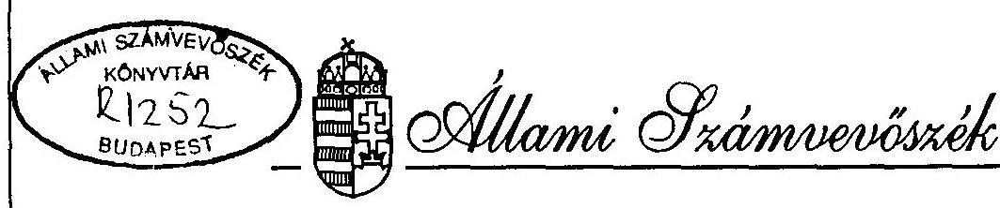
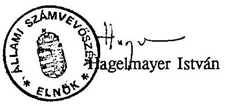

# JELENTÉS 

a helyi önkormányzatok településtisztasági tevékenységének és finanszírozási rendszerének vizsgálatáról

---

# JELENTÉS 

## a helyi önkormányzatok településtisztasági tevékenységének és finanszírozási rendszerének vizsgálatáról

A helyi önkormányzatokról szóló 1990. évi LXV. törvény a települési önkormányzatok feladataként jelöli meg a településtisztaság biztosítását. Az önkormányzat maga határozza meg - a lakosság igényei alapján, hogy milyen mértékben és módon látja el és támogatja ezt a tevékenységet.

Az önkormányzati törvény feladatmeghatározásából kiindulva a településtisztasági fogalmat tágan értelmezve, beleértettük a vizsgálatba a köztisztasági, azaz a közterületek tisztántartásával és a települési szilárd hulladék begyűjtésével, ártalmatlanításával kapcsolatos tevékenységeket is.

A vizsgálat célja: annak megállapítása, hogy

- az önkormányzatok milyen intézkedéseket tettek a településeken keletkező szilárd és folyékony hulladékok kezelésére, a közterületek és ingatlanok tisztántartására. Az ezzel kapcsolatos szolgáltatások megszervezésében az önkormányzat intézményei (körjegyzőségeket, illetve a polgármesteri hivatalt is beleértve) milyen formában vesznek részt,
- a feladat megoldására milyen módszereket alkalmaztak (saját, idegen vállalkozás) és milyen nagyságrendű anyagi eszközt terveztek és használtak fel,
- az anyagi terhek hogyan oszlanak meg az önkormányzat és a lakosság között,
- a feladatellátás követelményeinek meghatározása során miként érvényesülnek a lakosság érdekei, valamint a környezetvédelem szempontjai.

A vizsgált időszak: 1991-1994. június 30.

---

A vizsgálat 14 megyére és a fővárosra terjedt ki. Az ellenőrzés során 78 helyi önkormányzat településtisztasági tevékenységét ellenőriztük. A vizsgált települések jegyzékét a 2. sz. melléklet tartalmazza.

A lakossági szilárd hulladékokkal kapcsolatban rendelkezésre álló adatok szerint Magyarországon évente kb. 20 millió $\mathrm{m}^{3}$ települési hulladék keletkezik. A településeken képződő szilárd hulladék mennyisége azonban csak becsléssel állapítható meg. Egyrészt a települések mintegy 20%-ában nincs szervezett hulladékgyűjtés, másrészt a kimutatott mennyiségek mérés hiányában bizonytalanok. Az ezeken a településeken keletkező hulladék egy részét a vidéki háztartásokban jól-rosszul ártalmatlanítják (elégetés, komposztálás), hasznosítják, más része az árokpartokra, erdőszélre kiszórt hulladék mennyiségét növeli, illetve az illegális lerakók (vadlerakók) kialakulásában játszik szerepet.
Az országos adatok szerint a rendszeres hulladékgyűjtésbe bevont lakások száma 1992-ben 2556854 db, 1993-ban 2633575 db volt, amely az összes lakásállomány 65,3%-66,8%-át jelentette.

A szervezett hulladékgyűjtés területéről elszállított szilárd hulladék mennyisége országosan évente 16,4-16,9 millió $\mathrm{m}^{3}$-t tett ki, amelyből a lakosságtól begyűjtött hulladék mennyisége 9,5-10,0 millió $\mathrm{m}^{3}$ körül alakult.

A közműolló helyzete, a keletkezett szennyvizek ártalmatlanításának helyzete rendkívül kedvezőtlen.

A vezetékes vízellátás fejlesztésével Magyarországon nem tartott és jelenleg sem tart lépést a képződő szennyvízeket összegyűjtő, elvezető csatornahálózat kiépülése.

Az országos adatok szerint az el nem vezetett szennyvizek aránya eléri a 40%-ot. A közüzemi ivóvízhálózatba kapcsolt lakások száma az 1991. évi 3,385 millióról 3,484 millióra emelkedett 1993-ra, arányuk az összes lakásállományhoz viszonyítva 74,4%-ról 76,6%-ra nőtt, a vezetékes vízzel ellátott települések aránya pedig 84,4%-ról 90,7%-ra változott. A lakosságnak szolgáltatott víz mennyisége 530 millió $\mathrm{m}^{3}$-ről 474 millióra csökkent (elsősorban takarékossági intézkedések következtében). Az ivóvízhálózat fejlesztésével szemben a közcsatorna hálózatba bekapcsolt lakások száma ezen időszak alatt csupán 54 ezerrel nőtt (1,648 millióról 1,702 millió darabra), az összes lakáshoz viszonyított aránya 42,1%-ról 43%-ra nőtt.

---

A háztartásokból elvezetett szennyvíz mennyisége ugyanezen időszakban 328, illetve 286 millió m${ }^{3}$ volt, míg 200, valamint 190 millió $\mathrm{m}^{3}$-t tett ki az el nem vezetett lakossági szennyvíz, ennek aránya 38%-ról 39,9%-ra nőtt.
A fővárosban és a megyei jogú városokban keletkezik az országosan elvezetett szennyvizek több mint 3/4 része. Itt él a csatornával ellátott népesség mintegy 60%-a. A közcsatornán elvezetett szennyvíz 54%-a tisztítatlanul kerül a befogadóba és mindössze 33% a biológiailag tisztított szennyvíz aránya. A tisztítatlan szennyvizek 63%-át a főváros és a megyei jogú városok bocsátják ki.

A csatornázottság elmaradása hívta létre a közműpótló településtisztasági szolgáltatást, amelynek egyik feladata a közcsatorna hálózatba be nem kötött lakóépületek szennyvízderítőiből, szikkasztó medencéiből származó szennyvizek és iszapok összegyűjtése és ártalmatlanítása.

A vizsgált önkormányzatok költségvetése összes kiadásain belül a településtisztasági tevékenységre fordított kiadások aránya évente 1,0-2,0% körül mozgott. Erre a tevékenységre 1993. évben együttesen 2959 millió forintot használtak fel.

A lakossági folyékony települési hulladékgyűjtés ártalmatlanítása céljából 1991-1994. között évente 110-200 millió forint állt az önkormányzatok rendelkezésére a központi költségvetésben.

# I. 

A vizsgálat megállapításai

## 1. A tevékenységek jogi szabályozása.

Az önkormányzati feladatellátás rendszerén belül a településtisztasági tevékenység fogalmi meghatározására, feladattartalmának körülhatárolására nehezen állt össze az egységes szakmai és jogi értelmezés. A településtisztaság fogalma szakmai feladattartalmában, illetve jogi szabályozottságát tekintve nem azonosítható sem a települési kommunális tevékenységgel, sem a településüzemeltetés, vagy pedig a köztisztaság fogalmával.

A településtisztaság biztosítása a települési önkormányzatnak a helyi közszolgáltatások körében nevesített különös feladata, amelyben az önkormányzat maga határozza meg, hogy mely feladatokat, milyen mértékben és módon lát el (1990.

---

évi LXV. tv. 8. § (1) és (2) bekezdése).
Az ÖTV azt sugallta - az 1994. évi LXIII. törvénnyel történt módosítása előtt -, hogy a településtisztasági feladat magában foglalja az önkormányzatnak a településen jelentkező összes tisztasági jellegű feladatát, így többek között a közterületek tisztántartását, a települési szilárd hulladék és a lakossági szemét szervezett gyűjtését.

Ezt a felfogást látszott igazolni az Alkotmánybíróság 25/1994.(V.10.) számú határozatának, valamint ezt követően hozott határozatainak indokolása, amelyben az önkormányzati köztisztasági szabályrendeletek megsemmisítésénél a településtisztaság biztosításának kötelező önkormányzati feladatellátása volt az egyik hivatkozási alap.
Az ÖTV módosításával azonban megoldódott az egyébként részleteiben különböző és alacsonyabb szintű jogszabályokkal szabályozott feladatoknak a törvényi megalapozása azzal, hogy a normaszövegbe a településtisztaság biztosítása kifejezés elé beemelte a köztisztaság szót.

A jogi szabályozás hiányossága azonban továbbra is az, hogy törvényi szinten sem az ÖTV-ben, sem a hatásköri törvényben nincs kötelező önkormányzati feladatként megfogalmazva a háztartási hulladékkal, mint települési szilárd hulladékkal kapcsolatos köztisztasági tevékenység. A törvényi szabályozás a köztisztasági tevékenységből csupán a közterületek tisztántartását, valamint a lomtalanítási tevékenységet tartalmazza.

A helyi önkormányzatok és szerveik a köztársasági megbízottak, valamint egyes centrális alárendeltségű szervek feladat- és hatásköréről szóló 1991. évi XX. (Hatásköri) tv. a települési önkormányzat kommunális igazgatási feladatain és hatáskörén belül csupán a települési folyékony hulladék leeresztő helyének kijelöléséről, valamint a közcélú ártalmatlanító telep létesítésével kapcsolatos feladatok ellátásáról, továbbá a közterület tisztántartásával és a lomtalanítási akciókkal kapcsolatos feladatok ellátásáról rendelkezik. Nem szabályozza hatáskörileg a települési szilárd hulladék kezelésének, gyűjtésének és ártalmatlanításának feladatait.

A belügyminiszter feladat- és hatásköréről szóló 39/1990. (IX.15.) Kormányrendelet a kommunális ellátással és a település üzemeltetésével összefüggő feladatok irányításáról beszél. (Időközben a jogszabályt hatályon kívül helyezte a 147/1994. (XI.17.) Kormányrendelet, azonban a feladatellátás irányítását hatályban tartotta.) A környezetvédelmi és területfejlesztési miniszter feladat- és hatásköréről szóló

---

43/1990. (IX.15.) Kormányrendelet a miniszter feladatává teszi a hulladékkezelés körében a települési hulladék kezelésének és elhelyezésének szakmai szabályainak és környezetvédelmi követelményeinek meghatározását.
A közlekedési, hírközlési és vízügyi miniszter feladat- és hatásköréről szóló 44/1990. (IX.15.) Kormányrendelet szerint nevesített feladata a szennyvízelvezetés és szennyvíztisztítás tevékenységek.

A feladatok szabályozása a tárcák között megosztott.
A tárcaszintű jogi szabályozás, szakmai felfogás lényege abban van, hogy a köztisztasági tevékenység nem a településtisztasági tevékenység része, annak egyik részterülete, hanem azzal együtt, egymással mellérendeltségi viszonyban képezik a települési önkormányzat helyi közszolgáltatási feladatait.

A köztisztasággal és a települési szilárd hulladékkal összefüggő tevékenységekről szóló 1/1986. (II.21.) ÉVM-EüM. együttes rendelet 1. § (2) kiemeli, hogy "nem terjed ki a rendelet hatálya a települési folyékony hulladékokra és a velük összefüggő tevékenységekre". Ez a jogszabály alapvetően a települési szilárd hulladékkal összefüggő kérdéseket szabályozza, ezt tekintve köztisztaságnak, beleértve a fogalomba az egyes ingatlanok, továbbá a nem lakás céljára szolgáló helyiségek és a hozzájuk tartozó területek, valamint a közterületek tisztántartását.

A tisztántartás fogalma alatt a jogszabály az egyes ingatlanok és közterületek tisztítását, hó- és síkosságmentesítését, illetőleg pormentesítését érti.

A településtisztasági szolgáltatás ellátásáról és a települési folyékony hulladék ártalmatlanításáról szóló 4/1984. (II.1.) ÉVM rendelet, valamint a települési folyékony hulladék tárolásának, ártalmatlanításának és hasznosításának közegészségügyi szabályozásáról rendelkező 2/1985. (II.16.) EüM-ÉVM. együttes rendelet a településtisztaság fogalmát kizárólag a települési folyékony hulladékra és az azzal kapcsolatos tevékenységre értelmezi.

A szakmai-jogi szabályozás tehát éles határt húz a köztisztaság és a településtisztaság közé, két egymástól különböző szakterület szabályait fogalmazza meg. A feladat- és hatásköröket szabályozó különböző szintű jogszabályok esetleges átfedései ellenére is világosan látszik, hogy a településtisztaság és a köztisztaság két különböző tevékenységgörüp, amely a kommunális tevékenység körén belül értelmezhető.
Ezt erősíti meg a Központi Statisztikai Hivatal ágazati osztályozási rendje, valamint a PM. Szakfeladat-rendje, amely szerint két külön alágazatban található a településtisztasági szolgáltatás (9012), valamint a települési hulladékok kezelése

---

köztisztasági tevékenység (9021) a Szennyvíz- és hulladékkezelés, köztisztasági szolgáltatás címet viselő ágazaton belül.

A szakágazati besorolás szerint a településtisztasági szolgáltatáshoz tartoznak: - a szennyvíztárolók és a közcsatornába be nem kötött csatornák és csatornarendszerek tisztítása, fertőtlenítése, a települések folyékony hulladékai gyűjtésének, elszállításának, ártalmatlanításának feladatai.

A települési hulladékok kezelése, köztisztasági tevékenység magában foglalja: - a települési szilárd hulladékok összegyűjtése, elszállítása, átmeneti tárolása, ártalmatlanítása, a közterületek tisztítása, hó- és síkosságmentesítés feladatokat.

Hiányzik a település üzemeltetés fogalmának meghatározása is. Az egyértelmű fogalommeghatározást az indokolja, hogy az éves költségvetési törvények normatív állami hozzájárulásként nagy összegeket biztosítanak e jogcímen anélkül, hogy a normatíva tartalmát pontosan meghatároznák.

Az éves költségvetési törvényekben (1992. évi LXXX. tv., 1993. évi CXI. tv.) a helyi önkormányzatok által felhasználható központosított előirányzatok között a 200-200 millió forintos - a környezet és vízbázisok fokozott védelme érdekében a lakossági folyékony települési hulladékgyűjtés támogatására szolgáló - keret igénybevételének egyik feltételeként az önkormányzat általi utólagos számlafelülvizsgálatot írták elő. Tulajdonképpen igényelheti minden helyi önkormányzat, amely lakossági folyékony települési hulladékgyűjtést ártalmatlanítás céljából saját önkormányzati szervezetével vagy külső vállalkozóval végeztet. A támogatás az összegyűjtött és szabályozott lerakóhelyek által igazolt ártalmatlanított folyékony hulladék mennyisége után jár. Mértéke köbméterenként 95 forint.
A törvény normaszövege ezt az előirányzatot a helyi önkormányzatok által ellátandó feladatokra, mint felhasználási kötöttséggel járó állami támogatást állapítja meg. A törvényi szövegből, valamint a melléklet magyarázataiból egyértelműen nem állapítható meg - ellentétben más előirányzatokhoz fűzött magyarázatokkal - hogy az önkormányzat által igényelt támogatásra az ártalmatlanítást végző szervezet, a hulladékgyűjtést ellátó szervezet, avagy éppen a folyékony hulladékot kiadó lakosság a jogosult, illetőleg egyik sem, mivel a lehívott összeg kizárólag az igénylő önkormányzatot illeti meg, függetlenül attól, hogy az önkormányzatot terheli-e a feladatellátás kényszere.

---

Ezt a képet színesíti - más megyékhez hasonlóan - a Somogy és a Veszprém Megyei Önkormányzat esete. Jelenleg még a megyei önkormányzat tulajdonosi irányítása alá tartozó szolgáltató tevékenysége után veszik igénybe a 95 forint/m${ }^{3}$ állami támogatást és azt felhasználási kötöttség nélkül utalják át. A vállalat természetesen a települési önkormányzatok területén élő lakosság javára végzi tevékenységét anélkül, hogy a lakosok és a megyei

 önkormányzat között bármiféle kapcsolat lenne. Az igényelt támogatást ebben az esetben teljes mértékben a hulladékgyűjtést végző vállalat kapja.

A támogatás törvényes igénybevételének feltételei nincsenek biztosítva.
Csupán néhány ártalmatlanító telepen létezik mérési lehetőség, a csatornabeöntőknél a mérés nem megoldott, önbevallás alapján történik a mennyiség, az ártalmatlanítás, illetőleg az eredet jelzése. A számlák folyamatos felülvizsgálata csak formailag megoldható. Ezek szerint a mérés és a mérés igazolásának problémái megkérdőjelezik az igénybevétel alapját képező adatok hitelességét. Ilyen alapon évente 200-200 millió forint állami támogatás jut az önkormányzatokhoz.
A támogatást jogosan igénybe vevők körének meghatározásán túlmenően hasonló nehézséget jelentett a pénzfelhasználás jogcímének a meghatározása is. Ez adódik abból, hogy a költségvetési törvény az előirányzat felhasználási céljaként a környezet és a vízbázisok fokozott védelme érdekében történő hulladékgyűjtés támogatását jelölte meg. Megjegyzendő, hogy az 1995. évi költségvetést megállapító 1994. évi CIV. tv. a korábbiakhoz képest egyszerűsíti a megnevezett célt: "Települési folyékony hulladék ártalmatlanításának támogatása."

Az ártalmatlanításnak, mint célnak a megjelenése ismételten felhívja a figyelmet arra, hogy a hatályos joganyag az ártalmatlanítás fogalmát nem egységesen értelmezi, széles teret enged az ártalmatlanítás fogalmának tágabb értelmezésére.

A települési szilárd hulladék ártalmatlanításának fogalmi meghatározásával (1/1986. (II.21.) ÉVM-EüM. együttes rendelet 3. § j. pont) ellentétben a települési folyékony hulladékok ártalmatlanításáról szóló 4/1984. (II.1.) ÉVM rendelet nem határozza meg az ártalmatlanítás fogalmát, sőt a normaszöveg az ártalmatlanítással azonosként tekinti a hasznosítást. De a települési folyékony hulladék tárolásának, ártalmatlanításának és hasznosításának közegészségügyi szabályairól szóló 2/1985.(II.16.) EüM-ÉVM. együttes rendelet sem adja meg az ártalmatlanítás fogalmát.

Erre csak következtetni lehet az ártalmatlanító helyek típusainak felsorolásából, amelyek között például a jogszabály megemlíti "a gazdálkodó szervezetek kezelésében lévő nem közcélú ártalmatlanító telep"-et is.

---

A támogatandó cél sokféleségét, illetőleg a kötetlen felhasználás lehetőségét segítette és a bizonytalanságot fokozta egy BM-PM állásfoglalás (ÖG-705/1992.), amely beleértette a támogatási célba - a folyó kiadásokon túl - a lerakóhelyekhez, ártalmatlanítókhoz kapcsolódó egyéb feladatokat, pl. lerakóhelyek bővítését, elújítását, üzemeltetését, vagy a leeresztőhely díjának mérséklését, esetleg elengedését.

A helyszíni vizsgálatok tapasztalatai szerint a központi támogatás igénybevételének és felhasználásának törvényben rögzített célját és feltételeit illetően jelentős a bizonytalanság, számos az értelmezési probléma. A támogatás céljának megfogalmazása nem ad egyértelmű eligazítást arra, hogy azt ki használhatja fel és mire fordíthatja. Részben ez az oka annak, hogy a vizsgált 78 települési önkormányzat közül mintegy fele nem élt az állami támogatás igénybevételével.

A központi feladat meghatározás bizonytalanságai és a szabályozottság ellentmondásai a helyi szabályozás és feladat meghatározás szintjén is megmutatkoztak. Emellett azonban az emberi környezet fokozottabb védelmét szolgáló szemlélet az önkormányzatok többségénél nem alakult ki. Csak kevés helyen keresik a költségkímélő megoldásokat (pl. közmunkások foglalkoztatása), a lakosság közreműködését igénylő, figyelmet felhívó propaganda tevékenységet, mozgalmat nem folytatnak.
Nem tapasztalta az ellenőrzés a vizsgált önkormányzatoknál, hogy a feladatokhoz kapcsolódó rendeletalkotás során valamennyi részterületet (szakfeladatot) teljeskörűen szabályozták volna. A szabályozás során különböző hangsúlyt kaptak a feladatok, néhány helyen egyes feladatok megoldását nem rendezték. Egyes, különösen a nagyobb önkormányzatok (pl. Kaposvár, Siófok) nem foglalkoznak rendeleteikben a települési folyékony hulladékkal, de egyáltalán a településen keletkező szennyvízek kezelésének, gyűjtésének és ártalmatlanításának kérdéseivel. Szemben a köztisztasággal és a települési szilárd hulladékkal összefüggő tevékenységekkel, amelyekről valamennyi vizsgált önkormányzat alkotott rendeletet.

A vizsgált témakör jogi szabályozottságának tárgyalásánál nem hagyhatók figyelmen kívül az Alkotmánybíróságnak e kérdésekhez kapcsolódó, az önkormányzati köztisztasági rendeletek törvényellenességét megállapító határozatai, amelyek a vizsgált önkormányzatok szinte mindegyikénél megállapíthatók lennének.

---

Az Alkotmánybíróság megsemmisítette több önkormányzat (pl. Győr, Pannonhalma, Rábapatona, Kisbajcs, Pér, Szentlőrinc, Békéscsaba, stb.) köztisztaságról szóló rendeletének azon rendelkezéseit, amelyek a szemétszállításban kizárólagos jogot biztosítottak egy szervezetnek és kötelezővé tették az igénybevételt (szerződéskötési kényszer), valamint szemétszállítási díjat állapítottak meg és a díjfizetést mindenki számára kötelezővé tették (hatósági ármegállapítás).
A törvénysértés aligha vitatható, az viszont elgondolkoztató, hogy milyen lenne egy település köztisztasági helyzete, ha - a törvényeknek megfelelően - a lakosság szabadon dönthetné el, hogy melyik szállítóval szerződik és milyen díjazás ellenében szállítja el szemetét. Az önkormányzatok által biztosított szolgáltatások kötelező igénybevételének elmaradása beláthatatlan gazdasági és település-egészségügyi következményekkel járhat.

Az Alkotmánybíróság 50/1994. (X.26.) számú határozatában megjegyzi, az önkormányzatnak lehetősége van arra, hogy az általa létesített közüzemi vállalatot kötelezze a települési szilárd hulladék elszállítására, valamint a lakosok számára előírhatja a szemét elszállításának kötelezettségét. Mindezt a hatályos jogi szabályozás szerint, a törvényes rend védelme érdekében javasolja az Alkotmánybíróság. Az igazi, valódi megoldást jelentő jogi eszköz azonban az Országgyűlés kezében van.
2. A települési szilárd és folyékony hulladékok kezelése, közterület tisztántartási tevékenység költségvetési kapcsolatai

A települési önkormányzatok költségvetési gazdálkodásában a köztisztasági, településtisztasági tevékenység nem képez súlyponti feladatot. A szilárd és a folyékony települési hulladékok gyűjtését és kezelését általában olyan szolgáltatásnak tekintik, amelyben a tevékenységet végző vállalkozók állnak közvetlen pénzügyi kapcsolatban a lakosokkal illetve közületekkel. E tevékenységen belül kisebb arányban alakult ki az a gyakorlat, hogy a vállalkozókkal az önkormányzat van szerződéses kapcsolatban, vagy saját szervezetével látja el a feladatot és így a költségvetés tartalmazza az ezzel kapcsolatos kiadásokat, valamint a bevételeket.

Az általános gyakorlattól lényegesen eltérő a fővárosi rendszer azzal, hogy a lakosság nem fizet szemétszállítási díjat, a szolgáltatás költségei nagyobbrészt az önkormányzat költségvetését terhelik.
Debrecenben 1992-tól bevezették a magánszemélyek kommunális adóját, ezzel együtt megszűnt a lakossági díjfizetés.

---

Saját költségvetési forrásaikból oldják meg az önkormányzatok a közterületek tisztántartását és egyéb köztisztasági feladataikat (lomtalanítás, hó- és síkosságmentesítés).

Az önkormányzatok a köztisztasági és a településtisztasági tevékenységgel kapcsolatos kiadásaikat a "települési hulladékok kezelése, köztisztasági tevékenység" valamint a "településtisztasági szolgáltatás" szakfeladaton is kimutatják. A költségvetési beszámolók ezen adatai azonban nem tükrözik a tevékenység pontos pénzforgalmát, mivel nem minden önkormányzat alkalmazza e szakfeladatokat, gyakori az ilyen jellegű kiadás más szakfeladaton történő kimutatása (pl. város és községgazdálkodás) illetve más jellegű kiadás (parkfenntartás) e szakfeladaton történő elszámolása.
A települési hulladékok kezelése, köztisztasági szakfeladaton a vizsgált önkormányzatok 22%-a, a településtisztasági szakfeladaton 89%-a nem mutatott ki 1993. évben kiadást, azaz e tevékenységek költségeit külön nem figyelte meg, vagy nem is merült fel ilyen kiadása.

Csongrád megyében a vizsgált községek közül Tömörkényt kivéve nincsen ilyen szakfeladat.
Jász-Nagykun-Szolnok megyében a vizsgált önkormányzatok csak a központosított állami támogatást szerepeltetik, egyéb kiadásokat nem. Ehhez hasonlóan járnak el Veszprém megyében is, ahol a központosított állami támogatáson túl saját kiadást nem jeleznek.
A Fővárosi Önkormányzat viszont az állami támogatást a vállalkozások támogatásaként mutatja ki.
A Pest megyében vizsgált önkormányzatoknál ugyanez az igazgatási szakfeladaton jelenik meg.

Az 1993. évi költségvetési beszámolóban a helyi önkormányzatok a települési hulladékok kezelése, köztisztasági tevékenység szakfeladaton 5353 millió Ft, a településtisztasági tevékenységen 238 millió Ft kiadást mutattak ki, ez együttesen az összes kiadás 0,90%-át. A vizsgált önkormányzatoknál a szakfeladatokon elszámolt kiadások aránya 1,97%, ezen belül a Fővárosi Önkormányzatnál 3,85% volt.

A köztisztasági tevékenységgel kapcsolatos kiadások az átlaghoz képest azokon a településeken magasabbak, ahol az önkormányzatok (pl. Zirc, Dudar) bonyolítják a lakossági szemétszállítást, természetesen saját bevétel is csak ezeknél a településeknél származik szemétszállítási díjakból.

---

Az önkormányzatok köztisztasági, településtisztasági kiadásai 1991. és 1993. között - az összes költségvetési kiadásaiknál nagyobb mértékben - mintegy 80%-kal emelkedtek.
Ezen belül azonban a feladatellátás helyzetétől függően a kép jelentősen eltérő.

#### Abstract

Veszprém megyében a köztisztasági szakfeladaton elszámolt éves kiadási előirányzatának 1991. évben 1%-át, 1992. évtől 1994. június 30-ig évenként mindössze a 0,7%-át jelentette. A vizsgált települések módosított költségvetési kiadási előirányzata az előző évhez képest 1992-ben 28,2%-kal növekedett, a köztisztasági tevékenység előirányzata 1,5%-kal csökkent, 1993-ban a módosított kiadási előirányzatok 22%-kal, a köztisztasági tevékenységé 14,3%-kal emelkedett, 1994-ben már a növekedés nagyobb arányú a köztisztasági tevékenységnél - jellemzően a hó és síkosság elhárítási feladatok növekedése következtében -, mely 36,9%-kal, a módosított kiadási előirányzat 17,1%-kal növekedett. Debrecen Megyei Jogú Városban a szakfeladatok előirányzata az 1994. évi 0.57%-ra, 2,9%-ra nőtt 1994-re a költségvetésen belül.

Az önkormányzatok költségvetésében a települési hulladékgyűjtés és kezeléssel összefüggő saját folyó bevétel nem volt számottevő, a vizsgált önkormányzatoknál mindössze az e szakfeladatokon elszámolt kiadások 1-2%-át fedezte. Ettől eltérő tapasztalat szerint:

A saját bevételek Zirc és Dudar Községek Önkormányzatának köztisztasági kiadásait 1991-ben 19%-ban, 1992-ben 49%-ban, 1993-ban 40,6%-ban fedezték.

A Magyar Köztársaság 1994. évi költségvetéséről szóló 1993. évi CXI. tv. (1993. december 28.) település-üzemeltetés normatíva állami hozzájárulás címen 3820 forint/fő támogatást biztosít, az 1993. január 1-jei állandó népesség száma alapján a települések igazgatási, kommunális, út- és híd-fenntartási, valamint a település üzemeltetés során jelentkező egyéb kiadásokhoz. Ennek összege együttesen 41612 millió forint volt. Ezzel közel azonos - országos átlagban - az önkormányzatok igazgatási tevékenységével kapcsolatos kiadása. Település üzemeltetés címén 1993-ban a vizsgált önkormányzatok együttesen 12795 millió forintot vettek igénybe.

Összességében ez a forrás is csak részben fedezte azokat a kiadásokat, amelyek az állami hozzájárulás jogcímének tartalmi fogalomkörében szerepelnek. A település üzemeltetés körébe tartozó kiadások között nagyobb arányban a közutak és hidak üzemeltetése, vízkárelhárítás, a közvilágítás és egyéb város- és községgazdálkodási, parkfenntartási ráfordítások szerepelnek.

---

A köztisztasági, településtisztasági önkormányzati költségvetési kiadások aránya a település üzemeltetési normatívához viszonyítva 1993. évben 13%-ot tett ki. A vizsgált önkormányzatoknál a normatív állami hozzájárulásnak nagyobb súlya volt ezen közszolgáltatási feladatok ellátásában. Az 1992. évben a településüzemeltetés normatívából származó bevétel 23,1%-át, az 1993. évben 25,5%-át (Főváros költségvetésében 40,8%-át) kitevő forrást fordítottak köztisztasági, településtisztasági feladatokra.

Veszprém megyében a teljesített köztisztasági kiadások a vizsgált települések esetében 1991. évben a kommunális tevékenységre biztosított normatíva 27,2%-át, 1992-1993. években a település üzemeltetési normatíva 11,1%-át, 1994. I. félévében 23,6%-át jelentették.

A helyszíni vizsgálatok tapasztalatai azt igazolták, hogy az önkormányzatok árhatósági jogkörének módosítása után is a korábbi gyakorlatot folytatva a képviselő-testületek határozták meg a szilárd hulladékgyűjtés lakossági árait. Döntéseikben esetenként a választópolgárok érdekei kerültek előtérbe, így a szolgáltatást végző önkormányzati alapítású szervezetek ezzel kapcsolatos tevékenysége veszteséges lett.

Szekszárd Megyei Jogú Városban az önkormányzati HÉLIOSZ Kft. számításai szerint 1993. évben a lakossági szemétszállítás és elhelyezés költségei 10 millió forinttal meghaladták a lakossági díjból származó bevételeket, amit az egyéb vállalkozásaik eredményéből fedeztek. A képviselő-testület a szemétszállítás díját 1992. július 1-től a vizsgálat időpontjáig nem módosította.

A fővárosban a kommunális szolgáltatás ágazatban a lakosság részére végzett tevékenységek után 1993-ban 111 millió forint veszteséget mutattak ki.
A Jka Városban viszont a szemétszállítás költségei 1993-ban 1991. évhez képest 150%-kal, a bevételek 175,8%-kal növekedtek, az eredmény az 1991. évi 897 ezer forinttal szemben 1993-ban 3252 ezer forint volt.

A központi költségvetés 1991. évtől a központosított előirányzatokban évente 110-200
 millió Ft-ot biztosított a helyi önkormányzatok részére a környezet és a vízbázisok fokozott védelme érdekében lakossági folyékony települési hulladékgyűjtés támogatására.
A vizsgált időszakra rendelkezésre álló 527 millió Ft keretből 1991. január 1. és 1994. január 30. között a helyi önkormányzatok 490 millió forint támogatást vettek igénybe. Ebből a vizsgálatba bevont helyi önkormányzatok 238 millió Ft-ot, az összes támogatás 49%-át használták fel.

---

A támogatási rendszer jogi szabályozásának már említett bizonytalanságai a helyszíni vizsgálati tapasztalatok szerint a támogatás igénybevételének és felhasználásának gyakorlatában is jelentkeztek.

A vizsgált helyi önkormányzatok közül 34 önkormányzat vett igénybe lakossági folyékony települési hulladékgyűjtésre állami támogatást. A helyszíni vizsgálatok megállapítása szerint 17 önkormányzat esetében a jogszabályi feltételeket teljes egészében nem tartották be, így a támogatás egy részét jogtalanul vették igénybe.

Az önkormányzatok hivatalai a támogatást a szolgáltatást végző szervezetek által közölt vagy becsült mennyiségi adatok alapján igényelték meg. Az igénybevétel feltételeként megjelölt, az ártalmatlanítást is igazoló számlák felülvizsgálatát általában nem végezték el. A számlák tételes ellenőrzése nagyobb adminisztrációs terhet jelentett volna mind a szolgáltatóknál, mind az önkormányzati hivataloknál (évi 400-500 ezer számla felülvizsgálatát jelentené ez a feltétel). További gondot jelentett az ártalmatlanítás igazolása.
Nem jellemző a tisztítótelepeken, kijelölt leürítőhelyeken elhelyezett szippantott szennyvíz mennyiségi mérése, a lakossági, illetve közületi megkülönböztetése. A támogatás egy részét nem az ártalmatlanítás céljára használták fel.

A feltételeket előíró szabályozás értelmezési bizonytalanságai, a megfelelő bizonylatolás és nyilvántartás hiánya egyaránt befolyásolta, hogy a helyszíni vizsgálatok során a jogos igénybevétel pontos összegét több esetben nem is lehetett meghatározni.

A Csongrád Megyei Településtisztasági Kft. által Szeged Megyei Jogú Városban a lakosságtól összegyűjtött $57318 \mathrm{~m}^{3}$ folyékony hulladék után vettek igénybe támogatást (5,4 millió forint). A szippantott szennyvíz leeresztése ellenőrzés és tisztítás nélkül - közvetlenül a Tiszába történő bevezetés előtt - a szennyvízcsatornába történt, így természetesen igazolás sincs.
Pécs Megyei Jogú Város Önkormányzati Hivatala nem ellenőrizte a számlákat, a hulladék pontos mennyisége és eredete nem állapítható meg. Az így kimutatott adatok alapján 6,4 millió forint támogatást vettek igénybe.
Pest megyében a vizsgált önkormányzatoknál (Szentendre kivételével) a lakosság részére végzett szolgáltatást a vállalkozók számlával nem dokumentálták, a leürítőhelyen történő ártalmatlanítást az üzemeltetővel nem igazoltatták.
Hédervár Község önkormányzata az ártalmatlanítás megoldására ürítőjegyet vásárolt. A számla alapján nem állapítható meg, hogy az a lakosságtól történő folyékony hulladékgyűjtésre használták-e fel. Az igénybe vett támogatás 1,5 millió forint.

---

Hódmezővásárhely Megyei Jogú Városban a szennyvíztisztító lakossági folyékony hulladék fogadásánál a szennyvíz eredetét a szállítók bemondása alapján regisztrálják minden ellenőrzés nélkül. Tehát arra nincs garancia, hogy a lakossági folyékony hulladékként elhelyezett szennyvíz valóban lakossági eredetű.
Budapest, XVIII. kerületi Önkormányzata $26672 \mathrm{~m}^{3}$ hulladék után vett igénybe támogatást, amelyből $16821 \mathrm{~m}^{3}$ intézményi eredetű volt, ugyanakkor $4315 \mathrm{~m}^{3}$ után nem igényelte a támogatást.
Bogyiszló Községben az Önkormányzati Hivatal saját tevékenységként végzi a szolgáltatást. A támogatást a közületektől elszállított szippantott szennyvízmennyiség után is igénybe vette (a jogtalan igénybevétel 573 ezer forint).
Értelmezési problémák és az ellenőrzés hiánya miatt a Veszprém Megyei Talajerőgazdálkodási Vállalat és a Dudar Községi Önkormányzat esetében a kettős igénybevétel miatt 1,6 millió forintos támogatás igénylése a dudari önkormányzatnál jogtalan. Alapbizonylatokkal sem rendelkeztek és a hulladék eredete sem állapítható meg.

Eltérő gyakorlat alakult ki abban is, hogy a szolgáltatást végző szervezet székhelye vagy a szolgáltatást igénybe vevő települése szerint illetékes önkormányzat részesül a támogatásban.

#### Abstract

Veszprém és Zala megyék településein a Talajerőgazdálkodási Vállalat végez lakossági folyékony hulladékgyűjtést, a támogatást a Veszprém Megyei Önkormányzat Hivatala igényelte le. Tolna Megyei Környezetvédelmi Kft. mintegy 80 településen végez folyékony települési hulladékgyűjtést. A központosított előirányzatból a Kft. által igazolt lakossági szolgáltatás után 1993. I. negyedévéig a Tolna Megyei Önkormányzat Hivatala, 1993. II. negyedévétől a szolgáltatás helye szerinti települési önkormányzatok vették igénybe a támogatást. E számlák a Kft.-nél ellenőrizhetők, de a helyi önkormányzatok hivatalai azokat nem vizsgálták.

A törvényben megfogalmazott támogatási rendszerbe nem illő egyedi esetet is feltárt a Veszprém megyei vizsgálat. A Talajerőgazdálkodási Vállalat a (hulladékgyűjtés konkrét mennyiségéhez nem kapcsolódó) külön kérelemre a központosított előirányzatból 1992. évben 4 millió forint, 1993. évben 3,5 millió forint támogatást kapott. A támogatást a helyszíni vizsgálat időpontjáig nem használták fel, abból két ürítőhely rekultivációját kívánják megvásárolni.

Megfigyelhető, hogy a szolgáltatást végző magánvállalkozók többsége az állami támogatásra nem tart igényt (ebben szerepe lehet az előírt számla felülvizsgálatnak, valamint az ártalmatlanítás igazolási kötelezettségnek is). Az igazolás megszerzése és az ürítési díj megfizetése helyett esetleg inkább az illegális elhelyezést választják.

---

Kecskemét Megyei Jogú Városban 1993. előtt nem igényelték a támogatást, 1993. évben a 10 vállalkozó közül 3, 1994. évben 4 vállalkozó által végzett szolgáltatás után igényeltek 950 ezer, illetve 870 ezer forint támogatást.
Jász-Nagykun-Szolnok Megyében az igazolást szigorító előírások bevezetésétől kezdve csökkent az állami támogatás igénybevétele a városokban.
Győr megyében a 174 önkormányzatból 1991-ben 2, 1994. I. félévében 53 önkormányzat igényelte.

A helyi önkormányzatok nagyobb részt a támogatást általában felhasználási kötöttség nélkül átadták a szolgáltatást végző szervezeteknek.

Jász-Nagykun-Szolnok, valamint Tolna megyében valamennyi vizsgált önkormányzat tovább adta a támogatást.
Pest megyében a vizsgált önkormányzatok közül csak a Pest megyei és a Szentendrei Önkormányzat adta át az igénybe vett támogatást. A Pest Megyei Önkormányzat megjelölte, hogy a támogatás 70%-át a szállítás, 30%-át az ártalmatlanítás költségeihez biztosítja.
Csongrád megyében csak a Csongrád Megyei Önkormányzat utalta át a támogatást a szolgáltatást végző Kft-nek, a többi önkormányzat nem.

Néhány önkormányzat a támogatás összegét részben vagy egészében fejlesztési kiadásokra fordította vagy tartalékolta, illetve nem a támogatott célra, hanem az önkormányzat működésének finanszírozására használta.

Bordány és Enese Községekben az igénybe vett támogatást fejlesztésre fordították.
Dunaharaszti Nagyközség Önkormányzata a becsült adatok alapján igényelt 15,7 millió forint támogatást részben tartalékba helyezte, részben a tevékenységgel összefüggő fejlesztési kiadásokra fordította (figyelőkutak létesítésére, laboratóriumi vizsgálatokra, új elhelyező kazetta kialakítására).
Nyúl Község Önkormányzata a 373 ezer forint támogatást tartalékba helyezte, a szolgáltatás eredetét nem dokumentálták.

A folyékony települési hulladékgyűjtés szolgáltatási díjai többszörösen meghaladják a közcsatornán elvezetett szennyvíz mennyisége után fizetett díjakat. Az önkormányzatok a szolgáltatást végző vállalkozók által "szabadon" megállapított díjak alakulásával (befolyásolásával) érdemben nem foglalkoztak, viszont viselik a telepek létesítésének terhét (a közcsatornán elvezetett szennyvíz díját ugyanakkor az önkormányzat képviselő-testülete állapítja meg). A díjak a szállításon kívül csupán az elhelyezés működési költségeit tartalmazzák. (Beruházások létesítésének forrásait nem).

---

A helyszíni vizsgálatok adatai szerint a lakossági szippantott szennyvizek elszállítását a vállalkozók 1991. évben átlagosan 100 forint/m³, 1994. évben 250 forint/m³ díj ellenében végezték. Esetenként ennél magasabb árat alkalmaztak a közületeknél.

A szolgáltatások díja településenként is jelentős eltérést mutat. Ezt nem csak a szállítási távolságok okozzák, hanem az is közrejátszik, hogy a díjmegállapítás alapja különböző (lakóhelyiség/hó, konténer/forduló, a tényleges mennyiségtől függetlenül 2-5 m³ mennyiség után meghatározott alapdíj stb.). Emiatt a teljesítmények és a szolgáltatás színvonalának településenkénti összehasonlítása nem lehetséges.

Az 1994. évben m³-ként Babarc Községben 80 forint, Dunaharaszti Nagyközségben 100 forint, Budapesten 136 forint, Békés Városban 200 forint, Bogyiszló Községben 300 forint, Békéscsaba Megyei Jogú Városban 400 forint volt a szolgáltatás vizsgálat során megismert díja. A díjak esetenként 2-3-szoros emelkedést mutatnak 1991-hez képest.
Feltűnően magas Kecskeméten, ahol a szállítási távolságtól függően 638 és 987 forint/m³ díjtételt alkalmaznak. Ez 1991-hez képest 3-4-szeres emelkedést jelent.

A vizsgált önkormányzatok az állami támogatás felhasználásán kívül csak rendkívüli esetekben járultak hozzá a tevékenységek finanszírozásához, vagy a lakossági díjak mérsékléséhez.
A központosított előirányzatból biztosított támogatások a környezet és a vízbázisok fokozott védelmében a vizsgálat tapasztalatai szerint nem hoztak jelentősebb eredményt. A folyékony települési hulladékok ártalmatlanítását ösztönző hatás megfigyelhető, azonban a mérsékelt igénybevétel a hatásfokot rontja. Kevésbé érzékelhető a lakossági szolgáltatásra gyakorolt árkiegészítő szerepe. A lakossági díjat befolyásoló hatása leginkább a fővárosban érzékelhető, ahol a szolgáltatást végző vállalat az önköltségen kialakított árakat a központosított támogatás mértékével csökkentve képezi. Itt a díjemelés évenként csupán 11-16%-os.
3. A települési szilárd és folyékony hulladékok kezelése, és a közterület tisztántartási tevékenység helyzete

Általános tapasztalat, hogy valamennyi önkormányzat készített köztisztasági rendeletet. Ebben általában együttesen rendelkeznek a közterületek tisztántartásával és a szilárd hulladék gyűjtésével, elszállításával, kezelésével kapcsolatban.

---

A szabályozások azonban eltérő tartalmúak, részletezettségűek. Részben a korábbi tanácsrendeleteket aktualizálták.

Új, teljes körű helyzetfelmérésen alapuló szabályozásra csak néhány helyen került sor. A feladatellátás kérdéseivel az éves költségvetés előirányzatainak meghatározása, illetve a feladatmegoldás szervezeti formájának kialakítása kapcsán foglalkoztak.
Összességében megállapítható, hogy nem képez súlypontot az önkormányzati feladatellátáson belül a közterületek tisztántartása, a települési szilárd hulladékok kezelése, de különösen elnagyolt a települési folyékony hulladék ártalmatlanítása megszervezésének szabályozása, megoldása.
Részben ennek a következménye, hogy a hulladékok begyűjtése, ártalmatlanítása, elhelyezése, a közterület tisztántartási feladatok ellátása sehol sem teljes körű. Az elvégzett szolgáltatás mennyiségi nyilvántartása nem megbízható és hiányos, a tevékenység mérésének feltételei nincsenek biztosítva.
3.1. A közterületek tisztántartásával kapcsolatos szabályozásokra és a feladat megoldására leginkább a városok esetében került sor, a közterületek tisztántartására itt fordítottak jelentősebb figyelmet.
A városokban is azonban elsősorban a frekventált területekről gondoskodnak, kiemelten kezelik a település központját, a főközlekedési útvonalakat, az ezekhez bevezető, illetve közel eső nagyobb forgalmú utcákat.

Az önkormányzati rendeletek rögzítik a lakosságot és a közületeket, illetve az önkormányzatot terhelő kötelezettségeket. Az utak, utcák, közterek burkolatainak tisztántartása, a hó eltakarítása, a téli síkosság elleni védelem, a keletkezett szemét összegyűjtése, elszállítása, az utcai hulladékgyűjtő-tartályok felállítása, rendszeres ürítése, fertőtlenítése az önkormányzat feladata. Az általánostól eltérően egyes rendeletek speciális, a köztisztasággal összefüggő szabályozásokra is kitérnek. (Pl. előírják a síkosság elleni védekezéshez felhasználható anyagokat, üzemképtelen járművek közterületen történő elhelyezésének, elszállításának szabályait stb).
A külterületeken a köztisztasági feladatok megoldásában a lakosság öntevékeny részvétele a jellemző, hasonlóan a kisebb településeken általánosan tapasztalt megoldáshoz.
A vizsgált községekben a közterületek tisztántartása jelentős részben a határos ingatlan tulajdonosának, vagy használójának a feladata. A tevékenység ellátásá-

---

hoz az önkormányzati közreműködés aránya szerényebb mértékű. Több önkormányzati rendelet az 1/1986. (II. 21.) ÉVM-EüM. rendelet 6 § (1) bek. foglaltakon túlmenően a lakosságra hárítja át az ingatlana előtti önkormányzati tulajdonban lévő közút középvonalig terjedő részének rendben tartását is.
Csak a legszűkebb értelemben vett belterületi közterületeken vannak kihelyezve gyűjtőedények, ezek ürítése szervezett szemétszállítás hiányában nem rendszeres. A vizsgált községi önkormányzatok több mint felénél nincs rendszeres, szervezett közterület tisztántartás. A tisztítandó közterület nagyságát, az elszállított hulladék mennyiségét nem ismerik.

A tisztított közterületekről mennyiségi naturális nyilvántartást a vizsgált önkormányzatoknak csupán egy része vezetett. A 152/1992. (XI. 20.) számú Kormányrendelet alapján elrendelt 1061 számú "Jelentés az 1993. évi köztisztasági tevékenységről" elnevezésű statisztikai adatszolgáltatás az önkormányzatok részére nem kötelező.

A statisztika által megfigyelt köztisztasági tevékenység, e szolgáltatást végző szervezetek (városgazdálkodási vállalatok, költségvetési
 üzemek, illetve jogutód szervezetek) adatait tartalmazza.
A városoknál rendelkezésre álló adatok szerint 1991. évben mintegy 50 millió $\mathrm{m}^{2}$, 1993-ban mintegy 63 millió $\mathrm{m}^{2}$ (köz)területet (53,5 millió $\mathrm{m}^{2}$ belterületi utat tisztítottak rendszeresen). Az összes tisztított területből, a géppel tisztított felület aránya 1991-ről 1993-ra 89%-ról 81%-ra csökkent.

A fővárosi adat szerint a rendszeresen tisztítandó útfelület nagysága 21039 ezer $\mathrm{m}^{2}$ volt. A feladatot ellátó vállalat nyilvántartásában azonban nem négyzetméterben mérik a teljesítményt, hanem az utak hosszában, illetve gépi- és kézimunkaórában. A díjtételek meghatározása munka- és üzemóra alapján történik.
3.2. A lakossági szilárd hulladékokkal kapcsolatban rendelkezésre álló adatok szerint a vizsgált önkormányzatok közül a megyei jogú városoknál a rendszeres hulladékgyűjtésbe vont lakások aránya 80-100% között alakult. A 22 ellenőrzött város közül 5-nél ez az arány nem érte el a 60%-ot. A vizsgált nagyközségek, községek közül nyolcnál nem volt a lakásoktól közvetlen hulladék begyűjtés, további háromnál csak 1994-től szervezték meg a szolgáltatást.

---

A rendszeres hulladékgyűjtésbe kapcsolt települések arányában a megyék között lényeges különbségek vannak, ennek szélső értéke 1991-ben 12% és 100% volt. (Azóta megszűnt a statisztikai adatgyűjtés).

A vizsgált megyék közül pl. Tolna megyében 108 településből 28 településen nincs szervezett hulladékgyűjtés.

A vizsgált megyékben néhány településen nem is kívánják bevezetni a szervezett hulladékgyűjtést.

Bács-Kiskun megyében néhány kisebb önkormányzatnál úgy döntöttek a felmérések alapján és a lakosság teherviselő képességének figyelembevételével, hogy a jelenlegi, évek óta működő rendszert alapvetően nem kívánják a közeljövőben módosítani.
Pl. Szank Község Önkormányzata elkészítette ugyan a szilárd hulladék rendszeres gyűjtésével kapcsolatos javaslatot, valamint a szennyvíztisztítási és csatornázási ütemtervet, ezek költségkihatásával együtt, de a falugyülésen elhangzott vélemények és a kiírt népszavazás után elvetették. A lakosság több mint 70%-a nem vállalta a többletköltségeket.
Kerekegyháza Nagyközség Önkormányzata képviselő-testülete is elvetette egyenlőre a rendszeres hulladékgyűjtés bevezetését és annak költségkihatása miatt a jelenlegi, a lakosság által történő esetenkénti kiszállítást folytatja.

A feladatellátás szabályozásakor, az önkormányzati rendeletekben több esetben előfordult, hogy a lakosságot az önkormányzat által megállapított szemétszállítási díj megfizetésére kötelezték, illetve a rendszeres és szervezett szemétszállításba bekapcsolt területeken a szolgáltatás kötelező igénybevételét rendelték el. Az Alkotmánybírósági határozat miatt ezek az önkormányzati rendeletek törvényellenesnek minősülnek.

Az önkormányzati rendeletalkotás során a települési szilárd hulladékok kezelését, a köztisztasági tevékenységet ellátó szervezetek működési formáját felülvizsgálták. A vizsgált időszakot megelőzően a tanácsok által alapított költségvetési üzemek, illetve városgazdálkodási vállalatok látták el ezeket a feladatokat.

A felülvizsgálat során a feladatok ellátásának szervezeti keretei alapvetően nem változtak.
A nagyobb városokban a tevékenységet ellátó városgazdálkodási vállalatokat többnyire részvénytársasággá, illetve önkormányzatok által alapított nagyobb-

---

részt 100%-ban önkormányzati tulajdonú Kft.-vé alakították.
A döntések megalapozásához gazdaságossági számításokat általában nem végeztek.
A döntéseket a feladatellátásból kiindulva, a vagyon eredményes működtetése befolyásolta.

Debrecen Megyei Jogú Városban a volt Városgazdálkodási Vállalatot jogutód nélkül megszüntették, mert nem rendelkeztek az elavult gépek cseréjéhez szükséges fedezettel. Ezért 51-49%-os arányú osztrák-magyar érdekeltségű gazdasági társaságot hoztak létre.
Zirc Város önkormányzata a városgazdálkodási üzemet gazdálkodásának eredménytelensége miatt megszüntette. A köztisztasági feladatokat pályáztatás útján vállalkozásokkal végezteti. A kiválasztásnál az árajánlatok mellett vizsgálták, hogy a vállalkozóknál a személyi és tárgyi feltételek biztosítottak-e.
Dudar Községben a szemétszállításra vállalkozók kiválasztásánál a meglévő konténeredényzetre épített szállítási ajánlatot vették figyelembe.
A következő évi köztisztasági feladatokra a szolgáltatást végzők készítenek költségszámításokat. Az önkormányzatok a szerződések megkötése során többnyire nem tervezett költségeket, hanem az előző évi kiadásokat veszik alapul, ezt növelve a várható inflációs rátával.

Két esetben a szolgáltató szervezetek létrehozásakor nem tartották be a törvényes feltételeket.

A Csongrád Megyei Településtisztasági Kft.-t létrehozó önkormányzatok többsége nem rendelkezett testületi felhatalmazással.
Hódmezővásárhelyen a céltámogatással létrejött szennyvíztisztító telepet, a 10 éves elidegenítési tilalom ellenére, közgyűlési határozat nélkül apportálták.

A tevékenység ellátására korábban már meglévő, de megváltozott működési formájú szervezetek mellett viszonylag kevés új közreműködő kapcsolódott be a folyamatba. Egy-két nagyobb városban külföldi tőke bevonásával jött létre részvénytársaság, a községekben több új vállalkozó kapta meg a feladatellátást. A városokban saját szakosodott szervezetekkel rendelkeznek, a feladatok ellátását megfelelő részletezettségű, szerződéses alapon végzik.

A községi települések a feladatokat saját apparátusukkal, a tulajdonukban lévő eszközökkel, vagy kézi erővel látják el. A hulladék elszállítását esetenként a lakosság saját maga végzi. Külön szerződés alapján szervezetet vagy vállalkozót nem vesznek igénybe. Esetenként, alkalmi módszerekkel (önkormányzati saját

---

v. közhasznú munkások igénybevétele, pl. téli hóeltakarítás) történik a munkavégzés.

Ott ahol van szervezett hulladékgyűjtés a településekről a lakossági szilárd hulladék rendszeres gyűjtése, elszállítása az önkormányzati rendeletekben, illetve a szerződésekben foglaltaknak megfelelően, programozottan, a meghatározott gyakorisággal történik. A gyűjtés gyakorisága településtípusonként, a tapasztalati adatok alapján keletkező mennyiség figyelembevételével eltérő.
A sűrűbb beépítésű, nagyobb lakósűrűségű, frekventált területeken általában kétnaponként, (de előfordul a naponkénti gyakorlat is) családi házas övezetben, üdülőterületeken heti 1-2 alkalommal szállítják el a hulladékot.

Községekben leginkább a heti egyszeri gyűjtési gyakoriság fordul elő.
A vizsgált önkormányzatoknál a gyűjtés szállítás, rendszerének a korábbi években kialakult műszaki megoldási módja a vizsgált időszak alatt jelentősen nem változott.
A gyűjtőedényzet változatos, lakótelepeken általában 1,1 m³-5 m³-es konténereket, a családi házaknál 110 literes kukaedényeket alkalmaznak, de gyakori a zsákos megoldású gyűjtés is. Az elszállítás általában pormentes megoldással történik, de szinte mindenütt előfordul a nyitott platón való szállítás is.

Kedvezőtlen, hogy sem az önkormányzatok, sem a szolgáltatást végző szervezetek a gyűjtőedényzet, illetve a szállító járművek korszerűsítéséhez nem rendelkeztek a szükséges forrással.

Ettől eltérő példaként lehet megemlíteni, hogy Eger Megyei Jogú Városban a képviselő-testület a vizsgálat idején döntött a város egészére egységes hulladéktároló edényzet kicseréléséről. Ez 10000 db 110 literes és 400 db 240 literes edényt jelent mintegy 13 millió forintért.
Pest megyében Dunaharaszti, Alsónémedi és Telki Községekben kukás hulladékgyűjtési rendszer bevezetéséről döntöttek az önkormányzatok. Ezzel a megoldással a hulladékgyűjtés korszerűsítését, a hulladék szétszóródásának, porzásának megakadályozását kívánták elérni.
A döntéskor azonban nem mérték fel annak gazdasági következményeit. Nem döntöttek arról, hogy kinek a kötelezettsége a kukaedény megvétele, cseréje, pótlása, tisztítása, javítása és hogyan tudják biztosítani a speciális gyűjtőjárművet. Az előkészítetlenség miatt Dunaharasztiban és Alsónémedin meghíúsult az elhatározás valóra váltása. Telkiben az 1992. évi döntés után két éve vásárolta meg az önkormányzat a gyűjtőedényeket és adta át a lakosságnak. Ezután sem rendelkeztek azonban a sérülés, javítás, csere módjáról, illetve a tisztítási kötelezettségről.

---

A szállítójárművek átlagéletkora magas. Pest megyében 7-8, Győr megyében 10-11 év, összetételük vegyes (volt NDK-ból származó, cseh gyártmányú, nyugat-európai, elsősorban német-osztrák....stb). A fővárosban a vállalat a nagy mennyiségű tartály rendszeres ürítésére 263 db beöntőszerkezetes célgép-állománnyal rendelkezik, melyből naponta átlagosan 208 db üzemképes. A célgépállomány átlagéletkora 6,7 év, az összes célgép csupán 20%-a, 54 db 1991-94. év közötti beszerzésű.

Néhány esetben új, korszerűbb szállítójárművet vásároltak:
Győr Megyei Jogú Városban jelentősen javult a kukás gyűjtőjárművek átlagos életkora, a megyei átlaghoz képest 1,5 évre csökkent 1994-re, míg a konténer szállítóké 3 évre. Lízingszerződés formájában vásárolnak korszerűbb (használt) gyűjtőkocsikat. Ehhez hasonlóan járnak el Kapuvár Városban is.

A korszerűbb szállítójárművek a begyűjtés során 3-4-szeres tömörítést végeznek. Ilyen öntömörítős járműveket alkalmaznak a megyei jogú városok közül többek között Debrecenben, Hódmezővásárhelyen, Egerben.

A települési szilárd hulladék ártalmatlanításának a feltételei kedvezőtlenek. A szabályozás szerint ártalmatlanításnak minősül a hulladék égetése, a komposztálás, illetve a rendezett lerakás.
Magyarországon az egyetlen, az 1991. évben átépített égetőmű a fővárosban működik. A fővárosban a lakosságtól elszállított és a külső beszállítóktól összegyűjtött 4,0 - 4,3 millió $\mathrm{m}^{3}$ hulladék mintegy 55%-át a Fővárosi Hulladékhasznosító Műben égetéssel ártalmatlanítják.
A többi, mintegy 1,7 - 1,9 millió $\mathrm{m}^{3}$-t rendezett lerakóhelyre szállítják.
A vizsgált önkormányzatok esetében kizárólag lerakóhelyeken helyezik el a hulladékot ártalmatlanításra. Az elszállított szemét mintegy 8-10%-a azonban "rendezetlen" lerakásra kerül.

A céltámogatási rendszer keretében 1991 - és 1992. évben lehetőség volt 50% arányú saját forrás biztosításával állami támogatás igénybevételére, szilárd hulladéklerakó telep létesítésére.

A szilárd hulladéklerakó telep építésének támogatása 1993. évtől kikerült a céltámogatott körből.
A céltámogatási rendszer minden pozitívuma ellenére hozzájárult ahhoz, hogy

---

a korábbi regionális rendszerben működő telepek helyett, sok kis hulladéklerakó létesüljön. Ezek gazdaságos, környezetkímélő működése azonban sok esetben megkérdőjelezhető.
A vizsgálati időszakban állami támogatás nélkül, kizárólag saját erőből, a szűkös anyagi források miatt, bővítések új telepek létesítésével csak néhány önkormányzat foglalkozott. (Dunaharaszti, Ajka...). Szeghalom Városban a megkezdett új telep építését pénzhiány miatt átmenetileg szüneteltetik. Heves Városban a korábban kért céltámogatáshoz a szükséges saját forrást nem tudták biztosítani.

A szeméttelepek jogszerű hatályos működésének feltételei általában hiányosak (még a szervezett hulladékgyűjtés esetében is);

- a működéshez szükséges hatósági engedéllyel egyrészük nem rendelkezik, a szabályos működéshez előírt feltételeket nem teljesítették, a befejezés elhúzódása miatt ideiglenes jelleggel működnek. Leginkább a kiegészítő jellegű beruházások, berendezések létesítése maradt el (védő erdősáv, tűzoltásra szolgáló víztároló, figyelőkút stb.) Így működnek a vizsgált területen pl. Jászberény Város, Tiszasüly, Tiszatenyő községek telepei.

Tolna megyében a talajvíz elleni szigetelést az összes működő telepből csupán Paks Város szeméttelepén oldották meg. A lerakóhelyek 70%-ánál ellenőrzés nélkül történik a hulladék elhelyezése.
Járulékos, műszaki létesítmények (kerítés, porta, vízelvezetés) a lerakóhelyekhez általában nem készültek.
Békés megyében egyetlen telepen sem oldották meg a csapadékvíz beszivárgása elleni védekezést, Szeghalom Városban víznyerő kutak közelében, jogszabályi előírások betartása nélkül üzemeltetik,

- régebben működő telepeknél a szakhatósági engedélyeket üzembehelyezéskor - 10-15 évvel ezelőtt szerezték be, ezeket esetenként nem is tudták bemutatni, illetve azóta nem történt hatósági felülvizsgálat,
- az elhelyezés, tárolás technológiai folyamatában térfogatcsökkentő kezelésre és lerakásra alig van példa.
A tömörítést a szállítást végző, illetve talajegyengető gépekkel oldják meg a nagyobb városokban (pl. Debrecen, Kaposvár, Hódmezővásárhely, Szeged). Újabban tömörítést, aprítást végző célgépet elvétve vásároltak.

Balmazújváros Városban 1994-ben tolólapos, lánctalpas munkagépet vásároltak. Eger Megyei Jogú Városban szereztek be 10 millió forintért egy tömörítő gépet a vizsgálati időszakban.
Pest megye Önkormányzata 1992. év végéig mintegy 60 millió forintot fordított

---

regionális rendszerben működő, válogató, aprító gépek vásárlására. A gépsor 550 forint/m³ - 736 forint/m³-re kalkulált magas üzemeltetési költsége miatt a megrendelések elmaradtak (Szentendre, Gödöllő, Cegléd). A közgyűlés Gazdasági Bizottsága 1993. júniusában az eredménytelen működés miatt a gépeket üzemeltető Kft. megszüntetését javasolta.

- A nagyobb településeken a szeméttelep működését, nyitvatartását szabályozták. Állandó felügyeletről, őrszolgálatról gondoskodtak. A kisebb településeken megfelelő őrzés, védelem (kerítés) kialakítása hiányában azonban problémát jelent, hogy a kommunális lerakóba jelentős mennyiségű ipari hulladékanyag is kerül, így veszélyes hulladék is szennyezi a környezetet (szabálytalan az elhelyezés). Gyakori az öngyulladás, illetve a szél által széthordott szemét. Az őrzés elmulasztása miatt több esetben a tulajdon védelme sem megoldott, mert a meglévő kerítést is elbontották, megrongálták.
- A vizsgált területen - egy-két telepet kivéve - nem megoldott a hulladék súly szerinti mérése. A beszállított hulladék
 mennyiségét $\mathrm{m}^{3}$-ben határozzák meg, azonban a szállító járművek tényleges telítettségét nem ellenőrzik.

Szelektív hulladékgyűjtés és tárolás megoldására több önkormányzat tett kísérletet eltérő eredménnyel. A kísérletek elsősorban gazdaságossági, értékesítési okokból nem voltak sikeresek.

A fővárosban 1992-ben hat hónapon keresztül kísérleti jelleggel szelektív hulladékgyűjtést szerveztek két kerületben.
A féléves időtartam alatt jelentős mennyiségű anyagot, összesen, mintegy 103,6 tonna fehér és színes üveget, 116,0 tonna papírt, 21,3 tonna fémet, 32,4 tonna műanyagot és 1,8 tonna szárazelemet gyűjtöttek. Ezek közül az üveg, papír és fém értékesítését tudták megoldani.
1993-ban 484 budapesti általános és középiskolákban szárazelem gyűjtését vezették be, ott kihelyezett speciális konténerekben. Az akció 1994. évben tovább folytatódott. 1994. első félévig 28 t szárazelem összegyűjtésére, illetve ártalmatlanítására került sor.
A vállalat jelenlegi tapasztalatai alapján a szelektív hulladékgyűjtés nem minden tekintetben érte el célját.
Az átalakuló gazdaságban a vállalkozói szféra még nem mutat kellő érdeklődést a hulladékok újrahasznosítása iránt. A gyűjtés jelenleg ráfizetéses, a Fővárosi Önkormányzat 1992. és 1993. években 4,5 - 4,5 millió forinttal támogatta az akciót.
Debrecen Megyei Jogú Városban megfelelő figyelemfelkeltés után, sikeres lakossági részvétellel, 1992. november és 1993. február között szelektív papír, műanyag, üveg gyűjtést szerveztek. Ezen időszak alatt az A.K.S. Debrecen Kft.

---

kimutatása szerint a 2014283 forint ráfordítással szemben, a hulladék értékesítéséből származóan 19694 forint bevételt realizáltak.
Pest megyében Szentendre, Vác, Cegléd Városokban az összegyűjtött hulladék értékesítését teljes mértékben nem tudták megoldani. A MÉH Vállalat privatizációja után csak a fémhulladékok átvételét vállalták, így a gyűjtés és tárolás költségei nem térültek meg.
Gödöllő Város Önkormányzata hasonló értékesítési problémával került szembe. A PHARE-programirodától kapott 25 millió forintos támogatásból szervezte meg a hulladékgyűjtését. A különböző típusú hulladékok közül a szárazelemeket a veszélyes hulladék-lerakóhelyre szállították, az újrahasznosításra-értékesítésre alkalmas anyagoknak azonban csak egy részét tudták hasznosítani. Teljes egészében még a papír hulladékot sem tudták értékesíteni, így a színes és fehér üveg, valamint a műanyaghulladékot jelenleg is tárolják, mert ezek átvételét nem sikerült megoldani.
Győr, Eger, Kecskemét, Veszprém Megyei Jogú Városokban, Ajka Városban részben a kihelyezett konténerekben gyűjtött hulladékból, utólagos szétválogatással, közmunkások közreműködésével különítik el az üveg (színes-fehér), papír (újság, hullámpapír, vegyes), fém, gumiköpeny, műanyag és a veszélyes szárazelem hulladékot, de az értékesítést szintén nem mindenütt tudták megoldani.
3.3. A településeken keletkező lakossági folyékony hulladék problémakörével az önkormányzatok csak érintőlegesen foglalkoztak. Nem fordítottak a téma fontosságának, a környezetvédelmi szempontoknak megfelelő figyelmet a feladatok megoldására.

A vizsgált önkormányzatoknál a "közmű-olló"-t jelző összesített adatok az országos tendenciáknál kedvezőbbek, mivel a magasabb csatornázottsággal rendelkező városok a vizsgálatban a kisebb önkormányzatokkal közel azonos számban szerepeltek. A szolgáltatott víz mennyisége az 1991. évi 287 millió $\mathrm{m}^{3}$-ről 1993-ra 256 millió $\mathrm{m}^{3}$-re, az elvezetett szennyvíz 227 millió $\mathrm{m}^{3}$-ről 199 millió $\mathrm{m}^{3}$-re csökkent, tehát az el nem vezetett szennyvíz aránya 21% körül alakult.

A vizsgált önkormányzatok a köztisztaságról szóló rendeleteikben általában nem szabályozták a folyékony hulladékok keletkezése, gyűjtése, ártalmatlanításának kérdéseit. A feladatot megoldottnak tekintették, a hatósági-jogköri szabályozással, a leürítőhely kijelölésével, illetve a vállalkozói engedélyek kiadásával.
A továbbiakban vállalkozókra, illetve a telepet üzemeltetőkre bízták a szolgáltatás ellátását. A vállalkozók az önkormányzatoktól függetlenül végzik tevékenységüket. A lakosság közvetlenül tőlük rendeli meg a szennyvízszippantást.

---

Az is ritka, hogy az önkormányzatok a megrendelői igények összegyűjtését elvégezzék, a rendelések és teljesítések összehangolását segítsék.
Ilyenformán a folyékony hulladékgyűjtés, elhelyezés ügyében az önkormányzatok és a szolgáltatást végző szervek (vállalkozók) között általánosan szerződéses kapcsolat nem alakult ki.

Ez viszont azzal a következménnyel jár, hogy az önkormányzatok semmilyen információval nem rendelkeznek a begyűjtött folyékony hulladék mennyiségéről mennyiségéről, illetve az ártalmatlanítás módjáról (csupán az önkormányzat által működtetett vállalat, ill. ártalmatlanító telep adatai ismertek). A vállalkozóknak ilyen irányú adatszolgáltatási kötelezettsége nincs.

Az önkormányzatok által kiállított tanúsítványok szerint a folyékony hulladék keletkezési helyéről elszállított mennyiség tendenciájában évről-évre csökken. A vizsgálat során kiállított "tanúsítványok" csak egyedileg voltak értékelhetők, az összesítéshez megbízható adatokat nem szolgáltattak. A nagyobb településeken a közületeknél keletkezett szennyvizeknél nagyobb arányú a visszaesés, itt a közületi tevékenység visszafejlesztése megmutatkozik a keletkezett, összegyűjtött szennyvíz mennyiségében is.
A lakosságtól gyűjtött mennyiség csökkenését részben az magyarázza, hogy a magasabb vízdíjak miatt visszafogták a vízfogyasztást.

A megfigyelt csökkenés azért veszélyes, mert az összegyűjtött és kimutatott adatok csak azoknak a szolgáltatóknak, vállalkozóknak a tevékenységét mutatják (azokat is becsült adatok alapján) akik valamilyen rendezett (szervezett - de nem szerződéses kapcsolatban) állnak az önkormányzattal. A megfigyelésből (adatszolgáltatásból) kikerülő mennyiségek, az ellenőrizhetetlen vállalkozók által elszállított folyékony hulladékok a környezetszennyezés fokozódásának veszélyét jelentik.

A Tolna Megyei Környezetvédelmi Szolgáltató Vállalat (1993. évtől Kft) 1990. előtt évente mintegy 120 ezer $\mathrm{m}^{3}$ folyékony hulladék gyűjtését és kezelését végezte, 1993-ban már csak 38 ezer $\mathrm{m}^{3}$ hulladék gyűjtésére terjedt ki a Kft. tevékenysége.
Somogy megyében az 1991. évi $52419 \mathrm{~m}^{3}$ összegyűjtött folyékony hulladékkal szemben 1993-ra 30%-os csökkenés mutatkozik. Ennek a mennyiségnek a Településtisztasági Vállalat szolgáltatta 1991. évben a 90%-át, ugyanakkor 1993-ban már csak 43%-át.

---

A fővárosban az FTSZV (Fővárosi Településtisztasági Szolgáltató Vállalat) által begyűjtött folyékony hulladék mennyisége a vizsgált időszakban 13%-kal csökkent.
Csongrád megyében a lakossági eredetű összegyűjtött folyékony hulladék mennyisége 90 ezer $\mathrm{m}^{3}$-ről 69 ezer $\mathrm{m}^{3}$-re mérséklődött.

A kimutatott csökkenés mögött az is meghúzódik, hogy a szennyvíz előkezelőben a számított ártalmatlanítási költség rendkívül magas - Győr Megyei Jogú Városban pl. 780 forint/$\mathrm{m}^{3}$-, amelyet a lakossági árban érvényesíteni lehetetlen, így az összegyűjtött szennyvizeket elhelyező telepeken ürítik. Az előkezelő kihasználtsága ezért csupán mintegy 75%-os, a beszállított mennyiség egyre csökken: 1991-ben 14 ezer $\mathrm{m}^{3}$-t, 1992-ben 5 ezer $\mathrm{m}^{3}$-t, 1993-ban már csak 1 ezer $\mathrm{m}^{3}$-t regisztráltak.
Az alacsony kihasználtság miatt több esetben a telepek optimális működtetése is veszélyeztetve van.
Az egyéni vállalkozó a lakosság részére a vállalati áraknál alacsonyabb díjat számol fel és kikerülve a leürítési díj megfizetését, esetleg illegális elhelyezést végez.

Debrecenben a mintegy 30%-kal magasabb tarifával dolgozó HAJDÚKOMM Vállalat teljesítése mintegy 36%-kal csökkent két év alatt.
Hédervár önkormányzat esetében magánvállalkozó 144 forint/$\mathrm{m}^{3}$, Lébény Nagyközségi önkormányzat saját apparátussal végzett szolgáltatása 190 forint/$\mathrm{m}^{3}$, Enese Községben a magánvállalkozó 140 forint/$\mathrm{m}^{3}$ díjával szemben a térségben a Folyékony Hulladékszállító Vállalat 270 forint/$\mathrm{m}^{3}$ árat számít.

A vizsgált önkormányzatok esetében valamennyi elhelyezési, ártalmatlanítási mód előfordult. A működő hulladékgyűjtő telepekhez azonban nem mindenütt biztosították a szakhatósági engedélyeket, és a szabályos üzemeltetés feltételeit sem teremtették meg. A környezetvédelmi szempontok így nem érvényesülhetnek, változatlanul fennáll a talaj, talajvíz, élővíz szennyeződése. A telepeken, csatornaszemeken mérés gyakorlatilag nincs, a beürített mennyiséget szemrevételezéssel, a tartálykocsi űrtartalma után becsülik.

Jász-Nagykun-Szolnok megyében, Szolnok Megyei Jogú Városban nincs szennyvíztisztító telep, a közcsatornán elvezetett 3 millió $\mathrm{m}^{3}$ szennyvíz tisztítatlanul a Tiszába ömlik. A környezeti kárt növeli az összegyűjtöttből a hulladéklerakó telepen elhelyezett 15-25 ezer $\mathrm{m}^{3}$ mennyiség is.
Kisújszállás Városban nyárfás rendszerű szikkasztó ágyak vannak.
Győr-Moson-Sopron megyében 1993-ban 27 telephely közül érvényes működési engedéllyel, területfelhasználási vagy helykijelölő határozattal csupán 7 lerakó-

---

hely rendelkezett. A telephelyek környezetszennyező hatása rendkívül nagy. Azok elhanyagoltak, kerítés, őrzés nincs. Az alkalmazott szennyvízkezelési, ártalmatlanítási technológia nagyrészt ülepítés-párologtatás-szikkasztás.
Csongrád megyében, Szeged Megyei Jogú Városban a közcsatornába engedik az évente összegyűjtött 25-30 ezer $\mathrm{m}^{3}$ szennyvizet, amely az évi 9-10 millió $\mathrm{m}^{3}$ közcsatornán elvezetettel együtt tisztítatlanul folyik a Tiszába. A megyében vizsgált önkormányzatoknál működő telepek közül csak kettő (Hódmezővásárhely, Bordány) rendelkezik szakhatósági engedéllyel.
Veszprém megyében az ürítőhelyek (23 db) 80%-a szigeteletlen földmedencés tároló, ezek kialakítását nem előzte meg hatósági bejárás, a területről nem készült szakvélemény.
A fővárosban a vállalkozók által gyűjtött és a csatornába leeresztett mennyiség 1993-ban megközelítőleg 500 ezer $\mathrm{m}^{3}$ volt (FCSM adata). A jelenleg üzemelő leeresztő helyeken nincs megoldva a szennyvizek mennyiségi mérése, ezt a tartálykocsi űrtartalma után becsülik és minősítése is szemrevételezéssel történik. A pesti részéről elvezetett szennyvíz egy része az Észak- és Dél-pesti szennyvíztisztítóba jut, ahol mechanikai és biológiai tisztításnak vetik alá.
A budai mintegy 97 millió $\mathrm{m}^{3}$ szennyvíz (az összes fővárosi szennyvíz 30%-a) tisztítatlanul folyik a Dunába. A Környezetvédelmi Intézet Szakirodájának tanulmánya szerint ezenkívül 20 millió $\mathrm{m}^{3}$/év szennyvíz szivárog el a talajba az emésztőkből.
Bács-Kiskun megyében a 20 millió $\mathrm{m}^{3}$ elvezetett szennyvízből 12,7 millió $\mathrm{m}^{3}$/év mechanikailag, 5,6 millió $\mathrm{m}^{3}$/év biológiailag tisztított, 1,7 millió $\mathrm{m}^{3}$/év tisztítatlan szennyvíz képződik. A kisebb településeken a szippantott folyékony szennyvíz elhelyezése főként a szilárd hulladékkezelők mellett történik, amelyek nincsenek kiépítve a folyékony hulladék fogadására.
Pest megyében a ceglédi, váci és szentendrei szennyvíztisztító alkalmas a szippantott szennyvizek fogadására, a gödöllői szippantott szennyvíz a szilárd hulladék lerakóhely mellett helyezik el.
Dunaharaszti területén a szennyvíz leürítőhely működéséhez a szakhatóságok ideiglenes jelleggel járultak hozzá addig, ameddig a településen a szennyvíztisztító átadásra nem kerül. A vizsgált időszak alatt Dunaharaszti Önkormányzata előbb térségi megoldással, majd ennek meghiúsulása után önállóan kívánta a szennyvíztisztítást biztosítani. A megvalósítást nehezítette, hogy a Környezetvédelmi Felügyelet a soroksári Duna-ágba a szennyvíztisztítóból kikerülő tisztított víz fogadását a szokásostól lényegesen szigorúbb szennyezési határértékekhez kötötte, ezért más befogadót kényszerült keresni az önkormányzat. A Környezetvédelmi Főfelügyelet 1992. évben adott előzetes javaslata alapján a Duna-Tisza csatornába történő elvezetés megoldható, így 1993. évben céltámogatási pályázatot nyújtott be az önkormányzat szennyvíztisztítás megoldása érdekében. A támogatás elmaradása miatt 1994. évben ismételten céltámogatási kérelmet terjesztett elő az 1995. évi beruházás kezdés biztosításához.
Vecsés területén a lakások 40%-a van bekapcsolva a szennyvízcsatorna hálózatba. A településen lévő szennyvíztisztító túlterhelt és alacsony tisztítási fokot biztosít. A szennyvíz elhelyezés átmeneti megoldása érdekében az önkormányzat a Fővárosi Önkormányzattól kért és kapott engedélyt a fővárosi csatornahálózatba

---

bekapcsolódásra. Így a településen keletkező szennyvíz jelentős részét a fővárosi csatornahálózaton keresztül a Dunába vezetik.

Az önkormányzatok csak a velük szerződéses kapcsolatban álló szolgáltatók és ártalmatlanító telepek tevékenységét ellenőrzik. Ez a nagyrészt közterület tisztántartását és a szilárd hulladék elszállítását végzőkre, és telepekre vonatkozik.

Az eltérő rendszerességgel végzett vizsgálat részben a pénzügyi-gazdasági tevékenység során, részben helyszíni szemrevételezéssel történik.

A fővárosi közterületi felügyelők 1991-ben 4171 helyszíni ellenőrzés során 6851 figyelmeztetést adtak, 1,5 millió forint bírságot szabtak ki és 15 feljelentés készült, 1993-ban viszont már csak 964 esetből 732 ezer forint bírság, 3948 figyelmeztetés és 6 feljelentés volt.
Szabálytalan szemétszállítás miatt 1993-ban 235 esetben volt eljárás (átminősítés, járatbér megvonás, elbocsátás).
A szippantott szennyvíz szállítását végző vállalkozók tevékenységét az önkormányzatok általában nem vizsgálják, a leürítés szabályszerűségét nem ellenőrzik. Az illegálisan leürítőket a közterület-felügyelők és a polgármesteri hivatal dolgozói tettenérés esetén bírságolják. A bírságolás mértéke azonban nem jelentős nagyságrendű, egy-két várost kivéve
 (Vác, Szentendre) a gyakoriság is alacsony.
A fővárosban a Főpolgármesteri Hivatal Közmű Ügyosztály által végzett eseti és szúrópróbaszerű ellenőrzésekről jegyzőkönyv nem készült. A szolgáltatást végző vállalat belső ellenőrzése során 1993-ban 417 ellenőrzésről 44 szabálytalanságot tapasztaltak, közülük 19 esetben 106 ezer forint bírságot róttak ki.
A közterület-felügyelők 1993. évben a Fővárosi Csatornázási Művekkel közös ellenőrzést végeztek, melynek során 5 esetben figyelmeztetést alkalmaztak, 36 esetben 23 ezer forint összegben helyszíni bírságot szabtak ki, 3 alkalommal pedig szabálysértési eljárást kezdeményeztek az illegális szennyvíz-leeresztőkkel szemben.

Az Állami Népegészségügyi és Tisztiorvosi Szolgálat (ÁNTSZ), a Környezetvédelmi Felügyelőség részére jogszabály nem írja elő a rendszeres, meghatározott időközönként ismétlődő ellenőrzések kötelezettségét. Ellenőrzéseik száma csekély. Az ellenőrzésekről szóló dokumentumok elvétve állnak rendelkezésre.

Az ÁNTSZ Fővárosi Intézetének 1992-ben készült összefoglalója a leeresztőhelyek vizsgálatára vonatkozott. Megállapításuk, hogy szennyezett területet nem leürítés után, hanem általában naponta egyszer fertőtlenítik. A magánvállalkozók tevékenységéről megállapítja a jelentés, hogy ellenőrizhetetlen.

---

# II.   Következtetések, javaslatok 

Az önkormányzati feladatellátás rendszerén belül a településtisztasági tevékenység fogalmi meghatározása, feladattartalmának körülhatárolására nehezen állt össze az egységes szakmai jogi értelmezés.

A vizsgálati időszakban nem volt önkormányzati feladatként megfogalmazva a köztisztasági feladatok ellátása, és jelenleg sem önkormányzati feladat - törvényi megfogalmazásban - a háztartási hulladékkal kapcsolatos köztisztasági tevékenység. A szilárd és folyékony hulladék ártalmatlanításának fogalmát a hatályos joganyag nem egységesen értelmezi, ez széles teret enged az ártalmatlanítás fogalmának tágítására.

A helyi önkormányzatok költségvetési gazdálkodásában a köztisztasági és településtisztasági tevékenység nem képez súlyponti feladatot.
Az éves önkormányzati költségvetésben elsősorban a közterületek tisztántartására, a szilárd hulladékgyűjtésre és az egyéb köztisztasági feladatokra (lomtalanítás, hó- és síkosság mentesítés) terveztek kiadást. A szilárd és folyékony hulladékok gyűjtését, kezelését pénzügyi szempontból a lakosság, illetve a közületek, valamint a szolgáltatók közötti közvetlen finanszírozási kérdésnek tekintették.
Általánosítható tapasztalat, hogy a településtisztasági tevékenység, a települési szilárd és folyékony hulladékok kezelésének, elhelyezésének és ártalmatlanításának megoldása szabályozatlan.
Alapvetően ezzel hozható összefüggésbe a szippantott szennyvizek gyűjtésének és elhelyezésének áldatlan állapota, elsősorban az egyéni vállalkozások körében.

A feladatok meghatározását, azok ellátásának szervezeti kereteit illetően az önkormányzatok rendkívül nagyfokú önállósággal rendelkeznek. A végrehajtás nagyrészt a korábban kialakult hagyományoknak megfelelően (szervezetek útján) történik.

A közös feladatellátás, ennek érdekében az önkormányzatok együttműködése, ma még szűk keretek között mozog (pl. céltámogatott beruházások megvalósítása).

Több önkormányzat a köztisztasággal kapcsolatos helyi rendeletében kötelező jelleggel írta elő az intézményes szemétszállításban való részvételt és meghatározta a lakossági szemétszállítás és kezelés díját. Az Alkotmánybíróság ezzel kapcsolatos

---

állásfoglalásai a helyi szabályozás hatáskörét érintően bizonytalanságot eredményeztek. Indokolt lenne mielőbb ezen hatáskör jogszabályi rendezése, a szolgáltatás díjának önkormányzati jogkörbe történő utalásával.

A jogalkotás keretében a díjmegállapítási hatáskört törvényi szinten szükséges rendezni, mert ez valamennyi önkormányzatot és az ország egész lakosságát érinti. Semmi sem indokolja azt, hogy a szemétszállítás díja ne tartozzon a hatósági ármegállapítás körébe. Ehhez hasonlóan szükségesnek látszik a lakossági települési folyékony hulladék, a szippantott szennyvíz díjának hatósági ármegállapításba vonása, az árak megállapításáról szóló 1990. LXXXVII. törvény hatósági áras szolgáltatásainak kibővítése.
A folyékony települési hulladékgyűjtés jelenleg kialakult rendszere ökológiai szempontból nem megfelelő, nem irányul kellő figyelem az ártalmatlanításra.
A folyékony hulladékgyűjtés állami támogatásának jelenleg alkalmazott rendszere nem kellő hatékonysággal működik, esetenként csak mintegy átrendezi a környezeti ártalmakat, a talajszennyezésről az élővizek irányába.
A regionális hulladéktároló telepek helyett a kistérségi megoldások irányában történő eltolódás nem kedvez a környezetvédelmi szempontoknak. A működő telepek többsége nem felel meg a jogszabályi előírásoknak.
A környezetvédelem érdekében a törvényben megfogalmazott tartalmi meghatározás alapján nem egyértelmű, hogy mi a támogatás fő célja. A környezet védelme érdekében az ártalmatlanítás ösztönzése (ez esetben indokolatlan a közületi és lakossági megkülönböztetés) vagy a lakossági szolgáltatás árkiegészítése.
A legális körülmények között végzett ártalmatlanítás költségei (szennyvíztelepek üzemeltetése címén igényelt hozzájárulása, hosszabb szállítási távolság) a központosított előirányzatból biztosított támogatás összegét már meghaladják. A támogatás összege ( $95 \mathrm{Ft} / \mathrm{m}^{3}$ ) 1992. évtől nem változott.

A támogatás igénybevételének feltételei (önkormányzat által felülvizsgált számlák, ártalmatlanítás igazolása) mellett a támogatás mértéke a magánvállalkozók számára általában nem ösztönző, így az árkiegészítő szerepe sem érvényesül.
A törvényben előírt feltételek formai teljesítése nem nyújt kellő biztosítékot a tevékenység szabályszerű és tényleges végzéséről. Az átvett és ártalmatlanított szennyvíz mérésének és a mérés igazolásának hiányosságai megkérdőjelezik az igénybevétel alapját képező adatok hitelességét.
A központosított előirányzatból biztosított támogatás igénybevételének igen eltérő gyakorlata mellett jogtalan igénybevétel is tapasztalható. Mindezek alapján célszerű

---

lenne a támogatási rendszer felülvizsgálatát, az igénybevétel feltételeit és a támogatás célját újra fogalmazni.

Az önkormányzatok és a szakhatóságok ellenőrzési tevékenysége, annak gyakorisága nem kellően szervezett.
A ráfordítás elszámolása, azok kimutatása - különösen kisebb településeken - nem minden esetben felel meg a számviteli előírásoknak, a pénzügyi információs rendszerben foglalt követelményeknek, melyek betartását nagyrészt gátolja a kistelepülések leterhelt pénzügyi apparátusa, az a feladatok ellátásával kapcsolatos előirányzatok összköltségvetésén belüli viszonylag alacsony szintje.
Az önkormányzatok településtisztasági tevékenységének megítéléséhez szükséges információs rendszerek nem szolgáltatnak megbízható adatokat. Az adatgyűjtés nem teljes körű (folyékony szállított hulladékra nem terjed ki), illetve becslések alapján határozzák meg. A magánvállalkozók tevékenysége kikerül a statisztikai megfigyelésből.
Az önkormányzatok költségvetési tervezésében, gazdálkodásában a normatív állami hozzájárulás és a köztisztasági, településtisztasági kiadások alakulásában szorosabb kapcsolat (függőség) nem tapasztalható. A lakosság ezzel összefüggő teherviselési módozataiban a helyi kommunális adónak van növekvő szerepe.

A vizsgálat megállapításai arra utalnak, hogy a lakossági, vállalkozói és a környezetvédelmi érdekek összehangolására tett önkormányzati intézkedések nem tudták megoldani az alapvető gondokat. Lényeges előrehaladás - hosszabb távon - új, korszerű szeméttelepek kiépítésével, a közcsatornahálózat és szennyvíztisztítás nagyobb arányú bővítésével, a szolgáltatást végzők érdekeltségének (anyagi, környezetvédelmi) fokozásával érhető el.
A helyszíni vizsgálat tapasztalatai alapján a vizsgált önkormányzatok részére a szolgáltatóval végeztetett tevékenységek ellenőrzésének szigorítását, a velük kötött szerződések felülvizsgálatát, az elvégzett szolgáltatásokat megalapozó teljesítményeket igazoló dokumentumok vezetését javasoltuk.

---

A vizsgálat megállapításai, általánosítható tapasztalatai alapján a következőket javasoljuk:

# A Belügyminisztérium kezdeményezze: 

- Az Alkotmánybíróság által megállapított díjmegállapítási jogkör rendezetlenségének feloldását, az önkormányzatok törvényi felhatalmazását a díjmegállapítás jogkörének gyakorlására.

## A Belügyminisztérium segítse:

- Az önkormányzatok szemléletmódjának alakítását az emberi környezet fokozottabb védelme érdekében, alkalmazzanak költségkímélő megoldásokat, folytassanak propaganda tevékenységet, mozgalmat a lakosság öntevékeny részvételének fokozására.
- Az önkormányzatok ellenőrzési tevékenységének kialakítását. A szolgáltatások ellátása tekintetében fegyelmezettebb feladatellátást valósítsanak meg, erősíteni és szigorítani kell a pénzügyi (költségvetési) források felhasználásának elszámoltatását, a képviselő-testületek, bizottságok ezirányú informálását fokozzák.

A Belügyminisztérium, a Környezetvédelmi és Területfejlesztési Minisztérium és a Közlekedési, Hírközlési és Vízügyi Minisztérium rendezze:

- Az önkormányzatok településtisztasági tevékenységének szabályozási hátterét. Mindenek előtt szükség van a tevékenységekhez átfogó keretet biztosító és a megváltozott társadalmi-gazdasági viszonyoknak jövőben is megfelelő új környezetvédelmi törvényre. Abban célszerű a szakmai fogalmak egységesítése, beleértve az ártalmatlanítás módjának egzakt meghatározását.
- A mérlegelhető megoldások körében továbbra is preferálni kell a vízbázisok, élővizek védelme szempontjából nélkülözhetetlen folyékony (szippantott szennyvíz) települési hulladékok szervezett és megfelelően ellenőrzött gyűjtését és ártalmatlanítását. Új elemként alkalmazni kell - a céltámogatási rendszerhez hasonlóan - a több település együttműködésén, társulásán alapuló fejlesztési és lerakóhely üzemeltetési megoldások előnybe részesítését, a szakmai és gazdasági szempontból racionálisabb (jobban ellenőrizhető és a hulladékgazdálkodás feltételét jelentő) körzeti lerakóhelyek preferált kialakítását.

---

A Belügyminisztérium, a Pénzügyminisztérium és a Környezetvédelmi és Területfejlesztési Minisztérium vizsgálja meg:

- Szakmai, környezetvédelmi és pénzügyi szempontból nagyobb térségek részére regionális hulladékégető művek elhelyezésének, létesítésének és működtetésének lehetőségeit.

A Belügyminisztérium a Környezetvédelmi és Területfejlesztési Minisztérium és a Központi Statisztikai Hivatal kezdeményezze:

- A törvényi szabályozás keretében a településtisztasággal, a folyékony és szilárd hulladékok gyűjtésével, kezelésével, ártalmatlanításával kapcsolatos fogalmak, hatáskörök, feladatok, jogok és kötelezettségek pontos meghatározását.

A Belügyminisztérium és a Pénzügyminisztérium kezdeményezze:

- A településtisztasági feladatok ellátását kiegyensúlyozottabb és hatásosabb központi költségvetési támogatási megoldások segítsék, legalább a meglévő támogatottsági színvonal megőrzésével - esetleg bővülésével, amit környezetvédelmi, egészségmegőrzési stb. szempontok indokolnának.
- Az önkormányzati beszámolók módosítását, hogy a "településtisztasági szolgáltatás", valamint a "települési hulladékok kezelése, köztisztasági tevékenység" kiadásai és bevételei elkülönítetten szerepeljenek.

A Népjóléti és a Környezetvédelmi és Területfejlesztési Minisztérium kérje fel:

- A településtisztasági feladatok ellátásában közreműködő szakhatóságokat (ÁNTSZ, Környezetvédelmi Felügyelőségek területi szervezetei) az e területen sokszor beláthatatlan következménnyel járó mulasztások megelőzése érdekében egy folyamatosabb és hatékonyabb szakmai ellenőrzési tevékenységre, a mulasztásokkal szemben a szankciók következetes alkalmazására.

A Központi Statisztikai Hivatal szervezze meg:

- A statisztikai adatgyűjtés körének kiterjesztését a közterület tisztántartás, szilárd és folyékony hulladékgyűjtés, ártalmatlanítás önkormányzati feladataira.
- A magánvállalkozói tevékenység megfigyelésére megfelelően kialakított reprezentatív adatfelvételt (összekapcsolva más nyilvántartásból származó adatokkal).

---

Az Ipari és Kereskedelmi Minisztérium és a Környezetvédelmi és Területfejlesztési Minisztérium dolgozzon ki:

- Megfelelő érdekeltségi rendszert a szelektív hulladékgyűjtés, hasznosítás gazdaságosságának fokozására.

Budapest, 1995. április

---

# A vizsgálatot vezette és az összefoglaló jelentést összeállította : Farkas László 

## A jelentés összeállításában közreműködött:

Csekei Gyula
Remeczki László
dr. Szirota István
tanácsos
tanácsos
számvevő

A helyszíni vizsgálatot végezték:
Baranya megye:

| Remeczki László | tanácsos |
| :-- | :-- |
| Maczekó Károly | tanácsos |

Bács-Kiskun megye:
dr. Botta Tibor
tanácsos
Békés megye:
Baji Ferencné
tanácsos
Csongrád megye:
dr. Boda Sándor
tanácsos
Győr-Moson-Sopron megye:
dr. Lacó Bálintné
tanácsos
Kalmár István
tanácsos
Hajdú-Bihar megye:
Koródi József
tanácsos
Szilágyi Sándor
tanácsos
Heves megye:
Maróti Sándor
tanácsos
Jász-Nagykun-Szolnok megye:
Csomán Mihály
tanácsos
dr. Mezei Imréné
tanácsos
Pest megye:
Timár József
tanácsos
Csecserics Imréné
tanácsos
dr. Spilák Antal
tanácsos
dr. Hábencziusz Gyula
számvevő
Somogy megye:
dr. Hegedüs György
tanácsos
dr. Szigeti István
számvevő
Huszti István
számvevő
Szabolcs-Szatmár-Bereg megye:
Kenéz Sándor
tanácsos
Tolna megye:
Csekei Gyula
tanácsos
Veszprém megye:
Komlósiné Bogár Éva
számvevő
Zala megye:
Angyalosi Dániel
tanácsos
Főváros:
Benczik Lászlóné
tanácsos
Mayer Lajosné
tanácsos

---

# A helyszíni vizsgálat során ellenőrzött önkormányzatok 

Budapest Fővárosi Közgyűlés
Főváros XVIII. ker. Pestszentlőrinc - Pestszentimre
Baranya Megyei Közgyűlés
Csongrád Megyei Közgyűlés
Győr-Moson-Sopron Megyei Közgyűlés
Pest Megyei Közgyűlés
Somogy Megyei Közgyűlés
Veszprém Megyei Közgyűlés
Pécs Megyei Jogú Város
Kecskemét Megyei Jogú Város
Békéscsaba Megyei Jogú Város
Szeged Megyei Jogú Város
Hódmezővásárhely Megyei Jogú Város
Győr Megyei Jogú Város
Debrecen Megyei Jogú Város
Eger Megyei Jogú Város
Szolnok Megyei Jogú Város
Kaposvár Megyei Jogú Város
Veszprém Megyei Jogú Város
Zalaegerszeg Megyei Jogú Város
Szekszárd Megyei Jogú Város
Kiskőrös Város
Békés Város
Orosháza Város
Szeghalom Város
Kistelek Város
Kapuvár Város
Balmazújváros Város
Heves Város
Lőrinci Város
Jászberény Város
Kisújszállás Város
Cegléd Város
Gödöllő Város
Szentendre Város
Vác Város
Siófok Város
Csenger Város
Dombóvár Város
Ajka Város

---

Zirc Város
Keszthely Város
Hévíz Város
Kerekegyháza Nagyközség
Kétegyháza Nagyközség
Lébény Nagyközség
Egyek Nagyközség
Öcsöd Nagyközség
Alsónémedi Nagyközség
Dunaharaszti Nagyközség
Vecsés Nagyközség
Kadarkút Nagyközség
Gávavencsellő Nagyközség
Simontornya Nagyközség
Zalalövő Nagyközség
Babarc Község
Mecseknádasd Község
Szank Község
Bordány Község
Tömörkény Község
Enese Község
Hédervár Község
Nyúl Község
Apc Község
Petőfibánya Község
Rózsaszentmárton Község
Zagyvaszántó Község
Tiszasúly Község
Tiszatenyő Község
Telki Község
Lakócsa Község
Lábod Község
Zákány Község
Tiszaszalka Község
Bogyiszló Község
Závod Község
Dudar Község
Zalacséb Község

