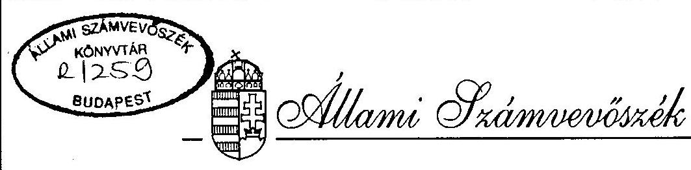
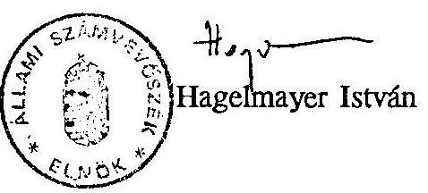
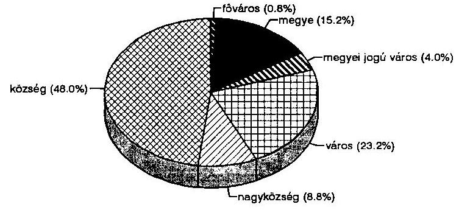
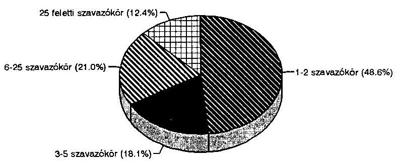
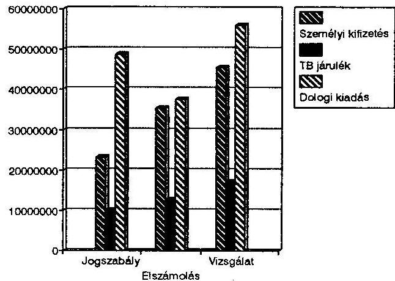
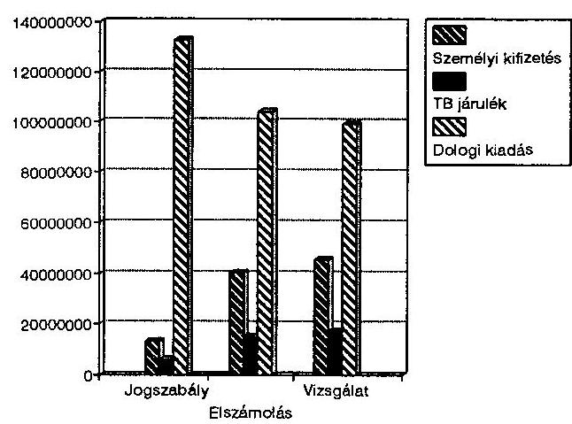
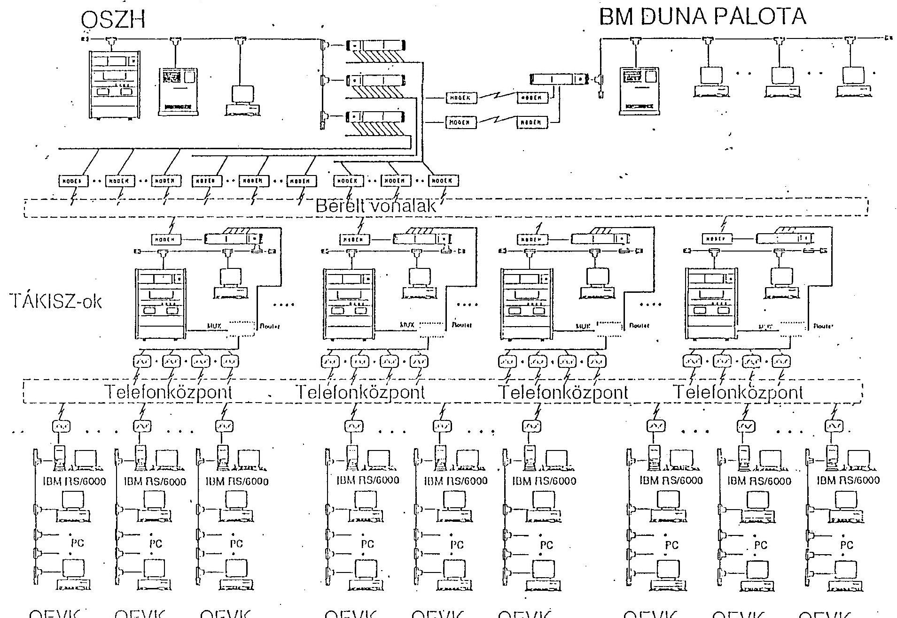

# JELENTÉS 

az országgyưlési, valamint a helyi és kisebbségi önkormányzati képviselő-választások lebonyolítására felhasznált pénzeszközök vizsgálatáról

---

Az alkalmazott rövidítések jegyzéke:

- OVB Országos Választási Bizottság
- OVM Országos Választási Bizottság mellett müködő Munkacsoport
- TVM Területi Választási Bizottság mellett müködő Munkacsoport
- HVM Helyi Választási Munkacsoport
- OEVK Országgyűlési Egyéni Választókerületi Központ
- TÁKISZ Területi Államháztartási és Közigazgatási Információs Szolgálat
- FÁKISZ Fővárosi Államháztartási és Közigazgatási Információs Szolgálat
- OSzH Országos Személyi Adat- és Lakcímnyilvántartó Hivatal
- TB Társadalombiztosítás
- PC személyi számítógép
- VIF Belügyminisztérium Választási és Informatikai Főosztálya

---

# Jelentés 

az országgyűlési, valamint a helyi és kisebbségi önkormányzati képviselő-választások lebonyolítására felhasznált pénzeszközök vizsgálatáról

Az országgyűlési képviselő-választásról, valamint a helyi és kisebbségi önkormányzati képviselők és polgármesterek választásáról szóló törvények egyaránt előirták, hogy az Országgyűlés által a választások költségeinek fedezetére adott pénzeszközök felhasználásáról az Állami Számvevőszék tájékoztassa az Országgyűlést. Ezen túlmenően a pénzügyi fedezetet biztosító határozataiban felkérte az Országgyűlés az Állami Számvevőszéket, hogy a választások pénzeszközeinek felhasználását ellenőrizze és erről adjon számot az Országgyűlésnek.

A törvényi előírásoknak megfelelően - az ellenőrzési költségekkel való takarékos gazdálkodás szempontjait is figyelembe véve - az Országgyűlés által a két választásra biztosított összegek felhasználását 1995. január 1. és március 31. között a helyszínen ellenőriztük. A vizsgálatokat 105 települési önkormányzatnál, ( 5 megyei jogú városban, 29 városban, 11 nagyközségben és 60 községben) 19 megyei és a fővárosi önkormányzatnál, a 19 TÁKISZ-nál és a FÁKISZ-nál, a Belügyminisztérium Választási és Informatikai Főosztályánál, Központi Gazdasági Főigazgatóságánál, az Országos Személyi Adat- és Lakcímnyilvántartó Hivatalnál, az Országos, a Fővárosi, a Pest megyei Rendőrfőkapitányságoknál és a Budaörsi Kapitányságnál folytattuk le.

A helyszíni vizsgálat 974 szavazókört érintett (9\%), ahol 813.641 választópolgár élt $(10,4 \%)$.

Az önkormányzatoknál és a Belügyminisztérium költségvetési szerveinél tartott vizsgálat az 1994. évi választások előkészitésére és az országgyülési képviselöválasztásra fordítható, együttesen 1.700 E Ft-ból 985,1 E Ft-ot (58\%), illetve az önkormányzati képviselö-választásra fordítható 1.118 E Ft-ból 434,7 E Ft-ot (39\%) érintett.

---

Az ellenőrzések célja az volt, hogy feltárja:

- az 1994. évi országgyűlési képviselő-választások és az 1994. évi helyi és kisebbségi önkormányzati képviselő-választások során az Országgyűlés által jóváhagyott költségvetést, annak részletesebb előírásait betartották-e;
- a választásokhoz beszerzett tárgyi eszközök miként hasznosultak a két választás során;
- a választások gazdasági-pénzügyi előkészítésében és lebonyolításában miként hasznosultak az Állami Számvevőszék 1990. évi vizsgálati megállapításai, javaslatai, ajánlásai.

# Összegzés és javaslatok: 

Az 1994. évi országgyűlési, valamint a helyi és kisebbségi önkormányzati képviselő-választásokat összefogottabban, célirányosabban és hatékonyabban bonyolították le, mint az 1990. évi hasonló választásokat. Ebben jelentős szerepet játszott, hogy a választásokkal kapcsolatos jogszabályok kiadásánál és az előkészítő munkálatok során hasznosították az Állami Számvevőszék 1990. évi választásokkal összefüggő ajánlásait, valamint az 1994. évet megelőző választások tapasztalatait.

A választások lebonyolításához fűződő finanszírozás terén az előrelépést a rendezettebb feladatmutatók kialakítása, a helyi-területi-központi feladatok, normatívák és pénzeszközök áttekinthetőbb rendszere és az elszámolások egyszerűsítése jelezte. Kedvező tapasztalat az is, hogy a lebonyolításban részt vevő helyi, területi, központi szervek a részükre juttatott állami pénzeszközöket általában a vonatkozó törvényi és egyéb jogszabályi előírásokat betartva használták fel.

A feladatokhoz a központi források mindkét választás alkalmával a belügyminisztériumi rendeletben előírt határidő után késve érkeztek, de ez nem okozott finanszírozási problémát, mert az önkormányzatok saját eszközeikből a dologi kiadásokat megelőlegezték.

Annak ellenére, hogy összességében az Országgyűlés által a két választásra jóváhagyott pénzügyi kereteket nem lépték túl, mind az előkészítés, mind a lebonyolítás, mind az elszámolásuk során több, a költségekkel való takarékos gazdálkodást nem megfelelően szolgáló központi és helyi gyakorlattal találkoztunk.

Az országgyűlési képviselő-választásokról szóló törvény szövege, de az erre épülő belügyminiszteri rendelet sem ösztönözte a jegyzőket arra, hogy a korábban kialakult

---

gyakorlatot felülvizsgálva a szavazókörök számát racionálisan, a költségtakarékossági szempontok figyelembevételével alakítsák ki. Megfelelő körültekintéssel a választások lebonyolítását - a területi differenciálási igények figyelembevétele mellett is kb. 1200-1500 kö́rzettel kevesebb kialakításával is meg lehetett volna oldani, ha azokon a településeken, ahol hatszáz fônél több szavazópolgár él az egy szavazókörbe tartozó választópolgárok számát a jogszabály legalább 600 fóben jelölte volna meg.

Nem segítette a takarékosság érvényesítését az átalányelszámolási mód bevezetése és a dologi költségek személyi kifizetésekre való felhasználásának engedélyezése sem. Különösen kedvezőtlenül hatott, hogy a jogszabályi előírás szerint a közreműködőknek legalább a norma szerinti összeget ki kellett fizetni. Ezt az önkormányzatok többsége ugyanis alsó határként értelmezte, és a dologi költségeknél "elért megtakarításokat" személyi kifizetésekre csoportosította át. A tehetősebb önkormányzatok ezen túlmenően saját forrásaikból kiegészítették a központi forrásokból származó választási pénzeszközöket, s a többletet is döntően személyi kifizetésekre használták fel. Így az azonos feladatot ellátó közreműködők díjazása önkormányzatonként indokolatlanul jelentős mértékben eltért. Tehették ezt azért is, mert az elszámolási módból adódóan a "megtakarítást" nem kellett visszafizetni.

A vizsgált önkormányzatok elszámolásai szerint a saját forrásokkal kiegészített ráfordítások az országgyűlési választásoknál $44 \%$-kal, az önkormányzati választásoknál $7 \%$-kal haladták meg a jogszabályokban előirányzott összegeket. (Ezen belül a személyi kifizetésekre fordított összegek 96, illetve $244 \%$-kal voltak nagyobbak!) A reprezentációt az országos adatokra vetítve valószínűsíthető, hogy országosan a pénzügyileg kimutatott felhasználás az országgyűlési választásoknál az 1.384 M Ft-tal szemben 2.000 M Ft-ot, az önkormányzati választásoknál az 1.118 M Ft-tal szemben 1.200 M Ft-ot tett ki. Az önkormányzatok számos ténylegesen felmerült költséget nem számoltak el a választás költségei között, hanem működési kiadásaik terhére finanszírozták azokat (pl. fűtés, világítás, telefon, fax, helyiségbér stb.). Az ilyen jellegű kiadások teljes körű számbavétele a választások lebonyolításának kimutatott költségeit tovább emelte volna.

A személyi kifizetések növelésére hatott az is, hogy a Belügyminisztérium közigazgatási államtitkára az országgyűlési képviselő-választás I. fordulója után a BM központi tartalékából megyénként 250-250.000 Ft-ot adott terven felül a területi választási munkacsoportok tagjai jutalmazására, ha ahhoz azonos összeggel a megyei önkormányzat is hozzájárul. Ezt az összeget még annak a megyének is átutalták, amely a kért kiegészítést nem biztosította.

---

További problémát jelentett, hogy a jogszabályok előírták ugyan az elkülönített nyilvántartást, de annak módjáról, tartalmáról nem rendelkeztek. Ugyancsak elmaradt a jogszabályban előírt pénzügyi ellenőrzés tartalmának meghatározása és nem intézkedtek a szankcionálásról sem. Erre vezethető vissza, hogy az ellenőrzött 125 önkormányzat közül 22 egyáltalán nem gondoskodott az elkülönített nyilvántartásról, s mindössze 61 önkormányzat oldotta meg könyvvitelileg is elkülönítetten, ellenőrizhető módon a választásokra felhasznált pénzeszközök nyilvántartását.

A legtöbb gond a kötelezettség-vállalásnál, az ellenjegyzésnél, az utalványozásnál és az érvényesítésnél mutatkozott. A BM rendelet ugyanis csak az utalványozást szabályozta, de azt is a vonatkozó törvényektől eltérően, s így a BM rendeleti felhatalmazás alapján tett valamennyi, a választásokkal összefüggő jegyzői, főjegyzői utalványozás törvénysértő volt. A sajátos feladat gazdálkodási jogkörének helyi szabályozatlansága miatt a kötelezettség-vállalás az ellenjegyzés és érvényesités gyakorlata az esetek többségében a törvényi előírásokkal ellentétes volt.

Kisebb jelentőségű, de tipikus hibaként említhető, hogy a számviteli és az ÁFA törvény előírásai ellenére a dologi kiadásokhoz kapcsolódó számlák 19\%-a szabálytalanul volt kiállítva, s azokat az önkormányzatok ennek ellenére elfogadták.

Ugyancsak vitatható a TB járulék fizetésénél kialakított gyakorlat, amelynek lényege, hogy a megbízási szerződésekben a feladatvégzési időt a ténylegesen szükségestől eltérően úgy állapították meg, hogy az 1 napra jutó összeg 180 Ft-nál alacsonyabb lett, s így ezután a jogszabályok szerint nem kellett TB járulékot fizetni, holott ezt a központilag biztosított összeg tartalmazta.

A két választás pénzeszközeivel kapcsolatos Belügyminisztériumi elszámoltatás alapvető hiányossága volt, hogy nem a teljeskörű választási kiadásokról, hanem csak a központilag biztosított pénzeszközök egy részéről számoltatott el. Az elszámolási munkalapok adattartalma nem alkalmas az egyes választási feladatokra fordított kiadások bemutatására, a pénzügyi normákkal történő összehasonlításra, az esetleges jövőbeli normák megalapozására.

Ez a nagyfokú szabadság - a vizsgálati tapasztalatok szerint - pénzügyi-gazdálkodási szabadossághoz vezetett, mert egyes pénzügyi normák esetében többszörös kifizetéseket tett lehetővé (pl. személyi kiadások, élelmezési ráfordítások), más normák esetében pedig jelentős "megtakarítás" volt elérhető. Ez elsősorban az átalányösszegekbe beépült TB-járulékra, a névjegyzékek, értesítők és egyéb nyomtatványok elkészítésére, a TVM dologi kiadásaira vonatkozik. A névjegyzék és értesítő kartonok elkészítésével kapcsolatos pénzügyi norma elsősorban a TÁKISZ-ok költségvetési

---

kondícióját javította, de kisebb-nagyobb mértékben mozgásteret biztosított az elkészítését vállaló önkormányzatok számára is.

A választásokhoz beszerzett tárgyi eszközök döntő hányada a számítógépek vásárlásából adódott. Ezeket nagyrészt a kialakított rendszer elemeiként hasznosították. E gépek azonban a későbbiekben - megfelelő állami segítséggel (programok biztosításával) - lehetővé teszik több célú további felhasználásukat is. Olyan tárgyi eszköz beszerzéséről a vizsgált körben, ami közvetlenül, vagy közvetve ne lenne a választásokhoz kapcsolható - a Borsod-Abauj-Zemplén Megyei TÁKISZ által visszatartott személyi számítógépek kivételével - az ellenőrzések során nem szereztünk tudomást.

A választások lebonyolításához szükséges árubeszerzési és szolgáltatás igénybevételi szerződések, megrendelések döntő többségét versenytárgyalás mellőzésével és előzetes írásos árajánlatok bekérése nélkül kötötték. A szabálytalanságot elsősorban a választási törvények és a pénzügyi fedezetet meghatározó országgyűlési határozatok késői megjelenése okozta.

Az átalány-összeggel való elszámolás esetén felvetődik, hogy az Állami Számvevőszék jelentős anyagi és személyi ráfordításainak felhasználásával végzett ellenőrzés milyen mértékben tud hatékony lenni, ha a Belügyminisztérium az engedélyezett elszámolási megoldás miatt csak közvetetten képes a választások tényleges ráfordításainak nagyságrendjét meghatározni, valamint a feleslegesnek ítélt kiadásokat a jelenlegi jogi szabályozás keretei között nem lehet szankcionálni.

A vizsgálati tapasztalatok és megállapítások alapján a további munka szinvonalának emeléséhez javasoljuk a Belügyminisztériumnak:

1. Az 1994. évi választások pénzügyi elszámolásának lezárását a függő-átfutó-kiegyenlítő tételek rendezésével és a pénzmaradvány felhasználási javaslatának előterjesztésével az utolsó kisebbségi önkormányzati választás befejezését követő 30 napon belül.
2. A szavazókörök számának a racionális finanszírozási szempontokhoz igazodó a területi adottságokat is figyelembe vevő csökkentésének kezdeményezését a jelenleg érvényes 1200 választópolgáros felső határon belül.
3. Olyan egységes elszámolási rendszer kialakítását, amely alkalmas annak ellenőrzésére, hogy a választáshoz biztosított valamennyi költségvetési és közpénz felhasználása során az általános és a választásra külön előírt követelményeket és normákat betartották-e. A társadalombiztosítási járulék fizetésével kapcsolatos visszásságok

---

megszüntetésének kezdeményezését olymódon, hogy azt és a személyi jövedelemadót központilag fizessék meg.
4. A választási pénzeszközök pontos nyilvántartását, az elszámolás és a pénzügyi-gazdasági ellenőrzés lefolytatásának elősegítését megfelelően szolgáló rendszer kialakítását valamennyi választásnál közreműködő költségvetési szervnél.
5. Az Országos Választási Munkacsoport és a Területi Választási Munkacsoport előbbiekkel összefüggő helyszíni ellenőrzési kötelezettségének előírását.
6. A nemzeti és etnikai kisebbségi jelöltek választási kampányának külön támogatásakor : felhasználás jogcímeinek meghatározását, a céltól eltérő felhasználás illetve az elszámolás elmulasztása esetében megfelelő szankcionálási lehetőség megteremtésének kezdeményezését.
7. Az üzemeltetésre átadott eszközök vagyonvédelméhez a szabályszerű eszköznyilvántartás biztosítását. A választáshoz kapcsolódó immateriális javak, mint tartós eszközök teljes körű nyilvántartásának kialakítását, az eszközök aktiválását.

Mindezeken túlmenően szükségesnek tartjuk, hogy az Országgyűlés a jövőben a választásokkal kapcsolatos törvényalkotás során legyen figyelemmel a technikai lebonyolítást érintő egyéb törvényekben már meghatározott határidőkre és feltételekre.

# Megállapítások 

I. A választási költségek tervezése

Az országgyűlési képviselő-választásokról, valamint a helyi és kisebbségi önkormányzati választásokról szóló törvények felhatalmazták a belügyminisztert, hogy rendeletben szabályozza - többek között - a választási költségek normatíváit és elszámolási rendjét. Az előkészületek ennek megfelelően folytak. A 10/1994. (III.2.) és a 47/1994 (X.6.) Ogy. határozat arra is felhatalmazást adott a belügyminiszternek, hogy a választás költségvetési előirányzatai között átcsoportosítson, valamint szükség esetén a tartalékot felhasználhassa.

---

Az ezek alapján kiadott BM rendeletek az országgyűlési és az önkormányzati képviselö-választások költségeinek normatíváit, tételeit és az elszámolás rendjét szabályozták.

Az egy szavazókörre jutó választópolgárok számát 1200 fơben maximálták azzal a logikus megkötéssel, hogy minden önálló településen legalább egy szavazókört kell létrehozni. A törvény szövege ( $36 . \S$ (2) bek.) azonban nem volt teljesen pontos, mert az alsó határként megjelölt 600 fónél nem írta elő, hogy legalább ennyi választópolgárnak lennie kell egy szavazókörben, ha a választópolgárok száma a településen ennél nagyobb. Emiatt a törvény, de a belügyminiszteri rendelet sem orientálta a jegyzőket arra, hogy a szavazókörök számát racionálisan, a költségtakarékossági szempontokat is figyelembe véve alakítsák ki. Így a kalkuláció alapját képező, a múltban gyökerező, megszokáson alapuló körzetkialakításoknál nem volt tapasztalható azok számának lényeges csökkentése. Az országgyűlési választások lebonyolításánál 10.877 szavazókör kialakítására került sor, az önkormányzati választások lebonyolítását pedig 10.559 körzetben oldották meg.

Kisebb létszámú körzetekben a költségkímélés érdekében a póttagok alkalmazását és ezek révén az un. "mozgó urnák" használatát nem tapasztaltuk. Kellő körültekintéssel - számításaink szerint - kb. 1200-1500 körzettel kevesebb kialakításával is meg lehetett volna oldani a választások lebonyolítását.

Az országos adatokból megállapítható, hogy pl. 39 települési önkormányzatnál, ahol a lakosságszám 203-564 fő közötti 2-2 szavazókör müködött, 26-nál ahol a lakosságszám 687-1198 között alakult 3-3 szavazókört létesítettek. Hasonlóak a tapasztalatok a nagyobb lakosságszámú településeknél is. Pl. 1081 fónél 4 körzet, 1723 fónél 5 körzet, 2895 fónél 9 körzet, 2933 fónél 10 körzet stb. (A választó polgárok száma e településeken természetesen a lakosságszámnál alacsonyabb). A törvény lehetővé teszi ugyan a települési adottságok figyelembevételét, de az ilyen mértékủ eltérés az alsó határként megjelölt 600 választópolgárral szemben nem mindenütt fogadható el.

Míg az országgyűlési választásnál lehetőséget biztosítottak az önkormányzatok jegyzői számára, hogy átalány, vagy tételes elszámolási módot válasszanak, addig az önkormányzati választásoknál - abból 18 település választotta a tételes elszámolási módot - már kizárólag az átalány-elszámolási módra volt lehetőség. A tételes elszámolás esetén az elszámolási adatlapon a tételek megnevezése mellett fel kellett tüntetni a norma mérőszámát, a norma szerinti kiadás és a tényleges kiadás összegeit és a fel nem használt összeget vissza kellett fizetni. Az átalányelszámolást választóknak ilyen részletezettségủ elszámolást nem kellett készíteniük és a Belügyminisztérium nem rendelkezett arról sem, hogy a

---

költségeket számlával - beleértve a belső számlát is - igazolni kell, vagy sem. Ez a megoldás már önmagában is jelzi, hogy a belügyminiszteri rendeletben szereplő normatívákat átalányelszámolás esetén csupán kalkulatív számítási anyagként kezelték, azok be nem tartásához szankciók nem kapcsolódtak.

A tételes elszámolási módot választók részére a tételek és normatívák, valamint a dologi és személyi kiadások között - a választók nyilvántartására, az értesítők és ajánlószelvények elkészítésére és kiküldésére, a jegyzők egymás közötti értesítésére a választópolgáronként megállapított $26 \mathrm{Ft} / \mathrm{f} \mathrm{f}$ kivételével - az átcsoportosítást a rendelet megtiltotta (6. § (3) a/ pont). Az átalányelszámolásnál viszont következetlen módon a tiltást feloldották és csupán azt rögzítették, hogy az átalányösszeg a választás céljára szabadon felhasználható, azonban a személyi kiadásra legalább a jogszabályokban megállapított normatívákat biztosítani kell.

A választásokhoz szükséges pénzeszközök tervezését a Belügyminisztérium Választási és Informatikai Főosztálya végezte. Az előirányzatok kialakításánál az 1990. évi választások, valamint az 1993. évi TB képviselő-választás során szerzett tapasztalatokat, valamint a választások eltérő megoldási módjából adódó különbségeket és az Állami Számvevőszék 1990. évi ellenőrzési tapasztalatait, ajánlásait is figyelembe vette.

A két választás között eltelt fél év alatti infláció nem indokolta az egy fordulós helyi és kisebbségi önkormányzati képviselő-választások költségeinek a kétfordulós országgyűlési képviselő-választásokkal közel azonos nagyságrendủ ráfordítását. Különösen szembetűnő ez a tény a központi kiadásoknál, ahol a különbség az országgyűlés által előirányzott összegek között mindössze 4,5\%-os volt.

Az összehasonlítható tételek közül a két választásnál legjobban a rendőrségi feladatok költségei tértek el.

Az országgyưlési képviselö-választásnál tervezett 100 M Ft a választás központi, területi és helyi zavartalan lebonyolításának rendőrségi felügyeletéhez szükséges fedezetet - fokozott ügyelet tartásával és egyéb készenléti rendelkezésre állással - biztosította. Az önkormányzatl képviselö-választásnál viszont a központi feladatok között csak a választási adatok összesítésének központi helyszínein tartott készenléthez - ügyelethez kapcsolódó kiadásokat vették figyelembe.

Mintegy felére csökkentette az önkormányzati képviselő-választásnál a külföldi megfigyelőkkel kapcsolatos kiadásokat, a szavazáson való részvétel érdekében kifejtett központi propaganda költségét. Növelte viszont a nyomtatványok, oktatási,

---

tájékoztatási anyagok elkészítésére tervezett kiadást. A szoftverek elkészítését az országgyűlési képviselő-választásnál döntően a kormány által biztosított összegből finanszírozták, az önkormányzati választásnál viszont az országgyűlési határozatban megállapított központi dologi kiadások között szerepel ennek a feladatnak az előirányzata.

A központi feladatok költségvetésében a korábbi választásokhoz viszonyítva több új előirányzatot alakítottak ki, részben a feladatok részletezettebbé tételével részben több új feladat tervezésével. Pl. választás-történeti adatbázis létrehozása és elemzésre alkalmas kiadványként történő megjelenítése, a választáson való részvétel növelése érdekében pártsemleges propaganda korábbiaknál szélesebb körű, változatosabb (pl. kiadvány, film, hőlégballon, reklám) biztosítása stb.

A helyi és területi kiadásokat az önkormányzati választásnál a névjegyzék és értesítő-készítés és postázás, az egyéb dologi kiadások és a TÁKISZ-ok részére meghatározott előirányzatok normatíváinak csökkentésével mérsékelték.
Emelték viszont a területi szinten jelentkező szállítási, oktatási feladatokra biztosított összeget, a helyi hirdetményekre fordítható forrást, valamint a területi választási bizottságok választott tagjainak, a területi választási munkacsoport tagjainak, a pénzügyi és informatikai feladatokért felelős dolgozók részére megállapított díjak mértékét.

A minisztériumon belüli többszöri egyeztetések és módosítások után terjesztették a végleges javaslatokat a Kormány, majd az Országgyűlés elé.

Az országgyűlési képviselő-választásnál pl. az első javaslat még 2 Md Ft feletti költségelőirányzatot tartalmazott. A költségvetés többszöri átdolgozása elsősorban azért vált szükségessé, mert a javaslat a képviselő-választási törvényt módosító előterjesztésre épült, amely a törvényalkotás során több tekintetben módosult.
II. A központi költségvetésből kapott választási célú pénzeszközök forrása és felhasználása

# 1. Pénzügyi források 

Az országgyűlési képviselő-választáshoz az Országgyűlés az 1994. évi központi költségvetés VII. fejezet 30/6 alcímén rendelkezésre álló 800 M Ft-on túlmenően

---

a központi költségvetés általános tartalékaiból 584 M Ft-ot, együttesen 1.384 M Ft-ot biztosított.

A helyi és kisebbségi önkormányzati képviselők választásához az Országgyűlés az 1994. évi központi költségvetés VII. fejezet 30/9. alcímén rendelkezésre álló 800 M Ft-on felül 70 M Ft-ot az 1994. évi országgyűlési képviselő-választás előirányzatmaradványából, 248 M Ft-ot a Belügyminisztérium fejezetéből előírt átcsoportosítással, összesen 1.118 M Ft felhasználását engedélyezte.

Fentieken túlmenően a két választás előkészületi munkáival kapcsolatos költségek fedezetére még 1993. évben a Kormány az 1066/1993. (X.13.), a 3.397/1993. (XI.1.) és a 3456/1993. (XII.9.) számú határozataiban az 1993. évi TB képviselöválasztás költségvetésének maradványából és az 1993. évre az időközi választások lebonyolítására rendelkezésre álló előirányzat maradványából összesen 316 M Ft-ot biztosított.
Együttesen tehát a választások lebonyolítására központi forrásokból 2.748 M Ft állt rendelkezésre.

# 2. A pénzeszközök folyósítása 

A Belügyminisztérium 1994. II. 17-én kapta meg a PM-től az éves költségvetési törvényben jóváhagyott 800 M Ft-ot az országgyűlési választások lebonyolításához. A 6/1994. (III.2.) BM rendeletben foglaltaktól eltérően az előleget két részletben, választási fordulónként folyósították. Az I. választási forduló előlege 19 megyéhez átlagosan egy hét késéssel érkezett meg, a fővároshoz pedig csak III. 24-én. A megyei önkormányzatok a hozzájuk érkezett előlegekből a helyi választási munkacsoportokat megillető összegeket egy-két hét eltelte után biztosították. A választás II. fordulójára számított átalány-előleg a megyei önkormányzatokhoz 1994. április első felében érkezett meg, amelyből a helyi választási munkacsoportokat megillető összegeket 15 megyében csak egy-másfél hónapos várakoztatás után utalták át.

A II. fordulóra jutó átalány-előlegnek a megyei letéti számlákon való "várakoztatása" országosan, mintegy 3,0-3,5 M Ft kamatbevételhez juttatta a megyei önkormányzatokat.

Az I. fordulóhoz biztosított előleget egy önkormányzat (Dunaújváros), a II. fordulóhoz pedig két önkormányzat (Csegöld, Fehérgyarmat) nem kapta meg a választás napjáig, annak ellenére, hogy a BM díjmentesen biztosította az előleg számításához a szoftvert a megyei TVM-ek részére.

---

Az önkormányzati választásokra az átalányelőlegeket a BM és a területi választási munkacsoportok mintegy fél hónapos, a településeken müködő választási munkacsoportok pedig közel 1 hónapos késéssel kapták meg. A késedelem a tapasztalatok szerint a lebonyolítást nem akadályozta, mivel az önkormányzatok a feladatot időben megismerték és a feladatokhoz szükséges, az önkormányzatok kiadásai között nem számottevő dologi kiadásokat megelőlegezték. Kivételt képezett ez alól az a néhány kisebb település, amely saját forrásaiból a választási kiadásokat nem tudta megelőlegezni.

Egyes esetekben a TVM a hozzá érkező jelzéseket figyelembe véve néhány, különböző okból fizetésképtelenné vált önkormányzat számára a választási pénzeszközöket elkülönített számlára küldte meg (pl. Mohács részére).
Megjegyezzük, hogy Sellye községben az OTP helyi fiókja a választási pénzeszközök külön számlán történő kezelésére írásban tett javaslatot, amelyet a körjegyzőség nem fogadott el. Az átalány-előleget is - anélkül, hogy a pénzmegőrzés elemi feltételeit biztosította volna - kézpénzben felvette és a házipénztárába helyezte el. November 30. és december 1. közötti időszakban betörtek a körjegyzöségre, ahonnan 923.487,70 Ft-ot, - benne a 462.307 Ft választási célokat szolgáló pénzeszközt is - eltulajdonítottak. A polgármester az ismeretlen tettes ellen a rendőrségnél feljelentést tett. Az átmeneti jellegü pénzzavarban az OVM ugyanilyen összegű kölcsön-nyújtással segített, amit azonban az önkormányzat még nem fizetett vissza.

Az Országgyűlés az 1994. évi országgyűlési képviselő-választás helyi feladataira 750,6 M Ft-ot, a területi feladatokra 108,3 M Ft-ot, az önkormányzati képviselöválasztás helyi feladataira $459,2 \mathrm{M}$ Ft-ot, területi feladataira $183,1 \mathrm{M}$ Ft-ot biztosított. Az önkormányzatok ezeknek az összegeknek egy részét átalány-előlegként kapták meg, az országgyűlési képviselő-választásnál összesen 830,9 M Ft-ot, az önkormányzati képviselő-választásnál összesen 596,6 M Ft-ot. Ezen előlegen túlmenően az alábbi címeken kaptak még különböző időpontokban pénzeszközt a választásokhoz:
az országgyűlési képviselő-választásnál

- szállítási feladatokra,
- ajánlószelvények ellenőrzésére,
- jelölt adatbázis üzemeltetésére,
- szavazatszámláló bizottsági tagok oktatására,
- területi feladatok anyagi elismerésének kiegészítésére,
- személyi számítógépek vásárlásához kiegészítésként,
- a középkategóriájú számítógépek vásárlásához kiegészítésként,
- meglévő számítógépek memóriabővítéséhez (egy TÁKISZ és a FÁKISZ),

---

- TÁKISZ-ok helyi számítógépes hálózatának egységesítéséhez,
- személyi számítógépek hálózatának kialakításához.
az önkormányzati képviselő-választásnál
- kisebbségi jelöltek szavazólapjainak előállítására,
- kisebbségi jelöltek kampányának támogatására,
- választási tájékoztató füzet helyi előállítására,
- OEVK-ként kijelölt városokban jelentkező összesítési feladatok elismerésére,
- TÁKISZ-ok és a FÁKISZ múködési kiadásaira,
- két megye részére a megyei egyéni választókerületi választás szavazólapjának elkészítésére (a többi megye a központilag biztosított megoldást igényelte),
- a szavazólapok helyi elkészítéséhez az átalányelőlegben biztosított összeg kiegészítésére,
- a munkáltatók által kért átlagbér kifizetésére,
- személyi számítógép és nyomtató vásárlásához kiegészítésként.

A belügyminiszter mindkét választásnál élt a törvényben biztosított átcsoportosítási jogával, illetve a tartalékok részbeni felhasználásával. (Az engedélyezett átcsoportosításokról és a tartalék felhasználásáról az 5. számú melléklet ad részletes tájékoztatást.) Az országgyúlési képviselők választásánál a szavazatszámláló bizottságok tagjainak hagyományos módon történő oktatására 1994. III. 21 -én 4,3 M Ft-ot, 1994. IX. 9-én az OVM, a Duna Palota és a Kossuth tér 4. hardver- és szoftver bővítésére hálózati kiépítés és adatátvitel múködtetésének kiegészítésére 6 M Ft-ot, valamint a TÁKISZ-ok müködési költségeinek kiegészítésére 4 M Ft-ot csoportosított át. A belügyminisztérium a helyszínen nem ellenőrizte, s így nem is volt információja a TÁKISZ-ok által az önkormányzatok részére a választásokkal összefüggő munkák elvégzése révén szerzett bevételi többletről. Annak nagyságrendje ugyanis olyan rendkívüli mértékủ jutalom-összegek kifizetését tette lehetővé, ami miatt a müködési költségekhez való utólagos hozzájárulás nem volt indokolt.

Az önkormányzati képviselő-választások pénzügyi keretösszegén belül 1995. I. 3-án 5 M Ft-ot csoportosítottak át az országos kisebbségi önkormányzati elektor-választásához szükséges utazási költségek részbeni fedezetére. A későbbiekben, - április 7-én ugyanerre a célra további 3 M Ft átcsoportosítását engedélyezte a belügyminiszter.

# 3. A pénzeszközök elöirányzat-csoportonkénti felhasználása 

Az országgyúlési képviselő-választások lebonyolítására az Országgyúlés által jóváhagyott $1.384,0 \mathrm{M}$ Ft-tal szemben $1.311,2 \mathrm{M}$ Ft-ot használtak fel. Az előirányzat-

---

maradvány $72,8 \mathrm{M} \mathrm{Ft}(5,3 \%)$ volt. A felhasználási jogcímek szerinti részletes adatokat a 6. számú melléklet tartalmazza.

A legnagyobb összegu maradvány, csaknem 27 M Ft a szavazólapok, nyomtatványok előállítási költségeinél, valamint 9 M Ft a hírösszcköttetés és az informatikai rendszer üzemeltetési költségeinél jelentkezett. Mindössze három tételnél vált szükségessé a tervezettnél nagyobb összegü ráfordítás. A virusmentesítési program $2,1 \mathrm{M}$ Ft-tal, az oktatási anyagok készítése $0,5 \mathrm{M}$ Ft-tal, a központi hálózatépítés és müködtetés pedig 1 M Ft-tal került többe, mint amennyi az elöirányzott összeg volt.

A központi kiadásokra előirányzott $490,1 \mathrm{M}$ Ft módosított előirányzattal szemben a tényleges felhasználás $449,7 \mathrm{M}$ Ft-ot tett ki, a helyi és területi feladatokra szolgáló $889,4 \mathrm{M}$ Ft-hoz képest a felhasználás összege $861,5 \mathrm{M}$ Ft volt. A maradvány mértéke tehát a központi feladatok ellátásánál $8,2 \%$, a helyi és területi feladatoknál pedig $3,1 \%$.

A helyi és kisebbségi önkormányzati képviselők választására az Országgyűlés által jóváhagyott 1.118 M Ft-tal szemben a várható felhasználás $1.057,4 \mathrm{M}$ Ft lesz. (A végleges adatok a helyszíni vizsgálat befejezésekor még nem álltak rendelkezésre!) Az előirányzat-maradvány várhatóan $60,6 \mathrm{M} \mathrm{Ft}(5,4 \%)$.

Jelentősebb összegű pénzmaradvány az oktatási és tájékoztató anyagoknál ( 31,8 M Ft), a kisebbségi jelöltek támogatásánál ( $4,1 \mathrm{M} \mathrm{Ft}$ ) és a szoftver-fejlesztésnél ( $2,7 \mathrm{M} \mathrm{Ft}$ ) mutatkozott. Nagyobb összegü elöirányzat-tüllépés csak a kisebbségi elektor-választások kiadásainál ( $5,2 \mathrm{M} \mathrm{Ft}$ ) volt tapasztalható.

A központi feladatok ellátását a tervezett $450,7 \mathrm{M}$ Ft-tal szemben $411,6 \mathrm{M} \mathrm{Ft}$ ráfordítással, a helyi és területi feladatokat pedig a $642,3 \mathrm{M}$ Ft eredeti előirányzattal szemben $645,8 \mathrm{M}$ Ft felhasználásával oldották meg. A pénzmaradvány a központi kiadásoknál $8,7 \%$, a helyi és területi feladatoknál a tartalékból engedélyezett felhasználással módosított $653,7 \mathrm{M}$ Ft-os előirányzathoz viszonyítva $1,2 \%$ volt (részletes adatok a 7. számú mellékletben).

A Kormány által a két választás előkészítésére biztosított 316 M Ft-ot, 97,6\%-ban felhasználták a 8. számú mellékletben részletezett, az országgyűlési és az önkormányzati képviselő-választásokkal összefüggő célokra, valamint az 1994. évi időközi választásokra és népi kezdeményezések ellenőrzésére. A maradvány összegét a továbbiakban is folyamatosan az időközi választások kiadásaira kívánják biztosítani.

A két választásra az Országgyűlés és a Kormány által együttesen biztosított 2.748 M Ft-tal szemben - a BM nyilvántartás szerint - 2.677,0 M Ft-ot fordítanak

---

várhatóan. Ezek az adatok azonban nem tartalmazzák az önkormányzatok által a választások zavartalan lebonyolításához kiegészítésként adott pénzeszközöket és azokat a tételeket, amelyek ténylegesen a feladatellátás során felmerültek, de amelyek költségeit az önkormányzatok nem, vagy nem teljes egészében számítottak fel, illetve mutattak ki (pl: helyiségbér, telefon, fax, fűtés, világítás stb.).

A BM által helyszíni ellenőrzés nélkül elfogadott területi-helyi elszámolások adatai szerint mindkét választásra jellemző, hogy az önkormányzatok a dologi kiadásokra a norma szerinti keretnél $17 \%$-kal kevesebbet, ugyanakkor a személyi ráfordításokra 25 , illetve $35 \%$-kal többet számoltak el olymódon, hogy a teljes összegnek csak 94,7 , illetve $94,4 \%$-át használták fel. (Az átalányelóleg, illetve az önkormányzati képviselő-választásoknál ezen túlmenően még az elszámoltatás körébe vont bizonyos további kiadásokról a BM VIF által készített elszámolások megyénkénti összesített adatairól a 9. és 10. számú melléklet ad tájékoztatást.)

A vizsgálatba bevont önkormányzatok összesített norma szerinti és elszámolás szerinti adatai kis eltéréssel, de az országos adatokkal megegyező tendenciát jeleznek. A számvevők által végzett ellenőrzés tényszámai azonban mind az összes ráfordítás, mind annak belső tartalma tekintetében ennél lényegesen nagyobb eltéréseket mutatnak.

A tételes helyszíni ellenőrzéseink szcrint az országgyülési választásokra $44 \%$-kal fordítottak többet a jogszabályban elöirányzottnál, ezen belül a személyi kifizetésekre fordított összeg $96 \%$-kal haladta meg az elöirányzottat (11.számú melléklet).
Az önkormányzati választásoknál a többlet-felhasználás a jogszabályban elöirányzottakhoz képest $7 \%$-os, de ezen belül a személyi kifizetésekre $244 \%$-kal használtak fel többet (12. számú melléklet).
A személyi kifizetést növelte az is, hogy a dologi kiadások között tervezett néhány tétel - mint pl. az értesítők polgármesteri hivatali dolgozók által végzett kézbesítése miatti megbízási dij - is itt jelentkezett.

Szükségesnek tartjuk megjegyezni, hogy a kisebb önkormányzatoknál a két választás alkalmával személyi kiadásokra fordított összeg csak 22, illetve $20 \%$-kal volt több a kalkuláltnál, míg a nagyobb, jobb anyagi helyzetben lévó önkormányzatoknál ez az eltérés 91, illetve $125 \%$-os többletet mutat. Az egy fơre jutó személyi kifizetések összege minden közremüködői kategóriában (választási bizottságok tagjai, választási munkacsoportok tagjai, vezetője, szavazatszámláló bizottságok tagjai) jelentősen, átlag 70-150\%-os mértékben haladta meg a jogszabályban közölt kifizetendő összeget.

---

A reprezentáció adatai szerinti eltéréseket alapul véve valószínúsíthető, hogy az országgyűlési képviselő-választások teljes - pénzügyileg kimutatott - ráfordítása a tervezett 1.384 M Ft-tal szemben 2.000 M Ft-ot tett ki, az önkormányzati képviselők választására fordított kiadások pedig az 1.118 M Ft-tal szemben 1.200 M Ft-ra tehetők.

Jól érzékelhető a korábbiakban már említett azon jogszabályi előírás hatása is, hogy a közremúködőknek legalább a norma szerinti összeget ki kell fizetni. Ezt az önkormányzatok ugyanis alsó határként értelmezték, s az adott átalányösszegeken belül a dologi költségekkel takarékoskodtak, illetve azok egy részét nem számlázták, s az így kimutatott "megtakarítást" a személyi kifizetések növelésére fordították.

A személyi kifizetések növelésére hatott az is, hogy a Belügyminisztérium közigazgatási államtitkára indokolatlanul 1994. május 25 -én kelt 3-1151/1994. számú levelében közölte a megyei közgyűlések elnökeivel, hogy a BM a központi tartalékból 250.000 Ft-os, a TB járulékot is magában foglaló támogatást tud adni a területi választási munkacsoportok tagjai jutalmazására, ha a megyei önkormányzat hasonló nagyságrenddel ezen összeghez hozzájárul. Ezt az összeget még a kért kiegészítést nem biztosító megye részére is átutalta.

Az általános tendencia mellett néhány esetben az is elő fordult, hogy a választás lebonyolításánál közreműködők nem kapták meg a jogszabály szerinti díjazást. Pl.
-a Pest megyei Pilisszántó községben a jegyzőkönyvvezető, Acsa nagyközségben a jegyzőkönyvvezető és a munkacsoport tagjai nem részesültek díjazásban.
—a Szabolcs-Szatmár-Bereg megyei Fehérgyarmat városban és a Nógrád megyei Csécse községben a szavazatszámláló bizottság tagjai 1.157 Ft díjazást kaptak (a minimum 1.666 Ft helyett). Előfordult, hogy az önkormányzatok az $1.666 \mathrm{Ft} /$ fő díjba beleértették a társadalombiztosítási járulék összegét is.

# 4. A pénzeszközök felhasználásának, nyilvántartásának szabályszerűsége 

A Belügyminisztérium rendelete előírta a választási munkacsoport-vezetők részére, hogy a választási pénzeszközöket átadott-átvett pénzeszközként kell kezelni és az önkormányzati költségvetésen belül gondoskodni kell elkülönített kezeléséről. A szabályozás akkor lett volna egyértelmű és főleg számonkérhető, ha vállalkozik az elkülönített nyilvántartások vezetése tartalmi követelményeinek meghatározására is.

---

Erre azonban nem került sor, ami részben hozzájárult ahhoz, hogy az ellenőrzött 125 önkormányzat közül 22 a jogszabályi előírásokkal ellentétben nem gondoskodott az elkülönített nyilvántartásról. Ezeknél a helyszíni ellenőrzés során kellett a választásokhoz kapcsolódó kiadásokat kigyűjteni. Mindössze 61 önkormányzat oldotta meg könyvvitelileg is elkülönítetten, jól ellenőrizhető módon a választásokra felhasznált pénzeszközök nyilvántartását, a többiek különböző egyéb megoldásokat választottak. Pl.az áttekinthetőséget kézzel vezetett idősoros analitikával biztosították, a számlákat, bizonylatokat külön gyűjtötték, elszámolását pedig az önkormányzat szokásos elszámolási rendjének keretei között oldották meg.

A BM-nél kialakított nyilvántartási rendszer az elkülönített főkönyvi kivonatokkal tájékoztatást nyújt a választási kiadásokról. A VIII. fejezeten belül a választási, népszavazási feladatokra kijelölt 17/10-es alcím költségvetési beszámolója azonban nem teljeskörű, hiányzik belőle az előkészítésre fordított összeg.

A 6/1994. (III.2.) BM sz. rendelet 1. § a/ és c/ pontja - törvényi felhatalmazás nélkül - a kötelezettség-vállalásról, az ellenjegyzésről, az utalványozásról és az érvényesítésről szóló törvények (Áht, hatásköri törvény) előírásaitól eltérően szabályozta a választásokhoz kapcsolódó pénzgazdálkodás és ezen belül az utalványozás rendjét.

A szabályozás szerint a választás pénzügyi felelőse az OVM vezetője, de ugyanakkor a BM gazdálkodási szabályzata szerint a választás pénzügyi feladatait a BM Központi Gazdasági Fölgazgatósága végzi és gyakorolja az ellenjegyzést is. A pénzügyi felelősség és az ellenjegyzési jogkör kétféle szabályozása ellentmondásos helyzetet alakított ki.

Az utalványozási jogkör módosítását az önkormányzatok tudomásul vették, de az általános gyakorlattól eltérő kötelezettségvállalási, ellenjegyzési és kifizetési jogosultságokat a választásokhoz kapcsolódóan még átmenetileg sem szabályozták. Emiatt a BM rendelet felhatalmazása alapján tett valamennyi választással összefüggő jegyzői, főjegyzői utalványozás törvénysértő volt.
Nem teljesült a 137/1993. (X.12.) Kormányrendelet 31. §-ának azon előirása sem, hogy a kötelezettségvállaló és az ellenjegyző, illetve az érvényesítő és az utalványozó azonos személy nem lehet. Nem érvényesült az az előírás sem, hogy kötelezettségvállalási, érvényesítési, utalványozási, ellenjegyzési feladatot az a személy nem végezhet, aki ezt a tevékenységét közeli hozzátartozója, vagy a maga javára látná el. A jegyzők ugyanis a részükre meghatározott és átutalt díjazást az elszámolási számláról, mint választási célú kifizetést utalványozták. Egyes esetekben az összeférhetetlenséget úgy kerülték el, hogy a jegyző részére a kifizetést a polgármester,

---

vagy a polgármesteri hivatal pénzügyi csoportvezetője utalványozta, ami viszont a BM rendeletben foglaltakkal nincs összhangban. Számos helyen fordult elő, hogy az utalványozási jogot nem a jegyző, hanem pl. a gazdasági ellátó szervezet igazgatója, a pénzügyi osztályvezető, a hivatal irodavezető-helyettese gyakorolta, néhány helyen pedig előfordult, hogy utalványozás nélkül fizettek.
—Békés megyében a TVM-nél az Ellátó Szervezet igazgatója utalványozta a dologi kiadásokat; Szarvas városban a pénzügyi osztályvezető; Köröstarcsán, Telekgerendáson a polgármester;
—a Fejér megyei Magyaralmáson és Szabadbattyánban a polgármester;
—a Komárom-Esztergom megyei Kisbér, Komárom városokban, Baj községben a polgármester illetve a pénzügyi osztályvezető;
—a Tolna megyei Szekszárdon a hivatal irodavezető helyettese, Tengelic és Györköny községekben a polgármester utalványozott.
—Utalványozás nélkül fizettek a Tolna megyei Alsónyék, Szálka valamint a Hajdú-Bihar megyei Újszentmargita községekben.
—Ellenjegyzés nélkül került sor kötelezettség-vállalásra a központi kiadásokból az BM VIF által kötött szerződések, illetve megrendelések döntő többségénél is.

A választásokra fordított pénzeszközök felhasználásánál és elszámolásakor számos általában is tipikusnak tekinthető szabálytalanságot tapasztaltunk.

- Az önkormányzatoknál tartott helyszíni ellenőrzéseink során a dologi kiadásokhoz kapcsolódó számlák közül 5.164 db , együttesen 132.997 E Ft értékű számla szabályszerűségi vizsgálatát is elvégeztük. Ezek közül - többségében élelmiszervásárlásról szóló számla - $986 \mathrm{db}(19,1 \%)$, összesen 5.599 E Ft értékű ( $4,2 \%$ ) adattartalma volt szabálytalan, mert nem felelt meg a számviteli törvény és az ÁFA törvény előírásainak.

Többnyire a termék (szolgáltatás) megnevezése, statisztikai besorolása nem volt megfelelő, vagy hiányzott az egyszerűsített számlán a termék (szolgáltatás) adóval együtt számított ellenértéke tételenként, vagy az összesen összege nem volt feltüntetve; előfordult, hogy a számlán a termék (szolgáltatás) mennyiségi egysége és mennyisége hiányzott. Ennek ellenére az önkormányzatok ezeket a számlákat is elfogadták.

Fentiekhez hasonlóakat tapasztaltunk az OVM által elfogadott - központi kiadásokhoz kapcsolódó - számlák esetében is.

---

- Az értesítők elkészítését a vizsgált önkormányzatok többsége a TÁKISZ-nál rendelte meg mindkét választásnál. A TÁKISZ-ok egy értesítő elkészítéséért az országgyűlési képviselő-választásnál 12-14 Ft-ot - a többség 13 Ft-ot - kértek. Az önkormányzati képviselő-választásnál átlag 10-12 Ft-ot, a többség 10 Ft-ot kért. Amennyiben a Polgármesteri Hivatal saját maga készítette, vagy másik önkormányzatot bízott meg ezzel a feladattal, úgy az egy értesítőre jutó kiadás 1,80 - 8,10 Ft között szóródott, mivel az önköltség számításánál többnyire csak a közvetlen költségeket vették figyelembe. Az értesítők kézbesítéséért 0-19,0 Ft-ot fizettek az önkormányzatok.

Az országgyűlési képviselő-választásnál tíz településen a polgármesteri hivatal dolgozói, vagy a postai kézbesítő díjmentesen végezte a kézbesítést. Ötvennégy településen 5-8 Ft közötti volt a kézbesítési díj, de pl. Tiszasason 16,0 Ft, Pillsszántón 13,70 Ft, Kákícson, Sellyén, Sósvertikén 19,0 Ft, Kiszomboron, Pitvaroson 14,0 Ft volt az egy kézbesítésre jutó kiadás.

- Nem személyi kifizetés ugyan, de mégis a közreműködők személyéhez szorosan kapcsolódnak az élelmezési kiadások. A vizsgált önkormányzatok élelmezési célokra a jogszabályi norma alapján az országgyűlési választásoknál 2.186 E Ft-ot, az önkormányzatinál 1.094 E Ft-ot használhattak volna fel. Ezzel szemben ennek többszöröse 6.125 E Ft, illetve 5.086 E Ft volt az élelmiszer vásárlásra fordított összeg.
- A TB járulék kifizetése a személyi kifizetéseknél alacsonyabb mértékben emelkedett. Ennek az a magyarázata, hogy a megbízási szerződésekben a feladatvégzési időt a tényleges időigénytől függetlenül, szinte egységesen igen hosszú időtartamra, 1-3 hónapra szólóan határozták meg, néhol még a szavazatszámláló bizottság tagjainál és jegyzőkönyvvezetőjénél is. Emiatt az 1 napra jutó összeg 180 Ft-nál alacsonyabb lett, s így a jogszabályok értelmében a kifizetés után nem kellett TB járulékot fizetni, annak ellenére, hogy az önkormányzat részére átutalt átalányösszeg a TB járulékot is tartalmazta. Ezt a gyakorlatot a vizsgált önkormányzatok jórésze, de még a TÁKISZ-ok és az OVM is alkalmazta. A vizsgált önkormányzati körben ez az eljárás az országgyűlési és az önkormányzati képviselő-választásnál is mintegy 3,8 - 3,8 M Ft TB járulék-befizetés elmaradását, az országos szintű elszámolási adatokra vetítve az országgyűlési képviselő-választásnál a normához viszonyítva, mintegy 20 M Ft , az önkormányzati képviselő-választásnál közel 7 M Ft TB járulék-befizetés elmaradását jelentette.

---

Az alkalmazott gyakorlat szerint pl:
— voltak akik csak a HVM-vezetők után fizettek járulékot (a Fejér megyei Martonvásár, Szabadbattyán községek; a Komárom-Esztergom megyei Komárom város, Bana község és a megyei TVM is lényegében csak a munkacsoport-vezető után fizetett; a Tolna megyei Szekszárd város 211.849 Ft-tal, a Győr-Moson-Sopron megyei TVM 32.560 Ft-tal, a megyei TÁKISZ 63.360 Ft-tal kevesebbet számolt el, mint a tényleges fizetési kötelezettség.

- A választási munkacsoportok vezetőinek díját a jogszabály alapján csak a II. fordulót követően lehetett kifizetni, ami az ellenőrzött önkormányzatok döntő többségénél így is történt. Azonban 14 településen már az I. fordulót követően kifizették a díjat.

Előfordult olyan eset is, hogy pl. Szekszárdon az I. forduló lebonyolítása előtt több mint egy hónappal a városi jegyző a megyei főjegyző hozzájárulásával már felvette a jogszabályban megállapított 68.000 Ft összegű díjazást. Pilisszántó jegyzője pedig mindkét forduló után felvette a pénzügyi norma szerinti 12.000 Ft-os munkacsoport-vezetői díjat.

- Az önkormányzatoknál végzett ellenőrzések tapasztalata szerint az országgyűlési képviselő-választásnál a körjegyzök díjazására vonatkozóan nem volt teljeskörűen összhangban az országgyűlési határozat melléklete és a belügyminiszteri rendelet melléklete. Emiatt tévesen is utaltak át összegeket és amikor ez kiderült, akkor a visszafizetésre sem a területi, sem az országos választási munkacsoport vezetője nem intézkedett.

A körjegyzőségi választási munkacsoport-vezetők részére járó díjazás mértékét az Ogy. határozat félreérthetően rögzíti, amelyet a BM rendelet, majd külön kezdeményezés alapján az OVM vezetője egyértelmüsített. A félreértést fokozta, hogy a megállapított és előlegként leutalt munkacsoport vezetői díjak is a rossz értelmezés szerinti összegek voltak. A téves átutalás érzékelésekor - még a választást megelőzően - több területi választási munkacsoport-vezető intézkedett az összeg korrigálása érdekében.
A Baranya megyei választási munkacsoport-vezető csak a választások után, május 30 -án értesítette a körjegyzöket a téves értelmezésről és átutalásról, valamint kérte a helytelenül megállapított díj összegének visszautalását. A felhívás ellenére a megyében 9 körjegyzó - a hozzájuk tartozó 24 települést érintően - a tévesen kapott 345.600 Ft díjat nem fizette vissza.

- Az OEVK választási bizottságai mellett múködő munkacsoportok személyi kiadásainál a BM rendelet szerint a területi választási munkacsoport vezetője

---

rendelkezett az utalványozási jogkörrel. Ennek gyakorlása során az alábbi szabálytalanságokat tárta fel a vizsgálat:
—az OEVK-hoz kapcsolódó munkacsoport részére a BM rendeletben meghatározott díjazást egyösszegben, felosztási rendelkezés nélkül átutalta az önkormányzatnak a területi választási munkacsoport vezetője. Ezzel átruházta az összeg feletti rendelkezési jogát is. (pl. Csongrád, Baranya megye);

- a TVM vezetője az OEVK-hoz kapcsolódó munkacsoport részére járó személyi kifizetés egy részét nem az illetékes munkacsoport tagjainak, hanem más személyeknek - akik az OEVK választásnapi munkáját segítették - engedélyezte kifizetni (pl. Baranya megye).
- A helyi és kisebbségi képviselő-választásnál a kisebbségi jelöltek részére esetenként a BM rendeletben előírtakhoz viszonyítva hiányos dokumentáció alapján nyújtott $2.000 \mathrm{Ft} /$ fő összegű támogatást a jegyző. A támogatás felhasználásáról a kisebbségi jelöltek többsége csak formálisan számolt el, pl. élelmiszer-vásárlásról szóló számla csatolásával. Egyes esetekben pedig elmaradt az elszámolás. Ez utóbbiaknál a jogszabályi előírások hiánya miatt szankcionálásra nem volt lehetőség.

# 5. Központi fejlesztések 

## A/ A számítástechnikai eszközállomány fejlesztése

Pozitívumként értékelendő a választások lebonyolításához ma már nélkülözhetetlen, az adatfeldolgozás biztonságának és gyorsaságának megoldását célzó, hosszú távú, több célú felhasználást biztosító számítógéppark fejlesztése, még akkor is, ha túlzott biztonságra törekedve a kisebb településeken lehetővé tették a szavazatszámlálási adatok hagyományos (írásos összesítésűl) továbbítását is.

Már az 1990-93. években tartott országos választások során is folyamatosan fejlődött a számítógépes adatfeldolgozás, összesítés, előzetes eredménymegállapítás rendszere az összekapcsolt országos hálózat kialakítása irányába. Az 1994. évi országgyűlési képviselő-választásnál alkalmazott számítógépes hálózati rendszer sémáját a 14. számú melléklet szemlélteti. Az országos központi adatfeldolgozás, a területi és az országgyűlési egyéni választókerületi székhelyeken történő összesítés, valamint az itt összegyűjtésre kerülő adatok lehetőség szerint már a településeknél történő számítógépes adatfelvitele és összesítése érdekében az

---

országgyúlési képviselö-választásnál összesen 172,2 M Ft ráfordítással a következö fejlesztésekre került sor.
-A központi összesítéshez az OSzH-nál 63,8 M Ft értékben különböző számítástechnikai gépeket vásároltak;
—a területi összesítéshez az OVM-nél 23,3 M Ft értékben 30 db RISK/6000 vásároltak és 19 db ugyanilyen típusú gépet 10 M Ft -ért bérbe vettek, valamint a TÁKISZ-ok részére $50 \%$-os 9,3 M Ft összegű támogatással 20 db RISK/6000 számítógépet biztosítottak;

A TÁKISZ-ok ezeket a gépeket a választás során nem használták, viszont meg kellett ismerniük, mivel az OVM a TÁKISZ-ok részére írta elő azt a feladatot, hogy a választás során az OEVK központokban a számítógépes program müködtetését szakmailag segítsék. A gépek többségét még a vizsgálat ideje alatt sem használták, mivel ehhez új programok megírására van szükség.
Az OVM által a választások központi keretösszegéből kifizetett 30 db RISK/6000 értékben a BM központi igazgatási mérlegben a tárgyi eszközök között a fơkönyvben elkülönítetten szerepel, de ténylegesen a BM más szerveinél, (pl. TÁKISZ) van üzemeltetésre kihelyezve. A vagyonvédelem és felelősség kérdése miatt nem megfelelő ez a kettéválasztás és így a számviteli nyilvántartás sem a tényleges helyzetet tükrözi.
—az OEVK-ként kijelölt 176 város közül a beadott igénylések alapján 50\%-os 49,8 M Ft-os támogatással 119 város részére 1-1 RISK/6000 számítógépet biztosítottak;
— az OEVK-khoz kapcsolódó településeken a személyi számítógépes feldolgozás feltételeinek kialakításához a tervezett 508 körjegyzóségi székhelytelepülés helyett a tényleges igények alapján 300 körjegyzőség részére $50 \%$-os támogatással 15 M Ft , a többi - egyébként megfelelő számítógéppel nem rendelkező, de igénylést benyújtó - település részére $50 \%$-os, 11 M Ft-os támogatással 221 db PC vásároltak.

Az önkormányzati képviselö-választásnál számítógép-beszerzésekre összesen 28,2 M Ft-ot fordítottak az alábbiak szerint:
—a központi összesítést végző OSzH-nál 8,1 M Ft értékben különböző számítástechnikai gépeket, berendezéseket, felszereléseket szereztek be,
—335 települési önkormányzat részére $50 \%$-os támogatással 20,1 M Ft értékủ személyi számítógép konfigurációt biztosítottak.

---

A középgépek beszerzési árai az adott piaci árakhoz viszonyítva megítélésünk szerint reálisak, azonban a PC konfigurációnál széles körű nyílt pályáztatás esetén az ár valószínűleg mérsékelhető lett volna.

A személyi számítógépeket a települések többsége a választásoknál és egyéb feladatai ellátása során alkalmazta. Azonban két megyében - Baranya és Fejér a választásoknál sem és még a vizsgálat idején sem használta mindegyik ellenőrzött önkormányzat a számítógépet.

A számítógépek beszerzéséhez kapcsolódóan bővült a választás lebonyolítását segítő szoftverek állománya is. A TB választáshoz még csak négy számítógépes program készült és ezek múködtetésével történt a választási nyilvántartás kialakítása, a kétszer-többször szavazók ellenőrzése, a szavazatösszesítés az OEVK székhelyeken, a TÁKISZ-oknál és az OSzH-ban, valamint a központi tájékoztatás a Duna Palotában.

Az országgyűlési választáshoz meghirdetett szoftver pályázat már 17 témakörre terjedt ki. Ezek a témák az előbbieken túlmenően a szavazás előzetes és végleges eredményeiről szélesebb körű tájékoztatásokat, az elkészülő programok folyamat-'a-épített és felhasználói minőség-ellenőrzésének más cégekkel történő elvégezıetését, a nyomtatványellátás rendszerének számítástechnikai kialakítását, a választási pénzeszközök előirányzatainak és az elszámolás ellenőrzésére alkalmas rendszerének kidolgozását tartalmazták.

Az önkormányzati képviselő-választásnál az országgyűlési képviselő-választáshoz készített programok egy részét - a szükségessé vált módosítások elvégzése után - ismételten alkalmazták. Az önkormányzati választás-előkészítése során a szavazatösszesítés, program minőségellenőrzés, jelölt ajánlás ellenőrzés és a tájékoztatás témakörében azonban új pályázatot írt ki az OVM.
Mindkét választásnál készültek a pályázati rendszeren kívül és több írásos árajánlat bekérése nélkül is számítástechnikai programok. (Pl. televíziós megjelenítő rendszerre, választási adatbázis módosítására.)

A rendelkezésre álló adatok alapján szoftver-készítésre és a kapcsolódó tanulmányok, szellemi termékek elkészítésére a két választás során az alábbi összegeket fordították.
—az országgyűlési képviselő-választásnál OVM-nél 119,2 M Ft (amelyböl hiányzik a számlákon tévesen megállapított ÁFA kulcsok miatt mintegy 10 M Ft ÁFA), OSzH-nál 26,1 M Ft, összesen: 135,3 M Ft;

---

— az önkormányzati képviselő-választásnál az OVM-nél 56,1 M Ft, az OSzH-nál 3,2 M Ft, összesen: 59,3 M Ft.

A szoftverek és más immateriális javak elkészítésére fordított összeg a nyilvántartásokból teljeskörűen azonban nem állapítható meg, egyrészt azért, mert a szoftver-készítés és az üzemeltetés feladataira a szerződések egy része összevont összeget tartalmaz, másrészt a szoftverek és más immateriális javak analitikus és fökönyvi nyilvántartása hiányos.
A választási szoftvercsomag állami szoftverként került kifejlesztésre és azt a BM térítésmentesen bocsátotta az önkormányzatok rendelkezésére. Előrelépést jelent, hogy a választási szoftverek egyes elemei már kapcsolódtak a helyi adatbázisokhoz is. E fejlesztés keretében állami szoftverként került kidolgozásra a helyi népességnyilvántartás szoftvere. A végrehajtott számítógépes és szoftverfejlesztések így túlmutattak a választási-igazgatás céljain, más állami és önkormányzati feladatok megvalósítását pl. az államháztartási információs rendszer korszerűsítését, gyorsabbá tételét is lehetővé teszik, illetve elősegítik.

# B/ Nyomtatványok költségei 

A választásoknál jelentős nagyságrendet ért el a központilag biztosított nyomtatványok, a választás lebonyolítását segítő eszközök pl. urna, toll stb. beszerzésére fordított összeg.

Az országgyűlési képviselő-választásnál a választási nyomtatványokat központilag az OVM készítette és juttatta el a megyei önkormányzatokhoz mindkét fordulóra. A szavazólapok, adatlapok, jegyzőkönyvek formanyomtatványai, a napközbeni jelentések számlálólapjai, az öntapadó urnazáró címkék, az ellenőrzólapok, az urna-lekötő szalagok, golyóstollak és felfüggesztő zsinórjai, a választási borítékok és ezek egységdobozos összeállítása, az urnadobozok, valamint mindezeknek a megyeszékhelyekre szállítása összesen $91,7 \mathrm{M}$ Ft-ba került. (A választási borítékokat csak az I. forduló́hoz szükséges mennyiségben vásárolta meg a BM 9,8 M Ft-ért, a II. fordulóhoz a saját meglévő készletéből szállította, de ennek költségei a választási kiadások között nem jelentek meg.)

Az önkormányzati választásnál a választási nyomtatványokat az OVM csak részben biztosította. A választáshoz alkalmazott speciálisan előkészíttetett papírokat (un. "alnyomatok") az OVM egységesen elkészíttette és eljuttatta a területi választási munkacsoportokhoz, ahol intézkedtek a megfelelő szöveg rányomtatásáról.

---

A nyomtatványok és az országgyűlési képviselö-választásnál is már biztosított eszközök (golyóstoll, urna-lekötőszalag, felfüggesztő zsinór stb.) a szállítással együtt az OVM-nél 160,9 M Ft-ba kerültek, amelyet a szavazólapok helyi véglegesítése miatt a területi választási munkacsoportoknak átadott 66,2 M Ft egészít ki.

A szavazólapok helyi véglegesítését az önkormányzatok részben saját intézményi kapacitás igénybevételével, részben helyi vállalkozásokkal végeztették. Ez a megoldás a nyomtatványok sokfélesége és viszonylag kis tételszáma miatt gazdaságosabb volt mint a központi előállítás. Az átalányösszegben erre a feladatra számított előirányzathoz viszonyítva jelentős megtakarítást tudtak elérni az önkormányzatok.

A választásokhoz 1994. évben először biztosítottak központilag urnadobozokat, amelyeknek helyi fogadtatása változó volt. Az országgyűlési képviselö-választáshoz kétféle, az önkormányzati képviselö-választáshoz egyféle - az előbbieknél nagyobb - speciális papírdobozok az első választásnál összesen 5,6 M Ft-ba, a második választásnál 4,5 M Ft-ba kerültek. A dobozokat egyszeri használatra készítették, kultúrált megjelenéssel. A választások, különböző szavazások demokratikus államokban előforduló gyakoriságát figyelembe véve azonban biztonságosabb, több alkalommal használható és ezáltal takarékosabb megoldás indokolt. Ezt támasztja alá az is, hogy néhány megyében a kapott urnák helyett a korábban használatos urnákat vették igénybe.

A számítógépek, szoftverek, nyomtatványok beszerzése az államháztartási és a versenytárgyalási törvényben foglalt előírásokat objektív okokból több tekintetben megsértő pályázatok kiírásával történt.
A megfelelő időben és a szükséges pénzügyi fedezet megléte melletti nyílt versenytárgyalás meghirdetését elsődlegesen a választási törvény és a választás pénzügyi fedezetéről rendelkező jogszabály késői megjelenése akadályozta. A választás napja és a fenti jogszabályok hatálybalépése között mindkét választásnál mindössze 60-65 nap volt, amely a törvényekben előírtaknak megfelelő előkészítéshez nem elegendő.

Az országgyűlési képviselő-választáshoz adott előleg elszámolásának ellenőrzése során feltártuk, hogy a rendőri szervek nyilvántartása nem pontos és nem naprakész, az általuk közölt elszámolási adatok nem teljesen megbízhatóak. Az elszámolás nem felelt meg az általános követelményeknek.

---

A BRFK pl. az Országos Rendőrfőkapitányság 9/1994. sz. intézkedése ellenére a tervszámot közölte tényszámként és azt az ORFK kontroll nélkül szerepeltette elszámolásában. A 100 M Ft-tal szemben a rendőrségi szervezeti egységek által az elszámolásban bejelentett tényleges költségek 126,7 M Ft-ot tettek ki. A 26,7 M Ft-os többletköltség pótlólagos megtérítési igényét a BM VIF elutasította. Meg kell jegyezni, hogy a tényleges túlóra felhasználásról csak a helyi rendőri szervek szolgálati naplójából lehet tételes kigyüjtéssel meggyőződni. Elkülönített nyilvántartás ugyanis nincs. A szúrópróbaszerü ellenőrzés során megállapítottuk, hogy a szolgálati napló vezetése egyes személyeknél hiányos.

# 6. A TÁKISZ-ok és a FÁKISZ közreműködése 

Az országgyűlési, a helyi és a kisebbségi önkormányzati képviselők választása alkalmával is a TÁKISZ-ok látták el valamennyi kommunikációs és adatfeldolgozó egység szoftver-felügyeletét, hálózati működését, s a hardver működés biztosítását. Szakemberei és informatikai eszközei alapvetően segítették a folyamatos adatgyűjtést és feldolgozást, a választási szervek részére történő továbbítást.
Az előkészítés időszakában részt vettek a választásban közreműködők felkészítésében, oktatásában, a számítógépet kezelő személyek betanításában.
A Belügyminisztérium által az önkormányzati képviselő-választásnál meghirdetett "PC-program" előkészítésében, szervezésében, lebonyolításában közreműködtek. E program végrehajtása kapcsán azonban az eredeti céltól eltérő megoldások is előfordultak. Pl.:

- A Borsod-Abauj-Zemplén megyei TÁKISZ 36 települési önkormányzattal kötött megállapodást számítógépek beszerzésére. Ebből 16 önkormányzat az akció időpontjában rendelkezett a szükséges saját forrással ( 44 E Ft ) és a gépek leszállításra kerültek. 20 önkormányzat esetében a TÁKISZ - a rövid határidőkre tekintettel - megelőlegezte a "saját rész"-t. A megrendelt gépek leszállítását követően az érintett önkormányzatok jelezték, hogy nem tudják a szükséges saját forrást biztosítani. A TÁKISZ vezetése úgy döntött, hogy a beszerzett számítógépeket a hivatal területi rendszerfelelős hálózata részére ideiglenesen kiadja használatra az informatikai munka hatékonyságának javításához. Az intézmény igazgatója vállalta: amennyiben az érintett önkormányzatok a későbbiekben jelzik, hogy megfelelő saját forrással rendelkeznek, akkor intézkedik a számítógépek átadásáról.

Fejér megyében a TVM helyileg is a TÁKISZ épületéből irányította a választási feladatokat. Így nem kellett a megyei önkormányzat és a

---

TÁKISZ közötti információs kapcsolat-rendszer kialakításáról (üvegszálas optikai kábel kiépítéséről) gondoskodni, ami jelentős költségmegtakarítást eredményezett (pl. Borsod-Abauj-Zemplén megyében ez a kb. 150 m -es távolság esetében $1,2 \mathrm{M}$ Ft-ba került).

Döntő szerepet vállaltak az értesítők elkészítésében is a korábban részletezettek szerint. Az elért bevétel a névjegyzéket és értesítő elkészítését megrendelő települések népességszámától függően változó. Általában a szolgáltatás díjbevétele és a választási kiadásokra adott központi támogatás együttes összegének az országgyűlési képviselő-választásnál 30-50\%-a, az önkormányzati képviselő-választásnál 15-25\%-a a dologi kiadás, míg a fennmaradó részt a saját dolgozók részére fizetett megbízási díjra és jutalmazásra fordították. A TÁKISZ-ok részére az országgyűlési határozatokban megállapított, a müködési költségekre biztosított átlag 890.000 , illetve 250.000 Ft -ot a belügyminiszter mindkét választásnál kiegészítette 200-200.000 Ft-tal.
A választással kapcsolatos közvetlen költségek elszámolása után TÁKISZ-onként 2,5-3,5 M Ft bevételi többlet keletkezett, amit személyi kifizetésre tudtak fordítani.

# III. A felhasznált forrásokról készített elszámolások 

Az elszámolások rendszere nem igazodott az Országgyűlés 10/1994. (III, 2.) és 47/1994. (X.6.) számú határozataiban megfogalmazott követelményrendszerhez. Az elszámolások alkalmatlanok voltak annak megállapítására, hogy

- teljesíteiték-e a szabályozott díjak tekintetében az előírt (alsó) határértéket; meg-kapták-e a minimális díjat azok, akiknek ezt előírták;
- a megállapított normatívák hogyan viszonyulnak az elszámolt kiadásokhoz, azaz megalapozottak voltak-e a pénzügyi normatívák;
- a normatívák a felhasználási helyeken hogyan, milyen mértékben biztosították az ellátandó feladatok költségeit;
— reálisak voltak-e a belső számlákkal "igazolt" költségek.
Az önkormányzati választásokat megelőzően a választásokat irányító OVM nem elemezte kellő mélységben az országgyűlési választások finanszírozásával kapcsolatos tapasztalatokat. Így nem ismerte fel, hogy a választott átalánydíjas megoldás éppen annak jellegéből adódóan utólagos ellenőrzésre alig alkalmas. Helyszíni ellenőrzést sem az OVM, sem a TVM-ek - egy megye kivételével - nem végeztek. A helyszíni ellenőrzések általános elmaradására vezethető vissza, hogy sem a Baranya megyei 9

---

körjegyző díjvisszafizetésére, sem a Borsod-Abauj-Zemplén megyei TÁKISZ-nál a céltól eltérő személyi számítógép vásárlás megakadályozására nem történt intézkedés.

Az átalány-elszámolás lényeges tulajdonsága, hogy különböző előzetesen kialakított "normatívák" alapján számítják ki egy-egy címzett részére az adott cél megoldásához szükséges átalányösszeget. Ezt az összeget a címzett szabadon felhasználhatja, azon belül tetszés szerint átcsoportosíthat és amennyiben ténylegesen nem is kerülne sor a kapott összeg adott célra való teljes felhasználására, a különbözetet nem kell visszafizetnie. (Jól érzékelteti ezt pl. hogy Gyöngyös város a fel nem használt 198.753 Ft-ot vissza kívánta fizetni. A TVM vezetője kezdeményezte, hogy utólag "használják" fel ezt az összeget is és készítsenek új elszámolást. A város ennek eleget tett. A helyszíni vizsgálat azonban az átalány mértékéhez képest még így is 164.447 Ft maradványt mutatott ki.)

Az elszámolást tartalmazó munkalapokon - az alapadatokon túlmenően - szerepelt a települést megillető átalány összege, amelynek két összetevőjét kellett kiemelni: a személyi kifizetéseket valamint a TB járulékot. A különbség képezte a dologi költségek összegét.

A választási munkacsoportok elszámolása tehát nem a választási feladatokra történő tényleges ráfordítást, hanem az átalányelőlegről és meghatározott többletjuttatásokról való "számadás"-t tartalmazta, azaz a választási költségekről csak részleges képet adott.

Az elszámoltatási módszer csak az átalány-előleg főbb alkotóelemeinek esetleges változására volt "kíváncsi". Alapvető hiányossága, hogy nem kérte számon teljeskörűen a központi pénzeszközök felhasználását. Az átalány-elszámolás további problémájaként kell megemlíteni, hogy az önkormányzatok a tényleges feladat-ellátással összefüggő valamennyi költségtényezőt - mivel azokat nem érvényesíthették - nem vették figyelembe és amint azt már korábban is jeleztük a költségek egy részét nem számlázták. A helyszíni vizsgálatok során tapasztaltunk olyan eltéréseket is, amikor a számlákkal igazolt felhasznált összeg kevesebb volt, mint az önkormányzat részére leutalt átalány, a különbözetet azonban nem lehetett elvonni. Ezért annál az egy-két esetnél sem tudott az Állami Számvevőszék visszavonásra javaslatot tenni, ahol felvetődött, hogy a felhasználás nem kizárólag választási célokat szolgál. Az ilyen tételek kiemelése esetén - utólagosan - az un."belső számlákkal" lehetett volna az egyébként ténylegesen ellátott feladatokhoz kapcsolódó egyéb költségeket "igazolni". (Szabályszerű - ÁFÁ-t is tartalmazó - belső számlával a vizsgálat során nem találkoztunk, csupán a költségviselőnkénti megosztást elősegítő belső elszámolások álltak rendelkezésre.)

---

Az átalány-előleg részeként a TÁKISZ-oknak és a FÁKISZ-nak adott költségelólegekről, a BM többi költségvetési szerveinek - OVM, OSZH, ORFK - a választásra adott összegekről sem határidő, sem tartalom tekintetében nincs érvényes jogszabályi előírás. A vizsgálat tapasztalata szerint ezért vagy egyáltalán nem, vagy csak részleges elszámolás készült ezeknél a szerveknél.

Budapest, 1995. június

Melléklet: 1-14-ig

---

# A V-1023-39/1995. számú vizsgálati jelentés mellékletei: 

1. sz. melléklet: A vizsgálatban részt vevők
2. sz. melléklet: A vizsgált önkormányzatok felsorolása
3. sz. melléklet: A vizsgált önkormányzatok összetétele
4. sz. melléklet: Tájékoztató az országgyűlési és az önkormányzati választás helyi és területi feladatainak támogatásáról
5. sz. melléklet: Tájékoztató a belügyminiszter által engedélyezett előirányzatok közötti átcsoportosításokról és tartalék felhasználásról
6. sz. melléklet: Az országgyűlési képviselő-választás 1994. évi lebonyolításának előirányzata és felhasználása
7. sz. melléklet: Az önkormányzati és kisebbségi képviselő-választások 1994. évi lebonyolításának előirányzata és felhasználása
8. sz. melléklet: Az 1066/1993. (X.13.) és a 3456/1993. (XII.9.) számú Kormányhatározatokban biztosított pénzügyi keretek felhasználása az 1994. évi képviselö-választások során
9. sz. melléklet: Összesítő az országgyűlési képviselők 1994. évi választási költségeinek helyi és területi elszámolásáról
10. sz. melléklet: Összesítő a helyi önkormányzati és kisebbségi képviselők választási költségeinek helyi és területi elszámolásáról
11. sz. melléklet: Tájékoztató az 1994. évi országgyűlési képviselő-választás költségeiről (I-II.forduló együttesen)
12. sz. melléklet: Tájékoztató az 1994. évi helyi és kisebbségi önkormányzati képviselö-választás költségeiről
13. sz. melléklet: Tájékoztató a vizsgált önkormányzatoknál az 1994. évi országgyűlési, valamint a helyi és kisebbségi önkormányzati képviselö-választás költségeiről
14. sz. melléklet: Az 1994. évi országgyűlési képviselö-választás számítógépes hálózati rendszere

Összesen: 23 oldal

---

A vizsgálatot vezette:

A vizsgálat szervezésében és az összefoglaló jelentés összeállitásában részt vett:

A helyszíni vizsgálatot végezte:
Belügyminisztériumnál
ORFK-nál

Baranya megye:
Bács-Kiskún megye
Békés megye
Borsod-Abaúj-Zemplén megye
Csongrád megye

Fejér megye
Győr-Moson-Sopron megye
Hajdú-Bihar megye
Heves megye
Jász-Nagykun-Szolnok megye
Komárom-Esztergom megye
Nógrád megye
Pest megye
Somogy megye
Szabolcs-Szatmár Bereg megye
Tolna megye
Vas megye
Veszprém megye
Zala megye
Főváros

Dr. Saly Ferenc főtanácsos

Csecserits Imréné számvevő tanácsos
Hegedüs György számvevő tanácsos

Csecserits Imréné
Fancsali Mária
Somogyiné dr. Legény Mária
Remeczki László
Dr.Botta Tibor
Hirka Mihály
Hegedüs György
Csiszárné Kosik Mária
Dr. Ótott Lajos
Ébner Vilmosné
Horváth József
Dr. Szeli Tibor
Kóródi József
Hevesi Kornél
Buczkó András
Fátrainé Zsebedics Katalin
Zeke József
Dr. Spilák Antal
Huszti István
Kenéz Sándor
Kispálné Wiedemann Györgyi
Dr. Gyuk József
Komlósiné Bogár Éva
Csuti Lajos
Fancsali Mária
Somogyiné dr. Legény Mária

---

# A vizsgált önkormányzatok felsorolása 

| Sor-   szám | Megye | Önkormányzat |
| :-- | :-- | :-- |

## Baranya megye

1
2
3
4
5
6
7
8
Bács-Kiskun megye
9
10
11
12
13
14
Békés megye
15
16
17
18
19
20
Borsod-Abaúj-Zemplén megye
21
22
23
24
25
26
Csongrád megye
27
28

Alsószentmáron
Egyházasharaszti
Kákics
Mohács
Sellye
Siklósnagyfalu
Sósvertike
Megyei Önkormányzat
Izsák
Kiskunfélegyháza
Kunszentmiklós
Nyárlőrinc
Szentkirály
Megyei Önkormányzat
Hunya
Köröstarcsa
Szarvas
Tarhos
Telekgerendás
Megyei Önkormányzat
Edelény
Hejőkeresztúr
Kazincbarcika
Muhi
Szakácsi
Megyei Önkormányzat
Ásotthalom
Csongrád

---

| Sor-   szám | Megye | Önkormányzat |
| :--: | :--: | :--: |
| 29 |  | Csánytelek |
| 30 |  | Dóc |
| 31 |  | Felgyô |
| 32 |  | Kiszombor |
| 33 |  | Mórahalom |
| 34 |  | Nagyér |
| 35 |  | Pitvaros |
| 36 |  | Megyei Önkormányzat |
|  | Fejér megye |  |
| 37 |  | Alcsútdoboz |
| 38 |  | Dunaújváros |
| 39 |  | Magyaralmás |
| 40 |  | Martonvásár |
| 41 |  | Mány |
| 42 |  | Perkáta |
| 43 |  | Szabadbattyán |
| 44 |  | Megyei Önkormányzat |
|  | Győr-Moson-Sopron megye |  |
| 45 |  | Gyôrladamér |
| 46 |  | Gyôrzámoly |
| 47 |  | Győrújbarát |
| 48 |  | Köpháza |
| 49 |  | Mosonmagyaróvár |
| 50 |  | Megyei Önkormányzat |
|  | Hajdú-Bihar megye |  |
| 51 |  | Hajdúnánás |
| 52 |  | Püspökladány |
| 53 |  | Szerep |
| 54 |  | Tiszacsege |
| 55 |  | Ujszentmargita |
| 56 |  | Megyei Önkormányzat |
|  | Heves megye |  |
| 57 |  | Bodony |
| 58 |  | Gyöngyös |
| 59 |  | Halmajugra |
| 60 |  | Lörinci |
| 61 |  | Sarud |
| 62 |  | Megyei Önkormányzat |
|  | Jász-Nagykun-Szolnok megye |  |
| 63 |  | Jászapáti |
| 64 |  | Szajol |
| 65 |  | Tiszasas |
| 66 |  | Tiszaug |

---

| Sor-   szám | Megye | Önkormányzat |
| :--: | :--: | :--: |
| 67 |  | Törökszentmiklós |
| 68 |  | Megyei Önkormányzat |
|  | Komárom-Esztergom megye |  |
| 69 |  | Baj |
| 70 |  | Bana |
| 71 |  | Kisbér |
| 72 |  | Komárom |
| 73 |  | Tárkány |
| 74 |  | Megyei Önkormányzat |
|  | Nógrád megye |  |
| 75 |  | Csécse |
| 76 |  | Keszeg |
| 77 |  | Patak |
| 78 |  | Pásztó |
| 79 |  | Salgótarján |
| 80 |  | Megyei Önkormányzat |
|  | Pest megye |  |
| 81 |  | Acsa |
| 82 |  | Nagykovácsi |
| 83 |  | Pilisszántó |
| 84 |  | Ráckeve (Lórév) |
| 85 |  | Szigetszentmiklós |
| 86 |  | Megyei Önkormányzat |
|  | Somogy megye |  |
| 87 |  | Balatonlelle |
| 88 |  | Balatonszemes |
| 89 |  | Balatonszárszó |
| 90 |  | Balatonöszöd |
| 91 |  | Kaposvár |
| 92 |  | Siófok |
| 93 |  | Megyei Önkormányzat |
|  | Szabolcs-Szatmár-Bereg megye |  |
| 94 |  | Csegöld |
| 95 |  | Fehérgyarmat |
| 96 |  | Kisvárda |
| 97 |  | Kékcse |
| 98 |  | Tiszadob |
| 99 |  | Megyei Önkormányzat |
|  | Tolna megye |  |
| 100 |  | Alsónyék |
| 101 |  | Györköny |
| 102 |  | Szekszárd |
| 103 |  | Szálka |

---

| Sor-   szám | Megye | Önkormányzat |
| :--: | :--: | :--: |
| 104 |  | Tengelic |
| 105 |  | Megyei Önkormányzat |
|  | Vas megye |  |
| 106 |  | Bozzai |
| 107 |  | Nemescsó |
| 108 |  | Sitke |
| 109 |  | Szombathely |
| 110 |  | Vasvár |
| 111 |  | Megyei Önkormányzat |
|  | Veszprém megye |  |
| 112 |  | Balatonfüzfó |
| 113 |  | Hárskút |
| 114 |  | Takácsi |
| 115 |  | Taliándörögd |
| 116 |  | Veszprém |
| 117 |  | Megyei Önkormányzat |
|  | Zala megye |  |
| 118 |  | Hévíz |
| 119 |  | Nagykanizsa |
| 120 |  | Molnári |
| 121 |  | Pölöske |
| 122 |  | Sümegcsehi |
| 123 |  | Megyei Önkormányzat |
|  | Föváros |  |
| 124 |  | Bp.XVI.kerületi Önkormányzat |
| 125 |  | Fövárosi Önkormányzat |

---

# A vizsgált önkormányzatok összetétele 

## 1. önkormányzat-típusonként:

1 főváros
19 megye
5 megyei jogú város
29 város
11 nagyközség
60 község
125 összesen

## 2. A településeken kialakított szavazókörök:

51 1-2 szavazókör
19 3-5 szavazókör
22 6-25 szavazókör
1325 feletti szavazókör
105 összesen

---

# az országyúlési és az önkormányzati választás helyi és területi feladatainak támogatásáról

|   | Feladat megnevezése | Országgyúlési választásnál | Önkormányzati választásnál |  |  |   |
| --- | --- | --- | --- | --- | --- | --- |
|  1 | Hirdetmény szavazókörönként és fordulónként | 500 | Ft | 700 | Ft | $+200 \quad \mathrm{Ft}$  |
|  2 | Élelmezés választási szervenként és munkacsoportonként, fordulónként | 1000 | Ft | 1000 | Ft | -  |
|  3 | Névjegyzék készítés és kapcsolódó értékesítések választópolgáronként | 26 | Ft | 17 | Ft | $-9 \quad \mathrm{Ft}$  |
|  4 | Egyéb dologi kiadásokra szavazókörönként, a két fordulóra összesen | 10500 | Ft | 5000 | Ft | -  |
|  5 | PC vásárláshoz támogatás az önkormányzatok által igényelt gépenként | 50000 | Ft | 50000 | Ft | -  |
|  6 | Szavazatszámláló bizottságok választott tagjainak és jegyzőkönyvvezetőinek díja fordulónként, bruttó | 1666 | Ft/fő | 1666 | Ft/fő |   |
|  7 | Választási bizottságok választott tagjainak, jegyzőkönyvvezetőinek és a munkacsoport meghatározott számú tagjának díja fordulónként, bruttó | 3000 | Ft/fő | 3000 | Ft/fő | -  |
|  8 | Szavazatszámláló bizottság választott tagjainak, akik egyben helyi választási bizottsági tagok is, fordulónként, brutto | - |  | 3000 | Ft | 3000 Ft  |
|  9 | Helyi választási munkacsoport vezetők díja lakosságszámtól függően (TB járulék nélkül) a két fordulóra együttesen, bruttó | 10000 | Ft-tól | 10000 | Ft-tól | -  |
|   |  | 50000 | Ft-ig | 50000 | Ft-ig | -  |

---

|   | Feladat megnevezése | Országgyűlési választásnál | Önkormányzati választásnál | Eltérés  |
| --- | --- | --- | --- | --- |
|  10 | A 176 OEVK munkacsoportonként 20 tag részére élelmezési költség fordulónként | 300 Ft/fő | - | 300 Ft/fő  |
|  11 | OEVK-k dologi költségeire OEVK-nként és fordulónként | 100000 Ft | - | -100000 Ft  |
|  12 | Területi választási bizottságok és munkacsoportok fordulónkénti élelmezési költségségére, egyéb dologi kiadásaira megyénként | 12000 Ft | 12000 Ft | -  |
|  13 | Területi szinten jelentkező
- szállítási (településszámról függő),
- oktatási
feladatokra megyénként, fordulónként összesen | 200000 Ft | 500000 Ft
400000 Ft
900000 Ft | +700000 Ft  |
|  14 | TÁKISZ-ok működési költségeire a két fordulóra együttesen
- az OEVK-k arányában
- egységesen megyénként és a fővárosban | 890000 Ft | 250000 Ft | -640000 Ft  |
|  15 | Területi választási bizottságok választott tagjainak és 20 fő munkacsoport tagnak a díja fordulónként,bruttó | 3000 Ft/fő | 5000 Ft/fő | +2000 Ft/fő  |
|  16 | OEVK választási bizottságai választott tagjainak és a munkacsoportból 20 főnek a díja fordulónként, bruttó | 3000 Ft/fő | - | 3000 Ft/fő  |
|  17 | Területi választási munkacsoportban
- pénzügyi elszámolásért, ellenőrzéséért 1 fő részére fordulónként, bruttó | 10000 Ft | 20000 Ft | +10000 Ft  |
|  18 | Területi választási tevékenység vezetéséért 1 fő részére,bruttó | - | 20000 Ft | +20000 Ft  |
|  18 | Területi választási munkacsoport vezetők díja összesen
- országgyűlési választásnál egységesen 60.000 Ft + OEVK-nként 1.000 Ft, a két fordulóra együttesen
- önkormányzati választásnál utólag az OVM vezetője állapította meg az összeget, összesen | 1,4 MFt | - | 1,4 MFt  |

---

|   | Feladat megnevezése | Országgyűlési választásnál | Önkormányzati választásnál | Eltérés  |
| --- | --- | --- | --- | --- |
|  19 | TÁKISZ-okon belül a lokális hálózat egységegesítésére TÁKISZ-onként a tényleges igény szerint a két fordulóra együttesen | 20,0 M Ft | - | -20,0 M Ft  |
|  20 | Fővárosi, megyei előállítású szavazólapok, jegyzőkönyvek és egyéb nyomtatványok költségeire választópolgárok számától függően, országosan összesen | 90.0 M Ft | +90,0 M Ft |   |

Az eredeti előirányzaton túlmenően a választásokhoz a belügyminiszteri hatáskörben engedélyezett tartalékfelhasználás és előirányzatok közötti átcsoportosítás eredményeként a helyi és területi pénzeszközök az alábbiakkal egészültek ki. Az országgyűlési választás kiadásaként biztosított eredeti előirányzaton túlmenő kiegészítéseket az önkormányzati választás kiadásainak tervezésénél lehetőség szerint figyelembe vette a VIF.

## A/ Országgyűlési képviselő-választás előirányzatából adott kiegészítések (a Kormány által az előkészítésre biztosított összeget is figyelembe véve)

- területi szinten jelentkező szállítási feladatokra megyénként: 50000 Ft Összesen: 1.000.000 Ft
- jelölt adatbázis üzemeltetésre megyénként: 50000 Ft Összesen: 1.000.000 Ft
- területi munkacsoport vezetőjének, tagjainak, TÁKISZ igazgatóknak a többletmunka elismeréseként megyénként: 250000 Ft Összesen: 5.000.000 Ft
- a területi szinten jelentkező oktatási feladatokra szavazatszámláló bizottságonként a megyék részére: 395 Ft Összesen: 4.296.810 Ft

---

- TÁKISZ-ok részére kiegészítés a választás kiadásaihoz TÁKISZ-onként
Összesen: 4.000.000 Ft
- ajánlószelvények TÁKISZ-ok által végzett ellenőrzéséhez 15 TÁKISZ részére, (a többinél nem igényeltek ilyen feladatot a választási bizottságok), megyénként eltérő összegben, összesen:
- OEVK városok részére számítógép (RISK/6000) vásárlásához támogatás gépenként a géptípustól és a fizetés idejétől függően eltérően
Összesen 49.829.909 Ft
- TÁKISZ-ok részére számítógép (RISK/6000) vásárlásához kiegészítés, valamint két TÁKISZ részére számítógép memeória bővítés
Összesen: 10.105.480 Ft
- nem körjegyzőségi települések részére PC vásárláshoz

Összesen: 11.050.000 Ft
B/ Az önkormányzati képviselő-választásnál adott kiegészítések:

- OEVK székhely városok többletfeladataihoz
- TÁKISZ-ok részére kiegészítés müködési kiadásokra
Összesen: 4.000.000 Ft

200000 Ft

1031139 Ft

275348 Ft/gép-től
466347 Ft/gép-ig

465274 Ft/gép
50000 Ft/gép

50000 Ft/város
200000 Ft

---

# Tájékoztató 

## a belügyminiszter által engedélyezett elöirányzatok közötti átcsoportosításokról és tartalék felhasználásról

|  |  | Adatok: ezer forintban |
| :--: | :--: | :--: |
| Az intézkedés rövid leírása | Átcsoportositott összeg | Tartalékból felhasználni engedélyezett összeg |

## I. Országgyúlési képviselö-választásnál

1. 1994. III. 21-i engedélyezés

- A jelöltek ajánlószelvényeinek ellenőrzésére
- Szavazatszámláló bizottságok tagjainak hagyományos módon történő oktatására 4300

2. 1994.IV.29-i engedélyezés 2 db VAX számítógép memória bővitésére 800
3. 1994. VI.13-i engedélyezés

OVM tagjai dijazásának kiegészítésére 2000
4. 1994. V. 25-i engedélyezés

- A kétszer-többször szavazók kiszürési feltételeinek biztosításához kiegészítésére 2000
- Területi választási munkacsoportok többlet feladatainak elismerésére 5000
- Az elözetes szavazatösszesités eredményeit négy nyelven tartalmazó kiadvány megjelentetésére 3000
- Az OVB és az OVM müködési kiadásainak kiegészítésére 1400
- Az OVB és az OVM élelmezési kiadásainak kiegészítésére 600

---

| Az intézkedés rövid leírása | Átcsoportositott összeg | Tartalékból felhasználni engedélyezett összeg |
| :--: | :--: | :--: |
| - A BM Duna Palotában a kivetítő beszerzésének pénzügyi kiegészítésére |  | 2000 |
| - "Országgyưlési választások 1994." kiadvány megjelentetésének kiegészítésére |  | 2000 |
| 5. 1994. IX. 9-i engedélyezés   - A számítógépek kiépített rendszeréhez kapcsolódó személyi számítógépek homogenizációjára és modemek beszerzésére |  | 8200 |
| - A helyi és területi választási munkacsoportok átalányösszegeinek kiegészítésére |  | 9000 |
| - A FÁKISZ és TÁKISZ-ok müködési kiadásainak kiegészítésére | 4000 |  |
| - Az OVM, a Duna Palota és a Kossuth tér 4. hardver- és szoftver bővítésére hálózati kiépítés és adatátvitel müködtetésének kiegészítése | 6000 |  |
| II. önkormányzati képviselő-választásnál |  |  |
| 1994. XII. 6-i engedélyezés   - OEVK székhelytelepülések választási munkacsoportjainak müködéséhez   - FÁKISZ és TÁKISZ-ok müködési kiadásainak kiegészítésére |  | 7400 |
| 1995 I. 3-i engedélyezés   - A kisebbségi önkormányzatok országos elektorválasztásához az utazási költségek fedezéséhez | 5000 |  |
| 1995. IV. 7-i engedélyezés   - A kisebbségi elektorok utiköltség-átalányának finanszirozásához kiegészítés | 3000 |  |

---

# Az országgyúlési képviselő-választás 1994. évi lebonyolításának elöirányzata és felhasználása

|  Megnevezés az Országgyúlési határozat szerint |  | Eredeti elöirányzat | Módosított elöirányzat | Felhasználás | Elöirányzat maradvány a mód. elöirányzathoz viszonyítva  |
| --- | --- | --- | --- | --- | --- |
|  I-II. | Helyi és területi feladatok összesen | 858900000 Ft | 889400000 Ft | 861516743 Ft | 27883257 Ft  |
|  III. | Központi feladatok |  |  |  |   |
|  1. | Dologi kiadások: |  |  |  |   |
|  a/ | OVM müködési kiadásaira, élelmezési költségére és egyéb rendkívüli kiadásra | 600000 Ft | 1600000 Ft | 742182 Ft | 857818 Ft  |
|  b/ | OVB munkacsoport, valamint a sajtó képviselöinek müködési kiadásai, élelmezési és szállítási költségei | 1200000 Ft | 2200000 Ft | 1753454 Ft | 446546 Ft  |
|  c/ | külföldi megfigyelők ellátási és egyéb költségei | 3000000 Ft | 3000000 Ft | 1958048 Ft | 1041952 Ft  |
|  d/ | a többszöri szavazás kiszürése feltételeinek biztosítása | 2000000 Ft | 4000000 Ft | 4000000 Ft |   |
|  e/ | vírusmentesítési program | 1000000 Ft | 1000000 Ft | 3082151 Ft | $-2082151 \mathrm{Ft}$  |
|  f/ | pártsemleges kampány annak érdekében, hogy menjenek el szavazni a választópolgárok (sajtó, TV, rádió és tájékoztató film) | 16800000 Ft | 16800000 Ft | 16711866 Ft | 88134 Ft  |
|  g/ | hírosszeköttetés (berepülőzés, ideiglenes vonalak kiépítése és müködtetése) | 26000000 Ft | 26000000 Ft | 20375072 Ft | 5624928 Ft  |
|  h/ | Duna Palota müködése a választás napján | 3000000 Ft | 3000000 Ft | 3000000 Ft |   |
|  i/ | rendőrségi feladatok ellátásának költségei | 100000000 Ft | 100000000 Ft | 100000000 Ft |   |
|  j/ | szavazólapok, nyomtatványok | 150000000 Ft | 150000000 Ft | 123165849 Ft | 26834151 Ft  |
|  k/ | szállítási, elosztási költség | 15000000 Ft | 11000000 Ft | 10737809 Ft | 262191 Ft  |
|  I/ | Informatikai rendszer üzemeltetési költsége (17 rendszer költségeit tartalmazza) | 30000000 Ft | 30000000 Ft | 26425000 Ft | 3575000 Ft  |
|  m/ | az OEVK-kban müködő számítógépes rendszer II.ütem beszerzésre és 19 OEVK esetében bérleti díjra | 54000000 Ft | 54000000 Ft | 53632014 Ft | 367986 Ft  |

---

|  Megnevezés az Országgyűlési határozat szerint | Eredeti előirányzat | Módosított előirányzat | Felhasználás | Előirányzat maradvány a mód. előirányzathoz viszonyítva  |
| --- | --- | --- | --- | --- |
|  n/ oktatási anyagok készítése, tájékoztató anyagok megírása, szerkesztési díjak | 10 000 000Ft | 5 700 000Ft | 6 242 630Ft | -542 630Ft  |
|  o/ az OVM, a Duna Palota, valamint a Kossuth tér 4. hardver- és szoftver-bővítés, hálózatképítés és a kiépített hálózaton adatátvitel működletése | 16 800 000Ft | 22 800 000Ft | 23 761 134Ft | -961 134Ft  |
|  p/r/s/t/ OSZH-nál szoftver-feljesztés, választási és névjegyzék készítése, áramellátás, fejlesztés, választás előtti mintavételes eljárás alapján minőségjavítás | 26 000 000Ft | 26 000 000Ft | 26 000 000Ft |   |
|  v/ kijelző képernyős munkaállomások beszerzése, melyek választások idején a Duna Palotában üzemelnek | 2 000 000Ft | 4 000 000Ft | 3 503 839Ft | 496 161Ft  |
|  z/ két db VAX memória-bővítés |  | 800 000Ft | 800 000Ft |   |
|  x/ történeti adatbázisok, adatbázis létrehozása, feltöltése, lekérdezés, bemutatás, kiadványok, tájékoztató rendezvények | 8 700 000Ft | 13 700 000Ft | 10 445 817Ft | 3 254 183Ft  |
|  y/ ajánlószelvény ellenőrzése |  | 3 500 000Ft | 3 500 000Ft |   |
|  1. Dologi kiadások összesen | 466 100 000Ft | 479 100 000Ft | 439 836 865Ft | 39 263 135Ft  |
|  2. Személyi kiadások |  |  |  |   |
|  1. OVM választott tagjainak tiszteletdíja 1994. évre | 1 200 000Ft | 1 200 000Ft | 1 200 000Ft |   |
|  2. OVB mellett működő munkacsoport díjazása | 5 000 000Ft | 6 400 000Ft | 6 326 800Ft | 73 200Ft  |
|  3. TB járulék | 2 800 000Ft | 3 400 000Ft | 2 300 176Ft | 1 099 824Ft  |
|  2. Személyi kiadások összesen: | 9 000 000Ft | 11 000 000Ft | 9 826 976Ft | 1 173 024Ft  |
|  III. Központi kiadások összesen | 475 100 000Ft | 490 100 000Ft | 449 663 841Ft | 40 436 159Ft  |
|  IV. Tartalék |  |  |  |   |
|  1. általános tartalék | 30 000 000Ft | 1 700 000Ft |  | 1 700 000Ft  |
|  2. céltartalék tételes elszámolásra | 20 000 000Ft | 2 800 000Ft |  | 2 800 000Ft  |
|  IV. Tartalék összesen | 50 000 000Ft | 4 500 000Ft * |  | 4 500 000Ft *  |
|  Mindösszesen: (I.+II.+III.+IV.) | 1 384 000 000Ft | 1 384 000 000Ft | 1 311 180 584Ft | 72 819 416Ft  |

- A tartalék felhasználások a feladatok módosított előirányzatába beépítésre kerültek.

---

7. számú melléklet a V-1023-39/1994-95.sz. vizsgálati jelentéshez

Az önkormányzati és kisebbségi képviselő-választások 1994. évi lebonyolításának előirányzata és felhasználása

|  Megnevezés az országgyűlési határozat szerint | Eredeti előirányzat | Módosított előirányzat | Felhasználás 1994. évben | Felhasználás 1995. ill.20-áig | Varható felhasználás 1995. évben | Előirányzat maradvány a módosított előirányzathoz viszonyítva  |
| --- | --- | --- | --- | --- | --- | --- |
|  I-II. Ihelyi és területi feladatok összesen: | 642 300 000Ft | 653 700 000Ft | 639 271 429Ft |  | 6 482 408Ft | 7 946 163Ft  |
|  III. Központi feladatok |  |  |  |  |  |   |
|  1. Bologi kiadások |  |  |  |  |  |   |
|  a) szavazólapok, nyomtatványok, jegyzőkönyvek, országos szintű alispénysg-alódítás, nyomdai költségek szállítással együtt, borítékok, tzilek és urnák | 168 000 000Ft | 168 000 000Ft | 168 272 345Ft | 24 750Ft |  | -297 095Ft  |
|  b) szoftverfejlesztés | 51 000 000Ft | 51 000 000Ft | 23 230 000Ft | 22 310 000Ft | 2 740 000Ft | 2 720 000Ft  |
|  c) tájékoztató anyagok a jelölés és szavazás módjáról (13 nyelven történő megjelenti téssel), lakosságú szórólapok és plakátok | 35 000 000Ft | 35 000 000Ft | 13 936 314Ft | 3 350 000Ft |  | 17 713 686Ft  |
|  d) tájékoztató tüzetek és nemzetközi nyelvű kiadványok | 16 000 000Ft | 18 000 000Ft | 17 508 800Ft | 330 000Ft |  | 161 200Ft  |
|  e) kisebbségi jelöltek, szavazatszámláló bizottságok, és munkecsoportok részére |  |  |  |  |  |   |
|  e) DVB működés | 2 500 000Ft | 2 500 000Ft | 784 501Ft | 125 665Ft | 200 000Ft | 1 389 634Ft  |
|  f) DVB mellett működő munkecsoport működési költsége | 2 500 000Ft | 2 500 000Ft | 1 090 409Ft | 313 677Ft | 1 095 914Ft |   |
|  g) az Országos Választási Bizottság feladataira az országos kisebbségi önkormányzati elektronik választásával kapcsolatban (postaköltség, nyomtatvány, meghízólevél, terembérlet, jelölések és szavazások lebonyolításának személyi és tárgyi feltételei) | 13 000 000Ft | 21 000 000Ft | 4 098 697Ft |  | 22 091 675Ft | -5 190 372Ft  |
|  h) létrehozásoltatás létesítés és forgalmazás költségei | 16 000 000Ft | 18 000 000Ft | 10 223 270Ft | 3 999 916Ft | 1 776 814Ft |   |

---

|  Megnevezés az országgyűlési határozat szerint | Eredeti előirányzat | Módosított előirányzat | Felhasználás 1994. évben | Felhasználás 1995. ill. 20-áig | Várható felhasználás 1995. évben | Előirányzat méredvény a módosított előirányzathoz viszonyítva  |
| --- | --- | --- | --- | --- | --- | --- |
|  i) hálózatépítés és adatbázis-kezelés | 24 000 000Ft | 24 000 000Ft | 24 380 500Ft |  |  | -380 500Ft  |
|  j) pártsemleges propaganda | 8 600 000Ft | 8 800 000Ft | 7 446 763Ft |  |  | 1 153 237Ft  |
|  k) rendősségi feladatok | 10 000 000Ft | 10 000 000Ft | 10 000 000Ft |  |  |   |
|  l) külföldi megfigyelők | 1 000 000Ft | 1 000 000Ft | 549 697Ft |  |  | 450 303Ft  |
|  m) virueneműszítés, védelem | 1 000 000Ft | 1 000 000Ft | 156 300Ft |  |  | 843 700Ft  |
|  n) kétszer, többször szavazók kiadások | 2 000 000Ft | 2 000 000Ft | 800 000Ft | 1 200 000Ft |  |   |
|  o) szavazatösszostó rendszer üzemeltetése | 36 200 000Ft | 36 200 000Ft | 25 045 500Ft | 10 777 000Ft |  | 377 500Ft  |
|  p) oktatási anyagok és szoftver specifikáció | 34 000 000Ft | 26 000 000Ft | 10 003 630Ft | 1 340 000Ft |  | 14 656 370Ft  |
|  r) választási információs szolgáltat működésére | 3 000 000Ft | 3 000 000Ft | 2 447 125Ft |  |  | 552 875Ft  |
|  s) Duna Palota működési költsége | 2 000 000Ft | 2 000 000Ft | 2 000 000Ft |  |  |   |
|  t) kisebbségi jelölték támogatása (2 000 Ft jelöltésként) | 12 000 000Ft | 12 000 000Ft | 7 910 000Ft | 2 000Ft |  | 4 088 000Ft  |
|  1. Dologil kiadások összesen: | 439 800 000Ft | 439 800 000Ft | 329 883 851Ft | 43 773 008Ft | 27 904 403Ft | 38 238 738Ft  |
|  2. Személyi kiadások |  |  |  |  |  |   |
|  a) OVM díjazása | 6 500 000Ft | 6 500 000Ft | 5 819 000Ft | 189 500Ft |  | 491 500Ft  |
|  b) területi választási munkacsoport vezetők díja | 1 000 000Ft | 1 000 000Ft | 1 000 000Ft |  |  |   |
|  c) távjárulék | 3 400 000Ft | 3 400 000Ft |  | 3 061 740Ft |  | 338 260Ft  |
|  2. Személyi kiadások összesen: | 10 900 000Ft | 10 900 000Ft | 8 819 000Ft | 3 251 240Ft |  | 829 760Ft  |
|  III. Központi kiadások összesen: | 450 700 000Ft | 450 700 000Ft | 336 702 851Ft | 47 024 248Ft | 27 904 403Ft | 39 068 498Ft  |
|  IV. Tartalék: | 25 000 000Ft | 13 600 000Ft * |  |  |  | 13 600 000Ft  |
|  összes kiadás (I. + II. + III. + IV.): | 1 118 000 000Ft | 1 118 000 000Ft | 975 974 280Ft | 47 024 248Ft | 34 386 811Ft | 60 614 661Ft *  |

- A tartalék felhasználások a feladatok módosított előirányzatába beépítésre kerültek.

---

# Az 1066/1993. (X.13.) és a 3456/1993. (XII.9.) számú Kormányhatározatokban biztosított pénzügyi keretek felhasználása az 1994. évl képviselö-választások során 

Adatok: millió forintban

| A felhasználás tervezett céljai | Terv | Tény |
| :--: | :--: | :--: |
| 1. Központi szavazatösszesitő géprendszer fejlesztése   Polycenter hálózatfelügyeleti rendszer, VAX 4400, VAX 4200   és rendszertervezés | 28.9 | 27.9 |
| 2. Központi, területi és helyi választási szoftver-fejlesztés   Választási rendszer-specifikáció és 17 rendszerre szoftver | 82.2 | 90.7 |
| 3. Adatvédelmi, biztonsági rendszer tervezése | 2.0 | 1.2 |
| 4. OEVK székhely-településeken a szavazatösszesítéshez a géprendszer fejlesztése   Középkategóriájú számítógépes rendszer kiépítése (151 polgármesteri hivatal + 20 TÁKISZ) | 101.5 | 16.0 |
| 5. BM VIF személyi feltételeinek kiegészítése | 3.7 | 11.4 |
| 6. BM VIF létszámbővités bére + közterhei, helyiségbérleti dij | 9.0 | 5.7 |
| 7. Nem körjegyzöségi települések PC vásárlásához támogatás |  | 11.0 |
| 8. Választásokhoz központi tartalék számítógépek beszerzése (20 TÁKISZ-nál elhelyezve) |  | 15.4 |
| 9. Választási föpróbák során a gépek üzemeltetése |  | 4.1 |
| 10. 1993. évi TB választás elmaradt MATAV számláinak kifizetése |  | 0.7 |
| 11. Középkategóriájú számítógép-rendszer kiépítésének szoftver fejlesztése |  | 27.3 |
| 12. Az OSZH-nak a választásra fordítandó kiadásaira | 86.0 | 86.0 |
| 13. idöközi polgármester-választások kiadásai | 2.7 | 11.0 |
| 14. Felhasználás összesen | 316.0 | 308.4 |
| 15. Maradvány |  | 7.6 |

---

# Összesítő

## az országgyűlési képviselők 1994. évi választási költségeinek helyi és területi elszámolásáról

|  Megnevezés (főváros, megye) | Ki a dás |  |  | Átadott átalány előleg | Elszámolás utáni rendezés |   |
| --- | --- | --- | --- | --- | --- | --- |
|   | Helyi | Területi | Összesen |  | Előleg
kiegészítés | OVM részére
visszautalás  |
|   | feladatokra |  |  |  |  |   |
|  Budapest | 103.066 .872 | 8.522 .320 | 111.589 .192 | 110.204 .030 | 1.385 .162 | -  |
|  Baranya | 42.280 .447 | 3.068 .320 | 45.348 .767 | 47.460 .786 | - | 2.112 .019  |
|  Bács-Kiskun | 39.310 .259 | 3.687 .856 | 42.998 .115 | 42.122 .422 | 875.693 | -  |
|  Békés | 29.798 .626 | 3.068 .320 | 32.866 .946 | 32.212 .050 | 654.896 |   |
|  Borsod-Abauj-Zemplén | 63.516 .442 | 4.429 .920 | 67.946 .362 | 69.328 .526 | - | 1.382 .164  |
|  Csongrád | 29.504 .981 | 3.068 .320 | 32.573 .301 | 32.124 .752 | 448.549 | -  |
|  Fejér | 29.388 .212 | 3.068 .320 | 32.456 .532 | 31.985 .586 | 470.946 | -  |
|  Győr-Moson-Sopron | 33.402 .709 | 3.068 .320 | 36.471 .029 | 36.690 .098 | - | 219.069  |
|  Hajdú-Bihar | 34.786 .501 | 3.546 .240 | 38.332 .741 | 37.478 .630 | 854.111 | -  |
|  Heves | 25.509 .289 | 2.658 .160 | 28.167 .449 | 27.976 .048 | 191.401 | -  |
|  Jász-Nagykun-Szolnok | 29.753 .173 | 3.278 .480 | 33.031 .653 | 31.944 .748 | 1.086 .905 | -  |
|  Komárom-Esztergom | 20.475 .223 | 2.393 .640 | 22.868 .863 | 24.173 .676 | - | 1.304 .813  |
|  Nógrád | 20.586 .184 | 2.237 .839 | 22.824 .023 | 22.898 .782 | - | 74.759  |
|  Pest | 62.875 .923 | 5.159 .760 | 68.035 .683 | 67.596 .604 | 439.079 | -  |
|  Somogy | 33.874 .396 | 2.730 .160 | 36.604 .556 | 37.468 .890 | - | 864.334  |
|  Szabolcs-Szatmár-Bereg | 44.399 .045 | 3.698 .800 | 48.097 .845 | 47.931 .202 | 166.643 | -  |
|  Tolna | 21.980 .388 | 2.447 .988 | 24.428 .376 | 24.594 .116 | - | 165.740  |
|  Vas | 29.376 .570 | 2.448 .000 | 31.824 .570 | 31.580 .298 | 244.272 | -  |
|  Veszprém | 34.651 .468 | 3.068 .320 | 37.719 .788 | 38.231 .142 | - | 511.354  |
|  Zala | 34.382 .952 | 2.448 .000 | 36.830 .952 | 36.875 .648 | - | 44.696  |
|  Összesen: | 762.919 .660 | 68.097 .083 | 831.016 .743 | 830.878 .034 | 6.817 .657 | 6.678 .948  |
|  Egyenleg |  |  |  |  | 138.709 |   |

---

# Összesítő

a helyi önkormányzati és kisebbségi képviselők választás költségelnek helyi és területi elszámolásáról

|  Megnevezés
(föváros, megye) | Ki a dás |  |  | Átadott
összegek * | Tervezett rendezés |   |
| --- | --- | --- | --- | --- | --- | --- |
|   | Helyi | Területi | Összesen |  | Előleg
kiegészítés | OVM részére
visszautalás  |
|   | feladatokra |  |  |  |  |   |
|  Budapest | 54592219 | 3419477 | 58011696 | 57783568 | 228128 |   |
|  Baranya | 31685955 | 13529920 | 45215875 | 44722779 | 493096 |   |
|  Bács-Kiskun | 24034969 | 7055060 | 31090029 | 31190293 |  | 100264  |
|  Békés | 17290469 | 5366620 | 22657089 | 22523409 | 133680 |   |
|  Borsod-Abauj-Zemplén | 40421011 | 17982840 | 58403851 | 58129135 | 274716 |   |
|  Csongrád | 17231394 | 5021416 | 22252810 | 22279402 |  | 26592  |
|  Fejér | 17912730 | 8475540 | 26388270 | 26287166 | 101104 |   |
|  Győr-Moson-Sopron | 22901392 | 8435260 | 31336652 | 30668230 | 668422 |   |
|  Hajdú-Bihar | 21152146 | 5635000 | 26787146 | 26573738 | 213408 |   |
|  Heves | 18281780 | 6837600 | 25119380 | 24790081 | 329299 |   |
|  Jász-Nagykun-Szolnok | 16951520 | 7931100 | 24882620 | 24660404 | 222216 |   |
|  Komárom-Esztergom | 14218984 | 5105949 | 19324933 | 19253229 | 71704 |   |
|  Nógrád | 13774865 | 6609480 | 20384345 | 20243705 | 140640 |   |
|  Pest | 37853696 | 9936880 | 47790576 | 47224587 | 565989 |   |
|  Somogy | 21857070 | 10418040 | 32275110 | 32186037 | 89073 |   |
|  Szabolcs-Szatmár-Bereg | 27999030 | 11214586 | 39213616 | 38908520 | 305096 |   |
|  Tolna | 14377988 | 6192800 | 20570788 | 20582884 |  | 12096  |
|  Vas | 20213935 | 9301640 | 29515575 | 29535679 |  | 20104  |
|  Veszprém | 21995023 | 9982220 | 31977243 | 31983539 |  | 6296  |
|  Zala | 21957613 | 10598620 | 32556233 | 32614726 |  | 58493  |
|  Összesen: | 476703789 | 169050048 | 645753837 | 642141111 | 3836571 | 223845  |
|  Egyenleg |  |  |  |  | 3612726 |   |

- A központi kiadások között szereplő kiadások nélkül (kisebbségi szavazólapokra, választási füzet előállításra, kisebbségi jelöltek kampányának támogatására átadott összeg - összesen 24.209 E Ft - nélkül)

---

# Tájékoztató

az 1994. évi országgyűlési képviselő-választás költségeiről (I-II. forduló együttesen)

|  Megnevezés | Jogszabály szerint (Ft) | Elszámolás szerint (Ft) | Vizsgálat szerint (Ft) | Változás mértéke |  |   |
| --- | --- | --- | --- | --- | --- | --- |
|   | 1 | 2 | 3 | $3 / 1$ | $3 / 2$ | $2 / 1$  |

Szavazókör: 1-2

|  Személyi kifizetés | 2528728 | 2890862 | 3089097 | 1.22 | 1.07 | 1.14  |
| --- | --- | --- | --- | --- | --- | --- |
|  TB járulék | 1112666 | 1195723 | 1254942 | 1.13 | 1.05 | 1.07  |
|  Dologi kiadás | 2382174 | 2146819 | 2363426 | 0.99 | 1.10 | 0.90  |
|  Mindösszesen | 6023568 | 6233404 | 6707465 | 1.11 | 1.08 | 1.03  |

Szavazókör: 3-5

|  Személyi kifizetés | 1695236 | 2073584 | 2390550 | 1.41 | 1.15 | 1.22  |
| --- | --- | --- | --- | --- | --- | --- |
|  TB járulék | 745892 | 797429 | 921600 | 1.24 | 1.16 | 1.07  |
|  Dologi kiadás | 2409344 | 2074142 | 1890859 | 0.78 | 0.91 | 0.86  |
|  Mindösszesen | 4850472 | 4945155 | 5203009 | 1.07 | 1.05 | 1.02  |

Szavazókör: 6-25

|  Személyi kifizetés | 5263776 | 8412322 | 9004117 | 1.71 | 1.07 | 1.60  |
| --- | --- | --- | --- | --- | --- | --- |
|  TB járulék | 2316576 | 2893352 | 3109746 | 1.34 | 1.07 | 1.25  |
|  Dologi kiadás | 10784244 | 7366870 | 14610917 | 1.35 | 1.98 | 0.68  |
|  Mindösszesen | 18364596 | 18672544 | 26724780 | 1.46 | 1.43 | 1.02  |

Szavazókör: 25 felett

|  Személyi kifizetés | 9043208 | 12650759 | 14369643 | 1.59 | 1.14 | 1.40  |
| --- | --- | --- | --- | --- | --- | --- |
|  TB járulék | 3999108 | 5179164 | 6054933 | 1.51 | 1.17 | 1.30  |
|  Dologi kiadás | 21897226 | 17185805 | 23555479 | 1.08 | 1.37 | 0.78  |
|  Mindösszesen | 34939542 | 35015728 | 43980055 | 1.26 | 1.26 | 1.00  |

TVM összesen

|  Személyi kifizetés * | 4744000 | 9317228 | 16704755 | 3.52 | 1.79 | 1.96  |
| --- | --- | --- | --- | --- | --- | --- |
|  TB járulék * | 2078560 | 2703264 | 5938534 | 2.86 | 2.20 | 1.30  |
|  Dologi kiadás | 11272040 | 8801383 | 13511247 | 1.20 | 1.54 | 0.78  |
|  Mindösszesen | 18094600 | 20821875 | 36154536 | 2.00 | 1.74 | 1.15  |

Települések mindösszesen:

|  Személyi kifizetés * | 23274948 | 35344755 | 45558162 | 1.96 | 1.29 | 1.52  |
| --- | --- | --- | --- | --- | --- | --- |
|  TB járulék * | 10252802 | 12768932 | 17279755 | 1.69 | 1.35 | 1.25  |
|  Dologi kiadás | 48745028 | 37575019 | 55931928 | 1.15 | 1.49 | 0.77  |
|  Mindösszesen | 82272778 | 85688706 | 118769845 | 1.44 | 1.39 | 1.04  |

- A TVM által a települési önkormányzatoknak személyi kifizetési céllal átadott összegek és azok TB járuléka nélkül

---

# Tájékoztató

az 1994. évi helyi és kisebbségi önkormányzati képviselő-választás költségeiről

|  Megnevezés | Jogszabály
szerint (Ft) | Elszámolás
szerint (Ft) | Vizsgálat
szerint (Ft) | Változás mértéke |  |   |
| --- | --- | --- | --- | --- | --- | --- |
|   | 1 | 2 | 3 | $3 / 1$ | $3 / 2$ | $2 / 1$  |

Szavazókör: 1-2

|  Személyi kifizetés | 1855178 | 2090060 | 2150837 | 1.16 | 1.03 | 1.13  |
| --- | --- | --- | --- | --- | --- | --- |
|  TB járulék | 813629 | 746969 | 803940 | 0.99 | 1.08 | 0.92  |
|  Dologi kiadás | 2209070 | 2549742 | 3144489 | 1.42 | 1.23 | 1.15  |
|  Mindösszesen | 4877877 | 5386771 | 6099266 | 1.25 | 1.13 | 1.10  |

Szavazókör: 3-5

|  Személyi kifizetés | 1016476 | 1250118 | 1393143 | 1.37 | 1.11 | 1.23  |
| --- | --- | --- | --- | --- | --- | --- |
|  TB járulék | 447247 | 444424 | 509458 | 1.14 | 1.15 | 0.99  |
|  Dologi kiadás | 1371287 | 1239717 | 1294465 | 0.94 | 1.04 | 0.90  |
|  Mindösszesen | 2835010 | 2934259 | 3197066 | 1.13 | 1.09 | 1.04  |

Szavazókör: 6-25

|  Személyi kifizetés | 2637306 | 4551725 | 5553641 | 2.11 | 1.22 | 1.73  |
| --- | --- | --- | --- | --- | --- | --- |
|  TB járulék | 1160410 | 1489902 | 1807651 | 1.56 | 1.21 | 1.28  |
|  Dologi kiadás | 6113046 | 4650655 | 5925424 | 0.97 | 1.27 | 0.76  |
|  Mindösszesen | 9910762 | 10692282 | 13286716 | 1.34 | 1.24 | 1.08  |

Szavazókör: 25 felett

|  Személyi kifizetés | 4455528 | 8153412 | 10309005 | 2.31 | 1.26 | 1.83  |
| --- | --- | --- | --- | --- | --- | --- |
|  TB járulék | 1960426 | 3089300 | 4219762 | 2.15 | 1.37 | 1.58  |
|  Dologi kiadás | 12630543 | 8869480 | 11067956 | 0.88 | 1.25 | 0.70  |
|  Mindösszesen | 19046497 | 20112192 | 25596723 | 1.34 | 1.27 | 1.06  |

TVM összesen

|  Személyi kifizetés * | 3300000 | 24587630 | 26243830 | 7.95 | 1.07 | 7.45  |
| --- | --- | --- | --- | --- | --- | --- |
|  TB járulék * | 1452000 | 9255504 | 9900984 | 6.82 | 1.07 | 6.37  |
|  Dologi kiadás | 110397156 | 86713580 | 77660413 | 0.70 | 0.90 | 0.79  |
|  Mindösszesen | 115149156 | 120556714 | 113805227 | 0.99 | 0.94 | 1.05  |

Települések mindösszesen:

|  Személyi kifizetés * | 13264488 | 40632945 | 45650456 | 3.44 | 1.12 | 3.06  |
| --- | --- | --- | --- | --- | --- | --- |
|  TB járulék * | 5833712 | 15026099 | 17241795 | 2.96 | 1.15 | 2.58  |
|  Dologi kiadás | 132721102 | 104023174 | 99092747 | 0.75 | 0.95 | 0.78  |
|  Mindösszesen: | 151819302 | 159682218 | 161984998 | 1.07 | 1.01 | 1.05  |

- A TVM által a települési önkormányzatoknak személyi kifizetési céllal átadott összegek és azok TB járuléka nélkül

---

# Tájékoztató 

a vizsgált önkormányzatoknál az 1994. évi országgyűlési, valamint a helyi és kisebbségi önkormányzati képviselő-választás költségeröl
az 1994. évi országgyűlési képviselő-választás költségei (I-II.forduló együttesen)

| Megnevezés | Jogszabály   szerint (Ft) | Elszámolás   szerint (Ft) | Vizsgálat   szerint (Ft) |
| :-- | :--: | :--: | :--: |
|  | 1 | 2 | 3 |
| Személyi kifizetés | 23274948 | 35344755 | 45558162 |
| TB járulék | 10252802 | 12768932 | 17279755 |
| Dologi kiadás | 48745028 | 37575019 | 55931928 |
| Mindösszesen: | 82272778 | 85688706 | 118769845 |

az 1994. évi helyi és kisebbségi önkormányzati képviselő-választás költségei

| Megnevezés | Jogszabály   szerint (Ft) | Elszámolás   szerint (Ft) | Vizsgálat   szerint (Ft) |
| :-- | :--: | :--: | :--: |
|  | 1 | 2 | 3 |
| Személyi kifizetés | 13264488 | 40632945 | 45650456 |
| TB járulék | 5833712 | 15026099 | 17241795 |
| Dologi kiadás | 132721102 | 104023174 | 99092747 |
| Mindösszesen: | 151819302 | 159682218 | 161984998 |

---

Az 1994. évi országgyülési képviselö-választás számítógépes hálózati rendszere
