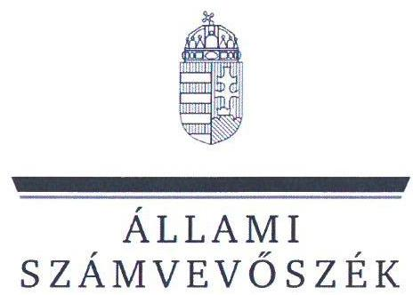
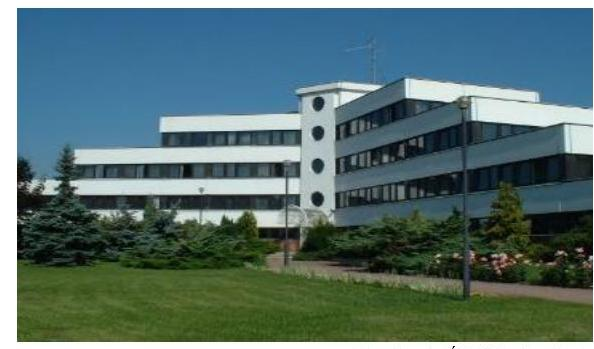
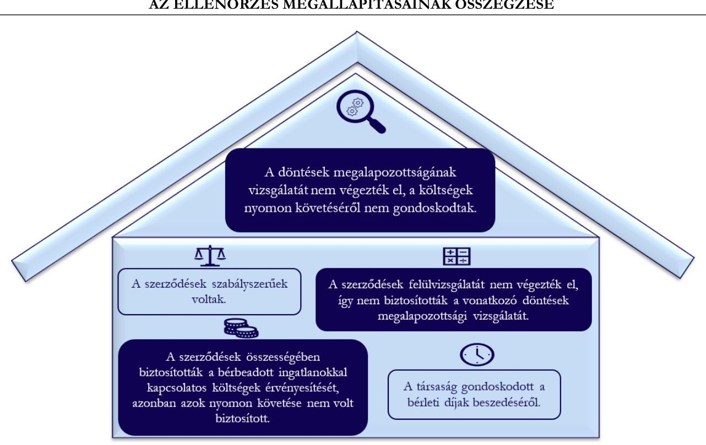

# JELENTÉS 

## A többségi állami tulajdonú gazdasági társaságok ingatlan bérbeadásának célzott ellenőrzése

Északdunántúli Vízmú Zártkörúen Müködő Részvénytársaság

2025.

---

# JELENTÉS 

## A többségi állami tulajdonú gazdasági társaságok ingatlan bérbeadásának célzott ellenőrzése

Északdunántúli Vízmú Zártkörúen Múködő Részvénytársaság

2025.

---

# ELLENŐRZÉSI IGAZGATÓSÁG: 

## ÁLLAMI VAGYONGAZDÁLKODÁST ELLENŐRZŐ IGAZGATÓSÁG

## ELLENŐRZÉSI IGAZGATÓ:

HERCZEGH ZSOLT ellenőrzési igazgató

## ELLENŐRZÉSVEZETŐ:

Jelentéseink az interneten a www.asz.hu címen olvashatók.

IMRE ZSUZSANNA ellenőrzésvezető

IKTATÓSZÁM: EL-4095-009/2025
TÉMASORSZÁM: 38
ELLENŐRZÉS-AZONOSÍTÓ SZÁM: V1107

---

# TARTALOMJEGYZÉK 

AZ ELLENŐRZÉS ALAPADATAI ..... 5
MEGÁLLAPÍTÁSOK ÉS KÖVETKEZTETÉSEK ..... 7
JAVASLATOK ..... 10
MELLÉKLETEK ..... 11
I. sz. melléklet: Értelmező szótár ..... 11
II. sz. melléklet: Ellenőrzési kritériumok ..... 12
FÜGGELÉK: ÉSZREVÉTELEK ..... 13
RÖVIDÍTÉSEK JEGYZÉKE ..... 14

---

.

---

# AZ ELLENŐRZÉS ALAPADATAI 

## AZ ELLENŐRZÉS CÉLJA

Az ellenőrzés célja a gazdasági társaságnál az ingatlanbérbeadási szerződések szabályszerűségének és a kapcsolódó döntések megalapozottságának, az ingatlannal kapcsolatos költségek, valamint, a bérleti jogviszonyból eredő követelések érvényesítésének értékelése volt.

## AZ ELLENŐRZÖTT IDŐSZAK

A 2022-2023. évek, a követelések tekintetében a 2022. január 1-től az ellenőrzés megkezdéséről szóló tájékoztató levél kézhezvételének napjáig, 2024. június 26-ig terjedő időszak.

## AZ ELLENŐRZÉS TÁRGYA

Az ÉDV Zrt. ${ }^{1}$ ingatlanbérbeadásra szóló szerződéseinek szabályszerűsége, a kapcsolódó döntések megalapozottsága, valamint az ingatlannal kapcsolatos költségek érvényesítésének biztosítása, a bérleti jogviszonyból eredő követelések érvényesítése volt.

Az ellenőrzés kiterjedt minden olyan körülményre és adatra, amely az ÁSZ ${ }^{2}$ jogszabályban meghatározott feladatainak teljesítéséhez, valamint a program végrehajtása folyamán felmerült újabb összefüggések feltárásához szükséges volt.

## AZ ELLENŐRZÉS JOGALAPJA

Az ellenőrzés jogszabályi alapját az ÁSZ tv. ${ }^{3} 1 . \int(3)$ bekezdése és az 5. $\int(4)$ bekezdése képezik.

## AZ ELLENŐRZÉS MÓDSZERE

Az ellenőrzést az ÁSZ a nemzetközi standardokat irányadónak tekintve az ellenőrzési program szempontjai, az ellenőrzött időszakban hatályos jogszabályok, az ellenőrzés szakmai szabályok és módszertanok figyelembevételével folytatta le.

Az ellenőrzési kérdések megválaszolásához szükséges bizonyítékok megszerzése az ellenőrzött szervezet által rendelkezésre bocsátott dokumentumokra és adatokra alapozva, a következő ellenőrzési eljárások alkalmazásával történt: kérdésfeltevés (interjú), szemrevételezés, megfigyelés, összehasonlítás, mintavételezés, elemző eljárás. Az ellenőrzési bizonyítékként felhasználható adatforrások közé tartoztak egyrészt az ellenőrzéshez kért dokumentumok, adatforrások, másrészt adatforrás volt még minden - az ellenőrzés folyamán feltárt, az ellenőrzés szempontjából releváns információt tartalmazó - dokumentum.

Az ingatlan bérbeadási szerződésekhez kapcsolódó döntések megalapozottsága - mivel az ellenőrzött szerződések megkötésének időpontja több, mint öt évvel korábbi volt, mint az ellenőrzött időszak kezdő

---

időpontja - a szerződések módosításához, felülvizsgálatához kapcsolódóan hozott döntések tekintetében kerültek értékelésre.

Az ellenőrzés lefolytatásához az ellenőrzött szervezet a tanúsítvány kitöltésével, valamint az ÁSZ által kért dokumentumok, adatok, információk megküldésével szolgáltatott adatokat.

A tanúsítvány adatai alapján az ÉDV Zrt. az ellenőrzött időszakban 32 darab bérbeadási szerződéssel rendelkezett. A mintavételezés keretében két darab ingatlan bérbeadási szerződés került kiválasztásra.

Az ÁSZ ellenőrzése a mintatételek vonatkozásában tesz megállapítást, ad értékelést.

# AZ ELLENŐRZÖTT SZERVEZET 

## ÉSZAKDUNÁNTÚLI VÍZMÚ ZÁRTKÖRÜEN MÜKÖDŐ RÉSZVÉNYTÁRSASÁG

Az ÉDV Zrt. jogelődje az Északdunántuli regionális Vizművek 1979. december 18-án alakult, alapításkori tulajdonosa $100 \%$-ban a Magyar Állam volt. Zártkörűen működő részvénytársaság formájában, ÉDV Zrt. néven 2006. június 6-tól kezdődően működik. Az ÉDV Zrt. $91,67 \%$-os tulajdonosa a Magyar Állam (tulajdonosi joggyakorló a Nemzeti Vízművek Zártkörűen Működő Részvénytársaság), további 8,30 \% önkormányzati tulajdon, valamint $0,03 \%$ saját részvénnyel rendelkezik.

Fervás: Az ÉDV Zrt. honlapja

Az ÉDV Zrt. fő tevékenysége a víztermelés, -kezelés, -ellátás, alaptevékenysége az állami és önkormányzati tulajdonban lévő víziközművek működtetése. Működési területe alapvetően KomáromEsztergom vármegyére és Pest vármegyére terjed ki, azonban társvállalati vízátadással jelen vannak Fejér vármegyében is. Az ÉDV Zrt. a kizárólagos állami tulajdonban lévő víziközműveket a Magyar Nemzeti Vagyonkezelő Zrt.-vel kötött vagyonkezelési szerződés alapján, az önkormányzati tulajdonú víziközműveket pedig bérleti-üzemeltetési, illetve vagyonkezelési szerződés alapján üzemelteti. Az ÉDV Zrt. székhelye Tatabányán található, valamint további három telephellyel rendelkezik Tatabányán és hét fiókteleppel Dorogon, Oroszlányban, Esztergomban, Kisbéren, Tatán, Komáromban és Dunaharasztiban.

Az ÉDV Zrt. 2023. évi beszámolója alapján a mérlegfőösszege 84212,8 M Ft, a saját tőke összege 2195,3 M Ft, az értékesítés nettó árbevétele $12417,6 \mathrm{MFt}$, a foglalkoztatottak átlagos statisztikai állományi létszáma 825 fő volt.

Az ÉDV Zrt. az ellenőrzött időszakban a Taktv. ${ }^{4}$ 7/J. § (1) bekezdése alapján a Gbkr. ${ }^{5}$ hatálya alá tartozott.

Az ellenőrzésre kiválasztott bérleti szerződés; ${ }^{6}$ a Magyar Állam tulajdonában és az ÉDV Zrt. üzemeltetésében lévő, Esztergomban (a 0110 hrsz. alatt) található ingatlanhoz kapcsolódó, 30 m -es antenna torony egyharmad részének bérbeadására, a bérleti szerződés; ${ }^{7}$ Tát településen (a 689. hrsz. alatt) lévő víztorony teteje egyharmad részének bérbeadására vonatkozott.

---

# MEGÁLLAPÍTÁSOK ÉS KÖVETKEZTETÉSEK 

Forrás: Az ellenőrzés során rendelkezésre bocsátott dokumentumok alapján ÁSZ saját szerkesztés
Az ÉDV Zrt. ellenőrzéssel érintett ingatlanbérbeadási szerződései szabályszerűek voltak.
Az ÉDV Zrt. a 2022. február 1-től, valamint 2023. augusztus 1-től hatályos Szerződéskötések rendje ${ }_{1,2}{ }^{8}$-ben meghatározta a szerződések készítésének, véleményezésének, valamint jóváhagyásának folyamatát, megfelelve a Gbkr.-ben foglalt követelményeknek. A Szerződéskötések rendje ${ }_{1,2}$ a szerződések tartalmi elemeire vonatkozóan előírást nem tartalmazott.
Az ellenőrzött időszakban hatályos bérleti szerződések ${ }_{1,2}$ tartalmazták a szerződő felek adatait, a bérlet tárgyát, időtartamát, a bérleti díjak összegét, a fizetés módját és határidejét, a késedelmes fizetés esetén alkalmazandó eljárásokat, a felmondási módot és időt, valamint rögzítésre került, hogy a szerződésben nem szabályozott, a szerződéssel kapcsolatos kérdések tekintetében a Ptk. ${ }^{9}$ előírásai az irányadóak. A bérleti szerződések ${ }_{1,2}$ szabályszerűek voltak, megfeleltek a Ptk.-ban foglaltaknak.

Az ÉDV Zrt. ellenőrzéssel érintett ingatlanrészek bérbeadásához kapcsolódó döntései indokoltak és célszerűek voltak, azonban a bérleti szerződések ${ }_{1,2}$ felülvizsgálatát nem végezte el, így nem biztosította a vonatkozó döntések megalapozottsági vizsgálatát. Az ÉDV Zrt. összességében biztosította a bérbeadott ingatlanokkal kapcsolatos villamosenergia költségek érvényesítését, azonban azok nyomon követéséről nem gondoskodott.
Az ÉDV Zrt. az ellenőrzött időszakot megelőzően, 2016. december 1. napján kötött bérleti szerződések ${ }_{1,2}$ et annak érdekében, hogy a bérlők ott mikrohullámú berendezéseket, antennákat helyezzenek el, bázisállomást üzemeltessenek. Az ÉDV Zrt. a bérleti szerződéseket 10 év határozott időtartamra kötötte, így hosszútávra biztosította az ingatlanrészek hasznosítását. A bérleti szerződések ${ }_{1,2}$-ben a teljes bérleti

---

időszakra rögzített bérleti díjak magukban foglalták a vételezett villamosenergia költségét is. A bérleti szerződések ${ }_{1,2}$ egyéb felmerült költségek érvényesítésére vonatkozó rendelkezéseket nem tartalmaztak.
Az ÉDV Zrt. rendelkezett az ingatlanbérbeadáshoz kapcsolódóan az ellenőrzött időszakot megelőzően hozott döntéseket tartalmazó, írásba foglalt bérleti szerződések ${ }_{1,2}$-kel, megfelelve a Gbkr.-ben foglalt előírásnak.

1. táblázat

A MINTATÉTELEKHEZ KAPCSOLÓDÓ BEVÉTELEK ÉS KALKULÁLT KÖLTSÉGEK (ADATOK EZER FORINTBAN)

| ÉV | MEGNEVEZÉS | BERLETT   SZERZŐDES; | BERLETT   SZERZŐDES; |
| :--: | :--: | :--: | :--: |
| 2022 | Ingatlan bérbeadásból   származó bevételek | 1578,0 | 798,6 |
|  | Az ellenőrzött által az   utókalkuláció során   meghatározott   villamosenergia   költség | n.a. | n.a. |
|  | Fedezet összege   Fedezeti hányad | n.a.   n.a. | n.a.   n.a. |
| 2023 | Ingatlan bérbeadásból   származó bevételek | 1578,0 | 798,6 |
|  | Az ellenőrzött által az   utókalkuláció során   meghatározott   villamosenergia   költség | 217,3 | 299,4 |
|  | Fedezet összege   Fedezeti hányad | 1360,7   $86,2 \%$ | 499,2   $62,5 \%$ |

Az ÉDV Zrt. az ellenőrzött időszakban ugyan nem vizsgálta felül és nem módosította a bérleti díjakat, ugyanakkor a bérleti díjak eredményfedezete megfelelt - az lényegesen meghaladta még 2023. évben a bekövetkezett jelentős villamosenergia áremelkedések mellett is - a Társasági Árszabályzat ${ }^{10}$-ban rögzített, 20\%os fedezetnek.
Az analitikus nyilvántartás ${ }_{1,2}{ }^{11}$ tartalmazta az ellenőrzött időszakra vonatkozóan az ÉDV Zrt. ingatlanbérbeadásból származó bevételeit számlánkénti bontásban, ezáltal a rendelkezésre bocsátott dokumentumok alapján az ÉDV Zrt. a bérleti szerződések ${ }_{1,2}$ tekintetében nyomon követte az ingatlanbérbeadásból származó bevételeit, megfelelve a Gbkr.-ben foglaltaknak.
A fentiekben rögzített tényeket és körülményeket
figyelembe véve az ÉDV Zrt.-nek az ellenőrzéssel érintett ingatlanrészek bérbeadásához kapcsolódó döntései összességében indokoltak és célszerűek voltak, az Nvtv. ${ }^{12}$-ben előírt, a nemzeti vagyonnal való felelős gazdálkodásra vonatkozó követelményeknek megfeleltek.
A bérleti szerződések ${ }_{1,2}$-ben foglaltaknak megfelelően a bérleti díjak tartalmazták a vételezett villamosenergia költségét is, amely a ráfordításokról vezetett nyilvántartás ${ }_{1,2}{ }^{13}$-ban a bérleti szerződések ${ }_{1,2}$-re vonatkozóan nem került elkülönítetten kimutatásra.
Az ÉDV Zrt. nem követte nyomon az ingatlanbérbeadással kapcsolatban felmerült villamosenergia költségeket szerződésenként és ingatlanonként. Az ÉDV Zrt. első számú vezetője ezzel nem gondoskodott arról, hogy a bérbeadott ingatlanokkal kapcsolatban felmerült villamosenergia költségekről megfelelő, pontos és naprakész információ álljon rendelkezésre, sem a megfelelő kontrollok kialakításáról annak érdekében, hogy a bérleti szerződések ${ }_{1,2}$-ben rögzített villamosenergia költségek folyamatos nyomon követése - figyelemmel a Gbkr. 3. § (1) bekezdés e) pontjában és a 8. §-ban foglaltakra, valamint a Taktv. 7/J. § (3) bekezdés d) pontjában foglaltakra - biztosított legyen.
Az ÉDV Zrt. a 2016. évben kötött bérleti szerződések ${ }_{1,2}$-ben rögzített bérleti díjakat az ellenőrzött időszakban nem vizsgálta felül, a felmerült villamosenergia költséget nem követte nyomon, így nem gondoskodott a kontrolltevékenység részeként a bérbeadással kapcsolatosan a korábbiakban meghozott döntések megalapozottságának vizsgálatáról.
Az ÉDV Zrt. által rendelkezésre bocsátott írásbeli nyilatkozatban ${ }^{14}$ rögzítettek szerint a bérleti szerződések felülvizsgálati folyamatát 2023. év végén indították el, melynek célja 2024. év végéig a meglévő

---

szerződésállományban a szükséges módosítások megvalósítása, az árazás felülvizsgálata, a rögzített árak módosítása, valamint az inflációkövető bérleti díjak alkalmazásának bevezetése.
Az ÉDV Zrt. vezérigazgatója az ellenőrzés ideje alatt, az ellenőrzés hatására intézkedett a bérleti szerződések ${ }_{1,2}$ tekintetében a bérbeadáshoz kapcsolódó villamosenergia fogyasztás utólagos megállapításáról, valamint a villamosenergia költségek 2023. évi utólagos kalkulációjáról és ellenőrzéséről. Tekintettel az ÉDV Zrt. által rendelkezésre bocsátott 2023. évi költségkalkulációra és az írásbeli nyilatkozatában foglaltakra, valamint a 2022. évi és a 2023. évi KSH inflációs adatokra az ÉDV Zrt. igazolta, hogy a bérleti szerződések ${ }_{1,2}$ az ellenőrzött időszakban összességében biztosították a bérbeadott ingatlanokkal kapcsolatos villamosenergia költségek érvényesítését, így az ingatlanok bérbeadásából származó bevételek fedezetet nyújtottak a bérbeadott ingatlanokkal kapcsolatosan felmerült villamosenergia költségekre. (1. táblázat)

# Az ÉDV Zrt. az ellenőrzéssel érintett ingatlanbérbeadási szerződései tekintetében gondoskodott a bérleti díjak beszedéséről. 

Az ÉDV Zrt. a bérleti szerződések ${ }_{1,2}$-ben meghatározta a bérleti díjak bérlő általi megfizetésének módját és határidejét, valamint a késedelmes fizetés esetén alkalmazandó eljárásokat, ezzel megfelelt a Gbkr. Irányelv ${ }^{15}$-ben foglaltaknak.
Az ÉDV Zrt. a bérlőkkel szembeni követelésekről vezetett nyilvántartása ${ }^{16}$ az ellenőrzött időszakban tételesen (számlánkénti bontásban) tartalmazta a követelések összegét, a számla keltét, a fizetési határidőt, valamint a kiegyenlítés dátumát és az összegét, ezzel megfelelt a Számv. tv. ${ }^{17}$-ben foglaltaknak.
Az ÉDV Zrt. által rendelkezésre bocsátott analitikus nyilvántartás ${ }_{1,2}$, valamint a bérleti szerződések ${ }_{1,2}$-hez kapcsolódó követelésekről vezetett nyilvántartás tartalmazta az ellenőrzött időszakra vonatkozóan a bérlő részére kiállított számlák nettó és bruttó összegét, a számla keltét, a teljesítés időpontját, a számla esedékességét, valamint a kiegyenlítés dátumát, ezáltal a Gbkr.-ben és a Gbkr. Irányelvben foglaltaknak megfelelően nyomon követte az ingatlanbérbeadásból származó követelései pénzügyi teljesítését.
Az ÉDV Zrt. a bérlővel szemben a bérleti szerződés ${ }_{1}$ tekintetében 2023. december 31-én bruttó 167005 Ft összegű határidőn túli követeléssel rendelkezett, amely a bérlő részéről 2024. január 18-án kiegyenlítésre került, a bérleti szerződés2 tekintetében 2023. december 31-én határidőn túli követeléssel nem rendelkezett. Az ÉDV Zrt. a bérleti szerződések ${ }_{1,2}$ tekintetében gondoskodott a bérleti díjak beszedéséről, így érvényesültek az Nvtv.-ben rögzített, a nemzeti vagyonnal való felelős gazdálkodásra vonatkozó követelmények, valamint a Taktv.-ben foglalt követelmények.

---

# JAVASLATOK 

Az ÁSZ tv. 33. § (1) bekezdésében foglaltak értelmében az ellenőrzött szervezet vezetője köteles a jelentésben foglalt megállapításokhoz kapcsolódó intézkedési tervet összeállítani és azt a jelentés kézhezvételétől számított 30 napon belül az ÁSZ részére megküldeni. Amennyiben az ellenőrzött szervezet vezetője nem küldi meg határidőben az intézkedési tervet, vagy továbbra sem elfogadható intézkedési tervet küld, az Állami Számvevőszék elnöke az ÁSZ tv. 33. § (3) bekezdése a) és b) pontjaiban foglaltakat érvényesítheti.

## AZ ÉDV ZRT. VEZÉrIGAZGATÓJÁNAK

1. Gondoskodjon a bérleti szerződések ${ }_{1,2}$-ben meghatározott bérleti díjak rendszeres felülvizsgálatáról.
2. Gondoskodjon a megfelelő kontrollok kialakításáról annak érdekében, hogy a bérleti szerződések ${ }_{1,2}$-ben rögzített villamosenergia költségek folyamatos nyomon követése - figyelemmel a Gbkr. 3. § (1) bekezdés e) pontjában és a 8. §-ában, valamint a Taktv. 7/J. § (3) bekezdés d) pontjában foglaltakra - biztosított legyen.

---

# MELLÉKLETEK 

## I. SZ. MELLÉKLET: ÉRTELMEZŐ SZÓTÁR

fedezeti hányad mutató
gazdasági társaság
többségi állami tulajdon

A fedezeti hányad százalékos formában mutatja meg a gazdasági társaság bruttó eredményét és azt, hogy az árbevételből milyen mértékben tudja fedezni az állandó költségeket. Kiszámítása: (árbevétel- változó költségek)/árbevétel *100.
(ÁSZ definíció a Bán Erika - Kresalek Péter - dr. Pucsek József: A vállalati gazdálkodás elemzése (Perfekt Kiadó, 2017) és Dr. Bíró Tibor - Kresalek Péter - Dr. Pucsek József - Dr. Sztanó Imre: A vállalkozások tevékenységének komplex elemzése (Perfekt Kiadó, 2016) kiadványok alapján)
A gazdasági társaságok üzletszerű közös gazdasági tevékenység folytatására, a tagok vagyoni hozzájárulásával létrehozott, jogi személyiséggel rendelkező vállalkozások, amelyekben a tagok a nyereségből közösen részesednek, és a veszteséget közösen viselik. (Forrás: Ptk. 3:88. § (1) bekezdése)
Az állam tulajdonában lévő tagsági jogviszonyt megtestesítő értékpapír, illetve az állam tulajdonában lévő egyéb társasági részesedés, amennyiben a társaságban a Magyar Állam közvetlenül vagy közvetetten a szavazatok több mint felével rendelkezik.
(ÁSZ definíció a Vtv. ${ }^{18}$ 1. § (2) bekezdés c) pontja és a Ptk. 8:2. § (1), (3)-(4) bekezdései alapján)

---

# II. SZ. MELLÉKLET: ELLENŐRZÉSI KRITÉRIUMOK 

## ELLENŐRZÉSI KRITÉRIUMOK

Nvtv. 7. § (1), (2) bekezdés
Taktv. 7/J. § (3) bekezdés a) -d) és f) pontok
Ptk. 6:331-6:341. §
Számv. tv. 12. § (1), 14. § (5) bekezdés c.) pont, 16 § (1) bekezdés, 29. §, 164 § (1), (2) bekezdés
Gbkr. 3. § (1) bekezdés e) pont, 4. § (1) bekezdés c) pont, (3) bekezdés, 6. § (1), (2) bekezdés, 8. §
Az ÉDV Zrt. Szerződéskötések rendje elnevezésű belső szabályzata
Az ÉDV Zrt. Társasági Árszabályzat elnevezésű belső szabályzata

---

# FÜGGELÉK: ÉSZREVÉTELEK 

A jelentéstervezetet a Számvevőszék 15 napos észrevételezésre megküldte az ellenőrzött szervezet vezetőjének az ÁSZ tv. 29. §* (1) bekezdése előírásának megfelelően.

Az Északdunántúli Vízmü Zártkörüen Müködő Részvénytársaság vezetője nem élt észrevételezési jogával.

[^0]
[^0]:    * 29. § (1) Az Állami Számvevőszék az ellenőrzési megállapításait megküldi az ellenőrzött szervezet vezetőjének vagy az általa megbízott személynek, és annak, akinek személyes felelősségét állapította meg.
    (2) Az ellenőrzött szervezet vezetője és a felelősként megjelölt személy az ellenőrzés megállapításaira tizenöt napon belül írásban észrevételt tehet.
    (3) Az Állami Számvevőszék az észrevételre a beérkezésétől számított harminc napon belül írásban válaszol. A figyelembe nem vett észrevételeket köteles a jelentésben feltüntetni, és megindokolni, hogy azokat miért nem fogadta el.

---

# RÖVIDÍTÉSEK JEGYZÉKE 

${ }^{1}$ ÉDV Zrt.
${ }^{2}$ ÁSZ
${ }^{3}$ ÁSZ tv.
${ }^{4}$ Taktv.
${ }^{5}$ Gbkr.
${ }^{6}$ bérleti szerződés
${ }^{7}$ bérleti szerződés
${ }^{8}$ Szerződéskötések rendje ${ }_{1,2}$
${ }^{9}$ Ptk.
${ }^{10}$ Társasági Árszabályzat
${ }^{11}$ analitikus nyilvántartás ${ }_{1,2}$
${ }^{12}$ Nvtv.
${ }^{13}$ ráfordításokról vezetett nyilvántartás ${ }_{1,2}$
${ }^{14}$ írásbeli nyilatkozat
${ }^{15}$ Gbkr. Irányelv
${ }^{16}$ követelésekről vezetett nyilvántartás
${ }^{17}$ Számv. tv.
${ }^{18}$ Vtv.

Északdunántúli Vízmú Zártkörűen Müködő Részvénytársaság
Állami Számvevőszék
2011. évi LXVI. törvény az Állami Számvevőszékről
2009. évi CXXII. törvény a köztulajdonban álló gazdasági társaságok takarékosabb müködéséről
339/2019. (XII. 23.) Korm. rendelet a köztulajdonban álló gazdasági társaságok belső kontrollrendszeréről
Az Északdunántúli Vízmú Zártkörűen Müködő Részvénytársaság és a bérlő között 2016.12.01-én kötött Esztergom 0110 hrsz. ingatlanhoz kapcsolódó bérleti szerződés 10 éves időtartamra.
Az Északdunántúli Vízmú Zártkörűen Müködő Részvénytársaság és a bérlő között 2016.12.01-én kötött Tát 689 hrsz. ingatlanhoz kapcsolódó bérleti szerződés 10 éves időtartamra.
Szerződéskötések rendje ${ }_{1}$ : Az Északdunántúli Vízmú Zártkörűen Müködő Részvénytársaság 2022.02.01-től hatályos Szerződéskötések rendje elnevezésű szakmai szabályzata.
Szerződéskötések rendje ${ }_{2}$ : Az Északdunántúli Vízmú Zártkörűen Müködő Részvénytársaság 2023.08.01-től hatályos Szerződéskötések rendje elnevezésű szakmai szabályzata.
2013. évi V. törvény a Polgári Törvénykönyvről

ÉDV Zrt. Társasági Árszabályzat (kiadás dátuma: 2020. augusztus 10.)
analitikus nyilvántartás ${ }_{1}$ : Az Északdunántúli Vízmú Zártkörűen Müködő Részvénytársaság által rendelkezésre bocsátott, az Esztergom 0110 hrsz. ingatlanbérletből eredő 2022-2023. évi követelésekről vezetett analitikus nyilvántartás.
analitikus nyilvántartás ${ }_{2}$ : Az Északdunántúli Vízmú Zártkörűen Müködő Részvénytársaság által rendelkezésre bocsátott, az Tát 689 hrsz. ingatlanbérletből eredő 2022-2023. évi követelésekről vezetett analitikus nyilvántartás.
2011. évi CXCVI. törvény a nemzeti vagyonról
ráfordításokról vezetett nyilvántartás ${ }_{1}$ : Az Északdunántúli Vízmú Zártkörűen Müködő Részvénytársaság által rendelkezésre bocsátott, Esztergom 0110 hrsz. ingatlanbérletekkel kapcsolatban felmerült ráfordításokat tartalmazó kimutatás.
ráfordításokról vezetett nyilvántartás ${ }_{2}$ : Az Északdunántúli Vízmú Zártkörűen Müködő Részvénytársaság által rendelkezésre bocsátott, Tát 689 hrsz. ingatlanbérletekkel kapcsolatban felmerült ráfordításokat tartalmazó kimutatás.
Az Északdunántúli Vízmú Zártkörűen Müködő Részvénytársaság által az EL-4096058/2024 ikt. számú megkeresésre válaszul megküldött írásbeli nyilatkozata.
Pénzügyminisztérium Irányelv a köztulajdonban álló gazdasági társaságok részére a belső kontrollrendszer kialakításához és müködtetéséhez
Az Északdunántúli Vízmú Zártkörűen Müködő Részvénytársaság által rendelkezésre bocsátott, a 3C Távközlési Kft.-vel szemben fennálló követelésekről vezetett 20222023. évi analitikus nyilvántartás.
2000. évi C. törvény a számvitelről
2007. évi CVI. törvény az állami vagyonról

---

1052 Budapest, Apáczai Csere János u. 10. | 1364 Budapest 4., Pf. 54
www.asz.hu | szamvevoszek@asz.hu
telefon: +36 14849100