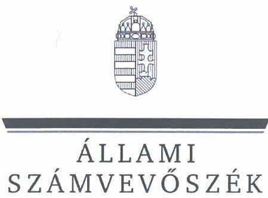
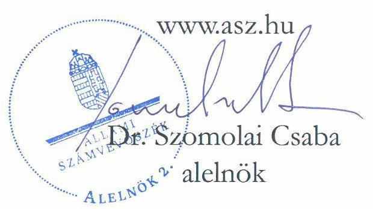
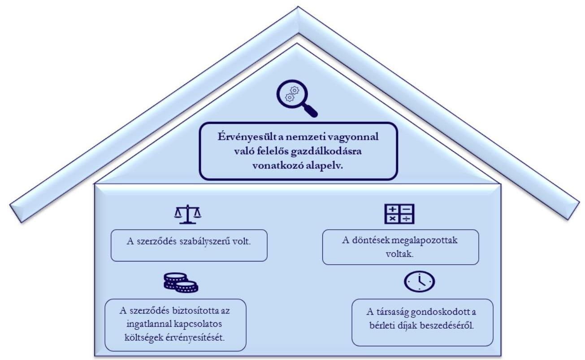

# JELENTÉS 

## A többségi állami tulajdonú gazdasági társaságok ingatlan bérbeadásának célzott ellenőrzése

Hortobágyi Természetvédelmi és Génmegőrző Nonprofit Korlátolt
Felelősségű Társaság
2025.

---

ÁLLAMI
SZÁMVEVŐSZÉK

# JELENTÉS 

## A többségi állami tulajdonú gazdasági társaságok ingatlan bérbeadásának célzott ellenőrzése

Hortobágyi Természetvédelmi és Génmegőrző Nonprofit Korlátolt
Felelősségú Társaság
2025.

25002

---

# ELLENŐRZÉSI IGAZGATÓSÁG: 

## ÁLLAMI VAGYONGAZDÁLKODÁST ELLENŐRZŐ IGAZGATÓSÁG

## ELLENŐRZÉSI IGAZGATÓ:

HERCZEGH ZSOLT ellenőrzési igazgató

## ELLENŐRZÉSVEZETŐ:

Jelentéseink az interneten a www.asz.hu címen olvashatók.

IMRE ZSUZSANNA ellenőrzésvezető

IKTATÓSZÁM: EL-4095-005/2025
TÉMASORSZÁM: 38
ELLENŐRZÉS-AZONOSÍTÓ SZÁM: V1107

---

# TARTALOMJEGYZÉK 

AZ ELLENŐRZÉS ALAPADATAI ..... 5
MEGÁLLAPÍTÁSOK ÉS KÖVETKEZTETÉSEK ..... 7
MELLÉKLETEK ..... 10
I. sz. melléklet: Értelmező szótár ..... 10
II. sz. melléklet: Ellenőrzési kritériumok ..... 11
FÜGGELÉK: ÉSZREVÉTELEK ..... 12
RÖVIDÍTÉSEK JEGYZÉKE ..... 13

---

.

---

# AZ ELLENŐRZÉS ALAPADATAI 

## AZ ELLENŐRZÉS CÉLJA

Az ellenőrzés célja a gazdasági társaságnál az ingatlanbérbeadási szerződés szabályszerűségének és a kapcsolódó döntések megalapozottságának, az ingatlannal kapcsolatos költségek, valamint a bérleti jogviszonyból eredő követelések érvényesítésének értékelése volt.

## AZ ELLENŐRZÖTT IDŐSZAK

A 2022-2023. évek, a követelések tekintetében a 2022. január 1-től az ellenőrzés megkezdéséről szóló tájékoztató levél kézhezvételének napjáig, 2024. június 25-ig terjedő időszak.

## AZ ELLENŐRZÉS TÁRGYA

A többségi állami tulajdonú gazdasági társaság ingatlanbérbeadásra szóló szerződésének szabályszerűsége, a kapcsolódó döntések megalapozottsága, valamint az ingatlannal kapcsolatos költségek érvényesítésének biztosítása, a bérleti jogviszonyból eredő követelések érvényesítése volt.

Az ellenőrzés kiterjedt minden olyan körülményre és adatra, amely az ÁSZ ${ }^{1}$ jogszabályban meghatározott feladatainak teljesítéséhez, valamint a program végrehajtása folyamán felmerült újabb összefüggések feltárásához szükséges volt.

## AZ ELLENŐRZÉS JOGALAPJA

Az ellenőrzés jogszabályi alapját az ÁSZ tv. ${ }^{2} 1 . \int(3)$ bekezdése és az 5. $\int(4)$ bekezdése képezik.

## AZ ELLENŐRZÉS MÓDSZERE

Az ellenőrzést az ÁSZ a nemzetközi standardokat irányadónak tekintve az ellenőrzési program szempontjai, az ellenőrzött időszakban hatályos jogszabályok, az ellenőrzés szakmai szabályok és módszertanok figyelembevételével folytatta le.

Az ellenőrzési kérdések megválaszolásához szükséges bizonyítékok megszerzése az ellenőrzött szervezet által rendelkezésre bocsátott dokumentumokra és adatokra alapozva, a következő ellenőrzési eljárások alkalmazásával történt: kérdésfeltevés (interjú), szemrevételezés, megfigyelés, összehasonlítás, mintavételezés, elemző eljárás. Az ellenőrzési bizonyítékként felhasználható adatforrások közé tartoztak egyrészt az ellenőrzéshez kért dokumentumok, adatforrások, másrészt adatforrás volt még minden - az ellenőrzés folyamán feltárt, az ellenőrzés szempontjából releváns információt tartalmazó - dokumentum.

Az ellenőrzés lefolytatásához az ellenőrzött szervezet a tanúsítvány kitöltésével, valamint az ÁSZ által kért dokumentumok, adatok, információk megküldésével szolgáltatott adatokat.

---

A tanúsítvány adatai alapján a Hortobágyi Nonprofit Kft. ${ }^{3}$ az ellenőrzött időszakban 11 darab hatályos ingatlan bérbeadási szerződéssel rendelkezett. A mintavételezés keretében egy darab ingatlan bérbeadási szerződés került kiválasztásra.

Az ÁSZ ellenőrzése a mintatétel vonatkozásában tesz megállapítást, ad értékelést.

# AZ ELLENŐRZÖTT SZERVEZET 

## Hortobágyi Természetvédelmi és Génmegőrző Nonprofit Korlátolt Felelősségű Társaság

A Magyar Állam 100\%-os tulajdonában álló Hortobágyi Nonprofit Kft. 2009. március 18. napján átalakulással jött létre az 1994. március 31. napjától múködő Hortobágyi Természetvédelmi és Génmegőrző Közhasznú Társaság jogutódjaként. Az ellenőrzött időszakban a Magyar Államot megillető tulajdonosi jogok és kötelezettségek összességét az Agrárminisztérium gyakorolta.

A Hortobágyi Nonprofit Kft. főtevékenysége egyéb

Foerás: A Hortobágyi Nonprofit Kft. honlapja
szarvasmarha tenyésztés, továbbá a tevékenységei között szerepelt a saját tulajdonú, bérelt ingatlan bérbeadása, üzemeltetése is. A Hortobágyi Nonprofit Kft. székhelye Hortobágyon található. A Hortobágyi Nonprofit Kft. további 22 telephellyel rendelkezik Hortobágy bel- és külterületén, valamint összesen négy fiókteleppel, melyből kettő Balmazújvároson, egy Nagyhegyesen és egy Tiszacsegén van.

A Hortobágyi Nonprofit Kft. 2023. évi beszámolója alapján a mérlegfőösszege 5574,1 M Ft, a saját tőke összege 2573,1 M Ft, az értékesítés nettó árbevétele 686,1 M Ft, a foglalkoztatottak átlagos statisztikai állományi létszáma 163 fő volt.

A Hortobágyi Nonprofit Kft. az ellenőrzött időszakban a Taktv. ${ }^{4}$ 7/J.§ (1) bekezdése és így a Gbkr. ${ }^{5}$ hatálya alá tartozott.

Az ellenőrzésre kiválasztott bérleti szerződés ${ }^{6}$ 2021. március 8. napján került megkötésre a Hortobágyi Nonprofit Kft. tulajdonában álló, Hortobágy külterületén található „Pusztai Állatpark" (továbbiakban: ingatlan) bérlő általi üzemeltetési célú bérbeadására vonatkozóan.

---

# MEGÁLLAPÍTÁSOK ÉS KÖVETKEZTETÉSEK 

1. ábra

AZ ELLENŐRZÉS MEGÁLLAPÍTÁSAINAK ÖSSZEGZÉSE

Forrás: Az ellenőrzés során rendelkezésre bocsátott dokumentumok alapján ÁSZ saját szerkesztés
A Hortobágyi Nonprofit Kft. ellenőrzéssel érintett ingatlanbérbeadási szerződése szabályszerű volt.
A Hortobágyi Nonprofit Kft. a szerződéskötés időpontjában rendelkezett Beszerzési és utalványozási szabályzat ${ }^{7}$-tal, mely a kötelezettségvállalásra vonatkozó előírásokat is tartalmazta, megfelelve a Gbkr.-ben foglaltaknak. Az ellenőrzött időszakban hatályos bérleti szerződés a Beszerzési és utalványozási szabályzatnak, valamint a Ptk. ${ }^{8}$ előírásainak megfelelően tartalmazta a szerződő felek adatait, a bérlet tárgyát, időtartamát, a bérleti díj összegét, a fizetés módját, a késedelmes fizetés esetén alkalmazandó eljárásokat, a felmondási módot, valamint rögzítésre került, hogy a szerződésben nem szabályozott, a szerződéssel kapcsolatos kérdések tekintetében a Ptk. előírásai az irányadóak, amelyre tekintettel a szerződés szabályszerű volt.
A bérleti szerződésben ugyan nem került rögzítésre a bérleti díj emelésének lehetősége, azonban meghatározásra került, hogy a bérlemény használatával kapcsolatban felmerülő valamennyi költség a bérlőt terheli.
A bérleti szerződést írásba foglalták, az szabályszerű volt, összeségében érvényesültek az Nvtv. ${ }^{9}$-ben rögzített, a nemzeti vagyonnal való felelős gazdálkodásra vonatkozó alapelvek, valamint a belső kontrollrendszer kialakítására vonatkozóan a Taktv.-ben foglalt követelmények.

A Hortobágyi Nonprofit Kft. ingatlanbérbeadáshoz kapcsolódó döntései - az ellenőrzött bérleti szerződés tekintetében - összességében megalapozottak és célszerűek voltak.

---

A Hortobágyi Nonprofit Kft. Felügyelő Bizottsága ülésének 2020. december 10. napján készült jegyzőkönyv ${ }^{10}$-e tartalmazta az ingatlan üzemeltetés céljából történő bérbeadásának felvetését az ingatlannal kapcsolatos üzemeltetési veszteségek - 2019. évben -24633 E Ft, míg 2020. évben 35125 E Ft - enyhítése érdekében.
A Hortobágyi Nonprofit Kft. 2021. február 15. napján nyilvános pályázati eljárás keretében Pályázati kiírást tett közzé a tulajdonában lévő ingatlan bérletére és üzemeltetésére. 2021. február 26. napján a bérlő egyedüli pályázóként Pályázati adatlapot nyújtott be a nyilvános Pályázati kiírásra. A Pályázati adatlapon a vállalt bérleti díj összege nettó $1000 \mathrm{E} \mathrm{Ft} /$ év volt.
A Hortobágyi Nonprofit Kft. az érvényes pályázati adatlap alapján 2021. március 8-án megkötötte a bérleti szerződést.
A Hortobágyi Nonprofit Kft. a bérleti szerződéskötésre vonatkozó döntés előkészítése során megvizsgálta a gazdaságossági szempontokat, a javaslatot és a döntést írásba foglalta, továbbá a bérleti díj a nyilvános Pályázati kiírásra beérkezett egyetlen ajánlattal összhangban került meghatározásra.
A Hortobágyi Nonprofit Kft. az öt éves időtartamra - 2021-2025. évekre - kötött bérleti szerződésben rögzített éves bérleti díjat az ellenőrzött időszakban nem vizsgálta felül, változatlan bérleti díjat érvényesített a bérlő felé. A bérleti díj emelésére ugyan az ellenőrzött időszakra vonatkozóan nem került sor - arra az ajánlattal összhangban megkötött bérleti szerződés sem adott lehetőséget -, azonban a Hortobágyi Nonprofit Kft. a bérbeadásra vonatkozó döntésével gondoskodott az ingatlannal kapcsolatos üzemeltetési veszteségek csökkentéséről. A Hortobágyi Nonprofit Kft. az ingatlan bérbeadására vonatkozó döntését a döntéselőkészítő dokumentumokban indoklásokkal alátámasztotta, döntését írásba foglalta, az ellenőrzött időszakban teljesült a veszteségek csökkentésére irányuló cél, így a döntése megalapozott és célszerű volt, összességében érvényesültek az Nvtv.-ben rögzített, a nemzeti vagyonnal való felelős gazdálkodásra vonatkozó alapelvek, valamint a Taktv.-ben foglalt követelmények.

# A Hortobágyi Nonprofit Kft. által kötött ingatlanbérbeadási szerződés biztosította az ingatlannal kapcsolatos költségek érvényesítését, a veszteségek minimalizálását. 

A Hortobágyi Nonprofit Kft. által kötött bérleti szerződés alapján minden, az ingatlannal kapcsolatosan felmerült költség a bérlőt terhelte, többek között a közüzemi díjak, biztonságtechnikai rendszerek 1. táblázat

A BÉRLETI SZERZŐDÉSHEZ KAPCSOLÓDÓ BEVÉTELEK ÉS RÁFORDÍTÁSOK AZ ELLENŐRZÖTT IDŐSZAKBAN
(ADATOK EZER FORINTBAN)

| MEGNEVEZÉS | 2022. ÉV | 2023. ÉV |
| :-- | --: | --: |
| Ingatlan bérbeadásból származó   bevételek | $\mathbf{1 7 5 1 , 2}$ | $\mathbf{3 3 9 6 , 0}$ |
| -ebből bérleti díj | 1000,0 | 1000,0 |
| -ebből továbbszámlázott ráfordítás | 751,2 | 2396,0 |
| Bérbeadott ingatlannal   kapcsolatosan felmerült   költségek, ráfordítások | $\mathbf{4 3 9 1 , 6}$ | $\mathbf{5 6 0 6 , 7}$ |
| -ebből közvetített szolgáltatás | 751,2 | 2396,0 |
| -ebből terv szerinti értékcsökkenés | 3640,4 | 3210,6 |
| EREDMÉNY | $\mathbf{- 2 6 4 0 , 4}$ | $\mathbf{- 2 2 1 0 , 6}$ |

Forrás: A Hortobágyi Nonprofit Kft. által rendelkezésre bocsátott dokumentumok alapján ÁSZ saját szerkesztés
működtetése, biztosítási díjak, takarítási költségek, állagmegóvási és karbantartási költségek, nem értéknövelő beruházások. A Hortobágyi Nonprofit Kft. az ingatlan használatával kapcsolatban felmerült valamennyi közüzemi költséget - víz, villamosenergia - az ellenőrzött időszakban a bérlő részére almérőn mért fogyasztás alapján továbbszámlázta. A Hortobágyi Nonprofit Kft. a bérleti szerződésben érintett ingatlannal kapcsolatban felmerült költségekről, ráfordításokról a szerződés egyedi iktatószáma szerint nyilvántartás ${ }^{11}$-t vezetett. A Hortobágyi Nonprofit Kft. a bérleti szerződéssel kapcsolatosan felmerült ráfordítások között

---

mutatta ki továbbá a bérleti szerződéssel érintett ingatlan terv szerinti értékcsökkenését is, amelyre a bérleti díj csak részben nyújtott fedezetet.
A Hortobágyi Nonprofit Kft. által készített nyilvántartás és nyilvántartás ${ }_{2}^{12}$ tételesen, számlánkénti bontásban tartalmazták az ellenőrzött időszakban a bérleti szerződéssel érintett ingatlannal kapcsolatban felmerült bevételeket és a kapcsolódó ráfordításokat, így a Hortobágyi Nonprofit Kft. biztosította a döntései végrehajtásával kapcsolatos kontrollok és nyomon követési rendszer működtetését, megfelelve a Gbkr.-ben foglaltaknak.
A Hortobágyi Nonprofit Kft. bérleti szerződésből származó bevételei fedezetet nyújtottak a bérbeadott ingatlannal kapcsolatosan felmerült közüzemi díjakra, valamint a terv szerinti értékcsökkenés egy részére is. A bérleti szerződéssel szemben támasztott alapvető cél az ingatlannal kapcsolatos üzemeltetési veszteségek minimalizálása volt, mely megvalósult az ingatlan bérbeadással, így érvényesültek az Nvtv.ben foglalt, a nemzeti vagyonnal való felelős gazdálkodásra vonatkozó követelmények.

# A Hortobágyi Nonprofit Kft. az ellenőrzéssel érintett ingatlanbérbeadási szerződése tekintetében gondoskodott a bérleti díjak és kiszámlázott közüzemi díjak beszedéséről. 

A Hortobágyi Nonprofit Kft. a bérleti szerződéssel kapcsolatos követeléseit az ellenőrzött időszakban a pénzügyi nyilvántartás ${ }^{13}$-ban lejáratonként vezette, mely tartalmazta a bizonylat számát, keltét, a teljesítés idejét, a fizetési határidőt, a fizetés módját és a partner megjelölését, ezzel megfelelt a Számv. tv. ${ }^{14}$-ben foglaltaknak.
A Hortobágyi Nonprofit Kft. az ellenőrzött időszakban négy alkalommal intézett fizetési felszólítást a bérlőnek: 2022. augusztus 18. napján 771,1 E Ft, 2023. augusztus 28. napján 1217,2 E Ft, 2024. január 29. napján 3063,0 E Ft, és 2024. június 3. napján 2177,9E Ft összegben. A Hortobágyi Nonprofit Kft. által a bérlőnek címzett, a 2022. augusztus 18. napján kelt fizetési felszólítás szerinti hátralék teljes összege, a 2023. augusztus 28. napján kelt fizetési felszólítás szerinti hátralékból 669,3 E Ft, a 2024. január 29. napján kelt fizetési felszólítás szerinti hátralékból 1270,0 E Ft a bérlő által kiegyenlítésre került. Az utolsó, 2024. június 3. napján kelt fizetési felszólítás szerinti teljes hátralékot a bérlő egy összegben 2024. június 10. értéknappal kiegyenlítette.
A Hortobágyi Nonprofit Kft. ugyan nem élt a bérleti szerződés 3.5 pontjában rögzített késedelmi kamat érvényesítésére vonatkozó lehetőséggel, azonban a fizetési felszólításokkal gondoskodott a lejárt esedékességű követelései beszedéséről, mely révén részben érvényesültek az Nvtv.-ben előírt, a nemzeti vagyonnal való felelős gazdálkodásra vonatkozó alapelvek, valamint a Taktv.-ben foglalt követelmények.

---

# MELLÉKLETEK 

## I. SZ. MELLÉKLET: ÉRTELMEZŐ SZÓTÁR

gazdasági társaság

többségi állami tulajdon

A gazdasági társaságok üzletszerű közös gazdasági tevékenység folytatására, a tagok vagyoni hozzájárulásával létrehozott, jogi személyiséggel rendelkező vállalkozások, amelyekben a tagok a nyereségből közösen részesednek, és a veszteséget közösen viselik.
(Forrás: Ptk. 3:88. § (1) bekezdése)
Az állam tulajdonában lévő tagsági jogviszonyt megtestesítő értékpapír, illetve az állam tulajdonában lévő egyéb társasági részesedés, amennyiben a társaságban a Magyar Állam közvetlenül vagy közvetetten a szavazatok több mint felével rendelkezik.
(ÁSZ definíció a Vtv. ${ }^{15}$ 1. § (2) bekezdés e) pontja és a Ptk. 8:2. § (1), (3)-(4) bekezdései alapján)

---

# II. SZ. MELLÉKLET: ELLENŐRZÉSI KRITÉRIUMOK 

## ELLENŐRZÉSI KRITÉRIUMOK

Nvtv. 7. § (1), (2) bekezdés
Taktv. 7/J. § (3) bekezdés a) -d) és f) pontok
Ptk. 6:331-6:341. §
Számv. tv. 12. § (1), 14. § (5) bekezdés c.) pont, 16 § (1) bekezdés, 29. §, 164 § (1), (2) bekezdés
Gbkr. 3. § (1) bekezdés e) pont, 4. § (1) bekezdés c) pont, (3) bekezdés, 6. § (1), (2) bekezdés, 8. §

---

# FÜGGELÉK: ÉSZREVÉTELEK 

A jelentéstervezetet a Számvevőszék 15 napos észrevételezésre megküldte az ellenőrzött szervezet vezetőjének az ÁSZ tv. 29. §* (1) bekezdése előírásának megfelelően.

A Hortobágyi Természetvédelmi és Génmegőrző Nonprofit Korlátolt Felelősségü Társaság vezetője nem élt észrevételezési jogával.

[^0]
[^0]:    * 29. § (1) Az Állami Számvevőszék az ellenőrzési megállapításait megküldi az ellenőrzött szervezet vezetőjének vagy az általa megbízott személynek, és annak, akinek személyes felelősségét állapította meg.
    (2) Az ellenőrzött szervezet vezetője és a felelősként megjelölt személy az ellenőrzés megállapításaira tizenöt napon belül írásban észrevételt tehet.
    (3) Az Állami Számvevőszék az észrevételre a beérkezésétől számított harminc napon belül írásban válaszol. A figyelembe nem vett észrevételeket köteles a jelentésben feltüntetni, és megindokolni, hogy azokat miért nem fogadta el.

---

# RÖVIDÍTÉSEK JEGYZÉKE 

${ }^{1}$ ÁSZ
${ }^{2}$ ÁSZ tv.
${ }^{3}$ Hortobágyi Nonprofit Kft.
${ }^{4}$ Taktv.
${ }^{5}$ Gbkr.
${ }^{6}$ bérleti szerződés
${ }^{7}$ Beszerzési és utalványozási szabályzat
${ }^{8}$ Ptk.
${ }^{9}$ Nvtv.
${ }^{10}$ Jegyzőkönyv
${ }^{11}$ nyilvántartás ${ }_{1}$
${ }^{12}$ nyilvántartás ${ }_{2}$
${ }^{13}$ Pénzügyi nyilvántartás
${ }^{14}$ Számv. tv.
${ }^{15}$ Vtv.

Állami Számvevőszék
2011. évi LXVI. törvény az Állami Számvevőszékről

Hortobágyi Természetvédelmi és Génmegőrző Nonprofit Korlátolt Felelősségű Társaság
2009. évi CXXII. törvény a köztulajdonban álló gazdasági társaságok takarékosabb müködéséről
339/2019. (XII. 23.) Korm. rendelet a köztulajdonban álló gazdasági társaságok belső kontrollrendszeréről
A Hortobágyi Nonprofit Kft. és a bérlő között 2021. március 8. napján létrejött Bérleti szerződés a Hortobágy külterület 01564/2 helyrajzi szám alatt nyilvántartott ingatlan (Állatpark) üzemeltetésére határozott 5 éves időtartamra
Beszerzési és utalványozási szabályzat, azaz a kötelezettségvállalás, szakmai igazolás, ellenjegyzés és beszerzés rendje a Hortobágyi Természetvédelmi és Génmegőrző Nonprofit Korlátolt Felelősségű Társaságnál (hatályba lépés: 2021.02.15.)
2013. évi V. törvény a Polgári Törvénykönyvről
2011. évi CXCVI. törvény a nemzeti vagyonról

Jegyzőkönyv a Hortobágyi Nonprofit Kft. Felügyelő Bizottságának online üléséről 2020. december 10. napján

A Hortobágyi Nonprofit Kft. által készített 2022. és 2023. évi továbbszámlázott ráfordításokat tartalmazó nyilvántartás (8. ráfordítások 2022-2023.pdf)
A Hortobágyi Nonprofit Kft. által készített 2022. és 2023. évi bevételeket tartalmazó nyilvántartás/Főkönyvi karton (7. bevételek 2022.pdf, 7. bevételek 2023.pdf)
A Hortobágyi Nonprofit Kft. által készített pénzügyi nyilvántartás a 2024.05.27 napján fennálló követelésekről korosítva (6. követelés lejáratonként.pdf)
2000. évi C. törvény a számvitelről
2007. évi CVI. törvény az állami vagyonról

---

1052 Budapest, Apáczai Csere János u. 10. | 1364 Budapest 4., Pf. 54
www.asz.hu | szamvevoszek@asz.hu
telefon: +36 14849100