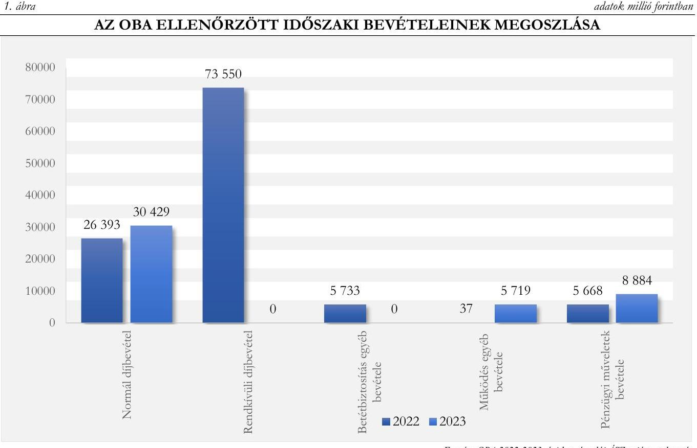
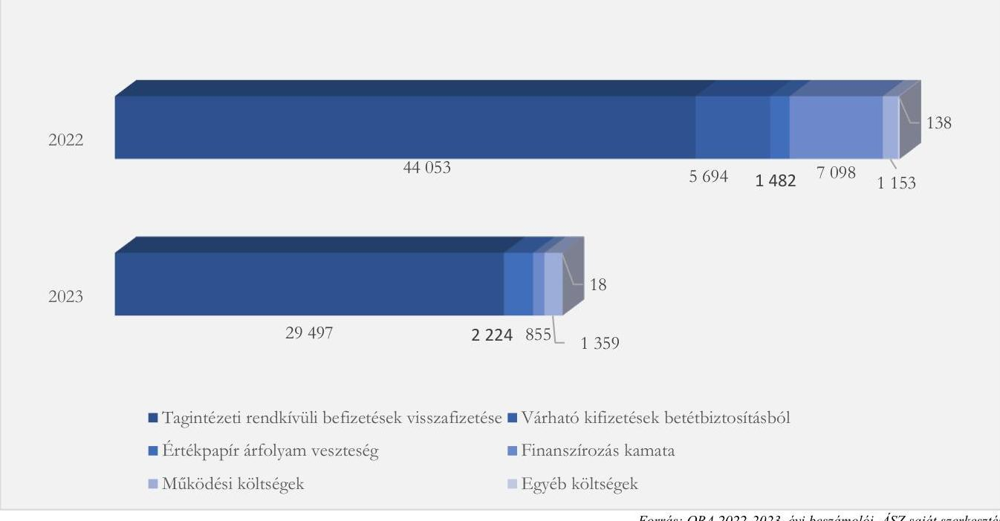
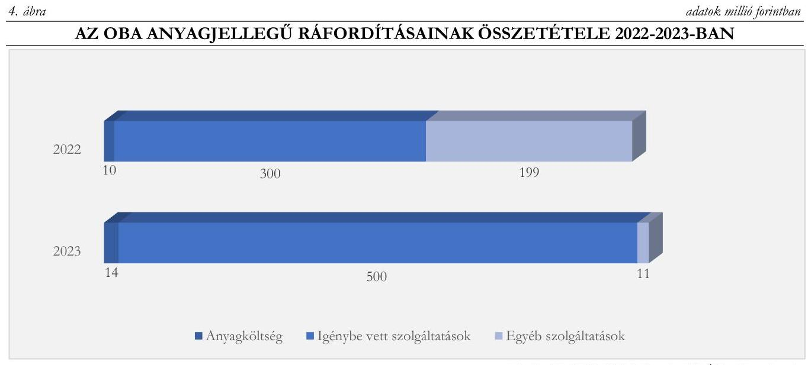
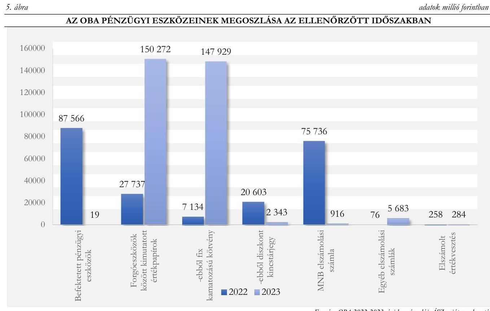
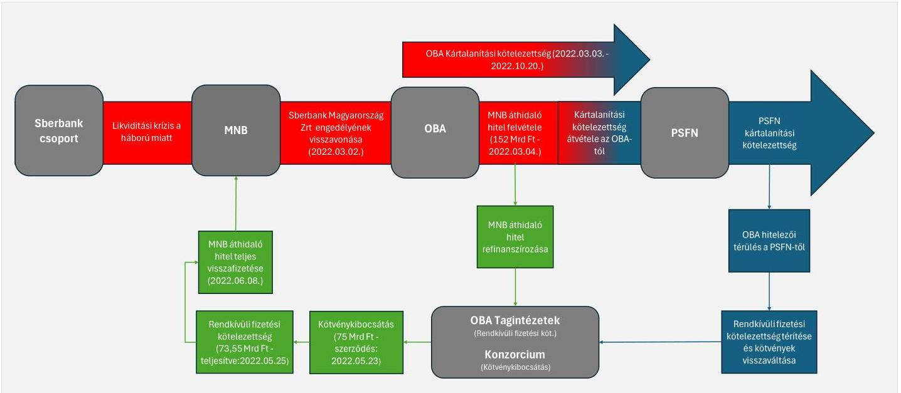

# JELENTÉS 

## Az Országos Betétbiztosítási Alap pénzügyiszámviteli ellenőrzése

2025.

---

# JELENTÉS 

## Az Országos Betétbiztosítási Alap pénzügyiszámviteli ellenőrzése

2025.

---

# ELLENŐRZÉSI IGAZGATÓSÁG: 

## ÁLLAMHÁZTARTÁSON KÍVÜLI SZERVEZETEKET ELLENŐRZŐ IGAZGATÓSÁG

## ELLENŐRZÉSI IGAZGATÓ:

KLINGA LÁSZLÓ ellenőrzési igazgató

## ELLENŐRZÉSVEZETŐ:

## SOLYMÁR ÁGNES ellenőrzésvezető

## IKTATÓSZÁM: EL-4177-001/2025

TÉMASORSZÁM: 31
ELLENŐRZÉS-AZONOSÍTÓ SZÁM: V1081

---

# TARTALOMJEGYZÉK 

AZ ELLENŐRZÉS ALAPADATAI ..... 5
AZ ELLENŐRZÖTT SZERVEZET ..... 7
ÖSSZEFOGLALÁS ..... 10
AZ ELLENŐRZÉS FÓKUSZTERÜLETEI ..... 12
MEGÁLLAPÍTÁSOK ..... 13
JAVASLATOK ..... 23
MELLÉKLETEK ..... 24
I. sz. melléklet: Értelmező szótár ..... 24
II. sz. melléklet: Az OBA Számviteli beszámolója 2022-2023 ..... 26
III. sz. melléklet: Az OBA betérbiztosításból eredő kártalanítási folyamatának ábrája ..... 28
IV. sz. melléklet: Ellenőrzési kritériumok ..... 29
FÜGGELÉK: ÉSZREVÉTELEK ..... 30
RÖVIDÍTÉSEK JEGYZÉKE ..... 31

---

.

---

# AZ ELLENŐRZÉS ALAPADATAI 

## AZ ELLENŐRZÉS CÉLJA

Az ellenőrzés célja annak értékelése volt, hogy az Országos Betétbiztosítási Alap gazdálkodása, feladatellátása megfelelt-e a jogszabályi előírásoknak. Ennek keretében az ÁSZ ${ }^{1}$ azt ellenőrizte, hogy az $\mathrm{OBA}^{2}$ az előírásoknak megfelelően alakította-e ki a pénzügyi-számviteli tevékenység kereteit, a pénzügyi-számviteli nyilvántartásait szabályszerűen vezette-e, éves beszámolási kötelezettségének a jogszabályi előírásoknak megfelelve tett-e eleget, továbbá, hogy a vagyongazdálkodásra is kiható pénzügyi gazdálkodása, valamint a kártalanítási feladatok ellátásához kapcsolódó számviteli nyilvántartása megfelelt-e a jogszabályi és belső előírásoknak.

## AZ ELLENŐRZÉS TÍPUSA

Szabályszerűségi ellenőrzés

## AZ ELLENŐRZŐTT IDŐSZAK

A 2022. január 01-től-2023. december 31-ig terjedő időszak, a beszámolási kötelezettség tekintetében ideértve a 2023. évi beszámoló közzétételéig tartó időszakot is.

## AZ ELLENŐRZÉS TÁRGYA

Az ellenőrzés tárgyát képezte az OBA feladatellátásának pénzügyi- és számviteli szempontú ellenőrzése. Ennek keretében azt ellenőrizte az ÁSZ, hogy az OBA a jogszabályi elírásoknak megfelelően alakította-e ki a belső szabályozási rendszerét, és az a működést meghatározó jogszabályokkal összhangban biztosította-e a pénzügyi gazdálkodása és a számviteli nyilvántartásai szabályszerűségét, valamint a pénzügyi-számviteli feladatok ellátásának szabályszerűsége támogatta-e a szabályszerű feladatellátást. Továbbá ellenőrzésre került, hogy az OBA vagyongazgazdálkodásra is kiható pénzügyi gazdálkodása megfelelt-e a jogszabályi és a belső előírásoknak, valamint, hogy az éves beszámolókészítési és közzétételi kötelezettségének szabályszerűen tette eleget. Mindezek keretében vizsgálatra került, hogy a 2022. évben a Sberbank Magyarország Zrt. „r.a." betétesek kártalanításának lefolytatása során a kártalanításokkal kapcsolatos összegek elszámolása, elkülönítése és nyilvántartása, megfelelt-e a kapcsolódó jogszabályi és belső előírásoknak.

## AZ ELLENŐRZÉS JOGALAPJA

Az ellenőrzés jogalapját a Hpt. ${ }^{3} 221 . \S$ képezte.

---

# AZ ELLENŐRZÉS MÓDSZERE 

Az ellenőrzést a nemzetközi standardokat irányadónak tekintve az ellenőrzési program szempontjai, az ellenőrzött időszakban hatályos jogszabályok, továbbá az ellenőrzés-szakmai szabályok és módszertanok figyelembevételével kellett elvégezni.

Az ellenőrzési fókuszterületek megválaszolásához szükséges bizonyítékok megszerzése az ellenőrzött szervezet által rendelkezésre bocsátott dokumentumokra és adatokra alapozva, továbbá kérdésfeltevés (információkérés), interjú, megfigyelés, elemző eljárás és mintavételezés útján történt.

Az ÁSZ az ellenőrzés során kockázati alapon történő mintavételezést és értékelést alkalmazott. Mintavételi ellenőrzésre a szakértői díjak elszámolása, a beruházások kimutatása, a követelések- és az értékpapírok nyilvántartása, valamint a kártalanítások rendelkezésre bocsátása ellenőrzése keretében került sor. A 2022-2023. időszakban felmerült szakértői szolgáltatások igénybevétele költségsorok nyilvántartása szabályszerűségének ellenőrzésére évente 15 mintatétel vizsgálatával került sor. A tárgyieszközök 2022. és 2023. évi mennyiségi- és értékbeni növekedésének nyilvántartásba vétele, valamint a betétesek kártalanításából következően az alapra átszállt követelések nyilvántartása szabályszerűségének ellenőrzése évente 6-6 elemű minta vizsgálatával történt. A kártalanítási folyamat szabályszerűségét a számviteli nyilvántartásból vett 25 elemű mintatételen keresztül ellenőrizte az ÁSZ. A tények feltárása és azok összegzése az ellenőrzött mintatételekre vonatkozóan került megfogalmazásra.

A beszámoló leltárral történő alátámasztottsága szabályszerűségének ellenőrzése a beruházások, a követelések és az értékpapírok mintavételi ellenőrzésén túl a beszámoló, a záró főkönyvi kivonat és a beszámoló mérlegtételeit alátámasztó leltár adatainak egyeztetésével történt.

Az ellenőrzési bizonyítékként felhasználható adatforrások közé tartoztak egyrészt az ellenőrzés során az ellenőrzött szervezettől bekért dokumentumok, adatforrások, másrészt adatforrásként kezeltünk minden, az ellenőrzés folyamán feltárt, az ellenőrzés szempontjából információkat tartalmazó dokumentum.

Az ellenőrzés lefolytatásához az ellenőrzött szervezet a tanúsítványok kitöltésével, valamint az ÁSZ által kért dokumentumok, adatok, információk megküldésével és a helyszíni ellenőrzés során szolgáltatott adatokat.

---

# AZ ELLENŐRZÖTT SZERVEZET 

## Országos Betétbiztosítási Alap

Az OBA létrehozásáról és működéséről a 1993. évi XXIV. törvény ${ }^{4}$ keretein belül döntöttek. A szervezetet jogi személyként 1993. március 31 -ével határozatlan időtartamra hozták létre, megszüntetéséről kizárólag az Országgyűlés dönthet. Az OBA működésére vonatkozó törvényi rendelkezéseket a Hpt. tartalmazta.

Az OBA tagintézetei a Magyar Nemzeti Bank által engedélyezett és nyilvántartásában szereplő, Magyarországon jogszerűen tevékenységet végző hitelintézetek voltak (ezek lehettek külföldi bank hazai fióktelepe vagy magyarországi székhelyű bank). Az ellenőrzött időszakban az OBA fő feladata volt, hogy a hitelintézet fizetésképtelensége esetén kártalanítsa azokat a betéteseket - magánszemélyeket, vállalkozásokat, egyesületeket, alapítványokat stb., beleértve a külföldön élőket és a külföldieket is - akik a Pmt. ${ }^{5}$ alapján korábban már azonosításra kerültek. Az azonosítottak közé beletartoztak azon be nem azonosított betétesek is, akik a betétet örökölték vagy kedvezményezettként kapták olyan örökhagyótól vagy támogatótól, akik azonosítása megtörtént a Pmt. szerint. Az OBA kártalanítási kötelezettsége csak a névre szóló betétekre (betéti okiratok, betétszámla, folyószámla, bankszámla, fizetési számla) terjedt ki, - a speciális esetektől eltekintve hitelintézetenként és személyenként 100000 euró összeghatárig. Egyazon betét biztosítottságának mértéke növelhető azáltal, hogy a betétnek több tulajdonosa volt. Ebben az esetben ugyanis az összeghatár a közös betét minden egyes tulajdonosára külön-külön volt érvényes. Továbbá az egyéni vállalkozó által elhelyezett betétet nem kellett összevonni kártalanítás esetén az ugyanazon személy által magánszemélyként elhelyezett betéttel.

| 1. táblázat |  |  | adatok millió forintban |  |
| :--: | :--: | :--: | :--: | :--: |
| AZ OBA ÁLTAL BIZTOSÍTOTT ÁLLOMÁNY 2022-2023 ÉV ELEJEI ALAKULÁSA |  |  |  |  |
| Év | Biztosított betét | Biztosított   ÉRTÉKpapír | Biztosított   KAMAT | Összesen |
| 2022. | 27730082 | 861 | 5948 | 27736892 |
| 2023. | 28926034 | 723 | 32382 | 28959139 |

Az OBA által biztosított állomány 2023. év elején 4,4\%-os növekedést mutatott. Ezen belül a betétek továbbra is $99,9 \%$-os részarányt tettek ki. Az értékpapírok - mivel 2015. július 3. után már nem biztosítottak az OBA által - állománya és részaránya folyamatosan csökkent, annak felhalmozott kamatának aránya $0,1 \%$ - on maradt. A kártalanítási kötelezettség alá a fentieken túl beletartoztak az állami garanciával (helytállással) ellátott betételhelyezésből eredő követelések is, melyek állománya a 2022. év elejei 16787 M Ft-ról 2023. év elejére $4,2 \%$-kal, 16070 M Ft-ra csökkent.

Az OBA a kimutatásai szerint 2022-ben 9 millió 174 ezer ügyfél átlagosan 3023 ezer Ft betétjét, 2023ban 9 millió 234 ezer ügyfél átlagosan 3136 ezer Ft betétjét biztosította. Ebből kifolyólag az OBA potenciális kártalanítási kötelezettsége is növekedett 2023-ban 2,5\%-kal, igaz ez a növekedés elmaradt a biztosított állomány növekedésétől, mivel a betétállomány nem átlagos megoszlású volt.

Az OBA potenciális kártalanítási kötelezettsége 2022-ben 14831506 M Ft, 2023-ban 15206204 M Ft volt. Ez azt jelentette, hogy a biztosított betétállomány 53,5\%-a, illetve 52,5\%-a esett kártalanítási kötelezettség alá. Ez a betételhelyezők száma vonatkozásában azt mutatta, hogy 2023-ban a biztosított betétesek 99,3\%-ának, 9167 ezer ügyfélnek az OBA egy kártalanítás során a teljes betétjét megtérítette volna. Tehát 2023. év elején a

---

biztosított betétesek $0,7 \%-a, 23,8$ ezer természetes személy és 42,8 ezer jogi személy hitelintézeti ügyfél rendelkezett a kártalanítási értéket (a 100000 EUR-t átlagosan 54 M Ft -tal, illetve 291 M Ft -tal) meghaladó, összesen 13753000 M Ft betéttel.

Az OBA tevékenysége közérdeket szolgált, közfeladatot látott el, de azt nem költségvetési, hanem a Hpt. által meghatározott forrásokból, a tagintézményeinek díjbefizetéseiből származó bevételekből végezte. Az OBA forrásai a Hpt. értelmében az ellenőrzött időszakban a csatlakozási díj, a hitelintézetek által teljesített rendszeres, illetve szükség esetén rendkívüli éves befizetés volt. Az OBA a betétesek részére kifizetendő kártalanítási összeg fedezetének biztosítása érdekében kölcsönt vehetett fel az MNB-től, illetve hitelintézettől, továbbá kötvényt bocsáthatott ki.

Az OBA legfőbb irányító szerve a hét fős Igazgatótanács ${ }^{6}$ volt, amelynek tagjai: a pénz-, tőke- és biztosítási piac szabályozásáért felelős miniszter által kijelölt személy, az MNB elnöke által kijelölt két személy, a hitelintézetek érdekképviseleti szervezetei által kijelölt két személy, az Integrációs Szervezet igazgatósági elnöke által kijelölt személy, továbbá az OBA ügyvezetője voltak. Az Igazgatótanácsnak törekednie kellett arra, hogy a kijelölésre jogosultak szerinti rotációs elv alkalmazását figyelembe véve az elnök személye évente változzon, továbbá az alelnökök az elnökétől eltérő, másik két delegáló szervezetet képviseljenek. Az ügyvezető, az OBA munkaszervezetének vezetője nem volt választható elnökké és alelnökké. Az OBA-t harmadik személyekkel szemben, valamint bíróság és hatóság előtt az igazgatótanács elnöke vagy az ügyvezető képviselte.

Az Igazgatótanács irányította és ellenőrizte az OBA gazdálkodási és egyéb tevékenységét a jogszabályokban foglalt rendelkezések figyelembevételével.

Az ügyvezető igazgató operatívan irányította az OBA tevékenységét. Hatásköre mindenre kiterjedt, ami nem tartozott az Igazgatótanács, illetve az igazgatótanács elnökének kizárólagos hatáskörébe. Az OBA ügyvezető igazgatója 2018. január 1-óta töltötte be az ügyvezető igazgatói pozíciót.

Az OBA könyvvizsgálatát megbízás alapján független, a pénzügyi intézmények könyvvizsgálatára jogosult könyvvizsgáló látta el. A 2022. évi, illetve a 2023. évi éves beszámolóhoz készített független könyvvizsgálói jelentések szerint az éves beszámolók megbízható és valós képet adtak az OBA vagyoni és pénzügyi helyzetéről.

A 2022. évi 68. számú, valamint a 2023. évi 31. számú Hivatalos Értesítőben megjelent, a kormányzati szektorba sorolt egyéb szervezetekről szóló pénzügyminiszteri közlemény szerint az OBA az ellenőrzött időszakban a központi kormányzati szektorba sorolt egyéb szervezet volt.

Az OBA 2022-2023. évi beszámolóinak adatait a II. sz. melléklet tartalmazza. A beszámolókat vizsgálva szembetűnő a mérlegfőösszeg jelentős, 2022-ről 2023-ra történő 90120 M Ft $^{7}$ összegű, annak több mint egyharmadát kitevő csökkenése. A csökkenés hátterében a Sberbank Magyarország Zrt. „v.a." betéteseinek kártalanításához kapcsolódó forrásteremtés miatt keletkezett kötelezettségek - tagintézeti rendkívüli befizetések (29 497 M Ft) és kötvény kibocsátás ( 69300 M Ft ) - 2023. évi visszafizetése állt. A kötelezettségek visszafizetésére a Sberbank Magyarország Zrt. „v.a."-tól, a betétek kártalanításával az OBA-ra átszállt követelések megtérítése folytán 2022-ben kapott 116573 M Ft , és a 2023-ban kapott 22868 M Ft nyújtott fedezetet. A kártalanítás folyamatát a III. sz. mellékletben foglaltuk össze. Az MNB 2022. március 2-án rendelte el a Sberbank Magyarország Zrt. végelszámolását, valamint a pénzügyi szolgáltatások és befektetési szolgáltatások végzésére jogosító engedélyeinek visszavonását, és tájékoztatta erről az OBA ügyvezető igazgatóját. 2023 februárjában a kártalanításhoz kapcsolódó teljes követelés megtérült, és márciusban megtörtént az utolsó kapcsolódó kötelezettség teljesítése is. Az OBA kártalanításra felhasználható vagyona 2022-ről 2023-ra a tagintézeti befizetések és az értékpapírokon realizált hozam hatására 48237 M Ft-tal nőtt. Az OBA stratégiájában meghatározottak szerint vagyonkezelésének elsődleges célja volt a stabilitás, a biztonság

---

megteremtése abból a célból, hogy a törvényben előírt betétbiztosítási feladatának mindenkor eleget tudjon tenni.

2022-ben az OBA vagyonának 35\%-a befektetett eszköz, ezen belül majdnem teljes egyészében pénzügyi eszköz volt. A fennmaradó rész 64\%-át, a vagyon $42 \%$-át a forgóeszközök között nyilvántartott értékpapír és bankszámla követelés tette ki. 2022-ben jelentős értéket képviselt a tagintézetek rendkívüli éves befizetések még vissza nem fizetett része az aktív időbeli elhatárolások között. A kártalanítás fedezetének számításához figyelembe vehető értékpapír és pénzeszköz állomány szerkezetében átrendeződés történt. 2023-ban kizárólag a forgóeszközök között tartotta nyilván az OBA az értékpapírokat, mely a vagyon 94\%-át tette ki. 2022-ben a vagyont $59 \%$-ban, 2023-ban $99 \%$-ban az OBA saját tőkéje finanszírozta. Az arány javulása a korábbiakban bemutatott kötelezettségek megfizetésének hatása.

Az OBA ellenőrzött időszaki működéséhez 2022-ben 1153 M Ft-ot, 2023-ban 1359 M Ft-ot használt fel. A működéshez 419 M Ft , illetve 458 M Ft befektetett eszköz kapcsolódott. A befektetett eszközök növekedése a Kártalanítási Kifizető Rendszer fejlesztéséből, korszerűsítéséből adódott.

---

# ÖSSZEFOGLALÁS 

A fejlett országokban betétbiztosítási rendszereket vezettek be a pénzügyi szolgáltatási tevékenységhez kapcsolódó bizalom erősítése érdekében. E rendszerek célja az volt, hogy a hitelintézet megoldhatatlan likviditási problémája esetén a megadott összeghatárig az azonosított betétek visszafizetése garantált legyen. Az erre a célra létrehozott OBA pénzügyi-számviteli ellenőrzését a jogszabályi előírások szerint az Állami Számvevőszék végzi.

Az OBA alapvetően a hitelintézetek befizetéseiből múködött és a hitelintézeteknél elhelyezett biztosított betéteken keresztül közvetetten a hitelintézetek tevékenységének biztonsági alapjait teremtette meg, a hazai bankrendszerbe vetett bizalom egyik pilléreként. A hitelintézetek kötelesek voltak az OBA-hoz csatlakozni, így a betétesek által a hitelintézeteknél elhelyezett névre szóló betétek személyenként és hitelintézetenként összevontan százezer euró összeghatárig voltak biztosítva az OBA által.

Az OBA elsődleges feladata volt az ellenőrzött időszakban a betétesek részére való kártalanítási összeg kifizetése, valamint az állami kezesség beváltásában való közreműködés, továbbá a betétesek tájékoztatása. Voltak olyan szervezetek és személyek, amelyek betéteire a biztosítás nem terjedt ki. A korlátozás indoka, hogy ezen szervektől elvárható a gondos betételhelyezés, illetve olyan személyeket sem illetett meg a kártalanítás, akiknek pénzmosásból származott a betétjük.

Az OBA pénzügyi gazdálkodása során érvényesültek a törvényi előírások és a belső szabályzatokban foglaltak.

Az OBA belső szabályozási rendszere a 2022-2023. években, összhangban a tevékenységet és a múködési folyamatokat meghatározó jogszabályokkal, biztosította a szabályszerű feladatellátás és gazdálkodás kereteit. Az OBA kialakította a pénzügyi gazdálkodásának szabályait, pénzügyi gazdálkodása megfelelte a jogszabályi előírásoknak. A számviteli szabályozásban feltárt kisebb hibák nem veszélyeztették az OBA főtevékenységét, a betétesek védelmét és kártalanítását. A díjbevételek beszedése és elszámolása megfelelt a jogszabályi és a belső szabályozási előírásoknak. 2022-ben az OBA értékpapír portfoliójának a kezelése törvényi felhatalmazáson alapult, 2023-ban a portfoliókezelők kiválasztása, majd a tevékenységük monitoringja, értékelése megfelelt a belső szabályozásban foglaltaknak.
A számviteli nyilvántartásokban az eszközök és a források kimutatott állománya a jogszabályi előírásnak megfelelve megegyezett az éves beszámolókban, illetve az azt alátámasztó leltárakban megjelenített adatokkal. A fejlesztések-, az értékpapírok- és a követelések között nyilvántartásba vett, ellenőrzött tételek egyedi értékének meghatározása szabályszerű volt. Az Igazgatótanács által jóváhagyott éves beszámolók, üzleti jelentések, valamint annak részeként a következő évi költségvetés a jogszabály által meghatározott határidőben készültek el és kerültek közzétételre. Ugyanakkor a kiegészítő melléklet és az eredménykimutatás nem tartalmazott minden, a jogszabályban előírt információt.

## A Sberbank Magyarország Zrt. „v.a." betéteseinek kártalanításakor az OBA a vonatkozó elöírások szerint járt el mind a kártalanítások kifizetése, mind a kifizetéshez szükséges folyamat és forrás biztosítása során.

Az OBA a vonatkozó jogszabályi előírásoknak megfelelve tett eleget beszámolási és a beszámoló közzétételi kötelezettségének.

Az OBA a jogszabályban foglaltak szerint tette közzé a betétesek kártalanításának feltételeiről szóló, és annak lebonyolításával kapcsolatos információkat. A törvényben meghatározott határidőben került sor a kártalanítások megfizetésére. Az ellenőrzött tételeknél mind a

---

kifizetések teljesítésének módja, mind a kifizetett összegek megfeleltek az előírásoknak. A kártalanítás forrásának megteremtéséhez az OBA a tagintézetek felé rendkívüli fizetési kötelezettséget írt elő, amit a hitelintézetek teljesítettek, valamint élve a jogszabályban biztosított lehetőséggel, az MNB-től áthidaló hitelt vett fel, annak refinanszírozására kötvényt bocsátott ki. A kártalanítások, annak folyományaként az OBA-ra átszállt követelések, a forrásbiztosításhoz kapcsolódó kötelezettségek számviteli nyilvántartása a vonatkozó jogszabályi előírások szerint történt.

Az Európai Uniós szabályozás alapján a jogszabályban előírt, az esetleges kártalanítások megfizetésének biztosítását szolgáló pénzeszközök rendelkezésre álló értékének a biztosított

Az elöirt határidő előtt teljesült a fedezettségi mutató.
betétekhez viszonyított arányát megmutató fedezettségi mutató 0,8\%-os követelménye elérésének határideje a Hpt. előírása szerint 2024. július 3. volt, amely előírásnak az OBA már az ellenőrzött időszakban, 2023. december 31-i állapot szerint 1,13\% teljesítésével eleget tett.

---

# AZ ELLENŐRZÉS FÓKUSZTERÜLETEI 

1.     - A pénzügyi gazdálkodás szabályszerűsége, és annak hatása a vagyongazdálkodásra
2.     - Az éves beszámoló összeállítása, közzététele, és az azt megalapozó nyilvántartások szabályszerűsége
3.     - A kártalanítási tevékenység nyilvántartásának megfelelése a jogszabályi és belső szabályzati előírásoknak, és annak hatása a vagyon alakulására

---

# 1. A pénzügyi gazdálkodás szabályszerűsége, és annak hatása a vagyongazdálkodásra 

## Összegző megállapítás Az OBA a pénzügyi gazdálkodása során eleget tett a törvényi előírásoknak és a belső szabályzatokban foglaltaknak, az ellenőrzött időszakban nyereségesen múködött.

## A szabályozási környezet kialakításának értékelése

Az OBA rendelkezett a Hpt. előírásainak megfelelően, az Igazgatótanács által elfogadott szabályzatokkal:

- a múködéssel kapcsolatos feladat- és hatásköröket, a szervezet felépítését tartalmazó SZMSZ ${ }^{8}{ }_{1,2,3,4}$-szel,
- a Számv. tv ${ }^{9}$-ben rögzített alapelvek, értékelési előírások alapján kialakított és írásba foglalt, a számviteli jogszabályok végrehajtásának módszereit, eszközeit meghatározó Számviteli politikával ${ }_{1,2,3,4}{ }^{10}$,
- valamint a Számv. tv. előírásainak megfelelő Leltározási szabályzattal ${ }_{1,2}{ }^{11}$, Értékelési szabályzattal ${ }_{1,2,3,4}{ }^{12}$, és Pénzkezelési szabályzattal ${ }_{1,2,3}{ }^{13}$, - továbbá Számlarenddel ${ }_{1,2,3}{ }^{14}$
Az OBA a számviteli szabályozás során nem vette figyelembe teljeskörűen a szervezet adottságait, körülményeit, mert a Számv. tv. 20.§ (2) bekezdésében foglaltaktól eltérően a Számviteli politikában ${ }_{1,2,3,4}$ az szerepelt, hogy az éves beszámolóban az adatokat ezer forintban kell megadni, ugyanakkor az OBA mérlegfőösszege mind a két ellenőrzött évben meghaladta a törvényben megadott száz milliárd forintot, így az adatokat millió forintban kellett szerepeltetnie a beszámolóban.
Az OBA kormányzati szektorba sorolt egyéb szervezetként a Bkr. ${ }^{15}$ előírásainak megfelelően rendelkezett az integrált kockázatkezelés eljárásrendjét szabályozó szabályzattal ${ }_{1,2}{ }^{16}$. Továbbá a szervezet tevékenységének, a célok megvalósításának nyomon követése biztosítására létrehozták az operatív tevékenységektől függetlenül működő belső ellenőrzést. A belső ellenőrzés rendjét, a belső ellenőr feladatait, jogait és kötelezettségeit az Igazgatótanács által elfogadott Belső ellenőrzési szabályzatban ${ }_{1,2,3}{ }^{17}$ határozták meg.
Az OBA múködését, feladatainak ellátását a Vagyonkezelési szabályzatban ${ }_{1,2,3,4,5}{ }^{18}$, a Hpt. előírásai szerint összeállított Díjfizetési szabályzatban ${ }_{1,2,3}{ }^{19}$, és a Kártalanítási szabályzatban ${ }_{1,2,3,4}{ }^{20}$ meghatározott előírások támogatták.
Összhangban a 214/2000. (XII. 11.) Korm. rendelet ${ }^{21}$ előírásaival, az OBA a Számlarendjében ${ }_{1,2,3}$, - az alábbiakban jelzett hiányosság kivételével - megteremtette annak lehetőségét, hogy a hivatkozott kormányrendeletben rögzített kategóriákat alátámasztó összegeket elkülönítetten, az előírások szerint tudja kimutatni. A Számlarend ${ }_{1,2,3}$ ugyanis a benne foglalt aktualizálási kötelezettség ellenére nem tartalmazott minden, a jogszabályban felsorolt bevétel kategóriát. A Számv. tv. 161. § (1) bekezdés előírásai ellenére nem tartalmazta a 214/2000. (XII. 11.) Korm. rendelet 6. § (2) bekezdés d) pontjában meghatározott, a „betétek kifizetésével kapcsolatban felmerült, hitelintézetekre, tagintézetekre vagy költségvetésre áthárított költségek miatti bevételek összegét" sort.

---

# A díjbeszedési gyakorlat és a bevételek nyilvántartásának értékelése 

Az OBA összes bevétele 2022-ben 111381 M Ft, 2023-ban 45032 M Ft volt.

Forrás: OBA 2022-2023. évi beszámolós ÁSZ saját szerkestés
A hitelintézetek által teljesített rendszeres éves befizetésből származó, az ábrán normál díjbevételként jelölt befizetések 2023. évi növekedése a biztosított betétállomány változásához igazodott. A rendkívüli fizetési kötelezettség 2022-ben a Sberbank Magyarország Zrt. „v.a." betéteseinek kártalanításához kapcsolódott, 2023-ban nem történt olyan esemény, mely alapján az OBA a tagintézeteknek rendkívüli fizetési kötelezettséget írt volna elő. 2023-ban a pénzügyi műveletek bevétele a magyar államkötvény állomány kamatbevétele 53\%-os növekedése, és a diszkontkincstárjegyen közel háromszoros összegben realizált árfolyam nyereségnek a hatására nőtt.
Az ellenőrzött időszakban nem csatlakozott új tag a betétbiztosítási alaphoz, így az OBÁ-nak egyszeri csatlakozási díjból származó bevétele nem keletkezett, és számviteli nyilvántartásaiban sem mutatott ki ilyet.
A tagintézetek díjfizetési kötelezettségét az évente aktualizált és közzé tett Díjfizetési szabályzat ${ }_{1,2,3}$ alapján írták elő, melynek során figyelembe vették a 19/2016. (V. 25.) MNB rendelet ${ }^{22}$ és az annak módosításáról szóló 22/2016. (VI. 29.) MNB rendelet ${ }^{23}$ előírásait. A díjfizetés megállapításának alapját a Hpt. előírásainak megfelelően a hitelintézet tárgyévet megelőző gazdasági év beszámolója mérlegében kimutatott, az OBA által biztosított betétállomány összegéből a kártalanítási kötelezettség alá eső rész képezte. Az így meghatározott alapdíj a fent hivatkozott MNB rendeletekben szabályozott módszertan alapján számított kockázat alapú díjjal egészült ki. Az aktualizált díjfizetés minden év október 1-től a következő év szeptember 30-ig volt érvényben, melyet negyedéves gyakorisággal kellett teljesíteniük a hitelintézeteknek. Az ellenőrzött időszakban a tagintézetek a díjfizetési kötelezettségeiknek

---

maradéktalanul eleget tettek. Az előírt és a beérkezett díjakat az OBA a 214/2000. (XII. 11.) Korm. rendelet előírásai szerint, elkülönítetten tartotta nyilván.
Az ellenőrzött időszakban az MNB egyik tagintézetre vonatkozóan sem írta elő a Hpt.-ben meghatározott kivételes intézkedés alkalmazását, így az OBA Igazgatótanácsa sem szabott ki emelt díjat, illetve a számviteli nyilvántartások emelt díjra vonatkozó során sem mutattak ki bevételt.
A Hpt.-ben rögzített további bevételi kategóriák szanálásában történő közreműködéshez, illetve a kártalanítási eseményekhez kapcsolódnak. Az ellenőrzött időszakon belül 2022-ben került sor az OBA által nyújtott biztosításhoz kapcsolódóan a kártalanításra jogosultak részére kártalanítási kifizetésre, melynek forrását az MNB által nyújtott áthidaló hitel, illetve a tagintézetek felé előírt rendkívüli fizetési kötelezettség, továbbá kötvénykibocsátás teremtette meg. A folyamat az ellenőrzött időszakot oly módon érintette, hogy 2022-ben került sor a kártalanítások kifizetésére, az MNB-től hitelfelvételre, ennek visszafizetésére, a tagintézetek felé a rendkívüli fizetési kötelezettség előírására, részükről a teljesítésre, majd az OBA részéről annak 60\%-os mértékủ visszafizetésére, továbbá kötvénykibocsátásra, valamint a felügyeleti engedélyét vesztett hitelintézet végelszámolásában követelőként bejelentkezett OBA részére a végelszámoló 2022. november 14-i részteljesítésére. 2023-ban a végelszámoló az OBA teljes követelését megtérítette, majd megtörtént a rendkívüli díjbevételek hiányzó részének visszautalása a tagintézetek felé, illetve a kötvénykibocsátásból eredő kötelezettség maradéktalan teljesítése is. A folyamat részletes értékelésére a 3. fókuszterület keretében kerül sor.

# A költségek, ráfordítások elszámolásának és nyilvántartásának értékelése 

Az OBA 2022-ben 59618 M Ft, 2023-ban 33953 M Ft költséget és ráfordítást számolt el.
2. ábra
adatok millió forintban
AZ OBA ELLENŐRZÖTT IDŐSZAKI KÖLTSÉGEINEK ÉS RÁFORDÍTÁSAINAK MEGOSZLÁSA

Fornás: OBA 2022-2023. évi beszámolói, ÁSZ saját szerkesztés
Az OBA az ellenőrzött időszakban a kártalanítási tevékenységéhez kapcsolódóan előírt rendkívüli fizetések visszautalását a 214/2000. (XII. 11.) Korm. rendelet előírásai szerint, az egyéb betétbiztosítási ráfordítások között, elkülönítetten tartotta nyilván.

---

A 214/2000. (XII. 11.) Korm. rendeletben foglaltaknak megfelelően történt a működési költségek között a működéssel kapcsolatban felmerült általános igazgatási és fenntartási költségek összegének ráfordításonkénti bontásban történő kimutatása.
3. táblázat

| AZ OBA MÜKÖDÉSI KÖLTSÉGEINEK MEGOSZLÁSA 2022-2023-BAN |  |  |  |  |  |  |  |
| :--: | :--: | :--: | :--: | :--: | :--: | :--: | :--: |
| Év | ÖSSZES MÜKÖDÉSI KÖLTSÉG | ANYAGJELLEGÜ RÁFORDÍTÁSOK |  | SZEMÉLYÍ JELLEGÜ RÁFORDÍTÁSOK |  | ÉRTÉKCSÖKKÉNÉSI LEÍRÁs |  |
| 2022 | 1153 M Ft | 509 M Ft | $44 \%$ | 548 M Ft | $48 \%$ | 96 M Ft | $8 \%$ |
| 2023 | 1359 M Ft | 525 M Ft | $39 \%$ | 701 M Ft | $51 \%$ | 133 M Ft | $10 \%$ |

Forrás: OBA 2022-2023. évi beszámolói, ÁSZ saját szerkesztés
Az igénybe vett szolgáltatásokon belül 2022-ben 185 M Ft, 2023-ban 203 M Ft volt a szakértői díj címén elszámolt költség. Az anyagjellegủ ráfordítások közel 40\%-át kitevő, a 2022-2023. időszakban felmerült szakértői szolgáltatások igénybevétele ellenőrzött tételei esetében az elszámolt költségek a tevékenység érdekében merültek fel, elszámolásuk megfelelt a Számv. tv. előírásainak. Az OBA a számviteli nyilvántartásokba csak szabályszerűen kiállított bizonylatok alapján jegyzett be adatokat, az elszámolások összege megfelelt a szerződésben/számlán foglaltaknak, valamint az azokat alátámasztó teljesítés igazolásoknak. Az egyéb szolgáltatásokon belül 2022-ben 189 M Ft összegben a kötvény kibocsátáshoz kapcsolódóan felmerült díjakat számolták el.

# A befektetési tevékenység hatása a vagyon alakulására 

Az OBA által előírt hitelintézeti befizetések célja a működés finanszírozásán túl a kártalanításhoz szükséges forrás rendelkezésre állásának biztosítása volt. A befizetések értékének megőrzését, a kártalanítás bekövetkezésekor a likviditás fenntartását célzó befektetési tevékenységre vonatkozó szabályokat a Vagyonkezelési szabályzatban rögzítették. Abban meghatározták a fő befektetési alapelveket, miszerint a portfolió kezelés során gondoskodni kell a portfólióban lévő állampapír vagyon biztonságának és likviditásának fenntartásáról, a kártalanítások kifizetéséhez szükséges fedezet biztosításáról.

---

Az ellenőrzött időszakban a befektetett pénzügyi eszközök, az értékpapírok és a pénzeszközök összesen az OBA vagyonának 77\%-át, illetve 98\%-át tették ki. A Hpt. előírásai szerint az OBA pénzeszközeit - fő szabályként - diverzifikált módon állampapírban vagy az MNB-nél elhelyezett betétben kell tartani, mely előírásnak az OBA 2022-2023-ban eleget tett.

Forrás: OBA 2022-2023. évi beszámolói, ÁsZ saját szerkesztés
A 2022. december 31-i állapot tükrözi a folyamatban lévő kártalanítási tevékenységhez kapcsolódó, a 2023. év elején esedékes kötelezettség visszafizetésekhez szükséges likvid eszközöket. A 2023. folyamán kiválasztott új portfolió kezelők felé megfogalmazott elvárás - a vagyon megóvása és az OBA likviditásának biztosítása - továbbá a portfolió kezelési gyakorlat (piaci folyamatok folyamatos monitorozása alapján hozott döntés eredményeként az adott eszköz bármikor értékesítésre kerülhet) miatt a forgóeszközök között tartotta nyilván a vagyon meghatározó részét.
2022-ben a Hpt. előírásainak úgy tett eleget az OBA, hogy pénzeszközeit a befektetett pénzügyi eszközök között nyilvántartott állampapírokban (államkötvényben és diszkontkincstárjegyben), valamint közel akkora értékben MNB elszámolási számlán tartotta. Az állampapír portfolió kezelését részben az ÁKK ${ }^{24}$ látta el egy 2012-óta tartó portfolió kezelési szerződés keretében, a Stabilitási tv. ${ }^{25}$ felhatalmazása alapján. A kezelés hatékonyságát a $\mathrm{CMAX}^{26}$ index követésével mérték. Ennek a portfoliónak a KELER Zrt. ${ }^{27}$ volt a letétkezelője. A piaci környezet 2017. évi változásától (negatív állampapír hozamok) kezdődően alakította ki az OBA azt a gyakorlatot, hogy szabad pénzeszközeit nem adta át az ÁKK kezelésébe, hanem - kezdetben MNB számlán tartotta, majd - egy úgynevezett Egyedi portfoliót alakított ki. Az OBA a befektethető szabad pénzeszközeiből az Egyedi portfólióba is vásárolt - a papírok lejáratig történő tartását feltételezve - mind diszkontkincstárjegyet, mind pedig magyar államkötvényeket. Ennek a portfolió résznek a letétkezelői feladatait a MÁK ${ }^{28}$ látta el. 2022. év végén, az ÁKK kezdeményezte a portfolió kezelés megszüntetését követően az általuk kezelt portfolió is az Egyedi portfolió részévé vált, ezt követően valósult meg az értékpapírok piaci értékre történő átértékelése - annak követése, hogy az

---

értékpapír állomány azonnali értékesítése esetén mekkora pénzáramra számíthatna az OBA. Ennek keretében 2022-ben 258 M Ft értékvesztés elszámolására került sor. Az OBA portfoliókezelői jutalék címen 5,3 M Ft-ot fizetett ki az ÁKK-nak. 2022-ben az ÁKK-val a portfolió kezelés közös megegyezéssel november 30 -án került megszüntetésre.
2023-ban az OBA az állampapír állomány kezelésével piaci portfoliókezelőket bízott meg. A portfoliókezelői, valamint a letétkezelői meghívásos pályázatra adott ajánlatok díjazással súlyozott értékelése eredményeként az Igazgatótanács a Vagyonkezelési szabályzatában ${ }_{2,3}$ foglalt előírásoknak megfelelően döntött a szerződések megkötéséről. Portfolió kezelésre a VIG Alapkezelő Zrt.-vel (szerződéskötéskor: AEGON Magyarország Befektetési Alapkezelő Zrt.), a Gránit Alapkezelő Zrt.-vel (szerződéskötéskor: Diófa Alapkezelő Zrt.) és az MBH Alapkezelő Zrt.-vel (szerződéskötéskor: MKB Alapkezelő Zrt.), a letétkezelésre a Raiffeisen Bank Hungary Zrt.-vel szerződtek. A portfolió kezelők között az állampapír csoportok 10 ezerrel osztható csomagjait a kártyaleosztás módszerével allokálták. Ezáltal viszonylag homogén, összehasonlítható teljesítményre képes portfoliót adtak egy-egy kezelőhöz. 2023-ban a teljes értékpapír állomány vonatkozásában, az Értékelési szabályzatban ${ }_{3,4}$ foglaltaknak megfelelően alkalmazta az OBA azt a gyakorlatot, hogy a piaci érték alapján évente aktualizálta az értékpapírok nyilvántartási értékét. A portfoliókezelési szerződésekben rögzítették az értékpapír cserékből adódóan a pénzforgalmi számlán tartható maximális összeget, és annak maximum 15 munkanapos időtartamát. Az OBA a pénzeszközeit 2023-ban a Hpt.-ben foglaltaknak megfelelően, diverzifikált módon állampapírban tartotta.
A portfoliókezelői szerződések tartalmaztak eredményességi célokat, illetve biztosították annak a lehetőségét, hogy az OBA a célok teljesülét nyomon kövesse. Az alapkezelők beszámolási, jelentéstételi kötelezettségüknek az előírt rendszerességgel eleget tettek, amelyek alapján megvalósult a tevékenységük monitorozása, értékelése. Az OBA Igazgatótanácsa a Vagyonkezelési szabályzatnak ${ }_{2-5}$ megfelelően negyedévente elvégezte a vagyonkezelők tevékenységének értékelését. 2023-ban az OBA Piaci portfóliójában összességében - az egyes alapkezelők által kezelt befektetéseket vagyonarányosan súlyozva - az átlaghozam 40 bázisponttal múlta felül a benchmark hozamát, amely az OBA átlagos vagyonára vetítve 567 M Ft többlethozamot jelentett, és portfolió kezelési díjként 96,6 M Ft került kifizetésre a három alapkezelőnek.

---

# 2. Az éves beszámoló összeállítása, közzététele, és az azt megalapozó nyilvántartások szabályszerűsége 

Összegző megállapítás

Az OBA a 2022. és 2023. évi éves beszámolókat megalapozó nyilvántartások vezetése, a mérlegtételek leltárral történő alátámasztása, továbbá az éves beszámolók elfogadása és közzététele során a jogszabályi előírásokat betartotta.

## Az eszközök és a források elszámolásának értékelése

Az OBA az eszközök és a források elszámolásának, illetve a mérlegtételek év végi értékelésének a Számv. tv.-ben és a 214/2000. (XII. 11.) Korm. rendeletben foglaltaknak megfelelő szabályait a hivatkozott törvény előírásai szerint a Számviteli politikában ${ }_{1,2,3,4}$, illetve az Értékelési szabályzatban ${ }_{1,2,3,4}$ rögzítette. Az ellenőrzött időszaki számviteli nyilvántartásokban az eszközök és a források kimutatott állománya a Számv. tv.-ben foglaltaknak megfelelve megegyezett az éves beszámolókban megjelenített adatokkal. Az ellenőrzés mintavételezéssel ellenőrizte a fejlesztések, az értékpapírok és a követelések nyilvántartásba vételének és egyedi értéke meghatározásának szabályszerűségét.

## - a fejlesztések, beruházások elszámolásának és nyilvántartásának értékelése

A tárgyi eszközök mennyiségi- és értékbeni növekedésének nyilvántartásba vétele során mind a 2022. évet, mind a 2023. évet érintő mintatételek esetében a fejlesztések, beruházások elszámolása megfelelt a Számv. tv., valamint az OBA számvitel szabályozási előírásainak. A befektetett eszközök bekerülési értékének meghatározása szabályszerű volt, az eszközök üzembehelyezése a jogszabályi előírásoknak megfelelően történt, ennek keretében várható élettartamuknak és maradványértéküknek a meghatározása megfelelt a Számviteli politikában ${ }_{1,2,3,4}$ foglaltaknak.

## - a pénzügyi eszközök nyilvántartásának értékelése

Az OBA a Számv. tv.-ben foglaltakkal összhangban a számviteli szabályzatokban rögzítette, hogy mely eszközöket tekinti befektetett pénzügyi eszközöknek, illetve meghatározta, hogy mely esetekben tartoznak az értékpapírok a forgóeszközök közé.
Az OBA az állampapírok között elkülönítetten mutatta ki az OBA saját tulajdonát képező állampapírokat, azaz az OBA pénzeszközeiből a portfoliókezelő(k)höz befektetésre átutalt pénzösszegekből a belföldi állampapír-vásárlásra fordított összeget. Az OBA meghatározta, hogy az eladott értékpapír kivezetése értékének meghatározására a FIFO („first in - first out") módszert alkalmazta. Az OBA meghatározta, hogy a könyvviteli nyilvántartásaiban a portfóliókezelők havi összesített jelentései alapján veszik nyilvántartásba az értékpapír ügyleteket, melyek analitikus nyilvántartását a Clavis értékpapír nyilvántartó rendszerben vezette, és nyilvántartásait folyamatosan egyeztette az aktuális letétkezelővel. 2023-ban a portfoliókezeléshez igazodva a Clavisban három külön portfóliót hozott létre, valamint a főkönyvi nyilvántartásban is kialakította a három portfóliónak megfelelő, elkülönített könyvelést mind a nyilvántartási, mind az eredményszámlák esetében. A Számv tv előírásaira figyelemmel a Clavis analitikát (valamint az értékelésnapi árfolyamok kimutatását) használta az értékpapírok 2023. évi értékvesztésének meghatározásához. Az OBA az ellenőrzött időszakban - a Hpt. előírásainak megfelelően, a pénzeszközeit diverzifikált módon állampapírban, vagy az MNB-nél elhelyezett betétben tartotta, és beszámolójában az

---

Értékelési szabályzatában ${ }_{1,2,3,4}$ meghatározottak szerint elszámolt, illetve visszaírt értékvesztéssel korrigált összegben szerepeltette.

# - a követelések nyilvántartásának értékelése 

A követelések között a betétesek kártalanításából következően az alapra átszállt követelések nyilvántartásakor az ellenőrzött időszakban az OBA a Számv. tv. és a Számviteli politika ${ }_{1,2,3,4}$, valamint az Értékelési szabályzat ${ }_{1,2,3,4}$ előírásai szerint vette nyilvántartásba és mutatta ki a hitelintézetekkel szemben a betétkifizetések folytán átszállt követeléseket. Évente egy-egy mintatételt érintett a követelésekhez kapcsolódó értékvesztés elszámolása, mely esetekben az OBA a Számv. tv.-ben, a Számviteli politikában ${ }_{1,2,3,4}$ és az Értékelési szabályzatban ${ }_{1,2,3,4}$ foglaltak szerint járt el.

## Az éves beszámolók összeállításának és közzétételének értékelése

Az OBA beszámolással kapcsolatos, a Számv. tv. és a 214/2000. (XII. 11.) Korm. rendelet előírásainak megfelelő szabályait a hivatkozott törvény előírásai szerint a Számviteli politika ${ }_{1,2,3,4}$ tartalmazta.
Az OBA a 2022. évi és a 2023. évi gazdálkodásáról készített éves beszámolói összeállítása során a Számv. tv. és a 214/2000. (XII. 11.) Korm. rendelet előírásainak úgy tett eleleget, hogy a beszámolók részeként a mérleget és a következő évi költségvetését is tartalmazó üzleti jelentéseket a jogszabályi előírásoknak megfelelően állította össze, adatait millió forintban szerepeltette. Az OBA a 2022. évi és 2023. évi éves beszámoló részeként az eredménykimutatás készítése során a 214/2000. (XII. 11.) Korm. rendelet 6. § (1) bekezdés d) pontban, és a hivatkozott jogszabály 2. sz. mellékletében előírtaktól eltérően, az eredménykimutatás tagolásakor nem jelenítette meg a „04. Betétek kifizetésével kapcsolatban felmerült, hitelintézetekre, tagintézetekre vagy költségvetésre áthárított költségek miatti bevételek" sort. A 2022. évi éves beszámoló kiegészítő melléklete a 214/2000. (XII. 11.) Korm. rendelet 7. § h) pont előírásai ellenére nem tartalmazta az üzleti évi rendkívüli befizetések összegét tagintézeti bontásban. Az ellenőrzött időszakban az OBA az éves beszámolók mérlegtételeit a Számv. tv. előírásainak, valamint a Számviteli politikában ${ }_{1,2,3,4}$ és a Leltározási szabályzatban ${ }_{1,2}$ meghatározottaknak megfelelő leltárral támasztotta alá.
Az OBA az ellenőrzött időszakban a Hpt. szerint kötelezett volt könyvvizsgálatra. Az OBA összhangban a Számv. tv. előírásaival, a könyvvizsgálói feladatok ellátására olyan könyvvizsgálót bízott meg, aki szerepelt a Magyar Könyvvizsgálói Kamara nyilvántartásában, és jogosult volt jogszabályi kötelezettségen alapuló könyvvizsgálói tevékenység ellátására.
Az OBA az ellenőrzött időszakban az éves beszámolóját és üzleti jelentését - ennek részeként a következő évi költségvetését - a 214/2000. (XII. 11.) Korm. rendeletben foglaltaknak megfelelően az üzleti évet követő év május 30 -ig elkészítette, azt az Igazgatótanács jóváhagyta. Az OBA a jogszabályi előírásoknak megfelelően gondoskodott az éves beszámolók honlapon történő közzétételéről, valamint az ÁSZ-nak történő megküldéséről.

---

# 3. A kártalanítási tevékenység nyilvántartásának megfelelése a jogszabályi és belső szabályzati előírásoknak, és annak hatása a vagyon alakulására 

Összegző megállapítás Az OBA a jogszabályi előírásoknak megfelelően alakította ki a kártalanítási tevékenységéhez kapcsolódó belső szabályzatokat. A jogszabályokat és saját előírásait betartva járt el a Sberbank Magyarország Zrt. „v.a." betéteseinek kártalanításakor. Az OBA fedezettségi mutatója az előírt határidő előtt elérte a meghatározott szintet.

Az OBA az ellenőrzött időszakban a Hpt. előírásainak megfelelően rendelkezett az Igazgatótanács által elfogadott, a kártalanítás folyamatát meghatározó, valamint a kártalanításhoz kapcsolódó finanszírozási szabályzatokkal. Az ellenőrzött időszakon belül 2022-ben került sor a Hpt.-ben meghatározott feltételek fennállása miatt az OBA által nyújtott biztosítással érintett betétek vonatkozásában kártalanítás kifizetésére. A Sberbank Magyarország Zrt. engedélyét 2022. március 02-án vonta vissza az MNB. A Hpt. előírásai szerint ezt követő naptól kezdődően tíz munkanapon belül kellett az OBÁ-nak a betétesek rendelkezésére bocsátania a kártalanítást. A kártalanítási folyamatot a III. sz. melléklet ábrája szemlélteti.

## A Sberbank Magyarország Zrt. „v.a." igazolt betétesei kártalanítási folyamatának értékelése:

A Sberbank Magyarország Zrt. „v.a." végelszámolásának MNB általi elrendelését követő napon az OBA Igazgatótanácsa a Hpt.-ben meghatározottak szerint döntött a kártalanítási eljárás megindításáról. Ennek keretében az OBA a Kártalanítási szabályzatban foglaltaknak megfelelően ellenőrizte a betétesek kártalanításának végrehajtásához kapott adatokat, továbbá a Hpt.-ben előírtak szerint közzé tette a betétesek kártalanításának feltételeiről szóló, és annak lebonyolításával kapcsolatos információkat. Az Igazgatótanács a Hpt. előírásainak megfelelve meghatározta az OBA által a hivatkozott jogszabályban rögzítettek értelmében teljesítendő kifizetések rendjét, mely magában foglalta a betétesek kártalanításának kifizetésével kapcsolatban a kártalanítás kifizetési csatornáit és a hozzá tartozó kifizetési összegek meghatározását is. A Sberbank Magyarország Zrt. „v.a." betétesei kártalanításával összefüggésben, az OBA-val kötött megállapodás keretében a Magyar Takarékszövetkezeti Bank Zrt.-látta el a kifizető ügynök bank feladatait. Ezen túl az OBA a Pénzügyi Stabilitási és Felszámoló Nonprofit Kft-vel kötött együttműködési megállapodással is biztosította a kártalanítási folyamat támogatását, a követeléskezelést és adatvédelmet, a kifizetések szabályszerű lebonyolítását.
A kártalanítási folyamat szabályszerűségének mintavételes ellenőrzése során mind a betétek kifizetésének módja, mind a kifizetett összegek megfeleltek a Hpt. vonatkozó előírásainak.

## A Sberbank Magyarország Zrt. „v.a" igazolt betétesei kártalanításához szükséges forrás biztosításának értékelése

Az OBA a kártalanítások kifizetéséhez szükséges forrást a Hpt.-ben meghatározott időintervallumon belül, az MNB-től felvett 147000 M Ft áthidaló hitellel biztosította.
Az OBA az MNB felé fennállt kötelezettség teljesítéséhez a Hpt.-ben előírtak figyelembevételével, a díjfizetési alap és a tagintézetek korábban teljesített befizetéseinek arányához igazodó, 73550 M Ft összegű rendkívüli fizetési kötelezettséget írt elő számukra, mely kötelezettségek meghatározását az MNB elfogadta. Az OBA megfelelt a Hpt.-ben foglaltaknak, mivel az éves díjfizetési kötelezettségen felül

---

teljesítendő rendkívüli fizetési kötelezettséget úgy határozta meg a tagintézetek számára, hogy a fizetési kötelezettség mértéke és ütemezése igazodott a hiteltörlesztési feltételekhez.
A rendkívüli fizetési kötelezettség előírásán túl az OBA az MNB felé fennállt áthidaló hitel visszafizetése érdekében, a Hpt. előírásainak megfelelő forrás bevonása keretében 75000 M Ft (2022. év végi állomány 69375 M Ft ) kötvényt bocsátott ki, amelyet hét, az OBA tagintézményei közé tartozó kereskedelmi bank jegyzett le.
Az OBA az MNB-vel kötött finanszírozási megállapodásban rögzítettek szerint tett eleget az áthidaló hitel visszafizetési kötelezettségének.

# A Sberbank Magyarország Zrt. „v.a." igazolt betétesei kártalanítási folyamata számviteli nyilvántartásának értékelése: 

A Sberbank Magyarország Zrt. „v.a." betéteseinek kártalanításához az MNB-től felvett áthidaló hitel elkülönítése a számviteli nyilvántartásokban a 214/2000. (XII. 11.) Korm. rendelet előírásainak megfelelően történt. Az áthidaló hitelt a betétesek kártalanításához használták fel.
Az OBA a tagintézetek számára előírt rendkívüli fizetési kötelezettség teljesítését a bevételek között az éves díjfizetési kötelezettségtől elkülönítetten, a 214/2000. (XII. 11.) Korm. rendelet előírásai szerint mutatta ki.
A kártalanításhoz az MNB-től felvett áthidaló hitel visszafizetéséhez kibocsátott kötvény elkülönítése a számviteli nyilvántartásokban a 214/2000. (XII. 11.) Korm. rendelet előírásainak megfelelően történt. A kötvénykibocsátásból származó forrást a célnak megfelelően, a Sberbank Magyarország Zrt. „v.a." betéteseinek kártalanításához az MNB-től felvett áthidaló hitel visszafizetésére használták fel.

## Az OBÁ-nál a kártalanítás céljából rendelkezésre álló vagyon mértékének értékelése

A Betétbiztosítási Irányelv ${ }^{29}$ a betétesek magas szintű védelme érdekében és annak biztosítása céljából, hogy a betétbiztosítás költségeit a hitelintézetek viseljék, a betétbiztosítási rendszerek finanszírozására egységes célszint meghatározását írta elő. A betétbiztosító intézmények vagyoni helyzetének jogszabályban előírt mutatója a feltöltöttségi mutató, amely a kártalanítás céljából rendelkezésre álló vagyon és az aggregált potenciális kártalanítási kötelezettség hányadosa. Ennek megfelelően a Hpt.-ben rögzítésre került, hogy az OBA pénzeszközeinek 2024. július 3 -áig el kell érnie a kártalanítási kötelezettség alá tartozó betétállomány $0,8 \%$-át.
Az OBA ellenőrzött időszaki potenciális kártalanítási kötelezettsége, ahogy az az ellenőrzött szervezet bemutatása keretében ismertetésre került, 2022-ben 14831506 M Ft, 2023-ban 15206204 M Ft volt.
A kártalanítás céljából rendelkezésre álló vagyon meghatározása az OBA számviteli nyilvántartásaiból az állampapírok bruttó piaci értékének és az MNB-nél vezetett számla egyenlegének figyelembevételével történt. Ez 2022-ben 174676 M Ft, 2023-ban 164048 M Ft volt. A rendelkezésre álló vagyon két tényező együttes hatására csökkent több mint 10600 M Ft-tal. 2023. év elején az MNB-nél vezetett számlán lévő 75736 M Ft-ból a kötvénykibocsátás visszafizetésére 69375 M Ft-ot, a tagintézményi rendkívüli befizetések visszafizetéséhez 90 M Ft-ot használt fel. Ugyanakkor az év közben realizált hozamok és a befizetések 48237 M Ft-tal növelték a figyelembe vehető vagyon értékét.
Az előírt követelményt az OBA már az ellenőrzött időszakban elérte: 2022. év végén 1,15\%, 2023. év végén $1,13 \%$, volt az OBA pénzeszközeinek a kártalanítási kötelezettség alá tartozó betétállományhoz viszonyított aránya. Továbbá megvalósult a Hpt. előírásaiban szereplő egyenletes feltöltés is, melyet az OBA a szabályozási környezet kialakításával, a Díjfizetési szabályzaton ${ }_{1,2,3}$ keresztül biztosított azáltal, hogy a tagintézetek díjfizetési kötelezettsége a szabályozások alapján került meghatározásra.

---

# JAVASLATOK 

Az ÁSZ tv. 33. § (1) bekezdésében foglaltak értelmében az ellenőrzött szervezet vezetője köteles a jelentésben foglalt megállapításokhoz kapcsolódó intézkedési tervet összeállítani és azt a jelentés kézhezvételétől számított 30 napon belül az ÁSZ részére megküldeni. Amennyiben az ellenőrzött szervezet vezetője nem küldi meg határidőben az intézkedési tervet, vagy továbbra sem elfogadható intézkedési tervet küld, az Állami Számvevőszék elnöke az ÁSZ tv. 33. § (3) bekezdése a) és b) pontjaiban foglaltakat érvényesítheti.

## AZ ORSZÁGOS BETÉTBIZTOSÍTÁSI ALAP IGAZGATÓSÁGÁNAK

1. Gondoskodjon arról, hogy a számviteli politika a Számv. tv. 20. § (2) bekezdésében foglaltaknak megfelelően tartalmazza, hogy a beszámolóban az adatokat millió forintban kell szerepeltetni.
2. Gondoskodjon arról, hogy a számlarend szabályozása kiterjedjen minden bevételi kategória Számv. tv ben meghatározott szabályozására, különös tekintettel a 214/2000. (XII. 11.) Korm. rendelet 6. § (2) bekezdés d) pontjában foglaltakra.
3. Gondoskodjon arról, hogy az eredménykimutatás a 214/2000. (XII. 11.) Korm. rendelet 2. sz. mellékletében előírtaknak megfelelő tagolással készüljön el.
4. Gondoskodjon arról, hogy a kiegészítő melléklet hiánytalanul tartalmazza a 214/2000. (XII. 11.) Korm. rendelet 7. § h) pontban foglaltakat.

---

# MELLÉKLETEK 

## I. SZ. MELLÉKLET: ÉRTELMEZŐ SZÓTÁR

hitelintézet
betétes
betéti okirat
fizetési számla
kártalanításra jogosult személy
névre szóló betét
rendelkezésre jogosult személy
OBA potenciális kártalanítási kötelezettsége
alapdíj
kockázat alapú díj
emelt díj
portfoliókezelés
vagyonkezelő/portfoliókezelő

Az a pénzügyi intézmény, amely a Hpt. 3. §-ban meghatározott pénzügyi szolgáltatások közül legalább betétet gyüjt, vagy más visszafizetendő pénzeszközt fogad el a nyilvánosságtól - ide nem értve a jogszabályban meghatározott nyilvános kötvénykibocsátást -, valamint hitelt és pénzkölcsönt nyújt. (Forrás: Hpt. 8. § (1) bekezdés)
Akinek a betét a nevére szól, vagy - kizárólag a nem névre szóló betétek esetében - aki a betétokiratot felmutatja, továbbá közös betét esetén a betét minden egyes tulajdonosa. (Forrás: Hpt. 6. § (2) bekezdés 1. pont)
A hitelintézetnél elhelyezett betétek közül az, amely nem számla és nem könyvesbetétben került elhelyezésre, függetlenül az okirat elnevezésétől, címletezésétől, lejáratától, illetve attól, hogy bemutatóra szóló-e vagy sem. (pl. takaréklevél, értékjegy, pénztárjegy, betétjegy, takarékjegy, takarékszelvény, értéklevél, kamatjegy, trezorjegy stb.) (Forrás: 57/2023. (XI. 24.) $\mathrm{MNB}^{30}$ rendelet 1. melléklet 2.17., valamint 51/2022. (XI. 29.) MNB rendelet ${ }^{31}$ 1. melléklet 2.18.)

Fizetési műveletek teljesítésére szolgáló, a pénzforgalmi szolgáltató egy vagy több ügyfele nevére megnyitott számla, ideértve a bankszámlát is. (Forrás: Pft. ${ }^{32} 2 . \S 8$. )
A betétes, ide nem értve azt a betétest, akinél a betét szerződéses feltételei ettől eltérő megállapodást tartalmaznak, és a rendelkezési jogosultságának keletkezési időpontjától függetlenül azt a személyt, aki a betétes rendelkezése alapján rendelkezik a betét fölött a kártalanításnak a 217. § (1) bekezdésében meghatározott kezdő időpontját megelőző napon, de egyébként nem betétes. (Forrás: Hpt. 6. § (2) bekezdés 3. a,b)
Az a betét, amelynek tulajdonosát a Pmt.-nek megfelelően azonosították. (Forrás: Hpt. 6. § (2) bekezdés 6.)
A betétes és az a személy, aki a betétes rendelkezése alapján korlátozással vagy anélkül rendelkezhet a betét fölött. (Forrás: Hpt. 6. § (2) bekezdés 7.)
A biztosított betétek ügyfelenként és hitelintézetenként kártalanítási összeghatárt nem meghaladó részének aggregált állománya.
A tagintézet adott évre vonatkozó minimum befizetése. (Forrás: Hpt. 234. § (1) bekezdés a) pontja alapján.

A tagintézetnek az adott évre vonatkozóan a Hpt. 234. § (1) bekezdés b) pontja szerint fizetendő kockázat alapú változó díja, amelynek kiszámítását a 19/2016. (V. 25.) MNB rendelet szabályozza.
A tagintézet olyan díffizetési kötelezettsége, melyt az OBA a Hpt. 234. § (6) és (7) bekezdései szerint ír elő.
Az a tevékenység, amelynek során az ügyfél eszközei előre meghatározott feltételek mellett az ügyfél által adott megbízás alapján, az ügyfél javára pénzügyi eszközökbe kerülnek befektetésre és kezelésre azzal, hogy az ügyfél a megszerzett pénzügyi eszközből eredő kockázatot és hozamot, azaz a veszteséget és a nyereséget közvetlenül viseli. (Bszt. ${ }^{33}$ 4. § (2) bekezdés 53.)
Az OBA portfoliója meghatározott részének vagy egészének tekintetében szerződés alapján portfoliókezelési tevékenységet végző vállalkozás

---

kártyaleosztás módszere
FIFO elv
MAX index

Egy adott típusú értékpapír elosztási körönként azonos összegben kerül allokálásra a rendelkezésre álló mennyiség eléréséig.
„first in - first out" Az eszközök a bekerülésük sorrendjében, az akkor érvényes bekerülési értéken kerülnek be a számviteli nyilvántartásba. A nyilvántartási értékük a nyilvántartásba vételhez igazodóan változhat. Majd az állomány valamilyen okból történő csökkenésekor, pl. értékesítéskor az adott állományban elsőnek nyilvántartásba vett tétel a hozzá tartozó nyilvántartási értékkel kerül elsőnek kivezetésre.
Az Államadósság kezelő Központ a honlapján közzéteszi az egy évnél hosszabb lejáratú állampapírok, az államkötvények árfolyamának nyomon követését biztosító információkat, indexeket. Ezeket az árfolyam információkat kötvény befektetés esetén javasolt/indokolt nyomon követni. Az államkötvények piacán a hozamok és az árfolyamok között fordított az összefüggés. A hozamok csökkenésével egy korábban kibocsátott állampapír árfolyama nő, illetve a piaci hozam növekedés esetén a korábban kibocsátott államkötvény árfolyama csökken. Mindez következik abból, hogy az államkötvény gyakorlatilag az államnak nyújtott finanszírozás, mely a meghatározott lejárati időben adja vissza a tőkét, és előre meghatározott kamatot fizet. Amennyiben ezt a tőkét az aktuális piacon betétben helyezné el a befektető, akkor arra magasabb kamatot kapna, így a kötvény árfolyamában a hozam emelkedés miatti bevétel elmaradás jelenik meg a kötvény másodpiaci értékében. A változás mértékének meghatározásához fontos tényező a lejáratig hátralévő idő.
A MAX index az egy évnél hosszabb hátralévő futamidejű államkötvények indexe.
Az RMAX a három hónapnál hosszabb, de egy évnél kevesebb hátralévő futamidejű államkötvények indexe.
A ZMAX a három hónapnál kevesebb hátralévő futamidejű államkötvények indexe.
A CMAX a bemutatott indexeket tömöríti egy mutatóba

---

II. SZ. MELLÉKLET: AZ OBA SZÁMVITELI BESZÁMOLÓJA 2022-2023

|  |  | adatok millió forintban |
| :--: | :--: | :--: |
| MÉRLEG - ESZKÖZÖK |  |  |
| MEGNEVEZÉS | 2022. FV | 2023. FV |
| BEFEKTETETT ESZKÖZÖK | 87986 | 477 |
| IMMATERIÁLIS JAVAK | 158 | 307 |
| Alapítás- átszervezés aktivált értéke | 0 | 0 |
| Vagyoni éréthű jogok | 76 | 68 |
| Szellemi termékek | 82 | 239 |
| Immateriális javakra adott előlegek |  |  |
| Immateriális javak értékhelyesbítése |  |  |
| TÁRGYI ESZKÖZÖK | 261 | 151 |
| Ingatlanok és kapcsolódó vagyoni éréthű jogok | 40 | 34 |
| Berendezések, felszerelések, járművek | 168 | 117 |
| Beruházások | 53 |  |
| Beruházásokra adott előlegek |  |  |
| Tárgyi eszközök értékhelyesbítése |  |  |
| BEFEKTETETT PÉNZÜGYI ESZKÖZÖK | 87567 | 19 |
| FORGÓESZKÖZÖK | 130245 | 156874 |
| KÉSZLETEK |  |  |
| Anyagok |  |  |
| Kereskedelmi áruk |  |  |
| Közvetített szolgáltatások |  |  |
| Készletekre adott előlegek |  |  |
| KÖVETELÉSEK | 26696 | 3 |
| Tagintézetekkel szembeni követelések | 26494 |  |
| - Dijkövetelések |  |  |
| - Alapra átszállt követelések | 26494 |  |
| - Visszterbes kötelezettségvállalás utáni díjak |  |  |
| - Egyéb követelések tagintézetekkel szemben |  |  |
| Hitelintézetekkel szembeni egyéb követelések | 2 | 3 |
| Betétesekkel szembeni követelések |  |  |
| Állammal szembeni követelések |  |  |
| Egyéb követelések | 200 |  |
| ÉRTÉKPAPÍROK | 27737 | 150272 |
| Állampapírok | 27737 | 150272 |
| Egyéb értékpapírok |  |  |
| PÉNZESZKÖZÖK | 75812 | 6599 |
| Pénztár, csekkek |  |  |
| Bankbetétek | 75812 | 6599 |
| AKTÍV IDŐBELI ELHATÁROLÁSOK | 31094 | 1854 |
| ESZKÖZÖK ÖSSZESEN | 249325 | 159205 |

---

| MÉRLEG - FORRÁSOK |  |  |
| :--: | :--: | :--: |
| MÉGNEVEZÉS | 2022. EV | 2023. EV |
| SAJÁT TÖKE | 146570 | 157649 |
| Jegyzett tőke | 949 | 949 |
| Tartalék | 93858 | 145621 |
| Értékelési tartalék | 0 | 0 |
| Tárgyévi eredmény | 51763 | 11079 |
| CÉLTARTALÉKOK | 132 | 148 |
| KÖTELEZETTSÉGEK | 100323 | 1394 |
| HOSSZÚ LEJÁRATÚ KÖTELEZETTSÉGEK | 0 | 0 |
| RÖVID LEJÁRATÚ KÖTELEZETTSÉGEK | 100323 | 1394 |
| Tagintézetekkel szembeni kötelezettségek | 29522 |  |
| Rövid lejáratú hitelek |  |  |
| Betétesekkel szembeni kötelezettségek |  |  |
| Állammal szembeni kötelezettségek |  |  |
| Egyéb rövid lejáratú kötelezettségek | 70795 | 1394 |
| PASSZÍV IDŐBELI ELHATÁROLÁSOK | 2300 | 14 |
| FORRÁSOK ÖSSZESEN | 249325 | 159205 |

# EREDMÉNYKIMUTATÁS 

| MÉGNEVEZÉS | 2022. EV | 2023. EV |
| :--: | :--: | :--: |
| Tagintézetekkel szemben elszámolt díjbevételek | 99943 | 30429 |
| Betétesek megbízásából behajtott követelések utáni díjbevételek |  |  |
| Állami garanciával biztosított betétek kifizetése utáni jutalékbevételek Betétek kifizetésével kapcsolatban felmerült, hitelintézetekre, tagintézetekre vagy |  |  |
| Egyéb betétbiztosítási bevételek | 5733 |  |
| BETÉTBIZTOSÍTÁSBÓL EREDŐ BEVÉTELEK | 105676 | 30429 |
| EGYÉB BEVÉTELEK | 37 | 5719 |
| NEM BETÉTBIZTOSÍTÁSBÓL EREDŐ BEVÉTELEK |  |  |
| PÉNZÜGYI MÚVELETEK BEVÉTELEI | 5668 | 8884 |
| Befagyott betétek kifizetésével kapcsolatos ráfordítások |  |  |
| Betétesek megbízásából behajtott követelésekkel kapcsolatos ráfordítások |  |  |
| Állami garanciával biztosított betétek kifizetésével kapcsolatban felmerült ráfordítások |  |  |
| Egyéb betétbiztosítási ráfordítások | 49747 | 29497 |
| - A tagintézetektól befolyt rendkívüli befizetések tárgyérben visszafizetett összege | 44053 | 29497 |
| - Egyéb betétbiztosítási ráfordítások | 5694 |  |
| BETÉTBIZTOSÍTÁSBÓL EREDŐ RÁFORDÍTÁSOK | 49747 | 29497 |
| EGYÉB RÁFORDÍTÁSOK | 126 | 16 |
| NEM BETÉTBIZTOSÍTÁSBÓL EREDŐ RÁFORDÍTÁSOK | 0 | 0 |
| PÉNZÜGYI MÚVELETEK RÁFORDÍTÁSAI | 8592 | 3081 |
| Anyagjellegủ ráfordítások | 509 | 525 |
| Személyi jellegủ ráfordítások | 549 | 701 |
| Értékcsökkenési leírás | 95 | 133 |
| MÜKÖDÉSI KÖLTSÉGEK | 1153 | 1359 |
| TÁRGYÉVI EREDMÉNY | 51763 | 11079 |

* A táblázat a 214/2000 (XII. 11.) Korm. rendelet szerint tartalmazza az elötr adatokat, a jelelt sor az OBA beszámolójában nem szorrtul.

---

III. SZ. MELLÉKLET: AZ OBA BETÉTBIZTOSÍTÁSBÓL EREDŐ KÁRTALANÍTÁSI FOLYAMATÁNAK ÁBRÁJA

A SBERBANK MAGYARORSZÁG ZRT. „V.A" BETÉTESEI KÁRTALANÍTÁSI FOLYAMATA IDŐRENDJÉNEK BEMUTATÁSA

---

# IV. SZ. MELLÉKLET: ELLENŐRZÉSI KRITÉRIUMOK 

## FOKUSZTERÜLET

1. A pénzügyi gazdálkodás szabályszerűsége, és annak hatása a vagyongazdálkodásra
2. Az éves beszámoló összeállítása, közzététele, és az azt megalapozó nyilvántartások szabályszerűsége
3. A kártalanítási tevékenység nyilvántartásának megfelelése a jogszabályi- és a belső szabályozás előírásainak, és annak hatása a vagyon alakulására

## ELLENŐRZÉSI KRITÉRIUMOK

Számv. tv. 14. § (3)-(5), 26. §, 27. § (1) és (7), 28. § (1), 29. $\S(1)$ és (7), 30. $\S(1), 46-48 . \S, 50 . \S(3), 52 . \S, 54 . \S(4)$ (6) és (8)-(9), 55. $\S$ (1), 65. $\S$ (1), 69. § 159. §, 160. § (2) a), 165. $\S(1)-(3), 166-167 \S$
214/2000. (XII. 11.) Korm. rendelet 4. §(2), 6. §(2), 6. $\S(4), 6 . \S(6)$

Hpt. 219. §, 224. § (1) b), 232. § (1), 231. §, 233. §, 234234/A. §,
Stabilitási tv. 13. § (4) c)
A kapcsolódó belső szabályozás
Számv. tv. 4. §(1), 27. §(1) és (7),28. §(1), 29. §(1) és (7), 30. $\S(1), 46 . \S, 50 . \S(3), 54 . \S(4)-(6)$ és (8)-(9), 55. §(1), 65. $\S(1), 69 . \S, 88-94 . \S$,
214/2000. (XII. 11.) Korm. rendelet 2-11. §,1-2. sz. melléklet

Hpt. 222. §, 224. § (1) i)
A kapcsolódó belső szabályozás
Hpt. 211. §, 217. §, 224. §, 228. §(6), 232. §, 234. §(8) és (8B), 234/A. §, 6. sz. melléklet
214/2000. (XII. 11.) Korm. rendelet 6. §
A kapcsolódó belső szabályozás

---

# FÜGGELÉK: ÉSZREVÉTELEK 

A jelentéstervezetet a Számvevőszék 15 napos észrevételezésre megküldte az ellenőrzött szervezet vezetőjének az ÁSZ tv. 29. §* (1) bekezdése előírásának megfelelően.

Az Országos Betétbiztositási Alap Ügyvezető igazgatója észrevételében az ellenőrzés megállapításait nem vitatta.

[^0]
[^0]:    * 29. § (1) Az Állami Számvevőszék az ellenőrzési megállapításait megküldi az ellenőrzött szervezet vezetőjének vagy az általa megbízott személynek, és annak, akinek személyes felelősségét állapította meg.
    (2) Az ellenőrzött szervezet vezetője és a felelősként megjelölt személy az ellenőrzés megállapításaira tizenöt napon belül írásban észrevételt tehet.
    (3) Az Állami Számvevőszék az észrevételre a beérkezésétől számított harminc napon belül írásban válaszol. A figyelembe nem vett észrevételeket köteles a jelentésben feltüntetni, és megindokolni, hogy azokat miért nem fogadta el.

---

# RÖVIDÍTÉSEK JEGYZÉKE 

${ }^{1}$ ÁSZ
${ }^{2}$ OBA
${ }^{3} \mathrm{Hpt}$.
${ }^{4}$ 1993. évi XXIV: törvény
${ }^{5}$ Pmt.
${ }^{6}$ Igazgatótanács
${ }^{7}$ M Ft
${ }^{8}$ SZMSZ
${ }^{9}$ Számv. tv.
${ }^{10}$ Számviteli politika
${ }^{11}$ Leltározási szabályzat
${ }^{12}$ Értékelési szabályzat
${ }^{13}$ Pénzkezelési szabályzat
${ }^{14}$ Számlarend
${ }^{15}$ Bkr.
${ }^{16}$ integrált kockázatkezelés rendjét meghatározó szabályzat
${ }^{17}$ Belső ellenőrzési szabályzat
${ }^{18}$ Vagyonkezelési szabályzat
${ }^{19}$ Díjfizetési szabályzat

Állami Számvevőszék
Országos Betétbiztosítási Alap
2013. évi CCXXXVII. törvény a hitelintézetekről és a pénzügyi vállalkozásokról
1993. évi XXIV. törvény az Országos Betétbiztosítási Alap létrehozásáról és müködésének részletes szabályairól
2017. évi LIII. törvény a pénzmosás és a terrorizmus finanszírozása megelőzéséről és megakadályozásáról
A Hpt. 223. § (1) bekezdés szerint az OBA irányító szerve. millió forint
Szervezeti és müködési szabályzat1 2020.06.01-2022.01.16.
Szervezeti és müködési szabályzat2 2022.01.17-2023.06.30.
Szervezeti és müködési szabályzat3 2023.07.01-2023.11.30.
Szervezeti és müködési szabályzat4 2023.12.01-től
2000. évi C. törvény a számvitelről

Számviteli politika ${ }_{1}$ 2021.04.01-2022.03.13.
Számviteli politika ${ }_{2}$ 2022.03.14-2023.02.14.
Számviteli politika ${ }_{3}$ 2023.02.15-2024.02.06.
Számviteli politika ${ }_{4}$ 2024.02.07-től
Leltárkészítési és leltározási rend1 2021.04.01-2023.02.14.
Leltárkészítési és leltározási rend ${ }_{2}$ 2023.02.15-től
Értékelési rend ${ }_{1}$ 2021.04.01-2022.03.13.
Értékelési rend ${ }_{2}$ 2022.03.14-2023.02.14.
Értékelési rend ${ }_{3}$ 2023.02.15-2024.02.06.
Értékelési rend ${ }_{4}$ 2024.02.07-től
Pénzkelési rend ${ }_{1}$ 2021.04.01-2022.10.14.
Pénzkelési rend ${ }_{2}$ 2022.10.15-2023.09.24.
Pénzkelési rend ${ }_{3}$ 2023.09.25-től
Számlarend ${ }_{1}$ 2021.04.01-2023.02.14.
Számlarend ${ }_{2}$ 2023.02.15-2024.02.06.
Számlarend ${ }_{3}$ 2024.02.07-től
370/2011. (XII. 31.) Korm. rendelet a költségvetési szervek belső kontrollrendszeréről és belső ellenőrzéséről
Szabályzat az integrált kockázatkezelés rendjéről1 2019.12.20-2023.06.30.
Szabályzat az integrált kockázatkezelés rendjéről2 2023.07.01-től
Belső ellenőrzési szabályzat ${ }_{1}$ 2022.01.01-2022.12.19.
Belső ellenőrzési szabályzat ${ }_{2}$ 2022.12.20-2023.11.19.
Belső ellenőrzési szabályzat ${ }_{3}$ 2023.11.20-tól
Vagyonkezelési szabályzat ${ }_{1}$ 2021.06.01-2022.04.25.
Vagyonkezelési szabályzat ${ }_{2}$ 2022.04.26-2022.11.30.
Vagyonkezelési szabályzat ${ }_{3}$ 2022.12.01-2023.02.14.
Vagyonkezelési szabályzat ${ }_{4}$ 2023.02.15-2023.07.24.
Vagyonkezelési szabályzat ${ }_{5}$ 2023.07.25-től
Díjfizetési szabályzat ${ }_{1}$ 2021.10.01-2022.09.30.
Díjfizetési szabályzat ${ }_{2}$ 2022.10.01-2023.09.30.
Díjfizetési szabályzat ${ }_{3}$ 2023.10.01-től

---

${ }^{20}$ Kártalanítási szabályzat
${ }^{21}$ 214/2000. (XII. 11.) Korm. rendelet
${ }^{22}$ 19/2016. (V. 25.) MNB rendelet
${ }^{23}$ 22/2016. (VI. 29.) MNB rendelet
${ }^{24}$ ÁKK
${ }^{\circ}$ Stabilitási tv.
${ }^{26}$ CMAX
${ }^{27}$ KELER Zrt.
${ }^{28}$ MÁK
${ }^{29}$ Betétbiztosítási Irányelv
${ }^{30}$ 57/2023. (XI. 24.) MNB rendelet
${ }^{31}$ 51/2022. (XI. 29.) MNB rendelet
${ }^{32}$ Pft.
${ }^{33}$ Bszt.
ÁSz tv.
PSFN

Kártalanítás során követendő eljárásrendről; 2021.01.01-2022.12.14.
Kártalanítás során követendő eljárásrendről; 2022.12.15-2023.05.28.
Kártalanítás során követendő eljárásrendről; 2023.05.29-2023.10.14.
Kártalanítás során követendő eljárásrendről; 2023.10.15-től
214/2000. (XII. 11.) Korm. rendelet a betétbiztosítási alapok és intézményvédelmi alapok, valamint a befektető-védelmi alap éves beszámoló készítési és könyvvezetési kötelezettségének sajátosságairól
19/2016. (V. 25.) MNB rendelet az Országos Betétbiztosítási Alap tagjai által fizetendő kockázatalapú változó díj megállapításának részletes szabályairól
22/2016. (VI. 29.) MNB rendelet az Országos Betétbiztosítási Alap tagjai által fizetendő kockázatalapú változó díj megállapításának részletes szabályairól szóló 19/2016. (V. 25.) MNB rendelet módosításáról
Államadósság Kezelő Központ Zrt.
2011. évi CXCIV. törvény Magyarország gazdasági stabilitásáról

A CMAX index a 105 napnál hosszabb hátralévő lejárati idejű magyar állampapírok árfolyamát összegző referencia mutató
KELER Központi Értéktár Zrt.
Magyar Államkincstár
Az Európai Parlament és a Tanács 2014/49/EU irányelve (2014. április 16.) a betétbiztosítási rendszerekről
57/2023. (XI. 24.) MNB rendelet a jegybanki információs rendszerhez elsődlegesen a Magyar Nemzeti Bank pénz- és hitelpiaci szervezetek feletti felügyeleti feladatai ellátása érdekében teljesítendő adatszolgáltatási kötelezettségekről
51/2022. (XI. 29.) MNB rendelet a pénz- és hitelpiaci szervezetek által a jegybanki információs rendszerhez elsődlegesen a Magyar Nemzeti Bank felügyeleti feladatai ellátása érdekében teljesítendő adatszolgáltatási kötelezettségekről
2009. évi LXXXV. törvény a pénzforgalmi szolgáltatás nyújtásáról
2007. évi CXXXVIII. törvény a befektetési vállalkozásokról és az árutőzsdei szolgáltatásokról, valamint az általuk végezhető tevékenységek szabályairól
2011. évi LXVI. törvény

Pénzügyi Stabilitási és Felszámoló Nonprofit Korlátolt Felelősségű Társaság

---

1052 Budapest, Apáczai Csere János u. 10. | 1364 Budapest 4., Pf. 54
www.asz.hu | szamvevoszek@asz.hu
telefon: +36 14849100