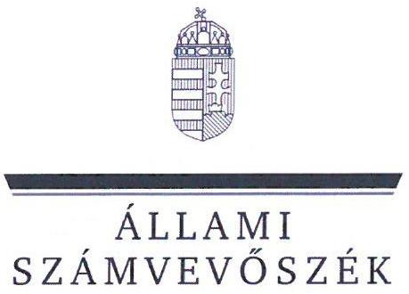
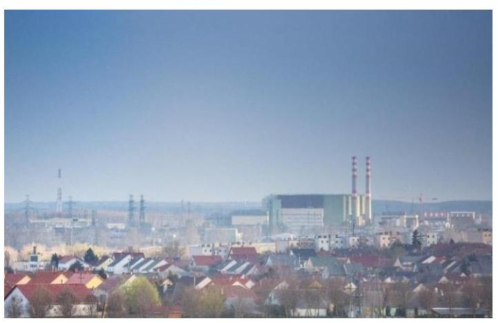
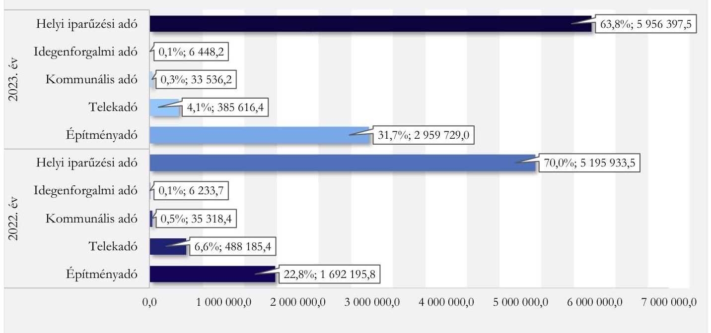
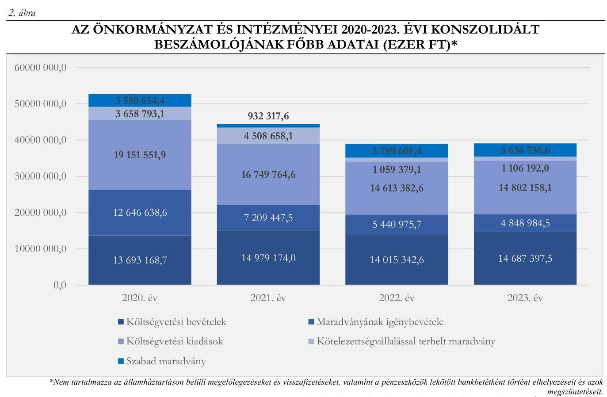
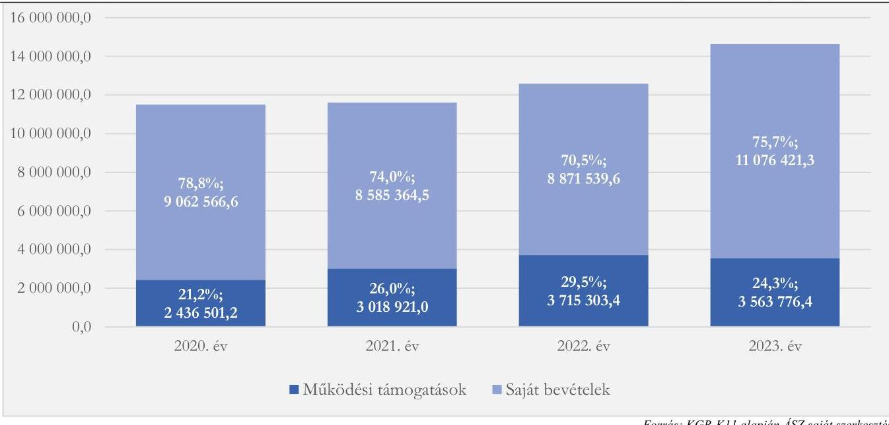

# JELENTÉS 

## Az önkormányzatok helyi adóztatási tevékenységének ellenőrzése - Ingatlanadóztatás

Paks Város Önkormányzata

2025.

---

ÁLLAMI
SZÁMVEVŐSZÉK

# JELENTÉS 

## Az önkormányzatok helyi adóztatási tevékenységének ellenőrzése - Ingatlanadóztatás

Paks Város Önkormányzata

2025.

---

# ELLENŐRZÉSI IGAZGATÓSÁG: 

## ÁLLAMHÁZTARTÁS HELYI SZINTJÉT ELLENŐRZŐ IGAZGATÓSÁG

## ELLENŐRZÉSI IGAZGATÓ:

DR. BAFFIA GERGELY GÁBOR ellenőrzési igazgató

## ELLENŐRZÉSVEZETŐ:

Jelentéseink az interneten a www.asz.hu címen olvashatók.

KANYÓ LŐRÁNT ISTVÁN ellenőrzésvezető

IKTATÓSZÁM: EL-4040-022/2025.
TÉMASORSZÁM: 54.
ELLENŐRZÉS-AZONOSÍTÓ SZÁM: V1084

---

# TARTALOMJEGYZÉK 

AZ ELLENŐRZÉS ALAPADATAI ..... 4
AZ ELLENŐRZÉS TERÜLETE ÉS AZ ELLENŐRZÖTT SZERVEZET ..... 6
ÖSSZEFOGLALÁS ..... 9
AZ ELLENŐRZÉS FÓKUSZKÉRDÉSEI ..... 11
MEGÁLLAPÍTÁSOK ..... 12
JAVASLATOK ..... 28
MELLÉKLETEK ..... 30
I. sz. melléklet: Értelmező szótár ..... 30
II. sz. melléklet: Az ellenőrzött szervezetek jegyzéke ..... 31
III. sz. melléklet: Ellenőrzési kritériumok ..... 32
IV. sz. melléklet: A helyi ingatlanadótárgyak és adóalanyok száma a 2023. és a 2024. évben ..... 35
FÜGGELÉK: ÉSZREVÉTELEK ..... 36
RÖVIDÍTÉSEK JEGYZÉKE ..... 37

---

# AZ ELLENŐRZÉS ALAPADATAI 

## AZ ELLENŐRZÉS CÉLJA

Az ellenőrzés célja az volt, hogy értékelje Paks város helyi ingatlanadóztatásának és adóhatósága feladatellátásának szabályszerűségét, célszerűségét és eredményességét. További cél volt, hogy az ellenőrzés megállapításai és következtetései segítsék az önkormányzati képviselő-testületeket a jogszabályokkal és a helyi sajátosságokkal összhangban álló helyi adópolitika kialakításában és az azt végrehajtó adóigazgatási szervezet megszervezésében. Az ellenőrzés célja volt továbbá annak megállapítása is, hogy az Önkormányzat ${ }^{1}$ által bevezetett, ingatlanokat terhelő helyi adókra vonatkozó rendeleti szabályok összhangban vannak-e a helyi adópolitikai célokkal, tartalmuk tükrözi-e a település helyi sajátosságait és az adóhatósági feladatellátás biztosítja-e az önkormányzati bevételek feltárását és beszedését.

Ennek keretében az ÁSZ ${ }^{2}$ értékelte, hogy az Önkormányzat által bevezetett, ingatlanokat terhelő helyi adókról szóló adórendeletek, valamint az adóhatóság ${ }^{3}$ döntései, adóztatási gyakorlata a vonatkozó jogszabályokkal összhangban állnak-e.

## AZ ELLENŐRZÉS TÍPUSA

Kombinált ellenőrzés.

## AZ ELLENŐRZŐTT IDŐSZAK

Az 1. fókuszkérdésnél a 2023. év, valamint a 2024. évnek az ellenőrzés megkezdését megelőző napjáig (2024. április 10.) tartó időszaka.

A 2. és 3. fókuszkérdésnél a 2023. év, valamint a 2024. évnek az ellenőrzés megkezdését megelőző napjáig (2024. április 10.) tartó időszaka, a 2020-2022. évek adatainak bázisadatként való felhasználásával.

Az ellenőrzés során feltárt kockázatok, tények, körülmények alapján az ÁSZ az ellenőrzött időszakot a 2. fókuszkérdés esetében, a 8. mintatételnél a 2019-2022. évekre is kiterjesztette.

## AZ ELLENŐRZÉS TÁRGYA

Az Önkormányzat képviselő-testületének ingatlanokat terhelő helyi adóval, az építményadóval, a telekadóval és a magánszemély kommunális adójával kapcsolatos rendeletalkotási tevékenységének és az adóhatóság tevékenységének az ellátása.

Az ellenőrzés kiterjedt minden olyan körülményre és adatra, amely az ÁSZ jogszabályban meghatározott feladatainak teljesítéséhez, valamint az ellenőrzési program végrehajtása folyamán felmerült újabb összefüggések feltárásához szükséges.

---

# Az ellenőrzés jogsalapja 

Az ellenőrzés jogszabályi alapját az ÁSZ tv. ${ }^{4}$ 5. § (8) bekezdésének előírásai képezik.

## Az ELLENŐRZÉS MÓDSZERE

Az ÁSZ az ellenőrzést az ellenőrzési program szempontjai, az ellenőrzött időszakban hatályos jogszabályok, az ellenőrzés általános szakmai szabályai és az ellenőrzésre irányadó ÁSZ módszertanok alapján végezte.

Az ellenőrzési kérdések megválaszolásához szükséges bizonyítékok megszerzése az ellenőrzött szervezetek által rendelkezésre bocsátott dokumentumokra, adatokra és az ASP ${ }^{5}$ Adó és az Iratkezelő szakrendszerek, illetve a KGR-K11 ${ }^{6}$ számviteli adatgyűjtő rendszer adataira alapozva megfigyelés, szemle (szemrevételezés), kérdésfeltevés (információkérés), mintavételezés, valamint elemző eljárás útján történt. Emellett az ellenőrzési bizonyítékként felhasználható adatforrások közé tartozott minden egyéb - az ellenőrzés folyamán feltárt, az ellenőrzés szempontjából információt tartalmazó - releváns dokumentum (ideértve különösen a helyszíni ellenőrzésről készült jegyzőkönyvet) is.

Az ellenőrzés lefolytatásához az ellenőrzött szervezet a tanúsítványok kitöltésével, valamint az ÁSZ által kért dokumentumok, adatok, információ megküldésével és az ellenőrzés során szolgáltatott adatokat.

Az ÁSZ az adómegállapítás, az adótörlés, a fizetési kedvezmények engedélyezése, a hátralékok beszedése, az adóellenőrzés szabályszerűségét mintavételi eljárással ellenőrizte. Ennek keretében 18 mintatételben az adómegállapítás (közte 23 adómegállapító határozat), egy mintatételben az adótörlés (egy méltányosságból való adótörlés) szabályszerűségét, két mintatételben a fizetési kedvezmények iránti kérelmek kapcsán született döntéseket, öt mintatételben a hátralékkezelés teljes dokumentációját, továbbá egy mintatételben a lefolytatott adóellenőrzés szabályszerűségét ellenőrizte. A mintatételek kiválasztása véletlenszerűen történt az adóhatóság nyilvántartásában lévő adótárgyak és ügyek közül tíz - adómegállapításra vonatkozó - mintatétel kivételével, amelyek esetében a kiválasztás címadatok alapján történt annak érdekében, hogy feltárható legyen, volt-e olyan adótárgy, amelyet nem adóztatott az adóhatóság. Az ellenőrzött mintatételekre vonatkozó megállapítások nem vetíthetők ki a teljes sokaságra, a megállapításokat az ÁSZ az adott ellenőrzött mintatételek vonatkozásában tette meg.

Az ÁSZ a helyi adópolitikai elképzelések és a települési sajátosságok feltárásával értékelte, hogy az adórendelet e szempontoknak mennyiben felelt meg. Az ÁSZ a helyi adópolitikai célokkal akkor tekintette összhangban állónak az adórendeletet, ha az hatását tekintve támogatta az adópolitikai célok teljesülését.

Az ÁSZ az adóhatósági feladatellátás szabályszerűségéből, a meglévő kapacitásokból, valamint az ezer forint adóbevételre jutó adóhatósági költségek alakulásából következtetett arra, hogy az adóhatóság rendelkezett-e azzal a potenciállal, amellyel eredményesen tudta a helyi adópolitikát végrehajtani.

Az ÁSZ - az adórendelet szabályainak érvényre juttatása körében - az eredményesség véleményezésekor a III. számú melléklet 2. pontjában foglalt szempontokat tekintette mérvadónak.

---

# AZ ELLENŐRZÉS TERÜLETE ÉS AZ ELLENŐRZÖTT SZERVEZET 

Paks városa Tolna vármegyében található, a Paksi járás központja. Az adópolitika alakítását és az adóbevételek összetételét nagyban befolyásolta, hogy az ellenőrzött időszakban az Önkormányzat illetékességi területén helyezkedett el ${ }^{1}$ a két legnagyobb ingatlanadó bevételt biztosító adózó, az MVM Paksi Atomerőmú Zrt., valamint a Paks II. Atomerőmú Zrt. Mindemellett az Atomerőművet ${ }^{2}$ kiszolgáló, illetve az Atomerőmú két új blokkjának létesítésében közreműködő, valamint az itt foglalkoztatott munkavállalóknak szállást biztosító vállalkozások száma is jelentős volt.

Paksi lérkép
Forrás: az Önkormányzat honlapja

A TeIR ${ }^{8}$ 2023. december 31-ei adatai alapján a településen 3623 regisztrált gazdasági szervezet volt. Ezek 55,4\%-a szolgáltató vállalkozás volt, 18,7\%-a ipari, illetve építőipari; 19,5\%-a mezőgazdasági tevékenységet folytatott. Paks állandó lakossága a $\mathrm{BM}^{9}$ adatai alapján 2020. január 1-jén 18439 fő, 2024. január 1-jén 17451 fő volt, mellyel Tolna vármegye második legnépesebb települése.

Az Önkormányzat - a Hivatalon felül - hét költségvetési szervvel ${ }^{2}$ rendelkezett és hét gazdasági társaságban ${ }^{3}$ volt többségi tulajdona, továbbá tagja volt három társulásnak ${ }^{4}$.

Az Alaptörvény ${ }^{10}$ értelmében a helyi önkormányzat a helyi közügyek intézése körében törvény keretei között döntött a helyi adók fajtájáról és mértékéről. Az Mötv. ${ }^{11}$ rögzíti, hogy a helyi adóval kapcsolatos feladatok ellátása a helyi önkormányzatok feladata.

Az Önkormányzat a Htv. ${ }^{12}$ alapján illetékességi területén az Adórendelettel ${ }^{13}$ mindhárom, ingatlanokat terhelő adót működtette. A magánszemély kommunális adójának mértéke 2016 óta évi 4000 forint volt amellett, hogy az Adórendelet több mentességet, kedvezményt biztosított. Az építményadó és telekadó-

[^0]
[^0]:    ${ }^{1}$ Az ellenőrzött időszak lezárulta után - 2024. szeptember 15-től - a Paks város közigazgatási területén különleges gazdasági övezet kijelöléséről szóló 223/2024. (VII. 31.) Korm. rendelet értelmében az MVM Paksi Atomerőmú Zrt. épületeinek, illetve a Paks II. Zrt. beruházásnak is helyet adó városrész különleges gazdasági övezetté alakult. Így ettől az időponttól kezdve az Önkormányzatnak az övezet területén már nincs adóztatási joga.
    ${ }^{2}$ Költségvetési szervei: Paksi Gyógyászati Központ, Paksi Bóbita Bölcsőde és Konyha, Paksi Napsugár Óvoda, Paksi Benedek Elek Óvoda, Paksi Életfa Idősek Otthona, Paksi Pákolitz István Városi Könyvtár, Paksi Városi Múzeum.
    ${ }^{3}$ Paksi Közművelődési Közhasznú Nonprofit Kft., TELEPAKS MÉDIACENTRUM Nonprofit Kft., Mezőföldi Regionális Víziközmű Kft. (2023. június 22. napjáig), DC Dunakom Városfejlesztési és Szolgáltató Zrt., Paksi Fejlesztési és Vagyongazdálkodási Zrt. (2023. szeptember 30. napján átalakulás útján megszűnt), Protheus Holding Zrt. (2023. december 1. napjától végelszámolás alatt) és Paksi Közlekedési Kft.
    ${ }^{4}$ Paks és Környéke Hulladékgazdálkodási Önkormányzati Társulás, Paksi Többcélú Kistérségi Társulás, valamint Paks és Térsége Közmüfejlesztési és Beruházási Önkormányzati Társulás.

---

szabályozás szerint az adó alapja az építmény, illetve a telek korrigált forgalmi értéke volt, a magánszemély tulajdonos azonban mentes volt az adó alól. Emellett a lakáshoz tartozó telek utáni adó mértéke nulla $\%$ volt. Az adó mértéke az ellenőrzött időszakban többször változott az 1. táblázatban foglaltak szerint.

1. táblázat

AZ ÉPÍTMÉNY- ÉS A TELEKADÓ MÉRTÉKE AZ ELLENŐRZÖTT IDŐSZAKBAN (\%)

| Év | ÉPÍTMÉNY-ADÓ   LAKÁS | ÉPÍTMÉNY-ADÓ   NEM LAKÁS | TELEKADÓ   LAKÁSHOZ   TARTÓZÓ TÉLEK | TELEKADÓ   EGYÉR TELEK |
| :--: | :--: | :--: | :--: | :--: |
| 2022 | 0,1 | 2,2 | 0,0 | 3,0 |
| 2023 | 3,6 | 3,6 | 0,0 | 3,0 |
| 2024 | 1,8 | 3,6 | 0,0 | 3,0 |

Fonrús: Adórendelet alapján ÁsZ saját szerkesztés
Az adó megállapításával, nyilvántartásával, beszedésével összefüggő adóhatósági feladatokat - a Hatásköri tv. ${ }^{14}$ és az Air. ${ }^{15}$ rendelkezései alapján - elsőfokú hatósági jogkörben Paks jegyzője ${ }^{16}$ látta el a Hivatal ${ }^{17}$ vezetőjeként. Az adóztatással kapcsolatos feladatokat hivatali $\mathrm{SzMSz}{ }^{18}$ alapján az Adócsoport végezte, melynek létszáma az ellenőrzött időszakban öt fő volt, akik közül egy fő csoportvezető volt, az Adócsoport szakmai felügyeletét az aljegyző látta el.

Az Önkormányzat a 2023. évben 7473 577,8 ezer Ft - szolidaritási hozzájárulással csökkentett - helyi adóbevételt realizált, melyből az ingatlanadó-bevételek (3 378 881,6 ezer Ft) az Önkormányzat konszolidált (a felhalmozási célú támogatásokkal és szolidaritási hozzájárulással csökkentett) költségvetési bevételeinek $\mathbf{2 6 , 5} \%$-át, szolidaritási hozzájárulással csökkentett helyi adóbevételének pedig a $\mathbf{4 5 , 2} \%$-át tették ki. Az Önkormányzat helyi adóbevételei 2022. és 2023. évi összetételére vonatkozó adatokat az 1. ábra, a helyi ingatlanadók 2023. és 2024. évre vonatkozó jellemző naturális adatait pedig az $I V$. számú melléklet mutatja be.

---

1. álma

# AZ ÖNKORMÁNYZAT HELYI ADÓBEVÉTELEINEK MEGOSZLÁSA A 2022-2023. ÉVEKBEN* ( $\%$, EZER FT) 

*Nem tartalmazza a korábbi évek megszünt adónemei áthúzódó fizetéseiböl adódóan a 2022. évben befolyt 19.0 ezer Ft hevételt. Forrás: KGR-K11 adatai alapján ÁSZ saját szerkesztés

---

# ÖSSZEFOGLALÁS 

Az ÁSZ tv. értelmében az ÁSZ feladatkörébe tartozik az önkormányzatok adóztatási tevékenységének ellenőrzése. A helyi adók az önkormányzatok saját, el nem vonható bevételét képezik, így az önkormányzatok gazdasági önállósága szempontjából különös fontossággal bír, hogy a helyi adórendeleti szabályok összhangban álljanak a magasabb szintű jogszabályokkal, továbbá az adóhatósági tevékenység jogszerú, eredményes és hatékony legyen. Erre figyelemmel volt tárgya az ÁSZ ellenőrzésének az Önkormányzat adórendelet-alkotási tevékenysége és az adóhatósági feladatellátás is.

Az Adórendelet több ponton nem volt összhangban a magasabb szintű jogszabályokkal, s csak részben felelt meg az Önkormányzat jogalkotói szándékának. A rendeleti szabályozás ezzel együtt támogatta az Önkormányzat adópolitikai céljainak elérését. Az adómegállapítási feladatellátás eredményes volt, de az adóhatósági döntések nem minden esetben voltak szabályszerűek. Az adóbehajtási tevékenység nem volt eredményes, illetve nem minden esetben volt célszerű. Az adóhatóság adatszolgáltatási kötelezettségét határidőn túl teljesítette, míg közzétételi kötelezettségének eleget tett. Az adóhatóság személyi feltételei nem voltak biztosítottak. Az adóztatási kiadások alacsonyak voltak az adóbevételhez képest, az adóhatóság ingatlanadóztatással összefüggő feladatellátási mutatói összességében kedvezőbbek voltak az ÁSZ által ellenőrzött nyolc város ${ }^{5}$ feladatellátási mutatóinak átlagos értékeinél.

## Adórendelet, adórendelet-alkotás

Az Adórendelet nem volt összhangban a magasabb szintű jogszabállyal, mert a szabályai nem zárták ki, hogy egyes magánszemély adóalanyok adótárgya után egyidejűleg keletkezzék adófizetési kötelezettség több helyi adóban is, valamint azért, mert nem állapított meg értelmezhető telek-adómértéket a lakáshoz tartozó telekre. Az Adórendelet tartalmazott a jogértelmezést nehezítő, nem egyértelmű rendelkezést.

Az ingatlanokat terhelő helyi adókra vonatkozó rendeleti szabályozás megalkotása során az Önkormányzat mérlegelte a helyi sajátosságokat és az Önkormányzat gazdálkodási követelményeit, ugyanakkor a vállalkozó adóalanyok teherviselő képességét a 2023. évtől hatályba lépő rendelkezések előkészítése során nem vizsgálták, azonban a 2024. évtől hatályos módosítások előkészítésekor figyelembe vették.

## Az adóhatóság adóigazgatási feladatellátásának jogszerüsége, eredményessége

Az adómegállapítási eljárásban hozott több döntés nem volt szabályszerű. Az adómegállapító határozatok kiadmányozása, kézbesítése - azon esetektől eltekintve, ahol a határozat vagy a közlés dokumentuma nem állt rendelkezésre - jogszerű volt. Az adóhatóság adatszolgáltatási kötelezettségét határidőn túl teljesítette, míg közzétételi kötelezettségének rendben eleget tett, de a magánszemély kommunális adójára vonatkozó adatbejelentésre rendszeresített nyomtatvány tartalma nem felelt meg a Pénzügyminisztérium honlapján közzétett mintának. Az adótartozások beszedése érdekében megtett intézkedések nem voltak eredményesek, illetve nem minden esetben voltak célszerúek.

Az adóhatóság az ellenőrzött időszakban egy adóellenőrzést folytatott le, ami szabályszerű volt.

[^0]
[^0]:    ${ }^{5}$ Az ÁSZ által jelen ellenőrzés alapjául szolgáló ellenőrzési program alapján ellenőrzött városok: Ajka, Balatonföldvár, Budakalász, Emőd, Paks, Ráckeve, Szigethalom és Tata.

---

Az adóhatóság személyi feltételei nem voltak biztosítottak, mert a rendelkezésre álló erőforrások nem tették lehetővé, hogy az adóhatóság adómegállapító határozata valamennyi adóévben, annak első napján fennálló állapotnak megfelelően tartalmazza az adó alapját (a korrigált forgalmi értéket) és az adó összegét.

# Az adórendelet adópolitikai célokkal való összhangia, az adórendelet hatása 

Míg a városok esetén országosan az ingatlanadóból származó bevételek a konszolidált, az államháztartáson belülről származó felhalmozási célú támogatások nélküli költségvetési bevételeken belüli átlagos aránya $5,8 \%$, addig az Önkormányzat esetében ez 26,5\% volt a 2023. évben. A konszolidált, az államháztartáson belülről származó felhalmozási célú támogatások nélküli költségvetési bevételeken belül a saját bevételek aránya a 2020-2023. közötti időszakban 70,5\% és 78,8\% közötti érték volt.

Az ellenőrzött időszakban az adóalanyok adóteherviselő-képességét az adórendeletből eredő ingatlanadó fizetési kötelezettség nem haladta meg.

Az Önkormányzat adórendeleti szabályai összhangban voltak az adópolitikai célokkal (a helyi adóbevételek az Önkormányzat költségvetését kiegészítsék, azt stabillá tegyék, a helyi adók a helyi lakosságot kevésbé terheljék).

## Az adóhatósági kiadások

A 2023. évben minden 1000 Ft beszedett helyi adóbevételre - az ÁSZ számítása szerint - 4,7 Ft adóztatási kiadás esett. Ez az érték az ÁSZ által ellenőrzött nyolc város önkormányzatának az átlagos adóztatási kiadásához képest ( $15,3 \mathrm{Ft}$ ) és az állami adóhatóság ezen mutatójánál is lényegesen kevesebb.

Az Önkormányzat egy adótisztviselőjére a 2023. évben 1813 927,6 ezer Ft helyi adóbevétel, 2 061,4 ingatlanadó-tárgy és 1552,4 ingatlanadó-alany jutott, ami meghaladta a nyolc ellenőrzött város számított átlagát (544 502,3 ezer Ft/adótisztviselő, illetve 1751,1 adótárgy, 1 461,7 adóalany/adótisztviselő).

---

# AZ ELLENŐRZÉS FÓKUSZKÉRDÉSEI 

1.- Az önkormányzat ingatlanokat terhelő helyi adókra vonatkozó rendeleti szabályozása megfelelt-e a magasabb szintü jogszabályoknak?
2.- Az önkormányzati adóhatóság megfelelően és eredményesen látta-e el az ingatlanok adóztatásával kapcsolatos adóhatósági tevékenységeit?
3.- A településen megvalósuló helyi adóztatás támogatta-e a helyi adópolitikai célok teljesülését?

---

# 1. Az önkormányzat ingatlanokat terhelő helyi adókra vonatkozó rendeleti szabályozása megfelel-e a magasabb szintű jogszabályoknak? 

## Összegző megállapítás

Az Adórendelet több ponton nem felelt meg a magasabb szintű jogszabályoknak.
1.1. számú megállapítás

Az Adórendelet több ponton nem volt összhangban a Htv. előírásaival, valamint szövegezése több ponton sértette az egyértelmű értelmezhetőség Jat. ${ }^{19}$-ban megfogalmazott követelményét.

A Htv. 7. § a) pontjában ${ }^{6}$ foglaltak ellenére - azáltal, hogy az Adórendelet 19. és 25. §-ai csak a tulajdonost mentesítették az építményadó, illetve (telek esetén) a telekadó alól ${ }^{7}$-, a vagyoni értékủ jog jogosultját azonos adótárgy után több adónemben is fizetési kötelezettség terhelte az Adórendelet alapján.
Az Adórendelet 24. § a) pontja nulla \% adómértéket fogalmazott meg a vállalkozó adóalany számára is a lakáshoz tartozó telek után ${ }^{8}$, ezáltal nem felelt meg a Htv. 2. §-ában foglalt követelménynek ${ }^{9}$, mert hatását tekintve leszükítette a Htv.-ben meghatározott adótárgyak körét azzal, hogy nem fogalmazott meg értelmezhető adómértéket valamennyi adóköteles adótárgyra ${ }^{10}$.
Az Adórendelet 7. § (1) bekezdés a) pontja sértette - a Jat. 2. § (1) bekezdéséből következő egyértelmű értelmezhetőség követelményét, mert a kommunális beruházáshoz kapcsolódó adómentesség kapcsán nem definiálta, hogy mi minősül kommunális beruházásnak az Adórendelet alkalmazásában.

[^0]
[^0]:    ${ }^{6}$ A Htv. hivatkozott rendelkezése szerint egy adott adótárgy (épület, épületrész, telek) után csak egyféle ingatlant terhelő adóban keletkezhet fizetési kötelezettség (adótöbbszörözés tilalma). Ha az önkormányzat müködteti az építményadót és a magánszemély kommunális adóját, akkor vagy mentességi szabállyal, vagy direkt rendelkezéssel kell biztosítania, hogy ne álljon elő többszörös adófizetés.
    ${ }^{7}$ Az Adórendelet 19. és 25. §-ai kizárólag a magánszemély tulajdonost mentesítették az építmény-, illetve a telekadó alól, az ingatlanon fennálló vagyoni értékủ jog esetén a vagyoni értékủ jog jogosultja nem mentesült az építmény-, illetve telekadó alól. A Htv. 12. §-a, 18. §-a és 24. §-a értelmében, ha az adótárgyat vagyoni értékủ jog terheli, mindhárom adónem esetén a vagyoni értékủ jog jogosítottja az adó alanya.
    ${ }^{8}$ A Htv. 7. § e) pontja szerinti korlátozás arra az esetre is vonatkozik, ha egy vállalkozás az ingatlant vagy az ingatlanon fennálló vagyoni értékủ jogot például befektetési céllal tartja, de az ingatlan kihasználatlan.
    ${ }^{9}$ A Htv. 2. §-a értelmében az önkormányzat adómegállapítási joga csak a Htv.-ben foglalt adóalanyokra és adótárgyakra terjedhet ki. Az Alaptörvény 32. cikk (1) bekezdés h) pont értelmében is csak törvényi keretek között illeti meg a helyi önkormányzatot a helyi adó fajtájának és mértékének megállapítására vonatkozó jog. Az önkormányzatnak természetesen, ha az adót bevezeti, van jogosultsága differenciált adómérték, adómentesség és adókedvezmény rendeletbe iktatására is.
    ${ }^{10}$ A magánszemély kommunális adójának tárgya az építményadó és a telekadó tárgyaival (az építménnyel, a telekkel) és a nem magánszemély tulajdonában álló lakás bérleti jogával egyezik meg [Htv. 24. §].

---

Az Adórendelet 7. $\mathbb{S}$ (1) bekezdés c) pontja szerinti mentességi rendelkezés ${ }^{11}$ szövegezése sértette a Jat. 2. $\int(1)$ bekezdéséből következő egyértelmű értelmezhetőség követelményét, tekintve, hogy nem pontosan tükrözte azt az Önkormányzat által közölt és a helyszíni ellenőrzési jegyzőkönyvben ${ }^{20}$ rögzített jogalkotói szándékot, mely a bérbe nem adott ingatlanok mentesítésére irányult, függetlenül attól, hogy azt az adóalany maga használja vagy sem.
1.2. számú megállapítás

Az építményadó 2023. január 1-jén hatályba lépő szabályai és a telekadó esetén az adót fizető adóalanyok széles körét érintően az Önkormányzat nem mérlegelte az adóalanyok teherviselő képességét. Az építményadó 2024. január 1-jén hatályba lépő szabályainak és a magánszemély kommunális adója hatályos rendelkezéseinek kialakítása során az Önkormányzat mérlegelte a települési sajátosságokat, az Önkormányzat gazdálkodási követelményeit.

A Htv. 7. § g) pontjában rögzített adómegállapítási korlátokból az következik, hogy a rendelet hatályossága idején is érvényre kell jutnia az e pontban szabályozott azon rendeletalkotási elveknek, melyek szerint a települési önkormányzat az adóalap fajtáját, az adó mértékét, a rendeleti adómentességet és adókedvezményt úgy állapíthatja meg, hogy azok összességükben egyaránt megfeleljenek
a) a helyi sajátosságoknak,
b) az önkormányzat gazdálkodási követelményeinek és
c) az adóalanyok széles körét érintően az adóalanyok teherviselő képességének.

Az ÁSZ véleménye szerint legalább az adózást érintő magasabb szintű jogszabályi változások esetén indokolt felülvizsgálni a rendeletet. Ettől függetlenül a település mérete, adottsága a helyi adókra vonatkozó rendelet összetettsége, az önkormányzat gazdálkodási körülményeinek változása, az adózók teherbíró képességének változása befolyásolja a felülvizsgálat gyakoriságát.

# A helyi sajátosságok figyelembevétele 

Az Önkormányzat a helyi sajátosságokat - az Atomerőmú jelentős adópotenciálját és a lakosságnak az Atomerőmű közelsége miatti speciális helyzetét - az adórendeletek módosításának előkészítésekor mérlegelte.

## Az önkormányzat gazdálkodási követelményeinek szempontja

Az Önkormányzatnak a 2022. évben a helyi adókból - az 1583 643,7 ezer Ft szolidaritási hozzájárulással csökkentve - összesen 5834 242,1 ezer Ft bevétele származott ${ }^{12}$, amely a konszolidált (szolidaritási hozzájárulással csökkentett) költségvetési bevétel (12 431 698,9 ezer Ft) 46,9\%-át tette ki. A 2023. évben a helyi adókból származó - 1868 149,4 ezer Ft szolidaritási hozzájárulással csökkentett - éves 7473577,9 ezer Ft az Önkormányzat konszolidált (szolidaritási hozzájárulással csökkentett) költségvetési bevételének (12 819 248,1 ezer Ft) már a 58,3\%-át tette ki. A szolidaritási

[^0]
[^0]:    ${ }^{11}$ A rendelkezés szerint mentesség illeti meg az adóalany tulajdonában lévő 1 db garázst, 1 db présházat, 1 db műhelyt, 1 db gazdasági épületet, pincét, amennyiben ezeket az adóalany maga használja, nem adja bérbe.
    ${ }^{12}$ A 2022. évi - szolidaritási hozzájárulással csökkentett - 5834 242,1 ezer Ft helyi adó bevételből 19,0 ezer Ft-ot tett ki a korábbi évek megszűnt adónemei áthúzódó fizetéseiből adódóan befolyt bevétel, mely az 1. ábrában nem szerepel.

---

# hozzájárulással csökkentett helyi adó 45,2\%-a, 3378 881,6 ezer Ft-ot származott az ingatlanadókból. 

Az Önkormányzat - kifejezetten az ellenőrzés tárgya kontextusában értékelt - gazdálkodási adataiból (2. ábra) az figyelhető meg, hogy a település költségvetése 2020-2022. között is stabil volt, hitelállománnyal nem rendelkezett, a 2022. év végén a szabad maradvány összege 3789 605,4 ezer Ft volt. Ehhez képest a 2023. évben megvalósult adómérték-emelés ${ }^{13} 1163$ 181,9 ezer Ft bevételtöbbletet eredményezett. Az Önkormányzat költségvetési helyzetéből tehát nem következett az adómérték-emelés szükségessége. Az ÁSZ ellenőrzés az Önkormányzat gazdálkodási körülményeinek figyelembevételeként értékelte, hogy 2023. év végén az Önkormányzat a lakásokra vonatkozó építményadó mértékének 50\%-os, azaz 3,6\%-ról 1,8\%-ra való csökkentéséről döntött 2024. január 1-jétől.

## Az adóalanyok teherviseló képességének figyelembevétele

Az Önkormányzat - a helyszíni ellenőrzés során készült jegyzőkönyv, az adórendelet módosításához készült előterjesztések: ${ }^{25} z^{26}$, valamint az adórendeletek módosítását tárgyaló képviselő-testületi ülések jegyzőkönyvei: ${ }^{27} z^{28}$ alapján - az ellenőrzött időszakban, a 2023. január 1-jétől hatályos építményadó- és telekadómértékek elfogadása során nem, a 2024. január 1-jétől hatályos építményadó-, és telekadómértékek elfogadása során vizsgálta az adót fizető vállalkozó adóalanyok teherviselő képességét ${ }^{14}$.

[^0]
[^0]:    ${ }^{13}$ Az építményadó mértéke 2023. január 1-jétől lakások esetén $0,1 \%$-ról $3,6 \%$-ra, minden más építmény esetén $2,2 \%$-ról $3,6 \%$-ra emelkedett.
    ${ }^{14}$ Az Adórendelet értelmében a magánszemélyek kommunális adót fizetnek.

---

# 2. Az önkormányzati adóhatóság megfelelően és eredményesen látta-e el az ingatlanok adóztatásával kapcsolatos adóhatósági tevékenységeit? 

Összegző megállapítás

Az adóhatóság adómegállapítási feladatellátása eredményes volt, de az adóhatósági döntések több esetben nem voltak szabályszerűek. Az adóhatóság adatszolgáltatási kötelezettségének határidőn túl tett eleget, a magánszemély kommunális adója adatbejelentéséhez rendszeresített nyomtatvány nem felelt meg a jogszabályi előírásoknak. Az adótartozások beszedése érdekében megtett intézkedések nem voltak eredményesek, illetve nem minden esetben voltak célszerűek.
2.1. számú megállapítás

Az adóhatóság adótárgy-, és adóalany feltárási feladatellátása eredményes és célszerű volt. Az adóhatóság az adófizetési kötelezettségről ugyanakkor nem rendelkezett több esetben szabályszerűen, valamint megsértette az Ltv. ${ }^{29}$ szerinti iratmegőrzési kötelezettségét. Az adóhatóság a magánszemély kommunális adója megállapításának papíralapú benyújtáshoz nem a Htv.-nek megfelelő nyomtatványt rendszeresítette.

Adótárgy- és adóalanyfeltárás
Az adóhatóság a 2023. és a 2024. évben is élt az Art. ${ }^{30}$ 83. $\$ (2) bekezdésében foglaltak alapján az ingatlanügyi hatóság megkeresésének lehetőségével. Ezen, a települési ingatlanokról és tulajdonosaikról, valamint az ingatlanokon fennálló vagyoni értékủ jog jogosítottaióról szóló adatokat az e célra piaci szereplő által fejlesztett szoftver segítségével vetette össze saját nyilvántartásával. Emellett az adóhatóság az építésügyi hatóság által az Art. 86. §-a szerint szolgáltatandó adatokat is felhasználta az adatbejelentést elmulasztó adóalanyok beazonosítására, valamint térinformatikai rendszert is igénybe vett. Az ÁSZ nem tárt fel jogszerútlenül nem adóztatott ingatlant.
Mindezek alapján összességében az adótárgy- és adóalanyfeltárási adóhatósági feladatellátás eredményes és - figyelemmel arra, hogy a más hatóságtól kapott hiteles információt azok megszerzése céljának megfelelően használta fel - célszerű volt.

---

# Adómegállapitás (kivetés) 

Az ÁSZ az adóhatósági adómegállapítási feladatellátás ellenőrzése keretében 18 mintatétel ellenőrzését végezte el.

Az adóhatóság hét mintatétel (ellenőrzött adómegállapító határozat) esetén helyesen számította ki a Htv. és az Adórendelet alapján a fizetendő adó összegét.
Négy mintatétel (16., 17.,18., és
20. mintatételek) esetében az adóhatóság az Air. 58. $\int$-ának, valamint az Art 141. $\int(6)$-(7) bekezdéseinek előírásai ellenére nem tisztázta a tényállást, azaz, hogy valós-e a benyújtott adatbejelentésekben szereplő adóalap ${ }^{15}$. Emellett a 17. mintatétel esetén az Air. 58. $\int$-ában foglaltak ellenére nem megfelelően tisztázta a tényállást, miszerint az adóalany rendeltetésszerűen növénytermesztési célra használja-e az ingatlannyilvántartásban magtárként feltüntetett építményt.
A 24. mintatétel esetén az adótárgynak több tulajdonosa volt. Az egyik tulajdonostárs olyan megállapodást nyújtott be, mely nem tartalmazta ${ }^{16}$ mindkét adóalany aláírását. Az adóhatóság a Htv. 12. § (1) és (2) bekezdéseiben foglaltak ellenére - egy tulajdonos számára írta elő az adótárgy utáni teljes adó megfizetésének kötelezettséget.

[^0]
[^0]:    ${ }^{15}$ Az Art. 141. $\int(6)$ bekezdése szerint az adóhatóság hiánypótlásra hívja fel az adózót, ha az adózó adatbejelentése hiányos, valótlan vagy téves adatokat tartalmaz. Emellett az Art. 141. $\int(7)$ bekezdése lehetővé teszi, hogy az adóhatóság az adót a közhiteles nyilvántartások, valamint az építésügyi hatóság adatszolgáltatása alapján is megállapíthassa, amennyiben azok alapján a tényállás tisztázott. Az Air. 58. §-a értelmében az adóhatóság tényállás tisztázása érdekében bizonyítási eljárást folytat le, amennyiben a döntéshozatalhoz nem elegendő a rendelkezésre álló adat. Az adóhatóság - eltérő törvényi rendelkezés hiányában - szabadon választhatja meg a bizonyítás módját, melynek keretében minden olyan bizonyíték felhasználható, amely a tényállás tisztázására alkalmas.
    ${ }^{16}$ A Htv. 12. § (2) bekezdése értelmében valamennyi tulajdonos által írásban megkötött és az adóhatósághoz benyújtott megállapodás szükséges.

---

A 15. és 26. mintatétel esetén - az adóalanyok megállapodása alapján - hozott adómegállapító határozat rendelkező része kizárólag az adó fizetésére kötelezett által fizetendő adó összegét tartalmazta.
A 21. és 25. mintatétel esetében - megsértve az Ltv. 9. $\int(1)$ bekezdés e) pontját ${ }^{17}$ - az adóhatóság a két mintatétel vonatkozásában adómegállapító dokumentációval nem rendelkezett. Így nem volt megállapítható, hogy folytatott-e le adómegállapító eljárást, illetve hozott-e adómegállapító határozatot, és annak közlése szabályszerűen megtörtént-e. A 16-17. és 20. mintatételek esetén az adóhatóság megsértve az Ltv. 9. $\int(1)$ bekezdés e) pontját is, a

Ha az adótárgynak több tulajdonosa van, akkor ők tulajdoni illetőségük arányában adóalanyok. Ekkor mindegyikük egyetértése esetén köthetnek arról megállapodást, hogy az adóalanyisággal kapcsolatos jogokat és kötelezettséget az adóhatóság előtt közülük egy adóalany kapcsolattartóként gyakorolja. Az ÁSZ jó gyakorlatnak azt tekinti, ha az adómegállapító határozat nemcsak a fizetési kötelezettséget és a fizetésre kötelezettet (a kapcsolattartót), hanem az egyes adóalanyokat terhelő adót és annak jogalapját, kiszámítását is tartalmazza, annak érdekében, hogy az egyes adóalanyok számára egyértelmű legyen az őket terhelő adó összege.
tértivevények megőrzéséről nem gondoskodott, így ezen esetekben szintén nem volt megállapítható, hogy az adómegállapító határozatok közlése szabályszerűen megtörtént-e.
A 11. és 13., valamint a 16-20. mintatételek adómegállapító határozatainak indokolásai - az Air. 73. $\int(1)$ bekezdés c) pontjában előírtak ellenére - nem tartalmazták az adóalap kimunkálásának folyamatát, a fizetendő adó összegének számszaki levezetését, továbbá a 9., 12. és 14. mintatételekben az adómegállapító határozatok indokolásaiban olyan jogszabályhelyek is szerepeltek, amelyek a fizetési kötelezettség kapcsán nem relevánsak. Mindazonáltal az adófizetési kötelezettség összegének jogszerűségét az indokolás említett hibája egyik mintatétel esetében sem érintette. A világos, követhető magyarázat ugyanakkor érthetővé teszi az adózó számára, hogy milyen jogalapon és miért a határozat szerinti összeget kell fizetnie. Ezen túlmenően az adóhatóságnak és az Önkormányzatnak is előnyös, ha az adózó fizetési hajlandósága esetleg javul azáltal, hogy számára is világos és érthető a határozat.
Az adómegállapító határozatok kiadmányozása és adózókkal való közlése azon mintatételek esetében, ahol a határozat, valamint közlés dokumentumai rendelkezésre álltak és ezáltal az ellenőrizhetőség biztosított volt, megfelelt az Air. és az Eüsztrv ${ }^{15}$ előírásainak ${ }^{18}$.
Az adóhatóság az ellenőrzött időszakban egy adóellenőrzést végzett. Az Önkormányzat nyilatkozata szerint kapacitáshiány miatt nem folytattak le gyakrabban adóellenőrzést. Az adóhatóság az adóellenőrzést követő adóigazgatási eljárás során hozott határozatban az adózó adatbejelentésében megjelölt összeg

[^0]
[^0]:    ${ }^{17}$ A közfeladatot ellátó szerv Ltv. 9. § (1) bekezdés e) pontjából fakadó kötelessége, hogy az elintézett ügyek iratait - az irattári terv szerinti rendszerezés és válogatás pontosságának ellenőrzése mellett - irattárában elhelyezze, az irattári anyagot szakszerủen és biztonságosan megőrizze, valamint használatra bocsátásáról gondoskodjon.
    ${ }^{18}$ Az Eüsztv. 2024. szeptember 1-je óta hatálytalan, a jogterület szabályozását a digitális államról és a digitális szolgáltatások nyújtásának egyes szabályairól szóló 2023. évi CIII. törvény tartalmazza.

---

245,0\%-ában állapította meg a forgalmi értéket, ami a 2023. évre 900,0 ezer Ft adókülönbözetet ${ }^{19}$ okozott az adózó terhére. Az adóhatóság az adóellenőrzési eljárás lefolytatása során betartotta a Htv. és az Art. előírásait. Az adóhatóság ugyanakkor - az Air. 94. § (1) bekezdés a) pontjában foglaltak ellenére három nappal túllépte az ellenőrzés befejezésére vonatkozó határnapot.

A megállapított adó csökkentése: fizetési kedvezmények, adókötelezettség változás, elévülés miatti törlés
Az adókötelezettség csökkentésére vonatkozó, ÁSZ által vizsgált adóhatósági intézkedés megfelelt az Art. előírásainak (10. mintatatétel), azonban a határozat indokolása az Air. 73. § (1) bekezdés c) pontjában előírtak ellenére nem tartalmazta a döntést megalapozó jogszabályhely - az Art. adómérséklésről szóló 201. §-ára történő hivatkozás - megjelölését.
A fennálló adókövetelést csökkentő intézkedések számszaki összefoglalását a 2. táblázat mutatja be:
2. táblázat

A 2023-2024. ÉVEKBEN TÖRTÉNT ADÓKÖVETELÉS TÖRLÉSEK FŐBB ADATAI (DARAB ÉS EZER FT)

| MEGNEVEZÉS | 2023. |  | 2024.* |  |
| :--: | :--: | :--: | :--: | :--: |
|  | Esetszám | Összeg | Esetszám | Összeg |
| Méltányosságból törőlt adókövetelés | 10,0 | 40,0 | 11,0 | 44,0 |
| Adókötelezettség változás okán törőlt adókövetelés | 258,0 | 81 118,8 | 142,0 | 50549,2 |
| Elévülés miatt törőlt adókövetelés | 79,0 | 3653,1 | 58,0 | 351,5 |

*2024. július 31-ei állapot szerint.
Fonrás: Az Önkormányzat és a Hivatal tanúsítványokon megadott adatai alapján ÁSZ saját szerkesztés

Az adóhatósághoz a 2023. évben kilenc darab, a 2024. évben kettő darab az ingatlant terhelő helyi adóhoz kapcsolódó fizetési könnyítésre irányuló kérelem érkezett, amelyek alapján az adóhatóság a 2023. évben 445 686,9 ezer Ft, a 2024. évben 202 956,2 ezer Ft összegben adott fizetési könnyítést. A 7. mintatétel esetében az adózó fizetési könnyítésre (részletfizetés) vonatkozó kérelmére az adóhatóság úgy biztosított pótlékmentes fizetési kedvezményt, hogy sem a fizetési kedvezmény iránti kérelem megalapozottságát, sem a pótlékmentesség biztosításának feltételeit nem vizsgálta, ami nem felelt meg az Art. 200. §-a előírásainak.

# Adatszolgáltatási, közzétételi kötelezettség 

Az adóhatóság a Kincstár ${ }^{19}$ felé fennálló - az Adórendelet 2023. január 1-jétől hatályos módosításához kapcsolódó - adatszolgáltatási kötelezettségének négy nap késedelemmel tett eleget, ami nem felelt meg a Htv. 42/B. § (1) bekezdésében előírtaknak (az Adórendelet 2024. január 1-jétől hatályos módosításához kapcsolódó adatszolgáltatási kötelezettségét szabályszerűen teljesítette).
Az adóhatóság a Htv. 42/L § (1)-(2) bekezdésben foglaltak ellenére a magánszemély kommunális adója megállapításának papíralapú benyújtáshoz rendszeresített adatbejelentési nyomtatványt nem a Pénzügyminisztérium honlapján közzétett minta alapján rendszeresítette.
Az adóhatóság a Htv.-ben előírtaknak megfelelően teljesítette közzétételi kötelezettségét.

[^0]
[^0]:    ${ }^{19}$ Mindaddig míg az adóhatóság új határozatot nem ad ki, e határozatban foglaltak szerint kell az adókötelezettséget teljesíteni, így a 900 ezer Ft bevételi többlet a 2024. évben is jelentkezett.

---

2.2. számú megállapítás

Az adóbehajtási (adóbeszedési) tevékenység nem volt eredményes és nem volt célszerű, két esetben nem volt szabályszerű.

Az adóhatóság - az Avt. ${ }^{23}$ 30. $\int$ (1) bekezdésében foglaltak ellenére - a 2024. évben az ÁSZ ellenőrzés megkezdéséig nem indított, a 2023. évben pedig 10 esetben kezdeményezett végrehajtási eljárást az Avt.-ben foglaltak alapján az ingatlant terhelő adóból származó adóhátralék beszedéséhez kapcsolódóan. Az adóhatóság a végrehajtások eredményeképpen a 2023. évben 5 150,4 ezer Ft adótartozást, a 2022. december 31-én fennálló adótartozás 43,6\%-át szedte be.
Az adóhatóság által nyilvántartott, a 2023. év utolsó napján fennálló hátraléknak (12 316,1 ezer Ft) a 2023. évi ingatlanadó-bevételhez viszonyított aránya ( $0,4 \%$ ) jóval alacsonyabb volt, mint a városokra vonatkozó (országos) átlagos ingatlanadó-bevétel-arányos hátraléka ( $16,8 \%$ ), továbbá az ingatlant terhelő helyi adókra összességében a 2023. évi előirányzat teljesült. A 2023. december 31-i hátralékok összege $10 \%$-nál kisebb mértékben ( $4,2 \%-\mathrm{kal}^{20}$ ) emelkedett a 2022. december 31-én fennálló hátralékok összegéhez képest. Az adóbehajtási feladatellátás ugyanakkor nem volt eredményes, mert:

- az ingatlanokat terhelő adók közül a telekadóból származó 2023. évi tényleges adóbevétel a 2023. évi költségvetésben tervezett eredeti előirányzat 80,3\%-át érte el csupán ${ }^{21}$,
- az adóhatóság az adóhátralék emelkedése ellenére a beszedési cselekmények számát nem emelte.
Az adóhatóság öt mintatétel közül a 2. mintatétel esetében csak az adótartozás esedékességétől számított 56 nap, az 5. mintatétel esetében 59 nap, a 3-4. mintatételek esetében 239 nap, illetve az 1. mintatétel esetében 242 nap elteltével intézkedett fizetési felhívások megküldéséről.
A 2-4. mintatétel esetében az adóhatóság - eredménytelen fizetési felhívást követően - a végrehajtási eljárást az adótartozás végrehajthatóvá válásától számított 87., illetve 273., és 270. napon átutalási megbízás (inkasszó) kezdeményezésével indította. Az adóbehajtási tevékenység elhúzódása miatt az Önkormányzat később jut az adóbevételhez, ami kamat-elmaradással vagy kamatkiadással jár, ezért az adóbehajtás a három mintatétel esetén nem volt célszerú.
Annak ellenére, hogy az első végrehajtási cselekmény eredménytelen volt, vagy az által mindössze a fennálló adótartozás töredékének megfelelő összeg folyt be, az adóhatóság további végrehajtási cselekményt - az Avt. 6. $\int$-át megsértve - nem foganatosított. ${ }^{22}$
Az adóhatóság a 2. és a 3. mintatétel esetén a befolyt összeget - az Avt. 13. § (1) bekezdésében foglaltaktól eltérően - elsőként nem a végrehajtási költségátalányra számolta el, ezért ezen mintatételek esetén a végrehajtott összeg elszámolása nem volt szabályszerű.

[^0]
[^0]:    ${ }^{20}$ A III. melléklet szerinti eredményességi kritérium-rendszer egyik eleme szerint eredményes az adóbehajtási tevékenység, ha az év utolsó napján fennálló hátralék legfeljebb $10 \%$-kal volt magasabb az előző év utolsó napján fennálló hátralék-összegnél.
    ${ }^{21}$ Az építményadó az eredeti előirányzat 113,8\%-ában, a magánszemély kommunális adója $95,8 \%$-ban teljesült.
    ${ }^{22}$ Az Avt. 6. $\int$-a szerint a végrehajtási cselekmények közül azokat kell foganatosítani, amelyekkel a leghatékonyabban érhető el a végrehajtás célja, ugyanakkor az adósra nézve - az arányosság elvének figyelembevételével - a legkisebb mértékủ korlátozással jár. Tekintettel arra, hogy a végrehajtás célja értelemszerüen az adótartozás beszedése, az a végrehajtási cselekmény nem lehet elégséges, mely ehhez nem járul hozzá.

---

A 3. táblázat szerint az adóhátralék összege a 2022. év végi 11 819,2 ezer Ft-ról a 2023. év végére 4,2 \%-kal 496,9 ezer Ft-tal - 12 316,1 ezer Ft-ra emelkedett ugyan, de ez csak a költségvetési bevételként elszámolt ingatlanadó-bevétel $\quad 0,4 \%$-át tette ki. A hátralékállomány 2024. első félévben tapasztalt jelentősebb, a 2023. év végi 12316,1 ezer Ft adóhátralékhoz képest $79,5 \%$-os emelkedéséhez az is hozzájárult, hogy az adóhatóság csak a naptári év utolsó hónapjában bocsátott ki fizetési felszólítást,

Az ÁSZ álláspontja szerint az adóvégrehajtási cselekmények célja nem pusztán az önkormányzatot megillető bevétel beszedése. Legalább annyira tekinthető a fizetési kötelezettségüket rendben teljesítők melletti kiállásnak is. Összességében az adómorál és a fizetési hajlandóság növelését szolgálja valamennyi adózó esetén.
kezdeményezett végrehajtást. Az ingatlant terhelő adókban fennálló tartozás behajtásához kapcsolódóan csak minden adóév novemberében bocsátanak ki fizetési felhívást, mert az Önkormányzat nyilatkozata szerint az év többi hónapjában erre nincs kapacitásuk az egyéb adómegállapítással kapcsolatos feladatok ellátása miatt. Így az adóhatóság a 2023. évben 138 esetben küldött, a 2024. évben az ÁSZ ellenőrzés megkezdéséről való értesítés átvételének napjáig (2024. április 11.) pedig még nem küldött fizetési felszólítást az esedékes adótartozással rendelkező adózók részére.

# 3. táblázat 

AZ ADÓHÁTRALÉKOK FŐBB ADATAI ADÓNEMENKÉNT (DARAB ÉS EZER FT)

| MEGNEVEZÉs | NAPTÁRI NAP | ÉPÍTMÉNYADÓ | TELEKADÓ | MAGÁNSZEMÉLY   KOMMUNÁLIS   ADÓJA | ÖsszESES |
| :--: | :--: | :--: | :--: | :--: | :--: |
| Hátralékos adózók száma (db) | 2022.12.31 | 9,0 | 6,0 | 184,0 | 199,0 |
|  | 2023.12.31 | 9,0 | 9,0 | 411,0 | 429,0 |
|  | 2024.05.21 | 26,0 | 20,0 | 870,0 | 916,0 |
| Adóhátralék összege (E Ft) | 2022.12.31 | 4617,7 | 5600,8 | 1600,7 | 11819,2 |
|  | 2023.12.31 | 3556,6 | 6525,9 | 2233,6 | 12316,1 |
|  | 2024.05.21 | 8951,0 | 9743,6 | 3412,1 | 22 106,7 |

Forrás: Az Önkormányzat és a Hivatal tanúsítványokon és nyilatkozatban megadott adatai alapján ÁSZ saját szerkezésétet

---

# 3. A településen megvalósuló helyi adóztatás támogatta-e a helyi adópolitikai célok teljesülését? 

| Összegző megállapítás | Az Önkormányzat ingatlanokat terhelő helyi adókra vonatkozó adórendeleti szabályozása támogatta a helyi adópolitikai célok megvalósulását. Az Önkormányzat gazdálkodásában az ingatlanadó-bevétel számottevő jelentőséggel bírt. Az adóhatósági feladatellátás kiadása az elért adóbevételhez mérten alacsony volt, a feladatellátás mutatói összességében az ÁSZ által ellenőrzött városok mutatói átlagos értékeinél kedvezőbbek voltak, ugyanakkor az adóztatás személyi feltételei nem voltak biztosítottak. |
| :--: | :--: |

Az ÁSZ helyszíni ellenőrzése során rögzített és az Önkormányzat Gazdasági Programjában található adópolitikai célokat és az alkalmazott eszközrendszert a 4. táblázat tartalmazza:
4. táblázat

AZ ÖNKORMÁNYZAT ADÓPOLITIKAI CÉLJAI ÉS ALKALMAZOTT ESZKÖZRENDSZERE

| ADÓPOLITIKAI CÉL | ALKALMAZOTT ADÓPOLITIKAI ESZKÖZ |
| :-- | :-- |
| Forrásteremtés | Az építményadóban a törvényi maximumon megállapított   adómérték |
| A város egypólusosságának csökkentése | Nem volt ilyen eszköz |
| A Paks II. beruházás infrastrukturális igényeinek   fenntartható módon történő, a város hosszú távú   jövőjét szolgáló módon történő kiszolgálása | Nem volt ilyen eszköz |
| Az Atomerőmủ mint speciális adótárgy   fizetőképességének kiaknázása a többi adózó   aránytalan terhelése nélkül | Korrigált forgalmi érték alapú adóztatás |
| A lakosságot csak kis mértékben terhelje adófizetési   kötelezettség | A magánszemélyek nem építmény- és telekadót, hanem   magánszemély kommunális adóját fizetnek, amelynek   adótétele alacsony |

Az ÁSZ véleménye szerint az adórendeleti eszköztár az elérni kívánt adópolitikai célokkal összhangban volt, de hiányos volt, mert nem rendeltek a célokhoz minden esetben adópolitikai eszközt vagy egyes célok más eszközök alkalmazásával ${ }^{23}$ hatékonyabban elérhetőek lettek volna.

[^0]
[^0]:    ${ }^{23}$ Az aktív végrehajtási tevékenység, továbbá a forgalmi érték-alapú adóztatás esetén az adóalapok rendszeres felülvizsgálata az adómérték emelése nélkül is biztosíthatja az önkormányzat gazdálkodási követelményeihez igazodó bevételt.

---

3.2. számú megállapítás

Az Önkormányzat gazdálkodásában az Atomerőmű iparűzési adó befizetése mellett, az ingatlanadókból származó bevétel jelentős szerepet játszott, az adóemelés hozzájárult a saját bevételeinek növekedéséhez. Az Önkormányzat gazdálkodásának támogatásoktól való függősége változatlanul alacsony volt. Az Adórendelet adóalanyok adófizetési képességére gyakorolt hatása összességében megfelelt az adóalanyok teherviselő képességének.

# Az adórendelet(módosítás) hatása az önkormányzat gazdálkodására 

Az Önkormányzat és intézményeinek konszolidált költségvetési kiadásai a vizsgált időszakban, a 20202023. évek során 19151 551,9 ezer Ft-ról összességében 22,7\%-kal, 4349 393,8 ezer Ft-tal 14802 158,1 ezer Ft-ra csökkentek. Ezzel szemben a konszolidált költségvetési bevételei ugyanezen időszak vonatkozásában 7,3\%-kal, 14687 397,5 ezer Ft-ra emelkedtek.
A költségvetési bevételek tekintetében meghatározóak voltak az Önkormányzat helyi adóbevételei (a 2020-2023. években a közhatalmi bevételek 97,8-100,0\%-a helyi adó), melyek a 2020-2022. években a költségvetési bevételek 49,1-54,5\%-át adták, a 2023. évben azonban már a költségvetési bevételek $63,6 \%$-át biztosították.
Az ingatlanokat terhelő adókból származó bevétel a 2022. évi 2215 699,7 ezer Ft-ról a 2023. évre 52,5\%-kal, 3378 881,6 ezer Ft-ra nőtt, ami elsősorban arra vezethető vissza, hogy - a helyi adóbevételeken belül már a 2022. évben is $22,8 \%$-os mértéket képviselő - építményadó adómértéke 2023. január 1-jei hatállyal a Htv. szerinti maximumra emelkedett.

A 2020-2023. évekre vonatkozó konszolidált bevételek jogcímenkénti nagyságát éves bontásban az 5. táblázat, az Önkormányzat és intézményei múködési támogatásainak és saját bevételeinek a 2020-2023. évi megoszlását pedig a 3. ábra mutatja be.

---

5. táblázat

# AZ ÖNKORMÁNYZAT ÉS INTÉZMÉNYEINEK 2020-2023. ÉVEKRE VONATKOZÓ KONSZOLIDÁLT KÖLTSÉGVETÉSI BEVÉTELEI (EZER FT, \%) 

|  | JOGCIM | 2020. ÉV | 2021. ÉV | 2022. ÉV | 2023. ÉV |
| :--: | :--: | :--: | :--: | :--: | :--: |
| 1. | Múködési célú támogatások államháztartáson belülröl | 2436 501,2 | 3018 921,0 | 3715 303,4 | 3563776,4 |
| 2. | Felhalmozási célú támogatások államháztartáson belülröl | 2194 100,9 | 3374 888,5 | 1428 499,5 | 47 199,8 |
| 3. | Közhatalmi bevételek | 7460 256,4 | 7520 254,5 | 7420 427,5 | 9353 331,8 |
| 3.1. | Ingatlant terhelő adókból származó bevételek | 2089 121,3 | 2024 324,1 | 2215 699,7 | 3378 881,6 |
| 3.1.1. | Építményadó | 1832 652,5 | 1719 207,0 | 1692 195,8 | 2959 729,0 |
| 3.1.2. | Telekadó | 223 381,7 | 271 596,9 | 488 185,4 | 385 616,4 |
| 3.1.3. | Magánszemély kommunális adója | 33 087,2 | 33 520,3 | 35 318,4 | 33 536,2 |
| 3.2 | Idegenforgalmi adó | 2231,1 | 2330,1 | 6233,7 | 6448,2 |
| 3.3. | Helyi iparűzési adó | 5364 549,3 | 5329 295,3 | 5195 933,5 | 5956 397,5 |
| 4. | Egyéb saját bevételek* | 1602 310,2 | 1065 110,0 | 1451 112,1 | 1723 089,5 |
| 5. | Saját bevételek (3+4) | 9062 566,6 | 8585 364,5 | 8871 539,6 | 11076 421,3 |
| 6. | Költségvetési bevételek (1+2+5) | 13693 168,7 | 14979 174,0 | 14015 342,6 | 14687 397,5 |
| 7.1. | Saját bevételek aránya a költségvetési bevételeken belül (5/6, \%) | 66,2 | 57,3 | 63,3 | 75,4 |
| 7.2. | Saját bevételek aránya a költségvetési bevételeken belül államháztartáson belülröl kapott felhalmozási célú támogatások nélkül (5/(6-2), \%) | 78,8 | 74,0 | 70,5 | 75,7 |

*Müködési bevételek, felhalmozási bevételek, müködési célú átvett pénzeszközök, felhalmozási célú átvett pénzeszközök Forrás: KGR-K11 és zárszámadási rendelet; a alapján ÁSZ saját szerkesztés
3. ábra

AZ ÖNKORMÁNYZAT ÉS INTÉZMÉNYEI MÜKÖDÉSI TÁMOGATÁSAINAK, VALAMINT SAJÁT BEVÉTELÉNEK MEGOSZLÁSA A 2020-2023. ÉVEKBEN (EZER FT, \%)

Forrás: KGR-K11 alapján ÁSZ saját szerkesztés
Az Önkormányzat költségvetési bevételeinek emelkedése ellenére a saját bevételek konszolidált, államháztartáson belülről származó felhalmozási célú támogatások nélküli költségvetési bevételeken belüli aránya a vizsgált időszakban érdemben nem változott - a 2020-2023. közötti időszakban 70,5\% és 78,8\%

---

között alakult. Tehát az Önkormányzat az érintett időszakban - az ÁSZ által vizsgált nyolc városhoz is viszonyítva - kifejezetten kismértékben függött az államháztartásból származó támogatásoktól.
Országos összevetésben vizsgálva az Önkormányzat ingatlanadó-bevétel részesedése a konszolidált befizetett szolidaritási hozzájárulással csökkentett - saját bevételeken belül a városokra vonatkozó $11,0 \%$-helyett $\mathbf{3 6 , 7 \%}$ volt a 2023. évben; a konszolidált - államháztartáson belülről érkezett felhalmozási célú támogatások nélkül számított, befizetett szolidaritási hozzájárulással csökkentett - költségvetési bevételeken belüli részesedése pedig a városokra jellemző 5,8\%-nál 20,7 százalékponttal nagyobb, $26,5 \%$ volt a 2023. évben.

Míg országosan a konszolidált - befizetett szolidaritási hozzájárulással csökkentett - saját bevételek a konszolidált, államháztartáson belülről származó felhalmozási célú támogatások nélküli - befizetett szolidaritási hozzájárulással csökkentett - költségvetési bevételek 52,4\%-át tették ki, az Önkormányzat esetében 19,7 százalékponttal magasabb, $\mathbf{7 2 , 1 \%}$ volt a részesedés a 2023. év tekintetében, azaz az Önkormányzat esetében jóval gyengébb volt a központi költségvetéstől való függés.

# Az adóalanyok teherbíró képességével való összevetés 

A 2022. év végéről a 2023. év végére a hátralékok összege az építményadó esetében csökkent, ugyanakkor a telekadó és a magánszemély kommunális adója esetében növekedett A hátralékos adózók száma az építményadó esetén nem változott, míg a telekadó esetén 50,0\%-kal, a magánszemély kommunális adója esetén $123,4 \%$-kal nőtt. A hátralékösszegben, illetve a hátralékosok számában a 2023as adatokhoz képest 2024. május 21-ig ismételten emelkedés következett be.
Pakson az egy lakosra jutó személyi jövedelemadó-alapot képező belföldi bruttó jövedelem a 2022. évben 3 169,2 ezer Ft volt, amelynek nettó összege 2 155,1 ezer Ft. Ennek 0,2\%-át - 4 ezer Ft-ot - tette ki a magánszemélyek által megfizetett kommunális adó.
Az adórendelet - az adóhátralék összegének 5,0\%-nál magasabb mértékủ emelkedésére tekintettel hátrányosan érintette az adóalanyok adófizetési képességét. Az ÁSZ azonban a fizetési könnyítések iránti kérelmek száma, a méltányosságból törölt adó összege, valamint az adóhátralék alakulása, továbbá az adószint jövedelemszinthez viszonyított aránya alapján arra következtetett, hogy a hátralékok és a hátralékosok számának növekedése nem a fizetőképesség hiányára vezethető vissza, hanem a nem megfelelő behajtási tevékenységre. Az adóalanyok többségének teherviselő képességét az Adórendeletből fakadó adófizetési kötelezettség nem haladta meg.

---

3.3. számú megállapítás

A tárgyi feltételek biztosítottak voltak, a személyi feltételek nem voltak biztosítottak, mert a rendelkezésre álló kapacitás nem tette lehetővé a helyi rendeleti szabályok érvényre juttatását a szükséges számú tényállásfelülvizsgálat, ellenőrzési és végrehajtási eljárás lefolytatásának hiányában.

# Személyi és tárgyi feltételek 

Az Önkormányzat adóigazgatási feladatait az ellenőrzött időszakban a Hivatal Hatósági Osztálya alatt önálló belső szervezeti egységként múködő Adócsoport látta el négy fő adóügyi ügyintézővel, egy fő csoportvezetővel.
A Hivatalnál az adóügyi feladatok ellátásához szükséges tárgyi, informatikai feltételek biztosítottak voltak. A személyi feltételek nem biztosították a helyi rendeleti szabályok érvényre juttatását, mert a rendelkezésre álló kapacitás nem tette lehetővé az adómegállapító eljárások során az adatbejelentésekben rögzített adóalapok felülvizsgálatát, különös tekintettel arra, hogy a korrigált forgalmi érték megállapítása összetettebb munkafolyamat, mint a hasznos alapterület megállapítása ${ }^{24}$. Az adóhatóság miközben az adózói adatbejelentésben foglaltak alapján állapította meg az adóalapot és az adót - az ellenőrzött időszakban is csak egy adóellenőrzést folytatott le. Az adóztatási kiadások - egyébként, önmagában tekintve pozitív - nemzetközi összevetésben is alacsony aránya is arra utal, hogy az adóhatósági erőforrások nem elégségesek ${ }^{25}$.

Korrigált forgalmi érték alapján történő adóztatás esetén kiemelt fontosságú, hogy az adóhatóság nyomon kövesse az adóalap változásait. Ez az adóalap ugyanis az adótárgy jellemzőinek változása nélkül is módosulna, melynek megállapítása - tekintettel arra, hogy az Alkotmánybíróság 8/2010. (L 28.) határozata értelmében forgalmi érték közlésére az adózó nem kötelezhető - az adóhatóság feladata. Mivel az adókötelezettséget érintő változást a következő év első napjától kell figyelembe venni, korrigált forgalmi érték alapján történő adóztatás esetén minden év január 1-jén vizsgálnia kell, hogy szükséges-e új határozat kiadása.
Ezek hiányában az adóhatóság tevékenysége nem elősegíti a korrigált forgalmi érték alapján történő adóztatás által képviselt igazságos teherelosztást, hanem épp gátolja azt, azáltal, hogy az adóalap karbantartása hiányában az azonos forgalmi értékủ adótárgyak esetén attól függ az adó összege, hogy melyik évben vált adóalannyá a tulajdonos vagy vagyoni értékủ jog jogosultja.

[^0]
[^0]:    ${ }^{24}$ Az ÁSZ „A Nemzeti Adó- és Vámhivatal illetékügyekkel kapcsolatos hatósági tevékenységének ellenőrzése" című, 24124 számú jelentésében rögzítette, hogy a NAV a - szintén forgalmiérték-megállapítást megkívánó - visszterhes vagyonátruházási és ajándékozási illetékkiszabásra irányuló ügyekben - az ügy bonyolultságától függően 25135 perc munkaidő felhasználásával állította elő az illetékkiszabó határozatot. Legalább ennyi időigénye van a korrigált forgalmi érték megállapításának, ami jóval több, mint a hasznos alapterület mint adóalap megállapításának időigénye.
    ${ }^{25}$ Az Önkormányzat 1000 Ft KGR-K11 szerinti helyi adóbevételre jutó $4,7 \mathrm{Ft}$-os adóztatási kiadása az ellenőrzött, hasznos alapterület alapján adóztató városok önkormányzatai átlagának ( $15,3 \mathrm{Ft}$ ) kevesebb mint harmada, az adóztatási kiadás referencia-érték maximumának ( $43,2 \mathrm{Ft}$ ) alig tizede volt. Sőt, az önadózásos adónemeket kezelő, ezért alacsonyabb fajlagos kiadást kimutató állami adóhatóság 2022. évi adóztatási kiadásának ( $10,8 \mathrm{Ft}$ ) is kevesebb, mint fele volt a paksi adat, s az OECD adóztatási kiadási is jóval magasabbak. Emellett az adóhatóság esetében az egy adóigazgatásban dolgozóra jutó 2 061,4 ingatlanadó-tárgy és 1 552,4 ingatlanadó-alany is meghaladta a nyolc ellenőrzött város számított átlagát.

---

Az Önkormányzat nem rendelkezett az adóigazgatási feladatokat ellátó dolgozók részére kidolgozott ösztönzőrendszert tartalmazó belső szabályzattal, valamint adóérdekeltségi alap létrehozását és felhasználását tartalmazó kihirdetett önkormányzati rendelettel, ezáltal a helyi adóztatási célok elérésével kapcsolatosan a dolgozók részére nem történtek kifizetések.

Az ÁSZ megítélése szerint jó gyakorlat, ha az önkormányzat az adószabályozás megalkotása során nem csak a bevezetett adókból várható bevételt méri fel, hanem a szabályozás végrehajtásához szükséges adóhatósági kapacitásokat is.

# Az adóztatás kiadásai 

Az Áht. ${ }^{34}$, illetve a 15/2019. (XII. 7.) PM rendelet ${ }^{35}$ előírásai alapján a Hivatal az adóigazgatási tevékenységgel összefüggő kiadásokat és a kapcsolódó átlagos statisztikai létszámadatokat a 2022. és 2023. évi éves költségvetési beszámolóiban a 011220 Adó-, vám- és jövedéki igazgatás kormányzati funkción kimutatta.
Az adóztatás 2023. évi költségeivel kapcsolatos adatokat a 6. táblázat tartalmazza.
Az adóztatás kiadásai (költségei) egyfelől az adóhatóság költségeiben, másfelől az adózó költségeiben öltenek testet. Önadózás esetén az adóztatási költségek nagyobb része az adózónál merül fel, mert az adót az adóalany számítja ki, vallja be és fizeti meg. Kivetéses adóztatás esetén ellenben az adózó költsége az adó megfizetésének költségét jelenti (például a gépjárműadó vagy a hatósági nyilvántartás alapján megállapított helyi adók esetén) vagy - az adófizetési költség mellett - legfeljebb csak az adómegállapításhoz szükséges adatszolgáltatás költsége merül fel. Ha az összes bevétel több, mint $10 \%$-át teszi ki a kivetéses adózás, hatósági adómegállapítás, azaz az ingatlanadóztatás alapján befolyó bevétel, akkor az adóztatási kiadás referencia-érték maximuma 50 Ft 1000 Ft adóbevételre vetítve (a szinte kizárólag önadózásos adókat beszedő adóhatóságoknál ez az érték 10 és 20 Ft közötti).
6. táblázat

AZ ADÓZTATÁS 2023. ÉVI KÖLTSÉGEINEK KIMUTATÁSA (EZER FT, FŐ, DB, \%)

| MEGNEVEZÉS | ÖNKORMÁNYZATÉS   HIVATAL ADATAI | 8 ELLENÖRZÖTT VÁROS   ÉS HIVATAL ADATAI   (ÖSSZÉSEN, ÁTLAG) |
| :--: | :--: | :--: |
| Összes tényleges személyi juttatás és munkaadói közterhek | 44335,9 | 318466,8 |
| Tényleges létszám adatszolgáltatás alapján (fő) | 5,15 | 38,136 |
| Helyi adóbevétel KGR-K11, zárójelben az ellenőrzött által közölt adat* alapján | $\begin{gathered} 9341727,3 \\ (9437334,5) \end{gathered}$ | $\begin{gathered} 20765138,1 \\ (20965835,0) \end{gathered}$ |
| Egy adóigazgatásban dolgozóra jutó tényleges személyi juttatás és munkaadói közteher | 8608,9 | 8350,8 |
| 1000 Ft KGR-K11 szerinti helyi adóbevételre jutó tényleges személyi juttatás és munkaadói közteher (Ft) | $\begin{gathered} 4,7 \\ (4,7) \end{gathered}$ | $\begin{gathered} 15,3 \\ (15,2) \end{gathered}$ |
| Egy adóigazgatásban dolgozóra jutó helyi adóbevétel KGR-K11 alapján | $\begin{gathered} 1813927,6 \\ (1832492,1) \end{gathered}$ | $\begin{gathered} 544502,3 \\ (549764,9) \end{gathered}$ |
| Egy adóigazgatásban dolgozóra ingatlanadó-tárgyak száma (db) | 2061,4 | 1751,1 |
| Egy adóigazgatásban dolgozóra ingatlanadó-alanyok száma (fő, db) | 1552,4 | 1461,7 |

[^0]
[^0]:    *Az ellenőrzött adatszolgáltatása során a beszedett helyi adóbevételbe számításba vette a KGR-K11 helyi adóbevételein túl az adóigazgatási feladatellátás-keretében kezelt bevételeket (talajterhelési díj, bírság, pótlék, egyéb bevételek, téves befizetések, azonosítatlan tételek) is. Ezért zárójelben szerepelnek az ellenőrzött által megadott értékek. Forrás: KGR-K11 és a Hivatal adatszolgáltatása alapján ÁSZ saját szerkezzés

---

Az adóhatóság adatszolgáltatása alapján a 2023. évben egy adótisztviselőre 8 608,9 ezer Ft tényleges személyi juttatás és munkaadókat terhelő közteher jutott. Amennyiben ezt az adatot az ÁSZ által ellenőrzött nyolc város azonos adatával vetjük össze, akkor az kevéssel meghaladta a 8 350,8 ezer Ftos átlagos értéket. (Ugyanez az érték az állami adóhatóság esetén a 2022. évben 9 700,0 ezer Ft volt.) A 2023. évben 1000 Ft helyi adóbevételt 4,7 Ft adóztatási kiadással (személyi juttatások és annak közterhei) értek el. Ez az érték az ÁSZ által ellenőrzött nyolc város önkormányzatának az átlagos adóztatási kiadásához ( $15,3 \mathrm{Ft}$ ), sőt az állami adóhatóság ( $10,8 \mathrm{Ft}$ ) és az OECD átlagos, önadózásra vonatkozó adatához ( $10-20 \mathrm{Ft}$ ) képest is alacsonyabb volt.
Az Önkormányzatnál egy adóigazgatásban dolgozóra a 2023. évben 1813 927,6 ezer Ft helyi adóbevétel jutott. Az ÁSZ által ellenőrzött nyolc város átlaga 544 502,3 ezer Ft, azaz az adóhatóság fajlagos átlag-értéke - köszönhetően az Atomerőmú kiemelt adópotenciáljának is - jóval magasabb, az ellenőrzött városok átlagos értékének 333,1\%-a volt (összehasonlításként az önadózásos nagy adónemeket beszedő állami adóhatóság esetén egy tisztviselőre 901 300,0 ezer Ft adó jutott).
Az adótisztviselők munkafeladatának (leterheltségének) ellenőrzése során megállapítható, hogy az egy adóigazgatásban dolgozóra jutó 2 061,4 ingatlanadó-tárgy és 1552,4 ingatlanadó-alany is meghaladta a nyolc ellenőrzött város számított átlagát (egy adóigazgatásban dolgozóra jutó ingatlanadó-tárgyak átlaga: 1 751,1, egy adóigazgatásban dolgozóra jutó ingatlanadó-alanyok átlaga 1 461,7).
Összességében az állapítható meg, hogy több összevetésben is vizsgálva, az adóhatóság kiadásai jóval alacsonyabbak voltak, mint az ÁSZ által ellenőrzött nyolc város átlagos adata. Ugyanakkor ez az Önkormányzat esetén az adóhatósági feladatellátás hiányosságának is indikátora egyben, mert a nem megfelelő erőforrások miatt az adómegállapítási, az adóellenőrzési és a végrehajtási tevékenység kapcsán is hiányosságokat tárt fel az ÁSZ.
3.4. számú megállapítás

Az ÁSZ nem tárt fel az adózók önkéntes jogkövetését elősegítő, nem jogszabályi alapokon nyugvó gyakorlatot, módszert, eszközt.

Az ÁSZ nem tárt fel olyan gyakorlatot, hogy az adóhatóság jogszabályban nem előírt eszközökkel és módokon támogatta volna a településen az adózók önkéntes jogkövetését.

---

# JAVASLATOK 

Az ÁSZ tv. 33. § (1) bekezdésében foglaltak értelmében az ellenőrzött szervezet vezetője köteles a jelentésben foglalt megállapításokhoz kapcsolódó intézkedési tervet összeállítani és azt a jelentés kézhezvételétől számított 30 napon belül az ÁSZ részére megküldeni. Amennyiben az ellenőrzött szervezet vezetője nem küldi meg határidőben az intézkedési tervet, vagy továbbra sem elfogadható intézkedési tervet küld, az Állami Számvevőszék elnöke az ÁSZ tv. 33. § (3) bekezdése a) és b) pontjaiban foglaltakat érvényesítheti.

## A POLGÁRMESTERNEK

1. Intézkedjen a jelentés nyilvánosságra hozatalát követő 15 napon belül annak az Önkormányzat képviselő-testülete elé terjesztéséről. A jelentést a napirend tárgyalásáról szóló jegyzőkönyvvel együtt tájékoztatásul küldje meg a Tolna Vármegyei Kormányhivatal részére is.

## A JEGYZÖNEK

1. Vizsgálja felül az Adórendelet 19. §-ának és 25. §-ának rendelkezéseit a tekintetben, hogy azok összhangban állnak-e a Htv. 7. § a) pontjával.
2. Vizsgálja felül az Adórendelet 24. §-át a tekintetben, hogy az összhangban áll-e a Htv. 7. § e) pontjával.
3. Vizsgálja felül az Adórendelet 7. § (1) bekezdésének a) és c) pontjait a tekintetben, hogy azok megfelelnek-e a Jat. 2. § (1) bekezdésében foglaltaknak.
4. Vizsgálja felül az ingatlant terhelő adókhoz kapcsolódó, a Htv., az Art., az Air., az Avt. szabályainak megfelelő, teljes körü adóhatósági feladatellátás személyi feltételeit és intézkedjen ezek biztosítása érdekében.
5. Vizsgálja felül, hogy a megváltozott helyi sajátosságokra is figyelemmel a következő adóévben megfelele a hatályos rendeleti szabályozás a Htv. 7. § g) pontja szerint a helyi sajátosságoknak, az önkormányzat gazdálkodási követelményeinek és az adóalanyok széles körét érintően az adóalanyok teherviselő képességének.

---

6. Alakítsa ki úgy az ingatlanadó-megállapítási gyakorlatát, és alkosson arra belső szabályokat, hogy a jövőben
a) az ingatlanokat terhelő helyi adókötelezettség tárgyában kiadott adómegállapító határozatok indokolási része - az Air. 73. § (1) bekezdés c) pontjának hatályosulása érdekében tartalmazza a tényálláson belül az adótárgy utáni adó és az adóalany(ok)ra jutó adó kiszámításának a folyamatát, valamint kizárólag az adómegállapító határozat tárgyát képező adókötelezettség szempontjából releváns jogszabályhelyekre utaljon;
b) az adómegállapító határozat kiadását megelőzően az adóhatóság az Art. 141. § (6) és (7) bekezdéseire figyelemmel, valamint az Air. 58. §-ában foglaltakkal összhangban tisztázza a tényállást;
c) a Htv. 12. § (2) bekezdése szerint csak valamennyi tulajdonos által írásban megkötött és az adóhatósághoz benyújtott megállapodást fogadjon el, ha a tulajdonostársak az adóalanyisággal kapcsolatos jogokkal és kötelezettségekkel az egyiküket kívánják felruházni;
d) a fizetési könnyítés tárgyában hozott döntéseket megelőzően az adóhatóság az Art. 200. §-ában foglaltakra figyelemmel tisztázza a tényállást;
e) az Önkormányzat honlapján - a Htv. 42/I. § (1)-(2) bekezdései előírásának megfelelően minden adónem és valamennyi kapcsolattartási mód esetén elérhető legyen a Pénzügyminisztérium honlapján közzétettnek megfelelő nyomtatvány;
f) az Ltv. 9. § (1) bekezdés e) pontjában foglaltaknak megfelelően az adóhatósági adómegállapítás iratai, különösen az adómegállapító határozatok legalább ezen határozatok joghatálya időszakában rendelkezésre álljanak;
g) az adóbehajtási, adóvégrehajtási adóhatósági feladat-ellátás az Avt. 30. § (1) bekezdése szerint biztosított legyen;
h) a végrehajtott összeget az Avt. 13. § (1) bekezdésében foglaltaknak eleget téve a végrehajtási költségek, és a végrehajtási költségátalány elszámolását követően számolja el az adótartozás csökkentésre.

---

# MELLÉKLETEK 

## I. SZ. MELLÉKLET: ÉRTELMEZŐ SZÓTÁR

adóhatóság
adóhatósági ellenőrzés
adótartozás
adóbehajtási tevékenység
adózó, adóalany
adótárgy
fizetési kedvezmény

ASP rendszer
ingatlanokat terhelő helyi adók
a vállalkozó üzleti célt szolgáló ingatlana
adóztatási kiadás
adóztatási kiadás referenciaérték maximuma

Az önkormányzat jegyzője. (Forrás: Air. 22. § b) pont)
Az adóhatóság az adótörvényekben és más jogszabályokban előírt kötelezettségek teljesítésének vagy megsértésének megállapítása, a kötelezettségek teljesítésének előmozdítása érdekében ellenőrzést folytat. (Forrás: Air. 86. §)
Az esedékességkor meg nem fizetett adó. (Forrás: Art. 7. §6. pont).
Az adótartozás beszedésére irányuló adóhatósági tevékenység, így különösen a fizetési felhívás kibocsátása és a végrehajtási cselekmények.

Az a személy, akinek vagy amelynek adókötelezettségét a Htv. és önkormányzati rendelet előírja. (Forrás: Air. 11. § (1) bekezdés, Htv. 12. §, 18. §, 24. §)
Az az ingatlan vagy lakásbérleti jog, amelynek adókötelezettségét a Htv. és önkormányzati adórendelet előírja. (Forrás: Htv. 11. §, 17. §, 24. §)
A fizetési halasztás, részletfizetés, valamint az adómérséklés. (Forrás: Art. 198.-201. §)

Az önkormányzati feladatellátást támogató, számítástechnikai hálózaton keresztül távoli alkalmazásszolgáltatást (Application Service Provider) nyújtó elektronikus információs rendszer. (Forrás: az önkormányzati ASP rendszerről szóló 257/2016. (VIII. 31.) Korm. rendelet 1. §6. pont)

Építményadó, telekadó, magánszemély kommunális adója. (Forrás: Htv. II. fejezet, III. fejezet 1.1. pont)

Üzleti célra szolgál a vállalkozó vagy vállalkozás minden olyan ingatlana, amely kapcsán akár a tulajdonjoga, akár az ingatlan-nyilvántartásba bejegyzett vagyoni értékủ joga alapján adóalanynak tekintendő, figyelemmel arra, hogy egy vállalkozás esetében bármilyen, ingatlanhoz kapcsolódó jog megszerzésének és fenntartásának oka és célja nem lehet más, mint üzleti jellegű. (Forrás: dr. Heizer-Kiss Zsófia-Kanyó Lóránd: A helyi adók jogmagyarázata, 2014, Saldo).
Az adóigazgatási feladatellátással kapcsolatos kiadások közül a személyi juttatások és közterheik (az egyéb, dologi kiadások elhatárolása módszertanilag megfelelő módon nem volt lehetséges, ezért csak a kiadások mintegy $80 \%$-át kitevő személyi juttatásokat vette az ÁSZ figyelembe adóztatási kiadásként).
Szakértői tapasztalaton alapuló becsült érték, amely megmutatja, hogy 1000 Ft közteher beszedésével mekkora kiadása merült fel a beszedő szervnek. A nemzetközi (OECD) tapasztalatok szerint ez az érték 10-20 Ft (1-2\%) között mozgott 2011-ben, a NAV esetén $10,8 \mathrm{Ft}$, a dologi kiadásokkal együtt $13,5 \mathrm{Ft}$ 2022-ben. Ezek a számadatok olyan adóhatóságokra vonatkoznak, amelyek önadózásos adónemeket szednek be (a NAV által beszedett adók 97\%-a önadózással teljesítendő), amelyek esetén a hatósági kiadások kisebbek. Szakértői összevetés alapján az 50 Ft (5\%) alatti érték fogadható el. (Forrás: https://www.oecd-ilibrary.org/governance/government-at-a-glance-2011/efficiency-of-tax-administrations_gov_glance-2011-64-en és KGR-K11 és szakértői becslés)

---

II. SZ. MELLÉKLET: AZ ELLENŐRZÖTT SZERVEZETEK JEGYZÉKE

# AZ ELLENŐRZÖTT SZERVEZET MEGNEVEZÉSE 

Paks Város Önkormányzata
Paksi Polgármesteri Hivatal

---

# FOKUSZKÉRDÉS 

1. Az önkormányzat ingatlanokat terhelő helyi adókra vonatkozó rendeleti szabályozása megfelel-e a magasabb szintü jogszabályoknak?

## ELLENŐRZÉSI KRITÉRIUMOK

Magyarország Alaptörvénye 32. cikk (1) bekezdés a), h) pontjai, 32. cikk (3)
Hatásköri tv. 138. § (3) bekezdés a)-f) pontok
Stabilitási tv. ${ }^{36}$ 31-32. §
Jat. 2. § (1) bekezdés
Mötv. 47. § (1)-(2) bekezdés, 50. §, 51. § (1)-(2) bekezdés, 52. § (1) bekezdés

Htv. 1. § (1) bekezdés, 2. §- 7. §, 9. § (1) bekezdés, 11.§26/A. §, 42/B. §, 42/I. §, 43. §, 51/P. §, 52. § 3-20. pontjai, 43-50. pontjai, 60. pont,
Pénzügyminisztérium tájékoztató az egyes tételes helyi adómérték valorizációjáról

Art., Air., Avt.
Itv. ${ }^{37}$ 102. § (1) bekezdés e) pont
61/2009. (XII. 14.) IRM rendelet a jogszabályszerkesztésről.
2. Az önkormányzati adóhatóság megfelelően és eredményesen látta-e el az ingatlanok adóztatásával kapcsolatos adóhatósági tevékenységeit?

Htv. 1. § (1), 2. §-7. §, 9. § (1), 11. §-26/A. §, 42/B. §, 42/I. §, 43. §, 52. § 3-20. pontjai, 43-50. pontjai, 60. pont, Art. 49. §, 58. § (1) bekezdés, 59. §, 83. § (2) bekezdés, 86. §, 141. § (2)-(8) bekezdések, 201. § (1) bekezdés, 200. § (1) bekezdés, 207. §, 215. §, 219. §, 221. § (1) bekezdés b) és c) pontja
2. számú melléklet II. A/4. pont, 3. sz. mell. II. A. 4. pont Air. 22. § b) pont, 58. §, 64-65. §, 72. §-74. §, 76.-78. §, 79. § (2) bekezdés, 81. § (6) bekezdés, 82. § (4) és (6) bekezdés, 94. §, 124. § (1)-(2) bekezdések, 125. §, 134. § (1) bekezdés, 135. § (3) bekezdés,

Avt. 6. §, 13. § (1) bekezdés, 18. §, 19. § (1) bekezdés, 29. §, 30. §
465/2017. (XII. 28.) Korm. rendelet ${ }^{38}$ 73. §, 84. §
Eüsztv. 14. §, 15. § (1)-(2) bekezdés,
451/2016. (XII.19.) Korm. rendelet ${ }^{39}$ 54. §
Ltv. 9. § (1) bekezdés e) pontja
335/2005. (XII.29.) Korm. rendelet 13. § (1) bekezdés, 52. § (1)-(2) bekezdések, 53. § (1) bekezdés, (3) bekezdés

---

a) pont

Az önkormányzati hivatal Szervezeti és Müködési Szabályzata,

A kiadmányozás rendjéről szóló szabályzat,
Ingatlanokat terhelő helyi adókról szóló települési szabályokat tartalmazó önkormányzati rendelet(ek),
Az adómegállapítási feladatellátás esetén az ÁSZ álláspontja szerint akkor eredményes a feladatellátás, ha:

- az adóhatóság megkérte az Art. 83. §-a (2) bekezdése alapján az ingatlanügyi hatóságtól a településen található ingatlanokról és azok tulajdonosairól szóló adatszolgáltatást és ezen adatokat összevetette az adónyilvántartásban szereplő adótárgyakkal és adóalanyokkal;
- az ÁSZ ellenőrzés nem tár fel olyan adótárgyat, amely után az adóhatóság nem állapított meg adót, noha kellett volna.

Az adóbeszedési feladatellátás esetén akkor eredményes a feladatellátás, ha:

- 2023-ban és 2024-ben az adófizetés első esedékessége előtt az adóhatóság az adózókat felhívta a fizetési kötelezettségük teljesítésére;
- a 2023. évi adóbevételhez viszonyított, 2023. december 31-én fennálló hátralék (határidőben meg nem fizetett adó) aránya nem haladta meg a településtípusra jellemző arányszámot $30 \%$-nál nagyobb mértékben;
- ha a 2022. december 31-ei hátralék összegéhez képest a 2023. december 31-ei hátralék összege legfeljebb $10 \%$-kal emelkedett, és az adóhatóság legalább a hátralék-növekedéssel érintett adózóknál emelte a beszedési cselekmények (fizetési felhívás, végrehajtási cselekmény) számát;
- az ingatlanokat terhelő adónemekből származó 2023. évi tényleges, adónemenkénti adóbevétel a 2023. évi bevétel eredeti előirányzatának legalább $90 \%$-ában teljesült.

3. A településen megvalósuló helyi adóztatás támogatta-e a helyi adópolitikai célok teljesülését?

Htv. 1. § (1) bekezdés, 2. -7. §, 9. § (1) bekezdés,
Htv., Art., Air., Avt. helyi adóhatóság feladatellátására vonatkozó rendelkezései

---

Áht. 6. $\S$ (1) bekezdés
Áhsz. ${ }^{40}$ 8. $\S$ (1) bekezdés
15/2019. (XII.7.) PM rendelet
Az önkormányzati hivatal Szervezeti és Müködési Szabályzata,

A rendeleti szabályoknak az önkormányzat gazdálkodására gyakorolt hatása kapcsán az ÁSZ az alábbiakat veszi figyelembe:

- a helyi ingatlanadókból eredő bevételek saját bevételeken belüli arányának alakulása, összehasonlítása az azonos településtípusba tartozó települések ugyanezen arányszámával;
- pozitív/negatív a gyakorolt hatás, ha az arányszám növekszik/esökken a korábbi időszakhoz képest;
- pozitív/negatív a gyakorolt hatás, ha a települési arányszám magasabb/alacsonyabb, mint a településtípusra jellemző arányszám.
A rendeleti szabályoknak az adóalanyok adófizetésére gyakorolt hatását az alábbiak alapján ítéli meg az ÁSZ:
Az adóalanyok adófizetési képességét a rendelet hátrányosan érintette, ha a korábbi rendeleti szabályok hatálya alatti időszakhoz képest (azonos hosszúságú időszakokat figyelembe véve)
- az ingatlanokat terhelő helyi adóhátralék összege 5\%nál magasabb mértékben emelkedett vagy;
- az ingatlanokat terhelő helyi adókra vonatkozó fizetési könnyítésekre benyújtott kérelmek száma $5 \%$-nál nagyobb mértékben emelkedett vagy;
- az ingatlanokat terhelő helyi adókra vonatkozó fizetési könnyítések alapjául szolgáló adó összege $5 \%$-nál nagyobb mértékben emelkedett vagy;
- a fizetési felhívások száma 5\%-nál nagyobb mértékben emelkedett.
Az arányszámokat annak figyelembevétel is értékeli az ÁSZ, hogy a települési ingatlanállományon belül mekkora arányt képvisel az:
- adótárgyak száma;
- adófizetési kötelezettség alá eső adótárgyak száma, és ezen arányszámok változása hogyan alakult a korábbi rendeleti szabályok hatálya alatti időszakhoz képest.

---

IV. SZ. MELLÉKLET: A HELYI INGATLANADÓTÁRGYAK ÉS ADÓALANYOK SZÁMA A 2023. ÉS A 2024. ÉVBEN

| MEGNEVEZÉs | ÉV | ÉPITMÉNYADÓ | TELEKADO | MAGÁNSZEMELY   KOMMUNALIS   ADÓIA | ÖSSZESEN |
| :-- | :--: | :--: | :--: | :--: | :--: |
| Adótárgyak száma | 2023. | 575,0 | 337,0 | 9648,0 | 10560,0 |
| január 1-jén (db) | 2024. | 600,0 | 346,0 | 9670,0 | 10616,0 |
| Adóalanyok száma | 2023. | 223,0 | 131,0 | 7774,0 | 8128,0 |
| január 1-jén (db) | 2024. | 218,0 | 132,0 | 7645,0 | 7995,0 |

Forrás: Az Önkormányzat és a Hivatal tanúsítványokon megadott adatai alapján ÁSZ saját szerkezésétes

---

# FÜGGELÉK: ÉSZREVÉTELEK 

A jelentéstervezetet a Számvevőszék 15 napos észrevételezésre megküldte az ellenőrzött szervezet vezetőjének az ÁSZ tv. 29. §* (1) bekezdése előírásának megfelelően.

Az ellenőrzött szervezetek vezetői a jelentéstervezet megállapításaira nem tettek észrevételt.

[^0]
[^0]:    * 29. § (1) Az Állami Számvevőszék az ellenőrzési megállapításait megküldi az ellenőrzött szervezet vezetőjének vagy az általa megbízott személynek, és annak, akinek személyes felelősségét állapította meg.
    (2) Az ellenőrzött szervezet vezetője és a felelősként megjelölt személy az ellenőrzés megállapításaira tizenöt napon belül írásban észrevételt tehet.
    (3) Az Állami Számvevőszék az észrevételre a beérkezésétől számított harminc napon belül írásban válaszol. A figyelembe nem vett észrevételeket köteles a jelentésben feltüntetni, és megindokolni, hogy azokat miért nem fogadta el.

---

# RÖVIDÍTÉSEK JEGYZÉKE 

${ }^{1}$ Önkormányzat
${ }^{2}$ ÁSZ
${ }^{3}$ adóhatóság
${ }^{4}$ ÁSZ tv.
${ }^{5}$ ASP
${ }^{6}$ KGR-K11
${ }^{7}$ Atomerőmú
${ }^{8}$ TeIR
${ }^{9} \mathrm{BM}$
${ }^{10}$ Alaptörvény
${ }^{11}$ Mötv.
${ }^{12}$ Htv.
${ }^{13}$ Adórendelet
${ }^{14}$ Hatásköri tv.
${ }^{15}$ Air.
${ }^{16}$ jegyző
${ }^{17}$ Hivatal
${ }^{18}$ hivatali SzMSz
${ }^{19}$ Jat.
${ }^{20}$ helyszíni ellenőrzési jegyzőkönyv
${ }^{21}$ zárszámadási rendelet ${ }_{1}$
${ }^{22}$ zárszámadási rendelet ${ }_{2}$
${ }^{23}$ zárszámadási rendelet ${ }_{3}$
${ }^{24}$ zárszámadási rendelet ${ }_{4}$
${ }^{25}$ adórendelet módosításához készült előterjesztés ${ }_{1}$
${ }^{26}$ adórendelet módosításához készült előterjesztés ${ }_{2}$

Paks Város Önkormányzata
Állami Számvevőszék
Paksi Polgármesteri Hivatal címzetes főjegyzője, mint önkormányzati adóhatóság 2011. évi LXVI. törvény az Állami Számvevőszékről

Az önkormányzati feladatellátást támogató, számítástechnikai hálózaton keresztül távoli alkalmazásszolgáltatást nyújtó elektronikus információs rendszer (Application Service Provider)
A Kincstár egyik alapfeladataként működtetett államháztartás információs rendszer eleme, számviteli adatgyűjtő rendszer, amely az államháztartás egészének aktuális vagyoni és pénzügyi helyzetéről gyűjt adatokat a pénzügyi kormányzat számára.
Az MVM Paksi Atomerőmú Zrt. által üzemeltetett atomerőmú
Országos Területfejlesztési és Területrendezési Információs Rendszer
Belügyminisztérium
Magyarország Alaptörvénye (2011. április 25.)
2011. évi CLXXXIX. törvény Magyarország helyi önkormányzatairól
1990. évi C. törvény a helyi adókról

Paks Város Önkormányzata Képviselő-testületének 29/2015.(XI.27.) önkormányzati rendelete a helyi adókról (módosítva 2023. január 1-jén és 2024. január 1-jén)
1991. évi XX. törvény a helyi önkormányzatok és szerveik, a köztársasági meghízottak, valamint egyes centrális alárendeltségủ szervek feladat- és hatásköreiről 2017. évi CLL törvény az adóigazgatási rendtartásról

Paksi Polgármesteri Hivatal jegyzője
Paksi Polgármesteri Hivatal
Paks Város Önkormányzata Képviselő-testületének az önkormányzat szervezeti és múködési szabályzatáról szóló 26/2019. (XI. 27.) önkormányzati rendelete
2010. évi CXXX. törvény a jogalkotásról

Helyszíni ellenőrzési jegyzőkönyv a V1084 számú, „Az önkormányzatok helyi adóztatási tevékenységének ellenörzése - Ingatlanadóztatás" című ellenőrzés végrehajtása során az ellenőrzött szervezettel 2024. május 14-én lefolytatott interjúról.
Paks Város Önkormányzata Képviselő-testületének az önkormányzat 2020. évi költségvetése végrehajtásának zárszámadásáról szóló 20/2021. (V. 28.) önkormányzati rendelete
Paks Város Önkormányzata Képviselő-testületének az önkormányzat 2021. évi költségvetése végrehajtásának zárszámadásáról szóló 10/2022. (V. 27.) önkormányzati rendelete
Paks Város Önkormányzata Képviselő-testületének az önkormányzat 2022. évi költségvetése végrehajtásának zárszámadásáról szóló 24/2023. (V. 29.) önkormányzati rendelete
Paks Város Önkormányzata Képviselő-testületének az önkormányzat 2023. évi költségvetése végrehajtásának zárszámadásáról szóló 12/2024. (V. 24.) önkormányzati rendelete
A helyi adókról szóló 29/2015. (XI. 27.) önkormányzati rendelet módosítása tárgyú, 2022. november 28-án készített, Paks Város Önkormányzata Képviselő-testülete által 2022. november 29-én tárgyalt előterjesztés

A helyi adókról szóló 29/2015. (XI. 27.) önkormányzati rendelet módosítása tárgyú, 2023. november 8-án készített, Paks Város Önkormányzata Képviselő-testülete által 2023. november 22-én tárgyalt előterjesztés

---

${ }^{27}$ adórendelet módosítását tárgyaló képviselő-testületi ülés jegyzőkönyve ${ }_{1}$
${ }^{28}$ adórendelet módosítását tárgyaló képviselő-testületi ülés jegyzőkönyve ${ }_{2}$
${ }^{29}$ Ltv.
${ }^{30}$ Art.
${ }^{31}$ Eüsztv.
${ }^{32}$ Kincstár
${ }^{33}$ Avt.
${ }^{34}$ Áht.
${ }^{35}$ 15/2019. (XII. 7.) PM rendelet
${ }^{36}$ Stabilitási tv.
${ }^{37}$ Itv.
${ }^{38}$ 465/2017. (XII. 28.) Korm. rendelet
${ }^{39}$ 451/2016. (XII. 19.) Korm. rendelet
${ }^{40}$ Áhsz.

Paks Város Önkormányzata Képviselő-testülete 2022. november 29-én megtartott rendkívüli ülésének jegyzőkönyve
Paks Város Önkormányzata Képviselő-testülete 2023. november 22-én megtartott ülésének jegyzőkönyve
1995. évi LXVI. törvény a köziratokról, a közlevéltárakról és a magánlevéltári anyag védelméről
2017. évi CL. törvény az adózás rendjéről
2015. évi CCXXII. törvény az elektronikus ügyintézés és a bizalmi szolgáltatások általános szabályairól
Magyar Államkincstár
2017. évi CLIII. törvény az adóhatóság által foganatosítandó végrehajtási eljárásokról! 2011. évi CXCV. törvény az államháztartásról

15/2019. (XII. 7.) PM rendelet a kormányzati funkciók és államháztartási szakágazatok osztályozási rendjéről
2011. évi CXCIV. törvény Magyarország gazdasági stabilitásáról
1990. évi XCIII. törvény az illetékekről
465/2017. (XII. 28.) Korm. rendelet az adóigazgatási eljárás részletszabályairól
451/2016. (XII. 19.) Korm. rendelet az elektronikus ügyintézés részletszabályairól
4/2013. (I. 11.) Korm. rendelet az államháztartás számviteléről

---

1052 Budapest, Apáczai Csere János u. 10. | 1364 Budapest 4., Pf. 54
www.asz.hu | szamvevoszek@asz.hu
telefon: +36 14849100