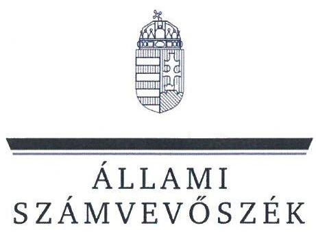
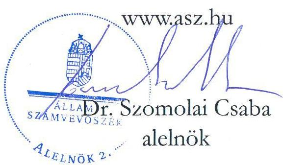
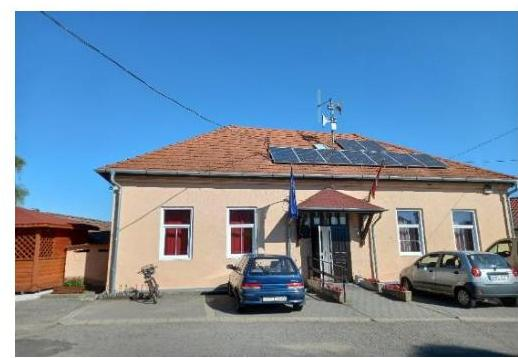
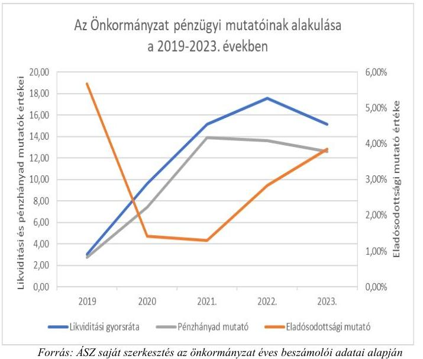
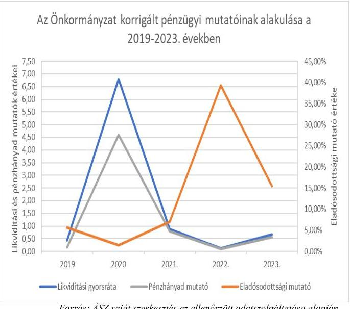
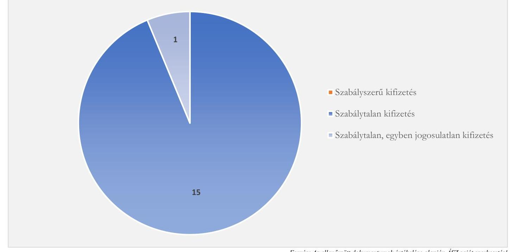

# JELENTÉS 

## Az önkormányzatok gazdálkodásának célvizsgálata

Az önkormányzatok ellenőrzése - a pénzforgalomban megjelenő kiadások teljesítésének és elszámolásának megfelelősége

Hugyag Község Önkormányzata

2025. 

25006
www.asz.hu

---

# JELENTÉS 

## Az önkormányzatok gazdálkodásának célvizsgálata

Az önkormányzatok ellenőrzése - a pénzforgalomban megjelenő kiadások teljesítésének és elszámolásának megfelelősége

Hugyag Község Önkormányzata

2025.

25006

---

# ELLENŐRZÉSI IGAZGATÓSÁG: 

## ÁLLAMHÁZTARTÁS HELYI SZINTJÉT ELLENŐRZŐ IGAZGATÓSÁG

## ELLENŐRZÉSI IGAZGATÓ:

DR. BAFFIA GERGELY GÁBOR igazgató

## ELLENŐRZÉSVEZETŐ:

Jelentéseink az interneten a www.asz.hu címen olvashatók.

HUDÁK MAGDOLNA ellenőrzésvezető

IKTATÓSZÁM: EL-4137-006/2025.
TÉMASORSZÁM: 52
ELLENŐRZÉS-AZONOSÍTÓ SZÁM: V-100210

---

# TARTALOMJEGYZÉK 

AZ ELLENŐRZÉS ALAPADATAI ..... 5
AZ ELLENŐRZÖTT SZERVEZET ..... 7
ÖSSZEFOGLALÁS ..... 9
AZ ELLENŐRZÉS FÓKUSZTERÜLETE ..... 12
MEGÁLLAPÍTÁSOK ..... 13
JAVASLATOK ..... 31
MELLÉKLETEK ..... 34
I. sz. melléklet: Értelmező szótár ..... 34
II. sz. melléklet: Az ellenőrzött szervezetek jegyzéke ..... 35
III. sz. melléklet: Ellenőrzési kritériumok ..... 36
IV. sz. melléklet: Összefoglaló táblázat az Önkormányzat gazdálkodási jogköreinek gyakorlásáról ellenőrzött gazdasági eseményenként ..... 38
V. sz. melléklet: Hugyag Község Önkormányzata esetében ellenőrzött, késedelmesen könyvelt gazdasági események ..... 40
VIII. sz. melléklet: Fel nem használt vásárlási előlegek kimutatása (2023-2024. évek) ..... 43
X. sz. melléklet: Kimutatás a kölcsön szerződésekről és az azok alapján az Önkormányzathoz befolyt bevételekről és teljesített törlesztésekről ..... 45
FÜGGELÉK: ÉSZREVÉTELEK ..... 47
RÖVIDÍTÉSEK JEGYZÉKE ..... 48

---

.

---

# AZ ELLENŐRZÉS ALAPADATAI 

## AZ ELLENŐRZÉS CÉLJA

Az ellenőrzés célja annak értékelése volt, hogy az Önkormányzatnál ${ }^{1}$ a pénzforgalomban megjelenő kiadások teljesítése és elszámolása megfelelő volt-e, továbbá a kiadások teljesítése az Önkormányzat közfeladat-ellátásához kapcsolódott-e.

## AZ ELLENŐRZÉS TÍPUSA

Megfelelőségi ellenőrzés.

## AZ ELLENŐRZÖTT IDŐSZAK

Az ellenőrzött időszak a 2023. év, valamint a 2024. év az ellenőrzés megállapításainak az ÁSZ tv. ${ }^{2}$ 29. § (1) bekezdése szerinti megküldése napjáig. Az ellenőrzés a feltárt kockázatok, tények, körülmények alapján a gazdálkodás egyes területei vonatkozásában kiterjesztésre került a 2019-2022. évekre.

## AZ ELLENŐRZÉS TÁRGYA

Az Önkormányzat pénzforgalmában megjelenő kiadások teljesítésének, elszámolásának, közfeladatellátással kapcsolatos felhasználásának ellenőrzése. Az ellenőrzés kiterjedt minden olyan körülményre és adatra, amely az ÁSZ jogszabályban meghatározott feladatainak teljesítéséhez, valamint a program végrehajtása folyamán felmerült újabb összefüggések feltárásához szükséges volt.

## AZ ELLENŐRZÉS JOGALAPJA

Az ellenőrzés jogszabályi alapját az ÁSZ tv. 1. § (3) bekezdésének, valamint az 5. § (2), (3) és (6) bekezdéseinek előírásai képezték.

## AZ ELLENŐRZÉS MÓDSZERE

Az ellenőrzést a nemzetközi standardokat irányadónak tekintve az ellenőrzési program szempontjai, az ellenőrzési időszakban hatályos jogszabályok, az ellenőrzés szakmai szabályok és módszertanok figyelembevételével végezte az ÁSZ ${ }^{3}$.

Az ellenőrzési kérdések megválaszolásához szükséges bizonyítékok megszerzése az ellenőrzött szervezetek által rendelkezésre bocsátott dokumentumok és adatok, valamint az ellenőrzést támogató szervezetek ${ }^{4}$ által adott adatok, információk értékelésével, továbbá megfigyelés, szemle (szemrevételezés) és információkérés (kérdésfeltevés), valamint elemző eljárás útján történt.

---

Az ellenőrzési bizonyítékként felhasználható adatforrások közé tartoztak egyrészt az ellenőrzéshez kért dokumentumok, adatforrások, másrészt adatforrás volt még a közhiteles nyilvántartásból (Magyar Államkincstár nyilvántartásai, Önkormányzati rendelettár) származó, az ellenőrzés szempontjából információkat tartalmazó dokumentum.

Az ellenőrzés lefolytatásához az ellenőrzött szervezetek a tanúsítványok kitöltésével, valamint az ÁSZ által kért dokumentumok, adatok, információk megküldésével az ellenőrzés során szolgáltattak adatokat. A rendelkezésre bocsátott adatok, információk kontrolljára helyszíni ellenőrzés keretében is sor került.

A pénzforgalomban megjelenő kiadások teljesítésének megfelelőségét mintavételi eljárással kiválasztott 15 tétel alapján ellenőrizte az ÁSZ. Az ellenőrzés során a működés, gazdálkodás kockázatos területeinek meghatározását követően az ellenőrzött szervezetre vonatkozó főkönyvi adatbázisokból kockázat alapú eljárás alapján történt a mintatételek kiválasztása. A tények feltárása és azok összegzése során a megállapítások az ellenőrzött mintatételekre vonatkozóan kerültek megfogalmazásra.

Az ellenőrzés során az ÁSZ tudomására jutott információk alapján - az ellenőrzési program ellenőrzött időszakra vonatkozó meghatározásával összhangban - az ellenőrzés kiterjesztésre került az Önkormányzat által a 2019-2020. években felvett kölcsönök és azok visszafizetései, valamint a 2019-2021. években elnyert és felhasznált pályázati források cél szerinti felhasználása tekintetében. Az ÁSZ ezen témaköröket az Önkormányzat által rendelkezésre bocsátott dokumentumok alapján tételesen ellenőrizte. A megállapítások az ellenőrzött gazdasági eseményekre vonatkozóan kerültek megfogalmazásra.

Az ellenőrzés kiemelten kezelte a kifizetések közfeladat ellátáshoz való közvetlen kapcsolódásának, kötelezettségvállalás szerinti teljesülésének, a kifizetések jogszerűségének, szabályszerűségének értékelését, figyelemmel a kiadások teljesítésével összefüggő kontrollok gyakorlati működésére.

Az ellenőrzés kiterjedt minden olyan körülményre és kérdésre is, amely a program végrehajtása kapcsán felmerült újabb összefüggéseknek az ellenőrzés céljaival összhangban lévő feltárásához szükséges.

---

# AZ ELLENŐRZÖTT SZERVEZET

Hugyag község Nógrád vármegyében, a Balassagyarmati járásban található.

Lakóinak száma a KSH^{5} adata alapján 2024. január 1-jén 896 fő volt. A településen az NFSZ^{6} adatai szerint a relatív munkanélküliségi ráta 2023. január 20-án 21,4%, 2024. szeptember 20-án 14,7% volt. Hugyag a 2023. évben a felzárkózó települések^{7} közé sorolt település volt.

A település polgármestere^{8} a 2022. július 3-án megtartott időközi választáson került megválasztásra, azóta látta el tisztségét. A Képviselő-testületnek^{9} a polgármesteren kívül négy képviselő tagja volt. Az Önkormányzat működésével kapcsolatos feladatokat a 2013. évtől az Őrhalmi Közös Önkormányzati Hivatal végezte. A jegyző^{10} a 2019. január 1-2019. május 31. közötti időszakban, a jegyző^{11} a 2019. június 1-2022. október 30. közötti időszakban, a jegyző^{12} a 2022. november 1-2023. november 22. időszakban, a jegyző^{13} 2023. november 20-ától vezette a Hivatalt^{14}.

Az Önkormányzat fenntartásában egy intézmény működött, az 1990. november 20-án alapított Óvoda^{15}. Az Önkormányzat a hulladékgazdálkodási feladatait, valamint a családsegítési és gyermekjóléti feladatait társulások útján látta el. Az Önkormányzat belső ellenőrzési feladatainak ellátására a Hivatal külső szolgáltatóval megbízási szerződést kötött.

Az Önkormányzat 2019-2023. évi konszolidált és éves beszámolóinak főbb adatait az 1. táblázat mutatja be. 1. táblázat adatok M Ft-ban AZ ÖNKORMÁNYZAT 2019-2023. ÉVI KONSZOLIDÁLT ÉS ÉVES BESZÁMOLÓINAK FŐBB ADATAI

|  MEGSEVEZÉS | 2019. | 2020. | 2021. | 2022. | 2023.  |
| --- | --- | --- | --- | --- | --- |
|   | ÉVI | ÉVI | ÉVI | ÉVI | ÉVI  |
|  Költségvetési bevétel | 355,7 | 254,0 | 251,2 | 199,2 | 321,0  |
|  Ebből: önkormányzatok működési támogatása | 93,4 | 119,4 | 116,8 | 126,4 | 148,6  |
|  közfoglalkoztatás támogatása | 55,5 | 57,2 | 82,0 | 47,6 | 113,2  |
|  Költségvetési kiadás | 271,0 | 304,2 | 230,7 | 204,6 | 321,8  |
|  Finanszírozási bevételek | 57,4 | 145,8 | 96,4 | 71,8 | 63,5  |
|  Ebből: likviditási célú hitelek, kölcsönök | 48,0 | 48,0 | 46,9 | 4,0 | 0,0  |
|  előző évi maradvány | 5,5 | 92,9 | 43,7 | 63,4 | 58,2  |
|  Finanszírozási kiadások | 50,8 | 51,9 | 53,5 | 8,2 | 4,4  |
|  Ebből likviditási célú hitelek, kölcsönök | 48,0 | 48,0 | 46,9 | 4,0 | 0,0  |

*Forrás: Az Önkormányzat 2019-2023 évi konszolidált és éves beszámolója alapján ÁSZ saját szerkesztés*

Az Önkormányzat nem rendelkezett jelentősebb közhatalmi bevétellel. Az iparűzési adó bevétele – az évek sorrendjében – a költségvetési bevételek mindössze 1,3%-át, 1,1%-át, 3,5%-át, 4,4%-át, illetve 2,9%-át jelentette.

Az Önkormányzatnál az ellenőrzött időszakban két adósságrendezési eljárás is folyamatban volt, az adósságrendezési eljárás^{16} 2023. évben lezárult, az adósságrendezési eljárás^{17} a 2024. évben indult.

---

Az Önkormányzat főbb pénzügyi mutatóinak és korrigált mutatóinak alakulását az 1. ábra mutatja be: 1. ábra

Forrás: ÁSZ saját szerkesztés az önkormányzat éves beszámolói adatai alapján

Forrás: ÁSZ saját szerkesztés az ellenőrzött adatszolgáltatása alapján

Ugyan az Önkormányzat pénzügyi mutatói az éves beszámolók adatai szerint kedvező képet mutattak, mind a likviditási gyorsráta, a pénzhányad mutató és az eladósodottsági mutató a referencia tartományban maradt. A mutatók szerint az Önkormányzat rövidtávú fizetőképessége látszólag biztosított, működése stabil és kiegyensúlyozott volt. A likviditási, a pénzhányad és az eladósodottsági mutatók alakulása azonban nem mutatott reális képet, mivel a 2021-2023. évi éves beszámolókban az Önkormányzat a kötelezettségek között nem mutatta ki az adósságirendezési eljárás ${ }_{1,2}$ során elismert hitelező igények tárgyévre eső részét, amely a 2021. évben 34,4 M Ft, a 2022. évben 319,1 M Ft, a 2023. évben 56,2 M Ft volt, továbbá a pénzeszközök között a 2019-2021. években jelentős súllyal jelentek meg a célhoz kötött pályázati források, amelyek az Önkormányzat likviditását látszólag javították. A kötelezettségállomány adósságrendezési eljárásban elismert összegeivel, valamint a pályázati pénzeszközökkel korrigálva az Önkormányzat beszámoló adatait, már mind a likviditási, mind a pénzhányad mutatók értéke a 2022. évre a referencia értékek (1 és 0,4) alá csökkent.

---

# ÖSSZEFOGLALÁS 

A településeken az önkormányzati gazdálkodás sokrétű feladatot jelent. A tevékenység összetettsége, a megfelelő képzettségű, létszámú humán-erőforrás hiánya a gazdálkodás területén magas szintű kockázatokat eredményezhet. Az ellenőrzés hozzájárul az Önkormányzat szabályszerű és felelős gazdálkodásához, a közpénzek szabályos, cél szerinti felhasználásához, a közvagyon védelméhez.

Az Önkormányzat a jogszabályokban, illetve a szervezeti és működési szabályzatában meghatározott közfeladatait ellátta. Az Önkormányzat rövidtávú fizetőképessége a 2019-2023. évi beszámolókból számított mutatószámok alapján biztosítottnak látszott, valójában pénzügyi helyzete nem volt stabil. Az ellenőrzött időszakban két alkalommal is adósságrendezési eljárás ${ }_{1,2}$ alatt állt, működését pénzintézettől felvett munkabérhitelekből, kölcsönökből, valamint a pályázati források céltól eltérő felhasználásával finanszírozta, de kötelezettségállományában az adósságrendezési eljárások miatti kötelezettségeket nem mutatta ki, könyveiből nem lehetett megállapítani a tényleges tartozásainak összegét, miközben az adósságrendezési eljárás ${ }_{1}$ következtében az Önkormányzat elvesztette forgalomképes vagyonát.
A 2019-2020. években az Önkormányzat a jogszabályokat megsértve 27 alkalommal egy magánszemélytől, egy egyéni vállalkozótól és egy gazdasági társaságtól mindösszesen 74,8 M Ft összegű kölcsönöket vett fel, és 37 esetben 95,0 MFt összegben fizette vissza. A visszafizetett összeg 20,2 MFt-tal több volt, mint a 2019-2020. években felvett összeg. A 20,2 M Ft-ból 13,9 M Ft az ellenőrzött időszakot megelőzően, 2018-ban felvett, de 2018. december 31-ig vissza nem fizetett két kölcsöntörlesztést takaró áthúzódó kötelezettségvállalás volt. A 20,2 MFt visszafizetett összegből 6,3 MFt (egy magánszemélynek 3,4 MFt, és az önkormányzati tulajdonban lévő gazdasági társaság részére 2,9 MFt) visszafizetése szabálytalanul történt, mivel a kölcsönügyletek létrejöttét, a kölcsönösszegek Önkormányzathoz történő beérkezését sem pénztári, sem bankkivonatok nem igazolták, illetve a kölcsönszerződések sem álltak rendelkezésre. A 2019-2020. években felvett kölcsönök közül 19 esetben a megkötött kölcsönszerződések nem tartalmaztak kamatfizetési kötelezettséget, nyolc esetben a polgármester ${ }_{1}{ }^{18}$ a jogszabályi előírásokat megsértve nem kötött kölcsönszerződést, és öt esetben a kölcsönnyújtó a polgármester ${ }_{1}$ közvetlen hozzátartozója volt. A polgármester ${ }_{1}$ közeli hozzátartozójától - az ellenőrzött időszakban - felvett kölcsönökből három esetben nem állt rendelkezésre kölcsönszerződés, két esetben a kölcsönszerződést az Önkormányzat részéről az összeférhetetlenségi szabályokat megsértve a polgármester ${ }_{1}$ írta alá.

Az önkormányzat pénzügyi helyzetét rontotta, hogy a Miniszterelnökség, mint támogató, a 2021 decemberében kelt szabálytalansági döntése alapján a szegregált élethelyezetek felszámolását ${ }^{19}$ célzó Komplex program ${ }^{20}$-ra,
 valamint a Lakhatási program ${ }^{21}$-ra nyújtott pályázati források teljes összegét, 264,2 M Ft-ot, ügyleti és késedelmi kamatokkal növelten - a projektmenedzsmenttel, szakmai vezetéssel kapcsolatos hiányosságok, valamint a támogatások felhasználásának alátámasztását igazoló elkülönített számviteli nyilvántartás vezetésének hiánya miatt - visszakövetelte. A pályázati cél nem valósult meg, az Önkormányzatot a szabálytalanul elköltött és emiatt a visszakövetelt pályázati forrás és kamatai erejéig vagyoni hátrány érte, amely a támogatás visszavonásának időpontjában - 2022. január 19-én - a támogatási összeg 102,2%-a volt. Az Önkormányzat a támogatásokkal kapcsolatos visszafizetési kötelezettségének tekintettel az Irányító Hatóság ${ }^{22}$ felé benyújtott finanszírozási igényre nem tett eleget, mivel az Irányító Hatóság 2022. március 22-től - a Miniszterelnökség általi elbírálás idejére - a követelések rendezésére szóló határidőt felfüggesztette. A Miniszterelnökség a 2022. május 10-én indított adósságrendezési eljárás ${ }_{1}$ során hitelezői igényként mutatta ki a visszakövetelt támogatást és kamatait.

---

Emellett a Komplex programból 32,8 M Ft, a Lakhatási programból 124,1 M Ft felhasználása a támogatási szerződésben foglaltak ellenére nem kapcsolódott a pályázati célokhoz, továbbá a 2020. évben a Lakhatási program terhére a Covid-19 világjárvány elleni védekezés keretében a polgármester szabálytalanul, 17,1 M Ft értékben vásárolt védőeszközöket, amelyek átvétele és kiosztása az Önkormányzat által nem történt meg.

Az Önkormányzat pénzforgalmában megjelenő 44,9 M Ft összértékű 15 ellenőrzött kiadás teljesítése, illetve elszámolása teljeskörűen egyetlen esetben sem felelt meg a jogszabályi előírásoknak. Ebből egy 0,8 M Ft összegű előleg közfeladatellátáshoz való kapcsolódása nem volt igazolt, mivel nem állt rendelkezésre a vásárlási előleg célját meghatározó dokumentum, a felvett előleget annak felhasználása nélkül fizették vissza.

A pénzforgalomban megjelenő kiadások teljesítésének és elszámolásának szabályszerűségét a 2. ábra mutatja be.
2. ábra

# A PÉNZFORGALOMBAN MEGJELENŐ KIADÁSOK TELJESÍTÉSÉNEK ÉS ELSZÁMOLÁSÁNAK SZABÁLYSZERŰSÉGE AZ ÖNKORMÁNYZATNÁL (DB) 

Forrás: Az ellenőrzött dokumentumok értékelése alapján ÁSZ saját szerkesztés!
Az Önkormányzat kiadási előirányzatai terhére teljesített kifizetések nem voltak szabályszerűek, mivel az előzetes kötelezettségvállalást igénylő 15 esetből tíz esetben - 6,8 M Ft kifizetést érintően - a jogszabályi előírások ellenére nem, vagy nem megfelelően vállaltak írásban kötelezettséget. A kötelezettségvállalások pénzügyi ellenjegyzése 12 esetben - 11,3 M Ft kifizetést érintően - nem, vagy nem megfelelően történt. A teljesítésigazolás az ellenőrzött gazdasági események 86,7%-nál - 12,1 M Ft összegben - elmaradt, vagy azt nem megfelelően végezték el. Az érvényesítés, illetve az utalványozás az ellenőrzött gazdasági események egyikénél sem felelt meg a jogszabályi előírásoknak. Az ÁSZ ellenőrzés hiányosságokat tárt fel a Hivatal állományában lévő köztisztviselők megbízási jogviszonyával, az Önkormányzat által üzemeltett kiskút használatával és elszámolásával, az elszámolásra kiadott előlegek célszerű felhasználásával, valamint a gazdálkodási jogkörök gyakorlása során az aláírásbélyegző használatával kapcsolatosan.

---

Az Önkormányzat előlegkezelési gyakorlata a jövőre nézve felveti az önkormányzati források átmeneti jogosulatlan - saját célra történő - felhasználásának kockázatát.

Az Önkormányzatnál a jogszabályokban előírt nyilvántartások vezetése sem volt megfelelő, mivel adatok hiányában nem volt alkalmas a kötelezettségvállalás időpontjában a szabad előirányzat, valamint a kötelezettségállomány megállapítására. Az Önkormányzat tárgyi eszköz nyilvántartása sem felelt meg teljeskörűen a jogszabályi előírásoknak, mivel nem tartalmazta a szállító megnevezését, az eszközök azonosításához, a használatbavételt igazoló bizonylatok azonosításához szükséges adatokat, valamint a várható használati időt.

A jogszabályi előírások ellenére az Önkormányzat a mérlegben kimutatott eszközöket és forrásokat a pénzeszközök kivételével leltárral nem támasztotta alá, a mennyiségi felvétellel történő leltározást nem végezte el. A 2021-2023. évi beszámoló mérlegében kimutatott kötelezettségek állománya nem tartalmazta az adósságrendezési eljárás ${ }_{1,2}$ során elismert hitelező igények tárgyévre eső részét, a 2021. évben 34,4 M Ft-ot, a 2022. évben 319,1 M Ft-ot, a 2023. évben 56,2 M Ft-ot. A ki nem mutatott kötelezettségekből adódó eltérések előjeltől független összege a 2021-2023. években meghaladta a mérlegfőösszeg 2%-át. Az eltérés aránya az évek sorrendjében a mérlegfőösszeg 6,1%-a, 60,4%-a, illetve 15,0%-a volt, amely minden évben jelentős összegű hibának minősült. Mindezek miatt sérült a valódiság számviteli alapelve, a jogszabályi előírások ellenére a 2021-2023. évi éves költségvetési beszámolói nem mutattak megbízható és valós képet az Önkormányzat vagyoni, pénzügyi és jövedelmi helyzetéről.

A gazdálkodás belső szabályainak kialakítása nem felelt meg a jogszabályi előírásoknak, mert az Önkormányzat számviteli politikáját ${ }^{23}$, gazdálkodási szabályzat ${ }_{2}{ }^{24}$-át, kötelezettségvállalási szabályzat ${ }_{3}{ }^{25}$-át, beszerzési szabályzat ${ }_{2}{ }^{26}$-át, pénzkezelési szabályzat ${ }_{2}{ }^{27}$-át, leltározási és leltárkészítési szabályzatát ${ }^{28}$, gépjárműszabályzat ${ }_{2}{ }^{29}$-át az arra jogosult jegyző ${ }_{2-3,4}$ helyett a polgármester ${ }_{2}$ kiadmányozta, valamint a gazdálkodási jogkörök gyakorlására jogosultak nyilvántartását az Önkormányzat hiányosan vezette.

A belső ellenőrzés az ellenőrzött időszakban nem járult hozzá a szabályszerű működéshez és a hiányosságok feltárásához, a jegyző ${ }_{2}$ által 2020. évben elrendelt, szegregált élethelyzet felszámolásához kapcsolódó támogatások felhasználásának ellenőrzésén kívül az Önkormányzat gazdálkodását az ellenőrzött időszakban nem vizsgálta.

Az ÁSZ az ellenőrzés során feltárt hiányosságok felszámolása, a szabályszerű működés feltételeinek megteremtése érdekében a polgármester ${ }_{2}$-nek öt, a jegyző ${ }_{4}$-nek 17 javaslatot tett.

---

# AZ ELLENŐRZÉS FÓKUSZTERÜLETE 

Az Önkormányzat pénzforgalmában megjelenő kiadások teljesítésének és elszámolásának megfelelősége, az önkormányzati feladatellátásához való kapcsolódásának értékelése

---

# MEGÁLLAPÍTÁSOK 

## 1. Az Önkormányzat pénzforgalmában megjelenő kiadások teljesítésének és elszámolásának megfelelősége, az önkormányzati feladatellátásához való kapcsolódásának értékelése

Összegző megállapítás Az Önkormányzatnál a pénzforgalomban megjelenő kiadások teljesítése és elszámolása nem volt megfelelő, az ellenőrzött 15 kifizetésből teljeskörűen egy sem felelt meg a jogszabályi előírásoknak, illetve egy kifizetésnél az önkormányzati feladatellátáshoz való kapcsolódás sem volt igazolt.
1.1. számú megállapítás Az ellenőrzött 15 gazdasági esemény egy kivétellel az Önkormányzat feladatellátásához kapcsolódott.

Az Önkormányzatnál az ellenőrzött gazdasági események közül 14, összesen 44 133,7 E Ft értékű kiadás - az Mötv. ${ }^{30}$ előírásaival összhangban - az Önkormányzat kötelező, vagy önként vállalt feladatainak ellátásához kötődött.
A jegyző ${ }^{4}$ - a pénzkezelési szabályzat ${ }_{2}$ 5.1 pontjában előírtak ellenére - az ÖNK_KIAD_10 gazdasági eseménynél, 750,0 E Ft előleg felvételénél, nem gondoskodott az előzetes készpénzfelvételi engedély elkészítéséről, továbbá a pénztárbizonylat és az utalványrendelet sem tartalmazta a vásárlási előleg felvételének célját. A készpénzfelvételi engedély és a vásárlási előleg céljának megjelölése hiányában nem volt igazolt, hogy a felvett előleg az Mötv. 111. § (2) bekezdés előírásaival összhangban közfeladatellátáshoz kapcsolódott. Az előleget felhasználás nélkül a hatodik munkanapon a pénztáros visszavételezte a házipénztárba, így az előleg elszámolásából sem volt megállapítható a közfeladathoz kötöttség.
1.2. számú megállapítás A pénzforgalomban megjelenő ellenőrzött kiadások teljesítése nem felelt meg a jogszabályi előírásoknak. Az Önkormányzatnál a gazdálkodási jogköröket a jogkörgyakorlók nem az Áht. ${ }^{31}$ és az Ávr. ${ }^{32}$ előírásainak megfelelően gyakorolták.

Az előzetes írásbeli kötelezettségvállalást igénylő 15 gazdasági eseményből három esetben (470,1 E Ft összegben) az Ávr. 52. § (1) bekezdés c) pont, valamint a kötelezettségvállalási szabályzat ${ }_{2}{ }^{33}$ III. fejezet előírása ellenére a kötelezettségvállalásról nem készült dokumentum. Hat esetben (5609,2 E Ft összegű kifizetésnél) a kötelezettségvállalás dokumentuma nem felelt meg az Áht. és az Ávr. előírásainak.
Három gazdasági eseménynél (ÖNK_KIAD_02, ÖNK_KIAD_04 ÖNK_KIAD_09) több, az Ávr.-be ütköző hiányosság is előfordult.
Hat esetben (38 091,8 E Ft összegű kifizetésnél) a kötelezettségvállalásra szabályszerűen került sor.

---

- A Képviselő-testület a 2023. évi válságköltségvetési rendelet ${ }^{34}$-ben garancia- és kezességvállalásból származó kifizetésre 1000,0 E Ft előirányzatot biztosított az Önkormányzat 100%-os tulajdonában lévő, felszámolás alatt álló Településüzemeltetési Kft. ${ }^{35}$ tartozásainak rendezésére. Az Ávr. 52. § (1) bekezdés c) pont előírása ellenére a Településüzemeltetési Kft. 400,0 E Ft összegű NAV${ }^{36}$ tartozásának (ÖNK_KIAD_11) kifizetéséhez kapcsolódóan a tartozás átvállalásáról nem készült kötelezettségvállalási dokumentum, a kötelezettségvállalás nyilvántartásba vételi dokumentumon dátum nélkül a polgármester ${ }_{2}$ eredeti aláírása helyett aláírásbélyegzőjének lenyomata szerepelt. Az adósságrendezési eljárás idején a kötelezettségvállalási szabályzat ${ }_{2}$ III. fejezet második bekezdés előírása szerint az Önkormányzatnál a fizetési számlákról a számlavezető által leemelt díj kivételével minden esetben írásbeli kötelezettségvállalás volt szükséges. Az ÖNK_KIAD_05, havonta ismétlődő, 37,5 E Ft összegű gazdasági esemény - utazó gyermekek mellé kirendelt kísérők autóbuszbérlet juttatása - valamint az ÖNK_KIAD_15 kiadás, 32,7 E Ft összegű üzemanyag vásárlás esetében a kötelezettségvállalási szabályzat ${ }_{2}$ III. fejezet előírása ellenére a kötelezettségvállalásról nem készült dokumentum.
- Az ÖNK_KIAD_10 kiadás esetében a 750,0 E Ft összegű vásárlási előleg felvétele nem felelt meg a pénzkezelési szabályzat ${ }_{2}$ 5.1 pontjában foglaltaknak, mivel az előleg felvételéhez nem alkalmazták a Készpénzégénylés elszámolásra elnevezésű nyomtatványt.
- Az ÖNK_KIAD_02, ÖNK_KIAD_04, ÖNK_KIAD_08, ÖNK_KIAD_09, és az ÖNK_KIAD_12 (5571,7 E Ft) gazdasági események esetében - közfoglalkoztatás keretében vásárolt munka- és védőruha, takarítási és tárgyi eszközök beszerzése, hivatali dolgozók további munkavégzése, a buszváró felújítása, az egyszerűsített foglalkoztatás - rendelkezésre bocsátott kötelezettségvállalások dokumentumain a polgármester ${ }_{2}$ eredeti aláírása helyett aláírásbélyegzőjének lenyomata szerepelt. Az Ávr. 52. § (1) bekezdés c) pont előírására tekintettel az eredeti aláírás hiányában az írásbeli kötelezettségvállalás ténylegesen nem jött létre, nem tekinthető az Áht. 1. § 15. pontja szerinti szabályszerűen megtett jognyilatkozatnak.
- További hiányosság volt az ÖNK_KIAD_02, ÖNK_KIAD_04 és az ÖNK_KIAD_09 (5297,4 E Ft összértékű) gazdasági eseményeknél, hogy a közfoglalkoztatás keretében vásárolt munka- és védőruha, takarítási és tárgyi eszközök, valamint a buszváró felújítás megrendelésére kiállított kötelezettségvállalási dokumentumok nem tartalmazták az Ávr. 50. § (1) bekezdés a), b) és c) pontjaiban előírt tartalmi elemeket. Nem tartalmazta az ÖNK_KIAD_04 esetében a mennyiségi, az ÖNK_KIAD_09 esetében a műszaki jellemzőket (konkrétan milyen feladatokat kell elvégezni a megrendelőben szereplő összegért), és egyik esetben sem tartalmazta a számlázás alapjául szolgáló egységárat, a kifizetés határidejét.
A pénzügyi ellenjegyző az Áht. 37. § (1) bekezdésében előírtak ellenére a pénzügyi ellenjegyzéshez kapcsolódó ellenőrzési feladatokat nyolc esetben (4667,0 E Ft összegű kifizetésnél) nem, öt esetben (7077,4 E Ft összegű kifizetés esetén) nem megfelelően végezte el. Két gazdasági eseménynél (ÖNK_KIAD_02, ÖNK_KIAD_04) több, az Ávr-be ütköző hiányosság is előfordult.
Nem végezték el a pénzügyi ellenjegyzést az alábbi esetekben:
- az ÖNK_KIAD_05, az ÖNK_KIAD_11 és az ÖNK_KIAD_15 (470,1 E Ft) NAV tartozás kifizetéséhez, valamint a bérletek és az üzemanyagvásárláshoz kapcsolódóan, mivel az Ávr. 52. § (1) bekezdés c) pont, illetve kötelezettségvállalási szabályzat ${ }_{2}$ III. fejezet előírása ellenére írásbeli kötelezettségvállalás nem történt,
- Az ÖNK_KIAD_01, ÖNK_KIAD_08, ÖNK_KIAD_12, ÖNK_KIAD_13 és az ÖNK_KIAD_14 (4196,9 E Ft) esetében az írásbeli kötelezettségvállalási dokumentumok rendelkezésre álltak, azonban

---

azokon az Áht. 37. § (1) bekezdés és az Ávr. 55. § (1) bekezdés előírása ellenére a pénzügyi ellenjegyzés ténye, valamint a pénzügyi ellenjegyző dátummal ellátott aláírása nem szerepelt.
A pénzügyi ellenjegyzés nem volt megfelelő, mert:

- a pénzügyi ellenjegyző az ÖNK_KIAD_02, és az ÖNK_KIAD_04 (3097,4 E
 Ft) a közfoglalkoztatás keretében vásárolt munka- és védőruha, takarítási és tárgyi eszközök beszerzése esetében nem észrevételezte, hogy a megrendelő az Ávr. 50. § (1) bekezdés b) pontjában előírtak ellenére nem tartalmazta a számlázás alapjául szolgáló egységárat;
- az ÖNK_KIAD_09 (2200,0 E Ft) esetében a pénzügyi ellenjegyző nem észrevételezte, hogy a Képviselőtestület egy-egy fa buszváró építéséről rendelkezett, a megrendelő azonban karbantartási munkákról szólt, és az Ávr. 50. § (1) bekezdés a) pontjában előírtak ellenére a megrendelő nem tartalmazta a megépítendő buszváró műszaki paramétereit (pl. méret, alkalmazandó anyag, stb.), nem tartalmazta a teljesítés szakmai, műszaki jellemzőinek meghatározását;
- az ÖNK_KIAD_03 (1380,0 E Ft) a szociális tűzifa vásárlására irányuló szerződés, valamint a ÖNK_KIAD_11 (400,0 E Ft) NAV tartozás kifizetéséhez kapcsolódó kötelezettségvállalás nyilvántartásba vételi dokumentum az Ávr. 55. § (1) bekezdés előírása ellenére nem tartalmazta a pénzügyi ellenjegyzés dátumát.
További hiányosság volt, hogy
- az ÖNK_KIAD_02 és az ÖNK_KIAD_04 (3097,4 E Ft) közfoglalkoztatás keretében vásárolt munka- és védőruha, takarítási és tárgyi eszközök beszerzését megelőzően a Képviselő-testület a beszerzési szabályzat; IV. fejezet 1. pontjában előírtak ellenére - amely szerint az 500,0 E Ft-ot meghaladó beszerzésekről a Képviselő-testület dönt - nem hozott határozatot.
Az adósságrendezési eljárás ${ }_{1}$-hez kapcsolódó, bírósági végzésen alapuló kettő kiadás (ÖNK_KIAD_06 (29 789,2 E Ft) és az ÖNK_KIAD_07 (3000,0 E Ft), továbbá az előleg ÖNK_KIAD_10 (750,0 E Ft) esetében pénzügyi ellenjegyzés nem volt szükséges az Áht. előírása alapján.
A teljesítésigazolást a teljesítésigazoló az Áht. 38. § (1) bekezdésében és az Ávr. 57. § (1) bekezdésében foglaltak ellenére 13 esetben nem, vagy nem megfelelően végezte el. Ezáltal az ellenőrzött gazdasági események 86,7%-ában, 12 094,5 E Ft összegű kifizetést megelőzően nem ellenőrizték, hogy a kifizetések az arra jogosultak részére a kötelezettségvállalásnak megfelelő összegben történtek-e, illetve, hogy az ellenszolgáltatást az Önkormányzat részére ténylegesen teljesítették-e. Öt gazdasági eseménynél a (ÖNK_KIAD_02, ÖNK_KIAD_04, ÖNK_KIAD_05, ÖNK_KIAD_09, ÖNK_KIAD_15) több, az Ávr-be ütköző hiányosság is előfordult. Kettő 32 789,2 E Ft összegű kiadás (az adósságrendezési eljárás ${ }_{1}$-hez kapcsolódó, bírósági végzésen alapuló ÖNK_KIAD_06, és az ÖNK_KIAD_07 kiadások esetében a teljesítés igazolás nem volt releváns.
- A teljesítésigazoló az Ávr. 57. § (1) bekezdésében foglaltak ellenére nem végezte el a teljesítésigazolást az ÖNK_KIAD_03, az ÖNK_KIAD_10, az ÖNK_KIAD_11 és az ÖNK-KIAD_14 (4330,0 E Ft) gazdasági eseményeknél, a bizonylatokon nem szerepelt a teljesítésigazolás elvégzésére utaló szöveg, valamint a teljesítésigazoló dátummal ellátott aláírása. Ugyan az ÖNK_KIAD_03 szociális tűzifa vásárlására irányuló gazdasági eseménynél a falugondnok a tűzifa leszállítását igazolta, azonban az Ávr. 57. § (4) bekezdése alapján a teljesítésigazolásra jogosult polgármester${ }_{2}$ aláírásával nem igazolta az összegszerűséget, a jogosultságot és az ellenszolgáltatás teljesítését.

---

Az alábbi esetekben a teljesítésigazolás nem volt megfelelő, mivel:

- Az ÖNK_KIAD_01, ÖNK_KIAD_02, ÖNK_KIAD_04, ÖNK_KIAD_05, ÖNK_KIAD_08, ÖNK_KIAD_09, ÖNK_KIAD_12, ÖNK_KIAD_13, ÖNK_KIAD_15, (7764,5 E Ft) gazdasági eseményeknél az Ávr. 57. § (3) bekezdés előírása ellenére a teljesítésigazolást végző polgármester; eredeti aláírása helyett aláírásbélyegzőjének lenyomata szerepelt.
A teljesítésigazolásoknál további hiányosság volt:
- Az ÖNK_KIAD_05 - utazó gyermekek mellé kirendelt kísérők autóbuszbérlet juttatása - 37,5 E Ft összegű gazdasági eseménynél a teljesítésigazoló a teljesítést igazolta, azonban az formális volt. A polgármester; által a gyermekek iskolába való kísérésére kiadott utasítás nem tartalmazta a kísérők megnevezését, valamint a bérlettérítés összegét, emiatt az Ávr. 57. § (1) bekezdésében foglaltak ellenére a dokumentumok alapján ténylegesen nem volt megállapítható a jogosultság és az összegszerűség.
- Az ÖNK_KIAD_02, ÖNK_KIAD_04 és ÖNK_KIAD_09 (5297,4 E Ft összegű) - a közfoglalkoztatás keretében vásárolt munka- és védőruha, takarítási és tárgyi eszközök beszerzése, valamint a buszváró felújításra irányuló - gazdasági eseményeknél a teljesítésigazoló nem végezte el az Ávr. 57. § (1) bekezdésében foglalt összegszerűség ellenőrzését, mivel a megrendelők nem tartalmazták a számlázás alapjául szolgáló egységárakat. A teljesítésigazoló nem végezte el az Ávr. 57. § (1) bekezdésében foglalt ellenszolgáltatás teljesítésének ellenőrzését, mivel a megrendelők nem tartalmazták az ÖNK_KIAD_04 (1562,4 E Ft) esetében a mennyiségi, az ÖNK_KIAD_09 (2200,0 E Ft) esetében a műszaki jellemzőket, amely alapján az ellenszolgáltatás mennyiségi és minőségi teljesítését ellenőrizni lehetett.
- Az ÖNK_KIAD_15 (32,7 E Ft) üzemanyag beszerzés esetében az Ávr. 60. § (2) bekezdése szerinti összeférhetetlenségi szabály is sérült, a közeli hozzátartozó részére történő kifizetés teljesítésigazolása során.
Az érvényesítés az ellenőrzött 15, összesen 44 863,7 E Ft értékű kifizetés egyikénél sem felelt meg az Ávr. előírásainak. Az érvényesítő a kifizetést megelőzően nem ellenőrizte az összegszerűséget, a fedezet meglétét és azt, hogy a megelőző ügymenetben az Áht., a Hartv. ${ }^{37}$, az Ávr. és az Áhsz. előírásait, valamint a belső szabályzatokban foglaltakat betartották-e. Két gazdasági eseménynél a (ÖNK_KIAD_05, ÖNK_KIAD_06) több, az Ávr-be ütköző hiányosság is előfordult.
- Két esetben (ÖNK_KIAD_12, ÖNK_KIAD_13) 2089,0 E Ft összegben az érvényesítés nem történt meg, mert az Ávr. 58. § (3) bekezdés előírása ellenére az érvényesítő aláírásával nem igazolta az ellenőrzési feladat ellátását.
- Az Ávr. 58. § (3) bekezdés előírása ellenére 13, összesen 42 794,7 E Ft kiadásnál (ÖNK_KIAD_01, ÖNK_KIAD_02, ÖNK_KIAD_03, ÖNK_KIAD_04, ÖNK_KIAD_05, ÖNK_KIAD_06, ÖNK_KIAD_07, ÖNK_KIAD_08, ÖNK_KIAD_09, ÖNK_KIAD_10, ÖNK_KIAD_11, ÖNK_KIAD_14, ÖNK_KIAD_15) az érvényesítésre a kifizetést követően került sor, mivel az érvényesítő aláírását tartalmazó utalványrendelet dátuma későbbi volt, mint a kifizetés időpontja, továbbá az ÖNK_KIAD_05 gazdasági eseménynél az érvényesítő nem jelezte, hogy a polgármester; által a bérlettérítésre 2021-ben kiadott utasítás az Ávr. 52. § (1) bekezdés c) pont előírása ellenére nem tartalmazta a kötelezettségvállaló aláírását.
- Az érvényesítő az Ávr. 58. § (1) és (2) bekezdésének előírása ellenére nem jelezte az utalványozónak a kötelezettségvállalás, pénzügyi ellenjegyzés és teljesítésigazolás során előzőekben bemutatott hiányosságokat.

---

Az utalványozás az ellenőrzött 15 gazdasági esemény egyikénél sem felelt meg az Áht. és Ávr. előírásainak. Az ÖNK_KIAD_10 gazdasági esemény kivételével 14 gazdasági eseménynél több, az Ávr.-be ütköző hiányosság is előfordult.

- 14 kiadásnál 42 930,7 E Ft összegben (ÖNK_KIAD_01, ÖNK_KIAD_02, ÖNK_KIAD_03, ÖNK_KIAD_04, ÖNK_KIAD_05, ÖNK_KIAD_06, ÖNK_KIAD_07, ÖNK_KIAD_08, ÖNK_KIAD_09, ÖNK_KIAD_11, ÖNK_KIAD_12, ÖNK_KIAD_14, ÖNK_KIAD_15) az utalványozásra az Áht. 38. § (1) bekezdésében foglaltak ellenére a kifizetést követően került sor, ugyanis a pénzügyi teljesítés időpontja korábbi volt, mint a kifizetést elrendelő utalványrendelet dátuma.
- 14 kifizetés esetében (ÖNK_KIAD_01, ÖNK_KIAD_02, ÖNK_KIAD_03, ÖNK_KIAD_04, ÖNK_KIAD_05, ÖNK_KIAD_06, ÖNK_KIAD_07, ÖNK_KIAD_08, ÖNK_KIAD_09, ÖNK_KIAD_11, ÖNK_KIAD_12, ÖNK_KIAD_13, ÖNK_KIAD_14, ÖNK_KIAD_15) 44 133,7 E Ft összértékben a polgármester${ }_{2}$ az Ávr. 52. § (1) bekezdés c) pont előírása ellenére eredeti aláírása helyett aláírásbélyegzőjének lenyomatával utalványozott.
- Az ÖNK_KIAD_12, ÖNK_KIAD_13, összesen 2089,0 E Ft összegű kifizetés esetében az Ávr. 59. § (1b) bekezdés előírása ellenére érvényesítés hiányában történt az utalványozás.
(Az összefoglaló táblázatot az Önkormányzat gazdálkodási jogköreinek gyakorlásáról ellenőrzött gazdasági eseményenként a IV. számú melléklet tartalmazza.)
1.3. számú megállapítás

A Hivatal állományába tartozó köztisztviselők további munkavégzésre irányuló megbízása nem felelt meg a jogszabályi előírásoknak.

A gazdálkodási szervezettel nem rendelkező önálló költségvetési szervként működő Óvoda gazdálkodási feladatait az Áht. 10. § (4a) bekezdése szerint a Hivatal, ezen belül pedig a Kirendeltség ${ }^{38}$ látta el. Az Ávr. 9. § (5) bekezdés a) pontjának előírása ellenére a Hivatal és az Óvoda nem kötöttek munkamegosztási megállapodást, nem rendezték az Óvodával kapcsolatos munkamegosztás és felelősségvállalás rendjét. Az Óvoda alaptevékenysége volt az óvodai ellátás mellet az étkeztetés biztosítása is.
A polgármester${ }_{2}$ 2023. évben megbízta a Kirendeltségen dolgozó két köztisztviselőt az Óvodával kapcsolatos adminisztratív és étkeztetési feladatok ellátásával (ÖNK_KIAD_08). A feladatok elvégzésére irányuló megbízás az ellenőrzés idején is fennállt. A megbízásokról Képviselő-testületi döntés nem volt.

- A polgármester${ }_{2}$ 2023. május 23. napjával, majd az Óvodavezető 2024. március 1. napjától megbízta a Kirendeltségen dolgozó pénzügyi ügyintézőt az Önkormányzat étkeztetéssel kapcsolatos (gyermekétkeztetés, szünidei étkeztetés) adminisztratív feladatainak ellátásával, melynek keretében feladata volt az étkeztetéshez kapcsolódó nyilvántartások vezetése, az értesítések és megállapodások elkészítése, jelentési kötelezettségek teljesítése, a nyersanyag felhasználás ellenőrzése, a költségfelosztás elkészítése, a beszállítókkal és az élelmezésvezetővel való kapcsolattartás, szervezési feladatok ellátása.
- A polgármester${ }_{2}$ 2023. július 1-én, valamint 2024. március 1-én megbízta a Kirendeltségen dolgozó igazgatási ügyintézőt az Önkormányzat munkaügyi feladatainak ellátásával, melynek keretében az ügyintézőnek feladata volt az Óvoda közalkalmazottjainak kinevezésével kapcsolatos feladatok ellátása, az illetményváltozás figyelemmel kísérése, az óvodai dolgozók távollétének és útiköltségének rögzítése.
A polgármester${ }_{2}$ által a Hivatal állományába tartozó köztisztviselőkkel kötött megbízási szerződés ellentétes volt az Áht. 10. § (4a) bekezdésével, és az Ávr. 9. § (5) bekezdésével, mivel a

---

gazdasági szervezettel nem rendelkező költségvetési szerv adminisztratív feladatait a Hivatalnak az állományába tartozó köztisztviselőkkel kellett ellátni, továbbá a megbízási szerződés ellentétes volt a Kttv. ${ }^{39}$ 8. § (2) bekezdésének előírásaival is, mivel megbízási szerződést nem köthettek olyan feladat elvégzésére, amelyre csak köztisztviselői kinevezés adható.
A megbízási szerződésekben az Ávr. 51. § (2) bekezdésének előírása ellenére a megbízási szerződés nem tartalmazta, hogy az azokban rögzített feladatok mellett a köztisztviselőknek a munkakörükbe tartozó feladatoknak is maradéktalanul eleget kell tenniük. A megbízási szerződéseken az Ávr. 52. § (1) bekezdés előírása ellenére a polgármester${ }_{2}$ eredeti aláírása helyett aláírásbélyegzőjének lenyomata szerepelt, amely emiatt nem volt az Áht. 1. § 15. pontja szerinti szabályszerűen megtett jognyilatkozatnak tekinthető. Továbbá az Ávr. 55. § (1) bekezdés előírása ellenére nem történt meg a kötelezettségvállalás pénzügyi ellenjegyzése. (ÖNK_KIAD_08)
1.4. számú megállapítás

A gazdálkodás belső szabályainak kialakítása során nem tartották be teljeskörűen az Áht., az Ávr., illetve az Áhsz előírásait. A jogkörgyakorlók kijelölése nem felelt meg az Ávr. előírásainak. A kötelezettségvállalások előzetes nyilvántartásba vétele az ellenőrzött gazdasági események 80,0%-ában késedelmesen történt. A házipénztár pénztárellenőrzése nem felelt meg a pénzkezelési szabályzat${ }_{1,2}$ előírásainak.

Az Önkormányzat rendelkezett a Számv. tv.-ben meghatározott számviteli politikával, számlarenddel ${ }^{40}$, pénzkezelési szabályzat${ }_{1,2}$${ }^{41}$-tal, leltározási és leltárkészítési szabályzattal, valamint az Ávr.-ben meghatározott gazdálkodási szabályzat${ }_{1}$${ }^{42}$-gyel és gazdálkodási szabályzat${ }_{2}$-vel, kötelezettségvállalási szabályzat${ }_{1}$${ }^{43}$-gyel, kötelezettségvállalási szabályzat${ }_{2,3}$-mal és kötelezettségvállalási szabályzat${ }_{4}$${ }^{44}$-gyel, beszerzési szabályzat${ }_{1,2}$${ }^{45}$-vel, gépjármű szabályzat${ }_{1}$${ }^{46}$-gyel és gépjármű szabályzat${ }_{2}$-vel.
Az Ávr. 13. § (3b) bekezdés a) pontja, valamint az Áhsz. 50. § (1) bekezdés előírása ellenére az Önkormányzat számviteli politikáját, gazdálkodási szabályzat${ }_{2}$-át, kötelezettségvállalási szabályzat${ }_{3}$-át, beszerzési szabályzat${ }_{2}$-át, pénzkezelési szabályzat${ }_{2}$-át, leltározási és leltárkészítési szabályzatát, gépjárműszabályzat${ }_{2}$-át a Hivatalt vezető jegyző${ }_{2,3,4}$ helyett a polgármester${ }_{2}$ adta ki.
Az Önkormányzat gazdálkodási jogkörök gyakorlására jogosult személyekről és aláírás mintájukról vezetett nyilvántartása nem felelt meg az Ávr. 60. § (3) bekezdésében foglaltaknak.

- A kötelezettségvállalási szabályzat${ }_{3}$ 1. mellékleteként vezetett

 nyilvántartás nem tartalmazta a kötelezettségvállalásra, teljesítés-igazolásra, valamint utalványozási jogosultsággal 2023. november 29-én, illetve 2024. január 15-én felhatalmazott személyek nevét, aláírásmintáját.
- A kötelezettségvállalási szabályzat ${ }_{2,3,4}$ 1. mellékleteként vezetett nyilvántartások nem tartalmazták jogkörgyakorlás kezdő, illetve záró időpontját, így személyi változások esetében nem volt megállapítható a jogkörgyakorlás időbeli hatálya.
A polgármester ${ }_{2}$ a kötelezettségvállalásra, teljesítés-igazolásra, illetve utalványozásra vonatkozó írásbeli felhatalmazást saját kezű aláírása helyett névbélyegző használatával adta, melynek következtében a felhatalmazások nem feleltek meg az Ávr. 52. § (6) bekezdés, az Ávr. 57. § (4) bekezdés, valamint az Ávr. 59. § (1) bekezdés előírásainak.
A jegyző ${ }_{3,4}$ a Bkr. 6. § (1) bekezdés a) pontjában foglaltak ellenére nem biztosította a gazdálkodási folyamatok átláthatóságát. Az Önkormányzatnál az írásbeli kötelezettségvállalást nem igénylő kifizetések

---

rendjét a kötelezettségvállalási szabályzat ${ }_{2,4}$-ban, valamint a beszerzési szabályzat ${ }_{2}$-ben is szabályozták, azonban a 200,0 E Ft alatti beszerzések szabályozása a két szabályzatban egymással ellentétes volt.

- A beszerzési szabályzat ${ }_{2}$ előírása szerint nem volt szükséges írásbeli kötelezettségvállalás a 200,0 E Ft alatti beszerzések esetében, ezzel szemben az adósságrendezési eljárás ${ }_{1,2}$ idején hatályos kötelezettségvállalási szabályzat ${ }_{2,4}$ előírása szerint a fizetési számlák számlavezetési díja kivételével kötelezettséget vállalni kizárólag írásban lehetett.
Az ellenőrzött időszakban a polgármester ${ }_{2}$ és a jegyző ${ }_{3,4}$ a Számv. tv. 14. § (8) bekezdésében foglaltak ellenére a pénzkezelési szabályzat ${ }_{1,2}$-ban nem rendelkeztek egyértelműen a pénzkezelés személyi feltételeiről, felelősségi szabályairól.
- A pénzkezelési szabályzat ${ }_{1,2}$-ban ugyanazon személyt nevezték meg a pénztáros helyetteseként és pénztárellenőrként is, amely munkakörök egy időben történő ellátása esetén sértette a pénzkezelési szabályzat ${ }_{1,2}$ III.2.1. pontjának összeférhetetlenségre vonatkozó előírásait, tekintve, hogy pénztárellenőr helyettest nem jelöltek ki.
Az Önkormányzat rendelkezett a Kbt. ${ }^{47}$-ben előírt közbeszerzési szabályzattal ${ }^{48}$.
Az ellenőrzött gazdasági események közül 13 esetben 42 180,7 E Ft összegben az Ávr. 56. § (1) bekezdés előírása ellenére a kötelezettségvállalás nyilvántartásba vétele nem, vagy késedelmesen történt.
- Az ÖNK_KIAD_01, ÖNK_KIAD_02, ÖNK_KIAD_03, ÖNK_KIAD_04, ÖNK_KIAD_05, ÖNK_KIAD_07, ÖNK_KIAD_08, ÖNK_KIAD_09, ÖNK_KIAD_11, ÖNK_KIAD_12, ÖNK_KIAD_14, ÖNK_KIAD_15 (42 180,7 E Ft) előzetes kötelezettségvállalást igénylő gazdasági esemény esetében a nyilvántartásban való rögzítés csak utólagosan, a kapcsolódó számlák kézhezvételekor, illetve azt követően történt meg.
- Az ÖNK_KIAD_06 gazdasági esemény (29 789,2 E Ft) esetében nem került sor a kötelezettségvállalás nyilvántartásba vételére, az utalványrendeleten feltüntetett kötelezettségvállalás azonosító (9578/2) nem szerepelt a kötelezettségvállalás nyilvántartásban.
A Pénzkezelési szabályzat ${ }_{1,2}$ III. fejezet 2.3 pont előírása ellenére a pénztárellenőr az ellenőrzött pénztári kifizetések egyikénél sem látta el ellenőrzési feladatát.
- Az ÖNK_KIAD_05, ÖNK_KIAD_10, ÖNK_KIAD_14, ÖNK_KIAD_15 (2620,1 E Ft) esetében a pénztárellenőr a kiadási pénztárbizonylatokon aláírásával nem igazolta a bizonylatok alaki és tartalmi ellenőrzésének elvégzését.
A jegyző ${ }_{3,4}$ a Bkr. 8 § (2) bekezdésében foglaltak ellenére a szervezeti célok elérését veszélyeztető kockázatok csökkentésére irányuló kontrollokat nem építette ki, amelyek megakadályozták volna a pénztárellenőrzési feladatok elvégzésének elmaradását.
1.5. számú megállapítás

A tárgyi eszközök nyilvántartása nem felelt meg teljeskörűen az Áhsz.ben foglaltaknak. A kiadások számviteli elszámolása három esetben nem volt megfelelő, illetve az ellenőrzött gazdasági események 93,3%-a esetében a könyvekben történő rögzítés az Áhsz.-ben foglaltak ellenére késedelmesen történt.

A tárgyi eszköz beszerzésre, buszváró felújításra irányuló kettő ellenőrzött gazdasági eseményhez (ÖNK_KIAD_04, ÖNK_KIAD_09) kapcsolódó tárgyi eszközök a helyszíni ellenőrzés során fellelhetőek voltak, azonban az Áhsz. 14. melléklet VII. fejezet 1.b) pontjában foglaltak ellenére az azonosításhoz

---

szükséges egyéb adattal (letári szám) nem rendelkeztek. A helyszíni ellenőrzés során az eszközök azonosítására az eszközök típusa, illetve rendeltetése alapján került sor.
Az ellenőrzött időszakban a tárgyi eszközök részletező nyilvántartása tartalmában nem felelt meg az Áhsz. 14. melléklete VII. A tárgyi eszközök nyilvántartása 1. pontja b), f) és h) alpontjában meghatározottaknak, mert nem tartalmazta a szállító megnevezését, az azonosításhoz szükséges egyéb adatokat, a használatbavételt igazoló bizonylatok azonosításához szükséges adatokat, valamint a várható használati időt.
Az ellenőrzött gazdasági események közül három esetben (ÖNK_KIAD_05, ÖNK_KIAD_06, ÖNK_KIAD_09,) 32 026,6 E Ft összegben a számviteli elszámolás nem felelt meg az Áhsz. 39. §, 45. § és a 15/2019. (XII. 7.) PM rendelet ${ }^{49} 3. §$ (1) bekezdés előírásainak, mert a gyermekeket kísérők részére vásárolt havi bérleteket a K1109 Közlekedési költségtérités helyett a dologi kiadások között, a K355 Egyéb dologi kiadások rovatkódon számolták el, a buszváró felújítására fordított kiadást Építmény létesítése, felújítása (K63/K73) helyett dologi kiadásként a K334 Karbantartási, kisjavítási szolgáltatások rovatkódon számolták el. Az adósságrendezési eljárás ${ }_{1}$ keretében teljesített támogatás visszafizetést nem a K502 Elvonások és befizetések rovatkódra, hanem a K506 Egyéb működési támogatások állambázatáson belülre könyvelték, emiatt a támogatás visszafizetés jellege a számviteli elszámolásból nem derült ki.
A 15 ellenőrzött gazdasági esemény közül 14 esetben és 44745,4 E Ft összegben a Számv. tv. 165. § (3) bekezdés a) pontjában előírtak ellenére nem biztosították a pénzeszközöket érintő gazdasági műveletek, események bizonylati adatainak a könyvekben történő késedelem nélküli rögzítését. A gazdasági események rögzítése 6-93 nap közötti késedelemmel történt. A késedelem befolyásolta az államháztartás információs rendszerébe teljesített havi adatszolgáltatások adattartalmát, mert így az adatszolgáltatások nem valós adatokon alapultak.
A jegyző ${ }_{3,4}$ a Bkr. 8 § (2) bekezdésében foglaltak ellenére a szervezeti célok elérését veszélyeztető kockázatok csökkentésére irányuló kontrollokat nem építette ki, amelyek biztosították volna a késedelmes adatrögzítés elkerülését.
(A késedelmesen rögzített gazdasági eseményeket részletesen a V. számú melléklet mutatja be.)
1.6. számú megállapítás

Az Önkormányzat által üzemeltetett gépjármű használata, valamint az üzemanyag beszerzés elszámolása nem felelt meg a gépjármű szabályzat ${ }_{1,2}$ előírásainak.

Az ellenőrzött időszakban az Önkormányzat nem rendelkezett gépjárművel, gázolajüzemű munkagéppel. A 2022. évben indult adósságrendezési eljárás ${ }_{1}$ alatt az önkormányzati feladatok ellátása érdekében - a pénzügyi gondnok hozzájárulásával - az Önkormányzat az Óvoda által bérelt Opel Vivaro kisbuszt ${ }^{50}$ használta.

- Az Óvoda által 2022. szeptember 13-án kötött bérleti szerződés 2023. május 17-én aláírt módosításáig a kisbusz használatát az Óvoda harmadik félnek nem engedhette volna át, ennek ellenére a kisbuszt az Önkormányzat használta. A bérleti díjat az Óvoda, az üzemeltetési és fenntartási költségeket az Önkormányzat fizette.
- Az Óvoda által bérelt kisbusz 2022. szeptember 13. és 2023. július 31. között az Önkormányzat, 2023. augusztus 1-től, a helyszíni ellenőrzés idején is a falugondoki szolgálat használatában volt.

A gépjármű szabályzat ${ }_{1}$ „Üzemanyag ellátás, elszámolás” fejezet 4. és 6. pontjainak előírása ellenére az Önkormányzatnál 2023 január 1. és július 31. között menetlevelet nem vezettek, az üzemanyag

---

felhasználást nem ellenőrizték, elszámolást nem készítettek, a fogyasztási adatokat nem figyelték. A 2023. január 1-jei kilométeróra állást nem rögzítették.

A Képviselő-testület 2023. március hónapban falugondnoki szolgálat létrehozásáról döntött, amely - a falugondnok személyének kiválasztását követően - 2023. augusztus 1-jével kezdte meg működését.
Az Önkormányzat a falugondnoki feladatokat az Óvoda által bérelt kisbusszal látta el, melyet az Óvoda térítésmentesen biztosított a falugondnoki szolgálat részére. A kisbusz használatára vonatkozó előírásokat (pl. gépjármű használat rendje, üzemanyag ellátás és elszámolás, stb.) a 2023. július 15-től hatályos gépjármű szabályzat ${ }_{2}$ tartalmazta. A gépjármű szabályzat ${ }_{2}$ 5. mellékletében rögzítettek szerint a kisbusz üzemanyag alapnormája 8,3 liter/100 km volt, korrekciós tényezőket nem állapítottak meg. A polgármester ${ }_{2}$ a gépjármű szabályzat ${ }_{2}$ I. fejezet első bekezdésében rögzített gépjármű üzemeltetési irányítási jogkörében nem gondoskodott arról, hogy kisbusz használata során betartsák a gépjármű szabályzat ${ }_{2}$ III. fejezetének előírásait, mivel

- a III. fejezet 3. bekezdésében foglaltak ellenére az üzemanyag vásárlást igazoló számlákon nem tüntették fel a gépkocsi rendszámát, a tankolás időpontja szerinti tényleges kilométeróra állást;
- a III. fejezet 4. bekezdésében foglaltak ellenére a kisbusz vezetője nem vezetett kimutatást az üzemanyag felhasználásról és a futásteljesítményről, valamint a menetlevelekre nem vezette fel a tankolás tényét, a kilométeróra állását, a hónap utolsó napján nem tankolta tele a kisbuszt;
- a havi üzemanyag elszámolás során a gépjármű szabályzat ${ }_{2}$ 5. mellékletében rögzített 8,3 liter/100 km fogyasztási norma helyett 9,3 liter/100 km normával számoltak;
- a III. fejezet 2. bekezdésében foglaltak ellenére a polgármester ${ }_{2}$ nem ellenőrizte a menetlevelek vezetését, az üzemanyag fogyasztás elszámolását, melynek következtében a havi üzemanyagelszámolásban kimutatott futásteljesítmény 2023. szeptember hónapban 189 km-rel, 2023. november hónapban 500 km-rel tért el a menetlevelek szerint futásteljesítménytől;
- a 2023. augusztus hónapban mutatkozó 147,45 liter, valamint 2023. november hónapban kimutatott 15,72 liter túlfogyasztás ${ }^{51}$ okait a polgármester ${ }_{2}$ nem vizsgálta.
(A 2023. január és 2024. április között a kisbusz futásteljesítményét és az arra elszámolt üzemanyag fogyasztás kimutatását az VI. számú melléklet mutatja be.)
A menetlevelek, illetve futásteljesítmény nyilvántartás hiányában nem volt alátámasztott az ÁSZ által tételesen ellenőrzött, 2023. március 23-án kifizetett öt, összesen 137699 Ft összegű gázolaj beszerzés szükségessége, indokoltsága. A havi átlagos 2000 km futásteljesítményre, valamint a 2023. március 13-án, két és fél óra időtartamon belül vásárolt 120,79 liter üzemanyag mennyiségére vonatkozóan felmerül a jogosulatlan felhasználás gyanúja.
- A 2023. március 8-a és 18-a között, tíz napon belül vásárolt, a 2. táblázatban tételesen bemutatott 282,09 liter üzemanyag a kisbusz 9,3 liter/100 km normaszerinti fogyasztásával számolva $2623,4 \mathrm{~km}$ megtételéhez volt elegendő.
- A 2023. március 13-án 20 óra 01 perckor vásárolt 40,26 liter üzemanyag 9,3 liter/100 km norma szerinti fogyasztással és üres üzemanyagtankkal számolva $432,9 \mathrm{~km}$ megtételéhez volt elegendő, amely felhasználáshoz - 100 km /órás átlagsebességgel számolva - legalább 4,5 óra szükséges. A két tankolás között eltelt, 2 óra 31 perc alatt megközelítőleg 230 km lehetett megtenni 23-30 liter üzemanyag felhasználásával. A 2023. március 13-án 22 óra 32 perckor kiadott számla szerinti 80,53 liter üzemanyag vásárlás a fenti körülményekre tekintettel - figyelembe véve az üzemanyagtartály 80 literes befogadóképességét is - nem volt reális.

---

A 2023. március 23-ai kifizetés során elszámolt gázolajszámlákat a 2. táblázat mutatja be.
2. táblázat

2023. MÁRCIUS 23-ÁN A HÁZI PÉNZTÁRBÓL KIFIZETETT GÁZOLAJSZÁMLÁK FŐBB ADATAI)

| 2023 | IDŐPONT   (ÓRA:PÉRC) | VÁSÁROLT ÜZEMANYAG   (LITER) | VÁSÁROLT ÜZEMANYAG   (Ft)   NETTÓ ÖSSZEGE |
| :--: | :--: | :--: | :--: |
| március 8. | 7:53 | 70,14 | 34407 |
| március 13. | 20:01 | 40,26 | 19683 |
| március 13. | 22:32 | 80,53 | 39371 |
| március 15. | 20:10 | 69,92 | 34019 |
| március 18. | 9:31 | 21,14 | 10219 |
| Összesen: |  | 282,09 | 137699 |

Az ÁSZ ellenőrzés megállapította, hogy a kisbusz 2023 augusztus és 2024. április hónapok közötti, menetlevelek szerinti futásteljesítménye és az Önkormányzat által
 vásárolt üzemanyag mennyisége nem volt arányban egymással. Az Önkormányzat gépjármű üzemeltetésével kapcsolatban a jegyző ${ }_{3,4}$ az MÖtv. 119. § (3) bekezdésében foglaltak ellenére nem működtetett az önkormányzati források gazdaságos és hatékony felhasználása érdekében megfelelő belső kontrollrendszert. Emiatt nem tárták fel, hogy a kisbusz 2023. augusztus és 2024. április hónapok közötti, menetlevelek szerinti futásteljesítménye és az Önkormányzat által vásárolt üzemanyag mennyisége nem volt arányban egymással.
A kisbusz elszámolható üzemanyag felhasználása a 2023. augusztus 1. és 2024. április 30. között már rendszeresen vezetett menetlevelek alapján számított futásteljesítmény és a 9,3 liter/100 km üzemanyagnorma alapján 1931,52 liter volt. Ezzel szemben az Önkormányzat 2023. augusztus 1. és 2024. április 30. között összesen 2911,63 liter gázolajat vásárolt, melynek mindössze 38,05%-át (1107,84 liter) mutatta ki a kisbusz üzemanyag elszámolásában és így a falugondnoki szolgálat költségei között. A kisbusz futásteljesítménye szerinti üzemanyag felhasználása és a falugondnoki szolgálatnál elszámolt mennyiség (1931,52-1107,84) között mutatkozó 823,68 liter üzemanyag ellenértéke 534,5 E Ft, melyet a falugondnoki szolgálat helyett igazgatás, közfoglalkoztatás, köztemető fenntartás, zöldterület kezelés, szociális étkeztetés kormányzati funkciókra számolták el. Ezzel az Önkormányzat megsértette az Áht. 6. § (1) bekezdésének, valamint a 15/2019. (XII. 7.) PM rendelet 3. § (1) bekezdésének előírását, amelyek szerint a tervezés, gazdálkodás és beszámolás során a bevételeket és kiadásokat azon kormányzati funkciók szerinti funkcionális osztályozás szerint kell bemutatni, amelyek érdekében azok felmerültek.
Mindösszesen 630,3 E Ft kiadás esetében fennáll a jogosulatlan üzemanyagfelhasználás gyanúja, mivel 980,11 liter üzemanyag (az időszakban beszerzett 2911,63 liter és a falugondnoki szolgálatnál elszámolható 1931,52 liter üzemanyag mennyiség között mutatkozó különbözet) felhasználási területét a menetlevelek alapján nem lehetett megállapítani.
(A 2023. augusztus 1. és 2024. április 30. között az Önkormányzat által vásárolt, az elszámolható, valamint a ténylegesen elszámolt üzemanyag mennyiségét, a kisbusz futásteljesítményét a VII. számú melléklet mutatja be.)

---

1.7. számú megállapítás

Az ellenőrzött időszakban Önkormányzatnál az elszámolásra kiadott 3910,0 E Ft vásárlási előleg felhasználására nem került sor, így nem volt igazolt, hogy az előleg felvételére közfeladatellátás érdekében volt szükség.

Az Önkormányzatnál 2023. január 1. és 2024. április 30. közötti időszakban 26 alkalommal összesen 6125,8 E Ft összegben történt vásárlási előleg kifizetés. A felvett előlegek visszafizetése 17 esetben (3416,1 E Ft) a pénzkezelési szabályzat ${ }_{1,2}$ 5.2 pontjában rögzített hét munkanapos határidőn túl, de az Szja tv. ${ }^{52}$ 72. § (4) bekezdés c) pontja szerinti 30 napot meg nem haladóan történt meg. Az ONK_KIAD_10 mintatétel esetében az 1.2. pontban leírtak szerint a gazdálkodási jogkörök gyakorlása során több hiányosság is felmerült. Az ONK_KIAD_10 mintatétel mellett tételesen ellenőrzött további hat alkalommal felvett és felhasználás nélkül visszafizetett előlegek összege 3910,0 E Ft volt.

- A polgármester ${ }_{2}$ két esetben, összesen 1330,0 E Ft előleggel a pénzkezelési szabályzat ${ }_{2}$ 5.2 pontjában előírtak ellenére a 13., illetve a 20. munkanapon számolt el.
- A falugondnok részére két alkalommal, összesen 1240,0 E Ft előleg kifizetésének polgármester ${ }_{2}$ általi utalványozása során sérült az Ávr. 60. § (2) bekezdés összeférhetetlenségi szabálya, mivel a polgármester ${ }_{2}$ közeli hozzátartója részére utalványozott.
Az előlegek felhasználásának elmaradásával, illetve késedelmes elszámolásával kapcsolatos gyakorlat felveti az önkormányzati források átmeneti jogosulatlan - saját célra történő felhasználásának kockázatát.
A jegyző ${ }_{3,4}$ a Bkr. 8 § (2) bekezdésében foglaltak ellenére a szervezeti célok elérését veszélyeztető kockázatok csökkentésére irányuló kontrollokat nem építette ki, amelyek megakadályozták volna az előlegek késedelmes elszámolását.
(A 2023-2024. években fel nem használt vásárlási előlegek kimutatását a VIII. számú melléklet tartalmazza.)
1.8. számú megállapítás

Az Önkormányzat 2021-2023. évi beszámolói nem feleltek meg a Számv. tv. előírásainak. A kötelezettségek számviteli elszámolása során a 2021-2023. években az ÁSZ ellenőrzés jelentős összegű hibát tárt fel.

Az Önkormányzatnál az ellenőrzött időszakban két adósságrendezési eljárás is folyamatban volt.

# Adósságrendezési eljárás: 

- Az eljárás 2022. május 10-én indult és 2023. november 28-án zárult le. Az adósságrendezési eljárás ${ }_{1}$ során elismert 345618,0 E Ft (325 105,6 E Ft tőke és 20512,4 E Ft kamat) hitelezői igényekkel szemben az Önkormányzat kiegyenlítésbe bevonható vagyona (készpénz és ingatlan vagyon) mindössze 38231,3 E Ft volt. A felosztható vagyonból a Miniszterelnökség 82,79%-ban a Kincstár ${ }^{53}$ 17,21%-ban részesült. Az Önkormányzat vagyona a szállítók, a NAV, a Miniszterelnökség, valamint a Kincstár által kimutatott további, összesen 307386,7 E Ft összegű hitelezői igényre már nem nyújtott fedezetet. Az adósságrendezési eljárás ${ }_{1}$ során az Önkormányzat valamennyi forgalomképes ingatlana értékesítésre került.

## Adósságrendezési eljárás ${ }_{2}$ :

- Az eljárás 2024. február 19-én indult a polgármester ${ }_{2}$ kezdeményezésére, amely az ÁSZ ellenőrzésekor folyamatban volt. Az adósságrendezési eljárás ${ }_{2}$ során az Önkormányzat 63 581,8 E Ft hitelező igényt ismert el.

---

A Hartv. 13. § (2) bekezdés b) pontja előírása ellenére a jegyző ${ }_{2,4}$ az adósságrendezési eljárás ${ }_{1,2}$ megindításának időpontját megelőző nappal nem gondoskodott az Önkormányzat vagyonleltárának elkészítéséről, továbbá az Áhsz. 36. § (1) bekezdés előírása ellenére a Hartv. 13. § (2) bekezdés b) pontja szerinti beszámolót nem küldte meg az ÁSZ részére.
Az Önkormányzat a Számv. tv. 15. § (2) bekezdés előírását megsértve az adósságrendezési eljárás ${ }_{1,2}$-ben érintett kötelezettségekből - a 2021. évi beszámolóban 34 353,7 E Ft-ot, a 2022. évi beszámolóban 319 079,7 E Ft-ot, a 2023. évben 56 207,7 E Ft-ot nem szerepeltetett, amelyeket részletesen a 3. táblázat mutat be.

# 3. táblázat 

A 2021-2023. ÉVI BESZÁMOLÓBAN KI NEM MUTATOTT HITELEZŐI IGÉNYEKRŐL

|  | MEGNEVEZÉS | 2021. Évi   BESZÁMOLÓ | 2022. Évi   BESZÁMOLÓ | 2023. Évi   BESZÁMOLÓ |
| :--: | :--: | :--: | :--: | :--: |
| 1. | Az éves beszámolóban kimutatott Kötelezettségek összesen E Ft | 7377,4 | 14953,5 | 15401,8 |
| 2. | Ebből Kötelezettségek dologi és egyéb működési célú kiadásokra E Ft | 880,0 | 8285,5 | 7502,4 |
| 3. | Adósságrendezési eljárás ${ }_{1,2}$ során kimutatott hitelezői igények összesen E Ft | nr | 325 105,6 | 63710,1 |
| 4. | Ebből Pályázati támogatások visszakövetelése E Ft | nr | 264 173,3 | 10850,4 |
| 5. | Ebből tárgyév december 31-én fennálló követelés E Ft | nr | 264 173,3 | 10850,4 |
| 6. | Éves beszámolókhoz kapcsolódó Kincstári követelés E Ft | nr | 54 906,4 | 36 437,1 |
| 7. | A Kincstár által kimutatott követelésből tárgyév december 31-én fennálló követelés E Ft | 32598,7 | 54 906,4 | 36 437,1 |
| 8. | Szállítói követelés E Ft | nr | 6025,9 | 16 422,60 |
| 9. | Az Adósságrendezési eljárás ${ }_{1,2}$ során kimutatott szállítói követelésből tárgyév december 31-én fennálló szállítókkal szembeni kötelezettség E Ft | 2635,0 | 6025,9 | 16 422,6 |
| 10. | Az adósságrendezési eljárás ${ }_{1,2}$ során megállapított hitelezői igényből kötelezettségek között ki nem mutatott, tárgyévi összeg E Ft (10=9-2 sor) | 1755,0 |  | 8 920,2 |
| 11. | Kötelezettségek között ki nem mutatott hitelező igények (eltérés) összesen E Ft: (11 sor=5+7+10 sor) | 34353,7 | 319 079,7 | 56 207,7 |
| 12. | Mérlegfőösszeg E Ft | 563 237,5 | 528 179,0 | 399 622,7 |
| 13. | Eltérés aránya a mérlegfőösszeghez % | 6,1% | 60,4% | 14,1% |

Forrás: Az Önkormányzat adatszolgáltatása alapján ÁSZ saját szerkesztés
Az Önkormányzat 2021-2023. évi mérlegében feltárt, saját tőkét növelő-csökkentő, előjeltől független eltérések összértéke meghaladta a mérlegfőösszeg 2%-át, ezért az Áhsz. 1. § 3. pontjában foglaltakra tekintettel jelentős összegű hibának minősült. Ezáltal az éves költségvetési beszámoló a Számv. tv. 18. §-ában foglaltak ellenére a 2021-2023. évben az Önkormányzat vagyoni, pénzügyi és jövedelmi helyzetéről nem mutatott megbízható és valós képet, emiatt sérült a Számv. tv. 15. § (3) bekezdésében foglalt valódiság elve.

---

Az Önkormányzat 2021-2023. évi éves költségvetési beszámolóinak hibái a kötelezettségek nyilvántartásával kapcsolatos nyilvántartási és számviteli hiányosságokra voltak visszavezethetők.
Az Önkormányzat a 2021-2023. évi mérlegében kimutatandó kötelezettségek állományát a Számv. tv. 69. § (1) bekezdésének, és az Áhsz. 22. § (1) bekezdésének előírása ellenére leltárral nem támasztotta alá. A Kötelezettségvállalások, más fizetési kötelezettségek nyilvántartását nem az Áhsz. 45. § (3) bekezdésében, valamint az Áhsz. 14. számú mellékletének II. pontjában részletezett tartalommal vezették. A kötelezettségvállalások nyilvántartása az Áhsz. 14. melléklet II. pont előírása ellenére nem tartalmazta a költségvetési támogatásokra vonatkozó adatokat, ezen belül a visszakövetelt költségvetési támogatások összegét, a termékek vagy szolgáltatások beszerzése esetén valamennyi kapott számla adatát. A jegyző ${ }_{1,4}$ az Áhsz. 39. § (3), valamint 45. § (3) bekezdésének előírása ellenére nem gondoskodott arról, hogy a kötelezettségvállalásokat, visszafizetési kötelezettségeket felmerülésükkor rögzítsék a kötelezettségvállalások nyilvántartásába. Ezzel szemben a kötelezettségvállalásokat azok teljesítésével, pénzügyi rendezéssel egyidejűleg rögzítették a nyilvántartásban.
Az Önkormányzat az ellenőrzött időszakban nem rendelkezett a leltározási szabályzat 3.3.4.2. pontjában előírt, szállítók leltárral sem. Leltár hiányában az éves beszámoló összeállítása során sérült a Számv. tv. 15. § (3) bekezdése szerinti valódiság elve.
1.9. számú megállapítás

Önkormányzat mindösszesen 74 760,0 E Ft összegű kölcsönügyleteiről az MÖtv. előírásai ellenére a képviselő-testület helyett a polgármester ${ }_{1}$ döntött. A kölcsönszerződések megkötését a jegyző ${ }_{1,2}$ az MÖtv.-ben és az Ávr.-ben előírt kötelezettségei ellenére dokumentáltan nem kifogásolta.

Az Önkormányzat által rendelkezésre bocsátott adatok szerint a polgármester a 2019. és a 2020. évben természetes és jogi személyektől 27 alkalommal, összesen 74 760,0 E Ft összegű éven belüli lejáratú kölcsönt vett fel, amelyből hét esetben nem állt rendelkezésre kölcsönszerződés.
Az ÁSZ ellenőrzés rendelkezésére bocsátott kölcsönszerződések kamatfizetési kötelezettséget nem tartalmaztak, és a visszafizetések tekintetében (az Önkormányzat pénzügyi helyzetének függvényében tetszőleges időpontokban és részletekben fizethette vissza) is kedvező feltételeket tartalmaztak. A kölcsönadók és az Önkormányzat között a 2019-2024. években egyéb gazdasági kapcsolat nem állt fenn. A magánszemély és az egyéni vállalkozó által készpénzben, a gazdasági társaság által bankszámlára utalt kölcsönök éven belül visszafizetésre kerültek.
Az ellenőrzött időszakban a kölcsönök folyósítása jellemzően egy hónapos határidővel, valamint december 31-i lejárattal történt, ezért azok felvételéhez nem volt szükséges a Gst. ${ }^{54}$-ben előírt előzetes kormányzati engedély, azonban az adósságot keletkeztető kölcsönfelvételekről a MÖtv. 42. § 4. pontjában foglaltak ellenére a Képviselő-testület a polgármester ${ }_{1}$ előterjesztésének hiányában nem döntött. Az Önkormányzat által felvett magánkölcsönök indokoltságát a 2019-2022. évben a pénzforgalmi naplók adatai nem támasztották alá, mivel azokat érdemi felhasználás nélkül fizették vissza a kölcsönadóknak.
(Az Önkormányzat pénzeszközeinek állományát a IX. melléklet részletezi.)
A
 kölcsönök jellemző adatainak kölcsönadók szerinti bemutatását a 4. táblázat tartalmazza.

---

| 4. táblázat |  |  |  |  |  |
| :--: | :--: | :--: | :--: | :--: | :--: |
| AZ ÖNKORMÁNYZAT KÖLCSÖNEINEK FŐBB ADATAI (FT) |  |  |  |  |  |
| MEGNEVEZÉS | KÖLCSÖNÖK   SZÁMA | EBBŐL   KÖLCSÖN   SZERZŐDÉSSEL   RENDELKEZŐ | KAPOTT   KÖLCSÖNÖK   ÖSSZEGE | VISSZAFIZETETT   KÖLCSÖNÖK   ÖSSZEGE | BEVÉTEL ÉS   KIADÁS   KÜLÖNBÖZETE |
| Ellenőrzött időszakot megelőző tartozás |  |  |  |  |  |
| magánszemély felé | 1 | 0 | 600000 | 600000 | 0 |
| egyéni vállalkozó felé | 1 | 0 | 3300000 | 3300000 | 0 |
| önkormányzati GT55 felé | 0 | 0 | 0 | 0 | 0 |
| gazdasági társaság felé | 2 | 2 | 10000000 | 10000000 | 0 |
| Ellenőrzött időszakban fennálló, 2019-2020 közötti tartozás |  |  |  |  |  |
| magánszemély felé | 5 | 2 | 4310000 | 7682895 | $-3372895$ |
| egyéni vállalkozó felé | 16 | 12 | 46450000 | 46450000 | 0 |
| önkormányzati GT felé |  | 0 |  | 2922250 | $-2922250$ |
| gazdasági társaság felé | 6 | 6 | 24000000 | 24000000 | 0 |

A kölcsönszerződéseket a polgármester ${ }_{1}$, a kölcsönt adó, valamint több esetben kettő, az Önkormányzat alkalmazásában álló tanú írta alá. A jegyző ${ }_{12}$ a kölcsönszerződéseket gazdasági vezetői jogkörében az Ávr. 55. § (1) bekezdésében foglaltak ellenére pénzügyi ellenjegyzéssel nem látta el. A magánszeméllyel kötött kettő kölcsönszerződés esetében sérült az Ávr. 60. § (2) bekezdés összeférhetetlenségi szabálya, mivel a kölcsönt folyósító a polgármester ${ }_{1}$ közeli hozzátartozója volt. Hét esetben az Ávr. 52. § (1) bekezdés c) pontja ellenére egyáltalán nem állt rendelkezésre a kötelezettségvállalás dokumentuma, a kölcsönszerződés, amelyből három alkalommal a kölcsönnyújtó a polgármester ${ }_{1}$ közeli hozzátartozója volt.
A gazdasági társaság által folyósított kölcsönökhöz kapcsolódóan kölcsönszerződés nem állt az Önkormányzatnál rendelkezésre, ezeket a gazdasági társaság, mint ellenőrzést támogató szervezet bocsátotta az ÁSZ rendelkezésére. A gazdasági társasággal a kölcsönügyletek bonyolítása bankszámlán, egy hónapos határidővel történt, kamatfizetési kötelezettség nem keletkezett.
A magánszemély részére teljesített kölcsöntörlesztések során a polgármester ${ }_{1}$ megsértette az Ávr. 60. § (2) bekezdésében foglalt összeférhetetlenségi szabályokat, mivel az utalványozást 1230,0 E Ft összegben közeli hozzátartozója javára végezte el.
A 27 alkalommal felvett összesen 74 760,0 E Ft összegű kölcsönnel szemben 37 részletben 94 955,1 E Ft visszafizetést teljesített az Önkormányzat. A különbözet 20 195,1 E Ft volt, amelyből 13 900,0 E Ft a 2018-ban felvett, de 2018. december 31-ig vissza nem fizetett kölcsön 2019. évi törlesztését takarta. A 2019. évben kölcsöntörlesztés jogcímén teljesített további 6295,1 E Ft kifizetés indokoltságát az Önkormányzat nem igazolta. A 6295,1 E Ft-tal kapcsolatban az Önkormányzatnál nem álltak rendelkezésre sem a

---

kölcsönszerződések, sem olyan pénztári, illetve banki bizonylatok, nyilvántartások, amelyek azt igazolták volna, hogy a kölcsönök összegei az Önkormányzathoz ténylegesen befolytak. A 6295,1 E Ft-ból 3972,9 E Ft a polgármester közeli hozzátartozója részére, 2922,2 E Ft az Önkormányzat többségi tulajdonában álló gazdasági társaság részére készpénzben került kifizetésre. A készpénzes kifizetésre tekintettel nem igazolt, hogy az az Önkormányzat többségi tulajdonában lévő - 2022. szeptember 1-től végelszámolás alatt álló - gazdasági társaságnál bevételezésre került.
A felvett és visszafizetett kölcsönök alakulását az 5. táblázat részletezi.
5. táblázat

A 2019. ÉS A 2020. ÉVBEN FELVETT ÉS VISSZAFIZETETT KÖLCSÖNÖK E FT

| MEGNEVEZÉS | $\mathbf{2 0 1 9}$. | $\mathbf{2 0 2 0}$. | Összesen |
| :-- | --: | --: | --: |
| Kölcsön nyitó egyenlege | 13900,0 | 0,0 | 13900,0 |
| A tárgyévben felvett kölcsön | 55610,0 | 19150,0 | 74760,0 |
| A tárgyévben visszafizetett kölcsön | 75805,1 | 19150,0 | 94955,1 |
| Záróegyenleg december 31-én | -6295,1 | 0,0 | -6295,1 |

A kifizetések során a teljesítésigazoló, az érvényesítő és az utalványozó megsértették az Ávr. 57. § (1) bekezdésében, az Ávr. 58. § (3) bekezdésében, valamint az Ávr. 59. § (1b) bekezdésében foglaltakat, mivel a gazdálkodási kontrollokat dokumentumok hiányában nem végezték el, a kifizetések jogosulatlanok voltak. A jogosulatlan kifizetésekkel a teljesítésigazolási és utalványozási jogkört gyakorló polgármester, valamint az alpolgármester 6295,1 E Ft kárt okozott az Önkormányzatnak.
A kölcsönöket az Önkormányzat jellemzően előlegként könyvelte, ennek következtében a 2019-2020. évi beszámolóban a finanszírozási műveletek között nem jelent meg annak ellenére, hogy tartalmukat tekintve adósságot keletkeztető ügyletek voltak. Az Önkormányzat 2019. évi mérlegének nyitó adatában kölcsön/hitel tartozást az Áhsz. 14. § (9) bekezdésében előírtakkal szemben kötelezettségként nem mutatott ki, annak ellenére, hogy a 2018. évben felvett kölcsönökből 2018. december 31-én 13 900,0 E Ft tartozás fennállt, amelynek visszafizetésére a 2019. évben került sor. A ki nem mutatott 13 900,0 E Ft a mérlegfőösszeg (532 531,6 E Ft) 2,6%-át jelentette, ami az Áhsz. 1. § 3. pontjában foglaltakra tekintettel jelentős összegű hibának minősült. Ezáltal a 2019. évi éves költségvetési beszámoló mérlegének nyitó adata a Számv. tv. 18. §-ában foglaltak ellenére a 2019. évben az Önkormányzat vagyoni, pénzügyi és jövedelmi helyzetéről nem mutatott megbízható és valós képet.
(Az Önkormányzat által felvett kölcsönöket a X. számú melléklet tartalmazza.)
1.10. számú megállapítás

Az Önkormányzat által a szegregált élethelyzetek felszámolására elnyert támogatások felhasználása és elszámolása nem felelt meg az Áht. és az Mötv. előírásainak és a támogatói okiratokban foglalt céloknak. Az elköltött támogatási összegek felhasználása nem volt szabályszerű, a támogatási cél nem valósult meg.

A Képviselő-testület 2017. évben döntött a szegregált élethelyzetek felszámolását célzó pályázat benyújtásáról. Az Önkormányzat a Hogyagi komplex esélyteremtő program keretében - konzorciumi tagként 135 923,2 E Ft, a Hogyagi lakhatási integráció program keretében 194 309,1 E Ft összegű vissza nem térítendő támogatást nyert.
A szegregált élethelyzetek felszámolása céljából biztosított források felhasználását a 6. táblázat részletezi.

---

# A SZEGREGÁLT ÉLETHELYZET FELSZÁMOLÁSÁVAL KAPCSOLATOS BEVÉTELEK ÉS KIADÁSOK ALAKULÁSA A 2019-2020. ÉVEKBEN

|  MEGNEVEZÉS | KOMPLEX PROGRAM | LAKHATÁSI PROGRAM  |
| --- | --- | --- |
|  Támogatás összege E Ft | 135923,2 | 194309,1  |
|  Kiutalt támogatási előleg E Ft | 91615,0 | 142619,0  |
|  Időszaki elszámolás E Ft | 30178,3 |   |
|  Szabálytalanság miatti elvonás E Ft | $-244,2$ |   |
|  Támogatási bevételek összesen E Ft | 121549,1 | 142619,0  |
|  Projekt terhére teljesített kifizetések (dologi és felhalmozási) E Ft | 43453,2 | 16087,0  |
|  Projekthez kapcsolódó munkabér átvezetések E Ft | 42302,6 | 0,0  |
|  Projekthez kapcsolódó ingatlanvásárlás E Ft |  | 2400,0  |
|  Kiadások összesen E Ft | 85755,8 | 18487,0  |
|  Elkülönített számla záró egyenlege E Ft | 3019,0 | 78,0  |
|  Pályázati célhoz nem kapcsolódó támogatási előleg felhasználás E Ft | 32774,3 | 124054  |
|  céltól eltérő felhasználás aránya \% | $27,0 \%$ | $87,0 \%$  |

Forrás: Az Önkormányzat adatizolgáltatása alapján ASZ saját szerkesztés A Komplex program keretében az Önkormányzat a 2019-2020. években pályázati forrásból 43 453,2 E Ft-ot a pályázat céljával összhangban szakértői díjak, egészségügyi szűrővizsgálat, színpadtechnikai eszközök, számítástechnikai eszközök beszerzésére, képzések tartására használta fel, továbbá 42 302,6 E Ft-ot a projekthez kapcsolódó havi bérek rendezésére utalta át a saját költségvetési számlájára. A Lakhatási program keretében az Önkormányzat a 2019-2020. években pályázati forrásból 16 087,0 E Ft-ot a pályázat céljának megvalósításával összhangban szakértői és tervezési díjak, szakmai vezetői feladatok kifizetésére használta fel, továbbá 2400,0 E Ft-ot ingatlanvásárlásra fordított. Az Önkormányzat költségvetési számlájára, illetve a pályázati számlájára a 272/2014. (XI. 5.) Korm. rendelet ${ }^{56}$ 5. melléklet 2.3.2.2 pontjának és 2.3.2.4 pontjának, valamint a támogatási szerződésekhez kapcsolódó Általános Szerződési Feltételek 7.1.1. pontjának előírásait megsértve 2019-2021. években a Komplex program, valamint a Lakhatási program elkülönített bankszámlájáról több esetben is teljesítettek átvezetést.

- A Komplex program támogatási szerződésében foglalt céltól eltérő célra - a költségvetési számlára történő átvezetés után - az Önkormányzat 3300,0 E Ft-ot kölcsön törlesztésére fordított, valamint a költségvetési számlára utalt összeg egy részét továbutalták a közfoglalkoztatási számlára.
- A Lakhatási program támogatási szerződésében foglalt céltól eltérő célra - 2019-ben 1134,1 E Ft-ot az Óvoda intézményfinanszírozására, 7300,0 E Ft-ot kölcsön törlesztésre, 934,2 E Ft-ot szociális pályázattal kapcsolatos kiadásokra, a 2020. évben 19 600,0 E Ft-ot a Covid világjárvány miatti védőeszközök beszerzésére, 28 313,1 E Ft-ot TOP-2.1.3-15-N61-2016-00021 „B" jelű projekthez vízelvezető árok kivitelezésére - fordított az Önkormányzat.

---

A Covid világjárvány elleni védekezés céljából a polgármester 2020. március 24-én szállítási és gyártási szerződést kötött egy gazdasági társasággal, és még azon a napon átutaltak a pályázati forrásokból 19600,0 E Ft előleget tízezer darab védőmaszk és kettőezer darab mosható védőruha gyártására, a szállítási határidő 2020. április 24-e volt. A megrendelt védőeszközök mellett az Önkormányzat 2020. április 21-én ugyanazon gazdasági társaságtól készpénzben vásárolt ezer darab szájmaszkot és tízezer pár gumikesztyűt 1498,6 E Ft összegben. A rendelkezésre álló dokumentumok (árajánlatok, szerződés) alapján nem volt megállapítható, hogy a védőeszközöket a polgármester kinek szerezte be. Az Önkormányzat a beszerzéshez nem folytatta le a beszerzési szabályzat ${ }_{1}$ III. fejezet 1. c) pontjában foglaltak szerinti beszerzési eljárást. A szállítási és gyártási szerződést a kötelezettségvállalási szabályzat ${ }_{1}$-nak megfelelően a polgármester ${ }_{1}$ írta alá, azonban a kötelezettségvállalás előtt az Ávr. 55. § (1) bekezdésében foglaltak ellenére nem történt meg annak pénzügyi ellenjegyzése. A gyártó cég 2020. július 9-én a 19600,0 E Ft előlegből - a gyártás során fel nem használt - 4000,0 E Ft-ot visszautalta az Önkormányzat számlájára, azonban az elkészült védőeszközöket az Önkormányzat a gyártótól a polgármester ${ }_{2}$ nyilatkozata szerint nem vette át, arról dokumentumok az Önkormányzatnál nem álltak rendelkezésre.
A mindösszesen 17098,6 E Ft összegű védőeszköz beszerzés közfeladatellátáshoz való kapcsolódása a Mötv. 111. § (2) bekezdés előírásai ellenére nem volt igazolt, mivel a 15600,0 E Ft értékben megrendelt (19600,0-4000,0 E Ft) termékek átvételére nem került sor, illetve az 1498,6 E Ft értékű átvett termék közfeladatellátáshoz való felhasználásáról (kinek a részére került kiosztásra) nem álltak rendelkezésre dokumentumok.

 Mindezek miatt a polgármester ${ }_{1}$ a beszerzésekkel az Önkormányzatnak 17 098,6 E Ft-os kárt okozott.

- Az Önkormányzat által rendelkezésre bocsátott levelezés alapján a gyártó cég 2021. szeptember 27-én arról tájékoztatta az Önkormányzatot, hogy a megrendelt védőeszközök legyártásra kerültek, de az Önkormányzat azokat nem vette át. A levélhez az összecsomagolt termékekről fotókat is mellékeltek. A termékek átvételéről 2024. október 3-án az Önkormányzat, illetve az időközben felszámolási eljárás alá került társaság felszámolója sem rendelkezett információval.
- Az 1498,6 E Ft összegben megvásárolt szájmaszk és gumikesztyű esetében a teljesítést az Áht. 38. § (1) bekezdésében és az Ávr. 57. § (1) bekezdésében foglaltak ellenére nem igazolták.
A rendelkezésre álló adatok alapján az Önkormányzat a 2019-2021. években a Komplex program, valamint a Lakhatási program megvalósítására biztosított pénzeszközök 60,3%-át, 159 228,3 E Ft-ot a 272/2014. (XI. 5.) Korm. rendelet 5. melléklet 2.3.2.2 pontjának és 2.3.2.4 pontjának, valamint a támogatási szerződésekhez kapcsolódó Általános Szerződési Feltételek 7.1.1. pontjának előírásait megsértve a támogatási céltól eltérően használta fel.
A jegyző ${ }_{2}$ 2020. június 30-án a Komplex program és a Lakhatási program megvalósulása és teljesülése tárgyában soron kívüli belső ellenőrzést rendelt el. A belső ellenőri jelentés megállapításaira, jogtalan felhasználás gyanújára tekintettel a jegyző ${ }_{2}$ a pályázatok soron kívüli ellenőrzését kérte az Irányító Hatóságtól.
Az Irányító Hatóság 2021. szeptember 6-án indított szabálytalansági eljárása eredményeként a támogató megállapította, hogy mind a Komplex program, mind a Lakhatási program megvalósítása során szabálytalanság történt az elkülönített számviteli nyilvántartások hiánya, illetve a projektmenedzsment működésével kapcsolatos dokumentálás hiánya miatt. A megállapított szabálytalanságokkal szemben az Önkormányzat nem tett észrevételt.

---

A szabálytalansági eljárás eredményeként a támogató mindkét program esetében a támogatási jogviszony elállással történő megszüntetéséről és a kiutalt támogatás visszafizettetésének elrendeléséről döntött. Az Önkormányzatnak a Komplex program kapcsán 2022. január 19-ig 121 554,3 E Ft, a Lakhatási támogatás kapcsán 142 619,0 E Ft visszafizetési, továbbá 2579,1 E Ft, illetve 3121,8 E Ft ügyleti kamat fizetési kötelezettsége keletkezett. Az ügyleti és késedelmi kamatállomány a két program esetében 2022. január 19. után naponta 7993 Ft-tal, illetve 9378 Ft-tal emelkedett.
Az elkülönített számviteli nyilvántartás vezetésének hiánya miatt mind a két program esetében az Önkormányzattól a teljes támogatási összeg visszafizetését annak ellenére előírták, hogy az Önkormányzat a Komplex program esetében 85 755,8 E Ft-ot, a Lakhatási program esetében 18 487,0 E Ft-ot a program megvalósítására fordított.
A pályázati célok meghiúsulása és a pályázati források szabálytalan felhasználása az Önkormányzatnak 264 173,3 E Ft tőke, 2022. január 19-ig 5700,9 E Ft kamat vagyoni hátrányt okozott, amely naponta 17371 Ft kamattal és késedelmi kamattal növekedett. A Mötv. előírása alapján a helyi önkormányzat gazdálkodásának szabályszerűségéért a polgármester a felelős.
Az Önkormányzat a pályázatokkal kapcsolatos visszafizetési kötelezettségének nem tett eleget. A 2022. május 10-én indult adósságrendezési eljárás ${ }_{1}$ keretében a Miniszterelnökség a Komplex program kapcsán 147 469,5 E Ft, a Lakhatási program kapcsán 125 606,8 E Ft, összesen 273 076,3 E Ft követelést mutatott ki. Az Önkormányzat pénzeszközei, az értékesített ingatlanok értéke, illetve az adósságrendezési eljárás alá vonható ingatlanjainak értéke a követelés 11,6%-ára nyújtottak fedezetet.
1.11. számú megállapítás Az Önkormányzatnál az Mötv. szerinti belső ellenőrzést kialakították, azonban a működtetés feltételeit nem biztosították, a belső ellenőrzés nem látta el a Bkr. ${ }^{57}$ szerinti feladatát.

Az Önkormányzatnál az ellenőrzött időszakban a jegyző ${ }_{3,4}$ gondoskodott a belső ellenőrzés működtetéséről. Az ellenőrzött időszakban évente csupán egy belső ellenőrzést végeztek, amely nem az Önkormányzat gazdálkodására irányult. Ezáltal a belső ellenőrzés nem látta el a Bkr. 21. §-ában meghatározott feladatát, mivel nem tárta fel a gazdálkodás során jelentkező kockázatokat, hiányosságokat.

- A 2023. évben a belső ellenőrzés a normatív állami támogatások igénylését, felhasználását és elszámolását szabályosnak találta. A 2024. évre tervezett személyes adatok nyilvántartásának, kezelésének ellenőrzése, a helyszíni ellenőrzés idején még nem kezdődött el.

---

# JAVASLATOK 

Az ÁSZ tv. 33. § (1) bekezdésében foglaltak értelmében az ellenőrzött szervezet vezetője köteles a jelentésben foglalt megállapításokhoz kapcsolódó intézkedési tervet összeállítani és azt a jelentés kézhezvételétől számított 30 napon belül az ÁSZ részére megküldeni. Amennyiben az ellenőrzött szervezet vezetője nem küldi meg határidőben az intézkedési tervet, vagy továbbra sem elfogadható intézkedési tervet küld, az Állami Számvevőszék elnöke az ÁSZ tv. 33. § (3) bekezdése a) és b) pontjaiban foglaltakat érvényesítheti.

## HUGYAG KÖZSÉG ÖNKORMÁNYZATÁNAK POLGÁRMESTERE RÉSZÉRE

1. Intézkedjen az Állami Számvevőszék nyilvánosságra hozott jelentésének a kézhezvételét követő 30 napon belül a Képviselő-testület elé terjesztéséről. A jelentést a napirend tárgyalásáról szóló jegyzőkönyvvel együtt tájékoztatásul küldje meg a Kormányhivatal részére is.
2. Tegyen intézkedéseket az Áht. 37. § (1) és 38. § (1) bekezdésében foglalt kontrolltevékenységek kiépítésére és megfelelő működtetésére, amelyek megelőzik a jelentésben leírt, az Ávr. 52. §-ában, 57. §-ában, valamint 59. §-ában foglalt kötelezettségvállalási, teljesítésigazolási és utalványozási jogkörök gyakorlásával és az Ávr. 60. §-ában foglalt összeférhetetlenségi követelményekkel összefüggő szabálytalanságok ismételt előfordulását.
3. Intézkedjen a megbízási jogviszony létesítése során az Áht. 10. § (4a) bekezdése, az Ávr. 9. § (5) bekezdése, a Kttv. 8. § (2) bekezdése, valamint az Ávr. 51. § (2) bekezdése előírásainak betartásáról.
4. Intézkedjen az előleg kiadása és elszámolása tekintetében a pénzkezelési szabályzat 5.1 és 5.2 pontjában foglaltak betartásáról.
5. A beszerzési szabályzat 2 III. 1a) pontjában meghatározott esetben a beszerzési szabályzat 2 IV. 1. pontjában előírtak szerint a jegyző által elkészített beszerzési javaslatokat a kötelezettségvállalásról szóló döntés meghozatala érdekében terjessze a Képviselő-testület elé.

---

# ŐRHALMI KÖZÖS ÖNKORMÁNYZATI HIVATAL JEGYZŐJE RÉSZÉRE 

1. Tegyen intézkedéseket az Önkormányzat vonatkozásában az Áht. 37. § (1) és 38. § (1) bekezdésében foglalt kontrolltevékenységek kiépítésére és megfelelő működtetésére, amelyek megelőzik a jelentésben leírt, az Ávr. 51. §-ában, az 55. §-ában, valamint az 58. §-ában foglalt pénzügyi ellenjegyzési és érvényesítési jogkörök gyakorlásával összefüggő szabálytalanságok ismételt előfordulását.
2. Intézkedjen a Bkr. 8 § (2) bekezdésében foglaltaknak megfelelően a kockázatok csökkentése érdekében olyan kontrolltevékenységek kialakításáról, amelyek biztosítják, hogy a Számv. tv. 165. § (3) bekezdés a) pontjában foglaltak szerint a pénzeszközöket érintő gazdasági műveletek, események bizonylatai adatainak a könyvekben történő rögzítése késedelem nélkül megtörténjen az Önkormányzat esetében.
3. Intézkedjen az Áhsz. 39. §, 45. § és a 15/2019. (XII. 7.) PM rendelet előírásai alapján a gazdasági események tartalmának megfelelő számviteli elszámolásról.
4. Intézkedjen az Ávr. 9. § (5) bekezdés a) pont előírásával összhangban a munkamegosztási megállapodás megkötéséről.
5. Intézkedjen a megbízási jogviszonnyal kapcsolatos szerződés előkészítése során az Áht. 10. § (4a) bekezdése, az Ávr. 9. § (5) bekezdése, a Kttv. 8. § (2) bekezdés, valamint az Ávr. 51. § (2) bekezdése előírásainak betartásáról.
6. Tegyen intézkedéseket, hogy az Ávr. 60. § (3) bekezdésének előírása szerint az Önkormányzat vonatkozásában a kötelezettségvállalásra, pénzügyi ellenjegyzésre, teljesítés igazolására, érvényesítésre, utalványozásra jogosult személyekről és aláírás-mintájukról naprakész nyilvántartást vezessenek.
7. Intézkedjen a Bkr. 8 § (2) bekezdésében foglaltaknak megfelelően a kockázatok csökkentése érdekében olyan kontrolltevékenységek kialakításáról, amelyek biztosítják a vásárlási előleg kiadása és elszámolása tekintetében a pénzkezelési szabályzat 5.1 és 5.2 pontjában foglaltak betartását.
8. Intézkedjen a Bkr. 8 § (2) bekezdésében foglaltaknak megfelelően a kockázatok csökkentése érdekében olyan kontrolltevékenységek kialakításáról, amelyek biztosítják, hogy a pénztárellenőr a pénzkezelési szabályzat III. 2.3 pontjában foglaltak szerinti ellenőrzési feladatát elvégezze.

---

9. Intézkedjen az Önkormányzat belső szabályzatainak az Ávr. 13. § (3b) bekezdés a) pontja, valamint az Áhsz. 50. § (1) bekezdése szerinti kiadmányozásáról.
10. Intézkedjen a Bkr. 6. § (1) bekezdés a) pontjában foglaltakra tekintettel az Önkormányzat belső szabályzatainak összhangjáról, az írásbeli kötelezettségvállalást nem igénylő kifizetések rendjének egységes szabályozásáról.
11. Intézkedjen az Önkormányzat pénzkezelési szabályzatának aktualizálásáról, abban a Számv. tv. 14. § (8) bekezdése szerint rendelkezzen a pénzkezelés személyi feltételeiről, felelősségi szabályairól.
12. Intézkedjen az Önkormányzatnál a kötelezettségvállalásoknak az Ávr. 56. § (1) bekezdése szerinti nyilvántartásba vételéről, valamint a kötelezettségvállalások Áhsz. 14. melléklet II. pontja szerinti nyilvántartásáról.
13. Intézkedjen az Önkormányzatnál az Áhsz. 45. § (3) bekezdésében meghatározott, az Áhsz. 14. számú mellékletének VII. pontjában részletezett tartalmú tárgyi eszköz nyilvántartás vezetéséről.
14. Intézkedjen, hogy a gépjármű üzemeltetés nyilvántartása, valamint a gépjárművek kiadásainak elszámolása a kormányzati funkciókra a 15/2019. (XII. 7.) PM rendelet 3. § (1) bekezdés előírásainak és az Önkormányzat gépjármű szabályzatában foglaltaknak megfelelően történjen.
15. Intézkedjen az Önkormányzatnál a Számv. tv. 69. § (1) bekezdésének, és az Áhsz. 22. § (1) bekezdésének előírásai szerinti, valamint az Önkormányzat leltározási szabályzatában foglaltaknak megfelelő leltárak elkészítéséről.
16. Az Áhsz. 54/A. § (5) bekezdés c) pontjában foglaltakra tekintettel az Állami Számvevőszék éves költségvetési beszámolókat érintő megállapításai alapján intézkedjen a 2021-2023. évi beszámolók jelentős összegű hibáinak az Áhsz. 54/A. §, illetve az 54/B. § előírásai szerinti javításáról.
17. Intézkedjen a 2019. évben felvett és visszafizetett kölcsönök egyenlegében mutatkozó eltérés okainak kivizsgálásáról, az esetleges jogosulatlan kifizetések visszaköveteléséről.

---

# MELLÉKLETEK 

## I. SZ. MELLÉKLET: ÉRTELMEZŐ SZÓTÁR

eladósodottsági mutató
Aladósodottsági mutató alapképlete az idegen forrásoknak az összes eszközhöz viszonyított aránya megállapítására szolgál. A mutató az eladósodottság mértékét fejezi ki százalékos formában. Jelen ellenőrzés keretében a mutató az önkormányzat kötelezettségeinek arányát mutatja az összes forráson belül. Kedvező, ha az eladósodottságot jelző mutatószám 50-60% körül van, magas, ha 60% és 100% között van, kedvezőtlen a helyzet, ha 100% vagy e felett helyezkedik el.
(Forrás Zéman Zoltán, Béhm Imre A pénzügyi menedzsment controll elemzési eszköztára, https://mersz.hu/dokumentum/dj242apmcee 152/alapján ÁSZ meghatározás)
likviditási gyorsráta
A likviditási gyorsráta a likvid eszközök és a likvid források közötti arányt oly módon határozza meg, hogy a készletállományt a likvid eszközök közül figyelmen kívül hagyja. Jelen ellenőrzés keretében a mutató mutatja, hogy a likvid eszközök hányszorosát teszik ki a likvid forrásoknak, vagyis a forgóeszközök mekkora mértékben fedezik a rövid lejáratú kötelezettségeket. Kedvező, ha a mutató értéke 1-nél nagyobb értéket ér el. Ha kisebb, mint 1 akkor fizetőképtelenség fenyeget, vagy bekövetkezett (Forrás: Zéman Zoltán, Béhm Imre A pénzügyi menedzsment controll elemzési eszköztára,
https://mersz.hu/dokumentum/dj242apmcee__152/alapján ÁSZ meghatározás.)
pénzhányad mutató
A Pénzhányad a készletek és a követelések nélküli likvid eszközök likviditását fejezi ki. Jelen ellenőrzés keretében a mutató a mobilizálható pénzeszközöket veti össze a rövid lejáratú kötelezettségekkel. Megfelelő az értéke, ha értéke 0,4 vagy magasabb.
(Forrás: Zéman Zoltán, Béhm Imre A pénzügyi menedzsment controll elemzési eszköztára https://mersz.hu/dokumentum/dj242apmcee 152/alapján ÁSZ meghatározás)

---

# II. SZ. MELLÉKLET: AZ ELLENŐRZÖTT SZERVEZETEK JEGYZÉKE 

## MEGNEVEZÉS

Hugyag Község Önkormányzata
Örhalmi Közös Önkormányzati Hivatal

---

# III. SZ. MELLÉKLET: ELLENŐRZÉSI KRITÉRIUMOK 

## FOKUSZTERÜLET

1. Az Önkormányzat pénzforgalmában megjelenő kiadások teljesítésének és elszámolásának megfelelősége, az Önkormányzat feladatellátásához kapcsolódó

 megvalósulásának értékelése

## ÉLLENŐRZÉSI KRITÉRIUMOK

Áht. 1. § 15. pont;
Áht. 6. § (1) bekezdés;
Áht. 10. § (4a) bekezdés;
Áht. 37. § (1) bekezdés;
Áht. 38. § (1) bekezdés;
Áht. 70. § (1) bekezdés;
Ávr. 9. (5) bekezdés;
Ávr. 13. § (3b) bekezdés;
Ávr. 50. § (1) bekezdés a) pontja;
Ávr. 50. § (1) bekezdés b) pontja;
Ávr. 50. § (1) bekezdés c) pontja;
Ávr. 51. § (2) bekezdés;
Ávr. 52. § (1) bekezdés c) pontja;
Ávr. 52. § (6) bekezdés;
Ávr. 53/A. § (1) bekezdés;
Ávr. 55. § (1) és (2) bekezdései;
Ávr. 56. § (1) bekezdése;
Ávr. 57. § (1), (3) és (4) bekezdései;
Ávr. 58. § (1), (2), (3) és (4) bekezdései;
Ávr. 59. § (1) bekezdés;
Ávr. 59. § (1b) bekezdés;
Ávr. 59. § (3) bekezdés g) pontja;
Ávr. 60. § (2) és (3) bekezdései;
Áhsz. 1. § 3. pont;
Áhsz. 14. § (9) bekezdés;
Áhsz. 22. § (1) bekezdés;
Áhsz. 36. § (1) bekezdés;
Áhsz. 39. § (3) bekezdés;
Áhsz. 45. § (3) bekezdés;
Áhsz. 50. § (1) bekezdés;
Áhsz. 53. § (5) bekezdés;
Áhsz. 14. melléklet II. kötelezettségek nyilvántartása;
Áhsz. 14. melléklet VII. A tárgyi eszközök nyilvántartása 1. pontja;
Áhsz. 15. és 16. mellékletei;
Bkr. 8. § (1) és (2) bekezdés;
Bkr. 21. §;
Hartv. 13. § (2) bekezdés b) pont;
Mt. 134. § (1) bekezdés a) pontja és a (2) bekezdés;
Kttv. 8. § (2), 85. § (2) bekezdés;
Mötv. 42. § 4. pont;
Mötv. 49. § (1) bekezdés;
Mötv. 111. § (2) bekezdés;
Mötv. 115. § (1) bekezdés;
Mötv. 119. § (3) és (4) bekezdések;
Számv. tv. 3. § (4) bekezdés 7. és 8. pontjai;

---

Számv. tv. 14. § (8) bekezdés;
Számv. tv. 15. § (2) és (3) bekezdés;
Számv. tv. 18. §;
Számv. tv. 69. § (1) bekezdés;
Számv. tv. 165. § (3) bekezdés a) pontja;
272/2014. (XI.5) Korm. rendelet;
38/2013. (IX.19.) NGM rendelet;
15/2019. (XII. 7.) PM rendelet 3. § (1) bekezdés;
Ptk. 8:1. § (1) bekezdés 1. pontja;
60/1992. (IV.1.) Korm. rendelet 2. melléklet;
15/2019. (XII. 7.) PM rendelet 3. § (1) bekezdés.

---

# IV. SZ. MELLÉKLET: ÖSSZEFOGLALÓ TÁBLÁZAT AZ ÖNKORMÁNYZAT GAZDÁLKODÁSI JOGKÖREINEK GYAKORLÁSÁRÓL ELLENŐRZÖTT GAZDASÁGI ESEMÉNYENKÉNT

## HUGYAG KÖZSÉG ÖNKORMÁNYZATA

|  SZ. | MINTATÉTEL AZONOSÍTÓ SZÁMA | GAZDASÁGI ESEMÉNY |  |  |  | GAZDÁLKODÁSI JOGKÖRÖK GYAKORLÁSA |  |  |  |  |   |
| --- | --- | --- | --- | --- | --- | --- | --- | --- | --- | --- | --- |
|   |  | TÁRGYA | DÁTUMA | KIFIZETÉS MÓDJA | ÖSSZEGE (Ft) | KÖTELEZETTSÉG-VÁLLALÁS | PÉNZÜGYI ELLENJEGYZÉS | TELJESÍTÉSIGAZOLÁS | ÉRVÉNYESÍTÉS | UTALVÁNYOZÁS | KÖZ- FELADAT ELLÁTÁS  |
|  1. | ONK_KIAD_01 | Közvilágítás korszerűsítés Bérleti díj | 2024.01.02 | bank | 169646 | Megfelelő dokumentum | Nem megfelelő dokumentum | Nem megfelelő dokumentum | Nem megfelelő dokumentum | Nem megfelelő dokumentum | I  |
|  2. | ONK_KIAD_02 | Közfoglalkoztatáshoz Munka és védőruha, takarítási eszközök | 2024.01.08 | bank | 1535000 | Nem megfelelő dokumentum | Nem megfelelő dokumentum | Nem megfelelő dokumentum | Nem megfelelő dokumentum | Nem megfelelő dokumentum | I  |
|  3. | ONK_KIAD_03 | Szociális célú tűzifa vásárlás (2024. év) | 2024.01.11 | bank | 1380000 | Megfelelő dokumentum | Nem megfelelő dokumentum | Nincs dokumentum | Nem megfelelő dokumentum | Nem megfelelő dokumentum | I  |
|  4. | ONK_KIAD_04 | Közfoglalkoztatáshoz Tárgyi eszköz beszerzés | 2024.03.14 | bank | 1562433 | Nem megfelelő dokumentum | Nem megfelelő dokumentum | Nem megfelelő dokumentum | Nem megfelelő dokumentum | Nem megfelelő dokumentum | I  |
|  5. | ONK_KIAD_05 | Havi bérlet gyermekeket kísérők részére | 2023.11.15 | pénztár | 37465 | Nincs dokumentum | Nincs dokumentum | Nem megfelelő dokumentum | Nem megfelelő dokumentum | Nem megfelelő dokumentum | I  |
|  6. | ONK_KIAD_06 | Adósságrendezési eljárás, keretében Minisztérium és Kincstár felé fennálló követelés rendezése Bírósági végzés alapján | 2023.11.29 | bank | 29789181 | Megfelelő dokumentum | Nem releváns | Nem releváns | Nem megfelelő dokumentum | Nem megfelelő dokumentum | I  |
|  7. | ONK_KIAD_07 | Adósságrendezési eljárás, keretében pénzügyi gondok díjazása Bírósági végzés alapján | 2023.12.31 | bank | 3000000 | Megfelelő dokumentum | Nem releváns | Nem releváns | Nem megfelelő dokumentum | Nem megfelelő dokumentum | I  |
|  8. | ONK_KIAD_08 | Hivatali dolgozók egyéb feladatra történő megbízása | 2023.08.02 | bank | 138315 | Nem megfelelő dokumentum | Nem megfelelő dokumentum | Nem megfelelő dokumentum | Nem megfelelő dokumentum | Nem megfelelő dokumentum | I  |
|  9. | ONK_KIAD_09 | Fa buszváró felújítása (új építése) Kossuth u. 26 | 2023.07.19 | bank | 2200000 | Nem megfelelő dokumentum | Nem megfelelő dokumentum | Nem megfelelő dokumentum | Nem megfelelő dokumentum | Nem megfelelő dokumentum | I  |
|  10. | ONK_KIAD_10 | Vásárlási előleg | 2024.01.30 | pénztár | 750000 | Nem megfelelő dokumentum | Nem releváns | Nincs dokumentum | Nem megfelelő dokumentum | Nem megfelelő dokumentum | Nem megtéríthető  |
|  11. | ONK_KIAD_11 | Településüzemeltetési Kft. NAV tartozásának rendezése | 2023.05.31 | bank | 400000 | Nincs dokumentum | Nincs dokumentum | Nincs dokumentum | Nem megfelelő dokumentum | Nem megfelelő dokumentum | I  |
|  12. | ONK_KIAD_12 | Egyszerűsített foglalkoztatás | 2023.02.02 | bank | 135980 | Nem megfelelő dokumentum | Nem megfelelő dokumentum | Nem megfelelő dokumentum | Nem megfelelő dokumentum | Nem megfelelő dokumentum | I  |
|  13. | ONK_KIAD_13 | Szociális célú tűzifa szállítás (2023. év) | 2023.02.22 | bank | 1953000 | Megfelelő dokumentum | Nem megfelelő dokumentum | Nem megfelelő dokumentum | Nem megfelelő dokumentum | Nem megfelelő dokumentum | I  |
|  14. | ONK_KIAD_14 | Települési támogatás (talajterhelési díj ellentételezése) | 2023.11.16 | pénztár | 1800000 | Megfelelő dokumentum | Nem megfelelő dokumentum | Nincs dokumentum | Nem megfelelő dokumentum | Nem megfelelő dokumentum | I  |

---

|  SZ. | Mintatétel azonosító száma | Gazdasági esemény |  |  |  | Gazdálkodási jogkörök gyakorlása |  |  |  |  |   |
| --- | --- | --- | --- | --- | --- | --- | --- | --- | --- | --- | --- |
|   |  | Tárgya | Dátuma | Kifizetés módja | Összege (Ft) | Kötelezettség-vállalás | Pénzügyi ellenjegyzés | Teljesítés igazolás | Érvényesítés | Utalványozás | Köz feladat  |
|  15. | ONK_KIAD_15 | Üzemanyag vásárlás falugondnoki gépkocsihoz | 2023.09.18 | pénztár | 32665 | Nincs dokumentum | Nincs dokumentum | Nem megfelelő dokumentum | Nem megfelelő dokumentum | Nem megfelelő dokumentum | I  |
|   |  |  |  | Összesen | 44883685 |  |  |  |  |  |   |
|  Hugyag Község Önkormányzata kiadási tételek összesen (db): |  |  |  | Megfelelő dokumentum: |  | 6 | 0 | 0 | 0 | 0 | 14  |
|   |  |  |  | Nem megfelelő dokumentum: |  | 6 | 9 | 9 | 15 | 15 | 0  |
|   |  |  |  | Nincs dokumentum: |  | 3 | 3 | 4 | 0 | 0 | 1  |
|   |  |  |  | Nem releváns: |  | 0 | 3 | 2 | 0 | 0 | 0  |
|   |  |  |  | Kiadási tételek összesen: |  | 15 | 15 | 15 | 15 | 15 | 15  |

*Forrás: Az ellenőrzött által szolgáltatott dokumentumok alapján ÁSZ saját szerkesztés*

# A DOKUMENTUMOK ÉRTÉKELÉSE

**Nem megfelelő dokumentum:** *ha rendelkezésre áll dokumentum, de azt a gazdálkodási jogkör gyakorlók aláírással, dátummal nem látták el/ vagy ha aláírással ellátták, azonban a gazdálkodási jogkörrel kapcsolatos ellenőrzési feladatok elvégzéséhez szükséges háttérdokumentumok nem állnak rendelkezésre, és ezért nem megállapítható, hogy azt elvégezték-e/ vagy a háttér dokumentumokból az állapítható meg, hogy az ellenőrzési feladatot ténylegesen nem végezték el, mert a kifizetés nem a jogosultnak, nem megfelelő összegben történt, vagy az ellenszolgáltatás nem történt meg. Nem megfelelő a dokumentum akkor sem, ha aláírással ellátták, de azt nem az arra jogosult írta alá.*

**Nem releváns:** *az adott gazdasági eseménynél jogszabályi előírás, vagy belső szabályzat szerint nem kell az adott gazdálkodási jogkört gyakorolni (pl. 200 E Ft alatti tételek esetében nem kell írásbeli kötelezettségvállalás, ha egyébként azt belső szabályzat sem írja elő.)*

---

|  SORSZÁM | GAZDASÁGI ESEMÉNY AZONOSÍTÓJA | GAZDASÁGI ESEMÉNY TÁRGYA | PÉNZÜGYI TELJESÍTÉS IDŐPONTJA | ÖSSZEGE (Ft) | RÖGZÍTÉS JOGSZABÁLYI HATÁRIDŐJE | TÉNYLEGES RÖGZÍTÉS (KÖNYVELÉS) IDŐPONTJA  |
| --- | --- | --- | --- | --- | --- | --- |
|  1. | ONK_KIAD_01 | Közvilágítás korszerűsítés | 2024.01.02 | 169646 | 2024.02.15 | 2024.04.21  |
|  2. | ONK_KIAD_02 | Bérleti díj Közfoglalkoztatáshoz Munka és védőruha, takarítási eszközök | 2024.01.08 | 1535000 | 2024.02.15 | 2024.04.22  |
|  3. | ONK_KIAD_03 | Szociális célú tűzifa vásárlás (2024. év) | 2024.01.11 | 1380000 | 2024.02.15 | 2024.04.21  |
|  4. | ONK_KIAD_04 | Közfoglalkoztatáshoz Tárgyi eszköz beszerzés | 2024.03.14 | 1562433 | 2024.04.15 | 2024.04.22  |
|  5. | ONK_KIAD_05 | Havi bérlet gyermekeket kísérők részére | 2023.11.15 | 37465 | 2023.12.01 | 2024.01.22  |
|  6. | ONK_KIAD_06 | Adósságrendezési eljárás keretében Minisztérium és Kincstár felé fennálló követelés rendezése | 2023.11.29 | 29789181 | 2023.12.15 | 2024.03.12  |
|  7. | ONK_KIAD_07 | Bírósági végzés alapján Adósságrendezési eljárás keretében pénzügyi gondok díjazása | 2023.12.31 | 3000000 | 2024.01.15 | 2024.02.05  |
|  8. | ONK_KIAD_09 | Bírósági végzés alapján (új építése) Kossuth u. 26 | 2023.07.19 | 2200000 | 2023.08.15 | 2023.08.21  |
|  9. | ONK_KIAD_10 | Vásárlási előleg | 2024.01.30 | 750000 | 2024.02.01 | 2024.05.04  |
|  10. | ONK_KIAD_11 | Településüzemeltetési Kft. NAV tartozásának rendezése | 2023.05.31 | 400000 |  |  |

 | 400000 | 2023.06.15 | 2023.06.28  |
|  11. | ONK_KIAD_12 | Egyszerűsített foglalkoztatás | 2023.02.02 | 135980 | 2023.03.15 | 2023.03.29  |
|  12. | ONK_KIAD_13 | Szociális célú tűzifa szállítás (2023. év) | 2023.02.22 | 1953000 | 2023.03.15 | 2023.03.28  |
|  13. | ONK_KIAD_14 | Települési támogatás (talajterhelési díj ellentételezése) | 2023.12.16 | 1800000 | 2023.12.01 | 2023.12.20  |
|  14. | ONK_KIAD_15 | Üzemanyag vásárlás falugondnoki gépkocsihoz | 2023.09.18 | 32665 | 2023.10.01 | 2023.10.20  |
|   |  | Összesen: |  | 44745370 |  |   |

Forrás: Az ellenőrzött által szolgáltatott dokumentumok alapján ÁSZ saját szerkesztés

---

VI. SZ. MELLÉKLET: AZ OPEL VIVARO KISBUSZ 2023-2024. ÉVI ÜZEMANYAG ELSZÁMOLÁSAINAK ADATAI

| HÓNAP | Futás   TELJESÍTMÉNY   (KM) | Vásárolt   ÜZEMANYAG   (LITER) | ÜZEMANYAG   FELHASZNÁLÁS   9,3 LITER/100 KM   NORMÁVAL   (LITER) | TÚLFOGYASZTÁS/MEGTAKARÍTÁS |
| :--: | :--: | :--: | :--: | :--: |
| 2023. január   július | na | na | na | na |
| 2023.   augusztus | 3100 | 435,75 | 288,3 | 147,45 |
| 2023.   szeptember | 4494 | 262,58 | 417,9 | -155,32 |
| 2023.   október | 1479 | 96,86 | 137,5 | -40,64 |
| 2023.   november | 449 | 57,52 | 41,8 | 15,72 |
| 2023.   december | 1540 | 51,30 | 143,22 | -91,92 |
| 2024. január | 979 | 16,16 | 91,0 | -74,84 |
| 2024.   február | 1915 | 23,44 | 178,0 | -154,66 |
| 2024.   március | 2796 | 63,46 | 260,0 | -196,54 |
| 2024. április | 3328 | 100,77 | 309,5 | -208,73 |
| Összesen: | 20080 | 1107,84 | 1867,22 | -759,38 |

---

# VII. SZ. MELLÉKLET: AZ ÖNKORMÁNYZAT ÁLTAL VÁSÁROLT ÜZEMANYAG, VALAMINT A KISBUSZ FUTÁS TELJESÍTMÉNYE ÉS ÜZEMANYAG FOGYASZTÁSÁNAK KIMUTATÁSA (2023-2024. ÉVEK)

|   | SZÁMLÁK
VÁSÁROLT
ÜZEMANYAG | MENETLEVELEK
MEGTETT KM | ELSZÁMOLHATÓ
ÜZEMANYAG(9,3L) | VÁSÁROLT ÉS
ELSZÁMOLHATÓ ÜA
KÜLÖNBSÉGE | MEGTETT KM |  |  |  |  |  |  |  |  |  |  |  |  |  |  |  |  |  |  |  |  |  |  |  |  |  |  |  |  |  |  |  |  |  |  |  |  |  |  |  |  |  |  |  |  |  |  |   |
| --- | --- | --- | --- | --- | --- | --- | --- | --- | --- | --- | --- | --- | --- | --- | --- | --- | --- | --- | --- | --- | --- | --- | --- | --- | --- | --- | --- | --- | --- | --- | --- | --- | --- | --- | --- | --- | --- | --- | --- | --- | --- | --- | --- | --- | --- | --- | --- | --- | --- | --- | --- | --- | --- | --- | --- | --- | --- | --- | --- | --- | --- | --- | --- | --- | --- | --- | --- | --- | --- | --- | --- | --- | --- | --- | --- | --- | --- | --- | --- | --- | --- | --- | --- | --- | --- | --- | --- | --- | --- | --- | --- | --- | --- | --- | --- | ---

---

|  | KIFIZETÉ-   SÉNEK   IDŐPONTJA | ELŐLEG ÖSSZEGE (Ft) | UTAZÁSI VÁNYRENDE-   LET SZÁMA | ELŐLEG-   GEL VALÓ   ELSZÁMO-   LÁS   HATÁR-   IDEJE | VISSZAFIZETETT ÖSSZEG (Ft) | VISSZAFIZETÉS IDŐPONTJA | ELŐLEG   KIADÁSA ÉS   VISSZAFIZETÉSE KÖZÖTTI IDŐ   (MUNKANAP) | ELŐLEG   FELVEVŐJE |
| :--: | :--: | :--: | :--: | :--: | :--: | :--: | :--: | :--: |
| 1. | 2023.12.22 | 300000 | UT-451897-2024/72 | 2023.12.29 | 300000 | 2023.12.29 | 7 | polgármester₂ |
| 2. | 2024.01.30 | 750000 | UT-451897-2024/634 | 2024.02.08 | 750000 | 2024.02.07 | 6 | polgármester |
| 3. | 2024.01.30 | 750000 | UT-451897-2024/635 | 2024.02.08 | 750000 | 2024.02.07 | 6 | falugondnok |
| 4. | 2024.02.29 | 490000 | UT-451897-2024/974 | 2024.03.11 | 490000 | 2024.03.05 | 3 | falugondnok |
| 5. | 2024.03.08 | 330000 | UT-451897-2024/690 | 2024.03.20 | 330000 | 2024.03.28 | 13 | polgármester₂ |
| 6. | 2024.03.14 | 290000 | UT-451897-2024/694 | 2024.03.26 | 290000 | 2024.03.26 | 7 | polgármester₂ |
| 7. | 2024.04.11 | 1000000 | UT-451897-2024/953 | 2024.04.22 | 1000000 | 2024.05.10 | 20 | polgármester₂ |
|  | Összesen: | 3910000 |  |  | 3910000 |  |  |  |

Forrás: Az ellenőrzött által szolgáltatott dokumentumok alapján ÁSZ saját szerkesztés

---

IX. SZ. MELLÉKLET: AZ ÖNKORMÁNYZAT PÉNZESZKÖZEINEK ÁLLOMÁNYA 2019. I. NEGYEDÉV ÉS 2020. IV. NEGYEDÉV KÖZÖTT (E FT)

|  PÉNZESZKÖZÖK | 2019.11.17. | 2019.01.17. | 2019.11.17. | 2019.11.17. | 2019.11.17. | 2019.11.17. | 2020.01.17. | 2020.11.17. | 2020.11.17. | 2020.11.17.  |
| --- | --- | --- | --- | --- | --- | --- | --- | --- | --- | --- |
|  C/II/1 Forintpénztár | 266,3 | 313,3 | 468,8 | 345,6 | 263,6 | 1074,4 | 1057,4 | 1425,3 | 319,6 |   |
|  C/II Pénztárak, csekkek, betétkönyvek | 266,3 | 313,3 | 468,8 | 345,6 | 263,6 | 1074,4 | 1057,4 | 1425,3 | 319,6 |   |
|  C/III/1 Kincstáron kívüli forint számlák | 1592,3 | 2483,5 | 5402,2 | 619,2 | 3590,3 | 8901,6 | 29790,2 | 3317,8 | 12041,3 |   |
|  C/III/2 Kincstárban vezetett forint számlák | 1820,2 | 24352,1 | 135876,6 | 109713,9 | 78366,6 | 67416,6 | 12008,6 | 9157,9 | 7726,7 |   |
|  C/III Forint számlák | 3412,5 | 26835,6 | 141278,8 | 110333,1 | 81956,9 | 76318,2 | 41798,8 | 12475,7 | 19768,0 |   |
|  C) PÉNZESZKÖZÖK | 3678,8 | 27148,9 | 141747,6 | 110678,7 | 82220,5 | 77392,6 | 42856,2 | 13901,0 | 20087,6 |   |

Forrás: Az ellenőrzött által szolgáltatott dokumentumok alapján ÁSZ saját szerkesztés

---

|  FELKETT
KÖLCSÖN ÉRTÉK | FELKETTETEL
DÁTUMA | KIFIZETETT
KÖLCSÖN ÉRTÉK | KIFIZETÉS
DÁTUMA | ELSZÁMOLÁS
KÖLCSÖN | SZERZŐDÉS
KÖTÉSE | KÖLCSÖN
LEJÁRATA | SZERZŐDÉS
VAN/NINCS I/N | PARTNER  |
| --- | --- | --- | --- | --- | --- | --- | --- | --- |
|  3300000 | 2018. évi záró | 3300000 | 2019-01-04 | előleg* |  |  | N | Egyéni vállalkozó  |
|  600000 | 2018. évi záró | 600000 | 2019-01-28 | előleg* |  |  | N | Magánszemély  |
|  6000000 | 2018. évi záró | 1500000 | 2019-01-25 | dologi** | 2018.12.03 | 2018.12.31 | I | Gazdasági társaság  |
|   |  | 1500000 | 2019-02-05 | dologi** | 2018.12.03 | 2018.12.31 | I | Gazdasági társaság  |
|   |  | 1000000 | 2019-03-11 | dologi** | 2018.12.03 | 2018.12.31 | I | Gazdasági társaság  |
|   |  | 2000000 | 2019-04-02 | dologi** | 2018.12.03 | 2018.12.31 | I | Gazdasági társaság  |
|  4000000 | 2018. évi záró | 4000000 | 2019-01-03 | dologi** | 2018.12.03 | 2018.12.31 | I | Gazdasági társaság  |
|  4000000 | 2019-01-03 | 4000000 | 2019-01-31 | előleg* | 2019.01.03 | 2019.01.31 | I | Gazdasági társaság  |
|  1650000 | 2019-01-17 | 1650000 | 2019-01-31 | előleg* | 2019.01.17 | 2019.02.01 | I | Egyéni vállalkozó  |
|  4000000 | 2019-01-31 | 4000000 | 2019-02-27 | előleg* | 2019.01.31 | 2019.02.28 | I | Gazdasági társaság  |
|  3300000 | 2019-02-04 | 3300000 | 2019-03-05 | előleg* |  |  | N | Egyéni vállalkozó  |
|  4000000 | 2019-03-04 | 4000000 | 2019-04-01 | előleg* | 2019.02.27 | 2019.03.31 | I | Gazdasági társaság  |
|  3300000 | 2019-03-04 | 3300000 | 2019-04-04 | előleg* | 2019.03.04 | 2019.04.03 | I | Egyéni vállalkozó  |
|  580000 | 2019-03-05 |  |  | előleg* |  |  | N | Magánszemély  |
|  1000000 | 2019-03-11 |  |  | előleg* |  |  | N | Magánszemély  |
|  1500000 | 2019-04-03 |  |  | előleg* |  |  | N | Magánszemély  |
|   |  | 5000000 | 2019-04-04 | előleg* |  |  | N | Magánszemély  |
|  4000000 | 2019-04-02 | 4000000 | 2019-04-30 | előleg* | 2019.04.01 | 2019.04.30 | I | Gazdasági társaság  |
|  3000000 | 2019-04-04 | 3300000 | 2019-05-07 | előleg* | 2019.04.03 | 2019.05.03 | I | Egyéni vállalkozó  |
|   |  | 200000 | 2019-04-11 | dologi** |  |  | N | Önkormányzati
tulajdonú GT  |
|   |  | 222250 | 2019-04-17 | dologi** |  |  | N | Önkormányzati
tulajdonú GT  |
|  4000000 | 2019-05-02 | 4000000 | 2019-05-31 | előleg* | 2019.04.30 | 2019.05.31 | I | Gazdasági társaság  |

---

|  FELVETT
KÖLCSÖN FT | FELVÉTEL
DÁTUMA

 | VISZAFIZETETT
KÖLCSÖN FT | VISZAFIZETÉS
DÁTUMA | ELSZÁMOLÁS
JÓVÓIRÁSA | SZERZŐDÉS
KÉPTE | KÖLCSÖN
LEJÁRATA | SZERZŐDÉS
VAN/NINCS I/N | PARTNER  |
| --- | --- | --- | --- | --- | --- | --- | --- | --- |
|  3300000 | 2019-05-06 | 3000000 | 2019-06-05 | előleg* | 2019.05.06 | 2019.06.05 | I | Egyéni vállalkozó  |
|  4000000 | 2019-06-04 | 4000000 | 2019-07-03 | előleg* | 2019.05.31 | 2019.06.30 | I | Gazdasági társaság  |
|  3300000 | 2019-06-05 | 3300000 | 2019-06-28 | előleg* | 2019.06.05 | 2019.07.05 | I | Egyéni vállalkozó  |
|  3300000 | 2019-07-01 | 3300000 | 2019-07-05 | előleg* |  |  | N | Egyéni vállalkozó  |
|   |  | 1100000 | 2019-07-12 | előleg* |  |  | N | Magánszemély  |
|   |  | 2500000 | 2019-08-09 | dologi** |  |  | N | Önkormányzati
tulajdonú GT  |
|   |  | 352895 | 2019-09-30 | előleg* |  |  | N | Magánszemély  |
|  3300000 | 2019-11-04 | 3300000 | 2019-12-04 | előleg* | 2019.11.04 | 2019.12.05 | I | Egyéni vállalkozó  |
|  3300000 | 2019-12-04 | 3300000 | 2019-12-30 | előleg* | 2019.12.04 | 2019.12.31 | I | Egyéni vállalkozó  |
|  780000 | 2019-12-17 | 780000 | 2019-12-30 | előleg* | 2019.12.17 | 2019.12.31 | I | Magánszemély  |
|  3300000 | 2020-01-31 | 3300000 | 2020-02-28 | előleg* | 2020.01.02 | 2020.02.05 | I | Egyéni vállalkozó  |
|  450000 | 2020-01-31 | 450000 | 2020-03-05 | előleg* | 2020.01.02 | 2020.06.30 | I | Magánszemély  |
|  3300000 | 2020-02-28 | 3300000 | 2020-03-05 | előleg* | 2020.02.04 | 2020.03.05 | I | Egyéni vállalkozó  |
|  3300000 | 2020-03-05 | 3300000 | 2020-04-08 | előleg* | 2020.03.05 | 2020.04.06 | I | Egyéni vállalkozó  |
|  2200000 | 2020-04-08 | 2200000 | 2020-05-06 | előleg* |  |  | N | Egyéni vállalkozó  |
|  2200000 | 2020-05-06 | 2200000 | 2020-06-04 | előleg* |  |  | N | Egyéni vállalkozó  |
|  2200000 | 2020-06-04 | 2200000 | 2020-07-06 | előleg* | 2020.06.04 | 2020.07.03 | I | Egyéni vállalkozó  |
|  2200000 | 2020-07-06 | 2200000 | 2020-07-31 | előleg* | 2020.07.06 | 2020.08.05 | I | Egyéni vállalkozó  |
|  88660 000*** |  | 94955145 |  |  |  |  |  | Összesen  |
|   |  | -3372895 | Egyenleg |  |  |  |  | Magánszemély  |
|   |  | -2922250 | Egyenleg |  |  |  |  | Önkormányzati
tulajdonú GT  |

- előleg: 36712. Egyéb kapott előlegek ** dologi: 4213. Költségvetési évben exedékes kötelezettségek dologi kiadásokra *** A 2019-2020. évben felvett kölcsönök összege 74760000 Ft Az egyéni vállalkozóval 2019. április 3-án kettő kölcsönszerződést kötöttek, 3000,0 E Ft, illetve 3300,0 E Ft kölcsön felvételére, és 2019. április 4-én 3000,0 E Ft kölcsönt vettek fel. A gazdasági társaságoktól felvett kölcsönökre vonatkozó kölcsönszerződéseket a gazdasági társaság, mint ellenőrzést támogató szervezet bocsátotta az ÁSZ rendelkezésére.

---

# FÜGGELÉK: ÉSZREVÉTELEK 

A jelentéstervezetet a Számvevőszék 15 napos észrevételezésre megküldte az ellenőrzött szervezet vezetőjének az ÁSZ tv. 29. § (1) bekezdése előírásának megfelelően.

Az ellenőrzött szervezetek a jelentéstervezet megállapításaira észrevételt nem tettek.

[^0]
[^0]:    * 29. § (1) Az Állami Számvevőszék az ellenőrzési megállapításait megküldi az ellenőrzött szervezet vezetőjének vagy az általa megbízott személynek, és annak, akinek személyes felelősségét állapította meg.
    (2) Az ellenőrzött szervezet vezetője és a felelősként megjelölt személy az ellenőrzés megállapításaira tizenöt napon belül írásban észrevételt tehet.
    (3) Az Állami Számvevőszék az észrevételre a beérkezésétől számított harminc napon belül írásban válaszol. A figyelembe nem vett észrevételeket köteles a jelentésben feltüntetni, és megindokolni, hogy azokat miért nem fogadta el.

---

# RÖVIDÍTÉSEK JEGYZÉKE 

${ }^{1}$ Önkormányzat
${ }^{2}$ ÁSZ tv.
${ }^{3}$ ÁSZ
${ }^{4}$ ellenőrzést támogató szervezetek
${ }^{5}$ KSH
${ }^{6}$ NFSZ
${ }^{7}$ felzárkózó település
${ }^{8}$ polgármester ${ }_{2}$
${ }^{9}$ Képviselő-testület
${ }^{10}$ jegyző
${ }^{11}$ jegyző
${ }^{12}$ jegyző
${ }^{13}$ jegyző
${ }^{14}$ Hivatal
${ }^{15}$ Óvoda
${ }^{16}$ adósságrendezési eljárás ${ }_{1}$
${ }^{17}$ adósságrendezési eljárás ${ }_{2}$
${ }^{18}$ polgármester ${ }_{1}$
${ }^{19}$ szegregált élethelyezetek felszámolása
${ }^{20}$ Komplex program
${ }^{21}$ Lakhatási program
${ }^{22}$ Irányító Hatóság
${ }^{23}$ számviteli politika
${ }^{24}$ gazdálkodási szabályzat ${ }_{2}$
${ }^{25}$ kötelezettségvállalási szabályzat ${ }_{3}$
${ }^{26}$ beszerzési szabályzat ${ }_{2}$
${ }^{27}$ pénzkezelési szabályzat ${ }_{2}$
${ }^{28}$ leltározási és leltárkészítési szabályzat

Hugyag Község Önkormányzata
2011. évi LXVI. törvény az Állami Számvevőszékről

Állami Számvevőszék
Nógrád Vármegyei Kormányhivatal, Nemzeti Adó- és Vámhivatal Nógrád Vármegyei Adó- és Vámigazgatóság, Nógrád Vármegyei Rendőr-Főkapitányság, CEWIR BAU Zrt. felszámoló-REORG Zrt.
Központi Statisztikai Hivatal
Nemzeti Foglalkoztatási Szolgálat
A Kormány 1404/2019. (VII. 5.) Korm. határozatával, a Központi Statisztikai Hivatal legalacsonyabb komplex mutatója alapján kiválasztott 300 település.
Hugyag Község Önkormányzata 2022. július 3-i időközi polgármester választás óta feladatot ellátó polgármestere
Hugyag Község Önkormányzatának Képviselő-testülete
Örhalmi Közös Önkormányzat Hivatal igazgatási ügyintézője 2019. január 1.-2019. május 31. közötti időszakban, megbízott jegyzőként
Örhalmi Közös Önkormányzati Hivatal jegyzője a 2019. június 1.-2022. október 30. közötti időszakban
Örhalmi Közös Önkormányzat Hivatal igazgatási ügyintézője 2022. november 1. 2023. november 23. közötti időszakban, megbízott jegyzőként
Örhalmi Közös Önkormányzati Hivatal jegyzője 2023. november 20-tól
Örhalmi Közös Önkormányzati Hivatal
Hugyagi Óvoda
Balassagyarmati Törvényszék Apk.1/2022/2. számú végzésével megindított adósságrendezési eljárás (2022.május 10. - 2023. november 28.)
Balassagyarmati Törvényszék Apk.2/2024/9. számú végzésével megindított adósságrendezési eljárás (2024. február 19-től)
Hugyag Község Önkormányzata 2006. október 1.-2022. július 3. között hivatalban lévő polgármestere
Szegregált élethelyezetek felszámolása komplex programokkal (ERFA) Emberi Erőforrás Fejlesztési Operatív Program
EFOP-1.6.2-16-2017-00017 azonosító számú, Hugyagi komplex esélyteremtő program, támogatási szerződés kelte 2018. május 2.
EFOP-2.4.1-16-2017-00096 azonosító számú, Hugyagi lakhatási integrációs program, támogatási szerződés kelte 2019. június 3.
Emberi Erőforrások Minisztériuma Európai Uniós Fejlesztések Végrehajtásáért Felelős Helyettes Államtitkárság
Hugyag Község Önkormányzata, Hugyagi Roma Nemzetiségi Önkormányzat, Hugyagi Óvoda - Számviteli politika, hatályos 2023. január 1-től (kiadmányozta: polgármester ${ }_{2}$ )
Gazdálkodási szabályzat, hatályos 2023. június 1-től (kiadmányozta: polgármester ${ }_{2}$ )
Kötelezettségvállalás, ellenjegyzés, teljesítés igazolás, érvényesítés és utalványozás szabályai, hatályos 2023. november 28-tól (kiadmányozta: polgármester ${ }_{2}$ )
Hugyag Község Önkormányzata Beszerzések lebonyolításának szabályzata (hatályos 2023. január 1-től) (kiadmányozta: polgármester ${ }_{2}$ )

Hugyag Község Önkormányzata pénzkezelési szabályzata. hatályos: 2023.
június 1-től (kiadmányozta: polgármester ${ }_{2}$ )
Hugyag Község Önkormányzata, Hugyagi Roma Nemzetiségi Önkormányzat, Hugyagi Óvoda Leltározási és leltárkészítési szabályzata, hatályos 2023. január 1-től (kiadmányozta: polgármester ${ }_{2}$ )

---

${ }^{29}$ gépjárműszabályzat ${ }_{2}$
${ }^{30}$ Mötv.
${ }^{31}$ Áht.
${ }^{32}$ Ávr.
${ }^{33}$ kötelezettségvállalási szabályzat ${ }_{2}$
${ }^{34}$ 2023. évi válságköltségvetési rendelet
${ }^{35}$ Településüzemeltetési Kft.
${ }^{36}$ NAV
${ }^{37}$ Hartv.
${ }^{38}$ Kirendeltség
${ }^{39}$ Kttv.
${ }^{40}$ számlarend
${ }^{41}$ pénzkezelési szabályzat ${ }_{1}$
${ }^{42}$ gazdálkodási szabályzat ${ }_{1}$
${ }^{43}$ kötelezettségvállalási szabályzat ${ }_{1}$
${ }^{44}$ kötelezettségvállalási szabályzat ${ }_{4}$
${ }^{45}$ beszerzési szabályzat ${ }_{1}$
${ }^{46}$ gépjármű szabályzat ${ }_{1}$
${ }^{47} \mathrm{Kbt}$.
${ }^{48}$ közbeszerzési szabályzat
${ }^{49}$ 15/2019. (XII. 7.) PM rendelet
${ }^{50}$ kisbusz
${ }^{51}$ túlfogyasztás
${ }^{52}$ Szja tv
${ }^{53}$ Kincstár
${ }^{54}$ Gst.
${ }^{55}$ önkormányzati GT
${ }^{56}$ 272/2014. (XI. 5.) Korm. rendelet
${ }^{57}$ Bkr.

Hugyag Község Önkormányzata Gépjárműüzemeltetési szabályzata, hatályos 2023. július 13-tól (kiadmányozta: polgármester ${ }_{2}$ )
2011. évi CLXXXIX. törvény Magyarország helyi önkormányzatairól
2011. évi CXCV. törvény az államháztartásról

368/2011. (XII. 31.) Korm. rendelet az államháztartásról szóló törvény végrehajtásáról
Hugyag Község Önkormányzatának kötelezettségvállalási, ellenjegyzési, teljesítésigazolási, érvényesítési és utalványozási szabályzata az adósságrendezés idejére, hatályos 2022. május 19-től 2023. november 28-ig (kiadmányozta: jegyző ${ }_{2}$ )
Hugyag Község Önkormányzata Képviselő-testületének 1/2023. (II. 14.) önkormányzati rendelete Hugyag Község Önkormányzata 2023. évi válságköltségvetéséről
Hugyag Településüzemeltetési Kft. „végelszámolás alatt"
Nemzeti Adó- és Vámhivatal
1996. évi XXV. törvény helyi önkormányzatok adósságrendezési eljárásáról

Órhalmi Közös Önkormányzati Hivatal Hugyagi Kirendeltsége
2011. évi CXCIX. törvény a közszolgálati tisztviselőkről

Számlarend, hatályos 2023. január 1-től (polgármester ${ }_{2}$ )
Hugyag Község Önkormányzatának pénzkezelési szabályzata az adósságrendezési eljárás idejére hatályos: 2022. május 19. - 2023. november 28. között (kiadmányozta: jegyző ${ }_{2}$ )
Őrhalami Közös Önkormányzati Hivatal/Hugyag - Gazdálkodási szabályzat a kötelezettségvállalás, pénzügyi ellenjegyzés, teljesítés igazolása, érvényesítés, utalványozás és adatszolgáltatás rendjéről, hatályos 2020. január 1-től (kiadmányozta: polgármester ${ }_{1}$, jegyző ${ }_{2}$ )
Őrhalami Közös Önkormányzati Hivatal/Hugyag - Gazdálkodási szabályzat a kötelezettségvállalás, pénzügyi ellenjegyzés, teljesítés igazolása, érvényesítés, utalványozás és adatszolgáltatás rendjéről, hatályos 2020. január 1-től (kiadmányozta: polgármester ${ }_{1}$, jegyző ${ }_{2}$ )
Hugyag Község Önkormányzatának kötelezettségvállalási, ellenjegyzési, teljesítés igazolási, érvényesítési és utalványozási szabályzata az adósságrendezési eljárás idejére 2024. február 19-től, hatályos 2024. február 19-től (kiadmányozta: jegyző ${ }_{4}$ )

Hugyag Község Önkormányzatának Közbeszerzési és Beszerzési Szabályzata, hatályos 2016. július 5-től (kiadmányozta: polgármester ${ }_{1}$, 2016-ban hivatalban lévő jegyző)
Hugyag Község Önkormányzata Gépjármű üzemeltetési szabályzata, hatályos
2011. december 6-tól (kiadmányozta: körjegyző)

A közbeszerzésekről szóló 2015. évi CXLIII. törvény
Hugyag Község Önkormányzatának Közbeszerzési és Beszerzési Szabályzata, hatályos 2016. július 5-től (kiadmányozta: polgármester ${ }_{1}$, 2016-ban hivatalban lévő jegyző)
a kormányzati funkciók és államháztartási szakágazatok osztályozási rendjéről szóló 15/2019. (XII. 7.) PM rendelet
Opel Vivaro B típusú, gázolajüzemű gépjármű
a tényleges üzemanyag fogyasztás és a 60/1992. (IV. 1.) Korm. rendelet 4. § (3) bekezdése szerinti gázolajüzemű személygépkocsi beépített motor hengerűrtartalma szerinti alapnorma-átalányával számított üzemanyag fogyasztás (pozitív) különbözete 1995. évi CXVII. törvény a személyi jövedelemadóról

Magyar Államkincstár
2011. évi CXCIV. törvény Magyarország gazdasági stabilitásáról

Hugyag Településüzemeltetési Kft. „végelszámolás alatt"
a 2014-2020 programozási időszakban az egyes európai uniós alapokból származó támogatások felhasználásának rendjéről szóló 272/2014. (XI. 5.) Korm. rendelet
a költségvetési szervek belső kontrollrendszeréről és belső ellenőrzéséről szóló 370/2011. (XII. 31.) Korm. rendelet

---

1052 Budapest, Apáczai Csere János u. 10. | 1364 Budapest 4., Pf. 54
www.asz.hu | szamvevoszek@asz.hu
telefon: +36 14849100

