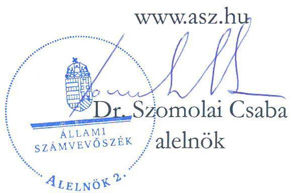
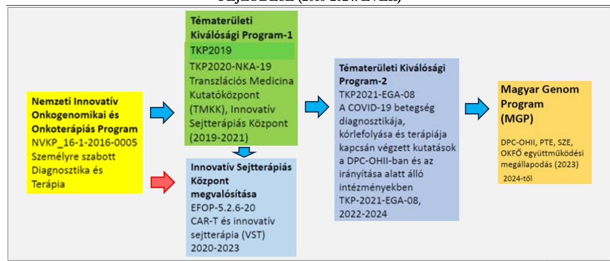
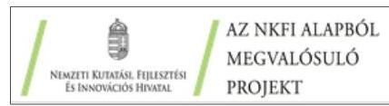
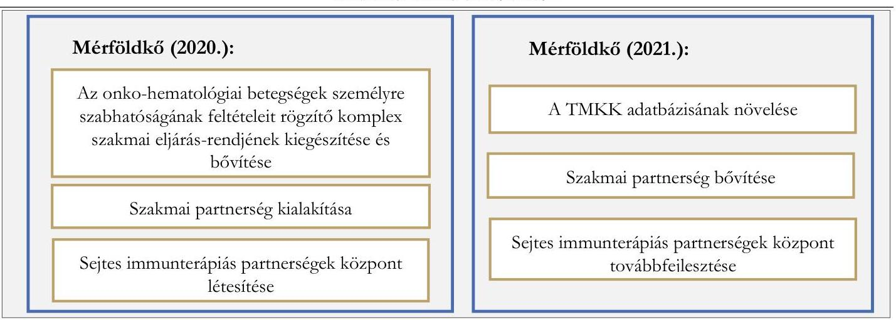
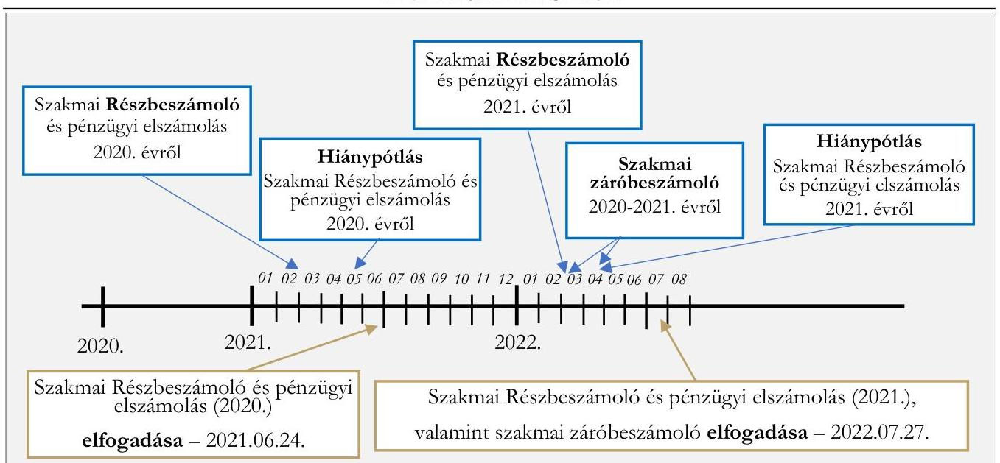
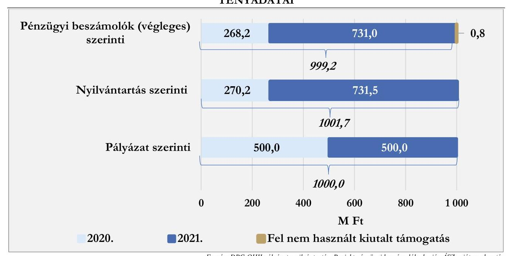
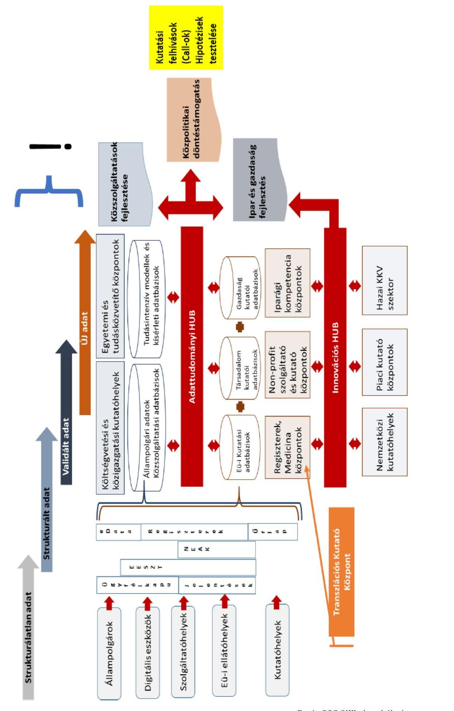

# JELENTÉS 

A kutatás-fejlesztésre és innovációra fordított
költségvetési kiadások célzott ellenőrzése a támogatást
felhasználó szervezetnél című ellenőrzésről

Transzlációs Medicina Kutatóközpont és Innovatív Sejtterápiás Központ létrehozása a Dél-pesti Centrumkórház - Országos Hematológiai és Infektológiai Intézetben

2025. 

25007
www.asz.hu

---

# JELENTÉS 

A kutatás-fejlesztésre és innovációra fordított
költségvetési kiadások célzott ellenőrzése a támogatást
felhasználó szervezetnél című ellenőrzésről

Transzlációs Medicina Kutatóközpont és Innovatív Sejtterápiás Központ létrehozása a Dél-pesti Centrumkórház - Országos Hematológiai és Infektológiai Intézetben

2025. 

25007

---

# ELLENŐRZÉSI IGAZGATÓSÁG: 

ÁLLAMHÁZTARTÁS KÖZPONTI SZINTJÉT ELLENŐRZŐ IGAZGATÓSÁG

ELLENŐRZÉSI IGAZGATÓ:
SINKÁNÉ DR. CSENDES ÁGNES IGAZGATÓ

## ELLENŐRZÉSVEZETŐ:

Jelentéseink az interneten a www.asz.hu címen olvashatók.

RENKÓ ZSUZSANNA ELLENŐRZÉSVEZETŐ

IKTATÓSZÁM: EL-4113-005/2025
TÉMASORSZÁM: -
ELLENŐRZÉS-AZONOSÍTÓ SZÁM: V106602

---

# TARTALOMJEGYZÉK 

AZ ELLENŐRZÉS ALAPADATAI ..... 5
AZ ELLENŐRZÉS HATÓKÖRE ÉS TERÜLETE - AZ ELLENŐRZÖTT SZERVEZET ..... 7
ÖSSZEFOGLALÁS ..... 9
AZ ELLENŐRZÉS FÓKUSZTERÜLETEI ..... 11
MEGÁLLAPÍTÁSOK ..... 12
JAVASLATOK ..... 18
MELLÉKLETEK ..... 19
I. sz. melléklet: Értelmező szótár ..... 19
II. sz. melléklet: Az ellenőrzött szervezetek jegyzéke ..... 22
III. sz. melléklet: Ellenőrzési kritériumok ..... 23
IV. sz. melléklet: A TMKK (Digitális Transzlációs Kutatóközpont) ökoszisztémája, az innovációs értéklánc elemei ..... 24
V. sz. melléklet: A Projekt pályázatában tett vállalások teljesítése ..... 25
FÜGGELÉK: ÉSZREVÉTELEK ..... 27
RÖVIDÍTÉSEK JEGYZÉKE ..... 28

---

.

---

# AZ ELLENŐRZÉS ALAPADATAI 

## AZ ELLENŐRZÉS CÉLJA

Az ellenőrzés célja annak értékelése volt, hogy biztosították-e a NKFI Alap¹-ból támogatott kutatásfejlesztési és innovációs tevékenység eredményének gazdasági és társadalmi hasznosítását; valamint megfelelő volt-e az NKFI Alap Kutatási Alaprészéből finanszírozott támogatás terhére elszámolt költségek elkülönített számviteli nyilvántartása az ellenőrzött kedvezményezettnél és Projekt²-nél.

Az ellenőrzés célja volt továbbá az ellenőrzésre kiválasztott Projekt közfinanszírozása célszerűségének és eredményességének elemzése.

## AZ ELLENŐRZÉS TÍPUSA

Kombinált ellenőrzés

## AZ ELLENŐRZÖTT IDŐSZAK

A Projekt támogatói okiratban rögzített kezdő időpontjától - 2020. január 1. - a 2024. évben a helyszíni ellenőrzés lezárásáig terjedő időszak.

## AZ ELLENŐRZÉS TÁRGYA

A NKFI Alap Kutatási Alaprészéből megvalósított Projekt eredményeinek gazdasági és társadalmi hasznosítása; az elért eredmények nyilvánosságának biztosítása; a Projekt megvalósítására elszámolt költségek elkülönített számviteli nyilvántartása, továbbá a Projekt közfinanszírozása célszerűségének és eredményességének elemzése.

## AZ ELLENŐRZÉS JOGALAPJA

Az ellenőrzés jogszabályi alapját az ÁSZ tv.³ 1. § (3) bekezdése, 5. § (2)-(3) bekezdései, valamint az Áht.⁴ 61. § (2) bekezdésének előírásai képezték.

## AZ ELLENŐRZÉS MÓDSZERE

Az ellenőrzés végrehajtására - a nemzetközi standardokat irányadónak tekintve - az ellenőrzési program szempontjai, kérdéskörei, az ellenőrzött időszakban hatályos jogszabályok és az ellenőrzött szervezet belső szabályai, valamint az ellenőrzés szakmai szabályok alapján - mintavételi eljárás alkalmazása nélkül - került sor.

---

Az ellenőrzési bizonyítékként felhasználható adatforrások közé tartoztak az ellenőrzött által átadott, valamint minden egyéb - az ellenőrzés folyamán feltárt, az ellenőrzés szempontjából információt tartalmazó - dokumentumok. Az ellenőrzési kérdések megválaszolásához szükséges bizonyítékok megszerzése a következő ellenőrzési eljárások alkalmazásával történt: adatbekérés, megfigyelés, kérdésfeltevés (információkérés), elemző eljárás.

Az ellenőrzés lefolytatásához az ellenőrzött szervezet dokumentumok, adatok, információk rendelkezésre bocsátásával, megküldésével szolgáltatott adatokat. Az ÁSZ⁵ az ellenőrzést a program kérdéseire adott válaszok kiértékelésével, valamint a programban ismertetett ellenőrzési kérdések, kritériumok, adatforrások között megjelölt adatforrások figyelembevételével folytatta le.

Az ÁSZ a projekt közfinanszírozásának célszerűségét és eredményességét a III. sz. mellékletben leírtak szerinti ellenőrzési kritériumok alapján értékelte.

Az ÁSZ ellenőrzés a projekt eredményeit igazoló dokumentumok körében felhasználta a kedvezményezett által rendelkezésre bocsátott szakmai és pénzügyi beszámolókat, a nyilvánosság felé kommunikált információkat, a projekt belső értékeléseit, valamint az NKFIH által a projektre, projektértékelésre vonatkozóan átadott releváns dokumentumokat, nyilvántartás kivonatokat.

---

# AZ ELLENŐRZÉS HATÓKÖRE ÉS TERÜLETE - AZ ELLENŐRZÖTT SZERVEZET 

## A támogatási program

A TKP2020⁶ az NKFIH⁷ (mint kezelő szerv) útján a NKFI Alapból meghirdetett és annak Kutatási Alaprészéhez tartozó pályázat, amelynek célja, hogy a felsőoktatási intézmények és állami kutatóhelyek szakmai kiválóságára építve, úgynevezett tématerületi kutatási programokat bonyolítsanak le. A pályázat „nemzeti kihívások" alprogramjában a 2019. évi TKP⁸ során megjelent kormányzati prioritások mentén támogatott tématerületi programok egyik kutatási területe az „Egészség" (orvostudományi és állatorvos-tudományi kutatások, gyógyszerkutatások, biológia, biotechnológia, kémia, transzlációs medicina, agykutatás, rákkutatás, biztonságos élelmiszer) volt, amelyben a nyertes pályázók körébe tartozott a DPC-OHII⁹.

## Az ellenőrzött szervezet és annak KFI¹⁰ tevékenysége

A DPC-OHII Magyarország egyik legnagyobb állami egészségügyi intézménye. A vérképző rendszeri és a fertőző betegségek vonatkozásában országos intézeti hatáskörrel, valamint speciális, magas technológiai igényű (HiTech) betegellátó és KFI képességekkel rendelkezik. Mint az ország legnagyobb onko-hematológiai és őssejt-transzplantációs központjának és mint országos intézetnek a feladata az onko-hematológiai megbetegedések molekuláris genetikai hátterének, kórokának és személyre szabott kezelésének kutatása és az alapkutatási eredmények klinikai hasznosításának, transzlációjának a koordinálása. Az ehhez szükséges feltételek biztosítása, fejlesztése, a Transzlációs Onko-Hematológiai Kutatási, Fejlesztési és Innovációs Központ kialakítása, a különböző, de nagyrészt kapcsolódó projektek láncolata - leginkább támogatási források igénybevételével - több évvel korábban megkezdődött és jelenleg is tart. Ezt szemlélteti az 1. ábra.
1. ábra

A DPC-OHII KUTATÁSI, FEJLESZTÉSI ÉS INNOVÁCIÓS TEVÉKENYSÉGÉNEK FOLYAMATA ÉS FEJLŐDÉSE (2016-2024. ÉVEK)

A TMKK¹¹ (Digitális Transzlációs Kutatóközpont) ökoszisztémáját, az innovációs értéklánc elemeit mutatja be a jelentés IV. sz. melléklete.

---

A DPC-OHII által kidolgozott 2019. évi hároméves szakmai program megvalósítása közvetlenül két egymáshoz kapcsolódó Tématerületi Kiválósági Programba tartozó 100%-os támogatási arányú projektben történt:

- 2019. évre (TKP2019) a „Transzlációs onko-hematológiai kutatási, fejlesztési és innovációs tevékenység a Délpesti Centrumkórbáz - Országos Hematológiai és Infektológiai Intézetében" című projekt, 500,0 M Ft¹² támogatással, 2019. 12. 31. határidő szerinti megvalósítással;
- 2020. és 2021. évekre (TKP2020) „Transzlációs Medicina Kutatóközpont (TMKK) és Innovatív Sejtterápiás Központ létrehozása a Dél-pesti Centrumkórbáz - Országos Hematológiai és Infektológiai Intézetben" című projekt (két évre szóló szakmai programmal), 500,0+500,0 M Ft, így együtt 1,0 Mrd Ft¹³ támogatással, 2021. 12. 31. határidő szerinti megvalósítással.

# Az ellenőrzött Projekt 

A TKP2020-NKP-19 sorszámú pályázatra kapott évenkénti 500,0 M Ft az átlagosan közel kétezer főt foglalkoztató DPC-OHII évenkénti költségvetési kiadásaihoz (41,8 Mrd Ft és 44,5 Mrd Ft) viszonyítva 1,2%-os, illetve 1,1%-os, a mérlegfőösszeghez (29,7 Mrd Ft és 32,0 Mrd Ft) viszonyítva 1,7%-os, illetve 1,6%-os arányt képviselt.

Az ellenőrzés tárgyát jelentő konkrét Projekt (TKP-2020-NKA-19 számú pályázat) célkitűzéseinek főbb elemeit, tervezett szakmai eredményeit mérföldkövenként (évenként) a 2. ábra mutatja be.
2. ábra

A TKP2020-NKA-19 PÁLYÁZATI PROJEKT TERVEZETT SZAKMAI EREDMÉNYEI MÉRFŐLDKÖVENKÉNT

Az ellenőrzött Projekt vezetőjének személye (kutatásvezető) nem változott, a DPC-OHII főigazgatói kinevezése szűnt meg 2024-ben, amikor új főigazgatót nevezett ki az Országos Kórházi Főigazgatóság vezetője az intézmény vezetésére.

Lényeges körülményként indokolt kiemelni, hogy a KFI tevékenység folyamatát befolyásolta a COVID¹⁵ időszaka. A DPC-OHII ugyanis a világjárvány elleni hazai küzdelem, és a vonatkozó kutatás-fejlesztés és a transzlációs feladatok ellátásának alap egészségügyi intézménye is volt egyszerre. A sejtterápiás indikációk esetén elengedhetetlen Intenzív Osztályt, illetve annak műszerpark kapacitását a Projekt megvalósítási időszakában lekötötte a COVID járványból következő többletfeladat.

---

# ÖSSZEFOGLALÁS 

A DPC-OHII-nél az alapvetően a TMKK és az Innovatív Sejtterápiás Központ megvalósítására irányuló Projekt közfinanszírozása célszerű és eredményes volt, a hasznosulás kiterjedése folyamatos. A DPC-OHII a Projekt költségeit elkülönítetten mutatta ki a számviteli nyilvántartásaiban.

A KFI tevékenység hatással van az ország versenyképességére, ezáltal a társadalmi-gazdasági fejlődésre. Magyarország KFI stratégiája célkitűzéseinek elérését az ösztönzés módja és a támogatásra fordított közpénz mértéke mellett a közfinanszírozás eredményes hasznosulását akadályozó körülmények és kockázatok feltárása is elősegíti. A KFI-s projektek ellenőrzésének megállapításai hozzájárulnak a támogatási rendszerre vonatkozó számvevőszéki tapasztalatok összegyűjtéséhez és ezek alapján intézkedési javaslatok, felvetések megtételéhez.

## A támogatott tevékenység eredményének gazdasági és társadalmi hasznosítása

A DPC-OHII - mint az ország legnagyobb onko-hematológiai és őssejt-transzplantációs központja hároméves szakmai programja végrehajtásának eredményeként kiépítette a Transzlációs Medicina Kutatóközpontot és az Innovatív Sejtterápiás Központot. Ehhez a 2019-ben az első éves ütemre elnyert és felhasznált 500,0 M Ft támogatás után, az ellenőrzés tárgyát képező külön Projektre 2020-2021. évekre a Tématerületi Kiválósági Program 2020 pályázatot elnyerve további 1,0 Mrd Ft-ot (500,0+500,0 M Ft-ot) kapott 2 évre. Az eredmények elérésének körülményeit nehezítette a COVID kiteljesedésének időszaka, hiszen a világjárvány elleni hazai küzdelem alap egészségügyi intézményének emberi és technikai erőforrásait jelentősen terhelte a vonatkozó ellátási, kutatás-fejlesztési és transzlációs feladatok megoldása.

A DPC-OHII a betegekkel kapcsolatos széleskörű adatok (betegszintű és populációs adatok, a molekuláris célpontokat tartalmazó adatbázis, az ellátás eredményességének és költséghatékonyságának mérését támogató adatbázis) és elemzési módszerek (hatásossági és költséghatékonysági modellek egységes standardok melletti vizsgálatának elvégzéséhez) kutatók számára elérhetővé válásának alapvető feltételeit kialakította. A Projekt eredményeként megvalósult annak a lehetősége, hogy egy új gyógyszer vagy más orvostechnikai eszköz, orvosi eljárás pontos indikációs körét, valamint a terápiás és költséghatékonyságát minél gyorsabban meg lehessen határozni. Az adatok rendszerezésével, strukturálásával, valamint a megfelelő információs technológiai módszerek alkalmazásával több év helyett akár hónapok alatt döntés tud arról születni, hogy mely betegek esetében érdemes (ajánlás, protokoll) egy új eljárást alkalmazni és a Nemzeti Egészségbiztosítási Alapkezelő által finanszírozni. Az adatbázisok az egyes beteg szintjén is jelentősen javítják a döntéselőkészítés és -támogatás minőségét, illetve az orvos és a beteg számára megkönnyítik és lerövidítik a döntéshozatalt, a személyre szabott orvoslást támogatják. Az Innovatív Sejtterápiás Központ - a szükséges infrastruktúra fejlesztésével - alapot teremtett CAR-T kezelés (a sejtterápiás és az immunterápiás eljárást ötvöző, személyre szabott, világszínvonalú innovatív terápiás eljárás), modern sejtterápiás eljárások alkalmazásához és továbbfejlesztéséhez.

A Projekt eredményeiről számos hazai és nemzetközi publikációban, egyéb célzott szakmai megjelenésekben információkat közöltek, illetve a honlapfelületen a szakmai program eredményeit röviden, a közérthetőségre törekedve a széles nyilvánosság számára is közzétették magyarul és angolul.

A COVID hátráltató körülménye mellett elsősorban a Projekt tartalmának jellege (az egészségügyi kutatásokon alapuló eljárások és gyógyszerek széles körben alkalmazhatóvá válásának jellemző időszükséglete) miatt a hasznosulás egyedi példákon túlmutató hatása alapvetően csak hosszabb távon lehet összegezhető. Az

---

elért eredmények hasznosulása kiteljesedésének körébe tartoznak azok a folyamatban lévő tárgyalások, amelyek a szakmai együttműködések mellett a további fejlesztések forrásához hozzájáruló bevételek elérését is szolgálják.

# A támogatás terhére elszámolt költségek elkülönített számviteli nyilvántartása 

A DPC-OHII a Projekt elszámolt költségei elkülönítésének követelményét és módját szabályozta, az elkülönítésről a törvényi előírás és a pályázati kiírás, valamint a támogatói okirat követelményének megfelelően a számviteli nyilvántartási rendszerében gondoskodott. A részbeszámolók és pénzügyi elszámolások NKFIH általi felülvizsgálataiban, hiánypótlásaiban kifogásolt egyes költségtételek miatt a Projekt végleges pénzügyi elszámolásában a számviteli nyilvántartásban kimutatott költségeknél alacsonyabb összegű támogatásfelhasználás került, így a megkapott előleghez képest támogatási maradvány keletkezett. A DPC-nél ennek tényét, illetve a visszafizetésnek az elmaradását a belső kontrollrendszer működésében a kontrolltevékenységek, és a nyomon követési rendszer nem tárták fel. A beszámolás NKFIH részéről történő elfogadásáról szóló értesítést követően közel kétéves késedelemmel - az NKFIH által kezdeményezett egyeztetés után, a Projekt tervezett támogatási összegének 0,08%-át jelentő 838530 Ft-tal - történt meg a maradvány
 visszafizetése.

## A Projekt közfinanszírozása célszerűsége és eredményessége

A szakmai program társadalmi fontosságát már a pályázat elfogadása elismerte. A megvalósított Projekt eredményességét a szakmai beszámolók tartalma, illetve annak NKFIH részéről történő támogatói elfogadása, valamint a TKP2020 soktényezős célrendszeréhez viszonyított teljesítése igazolta.

A Projekt közfinanszírozása több szempont szerint is célszerű volt. Hozzájárult az egészségügyi ellátás során keletkező adatvagyon széleskörű hasznosításához, előmozdította a transzlációs medicina térnyerését. A Projekt eredménye elősegíti az egészségügyi ellátás továbbfejlesztését.

A közpénzből finanszírozott Projekt a Támogatási szerződésben vállalt eredményeket elérte, így a Projekt közfinanszírozása eredményes volt.

---

# AZ ELLENŐRZÉS FÓKUSZTERÜLETEI 

1. A támogatott projekt eredményeinek hasznosítása
2. A projekt kiadásainak elkülönített nyilvántartása

---

# 1. A támogatott projekt eredményeinek hasznosítása 

Összegző megállapítás

A DPC-OHII által végrehajtott Projekt eredményes és célszerű közfinanszírozással valósult meg. Az elért eredményekkel megteremtették a várható további hasznosulás alapvető feltételeit, a hasznosulás kiteljesedése folyamatos.

## A beszámolási kötelezettség teljesítése

A DPC-OHII a KFI tv. ${ }^{16}$ előírásában, a pályázati kiírásban és a támogatói okiratban ${ }^{17}$ megjelenő követelményekben előírt adatszolgáltatási, beszámolási, illetve kapcsolódó hiánypótlási kötelezettségeinek - az előírásokban foglaltaknak megfelelő határidőben és tartalommal - eleget tett.
A részbeszámolások, a pénzügyi elszámolások és a hiánypótlások benyújtásának - mint az alapvető adatszolgáltatási kötelezettségek teljesítésének -, valamint azok NKFIH részéről történő elfogadásainak időbeni alakulását szemlélteti a 3. ábra.
3. ábra

A BESZÁMOLÓK ÉS HIÁNYPÓTLÁSOK BENYÚJTÁSÁNAK ÉS ELFOGADÁSAIKNAK AZ IDŐBENI ALAKULÁSA

A DPC-OHII rendelkezett az NKFIH által kiadott, az Ávr. ${ }^{18}$ szerinti értesítéssel a Projekt eredményességének, hasznosulásának önértékelését is tartalmazó záró szakmai beszámoló elfogadásáról.

---

# A Projekt megvalósításának eredményei, vállalásainak teljesítése 

A támogatott Projekt KFI tv. előírásainak, a pályázati kiírás és támogatói okirat követelményeinek megfelelően elkészített szakmai záróbeszámolóban részletezett eredmények kiemelt elemeit a 4. ábra foglalja össze.
4. ábra

## A SZAKMAI ZÁRÓBESZÁMOLÓBAN RÉSZLETEZETT EREDMÉNYEK KIEMELT ELEMEI

## Mérföldkő (2020.):

Az onko-hematológiai betegségek személyre szabhatóságának feltételeit rögzítő komplex szakmai eljárásrendjének kiegészítése és bővítése:
A 2019 során már vizsgált betegség újabb betegei, további indikációkkal kezelt betegcsoportok bevonásával.

## Szakmai partnerség kialakítása:

Ágazatirányítási partnerségek kialakítása szakfőosztályokkal, szakértői munkacsoportokkal, Nemzeti Betegségregiszterek fenntartói irányába. KFI együttműködések kialakítása TMKK vagy partnerei által kedvezményezett kutatások mentén. Hazai és nemzetközi gyógyszergyártók, egészségügyi intézmények, egyetemek, tudásintenzív vállalkozások és szakmai műhelyek körébe tartozó egyes partnerek.

## Sejtes immunterápiás partnerségek központ létesítése:

Nemzetközi akkreditációjú sejtterápiás labor kialakításának megkezdése vírusspecifikus T-sejt és CAR-T sejt termékek előállításának kiszolgálására.

## Mérföldkő (2021.):

## A TMKK adatbázisának növelése:

Korábban megkezdett betegség, illetve betegségcsoportok új eredményei, bővítés újabb lymphoma betegségek bevonásával.

## Szakmai partnerség bővítése:

Korábbi ágazatirányítási partnerségek továbbfejlesztése, információs rendszerekbe, szakmai modulokba való integráció. KFI együttműködések elmélyítése és kiterjesztése valamennyi hazai onko-hematológiai centrumra, nemzetközi együttműködés lehetőségeinek keresése, kiemelten az európai és visegrádi országok hasonló tevékenységet folytató kutatási központjaival.

## Sejtes immunterápiás partnerségek központ továbbfejlesztése:

A nemzetközi akkreditáció (JACIE) megkezdése és a mesenchymalis őssejt terápia bevezetése és alkalmazása. A sejtterápiás labor vírusspecifikus T-sejt és CAR-T sejt termékeinek előállítása több daganat típus betegére vonatkozólag hazai és nemzetközi viszonylatban.

Forrás: A támogatott Projekt szakmai záróbeszámolójia alapján ÁSZ saját szerkesztés
A szakmai program 2020-2021. évekre tervezett célkitűzéseit, az eredménycélok rész és záró szakmai beszámolókban részletezett megvalósítását - a hiánypótlásban közölt tények, indokolások figyelembevétele után - az NKFIH elfogadó levelei (nyilatkozatai) visszaigazolták.
A DPC-OHII a szakmai záróbeszámolójában az NKFIH által meghatározott beszámoló sablon követelményeinek megfelelően kimutatta a kötelező vállalásokat és indikátorokat - részben szövegesen kifejtve, több területen konkrét cél- és tényadatokkal - a következő témakörökben:

- A kutatási feltételrendszer javításához való hozzájárulás (szövegesen kerültek kifejtésre a Projekt eredményeinek további kutatásokhoz kialakított adattárházi és informatikai feltételek);
- A PhD hallgatók részvételének, a kutatói utánpótlás helyzetének erősítése (indikátorok értékeivel mutatták ki az elvártnál kedvezőbb változás tényét, illetve részben indokolták szövegesen alapvetően a COVID járvány miatti erőforrásátrendezésre utalva - egy mutatónál az elmaradást);
- A tudományos produktivitás javítása (cikkek, publikációk címei és elérhetősége mellett konkrét indikátorok, amelyek rendre megfeleltek a tervezettnek, vagy meg is haladták azokat);
- A kutatás eredményeinek társadalmi, gazdasági hasznosítása (alapvető irány a betegellátási, kutatási eredményeket és innovatív információtechnológiai megoldásokat továbbfejlesztve, kutatói,

---

diagnosztikai, terápiás indikátorrendszerek, új egészségügyi és egészségipari szolgáltatások és az azokat támogató informatikai megoldások kialakításának elindítása volt);

- A nemzetközi kutatói közösségbe történő beágyazottság erősödése (tervezettnél több kongresszus, konferencia, programsorozat részvételt igazoltak, míg a TMKK-ról szóló önálló beszámolás elmaradását a járványhelyzet hatásai mellett alkalmazott más módszerű ismertetéssel indokolták);
- A más KFI szereplőkkel történő együttműködés (bemutatásra került, hogy a hazai partnerekkel fenntartott támogatásjellegű együttműködés darabszámának és az együttműködés kimutatás szerinti értéke a célérték szerint alakult, valamint lehetőség nyílt a klinikai hálózatos kapcsolatrendszer kialakítására);
- Az üzleti vagy társadalmi hasznosíthatóság biztosítása (az adatbázisok hozzáférhetősége hozzájárul az orvosi eljárás pontos indikációs körének gyorsabb meghatározásához, a hasznosulás kiteljesedéséhez, ugyanakkor a járványhelyzettel indokolva a nemzetközi partnerekkel a bevételt eredményező üzleti jellegű együttműködés még a tárgyalások folyamatánál tart).
A Projekt pályázatában tett vállalások teljesítését - a kapcsolódó indikátorok cél és tényadatait is bemutatva - a jelentés V. sz. melléklete tartalmazza.

# A Projekt eredményeinek nyilvánossága 

Az NKFIH által kiadott és a támogatott szervezetekre nézve kötelezően alkalmazandó Nyilvánossági szabályzat ${ }^{19}$ szempontrendszert, kommunikációs követelményeket határozott meg, amelyhez vizuális elemeket tartalmazó arculati kézikönyv is kapcsolódott. A támogatott Projekt előkészítő, megvalósító és megvalósítást követő szakaszai szerint határozott meg tájékoztatási kötelezettségeket. A DPC-OHII a pályázati kiírás szerinti összefoglalókészítési és honlapon történő tájékoztatási, sajtóközlemény közzétételi, meghatározott formátumú tájékoztató tábla kihelyezési, fotódokumentáció készítési, projektzáró közlemény és eredménykommunikáció közzétételi kötelezettségeinek megfelelően eleget tett.
A projekt eredményeként hazai és nemzetközi publikációk (21 db) tájékoztatták a nyilvánosságot, amelyek tudományos folyóiratcikkek, szakmai előadások és konferenciaabsztraktok voltak. A 3 éves szakmai programot figyelembe véve - az ellenőrzött támogatási Projektnél szélesebb időintervallumot tekintve ennél is több, elsősorban szakmai megközelítésű megjelenés történt.
A DPC-OHII honlapján a Hazai projektek almenüben közzétette a 3 éves szakmai programjához kapcsolódóan megnyert pályázatai főbb adatait és röviden bemutatta a Projekt tartalmát. TMKK honlapfelület Lezárt pályázatok almenüjében megtalálható TKP 2019-2021 időszakban az elért eredmények széles nyilvánosság számára közzétett összefoglalása. A közzétett eredményismertetés szövegazonos a szakmai záróbeszámoló tájékoztató jellegű - 3 éves szakmai értelemben vett megvalósítási időszakra vonatkozó - összegzésével. A szakmai záróbeszámoló megfelelt a támogatói okiratban előírt feltételeknek mind az időszak, mind a közérthetőség stb. szempontjából.
Az ÁSZ véleménye szerint a TMKK honlapján közzétett információk köréből az ÁSZ ellenőrzésig hiányzott két lényeges, célszerűen bemutatandó információ. Ez másutt (a pályázatok elnyeréséről közzétett információk között) megtalálható ugyan, de az eredmények bemutatása körében is célszerű nem csupán a TKP2019-es projekt címére és elnyert támogatási összegére, hanem a TKP2020-as Projekt címére és elnyert támogatási összegére is utalni. A széles közvélemény megfelelő tájékoztatásához tartozik annak bemutatása, hogy az elért eredményeket két projektből 1,5 Mrd Ft

---

támogatás finanszírozta. A DPC-OHII ezen információkkal az ÁSZ ellenőrzés hatására, annak felvetését hasznosítva kiegészítette a 3 éves szakmai program eredményeiről szóló tájékoztatót a TMKK.dpckorhaz.hu felületen.

# A Projekt közfinanszírozásának eredményessége és célszerűsége 

A TMKK révén több betegcsoportnál kialakításra került, illetve bővült a rosszindulatú vérképzőszervi betegségek strukturált klinikai és onkogenomikai adatbázisa. Folytatódott a célzott gyógyszerkutatáshoz szükséges másodlagos adatbázis kiépítése, amely tartalmazza a személyre szabott gyógyszerek célpontjait. A gyógyszercélpontok és azok gyakoriságának ismerete rendkívül fontos információ új terápiás protokollok kialakításához. A DPC-OHII továbbfejlesztette a meglévő kutatási infrastruktúráját és nemzetközi szinten is érdeklődésre számot tartó onko-hematológiai adatbankját. A betegszintű és populációs adatok, a molekuláris célpontokat tartalmazó adatbázis, az ellátás eredményességének és költséghatékonyságának mérését támogatja. Az adatokban rejlő tudományos és innovációs lehetőségek kiaknázásához a hazai kutatók, vállalkozások segítségével végzett közös obszervációs elemzések járulnak hozzá. Alapvető lépések történtek annak megvalósításában, hogy Magyarország első nemzetközi akkreditációval rendelkező sejtterápiás központjának kialakítása megtörténjen a DPC-OHII-ban.
A Projekt a TKP2020 célrendszere alapkövetelményeit teljesítette:

- Jelentős tudományos újdonságtartalommal rendelkező szolgáltatás került kifejlesztésre, amelynek eredményeként megkezdődött a létrejövő feltételrendszer, szolgáltatás társadalmi és üzleti hasznosítása, valamint az ösztönző hatás alapján annak kiszélesedése várható;
- A kutatási feltételrendszer javult, tökéletesedett;
- A kutatói utánpótlás fellendítésében szerepet vállalt;
- A nemzetközi kutatói közösségbe történő beágyazottság fokozódott;
- A kutatásfejlesztés fókuszban volt a kutatóhely működésében;
- Sor került - különösen a támogatott projektek láncolatában - más KFI szereplőkkel történő együttműködésre.
A megvalósított Projekt közfinanszírozása a társadalmi fontosság, a DPC-OHII záró szakmai beszámolója, illetve annak NKFIH részéről történő támogatói elfogadása, valamint a TKP2020 célrendszerének teljesítése alapján eredményesnek minősíthető. A Projekt közfinanszírozása az egészségügyi ellátás során keletkező adatvagyon közcélú hasznosításának, a transzlációs medicina kiszélesítésének és a társadalmi jóléthez való hozzájárulás elősegítésének szempontjai alapján célszerű volt. A továbbfejlesztéséhez a hosszabb távú üzleti hasznosításból származó bevételek is forrást biztosíthatnak.
A Projekt eredményei, hasznosulása - a fenntarthatóság biztosításával - a jövőbeni társadalmi jóléthez járulhat hozzá.
A közpénzből finanszírozott Projekt a Támogatási szerződésben vállalt eredményeket elérte, így a Projekt közfinanszírozása eredményes volt.

---

# 2. A projekt kiadásainak elkülönített nyilvántartása 

| Összegző megállapítás | A DPC-OHII a Projekt kiadásainak elkülönített   nyilvántartására vonatkozó előírásokat betartotta,   ugyanakkor a támogatás maradványának visszafizetése a   záróbeszámoló elfogadását követő közel két év elteltével   történt meg. |
| :-- | :-- |

## Az elkülönített nyilvántartásra vonatkozó szabályozás

A DPC-OHII a Projekt kiadásainak elkülönített nyilvántartásáról az Áht., a Számv. tv. ${ }^{20}$, a pályázati kiírás és a támogató okirat vonatkozó előírásainak megfelelő belső szabályozást készített. Az ellenőrzött Projekt megvalósítása alatt hatályban lévő (2019.06.17-től hatályos) a „Meghatározott feladat ellátására kapott eseti bevétellel, vagy támogatással összefüggő költségek megosztásának rendje" című, SZ-15 számú belső szabályzatban előírta a támogatott projektek - közte az NKFIH-s pályázatok - megvalósítására fordított kiadások egyedi elkülönítésének követelményét. A szabályzat a következő előírásokat határozta meg:

- A támogatási szerződés, valamint egyéb megállapodás szerint utalt pénzeszköz felhasználása az engedélyezett költségterv alapján történhet.
- Az átvett pénzeszközökről meghatározott tartalmú átadónkénti nyilvántartást kell vezetni.
- Az átvett pénzeszközök bevételei a főkönyvi nyilvántartásban feladatkódokkal elkülönítetten kerülnek nyilvántartásra, e bevételek terhére történő kiadások esetében is hasonlóan kell eljárni.
- Az analitikus nyilvántartásért és elszámolásért a pénzügyi csoportvezető felelős.

## A Projekt kiadásainak elkülönített nyilvántartása

A Projekt kiadásait a Számv. tv.-ben, a pályázati kiírásban, a támogatói okiratban és a belső szabályozásban előírtaknak megfelelően a DPC-OHII elkülönítetten tartotta nyilván. A pályázat szerinti tervezett, a feladatkód szerinti elkülönítésen alapuló főkönyvi nyilvántartás szerinti tény, az elfogadott pénzügyi részbeszámolók szerinti kimutatások és az NKFIH és DPC-OHII közötti egyeztetést követő pénzügyi (maradvány) rendezést is tartalmazó adatokat a következő ábra mutatja be.

---

*Fonrás: DPC-OHII pályázat, nyilvántartás. Projekt pénzügyi beszámolók alapján ÁSZ saját szerkesztés*
Az ábrából látható, hogy a nyilvántartásban 1,7 M Ft-tal magasabb összegű volt az ellenőrzött Projektre elkülönített kiadás, mint a pályázatban szereplő. A Projekt
 kiadásainak elkülönített nyilvántartásába olyan tételek is bekerültek, amelyeket a részbeszámolási folyamatokhoz kapcsolódó felülvizsgálat és hiánypótlás során nem fogadott el a Projekt költségeként az NKFIH.

### *A maradvány visszafizetési kötelezettség teljesítése*

A benyújtott rész- és záró szakmai beszámoló és pénzügyi elszámolás 2022.07.27-ei elfogadását követően a DPC-OHII-nek 838,5 E Ft21 támogatás visszafizetési kötelezettsége keletkezett. Az Ávr.-ben és a támogatói okiratban nevesített visszafizetési kötelezettségre irányuló kommunikáció az NKFIH és a DPC-OHII között elhúzódott. A DPC-OHII-nél a Bkr.22 8. § (2) bekezdés a) pontja szerinti kontrolltevékenység, valamint a Bkr. 10. § szerinti nyomon követési rendszer nem működött megfelelően, mivel nem tárta fel a támogatással való elszámolásához kapcsolódó maradvány rendezését kezdeményező dokumentum, illetve a visszautalás hiányát.

A felvett támogatási előleg maradványának visszafizetésével kapcsolatos egyeztetést az NKFIH 2024. májusában – az ÁSZ ellenőrzés megkezdését követően – kezdeményezte. Az összeg visszautalására az NKFIH és a DPC-OHII közötti többkörös egyeztetés után, a beszámoló elfogadását követően két évvel, 2024. július 24-én került sor. A visszafizetett maradvány a támogatás összegének 0,08%-a volt.

---

# JAVASLATOK 

Az ÁSZ tv. 33. § (1) bekezdésében foglaltak értelmében az ellenőrzött szervezet vezetője köteles a jelentésben foglalt megállapításokhoz kapcsolódó intézkedési tervet összeállítani és azt a jelentés kézhezvételétől számított 30 napon belül az ÁSZ részére megküldeni. Amennyiben az ellenőrzött szervezet vezetője nem küldi meg határidőben az intézkedési tervet, vagy továbbra sem elfogadható intézkedési tervet küld, az Állami Számvevőszék elnöke az ÁSZ tv. 33. § (3) bekezdése a) és b) pontjaiban foglaltakat érvényesítheti.

## A DPC-OHII FŐIGAZGATÓJÁNAK

1. A Bkr. 13. § (2) bekezdésében foglaltak alapján tegyen intézkedést a 8. § (2) bekezdés a) pontja szerinti kontrolltevékenység továbbá 10. § szerinti nyomon követési rendszerelem kiépítésére és/vagy megfelelő működtetésére, amely megelőzi a jelentésben leírt - a maradvány visszafizetési kötelezettség teljesítésének jelentős késedelmével járó - szabálytalanság ismételt előfordulását.

---

# MELLÉKLETEK 

## I. SZ. MELLÉKLET: ÉRTELMEZŐ SZÓTÁR

CAR-T kezelés
gyógyszercélpont
jólét
kedvezményezett
konferenciaabsztrakt
kutatás-fejlesztési és innovációs program

A CAR-T (kiméra antigén receptor) kezelés egy, a sejtterápiás és az immunterápiás eljárást ötvöző, személyre szabott, világszínvonalú innovatív terápiás eljárás, mely a daganatos CAR-T kezelés a hagyományos kezeléssel nem gyógyítható hematológiai daganatos betegségekre (egyes leukémiák és limfómák) irányul. A kezeléshez a beteg saját immunsejtjeit (T-sejtek) használják. Az immunsejteket speciális eljárással gyűjtik a beteg véréből és genetikai módszerrel a megbetegedést okozó daganatsejteket felismerni képes molekulákat hoznak létre a felszínükön. A beteg így módosított immunsejtjei a CAR-T sejtek. Kezeléskor a CAR-T sejteket infúzióban visszajuttatják a beteg keringésébe, ahol a CAR-T sejtek felismerik és kapcsolódnak a daganatsejtekhez, majd aktiválódás és toxinkibocsátás után elpusztítják azokat.
(Forrás: https://www.dpekorbar.hu/wp-
content/uploads/2021/01/EFOP526_nyomtatott_lakossagi_tajekoztato_210127.pdf)
A gyógyszercélpont (gyógyszerészeti szakkifejezés) szűkebb értelemben a szervezetünknek egy olyan molekulája (általában fehérje), melyről azt gondoljuk, hogy a biológiai szerepe összefügg egy kiválasztott betegséggel, és hogy működésének farmakológiai befolyásolása kedvező hatású lehet az adott betegségben vagy annak megelőzésében (molekuláris gyógyszercélpont). Tágabb értelemben azonban a célpontválasztáshoz tartozik magának a gyógyítani vagy megelőzni kívánt betegségnek a kiválasztása - sőt ezt megelőzően annak a nagyobb terápiás területnek a kiválasztása is, melyhez a kezelni kívánt betegség tartozik.
(Forrás: https://mersz.hu/dokumentum/gyogysz_117/)
Az 1960-as évektől kezdték keresni az egyes államok fejlettségének mérésének, olyan lehetőségét, mely túlmutat az egy főre jutó GDP-n, és olyan más mutatókat is figyelembe vesz, mint a születéskor várható átlagos élettartam, a csecsemőhalandóság, az iskolai végzettség stb. Ebből alakult ki az a gondolat, hogy a fejlettség mellett vagy helyett a jólétet kell mérni. A jólét sokdimenziós fogalom, a jövedelmen és a fogyasztáson kívül beletartozik az egészségi állapot, a műveltség, a közbiztonság, a szabadon beosztható idő stb.
(Forrás: https://lexikon.uni-nke.hu/szecikk/jolet/)
Az ellenőrzött szervezet az ellenőrzési program szerint: Dél-pesti Centrumkórház - Országos Hematológiai és Infektológiai Intézet
Lényegében egy kivonat, egy hosszabb tartalom rövid, velős és érthető összefoglalása.
(Forrás: https://akcongress.com/blog/konferenciaabsztrakt/)
A közfinanszírozású támogatási forrás céljának elérését szolgáló, vagy meghatározott témakörbe csoportosítható kutatás-fejlesztési vagy innovációs projektek megvalósításának támogatására kiírt pályázatok időben megismételt sorozata, illetve támogatási intézkedés.
(Forrás: KFI tr. 3. § 13. pontja)

---

Nemzeti Kihívások Alprogram
kutatás-fejlesztési és innovációs projekt
obszerváció
onkogenomika
onko-hematológiai betegségek
tématerületek
2019. évi Tématerületi Kiválósági Program (TKP) során megjelent kormányzati prioritások mentén támogatott tématerületi programjai. A tématerületi programokat a TKP során meghatározott négy kutatási terület (Biztonságos társadalom és környezet, Egészség, Ipar és digitalizáció, Kultúra és család) valamelyikébe kell sorolni. A 2019-ben támogatást nyert és folytatni kívánt tématerületi programokat a fent megjelölt célok megvalósításának figyelembevétele mellett szükséges szakmailag továbbfejleszteni. Az alprogram keretében benyújtott tématerületi kutatásoknak továbbá illeszkedniük is kell a TKP Program által társadalmi kihívásokként definiált célokhoz, melyek az alábbiak: 1.) Innováció a versenyképességért (fenntartható növekedés, technológia, ipar, innováció); 2) Tudomány a jövőnkért (tudomány a magyar közösségért, természeti és környezeti kihívások, nemzetközileg elismert tudományos eredmények, tudományos eredmények hasznosítása); 3) Nemzedékek életkilátásai (magyarság, népesedés, elöregedő társadalom, migráció, iskolázottság és mobilitás, egészségi állapot, ifjúság, életszínvonal, területi felzárkózás, családok és közösségek).
(Forrás: TKP2020 pályázati kiírás 1. fejezeté)
Meghatározott kutatás-fejlesztési feladat vagy innovációs folyamat végrehajtására irányuló tevékenység az abban érdekeltek által meghatározott terv alapján.
(Forrás: KFI tv. 3. § 19. pontja)
Megfigyelés, tudományos megfigyelés; észrevétel, észlelés, észlelet; törvény, szabály stb. megtartása.
(Forrás: https://idegen-szavak.hu/obszerváció)
Az onkogenomika a daganatokkal kapcsolatos összes molekuláris kérdést magában foglalja. A génhibák lehetnek veleszületettek vagy szerzettek. Utóbbiak között fizikai, kémiai és biológiai tényezők által okozottakat egyaránt találhatunk, amelyek közösek abban, hogy közvetve vagy közvetlenül a DNS-t károsítják. A daganatok keletkezése és növekedése során elsősorban azok a szabályozási elemek (gének és géntermékek, azaz fehérjék) "romlanak el", amelyek a sejtek túlélését és ezen belül szaporodását, valamint a sejtek halálát befolyásolják.
(Forrás: http://epa.niif.hu/00600/00691/00020/04.html)
A vérképzőszervek daganatos elváltozásai, amelybe többek között a különböző leukémiák, limfómák és a myeloma multiplex is tartoznak.
(Forrás: https://www.webbeteg.hu/cikkek/leukemia_limfoma/29144/verkepzoszervi-daganatos-betegsegek-diagnosztikaja)
Olyan tudományágakat átfogó kutatási területek, amelyek aktuális, társadalmi-gazdasági, környezeti vagy technológiai problémákra keresik a választ. A tématerületek meghatározása során a kutatás-fejlesztés és innováció minden szegmensét szem előtt kell tartani, a kutatástól a piaci hasznosításig. A tématerületek kijelölése során előnyben kell részesíteni azokat a területeket, ahol a tudományos eredmények piacosítása valószínűsíthető, vagy folyamatban van. A tématerületi kutatási és innovációs programokat legalább két, optimális esetben ennél több tudományág szoros együttműködésére szükséges építeni.
(Forrás: TKP2020 pályázati kiírás 1. fejezeté)

---

Tématerületi Kiválósági Program 2020

Trade-Mark
transzláció
transzlációs medicina

T-sejtek

Az Innovációs és Technológiai Minisztérium (mint támogató) által a Nemzeti Kutatási, Fejlesztési és Innovációs Hivatal (mint kezelő szerv) útján a NKFI Alapból meghirdetett pályázati kiírás, amelynek célja, hogy a felsőoktatási intézmények és állami kutatóhelyek szakmai kiválóságára építve, úgynevezett tématerületi kutatási programokat bonyolítsanak le annak érdekében, hogy
a) jelentős tudományos és/vagy műszaki újdonságtartalommal rendelkező termék, technológia vagy szolgáltatás kifejlesztésre kerüljön, és/vagy;
b) a tématerületi kutatás eredményeként létrejövő termék, technológia vagy szolgáltatás üzletileg hasznosítható legyen, és/vagy;
c) a kutatási feltételrendszer tökéletesedjen;
d) a kutatói utánpótlás fellendüljön;
e) nemzetközi kutatói közösségbe történő beágyazottság fokozottabb legyen;
f) a kutatásfejlesztési és innovációs fókusz kifejezettebb legyen a felsőoktatási intézmények és kutatóhelyek működésében;
g) a kutatások eredményei társadalmi, gazdasági, környezeti szempontból hasznosuljanak, az ezeket célzó kezdeményezéseket támogassa;
h) sor kerüljön más KFI szereplőkkel történő együttműködések megteremtésére;
i) a tématerületi kutatás eredményeként létrejövő termék, technológia vagy szolgáltatás üzleti vagy társadalmi hasznosíthatóságát ösztönözze.
A TKP Program szakmai és pénzügyi folytatása a 2019. évi Felsőoktatási Intézményi Kiválósági Programnak (továbbiakban: FIKP) és a 2019. évi Tématerületi Kiválósági Programnak. A pályázat keretében „intézményi kiválóság" és „nemzeti kihívások" alprogram kerül meghatározásra.
(Forrás: TKP2020 pályázati kiírás 1. fejezeté)
Védjegy
(Forrás: https://topszotar.hu/angolmagyar/trademark)
átültetés
(Forrás: https://idegen-szavak.hu/transzláció)
A transzlációs medicina hidat képez a klinikai és az alapkutatások között. Egy gyűjtőfogalom, amely preklinikai kutatási eredmények „átfordítását" jelenti a mindennapi klinikai gyakorlatba és betegellátásba, vagyis fogalmazhatunk úgy is, a laboratóriumtól a betegágyig (from bench to bedside). A transzlációs medicina magában foglalja az alapkutatások betegségek kialakulásának megértésére vonatkozó kísérleteit, a gyógyszertámadáspontok megtalálását, a humán terápiákban alkalmazható hatásvizsgálatát, a humán betegségek biológiai vizsgálatát, és az új fejlesztéseket a humán betegségek kezelésében. De idesorolhatók azok a nem humán vagy nem klinikai vizsgálatok, melyek alapját képezhetik a jövőben új klinikai alkalmazásoknak, illetve a gyógyszerfejlesztések klinikai 1-3. fázisában lévő kísérletek is. (Maria Sznol, a Journal of Translational Medicine szerkesztő bizottsági tagja nyomán)
(Forrás:http://metaveb.hu/wpcontent/uploads/Transzf%C3%A1cl%C3%B3s-medicina-a-pankreatol%C3%B3gl%C3%A1ban.pdf)
A T-limfociták vagy T-sejtek a fehérvérsejtek egyik alcsoportja, amely központi szerepet játszik a sejtes immunválasz működésében. Más limfocitáktól (mint B-limfociták, természetes ölősejtek) a felületükön található T-sejt-receptor által különíthetőek el.
(Forrás: https://hu.wikipedia.org/wiki/T-limfocita)

---

# II. SZ. MELLÉKLET: AZ ELLENŐRZÖTT SZERVEZETEK JEGYZÉKE 

## ELLENŐRZÖTT SZERVEZET NEVE ADOSZÁM

Dél-pesti Centrumkórház - Országos Hematológiai és Infektológiai Intézet

---

# 111. SZ. MELLÉKLET: ELLENŐRZÉSI KRITÉRIUMOK 

## FOKUSZTERÜLET

1. A támogatott projekt eredményeinek hasznosítása
2. A projekt kiadásainak elkülönített nyilvántartása

## ELLENŐRZÉSI KRITÉRIUMOK

KFI tv. 22. §, 23. § (2) és (3) bekezdések, 27. §; Ávr. 93. § (1) bekezdés és 94. § (1) bekezdés; Pályázati kiírás 13. Nyomonkövetés címú fejezete; Támogatói okirat 5. A Kedvezményezett elszámolási és beszámolási kötelezettsége címú fejezete és a 11. Egyéb rendelkezések címú fejezet 11.7. és 11.8. pontjai;
Nyilvánossági szabályzat Tájékoztatási és nyilvánossági szempontrendszer, forma címú fejezete;
A projekt közfinanszírozása akkor célszerű, ha a támogatott tevékenység a társadalom egészére, illetve a nagy részét közvetlenül vagy közvetve érintő területekre irányul, és a jövőben is tovább hasznosítható, fenntartható teljesítményeket ér el.
A projekt közfinanszírozása akkor eredményes, ha az elfogadott pályázatban megfogalmazott eredménycélokat a pályázati kiírás, valamint a támogatási szerződés előírásai szerint, a beszámolási kötelezettsége teljesítésével igazolt módon eléri, és a közfinanszírozás célszerű.
Számv. tv. 161/A. § (2) bekezdés; Ávr. 94. § (1) bekezdés; Bkr. 8. § (2) bekezdés a) pontja és 10. §; Pályázati kiírás 13.2. pontja; Támogatói okirat 5.10. és 5.16. pontjai;

---

IV. SZ. MELLÉKLET: A TMKK (DIGITÁLIS TRANSZLÁCIÓS KUTATÓKÖZPONT) ÖKOSZISZTÉMÁJA, AZ INNOVÁCIÓS ÉRTÉKLÁNC ELEMEI

---

a) A kutatási feltételrendszer javításához való hozzájárulás körében a dokumentum összefoglalta a szakmai program szövegesen kifejtett vállalásai végrehajtásának későbbi kutatásokat támogató elsősorban informatikai támogatást, szükséges információkat biztosító eredményeit. Az intézményi adattárházban a beérkezett adatok feldolgozásra kerültek, strukturáltan rendezettek, az elektronikus könyvtár biztosítja a kutatóknak, illetve a hallgatói, PhD képzések számára a háttérinformációkat. A TMKK-MP ${ }^{23}$ kutatásmenedzsment platformként alkalmas lett tetszőleges idejű, tartalmú kutatási projektek megvalósításának informatikai támogatására.
b) A PhD hallgatók részvételének, a kutatói utánpótlás helyzetének erősítése igazolására a beszámoló számszerű adatokat közölt, amelyből kiderült, hogy a fokozattal rendelkezők és a PhD képzésben/eljárásban résztvevők teljes munkaidő-ráfordítása ténylegesen meghaladta a szakmai programban vállalt célértéket (1,28 és 0,08 célértékkel szemben 1,33 és 0,19 ténylegesen). A fiatal kutatók hasonló mutatója a célértéket nem érte el (0,2 célértékkel szemben 0,139 ténylegesen). A DPCOHII az NKFIH felé hiánypótlásként megküldött levelében az eltérést alapvetően a COVID miatti veszélyhelyzettel összefüggő és kutatói feladatokat is érintő átvezénylésekkel megindokolta, valamint jelezte, hogy összességében a munkaráfordítási tervszámot elérte.
 Az NKFIH az indokolást nem kifogásolta. Az elindított szellemi jogvédelmi bejegyzések számaként a 3 db célértékkel szemben 2 db folyamatban lévő eljárásra utalás volt a szakmai beszámolóban, de hiánypótlásként a DPC-OHII 1 további eljárás megkezdését jelentette az NKFIH felé. A sok génes hematológiai panel hasznosulását validálták, a Trade-Mark bejegyzést jelen ÁSZ ellenőrzés felé is igazolták.
c) A produktivitás javítását a tudományos dokumentumok elérési helyet is megjelölő hazai és nemzetközi publikációk felsorolásával (2020-ra 6, 2021-re 15 publikációt jelöltek meg, amelyek 57\%-a tudományos folyóiratcikk, $24 \%$-a szakmai előadás, $19 \%$-a konferenciaabsztrakt volt) igazolta a DPC-OHII. A tudományos produktivitás indikátorainak kiemelt - közte egyes folyóiratrangsor ${ }^{24}$ szerinti kategóriákba tartozó cikkek - vállalt és tényleges értékeit a következő táblázat mutatja be.
V. $r z$. melléklet táblázata

A TUDOMÁNYOS PRODUKTIVITÁS INDIKÁTORAI TERV ÉS TÉNYADATAINAK ALAKULÁSA (2020-2021. ÉVEK EGYÜTT, DARAB)

| INDIKÁTOR | TERV | TÉNY |
| :-- | :--: | :--: |
| Q1-es, vagy azzal ekvivalens értékű cikkek száma | 4 | 4 |
| D1-es, vagy azzal ekvivalens értékű cikkek száma | 2 | 4 |
| Könyv, könyvfejezet, egyéb, figyelembe vehető   tudományos közlemény | 10 | 13 |

Forrás: NKFIH adatszolgáltatás alapján ÁSZ saját szerkesztés
d) A kutatás eredményeinek társadalmi, gazdasági hasznosításaként elsősorban a TMKK-ban megszülető betegellátási, kutatási eredményeket és innovatív információtechnológiai megoldásokat továbbfejlesztve, kutatói, diagnosztikai, terápiás indikátorrendszerek, új egészségügyi és egészségipari szolgáltatások és az azokat támogató informatikai megoldások kialakításának elindítását jelölték meg. Ezután kezdődhetett a transzlációs kutatások bevezetése, amelyek alapja részben a bizonyítékon alapuló irányelveknek az egészségügyi mindennapokban való bevezetése, majd ezen gyakorlat meghonosítása után annak számonkérése. A továbbfejlesztett kutatási infrastruktúra és nemzetközi szinten is érdeklődésre számot tartó onko-hematológiai adatbank olyan lehetőség, amely kiaknázásával az elemzések köre kiszélesedhet. Mindez hozzájárul a személyre szabható, célzott terápiák alkalmazhatósága és eredményessége értékelésének megalapozásához, valamint akár ki is jelölheti a szükségesnek ítélt jövőbeli terápiák iránti kutatási irányokat. A célkitűzés teljesítésének végrehajtásával, illetve a továbblépési lehetőség felvázolásával kapcsolatban az NKFIH nem kért hiánypótlást, következésképpen szakmailag elfogadta azt.

---

e) A nemzetközi kutatói közösségbe történő beágyazottság erősödésének alátámasztásaként a 2020. évről szóló részbeszámolóban 4, a záróbeszámolóban 7 eseményen (kongresszus, konferencia, programsorozat) való részvételt jelöltek meg, szemben a szakmai kapcsolódáson, illetve tagságon alapuló 4 vállalt időszaki konferenciával. A DPC-OHII a szakmai programjában vállalta azt is, hogy az eredményekről és lehetőségekről a projekt záró szakaszában önálló konferencián és kiadványban számol be a TMKK egy országos terjesztésű szakmai lap tematizált mellékletében. Az NKFIH elfogadta a szakmai beszámoló hiánypótló levelében foglalt magyarázatot ennek hiányáról, illetve más módú megvalósulásáról. A DPC-OHII indokolása szerint a járványhelyzet lényegesen lassította a szakmai folyamatokat, elhúzódott a sejtterápiás központ akkreditációja is (erre azóta az Országos Gyógyszerészeti és Élelmezés-egészségügyi Intézet /később Nemzeti Népegészségügyi és Gyógyszerészeti Központ/ ajánlásának megfelelően került sor). A témában ugyanakkor két előadás is volt a Magyar Tudományos Akadémia programsorozatán belül, a magyar tudomány ünnepén.
f) A más KFI szereplőkkel történő együttműködés megteremtését főként azzal támasztották alá, hogy az országos szintű regiszterben való adatgyűjtéssel összekapcsolódtak a hasonló profilú ellátóhelyek (párhuzamosan a nagy kórházak „klaszterszerű" összevonásával). Lehetőség nyílt a klinikai hálózatos kapcsolatrendszer kialakítására. A hematológus szakorvosok többsége bekapcsolódhat az adott kutatási célok megvalósításába, a TMKK adatkapcsolati rendszerén keresztül. A továbbfejlesztett kutatási infrastruktúra és onkohematológiai adatbank a közös obszervációs elemzéseket lehetővé tette. A hazai partnerekkel fenntartott támogatásjellegű együttműködés darabszámának és az együttműködés kimutatás szerinti értékének a célértéke ( 3 db , illetve a két évre együtt $1456,0 \mathrm{M} \mathrm{Ft}$ ) szerint alakult ezek tényadata is.
g) Az üzleti vagy társadalmi hasznosíthatóság biztosítását elsősorban annak kifejtésével igazolták, hogy megkezdték, fejlesztették az adatbázisok hozzáférhetőségét (rendelkezésre állását), tartalmát, ami hozzájárult az orvosi eljárás pontos indikációs körének és költséghatékonyságának minél gyorsabb meghatározásához. Az elemzések, kutatások feltételeinek megteremtése utáni fejlesztésével a hasznosulás kiteljesedése várható, így pl. a gyógyszercélpontok és azok gyakoriságának ismerete rendkívül fontos információ új terápiás protokollok kialakításához. A nemzetközi partnerekkel fenntartott üzleti-jellegű együttműködés értékeként tervezett 20,0 M Ft 2021. év végéig még nem realizálódott, COVID miatti csúszás nyilvánvaló és tolerálható következmény volt, de az üzleti tárgyalások folyamatban voltak. Jelen állapot szerint két nemzetközi gyógyszercéggel indult szerződéskötési eljárás CAR-T sejtes klinikai vizsgálatifejlesztések indítására. Két CAR-T vizsgálat elindult, a klinikai vizsgálatokban 4 beteg, illetve 2 beteg (további 1 beteg beválasztása folyamatban) vonatkozásában. A vizsgálatok végén várhatóan ez betegenként 6,8-7,5 M Ft-os bevételt, vagyis a korábbi célérték többszörösének bevételével jár.

---

# FÜGGELÉK: ÉSZREVÉTELEK 

A jelentéstervezetet a Számvevőszék 15 napos észrevételezésre megküldte az ellenőrzött szervezet vezetőjének az ÁSZ tv. 29. § (1) bekezdése előírásának megfelelően.

Az ellenőrzött szervezet vezetője a jelentéstervezet megállapításaira észrevételt nem tett.

[^0]
[^0]:    * 29. § (1) Az ÁSZ az ellenőrzési megállapításait megküldi az ellenőrzött szervezet vezetőjének vagy az általa megbízott személynek, és annak, akinek személyes felelősségét állapította meg.
    (2) Az ellenőrzött szervezet vezetője és a felelősként megjelölt személy az ellenőrzés megállapításaira tizenöt napon belül írásban észrevételt tehet.
    (3) Az ÁSZ az észrevételre a beérkezésétől számított harminc napon belül írásban válaszol. A figyelembe nem vett észrevételeket köteles a jelentésben feltüntetni, és megindokolni, hogy azokat miért nem fogadta el.

---

# RÖVIDÍTÉSEK JEGYZÉKE 

${ }^{1}$ NKFI Alap
${ }^{2}$ Projekt
${ }^{3}$ ÁSZ tv.
${ }^{4}$ Áht.
${ }^{5}$ ÁSZ
${ }^{6}$ TKP2020
${ }^{7}$ NKFIH
${ }^{8}$ TKP
${ }^{9}$ DPC-OHII
${ }^{10}$ KFI
${ }^{11}$ TMKK
${ }^{12}$ M Ft
${ }^{13}$ Mrd Ft
${ }^{14}$ pályázati kiírás
${ }^{15}$ COVID
${ }^{16}$ KFI tv.
${ }^{17}$ támogatói okirat
${ }^{18}$ Ávr.
${ }^{19}$ Nyilvánossági szabályzat
${ }^{20}$ Számv. tv.
${ }^{21}$ E Ft
${ }^{22}$ Bkr.
${ }^{23}$ TMKK-MP
${ }^{24}$ folyóiratrangsor

Nemzeti Kutatási, Fejlesztési és Innovációs Alap
TKP2020-NKA-19 pályázati azonosítószámú, a „Transzlációs Medicina Kutatóközpont (TMKK) és Innovatív Sejtterápiás Központ létrehozása a Dél-pesti Centrumkórház - Országos Hematológiai és Infektológiai Intézetben" címú projekt
2011. évi LXVI. törvény az Állami Számvevőszékről
2011. évi CXCV. törvény az államháztartásról

Állami Számvevőszék
Tématerületi Kiválósági Program 2020
Nemzeti Kutatási, Fejlesztési és Innovációs Hivatal
Területi Kiválósági Program
Dél-pesti Centrumkórház - Országos Hematológiai és Infektológiai Intézet
kutatás, fejlesztés, innováció
Transzlációs Medicina Kutatóközpont
millió forint
milliárd forint
Pályázati Kiírás TKP2020 Tématerületi Kiválósági Program 2020 Kódszám: 2020-4.1.1-TKP2020 címú dokumentum
koronavírus-betegség (coronavírus disease, vírusos légúti, illetve légzőszervi megbetegedés, amelyet a SARS-CoV-2 nevű koronavírus okoz)
2014. évi LXXVI. törvény a tudományos kutatásról, fejlesztésről és innovációról

TKP-3-1/PALY-2020 iktatószámú Támogatási Okirat dokumentum és annak TKP-3-3/PALY-2020 iktatószámú módosítása
368/2011. (XII. 31.) Korm. rendelet az államháztartásról szóló törvény végrehajtásáról
NKFIH-505-2/2019 számon kiadott Tájékoztatási és Nyilvánossági Kötelezettségek a NKFI Alapból megvalósuló kutatás-fejlesztési és innovációs programokhoz, projektekhez című szabályozás
2000. évi C. törvény a számvitelről
ezer forint
370/2011. (XII. 31.) Korm. rendelet a költségvetési szervek belső kontrollrendszeréről és belső ellenőrzéséről
Transzlációs Medicina Kutatóközpont Menedzsment Platform
https://www.mtmt.hu/files/folyoiratrangsor adatok jelölése az mtmt2-ben.pdf

---

1052 Budapest, Apáczai Csere János u. 10. | 1364 Budapest 4., Pf. 54
www.asz.hu | szamvevoszek@asz.hu
telefon: +36 14849100
