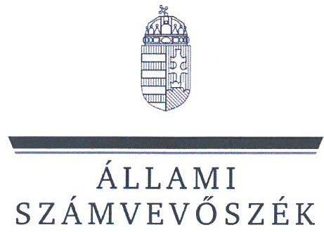
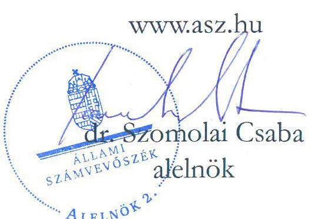
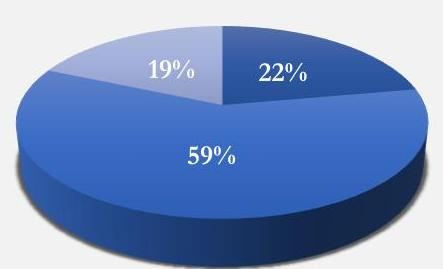
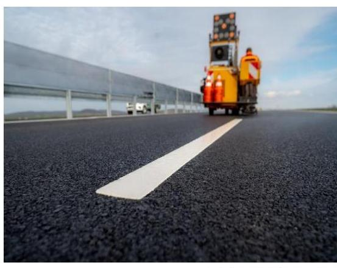
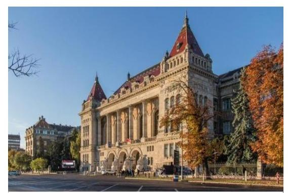
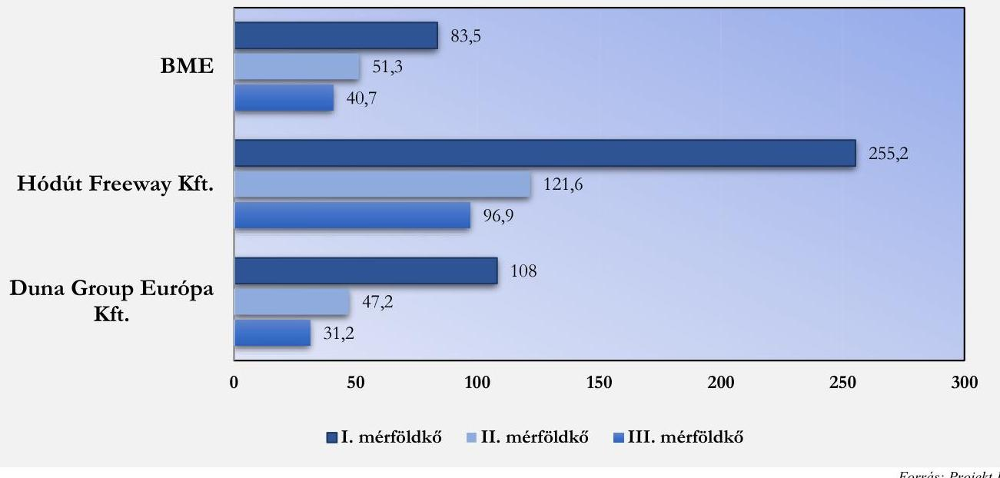
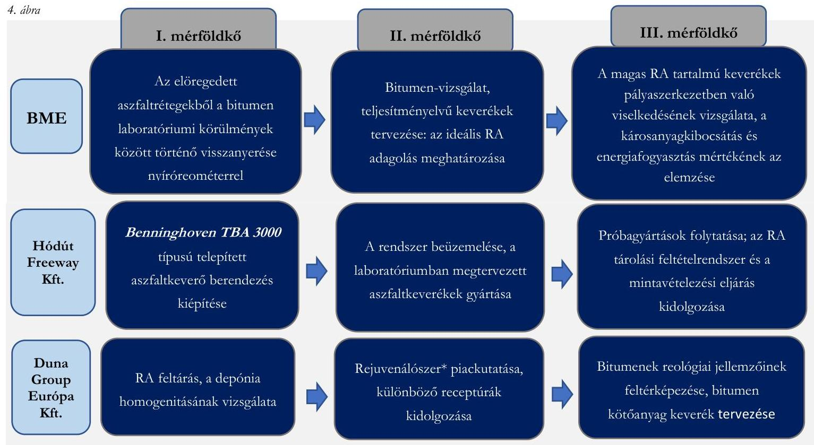

# JELENTÉS 

A kutatás-fejlesztésre és innovációra fordított
költségvetési kiadások célzott ellenőrzése a támogatást
felhasználó szervezetnél címú ellenőrzésről

Pályaszerkezetből visszanyert aszfalt aszfaltkeverékbe történő visszaadagolásának fejlesztése keverőtelepen a Hódút Freeway Kft.-nél
2025.

---

# JELENTÉS 

## A kutatás-fejlesztésre és innovációra fordított költségvetési kiadások célzott ellenőrzése a támogatást felhasználó szervezetnél című ellenőrzésről

Pályaszerkezetből visszanyert aszfalt aszfaltkeverékbe történő visszaadagolásának fejlesztése keverőtelepen a Hódút Freeway Kft.-nél
2025.

25008

---

# ELLENŐRZÉSI IGAZGATÓSÁG: 

## ÁLLAMHÁZTARTÁS KÖZPONTI SZINTJÉT ELLENŐRZŐ IGAZGATÓSÁG

## ELLENŐRZÉSI IGAZGATÓ:

## SINKÁNÉ DR. CSENDES ÁGNES igazgató

## ELLENŐRZÉSVEZETŐ:

Jelentéseink az interneten a www.asz.hu címen olvashatók.

RENKÓ ZSUZSANNA ellenőrzésvezető

IKTATÓSZÁM: EL-4113-006/2025.
TÉMASORSZÁM: -
ELLENŐRZÉS-AZONOSÍTÓ SZÁM: V106603

---

# TARTALOMJEGYZÉK 

AZ ELLENŐRZÉS ALAPADATAI ..... 5
AZ ELLENŐRZÉS HATÓKÖRE ÉS TERÜLETE - AZ ELLENŐRZÖTT SZERVEZET ..... 7
ÖSSZEFOGLALÁS ..... 11
AZ ELLENŐRZÉS FÓKUSZTERÜLETEI ..... 13
MEGÁLLAPÍTÁSOK ..... 14
MELLÉKLETEK ..... 19
I. sz. melléklet: Értelmező szótár ..... 19
II. sz. melléklet: A Projekt szakmai előrehaladása az egyes mérföldkövek szerint ..... 20
III. sz. melléklet: A projekt megvalósítása során elért eredményekről készített tanulmányok ..... 23
IV. sz. melléklet: Az ellenőrzőtt szervezetek jegyzéke ..... 24
V. sz. melléklet: Ellenőrzési kritériumok ..... 25
FÜGGELÉK: ÉSZREVÉTELEK ..... 26
RÖVIDÍTÉSEK JEGYZÉKE ..... 27

---

.

---

# AZ ELLENŐRZÉS ALAPADATAI 

## AZ ELLENŐRZÉS CÉLJA

Az ellenőrzés célja annak értékelése volt, hogy biztosították-e a NFKI Alap ${ }^{1}$-ból támogatott kutatásfejlesztési és innovációs tevékenység eredményének gazdasági és társadalmi hasznosítását; valamint megfelelő volt-e az NKFI Alap Innovációs Alaprészéből finanszírozott támogatás terhére elszámolt költségek elkülönített számviteli nyilvántartása az ellenőrzött kedvezményezetteknél és Projekt-2 nél.

Az ellenőrzés célja volt továbbá az ellenőrzésre kiválasztott projekt közfinanszírozása célszerűségének és eredményességének elemzése.

## AZ ELLENŐRZÉS TÍPUSA

Kombinált ellenőrzés

## AZ ELLENŐRZŐTT IDŐSZAK

A projekt támogatói okiratban rögzített kezdő időpontjától - 2020. november 2. - a 2024. évben a helyszíni ellenőrzés lezárásáig terjedő időszak.

## AZ ELLENŐRZÉS TÁRGYA

A Nemzeti Kutatási, Fejlesztési és Innovációs Alap Innovációs Alaprészéből megvalósított 2020-1.1.2PIACI KFI kódszámú, a „Pályaszerkezetből visszanyert aszfalt aszfaltkeverékbe történő visszaadagolásának, fejlesztése keverötelepen a Hódút Freeway Kft.-nél" című projekt eredményeinek gazdasági és társadalmi hasznosítása; az elért eredmények nyilvánosságának biztosítása; a Projekt megvalósítására elszámolt költségek elkülönített számviteli nyilvántartása, továbbá a Projekt közfinanszírozása célszerűségének és eredményességének elemzése.

## AZ ELLENŐRZÉS JOGALAPJA

Az ellenőrzés jogszabályi alapját az ÁSZ tv. ${ }^{3} 1 . \int(3)$ bekezdése, 5. $\int(2)$-(3) bekezdései, valamint az Áht. ${ }^{4}$ 61. $\int(2)$ bekezdésének előírásai képezték.

---

# AZ ELLENŐRZÉS MÓDSZERE 

Az ellenőrzés végrehajtására - a nemzetközi standardokat irányadónak tekintve - az ellenőrzési program szempontjai, kérdéskörei, az ellenőrzött időszakban hatályos jogszabályok és az ellenőrzött szervezetek belső szabályai, valamint az ellenőrzés szakmai szabályok alapján - mintavételi eljárás alkalmazása nélkül - került sor.

Az ellenőrzési bizonyítékként felhasználható adatforrások közé tartoztak az ellenőrzött által átadott, valamint minden egyéb - az ellenőrzés folyamán feltárt, az ellenőrzés szempontjából információt tartalmazó - dokumentumok. Az ellenőrzési kérdések megválaszolásához szükséges bizonyítékok megszerzése a következő ellenőrzési eljárások alkalmazásával történt: adatbekérés, megfigyelés, kérdésfeltevés (információkérés), elemző eljárás.

Az ellenőrzés lefolytatásához az ellenőrzött szervezetek dokumentumok, adatok, információk rendelkezésre bocsátásával, megküldésével szolgáltattak adatokat. Az ÁSZ ${ }^{5}$ az ellenőrzést a program kérdéseire adott válaszok kiértékelésével, valamint a programban ismertetett ellenőrzési kérdések, kritériumok, adatforrások között megjelölt adatforrások figyelembevételével folytatta le.

---

# AZ ELLENŐRZÉS HATÓKÖRE ÉS TERÜLETE - AZ ELLENŐRZÖTT SZERVEZET

A KFI tv. ${ }^{6}$ szerint a Kormány a kutatás-fejlesztés és innováció közfinanszírozású támogatását elsődlegesen a NKFI Alapból biztosítja. Az NKFI Alap ${ }^{7}$ a kutatás-fejlesztés és az innováció állami támogatását biztosító, és kizárólag ezt a célt szolgáló elkülönített állami pénzalap, amelynek kezelő szerve a 344/2019. (XII. 23.) ${ }^{8}$ Korm. rendelet alapján a NKFIH. ${ }^{9}$ A KFI tv. alapján az NKFI Alap rendeltetése kiszámítható és biztos forrást biztosítani a kutatás-fejlesztés és a gazdaságban hasznosuló innováció ösztönzésére és támogatására, lehetővé tenni a gazdaságban és a társadalmi élet egyéb területein hasznosuló kutatás és fejlesztés erősítését, a kutatási eredmények hasznosítását. Az NKFI Alap terhére nyújtott támogatások esetében a nyertes pályázóval az NKFIH köt támogatási szerződést vagy ad ki támogatói okiratot, amely rögzíti a támogatás felhasználásával kapcsolatos előírásokat.

## Az ellenőrzött Projekt szakmai és társadalmi környezete

A pályaszerkezetből visszanyert aszfalt $(\mathrm{RA})^{10}$ keverőtelepi újrahasznosítása Magyarországon kevésbé jellemző, a visszanyert aszfalt adagolásához szükséges technológiával felszerelt telepeken is a technológiai határ legfeljebb 10-15\%-os visszaadagolási arány. Ennek egyik oka, hogy a hatályos jogi szabályozás alapján a munkaterületen keletkező bontott/mart aszfaltot - annak építési és bontási hulladéknak való minősítésére tekintettel állami vagyon jellegét megőrizve - közútkezelői telephelyre kell szállítani, amelynek következtében az kikerül a közvetlen újrahasznosítási körből. Az EU a visszanyert aszfalt keverőtelepi felhasználását javasolja, fejlettebb országokban a visszaadagolási arány a hazai gyakorlatnál lényegesen magasabb, jellemzően átlagosan $30 \%$ feletti.

Az aszfaltgyártás és RA felhasználást az egyes országokban a 2021. évben az 1. táblázat szemlélteti.

|  1. táblázat |  |  |   |
| --- | --- | --- | --- |
|  AZ ASZFALTGYÁRTÁS ÉS RA FELHASZNÁLÁS AZ EGYES ORSZÁGOKBAN A 2021. ÉVBEN |  |  |   |
|  ORSZÁG | ÖSSZES RA
FELHASZNÁLÁS AZ
ASZFALTGYÁRTÁSBAN (T) | TELJES
ASZFALTGYÁRTÁS (T) | ÁTLAGOS RA
FELHASZNÁLÁS AZ
ASZFALTBAN (\%)  |
|  Magyarország | 156800 | 4900000 | 3,2  |
|  Németország | 9744000 | 38000000 | 25,6  |
|  Franciaország | 4591920 | 35900000 | 12,8  |
|  Ausztria | 765000 | 7300000 | 10,5  |
|  Egyesült Államok | 94600000 | 432000000 | 21,9  |

Németország 9,7 millió tonna és Franciaország, illetve 4,6 millió tonna visszanyert aszfaltot használt fel a keverőtelepi melegaszfalt gyártása során. Magyarországon ez a szám 157 ezer tonna, ami a teljes aszfaltgyártásunk átlagosan 3,2\%-a. Az átlagos újrahasznosítás Németországban 25.6\%, míg Franciaországban $12.8 \%$ volt 2021-ben.

A visszanyert aszfalt felhasználásával kapcsolatos szabályozást a nemzetközi gyakorlatban útmutatók biztosítják, amelyek elsődleges szándéka az újrahasznosítás növelésének előmozdítása,

---

és ennek érdekében sokkal nagyobb kivitelezői, technológiai mozgásteret biztosít. A hazai szabályozás - a hatályos Útügyi Műszaki Előírások - az egyes folyamatok részletes szabályozására törekszik, az RA felhasználásának korlátokat szab, kisebb kivitelezői mozgásteret biztosít, az újrahasznosítás (stratégiai) célként nem jelenik meg.

A visszanyert aszfalt hozzáadásával készített keverékek fő nemzetgazdasági és környezetvédelmi előnye az elsődleges nyersanyagok (zúzottkő) kitermelésének csökkentése - figyelemmel a rendelkezésre álló erőforrás (kőbányák) végességére -, egyéb alapanyagok (kötőanyag, adalékanyagok) mennyiségének csökkentése - ennek keretében az aszfaltkeverékekben kötőanyagként felhasznált bitumen mennyiségének csökkentése - , szállítási költségek (nyersanyag szállítása a bányákból a telephelyre) és ezáltal a karbonlábnyom csökkentése, alacsonyabb energia költségek, továbbá a kevesebb mennyiségű hulladék. A pályaszerkezetből visszanyert aszfalt felhasználása az útépítőiparban a folyamatban lévő, illetve a közeljövőben ütemezésre kerülő autópályák és gyorsforgalmi utak felújítása miatt is aktuális.

# Az ellenőrzött Projekt bemutatása 

Az NKFIH 2020. májusában tette közzé honlapján az NKFI Alap Innovációs Alaprészének terhére a 2020-1.1.2-PIACI KFI kódszámú, a „Piacvezérelt kutatás-fejlesztési és innovációs projektek támogatása" című pályázati felhívást, amelynek célja volt a vállalkozások versenyképességének javítása piacorientált kutatás-fejlesztési és innovációs projektjeik támogatásával. A tervezett projektekkel szemben elvárásként került megfogalmazásra, hogy jelentős tudományos és/vagy műszaki újdonságtartalommal rendelkező új termék, technológia vagy szolgáltatás kifejlesztésére irányuljanak; illetve a projekt eredményeként létrejövő termék, technológia vagy szolgáltatás üzletileg hasznosítható legyen.
1. ábra

## A Projekt támogatásának megoszlása a Kedvezményezettek között

■ BME ■ Hódút Freeway Kft. ■ Duna Group Európa Kft.

Forrás: Támogatói Okirat

Az NKFIH 2020. december 1. napján hozott döntése értelmében 799334989 Ft összegű támogatásra érdemesnek ítélte az ellenőrzésre kiválasztott, a „Pályaszerkezetből visszanyert aszfalt aszfaltkeverékbe történő visszaadagolásának fejlesztése keverőtelepen a Hódút Freeway Kft.-nél" című, 2020-1.1.2-PIACI-KFI-2020-00060 kódszámú projektet. A támogatás megoszlását az 1. ábra mutatja be. A Projekt összköltsége 1745412083 Ft , a támogatás intenzitása $45,8 \%$ volt. A Kedvezményezettek a projektet konzorciumban valósították meg: a Hódút Freeway Aszfaltkeverék Gyártó és Építő Korlátolt Felelősségű Társaság, mint konzorciumvezető, valamint a Hódmezővásárhelyi Útépítő Korlátolt Felelősségű Társaság ${ }^{1}$ és a Budapesti Műszaki és Gazdaságtudományi Egyetem, mint a konzorcium

[^0]
[^0]:    ${ }^{1}$ A Támogatói Okirat kiadásakor a társaság elnevezése Hódmezővásárhelyi Útépítő Korlátolt Felelősségű Társaság volt, amely 2023. január 20-i hatállyal Duna Group International Útépítő Korlátolt Felelősségű Társaságra, majd 2024. május 15-i hatállyal Duna Group Európa Útépítő Korlátolt Felelősségű Társaságra változott. Az ellenőrzés a továbbiakban a társaságra a hatályos elnevezésén hivatkozik.

---

tagjai. A Projekt megvalósítási időszaka 2020. november 2 2. ábra 2023. október 31 között volt. A projekt összköltségének megoszlását a kedvezményezettek között az alábbi, 2. ábra mutatja.

A Projekt célja volt egy olyan technológia meghonosítása Magyarországon, amelynek alkalmazásával az aszfaltgyártás gazdaságosabb, csökken a felhasznált elsődleges nyersanyagok (zúzottkő) és az egyéb alapanyagok (kötőanyag [bitumen], adalékanyag) mennyisége, továbbá csökken a szállítási költség (bányákból telephelyre), és ezáltal az üvegházhatású gázok kibocsátása (karbonlábnyom), valamint a keletkezett hulladék mennyisége is. A Projekt megvalósítása során egy Magyarországon még nem alkalmazott technológia - a meleg adagolási rendszerü, párhuzamos dobbal felszerelt aszfaltkeverő berendezés - kiépítésére került sor, amelynek alkalmazása 30-60\%-os pályaszerkezetből visszanyert aszfalt - (RA) - adagolást tesz lehetővé, megteremtve ezáltal annak gépészeti és aszfalttechnológiai hátterét. Ilyen aszfaltkeverék gyártására e projekt keretében került sor először Magyarországon.

# Az ellenörzött szervezetek 

Fonrás: www.dunagroup.hu
Közép-Európa egyik legnagyobb építőipari cégcsoportja a Duna Group., amelynek tagjai közé tartozik a Hódút Freeway Kft. és a Duna Group Európa Kft. ${ }^{11}$ A 2008. december 16. napján alapított Hódút Freeway Kft. fő tevékenysége egyéb nemfém ásványi termék gyártása, a foglalkoztatottak száma a 2023. évben 98 fő volt. A társaság 2023. évi nettó árbevétele 18 312,02 M Ft, az adózott eredménye 400,84 M Ft volt. Az 1992. május 1-jén alapított Duna Group Európa Kft. fő tevékenysége Út, autópálya építése, a foglalkoztatottak száma a 2023. évben 51 fő volt. A társaság 2023. évi nettó árbevétele 6 029,22 M Ft, az adózott eredménye 205,18 M Ft volt.

A Budapesti Műszaki és Gazdaságtudományi Egyetem elsődleges feladata műszaki, informatikai, természettudományi, valamint gazdasági, üzleti és menedzsment szakemberek képzése. A $\mathrm{BME}^{12}$ oktatástól elválaszthatatlan küldetése a tudományos kutatás, amely átfogja az innovációs láncot alkotó alap- és alkalmazott kutatást, a műszaki termék- és szolgáltatásfejlesztést, valamint az eredmények hasznosítását. A Projektben a BME feladatait a BME Építőmérnöki Karán, az Út és Vasútépítési Tanszéken látták el. A Tanszéken működő Pályaszerkezeti

Fonrás: www.bme.hu

Laboratórium egyik alegysége az Útpályaszerkezetek Laboregység, amely elsősorban az aszfaltkeverékek és pályaszerkezeti rétegek vizsgálataira specializálódott.

---

# Az NKFI Alap Innovációs Alaprészéböl kapott támogatás felhasználása a Projektben 

A Projekt ráfordításait a felhasználás területe szerint az alábbi, 3. ábra mutatja be.
3. ábra

## A támogatás felhasználása a Projektben mérföldkövek szerint (Adatok M Ft-ban)

Forrás: Projekt-beszámolók
A Projektben a BME, mint konzorciumtag részéről a megvalósulási időszakban átlagosan 15 fő (2020-2021), 10 fő (2021-2022) és 6 fő (2022-2023) vett részt $\mathrm{K}+\mathrm{F}$ munkatárs és technikai segédszemély státuszban, valamint a teljes időszakra vonatkozóan 1 fő projektmenedzser. A BME ráfordításainak összege az I. időszakban 83,55 M Ft, a II. időszakban 51,38 M Ft, a III. időszakban 40,72 M Ft volt. Mindhárom időszakban a ráfordítások részét képezték a személyi juttatások és munkaadót terhelő járulékok, továbbá az I. időszakban került sor az aszfaltkeverékek, és azok tervezéséhez szükséges laboratóriumi vizsgálatok elvégzéséhez szükséges gépek - bitumix laboratóriumi aszfaltmixer, dinamikus nyíró reométer, penetrométer, és lágyuláspont mérő beszerzésére.

A Hódút Freeway Kft. mint konzorciumvezető részéről a megvalósulási időszakban átlagosan 24 fő (2020-2021), 16 fő (2021-2022) és 14 fő (2022-2023) vett részt $\mathrm{K}+\mathrm{F}$ munkatárs és technikai segédszemély státuszban. A Hódút Freeway Kft. ráfordításainak összege az I. időszakban 716,96 M Ft összköltség - 255,27 M Ft Támogatás + 461,69 M Ft Saját forrás; a II. időszakban 304,14 M Ft összköltség - 121,65 M Ft Támogatás és 182,48 M Ft Saját forrás; a III. időszakban 242,33 M Ft összköltség - 96,93 M Ft Támogatás és 145,40 M Ft Saját forrás volt. A társaság kiemelt összegű ráfordítása a Projekt kezdő évében a „Benninghoven RA180" melegrecycling berendezés" megvásárlása volt.

A Duna Group Európa Kft. mint konzorciumtag részéről a megvalósulási időszakban átlagosan 26 fő (2020-2021), 26 fő (2021-2022) és 17 fő (2022-2023) vett részt K+F munkatárs és technikai segédszemély státuszban. A Duna Group Európa Kft. ráfordításainak összege az I. időszakban 108,05 M Ft összköltség 69,34 M Ft Támogatás és 38,70 M Ft Saját forrás; a II. időszakban 118,22 M Ft összköltség - 47,29 M Ft Támogatás és 70,93 M Ft Saját forrás; a III. időszakban 78,20 M Ft összköltség - 31,28 M Ft Támogatás és 46,92 M Ft Saját forrás volt.

---

# ÖSSZEFOGLALÁS 

A Hódút Freeway Kft., a Duna Group Európa Kft. és a BME, mint Kedvezményezettek az NKFI Alap Innovációs Alaprészéből a „Pályaszerkezetből visszanyert aszfalt aszfaltkeverékbe történő visszaadagolásának fejlesztése keverőtelepen a Hódút Freeway Kft.-nél" című Projekt közfinanszírozása célszerű és eredményes volt. A Projekt során bevezetett technológia gazdaságosabb és környezetkímélőbb infrastuktúra építést eredményez. A kedvezményezettek a Projekt költségeit elkülönítetten mutatták ki a számviteli nyilvántartásaikban.

A KFI tevékenység hatással van az ország versenyképességére, ezáltal a társadalmi-gazdasági fejlődésre. Magyarország KFI stratégiája célkitűzéseinek elérését az ösztönzés módja és a támogatásra fordított közpénz mértéke mellett a felhasznált közpénz eredményes hasznosulását akadályozó körülmények és kockázatok feltárása is elősegíti. A KFI-s projektek ellenőrzésének megállapításai hozzájárulnak a támogatási rendszerre vonatkozó számvevőszéki tapasztalatok összegyűjtéséhez és ezek alapján intézkedési javaslatok, felvetések megtételéhez.

## A támogatott tevékenység eredményének gazdasági és társadalmi hasznosítása

A Kedvezményezettek a Projekt előrehaladásáról és eredményességéről az NKFIH felé elszámoltak, a Projekt megvalósításával elért eredményeket a nyilvánosság felé hazai és nemzetközi fórumokon megjelent tanulmányok és konferencia-előadások formájában kommunikálták.

A Kedvezményezettek a Projekt megvalósításával egy Magyarországon korábban nem alkalmazott technológia, a meleg adagolási rendszerủ, párhuzamos dobbal felszerelt aszfaltkeverő berendezés alkalmazásával a pályaszerkezetből visszanyert aszfalt - (RA) - 30-60\%-os arányú visszaadagolását tették lehetővé az aszfaltkeverékek gyártása során. Az innovatív fejlesztések eredményeként kialakították a RA adagolás gépészeti és aszfalttechnológiai, ezáltal a nagytömegű gyártás, a keveréktervezés, a bitumen elegy reológiai jellemzés, a beépítés és laboratóriumi kontrollvizsgálat hátterét. A Projekt eredményeképpen a kedvezményezettek lehetővé tették az infrastruktúra építés gazdaságosabb és környezetkímélőbb megvalósítását, ami támogatja a környezet fenntarthatóságát.

A Projekt megvalósítását követően a 2024. évben megalkotásra került a 149/2024. (VI. 28.) Korm. rendelet ${ }^{13}$, amelynek elfogadásával az országos vagy helyi közúton végzett állami beruházások, valamint az országos vasúti pályahálózaton és a térségi, elővárosi vasúti pályahálózaton végzett építési tevékenységekhez kapcsolódó, az építési tevékenység végzése során kitermelődő visszanyert - és újbóli felhasználásra alkalmas -építési-bontási anyag nem minősül építési-bontási hulladéknak, azok újbóli felhasználására szabályozott keretek között sor kerülhet, erősítve ezzel a környezet védelmét. A jogszabály módosítás következtében a jogi akadályok is elhárultak a Projekt eredményei széles körű alkalmazhatóságának.

## A támogatás terhére elszámolt költségek elkülönített számviteli nyilvántartása

A Kedvezményezettek az NKFI Alap Innovációs Alaprészéből kapott támogatást saját és egyéb forrásaiktól elkülönítetten tartották nyilván. Az elkülönített nyilvántartás vezetésére vonatkozó belső szabályokat kialakították, és azoknak, valamint a jogszabályi előírásoknak, továbbá a Pályázati Felhívásban, a Pályázati Útmutatóban és a Támogatói Okiratban foglaltaknak megfelelően került sor a támogatás felhasználására.

---

# A projekt közfinanszirozása célszerüsége és eredményessége 

A Projekt közpénzből való megvalósítása több szempont szerint is célszerű volt. A Projekt által bevezetett, újrafelhasználáson alapuló technológia alkalmazásának eredményeként a jövőben kevesebb hulladék keletkezhet, kevesebb nyersanyag felhasználására, továbbá kevesebb nyersanyagkitermeléshez és annak szállításához szükséges gép(áarmű) üzemeltetésére lehet szükség, ami által csökken az üvegházhatást kiváltó gázok kibocsátásának mennyisége is. A Projekt eredménye támogatja a környezet fenntarthatóságát.

A közpénzből finanszírozott projekt a Támogatási szerződésben vállalt eredményeket elérte, így a Projekt közfinanszírozása eredményes volt.

---

# AZ ELLENŐRZÉS FÓKUSZTERÜLETEI 

1. A támogatott projekt eredményeinek hasznosítása
2. A projekt kiadásainak elkülönített nyilvántartása

---

# MEGÁLLAPÍTÁSOK 

## 1. A támogatott projekt eredményeinek hasznosítása

## Összegző megállapítás

A Kedvezményezettek a Projekt előrehaladásáról és eredményességéről a konzorciumvezető útján az NKFIH felé megfelelően beszámoltak, a Projekt eredményeit az aszfaltkeverékek előállítása során a Kedvezményezettek hasznosították, a nyilvánosság felé - hazai és nemzetközi fórumon megjelent tanulmányok, szakcikkek, valamint konferencia-előadások formájában -publikálták. A Projekt megvalósítása során kifejlesztett új technológia, annak kommunikációja hatással volt a (műszaki) jogi szabályozási környezetre is.

## A Projekt előrehaladása, a beszámolási kötelezettség teljesitése

Az NKFIH a Pályázati Felhívás ${ }^{14}$-ban, a Pályázati Útmutató ${ }^{15}$-ban, valamint a Támogatói Okirat ${ }^{16}$ ban meghatározta a Projekt megvalósításával kapcsolatos szakmai, és a Projekt nyomonkövetésére, értékelésére vonatkozó előírásokat. Ennek megfelelve készítették el és nyújtották be a Kedvezményezettek a Projekt mérföldköveinek megfelelő szakmai részbeszámolókat, valamint a Projekt lezárását követően esedékes záróbeszámolót a konzorciumvezető Hódút Freeway Kft. útján. Az egyes mérföldkövek szerint elvégzett főbb feladatokat az alábbi, 4. ábra mutatja be.

---

A szakmai előrehaladást részletesebben a jelentés II. sz. melléklete tartalmazza. Az elkészített szakmai részbeszámolókat és a záróbeszámolót az NKFIH értékelte, és azok elfogadásáról tájékoztatta a Kedvezményezetteket.

# A Projekt nyilvánossága 

A Kedvezményezettek a KFI tv., a Pályázati Felhívás, a Pályázati Útmutató, valamint a Támogatói Okirat előírásai szerint a Projekt indulásáról és zárásáról közös, az érintettek honlapján megjelent sajtóközlemény útján, az érintett helyszíneken információs tábla közzétételével, valamint a projekt előrehaladásáról és eredményeiről szóló tanulmányok, szakcikkek elkészítésével, valamint konferencia előadások megtartásával tájékoztatták a nyilvánosságot. Az elkészített tanulmányokat, szakcikkeket összefoglaló publikációs lista a jelentés III. sz. mellékletét képezi.
A Projekt előrehaladása során elért eredményekről a Duna Aszfalt Zrt. részéről a Projekt képviselői előadást tartottak a IV-V. és VI. Magyar Közlekedési Konferencián, a XIV. és XV. Fiatal Mérnökök Fórumán, valamint a XXIII. HAPA Nemzetközi Aszfalt Konferencián.
A tanulmányok, szakcikkek, előadások végén feltüntetésre került a projektre való hivatkozás: „Köszönetnyilvánítás: 2020-1.1.2-PLACI-KFI-2020-00060 számú projekt az Innovációs és Technológiai Minisztérium Nemzeti Kutatási Fejlesztési és Innovációs Alapból nyújtott támogatásával, a 2020-1.1.2-PLACI KFI pályázati program finanszirozásában valósult meg".

## A Projekt közfinanszirozásának célszerüsége és eredményessége

A Projekt közfinanszírozásával az infrastruktúra építés gazdaságosabb és környezetkímélőbb megvalósítása vált lehetővé. A Projekt eredményeinek hasznosításával csökken a felhalmozódó hulladék mennyisége - ami társadalmi érdek -, csökken az üvegházhatást kiváltó gázok kibocsátása - amelyben nemzetközi szinten Magyarország is szerepet vállalt a Párizsi Egyezmény aláírásával - valamint csökken a korlátozott mennyiségben rendelkezésre álló nyersanyag felhasználása is. Ez támogatja a környezet fenntarthatóságát.
A Projekt közfinanszírozása célszerű volt, hiszen a megvalósításának tapasztalatai bizonyították, hogy a környezetvédelmi, műszaki és gazdasági értelemben sikeres visszanyert aszfalt újrahasznosítás egy komplex rendszer kialakítását és precíz működtetését igényli, amelynek főbb elemei: megfelelő kiírás visszanyerés - tárolás - kezelés - tervezés - gyártás - kivitelezés - monitoring. Környezetvédelmi szempontból is kiemelt fontosságú a depóniamenedzsment, illetve a megfelelő gépészeti megoldások alkalmazása. Az alapvető célkitűzés teljesült, lehetségessé vált a visszanyert aszfalt nélkül gyártott keverék teljesítményével rendelkező, de nagy mennyiségű visszanyert aszfaltot tartalmazó keverék alacsonyabb költséggel való előállítása.
Az aszfalt újrahasznosítás főbb, mérhető környezeti és gazdasági előnyei az alábbiak:

- az új bitumen fogyasztásának minimalizálása,
- az új zúzalék és mészkóliszt felhasználási arányának csökkentése,
- alacsonyabb energiaköltségek (összességében, a teljese folyamatra nézve),
- a környezet csökkenő terhelése,
- változatlan aszfaltminőség, ellenőrzött körülmények között.

A közpénzből finanszírozott projekt a Támogatási szerződésben vállalt eredményeket elérte, így a Projekt közfinanszírozása eredményes volt.

---

# A jogszabályi környezet változása 

A BME részéről készült tanulmányok rámutattak a visszanyert aszfalt felhasználásával kapcsolatos jogi szabályozási környezetet érintő kérdésekre. A tanulmány tartalmazta, hogy a műszaki szabályozásban az újrahasznosítás, mint stratégiai cél megjelenítése elősegítené a Projekt megvalósításával elért új technológia alkalmazásának térnyerését. A magas RA felhasználású országok példája alapján egy útmutató jellegű, a kivitelező számára nagyobb mozgásteret nyújtó szabályozási rendszert javasoltak.
A Projekt lezárását követően megalkotásra került, és 2024. szeptember 26. napjával hatályba lépett a 149/2024. (VI. 28.) Korm. rendelet, amelynek végső előterjesztői indokolása alapján az országos vagy helyi közúton végzett állami beruházások, valamint az országos vasúti pályahálózaton és a térségi, elővárosi vasúti pályahálózaton végzett építési tevékenységekhez kapcsolódó, az építési tevékenység végzése során kitermelődő visszanyert - és újbóli felhasználásra alkalmas - építési-bontási anyag nem fog építési-bontási hulladéknak minősülni, azok újbóli felhasználására szabályozott keretek között sor kerülhet. A korábban hatályos szabályozás alapján a hulladéknak minősülő, telephelyeken tárolt építési és bontási anyaghoz való kivitelezői hozzáférés a hulladék(gazdálkodás)ra vonatkozó jogszabályok miatt korlátozott volt. Az új kormányrendelet megjelenése támogatja az újrafelhasználást, erősítve ezáltal a gazdaság hatékonyságát és a környezet védelmét.

---

# 2. A projekt kiadásainak elkülönített nyilvántartása 

| Összegző megállapítás | A Kedvezményezettek a jogszabályokban, továbbá a Pályázati Felhívásban és a Támogatói Okiratban foglalt előírásoknak megfelelően alakították ki a Projekt megvalósítására elszámolt költségek elkülönített számviteli nyilvántartásának szabályait. A Projekt ráfordításait saját és egyéb forrásaiktól elkülönítetten tartották nyilván a könyveikben. A pénzügyi beszámolókat a jogszabályi előírásoknak, valamit a Pályázati felhívásban és a Támogatói Okiratban foglaltaknak megfelelően készítették el és nyújtották be. |
| :--: | :--: |

Az NKFIH a Támogatói Okiratban előírta a Kedvezményezettek részére a támogatás elkülönítetten kezelését.

## Az elkülönített nyilvántartásra vonatkozó szabályozás

A BME által kialakított belső szabályozás megfelelt a jogszabályi előírásoknak és a Támogatói Okiratban foglaltaknak. A támogatás felhasználásának elkülönített nyilvántartása megfelelő volt. A BME a 15/2016. (IV. 29). számú Kancellári Körlevelében ${ }^{17}$ intézkedésként előírta a Projekt tekintetében az elkülönített fizetési számla létrehozását és az elkülönített nyilvántartás vezetésének kötelezettségét. A BME 1/2022. (I. 20.) számú Gazdasági Vezetői körlevelében ${ }^{18}$ előírta a Pénzügyi Központ ${ }^{19}$ megnyitásának kötelezettségét a támogatói okirat alapján folyósított költségvetési támogatás esetén. A Projekt megvalósításához szükséges, a BME részére a támogatói okiratban megítélt 177600000 Ft támogatási összeg tekintetében a Pénzügyi Központ arra jogosult általi igénylésére, ezt követően annak alapján megnyitására sor került a Műegyetemi Integrált Gazdálkodási Rendszerben. Az SAP $^{20}$ rendszer 2021. január 1-vel történő bevezetésével az adatok migrálására került sor az MGR ${ }^{21}$-ből, amely időponttól kezdve az SAP rendszerben kezelte a BME elkülönítetten a PA25000011 számú, „Pályazzerkezetböl visszanyert aszfall" elnevezésű Pénzügyi Központot.
A Hódút Freeway Kft. Számviteli Politika kiegészítéséé ${ }^{22}$-ben és a Duna Group Európa Kft. Számviteli Politika kiegészítéséé ${ }^{23}$-ben határozta meg az elkülönített nyilvántartás vezetésére vonatkozó előírásokat, összhangban a Pályázati Felhívásban, a Pályázati Útmutatóban és a Támogatói Okiratban foglaltakkal. A szabályzatokban a Projekt tekintetében előírták a központi rendszerben a támogatói okirat szerint, annak jellemzőit tartalmazó munkaszámok kialakítását. A számviteli politika kiegészítésekben rögzített munkaszámok szerint kialakították az egyes számlaszámokat is.

## Az NKFI Alap Innovációs Alaprészéből kapott támogatás elkülönített nyilvántartása

A BME az előírt tartalommal, a támogatási összeg rá eső részére vonatkozóan - 177,6 M Ft, amelyből felhasznált 175,6 MFt - a pénzügyi (rész) beszámolókat az egyes mérföldkövekhez igazodóan az előírások szerint elkészítette. Az egyes beszámolókhoz kapcsolódóan az NKFIH által előírt formában a rektor, a kancellár és gazdasági vezető nyilatkozott a támogatás és a saját/egyéb forrás felhasználása tekintetében a teljeskörű, elkülönített nyilvántartás vezetéséről. A BME saját és egyéb forrásaitól elkülönítetten, az előírások szerint kezelte a kapott támogatást a számviteli nyilvántartásaiban.

---

A Hódút Freeway Kft. és a Duna Group Európa Kft. az előírt tartalommal, a támogatási összeg rájuk eső részére vonatkozóan - 473812129 Ft és 147922860 Ft - a pénzügyi (rész) beszámolókat az egyes mérföldkövekhez igazodóan az előírások szerint elkészítette. A cégjegyzésre jogosult vezetők által aláírt részbeszámolók átláthatóan tartalmazták a kapott támogatási összeg felhasználását támogatás/saját forrás/Összköltség szerinti bontásban. Az egyes beszámolókhoz kapcsolódóan az NKFIH által előírt formában a társaságok vezetője, a gazdasági vezető és a könyvvizsgáló nyilatkozott a támogatás és a saját/egyéb forrás felhasználása tekintetében a teljeskörű, elkülönített nyilvántartás vezetéséről. A támogatást a társaságok saját forrásaiktól is elkülönítették könyveikben. A Projekt összköltségéhez viszonyítva a támogatás arányos ( $45,8 \%$-os) felhasználása átlátható és nyomon követhető volt.

---

# MELLÉKLETEK 

## I. SZ. MELLÉKLET: ÉRTELMEZŐ SZÓTÁR

kedvezményezett
konzorcium
kutatás-fejlesztési és innovációs eredmények hasznosítása
kutatás-fejlesztési és innovációs program
kutatás-fejlesztési és innovációs projekt
technológia
reológiai jellemzés

Az ellenőrzött szervezet az ellenőrzési program szerint: Budapesti Műszaki és Gazdaságtudományi Egyetem, Hódút Freeway Aszfaltkeverék Gyártó és Építő Korlátolt Felelősségű Társaság, Duna Group Európa Útépítő Korlátolt Felelősségű Társaság
a részes felek polgári jogi szerződésben szabályozott munkamegosztásán alapuló együttműködés kutatás-fejlesztési és innovációs tevékenység közös folytatása vagy egy kutatás-fejlesztési és innovációs projekt közös megvalósítása céljából (Forrás: KFI tv. 3. § 8. pont)
üzleti céllal, gazdasági eredmény reményében történő felhasználás, továbbá az olyan közösségi célú felhasználás, amelynek eredménye a lakosság életminőségének és a közszolgáltatások minőségének javítása, a természeti és épített környezet védelme, az ország fenntartható fejlődése, valamint védelmi képességének és biztonsági helyzetének javítása (Forrás: KFI tv. 3. § 12. pont)
a közfinanszírozású támogatási forrás céljának elérését szolgáló, vagy meghatározott témakörbe csoportosítható kutatás-fejlesztési vagy innovációs projektek megvalósításának támogatására kiírt pályázatok időben megismételt sorozata, illetve támogatási intézkedés (Forrás: KFI tv. 3. § 13. pont)
meghatározott kutatás-fejlesztési feladat vagy innovációs folyamat végrehajtására irányuló tevékenység az abban érdekeltek által meghatározott terv alapján (Forrás: KFI tv. 3. § 19. pont)
termék előállításánál vagy szolgáltatás nyújtásánál alkalmazható, piacképes eljárás. Új technológiának minősül az a technológia, amely a technológia potenciális felhasználóinak körében eddig nem ismert, nem alkalmazott, vagyoni értéket képviselő, forgalomképes eljárás, vagy az a technológia, amely a termék előállításának vagy szolgáltatás nyújtásának folyamatában valamely feladatra eddig nem ismert megoldást nyújt (Forrás: 2020-1.1.2PIACI KFI Pályázati Felhívás)
A reológia tudományának alkalmazása, amely a különböző anyagok áramlási és deformációs tulajdonságait vizsgálja. A reológia a folyadékok, viszkózus anyagok és szilárd testek viselkedését tanulmányozza mechanikai feszültség és alakváltozás hatására.

---

Az 1. mérföldkő (2020.11.02-2021.10.31.) időszakában a Hódút Freeway Kft. részéről kialakításra került Téten egy Benninghoven TBA 3000 típusú telepített aszfaltkeverő berendezés a kapcsolódó technológiai berendezésekkel, és RA 180 Meleg RC adagolórendszerrel. A telepítés során egy bruttó 650 m 2 -es alaprajzi területű mobil aszfaltkeverő berendezés, $3 \mathrm{db} 80 \mathrm{~m} 3$-es bitumen tartály, $2 \mathrm{db} 120 \mathrm{~m} 3$-es szénpor siló, valamint összesen 11 db előre gyártott hőszigetelt konténer és 1 db kültéri hulladéktároló épület létesítése történt meg. A Duna Group Európa Útépítő Kft. részéről megkezdődött a Magyar Közút Nonprofit Zrt. zsámbéki telepén az RA feltárás a depónia homogenitásának vizsgálata céljából. Ez az információ meglévő, nem rétegenként mart depóniák inhomogenitásának vizsgálatához adott tájékoztatást. Egy Körmend térségében zajló projekt keretében célzott RA visszanyerésre volt lehetőség. Itt az AC 22 alap és AC 11 kopórétegek külön kerültek marásra és tárolásra. Ennek eredményeképpen a törés és osztályozás folyamatát eltérő RA nyersanyag alapján lehetett megvizsgálni. A vizsgálatokat többféle módon visszanyert és kezelt RA anyagokon végezték el, úgy, mint rétegenként történő marás, rétegek egybemarása, osztályozás és osztályozás nélküli felhasználás. Az eredmények kimutatták, hogy a marás módja (rétegenként vagy egybe marva) nincs feltétlenül hatással a végtermék tulajdonságaira, azonban a feldolgozás módja jelentősen befolyásolja mind a szemeloszlás, mind a bitumentartalom értékeket. Magas RA tartalmú aszfalt előállításához legalább két frakcióra bontott RA szükséges, ezért az itt szerzett eredmények kritikusak a magas RA tartalmú kontrollált aszfaltgyártáshoz. Ezzel az aszfaltgyártás ingadozásának minimalizálása is elérhető. Ez a fajta RA depónia menedzsment Magyarországon eddig sehol nem valósult meg korábban, ennek megfelelően publikált irodalom, vagy gyakorlati tapasztalat nem állt rendelkezésre. A BME részéről megkezdődött az elöregedett rétegek bitumen anyagának tanulmányozásához az aszfaltrétegből a bitumen laboratóriumi körülmények között, oldószerrel történő visszanyerése. A szabvány két fő kivitelezési utat ír le, a kutatás során összehasonlításra került a kétféle eljárás idő és anyagigénye, valamint a visszanyert bitumenen mérhető tulajdonságok. A hazai szabályozás nem tartalmaz előírást arra vonatkozóan, hogy milyen módon kell laboratóriumi vizsgálatok céljából bitumen keverékeket (blendeket) készíteni, ugyanakkor ez a magas RA tartalmú aszfaltkeverékek tervezése szempontjából kritikus. A BME részéről olyan módszer kidolgozására került sor, mely kis mennyiségű, jellemző laboratóriumi bitumen minta visszanyerését és annak vizsgálatát teszi lehetővé nyíró reométerrel (dynamic shear rheometer DSR). A vizsgálatot megelőzően szükség volt megbízható laboratóriumi bitumen minta visszanyerésére, mivel erre kellő hazai tapasztalat nem állt rendelkezésre sem kutatási, sem gyakorlati szinten. Különböző visszanyerési módszereket vizsgáltak meg különböző paraméterekkel, amely biztosította a gyors és hatékony bitumen minta visszanyerést különös figyelemmel arra, hogy a folyamatban a bitumen minta tulajdonságai ne módosuljanak. A keveréktervezéshez megfelelő kötőanyag tulajdonság definiálása volt szükséges, melyet a lágyuláspontra és DSR paraméterekre validáltak.

A 2. mérföldkő (2021.11.01-2022.10.31.) időszakában a Hódút Freeway Kft. részéről beüzemelésre került a meleg recycling rendszer: A berendezés beüzemelésével összefüggő állomások négy fő csoportba sorolhatóak:

1) a berendezés egyes elemeinek terv szerinti elhelyezése, egységes rendszerré való összeállítása
2) a rendszeren belül múködő egyes egységek próbaindítása, mechanikai beállítások elvégzése
3) adagolók, adagoló szalagok, erőmérő cellával ellátott egységek, mérlegek kalibrálása
4) a rendszer tesztelése múködés közben, gépészeti finomhangolások elvégzése, különböző receptúrák igényei szerint.

---

A pályázati feladatok megvalósításának elengedhetetlen része a keverőgép és a parallel dob üzembe helyezését követően, a laboratóriumban megtervezett, vizsgált és javított aszfaltkeverékek keverőgépen történő méretnövelt gyártása. A próbaszakaszok alapanyagául szolgáló, az egyes keverékek próbagyártásából származó aszfaltok beépítésének helyét ki kellett választani, majd megfelelően elő kellett készíteni. A beépítések helyszínéül a téti keverőtelep került kiválasztásra. A laboratóriumi aszfaltkeverék tervek közül 30 került kiválasztásra, amelyek keverőgépi gyártásra is alkalmasnak bizonyultak A keverékek a felhasznált bitumen minősége és a visszanyert aszfalt felhasznált mennyisége szerint csoportosíthatók, amely szerint összességében kilenc RA tartalmú keverékcsoport és három referencia keverék különíthető el. A négy hónapon át tartó próbagyártás során ezekből kerültek kiválasztásra a napi beépítésre szánt keverékek a folyamatosan bővülő beépítési és keverési tapasztalatok alapján. Azokon keverékeken, amelyeket a gyártás során a legjobbnak ítéltek meg átfogó, összetételre és aszfaltmechanikára is kiterjedő laboratóriumi vizsgálatok készültek, mind a gyártott, mind a beépített keverék tekintetében. A gyártás során beállították a mart aszfalt visszaadagolást a keveréktípusnak megfelelően, és elvégezték az előadagolók beállítását ahhoz, hogy a rostarendszeren átjutó anyag egyensúlyban maradjon. További feladatot jelentett az adagolási sorrend meghatározása, a keverési ciklusidők optimalizálása, illetve a keverési hőmérsékletek meghatározása az RA tartalomnak és a bitumen típusának függvényében. A keverőtelepi mart aszfalt feldolgozását, tárolását és mintavételezését elvégezték, a vizsgálati eredmények alapján belátást nyertek a végtermék homogenitásába és annak a gyártásra gyakorolt hatásába. A Duna Group Európa Kft. részéről elvégzett feladat a rejuvenálószer piackutatása, különböző receptúrák kidolgozása: Piackutatással legalább 2-3 különböző rejuvenálószer begyűjtését tervezték. Különböző, az Európai Unió és az Egyesült Királyság területén működő gyártókat kerestek meg és kértek információt, valamit mintát a termékeikről. A megvalósítás során végül 6 különböző rejuvenálószer hatékonyságát vizsgálták meg. A beszerzett rejuvenálószereket különböző adagolásokkal (1-3-5-7 bitumen százalék) vizsgálták penetráció és lágyuláspont tulajdonságok tekintetében. A megfelelő laboratóriumi összehasonlító vizsgálatokhoz a rejuvenálószert kizárólag RA-ból visszanyert bitumenhez keverték. Mivel ez egy olyan terület, amivel eddig Magyarországon az aszfaltipar nem foglalkozott, a megfelelő laboratóriumi keverési eljárást is ki kellett dolgozni, amelyet szintén dokumentáltak. A projektben elvégzett feladat alatt bemutatott eredmények alapján arra a következtetésre jutottak, hogy a forgalomban lévő különböző bitumen fiatalító anyagok mellett a lágyabb fokozatú bitumenek is alkalmazhatóak kvázi rejuvenátorként, mivel azok adagolásával lehetséges az eredeti bitumen kategóriára vonatkozó teljesítmény elvárásokat teljesíteni. A BME részéről folytatódott a teljesítményelvű keverékek megtervezése. A különböző teljesítmények elérése érdekében aszfaltmechanikai vizsgálatokkal határozták meg az ideális RA adagolásokat a különböző keverékek esetén. A feladat megvalósítása során igazolásra került, hogy a visszanyert aszfaltból származó bitumen és az alapbitumen tulajdonsága alapján a visszanyert aszfalttal készített keverék teljesítménye előre prognosztizálható.

A 3. mérföldkő (2022.11.01-2023.10.31.) időszakában került sor az alap és kötő típusú aszfaltkeverékek tervezésére, beépítésére, értékelésére, továbbá az alapanyag homogenitások feltárására. Kiemelt téma volt az RA kezelése, tárolása, és az összetett bitumenelegyek reológiai jellemzőinek elemzése. Kidolgozásra került a keverőtelepi mart aszfalt tárolási feltételrendszere és a mintavételezési eljárása, a gépbeállítással kapcsolatban saját és nemzetközi tapasztalatokat gyűjtöttek. A hazai gyakorlatban alkalmazásra kerülő bitumenek reológiai jellemzői alapján megvizsgálták, hogy a bitumen elegy tulajdonságait az alapbitumen, vagy az RA bitumen befolyásolja-e nagyobb mértékben. Az RA bitumen vizsgálati eredményeit összehasonlították az alap bitumenek hosszú távú eloszlásával. Elvégezték a beépített keverékek monitoringját és 1:1 léptékben megépült pályaszerkezetek komplex viselkedésén keresztül validálták. Az ömlesztett aszfaltkeverékekből készített próbatesteken végzett konvencionális és mechanikai laborvizsgálati eredmények

---

komplex értelmezését és értékelését pályaszerkezeti modellszámítások alapján elvégezték. Elemezték továbbá, hogy a közúti infrastruktúra építéséhez kapcsolható károsanyagkibocsátás, illetve energiafogyasztás mértéke más szektorokkal összevetve hogyan alakul és ezen káros hatások minimalizálása érdekében milyen nemzetközi lépések tapasztalhatók. Az ömlesztett aszfaltkeverékekből további mechanikai laborvizsgálatai alapján kimutatták az RA alkalmazásának jelentőségét a melegaszfalt (HMA) előállításában a fenntartható útépítés érdekében. A gyártási ellenőrzést és a teljesítmény-alapú laboratóriumi vizsgálatot elvégezték és igazolták, hogy a magas RA tartalmú aszfaltkeverékek tervezése és gyártása lehetséges a teljesítmény megőrzése mellett. A kutatások azt mutatták, hogy a magas RA-tartalommal készült aszfaltkeverékek volumetrikus tervezése és előállítása lehetséges, és a reológiai jellemzők, nem szenvednek jelentős változást a tervezés és a gyártási folyamat során. Az RA depónia menedzsment elemzése során kimutatták az RA depóniák kezelésének műszaki hatásait az anyaggyűjtés, a tárolás, a feldolgozás, a víztartalom, a szemeloszlás és bitumentartalom szemszögéből, valamint kimutatták, hogy az RA kőanyag a homogén. A gépbeállítással kapcsolatban saját és nemzetközi tapasztalatokat gyűjtöttek, és bemutatták ez által, hogy magas RA tartalmú aszfaltkeverékek gyártása a gyártás és a minőség ingadozása nélkül lehetséges. Az RA bitumenek szórása megegyező, vagy kisebb, mint az alap bitumenek szórása, ezért megállapították, hogy a gyártás során az RA bitumen tulajdonságok változása, kisebb mértékben befolyásolja a bitumen elegy tulajdonságait, mint az alap bitumen tulajdonságok ingadozása. Elvégezték a bitumenek reológiai vizsgálatait MSCR-rel, mely alapján kidolgozták, hogy az RA milyen mértékben tekinthető modifikáltnak, és ez milyen mértékben vehető figyelembe új, PmB keverékek tervezése esetén. A beépített keverékek monitoringja során kapott eredményeket pályaszerkezeti modellekkel vetették össze a GPR és FWD vizsgálatok alapján, így az RA-val adagolt keverékek pályaszerkezeti rétegként történő viselkedésének elemzését 1:1 léptékben megépült pályaszerkezetek komplex viselkedésén keresztül is validálták. Vizsgálták 20-50\% RA-t tartalmazó aszfaltkeverékből felépített pályaszerkezeti variánsok teljesítményét, ahol az eredmények azt mutatták, hogy a magas RA tartalmú aszfaltkeverékek kiváló teljesítményt nyújthatnak, mely megcáfolja azt a gyakori nézetet, hogy a magas RA tartalmú keverékek alacsonyabb minőségű útépítési anyagok. A keréknyom képződési ellenállás és alacsony hőmérsékleti repedések elleni ellenállás egyensúlyban tartható gondos kötőanyag-keverék tervezéssel és keveréktervezéssel, még magas RA arányok esetén is.

---

III. SZ. MELLÉKLET: A PROJEKT MEGVALÓSÍTÁSA SORÁN ELÉRT EREDMÉNYEKRŐL KÉSZÍTETT TANULMÁNYOK

A Projektben elért eredményekről a BME részéről az alábbi publikációk készültek:

- Tóth Csaba, Pethő László: Magas visszanyert aszfalt tartalmú aszfaltkeverékek műszaki feltételei; Útügyi Lapok, 2023. 11. évfolyam, 17. szám
- Pethő László, Tóth Csaba: Aszfaltburkolatú útpályaszerkezetek fenntarthatóságának értelmezési keretei; XIII. International Conference on Transport Sciences, Győr, 2023.
A Projektben elért eredményekről a konzorciumtagok közös publikációi:
- Tóth Csaba, Pethő László, Rosta Szabolcs: Rheologial characterization of bituminous blindre nlends for the design of asphalt mixes containing high recycled asphalt conként; Acta Technics Jaurinensis 16(2), 62-74. o. (2023.)
- Tóth Csaba, Pethő László, Rosta Szabolcs, Primusz Péter: Performance assasment of full depht asphalt pavements manufactured with high recycled asphalt pavement content; Acta Technica Jaurinensis 16(1), 18-26. o. (2023.)
- Tóth Csaba, Pethő László, Rosta Szabolcs: Performance characterisation of high RA Asphalt Mixes - A laboratory and field study; The Baltic Journal of Road and Bridge engineering 19(1), 71-87. o. (2024.)
A Projekt előrehaladásáról és eredményeiről a Duna Aszfalt Zrt. képviselőinek publikációi
- Rosta Szabolcs, Zvekán Fanni: Visszanyert aszfaltok bitumenjének reológiai vizsgálatának lehetősége, szükségessége; Az Aszfalt XXVIII. évfolyam 2021/2. szám 57-60. o.
- Rosta Szabolcs, Zvekán Fanni: Visszanyert aszfaltot tartalmazó aszfaltkeverék tervezése lágyabb bitumen felhasználásával; Útügyi Lapok 2022. 10. évfolyam 16. szám
- Zvekán Fanni: RA bitumen vizsgálatok a visszanyert aszfalt felhasználás részeként; Az Aszfalt, XXIX. évfolyam 2022/2. szám 58-64. o.
- Rosta Szabolcs - Gáspár László: Útépítési bitumen és visszanyert bitumen elegyének dinamikai viszkozitás számítása és előrebecslési lehetősége; Közlekedéstudományi Szemle 2023. LXXIII. évf. 1. sz. 21-38. o.
- Rosta Szabolcs - Gáspár László: Dynamic Viscosity Prediction of Blends of Paving Grade Bitumen with Reclaimed Bitumen; Periodica Polytechnica Transportation Engineering, 51(3), pp. 263-269, 2023.
- Rosta Szabolcs, Káli Rebeka, Veres Dávid: Magyarországon használt útépítési és modifikált bitumenek teljesítmény elvű vizsgálatainak bemutatása; Az Aszfalt XXX. évfolyam 2023/2. szám 49-57. o.

---

# IV. SZ. MELLÉKLET: AZ ELLENŐRZÖTT SZERVEZETEK JEGYZÉKE 

## ELLENŐRZÖTT SZERVEZET NEVE

1. Budapesti Műszaki és Gazdaságtudományi Egyetem
2. Hódút Freeway Aszfaltkeverék Gyártó és Építő Kft.
3. Duna Group Európa Útépítő Korlátolt Felelősségű Társaság

## ADÓSZÁM

$15308799-4-43$
$14603170-4-03$
$11081423-4-03$

---

# V. SZ. MELLÉKLET: ELLENŐRZÉSI KRITÉRIUMOK 

## FOKUSZTERÜLET

1. A támogatott projekt eredményeinek hasznosítása
2. A projekt kiadásainak elkülönített nyilvántartása

## ELLENŐRZÉSI KRITÉRIUMOK

KFI tv., Áht., Ávr., 433/2016. (XII. 15.) Korm. Rendelet, ${ }^{24}$ Pályázati kiírás, támogatói okirat, az NKFIH kötelező érvényű szempontrendszere a tájékoztatási és nyilvánossági követelményekről az NKFI Alapból megvalósuló kutatás-fejlesztési és innovációs programokhoz, projektekhez

Számv.tv., számviteli politika, gazdálkodási szabályzat, számlarend, támogatói okirat

---

# FÜGGELÉK: ÉSZREVÉTELEK 

A jelentéstervezetet a Számvevőszék 15 napos észrevételezésre megküldte az ellenőrzött szervezet vezetőjének az ÁSZ tv. 29. §* (1) bekezdése előirásának megfelelően.

Az ellenőrzött szervezet vezetője a jelentéstervezet megállapításaira észrevételt nem tett.

[^0]
[^0]:    * 29. § (1) Az Állami Számvevőszék az ellenőrzési megállapításait megküldi az ellenőrzött szervezet vezetőjének vagy az általa megbízott személynek, és annak, akinek személyes felelősségét állapította meg.
    (2) Az ellenőrzött szervezet vezetője és a felelősként megjelölt személy az ellenőrzés megállapításaira tizenöt napon belül írásban észrevételt tehet.
    (3) Az Állami Számvevőszék az észrevételre a beérkezésétől számított harminc napon belül írásban válaszol. A figyelembe nem vett észrevételeket köteles a jelentésben feltüntetni, és megindokolni, hogy azokat miért nem fogadta el.

---

# RÖVIDÍTÉSEK JEGYZÉKE 

${ }^{1}$ NKFI Alap
${ }^{2}$ Projekt
${ }^{3}$ ÁSZ tv.
${ }^{4}$ Ábt.
${ }^{5}$ ÁSZ
${ }^{6}$ KFI tv.
${ }^{7}$ NKFI Alap
${ }^{8}$ 344/2019. (XII. 23.) Korm. rendelet
${ }^{9}$ NKFIH
${ }^{10}$ RA
${ }^{11}$ Duna Group Európa Kft
${ }^{12}$ BME
${ }^{13}$ 149/2024. (VI. 28.) Korm. rendelet
${ }^{14}$ Pályázati Felhívás
${ }^{15}$ Pályázati Útmutató
${ }^{16}$ Támogatói Okirat
${ }^{17}$ 15/2016. (IV. 29). sz. Kancellári Körlevél
${ }^{18}$ 1/2022. (I. 20.) sz. Gazdasági Vezetői Körlevél
${ }^{19}$ Pénzügyi Központ
${ }^{20}$ SAP
${ }^{21}$ MGR

Nemzeti Kutatási, Fejlesztési és Innovációs Alap
2020-1.1.2-PIACI-KFI-2020-00060 kódszámú, a „Pályaszerkezetböl visszanyert aszfalt aszfaltkeverékbe történő visszaadagolásának fejlesztése keverötelepen a Hódút Freeway Kft.-nél" című projekt
az Állami Számvevőszékről szóló 2011. évi LXVI. törvény
az államháztartásról szóló 2011. évi CXCV. törvény
Állami Számvevőszék
a tudományos kutatásról, fejlesztésről és innovációról szóló 2014. évi LXXVI. törvény
Nemzeti Kutatási, Fejlesztési és Innovációs Alap
a Nemzeti Kutatási, Fejlesztési és Innovációs Hivatalról, valamint a Nemzeti Kutatási, Fejlesztési és Innovációs Alap kezelő szervének kijelöléséről szóló 344/2019. (XII. 23.) Korm. rendelet
Nemzeti Kutatási, Fejlesztési és Innovációs Hivatal
Reclaimed Asphalt - Európában használatos jelölés azokban az esetekben, ahol a pályaszerkezetből visszanyert aszfalt törés vagy osztályozás útján létrejött, homogén és frakcionált végtermék
Duna Group Európa Útépítő Korlátolt Felelősségű Társaság (a társaság elnevezése 2024. május 15. napjától hatályos. Elnevezése 2023. január 20 - 2024. május 14. között Duna Group International Útépítő Korlátolt Felelősségű Társaság, 2023. január 20. napját megelőzően Hódmezővásárhelyi Útépítő Korlátolt Felelősségű Társaság)
Budapesti Műszaki és Gazdaságtudományi Egyetem
az országos vagy helyi közúton végzett állami beruházások kapcsán, valamint az országos vasúti pályahálózaton és a térségi, elővárosi vasúti pályahálózaton végzett építési tevékenységekhez kapcsolódó hulladékképződés megelőzésével kapcsolatos tevékenységek részletes szabályairól szóló a 149/2024. (VI. 28.) Korm. rendelet
NKFIH által 2020. májusában honlapján közzétett 2020-1.1.2-PIACI KFI kódszámú, a „Piacvezérelt kutatás-fejlesztési és innovációs projektek támogatása" c. támogatási program pályázati felhívása
A NKFIH Általános pályázati útmutatója a Nemzeti Kutatási, Fejlesztési és Innovációs Alapból 2020. április 30 -át követően meghirdetett, innovációs támogatás nyújtására irányuló pályázati felhívásokhoz (NKFIH honlapján közzétéve: 2020. május)
Az ITM, mint NKFI Alapért felelős szerv (Támogató), az NKFIH, mint NKFI Alapot Kezelő szerv, továbbá a Budapesti Müszaki és Gazdaságtudományi Egyetem, a Hódút Freeway Kft és a Hódmezővásárhelyi Útépítő Kft (Duna Group Európa Útépítő Kft. korábbi elnevezése) között, a „Pályaszerkezetből visszanyert aszfalt aszfaltkeverékbe történő visszaadagolásának fejlesztése keverőtelepen a Hódút Freeway Kft.-nél" című projekt támogatásának tárgyában létrejött szerződés
a felsőoktatási kutatás-fejlesztési vállalkozási tevékenység folytatásának egyes kérdéseiről szóló, 15/2016. (IV. 29). számú Kancellári Körlevele
A pénzügyi központ igényléséről, megnyitásáról
gazdálkodási objektum az integrált gazdálkodási rendszerben
System Analysis Program: Integrált Vállalatirányítási Rendszer
Műegyetemi Integrált Gazdálkodási Rendszer

---

${ }^{22}$ Hódút Freeway Kft. számviteli politika kiegészítés
${ }^{23}$ Duna Group Európa Kft. számviteli politika kiegészítése
${ }^{24} 433 / 2016$. (XII. 15.) Korm. Rendelet

A Hódút Freeway Kft támogatási szerződés keretében megvalósuló kutatás-fejlesztési tevékenységgel kapcsolatos elszámolás szabályairól szóló számviteli politika kiegészítése
A Duna Group Európa Kft támogatási szerződés keretében megvalósuló kutatásfejlesztési tevékenységgel kapcsolatos elszámolás szabályairól szóló számviteli politika kiegészítése
a Nemzeti Kutatási, Fejlesztési és Innovációs Hivatal által a Nemzeti Kutatási, Fejlesztési és Innovációs Alapból finanszírozott kutatás - fejlesztési és innovációs programok és projektek értékelésének részletes szabályairól szóló 433/2016. (XII. 15.) Korm. Rendelet

---

1052 Budapest, Apáczai Csere János u. 10. | 1364 Budapest 4., Pf. 54
www.asz.hu | szamvevoszek@asz.hu
telefon: +36 14849100