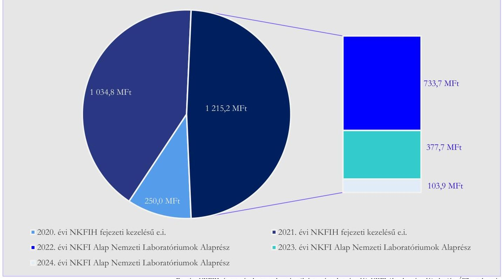
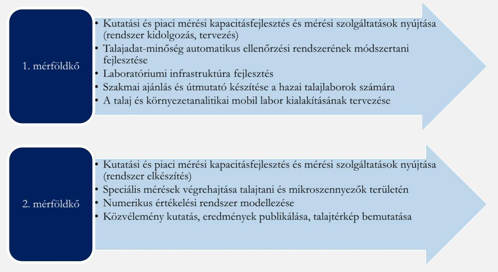
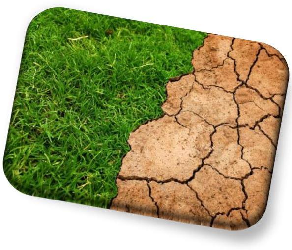
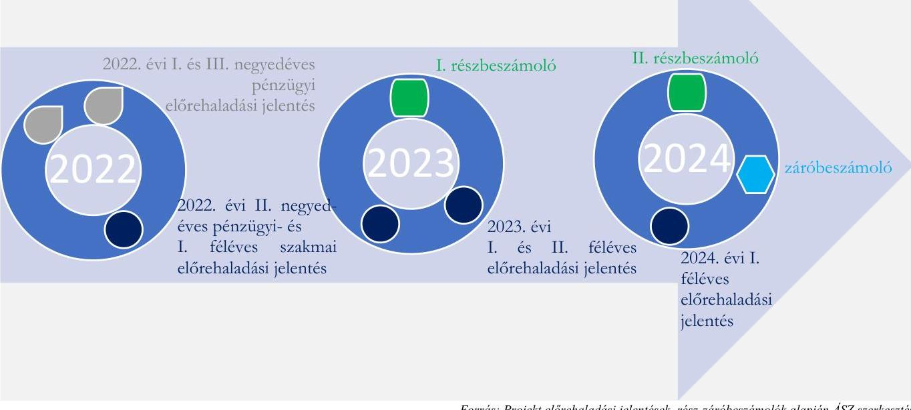
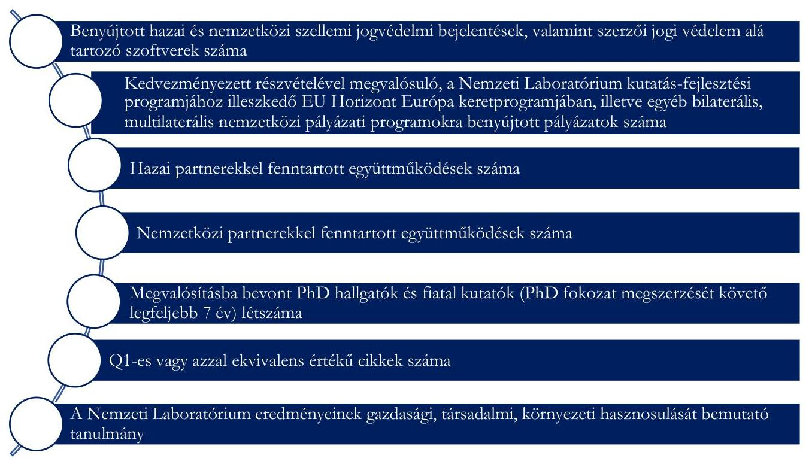

# JELENTÉS 

A kutatás-fejlesztésre és innovációra fordított költségvetési kiadások célzott ellenőrzése a támogatást felhasználó szervezetnél címú ellenőrzésről

Agrártechnológiai Nemzeti Laboratórium fejlesztése

2025.

---

# JELENTÉS 

A kutatás-fejlesztésre és innovációra fordított költségvetési kiadások célzott ellenőrzése a támogatást felhasználó szervezetnél címú ellenőrzésről

Agrártechnológiai Nemzeti Laboratórium fejlesztése

2025.

---

# ELLENŐRZÉSI IGAZGATÓSÁG: 

## ÁLLAMHÁZTARTÁS KÖZPONTI SZINTJÉT ELLENŐRZŐ IGAZGATÓSÁG

## ELLENŐRZÉSI IGAZGATÓ:

## SINKÁNÉ DR. CSENDES ÁGNES igazgató

## ELLENŐRZÉSVEZETŐ:

Jelentéseink az interneten a www.asz.hu címen olvashatók.

RENKÓ ZSUZSANNA ellenőrzésvezető

IKTATÓSZÁM: EL-4113-004/2025

TÉMASORSZÁM: -
ELLENŐRZÉS-AZONOSÍTÓ SZÁM: V106604

---

# TARTALOMJEGYZÉK 

AZ ELLENŐRZÉS ALAPADATAI ..... 5
AZ ELLENŐRZÉS HATÓKÖRE ÉS TERÜLETE - AZ ELLENŐRZÖTT SZERVEZET ..... 7
ÖSSZEFOGLALÁS ..... 12
AZ ELLENŐRZÉS FÓKUSZTERÜLETEI ..... 14
MEGÁLLAPÍTÁSOK ..... 15
JAVASLATOK ..... 20
MELLÉKLETEK ..... 21
I. sz. melléklet: Értelmező szótár ..... 21
II. sz. melléklet: Az ellenőrzött szervezetek jegyzéke ..... 22
III. sz. melléklet: Ellenőrzési kritériumok ..... 23
IV. sz. melléklet: A Projekt során vállalt műszaki-szakmai elvárások teljesülésére vonatkozó kiegészítő megállapítások ..... 24
FÜGGELÉK: ÉSZREVÉTELEK ..... 25
RÖVIDÍTÉSEK JEGYZÉKE ..... 26

---

.

---

# AZ ELLENŐRZÉS ALAPADATAI 

## AZ ELLENŐRZÉS CÉLJA

Az ellenőrzés célja annak értékelése volt, hogy biztosították -e az NKFI Alapból ${ }^{1}$ támogatott kutatásfejlesztési és innovációs tevékenység eredményének gazdasági és társadalmi hasznosítását, valamint megfelelő volt-e az NKFI Alap Nemzeti Laboratóriumok Alaprészéből finanszírozott támogatás terhére elszámolt költségek elkülönített számviteli nyilvántartása az ellenőrzött konzorciumvezetőnél és a Projektnél².

Az ellenőrzés célja volt továbbá az ellenőrzésre kiválasztott Projekt közfinanszírozása célszerűségének és eredményességének elemzése.

## AZ ELLENŐRZÉS TÍPUSA

Kombinált ellenőrzés

## AZ ELLENŐRZŐTT IDŐSZAK

A Projekt támogatási szerződésben rögzített kezdő időpontjától - 2022. január 01-jétől - a 2024. évben a helyszíni ellenőrzés lezárásáig terjedő időszak.

## AZ ELLENŐRZÉS TÁRGYA

Az NKFI Alap Nemzeti Laboratóriumok Alaprészéből megvalósított Projekt eredményeinek gazdasági és társadalmi hasznosítása, az elért eredmények nyilvánosságának biztosítása, a Projekt megvalósítására elszámolt költségek elkülönített számviteli nyilvántartása, továbbá a Projekt közfinanszírozása célszerűségének és eredményességének elemzése.

## AZ ELLENŐRZÉS JOGALAPJA

Az ellenőrzés jogszabályi alapját az ÁSZ tv. ${ }^{3} 1 . \int(3)$ bekezdés, $5 . \int(2)$ és (3) bekezdései, valamint az Áht. ${ }^{4}$ 61. $\int(2)$ bekezdésének előírásai képezték.

## AZ ELLENŐRZÉS MÓDSZERE

Az ellenőrzést a nemzetközi standardokat irányadónak tekintve az ellenőrzési program szempontjai, kérdéskörei; az ellenőrzött időszakban hatályos jogszabályok és az ellenőrzött szervezet belső szabályai, valamint az ellenőrzés szakmai szabályok figyelembevételével végezte az ÁSZ ${ }^{5}$. Az ellenőrzés mintavételi eljárás alkalmazása nélkül történt.

---

Az ellenőrzési bizonyítékként felhasználható adatforrások közé tartoztak az ellenőrzött által átadott, valamint minden egyéb - az ellenőrzés folyamán feltárt, az ellenőrzés szempontjából információt tartalmazó - dokumentumok. Az ellenőrzési kérdések megválaszolásához szükséges bizonyítékok megszerzése a következő ellenőrzési eljárások alkalmazásával történt: adatbekérés, megfigyelés, kérdésfeltevés (információkérés), elemző eljárás.

Az ellenőrzés lefolytatásához az ellenőrzött szervezet az ÁSZ által kért dokumentumok, adatok, információk megküldésével és az ellenőrzés során szolgáltatott adatokat. Az ÁSZ az ellenőrzést a program kérdéseire adott válaszok kiértékelésével, valamint a programban ismertetett ellenőrzési kérdések, kritériumok, adatforrások között megjelölt adatforrások figyelembevételével folytatta le.

Az ÁSZ a projekt közfinanszírozásának célszerűségét és eredményességét a III. sz. mellékletben leírtak szerinti ellenőrzési kritériumok alapján értékelte.

Az ÁSZ ellenőrzés a projekt eredményeit igazoló dokumentumok körében felhasználta a konzorciumvezető által rendelkezésre bocsátott szakmai és pénzügyi beszámolókat és előrehaladási jelentéseket, a nyilvánosság felé kommunikált információkat, a projekt belső értékeléseit, valamint az NKFIH által a projektre, projektértékelésre, keretprogramra vonatkozóan átadott releváns dokumentumokat, nyilvántartás kivonatokat.

---

# AZ ELLENŐRZÉS HATÓKÖRE ÉS TERÜLETE - AZ ELLENŐRZÖTT SZERVEZET 

A KFI tv. ${ }^{6}$ szerint a Kormány a kutatás-fejlesztés és innováció közfinanszírozású támogatását elsődlegesen az NKFI Alap-ból biztosítja. Az NKFI Alap a kutatás-fejlesztés és az innováció állami támogatását biztosító és kizárólag ezt a célt szolgáló elkülönített állami pénzalap. A 344/2019. (XII. 23.) Korm. rendelet ${ }^{7}$ az NKFIH ${ }^{8}$-t jelölte ki az NKFI Alap kezelő szervének. A KFI tv. alapján az NKFI Alap rendeltetése - többek között - kiszámítható és biztos forrást biztosítani a kutatás-fejlesztés és a gazdaságban hasznosuló innováció ösztönzésére és támogatására, lehetővé tenni a gazdaságban és a társadalmi élet egyéb területein hasznosuló kutatás és fejlesztés erősítését, a kutatási eredmények hasznosítását. Az NKFI Alap terhére nyújtott támogatások esetében a nyertes pályázó részére az NKFIH ad ki támogatói okiratot, amely rögzíti a támogatás felhasználásával kapcsolatos előírásokat.

A 433/2016. (XII. 15.) Korm. rendelet ${ }^{9}$ szerint a projektjavaslatok támogatói döntés előkészítése érdekében végzett értékelésének ki kell terjednie a projekt eredményességének, valamint a projekt céljának és jellegének megfelelő gazdasági és társadalmi hasznosulás vizsgálatára.

A közfinanszírozás eredményes és célszerű ellenőrzése az NKFI Alap Nemzeti Laboratóriumok Alaprészéből pályázati úton támogatásban részesült, ellenőrzés alá vont Projekt, a Nemzeti Laboratóriumok vonatkozásában konzorciumvezető minőségben megjelent szervezetre terjedt ki.

## A Nemzeti Laboratóriumok keretprogram

A digitális átalakulás korszakában a tudásátadás és csere felértékelődő forrását a hálózatok képezik, amelyre tekintettel az NKFIH 2020-ban elindította „A Nemzeti Laboratóriumok Létrehozása 2020" programot a nemzetgazdaság perspektivikus területein tudásközpontok létrehozása érdekében, amelyek az egyes szakterületek kiemelkedő tudományos csomópontjává válnak. Az alábbi kutatás-fejlesztési területek szerint kerül sor a besorolásra:

- egészséges élet,
- zöld átállás,
- gazdaság és társadalom digitális átállása,
- biztonság és védelem.

A keretprogram ${ }^{10}$ a 2020-2021. években az NKFIH fejezet, fejezeti kezelésű előirányzatok cím, Nemzeti Laboratóriumok alcímből (XXXV/2./5. alcím), a 2022. évtől kezdődően az NKFI Alap ${ }^{11}$ fejezet, Nemzeti Laboratóriumok Alaprész címből (LXII/9. cím) került finanszírozásra. További támogatás volt elérhető a Széchenyi Terv Pluszon belüli Helyreállítási és Ellenállóképességi Eszköz (RRF) keretein belül a „Nemzeti Laboratórium létrehozása, komplex fejlesztése" (RRF-2.3.1-2021) tárgyú pályázati finanszírozással (XIX/3/10. alcím).

## Az Agrártechnológiai Nemzeti Laboratórium

Az ellenőrzés alá vont Laboratórium ${ }^{12}$ 2020. szeptemberében jött létre, konzorciumi formában. A konzorcium vezetője a Nébih ${ }^{13}$ volt.

---

A Laboratóriumot azzal a céllal hozták létre, hogy elősegítse a mezőgazdasági információ technológia és a használati érték fejlesztését, továbbá hogy az agrár termelésnek és a mezőgazdaság piactudatos technológiafejlesztésének szerves része legyen a kutatás-fejlesztés.

A Laboratórium fennállása óta kapott központi költségvetési támogatásait forrásonként az 1. ábra szemlélteti. A Laboratórium a 2024. évig összesen 2 500,0 MFt értékben kapott támogatást. A támogatás $84 \%$ át ( $2100,0 \mathrm{MFt})$ a Nébih használta fel.

# 1. ábra 

## A LABORATÓRIUM KÖZPONTI KÖLTSÉGVETÉSI TÁMOGATÁSAINAK MEGOSZLÁSA FORRÁSONKÉNT

A Projekt megvalósítása 2022. január 01-je és 2024. június 30-a között történt, 1 215,2 MFt NKFI Alapból kapott támogatással, amelyből 1 104,0 MFt-ot a NÉBIH, 111,2 MFt-ot a MATE ${ }^{14}$ kapott.

## Az ellenörzött Projekt bemutatása

Az ellenőrzés a Nemzeti Laboratóriumok Alaprész 2022. évben meghirdetett 2022-2.1.1-NL kódszámú - „Nemzeti Laboratóriumok létrehozása, komplex fejlesztése" című pályázaton 1 215,2 MFt vissza nem térítendő támogatást nyert „Agrártechnológiai Nemzeti Laboratórium fejlesztése" című projektet (2022-2.1.1-NL-2022-00006) érinti. A Projekt folyamatban lévő projektnek minősült az ellenőrzés során.

A termőföld feltételesen megújuló természeti kincs, amely megőrzése, a talajvédelem és a talaj termőképességének fenntartása (tápanyag utánpótlás) társadalmi felelősség. A Nébih adatbázisokkal, adatfeldolgozó és modellezési módszerekkel alapozza meg a fenntartható talajgazdálkodás, a mezőgazdaság modern alapokon történő digitális átállását, valamint a nemzetközi kutatási közösségbe történő beágyazódást. Az adatok feldolgozása és képi megjelenítése támogatja a talaj adottságainak megismerését, állapotának megóvását.

---

A Laboratórium kialakítására a precíziós mezőgazdaság széleskörű hazai elterjedéséhez szükséges mezőgazdasági gépek és inputok, valamint talajvizsgáló- és fejlesztő szándékkal került sor. A projekt célja volt a gazdasági versenyképesség és a környezeti fenntarthatóság figyelembevételével egy központi adatbázis kialakítása, ahol egységes laborvizsgálati módszertan alapján független mérési eredmények állnak rendelkezésre. A Projekt során vállalt szakmai feladatokat a 2. ábra szemlélteti.
2. ábra

# A PROJEKT KERETÉBEN MEGHATÁROZOTT SZAKMAI FELADATOK MÉRFŐLDKÖVENKÉNT 

A Projekt végrehajtása során kialakították az egymással szoros összefüggésben álló talaj, víz és levegő természeti erőforrások talajra, növényvédelemre, energetikára vonatkozó egységes, országos, nagyfelbontású talajtani adatbázist. Létrehozták a magyarországi talajlaboratóriumokban mért vizsgálati eredményeket tartalmazó központi adatbázis mellett a hazai talajspektrális könyvtárat, valamint kialakították az egységes nemzetközi szabványoknak megfelelő modern laborvizsgálati módszertanok egy részét (a többi kialakítása folyamatban van az ellenőrzés lezárásakor) a szükséges infrastrukturális és eszközfejlesztésekkel. A környezeti fenntarthatóság megteremtése érdekében további lényeges kérdés a mezőgazdasági termelés és feldolgozás során keletkező, elsősorban a melléktermékekből és hulladékokból előállítható megújuló energiaforrások energetikai hasznosíthatóságának kutatása. A fejlesztéseknek köszönhetően elvégezhetővé válik a különböző gazdálkodási gyakorlatok talajra gyakorolt hatásának különálló értékelése az adott talaj osztály és környezeti paraméterek mellett. A hazai partnerekkel történő együttműködések megvalósulásával kerül sor az energetikai szakterületen a cserépkályhákba épített öko tűzterek kialakításával, mérésével a légszennyezés kibocsátás csökkentésére, továbbá a biomassza alapú zöldenergia előállítás területén a tüzelőanyagot előállító piaci partnerekkel történő együttműködésre, vizsgálat végrehajtására. Ennek keretében a biomassza-alapú tüzelőanyagok, tüzelőberendezések, környezetszennyezők és növényvédelmi technológiák és gépek vizsgálatai történnek.

---

A talajvizsgálat, az adatbázis kialakításáért és az erre épülő innovációs szolgáltatás a Nébih, valamint a MATE feladatkörébe tartozott az AKI Agrárközgazdasági Intézet Nonprofit Kft. támogatásával.

A Projekt együttmüködést tart fenn az Egyesült Nemzetek Szervezetének Élelmezésügyi és Mezögazdasági Világszervezzete által müködtetett Global Soil Partnership egsik fö technikai bálózatával, a 2017. novemberében létrehozott GLOSOLAN-nal, amelynek célkitüzése globális szinten a laboratóriumok talajvizsgálati kapacitásának megteremtése, megerüsitése, valamint a talajanalitikai adatok barmonizációja iránt felmerült nemzeti és nemzetközi igényekre való válaszadás. A szervezet tagjaként a Nébih által müködtetett Velencei Talajvédelmi Laboratórium lett kinevezve mint referencia laboratórium, aki bazai koordinátorként a 2019. szeptemberében megalakult Európai és Eurázsiai Régiós Talajlaboratóriumi Hálózatához szintén csatlakozott.
2021. évben megalakult a Magyar Talajvédelmi Laboratóriumi Hálózat, amely jelenleg 30 talajlaboratórium regisztrált taggal rendelkezik.

A projekt keretében létrehozandó, Magyarország talajtani változatosságát reprezentáló talajspektrális könyvtár adatbázisának a bővítésében kiemelt szerepük van a GLOSOLAN ${ }^{15}$ által definiált protokollokat követő nemzeti talajlaboratóriumok által szolgáltatott adatoknak. Ennek a globális kezdeményezésnek a részeként korszerű, fenntartható és környezetbarát talajvizsgálatokra kerül sor.

A keretprogram folytatását tekintve a Nébih meghatározta azon piaci és hatósági partnerek körét, akiket további hasznosítási lehetőségek feltárása végett online kérdőívvel megkeresnek: a Talajvédelmi hatóság munkatársait (hatóság), talajvédelmi szakértőket (piaci szereplők), a Magyar Talajtani Társaság tagjait (tudományos szakterület), az Agrárkamara munkatársait (gazdálkodói kapcsolattartók). A megvalósítható hasznosítási célokat a kérdőívek kiértékelését követően kívánják meghatározni.

További célkitűzésként került még meghatározásra az összes talajvizsgálatot végző laboratórium bevonása az $\mathrm{NTA}^{16}$-ba.

# Az ellenörzött szervezet bemutatása 

A Nébih és a Nemzeti Agrárkutatási és Innovációs Központ konzorciumi formában kezdte el 2020-ban a Laboratórium kialakítását. A Nemzeti Agrárkutatási és Innovációs Központ megszűnését követően, 2021. február 01-jétől a MATE, mint jogutód vette át a konzorciumban lévő feladatok végrehajtását. Az ellenőrzött

szervezet a konzorciumvezető Nébih volt.

A Nébih küldetése a magyar élelmiszerlánc-biztonság védelme és javítása. A termőföld védelméről szóló törvény ${ }^{17}$ többek között a termőföld védelmére, hasznosítására, talajvédelemre vonatkozó előírásokat tartalmaz. A földművelésügyi hatósági és igazgatási feladatokat ellátó szervek kijelöléséről szóló 383/2016. (XII. 2.) Korm. rendelet a Talajvédelmi Információs és Monitoring rendszer működtetése tekintetében talajvédelmi hatóságként a Nébihet jelölte ki.

## A Nemzeti Laboratóriumok keretprogram beszámoltatási rendszere

A keretrogram hatékony, eredményorientált működése érdekében került kialakításra a Projekt irányítási rendszer. A PIR ${ }^{18}$-en keresztül történik mind a program, mind a projekt szintű támogatási kérelmek

---

értékelése, a támogatási döntés előkészítése és az odaítélt támogatások felhasználásának ellenőrzése. A PIR-nek kettő szintje van:

- Programok szintjén történik a pályázók kérelmének rangsorolása, javaslattétele az $\mathrm{FT}^{19}$ felé a projektek megvalósításának szakmai értékelését és javaslattételét végrehajtó SZTB ${ }^{20}$ részéről; valamint a laboratóriumok felső szintű szakmai felügyelete és a programszintű stratégiai döntések előkészítése az FT által.
- Projektek szintjén a laboratóriumok stratégiai irányítását, képviseletét és ellenőrzését a nemzeti laboratóriumonként létrehozott $\mathrm{PIT}^{21}$-ek végzik.
A laboratóriumok tevékenységük végrehajtását - a támogatási szerződésekben és a PIT ügyrendben előírtak szerint - szakmai és pénzügyi előrehaladási jelentésben, mindig a laboratórium elindulásától a tárgyévig mutatják be. Az előrehaladási jelentések elfogadása a projekt majd a program szintű dokumentum értékelését követően, a PIR-en keresztül történik meg.

A projektek beszámoltatása - a laboratóriumok tevékenységétől függetlenül - a projektek támogatási szerződéseiben vállalt mérföldkövek lezárását követő rész- és záróbeszámolókkal is megtörténik az $\mathrm{EPTK}^{22}$ szakmai rendszerében. A beszámolók időszakára és tartalmára vonatkozóan előírást a Pályázati felhívás, a Pályázati útmutató és a támogatási szerződések tartalmaztak.

---

# ÖSSZEFOGLALÁS 

A Nébihnél mint Projekt konzorciumi vezetőnél a Projekt közfinanszírozása célszerű és eredményes volt. A Projekt során megvalósult Nemzeti Talajtani Adatbázis, valamint az egységesített módszertanok alapján végzett kapacitásfejlesztési és mérési szolgáltatások támogatják a talaj védelmét és állapotának megóvását szolgáló tevékenységeket. A Nébih a Projekt bevételeinek és kiadásainak elkülönített nyilvántartásáról a gyakorlatban gondoskodott.

A KFI tevékenység hatással van az ország versenyképességére, ezáltal a társadalmi-gazdasági fejlődésre. Magyarország KFI stratégiája célkitűzéseinek elérését az ösztönzés módja és a támogatásra fordított közpénz mértéke mellett a felhasznált közpénz eredményes hasznosulását akadályozó körülmények és kockázatok feltárása is elősegíti. A KFI-s projektek ellenőrzésének megállapításai hozzájárulnak a támogatási rendszerre vonatkozó számvevőszéki tapasztalatok összegyűjtéséhez és ezek alapján intézkedési javaslatok, felvetések megtételéhez.

## A támogatott tevékenység eredményének gazdasági és társadalmi hasznosítása

A Projekt végrehajtási időszaka alatt a Nébih NKFIH részére elvégzett beszámolásai alapján a vállalt feladatok megvalósítása eredményesen megtörtént. A termelők/gazdálkodók és a hivatalos szervezetek számára olyan talajadatokat tartalmazó adatbázis jött létre, amelyet plusz anyagi és adminisztratív teher nélkül használhatnak a talajvédelmi és tápanyag utánpótlási feladataik végrehajtása során. Az adatbázis kialakításával az esetleges párhuzamos vizsgálatok és adminisztrációk megszűnnek.

Az elvégzett vizsgálatok és a tudásbázis megosztása támogatja a klímaváltozás okainak kutatását, és a mezőgazdasági kihívásokra adott megoldások fejlesztését, ezáltal elősegíti a gazdasági fejlődést is. A biomasszaalapú tüzelőanyagok, tüzelőberendezések, környezetszennyezők, növényvédelmi technológiák és gépek vizsgálata, az energetikai mérések alapján alkalmazásra kerülő új technológiák pozitív hatással lehetnek a környezetre.

A talajtani vizsgálatok minősége az eszközbeszerzésekkel és a kifejlesztésre került technológiák alkalmazásával javult, hatékonyabbá és eredményesebbé vált a feladat végrehajtása. A talajokra jellemző paraméterek meghatározására alkalmazott technológiák közül 13 vizsgálati módszer egységesítésével a vonatkozó vizsgálatok adatainak összehasonlíthatósága megvalósult. A spekturális könyvtár talajparaméterek becslési hatékonyságának további növelése, ezáltal az eredményesebb adatmeghatározások érdekében az ellenőrzés befejezését követően is folytatódnak a vonatkozó vizsgálatok.

A Projekt keretében megtörtént a Laboratórium épületének építészeti, gépészeti és elektromos felújítása, amely eredményeként csökkentek az energetikai, fenntartási költségek.

## A támogatás terhére elszámolt költségek elkülönitett számviteli nyilvántartása

A Nébih számára a Számv. tv. ${ }^{23}$, továbbá a Program ${ }^{24}$ keretében elkészített okiratok és a Nébih gazdálkodására vonatkozó szabályzata előírták a támogatás elkülönített kezelését a pénzügyi nyilvántartásban, azonban a Nébih a Számv. tv. 161/A $\mathbb{S}$ (2) bekezdésében foglalaltak ellenére belső szabályozóban nem határozta meg a projektek könyvviteli nyilvántartási módjára és részlet szabályaira vonatkozó előírásokat.

A Számv. tv és a Program keretében elkészített okiratok alapján a gyakorlatban a Projekt során elszámolásra került költségek elkülönített nyilvántartása a Nébih számviteli nyilvántartási rendszerében megtörtént.

---

# A projekt közfinanszirozása célszerüsége és eredményessége 

A Laboratórium fejlesztésére kapott központi költségvetési támogatásból a természeti erőforrásaink, ezen belül a magyarországi talaj fenntarthatósága és védelme szempontjából kiemelkedő szerepet betöltő mezőgazdaság közvetett támogatása valósult meg. A létrehozott NTA, a felállított mobil laboratóriumok, a módszertani és technológiai fejlesztések a jövőben mind környezetvédelmi, mind gazdasági előnyöket eredményeznek.

A talajtani vizsgálatokból létrejövő adatvagyon minden érdekelt részére történő hozzáférhetővé tétele elősegíti és támogatja a gazdasági és környezetvédelmi szempontból helyes döntések meghozatalát. A talaj mindannyiunk közös természeti kincse, termőképességének megtartása közérdek, ezért a felelősebb talajgazdálkodást elősegítő talajtani adatbázis kialakítása és a talajvizsgálatok elvégzésére irányuló fejlesztések közfinanszírozása célszerú volt.

A közpénzből finanszírozott Projekt a Támogatási szerződésben vállalt eredményeket elérte, így a Projekt közfinanszírozása eredményes volt.

A Nébih részére az ellenőrzött időszak elején az FT - az SZTB javaslatait is figyelembe véve - a Laboratórium hasznosulási mutatóit tartalmazó féléves előrehaladási beszámolók feldolgozását követően három alkalommal fogalmazott meg javaslatokat és észrevételeket. Javasolták a laboratóriumi múködés eredményességének fokozása érdekében az eredményes feladatvégrehajtásba bevont PhD hallgatók és fiatal kutatók számának, a publikációs aktivitásnak a növelését, a hasznosítási területek erősítését, a nemzetközi együttműködések fokozását.

---

# AZ ELLENŐRZÉS FÓKUSZTERÜLETEI 

1- A támogatott projekt eredményeinek hasznosítása
2- A projekt kiadásainak elkülönített nyilvántartása

---

# MEGÁLLAPÍTÁSOK 

## 1. A támogatott projekt eredményeinek hasznosítása

Összegző megállapítás

A Nébih a Projekt előrehaladásáról, a vállalt feladatok eredményességéről az NKFIH felé megfelelően beszámolt. A Projekt Támogatási szerződésben vállalt feladatai eredményes és célszerű közfinanszírozás mellett teljesültek. A nyilvánosság tájékoztatása megvalósult.

## A Projekt beszámolási kötelezettségeinek teljesitése

A Laboratórium a Projekt végrehajtásáról az NKFIH felé a Támogatási szerződésben foglaltak szerint beszámolt. A Projekt során végrehajtandó feladatok részeredményei egyrészt az előrehaladási jelentések, másrészt a részbeszámolók során is bemutatásra kerültek. A Projekt előrehaladására vonatkozó beszámolásokat a 3. ábra mutatja.
3.ábra

A PROJEKT VÉGREHAJTÁSI IDŐSZAKÁBAN TÖRTÉNT BESZÁMOLÁSOK

A Nébih az adott időszakra vonatkozó feladatok végrehajtásának részeredményeiről szóló szakmai és pénzügyi előrehaladási jelentéseket - az előírt határidőben és tartalommal - a PIR-ben nyújtotta be. Összességében négy féléves szakmai és pénzügyi előrehaladási jelentés (2022. évben negyedéves pénzügyi jelentésekkel együtt) került benyújtásra.
Az SZTB előzetes értékelését tartalmazó szakmai javaslatát figyelembe véve, az FT értékelte az előrehaladási jelentésekben foglaltakat. Az előrehaladási jelentések elfogadásakor - az SZTB javaslatait

---

is figyelembe véve - majdnem minden alkalommal tett az FT javaslatot a Nébih részére. Az előrehaladási jelentések értékeléséről az NKFIH a Nébihet értesítette.
Az FT javaslataira tett intézkedések végrehajtásáról - egy alkalom kivételével - a következő előrehaladási jelentésekben számolt be a Nébih. A 2023. I. féléves előrehaladási jelentésben nem került sor az előírt intézkedések végrehajtására tett lépések bemutatására, de ennek elmaradását az NKFIH nem észrevételezte. A 2023. II. féléves előrehaladási jelentés értékelésekor az FT megállapította, hogy a Projektben reflektáltak a korábbi javaslatokra. Az ezt követő előrehaladási jelentésekben az FT javaslataira tett intézkedések végrehajtását bemutatták.
A Nébih a Projekt mérföldkövei végrehajtásának részeredményeiről szóló rész- és záróbeszámolókat - az előírt határidőben és tartalommal - az EPTK rendszerben nyújtotta be. A részbeszámolók NKFIH általi jóváhagyása megtörtént, amelyről az EPTK rendszerüzenetet küldött a Nébih részére. A Projekt végrehajtásának záró határideje 2024. június 30 -a volt. A záró beszámoló elkészítése és benyújtása határidőben megtörtént, a támogató részéről annak véleményezése és elfogadása az ÁSZ ellenőrzés időszakában folyamatban volt.
Az EPTK-ba benyújtott beszámolók és a PIR-be benyújtott előrehaladási jelentések összhangját biztosították. A Támogatási szerződésben lehetőségként szerepelő személyes szakmai beszámoltatásra nem került sor a Projekt végrehajtása során.

# A Projekt eredményességének mutatói és eredménye 

A Projekttel kapcsolatban hét, az eredményesség mérésére szolgáló műszaki-szakmai elvárást fogalmaztak meg a Támogatási szerződésben. A Projekteredmények Támogatási szerződésben használt megnevezését a 4. ábra mutatja be.
4.ábra

## A PROJEKT ELVÁRT MŰSZAKI-SZAKMAI EREDMÉNYEINEK TÁMOGATÁSI SZERZŐDÉSBEN HASZNÁLT MEGNEVEZÉSE

---

Mindegyik témakörben bemutatták a projekt feladatainak megvalósítását, azonban konkrét mutatószámok, indikátorok (terv és tény mutatók) meghatározása nem volt előírás ezen a területen a Nébih részére. A konkrét eredményvállalásokat a Laboratórium megalakulásakor a 2020. évben benyújtott egyedi kérelem tartalmazta.
A Projekt szakmai feladatainak végrehajtása a Laboratórium feladatellátásának keretien belül valósult meg. A IV. sz. melléklet tartalmazza a Projekt műszaki-szakmai eredményeinek kiegészítő megállapításait. A hét cél kiemelt elemei az alábbiak szerint teljesültek a Nébih részéről benyújtásra került Projekt záró beszámolóban és a 2024. I. féléves előrehaladási jelentésben bemutatott eredmények alapján:
$\Rightarrow$ Kialakították az egységes, országos hatáskörú adatbázist.
A szoftverrel rendelkező talajvédelmi vizsgálatokat végző laboratóriumok 2022. év végétől kezdődően tudtak csatlakozni az NTA-hoz. A megfelelő szoftverrel nem rendelkező talajvizsgálatot végző laboratóriumok számára online felületen keresztül volt lehetséges a csatlakozás a rendszerbe.
A termőföld védelméről szóló törvény 32. §-a 2023. július 01-jétől módosult szabályai szerint (kiegészült a jogszabály 32.§-a a (2a) és a (4) bekezdésekkel) a talajvédelmi vizsgálatokat végző laboratóriumok az elvégzett talajvédelmi vizsgálatok eredményeiről a talajvédelmi hatóság erre a célra létrehozott elektronikus felületén adatot szolgáltatnak az NTA-ba. Ennek részletszabályozását az AM rendelet ${ }^{25}$ tartalmazta. Az AM rendelet 2024. május 19-től hatályos módosítása alapján a laboratóriumi adatszolgáltatást az eredményközlő véglegesítésétől számított 15 napon belül teljesíteni kell. Azonban az adatszolgáltatás elmulasztására, monitoringjára vonatkozó szabályozást nem tartalmaznak a jogszabályok.
Az NTA felületének fejlesztése 2023. év végén készült el, amelytől kezdődően minden talajvizsgálatot végző laboratórium számára az előírt adatszolgáltatás online is végrehajtható.
$\Rightarrow$ A Laboratórium nemzetközi szintérhez is kapcsolódott, a felek közötti interakciókat a beszámolókban bemutatták. A GLOSOLAN hálózat keretében a szakmai ajánlások és útmutatások kidolgozásra kerültek, nemzetközi pályázatok leadására sor került. A Projekt megvalósítása keretében a MATE mint konzorciumi tag kutatási és fejlesztési projektekben vett részt, továbbá a külföldi egyetemekkel és kutatóintézetekkel folytatott együttműködés keretein belül külföldi, afrikai országból érkezett PhD hallgatók is végezték tanulmányaikat az egyetemen a projekt időszaka alatt. A Laboratórium céljai között szereplő mobil vizsgáló laboratóriumok (talajtani, energetikai és növényvédőgépek) fenntartása, fejlesztése és a talaj állapotának megőrzése, valamint az NTA felhasználhatóságának korlátai szempontjából ezek az interakciók hosszútávon lehetnek kifizetődők a globális szinten történő talajvizsgálati kapacitás megerősödés és talajanalitikai adatharmonizáció hazai alkalmazása során. A nemzetközi partnerekkel való együttműködés a hazai tudásközpont tagjainak szakmai visszajelzésként, valamint a talajtani adatvagyon alkalmazhatóságának mérésére is szolgál. A 2023. évi I. és II. féléves előrehaladási jelentések értékelésénél az FT javaslatot és észrevételt tett a nemzetközi együttműködések kialakításának fokozása, valamint az együttműködések száma és ezek viszonylatában a hasznosítás területen mutatkozó ellentmondás vonatkozásában.
$\Rightarrow$ A Projekt megvalósításába bevonásra kerültek PhD hallgatók és fiatal kutatók. Az NKFIH értékelésben a Projekt eredményessége szempontjából az előrehaladási jelentések értékelése során az utolsó 2024. évi előrehaladási jelentés kivételével minden alkalommal javasolták a fiatal kutatók bevonásának erősítését. A 2024. évig összesen 24 fő PhD hallgató és fiatal kutató került bevonásra a Laboratóriumba, amelyből öt fő részvétele már lezárult a projekt végrehajtási időszakában.

---

$\Rightarrow$ A Projekt indulása előtt elkészített „Az Agrártechnológiai Nemzeti Laboratórium projekt eredményeinek, jövőbeli hasznosítási lehetöségei" című dokumentumot aktualizálták, és kiadásra került „Az Agrártechnológiai Nemzeti Laboratórium tevékenységének gazdasági, társadalmi és környezeti hasznosulása" című tanulmány. Az előrehaladási jelentések értékelése során az utolsó 2024. évi előrehaladási jelentés kivételével minden alkalommal javaslatként megfogalmazásra került a hasznosítási kategóriák erősítése.
A Nébih 2024. I. féléves előrehaladási jelentés értékelésénél az SZTB és az FT javulást állapítottak meg az előző időszakhoz képest, azonban a javulás területét és intenzitását nem konkretizálták.
Az előírt projekteredmények keretében részletezett szakmai feladatok kiemelt elemeit az 5. ábra szemlélteti.
5. ábra

# A PROJEKT KERETÉBEN MEGHATÁROZOTT SZAKMAI FELADATOK KIEMELT ELEMEINEK MEGVALÓSULÁSA 

A GLOSOLAN által alkalmazott talajparaméter vizsgálati módszerek átültetésével - szakmai ajánlásokat és útmutatásokat dolgoztak ki. Összesen 13 vizsgálati módszer egységesítésére került sor, továbbá laboratóriumi és terepi mérőműszerfejlesztésekre a talajtan, a szerves mikroszennyezők, az energetika és a növényvédőgépek vizsgálatai területén

Megtörtént az értékelési rendszer kialakítása, a talajadatok minőségének automatikus ellenőrzési rendszer módszertana, a validálási módszertan, a gépi tanulás alapú osztályzási rendszerek és a numerikus értékelési rendszer révén.

A Projekt keretein belül a biomassza mint feltételesen megújuló energiaforrás támogatása érdekében meghatározták az alapanyagok és egyéb input termékek analitikai mérési módszerének fejlesztését. A Laboratórium támogatja a digitális mezőgazdaságot a talaj, valamint a környezetvédelmi szempontokat figyelembe vevő mezőgazdasági gépek és inputanyagok vizsgálatával, fejlesztésével. Ennek keretében a Projekt során eszközbeszerzést hajtottak végre és mobil mérőrendszert alakítottak ki, a spektroszkópia fejlesztések a gazdasági hatékonyság javítására irányultak. A gazdasági hasznosítás és a környezeti hasznosulás a Projekt jelenlegi állásánál még nem volt mérhető, erre a későbbiekben, a fejlesztést követően elvégzett vizsgálatok költségösszehasonlítása alapján kerülhet sor.

A mobil spektrális laboratórium keretében létrehozott terepi predektív modellezés eredményeként a spektrométeres mérések sebessége megnőtt. Azonban a talajparaméterek becslési hatékonyságának további növelése, a talajparaméterek adatainak biztosabb és eredményesebb meghatározása érdekében jelenleg is folytatják a Projekt tagok a vizsgálatokat.

Forrás: Projekt záró beszámoló, 2024. évi I. féléves előrehaladási jelentés alapján ÁsZ szerkesztés

## A Projekt nyilvánossága

A KFI tv., a Pályázati felhívás és a Pályázati útmutató, a Támogatási szerződés előírásainak megfelelően a konzorciumvezető honlapján sajtóközleményt tett közre a Projekt elindulásáról és zárásáról a főbb adatokkal, célkitűzésekkel és azok eredményeivel. A nyilvánosság tájékoztatása a Projekt végrehajtására vonatkozó hazai és nemzetközi tudományos és ismeretterjesztő szakcikkek publikálásával, szakmai konferenciák és kiállításokon történő megjelenéssel, valamint a lakosság részére készített tájékoztató kampány megszervezésével valósult meg. A vonatkozó helyszíneken az arculati elemeknek megfelelő információs táblák elhelyezésre kerültek.

---

# 2. A projekt kiadásainak elkülönített nyilvántartása 

## Összegző megállapítás

A Nébih a Projekt kiadásainak elkülönített nyilvántartására vonatkozó jogszabályi és támogatói előírásokat betartotta, azonban a belső szabályozóiban nem kerültek meghatározásra a könyvviteli nyilvántartás módjára és részlet szabályaira vonatkozó előírások.

A Számv. tv., a Pályázati útmutató, a Támogatási szerződés, és a Gazdálkodási szabályzat ${ }^{26}$ előírta a támogatás elkülönített kezelését a pénzügyi nyilvántartásban, a Projekt megvalósításával kapcsolatos pénzügyi dokumentumok elkülönített nyilvántartását.
A Számv. tv. 161/A. § (2) bekezdése ellenére a Gazdálkodási szabályzat általános előírásán túl a belső szabályozók, köztük a Számviteli politika ${ }^{27}$ és a Számlarend ${ }^{28}$ sem tartalmaztak konkrét előírásokat a Projekt elkülönített könyvviteli nyilvántartására, a könyvviteli nyilvántartás módjára és részletes szabályaira.
A 2015. évben hatályba lépett Számviteli politika esetében a Számv. tv. 14. § (11) bekezdésében foglaltak ellenére, a Számlarend vonatkozásában a Számv. tv. 161. § (5) bekezdésében foglaltak ellenére a törvény változása esetén a törvényi változás hatálybalépését követő 90 napon belül nem történt meg a szabályzat módosítása. Továbbá a Számlarend 4. §-ában előírtak ellenére a Számlarend módosítására a módosításra adó körülmény felmerülésétől számított 60 napon belül nem történt meg. A módosulás többek között a 2016. évben bevezetett változásokat érintette, például a rendkívüli bevételek és ráfordítások teljes körű kivezetése nem történt meg sem a Számviteli politikában sem a Számlarendben.
A Projekt megvalósítására vonatkozó pénzügyi dokumentumok elkülönített nyilvántartása a Számv. tv.-ben, Pályázati útmutatóban, a Támogatási szerződésben, és a Gazdálkodási szabályzatban előírtaknak megfelelően, összegszerűen megtörtént. A féléves előrehaladási jelentések Pénzügyi kimutatásának és a pénzügyi részbeszámolók pénzügyi elszámolásának adatai a főkönyvi kivonat vonatkozó rovatainak értékével megegyezett.

---

# JAVASLATOK 

Az ÁSZ tv. 33. § (1) bekezdésében foglaltak értelmében az ellenőrzött szervezet vezetője köteles a jelentésben foglalt megállapításokhoz kapcsolódó intézkedési tervet összeállítani és azt a jelentés kézhezvételétől számított 30 napon belül az ÁSZ részére megküldeni. Amennyiben az ellenőrzött szervezet vezetője nem küldi meg határidőben az intézkedési tervet, vagy továbbra sem elfogadható intézkedési tervet küld, az Állami Számvevőszék elnöke az ÁSZ tv. 33. § (3) bekezdése a) és b) pontjaiban foglaltakat érvényesítheti.

## NEMZETI ÉLELMISZERLÁNC-BIZTONSÁGI HIVATAL ELNÖKÉNEK

1. Intézkedjen a Számviteli politika és Számlarend módosításáról a Számv. tv. 14. § (11) bekezdésében és a 161. § (5) bekezdésében foglalt előirásoknak megfelelően..
2. Intézkedjen a Számv. tv. 161/A. § (2) bekezdésében foglaltaknak megfelelően arról, hogy a belső szabályozók tartalmazzanak konkrét előírásokat a támogatott projektek elkülönített könyvviteli nyilvántartására, a könyvviteli nyilvántartás módjára és részletes szabályaira.

---

# MELLÉKLETEK 

## I. SZ. MELLÉKLET: ÉRTELMEZŐ SZÓTÁR

Nemzeti Laboratórium
precíziós mezőgazdaság
folyamatban lévő projekt
egyedi támogatási kérelem
predektív modellezés

Széchenyi Terv Plusz

Helyreállítási és Ellenállóképességi Eszköz (RRF)
talajspektrális könyvtár
felfedező és kísérleti megközelítésű kutatásoknak új, nemzetközi dimenzióját nyitó, együttműködésen alapuló, intézményesülő, dinamikus színtér a kutatási eredmények társadalmi, gazdasági, környezeti hasznosítására
Menedzsment stratégia, amely időbeli, térbeli és egyedi adatokat gyűjt, dolgoz fel és elemez, valamint azokat egyéb információkkal egészíti ki, annak érdekében, hogy támogassa a táblán belüli változatosságot kezelő döntéstámogatási folyamatokat, növelve ezzel az erőforrások felhasználásának hatékonyságát, a produktivitást, a minőséget, a jövedelmezőséget és a fenntarthatóságot a mezőgazdasági termelés során. Egyszerübben: precíziós eszközöket alkalmaz a jobb eredmények eléréséért. (Forrás: Vértesy László: Precíziós mezőgazdaság: helyzetkép és gazdasági megfontolások Műhelytanulmány)
A projekt akkor tekinthető befejezettnek, ha a támogatott tevékenység a támogatási szerződésben meghatározottak szerint teljesült, a megvalósítás során keletkezett számlák kiegyenlítése megtörtént, a támogatással létrehozott vagy beszerzett eszköz aktiválásra került, és az NKFI Hivatal jóváhagyta a kedvezményezettek szakmai és pénzügyi záróbeszámolóját, valamint a támogatás folyósítása - az igazolt támogatás-felhasználásnak megfelelő mértékben - megtörtént. (Forrás: Általános pályázati útmutató 3.4 pont)
A pályázati kiírásra benyújtott olyan támogatási kérelmen, amely a jogszabályból fakadó kötelezettségeken, támogatásokon, fejlesztési célú beruházásokon, a Kormány egyedi döntésével támogatott kiemelt kutatásfejlesztési és innovációs programokon kívüli közfinanszírozású támogatás nyújtására vonatkozó kérelem. (Forrás: A Nemzeti Kutatási, Fejlesztési És Innovációs Alap Nemzeti Laboratóriumok Alaprészéből 2022. január 1-jét követően meghirdetett, Nemzeti Laboratóriumok támogatás nyújtására irányuló pályázatok és finanszírozott támogatások, valamint az egyedi kérelmek és támogatások kezelésének eljárásrendjéről alapján ÁSZ megfogalmazás)
előrejelzések a jövőben várható eseményekről, viselkedésekről és eredményekről
2021-2027. évek közötti Európai Uniós költségvetési ciklus hazai pályázati rendszerének megnevezése
Az Európai Unió válságkezelő alapja. a Helyreállítási és Rezilienciaépítési Eszköz (Recovery and Resilience Facility) magyar Helyreállítási Tervének megnevezése
Speciális talajadatbázisok, amelyek tartalmazzák egy adott terület talajait reprezentáló talajminták hagyományos laboratóriumi módszerrel meghatározott paramétereit, valamint spektroszkópiai módszerrel rögzített spektrumait.
(Forrás: Csorba, Ádám és Szegi, Tamás és Várszegi, Gábor és Nagy, Gábor és Michéli, Erika (2024) A talajspektrális könyvtárak nemzetközi jelentősége és hazai megalapozása <The international importance and national establishment of soil spectral libraries>)

---

II. SZ. MELLÉKLET: AZ ELLENŐRZÖTT SZERVEZETEK JEGYZÉKE

# ELLENŐRZÖTT SZERVEZET NEVE ADOSZÁM 

Nemzeti Élelmiszerlánc-Biztonsági Hivatal 15598347-2-41

---

# 111. SZ. MELLÉKLET: ELLENŐRZÉSI KRITÉRIUMOK 

## FOKUSZTERÜLET

1. A támogatott projekt eredményeinek hasznosítása
2.A projekt kiadásainak elkülönített nyilvántartása

## ELLENŐRZÉSI KRITÉRIUMOK

KFI tv., Áht., Ávr.29, 433/2016. (XII. 15.) Korm. Rendelet, Pályázati kiírás, Pályázati útmutató, Támogatási szerződés, az NKFIH kötelező érvényű szempontrendszere a tájékoztatási és nyilvánossági követelményekről az NKFI Alapból megvalósuló kutatásfejlesztési és innovációs programokhoz, projektekhez
A projekt közfinanszírozása akkor célszerű, ha a támogatott tevékenység a társadalom egészére, illetve a nagy részét közvetlenül vagy közvetve érintő területekre irányul, és a jövőben is tovább hasznosítható, fenntartható teljesítményeket ér el.
A projekt közfinanszírozása akkor eredményes, ha az elfogadott pályázatban megfogalmazott eredménycélokat a pályázati kiírás, valamint a támogatási szerződés előírásai szerint, a beszámolási kötelezettsége teljesítésével igazolt módon eléri, és a közfinanszírozás célszerű.
Számv. tv., Számviteli politika, Gazdálkodási szabályzat, Számlarend, Támogatási szerződés, Pályázati útmutató

---

# IV. SZ. MELLÉKLET: A PROJEKT SORÁN VÁLLALT MŰSZAKI-SZAKMAI ELVÁRÁSOK TELJESÜLÉSÉRE VONATKOZÓ KIEGÉSZÍTŐ MEGÁLLAPÍTÁSOK 

A Projekt műszaki-szakmai eredményeinek végrehajtása az alábbiak szerint teljesültek a Nébih részéről benyújtásra került Projekt záró beszámolóban és a 2024. I. féléves előrehaladási jelentésben bemutatott eredmények alapján:
$\Rightarrow$ Kialakították az egységes, országos hatáskörú adatbázist. A Nébih informatikai rendszerének keretében létrehozták az NTA-t.
$\Rightarrow$ A Projekt keretében kettő nemzetközi pályázat került pozitív elbírálásra a MATE részére. Ebből az egyik pályázat elnyerése a Projekt elindulását megelőzően (2020. év) történt, jelenleg is tart a megvalósítása.
$\Rightarrow$ A projekttagok mint a talajvédelmi tudásbázis tudásközpontjának tagjai, kapcsolatot tartottak fenn az NTA-ba adatot szolgáltató talajvédelmi vizsgálatokat végző laboratóriumokkal (egyetemekkel és kutatói központokkal). Továbbá kapcsolatot ápoltak az energetikai szakterületen kiemelt partnerekkel (Magyarországi Cserépkályhások, Kandallóépítők és Gyártók Országos Ipartestület, NaWaRo Kft. ${ }^{30}$ ). Összességében 58 akadémiai-szakmai és vállalati együttműködés jött létre a tagok részéről a projekt időszaka alatt.
$\Rightarrow$ A Laboratórium nemzetközi szintérhez is kapcsolódott.
$\Rightarrow$ A Projekt megvalósításába bevonásra kerültek PhD hallgatók és fiatal kutatók.
$\Rightarrow$ A Projektre vonatkozó ekvivalens cikkek publikálásra kerültek a Projekt végrehajtásának időszaka alatt. A projekt időszaka alatt kommunikációs aktivitásra 44 esetben került sor, amelyből 26 db sajtómegjelentés volt.
$\Rightarrow$ A Nébih kiadta „Az Agrártechnológiai Nemzeti Laboratórium tevékenységének gazdasági, társadalmi és környezeti hasznosulása" című tanulmányt.
A Projekt keretében került sor a Laboratórium épületének építészeti, gépészeti és elektromos felújítására, és új mérőműszerek beszerzésére is. Az infrastruktúra fejlesztése a Támogatási szerződésben jóváhagyott értében, 258,6 M Ft összegben történt meg.

---

# FÜGGELÉK: ÉSZREVÉTELEK 

A jelentéstervezetet a Számvevőszék 15 napos észrevételezésre megküldte az ellenőrzött szervezet vezetőjének az ÁSZ tv. 29. §* (1) bekezdése előírásának megfelelően.

Az ellenőrzött szervezet vezetője a jelentéstervezet megállapításaira észrevételt nem tett.

[^0]
[^0]:    * 29. § (1) Az Állami Számvevőszék az ellenőrzési megállapításait megküldi az ellenőrzött szervezet vezetőjének vagy az általa megbízott személynek, és annak, akinek személyes felelősségét állapította meg.
    (2) Az ellenőrzött szervezet vezetője és a felelősként megjelölt személy az ellenőrzés megállapításaira tizenöt napon belül írásban észrevételt tehet.
    (3) Az Állami Számvevőszék az észrevételre a beérkezésétől számított harminc napon belül írásban válaszol. A figyelembe nem vett észrevételeket köteles a jelentésben feltüntetni, és megindokolni, hogy azokat miért nem fogadta el.

---

# RÖVIDÍTÉSEK JEGYZÉKE 

${ }^{1}$ NKFI Alap
${ }^{2}$ Projekt
${ }^{3}$ ÁSZ tv.
${ }^{4}$ Áht.
${ }^{5}$ ÁSZ
${ }^{6}$ KFI tv.
${ }^{7}$ 344/2019. (XII. 23.) Korm. rendelet
${ }^{8}$ NKFIH
${ }^{9}$ 433/2016. (XII. 15.) Korm. rendelet
${ }^{10}$ keretprogram
${ }^{11}$ NKFI Alap
${ }^{12}$ Laboratórium
${ }^{13}$ Nébih
${ }^{14}$ MATE
${ }^{15}$ GLOSOLAN
${ }^{16}$ NTA
${ }^{17}$ a termőföld védelméről szóló törvény
${ }^{18}$ PIR
${ }^{19}$ FT
${ }^{20}$ SZTB
${ }^{21}$ PIT
${ }^{22}$ EPTK
${ }^{23}$ Számv. tv.
${ }^{24}$ Program
${ }^{25}$ AM rendelet
${ }^{26}$ Gazdálkodási szabályzat
${ }^{27}$ Számviteli politika
${ }^{28}$ Számlarend
${ }^{29}$ Ávr.
${ }^{30}$ NaWaRo Kft.

Nemzeti Kutatási, Fejlesztési és Innovációs Alap
„Agrártechnológiai Nemzeti Laboratórium fejlesztése" című projekt (projekt azonosító: 2022-2.1.1-NL-2022-00006)
2011. évi LXVI. törvény az Állami Számvevőszékről
2011. évi CXCV. törvény az államháztartásról

Állami Számvevőszék
2014. évi LXXVI. törvény a tudományos kutatásról, fejlesztésről és innovációról

344/2019. (XII. 23.) Korm. rendelet a Nemzeti Kutatási, Fejlesztési és Innovációs Hivatalról, valamint a Nemzeti Kutatási, Fejlesztési és Innovációs Alap kezelő szervének kijelöléséről
Nemzeti Kutatási, Fejlesztési és Innovációs Hivatal
433/2016. (XII. 15.) Korm. rendelet a Nemzeti Kutatási, Fejlesztési és Innovációs Hivatal által a Nemzeti Kutatási, Fejlesztési és Innovációs Alapból finanszírozott kutatás-fejlesztési és innovációs programok és projektek értékelésének részletes szabályairól
Nemzeti Laboratóriumok támogatására irányuló programok összessége, a megalakulásuktól 2020. évtől kezdődően
Nemzeti Kutatási, Fejlesztési és Innovációs Alap
Agrártechnológiai Nemzeti Laboratórium
Nemzeti Élelmiszerlánc-biztonsági Hivatal
Magyar Agrár- és Élettudományi Egyetem
Global Soil Laboratory Network - Globális Talajlaboratóriumi Hálózat
Nemzeti Talajtani Adatbázis
2007. évi CXXIX. törvény a termőföld védelméről

Program irányítási rendszer
Nemzeti Laboratóriumok Felügyelő Testülete
Nemzeti Laboratóriumok Szakmai Tanácsadó Bizottsága
Nemzeti Laboratóriumok Projektirányító Testületei
Elektronikus Pályázó Tájékoztató és Kommunikációs Rendszer
2000. évi C. törvény a számvitelről

2022-2.1.1-NL kódszámú - „Nemzeti Laboratóriumok létrehozása, komplex fejlesztése" című pályázati kiírás
a nem állami laboratóriumok engedélyezéséről, nyilvántartásba vételéről és működési feltételeinek részletes szabályozásáról szóló 8/2021. (III. 10.) AM rendelet
A Nemzeti Élelmiszerlánc-biztonsági Hivatal Elnökének 10/2022. számú utasítása a Nemzeti Élelmiszerlánc-biztonsági Hivatal Gazdálkodási Szabályzatának kiadásáról
A Nemzeti Élelmiszerlánc-biztonsági Hivatal Elnökének 14/2015. számú utasítása a Nemzeti Élelmiszerlánc-biztonsági Hivatal Számviteli Politikájának kiadásáról (hatályos 2015. december 14-től)
A Nemzeti Élelmiszerlánc-biztonsági Hivatal Elnökének 13/2015. számú utasítása a Nemzeti Élelmiszerlánc-biztonsági Hivatal Számlarendjének kiadásáról (hatályos 2015. december 10-től)

368/2011. (XII. 31.) Korm. rendelet az államháztartásról szóló törvény végrehajtásáról
NaWaRo Korlátolt Felelősségű Társaság (Cégjegyzékszám: 13-09-136497)

---

1052 Budapest, Apáczai Csere János u. 10. | 1364 Budapest 4., Pf. 54
www.asz.hu | szamvevoszek@asz.hu
telefon: +36 14849100