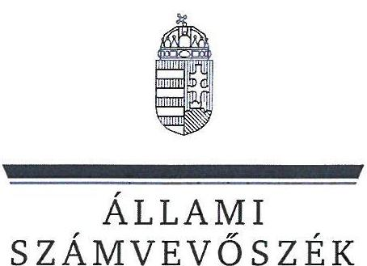
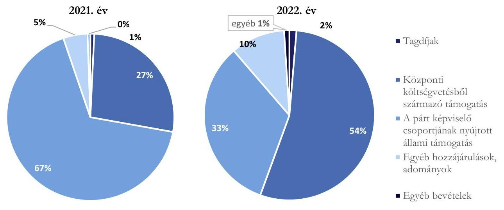
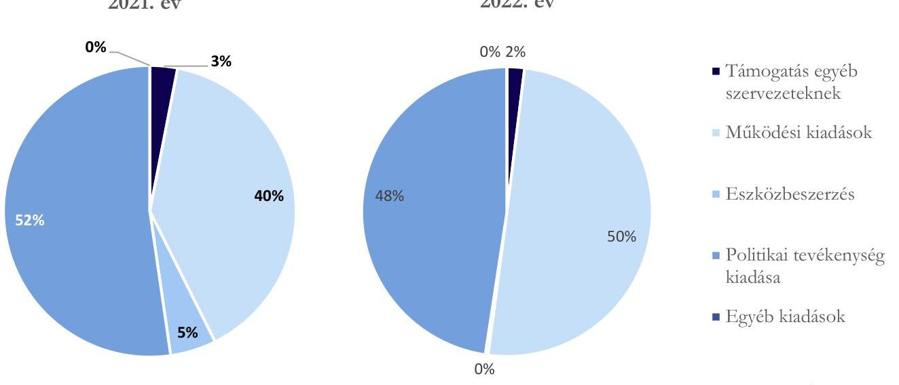

# JELENTÉS 

A költségvetési támogatásban részesülő pártok 2021-2022. évi gazdálkodása törvényességének ellenőrzése

Párbeszéd - a Zöldek Pártja

2025.

---

ÁLLAMI
SZÁMVEVŐSZÉK

# JELENTÉS 

## A költségvetési támogatásban részesülő pártok 2021-2022. évi gazdálkodása törvényességének ellenőrzése

Párbeszéd - a Zöldek Pártja

2025.

---

# ELLENŐRZÉSI IGAZGATÓSÁG: 

## ÁLLAMHÁZTARTÁSON KÍVÜLI SZERVEZETEKET ELLENŐRZŐ IGAZGATÓSÁG

## ELLENŐRZÉSI IGAZGATÓ:

## KLINGA LÁSZLÓ igazgató

## ELLENŐRZÉSVEZETŐ:

Jelentéseink az interneten a www.asz.hu címen olvashatók.

SOLYMÁR ÁGNES ellenőrzésvezető

IKTATÓSZÁM: EL-4087-015/2025
TÉMASORSZÁM: 5
ELLENŐRZÉS-AZONOSÍTÓ SZÁM: V1023

---

# TARTALOMJEGYZÉK 

- AZ ELLENŐRZÉS ALAPADATAI ..... 5
- AZ ELLENŐRZÖTT SZERVEZET ..... 8
- ÖSSZEFOGLALÁS ..... 9
- AZ ELLENŐRZÉS FÓKUSZKÉRDÉSEI ..... 10
- MEGÁLLAPÍTÁSOK ..... 11
- JAVASLATOK ..... 17
- MELLÉKLETEK ..... 18
I. sz. melléklet: Értelmező szótár ..... 18
II. sz. melléklet: Ellenőrzési kritériumok ..... 20
- FÜGGELÉK: ÉSZREVÉTELEK ..... 21
- RÖVIDÍTÉSEK JEGYZÉKE ..... 22

---

.

---

# AZ ELLENŐRZÉS ALAPADATAI 

## AZ ELLENŐRZÉS CÉLJA

Az ellenőrzés célja annak értékelése volt, hogy a Párt ${ }^{1}$ által közzétett éves pénzügyi kimutatások a törvényi előírásoknak megfeleltek-e, a könyvvezetés és gazdálkodás során a Párt betartotta-e a vonatkozó jogszabályi és belső előírásokat, a Párt a működéséhez szabályszerűen igénybe vehető forrásokat használt-e fel, a pártok működéséről és gazdálkodásáról szóló Párttv. ${ }^{2}$-ben engedélyezett gazdasági-vállalkozási tevékenységet folytatott-e. Az ellenőrzés célja volt továbbá annak értékelése, hogy az előző számvevőszéki jelentésben foglalt megállapításokkal összhangban készített intézkedési tervben meghatározott feladatokat a Párt végrehajtotta-e.

## AZ ELLENŐRZÉS TÍPUSA

Szabályszerűségi ellenőrzés.

## AZ ELLENŐRZÖTT IDŐSZAK

A 2021-2022. évek,
az utóellenőrzés tekintetében az utóellenőrzés alapját képező ÁSZ ${ }^{3}$ jelentés közzétételének napjától (2021.12.23.) az ellenőrzésről szóló adatszolgáltatásra felhívó levél keltének (2023.09.12.) napjáig terjedő időszak.

## AZ ELLENŐRZÉS TÁRGYA

A Párt ellenőrzése során az ellenőrzés tárgyát képezték a 2021. és a 2022. évre vonatkozó pénzügyi kimutatás elkészítésére, jóváhagyására, közzétételére, a Párt könyvvezetésére, gazdálkodására, ennek keretében a számviteli szabályozás kialakítására, a bizonylati rend, bizonylati fegyelem betartására, egyéb gazdálkodási, ellenőrzési és pénzügyi-számviteli feladatok ellátására irányuló tevékenységek. Az ellenőrzés tárgya volt továbbá a Párttv. szerinti források elszámolása és felhasználása, valamint a vagyon jogszabályi előírásoknak megfelelő használata, hasznosítása.

Az ellenőrzés kiterjedt minden olyan körülményre és adatra, amely az ÁSZ jogszabályban meghatározott feladatainak teljesítéséhez, valamint a program végrehajtása folyamán felmerült újabb összefüggések feltárásához szükséges volt.

Jelen ellenőrzés a 2022. évi országgyűlési képviselő-választási kampányra fordított pénzeszközök elszámolásának ellenőrzésére nem terjedt ki, azt az ÁSZ „A 2022. évi országgyűlési képviselő-választási kampányra fordított pénzeszközök elszámolásának ellenőrzése" című önálló ellenőrzése (továbbiakban: kampányellenőrzés ${ }^{4}$ ) keretében ellenőrizte.

---

# Az ellenőrzés jogalapja 

Az ellenőrzés jogszabályi alapját az ÁSZ tv. 5. § (11) bekezdés a) pontja, a Párttv. 4. § (4)-(5) bekezdései, valamint a 10. § (1), (3)-(4) bekezdései képezték.

## AZ ELLENŐRZÉS MÓDSZERE

Az ellenőrzést az ellenőrzési program szempontjai, az ellenőrzött időszakban hatályos jogszabályok, az ellenőrzés általános szakmai szabályai, valamint az ellenőrzésre irányadó ÁSZ módszertanok figyelembevételével végezte az ÁSZ.

Az ellenőrzési kérdések megválaszolásához szükséges bizonyítékok megszerzése az ellenőrzött szervezet által rendelkezésre bocsátott dokumentumokra, adatokra alapozva kérdésfeltevés (információkérés), interjú, mintavételezés útján történt.

Az ellenőrzési bizonyítékként felhasználható adatforrások közé tartoztak egyrészt az ellenőrzési programban felsorolt adatforrások, másrészt adatforrás lehetett még minden további, az ellenőrzés folyamán feltárt, az ellenőrzés szempontjából információt tartalmazó dokumentum.

Az ellenőrzés lefolytatásához az ellenőrzött szervezet tanúsítványok kitöltésével, hitelesítésével és a teljességi és hitelességi nyilatkozattal alátámasztott dokumentumok rendelkezésre bocsátásával szolgáltatott adatokat.

Az ÁSZ a tételes ellenőrzés mellett statisztikai alapú, véletlenszerű és kockázatalapú mintavételezést és értékelést is alkalmazott. A statisztikai alapúnál a minták kiválasztása rétegzett mintavételezéssel történt, a mintatételek értékelése „szabályszerű”, ha a minta ellenőrzésének eredménye alapján 95%-os bizonyossággal a teljes sokaságban az átlagos hibaarány nem haladta meg a 10%-ot, „nem szabályszerű”, ha nagyobb, mint 10%. Abban az esetben, ha a teljes sokaság tekintetében a 10%-os hibaarányhoz való viszony megítélésének megbízhatósága nem érte el a 95%-ot, annak elérése érdekében az értékelés további szempontokkal egészült ki, a feltárt hibák értéke is figyelembevételre került. A statisztikai alapú mintavétel kiegészült évente az öt legnagyobb forgalmi értékkel rendelkező szállító tételes ellenőrzésével a lényegesség biztosítása érdekében. A kockázati alapon kiválasztott mintatételek értékelése nem került kivetítésre. Tételes ellenőrzésre kerültek a bevételek közül a központi költségvetésből származó támogatások, valamint a párt országgyűlési képviselőcsoportjának nyújtott állami támogatások. A kiadások közül tételes ellenőrzésre kerültek a Párt országgyűlési képviselőcsoportja számára nyújtott támogatás, az egyéb szervezetek részére nyújtott támogatások, a vállalkozások alapítására fordított összegek, valamint a reklámhordozón elhelyezett hirdetések költségei. A bérköltségekből és eszközbeszerzésekből egyszerű véletlenszerű leválogatással került kiválasztásra tíz-tíz mintatétel.

A kampányellenőrzés keretében az ÁSZ ellenőrizte a 2022. évi országgyűlési képviselő választásra fordított pénzeszközök elszámolását, ezért jelen ellenőrzés a kampányidőszakra vonatkozó bevételi és kiadási tételek értékelését nem tartalmazza.

Az ÁSZ tv. szerint az ellenőrzésekkel szemben támasztott követelmény, hogy azok eredményeinek, a megállapításoknak alátámasztottnak, a következtetéseknek okszerűnek és megalapozottnak kell lenniük. Az ellenőrzésekkel szemben támasztott követelmények érvényesítése, a tényállás teljes körű tisztázása érdekében az ÁSZ az ÁSZ tv. 25. § (3) bekezdésében foglalt lehetőséggel élve ellenőrzést támogató szervezeteket keresett meg adatszolgáltatás céljából.

---

Az utóellenőrzés megállapításai az ÁSZ rendelkezésére álló dokumentumok, valamint az ÁSZ adatbekérése szerint, az ellenőrzött szervezet által rendelkezésre bocsátott dokumentumok, adatok alapján kerültek megfogalmazásra. A korábbi ÁSZ jelentés alapján a Párt által készített intézkedési tervben előírt feladatok végrehajtása az alábbiak szerint kerültek értékelésre:

- „határidőben végrehajtott”-nak minősült a feladat, ha a teljesítés dokumentáltan, az intézkedési tervben előírt határidőben és tartalommal megtörtént;
- „határidőn túl végrehajtott”-nak minősült a feladat, ha annak teljesítése az intézkedési tervben meghatározott módon, de az abban előírt határidőn túl történt meg;
- „nem végrehajtott”-nak minősült a feladat, ha a végrehajtás nem történt meg, vagy amennyiben a teljesítést/végrehajtást nem dokumentálták, dokumentumokkal nem tudják igazolni annak teljesítését;
- „okafogyottá vált”-nak minősült a feladat, ha végrehajtására - meghatározott esemény bekövetkezése, továbbá külső körülmény, a működést érintő feltétel változása miatt - már nincs szükség, illetve lehetőség, és egyértelműen megállapítható, hogy az intézkedést szükségessé tevő körülmény a jövőben nem fordulhat elő;
- „nem időszerű”-nek minősült az a feladat, amelynek ellenőrzési időszakon belüli végrehajtására azért nem került (kerülhetett) sor, mert az intézkedés alapjául szolgáló esemény nem következett be, de annak jövőbeni előfordulása lehetséges, a végrehajtása nem volt esedékes, vagy a végrehajtás határideje még nem járt le.

---

# AZ ELLENŐRZÖTT SZERVEZET

## Párbeszéd - a Zöldek Pártja - az ELLENŐRZÖTT IDŐSZAKBAN Párbeszéd Magyarországért Párt

A Párbeszéd - a Zöldek Pártja 2013-ban 'Párbeszéd Magyarországért Párt' néven létrejött olyan egyesület, amely nyilvántartott tagsággal rendelkezik, a nyilvántartásba vételét végző bíróság előtt kinyilvánította, hogy a Párttv. rendelkezéseit magára nézve kötelezőnek ismeri el a Párttv. 1. §-a előírása alapján.

A Párt Alapszabályában ${ }^{5}$ rögzített célja, hogy „a társadalmi párbeszéd és a közhatalom gyakorlásában való részvétel útján minél szélesebb körben érvényre juttassa elveit és értékeit, és megválasztott képviselőin keresztül részt vegyen az önkormányzatok, az Országgyűlés és az Európai Parlament munkájában.” A Párt döntéshozó szervei a Kongresszus ${ }^{6}$ és az Országos Elnökség ${ }^{7}$, amely egyben a Párt ügyintéző szerve. A Párt képviseletét a két társelnök önállóan látja el.

A Párt a Párttv. alapján biztosított lehetőséggel élve 2014. évben alapította meg a Megújuló Magyarországért Alapítványt. A Párt gazdasági társaságot nem alapított, ingatlantulajdonnal nem rendelkezett.

A Párt a 2021. évi pénzügyi kimutatása szerint 336078 ezer Ft bevételt - melyből 91000 ezer Ft központi költségvetési támogatás - és 295443 ezer Ft kiadást, a 2022. évi pénzügyi kimutatása szerint 301713 ezer Ft bevételt - melyből 163569 ezer Ft központi költségvetési támogatás - és 370951 ezer Ft kiadást számolt el.

|  A PÁRT 2021-2022. ÉVI PÉNZÜGYI KIMUTATÁSÁNAK ADATAI/ (ADATOK EZER FT-BAN) |  |   |
| --- | --- | --- |
|  BEVÉTELEK | 2021. év | 2022. év  |
|  Tagdíjak | 2522 | 4036  |
|  Központi költségvetésből származó támogatás | 91000 | 163569  |
|  A párt országgyűlési képviselőcsoportjának nyújtott állami támogatás | 225000 | 100000  |
|  Egyéb hozzájárulások, adományok | 15771 | 31098  |
|  az 500000 forint feletti hozzájárulás nevesítve | 1200 | 1636  |
|  Egyéb bevételek | 1785 | 3010  |
|  Összes bevétel a gazdasági évben | 336078 | 301713  |
|  KIADÁSOK | 2021. év | 2022. év  |
|  Támogatás a párt országgyűlési képviselőcsoportja számára | 0 | 0  |
|  Támogatás egyéb szervezeteknek | 9010 | 7200  |
|  Vállalkozások alapítására fordított összegek | 0 | 0  |
|  Működési kiadások | 116973 | 186018  |
|  Eszközbeszerzés | 14996 | 1146  |
|  Politikai tevékenység kiadása | 154464 | 176514  |
|  Egyéb kiadások | 0 | 73  |
|  Összes kiadás a gazdasági évben | 295443 | 370951  |

---

# ÖSSZEFOGLALÁS 

A Párttv. 1. §-a kimondja: a párt olyan egyesület, amely nyilvántartott tagsággal rendelkezik, és amely a nyilvántartásba vételét végző bíróság előtt kinyilvánítja, hogy a Párttv. rendelkezéseit magára nézve kötelezőnek ismeri el.

Az ÁSZ tv. 5. § (11) bekezdés a) pontja alapján az ÁSZ - a Párttv. rendelkezéseinek megfelelően törvényességi szempontok szerint ellenőrzi a pártok gazdálkodását. A Párttv. 10. § (3) bekezdése alapján az ÁSZ kétévente ellenőrzi azoknak a pártoknak a gazdálkodását, amelyek a központi költségvetésből rendszeres támogatásban részesültek. A Párbeszéd - a Zöldek Pártja pénzügyi kimutatásai szerint a központi költségvetésből 2021-ben 91000 ezer Ft, a 2022. évben 163569 ezer Ft támogatásban részesült.

Az ÁSZ a kampányellenőrzés keretében ellenőrizte a 2022. évi országgyűlési képviselő választásra fordított állami és a Párttv.-ben meghatározott más pénzeszközök felhasználását. Jelen ellenőrzés az országgyűlési képviselő választásra kapott pénzeszközökre és azok felhasználására nem terjedt ki. Emiatt jelen ellenőrzésnek a pénzügyi kimutatásra, az azt alátámasztó könyvvezetésre, a bevételek, kiadások elszámolására vonatkozó megállapításai a párt gazdálkodásának a kampányellenőrzéssel nem érintett részére vonatkoznak.

Szabályszerűen kialakított szabályozási környezet

## Alátámasztott pénzügyi kimutatás, megfelelően elszámolt bevételek és kiadások

adó megnevezésével és az összeg megjelölésével - külön feltüntette. A Párt pénzügyi kimutatásaiban szereplő adatokat a könyvvezetés, a főkönyvi és analitikus nyilvántartások adatai alátámasztották. Az ellenőrzött mintatételek alapján a bevételek és kiadások elszámolására vonatkozó jogszabályi előírásokat és a belső szabályzatok előírásait a Párt betartotta. A Párt gazdálkodása során megfelelően kialakította a vagyongazdálkodás kereteit, a vagyon nyilvántartása, használata, hasznosítása szabályszerű volt.

A Pártnál tiltott támogatást a kampányellenőrzés során feltárt tiltott támogatáson túl az ellenőrzött területeken, illetve az ellenőrzött mintatételek esetében az ÁSZ nem állapított meg.

A Párt létrehozta felügyelőbizottságát, megalkotta a gazdálkodásának és törvényes működésének ellenőrzésére vonatkozó szabályokat. A belső előírások szerinti ellenőrzéseket a

 meghatározott rendszerességgel elvégezte.

A Párt a korábbi ÁSZ ellenőrzés megállapításai alapján készített intézkedési tervében meghatározott valamennyi feladatát végrehajtotta.

---

# AZ ELLENŐRZÉS FÓKUSZKÉRDÉSEI 

1.     - A Párt a jogszabályi előírásoknak megfelelően kialakította-e a pénzügyi kimutatás összeállítására és az azt alátámasztó könyvvezetésre vonatkozó belső szabályozást?
2.     - A Párt pénzügyi kimutatása, az azt alátámasztó könyvvezetése, a bevételek, kiadások elszámolása, valamint a vagyon nyilvántartása és használata, hasznosítása megfelelt-e a jogszabályi és belső előírásoknak?
3.     - A Párt gazdálkodásának ellenőrzése az előírásoknak megfelelően működött-e?
4.     - A korábbi ÁSZ ellenőrzés megállapításai alapján készített intézkedési tervben foglaltak végrehajtásra kerültek-e?

---

# MEGÁLLAPÍTÁSOK 

## 1. A Párt a jogszabályi előírásoknak megfelelően kialakította-e a pénzügyi kimutatás összeállítására és az azt alátámasztó könyvvezetésre vonatkozó belső szabályozást?

Összegző megállapítás A Párt a 2021-2022. években a pénzügyi kimutatásai összeállítására és az azt alátámasztó könyvvezetésre, valamint a gazdálkodására vonatkozó belső szabályozását a jogszabályi előírásoknak megfelelően alakította ki.

A Párt gazdálkodásával kapcsolatos belső szabályozás kialakítása a jogszabályi előírásoknak megfelelően történt. A Párt a 2021. és a 2022. évben rendelkezett a Számv. tv. ${ }^{8}$ 14. § (3) bekezdés szerinti Számviteli politikával ${ }^{9}$, a Számv. tv. 14. § (5) bekezdés szerint a Számviteli politika keretében elkészített Leltározási szabályzattal ${ }^{10}$, Értékelési szabályzattal ${ }^{11}$, Pénzkezelési szabályzattal ${ }^{12}$, amelyek a jogszabályban előírtaknak megfeleltek.
A Párt kialakította a Számv. tv. 161. § (1) bekezdés szerinti Számlarendet ${ }^{13}$ és az abban foglaltakat alátámasztó, önálló Bizonylati rendet ${ }^{14}$, a Számlarend a Számv. tv. előírásának megfelelően tartalmazta a Pártra jellemző szabályokat, előírásokat.
A Párt az Alapszabályában a Ptk.-ban ${ }^{15}$ foglaltaknak megfelelően rögzítette, hogy a Kongresszus határozza meg a tagdíj összegét. A párt kialakította a Gazdálkodási szabályzatát ${ }^{16}$, melyben a Számv. tv előírásaival összhangban rögzítette gazdálkodása ellenőrzésének kereteit. A szabályzat tartalmazta a pénzügyigazdasági tevékenység ellenőrzésére vonatkozó általános előírásokat.

---

# 2. A Párt pénzügyi kimutatása, az azt alátámasztó könyvvezetése, a bevételek, kiadások elszámolása, valamint a vagyon nyilvántartása és használata, hasznosítása megfelelt-e a jogszabályi és belső előírásoknak? 

Összegző megállapítás A Párt 2021. és 2022. évi pénzügyi kimutatásait a könyvvezetés alátámasztotta. A könyvvezetés, a bevételek, kiadások elszámolása, valamint a vagyon nyilvántartása, használata, hasznosítása megfelelt a jogszabályi és a belső előírásoknak.
2.1. számú megállapítás

A Párt a jogszabályban előírt tagolásban, határidőben elkészítette a 2021-2022. évekre vonatkozó pénzügyi kimutatásait. A Párt könyvvezetése, számviteli nyilvántartási rendszere szabályszerű volt, a pénzügyi kimutatások adatait alátámasztották.

A Párt a 2021. és a 2022. évre vonatkozó pénzügyi kimutatását határidőben, a Párttv.-ben előírt tagolásban elkészítette. A Párt 2021. és 2022. évre vonatkozó pénzügyi kimutatásait az Alapszabály előírásának megfelelően a Kongresszus, mint a Párt legfőbb szerve a felügyelőbizottság írásbeli jóváhagyó véleményét követően elfogadta, a Magyar Közlöny mellékleteként megjelenő Hivatalos Értesítőben, valamint saját honlapján közzétette.
A Párt könyvvezetése, számviteli nyilvántartási rendszere a 2021. és 2022. években összhangban volt a jogszabályi és a belső szabályzatok előírásaival, könyvvezetése során a kettős könyvvitel rendszerét alkalmazta. A Párt a 2022. évben a Számv. tv. előírásainak eleget téve gondoskodott nyilvántartási (könyvvezetési) rendszerének oly módon való tovább részletezéséről, hogy abból a Párttv.-ben meghatározott pénzügyi kimutatás adatai rendelkezésre álljanak.
A könyvviteli feladatokat ellátó munkavállalók a munkakörükbe tartozó feladatokról írásbeli dokumentummal rendelkeztek, megfelelve ezzel az Mt. ${ }^{17}$ előírásainak.
A Számlarend előírásainak megfelelően elkészítették az analitikus nyilvántartásokat. A Számv. tv.-ben előírtaknak megfelelően az analitikus nyilvántartások és a főkönyvi könyvelés között az értékadatok számszerű egyeztetésének lehetőségét biztosították, a könyvviteli zárlatot a jogszabálynak megfelelően elvégezték, melynek alátámasztására az előírt eszköz- és forrás egyeztetéseket, illetve a mennyiségi leltározást elvégezték. A könyvvezetés szabályszerűségét a Számv. tv. és a belső szabályzatok előírásaival összhangban biztosították, a bevételek és kiadásokhoz kapcsolódó alapbizonylatok rendelkezésre álltak, azokat a megfelelő jogcímre számolták el, a Párt a jogszabályi előírásoknak megfelelően alkalmazta a passzív időbeli elhatárolást.
2.2. számú megállapítás

A Párt a 2021. és a 2022. évre vonatkozó pénzügyi kimutatásában a bevételek szerepeltetése és azok könyvviteli elszámolása szabályszerű volt.

A Párt a 2021. és 2022. évekre vonatkozóan a pénzügyi kimutatás bevételi soraiban szereplő adatokat a jogszabályoknak és a belső szabályzatoknak megfelelő könyvviteli nyilvántartással alátámasztotta, a főkönyvi számlák adatai megegyeztek a pénzügyi kimutatás adataival.

---

A Párt a 2021. évi pénzügyi kimutatásában 336 078 ezer Ft, a 2022. évi pénzügyi kimutatásában 301 713 ezer Ft bevételt mutatott ki, amelynek összetételét az 1. ábra mutatja.
1. ábra:

A PÁRT BEVÉTELEINEK ALAKULÁSA A 2021-2022. ÉVEKBEN

Forrás: a Párt 2021 és 2022. évi pénzügyi kimutatás adatai alapján, ÁSZ saját szerkesztés
A Párttv.-ben meghatározottak szerint a tagdíjak, a központi költségvetésből származó támogatás és az egyéb bevétel pénzügyi kimutatás sorok értékei megegyeztek a könyvviteli nyilvántartással, azokon csak az előírt jogcímű összegek szerepeltek. Az országgyűlési képviselőcsoport az OGY törvény ${ }^{28}$ által biztosított lehetőségével élve mindkét ellenőrzött évben adott támogatást a Párt számára; 2021-ben 225 000 ezer Ft-ot, 2022-ben 100 000 ezer Ft-ot.
A Párt az egyéb hozzájárulások, adományok pénzügyi kimutatás soron a Párttv. előírását betartva az egy naptári év alatt adott 500 000 Ft összeghatár feletti adományokat nevesítve rögzítette. A gazdasági vállalkozási bevétele kizárólag a Párttv.-ben nevesített tárgyak értékesítéséből származott 2021-ben 504 ezer Ft, 2022-ben 812 ezer Ft értékben.
Az ellenőrzött mintatételek alapján a bevételek elszámolásával kapcsolatosan a Számv. tv. és a Párttv. előírásait a Párt betartotta.
A Pártnál az ellenőrzött időszakban tiltott támogatást - a kampányellenőrzés során feltárt tiltott támogatáson túl - az ellenőrzött területeken, illetve az ellenőrzött mintatételek esetében az ÁSZ nem állapított meg.
2.3. számú megállapítás

A Párt 2021.-2022. évre vonatkozó pénzügyi kimutatásaiban a kiadások szerepeltetése és azok könyvviteli elszámolása szabályszerű volt.

A Párt 2021-2022. évi pénzügyi kimutatásaiban a kiadások szerepeltetése és azok könyvviteli elszámolása megfelelt a jogszabályi és belső előírásoknak. A Párt az ellenőrzött időszakban a Párttv. előírásával összhangban kiadásként szerepeltette az egyéb szervezeteknek nyújtott támogatást, a működési kiadásokat, az eszközbeszerzést, a politikai tevékenység kiadásait és az egyéb kiadások összesített értékeit. A Párttv. előírásainak megfelelően a pénzügyi kimutatás egyes sorain a 2021-2022. évben csak az előírt jogcímű összegek szerepeltek, a pénzügyi kimutatásokban szereplő összegek megegyeztek a könyvviteli nyilvántartásban szereplő összegekkel és az azt alátámasztó nyilvántartásokkal. A mintatételek alapján a kiadások elszámolásával kapcsolatosan a Számv. tv. és a Párttv. előírásait a Párt betartotta.

---

A Párt összes kiadása a 2021. évben 295 443 ezer Ft, a 2022. évben 370 951 ezer Ft-ot tett ki, melyeknek összetételét a 2. ábra mutatja.
2. ábra

A PÁRT KIADÁSAINAK ALAKULÁSA A 2021-2022. ÉVEKBEN

A főkönyvi könyvelésben a működési és a politikai tevékenység kiadásait a Párttv. előírásainak megfelelően elkülönítette.
Az ellenőrzött tételek alapján a foglalkoztatással összefüggő és a személyi jellegű kifizetések, illetve az ehhez kapcsolódó bejelentési, adó- és járulék nyilvántartási, levonási, bevallási, befizetési, adatszolgáltatási kötelezettségek teljesítése megfelelt a Számv. tv. és az Mt. előírásainak.
A Párt a 2021-2022. évi pénzügyi kimutatásaiban a támogatás egyéb szervezeteknek soron kimutatott támogatásait (2021-ben 9010 ezer Ft, 2022-ben 7200 ezer Ft összegű) a Pártalapítványának ${ }^{19}$ részére nyújtotta. A támogatott a támogatások felhasználásáról mindkét évben a szerződésekben előírt módon és határidőben elszámolt a Párt, mint támogató felé.
A reklámhordozón elhelyezett plakátok közzétételével kapcsolatban felmerült költségek elszámolása, a pénzügyi kimutatásban való szerepeltetése a jogszabályi előírásoknak megfelelt. Egy mintatétel esetében a 2021. évben a Tvtv ${ }^{20}$. 11/G. § (3) bekezdés előírásától eltérően közzétett listaár hiányában történt meg a plakát kihelyezése a reklámhordozón, továbbá a Párt, mint reklámozó a Tvtv. 11/G. § (7) bekezdés előírásától eltérően a plakát közzététele céljából megkötött szerződést sem küldte meg a hatóság részére. A plakátok elhelyezésének piaci árát más szervezetek bejelentett áraival összevetve tiltott támogatás kockázata nem merült fel.
2.4. számú megállapítás

A Párt vagyonnyilvántartása, használata, vagyonnal való gazdálkodása a 2021-2022. években szabályszerű volt.

A Párt a Számv. tv. előírásainak megfelelően a 2021-2022. évben előírta a vagyonnal való gazdálkodás, ezen belül a kapcsolódó feladat- és hatáskörök, felelősségi viszonyok szabályozását. A Pártnak az ellenőrzött időszakban a Párttv. szerinti vagyonmérleg készítési kötelezettsége nem volt, a céljai eléréséhez rendelt vagyont a jogszabályban meghatározott módon használta fel.
A Párt a vagyonnal való gazdálkodásának szabályait, az ezzel kapcsolatos feladat- és hatásköröket az Alapszabályban, Számviteli politikában, Számlarendben határozta meg. Az Alapszabály előírása szerint a 

---

felügyelőbizottság feladata volt a gazdálkodásra vonatkozó számviteli szabályok betartásának, valamint a Párt központi költségvetése végrehajtásának és zárszámadásának ellenőrzése.
A Párt eszközbeszerzéseinek kifizetése, elszámolása és dokumentálása az eszköz bekerülési értékének meghatározása megfelelt a Számv. tv. és az Értékelési szabályzat előírásainak.
A Párt saját tulajdonú ingatlannal, MFB ${ }^{21}$ hitellel nem rendelkezett.
A Párt a leltározást a Leltározási szabályzatában foglaltaknak megfelelően végrehajtotta, a könyvek üzleti év végi zárásához olyan leltárt állított össze, amely tételesen, ellenőrizhető módon tartalmazza a főkönyvi kivonatban szereplő eszközeit és forrásait.

# 3. A Párt gazdálkodásának ellenőrzése az előírásoknak megfelelően működött-e? 

## Összegző megállapítás A Párt gazdálkodásának ellenőrzése az Alapszabályban meghatározott előírásoknak megfelelően működött.

A Párt az ellenőrzési rendszer belső szabályozási kereteit a 2021-2022. évekre vonatkozóan kialakította, a belső előírások szerinti működését biztosította.
A Párt az ellenőrzés kereteit az Alapszabályban és a Gazdálkodási szabályzatban határozta meg. Az Alapszabályban létrehozták a Párt felügyelőbizottságát, meghatározták az ellenőrzés kereteit. A felügyelőbizottság feladata volt az Alapszabály és a pénzügyi és gazdálkodási szabályzat gazdálkodásra vonatkozó rendelkezéseinek, az általános számviteli szabályok betartásának ellenőrzése, valamint a Kongresszus elé terjesztett éves pénzügyi kimutatás vizsgálata és véleményezése.
A Párt gazdálkodási vezetői ellenőrzési feladatait, különös tekintettel a Számv. tv. és a Gazdálkodási szabályzatban meghatározott feladatokat a pártigazgató látta el, aki felelősségi körében szabályozta a gazdasági műveletet elrendelő, utalványozó, végrehajtást igazoló és ellenőrző feladatát, az ellenőrzés rendjét.

## 4. A korábbi ÁSZ ellenőrzés megállapításai alapján készített intézkedési tervben foglaltak végrehajtásra kerültek-e?

## Összegző megállapítás A Párt az intézkedési tervében foglalt öt intézkedést határidőben végrehajtotta.

A Párt a korábbi ÁSZ ellenőrzés megállapításai alapján a Párt részére öt feladatot határozott meg, melyek végrehajtására intézkedési tervet készített, amelyet határidőben végrehajtottak. A Párt intézkedési tervében az intézkedés végrehajtására a 2022. évet jelölte meg.
„Végrehajtott intézkedések":

- A Párt gondoskodott olyan leltár összeállításáról, amely a Leltározási szabályzatában meghatározottak szerint tartalmazta eszközeit és forrásait mennyiségben és értékben.

---

- A Párt a jelen ellenőrzés során beküldött és ellenőrzött mintatételek alapján a Számv. tv. előírásának megfelelően csak bizonylat alapján jegyzett be adatokat a számviteli (könyvviteli) nyilvántartásokba.
- A Párt a jogszabályi előírás szerint gondoskodott a pénzügyi kimutatások adatainak könyvvezetéssel történő alátámasztásáról.
- A Párt a jogszabályi előírás szerint a jelen ellenőrzés során ellenőrzött mintatételek alapján a főkönyvi könyvelés, az
 analitikus nyilvántartás és a bizonylatok adatai közötti egyeztetés és ellenőrzés lehetőségét logikailag zárt rendszerrel biztosította.

---

# JAVASLATOK 

Az ÁSZ tv. 33. § (1) bekezdésében foglaltak értelmében az ellenőrzött szervezet vezetője köteles a jelentésben foglalt megállapításokhoz kapcsolódó intézkedési tervet összeállítani és azt a jelentés kézhezvételétől számított 30 napon belül az ÁSZ részére megküldeni. Amennyiben az ellenőrzött szervezet vezetője nem küldi meg határidőben az intézkedési tervet, vagy továbbra sem elfogadható intézkedési tervet küld, az Állami Számvevőszék elnöke az ÁSZ tv. 33. § (3) bekezdése a) és b) pontjaiban foglaltakat érvényesítheti.

## PÁRBESZÉD - A ZÖLDEK PÁRTJA TÁRSELNÖKE

1. A Párt a magyar építészetről szóló 2023. évi C. törvény 107. § (6) bekezdés előírása szerint küldje meg a plakátok elhelyezésére vonatkozóan megkötött szerződést a hatóságnak.

---

# MELLÉKLETEK 

## I. SZ. MELLÉKLET: ÉRTELMEZŐ SZÓTÁR

Civil szervezet

Egyesület

Költségvetési támogatás

Pénzügyi kimutatás

A Párt gazdasági-vállalkozási tevékenysége

Nem pénzbeli támogatás

Ingó vagyontárgyak

Intézkedési terv

Plakát

A civil társaság; a Magyarországon nyilvántartásba vett egyesület - a Párt, a szakszervezet és a kölcsönös biztosító egyesület kivételével és - a közalapítvány és a Pártalapítvány kivételével - az alapítvány. (Forrás: Civil tv. 2. § 6. a)-c) pontjai)
Az egyesület a tagok közös, tartós, alapszabályban meghatározott céljának folyamatos megvalósítására létesített, nyilvántartott tagsággal rendelkező jogi személy. (Forrás: Ptk. 3:63. § (1) bekezdés)
A Számv. tv. szempontjából egyéb szervezet. (Számv. tv. 3. § 4. a) pont)
A társadalombiztosítás pénzügyi alapjai kivételével az államháztartás központi alrendszeréből ellenérték nélkül, pénzben nyújtott támogatások. (Forrás: Áht. 1. § 14. pont)

A Pártok a pénzügyi kimutatást kötelesek minden év május 31-ig a Magyar Közlönyben, valamint saját honlappal rendelkező Pártok a honlapjukon is közzétenni. (Párttv. 9. § (1) bekezdés, 1. számú melléklet)
A Párt a költségeinek fedezése és vagyonának gyarapítása érdekében a következő gazdasági-vállalkozási tevékenységeket folytathatja:
politikai céljainak és tevékenységének megismertetése érdekében kiadványokat jelentethet meg és terjeszthet, a Pártot szimbolizáló jelvényeket és más ilyen célú tárgyakat árusíthat és Pártrendezvényeket szervezhet;
a tulajdonában álló ingatlanokat és ingókat díj ellenében hasznosíthatja és elidegenítheti. (Párttv.6. § (1) bekezdés)
Vagyoni értékkel rendelkező forgalomképes dolog, szellemi alkotás, illetve vagyoni értékű jog részben vagy egészében, véglegesen vagy ideiglenesen, teljesen vagy részben ingyenesen történő átruházása vagy átengedése, illetve szolgáltatás biztosítása. (Civil tv. 2. § 25. pont)
Ingó vagyontárgy: az ingatlannak nem minősülő dolog, kivéve a fizetőeszközt, az értékpapírt és a föld tulajdonosváltozása nélkül értékesített lábon álló (betakarítatlan) termést, terményt (pl. lábon álló fa) (Szja tv. 3. § 30. pont)
Az ellenőrzött szervezet vezetője által készített, a jelentés kézhezvételétől számított harminc napon belül az ÁSZ részére megküldött, az ÁSZ által elfogadott intézkedéseket tartalmazó terv. (ÁSZ tv. 33. §)
Plakát és választási falragasz, felirat, szórólap, vetített kép, embléma mérettől és hordozóanyagtól függetlenül. (Választási eljárási törvény 144. § (1) bekezdés)

---

Reklám

Reklámhordozó

Gazdasági reklám: olyan közlés, tájékoztatás, illetve megjelenítési mód, amely valamely birtokba vehető forgalomképes ingó dolog - ideértve a pénzt, az értékpapírt és a pénzügyi eszközt, valamint a dolog módjára hasznosítható természeti erőket - (a továbbiakban együtt: termék), szolgáltatás, ingatlan, vagyoni értékű jog (a továbbiakban mindezek együtt: áru) értékesítésének vagy más módon történő igénybevételének előmozdítására, vagy e céllal összefüggésben a vállalkozás neve, megjelölése, tevékenysége népszerűsítésére vagy áru, árujelző ismertségének növelésére irányul, ide nem értve:
a cégtáblát, üzletfeliratot, a vállalkozás használatában álló ingatlanon elhelyezett, a vállalkozást népszerűsítő egyéb feliratot és más grafikai megjelenítést,
az üzlethelyiség portáljában (kirakatában) elhelyezett gazdasági reklámot,
a járművön, valamint tájékozódást segítő jelzést megjelenítő reklámcélú eszközön elhelyezett gazdasági reklámot, továbbá
a tulajdonos által az ingatlanán elhelyezett, annak elidegenítésére vonatkozó ajánlati felhívást (hirdetést), valamint a helyi önkormányzat által lakossági apróhirdetések közzétételének megkönnyítése céljából biztosított táblán vagy egyéb felületen elhelyezett, kisméretű hirdetéseket; (Reklámtörvény 3. § d) pont, Tvtv. 11/F 3. pont)
A funkcióját vagy létesítésének célját tekintve túlnyomórészt reklám közzétételét, illetve elhelyezését biztosító, elősegítő vagy támogató eszköz, berendezés, létesítmény; ide nem értve a közúti közlekedési tárgyú jogszabályokban meghatározott életmentő funkciót ellátó reklámcélú eszköz (Tvtv. 11/F. § 4. pont)

---

# II. SZ. MELLÉKLET: ELLENŐRZÉSI KRITÉRIUMOK 

## FOKUSZTERÜLET/FOKUSZKERDÉS

1. A Párt a jogszabályi előírásoknak megfelelően kialakította-e a pénzügyi kimutatás összeállítására és az azt alátámasztó könyvvezetésre vonatkozó belső szabályozást?
2. A Párt pénzügyi kimutatása, az azt alátámasztó könyvvezetése, a bevételek, kiadások elszámolása, valamint a vagyon nyilvántartása és használata, hasznosítása megfelelt-e a jogszabályi és belső előírásoknak?
3. A Párt gazdálkodásának ellenőrzése az előírásoknak megfelelően működött-e?
4. A korábbi ÁSZ ellenőrzés megállapításai alapján készített intézkedési tervben foglaltak végrehajtásra kerültek-e?

## ELLENŐRZÉSI KRITÉRIUMOK

Számv. tv. 3. §, 6. §, 12. §, 14. §, 15-16. §, 160-161/A. §, 164-169. §, 23-45. §, 46-53. §, 57-68. §, 69. §
Párttv. 4. §, 6. §, 9. §, 1. sz. melléklet
Civil tv. 2. §
479/2016. (XII. 28.) Korm. rendelet $^{22}$ 4. § (1) bekezdés, 9. §, 15-16. §

Ptk. 3:4. §, 3:26-3:28. §, 3:63-3:87. §
Alapszabály, a Párt belső szabályozásai
Számv. tv. 6. §, 12. §, 14. §, 159. §, 160. §, 161-161/A. §, 164-167. §
Párttv. 4. §, 6. §, 9. §, 1. sz. melléklet
Mt. 14. §, 45. §, 48. §
Szja tv. 3. §, 25. §, 47. §, 3. sz. melléklet
Ptk. 3:74. §, 6:272-6:280. §, 6:331-6:341. §
Civil tv. 2. §
Tvtv. 11/F. §, 11/G. §
Reklámtörvény $^{23}$ 3. §,
104/2017. (IV. 28.) Korm. rendelet $^{24}$ 8/C. §
Art. $^{25}$ 1. sz. melléklet
465/2017. (XII.28.) Korm. rendelet $^{26}$
437/2015.(XII.28.) Korm. rendelet $^{27}$
TAO tv. $^{28}$ 4. §, 18. §
Vtv. $^{29}$ 68. §
Alapszabály, a Párt belső szabályozásai
Számv. tv. 14. §
Belső szabályzatok, felügyelőbizottság ügyrendjében
foglaltak, A 2019-2020. évi ÁSZ ellenőrzésről készült
ÁSZ jelentés megállapításai alapján készített intézkedési
tervben foglalt előírások, ellenőrzési határozatok, jegyzőkönyvek.
A korábbi évek ÁSZ ellenőrzéséről készült ÁSZ jelentés megállapításai alapján készített intézkedési tervben foglalt előírások.

---

# FÜGGELÉK: ÉSZREVÉTELEK 

A jelentéstervezetet a Számvevőszék 15 napos észrevételezésre megküldte az ellenőrzött szervezet vezetőjének az ÁSZ tv. 29. § (1) bekezdése előírásának megfelelően.

Az ellenőrzött szervezet vezetője a jelentéstervezet megállapításaira nem tett észrevételt.

[^0]
[^0]:    * 29. § (1) Az Állami Számvevőszék az ellenőrzési megállapításait megküldi az ellenőrzött szervezet vezetőjének vagy az általa megbízott személynek, és annak, akinek személyes felelősségét állapította meg.
    (2) Az ellenőrzött szervezet vezetője és a felelősként megjelölt személy az ellenőrzés megállapításaira tizenöt napon belül írásban észrevételt tehet.
    (3) Az Állami Számvevőszék az észrevételre a beérkezésétől számított harminc napon belül írásban válaszol. A figyelembe nem vett észrevételeket köteles a jelentésben feltüntetni, és megindokolni, hogy azokat miért nem fogadta el.

---

# RÖVIDÍTÉSEK JEGYZÉKE 

$^{1}$ Párt
$^{2}$ Párttv.
$^{3}$ ÁSZ
$^{4}$ kampányellenőrzés
$^{5}$ Alapszabály
$^{6}$ Kongresszus
$^{7}$ Országos Elnökség
$^{8}$ Számv. tv.
$^{9}$ Számviteli politika
$^{10}$ Leltározási szabályzat
$^{11}$ Értékelési szabályzat
$^{12}$ Pénzkezelési szabályzat
$^{13}$ Számlarend
$^{14}$ Bizonylati rend
$^{15}$ Ptk.
$^{16}$ Gazdálkodási szabályzat
$^{17}$ Mt.
$^{18}$ OGY törvény
$^{19}$ Pártalapítvány
$^{20}$ Tvtv.
$^{21}$ MFB
$^{22}$ 479/2016. Korm. rendelet
$^{23}$ Reklámtörvény
$^{24}$ 104/2017. (IV.28) Korm. rendelet
$^{25}$ Art.
$^{26}$ 465/2017. (XII.28.) Korm. rendelet
$^{27}$ 437/2015. (XII. 28.) Korm. rendelet
$^{28}$ TAO tv.
$^{29}$ Vtv.

Párbeszéd - a Zöldek Pártja
1989. évi XXXIII. törvény a Pártok működéséről és gazdálkodásáról

Állami Számvevőszék
„A 2022. évi országggyűlési képviselő-választási kampányra fordított pénzeszközök elszámolásának ellenőrzése” című ÁSZ ellenőrzés
A Párbeszéd Magyarországért Alapszabálya (2019.02.24-től hatályos, többször módosított)
Párbeszéd - A Zöldek Pártja Kongresszusa, a legfőbb döntést hozó szerv
Párbeszéd - A Zöldek Pártja Országos Elnöksége
A számvitelről szóló 2000. évi C törvény
A Párbeszéd Magyarországért Számviteli politika (hatályos 2019. 10. 01-étől)
Párbeszéd Magyarországért Eszközök és források leltárkészítési és leltározási szabályzata (hatályos: 2019.10.01-étől)
Párbeszéd Magyarországért Eszközök és források értékelési szabályzata (hatályos 2019. 10. 01-étől)

Párbeszéd Magyarországért Pénzkezelési Szabályzata (hatályos 2019.10.01-étől)
Párbeszéd Magyarországért Számlarend (hatályos 2019. 10. 01-étől)
Bizonylati rend Párbeszéd Magyarországért Párt (hatályos 2019. 04. 30-ától)
2013. évi V. törvény a Polgári Törvénykönyvről

Szabályzat a kötelezettségvállalásra, utalványozásra és kifizetések teljesítésére (hatályos 2019.09.06-ától)
2012. évi I. törvény a munka törvénykönyvéről
2012. évi XXXVI. törvény az Országgyűlésről
Megújuló Magyarországért Alapítvány
2016. évi LXXIV. törvény a településkép védelméről (hatálytalan 2024. október 1-jétől)

Magyar Fejlesztési Bank
A számviteli törvény szerinti egyes egyéb szervezetek beszámoló készítési és könyvvezetési kötelezettségének sajátosságairól szóló 479/2016. (XII. 28.) Korm. rendelet
2008. évi XLVIII. törvény a gazdasági reklámtevékenység alapvető feltételeiről és egyes korlátairól
A településkép védelméről szóló törvény reklámok közzétételével kapcsolatos rendelkezéseinek végrehajtásáról szóló 104/2017. (IV.28) Korm. rendelet
2017. évi CL. törvény az adózás rendjéről

Az adóigazgatási eljárás részletszabályairól szóló 465/2017. (XII.28.) Korm. rendelet
A belföldi hivatalos kiküldetést teljesítő munkavállaló költségtérítéséről szóló 437/2015. (XII. 28.) Korm. rendelet
1996. évi LXXXI. törvény a társasági adóról és az osztalékadóról
2007. évi CVI. törvény az állami vagyonról

---

1052 Budapest, Apáczai Csere János u. 10. | 1364 Budapest 4., Pf. 54
www.asz.hu | szamvevoszek@asz.hu
telefon: +36 14849100

