# JELENTÉS 

A digitális agráriumhoz kapcsolódó intézkedések eredményessége, a digitális megoldások elterjedése
2025.

---

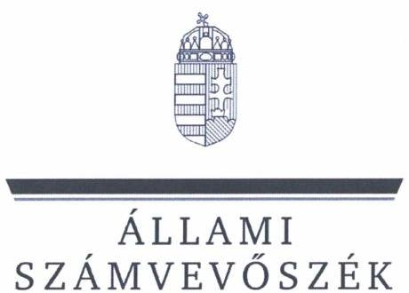

ÁLLAMI
SZÁMVEVŐSZÉK

# JELENTÉS 

## A digitális agráriumhoz kapcsolódó intézkedések eredményessége, a digitális megoldások elterjedése

2025. 

25011
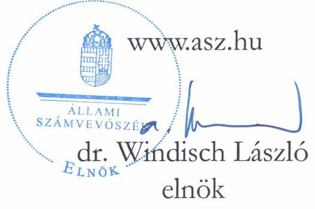

---

# ELLENŐRZÉSI IGAZGATÓSÁG: 

## TELJESÍTMÉNYELLENŐRZÉSI IGAZGATÓSÁG

## ELLENŐRZÉSI IGAZGATÓ:

DR. JAKAB KORNÉL igazgató

## ELLENŐRZÉSVEZETŐ:

## SZAPPANOS JÚLIA ellenőrzésvezető

Jelentéseink az interneten a www.asz.hu címen olvashatók.

IKTATÓSZÁM: EL-4011-003/2025
TÉMASORSZÁM: 17.
ELLENŐRZÉS-AZONOSÍTÓ SZÁM: V1087

---

# TARTALOMJEGYZÉK 

AZ ELLENŐRZÉS ALAPADATAI ..... 5
AZ ELLENŐRZÉS HATÓKÖRE ÉS TERÜLETE ..... 7
ÖSSZEFOGLALÁS ..... 9
AZ ELLENŐRZÉS FÓKUSZTERÜLETEI ..... 12
MEGÁLLAPÍTÁSOK ..... 13
JAVASLATOK ..... 45
MELLÉKLETEK ..... 46
I. sz. melléklet: Értelmező szótár ..... 46
II. sz. melléklet: Az ellenőrzött szervezetek jegyzéke ..... 49
III. sz. melléklet: Ellenőrzési kritériumok ..... 51
IV. sz. melléklet: Szakirodalmi hivatkozások ..... 53
FÜGGELÉK: ÉSZREVÉTELEK ..... 54
RÖVIDÍTÉSEK JEGYZÉKE ..... 55

---

.

---

# AZ ELLENŐRZÉS ALAPADATAI 

## AZ ELLENŐRZÉS CÉLJA

Annak értékelése, hogy az agrárium digitalizációjának fejlesztésére megtett intézkedések eredményesen támogatták-e a mezőgazdasági termelés jövedelmezőségének növelését, az agrárium digitális előrehaladását a versenyképesség tükrében.

## AZ ELLENŐRZÉS TÍPUSA

Teljesítmény-ellenőrzés

## AZ ELLENŐRZÖTT IDŐSZAK

2019-2023. évek, kitekintéssel a 2024. évre, a számvevőszéki jelentéstervezet 2024. októberi összeállításáig tartó folyamatokra.

## AZ ELLENŐRZÉS TÁRGYA

Az ellenőrzés értékelte az agrárium digitalizációjának stratégiai keretrendszerét és irányítását, a megtett intézkedéseket, elért eredményeket, valamint elemezte, értékelte a digitális előrehaladást a versenyképesség tükrében.

Az ellenőrzés kiterjedt minden olyan körülményre és adatra, amely az ÁSZ ${ }^{1}$ jogszabályban meghatározott feladatainak teljesítéséhez, valamint a program végrehajtása folyamán felmerült újabb összefüggések feltárásához szükséges volt.

## AZ ELLENŐRZÉS JOGALAPJA

Az ellenőrzés jogszabályi alapját az ÁSZ tv². 1. $\$ (3) bekezdés, az 5. $\$ (2)-(3)$ bekezdés előírásai képezik.

## AZ ELLENŐRZÉS MÓDSZERE

Az ellenőrzést a nemzetközi standardokat irányadónak tekintve az ellenőrzési program szempontjai, az ellenőrzött időszakban hatályos jogszabályok, az ellenőrzés szakmai szabályok és módszertanok figyelembevételével végeztük el.

Az ellenőrzés kockázati megközelítést alkalmazott, az előzetesen felmért kockázatokból kiindulva, azok csoportosításával és szintetizálásával határozta meg a fókuszterületeket, illetve a kockázatok azonosítása a kritériumok felépítéséhez is hozzájárult. Az ellenőrzési megállapítások rámutattak további kockázatokra, azok

---

kialakulásának okaira, vagy a kockázat bekövetkezése esetén a kockázat káros hatásának csökkentési lehetőségeire. Az ellenőrzés rámutatott jó gyakorlatokra.

Az ellenőrzési kérdések megválaszolásához szükséges bizonyítékok megszerzése az ellenőrzött szervezetek által rendelkezésre bocsátott dokumentumokra és adatokra alapozva, összehasonlítás, elemző eljárás, interjú útján történt, a támogatásokhoz kapcsolódóan (európai uniós, illetve hazai forrásokból megvalósított mezőgazdasági digitális átálláshoz kapcsolódó beruházások és fejlesztések) mintavételes eljárásra került sor. Az európai uniós forrásokból megvalósított mezőgazdasági digitális átálláshoz kapcsolódó beruházások és fejlesztések ellenőrzésére 10 olyan szervezetnél került sor, amelyek esetében a támogatás felhasználása, az elszámolás és a lezárás 2022. december 31-ig megtörtént, a pályázatból megvalósított fejlesztések, beruházások többféle eszközt, precíziós megoldást is magukba foglaltak, illetve tevékenységi területük más-más vármegyére terjedt ki.

Az ellenőrzési bizonyítékként felhasznált adatforrások közé tartoztak egyrészt az ellenőrzéshez kért dokumentumok, adatforrások, másrészt adatforrás volt minden - az ellenőrzés folyamán - feltárt, az ellenőrzés szempontjából információkat tartalmazó dokumentum. Az ellenőrzés során felhasználtunk az agrárium témájában adatgyűjtést végző szervezetek által közzétett adatokat, elemzéseket, tanulmányokat, kapcsolódó szakirodalmat.

Az ellenőrzés lefolytatásához az ellenőrzött szervezet a tanúsítványok kitöltésével, valamint az ÁSZ által kért dokumentumok, adatok, információk megküldésével szolgáltatott adatokat. Az ÁSZ az ellenőrzés során tanúsítványi adatszolgáltatásra kérte fel az egyes ellenőrzést támogató szervezeteket.

---

# AZ ELLENŐRZÉS HATÓKÖRE ÉS TERÜLETE 

A magyar mezőgazdaság részesedése 2019-ben a bruttó hozzáadott érték 3,9\%-át, 2023-ban 3,2\%-3 ${ }^{3}$ tette ki. A mezőgazdasági ágazat (szolgáltatásokkal és másodlagos tevékenységekkel együtt) folyó alapáron számolt kibocsátási értéke a 2019. évi 2820 milliárd Ft-ról 2023-ra 4409 milliárd Ft-ra növekedett. A digitális átállási elképzelések már évtizedek óta megjelentek a mezőgazdaságban. Mára az agrárium digitális jellege, a digitális technológiák használata azt jelenti, hogy a modern technológiákat a szélessávú mobil és vezetékes hálózatok által adott lehetőségekkel együttesen alkalmazzák. A különböző forrásokból (mobilalapú mezőgazdasági alkalmazások, digitális érzékelők, drónok, számítógépes programokkal irányított mezőgazdasági gépek, robotizált és egyéb okos eszközök) származó mezőgazdasági szintű adatok előállítása és rögzítése a gazdálkodók számára éjjel-nappal lehetővé vált. Kutatások, prognózisok alapján a mezőgazdaságban a digitalizálás fellendítheti a termelékenységet és a jövedelmezőséget, valamint hozzájárulhat az éghajlatváltozással szembeni ellenálló képesség növeléséhez.
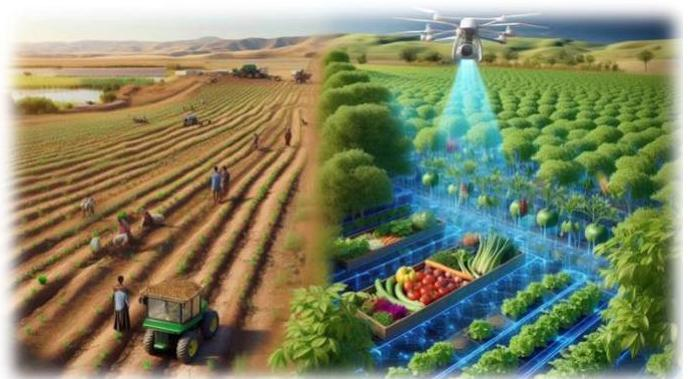

Forrás: Mesterséges intelligencia segítségével ÂSZ saját generálás

Hazánkban kidolgozták a mezőgazdaság digitális átalakítása és az agráriumi digitális megoldások elterjedése érdekében Magyarország Digitális Agrár Stratégiáját (DAS ${ }^{4}$ ), melynek elfogadásáról a Kormány az 1470/2019. (VIII.1.) Korm. határozatban ${ }^{5}$ döntött. Az 1895/2020. (XII. 9.) Korm. határozattal ${ }^{6}$ elfogadta a DAS részletes intézkedési tervét és a feladatokhoz hozzárendelte a szükséges költségvetési forrásokat. A DAS célja volt, hogy az információk gyűjtésével, feldolgozásával, a technológiai műveletek automatizálásával és robotizálásával hozzájáruljon a rendelkezésre álló környezeti erőforrások hatékony felhasználása mellett a mezőgazdasági termelés jövedelmezőségének növeléséhez, amely stratégiai megközelítések illeszkedtek az Európai Unió közös agrárpolitikájában $\left(\mathrm{KAP}^{7}\right)$ megfogalmazott célkitűzésekhez.

Az Európai Unió Bizottsága 2022. november 7-én elfogadta Magyarország KAP stratégiai tervét (KAP $\mathrm{ST}^{8}$ ), mely agrárstratégia a vidéki térségek gyarapodását hivatott támogatni és fenntartható fejlődési pályára állítani a modern technológiák kínálta lehetőségek kihasználása mellett.

A gazdálkodók munkamódszereinek digitális átalakításához, a mezőgazdaságban rejlő lehetőségek kihasználásához megfelelő mobilhálózat, vezeték nélküli csatlakozás, ultragyors sebesség és közel valós idejű adatforgalmat biztosító technológia szükséges. Magyarországon az ellenőrzött időszakban a háztartások mobilinternet lefedettsége, a 4G esetében közel 100\%-os arányt mutatott, az 5G lefedettség jelentősen nőtt, 2023-ra elérte a $83,7 \%$-os arányt, azonban a vidéki háztartások mobilinternet lefedettsége mindössze 57,5\% volt. (Az EU-s átlag a vidéki területeket érintően $73,7 \%$ volt).

A mezőgazdasági termelésbe vont terület a 2020. évi 4,9 millió hektárról, 2023-ra 5,1 millió hektárra növekedett. A mezőgazdasági tevékenységet folytató gazdaságok száma a 2010. évi 350 682-ről, 2020-ra 241 002-re, majd 2023-ra 196 000-re csökkent, eközben az átlagos birtokméret (egy gazdaságra eső átlagos mezőgazdasági terület) 2010-ben 14 hektár, 2020-ban 22,8 hektár volt, majd 2023-ban már meghaladta a 28 hektárt.

---

A foglalkoztatottak számában 2010-2020. közötti időszakban 2017-ig növekedés, majd ezt követően csökkenés következett be, ugyanakkor a mezőgazdaságban dolgozó szakemberek pótlását a stratégiai dokumentumok kiemelt feladatként rögzítették. Az agráriumban a gazdaságok száma 2010-2020. között évről évre csökkent. A gazdaságok vezetőinek kor és nem szerinti adatai alakulását mutatja az 1. ábra.
1. ábra

A GAZDASÁGOK MUTATÓI A VEZETŐ KORA ÉS NEME SZERINT (2010. ÉV, 2020. ÉV)
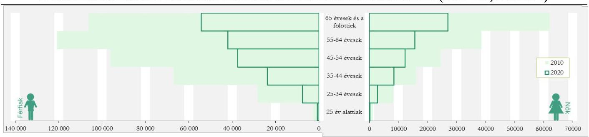

Forrás: https://ec.europa.eu/eurostat/databrowser/view/ef_m_farmang__custom_13236105/default/table?lang=en alapján ÁSZ saját szerkesztés
Az agrárszakképző centrumok (ASZC ${ }^{\circledR}$ ) intézményeiben a 2020/2021. tanévben 9394 diák, a 2023/2024. tanévben 9740 diák tanult. Ezt kiegészítették a felnőttoktatásban résztvevők, ahol a 2020/2021. tanévben 550 fő, a 2023/2024. tanévben 2192 fő volt a hallgatók száma.

Az ellenőrzött időszakban az agrárpolitikai és vidékfejlesztési területen feladatot ellátó szervezetrendszert több változás is érintette. Az ellenőrzés azon szervezetekre, intézményekre és társaságokra terjedt ki, amelyek feladata szorosan kapcsolódott a mezőgazdaság digitalizáltságához és a precíziós gazdálkodáshoz, elsődlegesen a növénytermesztéshez. Ellenőrzött szervezet voltak az Agrárminisztérium, az Agrárközgazdasági Intézet Nonprofit Kft. $\left(\mathrm{AKI}^{10}\right)$, az agrárszakképzési centrumok, a Magyar Agrár-, Élelmiszergazdasági és Vidékfejlesztési Kamara, a Magyar Agrár- és Élettudományi Egyetem, valamint a „VP2-4.1.8-21 Mezőgazdaság digitális átállásához kapcsolódó precíziós fejlesztések támogatása" programból kiválasztott 10 kedvezményezett.

Jelen ellenőrzés keretében az ÁSZ azt értékelte, hogy milyen szerepet játszik a digitalizáció a mezőgazdaságban: milyen előrelépést értek el a mezőgazdasági ágazat szakemberei a digitalizálással, milyen előnyökkel járt a digitális technológia a mezőgazdasági termelők számára, mi történt a mezőgazdaságban keletkező növekvő mennyiségű adattal, és mindezen tényezők milyen hatással voltak a mezőgazdaság termelékenységére, jövedelmezőségére és versenyképességére.

---

# ÖSSZEFOGLALÁS 

A digitalizáció valamennyi nemzetgazdasági ágazatban a versenyképesség megőrzésének, javításának egyik kulcstényezője. A potenciális témák elemzése, az ellenőrzési kockázatok, illetve problémák azonosítását célzó kutatásai során az ÁSZ kockázatként azonosította a mezőgazdaságban a digitalizáció eszközeinek korlátozott terjedését.

Magyarország az agrárium digitalizálását szakpolitikai programjaiban kiemelt prioritásként kezelte az ellenőrzött időszakban. Stratégiai dokumentumok fókuszában állt a mezőgazdaság sikerességét alapjaiban meghatározó digitalizáció, a robotika, a precíziós eszközök használata azzal a várakozással, hogy a technológiák alkalmazásával versenyképesebbé, fenntarthatóbbá válik az ágazat és ellensúlyozható a mezőgazdaságban tapasztalható munkaerőhiány.

Az agrárdigitalizációs stratégiai célkitűzések végrehajtásában közreműködő szervezetrendszernél a különböző adatbázisok és információs rendszerek külön-külön, egymástól elszigetelten múködtek. Az ágazat szereplői számára az adatvisszajuttatás részlegesen valósult meg, az ágazatot az értékelések elvégzésében csak részlegesen támogatták összehangolt információk. A mezőgazdaságban múködő eszközök, digitális megoldások adatai rendszerszerű, integrált kezelésének hiánya a versenyhátrány kialakulásának kockázatát hordozza.

A digitális agrárium víziójához kapcsolódóan nem rögzítették a rendszer kiinduló állapotát, nem alakították ki a 2019-2023. időszakra a stratégiai célkitűzésekhez kapcsolódó mérő- és értékelőrendszert, ezáltal a stratégiai célok folyamatos nyomon követésének lehetőségét nem teremtették meg. Mindezek következtében az eredményesség alakulása objektív indikátorok mentén nem volt mérhető. Az agrárdigitalizáció elterjedésének értékeléséhez a KAP ST-ben meghatározott eredménymutatókhoz az adatok gyűjtésének módja, az adatkörök kialakítása a 2024. évben folyamatban volt, így a digitális előrehaladásról információ még nem állt rendelkezésre.

A DAS-ban rögzített, ellenőrzött 15 intézkedésből hét megvalósult, hat feladat esetében előrehaladás történt, kettő feladatot érintően érdemi előrelépés nem történt az ellenőrzés értékelése alapján.

A mezőgazdaság digitális modernizációjához kapcsolódóan a mezőgazdasági termelők egy széleskörű szakmai hálózat - Magyar Agrár-, Élelmiszergazdasági és Vidékfejlesztési Kamara (NAK ${ }^{13}$ ) támogatására is támaszkodhattak, amelynek több programja, tanácsadó és ismeretterjesztő tevékenysége is ennek a célnak a megvalósítására irányult.

Az agrárdigitalizációs alkalmazkodást támogató programok a szakképzésbe beépültek, ezeket a munkaerőpiaci szereplőkkel, duális partnerekkel való együttműködések is támogatták. Valamennyi agrárszakképzési centrum rendelkezésére álltak agrárdigitalizációs eszközök, többek között drónok, időjárásérzékelő szenzorok, mezőgazdasági mérőeszközök és egyéb, a precíziós mezőgazdaságban használt eszközök.

A mezőgazdasági pályát célzó agrárszakiskolai képzésben a lemorzsolódók aránya magas volt. Az ASZC-k korlátozottan rendelkeztek információval a végzett tanulók munkaerőpiaci elhelyezkedéséről. A munkaerőpiacon jelentkező hiány ellensúlyozására jó gyakorlatként azonosítottuk, hogy együttműködési megállapodást kötött a gazdálkodó és a szakiskola a végzős tanulók naprakész ismereteinek, gyakorlati tapasztalatainak megszerzésére irányulóan. További jó gyakorlatként azonosítottuk a NAK őszi, országos,

---

agrárszakképzést népszerűsítő, pályaorientációs programsorozatát a 6-8. osztályos általános iskolai tanulók, szüleik és a pedagógusok körében (agrárszakképző intézményeknél, valamint gazdálkodóknál).

A DAS-ban meghatározott intézkedések közül nem valósult meg a digitális kompetencia mátrix összeállítása, valamint szervezetileg nem alakult meg a Digitális Agrár Innovációs Központ (DAIK ${ }^{12}$ ), így a feladatkörébe rendelt Digitális Agrár Tesztpályát nem hozták létre. Ugyanakkor ezen feladatokkal összefüggésben a precíziós gazdálkodás témaköre beépült a Magyar Agrár- és Élettudományi Egyetem $\left(\right.$ MATE $\left.^{13}\right)$ képzési rendszerébe, alapkövetelmény lett ezen ismeretek elsajátítása. A 2023-ban kidolgozott új tantervekben már központi elem volt a digitalizáció, a műszaki- informatikai ismeretek erősítése, valamint az üzleti-vezetési-szervezési ismeretek. A MATE-nél, az agrár felsőoktatási intézmények, kutatóintézetek és a piaci vállalatok partneri együttműködésével kiépített gyakorlat-orientált duális képzés, az új agrár szakirányok és az átdolgozott tantárgyi tematikák voltak azok a főbb intézkedések, amelyek támogatták az agráriumban a digitalizáció térnyerését. Az innovációs környezet fejlesztéséhez kapcsolt cél megvalósítása folyamatban volt.

A gazdálkodókat az agrárdigitalizációban a „VP2-4.1.821 Mezőgazdaság digitális átállásához kapcsolódó precíziós fejlesztések támogatása" című pályázat támogatta 188,46 milliárd Ft összegben, amely keretében mezőgazdasági eszközöket, egyéb erő- vagy munkagépeket, laptopokat és táblagépeket, szolgáltatásokat és szoftvereket (precíziós szolgáltatás, tanácsadás, farm-menedzsment programok) szereztek be a gazdálkodók. A 2451 db pályázat közül 2024. június 30-ig 1963 projekt zárult le. A támogatott gazdálkodók ellenőrzése is igazolta, hogy a digitális eszközök és technológiák alkalmazása eredményes volt, hozzájárult a folyamatok optimalizálásához, a költségek csökkentéséhez. Ugyanakkor az új mezőgazdasági gépek és eszközök által biztosított funkciókat a gazdálkodók

A 2014-2020 programozási időszakban az egyes európai uniós alapokból származó támogatások felhasználásának rendjéről szóló jogszabály a projektmenedzsment költségeket a projekt összes elszámolható költségének 2,5\%-ában maximálta. A megítélt támogatási összegek 5,1 millió Ft és 250 millió Ft között, az elszámolt projektmenedzseri költségek 24999 Ft és 6250000 Ft között alakultak. A Kincstár által szolgáltatott adatok alapján a projektmenedzsmentre elszámolt legalacsonyabb és legmagasabb költség között 250-szeres különbség volt.
nem használták ki teljeskörűen, a precíziós termelés eszközrendszeréből származó adatokra csak részlegesen alapoztak a gazdálkodóknál mezőgazdasági döntéseket.

A 2020. évi Agrárcenzus és a 2023. évben végrehajtott Gazdaságszerkezeti összeírás adatait az agrárium digitális fejlettségének mérésére szolgáló mutatószámnak tekintve megállapítható, hogy azok alakulása nem minden tekintetben igazolta az előrehaladást. A felmérés eredménye a digitalizáció lemaradására mutat rá egyes területeken. Az adatok alapján kevesebb gazdaság használt valamilyen precíziós eszközt, csökkent a növényállapotfelmérés, a hozamtérképezés, valamint a drónok alkalmazásának aránya, ugyanakkor számos új eszközt és termelési technológiát vezettek be (sorvezető vagy automata kormányzás, differenciált munkaműveletek), illetve növekedett a flottakövetést és a robotokat alkalmazó gazdaságok aránya. Kiemelhető, hogy a precíziós eszközöket

A pályázati időszakot jelentős beszerzési ár növekedés jellemezte, pl. a kerekes traktor átlagára a 2021. évi 23,2 millió Ft-ról 2023-ra 37,9 millió Ft-ra emelkedett, ugyanakkor a pályázati időszakot követő 2024. I. félévben az átlagár 33,3 millió Ft volt. Hasonló tendencia volt megfigyelhető a gabonakombájnok esetén is. Az árak alakulása az időszakot meghatározó pályázat megjelenésével és kifutásával korrelált.
használó gazdaságokhoz tartozó mezőgazdasági terület növekedett, elsősorban a nagyobb gazdálkodók voltak képesek beruházásokat eszközölni, digitális és

---

precíziós eszközöket, szoftvereket alkalmazni. Az új készségekben és ismeretekben növekvő távolság volt érzékelhető az üzemszinten adatot használó és a digitalizációra nagymértékben támaszkodó (a precíziós mezőgazdasági képességeket, robotokat, drónokat használó, azokat az intelligens technológiákkal integráló, az eszközök által gyűjtött adatokat a mezőgazdasági műveletek során használó) gazdaságok, valamint a mezőgazdaságban a digitális technológia megjelenésével még lépést nem tartó gazdaságok között.

A mezőgazdasági digitális megoldások, a precíziós gazdálkodással foglalkozó szakirodalom, a szakértői dokumentumok, valamint a gyakorlati tapasztalatok alapján a digitális előrehaladás és a versenyképesség növekedésének kapcsolata - az indukált hatékonyságnövekedés, költségcsökkentés, munkaerőmegtakarítás, hozamnövekedések és mindezek következtében a jövedelmezőség növekedése által - igazolható. A gazdálkodók részére nyújtott tájékoztató és ismeretterjesztő tevékenységben mindez - különösen az üzemszintű adathasználat, az adatalapú döntéshozatal lehetősége - csak korlátozottan jelent meg. A szakmai és digitális ismeret átadás ezirányú fókuszáltsággal erősíthető. A digitális megoldások gyakorlati megismerésére 58 digitális bemutató gazdaság múködött.

Az agrárium versenyképességi mutatói (a GDP-hez való hozzájárulás, a teljes tényezőtermelékenység, a mezőgazdaság munkatermelékenysége, az agrárium export-import változását jellemző mutatószámok) az ellenőrzött időszakban számottevően nem javultak. A középtávú stratégiai célok megvalósítása érdekében végrehajtott intézkedések és a digitalizációs megoldások terjesztését szolgáló költségvetési támogatásokból megvalósított eredményes beruházások hozzájárultak az agrárium digitalizációjának fejlődéséhez, azonban a mezőgazdaság versenyképességére gyakorolt hatásuk részben a nyomon követést szolgáló adatok hiánya, részben a külső körülmények változása miatt nem volt kimutatható.

---

# AZ ELLENŐRZÉS FÓKUSZTERÜLETEI 

1.- Az agrárium digitalizációjának stratégiai keretrendszere, irányítása
2.- Az agrárium digitalizációjával kapcsolatos intézkedések végrehajtásának eredményei
3.- Digitális előrehaladás az agráriumban a versenyképesség tükrében

---

# MEGÁLLAPÍTÁSOK 

## 1. Az agrárium digitalizációjának stratégiai keretrendszere, irányítása

| Összegző megállapítás | Az agrárium digitalizációját célzó stratégiai |
| :-- | :-- |
|  | tervdokumentumok összhangban álltak a vonatkozó uniós |
|  | célrendszerrel. A DAS-ban megfogalmazott stratégiai célok |
|  | nyomon követése mérhető indikátorok hiányában a 2019- |
|  | 2023-as időszakra nem valósult meg. A 2024. évre |
|  | megkezdődött az indikátorrendszer kidolgozása. Az |
|  | agrárdigitalizáció jogi szabályozása hátteret biztosított az |
|  | operatív feladatok ellátására. |

Az ellenőrzött időszakban az agráriumi digitális megoldások elterjedéséhez a DAS, illetve a KAP ST stratégiai dokumentumok meghatározták a fejlesztési irányokat.
A Kormány az 1456/2017. (VII. 19.) számú határozatában ${ }^{14}$ döntött a Digitális Jólét Program (DJP ${ }^{15}$ ) kibővítéséről, a Digitális Jólét Program 2.0 elfogadásáról. A határozat elrendelte a miniszterelnöki biztos, a földművelésügyi miniszter és a Miniszterelnökséget vezető miniszter felelősségi körében Magyarország Digitális Agrár Stratégiájának (DAS) és a stratégia végrehajtását támogató intézkedéseknek a kidolgozását, valamint a Kormány elé terjesztését 2017. december 31-i határidővel.
A DAS-t a Kormány az 1470/2019. (VIII.1.) Korm. határozattal fogadta el, és ahhoz intézkedéseket rendelt. Az egyes intézkedések megvalósításának forrásait a Kormány az 1895/2020. (XII. 9.) Korm. határozat elfogadásával biztosította.
A DAS 2019-2022 időszakra szólt. Az agrárgazdaság digitalizálásának DAS-ban rögzített átfogó célja az volt, hogy az információk gyűjtésével, feldolgozásával, a technológiai műveletek automatizálásával és robotizálásával hozzájáruljon a mezőgazdasági termelés jövedelmezőségének növeléséhez a rendelkezésre álló környezeti erőforrások hatékony felhasználása mellett.
A DAS vertikális és horizontális megközelítést alkalmazott, és kiterjedt a mezőgazdasági termelés, a mezőgazdasági üzemek, a termékpályák, valamint a humánerőforrás-fejlesztés, a kutatás-fejlesztésinnováció, a közigazgatási és közszolgáltatások, illetve a fejlesztéspolitika és a támogatások rendszerére.
A 2022-2030-ra szóló Nemzeti Digitalizációs Stratégia (NDS ${ }^{16}$ ) keretstratégiaként egységes szerkezetbe foglalta a digitalizációval összefüggésben korábbiakban elkészült kormányzati dokumentumok helyzetértékelését, jövőképét és eszközrendszerét, így kiterjedt az agrárügyekre is. Intézkedéseket tartalmaz többek között a mezőgazdasági szakképzésben tanulók, illetve az agrártermelők digitális kompetenciáinak és az agrár-digitalizációval összefüggő szakmai ismereteinek fejlesztésére, a Digitális Agrárakadémia általi tudásbázis működtetésére, agrár-szaktanácsadási rendszer ismeretanyagának digitális ismeretekkel történő kiegészítésére, az agráriumban keletkező adatok gyűjtésére (távérzékelés, drónok, szenzorok) és feldolgozására.
Emellett számos hazai stratégiának volt agrárdigitalizációs vonatkozása, amelyek a DAS célokat támogatták, kiegészítették. A főbb társstratégiákat és azok időtávját a 2. ábra szemlélteti:

---

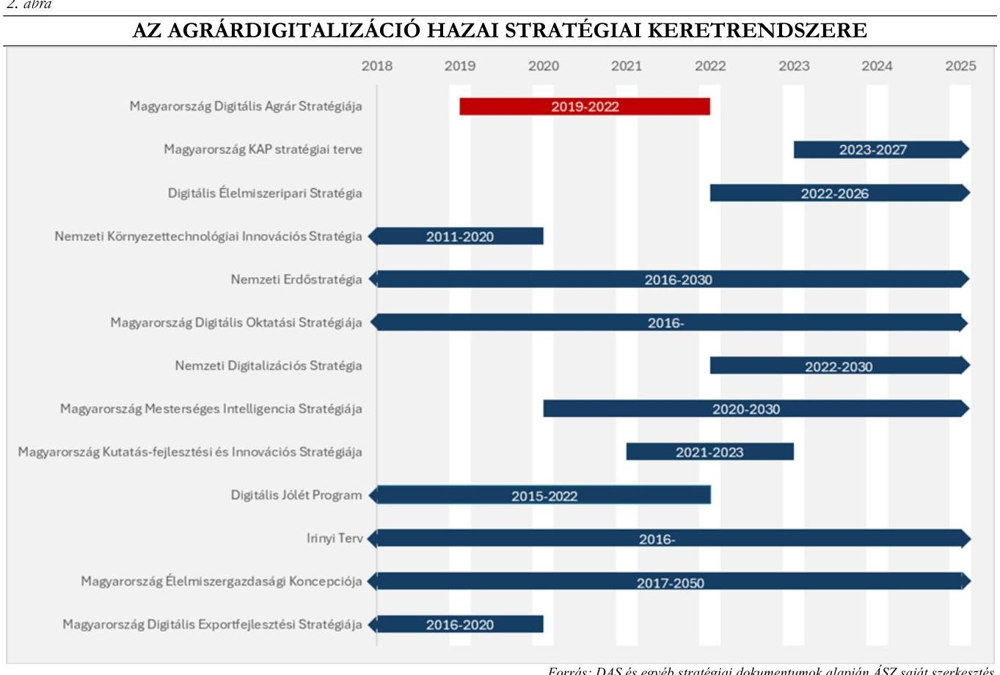

Forrás: DAS és egyéb stratégiai dokumentumok alapján ÁSZ saját szerkesztés

Az uniós közös agrárpolitika megalkotásának célja az volt, hogy támogassa a mezőgazdasági termelőket és gondoskodjon Európa élelmezésbiztonságáról, valamint meghatározza a hazai agrárpolitika, illetve támogatási rendszer kereteit. Az ellenőrzött időszak két uniós KAP programozási ciklust érintett, a 20142020 és a 2023-2027 közötti időszakra vonatkozót. 2021-2022 években átmeneti szabályozás volt érvényben, amikorra a vonatkozó uniós rendelet kiterjesztette a 2014-2020-as időszakban hatályban lévő KAP-szabályok többségét.
Kutatások alapján a digitális megoldások használata javítja a hatékonyságot, így mind a korábbi, mind a jelenlegi időszakra szóló KAP célokat támogatja, pl. a mezőgazdasági jövedelmek növelésére, a szektor versenyképességének javítására, természeti erőforrások védelmére irányuló célok. A DAS - összhangban a KAP célkitűzésekkel - a digitalizációt, illetve a precíziós mezőgazdasági megoldások elterjedését tűzte ki célul.
A 2023-2027 közötti időszakra készített KAP kilenc specifikus (három gazdasági, három környezeti és három társadalmi) célkitűzésének megvalósításához hozzájárul egy átfogó horizontális célkitűzés, a modernizáció, amely a tudás bővítésére és az innováció fokozására irányul. A KAP 2023-2027 közötti időszakát - az Európai Bizottság által 2022. november 7-én jóváhagyott - KAP ST alapozta meg, amelyben az uniós előírásoknak megfelelően a korábbiakhoz képest jelentősebb szerepet kapott a fenntarthatóság, illetve a támogatások feltételrendszerének szabályozása. A programidőszak átfogó célja, hogy a tudás, az innováció és a digitalizáció (AKIS ${ }^{17}$ ) előmozdítása és megosztása révén hatékonyan hozzájáruljon az egyes szakpolitikai célok megvalósulásához.
A DAS stratégiai céljainak meghatározása előzetes helyzetfeltáráson alapult, figyelembe véve a hazai és nemzetközi tapasztalatokat, EU-s elvárásokat és főbb kihívásokat. A DAS kidolgozását

---

több éves előkészítő munka előzte meg, amelyhez felkészítő és háttéranyagok készültek. Az AKI 2017ben megalapozó tanulmányt ${ }^{1}$ készített az agrárium digitális felkészültségeiről és képességeiről. A tanulmány helyzetfeltárást és a nemzetközi tapasztalatok felmérését is tartalmazta, kiterjedt a precíziós gazdálkodás elterjedését gátló és segítő tényezőkre, a technológiai ismeretek forrásaira, a precíziós gazdálkodást végző üzemekre vonatkozó adatokra, a precíziós gazdálkodást végző és a hagyományosan gazdálkodó üzemek összehasonlítására. Az AKI további tanulmányokat ${ }^{2}$ készített az agráradat-integráció és az Okos Tesztüzemi Rendszer (a továbbiakban: SFADN ${ }^{18}$ ) kérdéskörében 2018-ban és 2019-ben.
A DAS a jövőkép mellett tartalmazta a stratégiai célokat, részcélokat, amelyek elérése érdekében részletes cselekvési terv is készült. A DAS az intézkedések megtervezése mellett tartalmazta a célok és az intézkedések kapcsolatát, összerendelését, a stratégia megvalósításának ütemezését, valamint a felelősök, illetve közreműködésre felkérni javasoltak megjelölését, ezáltal meghatározták az intézkedések végrehajtásának kereteit.
A DAS javaslatot tartalmazott célrendszeréhez tartozóan az agrárágazat digitális képességeit mérő indikátorokra, amelyek kidolgozását, a kiindulási értékek meghatározását a DAS végrehajtásának első évére tervezték az AKI feladataként. Emellett az 1470/2019. (VIII.1.) Korm. határozat 17. a) és b) pontjában a Kormány elrendelte a DAS mérő- és értékelő-, valamint indikátorrendszerének folyamatos fejlesztését, illetve a DAS megvalósulásának figyelemmel kísérését, az agrárminiszter, illetve az innovációért és technológiáért felelős miniszter felelősségi körében. A DAS részletes intézkedési tervet tartalmazott az indikátorrendszer megtervezésére, kialakítására és annak konzekvens működtetésére. A digitális mezőgazdaság elterjedtségének és eredményességének folyamatos nyomon követéséhez szükséges mérö-, értékelő-, és indikátorrendszert nem alakítottak ki, ennek hiányában az eredményesség alakulása, a hasznosulás nem volt értékelhető. A DAS-ban meghatározott célok, feladatok előrehaladására vonatkozó adatok folyamatos gyűjtése és elemzése nem valósult meg, azonban időszakos értékelések, felülvizsgálatok készültek. A DAS-hoz nem állt rendelkezésre információ gyűjtésre és rendszerezésre alkalmas háttérrendszer.
A KAP ST elkészítését megelőzően, az AKI 2021-ben elkészítette a Digitális Agrár Stratégia Felülvizsgálata című dokumentumot, mely az AKI-ra vonatkozó részek felülvizsgálatára tért ki, amely alapján az AM 2022-ben munkaanyag formájában felülvizsgálta a DAS-t (DAS 2.0). A 2021-es DAS felülvizsgálati dokumentumban az AKI összefoglalta a digitális átállás versenyképességi hatásait vizsgáló Okos Tesztüzemi Rendszer előkészítése, az Okos Piaci Árinformációs Rendszer kialakítása és a Halászati Információs Rendszer továbbfejlesztése előrehaladását. A felülvizsgálati dokumentum javaslatokat tartalmazott az adminisztratív adatbázisok rendszerszintű összehangolására, mivel az a KAP ST előkészítéséig nem valósult meg.
Az Európai Bizottság által 2022. november 7-én jóváhagyott KAP ST elkészítése során a DAS felülvizsgálat eredményét, a $\mathrm{VP}^{19}$ tapasztalatait, illetve az AM által 2022-ben készített Stratégiai Környezet Vizsgálat című dokumentumot vették alapul. A 2021-es DAS felülvizsgálati dokumentumban és a DAS 2.0 beszámolóban a végrehajtásra vonatkozó tapasztalatokat összegyűjtötték, azokat a KAP ST-be beépítették.

[^0]
[^0]:    ${ }^{1}$ A precíziós szántóföldi növénytermesztés összehasonlító vizsgálata
    ${ }^{2}$ Az agráradat-integrációs program előzetes megvalósíthatósági tanulmány, Digitális agrár-szaktanácsadók képzésére vonatkozó program kidolgozása, Agrárvállalkozások IKT-fejlesztéseit támogató programkoncepciók kidolgozása

---

A KAP ST - amely az Európai Zöld Megállapodás ${ }^{3}$ mezőgazdaságot érintő célkitűzéseinek megvalósulására tekintettel készült - a szakpolitikai célokat, az erősségeket, gyengeségeket, beavatkozási pontokat tartalmazza, figyelmet fordítva a hazai környezet állapotának, természeti erőforrások megújulásának javítására.
A KAP ST-vel kapcsolatos értékelési és monitoring keretek kidolgozása a helyszíni ellenőrzés szakaszában, a 2024. évben kezdődött meg, a digitális előrehaladásról információ még nem állt rendelkezésre. A KAP ST-ben megjelentek az agrárdigitalizáció elterjedéséhez köthető eredménymutatók és célértékek, de elsősorban közvetlen eredményeket mérő output típusú mutató formájában. A tényleges, későbbi hatások megjelenítésére alkalmas outcome mutatókat a KAP ST-ben nem dolgozták ki.
A KAP ST-ben rögzített beavatkozási pontokhoz alkalmazandó indikátorok tagállami kiválasztásához a $\mathrm{CAP}^{20}$ kereteket uniós elvek határozták meg. A KAP ST nyomon követésére adatfeldolgozó rendszert alakítottak ki. A KAP ST végrehajtásáról az EU felé évente két alkalommal kell beszámolni. A 601/2022. (XII.28.) Korm. rendelet ${ }^{21}$ szerint a KAP ST végrehajtását a Nemzeti KAP Monitoring Bizottság követi nyomon. Az agrárminiszter az AKI útján látta el a KAP Alapokból, valamint a nemzeti költségvetésből finanszírozott innovációs és digitalizációs támogatásokkal kapcsolatos értékelési, és felülvizsgálati feladatokat. A KAP ST nyomon követésének kereteit az AM részére készült Monitoring Kézikönyv határozza meg.
Az agrárdigitalizációs feladatokért felelősök köre egyértelmúen meghatározásra került a belső irányítási eszközökben, az ITM ${ }^{22}$ és Miniszterelnöki Kabinetiroda és az AM belső szabályzataiban szabályozta a digitalizációs, informatikai feladatok felelősségi körét.
A stratégiai célrendszer operatív megvalósítását megalapozó jogalkotás támogatta a precíziós eszközök, digitális megoldások elterjedését az agráriumban.
A DAS keretében megvalósítandó intézkedések között megjelent a hazai agrárgazdaság versenyhelyzetének javítását célzó Digitális Agrár Rezsicsökkentés, amely a díjazásért igénybe vehető digitális közszolgáltatások (közadatokhoz és digitális szolgáltatásokhoz való hozzáférés) ingyenessé tételét és új ingyenes szolgáltatások fejlesztését és bevezetését tartalmazta az alábbi táblázat szerint (1. táblázat).

[^0]
[^0]:    3 Az Európai Zöld Megállapodás egy szakpolitikai intézkedéscsomag. (https://www.consilium.europa.eu/hu/policies/green-deal/)

---

1. táblérat

AZ 1470/2019. (VIII. 1.) KORM. HATÁROZAT ÁLTAL ELŐÍRT FELADATOK ÉS MEGVALÓSÍTÁSÁNAK STÁTUSZA

| KORM.   HATÁROZAT   PONTJA | MEGNEVEZETT FELADAT | STÁTUSZA   (AZ ELLENÖRZÖTT   IDÓSZAK VÉGÉN) |
| :--: | :--: | :--: |
| 4. pont | az Országos Meteorológiai Szolgálat mezőgazdasági termelés során hasznosítható meteorológiai adatainak és információinak a mezőgazdasági termelők számára történő térítésmentes hozzáférhetővé tétele, valamint az Országos Meteorológiai Szolgálat földfelszíni mérőhálózatának megújítása, fejlesztése | megvalósult |
| 5. pont | a Mezőgazdasági Parcella Azonosító Rendszer adatainak mezőgazdasági termelők számára történő térítésmentes hozzáférhetővé tétele | megvalósult |
| 6. pont | a mezőgazdasági üzemi folyamatokat digitális eszközökkel térben és időben követő, adminisztratív terheket csökkentő, a digitális átállás versenyképességi hatásait vizsgáló rendszer („Okos Tesztüzemi Rendszer") kialakítása | megvalósult |
| 10. pont | a mezőgazdasági termelők által használt precíziós technológiák alkalmazásának elősegítése érdekében a földmérési és térinformatikai államigazgatási szerv által múködtetett műholdas helymeghatározási szolgáltatás és referenciaállomás-hálózat korszerűsítése (GNSS ${ }^{23}$ ) és bővítése, valamint a helymeghatározási szolgáltatás hozzáférhetőségének kiterjesztése, és ingyenessé tétele | részben valósult meg   GNSS szolgáltatás biztosítása intézkedés részben valósult meg, az ingyenes és nyílt precíziós helymeghatározási szolgáltatás bevezetése nem történt meg |

A DAS-ban meghatározottakkal összhangban a szaktanácsadás területeihez előírt elvárások kiegészültek az agrárinformatikai szakismerettel és kompetenciákkal. A 16/2019. (IV. 29.) AM rendelet ${ }^{24}$ rögzítette a szaktanácsadói tevékenység részletes előírásait, a továbbképzés szabályait, a tanácsadási tevékenységre jogosult természetes személyek és szervezetek körét, valamint összeférhetetlenségi szabályokat állapított meg a tanácsadási tevékenység végzéséhez. A rendeletben megjelent a szaktanácsadás tématerületei és szakterületei között a precíziós gazdálkodás, amely a precíziós növénytermesztés, állattenyésztés és kertészet szakterületeket foglalta magába.
Az Európai Unió 2019-ben elfogadta a 2019/945 (EU) rendeletet ${ }^{25}$, valamint a 2019/947 (EU) rendeletet ${ }^{26}$, a drónok szabályozásával kapcsolatban átfogó szabályozási reformot hajtva végre annak érdekében, hogy a korábbi eltérő tagállami szabályozásokat felváltva harmonizált jogi keretet hozzon létre. A jogharmonizációnak Magyarország a 2021 január 1-jén hatályba lépett, 2020. évi CLXXIX. törvénnyel ${ }^{27}$ tett eleget, módosítva a légiközlekedésről szóló 1995. évi XCVII. törvényt ${ }^{28}$, valamint a kapcsolódó 4/1998. (I. 16.) Korm. rendeletet ${ }^{29}$ és 44/2005. (V. 6.) FVM-GKM-KvVM együttes rendelet ${ }^{30}$, amely 2022. február 23 -ai módosítása a drónokkal történő permetezés részletszabályait rögzítette.

A 4/2022. (II. 8.) AM rendelet ${ }^{31}$ módosította a 44/2005. (V. 6.) FVM-GKM-KvVM együttes rendelet szabályait, rögzítve, hogy drónos növényvédelmi tevékenységet csak az a személy végezhet, aki szerepel a NÉBIH ${ }^{32}$ növényvédelmi drónpilótáinak névsorában. A 4/2022. (II. 8.) AM rendelet meghatározta, hogy permetezést csak típusminősített drónnal lehet végezni, rögzítette a műveleti engedélyre, a kijuttatási tervre, a repülési tervre vonatkozó szabályokat, valamint azt is, hogy csak a NÉBIH által engedélyezett

---

drónos kijuttatásra alkalmas növényvédő szereket lehet alkalmazni. 2024 október 1-én mindössze egy növényvédelmi szer rendelkezett drónos kijuttatási engedéllyel.
A mezőgazdaság digitális átállásával egyre több adat keletkezik az ágazatban. Az adatok jelentős gazdasági, vagy gazdaságot befolyásoló értéket képviselnek, azonban a versenyképesség javításában jelentkező előnyt biztosító információvá alakításának kereteit meghatározó szabályrendszer megalkotása, illetve előkészítése, egyeztetése nem történt meg. Az adatok szolgáltatók általi további felhasználására vonatkozó szabályozók kialakításának elmaradása adatbiztonsági kockázatot - szabálytalan, jogosulatlan, rosszhiszemű felhasználás esetén - végső soron gazdasági kockázatot jelent.
Biztosított volt az együttmúködés és koordináció a stratégiai dokumentumokban foglalt célok elérése érdekében az AM és az AKI között.
Az AKI jellemzően az adatok tisztítását, feldolgozását, előkészítését követően elvégezte az adatok közötti megfeleltetéseket, adatösszefüggések segítségével elemzéseket készített az AM részére. Az elkészített adatfeldolgozások, elemzések az AM döntéshozatalát támogatták, hozzájárultak a DAS és a KAP ST elkészítéséhez.
Az AM a NAK-kal, a Debreceni Egyetemmel, a Széchenyi Egyetemmel, a Magyar Agrár- és Élettudományi Egyetemmel, a Mezőgazdasági Eszköz- és Gépforgalmazók Országos Szövetségével, a Mezőgépgyártók Országos Szövetségével és a Magyar Precíziós Gazdálkodási Egyesülettel kötött stratégiai partnerségi megállapodást. A stratégiai partnerségi megállapodások rögzítették, hogy az agrárium területét érintő jogszabályok és a jogszabályokat megalapozó koncepciók előkészítési munkájában és utólagos értékelésében múködnek együtt. A Magyar Precíziós Gazdálkodási Egyesülettel kötött megállapodásban a felek rögzíttették, hogy agrárdigitalizációt érintő jogszabályok és a jogszabályokat megalapozó koncepciók előkészítési munkájában és utólagos értékelésében múködnek együtt.

---

# 2. Az agrárium digitalizációjával kapcsolatos intézkedések végrehajtásának eredményei 

## Összegző megállapítás

A DAS-ban meghatározott konkrét intézkedések nem teljesültek teljeskörűen. A DAS célrendszerének megvalósításában elért részeredmények azonban hozzájárultak a digitalizáció térnyeréséhez az agráriumban. A Vidékfejlesztési programból finanszírozott digitalizációs célú támogatási projektek segítették az agrárinformatikai eszközök használatának elterjedését, a termeléshatékonyság javulását.

A DAS-ban meghatározott intézkedések végrehajtásának értékelését a 2. táblázat mutatja be.
2. táblázat

A DAS-BAN MEGHATÁROZOTT INTÉZKEDÉSEK VÉGREHAJTÁSA

## INTÉZKEDÉS SORSZÁMA ÉS MEGNEVEZÉSE*

1. Digitális Agrárakadémia $\left(\mathrm{DAA}^{33}\right)$
2. Agrár felsőoktatás fejlesztése (MATE)
3. „Okos Gazda Program", mezőgazdasági szakképzés fejlesztése
4. Digitális Agrár Innovációs Központ létrehozása (DAIK)
5. Innovációs környezet fejlesztése
6. Szaktanácsadás fejlesztése
7. Digitális alaptérkép
8. GNSS szolgáltatás fejlesztése, és térítésmentessé tétele
9. Távérzékelésen alapuló termésbecslés
10. Agrometeorológiai adatok, előrejelzések biztosítása az Országos Meteorológiai Szolgálat által
11. Országos szintű UAV34-szolgáltatás kialakítása
12. „Okos Tesztüzemi Rendszer", ágazati adatok gyűjtése, elemzése
13. Halászati Információs Rendszer (HALir ${ }^{35}$ ) továbbfejlesztése
14. Ágazat digitalizációjának fejlesztési támogatása
15. A szabályozás digitális technológia lehetőségeihez történő igazítása**

[^0]
[^0]:    végrehajtott * ${ }^{\text {® }}$ részben teljesült / folyamatban $\times$ nem teljesült

    * Az intézkedések nem a DAS-ban meghatározott sorrendben szerepelnek.
    ** A 15. intézkedés megvalósításának értékelését az 1. fejezet tartalmazza.

---

A digitális mezőgazdaság működtetéséhez kisebb számú, jól képzett, speciális technológiai ismeretekkel rendelkező, folyamatosan megújulni képes alkalmazott szükséges, így a digitális-technológiai képzés kiemelt fontosságú. Az agrároktatási intézményrendszer (közép- és felsőfokú oktatás), valamint a kutatási rendszer támogatta a digitalizáció térnyerését az agráriumban.
A DAS előkészítésekor az agrár képzés, oktatás és kutatás hiányosságaival összefüggésben azonosított kockázatok alapján a stratégia az agrároktatásra és -képzésre több, a képzés fejlesztésére irányuló célt fogalmazott meg.
A MATE létrehozásával olyan intézeti struktúra kialakítását tervezték, amelynél a képzésben az agrártudományok mellett nagyobb szerepet kapnak a műszaki, gazdasági és gyakorlati ismeretek. A DAS Digitális Agrárakadémia (DAA) tárgyú intézkedése megvalósult. A MATE, a DJP szakmai vezetője és a további agrárképzést nyújtó egyetemek között konzorciumi együttműködés keretében készültek el a DAA fejlesztései, digitális tananyagai. A DAA program múködése a Digitális Agrárakadémia honlapján nyomon követhető volt. A DAA keretében szervezett gyakorlati bemutatók során a digitális fórumokon 2023-ban összesen 2446, 2021-2023. évek között pedig összesen 6010 fő vett részt.
A gazdálkodók, illetve a szaktanácsadók számára a MATE piaci partnerekkel és a NAK-kal együttműködve biztosította a digitális készségek fejlesztését információátadás, tapasztalatcsere és felnőttképzési programok keretében. A MATE tangazdaságaiban a gazdálkodók számára ingyenes technológiai bemutatókat és képzéseket szerveztek, ahol a kutatási eredmények gyakorlati hasznosíthatóságát is bemutatták. A képzések fókuszában a szaktanácsadók, illetve az agráriumban dolgozók digitalizációs tudásszintjének emelése állt.
A DAS-ban szereplő Agrár felsőoktatás fejlesztése intézkedés egyes kapcsolódó feladatai megvalósultak, illetve továbbfejlesztésük folyamatban volt. A MATE-nál az oktatók részt vettek több korszerű digitális és innovációs tudást nyújtó képzésen, megismerték az új technológiákat, amelyeket folyamatosan beépítettek az oktatási tematikába és a kutatásokba. A MATE az agrárképzésben a tudásintenzív mezőgazdaság erősítését célzó digitális technológiák - pl. adatátviteli technológiák, felhő alapú technológia, hagyományos adathordozók kiváltása - széles körű alkalmazásán, a nemzetközi élvonalbeli innovációk becsatornázásán túlmenően mesterséges intelligencia fejlesztéssel is foglalkozott.
A MATE az országban múködő további, agrárképzést nyújtó egyetemekkel - Debreceni Egyetem, Széchenyi István Egyetem, Pécsi Tudományegyetem, Neumann János Egyetem - együttműködési megállapodásokat kötött közös kutatások és szakmai tapasztalatcsere céljából. Az egyetemek együttműködésében nem készült egységes agrárképzési koncepció, módszertan vagy tananyag, ezek meghatározása az egyetemek saját hatáskörében, önállóan történt.
Az intézkedés keretében nevesített digitális kompetencia mátrix elkészítése az ellenőrzőtt időszakban nem valósult meg. A stratégiai célkitúzés szerint a digitális kompetencia mátrix a teljes hazai agrár-felsőoktatási intézményrendszerből, valamint kapcsolódó tudományterületekről (például: robotika, automatizálás, önvezető autók) összegyűjtötte volna a témában jártas, felkészült oktatókat és kutatókat a MATE koordinálásával, amely a digitális képzések tartalmi fejlesztéséhez járult volna hozzá.
A piaci igényekre és a technológiai fejlődésre reagálva a MATE olyan szakokat/szakirányokat indított felnőttképzés keretében, amelyekben a digitalizáció kiemelt hangsúlyt kapott, pl. agrár adattechnológus, agrár műszaki rendszermérnök. A precíziós gazdálkodás évek óta része a képzési rendszernek, nappali oktatás és felnőttképzés keretében is alapkövetelmény lett ezen ismeretek elsajátítása. A 2023-ban

---

kidolgozott új tantervekben dedikáltan vagy a szaktantárgyak részeként központi elem lett a digitalizáció, a műszaki-informatikai ismeretek erősítése.
A MATE a közép- és felsőfokú agrárképzés gyakorlati és elméleti tudásanyagának fejlesztése érdekében szakmai partnerségre lépett az öt agrárszakképzési centrummal, megteremtve a közép- és felsőfokú agrárszakképzés szoros kapcsolatát. A MATE és az ASZC-k közötti együttműködések keretében a szakmai gyakorlatot egymás tanüzemeiben tölthették el a tanulók, ahol korszerű digitális eszközök is rendelkezésükre álltak. A MATE az agrárium területén működő, szakmai tevékenységeket végző nonprofit szervezetekkel és piaci vállalatokkal is együttműködött az agrárdigitalizációt érintő tudományos és kutatási témákban, valamint a gyakorlati képzések biztosításában. A kötelező gyakorlati képzést minden hallgató számára minősített duális partnernél biztosították, 62 településen 78 duális partnerségi megállapodást kötöttek országszerte, amelyek a digitális agrárismeretek gyakorlati helyszínei, illetve bemutató telepei voltak. A külső partnerek a fentieken túl szerepet vállaltak a MATE szakoktatói gárdájának digitális továbbképzésében, tehetséggondozásban és közös innovációs projektekben.
A középfokú agrár szakképzés humán és tárgyi feltételeinek fokozatos javítása, a digitális agrárgazdasággal kapcsolatos ismeretek beillesztése minden mezőgazdasági szakképzés tananyagába hozzájárult a digitalizáció térnyeréséhez. A DAS célok között megfogalmazott mezőgazdasági szakképzés fejlesztése megvalósult az ASZC-knél.
A DAS „Okos Gazda Program", mezőgazdasági szakképzés hosszú távú fejlesztése folyamatban volt. Az ellenőrzött időszak végéig teljesült a tananyag fejlesztése, digitális eszközök és technológiák beszerzése, képző központok és vizsgaközpontok létrehozása, oktatói továbbképzési tervek összeállítása, mezőgazdasági adatok digitális gyűjtése. Mind az 5 ASZC-ben a gyakorlati képzés korszerűsített, digitális eszközökkel felszerelt tanműhelyekben és tangazdaságokban, valamint duális képzőhelyeken valósult meg. Az agrárdigitalizációval összefüggő képzéshez szükséges tárgyi feltételek az ellenőrzött időszakban évről évre javultak. A szakképző centrumok rendelkezésére többféle robotizációs eszköz, drón, meteorológiai állomás, fejőrobot, precíziós permetező, erőgépek kormányautomatikával, erdészetben használt mérőeszközök (pl. mobil forester, fakopp 3D műszer), sertéstartáshoz kapcsolódó precíziós eszközök, digitális gabona nedvességtartalom mérő, RTK ${ }^{\text {th }}$ földi állomás, stb. állt rendelkezésre. A mezőgazdasági szakképzés fejlesztése az ellenőrzött időszak végéig nem zárult le.
Az agrár szakképzésben végrehajtott fejlesztések ellenére továbbra is jellemző a szakmai tárgyakat oktató pedagógusok hiánya, valamint a lemorzsolódás. Az ellenőrzött időszakban - az Északi ASZC kivételével - minden tanévben voltak betöltetlen agrárképzést érintő pedagógus státuszok az ASZC-knél, a betöltetlen státuszok aránya $0,6-7,6 \%$ között alakult. A pedagógushiányt az iskolák jellemzően óraadó szakoktatók alkalmazásával kezelték. A megfelelő kompetenciájú humánkapacitás hiánya - tekintettel az óraadó szakoktatókra - nem gátolta az agrárium digitalizációját, a digitalizációs eszközök alkalmazását.

---

A lemorzsolódás aránya magas, régiónként, ASZC-nként eltérő, heterogén képet mutatott. A lemorzsolódás arányának alakulását az agrárszakképzésben (2020-2024) a 3. táblázat mutatja be. Az ASZC-k által célkitűzésként meghatározott $5,0 \%$-os lemorzsolódási arányt csak a Déli ASZC tudta elérni 2020/2021. és 2022/2023. tanévekben ASZC szinten összesített adatok alapján. A magas lemorzsolódás annak kockázatát hordozza magában, hogy az egyébként is súlyos munkaerőhiánnyal küzdő agrár ágazatban nem képződik meg a szaktudással rendelkező utánpótlás.
Az ASZC-k korlátozottan rendelkeztek információval a
régiónként, ASZC-nként eltérő, heterogén képet mutatott. A agrárszakképzésben (2020-2024) a 3. táblázat mutatja be. Az

| 3. táblázat |  |  |  |  |
| :--: | :--: | :--: | :--: | :--: |
| LEMORZSOLÓDÁS ARÁNYÁNAK ALAKULÁSA AZ AGRÁRSZAKKÉPZÉSBEN (2020-2024) (\%) |  |  |  |  |
|  | 2020/2021.   TANEV | 2021/2022.   TANEV | 2022/2023.   TANEV | 2023/2024.   TANEV |
| Alföldi ASZC | 7,0 | 18,9 | 10,9 | 8,1 |
| Déli ASZC | 4,8 | 5,4 | 4,9 | n.a. |
| Északi ASZC | 11,9 | 9,2 | 9,9 | n.a. |
| Kisalföldi ASZC ${ }^{a}$ | 5,0 | 8,0 | 7,0 | 4,0 |
| Közép-magyarországi ASZC | 6,9 | 7,3 | 7,0 | 7,8 |

Fornás: ASZC adatszolgáltatás 2.2 tanúsítvány alapján ÁSZ saját szerkesztés

* középfokú nappali képzés adatok
A Kisalföldi ASZC felnöttképzés vonatkozó adatai rendre 20,0\%; 25,0\%; 14,0\%; 17,0\%:
végzett tanulók munkaerőpiaci elhelyezkedéséről, amely visszajelzést adhatott volna a szerzett tudásuk értékéről és piacképességéről. Ez a fontos teljesítmény mutató nem állt rendelkezésre sem az oktatási intézmények, sem az irányító szervek számára, mivel a végzett diákok elhelyezkedésének nyomon követésére nem volt kialakított információs rendszer. Az ASZC-k által eddig kialakított önkéntes visszajelző csatornák nem voltak eredményesek az alacsony visszajelzési arányok miatt.
Az agrár felsőoktatási intézmények (kiemelten a MATE) és kutatóintézetek közötti koordináció és együttmúködés kereteit kialakították és múködtették. Az oktatást, képzést biztosító intézmények, a képző helyek és a NAK együttműködésével kutatási programokat hajtottak végre, mely hozzájárult az innovációs környezet fejlesztéséhez.
A MATE-nél agrárdigitalizációs kutatást több kutatóintézetben, két helyszínen végeztek (Gödöllő, Gyöngyös), valamint a világ vezető és regionális agráregyetemeivel kialakított nemzetközi együttműködések keretében közös kutatásokat indítottak. A Növénytermesztési Intézetnél a kutatási adatok gyűjtése új alapokra került, térinformatikai rendszerekben dolgoztak, digitális adatbázist építettek, a Műszaki Intézetnél jelentős fejlesztések és modernizáció zajlott le, amelyet a digitalizáció vezérelt (műszaki berendezések modernizálása, mérnökinformatikai központ kialakítása, digitális tematikájú kutatások, Agrárinformatikai FIEK ${ }^{37}$ létrehozása).
Az ellenőrzött időszakban folyamatban volt az $\mathrm{AEDIH}^{38}$ program keretében zajló digitális érettség vizsgálat, amely 2023. februárban indult el konzorciumi formában, uniós és kormányzati támogatással. A konzorcium vezetője a MATE, tagjai a Nemzeti Ménesbirtok és Tangazdaság Zrt., a NAK és a Széchenyi István Egyetem voltak. A kutatás során mintegy 160-180 agrár gazdálkodó digitális érettségét mérték fel, ennek alapján képzést dolgoztak ki, amely 2024 szeptemberében elkezdődött. A képzések célja a gazdálkodók digitális tudásszintjének emelése, a digitalizáció eredményeinek terjesztése.
A DAS Digitális Agrár Innovációs Központ (DAIK) létrehozására irányuló intézkedés célja az volt, hogy a modern precíziós technológiákat, digitális megoldásokat a képzési rendszerbe integrálja. A DAIK szervezetileg nem alakult meg, így a feladatkörébe rendelt Digitális Agrár Tesztpályát nem hozták létre. A DAS intézkedés céljának megvalósításához, valamint az innovációs környezet fejlesztéséhez azonban hozzájárult az, hogy egyes, a mezőgazdasági adatalapúsághoz, a digitalizációhoz

---

köthető kereteket kidolgozták, továbblépési irányokat határoztak meg, integráltak, teszteltek modern precíziós technológiákat, digitális megoldásokat a felsőoktatásban, tangazdaságokban.
A szaktanácsadás fejlesztésére irányuló DAS intézkedés megvalósult, a digitalizáció térnyeréséhez hozzájárult a MATE és a NAK közötti számos területet érintő, folyamatosan aktív együttműködés és kapcsolattartás. A közös képzési programok közül a precíziós szaktanácsadók képzése emelhető ki, amely átfogó rendszerszintű ismeretek átadására és gyakorlati képzésre is irányult.
Az agrárium humán erőforrás, elsősorban a gazdálkodói tudás fejlesztésében, a digitalizáció terjesztésében fontos szerepet töltöttek be az agrárgazdasági és vidékfejlesztési szaktanácsadók. A szaktanácsadói hálózatnak 2024. augusztus 1-jei állapot szerint 1274 tagja volt, közülük 231 szaktanácsadó (18,1\%) foglalkozott a precíziós gazdálkodás tématerülettel. A tématerületen belül három szakterületet határoztak meg: precíziós növénytermesztés, precíziós állattenyésztés és precíziós kertészet. Az egyes vármegyék szaktanácsadói felkészültsége heterogén volt, az élen járó vármegyékben a szaktanácsadóknak több, mint egy harmada rendelkezett precíziós szakismerettel, volt azonban olyan vármegye is, ahol egyáltalán nem szerepelt szaktanácsadó a precíziós tématerületen. Ez felvetheti annak kockázatát, hogy a helyi gazdálkodók a precíziós gazdálkodás terén nem juthattak megfelelő/elegendő támogatáshoz, iránymutatáshoz. Alátámasztotta ezt a kockázatot az is, hogy - bár a NAK által szervezett szaktanácsadói alapképzési tananyagnak része a digitalizáció - az ellenőrzött időszakban a NAK által akkreditált egyéb képzések fókuszában kevésbé voltak hangsúlyosak olyan területek, mint a digitális eszközök használata, a kapcsolódó adatgyűjtések, és az adatalapú döntéshozatal.
Az ellenőrzött szervezetek által üzemeltetett információs rendszerek, adatbázisok és adatgyűjtések támogatták az ágazat stratégiai irányítását, valamint az ágazat további érintett szereplőit, azonban ágazati szinten a különböző adatbázisokban és rendszerekben tárolt információk nem kapcsolódtak össze, nem tették lehetővé integrált adatok visszajuttatását a gazdálkodók részére.
Az AM a stratégiai célrendszer kialakításához, a döntéshozatalhoz a szükséges és megfelelő adatokat rendszerezte és elemezte. Az AM nem működtetett önálló információs rendszert, szakpolitikai döntések előkészítését alátámasztó adatokhoz államháztartáson belüli szereplők révén jutott, pl. a $\mathrm{KSH}^{39}$-tól, az IIER-ből (Integrált Irányítás és Ellenőrzési Rendszer), a NÉBIH által üzemeltetett elektronikus Gazdálkodási Naplóból ( $\mathrm{eGN}^{40}$ ). Az AM az eGN, valamint az Agrártechnológiai Nemzeti Laboratórium fejlesztése projekt, valamint az AKI weboldalán elérhető online kimutatások adataihoz közvetlenül fért hozzá, illetve számos egyedi adatkérést kezdeményezett az AKI által üzemeltetett Tesztüzemi Rendszer, valamint a Piaci Árinformációs Rendszer adataihoz kapcsolódóan. Mindezek mellett az AM az adatok gyűjtésére, rendszerezésére és elemzésére rendszerint az agrárstatisztikai informatikai rendszereket (PÁIR ${ }^{41}$, ASIR ${ }^{42}$, FADN ${ }^{43}$ ) üzemeltető AKI-t, illetve egyéb szakmai szervezeteket, kiemelten a Lechner Tudásközpontot ${ }^{44}$ - ami szakmai háttérintézményként foglalkozik az országos téradatnyilvántartások kezelésével, elemzésével, szolgáltatásával - bízta meg.

---

Az AKI a stratégiai célrendszer, a döntéshozatal támogatása érdekében a szükséges és megfelelő adatokat gyűjtötte, rendszerezte és elemezte. Az AKI a statisztikai adatok gyűjtését a Hivatalos Statisztikai Szolgálat (HSSz ${ }^{45}$ ) tagjaként, az Országos Statisztikai Adatfelvételi Program $\left(\mathrm{OSAP}^{46}\right)$ keretén belül is végezte, együttműködési megállapodással rendelkezett a KSH-val, a NAK-kal, az Országos Vízügyi Főigazgatósággal, a Belügyminisztériummal és a KINCSTÁR ${ }^{47}$-ral. Az AKI a NÉBIH adatai alapján lekérdezéseket készített az AM részére. A főbb adatgyűjtési rendszerek adatgyűjtésébe bevontak számának adatait a 4. sz. táblázat mutatja be.
Az AKI az agrárium szereplői, egyéb szervezetek (pl. kutatóintézetek, ellenőrző szervek) adatigényeinek kielégítésére rendszeresen kiadványokat (Agrárstatisztikai zsebkönyvet, Statisztikai jelentéseket, agrárpiaci jelentéseket, éves jelentéseket) és pénzügyi hírlevelet jelentetett meg. Tevékenysége keretében kérdőíves felméréseket végzett az agrárium
4. táblázat

# A FŐBB ADATGYÜJTÉSI RENDSZEREK ADATGYÜJTÉSÉBE BEVONTAK SZÁMA 

| RENDSZER   /ADATGYÜJTÉS   MEGNEVEZÉSE | ADATGYÜJTÉSBE   BEVONTAK SZÁMA |
| :-- | :-- |
| FADN | kb. 2000   adatszolgáltató, akik a   106 ezer hazai   árutermelő   gazdaságot   reprezentálják |
| PÁIR | 300 adatszolgáltató |
| ASIR | 10 ezer   adatszolgáltató |
| HALÁR | 15 fogyasztói piac 3   üzletlánc |
| Agrárcenzus 2020 | 241002 gazdálkodó |
| Gazdasági   Szerkezetösszeírás | 74 ezer gazdaság |

Fonrás: Ellenörzötték adatszolgáltatásai alapján ÁSZ saját szerkecstés
szereplői között, amelyek eredményeinek összesítése, elemzése támogatta a stratégiai célrendszer kialakítását, módosítását. Az AKI weboldalán az Agrárinformációs portálon keresztül lehetőség volt az online kimutatásokban naprakész (legfrissebb állapotú adatbázis) és régebbi, archív adatok lekérdezésére az ASIR, PÁIR, FADN rendszerekből.
A MATE saját szervezeti keretek között működtetett a digitális agráriumot érintő adatbázisokat, információs rendszereket ${ }^{48}$, amelyek azonban nem szolgáltattak adatokat a stratégiai célrendszer formálásához, döntéshozatalhoz. Más szervezetek által gyűjtött, alkalmazott, üzemeltetett adatbázisokhoz, információs rendszerekhez is hozzáféréssel rendelkezett: Közösségi Növényfajta-hivatal által üzemeltett $\left(\mathrm{CPVO}^{49}\right)$ közösségi növényfajta-oltalom adatbázis, EUIPO-adatbázisok ${ }^{50}$, WIPO adatbázisok ${ }^{51}$, Qper online piactér ${ }^{52}$, valamint nyilvános adatbázisokhoz, vízgazdálkodási adatokhoz, illetve az országos meteorológiai és a Danube Data Cube műholdas helymeghatározási adatokhoz, valamint a Bonafarm Csoporttal való együttműködés keretében agrár adatokhoz.
A NAK a 16/2019. (IV. 29.) AM rendelet, illetve az 1/2022. (I. 14.) AM rendelet ${ }^{53}$ alapján működtetett, szaktanácsadói tevékenység végzésére jogosult szaktanácsadókról és szaktanácsadó szervezetekről vezetett nyilvántartása alapján szolgáltatott adatot a stratégiai célrendszer formálásához, döntéshozatalhoz.
Az ellenőrzött szervezeteknél múködő adatbázisok és információs rendszerek a hasonló vagy párhuzamos adatgyűjtéstől mentesek voltak, noha az adatok és információk feltöltését az ellenőrzött szervezetek saját tevékenységük keretében végezték, összehangolt (közös) adatfeltöltés nem volt. Az AKI, a NAK, a MATE eljárásrendjeikben, szabályzataikban rögzítették az adatbázisok működtetésének, tisztításának, felhasználásának és az adatok védelmének szabályait. Az adatbázisok üzemeltetésére vonatkozó jogszabályoknak megfelelően az általuk működtetett adatbázisokból, rendszerekből kinyerhető információk szakmai adattartalmának egységessége biztosított volt, alkalmasak voltak a döntések

---

támogatásához, ugyanakkor a különböző adatbázisokban és rendszerekben tárolt adatok, információk nem kapcsolódtak össze.
Az AKI, a NAK és a MATE által nyújtott adatalapú szolgáltatások egyes adatok gyűjtésével, feldolgozásával, az ágazat szereplői részére eljuttatásával támogatták az agráriumi digitális megoldások elterjedését. Mindez segítséget nyújtott pl. az egyre szigorodó uniós előírások betartásához, azok igazolásához, illetve hozzájárult a gazdák adminisztrációs terheinek csökkentéséhez, átláthatóság növeléséhez, valamint lehetővé tette az ellenőrző szervek számára az ellenőrzési tevékenységek egyszerűbb elvégzését. Az adatalapú szolgáltatásokat nyújtó rendszereket, azok kiemelt feladatait, adatait az 5. táblázat mutatja be.
5. táblázat

# AZ ADATALAPÚ SZOLGÁLTATÁSOKAT NYÚJTÓ RENDSZEREK 

## ADATALAPÚ SZOLGÁLTATÁSOKAT NYÚJTÓ RENDSZEREK MEGNEVEZÜSE

Tesztüzemi Információs Rendszerben (FADN)

Piaci Árinformációs Rendszer (PÁIR)

HALÁR

Agrárstatisztikai Információs Rendszer (ASIR)

Mezőgazdasági és Ipari Mikroorganizmusok Nemzeti Gyűjteménye (NCAIM)

Országos Vadgazdálkodási Adattár (OVA)
Szaktanácsadói névjegyzék
elektronikus Gazdálkodási napló (eGN) és a KINCSTÁR Mobilgazda alkalmazás

Meteorológiai Adattár

Mezőgazdasági
Azonosító
(MEPAR)

## A RENDSZER RÖVID ISMERTETÉSE

a gyűjtött adatok elemzések és statisztikák készítésére, az agrárpolitikai intézkedések tervezésére és gyakorlati megvalósítására voltak használhatók
a fontosabb termékpályák egyes fázisaihoz kapcsolódó árak és értékesített mennyiségek gyűjtése, a gazdák részére heti rendszerességủ adatszolgáltatás, elemzés valósult meg
a halászati termékek fogyasztói árainak összehasonlítására nyújtott lehetőséget
élelmiszeripari, mezőgazdasági, inputanyag kereskedelmi és akvakultúra szakterületekre kiterjedő adatgyűjtést végzett
fő tevékenysége volt: szabadalmi letétek fogadása és fenntartása, a biotechnológia, a mikrobiológia különböző területei és a tanítás szempontjából releváns baktériumok, fonalas gombák és élesztőgombák összegyűjtése
a vadászterületek és vadgazdálkodók azonosítására szolgáló legfontosabb adatokat tartalmazta
lehetővé tette a szaktanácsadói tevékenység végzésére jogosult szaktanácsadók és szaktanácsadó szervezetek listájában a keresést, egyszerűsítette a kapcsolatfelvételt
a gazdák adminisztrációs terheinek csökkentéséhez járultak hozzá, valamint átláthatóbbá és egyszerűbben ellenőrizhetővé tették a különböző EU-s kötelezettségeket, előírásokat
ingyenesen és szabadon felhasználható megfigyelési és mérési adatokat nyújtott, lekérdezhetők voltak a futtatott modellek előrejelzései, egyéb időjárási és éghajlati információk
szabadon elérhető információkat tartalmazott, pl. támogatható/nem támogatható terület nagysága, az aszályérzékenység vagy a védelmek adatai

Forrás: Ellenőrzöitek adatszolgáltatásai alapján ÁSZ saját szerkeszés

A DAS céljaiban meghatározott adatgyűjtő és információ feldolgozó rendszereket fejlesztették. A DAS Digitális alaptérkép biztosítása intézkedés megvalósult, a Mezőgazdasági Parcella Azonosító Rendszer (MePAR) továbbfejlesztése elkészült, 2021 április 12-e óta a mezőgazdasági termelők elérhetik.

---

A gazdálkodók lekérhetik az adott évre vonatkozóan az egységes kérelemben bejelentett területeik vektoros MePAR-alapadatait és a felszínborítási térképeket.
A DAS GNSS szolgáltatás biztosítása, és a távérzékelésen alapuló termésbecslés kialakítása intézkedések részben valósultak meg az ellenőrzött időszak végéig, mert az ingyenes és nyílt precíziós helymeghatározási szolgáltatás bevezetése nem történt meg. Az agrárminiszter és az innovációért és technológiáért felelős miniszter 2020 áprilisában előterjesztést készített, amelyben rögzítették, hogy az agrárdigitalizáció széleskörű elterjedéséhez elengedhetetlen a GNSSszolgáltatás korszerűsítése és bővítése, valamint a helymeghatározási szolgáltatás adatainak térítésmentes hozzáférhetővé tétele. A Lechner Tudásközponton kívül több piaci cég is kínál RTK helymeghatározási szolgáltatást. Ehhez kapcsolódik a Mezőgazdasági Kockázatkezelési Rendszer távérzékeléses modulja, amellyel műholdfelvételek távérzékeléses kiértékelésével országos kártérképek előállítása valósult meg.
A DAS Agrometeorológia intézkedése megvalósult, 2021. január 1-jétől az Országos Meteorológiai Szolgálat (OMSZ ${ }^{34}$ ) odp.met.hu nyílt adatszerveren keresztül ingyenesen és szabadon felhasználhatóan rendelkezésre bocsátotta megfigyelési és mérési adatait, a futtatott modellek előrejelzéseit, egyéb időjárási és éghajlati információit. Az oldal az ellenőrzés lezárásakor üzemelt, adatok letölthetőek voltak, folyamatosan frissültek, az archív adatok feltöltése folyamatban volt. Az ellenőrzött időszak végén az OMSZ jogutódja, a HungaroMet Zrt. az Agrometeorológiai oldalt is üzemeltette, amely a mezőgazdaságban dolgozók számára biztosított releváns információkat (csapadék mennyisége, párolgás, talajnedvesség, talajhőmérséklet, aszály információk, napfénytartam, levélnedvesség).
A DAS Drón szolgáltatás intézkedés keretében az Országos szintű UAV-szolgáltatás (drón) kialakítása nem valósult meg.
A Mezőgazdasági Adminisztratív Adatpolitika részeként létrehozott Okos Tesztüzemi Rendszer (SFADN) kialakítása megtörtént, a rendszer az ellenőrzött időszak végére múködött. A fejlesztés lényege az volt, hogy a termelői agrár-adatvagyon közadattá tétele lehetőségének kialakítása mellett a termelő ingyenes szolgáltatásként visszakapja a saját adatainak értékelését és összehasonlítását a versenytárs termelőkkel.
A DAS Halászati Információs Rendszer (HALir) továbbfejlesztése intézkedése részben teljesült, a térképes adatszolgáltató rendszer első lépéseként egy olyan geoportál készült el, melyen az AKI által gyűjtött haltermelési adatok jelentek meg. A rendszer továbbfejlesztésére, az adatok frissítésére létrejött egy webalapú adatgyűjtő felület, amelyen regisztrációt követően havi rendszerességgel állt rendelkezésre adat a megfigyelt kárókatonák egyedszámáról, a riasztás módjáról, valamint a becsült kártételről. A HALir továbbfejlesztésében további előrelépés (pl. fogási napló adatainak átvétele, környezeti adatok integrálása) nem történt.
A fenti - gazdálkodást és irányítási döntéshozatalt támogató - adatbázisok, rendszerek szigetszerű működése, az állami adatbázisok és információs rendszerek interoperabilitásának hiánya versenyhátrány kialakulásának kockázatát jelezte az ágazatban. Az adatok elérhetősége,

---

összekapcsolása és elemzése kulcsfontosságú a piaci döntésekhez, a folyamatok optimalizálásához. Ha az információk nem érhetőek el teljeskörűen, akkor az érintett ágazati szereplők kevésbé tudnak reagálni a változó körülményekre, hatékonyan működni és megfelelő, adatalapú döntést hozni.
A DAS célja volt az ágazat digitalizációjának fejlesztési támogatása, mely intézkedés keretében a gazdálkodókat a „VP2-4.1.8-21 Mezőgazdaság digitális átállásához kapcsolódó precíziós fejlesztések támogatása" című pályázat támogatta. A program uniós forrásból a Vidékfejlesztési Programon belül valósult meg, Magyarország költségvetése társfinanszírozásában.
A 2007. évi XVII. törvény ${ }^{55}$ határozta meg a mezőgazdasági és agrár-vidékfejlesztési támogatásokkal összefüggő alapelveket, egységes intézményi, információs és eljárási kereteket, a monitoring bizottsággal kapcsolatos szabályokat, a kifizető ügynökségi felelősségi köröket, az adatkezelési, valamint a nyilvántartási rendszerekre vonatkozó szabályokat. Az eljárási részletszabályokat a 272/2014. (XI. 5.) Korm. rendelet ${ }^{56}$ rögzítette.
A 2022. évi LXV. törvény ${ }^{57}$ határozta meg az agrártámogatások igénybevételére vonatkozó önálló szabályokat. A 2022. évi LXV. törvény hatályba lépésével egyidejűleg szükségesé vált a 2007. évi XVII. törvény módosítása is. A KAP ST elfogadásának elhúzódása miatt a 2007. évi XVII. törvény hatályának fenntartása és szabályainak alkalmazása elengedhetetlen volt. Csak így volt biztosítható az, hogy a KAP Stratégiai Terv szerinti egységes kérelem benyújtása és elbírálása, a kapcsolódó informatikai fejlesztések biztosítása az európai uniós szabályoknak megfelelően és az előírt határidőben megtörténjen. A két törvény rendelkezései között részleges átfedés van, ugyanakkor ellentmondásmentesek.
A 2022. évi LXV. törvény felhatalmazása alapján megalkotott 601/2022. (XII. 28.) Korm. rendelet határozta meg a Nemzeti Irányítóhatóság és a Nemzeti Kifizető Ügynökség feladatköreit, az összeférhetetlenségi szabályokat, a Nemzeti KAP monitoring bizottság múködését, a helyi akciócsoportok működését, szabályozta a közreműködő szervezet, valamint az együttműködő szervezet kijelölésének módját.
A Kormány meghatározta az agrárium digitalizációját elősegítő vidékfejlesztési támogatások igénybevételével kapcsolatos szabályokat, valamint az egyes programokra adható támogatások mértékét. Az 1248/2016. (V. 18.) Korm. határozat ${ }^{58}$ 1. mellékletének 19b) pontja a VP2-4.1.8-21 kódszámú Mezőgazdaság digitális átállásához kapcsolódó precíziós fejlesztések támogatása címü felhívásra a 2021. júniusban meghirdetett kezdeti 100 Mrd Ft összeget - a pályázat iránti nagy érdeklődés miatt - kettő alkalommal is emelve, az ellenőrzött időszak végéig 188,46 Mrd Ft-ban biztosított keretösszeget.
A kialakított támogatási, illetve finanszírozási rendszer hozzájárult az agrárdigitalizációs stratégiai célok eléréséhez. A pályázati forrásokból megvalósított technológiai fejlesztések és a kapcsolódó szolgáltatások elősegítették az új digitális szántóföldi technológiák és a precíziós gazdálkodás elterjedését, bővítését. Ezen technológiák alkalmazása elengedhetetlen a folyamatok optimalizálásához, ezáltal a költségek csökkentéséhez.
A támogatás maximális mértéke a közép-magyarországi régióban az összes elszámolható költség 40\%-a, a nem közép-magyarországi régióban $50 \%$-a volt, a fiatal mezőgazdasági termelő által, illetve a kollektív módon végrehajtott projektek pedig 10 százalékponttal megemelt támogatási intenzitásra voltak jogosultak. A megítélt támogatás 2486 db támogatási szerződésre mindösszesen 180,6 Mrd Ft volt, amelyből 2024. szeptember 21-ig 2159 projekt esetében 136,4 Mrd Ft kifizetés történt meg. Az egy

---

szerződésre jutó átlagos támogatás 72,7 millió Ft, a legkisebb szerződött támogatás összege 5 millió Ft, míg a legnagyobb 250 millió Ft volt.
A pályázati portál 2024. szeptember 21-i adatai alapján egy pályázati támogatás átlagos átfutási ideje 196 nap volt a támogatási kérelem benyújtásától a támogatás megítéléséig, ami 81 nap és 716 nap között szórt (az adott projekt tényleges átfutási ideje nem a tényleges ügyintézést jelentette és azt változásbejelentés vagy támogatói okirat módosítás meghosszabbíthatta). A pályázatok $96 \%$-a esetében 300 nap alatt megtörtént a támogatás megítélése. A támogatás megítélésétől a támogatási szerződés megkötéséig átlagosan további 115 nap telt el. A támogatás megítélésétől számítva átlagosan 631 napot igényelt a projekt befejezése.
A megítélt támogatási összeg legnagyobb hányadát eszköz-, illetve egyéb mezőgazdasági erő- vagy munkagép beszerzésére fordították, lehetőség volt a digitális átállásához szükséges szolgáltatások és kapcsolódó tanácsadás, képzés költsége elszámolására. További összegeket számoltak el projektmenedzsment és egyéb költségekre (pl.: projektelőkészítés, hatósági eljárási díjak, könyvvizsgálat, műszaki ellenőri szolgáltatás, stb.). A támogatásból beszerzett eszközök és szolgáltatások arányát az alábbi 3. ábra szemlélteti:
3. ábra

A VP2-4.1.8-21 PÁLYÁZATI TÁMOGATÁSBÓL BESZERZETT ESZKÖZÖK ÉS SZOLGÁLTATÁSOK MEGOSZLÁSA A MEGÍTÉLT ÖSSZEG ALAPJÁN (\%)
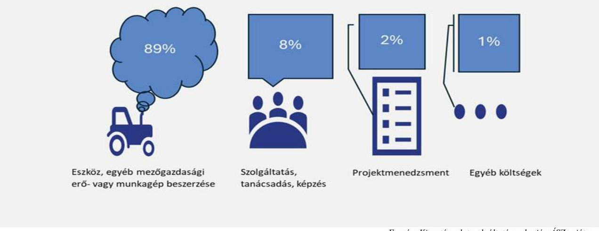

Forrás: Kincstár adatszolgáltatása alapján ÁSZ saját szerkesztés
A pályázat keretében 2127 db traktort, 705 db kombájnt és 154 db drónt, illetve 4485 egyéb mezőgazdasági eszközt, jellemzően vetőgépet, permetezőgépet, kultivátort, műtrágya szórót szereztek be a gazdálkodók. A beszerzett laptopok és táblagépek száma 725 db volt, a szolgáltatások és szoftverek száma meghaladta a 6500-at (precíziós szolgáltatás, tanácsadás, farm-menedzsment programok).
A pályázati időszakot jelentős beszerzési ár növekedés jellemezte, pl. a kerekes traktor eladott mennyisége 2021-ről 2022 évre 23,9\%-kal, az ára a 2021. évi átlagos 23,2 millió Ft-ról, 2022. évre 32,5 millió Ft-ra növekedett, amely $40,1 \%$-os áremelkedésnek felelt meg. További $16,6 \%$-os áremelkedés volt tapasztalható 2023-ra, az átlagár 37,9 millió Ft-ra emelkedett, ugyanakkor a pályázati időszakot követő 2024. I. félévben 33,3 millió Ft-ra esett vissza. Hasonló tendencia volt megfigyelhető a gabonakombájnok esetén is.
A VP2-4.1.8.-21 kódszámú támogatás keretében a kedvezményezettek által beszerzett eszközök és kapcsolódó szolgálatatások elősegíthették az agrárinformatikai eszközök használatának elterjedését az összes üzemméretben.

---

- Az önállóan támogatható tevékenységek közül összesen 37,5 \%-ot tett ki a mezőgazdaság digitális átállásához szükséges döntéstámogató eszközök, programok, szoftverek beszerzése és a precíziós gazdálkodáshoz és a rendszeres adatgyűjtéshez, adattároláshoz és elemzéshez kapcsolódó infokommunikációs eszközök beszerzése.
- Az önállóan nem támogatható tevékenységek közül az immateriális beruházásokhoz (számítógépes szoftverek megvásárlása vagy kifejlesztése, valamint szabadalmak, licencek, szerzői jogok és védjegyek vagy eljárások megszerzése) tartozó szolgáltatásokra pályázott a legtöbb kedvezményezett (68,7 \%), farm-menedzsment, mezőgazdasági döntéstámogató szoftverek üzemeltetése és az ahhoz kapcsolódó tanácsadási szolgáltatások igénybevétele 20,7 \%-ot tett ki.
A támogatásra azok a mezőgazdasági termelők (őstermelők, őstermelők családi gazdaságai és családi mezőgazdasági társulások is) pályázhattak, akiknek az árbevétele a támogatási kérelem benyújtását megelőző évben legalább 50\%-ban mezőgazdasági termelésből származott és akik legalább 6000 euró STÉ ${ }^{59}$ üzemmérettel rendelkeztek. A támogatásra kollektíven is lehetett pályázni, melynek keretében termelői csoport, termelői szervezet, mezőgazdasági termelők tagságával működő szövetkezet, valamint szociális szövetkezet pályázhatott. Az átlagos jóváhagyott támogatási összeg vállalkozási forma szerinti adatait a 4. ábra szemlélteti.
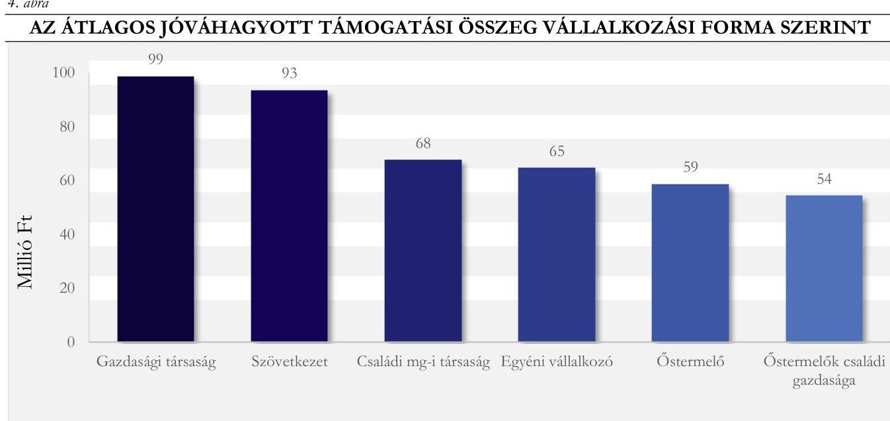

A támogatási rendszeren belül az agrárdigitalizáció fejlesztését célzó (VP2-4.1.8.-21 kódszámú támogatás) forrásallokációs prioritásokat a stratégiai tervdokumentumokban szereplő célokkal összhangban, a forráskihelyezéssel megvalósítandó feladatokat a stratégiai célokban foglalt határidők figyelembevételével alakították ki.
A pályázati támogatásokat érintően monitoring rendszer működött, a kedvezményezettek ellenőrzése biztosított volt.
A pályázati források hasznosulásának ellenőrzése céljából 10 olyan kedvezményezett gazdálkodót ellenőriztünk, ahol a támogatott projekt 2022. decemberéig fizikailag lezárult. Az ellenőrzött szervezetek gazdálkodási területek nagysága szerinti csoportosítását és a kifizetett átlagos támogatás összegét a 6. táblázat mutatja be.

---

A pályázatban való részvételt az ellenőrzés során a gazdák a legtöbb esetben a precíziós gazdálkodás bevezetésével, bővítésével, valamint az eszközbeszerzési lehetőséggel indokolták, de mind a szoftverbeszerzés, mind a szolgáltatás igénybevétele, mind az ismeretszerzés, továbbképzés szerepelt további indokként.
Minden ellenőrzött esetében készült előzetes felmérés, számítás arra vonatkozóan, hogy a pályázati forrás segítségével megvalósuló eszköz vagy
6. táblázat

| AZ ELLENŐRZÖTT SZERVEZETEK ADATAI |  |  |
| :--: | :--: | :--: |
| TERÜLET   NÁGYSÁGA | GAZDÁLKODÓK   SZÁMA | KIEDETET   ATLAGOS   TÁMOGATÁS   ÖSSZEGE (M E E) |
| 0-250 hektár | 1 | 68,7 |
| 251-500 hektár | 3 | 91,8 |
| 500-1000 hektár | 1 | 58,7 |
| 1000 hektár $<$ | 5 | 93,5 |

Forrás: Helyszini ellenörzési jegyzőkönyvek alapján ÁSZ saját szerkesztés
szolgáltatás beszerzéssel elérhető-e hatékonyság-, teljesítményjavulás (pl. talajjavításra vonatkozó előkalkuláció; meglévő eszközök összehasonlítása más gazdálkodóknál múködtetett eszközök által elért eredményekkel, meglévő eszközök általi referencia, stb.).
Az ellenőrzés felmérte a pályázati forrás segítségével megvalósult eszköz- és szolgáltatás beszerzést hatékonyság-, teljesítményjavulás, termeléshatékonyság szempontjából, amelyet összefoglalóan az 5. ábra szemléltet.

---

5. ábra

A PÁLYÁZATI FORRÁS SEGÍTSÉGÉVEL MEGVALÓSULT BESZERZÉSEK ÁLTAL ELÉRT HATÉKONYSÁG-, VAGY TELJESÍTMÉNYJAVULÁS
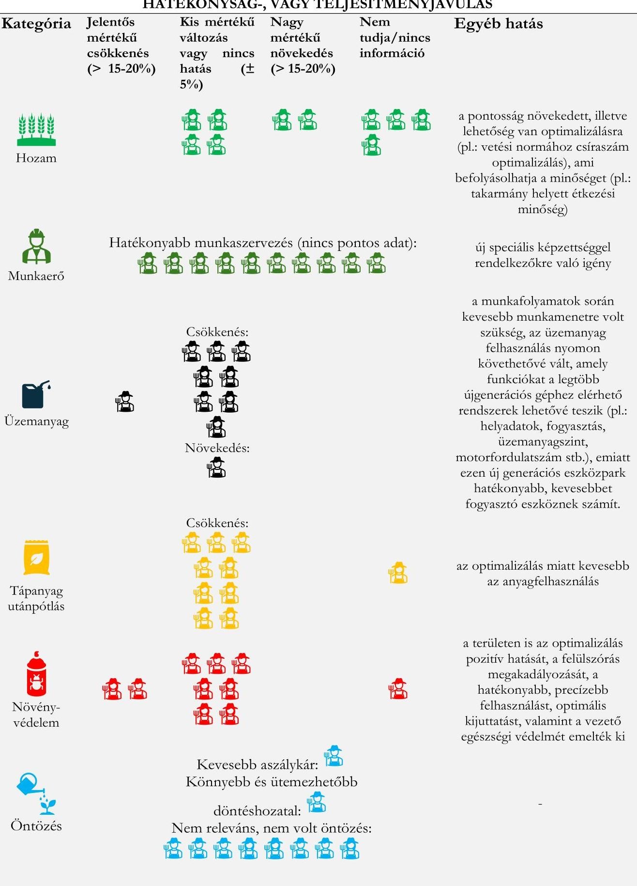

---

A támogatott gazdálkodók tapasztalatai megerősítették, hogy a digitális eszközök és technológiák üzembehelyezése hozzájárult a folyamatok optimalizálásához, a költségek csökkentéséhez, azonban a digitalizáció adta lehetőségeket a munkaerő felkészültsége, az eszközök, szoftverek kompatibilitásának hiánya miatt teljeskörűen nem tudták kihasználni, a beszerzett eszközök tudása 100\%-ban még nem volt érvényesíthető a gazdálkodási döntések megalapozására. Továbbá az ellenőrzés több esetben azt tapasztalta, hogy a 2,5\%-os projektmenedzsment költségkeretet a támogatottak eltérő mértékben és nem minden esetben használták fel.
A DAS intézkedések megvalósításának általános értékelése alapján megállapítható, hogy az agrárium kulcsproblémáját jelentő munkaerőhiány kezelésének egyik hatásos eszköze az élőmunka (részleges) kiváltását eredményező digitalizáció, robotika és automatizálás. A megtett intézkedések hozzájárultak a humán erőforrás digitális kompetenciáinak fejlődéséhez, azonban további intézkedések szükségesek a versenyképesség növeléséhez, a hatékonyság javításához.
A stratégiai intézkedések végrehajtása és a VP pályázat kedvezményezettjeit érintő helyszíni ellenőrzés során feltárt jó gyakorlatok, pozitív tapasztalatok, információk:

- A NAK az ellenőrzött időszak minden évében - az őszi pályaorientációs programsorozata keretében - országosan népszerűsítette az agrárszakképzést a 6-8. osztályos általános iskolai tanulók, szüleik és a pedagógusok körében. Ennek keretében közel 4000 általános iskolás kaphat betekintést 52 agrárszakképző intézmény, valamint 50 gazdálkodó életébe.
- Az állattenyésztésben is megjelent a digitalizáció a precíziós takarmányozás, a takarmány monitoring, az állatjóléti megoldások területén.
- Az újgenerációs traktorok általi ún. robotkormányzással a gép alkalmas a földmérés során felmért területek táblahatárainak 2 cm pontosságú beazonosítására. Az automata kormányzással a megtett út csökkenthető és az átfedések is elkerülhetőek.
- Az újgenerációs műtrágyaszóró és erőgép-munkagép (traktor) munkakapcsolata lehetővé teszi a műtrágya mennyiségének csökkenését. Számítógépen nyomon követhetőek és eltárolhatóak az elvégzett munkafolyamatok.
- Az újgenerációs sorközművelő és erőgép-munkagép (traktor) ISOBUS-os munkakapcsolatával folyékony műtrágyát kijuttató kultivátorral csökkent a szilárd műtrágya felhasználás, amellyel a környezeti terhelés is csökkent.
- A műtrágyaszóró automata szakaszolású és táblaszéli határolású, így nagyban lecsökkentette a túlszórások, átfedések számát. Az ISOBUS-os vezérlés és a kijuttatási térkép a műtrágya felhasználásban megtakarítást eredményezett.
- A növényvédelmi kezelések, műtrágyaszórás alkalmával az input anyagok felhasználása egyes esetekben 5-10\%-kal csökkent. A fedések elkerülése miatt a bejárt terület nagysága hasonló arányban csökkent.
- Az újgenerációs vetőgép és erőgép-munkagép (traktor) kapcsolat miatt a felhasznált vetőmag mennyiség és kijuttatás kontrollálható, visszaellenőrizhető. Az ISOBUS vezérlésnek köszönhetően az adott területre kijuttatott egységnyi vetőmagnorma pontosan beállítható és visszaellenőrizhető.

---

# 3. Digitális előrehaladás az agráriumban a versenyképesség tükrében 

Összegző megállapítás

Az agrár ágazat termelékenységének, versenyképességének változását jellemző egyes mutatók fejlődést, az uniós átlagtól való elmaradás csökkenését jelzik. Specifikus adatgyűjtés hiányában a digitális előrehaladás és a versenyképesség változása között közvetlen összefüggés nem mutatható ki, azonban egyes statisztikai adatok, szakirodalmi feldolgozások és elemzési, ellenőrzési tapasztalatok alapján a digitalizáció versenyképesség növelése irányába gyakorolt hatása igazolt.

Mivel a DAS-ban meghatározott intézkedések versenyképességre gyakorolt hatásának összetevőire specifikus adatgyűjtés nem valósult meg, ezért az ellenőrzés elemzés keretében vizsgálta meg azokat az információkat, melyeket az agrárium gazdasági teljesítményét mérő és egyéb jellemző adatokat feldolgozó intézmények gyűjtenek.
Az agrárium digitális fejlődésének mérésére szolgáló mutatókként értelmezhetők a 2020. évi Agrárcenzus és a 2023. évben végrehajtott Gazdaságszerkezeti összeírás adatai. Ezen mezőgazdasági összeírásokban szereplő adatok az ellenőrzött időszakban nem igazolták a digitális előrehaladást, mivel a kimutatások alapján a mezőgazdasági ágazatba sorolt vállalkozások számának változása (csökkenése) mellett 2023-ban 2,2 százalékponttal kevesebb felmérésbe vont gazdaság használt valamilyen precíziós eszközt, mint 2020-ban. Csökkent a növényállapot-felmérés, a hozamtérképezés, valamint a drónok alkalmazásának aránya, nőtt azonban több eszköz és technológia alkalmazásának aránya (sorvezető vagy automata kormányzás, differenciált munkaműveletek), növekedett a flottakövetést és a robotokat alkalmazó gazdaságok aránya. A precíziós eszközöket használó gazdaságokhoz tartozó mezőgazdasági terület növekedett, amely azzal magyarázható, hogy elsősorban a nagyobb gazdálkodók alkalmazták azokat.
2020-ban a gazdaságok 38,0\%-ában használtak valamilyen digitális eszközt. A gazdaságirányítók életkorának növekedésével a digitális eszközhasználat aránya csökkent, a magasabb végzettségűeknél magasabb volt, bár a felsőfokúak esetében is csak $75 \%$-os volt az arány. Kis mértékủ 3,6 százalékpontos növekedés volt tapasztalható a vezetői információs rendszerek (nyilvántartáshoz kapcsolódó szoftverek, vállalatirányítási és/vagy ügyviteli szoftverek, döntéstámogató szoftverek akár saját számítógépen, akár online rendszeren keresztüli) használatában, bár még a 2023. évi 8,7\%-os adat is alacsony használati arányt mutatott.
A gazdaságok méretének emelkedésével nőtt a digitális eszközhasználat aránya. A digitális eszközök használata a tömegtakarmány-fogyasztó állatok tartásával, a szántóföldi növénytermesztéssel és vegyes növénytermesztéssel foglalkozó gazdaságok esetében volt a legelterjedtebb.
2020-ban országos átlagban a gazdaságok 12\%-a használt valamilyen precíziós eszközt (ez az arány Dániában 2018-ban 23\%, 2023-ban 40\%, Angliában 2020 és 2021 években $27 \%$ volt). A precíziós gazdálkodáshoz kapcsolódóan a növényállapot-felmérést alkalmazták szélesebb körben, 2020-ban az összes gazdaság 5,6\%-a alkalmazta. A precíziós eszközök és technikák alkalmazásának arányát a 2020 és 2023 években a 6. ábra szemlélteti.

---

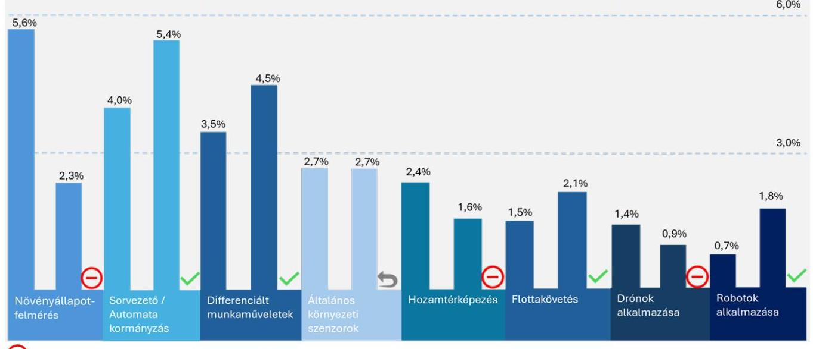
2020-ról 2023-ra negatív változás, $\checkmark$ 2020-ról 2023-ra pozitív változás, $\triangle$ 2020-ról 2023-ra nincs változás, Megjegyzés: eszköztípusonként az 1. oszlop a 2020. évi adatot, a 2. oszlop a 2023. évi adatot szemlélteti.

Forrás: KSH Agrárvenzus 2020., KSH Agrárium Gazdaságszerkezeti Összeírás 2023. alapján ÁSZ saját szerkesztés
A növényállapot-felmérést igénybe vevő gazdaságok aránya 2020-ról 2023-ra 5,6\%-ról 2,3\%-ra csökkent, a drónhasználat $1,4 \%$-ról $0,9 \%$-ra változott, aminek oka összefüggésbe hozható a törvényi szabályozás szigorodásával. A differenciált műveletek alkalmazásának aránya a 2020-as 3,5\%-os arányról 2023-ra 4,5\%-ra emelkedett. A legelterjedtebb differenciált munkaműveletek 2023-ban a tápanyag-kijuttatás $(3,8 \%)$, a vetés, ültetés ( $3,5 \%$ ), a növényvédelem ( $3,7 \%$ ) és a gyomtalanítás voltak. A sorvezető/automata kormányzás aránya is emelkedett 2023-ra.
Mindkét adatgyűjtésben felmérték a végzettség és a precíziós eszközök használatának aránya közötti összefüggést, a 2020-as felméréshez képest a precíziós eszközöket használó gazdaságok körében 4,0 százalékponttal nőtt a középfokú, és 6,6 százalékponttal a felsőfokú mezőgazdasági végzettséggel rendelkező gazdaság-irányítók aránya. A 2020 évi adatok alapján a felsőfokú végzettségű irányítóval rendelkező gazdaságok nagyobb arányban használták a precíziós eszközöket, mint a legfeljebb középfokú mezőgazdasági végzettséggel rendelkező irányítók által vezetett gazdaságok.
2020-ban a legtöbb precíziós eszköz és technika alkalmazása a gazdaságok több, mint felében saját eszközzel történt, addig 2023-ban ez már csupán a sorvezető vagy automata kormányzás és az általános környezeti szenzorok használatára volt igaz. A drónokat, a flottakövetést, a hozamtérképezést vagy a növényállapot felmérést az üzemek jellemzően már szolgáltatásként vették igénybe. A változás magyarázható azzal is, hogy a gazdálkodók felismerték, hogy ezeknek az eszközöknek a működtetése, teljeskörű használata speciális tudást igényel.
2020. évben gazdaságtípusonként vizsgálva a szakosodott szántóföldi termesztők körében volt a legmagasabb a precíziós eszközök használatának aránya. A legelterjedtebb eszköz a szántóföldi termesztő gazdálkodók körében a növényállapot felmérés és a sorvezető/automata kormányzás, amit a gazdálkodók 8-8\%-a alkalmazott. A második leggyakrabban alkalmazott megoldás a differenciált munkaműveletek voltak. A szakosodott kertészet kategóriába tartozó gazdálkodók esetében is a növényállapot felmérés volt

---

a legelterjedtebb. A csak állattartással foglakozó gazdálkodók esetében az egyedi (precíziós) takarmányozás volt a leginkább használt eszköz.
A 2020. évi Agrárcenzus eredményei alapján a precíziós eszközök mellőzésének leggyakoribb okai a „szükségesség hiánya", a „működtetéshez szükséges tudáshiány" ill. a „gépek magas beszerzési ára" voltak.

A mezőgazdasági digitális megoldások, precíziós gazdálkodással foglalkozó szakirodalom, szakértői dokumentumok4, gyakorlati tapasztalatok5, és az ellenőrzési bizonyítékok alapján a digitális előrehaladás - az indukált hatékonyságnövekedés, költségcsökkentés, munkaerőmegtakarítás, hozamnövekedések, egyéb pozitív hatások által - és a versenyképesség növekedésének kapcsolata igazolható. Egyes, szakirodalmakban rögzített, becsült megtakarításokat a 7. sz. táblázat tartalmazza.
7. táblázat

# A SZAKIRODALOM ALAPJÁN BECSÜLT MEGTAKARÍTÁSOK 

| TECHNIKA | VARHATÓ KÖRNVEZETI ELÖNYÖK | BECSÜLT MEGTAKARÍTÁSOK SZAKIRODALOM ALAPJÁN |
| :--: | :--: | :--: |
| Automatikus gépvezetés GPS-szel | A talajtömörödés csökkenése   A szén-dioxid-kibocsátás csökkentése | 10 százalékkal csökkentett üzemanyagfogyasztás a helyszíni műveletek során (EPRS (2016)) |
| Automata kormányzás és bizonyos technológiai múveletek automatizálása, sorvezetés | Károsanyag-kibocsátás csökkentése   Múveleti hatékonyság növelése | Legalább 5-8 százalék üzemanyag-megtakarítás (Szabó - Nábrádi, 2023)   5-7 százalékos megtakarítás (Popp et al., 2018) |
| Automatikus vezetés és kontúrművelés dombos terepen | Az erózió csökkentése   A felszíni vizek és a műtrágyák lefolyásának csökkentése   Csökkentett árvízveszély | 17t/ha/évről 1t/ha/évre, vagy még kevesebbre az erózió csökkenése (EPRS (2016)) |
| Szemenkénti vetőgépek sorelzárása | Nincs felesleges átfedés | 4 százalékkal csökkent vetőmag felhasználás (Sinka, 2009) |
| Gyomérzékelés (online/gyomtérkép) | A gyomirtó szerek használatának csökkentése térképes megközelítéssel   Szakaszvezérléssel műveleti hatékonyságjavulás | Őszi kalászosokban a kétszikủ gyomok elleni gyomirtó szerek mennyisége 6-81 százalékkal, az egyszikű gyomirtó szerek mennyisége 20-79 százalékkal csökken. (EPRS (2016))   Kijuttatott gyomirtó szerek dózisának 50 százalékos csökkentése egy hagyományos permetezőgéphez képest (Szabó és Nábrádi, 2023)   A gyomirtó szerek használata 11 és 90 százalék között csökkenthető a precíziós kijuttatással (Balafoutis et al. (2017)   Lieve és munkatársai szerint az anyagköltségmegtakarítás 20 százalék, Barkaszi |

[^0]
[^0]:    ${ }^{4}$ Székely et al., 2000; Ørum et al., 2001; Győrffy, 2002; Pecze, 2008; Ambrus et al., 2009; Sinka, 2009; Smuk et al., 2010, MATE Körforgásos Gazdaság Elemző Központ által 2023. évben kiadott (Dr. habil Vértesy László), Bongiovanni és Lowenberg-DeBoer, 2004; Medici, 2019; Schieffer és Dillon, 2015; Kalmár, 2010; Erdeiné Késmárki-Gally, 2020
    ${ }^{5}$ A precíziós szántóföldi növénytermesztés helyzete és ökonómiai vizsgálata, AKI

---

| TECHNIKA | VARHATÓ KÖRNYEZÉTI ELÖNYÖK | BECSELT MEGTAKARITÁSOK SZAKIRODALOM ALAPJÁN |
| :--: | :--: | :--: |
|  |  | és Takács-György (2007) 60 százalékos megtakarítás lehetséges   Reisinger és Batte az elérhető anyagköltségmegtakarítást 40 és 50 százalék között határozzák meg   Szakaszvezérléssel a kijuttatott táblák területe 15,2-17,5 százalékkal csökken (EPRS (2016)) |
| A betegség felismerése (multiszenzoros optikai érzékelés, levegőben lévő spórák kimutatása, illékony érzékelők) | A növényvédőszer-használat csökkentése helyes felismerés és jó döntési modell | 84,5 százalékos megtakarítás lehetséges a peszticidek használata során (EPRS (2016))   Növényvédőszer felhasználás csökkentése, megtakarítás 10-40 százalék között (Kalmár, 2010) |
| Permetezőgépek szakaszvezérlése és műtrágyaelosztás | A talajba történő túlzott vegyszerbevitel és a vízszennyezés kockázatának csökkentése   Szakaszvezérléssel műveleti hatékonyságjavulás | 2-7 százalék közötti inputanyag-megtakarítás (Szabó és Nábrádi, 2023) |
| A növény vegetációs indexe és a gombás betegségek kockázata | A műtrágyaadag és a gombaölő szerek használatának optimalizálása a magasabb betegségkockázat alapján a nagy terméssűrűségủ területeken | Naturáliákban mérve akár 20 százalékos megtakarítás   A növényvédőszerek használata akár 25   százalékkal csökkenthető (Finger et al. 2019) |
| A növény vegetációs indexe optikai érzékelők alapján   Talajtápanyag térképek | A nitrogénfelhasználás hatékonyságának javítása | A talajban lévő maradék nitrogén 30-50 százalékos csökkentése (EPRS (2016))   5-10 százalék közötti inputanyag-megtakarítást eredményez (Szabó és Nábrádi, 2009)   A változó dózisú nitrogén alkalmazása 4-7 százalékkal csökkentheti a teljes nitrogénfelhasználást (Finger et al. 2019) |
| A növényzet vegetációs indexe   Talaj tápanyagtérképek | A foszfor visszanyerésének javulása | A foszfor visszanyerésének 25 százalékos javulása (EPRS (2016))   Műtrágya: 5-25 százalék megtakarítás, 15 százalékos megtakarítást eredményezett az előző évhez képest (Sinka, 2009) |
| Talaj textúra térkép | A túlzott vízhasználat vagy víktermelés elkerülése   Az édesvíz-felhasználás csökkentése | A változó dózisú öntözés akár 20-5 százalékos vízmegtakarítást is jelenthet (Finger et al., 2019) |
| Szemenkénti vetőgépek sorelzárása | Nincs felesleges átfedés | 4 százalékkal csökkent vetőmag felhasználás (Sinka, 2009) |

---

| TECHNIKA | VÁRHATÓ KÖRNYEZÉTI ELÖNYÖK | BECSÜLT MEGTAKARÍTÁSOK SZAKIRODALOM ALAPJÁN |
| :--: | :--: | :--: |
| Automata fejőrobot | csökkennek az állatokat érő stressz hatások, nől az élelmiszerbiztonság | A gazdaságok magasabb termelékenységi és szervezési szintet értek el. A fejőrobot segítségével növekedett az előállított tejmennyiség és az extra osztályú tej mennyiségén belül a minőség még kedvezőbbé vált. (Lencsés et al., 2015)   A hatékony ellenőrző rendszer segített kiszűrni a hibákat, hamarabb lehetett az állatokat kezelni a tőgygyulladások tekintetében és csökkentette a kockázati tényezőket (Lencsés et al., 2015) |
| Egyéb állattenyésztésben használt robotok (takarmánykiosztó, trágyaeltávolító, birkanyíró, a baromfitenyésztésben tisztító, adatgyűjtő, tojásgyűjtő robot) | - | Humán erőforrás megtakarítás, kiváltás, nagy épületek tisztítása, fertőtlenítése kapcsán munkaerő-, idő megtakarítás, hatékonyabb takarmányozás, állomány egészségi állapotának nyomon követése és ellenőrzése kapcsán a betegségek miatti teljesítmény kiesés csökkentése (AM Állattenyésztés robottechnológiai összefoglaló) |

A mezőgazdaságban alkalmazott digitális eszközök megfelelő alkalmazásához szükséges az 5G lefedettség, illetve ennek növelése. Az országos 4G lefedettség már 2019. évben elérte a 99,2\%-ot, az 5G lefedettség jelentősen nőtt, 2023-ra elérte a 83,7\%-os országos arányt, a vidéki háztartások lefedettsége azonban $57,5 \%$-os volt.
A digitális eszközök internet és adatigénye egyre növekszik. Mára a mezőgazdaságban is elterjedtek a nagy adat és internet igényű eszközök, ezért fontos a megfelelő mobilkommunikációs rendszerek megléte és további kiépítése, amelyet hazánkban jelenleg a 4G mobilkommunikációs technológia, valamint a hatékonyabb, gyorsabb 5G-re történő fokozatos átállás támogat. 2020 és 2023 között az 5G lefedettség alakulását a 7. ábra szemlélteti.

---

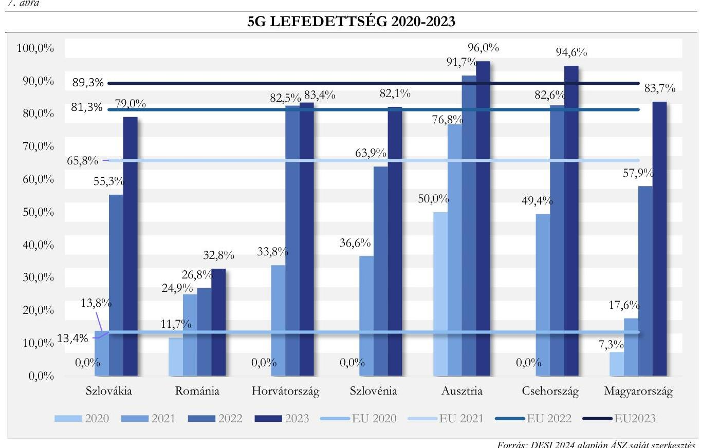

Az 5G lefedettség mellett fontos, hogy a használt készülékek alkalmasak legyenek az 5G adathálózathoz csatlakozásra. A Nemzeti Média- és Hírközlési Hatóság által készített mobilpiaci felmérés alapján a mobilinternetre csatlakozott 5G képes mobiltelefonok és táblagépek aránya 2021-től folyamatosan nőtt, 2023. IV. negyedévére elérte a $31,4 \%$ arányt.

# VERSENYKÉPESSÉGET JELLEMZŐ EGYES MUTATÓSZÁMOK ALAKULÁSA 

A technológiai fejlődés, a humántőke képzettségi szintje, a növekvő hatékonyság és a méretgazdaságosság együttes hatását jelző teljes tényezőtermelékenység mutatószám a 2019-2021. évi időszakban folyamatos növekedést mutatott, majd a 2022. évi súlyos aszály miatti jelentős csökkenés után, 2023-ban visszaerősödött. A termelés hatékonyságának javulását (összesített kibocsátás és az összesített erőforrás felhasználás arányát) 2013-2023 között a 8. sz. ábra szemlélteti.

---

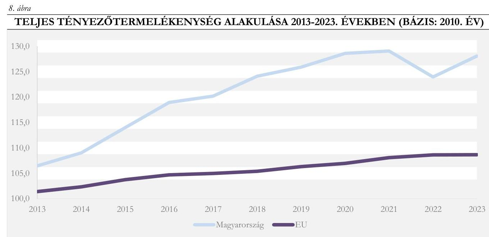

Forrás: Analytical Factsheet - Hungary https://agridata.ec.europa.eu/extensions/CountryFactsheets/CountryFactsheets.html? memberstate=Hungary\#SO2-1 alapján ÁSZ saját szerkesztés

A mezőgazdaság munkatermelékenysége (amelyet a mezőgazdaság teljes bruttó hozzáadott értékeként fejeznek ki, alapáron, éves munkaerőegységenként) a 2022. évi csökkenést kivéve, minden évben növekedett, azonban az EU átlagtól jelentősen elmaradt és a különbség tovább nőtt. A munkaerő termelékenység alakulását Magyarországon és az Európai Unióban a 9. ábra szemlélteti.
9. ábra

MUNKAERŐ TERMELÉKENYSÉG ALAKULÁSA MAGYARORSZÁGON ÉS AZ EURÓPAI UNIÓBAN (EURO/ÉVES MUNKAERŐEGYSÉG)
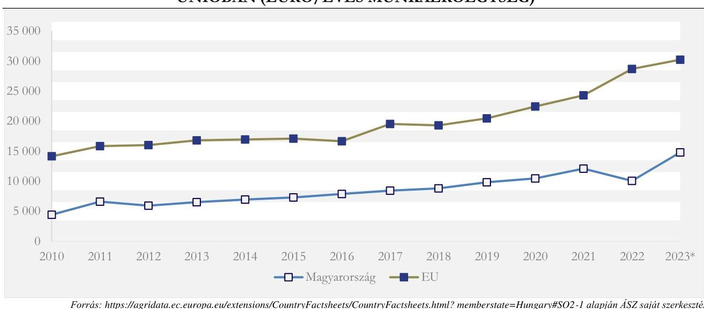

Forrás: https://agridata.ec.europa.eu/extensions/CountryFactsheets/CountryFactsheets.html? memberstate=Hungary\#SO2-1 alapján ÁSZ saját szerkesztés (*2023. előzetes adat)

Az EU gazdasági teljesítményének átlagosan 1,7\%-a származott az agráriumból, 2021-ben az ágazat a munkavállalók 4,4\%-át foglalkoztatta. Magyarországon a rendszerváltozástól kezdődően fokozatosan csökkent a mezőgazdaság súlya a nemzetgazdaságon belül, a mezőgazdaság teljesítménye a nemzetgazdaság összkibocsátásához képest 1995 és 2022 között 4,4 százalékponttal csökkent. A V4országok közül 2020-as adatok alapján hazánkban volt a legmagasabb a mezőgazdaságilag hasznosítható terület, a megművelhető földterületek aránya $53 \%$ volt.

---

2021-ben Magyarországon a foglalkoztatottak 4,4\%-a dolgozott a mezőgazdasági szektorban, ami átlagosnak tekinthető az EU-ban. Hasonló foglalkoztatási arányok tapasztalhatóak Írországban (4,5\%), Olaszországban ( $4,1 \%$ ), Finnországban ( $4,1 \%$ ) és Spanyolországban ( $4,1 \%$ ). Az összes foglalkoztatotton belül az agrárszektor munkavállalóinak aránya Romániában volt kiugróan a legmagasabb, ahol a munkavállalók közel egyötöde ( $18,6 \%$ ) dolgozott az agráriumban, őket Görögország ( $11,4 \%$ ) és Lengyelország ( $8,4 \%$ ) követte.
A szakirodalmi források, az AKI elemzései6 és a VP támogatások kedvezményezettjeinél végzett ellenőrzéseink eredménye alapján pozitív kapcsolat állt fenn a digitális megoldások elterjedése, valamint a munkaszervezés hatékonysága és az élőmunkaigény csökkenése között. Különösen érzékelhető volt ez az állattenyésztésben (pl. robot fejőgépek). A KSH foglalkoztatási adatai alapján a mezőgazdaság éves munkaerőegységben kifejezett munkaerő-felhasználása jelentősen csökkent és a foglalkoztatottak száma is csökkenő tendenciát mutatott. Az ágazat folyamatosan (elsősorban képzett) munkaerőhiánnyal küzdött. A mezőgazdaság éves munkaerőegységben kifejezett munkaerő-felhasználása 2019 óta mérséklődött, 2023-ban több mint 274 ezer ember mezőgazdasági tevékenységének felelt meg, a csökkenés az ellenőrzött időszakban 23,6 \% volt. A mezőgazdasági munkaerő-felhasználást a 10. ábra mutatja be.
10. ábra

MEZŐGAZDASÁGI MUNKAERŐ-FELHASZNÁLÁS (ÉVES MUNKAERŐ-EGYSÉG ÖSSZESEN)
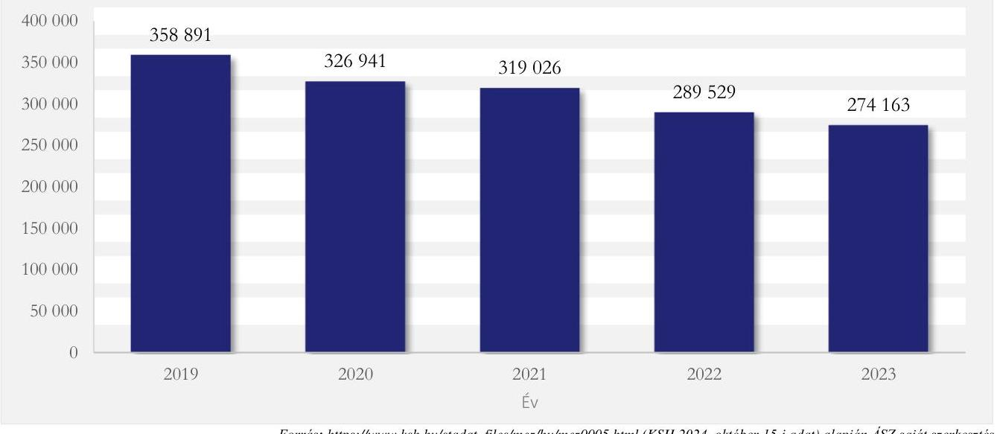

A mezőgazdaság, erdőgazdálkodás, halászat ágazatban foglalkoztatottak száma a 2019 évről 2023 évre 2,8 \%kal csökkent, az adatokat a 11. ábra mutatja.

[^0]
[^0]:    ${ }^{6}$ A Vidékfejlesztési Programból a precíziós technológiákra adott támogatások várható környezeti hatásainak számbavétele, DAS részletes intézkedési tervében szereplő intézkedések hozadékának számszerűsítésére, Az agrárszakképzés szerepe a munkaerőutánpótlásban

---

11. ábra

FOGLALKOZTATOTTAK SZÁMA (EZER FŐ) MEZŐGAZDASÁG, ERDŐGAZDÁLKODÁS, HALÁSZAT
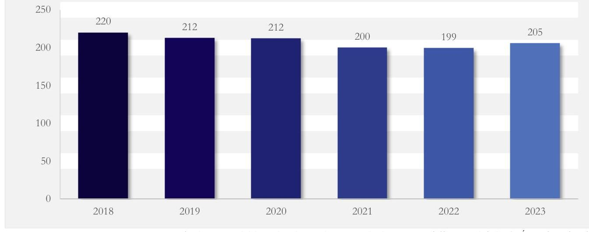

Forrás: https://www.ksh.hu/stadat_files/mun/ha/mun0009.html (KSH 2024. október 25-i adat) alapján ÁSZ saját szerkesztés
A szakirodalom szerint egyértelmű pozitív kapcsolat áll fenn az agrárium digitális fejlődése és a jövedelmezőség között. Az ellenőrzött időszakban sikeresen végrehajtott DAS intézkedések a digitalizáció elterjesztését elősegítették, a KSH adatai pedig összességében igazolták, hogy a nettó vállalkozói jövedelem országosan 2019 évről 2023 évre növekedett, a kettős könyvvitelt vezető vállalkozások valamennyi jövedelmezőségi mutatójában pozitív változások történtek, valamint a mezőgazdasági vállalkozói átlagjövedelem közelített a nemzetgazdasági átlagjövedelemhez, amely adatokat a 12. ábra szemléltet.
12. ábra

MEZŐGAZDASÁGI VÁLLALKOZÓI JÖVEDELEM A GAZDASÁGI ÁTLAGJÖVEDELEM ARÁNYÁBAN 2019-2023. ÉVEKBEN
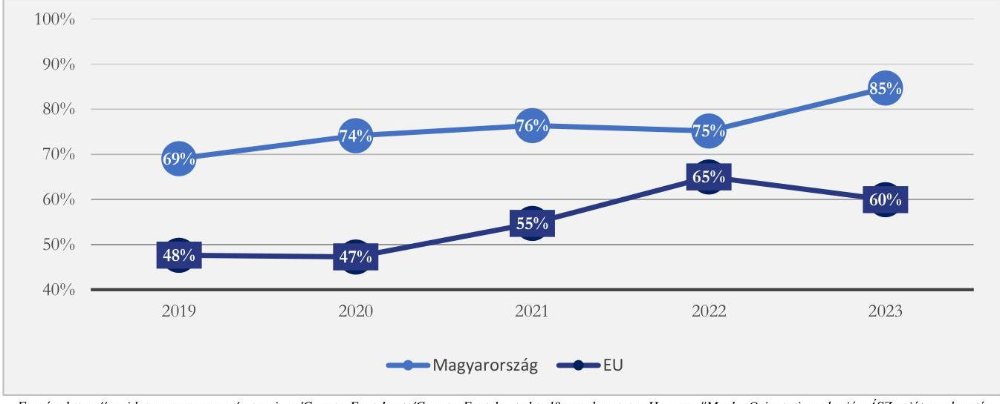

Forrás: https://agridata.ec.europa.eu/extensions/CountryFactsheets/CountryFactsheets.html? memberstate=Hungary\#MarketOrientation alapján ÁSZ saját szerkesztés

A mezőgazdaságban teljes munkaidőben alkalmazásban állók rendszeres bruttó átlagkeresete a 2019. évi 279356 Ft-ról 2023. évre 446479 Ft-ra emelkedett.

Az ellenőrzési és elemzési tapasztalatok a kapcsolat meglétét igazolják, de a hatás összetevői és mértéke részletes adatok hiányában, illetve az intézkedések megvalósulásának viszonylag rövid időtávja (pl. a VP pályázattal megvalósított fejlesztések) miatt még nem kimutatható. A nettó vállalkozói jövedelem 2019-

---

2022. években emelkedett, míg 2023. évben már 3,8\%-os csökkenés volt tapasztalható az előző évhez képest. A nettó vállalkozói jövedelem és a mezőgazdasági kibocsátás volumenének alakulását 2019-2023. években a 13. ábra szemlélteti.
13. ábra

# A NETTÓ VÁLLALKOZÓI JÖVEDELEM ÉS A MEZŐGAZDASÁGI KIBOCSÁTÁS VOLUMENÉNEK ALAKULÁSA 2019-2023. ÉVEKBEN 

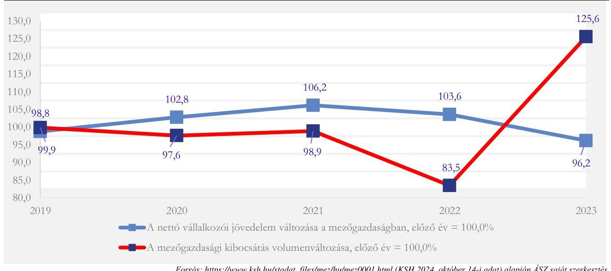

Az AKI által 2020. évben készített „A precíziós szántóföldi növénytermesztés helyzete és ökonómiai vizsgálat" kibővítette a 2017. évi tanulmány időtartamát és 2020. évben összefoglalta a statisztikai vizsgálatok eredményeit, amelyből összességében megállapítható volt, hogy a precíziós gazdaságok a technológiai váltást követően - statisztikailag igazolhatóan - nagyobb hozamokat értek el a négy fő szántóföldi növénykultúrában.
Az agrárium, mint ágazat export-import változását jellemző mutatószámok (az agrárium termékeinek megoszlása a teljes exporton belül, a cserearány mutató, a mezőgazdasági és élelmiszeripari termékek export, import volumenindexei) nem igazoltak - adatokkal, információkkal alátámasztott pozitív irányba történő elmozdulást.
A lengyel Lublini Egyetem kutatásában a mezőgazdasági termékek külkereskedelme szempontjából elemezték az EU tagországok versenyképességét. A kutatási eredmények azt mutatták, hogy 2020-ban a mezőgazdasági termékek kereskedelmében Bulgária, Magyarország, Litvánia és Horvátország teljesített a legjobban az újonnan csatlakozott tagországok körében (EU-13).
Magyarországon az összes termékkivitelből a mezőgazdasághoz köthető termékek exportjának részesedése a teljes exporton belül az ellenőrzött időszakban lényegesen nem változott. A mezőgazdasághoz köthető termékek importjának részesedése Magyarország összes termékbehozatalából kis mértékben emelkedett. Az agrárexport és import arányának alakulását a teljes nemzetgazdasági exporton és importon belül a 14. ábra szemlélteti.

---

14. ábra

AZ AGRÁREXPORT ÉS IMPORT ARÁNYA A TELJES NEMZETGAZDASÁGI EXPORTON ÉS IMPORTON BELÜL 2019-2023. ÉVEKBEN
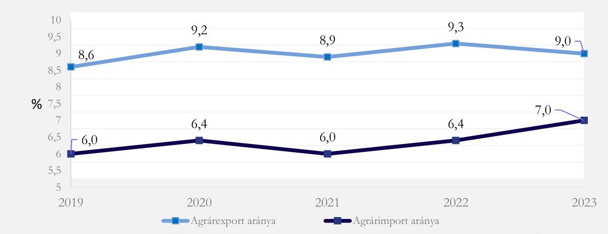

Forrás: KSH-adatok alapján az AKI Agrárstatisztikai Osztályán készült jelentés, Az élelmiszer-gazdaság külkereskedelme 2019-2023. alapján ÁSZ saját szerkesztés
2019 évről 2023. évre a mezőgazdasági és élelmiszeripari termékek exportértéke 3989 Mrd Ft-tal, az importértéke 3577 Mrd Ft-tal emelkedett. Az agrár-külkereskedelem aktivumának kis mértékủ ingadozása mellett az export $42,4 \%$-kal, az import $56,9 \%$-kal nőtt az időszak alatt. Az agrárkülkereskedelem alakulására vonatkozó adatokat a 15. ábra mutatja be.
15. ábra

AZ AGRÁR-KÜLKERESKEDELEM ALAKULÁSA 2019-2023. ÉVEKBEN (MRD EURO)
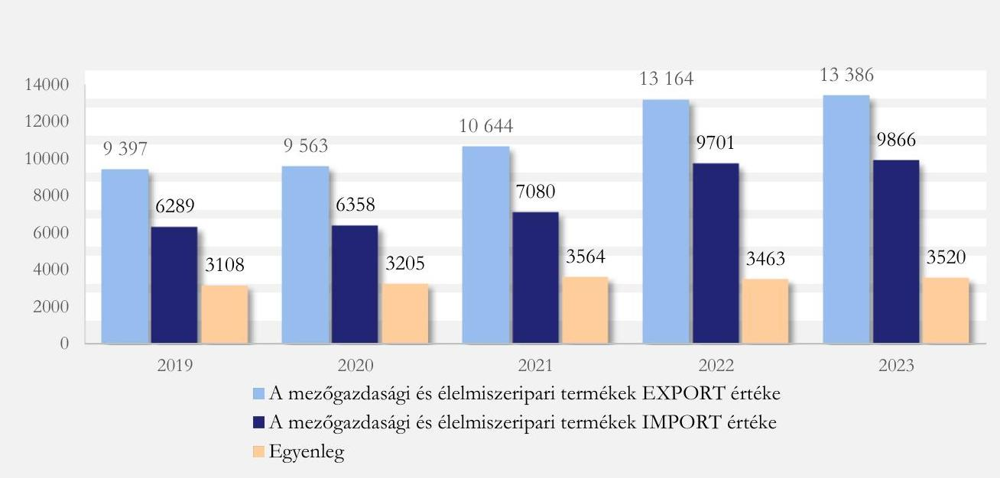

Forrás: KSH-adatok alapján az AKI Agrárstatisztikai Osztályán készült összeállítás Az élelmiszer-gazdaság külkereskedelme 2019-2023 alapján ÁSZ saját szerkesztés

---

Az agrár ágazat versenyképességére ható, az ellenőrzés során beazonosított pozitív és negatív hatásokat a 16. ábra szemlélteti.
16. ábra

# A VERSENYKÉPESSÉGRE HATÓ FŐBB TÉNYEZŐK ÉS HATÁSUK 2019-2023. IDŐSZAKBAN (STATISZTIKAI ADATOK ÉS ELLENŐRZÉSI TAPASZTALATOK ALAPJÁN) 

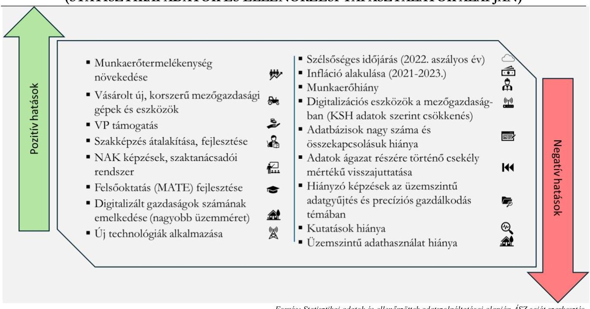

Forrás: Statisztikai adatok és ellenőrzöttek adatszolgáltatásai alapján ÁSZ saját szerkesztés
Az agráriumban végrehajtott digitalizációs intézkedések javították a hazai agrárium versenyképességének egyes tényezőit, azonban az ellenőrzött időszakban bekövetkezett, versenyképességet gátló tényezők ellentétes, negatív hatást gyakoroltak.

---

# JAVASLATOK 

Az ÁSZ tv. 33. § (1) bekezdésében foglaltak értelmében az ellenőrzött szervezet vezetője köteles a jelentésben foglalt megállapításokhoz kapcsolódó intézkedési tervet összeállítani és azt a jelentés kézhezvételétől számított 30 napon belül az ÁSZ részére megküldeni. Amennyiben az ellenőrzött szervezet vezetője nem küldi meg határidőben az intézkedési tervet, vagy továbbra sem elfogadható intézkedési tervet küld, az Állami Számvevőszék elnöke az ÁSZ tv. 33. § (3) bekezdése a) és b) pontjaiban foglaltakat érvényesítheti.

## AZ AGRÁRMINISZTER RÉSZÉRE

1. Mérje fel a szigetszerüen müködő információs rendszerek és adatbázisok összekapcsolásának lehetőségeit, amely lehetővé teszi az adatok áramlását és megosztását az ágazati szereplők között.
2. Intézkedjen az agrárium digitalizációjával összefüggésben a tényleges, társadalmi/szektorális eredmények kimutatására alkalmas hatásmutatók (outcome-indikátor) kidolgozásáról, azok alakulásának értékeléséről.
3. Az országos szintü munkaerőpiaci visszajelzések érdekében az agrárszakképzés irányításáért való felelőssége körében gondoskodjon a pályakövetési rendszerben gyüjtött, agráriumra vonatkozó adatok hasznosításának megtervezéséről .
4. Az együttmüködés erősítése keretében az AKI adataira támaszkodva támogassa a NAK gazdálkodók részére nyújtott, agrárdigitalizációs témájú célzott ismeretterjesztő tevékenységét.

## A MAGYAR AGRÁR-, ÉLELMISZERGAZDASÁGI ÉS VIDÉKFEJLESZTÉSI KAMARA ELNÖKE RÉSZÉRE

1. Intézkedjen a gazdálkodók részére nyújtott, agrárdigitalizációs témájú tájékoztató és ismeretterjesztő tevékenység fókuszainak erősitésére, különös tekintettel a preciziós gazdálkodásra, a kapcsolódó adatok gyüjtésére, az üzemszintü adathasználatra, az adatalapú döntéshozatalra.

---

# MELLÉKLETEK 

## I. SZ. MELLÉKLET: ÉRTELMEZŐ SZÓTÁR

agrárcenzus
beszámoló
differenciált munkaműveletek
digitális kompetencia mátrix

Digitális Agrár Tesztpálya
eredményesség
eredményesség elve
értékelés
éves munkaerőegység

A KSH Agrárcenzus adatgyűjtés célja az volt, hogy nyomon kövesse a mezőgazdaság szerkezetében bekövetkezett változásokat, illetve pontos és hiteles adatokkal szolgáljon a hazai gazdaságirányítás, az EU és a gazdálkodók számára, amihez az adatszolgáltatók nagyban hozzájárulnak részvételükkel és a pontos adatszolgáltatással. (forrás:
https://www.ksh.hu/agrarcenzusok_agrarium_2023)
átfogó jellegű tájékoztatás az elfogadásra jogosult, illetve a nyilvánosság felé a megvalósítás előrehaladásáról vagy a megvalósítás eredményéről (Forrás: $\mathrm{KSI}^{60}$ 7. § 13. pont)

Differenciált munkaműveletek (vetés, tápanyag-kijuttatás, növényvédelem, öntözés) -Variable Rate Application (VRA): Változó mennyiségű (differenciált) kijuttatás. A tábla eltérő adottságú területeinek megfelelően változó mennyiségű vetőmag, műtrágya, növényvédő szer, vagy öntözővíz kijuttatása. (forrás: Agrárium, 2023. Gazdaságszerkezeti Összeírás, Útmutató, 27. oldal)
A digitális képzések tartalmi fejlesztéséhez a DAS javasolta a teljes hazai agrárfelsőoktatási intézményrendszerből, valamint kapcsolódó tudományterületekről (például: robotika, automatizálás, önvezető autók) a felkészült oktatók, kutatók összegyűjtését és egy digitális kompetencia mátrix összeállítását a Szent István Egyetem koordinálásával. (Forrás: DAS 5.1.3 Agrár felsőoktatás fejlesztése intézkedés)
A digitális tangazdaság skálázásával, a vállalati szférával közösen kidolgozott, a tangazdaságokra és az egyetem infrastruktúrájára alapozva létrehozott együttműködési modell. (Forrás: DAS 5.7 Digitális Agrár Innovációs Központ létrehozása intézkedés)
Az eredményesség a kitűzött célok megvalósításának mértékeként, vagy egy tevékenység outputja szándékolt és tényleges hatásának viszonyaként határozható meg. Az eredményesség a tevékenységek tervezett, célul kitűzött hatását hasonlítja össze a ténylegesen elért hatásokkal, tulajdonképpen a társadalmi célok, és a közszolgáltatások outputjainak egymáshoz való viszonyát fejezi ki. (Forrás: Bkr. ${ }^{61}$ 2. § g) pont)
Az eredményesség elve a kitűzött célok és a szándékolt eredmények (hatások) elérését jelenti. A feladatellátás eredményességét mutatja a tényleges és a tervezett eredmények (hatások) összevetése. (ÁSZ: Módszertani útmutató a teljesítmény-ellenőrzéshez, 2020.)
a stratégiai tervdokumentumban rögzítésre kerülő vagy már rögzített célok, célkitűzések összevetése a megvalósítás eredményeként várható vagy már előállt helyzettel, feltárva a nem teljesült célok és nem várt hatások okait és javaslatokat megfogalmazva a további megvalósítás eredményességének javítására (Forrás: KSI 7. § 7. pont)
Mezőgazdasági munkaerő-felhasználást a KSH éves munkaegységben (ÉME) méri. 1 ÉME $=1800$ munkaóra.
(Forrás: https://www.ksh.hu/stadat_files/mez/hu/mez0005.html)

---

felülvizsgálat
fenntartható fejlődés
gazdaságszerkezeti összeírás
integrált igazgatási és kontrollrendszer
interoperabilitás
lemorzsolódás
mérhető cél
mutató
növényállapot-felmérés
nyomon követés
a nyomon követés vagy a közbenső értékelés során keletkező adatok és információk döntés-előkészítési célú elemzése a megvalósításba történő beavatkozási igény és mérték meghatározása vagy a megvalósítás alatt álló stratégiai tervdokumentum módosítása érdekében (Forrás: KSI 7. § 14. pont)
A fenntartható fejlődés (sustainable development) olyan fejlődési folyamat, ill. szervezési elv, ami „kielégíti a jelen szükségleteit anélkül, hogy csökkentené a jövendő generációk képességét, hogy kielégítsék a saját szükségleteiket" (Forrás: Egyesült Nemzetek Szervezete 1987-es Brundtlandt jelentés).
A KSH 2023. május 15. és július 15. között mezőgazdasági gazdaságszerkezeti összeírást hajtott végre Agrárium 2023 néven. Az adatgyűjtés célja az volt, hogy nyomon kövesse a mezőgazdaság szerkezetében bekövetkezett változásokat, illetve pontos és hiteles adatokkal szolgáljon a hazai gazdaságirányítás, az EU és a gazdálkodók számára, amihez az adatszolgáltatók nagyban hozzájárulnak részvételükkel és a pontos adatszolgáltatással.
(Forrás: https://www.ksh.hu/agrarcenzusok_gszo)
Az integrált igazgatási és kontrollrendszer arra szolgál, hogy segítségével az uniós tagországok lebonyolítsák, nyomon kövessék és ellenőrizzék a közös agrárpolitika (KAP) keretében végrehajtott összes terület- és állatállomány-alapú beavatkozást (például a közvetlen kifizetések formájában megvalósuló beavatkozásokat, valamint a terület- és állatállomány-alapú vidékfejlesztési beavatkozásokat), és biztosítja, hogy az Európai Unió egészében átfogó és összehasonlítható adatok álljanak rendelkezésre. (forrás: https://agriculture.ec.europa.eu/common-agricultural-policy/financing-cap/assurance-and-audit/managing-payments_hu)
Az interoperabilitás technikai értelemben szervezetek, illetve adatrendszerek közötti fizikai adatcserékhez kapcsolódik, amely így az egyes infokommunikációs rendszereknek - és az általuk támogatott szervezeti folyamatoknak - azon képességét jelenti, hogy adatokat tudnak cserélni, illetőleg információt, tudást tudnak megosztani egymással. (forrás: https://lexikon.uninke.hu/szocikk/interoperabilitas/)
amikor egy tanuló a végzettség megszerzése előtt kikerül az iskolából, megszűnik a jogviszonya az intézménnyel anélkül, hogy az adott képzési szinthez tartozó végzettséget megszerezte volna. (Forrás: https://mindenkiiskolaja.elte.hu/wp-content/uploads/2021/09/ELTE2021 Szamit-e az iskola-4.pdf, 44. oldal)
olyan cél, amelyhez mutató rendelhető (Forrás: KSI 7. § 11. pont)
egy társadalmi, gazdasági, környezeti jelenség mérésére szolgáló számszerű adat vagy a jelenség minősítésére alkalmas információ
(Forrás: KSI 7. § 12. pont)
Normalized Difference Vegetation Index (NDVI): Normalizált differenciál vegetációs index. A növényzet állapotának jellemzésére szolgáló mutató, amely szoros összefüggést mutat a növényzet nitrogén-ellátottságával. Értelmezése csakis más tényezők által nem befolyásolt, jó kondíciójú növényállomány esetében lehetséges. (Forrás: Kitöltési útmutató az Agrárcenzus, 2020. címü kérdőívhez)
az elfogadott stratégiai tervdokumentumban foglalt célkitűzések, továbbá a feladatok előírt eljárás szerint és határidőben történő megvalósítására vonatkozó adatok gyűjtése és elemzése (Forrás: KSI 7. § 6. pont)

---

Piaci Árinformációs Rendszer (PÁIR)

Okos Tesztüzemi Rendszer
stratégiai tervdokumentum
teljes tényezőtermelékenység
utólagos értékelés
versenyképesség

A Piaci Árinformációs Rendszer (PÁIR) tevékenységének célja a fontosabb termékpályák (gabona, olajnövény, szója, sertés, szarvasmarha, juh, baromfi, tojás, tej, zöldség-gyümölcs, bor, dohány) egyes fázisaihoz kapcsolódó árak és értékesített mennyiségek gyűjtése az európai uniós rendeletekben foglalt követelmények szerint, valamint a hozzájuk kapcsolódó kiadványok elkészítése és publikálása.
A gyűjtött árak között szerepelnek többek között termelői árak, élelmiszerfeldolgozók és termelői szervezetek értékesítési árai, kiskereskedelmi és sütőipari beszerzési árak, nagybani piaci árak és élelmiszer-üzletláncok fogyasztói árai. (Forrás: https://www.aki.gov.hu/piaci-arinformacios-rendszer/)
Az Okos Tesztüzemi Rendszer Magyarország mezőgazdasági teljesítményét mérő tesztüzemi rendszer kiterjesztése, támogató eszköz a digitális transzformáció hatásainak vizsgálatára a mezőgazdasági termelők körében, továbbá a hazai agrárium versenyképességét növelő, az agrárpolitikai támogatását biztosító tesztüzemi információk célzott és folyamatos visszacsatolása.
A kialakításánál cél volt egy komplex, integrált IKT-alapú tesztüzemi rendszer kialakítása, amely által lehetővé válik az üzemi folyamatok térben és időben való követése, ezen adatok számviteli rendszerrel való összekötése, mindez a termelői adatszolgáltatói terhek csökkentésével, a meglevő vállalatirányítási és nyilvántartási rendszerekben levő információk automatizmusokon keresztül történő felhasználásával, a termelőkre vonatkozó információk minél teljesebb körű és minél feldolgozottabb formában történő visszajuttatása mellett. (Forrás: DAS 5.3 sorszámú intézkedés)
az országelőrejelzés, a nemzeti középtávú stratégia, a miniszteri program, az intézményi munkaterv, továbbá a hosszú távú koncepció, a fehér könyv, a szakpolitikai stratégia, a szakpolitikai program, az intézményi stratégia és a zöld könyv (Forrás: KSI 7. § 2. pont)
A teljes tényezőtermelékenység (TFP) összehasonlítja az összes kibocsátást (volumenben) a kibocsátás előállításához felhasznált összes ráfordítással (volumenben). A TFP számos tényező együttes hatásait tárja fel, beleértve az új technológiákat, a hatékonyságnövekedést, a méretgazdaságosságot, a vezetői készségeket és a termelésszervezés változásait. Mivel mind a kibocsátást, mind a ráfordítást volumenindexekben fejezik ki, a mutató a TFP növekedését méri. A termelési és ráfordítási volumen változását egy meghatározott időszakban $(2010=100)$ mérik.
(Forrás: https://agridata.ec.europa.eu/extensions/CountryFactsheets /CountryFactsheets.html?memberstate=Hungary\#SO2-1)
a stratégiai tervdokumentum megvalósítását követően annak vizsgálata, hogy a megvalósítás hogyan viszonyul a tervdokumentumban foglalt célokhoz, célkitűzésekhez, feltárva a nem teljesült célok és nem várt hatások okait és tanulságokat megfogalmazva más hasonló jövőbeli kormányzati intézkedésekhez (Forrás: KSI 7. § 10. pont)
Az $\mathrm{MNB}^{62}$ Versenyképességi jelentésében megfogalmazott fogalom szerint a versenyképesség alatt a gazdaság hosszútávú teljesítményét meghatározó tényezők összességének színvonalát értjük, amelyek kiterjednek többek között a termelékenységre, az emberi erőforrás mennyiségére és minőségére, a technikai haladásra, a szabályozói környezetre, a vállalkozói attitűdre, a finanszírozási lehetőségekre, valamint a társadalmi és környezeti fenntarthatóságra.
(Forrás: https://www.mnb.hu/kiadvanyok/jelentesek/versenykepessegi-jelentes) Az OECD definíciója szerint egy nemzetgazdaság versenyképessége azt mutatja meg, hogy egy ország mennyire képes olyan termékeket és szolgáltatásokat előállítani szabad és tisztességes piaci körülmények között, amelyek a nemzetközi piacon keresettek és ezáltal mennyire tudja lakosai reáljövedelmét tartósan növelni. (forrás: https://www.oecd.org)

---

# II. SZ. MELLÉKLET: AZ ELLENŐRZÖTT SZERVEZETEK JEGYZÉKE 

| ADOSZÁM | ELLENÖRZÖTT SZERVEZET MEGNEVEZÉSE |
| :--: | :--: |
| 15305679-2-41 | Agrárminisztérium |
| 28953409-2-43 | AKI Agrárközgazdasági Intézet Nonprofit Korlátolt Felelősségű Társaság |
| 18399257-2-43 | Magyar Agrár-, Élelmiszergazdasági és Vidékfejlesztési Kamara |
| 15823175-2-42 | Közép-magyarországi Agrárszakképzési Centrum |
| 15823254-2-15 | Északi Agrárszakképzési Centrum |
| 15329918-2-17 | Déli Agrárszakképzési Centrum |
| 15833002-2-08 | Kisalföldi Agrárszakképzési Centrum |
| 15823481-2-06 | Alföldi Agrárszakképzési Centrum |
| 19294784-2-44 | Magyar Agrár- és Élettudományi Egyetem |
|  | Mintavétellel kiválasztott ellenőrzött szervezetek |
| 11884037-2-03 | Kossuth Mezőgazdasági Zártkörűen Működő Részvénytársaság |
| 12858738-2-16 | Jászkiséri AGROSZÓV Mezőgazdasági Termelő, Szolgáltató és Kereskedelmi Zártkörűen Müködő Részvénytársaság |
| 10480290-2-07 | "SZELEKTA" Növénytermesztési Műszaki, Kereskedelmi és Szolgáltató Korlátolt Felelősségű Társaság |
| 22913326-2-07 | Búzakalász Mezőgazdasági Korlátolt Felelősségű Társaság |
| 10783366-2-07 | Böszi Termelő és Kereskedelmi Korlátolt Felelősségű Társaság |
| 10674165-2-03 | VIDFRUIT Termelő, Szolgáltató és Forgalmazó Korlátolt Felelősségű Társaság |
| 50391163-2-33 | Kaposvári Zsolt őstermelő |
| 63968859-2-33 | Kovács László egyéni vállalkozó |
| 12675021-2-03 | SZABADI Termelő, Szolgáltató és Kereskedelmi Korlátolt Felelősségű Társaság |
| 11047052-2-04 | Szarvasi Agrár Zártkörűen Müködő Részvénytársaság |

---

| ADÓSZÁM | ELLENŐRZÉST TÁMOGATÓ SZERVEZET MEGNEVEZÉSE |
| :-- | :-- |
| $24225221-2-43$ | Lechner Tudásközpont Nonprofit Korlátolt Felelősségű Társaság |
| $15300519-2-07$ | HUN-REN Agrártudományi Kutatóközpont |
| $15329970-2-41$ | Magyar Államkincstár |
| $18087138-2-42$ | Neumann János Nonprofit Közhasznú Korlátolt Felelősségű Társaság |

---

# III. SZ. MELLÉKLET: ELLENŐRZÉSI KRITÉRIUMOK 

## FOKUSZTERÜLET/FOKUSZKÉRDÉS

1. Az agrárium digitalizációjának stratégiai keretrendszere, irányítása
2. Az agrárium digitalizációjával kapcsolatos intézkedések végrehajtásának eredményei

## ELLENŐRZÉSI KRITÉRIUMOK

Stratégiai tervdokumentumban határozták meg az agrárium digitális átállásának elősegítését.
A stratégiai célok támogatták az agrárium digitális átállását, illetve a digitális megoldások elterjedését, a stratégiai célokat megalapozták, mérhetőek voltak, a célokhoz intézkedéseket rendeltek, felelősökkel, határidőkkel, valamint a megvalósítás ütemezése a célok elérésére kitűzött határidőkkel arányos volt.
Az agrárium digitalizációját előre mozdító stratégiai cél-, intézmény-, irányítási és monitoringrendszert kialakították.
Az AM és az AKI kialakította az államigazgatáson kívüli szereplőkkel az együttműködést az agrárdigitalizációhoz kapcsolódóan (különösen az adatgyűjtés és adatkezelés területén).
A stratégiai tervdokumentumokban foglaltakat nyomon követték, értékelték, felülvizsgálták, a feltárt hiányosságokra intézkedési terv készült.
Meghatározottak és átláthatók a hazai szabályozásban az agrárium digitalizációjáért felelős szervezetrendszer feladat- és hatáskörei, illetve a jogszabályi környezet támogatja a digitális megoldások elterjedését az agráriumban.
KSI 6. $\$ 9$ ) bek. a), 27. $\$ 1$ ) bek. a) és (4) bek. a), 35. $\$ 1$ ) bek. a), 20. $\$$ (5) bek. d) pont, 601/2022. (XII.28.) Korm. rendelet 6. §, 1470/2019. (VIII. 1.) Korm. határozat 17. a), DAS, KAP ST
Az agrároktatási intézményrendszer, valamint a kutatási rendszer támogatta a digitalizáció térnyerését az agráriumban, hozzájárultak az intézkedések az agrárium humán erőforrása digitális kompetenciáinak fejlődéséhez.
Az agrár felsőoktatási intézmények és kutatóintézetek közötti koordináció és együttműködés kereteit kialakították és működtették.
Az integrált információs rendszerek, adatbázisok, adatgyűjtések biztosították és támogatták az ágazat stratégiai irányítását, az ágazat további érintett szereplőit.
A kialakított támogatási, illetve finanszírozási rendszer hozzájárult a stratégiai célok eléréséhez. A támogatási rendszerben az agrárdigitalizáció fejlesztését célzó forrásallokációt a stratégiai tervdokumentumokban szereplő célokkal összhangban alakították ki és működtették.
A stratégiák keretében végrehajtott intézkedések következtében az élőmunka igény csökkent, az automatizáció és robotizáció hatással volt az élőmunka igényre, az agrárium digitális fejlődése támogatta az agrárium jövedelmezőségének növekedését, illetve az agrárinformatikai eszközök használata elterjedt minden üzemméretben. 1470/2019. (VIII. 1.) Korm. határozat, 1895/2020. (XII. 9.) Korm. határozat, 272/2014. (XI. 5.) Korm. rendelet 14/A. $\S, 110 . \S$ (1)-(3) bekezdése, 5. melléklet, 54/2023. (IX. 13.) AM rendelet 93. § (1) bekezdés, 4. melléklet, 5. melléklet, KSI 6. § (9) bekezdés a-b) pontja

---

3. Digitális előrehaladás az agráriumban a versenyképesség tükrében

A kormányzati stratégiákban meghatározott, valamint egyéb, a digitális előrehaladás mérésére vonatkozó mutatószámok rendelkezésre állnak.
A gazdálkodók digitális érettsége és a mezőgazdaság digitálisan fejlődött, a stratégiákban meghatározott célkitűzéseket (időarányosan) elérték.
A magyar mezőgazdaság digitális fejlődése elősegítette, támogatta az agrárium versenyképességének erősítését, az agrárium jövedelmezőségének növekedését.
A végrehajtott digitalizációs intézkedések következtében a hazai agrárium versenyképessége javult nemzetközi összehasonlításban.
Az agrárium digitalizációját érintő nemzetközi tapasztalatok, jó gyakorlatok hasznosultak.
127/2013.(XII.18.) VM rendelet ${ }^{63}$ 2. $\int$ (1)-(2) bekezdés, 3. $\int$ (3) bekezdés, 15. §, 17. §, 2016. évi CLV. törvény - a hivatalos statisztikáról ${ }^{64}$ 23. § (5)-(6) bekezdés, 28. § (7) bekezdés, 388/2017. (XII. 13.) Korm. Rendelet ${ }^{65}$ 2. § (1) bekezdése, 2., 8., 13. melléklet, DAS, KAP ST, 1470/2019. (VIII. 1.) Korm. határozat, 1895/2020. (XII. 9.) Korm. határozat

---

1. Ambrus et al., 2009; Ambrus, A., Pethes, J., és Fodorné Fehér, E. (2009). The impact of precision nutrient supplementation on wheat yield and quality; Cereal Research Communications, Vol. 37., Suppl., pp.249-252.
2. Bongiovanni és Lowenberg-DeBoer, 2004; Bongiovanni, R., és Lowenberg-DeBoer, J. (2004). Precision agriculture and sustainability. Precision agriculture, 5, 359-387.
3. Dr. habil Vértesy László, 2023., Szemléletváltás a növénytermesztésben: körforgásosság és fenntarthatóság https://press.mater.uni-mate.hu/94/1/K\%C3\%B6rforg\%C3\%A1sos\% 20gazdas \%C3\%A1g\%201.\%202023.pdf
4. EPRS (2016). Precision agriculture and the future of farming in Europe. Scientific Foresight Study, IP/G/STOA/FWC/2013-1/Lot 7/SC5, December 2016 Letöltve: 2024.09.19. https://www.europarl.europa.eu/RegData/etudes/STUD/2016/581892/EPRS_STU(2016)581892_EN.pdf
5. Erdeiné Késmárki-Gally, 2020, Erdeiné Késmárki-Gally, S. (2020). A precíziós gazdálkodás jelentősége a mezőgazdaság versenyképességében. Multidiszziplináris kibivások, sokszénü válaszok, 2020(2), 43-58.
6. Győrffy, 2002; Győrffy, B. (2002). A biogazdálkodástól a precíziós mezőgazdaságig. Agrártudományi közlemények (Acta Agraria Debreceniensis), 2. évf. 9. sz., pp.81-86.
7. Jámbor Zsófia. A mezoszintű versenyképesség elmélete és alkalmazása a magyar tejipar példáján keresztül (https://phd.lib.uni-corvinus.hu/1108/1/Jambor_Zsofia_dhu.pdf)
8. Kalmár, 2010; Kalmár, S., Salamon, L., Reisinger, P., és Nagy, S. (2004). Possibilities of applying precision weed control in Hungary (A precíziós gyomszabályozás üzemi alkalmazhatóságának vizsgálata). Gazdalkodás. 48. (8) pp. 88-94.
9. Kemény G., Lámfalusi I., és Molnár A. (2017). A precíziós szántóföldi növénytermesztés összehasonlító vizsgálata. Agrárgazdasági Kutató Intézet. Budapest.
10. Lencsés et al., 2015. Lencsés Enikő, Kovács Attila, Dunay Anna, Mészáros Kornélia, Automata fejőrobot bevezetésének hatásai a HACCP rendszerre egy tejgazdaság példáján (http://animalwelfare.szic.hu/sites/default/files/cikkek/201502/AWETH2015116124_DOLpdf)
11. Medici, 2019; Medici, M., Pedersen, S. M., Carli, G., és Tagliaventi, M. R. (2019). Environmental benefits of precision agriculture adoption. Environmental Benefits of Precision Agriculture Adoption, 637-656.
12. Ørum et al., 2001; Ørum, J. E., Jorgensen, L. N., és Jensen, P. K. (2001). Farm economic consequences of a reduced use of pesticides in Danish agriculture, Copenhagen: OECD Report on pesticide risk reduction. Working paper. pp. 32 .
13. Pecze, 2008; Az IKR Zrt. precíziós gazdálkodási rendszere. In: TAKÁCSNÉ GYŐRGY K. (szerk.): Gazdaságilag optimális környezetkímélö berbicid alkalmazást célzó folyamatszervezési, - irányitási és alkalmazási programok kifejlesztése. Gödöllő: Szent István Egyetemi Kiadó, pp.103-120 pp.
14. Schieffer és Dillon, 2015; Schieffer, J., és Dillon, C. (2015). The economic and environmental impacts of precision agriculture and interactions with agro-environmental policy. Precision Agriculture, 16, 46-61.
15. Sinka, 2009; Smuk et al., 2010, Sinka, A. (2009): A precíziós növénytermelés externális hatásai az Agárdi Farm Kft. esetében. GAZDÁLKODÁS: Scientific Journal on Agricultural Economics, 53(5), 429-433.
16. Szabó, L., és Nábrádi, A. (2023). Az Európai Zöld Megállapodás potenciális hatása az EU és Magyarország növénytermesztésére. Gazdalkodas, 67(1), 31-51.
17. Székely et al., 2000; Székely Cs., Kovács A., és Györök B. (2000). The practice of precision farming from an economic point of view. Gazdalkodás, English Special Edition, 13.évf. 1. különszám, pp.56-65.
18. Takácsné György, K., Lámfalusi, I., Molnár, A., Sulyok, D., Gaál, M., Domán, C., ... és Kemény, G. (2018).: Precision agriculture in Hungary: assessment of perceptions and accounting records of FADN arable farms. Studies in Agricultural Economics, 120(1316-2018-2929), 47-54.

---

# FÜGGELÉK: ÉSZREVÉTELEK 

A jelentéstervezetet a Számvevőszék 15 napos észrevételezésre megküldte az ellenőrzött szervezet vezetőjének az ÁSZ tv. 29. §* (1) bekezdése előirásának megfelelően.

A jelentéstervezet megállapításaira a 19 ellenőrzött szervezet közül 14 szervezet vezetője nem tett észrevételt. Egy ellenőrzött szervezet vezetője - Magyar Agrár- és Élettudományi Egyetem - nemleges észrevételt tett.
Az Agrárminisztérium, az AKI Agrárközgazdasági Intézet Nonprofit Korlátolt Felelősségű Társaság, a Magyar Agrár-, Élelmiszergazdasági és Vidékfejlesztési Kamara, a Kisalföldi Agrárszakképzési Centrum vezetőjének észrevételeit az ÁSZ elfogadta, a számvevőszéki jelentés véglegesitése során figyelembe vette.

[^0]
[^0]:    * 29. § (1) Az Állami Számvevőszék az ellenőrzési megállapításait megküldi az ellenőrzött szervezet vezetőjének vagy az általa megbízott személynek, és annak, akinek személyes felelősségét állapította meg.
    (2) Az ellenőrzött szervezet vezetője és a felelősként megjelölt személy az ellenőrzés megállapításaira tizenöt napon belül írásban észrevételt tehet.
    (3) Az Állami Számvevőszék az észrevételre a beérkezésétől számított harminc napon belül írásban válaszol. A figyelembe nem vett észrevételeket köteles a jelentésben feltüntetni, és megindokolni, hogy azokat miért nem fogadta el.

---

# RÖVIDÍTÉSEK JEGYZÉKE 

## $\ldots$

${ }^{1}$ ÁSZ
${ }^{2}$ ÁSZ tv.
${ }^{3}$ bruttó hozzáadott érték
${ }^{4}$ DAS
${ }^{5}$ 1470/2019. (VIII.1.) Korm. határozat
${ }^{6}$ 1895/2020 (XII. 9.) Korm. határozat
${ }^{7}$ KAP
${ }^{8}$ KAP ST
${ }^{9}$ ASZC
${ }^{10}$ AKI
${ }^{11}$ NAK
${ }^{12}$ DAIK
${ }^{13}$ MATE
${ }^{14} 1456 / 2017$. (VII.19.) Korm. határozata
${ }^{15}$ DJP
${ }^{16}$ NDS
${ }^{17}$ AKIS
${ }^{18}$ SFADN
${ }^{19}$ VP
${ }^{20}$ CAP
${ }^{21}$ 601/2022. (XII. 28.) Korm. rendelet
${ }^{22}$ ITM
${ }^{23}$ GNSS
${ }^{24}$ 16/2019. (IV. 29.) AM rendelet
${ }^{25}$ 2019/945 (EU) rendelet
${ }^{26}$ 2019/947 (EU) rendelet
${ }^{27}$ 2020. évi CLXXIX
${ }^{28}$ 1995. évi XCVII. törvény

Állami Számvevőszék
2011. évi LXVI. törvény az Állami Számvevőszékről

KSH adattábla:19.1.1.1. A mezőgazdaság összefoglaló adatai (forrás: https://www.ksh.hu/stadat_files/mez/hu/mez0001.html)
Magyarország Digitális Agrár Stratégiája 2019-2022
1470/2019. (VIII. 1.) Korm. határozat a magyar agrárium digitalizációjának előmozdításáról és összehangolásáról, Magyarország Digitális Agrár Stratégiájáról (hatályos: 2019. augusztus 1-jétől)
1895/2020. (XII. 9.) Korm. határozat Magyarország Digitális Agrár Stratégiájának (DAS) részletes intézkedési tervéről és az első prioritásba tartozó feladatok teljes körű ellátásához szükséges költségvetési források biztosításáról, valamint a magyar agrárium digitalizációjának előmozdításáról és összehangolásáról, Magyarország Digitális Agrár Stratégiájáról szóló 1470/2019. (VIII. 1.) Korm. határozat módosításáról (hatályos: 2020. december 9-étől)
Közös Agrárpolitika
Magyarország KAP stratégiai terve 2023-2027
agrárszakképző centrumok
Agrárközgazdasági Intézet Nonprofit Kft és jogelődje az Agrárgazdasági Kutató Intézet
Magyar Agrár-, Élelmiszergazdasági és Vidékfejlesztési Kamara
Digitális Agrár Innovációs Központ
Magyar Agrár- és Élettudományi Egyetem
1456/2017. (VII. 19.) Korm. határozat a Nemzeti Infokommunikációs Stratégia (NIS) 2016. évi monitoring jelentéséről, a Digitális Jólét Program 2.0-ról, azaz a Digitális Jólét Program kibővítéséről, annak 2017-2018. évi Munkaterve elfogadásáról, a digitális infrastruktúra, kompetenciák, gazdaság és közigazgatás további fejlesztéseiről
Digitális Jólét Program 2015-
Nemzeti Digitalizációs Stratégia 2022-2030
Agricultural Knowledge and Innovation Systems: agrár tudás- és innovációs rendszerek
Okos Tesztüzemi Rendszer (Smart Farm Accountancy Data Network (FADN)
Vidékfejlesztési Program
Common Agricultural Policy
601/2022. (XII. 28.) Korm. rendelet a Közös Agrárpolitika és a nemzeti költségvetésből biztosított agrártámogatások végrehajtásának szervezetéről és intézményeiről (hatályos: 2023. január 1-jétől)
Innovációs és Technológiai Minisztérium
Global Navigation Satellite System
16/2019. (IV. 29.) AM rendelet a mezőgazdasági és vidékfejlesztési szaktanácsadói tevékenységről és a mezőgazdasági szaktanácsadási rendszerről (hatályos: 2019. május 29-étől)
RENDELETEK A BIZOTTSÁG (EU) 2019/945 FELHATALMAZÁSON ALAPULÓ RENDELETE a pilóta nélküli légijármű-rendszerekről és a pilóta nélküli légijármű-rendszerek harmadik országbeli üzembentartóiról
A Bizottság (EU) 2019/947 végrehajtási rendelete (2019. május 24.) a pilóta nélküli légi járművekkel végzett műveletekre vonatkozó szabályokról és eljárásokról
2020. évi CLXXIX. törvény a pilóta nélküli légijárművek üzemelésével összefüggő egyes törvények módosításáról (hatályos: 2021. január 1-jétől)
1995. évi XCVII. törvény a légközlekedésről

---

| 29 4/1998. (I. 16.) Korm. rendelet | 4/1998. (I. 16.) Korm. rendelet a magyar légtér igénybevételéről |
| :--: | :--: |
| ${ }^{30} 44 / 2005$. (V. 6.) FVM-GKM-KvVM együttes rendeletet | 44/2005. (V. 6.) FVM-GKM-KvVM együttes rendelet a mező- és erdőgazdasági légi munkavégzésről |
| ${ }^{31} 4 / 2022$. (II. 8.) AM rendelet | 4/2022. (II. 8.) AM rendelet a mező- és erdőgazdasági légi munkavégzésről szóló 44/2005. (V. 6.) FVM-GKM-KvVM együttes rendelet módosításáról (hatályos: 2022. február 23-ától) |
| ${ }^{32}$ NÉBIH | Nemzeti Élelmiszerlánc-biztonsági Hivatal |
| ${ }^{33}$ DAA | Digitális Agrárakadémia |
| ${ }^{34}$ UAV | unmanned aerial vehicle, személyzet nélküli légi jármű |
| ${ }^{35}$ HALir | Halászati Információs Rendszer |
| ${ }^{36}$ RTK | Real-Time Kinematic positioning (valós idejű mozgástani pozícionálás) |
| ${ }^{37}$ FIEK | Felsőoktatási és Ipari Együttmüködési Központ |
| ${ }^{38}$ AEDIH | Agricultural European Digital Innovation Hub (Agrár Európai Digitális Innovációs Hub) |
| ${ }^{39}$ KSH | Központi Statisztikai Hivatal |
| ${ }^{40}$ eGN | Elektronikus Gazdálkodási Napló |
| ${ }^{41}$ PÁIR | Piaci Árinformációs Rendszer |
| ${ }^{42}$ ASIR | Agrárstatisztikai Információs Rendszer |
| ${ }^{43}$ FADN | Tesztüzemi Információs Rendszer |
| ${ }^{44}$ Lechner Tudásközpont | Lechner Tudásközpont Nonprofit Korlátolt Felelősségű Társaság |
| ${ }^{45}$ HSSz | Hivatalos Statisztikai Szolgálat |
| ${ }^{46}$ OSAP | Országos Statisztikai Adatfelvételi Program |
| ${ }^{47}$ Kincstár | Magyar Államkincstár |
| ${ }^{48}$ MATE által müködtetett adatbázisok és információs rendszerek | Mezőgazdasági és Ipari Mikroorganizmusok Nemzeti Gyüjteménye (NCAIM), Országos Vadgazdálkodási Adattár (OVA), IncA és IncC családba tartozó peptidek adatainak kereső, összehasonlító rendszere (incCFinder), Erdei Szalonka Monitoring Adatkezelő Rendszer, (ESZMAR), Országos Trófeabírálati Rendszer (Trofeab), Genotéka, növényi genetikai információ nyilvántartó rendszer, Takarmánykeverő szoftver (Vison folyamatmegjelenítő program), Statistical Package for Social Sciencies, SPSS statisztikai programcsomag (kvalitativ statisztika) R statisztikai programcsomag (biostatisztika) |
| ${ }^{49}$ CPVO | Közösségi Növényfajta-hivatal Community Plant Variety Office |
| ${ }^{50}$ EUIPO-adatbázisok | nemzeti és európai uniós védjegybejelentésekkel és védjegyekkel kapcsolatos információk megismerése, a nemzeti és európai uniós védjegy-bejelentési kérelmek elkészítéséhez |
| ${ }^{51}$ WIPO | Madrid Monitor adatbázis, korábbi nemzetközi védjegybejelentésekkel és védjegyekkel kapcsolatos információk megismerése, a nemzetközi védjegybejelentés elkészítéséhez |
| ${ }^{52}$ QPER piactér | az intézetek s kutatásfejlesztési szolgáltatásainak értékesítése |
| ${ }^{53} 1 / 2022$. (I. 14.) AM rendelet | 1/2022. (I. 14.) AM rendelet az agrárgazdasági és vidékfejlesztési szaktanácsadói tevékenységről és az agrárgazdasági szaktanácsadási rendszerről (hatályos: 2022. február 13-ától) |
| ${ }^{54}$ OMSZ | Országos Meteorológiai Szolgálat |
| ${ }^{55}$ 2007. évi XVII. törvény | 2007. évi XVII. törvény a mezőgazdasági, agrár-vidékfejlesztési, valamint halászati támogatásokhoz és egyéb intézkedésekhez kapcsolódó eljárás egyes kérdéseiről |
| ${ }^{56} 272 / 2014$. (XI. 5.) Korm. rendelet | 272/2014. (XI. 5.) Korm. rendelet a 2014-2020 programozási időszakban az egyes európai uniós alapokból származó támogatások felhasználásának rendjéről |
| ${ }^{57}$ 2022. évi LXV. törvény | 2022. évi LXV. törvény a Közös Agrárpolitikából és a nemzeti költségvetésből biztosított agrártámogatások eljárási rendjéről (hatályos: 2023. január 1-jétől) |
| ${ }^{58} 1248 / 2016$. (V. 18.) Korm. határozat | 1248/2016. (V. 18.) Korm. határozat a Vidékfejlesztési Program éves fejlesztési keretének megállapításáról |
| ${ }^{59}$ STÉ | standard termelési érték |
| ${ }^{60} \mathrm{KSI}$ | 38/2012. (III. 12.) Korm. rendelet a kormányzati stratégiai irányításról |

---

${ }^{61}$ Bkr.
${ }^{62}$ MNB
${ }^{63}$ 127/2013. (XII.18.) VM rendelet
${ }^{64}$ 2016. évi CLV. törvény
${ }^{65}$ 388/2017. (XII. 13.) Korm. Rendelet

370/2011. (XII. 31.) Korm. rendelet a költségvetési szervek belső kontrollrendszeréről és belső ellenőrzéséről
Magyar Nemzeti Bank
a piaci árinformációs rendszer és a tesztüzemi információs rendszer működéséről a hivatalos statisztikáról
az Országos Statisztikai Adatfelvételi Program kötelező adatszolgáltatásairól

---

1052 Budapest, Apáczai Csere János u. 10. | 1364 Budapest 4., Pf. 54
www.asz.hu | szamvevoszek@asz.hu
telefon: +36 14849100