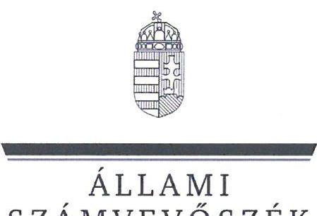

# JELENTÉS 

Az államháztartás központi alrendszerébe tartozó költségvetési szerv által teljesített dologi és felhalmozási célú kiadás szabályszerűségének rapid ellenőrzése
2025.

---

# JELENTÉS 

Az államháztartás központi alrendszerébe tartozó költségvetési szerv által teljesített dologi és felhalmozási célú kiadás szabályszerűségének rapid ellenőrzése
2025.

---

# ELLENŐRZÉSI IGAZGATÓSÁG: 

## ÁLLAMHÁZTARTÁS KÖZPONTI SZINTJÉT ELLENŐRZŐ IGAZGATÓSÁG

## ELLENŐRZÉSI IGAZGATÓ:

SINKÁNÉ DR. CSENDES ÁGNES igazgató

## ELLENŐRZÉSVEZETŐ:

Jelentéseink az interneten a www.asz.hu címen olvashatók.

RENKÓ ZSUZSANNA ellenőrzésvezető

IKTATÓSZÁM: EL-3949-103/2025.
TÉMASORSZÁM: -
ELLENŐRZÉS-AZONOSÍTÓ SZÁM: V102915

---

# TARTALOMJEGYZÉK 

AZ ELLENŐRZÉS ALAPADATAI ..... 5
MEGÁLLAPÍTÁSOK ÉS KÖVETKEZTETÉSEK ..... 13
JAVASLATOK ..... 14
MELLÉKLETEK ..... 15
I. sz. melléklet: Értelmező szótár ..... 15
II. sz. melléklet: Ellenőrzési kritériumok ..... 16
FÜGGELÉK: ÉSZREVÉTELEK ..... 17
RÖVIDÍTÉSEK JEGYZÉKE ..... 18

---

.

---

# AZ ELLENŐRZÉS ALAPADATAI 

## AZ ELLENŐRZÉS CÉLJA

Az államháztartás központi alrendszerébe tartozó költségvetési szerv által teljesített dologi és felhalmozási célú kiadások egy-egy kiválasztott tételének szabályszerűségi szempontból történő értékelése.

## AZ ELLENŐRZÖTT IDŐSZAK

| SSZ. | ELLENŐRZÖTT SZERVEZETEK | DOLOGI   KIADÁSOK   ESETÉREN | FELHALMOZÁSI   CÉLÚ KIADÁSOK   ESETÉREN |
| :--: | :--: | :--: | :--: |
| 1. | HUN-REN Csillagászati és Földtudományi Kutatóközpont | 2024. augusztus 30. | 2024. május 23. |
| 2. | HUN-REN Rényi Alfréd Matematikai Kutatóintézet | 2024. augusztus 14. | 2024. június 28. |
| 3. | HUN-REN Balatoni Limnológiai Kutatóintézet | 2024. szeptember 20. | 2024. március 18. |
| 4. | HUN-REN Nyelvtudományi Kutatóközpont | 2024. augusztus 2. | 2024. szeptember 12. |
| 5. | HUN-REN Bölcsészettudományi Kutatóközpont | 2024. szeptember 5. | 2024. július 16. |
| 6. | HUN-REN Társadalomtudományi Kutatóközpont | 2024. augusztus 1. | 2024. július 16. |
| 7. | Nemzetstratégiai Kutatóintézet | 2024. augusztus 2. | 2024. április 24. |
| 8. | Magyar Művészeti Akadémia Művészetelméleti és Módszertani Kutatóintézet | 2024. augusztus 8. | 2024. május 21. |
| 9. | Nemzeti Emlékezet Bizottságának Hivatala | 2024. augusztus 21. | 2024. szeptember 10. |
| 10. | Kopp Mária Intézet a Népesedésért és a Családokért | 2024. augusztus 7. | 2024. június 26. |

## AZ ELLENŐRZÉS TÁRGYA

Az államháztartás központi alrendszerébe tartozó költségvetési szerv által teljesített, ellenőrzésre kiválasztott dologi és felhalmozási célú kiadás szabályszerű teljesítése, ezen belül a gazdálkodási jogkörök szabályszerű gyakorlása. Az ellenőrzés kiterjedt minden olyan körülményre és adatra, amely az ÁSZ ${ }^{1}$ jogszabályban meghatározott feladatainak teljesítéséhez, valamint a program végrehajtása folyamán felmerült újabb összefüggések feltárásához szükséges volt.

---

Az ellenőrzés során az ÁSZ

- a HUN-REN Balatoni Limnológiai Kutatóintézet és a HUN-REN Bölcsészettudományi Kutatóközpont esetében a dologi kiadások körébe tartozó Szakmai anyagok beszerzése; a HUN-REN Csillagászati és Földtudományi Kutatóközpont és a HUN-REN Rényi Alfréd Matematikai Kutatóintézet esetében a dologi kiadások körébe tartozó Üzemeltetési anyagok beszerzése; a HUN-REN Társadalomtudományi Kutatóközpont és a Kopp Mária Intézet a Népesedésért és a Családokért esetében a dologi kiadások körébe tartozó Informatikai szolgáltatások igénybevétele; a HUN-REN Nyelvtudományi Kutatóközpont esetében a dologi kiadások körébe tartozó Szakmai tevékenységet segítő szolgáltatások; a Nemzetstratégiai Kutatóintézet, a Magyar Művészeti Akadémia Művészetelméleti és Módszertani Kutatóintézet és a Nemzeti Emlékezet Bizottságának Hivatala esetében a dologi kiadások körébe tartozó Egyéb szolgáltatások;
- a HUN-REN Nyelvtudományi Kutatóközpont, a HUN-REN Társadalomtudományi Kutatóközpont, a Nemzetstratégiai Kutatóintézet, a Magyar Művészeti Akadémia Művészetelméleti és Módszertani Kutatóintézet, a Nemzeti Emlékezet Bizottságának Hivatala és a Kopp Mária Intézet a Népesedésért és a Családokért esetében a felhalmozási célú kiadások körébe tartozó Immateriális javak beszerzése, létesítése; a HUN-REN Rényi Alfréd Matematikai Kutatóintézet esetében a felhalmozási célú kiadások körébe tartozó Ingatlanok beszerzése, létesítése; a HUN-REN Csillagászati és Földtudományi Kutatóközpont és a HUN-REN Bölcsészettudományi Kutatóközpont esetében a felhalmozási célú kiadások körébe tartozó Informatikai eszközök beszerzése, létesítése; a HUN-REN Balatoni Limnológiai Kutatóintézet esetében a felhalmozási célú kiadások körébe tartozó Egyéb tárgyi eszközök beszerzése, létesítése rovatokon elszámolt kiadások egy-egy kiválasztott mintatételének szabályszerűségét értékelte.

# AZ ELLENŐRZÉS JOGALAPJA 

Az ellenőrzés jogszabályi alapját az ÁSZ tv. ${ }^{2}$ 1. § (3) bekezdés és az 5. § (6) bekezdés előírásai képezték.

## AZ ELLENŐRZÉS MÓDSZERE

Az ellenőrzést az ÁSZ az ellenőrzött időszakban hatályos jogszabályok, az ellenőrzés szakmai szabályai alapján, „Az államháztartás központi alrendszerébe tartozó költségvetési szerv által teljesített dologi kiadás szabályszerűségének rapid ellenőrzése" és „Az államháztartás központi alrendszerébe tartozó költségvetési szerv által teljesített felhalmozási célú kiadás szabályszerűségének rapid ellenőrzése" című ellenőrzési programok (továbbiakban: ellenőrzési programok) kérdéseire adott válaszok kiértékelésével, az ellenőrzési programokban megjelölt adatforrások figyelembevételével folytatta le.

Az ellenőrzési kérdések megválaszolásához szükséges bizonyítékok megszerzése az ellenőrzött szervezetek által rendelkezésre bocsátott dokumentumokra és adatokra alapozva, továbbá megfigyelés, szemle (szemrevételezés), kérdésfelvetés (információkérés), valamint elemző eljárás útján történt. Az ellenőrzési bizonyítékként felhasználható adatforrások közé tartoztak egyrészt az ellenőrzéshez kért dokumentumok, adatforrások, másrészt adatforrás volt még minden - az ellenőrzés folyamán - feltárt, az ellenőrzés szempontjából információkat tartalmazó dokumentum.

---

Az ÁSZ az ellenőrzés során a kiválasztott mintatételek ellenőrzési programokban meghatározott szempontok szerinti szabályszerűségét értékelte, így a kötelezettségvállalás és a teljesítésigazolás gazdálkodási jogkörök tekintetében a jogkörgyakorlás szabályszerűségét, a pénzügyi ellenjegyzés és az utalványozás gazdálkodási jogkörök tekintetében ezek megtörténtét és az ellenőrzési kritériumoknak való megfelelőségét.

# AZ ELLENŐRZÖTT SZERVEZET 

Az ellenőrzés a HUN-REN Csillagászati és Földtudományi Kutatóközpont, a HUN-REN Rényi Alfréd Matematikai Kutatóintézet, a HUN-REN Balatoni Limnológiai Kutatóintézet, a HUN-REN Nyelvtudományi Kutatóközpont, a HUN-REN Bölcsészettudományi Kutatóközpont, a HUN-REN Társadalomtudományi Kutatóközpont, a Nemzetstratégiai Kutatóintézet, a Magyar Művészeti Akadémia Művészetelméleti és Módszertani Kutatóintézet, a Nemzeti Emlékezet Bizottságának Hivatala, és a Kopp Mária Intézet a Népesedésért és a Családokért elnevezésű szervezetekre, mint az államháztartás központi alrendszerébe tartozó költségvetési szervekre terjedt ki.

## HUN-REN CSILLAGÁSZATI ÉS FÖLDTUDOMÁNYI KUTATÓKÖZPONT

A CSFK ${ }^{3}$ a Tkfi tv. ${ }^{4}$-ben megjelölt közfeladatokat látja el: csillagászati és földtudományi (földrajzi, földtani, geokémiai) kutatások végzése, felfedező kutatások (alapkutatások) végzése, eredményeinek felhasználásra való előkészítése, illetőleg közzététele; a felfedező kutatáshoz szükséges elméleti vizsgálatok, obszervatóriumi, terepi és laboratóriumi mérések végzése, tudományos műszerek, módszerek kialakítása, valamint a mérési adatok tudományos feldolgozása és publikálása, obszervatóriumok és laboratóriumok fenntartása, illetőleg szükség esetén újak létesítése.

## HUN-REN CSILLAGÁSZATI ÉS FÖLDTUDOMÁNYI KUTATÓKÖZPONT

Alapításának éve:
1899.
Irányító szerve:
HUN-REN Központ
Középirányító szerve:
Gazdasági szervezet:
Gazdasági szervezettel rendelkezik
Illetékessége, működési területe:
országos
Általános képviseletét ellátó vezetője:
főigazgató
Vezetői kinevezés kezdete:
2022.01.01
2023. évi bevételi főösszeg:
2651,8 M Ft
2023. évi kiadási főösszeg:
847,9 M Ft

---

# HUN-REN RÉNYI ALFRÉD MATEMATIKAI KUTATÓINTÉZET

A RAMKI ${ }^{5}$ a Tkfi tv.-ben megjelölt közfeladatokat látja el: tervszerű alapkutatások folytatása a matematika és alkalmazásai különböző területein, összpontosítva olyan elméleti vizsgálatokra, amelyek egyfelől a matematika belső fejlődése, másrészt a matematikának más tudományokban és a társadalmi gyakorlatban való hatékony alkalmazása szempontjából jelentősek; a matematika oktatásának és a különböző szintű matematikai szakemberek képzésének aktív támogatása; közreműködés más intézményeknél dolgozó matematikusok tudományos továbbképzésében, a matematikai kultúra általános fejlesztésében.

|  HUN-REN RÉNYI ALFRÉD MATEMATIKAI KUTATÓINTÉZET | |
| --- | --- |
|  Alapításának éve: | |
|  Irányító szerve: | |
|  Középirányító szerve: | |
|  Gazdasági szervezet: | |
|  Illetékessége, működési területe: | |
|  Általános képviseletét ellátó vezetője: | |
|  Vezetői kinevezés kezdete: | |
|  2023. évi bevételi főösszeg: | |
|  2023. évi kiadási főösszeg: | |

# HUN-REN BALATONI LIMNOLÓGIAI KUTATÓINTÉZET

A BLKI ${ }^{6}$ a Tkfi tv.-ben megjelölt közfeladatokat látja el: magas szintű alap és alkalmazott kutatás a limnológia és egyéb biológiai, ökológiai diszciplinák területén; tudományos módszerekkel feltárni a Balaton és vízgyűjtőjének élővilágát, annak tér és időbeni változásait, életfolyamatait, anyagforgalmi sajátosságait és az ezekre hatással lévő környezeti és antropogén tényezőket; általánosan elősegíteni az édesvízi, a vizes, illetve más élőhelyek és élőviláguk megőrzését, kutatási eredményekkel, szakmai információkkal támogatva a fenntartható fejlődés megvalósulását elsődlegesen a Balaton térségében, illetve a Kárpát-medencében.

|  HUN-REN BALATONI LIMNOLÓGIAI KUTATÓINTÉZET | |
| --- | --- |
|  Alapításának éve: | |
|  Irányító szerve: | |
|  Középirányító szerve: | |
|  Gazdasági szervezet: | |
|  Illetékessége, működési területe: | |
|  Általános képviseletét ellátó vezetője: | |
|  Vezetői kinevezés kezdete: | |
|  2023. évi bevételi főösszeg: | |
|  2023. évi kiadási főösszeg: | |

---

# HUN-REN NYELVTUDOMÁNYI KUTATÓKÖZPONT 

Az NYTK ${ }^{7}$ a Tkfi tv.-ben megjelölt közfeladatokat látja el: a magyar nyelvészet minden területének művelése, általános, kísérletes és alkalmazott nyelvészeti kutatások végzése; foglalkozik a nyelvelméleti, kísérletes és magyar nyelvészeti alapkutatásokkal, a történeti-összehasonlító, nyelvtipológiai, nyelvtörténeti alapkutatásokkal és uralisztikai kutatásokkal, a lexikográfiai és lexikológiai kutatások végzésével, a magyar nyelv nagyszótárának elkészítésével, korpusznyelvészeti kutatásokkal, társadalmi nyelvészeti kutatásokkal, élőnyelvi és többnyelvűségi kutatásokkal; nyelv- és beszédtechnológiái kutatásokkal és fejlesztésekkel.

## HUN-REN NYELVTUDOMÁNYI KUTATÓKÖZPONT

Alapításának éve:
Irányító szerve:
Középirányító szerve:
Gazdasági szervezet:
Illetékessége, működési területe:
Általános képviseletét ellátó vezetője:
Vezetői kinevezés kezdete:
2023. évi bevételi főösszeg:
2023. évi kiadási főösszeg:
1949.
HUN-REN Központ

- 

Gazdasági szervezettel rendelkezik
országos
főigazgató
2024.04.01
$344,3 \mathrm{M} \mathrm{Ft}$
$1402,6 \mathrm{M} \mathrm{Ft}$

## HUN-REN BÖLCSÉSZETTUDOMÁNYI KUTATÓKÖZPONT

A BTK ${ }^{8}$ a Tkfi tv.-ben megjelölt közfeladatokat látja el: műveli és koordinálja a filozófia, az irodalomtudomány, a klasszika-filológia, a művészettörténet, a néprajztudomány, a régészet, a történettudomány, a zene- és tánctudomány, és a molekuláris genetika területén a szervezeti egységeiben zajló egyéni és csoportos, alap- és alkalmazott kutatásokat; a történelem, a művelődés, a művészetek és a társadalmikulturális örökség - az Európai Unióban nemzeti hatáskörbe utalt - kutatását munkájának minden formájában és szintjén a vizsgált témák magyarországi és magyar nemzeti vonatkozásainak nemzetközi összefüggésekbe helyezésével végzi; elősegíti a magyar és magyarországi filozófiai, irodalomtudományi, művészettörténeti, néprajztudományi, régészeti, történettudományi, zene- és tánctudományi, valamint a molekuláris genetikai kutatások sokoldalú jelenlétét a hazai és nemzetközi tudományos életben.; alapfeladatának tekinti a keretei között, illetve közreműködésével született kutatási eredmények széles körű közzétételét és felhasználását a tudomány, az oktatás és a közművelődés megfelelő szintjein, gondozza a keretei között művelt tudományágakhoz kapcsolódó hagyatékokat, díjakat, és segíti szakkönyvtárainak munkáját.

## HUN-REN BÖLCSÉSZETTUDOMÁNYI KUTATÓKÖZPONT

Alapításának éve:
Irányító szerve:
Középirányító szerve:
Gazdasági szervezet:
Illetékessége, működési területe:
Általános képviseletét ellátó vezetője:
Vezetői kinevezés kezdete:
2023. évi bevételi főösszeg:
2023. évi kiadási főösszeg:
1949.
HUN-REN Központ

- 

Gazdasági szervezettel rendelkezik
országos
főigazgató
2021.03.01
$842,6 \mathrm{M} \mathrm{Ft}$
$5405,1 \mathrm{M} \mathrm{Ft}$

---

# HUN-REN TÁRSADALOMTUDOMÁNYI KUTATÓKÖZPONT

A TK ${ }^{9}$ a Tkfi tv.-ben megjelölt közfeladatokat látja el: elméleti, empirikus és összehasonlító kutatások folytatása a jogtudomány, a kisebbségkutatás, a politikatudomány és a szociológia területén; e területeken alapkutatásokat, alkalmazott és összehasonlító kutatásokat is végez; megteremti és ápolja a kutatások hazai és nemzetközi kapcsolatrendszerét; elősegíti a magyar jogtudomány, kisebbségkutatás, politikatudomány és szociológia területén végzett kutatások jelenlétét a tudományág nemzetközi életében; együttműködik hazai és külföldi tudományos műhelyekkel, velük közös kutatásokat folytat; közreműködik hazai és külföldi doktoranduszok, ösztöndíjasok továbbképzésében; kutatási dokumentációt és szakterületéhez kapcsolódó adatbázisokat épít, amelyet a tudományos közösség és a szélesebb nyilvánosság számára hozzáférhetővé tesz interneten vagy nyomtatott formában.

|  |   |
| --- | --- |
|  Alapításának éve: | 1991. |

  |
|  Irányító szerve: | HUN-REN Központ  |
|  Középirányító szerve: | -  |
|  Gazdasági szervezet: | Gazdasági szervezettel rendelkezik  |
|  Illetékessége, múködési területe: | országos  |
|  Általános képviseletét ellátó vezetője: | főigazgató  |
|  Vezetői kinevezés kezdete: | 2022.01.01  |
|  2023. évi bevételi főösszeg: | 556,9 M Ft  |
|  2023. évi kiadási főösszeg: | 2520,3 M Ft  |

## NEMZETSTRATÉGIAI KUTATÓINTÉZET

Az NSKI ${ }^{10}$ a 346/2012. (XII. 11.) Korm. rendelet ${ }^{11}$ 4. $\int$-ában megjelölt közfeladatokat látja el: a magyarság kiemelkedő szellemi, kulturális és tudományos hagyományainak, eredményeinek figyelembe vételével kutatási, felmérési és elemzési feladatokat végez, ennek keretében: a nemzeti fenntartható fejlődéssel, erőforrással kapcsolatos, társadalmi megújulással, a határon túli nemzetrészekkel összefüggő kutatási, felmérési és elemzési feladatokat hajt végre; nemzetstratégiai műhelyeket, nemzeti kutatásokat és kiemelt trendkutatásokat koordinál, az azok által készített és megvalósított stratégiákat nyomon követi; társadalmi és gazdasági kiemelt célcsoportok körében kutatásokat, felméréseket és elemzéseket végez; a hazai és a kárpát-medencei kulturális, társadalmi és gazdasági tér fejlesztése, a nemzeti összetartozás erősítése, a jövő nemzedékek támogatásának céljából javaslatokat tesz; közvélemény-kutatásokat összesít, kivonatol.

|  |   |
| --- | --- |
|  Alapításának éve: | 2013.  |
|  Irányító szerve: | Miniszterelnök általános helyettese  |
|  Középirányító szerve: | -  |
|  Gazdasági szervezet: | Gazdasági szervezettel nem rendelkezik  |
|  Illetékessége, múködési területe: | országos  |
|  Általános képviseletét ellátó vezetője: | elnök  |
|  Vezetői kinevezés kezdete: | 2013.02.11  |
|  2023. évi bevételi főösszeg: | 71,0 M Ft  |
|  2023. évi kiadási főösszeg: | 1537,2 M Ft  |

---

# MAGYAR MŰVÉSZETI AKADÉMIA MŰVÉSZETELMÉLETI ÉS MÓDSZERTANI KUTATÓINTÉZET 

Az MMA MMK ${ }^{12}$ a 2011. évi CIX. tv ${ }^{13}$ 4. § (2) bekezdésében megjelölt közfeladatokat látja el: tervszerű alapkutatások folytatása a művészetelmélet és alkalmazásai különböző területein; a művészeti életet meghatározó szellemi folyamatok elemzése, összefüggések feltárása; közreműködés művészetelméleti szakemberek tudományos továbbképzésében; a kutatási feladatokhoz kapcsolódóan tudományos szak- és ismeretterjesztő kiadványok megjelentetése, hazai kutatóközpontokkal kutatóintézetekkel való együttműködés és az együttműködés keretében közös kutatások folytatása, kapcsolattartás más országok tudományos intézményeivel, nemzetközi tudományos társaságokkal, hazai és nemzetközi tudományos programok és konferenciák szervezése, pályázatok kiírása, tudományos kutatások eredményei társadalmi és gazdasági hasznosításának szorgalmazása, segítése, felsőoktatási intézményekkel együttműködésben részvétel oktatómunkában és közös kutatási, képzési és továbbképzési feladatok ellátása, valamint országos művészeti könyvtár működtetése; a Makovecz Imre Emlékközpont működtetése, Makovecz Imre építészi-tervezői szellemi hagyatéka, az annak részét képező szerzői jogi művek és egyéb alkotások (tervek, írásművek, hanganyagok stb.) felkutatása, összegyűjtése, tudományos-szakmai feldolgozása és gondozása.

## MAGYAR MŰVÉSZETI AKADÉMIA MŰVÉSZETELMÉLETI ÉS MÓDSZERTANI KUTATÓINTÉZET

Alapításának éve:
Irányító szerve:
Középirányító szerve:
Gazdasági szervezet:
Illetékessége, múködési területe:
Általános képviseletét ellátó vezetője:
Vezetői kinevezés kezdete:
2023. évi bevételi főösszeg:
2023. évi kiadási főösszeg:
2014.

Magyar Művészeti Akadémia
-
Gazdasági szervezettel nem rendelkezik
országos
igazgató
2022.10.01
$14,8 \mathrm{M} \mathrm{Ft}$
$529,7 \mathrm{M} \mathrm{Ft}$

---

# NEMZETI EMLÉKEZET BIZOTTSÁGÁNAK HIVATALA 

A NEB ${ }^{14}$ a NEBtv. ${ }^{15}$-ben megjelölt közfeladatokat látja el: az 1944. december 21. és 1990. május 2. közötti időszak átfogó elemzésével és a kommunista diktatúra működésének feltárásával összefüggésben: tudományos kutatás, irat, képi- és hanganyagok nyilvánosság számára való közzététele és digitalizálása, ismeretterjesztés, oktatási segédanyagok kiadása, feltárt tényadatokból és eredményekből nyilvánosság számára elérhető online adatbázis, tudásközpont és digitális archívum létrehozatala, élő tanúk emlékeinek rögzítése, a kommunista diktatúra felépítésével, működésével kapcsolatos vizsgálati eredményeket ágazatonként összefoglaló jelentések készítése, a kommunista hatalom birtokosainak a diktatúra működésével összefüggő szerepükre és cselekményeikre vonatkozó személyes adatainak közzététele, együttműködés az ügyészség kijelölt szervezeti egységeivel a kommunista diktatúra alatt elkövetett, el nem évülő és az Alaptörvény ${ }^{16}$ U) cikk (6) bekezdése szerinti bűncselekmények elkövetői körének felderítésében, összhangban a Büntető Törvénykönyv, és az emberiesség elleni bűncselekmények büntetendőségéről és elévülésének kizárásáról, valamint a kommunista diktatúrában elkövetett egyes bűncselekmények üldözéséről szóló törvény rendelkezéseivel.

## NEMZETI EMLÉKEZET BIZOTTSÁGÁNAK HIVATALA

Alapításának éve:
Irányító szerve:
Középirányító szerve:
Gazdasági szervezet:
Illetékessége, múködési területe:
Általános képviseletét ellátó vezetője:
Vezetői kinevezés kezdete:
2023. évi bevételi főösszeg
2023. évi kiadási főösszeg

2014.
Nemzeti Emlékezet Bizottságának Hivatala
-
Gazdasági szervezettel rendelkezik
országos
főigazgató
2017.11.01
$9,7 \mathrm{M Ft}$
$1402,4 \mathrm{M Ft}$

## KOPP MÁRIA INTÉZET A NÉPESEDÉSÉRT ÉS A CSALÁDOKÉRT

A KINCS ${ }^{17}$ a 371/2017. (XII. 8.) Korm. rendelet ${ }^{18}$ 4. §-ában megjelölt közfeladatokat látja el: a családpolitikáért felelős miniszter család- és népesedéspolitikai feladatainak segítése kutatási és elemzési tevékenységével. Az Intézet feladata elemzések és javaslatok kidolgozása a Kormány számára az alaptevékenységének körébe sorolt témák tekintetében, valamint szakmai eredményeinek kommunikációja és minél szélesebb körű nemzetközi kapcsolatok kiépítése.

## KOPP MÁRIA INTÉZET A NÉPESEDÉSÉRT ÉS A CSALÁDOKÉRT

Alapításának éve:
Irányító szerve:
Középirányító szerve:
Gazdasági szervezet:
Illetékessége, múködési területe:
Általános képviseletét ellátó vezetője:
Vezetői kinevezés kezdete:
2023. évi bevételi főösszeg:
2023. évi kiadási főösszeg:
2017.

Kulturális és Innovációs Minisztérium
-
Gazdasági szervezettel rendelkezik
országos
elnök
2023.12.01
$13,4 \mathrm{M Ft}$
$1064,6 \mathrm{M Ft}$

---

# MEGÁLLAPÍTÁSOK ÉS KÖVETKEZTETÉSEK 

Az ellenőrzött 20 kiadás teljesítése 19 esetben az ellenőrzés keretében vizsgált jogszabályi előírásoknak megfelelt. Egy dologi kiadás elszámolása nem volt szabályszerű.
A RAMKI-nél, a BLKI-nél, az NYTK-nál, a BTK-nál, a TK-nál, az NSKI-nél, az MMA MMK-nál, a NEB-nél és a KINCS-nél az ellenőrzött dologi és felhalmozási célú mintatételek, valamint a CSFK-nál a felhalmozási célú mintatétel esetében a kötelezettségvállalás, a teljesítésigazolás, valamint a kiadás elszámolása az Áht. ${ }^{19}$, az Ávr. ${ }^{20}$ és az Áhsz. ${ }^{21}$ előírásai szerint szabályszerűen történt, a pénzügyi ellenjegyzés és az utalványozás megfelelő volt:

- Kötelezettségeket az Áht.-ben és az Ávr.-ben foglaltakkal összhangban az arra jogosultsággal rendelkező személyek vállalták.
- A kötelezettségvállalásra az Áht.-ben foglaltak szerint, a pénzügyi ellenjegyzés után került sor.
- A teljesítésigazoló az Ávr.-ben előírt írásbeli kijelöléssel rendelkezett.
- A teljesítésigazolás során az Ávr.-ben foglaltak szerint ellenőrizhető okmányok alapján ellenőrizték és igazolták a kiadás teljesítésének jogosságát, összegszerűségét, valamint az ellenszolgáltatás teljesítését.
- A teljesítésigazoló a teljesítést az Ávr.-ben foglaltakkal összhangban, az igazolás dátumának és a teljesítés tényére történő utalás megjelölésével, aláírásával igazolta.
- Az utalványozásra az Áht.-ben, valamint az Ávr.-ben foglaltakkal összhangban, a teljesítésigazolást és az érvényesítést követően került sor.
- A kiadás számviteli elszámolása a megfelelő rovaton történt az Áhsz.-ben előírtakkal összhangban.

A CSFK-nál a dologi mintatétel esetében a kötelezettségvállalás, és a teljesítésigazolás az Áht. és az Ávr. előírásai szerint szabályszerűen történt, a pénzügyi ellenjegyzés és az utalványozás megfelelő volt, a kiadás elszámolása azonban nem volt szabályszerű:

- Kötelezettséget az Áht.-ben és az Ávr.-ben foglaltakkal összhangban az arra jogosultsággal rendelkező személy vállalt.
- A kötelezettségvállalásra az Áht.-ben foglaltak szerint a pénzügyi ellenjegyzés után került sor.
- A teljesítésigazoló az Ávr.-ben előírt írásbeli kijelöléssel rendelkezett.
- A teljesítésigazolás során az Ávr.-ben foglaltak szerint ellenőrizhető okmányok alapján ellenőrizték és igazolták a kiadás teljesítésének jogosságát, összegszerűségét, valamint az ellenszolgáltatás teljesítését.
- A teljesítésigazoló a teljesítést az Ávr.-ben foglaltakkal összhangban az igazolás dátumának és a teljesítés tényére történő utalás megjelölésével, aláírásával igazolta.
- Az utalványozásra az Áht.-ben, valamint az Ávr.-ben foglaltakkal összhangban, a teljesítésigazolást és az érvényesítést követően került sor.
- A kiadás elszámolása nem felelt meg az Áhsz. 40. § (1) bekezdésben és a 15. melléklet I. pontban foglaltaknak, mert az elszámolt kifizetés helytelenül a K312 Üzemeltetési anyagok beszerzése rovaton került elszámolásra a K63 Informatikai eszközök beszerzése rovat helyett.

---

# JAVASLATOK 

Az ÁSZ tv. 33. § (1) bekezdésében foglaltak értelmében az ellenőrzött szervezet vezetője köteles a jelentésben foglalt megállapításokhoz kapcsolódó intézkedési tervet összeállítani és azt a jelentés kézhezvételétől számított 30 napon belül az ÁSZ részére megküldeni. Amennyiben az ellenőrzött szervezet vezetője nem küldi meg határidőben az intézkedési tervet, vagy továbbra sem elfogadható intézkedési tervet küld, az Állami Számvevőszék elnöke az ÁSZ tv. 33. § (3) bekezdése a) és b) pontjaiban foglaltakat érvényesítheti.

## HUN-REN CSILLAGÁSZATI ÉS FÖLDTUDOMÁNYI KUTATÓKÖZPONT FŐIGAZGATÓJÁNAK

1. A Bkr. ${ }^{22}$ 3. § c pontban foglaltak alapján tegyen intézkedéseket azon kontrolltevékenységek kiépítésére és/vagy megfelelő működtetésére, amelyek megelőzik a jelentésben leírt szabálytalanság ismételt előfordulását.

---

# MELLÉKLETEK 

## I. SZ. MELLÉKLET: ÉRTELMEZŐ SZÓTÁR

kötelezettségvállalás
pénzügyi ellenjegyzés
teljesítésigazolás
utalványozás

A költségvetési szerv által a kiadási előirányzatok és - ha jogszabály lehetővé teszi - a kijelölt lebonyolító szerv számára a Kormány rendeletében meghatározottak szerinti rendelkezésre bocsátott összeg terhére fizetési kötelezettség vállalásáról szóló - így különösen a foglalkoztatásra irányuló jogviszony létesítésére, szerződés megkötésére, költségvetési támogatás biztosítására irányuló - szabályszerűen megtett jognyilatkozat.
Forrás: Áht. 1. § 15. pont
Kötelezettséget vállalni a Kormány rendeletében foglalt kivételekkel csak pénzügyi ellenjegyzés után, a pénzügyi teljesítés esedékességét megelőzően, írásban lehet. A pénzügyi ellenjegyzőnek a Kormány rendeletében foglalt kivételekkel meg kell győződnie arról, hogy a tervezett kifizetési időpontokban a pénzügyi fedezet biztosított, a kötelezettségvállalás nem sérti a gazdálkodásra vonatkozó szabályokat. A pénzügyi ellenjegyzést a kötelezettségvállalás dokumentumán a pénzügyi ellenjegyzés dátumának és a pénzügyi ellenjegyzés tényére történő utalás megjelölésével, az arra jogosult személy aláírásával kell igazolni.
Forrás: Áht. 37. § (1) bekezdés, Ávr. 55. § (1) bekezdés
A teljesítés igazolása során ellenőrizhető okmányok alapján ellenőrizni és igazolni kell a kiadások teljesítésének jogosságát, összegszerűségét, ellenszolgáltatást is magában foglaló kötelezettségvállalás esetében - ha a kifizetés vagy annak egy része az ellenszolgáltatás teljesítését követően esedékes - annak teljesítését. A teljesítést az igazolás dátumának és a teljesítés tényére történő utalás megjelölésével, az arra jogosult személy aláírásával kell igazolni.
Forrás: Ávr. 57. § (1) és (3) bekezdések
A bevételi előirányzatok javára bevételt elszámolni és a kiadási előirányzatok terhére kifizetést elrendelni - a Kormány rendeletében meghatározott kivételekkel - utalványozás alapján lehet. A kiadási előirányzatok terhére történő utalványozásra - a Kormány rendeletében meghatározott kivételekkel - a teljesítés igazolását, és az annak alapján végrehajtott érvényesítést követően kerülhet sor.
Forrás: Áht. 38. § (1) bekezdés

---

# II. SZ. MELLÉKLET: ELLENŐRZÉSI KRITÉRIUMOK 

| ELLENŐRZÉSI KRITÉRIUMOK |  |
| :--: | :--: |
| Kötelezettségvállalás | Áht. 36. § (7), 37. § (1) bekezdések   Ávr. 50. § (1) bekezdés d) pont, 52. § (1), (9), 53. § (1), 60. §   (3) bekezdések   belső szabályzat |
| Pénzügyi ellenjegyzés | Áht. 37. § (1), (2) bekezdések   Ávr. 55. § (1), (4) bekezdések |
| Teljesítésigazolás | Áht. 38. § (1), (2) bekezdések   Ávr. 57. § (1), (3)-(5), 58. § (3), 60. § (3) bekezdések |
| Utalványozás | Áht. 38. § (1) bekezdés   Ávr. 59. § (1b), (2) bekezdések, (3) bekezdés g) pont,   (4) bekezdés |
| Kiadások elszámolása | Áhsz. 40. § (1) bekezdés, 15. melléklet I. pont |

---

# FÜGGELÉK: ÉSZREVÉTELEK 

A jelentéstervezetet a Számvevőszék 15 napos észrevételezésre megküldte az ellenőrzött szervezet vezetőjének az ÁSZ tv. 29. § (1) bekezdése előírásának megfelelően.

Az ellenőrzött
 szervezetek vezetői a jelentéstervezet megállapításaira észrevételt nem tettek.

[^0]
[^0]:    * 29. § (1) Az Állami Számvevőszék az ellenőrzési megállapításait megküldi az ellenőrzött szervezet vezetőjének vagy az általa megbízott személynek, és annak, akinek személyes felelősségét állapította meg.
    (2) Az ellenőrzött szervezet vezetője és a felelősként megjelölt személy az ellenőrzés megállapításaira tizenöt napon belül írásban észrevételt tehet.
    (3) Az Állami Számvevőszék az észrevételre a beérkezésétől számított harminc napon belül írásban válaszol. A figyelembe nem vett észrevételeket köteles a jelentésben feltüntetni, és megindokolni, hogy azokat miért nem fogadta el.

---

# RÖVIDÍTÉSEK JEGYZÉKE 

${ }^{1}$ ÁSZ
${ }^{2}$ ÁSZ tv.
${ }^{3}$ CSFK
${ }^{4}$ Tkfi tv.
${ }^{5}$ RAMKI
${ }^{6}$ BLKI
${ }^{7}$ NYTK
${ }^{8}$ BTK
${ }^{9}$ TK
${ }^{10}$ NSKI
${ }^{11}$ 346/2012. (XII. 11.) Korm. rendelet
${ }^{12}$ MMA MMK
${ }^{13} 2011$. évi CIX. tv.
${ }^{14}$ NEB
${ }^{15}$ NEBtv.
${ }^{16}$ Alaptörvény
${ }^{17}$ KINCS
${ }^{18}$ 371/2017. (XII. 8.) Korm. rendelet
${ }^{19}$ Áht.
${ }^{20}$ Ávr.
${ }^{21}$ Áhsz.
${ }^{22}$ Bkr.

Állami Számvevőszék
2011. évi LXVI. törvény az Állami Számvevőszékről

HUN-REN Csillagászati és Földtudományi Kutatóközpont
2014. évi LXXVI. törvény a tudományos kutatásról, fejlesztésről és innovációról

HUN-REN Rényi Alfréd Matematikai Kutatóintézet
HUN-REN Balatoni Limnológiai Kutatóintézet
HUN-REN Nyelvtudományi Kutatóközpont
HUN-REN Bölcsészettudományi Kutatóközpont
HUN-REN Társadalomtudományi Kutatóközpont
Nemzetstratégiai Kutatóintézet
346/2012. (XII. 11.) Korm. rendelet a Nemzetstratégiai Kutatóintézet létrehozásáról
Magyar Művészeti Akadémia Művészetelméleti és Módszertani Kutatóintézet
2011. évi CIX. törvény a Magyar Művészeti Akadémiáról

Nemzeti Emlékezet Bizottságának Hivatala
2013. évi CCXLI. törvény a Nemzeti Emlékezet Bizottságáról

Magyarország Alaptörvénye (2011. április 25.)
Kopp Mária Intézet a Népesedésért és a Családokért
371/2017. (XII. 8.) Korm. rendelet a Kopp Mária Intézet a Népesedésért és a Családokért létrehozásáról
2011. évi CXCV. törvény az államháztartásról

368/2011. (XII. 31.) Korm. rendelet az államháztartásról szóló törvény végrehajtásáról
4/2013. (I. 11.) Korm. rendelet az államháztartás számviteléről
370/2011. (XII. 31.) Korm. rendelet a költségvetési szervek belső kontrollrendszeréről és belső ellenőrzéséről

---

1052 Budapest, Apáczai Csere János u. 10. | 1364 Budapest 4., Pf. 54
www.asz.hu | szamvevoszek@asz.hu
telefon: +36 14849100
