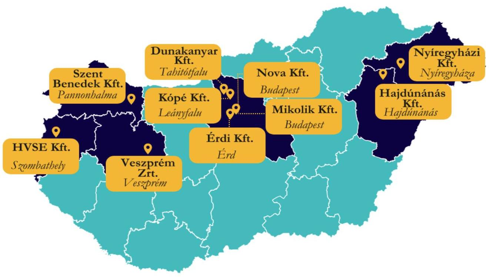
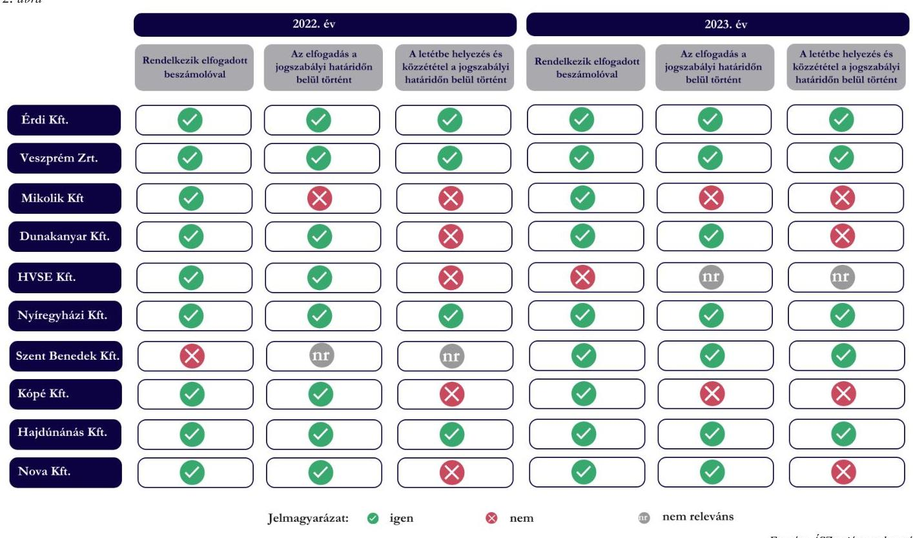

# JELENTÉS 

Támogatásban részesülő sportegyesületek és sportvállalkozások számviteli beszámoló készítési és közzétételi kötelezettségének ellenőrzése

2025.

---

# JELENTÉS 

Támogatásban részesülő sportegyesületek és sportvállalkozások számviteli beszámoló készítési és közzétételi kötelezettségének ellenőrzése

2025.

---

# ELLENŐRZÉSI IGAZGATÓSÁG: 

## ÁLLAMHÁZTARTÁSON KÍVÜLI SZERVEZETEKET ELLENŐRZŐ IGAZGATÓSÁG

## ELLENŐRZÉSI IGAZGATÓ:

## KLINGA LÁSZLÓ igazgató

## ELLENŐRZÉSVEZETŐ:

## NAGY MÁTÉ ellenőrzésvezető

TÓTH TAMÁS ellenőrzésvezető

## IKTATÓSZÁM: EL-4120-002/2025

TÉMASORSZÁM: -
ELLENŐRZÉS-AZONOSÍTÓ SZÁM: V1117

---

# TARTALOMJEGYZÉK 

AZ ELLENŐRZÉS ALAPADATAI ..... 5
AZ ELLENŐRZÖTT SZERVEZETEK ..... 7
ÖSSZEFOGLALÁS ..... 12
AZ ELLENŐRZÉS FÓKUSZTERÜLETE ..... 13
MEGÁLLAPÍTÁSOK ..... 14
JAVASLATOK ..... 17
MELLÉKLETEK ..... 19
I. sz. melléklet: Értelmező szótár ..... 19
II. sz. melléklet: Az ellenőrzött szervezetek jegyzéke ..... 20
III. sz. melléklet: Ellenőrzési kritériumok ..... 21
FÜGGELÉK: ÉSZREVÉTELEK ..... 22
RÖVIDÍTÉSEK JEGYZÉKE ..... 23

---

.

---

# AZ ELLENŐRZÉS ALAPADATAI 

## AZ ELLENŐRZÉS CÉLJA

Az ellenőrzés célja a támogatásban részesülő sportegyesületek és sportvállalkozások számviteli beszámoló készítési, letétbe helyezési és közzétételi kötelezettsége teljesítésének az ellenőrzése volt.

## AZ ELLENŐRZÉS TÍPUSA

Törvényességi ellenőrzés.

## AZ ELLENŐRZÖTT IDŐSZAK

A 2022. évi beszámoló és a 2023. évi beszámoló elfogadásáig terjedő időszak.

## AZ ELLENŐRZÉS TÁRGYA

Az ellenőrzés tárgyát képezte a költségvetési, önkormányzati és/vagy látvány-csapatsport támogatásban (továbbiakban: támogatás) részesült sportegyesületek és sportvállalkozások számviteli beszámoló készítési és közzétételi kötelezettségének teljesítése.

Az ellenőrzés kiterjedt minden olyan körülményre és adatra, amely az ÁSZ ${ }^{1}$ jogszabályban meghatározott feladatainak teljesítéséhez, valamint az ellenőrzési program végrehajtása során felmerülő újabb összefüggések feltárásához szükséges volt.

## AZ ELLENŐRZÉS JOGALAPJA

Az ellenőrzés jogalapját az ÁSZ tv. ${ }^{2}$ 5. § (3) bekezdésében foglalt előírások képezték.

## AZ ELLENŐRZÉS MÓDSZERE

Az ellenőrzést a nemzetközi standardokat irányadónak tekintve az ellenőrzési program szempontjai, az ellenőrzött időszakban hatályos jogszabályok, az ellenőrzés szakmai szabályai, az ellenőrzésre irányadó ÁSZ módszertanok figyelembevételével történt.

Az ellenőrzési kérdések megválaszolásához szükséges bizonyítékok megszerzése közhiteles nyilvántartásokból (Országos Bírósági Hivatal, Céginformációs szolgálat) származó dokumentumokra és adatokra, az ellenőrzött szervezet által rendelkezésre bocsátott dokumentumokra és adatokra alapozva, valamint kérdésfeltevés (információkérés) útján történt.

---

Az ellenőrzési bizonyítékként felhasználható adatforrások közé tartoztak egyrészt az ellenőrzéshez kért dokumentumok, adatforrások, másrészt adatforrás volt még minden - az ellenőrzés folyamán - feltárt, az ellenőrzés szempontjából információkat tartalmazó dokumentum.

Az ellenőrzés lefolytatásához az ellenőrzött szervezetek a tanúsítványok kitöltésével, valamint az ÁSZ által kért dokumentumok, adatok, információk megküldésével szolgáltattak adatokat.

---

# AZ ELLENŐRZÖTT SZERVEZETEK

Az ellenőrzés olyan Sport tv.³ 18. §-a szerinti sportvállalkozásokat érintett, amelyek a 2022. évi és 2023. évi beszámolási időszakban támogatásban részesültek.

Az ellenőrzött sportvállalkozások területi elhelyezkedését az 1. ábra mutatja:

*1. ábra*

*Forrás: ÁSZ saját szerkesztés*

## Érdi Sport Szolgáltató és Kereskedelmi Koriátolt Felelősségű Társaság

Az Érdi Kft.⁴ 2009-ben alakult, székhelye Érd, cégkivonata alapján fő tevékenysége egyéb sporttevékenység. Az Érdi Kft. egyszerűsített éves beszámolójának időszakát – élve a törvény által biztosított lehetőséggel – a naptári évtől eltérő időszakra határozta meg, melynek mérlegfordulónapja június 30. Könyvvizsgálatra nem volt kötelezett, azonban saját döntés alapján a számviteli beszámolók felülvizsgálatával könyvvizsgálót bízott meg.

Az Érdi Kft. összes bevételét, a kapott támogatások értékét és az üzleti évben foglalkoztatott munkavállalók átlagos statisztikai állományi létszámát az 1. táblázat tartalmazza.

|   | 2021. június 1 - 2022. június 30. | 2022. július 1 - 2023. június 30.  |
| --- | --- | --- |
|  Éves összes bevétel | 522 762 E Ft | 496 980 E Ft  |
|  Támogatások | 215 031 E Ft | 196 482 E Ft  |
|  Foglalkoztatott munkavállalók átlagos statisztikai állományi létszáma | 43 fő | 42 fő  |

*Forrás: Az ellenőrzött szervezet adatszolgáltatása alapján ÁSZ saját szerkesztés*

---

# Veszprém Handball Team ZÁrtKőrüEn Múködő RészvénytÁrsasÁG

A Veszprém Zrt. ${ }^{5}$ 2012-ben alakult, székhelye Veszprém, cégkivonata alapján fő tevékenysége egyéb sporttevékenység. A Veszprém Zrt. éves beszámolójának időszakát - élve a törvény által biztosított lehetőséggel - a naptári évtől eltérő időszakra határozta meg, melynek mérlegfordulónapja június 30. Könyvvizsgálatra kötelezett volt, a számviteli beszámolók felülvizsgálatával könyvvizsgálót bízott meg.

Az Veszprém Zrt. összes bevételét, a kapott támogatások értékét és az üzleti évben foglalkoztatott munkavállalók átlagos statisztikai állományi létszámát a 2. táblázat tartalmazza. 2. táblázat

|   | 2021. július 1 - 2022. június 30. | 2022. július 1 - 2023. június 30.  |
| --- | --- | --- |
|  Éves összes bevétel | 3490073 E Ft | 3875959 E Ft  |
|  Támogatások | 160284 E Ft | 158918 E Ft  |
|  Foglalkoztatott munkavállalók átlagos statisztikai állományi létszáma | 64 fő | 61 fő volt  |

Forrás: Az ellenőrzött szervezet adatszolgáltatása alapján ÁSZ saját szerkesztés

## Mikolik Sport School Korlátolt Felelősségú TÁrsasÁG

A Mikolik Kft. ${ }^{6}$ 2011-ben alakult, székhelye Budapest, cégkivonata alapján fő tevékenysége sportegyesületi tevékenység. A Mikolik Kft. egyszerűsített éves beszámolót készített, könyvvizsgálatra nem volt kötelezett.

Az Mikolik Kft. összes bevételét, a kapott támogatások értékét és az üzleti évben foglalkoztatott munkavállalók átlagos statisztikai állományi létszámát a 3. táblázat tartalmazza. 3. táblázat

|   | 2022. EV | 2023. EV  |
| --- | --- | --- |
|  Éves összes bevétel | 56512 E Ft | 72979 E Ft  |
|  Támogatások | 56082 E Ft | 72659 E Ft  |
|  Foglalkoztatott munkavállalók átlagos statisztikai állományi létszáma | 6 fő | 4 fő  |

Forrás: Az ellenőrzött szervezet adatszolgáltatása alapján ÁSZ saját szerkesztés

## DUNAKANYAR LABDASPORT NONPROFIT KÖZHASZNÚ KORLÁTOLT FELELŐSSÉGÚ TÁRSASÁG

A Dunakanyar Kft. ${ }^{7}$ 2020-ban alakult, székhelye Tahitófalu, cégkivonata alapján fő tevékenysége egyéb sporttevékenység. A Dunakanyar Kft. egyszerűsített éves beszámolót készített, könyvvizsgálatra nem volt kötelezett.

Az Dunakanyar Kft. összes bevételét, a kapott támogatások értékét és az üzleti évben foglalkoztatott munkavállalók átlagos statisztikai állományi létszámát a 4. táblázat tartalmazza. 4. táblázat

|   | 2022. EV | 2023. EV  |
| --- | --- | --- |
|  Éves összes bevétel | 130976 E Ft | 141349 E Ft  |
|  Támogatások | 126357 E Ft | 140817 E Ft  |
|  Foglalkoztatott munkavállalók átlagos statisztikai állományi létszáma | 8 fő | 11 fő  |

Forrás: Az ellenőrzött szervezet adatszolgáltatása alapján ÁSZ saját szerkesztés

---

# HVSE SPORT KORLÁTOLT FELELŐSSÉGŰ TÁRSASÁG 

A HVSE Kft. ${ }^{8}$ 2012-ben alakult, székhelye Szombathely, cégkivonata alapján fő tevékenysége egyéb sporttevékenység. A HVSE Kft. egyszerűsített éves beszámolót készített, könyvvizsgálatra nem volt kötelezett, azonban saját döntés alapján a számviteli beszámolók felülvizsgálatával könyvvizsgálót bízott meg.

Az HVSE Kft. összes bevételét, a kapott támogatások értékét és az üzleti évben foglalkoztatott munkavállalók átlagos statisztikai állományi létszámát az 5. táblázat tartalmazza.
5. táblázat

|  | 2022. év | 2023. év |
| :-- | :--: | :--: |
| Éves összes bevétel | 101782 E Ft | 92168 E Ft |
| Támogatások | 92545 E Ft | 75803 E Ft |
| Foglalkoztatott munkavállalók átlagos   statisztikai állományi létszáma | 5 fő | 3 fő |

Fonvás: Az ellenörzött szervezet adatszolgáltatása alapján ÁSZ saját szerkesztés

## Nyíregyházi ÉlSPORT NONPROFIT KORLÁtOLT FELELŐSSÉGŰ TÁrsASÁG

A Nyíregyházi Kft. ${ }^{9}$ 2015-ben alakult, székhelye Nyíregyháza, cégkivonata alapján fő tevékenysége egyéb sporttevékenység. A Nyíregyházi Kft. egyszerűsített éves beszámolójának időszakát - élve a törvény által biztosított lehetőséggel - 2022. évtől kezdődően a naptári évtől eltérő időszakra határozta meg, melynek mérlegfordulónapja június 30. Könyvvizsgálatra nem volt kötelezett.

Az Nyíregyházi Kft. összes bevételét, a kapott támogatások értékét és az üzleti évben foglalkoztatott munkavállalók átlagos statisztikai állományi létszámát az 6. számú táblázat tartalmazza.
6. táblázat

|  | 2022. jANUAR 1 - 2022. jÓNIUS 30. | 2022. jÓLJUS 1 - 2023. jÓNIUS 30. |
| :-- | :--: | :--: |
| Éves összes bevétel | 254634 E Ft | 499683 E Ft |
| Támogatások | 44515 E Ft | 126547 E Ft |
| Foglalkoztatott munkavállalók   átlagos statisztikai állományi létszáma | 30 fő | 39 fő |

Fonvás: Az ellenörzött szervezet adatszolgáltatása alapján ÁSZ saját szerkesztés

## SZENT BENEDEK RÓPLABDA AKAdÉMIA KORLÁtOLT FELELŐSSÉGŰ TÁRSASÁG

A Szent Benedek Kft. ${ }^{10}$ 2015-ben alakult, székhelye Pannonhalma, cégkivonata alapján fő tevékenysége egyéb sporttevékenység. A Szent Benedek Kft. egyszerűsített éves beszámolójának időszakát - élve a törvény által biztosított lehetőséggel - 2022. évtől kezdődően a naptári évtől eltérő időszakra határozta meg, melynek mérlegfordulónapja június 30. Könyvvizsgálatra nem volt kötelezett.

Az Szent Benedek Kft. összes bevételét, a kapott támogatások értékét és az üzleti évben foglalkoztatott munkavállalók átlagos statisztikai állományi létszámát az 7. táblázat tartalmazza.

---

7. táblázat

|   | 2022. JANUAR I - 2022. JUNIUS 30. | 2022. JULIUS I - 2023. JUNIUS 30.  |
| --- | --- | --- |
|  Éves összes bevétel | 204403 E Ft | 396452 E Ft  |
|  Támogatások | 192218 E Ft | 337664 E Ft  |
|  Foglalkoztatott munkavállalók átlagos statisztikai állományi létszáma | 22 fő | 21 fő  |

*Forrás: Az ellenőrzőtt szervezet adatszolgáltatása alapján ÁSZ saját szerkesztés*

# KÓPÉ DUNAKANYAR SPORTSZOLGÁLTATÓ KORLÁTOLT FELELŐSSÉGŰ TÁRSASÁG

A Kópé Kft.^{11} 2011-ben alakult, székhelye Leányfalu, cégkivonata alapján fő tevékenysége egyéb sporttevékenység. A Kópé Kft. egyszerűsített éves beszámolót készített, könyvvizsgálatra nem volt kötelezett.

Az Kópé Kft. összes bevételét, a kapott támogatások értékét és az üzleti évben foglalkoztatott munkavállalók átlagos statisztikai állományi létszámát a 8. táblázat tartalmazza.

|   | 2022. ÉV | 2023. ÉV  |
| --- | --- | --- |
|  Éves összes bevétel | 84585 E Ft | 74614 E Ft  |
|  Támogatások | 81606 E Ft | 69951 E Ft  |
|  Foglalkoztatott munkavállalók átlagos statisztikai állományi létszáma | 7 fő | 6 fő  |

*Forrás: Az ellenőrzőtt szervezet adatszolgáltatása alapján ÁSZ saját szerkesztés*

# HAJDÚNÁNÁS KÉZILABDA NONPROFIT KORLÁTOLT FELELŐSSÉGŰ TÁRSASÁG

A Hajdúnánás Kft.^{12} 2009-ben alakult, székhelye Hajdúnánás, cégkivonata alapján fő tevékenysége egyéb sporttevékenység. A Hajdúnánás Kft. egyszerűsített éves beszámolójának időszakát – élve a törvény által biztosított lehetőséggel – a naptári évtől eltérő időszakra határozta meg, melynek mérlegfordulónapja június 30. Könyvvizsgálatra nem volt kötelezett.

Az Hajdúnánás Kft. összes bevételét, a kapott támogatások értékét és az üzleti évben foglalkoztatott munkavállalók átlagos statisztikai állományi létszámát a 9. táblázat tartalmazza.

|   | 2021. JULIUS I - 2022. JUNIUS 30. | 2022. JULIUS I - 2023. JUNIUS 30.  |
| --- | --- | --- |
|  Éves összes bevétel | 74706 E Ft | 93535 E Ft  |
|  Támogatások | 64826 E Ft | 87738 E Ft  |
|  Foglalkoztatott munkavállalók átlagos statisztikai állományi létszáma | 2 fő | 0 fő  |

*Forrás: Az ellenőrzőtt szervezet adatszolgáltatása alapján ÁSZ saját szerkesztés*

---

# NOVA KÉZISULI KORLÁtOLT FELELŐSSÉGŰ TÁRSASÁG 

A Nova Kft. ${ }^{13}$ 2005-ben alakult, székhelye Budapest, cégkivonata alapján fő tevékenysége egyéb sporttevékenység. A Nova Kft. egyszerűsített éves beszámolót készített, könyvvizsgálatra nem volt kötelezett.

Az Nova Kft. összes bevételét, a kapott támogatások értékét és az üzleti évben foglalkoztatott munkavállalók átlagos statisztikai állományi létszámát a 10. táblázat tartalmazza.
10. táblázat

|  | 2022. EV | 2023. EV |
| :-- | :--: | :--: |
| Éves összes bevétel | 60423 E Ft | 55800 E Ft |
| Támogatások | 48881 E Ft | 38818 E Ft |
| Foglalkoztatott munkavállalók átlagos   statisztikai állományi létszáma | 12 fő | 12 fő |

Forrás: Az ellenőrzött szervezet adatszolgáltatása alapján ÁSZ saját szerkesztés

---

# ÖSSZEFOGLALÁS 

Magyarország Alaptörvényének XX. cikke kimondja, hogy mindenkinek joga van a testi és lelki egészséghez, melynek érvényesülését Magyarország többek között a sportolás és a rendszeres testedzés támogatásával segíti elő. Az Országgyűlés a Sport tv.-ben kinyilvánította, hogy a nemzet közössége a test művelését, a sportot, a nemzet alapértékének, kívánatos célnak tekinti. A sport a közjó része. Erősíti a közösség tagjainak egymáshoz tartozását, miként az egyén testi és lelki egészségét.

A sportegyesületek, sportvállalkozások működésükre és szakmai tevékenységük ellátására költségvetési támogatásban, önkormányzati támogatásban, valamint látvány-csapatsport támogatásban részesülhetnek, amelyekre fokozott figyelem irányul.

A 2022. évi beszámolási időszak vonatkozásában a 10 ellenőrzött sportvállalkozásból nyolc rendelkezett a jogszabályi előírásnak megfelelő formában elkészített és elfogadott számviteli beszámolóval az üzleti év zárását követően. Egy esetben a jóváhagyásra jogosult testület nem fogadta el az elkészült számviteli beszámolót, egy további esetben arra késedelmesen került sor. Az elfogadott számviteli beszámolóval rendelkező sportvállalkozások közül öt határidőn túl tett eleget letétbe helyezési és közzétételi kötelezettségének.
2023. évi beszámolási időszak vonatkozásában a 10 ellenőrzött sportvállalkozásból hét rendelkezett a jogszabályi előírásnak megfelelő formában elkészített és elfogadott számviteli beszámolóval az üzleti év zárását követően. Egy esetben a jóváhagyásra jogosult testület nem fogadta el az elkészült számviteli beszámolót, kettő további esetben arra késedelmesen került sor. Az elfogadott számviteli beszámolóval rendelkező sportvállalkozások közül négy határidőn túl tett eleget letétbe helyezési és közzétételi kötelezettségének.

A főbb ellenőrzési megállapításokat a 2. ábra szemlélteti sportvállalkozásonként:
2. ábra

---

# AZ ELLENŐRZÉS FÓKUSZTERÜLETE 

I. A számviteli beszámoló elkészítési, letétbe helyezési és közzétételi kötelezettség teljesítése.

---

# 1. A számviteli beszámoló elkészítési, letétbe helyezési és közzétételi kötelezettség teljesítése. 

Összegző megállapítás Az ellenőrzőtt sportvállalkozások - két vállalkozás kivételével - rendelkeztek a jóváhagyásra jogosult testület által elfogadott 2022. és 2023. évi számviteli beszámolóval. Három esetben az elfogadásra, kilenc esetben a letétbe helyezésre és közzétételre a jogszabályban meghatározott határidőt követően került sor.

## Érdi Sport Szolgáltató és KereskeDELMi Korlátolt Felelősségú Társaság

Az Érdi Kft. az üzleti év zárását követően - június 30. - a Számv. tv. ${ }^{14}$-nek megfelelő formában készítette el a 2021. július 1 - 2022. június 30. közötti időszakra és a 2022. július 1 - 2023. június 30. közötti időszakra vonatkozó egyszerűsített éves beszámolóját. A jóváhagyásra jogosult testület által elfogadott egyszerűsített éves beszámolókat a könyvvizsgálói jelentéssel együtt a Számv. tv.-ben előírt határidőben letétbe helyezte, közzétette.

## Veszprém Handball Team ZártKőrüen Múködő Részvénytársaság

A Veszprém Zrt. az üzleti év zárását követően - június 30. - a Számv. tv.-nek megfelelő formában készítette el a 2021. július 1 - 2022. június 30. közötti időszakra és a 2022. július 1 - 2023. június 30. közötti időszakra vonatkozó éves beszámolóját. A jóváhagyásra jogosult testület által elfogadott éves beszámolókat a könyvvizsgálói jelentéssel együtt a Számv. tv.-ben előírt határidőben letétbe helyezte, közzétette.
A Veszprém Zrt. a 2021. július 1 - 2022. június 30. közötti időszakra szóló és 2022. július 1 2023. június 30. közötti időszakra szóló éves beszámoló kiegészítő mellékletében nem mutatta be a kapott támogatásokat a Számv. tv. 93. § (3) bekezdésében előírtak ellenére a kapott összeg, annak felhasználása (jogcímenként és évenként), a rendelkezésre álló összeg megbontásban.

## Mikolik Sport School Korlátolt Felelősségú Társaság

A Mikolik Kft. az üzleti év zárását követően a Számv. tv.-nek megfelelő formában készítette el a 2022. évi és 2023. évi egyszerűsített éves beszámolóját. A 2022. évi egyszerűsített éves beszámolót a jóváhagyásra jogosult testület a Számv. tv. 153. § (1) bekezdésben foglalt határidőt - május 31-ét - követően 2024. április 3-án, a 2023. évit 2024. augusztus 29-én fogadta el. A Mikolik Kft. a Számv. tv. 153. § (1) bekezdésében előírt letétbe helyezési és a Számv. tv. 154. § (7) bekezdésében előírt közzétételi kötelezettségének késedelmesen, 2024. április 4-én, illetve 2024. augusztus 29-én tett eleget.

---

# DUNAKANYAR LABDASPORT NONPROFIT KÖZHASZNÚ KORLÁTOLT FELELŐSSÉGŰ TÁRSASÁG 

A Dunakanyar Kft. az üzleti év zárását követően a Számv. tv.-nek megfelelő formában készítette el a 2022. évi és 2023. évi egyszerűsített éves beszámolóját. A jóváhagyásra jogosult testület által elfogadott 2022. évi és 2023. évi egyszerűsített éves beszámoló esetében a Dunakanyar Kft. a Számv. tv. 153. § (1) bekezdésében előírt letétbe helyezési és a Számv. tv. 154. § (7) bekezdésében előírt közzétételi kötelezettségének késedelmesen, 2023. június 29-én, illetve 2024. szeptember 8-án tett eleget.

## HVSE SPORT KORLÁTOLT FELELŐSSÉGŰ TÁRSASÁG

A HVSE Kft. az üzleti év zárását követően a Számv. tv.-nek megfelelő formában készítette el a 2022. évi egyszerűsített éves beszámolóját, azonban a Ptk. ${ }^{15}$ 3:109. § (2) bekezdésében foglaltak ellenére nem rendelkezett a jóváhagyásra jogosult testület által elfogadott 2023. évi egyszerűsített éves beszámolóval. Az elfogadott, könyvvizsgálói jelentéssel alátámasztott 2022. évi egyszerűsített éves beszámoló esetében a HVSE Kft. a Számv. tv. 153. § (1) bekezdésében előírt letétbe helyezési és a Számv. tv. 154. § (7) bekezdésében előírt közzétételi kötelezettségének késedelmesen, 2023. június 1-jén tett eleget. A 2023. évi egyszerűsített éves beszámolót a Számv. tv. 153. § (1) és Számv. tv. 154. § (7) bekezdésében foglaltak ellenére nem helyezte letétbe, nem tette közzé.

## Nyíregyházi ÉlSPORT NONPROFIT KORLÁtOLT FELELŐSSÉGŰ TÁRSASÁG

A Nyíregyházi Kft. az üzleti év zárását követően - június 30. - a Számv. tv.-nek megfelelő formában készítette el a 2022. január 1 - 2022. június 30. közötti időszakra és a 2022. július 1 - 2023. június 30. közötti időszakra vonatkozó egyszerűsített éves beszámolóját. A jóváhagyásra jogosult testület által elfogadott éves beszámolókat a Számv. tv.-ben előírt határidőben letétbe helyezte, közzétette.

## SZENT BENEDEK RÓPLABDA AKADÉMIA KORLÁTOLT FELELŐSSÉGŰ TÁRSASÁG

A Szent Benedek Kft. az üzleti év zárását követően - június 30. - a Számv. tv.-nek megfelelő formában készítette el a 2022. július 1 - 2023. június 30. közötti időszakra vonatkozó egyszerűsített éves beszámolóját, azonban a Ptk. 3:109. § (2) bekezdésében foglaltak ellenére nem rendelkezett a jóváhagyásra jogosult testület által elfogadott 2022. január 1 - 2022. június 30. közötti időszakra vonatkozó egyszerűsített éves beszámolóval. A jóváhagyásra jogosult testület által elfogadott 2022. július 1 - 2023. június 30. közötti időszakra vonatkozó egyszerűsített éves beszámolót a Számv. tv.-ben előírt határidőben letétbe helyezte, közzétette. A Szent Benedek Kft. a 2022. január 1 - 2022. június 30. közötti időszakra vonatkozó beszámoló esetében nem a Számv. tv. 153. § (1) és a Számv. tv. 154.§ (7) bekezdésben előírt jóváhagyásra jogosult testület által elfogadott beszámolót helyezte letétbe és tette közzé.

## KÖPÉ DunAKANYAR SPORTSZOLGÁltATÓ KORLÁtOLT FELELŐSSÉGŰ TÁRSASÁG

A Kópé Kft. az üzleti év zárását követően a Számv. tv.-nek megfelelő formában készítette el a 2022. évi és 2023. évi egyszerűsített éves beszámolóját. A jóváhagyásra jogosult testület által elfogadott 2022. évi egyszerűsített éves beszámoló esetében a Kópé Kft. a Számv. tv. 153. § (1) bekezdésében előírt letétbe helyezési és a Számv. tv. 154. § (7) bekezdésében előírt közzétételi kötelezettségének késedelmesen, 2023. augusztus 18-án tett eleget. A 2023. évi egyszerűsített éves beszámolót a jóváhagyásra jogosult testület a Számv. tv. 153. § (1) bekezdésben foglalt határidőt - május 31-ét - követően 2024. augusztus 1-jén fogadta el. A Kópé Kft. a Számv. tv. 153. § (1) bekezdésében előírt letétbe helyezési és a Számv. tv. 154. § (7) bekezdésében előírt közzétételi kötelezettségének késedelmesen, 2024. augusztus 1-jén tett eleget.

---

# HajdÚnÁnÁs KÉZILABDA NONPROFIT KORLÁTOLT FELELŐSSÉGŰ TÁRSASÁG 

A Hajdúnánás Kft. az üzleti év zárását követően - június 30. - a Számv. tv.-nek megfelelő formában készítette el a 2021. július 1 - 2022. június 30. közötti időszakra és a 2022. július 1 - 2023. június 30. közötti időszakra vonatkozó egyszerűsített éves beszámolóját. A jóváhagyásra jogosult testület által elfogadott egyszerűsített éves beszámolókat a Számv. tv.-ben előírt határidőben letétbe helyezte, közzétette.

## NOVA KÉZISULI KORLÁtOLT FELELŐSSÉGŰ TÁRSASÁG

A Nova Kft. az üzleti év zárását követően a Számv. tv.-nek megfelelő formában készítette el a 2022. évi és 2023. évi egyszerűsített éves beszámolóját. A jóváhagyásra jogosult testület által elfogadott 2022. évi és 2023. évi egyszerűsített éves beszámoló esetében a Nova Kft. a Számv. tv. 153. § (1) bekezdésében előírt letétbe helyezési és a Számv. tv. 154. § (7) bekezdésében előírt közzétételi kötelezettségének késedelmesen, 2023. július 16-án, illetve 2024. szeptember 6-án tett eleget.

---

# JAVASLATOK 

Az ÁSZ tv. 33. § (1) bekezdésében foglaltak értelmében az ellenőrzött szervezet vezetője köteles a jelentésben foglalt megállapításokhoz kapcsolódó intézkedési tervet összeállítani és azt a jelentés kézhezvételétől számított 30 napon belül az ÁSZ részére megküldeni. Amennyiben az ellenőrzött szervezet vezetője nem küldi meg határidőben az intézkedési tervet, vagy továbbra sem elfogadható intézkedési tervet küld, az Állami Számvevőszék elnöke az ÁSZ tv. 33. § (3) bekezdése a) és b) pontjaiban foglaltakat érvényesítheti.

## A VESZPRÉM HANDBALL TEAM ZÁRTKÖRŰEN MÜKÖDŐ RÉSZVÉNYTÁRSASÁG VEZÉRIGAZGATÓJÁNAK

1. Gondoskodjon a támogatások Számv. tv. 93. § (3) bekezdésében elöirtaknak megfelelő bemutatására az éves beszámoló kiegészítő mellékletében.

## A MIKOLIK SPORT SCHOOL KORLÁTOLT FELELŐSSÉGŰ TÁRSASÁG ÜGYVEZETŐJÉNEK

1. Gondoskodjon az egyszerüsített éves beszámoló határidőben való elfogadásáról, letétbe helyezéséről és közzétételéről a Számv. tv. 153. § (1) és Számv. tv. 154. § (7) bekezdésében elöirtaknak megfelelően.

## A DuNAKANYAR LABDASPORT NONPROFIT KORLÁTOLT FELELŐSSÉGŰ TÁRSASÁG ÜGYEVEZŐJÉNEK

1. Gondoskodjon az egyszerüsített éves beszámoló határidőben való letétbe helyezéséről és közzétételéről a Számv. tv. 153. § (1) és Számv. tv. 154. § (7) bekezdésében elöirtaknak megfelelően.

## A HVSE SPORT KORLÁTOLT FELELŐSSÉGŰ TÁRSASÁG ÜGYVEZETŐJÉNEK

1. Gondoskodjon a 2023. évi egyszerüsített éves beszámolójának elfogadásáról a Ptk. 3:109. § (2) bekezdése, és a beszámoló letétbe helyezéséről és közzétételéről a Számv. tv. 153. § (1) és a Számv. tv. 154. § (7) bekezdésének megfelelően.

2
Gondoskodjon az egyszerüsített éves beszámoló határidőben való elfogadásáról, letétbe helyezéséről és közzétételéről a Számv. tv. 153. § (1) és Számv. tv. 154. § (7) bekezdésében elöirtaknak megfelelően.

---

# A SZENT BENEDEK RÓPLABDA AKADÉMIA KORLÁTOLT FELELŐSSÉGŰ TÁRSASÁG ÜGYVEZETŐJÉNEK 

1. Gondoskodjon a 2022. január 1 - 2022. június 30. közötti időszakra szóló egyszerűsített éves beszámolójának elfogadásáról a Ptk. 3:109. § (2) bekezdése és a beszámoló letétbe helyezéséről és közzétételéről a Számv. tv. 153. § (1) bekezdésének megfelelően.

## A KÓPÉ DuNAKANYAR SPORTSZOLGÁLTATÓT KORLÁTOLT FELELŐSSÉGŰ TÁRSASÁG ÜGYVEZETŐJÉNEK

1. Gondoskodjon az egyszerűsített éves beszámoló határidőben való elfogadásáról, letétbe helyezéséről és közzétételéről a Számv. tv. 153. § (1) és Számv. tv. 154. § (7) bekezdésében előírtaknak megfelelően.

## A NOVA KÉZISULI KORLÁTOLT FELELŐSSÉGŰ TÁRSASÁG ÜGYVEZETŐJÉNEK

1. Gondoskodjon az egyszerűsített éves beszámoló határidőben való letétbe helyezéséről és közzétételéről a Számv. tv. 153. § (1) és Számv. tv. 154. § (7) bekezdésében előírtaknak megfelelően.

---

# MELLÉKLETEK 

## I. SZ. MELLÉKLET: ÉRTELMEZŐ SZÓTÁR

Költségvetési támogatás

Látvány-csapatsport támogatás

Sportegyesület

Sporttevékenység

Sportvállalkozás

Jóváhagyásra jogosult testület

A társadalombiztosítás pénzügyi alapjai kivételével az államháztartás központi alrendszeréből ellenérték nélkül, pénzben nyújtott támogatások.
(Áht. ${ }^{16} 1 . \S 14$. pont alapján)
Az adóévben visszafizetési kötelezettség nélkül nyújtott támogatás, juttatás, véglegesen átadott pénzeszköz és térítés nélkül átadott eszköz könyv szerinti értéke, az adóévben térítés nélkül nyújtott szolgáltatás bekerülési értéke a Tao. tv.-ben meghatározott jogcímeken. (Forrás: Tao. tv. ${ }^{17}$ 4. § 44. pont)
A Civil tv. és a Ptk. szabályai szerint működő olyan egyesület, amelynek alaptevékenysége a sporttevékenység szervezése, valamint a sporttevékenység feltételeinek megteremtése. (Forrás: Sport. tv. 16. § (1) bekezdés)
Meghatározott szabályok szerint, a szabadidő eltöltéseként kötetlenül vagy szervezett formában, illetve versenyszerűen végzett testedzés vagy szellemi sportágban kifejtett tevékenység, amely a fizikai erőnlét és a szellemi teljesítőképesség megtartását, fejlesztését szolgálja.
(Forrás: Sport tv. 1. § (2) bekezdés)
Az a gazdasági társaság, amelynek a cégnyilvántartásról, a cégnyilvánosságról és a bírósági cégeljárásról szóló törvény alapján a cégjegyzékbe bejegyzett tevékenysége sporttevékenység, továbbá a gazdasági társaság célja sporttevékenység szervezése, valamint a sporttevékenység feltételeinek megteremtése egy vagy több sportágban. Korlátolt felelősségű társasági, illetve részvénytársasági formában alapítható, a fogyatékosok sportja, illetve a szabadidősport területén közhasznú társaságként is müködhet.
(Forrás: Sport. tv. 18. § alapján)
A társaság legfőbb szerve, melynek hatáskörébe tartozik a számviteli törvény szerinti beszámoló jóváhagyása (Forrás: Ptk. 3:109. § (2) bekezdés alapján)

---

# II. SZ. MELLÉKLET: AZ ELLENŐRZÖTT SZERVEZETEK JEGYZÉKE 

| ELLENŐRZÖTT SZERVEZETEK NEVE | ELLENŐRZÖTT SZERVEZETEK SZEKHELYE |
| :--: | :--: |
| Érdi Sport Szolgáltató és Kereskedelmi Korlátolt Felelősségű Társaság | 2030 Érd, Velencei út 39-41. |
| Veszprém Handball Team Zártkörűen Müködő Részvénytársaság | 8200 Veszprém, Külső-kádártai út 5. |
| Mikolik Sport School Korlátolt Felelősségű Társaság | 1113 Budapest, Daróczi út 68. |
| DUNAKANYAR LABDASPORT Nonprofit Közhasznú Korlátolt Felelősségű Társaság | 2022 Tahitótfalu, Napsugár utca 8. |
| HVSE Sport Korlátolt Felelősségű Társaság | 9700 Szombathely, Rohonci út 3. |
| Nyíregyházi Élsport Nonprofit Korlátolt Felelősségű Társaság | 4400 Nyíregyháza, Géza utca 8-16. |
| Szent Benedek Röplabda Akadémia Korlátolt Felelősségű Társaság | 9090 Pannonhalma, Vár 1. |
| KÓPÉ Dunakanyar Sportszolgáltató Korlátolt Felelősségű Társaság | 2016 Leányfalu, Szeder utca 3. |
| Hajdúnánás Kézilabda Nonprofit Korlátolt Felelősségű Társaság | 4080 Hajdúnánás, Hunyadi utca 9. |
| NOVA Kézisuli Korlátolt Felelősségű Társaság | 1149 Budapest, Bíbor utca 14-16. |

---

# III. SZ. MELLÉKLET: ELLENŐRZÉSI KRITÉRIUMOK 

## FOKUSZTERÜLET

1. A számviteli beszámoló elkészítési és letétbe helyezési kötelezettség teljesítése.

## ELLENŐRZÉSI KRITÉRIUMOK

Számv. tv. 9. § (2), 11. § (1)-(2), 17. § (1)-(2), 19. § (1), 93. $\S(3), 96 . \S(4), 153 . \S(1), 154 . \S(1),(7), 155 . \S(3)$ bekezdés
Ptk. 3:109. § (1) és (2) bekezdés

---

# FÜGGELÉK: ÉSZREVÉTELEK 

A jelentéstervezetet a Számvevőszék 15 napos észrevételezésre megküldte az ellenőrzött szervezet vezetőjének az ÁSZ tv. 29. §* (1) bekezdése előírásának megfelelően.

Az ellenőrzött szervezetek vezetői a jelentéstervezet megállapításaira nem tettek észrevételt.

[^0]
[^0]:    * 29. § (1) Az Állami Számvevőszék az ellenőrzési megállapításait megküldi az ellenőrzött szervezet vezetőjének vagy az általa megbízott személynek, és annak, akinek személyes felelősségét állapította meg.
    (2) Az ellenőrzött szervezet vezetője és a felelősként megjelölt személy az ellenőrzés megállapításaira tizenöt napon belül írásban észrevételt tehet.
    (3) Az Állami Számvevőszék az észrevételre a beérkezésétől számított harminc napon belül írásban válaszol. A figyelembe nem vett észrevételeket köteles a jelentésben feltüntetni, és megindokolni, hogy azokat miért nem fogadta el.

---

# RÖVIDÍTÉSEK JEGYZÉKE 

${ }^{1}$ ÁSZ
${ }^{2}$ ÁSZ tv.
${ }^{3}$ Sport tv.
${ }^{4}$ Érdi Kft.
${ }^{5}$ Veszprém Zrt.
${ }^{6}$ Mikolik Kft.
${ }^{7}$ Dunakanyar Kft.
${ }^{8}$ HVSE Kft.
${ }^{9}$ Nyíregyházi Kft.
${ }^{10}$ Szent Benedek Kft.
${ }^{11}$ Kópé Kft.
${ }^{12}$ Hajdúnánás Kft.
${ }^{13}$ Nova Kft.
${ }^{14}$ Számv. tv.
${ }^{15}$ Ptk.
${ }^{16}$ Áht.
${ }^{17}$ Tao tv.

Állami Számvevőszék
2011. évi LXVI. törvény az Állami Számvevőszékről
2004. évi I. törvény a sportról

Érdi Sport Szolgáltató és Kereskedelmi Korlátolt Felelősségű Társaság
Veszprém Handball Team Zártkörűen Működő Részvénytársaság
Mikolik Sport School Korlátolt Felelősségű Társaság
DUNAKANYAR LABDASPORT Nonprofit Közhasznú Korlátolt Felelősségű Társaság
HVSE Sport Korlátolt Felelősségű Társaság
Nyíregyházi Élsport Nonprofit Korlátolt Felelősségű Társaság
Szent Benedek Röplabda Akadémia Korlátolt Felelősségű Társaság
KÖPÉ Dunakanyar Sportszolgáltató Korlátolt Felelősségű Társaság
Hajdúnánás Kézilabda Nonprofit Korlátolt Felelősségű Társaság
NOVA Kézisuli Korlátolt Felelősségű Társaság
2000. évi C. törvény a számvitelről
2013. évi V. törvény a Polgári Törvénykönyvről
2011. évi CXCV. törvény az államháztartásról
1996. évi LXXXI. törvény a társasági adóról és az osztalékadóról

---

1052 Budapest, Apáczai Csere János u. 10. | 1364 Budapest 4., Pf. 54
www.asz.hu | szamvevoszek@asz.hu
telefon: +36 14849100