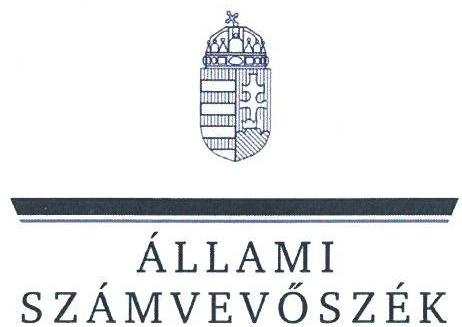
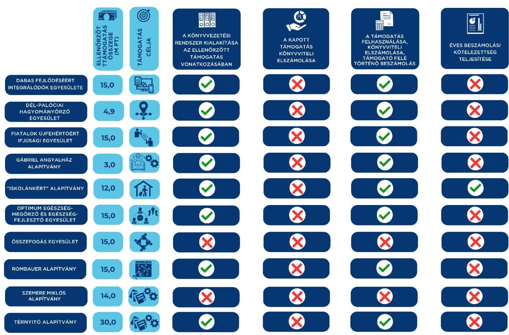

# JELENTÉS 

## Egyesületek és alapítványok államháztartásból kapott támogatásai felhasználásának és elszámolásának ellenőrzése

2025.

---

ÁLLAMI
SZÁMVEVŐSZÉK

# JELENTÉS 

## Egyesületek és alapítványok államháztartásból kapott támogatásai felhasználásának és elszámolásának ellenőrzése

2025.

---

# ELLENŐRZÉSI IGAZGATÓSÁG: 

## ÁLLAMHÁZTARTÁSON KÍVÜLI SZERVEZETEKET ELLENŐRZŐ IGAZGATÓSÁG

## ELLENŐRZÉSI IGAZGATÓ:

## KLINGA LÁSZLÓ igazgató

## ELLENŐRZÉSVEZETŐ:

Jelentéseink az interneten a www.asz.hu címen olvashatók.

## SOLYMÁR ÁGNES ellenőrzésvezető

IKTATÓSZÁM EL-4071-012/2025
TÉMASORSZÁM: 26
ELLENŐRZÉS-AZONOSÍTÓ SZÁM: V1099

---

# TARTALOMJEGYZÉK 

AZ ELLENŐRZÉS ALAPADATAI ..... 5
AZ ELLENŐRZÖTT SZERVEZETEK ..... 7
ÖSSZEFOGLALÁS ..... 14
AZ ELLENŐRZÉS FÓKUSZKÉRDÉSE ..... 16
MEGÁLLAPÍTÁSOK ..... 17
JAVASLATOK ..... 31
MELLÉKLETEK ..... 35
I. sz. melléklet: Értelmező szótár ..... 35
II. sz. melléklet: Az ellenőrzött szervezetek jegyzéke ..... 37
III. sz. melléklet: Ellenőrzési kritériumok ..... 38
FÜGGELÉK: ÉSZREVÉTELEK ..... 39
RÖVIDÍTÉSEK JEGYZÉKE ..... 40

---

.

---

# AZ ELLENŐRZÉS ALAPADATAI 

## AZ ELLENŐRZÉS CÉLJA

Az ellenőrzés célja annak megállapítása volt, hogy az ellenőrzött egyesületeknél, alapítványoknál a kiválasztott, államháztartási forrásból származó támogatások felhasználása a jogszabályi és a támogatói okiratban előírtaknak megfelelően történt-e, a támogatásokkal való elszámolás szabályszerű volt-e, a civil szervezetek a gazdálkodásukról szabályszerűen beszámoltak-e. Az államháztartási forrásból származó támogatást a támogatói okiratban meghatározott célra használták-e fel.

## AZ ELLENŐRZÉS TÍPUSA

Szabályszerüségi ellenőrzés.

## AZ ELLENŐRZÖTT IDŐSZAK

A kiválasztott államháztartási forrásból származó támogatásra vonatkozó támogatói okirat aláírásától amennyiben a támogatott tevékenység időtartamának kezdő időpontja korábbi, mint a támogatói okirat aláírásának időpontja, akkor a támogatott tevékenység időtartamának kezdő időpontjától - az ellenőrzésről szóló értesítés keltéig (2024. június 20-ig) tartó időszak. Amennyiben a 2023. évi beszámoló közzététele ezen időszakban nem történt meg, akkor az ellenőrzött időszak záró időpontja a 2023. évi beszámoló közzétételének napja.

## AZ ELLENŐRZÉS TÁRGYA

Az államháztartásból nyújtott támogatást felhasználó ellenőrzött egyesületeknél és alapítványoknál a kiválasztott támogatás felhasználására vonatkozó jogszabályi és szerződéses előírások betartásának ellenőrzése. Ennek keretében a könyvvezetésre vonatkozó jogszabályi előírások betartása, a támogatás felhasználás támogatói okiratnak való megfelelősége, valamint a beszámolási és közzétételi kötelezettség teljesítésének szabályszerűsége. Az ellenőrzés tárgya továbbá annak ellenőrzése, hogy a számviteli szabályozási környezet kialakítása támogatta-e az államháztartásból származó támogatások vonatkozásában a szabályos könyvvezetést, a kapcsolódó beszámolási kötelezettség teljesítését, valamint a támogatások célnak megfelelő felhasználását.

## AZ ELLENŐRZÉS JOGALAPJA

Az ellenőrzés jogalapját az ÁSZ tv. ${ }^{1} 1 . \int(3)$, valamint az 5. $\int(3)$ bekezdés előírásai képezték.

---

# AZ ELLENŐRZÉS MÓDSZERE 

Az ellenőrzés a nemzetközi standardokat irányadónak tekintve az ellenőrzési program szempontjai, az ellenőrzött időszakban hatályos jogszabályok, az ellenőrzés szakmai szabályai és az ellenőrzési módszertanok figyelembevételével történt.

Az ellenőrzési kérdések megválaszolásához szükséges bizonyítékok megszerzése az ellenőrzött civil szervezet által rendelkezésre bocsátott dokumentumokra és adatokra alapozva, továbbá kérdésfeltevés (információkérés), interjú útján történt.

A civil szervezeteknél az államháztartási forrásból származó működésükhöz, programjaikhoz vagy fejlesztéseikhez (beruházásaikhoz) kapcsolódó, kiválasztott támogatás felhasználása támogatói okiratnak való megfelelőségét, a támogatások nyilvántartásának és a támogató felé történő elszámolásnak egymással és a támogatói okirattal történő összevetésével ellenőrizte az ÁSZ².

A támogatások könyvviteli nyilvántartása jogszabályi előírásoknak, támogatói okiratnak való megfelelőségét támogatásonként, kockázati értékeléssel kiválasztott mintatételeken keresztül ellenőrizte az ÁSZ. A mintatételek kiértékelésének eredménye nem került az alapsokaságra kivetítésre.

---

# AZ ELLENŐRZÖTT SZERVEZETEK 

Az ellenőrzésre 10 civil szervezet esetében került sor, melyek közül öt egyesületi, öt pedig alapítványi formában működött. Múködéséről, vagyoni, pénzügyi és jövedelmi helyzetéről három ellenőrzött szervezet az ellenőrzött években egyszerűsített beszámolót készített, melyet egyszeres könyvvitellel támasztott alá. Egy szervezet a Számv. tv. ${ }^{3}$ szerinti éves beszámolót, hat szervezet egyszerűsített éves beszámolót készített (közülük egy szervezet 2023. évtől a Számv. tv. szerinti éves beszámolót készített), melyet kettős könyvvezetéssel támasztott alá. A 10 ellenőrzött szervezet nem rendelkezett közhasznú jogállással. A Közbef. tv. ${ }^{4}$ előírása szerint tevékenysége és a 2023. évi számviteli beszámoló mérlegfőösszege alapján - mivel mérlegfőösszegük elérte a 20 M Ft összeget - négy ellenőrzött a közélet befolyásolására alkalmas tevékenységet végző civil szervezetnek minősült.

Az ellenőrzött szervezetek 2021-2023. évekre vonatkozó számviteli beszámolóik szerint a 2023. évben összesen 170,2 M Ft vagyonnal gazdálkodtak, a 2021-2023. években az összes bevételük 546 M Ft volt. Az ellenőrzött 10 civil szervezetnél a $\mathrm{BGA}^{5}$-tól, mint a Miniszterelnökségnél rendelkezésre álló támogatási célú fejezeti kezelésű előirányzat kezelő szervétől 138,9 M Ft összegű, vissza nem térítendő, 100\%-os előlegként kapott támogatás számviteli elkülönített nyilvántartásának, valamint a támogatási előleg cél szerinti felhasználásának ellenőrzésére került sor.

## Dabas Fejlődéséért InteGrálódók EgYesülete (Dabas)

A Dabas Fejlődéséért Integrálódók Egyesületet 1994. évben a Dabas fejlődését, polgáriasodását akaró fiatal és idősebb városlakók alapították. Az Alapító okiratban meghatározott célja többek között „Dabas fejlődését, polgáriasodását akaró fiatalabb és idősebb városlakók képviselete a belvi közeletben. A település szétlagoltságát erősitő, vagy szétszakadását szorgalmazó törekvésekkel szemben az egységben maradás alternatívájának erősitése. A különbözö generációk közötti kapcsolatok szálainak erősitése. Helyi karitativ tevékenységek szervezése, végzése. pl. idösekről való gondoskodás, bátraincos belyzetüek, elesettek támogatása stb. Fiatalok továbbtanulásának és munkába állásának elősegítése, támogatása. Tehetségkutatás, menedzselés. A város jó birnevének öregbitése. Dabason müködő társadalmi szervezetek (gyermek, felnött) bazai és nemzetközi kapcsolatteremtő törekvéseinek támogatása. Valamint mindennemü gazdasági és nonprofit tevékenység, ami Dabas Város érdekeit szolgálja, s jogszabályba vagy mások érdekeibe nem ütközzék." A Dabas Fejlődéséért Integrálódók Egyesülete a 2023. évi számviteli beszámolójának mérlegfőösszege alapján a közélet befolyásolására alkalmas tevékenységet végző civil szervezetnek minősült. A könyvvezetése az egyszeres könyvvitel rendszerében történt, a beszámoló formája egyszerűsített beszámoló volt. Legfőbb döntéshozó szerve a Közgyűlés, ügyvezető szerve az Ügyvezető Testület volt. A beszámolók adatai alapján vállalkozási tevékenységet folytatott, könyvvizsgálatra nem volt kötelezett. A BGA által nyújtott, ellenőrzött támogatás főbb adatait az 1. táblázat tartalmazza.

---

1. táblázat

# A DABAS FEJLŐDESEÉRT INTEGRÁLÓDÓK EGYESÜLETE RÉSZÉRE A BGA ÁLTAL NYÚJTOTT, ELLENŐRZÖTT TÁMOGATÁS FÖBB ADATAI 

A támogatási program célja
A támogatott tevékenység időtartama
A támogatási előleg felhasználásának végső időpontja
A támogatási előleg folyósításának napja / összege
A támogatási előleg felhasználásáról a beszámoló benyújtásának határideje
A támogatási előleg felhasználásáról benyújtott beszámoló elfogadásának dátuma

## „A Dabas Fejlődéséért Integrálódók Egyesülete médiamegjelenésének fejlesztése."

2021.01.01 - 2023.06.30.
2023.06.30.
2021.08.12. / 15 M Ft
2023.08.29.
2024.03.26.

Forrás: Az ellenőrzött szervezet dokumentumai alapján ÁSZ saját szerkesztés

## DÉL-PALÓCIAI HAGYOMÁNYŐRZŐ EGYESÜLET (KISBÁGYON)

A Dél-Palóciai Hagyományőrző Egyesületet 2017. évben 10 fő magánszemély alapította, a kulturális örökség megőrzése és a hagyományőrzés céljából. A Dél-Palóciai Hagyományőrző Egyesület Alapszabálya szerint célja: „A palóc gasztronómia és izzek, ételek, a disznóvágás és a disznótor helyi hagyományos módszerének fesztivál és más hasonló jellegö rendezvényének rendszeres megszervezése és lebonyolítása. Az egyetemes magyar és a palóc kultúra értékeinek, kulturális és gasztronómiai hagyományainak, különösen a néptáncnak, a népdaloknak és a népviseletnek, valamint a különleges disznótoros ételeknek lehető legszélesebb körben történő megismertetése. Kapcsolattartás basonló célok megvalósitásáért müködő bazai és külföldi egyesületekkel, egyletekkel, az általuk szervezett rendezvényekre történő eljutás biztositása, e szervezatek fogadása az Egyesület saját rendezvényein. A magyar és a palóc hagyományok megismertetése az ország területén és külföldön egyaránt. A Kárpát-medence és a világ összmagyarságának rendezvényein való részvétel, azokon az egyetemes magyar kultúrának, továbbá a palóc vidék jellegzetes kutúrájának bemutatás, népszerüsitése." A Dél-Palóciai Hagyományőrző Egyesület a 2023. évi számviteli beszámolójának mérlegfőösszege alapján a közélet befolyásolására alkalmas tevékenységet végző civil szervezetnek minősült. Legfőbb döntéshozó szerve a Közgyűlés, ügyvezető szerve az Elnökség volt. A könyvvezetése a kettős könyvvitel rendszerében történt, a beszámoló formája egyszerűsített éves beszámoló volt. A beszámolók adatai alapján vállalkozási tevékenységet nem folytatott, könyvvizsgálatra nem volt kötelezett. A BGA által nyújtott, ellenőrzött támogatás főbb adatait a 2. táblázat tartalmazza.
2. táblázat

## A DÉL-PALÓCIAI HAGYOMÁNYŐRZŐ EGYESÜLET RÉSZÉRE A BGA ÁLTAL NYÚJTOTT, ELLENŐRZÖTT TÁMOGATÁS FÖBB ADATAI

A támogatási program célja
„Délpalócia mobilizálása"
A támogatott tevékenység időtartama
2021.01.01-2022.12.31.

A támogatási előleg felhasználásának végső időpontja
2022.12.31

A támogatási előleg folyósításának napja / összege
2021.11.17. / 4,895 M Ft

A támogatási előleg felhasználásáról a beszámoló benyújtásának határideje
2022.06.21.

A támogatási előleg felhasználásáról benyújtott beszámoló elfogadásának dátuma

A beszámolóról a BGA az ellenőrzésről szóló értesítés keltéig (2024.06.20.) még nem döntött.

Forrás: Az ellenőrzött szervezet dokumentumai alapján ÁSZ saját szerkesztés

---

# FIATALOK ÚJFEHÉRTÓÉRT ÍFJÚSÁGI EGYESÜLET (ÚJFEHÉRTÓ) 

A Fiatalok Újfehértóért Ifjúsági Egyesületet 2006. évben újfehértói fiatalok alapították. Alapszabálya szerint célja: „helyi kulturális értékek ápolása; hagyományőrzés; ifjúsági rendezvények szervezése, közösségépítés; a fiatalok sportolási lehetőségének szervezése; gyermekek táboroztatása és kulturális vetélkedők szervezése." A Fiatalok Újfehértóért Ifjúsági Egyesület a 2023. évi számviteli beszámolójának mérlegfőösszege alapján nem minősült a közélet befolyásolására alkalmas tevékenységet végző civil szervezetnek. Legfőbb döntéshozó szerve a Közgyűlés, ügyvezető szerve az Elnökség volt. A könyvvezetése a kettős könyvvitel rendszerében történt, a beszámoló formája 2021-2022. évekre vonatkozóan egyszerűsített éves, 2023. évre vonatkozóan a Számv. tv. szerinti éves beszámoló volt. A beszámolók adatai alapján vállalkozási tevékenységet nem folytatott, könyvvizsgálatra nem volt kötelezett. A BGA által nyújtott, ellenőrzött támogatás főbb adatait a 3. táblázat tartalmazza.
3. táblázat

## A Fiatalok Újfehértóért Ifjúsági EgYESület részére a BGA által nyújtott, ELLENÖRZÖTT TÁMOGATÁS FÖBB ADATAI

A támogatási program célja
„Fiatalok térségi kommunikációs tevékenységének támogatása"
A támogatott tevékenység időtartama
2021.01.01-2022.12.31.

A támogatási előleg felhasználásának végső időpontja
2022.12.31.
A támogatási előleg folyósításának napja / összege
2021.08.19. / 15 M Ft

A támogatási előleg felhasználásáról a beszámoló benyújtásának határideje
2023.03.01.
A támogatási előleg felhasználásáról benyújtott beszámoló elfogadásának dátuma
2024.04.22.

Forrás: Az ellenőrzött szervezet dokumentumai alapján ÁsZ saját szerkesztés

## GÁBRIEL ANGYALHÁZ ALAPÍTVÁNY (ÉTYEK)

A Gábriel Angyalház Alapítványt 2014. évben egy magánszemély alapította. Alapító okirata szerinti célja: „támogatást nyújtson azoknak a Magyarországon és a határon túl élő tehetséges középiskolai és egyetemi tanulmányokat folytató fiataloknak, akiknek a családja anyagi eszközök hiányában - nem képes finanszírozni taníttatásukat, továbbtanulásukat, tehetségük gondozását. A tanulmányaik finanszírozásán túl a civil szervezet a támogatottak tanulmányi előmenetelüket is figyelemmel kíséri." A Gábriel Angyalház Alapítvány a 2023. évi számviteli beszámolójának mérlegfőösszege alapján nem minősült a közélet befolyásolására alkalmas tevékenységet végző civil szervezetnek. Legfőbb döntéshozó és ügyvezető szerve a Kuratórium volt. A könyvvezetése az egyszeres könyvvitel rendszerében történt, a beszámoló formája egyszerűsített beszámoló volt. A beszámolók adatai alapján vállalkozási tevékenységet nem folytatott, könyvvizsgálatra nem volt kötelezett. A BGA által nyújtott, ellenőrzött támogatás főbb adatait a 4. táblázat tartalmazza.

## 4. táblázat

## A GÁBRIEL ANGYALHÁZ ÁLAPÍTVÁNY RÉSZÉRE A BGA ÁLTAL NYÚJTOTT, ELLENÖRZÖTT TÁMOGATÁS FÖBB ADATAI

A támogatási program célja
„Gábriel Angyalház Alapítvány müködési támogatása. Az Angyalkert címü mesekönye népszerüsitése"
2021.04.01-2022.12.31.
A támogatási előleg felhasználásának végső időpontja
2022.12.31.
A támogatási előleg folyósításának napja / összege
2021.04.06. / 3 M Ft

A támogatási előleg felhasználásáról a beszámoló benyújtásának határideje
2023.01.30.

A támogatási előleg felhasználásáról benyújtott a beszámoló elfogadásának dátuma

A beszámolóról a BGA az ellenőrzésről szóló értesítés keltéig (2024.06.20.) még nem döntött.

Forrás: Az ellenőrzött szervezet dokumentumai alapján ÁsZ saját szerkesztés

---

# „ISKOLÁNKÉRT" ALAPÍTVÁNY (DÖGE) 

Az „ISKOLÁNKÉRT" Alapítványt 2000. évben két fő magánszemély alapította. Az Alapító okirata szerinti célja: „A község iskolájában tanuló diákok és dolgozók, nevelők körülményeinek javítása, a nevelési és oktatási munka színvonalának javítása, diákok körében végzett felvilágosító tevékenység finanszírozása, diák kirándulások szervezése, támogatása, tudományos munkák elősegítése, nevelési tanácsadás, mentálhigiénés gondozás, iskola infrastruktúrájának szinten tartása és javítása, szakmai továbbképzések támogatása, általános és középiskolai tanulmányokat végző diákok anyagi támogatása." Az „ISKOLÁNKÉRT" Alapítvány a 2023. évi számviteli beszámolójának mérlegfőösszege alapján a közélet befolyásolására alkalmas tevékenységet végző civil szervezetnek minősült. Legfőbb döntéshozó és ügyvezető szerve a Kuratórium volt. A könyvvezetése a kettős könyvvitel rendszerében történt, a beszámoló formája egyszerűsített éves beszámoló volt. A beszámolók adatai alapján vállalkozási tevékenységet nem folytatott, könyvvizsgálatra nem volt kötelezett. A BGA által nyújtott, ellenőrzött támogatás főbb adatait az 5. táblázat tartalmazza.
6. táblázat

## AZ „ISKOLÁNKÉRT" ALAPÍTVÁNY RÉSZÉRE A BGA ÁLTAL NYÚJTOTT, ELLENŐRZÖTT TÁMOGATÁS FÖBB ADATAI

A támogatási program célja
A támogatott tevékenység időtartama
A támogatási előleg felhasználásának végső időpontja
A támogatási előleg folyósításának napja / összege
A támogatási előleg felhasználásáról a beszámoló benyújtásának határideje
A támogatási előleg felhasználásáról benyújtott beszámoló elfogadásának dátuma
„Ifjúsági és családbarát" rendégház kialakításának támogatása"
2021.06.01-2022.12.31.

2022.12.31.
2021.11.24. / 12 M Ft
2023.01.30.

A beszámolóról a BGA az ellenőrzésről szóló értesítés keltéig (2024.06.20.) még nem döntött.

Forrás: Az ellenőrzött szervezet dokumentumai alapján ÁSZ saját szerkesztés

## OPTIMUM EGÉSZSÉGMEGŐRZŐ ÉS EGÉSZSÉGFEJLESZTŐ EGYESÜLET (GYULA)

Az Optimum Egészségmegőrző és Egészségfejlesztő Egyesületet 2019. évben alapították. Alapszabálya szerinti célja: „Egészségmeggörzés, betegségmegelözés, lakossági szürések, gyógykezelések szervezése." Az Optimum Egészségmegőrző és Egészségfejlesztő Egyesület a 2023. évi számviteli beszámolójának mérlegfőösszege alapján nem minősült a közélet befolyásolására alkalmas tevékenységet végző civil szervezetnek. Legfőbb döntéshozó szerve a Közgyűlés, ügyvezető szerve az Elnökség volt. A könyvvezetése az egyszeres könyvvitel rendszerében történt, a beszámoló formája egyszerűsített beszámoló volt. A beszámolók adatai alapján vállalkozási tevékenységet nem folytatott, könyvvizsgálatra nem volt kötelezett. A BGA által nyújtott, ellenőrzött támogatás főbb adatait a 6. táblázat tartalmazza.
6. táblázat

## AZ OPTIMUM EGÉSZSÉGMEGŐRZŐ ÉS EGÉSZSÉGFEJLESZTŐ EGYESÜLET RÉSZÉRE A BGA ÁLTAL NYÚJTOTT, ELLENŐRZÖTT TÁMOGATÁS FÖBB ADATAI

A támogatási program célja
A támogatott tevékenység időtartama
A támogatási előleg felhasználásának végső időpontja
A támogatási előleg folyósításának napja / összege
A támogatási előleg felhasználásáról a beszámoló benyújtásának határideje
A támogatási előleg felhasználásáról benyújtott beszámoló elfogadásának dátuma
„Optimum Egyesület közösségi tevékenységinek fejlesztése"
2021.01.01-2022.12.31.

2022.12.31.

2021.08.19. / 15 M Ft
2023.03.01.

2023.03.14.

Forrás: Az ellenőrzött szervezet dokumentumai alapján ÁSZ saját szerkesztés

---

# Összefogás EgyesÜlet (Érd) 

Az Összefogás Egyesületet 1997. évben alapították. Alapszabálya szerinti célja: „A helyi és vármegyei közéletben elősegíteni a nemzeti és polgári értékrend, a plurális demokrácia megerősödését. Mindennapi gyakorlattá tenni a közéletben való aktív szerepvállalást, lehetőséget teremteni a közjó érdekében való különböző szándékoknak a nyilvánosság előtti eredményes megjelenésre. Egy tiszta és etikus önkormányzati múködés elősegítése helyben és a régióban. A részérdekek demokratikus artikulációja és összehangolása, a közállapotok általános javítása. Érd és Pest vármegye közéletében elősegíteni a szakmai és területi önkormányzatiság megerősödését és vonzóvá tenni az itt élő polgárok számára egy valóságos autonómia mindennapi gyakorlatát. A közéletben tapasztalható eddigi gyakorlatot, amely általánosan, mint érdekelvű érdekérvényesítés fogalmazható meg, felváltani egy értékelvű érdekérvényesítésként jellemezhető közéleti magatartással." Az Összefogás Egyesület a 2023. évi számviteli beszámolójának mérlegfőösszege alapján a közélet befolyásolására alkalmas tevékenységet végző civil szervezetnek minősült. Legfőbb döntéshozó szerve a Közgyűlés, ügyvezető szerve az Elnökség volt. A könyvvezetése a kettős könyvvitel rendszerében történt, a beszámoló formája egyszerűsített éves beszámoló volt. A beszámolók adatai alapján vállalkozási tevékenységet folytatott, könyvvizsgálatra nem volt kötelezett. A BGA által nyújtott, ellenőrzött támogatás főbb adatait a 7. táblázat tartalmazza.

## Az Összefogás Egyesület részére a BGA által nyújtott, ellenőrzött támogatás főbb adatait

A támogatási program célja
A támogatott tevékenység időtartama
A támogatási előleg felhasználásának végső időpontja
A támogatási előleg folyósításának napja / összege
A támogatási előleg felhasználásáról a beszámoló benyújtásának határideje
A támogatási előleg felhasználásáról benyújtott beszámoló elfogadásának dátuma

## „Összefogás a pandémia után 2021"

2021.01.01.-2023.05.31.

2023.05.31.
2021.08.12. / 15 M Ft
2023.07.30.

A beszámolóról a BGA az ellenőrzésről szóló értesítés keltéig (2024.06.20.) még nem döntött.

Forrás: Az ellenőrzött szervezet dokumentumai alapján AlZ saját szerkesztés

## ROMBAUER AlAPíTVÁNY (ÓZD)

A ROMBAUER Alapítványt 2012. évben három magánszemély alapította. Alapító Okirata szerinti célja: „a tanulásban élen járó, ózdi lakóhellyel rendelkező, közoktatási intézményben tanuló fiatalok tanulmányainak ösztöndíjazáson keresztül, vagy bármely lehetséges módon támogatása, a pályakezdő fiatalok Ózd városában vagy Ózd kistérségben történő elhelyezkedésének, munkaviszony létesítésének, életpálya kialakításának elősegítése, a munkaerőpiacon hátrányos helyzetű rétegek képzésének, foglalkoztatásának előkészítése és a kapcsolódó szolgáltatások szervezése, illetve teljesítése." A ROMBAUER Alapítvány a 2023. évi számviteli beszámolójának mérlegfőösszege alapján nem minősült a közélet befolyásolására alkalmas tevékenységet végző civil szervezetnek. Legfőbb döntéshozó és ügyvezető szerve a Kuratórium volt. A könyvvezetése a kettős könyvvitel rendszerében történt, a beszámoló formája egyszerűsített éves beszámoló volt. A beszámolók adatai alapján vállalkozási tevékenységet nem folytatott, könyvvizsgálatra nem volt kötelezett. A BGA által nyújtott, ellenőrzött támogatás főbb adatait a 8. táblázat tartalmazza.

---

# A ROMBAUER AlAPíTVÁNY RÉSZÉRE A BGA ÁLTAL NYÚJTOTT, ELLENŐRZÖTT TÁMOGATÁS FOBB ADATAI 

A támogatási program célja
A támogatott tevékenység időtartama
A támogatási előleg felhasználásának végső időpontja
A támogatási előleg folyósításának napja / összege
A támogatási előleg felhasználásáról a beszámoló benyújtásának határideje
A támogatási előleg felhasználásáról benyújtott beszámoló elfogadásának dátuma
„Rombauer Alapítvány kommunikációs stratégia fejlesztése"
2021.01.01-2022.12.31.
2022.12.31.
2021.08.25. / 15 M Ft
2023.03.01.

A beszámolóról a BGA az ellenőrzésről szóló értesítés keltéig (2024.06.20.) még nem döntött.

Forrás: Az ellenőrzött szervezet dokumentumai alapján ÁSZ saját szerkesztés

## SZEMERE MIKLÓs ALAPÍTVÁNY (BUDAPEST)

A Szemere Miklós Alapítványt 2020. évben egy magánszemély alapította. Alapító Okirata szerinti célja: „megőrizni kulturális nemzeti örökségünket, azt ápolni, továbbfejleszteni és ha kell, oltalmazni. Elősegíteni a felnövekő magyar nemzedék erkölcsi, szellemi és testi gyarapodását." A Szemere Miklós Alapítvány a 2023. évi számviteli beszámolójának mérlegfőösszege alapján nem minősült a közélet befolyásolására alkalmas tevékenységet végző civil szervezetnek. Legfőbb döntéshozó és ügyvezető szerve a Kuratórium, volt. A könyvvezetése a kettős könyvvitel rendszerében történt, a beszámoló formája egyszerűsített éves beszámoló volt. A beszámolók adatai alapján vállalkozási tevékenységet nem folytatott, könyvvizsgálatra nem volt kötelezett. A BGA által nyújtott, ellenőrzött támogatás főbb adatait a 9. táblázat tartalmazza.
9. táblázat

## A SZEMERE MIKLÓs ALAPÍTVÁNY RÉSZÉRE A BGA ÁLTAL NYÚJTOTT, ELLENŐRZÖTT TÁMOGATÁS FOBB ADATAI

A támogatási program célja
„A szervezet szakmai programjainak és müködésének támogatása"
A támogatott tevékenység időtartama
2022.01.01-2023.03.31.

A támogatási előleg felhasználásának végső időpontja
2023.03.31.

A támogatási előleg folyósításának napja / összege
2021.12.29. / 14 M Ft

A támogatási előleg felhasználásáról a beszámoló benyújtásának határideje
2023.04.30.

A támogatási előleg felhasználásáról benyújtott beszámoló elfogadásának dátuma
2024.05.13.

Forrás: Az ellenőrzött szervezet dokumentumai alapján ÁSZ saját szerkesztés

## TÉRNYITÓ ALAPÍTVÁNY (ISASZEG)

A Térnyitó Alapítványt 2019. évben két magánszemély alapította. Alapító Okirata szerinti elsődleges célja: „tudományos, irodalmi vagy múvészeti alkotások gondozása." További céljai, tevékenységei a következők: „az Alapítvány kedvezményezettjei, által létrehozott tudományos, irodalmi vagy múvészeti alkotások megismertetése, népszerüsitése, gondozása, az Alapítvány kedvezményezettjei által létrehozott tudományos, irodalmi vagy múvészeti alkotások kiállításokon, elöadásokon és rendezvényeken való megjelenitése, értékesitése, kiállításokra, elöadásokra és rendezvényekre való elszállítása, az alkotásokról szóló szakmai kiadványok és írások megjelenésének elösegitése, a képzömüvészet, a zene és irodalom megjelenitése múvészeti összeföveteleken, valamint bazai és külföldi rendezvényeken, nemzetközi kulturális kapcsolatok kialakítása és fejlesztése, múvészeti intézmények/lakossági múvészeti kezdeményezések, önszervezödések támogatása, a múvészeti alkotómunka feltételeinek javítása, a múvészeti értékek létrehozásának, megörzésének segítése." A Térnyitó Alapítvány a 2023. évi számviteli beszámolójának mérlegfőösszege alapján nem minősült a közélet befolyásolására alkalmas tevékenységet végző civil szervezetnek. Legfőbb döntéshozó és ügyvezető szerve a Kurátor volt. A könyvvezetése a kettős könyvvitel rendszerében történt, a beszámoló formája egyszerűsített éves beszámoló volt.

---

A beszámolók adatai alapján vállalkozási tevékenységet nem folytatott, könyvvizsgálatra nem volt kötelezett. A BGA által nyújtott, ellenőrzött támogatás főbb adatait a 10. táblázat tartalmazza.
10. táblázat

# A TÉRNVIÓ ÁLAPÍTVÁNY RÉSZÉRE A BGA ÁLTAL NYÚTTOTT, ELLENŐRZÖTT TÁMOGATÁS FÖBB ADATAI 

A támogatási program célja
A támogatást tevékenység időtartama
A támogatási előleg felhasználásának végső időpontja
A támogatási előleg folyósításának napja / összege
A támogatási előleg felhasználásáról a beszámoló benyújtásának határideje
A támogatási előleg felhasználásáról benyújtott beszámoló elfogadásának dátuma
„A szervezet 2021. évt szakmai programjainak és múködésének támogatása."
2021.01.01.-2022.12.31.
2022.12.31.
2021.04.20. / 30 M Ft
2023.01.30.
2024.01.23.

Forrás: Az ellenőrzött szervezet dokumentumai alapján ÁSZ saját szerkesztés

---

# ÖSSZEFOGLALÁS 

A civil szervezetek tevékenységük ellátására költségvetési támogatásban, önkormányzati támogatásban, ingyenes vagyonjuttatásban részesülhetnek, amelyekre fokozott figyelem irányul. A civil szervezetek tevékenységükön keresztül a társadalom széles rétegét érintik, ezért jogosan felmerülő elvárás, hogy a közpénzeket kezelő, azzal gazdálkodó szervezetek működéséről, tevékenységéről információt kapjunk, így az ÁSZ ellenőrzések keretében időről-időre sor kerül a közpénzek rendeltetésszerủ és átlátható módon történő felhasználásának értékelésére. Az ellenőrzés hozzájárul ahhoz, hogy a társadalom képet kaphasson az államháztartásból a civil szervezeteknek nyújtott támogatások felhasználásáról.

A hiányosságok feltárása elősegíti azon szükséges intézkedések meghozatalát, melyek megvalósításával biztosítható a civil szervezetek által elnyert támogatásokkal való szabályszerű gazdálkodás. Az ÁSZ ellenőrzése választ ad arra, hogy az ellenőrzött egyesületeknél és alapítványoknál a számviteli szabályozási környezet kialakítása biztosította-e a támogatások felhasználása jogszabályi előírásoknak megfelelő nyilvántartását, a beszámolási kötelezettség teljesítését. Az ellenőrzés továbbá feltárhatja az ellenőrzött támogatás felhasználása, nyilvántartása, továbbá a támogató felé történő elszámolása támogatói okiratnak és a támogatás céljának való megfelelőségét befolyásoló kockázatokat.

Az ellenőrzött tíz civil szervezetből nyolc szervezet könyvvezetési rendszerének kialakítása megfelelően támogatta az államháztartásból származó ellenőrzött támogatások szabályszerű könyvviteli nyilvántartását, biztosította a közpénzek felhasználásának ellenőrizhetőségét. Az ellenőrzés kettő szervezetnél tárta fel azt a hiányosságot, hogy könyvvezetési rendszerét nem a vonatkozó jogszabályi előírások szerint alakította ki.

A kapott támogatási előleg könyvviteli elszámolása kilenc szervezet tekintetében a jogszabályban előírt részletezésben történt, a számviteli nyilvántartásban. Közülük egy szervezet a 2022. évtől kialakította a jogszabályi előírásoknak megfelelően az elkülönített számviteli nyilvántartását. Egy szervezet a jogszabályi előírás ellenére az előlegként kapott támogatást nem elkülönítetten tartotta nyilván. Az előlegként kapott támogatást a könyvviteli nyilvántartásában a tíz ellenőrzött szervezet a jogszabályi előírások ellenére nem mutatta ki egyéb rövid lejáratú kötelezettségként. Ez alapján tíz szervezet számviteli beszámolójának mérlegében nem került kimutatásra az a kötelezettség, amivel az ellenőrzött szervezet még nem számolt el a BGA felé. Ezzel sérült a Számv. tv. szerinti teljesség elve, miszerint a szervezetnek könyvelnie kell mindazon gazdasági eseményeket, amelyeknek az eszközökre és a forrásokra gyakorolt hatását a beszámolóban ki kell mutatni. Továbbá sérült a Számv. tv. szerinti lényegesség elve, mivel a számviteli beszámoló mérlege nem tartalmazott egy olyan információt (kötelezettséget), ami befolyásolja a beszámoló adatait felhasználók döntését. Ez a hiányosság kockázatot jelent az érintett szervezetek mérlegfőösszeg értéke alapján előírt minősítésekre, valamint a számviteli beszámoló adatait felhasználók döntéseit lényegesen befolyásolhatja.

A támogatási előleg felhasználása és annak könyvviteli elszámolása nyolc szervezet esetében szabályszerű volt, a támogatási előleg felhasználását a számviteli rendszerükben elkülönítetten kezelték, melyet a támogatási előleg felhasználását alátámasztó ellenőrzött tételek is alátámasztottak. Két szervezet nem alakította ki a támogatási előleg felhasználás nyilvántartásának elkülönített rendszerét a könyvvitelében, így ezeknél a szervezeteknél a támogatási előleg felhasználásának nyilvántartása nem volt szabályszerű. Az ellenőrzött szervezetek a támogatási előleg felhasználásáról készített beszámolójukat a támogató részére benyújtották, azonban a benyújtott beszámolók elfogadásáról a támogató öt ellenőrzött szervezet tekintetében az ellenőrzésről szóló értesítés keltéig (2024.06.20.) még nem döntött.

---

A számviteli beszámolókat egy ellenőrzött szervezet a jogszabályi előírásoknak megfelelően elkészítette, közzétette. Kilenc szervezet a számviteli beszámolási kötelezettségét nem a jogszabályi előírásoknak megfelelően teljesítette. A számviteli beszámolási kötelezettségüket nem szabályszerűen teljesítő szervezetek közül voltak, amelyek nem készítették el a számviteli beszámoló részét képező kiegészítő mellékletet, a számviteli beszámoló eredménylevezetése nem tartalmazta a tájékoztató adatokat. A közzététel, letétbe helyezés során voltak olyan szervezetek, amelyek a legfőbb döntéshozó szerv jóváhagyása nélkül, határidőn túl, a kiegészítő melléklet, illetve az eredménylevezetés tájékoztató adata nélkül tették közzé, helyezték letétbe számviteli beszámolójukat. A tíz ellenőrzött civil szervezetből a négy saját honlappal rendelkező szervezet közül egy szabályszerűen, kettő hiányos adattartalommal, egy pedig nem helyezte el saját honlapján a számviteli beszámolóját. Ezek alapján kilenc szervezet nem megfelelően tájékoztatta a közvéleményt a BGA által nyújtott támogatás felhasználásáról, mert nem biztosította a közpénzek felhasználására vonatkozó gazdálkodása nyilvánosságát. Az ellenőrzés összegző értékelését ellenőrzött szervezetenként az 1. ábra szemlélteti.
1 ábra
FŐBB ELLENŐRZÉSI TAPASZTALATOK

Az Összefogás Egyesület Elnöke az ÁSZ tv. 29. § (2) bekezdés szerinti, a jelentéstervezet megállapításaira tett észrevételében arról tájékoztatta az ÁSZ-t, hogy intézkedéseket tesz a kapott támogatások jogszabály szerinti elszámolása érdekében, a számviteli beszámoló kiegészítő mellékletének elkészítésére, valamint elkészítik az előírt számviteli szabályzatokat, ezáltal az ÁSZ megállapítása az ellenőrzés során hasznosult.

---

# AZ ELLENŐRZÉS FÓKUSZKÉRDÉSE 

1- A civil szervezet államháztartási forrásból származó támogatása(i) felhasználása és elszámolása szabályszerű volt-e?

---

# 1. Dabas Fejlődéséért Integrálódók Egyesülete 

| Összegző megállapítás | A Dabas Fejlődéséért Integrálódók Egyesülete az ellenőrzött támogatási előleget a támogatói okiratban megjelölt célnak megfelelően használta fel. A támogatási előleget és annak felhasználását a számviteli rendszerében a jogszabályi előírásoknak megfelelően elkülönítette. A támogatási előleget nem a jogszabályi előírásnak megfelelően számolta el. A számviteli beszámolási kötelezettségét nem a jogszabályban előírtaknak megfelelően teljesítette, mivel a számviteli beszámolóit határidőn túl tette közzé, helyezte letétbe. |
| :--: | :--: |

A könyvvezetési rendszer kialakítása az ellenőrzött támogatás vonatkozásában
A Dabas Fejlődéséért Integrálódók Egyesülete a könyvviteli nyilvántartását úgy alakította ki, hogy az biztosította a kapott támogatás Civil tv. ${ }^{6}$-ben előírt részletezését. Az Egyesület a Számv. tv. -ben és a Civil tv.-ben előírtaknak megfelelően az alapcél szerinti tevékenysége költségei, ráfordításai ellentételezésére kapott támogatásról olyan elkülönített számviteli nyilvántartást vezetett, amelynek alapján támogatásonként megállapítható és ellenőrizhető volt az ellenőrzött támogatási előleg felhasználása.

## A kapott támogatás könyvviteli elszámolása

A Dabas Fejlődéséért Integrálódók Egyesülete az ellenőrzött támogatói okiratban foglaltak alapján, a BGA-tól kapott támogatási előleget a Civil tv. előírásainak megfelelően részletezte a számviteli rendszerében. A 2021. évben kapott támogatási előleget a Számv. tv. 43. § (1) bekezdésében foglaltak ellenére az egyéb rövid lejáratú kötelezettségek között nem mutatta ki a 2021-2022. év könyvvezetésében, illetve számviteli beszámolóiban, annak ellenére, hogy a támogatási előleg felhasználásáról a beszámolót a BGA 2024. március 26-án fogadta el.

## A támogatási előleg felhasználása, könyvviteli elszámolása, támogató felé történő beszámolás

Az ellenőrzött tételek vonatkozásában, az ellenőrzött bizonylatok alapján a támogatási előleg felhasználása összhangban volt a támogatói okiratban meghatározott céllal, valamint költségtervvel, az elszámolt költségek a támogatói okiratban meghatározott „Dabas Fejlödéséért Integrálódók. Egyesülete médiamegelenésének fejlesztése" című projekthez kapcsolódtak.
Az ellenőrzött támogatói okirat tekintetében a támogatási előleg felhasználása a Civil tv.-ben előírtaknak megfelelően a számviteli nyilvántartásban elkülönítetten szerepelt. A támogatási előleg terhére elszámolt ellenőrzött ráfordítások a Számv. tv. szerint kerültek elszámolásra, számviteli bizonylattal alátámasztottak voltak.
A Dabas Fejlődéséért Integrálódók Egyesülete az ellenőrzött támogatási előleg felhasználásáról a támogató által előírt formában elkészítette a beszámolót és benyújtotta a támogató részére. A támogatói

---

okiratban foglalt támogatás lezárásáról, a beszámoló elfogadásáról a támogató 2024. március 26-án döntött, és azt elfogadta.

# Az éves beszámolási kötelezettség teljesítése 

A Dabas Fejlődéséért Integrálódók Egyesülete 2021-2023. évekre vonatkozóan a Számv. tv. és a Civil. tv. előírásainak megfelelően szabályszerűen elkészítette számviteli beszámolóit és közhasznúsági mellékleteit. A Dabas Fejlődéséért Integrálódók Egyesülete a legfőbb döntéshozó szerve által elfogadott 2021-2023. évekre vonatkozó számviteli beszámolókat a Civil tv. 30. § (1) bekezdésében foglaltak ellenére határidőn túl (2021. évre vonatkozó számviteli beszámolóját 2022. június 24-én, 2022. évre vonatkozó, javított számviteli beszámolóját 2024. július 5-én, 2023. évre vonatkozó, javított számviteli beszámolóját 2024. július 5-én tette közzé, helyezte letétbe. A Dabas Fejlődéséért Integrálódók Egyesülete a 2021-2023. évekre vonatkozó számviteli beszámolóit saját honlapján a Civil tv. előírásainak megfelelően közzétette.

## 2. Dél-Palóciai Hagyományőrző Egyesület

Összegző megállapítás

A Dél-Palóciai Hagyományőrző Egyesület az ellenőrzött támogatási előleget a támogatói okiratban megjelölt célnak megfelelően használta fel. A támogatási előleget és annak felhasználását a számviteli rendszerében a jogszabályi előírásoknak megfelelően elkülönítette. A támogatási előleget nem a jogszabályi előírásnak megfelelően számolta el. A számviteli beszámolási kötelezettségét nem a jogszabályban előírtaknak megfelelően teljesítette, mivel számviteli beszámolóit határidőn túl és a kiegészítő melléklet nélkül tette közzé, helyezte letétbe.

## A könyvvezetési rendszer kialakítása az ellenőrzött támogatási előleg vonatkozásában

A Dél-Palóciai Hagyományőrző Egyesület nem rendelkezett a Számv. tv. 161. § (2) bekezdés a)-c) pontjai szerinti tartalmi követelményeknek megfelelő számlarenddel. A Dél-Palóciai Hagyományőrző Egyesület a könyvviteli nyilvántartását úgy alakította ki, hogy az biztosította a kapott támogatások Civil tv.-ben előírt részletezését. A Dél-Palóciai Hagyományőrző Egyesület a Számv. tv. -ben és a Civil tv.-ben előírtaknak megfelelően az alapcél szerinti tevékenysége költségei, ráfordításai ellentételezésére kapott támogatásról olyan elkülönített számviteli nyilvántartást vezetett, amelynek alapján támogatásonként megállapítható és ellenőrizhető volt az ellenőrzött támogatás felhasználása.

## A kapott támogatás könyvviteli elszámolása

A Dél-Palóciai Hagyományőrző Egyesület az ellenőrzött támogatói okiratban foglaltak alapján, a BGAtól kapott támogatást a Civil tv. előírásainak megfelelően részletezte a számviteli rendszerében. A 2021. évben kapott támogatási előleget a Számv. tv. 43. § (1) bekezdésében foglaltak ellenére az egyéb rövid lejáratú kötelezettségek között nem mutatta ki a 2021-2023. év könyvvezetésében, illetve számviteli beszámolóiban, annak ellenére, hogy a támogatási előleg felhasználásáról a beszámolót a BGA az ellenőrzésről szóló értesítés keltéig (2024. június 20.) még nem fogadta el.

---

# A támogatási előleg felhasználása, könyvviteli elszámolása, támogató felé történő beszámolás 

Az ellenőrzött tétel vonatkozásában, az ellenőrzött bizonylat alapján a támogatási előleg felhasználása összhangban volt a támogatói okiratban meghatározott céllal, valamint költségtervvel, az elszámolt költségek a támogatói okiratban meghatározott „Délpalócia mobilizálása" címú projekthez kapcsolódtak.
Az ellenőrzött támogatói okirat tekintetében a támogatási előleg felhasználása a Civil tv.-ben előírtaknak megfelelően a számviteli nyilvántartásban elkülönítetten szerepelt. A támogatási előleg terhére elszámolt ellenőrzött ráfordítás a Számv. tv. szerint került elszámolásra, számviteli bizonylattal alátámasztott volt.
A Dél-Palóciai Hagyományőrző Egyesület az ellenőrzött támogatási előleg felhasználásáról a támogató által előírt formában elkészítette a beszámolót és benyújtotta a támogató részére. A támogatói okiratban foglalt támogatás lezárásáról, a beszámoló elfogadásáról a támogató az ellenőrzésről szóló értesítés keltéig (2024. 06. 20.) még nem döntött.

## Az éves beszámolási kötelezettség teljesítése

A Dél-Palóciai Hagyományőrző Egyesület a Civil tv.-ben, valamint a Számv. tv.-ben előírt határidőben készítette el a 2021-2023. évekre vonatkozó számviteli beszámolóit, továbbá a Civil. tv.-ben előírt közhasznúsági mellékleteit. A Dél-Palóciai Hagyományőrző Egyesület a legfőbb döntéshozó szerv által elfogadott 2021-2023. évekre vonatkozó számviteli beszámolóit a Civil tv. 30. § (1) bekezdésében foglaltak ellenére határidőn túl (2021. évre vonatkozó számviteli beszámolóját 2022. október 13-án, 2022. évre vonatkozó számviteli beszámolóját 2023. augusztus 2-án, 2023. évre vonatkozó számviteli beszámolóját 2024. június 14-én), továbbá a kiegészítő mellékletek nélkül tette közzé, helyezte letétbe. A Dél-Palóciai Hagyományőrző Egyesület saját honlappal nem rendelkezett.

## 3. Fiatalok Újfehértóért Ifjúsági Egyesület

Összegző megállapítás A Fiatalok Újfehértóért Ifjúsági Egyesület az ellenőrzött támogatási előleget a támogatói okiratban megjelölt célnak megfelelően használta fel. A kapott támogatási előleget és annak felhasználását a számviteli rendszerében a jogszabályi előírásoknak megfelelően elkülönítette. A támogatási előleget nem a jogszabályi előírásnak megfelelően számolta el. A számviteli beszámolási kötelezettségét nem a jogszabályban előírtaknak megfelelően teljesítette, mivel nem készített kiegészítő mellékletet és számviteli beszámolóit a legfőbb döntéshozó szerv jóváhagyása nélkül tette közzé, helyezte letétbe.

## A könyvvezetési rendszer kialakítása az ellenőrzött támogatás vonatkozásában

A Fiatalok Újfehértóért Ifjúsági Egyesület a könyvviteli nyilvántartását úgy alakította ki, hogy az biztosította a kapott támogatások Civil tv.-ben előírt részletezését. A Fiatalok Újfehértóért Ifjúsági Egyesület a Számv. tv. -ben és a Civil tv.-ben előírtaknak megfelelően az alapcél szerinti tevékenysége költségei, ráfordításai ellentételezésére kapott támogatásról olyan elkülönített számviteli nyilvántartást vezetett, amelynek alapján támogatásonként megállapítható és ellenőrizhető volt az ellenőrzött támogatási előleg felhasználása.

---

# A kapott támogatás könyvviteli elszámolása 

A Fiatalok Újfehértóért Ifjúsági Egyesület az ellenőrzött támogatói okiratban foglaltak alapján, a BGA-tól kapott támogatási előleget a Civil tv. előírásainak megfelelően részletezte a számviteli rendszerében. A 2021. évben kapott támogatási előleget a Számv. tv. 43. $\$ (1) bekezdésében foglaltak ellenére az egyéb rövid lejáratú kötelezettségek között nem mutatta ki a 2021-2022. év könyvvezetésében, illetve számviteli beszámolóiban, annak ellenére, hogy a támogatási előleg felhasználásáról a beszámolót a BGA 2024. április 22-én fogadta el.

## A támogatási előleg felhasználása, könyvviteli elszámolása, támogató felé történő beszámolás

Az ellenőrzött tételek vonatkozásában, az ellenőrzött bizonylatok alapján a támogatási előleg felhasználása összhangban volt a támogatói okiratban meghatározott céllal, valamint költségtervvel, az elszámolt költségek a támogatói okiratban meghatározott „Fiatalok térségi kommunikációs tevékenységének támogatása" című projekthez kapcsolódtak.
Az ellenőrzött támogatói okirat tekintetében a támogatási előleg felhasználása a Civil tv.-ben előírtaknak megfelelően a számviteli nyilvántartásban elkülönítetten szerepelt. A támogatási előleg terhére elszámolt ellenőrzött ráfordítások a Számv. tv. szerint kerültek elszámolásra, számviteli bizonylattal alátámasztottak voltak.
A Fiatalok Újfehértóért Ifjúsági Egyesület az ellenőrzött támogatási előleg felhasználásáról a támogató által előírt formában elkészítette a beszámolót és benyújtotta a támogató részére. A támogatói okiratban foglalt támogatás lezárásáról, a beszámoló elfogadásáról a támogató 2024. április 22-én döntött és azt elfogadta.

## Az éves beszámolási kötelezettség teljesítése

A Fiatalok Újfehértóért Ifjúsági Egyesület a 2021-2023. évekre vonatkozó számviteli beszámolóit nem készítette el szabályszerűen, mivel a Civil tv. 29. § (2) bekezdés c) pontja előírása ellenére nem készítette el a számviteli beszámoló részét képező kiegészítő mellékletet. A Fiatalok Újfehértóért Ifjúsági Egyesület a Civil. tv.-ben előírt közhasznúsági mellékleteit elkészítette. A Fiatalok Újfehértóért Ifjúsági Egyesület a 2021-2023. évekre vonatkozó számviteli beszámolóit a Civil tv. 30. § (1) bekezdése ellenére a legfőbb döntéshozó szerv jóváhagyása, továbbá kiegészítő melléklet nélkül tette közzé, helyezte letétbe. A Fiatalok Újfehértóért Ifjúsági Egyesület saját honlappal nem rendelkezett.

---

# 4. Gábriel Angyalház Alapítvány 

Összegző megállapítás

A Gábriel Angyalház Alapítvány az ellenőrzött támogatási előleget a támogatói okiratban megjelölt célnak megfelelően használta fel. A kapott támogatási előleget és annak felhasználását a számviteli rendszerében a jogszabályi előírásoknak megfelelően elkülönítette. A támogatási előleget nem a jogszabályi előírásnak megfelelően számolta el. A számviteli beszámolási kötelezettségét nem a jogszabályban előírtaknak megfelelően teljesítette, mivel számviteli beszámolóit a legfőbb döntéshozó szerv jóváhagyása nélkül, illetve a 2021. évre vonatkozó számviteli beszámolót határidőn túl tette közzé, helyezte letétbe.

## A könyvvezetési rendszer kialakítása az ellenőrzött támogatás vonatkozásában

A Gábriel Angyalház Alapítvány a könyvviteli nyilvántartását úgy alakította ki, hogy az biztosította a kapott támogatási előleg Civil tv. -ben előírt részletezését. A Gábriel Angyalház Alapítvány az ellenőrzött időszakban a Számv. tv.-ben és a Civil tv.-ben előírtaknak megfelelően az alapcél szerinti tevékenysége költségei, ráfordításai ellentételezésére kapott támogatásokról olyan elkülönített számviteli nyilvántartást vezetett, amelynek alapján támogatásonként megállapítható és ellenőrizhető volt az ellenőrzött támogatás felhasználása.

## A kapott támogatás könyvviteli elszámolása

A Gábriel Angyalház Alapítvány az ellenőrzött támogatói okiratban foglaltak alapján, a BGA-tól kapott támogatást a Civil tv. előírásainak megfelelően részletezte a számviteli rendszerében. A 2021. évben előlegként kapott támogatást a Számv. tv. 43. § (1) bekezdésében foglaltak ellenére az egyéb rövid lejáratú kötelezettségek között nem mutatta ki a 2021-2023. évben könyvvezetésében, illetve számviteli beszámolójában, annak ellenére, hogy a támogatási előleg felhasználásáról a beszámolót a BGA az ellenőrzésről szóló értesítés keltéig (2024.06.20.) még nem fogadta el.

## A támogatási előleg felhasználása, könyvviteli elszámolása, támogató felé történő beszámolás

Az ellenőrzött támogatási előleg vonatkozásában, az ellenőrzött bizonylatok alapján a támogatási előleg felhasználása összhangban volt a támogatói okiratban meghatározott céllal, valamint költségtervvel, az elszámolt költségek a támogatói okiratban meghatározott „Gábriel Angyalháza Alapitvány müködési támogatása. Az Angyalkert címü mesekönye népszerüsitésére" című támogatási programhoz kapcsolódtak.
Az ellenőrzött támogatói okirat tekintetében a támogatási előleg felhasználása a Civil tv.-ben előírtaknak megfelelően a számviteli nyilvántartásban elkülönítetten szerepelt. A támogatási előleg terhére elszámolt ellenőrzött ráfordítások a Számv. tv. szerint kerültek elszámolásra, számviteli bizonylattal alátámasztottak voltak.

A Gábriel Angyalház Alapítvány a BGA-tól kapott ellenőrzött támogatási előleg felhasználásáról a támogató által előírt formában elkészítette a beszámolót és a támogatói okiratokban foglaltak alapján benyújtotta a támogatónak. A támogatói okiratban foglalt támogatás lezárásáról, az elszámolás elfogadásáról az ellenőrzésről szóló értesítés keltéig (2024.06.20.) a támogató még nem döntött.

---

# Az éves beszámolási kötelezettség teljesítése 

A Gábriel Angyalház Alapítvány a 2021-2023. évekre vonatkozóan a Számv. tv. és a Civil. tv. előírásainak megfelelően szabályszerűen elkészítette számviteli beszámolóit és közhasznúsági mellékleteit. A 2021 2023. évekre vonatkozó számviteli beszámolóit a Civil tv. 30. § (1) bekezdésében foglaltak ellenére a legfőbb döntéshozó szerv jóváhagyása nélkül tette közzé, helyezte letétbe. A 2021. évre vonatkozó számviteli beszámolót a Civil tv. 30. § (1) bekezdésében előírtak ellenére határidőn túl (2022. október 26-án) tette közzé, illetve helyezte letétbe. A Gábriel Angyalház Alapítvány saját honlappal nem rendelkezett.

## 5. „ISKOLÁNKÉRT" Alapítvány

## Összegző megállapítás

Az „ISKOLÁNKÉRT" Alapítvány az ellenőrzött támogatási előleget a támogatói okiratban megjelölt célnak megfelelően használta fel. A támogatási előleget és annak felhasználását a számviteli rendszerében a jogszabályi előírásoknak megfelelően elkülönítette. A támogatási előleget nem a jogszabályi előírásnak megfelelően számolta el. A számviteli beszámolási kötelezettségének a jogszabályban előírtaknak megfelelően eleget tett.

## A könyvvezetési rendszer kialakítása az ellenőrzött támogatás vonatkozásában

Az „ISKOLÁNKÉRT" Alapítvány a könyvviteli nyilvántartását úgy alakította ki, hogy az biztosította a kapott támogatások Civil tv. -ben előírt részletezését. Az „ISKOLÁNKÉRT" Alapítvány a Számv. tv.ben és a Civil tv.-ben előírtaknak megfelelően az alapcél szerinti tevékenysége költségei, ráfordításai ellentételezésére kapott támogatásokról olyan elkülönített számviteli nyilvántartást vezetett, amelynek alapján támogatásonként megállapítható és ellenőrizhető volt az ellenőrzött támogatás felhasználása.

## A kapott támogatás könyvviteli elszámolása

Az „ISKOLÁNKÉRT" Alapítvány az ellenőrzött támogatói okiratban foglaltak alapján, a BGA-tól kapott támogatást a Civil tv. előírásainak megfelelően részletezte a számviteli rendszerében. A 2021. évben kapott támogatási előleget a Számv. tv. 43. § (1) bekezdésében foglaltak ellenére az egyéb rövid lejáratú kötelezettségek között nem mutatta ki a 2021-2023. évek könyvviteli nyilvántartásaiban, illetve számviteli beszámolóiban, annak ellenére, hogy a támogatási előleg felhasználásáról a beszámolót a BGA az ellenőrzésről szóló értesítés keltéig (2024.06.20.) még nem fogadta el.

## A támogatási előleg felhasználása, könyvviteli elszámolása, támogató felé történő beszámolás

Az ellenőrzött tételek vonatkozásában, az ellenőrzött bizonylatok alapján a támogatási előleg felhasználása összhangban volt a támogatói okiratban meghatározott céllal, valamint költségtervvel, az elszámolt költségek a támogatói okiratban meghatározott „Ifjúsági és családbarát" vendégház, kialakításának támogatása" című projekthez kapcsolódtak.
Az ellenőrzött támogatói okirat tekintetében a támogatási előleg felhasználása a Civil tv.-ben előírtaknak megfelelően a számviteli nyilvántartásban elkülönítetten szerepelt. A támogatási előleg terhére elszámolt

---

ellenőrzött ráfordítások a Számv. tv. szerint kerültek elszámolásra, számviteli bizonylattal alátámasztottak voltak.

Az „ISKOLÁNKÉRT" Alapítvány az ellenőrzött támogatási előleg felhasználásáról a támogató által előírt formában elkészítette a beszámolót és a támogatói okiratban foglaltak alapján benyújtotta a támogató részére. A támogatói okiratban foglalt támogatás lezárásáról, az elszámolás elfogadásáról az ellenőrzésről szóló értesítés keltéig (2024. 06. 20.) a támogató még nem döntött.

# Az éves beszámolási kötelezettség teljesítése 

Az „ISKOLÁNKÉRT" Alapítvány a Civil tv.-ben, valamint a Számv. tv.-ben előírt határidőben elkészítette 2021-2023. évekre vonatkozó számviteli beszámolóit, továbbá a Civil. tv.-ben előírt közhasznúsági mellékleteit. A legfőbb döntéshozó szerv által jóváhagyott 2021-2023. évekre vonatkozó számviteli beszámolókat a Civil. tv. alapján közzétette, letétbe helyezte. Az „ISKOLÁNKÉRT" Alapítvány saját honlappal nem rendelkezett.

## 6. Optimum Egészségmegőrző és Egészségfejlesztő Egyesület

| Összegző megállapítás | Az Optimum Egészségmegőrző és Egészségfejlesztő |
| :-- | :-- |
|  | Egyesület az ellenőrzött támogatási előleget a támogatói |
|  | okiratban megjelölt célnak megfelelően használta fel. A |
|  | kapott támogatási előleget és annak felhasználását a |
|  | számviteli rendszerében a jogszabályi elöírásoknak |
|  | megfelelően elkülönítette. A támogatási előleget nem a |
|  | jogszabályi előírásnak megfelelően számolta el. A számviteli |
|  | beszámolási kötelezettségét nem a jogszabályban |
|  | elöírtaknak megfelelően teljesítette, mivel a számviteli |
|  | beszámolót hiányos adattartalommal, a legfőbb döntéshozó |
|  | szerv jóváhagyása nélkül tette közzé, helyezte letétbe. |

## A könyvvezetési rendszer kialakítása az ellenőrzött támogatás vonatkozásában

Az Optimum Egészségmegőrző és Egészségfejlesztő Egyesület a 2021-2023. évekre vonatkozóan nem rendelkezett a Számv. tv. 14. § (3) bekezdésében előírt számviteli politikával, illetve az annak keretében elkészítendő, a Számv. tv. 14. § (5) bekezdés b) pontjában előírt eszközök és a források értékelési szabályzatával. Az Optimum Egészségmegőrző és Egészségfejlesztő Egyesület a Számv. tv.-ben és a Civil tv.-ben előírtaknak megfelelően az alapcél szerinti tevékenysége költségei, ráfordításai ellentételezésére kapott támogatásról olyan elkülönített számviteli nyilvántartást vezetett, amelynek alapján megállapítható és ellenőrizhető volt az ellenőrzött támogatás felhasználása.

## A kapott támogatás könyvviteli elszámolása

Az Optimum Egészségmegőrző és Egészségfejlesztő Egyesület az ellenőrzött támogatói okiratban foglaltak alapján, a BGA-tól kapott támogatást a Civil tv. előírásainak megfelelően részletezte a számviteli rendszerében. A 2021. évben megkapott támogatási előleget a Számv. tv. 43. § (1) bekezdésében foglaltak ellenére az egyéb rövid lejáratú kötelezettségek között nem mutatta ki a 2021-2022. év könyvvezetésében,

---

illetve számviteli beszámolójában annak ellenére, hogy a támogatási előleg felhasználásáról a beszámolót a BGA 2023. március 14-én fogadta el.

# A támogatási előleg felhasználása, könyvviteli elszámolása, támogató felé történő beszámolás 

Az ellenőrzött támogatási előleg vonatkozásában, az ellenőrzött bizonylatok alapján a támogatási előleg felhasználása összhangban volt a támogatói okiratban meghatározott céllal, valamint költségtervvel, az elszámolt költségek a támogatói okiratban meghatározott „Optimum Egyesïlet kö̃össségi tevékenységének. fejlesztése" című projekthez kapcsolódtak.
Az ellenőrzött támogatói okirat tekintetében a támogatási előleg felhasználása a Civil tv. előírásainak megfelelően a számviteli nyilvántartásban elkülönítetten szerepelt. A támogatási előleg terhére elszámolt ellenőrzött ráfordítások a Számv. tv. szerint kerültek elszámolásra, számviteli bizonylattal alátámasztottak voltak.
Az Optimum Egészségmegőrző és Egészségfejlesztő Egyesület az ellenőrzött támogatási előleg felhasználásáról a támogató által előírt formában elkészítette az előírt beszámolót és a támogatói okiratban foglaltak alapján benyújtotta a támogató részére, melyet a támogató elfogadott. A támogatói okiratban foglalt támogatás lezárásáról, a beszámoló elfogadásáról a támogató 2023. március 14-én döntött és azt elfogadta.

## Az éves beszámolási kötelezettség teljesítése

Az Optimum Egészségmegőrző és Egészségfejlesztő Egyesület által elkészített 2021-2023. vonatkozó számviteli beszámolóinak eredménylevezetései az Eszkr. ${ }^{7}$ 7. § (5) bekezdésében foglaltak ellenére nem tartalmazta a 2. számú melléklet szerinti tájékoztató adatokat.
Az Optimum Egészségmegőrző és Egészségfejlesztő Egyesület a 2021-2023. évekre vonatkozó számviteli beszámolóit a Civil tv. 30. § (1) bekezdésében foglaltak ellenére a legfőbb döntéshozó szerv jóváhagyása nélkül tette közzé, helyezte letétbe.
Az Optimum Egészségmegőrző és Egészségfejlesztő Egyesület a Civil tv. 30. § (4) bekezdésében előírt, saját honlapon való közzétételi kötelezettségét, a Civil tv. 30. § (1) bekezdésében előírtak ellenére, a közhasznúsági mellékletek, valamint a hiányos adattartalmú beszámolók (tájékoztató adatok nélküli eredménylevezetések) saját honlapon való elhelyezésével teljesítette.

---

# 7. Összefogás Egyesület 

| Összegző megállapítás | Az Összefogás Egyesület az ellenőrzött támogatási előleget a |
| :-- | :-- |
|  | támogatói okiratban megjelölt cél szerint használta fel. A |
|  | támogatási előleget és annak felhasználását a számviteli |
|  | rendszerében a jogszabályi előírások ellenére nem |
|  | különítette el. A támogatási előleget nem a jogszabályi |
|  | előírásnak megfelelően számolta el. |
|  | A 2021-2023. évekre vonatkozó számviteli beszámolási |
|  | kötelezettségét nem a jogszabályi előírásoknak megfelelően |
|  | teljesítette, mivel a számviteli beszámolóit a legfőbb |
|  | döntéshozó szerv jóváhagyása, illetve a kiegészítő melléklet |
|  | nélkül tette közzé, helyezte letétbe. |
|  | A 2021-2023. évekre vonatkozó számviteli beszámolókat a |
|  | saját honlapján nem helyezte el. |

A könyvvezetési rendszer kialakítása az ellenőrzött támogatás vonatkozásában
Az Összefogás Egyesület a 2021-2023. évekre vonatkozóan nem rendelkezett a Számv. tv. 14. § (3) bekezdésében előírt számviteli politikával, illetve az annak keretében elkészítendő, a Számv. tv. 14. § (5) bekezdés b) pontjában előírt eszközök és a források értékelési szabályzatával. Az Összefogás Egyesület nem rendelkezett a Számv. tv. 161. § (1) bekezdésében előírt számlarenddel. Az Összefogás Egyesület a Számv. tv. 161/A. § (2) bekezdésében foglaltak ellenére a Civil tv. 20. § (4) bekezdésében előírt alapcél szerinti tevékenysége költségei, ráfordításai ellentételezésére kapott támogatásokról nem vezetett olyan elkülönített számviteli nyilvántartást, amelynek alapján támogatásonként megállapítható lett volna a kapott támogatás felhasználása.

## A kapott támogatás könyvviteli elszámolása

Az Összefogás Egyesület a 2021. évben előlegként kapott támogatást nem a Civil tv. 20. § (3) bekezdésében előírtaknak megfelelően részletezte a számviteli rendszerében. Az Összefogás Egyesület a 2021. évben előlegként kapott támogatást a Számv. tv. 43. § (1) bekezdésében foglaltak ellenére az egyéb rövid lejáratú kötelezettségek között nem mutatta ki a 2021-2023. év könyvvezetésében, illetve számviteli beszámolójában, annak ellenére, hogy az előleg felhasználásáról a beszámolót a BGA az ellenőrzésről szóló értesítés keltéig (2024.06.20.) még nem fogadta el.

## A támogatási előleg felhasználása, könyvviteli elszámolása, támogató felé történő beszámolás

Az ellenőrzött támogatási előleg vonatkozásában, az ellenőrzött bizonylatok alapján a támogatási előleg felhasználása összhangban volt a támogatói okiratban meghatározott céllal, valamint költségtervvel, az elszámolt költségek a támogatói okiratban meghatározott „Összefogás a pandémia után 2021" támogatási célhoz kapcsolódtak.
Az Összefogás Egyesület a Civil tv. 20. § (4) bekezdésében foglaltak ellenére az ellenőrzött támogatási előleg felhasználásáról nem vezetett olyan számviteli nyilvántartást, amelynek alapján megállapítható a kapott támogatási előleg felhasználása. Elkülönített nyilvántartás hiányában az egyes támogatások felhasználásáról készített elszámolások könyvviteli nyilvántartással, az abban szereplő támogatásonkénti

---

elkülönített adatokkal nem voltak alátámasztottak. A támogatás terhére elszámolt ellenőrzött ráfordítások a Számv. tv. szerint kerültek elszámolásra, számviteli bizonylattal alátámasztottak voltak.
Az Összefogás Egyesület a BGA-tól kapott támogatási előleg felhasználásáról a támogató által előírt formában elkészítette a beszámolót, a támogatással az ellenőrzésről szóló értesítés keltéig (2024.06.20.) még nem számolt el.

# Az éves beszámolási kötelezettség teljesítése 

Az Összefogás Egyesület a 2021-2023. évekre vonatkozó számviteli beszámolóit nem készítette el szabályszerűen, mivel a Civil tv. 29. § (2) bekezdés c) pontjában foglalt előírás ellenére nem készítette el a számviteli beszámoló részét képező kiegészítő mellékletet. A számviteli beszámolók közzététele nem volt szabályszerű, mivel az Összefogás Egyesület a 2021-2023. évekre vonatkozó számviteli beszámolóit a Civil tv. 30. $\int$ (1) bekezdése ellenére a legfőbb döntéshozó szerv jóváhagyása, továbbá kiegészítő melléklet nélkül tette közzé, helyezte letétbe. A 2021-2023. évekre vonatkozó számviteli beszámolóit a Civil tv 30. $\int$ (4) bekezdésének előírása ellenére a saját honlapján nem helyezte el.

## 8. ROMBAUER Alapítvány

## Összegző megállapítás

A ROMBAUER Alapítvány az ellenőrzött támogatási előleget a támogatói okiratban megjelölt célnak megfelelően használta fel. A kapott támogatási előleget és annak felhasználását a számviteli rendszerében a jogszabályi előírásoknak megfelelően elkülönítette. A támogatási előleget nem a jogszabályi előírásnak megfelelően számolta el. A számviteli beszámolási kötelezettségét nem a jogszabályban előírtaknak megfelelően teljesítette, mivel nem készített kiegészítő mellékletet.

## A könyvvezetési rendszer kialakítása az ellenőrzött támogatás vonatkozásában

A ROMBAUER Alapítvány számlarendje a Számv. tv. 161. § (2) bekezdés b)-d) pontjaiban előírt tartalmi követelményeknek nem felelt meg, mert nem tartalmazta a számla tartalmát, ha az a számla megnevezéséből egyértelműen nem következik, továbbá a számla értéke növekedésének, csökkenésének jogcímeit, a számlát érintő gazdasági eseményeket, azok más számlákkal való kapcsolatát, a főkönyvi számla és az analitikus nyilvántartás kapcsolatát, valamint a számlarendben foglaltakat alátámasztó bizonylati rendet. A ROMBAUER Alapítvány a Számv. tv.-ben és a Civil tv.-ben előírtaknak megfelelően az alapcél szerinti tevékenysége költségei, ráfordításai ellentételezésére kapott támogatásról olyan elkülönített számviteli nyilvántartást vezetett, amelynek alapján megállapítható és ellenőrizhető volt az ellenőrzött támogatás felhasználása.

## A kapott támogatás könyvviteli elszámolása

A ROMBAUER Alapítvány az ellenőrzött támogatói okiratban foglaltak alapján, a BGA-tól kapott támogatást a Civil tv. előírásainak megfelelően részletezte a számviteli rendszerében. A 2021. évben előlegként kapott támogatást a Számv. tv. 43. § (1) bekezdésében foglaltak ellenére az egyéb rövid lejáratú kötelezettségek között nem mutatta ki a 2021-2023. évben könyvvezetésében, illetve számviteli

---

beszámolójában, annak ellenére, hogy a támogatás felhasználásáról a beszámolót a BGA 2024. szeptember 11-én fogadta el.

# A támogatási előleg felhasználása, könyvviteli elszámolása, támogató felé történő beszámolás 

Az ellenőrzött támogatási előleg vonatkozásában, az ellenőrzött bizonylatok alapján a támogatási előleg felhasználása összhangban volt a támogatói okiratban meghatározott céllal, valamint költségtervvel, az elszámolt költségek a támogatói okiratban meghatározott „ROMBAUER Alapítvány kommunikációs stratégia fejlesztése" című támogatási programhoz kapcsolódtak.
A ROMBAUER Alapítvány az ellenőrzött támogatói okirat tekintetében a támogatási előleg felhasználása a Civil tv. előírásainak megfelelően a számviteli nyilvántartásban elkülönítetten szerepelt. A támogatási előleg terhére elszámolt ellenőrzött ráfordítások a Számv. tv. szerint kerültek elszámolásra, számviteli bizonylattal alátámasztottak voltak.
A ROMBAUER Alapítvány a 2021-2023. években a BGA-tól kapott ellenőrzött támogatási előleg felhasználásáról a támogató által előírt formában elkészítette az előírt beszámolót és benyújtotta a támogatónak. A támogatói okiratban foglalt támogatás lezárásáról, a beszámoló elfogadásáról a támogató 2024. szeptember 11-én döntött, és azt elfogadta.

## Az éves beszámolási kötelezettség teljesítése

A ROMBAUER Alapítvány a 2021-2023. évekre vonatkozó számviteli beszámolóit nem készítette el szabályszerűen, mivel a Civil tv. 29. § (2) bekezdés c) pontja előírása ellenére nem készítette el a számviteli beszámoló részét képező kiegészítő mellékletet. A legfőbb döntéshozó szerv által jóváhagyott 2021-2023. évekre vonatkozó számviteli beszámolót a Civil tv. 30. § (1) bekezdésében foglalt előírás ellenére a számviteli beszámoló részét képező kiegészítő melléklet nélkül tette közzé, illetve helyezte letétbe. A ROMBAUER Alapítvány nem rendelkezett saját honlappal.

## 9. Szemere Miklós Alapítvány

Összegző megállapítás A Szemere Miklós Alapítvány az ellenőrzött támogatási előleget a támogatói okiratban megjelölt célnak megfelelően használta fel. A kapott támogatási előleget és annak felhasználását a számviteli rendszerében a jogszabályi előírásoktól eltérően nem különítette el. A támogatási előleget nem a jogszabályi előírásnak megfelelően számolta el. A számviteli beszámolási kötelezettségét nem a jogszabályi előírásoknak megfelelően teljesítette, mivel számviteli beszámolóit a legfőbb döntéshozó szerv jóváhagyása nélkül tette közzé, helyezte letétbe.

## A könyvvezetési rendszer kialakítása az ellenőrzött támogatás vonatkozásában

A Szemere Miklós Alapítvány az ellenőrzött időszakban a könyvviteli nyilvántartását úgy alakította ki, hogy az biztosította a kapott támogatási előleg Civil tv. -ben előírt részletezését. Az ellenőrzött időszakban a Számv. tv. 161/A. § (2) bekezdésében foglaltak ellenére a Civil tv. 20. § (4) bekezdésében előírt alapcél szerinti tevékenysége költségei, ráfordításai ellentételezésére kapott támogatásokról nem vezetett olyan

---

elkülönített számviteli nyilvántartást, amelynek alapján támogatásonként megállapítható lett volna a kapott támogatás felhasználása.

# A kapott támogatás könyvviteli nyilvántartása 

A Szemere Miklós Alapítvány könyvvezetési rendszerében az ellenőrzött támogatási előleget a Civil tv.ben előírtaknak megfelelően elkülönítetten mutatta ki. A 2021. évben kapott támogatási előleget a Számv. tv. 43. $\int$ (1) bekezdésében foglaltak ellenére az egyéb rövid lejáratú kötelezettségek között nem mutatta ki a 2021-2022. évek könyvviteli nyilvántartásaiban, illetve a számviteli beszámolóiban, annak ellenére, hogy a támogatások felhasználásáról a beszámolót a BGA 2024. május 13-án fogadta el.

## A támogatási előleg felhasználása, könyvviteli elszámolása, támogató felé történő beszámolás

Az ellenőrzött támogatási előleg vonatkozásában, az alátámasztó bizonylatok alapján a támogatási előleg felhasználása összhangban volt a támogatói okiratban meghatározott céllal, valamint költségtervvel, az elszámolt költségek a támogatói okiratban meghatározott - „A szervezet szakmai programjainak és müködésének támogatása" című projekthez kapcsolódtak.
A Szemere Miklós Alapítvány a Civil tv. 20. § (4) bekezdése előírása ellenére az ellenőrzött támogatási előleg felhasználásáról nem vezetett olyan számviteli nyilvántartást, amelynek alapján megállapítható a kapott támogatás felhasználása. Elkülönített nyilvántartás hiányában az egyes támogatások felhasználásáról készített elszámolások könyvviteli nyilvántartással, az abban szereplő támogatásonkénti elkülönített adatokkal nem voltak alátámasztottak. A támogatási előleg terhére elszámolt ellenőrzött ráfordítások a Számv. tv. szerint kerültek elszámolásra, számviteli bizonylattal alátámasztottak voltak.
A Szemere Miklós Alapítvány az ellenőrzött támogatási előleg felhasználásáról a támogató által előírt formában elkészítette az előírt beszámolót és a támogatói okiratban foglaltak alapján benyújtotta a támogató részére. A támogatói okiratban foglalt támogatás lezárásáról, a beszámoló elfogadásáról a támogató 2024. május 13-án döntött és azt elfogadta.

## Az éves beszámolási kötelezettség teljesítése

A Szemere Miklós Alapítvány a Civil tv.-ben, valamint a Számv. tv.-ben előírt határidőben elkészítette 2021-2023. évekre vonatkozó számviteli beszámolóit, továbbá a Civil. tv.-ben előírt közhasznúsági mellékleteit. A Szemere Miklós Alapítvány a 2021-2023. évekre vonatkozó számviteli beszámolóit a Civil tv. 30. § (1) bekezdésében foglaltak ellenére a legfőbb döntéshozó szerv jóváhagyása nélkül tette közzé, helyezte letétbe. A Szemere Miklós Alapítvány saját honlappal nem rendelkezett.

---

# 10. Térnyitó Alapítvány 

Összegző megállapítás

A Térnyitó Alapítvány az ellenőrzött támogatási előleget a támogatói okiratban megjelölt célnak megfelelően használta fel. A kapott támogatási előleget a jogszabályi előírásoknak megfelelően elkülönítette, a felhasználását a számviteli rendszerében a jogszabályi előírásoktól eltérően 2021. évben nem különítette el, a 2022. évben elkülönítette. A támogatási előleget nem a jogszabályi előírásnak megfelelően számolta el. A 2021-2023. évekre vonatkozó számviteli beszámolási kötelezettségét nem a jogszabályi előírásoknak megfelelően teljesítette, mivel a számviteli beszámolóit a legfőbb döntéshozó szerv jóváhagyása nélkül tette közzé, helyezte letétbe.

## A könyvvezetési rendszer kialakítása az ellenőrzött támogatás vonatkozásában

A Térnyitó Alapítvány könyvviteli nyilvántartását úgy alakította ki, hogy az biztosította a kapott támogatási előleg Civil tv. -ben előírt részletezését. A Térnyitó Alapítvány Számv. tv.-ben és a Civil tv.-ben előírtaknak megfelelően az alapcél szerinti tevékenysége költségei, ráfordításai ellentételezésére kapott támogatásról olyan elkülönített számviteli nyilvántartást vezetett, amelynek alapján megállapítható és ellenőrizhető volt az ellenőrzött támogatás felhasználása.

## A kapott támogatás könyvviteli elszámolása

A Térnyitó Alapítvány könyvvezetési rendszerében az ellenőrzött támogatási előleget a Civil tv.-ben előírtaknak megfelelően elkülönítetten mutatta ki. A 2021. évben kapott támogatási előleget a Számv. tv. 43. § (1) bekezdésében foglaltak ellenére az egyéb rövid lejáratú kötelezettségek között nem mutatta ki a 2021-2022. évek könyvviteli nyilvántartásaiban, illetve a számviteli beszámolóiban, annak ellenére, hogy a támogatások felhasználásáról a beszámolót a BGA 2024. január 23-án fogadta el.

## A támogatási előleg felhasználása, könyvviteli elszámolása, támogató felé történő beszámolás

Az ellenőrzött támogatási előleg vonatkozásában, az ellenőrzött bizonylatok alapján a támogatási előleg felhasználása összhangban volt a támogatói okiratban meghatározott céllal, valamint költségtervvel, az elszámolt költségek a támogatói okiratban meghatározott - „A tzzervezet 2021. évi szakmai programjainak és müködésének támogatása" című projekthez kapcsolódtak.
A Térnyitó Alapítvány a Civil tv. 20. § (4) bekezdése előírása ellenére az ellenőrzött támogatási előleg felhasználásáról a 2021. évben nem vezetett olyan számviteli nyilvántartást, amelynek alapján megállapítható a kapott támogatás felhasználása. Elkülönített nyilvántartás hiányában az egyes támogatások felhasználásáról készített elszámolások könyvviteli nyilvántartással, az abban szereplő támogatásonkénti elkülönített adatokkal nem voltak alátámasztottak. Az ellenőrzött támogatás 2022. évi felhasználásáról a könyvviteli rendszerében vezetett olyan számviteli nyilvántartást, amelynek alapján megállapítható és ellenőrizhető volt a kapott támogatás felhasználása. A támogatási előleg terhére elszámolt ellenőrzött ráfordítások a Számv. tv. szerint kerültek elszámolásra, számviteli bizonylattal alátámasztottak voltak.

---

A Térnyitó Alapítvány az ellenőrzött támogatási előleg felhasználásáról a támogató által előírt formában elkészítette az előírt beszámolót és a támogatói okiratban foglaltak alapján benyújtotta a támogató részére. A támogatói okiratban foglalt támogatás lezárásáról, a beszámoló elfogadásáról a támogató 2024. január 23-án döntött, és azt elfogadta.

# Az éves beszámolási kötelezettség teljesítése 

A Térnyitó Alapítvány a 2021. évre vonatkozó számviteli beszámolóját nem készítette el szabályszerűen, mivel a Civil tv. 29. § (2) bekezdés c) pontja előírása ellenére nem készítette el a számviteli beszámoló részét képező kiegészítő mellékletet. A 2022-2023. évekre vonatkozó számviteli beszámolóit a Számv. tv. és a Civil tv. előírásai szerint, a 2021-2023. évre vonatkozó Civil. tv.-ben előírt közhasznúsági mellékleteit szabályszerűen elkészítette.
A Térnyitó Alapítvány a Civil tv. 30. § (1) bekezdésében foglaltak ellenére a 2021-2023. évekre vonatkozó számviteli beszámolóit a legfőbb döntéshozó szerv jóváhagyása nélkül, továbbá 2021. évre kiegészítő melléklet nélkül, a 2021. évre vonatkozó számviteli beszámolóját határidőn túl (2023. február 13-án) tette közzé, helyezte letétbe, a saját honlapján 2021-2023. évi számviteli beszámolóit a kiegészítő melléklet nélkül helyezte el.

---

# JAVASLATOK 

Az ÁSZ tv. 33. § (1) bekezdésében foglaltak értelmében az ellenőrzött szervezet vezetője köteles a jelentésben foglalt megállapításokhoz kapcsolódó intézkedési tervet összeállítani és azt a jelentés kézhezvételétől számított 30 napon belül az ÁSZ részére megküldeni. Amennyiben az ellenőrzött szervezet vezetője nem küldi meg határidőben az intézkedési tervet, vagy továbbra sem elfogadható intézkedési tervet küld, az Állami Számvevőszék elnöke az ÁSZ tv. 33. § (3) bekezdése a) és b) pontjaiban foglaltakat érvényesítheti.

## DABAS FEJLŐDÉSÉÉRT INTEGRÁLÓDÓK EGYESÜLETE ELNÖKÉNEK

1. Gondoskodjon arról, hogy az előlegként kapott támogatást az elszámolás elfogadásáig az egyéb rövidlejáratú kötelezettségek között szerepeltessék a könyvviteli nyilvántartásban, illetve a számviteli beszámolóban, a Számv. tv. 43. § (1) bekezdés előirásainak megfelelően.
2. Gondoskodjon arról, hogy a számviteli beszámolók közzététele határidőben teljesüljön a Civil tv. 30. § (1) bekezdésében előírtaknak megfelelően.

## DÉL-PALÓCIAI HAGYOMÁNYŐRZŐ EGYESÜLET ELNÖKÉNEK

1. Gondoskodjon a Számv. tv. 161. § (2) bekezdésének a)-c) pontja szerinti tartalmi követelményeknek megfelelő számlarend elkészítéséről.
2. Gondoskodjon arról, hogy az előlegként kapott támogatást az elszámolás elfogadásáig az egyéb rövidlejáratú kötelezettségek között szerepeltessék a könyvviteli nyilvántartásban, illetve a számviteli beszámolóban, a Számv. tv. 43. § (1) bekezdés előirásainak megfelelően.
3. Gondoskodjon arról, hogy a kiegészítő mellékletet is tartalmazó számviteli beszámolók határidőben kerüljenek közzétételre, letétbe helyezésre a Civil tv. 30. § (1) bekezdésében foglaltaknak megfelelően.

---

# FIATALOK ÚJFEHÉRTÓÉRT IFJÚSÁGI EGYESÜLET ELNÖKÉNEK 

1. Gondoskodjon arról, hogy az előlegként kapott támogatást az elszámolás elfogadásáig az egyéb rövidlejáratú kötelezettségek között szerepeltessék a könyvviteli nyilvántartásban, illetve a számviteli beszámolóban, a Számv. tv. 43. § (1) bekezdés előírásainak megfelelően.
2. Gondoskodjon arról, hogy a civil szervezet beszámolója tartalmazza a Civil tv. 29. § (2) bekezdés c) pontjában előírt kiegészítő mellékletet.
3. Gondoskodjon arról, hogy a civil szervezet beszámolójának közzétételére a jóváhagyásra jogosult testület általi elfogadását követően kerüljön sor a Civil tv. 30. § (1) bekezdésében foglaltaknak megfelelően.

## GÁBRIEL ANGYALHÁZ ALAPÍTVÁNY ELNÖKÉNEK

1. Gondoskodjon arról, hogy az előlegként kapott támogatást az elszámolás elfogadásáig az egyéb rövidlejáratú kötelezettségek között szerepeltessék a könyvviteli nyilvántartásban, illetve a számviteli beszámolóban, a Számv. tv. 43. § (1) bekezdés előírásainak megfelelően
2. Gondoskodjon arról, hogy a legfőbb döntéshozó szerv által elfogadott számviteli beszámoló kerüljön letétbe helyezésre, közzétételre, a Civil tv. 30. § (1) bekezdésében foglaltaknak megfelelően.

## „ISKOLÁNKÉRT" ALAPÍTVÁNY ELNÖKÉNEK

1. Gondoskodjon arról, hogy az előlegként kapott támogatást az elszámolás elfogadásáig az egyéb rövidlejáratú kötelezettségek között szerepeltessék a könyvviteli nyilvántartásban, illetve a számviteli beszámolóban, a Számv. tv. 43. § (1) bekezdés előírásainak megfelelően.

## OPTIMUM EGÉSZSÉGMEGŐRZŐ ÉS EGÉSZSÉGFEJLESZTŐ EGYESÜLET ELNÖKÉNEK

1. Gondoskodjon arról, hogy a Számv. tv. 14. § (3) bekezdésében, valamint a Számv. tv. 14. § (5) bekezdés b) pontjában foglaltaknak megfelelően elkészítésre kerüljön a számviteli politika, illetve annak keretében az eszközök és a források értékelési szabályzata.
2. Gondoskodjon arról, hogy az előlegként kapott támogatást az elszámolás elfogadásáig az egyéb rövidlejáratú kötelezettségek között szerepeltessék a könyvviteli nyilvántartásban, illetve a számviteli beszámolóban, a Számv. tv. 43. § (1) bekezdés előírásainak megfelelően.
3. Gondoskodjon arról, hogy a számviteli beszámolóinak eredménylevezetései tartalmazzák a tájékoztató adatokat az Eszkr. 7. § (5) bekezdésében és a 2. sz. mellékletben foglaltaknak megfelelően.
4. Gondoskodjon arról, hogy a legfőbb döntéshozó szerv által jóváhagyott számviteli beszámolók kerüljenek közzétételre, letétbe helyezésre a Civil tv. 30. § (1) bekezdésében foglaltaknak megfelelően.

---

# ÖssZefogás EgYESÜLET ELNÖKÉNEK 

1. Gondoskodjon arról, hogy a Számv. tv. 14. § (3) bekezdésében, valamint a Számv. tv. 14. § (5) bekezdés b) pontjában foglaltaknak megfelelően elkészítésre kerüljön a számviteli politika, illetve annak keretében az eszközök és a források értékelési szabályzata. Továbbá a Számv. tv. 161. § (1)-(2) bekezdéseiben előírtaknak megfelelően készítsen számlarendet.
2. Gondoskodjon arról, hogy az előlegként kapott támogatást az elszámolás elfogadásáig az egyéb rövidlejáratú kötelezettségek között szerepeltessék a könyvviteli nyilvántartásban, illetve a számviteli beszámolóban, a Számv. tv. 43. § (1) bekezdés előírásainak megfelelően.
3. Gondoskodjon az alapcél szerinti tevékenysége költségei, ráfordításai ellentételezésére kapott támogatások elkülönített számviteli nyilvántartásának vezetéséről, amely alapján támogatásonként megállapítható és ellenőrizhető a kapott támogatás és annak felhasználása, a Civil tv. 20. § (4) bekezdés és a Számv. tv. 161/A. § (2) bekezdés előírásai alapján.
4. Gondoskodjon arról, hogy a civil szervezet beszámolója tartalmazza a Civil tv. 29. § (2) bekezdés c) pontjában előírt kiegészítő mellékletet.
5. Gondoskodjon arról, hogy a legfőbb döntéshozó szerv által jóváhagyott számviteli beszámolók kerüljenek közzétételre, letétbe helyezésre a Civil tv. 30. § (1) bekezdésében foglaltaknak megfelelően.
6. Gondoskodjon a számviteli beszámoló és közhasznúsági melléklet Civil tv. 30. § (4) bekezdése szerinti saját honlapon történő elhelyezéséről.

## ROMBAUER ALAPÍTVÁNY ELNÖKÉNEK

1. Gondoskodjon arról, hogy a számlarendje kiegészítésre kerüljön a Számv. tv. 161. § (2) bekezdés b)-d) pontjaiban előírt tartalmi követelményeknek megfelelően.
2. Gondoskodjon arról, hogy az előlegként kapott támogatást az elszámolás elfogadásáig az egyéb rövidlejáratú kötelezettségek között szerepeltessék a könyvviteli nyilvántartásban, illetve a számviteli beszámolóban, a Számv. tv. 43. § (1) bekezdés előírásainak megfelelően.
3. Gondoskodjon arról, hogy a civil szervezet beszámolója tartalmazza a Civil tv. 29. § (2) bekezdés c) pontjában előírt kiegészítő mellékletet.
4. Gondoskodjon arról, hogy a kiegészítő mellékletet is tartalmazó számviteli beszámolók kerüljenek közzétételre, letétbe helyezésre a Civil tv. 30. § (1) bekezdésében foglaltaknak megfelelően.

---

# SZEMERE MIKLÓs ALAPÍTVÁNY ELNÖKÉNEK 

1. Gondoskodjon arról, hogy az előlegként kapott támogatást az elszámolás elfogadásáig az egyéb rövidlejáratú kötelezettségek között szerepeltessék a könyvviteli nyilvántartásban, illetve a számviteli beszámolóban, a Számv. tv. 43. § (1) bekezdés előírásainak megfelelően.
2. Gondoskodjon az alapcél szerinti tevékenysége költségei, ráfordításai ellentételezésére kapott támogatások elkülönített számviteli nyilvántartásának vezetéséről, amely alapján támogatásonként megállapítható és ellenőrizhető a kapott támogatás és annak felhasználása, a Civil tv. 20. § (4) bekezdés és a Számv. tv. 161/A. § (2) bekezdés előírásai alapján.
3. Gondoskodjon arról, hogy a legfőbb döntéshozó szerv által jóváhagyott számviteli beszámolók kerüljenek közzétételre, letétbe helyezésre a Civil tv. 30. § (1) bekezdésében foglaltaknak megfelelően.

## TÉRNYITÓ ALAPÍTVÁNY ELNÖKÉNEK

1. Gondoskodjon arról, hogy az előlegként kapott támogatást az elszámolás elfogadásáig az egyéb rövidlejáratú kötelezettségek között szerepeltessék a könyvviteli nyilvántartásban, illetve a számviteli beszámolóban, a Számv. tv. 43. § (1) bekezdés előírásainak megfelelően.
2. Gondoskodjon arról, hogy a legfőbb döntéshozó szerv által jóváhagyott számviteli beszámolók kerüljenek közzétételre, letétbe helyezésre a Civil tv. 30. § (1) bekezdésében foglaltaknak megfelelően.
3. Gondoskodjon arról, hogy a számviteli beszámoló az annak részét képező kiegészítő melléklettel együtt a saját honlapon elhelyezésre kerüljön a Civil tv. 30. § (4) bekezdésében foglaltaknak megfelelően.

---

# MELLÉKLETEK 

## I. SZ. MELLÉKLET: ÉRTELMEZŐ SZÓTÁR

adomány
alapítvány
civil szervezet
civil szervezetek egyszerúsített támogatása
egyesület
feladatfinanszírozást szolgáló költségvetési támogatás
közcélú tevékenység
közfeladat
közhasznú szervezet
közhasznú tevékenység

A civil szervezetnek - létesítő okiratban rögzített céljaira - ellenszolgáltatás nélkül juttatott eszköz, illetve nyújtott szolgáltatás. (Forrás: Civil tv. 2. § 1. pont)
Az alapítvány az alapító által az alapító okiratban meghatározott tartós cél folyamatos megvalósítására létrehozott jogi személy. Az alapító az alapító okiratban meghatározza az alapítványnak juttatott vagyont és az alapítvány szervezetét. (Forrás: Ptk. ${ }^{9}$ 3:378. §)
A Számv. tv. alkalmazásában egyéb szervezet. (Forrás: Számv. tv. 3. § (1) bekezdés 4. pont a) alpontja)
Civil szervezet:
a) a civil társaság,
b) a Magyarországon nyilvántartásba vett egyesület - a párt, a szakszervezet és a kölcsönös biztosító egyesület kivételével -,
c) - a közalapítvány és a pártalapítvány kivételével - az alapítvány. (Forrás: Civil tv. 2. §6. pont)
A helyi vagy területi hatókörű civil szervezetek számára egyszerűsített formában, jogosultsági alapon nyújtott támogatás a helyi közösség érdekében végzett tevékenységük támogatására. (Forrás: Civil tv. 2. § 8b. pont)
Az egyesület a tagok közös, tartós, alapszabályban meghatározott céljának folyamatos megvalósítására létesített, nyilvántartott tagsággal rendelkező jogi személy. (Forrás: Ptk. 3:63. § (1) bekezdés)
A Számv. tv. alkalmazásában egyéb szervezet. (Forrás: Számv. tv. 3. § (1) bekezdés 4. pont a) alpontja)
Valamely közfeladat államháztartáson kívüli szervezet által történő ellátását, valamint e feladat ellátásához közvetlenül kapcsolódó, arányos múködési költségeket finanszírozó költségvetési támogatás. (Forrás: Civil tv. 2. §8. pont)
Személyek csoportja által, valamely a csoportnál tágabb közösség érdekében más, e közösségbe nem tartozó személyek érdekeinek sérelme nélkül - végzett tevékenység. (Forrás: Civil tv. 2. § 16. pont)
A jogszabályban meghatározott állami vagy önkormányzati feladat. A közfeladat ellátásban államháztartáson kívüli szervezet jogszabályban meghatározott rendben közremúködhet. (Forrás: Áht. ${ }^{9}$ 3/A. § (1)(2) bekezdése alapján)
Közhasznú szervezetté minősíthető a Magyarországon nyilvántartásba vett közhasznú tevékenységet végző szervezet, amely a társadalom és az egyén közös szükségleteinek kielégítéséhez megfelelő erőforrásokkal rendelkezik, továbbá amelynek megfelelő társadalmi támogatottsága kimutatható, és amely: a) civil szervezet (ide nem értve a civil társaságot), vagy
b) olyan egyéb szervezet, amelyre vonatkozóan a közhasznú jogállás megszerzését törvény lehetővé teszi. (Forrás: Civil tv. 32. § (1) bekezdés)
Minden olyan tevékenység, amely a létesítő okiratban megjelölt közfeladat teljesítését közvetlenül vagy közvetve szolgálja, ezzel hozzájárulva a társadalom és az egyén közös szükségleteinek kielégítéséhez. (Forrás: Civil tv. 2. § 20. pont)

---

létesítő okirat

támogatás
támogatási döntés
támogatói okirat

A jogi személy létrehozásáról a személyek szerződésben, alapító okiratban vagy alapszabályban szabadon rendelkezhetnek, mely dokumentumokra együttesen a Ptk. a létesítő okirat megnevezést használja. (Forrás: Ptk. 3:4. § (1) bekezdés alapján)
Céljellegú juttatás, mely kizárólag arra a célra használható fel, amelyre a támogató azt rendelkezésre bocsátotta, amely cél megvalósítását a támogatási szerződés, okirat vagy éppen jogszabály kikötötte. Támogatásként értelmezzük valamennyi, a civil szervezetnek államháztartási forrásból nyújtott támogatást - ideértve a központi költségvetésből kapott támogatást, az elkülönített állami pénzalapokból kapott támogatást, a helyi önkormányzatoktól, nemzetiségi önkormányzatoktól, önkormányzati társulástól kapott támogatást -, továbbá az Európai Unió költségvetéséből, külföldi állam államháztartásából, nemzetközi szervezettől, vagy nemzetközi szerződés rendelkezése alapján kapott támogatást, valamint más civil szervezettől kapott támogatást. A gyüjtő fogalom alatt egyaránt értjük a civil szervezetnek nyújtott feladatfinanszírozást szolgáló költségvetési támogatást, a civil szervezetek normatív támogatását, valamint a civil szervezetek egyszerúsített támogatását is. (ÁSZ saját fogalma)
Az államháztartás alrendszereiből, az európai uniós forrásokból, a nemzetközi megállapodás alapján finanszírozott egyéb programokból, a 100\%-os állami tulajdonban álló szervezet által létrehozott alapítványtól származó, egyedi döntés alapján nyújtott, pályázati úton vagy pályázati rendszeren kívül az államháztartáson kívüli természetes személyek, jogi személyek és jogi személyiséggel nem rendelkező egyéb szervezetek számára odaítélt, természetben vagy pénzben juttatott támogatásokban részesülő személy, valamint az e személy részére juttatandó konkrét támogatási összeg meghatározása. (Forrás: 2007. évi CLXXXI. törvény ${ }^{10} 1 . \S$ (1) bekezdése és 2. $\S$ (1) bekezdése alapján)

Az államháztartás alrendszerei terhére támogatás közigazgatási hatósági határozattal vagy hatósági szerződéssel, támogatói okirattal vagy támogatási szerződéssel jogszabály vagy egyedi döntés alapján, pályázati úton vagy pályázati rendszeren kívül nyújtható. Ha jogszabály - a központi költségvetés Áht. 14. § (3) bekezdése szerinti fejezetéből biztosított költségvetési támogatások esetén jogszabály vagy a Kormány határozata - a támogatás biztosításának módjáról nem rendelkezik, arról a központi költségvetés Áht. 14. § (3) bekezdése szerinti fejezetéből biztosított költségvetési támogatások esetén támogatói okiratot kell kibocsátani, ettől eltérő más esetben az ötmilliárd forintot el nem érő összegủ költségvetési támogatás esetén szintén támogatói okiratot kell kibocsátani. (Forrás: Áht. 48. § (1) bekezdése, Ávr. ${ }^{11}$ 65/A. § (1) bekezdés alapján)

---

# II. SZ. MELLÉKLET: AZ ELLENŐRZÖTT SZERVEZETEK JEGYZÉKE 

| SSZ. | SZERVEZETEK MEGNEVEZÉSE | SZÉKHELY |
| :-- | :-- | :-- |
| 1. | Dabas Fejlődéséért Integrálódók Egyesülete | 2370 Dabas, Bartók Béla út 31.sz. |
| 2. | Dél-Palóciai Hagyományőrző Egyesület | 3046 Kisbágyon, Szabadság utca 2. |
| 3. | Fiatalok Újfehértóért Ifjúsági Egyesület | 4244 Újfehértó, Gárdonyi Géza út 5. |
| 4. | Gábriel Angyalház Alapítvány | 2091 Etyek, Báthori utca 5. |
| 5. | „ISKOLÁNKÉRT" Alapítvány | 4495 Döge, Hunyadi utca 6. |
| 6. | Optimum Egészségmegőrző és Egészségfejlesztő Egyesület | 5700 Gyula, Tiborc utca 43. fsz./3. |
| 7. | Összefogás Egyesület | 2030 Érd, Alsó út 10. |
| 8. | ROMBAUER Alapítvány | 3600 Ózd, Városház tér 1. |
| 9. | Szemere Miklós Alapítvány | 1095 Budapest, Mester utca 83/C. 3/1.a. |
| 10. | Térnyitó Alapítvány | 2117 Isaszeg, Hóvirág utca 5/a. |

---

# III. SZ. MELLÉKLET: ELLENŐRZÉSI KRITÉRIUMOK 

## FOKUSZKÉRDÉS

1. A civil szervezet állambáztartási forrásból származó támogatása(i) felhasználása és elszámolása szabályszerű volt-e?

## ELLENŐRZÉSI KRITÉRIUMOK

Civil tv. 2. § 3. pont, 20. § (1)-(4) bekezdés, 27. § (2) bekezdés, 29. $\S$ (1)-(2) és (4)-(7) bekezdés, 30. § (1)-(4) bekezdés, 37. $\$ (2) bekezdés b) pont, 39. $\$ (1)-(3) bekezdés, 46. $\$ \mid(1)$ bekezdés, 40. $\$ \mid(2)$ bekezdés,
Eszkr. 7. § (1)-(2) bekezdés, (4) bekezdés a)-c) pont, (5)(7) bekezdés, 8. § (1)-(3) bekezdés, 9. § (1)-(2), (4)-(5) bekezdés, 13. § (3)-(5) bekezdés, 14. § (1) bekezdés, 16. § (1)-(4) bekezdés, 17. § (1) és (3) bekezdés,
Civil vhr. ${ }^{12} 12 . \S$ (1) bekezdés és Melléklet
Számv. tv. 22 - 28. §, 29. § (1) bekezdés, 33. § (7) bekezdés, 43. § (1) bekezdés, 44. § (2) bekezdés, 45. § (1) bekezdés a) pont, 47. § (1) bekezdés, 52. § (1) - (7) bekezdés, 53. § (6) bekezdés, 69. §, 78 - 81. §, 83. § (2) bekezdés. 84. §, 93. § (3) bekezdés, 101. §, 110 - 114. §, 160. § (2) bekezdés a) és b) pont, 160. § (3a) és (3b) bekezdés, 161/A § (1)-(2) bekezdés, 162. § (1)-(2) bekezdés, 166. § (1) bekezdés, 167. § (1), (7) bekezdés,
Ptk. 3:19. § (2) bekezdés a)-b), f) pont, 3:29-3:30. §, 3:773:79. §, 3:397. §

---

# FÜGGELÉK: ÉSZREVÉTELEK 

A jelentéstervezetet a Számvevőszék 15 napos észrevételezésre megküldte az ellenőrzött szervezet vezetőjének az ÁSZ tv. 29. §* (1) bekezdése előírásának megfelelően.

Az ellenőrzött tíz szervezetből egy nemleges észrevételt tett, kilenc szervezet nem tett észrevételt.

[^0]
[^0]:    * 29. § (1) Az Állami Számvevőszék az ellenőrzési megállapításait megküldi az ellenőrzött szervezet vezetőjének vagy az általa megbízott személynek, és annak, akinek személyes felelősségét állapította meg.
    (2) Az ellenőrzött szervezet vezetője és a felelősként megjelölt személy az ellenőrzés megállapításaira tizenöt napon belül írásban észrevételt tehet.
    (3) Az Állami Számvevőszék az észrevételre a beérkezésétől számított harminc napon belül írásban válaszol. A figyelembe nem vett észrevételeket köteles a jelentésben feltüntetni, és megindokolni, hogy azokat miért nem fogadta el.

---

# RÖVIDÍTÉSEK JEGYZÉKE 

${ }^{1}$ ÁSZ tv.
${ }^{2}$ ÁSZ
${ }^{3}$ Számv. tv.
${ }^{4}$ Közbef. tv.
${ }^{5}$ BGA
${ }^{6}$ Civil tv.
${ }^{7}$ Eszkr.
${ }^{8}$ Ptk.
${ }^{9}$ Áht.
${ }^{10}$ 2007. évi CLXXXI. törvény
${ }^{11}$ Ávr.
${ }^{12}$ Civil vhr.
2011. évi LXVI. törvény az Állami Számvevőszékről

Állami Számvevőszék
2000. évi C. törvény a számvitelről
2021. évi XLIX. törvény a közélet befolyásolására alkalmas tevékenységet végző civil szervezetek átláthatóságáról
Bethlen Gábor Alapkezelő Zrt
2011. évi CLXXV. törvény az egyesülési jogról, a közhasznú jogállásról, valamint a civil szervezetek múködéséről és támogatásáról
479/2016. (XII.28.) Korm.rendelet a számviteli törvény szerinti egyes egyéb szervezetek beszámoló készítési és könyvvezetési kötelezettségének sajátosságairól
2013. évi V. törvény a Polgári Törvénykönyvről
2011. évi CXCV. törvény az államháztartásról
2007. évi CLXXXI. törvény a közpénzekből nyújtott támogatások átláthatóságáról 368/2011. (XII. 31.) Korm. rendelet az államháztartásról szóló törvény végrehajtásáról
350/2011. (XII.30.) Korm. rendelet - a civil szervezetek gazdálkodása, az adománygyűjtés és a közhasznúság egyes kérdéseiről

---

1052 Budapest, Apáczai Csere János u. 10. | 1364 Budapest 4., Pf. 54
www.asz.hu | szamvevoszek@asz.hu
telefon: +36 14849100