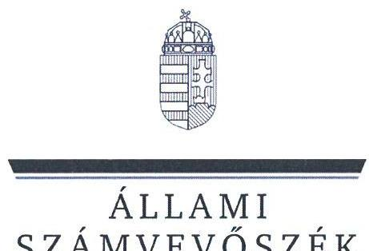
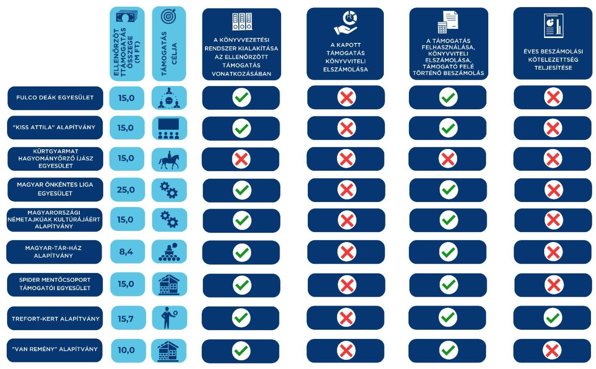

# JELENTÉS 

## Egyesületek és alapítványok államháztartásból kapott támogatásai felhasználásának és elszámolásának ellenőrzése

2025.

---

ÁLLAMI
SZÁMVEVÔSZÉK

# JELENTÉS 

## Egyesületek és alapítványok államháztartásból kapott támogatásai felhasználásának és elszámolásának ellenőrzése

2025.

---

# ELLENŐRZÉSI IGAZGATÓSÁG: 

## ÁLLAMHÁZTARTÁSON KÍVÜLI SZERVEZETEKET ELLENŐRZŐ IGAZGATÓSÁG

## ELLENŐRZÉSI IGAZGATÓ:

## KLINGA LÁSZLÓ igazgató

## ELLENŐRZÉSVEZETŐ:

Jelentéseink az interneten a www.asz.hu címen olvashatók.

## SOLYMÁR ÁGNES ellenőrzésvezető

IKTATÓSZÁM EL-4071-013/2025
TÉMASORSZÁM: 26
ELLENŐRZÉS-AZONOSÍTÓ SZÁM: V1099

---

# TARTALOMJEGYZÉK 

AZ ELLENŐRZÉS ALAPADATAI ..... 5
AZ ELLENŐRZÖTT SZERVEZETEK ..... 7
ÖSSZEFOGLALÁS ..... 13
AZ ELLENŐRZÉS FÓKUSZKÉRDÉSE ..... 15
MEGÁLLAPÍTÁSOK ..... 16
JAVASLATOK ..... 28
MELLÉKLETEK ..... 32
I. sz. melléklet: Értelmező szótár ..... 32
II. sz. melléklet: Az ellenőrzött szervezetek jegyzéke ..... 34
III. sz. melléklet: Ellenőrzési kritériumok ..... 35
FÜGGELÉK: ÉSZREVÉTELEK ..... 36
RÖVIDÍTÉSEK JEGYZÉKE ..... 37

---

.

---

# AZ ELLENŐRZÉS ALAPADATAI 

## AZ ELLENŐRZÉS CÉLJA

Az ellenőrzés célja annak megállapítása volt, hogy az ellenőrzött egyesületeknél, alapítványoknál a kiválasztott, államháztartási forrásból származó támogatások felhasználása a jogszabályi és a támogatói okiratban előírtaknak megfelelően történt-e, a támogatásokkal való elszámolás szabályszerű volt-e, a civil szervezetek a gazdálkodásukról szabályszerűen beszámoltak-e. Az államháztartási forrásból származó támogatást a támogatói okiratban meghatározott célra használták-e fel.

## AZ ELLENŐRZÉS TÍPUSA

Szabályszerüségi ellenőrzés.

## AZ ELLENŐRZŐTT IDŐSZAK

A kiválasztott államháztartási forrásból származó támogatásra vonatkozó támogatói okirat aláírásától amennyiben a támogatott tevékenység időtartamának kezdő időpontja korábbi, mint a támogatói okirat aláírásának időpontja, akkor a támogatott tevékenység időtartamának kezdő időpontjától - az ellenőrzésről szóló értesítés keltéig (2024. június 20-ig) tartó időszak. Amennyiben a 2023. évi beszámoló közzététele ezen időszakban nem történt meg, akkor az ellenőrzött időszak záró időpontja a 2023. évi beszámoló közzétételének napja.

## AZ ELLENŐRZÉS TÁRGYA

Az államháztartásból nyújtott támogatást felhasználó ellenőrzött egyesületeknél és alapítványoknál a kiválasztott támogatás felhasználására vonatkozó jogszabályi és szerződéses előírások betartásának ellenőrzése. Ennek keretében a könyvvezetésre vonatkozó jogszabályi előírások betartása, a támogatás felhasználás támogatói okiratnak való megfelelősége, valamint a beszámolási és közzétételi kötelezettség teljesítésének szabályszerűsége. Az ellenőrzés tárgya továbbá annak ellenőrzése, hogy a számviteli szabályozási környezet kialakítása támogatta-e az államháztartásból származó támogatások vonatkozásában a szabályos könyvvezetést, a kapcsolódó beszámolási kötelezettség teljesítését, valamint a támogatások célnak megfelelő felhasználását.

## AZ ELLENŐRZÉS JOGALAPJA

Az ellenőrzés jogalapját az ÁSZ tv. ${ }^{1} 1 . \int(3)$, valamint az 5. $\int(3)$ bekezdés előírásai képezték.

---

# AZ ELLENŐRZÉS MÓDSZERE 

Az ellenőrzés a nemzetközi standardokat irányadónak tekintve az ellenőrzési program szempontjai, az ellenőrzött időszakban hatályos jogszabályok, az ellenőrzés szakmai szabályai és az ellenőrzési módszertanok figyelembevételével történt.

Az ellenőrzési kérdések megválaszolásához szükséges bizonyítékok megszerzése az ellenőrzött civil szervezet által rendelkezésre bocsátott dokumentumokra és adatokra alapozva, továbbá kérdésfeltevés (információkérés), interjú útján történt.

A civil szervezeteknél az államháztartási forrásból származó működésükhöz, programjaikhoz vagy fejlesztéseikhez (beruházásaikhoz) kapcsolódó, kiválasztott támogatás felhasználása támogatói okiratnak való megfelelőségét, a támogatások nyilvántartásának és a támogató felé történő elszámolásnak egymással és a támogatói okirattal történő összevetésével ellenőrizte az ÁSZ².

A támogatások könyvviteli nyilvántartása jogszabályi előírásoknak, támogatói okiratnak való megfelelőségét támogatásonként, kockázati értékeléssel kiválasztott mintatételeken keresztül ellenőrizte az ÁSZ. A mintatételek kiértékelésének eredménye nem került az alapsokaságra kivetítésre.

---

# AZ ELLENŐRZÖTT SZERVEZETEK 

Az ellenőrzésre kilenc civil szervezet esetében került sor, melyek közül négy egyesületi, öt pedig alapítványi formában működött. Működéséről, vagyoni, pénzügyi és jövedelmi helyzetéről nyolc ellenőrzött szervezet az ellenőrzött években egyszerűsített éves beszámolót készített, melyet kettős könyvvezetéssel támasztott alá, egy szervezet az ellenőrzött években egyszerűsített beszámolót készített, amelyet egyszeres könyvvezetéssel támasztott alá. A kilenc ellenőrzött szervezetből három rendelkezett közhasznú jogállással. A Közbef. tv. ${ }^{3}$ előírása szerint tevékenysége és a 2023. évi számviteli beszámoló mérlegfőösszege alapján - mivel mérlegfőösszegük elérte a 20 M Ft összeget - négy ellenőrzött a közélet befolyásolására alkalmas tevékenységet végző civil szervezetnek minősült.

Az ellenőrzött szervezetek 2021-2023. évre vonatkozó számviteli beszámolóik szerint a 2023. évben mindösszesen 200,2 M Ft vagyonnal gazdálkodtak, a 2021-2023. években az összes bevételük 486,8 M Ft volt. A hét civil szervezetnél a $\mathrm{BGA}^{4}$, mint a Miniszterelnökségnél rendelkezésre álló támogatási célú fejezeti kezelésű előirányzat kezelő szerve részéről nyújtott 134,1 M Ft összegű, vissza nem térítendő, 100\%-os előlegként megkapott támogatás számviteli elkülönített nyilvántartásának, valamint a támogatás cél szerinti felhasználásának ellenőrzésére került sor.

## FULCO DEÁK EGYESÜLET (SZENTENDRE)

A Fulco Deák Egyesületet 2002. évben magánszemélyek alapították. Alapszabályában meghatározott célja többek között „összefogás a polgárok társadalmi ismereteinek fejlesztéséért, a környezet védelmének elősegítése, a nemzedékek közti párbeszéd elősegítése, közreműködni a magyarországi ifjúság nevelésben, elősegíteni a szabadidő hasznos eltöltését, segíteni a rászorultakon, nehéz sorsú családokon, a szentendrei civil társadalmi élet együttműködését segíteni" volt. A Fulco Deák Egyesület közhasznú jogállással nem rendelkezett, a 2023. évre vonatkozó számviteli beszámolójának mérlegfőösszege alapján nem minősült a közélet befolyásolására alkalmas tevékenységet végző civil szervezetnek. Legfőbb döntéshozó szerve a Közgyűlés, ügyvezető szerve az Elnökség volt. A számviteli beszámolók adatai alapján vállalkozási tevékenységet nem folytatott, könyvvizsgálatra nem volt kötelezett. A könyvvezetése a kettős könyvvitel rendszerében történt, a beszámoló formája egyszerűsített éves beszámoló volt. A BGA által nyújtott, ellenőrzött támogatás főbb adatait az 1. táblázat tartalmazza.

## 1. táblázat

## A FULCO DEÁK EGYESÜLET RÉSZÉRE A BGA ÁLTAL NYÚJTOTT, ELLENŐRZÖTT TÁMOGATÁS FÖRR ADATAL

A támogatási program célja
„A Fülö Deák Egyesület kommunikációs tevékenységének fokozása"
A támogatást tevékenység időtartama
2021.01.01-2023.03.31.

A támogatási előleg felhasználásának végső időpontja
2023.05.30.

A támogatási előleg folyósításának napja / összege
2021.08.16. / 15 M Ft

A támogatási előleg felhasználásáról a beszámoló benyújtásának határideje
2023.05.30.

A támogatási előleg felhasználásáról benyújtott beszámoló elfogadásának dátuma
2024.03.25.

Forrás: Az ellenőrzött szervezet dokumentumai alapján ÂSZ saját szerkesztés

---

# "Kiss Attila" Alapítvány (Szerencs) 

A „Kiss Attila" Alapítványt 2005. évben két magánszemély alapította. Alapító okiratában meghatározott célja, hogy „Nevelés és oktatás, képességfejlesztés, ismeretterjesztés és ezen tevékenységek támogatása, elsődlegesen a Szerencsen és környékén lévő iskolák diákjainak körében. Pályázatok kiírása ösztöndíj alapítása révén. Kiss Attila tanári munkásságának, emberi habitusának, emlékének megőrzése, méltó ápolása. Szerencsen és térségében kulturális és sportrendezvények szervezése, támogatása. Szerencsen és térségében az alapítvány céljaival megegyező civil szervezetek támogatása." volt. A "Kiss Attila" Alapítvány közhasznú jogállással nem rendelkezett, a 2023. évre vonatkozó számviteli beszámolójának mérlegfőösszege alapján nem minősült a közélet befolyásolására alkalmas tevékenységet végző civil szervezetnek. Legfőbb döntéshozó és ügyvezető szerve a Kuratórium volt. A számviteli beszámolók adatai alapján vállalkozási tevékenységet nem folytatott, könyvvizsgálatra nem volt kötelezett. A könyvvezetése a kettős könyvvitel rendszerében történt, a beszámoló formája egyszerűsített éves beszámoló volt. A BGA által nyújtott, ellenőrzött támogatás főbb adatait a 2. táblázat tartalmazza.
2. táblázat

## A „Kiss Attila" Alapítvány részére a BGA által nyújtott, ellenőrzött támogatás FÖBB ADATAI

A támogatási program célja
"A fiatalok felrủágsítása, tájékoztatása iskolai programokrú, pályaorientációról kommunikációs exzközökke"
A támogatott tevékenység időtartama
2021.01.01-2022.12.31.

A támogatási előleg felhasználásának végső időpontja
2022.12.31.

A támogatási előleg folyósításának napja / összege
2021.08.30. / 15 M Ft

A támogatási előleg felhasználásáról a beszámoló benyújtásának határideje
2023.03.01.

A támogatási előleg felhasználásáról benyújtott beszámoló elfogadásának dátuma
2024.01.17.

Forrás: Az ellenőrzött szervezet dokumentumai alapján ÁSZ saját szerkesztés

## KÜRTGYARMAT HAGYOMÁNYŐRZŐ ÍJÁsz EGYESÜLET (FEHÉRGYARMAT)

A Kürtgyarmat Hagyományőrző Íjász Egyesületet 2004. évben magánszemélyek alapították. Alapszabályában meghatározott célja „...elsősorban az ősi magyar kultúra megismertetése, felelevenítése és terjesztése. E cél érdekében felvállalja, hogy az érdeklődők, ill. tagok részére lehetőséget biztosít az íjászat elsajátítására, oktatására, gyakorlására és bemutatására. A történelmünk során vívott háborúk áldozatainak sírjainak ápolása és gondozása. További célja az esélyt megteremteni a környezetkímélő életmód folytatására, a sokszínű ősi magyar kultúra megőrzésére, illetve lehetőségek felkutatása és megragadása egy életképesebb világ megalapozása érdekében." volt. A Kürtgyarmat Hagyományőrző Íjász Egyesület közhasznú jogállással nem rendelkezett, a 2023. évre vonatkozó számviteli beszámolójának mérlegfőösszege alapján nem minősült a közélet befolyásolására alkalmas tevékenységet végző civil szervezetnek. Egyszerűsített beszámolót készített, amelyet egyszeres könyvvezetéssel támasztott alá. Legfőbb döntéshozó szerve a Közgyűlés, ügyvezető szerve az Elnökség volt. A számviteli beszámolók adatai alapján 2021-ben vállalkozási tevékenységet folytatott, 2022-2023-ban vállalkozási tevékenységet nem folytatott. Könyvvizsgálatra nem volt kötelezett. A könyvvezetése az egyszeres könyvvitel rendszerében történt, a beszámoló formája egyszerűsített beszámoló volt. A BGA által nyújtott, ellenőrzött támogatás főbb adatait a 3. táblázat tartalmazza.

---

# A KURTGYARMAT HAGYOMÁNYÓRZÓ IJÁSZ EGYESÜLET RÉSZÉREA BGA ÁLTAL NYÚJTOTT, ELLENŐRZÖTT TÁMOGATÁS FOBB ADATAI 

A támogatási program célja
"Luxasmenzet vagyunk!"
A támogatott tevékenység időtartama
2021.01.01-2022.12.31.

A támogatási előleg felhasználásának végső időpontja 2022.12.31.

A támogatási előleg folyósításának napja / összege
2021.09.14. / 15 M Ft

A támogatási előleg felhasználásáról a beszámoló benyújtásának határideje
2023.03.01.

A támogatási előleg felhasználásáról benyújtott beszámoló elfogadásának dátuma

A BGA felé az elszámolást nem nyújtották be, a teljes támogatási összeget saját döntése alapján 2024. szeptember 18-án visszatzzették.

Forrás: Az ellenőrzött szervezet dokumentumai alapján ÁSZ saját szerkesztés

## MAGYAR ÖNKÉNTES LIGA EGYESÜLET (ÚJSZENTIVÁN)

A Magyar Önkéntes Liga Egyesületet 2018. évben 11 jogi személy alapította. Alapszabályában meghatározott célja „...a hazai és Kárpát-medencei civil szervezetek és tagjaik, önkénteseik érdekképviselete hazai és nemzetközi szinten, valamint ezen szervezetek munkájának támogatása" volt. A Magyar Önkéntes Liga Egyesület közhasznú jogállással nem rendelkezett, a 2023. évre vonatkozó számviteli beszámolójának mérlegfőösszege alapján a közélet befolyásolására alkalmas tevékenységet végző civil szervezetnek minősült. Legfőbb döntéshozó szerve a Közgyűlés, ügyvezető szerve az Elnökség volt. A számviteli beszámolók adatai alapján 2021-2023. években vállalkozási tevékenységet nem folytatott. Könyvvizsgálatra nem volt kötelezett. A könyvvezetése a kettős könyvvitel rendszerében történt, a beszámoló formája egyszerűsített éves beszámoló volt. A BGA által nyújtott, ellenőrzött támogatás főbb adatait a 4. táblázat tartalmazza.
4. táblázat

## A MAGYAR ÖNKÉNTES LIGA EGYESÜLET RÉSZÉRE A BGA ÁLTAL NYÚJTOTT, ELLENŐRZÖTT TÁMOGATÁS FOBB ADATAI

A támogatási program célja
„A szervezet erde̋yi kö̌össégi kö̌pontja kialakitásának, szakmai programjának és müködésének támogatása"
2022.02.01. - 2022.12.31.

A támogatási előleg felhasználásának végső időpontja 2022.12.31.

A támogatási előleg folyósításának napja / összege
2022. április 20. / 25 M Ft

A támogatási előleg felhasználásáról a beszámoló benyújtásának határideje
2023. január 30.

A támogatási előleg felhasználásáról benyújtott beszámoló elfogadásának dátuma

A beszámolóról a BGA az ellenőrzésről szóló értesítés keltéig (2024.06.20.) még nem döntött.

Forrás: Az ellenőrzött szervezet dokumentumai alapján ÁSZ saját szerkesztés

## MAGYARORSZÁGI NÉMETAJKÚAK KULTÚRÁJÁÉRT ÁLAPÍTVÁNY (BUDAPEST)

A Magyarországi Németajkúak Kultúrájáért Alapítvány 2021. évben két magánszemély alapította. Alapító okiratában meghatározott célja: „...bogy a magyarországi német nemzetiségüek kulturális hagyományait feltárja, bozzájáruljon ezen örökség megőrzésébez és a hagyományok ápolásában részt vállaljon. Segítse ezen népcsoport kultúrájának megismerését, terjesztését, bemutatását. Az Alapitók ki kivánják bangsúlyozni, hogy a németség Magyarország évezredes történelmében, kultúrájának és gazdaságának gyarapitásában kiemelkedő jelentőséggel bír, igy ezen évezredes együttélés múvésziszintü megjelenitése és az ehbez kapcsolódó múalkotások létrehozása, illetve ezen belül is a németajkúak magyarországi történelmének megörökitése, továbbá egy ehbez kapcsolódó emlékmü Budapest XVI. kerületében történő létrehozása is az Alapitvány céljai közé tartozik. Az emlékmü létrehozásával az alapítók a megjelölt célok elérését is elő kivánják segíteni." volt.

---

A Magyarországi Németajkúak Kultúrájáért Alapítvány közhasznú jogállással nem rendelkezett, a 2023. évre vonatkozó számviteli beszámolójának mérlegfőösszege alapján nem minősült a közélet befolyásolására alkalmas tevékenységet végző civil szervezetnek. Legfőbb döntéshozó és ügyvezető szerve a Kuratórium volt. A számviteli beszámolók adatai alapján vállalkozási tevékenységet nem folytatott, könyvvizsgálatra nem volt kötelezett. A könyvvezetése a kettős könyvvitel rendszerében történt, a beszámoló formája egyszerűsített éves beszámoló volt. A BGA által nyújtott, ellenőrzött támogatás főbb adatait az 5. táblázat tartalmazza.
5. táblázat

# A MagyARORSZÁGI NÉMETAIKÚAK KULTÚRÁJÁÉRT ALAPÍTVÁNY RÉSZÉRE A BGA ÁLTAL NYÚJTOTT, ELLENÖRZÖTT TÁMOGATÁS FÖBB ADATAI 

A támogatási program célja
A támogatott tevékenység időtartama
A támogatási előleg felhasználásának végső időpontja
A támogatási előleg folyósításának napja / összege
A támogatási előleg felhasználásáról a beszámoló benyújtásának határideje
A támogatási előleg felhasználásáról benyújtott beszámoló elfogadásának dátuma
„A szervezet szakmai programjainak és müködésének támogatása."
2022.01.01-2023.12.31.

2023.12.31.
2021.12.29. / 40 M Ft

2024.03.01.
A beszámolóról a BGA az ellenőrzésről szóló értesítés keltéig (2024.06.20.) még nem döntött.

Forrás: Az ellenörzött szervezet dokumentumai alapján ÂSE saját szerkesztés

## MaGyar-Tár-Ház Alapítvány (SZIHALOM)

A Magyar-Tár-Ház Alapítványt 2021. évben egy magánszemély alapította. Alapító okiratában meghatározott célja többek között „...kulturális tevékenység, rendezvények szervezése; kulturális örökség megóvása; oktatás és nevelés, képességfejlesztés, ismeretterjesztés; természet-, műemlék és állatvédelem; hagyományőrzés; környezetvédelem; tudományos tevékenység, kutatás; a magyarországi nemzeti és etnikai kisebbségekkel, valamint a határon túli magyarsággal kapcsolatos tevékenység; gyermek- és ifjúságvédelem, gyermek- és ifjúsági érdekképviselet; egészségmegőrzés, egészségfejlesztés, egészségvédelem, betegségmegelőzés; mozgás- gazdag, sportos életvitelre nevelés; emberi és állampolgári jogok védelme; hazaiés európai uniós projektek lebonyolítása, projektmenedzsment." volt. A Magyar-Tár-Ház Alapítvány közhasznú jogállással nem rendelkezett, a 2023. évre vonatkozó számviteli beszámolójának mérlegfőösszege alapján a közélet befolyásolására alkalmas tevékenységet végző civil szervezetnek minősült. Legfőbb döntéshozó és ügyvezető szerve a Kurátor volt. A számviteli beszámolók adatai alapján vállalkozási tevékenységet nem folytatott, könyvvizsgálatra nem volt kötelezett. A könyvvezetése a kettős könyvvitel rendszerében történt, a beszámoló formája egyszerűsített éves beszámoló volt. A BGA által nyújtott, ellenőrzött támogatás főbb adatait a 6. táblázat tartalmazza.

---

# A MAGYAR-TAR-HAZ ALAPÍTVÁNY RÉSZÉRE A BGA ÁLTAL NYÚJTOTT, ELLENŐRZÖTT TÁMOGATÁS FÖBB ADATAI 

A támogatási program célja
„Európa jövőjéről szóló konferenciasorozatboz kapcsolódó rendezvények támogatása"
A támogatott tevékenység időtartama
2022.01.01-2022.12.31.

A támogatási előleg felhasználásának végső időpontja
2022.12.31.

A támogatási előleg folyósításának napja / összege
2021.12.31. / 8,4 M Ft

A támogatási előleg felhasználásáról a beszámoló benyújtásának határideje
2023.01.30.

A támogatási előleg felhasználásáról benyújtott beszámoló elfogadásának dátuma

A beszámolóról a BGA az ellenőrzésről szóló értesítés keltéig (2024.06.20.) még nem döntött.

Forrás: Az ellenőrzött szervezet dokumentumai alapján ÁsZ saját szerkesztés

## SPIDER MENTÖCSOPORT TÁMOGATÓI EGYESÜLET (MISKOLC)

A Spider Mentőcsoport Támogatói Egyesületet 2005. évben magánszemélyek alapították. Alapszabályában meghatározott célja „A Miskolci Speciális Felderitő és Mentőcsoport (Spider Mentőcsoport) támogatása. Ennek keretében a katasztrófavédelemröl és a bozzzá kapcsolódó egyes törvények módositásáról szóló 2011. évi CXXVIII. törvényben, valamint a katasztrófavédelemröl és a bozzzá kapcsolódó egyes törvények módositásáról szóló 2011. évi CXXVIII. törvény végrehajtásáról szóló 234/2011. (XI. 10.) Korm. rendeletben meghatározott mentési feladatok magas szintö ellátásának folyamatos biztositása" volt. A Spider Mentőcsoport Támogatói Egyesület közhasznú jogállással rendelkezett, a 2023. évre vonatkozó számviteli beszámolójának mérlegfőösszege alapján a közélet befolyásolására alkalmas tevékenységet végző civil szervezetnek minősült. Legfőbb döntéshozó szerve a Közgyűlés, ügyvezető szerve az Elnökség volt. A számviteli beszámolók adatai alapján vállalkozási tevékenységet nem folytatott, könyvvizsgálatra nem volt kötelezett. A könyvvezetése a kettős könyvvitel rendszerében történt, a beszámoló formája egyszerűsített éves beszámoló volt. A BGA által nyújtott, ellenőrzött támogatás főbb adatait a 7. táblázat tartalmazza.
7. táblázat

## A SPIDER MENTÖCSOPORT TÁMOGATÓI EGYESÜLET RÉSZÉRE A BGA ÁLTAL NYÚJTOTT, ELLENŐRZÖTT TÁMOGATÁS FÖBB ADATAI

A támogatási program célja
„A szervezet tulajdonába került, a Spider Mentőcsoport bázisaként szolqáló ingatlanok felújitásának támogatása"
A támogatást tevékenység időtartama
2021.08.01 - 2023.12.31.

A támogatási előleg felhasználásának végső időpontja
2023.12.31.

A támogatási előleg folyósításának napja / összege
2021.09.23. / 15 M Ft

A támogatási előleg felhasználásáról a beszámoló benyújtásának határideje
2024.01.31

A támogatási előleg felhasználásáról benyújtott beszámoló elfogadásának dátuma
2024.05.14.

Forrás: Az ellenőrzött szervezet dokumentumai alapján ÁsZ saját szerkesztés

## TREFORT-KERT ALAPÍTVÁNY (BUDAPEST)

A TREFORT-KERT ALAPÍTVÁNYT 2010. évben 21 magánszemély alapította. Alapító okiratában meghatározott célja volt többek között „A Trefort-kert informatikai hálózatának bővítése, teljes kiépítése. A Trefort-kerti könyvtár fejlesztésének támogatása. A Trefort-kert kulturális életének fejlesztése, színesítése kulturális rendezvények és programok szervezésével. Az Eötvös Loránd Tudományegyetem Bölcsészettudományi Karának (a továbbiakban: Kar) oktatói- és hallgatói mobilitásának előmozdítása, az egyetemi polgárok közötti kapcsolatok fejlesztése, a jelentős külföldi és hazai szakmai adatbázisok folyamatos megvásárlásának vagy előfizetésének elősegítése, és a Kar oktatóinak és hallgatóinak ingyenes használatába

---

bocsájtása. A Kar és környezete közötti kapcsolatok fejlesztése, kommunikációs csatornák (lapkiadás, internetes oldal stb.) fejlesztése és kialakítása. A Kar kiadványainak, brosúráinak, egyéb sajtótermékeinek kiadása, terjesztése. A Kar hátrányos helyzetű hallgatóinak körében az esélyegyenlőség megvalósulásának elősegítése. A Kar oktatói, hallgatói közösségeinek fejlesztése; mozgásgazdag, sportos életvitelre nevelése és ösztönzése, ennek keretében sporttevékenységük sportkörülményeik támogatása, fejlesztése." volt. A TREFORT-KERT ALAPÍTVÁNY közhasznú jogállással rendelkezett, a 2023. évre vonatkozó számviteli beszámolójának mérlegfőösszege alapján nem minősült a közélet befolyásolására alkalmas tevékenységet végző civil szervezetnek. Legfőbb döntéshozó, ügyvezető szerve a Kuratórium volt. A számviteli beszámolók adatai alapján vállalkozási tevékenységet nem folytatott, könyvvizsgálatra nem volt kötelezett. A könyvvezetése a kettős könyvvitel rendszerében történt, a beszámoló formája egyszerűsített éves beszámoló volt. A BGA által nyújtott, ellenőrzött támogatás főbb adatait a 8. táblázat tartalmazza.
8. táblázat

# A TREFORT-KERT ALAPÍTVÁNY RÉSZÉRE A BGA ÁLTAL NYÚJTOTT, ELLENŐRZÖTT TÁMogatÁS FÖBB ADATAI 

A támogatási program célja
A támogatott tevékenység időtartama
A támogatási előleg felhasználásának végső időpontja
A támogatási előleg folyósításának napja / összege
A támogatási előleg felhasználásáról a beszámoló benyújtásának határideje
A támogatási előleg felhasználásáról benyújtott beszámoló elfogadásának dátuma
„A Trefort-kert Alapítvány értékmentő tevékenységének támogatása"
2021.07.01-2022.12.31.
2022.12.31.
2021.08.04. / 15,7 M Ft
2023.01.30.

A beszámolóról a BGA az ellenőrzésről szóló értesítés keltéig (2024.06.20.) még nem döntött.

Forrás: Az ellenőrzött szervezet dokumentumai alapján ASZ saját szerkesztés

## „VAN REMÉNY" ALAPÍTVÁNY (KAPOSSZEKCSŐ)

A „Van remény" Alapítványt 2014. évben alapították. Alapító okiratában meghatározottak szerint „...feladatának, céljának tekinti a szükségben lévő, rászorult emberek segítését, terheik könnyítését, a Krisztusközpontú hit és életvitel előmozdítását. Célja a teljes ember testi-lelki-szellemi egészségre segítése, melynek érdekében egy keresztény alapelvű ifjúsági és segítő központ létrehozását tervezi". A "Van remény" Alapítvány közhasznú jogállással rendelkezett, a 2023. évre vonatkozó számviteli beszámolójának mérlegfőösszege alapján a közélet befolyásolására alkalmas tevékenységet végző civil szervezetnek minősült. Legfőbb döntéshozó és ügyvezető szerve a kuratórium volt. A számviteli beszámolók adatai alapján vállalkozási tevékenységet nem folytatott, könyvvizsgálatra nem volt kötelezett. A könyvvezetése a kettős könyvvitel rendszerében történt, a beszámoló formája egyszerűsített éves beszámoló volt. A BGA által nyújtott, ellenőrzött támogatás főbb adatait a 9. táblázat tartalmazza.
9. táblázat

## A „VAN REMÉNY" ALAPÍTVÁNY RÉSZÉRE A BGA ÁLTAL NYÚJTOTT, ELLENŐRZÖTT TÁMOGATÁS FÖBB ADATAI

A támogatási program célja
A támogatott tevékenység időtartama
A támogatási előleg felhasználásának végső időpontja
A támogatási előleg folyósításának napja / összege
A támogatási előleg felhasználásáról a beszámoló benyújtásának határideje
A támogatási előleg felhasználásáról benyújtott beszámoló elfogadásának dátuma
„Kaposszekesői üdülö̉tábor felüjitásának, fejlesztésének, a fü̈pület böszigetelésének, közösségi terek bileitésének támogatása"
2022.01.01-2023.12.31.
2023.12.31.
2021.12.31. / 10 M Ft
2023.12.31.

A beszámolóról a BGA az ellenőrzésről szóló értesítés keltéig (2024.06.20.) még nem döntött.

Forrás: Az ellenőrzött szervezet dokumentumai alapján ASZ saját szerkesztés

---

# ÖSSZEFOGLALÁS 

A civil szervezetek tevékenységük ellátására költségvetési támogatásban, önkormányzati támogatásban, ingyenes vagyonjuttatásban részesülhetnek, amelyekre fokozott figyelem irányul. A civil szervezetek tevékenységükön keresztül a társadalom széles rétegét érintik, ezért jogosan felmerülő elvárás, hogy a közpénzeket kezelő, azzal gazdálkodó szervezetek működéséről, tevékenységéről információt kapjunk, így az ÁSZ ellenőrzések keretében időről-időre sor kerül a közpénzek rendeltetésszerű és átlátható módon történő felhasználásának értékelésére. Az ellenőrzés hozzájárul ahhoz, hogy a társadalom képet kaphasson az államháztartásból a civil szervezeteknek nyújtott támogatások felhasználásáról.

A hiányosságok feltárása elősegíti azon szükséges intézkedések meghozatalát, melyek megvalósításával biztosítható a civil szervezetek által elnyert támogatásokkal való szabályszerű gazdálkodás. Az ÁSZ ellenőrzése választ ad arra, hogy az ellenőrzött egyesületeknél és alapítványoknál a számviteli szabályozási környezet kialakítása biztosította-e a támogatások felhasználása jogszabályi előírásoknak megfelelő nyilvántartását, a beszámolási kötelezettség teljesítését. Az ellenőrzés továbbá feltárhatja az ellenőrzött támogatás felhasználása, nyilvántartása, továbbá a támogató felé történő elszámolása támogatói okiratnak és a támogatás céljának való megfelelőségét befolyásoló kockázatokat.

Az ellenőrzött kilenc civil szervezetből nyolc szervezet könyvvezetési rendszerének kialakítása megfelelően támogatta az államháztartásból származó ellenőrzött támogatások szabályszerű könyvviteli nyilvántartását, biztosította a közpénzek felhasználásának ellenőrizhetőségét. Az ellenőrzés egy szervezetnél tárta fel azt a hiányosságot, hogy könyvvezetési rendszerét nem a vonatkozó jogszabályi előírások szerint alakította ki.

A kapott támogatási előleg könyvviteli elszámolása hat szervezet tekintetében a jogszabályban előírt részletezésben történt, a számviteli nyilvántartásban. A kilenc ellenőrzött szervezetből egyik sem a jogszabályban előírtaknak megfelelően mutatta ki az előlegként kapott támogatási összegeket az ellenőrzött időszakban. Az előlegként kapott támogatást a könyvviteli nyilvántartásában a kilenc ellenőrzött szervezet a jogszabályi előírások ellenére nem mutatta ki egyéb rövid lejáratú kötelezettségként. Ez alapján kilenc szervezet számviteli beszámolójának mérlegében nem került kimutatásra az a kötelezettség, amivel az ellenőrzött szervezet még nem számolt el a BGA felé. Ezzel sérült a Számv. tv. ${ }^{5}$ szerinti teljesség elve, miszerint a szervezetnek könyvelnie kell mindazon gazdasági eseményeket, amelyeknek az eszközökre és a forrásokra gyakorolt hatását a beszámolóban ki kell mutatni. Továbbá sérült a Számv. tv. szerinti lényegesség elve, mivel a számviteli beszámoló mérlege nem tartalmazott egy olyan információt (kötelezettséget), ami befolyásolja a beszámoló adatait felhasználók döntését. Ez a hiányosság kockázatot jelent az érintett szervezetek mérlegfőösszeg értéke alapján előírt minősítésekre, valamint a számviteli beszámoló adatait felhasználók döntéseit lényegesen befolyásolhatja.

A támogatási előleg felhasználása és annak könyvviteli elszámolása nyolc szervezet esetében szabályszerű volt, a támogatási előleg felhasználását a számviteli rendszerükben elkülönítetten kezelték, melyet a támogatási előleg felhasználását alátámasztó ellenőrzött tételek is alátámasztottak. Egy szervezet nem alakította ki a támogatási előleg felhasználásának elkülönített rendszerét a könyvviteli nyilvántartásában, így ezeknél a szervezeteknél a támogatási előleg felhasználásának nyilvántartása nem volt szabályszerű. Az ellenőrzött szervezetek közül nyolc a támogatási előleg felhasználásáról készített beszámolóját a támogató részére benyújtotta, azonban a benyújtott beszámolókról a támogató öt ellenőrzött szervezet tekintetében az ellenőrzésről szóló értesítés keltéig (2024.06.20.) még nem döntött. Egy ellenőrzött szervezet elszámolást nem

---

nyújtotta be a BGA felé és saját döntése alapján a teljes támogatási összeget 2024. szeptember 18-án visszafizette.

A kilenc ellenőrzött civil szervezet közül egy szervezet teljesítette a jogszabályi előírásoknak megfelelően a beszámolási kötelezettségét, a számviteli beszámolóit a jogszabályi előírásoknak megfelelően elkészítette és közzétette. A nyolc szervezetből kettő nem készített kiegészítő mellékletet, kettő pedig hiányos adattartalommal készítette el kiegészítő mellékletét.

A beszámolási kötelezettségét nem szabályszerűen teljesítő nyolc szervezetből hét szervezet esetében a közzétett beszámoló nem tartalmazta a kiegészítő mellékletet. Két ellenőrzött szervezet a legfőbb döntéshozó szerv elfogadása nélkül számviteli beszámolóját tette közzé. Öt ellenőrzött szervezet számviteli beszámolóját a jogszabályban előírt határidőn túl tette közzé. A saját honlappal rendelkező kettő szervezetből egy szervezet a saját honlapján hiányosan helyezte el a számviteli beszámolóját. Ez alapján nyolc szervezet nem megfelelően tájékoztatta a közvéleményt a BGA által nyújtott támogatás felhasználásáról, mert nem biztosította a közpénzek felhasználására vonatkozó gazdálkodása nyilvánosságát. Az ellenőrzés összegző értékelését ellenőrzött szervezetenként az 1. ábra szemlélteti.
1. ábra

FŐBB ELLENŐRZÉSI TAPASZTALATOK

A Magyar Önkéntes Liga és a TREFORT-KERT Alapítvány az ÁSZ tv. 29. § (2) bekezdés szerinti, a jelentéstervezet megállapításaira tett észrevételében arról tájékoztatta az ÁSZ-t, hogy intézkednek a támogatási előlegek jogszabályi előírásoknak megfelelő elszámolására, Magyar Önkéntes Liga számviteli beszámoló előírás szerinti elkészítése és határidőben történő közzététele, saját honlapon történő elhelyezése, a TREFORT-KERT Alapítvány a törvényi előírásoknak megfelelő számlarend elkészítése érdekében, így az ÁSZ megállapításai az ellenőrzés során hasznosultak.

---

# AZ ELLENŐRZÉS FÓKUSZKÉRDÉSE 

1. A civil szervezet államháztartási forrásból származó támogatása(i) felhasználása és elszámolása szabályszerű volt-e?

---

# 1. Fulco Deák Egyesület 

Összegző megállapítás

A Fulco Deák Egyesület az ellenőrzött támogatási előleget a
támogatói okiratban megjelölt célnak megfelelően használta
fel. A kapott támogatási előleget és annak felhasználását a
számviteli rendszerében a jogszabályi előírásoknak
megfelelően elkülönítette. A támogatási előleget nem a
jogszabályi előírásnak megfelelően számolta el. A számviteli
beszámolási kötelezettségét nem a jogszabályban
előírtaknak megfelelően teljesítette, mivel 2021-2023. évekre
vonatkozó számviteli beszámolóit hiányosan készítette el,
továbbá a 2021. és 2023. évi számviteli beszámolóit határidőn
túl tette közzé, helyezte letétbe.
A könyvvezetési rendszer kialakítása az ellenőrzött támogatás vonatkozásában
A Fulco Deák Egyesület a 2021-2023. évekre vonatkozóan nem rendelkezett a Számv. tv. 14. § (5) bekezdés b) pontjában előírt eszközök és a források értékelési szabályzatával, továbbá nem rendelkezett a Számv. tv. 161. § (2) bekezdés a)-c) pontjai szerinti tartalmú számlarenddel. A Fulco Deák Egyesület a Számv. tv.-ben és a Civil tv. ${ }^{\text {® }}$-ben előírtaknak megfelelően az alapcél szerinti tevékenysége költségei, ráfordításai ellentételezésére kapott támogatásokról olyan elkülönített számviteli nyilvántartást vezetett, amelynek alapján támogatásonként megállapítható és ellenőrizhető volt az ellenőrzött támogatás felhasználása.

## A kapott támogatás könyvviteli nyilvántartása

A Fulco Deák Egyesület az ellenőrzött támogatói okiratban foglaltak alapján, a BGA-tól kapott támogatási előleget a Civil tv. előírásainak megfelelően részletezte a számviteli rendszerében. A Fulco Deák Egyesület a 2021. évben előlegként kapott támogatást a Számv. tv. 43. § (1) bekezdésében foglaltak ellenére az egyéb rövid lejáratú kötelezettségek között nem mutatta ki a 2021-2022. év könyvvezetésében, illetve számviteli beszámolójában, annak ellenére, hogy a támogatási előleg felhasználásáról a beszámolót a BGA 2024. március 25 -én fogadta el.

## A támogatási előleg felhasználása, könyvviteli elszámolása, támogató felé történő beszámolás

Az ellenőrzött támogatási előleg vonatkozásában, az ellenőrzött bizonylatok alapján a támogatási előleg felhasználása összhangban volt a támogatói okiratban meghatározott céllal, valamint költségtervvel, az elszámolt költségek a támogatói okiratban meghatározott „Fulco Deák. Egyesület kommunikációs tevékenységének fokozására" című támogatási programhoz kapcsolódtak.
Az ellenőrzött támogatói okirat tekintetében a támogatási előleg felhasználása a Civil tv.-ben előírtaknak megfelelően a számviteli nyilvántartásban elkülönítetten szerepelt. A támogatási előleg terhére elszámolt ellenőrzött ráfordítások a Számv. tv. szerint kerültek elszámolásra, számviteli bizonylattal alátámasztottak voltak.

---

A Fulco Deák Egyesület az ellenőrzött támogatási előleg felhasználásáról a támogató által előírt formában elkészítette a beszámolót és benyújtotta a támogató részére. A támogatói okiratban foglalt támogatás lezárásáról, a beszámoló elfogadásáról a támogató 2024. március 15 -én döntött és azt elfogadta.

# Az éves beszámolási kötelezettség teljesítése 

A Fulco Deák Egyesület a 2021-2023. évekre vonatkozó számviteli beszámolóit a Civil tv. 29. § (2) bekezdés c) pontjában előírtak ellenére kiegészítő melléklet nélkül készítette el. A Civil tv. előírása alapján a közhasznúsági mellékletet elkészítette. A Fulco Deák Egyesület a 2021. és a 2023. évre vonatkozó, legfőbb döntéshozó szerv által elfogadott számviteli beszámolóit (kiegészítő melléklet nélkül), valamint közhasznúsági mellékleteit a Civil tv. 30. § (1) bekezdésében előírt határidőn túl tette közzé, helyezte letétbe (2021. évi: 2022. október 28., 2023. évi: 2024. június 24.). A Fulco Deák Egyesület nem rendelkezett saját honlappal.

## 2. „Kiss Attila" Alapítvány

Összegző megállapítás

A "Kiss Attila" Alapítvány az ellenőrzött támogatási előleget a támogatói okiratban megjelölt célnak megfelelően használta fel. A támogatási előleget és annak felhasználását a számviteli rendszerében a jogszabályi előírásoknak megfelelően elkülönítette. A támogatási előleget nem a jogszabályi előírásnak megfelelően számolta el. A számviteli beszámolási kötelezettségét nem a jogszabályban előírtaknak megfelelően teljesítette, mivel számviteli beszámolóit a kiegészítő melléklet nélkül tette közzé, helyezte letétbe és az eredménykimutatások nem tartalmazták a tájékoztató adatokat.

## A könyvvezetési rendszer kialakítása az ellenőrzött támogatás vonatkozásában

A "Kiss Attila" Alapítvány az ellenőrzött időszakban a könyvviteli nyilvántartását úgy alakította ki, hogy az biztosította a kapott támogatási előleg Civil tv. -ben előírt részletezését. A "Kiss Attila" Alapítvány a Számv. tv.-ben és a Civil tv.-ben előírtaknak megfelelően az alapcél szerinti tevékenysége költségei, ráfordításai ellentételezésére kapott támogatásokról olyan elkülönített számviteli nyilvántartást vezetett, amelynek alapján támogatásonként megállapítható és ellenőrizhető volt az ellenőrzött támogatás felhasználása.

## A kapott támogatás könyvviteli nyilvántartása

A "Kiss Attila" Alapítvány az ellenőrzött támogatói okiratban foglaltak alapján, a BGA-tól kapott támogatást a Civil tv. előírásainak megfelelően részletezte a számviteli rendszerében. A "Kiss Attila" Alapítvány a 2021. évben előlegként kapott támogatást a Számv. tv. 43. § (1) bekezdésében foglaltak ellenére az egyéb rövid lejáratú kötelezettségek között nem mutatta ki a 2021-2022. év könyvvezetésében, illetve számviteli beszámolójában, annak ellenére, hogy a támogatási előleg felhasználásáról a beszámolót a BGA 2024. január 17-én fogadta el.
A támogatási előleg felhasználása, könyvviteli elszámolása, támogató felé történő beszámolás

---

Az ellenőrzött támogatási előleg vonatkozásában, az ellenőrzött bizonylat alapján a támogatási előleg felhasználása összhangban volt a támogatói okiratban meghatározott céllal, valamint költségtervvel, az elszámolt költség a támogatói okiratban meghatározott „A fiatalok felvilágositása, tájékoztatása iskolai programokról, pályaorientációról kommunikációs eszközökkel" című támogatási programhoz kapcsolódott.
Az ellenőrzött támogatói okirat tekintetében a támogatási előleg felhasználása a Civil tv.-ben előírtaknak megfelelően a számviteli nyilvántartásban elkülönítetten szerepelt. A támogatási előleg terhére elszámolt ellenőrzött ráfordítás a Számv. tv. szerint kerültek elszámolásra, számviteli bizonylattal alátámasztott volt. A "Kiss Attila" Alapítvány az ellenőrzött támogatási előleg felhasználásáról a támogató által előírt formában elkészítette az előírt beszámolót és a támogatói okiratban foglaltak alapján benyújtotta a támogató részére, melyet a támogató elfogadott. A támogatói okiratban foglalt támogatás lezárásáról, a beszámoló elfogadásáról a támogató 2024. január 17-én döntött és azt elfogadta.

# Az éves beszámolási kötelezettség teljesítése 

A "Kiss Attila Alapítvány a Civiltv. 29. § (2) bekezdés c) pontjában előírtak ellenére a 20212023. évekre vonatkozó számviteli beszámolójának részeként nem készített kiegészítő mellékletet. A 2021-2023. évekre vonatkozó számviteli beszámolók eredménykimutatásai az Eszkr. ${ }^{7}$ 7. § (6) bekezdésében foglaltak ellenére nem tartalmazták a 4. melléklet szerinti tájékoztató adatokat. A legfőbb döntéshozó szerv által jóváhagyott 2021-2023. évekre vonatkozó számviteli beszámolót a Civil tv. 30. § (1) bekezdésében foglalt előírás ellenére a számviteli beszámoló részét képező kiegészítő melléklet nélkül, a 2022. évre vonatkozó számviteli beszámolót határidőn túl (2023. június 13-án) tette közzé, illetve helyezte letétebe. A "Kiss Attila" Alapítvány nem rendelkezett saját honlappal.

## 3. Kürtgyarmat Hagyományőrző Íjász Egyesület

| Összegző megállapítás | A Kürtgyarmat Hagyományőrző Íjász Egyesület az ellenőrzött támogatási előleget a támogatói okiratban megjelölt célra, azonban nem a teljes összegben használta fel, a teljes támogatási előleget a támogató részére visszafizette saját döntése alapján. A kapott támogatási előleget a számviteli rendszerében a jogszabályi előírásoktól eltérően nem különítette el. A támogatási előleget nem a jogszabályi előírásnak megfelelően számolta el. A számviteli beszámolási kötelezettségét nem a jogszabályi előírásoknak megfelelően teljesítette, mivel számviteli beszámolóit a legfőbb döntéshozó szerv elfogadása nélkül és határidőn túl tette közzé, helyezte letétbe. |
| :--: | :--: |

A könyvvezetési rendszer kialakítása az ellenőrzött támogatás vonatkozásában
A Kürtgyarmat Hagyományőrző Íjász Egyesület a Számv. tv. 99. § (3) bekezdésben foglaltak ellenére a Civil tv. 20. § (4) bekezdésében előírt alapcél szerinti tevékenysége költségei, ráfordításai ellentételezésére kapott támogatásokról nem vezetett olyan elkülönített számviteli nyilvántartást, amelynek alapján támogatásonként megállapítható lett volna a kapott támogatás felhasználása.

---

# A kapott támogatás könyvviteli nyilvántartása 

A Kürtgyarmat Hagyományőrző Íjász Egyesület az ellenőrzött támogatói okiratban foglaltak alapján, az alapcél szerinti (közhasznú) tevékenysége költségei, ráfordításai ellentételezésére visszafizetési kötelezettség nélkül kapott támogatást a Civil tv. 20. § (1)-(3) bekezdése előírásai ellenére többi támogatástól nem különítette el a számviteli nyilvántartásában. A 2021. évben előlegként kapott támogatást a Számv. tv. 43. § (1) bekezdésében foglaltak ellenére a rövid lejáratú kötelezettségek között nem mutatta ki a 2021-2023. évben könyvvezetésében, illetve számviteli beszámolójában. A támogatói okiratban rögzített pénzügyi elszámolás határideje 2023. március 1. volt, azonban a Kürtgyarmat Hagyományőrző Íjász Egyesület pénzügyi elszámolást a BGA részére nem nyújtott be, a teljes támogatási előleget 2024. szeptember 18-án visszafizette.

## A támogatási előleg könyvviteli elszámolása, támogató felé történő beszámolás

A Kürtgyarmat Hagyományőrző Íjász Egyesület a Civil tv. 20. § (4) bekezdése előírása ellenére az ellenőrzött támogatási előleg felhasználásáról a 2022. és a 2023. években nem vezetett olyan számviteli nyilvántartást, amelynek alapján megállapítható a kapott támogatás felhasználása. Elkülönített nyilvántartás hiányában az egyes támogatások részfelhasználásáról készített elszámolások könyvviteli nyilvántartással, az abban szereplő támogatásonkénti elkülönített adatokkal nem voltak alátámasztottak.

## Az éves beszámolási kötelezettség teljesítése

A Kürtgyarmat Hagyományőrző Íjász Egyesület a 2021-2023. évekre vonatkozó, a Civil. tv.-ben előírt közhasznúsági mellékleteit elkészítette. A 2021-2023. évekre vonatkozó számviteli beszámolóit a Civil tv. 30. § (1) bekezdésében foglaltak ellenére a legfőbb döntéshozó szerv elfogadása nélkül tette közzé, helyezte letétbe. A Kürtgyarmat Hagyományőrző Íjász Egyesület 2021-2023. évre vonatkozó számviteli beszámolóit a Civil tv. 30. § (1) bekezdésében előírtak ellenére határidőn túl (2021. évre vonatkozó számviteli beszámolót 2022. október 3-án, a 2022. évre vonatkozó számviteli beszámolót 2024. október 7-én és a 2023. évre vonatkozó számviteli beszámolót 2024. július 1-jén) tette közzé, illetve helyezte letétbe. A Kürtgyarmat Hagyományőrző Íjász Egyesület saját honlappal nem rendelkezett.

---

# 4. Magyar Önkéntes Liga Egyesület 

Összegző megállapítás

A Magyar Önkéntes Liga Egyesületnél az ellenőrzött támogatási előleg felhasználása megfelelt a támogatói okiratban meghatározott célnak. A kapott támogatási előleget és annak felhasználását a számviteli rendszerében a jogszabályi előírásoknak megfelelően elkülönítette. A támogatási előleget nem a jogszabályi előírásnak megfelelően számolta el. Beszámolási kötelezettségét nem a jogszabályi előírásoknak megfelelően teljesítette, mivel a 2022. évre vonatkozó számviteli beszámolót a fökönyvi kivonat adatai nem támasztották alá, a 2022-2023. évi módosított számviteli beszámolóit a legfőbb döntéshozó szerv elfogadása nélkül, számviteli beszámolóit kiegészítő melléklet nélkül tette közzé, helyezte letétbe.

## A könyvvezetési rendszer kialakítása az ellenőrzött támogatás vonatkozásában

A Magyar Önkéntes Liga Egyesület a könyvviteli nyilvántartását úgy alakította ki, hogy az biztosította a kapott támogatások Civil tv.-ben előírt részletezését. A Magyar Önkéntes Liga Egyesület a Számv. tv.-ben és a Civil tv.-ben előírtaknak megfelelően az alapcél szerinti tevékenysége költségei, ráfordításai ellentételezésére kapott támogatásokról olyan elkülönített számviteli nyilvántartást vezetett, amelynek alapján támogatásonként megállapítható és ellenőrizhető volt az ellenőrzött támogatás felhasználása.

## A kapott támogatás könyvviteli nyilvántartása

A Magyar Önkéntes Liga Egyesület az ellenőrzött támogatói okiratban foglaltak alapján, a BGA-tól kapott támogatást a Civil tv. előírásainak megfelelően részletezte a számviteli rendszerében. A Magyar Önkéntes Liga Egyesület a BGA-tól előlegként megkapott támogatást a 2022-2023. évek könyvviteli nyilvántartásaiban, illetve a számviteli beszámolóiban a Számv. tv. 43. § (1) bekezdésében foglaltak ellenére a rövid lejáratú kötelezettségek között nem mutatta ki annak ellenére, hogy a támogatás felhasználásáról a beszámolót a BGA az ellenőrzésről szóló értesítés keltéig (2024.06.20.) még nem fogadta el.

## A támogatási előleg felhasználása, könyvviteli elszámolása, támogató felé történő beszámolás

Az ellenőrzött támogatási előleg vonatkozásában, az ellenőrzött bizonylatok alapján a támogatási előleg felhasználása összhangban volt a támogatói okiratban meghatározott „A szervezet erdélyi közösségi kö̀ppontja kialakitásának, szakmai programjának és müködésének támogatása" célkitűzéssel, a támogatási összeget a Magyar Önkéntes Liga Egyesület teljes egészében erdélyi közösségi központ, közösségi ház kialakítására fordította.
A Magyar Önkéntes Liga Egyesület tekintetében a támogatási előleg felhasználása a Civil tv.-ben előírtaknak megfelelően a számviteli nyilvántartásban elkülönítetten szerepelt. A támogatási előleg terhére elszámolt ellenőrzött ráfordítások a Számv. tv. szerint kerültek elszámolásra, számviteli bizonylattal alátámasztottak voltak.
A Magyar Önkéntes Liga Egyesület az ellenőrzött támogatási előleg felhasználásáról elkészítette az előírt beszámolót és a támogatói okiratban foglaltak alapján benyújtotta a támogató részére. A támogatói

---

okiratban foglalt támogatás lezárásáról, a beszámoló elfogadásáról az ellenőrzésről szóló értesítés keltéig (2024.06.20.) a támogató még nem döntött.

# Az éves beszámolási kötelezettség teljesítése 

A 2022. évi és a 2022. évi módosított számviteli beszámolóit a vonatkozó év főkönyvi kivonatának adatai nem támasztották alá, a Magyar Önkéntes Liga Egyesület nem tett eleget a Számv. tv. 4. § (1) bekezdésében előírt kötelezettségnek.
A Magyar Önkéntes Liga Egyesület a 2022-2023. évekre vonatkozó módosított számviteli beszámolóit a Civil tv. 30. $\int$ (1) bekezdésében foglaltak ellenére a legfőbb döntéshozó szerv elfogadása nélkül, a 20222023. évekre vonatkozó számviteli beszámolóit kiegészítő melléklet nélkül tette közzé, helyezte letétbe.
A Magyar Önkéntes Liga Egyesület a Civil tv. 30. § (4) bekezdésében foglaltak ellenére saját honlapján a 2021-2023. évi számviteli beszámolókat a kiegészítő mellékletek nélkül helyezte el.

## 5. Magyarországi Németajkúak Kultúrájáért Alapítvány

Összegző megállapítás

A Magyarországi Németajkúak Kultúrájáért Alapítvány az ellenőrzött támogatási előleget a támogatói okiratban foglaltaknak megfelelően használta fel. A támogatási előleget és annak felhasználását a számviteli rendszerében megfelelően elkülönítette. A támogatási előleget nem a jogszabályi előírásnak megfelelően számolta el. A számviteli beszámolási kötelezettségét a 2021-2022. években nem a jogszabályi előírásoknak megfelelően teljesítette, mivel a számviteli beszámolóit a kiegészítő mellékletek nélkül tette közzé, helyezte letétbe. A 2023. évben számviteli beszámolási kötelezettségét a jogszabályban előírtaknak megfelelően teljesítette.

## A könyvvezetési rendszer kialakítása az ellenőrzött támogatás vonatkozásában

A Magyarországi Németajkúak Kultúrájáért Alapítvány nem rendelkezett a Számv. tv. 161. § (2) bekezdés a)-c) pontjai szerinti tartalmi követelményeknek megfelelő számlarenddel. A Magyarországi Németajkúak Kultúrájáért Alapítvány a Számv. tv.-ben és a Civil tv.-ben előírtaknak megfelelően az alapcél szerinti tevékenysége költségei, ráfordításai ellentételezésére kapott támogatásokról olyan elkülönített számviteli nyilvántartást vezetett, amelynek alapján támogatásonként megállapítható és ellenőrizhető volt az ellenőrzött támogatás felhasználása.

## A kapott támogatás könyvviteli nyilvántartása

A Magyarországi Németajkúak Kultúrájáért Alapítvány az ellenőrzött támogatói okiratban foglaltak alapján, a BGA-tól kapott támogatást a Civil tv. előírásainak megfelelően részletezte a számviteli rendszerében. A Magyarországi Németajkúak Kultúrájáért Alapítvány az ellenőrzött támogatói okiratban foglaltak alapján a BGA-tól előlegként megkapott támogatást a 2021-2023. évek könyvviteli nyilvántartásaiban, illetve a számviteli beszámolóiban a Számv. tv. 43. § (1) bekezdésében foglaltak ellenére a rövid lejáratú kötelezettségek között nem mutatta ki annak ellenére, hogy a támogatás felhasználásáról a beszámolót a BGA az ellenőrzésről szóló értesítés keltéig (2024.06.20.) még nem fogadta el.

---

# A támogatási előleg felhasználása, könyvviteli elszámolása, támogató felé történő beszámolás 

Az ellenőrzött támogatási előleg vonatkozásában, az ellenőrzött bizonylat alapján a támogatási előleg felhasználása összhangban volt a támogatói okiratban meghatározott céllal, valamint költségtervvel, az elszámolt költség a támogatói okiratban meghatározott „A szervezet szakmai programjainak és müködésének támogatása" című támogatási programhoz kapcsolódott.
A Magyarországi Németajkúak Kultúrájáért Alapítvány tekintetében a támogatási előleg felhasználása a Civil tv.-ben előírtaknak megfelelően a számviteli nyilvántartásban elkülönítetten szerepelt. A támogatási előleg terhére elszámolt ellenőrzött ráfordítások a Számv. tv. szerint kerültek elszámolásra, számviteli bizonylattal alátámasztottak voltak.
A Magyarországi Németajkúak Kultúrájáért Alapítvány az ellenőrzött támogatási előleg felhasználásáról a támogató által előírt formában elkészítette az előírt beszámolót és a támogatói okiratban foglaltak alapján benyújtotta a támogató részére. A támogatói okiratban foglalt támogatás lezárásáról, a beszámoló elfogadásáról az ellenőrzésről szóló értesítés keltéig (2024.06.20.) a támogató még nem döntött.

## Az éves beszámolási kötelezettség teljesítése

A Magyarországi Németajkúak Kultúrájáért Alapítvány a Civil tv.-ben, valamint a Számv. tv.-ben előírt határidőben elkészítette 2021-2023. évekre vonatkozó számviteli beszámolóit, továbbá a Civil tv.-ben előírt közhasznúsági mellékleteit. A Magyarországi Németajkúak Kultúrájáért Alapítvány a legfőbb döntéshozó szerv által jóváhagyott 2021-2022. évre vonatkozó számviteli beszámolóit a Civil. tv. 30. § (1) bekezdésében előírtak ellenére a kiegészítő melléklet nélkül tette közzé, helyezte letétbe, a 2023. évre vonatkozó számviteli beszámolóit a Civil. tv. előírása alapján közzétette, letétbe helyezte. A Magyarországi Németajkúak Kultúrájáért Alapítvány nem rendelkezett saját honlappal.

## 6. Magyar-Tár-Ház Alapítvány

Összegző megállapítás

A Magyar-Tár-Ház Alapítvány az ellenőrzött támogatási előleget a támogatói okiratban megjelölt célnak megfelelően használta fel. A támogatási előleget és annak felhasználását számviteli rendszerében a jogszabályi előírásoknak megfelelően elkülönítette. A támogatási előleget nem a jogszabályi előírásoknak megfelelően számolta el. A számviteli beszámolási kötelezettségét nem a jogszabályi előírásoknak megfelelően teljesítette, mivel 2021. évben nem készített kiegészítő mellékletet, illetve a 2022-2023. évekre vonatkozó számviteli beszámolóit határidőn túl tette közzé, helyezte letétbe.

## A könyvvezetési rendszer kialakítása az ellenőrzött támogatás vonatkozásában

A Magyar-Tár-Ház Alapítvány nem rendelkezett a Számv. tv. 161. § (2) bekezdés b)-d) pontjai szerinti tartalmi követelményeknek megfelelő számlarenddel. A Magyar-Tár-Ház Alapítvány a Számv. tv. és a Civil tv. előírásainak megfelelően az alapcél szerinti tevékenysége költségei, ráfordításai ellentételezésére kapott támogatást elkülönítve mutatta be. A Magyar-Tár-Ház Alapítvány olyan elkülönített számviteli

---

nyilvántartást vezetett, amelynek alapján támogatásonként megállapítható és ellenőrizhető a kapott támogatás felhasználása.

# A kapott támogatás könyvviteli nyilvántartása 

A Magyar-Tár-Ház Alapítvány az ellenőrzött támogatói okiratban foglaltak alapján, a BGA-tól kapott támogatási előleget a Civil tv. előírásainak megfelelően részletezte a számviteli rendszerében. A 2021. évben előlegként kapott támogatást a Számv. tv. 43. § (1) bekezdésében foglaltak ellenére az egyéb rövid lejáratú kötelezettségek között nem mutatta ki a 2021-2023. évben könyvvezetésében annak ellenére, hogy a támogatás felhasználásáról a beszámolót a BGA az ellenőrzésről szóló értesítés keltéig (2024.06.20.) még nem fogadta el.

## A támogatási előleg felhasználása, könyvviteli elszámolása, támogató felé történő beszámolás

Az ellenőrzött támogatási előleg vonatkozásában, az ellenőrzött bizonylatok alapján a támogatási előleg felhasználása összhangban volt a támogatói okiratban meghatározott céllal, valamint költségtervvel, az elszámolt költségek a támogatói okiratban meghatározott „Európa jövőjéről szóló konferenciasorozatboz kapcsolódó rendezvények támogatása" című támogatási programhoz kapcsolódtak.
A Magyar-Tár-Ház Alapítvány a Civil tv. előírásainak megfelelően az ellenőrzött támogatási előleg felhasználásáról olyan számviteli nyilvántartást vezetett, amelynek alapján megállapítható és ellenőrizhető volt a kapott támogatás felhasználása. A támogatási előleg terhére elszámolt ellenőrzött ráfordítások a Számv. tv. szerint kerültek elszámolásra, számviteli bizonylattal alátámasztottak voltak.
A Magyar-Tár-Ház Alapítvány az ellenőrzött támogatási előleg felhasználásáról a támogató által előírt formában elkészítette az előírt beszámolót és a támogatói okiratban foglaltak alapján benyújtotta a támogató részére. A támogatói okiratban foglalt támogatás lezárásáról, a beszámoló elfogadásáról a támogató az ellenőrzésről szóló értesítés keltéig (2024.06.20.) még nem döntött.

## Az éves beszámolási kötelezettség teljesítése

A Magyar-Tár-Ház Alapítvány a 2021. évre vonatkozó számviteli beszámolót a Civil. tv. 30. $\int$ (1) bekezdésében előírtak ellenére a kiegészítő melléklet nélkül tette közzé. A 2022-2023. évekre vonatkozó, a Civil. tv.-ben előírt számviteli beszámolóit elkészítette, azonban 2021. évben a beszámoló részét képező kiegészítő mellékletet a Civil tv. 29. § (2) bekezdés c) pontjában foglaltak ellenére nem készítette el.
A Magyar-Tár-Ház Alapítvány a 2021. évre vonatkozó, a legfőbb döntéshozó szerv által elfogadott számviteli beszámolót a Civil tv.-nek megfelelő határidőben tette közzé, helyezte letétbe. A 20222023. évekre vonatkozó számviteli beszámolót a Civil tv. 30. § (1) bekezdésében előírt határidőn túl (a 2022. évre vonatkozó számviteli beszámolót 2023. 08. 27-én, a 2023. évre vonatkozó beszámolót 2024. 06. 22-én) tette közzé, helyezte letétbe. A Magyar-Tár-Ház Alapítvány saját honlappal nem rendelkezett.

---

# 7. Spider Mentőcsoport Támogatói Egyesület 

Összegző megállapítás

A Spider Mentőcsoport Támogatói Egyesület az ellenőrzött támogatási előleget a támogatói okiratban meghatározott célra használta fel. A támogatási előleget és annak felhasználását a számviteli rendszerében a jogszabályi előírásoknak megfelelően elkülönítette. A támogatási előleget nem a jogszabályi előírásnak megfelelően számolta el. A 2021-2023. évekre vonatkozó számviteli beszámolási kötelezettségét nem a jogszabályi előírásoknak megfelelően teljesítette, mivel a számviteli beszámolóinak kiegészítő mellékleteit hiányos adattartalommal készítette el, a 20212022. évi számviteli beszámolóit a kiegészítő melléklet nélkül tette közzé, helyezte letétbe.

## A könyvvezetési rendszer kialakítása az ellenőrzött támogatás vonatkozásában

A Spider Mentőcsoport Támogatói Egyesület a 2021-2023. évekre vonatkozóan nem rendelkezett a Számv. tv. 14. § (3) bekezdésében előírt számviteli politikával, annak keretében a Számv. tv. 14. $\$ (5) bekezdés b) pontjában előírt eszközök és a források értékelési szabályzatával, továbbá nem rendelkezett a Számv. tv. 161. § (1) bekezdésében előírt számlarenddel. A Spider Mentőcsoport Támogatói Egyesület a Számv. tv.-ben és a Civil tv.-ben előírtaknak megfelelően az alapcél szerinti tevékenysége költségei, ráfordításai ellentételezésére kapott támogatásokról olyan elkülönített számviteli nyilvántartást vezetett, amelynek alapján támogatásonként megállapítható és ellenőrizhető volt az ellenőrzött támogatás felhasználása.

## A kapott támogatás könyvviteli nyilvántartása

A Spider Mentőcsoport Támogatói Egyesület az ellenőrzött támogatói okiratban foglaltak alapján, a BGAtól kapott támogatási előleget a Civil tv. előírásainak megfelelően részletezte a számviteli rendszerében. A Spider Mentőcsoport Támogatói Egyesület az ellenőrzött támogatói okiratban foglaltak alapján a BGAtól előlegként megkapott támogatást a 2021-2022. évek könyvviteli nyilvántartásaiban, illetve a számviteli beszámolóiban a Számv. tv. 43. § (1) bekezdésében foglaltak ellenére a rövid lejáratú kötelezettségek között nem mutatta ki annak ellenére, hogy a támogatás felhasználásáról a beszámolót a BGA 2024. május 14-én fogadta el.

## A támogatási előleg felhasználása, könyvviteli elszámolása, támogató felé történő beszámolás

Az ellenőrzött bizonylatok alapján a támogatási előleg terhére elszámolt költség a támogatói okiratban meghatározott „A szervezet tulajdonába került, a Spider Mentőcsoport bázisául szolgáló ingatlanok felújitásának támogatása" című támogatási programhoz kapcsolódott.
Az ellenőrzött támogatói okirat tekintetében a támogatási előleg felhasználása a Civil tv. előírásának megfelelően a számviteli nyilvántartásban elkülönítetten szerepelt. A támogatási előleg terhére elszámolt ellenőrzött ráfordítások a Számv. tv. szerint kerültek elszámolásra, számviteli bizonylattal alátámasztottak voltak.
A Spider Mentőcsoport Támogatói Egyesület az ellenőrzött támogatási előleg felhasználásáról a támogató által előírt formában elkészítette az előírt beszámolót és a támogatói okiratban foglaltak alapján

---

benyújtotta a támogató részére, melyet a támogató elfogadott. A támogatói okiratban foglalt támogatás lezárásáról, a beszámoló elfogadásáról a támogató 2024. május 14-én döntött és azt elfogadta.

# Az éves beszámolási kötelezettség teljesítése 

A Spider Mentőcsoport Támogatói Egyesület a Civil tv.-ben előírt közhasznúsági mellékleteit elkészítette. A Spider Mentőcsoport Támogatói Egyesület a 2021-2023. évi számviteli beszámoló részét képező kiegészítő melléklete a Civil tv. 29. § (4)-(5) bekezdése ellenére nem tartalmazta a támogatási program keretében végleges jelleggel felhasznált összegeket támogatásonként, továbbá a szervezet által végzett főbb tevékenységek, programok bemutatását.
A Spider Mentőcsoport Támogatói Egyesület a 2021-2022. évi számviteli beszámolóit a Civil tv. 30. § (1) bekezdésében foglaltak ellenére kiegészítő melléklet nélkül tette közzé, helyezte letétbe. A Spider Mentőcsoport Támogatói Egyesület nem rendelkezett saját honlappal.

## 8. TREFORT-KERT ALAPÍTVÁNY

Összegző megállapítás A TREFORT-KERT ALAPÍTVÁNY az ellenőrzött támogatási előleget a támogatói okiratban megjelölt célnak megfelelően használta fel. A támogatási előleget és annak felhasználását a számviteli rendszerében a jogszabályi előírásoknak megfelelően elkülönítette. A támogatási előleget nem a jogszabályi előírásnak megfelelően számolta el. A számviteli beszámolási kötelezettségét a jogszabályban előírtaknak megfelelően teljesítette.

## A könyvvezetési rendszer kialakítása az ellenőrzött támogatás vonatkozásában

A TREFORT-KERT ALAPÍTVÁNY nem rendelkezett a Számv. tv. 161. § (2) bekezdés b)-c) pontjai szerinti tartalmú számlarenddel. A TREFORT-KERT ALAPÍTVÁNY a Számv. tv.-ben és a Civil tv.-ben előírtaknak megfelelően az alapcél szerinti tevékenysége költségei, ráfordításai ellentételezésére kapott támogatásokról olyan elkülönített számviteli nyilvántartást vezetett, amelynek alapján támogatásonként megállapítható és ellenőrizhető volt az ellenőrzött támogatás felhasználása.

## A kapott támogatás könyvviteli nyilvántartása

A TREFORT-KERT ALAPÍTVÁNY az ellenőrzött támogatói okiratban foglaltak alapján, a BGA-tól kapott támogatást a Civil tv. előírásainak megfelelően részletezte a számviteli rendszerében. A TREFORT-KERT ALAPÍTVÁNY a 2021. évben előlegként kapott támogatást a Számv. tv. 43. § (1) bekezdésében foglaltak ellenére az egyéb rövid lejáratú kötelezettségek között nem mutatta ki a 2021-2023. év könyvvezetésében, illetve számviteli beszámolójában, annak ellenére, hogy az előleg felhasználásáról a beszámolót a BGA az ellenőrzésről szóló értesítés keltéig (2024.06.20.) még nem fogadta el.
A támogatási előleg felhasználása, könyvviteli elszámolása, támogató felé történő beszámolás
Az ellenőrzött támogatási előleg vonatkozásában, az ellenőrzött bizonylat alapján a támogatási előleg felhasználása összhangban volt a támogatói okiratban meghatározott céllal, valamint költségtervvel, az elszámolt költség a támogatói okiratban meghatározott „A Trefort-kert Alapitvány értékmentö tevékenységének támogatása" című támogatási programhoz kapcsolódott.

---

Az ellenőrzött támogatói okirat tekintetében a támogatási előleg felhasználása a Civil tv.-ben előírtaknak megfelelően a számviteli nyilvántartásban elkülönítetten szerepelt. A támogatási előleg terhére elszámolt ellenőrzött ráfordítások a Számv. tv. szerint kerültek elszámolásra, számviteli bizonylattal alátámasztottak voltak.
A TREFORT-KERT ALAPÍTVÁNY az ellenőrzött támogatási előleg felhasználásáról a támogató által előírt formában elkészítette a beszámolót és benyújtotta a támogató részére. A támogatói okiratban foglalt támogatás lezárásáról, a beszámoló elfogadásáról a támogató az ellenőrzésről szóló értesítés keltéig (2024. 06. 20.) még nem döntött.

# Az éves beszámolási kötelezettség teljesítése 

A TREFORT-KERT ALAPÍTVÁNY a Civil tv.-ben, valamint a Számv. tv.-ben előírt határidőben elkészítette 2021-2023. évekre vonatkozó számviteli beszámolóit, továbbá a Civil. tv.-ben előírt közhasznúsági mellékleteit. A legfőbb döntéshozó szerv által jóváhagyott 2021-2023. évekre vonatkozó számviteli beszámolókat a Civil. tv. alapján közzétette, letétbe helyezte. A TREFORT-KERT ALAPÍTVÁNY a 2021-2023. évekre vonatkozó számviteli beszámolóit saját honlapján a Civil tv. előírásainak megfelelően közzétette.

## 9. „Van Remény" Alapítvány

Összegző megállapítás

A „Van Remény" Alapítvány az ellenőrzött támogatási előleget a támogatói okiratban megjelölt célnak megfelelően használta fel. A támogatási előleget és annak felhasználását a számviteli rendszerében a jogszabályi előírásoknak megfelelően elkülönítette. A támogatási előleget nem a jogszabályi előírásnak megfelelően számolta el. A számviteli beszámolási kötelezettségét nem a jogszabályban előírtaknak megfelelően teljesítette, mivel a számviteli beszámoló részét képező kiegészítő mellékleteket hiányosan készítette el és a 2021-2023. évi számviteli beszámolóit kiegészítő mellékletek nélkül, 2022. évit határidőn túl tette közzé, helyezte letétbe.

## A könyvvezetési rendszer kialakítása az ellenőrzött támogatás vonatkozásában

A „Van Remény" Alapítvány a könyvviteli nyilvántartását úgy alakította ki, hogy az biztosította a kapott támogatások Civil tv. -ben előírt részletezését. A „Van Remény" Alapítvány a Számv. tv.-ben és a Civil tv.-ben előírtaknak megfelelően az alapcél szerinti tevékenysége költségei, ráfordításai ellentételezésére kapott támogatásokról olyan elkülönített számviteli nyilvántartást vezetett, amelynek alapján támogatásonként megállapítható és ellenőrizhető volt az ellenőrzött támogatás felhasználása.

## A kapott támogatás könyvviteli nyilvántartása

A „Van Remény" Alapítvány az ellenőrzött támogatói okiratban foglaltak alapján a BGA-tól kapott támogatást a Civil tv. előírásainak megfelelően részletezte a számviteli rendszerében. A 2021. évben kapott támogatási előleget a Számv. tv. 43. § (1) bekezdésében foglaltak ellenére az egyéb rövid lejáratú kötelezettségek között nem mutatta ki a 2021-2023. évek könyvviteli nyilvántartásaiban, illetve számviteli

---

beszámolóiban, annak ellenére, hogy a támogatási előleg felhasználásáról a beszámolót a BGA az ellenőrzésről szóló értesítés keltéig (2024.06.20.) még nem fogadta el.

# A támogatási előleg felhasználása, könyvviteli elszámolása, támogató felé történő beszámolás 

Az ellenőrzött tételek vonatkozásában, az ellenőrzött bizonylatok alapján a támogatási előleg felhasználása összhangban volt a támogatói okiratban meghatározott céllal, valamint költségtervvel, az elszámolt költségek a támogatói okiratban meghatározott „Kaposszekesöi üdülő́tábor felújitásának, fejlesztésének, a fö́pület böszigetelésének, közösségi terek bővitésének támogatása" című projekthez kapcsolódtak.
Az ellenőrzött támogatói okirat tekintetében a támogatási előleg felhasználása a Civil tv.-ben előírtaknak megfelelően a számviteli nyilvántartásban elkülönítetten szerepelt. A támogatási előleg terhére elszámolt ellenőrzött ráfordítások a Számv. tv. szerint kerültek elszámolásra, számviteli bizonylattal alátámasztottak voltak.

A „Van Remény" Alapítvány az ellenőrzött támogatási előleg felhasználásáról a támogató által előírt formában elkészítette a beszámolót és a támogatói okiratban foglaltak alapján benyújtotta a támogató részére. A támogatói okiratban foglalt támogatás lezárásáról, az elszámolás elfogadásáról az ellenőrzésről szóló értesítés keltéig (2024. 06. 20.) a támogató még nem döntött.

## Az éves beszámolási kötelezettség teljesítése

A „Van Remény" Alapítvány 2021-2023. évekre vonatkozó számviteli beszámolóinak kiegészítő melléklete a Civil tv. 29. § (4)-(5) bekezdéseiben foglaltak ellenére nem tartalmazta a 2021-2023. évben támogatási programonként végleges jelleggel felhasznált összegeket támogatásonként, valamint az üzleti évben végzett főbb tevékenységeket és programokat. A „Van Remény" Alapítvány a 2021-2023. évekre vonatkozó közhasznúsági mellékleteket a Civil tv. előírásainak megfelelően elkészítette. A „Van Remény" Alapítvány a 2021-2023. évi számviteli beszámolóit a Civil tv. 30. § (1) bekezdésében foglaltak ellenére kiegészítő melléklet nélkül tette közzé, helyezte letétbe. A 2022. évre vonatkozó számviteli beszámolót a Civil tv. 30. § (1) bekezdésében előírt határidőn (2023. június 5-én) túl tette közzé, helyezte letétbe. A „Van Remény" Alapítvány saját honlappal nem rendelkezett.

---

# JAVASLATOK 

Az ÁSZ tv. 33. § (1) bekezdésében foglaltak értelmében az ellenőrzött szervezet vezetője köteles a jelentésben foglalt megállapításokhoz kapcsolódó intézkedési tervet összeállítani és azt a jelentés kézhezvételétől számított 30 napon belül az ÁSZ részére megküldeni. Amennyiben az ellenőrzött szervezet vezetője nem küldi meg határidőben az intézkedési tervet, vagy továbbra sem elfogadható intézkedési tervet küld, az Állami Számvevőszék elnöke az ÁSZ tv. 33. § (3) bekezdése a) és b) pontjaiban foglaltakat érvényesítheti.

## FULCO DEÁK EGYESÜLET ELNÖKÉNEK

1. Gondoskodjon a Számv. tv. 14. § (5) bekezdés b) pontjában előírt eszközök és a források értékelési szabályzatának, továbbá a Számv. tv. 161. § (2) bekezdésének a)-c) pontja szerinti tartalmú számlarend elkészitéséről.
2. Gondoskodjon arról, hogy az előlegként kapott támogatást az elszámolás elfogadásáig az egyéb rövidlejáratú kötelezettségek között szerepeltessék a könyvviteli nyilvántartásban, illetve a számviteli beszámolóban, a Számv. tv. 43. § (1) bekezdés előírásainak megfelelően.
3. Gondoskodjon arról, hogy a civil szervezet közzétett számviteli beszámolója tartalmazza a Civil tv. 29. § (2) bekezdés c) pontjában előírt kiegészítő mellékletet.
4. Gondoskodjon arról, hogy a legfőbb döntéshozó szerv által jóváhagyott számviteli beszámolók a Civil tv. 30. § (1) bekezdésében foglaltaknak megfelelően határidőben kerüljenek közzétételre, letétbe helyezésre.

## „KISS ATTILA" ALAPÍTVÁNY KURATÓRIUMI ELNÖKÉNEK

1. Gondoskodjon arról, hogy az előlegként kapott támogatást az elszámolás elfogadásáig az egyéb rövidlejáratú kötelezettségek között szerepeltessék a könyvviteli nyilvántartásban, illetve a számviteli beszámolóban, a Számv. tv. 43. § (1) bekezdés előírásainak megfelelően.
2. Gondoskodjon arról, hogy a civil szervezet közzétett számviteli beszámolója tartalmazza a Civil tv. 29. § (2) bekezdés c) pontjában előírt kiegészítő mellékletet.
3. Gondoskodjon arról, hogy a számviteli beszámolóinak eredménykimutatásai tartalmazzák a tájékoztató adatokat az Eszkr. 7. § (6) bekezdésében és a 4. sz. mellékletben foglaltaknak megfelelően.

---

# KÜRTGYARMAT HAGYOMÁNYŐRZŐ ÍJÁSZ EGYESÜLET ELNÖKÉNEK 

1. Gondoskodjon arról, hogy az előlegként kapott támogatást a jövőben az elszámolás elfogadásáig a rövidlejáratú kötelezettségek között szerepeltessék a könyvviteli nyilvántartásban, illetve a számviteli beszámolóban, a Számv. tv. 43. § (1) bekezdés előírásainak megfelelően.
2. Gondoskodjon az alapcél szerinti tevékenysége költségei, ráfordításai ellentételezésére kapott támogatások elkülönített számviteli nyilvántartásának vezetéséről, amely alapján támogatásonként megállapítható és ellenőrizhető a kapott támogatás és annak felhasználása, a Civil tv. 20. § (4) bekezdés és a Számv. tv. 99. § (3) bekezdés előírásai alapján.
3. Gondoskodjon arról, hogy a legfőbb döntéshozó szerv által jóváhagyott számviteli beszámolók határidőben kerüljenek közzétételre, letétbe helyezésre a Civil tv. 30. § (1) bekezdésében foglaltaknak megfelelően.

## MAGYAR ÖNKÉNTES LIGA EGYESÜLET ELNÖKÉNEK

1. Gondoskodjon arról, hogy az előlegként kapott támogatást az elszámolás elfogadásáig az egyéb rövidlejáratú kötelezettségek között szerepeltessék a könyvviteli nyilvántartásban, illetve a számviteli beszámolóban, a Számv. tv. 43. § (1) bekezdés előírásainak megfelelően.
2. Gondoskodjon arról, hogy a civil szervezet közzétett beszámolója tartalmazza a Civil tv. 29. § (2) bekezdés c) pontjában előírt kiegészítő mellékletet.
3. Gondoskodjon arról, hogy a legfőbb döntéshozó szerv által jóváhagyott számviteli beszámolók a Civil tv. 30. § (1) bekezdésében foglaltaknak megfelelően határidőben kerüljenek közzétételre, letétbe helyezésre.
4. Gondoskodjon arról, hogy a számviteli beszámoló az annak részét képező kiegészítő melléklettel együtt a saját honlapon elhelyezésre kerüljön a Civil tv. 30. § (4) bekezdésében foglaltaknak megfelelően.

---

# MAGYARORSZÁGI NÉMETAJKÚAK KULTÚRÁJÁÉRT ALAPÍTVÁNY KURATÓRIUMI ELNÖKÉNEK 

1. Gondoskodjon a Számv. tv. 161. § (2) bekezdésének a)-c) pontjai szerinti tartalmi követelményeknek megfelelő számlarend elkészítéséről.
2. Gondoskodjon arról, hogy az előlegként kapott támogatást az elszámolás elfogadásáig az egyéb rövidlejáratú kötelezettségek között szerepeltessék a könyvviteli nyilvántartásban, illetve a számviteli beszámolóban, a Számv. tv. 43. § (1) bekezdés előírásainak megfelelően.

## MAGYAR-TÁR-HÁZ ALAPÍTVÁNY KURÁTORÁNAK

1. Gondoskodjon a Számv. tv. 161. § (2) bekezdés b)-d)pontjai szerinti tartalmi követelményeknek megfelelő számlarend elkészítéséről.
2. Gondoskodjon arról, hogy az előlegként kapott támogatást az elszámolás elfogadásáig az egyéb rövidlejáratú kötelezettségek között szerepeltessék a könyvviteli nyilvántartásban, illetve a számviteli beszámolóban, a Számv. tv. 43. § (1) bekezdés előírásainak megfelelően.
3. Gondoskodjon arról, hogy a számviteli beszámolók közzétételére határidőben, a Civil tv. 30. § (1) bekezdésben foglaltaknak megfelelően kerüljön sor.

## SPIDER MENTÖCSOPORT TÁMOGATÓI EGYESÜLET ELNÖKÉNEK

1. Gondoskodjon a Számv. tv. 14. § (3)-(4) bekezdésekben előírt számviteli politika, az annak keretében a Számv. tv. 14. § (5) bekezdés b) pontjában előírt eszközök és a források értékelési szabályzatának, továbbá a Számv. tv. 161. § (1) bekezdésében előírt számlarendnek az elkészítéséről.
2. Gondoskodjon arról, hogy az előlegként kapott támogatást az elszámolás elfogadásáig az egyéb rövidlejáratú kötelezettségek között szerepeltessék a könyvviteli nyilvántartásban, illetve a számviteli beszámolóban, a Számv. tv. 43. § (1) bekezdés előírásainak megfelelően.
3. Gondoskodjon arról, hogy a beszámoló kiegészítő melléklete tartalmazza támogatási programonként végleges jelleggel felhasznált összegeket támogatásonként, valamint az üzleti évben végzett főbb tevékenységeket és programokat a Civil tv. 29. § (4)-(5) bekezdésekben előírásainak megfelelően.

---

# TREFORT-KERT ALAPÍTVÁNY KURATÓRIUMI ELNÖKÉNEK 

1. Gondoskodjon a Számv. tv. 161. § (2) bekezdés b)-c)pontjai szerinti tartalmi követelményeknek megfelelő számlarend elkészitéséről.
2. Gondoskodjon arról, hogy az előlegként kapott támogatást az elszámolás elfogadásáig az egyéb rövid lejáratú kötelezettségek között szerepeltessék a könyvviteli nyilvántartásban, illetve a számviteli beszámolóban, a Számv. tv. 43. § (1) bekezdés előírásainak megfelelően.

## „VAN REMÉNY" ALAPÍTVÁNY KURATÓRIUMI ELNÖKÉNEK

1. Gondoskodjon arról, hogy az előlegként kapott támogatást az elszámolás elfogadásáig az egyéb rövidlejáratú kötelezettségek között szerepeltessék a könyvviteli nyilvántartásban, illetve a számviteli beszámolóban, a Számv. tv. 43. § (1) bekezdés előírásainak megfelelően.
2. Gondoskodjon arról, hogy a beszámoló kiegészítő melléklete tartalmazza támogatási programonként végleges jelleggel felhasznált összegeket támogatásonként, valamint az üzleti évben végzett föbb tevékenységeket és programokat a Civil tv. 29. § (4)-(5) bekezdésekben előírásainak megfelelően.
3. Gondoskodjon arról, hogy a civil szervezet közzétett beszámolója tartalmazza a Civil tv. 29. § (2) bekezdés c) pontjában elöirt kiegészitő mellékletet.

---

# MELLÉKLETEK 

## I. SZ. MELLÉKLET: ÉRTELMEZŐ SZÓTÁR

adomány
alapítvány
civil szervezet
civil szervezetek egyszerúsített támogatása
egyesület
feladatfinanszírozást szolgáló költségvetési támogatás
közcélú tevékenység
közfeladat
közhasznú szervezet

A civil szervezetnek - létesítő okiratban rögzített céljaira - ellenszolgáltatás nélkül juttatott eszköz, illetve nyújtott szolgáltatás. (Forrás: Civil tv. 2. § 1. pont)
Az alapítvány az alapító által az alapító okiratban meghatározott tartós cél folyamatos megvalósítására létrehozott jogi személy. Az alapító az alapító okiratban meghatározza az alapítványnak juttatott vagyont és az alapítvány szervezetét. (Forrás: Ptk. ${ }^{8}$ 3:378. §)
A Számv. tv. alkalmazásában egyéb szervezet. (Forrás: Számv. tv. 3. § (1) bekezdés 4. pont a) alpontja)
Civil szervezet:
a) a civil társaság,
b) a Magyarországon nyilvántartásba vett egyesület - a párt, a szakszervezet és a kölcsönös biztosító egyesület kivételével -,
c) - a közalapítvány és a pártalapítvány kivételével - az alapítvány. (Forrás: Civil tv. 2. §6. pont)
A helyi vagy területi hatókörű civil szervezetek számára egyszerúsített formában, jogosultsági alapon nyújtott támogatás a helyi közösség érdekében végzett tevékenységük támogatására. (Forrás: Civil tv. 2. § 8b. pont)
Az egyesület a tagok közös, tartós, alapszabályban meghatározott céljának folyamatos megvalósítására létesített, nyilvántartott tagsággal rendelkező jogi személy. (Forrás: Ptk. 3:63. § (1) bekezdés)
A Számv. tv. alkalmazásában egyéb szervezet. (Forrás: Számv. tv. 3. § (1) bekezdés 4. pont a) alpontja)
Valamely közfeladat államháztartáson kívüli szervezet által történő ellátását, valamint e feladat ellátásához közvetlenül kapcsolódó, arányos müködési költségeket finanszírozó költségvetési támogatás. (Forrás: Civil tv. 2. § 8. pont)
Személyek csoportja által, valamely a csoportnál tágabb közösség érdekében - más, e közösségbe nem tartozó személyek érdekeinek sérelme nélkül végzett tevékenység. (Forrás: Civil tv. 2. § 16. pont)
A jogszabályban meghatározott állami vagy önkormányzati feladat. A közfeladat ellátásban államháztartáson kívüli szervezet jogszabályban meghatározott rendben közremüködhet. (Forrás: Áht. ${ }^{9}$ 3/A. § (1)(2) bekezdése alapján)
Közhasznú szervezetté minősíthető a Magyarországon nyilvántartásba vett közhasznú tevékenységet végző szervezet, amely a társadalom és az egyén közös szükségleteinek kielégítéséhez megfelelő erőforrásokkal rendelkezik, továbbá amelynek megfelelő társadalmi támogatottsága kimutatható, és amely:
a) civil szervezet (ide nem értve a civil társaságot), vagy
b) olyan egyéb szervezet, amelyre vonatkozóan a közhasznú jogállás megszerzését törvény lehetővé teszi. (Forrás: Civil tv. 32. § (1) bekezdés)

---

közhasznú tevékenység
létesítő okirat
támogatás
támogatási döntés
támogatói okirat

Minden olyan tevékenység, amely a létesítő okiratban megjelölt közfeladat teljesítését közvetlenül vagy közvetve szolgálja, ezzel hozzájárulva a társadalom és az egyén közös szükségleteinek kielégítéséhez. (Forrás: Civil tv. 2. $\$ 20$. pont)
A jogi személy létrehozásáról a személyek szerződésben, alapító okiratban vagy alapszabályban szabadon rendelkezhetnek, mely dokumentumokra együttesen a Ptk. a létesítő okirat megnevezést használja. (Forrás: Ptk. 3:4. § (1) bekezdés alapján)
Céljellegú juttatás, mely kizárólag arra a célra használható fel, amelyre a támogató azt rendelkezésre bocsátotta, amely cél megvalósítását a támogatási szerződés, okirat vagy éppen jogszabály kikötötte. Támogatásként értelmezzük valamennyi, a civil szervezetnek államháztartási forrásból nyújtott támogatást - ideértve a központi költségvetésből kapott támogatást, az elkülönített állami pénzalapokból kapott támogatást, a helyi önkormányzatoktól, nemzetiségi önkormányzatoktól, önkormányzati társulástól kapott támogatást -, továbbá az Európai Unió költségvetéséből, külföldi állam államháztartásából, nemzetközi szervezettől, vagy nemzetközi szerződés rendelkezése alapján kapott támogatást, valamint más civil szervezettől kapott támogatást. A gyüjtő fogalom alatt egyaránt értjük a civil szervezetnek nyújtott feladatfinanszírozást szolgáló költségvetési támogatást, a civil szervezetek normatív támogatását, valamint a civil szervezetek egyszerüsített támogatását is. (ÁSZ saját fogalma)
Az államháztartás alrendszereiből, az európai uniós forrásokból, a nemzetközi megállapodás alapján finanszírozott egyéb programokból, a 100\%-os állami tulajdonban álló szervezet által létrehozott alapítványtól származó, egyedi döntés alapján nyújtott, pályázati úton vagy pályázati rendszeren kívül az államháztartáson kívüli természetes személyek, jogi személyek és jogi személyiséggel nem rendelkező egyéb szervezetek számára odaítélt, természetben vagy pénzben juttatott támogatásokban részesülő személy, valamint az e személy részére juttatandó konkrét támogatási összeg meghatározása. (Forrás: 2007. évi CLXXXI. törvény ${ }^{10}$ 1. § (1) bekezdése és 2. $\$ (1) bekezdése alapján)

Az államháztartás alrendszerei terhére támogatás közigazgatási hatósági határozattal vagy hatósági szerződéssel, támogatói okirattal vagy támogatási szerződéssel jogszabály vagy egyedi döntés alapján, pályázati úton vagy pályázati rendszeren kívül nyújtható. Ha jogszabály - a központi költségvetés Áht. 14. § (3) bekezdése szerinti fejezetéből biztosított költségvetési támogatások esetén jogszabály vagy a Kormány határozata - a támogatás biztosításának módjáról nem rendelkezik, arról a központi költségvetés Áht. 14. $\$ (3) bekezdése szerinti fejezetéből biztosított költségvetési támogatások esetén támogatói okiratot kell kibocsátani, ettől eltérő más esetben az ötmilliárd forintot el nem érő összegủ költségvetési támogatás esetén szintén támogatói okiratot kell kibocsátani. (Forrás: Áht. 48. § (1) bekezdése, Ávr. ${ }^{11}$ 65/A. § (1) bekezdés alapján)

---

# II. SZ. MELLÉKLET: AZ ELLENŐRZÖTT SZERVEZETEK JEGYZÉKE 

| SSZ. | SZERVEZETEK MEGNEVEZÉSE | SZÉKHELY |
| :-- | :-- | :-- |
| 1. | Fulco Deák Egyesület | 2000 Szentendre, Hold utca 3. |
| 2. | „Kiss Attila" Alapítvány | 3900 Szerencs, Huszárvár utca 14. |
| 3. | Kürtgyarmat Hagyományőrző Íjász Egyesület | 4900 Fehérgyarmat, Kisgyarmat utca 22. |
| 4. | Magyar Önkéntes Liga Egyesület | 6754 Újszentiván, Nováki-tó utca 6. |
| 5. | Magyarországi Németajkúak Kultúrájáért Alapítvány | 1165 Budapest, Veres Péter út 105-107. 1/113.ajtó |
| 6. | Magyar-Tár-Ház Alapítvány | 3377 Szihalom, Gárdonyi Géza utca 18. |
| 7. | Spider Mentőcsoport Támogatói Egyesület | 3531 Miskolc, Hold utca 4. |
| 8. | TREFORT-KERT ALAPÍTVÁNY | 1088 Budapest, Rákóczi út 5. |
| 9. | „Van Remény" Alapítvány | 7361 Kaposszekcső, Táncsics utca 40. |

---

# FOKUSZKÉRDÉS 

1. A civil szervezet állambáztartási forrásból származó támogatása(i) felhasználása és elszámolása szabályszerű volt-e?

## ELLENŐRZÉSI KRITÉRIUMOK

Civil tv. 2. § 3. pont, 20. § (1)-(4) bekezdés, 27. § (2) bekezdés, 29. § (1)-(2) és (4)-(7) bekezdés, 30. § (1)-(4) bekezdés, 37. $\S$ (2) bekezdés b) pont, 39. $\$ (1)-(3) bekezdés, 46. $\$ 1$ (1) bekezdés, 40. $\$ 2$ bekezdés,
Eszkr. 7. § (1)-(2) bekezdés, (4) bekezdés a)-c) pont, (5)(7) bekezdés, 8. § (1)-(3) bekezdés, 9. § (1)-(2), (4)-(5) bekezdés, 13. § (3)-(5) bekezdés, 14. § (1) bekezdés, 16. § (1)-(4) bekezdés, 17. § (1) és (3) bekezdés,
Civil vhr. ${ }^{12}$ 12. § (1) bekezdés és Melléklet
Számv. tv. 22 - 28. §, 29. § (1) bekezdés, 43. § (1) bekezdés, 44. § (2) bekezdés, 33. § (7) bekezdés, 45. § (1) bekezdés a) pont, 47. § (1) bekezdés, 52. § (1) - (7) bekezdés, 53. § (6) bekezdés, 69. §, 78 - 81. §, 83. § (2) bekezdés. 84. §, 93. $\$ 3$ bekezdés, 101. §, 110 - 114. §, 160. § (2) bekezdés a) és b) pont, 160. § (3a) és (3b) bekezdés, 161/A § (2) bekezdés, 162. § (1)-(2) bekezdés, 166. § (1) bekezdés, 167. § (1), (7) bekezdés,

Ptk. 3:19. § (2) bekezdés a)-b), f) pont, 3:29-3:30. §, 3:773:79. §, 3:397. §

---

# FÜGGELÉK: ÉSZREVÉTELEK 

A jelentéstervezetet a Számvevőszék 15 napos észrevételezésre megküldte az ellenőrzött szervezet vezetőjének az ÁSZ tv. 29. §* (1) bekezdése előírásának megfelelően.

Az ellenőrzött kilenc szervezetből három nemleges észrevételt tett, hat szervezet nem tett észrevételt.

[^0]
[^0]:    * 29. § (1) Az Állami Számvevőszék az ellenőrzési megállapításait megküldi az ellenőrzött szervezet vezetőjének vagy az általa megbízott személynek, és annak, akinek személyes felelősségét állapította meg.
    (2) Az ellenőrzött szervezet vezetője és a felelősként megjelölt személy az ellenőrzés megállapításaira tizenöt napon belül írásban észrevételt tehet.
    (3) Az Állami Számvevőszék az észrevételre a beérkezésétől számított harminc napon belül írásban válaszol. A figyelembe nem vett észrevételeket köteles a jelentésben feltüntetni, és megindokolni, hogy azokat miért nem fogadta el.

---

# RÖVIDÍTÉSEK JEGYZÉKE 

${ }^{1}$ ÁSZ tv.
${ }^{2}$ ÁSZ
${ }^{3}$ Közbef. tv.
${ }^{4}$ BGA
${ }^{5}$ Számv. tv.
${ }^{6}$ Civil tv.
${ }^{7}$ Eszkr.
${ }^{8}$ Ptk.
${ }^{9}$ Áht.
${ }^{10}$ 2007. évi CLXXXI. törvény
${ }^{11}$ Ávr.
${ }^{12}$ Civil vhr.
2011. évi LXVI. törvény az Állami Számvevőszékről

Állami Számvevőszék
2021. évi XLIX. törvény a közélet befolyásolására alkalmas tevékenységet végző civil szervezetek átláthatóságáról
Bethlen Gábor Alapkezelő Zrt
2000. évi C. törvény a számvitelről
2011. évi CLXXV. törvény az egyesülési jogról, a közhasznú jogállásról, valamint a civil szervezetek müködéséről és támogatásáról
479/2016. (XII.28.) Korm.rendelet a számviteli törvény szerinti egyes egyéb szervezetek beszámoló készítési és könyvvezetési kötelezettségének sajátosságairól 2013. évi V. törvény a Polgári Törvénykönyvről
2011. évi CXCV. törvény az államháztartásról
2007. évi CLXXXI. törvény a közpénzekből nyújtott támogatások átláthatóságáról 368/2011. (XII. 31.) Korm. rendelet az államháztartásról szóló törvény végrehajtásáról
350/2011. (XII.30.) Korm. rendelet - a civil szervezetek gazdálkodása, az adománygyűjtés és a közhasznúság egyes kérdéseiről

---

1052 Budapest, Apáczai Csere János u. 10. | 1364 Budapest 4., Pf. 54
www.asz.hu | szamvevoszek@asz.hu
telefon: +36 14849100