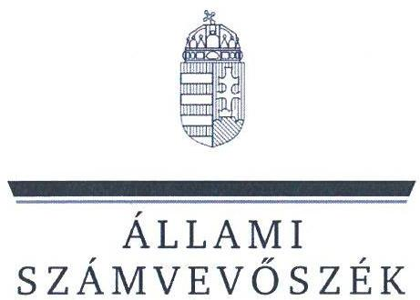
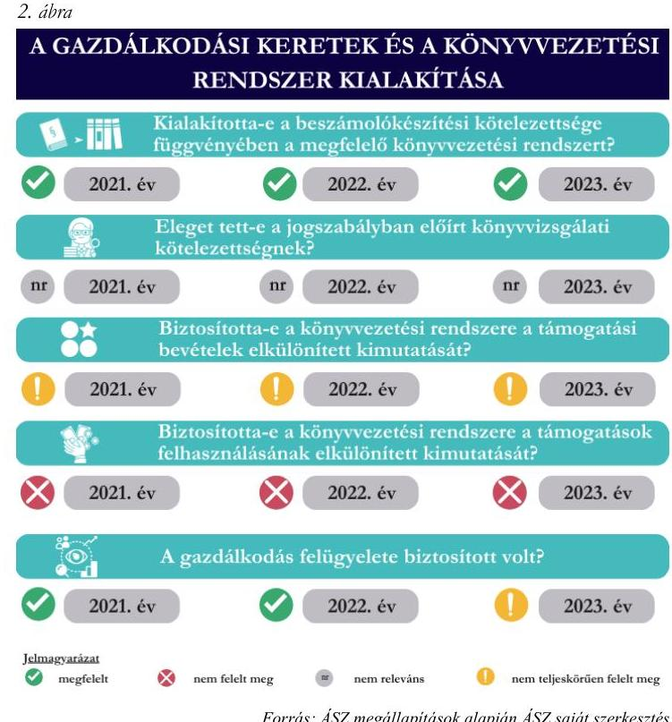

# JELENTÉS 

## Az államháztartásból nyújtott támogatást felhasználó egyesületek és alapítványok ellenőrzése

Közép- és Kelet-európai Onkológiai Akadémia Alapítvány

2025.

---

ÁLLAMI
SZÁMVEVŐSZÉK

# JELENTÉS 

## Az államháztartásból nyújtott támogatást felhasználó egyesületek és alapítványok ellenőrzése

Közép- és Kelet-európai Onkológiai Akadémia Alapítvány

2025.

---

# ELLENŐRZÉSI IGAZGATÓSÁG: 

## ÁLLAMHÁZTARTÁSON KÍVÜLI SZERVEZETEKET ELLENŐRZŐ IGAZGATÓSÁG

## ELLENŐRZÉSI IGAZGATÓ:

## KLINGA LÁSZLÓ igazgató

## ELLENŐRZÉSVEZETŐ:

Jelentéseink az interneten a www.asz.hu címen olvashatók.

BÉCSI ANDREA ellenőrzésvezető

IKTATÓSZÁM: EL-4032-003/2025
TÉMASORSZÁM: 35
ELLENŐRZÉS-AZONOSÍTÓ SZÁM: V108002

---

# TARTALOMJEGYZÉK 

AZ ELLENŐRZÉS ALAPADATAI ..... 5
AZ ELLENŐRZÖTT SZERVEZET ..... 7
ÖSSZEFOGLALÁS ..... 9
AZ ELLENŐRZÉS FÓKUSZTERÜLETEI ..... 11
MEGÁLLAPÍTÁSOK ..... 12
JAVASLATOK ..... 17
MELLÉKLETEK ..... 19
I. sz. melléklet: Értelmező szótár ..... 19
II. sz. melléklet: Az ellenőrzött szervezetek jegyzéke ..... 21
III. sz. melléklet: Ellenőrzési kritériumok ..... 22
FÜGGELÉK: ÉSZREVÉTELEK ..... 23
RÖVIDÍTÉSEK JEGYZÉKE ..... 24

---

.

---

# AZ ELLENŐRZÉS ALAPADATAI 

## AZ ELLENŐRZÉS CÉLJA

Az ellenőrzés célja annak értékelése volt, hogy az államháztartásból nyújtott támogatást felhasználó, egyesületi vagy alapítványi formában múködő civil szervezetek a gazdálkodásuk szabályozási környezetét, a gazdálkodás kontrolljait - az államháztartásból nyújtott támogatások tükrében - szabályszerűen alakították-e ki. A civil szervezetek a kapott támogatásokat célszerűen, a támogatói okiratban foglaltaknak megfelelően használták-e fel, a kapott támogatások felhasználása, a támogatásokkal való elszámolás szabályszerű volt-e, illetve a gazdálkodásukról szabályszerűen beszámoltak-e.

## AZ ELLENŐRZÉS TÍPUSA

Kombinált ellenőrzés.

## AZ ELLENŐRZÖTT IDŐSZAK

A 2021-2023. évek.

## AZ ELLENŐRZÉS TÁRGYA

Az ellenőrzés tárgyát képezte az államháztartásból nyújtott támogatást felhasználó egyesületek és alapítványok 2021-2023. évi gazdálkodásának ellenőrzése. Ennek keretében a könyvvezetésre vonatkozó jogszabályi előírások betartása, az államháztartásból származó támogatások és azok felhasználása jogszabályi előírásoknak megfelelő elkülönített nyilvántartása, a támogatás támogatói okirat szerinti célszerű felhasználása, valamint a beszámolási és közzétételi kötelezettség teljesítésének szabályszerűsége. Az ellenőrzés kiterjedt továbbá annak ellenőrzésére, hogy a számviteli szabályozási környezet kialakítása támogatta-e az államháztartásból származó támogatások vonatkozásában a szabályos könyvvezetést, a kapcsolódó beszámolási kötelezettség teljesítését.

## AZ ELLENŐRZÉS JOGALAPJA

Az ellenőrzés jogszabályi alapját az ÁSZ tv. ${ }^{1} 1 . \int(3)$ bekezdés, az 5. $\int(3)$ bekezdés, valamint a Civil tv. ${ }^{2} 47 . \int$ előírásai képezték.

---

# AZ ELLENŐRZÉS MÓDSZERE 

Az ÁSZ ${ }^{3}$ az ellenőrzést a nemzetközi standardokat irányadónak tekintve az ellenőrzési program szempontjai, az ellenőrzött időszakban hatályos jogszabályok, az ellenőrzés szakmai szabályok és módszertanok figyelembevételével végezte.

Az ellenőrzési bizonyítékként felhasználható adatforrások közé tartoztak egyrészt az ellenőrzési programban felsorolt adatforrások, másrészt adatforrás volt még minden - az ellenőrzés folyamán - feltárt, az ellenőrzés szempontjából információkat tartalmazó dokumentum.

Az ellenőrzési fókuszterületek megválaszolásához szükséges bizonyítékok megszerzése az ellenőrzött szervezet által rendelkezésre bocsátott dokumentumokra és adatokra alapozva, továbbá kérdésfeltevés (információkérés) és mintavételezés útján történt.

Az ellenőrzés lefolytatásához az ellenőrzött szervezet a tanúsítványok kitöltésével, valamint az ÁSZ által kért dokumentumok, információk megküldésével szolgáltatott adatot.

A támogatások ${ }^{4}{ }_{1,2,3,4}$ célnak megfelelő, szabályszerű felhasználásának és nyilvántartásának ellenőrzését mintavételi eljárással kiválasztott tételek alapján ellenőrizte az ÁSZ. Az ellenőrzés nem terjedt ki a támogatások ${ }_{1,2,3,4}$ értékarányos felhasználásának vizsgálatára.

---

# AZ ELLENŐRZÖTT SZERVEZET 

## KÖZÉP- ÉS KeLET-EURÓPAI ONKOLÓGIAI AKAdÉMIA AlAPÍTVÁNY

A rák világszerte növekvő előfordulása minden országot arra figyelmeztet, hogy hatékonyabb rákellenes stratégiák kidolgozására és nemzetközi együttműködésre van szükség. Magyarország Kormánya az Eütv. ${ }^{5}$ 151/A. § felhatalmazásának megfelelően 2019. szeptember 26-i hatállyal megalapította a Közép- és Kelet-európai Onkológiai Akadémia Alapítványt, az Alapító okiratában; ${ }^{6}$ meghatározta az Alapítvány ${ }^{7}$ tevékenységi köreit, országos közfeladatait, és nemzetközi feladatait. Az Alapítót ${ }^{8}$ az alapítástól az emberi erőforrások minisztere, 2022. május 25. napjától a belügyminiszter képviselte. A Fővárosi Törvényszék 2019. október 17-én vette nyilvántartásba az Alapítványt, amely az Eütv. 151/A. § (6) bekezdése alapján közhasznú jogállással rendelkezett.

Az Alapítvány fő küldetése a kelet-közép-európai országok különböző nemzeti rákellenes tevékenységeinek összehangolása a korai felismerés, a diagnosztika, a kezelés, valamint a rákkutatás és oktatás területén.

Az Alapítvány célja:

- a daganatos betegségek hatékony megelőzése és leküzdése érdekében a szakterület tudományos hátterének megerősítése;
- a képzési lehetőségek szervezeti rendszerének bővítése;
- a megelőzés és kezelés területén alkalmazott módszerek, jó gyakorlatok megosztása;
- a nemzetközi szintű kutatás-fejlesztési és innovációs tevékenység támogatása az onkológia jövőbe mutató és eredményeket hozó fejlődése érdekében.
Az Alapító az Alapítvány működésének biztosításához a megalapítás évében az 50,0 MFt alapítói vagyonon felül további 450,0 M Ft-ot, azt követően a 2020-2022. években évente 500,0 M Ft-ot, azaz 20192022. években összesen 1 950,0 M Ft támogatást bocsátott az Alapítvány rendelkezésére. A támogatás minden évben vissza nem térítendő, $100 \%$-os előlegként kapott támogatás volt. A 2023. évben az Alapítvány támogatásban nem részesült. (1. táblázat)

Az Alapítvány az Eütv. 151/A. § (8) bekezdésében előírtaknak megfelelően a 2019. évben létrehozta önálló jogi személyiséggel rendelkező szervezeti egységét, az Akadémiát ${ }^{9}$, amely az Alapítvány elismert hazai és nemzetközi szaktekintélyű tagjai révén lát el - az onkológia oktatással, kutatással, a kutatás támogatásával, az elért eredmények hazai és nemzetközi bemutatásával, az eredmények gyógyításban történő felhasználásával összefüggő - feladatokat. E célra az Alapítvány induló vagyonából 25,0 M Ft-ot különített el.

Az Alapítvány ügyvezető szerve a kuratórium ${ }^{10}$, mely öt természetes személyből áll, az Alapító fenntartotta magának a kuratórium elnökének kijelölési jogát. A kuratórium elnökét megillető képviseleti jog terjedelme és gyakorlásának módja általános és önálló, a kuratórium elnökének akadályoztatása esetén az Alapítványt két bármely más kuratóriumi tag együttesen képviseli általánosan. Az Alapítvány gazdálkodásának, számvitelének és az Alapító okirattal összhangban álló ügyvitelének ellenőrzésére az Alapító az alapításkori Alapító okiratban; három tagú felügyelőbizottság létrehozásáról rendelkezett, melynek tagjait és elnökét az Alapító okirat ${ }_{1,2,3,4}$ nevesítette.

Az Alapítványnak gazdasági társaságban tulajdoni részesedése nem volt, gazdasági-vállalkozási tevékenységet nem végzett.

---

# Az alapitvány ellensőrzött támogatása

|  Támogatói okirat azonosítója | 35741-9/2019/EGST | IV/182-1/2020/EGST | IV/980-1/2021/EKF | IV/461-1/2022/EKF  |
| --- | --- | --- | --- | --- |
|  Támogatási program célja | Az Alapítvány szakmai feladatai teljesítése során felmerülő költségek támogatása. | Az Alapítvány szakmai feladatai teljesítése során felmerülő költségek támogatása. | Az Alapítvány szakmai feladatai teljesítése során felmerülő költségek támogatása. | Az Alapítvány szakmai feladatai teljesítése során felmerülő költségek támogatása.  |
|  Támogató megnevezése | Emberi Erőforrások Minisztériuma, 2022. május 25. napjától jogutódja a Belügyminisztérium | Emberi Erőforrások Minisztériuma, 2022. május 25. napjától jogutódja a Belügyminisztérium | Emberi Erőforrások Minisztériuma, 2022. május 25. napjától jogutódja a Belügyminisztérium | Emberi Erőforrások Minisztériuma, 2022. május 25. napjától jogutódja a Belügyminisztérium  |
|  Támogatott tevékenység időtartama támogatói okirat alapján | 2019. október 17 -
2020. december 31. | 2020. március 02 -
2021. december 31. | 2021. január 01 -
2022. december 31. | 2022. január 01 - 2022. december 31.  |
|  Felhasználás végső időpontja támogatói okirat alapján | 2020. december 31. | 2022. január 31. | 2023. január 31. | 2023. január 31.  |
|  Támogatás folyósításának módja | 100\%-os támogatási előlegként folyósított, vissza nem térítendő | 100\%-os támogatási előlegként folyósított, vissza nem térítendő | 100\%-os támogatási előlegként folyósított, vissza nem térítendő | 100\%-os támogatási előlegként folyósított, vissza nem térítendő  |
|  Támogatási előleg folyósításának napja, összege | 2019. november 25., 450,0 M Ft | 2020. április 25., 500,0 M Ft | 2021. április 21., 500,0 M Ft | 2022. április 14., 500,0 M Ft  |
|  A pénzügyi elszámolás határideje támogatói okirat alapján | 2021. február 28. | 2022. február 28. | 2023. február 28. | 2023. február 28.  |
|  Elszámolás a támogató szervezet felé | lezárva | benyújtva | benyújtva | az elszámolás benyújtására az ÁSZ részére történt adatszolgáltatás lezárásáig nem került sor ${ }^{61}$  |
|  A záró pénzügyi elszámolás kelte, a támogatásból felhasznált összeg | 2023. február 28., 449,3 M Ft | 2023. február 28., 499,5 M Ft | 2023. február 28., 497,7 M Ft | nem releváns  |
|  Benyújtott elszámolás támogatói elfogadása | 2024. március 14. | folyamatban | folyamatban | nem releváns  |

---

# ÖSSZEFOGLALÁS 

Magyarország Alaptörvényének ${ }^{12}$ XX. cikke kimondja, hogy mindenkinek joga van a testi és lelki egészséghez, melynek érvényesülését Magyarország többek között az egészségügyi ellátás megszervezésével segíti elő. Az Alapítvány a létrehozásától kezdődően, a 2019-2023. években az alapcél szerinti (közhasznú) tevékenysége költségei, ráfordításai - ideértve az annak keretében megvalósuló fejlesztési célt - ellentételezésére 1950 M Ft összegben, $100 \%$-os előlegként kapott vissza nem térítendő támogatást. A társadalom részéről jogosan felmerülő elvárás, hogy az ellenőrzések keretében időről-időre sor kerüljön az államháztartásból nyújtott támogatások rendeltetésszerủ és átlátható módon történő felhasználásának értékelésére, hogy ezáltal átfogó képet kapjon a közpénzből gazdálkodó szervezetek múködéséről, tevékenységéről.

Az ellenőrzött időszakban az Alapítvány könyvvezetése a jogszabályi előírásoknak megfelelően a kettős

könyvvitel rendszerében történt, egyszerűsített éves beszámolót készített és nem volt kötelezett könyvvizsgálatra. A számviteli nyilvántartásában biztosította a támogatási bevételek egyéb bevételektől elkülönítetten történő nyilvántartásának lehetőségét, ugyanakkor könyvvezetési rendszerét nem úgy alakította ki, hogy abból megállapítható legyen, hogy a kapott támogatás államháztartási, és azon belül központi költségvetési forrásból kapott támogatás volt, továbbá nem gondoskodott olyan elkülönített számviteli nyilvántartás kialakításáról, melynek vezetésével támogatásonként megállapítható és ellenőrizhető lett volna a kapott támogatás felhasználása.

A gazdálkodás felügyeletének biztosítása a 2023. év egy részében nem volt szabályszerű, nem volt folyamatosan biztosított a felügyeleti szerv jogszabályoknak és a létesítő okiratban rögzítetteknek megfelelő múködése, mivel a 2023. január 8. és 2023. július 27. közötti időszakra vonatkozóan nem volt felügyelőbizottsági elnök. (1. ábra)

Az Alapítvány a 2021. évi számviteli beszámolót határidőben, a 2022. és a 2023. évi számviteli beszámolókat a jogszabályban előírt határidőn túl tette közzé. A 2021. évi számviteli beszámolót az Alapítvány kuratóriuma jóváhagyta, azonban a 2022. és a 2023. évre vonatkozó számviteli beszámoló és közhasznúsági melléklet a kuratórium által nem került elfogadásra, a 2021-2023. évi számviteli beszámolókról írásbeli felügyelőbizottsági jelentés nem készült. A 2022. és a 2023. évi beszámolók kiegészítő melléklete, valamint a közhasznúsági melléklete nem a jogszabályokban előírt tartalommal került összeállításra.

Az Alapítvány 2021-2023. évi könyvvezetése nem felelt meg a jogszabályi előírásoknak. A könyvviteli rendszerében a jogszabályban foglaltak ellenére nem mutatta ki kötelezettségként a vissza nem térítendő, $100 \%$ os előlegként kapott támogatásokat. Továbbá, a jogszabályban előírtak ellenére nem mutatta ki a követelések

---

között az Akadémiának, mint a támogatott tevékenység megvalósításában közreműködőnek átadott pénzeszközöket, illetve a 2023. évi számviteli beszámolójában olyan kötelezettséget mutatott ki, amely már kifizetésre került. Mindezekre tekintettel a 2021-2023. években sérült a jogszabályban előírt teljesség elve, miszerint könyvelni kell mindazon gazdasági eseményeket, amelyeknek az eszközökre és a forrásokra gyakorolt hatását a beszámolóban ki kell mutatni. Továbbá, sérült a jogszabályban előírt lényegesség elve, mivel a számviteli beszámolók mérlege nem tartalmazott olyan információkat (kötelezettséget, követelést), amelyek befolyásolják a beszámolók adatait felhasználók döntését. Ezeken túl az Alapítvány a 2021-2023. évi számviteli beszámoló mérlegtételeit a jogszabályi előírás ellenére nem támasztotta alá leltárral. (2. ábra)
3. ábra

## AZ ÁLLAMHÁZTARTÁSI FORRÁSBÓL KAPOZT TÁMODATÁSOK ÉS AZOK FELHASZNÁLÁSA

A támogatás nyilvántartása szabályszerű volt-e?
Támogatás, Támogatás, Támogatás, Támogatás,
A támogatás felhasználása és az elszámolása során betartotta-e a jogszabályban és a támogatói okiratban elóírtakat?
Támogatás, Támogatás, Támogatás, Támogatás,
A támogatás felhasználásáról vezetett-e elkülönített nyilvántartást?
Támogatás, Támogatás, Támogatás, Támogatás,
Támogatás,
nem felett meg nem releváns nem teljeskörűen felett meg
Forrás: ÁSZ megállapítások alapján ÁSZ saját szerkesztés

Az Alapítvány a támogatási bevételeket az egyéb bevételeitől elkülönítve tartotta nyilván, ugyanakkor nem mutatta be, hogy a kapott támogatás államháztartási, azon belül központi költségvetési forrásból kapott támogatás volt, továbbá a támogatások felhasználásáról nem vezette a jogszabályban előírt elkülönített nyilvántartást.

A támogatások terhére teljesített, ellenőrzött kifizetések jogcímei a támogatói okiratokban foglaltaknak megfeleltek, de a támogatások felhasználása és elszámolása során nem tartotta be teljeskörűen a jogszabályokban és a támogatói okiratokban számára előírt kötelezettségeket. (3. ábra)

---

# AZ ELLENŐRZÉS FÓKUSZTERÜLETEI 

1. A civil szervezet gazdálkodási keretei és könyvvezetési rendszere kialakításának szabályszerűsége az államháztartásból származó támogatások vonatkozásában
2. A civil szervezet jogszabályban előírt beszámolási kötelezettsége
3. A civil szervezet által államháztartási forrásból kapott támogatások és azok felhasználása, továbbá a kapcsolódó elszámolások szabályszerűsége

---

# 1. A civil szervezet gazdálkodási keretei és könyvvezetési rendszere kialakításának szabályszerűsége az államháztartásból származó támogatások vonatkozásában 

Összegző megállapítás Az Alapítvány gazdálkodási kereteinek és könyvvezetési rendszerének kialakítása az államháztartásból származó támogatások vonatkozásában nem felelt meg a Számv. tv. ${ }^{13}$ és a Civil tv. előírásainak, a gazdálkodás felügyeletének biztosítása nem volt szabályszerű.

Az ellenőrzött időszakban az Alapítvány könyvvezetése a Civil tv. és az Eszkr. ${ }^{14}$ előírásainak megfelelően a kettős könyvvitel rendszerében, a számviteli beszámoló pénznemével azonos pénznemben, forintban történt, a hivatkozott jogszabályok formai előírásainak megfelelően a 2021-2023. évekre vonatkozóan egyszerűsített éves beszámolót készített. Az Alapítvány az ellenőrzött időszakban az Eszkr. előírásai alapján nem volt kötelezett könyvvizsgálatra, mivel a 2021-2023. években az éves bevétele az üzleti évet megelőző két üzleti év átlagában nem haladta meg a 300 M Ft -ot.
Az Alapítvány a könyvvezetési rendszerének kialakítása során biztosította az alapcél szerinti (közhasznú) tevékenysége költségei, ráfordításai ellentételezésére visszafizetési kötelezettség nélkül kapott támogatás - ideértve az alapcél szerinti (közhasznú) tevékenysége keretében megvalósuló fejlesztés céljára kapott támogatást is - bevételként történő elszámolásakor annak egyéb bevételeitől elkülönítetten történő bemutatását, ezáltal eleget tett a Civil tv.-ben előírtaknak. Az Alapítvány nem biztosította a Civil tv. 20. § (2) bekezdés a) pont, valamint a (3) bekezdés a) pont előírásainak megfelelően a bevételeken belül a kapott támogatások elkülönítését, mivel az alkalmazott főkönyvi számlák struktúráját nem úgy alakította ki, hogy abból megállapítható legyen, hogy a kapott támogatás államháztartási forrásból kapott támogatás, azon belül központi költségvetési forrásból kapott támogatás volt.
Az Alapítvány a Számv. tv. 161/A. § (2) bekezdésében és a Civil tv. 20. § (4) bekezdésében előírtak ellenére nem úgy alakította ki a könyvvezetési rendszerét, hogy abból az alapcél szerinti (közhasznú) tevékenység költségei, ráfordításai ellentételezésére kapott támogatásokról megállapítható és ellenőrizhető legyen a kapott támogatás felhasználása támogatásonként.
Az Alapító okirat ${ }_{1}$-ben a Civil tv. és a Ptk. ${ }^{15}$ előírásaival összhangban a három tagú felügyelőbizottság létrehozásra került. Az Alapító okirat ${ }_{3}$ szerinti felügyelőbizottsági elnök 2022. november 9-én lemondott, mely a Ptk. 3:25. § (4) bekezdésében előírtak szerint 2023. január 8-án vált hatályossá. Az Alapító okirat ${ }_{3}$ ban előírtak ellenére a 2023. január 8. és 2023. július 27. időszakra vonatkozóan - az új felügyelőbizottsági elnök kinevezésének elfogadásáig - az Alapítvány felügyelőbizottsága elnökkel nem rendelkezett.

---

# 2. A civil szervezet jogszabályban előírt beszámolási kötelezettsége 

## Összegző megállapítás Az Alapítvány 2021-2023. évi könyvvezetési-, beszámolási- és közzétételi kötelezettsége nem volt szabályszerű.

Az Alapítvány 2021. évi számviteli beszámolóját és közhasznúsági mellékletét a kuratórium elfogadta és a Civil tv. által előírt határidőben letétbe helyezte és közzé tette. A 2021. évi beszámolóra vonatkozó álláspontját az Alapítvány felügyelőbizottsága a Ptk. 3:27. § (1) bekezdésében előírtak ellenére a kuratóriummal nem ismertette, az Alapítvány Számviteli politikájában ${ }^{16}$ foglaltak ellenére a kuratórium a felügyelőbizottság írásbeli jelentése hiányában döntött az Alapítvány beszámolójáról. Továbbá, a Számv. tv. 20. § (6) bekezdésben, 96. § (1) bekezdésében és az Eszkr. 7. § (1) bekezdésben előírtak ellenére a 2021. évi számviteli beszámoló nem tartalmazta a szervezet képviseletére jogosult személy aláírását.
A 2022-2023. évekre vonatkozó számviteli beszámolót az Alapítvány nem terjesztette a kuratórium elé, azok elfogadásáról a kuratórium nem döntött. Ezáltal az Alapítvány nem rendelkezett a kuratórium által jóváhagyott számviteli beszámolóval és közhasznúsági melléklettel, azokat a Civil tv. 30. § (1) bekezdésben előírtak ellenére a kuratórium elfogadása nélkül helyezte letétbe és tette közzé az $\mathrm{OBH}^{17}$ honlapján. A közzétételi kötelezettséget nem a Civil tv. 30. § (1) bekezdésben előírt határidőben teljesítette, arra a 2022. évi számviteli beszámoló vonatkozásában egy éven túl, a 2023. évi számviteli beszámoló vonatkozásában a törvényben előírt határidőt követő hatodik napon került sor. Ezen kívül a 2022. évi beszámoló szintén nem tartalmazta a Számv. tv. 20. § (6) bekezdésben, 96. § (1) bekezdésében, és az Eszkr. 7. § (1) bekezdésben előírtak ellenére a szervezet képviseletére jogosult személy aláírását. Tekintettel arra, hogy a 2022-2023. évi számiteli beszámolók a kuratórium részére nem kerültek előterjesztésre, a felügyelőbizottság a Ptk. 3:27. § (1) bekezdésében és a Számviteli politikában előírt feladatát nem tudta teljesíteni, a beszámolókat nem tudta megvizsgálni és arról a kuratóriumot tájékoztatni.
Az OBH honlapján közzétett 2021-2023. évi számviteli beszámolóit és a közhasznúsági mellékleteit az Alapítvány a saját honlapján is nyilvánosságra hozta.
Az Alapítvány a 2021-2023. évekre vonatkozóan a Számv. tv. 69. § (1) bekezdésének előírásai ellenére a könyvek üzleti év végi zárásához, a beszámoló elkészítéséhez, a mérleg tételeinek alátámasztásához nem állított össze olyan leltárt, amely tételesen, ellenőrizhető módon tartalmazta a mérleg fordulónapján meglévő eszközeit és forrásait mennyiségben és értékben.
Az Alapítvány a 2021-2022. évi számviteli beszámolók kiegészítő mellékletében a Civil tv. 29. § (4) bekezdésében előírtak ellenére a támogatási program keretében végleges jelleggel felhasznált összegeket nem mutatta be teljeskörűen támogatásonként, míg a 2023. évi számviteli beszámoló kiegészítő melléklete a támogatások ${ }_{2,3,4}$ felhasználására vonatkozóan nem tartalmazott információkat. Továbbá, a 2023. évi beszámoló vonatkozásában az Alapítvány nem tett eleget a Civil tv. 29. § (5) bekezdésében előírtaknak, mivel a kiegészítő mellékletében nem mutatta be az üzleti évben végzett főbb tevékenységeket és programokat.
Az Alapítvány a 2021-2023. évi közhasznúsági mellékletben a Civil tv. 29. § (6) bekezdésében előírtak ellenére nem mutatta be az általa végzett közhasznú tevékenységek eredményeit, a 2023. évi közhasznúsági mellékletben az általa végzett közhasznú tevékenységek fő csoportjait, továbbá a Civil tv. 29. § (7) bekezdésében előírtak ellenére a 2021. évi közhasznúsági melléklet nem tartalmazott

---

adatot a vezető tisztségviselőknek nyújtott juttatások összegére és a juttatásban részesülő vezető tisztségekre vonatkozóan.
Az Alapítvány 2021-2023. évi könyvvezetése nem felelt meg a Számv. tv. alábbiakban részletezett előírásainak:

- Az Alapítvány a Számv. tv. 43. §(1) bekezdésben foglaltak ellenére nem mutatta ki a 2021-2023. évek könyvviteli nyilvántartásában és számviteli beszámolóiban a rövid lejáratú kötelezettségek között azon vissza nem térítendő, $100 \%$-os előlegként kapott támogatások összegét, amelyek elszámolását még nem hagyta jóvá a támogató. Erre tekintettel a 2021. évben 1 450,0 M Ft összegben (támogatások ${ }_{1,2,3}$ ), a 2022. évben 1 950,0 M Ft összegben (támogatások ${ }_{1,2,3,4}$ ), és a 2023. évben 1 500,0 M Ft összegben (támogatások ${ }_{2,3,4}$ ) nem került kimutatásra a támogatóval szemben fennálló kötelezettség.
- Az Alapítvány a 2020. évben 200,0 M Ft, a 2022. évben 188,3 M Ft pénzösszeget adott át az Akadémiának, mint közreműködőnek a támogatott tevékenység megvalósításához, ezen átadott pénzeszközöket a 2021-2023. évek könyvviteli nyilvántartásában és a számviteli beszámolóiban a Számv. tv. 29. $\S$ (1) bekezdésében foglaltak ellenére nem mutatta ki a követelések között.
- A kuratórium 2022. április 22-i határozatának értelmében a kuratórium az Akadémia részére - a 2021. évi múködési költségeinek fedezetét biztosító - 169,3 M Ft összeg átutalásáról döntött. A kuratóriumi döntés alapján az Alapítvány 2021. december 31-én a Számv. tv. 29. §(1) bekezdésében foglaltak ellenére az egyéb ráfordítások és a passzív időbeli elhatárolások között nyilvántartásba vette az Akadémiának átadandó összeget. Az Alapítvány a 169,3 M Ft átutalását az Akadémia részére 2022. június 2-án teljesítette, azonban a pénzügyi teljesítés számviteli elszámolásakor figyelmen kívül hagyta az átadott támogatással összefüggésben előző évben rögzített könyvelési tételt. Erre, valamint az átadott támogatás követelés helyett egyéb ráfordítások között történő kimutatására tekintettel, az Alapítvány a 2021. évi és 2022. évi eredménykimutatásában helytelenül mutatott ki 169,3 M Ft összegű egyéb ráfordítást. Továbbá, ezzel a tétellel összefüggésben a 2021-2023. évre vonatkozó mérlegben a passzív időbeli elhatárolások között 169,3 M Ft tévesen került kimutatásra.
- Az Alapítvány az 500,0 M Ft összegű támogatás ${ }_{1}$-ből 749441 Ft-ot nem használt fel, melyet visszafizetési kötelezettségként könyveiben 2022. december 31-én nyilvántartásba vett. A fel nem használt támogatási összeg visszafizetése 2023. március 27 -én megtörtént, azonban azt nem az Alapítvány, hanem az Akadémia teljesítette a támogató felé. Az Alapítvány a pénzügyi rendezés ellenére a visszafizetési kötelezettséget a 2023. évi könyvviteli nyilvántartásából nem vezette ki, ezáltal a 2023. évi számviteli beszámolóban a Számv. tv. 43. §(1) bekezdésében előírtakkal ellentétesen olyan kötelezettséget mutatott ki, amely 2023. március 27 -e óta nem állt fenn.
- Az Alapítvány a 2021-2023. évi számviteli beszámolók vonatkozásában nem tett eleget az Eszkr. 4. mellékletében előírt tagolásnak, a 2022-2023. évi eredménykimutatás támogatások sorában nem szerepeltetett adatot, továbbá a 2021-2023. évi eredménykimutatás tájékoztató adatai között sem mutatta be a bevételként elszámolt támogatások összegét annak ellenére, hogy könyvviteli nyilvántartásában a 2021. évben 193,3 M Ft, a 2022. évben 226,2 M Ft, a 2023. évben 33,8 M Ft költségek, ráfordítások ellentételezésére kapott támogatást, juttatást mutatott ki.

---

# 3. A civil szervezet által államháztartási forrásból kapott támogatások és azok felhasználása, továbbá a kapcsolódó elszámolások szabályszerűsége 

Összegző megállapítás Az Alapítvány által a 2021-2023. években nyilvántartott államháztartási forrásból kapott támogatások és azok felhasználásának számviteli elszámolása nem volt szabályszerű. A támogatás ${ }_{3}$ felhasználása, és a támogatás ${ }_{1,2,3}$ elszámolása nem felelt meg a támogatói okiratokban foglaltaknak.

Az Alapítvány a 2019. évi megalakulásától kezdődően 2022-ig vissza nem térítendő, 100\%-os előlegként kapott támogatásokat ${ }_{1,2,3,4}$ az alapcél szerinti (közhasznú) tevékenysége költségei, ráfordításai - ideértve az annak keretében megvalósuló fejlesztési célt - ellentételezésére. Valamennyi támogatást nyilvántartotta az ellenőrzött időszakban.
Az Alapítvány a részére 2019-2021. években nyújtott támogatással ${ }_{1,2,3}$ 2023. február 28-i keltezéssel számolt el a feladatellátás tekintetében az $\mathrm{EMMI}^{18}$ jogutódja, a $\mathrm{BM}^{19}$ felé. A benyújtott elszámolások közül a BM a támogatás ${ }_{1}$ elszámolásának elfogadásáról 2024. március 14-én értesítette az Alapítványt, a támogatás ${ }_{2,3}$ elszámolásának elfogadásáról az ÁSZ részére történt adatszolgáltatás lezárásáig az Alapítvány nem kapott tájékoztatást. Valamennyi támogatás vonatkozásában az Alapítvány kezdeményezte a támogatói okirat módosítását, melynek során a támogatás ${ }_{1,2}$ esetében a támogatás felhasználási határidő 2022. június 30-ra, a támogatás ${ }_{3}$ esetében 2022. december 31-re, míg a támogatás ${ }_{4}$ tekintetében 2024. december 31-re történő hosszabbítását kérelmezte. Az Alapítvány által kezdeményezett módosítások támogató általi elfogadása dokumentáltan nem történt meg, erre tekintettel az elszámolások benyújtása támogatások ${ }_{1,2,3}$ vonatkozásában a hatályos támogatói okiratokban foglaltakhoz képest határidőn túl teljesült. A támogatói okirat ${ }_{4}$ esetében az ÁSZ részére történt adatszolgáltatás lezárásáig az elszámolás benyújtására nem került sor.
Az Alapítvány a támogatásokat ${ }_{3,4}$ azok bevételként történő elszámolásakor az egyéb bevételeitől elkülönítve tartotta nyilván, ugyanakkor a Civil tv. 20. § (2) bekezdés a) pontja és (3) bekezdés a) pontja előírásai ellenére nem mutatta be, hogy a kapott támogatás ${ }_{3,4}$ államháztartási forrásból származott és ezen belül központi költségvetési forrásból kapott támogatás volt.
Az Alapítvány az alapcél szerinti (közhasznú) tevékenysége költségei, ráfordításai ellentételezésére kapott támogatásokról ${ }_{1,2,3,4}$ nem vezetett a Civil tv. 20. § (4) bekezdésében előírt olyan elkülönített számviteli nyilvántartást, amelynek alapján támogatásonként megállapítható és ellenőrizhető a kapott támogatás felhasználása, ezáltal nem tett eleget a Számv. tv. 161/A. § (2) bekezdésben előírtaknak sem, mivel a közpénzek felhasználásának és a köztulajdon használatának nyilvánossága és ellenőrizhetősége érdekében nyilvántartási (könyvvezetési) rendszerét nem részletezte tovább oly módon, hogy abból a Civil tv.-ben meghatározott adatok rendelkezésre álljanak.
A támogatások ${ }_{1,2,3,4}$ célnak megfelelő, szabályszerű felhasználásának és nyilvántartásának értékelése a támogató felé benyújtott elszámolások, illetve számlaösszesítő alapján a támogatásonként kiválasztott mintatételekhez kapcsolódó bizonylatok ellenőrzésével történt.

---

- Az Alapítvány a támogatói okirat ${ }_{1,2,3}$ 6.5. ba) pontjában előírtakat egy ellenőrzött tétel esetében sem tartotta be, mivel a támogatás felhasználásának igazolását dokumentáló eredeti számlákra, bizonylatokra, egyéb okiratokra nem vezették rá, hogy azokat mely támogatás keretében számolták el.
- A 2_09 azonosítószámú mintatétel esetében az Alapítvány székházának megvásárolt ingatlan felújításához kapcsolódó tervezési díj elszámolása az Alapítvány könyveiben a Számv. tv. 165. § (1)-(2) bekezdésének előírásai ellenére számviteli bizonylat nélkül történt, tekintettel arra, hogy a mintatétel elszámolását alátámasztó számla az Akadémia nevére és adószámára került kiállításra, azonban a pénzügyi teljesítés az Alapítvány bankszámlájáról történt.
- Az Alapítvány székházának megvásárolt ingatlan felújításához kapcsolódó 2_02 azonosítószámú mintatétel esetében a Számv. tv. 26. § (8) bekezdésében előírtak ellenére az adott előleget könyvviteli nyilvántartásában nem követelésként, hanem beruházásként mutatta ki az Alapítvány.
- A Számv. tv. 167. § (1) bekezdés h) pontjában előírtak ellenére a támogatás ${ }_{1,2,3,4}$ felhasználásához kapcsolódó számviteli bizonylatok egyike sem tartalmazta a könyvelés módjára, az érintett könyvviteli számlákra történő hivatkozást, a Számv. tv. 167. § (7) bekezdése szerinti logikai hozzárendelés nem teljesült, mivel az utólagos módosítási lehetőség nem zárható ki.
- A 2_07, a 2_08 és a 2_12 azonosítószámú mintatételek tárgyi eszköz beszerzésekhez kapcsolódtak, mely eszközöket az Akadémia vette nyilvántartásba. A tárgyi eszköz beszerzés nem minősült a támogatási cél megvalósítása érdekében figyelembe vehető közreműködésnek. A közreműködőnek a támogatói okirat 5.4. pontja szerint az I. sz. mellékletében felsorolt programok megvalósításában kellett közreműködnie, az esetleges eszköz beszerzésre a közreműködés nem terjedt ki. Erre tekintettel a támogatás felhasználás nem felelt meg a támogatói okirat 5.4. pontjában előírtaknak.

---

# JAVASLATOK 

Az ÁSZ tv. 33. § (1) bekezdésében foglaltak értelmében az ellenőrzött szervezet vezetője köteles a jelentésben foglalt megállapításokhoz kapcsolódó intézkedési tervet összeállítani és azt a jelentés kézhezvételétől számított 30 napon belül az ÁSZ részére megküldeni. Amennyiben az ellenőrzött szervezet vezetője nem küldi meg határidőben az intézkedési tervet, vagy továbbra sem elfogadható intézkedési tervet küld, az Állami Számvevőszék elnöke az ÁSZ tv. 33. § (3) bekezdése a) és b) pontjaiban foglaltakat érvényesítheti.

## KÖZÉP- ÉS KELET-EURÓPAI ONKOLÓGIAI AKADÉMIAI ALAPÍTVÁNY KURATÓRIUMI ELNÖKE

1. Gondoskodjon a nyilvántartási rendszerének oly módon történő kialakításáról (részletezéséről), hogy az alkalmas legyen a Civil tv. 20. § (2) bekezdés a) pontjában, valamint (3) bekezdés a) pontjában meghatározott, a bevételek kimutatására vonatkozó követelmények teljesítésére, majd az alapcél szerinti tevékenysége költségei, ráfordításai ellentételezésére visszafizetési kötelezettség nélkül, államháztartási forrásból kapott, ezen belül központi költségvetésből kapott támogatást a hivatkozott jogszabályi előírásnak megfelelő részletezésben mutassa ki.
2. Gondoskodjon a nyilvántartási rendszerének oly módon történő kialakításáról (részletezéséről), hogy az alkalmas legyen a Civil tv. 20. § (4) bekezdésében meghatározott elkülönítésre vonatkozó követelmények teljesítésére, majd az alapcél szerinti tevékenysége költségei, ráfordításai ellentételezésére kapott támogatásokról a hivatkozott jogszabályi előírásnak megfelelve olyan elkülönített számviteli nyilvántartást vezessen, amelynek alapján támogatásonként megállapítható és ellenőrizhető a kapott támogatás felhasználása.
3. Gondoskodjon arról, hogy az Alapítvány müködéséről, vagyoni, pénzügyi és jövedelmi helyzetéről szóló beszámoló elkészítésére és a kuratórium által jóváhagyott beszámoló közzétételére a Civil tv. 30. § (1) bekezdésében előírt határidő betartásával kerüljön sor.
4. Gondoskodjon a könyvek üzleti év végi zárásához, a beszámoló elkészítéséhez, a mérleg tételeinek alátámasztásához olyan leltár összeállításáról, amely tételesen, ellenőrizhető módon tartalmazza az Alapítványnak a mérleg fordulónapján meglévő eszközeit és forrásait mennyiségben és értékben a Számv. tv. 69. § előírásainak megfelelően.
5. Gondoskodjon arról, hogy az Alapítvány müködéséről, vagyoni, pénzügyi és jövedelmi helyzetéről szóló beszámolójának részeként elkészítésre kerülő kiegészítő melléklet feleljen meg a vele szemben támasztott tartalmi követelményeknek, különös tekintettel a Civil tv. 29. § (4)-(5) bekezdésében foglaltakra.
6. Gondoskodjon a Civil tv. 29. § (6)-(7) bekezdésében előírtaknak megfelelő tartalmú közhasznúsági melléklet elkészítéséről.

---

7. Gondoskodjon arról, hogy az Alapitvány müködéséről, vagyoni, pénzügyi és jövedelmi helyzetéről szóló beszámoló mérlegében a Számv. tv. 43. § (1) bekezdésében elöirtaknak megfelelően a kötelezettségek között kerüljön kimutatásra az államháztartási forrásból azon belül központi költségvetési forrásból, vissza nem térítendő, 100\%-os előlegként kapott támogatás összege a támogatói okirat szerinti elszámolás támogató általi elfogadásáig.
8. Gondoskodjon a támogatás felhasználásába bevont közremüködőnek átadott pénzeszközök esetében azok követelések között történő kimutatásáról a Számv. tv. 29. § (1) bekezdésében elöirtaknak megfelelően.
9. Gondoskodjon arról, hogy a kapott támogatások összegei az Alapitvány müködéséről, vagyoni, pénzügyi és jövedelmi helyzetéről szóló beszámoló eredménykimutatásában az Eszkr. 4. mellékletében elöirt tagolásnak megfelelően az egyéb bevételeken belül, továbbá az eredménykimutatás tájékoztató adatai között kerüljenek kimutatásra.
10. Gondoskodjon arról, hogy a kapott támogatás felhasználásához kapcsolódóan a könyvviteli nyilvántartásba vétel és a pénzügyi elszámolás során tartsa be a támogatói okirat vonatkozó előirásait, különös tekintettel a felhasználást alátámasztó eredeti számla/dokumentum előirás szerinti záradékolására.
11. Gondoskodjon a Számv. tv. 165. § (1)-(2) bekezdés előirásainak megfelelően arról, hogy a könyvviteli nyilvántartásban rögzített gazdasági események az elszámolás adatait megalapozó bizonylatok alapján kerüljenek rögzítésre.
12. Gondoskodjon a beruházásokra adott előlegek Számv. tv. 26. § (8) bekezdésében elöirtak szerinti kimutatásáról.
13. Gondoskodjon arról, hogy a könyvviteli nyilvántartást közvetlenül alátámasztó bizonylatok a Számv. tv. 167. § (1) bekezdés h) pontjában elöirtaknak megfelelően tartalmazzák a könyvelés módjára, az érintett könyvviteli számlákra történő hivatkozást.
14. Gondoskodjon arról, hogy a támogatott tevékenység megvalósitásába bevont közremüködő a támogatói okiratban meghatározott tevékenységeket valósitsa meg.

# KÖZÉP- ÉS KELET-EURÓPAI ONKOLÓGIAI AKADÉMIAI ALAPÍTVÁNY FELÜGYELŐBIZOTTSÁGI ELNÖKE 

1. Gondoskodjon arról, hogy a Felügyelőbizottság lássa el a Ptk. 3:27. § (1) bekezdésében elöirt kötelezettségét.

---

# MELLÉKLETEK 

## I. SZ. MELLÉKLET: ÉRTELMEZŐ SZÓTÁR

adomány
alapítvány
cél szerinti juttatás
civil szervezet
civil szervezetek egyszerúsített támogatása
egyesület
gazdasági-vállalkozási tevékenység
gazdálkodó tevékenység
könyvvizsgálati kötelezettség
könyvvizsgálati kötelezettség
közelú tevékenység
közfeladat

A civil szervezetnek - létesítő okiratban rögzített céljaira - ellenszolgáltatás nélkül juttatott eszköz, illetve nyújtott szolgáltatás. (Civil tv. 2. § 1. pont)
Az alapítvány az alapító által az alapító okiratban meghatározott tartós cél folyamatos megvalósítására létrehozott jogi személy. Az alapító az alapító okiratban meghatározza az alapítványnak juttatott vagyont és az alapítvány szervezetét. (Ptk. 3:378. §) A Számv. tv. alkalmazásában egyéb szervezet. (Számv. tv. 3. § 4.a) pont)
A civil (közhasznú) szervezet által (közhasznú) alaptevékenysége keretében nyújtott pénzbeli vagy nem pénzbeli szolgáltatás. (Civil tv. 2. § 4. pont)
A civil társaság; a Magyarországon nyilvántartásba vett egyesület a párt, a szakszervezet és a kölcsönös biztosító egyesület kivételével; az alapítvány közalapítvány és a pártalapítvány kivételével. (Civil tv. 2. § 6. pont)
A Nemzeti Együttműködési Alap terhére történő kifizetés a helyi vagy területi hatókörű civil szervezetek számára, mely egyszerúsített formában, jogosultsági alapon nyújtott támogatás, amelyet a civil szervezet alapcél szerinti közösségteremtő, a hatókörébe tartozó közösség érdekében végzett tevékenységéhez kapcsolódó költségeinek fedezésére fordít. (Civil tv. 2. § 8b. pont alapján)
Az egyesület a tagok közös, tartós, alapszabályban meghatározott céljának folyamatos megvalósítására létesített, nyilvántartott tagsággal rendelkező jogi személy. (Ptk. 3:63. § (1) bekezdés) A Számv. tv. alkalmazásában egyéb szervezet. (Számv. tv. 3. § 4.a) pont)
A jövedelem- és vagyonszerzésre irányuló vagy azt eredményező, üzletszerűen végzett gazdasági tevékenység, kivéve
a) az adomány (ajándék) elfogadását,
b) a létesítő okiratban meghatározott cél szerinti tevékenységet (ideértve a közhasznú tevékenységet is),
c) a pénzeszközök betétbe, értékpapírba, társasági részesedésbe történő elhelyezését,
d) az ingatlan megszerzését, használatának átengedését és átruházását. (Civil tv. 2. §11. pont)
Azon tevékenységek összessége, amelyek a civil szervezet vagyoni, pénzügyi, jövedelmi helyzetére kiható gazdasági eseményt eredményeznek. (Civil tv. 2. § 10. pont)
A civil szervezet akkor kötelezett könyvvizsgálatra, ha az éves (éves szintre átszámított) bevétele az üzleti évet megelőző két üzleti év átlagában meghaladja a 300 millió forintot, vagy azt más jogszabály kötelezővé teszi, továbbá, ha ezek egyike sem áll fenn, akkor a civil szervezet is dönthet arról, hogy a beszámoló felülvizsgálatával könyvvizsgálót bíz meg. (Eszkr. 16. § (1) bekezdés alapján)
Személyek csoportja által, valamely a csoportnál tágabb közösség érdekében - más, e közösségbe nem tartozó személyek érdekeinek sérelme nélkül - végzett tevékenység. (Civil tv. 2. § 16. pont)
A jogszabályban meghatározott állami vagy önkormányzati feladat. A közfeladat ellátásban államháztartáson kívüli szervezet jogszabályban meghatározott rendben közreműködhet. (Áht. ${ }^{20}$ 3/A. § (1)-(2) bekezdése alapján)

---

közhasznú szervezet
közhasznú tevékenység
létesítő okirat
támogatás
támogatási szerződés / támogatói okirat

Közhasznú szervezetté minősíthető a Magyarországon nyilvántartásba vett közhasznú tevékenységet végző szervezet, amely a társadalom és az egyén közös szükségleteinek kielégítéséhez megfelelő erőforrásokkal rendelkezik, továbbá amelynek megfelelő társadalmi támogatottsága kimutatható, és amely:
a) civil szervezet (ide nem értve a civil társaságot), vagy
b) olyan egyéb szervezet, amelyre vonatkozóan a közhasznú jogállás megszerzését törvény lehetővé teszi. (Civil tv. 32. § (1) bekezdés)
Minden olyan tevékenység, amely a létesítő okiratban megjelölt közfeladat teljesítését közvetlenül vagy közvetve szolgálja, ezzel hozzájárulva a társadalom és az egyén közös szükségleteinek kielégítéséhez. (Civil tv. 2. § 20. pont)
A Ptk. előírása szerint a jogi személy létrehozásáról a személyek szerződésben, alapító okiratban vagy alapszabályban szabadon rendelkezhetnek, mely dokumentumokra együttesen a létesítő okirat megnevezést használjuk. (Ptk. 3:4. § (1) bekezdés)
Céljellegủ juttatás, mely kizárólag arra a célra használható fel, amelyre a támogató azt rendelkezésre bocsátotta, amely cél megvalósítását a támogatási szerződés, okirat vagy éppen jogszabály kikötötte. Támogatásként értelmezzük valamennyi, a civil szervezetnek államháztartási forrásból nyújtott támogatást - ideértve a központi költségvetésből kapott támogatást, az elkülönített állami pénzalapokból kapott támogatást, a helyi önkormányzatoktól, kisebbségi önkormányzatoktól, önkormányzati társulástól kapott támogatást -, továbbá az Európai Unió költségvetéséből, külföldi állam államháztartásából, nemzetközi szervezettől, vagy nemzetközi szerződés rendelkezése alapján kapott támogatást, valamint más civil szervezettől kapott támogatást. A gyűjtő fogalom alatt egyaránt értjük a civil szervezetnek nyújtott feladatfinanszírozást szolgáló költségvetési támogatást, a civil szervezetek normatív támogatását, valamint a civil szervezetek egyszerúsített támogatását is. (ÁSZ saját fogalom)
Az államháztartás alrendszerei terhére támogatás közigazgatási hatósági határozattal vagy hatósági szerződéssel, támogatói okirattal vagy támogatási szerződéssel jogszabály vagy egyedi döntés (a továbbiakban: támogatási döntés) alapján, pályázati úton vagy pályázati rendszeren kívül nyújtható. Ha jogszabály - a központi költségvetés Áht. 14. § (3) bekezdése szerinti fejezetéből biztosított költségvetési támogatások esetén jogszabály vagy a Kormány határozata - a támogatás biztosításának módjáról nem rendelkezik, arról - a központi költségvetés Áht. 14. § (3) bekezdése szerinti fejezetéből biztosított költségvetési támogatásoktól eltérő más esetekben - az ötmilliárd forintot el nem érő összegű költségvetési támogatás esetén támogatói okiratot kell kibocsátani, az ötmilliárd forintot elérő vagy azt meghaladó összegű költségvetési támogatás esetén hatósági szerződésnek nem minősülő támogatási szerződésben kell megállapodni a kedvezményezettel. (Áht. 48. § (1) bekezdése, Ávr. ${ }^{21}$ 65/A. § (1) bekezdése alapján)

---

# II. SZ. MELLÉKLET: AZ ELLENŐRZÖTT SZERVEZETEK JEGYZÉKE 

## ELLENŐRZÖTT SZERVEZET NEVE

Közép- és Kelet-európai Onkológiai Akadémia Alapítvány

## ELLENŐRZÖTT SZERVEZET SZÉKHELYE

1125 Budapest, Diana u. 6/C

---

# III. SZ. MELLÉKLET: ELLENŐRZÉSI KRITÉRIUMOK 

## FOKUSZTERÜLET

1. A civil szervezet gazdálkodási keretei és könyvvezetési rendszere kialakításának szabályszerűsége az államháztartásból származó támogatások vonatkozásában
2. A civil szervezet jogszabályban előírt beszámolási kötelezettsége
3. A civil szervezet által államháztartási forrásból kapott támogatások és azok felhasználása, továbbá a kapcsolódó elszámolások szabályszerűsége

## ELLENŐRZÉSI KRITÉRIUMOK

Civil tv. 20. § (1)-(4) bekezdés, 27. § (2) bekezdés, 29. § (1) bekezdés, 40. § (1) bekezdés, 41. § (1) bekezdés
Eszkr. 8. § (1)-(3) bekezdés, 9. § (1)-(2), (4)-(5) bekezdés, 14. $\S$ (1) bekezdés, 16. $\S$ (1)-(4) bekezdés

Ptk. 3:25. § (4) bekezdés, 3:26. § (1)-(5) bekezdés, 3:27. § (1) bekezdés, 3:82. § (1) bekezdés, 3:400. § (1)-(2) bekezdés
Civil tv. 2. § 4. pont, 29. (2)-(7) bekezdés, 30. § (1)-(5) bekezdés, 46. § (1) bekezdés
Civil vhr. 12. § (1)-(3) bekezdés, Melléklet
Cnytv. 39. § (1)-(3) bekezdés, 40. § (2) bekezdés
Eszkr. 7. § (1)-(2), (4) bekezdés a)-c) pont és (5)-(7) bekezdés, 13. § (4)-(5) bekezdés, 17. § (1) és (3) bekezdés, 46. § (1) bekezdés, 1-4. számú melléklet

Számv. tv. 15. § (6) bekezdés, 69. § (1) bekezdés, 93. § (3) bekezdés
Civil tv. 20. § (1)-(4) bekezdés, 37. § (2) bekezdés b) pont Eszkr. 13. § (3)-(5) bekezdés, 14. § (1) bekezdés
Kbt. ${ }^{22}$ 5. § (2) és (4) bekezdés, 27. § (1)-(2) bekezdés, 131. $\S$ (1) és (4) bekezdés
Ptk. 3:19. § (2) bekezdés a)-b) és f) pont, 3:29-3:30. §, 3:773:79. §, 3:397. §

Számv. tv. 22-28. §, 29. § (1) bekezdés, 32. § (1) bekezdés, 33. § (7) bekezdés, 43. § (1) bekezdés, 44. § (2) bekezdés, 45. § (1) bekezdés a) pont, (2) bekezdés, 47. § (1) bekezdés, 52. § (1)-(7) bekezdés, 53. § (6) bekezdés, 69. §, 78-81. §, 101. §, 110-114. §, 160. § (2) bekezdés a) és b) pont, (3a) és (3b) bekezdés, 162. § (1)-(2) bekezdés, 166. § (1) bekezdés, 167. § (1) és (7) bekezdés

Támogatói okirat

---

# FÜGGELÉK: ÉSZREVÉTELEK 

A jelentéstervezetet a Számvevőszék 15 napos észrevételezésre megküldte az ellenőrzött szervezet vezetőjének az ÁSZ tv. 29. §* (1) bekezdése előírásának megfelelően.
A Közép- és Kelet-európai Onkológiai Akadémia Alapítvány a jelentéstervezet megállapításaira nem tett észrevételt.

[^0]
[^0]:    * 29. § (1) Az Állami Számvevőszék az ellenőrzési megállapításait megküldi az ellenőrzött szervezet vezetőjének vagy az általa megbízott személynek, és annak, akinek személyes felelősségét állapította meg.
    (2) Az ellenőrzött szervezet vezetője és a felelősként megjelölt személy az ellenőrzés megállapításaira tizenöt napon belül írásban észrevételt tehet.
    (3) Az Állami Számvevőszék az észrevételre a beérkezésétől számított harminc napon belül írásban válaszol. A figyelembe nem vett észrevételeket köteles a jelentésben feltüntetni, és megindokolni, hogy azokat miért nem fogadta el.

---

# RÖVIDÍTÉSEK JEGYZÉKE 

${ }^{1}$ ÁSZ tv.
${ }^{2}$ Civil tv.
${ }^{3}$ ÁSZ
${ }^{4}$ támogatások
támogatás ${ }_{1}$
támogatás ${ }_{2}$
támogatás ${ }_{3}$
támogatás ${ }_{4}$
${ }^{5}$ Eütv.
${ }^{6}$ Alapító okiratok
Alapító okirat ${ }_{1}$
Alapító okirat ${ }_{2}$
Alapító okirat ${ }_{3}$
Alapító okirat ${ }_{4}$
${ }^{7}$ Alapítvány
${ }^{8}$ Alapító
${ }^{9}$ Akadémia
${ }^{10}$ kuratórium
${ }^{11}$ adatszolgáltatás lezárásának időpontja
${ }^{12}$ Magyarország Alaptörvénye
${ }^{13}$ Számv. tv.
${ }^{14}$ Eszkr.
${ }^{15}$ Ptk.
${ }^{16}$ Számviteli politika
${ }^{17}$ OBH
${ }^{18}$ EMMI
${ }^{19} \mathrm{BM}$
${ }^{20}$ Áht.
${ }^{21}$ Ávr.
${ }^{22} \mathrm{Kbt}$.
2011. évi LXVI. törvény az Állami Számvevőszékről
2011. évi CLXXV. törvény az egyesülési jogról, a közhasznú jogállásról, valamint a civil szervezetek müködéséről és támogatásáról
Állami Számvevőszék

35741-9/2019/EGST iktatószámú támogatás
IV/182-1/2020/EGST iktatószámú támogatás
IV/980-1/2021/EKF iktatószámú támogatás
IV/461-1/2022/EKF iktatószámú támogatás
1997. évi CLIV. törvény az egészségügyről
az Alapítvány 2019. szeptember 26-tól hatályos Alapító okirata
az Alapítvány 2021. november 10-től hatályos Alapító okirata
az Alapítvány 2022. április 26-tól hatályos Alapító okirata
az Alapítvány 2023. augusztus 28-tól hatályos Alapító okirata
Közép- és Kelet-európai Onkológiai Akadémia Alapítvány
Magyarország Kormánya, az alapító képviselője az alapítástól az emberi erőforrások minisztere, 2022. május 25. napjától a belügyminiszter
Közép- és Kelet-európai Onkológiai Akadémia
az Alapítvány kuratóriuma
2024. július 22., az ellenőrzés lefolytatása érdekében nyújtott adatszolgáltatáshoz kapcsolódó utolsó teljességi és hitelességi nyilatkozat kelte
2011. évi 425. törvény Magyarország Alaptörvénye (2011. április 25.)
2000. évi C. törvény a számvitelről
479/2016. (XII.28.) Korm.rendelet a számviteli törvény szerinti egyes egyéb szervezetek beszámoló készítési és könyvvezetési kötelezettségének sajátosságairól
2013. évi V. törvény a Polgári Törvénykönyvről
az Alapítvány 2021. január 29-én kelt Számviteli politikája
Országos Bírósági Hivatal (honlapja: www.birosag.hu)
Emberi Erőforrások Minisztériuma
Belügyminisztérium
2011. évi CXCV. törvény az állambáztartásról

368/2011. (XII. 31.) Korm. rendelet az állambáztartásról szóló törvény végrehajtásáról
2015. évi CXLIII. törvény a közbeszerzésekről

---

1052 Budapest, Apáczai Csere János u. 10. | 1364 Budapest 4., Pf. 54
www.asz.hu | szamvevoszek@asz.hu
telefon: +36 14849100