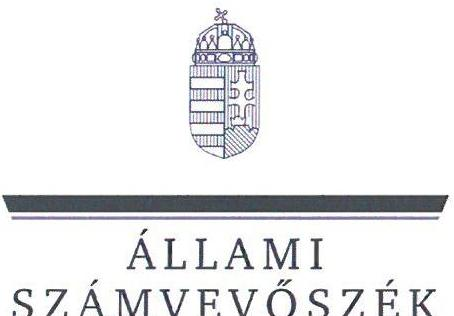
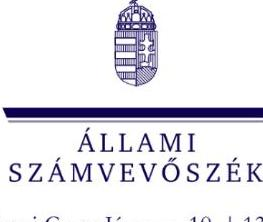

# JELENTÉS 

Az államháztartás központi alrendszerébe tartozó költségvetési szerv által teljesített dologi és felhalmozási célú kiadás szabályszerűségének rapid ellenőrzése
2025.

---

ÁLLAMI
SZÁMVEVÔSZÉK

# JELENTÉS 

Az államháztartás központi alrendszerébe tartozó költségvetési szerv által teljesített dologi és felhalmozási célú kiadás szabályszerűségének rapid ellenőrzése
2025.

---

# ELLENŐRZÉSI IGAZGATÓSÁG:

## ÁLLAMHÁZTARTÁS KÖZPONTI SZINTJÉT ELLENŐRZŐ IGAZGATÓSÁG

### ELLENŐRZÉSI IGAZGATÓ:

#### SINKÁNÉ DR. CSENDES ÁGNES igazgató

### ELLENŐRZÉSVEZETŐ:

Jelentéseink az interneten a www.asz.hu címen olvashatók.

PETŐ KRISZTINA ellenőrzésvezető

IKTATÓSZÁM: EL-3949-104/2025

TÉMASORSZÁM: -

ELLENŐRZÉS-AZONOSÍTÓ SZÁM: V102916

---

# TARTALOMJEGYZÉK 

AZ ELLENŐRZÉS ALAPADATAI ..... 5
MEGÁLLAPÍTÁSOK ÉS KÖVETKEZTETÉSEK. ..... 13
JAVASLATOK ..... 18
MELLÉKLETEK ..... 20
I. sz. melléklet: Értelmező szótár ..... 20
II. sz. melléklet: Ellenőrzési kritériumok ..... 21
FÜGGELÉK: ÉSZREVÉTELEK ..... 22
RÖVIDÍTÉSEK JEGYZÉKE ..... 25

---

.

---

# AZ ELLENŐRZÉS ALAPADATAI 

## AZ ELLENŐRZÉS CÉLJA

Az államháztartás központi alrendszerébe tartozó költségvetési szerv által teljesített dologi és felhalmozási célú kiadások egy-egy kiválasztott tételének szabályszerűségi szempontból történő értékelése.

## AZ ELLENŐRZÖTT IDŐSZAK

| SZ. | ELLENŐRZÖTT SZERVEZETEK | DOLOGI   KIADÁSOK   ESETÉREN | FELHALMOZÁSI   CÉLÚ KIADÁSOK   ESETÉREN |
| :-- | :-- | :--: | :--: |
| 1. | Ajkai Magyar Imre Kórház | 2024. augusztus 6. | 2024. május 30. |
| 2. | Balassagyarmati Dr. Kenessey Albert Kórház-Rendelőintézet | 2024. augusztus 6. | 2024. augusztus 15. |
| 3. | Budapesti Szent Margit Kórház | 2024. július 26. | 2024. szeptember 18. |
| 4. | Dombóvári Szent Lukács Kórház | 2024. szeptember 17. | 2024. április 30. |
| 5. | Dunaújvárosi Szent Pantaleon Kórház-Rendelőintézet | 2024. július 26. | 2024. június 25. |
| 6. | Gyöngyösi Bugát Pál Kórház | 2024. július 30. | 2024. április 29. |
| 7. | Heves Vármegyei Markhot Ferenc Oktatókórház és Rendelőintézet | 2024. szeptember 12. | 2024. március 27. |
| 8. | Jászberényi Szent Erzsébet Kórház | 2024. szeptember 4. | 2024. augusztus 16. |
| 9. | Nógrád Vármegyei Szent Lázár Kórház | 2024. szeptember 19. | 2024. augusztus 28. |
| 10. | Pápai Gróf Esterházy Kórház és Rendelőintézeti Szakrendelő | 2024. július 30. | 2024. június 28. |

## AZ ELLENŐRZÉS TÁRGYA

Az államháztartás központi alrendszerébe tartozó költségvetési szerv által teljesített, ellenőrzésre kiválasztott dologi és felhalmozási célú kiadás szabályszerű teljesítése, ezen belül a gazdálkodási jogkörök szabályszerű gyakorlása. Az ellenőrzés kiterjedt minden olyan körülményre és adatra, amely az ÁSZ ${ }^{1}$ jogszabályban meghatározott feladatainak teljesítéséhez, valamint a program végrehajtása folyamán felmerült újabb összefüggések feltárásához szükséges volt.

---

Az ellenőrzés során az ÁSZ

- az Ajkai Magyar Imre Kórház; a Budapesti Szent Margit Kórház; a Dombóvári Szent Lukács Kórház; a Gyöngyösi Bugát Pál Kórház; a Jászberényi Szent Erzsébet Kórház; a Nógrád Vármegyei Szent Lázár Kórház; a Pápai Gróf Esterházy Kórház és Rendelőintézeti Szakrendelő esetében a dologi kiadások körébe tartozó Szakmai tevékenységet segítő szolgáltatások; a Balassagyarmati Dr. Kenessey Albert Kórház-Rendelőintézet esetében a dologi kiadások körébe tartozó Árubeszerzés; a Dunaújvárosi Szent Pantaleon Kórház-Rendelőintézet esetében a dologi kiadások körébe tartozó Szakmai anyagok beszerzése; a Heves Vármegyei Markhot Ferenc Oktatókórház és Rendelőintézet esetében a dologi kiadások körébe tartozó Egyéb szolgáltatások;
- az Ajkai Magyar Imre Kórház; a Balassagyarmati Dr. Kenessey Albert Kórház-Rendelőintézet; a Budapesti Szent Margit Kórház; a Dombóvári Szent Lukács Kórház; a Dunaújvárosi Szent Pantaleon Kórház-Rendelőintézet; a Gyöngyösi Bugát Pál Kórház; a Jászberényi Szent Erzsébet Kórház; a Nógrád Vármegyei Szent Lázár Kórház; a Pápai Gróf Esterházy Kórház és Rendelőintézeti Szakrendelő esetében a felhalmozási célú kiadások körébe tartozó Egyéb tárgyi eszközök beszerzése, létesítése; a Heves Vármegyei Markhot Ferenc Oktatókórház és Rendelőintézet esetében a felhalmozási célú kiadások körébe tartozó Ingatlanok beszerzése, létesítése
rovatokon elszámolt kiadások egy-egy kiválasztott mintatételének szabályszerűségét értékelte.

# AZ ELLENŐRZÉS JOGALAPJA 

Az ellenőrzés jogszabályi alapját az ÁSZ tv. ${ }^{2} 1 . \int(3)$ bekezdés és az 5. § (6) bekezdés előírásai képezték.

## AZ ELLENŐRZÉS MÓDSZERE

Az ellenőrzést az ÁSZ az ellenőrzött időszakban hatályos jogszabályok, az ellenőrzés szakmai szabályai alapján, „Az állambázztatás központi alrendszerébe tartozó költségvetési szerv által teljesitett dologi kiadás szabályszerűségének rapid ellenörzése"és „Az állambázztartás központi alrendszerébe tartozó költségvetési szerv által teljesitett felhalmozzási célú kiadás szabályszerüségének rapid ellenörzése" című ellenőrzési programok (továbbiakban: ellenőrzési programok) kérdéseire adott válaszok kiértékelésével, az ellenőrzési programokban megjelölt adatforrások figyelembevételével folytatta le. A mintatételek ellenőrzési program szerinti értékelése során további szabálytalanságokat tárt fel az ÁSZ, ezért a szabálytalansághoz tartozó kritériumokkal bővült az ellenőrzés.

Az ellenőrzési kérdések megválaszolásához szükséges bizonyítékok megszerzése az ellenőrzött szervezetek által rendelkezésre bocsátott dokumentumokra és adatokra alapozva, továbbá megfigyelés, szemle (szemrevételezés), kérdésfelvetés (információkérés), valamint elemző eljárás útján történt. Az ellenőrzési bizonyítékként felhasználható adatforrások közé tartoztak egyrészt az ellenőrzéshez kért dokumentumok, adatforrások, másrészt adatforrás volt még minden - az ellenőrzés folyamán - feltárt, az ellenőrzés szempontjából információkat tartalmazó dokumentum.

Az ÁSZ az ellenőrzés során a kiválasztott mintatételek ellenőrzési programokban meghatározott szempontok szerinti szabályszerűségét értékelte, így a kötelezettségvállalás és a teljesítésigazolás gazdálkodási jogkörök tekintetében a jogkörgyakorlás szabályszerűségét, a pénzügyi ellenjegyzés és az utalványozás gazdálkodási jogkörök tekintetében ezek megtörténtét és az ellenőrzési kritériumoknak való megfelelőségét.

---

# AZ ELLENŐRZÖTT SZERVEZET 

Az ellenőrzés az Ajkai Magyar Imre Kórház, a Balassagyarmati Dr. Kenessey Albert KórházRendelőintézet, a Budapesti Szent Margit Kórház, a Dombóvári Szent Lukács Kórház, a Dunaújvárosi Szent Pantaleon Kórház-Rendelőintézet, a Gyöngyösi Bugát Pál Kórház, a Heves Vármegyei Markhot Ferenc Oktatókórház és Rendelőintézet, a Jászberényi Szent Erzsébet Kórház, a Nógrád Vármegyei Szent Lázár Kórház, valamint a Pápai Gróf Esterházy Kórház és Rendelőintézeti Szakrendelő elnevezésű szervezetekre, mint az államháztartás központi alrendszerébe tartozó költségvetési szervekre terjedt ki.

## AJKAI MAGYAR IMRE KÓRHÁz

Az Ajkai Kórház ${ }^{3}$ alaptevékenysége a járó- és fekvőbetegek diagnosztikus és terápiás szakorvosi ellátása, rehabilitációja és követéses gondozása, ennek keretében fekvőbetegek aktív és krónikus ellátása, rehabilitációja, járóbetegek gyógyító és rehabilitációs szakellátása és egynapos ellátása az egyén gyógykezelése, életveszély elhárítása, a megbetegedés következtében kialakult állapot javítása vagy a további állapotromlás megelőzése céljából. Alaptevékenységébe tartozik továbbá a gyógyszer-kiskereskedelem.

## AJKAI MAGYAR IMRE KÓRHÁZ FÖBB ADATAINAK BEMUTATÁSA

Alapításának éve:
Irányító szerve:
Középirányító szerve:

Gazdasági szervezettel való rendelkezés:

Illetékessége, múködési területe:
Általános képviseletét ellátó vezetője:
Vezetői kinevezés kezdete:
2023. évben teljesített bevételek összege:
2023. évben teljesített kiadások összege:

1972.
Belügyminisztérium
Országos Kórházi Főigazgatóság
gazdasági szervezettel nem rendelkezik, a gazdálkodási feladatokat a Veszprém Vármegyei Csolnoky Ferenc Kórház, mint irányító vármegyei intézmény látja el
a 2006. évi CXXXII. törvény ${ }^{4}$ alapján vezetett közhiteles kapacitásnyilvántartásban szereplő ellátási terület
főigazgató
2024.03.01.
$8085,4 \mathrm{M} \mathrm{Ft}$
$8016,7 \mathrm{M} \mathrm{Ft}$

---

# BALASSAGYARMATI DR. KENESSEY ALBERT KÓRHÁZ-RENDELŐINTÉZET

A Balassagyarmati Kórház ${ }^{5}$ alaptevékenysége a járó- és fekvőbeteg szakellátás. Alaptevékenységébe tartozik a beteg vizsgálati anyagainak feldolgozására irányuló egészségügyi tevékenységek, halottvizsgálattal és a halottakkal kapcsolatos orvosi eljárásokkal összefüggő tevékenységek, emberen végzett orvostudományi kutatások, továbbá a gyógyszer, gyógyászati termékek kiskereskedelme, valamint a gyógyászati segédeszközök és felszerelések kereskedelme.

|  BALASSAGYARMATI DR. KENESSEY ALBERT KÓRHÁZ-RENDELŐINTÉZET |   |
| --- | --- |
|  FÖBB ADATAINAK BEMUTATÁSA |   |
|  Alapításának éve: | 1979.  |
|  Irányító szerve: | Belügyminisztérium  |
|  Középirányító szerve: | Országos Kórházi Főigazgatóság  |
|  Gazdasági szervezettel való rendelkezés: | gazdasági szervezettel nem rendelkezik, a gazdálkodási feladatokat a Nógrád Vármegyei Szent Lázár Kórház, mint irányító vármegyei intézmény látja el  |
|  Illetékessége, múködési területe: | a 2006. évi CXXXII. törvény alapján vezetett közhiteles kapacitásnyilvántartásban szereplő ellátási terület  |
|  Általános képviseletét ellátó vezetője: | főigazgató  |
|  Vezetői kinevezés kezdete: | 2024.01.01.  |
|  2023. évben teljesített bevételek összege: | $9572,7 \mathrm{M} \mathrm{Ft}$  |
|  2023. évben teljesített kiadások összege: | $9347,5 \mathrm{M} \mathrm{Ft}$  |

## BUDAPESTI SZENT MARGIT KÓRHÁZ

A Szent Margit Kórház ${ }^{6}$ alaptevékenysége a járó- és fekvőbetegek diagnosztikus és terápiás szakorvosi ellátása, rehabilitációja és követéses gondozása. Alaptevékenységébe tartozik a gyógyszer és gyógyászati termék kiskereskedelme, az orvostudományi kutatások végzése, egészségügyi szakmai képzések és továbbképzések végzése.

|  BUDAPESTI SZENT MARGIT KÓRHÁZ FÖBB ADATAINAK BEMUTATÁSA |   |
| --- | --- |
|  Alapításának éve: | 2012.  |
|  Irányító szerve: | Belügyminisztérium  |
|  Középirányító szerve: | Országos Kórházi Főigazgatóság  |
|  Gazdasági szervezettel való rendelkezés: | gazdasági szervezettel nem rendelkezik, a gazdálkodási feladatokat az Észak-
budai Szent János Centrumkórház, mint irányító vármegyei intézmény látja el  |
|  Illetékessége, múködési területe: | a 2006. évi CXXXII. törvény alapján vezetett közhiteles kapacitás-
nyilvántartásban szereplő ellátási terület  |
|  Általános képviseletét ellátó vezetője: | főigazgató  |
|  Vezetői kinevezés kezdete: | 2024.07.13.  |
|  2023. évben teljesített bevételek összege: | $11966,0 \mathrm{M} \mathrm{Ft}$  |
|  2023. évben teljesített kiadások összege: | $11908,5 \mathrm{M} \mathrm{Ft}$  |

---

# Dombóvári SZENT LuKÁcs KórHÁz 

A Dombóvári Kórház ${ }^{7}$ alaptevékenysége az ellátási területén a járó- és fekvőbetegek diagnosztikus és terápiás szakorvosi ellátása, rehabilitációja és követéses gondozása. Alaptevékenységébe tartozik a gyógyszer és gyógyászati termék kiskereskedelme, orvostudományi kutatások végzése, egészségügyi szakmai képzések és továbbképzések végzése.

## DOMBOVÁrISZENT LUKÁCS KÓRHÁZ FÖBB ADATAINAK BEMUTATÁSA

Alapításának éve:
Irányító szerve:
Középirányító szerve:
Gazdasági szervezettel való rendelkezés:

Illetékessége, múködési területe:
Általános képviseletét ellátó vezetője:
Vezetői kinevezés kezdete:
2023. évben teljesített bevételek összege:
2023. évben teljesített kiadások összege:

2013.
Belügyminisztérium
Országos Kórházi Főigazgatóság
gazdasági szervezettel nem rendelkezik, a gazdálkodási feladatokat a Tolna Vármegyei Balassa János Kórház, mint irányító vármegyei intézmény látja el
a 2006. évi CXXXII. törvény alapján vezetett közhiteles kapacitásnyilvántartásban szereplő ellátási terület
főigazgató
2024.01.01.
$7380,7 \mathrm{M} \mathrm{Ft}$
$7261,9 \mathrm{M} \mathrm{Ft}$

## Dunaújvárosi Szent Pantaleon KórháZ-RendelöintÉzet

A Dunaújvárosi Kórház ${ }^{8}$ alaptevékenysége az ellátási területén a járó- és fekvőbetegek diagnosztikus és terápiás szakorvosi ellátása, rehabilitációja és követéses gondozása. Alaptevékenységébe tartozik a gyógyszer és gyógyászati termék kiskereskedelme, orvostudományi kutatások végzése, szakmai gyakorlati oktatás és felsőfokú szakképzés végzése.

## DUNAÚJVÁROSi SZENT PANTALEON KÓRHÁZ-RENDELÖINTÉZET FÖBB ADATAINAK BEMUTATÁSA

Alapításának éve:
Irányító szerve:
Középirányító szerve:
Gazdasági szervezettel való rendelkezés:
Illetékessége, múködési területe:
Általános képviseletét ellátó vezetője:
Vezetői kinevezés kezdete:
2023. évben teljesített bevételek összege:
2023. évben teljesített kiadások összege:

2011.
Belügyminisztérium
Országos Kórházi Főigazgatóság
gazdasági szervezettel rendelkezik
a 2006. évi CXXXII. törvény alapján vezetett közhiteles kapacitásnyilvántartásban szereplő ellátási terület
főigazgató
2024.07.15.
$15299,8 \mathrm{M} \mathrm{Ft}$
$15214,6 \mathrm{M} \mathrm{Ft}$

---

# GyÖNGYÖSI BugÁt PÁL KÖRHÁz 

A Gyöngyösi Kórház ${ }^{9}$ alaptevékenysége a járó- és fekvőbeteg szakellátás. Alaptevékenységébe tartozik a beteg vizsgálati anyagainak feldolgozására irányuló egészségügyi tevékenységek, halottvizsgálattal és a halottakkal kapcsolatos orvosi eljárásokkal összefüggő tevékenységek, emberen végzett orvostudományi kutatások, egészségügyi szakmai képzések és továbbképzések, továbbá a gyógyszer, gyógyászati termékek kiskereskedelme, valamint a gyógyászati segédeszközök és felszerelések kereskedelme.

## GYÖNGYÖSI BUGÁT PÁL KÖRHÁZ FÖBB ADATAINAK BEMUTATÁSA

Alapításának éve:
Irányító szerve:
Középirányító szerve:
Gazdasági szervezettel való rendelkezés:

Illetékessége, müködési területe:
Általános képviseletét ellátó vezetője:
Vezetői kinevezés kezdete:
2023. évben teljesített bevételek összege:
2023. évben teljesített kiadások összege:

2013.
Belügyminisztérium
Országos Kórházi Főigazgatóság
gazdasági szervezettel nem rendelkezik, a gazdálkodási feladatait a Heves Vármegyei Markhot Ferenc Kórház, mint irányító vármegyei intézmény látja el
a 2006. évi CXXXII. törvény alapján vezetett közhiteles kapacitásnyilvántartásban szereplő ellátási terület
főigazgató
2024.01.01.
$8072,9 \mathrm{MFt}$
$8064,6 \mathrm{M} \mathrm{Ft}$

## Heves Vármegyei Markhot Ferenc Oktatókórház és Rendelöintézet

A Markhot Ferenc Kórház ${ }^{10}$ alaptevékenysége a járó- és fekvőbeteg szakellátás. Alaptevékenységébe tartozik a beteg vizsgálati anyagainak feldolgozására irányuló egészségügyi tevékenységek, halottvizsgálattal és a halottakkal kapcsolatos orvosi eljárásokkal összefüggő tevékenységek, emberen végzett orvostudományi kutatások, egészségügyi szakmai képzések és továbbképzések, továbbá a gyógyszerek kiskereskedelme is. Feladata továbbá a védőnői ellátás keretében az egészségmegőrzés, tanácsadás, gondozás, betegségmegelőzésszűrés, felvilágosítás, egészségnevelés.

## HEVES VÁRMEGYEI MARKHOT FERENC OKTATÓKÖRHÁZ ÉS RENDELÖINTÉZET FÖBB ADATAINAK BEMUTATÁSA

Alapításának éve:
Irányító szerve:
Középirányító szerve:
Gazdasági szervezettel való rendelkezés:
Illetékessége, müködési területe:
Általános képviseletét ellátó vezetője:
Vezetői kinevezés kezdete:
2023. évben teljesített bevételek összege:
2023. évben teljesített kiadások összege:

2013.
Belügyminisztérium
Országos Kórházi Főigazgatóság
gazdasági szervezettel rendelkezik
a 2006. évi CXXXII. törvény alapján vezetett közhiteles kapacitásnyilvántartásban szereplő ellátási terület
főigazgató
2024.07.30.
$24447,1 \mathrm{M} \mathrm{Ft}$
$24099,5 \mathrm{M} \mathrm{Ft}$

---

# JÁsZBERÉNYI SZENT ERZSÉBET KÓRHÁZ 

A Jászberényi Kórház ${ }^{11}$ alaptevékenysége a járó- és fekvőbetegek diagnosztikus és terápiás szakorvosi ellátása, rehabilitációja és követéses gondozása. Alaptevékenységébe tartozik egészségüggyel kapcsolatos kutatások végzése, egészségügyi szakmai képzések végzése.

| JÁSZBERÉNYI SZENT ERZSÉBET KÓRHÁZ FÖBB ADATAINAK BEMUTATÁSA |  |
| :--: | :--: |
| Alapításának éve: | 2013. |
| Irányító szerve: | Belügyminisztérium |
| Középirányító szerve: | Országos Kórházi Főigazgatóság |
| Gazdasági szervezettel való rendelkezés: | a gazdasági szervezettel nem rendelkezik, a gazdálkodási feladatokat a Jász-Nagykun-Szolnok Vármegyei Hetényi Géza Kórház-Rendelőintézet, mint irányító vármegyei intézmény látja el |
| Illetékessége, múködési területe: | a 2006. évi CXXXII. törvény alapján vezetett közhiteles kapacitásnyilvántartásban szereplő ellátási terület |
| Általános képviseletét ellátó vezetője: | főigazgató |
| Vezetői kinevezés kezdete: | 2024.01.01. |
| 2023. évben teljesített bevételek összege: | $7850,8 \mathrm{M} \mathrm{Ft}$ |
| 2023. évben teljesített kiadások összege: | $7794,2 \mathrm{M} \mathrm{Ft}$ |

## NÓGRÁD VÁRMEGYEI SZENT LÁZÁR KÓRHÁZ

A Szent Lázár Kórház ${ }^{12}$ alaptevékenysége a járó- és fekvőbeteg szakellátás. Alaptevékenységébe tartozik a beteg vizsgálati anyagainak feldolgozására irányuló egészségügyi tevékenységek, halottvizsgálattal és a halottakkal kapcsolatos orvosi eljárásokkal összefüggő tevékenységek, emberen végzett orvostudományi kutatások, egészségügyi szakmai képzések és továbbképzések, továbbá a gyógyszer kiskereskedelem, valamint a gyógyászati segédeszközök és felszerelések kereskedelme. Feladata továbbá a védőnői ellátás keretében az egészségmegőrzés, tanácsadás, gondozás, betegségmegelőzés-szűrés, felvilágosítás, egészségnevelés.

## NÓGRÁD VÁRMEGYEI SZENT LÁZÁR KÓRHÁZ FÖBB ADATAINAK BEMUTATÁSA

| Alapításának éve: | 1870. |
| :-- | :-- |
| Irányító szerve: | Belügyminisztérium |
| Középirányító szerve: | Országos Kórházi Főigazgatóság |
| Gazdasági szervezettel való rendelkezés: | gazdasági szervezettel rendelkezik |
| Illetékessége, múködési területe: | a 2006. évi CXXXII. törvény alapján vezetett közhiteles kapacitás-   nyilvántartásban szereplő ellátási terület |
| Általános képviseletét ellátó vezetője: | főigazgató |
| Vezetői kinevezés kezdete: | 2024.07.22. |
| 2023. évben teljesített bevételek összege: | $20200,4 \mathrm{M} \mathrm{Ft}$ |
| 2023. évben teljesített kiadások összege: | $19250,6 \mathrm{M} \mathrm{Ft}$ |

---

# PÁPAI GRÓF ESTERHÁZY KÓRHÁZ ÉS RENDELŐINTÉZETI SZAKRENDELŐ 

A Pápai Kórház ${ }^{13}$ alaptevékenysége a járó- és fekvőbetegek diagnosztikus és terápiás szakorvosi ellátása. rehabilitációja és követéses gondozása. Alaptevékenységébe tartozik az orvostudományi kutatás és fejlesztés végzése.

## PÁPAI GRÓF ESTERHÁZY KÓRHÁZ ÉS RENDELŐINTÉZETI SZAKRENDELŐ FÖBB ADATAINAK BEMUTATÁSA

Alapításának éve:
Irányító szerve:
Középirányító szerve:

Gazdasági szervezettel való rendelkezés:

Illetékessége, múködési területe:
Általános képviseletét ellátó vezetője:
Vezetői kinevezés kezdete:
2023. évben teljesített bevételek összege:
2023. évben teljesített kiadások összege:

1990.
Belügyminisztérium
Országos Kórházi Főigazgatóság
gazdasági szervezettel nem rendelkezik, a gazdálkodási feladatokat a Veszprém Vármegyei Csolnoky Ferenc Kórház, mint irányító vármegyei intézmény látja el
a 2006. évi CXXXII. törvény alapján vezetett közhiteles kapacitásnyilvántartásban szereplő ellátási terület
főigazgató
2024.01.01.
$6372,9 \mathrm{M} \mathrm{Ft}$
$6371,7 \mathrm{M} \mathrm{Ft}$

---

# MEGÁLLAPÍTÁSOK ÉS KÖVETKEZTETÉSEK 

Az ellenőrzött 10 dologi kiadás teljesítése nyolc esetben az ellenőrzés keretében vizsgált jogszabályi előírásoknak megfelelt. Egy kiadásnál a teljesítésigazolás szabálytalan volt és a pénzügyi ellenjegyzés nem volt megfelelő. Egy kiadásnál a pénzügyi ellenjegyzés nem volt megfelelő. Két kiadás esetében nem folytattak le közbeszerzési eljárást.

Az Ajkai Kórháznál, a Balassagyarmati Kórháznál, a Szent Margit Kórháznál, a Dombóvári Kórháznál, a Dunaújvárosi Kórháznál, a Jászberényi Kórháznál, a Szent Lázár Kórháznál, valamint a Pápai Kórháznál az ellenőrzött mintatételek esetében a kötelezettségvállalás és a teljesítésigazolás, valamint a kiadás elszámolása az Áht. ${ }^{14}$, az Ávr. ${ }^{15}$ és az Áhsz. ${ }^{16}$ előírásai szerint szabályszerűen történt, a pénzügyi ellenjegyzés és az utalványozás megfelelő volt:

- Kötelezettséget az Áht.-ben és az Ávr.-ben foglaltakkal összhangban az arra jogosultsággal rendelkező személy vállalt.
- A kötelezettségvállalásra az Áht.-ben foglaltak szerint, a pénzügyi ellenjegyzés után került sor.
- A teljesítésigazoló az Ávr.-ben előírt írásbeli kijelöléssel rendelkezett.
- A teljesítésigazolás során az Ávr.-ben foglaltak szerint ellenőrizhető okmányok alapján ellenőrizték és igazolták a kiadás teljesítésének jogosságát, összegszerűségét, valamint az ellenszolgáltatás teljesítését.
- A teljesítésigazoló a teljesítést az Ávr.-ben foglaltakkal összhangban, az igazolás dátumának és a teljesítés tényére történő utalás megjelölésével, aláírásával igazolta.
- Az utalványozásra az Áht.-ben, valamint az Ávr.-ben foglaltakkal összhangban, a teljesítésigazolást és az érvényesítést követően került sor.
- A kiadás számviteli elszámolása a megfelelő rovaton történt az Áhsz.-ben előírtakkal összhangban.

A Gyöngyösi Kórháznál az ellenőrzött mintatétel esetében a kötelezettségvállalás, a teljesítésigazolás és a kiadás elszámolása az Áht., az Ávr. és az Áhsz. előírásai szerint szabályszerűen történt, az utalványozás megfelelő volt, azonban a pénzügyi ellenjegyzés nem volt megfelelő:

- Kötelezettséget az Áht.-ben és az Ávr.-ben foglaltakkal összhangban az arra jogosultsággal rendelkező személy vállalt.
- A kötelezettségvállalás dokumentuma (keretszerződés) az Ávr. 55. § (1) bekezdésében foglaltak ellenére nem tartalmazta a pénzügyi ellenjegyzés dátumát. A dátum hiányában nem lehetett megítélni, hogy a kötelezettségvállalásra az Áht. 37. § (1) bekezdésében foglalt előírás szerint a pénzügyi ellenjegyzés után került-e sor.
- A teljesítésigazoló az Ávr.-ben előírt írásbeli kijelöléssel rendelkezett.
- A teljesítésigazolás során az Ávr.-ben foglaltak szerint ellenőrizhető okmányok alapján ellenőrizték és igazolták a kiadás teljesítésének jogosságát, összegszerűségét, valamint az ellenszolgáltatás teljesítését.
- A teljesítésigazoló a teljesítést az Ávr.-ben foglaltakkal összhangban, az igazolás dátumának és a teljesítés tényére történő utalás megjelölésével, aláírásával igazolta.

---

- Az utalványozásra az Áht.-ben, valamint az Ávr.-ben foglaltakkal összhangban, a teljesítésigazolást és az érvényesítést követően került sor.
- A kiadás számviteli elszámolása a megfelelő rovaton történt az Áhsz.-ben előírtakkal összhangban.

A Markhot Ferenc Kórháznál az ellenőrzött mintatétel esetében a kötelezettségvállalás, valamint a kiadás elszámolása az Áht., az Ávr. és az Áhsz. előírásai szerint szabályszerűen történt, az utalványozás megfelelő volt, azonban a teljesítésigazolás nem volt szabályszerű, valamint a pénzügyi ellenjegyzés nem volt megfelelő:

- Kötelezettséget az Áht.-ben és az Ávr.-ben foglaltakkal összhangban az arra jogosultsággal rendelkező személy vállalt.
- A kötelezettségvállalás dokumentuma (szerződés) az Ávr. 55. § (1) bekezdésében foglaltak ellenére nem tartalmazta a pénzügyi ellenjegyzés dátumát. A dátum hiányában nem lehetett megítélni, hogy a kötelezettségvállalásra az Áht. 37. § (1) bekezdésében foglalt előírás szerint a pénzügyi ellenjegyzés után került-e sor. A Markhot Ferenc Kórház az ÁSZ tv. 29. § (2) bekezdés szerinti, a jelentéstervezet megállapításaira tett észrevételében arról tájékoztatta az ÁSZ-t, hogy intézkedett a pénzügyi ellenjegyzés dátumának minden dokumentumon történő feltüntetéséről, ezzel az ÁSZ megállapítása hasznosult.
- A teljesítésigazoló az Ávr.-ben előírt írásbeli kijelöléssel rendelkezett.
- A teljesítésigazolás során az Ávr.-ben foglaltak szerint ellenőrizhető okmányok alapján ellenőrizték és igazolták a kiadás teljesítésének jogosságát, összegszerűségét, valamint az ellenszolgáltatás teljesítését.
- A teljesítésigazoló az Ávr. 57. § (3) bekezdésében foglaltak ellenére nem tüntette fel az igazolás dátumát a teljesítés tényére történő utalás megjelölésével, így nem volt igazolt, hogy az utalványozásra az Áht. 38. § (1) bekezdésében foglaltakkal összhangban a teljesítés igazolását követően került sor.
- Az utalványozásra az Áht.-ben, valamint az Ávr.-ben foglaltakkal összhangban, az érvényesítést követően került sor.
- A kiadás számviteli elszámolása a megfelelő rovaton történt az Áhsz.-ben előírtakkal összhangban.

# Az ellenőrzés során feltárt szabálytalanság: 

- A Gyöngyösi Kórház 2011. július 1. napján közreműködői szerződést kötött egészségügyi szolgáltatások ellátására, amelyet többször módosított. Az időrendben harmadik számú módosítást 2021. november 18-án közbeszerzési eljárás lefolytatása nélkül kötötte meg határozatlan időre, ami az ÁSZ értékelése szerint felveti a Kbt. ${ }^{17}$ 4. § (1) bekezdésében és 111. § d) pontjában foglaltak megsértésének lehetőségét. A szerződés (keret)összeget nem tartalmazott. Az ÁSZ ezért a szolgáltatás becsült értékét a harmadik módosítás időpontjától, 2021. november 18-tól a szerződésre teljesített kifizetések alapján határozta meg. A Közbeszerzési Hatóság honlapján közzétett, 2021. január 1-jétől irányadó közbeszerzési értékhatárok alapján a 707377868 Ft eléri és meghaladja az uniós, a Kbt. 3. mellékletében szereplő szociális és egyéb szolgáltatás esetében érvényes a 238920000 Ft értékhatárt.
- A Szent Margit Kórház 2020. július 31. napján közreműködői szerződést kötött egészségügyi szolgáltatások ellátására közbeszerzési eljárás lefolytatása nélkül, határozatlan időre, ami az ÁSZ értékelése szerint felveti a Kbt. 4. § (1) bekezdésében és 111. § d) pontjában foglaltak

---

megsértésének lehetőségét. A szerződés (keret)összeget nem tartalmazott. Az ÁSZ ezért a szolgáltatás becsült értékét a szerződésre teljesített kifizetések alapján határozta meg. A Közbeszerzési Hatóság honlapján közzétett, 2020. január 1-jétől irányadó közbeszerzési értékhatárok alapján a 997270448 Ft eléri és meghaladja az uniós, a Kbt. 3. mellékletében szereplő szociális és egyéb szolgáltatás esetében érvényes 238920000 Ft értékhatárt.

- Az Ajkai Kórház a kötelezettségvállaláshoz kapcsolódóan az Ávr. 52/A. § (7) bekezdésben előírtak ellenére nem rendelkezett az irányító jogkört gyakorló egészségügyi intézmény előzetes jóváhagyását igazoló dokumentummal.
- A Dombóvári Kórház és a Markhot Ferenc Kórház az Ávr. 52/A. § (11) bekezdésben előírtak ellenére nem rendelkezett a kötelezettségvállalás jóváhagyásáról szóló, az egészségügyi szolgáltatás irányításáért felelős szervet irányító miniszter döntésével.

Az ellenőrzött 10 felhalmozási célú kiadás teljesítése hét esetben az ellenőrzés keretében vizsgált jogszabályi előírásoknak megfelelt. Egy kiadás esetében a kötelezettségvállalás nem volt szabályszerű és a pénzügyi ellenjegyzés nem volt megfelelő. Két kiadásnál a pénzügyi ellenjegyzés nem volt megfelelő.

A Balassagyarmati Kórháznál, a Szent Margit Kórháznál, a Dunaújvárosi Kórháznál, a Gyöngyösi Kórháznál, a Jászberényi Kórháznál, a Szent Lázár Kórháznál és a Pápai Kórháznál az ellenőrzött mintatételek esetében a kötelezettségvállalás és a teljesítésigazolás, valamint a kiadás elszámolása az Áht., az Ávr. és az Áhsz. előírásai szerint szabályszerűen történt, a pénzügyi ellenjegyzés és az utalványozás megfelelő volt:

- Kötelezettséget az Áht.-ben és az Ávr.-ben foglaltakkal összhangban az arra jogosultsággal rendelkező személy vállalt.
- A kötelezettségvállalásra az Áht.-ben foglaltak szerint, a pénzügyi ellenjegyzés után került sor.
- A teljesítésigazoló az Ávr.-ben előírt írásbeli kijelöléssel rendelkezett.
- A teljesítésigazolás során az Ávr.-ben foglaltak szerint ellenőrizhető okmányok alapján ellenőrizték és igazolták a kiadás teljesítésének jogosságát, összegszerűségét, valamint az ellenszolgáltatás teljesítését.
- A teljesítésigazoló a teljesítést az Ávr.-ben foglaltakkal összhangban, az igazolás dátumának és a teljesítés tényére történő utalás megjelölésével, aláírásával igazolta.
- Az utalványozásra az Áht.-ben, valamint az Ávr.-ben foglaltakkal összhangban, a teljesítésigazolást és az érvényesítést követően került sor.
- A kiadás számviteli elszámolása a megfelelő rovaton történt az Áhsz.-ben előírtakkal összhangban.

Az Ajkai Kórháznál az ellenőrzött mintatétel esetében a teljesítésigazolás és a kiadás elszámolása az Áht., az Ávr. és az Áhsz. előírásai szerint szabályszerűen történt, az utalványozás megfelelő volt, azonban a kötelezettségvállalás nem volt szabályszerű és a pénzügyi ellenjegyzés nem volt megfelelő:

- Kötelezettséget az Áht.-ben és az Ávr.-ben foglaltakkal összhangban az arra jogosultsággal rendelkező személy vállalt.

---

- Kötelezettségvállalásra az Áht. 37. § (1) bekezdésében foglaltak ellenére nem a 2024. április 4ei pénzügyi ellenjegyzés után került sor, hanem pénzügyi ellenjegyzéshez képest 10 nappal korábban, 2024. március 25-én.
- A teljesítésigazoló az Ávr.-ben előírt írásbeli kijelöléssel rendelkezett.
- A teljesítésigazolás során az Ávr.-ben foglaltak szerint ellenőrizhető okmányok alapján ellenőrizték és igazolták a kiadás teljesítésének jogosságát, összegszerűségét, valamint az ellenszolgáltatás teljesítését.
- A teljesítésigazoló a teljesítést az Ávr.-ben foglaltakkal összhangban, az igazolás dátumának és a teljesítés tényére történő utalás megjelölésével, aláírásával igazolta.
- Az utalványozásra az Áht.-ben, valamint az Ávr.-ben foglaltakkal összhangban, a teljesítésigazolást és az érvényesítést követően került sor.
- A kiadás számviteli elszámolása a megfelelő rovaton történt az Áhsz.-ben előírtakkal összhangban.

A Dombóvári Kórháznál az ellenőrzött mintatétel esetében a kötelezettségvállalás és a teljesítésigazolás, valamint a kiadás elszámolása az Áht., az Ávr. és az Áhsz. előírásai szerint szabályszerűen történt, az utalványozás megfelelő volt, azonban a pénzügyi ellenjegyzés nem volt megfelelő:

- Kötelezettséget az Áht.-ben és az Ávr.-ben foglaltakkal összhangban az arra jogosultsággal rendelkező személy vállalt.
- A kötelezettségvállalás dokumentuma (megrendelés) az Ávr. 50. § (1) bekezdés d) pontban és az Ávr. 55. § (1) bekezdésben foglaltak ellenére nem tartalmazta a pénzügyi ellenjegyzés tényét.
- A teljesítésigazoló az Ávr.-ben előírt írásbeli kijelöléssel rendelkezett.
- A teljesítésigazolás során az Ávr.-ben foglaltak szerint ellenőrizhető okmányok alapján ellenőrizték és igazolták a kiadás teljesítésének jogosságát, összegszerűségét, valamint az ellenszolgáltatás teljesítését.
- A teljesítésigazoló a teljesítést az Ávr.-ben foglaltakkal összhangban, az igazolás dátumának és a teljesítés tényére történő utalás megjelölésével, aláírásával igazolta.
- Az utalványozásra az Áht.-ben, valamint az Ávr.-ben foglaltakkal összhangban, az érvényesítést követően került sor.
- A kiadás számviteli elszámolása a megfelelő rovaton történt az Áhsz.-ben előírtakkal összhangban.

A Markhot Ferenc Kórháznál az ellenőrzött mintatétel esetében a kötelezettségvállalás és a teljesítésigazolás, valamint a kiadás elszámolása az Áht., az Ávr. és az Áhsz. előírásai szerint szabályszerűen történt, az utalványozás megfelelő volt, azonban a pénzügyi ellenjegyzés nem volt megfelelő:

- Kötelezettséget az Áht.-ben és az Ávr.-ben foglaltakkal összhangban az arra jogosultsággal rendelkező személy vállalt.
- A kötelezettségvállalás dokumentuma (szerződés) az Ávr. 55. § (1) bekezdésében foglaltak ellenére nem tartalmazta a pénzügyi ellenjegyzés dátumát. A dátum hiányában nem lehetett megítélni, hogy a kötelezettségvállalásra az Áht. 37. § (1) bekezdésében foglalt előírás szerint a pénzügyi ellenjegyzés után került-e sor.
- A teljesítésigazoló az Ávr.-ben előírt írásbeli kijelöléssel rendelkezett.

---

- A teljesítésigazolás során az Ávr.-ben foglaltak szerint ellenőrizhető okmányok alapján ellenőrizték és igazolták a kiadás teljesítésének jogosságát, összegszerűségét, valamint az ellenszolgáltatás teljesítését.
- A teljesítésigazoló a teljesítést az Ávr.-ben foglaltakkal összhangban, az igazolás dátumának és a teljesítés tényére történő utalás megjelölésével, aláírásával igazolta.
- Az utalványozásra az Áht.-ben, valamint az Ávr.-ben foglaltakkal összhangban, az érvényesítést követően került sor.
- A kiadás számviteli elszámolása a megfelelő rovaton történt az Áhsz.-ben előírtakkal összhangban.

---

# JAVASLATOK 

Az ÁSZ tv. 33. § (1) bekezdésében foglaltak értelmében az ellenőrzött szervezet vezetője köteles a jelentésben foglalt megállapításokhoz kapcsolódó intézkedési tervet összeállítani és azt a jelentés kézhezvételétől számított 30 napon belül az ÁSZ részére megküldeni. Amennyiben az ellenőrzött szervezet vezetője nem küldi meg határidőben az intézkedési tervet, vagy továbbra sem elfogadható intézkedési tervet küld, az Állami Számvevőszék elnöke az ÁSZ tv. 33. § (3) bekezdése a) és b) pontjaiban foglaltakat érvényesítheti.

## AJKAI MAGYAR IMRE KÓRHÁZ FŐIGAZGATÓJÁNAK

1. Kezdeményezzen a Bkr. ${ }^{18}$ 31. § (6) bekezdése alapján soron kívüli belső ellenőrzést a jelen ellenőrzés során feltárt szabálytalanságok kialakulása okainak feltárása, illetve a szabálytalanságok megszüntetése érdekében.
2. A Bkr. 3. § c) pontjában foglaltak alapján, valamint az 1. számú javaslat szerinti belső ellenőrzés megállapításait és javaslatait is figyelembe véve tegyen intézkedéseket azon kontrolltevékenységek kiépítésére és/vagy megfelelő müködtetésére, amelyek megelőzik a jelentésben leírt szabálytalanságok ismételt előfordulását.

## BUDAPESTI SZENT MARGIT KÓRHÁZ FŐIGAZGATÓJÁNAK

1. Kezdeményezzen a Bkr. 31. § (6) bekezdése alapján soron kívüli belső ellenőrzést a jelen ellenőrzés során feltárt szabálytalanság kialakulása okainak feltárása és a közbeszerzés elmulasztásával kapcsolatos kockázati tényezők feltárása, illetve a szabálytalanság megszüntetése érdekében.
2. A Bkr. 3. § c) pontjában foglaltak alapján, valamint az 1. számú javaslat szerinti belső ellenőrzés megállapításait és javaslatait is figyelembe véve tegyen intézkedéseket azon kontrolltevékenységek kiépítésére és/vagy megfelelő müködtetésére, amelyek megelőzik a jelentésben leírt szabálytalanság ismételt előfordulását.

---

# DOMBÓVÁRI SZENT LUKÁCS KÓRHÁZ FŐIGAZGATÓJÁNAK 

1. Kezdeményezzen a Bkr. 31. § (6) bekezdése alapján soron kívüli belső ellenőrzést a jelen ellenőrzés során feltárt szabálytalanságok kialakulása okainak feltárása, illetve a szabálytalanságok megszüntetése érdekében.
2. A Bkr. 3. § c) pontjában foglaltak alapján, valamint az 1. számú javaslat szerinti belső ellenőrzés megállapításait és javaslatait is figyelembe véve tegyen intézkedéseket azon kontrolltevékenységek kiépítésére és/vagy megfelelő müködtetésére, amelyek megelőzik a jelentésben leírt szabálytalanságok ismételt előfordulását.

## GYÖNGYÖSI BUGÁT PÁL KÓRHÁZ FŐIGAZGATÓJÁNAK

1. Kezdeményezzen a Bkr. 31. § (6) bekezdése alapján soron kívüli belső ellenőrzést a jelen ellenőrzés során feltárt szabálytalanságok kialakulása okainak feltárása és a közbeszerzés elmulasztásával kapcsolatos kockázati tényezők feltárása, illetve a szabálytalanságok megszüntetése érdekében.
2. A Bkr. 3. § c) pontjában foglaltak alapján, valamint az 1. számú javaslat szerinti belső ellenőrzés megállapításait és javaslatait is figyelembe véve tegyen intézkedéseket azon kontrolltevékenységek kiépítésére és/vagy megfelelő müködtetésére, amelyek megelőzik a jelentésben leírt szabálytalanságok ismételt előfordulását.

## HEVES VÁRMEGYEI MARKHOT FERENC OKTATÓKÓRHÁZ ÉS RENDELŐINTÉZET FŐIGAZGATÓJÁNAK

1. Kezdeményezzen a Bkr. 31. § (6) bekezdése alapján soron kívüli belső ellenőrzést a jelen ellenőrzés során feltárt szabálytalanságok kialakulása okainak feltárása, illetve a szabálytalanságok megszüntetése érdekében.
2. A Bkr. 3. § c) pontjában foglaltak alapján, valamint az 1. számú javaslat szerinti belső ellenőrzés megállapításait és javaslatait is figyelembe véve tegyen intézkedéseket azon kontrolltevékenységek kiépítésére és/vagy megfelelő müködtetésére, amelyek megelőzik a jelentésben leírt szabálytalanságok ismételt előfordulását.

---

# MELLÉKLETEK 

## I. SZ. MELLÉKLET: ÉRTELMEZŐ SZÓTÁR

kötelezettségvállalás
pénzügyi ellenjegyzés
teljesítésigazolás
utalványozás

A költségvetési szerv által a kiadási előirányzatok és - ha jogszabály lehetővé teszi - a kijelölt lebonyolító szerv számára a Kormány rendeletében meghatározottak szerinti rendelkezésre bocsátott összeg terhére fizetési kötelezettség vállalásáról szóló - így különösen a foglalkoztatásra irányuló jogviszony létesítésére, szerződés megkötésére, költségvetési támogatás biztosítására irányuló - szabályszerűen megtett jognyilatkozat.
Forrás: Áht. 1. § 15. pont
Kötelezettséget vállalni a Kormány rendeletében foglalt kivételekkel csak pénzügyi ellenjegyzés után, a pénzügyi teljesítés esedékességét megelőzően, írásban lehet. A pénzügyi ellenjegyzőnek a Kormány rendeletében foglalt kivételekkel meg kell győződnie arról, hogy a tervezett kifizetési időpontokban a pénzügyi fedezet biztosított, a kötelezettségvállalás nem sérti a gazdálkodásra vonatkozó szabályokat. A pénzügyi ellenjegyzést a kötelezettségvállalás dokumentumán a pénzügyi ellenjegyzés dátumának és a pénzügyi ellenjegyzés tényére történő utalás megjelölésével, az arra jogosult személy aláírásával kell igazolni.
Forrás: Áht. 37. § (1) bekezdés, Ávr. 55. § (1) bekezdés
A teljesítés igazolása során ellenőrizhető okmányok alapján ellenőrizni és igazolni kell a kiadások teljesítésének jogosságát, összegszerűségét, ellenszolgáltatást is magában foglaló kötelezettségvállalás esetében - ha a kifizetés vagy annak egy része az ellenszolgáltatás teljesítését követően esedékes - annak teljesítését. A teljesítést az igazolás dátumának és a teljesítés tényére történő utalás megjelölésével, az arra jogosult személy aláírásával kell igazolni.
Forrás: Ávr. 57. § (1) és (3) bekezdések
A bevételi előirányzatok javára bevételt elszámolni és a kiadási előirányzatok terhére kifizetést elrendelni - a Kormány rendeletében meghatározott kivételekkel utalványozás alapján lehet. A kiadási előirányzatok terhére történő utalványozásra a Kormány rendeletében meghatározott kivételekkel - a teljesítés igazolását, és az annak alapján végrehajtott érvényesítést követően kerülhet sor.
Forrás: Áht. 38. § (1) bekezdés

---

# II. SZ. MELLÉKLET: ELLENŐRZÉSI KRITÉRIUMOK 

## ELLENŐRZÉSI KRITÉRIUMOK

Az államháztartás központi alrendszerébe tartozó költségvetési szerv által teljesített dologi célú kiadás szabályszerűségének rapid ellenőrzéséről

Kötelezettségvállalás

Pénzügyi ellenjegyzés
Teljesítésigazolás

Utalványozás

Kiadások elszámolása
Közbeszerzési eljárás lefolytatása
Kötelezettségvállalás előzetes jóváhagyása

Áht. 36. $\$ (7), 37 . \S$ (1) bekezdések
Ávr. 50. $\$ (1) bekezdés d) pont, 52. $\$ (1),(9), 53 . \S(1), 60 . \S$
(3) bekezdések
belső szabályzat
Áht. 37. $\$ (1) bekezdések, Ávr. 55. $\$ (1),$ (4) bekezdések
Áht. 38. $\$ (1), (2) bekezdések
Ávr. 57. $\$ (1),(3)-(5), 60 . \S$ (3) bekezdések
Áht. 38. $\$ (1) bekezdés
Ávr. 59. $\$ (1b),$ (2) bekezdések, (3) bekezdés g) pont, (4) bekezdés

Áhsz. 40. $\$ (1) bekezdés, 15. melléklet I. pont
Kbt. 4. $\$ (1) bekezdés, 15. $\$ (1) bekezdés b) pont, 17. $\$ (1) bekezdés b) pont, 111. § d) pont
Ávr. 52/A. $\$ (7) bekezdés, 52/A. $\$ (11) bekezdés
Az államháztartás központi alrendszerébe tartozó költségvetési szerv által teljesített felhalmozási célú kiadás szabályszerűségének rapid ellenőrzéséről

Kötelezettségvállalás

Pénzügyi ellenjegyzés
Teljesítésigazolás

Utalványozás

Kiadások elszámolása
Kötelezettségvállalás előzetes jóváhagyása

Áht. 36. $\$ (7), 37 . \S$ (1) bekezdések
Ávr. 50. $\$ (1) bekezdés d) pont, 52. $\$ (1),(9), 53 . \S(1), 60 . \S$
(3) bekezdések
belső szabályzat
Áht. 37. $\$ (1) bekezdések, Ávr. 55. $\$ (1),$ (4) bekezdések
Áht. 38. $\$ (1), (2) bekezdések
Ávr. 57. $\$ (1),(3)-(5), 60 . \S$ (3) bekezdések
Áht. 38. $\$ (1) bekezdés
Ávr. 59. § (1b), (2) bekezdések, (3) bekezdés g) pont, (4) bekezdés

Áhsz. 40. § (1) bekezdés, 15. melléklet I. pont
Ávr. 52/A. § (7) bekezdés, 52/A. § (11) bekezdés

---

# FÜGGELÉK: ÉSZREVÉTELEK 

A jelentéstervezetet a Számvevőszék 15 napos észrevételezésre megküldte az ellenőrzött szervezet vezetőjének az ÁSZ tv. 29. §* (1) bekezdése előirásának megfelelően.

Az Ajkai Magyar Imre Kórház, a Balassagyarmati Dr. Kenessey Albert KórházRendelőintézet, a Budapesti Szent Margit Kórház, a Dombóvári Szent Lukács Kórház, a Dunaújvárosi Szent Pantaleon Kórház-Rendelőintézet, a Jászberényi Szent Erzsébet Kórház, a Nógrád Vármegyei Szent Lázár Kórház, a Pápai Gróf Esterházy Kórház és Rendelőintézeti Szakrendelő föigazgatói a jelentéstervezet megállapításaira észrevételt nem tettek.
A jelentéstervezet megállapításaira a Gyöngyösi Bugát Pál Kórház föigazgatója és a Heves Vármegyei Markhot Ferenc Oktatókórház és Rendelőintézet föigazgatója észrevételt tett. Az ÁSZ tv. 29. § (3) bekezdésével összhangban az Állami Számvevőszék a Függelékben feltünteti a megállapításokkal kapcsolatban tett, el nem fogadott észrevételeket, és megindokolja, hogy azokat miért nem fogadta el.
A Gyöngyösi Bugát Pál Kórház föigazgatójának észrevétele: „Meg kell állapítanunk, hogy a hivatkozott 3. számú módosítás semmifajta pénzügyi változást nem tartalmazott, mindösszesen csak az adatszolgáltatási kötelezettségek pontosítását határozta meg. Így nem értelmezhető az, hogy miért ezen időponttól merül fel annak a lehetősége, hogy a közbeszerzési értékhatár elérése miatt a Gyöngyösi Bugát Pál Kórház jogtalanul mellőzte a közbeszerzés lefolytatását.
Megjegyzendő, hogy 2023-ban az ismételt módosítás már tartalmazza azt a kitételt, hogy amennyiben központi közbeszerzési eljárás indul, abban az esetben a Felek közötti szerződés megszünik.
A Gyöngyösi Bugát Pál Kórház jogutódlással vette át ezt a Közremüködői Szerződést, így a szerződés létrejöttének konkrét körülményeivel nincs tisztában, így az sem nyilvánvaló, hogy akár már 2011-ben szükséges lett volna-e lefolytatni közbeszerzési eljárást.
Álláspontunk szerint az Intézményünk ezen szerződés egészségügyi feladatok ellátási érdekeinek miatti fenntartásával a közbeszerzési törvényt nem sértette meg.
A 2024.11.04-én kelt BPK/1642-3/2024. iktatószámú levelünkben nyilatkoztunk arról, hogy a laboratóriumi szolgáltatások közbeszerzési eljárásának meginditását kezdeményezte

[^0]
[^0]:    * 29. § (1) Az Állami Számvevőszék az ellenőrzési megállapításait megküldi az ellenőrzött szervezet vezetőjének vagy az általa megbízott személynek, és annak, akinek személyes felelősségét állapította meg.
    (2) Az ellenőrzött szervezet vezetője és a felelősként megjelölt személy az ellenőrzés megállapításaira tizenöt napon belül írásban észrevételt tehet.
    (3) Az Állami Számvevőszék az észrevételre a beérkezésétől számított harminc napon belül írásban válaszol. A figyelembe nem vett észrevételeket köteles a jelentésben feltüntetni, és megindokolni, hogy azokat miért nem fogadta el.

---

intézményünk az irányító Heves Vármegyei Markhot Ferenc Kórház felé (BPK/526-6/223 levelünk mellékelve). A közbeszerzési eljárás előkészitése azóta is folyamatban van."
Az észrevétellel érintett megállapítás: „A Gyöngyösi Kórház 2011. július 1. napján közremüködői szerződést kötött egészségügyi szolgáltatások ellátására, amelyet többször módosított. Az időrendben harmadik számú módosítást 2021. november 18-án közbeszerzési eljárás lefolytatása nélkül kötötte meg határozatlan időre, ami az ÁSZ értékelése szerint felveti a Kbt. 4. § (1) bekezdésében és 111. § d) pontjában foglaltak megsértésének lehetőségét. A szerződés (keret)összeget nem tartalmazott. Az ÁSZ ezért a szolgáltatás becsült értékét a harmadik módosítás időpontjától, 2021. november 18-tól a szerződésre teljesített kifizetések alapján határozta meg. A Közbeszerzési Hatóság honlapján közzétett, 2021. január 1-jétől irányadó közbeszerzési értékhatárok alapján a 707377868 Ft eléri és meghaladja az uniós, a Kbt. 3. mellékletében szereplő szociális és egyéb szolgáltatás esetében érvényes a 238920000 Ft értékhatárt. "
El nem fogadás indoka: Az észrevételükben a közbeszerzési eljárás mellőzésének tényét nem vitatták. A hivatkozott egészségügyi ellátási érdek miatti fenntartás önmagában nem ad kellő jogalapot a közbeszerzési szabályok be nem tartására. A kérdéses közbeszerzés mellőzésére jogszabály nem ad felhatalmazást.
A közremüködői szerződés 3. számú módosítását 2021. november 18-án kötötte meg a Gyöngyösi Bugát Pál Kórház (továbbiakban: Kórház), amely valóban nem tartalmazott pénzügyi változást, azonban a Polgári Törvénykönyvről szóló 2013. évi V. törvény 6:191. § (3) bekezdés alapján a szerződés módosítására a szerződés megkötésére vonatkozó rendelkezéseket kell megfelelően alkalmazni. Ennek értelmében a szerződés közös megegyezéssel való módosítása nem más, mint a szerződés elemét érintő újabb szerződéskötés. Ennek megfelelően a 3. számú módosítással újabb szerződéskötés jött létre, amelyet megelőzően vizsgálni kellett volna a közbeszerzés eljárás lefolytatásának szükségességét. A közbeszerzésekről szóló 2015. évi CXLIII. törvény (továbbiakban: Kbt.) 152. § (2) bekezdés b) pontja kimondja, hogy a Közbeszerzési Döntőbizottság hivatalból való eljárását a közbeszerzési eljárás mellőzésével történt beszerzés esetén a szerződés megkötésének időpontjától, vagy a szerződés teljesítésének bármelyik fél által történt megkezdésétől számított legfeljebb öt éven belül kezdeményezheti. Ezért az ÁSZ az 5 éven belül történt szerződésmódosításoknál vizsgálta a Kbt. megsértésének lehetőségét.
A közremüködői szerződés 2023-as módosítása valóban tartalmazza, hogy megszünik a szerződés, amennyiben a központi közbeszerzési eljárás elindul, azonban ez a tény nem befolyásolja a megállapítást, amely szerint a 3. számú módosítást megelőzően közbeszerzési eljárás lefolytatása volt indokolt.
Az ellenőrzés rendelkezésére bocsátott iratok alapján a Heves Vármegyei Markhot Ferenc Kórház, mint irányító vármegyei intézmény a laboratóriumi szolgáltatás, közremüködői szerződés tárgyú, 2022. április 26-án kelt levelében már felhívta a figyelmét a Kórháznak, hogy ,,a szerződés értéke, a módosítás értéke önmagában is meghaladja a közbeszerzési értékhatárt. E körben - figyelemmel arra, hogy az eredeti szerződés sem közbeszerzési eljárásban került megkötésre - javasolt a közbeszerzési törvény betartása és szükségszerüen közbeszerzési eljárást előkészíteni a beszerzés tárgyában."

---

A Heves Vármegyei Markhot Ferenc Oktatókórház és Rendelőintézet föigazgatójának észrevétele: „Intézményünknél a pénzügyi ellenjegyzés minden esetben megelőzi a kötelezettségvállalást. A pénzügyi ellenjegyzés dátumának minden dokumentumon történő feltüntetéséről intézkedtem."

Az észrevétellel érintett megállapítás: „A kötelezettségvállalás dokumentuma (szerződés) az Ávr. 55. § (1) bekezdésében foglaltak ellenére nem tartalmazta a pénzügyi ellenjegyzés dátumát. A dátum hiányában nem lehetett megítélni, hogy a kötelezettségvállalásra az Áht. 37. § (1) bekezdésében foglalt előirás szerint a pénzügyi ellenjegyzés után került-e sor."

El nem fogadás indoka: „Az észrevétel nem vitatta, hogy a kötelezettségvállalás dokumentuma (szerződés) az államháztartásról szóló törvény végrehajtásáról szóló 368/2011. (XII. 31.) Korm. rendelet (továbbiakban: Ávr.) 50. § (1) bekezdés d) pontjában és az Ávr. 55. § (1) bekezdésében elöírtak ellenére nem tartalmazta a pénzügyi ellenjegyzés dátumát."

A Heves Vármegyei Markhot Ferenc Oktatókórház és Rendelőintézet föigazgatójának észrevétele: „A teljesítés igazolása minden esetben megtörténik a számla kézjeggyel való ellátásával egyidejüleg a számla szkennelt példányán történő digitális aláirással is, mely tartalmazza az aláírás dátumát. A pénzügyi rendszerben a számla képe bármikor visszaellenőrizhető. A teljesítés igazolása minden esetben megelőzi az utalványozás dátumát, mivel a KPER rendszer kizárólag teljesités igazolást követően engedi az érvényesitést, illetve ezt követően az utalványozást, a szigorú sorrendet betartva."

Az észrevétellel érintett megállapítás: „A teljesítésigazoló az Ávr. 57. § (3) bekezdésében foglaltak ellenére nem tüntette fel az igazolás dátumát a teljesítés tényére történő utalás megjelölésével, így nem volt igazolt, hogy az utalványozásra az Áht. 38. § (1) bekezdésében foglaltakkal összhangban a teljesítés igazolását követően került sor."

El nem fogadás indoka: „Az ellenőrzés részére átadott számla nem tartalmazza a teljesítésigazolás dátumát és a teljesítés tényére történő utalást. Az ellenőrzés részére megküldött nyilatkozat szerint "A számlamelléket alapján kiállított számlát a teljesítés igazoló a számla jobb alsó részén aláírásával igazolja.", azonban a számla az aláíráson kívül nem tartalmazza a teljesítésigazolás dátumát és a teljesítés tényére történő utalást. Az észrevételben hivatkozott számla szkennelt példánya nem került megküldésre az ellenőrzés részére, így továbbra sem értékelhető szabályszerűnek a teljesítésigazolás a dologi kiadás tekintetében."

---

# RÖVIDÍTÉSEK JEGYZÉKE 

${ }^{1}$ ÁSZ
${ }^{2}$ ÁSZ tv.
${ }^{3}$ Ajkai Kórház
${ }^{4}$ 2006. évi CXXXII. tv.
${ }^{5}$ Balassagyarmati Kórház
${ }^{6}$ Szent Margit Kórház
${ }^{7}$ Dombóvári Kórház
${ }^{8}$ Dunaújvárosi Kórház
${ }^{9}$ Gyöngyösi Kórház
${ }^{10}$ Markhot Ferenc Kórház
${ }^{11}$ Jászberényi Kórház
${ }^{12}$ Szent Lázár Kórház
${ }^{13}$ Pápai Kórház
${ }^{14}$ Áht.
${ }^{15}$ Ávr.
${ }^{16}$ Áhsz.
${ }^{17}$ Kbt.
${ }^{18}$ Bkr.

Állami Számvevőszék
2011. évi LXVI. törvény az Állami Számvevőszékről

Ajkai Magyar Imre Kórház
2006. évi CXXXII. törvény az egészségügyi ellátórendszer fejlesztéséről

Balassagyarmati Dr. Kenessey Albert Kórház-Rendelőintézet
Budapesti Szent Margit Kórház
Dombóvári Szent Lukács Kórház
Dunaújvárosi Szent Pantaleon Kórház-Rendelőintézet
Gyöngyösi Bugát Pál Kórház
Heves Vármegyei Markhot Ferenc Oktatókórház és Rendelőintézet
Jászberényi Szent Erzsébet Kórház
Nógrád Vármegyei Szent Lázár Kórház
Pápai Gróf Esterházy Kórház és Rendelőintézeti Szakrendelő
2011. évi CXCV. törvény az államháztartásról

368/2011. (XII. 31.) Korm. rendelet az államháztartásról szóló törvény végrehajtásáról
4/2013. (I. 11.) Korm. rendelet az államháztartás számviteléről
2015. évi CXLIII. törvény a közbeszerzésekről

370/2011. (XII. 31.) Korm. rendelet a költségvetési szervek belső kontrollrendszeréről és belső ellenőrzéséről

---

1052 Budapest, Apáczai Csere János u. 10. | 1364 Budapest 4., Pf. 54
www.asz.hu | szamvevoszek@asz.hu
telefon: +36 14849100